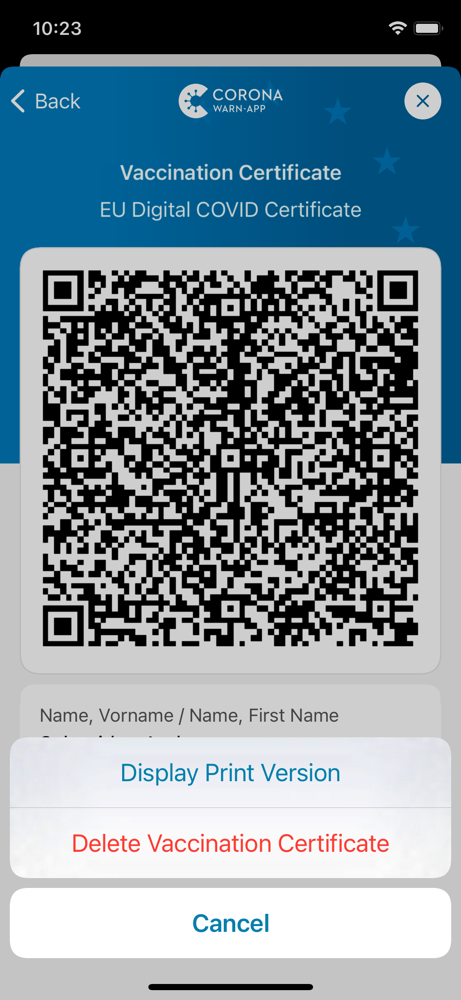

## Project team continues to adapt the Corona-Warn-App to current pandemic events

Deutsche Telekom and SAP’s project team have released version 2.10 of the Corona-Warn-App. With the update, the app is ready to inform users about **any upcoming booster vaccinations**. It also shows users a printable version of their vaccination certificates. This allows them to **save the certificates as a PDF document or print them out**.

The update will be available to users over the next 48 hours.

<!-- overview -->

Currently, there are not yet official regulations about if or for whom a **booster vaccination** will be necessary. However, with the update to version 2.10, the Corona-Warn-App is ready to immediately implement possible rules and inform users who need a booster – another example for the continued efforts of the project team to adapt the Corona-Warn-App to the current pandemic situation. 

As of version 2.10, a **text box** will be displayed under each vaccination certificate. It will always keep users up to date on their **vaccination status**. Should booster vaccinations become necessary, the Corona-Warn-App will inform the affected users in this box and alert them with a push notification that there is news in the app.

  

 
 

  

If something has changed regarding a certificate, a **red dot** now shows the users which part of the certificate is affected.  This visual guide makes it easier for users to find important information quickly, for example when a certificate has expired, or a signature is invalid. 

  

 
 

  

In addition, users can now create a **print version of their certificates**. iOS users can do this by tapping "More" and then "View Print Version" under the relevant certificate, while Android users select the three dots in the top right corner and then tap "View Print Version". 

This gives users the option of saving the certificate as a PDF document, sending it, or printing it out again. If they have lost the original document from the pharmacy or vaccination center, this feature saves them a trip back to the pharmacy to get a new certificate. 

  

 

  

This function is only available for certificates issued in Germany. If users want to print or export a foreign certificate, they will receive a short message in the app that the print version cannot be displayed. 

  

  

  

Version 2.10 - like previous versions - will be delivered in a staged rollout and is made available for users in waves. While users can manually trigger an update in Apple’s App Store, this option is not available in the Google Play Store. There, the delivery of the Corona-Warn-App’s new version can take up to 48 hours.