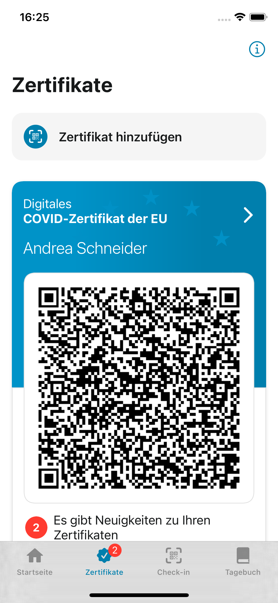
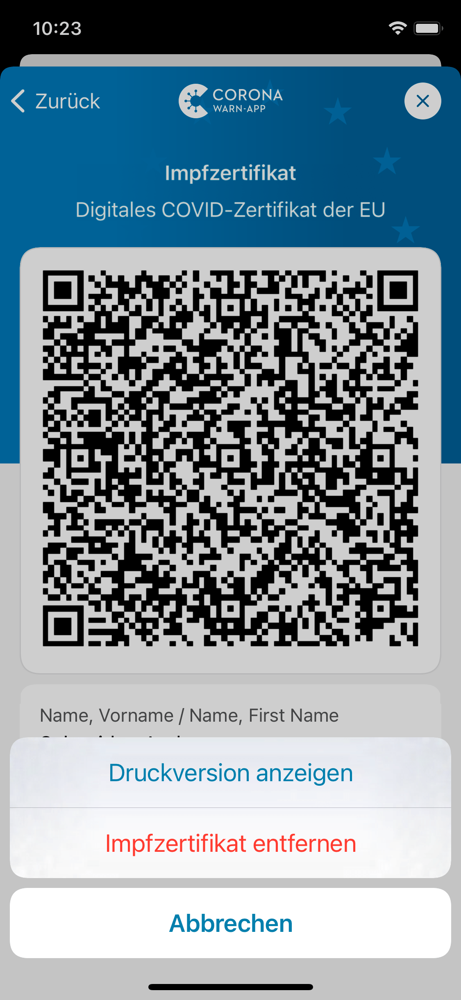
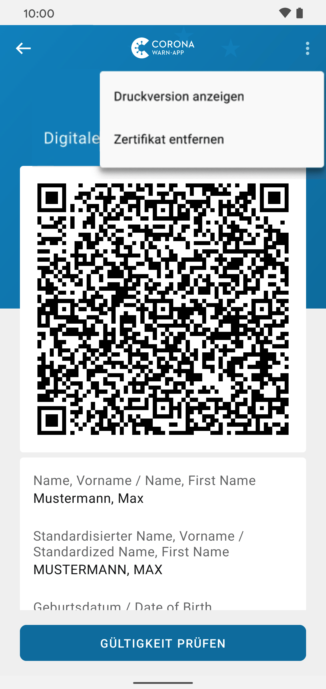
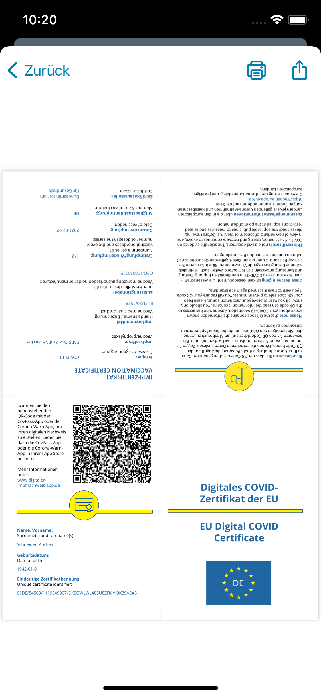

## Projektteam passt die Corona-Warn-App weiterhin an aktuelles Pandemie-Geschehen an

Das Projektteam aus Deutscher Telekom und SAP hat Version 2.10 der Corona-Warn-App veröffentlicht. Mit dem Update ist die App bereit, Nutzer\*innen schnell über eventuell anstehende **Auffrischimpfungen** zu informieren. Außerdem zeigt sie Nutzer\*innen künftig eine Druckversion ihrer Impfzertifikate. Damit können sie die **Zertifikate als PDF-Dokument speichern oder ausdrucken**.

Das Update steht Nutzer*innen über die nächsten 48 Stunden zur Verfügung.

<!-- overview -->

Noch gibt es keine offiziellen Regelungen darüber, ob und für wen eine Auffrischimpfung notwendig wird. Mit dem Update auf Version 2.10 ist die Corona-Warn-App aber schon jetzt dafür vorbereitet, mögliche Regeln sofort umzusetzen und Nutzer\*innen, die eine Auffrischimpfung benötigen, zu informieren. Damit passt das Projektteam die Corona-Warn-App auch weiterhin an das aktuelle **Pandemie-Geschehen** an. 

Künftig hält eine **Textbox** unter jedem Impfzertifikat Nutzer\*innen immer auf dem aktuellen Stand zu ihrem **Impfstatus**. Sollten Auffrischimpfungen notwendig werden, informiert die Corona-Warn-App die betroffenen Nutzer\*innen in dieser Box und weist zusätzlich mit einer Pushnachricht darauf hin, dass es Neuigkeiten in der App gibt.
 

  

 
 

<figcaption aria-hidden="true"><em>Textbox zum Impfstatus - Links: Erinnerung zur Auffrischimpfung. Rechts: Vollständiger Impfschutz.</em></figcaption>

  

Ein **roter Punkt** zeigt Nutzer\*innen außerdem ab sofort an, wo es Neuigkeiten bei ihren Zertifikaten gibt. Diese visuelle Anleitung erleichtert es Nutzer\*innen, wichtige Informationen schnell zu finden, beispielsweise, wenn ein Zertifikat abgelaufen oder eine Signatur ungültig ist. 

  

 
 

<figcaption aria-hidden="true"><em>Visuelle Anleitung durch einen roten Punkt - Links: Zertifikate-Reiter. Rechts: Zertifikatsübersicht.</em></figcaption>

  

Des Weiteren können Nutzer\*innen ab sofort eine **Druckversion** ihrer Zertifikate erstellen. iOS-Nutzer\*innen können unter der Detailansicht des entsprechenden Zertifikats auf „Mehr“ und dann „Druckversion anzeigen“ tippen, Android-Nutzer*innen wählen die drei Punkte in der rechten oberen Ecke aus und tippen dann auf „Druckversion anzeigen“. 

Nutzer\*innen haben damit die Möglichkeit, das Zertifikat als PDF-Dokument zu speichern, zu verschicken oder es erneut auszudrucken. Falls sie das Original aus der Apotheke oder der Impfstelle verloren haben, spart ihnen diese Funktion einen erneuten Gang zur Apotheke. 

  

 

<figcaption aria-hidden="true"><em>Druckversion erstellen - Links: iOS. Mitte: Android, Rechts: Druckbereites EU Zertifikat.</em></figcaption>

  

Diese Funktion ist nur für Zertifikate möglich, die in Deutschland ausgestellt wurden. Falls Nutzer\*innen ein ausländisches Zertifikat drucken oder exportieren möchten, erhalten sie eine kurze Information in der App, dass die Druckversion nicht angezeigt werden kann. 

  

<figcaption aria-hidden="true"><em>Benachrichtigung - Druckversion anzeigen nicht möglich.</em></figcaption>

  

Version 2.10 wird, wie vorherige Versionen auch, schrittweise über 48 Stunden an alle Nutzer\*innen ausgerollt. iOS-Nutzer\*innen können sich die aktuelle App-Version ab sofort aus dem Store von Apple manuell herunterladen. Der Google Play Store bietet keine Möglichkeit, ein manuelles Update anzustoßen. Hier steht Nutzer\*innen die neue Version der Corona-Warn-App innerhalb der nächsten 48 Stunden zur Verfügung.
