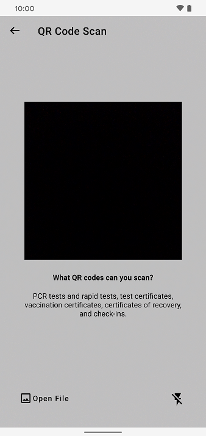

The project team of the Robert Koch Institute, Deutsche Telekom, and SAP have **released Corona-Warn-App version 2.11**, which contains a **universal QR code scanner**. Android users also have the option of importing QR codes from photos or PDF files using the QR code scanner. iOS users will be able to use this feature as of version 2.12.

The update will be available to users within the next 48 hours.

<!-- overview -->

Version 2.11 makes it easier for users to scan QR codes in the Corona-Warn-App.

Previously, users had to use a certain QR code scanner for a specific purpose, for example under "Check-in" (only to scan an event QR code) or under "Certificates" (only to add vaccination, recovery or test certificates). The **universal QR code scanner** now enables users to scan any QR code supported by the Corona-Warn-App anywhere within the app. 

 
  

  

  

<u>**For example:**</u>

Under **“Check-in”** users can select **“Scan QR Code”** to scan a digital vaccination certificate. The Corona-Warn-App recognizes that this is a vaccination certificate and saves it under “Certificates”. Previously, the Corona-Warn-App could not read the QR code in this case. 

The user is still on the “Check-in” tab after scanning but a red dot tells them that there is news under “Certificates”.

### Importing QR Codes from Files

Version 2.11 contains **another new feature for Android users**: They can import QR codes from images or PDF documents so that they don’t necessarily have to scan them using the camera. 

To **import a QR code from an image or document**, users can open any QR code scanner in the Corona-Warn-App (for example, under the “Check-In” tab). As of version 2.11, after tapping “Scan QR Code”, they can select **“Open File”** in the lower left corner and import a QR code from their image or file library. The Corona-Warn-App reads the QR code on the image or file and saves the certificate, test, or event in the corresponding area in the app.

If there are **multiple QR codes on one image**, the Corona-Warn-App only saves the first one that it can process. Users should first cut the QR code that they want to import from the image or document to make sure the right one gets imported. QR codes from a **password-protected document** cannot be imported into the Corona-Warn-App using this function. 

**For iOS users**, this feature will be available with **version 2.12** of the Corona-Warn-App. In the past, mostly Android users sometimes struggled to scan QR codes. The reason for this is the variance of devices, cameras, and software in the Android world. With the new option to import QR codes as pictures or files, this should be solved. With iOS, there are considerably fewer affected users. For iPhones, the project team therefore delivers this function with the next update of the Corona-Warn-App (2.12).

Version 2.11 - like previous versions - will be delivered in a staged rollout and is made available for users in waves. While users can manually trigger an update in Apple’s App Store, this option is not available in the Google Play Store. There, the delivery of the Corona-Warn-App’s new version can take up to 48 hours.
