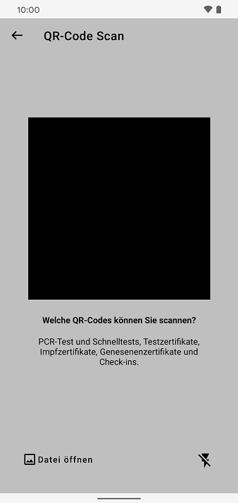
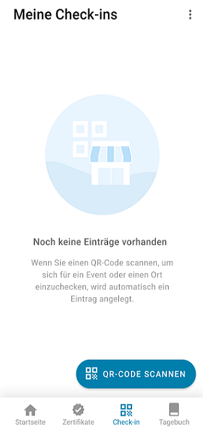
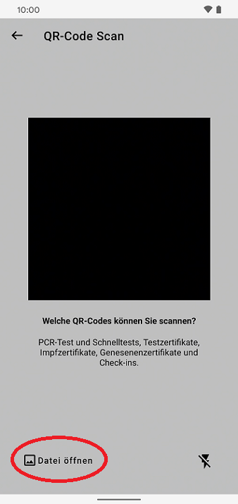

Das Projektteam aus Robert Koch-Institut, Deutscher Telekom und SAP hat **Version 2.11 der Corona-Warn-App veröffentlicht**, die jetzt einen **universellen QR-Code-Scanner** enthält. Android-Nutzer\*innen haben zusätzlich die Möglichkeit, QR-Codes von Fotos oder PDF-Dateien über den QR-Code-Scanner zu importieren. iOS-Nutzer\*innen können diese Funktion ab Version 2.12 nutzen. 

Das Update steht Nutzer\*innen über die nächsten 48 Stunden zur Verfügung.

<!-- overview -->

Version 2.11 erleichtert Nutzer\*innen das Scannen von QR-Codes in der Corona-Warn-App. 

Bisher konnten Nutzer\*innen den jeweiligen QR-Code-Scanner nur für seinen bestimmten Zweck nutzen, beispielsweise unter „Check-in“, um einen QR-Code einer Veranstaltung zu scannen oder unter „Zertifikate“, um Impf-, Genesenen- oder Testzertifikate hinzuzufügen. Der **universelle QR-Code-Scanner** ermöglicht es Nutzer\*innen nun, mit einem QR-Code-Scanner alle von der Corona-Warn-App unterstützten QR-Codes an beliebigen Stellen innerhalb der App zu scannen. 

 
  

  

  

<u>**Ein Beispiel:**</u>

Nutzer\*innen können **unter „Check-in“ „QR-Code scannen“** auswählen und damit ein digitales Impfzertifikat scannen. Die Corona-Warn-App erkennt, dass es sich um ein **Impfzertifikat** handelt und speichert es entsprechend unter „Zertifikate“ ab. Zuvor konnte die Corona-Warn-App den QR-Code in diesem Fall nicht lesen. 

Nach dem Scannen befindet sich der oder die Nutzer\*in nach wie vor im Reiter „Check-in“. Ein roter Punkt weist darauf hin, dass es unter „Zertifikate“ Neuigkeiten gibt. 

### Importieren von QR-Codes aus Dateien

Für Android-Nutzer\*innen gibt es eine weitere neue Funktion. Ab Version 2.11 können sie **QR-Codes aus Bildern oder PDF-Dokumenten importieren** und müssen sie nicht mehr unbedingt mit der Kamera scannen. 

Dafür können Nutzer\*innen einen QR-Code-Scanner in der Corona-Warn-App öffnen (beispielsweise unter dem Reiter „Check-in“). Nachdem sie auf „QR-Code scannen“ getippt haben, können sie ab Version 2.11 unten links **„Datei öffnen“** auswählen und darüber einen QR-Code aus ihrer Bild- oder Dateibibliothek importieren. Die Corona-Warn-App liest den QR-Code auf dem Bild oder der Datei aus und speichert das Zertifikat, den Test oder die Veranstaltung abhängig von der Art des QR-Codes im entsprechenden Bereich der Corona-Warn-App ab. 

  

    

  

Sind **mehrere QR-Codes auf einem Bild**, speichert die Corona-Warn-App nur den ersten, den sie verarbeiten kann. Gegebenenfalls sollten Nutzer\*innen in diesem Fall den QR-Code, den sie importieren wollen, vorher aus dem Bild oder dem Dokument ausschneiden. QR-Codes aus einem **passwortgeschützten Dokument** können über diese Funktion nicht in die Corona-Warn-App importiert werden. 

Für **iOS-Nutzer\*innen** steht diese Funktion mit **Version 2.12** der Corona-Warn-App zur Verfügung. In der Vergangenheit hatten vorwiegend Android-Nutzer\*innen teilweise Schwierigkeiten, QR-Codes zu scannen. Grund dafür ist die Vielfalt der Geräte, der Kameras und der Software in der Android-Welt. Dafür hat das Projektteam mit dem Import für QR-Codes als Bilder oder Dateien eine Lösung gefunden. Bei iOS sind deutlich weniger Nutzer\*innen betroffen. Für iPhones liefert das Projektteam diese Funktion deshalb mit dem nächsten Update der Corona-Warn-App (2.12). 

Version 2.11 wird, wie vorherige Versionen auch, schrittweise über 48 Stunden an alle Nutzer\*innen ausgerollt. iOS-Nutzer\*innen können sich die aktuelle App-Version ab sofort aus dem Store von Apple manuell herunterladen. Der Google Play Store bietet keine Möglichkeit, ein manuelles Update anzustoßen. Hier steht Nutzer*innen die neue Version der Corona-Warn-App innerhalb der nächsten 48 Stunden zur Verfügung.
