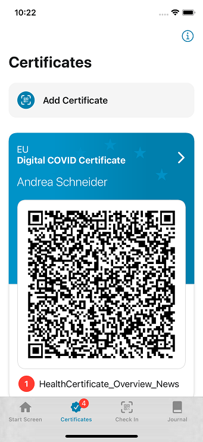

## A guide to the app's main functions

Attending an **open-air concert**, going to a **restaurant, beer garden or theatre** – vaccinated, recovered and tested people can do all these things again. It was the spring and **summer months** that made it possible. The months in which the 7-day incidence was reasonable and events took place outside. 

But **what about the fall** when life shifts from outdoors to indoors again? The Corona-Warn-App can help ensure that we can continue to eat a pizza at our favorite Italian restaurant, go shopping or visit an exhibition - even indoors. 

<!-- overview -->

For that purpose, the project team of Deutsche Telekom, SAP and Robert Koch-Institut are constantly adapting the Corona-Warn-App to the current pandemic situation. We give you **quick instructions on the app’s most important (new) functions** and how they work: 

### Event registration (check-in function)

With the beginning of autumn events will take place indoors again. There, the **risk of infection is higher** than outside. This makes it all the more important to quickly break infection chains. 

With the event registration, event organizers, retailers or private individuals can **create a QR code via the Corona-Warn-App** that all guests can scan to check in for the event. Visitors who later test positive can share their check-ins along with the diagnostic keys via the app to warn others. 

To minimize gaps in the interruption of infection chains, event organizers can also **warn guests in place of a person** who later tested positive and had NOT checked in via the Corona-Warn-App. If the health department sees that this was the case at an event when tracking infection chains, they can contact the event organizer. If he or she had created a QR code for check-in via the Corona-Warn-App, the **health department can issue a TAN**. This allows the organizer to warn everyone who was checked in for the event. However, the health department must be connected to the app. They can register via e-mail: [Onboarding_CWA_Health_Authorities@t-systems.com](mailto:Onboarding_CWA_Health_Authorities@t-systems.com)

**How to create a QR code for your event**

On your app’s home screen select **"Planning an event?"**, then tap “Create QR Code.”  

You can then enter **information about your event**: After selecting the category (e.g. retail or private party), you can specify a description of the event, the location and start and end dates. The Corona-Warn-App uses this information to create a QR code that you can print out and post on site. 

  

{{/assets/video/create-qr-code-en}}

  

**How to check in to and out of events:**

Select the **"Check-in" tab** at the bottom of your Corona-Warn-App. There you find an overview of existing events and can check in to or out of events. To check in, tap **"Scan QR code"**. You can then scan the QR code that the event organizer has posted and select "Check in". When you leave the event, you can check out again in this section of the app by tapping "Check out now" under the event.

  

{{/assets/video/check-in-en}}

  

**How to warn your guests in place of another person:**

The health department can give you a TAN if it – while tracking infection chains – finds that a person who tested positive for COVID-19 was at your event and had NOT checked in via the Corona-Warn-App.

To warn your visitors or guests you can go to the overview of your events under **"Planning an event?"** on your app’s home screen. There you select the **three dots in the upper right corner** and tap **"Warn for Others"**. You can then select the appropriate event and enter the date and duration as specified by the health department. After that, you can enter the TAN you received from the health department and warn your guests.

  

   

  

  

   

  

If your **event is no longer in the overview**, you can scan your own QR code again. After you have selected "Warn for Others" via the three dots in the upper right corner, don’t select the event, but "Scan QR code".

### Vaccination certificates and certificates of recovery

Do I have the yellow vaccination booklet with me? What if I forget it at home? What if I lose it? In the long run, it is **inconvenient to prove vaccination with the yellow booklet**. In the Corona-Warn-App, users can integrate their digital COVID vaccination and recovery certificates. This way, the certificates can be quickly retrieved and easily verified by authorities, event organizers or restaurant owners with a scan in combination with the ID card. 

**How to add your certificate:**

You can manage your certificates under the **"Certificates" tab** in your Corona-Warn-App. To add a vaccination or recovery certificate, go to "Add Certificate". After that, you don't have to do anything but scan the QR code you received from your doctor, vaccination center or pharmacy. You will then always find your certificate under the "Certificates" tab.

  

   

  

**How to add a booster vaccination:**

If you have received a booster vaccination, you can transfer the certificate into the Corona-Warn-App just **as described above** for vaccination and recovery certificates. 

There are not yet official regulations about if or for whom a booster vaccination will be necessary. However, since version 2.10, the Corona-Warn-App is ready to immediately implement possible rules and **inform users who are recommended to get a booster vaccination**. This way, those affected know immediately and can quickly take care of an appointment.

### Sharing test results and breaking infection chains

Of course, the **app’s core function** remains central in the fight against the spread of the pandemic: **breaking chains of infection** quickly. Only those who actually share their positive test result can warn fellow users and possibly prevent more people from being infected. 

**How to share your positive PCR test result: :**

If you have received a positive test result, you can select **"Manage Your Tests"** on your app’s home screen to get to your test management center. Now there are **two ways to share your result**, depending on whether the test center is connected to the Corona-Warn-App. If you are not sure, just ask the staff on site.

  

  

  

**Option 1: Test site is connected to the Corona-Warn-App**

In order for the test site to transfer your test result to the Corona-Warn-App and for you to share it, you should **agree on the test form to transfer your result to the app**. Then you can scan the QR code on the test form by going to your **test management center** on the app's home screen ("Manage Your Tests") and select "Scan QR code". After that you can share your test result by selecting **"Warn others"**.
 
  

  

  

**Option 2: Test site is not connected to the Corona-Warn-App**

If your test site is not connected to the Corona-Warn-App, you can call still share your positive test result via the Corona-Warn-App. Simply **call the hotline** (within Germany: 0800 754 000 2, from abroad: +49 30 498 75402) to ask for a TAN. 

To share your result, tap **"Enter TAN for PCR test" in your test management center**, enter the TAN you’ve received from the hotline and select "Warn others".

  

   

  

After you’ve warned your fellow users you can give more information about your symptoms by tapping "Continue with symptom collection". This step is important to **improve the accuracy of the warning**. 
 

  

  

  

**How to share your positive rapid test result:**

To share a positive rapid test result, tap **"Manage Your Tests"** and then **"Scan QR code"** to register the test in the app. You will receive the QR code either during the appointment booking process or after you have taken the test (depending on the test provider). 

Once the test result is there, you can see it on your app’s home screen. If the test is positive, you can **select the test result and then tap “Warn Others”**. 

  

  

  

  

   

  
