## Kurze Anleitungen für die wichtigsten Funktionen

Ein **Open-Air-Konzert** besuchen, ins **Restaurant**, den **Biergarten oder Theater** gehen – all das geht bisher wieder für geimpfte, genesene und teils auch für getestete Personen. Es waren die Frühlings- und Sommermonate, die es möglich machten. Die Monate, in denen sich die 7-Tage-Inzidenz im Rahmen hielt und viele Veranstaltungen draußen stattfinden konnten. 

Doch **wie sieht es damit im Herbst aus**, wenn sich das Leben zwangsläufig wieder nach drinnen verlagert? Die Corona-Warn-App kann mit ihren Funktionen einen Beitrag leisten, sodass wir auch weiterhin eine Pizza bei unserem Lieblingsitaliener essen, shoppen gehen oder eine Ausstellung besuchen können - selbst in geschlossenen Räumen. 

<!-- overview -->

Dafür passt das Projektteam aus Deutscher Telekom, SAP und Robert Koch-Institut die Corona-Warn-App ständig an das aktuelle Pandemie-Geschehen an. Welche (neuen) **Funktionen gerade jetzt wichtig sind** und wie sie funktionieren, stellen wir Ihnen hier noch einmal zusammengefasst vor.

### **Eventregistrierung (Check-in-Funktion)**

Mit Beginn des Herbstes finden viele Veranstaltungen wieder in geschlossenen Räumen statt, wo das Infektionsrisiko durch die Aerosole höher ist als draußen. Umso wichtiger ist es, Infektionsketten schnell zu durchbrechen.  

Mit der Eventregistrierung können **Veranstalter\*innen, Einzelhändler\*innen und Privatpersonen** über die Corona-Warn-App einen **QR-Code erstellen**, sodass sich alle Gäste für die Veranstaltung einchecken können. Besucher\*innen, die später positiv getestet werden, können ihre Check-Ins gemeinsam mit den Diagnoseschlüsseln über die App teilen, um die anderen Gäste zu warnen. 

  

 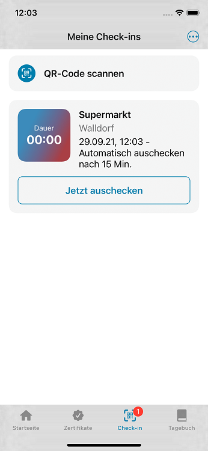

  

Damit keine Lücke im Unterbrechen der Infektionsketten entsteht, ermöglicht die sogenannte **“Stellvertreter-Funktion”** Organisator\*innen und Gesundheitsämtern, Gäste in Vertretung für eine später positiv getestete Person zu warnen, die sich NICHT über die Corona-Warn-App eingecheckt hatte. 

Stellt das **Gesundheitsamt** bei der Nachverfolgung von Infektionsketten fest, dass das bei einer Veranstaltung der Fall war, kann es den oder die Veranstalter\*in kontaktieren. Hatte diese(r) einen QR-Code zum Check-in über die Corona-Warn-App erstellt, kann das Gesundheitsamt eine **TAN ausgeben**. Damit kann der/die Veranstalter\*in eine Warnung aussprechen, die alle, die für das Event eingecheckt waren, erhalten. Hierfür müssen sich Gesundheitsämter vorab per E-Mail registrieren: [Onboarding_CWA_Health_Authorities@t-systems.com](mailto:Onboarding_CWA_Health_Authorities@t-systems.com)

**So erstellen Sie einen QR-Code für Ihre Veranstaltung:**

Wählen Sie auf dem Startbildschirm Ihrer Corona-Warn-App **„Sie planen eine Veranstaltung?“** aus und tippen Sie anschließend auf "QR-Code erstellen".  

Danach können Sie **Informationen zu Ihrer Veranstaltung** angeben: Nach der Auswahl der Kategorie (z.&nbsp;B. Einzelhandel oder private Feier), können Sie eine Beschreibung der Veranstaltung, den Ort und Start- und Enddatum festlegen. Die Corona-Warn-App erstellt anhand dieser Informationen einen QR-Code, der sich auf dem Smartphone darstellen lässt oder den Sie ausdrucken und vor Ort aufhängen können. 

In der Video-Anleitung können Sie alle Schritte sehen:
  

{{/assets/video/01qrcode-erstellen}}

  

**So checken Sie sich zu Veranstaltungen ein und aus:**

Wählen Sie den **Reiter „Check-in“** unten in der Registerkarte Ihrer Corona-Warn-App aus. Dort finden Sie eine Übersicht über bereits vorhandene Einträge und können sich für Veranstaltungen ein- beziehungsweise auschecken. Um einzuchecken, tippen Sie auf **„QR-Code scannen“**. Anschließend können Sie den QR-Code, den der oder die Veranstalter\*in ausgehängt hat, scannen und „Einchecken“ auswählen. Wenn Sie die Veranstaltung wieder verlassen, können Sie sich in diesem Bereich der App wieder auschecken, indem Sie unter dem Event auf **„Jetzt auschecken“** tippen.

In der Video-Anleitung können Sie alle Schritte sehen: 

  

{{/assets/video/02qrcode-scannen}}

  

**So können Sie Ihre Gäste in Vertretung warnen:**

Sollte das Gesundheitsamt bei der Nachverfolgung von Infektionsketten feststellen, dass eine positiv getestete Person auf Ihrer Veranstaltung war, die sich NICHT über die Corona-Warn-App eingecheckt hatte, kann es Sie kontaktieren und eine TAN ausstellen. 

Damit Sie damit alle Besucher\*innen warnen können, gehen Sie unter **„Sie planen eine Veranstaltung“** auf der Startseite Ihrer App zur Übersicht Ihrer Events. Dort wählen Sie die **drei Punkte in der rechten oberen Ecke** aus und tippen auf **„In Vertretung warnen“**. Anschließend können Sie die entsprechende Veranstaltung auswählen und Datum und Dauer entsprechend der Vorgaben des Gesundheitsamtes angeben. Danach können Sie die TAN eingeben, die Sie vom Gesundheitsamt erhalten haben und die Besucher\*innen warnen.

  

 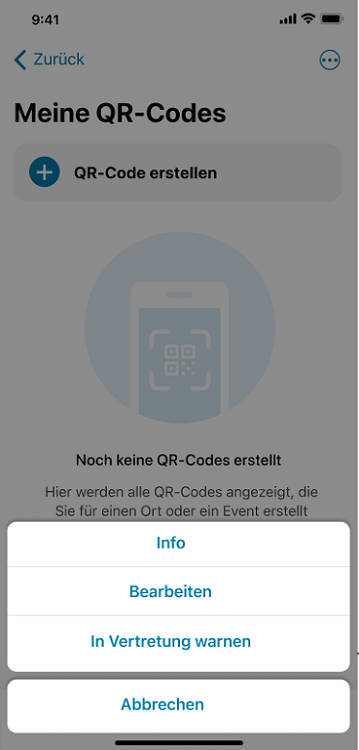 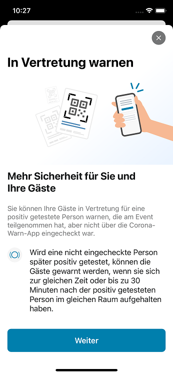

  

  

 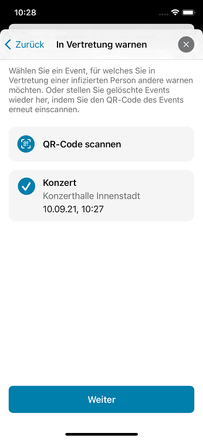 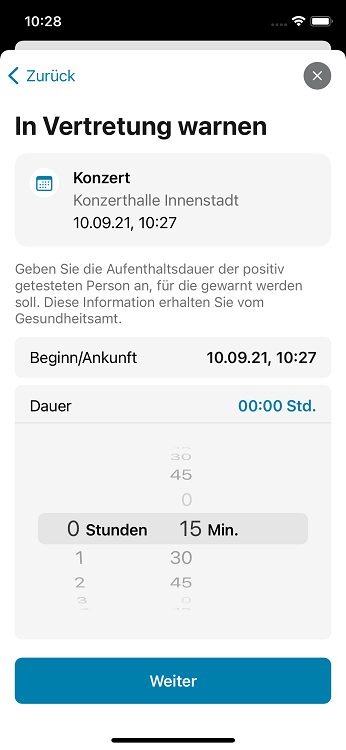

  

Sollte das entsprechende **Event nicht mehr in der Übersicht** stehen, können Sie Ihren eigenen QR-Code noch einmal scannen. Nachdem Sie über die drei Punkte in der oberen rechten Ecke „In Vertretung warnen“ ausgewählt haben, wählen Sie dann nicht das Event aus, sondern „QR-Code scannen“.

### **Digitale Impf- und Genesenenzertifikate**

Habe ich das gelbe Impfheft dabei? Was, wenn ich es Zuhause vergessen habe? Was, wenn ich es gar verlegt oder verloren habe? Auf Dauer ist es umständlich, die Impfung mit dem gelben Heft nachzuweisen. In der Corona-Warn-App können Nutzer\*innen ihre **digitalen COVID-Impf- und Genesenenzertifikate** integrieren. 

So können sie schnell abgerufen und von Behörden, Veranstalter\*innen oder Restaurantbesitzer\*innen ganz einfach mit einem Scan in Verbindung mit dem Vorzeigen des Personalausweises überprüft werden. 

**So fügen Sie Ihr Zertifikat hinzu:**

Unter dem **Reiter „Zertifikate“** in der Registerkarte Ihrer Corona-Warn-App können Sie Ihre Zertifikate verwalten. Um ein Impf- oder Genesenenzertifikat hinzuzufügen, gehen Sie auf **„Zertifikat hinzufügen“**. Anschließend müssen Sie nichts weiter tun, als den QR-Code zu scannen, den Sie bei Ihrem Arzt/Ihrer Ärztin, bei der Impfstelle oder der Apotheke erhalten haben. Sie finden Ihr Zertifikat dann immer unter dem Reiter „Zertifikate“. 

  

 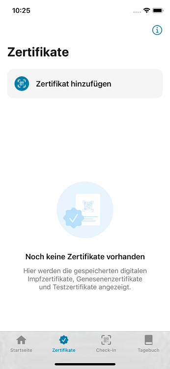 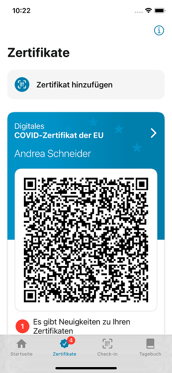

  

**So fügen Sie eine Auffrischimpfung hinzu:**

Wenn Sie eine Auffrischimpfung erhalten haben, können Sie das Zertifikat ebenso in die Corona-Warn-App übertragen, wie es bei Impf- und Genesenenzertifikaten funktioniert. 

Noch gibt es keine offiziellen Regelungen darüber, ob und für wen eine Auffrischimpfung notwendig wird. Die Corona-Warn-App ist aber seit Version 2.10 darauf vorbereitet, mögliche Regeln sofort umzusetzen und Nutzer\*innen, denen eine Auffrischimpfung empfohlen wird, zu informieren. So wissen Betroffene sofort Bescheid und können sich schnell um einen Termin kümmern.

### Testergebnis teilen und Infektionsketten unterbrechen

Nach wie vor bleibt aber natürlich die **Kernfunktion der Corona-Warn-App** zentral im Kampf gegen die Ausbreitung des Coronavirus: das **Unterbrechen von Infektionsketten**. Nur wer ein positives Testergebnis auch tatsächlich teilt, kann Mitmenschen warnen und möglicherweise verhindern, dass weitere Menschen angesteckt werden.  

**So teilen Sie Ihr positives PCR-Testergebnis:**

Wenn Sie ein positives PCR-Testergebnis erhalten haben, können Sie auf der Startseite Ihrer Corona-Warn-App **„Sie lassen sich testen?“** auswählen. Darüber gelangen Sie in Ihre Testverwaltung. Nun gibt es zwei Möglichkeiten, Ihr Ergebnis zu teilen, je nachdem, ob die Teststelle an die Corona-Warn-App angeschlossen ist. Sollten Sie sich nicht sicher sein, fragen Sie einfach vor Ort nach.

  

 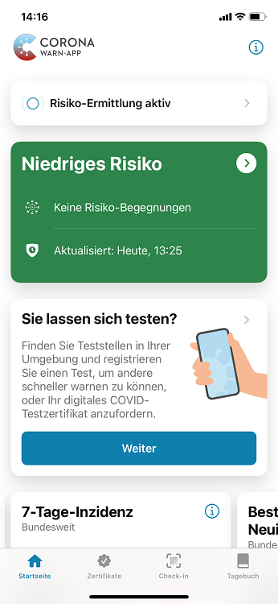

  

**Möglichkeit 1: Teststelle ist an die Corona-Warn-App angeschlossen**

Damit die Teststelle Ihr Testergebnis an die Corona-Warn-App übertragen kann und Sie es teilen können, sollten Sie auf dem Testformular der Teststelle zustimmen, dass ihr Ergebnis in der App übermittelt wird. Anschließend können Sie den QR-Code auf dem Testformular scannen. Dafür rufen Sie in der App **Ihre Testverwaltung  („Sie lassen sich testen?“)** auf und wählen „QR-Code scannen“ aus. 

  

 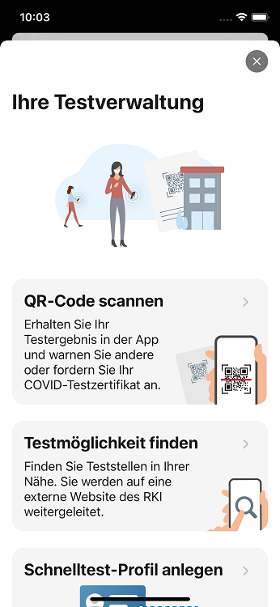

  

Danach können Sie Ihr Testergebnis teilen, indem Sie **„Andere warnen“** antippen. 

**Möglichkeit 2: Teststelle ist nicht an die Corona-Warn-App angeschlossen**

Sollte Ihre Teststelle nicht an die Corona-Warn-App angeschlossen sein, können Sie Ihr positives Testergebnis trotzdem über die Corona-Warn-App teilen. Rufen Sie die Hotline der App an (innerhalb Deutschlands: 0800 754 000 2, aus dem Ausland: +49 30 498 75402), um eine TAN zu erhalten. 

  

 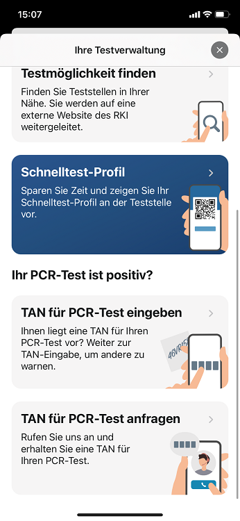  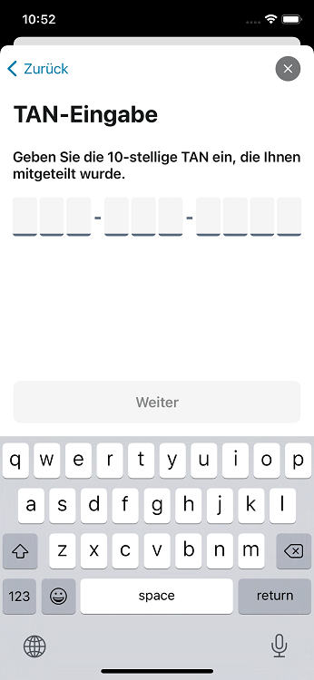

  

Tippen Sie anschließend in Ihrer **Testverwaltung auf „TAN für PCR-Test eingeben“**. Nach Eingabe der TAN können Sie Ihr Testergebnis teilen, indem Sie „Andere warnen“ auswählen.  

Nach der Warnung haben Sie die Möglichkeit nähere Informationen zu Ihren Symptomen zu geben, indem Sie **„Weiter mit Symptom-Erfassung“** auswählen. Dieser Schritt ist wichtig, um die Genauigkeit der Warnung zu verbessern.

  

 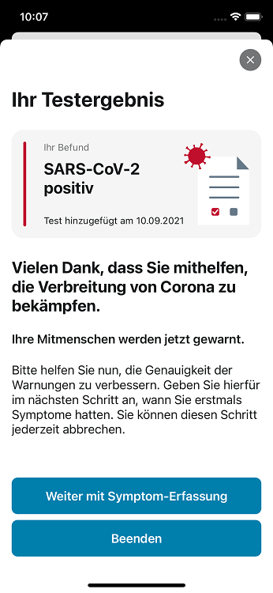

  

**So teilen Sie Ihr positives Schnelltest-Ergebnis:**

Um ein positives Schnelltest-Ergebnis teilen zu können, müssen Sie den Test zunächst in der App registrieren. Tippen Sie dafür auf **„Sie lassen sich testen?“** und anschließend auf **„QR-Code scannen“**. Den QR-Code erhalten Sie entweder während der Terminbuchung oder nachdem Sie den Test durchgeführt haben (je nach Testanbieter). 

  

 

  

Sobald Ihr Testergebnis da ist, können Sie es auf der Startseite Ihrer Corona-Warn-App sehen. Im Falle eines positiven Testergebnisses können Sie das Ergebnis teilen, indem Sie es auswählen und anschließend auf **„Andere warnen“** tippen. 

  

 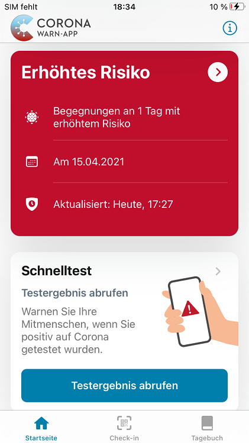  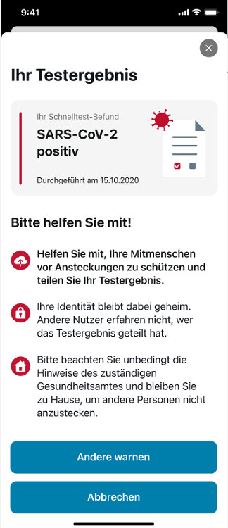

  
