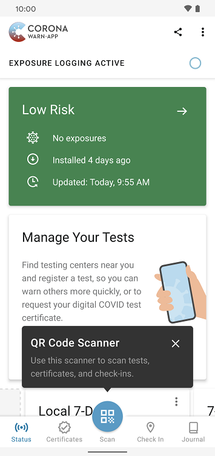
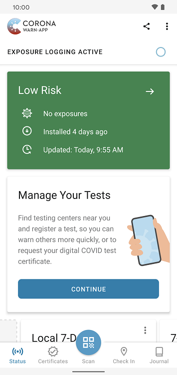
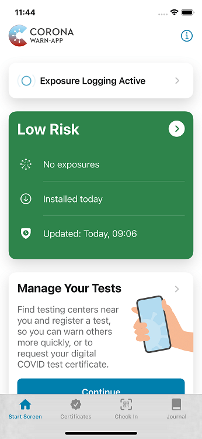
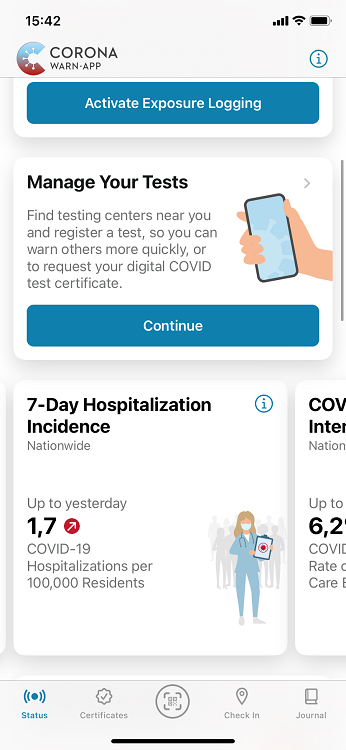
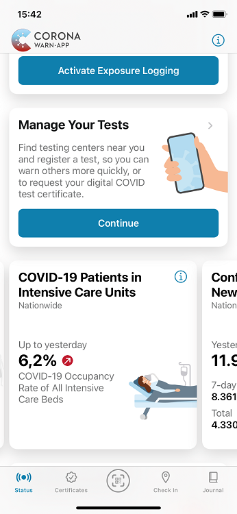

The project team of the Robert Koch Institute, Deutsche Telekom and SAP have released version 2.12 of the Corona-Warn-App. Users now have **direct access to the universal QR code scanner**. In addition, the **7-day hospitalization incidence** and the **number of COVID-19 patients in intensive care units** are now available in the statistics. 

The update will be available to users over the next 48 hours.

<!-- overview -->

With version 2.12, the project team has integrated the **universal QR code scanner into the app’s tab bar** so that there’s one central location for scanning QR codes in the app. 

Users can also still use the QR code scanner at the known locations in the Corona-Warn-App.

  

  

  

With the universal QR code scanner, users have been able to scan all QR codes supported by the Corona-Warn-App since version 2.11, regardless of whether they are tests, certificates, or check-ins. 

In this context, the project team has also adapted the **icons on the tab bar**. The universal QR code scanner is now located in the center, and users can get to the app’s home screen via "Status."

  

 

  

 Current tab bar 

  

 

  

 Old tab bar 

  

In addition, the project team has expanded the **statistics area** so that users can continue to catch up on all key figures related to the pandemic in the app. The statistics area now includes the 7-day hospitalization incidence and the number of COVID-19 patients in intensive care units.

  

   

  

The **7-day hospitalization incidence** refers to the number of people being hospitalized because of a COVID-19 diagnosis. It maps reported cases over one week per 100,000 residents. The **number of COVID-19 patients in intensive care units** indicates the share of COVID-19 patients accommodated in ICU beds in Germany.

Furthermore, the project team has **standardized the message settings**. As with other apps, users can now define settings for notifications from the Corona-Warn-App in the device settings of their smartphone. There, they can not only turn notifications on or off, but also define notification types.

Another new feature is available for **iOS users**: They can now import QR codes from images or PDF documents. After opening the QR code scanner, they can select "Open file" at the bottom left and import a QR code from their image or file library. For Android users, [this function](/en/blog/2021-10-06-cwa-version-2-11/) has already been available since version 2.11.

Version 2.12 - like previous versions - will be delivered in a staged rollout and is made available for users in waves. While users can manually trigger an update in Apple’s App Store, this option is not available in the Google Play Store. There, the delivery of the Corona-Warn-App’s new version can take up to 48 hours.
