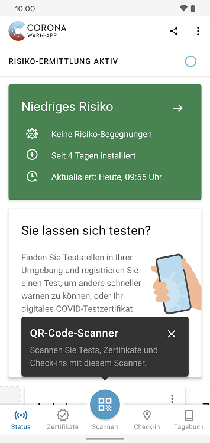
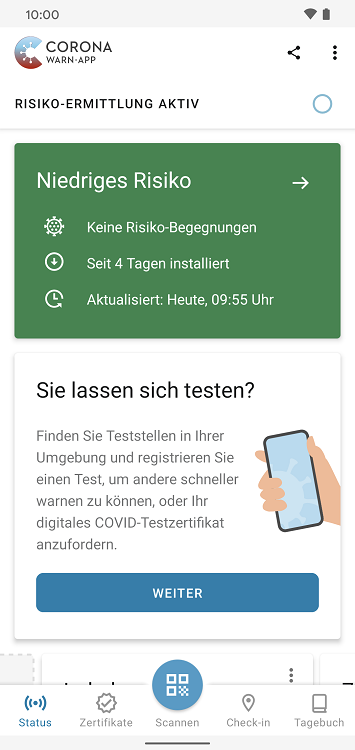
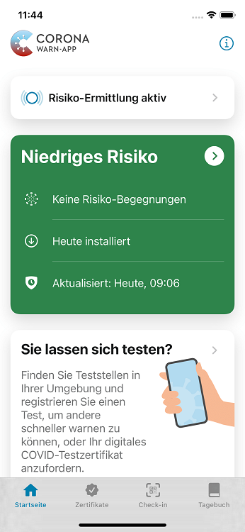
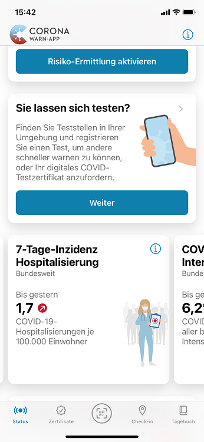
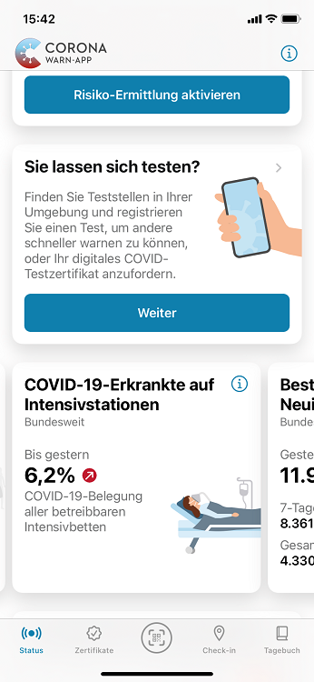

Das Projektteam aus Robert Koch-Institut, Deutscher Telekom und SAP hat Version 2.12 der Corona-Warn-App veröffentlicht. Mit dem Update haben Nutzer\*innen **direkten Zugriff auf den universellen QR-Code-Scanner**. Außerdem sind nun die **7-Tage-Inzidenz der Hospitalisierung** und die Zahl der **COVID-19-Erkrankten auf Intensivstationen** in den Statistiken verfügbar. 

Das Update steht Nutzer\*innen über die nächsten 48 Stunden zur Verfügung.

<!-- overview -->

Mit Version 2.12 hat das Projektteam den **universellen QR-Code Scanner in die Registerkarte** der Corona-Warn-App integriert. Damit gibt es nun eine zentrale Stelle zum Scannen von QR-Codes in der App. An den bekannten Orten in der Corona-Warn-App bleibt der QR-Code-Scanner ebenfalls erhalten. 

  

  

  

Mit dem universellen QR-Code-Scanner können Nutzer\*innen seit Version 2.11 alle von der Corona-Warn-App unterstützten QR-Codes scannen, unabhängig davon, ob es sich um Tests, Zertifikate oder Check-ins handelt. 

In diesem Zuge hat das Projektteam auch die **Symbole auf der Registerkarte** angepasst. In der Mitte befindet sich nun der universelle QR-Code-Scanner, zum Startbildschirm gelangen Nutzer\*innen nun über „Status“. 

  

 

  

 Aktuelle Registerkarte 

  

 

  

 Alte Registerkarte 

  

Damit Nutzer\*innen sich in der App auch weiterhin über **alle wichtigen Kennzahlen des Pandemiegeschehens** informieren können, hat das Projektteam den Statistikbereich erweitert. Nutzer\*innen finden dort nun zusätzlich die 7-Tage-Inzidenz der Hospitalisierung und die Zahl der COVID-19-Erkrankten auf Intensivstationen.

  

   

  

Die **7-Tage-Inzidenz der Hospitalisierung** bezieht sich auf die Zahl der Menschen, die wegen einer COVID-19-Diagnose in eine Klinik kommen. Sie bildet die übermittelten Fälle über eine Woche pro 100.000 Einwohner\*innen ab. Die Zahl der **COVID-19-Erkrankten auf Intensivstationen** zeigt an, welchen Anteil COVID-Patient\*innen bei der Belegung der Intensivbetten in Deutschland ausmachen.

Des Weiteren hat das Projektteam die **Mitteilungseinstellungen vereinheitlicht**. Wie bei anderen Apps auch, können Nutzer*innen Einstellungen zu Benachrichtigungen der Corona-Warn-App nun in den Geräteeinstellungen ihres Smartphones definieren. Dort können sie Benachrichtigungen nicht nur ein- oder ausschalten, sondern auch Benachrichtigungstypen festlegen.

Zuvor konnten Nutzer\*innen die Benachrichtigungen in der Corona-Warn-App entweder zulassen oder nicht erlauben.

Eine weitere Neuerung gibt es jetzt auch für **iOS-Nutzer\*innen**: Sie können nun ebenfalls **QR-Codes aus Bildern oder PDF-Dokumenten importieren**. Nachdem sie den QR-Code-Scanner geöffnet haben, können sie unten links „Datei öffnen“ auswählen und darüber einen QR-Code aus ihrer Bild- oder Dateibibliothek importieren. Für Android-Nutzer\*innen steht [diese Funktion](/de/blog/2021-10-06-cwa-version-2-11/) bereits seit Version 2.11 zur Verfügung.

Version 2.12 wird, wie vorherige Versionen auch, schrittweise über 48 Stunden an alle Nutzer\*innen ausgerollt. iOS-Nutzer\*innen können sich die aktuelle App-Version ab sofort aus dem Store von Apple manuell herunterladen. Der Google Play Store bietet keine Möglichkeit, ein manuelles Update anzustoßen. Hier steht Nutzer\*innen die neue Version der Corona-Warn-App innerhalb der nächsten 48 Stunden zur Verfügung.
