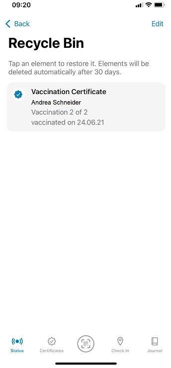
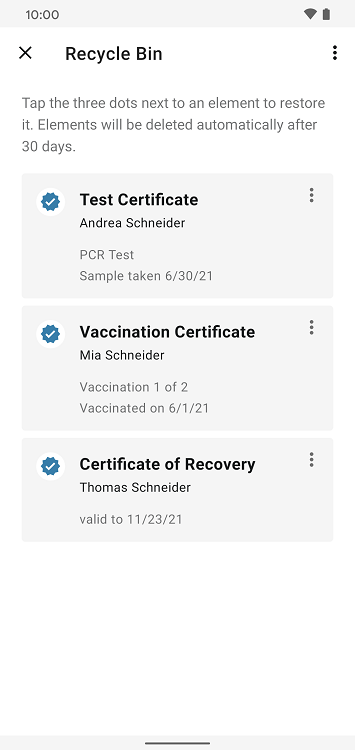
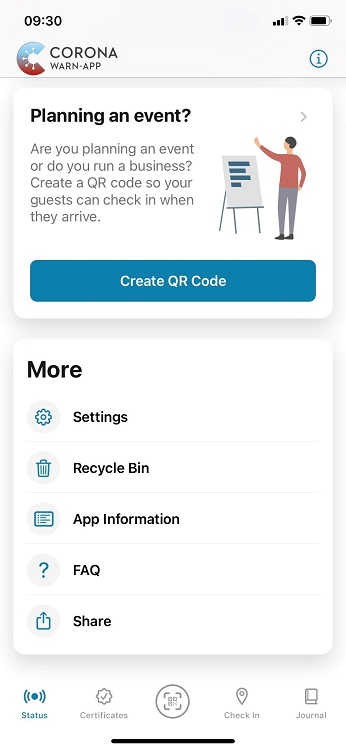
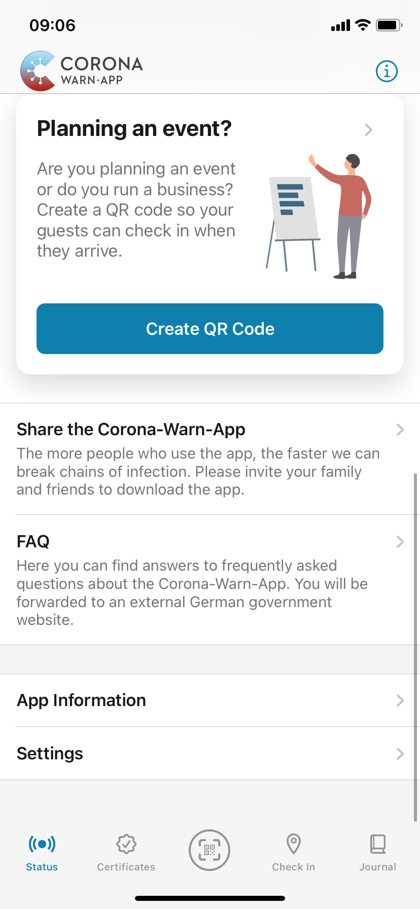
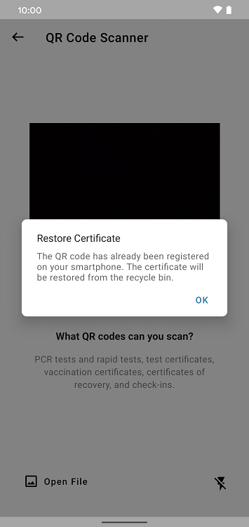
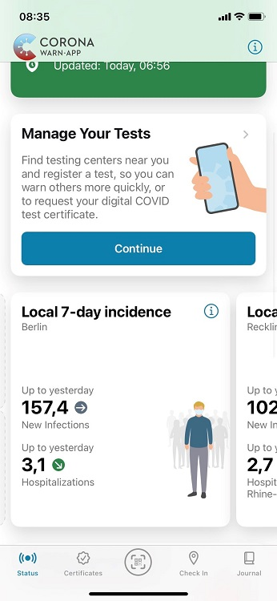

The project team of the Robert Koch Institute, Deutsche Telekom, and SAP have **released version 2.13 of the Corona-Warn-App**. With the update, they have added a **recycle bin functionality for certificates**. In addition, the 7-day hospitalization incidence is available at the local level and the project team improved the assignment of certificates to people.

The update is available to users over the next 48 hours.

<!-- overview -->

With version 2.13, the project team has introduced a recycle bin function  for vaccination, test and recovery certificates. Certificates that have been deleted will be moved to the recycle bin first. This feature **enables users to restore certificates** in case they’ve accidentally deleted them. To restore a certificate, they can select it in the recycle bin and tap "Restore". The certificate is then moved to its original location. 

After **30 days**, the certificates are automatically and permanently deleted from the recycle bin. However, users can also delete them permanently there manually. 

  

 
 
 
<figcaption aria-hidden="true"><em>Left: iOS recycle bin. Right: Android recycle bin</em></figcaption>

  

**Android users** can access their recycle bin by selecting the **three dots** in the top right corner of their app and then tap "Recycle Bin."  

**iOS users** can swipe down on the home screen of their Corona-Warn-App and select **"Recycle Bin" under "More"**. The project team has redesigned this area. iOS users can now find the app settings, frequently asked questions (FAQ), further information and the option to recommend the app under "More".

  

 
 

<figcaption aria-hidden="true"><em>Left: Newly arranged area as of version 2.13. Right: old arrangement</em></figcaption>

  

Users can also re-scan a certificate that they have deleted. In this case, the app recognizes that the certificate is still saved in the recycle bin and notifies users that it will restore it.  

  

 
 

  

Furthermore, users can now see the **7-day hospitalization incidence on a state level**. If users have selected a county or district on the local level, the app automatically shows the hospitalization of the respective state. 

As of version 2.13, there is also a combined tile for the 7-day incidence values: At both the local and state level, new infections and hospitalizations per 100,000 residents are now displayed on one tile. 

  

 
 

  

In addition, the project team has **improved the algorithm when assigning certificates to people**. The Corona-Warn-App now assigns certificates with spelling errors in the name to the same person. 

Previously, errors such as a different number of spaces between a person's first and last name caused the Corona-Warn-App to assign these certificates to two different people. This changes with version 2.13. 
For this reason, a certificate may no longer be displayed in the overview under the "Certificates" tab. However, the certificate has not disappeared, but is then displayed in the certificates section under the name of the corresponding person. Users can access it by tapping on their name under "Certificates".

Version 2.13 - like previous versions - will be delivered in a staged rollout and is made available for users in waves. While users can manually trigger an update in Apple’s App Store, this option is not available in the Google Play Store. There, the delivery of the Corona-Warn-App’s new version can take up to 48 hours.

