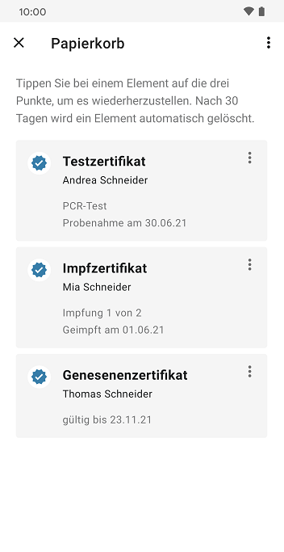

Das Projektteam aus Robert Koch-Institut, Deutscher Telekom und SAP hat **Version 2.13 der Corona-Warn-App veröffentlicht**. Mit dem Update hat das Projektteam eine **Papierkorb-Funktion** für Zertifikate eingefügt. Außerdem steht Nutzer\*innen die **7-Tage-Inzidenz der Hospitalisierung ab sofort auch auf lokaler Ebene** zur Verfügung und die Zuordnung von Zertifikaten zu Personen ist nun fehlertoleranter. 

Das Update steht Nutzer\*innen über die nächsten 48 Stunden zur Verfügung.

<!-- overview -->

Mit Version 2.13 hat das Projektteam eine Papierkorb-Funktion für Zertifikate eingeführt. Impf- Genesenen- und Testzertifikate, die Nutzer\*innen gelöscht haben, werden damit vorerst in den Papierkorb verschoben. Nutzer\*innen haben so die Möglichkeit, **Zertifikate aus dem Papierkorb wieder herzustellen**, sollten sie diese beispielsweise aus Versehen gelöscht haben. Dafür können sie das entsprechende Zertifikat im Papierkorb auswählen und auf „Wiederherstellen“ tippen. Das Zertifikat wird dann an seinen ursprünglichen Ort verschoben. 

Nach **30 Tagen werden die Zertifikate automatisch und endgültig aus dem Papierkorb gelöscht**. Nutzer*innen können sie dort aber auch manuell endgültig löschen. 

  

 
 

 
<figcaption aria-hidden="true"><em>Links: Papierkorb bei iOS-Geräten. Mitte: Papierkorb bei Android-Geräten. Rechts: Zertifikat aus dem Papierkorb wiederherstellen</em></figcaption>

  

**Android-Nutzer\*innen** gelangen zu ihrem Papierkorb, indem sie in der rechten oberen Ecke ihrer App die **drei Punkte** auswählen und dann auf „Papierkorb“ tippen. 

  

 
 

  

**iOS-Nutzer\*innen** können auf dem Startbildschirm ihrer Corona-Warn-App nach unten wischen und dort unter **„Mehr“** den „Papierkorb“ auswählen. In diesem Zuge hat das Projektteam diesen Bereich neu gestaltet. iOS-Nutzer\*innen finden unter „Mehr“ ab sofort die App-Einstellungen, häufige Fragen (FAQ), weitere Informationen und die Option, die App weiter zu empfehlen.

  

 
 

<figcaption aria-hidden="true"><em>Links: Bereich mit Papierkorb ab Version 2.13. Rechts: Bereich vorher</em></figcaption>

  

Nutzer\*innen können ein Zertifikat, das sie gelöscht haben, auch **noch einmal scannen**. Befindet sich das Zertifikat noch im Papierkorb, erkennt die App es und weist die Nutzer\*innen darauf hin, dass sie es wiederherstellt.  

  

 
 

  

Des Weiteren können Nutzer\*innen die **7-Tage-Inzidenz der Hospitalisierung** ab sofort auch auf **lokaler Ebene** sehen. Da diese Kennzahl nur auf Bundeslandebene verfügbar ist, zeigt die Corona-Warn-App automatisch die Hospitalisierung des jeweiligen Bundeslandes an, wenn Nutzer\*innen einen Kreis oder eine Stadt ausgewählt haben.

Ab Version 2.13 gibt es außerdem eine **kombinierte Kachel für die 7-Tage-Inzidenzwerte**: Sowohl auf lokaler als auch auf Bundesebene werden die Neuinfektionen und Hospitalisierungen pro 100.000 Einwohner\*innen nun auf einer Kachel angezeigt. 

  

 
 

  

Zudem hat das Projektteam den **Algorithmus bei der Zuordnung von Zertifikaten verbessert**. Die Corona-Warn-App ordnet Zertifikate, die eine unterschiedliche Anzahl an Leerzeichen zwischen dem Vor- und Nachnamen der Person haben, nun der gleichen Person zu. Zuvor führte dieser Schreibfehler dazu, dass die Corona-Warn-App diese Zertifikate zwei verschiedenen Personen zuordnete.

Aus diesem Grund kann es sein, dass ein Zertifikat nicht mehr in der Übersicht unter dem Reiter „Zertifikate“ angezeigt wird. Das Zertifikat ist aber nicht verschwunden, sondern wird dann bei den Zertifikaten unter dem Namen der entsprechenden Person angezeigt. Nutzer\*innen können es aufrufen, indem sie unter „Zertifikate“ auf ihren Namen tippen und dann nach unten wischen. 

Version 2.13 wird, wie vorherige Versionen auch, schrittweise über 48 Stunden an alle Nutzer\*innen ausgerollt. iOS-Nutzer\*innen können sich die aktuelle App-Version ab sofort aus dem Store von Apple manuell herunterladen. Der Google Play Store bietet keine Möglichkeit, ein manuelles Update anzustoßen. Hier steht Nutzer*innen die neue Version der Corona-Warn-App innerhalb der nächsten 48 Stunden zur Verfügung.
