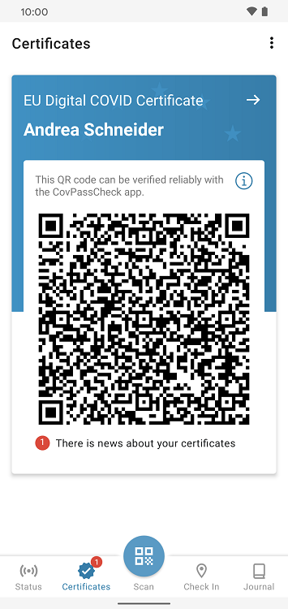
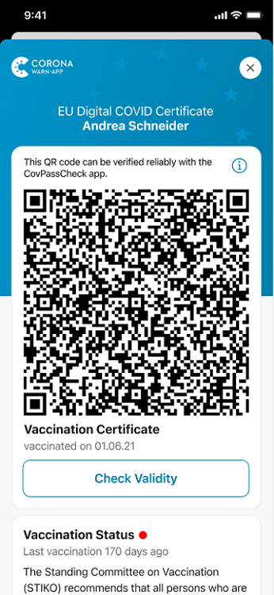
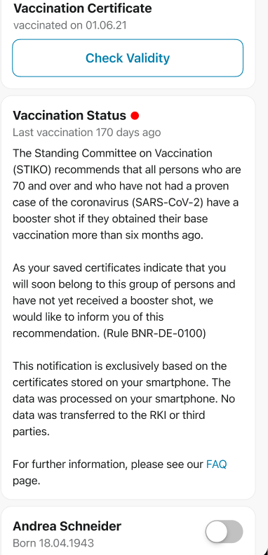
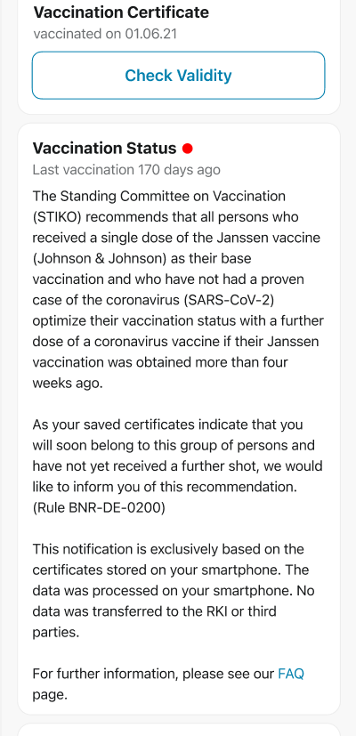

The Corona-Warn-App will soon **notify the first users for whom the Standing Committee on Vaccination (STIKO) recommends a booster vaccination**. This initially includes two groups of people. 

First, all persons who are **at least 70 years old** and who have not been diagnosed with COVID-19 will be informed if their basic immunization has happened more than six months ago. Second, the app informs users who were **vaccinated with Johnson & Johnson's vaccine** more than four weeks ago and who have not been diagnosed with COVID-19 so that they can optimize their basic immunization.

<!-- overview -->

### Here's how the app finds the right users to notify

Based on the recommendations of the STIKO, the Robert Koch Institute (RKI) has created **rules that the Corona-Warn-App can match with the certificates** stored in the app. To be able to inform the affected users about the recommendations, the Corona-Warn app regularly checks all certificates.

**Please note:** This check is performed directly in the app, so that **no data leaves the smartphone**. The rules used and the possible recommendation texts are downloaded from the rule server beforehand, so that no individual information about the users or their certificates (or about other people and their certificates) is revealed. 

If the current recommendations apply to the user, the app notifies them. Users who have received a notification should then **discuss with their doctor** whether they should receive another dose of a COVID-19 vaccine.

  

 

 
<figcaption aria-hidden="true"><em>Left: The app alerts users with the red dot that there is news. Right: information about booster recommendation under the certificate </em></figcaption>

  

  

 
 

<figcaption aria-hidden="true"><em>Links: notification for users who are at least 70 years old. Right: notification for users who were vaccinated with Johnson & Johnson's vaccine. </em></figcaption>

  

If the app notifies users to whom the conditions do not apply, for example because they have already received a booster vaccination or have already had a proven COVID-19 infection, they can ignore the notification. In this case, however, the project team recommends importing the relevant vaccination or recovery certificates into the app.

The STIKO also recommends booster vaccinations for people with certain jobs or pre-existing conditions. However, the Corona-Warn-App cannot determine this information from the certificates. Therefore, it cannot notify the respective users. **More information on the STIKO recommendations** can be found on the [RKI's website](https://www.rki.de/DE/Content/Infekt/Impfen/ImpfungenAZ/COVID-19/Impfempfehlung-Zusfassung.html) (German only). 

### Here’s how users can add their booster vaccination to the app

Users who have received a booster vaccination can transfer the certificate into the Corona-Warn-App just like they did with previous certificates. To do this, they can **select the universal QR code scanner** in the app’s tab bar and scan the QR code they received from their doctor. The app automatically saves the certificate under "Certificates" and the corresponding person.  

  

 
 
<figcaption aria-hidden="true"><em>In the middle of the tab bar, circled here: universal QR code scanner.</em></figcaption>

  

To **check the vaccination certificate** according to local regulations - for example, in a restaurant or while traveling - users can either show their regular vaccination certificate or the booster vaccination certificate. There is **no indication** when checking the certificates with the CovPassCheck app that the person is recommended to have a booster vaccination, nor is it noted in the certificate. Due to the high level of data security only users themselves know that the certificate is a booster vaccination. 

The QR code of the booster vaccination is automatically displayed first in the certificate overview 14 days after the vaccination.

To match the STIKO recommendations with the vaccination certificates **no update is required**. Users only need at least version 2.10 of the Corona-Warn-App to be notified. 
