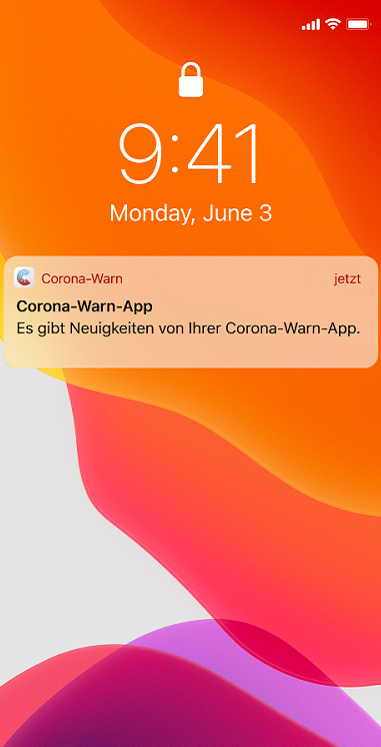
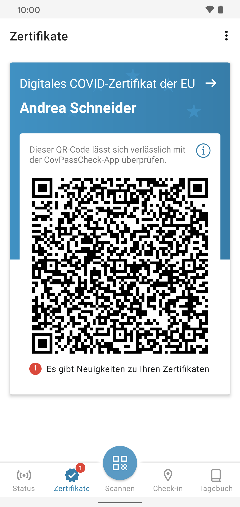
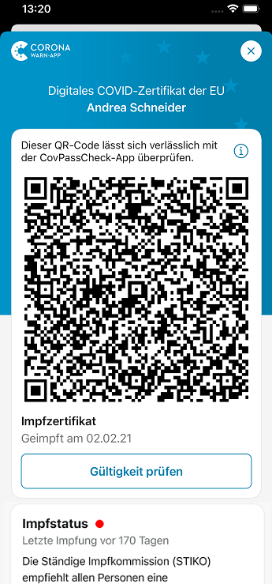
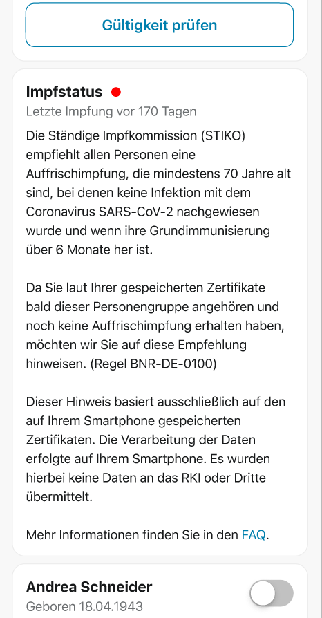
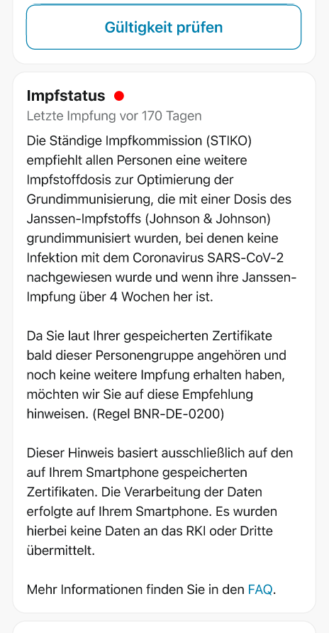
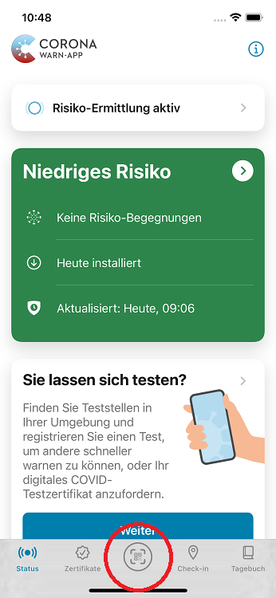

Die Corona-Warn-App benachrichtigt ab sofort die ersten Nutzer\*innen, denen die **Ständige Impfkommission (STIKO)** eine Auffrischimpfung empfiehlt. Dazu zählen zunächst zwei Personengruppen. 

Zum einen werden alle Personen informiert, die **mindestens 70 Jahre alt** sind und bei denen keine COVID-19-Infektion nachgewiesen wurde, wenn ihre Grundimmunisierung mehr als sechs Monate zurück liegt. Zum anderen informiert die App die Personen, die vor mehr als vier Wochen mit dem **Impfstoff von Johnson & Johnson** geimpft wurden und bei denen keine COVID-19-Infektion nachgewiesen wurde, um die Grundimmunisierung zu optimieren.

<!-- overview -->

### So funktioniert die Überprüfung in der App

Basierend auf den Empfehlungen der STIKO hat das Robert Koch-Institut (RKI) Regeln erstellt, die die **Corona-Warn-App mit den in der App gespeicherten Zertifikaten abgleichen** kann. Um die betroffenen Nutzer\*innen über die Empfehlungen informieren zu können, prüft die App regelmäßig alle gespeicherten Zertifikate für alle Personen. 

**Wichtig**: Diese Prüfung erfolgt direkt in der App, sodass **keine Daten das Smartphone verlassen**. Die dabei verwendeten Regeln und die möglichen Empfehlungstexte werden zuvor vom Regelserver heruntergeladen, sodass auch dadurch keine individuellen Informationen über die Nutzer\*innen oder ihre Zertifikate (bzw. über andere Personen und deren Zertifikate) preisgegeben werden. 

Wenn die aktuellen Empfehlungen auf den oder die Nutzer\*in zutreffen, weist die App entsprechend darauf hin. Nutzer\*innen, die eine Benachrichtigung erhalten haben, sollten sich dann mit ihrem Arzt oder ihrer Ärztin besprechen, ob eine weitere Impfstoffdosis eines COVID-19-Impfstoffs zu empfehlen ist.
 

  

 
 

<figcaption aria-hidden="true"><em> Die App weist Nutzer*innen mit einer Push-Nachricht und dem roten Punkt auf die Neuigkeiten hin. Unter dem Zertifikat finden Nutzer*innen detaillierte Informationen. </em></figcaption>

  

  

 
 

<figcaption aria-hidden="true"><em>Links: Hinweis für Nutzer*innen, die mindestens 70 Jahre alt sind. Rechts: Hinweis für Nutzer*innen, die mit dem Impfstoff von Johnson & Johnson geimpft wurden. </em></figcaption>

  

Falls die App Nutzer\*innen benachrichtigt, auf die die Bedingungen nicht zutreffen, weil sie beispielsweise schon eine Auffrischimpfung erhalten haben oder doch eine nachgewiesene COVID-19-Infektion durchgemacht haben, können sie die Benachrichtigung ignorieren. Das Projektteam empfiehlt in diesem Fall allerdings, die entsprechenden Impf- oder Genesenenzertifikate in die App einzuscannen. 

Die STIKO empfiehlt Auffrischimpfungen auch Personen mit bestimmten Vorerkrankungen oder Berufen. Diese Informationen kann die Corona-Warn-App allerdings nicht aus den Zertifikaten ableiten, weshalb sie nicht auf solche Empfehlungen hinweisen kann. **Mehr Informationen zu den STIKO-Empfehlungen** finden Sie auf der [Seite des RKI](https://www.rki.de/DE/Content/Infekt/Impfen/ImpfungenAZ/COVID-19/COVID-19.html). 

### So können Nutzer\*innen die Auffrischimpfung in der App hinzufügen

Nutzer\*innen können das Zertifikat der Auffrischimpfung ebenso in die Corona-Warn-App übertragen, wie vorherige Impfzertifikate auch. Sie können dafür in der Registerkarte der App den **universellen QR-Code-Scanner** auswählen und den QR-Code einscannen, den sie bei ihrem Arzt oder ihrer Ärztin erhalten haben. Die App speichert das Zertifikat dann automatisch unter „Zertifikate“ und der entsprechenden Person. 

  

 
 
<figcaption aria-hidden="true"><em>In der Mitte der Registerkarte, hier eingekreist: Universeller QR-Code-Scanner.</em></figcaption>

  

Zum **Überprüfen des Impfzertifikats** – beispielsweise im Restaurant oder auf Reisen – können Nutzer\*innen entsprechend der lokalen Regelungen sowohl ihr reguläres Impfzertifikat als auch das Zertifikat der Auffrischimpfung vorzeigen. Ebenfalls wichtig anzumerken: Es gibt bei der **Überprüfung mit der CovPassCheck-App** weder einen Hinweis darauf, dass der Person eine Auffrischimpfung empfohlen wird, noch ist es im eingescannten Zertifikat vermerkt. Im Sinne des hohen Datenschutzes der Corona-Warn-App wissen nur die Nutzer\*innen selbst, dass es sich bei dem Zertifikat um eine Auffrischimpfung handelt. 

Der QR-Code der aktuellen  Auffrischimpfung wird 14 Tage nach der Impfung automatisch an erster Stelle in der Zertifikatsübersicht angezeigt.

Für den Abgleich der Empfehlungen mit den Impfzertifikaten ist kein Update der Corona-Warn-App nötig. Nutzer\*innen müssen lediglich mindestens Version 2.10 der Corona-Warn-App nutzen, um benachrichtigt werden zu können. 
