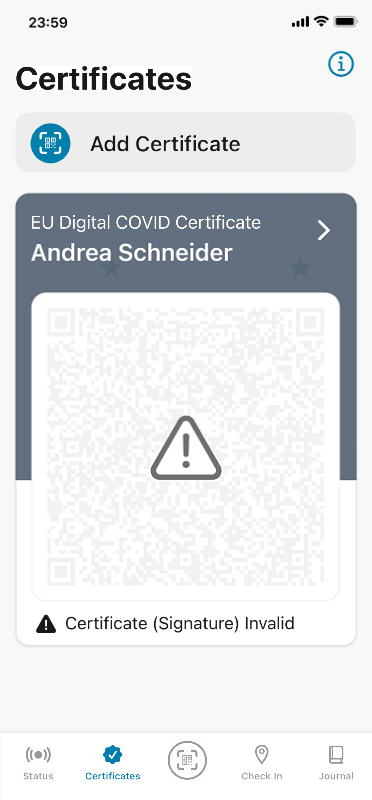
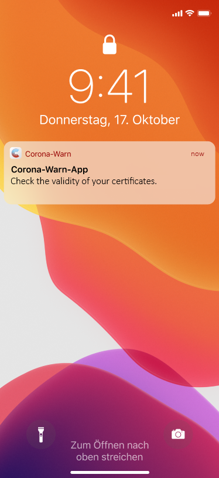
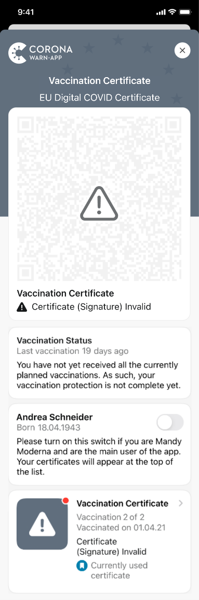
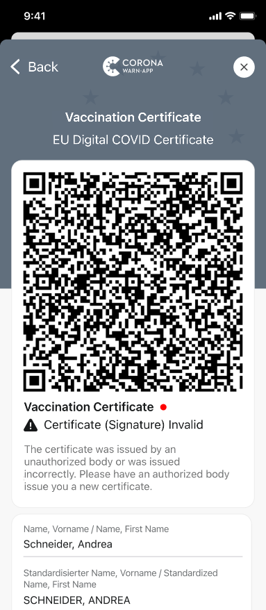

To help inform users about **misuse and counterfeiting of vaccination certificates**, the project team of the Robert Koch-Institut, Deutsche Telekom, and SAP have released an enhancement to the Corona-Warn-App version 2.13. The hotfix allows digital vaccination certificates from certain pharmacies to be recalled and marked as invalid in the app.

<!-- overview -->

In the past, there were a few pharmacies that issued fake vaccination certificates. As a result, certificates from the affected pharmacies were recalled. With hotfix 2.13.3 (Android) or 2.13.2 (iOS), the Corona-Warn-App can check the certificates and verify if the certificate was issued by the corresponding pharmacy. If this is the case, the **certificate is displayed as invalid**.

  

 
 
<figcaption aria-hidden="true"><em>Invalid digital certificate</em></figcaption>

  

**Important:** The certificates are only checked on the users own smartphones. A recalled certificate will show as invalid when checked with the CovPassCheck app though.

This affects all users who have received a certificate from a pharmacy in question, even if their certificate is valid and genuine. These users can get a new digital certificate at pharmacy for free. In order to get one, they should bring their yellow vaccination booklet an ID.

The Corona-Warn-App informs users as usual with a push notification. The red dot directs users to the certificate under which they find further information. 

  

 
 

<figcaption aria-hidden="true"><em></em></figcaption>

  

The project team recommends all users to update the app to version 2.13.3 (Android) or 2.13.2 (iOS). 

