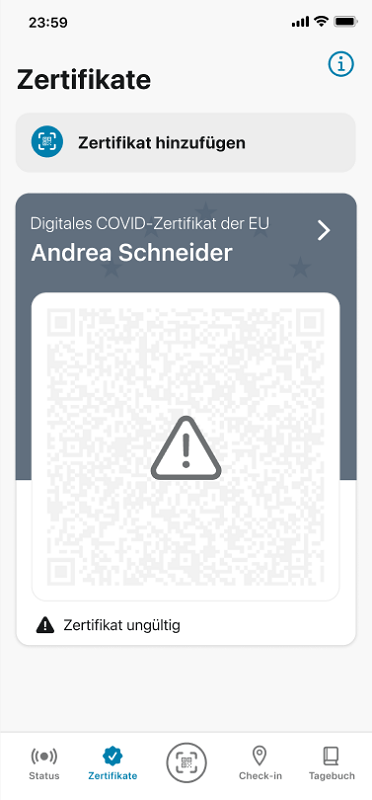
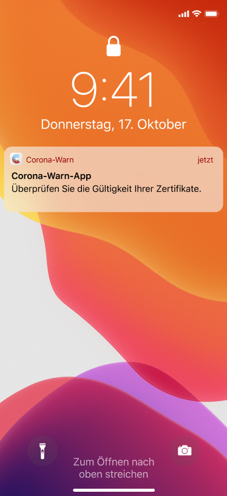
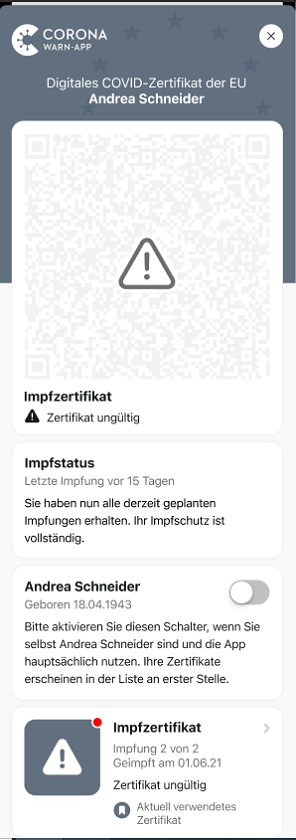
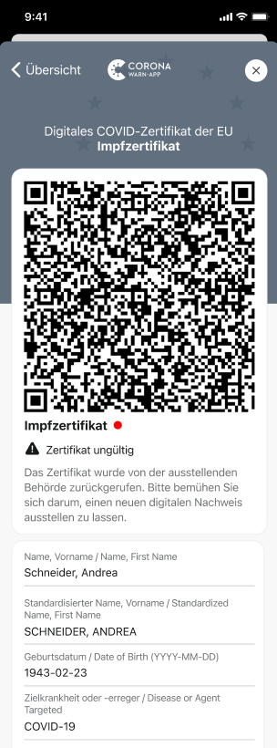

Um Nutzer\*innen über Missbrauch und Fälschungen von Impfzertifikaten informieren zu können, hat das Projektteam aus Robert Koch-Institut, Deutscher Telekom und SAP eine Erweiterung zu CWA Version 2.13 veröffentlicht. Der Hotfix ermöglicht es, **digitale Impfzertifikate von bestimmten Apotheken zurückzurufen** und in der Corona-Warn-App als ungültig zu kennzeichnen.

<!-- overview -->

In der Vergangenheit gab es einige wenige Apotheken, die gefälschte Impfzertifikate herausgegeben haben. Zertifikate der betroffenen Apotheken wurden daraufhin zurückgerufen. Mit dem Hotfix 2.13.3 (Android) beziehungsweise 2.13.2 (iOS) kann die Corona-Warn-App die Zertifikatskennung aller Zertifikate kontrollieren und prüfen, ob das Zertifikat von einer entsprechenden Apotheke ausgestellt wurde. Ist das der Fall, wird es als **ungültig dargestellt**.

**Wichtig:** Die Überprüfung der Zertifikate erfolgt nur auf den jeweils eigenen Smartphones der Nutzer\*innen. Bei der Kontrolle mit der CovPassCheck-App wird ein zurückgerufenes Zertifikat entsprechend als ungültig angezeigt.

  

 
 
<figcaption aria-hidden="true"><em>Ungültiges digitales Zertifikat</em></figcaption>

  

Das **betrifft alle Nutzer\*innen, die ein Zertifikat aus der entsprechenden Apotheke bekommen haben**, auch, wenn ihr Zertifikat gültig und echt ist. Diese Nutzer\*innen können sich dann in einer Apotheke kostenlos ein neues digitales Zertifikat ausstellen lassen. Mitbringen sollten sie dafür ihren gelben Impfpass und einen Lichtbildausweis.

Die Corona-Warn-App informiert die betroffenen Nutzer\*innen wie gewohnt mit einer Push-Nachricht. Der rote Punkt leitet sie zu dem entsprechenden Zertifikat unter dem sie weitere Informationen erhalten. 

  

 
 

<figcaption aria-hidden="true"><em></em></figcaption>

  

Das Projektteam empfiehlt allen Nutzer\*innen das **Update auf Version 2.13.3 (Android) beziehungsweise 2.13.2 (iOS)** durchzuführen. 
