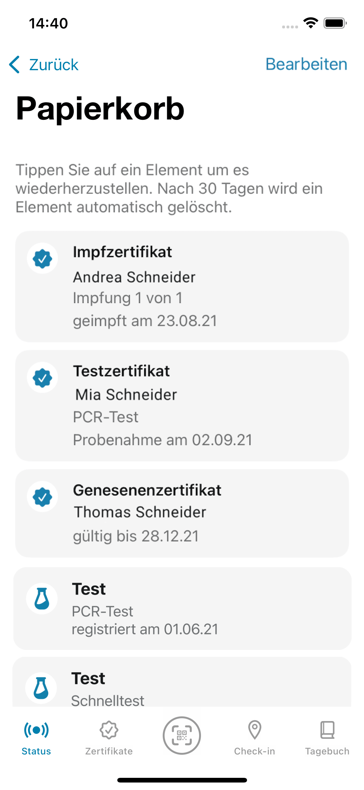
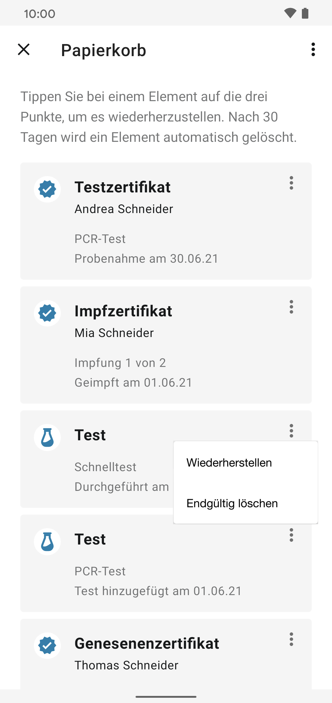
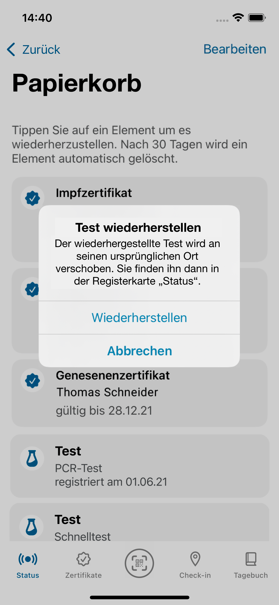
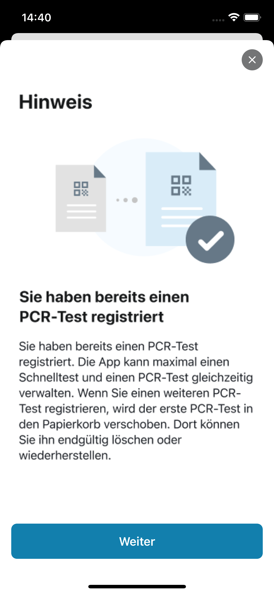

## Projektteam veröffentlicht Corona-Warn-App Version 2.14

Das Projektteam aus Robert Koch-Institut, Deutscher Telekom und SAP hat Version 2.14 der Corona-Warn-App veröffentlicht. Das Update führt die **Papierkorb-Funktion nun auch für PCR- und Schnelltests** ein. 

<!-- overview -->

Nutzer*innen der Corona-Warn-App können schon seit Version 2.13 Zertifikate, die sie aus Versehen gelöscht haben, aus dem Papierkorb wiederherstellen. Mit Version 2.14 ist das nun auch für registrierte PCR- und Schnelltests möglich. 

  

 
 
<figcaption aria-hidden="true"><em>Abb. 1: Papierkorb mit gelöschten Zertifikaten und Tests</em></figcaption>

  

Entfernen Nutzer\*innen einen registrierten Test, wird dieser nun zunächst in den Papierkorb verschoben. Dort bleibt er 30 Tage bevor er endgültig gelöscht wird. iOS-Nutzer\*innen können ihn dann wiederherstellen, indem sie den entsprechenden Test im Papierkorb auswählen und auf „Wiederherstellen“ tippen, Android-Nutzer\*innen können die drei Punkte in der rechten oberen Ecke des Tests auswählen und auf „Wiederherstellen“ tippen. 

  

    

        

            <figure>
                
                <figcaption aria-hidden="true">
                    <em>Abb. 2: Android-Nutzer*innen können die drei Punkte in der rechten oberen Ecke des Tests auswählen und auf „Wiederherstellen“ tippen.</em>
                </figcaption>
            </figure>
        

        

            <figure>
                
                <figcaption aria-hidden="true">
                    <em>Abb. 3: iOS-Nutzer*innen können den einen Test wiederherstellen, indem sie den entsprechenden Test im Papierkorb auswählen und auf „Wiederherstellen“ tippen.</em>
                </figcaption>
            </figure>
        

    

  

Der Test wird dann an den ursprünglichen Ort in der Corona-Warn-App verschoben. Verschieben Nutzer*innen einen Test in den Papierkorb und scannen ihn dann noch einmal ein, erkennt die Corona-Warn-App ab Version 2.14, dass es sich um denselben Test handelt und stellt ihn wieder her.  

Nutzer*innen können außerdem weiterhin nur einen  aktiven Test in ihrer App registrieren. Stellen sie einen Test aus dem Papierkorb wieder her, während ein anderer Tests bereits vorliegt, wird der Test aus dem Papierkorb wiederhergestellt und der derzeit aktive Test in den Papierkorb verschoben.

  

 
 
<figcaption aria-hidden="true"><em>Abb. 4: Die App kann maximal einen Schnelltest und einen PCR-Test gleichzeitig verwalten. Wenn Nutzer z. B. einen weiteren PCR-Test registrieren, wird der erste PCR-Test in den Papierkorb verschoben.</em></figcaption>

  

Die Einträge im Kontakt-Tagebuch, in denen vermerkt wird, wann Nutzer\*innen einen Schnelltest registriert beziehungsweise einen PCR-Test durchgeführt haben, werden nicht beeinflusst, wenn ein Test in den Papierkorb verschoben wird. 

Android-Nutzer\*innen gelangen zu ihrem Papierkorb, indem sie in der rechten oberen Ecke ihrer App die drei Punkte auswählen und dann auf „Papierkorb“ tippen. iOS-Nutzer\*innen können auf dem Startbildschirm ihrer Corona-Warn-App nach unten wischen und dort unter „Mehr“ den „Papierkorb“ auswählen.

Version 2.14 wird, wie vorherige Versionen auch, schrittweise über 48 Stunden an alle Nutzer\*innen ausgerollt. iOS-Nutzer\*innen können sich die aktuelle App-Version ab sofort aus dem Store von Apple manuell herunterladen. Der Google Play Store bietet keine Möglichkeit, ein manuelles Update anzustoßen. Hier steht Nutzer*innen die neue Version der Corona-Warn-App innerhalb der nächsten 48 Stunden zur Verfügung.
