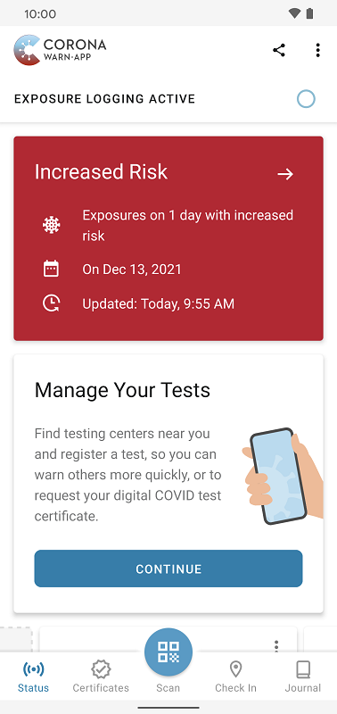
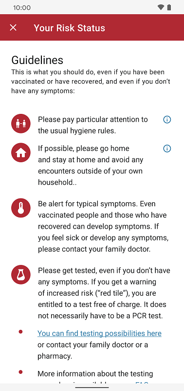
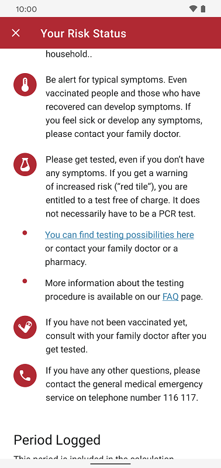
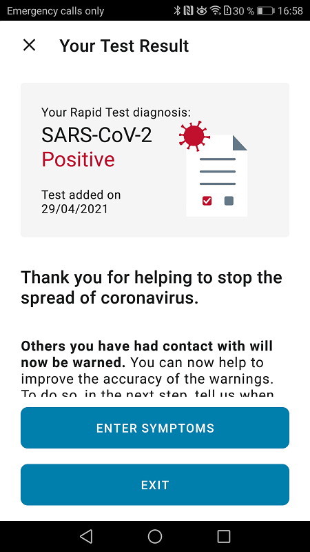
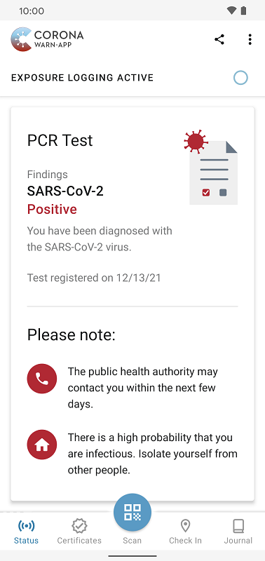

In Germany, the number of COVID-19 infections is still very high. From December 1 to December 7 alone, an **estimated 1.1 million users received a “red tile”** in the Corona-Warn-App (CWA; [as of December 14, 2021](/en/science/))*. However, many of these users have already been vaccinated or have recovered from a COVID-19 infection. So, what should you do if you see a red tile? And how and when does it disappear again?

<!-- overview -->

A “red warning” does not necessarily mean that you have been infected with COVID-19. The Corona-Warn-App simply warns you of an increased risk of infection and **does not differentiate between vaccinated, unvaccinated, and recovered users**. 

  

 
 

  

The reason: If the increased risk-status indicator appears on your smartphone, you’ve had at least one encounter with a person who later tested positive for COVID-19 in the past 14 days. Therefore, regardless of whether you are vaccinated, unvaccinated, or have recovered from an infection, we recommend that you behave as follows in case of a “red warning”:

**<u>1) Go home</u>**

In the case of a red tile, if you can arrange it, you should go into **voluntary quarantine** - at least until a negative test result is available (more about this under point 3). This means: Refrain from visiting and engaging with other people wherever possible. Get food delivered or ask someone to do the shopping, avoid public transportation if possible, and refrain from air and train travel.

If you **feel sick, experience symptoms, or have risk factors**, such as certain illnesses, you should voluntarily self-isolate in the event of a red warning and consult your general practitioner or the German general medical service under the phone number 116 117.

If **your employer** gives you the opportunity to work from home, do so. If this is not possible, you should check the quarantine specifications in your county, since the quarantine regulations can differ from county to county. If there are no applicable regulations, contact your responsible public health authority. They can mandate a quarantine. You can find your responsible public health authority here: [https://tools.rki.de/PLZTool/en-GB](https://tools.rki.de/PLZTool/en-GB)

At the moment, it is recommended to **quarantine for 10 days** starting from the time of the risk exposure. The quarantine **can be shortened to 5 days** if you take a PCR test with a negative result. For this reason, the red tile in the CWA shows the date of the risk exposure. 

For more information on the recommendations, visit the [Robert Koch Institute's website](https://www.rki.de/DE/Content/InfAZ/N/Neuartiges_Coronavirus/Kontaktperson/Management.html?nn=13490888#doc13516162bodyText16) (information in German). Under point 3.2.2, you can also find the information that people, who have been fully vaccinated or recovered from a COVID-19 infection, are excluded from quarantine measures if they’ve had contact with a confirmed SARS-CoV-2 case. This shows that users can make the decision to quarantine when having a red tile independently and on a voluntary basis. 

The **red tile disappears 14 days after the risk exposure**. For more information, see the section below, “How and when does the red tile disappear again?". 

**<u>2) Pay attention to symptoms</u>**

Pay attention to symptoms for these 14 days. They often occur 4 to 6 days after the infection but can also occur after up to 14 days later. Again, you can use the date of the risk exposure on the red tile as a reference.

**Note**: Vaccinated and recovered people can develop symptoms, too!

  

 
  
<figcaption aria-hidden="true"><em>Guidelines if you see a red tile in the Corona-Warn-App.</em></figcaption>

  

**<u>3) Have yourself tested </u>**

In general, you should have a test even if you do not have any symptoms. At the moment, however, the situation in medical practices and at the health authorities is critical due to the high number of infections. To avoid further stress, if you have **no symptoms or risk factors**, you should go to a test center independently as soon as possible, show your red tile and do a test there. If you receive a warning about an increased risk in the app, you are **entitled to a free test**. This does not necessarily have to be a PCR test though. 

Until you get the result, you should stay home and adhere to the recommendations given above.

If you **experience symptoms, feel sick, or have risk factors**, you should consult with your general practitioner or the general practitioner’s on-call duty under the phone number 116 117. The doctor will ask you about your symptoms and risk factors and then decide how to test. 

You can **find test options** under [Where can I get tested?](/en/faq/#where_can_i_get_tested). For more information about the test procedure, see [Red Card? How to go through Corona testing](/en/faq/#red_card_how_to_test).

**<u>4) Positive Test Result: Self-isolate and share your test result</u>**

A **positive rapid test** must always be confirmed by a PCR test. So, if your rapid test is positive, try to get a PCR test. You can often do this directly at the test center. If your test center does not offer PCR tests, contact your general practitioner or your responsible health department and point out your positive rapid test result. 

  

 
 

  

If your **PCR test is positive**, contact your responsible public health authority and self-isolate. You should also inform your employer as soon as possible. Discuss a possible sick note with your general practitioner. 

  

 
 

  

As soon as your rapid test or PCR test result is available, share it with the Corona-Warn-App. This allows you to warn your contacts and help to end the infection chain quickly. 

For answers to frequently asked questions about the behavior in case of a red tile, also see the [FAQs on the website of CWA](/en/faq/#red_card_how_to_test).

### How and when does the red tile disappear again??

A red tile disappears two weeks after the risk exposure took place. This means: On the **15th day after a risk exposure**, a red tile turns green again. You cannot switch the tile to "green" manually. 

However, the notification of a risk exposure can also disappear after, for example, one day if the corresponding encounter has happened 14 days ago. 

This is because the **time when you receive a warning depends on when a positively tested person shares their test result**. Every day, the Corona-Warn-App loads the current diagnosis keys (in other words, the shared positive test results) from the server and checks the contact log on the user’s smartphone. The app compares the encounters of the last 14 days with the diagnosis keys to check whether the user has had contact with a positively tested person.

### Why does the red tile stay even though I am already tested negative?

The red tile remains until the underlying risk exposure is more than 14 days in the past. This status does not change even if you register a negative antigen rapid test or PCR test in the app. This is because the red warning indicates that you have had contact with a person diagnosed positively with SARS-CoV-2 and may have been infected, too. The negative test result simply states that you did not prove a SARS-CoV-2 infection at the time of sampling. It is **not always possible to automatically decide** whether being "non-infectious" at this time excludes an infection at the time of exposure to the positively tested person.

**For example**, if you receive a warning about a risk exposure that took place two days ago, and you have yourself tested immediately, this test may be negative. However, you may have been infected, but the viral load may not be that high until a few days later so that a new test will then be positive. For this reason, you should perform a **second test 3 to 5 days after the first test**.

### … and what about a green tile?

Even with a green tile, there can be indications of encounters with people tested positively later. However, the Corona-Warn-App does not rate these encounters as an increased risk due to the circumstances (for example, short exposure period or long distance to that person). Therefore, it is not necessary for you to behave as stated above.

Nevertheless, you should **adhere to the usual hygiene rules**: When you encounter other people, wear a medical mask, keep your distance from other people, sneeze or cough into your elbow or a handkerchief, wash your hands regularly with soap, and let fresh air in several times a day.

*_According to Privacy Preserving Analytics (PPA). More information in the Science Blog: "Who is using the Corona-Warn-App, who is warned - and how fast?" in_ [Section 3 - Privacy-Preserving Analytics](/en/science/2021-10-15-science-blog-4/#3-privacy-preserving-analytics).
