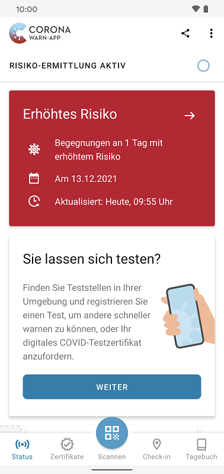
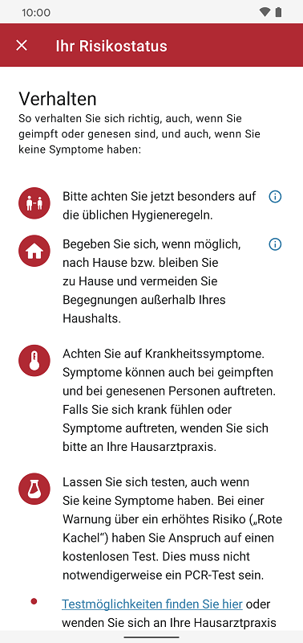
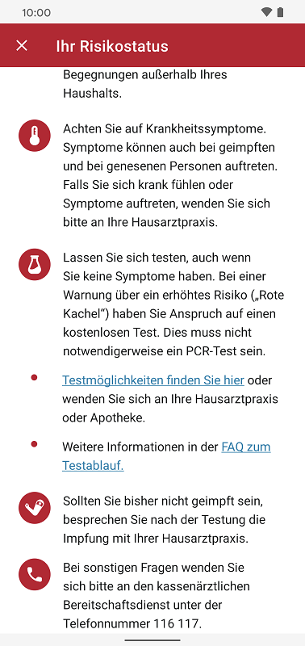
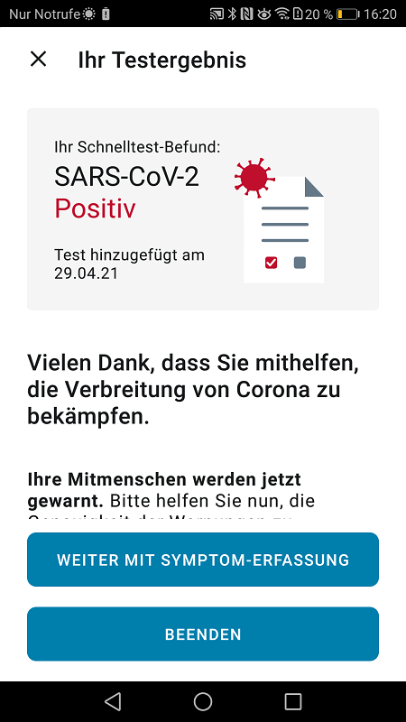
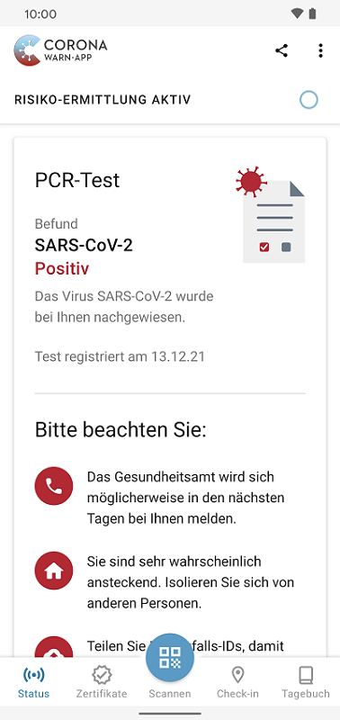

*English version coming soon* 

In Deutschland bewegen sich die Covid-19-Infektionszahlen auf sehr hohem Niveau. Allein vom 1. bis einschließlich 7. Dezember haben geschätzt **mehr als 1,1 Millionen Nutzer\*innen der Corona-Warn-App (CWA) eine rote Kachel erhalten** ([Stand 14.12.2021](https://www.coronawarn.app/de/science/))*. Davon sind viele aber bereits geimpft oder genesen. Was also tun bei einer roten Kachel? Und wie beziehungsweise wann verschwindet sie wieder?

<!-- overview -->

Eine rote Warnung bedeutet nicht automatisch, dass Sie sich mit Covid-19 infiziert haben. Die Corona-Warn-App warnt Sie damit lediglich vor einem erhöhten Ansteckungsrisiko und **unterscheidet dabei nicht zwischen geimpften, ungeimpften und genesenen Nutzer*innen**. 

  

 
 

  

Denn: Erscheint die Statusanzeige „Erhöhtes Risiko“ auf Ihrem Smartphone, hatten Sie in den vergangenen 14 Tagen mindestens eine Begegnung mit einer später positiv getesteten Person. Wir empfehlen Ihnen deshalb – egal ob Sie geimpft, ungeimpft oder genesen sind – sich im Falle einer „roten Warnung“ folgendermaßen zu verhalten:

**<u>1) Begeben Sie sich nach Hause</u>**

Bei einer roten Kachel sollten Sie sich, wenn Sie es einrichten können, in **freiwillige Quarantäne** begeben  – mindestens, bis ein negatives Testergebnis vorliegt (dazu mehr in Punkt 3). **Das bedeutet:** Verzichten Sie nach Möglichkeit auf Besuche und Aktivitäten, bei denen Sie mit anderen Menschen zusammenkommen. Lassen Sie sich Lebensmittel liefern oder bitten Sie jemanden, die Einkäufe zu erledigen, meiden Sie öffentliche Verkehrsmittel so gut es geht und verzichten Sie auf Flug- und Zugreisen. 

Wenn Sie sich **krank fühlen, Symptome auftreten oder Sie Risikofaktoren** wie bestimmte Vorerkrankungen haben, sollten Sie sich im Falle einer roten Warnung freiwillig isolieren und Rücksprache mit Ihrer Hausarztpraxis oder dem kassenärztlichen Bereitschaftsdienst unter der Nummer 116 117 halten.

Wenn Ihr **Arbeitgeber** Ihnen die Möglichkeit gibt, von zu Hause aus zu arbeiten, tun Sie das. Sollte das nicht möglich sein, sollten Sie die Quarantäne-Vorgaben in Ihrem Landkreis prüfen, da die **Quarantäne-Regelungen von Landkreis** zu Landkreis verschieden sein können. Wenn es keine entsprechenden Regelungen gibt, wenden Sie sich an Ihr zuständiges Gesundheitsamt. Das kann eine Quarantäne anordnen. Ihr zuständiges Gesundheitsamt können Sie hier ermitteln: [https://tools.rki.de/plztool/ ](https://tools.rki.de/plztool/)

Momentan wird ab dem Zeitpunkt der Risikobegegnung eine **Quarantäne von 10 Tagen ohne abschließenden Test** und von **5 Tagen mit PCR-Test empfohlen**. Aus diesem Grund steht auch das Datum der Risikobegegnung als Referenz auf der roten Kachel in der CWA.  Mehr zu den Empfehlungen finden Sie auf der [Website des Robert Koch-Instituts](https://www.rki.de/DE/Content/InfAZ/N/Neuartiges_Coronavirus/Kontaktperson/Management.html;jsessionid=FA6467ABE90F33E7D9982350BA10FBAB.internet051?nn=13490888#doc13516162bodyText16). Dort finden Sie unter Punkt 3.2.2 auch den Hinweis, dass vollständig gegen COVID-19 geimpfte oder genesene Personen, die Kontakt zu einem bestätigten SARS-CoV-2-Fall hatten, von Quarantäne-Maßnahmen ausgenommen sind. Die Entscheidung, sich bei einer roten Kachel dennoch in Quarantäne zu begeben, erfolgt also **eigenverantwortlich und auf freiwilliger Basis.**

Weitere Informationen zu Quarantäne-Maßnahmen und dazu, wieso die freiwillige Quarantäne empfohlen wird, finden Sie hier: [https://www.coronawarn.app/de/faq/#voluntary_self_quarantine](/de/faq/#voluntary_self_quarantine) und hier: [https://www.coronawarn.app/de/faq/#quarantine_measures](/de/faq/#quarantine_measures)

Die rote Kachel verschwindet 14 Tage nach der Risikobegegnung. Mehr dazu finden Sie unten im Abschnitt „Wie verschwindet die rote Kachel wieder?“.

**<u>2) Achten Sie auf Symptome</u>**

Achten Sie für diese 14 Tage auf Symptome. Sie treten **häufig 4 bis 6 Tage nach der Ansteckung** auf, können aber auch erst nach bis zu 14 Tagen auftreten. Auch hierbei können Sie sich wieder an dem Datum der Risikobegegnung auf der roten Kachel orientieren.

Beachten Sie: Symptome können **auch bei geimpften und bei genesenen Personen** auftreten. 

  

 
  
<figcaption aria-hidden="true"><em>Handlungsempfehlungen bei roter Kachel in der Corona-Warn-App</em></figcaption>

  

**<u>3) Lassen Sie sich testen</u>**

Grundsätzlich sollten Sie sich testen lassen, auch wenn Sie keine Symptome haben. Im Moment ist die Situation in Arztpraxen und bei den Gesundheitsämtern wegen der hohen Infektionszahlen allerdings kritisch. Damit sie nicht noch weiter belastet werden, sollten Sie, wenn Sie **keine Symptome oder Risikofaktoren** haben, so bald wie möglich selbstständig zu einem Testcenter gehen, Ihre rote Kachel vorzeigen und dort einen Test machen. Bei einer Warnung über ein erhöhtes Risiko haben Sie **Anspruch auf einen kostenlosen Test**. Das muss nicht notwendigerweise ein PCR-Test sein. 

Bis Sie das Ergebnis erhalten, sollten Sie nach Möglichkeit zu Hause bleiben und die oben gegebenen Empfehlungen einhalten.

Wenn bei Ihnen **Symptome auftreten, Sie sich krank fühlen, oder Sie Risikofaktoren** haben, sollten Sie Rücksprache mit Ihrer Hausarztpraxis oder dem kassenärztlichen Bereitschaftsdienst unter der Nummer 116 117 halten. Die Ärztin oder der Arzt wird Sie nach Ihren Symptomen und Risikofaktoren fragen und dann entscheiden, wie getestet werden soll. 

**Testmöglichkeiten** finden Sie hier: [https://www.coronawarn.app/de/faq/#where_can_i_get_tested](https://www.coronawarn.app/de/faq/#where_can_i_get_tested). Weitere Informationen zum Testablauf hier: [https://www.coronawarn.app/de/faq/#red_card_how_to_test](https://www.coronawarn.app/de/faq/#red_card_how_to_test.
).

**<u>4) Positives Testergebnis: Begeben Sie sich in Isolation und teilen Sie Ihr Testergebnis</u>**

Ein **positiver Schnelltest** muss immer von einem PCR-Test bestätigt werden. Sollte Ihr Schnelltest also positiv sein, bemühen Sie sich um einen PCR-Test. Den können Sie häufig direkt im Testcenter durchführen. Sollte Ihr Testcenter keine PCR-Tests anbieten, kontaktieren Sie Ihre Hausarztpraxis oder Ihr zuständiges Gesundheitsamt und weisen Sie auf Ihr positives Antigen-Schnelltestergebnis hin. 

  

 
 

  

Im Falle eines **positiven PCR-Tests** kontaktieren Sie Ihr zuständiges Gesundheitsamt und begeben Sie sich in Isolation. Informieren Sie auch zeitnah Ihren Arbeitgeber. Besprechen Sie eine mögliche Krankschreibung mit Ihrer Hausarztpraxis. Sobald Ihr Schnelltest- oder PCR-Testergebnis vorliegt, teilen Sie es möglichst schnell mit der Corona-Warn-App. So können Sie Ihre Kontakte warnen und dazu beitragen, die Infektionskette schnell zu beenden. 

  

 
 

  

Antworten auf häufig gestellte Fragen rund um das Verhalten bei einer roten Kachel finden Sie auch in den [FAQs auf der Website der CWA](https://www.coronawarn.app/de/faq/#red_card_how_to_test).

### Wie und wann verschwindet die rote Kachel wieder?

Die Anzeige einer Risikobegegnung (sowohl rote als auch grüne Kachel) verschwindet **zwei Wochen nach der Risikobegegnung**. Am 15. Tag wird eine rote Kachel also wieder grün. Sie können die Kachel aber nicht manuell auf „grün“ schalten. 

Es kann vorkommen, dass die Meldung über eine Risikobegegnung schon **nach beispielsweise einem Tag wieder verschwunden** ist. Das bedeutet, dass die entsprechende Begegnung dann schon mehr als 14 Tage zurück liegt. 

**Das hat folgenden Hintergrund:** Der Zeitpunkt, wann Sie eine Warnung erhalten, hängt davon ab, wann eine positiv getestete Person ihr Testergebnis teilt. Die Corona-Warn-App lädt jeden Tag die aktuellen Diagnoseschlüssel (vereinfacht gesagt: die geteilten positiven Testergebnisse) vom Server und führt auf dem Smartphone der Nutzerin oder des Nutzers eine Überprüfung des Kontaktprotokolls durch. Dabei gleicht die App die Begegnungen der letzten 14 Tage mit den Diagnoseschlüsseln ab, um zu überprüfen, ob es zu einem Kontakt mit einer positiv getesteten Person gekommen ist.

### Wieso bleibt die rote Kachel bestehen, obwohl ich bereits negativ getestet bin?

Die rote Warnmeldung bleibt so lange bestehen, bis die zugrundeliegende Risikobegegnung **mehr als 14 Tage in der Vergangenheit** liegt. Dieser Status ändert sich auch dann nicht, wenn Sie einen negativen Antigen-Schnelltest oder PCR-Test in der App registrieren. **Das hat folgenden Grund:** Die rote Warnung sagt aus, dass Sie Kontakt zu einer positiv auf SARS-CoV-2 getesteten Person hatten und sich dabei angesteckt haben können. Das negative Testergebnis sagt lediglich aus, dass bei Ihnen zum Zeitpunkt der Probenahme kein SARS-CoV-2 nachgewiesen wurde. Ob das "Nicht-Infektiös-Sein" zu diesem Zeitpunkt eine Ansteckung zum Zeitpunkt der Begegnung mit der positiv getesteten Person ausschließt, lässt sich nicht immer automatisch entscheiden.

**Ein Beispiel:** Wenn Sie eine Warnung über eine Risikobegegnung bekommen, die beispielsweise vor zwei Tagen stattgefunden hat, und Sie daraufhin sofort einen Schnelltest durchführen, kann dieser Test negativ ausfallen. Es kann aber sein, dass Sie sich dennoch angesteckt haben, die Viruslast aber erst einige Tage später so hoch ist, dass ein erneuter Test dann positiv ausfällt. Aus diesem Grund sollten Sie 3 bis 5 Tage nach dem ersten Test einen **zweiten Test durchführen**. 

### … und wie verhalte ich mich bei einer grünen Kachel?

Auch bei einer grünen Kachel kann es Hinweise auf Begegnungen mit später positiv getesteten Personen geben. Diese Begegnungen bewertet die Corona-Warn-App aufgrund der Umstände (beispielsweise kurze Begegnungsdauer oder große Entfernung) aber **nicht als erhöhtes Risiko.** 

Deshalb sind die oben genannten Verhaltensweisen in diesem Fall nicht nötig. Sie sollten dennoch die **üblichen Hygieneregeln einhalten:** Tragen Sie bei Begegnungen mit anderen Personen eine medizinische Maske, halten Sie Abstand zu anderen Personen, niesen oder husten Sie in die Armbeuge oder in ein Taschentuch, waschen Sie sich regelmäßig mit Seife die Hände und lüften Sie Innenräume mehrmals täglich.

*_Laut Privacy Preserving Analytics (PPA). Mehr dazu hier:_ [https://www.coronawarn.app/de/science/2021-10-15-science-blog-4/#3-privacy-preserving-analytics](https://www.coronawarn.app/de/science/2021-10-15-science-blog-4/#3-privacy-preserving-analytics 
)
