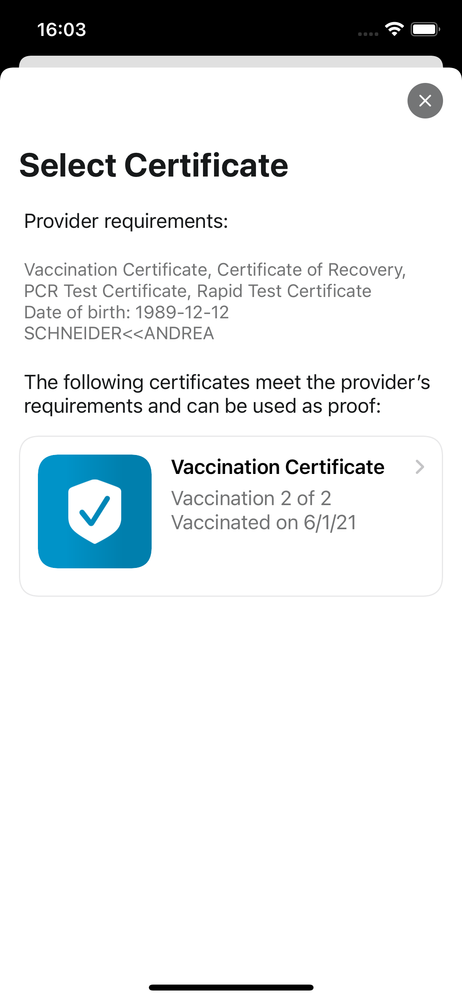

The project team of Robert Koch-Institut, Deutsche Telekom, and SAP have released version 2.15 of the Corona-Warn-App. The update enables users to provide their proof of vaccination or recovery or a negative test result while booking tickets. With that feature, the new version also makes it easier for event organizers, companies, and vendors to check Covid certificates and thus contributes to reliable access management in accordance with legal requirements.

<!-- overview -->

Vaccination or recovery certificate, and/or a negative test result: These are the access requirements almost everywhere, be it to stores, local or long-distance transport, restaurants or events. To support fast and reliable verification of these requirements, Corona-Warn-App (CWA) users can now provide their proof while booking a ticket - given the event organizer supports the corresponding validation service.   

### How does the verification work with the help of the Corona-Warn-App?

Let's assume a CWA user books concert tickets online. As part of the booking process, at a certain point they have the option to provide the appropriate proof per person (vaccination or recovery certificate, and/or a negative test result). 

After giving their consent, they can scan the QR code that is displayed in the booking process using the Corona-Warn-App. To do so, they simply open the app and select the universal QR code scanner in the middle of the tab bar. After that, they can select the certificate they want to provide as proof. 

If they book the tickets with their smartphone, they can take a screenshot of the QR code and then upload it to the CWA by opening the universal QR code scanner and selecting "Open file".  

  

 
  
<figcaption aria-hidden="true"><em>Left: Universal QR code scanner, Right: Possibility to import a QR code from a photo (e.g. screenshot)</em></figcaption>

  

After that, they can give their consent and then select the certificate they want to provide as proof.

 
  

 
   

  

The Corona-Warn-App checks the provider's requirements and shows the user only those certificates for selection that meet the requirements. 

For example, if a provider requests either a vaccination certificate, a recovery certificate, a rapid test certificate, or a PCR test certificate, the user will be shown all of these certificates to choose from, provided they have stored them in the app. If a provider requires either a vaccination certificate or a recovery certificate, the app will only provide these certificates to choose from. If the user does not have a certificate that meets the requirements, the CWA will notify them accordingly.  

  

 
 

  

After the user has selected a certificate and once again given their consent, the certificate is checked. For this purpose, it is temporarily transmitted in encrypted form to the validation service. The validation service then compares the organizer's rules with the certificate and then informs the booking system whether the certificate complies with the rules or not. 

  

 
 

  

 
Please notice: the certificates remain on the user's own smartphone and are not stored in the validation system at any time. 

The user can then see in the app whether the certificate was successfully verified or whether it was not recognized.

  

 
 

  

A certificate can be "not recognized" if it does not meet the provider's requirements. This may be the case, for example,  if the user has selected an antigen test as proof that is older than 48 hours. 

### What should users be aware of?

Users should make sure that the name in the certificate they want to use for verification is EXACTLY the same as the name they entered in the booking system. If this is not the case, they will not be able to select the corresponding certificate in the Corona-Warn-App. 

For example, if users have entered their first and middle names in their certificate, they should also enter both names when booking tickets. If they only enter one name, the CWA will not be able to recognize that it is the same person. 

In addition, with version 2.15, the project team has adapted the guidelines under a "red warning" (warning about an encounter with increased risk). Detailed information on how users should act in case of a red tile can be found [in this blog](/de/blog/2021-12-15-cwa-red-tile-guidance/).

  

 
 
  
<figcaption aria-hidden="true"><em>Guidelines on red "Increased Risk" notification</em></figcaption>

  

Version 2.15 - like previous versions - will be delivered in a staged rollout and is made available for users in waves. While users can manually trigger an update in Apple’s App Store, this option is not available in the Google Play Store. There, the delivery of the Corona-Warn-App’s new version can take up to 48 hours.
