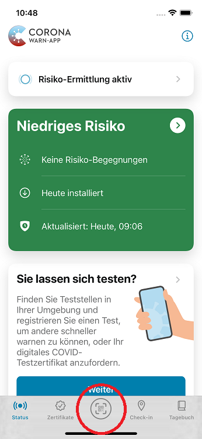
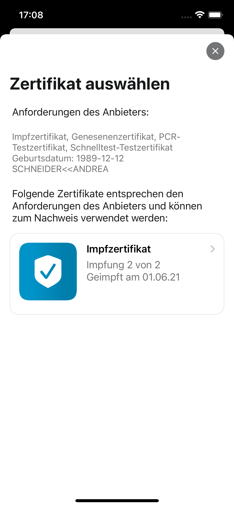

*Aktualisiert am 10.01.2022 um 13:30 Uhr*

Das Projektteam aus Robert Koch-Institut, Deutscher Telekom und SAP hat **Version 2.15 der Corona-Warn-App (CWA) veröffentlicht.** Mit dem Update kann die CWA zukünftig sogenannte **Onlineverifikationsdienste** unterstützen. Onlineverifikationsdienste sollen Nutzer\*innen einen datensparsamen Weg bieten, schon während der Buchung von Dienstleistungen (z.B. Tickets) den Nachweis zu erbringen, dass sie geimpft, genesen oder negativ getestet sind.  

**Wichtiges Update vom 10.01.22:** Bereits seit Oktober 2021 liegen die europaweit gültigen Anforderungen an Onlineverifikationsdienste vor. In Deutschland ist momentan **noch kein Anbieter eines Onlineverifikationsdienstes zugelassen** worden. Derzeit erfolgen Tests, deren Ergebnisse zunächst abgewartet werden. Erst nach einer Auswertung dieser Tests und nach erfolgter Beratung durch den Bundesbeauftragten für den Datenschutz und die Informationsfreiheit (BfDI), werden  Onlineverifikationsdienste in der Praxis verfügbar sein.  Mit Version 2.15 ist die CWA aber bereit, entsprechende Verifikationsdienste zu unterstützen, sobald Anbieter eines solchen Dienstes zugelassen sind. 

Der eigentliche Onlineverifikationsdienst liegt außerhalb der CWA und **tangiert die Funktionsweise der CWA nicht.** Die Nutzung der Onlineverifikationsdienste aus der CWA heraus ist freiwillig und **beeinträchtigt die Datensicherheit der Nutzer\*innen nicht.** Zugleich wird aber die derzeitige Situation bei Buchungen und der Nutzung von automatischen Zugangssystemen deutlich datensparsamer ausgestaltet. 

<!-- overview -->

Geimpft, genesen, negativ getestet: Das sind fast überall die Zutrittsvoraussetzungen, sei es zu Geschäften, dem Nah- oder Fernverkehr, Restaurants oder Veranstaltungen. Um ein schnelles und verlässliches Überprüfen dieser Voraussetzungen zu unterstützen, können Nutzer\*innen der Corona-Warn-App (CWA) ihre **Nachweise ab sofort bereits erbringen, während sie ein Ticket buchen** – sofern der/die Veranstalter*in den entsprechenden Validierungsservice unterstützt.  

### Wie funktioniert die Überprüfung mit Hilfe der Corona-Warn-App?

Angenommen, eine Nutzerin der Corona-Warn-App bucht online **Konzerttickets**. Im Rahmen des Buchungsprozesses hat sie an einem bestimmten Punkt die Möglichkeit, die entsprechenden Nachweise pro Person (Genesenen- Impf- und/oder Testnachweis) zu erbringen. 

Nachdem sie ihr Einverständnis gegeben hat, kann sie den QR-Code, der ihr im Buchungsprozess angezeigt wird, mit der Corona-Warn-App scannen. Dafür öffnet sie einfach ihre App und wählt in der Mitte der Registerkarte den universellen QR-Code-Scanner aus.

Sollte sie die Tickets mit dem Smartphone buchen, kann sie einen Screenshot des QR-Codes machen und ihn anschließend in der CWA hochladen. Das geht, indem sie den universellen QR-Code-Scanner öffnet und dann „Datei öffnen“ auswählt.  

  

 
  
<figcaption aria-hidden="true"><em>Links: universeller QR-Code-Scanner, Rechts: Möglichkeit, QR-Code von einem Foto (z.B. Screenshot) über den QR-Code-Scanner zu importieren</em></figcaption>

  

Nachdem die Nutzerin in der CWA ihr Einverständnis gegeben hat, kann sie das Zertifikat auswählen, das ihr als Nachweis dienen soll. 

  

 
   

  

Die Corona-Warn-App **überprüft dabei die Anforderungen des Anbieters** und zeigt der Nutzerin nur die Zertifikate zur Auswahl an, die den Anforderungen entsprechen. 

Verlangt ein Anbieter beispielsweise entweder ein Impfzertifikat, ein Genesenenzertifikat, ein Schnelltest-Zertifikat oder ein PCR-Testzertifikat, werden der Nutzer\*in all diese Zertifikat zur Auswahl angezeigt, sofern sie diese in der App hinterlegt hat. Verlangt ein Anbieter entweder ein Impf- oder ein Genesenenzertifikat werden ihr auch nur diese Zertifikate zur Auswahl angezeigt. Sollte sie kein Zertifikat haben, das den Anforderungen entspricht, erhält sie eine entsprechende Meldung in der App. 

  

 
  

  

Nachdem sie ein Zertifikat ausgewählt hat und noch einmal ihr Einverständnis zur Übermittlung gegeben hat, wird das Zertifikat überprüft. Dafür wird es **vorübergehend, verschlüsselt an den Validierungsservice übermittelt**. Dieser gleicht dann die Regeln der/des Veranstalter\*in mit dem Zertifikat ab und übermittelt daraufhin dem Buchungssystem nur, ob das Zertifikat den Regeln entspricht oder nicht. 

**Zum Beispiel erfährt ein/eine Veranstalter\*in** bei der Zugangsvoraussetzung "3G" (geimpft, genesen oder negativ getestet) **nicht, ob es sich bei dem Nachweis des Gastes um ein Impf-, Genesenen-, oder Testzertifikat handelt,** sondern nur, dass dieser Gast zum angefragten Zeitpunkt ein gültiges Zertifikat hat. 

**Die Zertifikate werden nicht an das Buchungssystem übertragen und nicht im Validierungsservice gespeichert.**

  

 
  

  

Anschließend kann die Nutzerin in der App sehen, ob das Zertifikat erfolgreich überprüft, oder nicht anerkannt wurde. 

  

 
  
<figcaption aria-hidden="true"><em>Ergebnisse der Zertifikatsprüfung in der Corona-Warn-App</em></figcaption>

  

Ein Zertifikat kann „nicht anerkannt“ werden, wenn es den Anforderungen des Anbieters nicht entspricht. Das kann zum Beispiel bei einem Testzertifikat der Fall sein, das älter als 48 Stunden ist. 

### Was sollten Nutzer*innen beachten?
Nutzer*innen sollten unbedingt darauf achten, dass der Name, der im Zertifikat, das sie zur Überprüfung benutzen wollen, hinterlegt ist, **EXAKT dem Namen entspricht**, den sie im Buchungssystem angegeben haben. Ist das nicht der Fall, können sie das entsprechende Zertifikat in der Corona-Warn-App nicht auswählen. 

Haben Nutzer*innen in ihrem Zertifikat beispielsweise ihren ersten und zweiten Vornamen hinterlegt, sollten sie beide Namen auch bei der Ticketbuchung angeben. Geben sie nur einen Namen an, kann die CWA nicht erkennen, dass es sich um ein und dieselbe Person handelt.

Des Weiteren hat das Projektteam mit Version 2.15 die **Handlungsempfehlungen unter einer „roten Warnung“ (Warnung über eine Begegnung mit erhöhtem Risiko) angepasst**. Detaillierte Informationen dazu, wie Nutzer*innen sich im Falle einer roten Kachel verhalten sollten, finden Sie [in diesem Blog](/de/blog/2021-12-15-cwa-red-tile-guidance/).

  

 

  
<figcaption aria-hidden="true"><em>Handlungsempfehlungen bei roter Kachel in der Corona-Warn-App</em></figcaption>

  

Version 2.15 wird, wie vorherige Versionen auch, schrittweise über 48 Stunden an alle Nutzer\*innen ausgerollt. iOS-Nutzer\*innen können sich die aktuelle App-Version ab sofort aus dem Store von Apple manuell herunterladen. Der Google Play Store bietet keine Möglichkeit, ein manuelles Update anzustoßen. Hier steht Nutzer*innen die neue Version der Corona-Warn-App innerhalb der nächsten 48 Stunden zur Verfügung.

Siehe auch folgende FAQ-Artikel:

- [Fragen und Antworten zur Zertifikatsprüfung bei Ticketbuchungen](/de/faq/#val_service_basics)
- [Warum erhalte ich die Meldung, dass kein geeignetes Zertifikat vorhanden ist?](/de/faq/#val_service_no_valid_dcc)
- [Warum ist mein Zertifikat nicht prüfbar oder wird nicht anerkannt?](/de/faq/#val_service_result)
