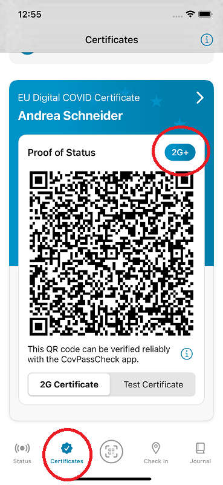
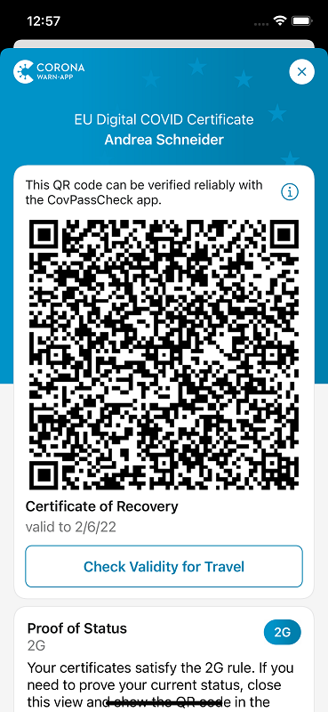
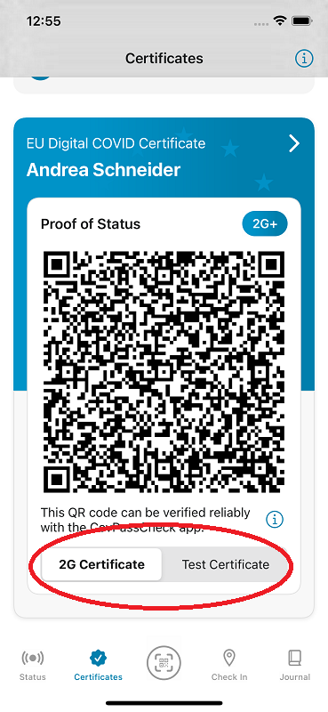
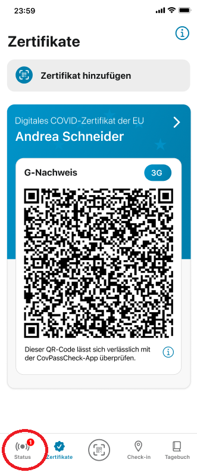

*Updated on January 17, 2022 at 12 pm*

The project team of Robert Koch Institute, Deutsche Telekom, and SAP have released **version 2.16 of the Corona-Warn-App (CWA)**. With the update, the CWA now shows users their **current status verification** in the certificate area. If users have a valid vaccination or recovery certificate and a test certificate stored in the app, these are shown in a **combined display** in the certificate overview.

<!-- overview -->

With version 2.16, the CWA shows users their current status verification in the upper right corner of their certificate and thus also which rule their existing certificates fulfill. There are four different options for this:

• **3G** – Stands for fully vaccinated, recovered, or tested negative. According to the 3G rule, users must provide one of the following certificates: **vaccine or recovery certificate, rapid test certificate** (maximum 48 hours old), **or PCR test certificate** (maximum 72 hours old).

• **3G+** – Means access is only allowed for fully vaccinated or recovered or persons with a negative PCR test. Users must provide at least one of the following certificates: **vaccination, recovery, or PCR test certificate** (maximum 72 hours old).
With 3G+ status, users automatically comply with the rules of 3G events.

• **2G** – Stands for fully vaccinated or recovered. If the 2G rule applies, only people who are fully vaccinated or recovered have access. Users must provide a **vaccination or recovery** certificate, but do not need a test certificate.
With 2G status, users automatically comply with the rules of 3G+ and 3G events.

• **2G+** – Means that only people who are fully vaccinated or recovered and have a test certificate have access. Users must provide a **vaccination or recovery certificate** and **in addition a PCR or rapid test certificate** (maximum 72 or 48 hours old). 
With 2G+ status, users automatically comply with the rules of 2G, 3G+, and 3G events.

• **2G+ with booster vaccination:** According to the decision of German federal and state health ministers, vaccinated or recovered people who have received a booster vaccination do not have to provide a test certificate under a 2G plus arrangement. The CWA does not yet take this rule into account in the status display. This means that if a user has a vaccination or recovery certificate and a booster vaccination certificate, it does not display the status 2G+ yet. The project team is already working to ensure that the CWA includes booster vaccination certificates accordingly in the future.

  

 
 

  

When users tap on their certificate, they also see **further information** that explains which rule their certificate(s) fulfill under “Proof of Status”.

  

 

<figcaption aria-hidden="true"><em>Further information on the proof of status.</em></figcaption>

  

If users have a **valid vaccination or recovery certificate and a valid test certificate** stored in the app, these will be shown in a **combined display** from version 2.16 onwards. Users can then switch between the QR code of the “2G certificate (vaccination or recovery certificate) and that of the test certificate in order to quickly and easily provide 2G+ proof. Both QR codes must be verified on site by the CovPassCheck app along with presentation of the ID card if 2G+ proof is required. 

**Please note:** For data protection reasons, it is not apparent whether the person has a vaccination or recovery certificate when the certificates are checked by the CovPassCheck-App. Those scanning the QR codes can only see whether the certificate is valid or not.

  

 

<figcaption aria-hidden="true"><em>Combined display of 2G certificate and test certificate if both are stored in the Corona-Warn-App.</em></figcaption>

  

**A negative test result is not a test certificate.** A test certificate officially confirms a negative test result in the form of a QR code in the Corona-Warn-App. Users can **request the official test certificate for PCR and rapid tests when registering a test in the Corona-Warn-App**. To do so, they can open the universal QR code scanner in the middle of the CWA’s tab bar and scan the QR code to register the test. They receive this QR code either during the booking of the test or during testing, given that the provider is connected to the Corona-Warn-App. 

After scanning the QR code, a window opens automatically where users can request the test certificate. For more information, see this blog: [Project team releases rapid test partner search and Corona-Warn-App version 2.4 with digital test certificate](https://www.coronawarn.app/en/blog/2021-06-24-cwa-version-2-4/).

## Clear indication in the app when the risk status has changed 

In addition, iOS users will now receive a notification if they have an increased risk of infection **even if the app is open while the risk assessment is running**. This is to prevent users from overlooking the warning because, for example, they are currently on the "Certificates" tab and leave the CWA from there without looking at their status display again.

In the past, the CWA notified users accordingly if the app was closed, but not if they had opened the CWA. Now, a red dot indicates users that there is news in the status area.

Android users will have this feature with version 2.17 of the Corona-Warn-App.

  

 

  

## Improved QR code scan under Android

In addition, the project team exchanged the technical library that processes QR codes under Android to ensure an improved QR code scan. The new library **recognizes QR codes faster**, especially in low-light conditions, with comparatively low print quality, and with some types of paper.

Furthermore, the CWA now provides **further recommendations in the event of a negative test result** in case users have health complaints. 

Version 2.16, like previous versions, will be rolled out gradually over 48 hours to all users. iOS users can now manually download the latest app version from the Apple store. The Google Play Store does not provide a way to trigger a manual update. The new version of the Corona-Warn-App will be available to users within the next 48 hours.
