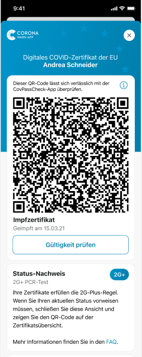
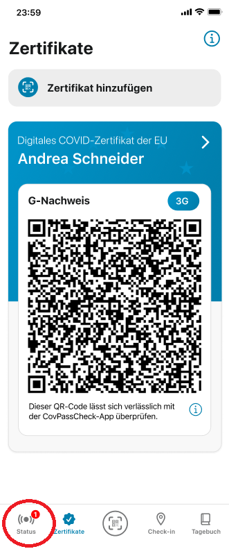

*Aktualisiert am 17. Januar 2022 um 12 Uhr*

Das Projektteam aus Robert Koch-Institut, Deutscher Telekom und SAP hat Version 2.16 der Corona-Warn-App (CWA) veröffentlicht. Mit dem Update zeigt die CWA Nutzer\*innen im Zertifikatsbereich nun ihren **aktuellen Status-Nachweis** an. Wenn Nutzer\*innen ein gültiges Impf- oder Genesenenzertifikat und ein Testzertifikat in der App hinterlegt haben, werden diese in der Zertifikatsübersicht in einer kombinierten Anzeige dargestellt. 

<!-- overview -->

Mit Version 2.16 können Nutzer\*innen  in der rechten oberen Ecke ihres Zertifikats ihren aktuellen Status-Nachweis sehen und damit auch, welche Regel(n) ihre vorhandenen Zertifikate erfüllen. Dafür gibt es **vier verschiedene Möglichkeiten:**

•	**3G** – Steht für vollständig geimpft, genesen oder negativ getestet. Nach der 3G-Regel müssen Nutzer\*innen eins der folgenden Zertifikate nachweisen: **Impf- oder Genesenenzertifikat, Schnelltestzertifikat** (maximal 48 Stunden alt) **oder PCR-Testzertifikat** (maximal 72 Stunden alt).

•	**3G+** – Bedeutet, dass der Zutritt nur für vollständig Geimpfte oder Genesene oder Personen mit einem negativen PCR-Test gestattet ist. Nutzer\*innen müssen mindestens eins der folgenden Zertifikate nachweisen: **Impf-, Genesenen-, oder PCR-Testzertifikat** (maximal 72 Stunden alt). 
Mit dem 3G+-Status erfüllen Nutzer\*innen automatisch auch die Regeln von 3G-Veranstaltungen.

•	**2G** – Steht für vollständig geimpft oder genesen. Gilt die 2G-Regel haben nur Personen, die vollständig geimpft oder genesen sind, Zutritt. Nutzer\*innen  müssen mindestens ein **Impf- oder Genesenenzertifikat** nachweisen, aber kein Testzertifikat. 
Mit dem 2G-Status erfüllen Nutzer\*innen automatisch auch die 3G+- und 3G-Regel.

•	**2G+** – Bedeutet, dass nur Personen, die vollständig geimpft oder genesen sind und zusätzlich einen negativen Test vorweisen können, Zutritt haben. Nutzer\*innen müssen ein **Impf- oder Genesenenzertifikat** nachweisen und **zusätzlich ein PCR-, oder Schnelltestzertifikat** (maximal 72 beziehungsweise 48 Stunden alt). Mit dem 2G+-Status erfüllen Nutzer\*innen automatisch auch die 2G-, 3G+- und 3G-Regeln.

**2G+ mit Auffrischimpfung:** Geimpfte oder Genesene, die eine Auffrischimpfung (Boosterimpfung) erhalten haben, müssen laut [Beschluss der Gesundheitsminister\*innen von Bund und Ländern](https://www.bundesregierung.de/breg-de/aktuelles/testpflicht-bei-2g-plus-1991544) bei einer 2G-Plus-Regelung momentan keinen aktuellen Test vorlegen. Die CWA berücksichtigt diese Regelung in der Statusanzeige derzeit noch nicht. Das heißt, bei vorhandenem Impf- oder Genesenenzertifikat und Zertifikat der Auffrischimpfung zeigt sie noch nicht den 2G+-Status an. Das Projektteam arbeitet bereits daran, dass die CWA in Zukunft Zertifikate von Auffrischimpfungen entsprechend einbezieht.

  

 
 

  

Tippen Nutzer\*innen auf ihr Zertifikat, sehen sie außerdem einen **Infokasten zum Status-Nachweis**, der erläutert, welche Regel ihr(e) Zertifikat(e) erfüllen.

  

 

<figcaption aria-hidden="true"><em>Infokasten zum Status-Nachweis unter dem jeweiligen Zertifikat.</em></figcaption>

  

Wenn Nutzer\*innen ein gültiges Impf- oder Genesenenzertifikat und ein gültiges Testzertifikat in der App hinterlegt haben, werden diese ab Version 2.16 in einer **kombinierten Anzeige** dargestellt. 

Nutzer\*innen können dann über den Schalter zwischen dem QR-Code des „2G-Zertifikats“ (Impf- oder Genesenennachweis) und dem des Testzertifikats wechseln, um schnell und unkompliziert einen 2G+-Nachweis zu erbringen. Beide QR-Codes müssen vor Ort mit der CovPassCheck-App zusammen mit Vorlage des Personalausweises geprüft werden, wenn ein 2G+-Nachweis erforderlich ist. 

**Wichtig:** Aus Datenschutzgründen ist bei der Kontrolle der Zertifikate durch die CovPassCheck-App nicht ersichtlich, ob die Person ein Impf- oder Genesenenzertifikat hat. Beim Scan der QR-Codes sehen die Kontrollierenden nur, ob das Zertifikat gültig ist oder nicht. 

  

 

<figcaption aria-hidden="true"><em>Kombinierte Zertifikatsanzeige von 2G-Zertifikat und Testzertifikat.</em></figcaption>

  

**Ein negatives Testergebnis ist kein Testzertifikat.** Ein Testzertifikat bestätigt ein negatives Testergebnis offiziell in Form eines QR-Codes in der Corona-Warn-App. Nutzer*innen können das offizielle Testzertifikat für PCR- und Schnelltests anfordern, wenn sie einen **Test in der Corona-Warn-App registrieren.** Dafür können sie den universellen QR-Code-Scanner in der Mitte der Registerkarte der CWA öffnen und den QR-Code zur Test-Registrierung scannen. Den erhalten sie entweder schon während der Buchung des Tests oder vor Ort beim Testen, sofern der Anbieter an die Corona-Warn-App angeschlossen ist. 

Nach dem Scannen des QR-Codes öffnet sich automatisch ein Fenster, in dem sie das **Testzertifikat anfordern** können. Mehr Informationen finden Sie in diesem Blog: [Projektteam veröffentlicht Online-Schnelltestpartnersuche und Corona-Warn-App Version 2.4 mit digitalem Testzertifikat](https://www.coronawarn.app/de/blog/2021-06-24-cwa-version-2-4/).

## Deutlicher Hinweis in der App bei Veränderung des Risikostatus

Des Weiteren bekommen iOS-Nutzer\*innen im Falle einer roten Kachel ab Version 2.16 auch einen **Hinweis über die Änderung des Risikostatus, wenn sie die App geöffnet haben**, während die Risikoermittlung läuft. Damit soll vermieden werden, dass Nutzer*innen die Warnung übersehen, weil sie beispielsweise gerade unter dem Reiter „Zertifikate“ sind und von dort die CWA wieder verlassen, ohne noch einmal auf ihre Statusanzeige zu schauen. 

In der Vergangenheit hat die CWA Nutzer\*innen entsprechend benachrichtigt, wenn die App geschlossen war, nicht aber, wenn sie die CWA geöffnet hatten. Nun weist sie die Nutzer\*innen mit einem roten Punkt daraufhin, dass es Neuigkeiten im Statusbereich gibt.  

Android-Nutzer\*innen steht dieses Feature ab Version 2.17 der CWA zur Verfügung.

  

 

  

## Verbesserter QR-Code-Scan unter Android

Zudem hat das Projektteam unter Android die technische Bibliothek ausgetauscht, mit der QR-Codes verarbeitet werden, um einen verbesserten QR-Code-Scan zu gewährleisten. Die nun verwendete Bibliothek ermöglicht eine **schnellere Erkennung des QR-Codes**, insbesondere bei schwachen Licht-Verhältnissen, bei vergleichsweise niedriger Druckqualität und bei einigen Papiersorten. 

Außerdem erhalten Nutzer\*innen **im Falle eines negativen Testergebnisses** weitere Handlungsempfehlungen in der CWA für den Fall, dass sie trotzdem akute gesundheitliche Beschwerden haben. 

Version 2.16 wird, wie vorherige Versionen auch, schrittweise über 48 Stunden an alle Nutzer\*innen ausgerollt. iOS-Nutzer\*innen können sich die aktuelle App-Version ab sofort aus dem Store von Apple manuell herunterladen. Der Google Play Store bietet keine Möglichkeit, ein manuelles Update anzustoßen. Hier steht Nutzer*innen die neue Version der Corona-Warn-App innerhalb der nächsten 48 Stunden zur Verfügung.
