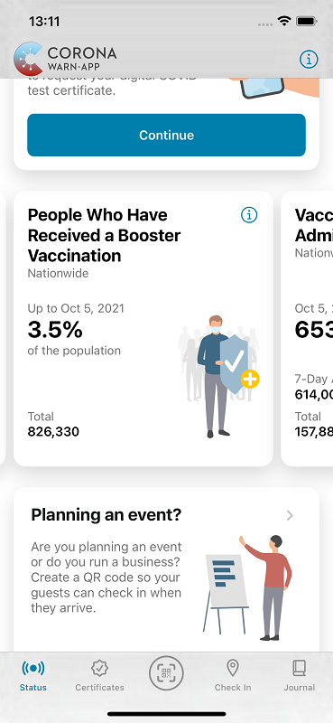
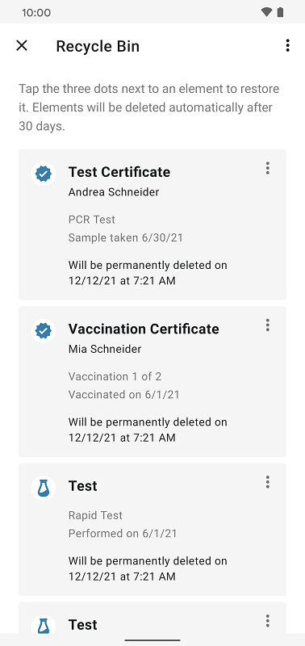
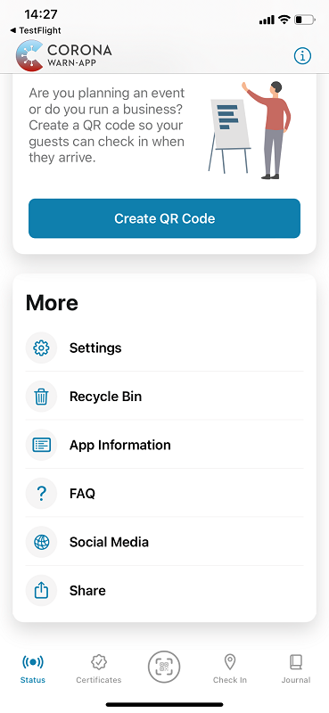
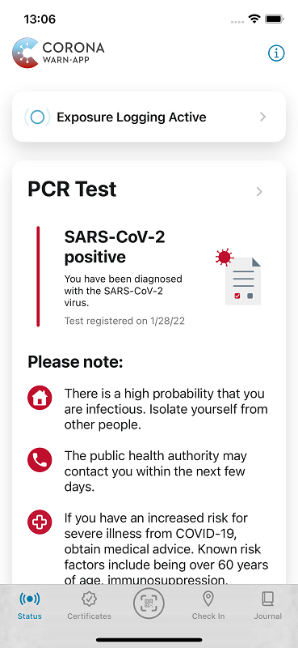

## Project team publishes CWA version 2.17

The project team of the Robert Koch Institute, Deutsche Telekom, and SAP have released version 2.17 of the Corona-Warn-App (CWA). With the update, users can now see the **number of people in Germany who have received a booster vaccination** in the statistics. In addition, the project team has revised the **notes and procedure for a positive test result** and added a **link to the CWA’s social media channels**. Furthermore, the recycle bin now displays the deletion date for each item.

<!-- overview -->

As of version 2.17, users can see the number of people in Germany who have received a booster vaccination in addition to the statistics for fully vaccinated people and those who have received at least one vaccine dose. 

  

 

  

### Recycle bin shows exact date of deletion

In addition, users can now see the deletion date for each item in their recycle bin. As of [CWA version 2.13](/en/blog/2021-11-03-cwa-version-2-13/), all certificates and tests that have been deleted are initially moved to the recycle bin for 30 days. Users can now see when the 30 days will expire, i.e., **when the respective certificate will be permanently deleted**. 

  

 

<figcaption aria-hidden="true"><em>Date of deletion in the recycle bin (Android)</em></figcaption>

  

Android users can access their recycle bin by selecting the three dots in the upper-right corner of their app and then tapping “recycle bin”. iOS users can swipe down on the home screen of their Corona-Warn-App and select “recycle bin” under “More”.

### Users can follow the CWA on Twitter and Instagram to stay up to date

For version 2.17, the project team has added a **link to the CWA’s social media channels (in German language)** so that users can catch up on the latest developments and engage with others. Android users can find the link to the social media channels by tapping the three dots in the top-right corner of the app and then selecting “Social Media”. iOS users can swipe down on the CWA’s home screen and select “Social Media” under “More”.

  

 

<figcaption aria-hidden="true"><em>Link to the CWA's social media channels (iOS).</em></figcaption>

  

The link in the app takes users to the CWA’s website, where they can follow the link to the CWA’s Twitter channel and the link to the RKI’s Instagram channel. 

Via the **CWA’s Twitter account ([@coronawarnapp](https://twitter.com/coronawarnapp))**, the project team regularly informs users about key metrics, updates, and new features. Users can also ask questions, participate in surveys, and discuss with other followers. 

At [**RKI_für_Euch on Instagram**](https://www.instagram.com/rki_fuer_euch/?hl=de), users can learn about the Robert Koch Institute, the evolution of the pandemic, and the CWA in general. 
 

### Notes and guidance in case of a positive test results

In addition, the project team has revised the notes and procedure for positive PCR and rapid test result. The CWA thus takes into account the current recommendations of the Robert Koch Institute on testing and contact person management.  
. 

  

 
 

  

For example, the app now indicates risk factors under positive PCR test results. In the test result details, it informs users that the isolation time  is usually 10 days and people to whom positively tested users have been in close contact for at least 10 minutes in total are considered contact persons.

As of version 2.17, **Android users** will also receive a **notification if they have an increased risk of infection even if the app is open** while the risk assessment is running. This is to prevent users from overlooking the warning because, for example, they are currently on the "Certificates" tab and leave the CWA from there without looking at their status display again. A red dot on the status tab also indicates that there is news in the status area. 
In the past, the CWA notified users accordingly if the app was closed, but not if they had opened the CWA. For iOS users, this feature is available since CWA version 2.16.

Version 2.17, like previous versions, will be rolled out gradually over 48 hours to all users. iOS users can now manually download the latest app version from the Apple store. The Google Play Store does not provide a way to trigger a manual update. The new version of the Corona-Warn-App will be available to users within the next 48 hours.
