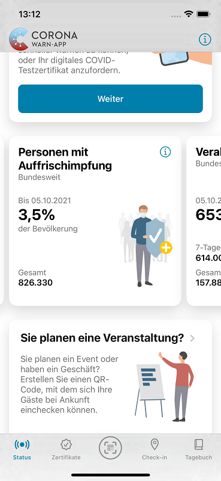
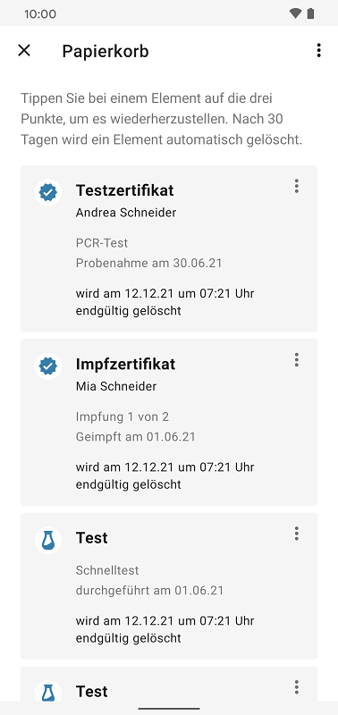
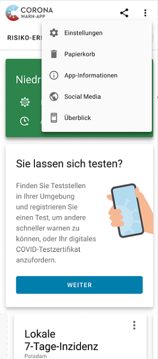
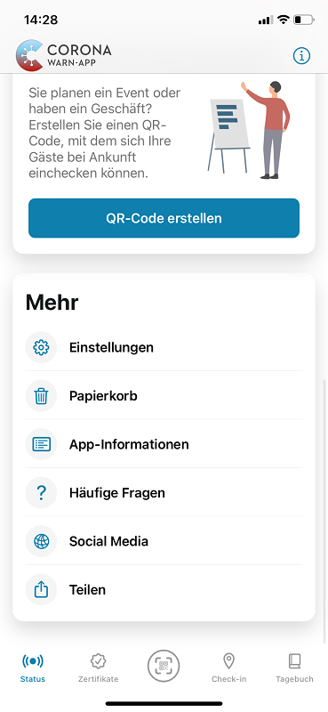
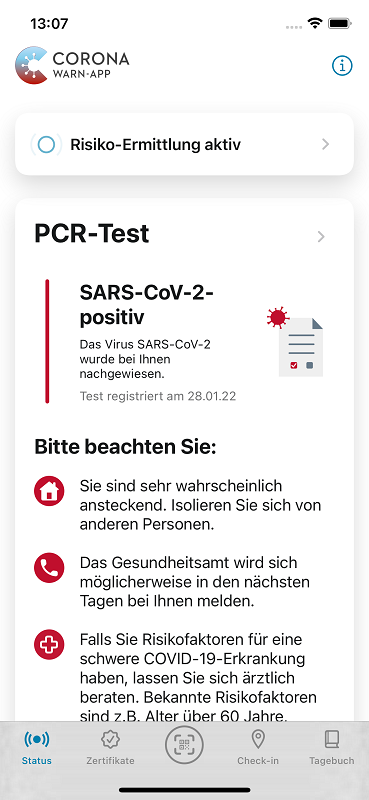

## Projektteam veröffentlicht CWA Version 2.17

Das Projektteam aus Robert Koch-Institut, Deutscher Telekom und SAP hat Version 2.17 der Corona-Warn-App (CWA) veröffentlicht. Mit dem Update können Nutzer*innen im Statistikbereich nun die **Anzahl an Personen in Deutschland sehen, die eine Auffrischimpfung** (Boosterimpfung) erhalten haben. Außerdem hat das Projektteam die Hinweise sowie Vorgehensweise bei einem positiven Testergebnis überarbeitet und einen **Link zu den Social-Media-Kanälen der CWA** eingefügt. Zudem wird im **Papierkorb nun das Löschdatum** für jedes Element angezeigt.

<!-- overview -->

Ab Version 2.17 können Nutzer\*innen neben den Statistiken für geimpfte Personen jetzt auch die Anzahl der Personen in Deutschland sehen, die eine Auffrischimpfung erhalten haben. 

  

 

  

### Papierkorb zeigt Löschdatum an

Außerdem können Nutzer\*innen nun für jedes Element in ihrem Papierkorb das **Löschdatum** sehen. Seit [Version 2.13 der CWA](/de/blog/2021-11-03-cwa-version-2-13/) werden alle Zertifikate und Tests, die gelöscht wurden, zunächst für 30 Tage in den Papierkorb verschoben. Dort sehen Nutzer\*innen nun, wann die 30 Tage abgelaufen sind und das jeweilige Zertifikat endgültig gelöscht wird. 

  

 

<figcaption aria-hidden="true"><em>Löschdatum im Papierkorb (Android)</em></figcaption>

  

**Android-Nutzer\*innen** gelangen zu ihrem Papierkorb, indem sie in der rechten oberen Ecke ihrer App die drei Punkte auswählen und dann auf „Papierkorb“ tippen. **iOS-Nutzer*innen** können auf dem Startbildschirm ihrer Corona-Warn-App nach unten wischen und dort unter „Mehr“ den „Papierkorb“ auswählen.

### Über Twitter und Instagram können Nutzer*innen sich informieren und austauschen

Des Weiteren hat das Projektteam einen **Link zu den Social-Media-Kanälen der CWA** eingefügt. Dort können Nutzer\*innen sich über die App informieren und sich mit anderen austauschen. Android-Nutzer\*innen finden den Link zu den Social-Media-Kanälen, indem sie auf die drei Punkte in der oberen Rechten Ecke der App tippen und dann „Social Media“ auswählen. iOS-Nutzer*innen können in der CWA nach unten wischen und dort unter dem Punkt „Mehr“ „Social Media“ auswählen.

  

 
 
<figcaption aria-hidden="true"><em>Link zu Social-Media-Kanälen der CWA (links Android, rechts iOS).</em></figcaption>

  

Über den Link in der App gelangen Nutzer\*innen zunächst auf die Website der CWA, wo sie dem Link auf den Twitter-Kanal der CWA oder dem Link auf den Instagram-Kanal des RKI folgen können. 

Über den **Twitter-Account der CWA** ([@coronawarnapp](https://twitter.com/coronawarnapp)) informiert das Projektteam regelmäßig über wichtige Kennzahlen, Updates und neue Features der App. Außerdem können Nutzer\*innen Fragen stellen, bei Umfragen mitmachen und mit anderen Follower*innen diskutieren. 

Bei [**RKI_für_Euch auf Instagram**](https://www.instagram.com/rki_fuer_euch/?hl=de) finden Nutzer\*innen Wissenswertes über das Robert Koch-Institut, die Entwicklung der Pandemie und die CWA im Allgemeinen. 

### Hinweise und Vorgehensweise bei positiven Testergebnissen

Außerdem hat das Projektteam die Hinweise und Vorgehensweise bei einem positiven PCR- und Schnelltestergebnis überarbeitet. Die CWA berücksichtigt damit die aktuellen Hinweise und **Empfehlungen des Robert Koch-Instituts [zur Testung](https://www.rki.de/DE/Content/InfAZ/N/Neuartiges_Coronavirus/Teststrategie/Nat-Teststrat.html) und dem [Kontaktpersonenmanagement](https://www.rki.de/DE/Content/InfAZ/N/Neuartiges_Coronavirus/Kontaktperson/Management.html;jsessionid=F75CD2A1645116D1558155F4644CD64E.internet091?nn=13490888)**. 

  

 
 

  

Beispielsweise weist die App bei positiven PCR-Tests nun auf Risikofaktoren hin. In den Details zum Testergebnis informiert sie außerdem darüber, dass die Isolationszeit in der Regel 10 Tage beträgt und Personen, zu denen positiv getestete Nutzer*innen über insgesamt mindestens 10 Minuten engen Kontakt hatten, als Kontaktpersonen gelten. 

**Android-Nutzer\*innen** erhalten ab Version 2.17 zudem auch **bei geöffneter App eine Benachrichtigung**, wenn die CWA ein **erhöhtes Infektionsrisiko** für sie ermittelt hat. Damit soll vermieden werden, dass Nutzer\*innen die Risiko-Warnung auf der Status-Registerkarte übersehen, weil sie zur Zeit der Risikoüberprüfung beispielsweise unter dem Reiter „Zertifikate“ sind und die CWA verlassen, ohne noch einmal auf die Statusanzeige zu schauen. Ein **roter Punkt an der Status-Registerkarte** weist Nutzer\*innen zusätzlich auf den veränderten Risikostatus hin. Für iOS-Nutzer*innen steht diese Funktion seit CWA-Version 2.16 zur Verfügung.

Version 2.17 wird, wie vorherige Versionen auch, schrittweise über 48 Stunden an alle Nutzer\*innen ausgerollt. iOS-Nutzer*innen können sich die aktuelle App-Version ab sofort aus dem Store von Apple manuell herunterladen. Der Google Play Store bietet keine Möglichkeit, ein manuelles Update anzustoßen. Hier steht Nutzer\*innen die neue Version der Corona-Warn-App innerhalb der nächsten 48 Stunden zur Verfügung.
