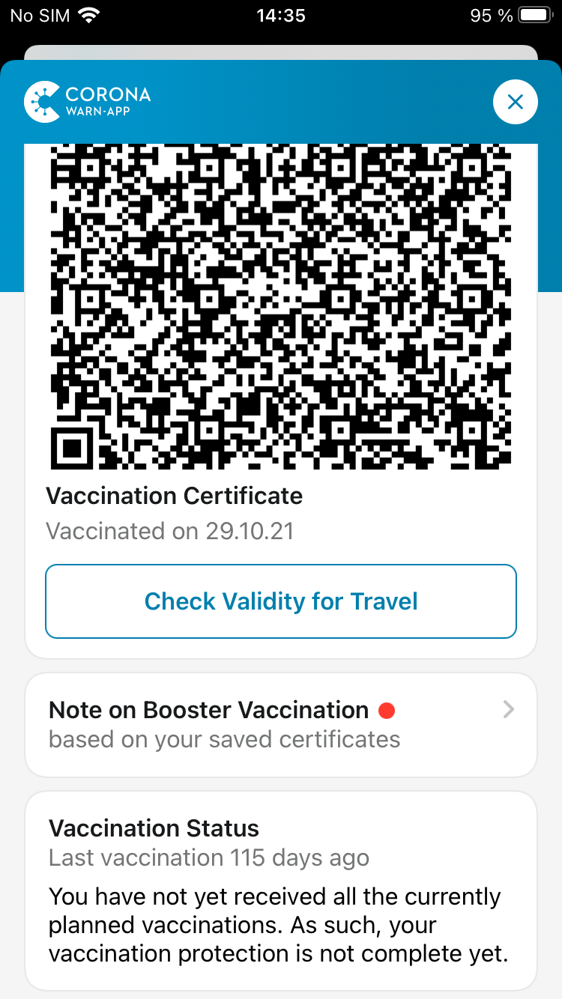
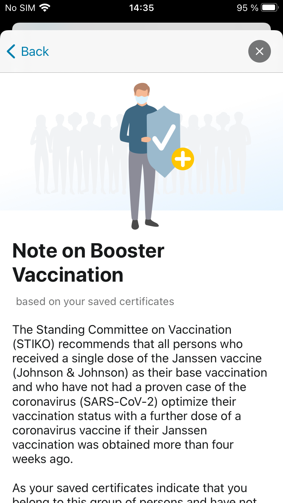

The project team consisting of the Robert Koch Institute, Deutsche Telekom and SAP has released version 2.18 of the Corona-Warn-App (CWA). Version 2.18 now allows the dynamic mapping of rules, each of which must be specified and stored by the federal government and the states. The CWA then automatically maintains these rules. These rules can always be found on the corresponding websites of the federal government and the federal states. In the new release, among other things, the 2G+ status is now displayed for persons with booster vaccination.

<!-- overview -->

### G status

<figure>
<figcaption aria-hidden="true"><em>Fig. 1: 2G+ status display in the CWA</em></figcaption>
</figure>

The rules for the validity of vaccination, recovery and test certificates change very dynamically and at short notice in the current pandemic according to scientific findings and political decisions. In the Corona-Warn-App, such rule changes always require code changes and thus, until now, an update of the app. 

In order to be able to react more quickly to rule adjustments in the future, the project team has moved the logic for determining the validity and priority of certificates to a server-side configuration. This means rule adjustments can be implemented in the CWA in a timely manner without the need to update to a new version of the CWA. 

In addition, the display of the G status is improved in this release. If the appropriate certificates are stored in the app, the following cases will be assigned to the 2G+ status:

- Tested and (a) Fully vaccinated (from day 15 after vaccination) or (b) recovered with incomplete vaccination (from day 29 after a positive PCR test result). Applies as long as a valid test is available; 2G status thereafter.
- "Boosted" (boosted) means: (a) Basic immunized and received booster vaccination (applies immediately) or (b) Recovered and received at least two vaccinations thereafter (applies immediately or from day 15 with a 2/1 certificate) or (c) Fully vaccinated and recovered (from day 29 after positive PCR test result).
The 2G+ status is indefinite.
- "Freshly" vaccinated: fully vaccinated (from day 15 to day 90 post-vaccination; thereafter 2G status). 
- "Freshly" recovered: (a) after incomplete vaccination or (b) without vaccination. (From day 29 to day 90 after positive PCR test result; thereafter 2G status (a) or no G status (b)).
- Vaccinated after recovery (Applies immediately until day 90 after vaccination; 2G status thereafter).

Furthermore, regarding the G status:
- A valid negative PCR test alone fulfills 3G+ status (72 h). 
- A valid negative rapid antigen test alone fulfills 3G status (48 h).
- No G status: incompletely vaccinated (only one vaccination including a single J&J vaccination) or recovered before day 29 or from day 91 after positive PCR test result.

For local interpretation and, if necessary, time limits, please contact the authorities of the respective federal state.

An overview of the state regulations can be found here [in German language]: [Bundesregierung - Corona-Regeln in den Ländern](https://www.bundesregierung.de/breg-de/themen/coronavirus/corona-bundeslaender-1745198)

Questions about the current status are answered in our [FAQ](../../faq/#admission_policy)

### Adjustment of display for booster vaccination

    

        

            <figure>
                
                <figcaption aria-hidden="true">
                    <em>Fig. 2: Note on Booster Vaccination</em>
                </figcaption>
            </figure>
        

        

            <figure>
                
                <figcaption aria-hidden="true">
                    <em>Fig. 3: Note on Booster Vaccination detail view</em>
                </figcaption>
            </figure>
        

    

There is now a clear display as part of the reminder for booster vaccinations. Additional information about a recommended booster vaccination is now displayed via a link.	

Version 2.18, like previous versions, will be rolled out gradually to all users over 48 hours. iOS users can now download the current app version manually from the Apple Store. The Google Play Store does not offer the option of triggering a manual update. Here, the new version of the Corona-Warn-App will be available to users within the next 48 hours.