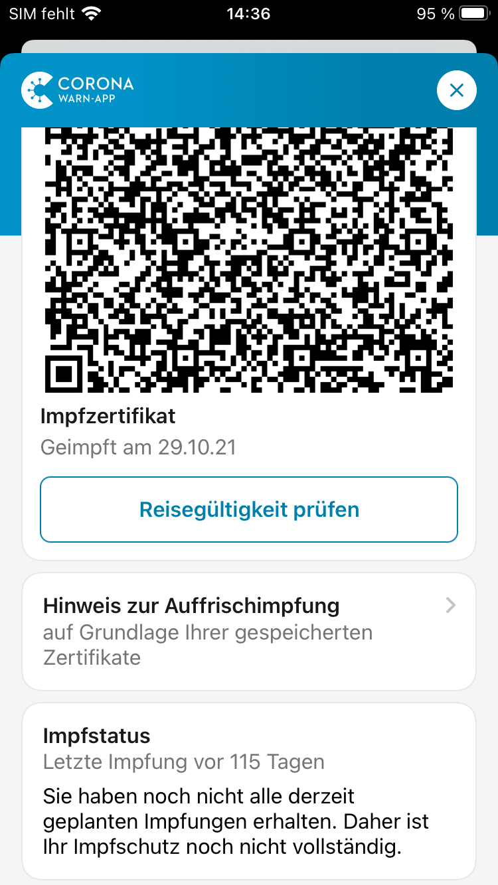
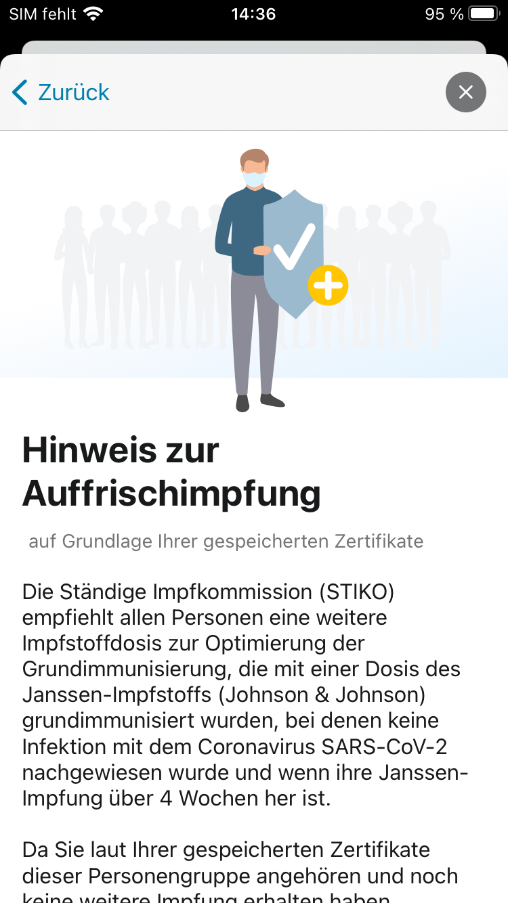

Das Projektteam aus Robert Koch-Institut, Deutscher Telekom und SAP hat Version 2.18 der Corona-Warn-App (CWA) veröffentlicht. Die Version 2.18 erlaubt es jetzt, dynamisch Regeln abzubilden, die jeweils vom Bund und den Ländern vorgegeben und hinterlegt werden müssen. Die CWA pflegt diese Regeln dann automatisch ein. Diese entnehmen Sie bitte stets aktuell den entsprechenden Webseiten des Bundes und der Bundesländer. Im neuen Release wird nun unter anderem der 2G+-Status bei Personen mit Auffrischimpfung angezeigt.

<!-- overview -->

### G-Status

<figure>
<figcaption aria-hidden="true"><em>Abb. 1: 2G+-Status-Anzeige in der CWA</em></figcaption>
</figure>

Die Regeln zur Gültigkeit von Impf-, Genesenen- und Testzertifikaten ändern sich im aktuellen Pandemiegeschehen entsprechend den wissenschaftlichen Erkenntnissen und politischen Entscheidungen sehr dynamisch und kurzfristig. In der Corona-Warn-App erfordern solche Regeländerungen immer Code-Änderungen und damit bisher ein Update der App. 

Um in Zukunft schneller auf Anpassungen der Regeln reagieren zu können, hat das Projektteam die Logik zur Bestimmung der Gültigkeit und Priorität von Zertifikaten in eine Server-seitige Konfiguration verschoben. Das bedeutet, Regelanpassungen können zeitnah in der CWA umgesetzt werden, ohne dass ein Update auf eine neue Version der CWA erforderlich ist. 

Zusätzlich wird in diesem Release die Anzeige des G-Status verbessert. Sind die entsprechenden Zertifikate in der App abgelegt, werden folgende Fälle dem 2G+-Status zugeordnet:

- Getestet und (a) Vollständig geimpft (ab Tag 15 nach der Impfung) oder (b) Genesen mit unvollständiger Impfung (ab Tag 29 nach einem positiven PCR-Testergebnis). Gilt, solange ein gültiger Test vorliegt; danach 2G-Status.
- „Aufgefrischt“ (geboostert) bedeutet: (a) Grundimmunisiert und Auffrischimpfung erhalten (gilt sofort) oder (b) Genesen und danach mindestens zwei Impfungen erhalten (gilt sofort bzw. ab Tag 15 mit einem 2/1-Zertifikat) oder (c) Vollständig geimpft und genesen (ab Tag 29 nach positivem PCR-Testergebnis).
Der 2G+-Status ist zeitlich unbegrenzt.
- „Frisch“-Geimpft: Vollständig geimpft (ab Tag 15 bis Tag 90 nach der Impfung; danach 2G-Status) 
- "Frisch"-Genesen: (a) nach unvollständiger Impfung oder (b) ohne Impfung. (Ab Tag 29 bis Tag 90 nach positivem PCR-Testergebnis; danach 2G-Status (a) bzw. kein G-Status (b))
- Geimpft nach Genesung (Gilt sofort bis Tag 90 nach der Impfung; danach 2G-Status)

Bezüglich des G-Status gilt des Weiteren:
- Ein gültiger negativer PCR-Test allein erfüllt 3G+-Status (72 h) 
- Ein gültiger negativer Antigen-Schnelltest allein erfüllt 3G-Status (48 h)
- Kein G-Status: Unvollständig Geimpfte (nur eine Impfung einschließlich einer einzigen J&J-Impfung) oder Genesene vor Tag 29 oder ab Tag 91 nach positivem PCR-Testergebnis

Zur lokalen Auslegung und ggf. zeitlichen Begrenzung informieren Sie sich bitte bei den Behörden des jeweiligen Bundeslandes.

Eine Übersicht der Länderverordnungen finden Sie hier: [Bundesregierung - Corona-Regeln in den Ländern](https://www.bundesregierung.de/breg-de/themen/coronavirus/corona-bundeslaender-1745198)

Fragen zum aktuellen Status beantworten wir in unseren [FAQ](../../faq/#admission_policy)

### Anpassung der Darstellung für Auffrischimpfung

    

        

            <figure>
                
                <figcaption aria-hidden="true">
                    <em>Abb. 2: Hinweis zur Auffrischimpfung</em>
                </figcaption>
            </figure>
        

        

            <figure>
                
                <figcaption aria-hidden="true">
                    <em>Abb. 3: Detailansicht des Hinweises zur Auffrischimpfung</em>
                </figcaption>
            </figure>
        

    

Im Rahmen der Erinnerung für Auffrischimpfungen gibt es nun eine übersichtliche Darstellung. Weitere Informationen zu einer empfohlenen Auffrischimpfung sind nun über einen Link dargestellt.

Version 2.18 wird, wie vorherige Versionen auch, schrittweise über 48 Stunden an alle Nutzer\*innen ausgerollt. iOS-Nutzer\*innen können sich die aktuelle App-Version ab sofort aus dem Store von Apple manuell herunterladen. Der Google Play Store bietet keine Möglichkeit, ein manuelles Update anzustoßen. Hier steht Nutzer\*innen die neue Version der Corona-Warn-App innerhalb der nächsten 48 Stunden zur Verfügung.