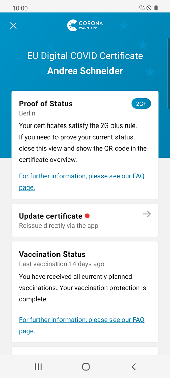
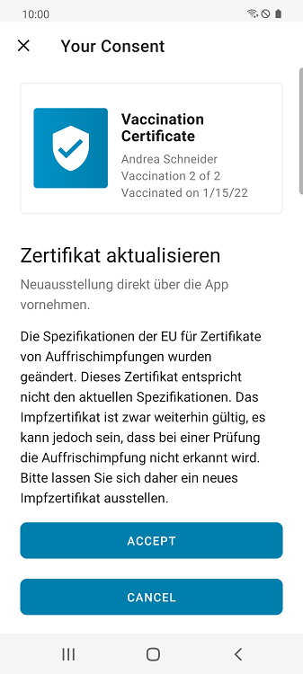
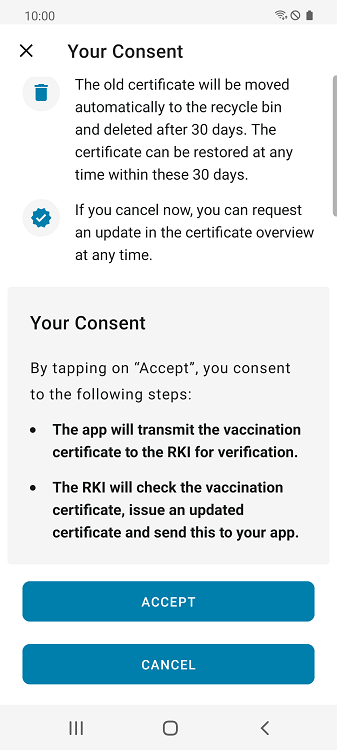
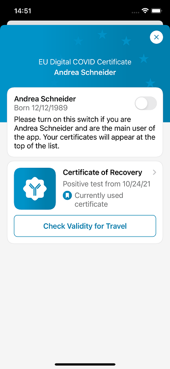
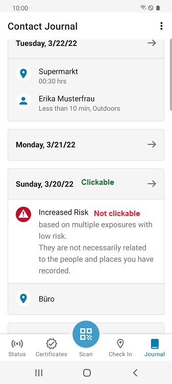
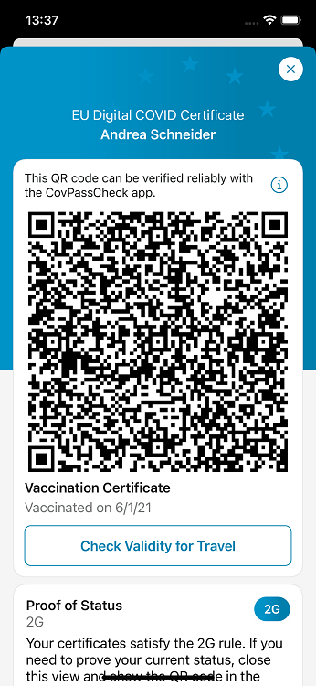
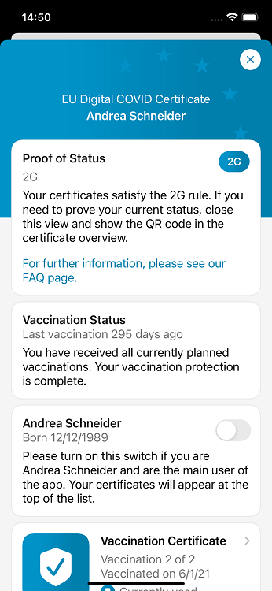

The project team of the Robert Koch Institute (RKI), Deutsche Telekom, and SAP have **released version 2.20 of the Corona-Warn-App (CWA)**. With the update, the project team translated the CWA into Ukrainian, shortened the increased risk display (red tile), and improved notifications for risk encounters and G-status changes. Besides, they adjusted the risk display after a positive test result. Also, recovery certificates won’t display validity dates anymore since the validity of the certificates depends on local rules. In addition, since March 29, 2022, users will be able to issue new vaccination certificates directly via the 

<!-- overview -->

### Corona-Warn-App available in Ukrainian language
With version 2.20, the CWA is available in Ukrainian. Users had been able to download it from the Ukrainian App/Play Store since the beginning of March. Now the project team has translated it completely into Ukrainian. 

### EU changes requirements: CWA enables reissuing of vaccination certificates directly via the app
Some CWA users will find the **note "Update certificate"** under their booster vaccination certificate these days. This is not because their certificate has expired, but because the EU has changed the requirements for booster vaccination certificates. This means that certificates that do not meet these requirements are still valid but may not be recognized as such when checked for validity. The changes primarily affect users who have received the **Johnson & Johnson vaccine or a post-recovery vaccination**.

**The reason:** The affected users received only one vaccination as their basic immunization, which the CWA has recorded as "Vaccination 1 of 1." Accordingly, their booster vaccination was coded as "Vaccination 2 of 2". However, this does not allow the CWA to distinguish this booster vaccination from "Vaccination 2 of 2" of all those who received two vaccinations for basic immunization (vaccines from BioNTech, Moderna or AstraZeneca). As a result, the CWA **does not recognize the booster vaccination** of users who were vaccinated with Johnson & Johnson’s vaccine or who received a vaccination after recovery. To enable it to distinguish between these certificates in the future, the booster vaccination of the affected users will be coded as "vaccination 2 of 1" effective immediately. 

The CWA automatically detects whether there are certificates that need to be exchanged and informs the users. They can then **voluntarily request a new vaccination certificate free of charge directly via the CWA** by tapping on the "Update certificate" notice under their affected certificate. After they have given their consent, the certificate is sent to the Robert Koch Institute (RKI) for verification. Afterwards, the RKI issues the updated certificate and transmits it back to the CWA. Users can then find their updated certificate in the “Certificates” tab as usual.

The old certificate is automatically moved to the recycle bin, where it is permanently deleted after 30 days. 

  

 
  
<figcaption aria-hidden="true"><em></em></figcaption>

  

### Display of increased risk shortened from 14 to 10 days 
Furthermore, as of version 2.20, the CWA only looks at the **last 10 days for calculating the risk of infection** and not the last 14 days as before. This is in line with current quarantine specifications. A red tile therefore automatically turns green again on the 11th day after the last risk encounter. As before, users cannot reset the red tile to green manually or by registering a negative test result, as they can still develop symptoms because of the risk encounter within these 10 days (more information [in this blog](/en/blog/2021-12-15-cwa-red-tile-guidance/)). 

### Adjustment of risk display after positive test result and notifications 
The project team also adjusted the risk display after a positive test result. If users have registered a positive test in the CWA, they will now **see the red tile** in case they have had an encounter with increased risk. After 7 days, they will automatically be shown the tile again, regardless of whether there is an increased risk or not. 

Previously, the CWA no longer displayed the risk tile to users who shared a positive test result. Accordingly, they were no longer warned until they manually deleted the test.  
 
Furthermore, the CWA now **notifies users when the date of the last encounter with increased risk on the red tile has changed**. Previously, users were not notified again if they had another, more recent encounter with increased risk after a risk encounter. 

CWA users will also be **notified when their G-status has changed** – for example from 2G to 2G+. This can be the case if they have added a certificate, or the rules have changed.

### Recovery certificates now without validity dates
As of version 2.20, validity dates are no longer displayed on recovery certificates. Since the validity of the certificates depends on local rules, the **date of the first positive test** on which the certificate is based is now displayed instead. 

  

 
<figcaption aria-hidden="true"><em>Certificate of recovery with the date of the first positive test.</em></figcaption>

  

### User interface improvements
With version 2.20, the project team has also improved the user interface. First, users can **no longer tap on the warnings in the contact diary**, but only on the date. As before, when tapping on the date, users will see the people and places they’ve entered for that day. However, the people and places are not necessarily connected to the warning. 

  

 
<figcaption aria-hidden="true"><em>Warning of an increased risk in the contact journal</em></figcaption>

  

Second, the project team has **removed the QR code for the currently used certificate from the details screen** in the certificate area. The same QR code is also shown in the certificate overview and is therefore not needed again on the detail screen of the respective person. 

  

 
 
<figcaption aria-hidden="true"><em>Left: details screen before, right: details screen as of version 2.20</em></figcaption>

  

In addition, the CWA is now capable of **running on Android 13**, which Google says will be released in the fall of 2022. 

Version 2.20, like previous versions, will be rolled out to all users in stages over 48 hours. iOS users can now download the latest app version manually from the Apple Store. The Google Play Store does not offer the option of triggering a manual update. The new version of the Corona warning app will be available to users here within the next 48 hours.

Up-to-date information on the status of the roll-out can be found on the **[Twitter channel of #coronawarnapp](https://twitter.com/coronawarnapp)** (German only).

