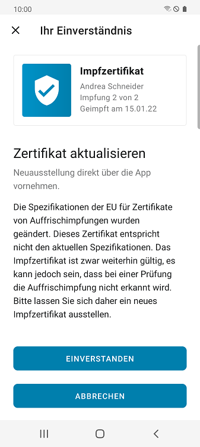
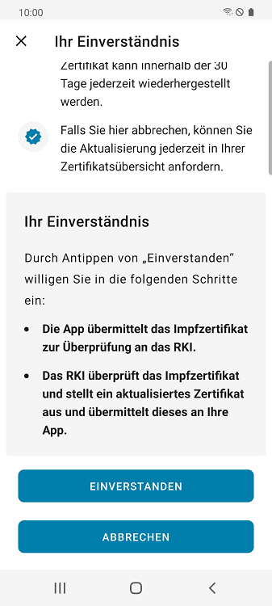
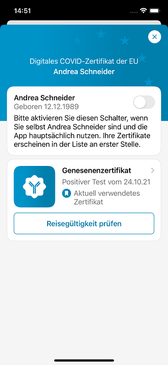
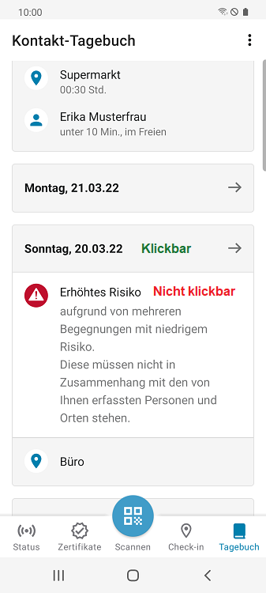
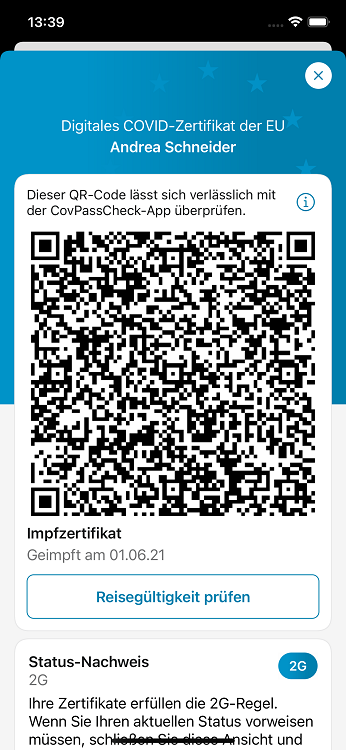
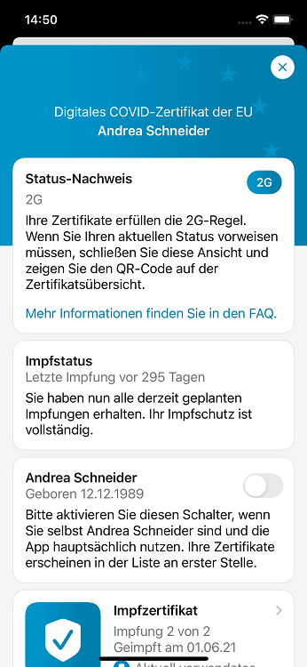

Das Projektteam aus Robert Koch-Institut (RKI), Deutscher Telekom und SAP hat **Version 2.20 der Corona-Warn-App (CWA) veröffentlicht**. Mit dem Update hat das Projektteam die CWA ins Ukrainische übersetzt, die Anzeige des erhöhten Risikos (rote Kachel) verkürzt sowie Benachrichtigungen bei Risikobegegnungen und Status-Änderungen verbessert. Außerdem wurde die Risikoanzeige nach positivem Testergebnis angepasst. Für Genesenenzertifikate werden zudem künftig keine Gültigkeitsdaten mehr angezeigt, da die Gültigkeit der Zertifikate von lokalen Regeln abhängig ist. Seit dem 29. März 2022 können Nutzer*innen außerdem Impfzertifikate direkt über die App neu ausstellen lassen.

<!-- overview -->

### Corona-Warn-App auf Ukrainisch verfügbar
Mit Version 2.20 gibt es die CWA auch in ukrainischer Sprache. Nutzer*innen können sie bereits seit Anfang März aus dem ukrainischen App-/Play Store herunterladen. Nun hat das Projektteam sie komplett ins Ukrainische übersetzt. 

### Änderungen der EU-Vorgaben: CWA ermöglicht Neuausstellung von Impfzertifikaten direkt über die App

Einige CWA-Nutzer\*innen werden dieser Tage den **Hinweis „Zertifikat aktualisieren“** unter ihrem Zertifikat der Auffrischimpfung finden. Das liegt nicht etwa daran, dass ihr Zertifikat abgelaufen ist, sondern daran, dass die EU die Vorgaben für Impfzertifikate von Auffrischimpfungen geändert hat. Damit sind Zertifikate, die nicht den aktuellen Vorgaben entsprechen, zwar weiterhin gültig, werden bei einer Überprüfung aber möglicherweise nicht anerkannt. Die Änderungen betreffen vor allem Nutzer\*innen, die den Impfstoff von **Johnson & Johnson** oder eine **Impfung nach Genesung** erhalten haben.

Der **Grund der Änderung:** Die betroffenen Nutzer\*innen haben als Grundimmunisierung nur eine Impfung erhalten, die die CWA als „Impfung 1 von 1“ eingetragen hat. Ihre **Auffrischimpfung** wurde entsprechend als **„Impfung 2 von 2“** codiert. Dadurch kann die CWA diese Auffrischimpfung allerdings nicht von „Impfung 2 von 2“ all derer unterscheiden, die zwei Impfungen zur Grundimmunisierung erhalten haben (Impfstoffe von BioNTech, Moderna oder AstraZeneca). Das führt dazu, dass die CWA die Auffrischimpfung der Nutzer\*innen, die mit dem Johnson & Johnson-Impfstoff geimpft wurden oder eine Impfung nach Genesung erhalten haben, nicht als solche erkennt. Damit sie diese Zertifikate zukünftig unterscheiden kann, wird die Auffrischimpfung der betroffenen Nutzer*innen ab sofort als **„Impfung 2 von 1“** codiert. 

Die CWA erkennt automatisch, ob Zertifikate vorliegen, die ausgetauscht werden sollen und informiert die entsprechenden Nutzer\*innen. Sie können dann **freiwillig und kostenlos ein neues Impfzertifikat direkt über die CWA anfordern**, indem sie auf den Hinweis „Zertifikat aktualisieren“ unter ihrem betroffenen Zertifikat tippen. Nachdem sie ihr Einverständnis gegeben haben, wird das Zertifikat zur Überprüfung an das Robert Koch-Institut übermittelt. Danach stellt das RKI das aktualisierte Zertifikat aus und übermittelt es wieder an die CWA. Nutzer\*innen finden ihr aktualisiertes Zertifikat dann wie üblich in der Zertifikats-Registerkarte.

Das alte Zertifikat wird automatisch in den Papierkorb verschoben und dort nach 30 Tagen endgültig gelöscht. 

  

 
  
<figcaption aria-hidden="true"><em></em></figcaption>

  

### Anzeige des erhöhten Risikos von 14 auf 10 Tage verkürzt 
Des Weiteren betrachtet die CWA für die Berechnung des Infektionsrisikos ab Version 2.20 nur noch **die letzten 10 Tage** und nicht mehr wie zuvor die letzten 14 Tage. Damit orientiert sie sich an den [aktuellen Quarantäne-Vorgaben](https://www.rki.de/DE/Content/InfAZ/N/Neuartiges_Coronavirus/Quarantaene/Absonderung.html#:~:text=Kontaktpersonen%20sollen%20sich%20selbst%20monitoren,Isolierungszeit%20ab%20dem%20Datum%20eines). Eine rote Kachel wird folglich am 11. Tag nach der letzten Risikobegegnung automatisch wieder grün. Nach wie vor können Nutzer\*innen die rote Kachel nicht manuell oder durch “Freitesten” auf grün zurückzustellen, da sie innerhalb dieser 10 Tage Symptome in Folge der Risikobegegnung entwickeln können (mehr dazu [in diesem Blog](/de/blog/2021-12-15-cwa-red-tile-guidance/)). 

### Anpassung der Risikoanzeige nach positivem Testergebnis und von Benachrichtigungen 
Das Projektteam hat außerdem die Risikoanzeige nach einem positiven Testergebnis angepasst. Wenn Nutzer\*innen einen positiven Test in der CWA registriert haben, wird ihnen nun im Falle einer Begegnung mit erhöhtem Risiko die **rote Kachel** angezeigt. Nach 7 Tagen wird ihnen die Kachel grundsätzlich wieder angezeigt, unabhängig davon, ob ein erhöhtes Risiko vorliegt oder nicht. Zuvor hat die CWA Nutzer\*innen, die ein positives Testergebnis geteilt haben, die Risikokarte nicht mehr angezeigt. Sie wurden dementsprechend nicht mehr gewarnt, bis sie den Test manuell gelöscht hatten.  

Weiterhin benachrichtigt die CWA Nutzer\*innen jetzt, wenn sich das **Datum der letzten Begegnung mit erhöhtem Risiko** auf der roten Kachel geändert hat. Zuvor wurden die Nutzer\*innen nicht noch einmal benachrichtigt, wenn sie nach einer Risikobegegnung eine weitere, neuere Begegnung mit erhöhtem Risiko hatten.

Neu ist auch, dass die CWA-Nutzer\*innen immer dann informiert, wenn sich ihr **G-Status geändert** hat. Das kann zum Beispiel der Fall sein, wenn sie ein Zertifikat hinzugefügt haben oder die Regeln sich geändert haben.

### Genesenenzertifikate ab sofort ohne Gültigkeitsdaten
Ab Version 2.20 werden **auf Genesenenzertifikaten keine Gültigkeitsdaten** mehr angezeigt. Da die Gültigkeit der Zertifikate von lokalen Regeln abhängig ist, wird stattdessen nun das **Datum des ersten positiven Tests** angezeigt, das dem Zertifikat zu Grunde liegt.  

  

 
<figcaption aria-hidden="true"><em>Genesenenzertifikat mit Datum des ersten positiven Tests</em></figcaption>

  

### Verbesserung der Benutzeroberfläche
Mit Version 2.20 hat das Projektteam zudem die Benutzeroberfläche verbessert. Zum einen können Nutzer\*innen nun nicht mehr auf die **Warnungen im Kontakt-Tagebuch** tippen, sondern nur noch auf das Datum. Darunter werden dann wie bisher die Personen und Orte angezeigt, die von den Nutzer*innen dort eingetragen wurden, die aber nicht notwendigerweise im Zusammenhang mit der Warnung stehen. 

  

 
<figcaption aria-hidden="true"><em>Warnung über eine Risikobegegnung im Kontakt-Tagebuch</em></figcaption>

  

Zum anderen hat das Projektteam im **Zertifikatsbereich** den **QR-Code** für das aktuell verwendete Zertifikat vom Detail-Bildschirm entfernt. Der QR-Code befindet sich ebenfalls auf der Zertifikate-Übersicht und wird deshalb auf dem Detail-Bildschirm der jeweiligen Person nicht noch einmal benötigt. 

  

 
 
<figcaption aria-hidden="true"><em>Links: Detailansicht zuvor, rechts: Detailansicht ab Version 2.20</em></figcaption>

  

Außerdem ist die CWA unter **Android 13** lauffähig, das laut Google im Herbst 2022 erscheinen soll. 

Version 2.20 wird, wie vorherige Versionen auch, schrittweise über 48 Stunden an alle Nutzer*innen ausgerollt. iOS-Nutzer\*innen können sich die aktuelle App-Version ab sofort aus dem Store von Apple manuell herunterladen. Der Google Play Store bietet keine Möglichkeit, ein manuelles Update anzustoßen. Hier steht Nutzer\*innen die neue Version der Corona-Warn-App innerhalb der nächsten 48 Stunden zur Verfügung.

Aktuelle Informationen zum Stand des Roll-Outs erhalten Sie auf dem **Twitter-Kanal der [@coronawarnapp](https://twitter.com/coronawarnapp).**
