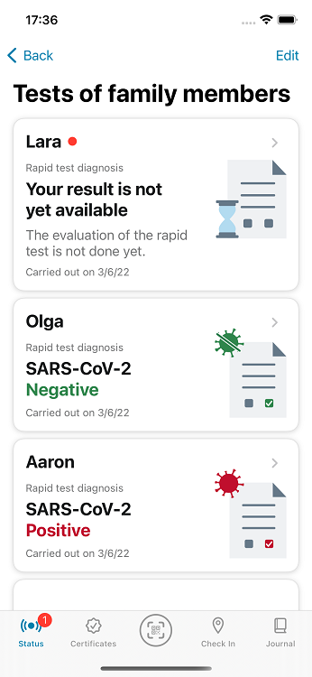

The project team of the Robert Koch-Institute (RKI), Deutsche Telekom, and SAP have released version 2.21 of the Corona-Warn-App (CWA). The update allows users to **register tests for family members**. In addition, the project team has adjusted the texts about the user’s vaccination status in the certificate area. 

<!-- overview -->

With version 2.21, users can register tests for family members in their CWA. This feature enables **parents, for example, to receive the test results of their children or others who cannot use the CWA** on their smartphones and request digital COVID test certificates for them. These can be required, for example, for travel or events. 

However, if the test result is positive, they cannot warn other CWA users. This can only be done if they have registered the test for themselves. The reason: The functionality of the CWA is based on the exchange of IDs that are stored locally on the smartphones. Every day, the smartphone downloads a list of positive keys (that is, the positive test results). This list is checked against the stored IDs so that the users who have had contact with a positively tested person can be warned. 

This principle requires the smartphone to be where its user is. If users share the positive test result of a person who wasn’t where the smartphone was, users who had contact with the positively tested person may not be warned.

As of version 2.21, the CWA displays a window in which users can **select whether they want to register the test for themselves or for others**. To better distinguish whose test it is, users can now enter the name of the person who has been tested. After that, they can request a digital test certificate that is issued if the test is negative, given that the testing center supports the issuing of test certificates (more information [in this blog](/en/blog/2021-06-24-cwa-version-2-4/)).

  

 
 

  

On the CWA’s home screen, users can then see the **“Tests of family members” area**, where they can view the test result as soon as it is available. If they no longer need the test result, they can delete it – under Android by tapping on the three dots in the upper right corner and under iOS with a right-swipe gesture. It is then first moved to the recycle bin from where it is permanently deleted after 30 days. Within these 30 days, a deleted test result can also be restored if it was deleted accidentally. 

  

 
 

  

### Texts for vaccination status adjusted

With version 2.21, the project team has also adapted the **texts about the vaccination status to the various scenarios** (protection through recovery, recommendation of a vaccination after recovery, and so on). Users see these texts under their digital COVID certificates. 

The CWA now **informs users in more detail**, for example, whether they are considered as initially immunized because of recovery, whether they have received all currently recommended vaccinations, or whether they should inform themselves about a recommended booster vaccination.

Version 2.21 , like previous versions, will be rolled out to all users in stages over 48 hours. iOS users can now download the latest app version manually from the Apple Store. The Google Play Store does not offer the option of triggering a manual update. The new version of the Corona warning app will be available to users here within the next 48 hours.

Up-to-date information on the status of the roll-out can be found on the Twitter channel of [#coronawarnapp](https://twitter.com/coronawarnapp) (German only).
