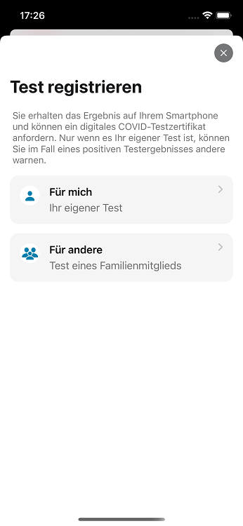
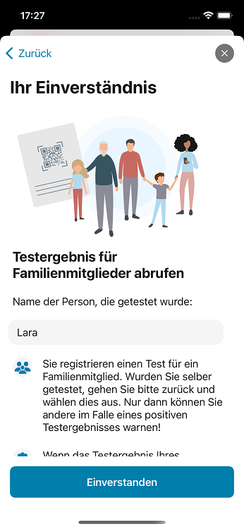
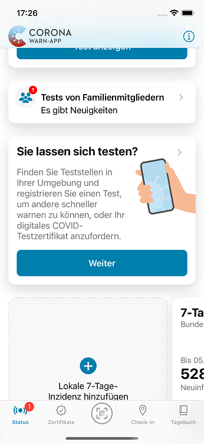
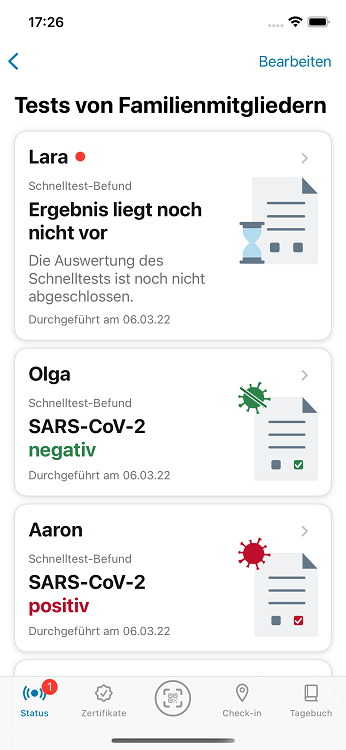

Das Projektteam aus Robert Koch-Institut (RKI), Deutscher Telekom und SAP hat Version 2.21 der Corona-Warn-App (CWA) veröffentlicht. Mit dem Update können Nutzer*innen **Tests für Familienmitglieder verwalten**. Außerdem hat das Projektteam die Texte zum Impfstatus im Zertifikatsbereich angepasst. 

<!-- overview -->

Mit Version 2.21 können Nutzer\*innen Tests für Familienmitglieder in ihrer App registrieren. Eltern können so die **Testergebnisse ihrer Kinder auf ihrem Smartphone** erhalten und digitale **COVID-Testzertifikate** für sie anfordern, die beispielsweise für Reisen oder Veranstaltungen benötigt werden.  

Im Falle eines positiven Testergebnisses können sie andere CWA-Nutzer\*innen allerdings nicht warnen. Das geht nur, wenn sie den Test für sich selbst registriert haben. Denn: Die Funktionsweise der CWA basiert auf dem Austausch von IDs, die lokal auf den Smartphones gespeichert werden. Jeden Tag lädt das Smartphone eine Liste der positiven Schlüssel herunter (also der positiven Testergebnisse). Diese wird mit den gespeicherten IDs abgeglichen, sodass die Nutzer\*innen, die Kontakt zu einer positiv getesteten Person hatten, gewarnt werden können. 
 
Dieses Prinzip setzt voraus, dass das Smartphone bestenfalls immer dort ist, wo die Nutzer\*innen selbst auch sind. Würde man das positive Testergebnis einer Person teilen, die nicht dort war, wo das Smartphone war, kann es vorkommen, dass Nutzer*innen, die Kontakt zu der positiv getesteten Person hatten, möglicherweise nicht gewarnt werden.
 
Um einen Test für ein Familienmitglieder zu registrieren, können Nutzer\*innen **unter „Sie lassen sich testen?“** auf **„QR-Code scannen“** tippen und scannen dann den QR-Code, den sie beim Testen oder bei der Terminbuchung erhalten haben. 

Ab Version 2.21 wird ihnen nun im nächsten Schritt ein Fenster angezeigt, in dem sie auswählen können, ob sie den **Test für sich oder für andere registrieren** wollen. Zur besseren Unterscheidung, wem der Test zuzuordnen ist, weisen Nutzer\*innen diesem Test nun den Namen der Person zu, die getestet wurde. Dann können sie auch noch ein digitales Testzertifikat anfordern, das im Falle eines negativen Testergebnisses ausgestellt wird, sofern die Teststelle die Ausstellung der Testzertifikate unterstützt (mehr dazu [in diesem Blog](/de/blog/2021-06-24-cwa-version-2-4/)).

  

 
 

  

Auf der Startseite ihrer Corona-Warn-App sehen die Nutzer\*innen dann den Bereich **„Tests von Familienmitgliedern“**, wo sie das Testergebnis einsehen können, sobald es vorliegt. Wenn sie das Testergebnis nicht mehr brauchen, können sie es löschen – unter Android, indem sie auf die drei Punkte in der rechten oberen Ecke tippen und unter iOS, indem sie das entsprechende Testergebnis zur Seite schieben (right-shift gesture). Es wird dann zunächst in den Papierkorb verschoben, wo es nach 30 Tagen endgültig gelöscht wird oder von wo aus das Ergebnis wieder hergestellt werden kann, falls es versehentlich gelöscht wurde.

  

 
 

  

### Texte zum Impfstatus angepasst

Mit Version 2.21 hat das Projektteam außerdem die **Texte zum Impfstatus, die unter den digitalen COVID-Zertifikaten der Nutzer\*innen stehen**, an die verschiedenen Szenarien angepasst (Schutz durch Genesung, Empfehlung einer Impfung nach Genesung, etc.) 

Die CWA **informiert die Nutzer\*innen damit genauer**, ob sie beispielsweise aufgrund einer durchgemachten Infektion als grundimmunisiert gelten, ob sie alle derzeit empfohlenen Impfungen erhalten haben oder ob sie sich noch über eine empfohlene Auffrischimpfung informieren sollten.

Version 2.21 wird, wie vorherige Versionen auch, schrittweise über 48 Stunden an alle Nutzer\*innen ausgerollt. iOS-Nutzer\*innen können sich die aktuelle App-Version ab sofort aus dem Store von Apple manuell herunterladen. Der Google Play Store bietet keine Möglichkeit, ein manuelles Update anzustoßen. Hier steht Nutzer\*innen die neue Version der Corona-Warn-App innerhalb der nächsten 48 Stunden zur Verfügung.

Aktuelle Informationen zum Stand des Roll-Outs erhalten Sie auf dem Twitter-Kanal der [#coronawarnapp](https://twitter.com/coronawarnapp).

