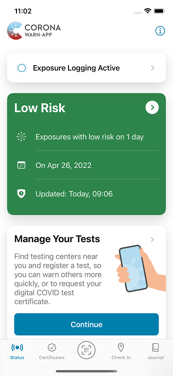
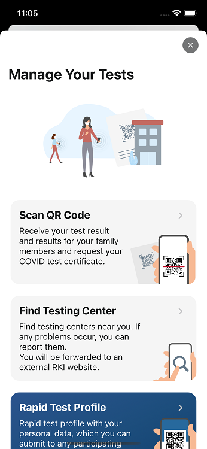
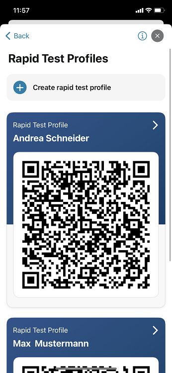
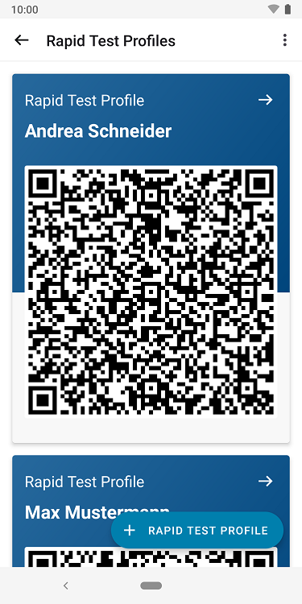
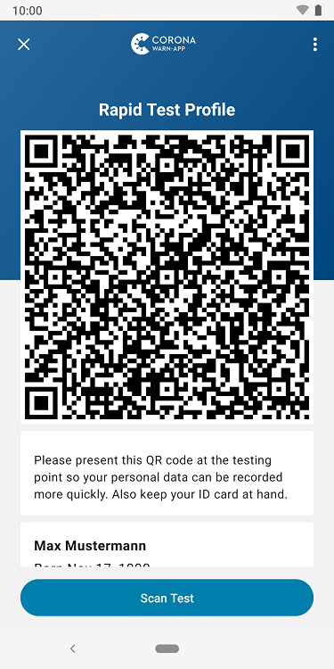

The project team of the Robert Koch-Institute (RKI), Deutsche Telekom, and SAP have released version 2.22 of the Corona-Warn-App (CWA). With the update, users can **create rapid test profiles for family members**.

<!-- overview -->

The new feature completes the test management for family members that the project team introduced with version 2.21. The rapid test profile contains the **personal data, such as name and contact details, in the form of a QR code**. At participating test sites, the QR code can be scanned to speed up on-site test registration.

With version 2.22, users can create rapid test profiles for family members who do not have a smartphone, for example. To do this, they can tap on **“Manage Your Tests” on the app’s home screen and after that select "Rapid Test Profiles”** where they can tap **"Create rapid test profile" (iOS) or "+ RAPID TEST PROFILE" (Android)**. In the next step, users can enter the data for the relevant person. Under "Manage Your Tests" they will then be shown a list of all the rapid test profiles they have stored under the persons’ respective names. 

  

 
  

  

  

 
  
<figcaption aria-hidden="true"><em>Left: rapid test profiles on iOS, right: rapid test profiles on Android</em></figcaption>

  

When users tap "Continue" from the rapid test profile, they can **scan the QR code** at the test site and afterwards select whether they want to register the test for themselves or for others (read more [here](/en/blog/2022-04-19-cwa-2-21/)). If they select "for others," the CWA will **automatically enter the name from that person's rapid test profile**. Afterwards, users can customize the name if necessary. 

  

 

  

Version 2.22, like previous versions, will be rolled out to all users in stages over 48 hours. iOS users can now download the latest app version manually from the Apple Store. The Google Play Store does not offer the option of triggering a manual update. The new version of the Corona-Warn-App will be available to users here within the next 48 hours.

Up-to-date information on the status of the roll-out can be found on the Twitter channel of [#coronawarnapp](https://twitter.com/coronawarnapp) (German only).
