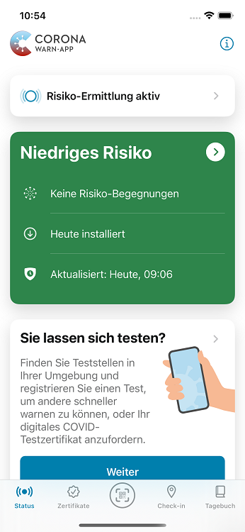
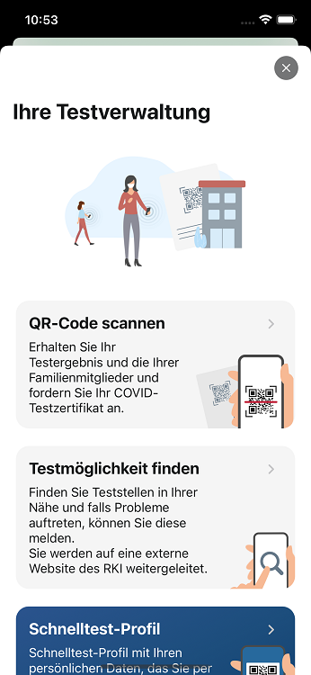
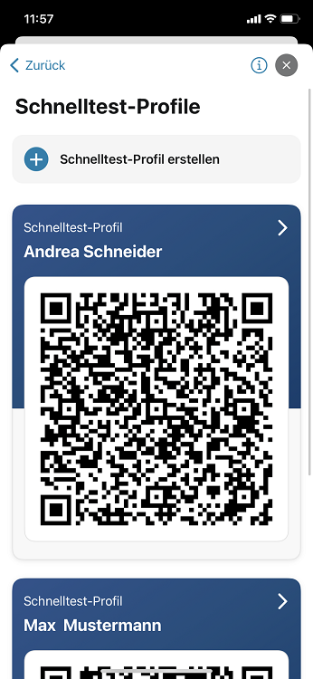
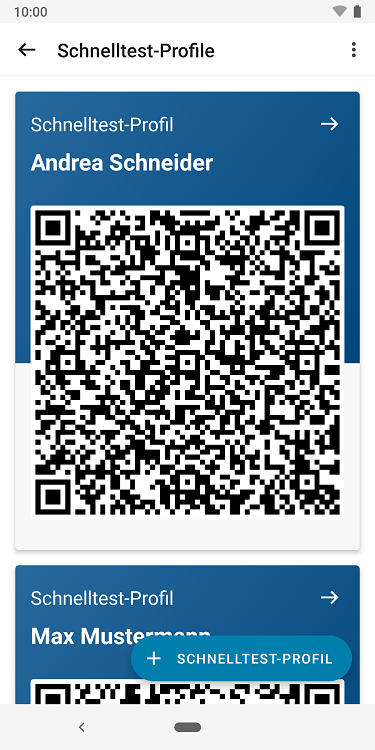
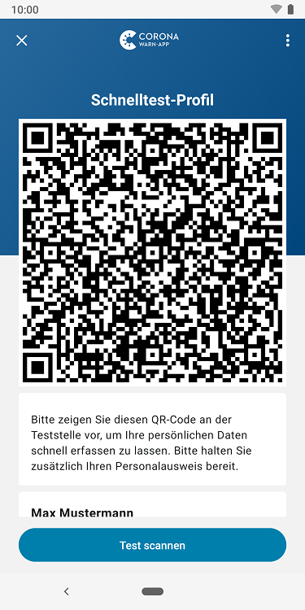

Das Projektteam aus Robert Koch-Institut (RKI), Deutscher Telekom und SAP hat Version 2.22 der Corona-Warn-App (CWA) veröffentlicht. Mit dem Update können Nutzer*innen **Schnelltest-Profile für Familienmitglieder anlegen**.

<!-- overview -->

Die neue Funktion vervollständigt die Testverwaltung für Familienmitglieder, die das Projektteam mit Version 2.21 eingeführt hat. Das Schnelltest-Profil enthält die **persönlichen Daten wie Name und Kontaktdaten in Form eines QR-Codes**. An teilnehmenden Teststellen wird dann lediglich der QR-Code in der App zur Anmeldung gescannt. So kann die Registrierung vor Ort beschleunigt werden.

Mit Version 2.22 können Nutzer\*innen Schnelltest-Profile auch für Familienmitglieder, die beispielsweise kein Smartphone besitzen, anlegen. Dazu können sie **unter „Sie lassen sich testen?“ zum „Schnelltest-Profil“** gehen und dort auf **„Schnelltest-Profil erstellen“** (iOS) beziehungsweise auf **„+ Schnelltest-Profil“** (Android) tippen und die Daten der entsprechenden Person eintragen. Unter dem Punkt "Schnelltest-Profil" wird ihnen dann eine Liste aller Schnelltest-Profile angezeigt, die sie unter dem jeweiligen Namen der Person hinterlegt haben. 

  

 
  

  

  

 
  
<figcaption aria-hidden="true"><em>Links: Schnelltest-Profile unter iOS, rechts: Schnelltest-Profile unter Android</em></figcaption>

  

Wenn Nutzer\*innen aus dem Schnelltest-Profil heraus auf „Weiter“ tippen, um den **QR-Code der Teststelle zu scannen**, können sie anschließend auswählen, ob sie den Test für sich oder für andere registrieren wollen (mehr dazu [hier](/de/blog/2022-04-19-cwa-2-21/)). Wenn sie „für andere“ auswählen, trägt die CWA **automatisch den Namen aus dem Schnelltest-Profil** der entsprechenden Person ein. Im Anschluss können Nutzer*innen den Namen anpassen, falls nötig. 

  

 
 

  

Version 2.22 wird, wie vorherige Versionen auch, schrittweise über 48 Stunden an alle Nutzer\*innen ausgerollt. iOS-Nutzer\*innen können sich die aktuelle App-Version ab sofort aus dem Store von Apple manuell herunterladen. Der Google Play Store bietet keine Möglichkeit, ein manuelles Update anzustoßen. Hier steht Nutzer\*innen die neue Version der Corona-Warn-App innerhalb der nächsten 48 Stunden zur Verfügung.

Aktuelle Informationen zum Stand des Roll-Outs erhalten Sie auf dem Twitter-Kanal der [#coronawarnapp](https://twitter.com/coronawarnapp).
