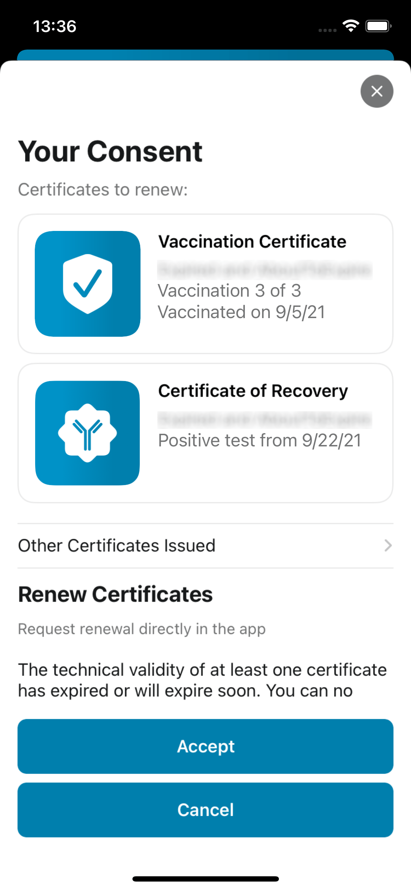

The project team of the Robert Koch Institute (RKI), Deutsche Telekom, and SAP have released version 2.23 of the Corona-Warn-App (CWA). With the update, users can **renew technically expired certificates via the CWA**. 

<!-- overview -->

The technical validity of vaccination and recovery certificates is limited to 365 days, regardless of the effective validity. Therefore, the first users are currently receiving a notice in the CWA that they should renew their certificate. With version 2.23, they can do this via the app in only a few clicks. 

**Important note:** There are different reasons for limiting the technical validity of certificates, for example with regard to IT security. However, it has nothing to do with the effective validity from a medical or epidemiological point of view.

The **CWA automatically informs users** before their recovery or vaccination certificates expire technically. They have up to 90 days after the technical validity expires to renew the certificate by tapping on the note “Renew certificate”. After they have given their consent, the certificate is automatically replaced. The expired certificate is moved to the recycle bin.

Users can renew both recovery and vaccination certificates. The CWA automatically informs them which certificates are eligible for renewal. 

  

 
   

  

**Recovery certificates** can always be renewed when they are about to expire technically. For **vaccination certificates**, users only need to renew the certificate currently in use, as it contains sufficient information about vaccination protection. For users who have stored three vaccination certificates in the CWA, this means that the vaccination certificate of the first and second vaccination will not be exchanged, but only the vaccination certificate of the booster vaccination as soon as it is about to expire.

Test certificates are not renewed, as they are not valid for that long anyway from an epidemiological perspective.

A technically expired certificate can only be **renewed three times**. If users have stored their certificates in the CWA on several devices, they can only renew it on three of them. However, they have the option to export the newly issued certificate as a PDF file so that they can re-scan the QR code of the certificate if needed. Read more here:  ["How do I create a printout of my EU COVID Digital Certificate?"](https://www.coronawarn.app/en/faq/results/?search=scannen&topic=all#eu_dcc_export)

Version 2.23, like previous versions, will be rolled out to all users in stages over 48 hours. iOS users can now download the latest app version manually from the Apple Store. The Google Play Store does not offer the option of triggering a manual update. The new version of the Corona-Warn-App will be available to users here within the next 48 hours.

Up-to-date information on the status of the roll-out can be found on the Twitter channel of [#coronawarnapp](https://twitter.com/coronawarnapp) (German only).
