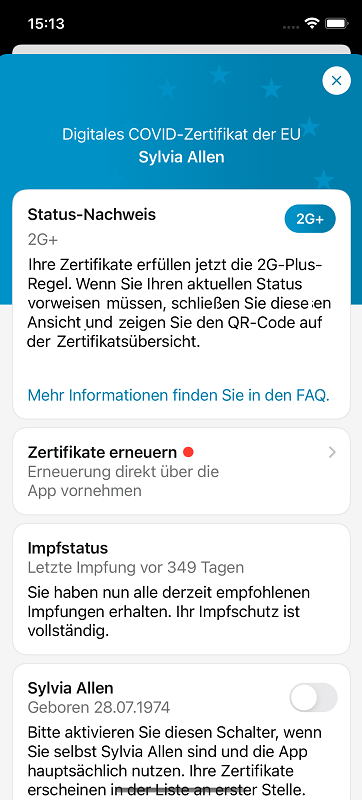
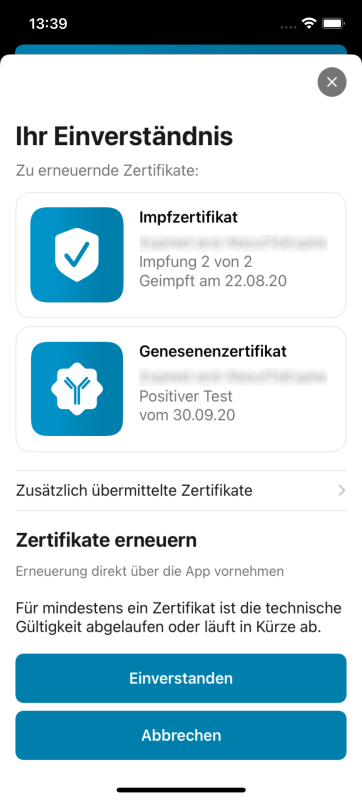
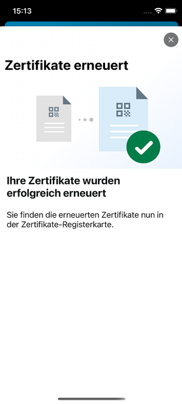

Das Projektteam aus Robert Koch-Institut (RKI), Deutscher Telekom und SAP hat Version 2.23 der Corona-Warn-App (CWA) veröffentlicht. Mit dem Update können Nutzer*innen technisch abgelaufene Zertifikate über die CWA erneuern. 

<!-- overview -->

Die technische Gültigkeit von Impf- und Genesenenzertifikaten ist – unabhängig von der fachlichen Gültigkeit – **auf 365 Tage begrenzt**. Die ersten CWA-Nutzer\*innen erhalten deshalb im Moment den Hinweis, dass sie ihr Zertifikat erneuern sollen. Mit Version 2.23 können sie das direkt über die CWA machen. 

**Wichtig**: Es gibt verschiedene Gründe für die Begrenzung der technischen Gültigkeit von Zertifikaten, zum Beispiel im Hinblick auf die IT-Sicherheit. Sie ist aber unabhängig von der fachlichen Gültigkeit der Zertifikate aus medizinischer beziehungsweise epidemiologischer Sicht. 

Die **CWA informiert die Nutzer\*innen vor Ablauf von Genesenen- und Impfzertifikaten automatisch**. Sie haben dann bis zu 90 Tage nach Ablauf der technischen Gültigkeit Zeit, das Zertifikat zu erneuern, indem sie im Zertifikatsbereich der App auf den Hinweis „Zertifikat erneuern“  tippen. Nachdem sie ihr Einverständnis gegeben haben, wird das Zertifikat automatisch ersetzt. Das technisch abgelaufene Zertifikat wird in den Papierkorb verschoben. 

  

 
    

  

Nutzer\*innen können sowohl Genesenen- als auch Impfzertifikate erneuern. Die CWA informiert sie automatisch darüber, welche Zertifikate dafür in Frage kommen. 

**Genesenenzertifikate** können immer technisch erneuert werden, wenn sie drohen abzulaufen. Bei **Impfzertifikaten** müssen Nutzer\*innen lediglich das aktuell verwendete Zertifikat verlängern, da es hinreichend Informationen über den Impfschutz enthält. Für Nutzer\*innen, die drei Impfzertifikate in der CWA hinterlegt haben, bedeutet das beispielsweise: das Impfzertifikat der Erst- und Zweitimpfung wird nicht ausgetauscht, sondern lediglich das Impfzertifikat der Auffrischimpfung, sobald es droht abzulaufen.

Testzertifikate werden nicht erneuert, da sie fachlich ohnehin nicht so lange gültig sind.

Ein technisch abgelaufenes Zertifikat kann nur drei Mal erneuert werden. Sollten Nutzer\*innen ihr Zertifikat also auf mehreren Geräten in der CWA hinterlegt haben, können sie es nur auf drei Geräten erneuern. Sie haben allerdings die Möglichkeit, das neu ausgestellte Zertifikat als PDF-Datei zu exportieren, sodass sie bei Bedarf den QR-Code des Zertifikats erneut einscannen können. Mehr dazu hier: ["Wie erstelle ich einen Ausdruck meines Digitalen COVID Zertifikates der EU?"](https://www.coronawarn.app/de/faq/results/?search=scannen&topic=all#eu_dcc_export)

Version 2.23 wird, wie vorherige Versionen auch, schrittweise über 48 Stunden an alle Nutzer\*innen ausgerollt. iOS-Nutzer\*innen können sich die aktuelle App-Version ab sofort aus dem Store von Apple manuell herunterladen. Der Google Play Store bietet keine Möglichkeit, ein manuelles Update anzustoßen. Hier steht Nutzer*innen die neue Version der Corona-Warn-App innerhalb der nächsten 48 Stunden zur Verfügung.

Aktuelle Informationen zum Stand des Roll-Outs erhalten Sie auf dem Twitter-Kanal der [#coronawarnapp](https://twitter.com/coronawarnapp).
