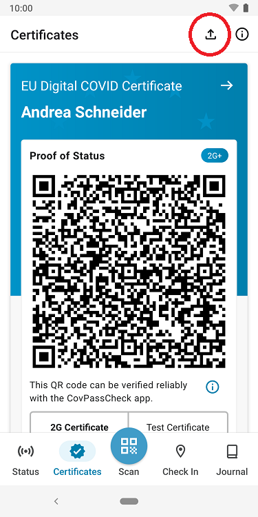
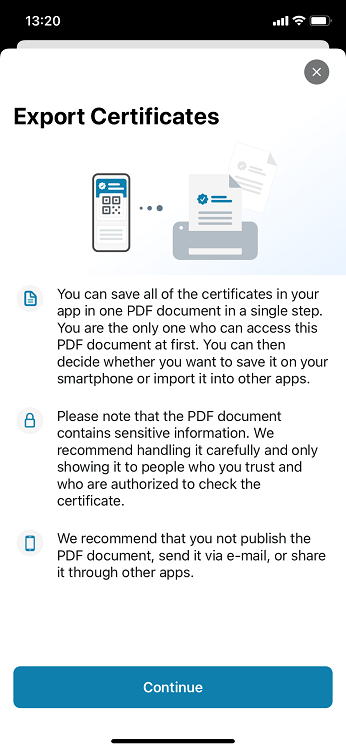

The project team of the Robert Koch Institute (RKI), Deutsche Telekom, and SAP have released **version 2.24 of the Corona-Warn-App (CWA)**. With the update, users can save all certificates available in their app in one PDF document in only one step.

<!-- overview -->

CWA users can already create a print version of their certificates, but only for one certificate at a time. With version 2.24, they have the option to **export all certificates stored in their CWA at once** and thus create a PDF document with all certificates. Exceptions are certificates that are blocked and test certificates that are older than three days. This is because users who regularly test themselves potentially have a lot of test certificates, so that the PDF document could become very large even though some of the tests in it are no longer relevant.  

To export the certificates, users can **tap the export arrow in the top right corner of the certificates section**. After selecting "Continue", the PDF document will be created immediately and can then be printed or saved. 

However, users should note that the document contains **sensitive information** that they should handle with care. 

 

  

 
   

  

Version 2.24, like previous versions, will be rolled out to all users in stages over 48 hours. iOS users can now download the latest app version manually from the Apple Store. The Google Play Store does not offer the option of triggering a manual update. The new version of the Corona-Warn-App will be available to users here within the next 48 hours.

Up-to-date information on the status of the roll-out can be found on the Twitter channel of [#coronawarnapp](https://twitter.com/coronawarnapp) (German only).
