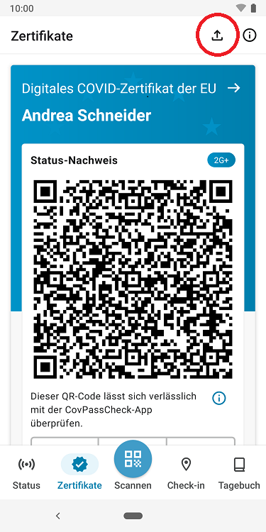
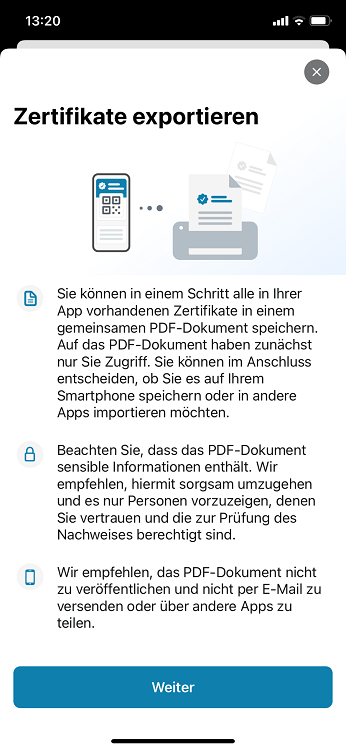

Das Projektteam aus Robert Koch-Institut (RKI), Deutscher Telekom und SAP hat **Version 2.24 der Corona-Warn-App (CWA)** veröffentlicht. Mit dem Update können Nutzer\*innen in einem Schritt alle in ihrer App vorhandenen Zertifikate in einem gemeinsamen PDF-Dokument speichern.

<!-- overview -->

CWA-Nutzer\*innen konnten bereits zuvor eine Druckversion ihrer Zertifikate erstellen, allerdings immer nur für ein Zertifikat. Mit Version 2.24 haben sie die Möglichkeit, **alle in ihrer CWA hinterlegten Zertifikate auf einmal zu exportieren** und so ein PDF-Dokument mit allen Zertifikaten zu erstellen. Ausnahmen sind Zertifikate, die gesperrt sind und Testzertifikate, die älter als drei Tage sind. Denn Nutzer\*innen, die regelmäßig Tests durchführen, haben potentiell viele Testzertifikate, sodass das PDF-Dokument sehr groß werden könnte, obwohl einige der Tests darin keine Relevanz mehr haben.  

Um die Zertifikate zu exportieren, können Nutzer\*innen im **Zertifikats-Bereich oben rechts auf den Export-Pfeil** tippen. Nachdem sie „Weiter“ ausgewählt haben, wird das PDF-Dokument sofort erstellt und kann anschließend ausgedruckt oder gespeichert werden. 

Da das PDF-Dokument **sensible Daten** enthält, sollten die CWA-Nutzer\*innen allerdings sorgsam mit ihm umgehen und auf eine sichere Ablage der exportierten Zertifikate achten.
 

  

 
   

  

Version 2.24 wird, wie vorherige Versionen auch, schrittweise über 48 Stunden an alle Nutzer\*innen ausgerollt. iOS-Nutzer\*innen können sich die aktuelle App-Version ab sofort aus dem Store von Apple manuell herunterladen. Der Google Play Store bietet keine Möglichkeit, ein manuelles Update anzustoßen. Hier steht Nutzer*innen die neue Version der Corona-Warn-App innerhalb der nächsten 48 Stunden zur Verfügung.

Aktuelle Informationen zum Stand des Roll-Outs erhalten Sie auf dem Twitter-Kanal der [#coronawarnapp](https://twitter.com/coronawarnapp).
