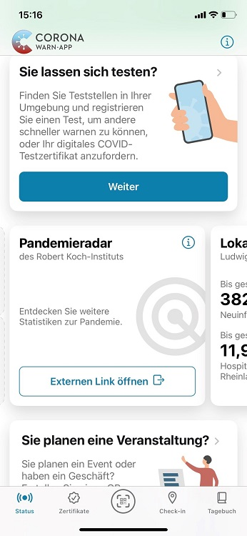

Das Projektteam aus Robert Koch-Institut (RKI), Deutscher Telekom und SAP hat **Version 2.28 der Corona-Warn-App (CWA) veröffentlicht**. Mit dem Update hat das Team den Statistik-Bereich der CWA um die Kachel „Pandemieradar“ erweitert. Außerdem gibt ein kurzer Text in der Detail-Ansicht zum Impfstatus nun weitere Informationen zum Impfstatus für Kinder unter 12 Jahren gemäß des aktuellen Infektionsschutzgesetzes.  

<!-- overview -->

Über die neue Kachel „Pandemieradar“ können Nutzer\*innen auf die [entsprechende Webseite des RKI](https://www.rki.de/DE/Content/InfAZ/N/Neuartiges_Coronavirus/Situationsberichte/COVID-19-Trends/COVID-19-Trends.html?__blob=publicationFile#/home) abspringen. Dort finden sie viele weitere Statistiken zu relevanten Kennzahlen der Corona-Pandemie, beispielsweise zur Viruslast im Abwasser. Das Pandemieradar wird täglich (montags bis freitags) aktualisiert. 

 

 

 

Da es viele detaillierte Informationen zur Beurteilung der aktuellen Lage zusammenführt, hat das Projektteam die neue Kachel an erster Stelle zu den Statistiken in der CWA hinzugefügt. 

Außerdem hat das Projektteam in der Detail-Ansicht zum Impfstatus einen Hinweis darüber eingefügt, dass für Kinder unter 12 Jahren und alle anderen Personen nach Bundesrecht **derzeit keine Beschränkungen** bestehen, die an den in der App einsehbaren **Impfstatus „vollständig geimpft“ geknüpft sind**. 

Version 2.28 wird, wie vorherige Versionen auch, schrittweise über 48 Stunden an alle Nutzer\*innen ausgerollt. iOS-Nutzer\*innen können sich die aktuelle App-Version ab sofort aus dem Store von Apple manuell herunterladen. Der Google Play Store bietet keine Möglichkeit, ein manuelles Update anzustoßen. Hier steht Nutzer\*innen die neue Version der Corona-Warn-App innerhalb der nächsten 48 Stunden zur Verfügung.

Informationen zum Roll-Out und zur CWA erhalten Sie auch auf dem Twitter-Kanal der [#coronawarnapp](https://twitter.com/coronawarnapp).
