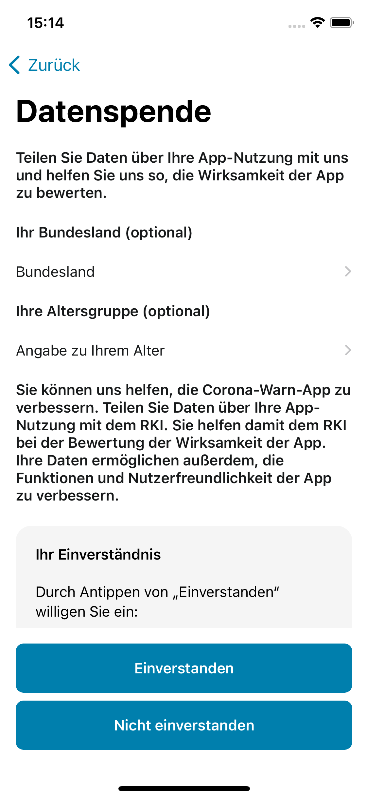

Am 16. Juni 2020 wurde die Corona-Warn-App (CWA) im Apple App Store sowie im Google Play Store zum Download zur Verfügung gestellt. Seitdem wurde die App 28,1 Millionen Mal heruntergeladen (Stand: 31. Mai 2021). Das Robert Koch-Institut gibt die CWA zum digitalen Contact-Tracing von Personen mit SARS-CoV-2 für die deutsche Bundesregierung heraus.

Eines der wichtigsten Themen, das von Anfang an in der Öffentlichkeit diskutiert wurde, ist die Frage nach der Wirksamkeit und dem Nutzen der App. Zur Wirksamkeit einer App zum Contact-Tracing von Personen mit SARS-CoV-2 und zum Nutzen der CWA liegen bisher wenig empirische Daten vor. Ihre Erhebung und die wissenschaftliche Evaluation sind notwendig – und waren von Beginn an geplant.

<!-- overview -->
-   [Wirksamkeit und Nutzen – Was ist
    was?](#wirksamkeit-und-nutzen--was-ist-was)
-   [Welche Zwecke muss die Corona-Warn-App erfüllen?](#welche-zwecke-muss-die-corona-warn-app-erfüllen)
-   [Erfüllt die Corona-Warn-App ihren Zweck?](#erfüllt-die-corona-warn-app-ihren-zweck)
-   [Welches Ziel hat die Evaluation der Corona-Warn-App und welche
    Aspekte spielen dabei eine Rolle?](#welches-ziel-hat-die-evaluation-der-corona-warn-app-und-welche-aspekte-spielen-dabei-eine-rolle)
-   [Welche Kennzahlen werden bei der Evaluation berücksichtigt und wo
    kommen die Daten dafür her?](#welche-kennzahlen-werden-bei-der-evaluation-berücksichtigt-und-wo-kommen-die-daten-dafür-her)
-   [Was bringt die Corona-Warn App?](#was-bringt-die-corona-warn-app)
-   [Weitere Themen in den nächsten
    Wochen](#weitere-themen-in-den-nächsten-wochen)

## Wirksamkeit und Nutzen – Was ist was?

Je nach Kontext werden Worten verschiedene Bedeutungen zugeschrieben. Um
einen fachlich hochwertigen Austausch zu ermöglichen, ist daher eine
Minimaldefinition der verwendeten Begriffe notwendig. Die folgenden
Deutungsangebote dienen als Ausgangspunkt für weitere Diskussionen.

Funktionalität  
Unter Funktionalität versteht man den Grad der Zielgerichtetheit der
App, den Nutzenden für einen bestimmten Anwendungszweck im Vorfeld
definierte Funktionen bereitzustellen. Funktion meint die
nutzenbringende Bereitstellung einer Eigenschaft bzw. Fähigkeit für eine
bestimmte Anforderung. Im Kontext der Corona-Warn-App bezieht sich die
Funktionalität auf organisatorische und technologische Prozessabläufe.

Wirksamkeit  
Wirksamkeit ist ein theoretisches Konstrukt, welches als
Qualitätskriterium fungiert, ob bestimmte Funktionen die beabsichtigten
Wirkungen zur Folge haben. Unter den Begriff „Wirkung" fallen alle
beabsichtigten und unbeabsichtigten Effekte, die aus der Anwendung der
App heraus resultieren. Durch die Verwendung der Corona-Warn-App sollen
Infektionsketten beendet werden. Ihre Wirksamkeit lässt sich somit daran
festmachen, dass ihre Nutzenden weniger weitere Personen infizieren.

Nutzen  
Unter Nutzen versteht man im Allgemeinen den Vorteil, den man aus dem
tatsächlichen Gebrauch einer Sache zieht. Der Nutzen der Corona-Warn-App
besteht in den verhinderten Neuinfektionen und darin, dass sie der
Ausbreitung des Corona-Virus entgegenwirkt.

## Welche Zwecke muss die Corona-Warn-App erfüllen?

Bereits in der Datenschutz-Folgeabschätzung (DSFA) ist festgelegt, dass
durch eine Evaluation nachgewiesen werden soll, ob die CWA für die
Erfüllung ihrer Zwecke geeignet ist und ob die Verarbeitung der
anfallenden personenbezogenen (pseudonymisierten) Daten angemessen ist.
In diesem Zusammenhang werden **drei Zwecke der CWA** genannt:

Zweck 1 – Abruf des Testergebnisses  
Personen, die auf SARS-CoV-2 getestet worden sind, sollen ihr
Testergebnis ohne Verzögerung erhalten,

Zweck 2 – Warnung Anderer  
Personen, die ein positives Testergebnis erhalten haben, sollen andere
Personen, die sich in ihrer unmittelbaren Nähe aufgehalten haben,
darüber informieren bzw. warnen, dass für sie (d.h. für die anderen
Personen) ein erhöhtes Infektionsrisiko bestanden hat,

Zweck 3 – Risikoermittlung  
Personen, die sich in unmittelbarer Nähe einer SARS-CoV-2- infizierten
Person aufgehalten haben, sollen darüber informiert bzw. gewarnt werden,
dass für sie ein erhöhtes Infektionsrisiko bestanden hat.

Dabei können diese drei Zwecke nicht separat betrachtet werden, da sie
ineinandergreifen und in ihrer Wirkung einander bedingen. So kann eine
Person, die sich in unmittelbarer Nähe einer SARS-CoV-2-infizierten
Person aufgehalten hat, nur dann über ein für sie erhöhtes
Infektionsrisiko informiert bzw. gewarnt werden (Zweck 3), wenn
Personen, die ein positives Testergebnis erhalten haben, andere
Personen, die sich in ihrer unmittelbaren Nähe aufgehalten haben,
darüber informieren bzw. warnen können und dies auch tatsächlich tun
(Zweck 2). Und dass dies frühzeitig genug geschieht, dass dadurch
Infektionsketten beendet werden, setzt voraus, dass Personen, die auf
SARS-CoV-2 getestet worden sind, ihr Testergebnis ohne Verzögerung
erhalten (Zweck 1).

Ein Beitrag zur Bekämpfung der Pandemie wird als plausibel angenommen,
wenn die Corona-Warn-App alle drei Zwecke erfüllt.

## Erfüllt die Corona-Warn-App ihren Zweck?

Die folgenden Grafiken zeigen, dass die Corona-Warn-App wirkt und in
welchem Umfang sie dies tut.

 

 

Abb. 1: Über die CWA registrierte Tests und deren Ergebnisse.

In Abb. 1 ist der zeitliche Verlauf der über die Labore bereitgestellten
Tests dargestellt. Insgesamt wurden 15.819.640 Testergebnisse
übermittelt, von denen 1.519.371 positiv, 13.933.916 negativ und 53.712
ungültig waren.

 

 

Abb. 2: Über die CWA geteilte Testsergebnisse (teleTAN und QR-Code).

In Abb. 2 ist der zeitliche Verlauf der Teilung der Testergebnisse über
die CWA angegeben. Insgesamt wurden 473.974 Testergebnisse geteilt,
davon 382.714 über das QR-Verfahren und 91.260 über das
Tele-TAN-Verfahren.

 

 

Abb. 3: Über die CWA geteilte Tagesschlüssel und deren Risikostufe
(Transmission Risk Level, TRL).

In Abb. 3 ist der zeitliche Verlauf der über die CWA geteilten
Tagesschlüssel dargestellt. Insgesamt wurden 5.254.851 Tagesschlüssel
geteilt, davon 2.651.089 mit einer Risikostufe (Transmission-Risk-Level,
TRL) von 5 oder höher.

 

 

Abb. 4: CWA-Warnende und durch die CWA Gewarnte.

In Abb. 4 ist der zeitliche Verlauf der über die CWA Warnenden und
Gewarnten angegeben. Während die Anzahl der Warnenden bekannt ist, kann
für die Anzahl der Gewarnten nur auf die [Datenspende](#datenspende)
zurückgegriffen werden. Hier wurden 314.736 rote Warnungen und 574.163
grüne Warnungen übermittelt. Die Tatsächliche Anzahl ist (im angegebenen
Zeitraum) etwa zwei bis drei Mal so groß. In diesem Zeitraum haben
205.066 Personen über die CWA andere gewarnt, womit wir auf etwa 5 (rot)
gewarnte Personen pro warnender Person schließen können.

## Welches Ziel hat die Evaluation der Corona-Warn-App und welche Aspekte spielen dabei eine Rolle?

Die Evaluation untersucht die Wirksamkeit und den Nutzen der
Corona-Warn-App.

Der Nachweis zur Wirksamkeit der CWA – dass die Nutzenden der CWA
weniger weitere Personen infizieren – hat zwei wesentliche Aspekte:

-   Zum einen können Personen, die rechtzeitig über eine potentielle
    Infektion informiert werden, ihre Kontakte schneller reduzieren und
    so eine weitere Übertragung verhindern.

-   Zum zweiten können mit der CWA neben Freunden und Verwandten auch
    Personen, die den Warnenden nicht bekannt sind, über ein
    entsprechendes Risiko informiert werden.

Für den ersten Punkt sind die einzelnen Prozessschritte von Test bis
Erhalt der Warnung zu analysieren und die entsprechenden Verzüge und
Durchsatzraten anzugeben.

Durch die Digitalisierung können wesentliche Prozesse beschleunigt und
darüber hinaus auch skalierbar gemacht werden. Hierzu können erste
Schätzungen des Effekts angestellt werden.

Der zweite Aspekt ist aufgrund des datensparsamen Ansatzes nur schwer zu
beziffern. Wir werden hierzu verschiedene direkte und indirekte Belege
aus Nutzerbefragungen geben.

Die CWA, als ein Baustein in der Pandemiebekämpfung, wird sowohl als
Ergänzung zur analogen (mitunter auch „manuell" genannten)
Kontaktnachverfolgung durch die Gesundheitsämter als auch zur
„informellen" Kontaktnachverfolgung über Freunde und Verwandte gesehen.
Für einen direkten Vergleich liegen hierzu jedoch keine verlässlichen
Daten vor.

Für die Wirksamkeit sind daher folgende Fragen zu beantworten:

-   Erfolgt die Bereitstellung der Testergebnisse zeitnah?

-   Wie viele Warnende gibt es?

-   Wie viele Personen werden gewarnt?

-   Wie viele unbekannte Personen werden gewarnt?

-   Wie viele der gewarnten Personen haben sich infiziert?

-   Wie lange dauert es von einer Begegnung mit erhöhtem
    Infektionsrisiko bis zur Warnung?

-   Wie viele der gewarnten Personen werden durch ihrerseits bereits
    vorher gewarnte Personen gewarnt?

Für den Nutzen spielen darüber hinaus auch weitere Fragen zur
tatsächlichen Nutzung eine Rolle:

-   Wie viele Personen haben die CWA installiert? Wie viele Personen
    nutzen sie aktiv?

-   Wie hoch ist der Anteil der registrierten Tests zur
    Gesamt-Laborkapazität?

-   Wie hoch ist der Anteil der warnenden Personen zu den
    Neuinfizierten?

Eine weitere (zum Teil die einzige) Möglichkeit zur Beantwortung dieser
Fragen und Berücksichtigung dieser beiden Aspekte liefern realistische
Modelle und Simulationen. Mit den erhobenen Kennzahlen können so zum
Beispiel Aussagen getroffen werden, wie viele Infektionsfälle sowie
Todesfälle durch den Einsatz der Corona-Warn-App verhindert werden
konnten.

Schließlich sei noch erwähnt, dass die grundsätzliche Funktionalität und
die Zuverlässigkeit der BLE-Abstandsmessung in Labor-Experimenten von
Fraunhofer IIS untersucht und bestätigt wurde. Über die tatsächlich
beobachteten Verhältnisse wollen wir auch Auskunft geben.

<figure>
<video src="./v4_Teaser_CWA_Testkampagne.mp4" class="w-100" controls=""><a href="./fraunhofer_iis_largeoffice.mp4">BLE-Messungen durch Fraunhofer IIS zur Kallibrierung der Parameter</a></video><figcaption aria-hidden="true"><em>BLE-Messungen durch Fraunhofer IIS zur Kallibrierung der Parameter</em></figcaption>
</figure>

## Welche Kennzahlen werden bei der Evaluation berücksichtigt und wo kommen die Daten dafür her?

Ziel der Auswertungen ist, besser zu bewerten, welchen Beitrag die App
zum Unterbrechen bzw. Beenden von Infektionsketten leistet. Die
Corona-Warn-App basiert auf einem datensparsamen Ansatz, daher stehen
nur im begrenzten Maße Daten zur Auswertung zur Verfügung. Die
Evaluation setzt daher einerseits auf die freiwillige Beteiligung der
App-Nutzenden, um die Effektivität der Corona-Warn-App zu erforschen.
Hierzu wurden zwei Verfahren entwickelt, um weitere Daten zur Evaluation
zu erheben – eine [ereignisbezogene Befragung](#ereignisbezogenen-befragung) der Nutzerinnen
und Nutzer und die Möglichkeit des freiwilligen Datenspendens der
Nutzungsdaten (Privacy Preserving Analytics, PPA). Zum anderen werden
Daten aus zentralen und dezentralen Komponenten der
Corona-Warn-App-Infrastruktur sowie auf externe Quellen bezogen.

Für die Evaluation im Hinblick auf Zweckmäßigkeit, Wirksamkeit,
Akzeptanz und Nutzen ist u.a. die Erhebung und Auswertung folgender
Kennzahlen (kumulativ und im Zeitverlauf) vorgesehen:

-   Kennzahlen aus Nutzenden-Erhebung (EDUS und PPA)  
-   Kennzahlen aus Backend-Komponenten der CWA-Infrastruktur
    (Testregistrierung, Teilung und Abruf von Tagesschlüsseln),  
-   Kennzahlen aus ergänzenden Quellen (Fallzahlen, Testkapazitäten,
    Apple App Store und Google Play Store, Modellrechnungen oder
    Simulationen).

### Kennzahlen aus Nutzenden-Erhebungen

<figure>
<figcaption aria-hidden="true"><em>CWA - ereignisbezogene Befragung</em></figcaption>
</figure>

Zur Evaluation gehören eine ereignisbezogene Befragung der Nutzerinnen
und Nutzer: [Event-Driven User Survey, EDUS](#ereignisbezogenen-befragung) und die Möglichkeit,
regelmäßig Nutzungsdaten über eine Datenspende zur Verfügung zu stellen:
[Privacy Preserving-Analytics, PPA](#datenspende).

#### Ereignisbezogenen Befragung

Bei der ereignisbezogenen Befragung – Event-Driven User Survey, EDUS –
wurden über einen Zeitraum von zwei Monaten von Anfang März bis Anfang
Mai 2021 Nutzerinnen und Nutzer der Corona-Warn-App, die eine
Statusanzeige „erhöhtes Risiko" erhalten hatten, gebeten, sich an einer
Online-Befragung zu beteiligen.

Die App-Nutzerinnen und -Nutzer wurden zu ihrem Verhalten vor der
Risikobenachrichtigung und zur ihrem geplanten Verhalten danach befragt.
Im zweiten Teil der Befragung, die fünf Tage nach der ersten Befragung
durchgeführt wurde, sollte ermittelt werden, ob Nutzerinnen und Nutzer,
die eine Statusanzeige „erhöhtes Risiko" erhalten haben, ihre geplanten
Verhaltensmaßnahmen auch umgesetzt haben. Eines der Ziele war es,
herauszufinden, ob Nutzende ihr Verhalten aufgrund einer
Risikobenachrichtigung der Corona-Warn-App verändert haben.

#### Datenspende

Ein weiteres Element der Evaluation ist die ereignisunabhängige Analyse
technischer Nutzungsdaten zur Funktion und Nutzung der Corona-Warn-App.
Diese werden mittels einer freiwilligen Datenspende der Nutzerinnen und
Nutzer erhoben.

Mit Hilfe der sog. Privacy Preserving Analytics (PPA) – also einer die
Privatsphäre wahrenden Analyse von Nutzungsdaten – kann die Nutzung der
CWA besser verstanden und die App dadurch fortlaufend in ihrer Funktion
und in ihrer Benutzungsfreundlichkeit verbessert werden. Diese Daten
werden seit Anfang März 2021 erhoben.

<figure>
<figcaption aria-hidden="true"><em>CWA - Datenspende</em></figcaption>
</figure>

Konkret können mit Hilfe der Datenspende folgende Aspekte untersucht
werden:

-   welche Ereignisse (z.B. Anzeige eines erhöhten Risikos,
    Registrierung eines Tests, Anzeige eines Testergebnisses,
    Schlüsseleinreichung zum Warnen Anderer) in der App mit welcher
    Häufigkeit auftreten,

-   wann diese Ereignisse auftreten und wie und mit welchem zeitlichen
    Abstand sie aufeinander folgen,

-   welche Auswahlen die Nutzenden in der App daraufhin treffen,

-   wo und wann Nutzende Prozesse innerhalb der App abbrechen,

-   mit welchen demografischen Daten (z.B. Altersgruppe, Landkreis) dies
    assoziiert ist.

### Kennzahlen aus Backend-Komponenten der CWA-Infrastruktur 

Zentral für die Bewertung der Wirksamkeit und des Nutzens der CWA sind
Daten zu Testregistrierung und zur Teilung und zum Abruf von
Tagesschlüsseln. Diese kommen direkt aus den Backend-Komponenten der
CWA-Infrastruktur.

### Kennzahlen aus ergänzenden Quellen

Dem RKI stehen weitere Kennzahlen aus ergänzenden Quellen zur Verfügung,
die indirekte Belege für den Nutzen der Corona-Warn-App liefern können.
Hierzu zählen u.a. Daten aus dem Apple App Store sowie Google Play
Store. Zudem lassen sich externe (Befragungs-)Studien mit
unterschiedlichen Studienzeiträumen und thematischen Schwerpunkten
heranziehen. Externe Studien weisen zwar verschiedene methodische und
inhaltliche Prämissen auf, geben aber in der Kombination der Ergebnisse
wichtige Hinweise auf Aspekte der Nutzungsakzeptanz und deren
Implikationen für Verhaltensänderungen im Zusammenhang mit der CWA.

Daneben werden auch Aussagen zu den aktuellen Fallzahlen und den
insgesamt durchgeführten Tests benötigt. Einige Fragen, insbesondere
solche, die sich auf hypothetische Szenarien beziehen („Was wäre, wenn
…?") lassen sich schließlich nur durch Heuristiken, Modellrechnungen
oder Simulationen beantworten.

## Was bringt die Corona-Warn App?

Aus den uns im Moment zu Verfügung stehenden [Datenquellen](#welche-kennzahlen-werden-bei-der-evaluation-berücksichtigt-und-wo-kommen-die-daten-dafür-her)
lassen sich erste Aussagen zur Wirksamkeit und den Nutzen der CWA
treffen. Eine detaillierte Aufbereitung und Analyse dieser Daten wird in
den kommenden Wochen regelmäßig in größerer Ausführlichkeit erfolgen.

-   Von den Nutzenden, die sich testen ließen und ihr Ergebnis über die
    CWA erhielten (und Angaben zum Verzug übermittelten, aus
    [Datenspende](#datenspende): 976.084), berichtet eine hohe Anzahl (88 %),
    dass ihr Testergebnis innerhalb von 24 Stunden (724.187 ≃ 74 %) bzw.
    2 Tagen (136.990 ≃ 14 %) einsehbar war.
    (korrekte Wirksamkeit)

-   Ein guter Anteil der Nutzenden (61%), die ein positives Testergebnis
    über die CWA registriert und ihr Ergebnis erhalten haben (771.957),
    warnen über die CWA andere, indem sie ihr Testergebnis in der App
    teilen (473.974). Der Anteil derjenigen, die ihren Test über die CWA
    registriert haben liegt bei (51%). (Siehe [oben](#erfüllt-die-corona-warn-app-ihren-zweck).)
    (Nutzen)

-   Viele der Nutzenden (aus [EDUS](#ereignisbezogenen-befragung): 73% (18.099 von 24.958))
    werden durch die Anzeige des erhöhten Risikos überrascht. Die CWA
    warnt also häufig auch außerhalb des familiären oder beruflichen
    Umfelds, bei dem aufgrund direkter Kontakte eine Risikobewertung
    auch ohne externe Unterstützung erfolgen kann. (Nutzen)

-   Die Mehrheit der Nutzenden, die eine rote Warnung erhalten haben
    (aus [EDUS](#ereignisbezogenen-befragung): 87% (13.515 von 15.540)), lassen sich
    anschließend auch testen. (Nutzen)

-   In der [ereignisbezogenen Befragung](#ereignisbezogenen-befragung) waren etwa 6% (792 von
    13.493) der in Folge der (roten) Warnung durchgeführten Tests
    positiv auf SARS-CoV-2. Ein Ergebnis, welches ähnlich hoch ist, wie
    in der analogen Kontaktnachverfolgung. (korrekte Wirksamkeit)

-   Aus den Daten der Datenspende, der App Stores und des CWA-Backends
    lässt sich grob abschätzen, dass eine Nutzende, die ihr positives
    Testergebnis über ihre Tagesschlüssel teilt, ca. 6 andere Nutzende
    warnt, also bei diesen Nutzenden eine rote Warnung (erhöhtes Risiko)
    erscheint. (Siehe [oben](#erfüllt-die-corona-warn-app-ihren-zweck).) (korrekte Wirksamkeit)
    

Diese vorläufigen Zahlen zeigen, dass die CWA wirksam und nützlich ist
und weiterhin einen wichtigen Beitrag leistet, Infektionsketten
schneller zu beenden. Der Nutzen der CWA kann zudem mit jedem
zusätzlichen Nutzenden weiter gesteigert werden.

<figure>
<video src="./ppa_warnings_cases_fast.mp4" class="w-100" controls=""><a href="./ppa_warnings_cases.mp4">Vergleich von durch die CWA Gewarnten (aus Datenspende, nur solche mit Angabe zum Landkreis) mit Neuinfizierten</a></video><figcaption aria-hidden="true"><em>Vergleich von durch die CWA Gewarnten (aus Datenspende, nur solche mit Angabe zum Landkreis) mit Neuinfizierten</em></figcaption>
</figure>

## Weitere Themen in den nächsten Wochen

Das Robert Koch-Institut wird in den kommenden Wochen über diesen Blog
Detailauswertungen zu verschiedenen Bereichen der Evaluation der CWA zur
Verfügung stellen. Auch sollen die Ergebnisse im Zusammenhang mit den
Evaluationsergebnissen anderer nationaler Contact Tracing-Apps bewertet
werden.