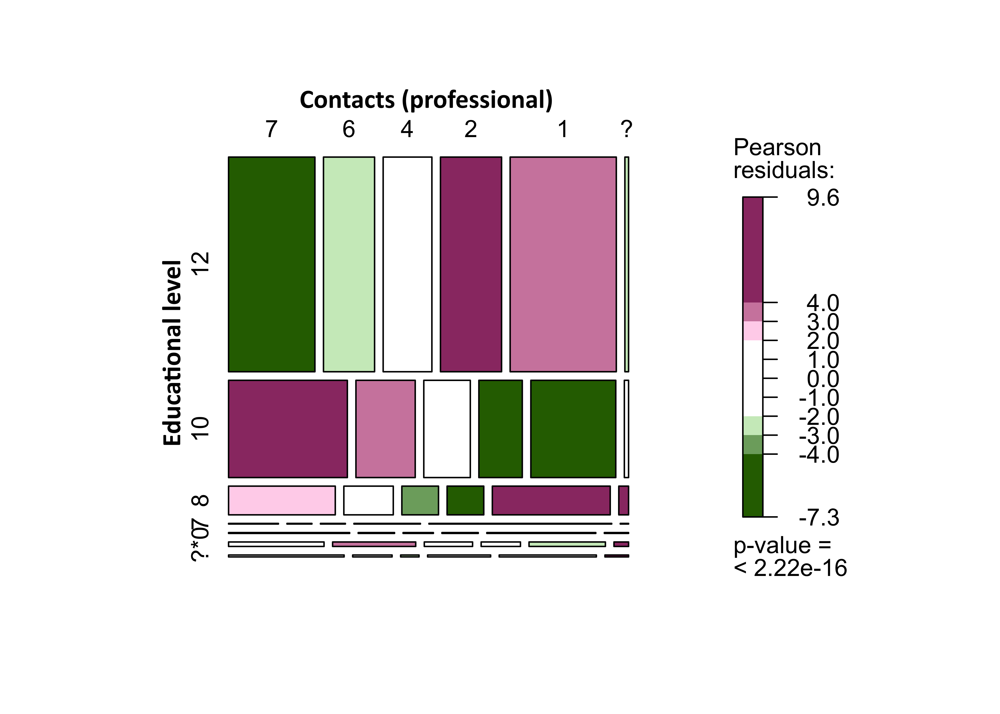

In order to measure the effectiveness of the Corona-Warn-App (CWA), it is important to know who is using it. However, data protection measures and the way in which the app is designed prevent this information from being collected or viewed. 

Therefore, a voluntary, event-driven user survey (EDUS) was carried out between March and May 2021 to compile and analyse data on socio-demographics and user behaviour. Data were collected on sex, age, school leaving certificate, geographical distribution, and contact-related behaviour. 

<!-- overview -->

1. [The most important findings in a nutshell: numbers, data, facts](#1-the-most-important-findings-in-a-nutshell-numbers-data-facts)
1. [The balancing act between minimising data collection and the need for data for research](#2-the-balancing-act-between-minimising-data-collection-and-the-need-for-data-for-research)
    1. [Event-Driven User Surveys (EDUS)](#21-event-driven-user-surveys-edus)
    1. [Possibilities and limits of EDUS](#22-possibilities-and-limits-of-edus)
    1. [Background](#23-background)
    1. [Basic survey](#24-basic-survey)
    1. [Follow-up survey](#25-follow-up-survey)
    1. [The technical procedure behind the survey](#26-the-technical-procedure-behind-the-survey)
    1. [Survey period](#27-survey-period)
1. [Special features of the present sample](#3-special-features-of-the-present-sample)
    1. [Survey participation](#31-survey-participation)
    1. [Participation rate](#32-participation-rate)
1. [A comparison of the study population and the general population](#4-a-comparison-of-the-study-population-and-the-general-population)
    1. [Sex](#41-sex)
    1. [Age](#42-age)
    1. [Age and sex](#43-age-and-sex)
    1. [Level of education](#44-level-of-education)
1. [Geographical distribution](#5-geographical-distribution)
    1. [Distribution by district](#51-distribution-by-district)
    1. [Differences between urban and rural districts](#52-differences-between-urban-and-rural-districts)
1. [Contact behaviour](#6-contact-behaviour)
    1. [Known and unknown contacts](#61-known-and-unknown-contacts)
    1. [Contact with people in a professional context](#62-contact-with-people-in-a-professional-context)
    1. [Relationship between level of education and contact behaviour](#63-relationship-between-level-of-education-and-contact-behaviour)
    1. [Relationship between contact-related behaviour and infections](#64-relationship-between-contact-related-behaviour-and-infections)
1. [Measures taken to prevent infection and intended behavioural changes](#7-measures-taken-to-prevent-infection-and-intended-behavioural-changes)
    1. [Current measures taken to prevent infection](#71-current-measures-taken-to-prevent-infection)
    1. [Relationship between measures taken to protect against infection and intended behavioural change](#72-relationship-between-measures-taken-to-protect-against-infection-and-intended-behavioural-change)
    1. [Intended protective measures](#73-intended-protective-measures)
    1. [Relationship between perceived risk and intended behavioural change](#74-relationship-between-perceived-risk-and-intended-behavioural-change)
1. [What to expect in the future](#8-what-to-expect-in-the-future)

## 1 The most important findings in a nutshell: numbers, data, facts

Among other things, the event-driven user survey (EDUS) demonstrated:
- More female (54.3%) than male respondents (45.7%) use the CWA
- People aged between 50 and 59 are most strongly represented among the respondents (25.1%)
- Most of the respondents (61.6%) finished school with qualifications that provide entry to university or to a technical college
- The majority of respondents live in urban areas and in western Germany
- The majority of respondents followed typical social distancing and hygiene rules to protect themselves from infection
- The vast majority of respondents who received a red warning (83.1%) subsequently wanted to take a COVID-19 test

## 2 The balancing act between minimising data collection and the need for data for research

The Corona-Warn-App uses an approach that minimises data collection and implements high security standards. This means that it only collects function-relevant data and does not gather any other information about its users. In order to answer questions about the functionality, effectiveness and use of the CWA, app users were therefore asked to provide additional data on a voluntary basis. User data have been collected in this manner in two ways: through the [event-driven user survey](../2021-06-15-science-blog-1/#the-event-driven-user-survey) (<em>EDUS</em>), which is the focus of this article, and [data donation](../2021-06-15-science-blog-1/#data-donation) [[1](#footnote1)], which will be discussed in a future article.

### 2.1 Event-Driven User Surveys (EDUS)

In principle, the EDUS works in the following manner. A user who has come into contact with a risk of infection receives a notification, and the low-risk green warning is replaced with a higher risk red warning. In addition to the recommendations displayed for dealing with potential infections and the related procedures, a link to the EDUS survey is also provided. Users who consent to participate in the survey are asked a number of general and more specific questions. The questionnaire is in German and consists of a basic and a follow-up survey. Technical security measures protect personal information and prevent misuse. 

### 2.2 Possibilities and limits of EDUS

Data from the EDUS is only available from CWA users who have received a red warning and have consented to participate in the survey. This approach enables researchers to gain deeper insights into a system that would otherwise remain unexplored due to extensive data protection regulations. The questionnaire also provides researchers with access to the views of CWA users. However, although the EDUS can provide new insights for research, it also has a number of limitations. 

First, respondents do not always answer truthfully when asked about issues such as their health. When the questionnaire was devised, care was taken to ensure that it only included questions that were absolutely necessary. Moreover, the questions were grouped into categories that reflected the data-minimising approach. For example, although data about income would be useful for understanding the role of socioeconomic status, a question about this subject could lead more participants to break off the questionnaire or not to answer truthfully. In order to reduce the likelihood of this happening, sensitive personal information, such as age, are summarised in categories. Although these categories are less precise than data stipulating a user’s exact age, they still enable differences between age groups to be identified. 

Since the EDUS only surveyed CWA users who had received a red warning, the results cannot be extrapolated to the wider population in Germany or even to all of the app’s users. Nevertheless, the [results from the analyses of socio-demographic characteristics](#4-a-comparison-of-the-study-population-and-the-general-population) can be compared with the overall population structure in Germany. 

People who take part in surveys often differ systematically from those who do not and it must be assumed that this also applies to the EDUS. However, as the app does not collect any data about its users, potential differences between app users who participated in the survey and app users who did not remain unclear. 

In order to assess the CWA, information is needed from users about the circumstances that led to the red warning and their experiences. This information can be gained from the data collected with the EDUS, as it helps answer important research questions from a perspective that researchers would otherwise have no access to. 

Furthermore, data from the EDUS can be compared with data from other sources, such as data gained from [CWA data donation](../2021-06-15-science-blog-1/#data-donation), and this can enable further research into the app and its users. 

### 2.3 Background

The aim of the EDUS is to collect data about the experiences of CWA users so as to enable us to understand the app’s effectiveness. The questionnaire was kept as short as possible to avoid placing an additional burden on participants who would already be in a stressful situation due to their increased risk of infection. Consequently, not all topics and issues that would have been interesting from a research point of view were covered. A number of specialist societies and scientific experts advised the team when planning the questionnaires. The two questionnaires (one for the [basic survey](#24-basic-survey) and one for the [follow-up survey](#25-follow-up-survey)) constitute the consensus that resulted from these discussions. 

### 2.4 Basic survey

The basic survey includes questions about the following topics:
- Behaviour of CWA users
- Users' own assessment of their risk of infection
- The behaviour users intend to change due to the red warning
- Measures that users intend to implement after receiving a red warning
- New symptoms among users who have received a warning

The basic survey focuses on how many times the CWA notified users about an increased risk of infection that they would not have otherwise not known about, and how/whether these users intended to change their behaviour. 

The basic survey also includes questions about socio-demographics: 
- Sex
- Age (in eight broad age groups)
- Residential area (three-digit postcode)
- Highest school leaving qualification

Other studies by the Robert Koch Institute (such as [GEDA 2014/2015-EHIS](https://www.geda-studie.de/deutsch/ergebnisse/geda-20142015-ehis.html)) have collected data on socio-demography in more detail. However, the socio-demographic data collected for these studies are used to calculate various related indicators, such as [socioeconomic status](https://en.wikipedia.org/wiki/Socioeconomic_status). In contrast, the EDUS pursues a more data-saving path with its evaluation approach. Age, therefore, is only recorded using predefined categories, and no information about income or professional status is collected. 

### 2.5 Follow-up survey

The follow-up survey focuses on testing uptake and the results of COVID-19 tests by users who received a red warning. Particular focus is placed on the app’s functionality. Among other things, the questionnaire collects data on whether and in which timeframe a test result was made available via the CWA and, if the test was positive, whether the user used to app to share it. The follow-up survey also asked CWA users about the development of new symptoms. The focus of the follow-up questionnaire, therefore, is on the extent to which people who received a red warning subsequently changed the way they acted.

The questionnaires comprised a total of 31 questions. It also included a request to provide an email address for the follow-up survey. Filter questions were used so that participants were only asked questions that applied to them. On 7 April 2020, an additional question was added to collect data about the number of devices on which the CWA was installed. The purpose was to gauge the difference between people using the CWA and the devices on which the app was installed.

### 2.6 The technical procedure behind the survey

As described above, CWA users who received a red warning were also provided with a link to the survey. At this point, the CWA also creates a one-time password (OTP) and saves it locally on the user’s end device. If the user clicks on the link, the operating system asks for authentication, which is aimed at ensuring that the device is genuine and that the app is actually installed on the device. The end device then transmits the results of authentication and the OTP to the CWA server.

If authentication is successful, the data is forwarded to the survey and saved. Once a user has participated in the survey, the OTP is deactivated to prevent the link from being used again (whether by the user or an unauthorised individual). The basic survey ends with a request for the user’s email address so that they can be sent a link to the follow-up survey. Participation in the survey is voluntary.

Email addresses are saved in a separate database as part of a special process called 2Secure together with the identification number (ID) automatically created by the [VOXCO](https://www.voxco.com) survey tool. This is done immediately after the basic survey has been completed. The link to the follow-up survey is sent automatically by email five days after the basic survey has been completed to participants who provided an email address. Once an invitation to the follow-up survey is sent, the email address is deleted from the database.

<figcaption aria-hidden="true"><em>Fig. 1: EDUS - technical process</em></figcaption>

### 2.7 Survey period

Users were able to participate in the basic survey between 4 March 2021 and 7 May 2021. As the link to the follow-up survey is sent five days after the user completes the basic survey and users had 14 days to complete it, the last day on which it was possible to participate in the follow-up survey was 27 May 2021. This means that the entire survey period ran from 4 March 2021 to 27 May 2021.

The survey system collected data automatically and sensitive personal information was deleted at the end of the web session by specifically-designed database triggers. IP addresses were masked by the firewall and never passed on to the system. During this process, the SSL tunnel was not broken, so even firewall administrators would have been unable to assign specific data records to the IP address from which they originated.

## 3 Special features of the present sample

In general, samples can be differentiated according to the process with which they were compiled. For example, random samples are required to make valid conclusions about a population. Random samples are devised using a [process of random selection](https://en.wikipedia.org/wiki/Survey_sampling) that assigns each person in a population a known and equal probability of being included in the sample.

However, it is not always possible to draw random samples. The EDUS sample is limited to CWA users who have received a red warning and subsequently chosen to take part in the survey. The app uses an approach that minimising the collection of data, which means that a lot of information about its users is initially unknown and has to be modelled and queried. As a result, the data collected through the EDUS cannot be used to make representative conclusions about the wider population. Be this as it may, comparisons with the general population can be used to describe the sample and the quality of the sample. 

### 3.1 Survey participation

The basic survey was accessed a total of 33,701 times between 4 March 2021 and 7 May 2021. Out of these, 26,094 participants completed the questionnaire. As such, the completion rate for the basic survey was 77.4%. 7,329 participants failed to finish the basic survey because their browser was either inactive for at least 30 minutes or was closed before the questionnaire was completed. 43 people clicked on the survey link, but declined to participate in the study and were therefore excluded from the analyses. Furthermore, data from 234 participants were not recorded because these users accessed the questionnaire via an invalid link. This meant that a browser was used to reload the questionnaire after at least 30 minutes of inactivity. Another participant had a technical problem, and had to be excluded from the sample. 342 potential respondents were unable to take part in the follow-up survey due to technical errors.

</img>

<!---(#fig:edus_response_plotly)--->
<em>Fig. 2: EDUS participation and completion for the basic and follow-up survey.</em>

In order to provide an estimate of the participation rate for the basic survey, information is needed on the number of people who were invited to take part. Precise figures can be gained by calculating the number of devices that displayed a red warning, which included a link to the questionnaire, during the survey period. Red warnings are triggered by a user sharing a positive PCR test result. It was not possible to register the results of rapid antigen tests during the survey period.

Although the CWA backend can be used to calculate the number of devices that triggered a red warning, the data-saving approach means that the total number of devices that subsequently received a red warning is unknown. Nevertheless, a conservative estimate of the number of devices that triggered a warning can be calculated using data from [CWA data donation](../2021-06-15-science-blog-1/#data-donation).

### 3.2 Participation rate

The figures gained from CWA data donation amount to 230,723 red warnings during the survey period. A simple extrapolation (based on the assumption that about one third of CWA users participates in [CWA data donation](../2021-06-15-science-blog-1/#data-donation)) allows us to estimate that 692,169 devices received a warning, which corresponds to a participation rate in the EDUS of 4%. It is important to realise that there are likely to be systematic differences between the users who participated in CWA data donation and those who did not. For example, users who participated in the EDUS may have been in an environment in which the app is used more actively. This could mean that the users who participated in the EDUS were warned more (or less) often than users who declined to participate. These estimates, should therefore be treated with caution, and it is impossible to provide exact figures.

Of the 26,094 people who completed the basic survey, 23,184 provided an email address for the follow-up survey, of which 21,664 addresses could be used to send out an invitation. A technical error meant that 342 respondents were unable to take part in the follow-up survey. Thus, a total of 21,322 invitations were sent out. This resulted in 15,561 completed follow-up questionnaires. The completion rate for the follow-up survey was therefore 73.0%. 138 participants were excluded due to browser inactivity or because they did not complete the questionnaire. A total of 5,623 invitations to the follow-up survey were not taken up. Each day, an average of 401 people took part in the basic survey and 213 in the follow-up survey.

Over the course of time, the number of participants increased. There was a sharp increase after 19 March, and the figures remained at a similarly high level throughout the remaining survey period. The number of participants who took part in the follow-up survey also increased in a comparable manner. However, the increase began five days later, due to the interval before the invitation link was sent via email. The increase in the number of participants is probably related to an update that [improved the way in which risk was calculated and in response to infection rates](../../blog/2021-04-16-corona-warn-app-risk-calculation-further-improved/) at the time.

Further fluctuations in the daily number of participants were identified. However, these were related to issues such as the fact that fewer tests were carried out on weekends and thus fewer positive test results were shared. In addition, slight changes to the daily number of participants over the survey period can also be explained by developments in incidence rates in Germany.

</img>

<!---(#fig:plot_edus_participation_plotly)--->
<em>Fig. 3: EDUS participants in the basic and follow-up survey and red warnings (from CWA data donation).</em>

## 4 A comparison of the study population and the general population

As stated above, the EDUS uses a self-recruited study population, and, therefore, the sample cannot be assumed to be representative of the wider population. Nevertheless, it can still be compared with the total population in Germany in order to evaluate and describe it. The socio-demographic information that was collected by the basic survey is ideal for such a comparison. The following begins by discussing sex and age, before examining educational distribution in more detail.

### 4.1 Sex

Data on sex were collected using two questions. First, the participants were asked about the sex that had been recorded on their birth certificate. Second, since not everyone identifies with the sex they were assigned at birth, the respondents were also asked about which sex they felt that they belonged to. For the comparison, census data were used. However, since census data only take sex assigned at birth into account, only responses to the first question were used for the comparison with the total population.

24,925 respondents provided information about the sex they had been assigned at birth: 11,385 (45.7%) answered male and 13,540 (54.3%) answered female. 1,169 people did not answer the question. 11,236 (45.1%) respondents went on to say that they identified as female, and 13,436 (54.0%) as male. 48 respondents (0.2%) indicated a different sex to the sex they had been assigned at birth, and 180 people reported that they did not know their sex (0.7%). 1,194 people declined to answer the question. Overall, 98.0% of male and 98.5% of female participants identified with the sex that they had been assigned at birth.

    
Information on sex at birth and sex identity

    <table class="table table-striped table-hover table-condensed table-responsive" style="margin-left: auto; margin-right: auto;">
    <thead>
    <tr>
    <th style="text-align:left;position: sticky; top:0; background-color: #FFFFFF;">
    What sex was entered on your birth certificate when you were born?
    </th>
    <th style="text-align:right;position: sticky; top:0; background-color: #FFFFFF;">
    Number
    </th>
    <th style="text-align:right;position: sticky; top:0; background-color: #FFFFFF;">
    Percentage
    </th>
    <th style="text-align:right;position: sticky; top:0; background-color: #FFFFFF;">
    Percentage (valid)
    </th>
    </tr>
    </thead>
    <tbody>
    <tr>
    <td style="text-align:left;">
    Male
    </td>
    <td style="text-align:right;">
    11.385
    </td>
    <td style="text-align:right;">
    43.6%
    </td>
    <td style="text-align:right;">
    45.7%
    </td>
    </tr>
    <tr>
    <td style="text-align:left;">
    Female
    </td>
    <td style="text-align:right;">
    13.540
    </td>
    <td style="text-align:right;">
    51.9%
    </td>
    <td style="text-align:right;">
    54.3%
    </td>
    </tr>
    <tr>
    <td style="text-align:left;">
    - not specified -
    </td>
    <td style="text-align:right;">
    1.169
    </td>
    <td style="text-align:right;">
    4.5%
    </td>
    <td style="text-align:right;">
    </td>
    </tr>
    </tbody>
    </table>
    <table class="table table-striped table-hover table-condensed table-responsive" style="margin-left: auto; margin-right: auto;">
    <thead>
    <tr>
    <th style="text-align:left;position: sticky; top:0; background-color: #FFFFFF;">
    Since not everyone feels that they belong to the sex they were assigned to at birth: which sex do you identify with?
    </th>
    <th style="text-align:right;position: sticky; top:0; background-color: #FFFFFF;">
    Number
    </th>
    <th style="text-align:right;position: sticky; top:0; background-color: #FFFFFF;">
    Percentage
    </th>
    <th style="text-align:right;position: sticky; top:0; background-color: #FFFFFF;">
    Percentage (valid)
    </th>
    </tr>
    </thead>
    <tbody>
    <tr>
    <td style="text-align:left;">
    Male
    </td>
    <td style="text-align:right;">
    11.236
    </td>
    <td style="text-align:right;">
    43.1%
    </td>
    <td style="text-align:right;">
    45.1%
    </td>
    </tr>
    <tr>
    <td style="text-align:left;">
    Female
    </td>
    <td style="text-align:right;">
    13.436
    </td>
    <td style="text-align:right;">
    51.5%
    </td>
    <td style="text-align:right;">
    54.0%
    </td>
    </tr>
    <tr>
    <td style="text-align:left;">
    Another
    </td>
    <td style="text-align:right;">
    48
    </td>
    <td style="text-align:right;">
    0.2%
    </td>
    <td style="text-align:right;">
    0.2%
    </td>
    </tr>
    <tr>
    <td style="text-align:left;">
    Don't know
    </td>
    <td style="text-align:right;">
    180
    </td>
    <td style="text-align:right;">
    0.7%
    </td>
    <td style="text-align:right;">
    0.7%
    </td>
    </tr>
    <tr>
    <td style="text-align:left;">
    - not specified -
    </td>
    <td style="text-align:right;">
    1.194
    </td>
    <td style="text-align:right;">
    4.6%
    </td>
    <td style="text-align:right;">
    </td>
    </tr>
    </tbody>
    </table>

### 4.2 Age

The majority of the respondents were aged between 50 and 59 (mode), the [median](https://en.wikipedia.org/wiki/Median) age group was the 40- to 49-year-olds. Under-18s were extremely underrepresented, but the CWA is only recommended for users aged 16 or above. As such, anyone under 16 should not have completed the survey. In addition, a significantly smaller proportion of people aged 80 or above took part in the survey compared with their proportion of the general population.

The methods used by a survey for data collection have an impact on the people that it can reach.

Information on age

<table class="table table-striped table-hover table-condensed table-responsive" style="margin-left: auto; margin-right: auto;">
<thead>
<tr>
<th style="text-align:left;position: sticky; top:0; background-color: #FFFFFF;">
How old are you? Please select the appropriate category.
</th>
<th style="text-align:right;position: sticky; top:0; background-color: #FFFFFF;">
Number
</th>
<th style="text-align:right;position: sticky; top:0; background-color: #FFFFFF;">
Percentage
</th>
<th style="text-align:right;position: sticky; top:0; background-color: #FFFFFF;">
Percentage (valid)
</th>
</tr>
</thead>
<tbody>
<tr>
<td style="text-align:left;">
Under 18 years
</td>
<td style="text-align:right;">
385
</td>
<td style="text-align:right;">
1.5%
</td>
<td style="text-align:right;">
1.5%
</td>
</tr>
<tr>
<td style="text-align:left;">
18 - 29 years
</td>
<td style="text-align:right;">
3.657
</td>
<td style="text-align:right;">
14.0%
</td>
<td style="text-align:right;">
14.7%
</td>
</tr>
<tr>
<td style="text-align:left;">
30 - 39 years
</td>
<td style="text-align:right;">
4.765
</td>
<td style="text-align:right;">
18.3%
</td>
<td style="text-align:right;">
19.1%
</td>
</tr>
<tr>
<td style="text-align:left;">
40 - 49 years
</td>
<td style="text-align:right;">
4.990
</td>
<td style="text-align:right;">
19.1%
</td>
<td style="text-align:right;">
20.0%
</td>
</tr>
<tr>
<td style="text-align:left;">
50 - 59 years
</td>
<td style="text-align:right;">
6.253
</td>
<td style="text-align:right;">
24.0%
</td>
<td style="text-align:right;">
25.1%
</td>
</tr>
<tr>
<td style="text-align:left;">
60 - 69 years
</td>
<td style="text-align:right;">
3.416
</td>
<td style="text-align:right;">
13.1%
</td>
<td style="text-align:right;">
13.7%
</td>
</tr>
<tr>
<td style="text-align:left;">
70 - 79 years
</td>
<td style="text-align:right;">
1.215
</td>
<td style="text-align:right;">
4.7%
</td>
<td style="text-align:right;">
4.9%
</td>
</tr>
<tr>
<td style="text-align:left;">
Over 79 years
</td>
<td style="text-align:right;">
249
</td>
<td style="text-align:right;">
1.0%
</td>
<td style="text-align:right;">
1.0%
</td>
</tr>
<tr>
<td style="text-align:left;">
- not specified -
</td>
<td style="text-align:right;">
1.164
</td>
<td style="text-align:right;">
4.5%
</td>
<td style="text-align:right;">
</td>
</tr>
</tbody>
</table>

### 4.3 Age and sex

A comparison of the age and sex distribution found in the sample with that from the general population highlights a number of further differences. Female participants are particularly overrepresented in the 18-to-59 age groups, and the same applies to male participants in the 30-to-59 age groups. This means that more younger women than younger men took part in the study. In addition, a slight overhang can be observed in both sexes among 60- to 69-year-olds.

    

    
    </img>
    

    <em>Fig. 4: EDUS participants by age and sex.</em>
    

### 4.4 Level of education

In order to minimise the amount of data collected and still enable conclusions to be made about the participants’ level of education, the survey only queried information about school-level education. A majority of respondents (15,366 or 61.6%) stated that they had qualifications that provided entry to university or to a technical college; 6,694 (27.9%) reported having completed secondary school or a polytechnic secondary school up to 10th grade. Only a small number of respondents reported having a lower level of qualification or “no qualifications” at all. Very few school age pupils answered the questionnaire.

Other studies confirm that it is not uncommon for people with a higher level of education to participate more often. Nevertheless, sample bias in this survey is higher than in other studies. The RKI regularly conducts health surveys as part of nationwide health monitoring. For the German Health Update (GEDA), more than 20,000 people who live in Germany and are at least 15 years old were surveyed between November 2014 and July 2015 ([GEDA 2014/2015-EHIS](https://www.geda-studie.de/deutsch/ergebnisse/geda-20142015-ehis.html)). The sample was drawn from official population registers and potential participants were contacted in writing. Participants were able to take part using an online questionnaire, among other methods. Of the respondents who took part in [GEDA 2014/2015-EHIS](https://www.geda-studie.de/deutsch/ergebnisse/geda-20142015-ehis.html) online, 54.9% reported having university-entry school qualifications. All of the lower-level school-leaving qualifications (that were provided) were reported more frequently in the [GEDA 2014/2015-EHIS](https://www.geda-studie.de/deutsch/ergebnisse/geda-20142015-ehis.html) study than in the EDUS. Once again, these differences can be traced back to the survey method.

<table class="table table-striped table-hover table-condensed table-responsive" style="margin-left: auto; margin-right: auto;">
<caption>EDUS - distribution by educational level</caption>
<thead>
<tr>
<th style="text-align:left;position: sticky; top:0; background-color: #FFFFFF;">
What is your highest-level school leaving qualification?
</th>
<th style="text-align:right;position: sticky; top:0; background-color: #FFFFFF;">
Number
</th>
<th style="text-align:right;position: sticky; top:0; background-color: #FFFFFF;">
Percentage
</th>
<th style="text-align:right;position: sticky; top:0; background-color: #FFFFFF;">
Percentage (valid)
</th>
</tr>
</thead>
<tbody>
<tr>
<td style="text-align:left;">
School qualifications that provide entry to university or to a technical college
</td>
<td style="text-align:right;">
15.336
</td>
<td style="text-align:right;">
58.8%
</td>
<td style="text-align:right;">
61.6%
</td>
</tr>
<tr>
<td style="text-align:left;">
Secondary school leaving certificate, polytechnic high school until the 10th grade
</td>
<td style="text-align:right;">
6.946
</td>
<td style="text-align:right;">
26.6%
</td>
<td style="text-align:right;">
27.9%
</td>
</tr>
<tr>
<td style="text-align:left;">
Secondary school diploma, polytechnic high school until the 8th or 9th grade
</td>
<td style="text-align:right;">
2.058
</td>
<td style="text-align:right;">
7.9%
</td>
<td style="text-align:right;">
8.3%
</td>
</tr>
<tr>
<td style="text-align:left;">
Completed school after a maximum of 7 years
</td>
<td style="text-align:right;">
43
</td>
<td style="text-align:right;">
0.2%
</td>
<td style="text-align:right;">
0.2%
</td>
</tr>
<tr>
<td style="text-align:left;">
No school leaving certificate
</td>
<td style="text-align:right;">
59
</td>
<td style="text-align:right;">
0.2%
</td>
<td style="text-align:right;">
0.2%
</td>
</tr>
<tr>
<td style="text-align:left;">
No qualifications yet, I still go to school
</td>
<td style="text-align:right;">
319
</td>
<td style="text-align:right;">
1.2%
</td>
<td style="text-align:right;">
1.3%
</td>
</tr>
<tr>
<td style="text-align:left;">
Don't know
</td>
<td style="text-align:right;">
136
</td>
<td style="text-align:right;">
0.5%
</td>
<td style="text-align:right;">
0.5%
</td>
</tr>
<tr>
<td style="text-align:left;">
- not specified -
</td>
<td style="text-align:right;">
1.197
</td>
<td style="text-align:right;">
4.6%
</td>
<td style="text-align:right;">
</td>
</tr>
</tbody>
</table>
<table class="table table-striped table-hover table-condensed table-responsive" style="margin-left: auto; margin-right: auto;">
<caption>
GEDA 2014/2015-EHIS - distribution by educational level (participation in web survey)
</caption>
<thead>
<tr>
<th style="text-align:left;position: sticky; top:0; background-color: #FFFFFF;">
What is your highest-level school leaving qualification? (GEDA)
</th>
<th style="text-align:right;position: sticky; top:0; background-color: #FFFFFF;">
Number
</th>
<th style="text-align:right;position: sticky; top:0; background-color: #FFFFFF;">
Percentage
</th>
<th style="text-align:right;position: sticky; top:0; background-color: #FFFFFF;">
Percentage (valid)
</th>
</tr>
</thead>
<tbody>
<tr>
<td style="text-align:left;">
School qualifications that provide entry to university or to a technical college
</td>
<td style="text-align:right;">
5.855
</td>
<td style="text-align:right;">
54.9%
</td>
<td style="text-align:right;">
54.9%
</td>
</tr>
<tr>
<td style="text-align:left;">
Secondary school leaving certificate, polytechnic high school until the 10th grade
</td>
<td style="text-align:right;">
3.313
</td>
<td style="text-align:right;">
31.0%
</td>
<td style="text-align:right;">
31.1%
</td>
</tr>
<tr>
<td style="text-align:left;">
Secondary school diploma, polytechnic high school until the 8th or 9th grade
</td>
<td style="text-align:right;">
1.332
</td>
<td style="text-align:right;">
12.5%
</td>
<td style="text-align:right;">
12.5%
</td>
</tr>
<tr>
<td style="text-align:left;">
Completed school after a maximum of 7 years
</td>
<td style="text-align:right;">
37
</td>
<td style="text-align:right;">
0.3%
</td>
<td style="text-align:right;">
0.3%
</td>
</tr>
<tr>
<td style="text-align:left;">
No school leaving certificate
</td>
<td style="text-align:right;">
119
</td>
<td style="text-align:right;">
1.1%
</td>
<td style="text-align:right;">
1.1%
</td>
</tr>
<tr>
<td style="text-align:left;">
Don’t know
</td>
<td style="text-align:right;">
0
</td>
<td style="text-align:right;">
0.0%
</td>
<td style="text-align:right;">
0.0%
</td>
</tr>
<tr>
<td style="text-align:left;">
SP
</td>
<td style="text-align:right;">
0
</td>
<td style="text-align:right;">
0.0%
</td>
<td style="text-align:right;">
0.0%
</td>
</tr>
<tr>
<td style="text-align:left;">
- not specified -
</td>
<td style="text-align:right;">
18
</td>
<td style="text-align:right;">
0.2%
</td>
<td style="text-align:right;"></td>
</tr>
</tbody>
</table>

Overrepresentation of higher education is particularly evident among the sample compared with the population as a whole. Whereas 61.6% of EDUS participants reported that they had finished school with qualifications that provide entry to university, this only applies to 33.5% of the general population in Germany. Accordingly, lower-level qualifications are represented less in the sample, and in some cases much less, than in the general population. 

    

    
    </img>
    
    

    <em>Fig. 5: EDUS participants by educational level.</em>
    

## 5 Geographical distribution

### 5.1 Distribution by district

A user’s location was determined using their postcode. For ease, users were only asked to provide the first three digits of their postcode. A total of 24,836 users provided a valid response. 149 answers were treated as invalid as the postcodes provided could not be assigned to a particular location. Only 6 postcodes from throughout Germany were not provided.

In order to be able to compare the data with information about newly-reported SARS-CoV-2 infections, the three-digit postcodes had to be assigned to districts. The number of participants in a particular postal area was weighted depending on its number of inhabitants and these individuals were then distributed to the respective district. The following diagram shows both of these figures and demonstrates that more participants live in urban than rural districts.

</img>

<em>Fig. 6: EDUS participants by 3-digit postcode and district.</em>

### 5.2 Differences between urban and rural districts

The figure below depicts the relationship between population density and the ‘incidence’ of the participants, in other words, the number of participants per 100,000 inhabitants. The size of a district is proportional to the number of inhabitants.

</img>

<em>Fig. 7: EDUS participants by population density in urban and rural districts.</em>

The ‘incidence’ of the participants increases with population density. Whereas an average of 22 people participated per 100,000 inhabitants in rural areas (mode: 19.2), the average in urban areas was 28.9 (mode: 29.9).

These data also show that an average of 31.2 participants per 100,000 inhabitants participated in the federal states encompassing former West Germany, and 23.3 participated per 100,000 inhabitants in the federal states comprising former East Germany.

The analysis of regional differences completes this section on socio-demography. The following looks at the survey results by topic.

## 6 Contact behaviour

The pandemic has had a strong impact on people’s behaviour and their daily lives. But not everyone can implement the measures put in place to contain the pandemic to the same extent. In many cases, people’s work prevents them from further restricting their contact with other people. Private circumstances can also make it impossible for some people to limit their contact with others. Therefore, the basic survey asked the participants two similarly worded questions about who they met: one about people they knew, and one about strangers. In addition, a further question was asked about their contact with people in a professional context.

### 6.1 Known and unknown contacts

Since the risk of infection increases with duration and proximity, the respondents were asked about occasions on which they had met other people for more than 15 minutes and had been unable to ensure that they remained at least 1.5 meters apart. Taking into account average incubation periods and the duration of infectivity, respondents were only asked about people that they had met in the last seven days. For data protection reasons, the following predefined response categories were provided: ‘less than one person per day’ (1), ‘between one and three people per day’ (2), ‘more than three people per day’ (3) and ‘don’t know’ (?).

The respondents answered the question about whether they had met people they knew (n = 24,946) as often as the question about whether they had met people they did not know (n = 24,927). In both cases, most respondents reported that they had met with a small number of people. Slightly more than half of the respondents (13,018; 52.2%) had met less than one person that they already knew per day in the seven days preceding the red warning; almost the same proportion had met less than one person that they did not already know (13,366; 53.6%). Differences exist between respondents who met people more often. More respondents met between one and three or more than three people per day that they did not know than people they knew. The data indicate a statistically significant relationship between the frequency of users meeting people they knew and people they did not know. 

<table class="gt_table">
  <thead class="gt_col_headings">
    <tr>
        <th class="gt_col_heading gt_columns_bottom_border gt_left" rowspan="2" colspan="1"><strong>Variable</strong></th>
        <th class="gt_center gt_columns_top_border gt_column_spanner_outer" rowspan="1" colspan="4">
            <strong>Contacts (unknown)</strong>
        </th>
        <th class="gt_col_heading gt_columns_bottom_border gt_center" rowspan="2" colspan="1"><strong>Total</strong></th>
    </tr>
    <tr>
        <th class="gt_col_heading gt_columns_bottom_border gt_center" rowspan="1" colspan="1">More than 3 per day</th>
        <th class="gt_col_heading gt_columns_bottom_border gt_center" rowspan="1" colspan="1">Between 1 to 3 per day</th>
        <th class="gt_col_heading gt_columns_bottom_border gt_center" rowspan="1" colspan="1">Less than 1 person per day</th>
        <th class="gt_col_heading gt_columns_bottom_border gt_center" rowspan="1" colspan="1">Don't know</th>
    </tr>
  </thead>
  <tbody class="gt_table_body">
    <tr>
        <td class="gt_row gt_left" style="font-weight: bold;">Contacts (known)</td>
        <td class="gt_row gt_center"></td>
        <td class="gt_row gt_center"></td>
        <td class="gt_row gt_center"></td>
        <td class="gt_row gt_center"></td>
        <td class="gt_row gt_center"></td>
    </tr>
    <tr>
        <td class="gt_row gt_left" style="text-align: left; text-indent: 10px;">More than 3 per day</td>
        <td class="gt_row gt_center">1.489 (6.0%)</td>
        <td class="gt_row gt_center">467 (1.9%)</td>
        <td class="gt_row gt_center">561 (2.3%)</td>
        <td class="gt_row gt_center">121 (0.5%)</td>
        <td class="gt_row gt_center">2.638 (11%)</td>
    </tr>
    <tr>
        <td class="gt_row gt_left" style="text-align: left; text-indent: 10px;">Between 1 to 3 per day</td>
        <td class="gt_row gt_center">1.313 (5.3%)</td>
        <td class="gt_row gt_center">2.582 (10%)</td>
        <td class="gt_row gt_center">3.834 (15%)</td>
        <td class="gt_row gt_center">450 (1.8%)</td>
        <td class="gt_row gt_center">8.179 (33%)</td>
    </tr>
    <tr>
        <td class="gt_row gt_left" style="text-align: left; text-indent: 10px;">Less than 1 person per day</td>
        <td class="gt_row gt_center">1.814 (7.3%)</td>
        <td class="gt_row gt_center">1.872 (7.5%)</td>
        <td class="gt_row gt_center">8.716 (35%)</td>
        <td class="gt_row gt_center">602 (2.4%)</td>
        <td class="gt_row gt_center">13.004 (52%)</td>
    </tr>
    <tr>
        <td class="gt_row gt_left" style="text-align: left; text-indent: 10px;">Don't know</td>
        <td class="gt_row gt_center">141 (0.6%)</td>
        <td class="gt_row gt_center">123 (0.5%)</td>
        <td class="gt_row gt_center">253 (1.0%)</td>
        <td class="gt_row gt_center">581 (2.3%)</td>
        <td class="gt_row gt_center">1.098 (4.4%)</td>
    </tr>
    <tr>
        <td class="gt_row gt_left" style="font-weight: bold;">Total</td>
        <td class="gt_row gt_center">4.757 (19%)</td>
        <td class="gt_row gt_center">5.044 (20%)</td>
        <td class="gt_row gt_center">13.364 (54%)</td>
        <td class="gt_row gt_center">1.754 (7.0%)</td>
        <td class="gt_row gt_center">24.919 (100%)</td>
    </tr>
  </tbody>
</table>

The following illustration shows a [mosaic plot](https://en.wikipedia.org/wiki/Mosaic_plot) of the [crosstab](https://en.wikipedia.org/wiki/Contingency_table). 

Mosaic plots are graphical techniques that help visualise datasets with two or more features. The following facts can be derived from them: 
- The size of the individual rectangles is proportional to the frequency of the respective combination of features.
- The colour of the individual rectangles provides information about the standardised deviation of observed frequencies from what had been expected; these are referred to as Pearson residuals

Each rectangle within the mosaic plot represents a combination of features. The colour of a rectangle depends on the Pearson residuals. Coloured rectangles indicate that a Pearson residual is significant and the intensity of the shading underscores the strength of the deviation. Purple represents a significant upward deviation; green stands for a significant downward deviation. White means that no significant deviation was found between observed and expected frequencies.

The legend on the right-hand side of the mosaic plot contains two pieces of information:
- The relationship between residual height and the degree of shading
- The p-value of a chi-squared test that tells us about the independence of the characteristics of the variables.

Further explanations can be found in the [documentation](https://cran.r-project.org/web/packages/vcd/vignettes/strucplot.pdf) provided with the [R package vcd](https://CRAN.R-project.org/package=vcd).

 <figcaption aria-hidden="true"><em>Fig. 8: EDUS - known and unknown contacts</em></figcaption>

Responses provided about contact in the professional context

<table class="table table-striped table-hover table-condensed table-responsive" style="margin-left: auto; margin-right: auto;">
<thead>
<tr>
<th style="text-align:left;position: sticky; top:0; background-color: #FFFFFF;">
Please consider times you have met people in the last 7 days for more than 15 minutes and if you were able to remain at least of 1.5 meters apart. How many people that you know have you had contact with in this way in the last 7 days?
</th>
<th style="text-align:right;position: sticky; top:0; background-color: #FFFFFF;">
Number
</th>
<th style="text-align:right;position: sticky; top:0; background-color: #FFFFFF;">
Percentage
</th>
<th style="text-align:right;position: sticky; top:0; background-color: #FFFFFF;">
Percentage  (valid)
</th>
</tr>
</thead>
<tbody>
<tr>
<td style="text-align:left;">
More than 3 per day
</td>
<td style="text-align:right;">
2.639
</td>
<td style="text-align:right;">
10.1%
</td>
<td style="text-align:right;">
10.6%
</td>
</tr>
<tr>
<td style="text-align:left;">
Between 1 to 3 per day
</td>
<td style="text-align:right;">
8.188
</td>
<td style="text-align:right;">
31.4%
</td>
<td style="text-align:right;">
32.8%
</td>
</tr>
<tr>
<td style="text-align:left;">
Less than 1 person per day
</td>
<td style="text-align:right;">
13.018
</td>
<td style="text-align:right;">
49.9%
</td>
<td style="text-align:right;">
52.2%
</td>
</tr>
<tr>
<td style="text-align:left;">
Do not know
</td>
<td style="text-align:right;">
1.101
</td>
<td style="text-align:right;">
4.2%
</td>
<td style="text-align:right;">
4.4%
</td>
</tr>
<tr>
<td style="text-align:left;">
- not specified -
</td>
<td style="text-align:right;">
1.148
</td>
<td style="text-align:right;">
4.4%
</td>
<td style="text-align:right;">
</td>
</tr>
</tbody>
</table>
<table class="table table-striped table-hover table-condensed table-responsive" style="margin-left: auto; margin-right: auto;">
<thead>
<tr>
<th style="text-align:left;position: sticky; top:0; background-color: #FFFFFF;">
Please consider times you have met people in the last 7 days for more than 15 minutes and if you were able to remain at least of 1.5 meters apart. How many people who you did not know have you had contact with in this way in the last 7 days?
</th>
<th style="text-align:right;position: sticky; top:0; background-color: #FFFFFF;">
Number
</th>
<th style="text-align:right;position: sticky; top:0; background-color: #FFFFFF;">
Percentage
</th>
<th style="text-align:right;position: sticky; top:0; background-color: #FFFFFF;">
Percentage (valid)
</th>
</tr>
</thead>
<tbody>
<tr>
<td style="text-align:left;">
More than 3 per day
</td>
<td style="text-align:right;">
4.758
</td>
<td style="text-align:right;">
18.2%
</td>
<td style="text-align:right;">
19.1%
</td>
</tr>
<tr>
<td style="text-align:left;">
Between 1 to 3 per day
</td>
<td style="text-align:right;">
5.048
</td>
<td style="text-align:right;">
19.3%
</td>
<td style="text-align:right;">
20.3%
</td>
</tr>
<tr>
<td style="text-align:left;">
Less than 1 person per day
</td>
<td style="text-align:right;">
13.366
</td>
<td style="text-align:right;">
51.2%
</td>
<td style="text-align:right;">
53.6%
</td>
</tr>
<tr>
<td style="text-align:left;">
Do not know
</td>
<td style="text-align:right;">
1.755
</td>
<td style="text-align:right;">
6.7%
</td>
<td style="text-align:right;">
7.0%
</td>
</tr>
<tr>
<td style="text-align:left;">
- not specified - 
</td>
<td style="text-align:right;">
1.167
</td>
<td style="text-align:right;">
4.5%
</td>
<td style="text-align:right;">
</td>
</tr>
</tbody>
</table>

### 6.2 Contact with people in a professional context

In many areas of daily life, it is simply not possible to completely restrict contact with other people – despite the pandemic. People who work in trades, retail, health care, logistics and manufacturing industries cannot work from home. EDUS asked the respondents how often their job had led them to come into direct contact with people outside of their own household on an average working week over the past four weeks. Direct contact is defined as close proximity with other people.

Of the 24,899 people who answered the question, a little over a quarter of respondents reported that they had come into direct contact with other people either daily/almost daily (6,782; 27.2%) or never/almost never (7,039; 28.3%). As such, the two endpoints on the scale were the two most frequently chosen categories. The EDUS began almost a year after the first lockdown in Germany started, in other words, at a time when working practices had already been widely changed to reduce contact with other people.

In addition, the survey period was marked by a tense situation in terms of epidemiology. The nationwide seven-day incidence rose during the basic survey period from around 65 cases per 100,000 inhabitants on 4 March 2021 (with some fluctuations) to 126 cases per 100,000 inhabitants by 7 May 2021. The risk to the population during this period was rated consistently as very high. If employers implemented measures such as working from home wherever possible, this may explain why most of the respondents either never came into direct contact with their other people at work or did so on a daily basis.

In order to minimise the amount of data it collected, the EDUS did not ask any questions about the respondents’ occupations, which is why statements about this issue are merely based on reasonable assumptions.

<table class="gt_table">
    <thead class="gt_col_headings">
        <tr>
            <th class="gt_col_heading gt_columns_bottom_border gt_left" rowspan="2" colspan="1"><strong>Variable</strong></th>
            <th class="gt_center gt_columns_top_border gt_column_spanner_outer" rowspan="1" colspan="4">
                <strong>Contacts (known)</strong>
            </th>
            <th class="gt_col_heading gt_columns_bottom_border gt_center" rowspan="2" colspan="1"><strong>Total</strong></th>
        </tr>
        <tr>
            <th class="gt_col_heading gt_columns_bottom_border gt_center" rowspan="1" colspan="1">More than 3 per day</th>
            <th class="gt_col_heading gt_columns_bottom_border gt_center" rowspan="1" colspan="1">Between 1 to 3 per day</th>
            <th class="gt_col_heading gt_columns_bottom_border gt_center" rowspan="1" colspan="1">Less than 1 person per day</th>
            <th class="gt_col_heading gt_columns_bottom_border gt_center" rowspan="1" colspan="1">Do not know</th>
        </tr>
    </thead>
    <tbody class="gt_table_body">
        <tr>
            <td class="gt_row gt_left" style="font-weight: bold;">Contacts (professional)</td>
            <td class="gt_row gt_center"></td>
            <td class="gt_row gt_center"></td>
            <td class="gt_row gt_center"></td>
            <td class="gt_row gt_center"></td>
            <td class="gt_row gt_center"></td>
        </tr>
        <tr>
            <td class="gt_row gt_left" style="text-align: left; text-indent: 10px;">Daily or almost daily</td>
            <td class="gt_row gt_center">1.267 (5.1%)</td>
            <td class="gt_row gt_center">2.172 (8.7%)</td>
            <td class="gt_row gt_center">2.949 (12%)</td>
            <td class="gt_row gt_center">387 (1.6%)</td>
            <td class="gt_row gt_center">6.775 (27%)</td>
        </tr>
        <tr>
            <td class="gt_row gt_left" style="text-align: left; text-indent: 10px;">5 - 6 days a week</td>
            <td class="gt_row gt_center">567 (2.3%)</td>
            <td class="gt_row gt_center">1.272 (5.1%)</td>
            <td class="gt_row gt_center">1.744 (7.0%)</td>
            <td class="gt_row gt_center">144 (0.6%)</td>
            <td class="gt_row gt_center">3.727 (15%)</td>
        </tr>
        <tr>
            <td class="gt_row gt_left" style="text-align: left; text-indent: 10px;">3 - 4 days a week</td>
            <td class="gt_row gt_center">312 (1.3%)</td>
            <td class="gt_row gt_center">1.256 (5.0%)</td>
            <td class="gt_row gt_center">1.594 (6.4%)</td>
            <td class="gt_row gt_center">101 (0.4%)</td>
            <td class="gt_row gt_center">3.263 (13%)</td>
        </tr>
        <tr>
            <td class="gt_row gt_left" style="text-align: left; text-indent: 10px;">1 - 2 days a week</td>
            <td class="gt_row gt_center">200 (0.8%)</td>
            <td class="gt_row gt_center">1.388 (5.6%)</td>
            <td class="gt_row gt_center">2.042 (8.2%)</td>
            <td class="gt_row gt_center">122 (0.5%)</td>
            <td class="gt_row gt_center">3.752 (15%)</td>
        </tr>
        <tr>
            <td class="gt_row gt_left" style="text-align: left; text-indent: 10px;">Never or almost never</td>
            <td class="gt_row gt_center">256 (1.0%)</td>
            <td class="gt_row gt_center">1.978 (7.9%)</td>
            <td class="gt_row gt_center">4.513 (18%)</td>
            <td class="gt_row gt_center">279 (1.1%)</td>
            <td class="gt_row gt_center">7.026 (28%)</td>
        </tr>
        <tr>
            <td class="gt_row gt_left" style="text-align: left; text-indent: 10px;">Do not know</td>
            <td class="gt_row gt_center">33 (0.1%)</td>
            <td class="gt_row gt_center">96 (0.4%)</td>
            <td class="gt_row gt_center">137 (0.5%)</td>
            <td class="gt_row gt_center">59 (0.2%)</td>
            <td class="gt_row gt_center">325 (1.3%)</td>
        </tr>
        <tr>
            <td class="gt_row gt_left" style="text-align: left; text-indent: 10px;">- not specified -</td>
            <td class="gt_row gt_center">3 (&lt;0.1%)</td>
            <td class="gt_row gt_center">17 (&lt;0.1%)</td>
            <td class="gt_row gt_center">25 (0.1%)</td>
            <td class="gt_row gt_center">6 (&lt;0.1%)</td>
            <td class="gt_row gt_center">51 (0.2%)</td>
        </tr>
        <tr>
            <td class="gt_row gt_left" style="font-weight: bold;">Total</td>
            <td class="gt_row gt_center">2.638 (11%)</td>
            <td class="gt_row gt_center">8.179 (33%)</td>
            <td class="gt_row gt_center">13.004 (52%)</td>
            <td class="gt_row gt_center">1.098 (4.4%)</td>
            <td class="gt_row gt_center">24.919 (100%)</td>
        </tr>
    </tbody>
</table>

The following uses a mosaic plot to visualise the relationships identified in the contingency table. Abbreviations are used on the axes: ‘On 5 - 6 days a week’ is abbreviated to ‘6’, etc. ‘Don’t know’ is abbreviated to ‘?’.

<figcaption aria-hidden="true"><em>Fig. 9: EDUS - contact in the professional context and with people the users knew.</em></figcaption>

<table class="gt_table">
    <thead class="gt_col_headings">
        <tr>
            <th class="gt_col_heading gt_columns_bottom_border gt_left" rowspan="2" colspan="1"><strong>Variable</strong></th>
            <th class="gt_center gt_columns_top_border gt_column_spanner_outer" rowspan="1" colspan="4">
                <strong>Contacts (unknown)</strong>
            </th>
            <th class="gt_col_heading gt_columns_bottom_border gt_center" rowspan="2" colspan="1"><strong>Total</strong></th>
        </tr>
        <tr>
            <th class="gt_col_heading gt_columns_bottom_border gt_center" rowspan="1" colspan="1">More than 3 per day</th>
            <th class="gt_col_heading gt_columns_bottom_border gt_center" rowspan="1" colspan="1">Between 1 to 3 per day</th>
            <th class="gt_col_heading gt_columns_bottom_border gt_center" rowspan="1" colspan="1">Less than 1 person per day</th>
            <th class="gt_col_heading gt_columns_bottom_border gt_center" rowspan="1" colspan="1">Do not know</th>
        </tr>
    </thead>
    <tbody class="gt_table_body">
        <tr>
            <td class="gt_row gt_left" style="font-weight: bold;">Contacts (professional)</td>
            <td class="gt_row gt_center"></td>
            <td class="gt_row gt_center"></td>
            <td class="gt_row gt_center"></td>
            <td class="gt_row gt_center"></td>
            <td class="gt_row gt_center"></td>
        </tr>
        <tr>
            <td class="gt_row gt_left" style="text-align: left; text-indent: 10px;">Daily or almost daily</td>
            <td class="gt_row gt_center">2.337 (9.4%)</td>
            <td class="gt_row gt_center">1.351 (5.4%)</td>
            <td class="gt_row gt_center">2.565 (10%)</td>
            <td class="gt_row gt_center">522 (2.1%)</td>
            <td class="gt_row gt_center">6.775 (27%)</td>
        </tr>
        <tr>
            <td class="gt_row gt_left" style="text-align: left; text-indent: 10px;">5 - 6 days a week</td>
            <td class="gt_row gt_center">1.097 (4.4%)</td>
            <td class="gt_row gt_center">817 (3.3%)</td>
            <td class="gt_row gt_center">1.586 (6.4%)</td>
            <td class="gt_row gt_center">227 (0.9%)</td>
            <td class="gt_row gt_center">3.727 (15%)</td>
        </tr>
        <tr>
            <td class="gt_row gt_left" style="text-align: left; text-indent: 10px;">3 - 4 days a week</td>
            <td class="gt_row gt_center">605 (2.4%)</td>
            <td class="gt_row gt_center">833 (3.3%)</td>
            <td class="gt_row gt_center">1.632 (6.5%)</td>
            <td class="gt_row gt_center">193 (0.8%)</td>
            <td class="gt_row gt_center">3.263 (13%)</td>
        </tr>
        <tr>
            <td class="gt_row gt_left" style="text-align: left; text-indent: 10px;">1 - 2 days a week</td>
            <td class="gt_row gt_center">328 (1.3%)</td>
            <td class="gt_row gt_center">862 (3.5%)</td>
            <td class="gt_row gt_center">2.320 (9.3%)</td>
            <td class="gt_row gt_center">242 (1.0%)</td>
            <td class="gt_row gt_center">3.752 (15%)</td>
        </tr>
        <tr>
            <td class="gt_row gt_left" style="text-align: left; text-indent: 10px;">Never or almost never</td>
            <td class="gt_row gt_center">348 (1.4%)</td>
            <td class="gt_row gt_center">1.113 (4.5%)</td>
            <td class="gt_row gt_center">5.079 (20%)</td>
            <td class="gt_row gt_center">486 (2.0%)</td>
            <td class="gt_row gt_center">7.026 (28%)</td>
        </tr>
        <tr>
            <td class="gt_row gt_left" style="text-align: left; text-indent: 10px;">Do not know</td>
            <td class="gt_row gt_center">37 (0.1%)</td>
            <td class="gt_row gt_center">58 (0.2%)</td>
            <td class="gt_row gt_center">150 (0.6%)</td>
            <td class="gt_row gt_center">80 (0.3%)</td>
            <td class="gt_row gt_center">325 (1.3%)</td>
        </tr>
        <tr>
            <td class="gt_row gt_left" style="text-align: left; text-indent: 10px;">- not specified -</td>
            <td class="gt_row gt_center">5 (&lt;0.1%)</td>
            <td class="gt_row gt_center">10 (&lt;0.1%)</td>
            <td class="gt_row gt_center">32 (0.1%)</td>
            <td class="gt_row gt_center">4 (&lt;0.1%)</td>
            <td class="gt_row gt_center">51 (0.2%)</td>
        </tr>
        <tr>
            <td class="gt_row gt_left" style="font-weight: bold;">Total</td>
            <td class="gt_row gt_center">4.757 (19%)</td>
            <td class="gt_row gt_center">5.044 (20%)</td>
            <td class="gt_row gt_center">13.364 (54%)</td>
            <td class="gt_row gt_center">1.754 (7.0%)</td>
            <td class="gt_row gt_center">24.919 (100%)</td>
        </tr>
    </tbody>
</table>

<figcaption aria-hidden="true"><em>Fig. 10: EDUS - contact in the professional context and with unknown contacts.</em></figcaption>

The relationships between the three types of contacts are summarised in the follow.

<figcaption aria-hidden="true"><em>Fig. 11: EDUS – contact in the professional context, and known and unknown contacts.</em></figcaption>

    
Responses provided about contact in the professional context 

    <table class="table table-striped table-hover table-condensed table-responsive" style="margin-left: auto; margin-right: auto;">
    <thead>
    <tr>
    <th style="text-align:left;position: sticky; top:0; background-color: #FFFFFF;">
    Please consider an average working week in the past 4 weeks. How often have you come into direct contact with people outside of your own household because of your work? Direct contact means that you were in close proximity to another person.
    </th>
    <th style="text-align:right;position: sticky; top:0; background-color: #FFFFFF;">
    Number
    </th>
    <th style="text-align:right;position: sticky; top:0; background-color: #FFFFFF;">
    Percentage
    </th>
    <th style="text-align:right;position: sticky; top:0; background-color: #FFFFFF;">
    Percentage (valid)
    </th>
    </tr>
    </thead>
    <tbody>
    <tr>
    <td style="text-align:left;">
    Daily or almost daily
    </td>
    <td style="text-align:right;">
    6.782
    </td>
    <td style="text-align:right;">
    26.0%
    </td>
    <td style="text-align:right;">
    27.2%
    </td>
    </tr>
    <tr>
    <td style="text-align:left;">
    5 - 6 days a week
    </td>
    <td style="text-align:right;">
    3.728
    </td>
    <td style="text-align:right;">
    14.3%
    </td>
    <td style="text-align:right;">
    15.0%
    </td>
    </tr>
    <tr>
    <td style="text-align:left;">
    3 - 4 days a week
    </td>
    <td style="text-align:right;">
    3.267
    </td>
    <td style="text-align:right;">
    12.5%
    </td>
    <td style="text-align:right;">
    13.1%
    </td>
    </tr>
    <tr>
    <td style="text-align:left;">
    1 - 2 days a week
    </td>
    <td style="text-align:right;">
    3.757
    </td>
    <td style="text-align:right;">
    14.4%
    </td>
    <td style="text-align:right;">
    15.1%
    </td>
    </tr>
    <tr>
    <td style="text-align:left;">
    Never or almost never
    </td>
    <td style="text-align:right;">
    7.039
    </td>
    <td style="text-align:right;">
    27.0%
    </td>
    <td style="text-align:right;">
    28.3%
    </td>
    </tr>
    <tr>
    <td style="text-align:left;">
    Do not know
    </td>
    <td style="text-align:right;">
    326
    </td>
    <td style="text-align:right;">
    1.2%
    </td>
    <td style="text-align:right;">
    1.3%
    </td>
    </tr>
    <tr>
    <td style="text-align:left;">
    - not specified -
    </td>
    <td style="text-align:right;">
    1.195
    </td>
    <td style="text-align:right;">
    4.6%
    </td>
    <td style="text-align:right;">
    </td>
    </tr>
    </tbody>
    </table>

### 6.3 Relationship between level of education and contact behaviour

People who often have direct contact with other people due to their work are more vulnerable to infection in the SARS-CoV-2 pandemic than people who have very little such contact. The privilege of being able to work from home or to hold online meetings, for example, applies more often to people with a higher level of formal education. Of course, this is not always this case, as it does not apply to doctors, for example. Nevertheless, people with a comparatively lower level of formal education are often exposed to a greater risk of infection due to their work. This is also reflected in the major cases of infection that have occurred in certain industries.

The data collected through the EDUS also provide some indication of this. Around 33.3% of respondents who left school after the 10th grade (with a Realschulabschluss) had direct contact with other people in a professional context on a daily or almost daily basis. In contrast, the figure was only 24.2% for people with a qualification that provides entry to university or to a technical college (Abitur). Conversely, respondents who had completed their Abitur more frequently reported ‘never’ or ‘almost never’ coming into direct contact with other people than respondents with a Realschulabschluss. However, this association does not apply consistently: respondents who left school after the 9th grade (with a Hauptschulabschluss) also more frequently reported that they ‘never’ or ‘almost never’ came into direct contact with other people due to their occupation than respondents with a Realschulabschluss. This difference is much smaller, but the overall relationship is still statistically significant.

The following sets out the contingency table as well as a mosaic plot for the three types of contact by level of education.

<table class="gt_table">
    <thead class="gt_col_headings">
        <tr>
            <th class="gt_col_heading gt_columns_bottom_border gt_left" rowspan="2" colspan="1"><strong>Variable</strong></th>
            <th class="gt_center gt_columns_top_border gt_column_spanner_outer" rowspan="1" colspan="4">
                <strong>Contacts (known)</strong>
            </th>
            <th class="gt_col_heading gt_columns_bottom_border gt_center" rowspan="2" colspan="1"><strong>Total</strong></th>
        </tr>
        <tr>
            <th class="gt_col_heading gt_columns_bottom_border gt_center" rowspan="1" colspan="1">More than 3 per day</th>
            <th class="gt_col_heading gt_columns_bottom_border gt_center" rowspan="1" colspan="1">Between 1 to 3 per day</th>
            <th class="gt_col_heading gt_columns_bottom_border gt_center" rowspan="1" colspan="1">Less than 1 person per day</th>
            <th class="gt_col_heading gt_columns_bottom_border gt_center" rowspan="1" colspan="1">Do not know</th>
        </tr>
    </thead>
    <tbody class="gt_table_body">
        <tr>
            <td class="gt_row gt_left" style="font-weight: bold;">Level of education</td>
            <td class="gt_row gt_center"></td>
            <td class="gt_row gt_center"></td>
            <td class="gt_row gt_center"></td>
            <td class="gt_row gt_center"></td>
            <td class="gt_row gt_center"></td>
        </tr>
        <tr>
            <td class="gt_row gt_left" style="text-align: left; text-indent: 10px;">School qualifications that provide entry to university or to a technical college</td>
            <td class="gt_row gt_center">1.392 (5.6%)</td>
            <td class="gt_row gt_center">5.057 (20%)</td>
            <td class="gt_row gt_center">8.439 (34%)</td>
            <td class="gt_row gt_center">429 (1.7%)</td>
            <td class="gt_row gt_center">15.317 (61%)</td>
        </tr>
        <tr>
            <td class="gt_row gt_left" style="text-align: left; text-indent: 10px;">Secondary school leaving certificate, polytechnic high school until the 10th grade</td>
            <td class="gt_row gt_center">867 (3.5%)</td>
            <td class="gt_row gt_center">2.323 (9.3%)</td>
            <td class="gt_row gt_center">3.361 (13%)</td>
            <td class="gt_row gt_center">387 (1.6%)</td>
            <td class="gt_row gt_center">6.938 (28%)</td>
        </tr>
        <tr>
            <td class="gt_row gt_left" style="text-align: left; text-indent: 10px;">Secondary school diploma, polytechnic high school until the 8th or 9th grade</td>
            <td class="gt_row gt_center">262 (1.1%)</td>
            <td class="gt_row gt_center">637 (2.6%)</td>
            <td class="gt_row gt_center">942 (3.8%)</td>
            <td class="gt_row gt_center">213 (0.9%)</td>
            <td class="gt_row gt_center">2.054 (8.2%)</td>
        </tr>
        <tr>
            <td class="gt_row gt_left" style="text-align: left; text-indent: 10px;">Completed school after a maximum of 7 years</td>
            <td class="gt_row gt_center">8 (&lt;0.1%)</td>
            <td class="gt_row gt_center">9 (&lt;0.1%)</td>
            <td class="gt_row gt_center">20 (&lt;0.1%)</td>
            <td class="gt_row gt_center">6 (&lt;0.1%)</td>
            <td class="gt_row gt_center">43 (0.2%)</td>
        </tr>
        <tr>
            <td class="gt_row gt_left" style="text-align: left; text-indent: 10px;">No school leaving certificate</td>
            <td class="gt_row gt_center">12 (&lt;0.1%)</td>
            <td class="gt_row gt_center">13 (&lt;0.1%)</td>
            <td class="gt_row gt_center">26 (0.1%)</td>
            <td class="gt_row gt_center">8 (&lt;0.1%)</td>
            <td class="gt_row gt_center">59 (0.2%)</td>
        </tr>
        <tr>
            <td class="gt_row gt_left" style="text-align: left; text-indent: 10px;">No qualifications yet, I still go to school</td>
            <td class="gt_row gt_center">79 (0.3%)</td>
            <td class="gt_row gt_center">99 (0.4%)</td>
            <td class="gt_row gt_center">121 (0.5%)</td>
            <td class="gt_row gt_center">19 (&lt;0.1%)</td>
            <td class="gt_row gt_center">318 (1.3%)</td>
        </tr>
        <tr>
            <td class="gt_row gt_left" style="text-align: left; text-indent: 10px;">Do not know</td>
            <td class="gt_row gt_center">11 (&lt;0.1%)</td>
            <td class="gt_row gt_center">29 (0.1%)</td>
            <td class="gt_row gt_center">72 (0.3%)</td>
            <td class="gt_row gt_center">24 (&lt;0.1%)</td>
            <td class="gt_row gt_center">136 (0.5%)</td>
        </tr>
        <tr>
            <td class="gt_row gt_left" style="text-align: left; text-indent: 10px;">- not specified -</td>
            <td class="gt_row gt_center">7 (&lt;0.1%)</td>
            <td class="gt_row gt_center">12 (&lt;0.1%)</td>
            <td class="gt_row gt_center">23 (&lt;0.1%)</td>
            <td class="gt_row gt_center">12 (&lt;0.1%)</td>
            <td class="gt_row gt_center">54 (0.2%)</td>
        </tr>
        <tr>
            <td class="gt_row gt_left" style="font-weight: bold;">Total</td>
            <td class="gt_row gt_center">2.638 (11%)</td>
            <td class="gt_row gt_center">8.179 (33%)</td>
            <td class="gt_row gt_center">13.004 (52%)</td>
            <td class="gt_row gt_center">1.098 (4.4%)</td>
            <td class="gt_row gt_center">24.919 (100%)</td>
        </tr>
    </tbody>
</table>

<figcaption aria-hidden="true">
    <em>Fig. 12: EDUS - relationship between educational level and known contacts.</em>
</figcaption>

<table class="gt_table">
    <thead class="gt_col_headings">
        <tr>
            <th class="gt_col_heading gt_columns_bottom_border gt_left" rowspan="2" colspan="1"><strong>Variable</strong></th>
            <th class="gt_center gt_columns_top_border gt_column_spanner_outer" rowspan="1" colspan="4">
                <strong>Contacts (unknown)</strong>
            </th>
            <th class="gt_col_heading gt_columns_bottom_border gt_center" rowspan="2" colspan="1"><strong>Total</strong></th>
        </tr>
        <tr>
            <th class="gt_col_heading gt_columns_bottom_border gt_center" rowspan="1" colspan="1">More than 3 per day</th>
            <th class="gt_col_heading gt_columns_bottom_border gt_center" rowspan="1" colspan="1">Between 1 to 3 per day</th>
            <th class="gt_col_heading gt_columns_bottom_border gt_center" rowspan="1" colspan="1">Less than 1 person per day</th>
            <th class="gt_col_heading gt_columns_bottom_border gt_center" rowspan="1" colspan="1">Do not know</th>
        </tr>
    </thead>
    <tbody class="gt_table_body">
        <tr>
            <td class="gt_row gt_left" style="font-weight: bold;">Level of education</td>
            <td class="gt_row gt_center"></td>
            <td class="gt_row gt_center"></td>
            <td class="gt_row gt_center"></td>
            <td class="gt_row gt_center"></td>
            <td class="gt_row gt_center"></td>
        </tr>
        <tr>
            <td class="gt_row gt_left" style="text-align: left; text-indent: 10px;">School qualifications that provide entry to university or to a technical college</td>
            <td class="gt_row gt_center">2.658 (11%)</td>
            <td class="gt_row gt_center">3.016 (12%)</td>
            <td class="gt_row gt_center">8.754 (35%)</td>
            <td class="gt_row gt_center">889 (3.6%)</td>
            <td class="gt_row gt_center">15.317 (61%)</td>
        </tr>
        <tr>
            <td class="gt_row gt_left" style="text-align: left; text-indent: 10px;">Secondary school leaving certificate, polytechnic high school until the 10th grade</td>
            <td class="gt_row gt_center">1.573 (6.3%)</td>
            <td class="gt_row gt_center">1.447 (5.8%)</td>
            <td class="gt_row gt_center">3.360 (13%)</td>
            <td class="gt_row gt_center">558 (2.2%)</td>
            <td class="gt_row gt_center">6.938 (28%)</td>
        </tr>
        <tr>
            <td class="gt_row gt_left" style="text-align: left; text-indent: 10px;">Secondary school diploma, polytechnic high school until the 8th or 9th grade</td>
            <td class="gt_row gt_center">389 (1.6%)</td>
            <td class="gt_row gt_center">470 (1.9%)</td>
            <td class="gt_row gt_center">963 (3.9%)</td>
            <td class="gt_row gt_center">232 (0.9%)</td>
            <td class="gt_row gt_center">2.054 (8.2%)</td>
        </tr>
        <tr>
            <td class="gt_row gt_left" style="text-align: left; text-indent: 10px;">Completed school after a maximum of 7 years</td>
            <td class="gt_row gt_center">8 (&lt;0.1%)</td>
            <td class="gt_row gt_center">6 (&lt;0.1%)</td>
            <td class="gt_row gt_center">25 (0.1%)</td>
            <td class="gt_row gt_center">4 (&lt;0.1%)</td>
            <td class="gt_row gt_center">43 (0.2%)</td>
        </tr>
        <tr>
            <td class="gt_row gt_left" style="text-align: left; text-indent: 10px;">No school leaving certificate</td>
            <td class="gt_row gt_center">14 (&lt;0.1%)</td>
            <td class="gt_row gt_center">13 (&lt;0.1%)</td>
            <td class="gt_row gt_center">22 (&lt;0.1%)</td>
            <td class="gt_row gt_center">10 (&lt;0.1%)</td>
            <td class="gt_row gt_center">59 (0.2%)</td>
        </tr>
        <tr>
            <td class="gt_row gt_left" style="text-align: left; text-indent: 10px;">No qualifications yet, I still go to school</td>
            <td class="gt_row gt_center">89 (0.4%)</td>
            <td class="gt_row gt_center">63 (0.3%)</td>
            <td class="gt_row gt_center">138 (0.6%)</td>
            <td class="gt_row gt_center">28 (0.1%)</td>
            <td class="gt_row gt_center">318 (1.3%)</td>
        </tr>
        <tr>
            <td class="gt_row gt_left" style="text-align: left; text-indent: 10px;">Do not know</td>
            <td class="gt_row gt_center">12 (&lt;0.1%)</td>
            <td class="gt_row gt_center">22 (&lt;0.1%)</td>
            <td class="gt_row gt_center">78 (0.3%)</td>
            <td class="gt_row gt_center">24 (&lt;0.1%)</td>
            <td class="gt_row gt_center">136 (0.5%)</td>
        </tr>
        <tr>
            <td class="gt_row gt_left" style="text-align: left; text-indent: 10px;">- not specified -</td>
            <td class="gt_row gt_center">14 (&lt;0.1%)</td>
            <td class="gt_row gt_center">7 (&lt;0.1%)</td>
            <td class="gt_row gt_center">24 (&lt;0.1%)</td>
            <td class="gt_row gt_center">9 (&lt;0.1%)</td>
            <td class="gt_row gt_center">54 (0.2%)</td>
        </tr>
        <tr>
            <td class="gt_row gt_left" style="font-weight: bold;">Total</td>
            <td class="gt_row gt_center">4.757 (19%)</td>
            <td class="gt_row gt_center">5.044 (20%)</td>
            <td class="gt_row gt_center">13.364 (54%)</td>
            <td class="gt_row gt_center">1.754 (7.0%)</td>
            <td class="gt_row gt_center">24.919 (100%)</td>
        </tr>
    </tbody>
</table>

<figcaption aria-hidden="true">
    <em>Fig. 13: EDUS - relationship between educational level and unknown contacts.</em>
</figcaption>

<table class="gt_table">
    <thead class="gt_col_headings">
        <tr>
            <th class="gt_col_heading gt_columns_bottom_border gt_left" rowspan="2" colspan="1"><strong>Variable</strong></th>
            <th class="gt_center gt_columns_top_border gt_column_spanner_outer" rowspan="1" colspan="7">
                <strong>Contacts (professional)</strong>
            </th>
            <th class="gt_col_heading gt_columns_bottom_border gt_center" rowspan="2" colspan="1"><strong>Total</strong></th>
        </tr>
        <tr>
            <th class="gt_col_heading gt_columns_bottom_border gt_center" rowspan="1" colspan="1">Daily or almost daily</th>
            <th class="gt_col_heading gt_columns_bottom_border gt_center" rowspan="1" colspan="1">5 - 6 days a week</th>
            <th class="gt_col_heading gt_columns_bottom_border gt_center" rowspan="1" colspan="1">3 - 4 days a week</th>
            <th class="gt_col_heading gt_columns_bottom_border gt_center" rowspan="1" colspan="1">1 - 2 days a week</th>
            <th class="gt_col_heading gt_columns_bottom_border gt_center" rowspan="1" colspan="1">Never or almost never</th>
            <th class="gt_col_heading gt_columns_bottom_border gt_center" rowspan="1" colspan="1">Do not know</th>
            <th class="gt_col_heading gt_columns_bottom_border gt_center" rowspan="1" colspan="1">- not specified -</th>
        </tr>
    </thead>
    <tbody class="gt_table_body">
        <tr>
            <td class="gt_row gt_left" style="font-weight: bold;">Level of education </td>
            <td class="gt_row gt_center"></td>
            <td class="gt_row gt_center"></td>
            <td class="gt_row gt_center"></td>
            <td class="gt_row gt_center"></td>
            <td class="gt_row gt_center"></td>
            <td class="gt_row gt_center"></td>
            <td class="gt_row gt_center"></td>
            <td class="gt_row gt_center"></td>
        </tr>
        <tr>
            <td class="gt_row gt_left" style="text-align: left; text-indent: 10px;">School qualifications that provide entry to university or to a technical college</td>
            <td class="gt_row gt_center">3.696 (15%)</td>
            <td class="gt_row gt_center">2.188 (8.8%)</td>
            <td class="gt_row gt_center">2.086 (8.4%)</td>
            <td class="gt_row gt_center">2.616 (10%)</td>
            <td class="gt_row gt_center">4.545 (18%)</td>
            <td class="gt_row gt_center">158 (0.6%)</td>
            <td class="gt_row gt_center">28 (0.1%)</td>
            <td class="gt_row gt_center">15.317 (61%)</td>
        </tr>
        <tr>
            <td class="gt_row gt_left" style="text-align: left; text-indent: 10px;">Secondary school leaving certificate, polytechnic high school until the 10th grade</td>
            <td class="gt_row gt_center">2.304 (9.2%)</td>
            <td class="gt_row gt_center">1.150 (4.6%)</td>
            <td class="gt_row gt_center">902 (3.6%)</td>
            <td class="gt_row gt_center">842 (3.4%)</td>
            <td class="gt_row gt_center">1.647 (6.6%)</td>
            <td class="gt_row gt_center">82 (0.3%)</td>
            <td class="gt_row gt_center">11 (&lt;0.1%)</td>
            <td class="gt_row gt_center">6.938 (28%)</td>
        </tr>
        <tr>
            <td class="gt_row gt_left" style="text-align: left; text-indent: 10px;">Secondary school diploma, polytechnic high school until the 8th or 9th grade</td>
            <td class="gt_row gt_center">611 (2.5%)</td>
            <td class="gt_row gt_center">283 (1.1%)</td>
            <td class="gt_row gt_center">210 (0.8%)</td>
            <td class="gt_row gt_center">210 (0.8%)</td>
            <td class="gt_row gt_center">675 (2.7%)</td>
            <td class="gt_row gt_center">56 (0.2%)</td>
            <td class="gt_row gt_center">9 (&lt;0.1%)</td>
            <td class="gt_row gt_center">2.054 (8.2%)</td>
        </tr>
        <tr>
            <td class="gt_row gt_left" style="text-align: left; text-indent: 10px;">Completed school after a maximum of 7 years</td>
            <td class="gt_row gt_center">6 (&lt;0.1%)</td>
            <td class="gt_row gt_center">3 (&lt;0.1%)</td>
            <td class="gt_row gt_center">3 (&lt;0.1%)</td>
            <td class="gt_row gt_center">8 (&lt;0.1%)</td>
            <td class="gt_row gt_center">22 (&lt;0.1%)</td>
            <td class="gt_row gt_center">1 (&lt;0.1%)</td>
            <td class="gt_row gt_center">0 (0%)</td>
            <td class="gt_row gt_center">43 (0.2%)</td>
        </tr>
        <tr>
            <td class="gt_row gt_left" style="text-align: left; text-indent: 10px;">No school leaving certificate</td>
            <td class="gt_row gt_center">20 (&lt;0.1%)</td>
            <td class="gt_row gt_center">6 (&lt;0.1%)</td>
            <td class="gt_row gt_center">5 (&lt;0.1%)</td>
            <td class="gt_row gt_center">6 (&lt;0.1%)</td>
            <td class="gt_row gt_center">18 (&lt;0.1%)</td>
            <td class="gt_row gt_center">4 (&lt;0.1%)</td>
            <td class="gt_row gt_center">0 (0%)</td>
            <td class="gt_row gt_center">59 (0.2%)</td>
        </tr>
        <tr>
            <td class="gt_row gt_left" style="text-align: left; text-indent: 10px;">No qualifications yet, I still go to school</td>
            <td class="gt_row gt_center">85 (0.3%)</td>
            <td class="gt_row gt_center">74 (0.3%)</td>
            <td class="gt_row gt_center">43 (0.2%)</td>
            <td class="gt_row gt_center">35 (0.1%)</td>
            <td class="gt_row gt_center">68 (0.3%)</td>
            <td class="gt_row gt_center">13 (&lt;0.1%)</td>
            <td class="gt_row gt_center">0 (0%)</td>
            <td class="gt_row gt_center">318 (1.3%)</td>
        </tr>
        <tr>
            <td class="gt_row gt_left" style="text-align: left; text-indent: 10px;">Do not know</td>
            <td class="gt_row gt_center">44 (0.2%)</td>
            <td class="gt_row gt_center">15 (&lt;0.1%)</td>
            <td class="gt_row gt_center">7 (&lt;0.1%)</td>
            <td class="gt_row gt_center">24 (&lt;0.1%)</td>
            <td class="gt_row gt_center">37 (0.1%)</td>
            <td class="gt_row gt_center">9 (&lt;0.1%)</td>
            <td class="gt_row gt_center">0 (0%)</td>
            <td class="gt_row gt_center">136 (0.5%)</td>
        </tr>
        <tr>
            <td class="gt_row gt_left" style="text-align: left; text-indent: 10px;">- not specified -</td>
            <td class="gt_row gt_center">9 (&lt;0.1%)</td>
            <td class="gt_row gt_center">8 (&lt;0.1%)</td>
            <td class="gt_row gt_center">7 (&lt;0.1%)</td>
            <td class="gt_row gt_center">11 (&lt;0.1%)</td>
            <td class="gt_row gt_center">14 (&lt;0.1%)</td>
            <td class="gt_row gt_center">2 (&lt;0.1%)</td>
            <td class="gt_row gt_center">3 (&lt;0.1%)</td>
            <td class="gt_row gt_center">54 (0.2%)</td>
        </tr>
        <tr>
            <td class="gt_row gt_left" style="font-weight: bold;">Total</td>
            <td class="gt_row gt_center">6.775 (27%)</td>
            <td class="gt_row gt_center">3.727 (15%)</td>
            <td class="gt_row gt_center">3.263 (13%)</td>
            <td class="gt_row gt_center">3.752 (15%)</td>
            <td class="gt_row gt_center">7.026 (28%)</td>
            <td class="gt_row gt_center">325 (1.3%)</td>
            <td class="gt_row gt_center">51 (0.2%)</td>
            <td class="gt_row gt_center">24.919 (100%)</td>
        </tr>
    </tbody>
</table>

<figcaption aria-hidden="true">
    <em>Fig. 14: EDUS - relationship between educational level and contact in the professional context.</em>
</figcaption>

    
Responses provided about educational level

    <table class="table table-striped table-hover table-condensed table-responsive" style="margin-left: auto; margin-right: auto;">
    <thead>
    <tr>
    <th style="text-align:left;position: sticky; top:0; background-color: #FFFFFF;">
    What is your highest school leaving qualification? 
    </th>
    <th style="text-align:right;position: sticky; top:0; background-color: #FFFFFF;">
    Number
    </th>
    <th style="text-align:right;position: sticky; top:0; background-color: #FFFFFF;">
    Percentage
    </th>
    <th style="text-align:right;position: sticky; top:0; background-color: #FFFFFF;">
    Percentage (valid)
    </th>
    </tr>
    </thead>
    <tbody>
    <tr>
    <td style="text-align:left;">
    School qualifications that provide entry to university or to a technical college
    </td>
    <td style="text-align:right;">
    15.336
    </td>
    <td style="text-align:right;">
    58.8%
    </td>
    <td style="text-align:right;">
    61.6%
    </td>
    </tr>
    <tr>
    <td style="text-align:left;">
    Secondary school leaving certificate, polytechnic high school until the 10th grade
    </td>
    <td style="text-align:right;">
    6.946
    </td>
    <td style="text-align:right;">
    26.6%
    </td>
    <td style="text-align:right;">
    27.9%
    </td>
    </tr>
    <tr>
    <td style="text-align:left;">
    Secondary school diploma, polytechnic high school until the 8th or 9th grade
    </td>
    <td style="text-align:right;">
    2.058
    </td>
    <td style="text-align:right;">
    7.9%
    </td>
    <td style="text-align:right;">
    8.3%
    </td>
    </tr>
    <tr>
    <td style="text-align:left;">
    Completed school after a maximum of 7 years
    </td>
    <td style="text-align:right;">
    43
    </td>
    <td style="text-align:right;">
    0.2%
    </td>
    <td style="text-align:right;">
    0.2%
    </td>
    </tr>
    <tr>
    <td style="text-align:left;">
    No school leaving certificate
    </td>
    <td style="text-align:right;">
    59
    </td>
    <td style="text-align:right;">
    0.2%
    </td>
    <td style="text-align:right;">
    0.2%
    </td>
    </tr>
    <tr>
    <td style="text-align:left;">
    No qualifications yet, I still go to school
    </td>
    <td style="text-align:right;">
    319
    </td>
    <td style="text-align:right;">
    1.2%
    </td>
    <td style="text-align:right;">
    1.3%
    </td>
    </tr>
    <tr>
    <td style="text-align:left;">
    Do not know
    </td>
    <td style="text-align:right;">
    136
    </td>
    <td style="text-align:right;">
    0.5%
    </td>
    <td style="text-align:right;">
    0.5%
    </td>
    </tr>
    <tr>
    <td style="text-align:left;">
    - not specified -
    </td>
    <td style="text-align:right;">
    1.197
    </td>
    <td style="text-align:right;">
    4.6%
    </td>
    <td style="text-align:right;">
    </td>
    </tr>
    </tbody>
    </table>
    

### 6.4 Relationship between contact-related behaviour and infections

Data from the EDUS cannot be used to precisely answer the follow-up question as to whether respondents who met other people more frequently (known or unknown contacts, and people from their professional context) also tested positive more often. The reason for this lies in the study design, as respondents were only surveyed if they were already at a higher risk of infection. No association was observed between the frequency of direct contact with known contacts or with people from a professional context and test results. However, when it comes to unknown contacts, a slightly higher proportion of people with less frequent contact with people that did not know later tested positive.

The following sets out a contingency table and a mosaic plot for the three types of contact by test result.
<table class="gt_table">
    <thead class="gt_col_headings">
        <tr>
            <th class="gt_col_heading gt_columns_bottom_border gt_left" rowspan="2" colspan="1"><strong>Variable</strong></th>
            <th class="gt_center gt_columns_top_border gt_column_spanner_outer" rowspan="1" colspan="4">
                <strong>Contacts (known)</strong>
            </th>
            <th class="gt_col_heading gt_columns_bottom_border gt_center" rowspan="2" colspan="1"><strong>Total</strong></th>
        </tr>
        <tr>
            <th class="gt_col_heading gt_columns_bottom_border gt_center" rowspan="1" colspan="1">More than 3 per day</th>
            <th class="gt_col_heading gt_columns_bottom_border gt_center" rowspan="1" colspan="1">Between 1 to 3 per day</th>
            <th class="gt_col_heading gt_columns_bottom_border gt_center" rowspan="1" colspan="1">Less than 1 per day</th>
            <th class="gt_col_heading gt_columns_bottom_border gt_center" rowspan="1" colspan="1">Do not know</th>
        </tr>
    </thead>
    <tbody class="gt_table_body">
        <tr>
            <td class="gt_row gt_left" style="font-weight: bold;">Test result</td>
            <td class="gt_row gt_center"></td>
            <td class="gt_row gt_center"></td>
            <td class="gt_row gt_center"></td>
            <td class="gt_row gt_center"></td>
            <td class="gt_row gt_center"></td>
        </tr>
        <tr>
            <td class="gt_row gt_left" style="text-align: left; text-indent: 10px;">Positive for SARS-CoV-2</td>
            <td class="gt_row gt_center">68 (0.3%)</td>
            <td class="gt_row gt_center">251 (1.0%)</td>
            <td class="gt_row gt_center">453 (1.8%)</td>
            <td class="gt_row gt_center">19 (&lt;0.1%)</td>
            <td class="gt_row gt_center">791 (3.2%)</td>
        </tr>
        <tr>
            <td class="gt_row gt_left" style="text-align: left; text-indent: 10px;">Negative for SARS-CoV-2</td>
            <td class="gt_row gt_center">1.218 (4.9%)</td>
            <td class="gt_row gt_center">4.304 (17%)</td>
            <td class="gt_row gt_center">6.680 (27%)</td>
            <td class="gt_row gt_center">396 (1.6%)</td>
            <td class="gt_row gt_center">12.598 (51%)</td>
        </tr>
        <tr>
            <td class="gt_row gt_left" style="text-align: left; text-indent: 10px;">- not specified -</td>
            <td class="gt_row gt_center">1.352 (5.4%)</td>
            <td class="gt_row gt_center">3.624 (15%)</td>
            <td class="gt_row gt_center">5.871 (24%)</td>
            <td class="gt_row gt_center">683 (2.7%)</td>
            <td class="gt_row gt_center">11.530 (46%)</td>
        </tr>
        <tr>
            <td class="gt_row gt_left" style="font-weight: bold;">Total</td>
            <td class="gt_row gt_center">2.638 (11%)</td>
            <td class="gt_row gt_center">8.179 (33%)</td>
            <td class="gt_row gt_center">13.004 (52%)</td>
            <td class="gt_row gt_center">1.098 (4.4%)</td>
            <td class="gt_row gt_center">24.919 (100%)</td>
        </tr>
    </tbody>
</table>

<figcaption aria-hidden="true">
    <em>Fig. 15: EDUS - relationship between known contacts and infections.</em>
</figcaption>

<table class="gt_table">
    <thead class="gt_col_headings">
        <tr>
            <th class="gt_col_heading gt_columns_bottom_border gt_left" rowspan="2" colspan="1"><strong>Variable</strong></th>
            <th class="gt_center gt_columns_top_border gt_column_spanner_outer" rowspan="1" colspan="4">
                <strong>Contacts (unknown)</strong>
            </th>
            <th class="gt_col_heading gt_columns_bottom_border gt_center" rowspan="2" colspan="1"><strong>Total</strong></th>
        </tr>
        <tr>
            <th class="gt_col_heading gt_columns_bottom_border gt_center" rowspan="1" colspan="1">More than 3 per day</th>
            <th class="gt_col_heading gt_columns_bottom_border gt_center" rowspan="1" colspan="1">Between 1 to 3 per day</th>
            <th class="gt_col_heading gt_columns_bottom_border gt_center" rowspan="1" colspan="1">Less than 1 per day</th>
            <th class="gt_col_heading gt_columns_bottom_border gt_center" rowspan="1" colspan="1">Do not know</th>
        </tr>
    </thead>
    <tbody class="gt_table_body">
        <tr>
            <td class="gt_row gt_left" style="font-weight: bold;">Test result</td>
            <td class="gt_row gt_center"></td>
            <td class="gt_row gt_center"></td>
            <td class="gt_row gt_center"></td>
            <td class="gt_row gt_center"></td>
            <td class="gt_row gt_center"></td>
        </tr>
        <tr>
            <td class="gt_row gt_left" style="text-align: left; text-indent: 10px;">Positive for SARS-CoV-2</td>
            <td class="gt_row gt_center">87 (0.3%)</td>
            <td class="gt_row gt_center">124 (0.5%)</td>
            <td class="gt_row gt_center">537 (2.2%)</td>
            <td class="gt_row gt_center">43 (0.2%)</td>
            <td class="gt_row gt_center">791 (3.2%)</td>
        </tr>
        <tr>
            <td class="gt_row gt_left" style="text-align: left; text-indent: 10px;">Negative for SARS-CoV-2</td>
            <td class="gt_row gt_center">2.386 (9.6%)</td>
            <td class="gt_row gt_center">2.641 (11%)</td>
            <td class="gt_row gt_center">6.831 (27%)</td>
            <td class="gt_row gt_center">740 (3.0%)</td>
            <td class="gt_row gt_center">12.598 (51%)</td>
        </tr>
        <tr>
            <td class="gt_row gt_left" style="text-align: left; text-indent: 10px;">- not specified -</td>
            <td class="gt_row gt_center">2.284 (9.2%)</td>
            <td class="gt_row gt_center">2.279 (9.1%)</td>
            <td class="gt_row gt_center">5.996 (24%)</td>
            <td class="gt_row gt_center">971 (3.9%)</td>
            <td class="gt_row gt_center">11.530 (46%)</td>
        </tr>
        <tr>
            <td class="gt_row gt_left" style="font-weight: bold;">Total</td>
            <td class="gt_row gt_center">4.757 (19%)</td>
            <td class="gt_row gt_center">5.044 (20%)</td>
            <td class="gt_row gt_center">13.364 (54%)</td>
            <td class="gt_row gt_center">1.754 (7.0%)</td>
            <td class="gt_row gt_center">24.919 (100%)</td>
        </tr>
    </tbody>
</table>

<figcaption aria-hidden="true">
    <em>Fig. 16: EDUS - relationship between unknown contacts and infections.</em>
</figcaption>

<table class="gt_table">
  
  <thead class="gt_col_headings">
    <tr>
      <th class="gt_col_heading gt_columns_bottom_border gt_left" rowspan="2" colspan="1"><strong>Variable</strong></th>
      <th class="gt_center gt_columns_top_border gt_column_spanner_outer" rowspan="1" colspan="7">
        <strong>Contacts (professional)</strong>
      </th>
      <th class="gt_col_heading gt_columns_bottom_border gt_center" rowspan="2" colspan="1"><strong>Total</strong></th>
    </tr>
    <tr>
      <th class="gt_col_heading gt_columns_bottom_border gt_center" rowspan="1" colspan="1">Daily or almost daily</th>
      <th class="gt_col_heading gt_columns_bottom_border gt_center" rowspan="1" colspan="1">5 - 6 days a week</th>
      <th class="gt_col_heading gt_columns_bottom_border gt_center" rowspan="1" colspan="1">3 - 4 days a week</th>
      <th class="gt_col_heading gt_columns_bottom_border gt_center" rowspan="1" colspan="1">1 - 2 days a week</th>
      <th class="gt_col_heading gt_columns_bottom_border gt_center" rowspan="1" colspan="1">Never or almost never</th>
      <th class="gt_col_heading gt_columns_bottom_border gt_center" rowspan="1" colspan="1">Do not know</th>
      <th class="gt_col_heading gt_columns_bottom_border gt_center" rowspan="1" colspan="1">- not specified -</th>
    </tr>
  </thead>
  <tbody class="gt_table_body">
    <tr><td class="gt_row gt_left" style="font-weight: bold;">Test result</td>
<td class="gt_row gt_center"></td>
<td class="gt_row gt_center"></td>
<td class="gt_row gt_center"></td>
<td class="gt_row gt_center"></td>
<td class="gt_row gt_center"></td>
<td class="gt_row gt_center"></td>
<td class="gt_row gt_center"></td>
<td class="gt_row gt_center"></td></tr>
    <tr><td class="gt_row gt_left" style="text-align: left; text-indent: 10px;">Positive for SARS-CoV-2</td>
<td class="gt_row gt_center">208 (0.8%)</td>
<td class="gt_row gt_center">127 (0.5%)</td>
<td class="gt_row gt_center">121 (0.5%)</td>
<td class="gt_row gt_center">108 (0.4%)</td>
<td class="gt_row gt_center">216 (0.9%)</td>
<td class="gt_row gt_center">10 (&lt;0.1%)</td>
<td class="gt_row gt_center">1 (&lt;0.1%)</td>
<td class="gt_row gt_center">791 (3.2%)</td></tr>
    <tr><td class="gt_row gt_left" style="text-align: left; text-indent: 10px;">Negative for SARS-CoV-2</td>
<td class="gt_row gt_center">3.114 (12%)</td>
<td class="gt_row gt_center">1.899 (7.6%)</td>
<td class="gt_row gt_center">1.782 (7.2%)</td>
<td class="gt_row gt_center">2.073 (8.3%)</td>
<td class="gt_row gt_center">3.582 (14%)</td>
<td class="gt_row gt_center">119 (0.5%)</td>
<td class="gt_row gt_center">29 (0.1%)</td>
<td class="gt_row gt_center">12.598 (51%)</td></tr>
    <tr><td class="gt_row gt_left" style="text-align: left; text-indent: 10px;">- not specified -</td>
<td class="gt_row gt_center">3.453 (14%)</td>
<td class="gt_row gt_center">1.701 (6.8%)</td>
<td class="gt_row gt_center">1.360 (5.5%)</td>
<td class="gt_row gt_center">1.571 (6.3%)</td>
<td class="gt_row gt_center">3.228 (13%)</td>
<td class="gt_row gt_center">196 (0.8%)</td>
<td class="gt_row gt_center">21 (&lt;0.1%)</td>
<td class="gt_row gt_center">11.530 (46%)</td></tr>
    <tr><td class="gt_row gt_left" style="font-weight: bold;">Total</td>
<td class="gt_row gt_center">6.775 (27%)</td>
<td class="gt_row gt_center">3.727 (15%)</td>
<td class="gt_row gt_center">3.263 (13%)</td>
<td class="gt_row gt_center">3.752 (15%)</td>
<td class="gt_row gt_center">7.026 (28%)</td>
<td class="gt_row gt_center">325 (1.3%)</td>
<td class="gt_row gt_center">51 (0.2%)</td>
<td class="gt_row gt_center">24.919 (100%)</td></tr>
  </tbody>
  
  
</table>

<figcaption aria-hidden="true">
    <em>Fig. 17: EDUS - relationship between contact in a professional context and infections.</em>
</figcaption>

    
Responses provided about test results

    <table class="table table-striped table-hover table-condensed table-responsive" style="margin-left: auto; margin-right: auto;">
    <thead>
    <tr>
    <th style="text-align:left;position: sticky; top:0; background-color: #FFFFFF;">
    What was your test result?  
    </th>
    <th style="text-align:right;position: sticky; top:0; background-color: #FFFFFF;">
    Number
    </th>
    <th style="text-align:right;position: sticky; top:0; background-color: #FFFFFF;">
    Percentage
    </th>
    <th style="text-align:right;position: sticky; top:0; background-color: #FFFFFF;">
    Percentage (valid)
    </th>
    </tr>
    </thead>
    <tbody>
    <tr>
    <td style="text-align:left;">
    Positive for SARS-CoV-2
    </td>
    <td style="text-align:right;">
    792
    </td>
    <td style="text-align:right;">
    3.0%
    </td>
    <td style="text-align:right;">
    5.9%
    </td>
    </tr>
    <tr>
    <td style="text-align:left;">
    Negative for SARS-CoV-2
    </td>
    <td style="text-align:right;">
    12.609
    </td>
    <td style="text-align:right;">
    48.3%
    </td>
    <td style="text-align:right;">
    93.4%
    </td>
    </tr>
    <tr>
    <td style="text-align:left;">
    Not clear
    </td>
    <td style="text-align:right;">
    92
    </td>
    <td style="text-align:right;">
    0.4%
    </td>
    <td style="text-align:right;">
    0.7%
    </td>
    </tr>
    <tr>
    <td style="text-align:left;">
    - not specified -
    </td>
    <td style="text-align:right;">
    12.601
    </td>
    <td style="text-align:right;">
    48.3%
    </td>
    <td style="text-align:right;">
    </td>
    </tr>
    </tbody>
    </table>

## 7 Measures taken to prevent infection and intended behavioural changes

Questions about protective measures were only asked during the basic survey, as the follow-up survey focused primarily on testing. The aim of these questions was to gain information about the ways in which the respondents had attempted to avoid infection before they had received a red warning and, at the same time, to ascertain whether they planned to change their behaviour due to the warning they had received.

### 7.1 Current measures taken to prevent infection

Almost all respondents (24,601; 98.6%) had taken measures to protect themselves from infection during their daily life (n = 24,942). Respondents protected themselves most often by wearing masks that covered their face and nose, by maintaining social distancing, reducing their contact with other people, and avoiding crowds. Frequent hand washing was mentioned somewhat less often. In contrast, only around half of the respondents stated that they protected themselves by not touching their eyes, nose or mouth with unwashed hands/only meeting other people outdoors and avoiding physical contact. Other, unlisted, protective measures were also mentioned by around a quarter of those surveyed.

Hardly any significant differences were identified in terms of the measures that people adopted by sex, education or age. At 86.5%, female participants somewhat more frequently stated that they protected themselves by washing their hands than male participants (79.2%), and 52.5% of female and 43.9% of male respondents reported not touching their face with unwashed hands. In addition, respondents over the age of 30 avoided crowds a little more often than those under the age of 30. With the exception of ‘other measures’, participants without a general school leaving certificate stated that they implemented each of the measures somewhat less often during their everyday life. However, due to the small number of participants without a general school leaving certificate, this finding cannot be assumed to be representative, nor can these interim results be applied to the general population.

    
Responses about protective measures

    <table class="table table-striped table-hover table-condensed table-responsive" style="margin-left: auto; margin-right: auto;">
    <thead>
    <tr>
    <th style="text-align:left;position: sticky; top:0; background-color: #FFFFFF;">
    Have you taken any measures in your everyday life to protect yourself from infection? 
    </th>
    <th style="text-align:right;position: sticky; top:0; background-color: #FFFFFF;">
    Number
    </th>
    <th style="text-align:right;position: sticky; top:0; background-color: #FFFFFF;">
    Percentage
    </th>
    <th style="text-align:right;position: sticky; top:0; background-color: #FFFFFF;">
    Percentage (valid)
    </th>
    </tr>
    </thead>
    <tbody>
    <tr>
    <td style="text-align:left;">
    Yes
    </td>
    <td style="text-align:right;">
    24.601
    </td>
    <td style="text-align:right;">
    94.3%
    </td>
    <td style="text-align:right;">
    98.6%
    </td>
    </tr>
    <tr>
    <td style="text-align:left;">
    No
    </td>
    <td style="text-align:right;">
    198
    </td>
    <td style="text-align:right;">
    0.8%
    </td>
    <td style="text-align:right;">
    0.8%
    </td>
    </tr>
    <tr>
    <td style="text-align:left;">
    Do not know
    </td>
    <td style="text-align:right;">
    143
    </td>
    <td style="text-align:right;">
    0.5%
    </td>
    <td style="text-align:right;">
    0.6%
    </td>
    </tr>
    <tr>
    <td style="text-align:left;">
    - not specified -
    </td>
    <td style="text-align:right;">
    1.152
    </td>
    <td style="text-align:right;">
    4.4%
    </td>
    <td style="text-align:right;">
    </td>
    </tr>
    </tbody>
    </table>
    <table class="table table-striped table-hover table-condensed table-responsive" style="margin-left: auto; margin-right: auto;">
    <caption>
    How have you protected yourself against infection so far?
    </caption>
    <thead>
    <tr>
    <th style="text-align:left;position: sticky; top:0; background-color: #FFFFFF;">
    How have you protected yourself against infection so far?
    </th>
    <th style="text-align:right;position: sticky; top:0; background-color: #FFFFFF;">
    Number
    </th>
    <th style="text-align:right;position: sticky; top:0; background-color: #FFFFFF;">
    Percentage
    </th>
    </tr>
    </thead>
    <tbody>
    <tr>
    <td style="text-align:left;">
    By wearing a mouth and nose mask
    </td>
    <td style="text-align:right;">
    24.450
    </td>
    <td style="text-align:right;">
    99.4%
    </td>
    </tr>
    <tr>
    <td style="text-align:left;">
    Social distancing
    </td>
    <td style="text-align:right;">
    23.958
    </td>
    <td style="text-align:right;">
    97.4%
    </td>
    </tr>
    <tr>
    <td style="text-align:left;">
    Through contact reduction
    </td>
    <td style="text-align:right;">
    23.360
    </td>
    <td style="text-align:right;">
    95.0%
    </td>
    </tr>
    <tr>
    <td style="text-align:left;">
    Frequent hand washing
    </td>
    <td style="text-align:right;">
    20.747
    </td>
    <td style="text-align:right;">
    84.3%
    </td>
    </tr>
    <tr>
    <td style="text-align:left;">
    By only meeting outdoors and avoiding direct physical contact
    </td>
    <td style="text-align:right;">
    13.776
    </td>
    <td style="text-align:right;">
    56.0%
    </td>
    </tr>
    <tr>
    <td style="text-align:left;">
    By not touching your eyes, nose or mouth with unwashed hands
    </td>
    <td style="text-align:right;">
    12.111
    </td>
    <td style="text-align:right;">
    49.2%
    </td>
    </tr>
    <tr>
    <td style="text-align:left;">
    By avoiding crowds
    </td>
    <td style="text-align:right;">
    22.330
    </td>
    <td style="text-align:right;">
    90.8%
    </td>
    </tr>
    <tr>
    <td style="text-align:left;">
    By other measures
    </td>
    <td style="text-align:right;">
    5.751
    </td>
    <td style="text-align:right;">
    23.4%
    </td>
    </tr>
    <tr>
    <td style="text-align:left;">
    Do not know
    </td>
    <td style="text-align:right;">
    14
    </td>
    <td style="text-align:right;">
    0.1%
    </td>
    </tr>
    </tbody>
    </table>
    

### 7.2 Relationship between measures taken to protect against infection and intended behavioural change

Almost all respondents had been protecting themselves in one way or another before they received a red warning. This may explain why relatively few participants planned to change their behaviour despite receiving a warning. Slightly more than a third of the respondents stated that they intended to change their behaviour (9,109; 36.5%), half stated that they did not intend to do so (13,208; 53.0%) and a small proportion were undecided (2,617; 10.5%).

It is difficult to compare these findings with those relating to respondents who had not taken any protective measures before receiving a red warning, because this group is very small. For example, only 52 (26.3%) respondents who had not adopted any protective measures before receiving a red warning stated that they now intended to change their behaviour; 120 (60.6%) did not intend to change their behaviour at all. In the much larger group of people who were already implementing protective measures during their everyday life before they received a red warning, 9,007 (36.6%) intended to change their behaviour and 13,029 (53.0%) did not intend to do so.

The data on which these results are based are listed in the following crosstab and illustrated in the accompanying mosaic plot.

<table class="gt_table">
    <thead class="gt_col_headings">
        <tr>
        <th class="gt_col_heading gt_columns_bottom_border gt_left" rowspan="2" colspan="1"><strong>Variable</strong></th>
        <th class="gt_center gt_columns_top_border gt_column_spanner_outer" rowspan="1" colspan="4">
        <strong>Behavioural change (intended)</strong>
        </th>
        <th class="gt_col_heading gt_columns_bottom_border gt_center" rowspan="2" colspan="1"><strong>Total</strong></th>
        </tr>
        <tr>
        <th class="gt_col_heading gt_columns_bottom_border gt_center" rowspan="1" colspan="1">Yes</th>
        <th class="gt_col_heading gt_columns_bottom_border gt_center" rowspan="1" colspan="1">No</th>
        <th class="gt_col_heading gt_columns_bottom_border gt_center" rowspan="1" colspan="1">Do not know</th>
        <th class="gt_col_heading gt_columns_bottom_border gt_center" rowspan="1" colspan="1">- not specified -</th>
        </tr>
    </thead>
    <tbody class="gt_table_body">
        <tr>
            <td class="gt_row gt_left" style="font-weight: bold;">Measures (before receiving a warning)</td>
            <td class="gt_row gt_center"></td>
            <td class="gt_row gt_center"></td>
            <td class="gt_row gt_center"></td>
            <td class="gt_row gt_center"></td>
            <td class="gt_row gt_center"></td>
        </tr>
        <tr>
            <td class="gt_row gt_left" style="text-align: left; text-indent: 10px;">Yes</td>
            <td class="gt_row gt_center">9.005 (36%)</td>
            <td class="gt_row gt_center">13.026 (52%)</td>
            <td class="gt_row gt_center">2.549 (10%)</td>
            <td class="gt_row gt_center">12 (&lt;0.1%)</td>
            <td class="gt_row gt_center">24.592 (99%)</td>
        </tr>
        <tr>
            <td class="gt_row gt_left" style="text-align: left; text-indent: 10px;">No</td>
            <td class="gt_row gt_center">52 (0.2%)</td>
            <td class="gt_row gt_center">120 (0.5%)</td>
            <td class="gt_row gt_center">26 (0.1%)</td>
            <td class="gt_row gt_center">0 (0%)</td>
            <td class="gt_row gt_center">198 (0.8%)</td>
        </tr>
        <tr>
            <td class="gt_row gt_left" style="text-align: left; text-indent: 10px;">Do not know</td>
            <td class="gt_row gt_center">45 (0.2%)</td>
            <td class="gt_row gt_center">57 (0.2%)</td>
            <td class="gt_row gt_center">40 (0.2%)</td>
            <td class="gt_row gt_center">1 (&lt;0.1%)</td>
            <td class="gt_row gt_center">143 (0.6%)</td>
        </tr>
        <tr>
            <td class="gt_row gt_left" style="font-weight: bold;">Total</td>
            <td class="gt_row gt_center">9.102 (37%)</td>
            <td class="gt_row gt_center">13.203 (53%)</td>
            <td class="gt_row gt_center">2.615 (10%)</td>
            <td class="gt_row gt_center">13 (&lt;0.1%)</td>
            <td class="gt_row gt_center">24.933 (100%)</td>
        </tr>
    </tbody>
</table>

<figcaption aria-hidden="true">
    <em>Fig. 18: EDUS - relationship between current measures and intended behavioural change.</em>
</figcaption>

    
Responses about intended behavioural change after receiving a warning

    <table class="table table-striped table-hover table-condensed table-responsive" style="margin-left: auto; margin-right: auto;">
    <thead>
    <tr>
    <th style="text-align:left;position: sticky; top:0; background-color: #FFFFFF;">
    Do you intend to change your behaviour because of the increased risk displayed by the Corona-Warn-App?
    </th>
    <th style="text-align:right;position: sticky; top:0; background-color: #FFFFFF;">
    Number
    </th>
    <th style="text-align:right;position: sticky; top:0; background-color: #FFFFFF;">
    Percentage
    </th>
    <th style="text-align:right;position: sticky; top:0; background-color: #FFFFFF;">
    Percentage (valid)
    </th>
    </tr>
    </thead>
    <tbody>
    <tr>
    <td style="text-align:left;">
    Yes
    </td>
    <td style="text-align:right;">
    9.109
    </td>
    <td style="text-align:right;">
    34.9%
    </td>
    <td style="text-align:right;">
    36.5%
    </td>
    </tr>
    <tr>
    <td style="text-align:left;">
    No
    </td>
    <td style="text-align:right;">
    13.208
    </td>
    <td style="text-align:right;">
    50.6%
    </td>
    <td style="text-align:right;">
    53.0%
    </td>
    </tr>
    <tr>
    <td style="text-align:left;">
    Do not know
    </td>
    <td style="text-align:right;">
    2.617
    </td>
    <td style="text-align:right;">
    10.0%
    </td>
    <td style="text-align:right;">
    10.5%
    </td>
    </tr>
    <tr>
    <td style="text-align:left;">
    - not specified -
    </td>
    <td style="text-align:right;">
    1.160
    </td>
    <td style="text-align:right;">
    4.4%
    </td>
    <td style="text-align:right;">
    </td>
    </tr>
    </tbody>
    </table>

### 7.3 Intended protective measures

The 36.5% of respondents who stated that they intended to change their behaviour were asked a follow-up question about the type of additional measures that they planned to put in place. Most of respondents planned to take a COVID-19 test, to behave more cautiously and to further reduce their contact with other people.

    
Responses about intended measures

    <table class="table table-striped table-hover table-condensed table-responsive" style="margin-left: auto; margin-right: auto;">
    <caption>
    Which of the following actions will you take?
    </caption>
    <thead>
    <tr>
    <th style="text-align:left;position: sticky; top:0; background-color: #FFFFFF;">
    Which of the following actions will you take?
    </th>
    <th style="text-align:right;position: sticky; top:0; background-color: #FFFFFF;">
    Number
    </th>
    <th style="text-align:right;position: sticky; top:0; background-color: #FFFFFF;">
    Percentage
    </th>
    </tr>
    </thead>
    <tbody>
    <tr>
    <td style="text-align:left;">
    I will get tested
    </td>
    <td style="text-align:right;">
    7.572
    </td>
    <td style="text-align:right;">
    83.1%
    </td>
    </tr>
    <tr>
    <td style="text-align:left;">
    I will go into quarantine
    </td>
    <td style="text-align:right;">
    3.801
    </td>
    <td style="text-align:right;">
    41.7%
    </td>
    </tr>
    <tr>
    <td style="text-align:left;">
    I will reduce my contact with other people
    </td>
    <td style="text-align:right;">
    5.664
    </td>
    <td style="text-align:right;">
    62.2%
    </td>
    </tr>
    <tr>
    <td style="text-align:left;">
    I will wear a mouth and nose mask more frequently
    </td>
    <td style="text-align:right;">
    4.673
    </td>
    <td style="text-align:right;">
    51.3%
    </td>
    </tr>
    <tr>
    <td style="text-align:left;">
    I will be more cautious
    </td>
    <td style="text-align:right;">
    6.321
    </td>
    <td style="text-align:right;">
    69.4%
    </td>
    </tr>
    <tr>
    <td style="text-align:left;">
    I will take other measures
    </td>
    <td style="text-align:right;">
    1.128
    </td>
    <td style="text-align:right;">
    12.4%
    </td>
    </tr>
    <tr>
    <td style="text-align:left;">
    Do not know
    </td>
    <td style="text-align:right;">
    41
    </td>
    <td style="text-align:right;">
    0.5%
    </td>
    </tr>
    </tbody>
    </table>

### 7.4 Relationship between perceived risk and intended behavioural change

Respondents who had believed that their risk of infection was ‘high’, ‘rather high’ or ‘neutral’ before receiving a warning were more likely to state that they intended to change their behaviour. Participants who had considered their risk to be ‘rather low’ or ‘low’ before receiving a warning tended to report that they did not intend to change their behaviour. The relationships are shown in the following contingency table and the associated mosaic plot.

<table class="gt_table">
    <thead class="gt_col_headings">
        <tr>
            <th class="gt_col_heading gt_columns_bottom_border gt_left" rowspan="2" colspan="1"><strong>Variable</strong></th>
            <th class="gt_center gt_columns_top_border gt_column_spanner_outer" rowspan="1" colspan="4">
                <strong>Behavioural change (intended)</strong>
            </th>
            <th class="gt_col_heading gt_columns_bottom_border gt_center" rowspan="2" colspan="1"><strong>Total</strong></th>
        </tr>
        <tr>
            <th class="gt_col_heading gt_columns_bottom_border gt_center" rowspan="1" colspan="1">Yes</th>
            <th class="gt_col_heading gt_columns_bottom_border gt_center" rowspan="1" colspan="1">No</th>
            <th class="gt_col_heading gt_columns_bottom_border gt_center" rowspan="1" colspan="1">Do not know</th>
            <th class="gt_col_heading gt_columns_bottom_border gt_center" rowspan="1" colspan="1">- not specified -</th>
        </tr>
    </thead>
    <tbody class="gt_table_body">
    <tr>
        <td class="gt_row gt_left" style="font-weight: bold;">Risk</td>
        <td class="gt_row gt_center"></td>
        <td class="gt_row gt_center"></td>
        <td class="gt_row gt_center"></td>
        <td class="gt_row gt_center"></td>
        <td class="gt_row gt_center"></td>
    </tr>
    <tr>
        <td class="gt_row gt_left" style="text-align: left; text-indent: 10px;">High</td>
        <td class="gt_row gt_center">586 (2.4%)</td>
        <td class="gt_row gt_center">597 (2.4%)</td>
        <td class="gt_row gt_center">125 (0.5%)</td>
        <td class="gt_row gt_center">1 (&lt;0.1%)</td>
        <td class="gt_row gt_center">1.309 (5.3%)</td>
    </tr>
    <tr>
        <td class="gt_row gt_left" style="text-align: left; text-indent: 10px;">Rather high</td>
        <td class="gt_row gt_center">735 (2.9%)</td>
        <td class="gt_row gt_center">669 (2.7%)</td>
        <td class="gt_row gt_center">158 (0.6%)</td>
        <td class="gt_row gt_center">0 (0%)</td>
        <td class="gt_row gt_center">1.562 (6.3%)</td>
    </tr>
    <tr>
        <td class="gt_row gt_left" style="text-align: left; text-indent: 10px;">Neutral</td>
        <td class="gt_row gt_center">1.737 (7.0%)</td>
        <td class="gt_row gt_center">1.709 (6.9%)</td>
        <td class="gt_row gt_center">507 (2.0%)</td>
        <td class="gt_row gt_center">1 (&lt;0.1%)</td>
        <td class="gt_row gt_center">3.954 (16%)</td>
    </tr>
    <tr>
        <td class="gt_row gt_left" style="text-align: left; text-indent: 10px;">Rather low</td>
        <td class="gt_row gt_center">2.753 (11%)</td>
        <td class="gt_row gt_center">3.604 (14%)</td>
        <td class="gt_row gt_center">860 (3.4%)</td>
        <td class="gt_row gt_center">8 (&lt;0.1%)</td>
        <td class="gt_row gt_center">7.225 (29%)</td>
    </tr>
    <tr>
        <td class="gt_row gt_left" style="text-align: left; text-indent: 10px;">Low</td>
        <td class="gt_row gt_center">3.094 (12%)</td>
        <td class="gt_row gt_center">6.467 (26%)</td>
        <td class="gt_row gt_center">904 (3.6%)</td>
        <td class="gt_row gt_center">3 (&lt;0.1%)</td>
        <td class="gt_row gt_center">10.468 (42%)</td>
    </tr>
    <tr>
        <td class="gt_row gt_left" style="text-align: left; text-indent: 10px;">Do not know</td>
        <td class="gt_row gt_center">197 (0.8%)</td>
        <td class="gt_row gt_center">157 (0.6%)</td>
        <td class="gt_row gt_center">61 (0.2%)</td>
        <td class="gt_row gt_center">0 (0%)</td>
        <td class="gt_row gt_center">415 (1.7%)</td>
    </tr>
    <tr>
        <td class="gt_row gt_left" style="font-weight: bold;">Total</td>
        <td class="gt_row gt_center">9.102 (37%)</td>
        <td class="gt_row gt_center">13.203 (53%)</td>
        <td class="gt_row gt_center">2.615 (10%)</td>
        <td class="gt_row gt_center">13 (&lt;0.1%)</td>
        <td class="gt_row gt_center">24.933 (100%)</td>
    </tr>
    </tbody>
</table>

<figcaption aria-hidden="true">
    <em>Fig. 19: EDUS - relationship between perceived risk and intended behavioural change.</em>
</figcaption>

    
Responses about perceived risk

    <table class="table table-striped table-hover table-condensed table-responsive" style="margin-left: auto; margin-right: auto;">
        <thead>
        <tr>
        <th style="text-align:left;position: sticky; top:0; background-color: #FFFFFF;">
        How high did you think your risk of infection was before you received the warning via the app?
        </th>
        <th style="text-align:right;position: sticky; top:0; background-color: #FFFFFF;">
        Number
        </th>
        <th style="text-align:right;position: sticky; top:0; background-color: #FFFFFF;">
        Percentage
        </th>
        <th style="text-align:right;position: sticky; top:0; background-color: #FFFFFF;">
        Percentage (valid)
        </th>
        </tr>
        </thead>
        <tbody>
        <tr>
        <td style="text-align:left;">
        High
        </td>
        <td style="text-align:right;">
        1.310
        </td>
        <td style="text-align:right;">
        5.0%
        </td>
        <td style="text-align:right;">
        5.3%
        </td>
        </tr>
        <tr>
        <td style="text-align:left;">
        Rather high
        </td>
        <td style="text-align:right;">
        1.562
        </td>
        <td style="text-align:right;">
        6.0%
        </td>
        <td style="text-align:right;">
        6.3%
        </td>
        </tr>
        <tr>
        <td style="text-align:left;">
        Neutral
        </td>
        <td style="text-align:right;">
        3.956
        </td>
        <td style="text-align:right;">
        15.2%
        </td>
        <td style="text-align:right;">
        15.9%
        </td>
        </tr>
        <tr>
        <td style="text-align:left;">
        Rather low
        </td>
        <td style="text-align:right;">
        7.226
        </td>
        <td style="text-align:right;">
        27.7%
        </td>
        <td style="text-align:right;">
        29.0%
        </td>
        </tr>
        <tr>
        <td style="text-align:left;">
        Low
        </td>
        <td style="text-align:right;">
        10.472
        </td>
        <td style="text-align:right;">
        40.1%
        </td>
        <td style="text-align:right;">
        42.0%
        </td>
        </tr>
        <tr>
        <td style="text-align:left;">
        Do not know
        </td>
        <td style="text-align:right;">
        415
        </td>
        <td style="text-align:right;">
        1.6%
        </td>
        <td style="text-align:right;">
        1.7%
        </td>
        </tr>
        <tr>
        <td style="text-align:left;">
        - not specified -
        </td>
        <td style="text-align:right;">
        1.153
        </td>
        <td style="text-align:right;">
        4.4%
        </td>
        <td style="text-align:right;">
        </td>
        </tr>
        </tbody>
    </table>

## 8 What to expect in the future

The RKI intends to publish further articles based on the data gathered with the EDUS in the next few weeks. One focus will be the topic of warnings and how users behave after having received a warning. 

---

[1] [CWA data donation](../2021-06-15-science-blog-1/#data-donation) refers to the voluntary provision of usage data (Privacy Preserving Analytics, PPA) by the users of the Corona-Warn-App
