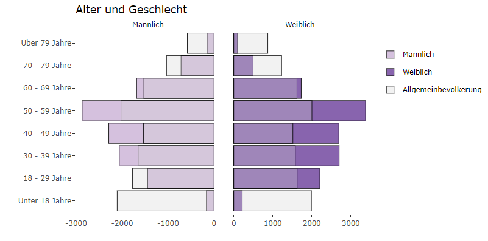
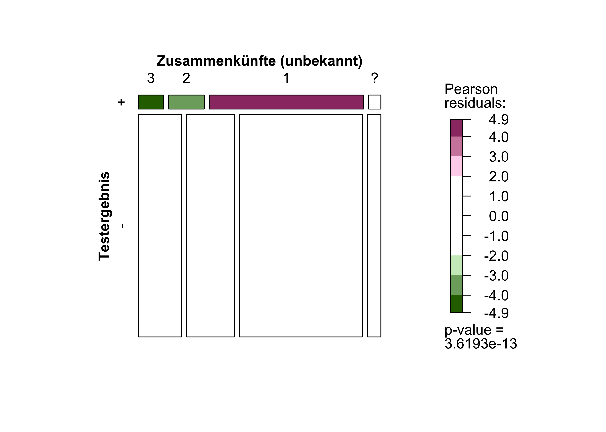
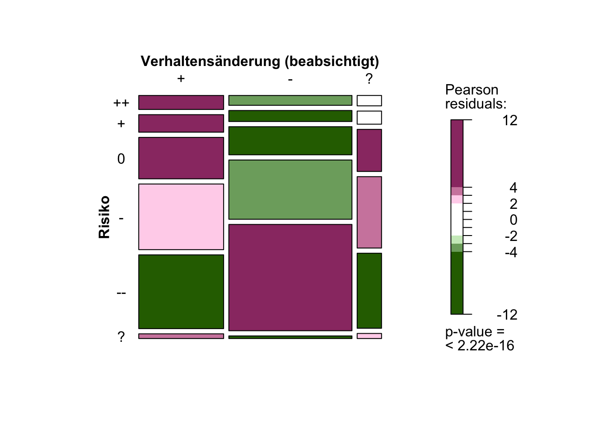

Um die Wirksamkeit der Corona-Warn-App zu messen, muss man wissen, wer sie nutzt. Aus Datenschutz-Gründen und wegen der Architektur der App ist es allerdings nicht möglich, diese Informationen zu erheben und einzusehen.

Durch eine freiwillige, ereignisbezogene Online-Befragung (Event-Driven-User-Survey, kurz EDUS), die zwischen März und Mai 2021 durchgeführt wurde, konnten Erkenntnisse und Ergebnisse zur Soziodemographie und zum Verhalten der CWA-Nutzenden erarbeitet und ausgewertet werden. Es geht u.&nbsp;a. um das Geschlecht, das Alter, den schulischen Abschluss, die geographische Verteilung, das Kontaktverhalten der Nutzenden.

<!-- overview -->

1. [Das Wichtigste in Kürze: Zahlen, Daten, Fakten](#1-das-wichtigste-in-kürze-zahlen-daten-fakten)
2. [Der Spagat zwischen Datensparsamkeit und wissenschaftlichen Erkenntnissen](#2-der-spagat-zwischen-datensparsamkeit-und-wissenschaftlichen-erkenntnissen)
    1. [Event-Driven-User-Survey (EDUS)](#21--event-driven-user-survey-edus)
    2. [Möglichkeiten und Grenzen von EDUS](#22-möglichkeiten-und-grenzen-von-edus)
    3. [Inhaltlicher Hintergrund](#23-inhaltlicher-hintergrund)
    4. [Basisbefragung](#24-basisbefragung)
    5. [Folgebefragung](#25-folgebefragung)
    6. [Technischer Ablauf der Befragung](#26-technischer-ablauf-der-befragung)
    7. [Zeitlicher Ablauf der Befragung](#27-zeitlicher-ablauf-der-befragung)
3. [Besonderheit der vorliegenden Stichprobe](#3-besonderheit-der-vorliegenden-stichprobe)
    1. [Anzahl der Aufrufe](#31-anzahl-der-aufrufe)
    2. [Anzahl der Teilnehmenden](#32-anzahl-der-teilnehmenden)
4. [Die Studienpopulation im Vergleich zur Gesamtbevölkerung](#4-die-studienpopulation-im-vergleich-zur-gesamtbevölkerung)
    1. [Geschlecht](#41-geschlecht)
    2. [Alter](#42-alter)
    3. [Alter und Geschlecht](#43-alter-und-geschlecht)
    4. [Bildungsgrad](#44-bildungsgrad)
5. [Geographische Verteilung](#5-geographische-verteilung)
    1. [Verteilung nach Landkreis](#51-verteilung-nach-landkreis)
    2. [Unterschiede zwischen urbanen und ländlichen Landkreisen](#52-unterschiede-zwischen-urbanen-und-ländlichen-landkreisen)
6. [Kontaktverhalten](#6-kontaktverhalten)
    1. [Kontaktverhalten innerhalb und außerhalb des Bekanntenkreises](#61-kontaktverhalten-innerhalb-und-außerhalb-des-bekanntenkreises)
    2. [Kontaktverhalten im beruflichen Kontext](#62--kontaktverhalten-im-beruflichen-kontext)
    3. [Zusammenhang zwischen Bildungsgrad und Kontaktverhalten](#63-zusammenhang-zwischen-bildungsgrad-und-kontaktverhalten)
    4. [Zusammenhang zwischen Kontaktverhalten und Infektion](#64--zusammenhang-zwischen-kontaktverhalten-und-infektion)
7. [Schutzmaßnahmen und beabsichtigte Verhaltensänderung](#7-schutzmaßnahmen-und-beabsichtigte-verhaltensänderung)
    1. [Bisherige Schutzmaßnahmen](#71-bisherige-schutzmaßnahmen)
    2. [Zusammenhang zwischen bisherigen Schutzmaßnahmen und beabsichtigter Verhaltensänderung](#72-zusammenhang-zwischen-bisherigen-schutzmaßnahmen-und-beabsichtigter-verhaltensänderung)
    3. [Beabsichtigte Schutzmaßnahmen](#73--beabsichtigte-schutzmaßnahmen)
    4. [Zusammenhang zwischen Risikoeinschätzung und beabsichtigter Verhaltensänderung](#74-zusammenhang-zwischen-risikoeinschätzung-und-beabsichtigter-verhaltensänderung)
8. [So geht es weiter](#8-so-geht-es-weiter)

## 1 Das Wichtigste in Kürze: Zahlen, Daten, Fakten

Die ereignisbezogene Befragung (EDUS) hat u.&nbsp;a. ergeben, dass
 - von den Befragten mehr Frauen (54,3%) als Männer (45,7%) die Corona-Warn-App nutzen,
 - die Gruppe der zwischen 50 und 59 Jahre alten Befragten am stärksten vertreten ist (25,1%),
 - die meisten Befragten (61,6%) Abitur, eine fachgebundene Hochschulreife oder die Fachhochschulreife erreicht haben,
 - die Befragten mehrheitlich im städtischen Raum und im Westen Deutschlands leben,
 - sich die Mehrheit der Befragten mit den klassischen AHA-Regeln vor einer Infektion geschützt haben,
 - sich die große Mehrheit (83,1%) nach einer „roten Warnung“ testen lassen wollte.

## 2 Der Spagat zwischen Datensparsamkeit und wissenschaftlichen Erkenntnissen

 Die Corona-Warn-App zeichnet sich durch ihren datensparsamen Ansatz und hohen Sicherheitsstandard aus. Abgesehen von funktionsrelevanten Daten werden keine weiteren Informationen über die Nutzenden erhoben. Damit geht einher, dass Fragen bezüglich der Funktionalität, der Wirksamkeit und des Nutzens der Corona-Warn-App nur dann detailliert beantwortet werden können, wenn auf freiwilliger Basis zusätzliche Daten erhoben werden. Möglich ist dies mit der <a href='../2021-06-15-science-blog-1/#ereignisbezogenen-befragung' target='_blank'>ereignisbezogenen Befragung</a> (<em>Event-Driven-User-Survey</em>, kurz <em>EDUS</em>), die in diesem Beitrag beleuchtet wird oder mit der <a href='../2021-06-15-science-blog-1/#datenspende' target='_blank'>CWA-Datenspende</a>&#8224;, &#8224; Die <a href='../2021-06-15-science-blog-1/#datenspende' target='_blank'>CWA-Datenspende</a> bezieht sich auf das freiwillige Zurverfügungstellen von Nutzungsdaten (Privacy Preserving Analytics, PPA) durch die Nutzenden der Corona-Warn-App. die in kommenden Beiträgen ausgewertet wird.

### 2.1  Event-Driven-User-Survey (EDUS)

Vom Prinzip her funktioniert EDUS folgendermaßen: Eine Person, welche die Corona-Warn-App benutzt und eine Risikobegegnung hatte, bekommt eine Benachrichtigung über ein erhöhtes Risiko: Das niedrige Risiko („grüne Warnung“) ändert sich zu einem erhöhten Risiko („rote Warnung“). Neben den eingeblendeten Empfehlungen im Umgang mit einer potentiellen Infektion und dem entsprechenden Ablauf wird eine Verlinkung auf den Befragungsservice angeboten. Dort können die Betroffenen nach entsprechender Einwilligungserklärung freiwillig allgemeine und spezifische Fragen beantworten. Die Befragung wurde in deutscher Sprache angeboten und bestand aus einer Basis- und einer Folgebefragung. Technische Sicherheitsmaßnahmen stellten dabei den Schutz der Privatsphäre sicher und verhinderten einen möglichen Missbrauch.

### 2.2 Möglichkeiten und Grenzen von EDUS

EDUS ist eine Befragung, an der CWA-Nutzende, die eine „rote Warnung“ erhalten haben, selbst entscheiden können, ob sie teilnehmen wollen. Dieser Ansatz ermöglicht den Forschenden aus der Perspektive der CWA-Nutzenden, tiefere Einblicke in ein System zu erhalten, das aufgrund der umfänglichen Datenschutzbestimmungen sonst unbeleuchtet bleiben würde. Auch wenn durch die Art der Befragung neue Erkenntnisse gewonnen werden können, ist es wichtig, auf die damit einhergehenden Grenzen der Aussagekraft hinzuweisen.

Besonders sensible Themen, wie bspw. die eigene Gesundheit, werden von den Befragten nicht immer wahrheitsgemäß beantwortet. Aus diesem Grund wurde schon während der Konzeption der Studie darauf geachtet, dass nur unbedingt notwendige Fragen in die Befragung einbezogen und diese, im Sinne eines datensparsamen Ansatzes, in Kategorien zusammengefasst werden. So wäre beispielsweise die Frage nach dem Einkommen der CWA-Nutzenden im Kontext des sozioökonomischen Status zwar wissenschaftlich interessant, könnte aber dazu führen, dass mehr Teilnehmende Bedenken entwickeln und die Befragung frühzeitig abbrechen oder nicht wahrheitsgemäß antworten. Um solch einem Verhalten entgegenzuwirken, wurden sensible persönliche Daten, wie bspw. das Alter, in Kategorien zusammengefasst, die im Gegensatz zu einer genauen Altersangabe zwar unpräziser, aber dennoch ausreichend sind, um Unterschiede entdecken zu können.

Da mit EDUS nur Nutzende der CWA befragt wurden, die eine „rote Warnung“ bekommen haben, können die Ergebnisse nicht auf alle Nutzende oder gar auf alle in Deutschland lebenden Personen bezogen werden. Die [Auswertung der soziodemographischen Merkmale der Befragten](#4-die-studienpopulation-im-vergleich-zur-gesamtbevölkerung) ermöglicht es jedoch, diese in Relation zur Gesamtbevölkerung zu setzen.

Personen, die an Befragungen teilnehmen möchten, unterscheiden sich oftmals systematisch von Personen, die sich einer Teilnahme verweigern. Es muss davon ausgegangen werden, dass dieses Phänomen auch auf EDUS zutrifft. Die CWA erhebt keine Daten über ihre Nutzenden, weshalb der Unterschied zwischen denen, die an EDUS teilgenommen haben und den CWA-Nutzenden, die an EDUS nicht teilgenommen haben, unbekannt ist.

Für die Evaluation der CWA ist es unabdinglich, die Nutzenden selbst zu den Umständen und ihren Erfahrungen zu befragen, die in Verbindung mit der „roten Warnung“ auftraten. EDUS kann genau das leisten und beantwortet damit wichtige Fragen aus einer Perspektive, die den Forschenden sonst nicht zugänglich wäre.

Des Weiteren besteht die Möglichkeit, dass die EDUS-Daten mit anderen Datenquellen, wie bspw. den Daten der [CWA-Datenspende](../2021-06-15-science-blog-1/#datenspende), in Beziehung gesetzt werden und weitere Erkenntnisse über die CWA und ihre Nutzenden zu Tage gefördert werden können.

### 2.3 Inhaltlicher Hintergrund

Der Grundgedanke von EDUS ist, die Nutzenden zu ihren Erfahrungen zu befragen, um Rückschlüsse auf die Wirksamkeit der CWA abzuleiten. Die Befragung wurde so kurz wie möglich gehalten, um die Teilnehmenden in einer ohnehin angespannten Situation eines erhöhten Infektionsrisikos nicht zusätzlich zu belasten. Aus diesem Grund konnten nicht alle Themen und Schwerpunkte abgedeckt werden, die aus einer wissenschaftlichen Perspektive eine spannende Fragestellung dargestellt hätten. Bei der Planung der Fragebögen standen dem Team verschiedene Fachgesellschaften und wissenschaftliche Expertinnen und Experten beratend zur Seite. Den Konsens dieser Gespräche stellen die beiden Fragebögen der [Basisbefragung](#24-basisbefragung) und [Folgebefragung](#25-folgebefragung) dar.

### 2.4 Basisbefragung

Die Basisbefragung beinhaltet Fragen zu folgenden Themen:
-   Verhalten der CWA-Nutzenden
-   persönliche Einschätzung des Infektionsrisikos durch die Nutzenden
-   beabsichtigte Verhaltensänderung der Nutzenden nach der „rote Warnung“
-   angestrebte Maßnahmen der CWA-Nutzenden nach der „rote Warnung“
-   neu aufgetretene Symptome bei den CWA-Nutzenden mit „rote Warnung“

Der thematische Schwerpunkt der Basisbefragung liegt auf der Frage, in welchem Ausmaß Nutzende durch die CWA eine Benachrichtigung über ein erhöhtes Infektionsrisiko erhalten, welches sie ohne die CWA nicht erkannt hätten und welche gebotenen Verhaltensmaßnahmen sie nach der Benachrichtigung ergreifen wollen.

Zusätzlich werden Fragen zur Soziodemographie gestellt:

-   Geschlecht
-   Alter (in acht groben Altersgruppen)
-   die Wohnregion (dreistellige Postleitzahl)
-   höchster allgemeinbildender Schulabschluss

In anderen Studien des Robert Koch-Instituts (z.&nbsp;B. [GEDA 2014/2015-EHIS](https://www.geda-studie.de/deutsch/ergebnisse/geda-20142015-ehis.html)) wird die Soziodemographie detaillierter erfasst. Die dabei erhobenen soziodemographischen Daten dienen zur Berechnung verschiedener Anschlussindikatoren, wie bspw. den [sozialökonomischen Status](https://en.wikipedia.org/wiki/Socioeconomic_status). Im Gegensatz dazu verfolgt EDUS mit dem Evaluationsansatz einen datensparsameren Weg. So wird das Alter lediglich in zuvor definierten Kategorien erfasst, Angaben über Einkommen oder den beruflichen Status werden nicht erfragt.

### 2.5 Folgebefragung

Die Folgebefragung behandelt die Teilnahme an Tests und deren Ergebnisse, welche in Folge der  „roten Warnung“ durchgeführt werden. Dabei liegt ein besonderes Augenmerk auf der Funktionalität der CWA. So wird u.&nbsp;a. erfragt, ob und in welchem Zeitrahmen ein Testergebnis über die CWA verfügbar geworden ist und im Falle eines positiven Testergebnisses dieses über die CWA geteilt wurde. Auch in der Folgebefragung wird nach neu aufgetretenen Symptomen bei den CWA-Nutzenden gefragt. Der Schwerpunkt liegt auf der Frage, in welchem Ausmaß durch die CWA benachrichtigte Personen die gebotenen Verhaltensmaßnahmen ergriffen haben.

In beiden Fragebögen werden insgesamt 31 Fragen gestellt. Dabei ist die Abfrage der E-Mail-Adresse für die Folgebefragung mitberücksichtigt. In den Fragebögen werden Filterfragen eingesetzt, um Teilnehmenden nur auf sie zutreffende Fragen zu stellen. Eine Frage wurde während des Erhebungszeitraums am 07.04.21 zusätzlich eingefügt. Dabei wurde nach der Anzahl von Geräten, auf denen die CWA installiert ist, gefragt. Dies soll dazu dienen, den Unterschied zwischen Personen, die die CWA nutzen und den Geräten, auf denen sie installiert ist, abzuschätzen.

### 2.6 Technischer Ablauf der Befragung

Wie eingangs beschrieben wird dem CWA-Nutzenden mit einer Änderung der Statusanzeige (von „grün“ auf „rot“) eine Verlinkung zur Befragung angeboten. Die CWA erstellt ein sogenanntes „One-Time-Passwort“ (OTP) und speichert dieses lokal auf dem jeweiligen Endgerät. Klicken Nutzende auf den Link zur Befragung, wird ein Echtheitsnachweis vom Betriebssystem angefragt, welcher verifizieren soll, dass das Gerät echt und die App installiert ist. Anschließend werden der Echtheitsnachweis und das OTP vom Endgerät an den CWA-Server übertragen.

Bei erfolgreicher Prüfung des Echtheitsnachweises erfolgt die Weiterleitung zur Befragung und die Speicherung der Daten. Nehmen Nutzende an der Befragung teil, wird das OTP deaktiviert, um eine erneute Teilnahme an der Befragung oder eine Weiterleitung an Unbefugte zu verhindern. Am Ende der Basisbefragung wird die E-Mail-Adresse der Nutzenden abgefragt, um den Versand des Teilnahmelinks zur Folgebefragung zu ermöglichen. Alle Teilnehmenden haben die Möglichkeit, sich für oder gegen eine Teilnahme zu entscheiden.

Die E-Mail-Adresse wird durch ein spezielles Verfahren namens „2Secure“ zusammen mit der automatisch vom Umfrage-Tool [VOXCO](https://www.voxco.com) angelegten Identifikationsnummer (ID) direkt nach Abschluss der Basisbefragung in einer separaten Datenbank gespeichert. Der Link zur Folgebefragung wird den Teilnehmenden, die eine E-Mail-Adresse angegeben haben, fünf Tage nach der Basisbefragung automatisiert per E-Mail zugesendet. Die in der Datenbank hinterlegten E-Mail-Adressen werden nach Versand der Einladung zur Teilnahme an der Folgebefragung sofort aus der Datenbank gelöscht.

<figcaption aria-hidden="true"><em>Abb.1: EDUS - technischer Ablauf</em></figcaption>

### 2.7 Zeitlicher Ablauf der Befragung

Die Teilnahme an der Basisbefragung war vom 04.03.2021 bis zum 07.05.2021 möglich. Da der Link zur Folgebefragung fünf Tage nach Abschluss der Basisbefragung versendet wurde und die Teilnehmenden 14 Tage Zeit hatten, diesen zu nutzen, wurde die Möglichkeit zur Teilnahme an der Folgebefragung am 27.05.2021 beendet. Der gesamte Erhebungszeitraum erstreckt sich somit vom 04.03.2021 bis zum 27.05.2021.

Die vom Befragungssystem automatisiert erhobenen Daten mit datenschutzrechtlicher Relevanz wurden mit Ende der Websession durch entsprechende Datenbanktrigger gelöscht. IP-Adressen wurden bereits an der Firewall maskiert und nicht an das System übergeben.
In diesem Prozess wurde der SSL-Tunnel nicht aufgebrochen, sodass eine Zuordnung von einem konkreten Datensatz und IP-Adresse nicht einmal für den Firewall-Administrator möglich gewesen ist.

## 3 Besonderheit der vorliegenden Stichprobe

Allgemein lassen sich Stichproben nach ihren Auswahlverfahren unterscheiden. Um Aussagen über die Gesamtbevölkerung zu ermöglichen, benötigt man bspw. Zufallsstichproben (Random-Samples). Diese werden in [Zufallsauswahlverfahren](https://en.wikipedia.org/wiki/Survey_sampling) zusammengesetzt. In diesen Verfahren besitzt jedes Element der Grundgesamtheit eine angebbare Wahrscheinlichkeit, in die Stichprobe zu kommen.

Nicht immer sind Zufallsstichproben möglich. Bei EDUS beschränkt sich der Kreis der Befragten auf Nutzende der CWA mit einem erhöhten Risiko, die durch das Prinzip der Selbstrekrutierung an der Umfrage teilnehmen konnten. Aufgrund des datensparsamen Ansatzes der App sind viele Informationen über die Nutzenden vorerst unbekannt und müssen modelliert und erfragt werden. Auf Basis der durch EDUS erhobenen Daten können folglich keine bevölkerungsrepräsentativen Aussagen getroffen werden. Dennoch lässt sich die Stichprobe und deren Qualität anhand der Teilnahmen und durch den Vergleich zur Gesamtbevölkerung, beschreiben.

### 3.1 Anzahl der Aufrufe

Die Basisbefragung wurde vom 04.03.2021 bis zum 07.05.2021 insgesamt 33.701 Mal aufgerufen. Davon haben 26.094 Teilnehmende das Ende des Fragebogens erreicht. Die Abschlussrate liegt damit bei 77,4%. Weitere 7.329 Teilnehmende konnten die Befragung nicht beenden, weil sie entweder über 30 Minuten inaktiv waren, oder während der Befragung den Webbrowser geschlossen hatten. 43 Personen klickten den Befragungslink zwar an, gaben aber keine Einwilligung für die Durchführung der Befragung und wurden deswegen in der Auswertung nicht berücksichtigt. 234 Teilnehmende wurden nicht erfasst, da der Einladungslink ungültig war. Dies geschah, wenn Teilnehmende, welche die Befragung gestartet hatten, über 30 Minuten inaktiv waren und dann versuchten den Fragebogen über den Browser neu zu laden. Bei einer weiteren teilnehmenden Person kam es zu einem technischen Problem, weswegen diese nicht aufgenommen wurde. Infolge eines technischen Fehlers konnten 342 potentielle Teilnehmende nicht an der Folgebefragung teilnehmen.

</img>

<!---(#fig:edus_response_plotly)--->
<em>Abb. 2: EDUS Aufrufe in Basis- und Folgebefragung.</em>

Um die Teilnehmendenrate der Basisbefragung wissenschaftlich einschätzen zu können, ist die Anzahl aller Personen von Interesse, welche die Chance hatten, an der Befragung teilzunehmen. Noch präziser ist die Anzahl aller Geräte gemeint, die während des Befragungszeitraums eine „rote Warnung“ inklusive des Links zum Fragebogen bekamen. Eine Warnung kam zustande, indem eine Person ihr positives PCR-Testergebnis mit anderen geteilt hat. Die Registrierung von Antigen-Schnelltestergebnissen war während des Befragungszeitraums noch nicht möglich.

Während die Anzahl der warnenden Geräte über das CWA-Backend ermittelt werden kann, ist die Anzahl der gewarnten Geräte, aufgrund des datensparsamen Ansatzes der CWA, nicht exakt bestimmbar. Dennoch kann die Anzahl der warnenden Geräte durch die [CWA-Datenspende](../2021-06-15-science-blog-1/#datenspende) konservativ geschätzt werden.

### 3.2 Anzahl der Teilnehmenden

Im Befragungszeitraum kam es zu 230.723 roten Warnungen, die über die [CWA-Datenspende](../2021-06-15-science-blog-1/#datenspende) ermittelt wurden. Bei einer einfachen Hochrechnung (mit der Annahme, dass etwa ein Drittel der CWA-Nutzenden an der CWA-Datenspende teilnehmen) erreicht man eine geschätzte Anzahl von 692.169 gewarnten Geräten, was einer Teilnahmequote an EDUS von 4% entsprechen würde. Dabei ist es wichtig, sich zu vergegenwärtigen, dass es mit großer Wahrscheinlichkeit systematische Unterschiede zwischen den Personen gibt, die an der CWA-Datenspende teilnehmen und solchen, die dies nicht taten. Ebenso könnten Teilnehmende an EDUS ein Umfeld haben, in dem die App aktiver genutzt wird, als Nicht-Teilnehmende. Teilnehmende könnten also systematisch häufiger (oder seltener) gewarnt worden sein. Deshalb ist die Schätzung eine vorsichtige Annäherung an die realen Umstände, da eine exakte Bestimmung nicht möglich ist.

Von den 26.094 Personen, welche die Basisbefragung abgeschlossen hatten, gaben 23.184 eine E-Mail-Adresse für die Folgebefragung an, wovon wiederum 21.664 genutzt werden konnten, um eine Einladung zu verschicken. Infolge eines technischen Fehlers konnten sich 342 potentielle Teilnehmende nicht an der Folgebefragung beteiligen. Somit wurden insgesamt 21.322 Einladungen für die Folgebefragung verschickt. Davon haben 15.561 an der Folgebefragung teilgenommen und dabei das Ende des Fragebogens erreicht. Die Abschlussrate der Folgebefragung beträgt damit 73,0%. Weitere 138 Teilnehmende konnten aufgrund von Inaktivität oder Abbruch nicht berücksichtigt werden. Insgesamt 5.623 Einladungen zur Folgebefragung wurden nicht genutzt. Im Schnitt nahmen 401 Personen pro Tag an der Basisbefragung und 213 Befragten an der Folgebefragung teil.

Im zeitlichen Verlauf fällt auf, dass die Zahl der Teilnehmenden ab dem 19. März sprunghaft ansteigt und sich dann bis zum Ende der Erhebungszeit auf einem durchschnittlich gleich hohen Niveau bewegt. Dieser Ansprung ist ebenfalls in der Zahl der Teilnehmenden der Folgebefragung sichtbar, allerdings, entsprechend der Wartezeit für die Einladungs-Links via E-Mail, fünf Tage später. Der Anstieg lässt sich durch ein Update der CWA erklären, welches zu dieser Zeit eine [Verbesserung der Risikoberechnung in Reaktion auf die Infektionslage](../../blog/2021-04-16-corona-warn-app-risk-calculation-further-improved/) beinhaltete.

Weitere Fluktuationen der täglichen Teilnehmenden-Zahlen entstanden, da an Wochenenden weniger Tests durchgeführt und damit weniger positive Testergebnisse geteilt wurden als unter der Woche. Zudem sind leichte Veränderungen in den täglichen Teilnehmenden-Zahlen über den Erhebungszeitraum durch die Entwicklung der Inzidenz in Deutschland zu erklären.

</img>

<!---(#fig:plot_edus_participation_plotly)--->
<em>Abb. 3: EDUS Teilnehmende in Basis- und Folgebefragung und Warnende (aus CWA-Datenspende).</em>

## 4 Die Studienpopulation im Vergleich zur Gesamtbevölkerung

Wie bereits festgestellt kann EDUS als selbstrekrutierte Studie nicht bevölkerungsrepräsentativ sein. Dennoch kann die Gesamtheit der Studienteilnehmenden der Gesamtbevölkerung in Deutschland gegenübergestellt werden, um die Stichprobe einzuschätzen und zu beschreiben. Für den Vergleich bieten sich die soziodemographischen Angaben an, die in der Basisbefragung erhoben wurden. Zuerst wird auf Geschlecht und Alter eingegangen, um danach die Bildungsverteilung näher zu beleuchten.

### 4.1 Geschlecht

Das Geschlecht wurde über zwei Fragen erhoben. Zum einen wurde nach dem Geschlecht gefragt, welches auf der Geburtsurkunde eingetragen wurde. Da sich nicht alle Menschen mit dem eingetragenen Geschlecht identifizieren, wurde zum anderen erfragt, welchem Geschlecht sich die Teilnehmenden zugehörig fühlen. Für den Vergleich wurden Zensus-Daten herangezogen, welche ausschließlich das Geburtsgeschlecht berücksichtigen. Der Vergleich zur Gesamtbevölkerung beruht daher ebenfalls auf der Frage zum Geburtsgeschlecht.

Die Frage nach dem Geburtsgeschlecht wurde von 24.925 Personen beantwortet, wobei 11.385 (45,7%) männliches und 13.540 (54,3%) weibliches Geschlecht angaben. Wiederum 1.169 Personen beantworteten die Frage nicht. Das Geschlecht, dem sich die Befragten zugehörig fühlen, war bei 11.236 (45,1%) männlich, bei 13.436 (54,0%) weiblich, bei 48 (0,2%) ein anderes und 180 (0,7%) gaben an, es nicht zu wissen. Wiederum 1.194 Personen gaben keine Antwort. Insgesamt identifizierten sich 98,0% der männlichen und 98,5% der weiblichen Teilnehmenden mit dem Geschlecht, welches auf ihrer Geburtsurkunde eingetragen wurde.

    
Angaben zu Geburtsgeschlecht und Geschlecht

    <table class="table table-striped table-hover table-condensed table-responsive" style="margin-left: auto; margin-right: auto;">
    <thead>
    <tr>
    <th style="text-align:left;position: sticky; top:0; background-color: #FFFFFF;">
    Welches Geschlecht wurde bei Ihrer Geburt in Ihre Geburtsurkunde eingetragen?
    </th>
    <th style="text-align:right;position: sticky; top:0; background-color: #FFFFFF;">
    Anzahl
    </th>
    <th style="text-align:right;position: sticky; top:0; background-color: #FFFFFF;">
    Anteil
    </th>
    <th style="text-align:right;position: sticky; top:0; background-color: #FFFFFF;">
    Anteil (gültig)
    </th>
    </tr>
    </thead>
    <tbody>
    <tr>
    <td style="text-align:left;">
    Männlich
    </td>
    <td style="text-align:right;">
    11.385
    </td>
    <td style="text-align:right;">
    43.6%
    </td>
    <td style="text-align:right;">
    45.7%
    </td>
    </tr>
    <tr>
    <td style="text-align:left;">
    Weiblich
    </td>
    <td style="text-align:right;">
    13.540
    </td>
    <td style="text-align:right;">
    51.9%
    </td>
    <td style="text-align:right;">
    54.3%
    </td>
    </tr>
    <tr>
    <td style="text-align:left;">
    -keine Angabe-
    </td>
    <td style="text-align:right;">
    1.169
    </td>
    <td style="text-align:right;">
    4.5%
    </td>
    <td style="text-align:right;">
    <ul>
    <li></td>
    </tr>
    </tbody>
    </table>
    <table class="table table-striped table-hover table-condensed table-responsive" style="margin-left: auto; margin-right: auto;">
    <thead>
    <tr>
    <th style="text-align:left;position: sticky; top:0; background-color: #FFFFFF;">
    Da sich nicht alle Menschen ihrem eingetragenen Geschlecht zugehörig fühlen: Welchem Geschlecht fühlen Sie sich zugehörig?
    </th>
    <th style="text-align:right;position: sticky; top:0; background-color: #FFFFFF;">
    Anzahl
    </th>
    <th style="text-align:right;position: sticky; top:0; background-color: #FFFFFF;">
    Anteil
    </th>
    <th style="text-align:right;position: sticky; top:0; background-color: #FFFFFF;">
    Anteil (gültig)
    </th>
    </tr>
    </thead>
    <tbody>
    <tr>
    <td style="text-align:left;">
    Männlich
    </td>
    <td style="text-align:right;">
    11.236
    </td>
    <td style="text-align:right;">
    43.1%
    </td>
    <td style="text-align:right;">
    45.1%
    </td>
    </tr>
    <tr>
    <td style="text-align:left;">
    Weiblich
    </td>
    <td style="text-align:right;">
    13.436
    </td>
    <td style="text-align:right;">
    51.5%
    </td>
    <td style="text-align:right;">
    54.0%
    </td>
    </tr>
    <tr>
    <td style="text-align:left;">
    Einem anderen
    </td>
    <td style="text-align:right;">
    48
    </td>
    <td style="text-align:right;">
    0.2%
    </td>
    <td style="text-align:right;">
    0.2%
    </td>
    </tr>
    <tr>
    <td style="text-align:left;">
    Weiß nicht
    </td>
    <td style="text-align:right;">
    180
    </td>
    <td style="text-align:right;">
    0.7%
    </td>
    <td style="text-align:right;">
    0.7%
    </td>
    </tr>
    <tr>
    <td style="text-align:left;">
    -keine Angabe-
    </td>
    <td style="text-align:right;">
    1.194
    </td>
    <td style="text-align:right;">
    4.6%
    </td>
    <td style="text-align:right;">
    <ul>
    <li></td>
    </tr>
    </tbody>
    </table>

### 4.2 Alter

Die meisten Befragten waren zwischen 50 und 59 Jahre alt (Modus), der [Median](https://de.wikipedia.org/wiki/Median) liegt bei der Kategorie der 40 bis 49-Jährigen. Die Kategorie der unter 18-Jährigen ist stark unterrepräsentiert, da die Benutzung der CWA erst ab 16 Jahren empfohlen wird. EDUS sollte damit keine Personen unter dieser Altersgrenze erreichen. Ebenfalls nahmen deutlich weniger Personen über 80 Jahre an der Befragung teil, als ihrem Anteil in der Gesellschaft entspräche.

Bei allen Befragungen hat die Art, mit der die Daten erhoben werden, Einfluss darauf, welche Personen erreicht werden können.

Angaben zum Alter

<table class="table table-striped table-hover table-condensed table-responsive" style="margin-left: auto; margin-right: auto;">
<thead>
<tr>
<th style="text-align:left;position: sticky; top:0; background-color: #FFFFFF;">
Wie alt sind Sie? Bitte wählen Sie die zutreffende Kategorie aus.
</th>
<th style="text-align:right;position: sticky; top:0; background-color: #FFFFFF;">
Anzahl
</th>
<th style="text-align:right;position: sticky; top:0; background-color: #FFFFFF;">
Anteil
</th>
<th style="text-align:right;position: sticky; top:0; background-color: #FFFFFF;">
Anteil (gültig)
</th>
</tr>
</thead>
<tbody>
<tr>
<td style="text-align:left;">
Unter 18 Jahre
</td>
<td style="text-align:right;">
385
</td>
<td style="text-align:right;">
1.5%
</td>
<td style="text-align:right;">
1.5%
</td>
</tr>
<tr>
<td style="text-align:left;">
18 - 29 Jahre
</td>
<td style="text-align:right;">
3.657
</td>
<td style="text-align:right;">
14.0%
</td>
<td style="text-align:right;">
14.7%
</td>
</tr>
<tr>
<td style="text-align:left;">
30 - 39 Jahre
</td>
<td style="text-align:right;">
4.765
</td>
<td style="text-align:right;">
18.3%
</td>
<td style="text-align:right;">
19.1%
</td>
</tr>
<tr>
<td style="text-align:left;">
40 - 49 Jahre
</td>
<td style="text-align:right;">
4.990
</td>
<td style="text-align:right;">
19.1%
</td>
<td style="text-align:right;">
20.0%
</td>
</tr>
<tr>
<td style="text-align:left;">
50 - 59 Jahre
</td>
<td style="text-align:right;">
6.253
</td>
<td style="text-align:right;">
24.0%
</td>
<td style="text-align:right;">
25.1%
</td>
</tr>
<tr>
<td style="text-align:left;">
60 - 69 Jahre
</td>
<td style="text-align:right;">
3.416
</td>
<td style="text-align:right;">
13.1%
</td>
<td style="text-align:right;">
13.7%
</td>
</tr>
<tr>
<td style="text-align:left;">
70 - 79 Jahre
</td>
<td style="text-align:right;">
1.215
</td>
<td style="text-align:right;">
4.7%
</td>
<td style="text-align:right;">
4.9%
</td>
</tr>
<tr>
<td style="text-align:left;">
Über 79 Jahre
</td>
<td style="text-align:right;">
249
</td>
<td style="text-align:right;">
1.0%
</td>
<td style="text-align:right;">
1.0%
</td>
</tr>
<tr>
<td style="text-align:left;">
-keine Angabe-
</td>
<td style="text-align:right;">
1.164
</td>
<td style="text-align:right;">
4.5%
</td>
<td style="text-align:right;">
</td>
</tr>
</tbody>
</table>

### 4.3 Alter und Geschlecht

Betrachtet man die Alters- und Geschlechtsverteilung gemeinsam im Vergleich zur Gesamtbevölkerung, fallen weitere Besonderheiten der Stichprobe auf. Weibliche Teilnehmende sind vor allem in den Altersgruppen der 18- bis 59-Jährigen überrepräsentiert, während das gleiche für männliche Teilnehmende erst aber der Altersgruppe der 30- bis 59-Jährigen gilt. Die Studie hat damit mehr jüngere Frauen als jüngere Männer erreicht. In der Altersgruppe der 60- bis 69-Jährigen ist bei beiden Geschlechtern ein leichter proportionaler Überhang beobachtbar.

    

    
    </img>
    

    <em>Abb. 4: EDUS Teilnehmende nach Alter und Geschlecht.</em>
    

### 4.4 Bildungsgrad

Um so wenig Daten wie möglich zu erheben und trotzdem noch Aussagen über den Bildungsgrad der Teilnehmenden zu ermöglichen, wurde ausschließlich die Schulbildung erfragt. Mit 15.336 (61,6%) Antworten gaben die mit Abstand meisten Befragten an, dass sie das Abitur, eine fachgebundene Hochschulreife oder die Fachhochschulreife erreicht hatten. Wiederum 6.694 (27,9%) gaben an, den Realschulabschluss, die mittlere Reife oder Polytechnische Oberschule mit Abschluss der 10. Klasse als höchsten schulischen Bildungsgrad erreicht zu haben. Geringer Qualifizierte oder „keine Abschlüsse“ wurden deutlich seltener genannt. Auch Schüler oder Schülerinnen wurden nur vereinzelt erreicht.

Auch bei anderen Befragungsstudien ist es nicht ungewöhnlich, dass Menschen mit höherem Bildungsgrad häufiger teilnehmen, als Menschen mit niedrigerem. Dennoch ist die Verzerrung gegenüber der Gesamtbevölkerung höher als bei anderen Studien. Das RKI führt im Rahmen des bundesweiten Gesundheitsmonitorings regelmäßig Gesundheitsbefragungen durch. Für „Gesundheit in Deutschland aktuell“ (GEDA) wurde in der Welle von November 2014 bis Juli 2015 mehr als 20.000 Menschen, die in Deutschland leben und mindestens 15 Jahre alt sind, befragt ([GEDA 2014/2015-EHIS](https://www.geda-studie.de/deutsch/ergebnisse/geda-20142015-ehis.html)). Die Teilnehmenden wurden auf Basis einer Einwohnermeldeamtstichprobe schriftlich angeschrieben und konnten unter anderem mittels eines Online-Fragebogens teilnehmen. Von den Befragten, die online an [GEDA 2014/2015-EHIS](https://www.geda-studie.de/deutsch/ergebnisse/geda-20142015-ehis.html) teilnahmen, gaben 54,9% an, ein Abitur oder einen vergleichbaren Abschluss zu besitzen. Alle niedrigeren schulischen Bildungsabschlüsse (sofern angebbar) wurden bei der [GEDA 2014/2015-EHIS Studie](https://www.geda-studie.de/deutsch/ergebnisse/geda-20142015-ehis.html) häufiger angegeben, als bei EDUS. Die Unterschiede lassen sich wieder auf den Befragungsmodus zurückführen.

<table class="table table-striped table-hover table-condensed table-responsive" style="margin-left: auto; margin-right: auto;">
<caption>EDUS - Verteilung nach Bildungsabschluss</caption>
<thead>
<tr>
<th style="text-align:left;position: sticky; top:0; background-color: #FFFFFF;">
Welchen höchsten allgemein bildenden Schulabschluss haben Sie?
</th>
<th style="text-align:right;position: sticky; top:0; background-color: #FFFFFF;">
Anzahl
</th>
<th style="text-align:right;position: sticky; top:0; background-color: #FFFFFF;">
Anteil
</th>
<th style="text-align:right;position: sticky; top:0; background-color: #FFFFFF;">
Anteil (gültig)
</th>
</tr>
</thead>
<tbody>
<tr>
<td style="text-align:left;">
Abitur, fachgebundene Hochschulreife oder Fachhochschulreife
</td>
<td style="text-align:right;">
15.336
</td>
<td style="text-align:right;">
58.8%
</td>
<td style="text-align:right;">
61.6%
</td>
</tr>
<tr>
<td style="text-align:left;">
Realschulabschluss, Mittlere Reife, Polytechnische Oberschule mit Abschluss der 10. Klasse
</td>
<td style="text-align:right;">
6.946
</td>
<td style="text-align:right;">
26.6%
</td>
<td style="text-align:right;">
27.9%
</td>
</tr>
<tr>
<td style="text-align:left;">
Haupt-/Volksschulabschluss, Polytechnische Oberschule mit Abschluss der 8. oder 9. Klasse
</td>
<td style="text-align:right;">
2.058
</td>
<td style="text-align:right;">
7.9%
</td>
<td style="text-align:right;">
8.3%
</td>
</tr>
<tr>
<td style="text-align:left;">
Abschluss nach höchstens 7 Jahren Schulbesuch
</td>
<td style="text-align:right;">
43
</td>
<td style="text-align:right;">
0.2%
</td>
<td style="text-align:right;">
0.2%
</td>
</tr>
<tr>
<td style="text-align:left;">
Keinen allgemein bildenden Schulabschluss
</td>
<td style="text-align:right;">
59
</td>
<td style="text-align:right;">
0.2%
</td>
<td style="text-align:right;">
0.2%
</td>
</tr>
<tr>
<td style="text-align:left;">
Keinen, ich bin noch Schüler
</td>
<td style="text-align:right;">
319
</td>
<td style="text-align:right;">
1.2%
</td>
<td style="text-align:right;">
1.3%
</td>
</tr>
<tr>
<td style="text-align:left;">
Weiß nicht
</td>
<td style="text-align:right;">
136
</td>
<td style="text-align:right;">
0.5%
</td>
<td style="text-align:right;">
0.5%
</td>
</tr>
<tr>
<td style="text-align:left;">
-keine Angabe-
</td>
<td style="text-align:right;">
1.197
</td>
<td style="text-align:right;">
4.6%
</td>
<td style="text-align:right;">
</td>
</tr>
</tbody>
</table>
<table class="table table-striped table-hover table-condensed table-responsive" style="margin-left: auto; margin-right: auto;">
<caption>
GEDA 2014/2015-EHIS - Verteilung nach Bildungsabschluss (Teilnahme Web-Befragung)
</caption>
<thead>
<tr>
<th style="text-align:left;position: sticky; top:0; background-color: #FFFFFF;">
Welchen höchsten allgemein bildenden Schulabschluss haben Sie? (GEDA)
</th>
<th style="text-align:right;position: sticky; top:0; background-color: #FFFFFF;">
Anzahl
</th>
<th style="text-align:right;position: sticky; top:0; background-color: #FFFFFF;">
Anteil
</th>
<th style="text-align:right;position: sticky; top:0; background-color: #FFFFFF;">
Anteil (gültig)
</th>
</tr>
</thead>
<tbody>
<tr>
<td style="text-align:left;">
Abitur, fachgebundene Hochschulreife oder Fachhochschulreife
</td>
<td style="text-align:right;">
5.855
</td>
<td style="text-align:right;">
54.9%
</td>
<td style="text-align:right;">
54.9%
</td>
</tr>
<tr>
<td style="text-align:left;">
Realschulabschluss, Mittlere Reife, Polytechnische Oberschule mit Abschluss der 10. Klasse
</td>
<td style="text-align:right;">
3.313
</td>
<td style="text-align:right;">
31.0%
</td>
<td style="text-align:right;">
31.1%
</td>
</tr>
<tr>
<td style="text-align:left;">
Haupt-/Volksschulabschluss, Polytechnische Oberschule mit Abschluss der 8. oder 9. Klasse
</td>
<td style="text-align:right;">
1.332
</td>
<td style="text-align:right;">
12.5%
</td>
<td style="text-align:right;">
12.5%
</td>
</tr>
<tr>
<td style="text-align:left;">
Abschluss nach höchstens 7 Jahren Schulbesuch
</td>
<td style="text-align:right;">
37
</td>
<td style="text-align:right;">
0.3%
</td>
<td style="text-align:right;">
0.3%
</td>
</tr>
<tr>
<td style="text-align:left;">
Keinen allgemein bildenden Schulabschluss
</td>
<td style="text-align:right;">
119
</td>
<td style="text-align:right;">
1.1%
</td>
<td style="text-align:right;">
1.1%
</td>
</tr>
<tr>
<td style="text-align:left;">
Weiß nicht
</td>
<td style="text-align:right;">
0
</td>
<td style="text-align:right;">
0.0%
</td>
<td style="text-align:right;">
0.0%
</td>
</tr>
<tr>
<td style="text-align:left;">
SP
</td>
<td style="text-align:right;">
0
</td>
<td style="text-align:right;">
0.0%
</td>
<td style="text-align:right;">
0.0%
</td>
</tr>
<tr>
<td style="text-align:left;">
-keine Angabe-
</td>
<td style="text-align:right;">
18
</td>
<td style="text-align:right;">
0.2%
</td>
<td style="text-align:right;"></td>
</tr>
</tbody>
</table>

Diese Art der Überbetonung höherer Schulbildung wird vor allem im Vergleich mit der Gesamtbevölkerung deutlich. Während 61,6% der EDUS-Teilnehmenden als höchsten schulischen Abschluss das Abitur angaben, tun dies in der gesamten Bevölkerung Deutschlands nur 33,5%. Alle niedrigeren Bildungsabschlüsse sind dementsprechend mit teilweise weitaus geringeren Anteilen bei der Befragung vertreten als in der Bevölkerung.

    

    
    </img>
    

    <em>Abb. 5: EDUS Teilnehmende nach Bildungsabschluss.</em>
    

## 5 Geographische Verteilung

### 5.1 Verteilung nach Landkreis

Die Angabe der dreistelligen Postleitzahl wurde gewählt, da diese leicht einzugeben ist. Insgesamt haben 24.836 ihre dreistellige Postleitzahl angegeben. Hierbei waren 149 ungültig oder zumindest keinem geografischen Ort zuzuordnen. Nur 6 Postleitzahlen, die geografisch zugeordnet werden können, wurden nie angegeben.

Für den Vergleich mit SARS-CoV-2-Neuinfektionen müssen die dreistelligen Postleitzahlen auf Landkreise umgerechnet werden. Die Anzahl der Teilnehmenden in einem Postleitzahlen-Gebiet wurde dabei gewichtet nach Einwohnerzahl auf die entsprechenden Landkreise verteilt. In der folgenden Abbildung sind beide Anzahlen dargestellt. Die Abbildung legt eine höhere Anzahl von Teilnehmenden in urbanen Gebieten nahe.

</img>

<em>Abb. 6: EDUS Teilnehmende nach 3-stelliger Postleitzahl und Landkreis.</em>

### 5.2 Unterschiede zwischen urbanen und ländlichen Landkreisen

Die folgende Abbildung zeigt den Zusammenhang zwischen der Bevölkerungsdichte und der „Inzidenz” der Teilnehmenden, d.&nbsp;h. der Anzahl der Teilnehmenden pro 100.000 Einwohner. Die Größe eines Landkreises ist dabei proportional zur Einwohnerzahl.

</img>
<em>Abb. 7: EDUS Teilnehmende nach Bevölkerungsdichte in städtischen und ländlichen des Landkreisen.</em>

Mit zunehmender Bevölkerungsdichte steigt die „Inzidenz” der Teilnehmenden (Anzahl der Teilnehmenden pro 100.000 Einwohner). Während es in ländlichen Gebieten im Mittel 22 Teilnehmende (pro 100.000 Einwohner) gab (Modus: 19,2), waren es in urbanen Gebieten im Mittel 28,9 (Modus: 29,9).

Außerdem ergibt sich aus den Daten, dass es in den westlichen Bundesländern im Schnitt 31,2 Teilnehmende (pro 100.000 Einwohner) und in den östlichen Bundesländern 23,3 gab.

Die geographische Betrachtung schließt den Teil der Soziodemographie ab. Im Folgenden werden die Befragungsergebnisse anhand von Themenblöcken vorgestellt.

## 6 Kontaktverhalten

Die Pandemie stellt insgesamt hohe Anforderung an das eigene Verhalten und tägliche Handeln. Nicht für alle ist die Umsetzung in gleichem Maße möglich. So können viele Menschen aufgrund ihrer Arbeitssituation Kontakte nicht weiter einschränken. Auch private Umstände können dazu führen, dass Zusammenkünfte notwendig sind. In der Basisbefragung wurden daher zwei Fragen mit ähnlicher Prämisse gestellt – zu Treffen mit Personen innerhalb und außerhalb des Bekanntenkreises – sowie eine Frage zum Kontaktverhalten im beruflichen Kontext.

### 6.1 Kontaktverhalten innerhalb und außerhalb des Bekanntenkreises

Da das Risiko für eine Ansteckung mit Dauer und Nähe steigt, sollten die Befragten an Zusammenkünfte denken, die länger als 15 Minuten andauerten und bei denen der Mindestabstand von 1,5 Metern nicht eingehalten werden konnte. Vor dem Hintergrund durchschnittlicher Inkubationszeiten und der Dauer der Infektiosität wurde die Frage nur für die letzten sieben Tage gestellt. Aus Datenschutzgründen wurden die Kontakte in Kategorien erfasst. Die Antwortmöglichkeiten waren: „weniger als eine Person pro Tag” (1), „zwischen einer bis drei Personen pro Tag” (2), „mehr als drei Personen pro Tag” (3) und „weiß nicht” (?).

Die Frage zu den Zusammenkünften innerhalb des Bekanntenkreises (n=24.946) wurde ähnlich häufig beantwortet, wie die Frage zu den Treffen außerhalb des Bekanntenkreises (n=24.927). Unabhängig von der Art der Zusammenkunft trafen sich die meisten Befragten mit wenigen Personen. Etwas mehr als die Hälfte der Befragten (13.018; 52,2%) traf in den letzten sieben Tagen vor der Warnmeldung weniger als eine Person ihres Bekanntenkreises pro Tag und annähernd genauso viele gaben dies für Treffen außerhalb des Bekanntenkreises (13.366; 53,6%) an. Unterschiede werden bei häufigeren Zusammenkünften sichtbar. Mehr Befragte trafen außerhalb ihres Bekanntenkreises zwischen einer und drei, bzw. mehr als drei Personen pro Tag, als das bei privaten Kontakten der Fall war. Die Daten weisen auf einen statistisch signifikanten Zusammenhang zwischen der Häufigkeit privater und anderer Zusammenkünfte hin.

<table class="gt_table">
  <thead class="gt_col_headings">
    <tr>
        <th class="gt_col_heading gt_columns_bottom_border gt_left" rowspan="2" colspan="1"><strong>Variable</strong></th>
        <th class="gt_center gt_columns_top_border gt_column_spanner_outer" rowspan="1" colspan="4">
            <strong>Zusammenkünfte (unbekannt)</strong>
        </th>
        <th class="gt_col_heading gt_columns_bottom_border gt_center" rowspan="2" colspan="1"><strong>Gesamt</strong></th>
    </tr>
    <tr>
        <th class="gt_col_heading gt_columns_bottom_border gt_center" rowspan="1" colspan="1">Mehr als 3 pro Tag</th>
        <th class="gt_col_heading gt_columns_bottom_border gt_center" rowspan="1" colspan="1">Zwischen einer bis 3 pro Tag</th>
        <th class="gt_col_heading gt_columns_bottom_border gt_center" rowspan="1" colspan="1">Weniger als 1 Person pro Tag</th>
        <th class="gt_col_heading gt_columns_bottom_border gt_center" rowspan="1" colspan="1">Weiß nicht</th>
    </tr>
  </thead>
  <tbody class="gt_table_body">
    <tr>
        <td class="gt_row gt_left" style="font-weight: bold;">Zusammenkünfte (bekannt)</td>
        <td class="gt_row gt_center"></td>
        <td class="gt_row gt_center"></td>
        <td class="gt_row gt_center"></td>
        <td class="gt_row gt_center"></td>
        <td class="gt_row gt_center"></td>
    </tr>
    <tr>
        <td class="gt_row gt_left" style="text-align: left; text-indent: 10px;">Mehr als 3 pro Tag</td>
        <td class="gt_row gt_center">1.489 (6,0%)</td>
        <td class="gt_row gt_center">467 (1,9%)</td>
        <td class="gt_row gt_center">561 (2,3%)</td>
        <td class="gt_row gt_center">121 (0,5%)</td>
        <td class="gt_row gt_center">2.638 (11%)</td>
    </tr>
    <tr>
        <td class="gt_row gt_left" style="text-align: left; text-indent: 10px;">Zwischen einer bis 3 pro Tag</td>
        <td class="gt_row gt_center">1.313 (5,3%)</td>
        <td class="gt_row gt_center">2.582 (10%)</td>
        <td class="gt_row gt_center">3.834 (15%)</td>
        <td class="gt_row gt_center">450 (1,8%)</td>
        <td class="gt_row gt_center">8.179 (33%)</td>
    </tr>
    <tr>
        <td class="gt_row gt_left" style="text-align: left; text-indent: 10px;">Weniger als 1 Person pro Tag</td>
        <td class="gt_row gt_center">1.814 (7,3%)</td>
        <td class="gt_row gt_center">1.872 (7,5%)</td>
        <td class="gt_row gt_center">8.716 (35%)</td>
        <td class="gt_row gt_center">602 (2,4%)</td>
        <td class="gt_row gt_center">13.004 (52%)</td>
    </tr>
    <tr>
        <td class="gt_row gt_left" style="text-align: left; text-indent: 10px;">Weiß nicht</td>
        <td class="gt_row gt_center">141 (0,6%)</td>
        <td class="gt_row gt_center">123 (0,5%)</td>
        <td class="gt_row gt_center">253 (1,0%)</td>
        <td class="gt_row gt_center">581 (2,3%)</td>
        <td class="gt_row gt_center">1.098 (4,4%)</td>
    </tr>
    <tr>
        <td class="gt_row gt_left" style="font-weight: bold;">Gesamt</td>
        <td class="gt_row gt_center">4.757 (19%)</td>
        <td class="gt_row gt_center">5.044 (20%)</td>
        <td class="gt_row gt_center">13.364 (54%)</td>
        <td class="gt_row gt_center">1.754 (7,0%)</td>
        <td class="gt_row gt_center">24.919 (100%)</td>
    </tr>
  </tbody>
</table>

Die folgende Abbildung zeigt ein [Mosaik-Plot](https://de.wikipedia.org/wiki/Mosaik-Plot) der [Kreuztabelle](https://de.wikipedia.org/wiki/Kontingenztafel). 

Mosaik-Plots sind ein graphisches Verfahren zur Visualisierung von Datensätzen mit zwei oder mehr Merkmalen. Aus ihnen lassen sich folgende Sachverhalte ableiten: 

-   Die Größe der einzelnen Rechtecke ist proportional zur Häufigkeit der jeweiligen Merkmalskombination.
-   Die Färbung der einzelnen Rechtecke gibt Informationen über die standardisierte Abweichung der beobachteten und erwarteten Häufigkeiten, die sogenannten Pearson-Residuen.

Jedes Rechteck innerhalb des Mosaik-Plots steht für eine Merkmalskombination. Die Farbe der Rechtecke hängt von den Pearson-Residuen ab. Sind diese signifikant, wird das jeweilige Rechteck eingefärbt. Ist die Abweichung sehr groß, ist der Farbton des betroffenen Rechtecks intensiver. Die Farbe Violett steht für eine signifikante Abweichung nach oben, die Farbe Grün steht für eine signifikante Abweichung nach unten. Sind die Rechtecke weiß, liegt keine signifikante Abweichung vor, d.&nbsp;h., die beobachteten und erwarteten Häufigkeiten liegen nah beieinander.

Auf der rechten Seite des Mosaik-Plots befindet sich eine Legende, die zwei Informationen beinhaltet:

-   Zusammenhang von Residuenhöhe und Einfärbungsgrad;
-   p-Wert eines chi2-Tests, auf dessen Basis es möglich ist, eine Aussage zur Unabhängigkeit der Ausprägungen der Variablen zu treffen.

Weitere Erläuterungen sind in der [Dokumentation](https://cran.r-project.org/web/packages/vcd/vignettes/strucplot.pdf) des [R-Paketes vcd](https://CRAN.R-project.org/package=vcd) zu finden.

<figcaption aria-hidden="true"><em>Abb. 8: EDUS - Zusammenkünfte mit Bekannten und Unbekannten.</em></figcaption>

Angaben zu Zusammenkünften mit Bekannten und Unbekannten

<table class="table table-striped table-hover table-condensed table-responsive" style="margin-left: auto; margin-right: auto;">
<thead>
<tr>
<th style="text-align:left;position: sticky; top:0; background-color: #FFFFFF;">
Denken Sie bitte an Zusammenkünfte in den letzten 7 Tagen, die länger als 15 Minuten waren und bei denen Sie den Mindestabstand von 1,5 Metern nicht einhalten konnten. Wie viele Personen aus Ihrem Bekanntenkreis haben Sie auf diese Weise in den letzten 7 Tagen getroffen?
</th>
<th style="text-align:right;position: sticky; top:0; background-color: #FFFFFF;">
Anzahl
</th>
<th style="text-align:right;position: sticky; top:0; background-color: #FFFFFF;">
Anteil
</th>
<th style="text-align:right;position: sticky; top:0; background-color: #FFFFFF;">
Anteil (gültig)
</th>
</tr>
</thead>
<tbody>
<tr>
<td style="text-align:left;">
Mehr als 3 pro Tag
</td>
<td style="text-align:right;">
2.639
</td>
<td style="text-align:right;">
10.1%
</td>
<td style="text-align:right;">
10.6%
</td>
</tr>
<tr>
<td style="text-align:left;">
Zwischen einer bis 3 pro Tag
</td>
<td style="text-align:right;">
8.188
</td>
<td style="text-align:right;">
31.4%
</td>
<td style="text-align:right;">
32.8%
</td>
</tr>
<tr>
<td style="text-align:left;">
Weniger als 1 Person pro Tag
</td>
<td style="text-align:right;">
13.018
</td>
<td style="text-align:right;">
49.9%
</td>
<td style="text-align:right;">
52.2%
</td>
</tr>
<tr>
<td style="text-align:left;">
Weiß nicht
</td>
<td style="text-align:right;">
1.101
</td>
<td style="text-align:right;">
4.2%
</td>
<td style="text-align:right;">
4.4%
</td>
</tr>
<tr>
<td style="text-align:left;">
-keine Angabe-
</td>
<td style="text-align:right;">
1.148
</td>
<td style="text-align:right;">
4.4%
</td>
<td style="text-align:right;">
<ul>
<li></td>
</tr>
</tbody>
</table>
<table class="table table-striped table-hover table-condensed table-responsive" style="margin-left: auto; margin-right: auto;">
<thead>
<tr>
<th style="text-align:left;position: sticky; top:0; background-color: #FFFFFF;">
Denken Sie bitte wieder an Zusammenkünfte in den letzten 7 Tagen, die länger als 15 Minuten waren und bei denen Sie den Mindestabstand von 1,5 Metern nicht einhalten konnten. Wie viele Personen, die nicht in Ihrem Bekanntenkreis sind, haben Sie auf diese Weise in den letzten 7 Tagen getroffen?
</th>
<th style="text-align:right;position: sticky; top:0; background-color: #FFFFFF;">
Anzahl
</th>
<th style="text-align:right;position: sticky; top:0; background-color: #FFFFFF;">
Anteil
</th>
<th style="text-align:right;position: sticky; top:0; background-color: #FFFFFF;">
Anteil (gültig)
</th>
</tr>
</thead>
<tbody>
<tr>
<td style="text-align:left;">
Mehr als 3 pro Tag
</td>
<td style="text-align:right;">
4.758
</td>
<td style="text-align:right;">
18.2%
</td>
<td style="text-align:right;">
19.1%
</td>
</tr>
<tr>
<td style="text-align:left;">
Zwischen einer bis 3 pro Tag
</td>
<td style="text-align:right;">
5.048
</td>
<td style="text-align:right;">
19.3%
</td>
<td style="text-align:right;">
20.3%
</td>
</tr>
<tr>
<td style="text-align:left;">
Weniger als 1 Person pro Tag
</td>
<td style="text-align:right;">
13.366
</td>
<td style="text-align:right;">
51.2%
</td>
<td style="text-align:right;">
53.6%
</td>
</tr>
<tr>
<td style="text-align:left;">
Weiß nicht
</td>
<td style="text-align:right;">
1.755
</td>
<td style="text-align:right;">
6.7%
</td>
<td style="text-align:right;">
7.0%
</td>
</tr>
<tr>
<td style="text-align:left;">
-keine Angabe-
</td>
<td style="text-align:right;">
1.167
</td>
<td style="text-align:right;">
4.5%
</td>
<td style="text-align:right;">
</td>
</tr>
</tbody>
</table>

### 6.2  Kontaktverhalten im beruflichen Kontext

In vielen Bereichen des täglichen Lebens ist es auch unter den Bedingungen einer Pandemie nicht möglich, den Kontakt mit anderen Menschen komplett einzuschränken. Denkt man etwa an Berufe im Handwerk, Einzelhandel, in der Gesundheitsversorgung, Logistik oder produzierenden Industrie, sind Lösungen, wie das Arbeiten im Home-Office, nicht anwendbar. In EDUS wurde gefragt, wie oft die Teilnehmenden in einer durchschnittlichen Arbeitswoche in den vergangenen vier Wochen, aufgrund ihres Berufs, in direktem Kontakt mit Personen außerhalb des eigenen Haushaltes kamen. Als direkte Kontakte galten dabei alle Zusammenkünfte, bei denen die Teilnehmenden sich in unmittelbarer räumlicher Nähe zu anderen Personen befanden.

Von den 24.899 Personen, welche die Frage beantworteten, gaben jeweils etwas mehr als ein Viertel an, entweder täglich bzw. fast täglich (6.782; 27,2%) oder nie bzw. fast nie (7.039; 28,3%) in direkten Kontakt gekommen zu sein. Die beiden Endpunkte der Skala sind damit auch die am häufigsten gewählten Kategorien. EDUS wurde fast ein Jahr nach dem ersten Lockdown in Deutschland gestartet, also zu einem Zeitpunkt, an dem Lösungen zu kontaktarmen Arbeiten bereits großflächiger implementiert waren.

Zudem war die epidemiologische Lage in der Erhebungszeit angespannt. So stieg die bundesweite 7-Tage-Inzidenz während des Erhebungszeitraums der Basisbefragung etwa von 65 Fällen je 100.000 Einwohner am 04.03.2021 mit einigen Schwankungen auf 126 Fälle pro 100.000 Einwohner am 07.05.2021, wobei die Gefahr für die Bevölkerung durchgehend als sehr hoch eingeschätzt wurde. Geht man davon aus, dass Arbeitgeber nach Möglichkeit Maßnahmen, wie das Arbeiten im Home-Office, umsetzten, erklärt sich daraus womöglich auch, dass die meisten Befragten entweder nie oder täglich aus beruflichen Gründen in direkten Kontakt kamen.

Aus Gründen der Datensparsamkeit wurde in EDUS nicht nach den Berufen der Teilnehmenden gefragt, weshalb die Aussage eine begründete Vermutung bleiben muss.

<table class="gt_table">
    <thead class="gt_col_headings">
        <tr>
            <th class="gt_col_heading gt_columns_bottom_border gt_left" rowspan="2" colspan="1"><strong>Variable</strong></th>
            <th class="gt_center gt_columns_top_border gt_column_spanner_outer" rowspan="1" colspan="4">
                <strong>Zusammenkünfte (bekannt)</strong>
            </th>
            <th class="gt_col_heading gt_columns_bottom_border gt_center" rowspan="2" colspan="1"><strong>Gesamt</strong></th>
        </tr>
        <tr>
            <th class="gt_col_heading gt_columns_bottom_border gt_center" rowspan="1" colspan="1">Mehr als 3 pro Tag</th>
            <th class="gt_col_heading gt_columns_bottom_border gt_center" rowspan="1" colspan="1">Zwischen einer bis 3 pro Tag</th>
            <th class="gt_col_heading gt_columns_bottom_border gt_center" rowspan="1" colspan="1">Weniger als 1 Person pro Tag</th>
            <th class="gt_col_heading gt_columns_bottom_border gt_center" rowspan="1" colspan="1">Weiß nicht</th>
        </tr>
    </thead>
    <tbody class="gt_table_body">
        <tr>
            <td class="gt_row gt_left" style="font-weight: bold;">Zusammenkünfte (beruflich)</td>
            <td class="gt_row gt_center"></td>
            <td class="gt_row gt_center"></td>
            <td class="gt_row gt_center"></td>
            <td class="gt_row gt_center"></td>
            <td class="gt_row gt_center"></td>
        </tr>
        <tr>
            <td class="gt_row gt_left" style="text-align: left; text-indent: 10px;">Täglich oder fast täglich</td>
            <td class="gt_row gt_center">1.267 (5,1%)</td>
            <td class="gt_row gt_center">2.172 (8,7%)</td>
            <td class="gt_row gt_center">2.949 (12%)</td>
            <td class="gt_row gt_center">387 (1,6%)</td>
            <td class="gt_row gt_center">6.775 (27%)</td>
        </tr>
        <tr>
            <td class="gt_row gt_left" style="text-align: left; text-indent: 10px;">An 5 - 6 Tagen pro Woche</td>
            <td class="gt_row gt_center">567 (2,3%)</td>
            <td class="gt_row gt_center">1.272 (5,1%)</td>
            <td class="gt_row gt_center">1.744 (7,0%)</td>
            <td class="gt_row gt_center">144 (0,6%)</td>
            <td class="gt_row gt_center">3.727 (15%)</td>
        </tr>
        <tr>
            <td class="gt_row gt_left" style="text-align: left; text-indent: 10px;">An 3 - 4 Tagen pro Woche</td>
            <td class="gt_row gt_center">312 (1,3%)</td>
            <td class="gt_row gt_center">1.256 (5,0%)</td>
            <td class="gt_row gt_center">1.594 (6,4%)</td>
            <td class="gt_row gt_center">101 (0,4%)</td>
            <td class="gt_row gt_center">3.263 (13%)</td>
        </tr>
        <tr>
            <td class="gt_row gt_left" style="text-align: left; text-indent: 10px;">An 1 - 2 Tagen pro Woche</td>
            <td class="gt_row gt_center">200 (0,8%)</td>
            <td class="gt_row gt_center">1.388 (5,6%)</td>
            <td class="gt_row gt_center">2.042 (8,2%)</td>
            <td class="gt_row gt_center">122 (0,5%)</td>
            <td class="gt_row gt_center">3.752 (15%)</td>
        </tr>
        <tr>
            <td class="gt_row gt_left" style="text-align: left; text-indent: 10px;">Nie oder fast nie</td>
            <td class="gt_row gt_center">256 (1,0%)</td>
            <td class="gt_row gt_center">1.978 (7,9%)</td>
            <td class="gt_row gt_center">4.513 (18%)</td>
            <td class="gt_row gt_center">279 (1,1%)</td>
            <td class="gt_row gt_center">7.026 (28%)</td>
        </tr>
        <tr>
            <td class="gt_row gt_left" style="text-align: left; text-indent: 10px;">Weiß nicht</td>
            <td class="gt_row gt_center">33 (0,1%)</td>
            <td class="gt_row gt_center">96 (0,4%)</td>
            <td class="gt_row gt_center">137 (0,5%)</td>
            <td class="gt_row gt_center">59 (0,2%)</td>
            <td class="gt_row gt_center">325 (1,3%)</td>
        </tr>
        <tr>
            <td class="gt_row gt_left" style="text-align: left; text-indent: 10px;">-keine Angabe-</td>
            <td class="gt_row gt_center">3 (&lt;0,1%)</td>
            <td class="gt_row gt_center">17 (&lt;0,1%)</td>
            <td class="gt_row gt_center">25 (0,1%)</td>
            <td class="gt_row gt_center">6 (&lt;0,1%)</td>
            <td class="gt_row gt_center">51 (0,2%)</td>
        </tr>
        <tr>
            <td class="gt_row gt_left" style="font-weight: bold;">Gesamt</td>
            <td class="gt_row gt_center">2.638 (11%)</td>
            <td class="gt_row gt_center">8.179 (33%)</td>
            <td class="gt_row gt_center">13.004 (52%)</td>
            <td class="gt_row gt_center">1.098 (4,4%)</td>
            <td class="gt_row gt_center">24.919 (100%)</td>
        </tr>
    </tbody>
</table>

Auch hier visualisiert ein Mosaik-Plot die Zusammenhänge in der Kontingenztafel. Für die Beschriftung wurde eine naheliegende Kurzschreibweise eingeführt: „An 5 - <strong>6</strong> Tagen pro Woche” wird mit „6” abgekürzt, etc.. „Weiß nicht” mit „?”.

<figcaption aria-hidden="true"><em>Abb. 9: EDUS - Zusammenkünfte im beruflichen Umfeld und mit Bekannten.</em></figcaption>

<table class="gt_table">
    <thead class="gt_col_headings">
        <tr>
            <th class="gt_col_heading gt_columns_bottom_border gt_left" rowspan="2" colspan="1"><strong>Variable</strong></th>
            <th class="gt_center gt_columns_top_border gt_column_spanner_outer" rowspan="1" colspan="4">
                <strong>Zusammenkünfte (unbekannt)</strong>
            </th>
            <th class="gt_col_heading gt_columns_bottom_border gt_center" rowspan="2" colspan="1"><strong>Gesamt</strong></th>
        </tr>
        <tr>
            <th class="gt_col_heading gt_columns_bottom_border gt_center" rowspan="1" colspan="1">Mehr als 3 pro Tag</th>
            <th class="gt_col_heading gt_columns_bottom_border gt_center" rowspan="1" colspan="1">Zwischen einer bis 3 pro Tag</th>
            <th class="gt_col_heading gt_columns_bottom_border gt_center" rowspan="1" colspan="1">Weniger als 1 Person pro Tag</th>
            <th class="gt_col_heading gt_columns_bottom_border gt_center" rowspan="1" colspan="1">Weiß nicht</th>
        </tr>
    </thead>
    <tbody class="gt_table_body">
        <tr>
            <td class="gt_row gt_left" style="font-weight: bold;">Zusammenkünfte (beruflich)</td>
            <td class="gt_row gt_center"></td>
            <td class="gt_row gt_center"></td>
            <td class="gt_row gt_center"></td>
            <td class="gt_row gt_center"></td>
            <td class="gt_row gt_center"></td>
        </tr>
        <tr>
            <td class="gt_row gt_left" style="text-align: left; text-indent: 10px;">Täglich oder fast täglich</td>
            <td class="gt_row gt_center">2.337 (9,4%)</td>
            <td class="gt_row gt_center">1.351 (5,4%)</td>
            <td class="gt_row gt_center">2.565 (10%)</td>
            <td class="gt_row gt_center">522 (2,1%)</td>
            <td class="gt_row gt_center">6.775 (27%)</td>
        </tr>
        <tr>
            <td class="gt_row gt_left" style="text-align: left; text-indent: 10px;">An 5 - 6 Tagen pro Woche</td>
            <td class="gt_row gt_center">1.097 (4,4%)</td>
            <td class="gt_row gt_center">817 (3,3%)</td>
            <td class="gt_row gt_center">1.586 (6,4%)</td>
            <td class="gt_row gt_center">227 (0,9%)</td>
            <td class="gt_row gt_center">3.727 (15%)</td>
        </tr>
        <tr>
            <td class="gt_row gt_left" style="text-align: left; text-indent: 10px;">An 3 - 4 Tagen pro Woche</td>
            <td class="gt_row gt_center">605 (2,4%)</td>
            <td class="gt_row gt_center">833 (3,3%)</td>
            <td class="gt_row gt_center">1.632 (6,5%)</td>
            <td class="gt_row gt_center">193 (0,8%)</td>
            <td class="gt_row gt_center">3.263 (13%)</td>
        </tr>
        <tr>
            <td class="gt_row gt_left" style="text-align: left; text-indent: 10px;">An 1 - 2 Tagen pro Woche</td>
            <td class="gt_row gt_center">328 (1,3%)</td>
            <td class="gt_row gt_center">862 (3,5%)</td>
            <td class="gt_row gt_center">2.320 (9,3%)</td>
            <td class="gt_row gt_center">242 (1,0%)</td>
            <td class="gt_row gt_center">3.752 (15%)</td>
        </tr>
        <tr>
            <td class="gt_row gt_left" style="text-align: left; text-indent: 10px;">Nie oder fast nie</td>
            <td class="gt_row gt_center">348 (1,4%)</td>
            <td class="gt_row gt_center">1.113 (4,5%)</td>
            <td class="gt_row gt_center">5.079 (20%)</td>
            <td class="gt_row gt_center">486 (2,0%)</td>
            <td class="gt_row gt_center">7.026 (28%)</td>
        </tr>
        <tr>
            <td class="gt_row gt_left" style="text-align: left; text-indent: 10px;">Weiß nicht</td>
            <td class="gt_row gt_center">37 (0,1%)</td>
            <td class="gt_row gt_center">58 (0,2%)</td>
            <td class="gt_row gt_center">150 (0,6%)</td>
            <td class="gt_row gt_center">80 (0,3%)</td>
            <td class="gt_row gt_center">325 (1,3%)</td>
        </tr>
        <tr>
            <td class="gt_row gt_left" style="text-align: left; text-indent: 10px;">-keine Angabe-</td>
            <td class="gt_row gt_center">5 (&lt;0,1%)</td>
            <td class="gt_row gt_center">10 (&lt;0,1%)</td>
            <td class="gt_row gt_center">32 (0,1%)</td>
            <td class="gt_row gt_center">4 (&lt;0,1%)</td>
            <td class="gt_row gt_center">51 (0,2%)</td>
        </tr>
        <tr>
            <td class="gt_row gt_left" style="font-weight: bold;">Gesamt</td>
            <td class="gt_row gt_center">4.757 (19%)</td>
            <td class="gt_row gt_center">5.044 (20%)</td>
            <td class="gt_row gt_center">13.364 (54%)</td>
            <td class="gt_row gt_center">1.754 (7,0%)</td>
            <td class="gt_row gt_center">24.919 (100%)</td>
        </tr>
    </tbody>
</table>

<figcaption aria-hidden="true">
    <em>Abb. 10: EDUS - Zusammenkünfte im beruflichen Umfeld und mit Unbekannten.</em>
</figcaption>

Die Zusammenhänge zwischen den drei Arten von Zusammenkünften und Kontakten lassen sich in einer einzigen Grafik zusammenfassen.

<figcaption aria-hidden="true">
    <em>Abb. 11: EDUS - Zusammenkünfte im beruflichen Umfeld und mit Bekannten und Unbekannten.</em>
</figcaption>

    
Angaben zu Zusammenkünften im beruflichen Umfeld

    <table class="table table-striped table-hover table-condensed table-responsive" style="margin-left: auto; margin-right: auto;">
    <thead>
    <tr>
    <th style="text-align:left;position: sticky; top:0; background-color: #FFFFFF;">
    Denken Sie bitte an eine durchschnittliche Arbeitswoche in den vergangenen 4 Wochen. Wie oft sind Sie aufgrund Ihres Berufs in direktem Kontakt mit Personen außerhalb des eigenen Haushaltes gekommen? Mit direktem Kontakt sind alle Zusammenkünfte gemeint, bei denen Sie sich in unmittelbarer räumlicher Nähe zu anderen Personen befinden.
    </th>
    <th style="text-align:right;position: sticky; top:0; background-color: #FFFFFF;">
    Anzahl
    </th>
    <th style="text-align:right;position: sticky; top:0; background-color: #FFFFFF;">
    Anteil
    </th>
    <th style="text-align:right;position: sticky; top:0; background-color: #FFFFFF;">
    Anteil (gültig)
    </th>
    </tr>
    </thead>
    <tbody>
    <tr>
    <td style="text-align:left;">
    Täglich oder fast täglich
    </td>
    <td style="text-align:right;">
    6.782
    </td>
    <td style="text-align:right;">
    26.0%
    </td>
    <td style="text-align:right;">
    27.2%
    </td>
    </tr>
    <tr>
    <td style="text-align:left;">
    An 5 - 6 Tagen pro Woche
    </td>
    <td style="text-align:right;">
    3.728
    </td>
    <td style="text-align:right;">
    14.3%
    </td>
    <td style="text-align:right;">
    15.0%
    </td>
    </tr>
    <tr>
    <td style="text-align:left;">
    An 3 - 4 Tagen pro Woche
    </td>
    <td style="text-align:right;">
    3.267
    </td>
    <td style="text-align:right;">
    12.5%
    </td>
    <td style="text-align:right;">
    13.1%
    </td>
    </tr>
    <tr>
    <td style="text-align:left;">
    An 1 - 2 Tagen pro Woche
    </td>
    <td style="text-align:right;">
    3.757
    </td>
    <td style="text-align:right;">
    14.4%
    </td>
    <td style="text-align:right;">
    15.1%
    </td>
    </tr>
    <tr>
    <td style="text-align:left;">
    Nie oder fast nie
    </td>
    <td style="text-align:right;">
    7.039
    </td>
    <td style="text-align:right;">
    27.0%
    </td>
    <td style="text-align:right;">
    28.3%
    </td>
    </tr>
    <tr>
    <td style="text-align:left;">
    Weiß nicht
    </td>
    <td style="text-align:right;">
    326
    </td>
    <td style="text-align:right;">
    1.2%
    </td>
    <td style="text-align:right;">
    1.3%
    </td>
    </tr>
    <tr>
    <td style="text-align:left;">
    -keine Angabe-
    </td>
    <td style="text-align:right;">
    1.195
    </td>
    <td style="text-align:right;">
    4.6%
    </td>
    <td style="text-align:right;">
    </td>
    </tr>
    </tbody>
    </table>

### 6.3 Zusammenhang zwischen Bildungsgrad und Kontaktverhalten

Personen, die aus beruflichen Gründen häufig direkten Kontakt zu anderen Menschen haben, sind in der SARS-CoV-2-Pandemie vulnerabler für Infektionen, als Personen, die kontaktarm arbeiten können. Das Privileg, von zu Hause zu arbeiten oder etwa Arbeitstreffen virtuell abhalten zu können, trifft häufiger auf Menschen mit einem höheren formalen Bildungsniveau zu. Das gilt selbstverständlich nicht in jedem Fall, denkt man bspw. an behandelnde Ärztinnen und Ärzte. Dennoch sind oftmals Menschen mit einer vergleichsweise niedrigeren formalen Bildung aufgrund ihrer Arbeit einer größeren Infektionsgefahr ausgesetzt. Das zeigen bspw. die größeren Infektionsgeschehen in bestimmten Industrien der letzten Zeit.

Auch dafür gibt es zumindest Hinweise in den EDUS-Daten. So waren etwa 33,3% derer, die einen Realschulabschluss erlangt hatten, täglich oder fast täglich beruflich bedingt in direktem Kontakt, während es bei denen mit Abitur nur 24,2% waren. Hingegen waren Teilnehmende mit Abitur häufiger „nie” oder „fast nie” in direktem Kontakt als Personen mit Realschulabschluss. Der Zusammenhang gilt nicht durchgängig, da Teilnehmende mit Hauptschulabschluss ebenfalls häufiger „nie” oder „fast nie” direkten Kontakt aufgrund ihres Berufes hatten, als Teilnehmende mit Realschulabschluss. Der Unterschied ist in diesem Fall aber wesentlich geringer und der Zusammenhang insgesamt statistisch signifikant.

Wir geben im Folgenden jeweils die Kontingenztafel und ein Mosaik-Plot zu den 3 Kontaktarten in Bezug auf den Bildungsgrad.

<table class="gt_table">
    <thead class="gt_col_headings">
        <tr>
            <th class="gt_col_heading gt_columns_bottom_border gt_left" rowspan="2" colspan="1"><strong>Variable</strong></th>
            <th class="gt_center gt_columns_top_border gt_column_spanner_outer" rowspan="1" colspan="4">
                <strong>Zusammenkünfte (bekannt)</strong>
            </th>
            <th class="gt_col_heading gt_columns_bottom_border gt_center" rowspan="2" colspan="1"><strong>Gesamt</strong></th>
        </tr>
        <tr>
            <th class="gt_col_heading gt_columns_bottom_border gt_center" rowspan="1" colspan="1">Mehr als 3 pro Tag</th>
            <th class="gt_col_heading gt_columns_bottom_border gt_center" rowspan="1" colspan="1">Zwischen einer bis 3 pro Tag</th>
            <th class="gt_col_heading gt_columns_bottom_border gt_center" rowspan="1" colspan="1">Weniger als 1 Person pro Tag</th>
            <th class="gt_col_heading gt_columns_bottom_border gt_center" rowspan="1" colspan="1">Weiß nicht</th>
        </tr>
    </thead>
    <tbody class="gt_table_body">
        <tr>
            <td class="gt_row gt_left" style="font-weight: bold;">Bildungsgrad</td>
            <td class="gt_row gt_center"></td>
            <td class="gt_row gt_center"></td>
            <td class="gt_row gt_center"></td>
            <td class="gt_row gt_center"></td>
            <td class="gt_row gt_center"></td>
        </tr>
        <tr>
            <td class="gt_row gt_left" style="text-align: left; text-indent: 10px;">Abitur, fachgebundene Hochschulreife oder Fachhochschulreife</td>
            <td class="gt_row gt_center">1.392 (5,6%)</td>
            <td class="gt_row gt_center">5.057 (20%)</td>
            <td class="gt_row gt_center">8.439 (34%)</td>
            <td class="gt_row gt_center">429 (1,7%)</td>
            <td class="gt_row gt_center">15.317 (61%)</td>
        </tr>
        <tr>
            <td class="gt_row gt_left" style="text-align: left; text-indent: 10px;">Realschulabschluss, Mittlere Reife, Polytechnische Oberschule mit Abschluss der 10. Klasse</td>
            <td class="gt_row gt_center">867 (3,5%)</td>
            <td class="gt_row gt_center">2.323 (9,3%)</td>
            <td class="gt_row gt_center">3.361 (13%)</td>
            <td class="gt_row gt_center">387 (1,6%)</td>
            <td class="gt_row gt_center">6.938 (28%)</td>
        </tr>
        <tr>
            <td class="gt_row gt_left" style="text-align: left; text-indent: 10px;">Haupt-/Volksschulabschluss, Polytechnische Oberschule mit Abschluss der 8. oder 9. Klasse</td>
            <td class="gt_row gt_center">262 (1,1%)</td>
            <td class="gt_row gt_center">637 (2,6%)</td>
            <td class="gt_row gt_center">942 (3,8%)</td>
            <td class="gt_row gt_center">213 (0,9%)</td>
            <td class="gt_row gt_center">2.054 (8,2%)</td>
        </tr>
        <tr>
            <td class="gt_row gt_left" style="text-align: left; text-indent: 10px;">Abschluss nach höchstens 7 Jahren Schulbesuch</td>
            <td class="gt_row gt_center">8 (&lt;0,1%)</td>
            <td class="gt_row gt_center">9 (&lt;0,1%)</td>
            <td class="gt_row gt_center">20 (&lt;0,1%)</td>
            <td class="gt_row gt_center">6 (&lt;0,1%)</td>
            <td class="gt_row gt_center">43 (0,2%)</td>
        </tr>
        <tr>
            <td class="gt_row gt_left" style="text-align: left; text-indent: 10px;">Keinen allgemein bildenden Schulabschluss</td>
            <td class="gt_row gt_center">12 (&lt;0,1%)</td>
            <td class="gt_row gt_center">13 (&lt;0,1%)</td>
            <td class="gt_row gt_center">26 (0,1%)</td>
            <td class="gt_row gt_center">8 (&lt;0,1%)</td>
            <td class="gt_row gt_center">59 (0,2%)</td>
        </tr>
        <tr>
            <td class="gt_row gt_left" style="text-align: left; text-indent: 10px;">Keinen, ich bin noch Schüler</td>
            <td class="gt_row gt_center">79 (0,3%)</td>
            <td class="gt_row gt_center">99 (0,4%)</td>
            <td class="gt_row gt_center">121 (0,5%)</td>
            <td class="gt_row gt_center">19 (&lt;0,1%)</td>
            <td class="gt_row gt_center">318 (1,3%)</td>
        </tr>
        <tr>
            <td class="gt_row gt_left" style="text-align: left; text-indent: 10px;">Weiß nicht</td>
            <td class="gt_row gt_center">11 (&lt;0,1%)</td>
            <td class="gt_row gt_center">29 (0,1%)</td>
            <td class="gt_row gt_center">72 (0,3%)</td>
            <td class="gt_row gt_center">24 (&lt;0,1%)</td>
            <td class="gt_row gt_center">136 (0,5%)</td>
        </tr>
        <tr>
            <td class="gt_row gt_left" style="text-align: left; text-indent: 10px;">-keine Angabe-</td>
            <td class="gt_row gt_center">7 (&lt;0,1%)</td>
            <td class="gt_row gt_center">12 (&lt;0,1%)</td>
            <td class="gt_row gt_center">23 (&lt;0,1%)</td>
            <td class="gt_row gt_center">12 (&lt;0,1%)</td>
            <td class="gt_row gt_center">54 (0,2%)</td>
        </tr>
        <tr>
            <td class="gt_row gt_left" style="font-weight: bold;">Gesamt</td>
            <td class="gt_row gt_center">2.638 (11%)</td>
            <td class="gt_row gt_center">8.179 (33%)</td>
            <td class="gt_row gt_center">13.004 (52%)</td>
            <td class="gt_row gt_center">1.098 (4,4%)</td>
            <td class="gt_row gt_center">24.919 (100%)</td>
        </tr>
    </tbody>
</table>

<figcaption aria-hidden="true">
    <em>Abb. 12: EDUS - Zusammenhang zwischen Bildungsgrad und Zusammenkünften mit Bekannten.</em>
</figcaption>

<table class="gt_table">
    <thead class="gt_col_headings">
        <tr>
            <th class="gt_col_heading gt_columns_bottom_border gt_left" rowspan="2" colspan="1"><strong>Variable</strong></th>
            <th class="gt_center gt_columns_top_border gt_column_spanner_outer" rowspan="1" colspan="4">
                <strong>Zusammenkünfte (unbekannt)</strong>
            </th>
            <th class="gt_col_heading gt_columns_bottom_border gt_center" rowspan="2" colspan="1"><strong>Gesamt</strong></th>
        </tr>
        <tr>
            <th class="gt_col_heading gt_columns_bottom_border gt_center" rowspan="1" colspan="1">Mehr als 3 pro Tag</th>
            <th class="gt_col_heading gt_columns_bottom_border gt_center" rowspan="1" colspan="1">Zwischen einer bis 3 pro Tag</th>
            <th class="gt_col_heading gt_columns_bottom_border gt_center" rowspan="1" colspan="1">Weniger als 1 Person pro Tag</th>
            <th class="gt_col_heading gt_columns_bottom_border gt_center" rowspan="1" colspan="1">Weiß nicht</th>
        </tr>
    </thead>
    <tbody class="gt_table_body">
        <tr>
            <td class="gt_row gt_left" style="font-weight: bold;">Bildungsgrad</td>
            <td class="gt_row gt_center"></td>
            <td class="gt_row gt_center"></td>
            <td class="gt_row gt_center"></td>
            <td class="gt_row gt_center"></td>
            <td class="gt_row gt_center"></td>
        </tr>
        <tr>
            <td class="gt_row gt_left" style="text-align: left; text-indent: 10px;">Abitur, fachgebundene Hochschulreife oder Fachhochschulreife</td>
            <td class="gt_row gt_center">2.658 (11%)</td>
            <td class="gt_row gt_center">3.016 (12%)</td>
            <td class="gt_row gt_center">8.754 (35%)</td>
            <td class="gt_row gt_center">889 (3,6%)</td>
            <td class="gt_row gt_center">15.317 (61%)</td>
        </tr>
        <tr>
            <td class="gt_row gt_left" style="text-align: left; text-indent: 10px;">Realschulabschluss, Mittlere Reife, Polytechnische Oberschule mit Abschluss der 10. Klasse</td>
            <td class="gt_row gt_center">1.573 (6,3%)</td>
            <td class="gt_row gt_center">1.447 (5,8%)</td>
            <td class="gt_row gt_center">3.360 (13%)</td>
            <td class="gt_row gt_center">558 (2,2%)</td>
            <td class="gt_row gt_center">6.938 (28%)</td>
        </tr>
        <tr>
            <td class="gt_row gt_left" style="text-align: left; text-indent: 10px;">Haupt-/Volksschulabschluss, Polytechnische Oberschule mit Abschluss der 8. oder 9. Klasse</td>
            <td class="gt_row gt_center">389 (1,6%)</td>
            <td class="gt_row gt_center">470 (1,9%)</td>
            <td class="gt_row gt_center">963 (3,9%)</td>
            <td class="gt_row gt_center">232 (0,9%)</td>
            <td class="gt_row gt_center">2.054 (8,2%)</td>
        </tr>
        <tr>
            <td class="gt_row gt_left" style="text-align: left; text-indent: 10px;">Abschluss nach höchstens 7 Jahren Schulbesuch</td>
            <td class="gt_row gt_center">8 (&lt;0,1%)</td>
            <td class="gt_row gt_center">6 (&lt;0,1%)</td>
            <td class="gt_row gt_center">25 (0,1%)</td>
            <td class="gt_row gt_center">4 (&lt;0,1%)</td>
            <td class="gt_row gt_center">43 (0,2%)</td>
        </tr>
        <tr>
            <td class="gt_row gt_left" style="text-align: left; text-indent: 10px;">Keinen allgemein bildenden Schulabschluss</td>
            <td class="gt_row gt_center">14 (&lt;0,1%)</td>
            <td class="gt_row gt_center">13 (&lt;0,1%)</td>
            <td class="gt_row gt_center">22 (&lt;0,1%)</td>
            <td class="gt_row gt_center">10 (&lt;0,1%)</td>
            <td class="gt_row gt_center">59 (0,2%)</td>
        </tr>
        <tr>
            <td class="gt_row gt_left" style="text-align: left; text-indent: 10px;">Keinen, ich bin noch Schüler</td>
            <td class="gt_row gt_center">89 (0,4%)</td>
            <td class="gt_row gt_center">63 (0,3%)</td>
            <td class="gt_row gt_center">138 (0,6%)</td>
            <td class="gt_row gt_center">28 (0,1%)</td>
            <td class="gt_row gt_center">318 (1,3%)</td>
        </tr>
        <tr>
            <td class="gt_row gt_left" style="text-align: left; text-indent: 10px;">Weiß nicht</td>
            <td class="gt_row gt_center">12 (&lt;0,1%)</td>
            <td class="gt_row gt_center">22 (&lt;0,1%)</td>
            <td class="gt_row gt_center">78 (0,3%)</td>
            <td class="gt_row gt_center">24 (&lt;0,1%)</td>
            <td class="gt_row gt_center">136 (0,5%)</td>
        </tr>
        <tr>
            <td class="gt_row gt_left" style="text-align: left; text-indent: 10px;">-keine Angabe-</td>
            <td class="gt_row gt_center">14 (&lt;0,1%)</td>
            <td class="gt_row gt_center">7 (&lt;0,1%)</td>
            <td class="gt_row gt_center">24 (&lt;0,1%)</td>
            <td class="gt_row gt_center">9 (&lt;0,1%)</td>
            <td class="gt_row gt_center">54 (0,2%)</td>
        </tr>
        <tr>
            <td class="gt_row gt_left" style="font-weight: bold;">Gesamt</td>
            <td class="gt_row gt_center">4.757 (19%)</td>
            <td class="gt_row gt_center">5.044 (20%)</td>
            <td class="gt_row gt_center">13.364 (54%)</td>
            <td class="gt_row gt_center">1.754 (7,0%)</td>
            <td class="gt_row gt_center">24.919 (100%)</td>
        </tr>
    </tbody>
</table>

<figcaption aria-hidden="true">
    <em>Abb. 13: EDUS - Zusammenhang zwischen Bildungsgrad und Zusammenkünften mit Unbekannten.</em>
</figcaption>

<table class="gt_table">
    <thead class="gt_col_headings">
        <tr>
            <th class="gt_col_heading gt_columns_bottom_border gt_left" rowspan="2" colspan="1"><strong>Variable</strong></th>
            <th class="gt_center gt_columns_top_border gt_column_spanner_outer" rowspan="1" colspan="7">
                <strong>Zusammenkünfte (beruflich)</strong>
            </th>
            <th class="gt_col_heading gt_columns_bottom_border gt_center" rowspan="2" colspan="1"><strong>Gesamt</strong></th>
        </tr>
        <tr>
            <th class="gt_col_heading gt_columns_bottom_border gt_center" rowspan="1" colspan="1">Täglich oder fast täglich</th>
            <th class="gt_col_heading gt_columns_bottom_border gt_center" rowspan="1" colspan="1">An 5 - 6 Tagen pro Woche</th>
            <th class="gt_col_heading gt_columns_bottom_border gt_center" rowspan="1" colspan="1">An 3 - 4 Tagen pro Woche</th>
            <th class="gt_col_heading gt_columns_bottom_border gt_center" rowspan="1" colspan="1">An 1 - 2 Tagen pro Woche</th>
            <th class="gt_col_heading gt_columns_bottom_border gt_center" rowspan="1" colspan="1">Nie oder fast nie</th>
            <th class="gt_col_heading gt_columns_bottom_border gt_center" rowspan="1" colspan="1">Weiß nicht</th>
            <th class="gt_col_heading gt_columns_bottom_border gt_center" rowspan="1" colspan="1">-keine Angabe-</th>
        </tr>
    </thead>
    <tbody class="gt_table_body">
        <tr>
            <td class="gt_row gt_left" style="font-weight: bold;">Bildungsgrad</td>
            <td class="gt_row gt_center"></td>
            <td class="gt_row gt_center"></td>
            <td class="gt_row gt_center"></td>
            <td class="gt_row gt_center"></td>
            <td class="gt_row gt_center"></td>
            <td class="gt_row gt_center"></td>
            <td class="gt_row gt_center"></td>
            <td class="gt_row gt_center"></td>
        </tr>
        <tr>
            <td class="gt_row gt_left" style="text-align: left; text-indent: 10px;">Abitur, fachgebundene Hochschulreife oder Fachhochschulreife</td>
            <td class="gt_row gt_center">3.696 (15%)</td>
            <td class="gt_row gt_center">2.188 (8,8%)</td>
            <td class="gt_row gt_center">2.086 (8,4%)</td>
            <td class="gt_row gt_center">2.616 (10%)</td>
            <td class="gt_row gt_center">4.545 (18%)</td>
            <td class="gt_row gt_center">158 (0,6%)</td>
            <td class="gt_row gt_center">28 (0,1%)</td>
            <td class="gt_row gt_center">15.317 (61%)</td>
        </tr>
        <tr>
            <td class="gt_row gt_left" style="text-align: left; text-indent: 10px;">Realschulabschluss, Mittlere Reife, Polytechnische Oberschule mit Abschluss der 10. Klasse</td>
            <td class="gt_row gt_center">2.304 (9,2%)</td>
            <td class="gt_row gt_center">1.150 (4,6%)</td>
            <td class="gt_row gt_center">902 (3,6%)</td>
            <td class="gt_row gt_center">842 (3,4%)</td>
            <td class="gt_row gt_center">1.647 (6,6%)</td>
            <td class="gt_row gt_center">82 (0,3%)</td>
            <td class="gt_row gt_center">11 (&lt;0,1%)</td>
            <td class="gt_row gt_center">6.938 (28%)</td>
        </tr>
        <tr>
            <td class="gt_row gt_left" style="text-align: left; text-indent: 10px;">Haupt-/Volksschulabschluss, Polytechnische Oberschule mit Abschluss der 8. oder 9. Klasse</td>
            <td class="gt_row gt_center">611 (2,5%)</td>
            <td class="gt_row gt_center">283 (1,1%)</td>
            <td class="gt_row gt_center">210 (0,8%)</td>
            <td class="gt_row gt_center">210 (0,8%)</td>
            <td class="gt_row gt_center">675 (2,7%)</td>
            <td class="gt_row gt_center">56 (0,2%)</td>
            <td class="gt_row gt_center">9 (&lt;0,1%)</td>
            <td class="gt_row gt_center">2.054 (8,2%)</td>
        </tr>
        <tr>
            <td class="gt_row gt_left" style="text-align: left; text-indent: 10px;">Abschluss nach höchstens 7 Jahren Schulbesuch</td>
            <td class="gt_row gt_center">6 (&lt;0,1%)</td>
            <td class="gt_row gt_center">3 (&lt;0,1%)</td>
            <td class="gt_row gt_center">3 (&lt;0,1%)</td>
            <td class="gt_row gt_center">8 (&lt;0,1%)</td>
            <td class="gt_row gt_center">22 (&lt;0,1%)</td>
            <td class="gt_row gt_center">1 (&lt;0,1%)</td>
            <td class="gt_row gt_center">0 (0%)</td>
            <td class="gt_row gt_center">43 (0,2%)</td>
        </tr>
        <tr>
            <td class="gt_row gt_left" style="text-align: left; text-indent: 10px;">Keinen allgemein bildenden Schulabschluss</td>
            <td class="gt_row gt_center">20 (&lt;0,1%)</td>
            <td class="gt_row gt_center">6 (&lt;0,1%)</td>
            <td class="gt_row gt_center">5 (&lt;0,1%)</td>
            <td class="gt_row gt_center">6 (&lt;0,1%)</td>
            <td class="gt_row gt_center">18 (&lt;0,1%)</td>
            <td class="gt_row gt_center">4 (&lt;0,1%)</td>
            <td class="gt_row gt_center">0 (0%)</td>
            <td class="gt_row gt_center">59 (0,2%)</td>
        </tr>
        <tr>
            <td class="gt_row gt_left" style="text-align: left; text-indent: 10px;">Keinen, ich bin noch Schüler</td>
            <td class="gt_row gt_center">85 (0,3%)</td>
            <td class="gt_row gt_center">74 (0,3%)</td>
            <td class="gt_row gt_center">43 (0,2%)</td>
            <td class="gt_row gt_center">35 (0,1%)</td>
            <td class="gt_row gt_center">68 (0,3%)</td>
            <td class="gt_row gt_center">13 (&lt;0,1%)</td>
            <td class="gt_row gt_center">0 (0%)</td>
            <td class="gt_row gt_center">318 (1,3%)</td>
        </tr>
        <tr>
            <td class="gt_row gt_left" style="text-align: left; text-indent: 10px;">Weiß nicht</td>
            <td class="gt_row gt_center">44 (0,2%)</td>
            <td class="gt_row gt_center">15 (&lt;0,1%)</td>
            <td class="gt_row gt_center">7 (&lt;0,1%)</td>
            <td class="gt_row gt_center">24 (&lt;0,1%)</td>
            <td class="gt_row gt_center">37 (0,1%)</td>
            <td class="gt_row gt_center">9 (&lt;0,1%)</td>
            <td class="gt_row gt_center">0 (0%)</td>
            <td class="gt_row gt_center">136 (0,5%)</td>
        </tr>
        <tr>
            <td class="gt_row gt_left" style="text-align: left; text-indent: 10px;">-keine Angabe-</td>
            <td class="gt_row gt_center">9 (&lt;0,1%)</td>
            <td class="gt_row gt_center">8 (&lt;0,1%)</td>
            <td class="gt_row gt_center">7 (&lt;0,1%)</td>
            <td class="gt_row gt_center">11 (&lt;0,1%)</td>
            <td class="gt_row gt_center">14 (&lt;0,1%)</td>
            <td class="gt_row gt_center">2 (&lt;0,1%)</td>
            <td class="gt_row gt_center">3 (&lt;0,1%)</td>
            <td class="gt_row gt_center">54 (0,2%)</td>
        </tr>
        <tr>
            <td class="gt_row gt_left" style="font-weight: bold;">Gesamt</td>
            <td class="gt_row gt_center">6.775 (27%)</td>
            <td class="gt_row gt_center">3.727 (15%)</td>
            <td class="gt_row gt_center">3.263 (13%)</td>
            <td class="gt_row gt_center">3.752 (15%)</td>
            <td class="gt_row gt_center">7.026 (28%)</td>
            <td class="gt_row gt_center">325 (1,3%)</td>
            <td class="gt_row gt_center">51 (0,2%)</td>
            <td class="gt_row gt_center">24.919 (100%)</td>
        </tr>
    </tbody>
</table>

<figcaption aria-hidden="true">
    <em>Abb. 14: EDUS - Zusammenhang zwischen Bildungsgrad und Zusammenkünfte im beruflichen Umfeld.</em>
</figcaption>

    
Angaben zum Bildungsgrad

    <table class="table table-striped table-hover table-condensed table-responsive" style="margin-left: auto; margin-right: auto;">
    <thead>
    <tr>
    <th style="text-align:left;position: sticky; top:0; background-color: #FFFFFF;">
    Welchen höchsten allgemein bildenden Schulabschluss haben Sie?
    </th>
    <th style="text-align:right;position: sticky; top:0; background-color: #FFFFFF;">
    Anzahl
    </th>
    <th style="text-align:right;position: sticky; top:0; background-color: #FFFFFF;">
    Anteil
    </th>
    <th style="text-align:right;position: sticky; top:0; background-color: #FFFFFF;">
    Anteil (gültig)
    </th>
    </tr>
    </thead>
    <tbody>
    <tr>
    <td style="text-align:left;">
    Abitur, fachgebundene Hochschulreife oder Fachhochschulreife
    </td>
    <td style="text-align:right;">
    15.336
    </td>
    <td style="text-align:right;">
    58.8%
    </td>
    <td style="text-align:right;">
    61.6%
    </td>
    </tr>
    <tr>
    <td style="text-align:left;">
    Realschulabschluss, Mittlere Reife, Polytechnische Oberschule mit Abschluss der 10. Klasse
    </td>
    <td style="text-align:right;">
    6.946
    </td>
    <td style="text-align:right;">
    26.6%
    </td>
    <td style="text-align:right;">
    27.9%
    </td>
    </tr>
    <tr>
    <td style="text-align:left;">
    Haupt-/Volksschulabschluss, Polytechnische Oberschule mit Abschluss der 8. oder 9. Klasse
    </td>
    <td style="text-align:right;">
    2.058
    </td>
    <td style="text-align:right;">
    7.9%
    </td>
    <td style="text-align:right;">
    8.3%
    </td>
    </tr>
    <tr>
    <td style="text-align:left;">
    Abschluss nach höchstens 7 Jahren Schulbesuch
    </td>
    <td style="text-align:right;">
    43
    </td>
    <td style="text-align:right;">
    0.2%
    </td>
    <td style="text-align:right;">
    0.2%
    </td>
    </tr>
    <tr>
    <td style="text-align:left;">
    Keinen allgemein bildenden Schulabschluss
    </td>
    <td style="text-align:right;">
    59
    </td>
    <td style="text-align:right;">
    0.2%
    </td>
    <td style="text-align:right;">
    0.2%
    </td>
    </tr>
    <tr>
    <td style="text-align:left;">
    Keinen, ich bin noch Schüler
    </td>
    <td style="text-align:right;">
    319
    </td>
    <td style="text-align:right;">
    1.2%
    </td>
    <td style="text-align:right;">
    1.3%
    </td>
    </tr>
    <tr>
    <td style="text-align:left;">
    Weiß nicht
    </td>
    <td style="text-align:right;">
    136
    </td>
    <td style="text-align:right;">
    0.5%
    </td>
    <td style="text-align:right;">
    0.5%
    </td>
    </tr>
    <tr>
    <td style="text-align:left;">
    -keine Angabe-
    </td>
    <td style="text-align:right;">
    1.197
    </td>
    <td style="text-align:right;">
    4.6%
    </td>
    <td style="text-align:right;">
    </td>
    </tr>
    </tbody>
    </table>
    

### 6.4  Zusammenhang zwischen Kontaktverhalten und Infektion

Die Anschlussfrage, ob sich Menschen mit häufigeren Kontakten – sei es zu Bekannten, Unbekannten oder im beruflichen Umfeld – auch öfter infizieren, kann mit den EDUS-Daten nicht genau beantwortet werden. Der Grund dafür liegt im Studiendesign, da hier nur Menschen befragt wurden, die bereits ein höheres Infektionsrisiko aufwiesen. Ein Zusammenhang zwischen der Häufigkeit direkter Kontakte zu Bekannten bzw. im beruflichen Umfeld und den Testergebnissen ist auf der Datengrundlage nicht beobachtbar. Lediglich für Zusammenkünfte mit Unbekannten gibt es einen leichten Überschuss an Personen mit wenig solchen Kontakten, die später positiv getestet werden.

Auch hier geben wir jeweils die Kontingenztafel und ein Mosaik-Plot zu den 3 Kontaktarten in Bezug zum Testergebnis.

<table class="gt_table">
    <thead class="gt_col_headings">
        <tr>
            <th class="gt_col_heading gt_columns_bottom_border gt_left" rowspan="2" colspan="1"><strong>Variable</strong></th>
            <th class="gt_center gt_columns_top_border gt_column_spanner_outer" rowspan="1" colspan="4">
                <strong>Zusammenkünfte (bekannt)</strong>
            </th>
            <th class="gt_col_heading gt_columns_bottom_border gt_center" rowspan="2" colspan="1"><strong>Gesamt</strong></th>
        </tr>
        <tr>
            <th class="gt_col_heading gt_columns_bottom_border gt_center" rowspan="1" colspan="1">Mehr als 3 pro Tag</th>
            <th class="gt_col_heading gt_columns_bottom_border gt_center" rowspan="1" colspan="1">Zwischen einer bis 3 pro Tag</th>
            <th class="gt_col_heading gt_columns_bottom_border gt_center" rowspan="1" colspan="1">Weniger als 1 Person pro Tag</th>
            <th class="gt_col_heading gt_columns_bottom_border gt_center" rowspan="1" colspan="1">Weiß nicht</th>
        </tr>
    </thead>
    <tbody class="gt_table_body">
        <tr>
            <td class="gt_row gt_left" style="font-weight: bold;">Testergebnis</td>
            <td class="gt_row gt_center"></td>
            <td class="gt_row gt_center"></td>
            <td class="gt_row gt_center"></td>
            <td class="gt_row gt_center"></td>
            <td class="gt_row gt_center"></td>
        </tr>
        <tr>
            <td class="gt_row gt_left" style="text-align: left; text-indent: 10px;">Positiv auf SARS-CoV-2</td>
            <td class="gt_row gt_center">68 (0,3%)</td>
            <td class="gt_row gt_center">251 (1,0%)</td>
            <td class="gt_row gt_center">453 (1,8%)</td>
            <td class="gt_row gt_center">19 (&lt;0,1%)</td>
            <td class="gt_row gt_center">791 (3,2%)</td>
        </tr>
        <tr>
            <td class="gt_row gt_left" style="text-align: left; text-indent: 10px;">Negativ auf SARS-CoV-2</td>
            <td class="gt_row gt_center">1.218 (4,9%)</td>
            <td class="gt_row gt_center">4.304 (17%)</td>
            <td class="gt_row gt_center">6.680 (27%)</td>
            <td class="gt_row gt_center">396 (1,6%)</td>
            <td class="gt_row gt_center">12.598 (51%)</td>
        </tr>
        <tr>
            <td class="gt_row gt_left" style="text-align: left; text-indent: 10px;">-keine Angabe-</td>
            <td class="gt_row gt_center">1.352 (5,4%)</td>
            <td class="gt_row gt_center">3.624 (15%)</td>
            <td class="gt_row gt_center">5.871 (24%)</td>
            <td class="gt_row gt_center">683 (2,7%)</td>
            <td class="gt_row gt_center">11.530 (46%)</td>
        </tr>
        <tr>
            <td class="gt_row gt_left" style="font-weight: bold;">Gesamt</td>
            <td class="gt_row gt_center">2.638 (11%)</td>
            <td class="gt_row gt_center">8.179 (33%)</td>
            <td class="gt_row gt_center">13.004 (52%)</td>
            <td class="gt_row gt_center">1.098 (4,4%)</td>
            <td class="gt_row gt_center">24.919 (100%)</td>
        </tr>
    </tbody>
</table>

<figcaption aria-hidden="true">
    <em>Abb. 15: EDUS - Zusammenhang zwischen Kontakten zu Bekannten und einer Infektion.</em>
</figcaption>

<table class="gt_table">
    <thead class="gt_col_headings">
        <tr>
            <th class="gt_col_heading gt_columns_bottom_border gt_left" rowspan="2" colspan="1"><strong>Variable</strong></th>
            <th class="gt_center gt_columns_top_border gt_column_spanner_outer" rowspan="1" colspan="4">
                <strong>Zusammenkünfte (unbekannt)</strong>
            </th>
            <th class="gt_col_heading gt_columns_bottom_border gt_center" rowspan="2" colspan="1"><strong>Gesamt</strong></th>
        </tr>
        <tr>
            <th class="gt_col_heading gt_columns_bottom_border gt_center" rowspan="1" colspan="1">Mehr als 3 pro Tag</th>
            <th class="gt_col_heading gt_columns_bottom_border gt_center" rowspan="1" colspan="1">Zwischen einer bis 3 pro Tag</th>
            <th class="gt_col_heading gt_columns_bottom_border gt_center" rowspan="1" colspan="1">Weniger als 1 Person pro Tag</th>
            <th class="gt_col_heading gt_columns_bottom_border gt_center" rowspan="1" colspan="1">Weiß nicht</th>
        </tr>
    </thead>
    <tbody class="gt_table_body">
        <tr>
            <td class="gt_row gt_left" style="font-weight: bold;">Testergebnis</td>
            <td class="gt_row gt_center"></td>
            <td class="gt_row gt_center"></td>
            <td class="gt_row gt_center"></td>
            <td class="gt_row gt_center"></td>
            <td class="gt_row gt_center"></td>
        </tr>
        <tr>
            <td class="gt_row gt_left" style="text-align: left; text-indent: 10px;">Positiv auf SARS-CoV-2</td>
            <td class="gt_row gt_center">87 (0,3%)</td>
            <td class="gt_row gt_center">124 (0,5%)</td>
            <td class="gt_row gt_center">537 (2,2%)</td>
            <td class="gt_row gt_center">43 (0,2%)</td>
            <td class="gt_row gt_center">791 (3,2%)</td>
        </tr>
        <tr>
            <td class="gt_row gt_left" style="text-align: left; text-indent: 10px;">Negativ auf SARS-CoV-2</td>
            <td class="gt_row gt_center">2.386 (9,6%)</td>
            <td class="gt_row gt_center">2.641 (11%)</td>
            <td class="gt_row gt_center">6.831 (27%)</td>
            <td class="gt_row gt_center">740 (3,0%)</td>
            <td class="gt_row gt_center">12.598 (51%)</td>
        </tr>
        <tr>
            <td class="gt_row gt_left" style="text-align: left; text-indent: 10px;">-keine Angabe-</td>
            <td class="gt_row gt_center">2.284 (9,2%)</td>
            <td class="gt_row gt_center">2.279 (9,1%)</td>
            <td class="gt_row gt_center">5.996 (24%)</td>
            <td class="gt_row gt_center">971 (3,9%)</td>
            <td class="gt_row gt_center">11.530 (46%)</td>
        </tr>
        <tr>
            <td class="gt_row gt_left" style="font-weight: bold;">Gesamt</td>
            <td class="gt_row gt_center">4.757 (19%)</td>
            <td class="gt_row gt_center">5.044 (20%)</td>
            <td class="gt_row gt_center">13.364 (54%)</td>
            <td class="gt_row gt_center">1.754 (7,0%)</td>
            <td class="gt_row gt_center">24.919 (100%)</td>
        </tr>
    </tbody>
</table>

<figcaption aria-hidden="true">
    <em>Abb. 16: EDUS - Zusammenhang zwischen Kontakten zu Unbekannten und einer Infektion</em>
</figcaption>

<table class="gt_table">
  
  <thead class="gt_col_headings">
    <tr>
      <th class="gt_col_heading gt_columns_bottom_border gt_left" rowspan="2" colspan="1"><strong>Variable</strong></th>
      <th class="gt_center gt_columns_top_border gt_column_spanner_outer" rowspan="1" colspan="7">
        <strong>Zusammenkünfte (beruflich)</strong>
      </th>
      <th class="gt_col_heading gt_columns_bottom_border gt_center" rowspan="2" colspan="1"><strong>Gesamt</strong></th>
    </tr>
    <tr>
      <th class="gt_col_heading gt_columns_bottom_border gt_center" rowspan="1" colspan="1">Täglich oder fast täglich</th>
      <th class="gt_col_heading gt_columns_bottom_border gt_center" rowspan="1" colspan="1">An 5 - 6 Tagen pro Woche</th>
      <th class="gt_col_heading gt_columns_bottom_border gt_center" rowspan="1" colspan="1">An 3 - 4 Tagen pro Woche</th>
      <th class="gt_col_heading gt_columns_bottom_border gt_center" rowspan="1" colspan="1">An 1 - 2 Tagen pro Woche</th>
      <th class="gt_col_heading gt_columns_bottom_border gt_center" rowspan="1" colspan="1">Nie oder fast nie</th>
      <th class="gt_col_heading gt_columns_bottom_border gt_center" rowspan="1" colspan="1">Weiß nicht</th>
      <th class="gt_col_heading gt_columns_bottom_border gt_center" rowspan="1" colspan="1">-keine Angabe-</th>
    </tr>
  </thead>
  <tbody class="gt_table_body">
    <tr><td class="gt_row gt_left" style="font-weight: bold;">Testergebnis</td>
<td class="gt_row gt_center"></td>
<td class="gt_row gt_center"></td>
<td class="gt_row gt_center"></td>
<td class="gt_row gt_center"></td>
<td class="gt_row gt_center"></td>
<td class="gt_row gt_center"></td>
<td class="gt_row gt_center"></td>
<td class="gt_row gt_center"></td></tr>
    <tr><td class="gt_row gt_left" style="text-align: left; text-indent: 10px;">Positiv auf SARS-CoV-2</td>
<td class="gt_row gt_center">208 (0,8%)</td>
<td class="gt_row gt_center">127 (0,5%)</td>
<td class="gt_row gt_center">121 (0,5%)</td>
<td class="gt_row gt_center">108 (0,4%)</td>
<td class="gt_row gt_center">216 (0,9%)</td>
<td class="gt_row gt_center">10 (&lt;0,1%)</td>
<td class="gt_row gt_center">1 (&lt;0,1%)</td>
<td class="gt_row gt_center">791 (3,2%)</td></tr>
    <tr><td class="gt_row gt_left" style="text-align: left; text-indent: 10px;">Negativ auf SARS-CoV-2</td>
<td class="gt_row gt_center">3.114 (12%)</td>
<td class="gt_row gt_center">1.899 (7,6%)</td>
<td class="gt_row gt_center">1.782 (7,2%)</td>
<td class="gt_row gt_center">2.073 (8,3%)</td>
<td class="gt_row gt_center">3.582 (14%)</td>
<td class="gt_row gt_center">119 (0,5%)</td>
<td class="gt_row gt_center">29 (0,1%)</td>
<td class="gt_row gt_center">12.598 (51%)</td></tr>
    <tr><td class="gt_row gt_left" style="text-align: left; text-indent: 10px;">-keine Angabe-</td>
<td class="gt_row gt_center">3.453 (14%)</td>
<td class="gt_row gt_center">1.701 (6,8%)</td>
<td class="gt_row gt_center">1.360 (5,5%)</td>
<td class="gt_row gt_center">1.571 (6,3%)</td>
<td class="gt_row gt_center">3.228 (13%)</td>
<td class="gt_row gt_center">196 (0,8%)</td>
<td class="gt_row gt_center">21 (&lt;0,1%)</td>
<td class="gt_row gt_center">11.530 (46%)</td></tr>
    <tr><td class="gt_row gt_left" style="font-weight: bold;">Gesamt</td>
<td class="gt_row gt_center">6.775 (27%)</td>
<td class="gt_row gt_center">3.727 (15%)</td>
<td class="gt_row gt_center">3.263 (13%)</td>
<td class="gt_row gt_center">3.752 (15%)</td>
<td class="gt_row gt_center">7.026 (28%)</td>
<td class="gt_row gt_center">325 (1,3%)</td>
<td class="gt_row gt_center">51 (0,2%)</td>
<td class="gt_row gt_center">24.919 (100%)</td></tr>
  </tbody>
  
  
</table>

<figcaption aria-hidden="true">
    <em>Abb. 17: EDUS - Zusammenhang zwischen Kontakten im beruflichen Umfeld und einer Infektion.</em>
</figcaption>

    
Angaben zum Testergebnis

    <table class="table table-striped table-hover table-condensed table-responsive" style="margin-left: auto; margin-right: auto;">
    <thead>
    <tr>
    <th style="text-align:left;position: sticky; top:0; background-color: #FFFFFF;">
    Wie war Ihr Testergebnis?  
    </th>
    <th style="text-align:right;position: sticky; top:0; background-color: #FFFFFF;">
    Anzahl
    </th>
    <th style="text-align:right;position: sticky; top:0; background-color: #FFFFFF;">
    Anteil
    </th>
    <th style="text-align:right;position: sticky; top:0; background-color: #FFFFFF;">
    Anteil (gültig)
    </th>
    </tr>
    </thead>
    <tbody>
    <tr>
    <td style="text-align:left;">
    Positiv auf SARS-CoV-2
    </td>
    <td style="text-align:right;">
    792
    </td>
    <td style="text-align:right;">
    3.0%
    </td>
    <td style="text-align:right;">
    5.9%
    </td>
    </tr>
    <tr>
    <td style="text-align:left;">
    Negativ auf SARS-CoV-2
    </td>
    <td style="text-align:right;">
    12.609
    </td>
    <td style="text-align:right;">
    48.3%
    </td>
    <td style="text-align:right;">
    93.4%
    </td>
    </tr>
    <tr>
    <td style="text-align:left;">
    Nicht eindeutig
    </td>
    <td style="text-align:right;">
    92
    </td>
    <td style="text-align:right;">
    0.4%
    </td>
    <td style="text-align:right;">
    0.7%
    </td>
    </tr>
    <tr>
    <td style="text-align:left;">
    -keine Angabe-
    </td>
    <td style="text-align:right;">
    12.601
    </td>
    <td style="text-align:right;">
    48.3%
    </td>
    <td style="text-align:right;">
    </td>
    </tr>
    </tbody>
    </table>

## 7 Schutzmaßnahmen und beabsichtigte Verhaltensänderung

Fragen zu Schutzmaßnahmen wurden nur in der Basisbefragung gestellt, da sich die Folgebefragung vor allem auf Testungen fokussierte. Das Ziel dieses Themenblockes war es, das bestehende Schutzverhalten der Teilnehmenden abzubilden und gleichzeitig zu erfragen, ob aufgrund der Warnung weitere Maßnahmen geplant wurden.

### 7.1 Bisherige Schutzmaßnahmen

Fast alle Befragten (24.601; 98,6%) haben in ihrem bisherigem Alltag Maßnahmen ergriffen, um sich vor einer Infektion zu schützen (n=24.942). Diese Befragten schützten sich am häufigsten durch das Tragen von Mund-Nase-Masken, durch Abstand halten, durch Kontaktreduzierung und durch das Vermeiden von Menschenansammlungen. Etwas seltener wurde das häufige Händewaschen genannt. Dagegen gab jeweils nur etwa die Hälfte der Befragten an, sich durch Treffen nur im Freien ohne Körperkontakt zu schützen oder ihre Augen, Nase und ihren Mund nicht mit ungewaschenen Händen zu berühren. Andere, also nicht aufgezählte Schutzmaßnahmen, wurden zusätzlich von etwa einem Viertel der Befragten genannt.

Im Bereich der ergriffenen Schutzmaßnahmen sind kaum nennenswerte Unterschiede in Bezug auf Geschlecht, Bildung oder Alter der Befragten festzustellen. Teilnehmerinnen gaben mit 86,5% etwas häufiger an, sich durch häufiges Händewaschen zu schützen, als Teilnehmer (79,2%). Das Gleiche gilt dafür, sich nicht mit ungewaschenen Händen in das eigene Gesicht zu fassen: 52,5% der weiblichen und 43,9% der männlichen Befragten fassen sich nicht mit ungewaschenen Händen in das eigene Gesicht. Zudem vermieden Befragte über 30 Jahren etwas häufiger Menschenansammlungen als unter 30-Jährige. Bis auf die Kategorie der anderen Maßnahmen gaben Teilnehmende ohne allgemeinbildenden Schulabschluss über alle Maßnahmen hinweg etwas seltener an, die jeweilige Verhaltensweisen in ihrem Alltag zu berücksichtigen. Aufgrund der wenigen Teilnehmenden ohne allgemeinbildenden Schulabschluss lässt sich das Ergebnis nicht verallgemeinern. Diese Zwischenergebnisse lassen sich nicht auf die Gesamtbevölkerung übertragen.

    
Angaben zu Schutzmaßnahmen

    <table class="table table-striped table-hover table-condensed table-responsive" style="margin-left: auto; margin-right: auto;">
    <thead>
    <tr>
    <th style="text-align:left;position: sticky; top:0; background-color: #FFFFFF;">
    Haben Sie in Ihrem bisherigen Alltag Maßnahmen ergriffen, um sich vor einer Infektion zu schützen?
    </th>
    <th style="text-align:right;position: sticky; top:0; background-color: #FFFFFF;">
    Anzahl
    </th>
    <th style="text-align:right;position: sticky; top:0; background-color: #FFFFFF;">
    Anteil
    </th>
    <th style="text-align:right;position: sticky; top:0; background-color: #FFFFFF;">
    Anteil (gültig)
    </th>
    </tr>
    </thead>
    <tbody>
    <tr>
    <td style="text-align:left;">
    Ja
    </td>
    <td style="text-align:right;">
    24.601
    </td>
    <td style="text-align:right;">
    94.3%
    </td>
    <td style="text-align:right;">
    98.6%
    </td>
    </tr>
    <tr>
    <td style="text-align:left;">
    Nein
    </td>
    <td style="text-align:right;">
    198
    </td>
    <td style="text-align:right;">
    0.8%
    </td>
    <td style="text-align:right;">
    0.8%
    </td>
    </tr>
    <tr>
    <td style="text-align:left;">
    Weiß nicht
    </td>
    <td style="text-align:right;">
    143
    </td>
    <td style="text-align:right;">
    0.5%
    </td>
    <td style="text-align:right;">
    0.6%
    </td>
    </tr>
    <tr>
    <td style="text-align:left;">
    -keine Angabe-
    </td>
    <td style="text-align:right;">
    1.152
    </td>
    <td style="text-align:right;">
    4.4%
    </td>
    <td style="text-align:right;">
    </td>
    </tr>
    </tbody>
    </table>
    <table class="table table-striped table-hover table-condensed table-responsive" style="margin-left: auto; margin-right: auto;">
    <caption>
    Wie haben Sie sich bisher vor einer Infektion geschützt?
    </caption>
    <thead>
    <tr>
    <th style="text-align:left;position: sticky; top:0; background-color: #FFFFFF;">
    Wie haben Sie sich bisher vor einer Infektion geschützt?
    </th>
    <th style="text-align:right;position: sticky; top:0; background-color: #FFFFFF;">
    Anzahl
    </th>
    <th style="text-align:right;position: sticky; top:0; background-color: #FFFFFF;">
    Anteil
    </th>
    </tr>
    </thead>
    <tbody>
    <tr>
    <td style="text-align:left;">
    Durch das Tragen einer Mund-Nase-Maske
    </td>
    <td style="text-align:right;">
    24.450
    </td>
    <td style="text-align:right;">
    99,4%
    </td>
    </tr>
    <tr>
    <td style="text-align:left;">
    Durch Abstand halten
    </td>
    <td style="text-align:right;">
    23.958
    </td>
    <td style="text-align:right;">
    97,4%
    </td>
    </tr>
    <tr>
    <td style="text-align:left;">
    Durch Kontaktreduzierung
    </td>
    <td style="text-align:right;">
    23.360
    </td>
    <td style="text-align:right;">
    95,0%
    </td>
    </tr>
    <tr>
    <td style="text-align:left;">
    Durch häufiges Händewaschen
    </td>
    <td style="text-align:right;">
    20.747
    </td>
    <td style="text-align:right;">
    84,3%
    </td>
    </tr>
    <tr>
    <td style="text-align:left;">
    Durch Treffen nur im Freien ohne direkten Körperkontakt
    </td>
    <td style="text-align:right;">
    13.776
    </td>
    <td style="text-align:right;">
    56,0%
    </td>
    </tr>
    <tr>
    <td style="text-align:left;">
    Durch Augen, Nase und Mund nicht mit ungewaschenen Händen berühren
    </td>
    <td style="text-align:right;">
    12.111
    </td>
    <td style="text-align:right;">
    49,2%
    </td>
    </tr>
    <tr>
    <td style="text-align:left;">
    Durch das Vermeiden von Menschenansammlungen
    </td>
    <td style="text-align:right;">
    22.330
    </td>
    <td style="text-align:right;">
    90,8%
    </td>
    </tr>
    <tr>
    <td style="text-align:left;">
    Durch andere Maßnahmen
    </td>
    <td style="text-align:right;">
    5.751
    </td>
    <td style="text-align:right;">
    23,4%
    </td>
    </tr>
    <tr>
    <td style="text-align:left;">
    Weiß nicht
    </td>
    <td style="text-align:right;">
    14
    </td>
    <td style="text-align:right;">
    0,1%
    </td>
    </tr>
    </tbody>
    </table>
    

### 7.2 Zusammenhang zwischen bisherigen Schutzmaßnahmen und beabsichtigter Verhaltensänderung

Vor dem Hintergrund, dass sich fast alle Befragten auf die eine oder andere Weise bereits vor der Warnung schützten, wird verständlicher, warum insgesamt relativ wenige Teilnehmende planen, ihr Verhalten aufgrund der Anzeige eines erhöhten Risikos zu ändern. Etwas mehr als ein Drittel der Befragten gaben an, dies tun zu wollen (9.109; 36,5%), die Hälfte verneinte die Frage (13.208; 53,0%) und ein geringer Teil wusste es nicht (2.617; 10,5%).

Da die Gruppe derjenigen, die keine Maßnahmen bisher ergriffen hatten, sehr gering ist, fällt ein Vergleich mit der intendierten Verhaltensänderung schwer. So gaben bspw. nur 52 (26,3%) derjenigen, die keine Maßnahmen ergriffen hatten, an, ihr Verhalten ändern zu wollen. In der gleichen Gruppe strebten 120 (60,6%) Personen keine Verhaltensänderung an. In der weitaus stärker besetzten Gruppe derer, die Schutzmaßnahmen im Alltag ergriffen, wollten 9.007 (36,6%) ihr Verhalten ändern und 13.029 (53,0%) wollten dies nicht tun.

Diese Daten sind in der folgenden Kreuztabelle aufgeführt und in dem zugehörigen Mosaik-Plot illustriert.

<table class="gt_table">
    <thead class="gt_col_headings">
        <tr>
        <th class="gt_col_heading gt_columns_bottom_border gt_left" rowspan="2" colspan="1"><strong>Variable</strong></th>
        <th class="gt_center gt_columns_top_border gt_column_spanner_outer" rowspan="1" colspan="4">
        <strong>Verhaltensänderung (beabsichtigt)</strong>
        </th>
        <th class="gt_col_heading gt_columns_bottom_border gt_center" rowspan="2" colspan="1"><strong>Gesamt</strong></th>
        </tr>
        <tr>
        <th class="gt_col_heading gt_columns_bottom_border gt_center" rowspan="1" colspan="1">Ja</th>
        <th class="gt_col_heading gt_columns_bottom_border gt_center" rowspan="1" colspan="1">Nein</th>
        <th class="gt_col_heading gt_columns_bottom_border gt_center" rowspan="1" colspan="1">Weiß nicht</th>
        <th class="gt_col_heading gt_columns_bottom_border gt_center" rowspan="1" colspan="1">-keine Angabe-</th>
        </tr>
    </thead>
    <tbody class="gt_table_body">
        <tr>
            <td class="gt_row gt_left" style="font-weight: bold;">Maßnahmen (bisher)</td>
            <td class="gt_row gt_center"></td>
            <td class="gt_row gt_center"></td>
            <td class="gt_row gt_center"></td>
            <td class="gt_row gt_center"></td>
            <td class="gt_row gt_center"></td>
        </tr>
        <tr>
            <td class="gt_row gt_left" style="text-align: left; text-indent: 10px;">Ja</td>
            <td class="gt_row gt_center">9.005 (36%)</td>
            <td class="gt_row gt_center">13.026 (52%)</td>
            <td class="gt_row gt_center">2.549 (10%)</td>
            <td class="gt_row gt_center">12 (&lt;0,1%)</td>
            <td class="gt_row gt_center">24.592 (99%)</td>
        </tr>
        <tr>
            <td class="gt_row gt_left" style="text-align: left; text-indent: 10px;">Nein</td>
            <td class="gt_row gt_center">52 (0,2%)</td>
            <td class="gt_row gt_center">120 (0,5%)</td>
            <td class="gt_row gt_center">26 (0,1%)</td>
            <td class="gt_row gt_center">0 (0%)</td>
            <td class="gt_row gt_center">198 (0,8%)</td>
        </tr>
        <tr>
            <td class="gt_row gt_left" style="text-align: left; text-indent: 10px;">Weiß nicht</td>
            <td class="gt_row gt_center">45 (0,2%)</td>
            <td class="gt_row gt_center">57 (0,2%)</td>
            <td class="gt_row gt_center">40 (0,2%)</td>
            <td class="gt_row gt_center">1 (&lt;0,1%)</td>
            <td class="gt_row gt_center">143 (0,6%)</td>
        </tr>
        <tr>
            <td class="gt_row gt_left" style="font-weight: bold;">Gesamt</td>
            <td class="gt_row gt_center">9.102 (37%)</td>
            <td class="gt_row gt_center">13.203 (53%)</td>
            <td class="gt_row gt_center">2.615 (10%)</td>
            <td class="gt_row gt_center">13 (&lt;0,1%)</td>
            <td class="gt_row gt_center">24.933 (100%)</td>
        </tr>
    </tbody>
</table>

<figcaption aria-hidden="true">
    <em>Abb. 18: EDUS - Zusammenhang zwischen bisher getroffenen Schutzmaßnahmen und der Absicht das Verhalten zu ändern.</em>
</figcaption>

    
Angaben zur Absicht der Verhaltensänderung nach einer „roten Warnung”

    <table class="table table-striped table-hover table-condensed table-responsive" style="margin-left: auto; margin-right: auto;">
    <thead>
    <tr>
    <th style="text-align:left;position: sticky; top:0; background-color: #FFFFFF;">
    Werden Sie aufgrund der Anzeige eines erhöhten Risikos durch die Corona-Warn-App Ihr Verhalten ändern?
    </th>
    <th style="text-align:right;position: sticky; top:0; background-color: #FFFFFF;">
    Anzahl
    </th>
    <th style="text-align:right;position: sticky; top:0; background-color: #FFFFFF;">
    Anteil
    </th>
    <th style="text-align:right;position: sticky; top:0; background-color: #FFFFFF;">
    Anteil (gültig)
    </th>
    </tr>
    </thead>
    <tbody>
    <tr>
    <td style="text-align:left;">
    Ja
    </td>
    <td style="text-align:right;">
    9.109
    </td>
    <td style="text-align:right;">
    34.9%
    </td>
    <td style="text-align:right;">
    36.5%
    </td>
    </tr>
    <tr>
    <td style="text-align:left;">
    Nein
    </td>
    <td style="text-align:right;">
    13.208
    </td>
    <td style="text-align:right;">
    50.6%
    </td>
    <td style="text-align:right;">
    53.0%
    </td>
    </tr>
    <tr>
    <td style="text-align:left;">
    Weiß nicht
    </td>
    <td style="text-align:right;">
    2.617
    </td>
    <td style="text-align:right;">
    10.0%
    </td>
    <td style="text-align:right;">
    10.5%
    </td>
    </tr>
    <tr>
    <td style="text-align:left;">
    -keine Angabe-
    </td>
    <td style="text-align:right;">
    1.160
    </td>
    <td style="text-align:right;">
    4.4%
    </td>
    <td style="text-align:right;">
    </td>
    </tr>
    </tbody>
    </table>

### 7.3  Beabsichtigte Schutzmaßnahmen

Für die 36,5%, die angaben, ihr Verhalten ändern zu wollen, wurde eine Anschlussfrage zur Art der zusätzlichen Maßnahmen gestellt. Demnach wollten sich die meisten unter anderem testen lassen, sich allgemein vorsichtiger verhalten und weiter die eigenen Kontakte reduzieren.

    
Angabe zu beabsichtigten Maßnahmen

    <table class="table table-striped table-hover table-condensed table-responsive" style="margin-left: auto; margin-right: auto;">
    <caption>
    Welche der folgenden Maßnahmen werden Sie ergreifen?
    </caption>
    <thead>
    <tr>
    <th style="text-align:left;position: sticky; top:0; background-color: #FFFFFF;">
    Welche der folgenden Maßnahmen werden Sie ergreifen?
    </th>
    <th style="text-align:right;position: sticky; top:0; background-color: #FFFFFF;">
    Anzahl
    </th>
    <th style="text-align:right;position: sticky; top:0; background-color: #FFFFFF;">
    Anteil
    </th>
    </tr>
    </thead>
    <tbody>
    <tr>
    <td style="text-align:left;">
    Ich lasse mich testen
    </td>
    <td style="text-align:right;">
    7.572
    </td>
    <td style="text-align:right;">
    83,1%
    </td>
    </tr>
    <tr>
    <td style="text-align:left;">
    Ich begebe mich in Quarantäne
    </td>
    <td style="text-align:right;">
    3.801
    </td>
    <td style="text-align:right;">
    41,7%
    </td>
    </tr>
    <tr>
    <td style="text-align:left;">
    Ich reduziere meine Kontakte
    </td>
    <td style="text-align:right;">
    5.664
    </td>
    <td style="text-align:right;">
    62,2%
    </td>
    </tr>
    <tr>
    <td style="text-align:left;">
    Ich trage vermehrt Mund-Nase-Maske
    </td>
    <td style="text-align:right;">
    4.673
    </td>
    <td style="text-align:right;">
    51,3%
    </td>
    </tr>
    <tr>
    <td style="text-align:left;">
    Ich verhalte mich allgemein vorsichtiger
    </td>
    <td style="text-align:right;">
    6.321
    </td>
    <td style="text-align:right;">
    69,4%
    </td>
    </tr>
    <tr>
    <td style="text-align:left;">
    Ich ergreife andere Maßnahmen
    </td>
    <td style="text-align:right;">
    1.128
    </td>
    <td style="text-align:right;">
    12,4%
    </td>
    </tr>
    <tr>
    <td style="text-align:left;">
    Weiß nicht
    </td>
    <td style="text-align:right;">
    41
    </td>
    <td style="text-align:right;">
    0,5%
    </td>
    </tr>
    </tbody>
    </table>

### 7.4 Zusammenhang zwischen Risikoeinschätzung und beabsichtigter Verhaltensänderung

Befragte, die ihr Risiko für eine Infektion vor der Warnmeldung für hoch, eher hoch oder „teils-teils” hielten, gaben häufig an, ihr Verhalten ändern zu wollen. Teilnehmende, die ihr Risiko für „eher gering“ oder „gering“ hielten, gaben dagegen an, ihr Verhalten nicht ändern zu wollen. Die Zusammenhänge werden in der nachfolgenden Kontingenztafel und dem zugehörigen Mosaik-Plot dargestellt.

<table class="gt_table">
    <thead class="gt_col_headings">
        <tr>
            <th class="gt_col_heading gt_columns_bottom_border gt_left" rowspan="2" colspan="1"><strong>Variable</strong></th>
            <th class="gt_center gt_columns_top_border gt_column_spanner_outer" rowspan="1" colspan="4">
                <strong>Verhaltensänderung (beabsichtigt)</strong>
            </th>
            <th class="gt_col_heading gt_columns_bottom_border gt_center" rowspan="2" colspan="1"><strong>Gesamt</strong></th>
        </tr>
        <tr>
            <th class="gt_col_heading gt_columns_bottom_border gt_center" rowspan="1" colspan="1">Ja</th>
            <th class="gt_col_heading gt_columns_bottom_border gt_center" rowspan="1" colspan="1">Nein</th>
            <th class="gt_col_heading gt_columns_bottom_border gt_center" rowspan="1" colspan="1">Weiß nicht</th>
            <th class="gt_col_heading gt_columns_bottom_border gt_center" rowspan="1" colspan="1">-keine Angabe-</th>
        </tr>
    </thead>
    <tbody class="gt_table_body">
    <tr>
        <td class="gt_row gt_left" style="font-weight: bold;">Risiko</td>
        <td class="gt_row gt_center"></td>
        <td class="gt_row gt_center"></td>
        <td class="gt_row gt_center"></td>
        <td class="gt_row gt_center"></td>
        <td class="gt_row gt_center"></td>
    </tr>
    <tr>
        <td class="gt_row gt_left" style="text-align: left; text-indent: 10px;">Hoch</td>
        <td class="gt_row gt_center">586 (2,4%)</td>
        <td class="gt_row gt_center">597 (2,4%)</td>
        <td class="gt_row gt_center">125 (0,5%)</td>
        <td class="gt_row gt_center">1 (&lt;0,1%)</td>
        <td class="gt_row gt_center">1.309 (5,3%)</td>
    </tr>
    <tr>
        <td class="gt_row gt_left" style="text-align: left; text-indent: 10px;">Eher hoch</td>
        <td class="gt_row gt_center">735 (2,9%)</td>
        <td class="gt_row gt_center">669 (2,7%)</td>
        <td class="gt_row gt_center">158 (0,6%)</td>
        <td class="gt_row gt_center">0 (0%)</td>
        <td class="gt_row gt_center">1.562 (6,3%)</td>
    </tr>
    <tr>
        <td class="gt_row gt_left" style="text-align: left; text-indent: 10px;">Teils-teils</td>
        <td class="gt_row gt_center">1.737 (7,0%)</td>
        <td class="gt_row gt_center">1.709 (6,9%)</td>
        <td class="gt_row gt_center">507 (2,0%)</td>
        <td class="gt_row gt_center">1 (&lt;0,1%)</td>
        <td class="gt_row gt_center">3.954 (16%)</td>
    </tr>
    <tr>
        <td class="gt_row gt_left" style="text-align: left; text-indent: 10px;">Eher gering</td>
        <td class="gt_row gt_center">2.753 (11%)</td>
        <td class="gt_row gt_center">3.604 (14%)</td>
        <td class="gt_row gt_center">860 (3,4%)</td>
        <td class="gt_row gt_center">8 (&lt;0,1%)</td>
        <td class="gt_row gt_center">7.225 (29%)</td>
    </tr>
    <tr>
        <td class="gt_row gt_left" style="text-align: left; text-indent: 10px;">Gering</td>
        <td class="gt_row gt_center">3.094 (12%)</td>
        <td class="gt_row gt_center">6.467 (26%)</td>
        <td class="gt_row gt_center">904 (3,6%)</td>
        <td class="gt_row gt_center">3 (&lt;0,1%)</td>
        <td class="gt_row gt_center">10.468 (42%)</td>
    </tr>
    <tr>
        <td class="gt_row gt_left" style="text-align: left; text-indent: 10px;">Weiß nicht</td>
        <td class="gt_row gt_center">197 (0,8%)</td>
        <td class="gt_row gt_center">157 (0,6%)</td>
        <td class="gt_row gt_center">61 (0,2%)</td>
        <td class="gt_row gt_center">0 (0%)</td>
        <td class="gt_row gt_center">415 (1,7%)</td>
    </tr>
    <tr>
        <td class="gt_row gt_left" style="font-weight: bold;">Gesamt</td>
        <td class="gt_row gt_center">9.102 (37%)</td>
        <td class="gt_row gt_center">13.203 (53%)</td>
        <td class="gt_row gt_center">2.615 (10%)</td>
        <td class="gt_row gt_center">13 (&lt;0,1%)</td>
        <td class="gt_row gt_center">24.933 (100%)</td>
    </tr>
    </tbody>
</table>

<figcaption aria-hidden="true">
    <em>Abb. 19: EDUS - Zusammenhang zwischen Risikoeinschätzung und der Absicht das Verhalten zu ändern.</em>
</figcaption>

    
Angaben zur Risikoeinschätzung

    <table class="table table-striped table-hover table-condensed table-responsive" style="margin-left: auto; margin-right: auto;">
        <thead>
        <tr>
        <th style="text-align:left;position: sticky; top:0; background-color: #FFFFFF;">
        Wie hoch schätzten Sie Ihr Risiko, sich infiziert zu haben, vor der Meldung durch die App ein?
        </th>
        <th style="text-align:right;position: sticky; top:0; background-color: #FFFFFF;">
        Anzahl
        </th>
        <th style="text-align:right;position: sticky; top:0; background-color: #FFFFFF;">
        Anteil
        </th>
        <th style="text-align:right;position: sticky; top:0; background-color: #FFFFFF;">
        Anteil (gültig)
        </th>
        </tr>
        </thead>
        <tbody>
        <tr>
        <td style="text-align:left;">
        Hoch
        </td>
        <td style="text-align:right;">
        1.310
        </td>
        <td style="text-align:right;">
        5.0%
        </td>
        <td style="text-align:right;">
        5.3%
        </td>
        </tr>
        <tr>
        <td style="text-align:left;">
        Eher hoch
        </td>
        <td style="text-align:right;">
        1.562
        </td>
        <td style="text-align:right;">
        6.0%
        </td>
        <td style="text-align:right;">
        6.3%
        </td>
        </tr>
        <tr>
        <td style="text-align:left;">
        Teils-teils
        </td>
        <td style="text-align:right;">
        3.956
        </td>
        <td style="text-align:right;">
        15.2%
        </td>
        <td style="text-align:right;">
        15.9%
        </td>
        </tr>
        <tr>
        <td style="text-align:left;">
        Eher gering
        </td>
        <td style="text-align:right;">
        7.226
        </td>
        <td style="text-align:right;">
        27.7%
        </td>
        <td style="text-align:right;">
        29.0%
        </td>
        </tr>
        <tr>
        <td style="text-align:left;">
        Gering
        </td>
        <td style="text-align:right;">
        10.472
        </td>
        <td style="text-align:right;">
        40.1%
        </td>
        <td style="text-align:right;">
        42.0%
        </td>
        </tr>
        <tr>
        <td style="text-align:left;">
        Weiß nicht
        </td>
        <td style="text-align:right;">
        415
        </td>
        <td style="text-align:right;">
        1.6%
        </td>
        <td style="text-align:right;">
        1.7%
        </td>
        </tr>
        <tr>
        <td style="text-align:left;">
        -keine Angabe-
        </td>
        <td style="text-align:right;">
        1.153
        </td>
        <td style="text-align:right;">
        4.4%
        </td>
        <td style="text-align:right;">
        </td>
        </tr>
        </tbody>
    </table>

## 8 So geht es weiter

Das RKI wird in den nächsten Wochen weitere Beiträge aus EDUS veröffentlichen. Ein Schwerpunkt wird das Thema „Warnung“ sein und die Frage, wie sich die Nutzenden verhalten haben, wenn ihnen die App ein „erhöhtes Risiko“ angezeigt hat.

