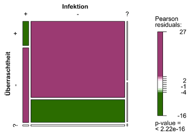
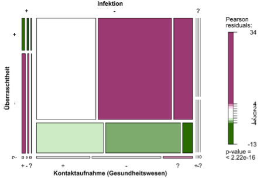
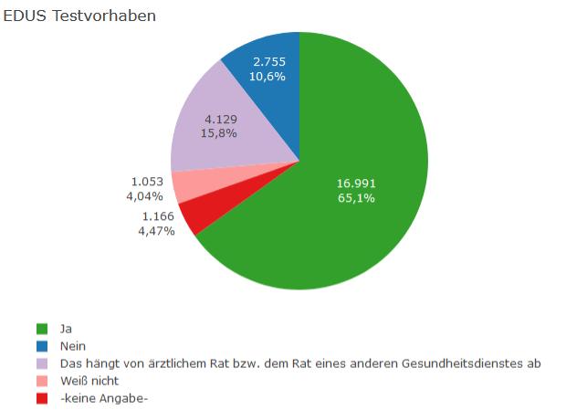
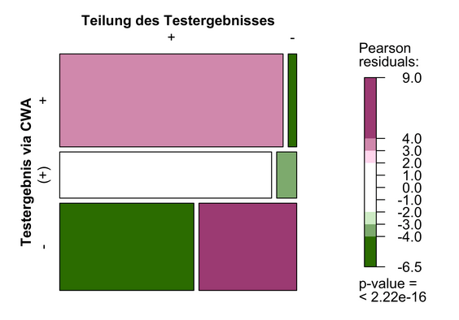
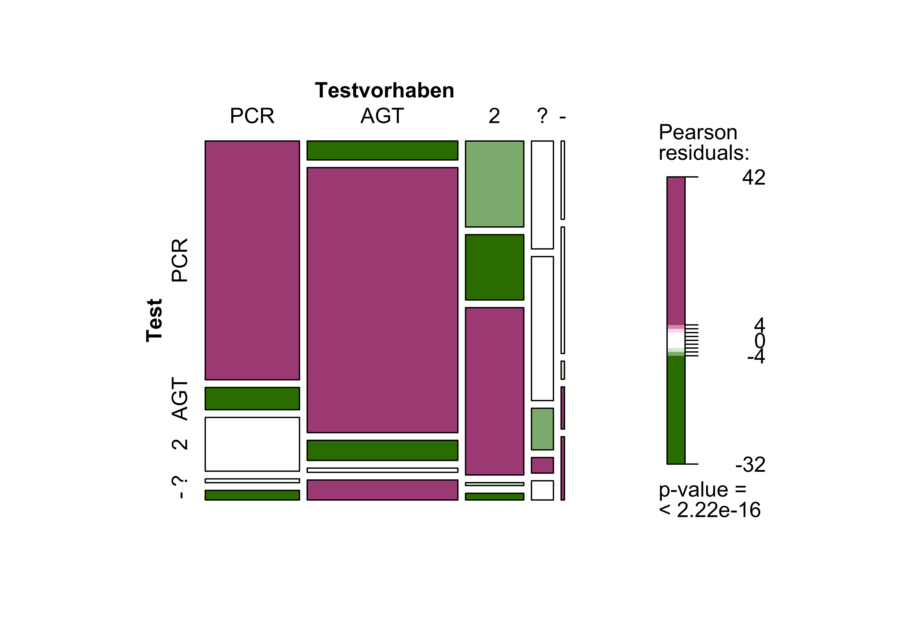
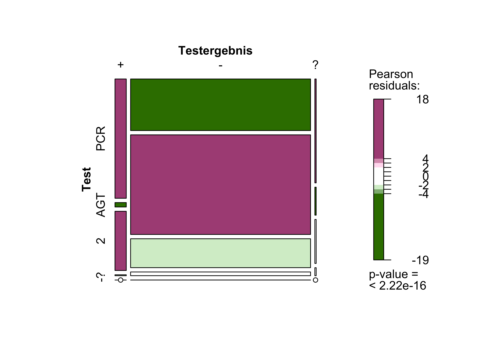
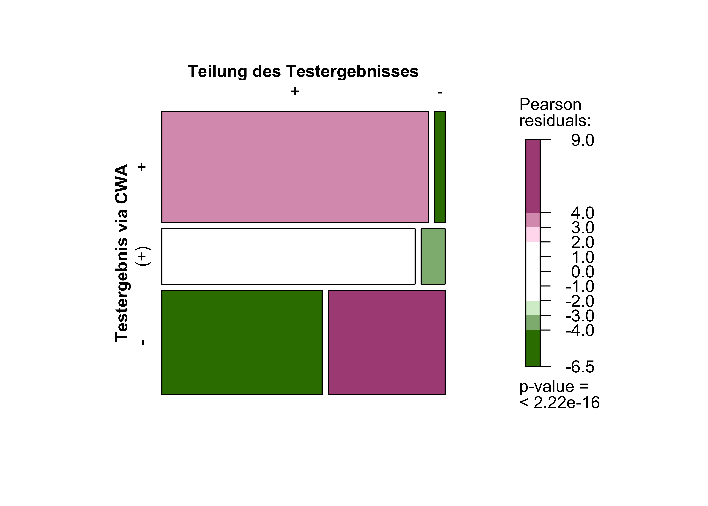
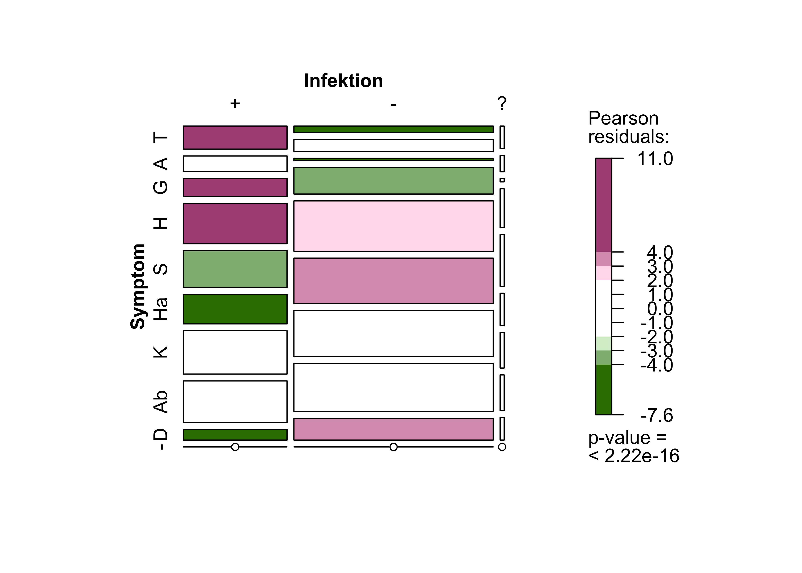
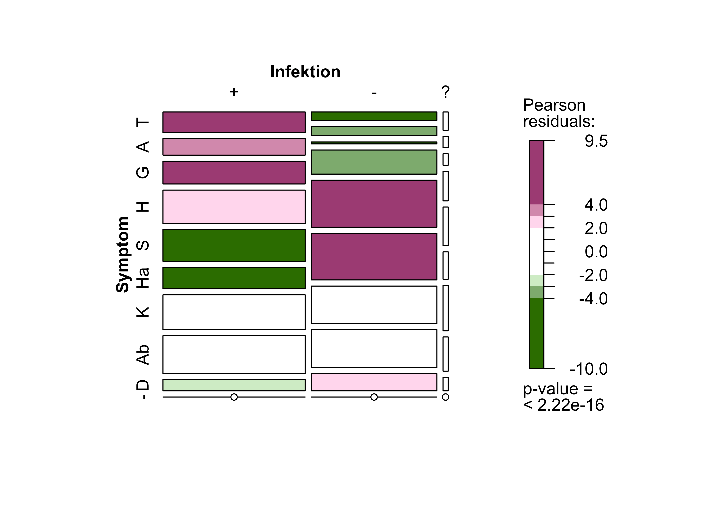

This second analysis of the event-driven user survey (EDUS) focuses on the following questions: How surprised were Corona-Warn-App users to receive a <q>red warning</q>, and how did they change their behaviour in response? In addition, it also provides insights into the role played by the Corona-Warn-App in helping to contain the SARS-CoV-2 pandemic.

<!-- overview -->

1. [The most important findings in a nutshell: numbers, data, facts](#1-das-wichtigste-in-kürze-zahlen-daten-fakten)
2. [Active mobile devices and activation of exposure logging ](#2-aktive-mobile-endgeräte-und-aktivierung-der-risikoermittlung)
    1. [Active mobile devices](#21-aktive-mobile-endgeräte)
    2. [Activation of exposure logging](#22-aktivierung-der-risikoermittlung)
3. [Surprise at receiving a “red warning”](#3-überraschtheit)
    1. [The reasons why users were surprised to receive a “red warning” or not](#31-gründe-der-überraschtheit-bzw-nicht-überraschtheit) 
    2. [Relationship between surprise and testing](#32-zusammenhang-zwischen-überraschtheit-und-durchführung-eines-tests) 
    3. [Relationship between surprise and intended contact with health-care providers](#33-zusammenhang-zwischen-überraschtheit-und-kontaktvorhaben-zum-gesundheitswesen)
    4. [Relationship between surprise and infection](#34-zusammenhang-zwischen-überraschtheit-und-infektion)
    5. [Relationship between surprise, infection and intention to contact a health-care provider](#35-zusammenhang-zwischen-überraschtheit-kontaktaufnahme-zum-gesundheitswesen-und-infektion)
4. [Testing](#4-testung)
    1. [Testing intention](#41-testvorhaben)
    2. [Test Results](#42-testergebnisse)
    3. [Sharing of test results](#43-teilung-der-testergebnisse)
    4. [Overview of the test process](#44-übersicht-zum-gesamttestprozess)
5. [Symptoms](#5-symptome)
6. [What can we learn from the event-driven user survey (EDUS)?](#6-was-nehmen-wir-aus-der-ereignisbezogenen-befragung-edus-mit)
7. [What to expect in the future?](#7-so-geht-es-weiter)

## 1. The most important findings in a nutshell: numbers, data, facts

Data from the second part of the event-driven user survey (EDUS) show, among other things, that:

<ul><li>A significant percentage of the respondents (72.5%) were surprised to receive the <q>red warning</q>.</li>
<li>Respondents generally received their test results via the app within 24 hours.</li>
<li>By communicating their positive results via the app, users enabled warnings to be sent out promptly to people who would have otherwise not been informed about their exposure to infection.</li>
<li>The majority of users who received a <q>red warning</q> adapted their behaviour to help prevent the virus from spreading</li>
<li>•	The Corona-Warn-App fulfils its purpose of providing early warnings and contributing to breaking infection chains.</li></ul>

## 2. Active mobile devices and activation of exposure logging 

### 2.1 Active mobile devices

Fieldwork for the EDUS took place between March and May 2021. During this time, a basic and a follow-up study were conducted. On 7 April 2021, an additional question was integrated into the basic survey. This question was aimed at collecting data on the number of devices on which respondents had installed the Corona-Warn-App (CWA). The new question was included because it was thought that users could have installed the app on several devices (phones). In addition to privately-owned devices (phones), users may have also installed the app on one or more devices used for work. Understanding how many devices the app has been installed on is key to estimating the number of active users. It was also important to get a sense of how many respondents could – at least in theory – have taken part in the basic survey multiple times because they had received the <q>red warning</q> on different devices.

The data collected by the EDUS suggest that the CWA is normally installed on one device (at a specific point in time). A small percentage of respondents (just under 9%) reported that they used the app on two devices, whereas an even smaller proportion (less than 2%) stated that they had installed the app on more than two devices. Consequently, the survey results do not substantiate the (albeit anecdotal) evidence of extensive multiple usage. The number of active devices, therefore, is likely to correspond closely to the number of actual users (approx. 12% difference). This does not consider usage on different devices over time. 

Fig. 1: EDUS - Number of mobile devices on which the Corona-Warn-App is installed.

It should be noted, however, that the data do not rule out the possibility that a small number of people would have been able to take part in the survey several times. The number of active users, therefore, remains inconclusive, and this will be discussed in future articles.

Information on the number of active mobile devices

<table class="table table-striped table-hover table-condensed table-responsive" style="margin-left: auto; margin-right: auto;">
<caption>
Tab. 1: EDUS - On how many mobile devices do you have the Corona-Warn-App installed?
</caption>
<thead>
<tr>
<th style="text-align:left;position: sticky; top:0; background-color: #FFFFFF;">
On how many mobile devices do you have installed the Corona-Warn-App?
</th>
<th style="text-align:right;position: sticky; top:0; background-color: #FFFFFF;">
Freq.
</th>
<th style="text-align:right;position: sticky; top:0; background-color: #FFFFFF;">
Percent
</th>
<th style="text-align:right;position: sticky; top:0; background-color: #FFFFFF;">
Cum. (valid)
</th>
</tr>
</thead>
<tbody>
<tr>
<td style="text-align:left;">
1 device
</td>
<td style="text-align:right;">
13.287
</td>
<td style="text-align:right;">
50.9%
</td>
<td style="text-align:right;">
89.7%
</td>
</tr>
<tr>
<td style="text-align:left;">
2 devices
</td>
<td style="text-align:right;">
1.285
</td>
<td style="text-align:right;">
4.9%
</td>
<td style="text-align:right;">
8.7%
</td>
</tr>
<tr>
<td style="text-align:left;">
More than 2 devices
</td>
<td style="text-align:right;">
239
</td>
<td style="text-align:right;">
0.9%
</td>
<td style="text-align:right;">
1.6%
</td>
</tr>
<tr>
<td style="text-align:left;">
- No indication -
</td>
<td style="text-align:right;">
11.283
</td>
<td style="text-align:right;">
43.2%
</td>
<td style="text-align:right;"></td>
</tr>
</tbody>
</table>

### 2.2 Activation of exposure logging

A further important issued related to the active use of the CWA is the permanent activation of exposure logging. Although exposure logging is crucial to the app’s core functionality, users are able to switch it on or off as required. When exposure logging is deactivated, the app can no longer detect the close proximity of other users’ phones. If exposure logging has not been activated within the past 14 days, the app will not be able to display any warnings at all. This core functionality of the Corona-Warn-App is always most important when users cannot be informed about the risk of a situation in any other way.

The data demonstrate that the vast majority of respondents used the app as intended and that exposure logging was activated at all times. Only a small number of respondents reported that they never activated exposure logging or did so for less than half of the day.

It has to be taken into consideration here that the question about this issue was not formulated precisely enough and that it may have been misunderstood (for example, that the activation or installation has already taken place more than 2 weeks ago).

Angaben zur Aktivierung der Risikoermittlung

<table class="table table-striped table-hover table-condensed table-responsive" style="margin-left: auto; margin-right: auto;">
<caption>
Tab. 2: EDUS - Information on the activation of exposure logging
</caption>
<thead>
<tr>
<th style="text-align:left;position: sticky; top:0; background-color: #FFFFFF;">
Did you activate the exposure logging within the last 14 days?
</th>
<th style="text-align:right;position: sticky; top:0; background-color: #FFFFFF;">
Number
</th>
<th style="text-align:right;position: sticky; top:0; background-color: #FFFFFF;">
Percentage
</th>
<th style="text-align:right;position: sticky; top:0; background-color: #FFFFFF;">
Percentage (valid)
</th>
</tr>
</thead>
<tbody>
<tr>
<td style="text-align:left;">
Yes, continuous
</td>
<td style="text-align:right;">
22.925
</td>
<td style="text-align:right;">
87.9%
</td>
<td style="text-align:right;">
91.9%
</td>
</tr>
<tr>
<td style="text-align:left;">
Yes, more than half of the time
</td>
<td style="text-align:right;">
1.047
</td>
<td style="text-align:right;">
4.0%
</td>
<td style="text-align:right;">
4.2%
</td>
</tr>
<tr>
<td style="text-align:left;">
Yes, less than half of the time
</td>
<td style="text-align:right;">
456
</td>
<td style="text-align:right;">
1.7%
</td>
<td style="text-align:right;">
1.8%
</td>
</tr>
<tr>
<td style="text-align:left;">
No
</td>
<td style="text-align:right;">
284
</td>
<td style="text-align:right;">
1.1%
</td>
<td style="text-align:right;">
1.1%
</td>
</tr>
<tr>
<td style="text-align:left;">
Don’t know
</td>
<td style="text-align:right;">
246
</td>
<td style="text-align:right;">
0.9%
</td>
<td style="text-align:right;">
1.0%
</td>
</tr>
<tr>
<td style="text-align:left;">
- not specified -
</td>
<td style="text-align:right;">
1.136
</td>
<td style="text-align:right;">
4.4%
</td>
<td style="text-align:right;">
</td>
</tr>
</tbody>
</table>

## 3 Surprise at receiving a <q>red warning</q>

The CWA helps to end chains of infection that would otherwise have gone undetected at an early stage.

The basic survey asked whether the respondents were surprised to receive the <q>red warning</q>. Almost three quarters of the participants (72.5%) stated that they were.

Fig. 2: EDUS – Surprise at receiving a “red warning”

Angaben zur Überraschtheit

<table class="table table-striped table-hover table-condensed table-responsive" style="margin-left: auto; margin-right: auto;">
<caption>
Tab. 3: Wurden Sie von der Anzeige eines erhöhten Risikos überrascht?
</caption>
<thead>
<tr>
<th style="text-align:left;position: sticky; top:0; background-color: #FFFFFF;">
Wurden Sie von der Anzeige eines erhöhten Risikos überrascht?
</th>
<th style="text-align:right;position: sticky; top:0; background-color: #FFFFFF;">
Anzahl
</th>
<th style="text-align:right;position: sticky; top:0; background-color: #FFFFFF;">
Anteil
</th>
<th style="text-align:right;position: sticky; top:0; background-color: #FFFFFF;">
Anteil (gültig)
</th>
</tr>
</thead>
<tbody>
<tr>
<td style="text-align:left;">
Ja
</td>
<td style="text-align:right;">
18.099
</td>
<td style="text-align:right;">
69.4%
</td>
<td style="text-align:right;">
72.5%
</td>
</tr>
<tr>
<td style="text-align:left;">
Nein
</td>
<td style="text-align:right;">
6.433
</td>
<td style="text-align:right;">
24.7%
</td>
<td style="text-align:right;">
25.8%
</td>
</tr>
<tr>
<td style="text-align:left;">
Weiß nicht
</td>
<td style="text-align:right;">
426
</td>
<td style="text-align:right;">
1.6%
</td>
<td style="text-align:right;">
1.7%
</td>
</tr>
<tr>
<td style="text-align:left;">
-keine Angabe-
</td>
<td style="text-align:right;">
1.136
</td>
<td style="text-align:right;">
4.4%
</td>
<td style="text-align:right;">
</td>
</tr>
</tbody>
</table>

### 3.1 The reasons why users were surprised to receive a “red warning” or not

The majority of the 25.8% of users who were not surprised to receive a “red warning” had already been informed about an infection by people they knew. News about infections can spread faster among family and friends than among people who know each other only in passing or at least not personally. Moreover, it is likely that people would find it easier to talk to close relatives about a COVID-19 infection than to people they know less well. If this is the case, people are more likely to be informed by family members when they have been exposed to COVID-19. This may be due to the fact that people tend to regard their health as a private matter, and because they can probably expect a less negative response from people they know directly. At the same time, it is normally easier and faster for people to get in touch with people they know than strangers.

Respondents were asked why they were surprised to receive the warning. The questionnaire offered several response categories. The study found that a large percentage of the not-surprised respondents already knew that a family member had tested positive (40.2%). They mentioned work connections (27.1%) and friends (14.6%) somewhat less frequently. During the design of the study, it was assumed that childcare would play a greater role in this context. However, this hypothesis is not confirmed by the data. In order to collect as much information as possible while still adhering to the data-minimisation principle, the questionnaire also provided the response category <q>for other reasons</q>, which was selected by 20.3% of those surveyed. Unfortunately, it is unclear which <q>other reasons</q> the respondents had in mind when answering the question.

Angaben zu Gründen der Nicht-Überraschtheit

<table class="table table-striped table-hover table-condensed table-responsive" style="margin-left: auto; margin-right: auto;">
<caption>
Tab. 4: EDUS - Why were you not surprised by the indication of an increased risk?
</caption>
<thead>
<tr>
<th style="text-align:left;position: sticky; top:0; background-color: #FFFFFF;">
Why were you not surprised by the indication of an increased risk?
</th>
<th style="text-align:right;position: sticky; top:0; background-color: #FFFFFF;">
Number
</th>
<th style="text-align:right;position: sticky; top:0; background-color: #FFFFFF;">
Percentage
</th>
</tr>
</thead>
<tbody>
<tr>
<td style="text-align:left;">
Because people in my peer group recently tested positive 
</td>
<td style="text-align:right;">
936
</td>
<td style="text-align:right;">
14,6%
</td>
</tr>
<tr>
<td style="text-align:left;">
Because people in my family have recently tested positive
</td>
<td style="text-align:right;">
2.583
</td>
<td style="text-align:right;">
40,2%
</td>
</tr>
<tr>
<td style="text-align:left;">
Because people at work recently tested positive
</td>
<td style="text-align:right;">
1.741
</td>
<td style="text-align:right;">
27,1%
</td>
</tr>
<tr>
<td style="text-align:left;">
Because people in my children's care environment recently tested positive
</td>
<td style="text-align:right;">
95
</td>
<td style="text-align:right;">
1,5%
</td>
</tr>
<tr>
<td style="text-align:left;">
For other reasons
</td>
<td style="text-align:right;">
1.307
</td>
<td style="text-align:right;">
20,3%
</td>
</tr>
<tr>
<td style="text-align:left;">
Don’t know
</td>
<td style="text-align:right;">
93
</td>
<td style="text-align:right;">
1,4%
</td>
</tr>
</tbody>
</table>

The results demonstrate that the CWA helps inform users about exposure to infections that have occurred outside of their immediate social environment. Respondents who were surprised to receive the warning, therefore, might not have otherwise been informed about their exposure to infection if they had not been using the app. The higher the participants rated their risk of infection before receiving a warning, the less likely they were to be surprised at receiving one.

<figure>
    <table class="table table-hover">

  <thead class="gt_col_headings">
    <tr>
      <th rowspan="2" colspan="1"><strong>Variable</strong></th>
      <th class="text-center" rowspan="1" colspan="3">
        <strong>Überraschtheit</strong>
      </th>
      <th class="text-center" rowspan="2" colspan="1"><strong>Total</strong></th>
    </tr>
    <tr>
      <th class="text-center" rowspan="1" colspan="1">Yes</th>
      <th class="text-center" rowspan="1" colspan="1">No</th>
      <th class="text-center" rowspan="1" colspan="1">Don’t know</th>
    </tr>
  </thead>
  <tbody class="gt_table_body">
    <tr><td class="gt_row gt_left" style="font-weight: bold;">Estimated risk</td>
<td class="text-center"></td>
<td class="text-center"></td>
<td class="text-center"></td>
<td class="text-center"></td></tr>
    <tr><td class="gt_row gt_left" style="text-align: left; text-indent: 10px;">High</td>
<td class="text-center">476 (1,9%)</td>
<td class="text-center">817 (3,3%)</td>
<td class="text-center">15 (&lt;0,1%)</td>
<td class="text-center">1.308 (5,2%)</td></tr>
    <tr><td class="gt_row gt_left" style="text-align: left; text-indent: 10px;">Rather high</td>
<td class="text-center">788 (3,2%)</td>
<td class="text-center">739 (3,0%)</td>
<td class="text-center">34 (0,1%)</td>
<td class="text-center">1.561 (6,3%)</td></tr>
    <tr><td class="gt_row gt_left" style="text-align: left; text-indent: 10px;">Neutral</td>
<td class="text-center">2.616 (10%)</td>
<td class="text-center">1.246 (5,0%)</td>
<td class="text-center">89 (0,4%)</td>
<td class="text-center">3.951 (16%)</td></tr>
    <tr><td class="gt_row gt_left" style="text-align: left; text-indent: 10px;">Rather low</td>
<td class="text-center">5.451 (22%)</td>
<td class="text-center">1.642 (6,6%)</td>
<td class="text-center">128 (0,5%)</td>
<td class="text-center">7.221 (29%)</td></tr>
    <tr><td class="gt_row gt_left" style="text-align: left; text-indent: 10px;">Low</td>
<td class="text-center">8.441 (34%)</td>
<td class="text-center">1.874 (7,5%)</td>
<td class="text-center">144 (0,6%)</td>
<td class="text-center">10.459 (42%)</td></tr>
    <tr><td class="gt_row gt_left" style="text-align: left; text-indent: 10px;">Don’t know</td>
<td class="text-center">294 (1,2%)</td>
<td class="text-center">106 (0,4%)</td>
<td class="text-center">15 (&lt;0,1%)</td>
<td class="text-center">415 (1,7%)</td></tr>
    <tr><td class="gt_row gt_left" style="text-align: left; text-indent: 10px;">- not specified -</td>
<td class="text-center">3 (&lt;0,1%)</td>
<td class="text-center">3 (&lt;0,1%)</td>
<td class="text-center">0 (0%)</td>
<td class="text-center">6 (&lt;0,1%)</td></tr>
    <tr><td class="gt_row gt_left" style="font-weight: bold;">Total</td>
<td class="text-center">18.069 (73%)</td>
<td class="text-center">6.427 (26%)</td>
<td class="text-center">425 (1,7%)</td>
<td class="text-center">24.921 (100%)</td></tr>
  </tbody>

</table>
    <figcaption aria-hidden="true">Tab. 5: EDUS - Relationship between risk and surprise.</figcaption>
</figure>

<figure>
    
    <figcaption aria-hidden="true">Fig. 3: EDUS – relationship between level of surprise and assessed risk.</figcaption>
</figure>

Angaben zum eingeschätzten Risiko

<table class="table table-striped table-hover table-condensed table-responsive" style="margin-left: auto; margin-right: auto;">
<caption>
Tab. 6: EDUS - How high did you estimate your risk of being infected before reporting through the app?
</caption>
<thead>
<tr>
<th style="text-align:left;position: sticky; top:0; background-color: #FFFFFF;">
How high did you estimate your risk of being infected before reporting through the app?
</th>
<th style="text-align:right;position: sticky; top:0; background-color: #FFFFFF;">
Number
</th>
<th style="text-align:right;position: sticky; top:0; background-color: #FFFFFF;">
Percentage
</th>
<th style="text-align:right;position: sticky; top:0; background-color: #FFFFFF;">
Percentage (valid)
</th>
</tr>
</thead>
<tbody>
<tr>
<td style="text-align:left;">
High
</td>
<td style="text-align:right;">
1.310
</td>
<td style="text-align:right;">
5.0%
</td>
<td style="text-align:right;">
5.3%
</td>
</tr>
<tr>
<td style="text-align:left;">
Rather high
</td>
<td style="text-align:right;">
1.562
</td>
<td style="text-align:right;">
6.0%
</td>
<td style="text-align:right;">
6.3%
</td>
</tr>
<tr>
<td style="text-align:left;">
Neutral
</td>
<td style="text-align:right;">
3.956
</td>
<td style="text-align:right;">
15.2%
</td>
<td style="text-align:right;">
15.9%
</td>
</tr>
<tr>
<td style="text-align:left;">
Rather low
</td>
<td style="text-align:right;">
7.226
</td>
<td style="text-align:right;">
27.7%
</td>
<td style="text-align:right;">
29.0%
</td>
</tr>
<tr>
<td style="text-align:left;">
Low
</td>
<td style="text-align:right;">
10.472
</td>
<td style="text-align:right;">
40.1%
</td>
<td style="text-align:right;">
42.0%
</td>
</tr>
<tr>
<td style="text-align:left;">
Don’t know
</td>
<td style="text-align:right;">
415
</td>
<td style="text-align:right;">
1.6%
</td>
<td style="text-align:right;">
1.7%
</td>
</tr>
<tr>
<td style="text-align:left;">
- not specified -
</td>
<td style="text-align:right;">
1.153
</td>
<td style="text-align:right;">
4.4%
</td>
<td style="text-align:right;">
</td>
</tr>
</tbody>
</table>

### 3.2 Relationship between surprise and testing

Participants who were surprised to receive a “red warning” either undertook rapid antigen tests more often or did not take any test at all slightly more often than respondents who were not surprised to have received the warning. There are many possible explanations for this.

<figure class="text-center">
    <table class="table table-hover">

  <thead class="gt_col_headings">
    <tr>
      <th class="gt_col_heading gt_columns_bottom_border gt_left" rowspan="2" colspan="1"><strong>Variable</strong></th>
      <th class="text-center" rowspan="1" colspan="3">
        <strong>Überraschtheit</strong>
      </th>
      <th class="text-center" rowspan="2" colspan="1"><strong>Total</strong></th>
    </tr>
    <tr>
      <th class="text-center" rowspan="1" colspan="1">Yes</th>
      <th class="text-center" rowspan="1" colspan="1">No</th>
      <th class="text-center" rowspan="1" colspan="1">Don’t knowt</th>
    </tr>
  </thead>
  <tbody class="gt_table_body">
    <tr><td class="text-left" style="font-weight: bold;">Test</td>
<td class="text-center"></td>
<td class="text-center"></td>
<td class="text-center"></td>
<td class="text-center"></td></tr>
    <tr><td class="gt_row gt_left" style="text-align: left; text-indent: 10px;">Yes, a PCR test</td>
<td class="text-center">2.660 (11%)</td>
<td class="text-center">1.399 (5,6%)</td>
<td class="text-center">55 (0,2%)</td>
<td class="text-center">4.114 (17%)</td></tr>
    <tr><td class="gt_row gt_left" style="text-align: left; text-indent: 10px;">Yes, a rapid antigen test</td>
<td class="text-center">5.537 (22%)</td>
<td class="text-center">1.219 (4,9%)</td>
<td class="text-center">108 (0,4%)</td>
<td class="text-center">6.864 (28%)</td></tr>
    <tr><td class="gt_row gt_left" style="text-align: left; text-indent: 10px;">Yes, a PCR test and a rapid antigen test </td>
<td class="text-center">1.402 (5,6%)</td>
<td class="text-center">828 (3,3%)</td>
<td class="text-center">31 (0,1%)</td>
<td class="text-center">2.261 (9,1%)</td></tr>
    <tr><td class="gt_row gt_left" style="text-align: left; text-indent: 10px;">Yes, but I don’t know what kind of test</td>
<td class="text-center">225 (0,9%)</td>
<td class="text-center">38 (0,2%)</td>
<td class="text-center">3 (&lt;0,1%)</td>
<td class="text-center">266 (1,1%)</td></tr>
    <tr><td class="gt_row gt_left" style="text-align: left; text-indent: 10px;">No</td>
<td class="text-center">1.571 (6,3%)</td>
<td class="text-center">426 (1,7%)</td>
<td class="text-center">26 (0,1%)</td>
<td class="text-center">2.023 (8,1%)</td></tr>
    <tr><td class="gt_row gt_left" style="text-align: left; text-indent: 10px;">- not specified -</td>
<td class="text-center">6.674 (27%)</td>
<td class="text-center">2.517 (10%)</td>
<td class="text-center">202 (0,8%)</td>
<td class="text-center">9.393 (38%)</td></tr>
    <tr><td class="text-left" style="font-weight: bold;">Total</td>
<td class="text-center">18.069 (73%)</td>
<td class="text-center">6.427 (26%)</td>
<td class="text-center">425 (1,7%)</td>
<td class="text-center">24.921 (100%)</td></tr>
  </tbody>

</table>
    <figcaption aria-hidden="true">Tab. 7: EDUS - Relationship between surprise and testing.</figcaption>
</figure>

<figure>
    
    <figcaption aria-hidden="true">Fig. 4: EDUS – relationship between level of surprise and testing</figcaption>
</figure>

### 3.3 Relationship between surprise and intended contact with health-care providers

Respondents who were surprised to receive a “red warning” were less likely to contact a health-care provider than respondents who were not surprised to receive the warning. The exact reasons for this remain unclear. However, the period during which the survey was conducted could have played a role. Both questions are taken from the basic survey. During the study period, the respondents faced numerous uncertainties. Moreover, it is possible that someone who received a “red warning” via the app out of nowhere would react differently to someone who had already noticed warning signs among people they know about their potential exposure to infection and already had time to adjust to the situation.

Most respondents who intended to contact a health-care provider planned to contact their GP (55.2%). Once again, respondents were provided with a number of possible response categories when answering this question. Contact to their local health authority (43.4%) was selected less frequently. The telephone number of the on-call medical service and hospitals played a subordinate role in the survey. The data show that users treated the warning seriously and assumed that they were at risk from infection. Moreover, this generally led them to contact a health-care provider – particularly their GP. The contact with GPs argues strongly for the intended relief of the public health service by the Corona-Warn-App. Any associated cases of COVID-19 would only be confirmed once the user goes on to take a test. Testing suspected cases of COVID-19 helps to end chains of infection. The CWA, therefore, acts as an early warning system, and its value is particularly evident in cases where users have come into contact with infected people that they do not know. The app helps inform users about the need for testing and, therefore, contributes to improving the efficiency of testing strategies.

<figure class="text-center">
    <table class="table table-hover">

  <thead class="gt_col_headings">
    <tr>
      <th class="gt_col_heading gt_columns_bottom_border gt_left" rowspan="2" colspan="1"><strong>Variable</strong></th>
      <th class="text-center" rowspan="1" colspan="3">
        <strong>Überraschtheit</strong>
      </th>
      <th class="text-center" rowspan="2" colspan="1"><strong>Total</strong></th>
    </tr>
    <tr>
      <th class="text-center" rowspan="1" colspan="1">Yes</th>
      <th class="text-center" rowspan="1" colspan="1">No</th>
      <th class="text-center" rowspan="1" colspan="1">Don’t know</th>
    </tr>
  </thead>
  <tbody class="gt_table_body">
    <tr><td class="text-left" style="font-weight: bold;">Making contact (healthcare)</td>
<td class="text-center"></td>
<td class="text-center"></td>
<td class="text-center"></td>
<td class="text-center"></td></tr>
    <tr><td class="gt_row gt_left" style="text-align: left; text-indent: 10px;">Yes</td>
<td class="text-center">6.127 (25%)</td>
<td class="text-center">2.908 (12%)</td>
<td class="text-center">132 (0,5%)</td>
<td class="text-center">9.167 (37%)</td></tr>
    <tr><td class="gt_row gt_left" style="text-align: left; text-indent: 10px;">No</td>
<td class="text-center">9.432 (38%)</td>
<td class="text-center">3.072 (12%)</td>
<td class="text-center">202 (0,8%)</td>
<td class="text-center">12.706 (51%)</td></tr>
    <tr><td class="gt_row gt_left" style="text-align: left; text-indent: 10px;">Don’t know</td>
<td class="text-center">2.510 (10%)</td>
<td class="text-center">447 (1,8%)</td>
<td class="text-center">91 (0,4%)</td>
<td class="text-center">3.048 (12%)</td></tr>
    <tr><td class="text-left" style="font-weight: bold;">Total</td>
<td class="text-center">18.069 (73%)</td>
<td class="text-center">6.427 (26%)</td>
<td class="text-center">425 (1,7%)</td>
<td class="text-center">24.921 (100%)</td></tr>
  </tbody>

</table>
    <figcaption aria-hidden="true">Tab. 8:  EDUS - Relationship between surprise and contact projects to the health care system</figcaption>
</figure>

<figure>
    
    <figcaption aria-hidden="true">Fig. 5: EDUS – relationship between level of surprise and intention to contact a health-care provider.
</figcaption>
</figure>

Angaben zum Kontaktvorhaben zum Gesundheitswesen

<table class="table table-striped table-hover table-condensed table-responsive" style="margin-left: auto; margin-right: auto;">
<caption>
Tab. 9: EDUS -  Are you going to contact the health service now?
</caption>
<thead>
<tr>
<th style="text-align:left;position: sticky; top:0; background-color: #FFFFFF;">
Are you going to contact the health service now?
</th>
<th style="text-align:right;position: sticky; top:0; background-color: #FFFFFF;">
Number
</th>
<th style="text-align:right;position: sticky; top:0; background-color: #FFFFFF;">
Percentage
</th>
<th style="text-align:right;position: sticky; top:0; background-color: #FFFFFF;">
Percentage (valid)
</th>
</tr>
</thead>
<tbody>
<tr>
<td style="text-align:left;">
Yes
</td>
<td style="text-align:right;">
9.168
</td>
<td style="text-align:right;">
35.1%
</td>
<td style="text-align:right;">
36.8%
</td>
</tr>
<tr>
<td style="text-align:left;">
No
</td>
<td style="text-align:right;">
12.708
</td>
<td style="text-align:right;">
48.7%
</td>
<td style="text-align:right;">
51.0%
</td>
</tr>
<tr>
<td style="text-align:left;">
Don’t know
</td>
<td style="text-align:right;">
3.048
</td>
<td style="text-align:right;">
11.7%
</td>
<td style="text-align:right;">
12.2%
</td>
</tr>
<tr>
<td style="text-align:left;">
- not specified -
</td>
<td style="text-align:right;">
1.170
</td>
<td style="text-align:right;">
4.5%
</td>
<td style="text-align:right;">
</td>
</tr>
</tbody>
</table>
<table class="table table-striped table-hover table-condensed table-responsive" style="margin-left: auto; margin-right: auto;">
<caption>
Tab. 10: EDUS - Who will you contact?
</caption>
<thead>
<tr>
<th style="text-align:left;position: sticky; top:0; background-color: #FFFFFF;">
Who will you contact?
</th>
<th style="text-align:right;position: sticky; top:0; background-color: #FFFFFF;">
Number
</th>
<th style="text-align:right;position: sticky; top:0; background-color: #FFFFFF;">
Percentage
</th>
</tr>
</thead>
<tbody>
<tr>
<td style="text-align:left;">
I will contact my family doctor
</td>
<td style="text-align:right;">
5.058
</td>
<td style="text-align:right;">
55,2%
</td>
</tr>
<tr>
<td style="text-align:left;">
I will contact the responsible health department
</td>
<td style="text-align:right;">
3.978
</td>
<td style="text-align:right;">
43,4%
</td>
</tr>
<tr>
<td style="text-align:left;">
I call the central number 116 117
</td>
<td style="text-align:right;">
2.284
</td>
<td style="text-align:right;">
24,9%
</td>
</tr>
<tr>
<td style="text-align:left;">
I'm going to a hospital
</td>
<td style="text-align:right;">
194
</td>
<td style="text-align:right;">
2,1%
</td>
</tr>
<tr>
<td style="text-align:left;">
Don’t know
</td>
<td style="text-align:right;">
502
</td>
<td style="text-align:right;">
5,5%
</td>
</tr>
</tbody>
</table>

### 3.4 Relationship between surprise and infection

Respondents who were surprised to receive a “red warning” tested positive for SARS-CoV-2 less often than users who were not surprised. As stated above, respondents who were unsurprised had usually already been informed about an infection by someone from their immediate social environment.

It is not always possible to maintain social distancing and fully comply with hygiene rules when among family, friends or at work. However, it is easier to do so when among casual acquaintances and strangers, such as on public transport and while shopping. If contact with people from a user’s immediate environment is more likely to lead to an infection, this could explain the divergences between test results among different groups of people. 

<figure class="text-center">
    <table class="table table-hover">

  <thead class="gt_col_headings">
    <tr>
      <th class="gt_col_heading gt_columns_bottom_border gt_left" rowspan="2" colspan="1"><strong>Variable</strong></th>
      <th class="text-center" rowspan="1" colspan="3">
        <strong>Überraschtheit</strong>
      </th>
      <th class="text-center" rowspan="2" colspan="1"><strong>Total</strong></th>
    </tr>
    <tr>
      <th class="text-center" rowspan="1" colspan="1">Yes</th>
      <th class="text-center" rowspan="1" colspan="1">No</th>
      <th class="text-center" rowspan="1" colspan="1">Don’t know</th>
    </tr>
  </thead>
  <tbody class="gt_table_body">
    <tr><td class="text-left" style="font-weight: bold;">Infektion</td>
<td class="text-center"></td>
<td class="text-center"></td>
<td class="text-center"></td>
<td class="text-center"></td></tr>
    <tr><td class="gt_row gt_left" style="text-align: left; text-indent: 10px;">Positive for SARS-CoV-2</td>
<td class="text-center">191 (0,8%)</td>
<td class="text-center">590 (2,4%)</td>
<td class="text-center">10 (&lt;0,1%)</td>
<td class="text-center">791 (3,2%)</td></tr>
    <tr><td class="gt_row gt_left" style="text-align: left; text-indent: 10px;">Negative for SARS-CoV-2</td>
<td class="text-center">9.562 (38%)</td>
<td class="text-center">2.853 (11%)</td>
<td class="text-center">185 (0,7%)</td>
<td class="text-center">12.600 (51%)</td></tr>
    <tr><td class="gt_row gt_left" style="text-align: left; text-indent: 10px;">Inconclusive</td>
<td class="text-center">54 (0,2%)</td>
<td class="text-center">36 (0,1%)</td>
<td class="text-center">2 (&lt;0,1%)</td>
<td class="text-center">92 (0,4%)</td></tr>
    <tr><td class="gt_row gt_left" style="text-align: left; text-indent: 10px;">- not specified -</td>
<td class="text-center">8.262 (33%)</td>
<td class="text-center">2.948 (12%)</td>
<td class="text-center">228 (0,9%)</td>
<td class="text-center">11.438 (46%)</td></tr>
    <tr><td class="text-left" style="font-weight: bold;">Total</td>
<td class="text-center">18.069 (73%)</td>
<td class="text-center">6.427 (26%)</td>
<td class="text-center">425 (1,7%)</td>
<td class="text-center">24.921 (100%)</td></tr>
  </tbody>

</table>
    <figcaption aria-hidden="true">Tab. 11: EDUS - Zusammenhang zwischen Überraschtheit und Infektion</figcaption>
</figure>

<figure>
    
    <figcaption aria-hidden="true">Fig. 6: EDUS – relationship between level of surprise and infection.
</figcaption>
</figure>

### 3.5 Relationship between surprise, infection and intention to contact a health-care provider

The relationship between level of surprise, infection and intention to contact a health-care provider is summarised in the following graph.

<figure>
    
    <figcaption aria-hidden="true">Fig. 7: EDUS – relationship between level of surprise, intention to contact a health-care provider and infection.
</figcaption>
</figure>

## 4 Testing

Both the basic and the follow-up survey treated testing for SARS-CoV-2 as a key issue. The basic survey focused on users’ testing intentions with the follow-up survey addressing the actual tests that were carried out.

### 4.1 Testing intention

Over two thirds of respondents (in the basic survey) stated that they intended to take a test immediately after having received a “red warning” (68.2%). Another 16.6% intended to delay the decision until they had sought medical advice/consulted a health-care provider. A small fraction of respondents (4.2%) were undecided and 11.1% stated that they did not intend to take a test.

Fig. 8: EDUS – testing intention 

Respondents (from the basic survey) who stated they would be taking a test were then asked which test they intended to take. The largest group of respondents planned to take a rapid antigen test (44.6%), 29.5% wanted to take the more precise PCR test and 18.1% intended to take both an antigen and a PCR test. A further 6.7% wanted to seek medical advice first; 1.2% did not know. 

Fig. 9: EDUS – testing intention by test type (developments over time) 

Details of testing intentions

<table class="table table-striped table-hover table-condensed table-responsive" style="margin-left: auto; margin-right: auto;">
<caption>
Tab. 12: EDUS - Are you going to take a SARS-CoV-2 test?
</caption>
<thead>
<tr>
<th style="text-align:left;position: sticky; top:0; background-color: #FFFFFF;">
Are you going to take a SARS-CoV-2 test?
</th>
<th style="text-align:right;position: sticky; top:0; background-color: #FFFFFF;">
Number
</th>
<th style="text-align:right;position: sticky; top:0; background-color: #FFFFFF;">
Percentage
</th>
<th style="text-align:right;position: sticky; top:0; background-color: #FFFFFF;">
Percentage  (valid)
</th>
</tr>
</thead>
<tbody>
<tr>
<td style="text-align:left;">
Yes
</td>
<td style="text-align:right;">
16.991
</td>
<td style="text-align:right;">
65.1%
</td>
<td style="text-align:right;">
68.2%
</td>
</tr>
<tr>
<td style="text-align:left;">
No
</td>
<td style="text-align:right;">
2.755
</td>
<td style="text-align:right;">
10.6%
</td>
<td style="text-align:right;">
11.1%
</td>
</tr>
<tr>
<td style="text-align:left;">
That depends on medical advice or the advice of another health service
</td>
<td style="text-align:right;">
4.129
</td>
<td style="text-align:right;">
15.8%
</td>
<td style="text-align:right;">
16.6%
</td>
</tr>
<tr>
<td style="text-align:left;">
Don’t know
</td>
<td style="text-align:right;">
1.053
</td>
<td style="text-align:right;">
4.0%
</td>
<td style="text-align:right;">
4.2%
</td>
</tr>
<tr>
<td style="text-align:left;">
- not specified -
</td>
<td style="text-align:right;">
1.166
</td>
<td style="text-align:right;">
4.5%
</td>
<td style="text-align:right;">
</td>
</tr>
</tbody>
</table>
<table class="table table-striped table-hover table-condensed table-responsive" style="margin-left: auto; margin-right: auto;">
<caption>
Tab. 13: EDUS - Which test are you likely to take?
</caption>
<thead>
<tr>
<th style="text-align:left;position: sticky; top:0; background-color: #FFFFFF;">
Which test are you likely to take?
</th>
<th style="text-align:right;position: sticky; top:0; background-color: #FFFFFF;">
Number
</th>
<th style="text-align:right;position: sticky; top:0; background-color: #FFFFFF;">
Percentage
</th>
<th style="text-align:right;position: sticky; top:0; background-color: #FFFFFF;">
Percentage (valid)
</th>
</tr>
</thead>
<tbody>
<tr>
<td style="text-align:left;">
PCR test
</td>
<td style="text-align:right;">
5.004
</td>
<td style="text-align:right;">
19.2%
</td>
<td style="text-align:right;">
29.5%
</td>
</tr>
<tr>
<td style="text-align:left;">
Rapid antigen test
</td>
<td style="text-align:right;">
7.573
</td>
<td style="text-align:right;">
29.0%
</td>
<td style="text-align:right;">
44.6%
</td>
</tr>
<tr>
<td style="text-align:left;">
PCR test and Rapid antigen test
</td>
<td style="text-align:right;">
3.069
</td>
<td style="text-align:right;">
11.8%
</td>
<td style="text-align:right;">
18.1%
</td>
</tr>
<tr>
<td style="text-align:left;">
That depends on medical advice or the advice of another health service
</td>
<td style="text-align:right;">
1.144
</td>
<td style="text-align:right;">
4.4%
</td>
<td style="text-align:right;">
6.7%
</td>
</tr>
<tr>
<td style="text-align:left;">
Don’t know
</td>
<td style="text-align:right;">
201
</td>
<td style="text-align:right;">
0.8%
</td>
<td style="text-align:right;">
1.2%
</td>
</tr>
<tr>
<td style="text-align:left;">
- not specified -
</td>
<td style="text-align:right;">
9.103
</td>
<td style="text-align:right;">
34.9%
</td>
<td style="text-align:right;">
</td>
</tr>
</tbody>
</table>

### 4.2 Test Results

Data from the follow-up survey can be used to examine the relationship between the test that users intended to take and which test, if any, they actually took. 87% of the participants in the follow-up survey were tested for SARS-CoV-2 as a direct result of receiving a “red warning”. A comparison of the data demonstrates how closely the respondents implemented their intended testing strategy. The largest group of participants were those who had intended to conduct a rapid antigen test (44.6%). Rapid antigen tests were also the most frequently mentioned type of test in the follow-up survey (44.2%). Over a quarter of respondents opted for a PCR test only (26.5%), whereas 14.6% combined a rapid antigen with a PCR test. Greater uptake of PCR testing would have been preferable, as these are more reliable, detect infection at an earlier stage, and are regularly used to confirm suspected cases of COVID-19.

The data demonstrate that the respondents generally implemented their stated testing strategy. 73% of respondents who had intended to have a PCR test, and 80.8% of respondents who planned to take a rapid antigen test, actually did so. However, there is greater variance with regard to multiple tests and intention to seek medical advice.

<figure class="text-center">
    <table class="table table-hover">

  <thead class="gt_col_headings">
    <tr>
      <th class="gt_col_heading gt_columns_bottom_border gt_left" rowspan="2" colspan="1"><strong>Variable</strong></th>
      <th class="text-center" rowspan="1" colspan="5">
        <strong>Test (durchgeführt)</strong>
      </th>
      <th class="text-center" rowspan="2" colspan="1"><strong>Total</strong></th>
    </tr>
    <tr>
      <th class="text-center" rowspan="1" colspan="1">Yes, a PCR test</th>
      <th class="text-center" rowspan="1" colspan="1">Yes, a  rapid antigen test</th>
      <th class="text-center" rowspan="1" colspan="1">Yes, a PCR test anda  rapid antigen test</th>
      <th class="text-center" rowspan="1" colspan="1">Yes, but I don’t know, what kind of test</th>
      <th class="text-center" rowspan="1" colspan="1">No</th>
    </tr>
  </thead>
  <tbody class="gt_table_body">
    <tr><td class="text-left" style="font-weight: bold;">Testing intention</td>
<td class="text-center"></td>
<td class="text-center"></td>
<td class="text-center"></td>
<td class="text-center"></td>
<td class="text-center"></td>
<td class="text-center"></td></tr>
    <tr><td class="text-left" style="text-align: left; text-indent: 10px;">PCR test</td>
<td class="text-center">2.243 (73%)</td>
<td class="text-center">209 (6,8%)</td>
<td class="text-center">505 (16%)</td>
<td class="text-center">36 (1,2%)</td>
<td class="text-center">90 (2,9%)</td>
<td class="text-center">3.083 (100%)</td></tr>
    <tr><td class="gt_row gt_left" style="text-align: left; text-indent: 10px;">Rapid antigen test</td>
<td class="text-center">284 (5,8%)</td>
<td class="text-center">3.980 (81%)</td>
<td class="text-center">302 (6,1%)</td>
<td class="text-center">63 (1,3%)</td>
<td class="text-center">300 (6,1%)</td>
<td class="text-center">4.929 (100%)</td></tr>
    <tr><td class="gt_row gt_left" style="text-align: left; text-indent: 10px;">PCR test and rapid antigen test</td>
<td class="text-center">499 (26%)</td>
<td class="text-center">379 (20%)</td>
<td class="text-center">971 (51%)</td>
<td class="text-center">17 (0,9%)</td>
<td class="text-center">39 (2,0%)</td>
<td class="text-center">1.905 (100%)</td></tr>
    <tr><td class="gt_row gt_left" style="text-align: left; text-indent: 10px;">That depends on medical advice or the advice of another health</td>
<td class="text-center">236 (33%)</td>
<td class="text-center">315 (44%)</td>
<td class="text-center">91 (13%)</td>
<td class="text-center">34 (4,7%)</td>
<td class="text-center">42 (5,8%)</td>
<td class="text-center">718 (100%)</td></tr>
    <tr><td class="gt_row gt_left" style="text-align: left; text-indent: 10px;">Don’t know</td>
<td class="text-center">26 (24%)</td>
<td class="text-center">42 (39%)</td>
<td class="text-center">6 (5,5%)</td>
<td class="text-center">14 (13%)</td>
<td class="text-center">21 (19%)</td>
<td class="text-center">109 (100%)</td></tr>
    <tr><td class="text-left" style="font-weight: bold;">Total</td>
<td class="text-center">3.288 (31%)</td>
<td class="text-center">4.925 (46%)</td>
<td class="text-center">1.875 (17%)</td>
<td class="text-center">164 (1,5%)</td>
<td class="text-center">492 (4,6%)</td>
<td class="text-center">10.744 (100%)</td></tr>
  </tbody>

</table>
    <figcaption aria-hidden="true">Tab. 14: EDUS - Relationship between testing intention and the test that was carried out</figcaption>
</figure>

<figure>
    
    <figcaption aria-hidden="true">Fig. 10: EDUS – relationship between testing intention and the test that was carried out.
</figcaption>
</figure>

5.9% of respondents who went for testing (follow-up survey) tested positive. 93.4% tested negative, and 0.4% received inconclusive results. PCR tests led to the highest proportion of positive results.

<figure class="text-center">
    <table class="table table-hover">

  <thead class="gt_col_headings">
    <tr>
      <th class="gt_col_heading gt_columns_bottom_border gt_left" rowspan="2" colspan="1"><strong>Variable</strong></th>
      <th class="text-center" rowspan="1" colspan="3">
        <strong>Testergebnis</strong>
      </th>
      <th class="text-center" rowspan="2" colspan="1"><strong>Total</strong></th>
    </tr>
    <tr>
      <th class="text-center" rowspan="1" colspan="1">Positive for SARS-CoV-2</th>
      <th class="text-center" rowspan="1" colspan="1">Negative for SARS-CoV-2</th>
      <th class="text-center" rowspan="1" colspan="1">Inconclusive</th>
    </tr>
  </thead>
  <tbody class="gt_table_body">
    <tr><td class="text-left" style="font-weight: bold;">Test (carried out)</td>
<td class="text-center"></td>
<td class="text-center"></td>
<td class="text-center"></td>
<td class="text-center"></td></tr>
    <tr><td class="gt_row gt_left" style="text-align: left; text-indent: 10px;">JYes, a PCR test</td>
<td class="text-center">514 (65%)</td>
<td class="text-center">3.536 (28%)</td>
<td class="text-center">52 (57%)</td>
<td class="text-center">4.102 (30%)</td></tr>
    <tr><td class="gt_row gt_left" style="text-align: left; text-indent: 10px;">Yes, a  rapid antigen test</td>
<td class="text-center">19 (2,4%)</td>
<td class="text-center">6.832 (54%)</td>
<td class="text-center">14 (15%)</td>
<td class="text-center">6.865 (51%)</td></tr>
    <tr><td class="gt_row gt_left" style="text-align: left; text-indent: 10px;">Yes, a PCR test anda  rapid antigen test</td>
<td class="text-center">255 (32%)</td>
<td class="text-center">1.982 (16%)</td>
<td class="text-center">22 (24%)</td>
<td class="text-center">2.259 (17%)</td></tr>
    <tr><td class="gt_row gt_left" style="text-align: left; text-indent: 10px;">Yes, but I don’t know, what kind of test</td>
<td class="text-center">4 (0,5%)</td>
<td class="text-center">255 (2,0%)</td>
<td class="text-center">4 (4,3%)</td>
<td class="text-center">263 (1,9%)</td></tr>
    <tr><td class="gt_row gt_left" style="text-align: left; text-indent: 10px;">No</td>
<td class="text-center">0 (0%)</td>
<td class="text-center">2 (&lt;0,1%)</td>
<td class="text-center">0 (0%)</td>
<td class="text-center">2 (&lt;0,1%)</td></tr>
    <tr><td class="text-left" style="font-weight: bold;">Total</td>
<td class="text-center">792 (100%)</td>
<td class="text-center">12.607 (100%)</td>
<td class="text-center">92 (100%)</td>
<td class="text-center">13.491 (100%)</td></tr>
  </tbody>

</table>
    <figcaption aria-hidden="true">Tab. 15: EDUS - Relationship between tests carried out and test result</figcaption>
</figure>

<figure>
    
    <figcaption aria-hidden="true">Fig. 11: EDUS – relationship between tests carried out and test results.
</figcaption>
</figure>

Details of test results

<table class="table table-striped table-hover table-condensed table-responsive" style="margin-left: auto; margin-right: auto;">
<caption>
Tab. 16: Haben Sie nach der roten Warnmeldung durch die Corona-Warn-App einen SARS-CoV-2-Test durchführen lassen?
</caption>
<thead>
<tr>
<th style="text-align:left;position: sticky; top:0; background-color: #FFFFFF;">
Haben Sie nach der roten Warnmeldung durch die Corona-Warn-App einen SARS-CoV-2-Test durchführen lassen?  
</th>
<th style="text-align:right;position: sticky; top:0; background-color: #FFFFFF;">
Anzahl
</th>
<th style="text-align:right;position: sticky; top:0; background-color: #FFFFFF;">
Anteil
</th>
<th style="text-align:right;position: sticky; top:0; background-color: #FFFFFF;">
Anteil (gültig)
</th>
</tr>
</thead>
<tbody>
<tr>
<td style="text-align:left;">
Ja, einen PCR-Test
</td>
<td style="text-align:right;">
4.118
</td>
<td style="text-align:right;">
15.8%
</td>
<td style="text-align:right;">
26.5%
</td>
</tr>
<tr>
<td style="text-align:left;">
Ja, einen Antigen-Schnelltest
</td>
<td style="text-align:right;">
6.868
</td>
<td style="text-align:right;">
26.3%
</td>
<td style="text-align:right;">
44.2%
</td>
</tr>
<tr>
<td style="text-align:left;">
Ja, einen PCR-Test und einen Antigen-Schnelltest
</td>
<td style="text-align:right;">
2.263
</td>
<td style="text-align:right;">
8.7%
</td>
<td style="text-align:right;">
14.6%
</td>
</tr>
<tr>
<td style="text-align:left;">
Ja, aber ich weiß nicht, was für einen Test
</td>
<td style="text-align:right;">
266
</td>
<td style="text-align:right;">
1.0%
</td>
<td style="text-align:right;">
1.7%
</td>
</tr>
<tr>
<td style="text-align:left;">
Nein
</td>
<td style="text-align:right;">
2.025
</td>
<td style="text-align:right;">
7.8%
</td>
<td style="text-align:right;">
13.0%
</td>
</tr>
<tr>
<td style="text-align:left;">
-keine Angabe-
</td>
<td style="text-align:right;">
10.554
</td>
<td style="text-align:right;">
40.4%
</td>
<td style="text-align:right;">
</td>
</tr>
</tbody>
</table>
<table class="table table-striped table-hover table-condensed table-responsive" style="margin-left: auto; margin-right: auto;">
<caption>
Tab. 17: Wie war Ihr Testergebnis?
</caption>
<thead>
<tr>
<th style="text-align:left;position: sticky; top:0; background-color: #FFFFFF;">
Wie war Ihr Testergebnis?  
</th>
<th style="text-align:right;position: sticky; top:0; background-color: #FFFFFF;">
Anzahl
</th>
<th style="text-align:right;position: sticky; top:0; background-color: #FFFFFF;">
Anteil
</th>
<th style="text-align:right;position: sticky; top:0; background-color: #FFFFFF;">
Anteil (gültig)
</th>
</tr>
</thead>
<tbody>
<tr>
<td style="text-align:left;">
Positiv auf SARS-CoV-2
</td>
<td style="text-align:right;">
792
</td>
<td style="text-align:right;">
3.0%
</td>
<td style="text-align:right;">
5.9%
</td>
</tr>
<tr>
<td style="text-align:left;">
Negativ auf SARS-CoV-2
</td>
<td style="text-align:right;">
12.609
</td>
<td style="text-align:right;">
48.3%
</td>
<td style="text-align:right;">
93.4%
</td>
</tr>
<tr>
<td style="text-align:left;">
Nicht eindeutig
</td>
<td style="text-align:right;">
92
</td>
<td style="text-align:right;">
0.4%
</td>
<td style="text-align:right;">
0.7%
</td>
</tr>
<tr>
<td style="text-align:left;">
-keine Angabe-
</td>
<td style="text-align:right;">
12.601
</td>
<td style="text-align:right;">
48.3%
</td>
<td style="text-align:right;">
</td>
</tr>
</tbody>
</table>

Der Zeitpunkt des Tests lag im Durchschnitt 2,5 Tage nach der Warnung durch die Corona-Warn-App. Angesichts einer mittleren Inkubationszeit von 5 bis 6 Tagen, einer bei SARS-CoV-2 der Erkrankung typischerweise um 1 bis 2 Tage vorausgehenden Virusausscheidung und eines unterschiedlich langen Verzugs zwischen Infektion und Warnung dürfte dies oft, aber nicht immer in den Zeitraum der Nachweisbarkeit des Erregers fallen. PCR-Tests können die Infektion in einem früheren Stadium verlässlicher feststellen als Antigen-Schnelltests.

Abb. 12: EDUS - Verzug zwischen Warnung und Test.

Angaben zu Verzügen von Warnung bis Testergebnis

<table class="table table-striped table-hover table-condensed table-responsive" style="margin-left: auto; margin-right: auto;">
<caption>
Tab. 18: Wie viele Tage nach der roten Warnmeldung durch die Corona-Warn-App haben Sie sich testen lassen?
<thead>
<tr>
<th style="text-align:left;position: sticky; top:0; background-color: #FFFFFF;">
Wie viele Tage nach der roten Warnmeldung durch die Corona-Warn-App haben Sie sich testen lassen?  
</th>
<th style="text-align:right;position: sticky; top:0; background-color: #FFFFFF;">
Anzahl
</th>
<th style="text-align:right;position: sticky; top:0; background-color: #FFFFFF;">
Anteil
</th>
<th style="text-align:right;position: sticky; top:0; background-color: #FFFFFF;">
Anteil (gültig)
</th>
</tr>
</thead>
<tbody>
<tr>
<td style="text-align:left;">
0
</td>
<td style="text-align:right;">
1.852
</td>
<td style="text-align:right;">
7.1%
</td>
<td style="text-align:right;">
13.9%
</td>
</tr>
<tr>
<td style="text-align:left;">
1
</td>
<td style="text-align:right;">
4.883
</td>
<td style="text-align:right;">
18.7%
</td>
<td style="text-align:right;">
36.6%
</td>
</tr>
<tr>
<td style="text-align:left;">
2
</td>
<td style="text-align:right;">
1.884
</td>
<td style="text-align:right;">
7.2%
</td>
<td style="text-align:right;">
14.1%
</td>
</tr>
<tr>
<td style="text-align:left;">
3
</td>
<td style="text-align:right;">
1.245
</td>
<td style="text-align:right;">
4.8%
</td>
<td style="text-align:right;">
9.3%
</td>
</tr>
<tr>
<td style="text-align:left;">
4
</td>
<td style="text-align:right;">
842
</td>
<td style="text-align:right;">
3.2%
</td>
<td style="text-align:right;">
6.3%
</td>
</tr>
<tr>
<td style="text-align:left;">
5
</td>
<td style="text-align:right;">
1.129
</td>
<td style="text-align:right;">
4.3%
</td>
<td style="text-align:right;">
8.5%
</td>
</tr>
<tr>
<td style="text-align:left;">
6
</td>
<td style="text-align:right;">
439
</td>
<td style="text-align:right;">
1.7%
</td>
<td style="text-align:right;">
3.3%
</td>
</tr>
<tr>
<td style="text-align:left;">
7
</td>
<td style="text-align:right;">
482
</td>
<td style="text-align:right;">
1.8%
</td>
<td style="text-align:right;">
3.6%
</td>
</tr>
<tr>
<td style="text-align:left;">
8
</td>
<td style="text-align:right;">
185
</td>
<td style="text-align:right;">
0.7%
</td>
<td style="text-align:right;">
1.4%
</td>
</tr>
<tr>
<td style="text-align:left;">
9
</td>
<td style="text-align:right;">
92
</td>
<td style="text-align:right;">
0.4%
</td>
<td style="text-align:right;">
0.7%
</td>
</tr>
<tr>
<td style="text-align:left;">
10
</td>
<td style="text-align:right;">
170
</td>
<td style="text-align:right;">
0.7%
</td>
<td style="text-align:right;">
1.3%
</td>
</tr>
<tr>
<td style="text-align:left;">
11
</td>
<td style="text-align:right;">
43
</td>
<td style="text-align:right;">
0.2%
</td>
<td style="text-align:right;">
0.3%
</td>
</tr>
<tr>
<td style="text-align:left;">
12
</td>
<td style="text-align:right;">
46
</td>
<td style="text-align:right;">
0.2%
</td>
<td style="text-align:right;">
0.3%
</td>
</tr>
<tr>
<td style="text-align:left;">
13
</td>
<td style="text-align:right;">
11
</td>
<td style="text-align:right;">
0.0%
</td>
<td style="text-align:right;">
0.1%
</td>
</tr>
<tr>
<td style="text-align:left;">
14
</td>
<td style="text-align:right;">
39
</td>
<td style="text-align:right;">
0.1%
</td>
<td style="text-align:right;">
0.3%
</td>
</tr>
<tr>
<td style="text-align:left;">
15
</td>
<td style="text-align:right;">
4
</td>
<td style="text-align:right;">
0.0%
</td>
<td style="text-align:right;">
0.0%
</td>
</tr>
<tr>
<td style="text-align:left;">
16
</td>
<td style="text-align:right;">
2
</td>
<td style="text-align:right;">
0.0%
</td>
<td style="text-align:right;">
0.0%
</td>
</tr>
<tr>
<td style="text-align:left;">
17
</td>
<td style="text-align:right;">
4
</td>
<td style="text-align:right;">
0.0%
</td>
<td style="text-align:right;">
0.0%
</td>
</tr>
<tr>
<td style="text-align:left;">
18
</td>
<td style="text-align:right;">
1
</td>
<td style="text-align:right;">
0.0%
</td>
<td style="text-align:right;">
0.0%
</td>
</tr>
<tr>
<td style="text-align:left;">
19
</td>
<td style="text-align:right;">
1
</td>
<td style="text-align:right;">
0.0%
</td>
<td style="text-align:right;">
0.0%
</td>
</tr>
<tr>
<td style="text-align:left;">
20
</td>
<td style="text-align:right;">
1
</td>
<td style="text-align:right;">
0.0%
</td>
<td style="text-align:right;">
0.0%
</td>
</tr>
<tr>
<td style="text-align:left;">
21
</td>
<td style="text-align:right;">
2
</td>
<td style="text-align:right;">
0.0%
</td>
<td style="text-align:right;">
0.0%
</td>
</tr>
<tr>
<td style="text-align:left;">
30
</td>
<td style="text-align:right;">
1
</td>
<td style="text-align:right;">
0.0%
</td>
<td style="text-align:right;">
0.0%
</td>
</tr>
<tr>
<td style="text-align:left;">
50
</td>
<td style="text-align:right;">
1
</td>
<td style="text-align:right;">
0.0%
</td>
<td style="text-align:right;">
0.0%
</td>
</tr>
<tr>
<td style="text-align:left;">
NA
</td>
<td style="text-align:right;">
12.735
</td>
<td style="text-align:right;">
48.8%
</td>
<td style="text-align:right;">
</td>
</tr>
</tbody>
</table>

Zum Hauptteil der Befragungszeit von März bis Mai 2021 konnten nur PCR-Tests in der Corona-Warn-App registriert werden. Das erklärt, warum nur 22,4% der Teilnehmenden der Folgebefragung das Ergebnis über die App mitgeteilt bekommen haben. Bei denen, die angaben, nur einen PCR-Test gemacht zu haben, wurde das Ergebnis in 46,3% der Fälle über die Corona-Warn-App vermittelt. Seit Anfang Mai war die Registrierung von Antigen-Schnelltests möglich, wobei davon auszugehen ist, dass die Umsetzung der Anbindung in den meisten Testzentren womöglich etwas länger gedauert hat. Bei 5,3% der Befragten, war die Übermittlung durch die App langsamer als von anderer Stelle.

<figure class="text-center">
    <table class="table table-hover">

  <thead class="gt_col_headings">
    <tr>
      <th class="gt_col_heading gt_columns_bottom_border gt_left" rowspan="2" colspan="1"><strong>Variable</strong></th>
      <th class="text-center" rowspan="1" colspan="3">
        <strong>Ergebnis per CWA</strong>
      </th>
      <th class="text-center" rowspan="2" colspan="1"><strong>Gesamt</strong></th>
    </tr>
    <tr>
      <th class="text-center" rowspan="1" colspan="1">Ja</th>
      <th class="text-center" rowspan="1" colspan="1">Ja, aber erst nachdem ich das Ergebnis schon von anderer Stelle mitgeteilt bekommen hatte</th>
      <th class="text-center" rowspan="1" colspan="1">Nein</th>
    </tr>
  </thead>
  <tbody class="gt_table_body">
    <tr><td class="text-left" style="font-weight: bold;">Test (durchgeführt)</td>
<td class="text-center"></td>
<td class="text-center"></td>
<td class="text-center"></td>
<td class="text-center"></td></tr>
    <tr><td class="gt_row gt_left" style="text-align: left; text-indent: 10px;">Ja, einen PCR-Test</td>
<td class="text-center">1.905 (46%)</td>
<td class="text-center">390 (9,5%)</td>
<td class="text-center">1.822 (44%)</td>
<td class="text-center">4.117 (100%)</td></tr>
    <tr><td class="gt_row gt_left" style="text-align: left; text-indent: 10px;">Ja, einen Antigen-Schnelltest</td>
<td class="text-center">222 (3,2%)</td>
<td class="text-center">91 (1,3%)</td>
<td class="text-center">6.549 (95%)</td>
<td class="text-center">6.862 (100%)</td></tr>
    <tr><td class="gt_row gt_left" style="text-align: left; text-indent: 10px;">Ja, einen PCR-Test und einen Antigen-Schnelltest</td>
<td class="text-center">870 (38%)</td>
<td class="text-center">218 (9,6%)</td>
<td class="text-center">1.174 (52%)</td>
<td class="text-center">2.262 (100%)</td></tr>
    <tr><td class="gt_row gt_left" style="text-align: left; text-indent: 10px;">Ja, aber ich weiß nicht, was für einen Test</td>
<td class="text-center">25 (9,4%)</td>
<td class="text-center">11 (4,1%)</td>
<td class="text-center">230 (86%)</td>
<td class="text-center">266 (100%)</td></tr>
    <tr><td class="gt_row gt_left" style="text-align: left; text-indent: 10px;">Nein</td>
<td class="text-center">1 (9,1%)</td>
<td class="text-center">0 (0%)</td>
<td class="text-center">10 (91%)</td>
<td class="text-center">11 (100%)</td></tr>
    <tr><td class="text-left" style="font-weight: bold;">Gesamt</td>
<td class="text-center">3.023 (22%)</td>
<td class="text-center">710 (5,3%)</td>
<td class="text-center">9.785 (72%)</td>
<td class="text-center">13.518 (100%)</td></tr>
  </tbody>

</table>
    <figcaption aria-hidden="true">Tab. 19: EDUS - Zusammenhang zwischen durchgeführten Tests und Testergebnis</figcaption>
</figure>

<figure>
    
    <figcaption aria-hidden="true">Abb. 13: EDUS - Zusammenhang zwischen durchgeführtem Test und Erhalt per CWA.
</figcaption>
</figure>

Bei denen, die ihr Ergebnis über die Corona-Warn-App erhielten, wurde dieses fast immer innerhalb von 24 Stunden oder zwei Tagen nach der Durchführung des Tests übermittelt. Das Ergebnis spricht für eine schnelle Meldekette, nicht nur in Bezug auf die Corona-Warn-App.

Angaben zur Bereitstellung der Testergebnissen via Corona-Warn-App

<table class="table table-striped table-hover table-condensed table-responsive" style="margin-left: auto; margin-right: auto;">
<caption>
Tab. 20: Haben Sie Ihr Testergebnis über die Corona-Warn-App erhalten (nach Scannen des QR-Codes Ihres Testdokuments)?
</caption>
<thead>
<tr>
<th style="text-align:left;position: sticky; top:0; background-color: #FFFFFF;">
Haben Sie Ihr Testergebnis über die Corona-Warn-App erhalten (nach Scannen des QR-Codes Ihres Testdokuments)? 
</th>
<th style="text-align:right;position: sticky; top:0; background-color: #FFFFFF;">
Anzahl
</th>
<th style="text-align:right;position: sticky; top:0; background-color: #FFFFFF;">
Anteil
</th>
<th style="text-align:right;position: sticky; top:0; background-color: #FFFFFF;">
Anteil (gültig)
</th>
</tr>
</thead>
<tbody>
<tr>
<td style="text-align:left;">
Ja
</td>
<td style="text-align:right;">
3.023
</td>
<td style="text-align:right;">
11.6%
</td>
<td style="text-align:right;">
22.4%
</td>
</tr>
<tr>
<td style="text-align:left;">
Ja, aber erst nachdem ich das Ergebnis schon von anderer Stelle mitgeteilt bekommen hatte
</td>
<td style="text-align:right;">
710
</td>
<td style="text-align:right;">
2.7%
</td>
<td style="text-align:right;">
5.3%
</td>
</tr>
<tr>
<td style="text-align:left;">
Nein
</td>
<td style="text-align:right;">
9.787
</td>
<td style="text-align:right;">
37.5%
</td>
<td style="text-align:right;">
72.4%
</td>
</tr>
<tr>
<td style="text-align:left;">
-keine Angabe-
</td>
<td style="text-align:right;">
12.574
</td>
<td style="text-align:right;">
48.2%
</td>
<td style="text-align:right;">
</td>
</tr>
</tbody>
</table>
<table class="table table-striped table-hover table-condensed table-responsive" style="margin-left: auto; margin-right: auto;">
<caption>
Tab. 21: Wie schnell wurde Ihr Testergebnis nach Durchführung des Tests über die Corona-Warn-App übermittelt?
</caption>
<thead>
<tr>
<th style="text-align:left;position: sticky; top:0; background-color: #FFFFFF;">
Wie schnell wurde Ihr Testergebnis nach Durchführung des Tests über die Corona-Warn-App übermittelt? 
</th>
<th style="text-align:right;position: sticky; top:0; background-color: #FFFFFF;">
Anzahl
</th>
<th style="text-align:right;position: sticky; top:0; background-color: #FFFFFF;">
Anteil
</th>
<th style="text-align:right;position: sticky; top:0; background-color: #FFFFFF;">
Anteil (gültig)
</th>
</tr>
</thead>
<tbody>
<tr>
<td style="text-align:left;">
Innerhalb von 24 Stunden
</td>
<td style="text-align:right;">
2.344
</td>
<td style="text-align:right;">
9.0%
</td>
<td style="text-align:right;">
62.7%
</td>
</tr>
<tr>
<td style="text-align:left;">
Innerhalb von 2 Tagen
</td>
<td style="text-align:right;">
1.025
</td>
<td style="text-align:right;">
3.9%
</td>
<td style="text-align:right;">
27.4%
</td>
</tr>
<tr>
<td style="text-align:left;">
Innerhalb von 3 Tagen
</td>
<td style="text-align:right;">
147
</td>
<td style="text-align:right;">
0.6%
</td>
<td style="text-align:right;">
3.9%
</td>
</tr>
<tr>
<td style="text-align:left;">
Länger als 3 Tage
</td>
<td style="text-align:right;">
85
</td>
<td style="text-align:right;">
0.3%
</td>
<td style="text-align:right;">
2.3%
</td>
</tr>
<tr>
<td style="text-align:left;">
Weiß nicht
</td>
<td style="text-align:right;">
136
</td>
<td style="text-align:right;">
0.5%
</td>
<td style="text-align:right;">
3.6%
</td>
</tr>
<tr>
<td style="text-align:left;">
-keine Angabe-
</td>
<td style="text-align:right;">
22.357
</td>
<td style="text-align:right;">
85.7%
</td>
<td style="text-align:right;">
</td>
</tr>
</tbody>
</table>

</li>
</ul>

### 4.3 Teilung der Testergebnisse

Von den positiv getesteten Nutzenden teilten 80,3% das Ergebnis in der Corona-Warn-App und warnten andere Personen. Die Warnung von Nutzenden ist eine Kernfunktion der Corona-Warn-App. Diese Funktion ist abhängig von der Bereitschaft der Nutzenden, ihre positiven Testergebnisse über die App mit anderen Nutzenden zu teilen. Die Folgebefragung zeigt, dass ein Großteil der positiv getesteten Nutzenden dazu bereit ist. 19,5% der Befragten entschieden sich gegen eine Teilung ihres positiven Testergebnisses.

Angaben zur Teilung des Testergebnisses

<table class="table table-striped table-hover table-condensed table-responsive" style="margin-left: auto; margin-right: auto;">
<caption>
Tab. 22: Haben Sie Ihr positives Testergebnis über die Corona-Warn-App geteilt?
</caption>
<thead>
<tr>
<th style="text-align:left;position: sticky; top:0; background-color: #FFFFFF;">
Haben Sie Ihr positives Testergebnis über die Corona-Warn-App geteilt? 
</th>
<th style="text-align:right;position: sticky; top:0; background-color: #FFFFFF;">
Anzahl
</th>
<th style="text-align:right;position: sticky; top:0; background-color: #FFFFFF;">
Anteil
</th>
<th style="text-align:right;position: sticky; top:0; background-color: #FFFFFF;">
Anteil (gültig)
</th>
</tr>
</thead>
<tbody>
<tr>
<td style="text-align:left;">
Ja
</td>
<td style="text-align:right;">
639
</td>
<td style="text-align:right;">
2.4%
</td>
<td style="text-align:right;">
80.5%
</td>
</tr>
<tr>
<td style="text-align:left;">
Nein
</td>
<td style="text-align:right;">
155
</td>
<td style="text-align:right;">
0.6%
</td>
<td style="text-align:right;">
19.5%
</td>
</tr>
<tr>
<td style="text-align:left;">
-keine Angabe-
</td>
<td style="text-align:right;">
25.300
</td>
<td style="text-align:right;">
97.0%
</td>
<td style="text-align:right;">
</td>
</tr>
</tbody>
</table>

Befragte, die den Test in der Corona-Warn-App registriert hatten, waren öfter dazu bereit, ein positives Testergebnis zu teilen.

<figure class="text-center">
    <table class="table table-hover">

  <thead class="gt_col_headings">
    <tr>
      <th class="gt_col_heading gt_columns_bottom_border gt_left" rowspan="2" colspan="1"><strong>Variable</strong></th>
      <th class="text-center" rowspan="1" colspan="2">
        <strong>Teilung des Testergebnisses</strong>
      </th>
      <th class="text-center" rowspan="2" colspan="1"><strong>Gesamt</strong></th>
    </tr>
    <tr>
      <th class="text-center" rowspan="1" colspan="1">Ja</th>
      <th class="text-center" rowspan="1" colspan="1">Nein</th>
    </tr>
  </thead>
  <tbody class="gt_table_body">
    <tr><td class="text-left" style="font-weight: bold;">Testregistrierung per CWA</td>
<td class="text-center"></td>
<td class="text-center"></td>
<td class="text-center"></td></tr>
    <tr><td class="gt_row gt_left" style="text-align: left; text-indent: 10px;">Ja</td>
<td class="text-center">314 (40%)</td>
<td class="text-center">12 (1,5%)</td>
<td class="text-center">326 (41%)</td></tr>
    <tr><td class="gt_row gt_left" style="text-align: left; text-indent: 10px;">Ja, aber erst nachdem ich das Ergebnis schon von anderer Stelle mitgeteilt bekommen hatte</td>
<td class="text-center">148 (19%)</td>
<td class="text-center">14 (1,8%)</td>
<td class="text-center">162 (20%)</td></tr>
    <tr><td class="gt_row gt_left" style="text-align: left; text-indent: 10px;">Nein</td>
<td class="text-center">177 (22%)</td>
<td class="text-center">129 (16%)</td>
<td class="text-center">306 (39%)</td></tr>
    <tr><td class="text-left" style="font-weight: bold;">Gesamt</td>
<td class="text-center">639 (80%)</td>
<td class="text-center">155 (20%)</td>
<td class="text-center">794 (100%)</td></tr>
  </tbody>

</table>
    <figcaption aria-hidden="true">Tab. 23: EDUS - Zusammenhang zwischen dem Erhalt des Testergebnisses via CWA und Teilung des Testergebnisses via CWA</figcaption>
</figure>

<figure>
    
    <figcaption aria-hidden="true">Abb. 14: EDUS - Zusammenhang zwischen dem Erhalt des Testergebnisses via CWA und Teilung des Testergebnisses.
</figcaption>
</figure>

Die Daten geben keine Hinweise auf statistisch signifikante Verhaltensunterschiede nach Geschlecht, Alter oder Bildung. Dabei muss beachtet werden, dass die Gruppe derjenigen, die positiv getestet wurden und dadurch die Frage zum Teilen des positiven Ergebnisses gestellt bekamen, mit n=792 sehr klein für gesicherte statistische Berechnungen ist.

### 4.4 Übersicht zum Gesamttestprozess

Die folgende interaktive Grafik (Sankey-Diagramm) verdeutlich die Aufteilung der Antworten auf Fragen zur Testung über die Basis- und Folgebefragung. Sankey-Diagramme sind eine spezifische Art Flussdiagramm. Flussmengen werden durch mengenproportionale Pfeile dargestellt, deren Dicke die maßstabsgerechte Menge repräsentiert. Die Flüsse verlaufen zwischen zwei Knoten, die als Zwischenstufen fungieren und u.a. Auskunft über die Struktur des beschriebenen Systems geben.

Abb. 15: EDUS – CWA Testprozess, von Testvorhaben über Testart, tatsächlich durchgeführtem Test, Testergebnis, Testerhalt via CWA bis Teilung.

## 5 Symptome

Der letzte Themenblock befasste sich mit der Symptomatik positiv getesteter Nutzender. In der Basisbefragung wurden neue Symptome der letzten Tage erfragt. In der Folgebefragung ging es um neue Symptome nach der Warnung und wann diese aufgetreten waren. In beiden Fällen bestand die Möglichkeit, mehrere Symptome auszuwählen.

Die meisten Befragten berichteten keine neuen Symptome in den letzten Tagen vor der Basisbefragung. Bei denen, die neue Symptome angaben, wurde am häufigsten über unspezifische Symptome, wie Schnupfen, allgemeine Schwäche sowie Kopf- und Gliederschmerzen geklagt. Der Verlust des Geruchs-/Geschmackssinns als eindeutigstes Symptom einer COVID-19-Erkrankung wurde am seltensten berichtet. 80% derjenigen, die dieses Symptom angaben, wurden später positiv auf SARS-CoV-2 getestet. Zum Vergleich: Bei denen, die Schnupfen angaben, waren es 27,2%, die später positiv getestet wurden.

Zusammenhang zwischen Angaben zu Symptomen in Basisbefragung und Testergebnis

<figure class="text-center">
    <table class="table table-hover">

  <thead class="gt_col_headings">
    <tr>
      <th class="gt_col_heading gt_columns_bottom_border gt_left" rowspan="2" colspan="1"><strong>Variable</strong></th>
      <th class="text-center" rowspan="1" colspan="3">
        <strong>Testergebnis</strong>
      </th>
      <th class="text-center" rowspan="2" colspan="1"><strong>Gesamt</strong></th>
    </tr>
    <tr>
      <th class="text-center" rowspan="1" colspan="1">Positiv auf SARS-CoV-2</th>
      <th class="text-center" rowspan="1" colspan="1">Negativ auf SARS-CoV-2</th>
      <th class="text-center" rowspan="1" colspan="1">Nicht eindeutig</th>
    </tr>
  </thead>
  <tbody class="gt_table_body">
    <tr><td class="text-left" style="font-weight: bold;">Symptom</td>
<td class="text-center"></td>
<td class="text-center"></td>
<td class="text-center"></td>
<td class="text-center"></td></tr>
    <tr><td class="gt_row gt_left" style="text-align: left; text-indent: 10px;">Erhöhte Temperatur oder Fieber</td>
<td class="text-center">183 (63%)</td>
<td class="text-center">102 (35%)</td>
<td class="text-center">7 (2,4%)</td>
<td class="text-center">292 (100%)</td></tr>
    <tr><td class="gt_row gt_left" style="text-align: left; text-indent: 10px;">Kurzatmigkeit</td>
<td class="text-center">124 (40%)</td>
<td class="text-center">179 (58%)</td>
<td class="text-center">5 (1,6%)</td>
<td class="text-center">308 (100%)</td></tr>
    <tr><td class="gt_row gt_left" style="text-align: left; text-indent: 10px;">Verlust des Geruchs-/Geschmacksinns</td>
<td class="text-center">144 (80%)</td>
<td class="text-center">35 (19%)</td>
<td class="text-center">1 (0,6%)</td>
<td class="text-center">180 (100%)</td></tr>
    <tr><td class="gt_row gt_left" style="text-align: left; text-indent: 10px;">Husten</td>
<td class="text-center">320 (43%)</td>
<td class="text-center">406 (55%)</td>
<td class="text-center">12 (1,6%)</td>
<td class="text-center">738 (100%)</td></tr>
    <tr><td class="gt_row gt_left" style="text-align: left; text-indent: 10px;">Schnupfen</td>
<td class="text-center">293 (27%)</td>
<td class="text-center">768 (71%)</td>
<td class="text-center">16 (1,5%)</td>
<td class="text-center">1.077 (100%)</td></tr>
    <tr><td class="gt_row gt_left" style="text-align: left; text-indent: 10px;">Halsschmerzen</td>
<td class="text-center">234 (25%)</td>
<td class="text-center">695 (74%)</td>
<td class="text-center">10 (1,1%)</td>
<td class="text-center">939 (100%)</td></tr>
    <tr><td class="gt_row gt_left" style="text-align: left; text-indent: 10px;">Kopf- und Gliederschmerzen</td>
<td class="text-center">344 (33%)</td>
<td class="text-center">701 (66%)</td>
<td class="text-center">11 (1,0%)</td>
<td class="text-center">1.056 (100%)</td></tr>
    <tr><td class="gt_row gt_left" style="text-align: left; text-indent: 10px;">Allgemeine Schwäche und Abgeschlagenheit</td>
<td class="text-center">329 (31%)</td>
<td class="text-center">737 (68%)</td>
<td class="text-center">11 (1,0%)</td>
<td class="text-center">1.077 (100%)</td></tr>
    <tr><td class="gt_row gt_left" style="text-align: left; text-indent: 10px;">Durchfall</td>
<td class="text-center">86 (20%)</td>
<td class="text-center">328 (78%)</td>
<td class="text-center">7 (1,7%)</td>
<td class="text-center">421 (100%)</td></tr>
    <tr><td class="gt_row gt_left" style="text-align: left; text-indent: 10px;">Nein, keins der genannten Symptome</td>
<td class="text-center">277 (2,6%)</td>
<td class="text-center">10.500 (97%)</td>
<td class="text-center">62 (0,6%)</td>
<td class="text-center">10.839 (100%)</td></tr>
    <tr><td class="text-left" style="font-weight: bold;">Gesamt</td>
<td class="text-center">2.334 (14%)</td>
<td class="text-center">14.451 (85%)</td>
<td class="text-center">142 (0,8%)</td>
<td class="text-center">16.927 (100%)</td></tr>
  </tbody>

</table>
    <figcaption aria-hidden="true">Tab. 24: EDUS - Zusammenhang zwischen Angaben zu Symptomen in Basisbefragung und Testergebnis</figcaption>
</figure>

<figure>
    
    <figcaption aria-hidden="true">Abb. 16: EDUS - Zusammenhang zwischen Symptom (Basisbefragung) und Testergebnis.
</figcaption>
</figure>

Die Antworten fielen in der Folgebefragung nur geringfügig anders verteilt aus als in der Basisbefragung. Bei etwas mehr Befragten kam es zu keinen neuen Symptomen. Auch hier waren die häufigsten Symptome unspezifisch. Einzig der Verlust des Geruchs-/Geschmacksinns wurde prozentual häufiger berichtet als in der Basisbefragung. 91.4% der Befragten mit diesem Symptom gaben in der Folgebefragung auch an, positiv auf SARS-CoV-2 getestet worden zu sein. Fieber bewegte sich über die Befragungen hinweg auf dem gleichen prozentualen Niveau.

Zusammenhang zwischen Angaben zu Symptomen in Folgebefragung und Testergebnis

<figure class="text-center">
    <table class="table table-hover">

  <thead class="gt_col_headings">
    <tr>
      <th class="gt_col_heading gt_columns_bottom_border gt_left" rowspan="2" colspan="1"><strong>Variable</strong></th>
      <th class="text-center" rowspan="1" colspan="3">
        <strong>Testergebnis</strong>
      </th>
      <th class="text-center" rowspan="2" colspan="1"><strong>Gesamt</strong></th>
    </tr>
    <tr>
      <th class="text-center" rowspan="1" colspan="1">Positiv auf SARS-CoV-2</th>
      <th class="text-center" rowspan="1" colspan="1">Negativ auf SARS-CoV-2</th>
      <th class="text-center" rowspan="1" colspan="1">Nicht eindeutig</th>
    </tr>
  </thead>
  <tbody class="gt_table_body">
    <tr><td class="text-left" style="font-weight: bold;">Symptom</td>
<td class="text-center"></td>
<td class="text-center"></td>
<td class="text-center"></td>
<td class="text-center"></td></tr>
    <tr><td class="gt_row gt_left" style="text-align: left; text-indent: 10px;">Erhöhte Temperatur oder Fieber</td>
<td class="text-center">249 (72%)</td>
<td class="text-center">89 (26%)</td>
<td class="text-center">8 (2,3%)</td>
<td class="text-center">346 (100%)</td></tr>
    <tr><td class="gt_row gt_left" style="text-align: left; text-indent: 10px;">Kurzatmigkeit</td>
<td class="text-center">199 (65%)</td>
<td class="text-center">101 (33%)</td>
<td class="text-center">5 (1,6%)</td>
<td class="text-center">305 (100%)</td></tr>
    <tr><td class="gt_row gt_left" style="text-align: left; text-indent: 10px;">Verlust des Geruchs-/Geschmacksinns</td>
<td class="text-center">276 (91%)</td>
<td class="text-center">21 (7,0%)</td>
<td class="text-center">5 (1,7%)</td>
<td class="text-center">302 (100%)</td></tr>
    <tr><td class="gt_row gt_left" style="text-align: left; text-indent: 10px;">Husten</td>
<td class="text-center">404 (60%)</td>
<td class="text-center">257 (38%)</td>
<td class="text-center">13 (1,9%)</td>
<td class="text-center">674 (100%)</td></tr>
    <tr><td class="gt_row gt_left" style="text-align: left; text-indent: 10px;">Schnupfen</td>
<td class="text-center">384 (42%)</td>
<td class="text-center">503 (56%)</td>
<td class="text-center">17 (1,9%)</td>
<td class="text-center">904 (100%)</td></tr>
    <tr><td class="gt_row gt_left" style="text-align: left; text-indent: 10px;">Halsschmerzen</td>
<td class="text-center">259 (34%)</td>
<td class="text-center">499 (65%)</td>
<td class="text-center">12 (1,6%)</td>
<td class="text-center">770 (100%)</td></tr>
    <tr><td class="gt_row gt_left" style="text-align: left; text-indent: 10px;">Kopf- und Gliederschmerzen</td>
<td class="text-center">421 (50%)</td>
<td class="text-center">401 (48%)</td>
<td class="text-center">20 (2,4%)</td>
<td class="text-center">842 (100%)</td></tr>
    <tr><td class="gt_row gt_left" style="text-align: left; text-indent: 10px;">Allgemeine Schwäche und Abgeschlagenheit</td>
<td class="text-center">456 (52%)</td>
<td class="text-center">406 (46%)</td>
<td class="text-center">15 (1,7%)</td>
<td class="text-center">877 (100%)</td></tr>
    <tr><td class="gt_row gt_left" style="text-align: left; text-indent: 10px;">Durchfall</td>
<td class="text-center">138 (42%)</td>
<td class="text-center">184 (56%)</td>
<td class="text-center">6 (1,8%)</td>
<td class="text-center">328 (100%)</td></tr>
    <tr><td class="gt_row gt_left" style="text-align: left; text-indent: 10px;">Nein, keins der genannten Symptome</td>
<td class="text-center">155 (1,3%)</td>
<td class="text-center">11.297 (98%)</td>
<td class="text-center">59 (0,5%)</td>
<td class="text-center">11.511 (100%)</td></tr>
    <tr><td class="text-left" style="font-weight: bold;">Gesamt</td>
<td class="text-center">2.941 (17%)</td>
<td class="text-center">13.758 (82%)</td>
<td class="text-center">160 (0,9%)</td>
<td class="text-center">16.859 (100%)</td></tr>
  </tbody>

</table>
    <figcaption aria-hidden="true">Tab. 25: Zusammenhang zwischen Angaben zu Symptomen in Folgebefragung und Testergebnis</figcaption>
</figure>

<figure>
    
    <figcaption aria-hidden="true">Abb. 17: EDUS - Zusammenhang zwischen Symptom (Folgebefragung) und Infektion.
</figcaption>
</figure>

Teilnehmende, die in der Folgebefragung neue Symptome angegeben hatten, wurden gebeten, den Zeitpunkt anzugeben, an dem sie diese zum ersten Mal bemerkten. Bei über zwei Drittel der Befragten traten die Symptome vor mehr als drei Tagen auf.

Angaben zu Symptomen in Basis- und Folgebefragung

<table class="table table-striped table-hover table-condensed table-responsive" style="margin-left: auto; margin-right: auto;">
<caption>
Tab. 26: Sind eines oder mehrere der folgenden Symptome in den letzten Tagen bei Ihnen neu aufgetreten?
</caption>
<thead>
<tr>
<th style="text-align:left;position: sticky; top:0; background-color: #FFFFFF;">
Sind eines oder mehrere der folgenden Symptome in den letzten Tagen bei Ihnen neu aufgetreten?
</th>
<th style="text-align:right;position: sticky; top:0; background-color: #FFFFFF;">
Anzahl
</th>
<th style="text-align:right;position: sticky; top:0; background-color: #FFFFFF;">
Anteil
</th>
</tr>
</thead>
<tbody>
<tr>
<td style="text-align:left;">
Erhöhte Temperatur oder Fieber
</td>
<td style="text-align:right;">
577
</td>
<td style="text-align:right;">
2,3%
</td>
</tr>
<tr>
<td style="text-align:left;">
Kurzatmigkeit
</td>
<td style="text-align:right;">
671
</td>
<td style="text-align:right;">
2,7%
</td>
</tr>
<tr>
<td style="text-align:left;">
Verlust des Geruchs-/Geschmacksinns
</td>
<td style="text-align:right;">
382
</td>
<td style="text-align:right;">
1,5%
</td>
</tr>
<tr>
<td style="text-align:left;">
Husten
</td>
<td style="text-align:right;">
1.470
</td>
<td style="text-align:right;">
5,9%
</td>
</tr>
<tr>
<td style="text-align:left;">
Schnupfen
</td>
<td style="text-align:right;">
2.062
</td>
<td style="text-align:right;">
8,3%
</td>
</tr>
<tr>
<td style="text-align:left;">
Halsschmerzen
</td>
<td style="text-align:right;">
1.665
</td>
<td style="text-align:right;">
6,7%
</td>
</tr>
<tr>
<td style="text-align:left;">
Kopf- und Gliederschmerzen
</td>
<td style="text-align:right;">
1.980
</td>
<td style="text-align:right;">
7,9%
</td>
</tr>
<tr>
<td style="text-align:left;">
Allgemeine Schwäche und Abgeschlagenheit
</td>
<td style="text-align:right;">
2.019
</td>
<td style="text-align:right;">
8,1%
</td>
</tr>
<tr>
<td style="text-align:left;">
Durchfall
</td>
<td style="text-align:right;">
827
</td>
<td style="text-align:right;">
3,3%
</td>
</tr>
<tr>
<td style="text-align:left;">
Nein, keins der genannten Symptome
</td>
<td style="text-align:right;">
20.035
</td>
<td style="text-align:right;">
80,4%
</td>
</tr>
</tbody>
</table>
<table class="table table-striped table-hover table-condensed table-responsive" style="margin-left: auto; margin-right: auto;">
<caption>
Tab. 27: Sind eines oder mehrere der folgenden Symptome in den letzten Tagen bei Ihnen neu aufgetreten?
</caption>
<thead>
<tr>
<th style="text-align:left;position: sticky; top:0; background-color: #FFFFFF;">
Sind eines oder mehrere der folgenden Symptome seit der roten Warnmeldung bei Ihnen neu aufgetreten?  
</th>
<th style="text-align:right;position: sticky; top:0; background-color: #FFFFFF;">
Anzahl
</th>
<th style="text-align:right;position: sticky; top:0; background-color: #FFFFFF;">
Anteil
</th>
</tr>
</thead>
<tbody>
<tr>
<td style="text-align:left;">
Erhöhte Temperatur oder Fieber
</td>
<td style="text-align:right;">
362
</td>
<td style="text-align:right;">
2,3%
</td>
</tr>
<tr>
<td style="text-align:left;">
Kurzatmigkeit
</td>
<td style="text-align:right;">
321
</td>
<td style="text-align:right;">
2,1%
</td>
</tr>
<tr>
<td style="text-align:left;">
Verlust des Geruchs-/Geschmacksinns
</td>
<td style="text-align:right;">
306
</td>
<td style="text-align:right;">
2,0%
</td>
</tr>
<tr>
<td style="text-align:left;">
Husten
</td>
<td style="text-align:right;">
714
</td>
<td style="text-align:right;">
4,6%
</td>
</tr>
<tr>
<td style="text-align:left;">
Schnupfen
</td>
<td style="text-align:right;">
975
</td>
<td style="text-align:right;">
6,3%
</td>
</tr>
<tr>
<td style="text-align:left;">
Halsschmerzen
</td>
<td style="text-align:right;">
819
</td>
<td style="text-align:right;">
5,3%
</td>
</tr>
<tr>
<td style="text-align:left;">
Kopf- und Gliederschmerzen
</td>
<td style="text-align:right;">
891
</td>
<td style="text-align:right;">
5,7%
</td>
</tr>
<tr>
<td style="text-align:left;">
Allgemeine Schwäche und Abgeschlagenheit
</td>
<td style="text-align:right;">
941
</td>
<td style="text-align:right;">
6,1%
</td>
</tr>
<tr>
<td style="text-align:left;">
Durchfall
</td>
<td style="text-align:right;">
352
</td>
<td style="text-align:right;">
2,3%
</td>
</tr>
<tr>
<td style="text-align:left;">
Nein, keins der genannten Symptome
</td>
<td style="text-align:right;">
13.404
</td>
<td style="text-align:right;">
86,3%
</td>
</tr>
</tbody>
</table>
<table class="table table-striped table-hover table-condensed table-responsive" style="margin-left: auto; margin-right: auto;">
<thead>
<tr>
<th style="text-align:left;position: sticky; top:0; background-color: #FFFFFF;">
Wann sind die Symptome zum ersten Mal aufgetreten?  
</th>
<th style="text-align:right;position: sticky; top:0; background-color: #FFFFFF;">
Anzahl
</th>
<th style="text-align:right;position: sticky; top:0; background-color: #FFFFFF;">
Anteil
</th>
<th style="text-align:right;position: sticky; top:0; background-color: #FFFFFF;">
Anteil (gültig)
</th>
</tr>
</thead>
<tbody>
<tr>
<td style="text-align:left;">
In den letzten 3 Tagen
</td>
<td style="text-align:right;">
547
</td>
<td style="text-align:right;">
2.1%
</td>
<td style="text-align:right;">
25.9%
</td>
</tr>
<tr>
<td style="text-align:left;">
Vor mehr als 3 Tagen
</td>
<td style="text-align:right;">
1.421
</td>
<td style="text-align:right;">
5.4%
</td>
<td style="text-align:right;">
67.2%
</td>
</tr>
<tr>
<td style="text-align:left;">
Weiß nicht
</td>
<td style="text-align:right;">
146
</td>
<td style="text-align:right;">
0.6%
</td>
<td style="text-align:right;">
6.9%
</td>
</tr>
<tr>
<td style="text-align:left;">
-keine Angabe-
</td>
<td style="text-align:right;">
23.980
</td>
<td style="text-align:right;">
91.9%
</td>
<td style="text-align:right;">
</td>
</tr>
</tbody>
</table>

## 6 Was nehmen wir aus der ereignisbezogenen Befragung (EDUS) mit?

EDUS ist ein wichtiger Baustein, um erste Erkenntnisse über die Corona-Warn-App-Nutzenden und deren Nutzungsverhalten zu erlangen.

Dank der demografischen Angaben (Geschlecht, Alter, Bildungsgrad) und geografischen Angaben konnte die Studienpopulation mit der Gesamtbevölkerung verglichen und Klarheit über ihre geografische Verteilung sowie den Unterschied zwischen dem urbanen und ländlichen Raum gewonnen werden. Weiterhin konnten durch die Untersuchung des Kontaktverhaltens positiv getesteter Personen Aussagen über die Zusammenhänge innerhalb und außerhalb ihres Bekanntenkreises sowie im beruflichen Kontext getroffen werden. Darüber hinaus konnte dank EDUS der Zusammenhang zwischen Risikoeinschätzung und beabsichtigter Verhaltensänderung sowie Testbereitschaft aufgezeigt werden.

Ein weiterer wichtiger Punkt war die Untersuchung der Überraschtheit der Befragten. Untersucht wurden die Gründe, die zu einer Überraschtheit führten sowie die Zusammenhänge zwischen Überraschtheit und durchgeführten Tests, Kontaktaufnahme zum Gesundheitswesen und tatsächlicher Infektion. Die Untersuchung des Testvorhabens gab Aufschluss über die Art des Tests, seine Durchführung und das Testergebnis. Eine genauere Betrachtung des Mitteilungsverhaltens bei positivem Ergebnis verdeutlichte die große Bereitschaft zur Mitteilung und die hohe Geschwindigkeit der Warnkette.

Ein weiterer Punkt, der auch in Zukunft an Bedeutung gewinnen wird, ist die Untersuchung der Symptomatik positiv getesteter Nutzender. Besonders die Spätfolgen von SARS-CoV-2 (Long COVID) generieren in den vergangenen Wochen und Monaten verstärkt Aufmerksamkeit und laden zu weiteren Untersuchungen ein.

Zusammenfassend kann festgehalten werden, dass durch die Teilung positiver Testergebnisse in der Corona-Warn-App Personen zeitnah vor einem erhöhten Infektionsrisiko gewarnt werden konnten, das sonst unerkannt geblieben wäre. Die Corona-Warn-App erfüllt somit ihren Zweck der frühzeitigen Warnung und unterstützt die Beendigung von Infektionsketten. Die Corona-Warn-App ist ein wichtiges Werkzeug in der Bekämpfung der Pandemie.

Wir bedanken uns an dieser Stelle noch einmal ganz herzlich bei allen Nutzenden, die freiwillig an EDUS teilgenommen und somit einen wichtigen Beitrag für die Wissenschaft geleistet haben.

## 7 So geht es weiter

In den kommenden Wochen werden wir uns hier im Science Blog mit dem Thema <q>Datenspende</q> der Corona-Warn-App beschäftigen. Wir wollen analysieren, inwieweit das freiwillige, datenschutzkonforme Bereitstellen von Nutzenden-Daten Erkenntnisse über das Nutzungsverhalten möglich macht. Außerdem werden wir zeigen, wie die Datenspende bei der Weiterentwicklung der Corona-Warn-App geholfen hat.

