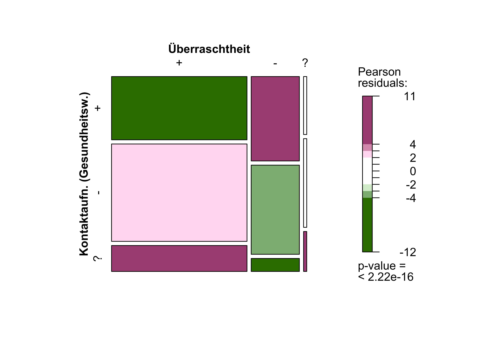
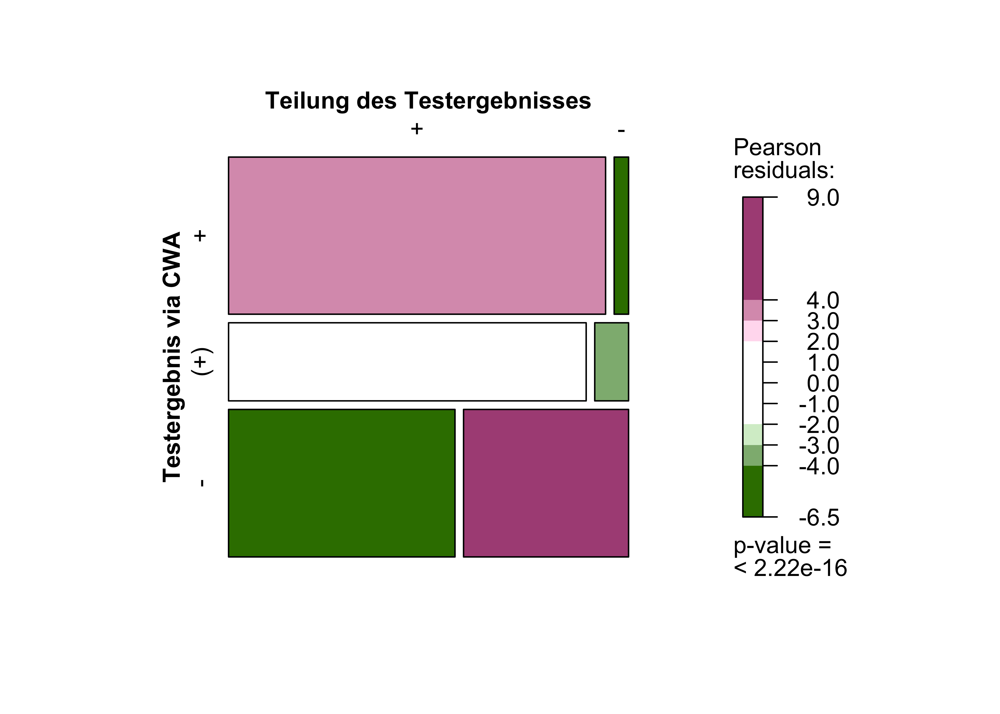
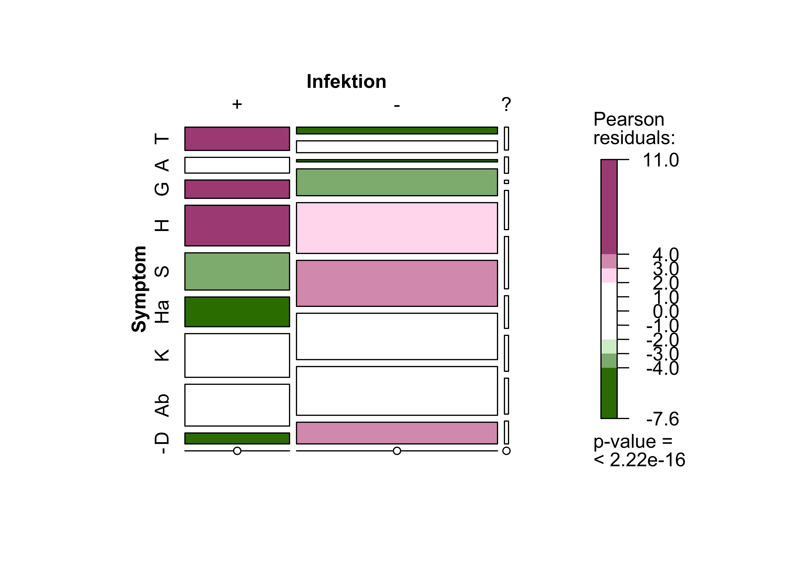

In zweiten Teil der Analyse der ereignisbezogenen Online-Befragung (Event-Driven-User-Survey, kurz EDUS) geht es um die Frage: Welchen Überraschungseffekt (<q>Überraschtheit</q>) hatte die <q>rote Warnung</q> auf die Nutzerinnen und Nutzer der Corona-Warn-App – und wie hat sich dadurch ihr Verhalten geändert? Außerdem liefert die Evaluation weitere Erkenntnisse über den Beitrag der Corona-Warn-App zur Eindämmung der SARS-CoV-2-Pandemie.

<!-- overview -->

1. [Das Wichtigste in Kürze: Zahlen, Daten, Fakten](#1-das-wichtigste-in-kürze-zahlen-daten-fakten)
2. [Aktive mobile Endgeräte und Aktivierung der Risikoermittlung](#2-aktive-mobile-endgeräte-und-aktivierung-der-risikoermittlung)
    1. [Aktive mobile Endgeräte](#21-aktive-mobile-endgeräte)
    2. [Aktivierung der Risikoermittlung](#22-aktivierung-der-risikoermittlung)
3. [Überraschtheit](#3-überraschtheit)
    1. [Gründe der Überraschtheit bzw. Nicht-Überraschtheit](#31-gründe-der-überraschtheit-bzw-nicht-überraschtheit) 
    2. [Zusammenhang zwischen Überraschtheit und Durchführung eines Tests](#32-zusammenhang-zwischen-überraschtheit-und-durchführung-eines-tests) 
    3. [Zusammenhang zwischen Überraschtheit und Kontaktvorhaben zum Gesundheitswesen](#33-zusammenhang-zwischen-überraschtheit-und-kontaktvorhaben-zum-gesundheitswesen)
    4. [Zusammenhang zwischen Überraschtheit und Infektion](#34-zusammenhang-zwischen-überraschtheit-und-infektion)
    5. [Zusammenhang zwischen Überraschtheit, Kontaktaufnahme zum Gesundheitswesen und Infektion](#35-zusammenhang-zwischen-überraschtheit-kontaktaufnahme-zum-gesundheitswesen-und-infektion)
4. [Testung](#4-testung)
    1. [Testvorhaben](#41-testvorhaben)
    2. [Testergebnisse](#42-testergebnisse)
    3. [Teilung der Testergebnisse](#43-teilung-der-testergebnisse)
    4. [Übersicht zum Gesamttestprozess](#44-übersicht-zum-gesamttestprozess)
5. [Symptome](#5-symptome)
6. [Was nehmen wir aus der ereignisbezogenen Befragung (EDUS) mit?](#6-was-nehmen-wir-aus-der-ereignisbezogenen-befragung-edus-mit)
7. [So geht es weiter](#7-so-geht-es-weiter)

## 1 Das Wichtigste in Kürze: Zahlen, Daten, Fakten

Der zweite Teil der ereignisbezogenen Befragung (EDUS) hat u.a. ergeben, dass

<ul><li>ein signifikanter Anteil der Befragten (72,5%) von der <q>roten Warnung</q> überrascht war,</li>
<li>die Befragten ihre Testergebnisse meistens innerhalb von 24 Stunden über die App erhielten,</li>
<li>durch die Mitteilung positiver Testergebnisse in der App weitere Personen zeitnah gewarnt wurden, wobei deren erhöhtes Infektionsrisiko ohne die Corona-Warn-App nicht hätte erkannt werden können,</li>
<li>der Großteil der Teilnehmenden nach einer <q>roten Warnung</q> anschließend weitere Verhaltensmaßnahmen umgesetzt hat, um der Ausbreitung des Virus entgegenzuwirken, und</li>
<li>die Corona-Warn-App den Zweck der frühzeitigen Warnung und der Unterstützung bei der Beendigung von Infektionsketten erfüllt.</li></ul>

## 2. Aktive mobile Endgeräte und Aktivierung der Risikoermittlung

### 2.1 Aktive mobile Endgeräte

Während der Feldlaufzeit von EDUS zwischen März und Mai 2021 wurden eine Basis- und eine Folgebefragung durchgeführt. Am 7. April 2021 wurde dabei eine zusätzliche Frage in die Basisbefragung integriert. Gefragt wurde, auf wie vielen Geräten die Befragten die Corona-Warn-App installiert haben. Hintergrund der Frage war die Vermutung, dass viele Nutzende die Corona-Warn-App auf mehreren Geräten (Smartphones) installiert haben könnten. So wäre neben privaten Geräten (Smartphone) die Nutzung von einem oder mehreren Dienstgeräten denkbar. Eine Einschätzung über die Anzahl der Geräte pro Person, auf denen die Corona-Warn-App genutzt wird, kann zur Klärung der wichtigen Frage nach der Anzahl der aktiven Nutzenden beitragen. Ebenso ist es wichtig, einschätzen zu können, wie viele der Befragten zumindest theoretisch die Chance gehabt hätten, mehrmals an der Basisbefragung teilzunehmen, wenn sie etwa aufgrund einer Risikobegegnung eine <q>rote Warnung</q> auf mehreren ihrer Geräte bekommen hätten. 

Die durch EDUS erhobenen Daten sprechen dafür, dass die Corona-Warn-App (zu einem bestimmten Zeitpunkt) hauptsächlich auf einem Gerät genutzt wird. Ein kleiner Anteil (knapp 9%) der Befragten, die hierzu eine Angabe machten, gab an, die App auf zwei Geräten zu nutzen, und ein sehr geringer Anteil (unter 2%) nutzt die Corona-Warn-App auf mehr als zwei Geräten. Die eher anekdotische Evidenz der verbreiteten Mehrfachnutzung lässt sich mit den vorliegenden Daten nicht bestätigen. Die Anzahl der aktiven Geräte und die Anzahl der tatsächlichen Nutzenden dürften sich folglich nur geringfügig (um etwa 12%) unterscheiden. Hier bei ist jedoch nicht die Nutzung auf unterschiedlichen Geräten im zeitlichen Verlauf berücksichtigt. 

</img>

Abb. 1: EDUS - Anzahl mobiler Endgeräte, auf denen die Corona-Warn-App installiert ist.

Die Ergebnisse zeigen, dass nicht ausgeschlossen werden kann, dass einzelne Personen mehrfach an der Befragung teilnehmen konnten. Die Ermittlung der Anzahl der aktiven Nutzenden der Corona-Warn-App ist noch nicht abgeschlossen und wird in zukünftigen Beiträgen weiter thematisiert.

Angaben zur Anzahl aktiver mobiler Endgeräte

<table class="table table-striped table-hover table-condensed table-responsive" style="margin-left: auto; margin-right: auto;">
<caption>
Tab. 1: Auf vielen mobilen Endgeräten haben Sie die Corona-Warn-App installiert?
</caption>
<thead>
<tr>
<th style="text-align:left;position: sticky; top:0; background-color: #FFFFFF;">
Auf vielen mobilen Endgeräten haben Sie die Corona-Warn-App installiert?
</th>
<th style="text-align:right;position: sticky; top:0; background-color: #FFFFFF;">
Anzahl
</th>
<th style="text-align:right;position: sticky; top:0; background-color: #FFFFFF;">
Anteil
</th>
<th style="text-align:right;position: sticky; top:0; background-color: #FFFFFF;">
Anteil (gültig)
</th>
</tr>
</thead>
<tbody>
<tr>
<td style="text-align:left;">
1 Gerät
</td>
<td style="text-align:right;">
13.287
</td>
<td style="text-align:right;">
50.9%
</td>
<td style="text-align:right;">
89.7%
</td>
</tr>
<tr>
<td style="text-align:left;">
2 Geräte
</td>
<td style="text-align:right;">
1.285
</td>
<td style="text-align:right;">
4.9%
</td>
<td style="text-align:right;">
8.7%
</td>
</tr>
<tr>
<td style="text-align:left;">
Mehr als 2 Geräte
</td>
<td style="text-align:right;">
239
</td>
<td style="text-align:right;">
0.9%
</td>
<td style="text-align:right;">
1.6%
</td>
</tr>
<tr>
<td style="text-align:left;">
-keine Angabe-
</td>
<td style="text-align:right;">
11.283
</td>
<td style="text-align:right;">
43.2%
</td>
<td style="text-align:right;"></td>
</tr>
</tbody>
</table>

### 2.2 Aktivierung der Risikoermittlung

Ein weiterer wichtiger Aspekt der aktiven Nutzung der Corona-Warn-App ist, dass die Risiko-Ermittlung in der App durchgehend aktiviert ist. Diese kann von den Nutzenden beliebig an- und ausgeschaltet werden, wobei die Kernfunktionalität nur gegeben ist, wenn Begegnungen registriert werden können. Wenn die Risiko-Ermittlung innerhalb der vergangenen 14 Tage überhaupt nicht aktiviert war, kann auch keine Anzeige eines erhöhten Risikos erfolgen.
Diese Kernfunktion der Corona-Warn-App ist immer dann am wichtigsten, wenn die Nutzenden über das Risiko einer Situation nicht anderweitig informiert werden können.

Die überwiegende Mehrheit der Befragten gab an, die App wie intendiert zu nutzen und die Risiko-Ermittlung durchgehend aktiviert zu haben. Nur wenige Befragte hatten laut eigenen Angaben die Ermittlung in weniger als der Hälfte der Zeit oder gar nicht aktiviert. 

Hierbei ist zu berücksichtigen, dass die Frage nicht präzise genug formuliert war und es zu Missverständnissen gekommen sein könnte (etwa, dass die Aktivierung bzw. Installation bereits vor mehr als 2 Wochen geschehen ist). 

Angaben zur Aktivierung der Risikoermittlung

<table class="table table-striped table-hover table-condensed table-responsive" style="margin-left: auto; margin-right: auto;">
<caption>
Tab. 2: Hatten Sie die Risiko-Ermittlung innerhalb der letzten 14 Tage aktiviert?
</caption>
<thead>
<tr>
<th style="text-align:left;position: sticky; top:0; background-color: #FFFFFF;">
Hatten Sie die Risiko-Ermittlung innerhalb der letzten 14 Tage aktiviert?
</th>
<th style="text-align:right;position: sticky; top:0; background-color: #FFFFFF;">
Anzahl
</th>
<th style="text-align:right;position: sticky; top:0; background-color: #FFFFFF;">
Anteil
</th>
<th style="text-align:right;position: sticky; top:0; background-color: #FFFFFF;">
Anteil (gültig)
</th>
</tr>
</thead>
<tbody>
<tr>
<td style="text-align:left;">
Ja, durchgängig
</td>
<td style="text-align:right;">
22.925
</td>
<td style="text-align:right;">
87.9%
</td>
<td style="text-align:right;">
91.9%
</td>
</tr>
<tr>
<td style="text-align:left;">
Ja, mehr als die Hälfte der Zeit
</td>
<td style="text-align:right;">
1.047
</td>
<td style="text-align:right;">
4.0%
</td>
<td style="text-align:right;">
4.2%
</td>
</tr>
<tr>
<td style="text-align:left;">
Ja, weniger als die Hälfte der Zeit
</td>
<td style="text-align:right;">
456
</td>
<td style="text-align:right;">
1.7%
</td>
<td style="text-align:right;">
1.8%
</td>
</tr>
<tr>
<td style="text-align:left;">
Nein
</td>
<td style="text-align:right;">
284
</td>
<td style="text-align:right;">
1.1%
</td>
<td style="text-align:right;">
1.1%
</td>
</tr>
<tr>
<td style="text-align:left;">
Weiß nicht
</td>
<td style="text-align:right;">
246
</td>
<td style="text-align:right;">
0.9%
</td>
<td style="text-align:right;">
1.0%
</td>
</tr>
<tr>
<td style="text-align:left;">
-keine Angabe-
</td>
<td style="text-align:right;">
1.136
</td>
<td style="text-align:right;">
4.4%
</td>
<td style="text-align:right;">
</td>
</tr>
</tbody>
</table>

## 3 Überraschtheit

Die Corona-Warn-App kann dazu beitragen, Infektionsketten, die sonst unerkannt geblieben wären, frühzeitig zu beenden. 

In der Basisbefragung wurde nach dem Überraschungseffekt (<q>Überraschtheit</q>) gefragt, ob die Teilnehmenden von der Anzeige des erhöhten Risikos überrascht waren. Mit 72,5% gaben fast drei Viertel der Teilnehmenden an, von der roten Warnung überrascht worden zu sein.

</img>

Abb. 2: EDUS - Überraschtheit

Angaben zur Überraschtheit

<table class="table table-striped table-hover table-condensed table-responsive" style="margin-left: auto; margin-right: auto;">
<caption>
Tab. 3: Wurden Sie von der Anzeige eines erhöhten Risikos überrascht?
</caption>
<thead>
<tr>
<th style="text-align:left;position: sticky; top:0; background-color: #FFFFFF;">
Wurden Sie von der Anzeige eines erhöhten Risikos überrascht?
</th>
<th style="text-align:right;position: sticky; top:0; background-color: #FFFFFF;">
Anzahl
</th>
<th style="text-align:right;position: sticky; top:0; background-color: #FFFFFF;">
Anteil
</th>
<th style="text-align:right;position: sticky; top:0; background-color: #FFFFFF;">
Anteil (gültig)
</th>
</tr>
</thead>
<tbody>
<tr>
<td style="text-align:left;">
Ja
</td>
<td style="text-align:right;">
18.099
</td>
<td style="text-align:right;">
69.4%
</td>
<td style="text-align:right;">
72.5%
</td>
</tr>
<tr>
<td style="text-align:left;">
Nein
</td>
<td style="text-align:right;">
6.433
</td>
<td style="text-align:right;">
24.7%
</td>
<td style="text-align:right;">
25.8%
</td>
</tr>
<tr>
<td style="text-align:left;">
Weiß nicht
</td>
<td style="text-align:right;">
426
</td>
<td style="text-align:right;">
1.6%
</td>
<td style="text-align:right;">
1.7%
</td>
</tr>
<tr>
<td style="text-align:left;">
-keine Angabe-
</td>
<td style="text-align:right;">
1.136
</td>
<td style="text-align:right;">
4.4%
</td>
<td style="text-align:right;">
</td>
</tr>
</tbody>
</table>

### 3.1 Gründe der Überraschtheit bzw. Nicht-Überraschtheit

Von den 25,8%, die nicht überrascht waren, wussten die meisten von einer Infektion im eigenen und näheren sozialen Umfeld. Im persönlichen Umfeld kann sich die Information über eine Neuinfektion potenziell schneller verbreiten als bei Personen, die sich nur flüchtig oder nicht persönlich kennen. Es lässt sich beispielsweise annehmen, dass es Erkrankten leichter fällt, mit nahen Angehörigen über eine Infektion zu sprechen als mit anderen Personen. Aus diesem Grund werden nahe Angehörige potentiell eher über das Risiko einer vergangenen Begegnung informiert. Eine Erklärung dafür könnte sein, dass die eigene Gesundheit von vielen Personen als eine private Angelegenheit angesehen wird und im direkten Umfeld weniger negative Konsequenzen befürchtet werden müssen. Weiterhin ist das direkte Umfeld in der Regel schneller und unkomplizierter zu erreichen.

Bei der Frage nach den Gründen konnten die Teilnehmenden mehrere Antworten auswählen. Die Ergebnisse zeigen, dass den nicht-überraschten Befragten am häufigsten ein positives Testergebnis im Familienkreis (40,2%) bekannt war. Etwas weniger häufig wurden das Arbeitsumfeld (27,1%) und der Freundeskreis (14,6%) genannt. Während der Planung der Studie wurde angenommen, dass das Betreuungsumfeld von Kindern in diesem Zusammenhang eine größere Rolle spielen könnte. Die Ergebnisse konnten diese Hypothese nicht weiter bestätigen. Um die Frage trotz datensparsamen Ansatzes möglichst ausschöpfend zu stellen, wurde zusätzlich die Antwortkategorie <q>aus anderen Gründen</q> zur Auswahl angeboten, die von 20,3% der nicht-überraschten Befragten gewählt wurde. Dabei bleibt unklar, welche Gründe dies im Speziellen sind.

Angaben zu Gründen der Nicht-Überraschtheit

<table class="table table-striped table-hover table-condensed table-responsive" style="margin-left: auto; margin-right: auto;">
<caption>
Tab. 4: Warum wurden Sie von der Anzeige eines erhöhten Risikos nicht überrascht?
</caption>
<thead>
<tr>
<th style="text-align:left;position: sticky; top:0; background-color: #FFFFFF;">
Warum wurden Sie von der Anzeige eines erhöhten Risikos nicht überrascht?
</th>
<th style="text-align:right;position: sticky; top:0; background-color: #FFFFFF;">
Anzahl
</th>
<th style="text-align:right;position: sticky; top:0; background-color: #FFFFFF;">
Anteil
</th>
</tr>
</thead>
<tbody>
<tr>
<td style="text-align:left;">
Da Personen im Freundeskreis vor kurzem positiv getestet wurden
</td>
<td style="text-align:right;">
936
</td>
<td style="text-align:right;">
14,6%
</td>
</tr>
<tr>
<td style="text-align:left;">
Da Personen im Familienkreis vor kurzem positiv getestet wurden
</td>
<td style="text-align:right;">
2.583
</td>
<td style="text-align:right;">
40,2%
</td>
</tr>
<tr>
<td style="text-align:left;">
Da Personen auf der Arbeit vor kurzem positiv getestet wurden
</td>
<td style="text-align:right;">
1.741
</td>
<td style="text-align:right;">
27,1%
</td>
</tr>
<tr>
<td style="text-align:left;">
Da Personen im Betreuungsumfeld meiner Kinder vor kurzem positiv getestet wurden
</td>
<td style="text-align:right;">
95
</td>
<td style="text-align:right;">
1,5%
</td>
</tr>
<tr>
<td style="text-align:left;">
Aus anderen Gründen
</td>
<td style="text-align:right;">
1.307
</td>
<td style="text-align:right;">
20,3%
</td>
</tr>
<tr>
<td style="text-align:left;">
Weiß nicht
</td>
<td style="text-align:right;">
93
</td>
<td style="text-align:right;">
1,4%
</td>
</tr>
</tbody>
</table>

Auf Basis der Antworten lässt sich annehmen, dass die Corona-Warn-App dabei hilft, Risiken aufzudecken, die außerhalb des unmittelbaren sozialen Umfeldes aufgetreten sind. Teilnehmende, die von der roten Warnung überrascht wurden, hätten ohne die App möglicherweise keinen Hinweis auf ein erhöhtes Risiko erhalten. Je höher die Teilnehmenden ihr Risiko für eine Infektion vor der Warnmeldung einschätzten, desto geringer war der Anteil derjenigen, die von der Warnung überrascht waren.

<figure>
    <table class="table table-hover">

  <thead class="gt_col_headings">
    <tr>
      <th rowspan="2" colspan="1"><strong>Variable</strong></th>
      <th class="text-center" rowspan="1" colspan="3">
        <strong>Überraschtheit</strong>
      </th>
      <th class="text-center" rowspan="2" colspan="1"><strong>Gesamt</strong></th>
    </tr>
    <tr>
      <th class="text-center" rowspan="1" colspan="1">Ja</th>
      <th class="text-center" rowspan="1" colspan="1">Nein</th>
      <th class="text-center" rowspan="1" colspan="1">Weiß nicht</th>
    </tr>
  </thead>
  <tbody class="gt_table_body">
    <tr><td class="gt_row gt_left" style="font-weight: bold;">Eingeschätztes Risiko</td>
<td class="text-center"></td>
<td class="text-center"></td>
<td class="text-center"></td>
<td class="text-center"></td></tr>
    <tr><td class="gt_row gt_left" style="text-align: left; text-indent: 10px;">Hoch</td>
<td class="text-center">476 (1,9%)</td>
<td class="text-center">817 (3,3%)</td>
<td class="text-center">15 (&lt;0,1%)</td>
<td class="text-center">1.308 (5,2%)</td></tr>
    <tr><td class="gt_row gt_left" style="text-align: left; text-indent: 10px;">Eher hoch</td>
<td class="text-center">788 (3,2%)</td>
<td class="text-center">739 (3,0%)</td>
<td class="text-center">34 (0,1%)</td>
<td class="text-center">1.561 (6,3%)</td></tr>
    <tr><td class="gt_row gt_left" style="text-align: left; text-indent: 10px;">Teils-teils</td>
<td class="text-center">2.616 (10%)</td>
<td class="text-center">1.246 (5,0%)</td>
<td class="text-center">89 (0,4%)</td>
<td class="text-center">3.951 (16%)</td></tr>
    <tr><td class="gt_row gt_left" style="text-align: left; text-indent: 10px;">Eher gering</td>
<td class="text-center">5.451 (22%)</td>
<td class="text-center">1.642 (6,6%)</td>
<td class="text-center">128 (0,5%)</td>
<td class="text-center">7.221 (29%)</td></tr>
    <tr><td class="gt_row gt_left" style="text-align: left; text-indent: 10px;">Gering</td>
<td class="text-center">8.441 (34%)</td>
<td class="text-center">1.874 (7,5%)</td>
<td class="text-center">144 (0,6%)</td>
<td class="text-center">10.459 (42%)</td></tr>
    <tr><td class="gt_row gt_left" style="text-align: left; text-indent: 10px;">Weiß nicht</td>
<td class="text-center">294 (1,2%)</td>
<td class="text-center">106 (0,4%)</td>
<td class="text-center">15 (&lt;0,1%)</td>
<td class="text-center">415 (1,7%)</td></tr>
    <tr><td class="gt_row gt_left" style="text-align: left; text-indent: 10px;">-keine Angabe-</td>
<td class="text-center">3 (&lt;0,1%)</td>
<td class="text-center">3 (&lt;0,1%)</td>
<td class="text-center">0 (0%)</td>
<td class="text-center">6 (&lt;0,1%)</td></tr>
    <tr><td class="gt_row gt_left" style="font-weight: bold;">Gesamt</td>
<td class="text-center">18.069 (73%)</td>
<td class="text-center">6.427 (26%)</td>
<td class="text-center">425 (1,7%)</td>
<td class="text-center">24.921 (100%)</td></tr>
  </tbody>

</table>
    <figcaption aria-hidden="true">Tab. 5: EDUS - Zusammenhang zwischen Risiko und Überraschtheit.</figcaption>
</figure>

<figure>
    
    <figcaption aria-hidden="true">Abb. 3: EDUS - Zusammenhang zwischen Überraschtheit und eingeschätztem Risiko.</figcaption>
</figure>

Angaben zum eingeschätzten Risiko

<table class="table table-striped table-hover table-condensed table-responsive" style="margin-left: auto; margin-right: auto;">
<caption>
Tab. 6: Mit wem werden Sie den Kontakt aufnehmen?
</caption>
<thead>
<tr>
<th style="text-align:left;position: sticky; top:0; background-color: #FFFFFF;">
Wie hoch schätzten Sie Ihr Risiko, sich infiziert zu haben, vor der Meldung durch die App ein?
</th>
<th style="text-align:right;position: sticky; top:0; background-color: #FFFFFF;">
Anzahl
</th>
<th style="text-align:right;position: sticky; top:0; background-color: #FFFFFF;">
Anteil
</th>
<th style="text-align:right;position: sticky; top:0; background-color: #FFFFFF;">
Anteil (gültig)
</th>
</tr>
</thead>
<tbody>
<tr>
<td style="text-align:left;">
Hoch
</td>
<td style="text-align:right;">
1.310
</td>
<td style="text-align:right;">
5.0%
</td>
<td style="text-align:right;">
5.3%
</td>
</tr>
<tr>
<td style="text-align:left;">
Eher hoch
</td>
<td style="text-align:right;">
1.562
</td>
<td style="text-align:right;">
6.0%
</td>
<td style="text-align:right;">
6.3%
</td>
</tr>
<tr>
<td style="text-align:left;">
Teils-teils
</td>
<td style="text-align:right;">
3.956
</td>
<td style="text-align:right;">
15.2%
</td>
<td style="text-align:right;">
15.9%
</td>
</tr>
<tr>
<td style="text-align:left;">
Eher gering
</td>
<td style="text-align:right;">
7.226
</td>
<td style="text-align:right;">
27.7%
</td>
<td style="text-align:right;">
29.0%
</td>
</tr>
<tr>
<td style="text-align:left;">
Gering
</td>
<td style="text-align:right;">
10.472
</td>
<td style="text-align:right;">
40.1%
</td>
<td style="text-align:right;">
42.0%
</td>
</tr>
<tr>
<td style="text-align:left;">
Weiß nicht
</td>
<td style="text-align:right;">
415
</td>
<td style="text-align:right;">
1.6%
</td>
<td style="text-align:right;">
1.7%
</td>
</tr>
<tr>
<td style="text-align:left;">
-keine Angabe-
</td>
<td style="text-align:right;">
1.153
</td>
<td style="text-align:right;">
4.4%
</td>
<td style="text-align:right;">
</td>
</tr>
</tbody>
</table>

### 3.2 Zusammenhang zwischen Überraschtheit und Durchführung eines Tests

Überraschte Teilnehmende entschieden sich häufiger für einen Antigen-Schnelltest und machten geringfügig häufiger gar keinen Test als nicht-überraschte Befragte. Es sind viele weitere Erklärungen für das Verhalten der Befragten denkbar.

<figure class="text-center">
    <table class="table table-hover">

  <thead class="gt_col_headings">
    <tr>
      <th class="gt_col_heading gt_columns_bottom_border gt_left" rowspan="2" colspan="1"><strong>Variable</strong></th>
      <th class="text-center" rowspan="1" colspan="3">
        <strong>Überraschtheit</strong>
      </th>
      <th class="text-center" rowspan="2" colspan="1"><strong>Gesamt</strong></th>
    </tr>
    <tr>
      <th class="text-center" rowspan="1" colspan="1">Ja</th>
      <th class="text-center" rowspan="1" colspan="1">Nein</th>
      <th class="text-center" rowspan="1" colspan="1">Weiß nicht</th>
    </tr>
  </thead>
  <tbody class="gt_table_body">
    <tr><td class="text-left" style="font-weight: bold;">Test</td>
<td class="text-center"></td>
<td class="text-center"></td>
<td class="text-center"></td>
<td class="text-center"></td></tr>
    <tr><td class="gt_row gt_left" style="text-align: left; text-indent: 10px;">Ja, einen PCR-Test</td>
<td class="text-center">2.660 (11%)</td>
<td class="text-center">1.399 (5,6%)</td>
<td class="text-center">55 (0,2%)</td>
<td class="text-center">4.114 (17%)</td></tr>
    <tr><td class="gt_row gt_left" style="text-align: left; text-indent: 10px;">Ja, einen Antigen-Schnelltest</td>
<td class="text-center">5.537 (22%)</td>
<td class="text-center">1.219 (4,9%)</td>
<td class="text-center">108 (0,4%)</td>
<td class="text-center">6.864 (28%)</td></tr>
    <tr><td class="gt_row gt_left" style="text-align: left; text-indent: 10px;">Ja, einen PCR-Test und einen Antigen-Schnelltest</td>
<td class="text-center">1.402 (5,6%)</td>
<td class="text-center">828 (3,3%)</td>
<td class="text-center">31 (0,1%)</td>
<td class="text-center">2.261 (9,1%)</td></tr>
    <tr><td class="gt_row gt_left" style="text-align: left; text-indent: 10px;">Ja, aber ich weiß nicht, was für einen Test</td>
<td class="text-center">225 (0,9%)</td>
<td class="text-center">38 (0,2%)</td>
<td class="text-center">3 (&lt;0,1%)</td>
<td class="text-center">266 (1,1%)</td></tr>
    <tr><td class="gt_row gt_left" style="text-align: left; text-indent: 10px;">Nein</td>
<td class="text-center">1.571 (6,3%)</td>
<td class="text-center">426 (1,7%)</td>
<td class="text-center">26 (0,1%)</td>
<td class="text-center">2.023 (8,1%)</td></tr>
    <tr><td class="gt_row gt_left" style="text-align: left; text-indent: 10px;">-keine Angabe-</td>
<td class="text-center">6.674 (27%)</td>
<td class="text-center">2.517 (10%)</td>
<td class="text-center">202 (0,8%)</td>
<td class="text-center">9.393 (38%)</td></tr>
    <tr><td class="text-left" style="font-weight: bold;">Gesamt</td>
<td class="text-center">18.069 (73%)</td>
<td class="text-center">6.427 (26%)</td>
<td class="text-center">425 (1,7%)</td>
<td class="text-center">24.921 (100%)</td></tr>
  </tbody>

</table>
    <figcaption aria-hidden="true">Tab. 7: EDUS - Zusammenhang zwischen Überraschtheit und Testung.</figcaption>
</figure>

<figure>
    
    <figcaption aria-hidden="true">Abb. 4: EDUS - Zusammenhang zwischen Überraschtheit und durchgeführtem Test.</figcaption>
</figure>

### 3.3 Zusammenhang zwischen Überraschtheit und Kontaktvorhaben zum Gesundheitswesen

Befragte, die von der Warnung überrascht wurden, gaben seltener an, den Kontakt zum Gesundheitswesen suchen zu wollen als Teilnehmende, die nicht überrascht waren. Die genauen Gründe dafür sind unklar. Es lohnt sich jedoch den Zeitpunkt der Befragung zu berücksichtigen. Beide Fragen stammen aus der Basisbefragung. Sie wurden den Teilnehmenden in einer Situation gestellt, die mit vielen Unsicherheiten verbunden war. Personen, die zudem unvorbereitet mit einem Infektionsrisiko konfrontiert worden sind, reagieren möglicherweise insgesamt anders als solche, die etwa Warnzeichen aus ihrem sozialen Umfeld signalisiert bekommen haben und bereits Zeit hatten sich auf die Situation einzustellen.

Von denen, die Kontakt aufnehmen wollten, berichteten die meisten, dass sie sich an die oder den Hausärztin/-arzt (55,2%) wenden wollten. Auch hier konnten die Befragten mehrere Antworten auswählen. Der Kontakt zum Gesundheitsamt (43,4%) wurde seltener angegeben. Die Nummer des ärztlichen Bereitschaftsdienstes und die Krankenhäuser spielten in der Befragung eine untergeordnete Rolle. Die Daten zeigen, dass die rote Warnung der Corona-Warn-App einen begründeten Anfangsverdacht für die Nutzenden darstellen kann, auf Basis dessen diese sich hauptsächlich über Ärztinnen und Ärzte an das Gesundheitswesen wenden. Der Kontakt zu Hausärztinnen und Hausärzten spricht sehr für die intendierte Entlastung des öffentlichen Gesundheitsdienstes durch die Corona-Warn-App. Eine Infektion würde in diesem Fall erst durch einen angeordneten Test bekannt werden. Vermehrte begründete Tests bei Verdachtsfällen tragen dazu bei, Infektionsketten zu verhindern. Die Corona-Warn-App fungiert vor allem bei Kontakt mit einer unbekannten infizierten Person als Frühwarnsystem. Somit kann auf eine notwendige Testung hingewiesen und zur Effizienz von Teststrategien beigetragen werden.

<figure class="text-center">
    <table class="table table-hover">

  <thead class="gt_col_headings">
    <tr>
      <th class="gt_col_heading gt_columns_bottom_border gt_left" rowspan="2" colspan="1"><strong>Variable</strong></th>
      <th class="text-center" rowspan="1" colspan="3">
        <strong>Überraschtheit</strong>
      </th>
      <th class="text-center" rowspan="2" colspan="1"><strong>Gesamt</strong></th>
    </tr>
    <tr>
      <th class="text-center" rowspan="1" colspan="1">Ja</th>
      <th class="text-center" rowspan="1" colspan="1">Nein</th>
      <th class="text-center" rowspan="1" colspan="1">Weiß nicht</th>
    </tr>
  </thead>
  <tbody class="gt_table_body">
    <tr><td class="text-left" style="font-weight: bold;">Kontaktaufnahme (Gesundheitswesen)</td>
<td class="text-center"></td>
<td class="text-center"></td>
<td class="text-center"></td>
<td class="text-center"></td></tr>
    <tr><td class="gt_row gt_left" style="text-align: left; text-indent: 10px;">Ja</td>
<td class="text-center">6.127 (25%)</td>
<td class="text-center">2.908 (12%)</td>
<td class="text-center">132 (0,5%)</td>
<td class="text-center">9.167 (37%)</td></tr>
    <tr><td class="gt_row gt_left" style="text-align: left; text-indent: 10px;">Nein</td>
<td class="text-center">9.432 (38%)</td>
<td class="text-center">3.072 (12%)</td>
<td class="text-center">202 (0,8%)</td>
<td class="text-center">12.706 (51%)</td></tr>
    <tr><td class="gt_row gt_left" style="text-align: left; text-indent: 10px;">Weiß nicht</td>
<td class="text-center">2.510 (10%)</td>
<td class="text-center">447 (1,8%)</td>
<td class="text-center">91 (0,4%)</td>
<td class="text-center">3.048 (12%)</td></tr>
    <tr><td class="text-left" style="font-weight: bold;">Gesamt</td>
<td class="text-center">18.069 (73%)</td>
<td class="text-center">6.427 (26%)</td>
<td class="text-center">425 (1,7%)</td>
<td class="text-center">24.921 (100%)</td></tr>
  </tbody>

</table>
    <figcaption aria-hidden="true">Tab. 8: EDUS - Zusammenhang zwischen Überraschtheit und Kontaktvorhaben zum Gesundheitswesen.</figcaption>
</figure>

<figure>
    
    <figcaption aria-hidden="true">Abb. 5: EDUS - Zusammenhang zwischen Überraschtheit und Kontaktvorhaben zum Gesundheitswesen.
</figcaption>
</figure>

Angaben zum Kontaktvorhaben zum Gesundheitswesen

<table class="table table-striped table-hover table-condensed table-responsive" style="margin-left: auto; margin-right: auto;">
<caption>
Tab. 9: Werden Sie jetzt Kontakt mit dem Gesundheitswesen aufnehmen?
</caption>
<thead>
<tr>
<th style="text-align:left;position: sticky; top:0; background-color: #FFFFFF;">
Werden Sie jetzt Kontakt mit dem Gesundheitswesen aufnehmen?
</th>
<th style="text-align:right;position: sticky; top:0; background-color: #FFFFFF;">
Anzahl
</th>
<th style="text-align:right;position: sticky; top:0; background-color: #FFFFFF;">
Anteil
</th>
<th style="text-align:right;position: sticky; top:0; background-color: #FFFFFF;">
Anteil (gültig)
</th>
</tr>
</thead>
<tbody>
<tr>
<td style="text-align:left;">
Ja
</td>
<td style="text-align:right;">
9.168
</td>
<td style="text-align:right;">
35.1%
</td>
<td style="text-align:right;">
36.8%
</td>
</tr>
<tr>
<td style="text-align:left;">
Nein
</td>
<td style="text-align:right;">
12.708
</td>
<td style="text-align:right;">
48.7%
</td>
<td style="text-align:right;">
51.0%
</td>
</tr>
<tr>
<td style="text-align:left;">
Weiß nicht
</td>
<td style="text-align:right;">
3.048
</td>
<td style="text-align:right;">
11.7%
</td>
<td style="text-align:right;">
12.2%
</td>
</tr>
<tr>
<td style="text-align:left;">
-keine Angabe-
</td>
<td style="text-align:right;">
1.170
</td>
<td style="text-align:right;">
4.5%
</td>
<td style="text-align:right;">
</td>
</tr>
</tbody>
</table>
<table class="table table-striped table-hover table-condensed table-responsive" style="margin-left: auto; margin-right: auto;">
<caption>
Tab. 10: Mit wem werden Sie den Kontakt aufnehmen?
</caption>
<thead>
<tr>
<th style="text-align:left;position: sticky; top:0; background-color: #FFFFFF;">
Mit wem werden Sie den Kontakt aufnehmen?
</th>
<th style="text-align:right;position: sticky; top:0; background-color: #FFFFFF;">
Anzahl
</th>
<th style="text-align:right;position: sticky; top:0; background-color: #FFFFFF;">
Anteil
</th>
</tr>
</thead>
<tbody>
<tr>
<td style="text-align:left;">
Ich kontaktiere meinen Hausarzt / meine Hausärztin
</td>
<td style="text-align:right;">
5.058
</td>
<td style="text-align:right;">
55,2%
</td>
</tr>
<tr>
<td style="text-align:left;">
Ich kontaktiere das zuständige Gesundheitsamt
</td>
<td style="text-align:right;">
3.978
</td>
<td style="text-align:right;">
43,4%
</td>
</tr>
<tr>
<td style="text-align:left;">
Ich rufe die zentrale Nummer 116 117 an
</td>
<td style="text-align:right;">
2.284
</td>
<td style="text-align:right;">
24,9%
</td>
</tr>
<tr>
<td style="text-align:left;">
Ich gehe in ein Krankenhaus
</td>
<td style="text-align:right;">
194
</td>
<td style="text-align:right;">
2,1%
</td>
</tr>
<tr>
<td style="text-align:left;">
Weiß nicht
</td>
<td style="text-align:right;">
502
</td>
<td style="text-align:right;">
5,5%
</td>
</tr>
</tbody>
</table>

### 3.4 Zusammenhang zwischen Überraschtheit und Infektion

Überraschte Befragte wurden seltener positiv auf SARS-CoV-2 getestet als solche, die von der roten Warnung nicht überrascht worden sind. Wie schon gezeigt werden konnte, wussten nicht-überraschte Befragte in der Regel von Infektionen aus dem näheren sozialen Umfeld.

Im Familien-, Freundes- und Arbeitskreis ist es oftmals nicht möglich durchweg ausreichend Abstand zu halten und die Hygieneregeln vollends einzuhalten. Die Umsetzung der Schutzmaßnahmen fällt bei flüchtigen Bekanntschaften oder bei Fremden leichter, wenn man bspw. an Begegnungen im öffentlichen Nahverkehr oder beim Einkaufen denkt. Diese Umstände könnten den Unterschied der Testergebnisse in den Gruppen erklären, wenn angenommen wird, dass die Zusammenkünfte mit Personen aus dem eigenen Umfeld eine höhere Wahrscheinlichkeit für die Übertragung der Krankheit bieten.

<figure class="text-center">
    <table class="table table-hover">

  <thead class="gt_col_headings">
    <tr>
      <th class="gt_col_heading gt_columns_bottom_border gt_left" rowspan="2" colspan="1"><strong>Variable</strong></th>
      <th class="text-center" rowspan="1" colspan="3">
        <strong>Überraschtheit</strong>
      </th>
      <th class="text-center" rowspan="2" colspan="1"><strong>Gesamt</strong></th>
    </tr>
    <tr>
      <th class="text-center" rowspan="1" colspan="1">Ja</th>
      <th class="text-center" rowspan="1" colspan="1">Nein</th>
      <th class="text-center" rowspan="1" colspan="1">Weiß nicht</th>
    </tr>
  </thead>
  <tbody class="gt_table_body">
    <tr><td class="text-left" style="font-weight: bold;">Infektion</td>
<td class="text-center"></td>
<td class="text-center"></td>
<td class="text-center"></td>
<td class="text-center"></td></tr>
    <tr><td class="gt_row gt_left" style="text-align: left; text-indent: 10px;">Positiv auf SARS-CoV-2</td>
<td class="text-center">191 (0,8%)</td>
<td class="text-center">590 (2,4%)</td>
<td class="text-center">10 (&lt;0,1%)</td>
<td class="text-center">791 (3,2%)</td></tr>
    <tr><td class="gt_row gt_left" style="text-align: left; text-indent: 10px;">Negativ auf SARS-CoV-2</td>
<td class="text-center">9.562 (38%)</td>
<td class="text-center">2.853 (11%)</td>
<td class="text-center">185 (0,7%)</td>
<td class="text-center">12.600 (51%)</td></tr>
    <tr><td class="gt_row gt_left" style="text-align: left; text-indent: 10px;">Nicht eindeutig</td>
<td class="text-center">54 (0,2%)</td>
<td class="text-center">36 (0,1%)</td>
<td class="text-center">2 (&lt;0,1%)</td>
<td class="text-center">92 (0,4%)</td></tr>
    <tr><td class="gt_row gt_left" style="text-align: left; text-indent: 10px;">-keine Angabe-</td>
<td class="text-center">8.262 (33%)</td>
<td class="text-center">2.948 (12%)</td>
<td class="text-center">228 (0,9%)</td>
<td class="text-center">11.438 (46%)</td></tr>
    <tr><td class="text-left" style="font-weight: bold;">Gesamt</td>
<td class="text-center">18.069 (73%)</td>
<td class="text-center">6.427 (26%)</td>
<td class="text-center">425 (1,7%)</td>
<td class="text-center">24.921 (100%)</td></tr>
  </tbody>

</table>
    <figcaption aria-hidden="true">Tab. 11: EDUS - Zusammenhang zwischen Überraschtheit und Infektion</figcaption>
</figure>

<figure>
    
    <figcaption aria-hidden="true">Abb. 6: EDUS - Zusammenhang zwischen Überraschtheit und Infektion.
</figcaption>
</figure>

### 3.5 Zusammenhang zwischen Überraschtheit, Kontaktaufnahme zum Gesundheitswesen und Infektion

Die Zusammenhänge zwischen der Überraschtheit, Infektion und Kontaktaufnahme zum Gesundheitswesen lassen sich in einer einzigen Grafik zusammenfassen.

<figure>
    
    <figcaption aria-hidden="true">Abb. 7: EDUS - Zusammenhang zwischen Überraschtheit, Kontaktvorhaben zum Gesundheitswesen und Infektion.
</figcaption>
</figure>

## 4 Testung

Ein Kernthema der Basis- und Folgebefragung war die Testung auf SARS-CoV-2. In der Basisbefragung wurde vor allem die Test-Intention behandelt, um in der Folgebefragung auf die tatsächlichen Testungen einzugehen.

### 4.1 Testvorhaben

In der Basisbefragung (direkt nach der roten Warnung) gaben etwas mehr als zwei Drittel der Befragten an, einen Test machen zu wollen (68,2%). Weitere 16,6% machen die Entscheidung vom ärztlichen Rat bzw. dem Rat eines anderen Gesundheitsdienstes abhängig. Ein geringer Anteil (4,2%) der Befragten wusste die Antwort nicht und 11,1% der Teilnehmenden gaben an, keinen Test machen zu wollen.

</img>

Abb. 8: EDUS - Testvorhaben

Die Teilnehmenden, die in der Basisbefragung angaben, einen Test zu planen, wurden gefragt, welchen Test sie voraussichtlich machen werden. In den Antworten spielten die Antigen-Schnelltests die größte Rolle (44,6%). Dagegen planten 29,5% direkt einen genaueren PCR-Test ein. Beide genannten Testarten (Antigen- und PCR-Test) wollten 18,1% der Befragten durchführen, weitere 6,7% verließen sich erneut auf ärztlichen Rat und 1,2% wussten die Antwort nicht.

Abb. 9: EDUS - Testvorhaben nach Testart - zeitliche Entwicklung.

Angaben zum Testvorhaben

<table class="table table-striped table-hover table-condensed table-responsive" style="margin-left: auto; margin-right: auto;">
<caption>
Tab. 12: Werden Sie einen SARS-CoV-2-Test machen?
</caption>
<thead>
<tr>
<th style="text-align:left;position: sticky; top:0; background-color: #FFFFFF;">
Werden Sie einen SARS-CoV-2-Test machen?
</th>
<th style="text-align:right;position: sticky; top:0; background-color: #FFFFFF;">
Anzahl
</th>
<th style="text-align:right;position: sticky; top:0; background-color: #FFFFFF;">
Anteil
</th>
<th style="text-align:right;position: sticky; top:0; background-color: #FFFFFF;">
Anteil (gültig)
</th>
</tr>
</thead>
<tbody>
<tr>
<td style="text-align:left;">
Ja
</td>
<td style="text-align:right;">
16.991
</td>
<td style="text-align:right;">
65.1%
</td>
<td style="text-align:right;">
68.2%
</td>
</tr>
<tr>
<td style="text-align:left;">
Nein
</td>
<td style="text-align:right;">
2.755
</td>
<td style="text-align:right;">
10.6%
</td>
<td style="text-align:right;">
11.1%
</td>
</tr>
<tr>
<td style="text-align:left;">
Das hängt von ärztlichem Rat bzw. dem Rat eines anderen Gesundheitsdienstes ab
</td>
<td style="text-align:right;">
4.129
</td>
<td style="text-align:right;">
15.8%
</td>
<td style="text-align:right;">
16.6%
</td>
</tr>
<tr>
<td style="text-align:left;">
Weiß nicht
</td>
<td style="text-align:right;">
1.053
</td>
<td style="text-align:right;">
4.0%
</td>
<td style="text-align:right;">
4.2%
</td>
</tr>
<tr>
<td style="text-align:left;">
-keine Angabe-
</td>
<td style="text-align:right;">
1.166
</td>
<td style="text-align:right;">
4.5%
</td>
<td style="text-align:right;">
</td>
</tr>
</tbody>
</table>
<table class="table table-striped table-hover table-condensed table-responsive" style="margin-left: auto; margin-right: auto;">
<caption>
Tab. 13: Welchen Test werden Sie voraussichtlich machen?
</caption>
<thead>
<tr>
<th style="text-align:left;position: sticky; top:0; background-color: #FFFFFF;">
Welchen Test werden Sie voraussichtlich machen?
</th>
<th style="text-align:right;position: sticky; top:0; background-color: #FFFFFF;">
Anzahl
</th>
<th style="text-align:right;position: sticky; top:0; background-color: #FFFFFF;">
Anteil
</th>
<th style="text-align:right;position: sticky; top:0; background-color: #FFFFFF;">
Anteil (gültig)
</th>
</tr>
</thead>
<tbody>
<tr>
<td style="text-align:left;">
PCR-Test
</td>
<td style="text-align:right;">
5.004
</td>
<td style="text-align:right;">
19.2%
</td>
<td style="text-align:right;">
29.5%
</td>
</tr>
<tr>
<td style="text-align:left;">
Antigen-Schnelltest
</td>
<td style="text-align:right;">
7.573
</td>
<td style="text-align:right;">
29.0%
</td>
<td style="text-align:right;">
44.6%
</td>
</tr>
<tr>
<td style="text-align:left;">
PCR-Test und Antigen-Schnelltest
</td>
<td style="text-align:right;">
3.069
</td>
<td style="text-align:right;">
11.8%
</td>
<td style="text-align:right;">
18.1%
</td>
</tr>
<tr>
<td style="text-align:left;">
Das hängt von ärztlichem Rat bzw. dem Rat eines anderen Gesundheitsdienstes ab
</td>
<td style="text-align:right;">
1.144
</td>
<td style="text-align:right;">
4.4%
</td>
<td style="text-align:right;">
6.7%
</td>
</tr>
<tr>
<td style="text-align:left;">
Weiß nicht
</td>
<td style="text-align:right;">
201
</td>
<td style="text-align:right;">
0.8%
</td>
<td style="text-align:right;">
1.2%
</td>
</tr>
<tr>
<td style="text-align:left;">
-keine Angabe-
</td>
<td style="text-align:right;">
9.103
</td>
<td style="text-align:right;">
34.9%
</td>
<td style="text-align:right;">
</td>
</tr>
</tbody>
</table>

### 4.2 Testergebnisse

Anhand der Daten der Folgebefragung lässt sich das Verhältnis von Test-Intention und tatsächlichem Verhalten zeigen. 87% der Teilnehmenden der Folgebefragung ließen sich in Folge der roten Warnung auf SARS-CoV-2 testen. Ein Blick auf die Antworten zu geplanten und durchgeführten Testarten zeigt, wie nah die Verteilungen beieinander lagen. So gaben die meisten Teilnehmenden der Basisbefragung an, einen Antigen-Schnelltest machen zu wollen (44,6%). Antigen-Schnelltests waren auch in der Folgebefragung die meistgenannte Art von Tests (44,2%). Über ein Viertel der Befragten machte alleinig einen PCR-Test (26,5%) und 14,6% einen Antigen-Schnell- und PCR-Test. Eine größere Anzahl von PCR-Tests wäre im Kontext der Warnung durch die Corona-Warn-App günstiger, da diese eine Infektion sicherer und früher detektieren können und es sich hierbei um Tests mit Anfangsverdacht handelt.

Auch über die prozentualen Anteile hinaus entsprach das Testvorhaben größtenteils den durchgeführten Tests. So nahmen beispielsweise 73% der Befragten, die zuvor angaben, einen PCR-Test machen zu wollen, auch diese Art von Test in Anspruch. Bei Antigen-Schnelltests waren es 80,8%. Größere Varianz findet sich hingegen bei Mehrfachtestung und Abhängigkeit vom ärztlichen Rat.

<figure class="text-center">
    <table class="table table-hover">

  <thead class="gt_col_headings">
    <tr>
      <th class="gt_col_heading gt_columns_bottom_border gt_left" rowspan="2" colspan="1"><strong>Variable</strong></th>
      <th class="text-center" rowspan="1" colspan="5">
        <strong>Test (durchgeführt)</strong>
      </th>
      <th class="text-center" rowspan="2" colspan="1"><strong>Gesamt</strong></th>
    </tr>
    <tr>
      <th class="text-center" rowspan="1" colspan="1">Ja, einen PCR-Test</th>
      <th class="text-center" rowspan="1" colspan="1">Ja, einen Antigen-Schnelltest</th>
      <th class="text-center" rowspan="1" colspan="1">Ja, einen PCR-Test und einen Antigen-Schnelltest</th>
      <th class="text-center" rowspan="1" colspan="1">Ja, aber ich weiß nicht, was für einen Test</th>
      <th class="text-center" rowspan="1" colspan="1">Nein</th>
    </tr>
  </thead>
  <tbody class="gt_table_body">
    <tr><td class="text-left" style="font-weight: bold;">Testvorhaben</td>
<td class="text-center"></td>
<td class="text-center"></td>
<td class="text-center"></td>
<td class="text-center"></td>
<td class="text-center"></td>
<td class="text-center"></td></tr>
    <tr><td class="text-left" style="text-align: left; text-indent: 10px;">PCR-Test</td>
<td class="text-center">2.243 (73%)</td>
<td class="text-center">209 (6,8%)</td>
<td class="text-center">505 (16%)</td>
<td class="text-center">36 (1,2%)</td>
<td class="text-center">90 (2,9%)</td>
<td class="text-center">3.083 (100%)</td></tr>
    <tr><td class="gt_row gt_left" style="text-align: left; text-indent: 10px;">Antigen-Schnelltest</td>
<td class="text-center">284 (5,8%)</td>
<td class="text-center">3.980 (81%)</td>
<td class="text-center">302 (6,1%)</td>
<td class="text-center">63 (1,3%)</td>
<td class="text-center">300 (6,1%)</td>
<td class="text-center">4.929 (100%)</td></tr>
    <tr><td class="gt_row gt_left" style="text-align: left; text-indent: 10px;">PCR-Test und Antigen-Schnelltest</td>
<td class="text-center">499 (26%)</td>
<td class="text-center">379 (20%)</td>
<td class="text-center">971 (51%)</td>
<td class="text-center">17 (0,9%)</td>
<td class="text-center">39 (2,0%)</td>
<td class="text-center">1.905 (100%)</td></tr>
    <tr><td class="gt_row gt_left" style="text-align: left; text-indent: 10px;">Das hängt von ärztlichem Rat bzw. dem Rat eines anderen Gesundheitsdienstes ab</td>
<td class="text-center">236 (33%)</td>
<td class="text-center">315 (44%)</td>
<td class="text-center">91 (13%)</td>
<td class="text-center">34 (4,7%)</td>
<td class="text-center">42 (5,8%)</td>
<td class="text-center">718 (100%)</td></tr>
    <tr><td class="gt_row gt_left" style="text-align: left; text-indent: 10px;">Weiß nicht</td>
<td class="text-center">26 (24%)</td>
<td class="text-center">42 (39%)</td>
<td class="text-center">6 (5,5%)</td>
<td class="text-center">14 (13%)</td>
<td class="text-center">21 (19%)</td>
<td class="text-center">109 (100%)</td></tr>
    <tr><td class="text-left" style="font-weight: bold;">Gesamt</td>
<td class="text-center">3.288 (31%)</td>
<td class="text-center">4.925 (46%)</td>
<td class="text-center">1.875 (17%)</td>
<td class="text-center">164 (1,5%)</td>
<td class="text-center">492 (4,6%)</td>
<td class="text-center">10.744 (100%)</td></tr>
  </tbody>

</table>
    <figcaption aria-hidden="true">Tab. 14: EDUS - Zusammenhang zwischen Test-Art und durchgeführten Tests</figcaption>
</figure>

<figure>
    
    <figcaption aria-hidden="true">Abb. 10: EDUS - Zusammenhang zwischen Testvorhaben und durchgeführtem Test.
</figcaption>
</figure>

Die Ergebnisse der Tests fielen für 5,9% der Teilnehmenden der Folgebefragung positiv aus. Bei 93,4% lieferten die Tests ein negatives und bei 0,4% ein nicht eindeutiges Ergebnis. Die durchgeführten PCR-Tests lieferten mit Abstand am häufigsten ein positives Ergebnis.

<figure class="text-center">
    <table class="table table-hover">

  <thead class="gt_col_headings">
    <tr>
      <th class="gt_col_heading gt_columns_bottom_border gt_left" rowspan="2" colspan="1"><strong>Variable</strong></th>
      <th class="text-center" rowspan="1" colspan="3">
        <strong>Testergebnis</strong>
      </th>
      <th class="text-center" rowspan="2" colspan="1"><strong>Gesamt</strong></th>
    </tr>
    <tr>
      <th class="text-center" rowspan="1" colspan="1">Positiv auf SARS-CoV-2</th>
      <th class="text-center" rowspan="1" colspan="1">Negativ auf SARS-CoV-2</th>
      <th class="text-center" rowspan="1" colspan="1">Nicht eindeutig</th>
    </tr>
  </thead>
  <tbody class="gt_table_body">
    <tr><td class="text-left" style="font-weight: bold;">Test (durchgeführt)</td>
<td class="text-center"></td>
<td class="text-center"></td>
<td class="text-center"></td>
<td class="text-center"></td></tr>
    <tr><td class="gt_row gt_left" style="text-align: left; text-indent: 10px;">Ja, einen PCR-Test</td>
<td class="text-center">514 (65%)</td>
<td class="text-center">3.536 (28%)</td>
<td class="text-center">52 (57%)</td>
<td class="text-center">4.102 (30%)</td></tr>
    <tr><td class="gt_row gt_left" style="text-align: left; text-indent: 10px;">Ja, einen Antigen-Schnelltest</td>
<td class="text-center">19 (2,4%)</td>
<td class="text-center">6.832 (54%)</td>
<td class="text-center">14 (15%)</td>
<td class="text-center">6.865 (51%)</td></tr>
    <tr><td class="gt_row gt_left" style="text-align: left; text-indent: 10px;">Ja, einen PCR-Test und einen Antigen-Schnelltest</td>
<td class="text-center">255 (32%)</td>
<td class="text-center">1.982 (16%)</td>
<td class="text-center">22 (24%)</td>
<td class="text-center">2.259 (17%)</td></tr>
    <tr><td class="gt_row gt_left" style="text-align: left; text-indent: 10px;">Ja, aber ich weiß nicht, was für einen Test</td>
<td class="text-center">4 (0,5%)</td>
<td class="text-center">255 (2,0%)</td>
<td class="text-center">4 (4,3%)</td>
<td class="text-center">263 (1,9%)</td></tr>
    <tr><td class="gt_row gt_left" style="text-align: left; text-indent: 10px;">Nein</td>
<td class="text-center">0 (0%)</td>
<td class="text-center">2 (&lt;0,1%)</td>
<td class="text-center">0 (0%)</td>
<td class="text-center">2 (&lt;0,1%)</td></tr>
    <tr><td class="text-left" style="font-weight: bold;">Gesamt</td>
<td class="text-center">792 (100%)</td>
<td class="text-center">12.607 (100%)</td>
<td class="text-center">92 (100%)</td>
<td class="text-center">13.491 (100%)</td></tr>
  </tbody>

</table>
    <figcaption aria-hidden="true">Tab. 15: EDUS - Zusammenhang zwischen durchgeführten Tests und Testergebnis</figcaption>
</figure>

<figure>
    
    <figcaption aria-hidden="true">Abb. 11: EDUS - Zusammenhang zwischen durchgeführtem Test und Testergebnis.
</figcaption>
</figure>

Angaben zu Testergebnissen

<table class="table table-striped table-hover table-condensed table-responsive" style="margin-left: auto; margin-right: auto;">
<caption>
Tab. 16: Haben Sie nach der roten Warnmeldung durch die Corona-Warn-App einen SARS-CoV-2-Test durchführen lassen?
</caption>
<thead>
<tr>
<th style="text-align:left;position: sticky; top:0; background-color: #FFFFFF;">
Haben Sie nach der roten Warnmeldung durch die Corona-Warn-App einen SARS-CoV-2-Test durchführen lassen?  
</th>
<th style="text-align:right;position: sticky; top:0; background-color: #FFFFFF;">
Anzahl
</th>
<th style="text-align:right;position: sticky; top:0; background-color: #FFFFFF;">
Anteil
</th>
<th style="text-align:right;position: sticky; top:0; background-color: #FFFFFF;">
Anteil (gültig)
</th>
</tr>
</thead>
<tbody>
<tr>
<td style="text-align:left;">
Ja, einen PCR-Test
</td>
<td style="text-align:right;">
4.118
</td>
<td style="text-align:right;">
15.8%
</td>
<td style="text-align:right;">
26.5%
</td>
</tr>
<tr>
<td style="text-align:left;">
Ja, einen Antigen-Schnelltest
</td>
<td style="text-align:right;">
6.868
</td>
<td style="text-align:right;">
26.3%
</td>
<td style="text-align:right;">
44.2%
</td>
</tr>
<tr>
<td style="text-align:left;">
Ja, einen PCR-Test und einen Antigen-Schnelltest
</td>
<td style="text-align:right;">
2.263
</td>
<td style="text-align:right;">
8.7%
</td>
<td style="text-align:right;">
14.6%
</td>
</tr>
<tr>
<td style="text-align:left;">
Ja, aber ich weiß nicht, was für einen Test
</td>
<td style="text-align:right;">
266
</td>
<td style="text-align:right;">
1.0%
</td>
<td style="text-align:right;">
1.7%
</td>
</tr>
<tr>
<td style="text-align:left;">
Nein
</td>
<td style="text-align:right;">
2.025
</td>
<td style="text-align:right;">
7.8%
</td>
<td style="text-align:right;">
13.0%
</td>
</tr>
<tr>
<td style="text-align:left;">
-keine Angabe-
</td>
<td style="text-align:right;">
10.554
</td>
<td style="text-align:right;">
40.4%
</td>
<td style="text-align:right;">
</td>
</tr>
</tbody>
</table>
<table class="table table-striped table-hover table-condensed table-responsive" style="margin-left: auto; margin-right: auto;">
<caption>
Tab. 17: Wie war Ihr Testergebnis?
</caption>
<thead>
<tr>
<th style="text-align:left;position: sticky; top:0; background-color: #FFFFFF;">
Wie war Ihr Testergebnis?  
</th>
<th style="text-align:right;position: sticky; top:0; background-color: #FFFFFF;">
Anzahl
</th>
<th style="text-align:right;position: sticky; top:0; background-color: #FFFFFF;">
Anteil
</th>
<th style="text-align:right;position: sticky; top:0; background-color: #FFFFFF;">
Anteil (gültig)
</th>
</tr>
</thead>
<tbody>
<tr>
<td style="text-align:left;">
Positiv auf SARS-CoV-2
</td>
<td style="text-align:right;">
792
</td>
<td style="text-align:right;">
3.0%
</td>
<td style="text-align:right;">
5.9%
</td>
</tr>
<tr>
<td style="text-align:left;">
Negativ auf SARS-CoV-2
</td>
<td style="text-align:right;">
12.609
</td>
<td style="text-align:right;">
48.3%
</td>
<td style="text-align:right;">
93.4%
</td>
</tr>
<tr>
<td style="text-align:left;">
Nicht eindeutig
</td>
<td style="text-align:right;">
92
</td>
<td style="text-align:right;">
0.4%
</td>
<td style="text-align:right;">
0.7%
</td>
</tr>
<tr>
<td style="text-align:left;">
-keine Angabe-
</td>
<td style="text-align:right;">
12.601
</td>
<td style="text-align:right;">
48.3%
</td>
<td style="text-align:right;">
</td>
</tr>
</tbody>
</table>

Der Zeitpunkt des Tests lag im Durchschnitt 2,5 Tage nach der Warnung durch die Corona-Warn-App. Angesichts einer mittleren Inkubationszeit von 5 bis 6 Tagen, einer bei SARS-CoV-2 der Erkrankung typischerweise um 1 bis 2 Tage vorausgehenden Virusausscheidung und eines unterschiedlich langen Verzugs zwischen Infektion und Warnung dürfte dies oft, aber nicht immer in den Zeitraum der Nachweisbarkeit des Erregers fallen. PCR-Tests können die Infektion in einem früheren Stadium verlässlicher feststellen als Antigen-Schnelltests.

</img>

Abb. 12: EDUS - Verzug zwischen Warnung und Test.

Angaben zu Verzügen von Warnung bis Testergebnis

<table class="table table-striped table-hover table-condensed table-responsive" style="margin-left: auto; margin-right: auto;">
<caption>
Tab. 18: Wie viele Tage nach der roten Warnmeldung durch die Corona-Warn-App haben Sie sich testen lassen?
<thead>
<tr>
<th style="text-align:left;position: sticky; top:0; background-color: #FFFFFF;">
Wie viele Tage nach der roten Warnmeldung durch die Corona-Warn-App haben Sie sich testen lassen?  
</th>
<th style="text-align:right;position: sticky; top:0; background-color: #FFFFFF;">
Anzahl
</th>
<th style="text-align:right;position: sticky; top:0; background-color: #FFFFFF;">
Anteil
</th>
<th style="text-align:right;position: sticky; top:0; background-color: #FFFFFF;">
Anteil (gültig)
</th>
</tr>
</thead>
<tbody>
<tr>
<td style="text-align:left;">
0
</td>
<td style="text-align:right;">
1.852
</td>
<td style="text-align:right;">
7.1%
</td>
<td style="text-align:right;">
13.9%
</td>
</tr>
<tr>
<td style="text-align:left;">
1
</td>
<td style="text-align:right;">
4.883
</td>
<td style="text-align:right;">
18.7%
</td>
<td style="text-align:right;">
36.6%
</td>
</tr>
<tr>
<td style="text-align:left;">
2
</td>
<td style="text-align:right;">
1.884
</td>
<td style="text-align:right;">
7.2%
</td>
<td style="text-align:right;">
14.1%
</td>
</tr>
<tr>
<td style="text-align:left;">
3
</td>
<td style="text-align:right;">
1.245
</td>
<td style="text-align:right;">
4.8%
</td>
<td style="text-align:right;">
9.3%
</td>
</tr>
<tr>
<td style="text-align:left;">
4
</td>
<td style="text-align:right;">
842
</td>
<td style="text-align:right;">
3.2%
</td>
<td style="text-align:right;">
6.3%
</td>
</tr>
<tr>
<td style="text-align:left;">
5
</td>
<td style="text-align:right;">
1.129
</td>
<td style="text-align:right;">
4.3%
</td>
<td style="text-align:right;">
8.5%
</td>
</tr>
<tr>
<td style="text-align:left;">
6
</td>
<td style="text-align:right;">
439
</td>
<td style="text-align:right;">
1.7%
</td>
<td style="text-align:right;">
3.3%
</td>
</tr>
<tr>
<td style="text-align:left;">
7
</td>
<td style="text-align:right;">
482
</td>
<td style="text-align:right;">
1.8%
</td>
<td style="text-align:right;">
3.6%
</td>
</tr>
<tr>
<td style="text-align:left;">
8
</td>
<td style="text-align:right;">
185
</td>
<td style="text-align:right;">
0.7%
</td>
<td style="text-align:right;">
1.4%
</td>
</tr>
<tr>
<td style="text-align:left;">
9
</td>
<td style="text-align:right;">
92
</td>
<td style="text-align:right;">
0.4%
</td>
<td style="text-align:right;">
0.7%
</td>
</tr>
<tr>
<td style="text-align:left;">
10
</td>
<td style="text-align:right;">
170
</td>
<td style="text-align:right;">
0.7%
</td>
<td style="text-align:right;">
1.3%
</td>
</tr>
<tr>
<td style="text-align:left;">
11
</td>
<td style="text-align:right;">
43
</td>
<td style="text-align:right;">
0.2%
</td>
<td style="text-align:right;">
0.3%
</td>
</tr>
<tr>
<td style="text-align:left;">
12
</td>
<td style="text-align:right;">
46
</td>
<td style="text-align:right;">
0.2%
</td>
<td style="text-align:right;">
0.3%
</td>
</tr>
<tr>
<td style="text-align:left;">
13
</td>
<td style="text-align:right;">
11
</td>
<td style="text-align:right;">
0.0%
</td>
<td style="text-align:right;">
0.1%
</td>
</tr>
<tr>
<td style="text-align:left;">
14
</td>
<td style="text-align:right;">
39
</td>
<td style="text-align:right;">
0.1%
</td>
<td style="text-align:right;">
0.3%
</td>
</tr>
<tr>
<td style="text-align:left;">
15
</td>
<td style="text-align:right;">
4
</td>
<td style="text-align:right;">
0.0%
</td>
<td style="text-align:right;">
0.0%
</td>
</tr>
<tr>
<td style="text-align:left;">
16
</td>
<td style="text-align:right;">
2
</td>
<td style="text-align:right;">
0.0%
</td>
<td style="text-align:right;">
0.0%
</td>
</tr>
<tr>
<td style="text-align:left;">
17
</td>
<td style="text-align:right;">
4
</td>
<td style="text-align:right;">
0.0%
</td>
<td style="text-align:right;">
0.0%
</td>
</tr>
<tr>
<td style="text-align:left;">
18
</td>
<td style="text-align:right;">
1
</td>
<td style="text-align:right;">
0.0%
</td>
<td style="text-align:right;">
0.0%
</td>
</tr>
<tr>
<td style="text-align:left;">
19
</td>
<td style="text-align:right;">
1
</td>
<td style="text-align:right;">
0.0%
</td>
<td style="text-align:right;">
0.0%
</td>
</tr>
<tr>
<td style="text-align:left;">
20
</td>
<td style="text-align:right;">
1
</td>
<td style="text-align:right;">
0.0%
</td>
<td style="text-align:right;">
0.0%
</td>
</tr>
<tr>
<td style="text-align:left;">
21
</td>
<td style="text-align:right;">
2
</td>
<td style="text-align:right;">
0.0%
</td>
<td style="text-align:right;">
0.0%
</td>
</tr>
<tr>
<td style="text-align:left;">
30
</td>
<td style="text-align:right;">
1
</td>
<td style="text-align:right;">
0.0%
</td>
<td style="text-align:right;">
0.0%
</td>
</tr>
<tr>
<td style="text-align:left;">
50
</td>
<td style="text-align:right;">
1
</td>
<td style="text-align:right;">
0.0%
</td>
<td style="text-align:right;">
0.0%
</td>
</tr>
<tr>
<td style="text-align:left;">
NA
</td>
<td style="text-align:right;">
12.735
</td>
<td style="text-align:right;">
48.8%
</td>
<td style="text-align:right;">
</td>
</tr>
</tbody>
</table>

Zum Hauptteil der Befragungszeit von März bis Mai 2021 konnten nur PCR-Tests in der Corona-Warn-App registriert werden. Das erklärt, warum nur 22,4% der Teilnehmenden der Folgebefragung das Ergebnis über die App mitgeteilt bekommen haben. Bei denen, die angaben, nur einen PCR-Test gemacht zu haben, wurde das Ergebnis in 46,3% der Fälle über die Corona-Warn-App vermittelt. Seit Anfang Mai war die Registrierung von Antigen-Schnelltests möglich, wobei davon auszugehen ist, dass die Umsetzung der Anbindung in den meisten Testzentren womöglich etwas länger gedauert hat. Bei 5,3% der Befragten, war die Übermittlung durch die App langsamer als von anderer Stelle.

<figure class="text-center">
    <table class="table table-hover">

  <thead class="gt_col_headings">
    <tr>
      <th class="gt_col_heading gt_columns_bottom_border gt_left" rowspan="2" colspan="1"><strong>Variable</strong></th>
      <th class="text-center" rowspan="1" colspan="3">
        <strong>Ergebnis per CWA</strong>
      </th>
      <th class="text-center" rowspan="2" colspan="1"><strong>Gesamt</strong></th>
    </tr>
    <tr>
      <th class="text-center" rowspan="1" colspan="1">Ja</th>
      <th class="text-center" rowspan="1" colspan="1">Ja, aber erst nachdem ich das Ergebnis schon von anderer Stelle mitgeteilt bekommen hatte</th>
      <th class="text-center" rowspan="1" colspan="1">Nein</th>
    </tr>
  </thead>
  <tbody class="gt_table_body">
    <tr><td class="text-left" style="font-weight: bold;">Test (durchgeführt)</td>
<td class="text-center"></td>
<td class="text-center"></td>
<td class="text-center"></td>
<td class="text-center"></td></tr>
    <tr><td class="gt_row gt_left" style="text-align: left; text-indent: 10px;">Ja, einen PCR-Test</td>
<td class="text-center">1.905 (46%)</td>
<td class="text-center">390 (9,5%)</td>
<td class="text-center">1.822 (44%)</td>
<td class="text-center">4.117 (100%)</td></tr>
    <tr><td class="gt_row gt_left" style="text-align: left; text-indent: 10px;">Ja, einen Antigen-Schnelltest</td>
<td class="text-center">222 (3,2%)</td>
<td class="text-center">91 (1,3%)</td>
<td class="text-center">6.549 (95%)</td>
<td class="text-center">6.862 (100%)</td></tr>
    <tr><td class="gt_row gt_left" style="text-align: left; text-indent: 10px;">Ja, einen PCR-Test und einen Antigen-Schnelltest</td>
<td class="text-center">870 (38%)</td>
<td class="text-center">218 (9,6%)</td>
<td class="text-center">1.174 (52%)</td>
<td class="text-center">2.262 (100%)</td></tr>
    <tr><td class="gt_row gt_left" style="text-align: left; text-indent: 10px;">Ja, aber ich weiß nicht, was für einen Test</td>
<td class="text-center">25 (9,4%)</td>
<td class="text-center">11 (4,1%)</td>
<td class="text-center">230 (86%)</td>
<td class="text-center">266 (100%)</td></tr>
    <tr><td class="gt_row gt_left" style="text-align: left; text-indent: 10px;">Nein</td>
<td class="text-center">1 (9,1%)</td>
<td class="text-center">0 (0%)</td>
<td class="text-center">10 (91%)</td>
<td class="text-center">11 (100%)</td></tr>
    <tr><td class="text-left" style="font-weight: bold;">Gesamt</td>
<td class="text-center">3.023 (22%)</td>
<td class="text-center">710 (5,3%)</td>
<td class="text-center">9.785 (72%)</td>
<td class="text-center">13.518 (100%)</td></tr>
  </tbody>

</table>
    <figcaption aria-hidden="true">Tab. 19: EDUS - Zusammenhang zwischen durchgeführten Tests und Testergebnis</figcaption>
</figure>

<figure>
    
    <figcaption aria-hidden="true">Abb. 13: EDUS - Zusammenhang zwischen durchgeführtem Test und Erhalt per CWA.
</figcaption>
</figure>

Bei denen, die ihr Ergebnis über die Corona-Warn-App erhielten, wurde dieses fast immer innerhalb von 24 Stunden oder zwei Tagen nach der Durchführung des Tests übermittelt. Das Ergebnis spricht für eine schnelle Meldekette, nicht nur in Bezug auf die Corona-Warn-App.

Angaben zur Bereitstellung der Testergebnissen via Corona-Warn-App

<table class="table table-striped table-hover table-condensed table-responsive" style="margin-left: auto; margin-right: auto;">
<caption>
Tab. 20: Haben Sie Ihr Testergebnis über die Corona-Warn-App erhalten (nach Scannen des QR-Codes Ihres Testdokuments)?
</caption>
<thead>
<tr>
<th style="text-align:left;position: sticky; top:0; background-color: #FFFFFF;">
Haben Sie Ihr Testergebnis über die Corona-Warn-App erhalten (nach Scannen des QR-Codes Ihres Testdokuments)? 
</th>
<th style="text-align:right;position: sticky; top:0; background-color: #FFFFFF;">
Anzahl
</th>
<th style="text-align:right;position: sticky; top:0; background-color: #FFFFFF;">
Anteil
</th>
<th style="text-align:right;position: sticky; top:0; background-color: #FFFFFF;">
Anteil (gültig)
</th>
</tr>
</thead>
<tbody>
<tr>
<td style="text-align:left;">
Ja
</td>
<td style="text-align:right;">
3.023
</td>
<td style="text-align:right;">
11.6%
</td>
<td style="text-align:right;">
22.4%
</td>
</tr>
<tr>
<td style="text-align:left;">
Ja, aber erst nachdem ich das Ergebnis schon von anderer Stelle mitgeteilt bekommen hatte
</td>
<td style="text-align:right;">
710
</td>
<td style="text-align:right;">
2.7%
</td>
<td style="text-align:right;">
5.3%
</td>
</tr>
<tr>
<td style="text-align:left;">
Nein
</td>
<td style="text-align:right;">
9.787
</td>
<td style="text-align:right;">
37.5%
</td>
<td style="text-align:right;">
72.4%
</td>
</tr>
<tr>
<td style="text-align:left;">
-keine Angabe-
</td>
<td style="text-align:right;">
12.574
</td>
<td style="text-align:right;">
48.2%
</td>
<td style="text-align:right;">
</td>
</tr>
</tbody>
</table>
<table class="table table-striped table-hover table-condensed table-responsive" style="margin-left: auto; margin-right: auto;">
<caption>
Tab. 21: Wie schnell wurde Ihr Testergebnis nach Durchführung des Tests über die Corona-Warn-App übermittelt?
</caption>
<thead>
<tr>
<th style="text-align:left;position: sticky; top:0; background-color: #FFFFFF;">
Wie schnell wurde Ihr Testergebnis nach Durchführung des Tests über die Corona-Warn-App übermittelt? 
</th>
<th style="text-align:right;position: sticky; top:0; background-color: #FFFFFF;">
Anzahl
</th>
<th style="text-align:right;position: sticky; top:0; background-color: #FFFFFF;">
Anteil
</th>
<th style="text-align:right;position: sticky; top:0; background-color: #FFFFFF;">
Anteil (gültig)
</th>
</tr>
</thead>
<tbody>
<tr>
<td style="text-align:left;">
Innerhalb von 24 Stunden
</td>
<td style="text-align:right;">
2.344
</td>
<td style="text-align:right;">
9.0%
</td>
<td style="text-align:right;">
62.7%
</td>
</tr>
<tr>
<td style="text-align:left;">
Innerhalb von 2 Tagen
</td>
<td style="text-align:right;">
1.025
</td>
<td style="text-align:right;">
3.9%
</td>
<td style="text-align:right;">
27.4%
</td>
</tr>
<tr>
<td style="text-align:left;">
Innerhalb von 3 Tagen
</td>
<td style="text-align:right;">
147
</td>
<td style="text-align:right;">
0.6%
</td>
<td style="text-align:right;">
3.9%
</td>
</tr>
<tr>
<td style="text-align:left;">
Länger als 3 Tage
</td>
<td style="text-align:right;">
85
</td>
<td style="text-align:right;">
0.3%
</td>
<td style="text-align:right;">
2.3%
</td>
</tr>
<tr>
<td style="text-align:left;">
Weiß nicht
</td>
<td style="text-align:right;">
136
</td>
<td style="text-align:right;">
0.5%
</td>
<td style="text-align:right;">
3.6%
</td>
</tr>
<tr>
<td style="text-align:left;">
-keine Angabe-
</td>
<td style="text-align:right;">
22.357
</td>
<td style="text-align:right;">
85.7%
</td>
<td style="text-align:right;">
</td>
</tr>
</tbody>
</table>

</li>
</ul>

### 4.3 Teilung der Testergebnisse

Von den positiv getesteten Nutzenden teilten 80,3% das Ergebnis in der Corona-Warn-App und warnten andere Personen. Die Warnung von Nutzenden ist eine Kernfunktion der Corona-Warn-App. Diese Funktion ist abhängig von der Bereitschaft der Nutzenden, ihre positiven Testergebnisse über die App mit anderen Nutzenden zu teilen. Die Folgebefragung zeigt, dass ein Großteil der positiv getesteten Nutzenden dazu bereit ist. 19,5% der Befragten entschieden sich gegen eine Teilung ihres positiven Testergebnisses.

Angaben zur Teilung des Testergebnisses

<table class="table table-striped table-hover table-condensed table-responsive" style="margin-left: auto; margin-right: auto;">
<caption>
Tab. 22: Haben Sie Ihr positives Testergebnis über die Corona-Warn-App geteilt?
</caption>
<thead>
<tr>
<th style="text-align:left;position: sticky; top:0; background-color: #FFFFFF;">
Haben Sie Ihr positives Testergebnis über die Corona-Warn-App geteilt? 
</th>
<th style="text-align:right;position: sticky; top:0; background-color: #FFFFFF;">
Anzahl
</th>
<th style="text-align:right;position: sticky; top:0; background-color: #FFFFFF;">
Anteil
</th>
<th style="text-align:right;position: sticky; top:0; background-color: #FFFFFF;">
Anteil (gültig)
</th>
</tr>
</thead>
<tbody>
<tr>
<td style="text-align:left;">
Ja
</td>
<td style="text-align:right;">
639
</td>
<td style="text-align:right;">
2.4%
</td>
<td style="text-align:right;">
80.5%
</td>
</tr>
<tr>
<td style="text-align:left;">
Nein
</td>
<td style="text-align:right;">
155
</td>
<td style="text-align:right;">
0.6%
</td>
<td style="text-align:right;">
19.5%
</td>
</tr>
<tr>
<td style="text-align:left;">
-keine Angabe-
</td>
<td style="text-align:right;">
25.300
</td>
<td style="text-align:right;">
97.0%
</td>
<td style="text-align:right;">
</td>
</tr>
</tbody>
</table>

Befragte, die den Test in der Corona-Warn-App registriert hatten, waren öfter dazu bereit, ein positives Testergebnis zu teilen.

<figure class="text-center">
    <table class="table table-hover">

  <thead class="gt_col_headings">
    <tr>
      <th class="gt_col_heading gt_columns_bottom_border gt_left" rowspan="2" colspan="1"><strong>Variable</strong></th>
      <th class="text-center" rowspan="1" colspan="2">
        <strong>Teilung des Testergebnisses</strong>
      </th>
      <th class="text-center" rowspan="2" colspan="1"><strong>Gesamt</strong></th>
    </tr>
    <tr>
      <th class="text-center" rowspan="1" colspan="1">Ja</th>
      <th class="text-center" rowspan="1" colspan="1">Nein</th>
    </tr>
  </thead>
  <tbody class="gt_table_body">
    <tr><td class="text-left" style="font-weight: bold;">Testregistrierung per CWA</td>
<td class="text-center"></td>
<td class="text-center"></td>
<td class="text-center"></td></tr>
    <tr><td class="gt_row gt_left" style="text-align: left; text-indent: 10px;">Ja</td>
<td class="text-center">314 (40%)</td>
<td class="text-center">12 (1,5%)</td>
<td class="text-center">326 (41%)</td></tr>
    <tr><td class="gt_row gt_left" style="text-align: left; text-indent: 10px;">Ja, aber erst nachdem ich das Ergebnis schon von anderer Stelle mitgeteilt bekommen hatte</td>
<td class="text-center">148 (19%)</td>
<td class="text-center">14 (1,8%)</td>
<td class="text-center">162 (20%)</td></tr>
    <tr><td class="gt_row gt_left" style="text-align: left; text-indent: 10px;">Nein</td>
<td class="text-center">177 (22%)</td>
<td class="text-center">129 (16%)</td>
<td class="text-center">306 (39%)</td></tr>
    <tr><td class="text-left" style="font-weight: bold;">Gesamt</td>
<td class="text-center">639 (80%)</td>
<td class="text-center">155 (20%)</td>
<td class="text-center">794 (100%)</td></tr>
  </tbody>

</table>
    <figcaption aria-hidden="true">Tab. 23: EDUS - Zusammenhang zwischen dem Erhalt des Testergebnisses via CWA und Teilung des Testergebnisses via CWA</figcaption>
</figure>

<figure>
    
    <figcaption aria-hidden="true">Abb. 14: EDUS - Zusammenhang zwischen dem Erhalt des Testergebnisses via CWA und Teilung des Testergebnisses.
</figcaption>
</figure>

Die Daten geben keine Hinweise auf statistisch signifikante Verhaltensunterschiede nach Geschlecht, Alter oder Bildung. Dabei muss beachtet werden, dass die Gruppe derjenigen, die positiv getestet wurden und dadurch die Frage zum Teilen des positiven Ergebnisses gestellt bekamen, mit n=792 sehr klein für gesicherte statistische Berechnungen ist.

### 4.4 Übersicht zum Gesamttestprozess

Die folgende interaktive Grafik (Sankey-Diagramm) verdeutlich die Aufteilung der Antworten auf Fragen zur Testung über die Basis- und Folgebefragung. Sankey-Diagramme sind eine spezifische Art Flussdiagramm. Flussmengen werden durch mengenproportionale Pfeile dargestellt, deren Dicke die maßstabsgerechte Menge repräsentiert. Die Flüsse verlaufen zwischen zwei Knoten, die als Zwischenstufen fungieren und u.a. Auskunft über die Struktur des beschriebenen Systems geben.

</img>
Abb. 15: EDUS – CWA Testprozess, von Testvorhaben über Testart, tatsächlich durchgeführtem Test, Testergebnis, Testerhalt via CWA bis Teilung.

## 5 Symptome

Der letzte Themenblock befasste sich mit der Symptomatik positiv getesteter Nutzender. In der Basisbefragung wurden neue Symptome der letzten Tage erfragt. In der Folgebefragung ging es um neue Symptome nach der Warnung und wann diese aufgetreten waren. In beiden Fällen bestand die Möglichkeit, mehrere Symptome auszuwählen.

Die meisten Befragten berichteten keine neuen Symptome in den letzten Tagen vor der Basisbefragung. Bei denen, die neue Symptome angaben, wurde am häufigsten über unspezifische Symptome, wie Schnupfen, allgemeine Schwäche sowie Kopf- und Gliederschmerzen geklagt. Der Verlust des Geruchs-/Geschmackssinns als eindeutigstes Symptom einer COVID-19-Erkrankung wurde am seltensten berichtet. 80% derjenigen, die dieses Symptom angaben, wurden später positiv auf SARS-CoV-2 getestet. Zum Vergleich: Bei denen, die Schnupfen angaben, waren es 27,2%, die später positiv getestet wurden.

Zusammenhang zwischen Angaben zu Symptomen in Basisbefragung und Testergebnis

<figure class="text-center">
    <table class="table table-hover">

  <thead class="gt_col_headings">
    <tr>
      <th class="gt_col_heading gt_columns_bottom_border gt_left" rowspan="2" colspan="1"><strong>Variable</strong></th>
      <th class="text-center" rowspan="1" colspan="3">
        <strong>Testergebnis</strong>
      </th>
      <th class="text-center" rowspan="2" colspan="1"><strong>Gesamt</strong></th>
    </tr>
    <tr>
      <th class="text-center" rowspan="1" colspan="1">Positiv auf SARS-CoV-2</th>
      <th class="text-center" rowspan="1" colspan="1">Negativ auf SARS-CoV-2</th>
      <th class="text-center" rowspan="1" colspan="1">Nicht eindeutig</th>
    </tr>
  </thead>
  <tbody class="gt_table_body">
    <tr><td class="text-left" style="font-weight: bold;">Symptom</td>
<td class="text-center"></td>
<td class="text-center"></td>
<td class="text-center"></td>
<td class="text-center"></td></tr>
    <tr><td class="gt_row gt_left" style="text-align: left; text-indent: 10px;">Erhöhte Temperatur oder Fieber</td>
<td class="text-center">183 (63%)</td>
<td class="text-center">102 (35%)</td>
<td class="text-center">7 (2,4%)</td>
<td class="text-center">292 (100%)</td></tr>
    <tr><td class="gt_row gt_left" style="text-align: left; text-indent: 10px;">Kurzatmigkeit</td>
<td class="text-center">124 (40%)</td>
<td class="text-center">179 (58%)</td>
<td class="text-center">5 (1,6%)</td>
<td class="text-center">308 (100%)</td></tr>
    <tr><td class="gt_row gt_left" style="text-align: left; text-indent: 10px;">Verlust des Geruchs-/Geschmacksinns</td>
<td class="text-center">144 (80%)</td>
<td class="text-center">35 (19%)</td>
<td class="text-center">1 (0,6%)</td>
<td class="text-center">180 (100%)</td></tr>
    <tr><td class="gt_row gt_left" style="text-align: left; text-indent: 10px;">Husten</td>
<td class="text-center">320 (43%)</td>
<td class="text-center">406 (55%)</td>
<td class="text-center">12 (1,6%)</td>
<td class="text-center">738 (100%)</td></tr>
    <tr><td class="gt_row gt_left" style="text-align: left; text-indent: 10px;">Schnupfen</td>
<td class="text-center">293 (27%)</td>
<td class="text-center">768 (71%)</td>
<td class="text-center">16 (1,5%)</td>
<td class="text-center">1.077 (100%)</td></tr>
    <tr><td class="gt_row gt_left" style="text-align: left; text-indent: 10px;">Halsschmerzen</td>
<td class="text-center">234 (25%)</td>
<td class="text-center">695 (74%)</td>
<td class="text-center">10 (1,1%)</td>
<td class="text-center">939 (100%)</td></tr>
    <tr><td class="gt_row gt_left" style="text-align: left; text-indent: 10px;">Kopf- und Gliederschmerzen</td>
<td class="text-center">344 (33%)</td>
<td class="text-center">701 (66%)</td>
<td class="text-center">11 (1,0%)</td>
<td class="text-center">1.056 (100%)</td></tr>
    <tr><td class="gt_row gt_left" style="text-align: left; text-indent: 10px;">Allgemeine Schwäche und Abgeschlagenheit</td>
<td class="text-center">329 (31%)</td>
<td class="text-center">737 (68%)</td>
<td class="text-center">11 (1,0%)</td>
<td class="text-center">1.077 (100%)</td></tr>
    <tr><td class="gt_row gt_left" style="text-align: left; text-indent: 10px;">Durchfall</td>
<td class="text-center">86 (20%)</td>
<td class="text-center">328 (78%)</td>
<td class="text-center">7 (1,7%)</td>
<td class="text-center">421 (100%)</td></tr>
    <tr><td class="gt_row gt_left" style="text-align: left; text-indent: 10px;">Nein, keins der genannten Symptome</td>
<td class="text-center">277 (2,6%)</td>
<td class="text-center">10.500 (97%)</td>
<td class="text-center">62 (0,6%)</td>
<td class="text-center">10.839 (100%)</td></tr>
    <tr><td class="text-left" style="font-weight: bold;">Gesamt</td>
<td class="text-center">2.334 (14%)</td>
<td class="text-center">14.451 (85%)</td>
<td class="text-center">142 (0,8%)</td>
<td class="text-center">16.927 (100%)</td></tr>
  </tbody>

</table>
    <figcaption aria-hidden="true">Tab. 24: EDUS - Zusammenhang zwischen Angaben zu Symptomen in Basisbefragung und Testergebnis</figcaption>
</figure>

<figure>
    
    <figcaption aria-hidden="true">Abb. 16: EDUS - Zusammenhang zwischen Symptom (Basisbefragung) und Testergebnis.
</figcaption>
</figure>

Die Antworten fielen in der Folgebefragung nur geringfügig anders verteilt aus als in der Basisbefragung. Bei etwas mehr Befragten kam es zu keinen neuen Symptomen. Auch hier waren die häufigsten Symptome unspezifisch. Einzig der Verlust des Geruchs-/Geschmacksinns wurde prozentual häufiger berichtet als in der Basisbefragung. 91.4% der Befragten mit diesem Symptom gaben in der Folgebefragung auch an, positiv auf SARS-CoV-2 getestet worden zu sein. Fieber bewegte sich über die Befragungen hinweg auf dem gleichen prozentualen Niveau.

Zusammenhang zwischen Angaben zu Symptomen in Folgebefragung und Testergebnis

<figure class="text-center">
    <table class="table table-hover">

  <thead class="gt_col_headings">
    <tr>
      <th class="gt_col_heading gt_columns_bottom_border gt_left" rowspan="2" colspan="1"><strong>Variable</strong></th>
      <th class="text-center" rowspan="1" colspan="3">
        <strong>Testergebnis</strong>
      </th>
      <th class="text-center" rowspan="2" colspan="1"><strong>Gesamt</strong></th>
    </tr>
    <tr>
      <th class="text-center" rowspan="1" colspan="1">Positiv auf SARS-CoV-2</th>
      <th class="text-center" rowspan="1" colspan="1">Negativ auf SARS-CoV-2</th>
      <th class="text-center" rowspan="1" colspan="1">Nicht eindeutig</th>
    </tr>
  </thead>
  <tbody class="gt_table_body">
    <tr><td class="text-left" style="font-weight: bold;">Symptom</td>
<td class="text-center"></td>
<td class="text-center"></td>
<td class="text-center"></td>
<td class="text-center"></td></tr>
    <tr><td class="gt_row gt_left" style="text-align: left; text-indent: 10px;">Erhöhte Temperatur oder Fieber</td>
<td class="text-center">249 (72%)</td>
<td class="text-center">89 (26%)</td>
<td class="text-center">8 (2,3%)</td>
<td class="text-center">346 (100%)</td></tr>
    <tr><td class="gt_row gt_left" style="text-align: left; text-indent: 10px;">Kurzatmigkeit</td>
<td class="text-center">199 (65%)</td>
<td class="text-center">101 (33%)</td>
<td class="text-center">5 (1,6%)</td>
<td class="text-center">305 (100%)</td></tr>
    <tr><td class="gt_row gt_left" style="text-align: left; text-indent: 10px;">Verlust des Geruchs-/Geschmacksinns</td>
<td class="text-center">276 (91%)</td>
<td class="text-center">21 (7,0%)</td>
<td class="text-center">5 (1,7%)</td>
<td class="text-center">302 (100%)</td></tr>
    <tr><td class="gt_row gt_left" style="text-align: left; text-indent: 10px;">Husten</td>
<td class="text-center">404 (60%)</td>
<td class="text-center">257 (38%)</td>
<td class="text-center">13 (1,9%)</td>
<td class="text-center">674 (100%)</td></tr>
    <tr><td class="gt_row gt_left" style="text-align: left; text-indent: 10px;">Schnupfen</td>
<td class="text-center">384 (42%)</td>
<td class="text-center">503 (56%)</td>
<td class="text-center">17 (1,9%)</td>
<td class="text-center">904 (100%)</td></tr>
    <tr><td class="gt_row gt_left" style="text-align: left; text-indent: 10px;">Halsschmerzen</td>
<td class="text-center">259 (34%)</td>
<td class="text-center">499 (65%)</td>
<td class="text-center">12 (1,6%)</td>
<td class="text-center">770 (100%)</td></tr>
    <tr><td class="gt_row gt_left" style="text-align: left; text-indent: 10px;">Kopf- und Gliederschmerzen</td>
<td class="text-center">421 (50%)</td>
<td class="text-center">401 (48%)</td>
<td class="text-center">20 (2,4%)</td>
<td class="text-center">842 (100%)</td></tr>
    <tr><td class="gt_row gt_left" style="text-align: left; text-indent: 10px;">Allgemeine Schwäche und Abgeschlagenheit</td>
<td class="text-center">456 (52%)</td>
<td class="text-center">406 (46%)</td>
<td class="text-center">15 (1,7%)</td>
<td class="text-center">877 (100%)</td></tr>
    <tr><td class="gt_row gt_left" style="text-align: left; text-indent: 10px;">Durchfall</td>
<td class="text-center">138 (42%)</td>
<td class="text-center">184 (56%)</td>
<td class="text-center">6 (1,8%)</td>
<td class="text-center">328 (100%)</td></tr>
    <tr><td class="gt_row gt_left" style="text-align: left; text-indent: 10px;">Nein, keins der genannten Symptome</td>
<td class="text-center">155 (1,3%)</td>
<td class="text-center">11.297 (98%)</td>
<td class="text-center">59 (0,5%)</td>
<td class="text-center">11.511 (100%)</td></tr>
    <tr><td class="text-left" style="font-weight: bold;">Gesamt</td>
<td class="text-center">2.941 (17%)</td>
<td class="text-center">13.758 (82%)</td>
<td class="text-center">160 (0,9%)</td>
<td class="text-center">16.859 (100%)</td></tr>
  </tbody>

</table>
    <figcaption aria-hidden="true">Tab. 25: Zusammenhang zwischen Angaben zu Symptomen in Folgebefragung und Testergebnis</figcaption>
</figure>

<figure>
    
    <figcaption aria-hidden="true">Abb. 17: EDUS - Zusammenhang zwischen Symptom (Folgebefragung) und Infektion.
</figcaption>
</figure>

Teilnehmende, die in der Folgebefragung neue Symptome angegeben hatten, wurden gebeten, den Zeitpunkt anzugeben, an dem sie diese zum ersten Mal bemerkten. Bei über zwei Drittel der Befragten traten die Symptome vor mehr als drei Tagen auf.

Angaben zu Symptomen in Basis- und Folgebefragung

<table class="table table-striped table-hover table-condensed table-responsive" style="margin-left: auto; margin-right: auto;">
<caption>
Tab. 26: Sind eines oder mehrere der folgenden Symptome in den letzten Tagen bei Ihnen neu aufgetreten?
</caption>
<thead>
<tr>
<th style="text-align:left;position: sticky; top:0; background-color: #FFFFFF;">
Sind eines oder mehrere der folgenden Symptome in den letzten Tagen bei Ihnen neu aufgetreten?
</th>
<th style="text-align:right;position: sticky; top:0; background-color: #FFFFFF;">
Anzahl
</th>
<th style="text-align:right;position: sticky; top:0; background-color: #FFFFFF;">
Anteil
</th>
</tr>
</thead>
<tbody>
<tr>
<td style="text-align:left;">
Erhöhte Temperatur oder Fieber
</td>
<td style="text-align:right;">
577
</td>
<td style="text-align:right;">
2,3%
</td>
</tr>
<tr>
<td style="text-align:left;">
Kurzatmigkeit
</td>
<td style="text-align:right;">
671
</td>
<td style="text-align:right;">
2,7%
</td>
</tr>
<tr>
<td style="text-align:left;">
Verlust des Geruchs-/Geschmacksinns
</td>
<td style="text-align:right;">
382
</td>
<td style="text-align:right;">
1,5%
</td>
</tr>
<tr>
<td style="text-align:left;">
Husten
</td>
<td style="text-align:right;">
1.470
</td>
<td style="text-align:right;">
5,9%
</td>
</tr>
<tr>
<td style="text-align:left;">
Schnupfen
</td>
<td style="text-align:right;">
2.062
</td>
<td style="text-align:right;">
8,3%
</td>
</tr>
<tr>
<td style="text-align:left;">
Halsschmerzen
</td>
<td style="text-align:right;">
1.665
</td>
<td style="text-align:right;">
6,7%
</td>
</tr>
<tr>
<td style="text-align:left;">
Kopf- und Gliederschmerzen
</td>
<td style="text-align:right;">
1.980
</td>
<td style="text-align:right;">
7,9%
</td>
</tr>
<tr>
<td style="text-align:left;">
Allgemeine Schwäche und Abgeschlagenheit
</td>
<td style="text-align:right;">
2.019
</td>
<td style="text-align:right;">
8,1%
</td>
</tr>
<tr>
<td style="text-align:left;">
Durchfall
</td>
<td style="text-align:right;">
827
</td>
<td style="text-align:right;">
3,3%
</td>
</tr>
<tr>
<td style="text-align:left;">
Nein, keins der genannten Symptome
</td>
<td style="text-align:right;">
20.035
</td>
<td style="text-align:right;">
80,4%
</td>
</tr>
</tbody>
</table>
<table class="table table-striped table-hover table-condensed table-responsive" style="margin-left: auto; margin-right: auto;">
<caption>
Tab. 27: Sind eines oder mehrere der folgenden Symptome in den letzten Tagen bei Ihnen neu aufgetreten?
</caption>
<thead>
<tr>
<th style="text-align:left;position: sticky; top:0; background-color: #FFFFFF;">
Sind eines oder mehrere der folgenden Symptome seit der roten Warnmeldung bei Ihnen neu aufgetreten?  
</th>
<th style="text-align:right;position: sticky; top:0; background-color: #FFFFFF;">
Anzahl
</th>
<th style="text-align:right;position: sticky; top:0; background-color: #FFFFFF;">
Anteil
</th>
</tr>
</thead>
<tbody>
<tr>
<td style="text-align:left;">
Erhöhte Temperatur oder Fieber
</td>
<td style="text-align:right;">
362
</td>
<td style="text-align:right;">
2,3%
</td>
</tr>
<tr>
<td style="text-align:left;">
Kurzatmigkeit
</td>
<td style="text-align:right;">
321
</td>
<td style="text-align:right;">
2,1%
</td>
</tr>
<tr>
<td style="text-align:left;">
Verlust des Geruchs-/Geschmacksinns
</td>
<td style="text-align:right;">
306
</td>
<td style="text-align:right;">
2,0%
</td>
</tr>
<tr>
<td style="text-align:left;">
Husten
</td>
<td style="text-align:right;">
714
</td>
<td style="text-align:right;">
4,6%
</td>
</tr>
<tr>
<td style="text-align:left;">
Schnupfen
</td>
<td style="text-align:right;">
975
</td>
<td style="text-align:right;">
6,3%
</td>
</tr>
<tr>
<td style="text-align:left;">
Halsschmerzen
</td>
<td style="text-align:right;">
819
</td>
<td style="text-align:right;">
5,3%
</td>
</tr>
<tr>
<td style="text-align:left;">
Kopf- und Gliederschmerzen
</td>
<td style="text-align:right;">
891
</td>
<td style="text-align:right;">
5,7%
</td>
</tr>
<tr>
<td style="text-align:left;">
Allgemeine Schwäche und Abgeschlagenheit
</td>
<td style="text-align:right;">
941
</td>
<td style="text-align:right;">
6,1%
</td>
</tr>
<tr>
<td style="text-align:left;">
Durchfall
</td>
<td style="text-align:right;">
352
</td>
<td style="text-align:right;">
2,3%
</td>
</tr>
<tr>
<td style="text-align:left;">
Nein, keins der genannten Symptome
</td>
<td style="text-align:right;">
13.404
</td>
<td style="text-align:right;">
86,3%
</td>
</tr>
</tbody>
</table>
<table class="table table-striped table-hover table-condensed table-responsive" style="margin-left: auto; margin-right: auto;">
<thead>
<tr>
<th style="text-align:left;position: sticky; top:0; background-color: #FFFFFF;">
Wann sind die Symptome zum ersten Mal aufgetreten?  
</th>
<th style="text-align:right;position: sticky; top:0; background-color: #FFFFFF;">
Anzahl
</th>
<th style="text-align:right;position: sticky; top:0; background-color: #FFFFFF;">
Anteil
</th>
<th style="text-align:right;position: sticky; top:0; background-color: #FFFFFF;">
Anteil (gültig)
</th>
</tr>
</thead>
<tbody>
<tr>
<td style="text-align:left;">
In den letzten 3 Tagen
</td>
<td style="text-align:right;">
547
</td>
<td style="text-align:right;">
2.1%
</td>
<td style="text-align:right;">
25.9%
</td>
</tr>
<tr>
<td style="text-align:left;">
Vor mehr als 3 Tagen
</td>
<td style="text-align:right;">
1.421
</td>
<td style="text-align:right;">
5.4%
</td>
<td style="text-align:right;">
67.2%
</td>
</tr>
<tr>
<td style="text-align:left;">
Weiß nicht
</td>
<td style="text-align:right;">
146
</td>
<td style="text-align:right;">
0.6%
</td>
<td style="text-align:right;">
6.9%
</td>
</tr>
<tr>
<td style="text-align:left;">
-keine Angabe-
</td>
<td style="text-align:right;">
23.980
</td>
<td style="text-align:right;">
91.9%
</td>
<td style="text-align:right;">
</td>
</tr>
</tbody>
</table>

## 6 Was nehmen wir aus der ereignisbezogenen Befragung (EDUS) mit?

EDUS ist ein wichtiger Baustein, um erste Erkenntnisse über die Corona-Warn-App-Nutzenden und deren Nutzungsverhalten zu erlangen.

Dank der demografischen Angaben (Geschlecht, Alter, Bildungsgrad) und geografischen Angaben konnte die Studienpopulation mit der Gesamtbevölkerung verglichen und Klarheit über ihre geografische Verteilung sowie den Unterschied zwischen dem urbanen und ländlichen Raum gewonnen werden. Weiterhin konnten durch die Untersuchung des Kontaktverhaltens positiv getesteter Personen Aussagen über die Zusammenhänge innerhalb und außerhalb ihres Bekanntenkreises sowie im beruflichen Kontext getroffen werden. Darüber hinaus konnte dank EDUS der Zusammenhang zwischen Risikoeinschätzung und beabsichtigter Verhaltensänderung sowie Testbereitschaft aufgezeigt werden.

Ein weiterer wichtiger Punkt war die Untersuchung der Überraschtheit der Befragten. Untersucht wurden die Gründe, die zu einer Überraschtheit führten sowie die Zusammenhänge zwischen Überraschtheit und durchgeführten Tests, Kontaktaufnahme zum Gesundheitswesen und tatsächlicher Infektion. Die Untersuchung des Testvorhabens gab Aufschluss über die Art des Tests, seine Durchführung und das Testergebnis. Eine genauere Betrachtung des Mitteilungsverhaltens bei positivem Ergebnis verdeutlichte die große Bereitschaft zur Mitteilung und die hohe Geschwindigkeit der Warnkette.

Ein weiterer Punkt, der auch in Zukunft an Bedeutung gewinnen wird, ist die Untersuchung der Symptomatik positiv getesteter Nutzender. Besonders die Spätfolgen von SARS-CoV-2 (Long COVID) generieren in den vergangenen Wochen und Monaten verstärkt Aufmerksamkeit und laden zu weiteren Untersuchungen ein.

Zusammenfassend kann festgehalten werden, dass durch die Teilung positiver Testergebnisse in der Corona-Warn-App Personen zeitnah vor einem erhöhten Infektionsrisiko gewarnt werden konnten, das sonst unerkannt geblieben wäre. Die Corona-Warn-App erfüllt somit ihren Zweck der frühzeitigen Warnung und unterstützt die Beendigung von Infektionsketten. Die Corona-Warn-App ist ein wichtiges Werkzeug in der Bekämpfung der Pandemie.

Wir bedanken uns an dieser Stelle noch einmal ganz herzlich bei allen Nutzenden, die freiwillig an EDUS teilgenommen und somit einen wichtigen Beitrag für die Wissenschaft geleistet haben.

## 7 So geht es weiter

In den kommenden Wochen werden wir uns hier im Science Blog mit dem Thema <q>Datenspende</q> der Corona-Warn-App beschäftigen. Wir wollen analysieren, inwieweit das freiwillige, datenschutzkonforme Bereitstellen von Nutzenden-Daten Erkenntnisse über das Nutzungsverhalten möglich macht. Außerdem werden wir zeigen, wie die Datenspende bei der Weiterentwicklung der Corona-Warn-App geholfen hat.

