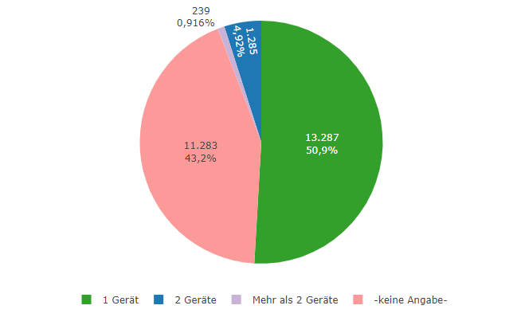
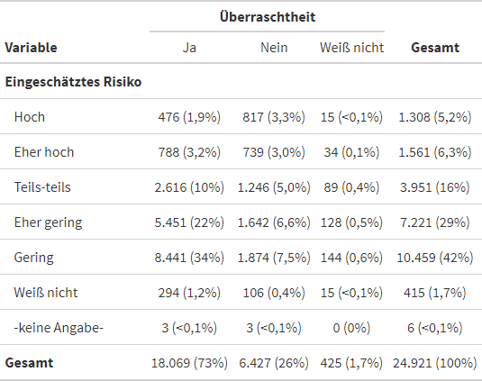
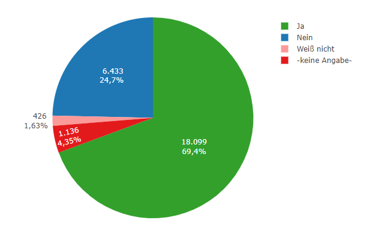
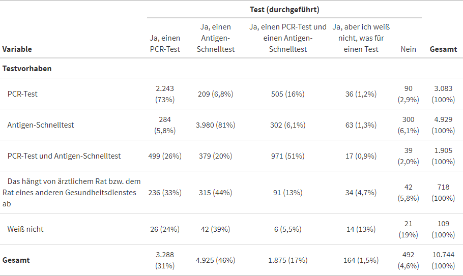

In zweiten Teil der Analyse der ereignisbezogenen Online-Befragung (Even-Driven-User-Survey, kurz EDUS) geht es um die Frage: Welchen Überraschungseffekt („Überraschtheit“)  hatte die „rote Warnung“ auf die Nutzerinnen und Nutzer der Corona-Warn-App – und wie sich dadurch ihr Verhalten geändert hat. Außerdem liefert die Evaluation weitere Erkenntnisse über den Beitrag der Corona-Warn-App bei der Eindämmung der SARS-CoV-2-Pandemie.  &nbsp;

<!-- overview -->

1. [Das Wichtigste in Kürze: Zahlen, Daten, Fakten](#1-das-wichtigste-in-kürze-zahlen-daten-fakten)
1. [Erweiterung der Basisbefragung](#2-erweiterung-der-basisbefragung)
1. [Aktivität der Risikoermittlung](#3-aktivität-der-risikoermittlung)
1. [Überraschtheit](#4-überraschtheit)
    1. [Überraschtheit: Gründe](#41-überraschtheit-gründe) 
    1. [Zusammenhang zwischen Überraschtheit und durchgeführten Tests](#42-zusammenhang-zwischen-überraschtheit-und-durchgeführten-tests) 
    1. [Zusammenhang zwischen Überraschtheit und Kontaktaufnahme zum Gesundheitswesen](#43-zusammenhang-zwischen-überraschtheit-und-kontaktaufnahme-zum-gesundheitswesen)
    1. [Zusammenhang zwischen Überraschtheit und Infektion](#44-zusammenhang-zwischen-überraschtheit-und-infektion)
    1. [Zusammenhang zwischen Überraschtheit, Infektion und Kontaktaufnahme zum Gesundheitswesen](#45-zusammenhang-zwischen-überraschtheit-infektion-und-kontaktaufnahme-zum-gesundheitswesen)
1. [Testung](#5-testung)
    1. [Testvorhaben](#51-testvorhaben)
    1. [Testteilung](#52-testteilung)
    1. [Übersicht zum Gesamttestprozess](#53-übersicht-zum-gesamttestprozess)
1. [Symptome](#6-symptome)
1. [Was nehmen wir aus der ereignisbezogenen Befragung (EDUS) mit?](#7-was-nehmen-wir-aus-der-ereignisbezogenen-befragung-edus-mit)
1. [So geht es weiter](#8-so-geht-es-weiter)

## 1 Das Wichtigste in Kürze: Zahlen, Daten, Fakten

Der zweite Teil der ereignisbezogenen Befragung (EDUS) hat u.a. ergeben, dass

- ein signifikanter Anteil der Befragten (72,5%) von der „roten Warnung“ überrascht war.
- die Befragten ihre Testergebnisse meistens innerhalb von 24 Stunden über die App erhielten
- durch die Teilung positiver Testergebnisse in der App weitere Personen zeitnah gewarnt wurden, wobei das erhöhte Infektionsrisiko ohne die Corona-Warn-App nicht hätte erkannt werden können.
- der Großteil der Teilnehmenden nach einer „roten Warnung“ anschließend weitere Verhaltensmaßnahmen durchgesetzt hat, um der Ausbreitung des Virus entgegenzuwirken.
- die Corona-Warn-App den Zweck der frühzeitigen Warnung und Unterstützung bei der Beendigung von Infektionsketten erfüllt.

## 2 Erweiterung der Basisbefragung

Während der Feldlaufzeit von EDUS zwischen März und Mai 2021 wurde eine Basis- und eine Folgebefragung durchgeführt. Am 07. April 2021 wurde eine zusätzliche Frage in die Basisbefragung integriert. Gefragt wurde, auf wie vielen Geräten die Befragten die Corona-Warn-App installiert haben. Hintergrund der Frage ist die Vermutung, dass viele Nutzende die Corona-Warn-App auf mehreren Geräten installiert haben könnten. So wäre neben privaten Geräten (Smartphone und/oder Tablet) die Nutzung von einem oder mehreren Dienstgeräten möglich. Eine Einschätzung über die Anzahl der Geräte pro Person, auf denen die Corona-Warn-App genutzt wird, kann zur Klärung der wichtigen Frage nach der Anzahl der aktiven Nutzenden beitragen. Ebenso ist es wichtig, einschätzen zu können, wie viele der Befragten zumindest theoretisch die Chance gehabt hätten, mehrmals an der Basisbefragung teilzunehmen, wenn sie etwa aufgrund einer Risikobegegnung eine „rote Warnung“ auf mehreren ihrer Geräte bekommen hätten. 

Die durch EDUS generierten Daten sprechen dafür, dass die Corona-Warn-App hauptsächlich auf einem Gerät genutzt wird. Ein kleiner Anteil gab an, die App auf zwei Geräten zu nutzen und ein wiederum sehr geringer Anteil von Befragten nutzt die Corona-Warn-App auf mehr als zwei Geräten. Die eher anekdotische Evidenz der großflächigen Mehrfachnutzung lässt sich mit den vorliegenden Daten nicht bestätigen. Die Anzahl der aktiven Geräte und die Anzahl der tatsächlichen Nutzenden dürften sich folglich nur zu einem geringen Maß unterscheiden. 

<figure>
    
    <figcaption aria-hidden="true"><em>Tab. 1: EDUS - Anzahl aktive Geräte</em></figcaption>
</figure>

Die Ergebnisse zeigen, dass nicht ausgeschlossen werden kann, dass einzelne Personen mehrfach an der Befragung teilnehmen konnten. Die Ermittlung der Anzahl der aktiven Nutzenden der Corona-Warn-App ist noch nicht abgeschlossen und wird in zukünftigen Beiträgen weiter thematisiert.

## 3 Aktivität der Risikoermittlung

<figure>
    
    <figcaption aria-hidden="true">
    <em>Abb. 1: CWA Startseite (Risiko-Ermittlung aktiv)</em>
    </figcaption>
</figure>

Ein weiterer wichtiger Aspekt der aktiven Nutzung der Corona-Warn-App ist die durchgängige Aktivität der Risiko-Ermittlung in der App. Diese kann von den Nutzenden beliebig an- und ausgeschaltet werden, wobei die Kernfunktionalität nur gegeben ist, wenn Kontakte detektiert werden können.

Die überwiegende Mehrheit der Befragten gab an, die App wie intendiert zu nutzen und die Risiko-Ermittlung durchgängig aktiviert zu haben. Nur wenige Befragte hatten laut eigenen Angaben die Ermittlung in weniger als der Hälfte der Zeit oder gar nicht aktiviert. 

Eine durchgängig aktivierte Risiko-Ermittlung stellt die Funktionalität der Warnung sicher, da die App so alle potenziell risikobehafteten Kontakte zwischen App-Nutzenden detektieren kann. Wenn die Risiko-Ermittlung innerhalb der vergangenen 14 Tage überhaupt nicht aktiviert war, kann auch keine Anzeige eines erhöhten Risikos erfolgen. Hierbei ist es möglich, dass die Frage nicht präzise genug formuliert war oder es zu Missverständnissen gekommen sein könnte. 

<figure>
    
    <figcaption aria-hidden="true"><em>Tab. 2: EDUS - Aktivschaltung Risikoermittlung</em></figcaption>
</figure>

Die Anzeige eines Risikos setzt voraus, dass Smartphones mit der App in den vergangenen 14 Tagen per Bluetooth Diagnoseschlüssel ausgetauscht und Nutzende einen positiven Test in der App registriert haben. Dies ist bei deaktivierter Risiko-Ermittlung nicht möglich. 

Diese Kernfunktion der Corona-Warn-App zeigt ihren Wert unter bestimmten Umständen am deutlichsten: immer dann, wenn die Nutzenden über das Risiko einer Situation nicht anderweitig informiert werden können.

## 4 Überraschtheit

Die Corona-Warn-App kann dazu beitragen, Infektionen zu vermeiden, indem sie Infektionsrisiken identifiziert, die sonst unerkannt geblieben wären. 

In der Basisbefragung wurde nach dem Überraschungseffekt („Überraschtheit“) gefragt, ob die Teilnehmenden von der Anzeige des erhöhten Risikos überrascht waren. Mit 72,5% gaben fast drei Viertel der Teilnehmenden an, von der roten Warnung überrascht worden zu sein.

<table class="table table-striped table-hover table-condensed table-responsive" style="margin-left: auto; margin-right: auto;">
<caption><em>Tab. 3: EDUS - Überraschtheit erhöhtes Risiko<thead>
<tr>
<th style="text-align:left;position: sticky; top:0; background-color: #FFFFFF;">
Wurden Sie von der Anzeige eines erhöhten Risikos überrascht?
</th>
<th style="text-align:right;position: sticky; top:0; background-color: #FFFFFF;">
Anzahl
</th>
<th style="text-align:right;position: sticky; top:0; background-color: #FFFFFF;">
Anteil
</th>
<th style="text-align:right;position: sticky; top:0; background-color: #FFFFFF;">
Anteil (gültig)
</th>
</tr>
</thead>
<tbody>
<tr>
<td style="text-align:left;">
Ja
</td>
<td style="text-align:right;">
18.099
</td>
<td style="text-align:right;">
69.4%
</td>
<td style="text-align:right;">
72.5%
</td>
</tr>
<tr>
<td style="text-align:left;">
Nein
</td>
<td style="text-align:right;">
6.433
</td>
<td style="text-align:right;">
24.7%
</td>
<td style="text-align:right;">
25.8%
</td>
</tr>
<tr>
<td style="text-align:left;">
Weiß nicht
</td>
<td style="text-align:right;">
426
</td>
<td style="text-align:right;">
1.6%
</td>
<td style="text-align:right;">
1.7%
</td>
</tr>
<tr>
<td style="text-align:left;">
-keine Angabe-
</td>
<td style="text-align:right;">
1.136
</td>
<td style="text-align:right;">
4.4%
</td>
<td style="text-align:right;">
<ul>
<li></li></ul></td>
</tr>
</tbody>
</table>

Von den 25,8%, die nicht überrascht waren, wussten die meisten von einer Infektion im eigenen und näheren sozialen Umfeld. Im persönlichen Umfeld kann sich die Information über eine Neuinfektion potenziell schneller verbreiten als bei Personen, die sich nur flüchtig oder nicht persönlich kennen. Es lässt sich beispielsweise annehmen, dass es Erkrankten leichter fällt, mit nahen Angehörigen über eine Infektion zu sprechen als mit anderen Personen. Aus diesem Grund werden nahe Angehörige potentiell eher über das Risiko einer vergangenen Begegnung informiert. Eine Erklärung dafür könnte sein, dass die eigene Gesundheit von vielen Personen als eine private Angelegenheit angesehen wird und im direkten Umfeld weniger negative Konsequenzen befürchtet werden müssen. Weiterhin ist das direkte Umfeld in der Regel schneller und unkomplizierter zu erreichen.

### 4.1 Überraschtheit: Gründe

Bei der Frage nach den Gründen konnten die Teilnehmenden mehrere Antworten auswählen. Die Ergebnisse zeigen, dass den nicht-überraschten Befragten am häufigsten ein positives Testergebnis im Familienkreis (40,2 %) bekannt war. Etwas weniger häufig wurden das Arbeitsumfeld (27,1 %) und der Freundeskreis (14,6 %) genannt. Während der Planung der Studie wurde angenommen, dass das Betreuungsumfeld von Kindern in diesem Zusammenhang eine größere Rolle spielen könnte. Die Ergebnisse konnten diese Hypothese nicht weiter bestätigen. Um die Frage trotz datensparsamen Ansatzes möglichst ausschöpfend zu stellen, wurde zusätzlich die Antwortkategorie „aus anderen Gründen“ zur Auswahl angeboten, die von 20,3 % der nicht-überraschten Befragten gewählt wurde. Dabei bleibt unklar, welche Gründe dies im Speziellen sind.

<table class="table table-striped table-hover table-condensed table-responsive" style="margin-left: auto; margin-right: auto;">
<caption><em>Tab. 4: EDUS - Grund Nicht-Überraschtheit erhöhtes Risiko</em></caption>
<thead>
<tr>
<th style="text-align:left;position: sticky; top:0; background-color: #FFFFFF;">
Warum wurden Sie von der Anzeige eines erhöhten Risikos nicht überrascht?
</th>
<th style="text-align:right;position: sticky; top:0; background-color: #FFFFFF;">
Anzahl
</th>
<th style="text-align:right;position: sticky; top:0; background-color: #FFFFFF;">
Anteil
</th>
</tr>
</thead>
<tbody>
<tr>
<td style="text-align:left;">
Da Personen im Freundeskreis vor kurzem positiv getestet wurden
</td>
<td style="text-align:right;">
936
</td>
<td style="text-align:right;">
14,6%
</td>
</tr>
<tr>
<td style="text-align:left;">
Da Personen im Familienkreis vor kurzem positiv getestet wurden
</td>
<td style="text-align:right;">
2.583
</td>
<td style="text-align:right;">
40,2%
</td>
</tr>
<tr>
<td style="text-align:left;">
Da Personen auf der Arbeit vor kurzem positiv getestet wurden
</td>
<td style="text-align:right;">
1.741
</td>
<td style="text-align:right;">
27,1%
</td>
</tr>
<tr>
<td style="text-align:left;">
Da Personen im Betreuungsumfeld meiner Kinder vor kurzem positiv getestet wurden
</td>
<td style="text-align:right;">
95
</td>
<td style="text-align:right;">
1,5%
</td>
</tr>
<tr>
<td style="text-align:left;">
Aus anderen Gründen
</td>
<td style="text-align:right;">
1.307
</td>
<td style="text-align:right;">
20,3%
</td>
</tr>
<tr>
<td style="text-align:left;">
Weiß nicht
</td>
<td style="text-align:right;">
93
</td>
<td style="text-align:right;">
1,4%
</td>
</tr>
</tbody>
</table>

Auf Basis der Antworten lässt sich annehmen, dass die Corona-Warn-App dabei hilft, Risiken aufzudecken, die außerhalb des unmittelbaren sozialen Umfeldes aufgetreten sind. Teilnehmende, die von der roten Warnung überrascht wurden, hätten ohne die App möglicherweise keinen Hinweis auf ein erhöhtes Risiko erhalten. Je höher die Teilnehmenden ihr Risiko für eine Infektion vor der Warnmeldung einschätzten, desto geringer war der Anteil derjenigen, die von der Warnung überrascht waren.

<figure>
    
    <figcaption aria-hidden="true"><em>Tab. 5: EDUS - Zusammenhang zwischen Risiko und Überraschtheit.</em></figcaption>
</figure>

### 4.2 Zusammenhang zwischen Überraschtheit und durchgeführten Tests

Überraschte Teilnehmende entschieden sich häufiger für einem Antigen-Schnelltest und machten geringfügig häufiger gar keinen Test als nicht-überraschte Befragte. Es sind viele weitere Erklärungen für das Verhalten der Befragten denkbar.

<figure>
    
    <figcaption aria-hidden="true"><em>Tab. 6: EDUS - Zusammenhang zwischen Überraschtheit und Testung</em></figcaption>
</figure>

### 4.3 Zusammenhang zwischen Überraschtheit und Kontaktaufnahme zum Gesundheitswesen

Befragte, die von der Warnung überrascht wurden, gaben seltener an, den Kontakt zum Gesundheitswesen suchen zu wollen als Teilnehmende, die nicht überrascht waren. Die genauen Gründe dafür sind unklar. Es lohnt sich jedoch den Zeitpunkt der Befragung zu berücksichtigen. Beide Fragen stammen aus der Basisbefragung. Sie wurden den Teilnehmenden in einer Situation gestellt, die mit vielen Unsicherheiten verbunden war. Personen, die zudem unvorbereitet mit einem Infektionsrisiko konfrontiert worden sind, reagieren möglicherweise insgesamt anders als solche, die etwa Warnzeichen aus ihrem sozialen Umfeld signalisiert bekommen haben.

Von denen, die Kontakt aufnehmen wollten, berichteten die meisten, dass sie sich an die oder den Hausärztin/-arzt (55,2 %) wenden wollten. Auch hier konnten die Befragten mehrere Antworten auswählen. Der Kontakt zum Gesundheitsamt (43,4 %) wurde seltener angegeben. Die Nummer des ärztlichen Bereitschaftsdienstes und die Krankenhäuser spielten in der Befragung eine untergeordnete Rolle. Die Daten zeigen, dass die rote Warnung der Corona-Warn-App einen begründeten Anfangsverdacht für die Nutzenden darstellen kann, auf Basis dessen diese sich hauptsächlich über Ärztinnen und Ärzte an das Gesundheitswesen wenden. Eine Infektion würde in diesem Fall erst durch einen angeordneten Test bekannt werden. Vermehrte begründete Tests bei Verdachtsfällen tragen dazu bei, Infektionsketten zu verhindern. Die Corona-Warn-App fungiert vor allem bei Kontakt mit einer unbekannten infizierten Person als Frühwarnsystem. Somit kann auf notwendige Testung hingewiesen und zur Effizienz von Teststrategien beigetragen werden.

<table class="table table-striped table-hover table-condensed table-responsive" style="margin-left: auto; margin-right: auto;">
<caption><em>Tab. 7: EDUS - Kontaktaufnahme Gesundheitswesen</em></caption>
<thead>
<tr>
<th style="text-align:left;position: sticky; top:0; background-color: #FFFFFF;">
Werden Sie jetzt Kontakt mit dem Gesundheitswesen aufnehmen?
</th>
<th style="text-align:right;position: sticky; top:0; background-color: #FFFFFF;">
Anzahl
</th>
<th style="text-align:right;position: sticky; top:0; background-color: #FFFFFF;">
Anteil
</th>
<th style="text-align:right;position: sticky; top:0; background-color: #FFFFFF;">
Anteil (gültig)
</th>
</tr>
</thead>
<tbody>
<tr>
<td style="text-align:left;">
Ja
</td>
<td style="text-align:right;">
9.168
</td>
<td style="text-align:right;">
35.1%
</td>
<td style="text-align:right;">
36.8%
</td>
</tr>
<tr>
<td style="text-align:left;">
Nein
</td>
<td style="text-align:right;">
12.708
</td>
<td style="text-align:right;">
48.7%
</td>
<td style="text-align:right;">
51.0%
</td>
</tr>
<tr>
<td style="text-align:left;">
Weiß nicht
</td>
<td style="text-align:right;">
3.048
</td>
<td style="text-align:right;">
11.7%
</td>
<td style="text-align:right;">
12.2%
</td>
</tr>
<tr>
<td style="text-align:left;">
-keine Angabe-
</td>
<td style="text-align:right;">
1.170
</td>
<td style="text-align:right;">
4.5%
</td>
<td style="text-align:right;">
<ul>
<li></li></ul></td>
</tr>
</tbody>
</table>

<table class="table table-striped table-hover table-condensed table-responsive" style="margin-left: auto; margin-right: auto;">
<caption><em>Tab. 8: EDUS - Kontaktaufnahme konkrete Stelle</em></caption>
<thead>
<tr>
<th style="text-align:left;position: sticky; top:0; background-color: #FFFFFF;">
Mit wem werden Sie den Kontakt aufnehmen?
</th>
<th style="text-align:right;position: sticky; top:0; background-color: #FFFFFF;">
Anzahl
</th>
<th style="text-align:right;position: sticky; top:0; background-color: #FFFFFF;">
Anteil
</th>
</tr>
</thead>
<tbody>
<tr>
<td style="text-align:left;">
Ich kontaktiere meinen Hausarzt / meine Hausärztin
</td>
<td style="text-align:right;">
5.058
</td>
<td style="text-align:right;">
55,2%
</td>
</tr>
<tr>
<td style="text-align:left;">
Ich kontaktiere das zuständige Gesundheitsamt
</td>
<td style="text-align:right;">
3.978
</td>
<td style="text-align:right;">
43,4%
</td>
</tr>
<tr>
<td style="text-align:left;">
Ich rufe die zentrale Nummer 116 117 an
</td>
<td style="text-align:right;">
2.284
</td>
<td style="text-align:right;">
24,9%
</td>
</tr>
<tr>
<td style="text-align:left;">
Ich gehe in ein Krankenhaus
</td>
<td style="text-align:right;">
194
</td>
<td style="text-align:right;">
2,1%
</td>
</tr>
<tr>
<td style="text-align:left;">
Weiß nicht
</td>
<td style="text-align:right;">
502
</td>
<td style="text-align:right;">
5,5%
</td>
</tr>
</tbody>
</table>

<figure>
    
    <figcaption aria-hidden="true"><em>Abb. 2: EDUS - Zusammenhang zwischen Überraschtheit und Kontaktvorhaben zum Gesundheitswesen.</em></figcaption>
</figure>

<table class="gt_table">
  <caption><em>Tab. 9: EDUS - Zusammenhang zwischen Überraschtheit und Kontaktvorhaben zum Gesundheitswesen.</em></caption>
  <thead class="gt_col_headings">
    <tr>
      <th class="gt_col_heading gt_columns_bottom_border gt_left" rowspan="2" colspan="1"><strong>Variable</strong></th>
      <th class="gt_center gt_columns_top_border gt_column_spanner_outer" rowspan="1" colspan="3">
        <strong>Kontaktaufnahme (Gesundheitswesen)</strong>
      </th>
      <th class="gt_col_heading gt_columns_bottom_border gt_center" rowspan="2" colspan="1"><strong>Gesamt</strong></th>
    </tr>
    <tr>
      <th class="gt_col_heading gt_columns_bottom_border gt_center" rowspan="1" colspan="1">Ja</th>
      <th class="gt_col_heading gt_columns_bottom_border gt_center" rowspan="1" colspan="1">Nein</th>
      <th class="gt_col_heading gt_columns_bottom_border gt_center" rowspan="1" colspan="1">Weiß nicht</th>
    </tr>
  </thead>
  <tbody class="gt_table_body">
    <tr><td class="gt_row gt_left" style="font-weight: bold;">Überraschtheit</td>
<td class="gt_row gt_center"></td>
<td class="gt_row gt_center"></td>
<td class="gt_row gt_center"></td>
<td class="gt_row gt_center"></td></tr>
    <tr><td class="gt_row gt_left" style="text-align: left; text-indent: 10px;">Ja</td>
<td class="gt_row gt_center">6.127 (25%)</td>
<td class="gt_row gt_center">9.432 (38%)</td>
<td class="gt_row gt_center">2.510 (10%)</td>
<td class="gt_row gt_center">18.069 (73%)</td></tr>
    <tr><td class="gt_row gt_left" style="text-align: left; text-indent: 10px;">Nein</td>
<td class="gt_row gt_center">2.908 (12%)</td>
<td class="gt_row gt_center">3.072 (12%)</td>
<td class="gt_row gt_center">447 (1,8%)</td>
<td class="gt_row gt_center">6.427 (26%)</td></tr>
    <tr><td class="gt_row gt_left" style="text-align: left; text-indent: 10px;">Weiß nicht</td>
<td class="gt_row gt_center">132 (0,5%)</td>
<td class="gt_row gt_center">202 (0,8%)</td>
<td class="gt_row gt_center">91 (0,4%)</td>
<td class="gt_row gt_center">425 (1,7%)</td></tr>
    <tr><td class="gt_row gt_left" style="font-weight: bold;">Gesamt</td>
<td class="gt_row gt_center">9.167 (37%)</td>
<td class="gt_row gt_center">12.706 (51%)</td>
<td class="gt_row gt_center">3.048 (12%)</td>
<td class="gt_row gt_center">24.921 (100%)</td></tr>
  </tbody>
</table>

### 4.4 Zusammenhang zwischen Überraschtheit und Infektion

Überraschte Befragte wurden seltener positiv auf SARS-CoV-2 getestet als solche, die von der roten Warnung nicht überrascht worden sind. Wie schon gezeigt werden konnte, wussten nicht-überraschte Befragte in der Regel von Infektionen aus dem näheren sozialen Umfeld.

Im Familien-, Freundes- und Arbeitskreis ist es oftmals nicht möglich durchweg ausreichend Abstand zu halten und die Hygieneregeln vollends einzuhalten. Die Umsetzung der Schutzmaßnahmen fällt bei flüchtigen Bekanntschaften oder bei Fremden leichter, wenn man bspw. an Begegnungen im öffentlichen Nahverkehr oder beim Einkaufen denkt. Diese Umstände könnten den Unterschied der Testergebnisse in den Gruppen erklären, wenn angenommen wird, dass die Zusammenkünfte mit Personen aus dem eigenen Umfeld eine höhere Wahrscheinlichkeit für die Übertragung der Krankheit bieten. 

<figure>
    
    <figcaption aria-hidden="true"><em>Abb. 3: EDUS - Zusammenhang zwischen Überraschtheit und Infektion.</em></figcaption>
</figure>

<table class="gt_table">
  <caption><em>Tab. 10: EDUS - Zusammenhang zwischen Überraschtheit und Infektion</em></caption>
  <thead class="gt_col_headings">
    <tr>
      <th class="gt_col_heading gt_columns_bottom_border gt_left" rowspan="2" colspan="1"><strong>Variable</strong></th>
      <th class="gt_center gt_columns_top_border gt_column_spanner_outer" rowspan="1" colspan="4">
        <strong>Infektion</strong>
      </th>
      <th class="gt_col_heading gt_columns_bottom_border gt_center" rowspan="2" colspan="1"><strong>Gesamt</strong></th>
    </tr>
    <tr>
      <th class="gt_col_heading gt_columns_bottom_border gt_center" rowspan="1" colspan="1">Positiv auf SARS-CoV-2</th>
      <th class="gt_col_heading gt_columns_bottom_border gt_center" rowspan="1" colspan="1">Negativ auf SARS-CoV-2</th>
      <th class="gt_col_heading gt_columns_bottom_border gt_center" rowspan="1" colspan="1">Nicht eindeutig</th>
      <th class="gt_col_heading gt_columns_bottom_border gt_center" rowspan="1" colspan="1">-keine Angabe-</th>
    </tr>
  </thead>
  <tbody class="gt_table_body">
    <tr><td class="gt_row gt_left" style="font-weight: bold;">Überraschtheit</td>
<td class="gt_row gt_center"></td>
<td class="gt_row gt_center"></td>
<td class="gt_row gt_center"></td>
<td class="gt_row gt_center"></td>
<td class="gt_row gt_center"></td></tr>
    <tr><td class="gt_row gt_left" style="text-align: left; text-indent: 10px;">Ja</td>
<td class="gt_row gt_center">191 (0,8%)</td>
<td class="gt_row gt_center">9.562 (38%)</td>
<td class="gt_row gt_center">54 (0,2%)</td>
<td class="gt_row gt_center">8.262 (33%)</td>
<td class="gt_row gt_center">18.069 (73%)</td></tr>
    <tr><td class="gt_row gt_left" style="text-align: left; text-indent: 10px;">Nein</td>
<td class="gt_row gt_center">590 (2,4%)</td>
<td class="gt_row gt_center">2.853 (11%)</td>
<td class="gt_row gt_center">36 (0,1%)</td>
<td class="gt_row gt_center">2.948 (12%)</td>
<td class="gt_row gt_center">6.427 (26%)</td></tr>
    <tr><td class="gt_row gt_left" style="text-align: left; text-indent: 10px;">Weiß nicht</td>
<td class="gt_row gt_center">10 (&lt;0,1%)</td>
<td class="gt_row gt_center">185 (0,7%)</td>
<td class="gt_row gt_center">2 (&lt;0,1%)</td>
<td class="gt_row gt_center">228 (0,9%)</td>
<td class="gt_row gt_center">425 (1,7%)</td></tr>
    <tr><td class="gt_row gt_left" style="font-weight: bold;">Gesamt</td>
<td class="gt_row gt_center">791 (3,2%)</td>
<td class="gt_row gt_center">12.600 (51%)</td>
<td class="gt_row gt_center">92 (0,4%)</td>
<td class="gt_row gt_center">11.438 (46%)</td>
<td class="gt_row gt_center">24.921 (100%)</td></tr>
  </tbody>
  
  
</table>

### 4.5 Zusammenhang zwischen Überraschtheit, Infektion und Kontaktaufnahme zum Gesundheitswesen

Die Zusammenhänge zwischen der Überraschtheit, Infektion und Kontaktaufnahme zum Gesundheitswesen lassen sich in einer einzigen Grafik zusammenfassen.

<figure>
    
    <figcaption aria-hidden="true"><em>Abb. 4: EDUS - Zusammenhang zwischen Überraschtheit, Kontaktvorhaben zum Gesundheitswesen und Infektion.</em></figcaption>
</figure>

## 5 Testung

Ein Kernthema der Basis- und Folgebefragung war die Testung auf SARS-CoV-2. In der Basisbefragung wurde vor allem die Test-Intention behandelt, um in der Folgebefragung auf die tatsächlichen Testungen einzugehen. 

### 5.1 Testvorhaben

In der Basisbefragung (direkt nach der roten Warnung) gaben etwas mehr als zwei Drittel der Befragten an, einen Test machen zu wollen (68,2 %). Weitere 16,6 % machen die Entscheidung vom ärztlichen Rat bzw. dem Rat eines anderen Gesundheitsdienstes abhängig. Ein geringer Anteil an Befragten wusste die Antwort nicht (4,2 %) und 11,1% der Teilnehmenden gaben an, keinen Test machen zu wollen.

<svg class="main-svg" xmlns="http://www.w3.org/2000/svg" xmlns:xlink="http://www.w3.org/1999/xlink" width="600" height="450" style="background: rgb(255, 255, 255);"><defs id="defs-a9c52d"><g class="clips"></g><g class="gradients"></g></defs><g class="bglayer"></g><g class="draglayer"></g><g class="layer-below"><g class="imagelayer"></g><g class="shapelayer"></g></g><g class="cartesianlayer"></g><g class="polarlayer"></g><g class="ternarylayer"></g><g class="geolayer"></g><g class="funnelarealayer"></g><g class="pielayer"><g class="trace" stroke-linejoin="round" style="opacity: 1;"><g class="slice"><path class="surface" d="M325,166l0,-141a141,141 0 1 1 -114.66512386164327,223.05430744204722Z" style="pointer-events: all; stroke-width: 0; fill: rgb(51, 160, 44); fill-opacity: 1; stroke: rgb(68, 68, 68); stroke-opacity: 1;"></path><g class="slicetext"><text data-notex="1" class="slicetext" transform="translate(387.7003362723525,195.1775608133572)" text-anchor="middle" data-unformatted="16.991 65,1%" data-math="N" x="0" y="0" style="font-family: &quot;Open Sans&quot;, verdana, arial, sans-serif; font-size: 12px; fill: rgb(255, 255, 255); fill-opacity: 1; white-space: pre;"><tspan class="line" dy="0em" x="0" y="0">16.991</tspan><tspan class="line" dy="1.3em" x="0" y="0">65,1%</tspan></text></g></g><g class="slice"><path class="surface" d="M325,166l-86.82521127948436,-111.09627665350853a141,141 0 0 1 86.82521127948436,-29.903723346491475Z" style="pointer-events: all; stroke-width: 0; fill: rgb(31, 120, 180); fill-opacity: 1; stroke: rgb(68, 68, 68); stroke-opacity: 1;"></path><g class="slicetext"><text data-notex="1" class="slicetext" transform="translate(290.36369863090255,62.37910041107564)" text-anchor="middle" data-unformatted=" 2.755 10,6%" data-math="N" x="0" y="0" style="font-family: &quot;Open Sans&quot;, verdana, arial, sans-serif; font-size: 12px; fill: rgb(255, 255, 255); fill-opacity: 1; white-space: pre;"><tspan class="line" dy="0em" x="0" y="0"> 2.755</tspan><tspan class="line" dy="1.3em" x="0" y="0">10,6%</tspan></text></g></g><g class="slice"><path class="surface" d="M325,166l-140.46910901063262,12.224132433797292a141,141 0 0 1 53.64389773114826,-123.32040908730582Z" style="pointer-events: all; stroke-width: 0; fill: rgb(202, 178, 214); fill-opacity: 1; stroke: rgb(68, 68, 68); stroke-opacity: 1;"></path><g class="slicetext"><text data-notex="1" class="slicetext" transform="translate(237.45327999397813,124.86283021293846)" text-anchor="middle" data-unformatted=" 4.129 15,8%" data-math="N" x="0" y="0" style="font-family: &quot;Open Sans&quot;, verdana, arial, sans-serif; font-size: 12px; fill: rgb(68, 68, 68); fill-opacity: 1; white-space: pre;"><tspan class="line" dy="0em" x="0" y="0"> 4.129</tspan><tspan class="line" dy="1.3em" x="0" y="0">15,8%</tspan></text></g></g><g class="slice"><path class="surface" d="M325,166l-132.91160023031418,47.069167447673735a141,141 0 0 1 -7.557508780318443,-34.84503501387644Z" style="pointer-events: all; stroke-width: 0; fill: rgb(251, 154, 153); fill-opacity: 1; stroke: rgb(68, 68, 68); stroke-opacity: 1;"></path><g class="slicetext"><text data-notex="1" class="slicetext" transform="translate(159.58269018239406,193.5081806248906)" text-anchor="middle" data-unformatted=" 1.053 4,04%" data-math="N" x="0" y="0" style="font-family: &quot;Open Sans&quot;, verdana, arial, sans-serif; font-size: 12px; fill: rgb(68, 68, 68); fill-opacity: 1; white-space: pre;"><tspan class="line" dy="0em" x="0" y="0"> 1.053</tspan><tspan class="line" dy="1.3em" x="0" y="0">4,04%</tspan></text></g></g><g class="slice"><path class="surface" d="M325,166l-114.6651238616433,82.0543074420472a141,141 0 0 1 -18.246476368670884,-34.98513999437347Z" style="pointer-events: all; stroke-width: 0; fill: rgb(227, 26, 28); fill-opacity: 1; stroke: rgb(68, 68, 68); stroke-opacity: 1;"></path><g class="slicetext"><text data-notex="1" class="slicetext" transform="translate(172.3607132414111,231.3678363308869)" text-anchor="middle" data-unformatted=" 1.166 4,47%" data-math="N" x="0" y="0" style="font-family: &quot;Open Sans&quot;, verdana, arial, sans-serif; font-size: 12px; fill: rgb(68, 68, 68); fill-opacity: 1; white-space: pre;"><tspan class="line" dy="0em" x="0" y="0"> 1.166</tspan><tspan class="line" dy="1.3em" x="0" y="0">4,47%</tspan></text></g></g></g></g><g class="treemaplayer"></g><g class="sunburstlayer"></g><g class="glimages"></g></svg>

<svg class="main-svg" xmlns="http://www.w3.org/2000/svg" xmlns:xlink="http://www.w3.org/1999/xlink" width="600" height="450"><defs id="topdefs-a9c52d"><g class="clips"></g><clipPath id="legenda9c52d"><rect width="548" height="105" x="0" y="0"></rect></clipPath></defs><g class="indicatorlayer"></g><g class="layer-above"><g class="imagelayer"></g><g class="shapelayer"></g></g><g class="infolayer"><g class="legend" pointer-events="all" transform="translate(51, 335.20000000000005)"><rect class="bg" shape-rendering="crispEdges" style="stroke: rgb(68, 68, 68); stroke-opacity: 1; fill: rgb(255, 255, 255); fill-opacity: 1; stroke-width: 0px;" width="548" height="105" x="0" y="0"></rect><g class="scrollbox" transform="translate(0, 0)" clip-path="url('#legenda9c52d')"><g class="groups"><g class="traces" transform="translate(0, 14.5)" style="opacity: 1;"><text class="legendtext" text-anchor="start" x="40" y="4.680000000000001" data-unformatted="Ja" data-math="N" style="font-family: &quot;Open Sans&quot;, verdana, arial, sans-serif; font-size: 12px; fill: rgb(68, 68, 68); fill-opacity: 1; white-space: pre;">Ja</text><g class="layers" style="opacity: 1;"><g class="legendfill"></g><g class="legendlines"></g><g class="legendsymbols"><g class="legendpoints"><path class="legendpie" d="M6,6H-6V-6H6Z" transform="translate(20,0)" style="stroke-width: 0; fill: rgb(51, 160, 44); fill-opacity: 1; stroke: rgb(68, 68, 68); stroke-opacity: 1;"></path></g></g></g><rect class="legendtoggle" pointer-events="all" x="0" y="-9.5" width="55.171875" height="19" style="cursor: pointer; fill: rgb(0, 0, 0); fill-opacity: 0;"></rect></g><g class="traces" transform="translate(0, 33.5)" style="opacity: 1;"><text class="legendtext" text-anchor="start" x="40" y="4.680000000000001" data-unformatted="Nein" data-math="N" style="font-family: &quot;Open Sans&quot;, verdana, arial, sans-serif; font-size: 12px; fill: rgb(68, 68, 68); fill-opacity: 1; white-space: pre;">Nein</text><g class="layers" style="opacity: 1;"><g class="legendfill"></g><g class="legendlines"></g><g class="legendsymbols"><g class="legendpoints"><path class="legendpie" d="M6,6H-6V-6H6Z" transform="translate(20,0)" style="stroke-width: 0; fill: rgb(31, 120, 180); fill-opacity: 1; stroke: rgb(68, 68, 68); stroke-opacity: 1;"></path></g></g></g><rect class="legendtoggle" pointer-events="all" x="0" y="-9.5" width="69.515625" height="19" style="cursor: pointer; fill: rgb(0, 0, 0); fill-opacity: 0;"></rect></g><g class="traces" transform="translate(0, 52.5)" style="opacity: 1;"><text class="legendtext" text-anchor="start" x="40" y="4.680000000000001" data-unformatted="Das hängt von ärztlichem Rat bzw. dem Rat eines anderen Gesundheitsdienstes ab" data-math="N" style="font-family: &quot;Open Sans&quot;, verdana, arial, sans-serif; font-size: 12px; fill: rgb(68, 68, 68); fill-opacity: 1; white-space: pre;">Das hängt von ärztlichem Rat bzw. dem Rat eines anderen Gesundheitsdienstes ab</text><g class="layers" style="opacity: 1;"><g class="legendfill"></g><g class="legendlines"></g><g class="legendsymbols"><g class="legendpoints"><path class="legendpie" d="M6,6H-6V-6H6Z" transform="translate(20,0)" style="stroke-width: 0; fill: rgb(202, 178, 214); fill-opacity: 1; stroke: rgb(68, 68, 68); stroke-opacity: 1;"></path></g></g></g><rect class="legendtoggle" pointer-events="all" x="0" y="-9.5" width="545.3125" height="19" style="cursor: pointer; fill: rgb(0, 0, 0); fill-opacity: 0;"></rect></g><g class="traces" transform="translate(0, 71.5)" style="opacity: 1;"><text class="legendtext" text-anchor="start" x="40" y="4.680000000000001" data-unformatted="Weiß nicht" data-math="N" style="font-family: &quot;Open Sans&quot;, verdana, arial, sans-serif; font-size: 12px; fill: rgb(68, 68, 68); fill-opacity: 1; white-space: pre;">Weiß nicht</text><g class="layers" style="opacity: 1;"><g class="legendfill"></g><g class="legendlines"></g><g class="legendsymbols"><g class="legendpoints"><path class="legendpie" d="M6,6H-6V-6H6Z" transform="translate(20,0)" style="stroke-width: 0; fill: rgb(251, 154, 153); fill-opacity: 1; stroke: rgb(68, 68, 68); stroke-opacity: 1;"></path></g></g></g><rect class="legendtoggle" pointer-events="all" x="0" y="-9.5" width="105.9375" height="19" style="cursor: pointer; fill: rgb(0, 0, 0); fill-opacity: 0;"></rect></g><g class="traces" transform="translate(0, 90.5)" style="opacity: 1;"><text class="legendtext" text-anchor="start" x="40" y="4.680000000000001" data-unformatted="-keine Angabe-" data-math="N" style="font-family: &quot;Open Sans&quot;, verdana, arial, sans-serif; font-size: 12px; fill: rgb(68, 68, 68); fill-opacity: 1; white-space: pre;">-keine Angabe-</text><g class="layers" style="opacity: 1;"><g class="legendfill"></g><g class="legendlines"></g><g class="legendsymbols"><g class="legendpoints"><path class="legendpie" d="M6,6H-6V-6H6Z" transform="translate(20,0)" style="stroke-width: 0; fill: rgb(227, 26, 28); fill-opacity: 1; stroke: rgb(68, 68, 68); stroke-opacity: 1;"></path></g></g></g><rect class="legendtoggle" pointer-events="all" x="0" y="-9.5" width="135.015625" height="19" style="cursor: pointer; fill: rgb(0, 0, 0); fill-opacity: 0;"></rect></g></g></g><rect class="scrollbar" rx="20" ry="3" width="0" height="0" style="fill: rgb(128, 139, 164); fill-opacity: 1;" x="0" y="0"></rect></g><g class="g-gtitle"><text class="gtitle" x="0" y="12.5" text-anchor="start" dy="0em" data-unformatted="EDUS Testvorhaben" data-math="N" style="font-family: &quot;Open Sans&quot;, verdana, arial, sans-serif; font-size: 17px; fill: rgb(68, 68, 68); opacity: 1; font-weight: normal; white-space: pre;">EDUS Testvorhaben</text></g></g><g class="menulayer"></g><g class="zoomlayer"></g></svg>

<a rel="tooltip" class="modebar-btn" data-title="Graphen als PNG herunterladen" data-toggle="false" data-gravity="n"><svg viewBox="0 0 1000 1000" class="icon" height="1em" width="1em"><path d="m500 450c-83 0-150-67-150-150 0-83 67-150 150-150 83 0 150 67 150 150 0 83-67 150-150 150z m400 150h-120c-16 0-34 13-39 29l-31 93c-6 15-23 28-40 28h-340c-16 0-34-13-39-28l-31-94c-6-15-23-28-40-28h-120c-55 0-100-45-100-100v-450c0-55 45-100 100-100h800c55 0 100 45 100 100v450c0 55-45 100-100 100z m-400-550c-138 0-250 112-250 250 0 138 112 250 250 250 138 0 250-112 250-250 0-138-112-250-250-250z m365 380c-19 0-35 16-35 35 0 19 16 35 35 35 19 0 35-16 35-35 0-19-16-35-35-35z" transform="matrix(1 0 0 -1 0 850)"></path></svg></a>

<a rel="tooltip" class="modebar-btn active" data-title="Anzeige der nähesten Daten an-/abschalten" data-attr="hovermode" data-val="closest" data-toggle="false" data-gravity="ne"><svg viewBox="0 0 1500 1000" class="icon" height="1em" width="1em"><path d="m375 725l0 0-375-375 375-374 0-1 1125 0 0 750-1125 0z" transform="matrix(1 0 0 -1 0 850)"></path></svg></a>

<a href="https://plotly.com/" target="_blank" data-title="Erstellt mit Plotly" class="modebar-btn plotlyjsicon modebar-btn--logo"><svg xmlns="http://www.w3.org/2000/svg" viewBox="0 0 132 132" height="1em" width="1em"><defs></defs><title>plotly-logomark</title><g id="symbol"><rect class="cls-1" width="132" height="132" rx="6" ry="6"></rect><circle class="cls-2" cx="78" cy="54" r="6"></circle><circle class="cls-2" cx="102" cy="30" r="6"></circle><circle class="cls-2" cx="78" cy="30" r="6"></circle><circle class="cls-2" cx="54" cy="30" r="6"></circle><circle class="cls-2" cx="30" cy="30" r="6"></circle><circle class="cls-2" cx="30" cy="54" r="6"></circle><path class="cls-3" d="M30,72a6,6,0,0,0-6,6v24a6,6,0,0,0,12,0V78A6,6,0,0,0,30,72Z"></path><path class="cls-3" d="M78,72a6,6,0,0,0-6,6v24a6,6,0,0,0,12,0V78A6,6,0,0,0,78,72Z"></path><path class="cls-3" d="M54,48a6,6,0,0,0-6,6v48a6,6,0,0,0,12,0V54A6,6,0,0,0,54,48Z"></path><path class="cls-3" d="M102,48a6,6,0,0,0-6,6v48a6,6,0,0,0,12,0V54A6,6,0,0,0,102,48Z"></path></g></svg></a>

<svg class="main-svg" xmlns="http://www.w3.org/2000/svg" xmlns:xlink="http://www.w3.org/1999/xlink" width="600" height="450"><g class="hoverlayer"></g></svg>

<em>Abb. 5: EDUS - Testvorhaben</em>

<table class="table table-striped table-hover table-condensed table-responsive" style="margin-left: auto; margin-right: auto;">
<caption><em>Tab. 11: EDUS - Testabsicht</em></caption>
<thead>
<tr>
<th style="text-align:left;position: sticky; top:0; background-color: #FFFFFF;">
Werden Sie einen SARS-CoV-2-Test machen?
</th>
<th style="text-align:right;position: sticky; top:0; background-color: #FFFFFF;">
Anzahl
</th>
<th style="text-align:right;position: sticky; top:0; background-color: #FFFFFF;">
Anteil
</th>
<th style="text-align:right;position: sticky; top:0; background-color: #FFFFFF;">
Anteil (gültig)
</th>
</tr>
</thead>
<tbody>
<tr>
<td style="text-align:left;">
Ja
</td>
<td style="text-align:right;">
16.991
</td>
<td style="text-align:right;">
65.1%
</td>
<td style="text-align:right;">
68.2%
</td>
</tr>
<tr>
<td style="text-align:left;">
Nein
</td>
<td style="text-align:right;">
2.755
</td>
<td style="text-align:right;">
10.6%
</td>
<td style="text-align:right;">
11.1%
</td>
</tr>
<tr>
<td style="text-align:left;">
Das hängt von ärztlichem Rat bzw. dem Rat eines anderen Gesundheitsdienstes ab
</td>
<td style="text-align:right;">
4.129
</td>
<td style="text-align:right;">
15.8%
</td>
<td style="text-align:right;">
16.6%
</td>
</tr>
<tr>
<td style="text-align:left;">
Weiß nicht
</td>
<td style="text-align:right;">
1.053
</td>
<td style="text-align:right;">
4.0%
</td>
<td style="text-align:right;">
4.2%
</td>
</tr>
<tr>
<td style="text-align:left;">
-keine Angabe-
</td>
<td style="text-align:right;">
1.166
</td>
<td style="text-align:right;">
4.5%
</td>
<td style="text-align:right;">
<ul>
<li></li></ul></td>
</tr>
</tbody>
</table>

Die Teilnehmenden, die in der Basisbefragung angaben, einen Test zu planen, wurden gefragt, welchen Test sie voraussichtlich machen werden. In den Antworten spielten die Antigen-Schnelltests die größte Rolle (44,6 %). Dagegen planten 29,5 % direkt einen genaueren PCR-Test ein. Beide genannten Testarten (Antigen- und PCR-Test) wollten 18,1 % der Befragten durchführen, weitere 6,7 % verließen sich erneut auf ärztlichen Rat und 1,2 % wussten die Antwort nicht. 

 

<svg class="main-svg" xmlns="http://www.w3.org/2000/svg" xmlns:xlink="http://www.w3.org/1999/xlink" width="600" height="450" style="background: rgb(255, 255, 255);"> <defs id="defs-b61ed8"><g class="clips"><clipPath id="clipb61ed8xyplot" class="plotclip"><rect width="530" height="265"></rect></clipPath><clipPath class="axesclip" id="clipb61ed8x"><rect x="60" y="0" width="530" height="450"></rect></clipPath><clipPath class="axesclip" id="clipb61ed8y"><rect x="0" y="25" width="600" height="265"></rect></clipPath><clipPath class="axesclip" id="clipb61ed8xy"><rect x="60" y="25" width="530" height="265"></rect></clipPath></g><g class="gradients"></g></defs><g class="bglayer"></g><g class="draglayer cursor-crosshair"><g class="xy"><rect class="nsewdrag drag" data-subplot="xy" x="60" y="25" width="530" height="265" style="fill: transparent; stroke-width: 0; pointer-events: all;"></rect><rect class="nwdrag drag cursor-nw-resize" data-subplot="xy" x="40" y="5" width="20" height="20" style="fill: transparent; stroke-width: 0; pointer-events: all;"></rect><rect class="nedrag drag cursor-ne-resize" data-subplot="xy" x="590" y="5" width="20" height="20" style="fill: transparent; stroke-width: 0; pointer-events: all;"></rect><rect class="swdrag drag cursor-sw-resize" data-subplot="xy" x="40" y="290" width="20" height="20" style="fill: transparent; stroke-width: 0; pointer-events: all;"></rect><rect class="sedrag drag cursor-se-resize" data-subplot="xy" x="590" y="290" width="20" height="20" style="fill: transparent; stroke-width: 0; pointer-events: all;"></rect><rect class="ewdrag drag cursor-ew-resize" data-subplot="xy" x="113" y="290.5" width="424" height="20" style="fill: transparent; stroke-width: 0; pointer-events: all;"></rect><rect class="wdrag drag cursor-w-resize" data-subplot="xy" x="60" y="290.5" width="53" height="20" style="fill: transparent; stroke-width: 0; pointer-events: all;"></rect><rect class="edrag drag cursor-e-resize" data-subplot="xy" x="537" y="290.5" width="53" height="20" style="fill: transparent; stroke-width: 0; pointer-events: all;"></rect><rect class="nsdrag drag cursor-ns-resize" data-subplot="xy" x="39.5" y="51.5" width="20" height="212" style="fill: transparent; stroke-width: 0; pointer-events: all;"></rect><rect class="sdrag drag cursor-s-resize" data-subplot="xy" x="39.5" y="263.5" width="20" height="26.5" style="fill: transparent; stroke-width: 0; pointer-events: all;"></rect><rect class="ndrag drag cursor-n-resize" data-subplot="xy" x="39.5" y="25" width="20" height="26.5" style="fill: transparent; stroke-width: 0; pointer-events: all;"></rect></g></g><g class="layer-below"><g class="imagelayer"></g><g class="shapelayer"></g></g><g class="cartesianlayer"><g class="subplot xy"><g class="layer-subplot"><g class="shapelayer"></g><g class="imagelayer"></g></g><g class="gridlayer"><g class="x"></g><g class="y"></g></g><g class="zerolinelayer"><path class="yzl zl crisp" transform="translate(0,290)" d="M60,0h530" style="stroke: rgb(68, 68, 68); stroke-opacity: 1; stroke-width: 1px;"></path></g><path class="xlines-below"></path><path class="ylines-below"></path><g class="overlines-below"></g><g class="xaxislayer-below"></g><g class="yaxislayer-below"></g><g class="overaxes-below"></g><g class="plot" transform="translate(60, 25)" clip-path="url('#clipb61ed8xyplot')"><g class="barlayer mlayer"><g class="trace bars" shape-rendering="crispEdges" style="opacity: 1;"><g class="points"><g class="point"><path d="M0.82,265V264H7.34V265Z" style="vector-effect: non-scaling-stroke; opacity: 1; stroke-width: 0px; fill: rgb(51, 160, 44); fill-opacity: 1;"></path></g><g class="point"><path d="M8.97,265V261.09H15.49V265Z" style="vector-effect: non-scaling-stroke; opacity: 1; stroke-width: 0px; fill: rgb(51, 160, 44); fill-opacity: 1;"></path></g><g class="point"><path d="M17.12,265V261.39H23.65V265Z" style="vector-effect: non-scaling-stroke; opacity: 1; stroke-width: 0px; fill: rgb(51, 160, 44); fill-opacity: 1;"></path></g><g class="point"><path d="M25.28,265V259.89H31.8V265Z" style="vector-effect: non-scaling-stroke; opacity: 1; stroke-width: 0px; fill: rgb(51, 160, 44); fill-opacity: 1;"></path></g><g class="point"><path d="M33.43,265V256.58H39.95V265Z" style="vector-effect: non-scaling-stroke; opacity: 1; stroke-width: 0px; fill: rgb(51, 160, 44); fill-opacity: 1;"></path></g><g class="point"><path d="M41.58,265V251.16H48.11V265Z" style="vector-effect: non-scaling-stroke; opacity: 1; stroke-width: 0px; fill: rgb(51, 160, 44); fill-opacity: 1;"></path></g><g class="point"><path d="M49.74,265V255.68H56.26V265Z" style="vector-effect: non-scaling-stroke; opacity: 1; stroke-width: 0px; fill: rgb(51, 160, 44); fill-opacity: 1;"></path></g><g class="point"><path d="M57.89,265V254.17H64.42V265Z" style="vector-effect: non-scaling-stroke; opacity: 1; stroke-width: 0px; fill: rgb(51, 160, 44); fill-opacity: 1;"></path></g><g class="point"><path d="M66.05,265V254.17H72.57V265Z" style="vector-effect: non-scaling-stroke; opacity: 1; stroke-width: 0px; fill: rgb(51, 160, 44); fill-opacity: 1;"></path></g><g class="point"><path d="M74.2,265V255.38H80.72V265Z" style="vector-effect: non-scaling-stroke; opacity: 1; stroke-width: 0px; fill: rgb(51, 160, 44); fill-opacity: 1;"></path></g><g class="point"><path d="M82.35,265V256.28H88.88V265Z" style="vector-effect: non-scaling-stroke; opacity: 1; stroke-width: 0px; fill: rgb(51, 160, 44); fill-opacity: 1;"></path></g><g class="point"><path d="M90.51,265V257.48H97.03V265Z" style="vector-effect: non-scaling-stroke; opacity: 1; stroke-width: 0px; fill: rgb(51, 160, 44); fill-opacity: 1;"></path></g><g class="point"><path d="M98.66,265V255.98H105.18V265Z" style="vector-effect: non-scaling-stroke; opacity: 1; stroke-width: 0px; fill: rgb(51, 160, 44); fill-opacity: 1;"></path></g><g class="point"><path d="M106.82,265V251.16H113.34V265Z" style="vector-effect: non-scaling-stroke; opacity: 1; stroke-width: 0px; fill: rgb(51, 160, 44); fill-opacity: 1;"></path></g><g class="point"><path d="M114.97,265V253.27H121.49V265Z" style="vector-effect: non-scaling-stroke; opacity: 1; stroke-width: 0px; fill: rgb(51, 160, 44); fill-opacity: 1;"></path></g><g class="point"><path d="M123.12,265V228H129.65V265Z" style="vector-effect: non-scaling-stroke; opacity: 1; stroke-width: 0px; fill: rgb(51, 160, 44); fill-opacity: 1;"></path></g><g class="point"><path d="M131.28,265V229.21H137.8V265Z" style="vector-effect: non-scaling-stroke; opacity: 1; stroke-width: 0px; fill: rgb(51, 160, 44); fill-opacity: 1;"></path></g><g class="point"><path d="M139.43,265V243.34H145.95V265Z" style="vector-effect: non-scaling-stroke; opacity: 1; stroke-width: 0px; fill: rgb(51, 160, 44); fill-opacity: 1;"></path></g><g class="point"><path d="M147.58,265V243.04H154.11V265Z" style="vector-effect: non-scaling-stroke; opacity: 1; stroke-width: 0px; fill: rgb(51, 160, 44); fill-opacity: 1;"></path></g><g class="point"><path d="M155.74,265V240.64H162.26V265Z" style="vector-effect: non-scaling-stroke; opacity: 1; stroke-width: 0px; fill: rgb(51, 160, 44); fill-opacity: 1;"></path></g><g class="point"><path d="M163.89,265V237.63H170.42V265Z" style="vector-effect: non-scaling-stroke; opacity: 1; stroke-width: 0px; fill: rgb(51, 160, 44); fill-opacity: 1;"></path></g><g class="point"><path d="M172.05,265V230.41H178.57V265Z" style="vector-effect: non-scaling-stroke; opacity: 1; stroke-width: 0px; fill: rgb(51, 160, 44); fill-opacity: 1;"></path></g><g class="point"><path d="M180.2,265V237.33H186.72V265Z" style="vector-effect: non-scaling-stroke; opacity: 1; stroke-width: 0px; fill: rgb(51, 160, 44); fill-opacity: 1;"></path></g><g class="point"><path d="M188.35,265V233.12H194.88V265Z" style="vector-effect: non-scaling-stroke; opacity: 1; stroke-width: 0px; fill: rgb(51, 160, 44); fill-opacity: 1;"></path></g><g class="point"><path d="M196.51,265V241.84H203.03V265Z" style="vector-effect: non-scaling-stroke; opacity: 1; stroke-width: 0px; fill: rgb(51, 160, 44); fill-opacity: 1;"></path></g><g class="point"><path d="M204.66,265V246.05H211.18V265Z" style="vector-effect: non-scaling-stroke; opacity: 1; stroke-width: 0px; fill: rgb(51, 160, 44); fill-opacity: 1;"></path></g><g class="point"><path d="M212.82,265V230.11H219.34V265Z" style="vector-effect: non-scaling-stroke; opacity: 1; stroke-width: 0px; fill: rgb(51, 160, 44); fill-opacity: 1;"></path></g><g class="point"><path d="M220.97,265V230.41H227.49V265Z" style="vector-effect: non-scaling-stroke; opacity: 1; stroke-width: 0px; fill: rgb(51, 160, 44); fill-opacity: 1;"></path></g><g class="point"><path d="M229.12,265V232.22H235.65V265Z" style="vector-effect: non-scaling-stroke; opacity: 1; stroke-width: 0px; fill: rgb(51, 160, 44); fill-opacity: 1;"></path></g><g class="point"><path d="M237.28,265V234.02H243.8V265Z" style="vector-effect: non-scaling-stroke; opacity: 1; stroke-width: 0px; fill: rgb(51, 160, 44); fill-opacity: 1;"></path></g><g class="point"><path d="M245.43,265V242.44H251.95V265Z" style="vector-effect: non-scaling-stroke; opacity: 1; stroke-width: 0px; fill: rgb(51, 160, 44); fill-opacity: 1;"></path></g><g class="point"><path d="M253.58,265V245.45H260.11V265Z" style="vector-effect: non-scaling-stroke; opacity: 1; stroke-width: 0px; fill: rgb(51, 160, 44); fill-opacity: 1;"></path></g><g class="point"><path d="M261.74,265V247.86H268.26V265Z" style="vector-effect: non-scaling-stroke; opacity: 1; stroke-width: 0px; fill: rgb(51, 160, 44); fill-opacity: 1;"></path></g><g class="point"><path d="M269.89,265V240.64H276.42V265Z" style="vector-effect: non-scaling-stroke; opacity: 1; stroke-width: 0px; fill: rgb(51, 160, 44); fill-opacity: 1;"></path></g><g class="point"><path d="M278.05,265V239.73H284.57V265Z" style="vector-effect: non-scaling-stroke; opacity: 1; stroke-width: 0px; fill: rgb(51, 160, 44); fill-opacity: 1;"></path></g><g class="point"><path d="M286.2,265V240.64H292.72V265Z" style="vector-effect: non-scaling-stroke; opacity: 1; stroke-width: 0px; fill: rgb(51, 160, 44); fill-opacity: 1;"></path></g><g class="point"><path d="M294.35,265V241.24H300.88V265Z" style="vector-effect: non-scaling-stroke; opacity: 1; stroke-width: 0px; fill: rgb(51, 160, 44); fill-opacity: 1;"></path></g><g class="point"><path d="M302.51,265V242.44H309.03V265Z" style="vector-effect: non-scaling-stroke; opacity: 1; stroke-width: 0px; fill: rgb(51, 160, 44); fill-opacity: 1;"></path></g><g class="point"><path d="M310.66,265V250.26H317.18V265Z" style="vector-effect: non-scaling-stroke; opacity: 1; stroke-width: 0px; fill: rgb(51, 160, 44); fill-opacity: 1;"></path></g><g class="point"><path d="M318.82,265V244.85H325.34V265Z" style="vector-effect: non-scaling-stroke; opacity: 1; stroke-width: 0px; fill: rgb(51, 160, 44); fill-opacity: 1;"></path></g><g class="point"><path d="M326.97,265V243.64H333.49V265Z" style="vector-effect: non-scaling-stroke; opacity: 1; stroke-width: 0px; fill: rgb(51, 160, 44); fill-opacity: 1;"></path></g><g class="point"><path d="M335.12,265V232.82H341.65V265Z" style="vector-effect: non-scaling-stroke; opacity: 1; stroke-width: 0px; fill: rgb(51, 160, 44); fill-opacity: 1;"></path></g><g class="point"><path d="M343.28,265V239.43H349.8V265Z" style="vector-effect: non-scaling-stroke; opacity: 1; stroke-width: 0px; fill: rgb(51, 160, 44); fill-opacity: 1;"></path></g><g class="point"><path d="M351.43,265V229.81H357.95V265Z" style="vector-effect: non-scaling-stroke; opacity: 1; stroke-width: 0px; fill: rgb(51, 160, 44); fill-opacity: 1;"></path></g><g class="point"><path d="M359.58,265V229.21H366.11V265Z" style="vector-effect: non-scaling-stroke; opacity: 1; stroke-width: 0px; fill: rgb(51, 160, 44); fill-opacity: 1;"></path></g><g class="point"><path d="M367.74,265V239.43H374.26V265Z" style="vector-effect: non-scaling-stroke; opacity: 1; stroke-width: 0px; fill: rgb(51, 160, 44); fill-opacity: 1;"></path></g><g class="point"><path d="M375.89,265V231.31H382.42V265Z" style="vector-effect: non-scaling-stroke; opacity: 1; stroke-width: 0px; fill: rgb(51, 160, 44); fill-opacity: 1;"></path></g><g class="point"><path d="M384.05,265V226.2H390.57V265Z" style="vector-effect: non-scaling-stroke; opacity: 1; stroke-width: 0px; fill: rgb(51, 160, 44); fill-opacity: 1;"></path></g><g class="point"><path d="M392.2,265V222.29H398.72V265Z" style="vector-effect: non-scaling-stroke; opacity: 1; stroke-width: 0px; fill: rgb(51, 160, 44); fill-opacity: 1;"></path></g><g class="point"><path d="M400.35,265V221.69H406.88V265Z" style="vector-effect: non-scaling-stroke; opacity: 1; stroke-width: 0px; fill: rgb(51, 160, 44); fill-opacity: 1;"></path></g><g class="point"><path d="M408.51,265V228H415.03V265Z" style="vector-effect: non-scaling-stroke; opacity: 1; stroke-width: 0px; fill: rgb(51, 160, 44); fill-opacity: 1;"></path></g><g class="point"><path d="M416.66,265V228.91H423.18V265Z" style="vector-effect: non-scaling-stroke; opacity: 1; stroke-width: 0px; fill: rgb(51, 160, 44); fill-opacity: 1;"></path></g><g class="point"><path d="M424.82,265V238.23H431.34V265Z" style="vector-effect: non-scaling-stroke; opacity: 1; stroke-width: 0px; fill: rgb(51, 160, 44); fill-opacity: 1;"></path></g><g class="point"><path d="M432.97,265V244.25H439.49V265Z" style="vector-effect: non-scaling-stroke; opacity: 1; stroke-width: 0px; fill: rgb(51, 160, 44); fill-opacity: 1;"></path></g><g class="point"><path d="M441.12,265V233.42H447.65V265Z" style="vector-effect: non-scaling-stroke; opacity: 1; stroke-width: 0px; fill: rgb(51, 160, 44); fill-opacity: 1;"></path></g><g class="point"><path d="M449.28,265V217.78H455.8V265Z" style="vector-effect: non-scaling-stroke; opacity: 1; stroke-width: 0px; fill: rgb(51, 160, 44); fill-opacity: 1;"></path></g><g class="point"><path d="M457.43,265V237.93H463.95V265Z" style="vector-effect: non-scaling-stroke; opacity: 1; stroke-width: 0px; fill: rgb(51, 160, 44); fill-opacity: 1;"></path></g><g class="point"><path d="M465.58,265V240.04H472.11V265Z" style="vector-effect: non-scaling-stroke; opacity: 1; stroke-width: 0px; fill: rgb(51, 160, 44); fill-opacity: 1;"></path></g><g class="point"><path d="M473.74,265V235.22H480.26V265Z" style="vector-effect: non-scaling-stroke; opacity: 1; stroke-width: 0px; fill: rgb(51, 160, 44); fill-opacity: 1;"></path></g><g class="point"><path d="M481.89,265V245.75H488.42V265Z" style="vector-effect: non-scaling-stroke; opacity: 1; stroke-width: 0px; fill: rgb(51, 160, 44); fill-opacity: 1;"></path></g><g class="point"><path d="M490.05,265V249.06H496.57V265Z" style="vector-effect: non-scaling-stroke; opacity: 1; stroke-width: 0px; fill: rgb(51, 160, 44); fill-opacity: 1;"></path></g><g class="point"><path d="M498.2,265V242.44H504.72V265Z" style="vector-effect: non-scaling-stroke; opacity: 1; stroke-width: 0px; fill: rgb(51, 160, 44); fill-opacity: 1;"></path></g><g class="point"><path d="M506.35,265V241.24H512.88V265Z" style="vector-effect: non-scaling-stroke; opacity: 1; stroke-width: 0px; fill: rgb(51, 160, 44); fill-opacity: 1;"></path></g><g class="point"><path d="M514.51,265V241.24H521.03V265Z" style="vector-effect: non-scaling-stroke; opacity: 1; stroke-width: 0px; fill: rgb(51, 160, 44); fill-opacity: 1;"></path></g><g class="point"><path d="M522.66,265V259.59H529.18V265Z" style="vector-effect: non-scaling-stroke; opacity: 1; stroke-width: 0px; fill: rgb(51, 160, 44); fill-opacity: 1;"></path></g></g></g><g class="trace bars" shape-rendering="crispEdges" style="opacity: 1;"><g class="points"><g class="point"><path d="M0.82,264.4V264.4H7.34V264.4Z" style="vector-effect: non-scaling-stroke; opacity: 1; stroke-width: 0px; fill: rgb(57, 128, 155); fill-opacity: 1;"></path></g><g class="point"><path d="M8.97,262V259.29H15.49V262Z" style="vector-effect: non-scaling-stroke; opacity: 1; stroke-width: 0px; fill: rgb(57, 128, 155); fill-opacity: 1;"></path></g><g class="point"><path d="M17.12,262V260H23.65V262Z" style="vector-effect: non-scaling-stroke; opacity: 1; stroke-width: 0px; fill: rgb(57, 128, 155); fill-opacity: 1;"></path></g><g class="point"><path d="M25.28,259.89V257.48H31.8V259.89Z" style="vector-effect: non-scaling-stroke; opacity: 1; stroke-width: 0px; fill: rgb(57, 128, 155); fill-opacity: 1;"></path></g><g class="point"><path d="M33.43,256.58V253.87H39.95V256.58Z" style="vector-effect: non-scaling-stroke; opacity: 1; stroke-width: 0px; fill: rgb(57, 128, 155); fill-opacity: 1;"></path></g><g class="point"><path d="M41.58,251.16V247.25H48.11V251.16Z" style="vector-effect: non-scaling-stroke; opacity: 1; stroke-width: 0px; fill: rgb(57, 128, 155); fill-opacity: 1;"></path></g><g class="point"><path d="M49.74,256V253.87H56.26V256Z" style="vector-effect: non-scaling-stroke; opacity: 1; stroke-width: 0px; fill: rgb(57, 128, 155); fill-opacity: 1;"></path></g><g class="point"><path d="M57.89,254.17V251.16H64.42V254.17Z" style="vector-effect: non-scaling-stroke; opacity: 1; stroke-width: 0px; fill: rgb(57, 128, 155); fill-opacity: 1;"></path></g><g class="point"><path d="M66.05,254.17V249.36H72.57V254.17Z" style="vector-effect: non-scaling-stroke; opacity: 1; stroke-width: 0px; fill: rgb(57, 128, 155); fill-opacity: 1;"></path></g><g class="point"><path d="M74.2,255.38V250.86H80.72V255.38Z" style="vector-effect: non-scaling-stroke; opacity: 1; stroke-width: 0px; fill: rgb(57, 128, 155); fill-opacity: 1;"></path></g><g class="point"><path d="M82.35,256.28V251.77H88.88V256.28Z" style="vector-effect: non-scaling-stroke; opacity: 1; stroke-width: 0px; fill: rgb(57, 128, 155); fill-opacity: 1;"></path></g><g class="point"><path d="M90.51,257.48V251.47H97.03V257.48Z" style="vector-effect: non-scaling-stroke; opacity: 1; stroke-width: 0px; fill: rgb(57, 128, 155); fill-opacity: 1;"></path></g><g class="point"><path d="M98.66,255.98V251.16H105.18V255.98Z" style="vector-effect: non-scaling-stroke; opacity: 1; stroke-width: 0px; fill: rgb(57, 128, 155); fill-opacity: 1;"></path></g><g class="point"><path d="M106.82,251.16V243.04H113.34V251.16Z" style="vector-effect: non-scaling-stroke; opacity: 1; stroke-width: 0px; fill: rgb(57, 128, 155); fill-opacity: 1;"></path></g><g class="point"><path d="M114.97,253.27V245.75H121.49V253.27Z" style="vector-effect: non-scaling-stroke; opacity: 1; stroke-width: 0px; fill: rgb(57, 128, 155); fill-opacity: 1;"></path></g><g class="point"><path d="M123.12,228V179.28H129.65V228Z" style="vector-effect: non-scaling-stroke; opacity: 1; stroke-width: 0px; fill: rgb(57, 128, 155); fill-opacity: 1;"></path></g><g class="point"><path d="M131.28,229.21V180.48H137.8V229.21Z" style="vector-effect: non-scaling-stroke; opacity: 1; stroke-width: 0px; fill: rgb(57, 128, 155); fill-opacity: 1;"></path></g><g class="point"><path d="M139.43,243.34V212.06H145.95V243.34Z" style="vector-effect: non-scaling-stroke; opacity: 1; stroke-width: 0px; fill: rgb(57, 128, 155); fill-opacity: 1;"></path></g><g class="point"><path d="M147.58,243.04V218.38H154.11V243.04Z" style="vector-effect: non-scaling-stroke; opacity: 1; stroke-width: 0px; fill: rgb(57, 128, 155); fill-opacity: 1;"></path></g><g class="point"><path d="M155.74,240.64V210.26H162.26V240.64Z" style="vector-effect: non-scaling-stroke; opacity: 1; stroke-width: 0px; fill: rgb(57, 128, 155); fill-opacity: 1;"></path></g><g class="point"><path d="M163.89,237.63V199.13H170.42V237.63Z" style="vector-effect: non-scaling-stroke; opacity: 1; stroke-width: 0px; fill: rgb(57, 128, 155); fill-opacity: 1;"></path></g><g class="point"><path d="M172.05,230.41V188H178.57V230.41Z" style="vector-effect: non-scaling-stroke; opacity: 1; stroke-width: 0px; fill: rgb(57, 128, 155); fill-opacity: 1;"></path></g><g class="point"><path d="M180.2,237.33V198.53H186.72V237.33Z" style="vector-effect: non-scaling-stroke; opacity: 1; stroke-width: 0px; fill: rgb(57, 128, 155); fill-opacity: 1;"></path></g><g class="point"><path d="M188.35,233.12V182.29H194.88V233.12Z" style="vector-effect: non-scaling-stroke; opacity: 1; stroke-width: 0px; fill: rgb(57, 128, 155); fill-opacity: 1;"></path></g><g class="point"><path d="M196.51,241.84V202.14H203.03V241.84Z" style="vector-effect: non-scaling-stroke; opacity: 1; stroke-width: 0px; fill: rgb(57, 128, 155); fill-opacity: 1;"></path></g><g class="point"><path d="M204.66,246.05V213.87H211.18V246.05Z" style="vector-effect: non-scaling-stroke; opacity: 1; stroke-width: 0px; fill: rgb(57, 128, 155); fill-opacity: 1;"></path></g><g class="point"><path d="M212.82,230.11V191.61H219.34V230.11Z" style="vector-effect: non-scaling-stroke; opacity: 1; stroke-width: 0px; fill: rgb(57, 128, 155); fill-opacity: 1;"></path></g><g class="point"><path d="M220.97,230.41V181.68H227.49V230.41Z" style="vector-effect: non-scaling-stroke; opacity: 1; stroke-width: 0px; fill: rgb(57, 128, 155); fill-opacity: 1;"></path></g><g class="point"><path d="M229.12,232.22V191.31H235.65V232.22Z" style="vector-effect: non-scaling-stroke; opacity: 1; stroke-width: 0px; fill: rgb(57, 128, 155); fill-opacity: 1;"></path></g><g class="point"><path d="M237.28,234.02V171.16H243.8V234.02Z" style="vector-effect: non-scaling-stroke; opacity: 1; stroke-width: 0px; fill: rgb(57, 128, 155); fill-opacity: 1;"></path></g><g class="point"><path d="M245.43,242.44V208.15H251.95V242.44Z" style="vector-effect: non-scaling-stroke; opacity: 1; stroke-width: 0px; fill: rgb(57, 128, 155); fill-opacity: 1;"></path></g><g class="point"><path d="M253.58,245.45V209.06H260.11V245.45Z" style="vector-effect: non-scaling-stroke; opacity: 1; stroke-width: 0px; fill: rgb(57, 128, 155); fill-opacity: 1;"></path></g><g class="point"><path d="M261.74,247.86V213.57H268.26V247.86Z" style="vector-effect: non-scaling-stroke; opacity: 1; stroke-width: 0px; fill: rgb(57, 128, 155); fill-opacity: 1;"></path></g><g class="point"><path d="M269.89,240.64V205.75H276.42V240.64Z" style="vector-effect: non-scaling-stroke; opacity: 1; stroke-width: 0px; fill: rgb(57, 128, 155); fill-opacity: 1;"></path></g><g class="point"><path d="M278.05,239.73V198.53H284.57V239.73Z" style="vector-effect: non-scaling-stroke; opacity: 1; stroke-width: 0px; fill: rgb(57, 128, 155); fill-opacity: 1;"></path></g><g class="point"><path d="M286.2,240.64V203.94H292.72V240.64Z" style="vector-effect: non-scaling-stroke; opacity: 1; stroke-width: 0px; fill: rgb(57, 128, 155); fill-opacity: 1;"></path></g><g class="point"><path d="M294.35,241.24V200.33H300.88V241.24Z" style="vector-effect: non-scaling-stroke; opacity: 1; stroke-width: 0px; fill: rgb(57, 128, 155); fill-opacity: 1;"></path></g><g class="point"><path d="M302.51,242.44V202.44H309.03V242.44Z" style="vector-effect: non-scaling-stroke; opacity: 1; stroke-width: 0px; fill: rgb(57, 128, 155); fill-opacity: 1;"></path></g><g class="point"><path d="M310.66,250.26V219.88H317.18V250.26Z" style="vector-effect: non-scaling-stroke; opacity: 1; stroke-width: 0px; fill: rgb(57, 128, 155); fill-opacity: 1;"></path></g><g class="point"><path d="M318.82,244.85V216.88H325.34V244.85Z" style="vector-effect: non-scaling-stroke; opacity: 1; stroke-width: 0px; fill: rgb(57, 128, 155); fill-opacity: 1;"></path></g><g class="point"><path d="M326.97,243.64V209.06H333.49V243.64Z" style="vector-effect: non-scaling-stroke; opacity: 1; stroke-width: 0px; fill: rgb(57, 128, 155); fill-opacity: 1;"></path></g><g class="point"><path d="M335.12,232.82V190.41H341.65V232.82Z" style="vector-effect: non-scaling-stroke; opacity: 1; stroke-width: 0px; fill: rgb(57, 128, 155); fill-opacity: 1;"></path></g><g class="point"><path d="M343.28,239.43V197.33H349.8V239.43Z" style="vector-effect: non-scaling-stroke; opacity: 1; stroke-width: 0px; fill: rgb(57, 128, 155); fill-opacity: 1;"></path></g><g class="point"><path d="M351.43,229.81V150.1H357.95V229.81Z" style="vector-effect: non-scaling-stroke; opacity: 1; stroke-width: 0px; fill: rgb(57, 128, 155); fill-opacity: 1;"></path></g><g class="point"><path d="M359.58,229.21V154.61H366.11V229.21Z" style="vector-effect: non-scaling-stroke; opacity: 1; stroke-width: 0px; fill: rgb(57, 128, 155); fill-opacity: 1;"></path></g><g class="point"><path d="M367.74,239.43V175.67H374.26V239.43Z" style="vector-effect: non-scaling-stroke; opacity: 1; stroke-width: 0px; fill: rgb(57, 128, 155); fill-opacity: 1;"></path></g><g class="point"><path d="M375.89,231.31V182.29H382.42V231.31Z" style="vector-effect: non-scaling-stroke; opacity: 1; stroke-width: 0px; fill: rgb(57, 128, 155); fill-opacity: 1;"></path></g><g class="point"><path d="M384.05,226.2V170.86H390.57V226.2Z" style="vector-effect: non-scaling-stroke; opacity: 1; stroke-width: 0px; fill: rgb(57, 128, 155); fill-opacity: 1;"></path></g><g class="point"><path d="M392.2,222.29V141.98H398.72V222.29Z" style="vector-effect: non-scaling-stroke; opacity: 1; stroke-width: 0px; fill: rgb(57, 128, 155); fill-opacity: 1;"></path></g><g class="point"><path d="M400.35,221.69V153.11H406.88V221.69Z" style="vector-effect: non-scaling-stroke; opacity: 1; stroke-width: 0px; fill: rgb(57, 128, 155); fill-opacity: 1;"></path></g><g class="point"><path d="M408.51,228V172.06H415.03V228Z" style="vector-effect: non-scaling-stroke; opacity: 1; stroke-width: 0px; fill: rgb(57, 128, 155); fill-opacity: 1;"></path></g><g class="point"><path d="M416.66,228.91V171.46H423.18V228.91Z" style="vector-effect: non-scaling-stroke; opacity: 1; stroke-width: 0px; fill: rgb(57, 128, 155); fill-opacity: 1;"></path></g><g class="point"><path d="M424.82,238.23V191.01H431.34V238.23Z" style="vector-effect: non-scaling-stroke; opacity: 1; stroke-width: 0px; fill: rgb(57, 128, 155); fill-opacity: 1;"></path></g><g class="point"><path d="M432.97,244.25V212.36H439.49V244.25Z" style="vector-effect: non-scaling-stroke; opacity: 1; stroke-width: 0px; fill: rgb(57, 128, 155); fill-opacity: 1;"></path></g><g class="point"><path d="M441.12,233.42V186.2H447.65V233.42Z" style="vector-effect: non-scaling-stroke; opacity: 1; stroke-width: 0px; fill: rgb(57, 128, 155); fill-opacity: 1;"></path></g><g class="point"><path d="M449.28,217.78V147.7H455.8V217.78Z" style="vector-effect: non-scaling-stroke; opacity: 1; stroke-width: 0px; fill: rgb(57, 128, 155); fill-opacity: 1;"></path></g><g class="point"><path d="M457.43,237.93V186.8H463.95V237.93Z" style="vector-effect: non-scaling-stroke; opacity: 1; stroke-width: 0px; fill: rgb(57, 128, 155); fill-opacity: 1;"></path></g><g class="point"><path d="M465.58,240.04V206.35H472.11V240.04Z" style="vector-effect: non-scaling-stroke; opacity: 1; stroke-width: 0px; fill: rgb(57, 128, 155); fill-opacity: 1;"></path></g><g class="point"><path d="M473.74,235.22V189.2H480.26V235.22Z" style="vector-effect: non-scaling-stroke; opacity: 1; stroke-width: 0px; fill: rgb(57, 128, 155); fill-opacity: 1;"></path></g><g class="point"><path d="M481.89,245.75V202.44H488.42V245.75Z" style="vector-effect: non-scaling-stroke; opacity: 1; stroke-width: 0px; fill: rgb(57, 128, 155); fill-opacity: 1;"></path></g><g class="point"><path d="M490.05,249.06V213.27H496.57V249.06Z" style="vector-effect: non-scaling-stroke; opacity: 1; stroke-width: 0px; fill: rgb(57, 128, 155); fill-opacity: 1;"></path></g><g class="point"><path d="M498.2,242.44V196.42H504.72V242.44Z" style="vector-effect: non-scaling-stroke; opacity: 1; stroke-width: 0px; fill: rgb(57, 128, 155); fill-opacity: 1;"></path></g><g class="point"><path d="M506.35,241.24V200.63H512.88V241.24Z" style="vector-effect: non-scaling-stroke; opacity: 1; stroke-width: 0px; fill: rgb(57, 128, 155); fill-opacity: 1;"></path></g><g class="point"><path d="M514.51,241.24V200.03H521.03V241.24Z" style="vector-effect: non-scaling-stroke; opacity: 1; stroke-width: 0px; fill: rgb(57, 128, 155); fill-opacity: 1;"></path></g><g class="point"><path d="M522.66,259.59V251.16H529.18V259.59Z" style="vector-effect: non-scaling-stroke; opacity: 1; stroke-width: 0px; fill: rgb(57, 128, 155); fill-opacity: 1;"></path></g></g></g><g class="trace bars" shape-rendering="crispEdges" style="opacity: 1;"><g class="points"><g class="point"><path d="M0.82,265V264H7.34V265Z" style="vector-effect: non-scaling-stroke; opacity: 1; stroke-width: 0px; fill: rgb(147, 154, 200); fill-opacity: 1;"></path></g><g class="point"><path d="M8.97,260V258H15.49V260Z" style="vector-effect: non-scaling-stroke; opacity: 1; stroke-width: 0px; fill: rgb(147, 154, 200); fill-opacity: 1;"></path></g><g class="point"><path d="M17.12,261V259H23.65V261Z" style="vector-effect: non-scaling-stroke; opacity: 1; stroke-width: 0px; fill: rgb(147, 154, 200); fill-opacity: 1;"></path></g><g class="point"><path d="M25.28,258V255.68H31.8V258Z" style="vector-effect: non-scaling-stroke; opacity: 1; stroke-width: 0px; fill: rgb(147, 154, 200); fill-opacity: 1;"></path></g><g class="point"><path d="M33.43,254V252H39.95V254Z" style="vector-effect: non-scaling-stroke; opacity: 1; stroke-width: 0px; fill: rgb(147, 154, 200); fill-opacity: 1;"></path></g><g class="point"><path d="M41.58,247.25V242.44H48.11V247.25Z" style="vector-effect: non-scaling-stroke; opacity: 1; stroke-width: 0px; fill: rgb(147, 154, 200); fill-opacity: 1;"></path></g><g class="point"><path d="M49.74,253.87V250.86H56.26V253.87Z" style="vector-effect: non-scaling-stroke; opacity: 1; stroke-width: 0px; fill: rgb(147, 154, 200); fill-opacity: 1;"></path></g><g class="point"><path d="M57.89,251.16V246.95H64.42V251.16Z" style="vector-effect: non-scaling-stroke; opacity: 1; stroke-width: 0px; fill: rgb(147, 154, 200); fill-opacity: 1;"></path></g><g class="point"><path d="M66.05,249.36V245.15H72.57V249.36Z" style="vector-effect: non-scaling-stroke; opacity: 1; stroke-width: 0px; fill: rgb(147, 154, 200); fill-opacity: 1;"></path></g><g class="point"><path d="M74.2,250.86V246.65H80.72V250.86Z" style="vector-effect: non-scaling-stroke; opacity: 1; stroke-width: 0px; fill: rgb(147, 154, 200); fill-opacity: 1;"></path></g><g class="point"><path d="M82.35,251.77V247.55H88.88V251.77Z" style="vector-effect: non-scaling-stroke; opacity: 1; stroke-width: 0px; fill: rgb(147, 154, 200); fill-opacity: 1;"></path></g><g class="point"><path d="M90.51,252V250H97.03V252Z" style="vector-effect: non-scaling-stroke; opacity: 1; stroke-width: 0px; fill: rgb(147, 154, 200); fill-opacity: 1;"></path></g><g class="point"><path d="M98.66,251.16V248.16H105.18V251.16Z" style="vector-effect: non-scaling-stroke; opacity: 1; stroke-width: 0px; fill: rgb(147, 154, 200); fill-opacity: 1;"></path></g><g class="point"><path d="M106.82,243.04V237.03H113.34V243.04Z" style="vector-effect: non-scaling-stroke; opacity: 1; stroke-width: 0px; fill: rgb(147, 154, 200); fill-opacity: 1;"></path></g><g class="point"><path d="M114.97,245.75V240.64H121.49V245.75Z" style="vector-effect: non-scaling-stroke; opacity: 1; stroke-width: 0px; fill: rgb(147, 154, 200); fill-opacity: 1;"></path></g><g class="point"><path d="M123.12,179.28V163.04H129.65V179.28Z" style="vector-effect: non-scaling-stroke; opacity: 1; stroke-width: 0px; fill: rgb(147, 154, 200); fill-opacity: 1;"></path></g><g class="point"><path d="M131.28,180.48V162.13H137.8V180.48Z" style="vector-effect: non-scaling-stroke; opacity: 1; stroke-width: 0px; fill: rgb(147, 154, 200); fill-opacity: 1;"></path></g><g class="point"><path d="M139.43,212.06V199.13H145.95V212.06Z" style="vector-effect: non-scaling-stroke; opacity: 1; stroke-width: 0px; fill: rgb(147, 154, 200); fill-opacity: 1;"></path></g><g class="point"><path d="M147.58,218.38V209.66H154.11V218.38Z" style="vector-effect: non-scaling-stroke; opacity: 1; stroke-width: 0px; fill: rgb(147, 154, 200); fill-opacity: 1;"></path></g><g class="point"><path d="M155.74,210.26V197.93H162.26V210.26Z" style="vector-effect: non-scaling-stroke; opacity: 1; stroke-width: 0px; fill: rgb(147, 154, 200); fill-opacity: 1;"></path></g><g class="point"><path d="M163.89,199.13V182.89H170.42V199.13Z" style="vector-effect: non-scaling-stroke; opacity: 1; stroke-width: 0px; fill: rgb(147, 154, 200); fill-opacity: 1;"></path></g><g class="point"><path d="M172.05,188V174.47H178.57V188Z" style="vector-effect: non-scaling-stroke; opacity: 1; stroke-width: 0px; fill: rgb(147, 154, 200); fill-opacity: 1;"></path></g><g class="point"><path d="M180.2,198.53V183.49H186.72V198.53Z" style="vector-effect: non-scaling-stroke; opacity: 1; stroke-width: 0px; fill: rgb(147, 154, 200); fill-opacity: 1;"></path></g><g class="point"><path d="M188.35,182.29V164.54H194.88V182.29Z" style="vector-effect: non-scaling-stroke; opacity: 1; stroke-width: 0px; fill: rgb(147, 154, 200); fill-opacity: 1;"></path></g><g class="point"><path d="M196.51,202.14V188.3H203.03V202.14Z" style="vector-effect: non-scaling-stroke; opacity: 1; stroke-width: 0px; fill: rgb(147, 154, 200); fill-opacity: 1;"></path></g><g class="point"><path d="M204.66,213.87V199.43H211.18V213.87Z" style="vector-effect: non-scaling-stroke; opacity: 1; stroke-width: 0px; fill: rgb(147, 154, 200); fill-opacity: 1;"></path></g><g class="point"><path d="M212.82,191.61V171.46H219.34V191.61Z" style="vector-effect: non-scaling-stroke; opacity: 1; stroke-width: 0px; fill: rgb(147, 154, 200); fill-opacity: 1;"></path></g><g class="point"><path d="M220.97,181.68V163.04H227.49V181.68Z" style="vector-effect: non-scaling-stroke; opacity: 1; stroke-width: 0px; fill: rgb(147, 154, 200); fill-opacity: 1;"></path></g><g class="point"><path d="M229.12,191.31V174.77H235.65V191.31Z" style="vector-effect: non-scaling-stroke; opacity: 1; stroke-width: 0px; fill: rgb(147, 154, 200); fill-opacity: 1;"></path></g><g class="point"><path d="M237.28,171.16V149.2H243.8V171.16Z" style="vector-effect: non-scaling-stroke; opacity: 1; stroke-width: 0px; fill: rgb(147, 154, 200); fill-opacity: 1;"></path></g><g class="point"><path d="M245.43,208.15V191.01H251.95V208.15Z" style="vector-effect: non-scaling-stroke; opacity: 1; stroke-width: 0px; fill: rgb(147, 154, 200); fill-opacity: 1;"></path></g><g class="point"><path d="M253.58,209.06V194.32H260.11V209.06Z" style="vector-effect: non-scaling-stroke; opacity: 1; stroke-width: 0px; fill: rgb(147, 154, 200); fill-opacity: 1;"></path></g><g class="point"><path d="M261.74,213.57V199.73H268.26V213.57Z" style="vector-effect: non-scaling-stroke; opacity: 1; stroke-width: 0px; fill: rgb(147, 154, 200); fill-opacity: 1;"></path></g><g class="point"><path d="M269.89,205.75V189.51H276.42V205.75Z" style="vector-effect: non-scaling-stroke; opacity: 1; stroke-width: 0px; fill: rgb(147, 154, 200); fill-opacity: 1;"></path></g><g class="point"><path d="M278.05,198.53V185.29H284.57V198.53Z" style="vector-effect: non-scaling-stroke; opacity: 1; stroke-width: 0px; fill: rgb(147, 154, 200); fill-opacity: 1;"></path></g><g class="point"><path d="M286.2,203.94V187.1H292.72V203.94Z" style="vector-effect: non-scaling-stroke; opacity: 1; stroke-width: 0px; fill: rgb(147, 154, 200); fill-opacity: 1;"></path></g><g class="point"><path d="M294.35,200.33V187.7H300.88V200.33Z" style="vector-effect: non-scaling-stroke; opacity: 1; stroke-width: 0px; fill: rgb(147, 154, 200); fill-opacity: 1;"></path></g><g class="point"><path d="M302.51,202.44V187.1H309.03V202.44Z" style="vector-effect: non-scaling-stroke; opacity: 1; stroke-width: 0px; fill: rgb(147, 154, 200); fill-opacity: 1;"></path></g><g class="point"><path d="M310.66,219.88V208.75H317.18V219.88Z" style="vector-effect: non-scaling-stroke; opacity: 1; stroke-width: 0px; fill: rgb(147, 154, 200); fill-opacity: 1;"></path></g><g class="point"><path d="M318.82,216.88V205.15H325.34V216.88Z" style="vector-effect: non-scaling-stroke; opacity: 1; stroke-width: 0px; fill: rgb(147, 154, 200); fill-opacity: 1;"></path></g><g class="point"><path d="M326.97,209.06V193.11H333.49V209.06Z" style="vector-effect: non-scaling-stroke; opacity: 1; stroke-width: 0px; fill: rgb(147, 154, 200); fill-opacity: 1;"></path></g><g class="point"><path d="M335.12,190.41V175.97H341.65V190.41Z" style="vector-effect: non-scaling-stroke; opacity: 1; stroke-width: 0px; fill: rgb(147, 154, 200); fill-opacity: 1;"></path></g><g class="point"><path d="M343.28,197.33V178.68H349.8V197.33Z" style="vector-effect: non-scaling-stroke; opacity: 1; stroke-width: 0px; fill: rgb(147, 154, 200); fill-opacity: 1;"></path></g><g class="point"><path d="M351.43,150.1V119.12H357.95V150.1Z" style="vector-effect: non-scaling-stroke; opacity: 1; stroke-width: 0px; fill: rgb(147, 154, 200); fill-opacity: 1;"></path></g><g class="point"><path d="M359.58,154.61V126.04H366.11V154.61Z" style="vector-effect: non-scaling-stroke; opacity: 1; stroke-width: 0px; fill: rgb(147, 154, 200); fill-opacity: 1;"></path></g><g class="point"><path d="M367.74,175.67V158.53H374.26V175.67Z" style="vector-effect: non-scaling-stroke; opacity: 1; stroke-width: 0px; fill: rgb(147, 154, 200); fill-opacity: 1;"></path></g><g class="point"><path d="M375.89,182.29V164.84H382.42V182.29Z" style="vector-effect: non-scaling-stroke; opacity: 1; stroke-width: 0px; fill: rgb(147, 154, 200); fill-opacity: 1;"></path></g><g class="point"><path d="M384.05,170.86V145.89H390.57V170.86Z" style="vector-effect: non-scaling-stroke; opacity: 1; stroke-width: 0px; fill: rgb(147, 154, 200); fill-opacity: 1;"></path></g><g class="point"><path d="M392.2,141.98V110.1H398.72V141.98Z" style="vector-effect: non-scaling-stroke; opacity: 1; stroke-width: 0px; fill: rgb(147, 154, 200); fill-opacity: 1;"></path></g><g class="point"><path d="M400.35,153.11V127.24H406.88V153.11Z" style="vector-effect: non-scaling-stroke; opacity: 1; stroke-width: 0px; fill: rgb(147, 154, 200); fill-opacity: 1;"></path></g><g class="point"><path d="M408.51,172.06V146.79H415.03V172.06Z" style="vector-effect: non-scaling-stroke; opacity: 1; stroke-width: 0px; fill: rgb(147, 154, 200); fill-opacity: 1;"></path></g><g class="point"><path d="M416.66,171.46V148.3H423.18V171.46Z" style="vector-effect: non-scaling-stroke; opacity: 1; stroke-width: 0px; fill: rgb(147, 154, 200); fill-opacity: 1;"></path></g><g class="point"><path d="M424.82,191.01V172.06H431.34V191.01Z" style="vector-effect: non-scaling-stroke; opacity: 1; stroke-width: 0px; fill: rgb(147, 154, 200); fill-opacity: 1;"></path></g><g class="point"><path d="M432.97,212.36V194.32H439.49V212.36Z" style="vector-effect: non-scaling-stroke; opacity: 1; stroke-width: 0px; fill: rgb(147, 154, 200); fill-opacity: 1;"></path></g><g class="point"><path d="M441.12,186.2V170.26H447.65V186.2Z" style="vector-effect: non-scaling-stroke; opacity: 1; stroke-width: 0px; fill: rgb(147, 154, 200); fill-opacity: 1;"></path></g><g class="point"><path d="M449.28,147.7V117.92H455.8V147.7Z" style="vector-effect: non-scaling-stroke; opacity: 1; stroke-width: 0px; fill: rgb(147, 154, 200); fill-opacity: 1;"></path></g><g class="point"><path d="M457.43,186.8V168.15H463.95V186.8Z" style="vector-effect: non-scaling-stroke; opacity: 1; stroke-width: 0px; fill: rgb(147, 154, 200); fill-opacity: 1;"></path></g><g class="point"><path d="M465.58,206.35V189.2H472.11V206.35Z" style="vector-effect: non-scaling-stroke; opacity: 1; stroke-width: 0px; fill: rgb(147, 154, 200); fill-opacity: 1;"></path></g><g class="point"><path d="M473.74,189.2V173.26H480.26V189.2Z" style="vector-effect: non-scaling-stroke; opacity: 1; stroke-width: 0px; fill: rgb(147, 154, 200); fill-opacity: 1;"></path></g><g class="point"><path d="M481.89,202.44V181.38H488.42V202.44Z" style="vector-effect: non-scaling-stroke; opacity: 1; stroke-width: 0px; fill: rgb(147, 154, 200); fill-opacity: 1;"></path></g><g class="point"><path d="M490.05,213.27V201.54H496.57V213.27Z" style="vector-effect: non-scaling-stroke; opacity: 1; stroke-width: 0px; fill: rgb(147, 154, 200); fill-opacity: 1;"></path></g><g class="point"><path d="M498.2,196.42V179.58H504.72V196.42Z" style="vector-effect: non-scaling-stroke; opacity: 1; stroke-width: 0px; fill: rgb(147, 154, 200); fill-opacity: 1;"></path></g><g class="point"><path d="M506.35,200.63V180.48H512.88V200.63Z" style="vector-effect: non-scaling-stroke; opacity: 1; stroke-width: 0px; fill: rgb(147, 154, 200); fill-opacity: 1;"></path></g><g class="point"><path d="M514.51,200.03V184.09H521.03V200.03Z" style="vector-effect: non-scaling-stroke; opacity: 1; stroke-width: 0px; fill: rgb(147, 154, 200); fill-opacity: 1;"></path></g><g class="point"><path d="M522.66,251.16V246.95H529.18V251.16Z" style="vector-effect: non-scaling-stroke; opacity: 1; stroke-width: 0px; fill: rgb(147, 154, 200); fill-opacity: 1;"></path></g></g></g><g class="trace bars" shape-rendering="crispEdges" style="opacity: 1;"><g class="points"><g class="point"><path d="M0.82,264.1V264.1H7.34V264.1Z" style="vector-effect: non-scaling-stroke; opacity: 1; stroke-width: 0px; fill: rgb(224, 169, 189); fill-opacity: 1;"></path></g><g class="point"><path d="M8.97,259V256.88H15.49V259Z" style="vector-effect: non-scaling-stroke; opacity: 1; stroke-width: 0px; fill: rgb(224, 169, 189); fill-opacity: 1;"></path></g><g class="point"><path d="M17.12,259.89V259.89H23.65V259.89Z" style="vector-effect: non-scaling-stroke; opacity: 1; stroke-width: 0px; fill: rgb(224, 169, 189); fill-opacity: 1;"></path></g><g class="point"><path d="M25.28,256V254H31.8V256Z" style="vector-effect: non-scaling-stroke; opacity: 1; stroke-width: 0px; fill: rgb(224, 169, 189); fill-opacity: 1;"></path></g><g class="point"><path d="M33.43,253V251H39.95V253Z" style="vector-effect: non-scaling-stroke; opacity: 1; stroke-width: 0px; fill: rgb(224, 169, 189); fill-opacity: 1;"></path></g><g class="point"><path d="M41.58,242.44V240.04H48.11V242.44Z" style="vector-effect: non-scaling-stroke; opacity: 1; stroke-width: 0px; fill: rgb(224, 169, 189); fill-opacity: 1;"></path></g><g class="point"><path d="M49.74,251V249H56.26V251Z" style="vector-effect: non-scaling-stroke; opacity: 1; stroke-width: 0px; fill: rgb(224, 169, 189); fill-opacity: 1;"></path></g><g class="point"><path d="M57.89,247V245H64.42V247Z" style="vector-effect: non-scaling-stroke; opacity: 1; stroke-width: 0px; fill: rgb(224, 169, 189); fill-opacity: 1;"></path></g><g class="point"><path d="M66.05,246V243.95H72.57V246Z" style="vector-effect: non-scaling-stroke; opacity: 1; stroke-width: 0px; fill: rgb(224, 169, 189); fill-opacity: 1;"></path></g><g class="point"><path d="M74.2,247V244.85H80.72V247Z" style="vector-effect: non-scaling-stroke; opacity: 1; stroke-width: 0px; fill: rgb(224, 169, 189); fill-opacity: 1;"></path></g><g class="point"><path d="M82.35,248V246H88.88V248Z" style="vector-effect: non-scaling-stroke; opacity: 1; stroke-width: 0px; fill: rgb(224, 169, 189); fill-opacity: 1;"></path></g><g class="point"><path d="M90.51,251V249H97.03V251Z" style="vector-effect: non-scaling-stroke; opacity: 1; stroke-width: 0px; fill: rgb(224, 169, 189); fill-opacity: 1;"></path></g><g class="point"><path d="M98.66,249V246.35H105.18V249Z" style="vector-effect: non-scaling-stroke; opacity: 1; stroke-width: 0px; fill: rgb(224, 169, 189); fill-opacity: 1;"></path></g><g class="point"><path d="M106.82,238V235.52H113.34V238Z" style="vector-effect: non-scaling-stroke; opacity: 1; stroke-width: 0px; fill: rgb(224, 169, 189); fill-opacity: 1;"></path></g><g class="point"><path d="M114.97,240.64V238.53H121.49V240.64Z" style="vector-effect: non-scaling-stroke; opacity: 1; stroke-width: 0px; fill: rgb(224, 169, 189); fill-opacity: 1;"></path></g><g class="point"><path d="M123.12,163.04V149.8H129.65V163.04Z" style="vector-effect: non-scaling-stroke; opacity: 1; stroke-width: 0px; fill: rgb(224, 169, 189); fill-opacity: 1;"></path></g><g class="point"><path d="M131.28,162.13V151.01H137.8V162.13Z" style="vector-effect: non-scaling-stroke; opacity: 1; stroke-width: 0px; fill: rgb(224, 169, 189); fill-opacity: 1;"></path></g><g class="point"><path d="M139.43,199.13V189.2H145.95V199.13Z" style="vector-effect: non-scaling-stroke; opacity: 1; stroke-width: 0px; fill: rgb(224, 169, 189); fill-opacity: 1;"></path></g><g class="point"><path d="M147.58,209.66V203.94H154.11V209.66Z" style="vector-effect: non-scaling-stroke; opacity: 1; stroke-width: 0px; fill: rgb(224, 169, 189); fill-opacity: 1;"></path></g><g class="point"><path d="M155.74,197.93V189.81H162.26V197.93Z" style="vector-effect: non-scaling-stroke; opacity: 1; stroke-width: 0px; fill: rgb(224, 169, 189); fill-opacity: 1;"></path></g><g class="point"><path d="M163.89,182.89V175.97H170.42V182.89Z" style="vector-effect: non-scaling-stroke; opacity: 1; stroke-width: 0px; fill: rgb(224, 169, 189); fill-opacity: 1;"></path></g><g class="point"><path d="M172.05,174.47V166.65H178.57V174.47Z" style="vector-effect: non-scaling-stroke; opacity: 1; stroke-width: 0px; fill: rgb(224, 169, 189); fill-opacity: 1;"></path></g><g class="point"><path d="M180.2,183.49V174.47H186.72V183.49Z" style="vector-effect: non-scaling-stroke; opacity: 1; stroke-width: 0px; fill: rgb(224, 169, 189); fill-opacity: 1;"></path></g><g class="point"><path d="M188.35,164.54V155.52H194.88V164.54Z" style="vector-effect: non-scaling-stroke; opacity: 1; stroke-width: 0px; fill: rgb(224, 169, 189); fill-opacity: 1;"></path></g><g class="point"><path d="M196.51,188.3V180.78H203.03V188.3Z" style="vector-effect: non-scaling-stroke; opacity: 1; stroke-width: 0px; fill: rgb(224, 169, 189); fill-opacity: 1;"></path></g><g class="point"><path d="M204.66,199.43V193.11H211.18V199.43Z" style="vector-effect: non-scaling-stroke; opacity: 1; stroke-width: 0px; fill: rgb(224, 169, 189); fill-opacity: 1;"></path></g><g class="point"><path d="M212.82,171.46V166.95H219.34V171.46Z" style="vector-effect: non-scaling-stroke; opacity: 1; stroke-width: 0px; fill: rgb(224, 169, 189); fill-opacity: 1;"></path></g><g class="point"><path d="M220.97,163.04V155.82H227.49V163.04Z" style="vector-effect: non-scaling-stroke; opacity: 1; stroke-width: 0px; fill: rgb(224, 169, 189); fill-opacity: 1;"></path></g><g class="point"><path d="M229.12,174.77V168.45H235.65V174.77Z" style="vector-effect: non-scaling-stroke; opacity: 1; stroke-width: 0px; fill: rgb(224, 169, 189); fill-opacity: 1;"></path></g><g class="point"><path d="M237.28,149.2V141.98H243.8V149.2Z" style="vector-effect: non-scaling-stroke; opacity: 1; stroke-width: 0px; fill: rgb(224, 169, 189); fill-opacity: 1;"></path></g><g class="point"><path d="M245.43,191.01V185.29H251.95V191.01Z" style="vector-effect: non-scaling-stroke; opacity: 1; stroke-width: 0px; fill: rgb(224, 169, 189); fill-opacity: 1;"></path></g><g class="point"><path d="M253.58,194.32V191.91H260.11V194.32Z" style="vector-effect: non-scaling-stroke; opacity: 1; stroke-width: 0px; fill: rgb(224, 169, 189); fill-opacity: 1;"></path></g><g class="point"><path d="M261.74,199.73V194.92H268.26V199.73Z" style="vector-effect: non-scaling-stroke; opacity: 1; stroke-width: 0px; fill: rgb(224, 169, 189); fill-opacity: 1;"></path></g><g class="point"><path d="M269.89,189.51V185.59H276.42V189.51Z" style="vector-effect: non-scaling-stroke; opacity: 1; stroke-width: 0px; fill: rgb(224, 169, 189); fill-opacity: 1;"></path></g><g class="point"><path d="M278.05,185.29V181.38H284.57V185.29Z" style="vector-effect: non-scaling-stroke; opacity: 1; stroke-width: 0px; fill: rgb(224, 169, 189); fill-opacity: 1;"></path></g><g class="point"><path d="M286.2,187.1V179.58H292.72V187.1Z" style="vector-effect: non-scaling-stroke; opacity: 1; stroke-width: 0px; fill: rgb(224, 169, 189); fill-opacity: 1;"></path></g><g class="point"><path d="M294.35,187.7V183.49H300.88V187.7Z" style="vector-effect: non-scaling-stroke; opacity: 1; stroke-width: 0px; fill: rgb(224, 169, 189); fill-opacity: 1;"></path></g><g class="point"><path d="M302.51,187.1V179.88H309.03V187.1Z" style="vector-effect: non-scaling-stroke; opacity: 1; stroke-width: 0px; fill: rgb(224, 169, 189); fill-opacity: 1;"></path></g><g class="point"><path d="M310.66,208.75V203.04H317.18V208.75Z" style="vector-effect: non-scaling-stroke; opacity: 1; stroke-width: 0px; fill: rgb(224, 169, 189); fill-opacity: 1;"></path></g><g class="point"><path d="M318.82,205.15V200.93H325.34V205.15Z" style="vector-effect: non-scaling-stroke; opacity: 1; stroke-width: 0px; fill: rgb(224, 169, 189); fill-opacity: 1;"></path></g><g class="point"><path d="M326.97,193.11V188H333.49V193.11Z" style="vector-effect: non-scaling-stroke; opacity: 1; stroke-width: 0px; fill: rgb(224, 169, 189); fill-opacity: 1;"></path></g><g class="point"><path d="M335.12,175.97V169.05H341.65V175.97Z" style="vector-effect: non-scaling-stroke; opacity: 1; stroke-width: 0px; fill: rgb(224, 169, 189); fill-opacity: 1;"></path></g><g class="point"><path d="M343.28,178.68V174.47H349.8V178.68Z" style="vector-effect: non-scaling-stroke; opacity: 1; stroke-width: 0px; fill: rgb(224, 169, 189); fill-opacity: 1;"></path></g><g class="point"><path d="M351.43,119.12V107.69H357.95V119.12Z" style="vector-effect: non-scaling-stroke; opacity: 1; stroke-width: 0px; fill: rgb(224, 169, 189); fill-opacity: 1;"></path></g><g class="point"><path d="M359.58,126.04V119.12H366.11V126.04Z" style="vector-effect: non-scaling-stroke; opacity: 1; stroke-width: 0px; fill: rgb(224, 169, 189); fill-opacity: 1;"></path></g><g class="point"><path d="M367.74,158.53V147.7H374.26V158.53Z" style="vector-effect: non-scaling-stroke; opacity: 1; stroke-width: 0px; fill: rgb(224, 169, 189); fill-opacity: 1;"></path></g><g class="point"><path d="M375.89,164.84V159.73H382.42V164.84Z" style="vector-effect: non-scaling-stroke; opacity: 1; stroke-width: 0px; fill: rgb(224, 169, 189); fill-opacity: 1;"></path></g><g class="point"><path d="M384.05,145.89V138.37H390.57V145.89Z" style="vector-effect: non-scaling-stroke; opacity: 1; stroke-width: 0px; fill: rgb(224, 169, 189); fill-opacity: 1;"></path></g><g class="point"><path d="M392.2,110.1V101.08H398.72V110.1Z" style="vector-effect: non-scaling-stroke; opacity: 1; stroke-width: 0px; fill: rgb(224, 169, 189); fill-opacity: 1;"></path></g><g class="point"><path d="M400.35,127.24V115.81H406.88V127.24Z" style="vector-effect: non-scaling-stroke; opacity: 1; stroke-width: 0px; fill: rgb(224, 169, 189); fill-opacity: 1;"></path></g><g class="point"><path d="M408.51,146.79V140.48H415.03V146.79Z" style="vector-effect: non-scaling-stroke; opacity: 1; stroke-width: 0px; fill: rgb(224, 169, 189); fill-opacity: 1;"></path></g><g class="point"><path d="M416.66,148.3V140.78H423.18V148.3Z" style="vector-effect: non-scaling-stroke; opacity: 1; stroke-width: 0px; fill: rgb(224, 169, 189); fill-opacity: 1;"></path></g><g class="point"><path d="M424.82,172.06V166.35H431.34V172.06Z" style="vector-effect: non-scaling-stroke; opacity: 1; stroke-width: 0px; fill: rgb(224, 169, 189); fill-opacity: 1;"></path></g><g class="point"><path d="M432.97,194.32V191.61H439.49V194.32Z" style="vector-effect: non-scaling-stroke; opacity: 1; stroke-width: 0px; fill: rgb(224, 169, 189); fill-opacity: 1;"></path></g><g class="point"><path d="M441.12,170.26V163.04H447.65V170.26Z" style="vector-effect: non-scaling-stroke; opacity: 1; stroke-width: 0px; fill: rgb(224, 169, 189); fill-opacity: 1;"></path></g><g class="point"><path d="M449.28,117.92V111H455.8V117.92Z" style="vector-effect: non-scaling-stroke; opacity: 1; stroke-width: 0px; fill: rgb(224, 169, 189); fill-opacity: 1;"></path></g><g class="point"><path d="M457.43,168.15V162.13H463.95V168.15Z" style="vector-effect: non-scaling-stroke; opacity: 1; stroke-width: 0px; fill: rgb(224, 169, 189); fill-opacity: 1;"></path></g><g class="point"><path d="M465.58,189.2V183.49H472.11V189.2Z" style="vector-effect: non-scaling-stroke; opacity: 1; stroke-width: 0px; fill: rgb(224, 169, 189); fill-opacity: 1;"></path></g><g class="point"><path d="M473.74,173.26V169.95H480.26V173.26Z" style="vector-effect: non-scaling-stroke; opacity: 1; stroke-width: 0px; fill: rgb(224, 169, 189); fill-opacity: 1;"></path></g><g class="point"><path d="M481.89,181.38V178.08H488.42V181.38Z" style="vector-effect: non-scaling-stroke; opacity: 1; stroke-width: 0px; fill: rgb(224, 169, 189); fill-opacity: 1;"></path></g><g class="point"><path d="M490.05,201.54V198.23H496.57V201.54Z" style="vector-effect: non-scaling-stroke; opacity: 1; stroke-width: 0px; fill: rgb(224, 169, 189); fill-opacity: 1;"></path></g><g class="point"><path d="M498.2,179.58V172.66H504.72V179.58Z" style="vector-effect: non-scaling-stroke; opacity: 1; stroke-width: 0px; fill: rgb(224, 169, 189); fill-opacity: 1;"></path></g><g class="point"><path d="M506.35,180.48V174.47H512.88V180.48Z" style="vector-effect: non-scaling-stroke; opacity: 1; stroke-width: 0px; fill: rgb(224, 169, 189); fill-opacity: 1;"></path></g><g class="point"><path d="M514.51,184.09V179.28H521.03V184.09Z" style="vector-effect: non-scaling-stroke; opacity: 1; stroke-width: 0px; fill: rgb(224, 169, 189); fill-opacity: 1;"></path></g><g class="point"><path d="M522.66,247V246H529.18V247Z" style="vector-effect: non-scaling-stroke; opacity: 1; stroke-width: 0px; fill: rgb(224, 169, 189); fill-opacity: 1;"></path></g></g></g><g class="trace bars" shape-rendering="crispEdges" style="opacity: 1;"><g class="points"><g class="point"><path d="M0.82,264.1V264.1H7.34V264.1Z" style="vector-effect: non-scaling-stroke; opacity: 1; stroke-width: 0px; fill: rgb(249, 134, 127); fill-opacity: 1;"></path></g><g class="point"><path d="M8.97,257V256H15.49V257Z" style="vector-effect: non-scaling-stroke; opacity: 1; stroke-width: 0px; fill: rgb(249, 134, 127); fill-opacity: 1;"></path></g><g class="point"><path d="M17.12,259.89V259.89H23.65V259.89Z" style="vector-effect: non-scaling-stroke; opacity: 1; stroke-width: 0px; fill: rgb(249, 134, 127); fill-opacity: 1;"></path></g><g class="point"><path d="M25.28,254.17V254.17H31.8V254.17Z" style="vector-effect: non-scaling-stroke; opacity: 1; stroke-width: 0px; fill: rgb(249, 134, 127); fill-opacity: 1;"></path></g><g class="point"><path d="M33.43,251.77V251.77H39.95V251.77Z" style="vector-effect: non-scaling-stroke; opacity: 1; stroke-width: 0px; fill: rgb(249, 134, 127); fill-opacity: 1;"></path></g><g class="point"><path d="M41.58,241V239H48.11V241Z" style="vector-effect: non-scaling-stroke; opacity: 1; stroke-width: 0px; fill: rgb(249, 134, 127); fill-opacity: 1;"></path></g><g class="point"><path d="M49.74,249.06V249.06H56.26V249.06Z" style="vector-effect: non-scaling-stroke; opacity: 1; stroke-width: 0px; fill: rgb(249, 134, 127); fill-opacity: 1;"></path></g><g class="point"><path d="M57.89,246V245H64.42V246Z" style="vector-effect: non-scaling-stroke; opacity: 1; stroke-width: 0px; fill: rgb(249, 134, 127); fill-opacity: 1;"></path></g><g class="point"><path d="M66.05,244V243H72.57V244Z" style="vector-effect: non-scaling-stroke; opacity: 1; stroke-width: 0px; fill: rgb(249, 134, 127); fill-opacity: 1;"></path></g><g class="point"><path d="M74.2,245V244H80.72V245Z" style="vector-effect: non-scaling-stroke; opacity: 1; stroke-width: 0px; fill: rgb(249, 134, 127); fill-opacity: 1;"></path></g><g class="point"><path d="M82.35,247V246H88.88V247Z" style="vector-effect: non-scaling-stroke; opacity: 1; stroke-width: 0px; fill: rgb(249, 134, 127); fill-opacity: 1;"></path></g><g class="point"><path d="M90.51,250V248H97.03V250Z" style="vector-effect: non-scaling-stroke; opacity: 1; stroke-width: 0px; fill: rgb(249, 134, 127); fill-opacity: 1;"></path></g><g class="point"><path d="M98.66,247V246H105.18V247Z" style="vector-effect: non-scaling-stroke; opacity: 1; stroke-width: 0px; fill: rgb(249, 134, 127); fill-opacity: 1;"></path></g><g class="point"><path d="M106.82,236V234H113.34V236Z" style="vector-effect: non-scaling-stroke; opacity: 1; stroke-width: 0px; fill: rgb(249, 134, 127); fill-opacity: 1;"></path></g><g class="point"><path d="M114.97,238.53V238.53H121.49V238.53Z" style="vector-effect: non-scaling-stroke; opacity: 1; stroke-width: 0px; fill: rgb(249, 134, 127); fill-opacity: 1;"></path></g><g class="point"><path d="M123.12,149.8V146.79H129.65V149.8Z" style="vector-effect: non-scaling-stroke; opacity: 1; stroke-width: 0px; fill: rgb(249, 134, 127); fill-opacity: 1;"></path></g><g class="point"><path d="M131.28,152V149.2H137.8V152Z" style="vector-effect: non-scaling-stroke; opacity: 1; stroke-width: 0px; fill: rgb(249, 134, 127); fill-opacity: 1;"></path></g><g class="point"><path d="M139.43,190V188H145.95V190Z" style="vector-effect: non-scaling-stroke; opacity: 1; stroke-width: 0px; fill: rgb(249, 134, 127); fill-opacity: 1;"></path></g><g class="point"><path d="M147.58,204V202H154.11V204Z" style="vector-effect: non-scaling-stroke; opacity: 1; stroke-width: 0px; fill: rgb(249, 134, 127); fill-opacity: 1;"></path></g><g class="point"><path d="M155.74,190V189H162.26V190Z" style="vector-effect: non-scaling-stroke; opacity: 1; stroke-width: 0px; fill: rgb(249, 134, 127); fill-opacity: 1;"></path></g><g class="point"><path d="M163.89,175.97V173.56H170.42V175.97Z" style="vector-effect: non-scaling-stroke; opacity: 1; stroke-width: 0px; fill: rgb(249, 134, 127); fill-opacity: 1;"></path></g><g class="point"><path d="M172.05,167V165H178.57V167Z" style="vector-effect: non-scaling-stroke; opacity: 1; stroke-width: 0px; fill: rgb(249, 134, 127); fill-opacity: 1;"></path></g><g class="point"><path d="M180.2,175V174H186.72V175Z" style="vector-effect: non-scaling-stroke; opacity: 1; stroke-width: 0px; fill: rgb(249, 134, 127); fill-opacity: 1;"></path></g><g class="point"><path d="M188.35,155.52V153.41H194.88V155.52Z" style="vector-effect: non-scaling-stroke; opacity: 1; stroke-width: 0px; fill: rgb(249, 134, 127); fill-opacity: 1;"></path></g><g class="point"><path d="M196.51,181V179H203.03V181Z" style="vector-effect: non-scaling-stroke; opacity: 1; stroke-width: 0px; fill: rgb(249, 134, 127); fill-opacity: 1;"></path></g><g class="point"><path d="M204.66,194V192H211.18V194Z" style="vector-effect: non-scaling-stroke; opacity: 1; stroke-width: 0px; fill: rgb(249, 134, 127); fill-opacity: 1;"></path></g><g class="point"><path d="M212.82,167V166H219.34V167Z" style="vector-effect: non-scaling-stroke; opacity: 1; stroke-width: 0px; fill: rgb(249, 134, 127); fill-opacity: 1;"></path></g><g class="point"><path d="M220.97,155.82V153.11H227.49V155.82Z" style="vector-effect: non-scaling-stroke; opacity: 1; stroke-width: 0px; fill: rgb(249, 134, 127); fill-opacity: 1;"></path></g><g class="point"><path d="M229.12,168.45V166.04H235.65V168.45Z" style="vector-effect: non-scaling-stroke; opacity: 1; stroke-width: 0px; fill: rgb(249, 134, 127); fill-opacity: 1;"></path></g><g class="point"><path d="M237.28,142V140H243.8V142Z" style="vector-effect: non-scaling-stroke; opacity: 1; stroke-width: 0px; fill: rgb(249, 134, 127); fill-opacity: 1;"></path></g><g class="point"><path d="M245.43,186V184H251.95V186Z" style="vector-effect: non-scaling-stroke; opacity: 1; stroke-width: 0px; fill: rgb(249, 134, 127); fill-opacity: 1;"></path></g><g class="point"><path d="M253.58,192V191H260.11V192Z" style="vector-effect: non-scaling-stroke; opacity: 1; stroke-width: 0px; fill: rgb(249, 134, 127); fill-opacity: 1;"></path></g><g class="point"><path d="M261.74,195V193H268.26V195Z" style="vector-effect: non-scaling-stroke; opacity: 1; stroke-width: 0px; fill: rgb(249, 134, 127); fill-opacity: 1;"></path></g><g class="point"><path d="M269.89,186V185H276.42V186Z" style="vector-effect: non-scaling-stroke; opacity: 1; stroke-width: 0px; fill: rgb(249, 134, 127); fill-opacity: 1;"></path></g><g class="point"><path d="M278.05,182V180H284.57V182Z" style="vector-effect: non-scaling-stroke; opacity: 1; stroke-width: 0px; fill: rgb(249, 134, 127); fill-opacity: 1;"></path></g><g class="point"><path d="M286.2,180V178H292.72V180Z" style="vector-effect: non-scaling-stroke; opacity: 1; stroke-width: 0px; fill: rgb(249, 134, 127); fill-opacity: 1;"></path></g><g class="point"><path d="M294.35,184V181.99H300.88V184Z" style="vector-effect: non-scaling-stroke; opacity: 1; stroke-width: 0px; fill: rgb(249, 134, 127); fill-opacity: 1;"></path></g><g class="point"><path d="M302.51,180V178H309.03V180Z" style="vector-effect: non-scaling-stroke; opacity: 1; stroke-width: 0px; fill: rgb(249, 134, 127); fill-opacity: 1;"></path></g><g class="point"><path d="M310.66,204V202H317.18V204Z" style="vector-effect: non-scaling-stroke; opacity: 1; stroke-width: 0px; fill: rgb(249, 134, 127); fill-opacity: 1;"></path></g><g class="point"><path d="M318.82,200.93V200.93H325.34V200.93Z" style="vector-effect: non-scaling-stroke; opacity: 1; stroke-width: 0px; fill: rgb(249, 134, 127); fill-opacity: 1;"></path></g><g class="point"><path d="M326.97,188V187H333.49V188Z" style="vector-effect: non-scaling-stroke; opacity: 1; stroke-width: 0px; fill: rgb(249, 134, 127); fill-opacity: 1;"></path></g><g class="point"><path d="M335.12,170V168H341.65V170Z" style="vector-effect: non-scaling-stroke; opacity: 1; stroke-width: 0px; fill: rgb(249, 134, 127); fill-opacity: 1;"></path></g><g class="point"><path d="M343.28,175V173H349.8V175Z" style="vector-effect: non-scaling-stroke; opacity: 1; stroke-width: 0px; fill: rgb(249, 134, 127); fill-opacity: 1;"></path></g><g class="point"><path d="M351.43,107.69V105.59H357.95V107.69Z" style="vector-effect: non-scaling-stroke; opacity: 1; stroke-width: 0px; fill: rgb(249, 134, 127); fill-opacity: 1;"></path></g><g class="point"><path d="M359.58,120V117.32H366.11V120Z" style="vector-effect: non-scaling-stroke; opacity: 1; stroke-width: 0px; fill: rgb(249, 134, 127); fill-opacity: 1;"></path></g><g class="point"><path d="M367.74,148V146H374.26V148Z" style="vector-effect: non-scaling-stroke; opacity: 1; stroke-width: 0px; fill: rgb(249, 134, 127); fill-opacity: 1;"></path></g><g class="point"><path d="M375.89,160V158H382.42V160Z" style="vector-effect: non-scaling-stroke; opacity: 1; stroke-width: 0px; fill: rgb(249, 134, 127); fill-opacity: 1;"></path></g><g class="point"><path d="M384.05,139V137H390.57V139Z" style="vector-effect: non-scaling-stroke; opacity: 1; stroke-width: 0px; fill: rgb(249, 134, 127); fill-opacity: 1;"></path></g><g class="point"><path d="M392.2,102V99.87H398.72V102Z" style="vector-effect: non-scaling-stroke; opacity: 1; stroke-width: 0px; fill: rgb(249, 134, 127); fill-opacity: 1;"></path></g><g class="point"><path d="M400.35,115.81V113.71H406.88V115.81Z" style="vector-effect: non-scaling-stroke; opacity: 1; stroke-width: 0px; fill: rgb(249, 134, 127); fill-opacity: 1;"></path></g><g class="point"><path d="M408.51,141V140H415.03V141Z" style="vector-effect: non-scaling-stroke; opacity: 1; stroke-width: 0px; fill: rgb(249, 134, 127); fill-opacity: 1;"></path></g><g class="point"><path d="M416.66,141V139H423.18V141Z" style="vector-effect: non-scaling-stroke; opacity: 1; stroke-width: 0px; fill: rgb(249, 134, 127); fill-opacity: 1;"></path></g><g class="point"><path d="M424.82,167V164.54H431.34V167Z" style="vector-effect: non-scaling-stroke; opacity: 1; stroke-width: 0px; fill: rgb(249, 134, 127); fill-opacity: 1;"></path></g><g class="point"><path d="M432.97,192V190H439.49V192Z" style="vector-effect: non-scaling-stroke; opacity: 1; stroke-width: 0px; fill: rgb(249, 134, 127); fill-opacity: 1;"></path></g><g class="point"><path d="M441.12,164V161.23H447.65V164Z" style="vector-effect: non-scaling-stroke; opacity: 1; stroke-width: 0px; fill: rgb(249, 134, 127); fill-opacity: 1;"></path></g><g class="point"><path d="M449.28,111V110H455.8V111Z" style="vector-effect: non-scaling-stroke; opacity: 1; stroke-width: 0px; fill: rgb(249, 134, 127); fill-opacity: 1;"></path></g><g class="point"><path d="M457.43,163V161H463.95V163Z" style="vector-effect: non-scaling-stroke; opacity: 1; stroke-width: 0px; fill: rgb(249, 134, 127); fill-opacity: 1;"></path></g><g class="point"><path d="M465.58,184V182H472.11V184Z" style="vector-effect: non-scaling-stroke; opacity: 1; stroke-width: 0px; fill: rgb(249, 134, 127); fill-opacity: 1;"></path></g><g class="point"><path d="M473.74,170V168H480.26V170Z" style="vector-effect: non-scaling-stroke; opacity: 1; stroke-width: 0px; fill: rgb(249, 134, 127); fill-opacity: 1;"></path></g><g class="point"><path d="M481.89,179V177H488.42V179Z" style="vector-effect: non-scaling-stroke; opacity: 1; stroke-width: 0px; fill: rgb(249, 134, 127); fill-opacity: 1;"></path></g><g class="point"><path d="M490.05,199V197H496.57V199Z" style="vector-effect: non-scaling-stroke; opacity: 1; stroke-width: 0px; fill: rgb(249, 134, 127); fill-opacity: 1;"></path></g><g class="point"><path d="M498.2,173V171H504.72V173Z" style="vector-effect: non-scaling-stroke; opacity: 1; stroke-width: 0px; fill: rgb(249, 134, 127); fill-opacity: 1;"></path></g><g class="point"><path d="M506.35,175V172.96H512.88V175Z" style="vector-effect: non-scaling-stroke; opacity: 1; stroke-width: 0px; fill: rgb(249, 134, 127); fill-opacity: 1;"></path></g><g class="point"><path d="M514.51,180V178H521.03V180Z" style="vector-effect: non-scaling-stroke; opacity: 1; stroke-width: 0px; fill: rgb(249, 134, 127); fill-opacity: 1;"></path></g><g class="point"><path d="M522.66,247V245H529.18V247Z" style="vector-effect: non-scaling-stroke; opacity: 1; stroke-width: 0px; fill: rgb(249, 134, 127); fill-opacity: 1;"></path></g></g></g><g class="trace bars" shape-rendering="crispEdges" style="opacity: 1;"><g class="points"><g class="point"><path d="M0.82,265V263H7.34V265Z" style="vector-effect: non-scaling-stroke; opacity: 1; stroke-width: 0px; fill: rgb(227, 26, 28); fill-opacity: 1;"></path></g><g class="point"><path d="M8.97,256.58V252.97H15.49V256.58Z" style="vector-effect: non-scaling-stroke; opacity: 1; stroke-width: 0px; fill: rgb(227, 26, 28); fill-opacity: 1;"></path></g><g class="point"><path d="M17.12,260V259H23.65V260Z" style="vector-effect: non-scaling-stroke; opacity: 1; stroke-width: 0px; fill: rgb(227, 26, 28); fill-opacity: 1;"></path></g><g class="point"><path d="M25.28,254.17V246.95H31.8V254.17Z" style="vector-effect: non-scaling-stroke; opacity: 1; stroke-width: 0px; fill: rgb(227, 26, 28); fill-opacity: 1;"></path></g><g class="point"><path d="M33.43,251.77V245.45H39.95V251.77Z" style="vector-effect: non-scaling-stroke; opacity: 1; stroke-width: 0px; fill: rgb(227, 26, 28); fill-opacity: 1;"></path></g><g class="point"><path d="M41.58,239.43V231.61H48.11V239.43Z" style="vector-effect: non-scaling-stroke; opacity: 1; stroke-width: 0px; fill: rgb(227, 26, 28); fill-opacity: 1;"></path></g><g class="point"><path d="M49.74,249.06V236.13H56.26V249.06Z" style="vector-effect: non-scaling-stroke; opacity: 1; stroke-width: 0px; fill: rgb(227, 26, 28); fill-opacity: 1;"></path></g><g class="point"><path d="M57.89,245.15V233.72H64.42V245.15Z" style="vector-effect: non-scaling-stroke; opacity: 1; stroke-width: 0px; fill: rgb(227, 26, 28); fill-opacity: 1;"></path></g><g class="point"><path d="M66.05,243.64V233.72H72.57V243.64Z" style="vector-effect: non-scaling-stroke; opacity: 1; stroke-width: 0px; fill: rgb(227, 26, 28); fill-opacity: 1;"></path></g><g class="point"><path d="M74.2,244.55V234.32H80.72V244.55Z" style="vector-effect: non-scaling-stroke; opacity: 1; stroke-width: 0px; fill: rgb(227, 26, 28); fill-opacity: 1;"></path></g><g class="point"><path d="M82.35,246.05V237.93H88.88V246.05Z" style="vector-effect: non-scaling-stroke; opacity: 1; stroke-width: 0px; fill: rgb(227, 26, 28); fill-opacity: 1;"></path></g><g class="point"><path d="M90.51,248.76V243.04H97.03V248.76Z" style="vector-effect: non-scaling-stroke; opacity: 1; stroke-width: 0px; fill: rgb(227, 26, 28); fill-opacity: 1;"></path></g><g class="point"><path d="M98.66,246.05V235.82H105.18V246.05Z" style="vector-effect: non-scaling-stroke; opacity: 1; stroke-width: 0px; fill: rgb(227, 26, 28); fill-opacity: 1;"></path></g><g class="point"><path d="M106.82,234.92V220.18H113.34V234.92Z" style="vector-effect: non-scaling-stroke; opacity: 1; stroke-width: 0px; fill: rgb(227, 26, 28); fill-opacity: 1;"></path></g><g class="point"><path d="M114.97,238.53V219.88H121.49V238.53Z" style="vector-effect: non-scaling-stroke; opacity: 1; stroke-width: 0px; fill: rgb(227, 26, 28); fill-opacity: 1;"></path></g><g class="point"><path d="M123.12,146.79V43.33H129.65V146.79Z" style="vector-effect: non-scaling-stroke; opacity: 1; stroke-width: 0px; fill: rgb(227, 26, 28); fill-opacity: 1;"></path></g><g class="point"><path d="M131.28,149.2V55.66H137.8V149.2Z" style="vector-effect: non-scaling-stroke; opacity: 1; stroke-width: 0px; fill: rgb(227, 26, 28); fill-opacity: 1;"></path></g><g class="point"><path d="M139.43,188V127.85H145.95V188Z" style="vector-effect: non-scaling-stroke; opacity: 1; stroke-width: 0px; fill: rgb(227, 26, 28); fill-opacity: 1;"></path></g><g class="point"><path d="M147.58,202.74V151.01H154.11V202.74Z" style="vector-effect: non-scaling-stroke; opacity: 1; stroke-width: 0px; fill: rgb(227, 26, 28); fill-opacity: 1;"></path></g><g class="point"><path d="M155.74,189.51V142.58H162.26V189.51Z" style="vector-effect: non-scaling-stroke; opacity: 1; stroke-width: 0px; fill: rgb(227, 26, 28); fill-opacity: 1;"></path></g><g class="point"><path d="M163.89,173.56V115.21H170.42V173.56Z" style="vector-effect: non-scaling-stroke; opacity: 1; stroke-width: 0px; fill: rgb(227, 26, 28); fill-opacity: 1;"></path></g><g class="point"><path d="M172.05,165.14V112.21H178.57V165.14Z" style="vector-effect: non-scaling-stroke; opacity: 1; stroke-width: 0px; fill: rgb(227, 26, 28); fill-opacity: 1;"></path></g><g class="point"><path d="M180.2,174.17V119.72H186.72V174.17Z" style="vector-effect: non-scaling-stroke; opacity: 1; stroke-width: 0px; fill: rgb(227, 26, 28); fill-opacity: 1;"></path></g><g class="point"><path d="M188.35,153.41V99.27H194.88V153.41Z" style="vector-effect: non-scaling-stroke; opacity: 1; stroke-width: 0px; fill: rgb(227, 26, 28); fill-opacity: 1;"></path></g><g class="point"><path d="M196.51,179.28V134.16H203.03V179.28Z" style="vector-effect: non-scaling-stroke; opacity: 1; stroke-width: 0px; fill: rgb(227, 26, 28); fill-opacity: 1;"></path></g><g class="point"><path d="M204.66,192.21V150.4H211.18V192.21Z" style="vector-effect: non-scaling-stroke; opacity: 1; stroke-width: 0px; fill: rgb(227, 26, 28); fill-opacity: 1;"></path></g><g class="point"><path d="M212.82,166.35V112.21H219.34V166.35Z" style="vector-effect: non-scaling-stroke; opacity: 1; stroke-width: 0px; fill: rgb(227, 26, 28); fill-opacity: 1;"></path></g><g class="point"><path d="M220.97,153.11V96.87H227.49V153.11Z" style="vector-effect: non-scaling-stroke; opacity: 1; stroke-width: 0px; fill: rgb(227, 26, 28); fill-opacity: 1;"></path></g><g class="point"><path d="M229.12,166.04V111.9H235.65V166.04Z" style="vector-effect: non-scaling-stroke; opacity: 1; stroke-width: 0px; fill: rgb(227, 26, 28); fill-opacity: 1;"></path></g><g class="point"><path d="M237.28,140.78V74.91H243.8V140.78Z" style="vector-effect: non-scaling-stroke; opacity: 1; stroke-width: 0px; fill: rgb(227, 26, 28); fill-opacity: 1;"></path></g><g class="point"><path d="M245.43,184.99V147.1H251.95V184.99Z" style="vector-effect: non-scaling-stroke; opacity: 1; stroke-width: 0px; fill: rgb(227, 26, 28); fill-opacity: 1;"></path></g><g class="point"><path d="M253.58,191.31V156.12H260.11V191.31Z" style="vector-effect: non-scaling-stroke; opacity: 1; stroke-width: 0px; fill: rgb(227, 26, 28); fill-opacity: 1;"></path></g><g class="point"><path d="M261.74,193.72V156.72H268.26V193.72Z" style="vector-effect: non-scaling-stroke; opacity: 1; stroke-width: 0px; fill: rgb(227, 26, 28); fill-opacity: 1;"></path></g><g class="point"><path d="M269.89,185.29V145.59H276.42V185.29Z" style="vector-effect: non-scaling-stroke; opacity: 1; stroke-width: 0px; fill: rgb(227, 26, 28); fill-opacity: 1;"></path></g><g class="point"><path d="M278.05,180.78V134.16H284.57V180.78Z" style="vector-effect: non-scaling-stroke; opacity: 1; stroke-width: 0px; fill: rgb(227, 26, 28); fill-opacity: 1;"></path></g><g class="point"><path d="M286.2,178.38V139.58H292.72V178.38Z" style="vector-effect: non-scaling-stroke; opacity: 1; stroke-width: 0px; fill: rgb(227, 26, 28); fill-opacity: 1;"></path></g><g class="point"><path d="M294.35,181.99V134.76H300.88V181.99Z" style="vector-effect: non-scaling-stroke; opacity: 1; stroke-width: 0px; fill: rgb(227, 26, 28); fill-opacity: 1;"></path></g><g class="point"><path d="M302.51,178.98V135.37H309.03V178.98Z" style="vector-effect: non-scaling-stroke; opacity: 1; stroke-width: 0px; fill: rgb(227, 26, 28); fill-opacity: 1;"></path></g><g class="point"><path d="M310.66,202.44V167.85H317.18V202.44Z" style="vector-effect: non-scaling-stroke; opacity: 1; stroke-width: 0px; fill: rgb(227, 26, 28); fill-opacity: 1;"></path></g><g class="point"><path d="M318.82,200.93V172.66H325.34V200.93Z" style="vector-effect: non-scaling-stroke; opacity: 1; stroke-width: 0px; fill: rgb(227, 26, 28); fill-opacity: 1;"></path></g><g class="point"><path d="M326.97,187.4V145.59H333.49V187.4Z" style="vector-effect: non-scaling-stroke; opacity: 1; stroke-width: 0px; fill: rgb(227, 26, 28); fill-opacity: 1;"></path></g><g class="point"><path d="M335.12,168.15V123.33H341.65V168.15Z" style="vector-effect: non-scaling-stroke; opacity: 1; stroke-width: 0px; fill: rgb(227, 26, 28); fill-opacity: 1;"></path></g><g class="point"><path d="M343.28,173.86V121.23H349.8V173.86Z" style="vector-effect: non-scaling-stroke; opacity: 1; stroke-width: 0px; fill: rgb(227, 26, 28); fill-opacity: 1;"></path></g><g class="point"><path d="M351.43,105.59V30.09H357.95V105.59Z" style="vector-effect: non-scaling-stroke; opacity: 1; stroke-width: 0px; fill: rgb(227, 26, 28); fill-opacity: 1;"></path></g><g class="point"><path d="M359.58,117.32V21.97H366.11V117.32Z" style="vector-effect: non-scaling-stroke; opacity: 1; stroke-width: 0px; fill: rgb(227, 26, 28); fill-opacity: 1;"></path></g><g class="point"><path d="M367.74,146.79V88.74H374.26V146.79Z" style="vector-effect: non-scaling-stroke; opacity: 1; stroke-width: 0px; fill: rgb(227, 26, 28); fill-opacity: 1;"></path></g><g class="point"><path d="M375.89,158.53V110.1H382.42V158.53Z" style="vector-effect: non-scaling-stroke; opacity: 1; stroke-width: 0px; fill: rgb(227, 26, 28); fill-opacity: 1;"></path></g><g class="point"><path d="M384.05,137.77V79.12H390.57V137.77Z" style="vector-effect: non-scaling-stroke; opacity: 1; stroke-width: 0px; fill: rgb(227, 26, 28); fill-opacity: 1;"></path></g><g class="point"><path d="M392.2,99.87V13.25H398.72V99.87Z" style="vector-effect: non-scaling-stroke; opacity: 1; stroke-width: 0px; fill: rgb(227, 26, 28); fill-opacity: 1;"></path></g><g class="point"><path d="M400.35,113.71V46.03H406.88V113.71Z" style="vector-effect: non-scaling-stroke; opacity: 1; stroke-width: 0px; fill: rgb(227, 26, 28); fill-opacity: 1;"></path></g><g class="point"><path d="M408.51,140.18V85.74H415.03V140.18Z" style="vector-effect: non-scaling-stroke; opacity: 1; stroke-width: 0px; fill: rgb(227, 26, 28); fill-opacity: 1;"></path></g><g class="point"><path d="M416.66,139.58V75.51H423.18V139.58Z" style="vector-effect: non-scaling-stroke; opacity: 1; stroke-width: 0px; fill: rgb(227, 26, 28); fill-opacity: 1;"></path></g><g class="point"><path d="M424.82,164.54V114.01H431.34V164.54Z" style="vector-effect: non-scaling-stroke; opacity: 1; stroke-width: 0px; fill: rgb(227, 26, 28); fill-opacity: 1;"></path></g><g class="point"><path d="M432.97,190.41V155.52H439.49V190.41Z" style="vector-effect: non-scaling-stroke; opacity: 1; stroke-width: 0px; fill: rgb(227, 26, 28); fill-opacity: 1;"></path></g><g class="point"><path d="M441.12,161.23V112.51H447.65V161.23Z" style="vector-effect: non-scaling-stroke; opacity: 1; stroke-width: 0px; fill: rgb(227, 26, 28); fill-opacity: 1;"></path></g><g class="point"><path d="M449.28,110.1V21.07H455.8V110.1Z" style="vector-effect: non-scaling-stroke; opacity: 1; stroke-width: 0px; fill: rgb(227, 26, 28); fill-opacity: 1;"></path></g><g class="point"><path d="M457.43,161.53V116.72H463.95V161.53Z" style="vector-effect: non-scaling-stroke; opacity: 1; stroke-width: 0px; fill: rgb(227, 26, 28); fill-opacity: 1;"></path></g><g class="point"><path d="M465.58,182.89V137.17H472.11V182.89Z" style="vector-effect: non-scaling-stroke; opacity: 1; stroke-width: 0px; fill: rgb(227, 26, 28); fill-opacity: 1;"></path></g><g class="point"><path d="M473.74,168.45V121.83H480.26V168.45Z" style="vector-effect: non-scaling-stroke; opacity: 1; stroke-width: 0px; fill: rgb(227, 26, 28); fill-opacity: 1;"></path></g><g class="point"><path d="M481.89,177.77V139.58H488.42V177.77Z" style="vector-effect: non-scaling-stroke; opacity: 1; stroke-width: 0px; fill: rgb(227, 26, 28); fill-opacity: 1;"></path></g><g class="point"><path d="M490.05,197.93V164.84H496.57V197.93Z" style="vector-effect: non-scaling-stroke; opacity: 1; stroke-width: 0px; fill: rgb(227, 26, 28); fill-opacity: 1;"></path></g><g class="point"><path d="M498.2,171.46V120.33H504.72V171.46Z" style="vector-effect: non-scaling-stroke; opacity: 1; stroke-width: 0px; fill: rgb(227, 26, 28); fill-opacity: 1;"></path></g><g class="point"><path d="M506.35,172.96V130.85H512.88V172.96Z" style="vector-effect: non-scaling-stroke; opacity: 1; stroke-width: 0px; fill: rgb(227, 26, 28); fill-opacity: 1;"></path></g><g class="point"><path d="M514.51,178.98V133.56H521.03V178.98Z" style="vector-effect: non-scaling-stroke; opacity: 1; stroke-width: 0px; fill: rgb(227, 26, 28); fill-opacity: 1;"></path></g><g class="point"><path d="M522.66,245.75V236.13H529.18V245.75Z" style="vector-effect: non-scaling-stroke; opacity: 1; stroke-width: 0px; fill: rgb(227, 26, 28); fill-opacity: 1;"></path></g></g></g></g></g><g class="overplot"></g><path class="xlines-above crisp" d="M0,0" style="fill: none;"></path><path class="ylines-above crisp" d="M0,0" style="fill: none;"></path><g class="overlines-above"></g><g class="xaxislayer-above"><g class="xtick"><text text-anchor="middle" x="0" y="303" data-unformatted="15. Mär" data-math="N" transform="translate(153.76999999999998,0)" style="font-family: &quot;Open Sans&quot;, verdana, arial, sans-serif; font-size: 12px; fill: rgb(68, 68, 68); fill-opacity: 1; white-space: pre;">15. Mär</text></g><g class="xtick"><text text-anchor="middle" x="0" y="303" data-unformatted="29. Mär" data-math="N" transform="translate(267.91999999999996,0)" style="font-family: &quot;Open Sans&quot;, verdana, arial, sans-serif; font-size: 12px; fill: rgb(68, 68, 68); fill-opacity: 1; white-space: pre;">29. Mär</text></g><g class="xtick"><text text-anchor="middle" x="0" y="303" data-unformatted="12. Apr" data-math="N" transform="translate(382.08,0)" style="font-family: &quot;Open Sans&quot;, verdana, arial, sans-serif; font-size: 12px; fill: rgb(68, 68, 68); fill-opacity: 1; white-space: pre;">12. Apr</text></g><g class="xtick"><text text-anchor="middle" x="0" y="303" data-unformatted="26. Apr" data-math="N" transform="translate(496.23,0)" style="font-family: &quot;Open Sans&quot;, verdana, arial, sans-serif; font-size: 12px; fill: rgb(68, 68, 68); fill-opacity: 1; white-space: pre;">26. Apr</text></g></g><g class="yaxislayer-above"><g class="ytick"><text text-anchor="end" x="59" y="4.199999999999999" data-unformatted="0" data-math="N" transform="translate(0,290)" style="font-family: &quot;Open Sans&quot;, verdana, arial, sans-serif; font-size: 12px; fill: rgb(68, 68, 68); fill-opacity: 1; white-space: pre;">0</text></g><g class="ytick"><text text-anchor="end" x="59" y="4.199999999999999" data-unformatted="200" data-math="N" transform="translate(0,229.84)" style="font-family: &quot;Open Sans&quot;, verdana, arial, sans-serif; font-size: 12px; fill: rgb(68, 68, 68); fill-opacity: 1; white-space: pre;">200</text></g><g class="ytick"><text text-anchor="end" x="59" y="4.199999999999999" data-unformatted="400" data-math="N" transform="translate(0,169.69)" style="font-family: &quot;Open Sans&quot;, verdana, arial, sans-serif; font-size: 12px; fill: rgb(68, 68, 68); fill-opacity: 1; white-space: pre;">400</text></g><g class="ytick"><text text-anchor="end" x="59" y="4.199999999999999" data-unformatted="600" data-math="N" transform="translate(0,109.53)" style="font-family: &quot;Open Sans&quot;, verdana, arial, sans-serif; font-size: 12px; fill: rgb(68, 68, 68); fill-opacity: 1; white-space: pre;">600</text></g><g class="ytick"><text text-anchor="end" x="59" y="4.199999999999999" data-unformatted="800" data-math="N" transform="translate(0,49.379999999999995)" style="font-family: &quot;Open Sans&quot;, verdana, arial, sans-serif; font-size: 12px; fill: rgb(68, 68, 68); fill-opacity: 1; white-space: pre;">800</text></g></g><g class="overaxes-above"></g></g></g><g class="polarlayer"></g><g class="ternarylayer"></g><g class="geolayer"></g><g class="funnelarealayer"></g><g class="pielayer"></g><g class="treemaplayer"></g><g class="sunburstlayer"></g><g class="glimages"></g></svg>

<svg class="main-svg" xmlns="http://www.w3.org/2000/svg" xmlns:xlink="http://www.w3.org/1999/xlink" width="600" height="450"><defs id="topdefs-b61ed8"><g class="clips"></g><clipPath id="legendb61ed8"><rect width="548" height="124" x="0" y="0"></rect></clipPath><clipPath id="legendb61ed8-hover"><rect width="176" height="140" x="1" y="1"></rect></clipPath></defs><g class="indicatorlayer"></g><g class="layer-above"><g class="imagelayer"></g><g class="shapelayer"></g></g><g class="infolayer"><g class="legend" pointer-events="all" transform="translate(51, 316.5)"><rect class="bg" shape-rendering="crispEdges" style="stroke: rgb(68, 68, 68); stroke-opacity: 1; fill: rgb(255, 255, 255); fill-opacity: 1; stroke-width: 0px;" width="548" height="124" x="0" y="0"></rect><g class="scrollbox" transform="translate(0, 0)" clip-path="url('#legendb61ed8')"><g class="groups"><g class="traces" transform="translate(0, 14.5)" style="opacity: 1;"><text class="legendtext" text-anchor="start" x="40" y="4.680000000000001" data-unformatted="-keine Angabe-" data-math="N" style="font-family: &quot;Open Sans&quot;, verdana, arial, sans-serif; font-size: 12px; fill: rgb(68, 68, 68); fill-opacity: 1; white-space: pre;">-keine Angabe-</text><g class="layers" style="opacity: 1;"><g class="legendfill"></g><g class="legendlines"></g><g class="legendsymbols"><g class="legendpoints"><path class="legendundefined" d="M6,6H-6V-6H6Z" transform="translate(20,0)" style="stroke-width: 0px; fill: rgb(227, 26, 28); fill-opacity: 1;"></path></g></g></g><rect class="legendtoggle" pointer-events="all" x="0" y="-9.5" width="135.015625" height="19" style="cursor: pointer; fill: rgb(0, 0, 0); fill-opacity: 0;"></rect></g><g class="traces" transform="translate(0, 33.5)" style="opacity: 1;"><text class="legendtext" text-anchor="start" x="40" y="4.680000000000001" data-unformatted="Weiß nicht" data-math="N" style="font-family: &quot;Open Sans&quot;, verdana, arial, sans-serif; font-size: 12px; fill: rgb(68, 68, 68); fill-opacity: 1; white-space: pre;">Weiß nicht</text><g class="layers" style="opacity: 1;"><g class="legendfill"></g><g class="legendlines"></g><g class="legendsymbols"><g class="legendpoints"><path class="legendundefined" d="M6,6H-6V-6H6Z" transform="translate(20,0)" style="stroke-width: 0px; fill: rgb(249, 134, 127); fill-opacity: 1;"></path></g></g></g><rect class="legendtoggle" pointer-events="all" x="0" y="-9.5" width="105.9375" height="19" style="cursor: pointer; fill: rgb(0, 0, 0); fill-opacity: 0;"></rect></g><g class="traces" transform="translate(0, 52.5)" style="opacity: 1;"><text class="legendtext" text-anchor="start" x="40" y="4.680000000000001" data-unformatted="Das hängt von ärztlichem Rat bzw. dem Rat eines anderen Gesundheitsdienstes ab" data-math="N" style="font-family: &quot;Open Sans&quot;, verdana, arial, sans-serif; font-size: 12px; fill: rgb(68, 68, 68); fill-opacity: 1; white-space: pre;">Das hängt von ärztlichem Rat bzw. dem Rat eines anderen Gesundheitsdienstes ab</text><g class="layers" style="opacity: 1;"><g class="legendfill"></g><g class="legendlines"></g><g class="legendsymbols"><g class="legendpoints"><path class="legendundefined" d="M6,6H-6V-6H6Z" transform="translate(20,0)" style="stroke-width: 0px; fill: rgb(224, 169, 189); fill-opacity: 1;"></path></g></g></g><rect class="legendtoggle" pointer-events="all" x="0" y="-9.5" width="545.3125" height="19" style="cursor: pointer; fill: rgb(0, 0, 0); fill-opacity: 0;"></rect></g><g class="traces" transform="translate(0, 71.5)" style="opacity: 1;"><text class="legendtext" text-anchor="start" x="40" y="4.680000000000001" data-unformatted="PCR-Test und Antigen-Schnelltest" data-math="N" style="font-family: &quot;Open Sans&quot;, verdana, arial, sans-serif; font-size: 12px; fill: rgb(68, 68, 68); fill-opacity: 1; white-space: pre;">PCR-Test und Antigen-Schnelltest</text><g class="layers" style="opacity: 1;"><g class="legendfill"></g><g class="legendlines"></g><g class="legendsymbols"><g class="legendpoints"><path class="legendundefined" d="M6,6H-6V-6H6Z" transform="translate(20,0)" style="stroke-width: 0px; fill: rgb(147, 154, 200); fill-opacity: 1;"></path></g></g></g><rect class="legendtoggle" pointer-events="all" x="0" y="-9.5" width="246.265625" height="19" style="cursor: pointer; fill: rgb(0, 0, 0); fill-opacity: 0;"></rect></g><g class="traces" transform="translate(0, 90.5)" style="opacity: 1;"><text class="legendtext" text-anchor="start" x="40" y="4.680000000000001" data-unformatted="Antigen-Schnelltest" data-math="N" style="font-family: &quot;Open Sans&quot;, verdana, arial, sans-serif; font-size: 12px; fill: rgb(68, 68, 68); fill-opacity: 1; white-space: pre;">Antigen-Schnelltest</text><g class="layers" style="opacity: 1;"><g class="legendfill"></g><g class="legendlines"></g><g class="legendsymbols"><g class="legendpoints"><path class="legendundefined" d="M6,6H-6V-6H6Z" transform="translate(20,0)" style="stroke-width: 0px; fill: rgb(57, 128, 155); fill-opacity: 1;"></path></g></g></g><rect class="legendtoggle" pointer-events="all" x="0" y="-9.5" width="160.234375" height="19" style="cursor: pointer; fill: rgb(0, 0, 0); fill-opacity: 0;"></rect></g><g class="traces" transform="translate(0, 109.5)" style="opacity: 1;"><text class="legendtext" text-anchor="start" x="40" y="4.680000000000001" data-unformatted="PCR-Test" data-math="N" style="font-family: &quot;Open Sans&quot;, verdana, arial, sans-serif; font-size: 12px; fill: rgb(68, 68, 68); fill-opacity: 1; white-space: pre;">PCR-Test</text><g class="layers" style="opacity: 1;"><g class="legendfill"></g><g class="legendlines"></g><g class="legendsymbols"><g class="legendpoints"><path class="legendundefined" d="M6,6H-6V-6H6Z" transform="translate(20,0)" style="stroke-width: 0px; fill: rgb(51, 160, 44); fill-opacity: 1;"></path></g></g></g><rect class="legendtoggle" pointer-events="all" x="0" y="-9.5" width="97.4375" height="19" style="cursor: pointer; fill: rgb(0, 0, 0); fill-opacity: 0;"></rect></g></g></g><rect class="scrollbar" rx="20" ry="3" width="0" height="0" style="fill: rgb(128, 139, 164); fill-opacity: 1;" x="0" y="0"></rect></g><g class="g-gtitle"><text class="gtitle" x="0" y="12.5" text-anchor="start" dy="0em" data-unformatted="EDUS Testvorhaben nach Testart" data-math="N" style="font-family: &quot;Open Sans&quot;, verdana, arial, sans-serif; font-size: 17px; fill: rgb(68, 68, 68); opacity: 1; font-weight: normal; white-space: pre;">EDUS Testvorhaben nach Testart</text></g><g class="g-xtitle"><text class="xtitle" x="325" y="342" text-anchor="middle" data-unformatted="Datum" data-math="N" style="font-family: &quot;Open Sans&quot;, verdana, arial, sans-serif; font-size: 14px; fill: rgb(68, 68, 68); opacity: 1; font-weight: normal; white-space: pre;">Datum</text></g><g class="g-ytitle"><text class="ytitle" transform="rotate(-90,26,157.5)" x="26" y="157.5" text-anchor="middle" data-unformatted="Anzahl" data-math="N" style="font-family: &quot;Open Sans&quot;, verdana, arial, sans-serif; font-size: 12px; fill: rgb(68, 68, 68); opacity: 1; font-weight: normal; white-space: pre;">Anzahl</text></g></g><g class="menulayer"></g><g class="zoomlayer"></g></svg>

<a rel="tooltip" class="modebar-btn" data-title="Graphen als PNG herunterladen" data-toggle="false" data-gravity="n"><svg viewBox="0 0 1000 1000" class="icon" height="1em" width="1em"><path d="m500 450c-83 0-150-67-150-150 0-83 67-150 150-150 83 0 150 67 150 150 0 83-67 150-150 150z m400 150h-120c-16 0-34 13-39 29l-31 93c-6 15-23 28-40 28h-340c-16 0-34-13-39-28l-31-94c-6-15-23-28-40-28h-120c-55 0-100-45-100-100v-450c0-55 45-100 100-100h800c55 0 100 45 100 100v450c0 55-45 100-100 100z m-400-550c-138 0-250 112-250 250 0 138 112 250 250 250 138 0 250-112 250-250 0-138-112-250-250-250z m365 380c-19 0-35 16-35 35 0 19 16 35 35 35 19 0 35-16 35-35 0-19-16-35-35-35z" transform="matrix(1 0 0 -1 0 850)"></path></svg></a>

<a rel="tooltip" class="modebar-btn active" data-title="Zoom" data-attr="dragmode" data-val="zoom" data-toggle="false" data-gravity="n"><svg viewBox="0 0 1000 1000" class="icon" height="1em" width="1em"><path d="m1000-25l-250 251c40 63 63 138 63 218 0 224-182 406-407 406-224 0-406-182-406-406s183-406 407-406c80 0 155 22 218 62l250-250 125 125z m-812 250l0 438 437 0 0-438-437 0z m62 375l313 0 0-312-313 0 0 312z" transform="matrix(1 0 0 -1 0 850)"></path></svg></a><a rel="tooltip" class="modebar-btn" data-title="Verschieben" data-attr="dragmode" data-val="pan" data-toggle="false" data-gravity="n"><svg viewBox="0 0 1000 1000" class="icon" height="1em" width="1em"><path d="m1000 350l-187 188 0-125-250 0 0 250 125 0-188 187-187-187 125 0 0-250-250 0 0 125-188-188 186-187 0 125 252 0 0-250-125 0 187-188 188 188-125 0 0 250 250 0 0-126 187 188z" transform="matrix(1 0 0 -1 0 850)"></path></svg></a><a rel="tooltip" class="modebar-btn" data-title="Rechteckauswahl" data-attr="dragmode" data-val="select" data-toggle="false" data-gravity="n"><svg viewBox="0 0 1000 1000" class="icon" height="1em" width="1em"><path d="m0 850l0-143 143 0 0 143-143 0z m286 0l0-143 143 0 0 143-143 0z m285 0l0-143 143 0 0 143-143 0z m286 0l0-143 143 0 0 143-143 0z m-857-286l0-143 143 0 0 143-143 0z m857 0l0-143 143 0 0 143-143 0z m-857-285l0-143 143 0 0 143-143 0z m857 0l0-143 143 0 0 143-143 0z m-857-286l0-143 143 0 0 143-143 0z m286 0l0-143 143 0 0 143-143 0z m285 0l0-143 143 0 0 143-143 0z m286 0l0-143 143 0 0 143-143 0z" transform="matrix(1 0 0 -1 0 850)"></path></svg></a><a rel="tooltip" class="modebar-btn" data-title="Lassoauswahl" data-attr="dragmode" data-val="lasso" data-toggle="false" data-gravity="n"><svg viewBox="0 0 1031 1000" class="icon" height="1em" width="1em"><path d="m1018 538c-36 207-290 336-568 286-277-48-473-256-436-463 10-57 36-108 76-151-13-66 11-137 68-183 34-28 75-41 114-42l-55-70 0 0c-2-1-3-2-4-3-10-14-8-34 5-45 14-11 34-8 45 4 1 1 2 3 2 5l0 0 113 140c16 11 31 24 45 40 4 3 6 7 8 11 48-3 100 0 151 9 278 48 473 255 436 462z m-624-379c-80 14-149 48-197 96 42 42 109 47 156 9 33-26 47-66 41-105z m-187-74c-19 16-33 37-39 60 50-32 109-55 174-68-42-25-95-24-135 8z m360 75c-34-7-69-9-102-8 8 62-16 128-68 170-73 59-175 54-244-5-9 20-16 40-20 61-28 159 121 317 333 354s407-60 434-217c28-159-121-318-333-355z" transform="matrix(1 0 0 -1 0 850)"></path></svg></a>

<a rel="tooltip" class="modebar-btn" data-title="Hineinzoomen" data-attr="zoom" data-val="in" data-toggle="false" data-gravity="n"><svg viewBox="0 0 875 1000" class="icon" height="1em" width="1em"><path d="m1 787l0-875 875 0 0 875-875 0z m687-500l-187 0 0-187-125 0 0 187-188 0 0 125 188 0 0 187 125 0 0-187 187 0 0-125z" transform="matrix(1 0 0 -1 0 850)"></path></svg></a><a rel="tooltip" class="modebar-btn" data-title="Herauszoomen" data-attr="zoom" data-val="out" data-toggle="false" data-gravity="n"><svg viewBox="0 0 875 1000" class="icon" height="1em" width="1em"><path d="m0 788l0-876 875 0 0 876-875 0z m688-500l-500 0 0 125 500 0 0-125z" transform="matrix(1 0 0 -1 0 850)"></path></svg></a><a rel="tooltip" class="modebar-btn" data-title="Automatische Skalierung" data-attr="zoom" data-val="auto" data-toggle="false" data-gravity="n"><svg viewBox="0 0 1000 1000" class="icon" height="1em" width="1em"><path d="m250 850l-187 0-63 0 0-62 0-188 63 0 0 188 187 0 0 62z m688 0l-188 0 0-62 188 0 0-188 62 0 0 188 0 62-62 0z m-875-938l0 188-63 0 0-188 0-62 63 0 187 0 0 62-187 0z m875 188l0-188-188 0 0-62 188 0 62 0 0 62 0 188-62 0z m-125 188l-1 0-93-94-156 156 156 156 92-93 2 0 0 250-250 0 0-2 93-92-156-156-156 156 94 92 0 2-250 0 0-250 0 0 93 93 157-156-157-156-93 94 0 0 0-250 250 0 0 0-94 93 156 157 156-157-93-93 0 0 250 0 0 250z" transform="matrix(1 0 0 -1 0 850)"></path></svg></a><a rel="tooltip" class="modebar-btn" data-title="Achsen zurücksetzen" data-attr="zoom" data-val="reset" data-toggle="false" data-gravity="n"><svg viewBox="0 0 928.6 1000" class="icon" height="1em" width="1em"><path d="m786 296v-267q0-15-11-26t-25-10h-214v214h-143v-214h-214q-15 0-25 10t-11 26v267q0 1 0 2t0 2l321 264 321-264q1-1 1-4z m124 39l-34-41q-5-5-12-6h-2q-7 0-12 3l-386 322-386-322q-7-4-13-4-7 2-12 7l-35 41q-4 5-3 13t6 12l401 334q18 15 42 15t43-15l136-114v109q0 8 5 13t13 5h107q8 0 13-5t5-13v-227l122-102q5-5 6-12t-4-13z" transform="matrix(1 0 0 -1 0 850)"></path></svg></a>

<a href="https://plotly.com/" target="_blank" data-title="Erstellt mit Plotly" class="modebar-btn plotlyjsicon modebar-btn--logo"><svg xmlns="http://www.w3.org/2000/svg" viewBox="0 0 132 132" height="1em" width="1em"><defs></defs><title>plotly-logomark</title><g id="symbol"><rect class="cls-1" width="132" height="132" rx="6" ry="6"></rect><circle class="cls-2" cx="78" cy="54" r="6"></circle><circle class="cls-2" cx="102" cy="30" r="6"></circle><circle class="cls-2" cx="78" cy="30" r="6"></circle><circle class="cls-2" cx="54" cy="30" r="6"></circle><circle class="cls-2" cx="30" cy="30" r="6"></circle><circle class="cls-2" cx="30" cy="54" r="6"></circle><path class="cls-3" d="M30,72a6,6,0,0,0-6,6v24a6,6,0,0,0,12,0V78A6,6,0,0,0,30,72Z"></path><path class="cls-3" d="M78,72a6,6,0,0,0-6,6v24a6,6,0,0,0,12,0V78A6,6,0,0,0,78,72Z"></path><path class="cls-3" d="M54,48a6,6,0,0,0-6,6v48a6,6,0,0,0,12,0V54A6,6,0,0,0,54,48Z"></path><path class="cls-3" d="M102,48a6,6,0,0,0-6,6v48a6,6,0,0,0,12,0V54A6,6,0,0,0,102,48Z"></path></g></svg></a>

<svg class="main-svg" xmlns="http://www.w3.org/2000/svg" xmlns:xlink="http://www.w3.org/1999/xlink" width="600" height="450"><g class="hoverlayer"></g></svg>

<em>Abb. 6: EDUS - Testvorhaben nach Test-Art (zeitliche Entwicklung)</em>

<table class="table table-striped table-hover table-condensed table-responsive" style="margin-left: auto; margin-right: auto;">
<caption><em>Tab. 12: EDUS - Test-Art</em></caption>
<thead>
<tr>
<th style="text-align:left;position: sticky; top:0; background-color: #FFFFFF;">
Welchen Test werden Sie voraussichtlich machen?
</th>
<th style="text-align:right;position: sticky; top:0; background-color: #FFFFFF;">
Anzahl
</th>
<th style="text-align:right;position: sticky; top:0; background-color: #FFFFFF;">
Anteil
</th>
<th style="text-align:right;position: sticky; top:0; background-color: #FFFFFF;">
Anteil (gültig)
</th>
</tr>
</thead>
<tbody>
<tr>
<td style="text-align:left;">
PCR-Test
</td>
<td style="text-align:right;">
5.004
</td>
<td style="text-align:right;">
19.2%
</td>
<td style="text-align:right;">
29.5%
</td>
</tr>
<tr>
<td style="text-align:left;">
Antigen-Schnelltest
</td>
<td style="text-align:right;">
7.573
</td>
<td style="text-align:right;">
29.0%
</td>
<td style="text-align:right;">
44.6%
</td>
</tr>
<tr>
<td style="text-align:left;">
PCR-Test und Antigen-Schnelltest
</td>
<td style="text-align:right;">
3.069
</td>
<td style="text-align:right;">
11.8%
</td>
<td style="text-align:right;">
18.1%
</td>
</tr>
<tr>
<td style="text-align:left;">
Das hängt von ärztlichem Rat bzw. dem Rat eines anderen Gesundheitsdienstes ab
</td>
<td style="text-align:right;">
1.144
</td>
<td style="text-align:right;">
4.4%
</td>
<td style="text-align:right;">
6.7%
</td>
</tr>
<tr>
<td style="text-align:left;">
Weiß nicht
</td>
<td style="text-align:right;">
201
</td>
<td style="text-align:right;">
0.8%
</td>
<td style="text-align:right;">
1.2%
</td>
</tr>
<tr>
<td style="text-align:left;">
-keine Angabe-
</td>
<td style="text-align:right;">
9.103
</td>
<td style="text-align:right;">
34.9%
</td>
<td style="text-align:right;">
<ul>
<li></li></ul></td>
</tr>
</tbody>
</table>

Anhand der Daten der Folgebefragung lässt sich das Verhältnis von Test-Intention und tatsächlichem Verhalten zeigen. 87 % der Teilnehmenden der Folgebefragung ließen sich in Folge der roten Warnung auf SARS-CoV-2 testen. Ein Blick auf die Antworten zu geplanten und durchgeführten Testarten zeigt, wie nah die Verteilungen beieinander lagen. So gaben die meisten Teilnehmenden der Basisbefragung an, einen Antigen-Schnelltest machen zu wollen (44,6 %). Antigen-Schnelltests waren auch in der Folgebefragung die meistgenannte Art von Tests (44,2 %). Über ein Viertel der Befragten machte alleinig einen PCR-Test (26,5 %) und 14,6 % einen Antigen-Schnell- und PCR-Test. Eine größere Anzahl von PCR-Tests wäre im Kontext der Warnung durch die Corona-Warn-App günstiger, da diese eine Infektion sicherer und früher detektieren können und es sich hierbei um Tests mit Anfangsverdacht handelt.

<table class="table table-striped table-hover table-condensed table-responsive" style="margin-left: auto; margin-right: auto;">
<caption><em>Tab. 13: EDUS - Test nach Roter Warnung</em></caption>
<thead>
<tr>
<th style="text-align:left;position: sticky; top:0; background-color: #FFFFFF;">
Haben Sie nach der roten Warnmeldung durch die Corona-Warn-App einen SARS-CoV-2-Test durchführen lassen? &nbsp;
</th>
<th style="text-align:right;position: sticky; top:0; background-color: #FFFFFF;">
Anzahl
</th>
<th style="text-align:right;position: sticky; top:0; background-color: #FFFFFF;">
Anteil
</th>
<th style="text-align:right;position: sticky; top:0; background-color: #FFFFFF;">
Anteil (gültig)
</th>
</tr>
</thead>
<tbody>
<tr>
<td style="text-align:left;">
Ja, einen PCR-Test
</td>
<td style="text-align:right;">
4.118
</td>
<td style="text-align:right;">
15.8%
</td>
<td style="text-align:right;">
26.5%
</td>
</tr>
<tr>
<td style="text-align:left;">
Ja, einen Antigen-Schnelltest
</td>
<td style="text-align:right;">
6.868
</td>
<td style="text-align:right;">
26.3%
</td>
<td style="text-align:right;">
44.2%
</td>
</tr>
<tr>
<td style="text-align:left;">
Ja, einen PCR-Test und einen Antigen-Schnelltest
</td>
<td style="text-align:right;">
2.263
</td>
<td style="text-align:right;">
8.7%
</td>
<td style="text-align:right;">
14.6%
</td>
</tr>
<tr>
<td style="text-align:left;">
Ja, aber ich weiß nicht, was für einen Test
</td>
<td style="text-align:right;">
266
</td>
<td style="text-align:right;">
1.0%
</td>
<td style="text-align:right;">
1.7%
</td>
</tr>
<tr>
<td style="text-align:left;">
Nein
</td>
<td style="text-align:right;">
2.025
</td>
<td style="text-align:right;">
7.8%
</td>
<td style="text-align:right;">
13.0%
</td>
</tr>
<tr>
<td style="text-align:left;">
-keine Angabe-
</td>
<td style="text-align:right;">
10.554
</td>
<td style="text-align:right;">
40.4%
</td>
<td style="text-align:right;">
<ul>
<li></li></ul></td>
</tr>
</tbody>
</table>

Auch über die prozentualen Anteile hinaus entsprach das Testvorhaben größtenteils den durchgeführten Tests. So nahmen beispielsweise 72,8 % der Befragten, die zuvor angaben, einen PCR-Test machen zu wollen, auch diese Art von Test in Anspruch. Bei Antigen-Schnelltests waren es 80,8 %. Größere Varianz findet sich hingegen bei Mehrfachtestung und Abhängigkeit vom ärztlichen Rat.

<figure>
    
    <figcaption aria-hidden="true"><em>Tab. 14: EDUS - Zusammenhang zwischen Test-Art und durchgeführten Tests</em></figcaption>
</figure>

Die Ergebnisse der Tests fielen für 5,9 % der Teilnehmenden der Folgebefragung positiv aus. Bei 93,4 % lieferten die Tests ein negatives und bei 0,4 % ein nicht eindeutiges Ergebnis. Die durchgeführten PCR-Tests lieferten mit Abstand am häufigsten ein positives Ergebnis.

<table class="table table-striped table-hover table-condensed table-responsive" style="margin-left: auto; margin-right: auto;">
<caption><em>Tab. 15: EDUS - Testergebnis</em></caption>
<thead>
<tr>
<th style="text-align:left;position: sticky; top:0; background-color: #FFFFFF;">
Wie war Ihr Testergebnis? &nbsp;
</th>
<th style="text-align:right;position: sticky; top:0; background-color: #FFFFFF;">
Anzahl
</th>
<th style="text-align:right;position: sticky; top:0; background-color: #FFFFFF;">
Anteil
</th>
<th style="text-align:right;position: sticky; top:0; background-color: #FFFFFF;">
Anteil (gültig)
</th>
</tr>
</thead>
<tbody>
<tr>
<td style="text-align:left;">
Positiv auf SARS-CoV-2
</td>
<td style="text-align:right;">
792
</td>
<td style="text-align:right;">
3.0%
</td>
<td style="text-align:right;">
5.9%
</td>
</tr>
<tr>
<td style="text-align:left;">
Negativ auf SARS-CoV-2
</td>
<td style="text-align:right;">
12.609
</td>
<td style="text-align:right;">
48.3%
</td>
<td style="text-align:right;">
93.4%
</td>
</tr>
<tr>
<td style="text-align:left;">
Nicht eindeutig
</td>
<td style="text-align:right;">
92
</td>
<td style="text-align:right;">
0.4%
</td>
<td style="text-align:right;">
0.7%
</td>
</tr>
<tr>
<td style="text-align:left;">
-keine Angabe-
</td>
<td style="text-align:right;">
12.601
</td>
<td style="text-align:right;">
48.3%
</td>
<td style="text-align:right;">
<ul>
<li></li></ul></td>
</tr>
</tbody>
</table>

<figure>
    
    <figcaption aria-hidden="true"><em>Tab. 16: EDUS - Zusammenhang zwischen durchgeführten Tests und Testergebnis</em></figcaption>
</figure>

Der Zeitpunkt des Tests lag im Durchschnitt 2,5 Tage nach der Warnung durch die Corona-Warn-App. Führt man sich die mittlere Inkubationszeit von 5 bis 6 Tagen vor Augen, ist dies relativ früh. PCR-Tests können Infektion in einem früheren Stadium verlässlicher feststellen als Antigen-Schnelltests. Dieser Umstand gibt im Zusammenhang mit den berichteten frühen Testzeitpunkten ein Hinweis auf die hohe Positivrate der PCR-Tests in der Befragung. Weiter kann davon ausgegangen werden, dass sich Personen eher für die kostenlosen Bürgertests und damit für einen Antigen-Schnelltest entschieden. Die große Anzahl von Antigen-Schnelltests und die durchschnittlich frühen Testzeitpunkte sind Ansatzpunkte für die Verbesserung der Kommunikation mit den Nutzenden.

<table class="table table-striped table-hover table-condensed table-responsive" style="margin-left: auto; margin-right: auto;">
<caption><em>Tab. 17: EDUS - Zeitraum zwischen Warnung und Testung</em></caption>
<thead>
<tr>
<th style="text-align:left;position: sticky; top:0; background-color: #FFFFFF;">
Wie viele Tagen nach der roten Warnmeldung durch die Corona-Warn-App haben Sie sich testen lassen? &nbsp;
</th>
<th style="text-align:right;position: sticky; top:0; background-color: #FFFFFF;">
Anzahl
</th>
<th style="text-align:right;position: sticky; top:0; background-color: #FFFFFF;">
Anteil
</th>
<th style="text-align:right;position: sticky; top:0; background-color: #FFFFFF;">
Anteil (gültig)
</th>
</tr>
</thead>
<tbody>
<tr>
<td style="text-align:left;">
0
</td>
<td style="text-align:right;">
1.852
</td>
<td style="text-align:right;">
7.1%
</td>
<td style="text-align:right;">
13.9%
</td>
</tr>
<tr>
<td style="text-align:left;">
1
</td>
<td style="text-align:right;">
4.883
</td>
<td style="text-align:right;">
18.7%
</td>
<td style="text-align:right;">
36.6%
</td>
</tr>
<tr>
<td style="text-align:left;">
2
</td>
<td style="text-align:right;">
1.884
</td>
<td style="text-align:right;">
7.2%
</td>
<td style="text-align:right;">
14.1%
</td>
</tr>
<tr>
<td style="text-align:left;">
3
</td>
<td style="text-align:right;">
1.245
</td>
<td style="text-align:right;">
4.8%
</td>
<td style="text-align:right;">
9.3%
</td>
</tr>
<tr>
<td style="text-align:left;">
4
</td>
<td style="text-align:right;">
842
</td>
<td style="text-align:right;">
3.2%
</td>
<td style="text-align:right;">
6.3%
</td>
</tr>
<tr>
<td style="text-align:left;">
5
</td>
<td style="text-align:right;">
1.129
</td>
<td style="text-align:right;">
4.3%
</td>
<td style="text-align:right;">
8.5%
</td>
</tr>
<tr>
<td style="text-align:left;">
6
</td>
<td style="text-align:right;">
439
</td>
<td style="text-align:right;">
1.7%
</td>
<td style="text-align:right;">
3.3%
</td>
</tr>
<tr>
<td style="text-align:left;">
7
</td>
<td style="text-align:right;">
482
</td>
<td style="text-align:right;">
1.8%
</td>
<td style="text-align:right;">
3.6%
</td>
</tr>
<tr>
<td style="text-align:left;">
8
</td>
<td style="text-align:right;">
185
</td>
<td style="text-align:right;">
0.7%
</td>
<td style="text-align:right;">
1.4%
</td>
</tr>
<tr>
<td style="text-align:left;">
9
</td>
<td style="text-align:right;">
92
</td>
<td style="text-align:right;">
0.4%
</td>
<td style="text-align:right;">
0.7%
</td>
</tr>
<tr>
<td style="text-align:left;">
10
</td>
<td style="text-align:right;">
170
</td>
<td style="text-align:right;">
0.7%
</td>
<td style="text-align:right;">
1.3%
</td>
</tr>
<tr>
<td style="text-align:left;">
11
</td>
<td style="text-align:right;">
43
</td>
<td style="text-align:right;">
0.2%
</td>
<td style="text-align:right;">
0.3%
</td>
</tr>
<tr>
<td style="text-align:left;">
12
</td>
<td style="text-align:right;">
46
</td>
<td style="text-align:right;">
0.2%
</td>
<td style="text-align:right;">
0.3%
</td>
</tr>
<tr>
<td style="text-align:left;">
13
</td>
<td style="text-align:right;">
11
</td>
<td style="text-align:right;">
0.0%
</td>
<td style="text-align:right;">
0.1%
</td>
</tr>
<tr>
<td style="text-align:left;">
14
</td>
<td style="text-align:right;">
39
</td>
<td style="text-align:right;">
0.1%
</td>
<td style="text-align:right;">
0.3%
</td>
</tr>
<tr>
<td style="text-align:left;">
15
</td>
<td style="text-align:right;">
4
</td>
<td style="text-align:right;">
0.0%
</td>
<td style="text-align:right;">
0.0%
</td>
</tr>
<tr>
<td style="text-align:left;">
16
</td>
<td style="text-align:right;">
2
</td>
<td style="text-align:right;">
0.0%
</td>
<td style="text-align:right;">
0.0%
</td>
</tr>
<tr>
<td style="text-align:left;">
17
</td>
<td style="text-align:right;">
4
</td>
<td style="text-align:right;">
0.0%
</td>
<td style="text-align:right;">
0.0%
</td>
</tr>
<tr>
<td style="text-align:left;">
18
</td>
<td style="text-align:right;">
1
</td>
<td style="text-align:right;">
0.0%
</td>
<td style="text-align:right;">
0.0%
</td>
</tr>
<tr>
<td style="text-align:left;">
19
</td>
<td style="text-align:right;">
1
</td>
<td style="text-align:right;">
0.0%
</td>
<td style="text-align:right;">
0.0%
</td>
</tr>
<tr>
<td style="text-align:left;">
20
</td>
<td style="text-align:right;">
1
</td>
<td style="text-align:right;">
0.0%
</td>
<td style="text-align:right;">
0.0%
</td>
</tr>
<tr>
<td style="text-align:left;">
21
</td>
<td style="text-align:right;">
2
</td>
<td style="text-align:right;">
0.0%
</td>
<td style="text-align:right;">
0.0%
</td>
</tr>
<tr>
<td style="text-align:left;">
30
</td>
<td style="text-align:right;">
1
</td>
<td style="text-align:right;">
0.0%
</td>
<td style="text-align:right;">
0.0%
</td>
</tr>
<tr>
<td style="text-align:left;">
50
</td>
<td style="text-align:right;">
1
</td>
<td style="text-align:right;">
0.0%
</td>
<td style="text-align:right;">
0.0%
</td>
</tr>
<tr>
<td style="text-align:left;">
NA
</td>
<td style="text-align:right;">
12.735
</td>
<td style="text-align:right;">
48.8%
</td>
<td style="text-align:right;">
<ul>
<li></li></ul></td>
</tr>
</tbody>
</table>

Zum Hauptteil der Befragungszeit von März bis Mai 2021 konnten nur PCR-Tests in der Corona-Warn-App registriert werden. Das erklärt, warum nur 22,4 % der Teilnehmenden der Folgebefragung das Ergebnis über die App mitgeteilt bekommen haben. Bei denen, die angaben, nur einen PCR-Test gemacht zu haben, wurde das Ergebnis in 46,3 % der Fälle über die Corona-Warn-App vermittelt. Seit Anfang Mai war die Registrierung von Antigen-Schnelltests möglich, wobei davon auszugehen ist, dass die Umsetzung der Anbindung in den meisten Testzentren womöglich etwas länger gedauert hat. Bei 2,7 % der Befragten, war die Übermittlung durch die App langsamer als von anderer Stelle.

### 5.2 Testteilung

<figure>
    
    <figcaption aria-hidden="true"><em>Abb. 7: EDUS Zusammenhang zwischen dem Erhalt des Testergebnisses via CWA und Teilung des Testergebnisses.</em></figcaption>
</figure>

<table class="table table-striped table-hover table-condensed table-responsive" style="margin-left: auto; margin-right: auto;">
<caption><em>Tab. 18: EDUS - Testergebnis via CWA</em></caption>
<thead>
<tr>
<th style="text-align:left;position: sticky; top:0; background-color: #FFFFFF;">
Haben Sie Ihr Testergebnis über die Corona-Warn-App erhalten (nach Scannen des QR-Codes Ihres Testdokuments)?&nbsp;
</th>
<th style="text-align:right;position: sticky; top:0; background-color: #FFFFFF;">
Anzahl
</th>
<th style="text-align:right;position: sticky; top:0; background-color: #FFFFFF;">
Anteil
</th>
<th style="text-align:right;position: sticky; top:0; background-color: #FFFFFF;">
Anteil (gültig)
</th>
</tr>
</thead>
<tbody>
<tr>
<td style="text-align:left;">
Ja
</td>
<td style="text-align:right;">
3.023
</td>
<td style="text-align:right;">
11.6%
</td>
<td style="text-align:right;">
22.4%
</td>
</tr>
<tr>
<td style="text-align:left;">
Ja, aber erst nachdem ich das Ergebnis schon von anderer Stelle mitgeteilt bekommen hatte
</td>
<td style="text-align:right;">
710
</td>
<td style="text-align:right;">
2.7%
</td>
<td style="text-align:right;">
5.3%
</td>
</tr>
<tr>
<td style="text-align:left;">
Nein
</td>
<td style="text-align:right;">
9.787
</td>
<td style="text-align:right;">
37.5%
</td>
<td style="text-align:right;">
72.4%
</td>
</tr>
<tr>
<td style="text-align:left;">
-keine Angabe-
</td>
<td style="text-align:right;">
12.574
</td>
<td style="text-align:right;">
48.2%
</td>
<td style="text-align:right;">
<ul>
<li></li></ul></td>
</tr>
</tbody>
</table>

Bei denen, die ihr Ergebnis über die Corona-Warn-App erhielten, wurde dieses fast immer innerhalb von 24 Stunden oder zwei Tagen nach der Durchführung des Tests übermittelt. Das Ergebnis spricht für eine schnelle Meldekette, nicht nur in Bezug auf die Corona-Warn-App.

<table class="table table-striped table-hover table-condensed table-responsive" style="margin-left: auto; margin-right: auto;">
<caption><em>Tab. 19: EDUS - Geschwindigkeit Testergebnis via CWA</em></caption>
<thead>
<tr>
<th style="text-align:left;position: sticky; top:0; background-color: #FFFFFF;">
Wie schnell wurde Ihr Testergebnis nach Durchführung des Tests über die Corona-Warn-App übermittelt?&nbsp;
</th>
<th style="text-align:right;position: sticky; top:0; background-color: #FFFFFF;">
Anzahl
</th>
<th style="text-align:right;position: sticky; top:0; background-color: #FFFFFF;">
Anteil
</th>
<th style="text-align:right;position: sticky; top:0; background-color: #FFFFFF;">
Anteil (gültig)
</th>
</tr>
</thead>
<tbody>
<tr>
<td style="text-align:left;">
Innerhalb von 24 Stunden
</td>
<td style="text-align:right;">
2.344
</td>
<td style="text-align:right;">
9.0%
</td>
<td style="text-align:right;">
62.7%
</td>
</tr>
<tr>
<td style="text-align:left;">
Innerhalb von 2 Tagen
</td>
<td style="text-align:right;">
1.025
</td>
<td style="text-align:right;">
3.9%
</td>
<td style="text-align:right;">
27.4%
</td>
</tr>
<tr>
<td style="text-align:left;">
Innerhalb von 3 Tagen
</td>
<td style="text-align:right;">
147
</td>
<td style="text-align:right;">
0.6%
</td>
<td style="text-align:right;">
3.9%
</td>
</tr>
<tr>
<td style="text-align:left;">
Länger als 3 Tage
</td>
<td style="text-align:right;">
85
</td>
<td style="text-align:right;">
0.3%
</td>
<td style="text-align:right;">
2.3%
</td>
</tr>
<tr>
<td style="text-align:left;">
Weiß nicht
</td>
<td style="text-align:right;">
136
</td>
<td style="text-align:right;">
0.5%
</td>
<td style="text-align:right;">
3.6%
</td>
</tr>
<tr>
<td style="text-align:left;">
-keine Angabe-
</td>
<td style="text-align:right;">
22.357
</td>
<td style="text-align:right;">
85.7%
</td>
<td style="text-align:right;">
<ul>
<li></li></ul></td>
</tr>
</tbody>
</table>

Von den positiv getesteten Nutzenden teilten 80,3 % das Ergebnis in der Corona-Warn-App und warnten andere Personen. Die Warnung von Nutzenden ist eine Kernfunktion der Corona-Warn-App. Diese Funktion ist abhängig von der Bereitschaft der Nutzenden, ihre positiven Testergebnisse über die App mit anderen Nutzenden zu teilen. Die Folgebefragung zeigt, dass ein Großteil der positiv getesteten Nutzenden dazu bereit ist. 19,5 % der Befragten entschieden sich gegen eine Teilung ihres positiven Testergebnisses. Befragte, die den Test in der Corona-Warn-App registriert hatten, waren öfter dazu bereit, ein positives Testergebnis zu teilen. 

Die Daten geben keine Hinweise auf statistisch signifikante Verhaltensunterschiede nach Geschlecht, Alter oder Bildung. Dabei muss beachtet werden, dass die Gruppe derjenigen, die positiv getestet wurden und dadurch die Frage zum Teilen des positiven Ergebnisses gestellt bekamen, mit n=794 sehr klein für gesicherte statistische Berechnungen ist. 

<table class="table table-striped table-hover table-condensed table-responsive" style="margin-left: auto; margin-right: auto;">
<caption><em>Tab. 20: EDUS - Teilung positives Testergebnis via CWA</em></caption>
<thead>
<tr>
<th style="text-align:left;position: sticky; top:0; background-color: #FFFFFF;">
Haben Sie Ihr positives Testergebnis über die Corona-Warn-App geteilt?&nbsp;
</th>
<th style="text-align:right;position: sticky; top:0; background-color: #FFFFFF;">
Anzahl
</th>
<th style="text-align:right;position: sticky; top:0; background-color: #FFFFFF;">
Anteil
</th>
<th style="text-align:right;position: sticky; top:0; background-color: #FFFFFF;">
Anteil (gültig)
</th>
</tr>
</thead>
<tbody>
<tr>
<td style="text-align:left;">
Ja
</td>
<td style="text-align:right;">
639
</td>
<td style="text-align:right;">
2.4%
</td>
<td style="text-align:right;">
80.5%
</td>
</tr>
<tr>
<td style="text-align:left;">
Nein
</td>
<td style="text-align:right;">
155
</td>
<td style="text-align:right;">
0.6%
</td>
<td style="text-align:right;">
19.5%
</td>
</tr>
<tr>
<td style="text-align:left;">
-keine Angabe-
</td>
<td style="text-align:right;">
25.300
</td>
<td style="text-align:right;">
97.0%
</td>
<td style="text-align:right;">
<ul>
<li></li></ul></td>
</tr>
</tbody>
</table>

<table class="gt_table">
<caption><em>Tab. 21: EDUS - Zusammenhang zwischen dem Erhalt des Testergebnisses via CWA und Teilung des Testergebnisses via CWA</em></caption>
  <thead class="gt_col_headings">
    <tr>
      <th class="gt_col_heading gt_columns_bottom_border gt_left" rowspan="2" colspan="1"><strong>Variable</strong></th>
      <th class="gt_center gt_columns_top_border gt_column_spanner_outer" rowspan="1" colspan="2">
        <strong>Teilung des Testergebnisses</strong>
      </th>
      <th class="gt_col_heading gt_columns_bottom_border gt_center" rowspan="2" colspan="1"><strong>Gesamt</strong></th>
    </tr>
    <tr>
      <th class="gt_col_heading gt_columns_bottom_border gt_center" rowspan="1" colspan="1">Ja</th>
      <th class="gt_col_heading gt_columns_bottom_border gt_center" rowspan="1" colspan="1">Nein</th>
    </tr>
  </thead>
  <tbody class="gt_table_body">
    <tr><td class="gt_row gt_left" style="font-weight: bold;">Testregistrierung per CWA</td>
<td class="gt_row gt_center"></td>
<td class="gt_row gt_center"></td>
<td class="gt_row gt_center"></td></tr>
    <tr><td class="gt_row gt_left" style="text-align: left; text-indent: 10px;">Ja</td>
<td class="gt_row gt_center">314 (40%)</td>
<td class="gt_row gt_center">12 (1,5%)</td>
<td class="gt_row gt_center">326 (41%)</td></tr>
    <tr><td class="gt_row gt_left" style="text-align: left; text-indent: 10px;">Ja, aber erst nachdem ich das Ergebnis schon von anderer Stelle mitgeteilt bekommen hatte</td>
<td class="gt_row gt_center">148 (19%)</td>
<td class="gt_row gt_center">14 (1,8%)</td>
<td class="gt_row gt_center">162 (20%)</td></tr>
    <tr><td class="gt_row gt_left" style="text-align: left; text-indent: 10px;">Nein</td>
<td class="gt_row gt_center">177 (22%)</td>
<td class="gt_row gt_center">129 (16%)</td>
<td class="gt_row gt_center">306 (39%)</td></tr>
    <tr><td class="gt_row gt_left" style="font-weight: bold;">Gesamt</td>
<td class="gt_row gt_center">639 (80%)</td>
<td class="gt_row gt_center">155 (20%)</td>
<td class="gt_row gt_center">794 (100%)</td></tr>
  </tbody>
</table>

### 5.3 Übersicht zum Gesamttestprozess

Die folgende interaktive Grafik (Sankey-Diagramm) verdeutlich die Aufteilung der Antworten auf Fragen zur Testung über die Basis- und Folgebefragung. Sankey-Diagramme sind eine spezifische Art Flussdiagramm. Flussmengen werden durch mengenproportionale Pfeile dargestellt, deren Dicke die maßstabsgerechte Menge repräsentiert. Die Flüsse verlaufen zwischen zwei Knoten, die als Zwischenstufen fungieren und u.a. Auskunft über die Struktur des beschriebenen Systems geben.  

<svg viewBox="0,0,728,608.0458984375" style="width: 100%; height: 100%;"><g transform="translate(20,20)"><path class="link" d="M553.4,413.2455736951023C613.2,413.2455736951023 613.2,390.89330880662226 673,390.89330880662226" style="stroke-width: 245.755; fill: none; stroke: rgb(44, 160, 44); stroke-opacity: 0.7;"><title><foreignObject><body><pre>-keine Angabe- → -keine Angabe-
12,574 </pre></body></foreignObject></title></path><path class="link" d="M418.79999999999995,399.98160496665906C478.59999999999997,399.98160496665906 478.59999999999997,413.1869395263278 538.4,413.1869395263278" style="stroke-width: 245.638; fill: none; stroke: rgb(31, 119, 180); stroke-opacity: 0.7;"><title><foreignObject><body><pre>-keine Angabe- → -keine Angabe-
12,568 </pre></body></foreignObject></title></path><path class="link" d="M284.2,339.50085035206996C344,339.50085035206996 344,380.0264428604277 403.79999999999995,380.0264428604277" style="stroke-width: 206.236; fill: none; stroke: rgb(188, 189, 34); stroke-opacity: 0.7;"><title><foreignObject><body><pre>-keine Angabe- → -keine Angabe-
10,552 </pre></body></foreignObject></title></path><path class="link" d="M553.4,181.7354564267647C613.2,181.7354564267647 613.2,175.3638767532767 673,175.3638767532767" style="stroke-width: 185.304; fill: none; stroke: rgb(255, 187, 120); stroke-opacity: 0.7;"><title><foreignObject><body><pre>nicht via CWA → -keine Angabe-
9,481 </pre></body></foreignObject></title></path><path class="link" d="M418.79999999999995,164.29868935387452C478.59999999999997,164.29868935387452 478.59999999999997,180.70935847321215 538.4,180.70935847321215" style="stroke-width: 183.251; fill: none; stroke: rgb(23, 190, 207); stroke-opacity: 0.7;"><title><foreignObject><body><pre>negativ → nicht via CWA
9,376 </pre></body></foreignObject></title></path><path class="link" d="M15,181.92515520809383C74.8,181.92515520809383 74.8,181.78834214762014 134.6,181.78834214762014" style="stroke-width: 147.973; fill: none; stroke: rgb(31, 119, 180); stroke-opacity: 0.7;"><title><foreignObject><body><pre>Ja → AST
7,571 </pre></body></foreignObject></title></path><path class="link" d="M284.2,157.32812140722C344,157.32812140722 344,156.109450448379 403.79999999999995,156.109450448379" style="stroke-width: 133.53; fill: none; stroke: rgb(227, 119, 194); stroke-opacity: 0.7;"><title><foreignObject><body><pre>AST → negativ
6,832 </pre></body></foreignObject></title></path><path class="link" d="M15,59.06702690273627C74.8,59.06702690273627 74.8,48.87157967348815 134.6,48.87157967348815" style="stroke-width: 97.7432; fill: none; stroke: rgb(31, 119, 180); stroke-opacity: 0.7;"><title><foreignObject><body><pre>Ja → PCR
5,001 </pre></body></foreignObject></title></path><path class="link" d="M149.6,464.44297539664296C209.39999999999998,464.44297539664296 209.39999999999998,398.7702226215572 269.2,398.7702226215572" style="stroke-width: 84.1791; fill: none; stroke: rgb(140, 86, 75); stroke-opacity: 0.7;"><title><foreignObject><body><pre>-keine Angabe- → -keine Angabe-
4,307 </pre></body></foreignObject></title></path><path class="link" d="M15,456.3388135203495C74.8,456.3388135203495 74.8,462.3126005978386 134.6,462.3126005978386" style="stroke-width: 80.6611; fill: none; stroke: rgb(255, 127, 14); stroke-opacity: 0.7;"><title><foreignObject><body><pre>nach ärztlichem Rat → -keine Angabe-
4,127 </pre></body></foreignObject></title></path><path class="link" d="M149.6,152.24649344676936C209.39999999999998,152.24649344676936 209.39999999999998,133.5421936077259 269.2,133.5421936077259" style="stroke-width: 77.788; fill: none; stroke: rgb(214, 39, 40); stroke-opacity: 0.7;"><title><foreignObject><body><pre>AST → AST
3,980 </pre></body></foreignObject></title></path><path class="link" d="M284.2,34.63324902276379C344,34.63324902276379 344,54.789606806162396 403.79999999999995,54.789606806162396" style="stroke-width: 69.1101; fill: none; stroke: rgb(196, 156, 148); stroke-opacity: 0.7;"><title><foreignObject><body><pre>PCR → negativ
3,536 </pre></body></foreignObject></title></path><path class="link" d="M15,285.9030811680846C74.8,285.9030811680846 74.8,295.80535755346057 134.6,295.80535755346057" style="stroke-width: 59.9828; fill: none; stroke: rgb(31, 119, 180); stroke-opacity: 0.7;"><title><foreignObject><body><pre>Ja → AST &amp; PCR
3,069 </pre></body></foreignObject></title></path><path class="link" d="M15,379.09519429753965C74.8,379.09519429753965 74.8,395.0689813750287 134.6,395.0689813750287" style="stroke-width: 53.8262; fill: none; stroke: rgb(174, 199, 232); stroke-opacity: 0.7;"><title><foreignObject><body><pre>Nein → -keine Angabe-
2,754 </pre></body></foreignObject></title></path><path class="link" d="M553.4,46.35605886410662C613.2,46.35605886410662 613.2,56.356058864106764 673,56.356058864106764" style="stroke-width: 52.7121; fill: none; stroke: rgb(174, 199, 232); stroke-opacity: 0.7;"><title><foreignObject><body><pre>via CWA zuerst → -keine Angabe-
2,697 </pre></body></foreignObject></title></path><path class="link" d="M418.79999999999995,46.4537824787308C478.59999999999997,46.4537824787308 478.59999999999997,46.219245803632944 538.4,46.219245803632944" style="stroke-width: 52.4385; fill: none; stroke: rgb(23, 190, 207); stroke-opacity: 0.7;"><title><foreignObject><body><pre>negativ → via CWA zuerst
2,683 </pre></body></foreignObject></title></path><path class="link" d="M149.6,216.97861577374107C209.39999999999998,216.97861577374107 209.39999999999998,299.7664286459306 269.2,299.7664286459306" style="stroke-width: 51.6762; fill: none; stroke: rgb(214, 39, 40); stroke-opacity: 0.7;"><title><foreignObject><body><pre>AST → -keine Angabe-
2,644 </pre></body></foreignObject></title></path><path class="link" d="M149.6,21.919406760174745C209.39999999999998,21.919406760174745 209.39999999999998,21.997585651873933 269.2,21.997585651873933" style="stroke-width: 43.8388; fill: none; stroke: rgb(152, 223, 138); stroke-opacity: 0.7;"><title><foreignObject><body><pre>PCR → PCR
2,243 </pre></body></foreignObject></title></path><path class="link" d="M284.2,540.1914233157048C344,540.1914233157048 344,502.9138882501725 403.79999999999995,502.9138882501725" style="stroke-width: 39.539; fill: none; stroke: rgb(199, 199, 199); stroke-opacity: 0.7;"><title><foreignObject><body><pre>Nein → -keine Angabe-
2,023 </pre></body></foreignObject></title></path><path class="link" d="M284.2,470.4403311106001C344,470.4403311106001 344,242.243044378018 403.79999999999995,242.243044378018" style="stroke-width: 38.7376; fill: none; stroke: rgb(247, 182, 210); stroke-opacity: 0.7;"><title><foreignObject><body><pre>AST &amp; PCR → negativ
1,982 </pre></body></foreignObject></title></path><path class="link" d="M149.6,403.3657162566107C209.39999999999998,403.3657162566107 209.39999999999998,204.98792825936994 269.2,204.98792825936994" style="stroke-width: 37.9754; fill: none; stroke: rgb(140, 86, 75); stroke-opacity: 0.7;"><title><foreignObject><body><pre>-keine Angabe- → AST
1,943 </pre></body></foreignObject></title></path><path class="link" d="M149.6,66.69636698091514C209.39999999999998,66.69636698091514 209.39999999999998,255.1555985700511 269.2,255.1555985700511" style="stroke-width: 37.5454; fill: none; stroke: rgb(152, 223, 138); stroke-opacity: 0.7;"><title><foreignObject><body><pre>PCR → -keine Angabe-
1,921 </pre></body></foreignObject></title></path><path class="link" d="M149.6,531.0904805702461C209.39999999999998,531.0904805702461 209.39999999999998,544.6085306967119 269.2,544.6085306967119" style="stroke-width: 29.9621; fill: none; stroke: rgb(140, 86, 75); stroke-opacity: 0.7;"><title><foreignObject><body><pre>-keine Angabe- → Nein
1,533 </pre></body></foreignObject></title></path><path class="link" d="M15,548.6054265348356C74.8,548.6054265348356 74.8,534.5792136123247 134.6,534.5792136123247" style="stroke-width: 22.7891; fill: none; stroke: rgb(44, 160, 44); stroke-opacity: 0.7;"><title><foreignObject><body><pre>-keine Angabe- → -keine Angabe-
1,166 </pre></body></foreignObject></title></path><path class="link" d="M149.6,294.3492756955622C209.39999999999998,294.3492756955622 209.39999999999998,336.9795810947694 269.2,336.9795810947694" style="stroke-width: 22.7501; fill: none; stroke: rgb(255, 152, 150); stroke-opacity: 0.7;"><title><foreignObject><body><pre>AST &amp; PCR → -keine Angabe-
1,164 </pre></body></foreignObject></title></path><path class="link" d="M15,327.0740400091976C74.8,327.0740400091976 74.8,346.9763163945735 134.6,346.9763163945735" style="stroke-width: 22.3592; fill: none; stroke: rgb(31, 119, 180); stroke-opacity: 0.7;"><title><foreignObject><body><pre>Ja → nach ärztlichem Rat
1,144 </pre></body></foreignObject></title></path><path class="link" d="M15,516.9401011726834C74.8,516.9401011726834 74.8,512.9138882501725 134.6,512.9138882501725" style="stroke-width: 20.5415; fill: none; stroke: rgb(255, 187, 120); stroke-opacity: 0.7;"><title><foreignObject><body><pre>Weiß nicht → -keine Angabe-
1,051 </pre></body></foreignObject></title></path><path class="link" d="M149.6,315.21326741779717C209.39999999999998,315.21326741779717 209.39999999999998,476.3330650724304 269.2,476.3330650724304" style="stroke-width: 18.9779; fill: none; stroke: rgb(255, 152, 150); stroke-opacity: 0.7;"><title><foreignObject><body><pre>AST &amp; PCR → AST &amp; PCR
971 </pre></body></foreignObject></title></path><path class="link" d="M149.6,376.2669579213612C209.39999999999998,376.2669579213612 209.39999999999998,71.94412508622666 269.2,71.94412508622666" style="stroke-width: 16.2221; fill: none; stroke: rgb(140, 86, 75); stroke-opacity: 0.7;"><title><foreignObject><body><pre>-keine Angabe- → PCR
830 </pre></body></foreignObject></title></path><path class="link" d="M553.4,551.4785008047827C613.2,551.4785008047827 613.2,519.1262359163027 673,519.1262359163027" style="stroke-width: 10.7105; fill: none; stroke: rgb(255, 127, 14); stroke-opacity: 0.7;"><title><foreignObject><body><pre>via CWA später → -keine Angabe-
548 </pre></body></foreignObject></title></path><path class="link" d="M418.79999999999995,261.2405150609336C478.59999999999997,261.2405150609336 478.59999999999997,551.4394113589331 538.4,551.4394113589331" style="stroke-width: 10.6323; fill: none; stroke: rgb(23, 190, 207); stroke-opacity: 0.7;"><title><foreignObject><body><pre>negativ → via CWA später
544 </pre></body></foreignObject></title></path><path class="link" d="M284.2,74.52402851230161C344,74.52402851230161 344,537.8236376178432 403.79999999999995,537.8236376178432" style="stroke-width: 10.046; fill: none; stroke: rgb(196, 156, 148); stroke-opacity: 0.7;"><title><foreignObject><body><pre>PCR → positiv
514 </pre></body></foreignObject></title></path><path class="link" d="M149.6,90.40411588871004C209.39999999999998,90.40411588871004 209.39999999999998,456.0065532306277 269.2,456.0065532306277" style="stroke-width: 9.87009; fill: none; stroke: rgb(152, 223, 138); stroke-opacity: 0.7;"><title><foreignObject><body><pre>PCR → AST &amp; PCR
505 </pre></body></foreignObject></title></path><path class="link" d="M149.6,270.6903885950793C209.39999999999998,270.6903885950793 209.39999999999998,54.34410209243498 269.2,54.34410209243498" style="stroke-width: 9.75282; fill: none; stroke: rgb(255, 152, 150); stroke-opacity: 0.7;"><title><foreignObject><body><pre>AST &amp; PCR → PCR
499 </pre></body></foreignObject></title></path><path class="link" d="M149.6,350.7289031961371C209.39999999999998,350.7289031961371 209.39999999999998,352.51763581999364 269.2,352.51763581999364" style="stroke-width: 8.32605; fill: none; stroke: rgb(148, 103, 189); stroke-opacity: 0.7;"><title><foreignObject><body><pre>nach ärztlichem Rat → -keine Angabe-
426 </pre></body></foreignObject></title></path><path class="link" d="M149.6,510.3242124626351C209.39999999999998,510.3242124626351 209.39999999999998,491.3922740859967 269.2,491.3922740859967" style="stroke-width: 7.58335; fill: none; stroke: rgb(140, 86, 75); stroke-opacity: 0.7;"><title><foreignObject><body><pre>-keine Angabe- → AST &amp; PCR
388 </pre></body></foreignObject></title></path><path class="link" d="M149.6,279.27052195907106C209.39999999999998,279.27052195907106 209.39999999999998,176.13991722234994 269.2,176.13991722234994" style="stroke-width: 7.40745; fill: none; stroke: rgb(255, 152, 150); stroke-opacity: 0.7;"><title><foreignObject><body><pre>AST &amp; PCR → AST
379 </pre></body></foreignObject></title></path><path class="link" d="M418.79999999999995,535.9766613014486C478.59999999999997,535.9766613014486 478.59999999999997,75.61450908254764 538.4,75.61450908254764" style="stroke-width: 6.35203; fill: none; stroke: rgb(219, 219, 141); stroke-opacity: 0.7;"><title><foreignObject><body><pre>positiv → via CWA zuerst
325 </pre></body></foreignObject></title></path><path class="link" d="M149.6,343.4875833524948C209.39999999999998,343.4875833524948 209.39999999999998,182.92193607725912 269.2,182.92193607725912" style="stroke-width: 6.15659; fill: none; stroke: rgb(148, 103, 189); stroke-opacity: 0.7;"><title><foreignObject><body><pre>nach ärztlichem Rat → AST
315 </pre></body></foreignObject></title></path><path class="link" d="M553.4,75.78063922740853C613.2,75.78063922740853 613.2,537.5500114968959 673,537.5500114968959" style="stroke-width: 6.13704; fill: none; stroke: rgb(174, 199, 232); stroke-opacity: 0.7;"><title><foreignObject><body><pre>via CWA zuerst → geteilt
314 </pre></body></foreignObject></title></path><path class="link" d="M418.79999999999995,542.1430213842264C478.59999999999997,542.1430213842264 478.59999999999997,275.8921591170383 538.4,275.8921591170383" style="stroke-width: 5.98069; fill: none; stroke: rgb(219, 219, 141); stroke-opacity: 0.7;"><title><foreignObject><body><pre>positiv → nicht via CWA
306 </pre></body></foreignObject></title></path><path class="link" d="M149.6,245.76799264198664C209.39999999999998,245.76799264198664 209.39999999999998,463.89284893078866 269.2,463.89284893078866" style="stroke-width: 5.90251; fill: none; stroke: rgb(214, 39, 40); stroke-opacity: 0.7;"><title><foreignObject><body><pre>AST → AST &amp; PCR
302 </pre></body></foreignObject></title></path><path class="link" d="M149.6,252.8822717866176C209.39999999999998,252.8822717866176 209.39999999999998,525.1126695792136 269.2,525.1126695792136" style="stroke-width: 5.86342; fill: none; stroke: rgb(214, 39, 40); stroke-opacity: 0.7;"><title><foreignObject><body><pre>AST → Nein
300 </pre></body></foreignObject></title></path><path class="link" d="M149.6,110.5771441710738C209.39999999999998,110.5771441710738 209.39999999999998,46.69234306737175 269.2,46.69234306737175" style="stroke-width: 5.5507; fill: none; stroke: rgb(214, 39, 40); stroke-opacity: 0.7;"><title><foreignObject><body><pre>AST → PCR
284 </pre></body></foreignObject></title></path><path class="link" d="M284.2,492.30110370200043C344,492.30110370200043 344,545.7099333180041 403.79999999999995,545.7099333180041" style="stroke-width: 4.9839; fill: none; stroke: rgb(247, 182, 210); stroke-opacity: 0.7;"><title><foreignObject><body><pre>AST &amp; PCR → positiv
255 </pre></body></foreignObject></title></path><path class="link" d="M284.2,507.7149919521729C344,507.7149919521729 344,264.1038169694183 403.79999999999995,264.1038169694183" style="stroke-width: 4.9839; fill: none; stroke: rgb(127, 127, 127); stroke-opacity: 0.7;"><title><foreignObject><body><pre>Weiß nicht → negativ
255 </pre></body></foreignObject></title></path><path class="link" d="M149.6,338.1030121867096C209.39999999999998,338.1030121867096 209.39999999999998,61.52678776730277 269.2,61.52678776730277" style="stroke-width: 4.61255; fill: none; stroke: rgb(148, 103, 189); stroke-opacity: 0.7;"><title><foreignObject><body><pre>nach ärztlichem Rat → PCR
236 </pre></body></foreignObject></title></path><path class="link" d="M149.6,45.881237065992174C209.39999999999998,45.881237065992174 209.39999999999998,92.6057714417107 269.2,92.6057714417107" style="stroke-width: 4.08485; fill: none; stroke: rgb(152, 223, 138); stroke-opacity: 0.7;"><title><foreignObject><body><pre>PCR → AST
209 </pre></body></foreignObject></title></path><path class="link" d="M15,340.2178661761325C74.8,340.2178661761325 74.8,558.0357553460566 134.6,558.0357553460566" style="stroke-width: 3.92849; fill: none; stroke: rgb(31, 119, 180); stroke-opacity: 0.7;"><title><foreignObject><body><pre>Ja → Weiß nicht
201 </pre></body></foreignObject></title></path><path class="link" d="M553.4,276.1169234306737C613.2,276.1169234306737 613.2,542.3482409749369 673,542.3482409749369" style="stroke-width: 3.45942; fill: none; stroke: rgb(255, 187, 120); stroke-opacity: 0.7;"><title><foreignObject><body><pre>nicht via CWA → geteilt
177 </pre></body></foreignObject></title></path><path class="link" d="M418.79999999999995,546.7067141871695C478.59999999999997,546.7067141871695 478.59999999999997,558.3289261899287 538.4,558.3289261899287" style="stroke-width: 3.1467; fill: none; stroke: rgb(219, 219, 141); stroke-opacity: 0.7;"><title><foreignObject><body><pre>positiv → via CWA später
161 </pre></body></foreignObject></title></path><path class="link" d="M553.4,558.2800643826167C613.2,558.2800643826167 613.2,545.5242584502186 673,545.5242584502186" style="stroke-width: 2.89262; fill: none; stroke: rgb(255, 127, 14); stroke-opacity: 0.7;"><title><foreignObject><body><pre>via CWA später → geteilt
148 </pre></body></foreignObject></title></path><path class="link" d="M553.4,279.10726603816966C613.2,279.10726603816966 613.2,558.4657392504024 673,558.4657392504024" style="stroke-width: 2.52127; fill: none; stroke: rgb(255, 187, 120); stroke-opacity: 0.7;"><title><foreignObject><body><pre>nicht via CWA → nicht geteilt
129 </pre></body></foreignObject></title></path><path class="link" d="M149.6,515.1126695792136C209.39999999999998,515.1126695792136 209.39999999999998,509.15152908714646 269.2,509.15152908714646" style="stroke-width: 1.99356; fill: none; stroke: rgb(140, 86, 75); stroke-opacity: 0.7;"><title><foreignObject><body><pre>-keine Angabe- → Weiß nicht
102 </pre></body></foreignObject></title></path><path class="link" d="M149.6,558.2996091055415C209.39999999999998,558.2996091055415 209.39999999999998,441.7588406946775 269.2,441.7588406946775" style="stroke-width: 1.79811; fill: none; stroke: rgb(197, 176, 213); stroke-opacity: 0.7;"><title><foreignObject><body><pre>Weiß nicht → -keine Angabe-
92 </pre></body></foreignObject></title></path><path class="link" d="M149.6,355.7812140722005C209.39999999999998,355.7812140722005 209.39999999999998,486.71131294550463 269.2,486.71131294550463" style="stroke-width: 1.77857; fill: none; stroke: rgb(148, 103, 189); stroke-opacity: 0.7;"><title><foreignObject><body><pre>nach ärztlichem Rat → AST &amp; PCR
91 </pre></body></foreignObject></title></path><path class="link" d="M149.6,96.92228098413429C209.39999999999998,96.92228098413429 209.39999999999998,521.3014486088756 269.2,521.3014486088756" style="stroke-width: 1.75903; fill: none; stroke: rgb(152, 223, 138); stroke-opacity: 0.7;"><title><foreignObject><body><pre>PCR → Nein
90 </pre></body></foreignObject></title></path><path class="link" d="M418.79999999999995,559.2377558059325C478.59999999999997,559.2377558059325 478.59999999999997,279.6252011956771 538.4,279.6252011956771" style="stroke-width: 1.4854; fill: none; stroke: rgb(158, 218, 229); stroke-opacity: 0.7;"><title><foreignObject><body><pre>nicht eindeutig → nicht via CWA
76 </pre></body></foreignObject></title></path><path class="link" d="M149.6,249.3349045757645C209.39999999999998,249.3349045757645 209.39999999999998,506.54230857668426 269.2,506.54230857668426" style="stroke-width: 1.23132; fill: none; stroke: rgb(214, 39, 40); stroke-opacity: 0.7;"><title><foreignObject><body><pre>AST → Weiß nicht
63 </pre></body></foreignObject></title></path><path class="link" d="M284.2,80.05518510002294C344,80.05518510002294 344,558.7882271786618 403.79999999999995,558.7882271786618" style="stroke-width: 1.01633; fill: none; stroke: rgb(196, 156, 148); stroke-opacity: 0.7;"><title><foreignObject><body><pre>PCR → nicht eindeutig
52 </pre></body></foreignObject></title></path><path class="link" d="M149.6,357.7454587261439C209.39999999999998,357.7454587261439 209.39999999999998,529.2170613934238 269.2,529.2170613934238" style="stroke-width: 1; fill: none; stroke: rgb(148, 103, 189); stroke-opacity: 0.7;"><title><foreignObject><body><pre>nach ärztlichem Rat → Nein
42 </pre></body></foreignObject></title></path><path class="link" d="M149.6,556.9901126695793C209.39999999999998,556.9901126695793 209.39999999999998,224.38606576224416 269.2,224.38606576224416" style="stroke-width: 1; fill: none; stroke: rgb(197, 176, 213); stroke-opacity: 0.7;"><title><foreignObject><body><pre>Weiß nicht → AST
42 </pre></body></foreignObject></title></path><path class="link" d="M149.6,325.41561278454816C209.39999999999998,325.41561278454816 209.39999999999998,528.4255001149689 269.2,528.4255001149689" style="stroke-width: 1; fill: none; stroke: rgb(255, 152, 150); stroke-opacity: 0.7;"><title><foreignObject><body><pre>AST &amp; PCR → Nein
39 </pre></body></foreignObject></title></path><path class="link" d="M149.6,95.69096343987123C209.39999999999998,95.69096343987123 209.39999999999998,505.5748447919062 269.2,505.5748447919062" style="stroke-width: 1; fill: none; stroke: rgb(152, 223, 138); stroke-opacity: 0.7;"><title><foreignObject><body><pre>PCR → Weiß nicht
36 </pre></body></foreignObject></title></path><path class="link" d="M149.6,357.00275925500114C209.39999999999998,357.00275925500114 209.39999999999998,507.82248792825936 269.2,507.82248792825936" style="stroke-width: 1; fill: none; stroke: rgb(148, 103, 189); stroke-opacity: 0.7;"><title><foreignObject><body><pre>nach ärztlichem Rat → Weiß nicht
34 </pre></body></foreignObject></title></path><path class="link" d="M418.79999999999995,276.87916762474134C478.59999999999997,276.87916762474134 478.59999999999997,272.6184180271326 538.4,272.6184180271326" style="stroke-width: 1; fill: none; stroke: rgb(31, 119, 180); stroke-opacity: 0.7;"><title><foreignObject><body><pre>-keine Angabe- → nicht via CWA
29 </pre></body></foreignObject></title></path><path class="link" d="M149.6,556.3255920901357C209.39999999999998,556.3255920901357 209.39999999999998,80.30926649804547 269.2,80.30926649804547" style="stroke-width: 1; fill: none; stroke: rgb(197, 176, 213); stroke-opacity: 0.7;"><title><foreignObject><body><pre>Weiß nicht → PCR
26 </pre></body></foreignObject></title></path><path class="link" d="M284.2,495.0080478270866C344,495.0080478270866 344,559.7850080478271 403.79999999999995,559.7850080478271" style="stroke-width: 1; fill: none; stroke: rgb(247, 182, 210); stroke-opacity: 0.7;"><title><foreignObject><body><pre>AST &amp; PCR → nicht eindeutig
22 </pre></body></foreignObject></title></path><path class="link" d="M149.6,559.6775120717407C209.39999999999998,559.6775120717407 209.39999999999998,559.7947804092895 269.2,559.7947804092895" style="stroke-width: 1; fill: none; stroke: rgb(197, 176, 213); stroke-opacity: 0.7;"><title><foreignObject><body><pre>Weiß nicht → Nein
21 </pre></body></foreignObject></title></path><path class="link" d="M284.2,224.2785697861577C344,224.2785697861577 344,543.0323062773051 403.79999999999995,543.0323062773051" style="stroke-width: 1; fill: none; stroke: rgb(227, 119, 194); stroke-opacity: 0.7;"><title><foreignObject><body><pre>AST → positiv
19 </pre></body></foreignObject></title></path><path class="link" d="M149.6,324.86836054265353C209.39999999999998,324.86836054265353 209.39999999999998,507.32409749367673 269.2,507.32409749367673" style="stroke-width: 1; fill: none; stroke: rgb(255, 152, 150); stroke-opacity: 0.7;"><title><foreignObject><body><pre>AST &amp; PCR → Weiß nicht
17 </pre></body></foreignObject></title></path><path class="link" d="M284.2,69.34467693722688C344,69.34467693722688 344,276.7521269257301 403.79999999999995,276.7521269257301" style="stroke-width: 1; fill: none; stroke: rgb(196, 156, 148); stroke-opacity: 0.7;"><title><foreignObject><body><pre>PCR → -keine Angabe-
16 </pre></body></foreignObject></title></path><path class="link" d="M149.6,559.3354794205565C209.39999999999998,559.3354794205565 209.39999999999998,510.28512301678546 269.2,510.28512301678546" style="stroke-width: 1; fill: none; stroke: rgb(197, 176, 213); stroke-opacity: 0.7;"><title><foreignObject><body><pre>Weiß nicht → Weiß nicht
14 </pre></body></foreignObject></title></path><path class="link" d="M284.2,224.60105771441707C344,224.60105771441707 344,559.4332030351804 403.79999999999995,559.4332030351804" style="stroke-width: 1; fill: none; stroke: rgb(227, 119, 194); stroke-opacity: 0.7;"><title><foreignObject><body><pre>AST → nicht eindeutig
14 </pre></body></foreignObject></title></path><path class="link" d="M553.4,559.8631869395263C613.2,559.8631869395263 613.2,559.8631869395264 673,559.8631869395264" style="stroke-width: 1; fill: none; stroke: rgb(255, 127, 14); stroke-opacity: 0.7;"><title><foreignObject><body><pre>via CWA später → nicht geteilt
14 </pre></body></foreignObject></title></path><path class="link" d="M553.4,78.9664290641526C613.2,78.9664290641526 613.2,557.0878362842033 673,557.0878362842033" style="stroke-width: 1; fill: none; stroke: rgb(174, 199, 232); stroke-opacity: 0.7;"><title><foreignObject><body><pre>via CWA zuerst → nicht geteilt
12 </pre></body></foreignObject></title></path><path class="link" d="M418.79999999999995,558.3875603587032C478.59999999999997,558.3875603587032 478.59999999999997,78.89802253391576 538.4,78.89802253391576" style="stroke-width: 1; fill: none; stroke: rgb(158, 218, 229); stroke-opacity: 0.7;"><title><foreignObject><body><pre>nicht eindeutig → via CWA zuerst
11 </pre></body></foreignObject></title></path><g class="node" transform="translate(0,10.195447229248117)" style="-webkit-tap-highlight-color: rgba(0, 0, 0, 0);"><rect height="331.9866636008278" width="15" style="fill: rgb(152, 223, 138); stroke: rgb(74, 109, 68); opacity: 0.9; cursor: move;"><title><foreignObject><body><pre>Ja 16,986 </pre></body></foreignObject></title></rect><text x="21" y="165.9933318004139" dy=".35em" text-anchor="start" style="font-size: 14px; font-family: Palatino;">Ja</text></g><g class="node" transform="translate(0,352.1821108300759)" style="-webkit-tap-highlight-color: rgba(0, 0, 0, 0);"><rect height="53.82616693492757" width="15" style="fill: rgb(214, 39, 40); stroke: rgb(105, 19, 20); opacity: 0.9; cursor: move;"><title><foreignObject><body><pre>Nein 2,754 </pre></body></foreignObject></title></rect><text x="21" y="26.913083467463785" dy=".35em" text-anchor="start" style="font-size: 14px; font-family: Palatino;">Nein</text></g><g class="node" transform="translate(0,416.00827776500347)" style="-webkit-tap-highlight-color: rgba(0, 0, 0, 0);"><rect height="80.66107151069211" width="15" style="fill: rgb(255, 152, 150); stroke: rgb(125, 74, 73); opacity: 0.9; cursor: move;"><title><foreignObject><body><pre>nach ärztlichem Rat 4,127 </pre></body></foreignObject></title></rect><text x="21" y="40.330535755346055" dy=".35em" text-anchor="start" style="font-size: 14px; font-family: Palatino;">nach ärztlichem Rat</text></g><g class="node" transform="translate(0,506.6693492756956)" style="-webkit-tap-highlight-color: rgba(0, 0, 0, 0);"><rect height="20.54150379397563" width="15" style="fill: rgb(148, 103, 189); stroke: rgb(73, 50, 93); opacity: 0.9; cursor: move;"><title><foreignObject><body><pre>Weiß nicht 1,051 </pre></body></foreignObject></title></rect><text x="21" y="10.270751896987814" dy=".35em" text-anchor="start" style="font-size: 14px; font-family: Palatino;">Weiß nicht</text></g><g class="node" transform="translate(0,537.2108530696712)" style="-webkit-tap-highlight-color: rgba(0, 0, 0, 0);"><rect height="22.789146930328812" width="15" style="fill: rgb(197, 176, 213); stroke: rgb(97, 86, 104); opacity: 0.9; cursor: move;"><title><foreignObject><body><pre>-keine Angabe- 1,166 </pre></body></foreignObject></title></rect><text x="21" y="11.394573465164406" dy=".35em" text-anchor="start" style="font-size: 14px; font-family: Palatino;">-keine Angabe-</text></g><g class="node" transform="translate(134.6,-7.993605777301127e-15)" style="-webkit-tap-highlight-color: rgba(0, 0, 0, 0);"><rect height="97.80179351575075" width="15" style="fill: rgb(140, 86, 75); stroke: rgb(69, 42, 37); opacity: 0.9; cursor: move;"><title><foreignObject><body><pre>PCR 5,004 </pre></body></foreignObject></title></rect><text x="21" y="48.90089675787537" dy=".35em" text-anchor="start" style="font-size: 14px; font-family: Palatino;">PCR</text></g><g class="node" transform="translate(134.6,107.80179351575073)" style="-webkit-tap-highlight-color: rgba(0, 0, 0, 0);"><rect height="148.0121867095884" width="15" style="fill: rgb(196, 156, 148); stroke: rgb(96, 76, 73); opacity: 0.9; cursor: move;"><title><foreignObject><body><pre>AST 7,573 </pre></body></foreignObject></title></rect><text x="21" y="74.0060933547942" dy=".35em" text-anchor="start" style="font-size: 14px; font-family: Palatino;">AST</text></g><g class="node" transform="translate(134.6,265.81398022533915)" style="-webkit-tap-highlight-color: rgba(0, 0, 0, 0);"><rect height="59.98275465624282" width="15" style="fill: rgb(196, 156, 148); stroke: rgb(96, 76, 73); opacity: 0.9; cursor: move;"><title><foreignObject><body><pre>AST &amp; PCR 3,069 </pre></body></foreignObject></title></rect><text x="21" y="29.99137732812141" dy=".35em" text-anchor="start" style="font-size: 14px; font-family: Palatino;">AST &amp; PCR</text></g><g class="node" transform="translate(134.6,335.796734881582)" style="-webkit-tap-highlight-color: rgba(0, 0, 0, 0);"><rect height="22.359163025982983" width="15" style="fill: rgb(255, 152, 150); stroke: rgb(125, 74, 73); opacity: 0.9; cursor: move;"><title><foreignObject><body><pre>nach ärztlichem Rat 1,144 </pre></body></foreignObject></title></rect><text x="21" y="11.179581512991492" dy=".35em" text-anchor="start" style="font-size: 14px; font-family: Palatino;">nach ärztlichem Rat</text></g><g class="node" transform="translate(134.6,556.0715106921132)" style="-webkit-tap-highlight-color: rgba(0, 0, 0, 0);"><rect height="3.9284893078868706" width="15" style="fill: rgb(148, 103, 189); stroke: rgb(73, 50, 93); opacity: 0.9; cursor: move;"><title><foreignObject><body><pre>Weiß nicht 201 </pre></body></foreignObject></title></rect><text x="21" y="1.9642446539434353" dy=".35em" text-anchor="start" style="font-size: 14px; font-family: Palatino;">Weiß nicht</text></g><g class="node" transform="translate(134.6,368.15589790756496)" style="-webkit-tap-highlight-color: rgba(0, 0, 0, 0);"><rect height="177.9156127845482" width="15" style="fill: rgb(197, 176, 213); stroke: rgb(97, 86, 104); opacity: 0.9; cursor: move;"><title><foreignObject><body><pre>-keine Angabe- 9,103 </pre></body></foreignObject></title></rect><text x="21" y="88.9578063922741" dy=".35em" text-anchor="start" style="font-size: 14px; font-family: Palatino;">-keine Angabe-</text></g><g class="node" transform="translate(269.2,0.07817889169918146)" style="-webkit-tap-highlight-color: rgba(0, 0, 0, 0);"><rect height="80.48516900436883" width="15" style="fill: rgb(140, 86, 75); stroke: rgb(69, 42, 37); opacity: 0.9; cursor: move;"><title><foreignObject><body><pre>PCR 4,118 </pre></body></foreignObject></title></rect><text x="21" y="40.242584502184414" dy=".35em" text-anchor="start" style="font-size: 14px; font-family: Palatino;">PCR</text></g><g class="node" transform="translate(269.2,90.56334789606802)" style="-webkit-tap-highlight-color: rgba(0, 0, 0, 0);"><rect height="134.23315704759716" width="15" style="fill: rgb(196, 156, 148); stroke: rgb(96, 76, 73); opacity: 0.9; cursor: move;"><title><foreignObject><body><pre>AST 6,868 </pre></body></foreignObject></title></rect><text x="21" y="67.11657852379858" dy=".35em" text-anchor="start" style="font-size: 14px; font-family: Palatino;">AST</text></g><g class="node" transform="translate(269.2,451.07151069211307)" style="-webkit-tap-highlight-color: rgba(0, 0, 0, 0);"><rect height="44.15152908714647" width="15" style="fill: rgb(196, 156, 148); stroke: rgb(96, 76, 73); opacity: 0.9; cursor: move;"><title><foreignObject><body><pre>AST &amp; PCR 2,259 </pre></body></foreignObject></title></rect><text x="21" y="22.075764543573236" dy=".35em" text-anchor="start" style="font-size: 14px; font-family: Palatino;">AST &amp; PCR</text></g><g class="node" transform="translate(269.2,505.2230397792596)" style="-webkit-tap-highlight-color: rgba(0, 0, 0, 0);"><rect height="5.19889629799954" width="15" style="fill: rgb(148, 103, 189); stroke: rgb(73, 50, 93); opacity: 0.9; cursor: move;"><title><foreignObject><body><pre>Weiß nicht 266 </pre></body></foreignObject></title></rect><text x="21" y="2.59944814899977" dy=".35em" text-anchor="start" style="font-size: 14px; font-family: Palatino;">Weiß nicht</text></g><g class="node" transform="translate(269.2,520.4219360772591)" style="-webkit-tap-highlight-color: rgba(0, 0, 0, 0);"><rect height="39.57806392274086" width="15" style="fill: rgb(214, 39, 40); stroke: rgb(105, 19, 20); opacity: 0.9; cursor: move;"><title><foreignObject><body><pre>Nein 2,025 </pre></body></foreignObject></title></rect><text x="21" y="19.78903196137043" dy=".35em" text-anchor="start" style="font-size: 14px; font-family: Palatino;">Nein</text></g><g class="node" transform="translate(403.79999999999995,532.800643826167)" style="-webkit-tap-highlight-color: rgba(0, 0, 0, 0);"><rect height="15.479420556449758" width="15" style="fill: rgb(227, 119, 194); stroke: rgb(111, 58, 95); opacity: 0.9; cursor: move;"><title><foreignObject><body><pre>positiv 792 </pre></body></foreignObject></title></rect><text x="-6" y="7.739710278224879" dy=".35em" text-anchor="end" style="font-size: 14px; font-family: Palatino;">positiv</text></g><g class="node" transform="translate(403.79999999999995,20.234536675097786)" style="-webkit-tap-highlight-color: rgba(0, 0, 0, 0);"><rect height="246.36123246723386" width="15" style="fill: rgb(247, 182, 210); stroke: rgb(121, 89, 103); opacity: 0.9; cursor: move;"><title><foreignObject><body><pre>negativ 12,605 </pre></body></foreignObject></title></rect><text x="-6" y="123.18061623361693" dy=".35em" text-anchor="end" style="font-size: 14px; font-family: Palatino;">negativ</text></g><g class="node" transform="translate(403.79999999999995,558.2800643826167)" style="-webkit-tap-highlight-color: rgba(0, 0, 0, 0);"><rect height="1.7199356173833065" width="15" style="fill: rgb(127, 127, 127); stroke: rgb(62, 62, 62); opacity: 0.9; cursor: move;"><title><foreignObject><body><pre>nicht eindeutig 88 </pre></body></foreignObject></title></rect><text x="-6" y="0.8599678086916532" dy=".35em" text-anchor="end" style="font-size: 14px; font-family: Palatino;">nicht eindeutig</text></g><g class="node" transform="translate(538.4,19.99999999999993)" style="-webkit-tap-highlight-color: rgba(0, 0, 0, 0);"><rect height="59.08369740170154" width="15" style="fill: rgb(199, 199, 199); stroke: rgb(98, 98, 98); opacity: 0.9; cursor: move;"><title><foreignObject><body><pre>via CWA zuerst 3,023 </pre></body></foreignObject></title></rect><text x="-6" y="29.54184870085077" dy=".35em" text-anchor="end" style="font-size: 14px; font-family: Palatino;">via CWA zuerst</text></g><g class="node" transform="translate(538.4,546.1232467233847)" style="-webkit-tap-highlight-color: rgba(0, 0, 0, 0);"><rect height="13.876753276615315" width="15" style="fill: rgb(199, 199, 199); stroke: rgb(98, 98, 98); opacity: 0.9; cursor: move;"><title><foreignObject><body><pre>via CWA später 710 </pre></body></foreignObject></title></rect><text x="-6" y="6.938376638307657" dy=".35em" text-anchor="end" style="font-size: 14px; font-family: Palatino;">via CWA später</text></g><g class="node" transform="translate(538.4,89.08369740170147)" style="-webkit-tap-highlight-color: rgba(0, 0, 0, 0);"><rect height="191.28420326511844" width="15" style="fill: rgb(127, 127, 127); stroke: rgb(62, 62, 62); opacity: 0.9; cursor: move;"><title><foreignObject><body><pre>nicht via CWA 9,787 </pre></body></foreignObject></title></rect><text x="-6" y="95.64210163255922" dy=".35em" text-anchor="end" style="font-size: 14px; font-family: Palatino;">nicht via CWA</text></g><g class="node" transform="translate(538.4,290.3679006668199)" style="-webkit-tap-highlight-color: rgba(0, 0, 0, 0);"><rect height="245.75534605656475" width="15" style="fill: rgb(197, 176, 213); stroke: rgb(97, 86, 104); opacity: 0.9; cursor: move;"><title><foreignObject><body><pre>-keine Angabe- 12,574 </pre></body></foreignObject></title></rect><text x="-6" y="122.87767302828237" dy=".35em" text-anchor="end" style="font-size: 14px; font-family: Palatino;">-keine Angabe-</text></g><g class="node" transform="translate(673,534.4814899977007)" style="-webkit-tap-highlight-color: rgba(0, 0, 0, 0);"><rect height="12.489077948953783" width="15" style="fill: rgb(188, 189, 34); stroke: rgb(92, 93, 17); opacity: 0.9; cursor: move;"><title><foreignObject><body><pre>geteilt 639 </pre></body></foreignObject></title></rect><text x="-6" y="6.2445389744768915" dy=".35em" text-anchor="end" style="font-size: 14px; font-family: Palatino;">geteilt</text></g><g class="node" transform="translate(673,556.9705679466545)" style="-webkit-tap-highlight-color: rgba(0, 0, 0, 0);"><rect height="3.0294320533455967" width="15" style="fill: rgb(127, 127, 127); stroke: rgb(62, 62, 62); opacity: 0.9; cursor: move;"><title><foreignObject><body><pre>nicht geteilt 155 </pre></body></foreignObject></title></rect><text x="-6" y="1.5147160266727984" dy=".35em" text-anchor="end" style="font-size: 14px; font-family: Palatino;">nicht geteilt</text></g><g class="node" transform="translate(673,30.00000000000007)" style="-webkit-tap-highlight-color: rgba(0, 0, 0, 0);"><rect height="494.48148999770063" width="15" style="fill: rgb(197, 176, 213); stroke: rgb(97, 86, 104); opacity: 0.9; cursor: move;"><title><foreignObject><body><pre>-keine Angabe- 25,300 </pre></body></foreignObject></title></rect><text x="-6" y="247.24074499885032" dy=".35em" text-anchor="end" style="font-size: 14px; font-family: Palatino;">-keine Angabe-</text></g><g class="node" transform="translate(269.2,236.3828922007708)" style="-webkit-tap-highlight-color: rgba(0, 0, 0, 0);"><rect height="206.27500574844794" width="15" style="fill: rgb(197, 176, 213); stroke: rgb(97, 86, 104); opacity: 0.9; cursor: move;"><title><foreignObject><body><pre>-keine Angabe- 10,554 </pre></body></foreignObject></title></rect><text x="21" y="103.13750287422397" dy=".35em" text-anchor="start" style="font-size: 14px; font-family: Palatino;">-keine Angabe-</text></g><g class="node" transform="translate(403.79999999999995,276.5957691423316)" style="-webkit-tap-highlight-color: rgba(0, 0, 0, 0);"><rect height="246.20487468383538" width="15" style="fill: rgb(197, 176, 213); stroke: rgb(97, 86, 104); opacity: 0.9; cursor: move;"><title><foreignObject><body><pre>-keine Angabe- 12,597 </pre></body></foreignObject></title></rect><text x="-6" y="123.10243734191769" dy=".35em" text-anchor="end" style="font-size: 14px; font-family: Palatino;">-keine Angabe-</text></g></g></svg>

<em>Abb. 8: EDUS – CWA Testprozess, von Testvorhaben über Testart, tatsächlich durchgeführtem Test, Testergebnis, Testerhalt via CWA bis Teilung. </em>

## 6 Symptome

Der letzte Themenblock befasste sich mit der Symptomatik positiv getesteter Nutzender. In der Basisbefragung wurden neue Symptome der letzten Tage erfragt. In der Folgebefragung ging es um neue Symptome nach der Warnmeldung und wann diese aufgetreten waren. In beiden Fällen bestand die Möglichkeit, mehrere Symptome auszuwählen. 

Die meisten Befragten berichteten keine neuen Symptome in den letzten Tagen vor der Basisbefragung. Bei denen, die neue Symptome angaben, wurde am häufigsten über unspezifische Symptome, wie Schnupfen, allgemeine Schwäche sowie Kopf- und Gliederschmerzen geklagt. Der Verlust des Geruchs-/Geschmackssinn als eindeutigstes Symptom einer COVID-19 Erkrankung wurde am seltensten berichtet. 80 % derjenigen, die dieses Symptom angaben, wurden später positiv aus SARS-CoV-2 getestet. Zum Vergleich: Bei denen, die Schnupfen angaben, waren es 27,2 %, die später positiv getestet wurden.

<table class="table table-striped table-hover table-condensed table-responsive" style="margin-left: auto; margin-right: auto;">
<caption><em>Tab. 22: EDUS - Symptome in den letzten Tagen</em></caption>
<thead>
<tr>
<th style="text-align:left;position: sticky; top:0; background-color: #FFFFFF;">
Sind eines oder mehrere der folgenden Symptome in den letzten Tagen bei Ihnen neu aufgetreten?
</th>
<th style="text-align:right;position: sticky; top:0; background-color: #FFFFFF;">
Anzahl
</th>
<th style="text-align:right;position: sticky; top:0; background-color: #FFFFFF;">
Anteil
</th>
</tr>
</thead>
<tbody>
<tr>
<td style="text-align:left;">
Erhöhte Temperatur oder Fieber
</td>
<td style="text-align:right;">
577
</td>
<td style="text-align:right;">
2,3%
</td>
</tr>
<tr>
<td style="text-align:left;">
Kurzatmigkeit
</td>
<td style="text-align:right;">
671
</td>
<td style="text-align:right;">
2,7%
</td>
</tr>
<tr>
<td style="text-align:left;">
Verlust des Geruchs-/Geschmacksinns
</td>
<td style="text-align:right;">
382
</td>
<td style="text-align:right;">
1,5%
</td>
</tr>
<tr>
<td style="text-align:left;">
Husten
</td>
<td style="text-align:right;">
1.470
</td>
<td style="text-align:right;">
5,9%
</td>
</tr>
<tr>
<td style="text-align:left;">
Schnupfen
</td>
<td style="text-align:right;">
2.062
</td>
<td style="text-align:right;">
8,3%
</td>
</tr>
<tr>
<td style="text-align:left;">
Halsschmerzen
</td>
<td style="text-align:right;">
1.665
</td>
<td style="text-align:right;">
6,7%
</td>
</tr>
<tr>
<td style="text-align:left;">
Kopf- und Gliederschmerzen
</td>
<td style="text-align:right;">
1.980
</td>
<td style="text-align:right;">
7,9%
</td>
</tr>
<tr>
<td style="text-align:left;">
Allgemeine Schwäche und Abgeschlagenheit
</td>
<td style="text-align:right;">
2.019
</td>
<td style="text-align:right;">
8,1%
</td>
</tr>
<tr>
<td style="text-align:left;">
Durchfall
</td>
<td style="text-align:right;">
827
</td>
<td style="text-align:right;">
3,3%
</td>
</tr>
<tr>
<td style="text-align:left;">
Nein, keins der genannten Symptome
</td>
<td style="text-align:right;">
20.035
</td>
<td style="text-align:right;">
80,4%
</td>
</tr>
</tbody>
</table>

Die Antworten fielen in der Folgebefragung nur geringfügig anders verteilt aus als in der Basisbefragung. Bei etwas mehr Befragten kam es zu keinen neuen Symptomen. Auch hier waren die häufigsten Symptome unspezifisch. Einzig der Verlust des Geruchs-/Geschmacksinns wurde prozentual häufiger berichtet als in der Basisbefragung. 91,4 % der Befragten mit diesem Symptom gaben in der Folgebefragung auch an, positiv auf SARS-CoV-2 getestet worden zu sein. Fieber bewegte sich über die Befragungen hinweg auf dem gleichen prozentualen Niveau.

<table class="table table-striped table-hover table-condensed table-responsive" style="margin-left: auto; margin-right: auto;">
<caption><em>Tab. 23: EDUS - Symptome seit Roter Warnmeldung</em></caption>
<thead>
<tr>
<th style="text-align:left;position: sticky; top:0; background-color: #FFFFFF;">
Sind eines oder mehrere der folgenden Symptome seit der roten Warnmeldung bei Ihnen neu aufgetreten? &nbsp;
</th>
<th style="text-align:right;position: sticky; top:0; background-color: #FFFFFF;">
Anzahl
</th>
<th style="text-align:right;position: sticky; top:0; background-color: #FFFFFF;">
Anteil
</th>
</tr>
</thead>
<tbody>
<tr>
<td style="text-align:left;">
Erhöhte Temperatur oder Fieber
</td>
<td style="text-align:right;">
362
</td>
<td style="text-align:right;">
2,3%
</td>
</tr>
<tr>
<td style="text-align:left;">
Kurzatmigkeit
</td>
<td style="text-align:right;">
321
</td>
<td style="text-align:right;">
2,1%
</td>
</tr>
<tr>
<td style="text-align:left;">
Verlust des Geruchs-/Geschmacksinns
</td>
<td style="text-align:right;">
306
</td>
<td style="text-align:right;">
2,0%
</td>
</tr>
<tr>
<td style="text-align:left;">
Husten
</td>
<td style="text-align:right;">
714
</td>
<td style="text-align:right;">
4,6%
</td>
</tr>
<tr>
<td style="text-align:left;">
Schnupfen
</td>
<td style="text-align:right;">
975
</td>
<td style="text-align:right;">
6,3%
</td>
</tr>
<tr>
<td style="text-align:left;">
Halsschmerzen
</td>
<td style="text-align:right;">
819
</td>
<td style="text-align:right;">
5,3%
</td>
</tr>
<tr>
<td style="text-align:left;">
Kopf- und Gliederschmerzen
</td>
<td style="text-align:right;">
891
</td>
<td style="text-align:right;">
5,7%
</td>
</tr>
<tr>
<td style="text-align:left;">
Allgemeine Schwäche und Abgeschlagenheit
</td>
<td style="text-align:right;">
941
</td>
<td style="text-align:right;">
6,1%
</td>
</tr>
<tr>
<td style="text-align:left;">
Durchfall
</td>
<td style="text-align:right;">
352
</td>
<td style="text-align:right;">
2,3%
</td>
</tr>
<tr>
<td style="text-align:left;">
Nein, keins der genannten Symptome
</td>
<td style="text-align:right;">
13.404
</td>
<td style="text-align:right;">
86,3%
</td>
</tr>
</tbody>
</table>

Teilnehmende, die in der Folgebefragung neue Symptome angegeben hatten, wurden gebeten, den Zeitpunkt anzugeben, an dem sie diese zum ersten Mal bemerkten. Bei über zwei Drittel der Befragten traten die Symptome vor mehr als drei Tagen auf. 

<table class="table table-striped table-hover table-condensed table-responsive" style="margin-left: auto; margin-right: auto;">
<caption><em>Tab. 24: EDUS - Symptome erstes Auftreten</em></caption>
<thead>
<tr>
<th style="text-align:left;position: sticky; top:0; background-color: #FFFFFF;">
Wann sind die Symptome zum ersten Mal aufgetreten? &nbsp;
</th>
<th style="text-align:right;position: sticky; top:0; background-color: #FFFFFF;">
Anzahl
</th>
<th style="text-align:right;position: sticky; top:0; background-color: #FFFFFF;">
Anteil
</th>
<th style="text-align:right;position: sticky; top:0; background-color: #FFFFFF;">
Anteil (gültig)
</th>
</tr>
</thead>
<tbody>
<tr>
<td style="text-align:left;">
In den letzten 3 Tagen
</td>
<td style="text-align:right;">
547
</td>
<td style="text-align:right;">
2.1%
</td>
<td style="text-align:right;">
25.9%
</td>
</tr>
<tr>
<td style="text-align:left;">
Vor mehr als 3 Tagen
</td>
<td style="text-align:right;">
1.421
</td>
<td style="text-align:right;">
5.4%
</td>
<td style="text-align:right;">
67.2%
</td>
</tr>
<tr>
<td style="text-align:left;">
Weiß nicht
</td>
<td style="text-align:right;">
146
</td>
<td style="text-align:right;">
0.6%
</td>
<td style="text-align:right;">
6.9%
</td>
</tr>
<tr>
<td style="text-align:left;">
-keine Angabe-
</td>
<td style="text-align:right;">
23.980
</td>
<td style="text-align:right;">
91.9%
</td>
<td style="text-align:right;">
<ul>
<li></li></ul></td>
</tr>
</tbody>
</table>

## 7 Was nehmen wir aus der ereignisbezogenen Befragung (EDUS) mit?

EDUS ist ein wichtiger Baustein, um erste Erkenntnisse über die Corona-Warn-App-Nutzenden und deren Nutzungsverhalten zu erlangen. 

Dank den demografischen Angaben (Geschlecht, Alter, Bildungsgrad) konnte die Studienpopulation mit der Gesamtbevölkerung verglichen und Klarheit über die geographische Verteilung sowie dem Unterschied zwischen dem urbanen und ländlichen Raum gewonnen werden. Weiterhin konnte durch die Untersuchung des Kontaktverhaltens positiv getesteter Personen Aussagen über die Zusammenhänge innerhalb und außerhalb des Bekanntenkreises sowie im beruflichen Kontext getroffen werden. Darüber hinaus konnte dank EDUS der Zusammenhang zwischen Risikoeinschätzung und beabsichtigter Verhaltensänderung sowie Testbereitschaft aufgezeigt werden.

Ein weiterer wichtiger Punkt war die Untersuchung der Überraschtheit der Befragten. Untersucht wurden die Gründe, die zu einer Überraschtheit führten sowie die Zusammenhänge zwischen Überraschtheit und durchgeführten Tests, Kontaktaufnahme zum Gesundheitswesen und Infektion. Die Untersuchung des Testvorhabens gab Aufschluss über die Testart, Durchführung und das Testergebnis. Eine genauere Betrachtung des Test-Teilungsverhaltens verdeutlichte die hohe Geschwindigkeit der Meldekette und Bereitschaft zur Teilung positiver Testergebnisse.

Ein weiterer Punkt, der auch in Zukunft an Bedeutung gewinnen wird, ist die Untersuchung der Symptomatik positiv getesteter Nutzender. Besonders die Spätfolgen von SARS-CoV-2 (Long COVID) generieren in den vergangenen Wochen und Monaten verstärkt Aufmerksamkeit und laden zu weiteren Untersuchungen ein. 

Zusammenfassend kann festgehalten werden, dass durch die Teilung positiver Testergebnisse in der Corona-Warn-App Personen zeitnah vor einem erhöhten Infektionsrisiko gewarnt werden konnten, das sonst unerkannt geblieben wäre. Die Corona-Warn-App erfüllt somit ihren Zweck der frühzeitigen Warnung und Unterstützt die Beendigung von Infektionsketten. Die Corona-Warn-App ist ein wichtiges Werkzeug in der Bekämpfung der Pandemie.

Wir bedanken uns an dieser Stelle noch einmal ganz herzlich an alle Nutzenden, die freiwillig an EDUS teilgenommen und somit einen wichtigen Beitrag für die Wissenschaft geleistet haben.

## 8 So geht es weiter

In den kommenden Wochen werden wir uns hier im Science Blog mit dem Thema „Datenspende der Corona-Warn-App“ beschäftigen. Wir wollen analysieren, inwieweit das freiwillige, datenschutzkonforme Bereitstellen von Nutzenden-Daten Erkenntnisse über das Nutzungsverhalten möglich macht. Außerdem werden wir zeigen, wie die Datenspende bei der Weiterentwicklung der Corona-Warn-App geholfen hat.
