In diesem Beitrag werden wir beginnen, uns mit dem Thema "Datenspende in der Corona-Warn-App" zu beschäftigen. Wir wollen analysieren, inwieweit das freiwillige, datenschutzkonforme Bereitstellen von Nutzenden-Daten Erkenntnisse über das Nutzungsverhalten und über Abläufe im CWA-Ökosystem ermöglicht.

Wie schnell wird ein PCR-Testergebnis in der CWA übermittelt? Wie viele Personen werden über die Corona-Warn-App gewarnt? Wie schnell lassen sich Personen nach einer Warnung testen? Diese und weitere Fragen zum Verhalten der CWA-Nutzenden beantworten wir in diesem ersten Beitrag. Grundlage dafür sind die von den Nutzenden freiwillig bereitgestellten Daten.

<!-- overview -->

1. [Das Wichtigste vorweg: Danke!](#1-das-wichtigste-vorweg-danke)
2. [Das Wichtigste in Kürze: Zahlen, Daten, Fakten](#2-das-wichtigste-in-kürze-zahlen-daten-fakten)
3. [Privacy Preserving Analytics](#3-privacy-preserving-analytics)
    1. [Zweck der Datenspende](#31-zweck-der-datenspende)
    2. [Erhobene Daten](#32-erhobene-daten)
4. [Device- und Nutzerdaten der Teilnehmenden](#4-device--und-nutzerdaten-der-teilnehmenden)
    1. [Anzahl der Spenden im zeitlichen Verlauf (nach OS)](#41-anzahl-der-spenden-im-zeitlichen-verlauf-nach-os)
    2. [Anzahl der Spenden im zeitlichen Verlauf (nach Version des OS)](#42-anzahl-der-spenden-im-zeitlichen-verlauf-nach-version-des-os)
    3. [Anzahl der Spenden im zeitlichen Verlauf (nach Version der CWA)](#43-anzahl-der-spenden-im-zeitlichen-verlauf-nach-version-der-cwa)
    4. [Verteilung der Teilnehmenden nach Altersgruppen](#44-verteilung-der-teilnehmenden-nach-altersgruppen)
    5. [Geografische Verteilung](#45-geografische-verteilung)
    6. [Unterschiede zwischen urbanen und ländlichen Kreisen](#46-unterschiede-zwischen-urbanen-und-ländlichen-kreisen)
5. [Erhalt einer Warnung](#5-erhalt-einer-warnung)
    1. [Warnungen und gewarnte Personen](#51-warnungen-und-gewarnte-personen)
    2. [Gewarnte Personen im zeitlichen Verlauf](#52-gewarnte-personen-im-zeitlichen-verlauf)
    3. [Gewarnte Personen durch Check-Ins](#53-gewarnte-personen-durch-check-ins)
6. [Testergebnisse](#6-testergebnisse)
    1. [Verzug zwischen Testregistrierung und Erhalt des Testergebnisses](#61-verzug-zwischen-testregistrierung-und-erhalt-des-testergebnisses)
    2. [Verzug zwischen Warnung und Testregistrierung](#62-verzug-zwischen-warnung-und-testregistrierung)
    3. [Verzug zwischen Risikobegegnung und Testregistrierung](#63-verzug-zwischen-risikobegegnung-und-testregistrierung)
    4. [Verzug zwischen Risikobegegnung und Warnung](#64-verzug-zwischen-risikobegegnung-und-warnung)
    5. [Zusammenhang zwischen Risikobewertung und Infektion](#65-zusammenhang-zwischen-risikobewertung-und-infektion)
    6. [Schätzung des Anteils der Datenspendenden](#66-schätzung-des-anteils-der-datenspendenden)
7. [So geht es weiter](#7-so-geht-es-weiter)

## 1 Das Wichtigste vorweg: Danke!

Wir möchten uns hier bei allen Nutzenden der Corona-Warn-App bedanken, besonders bei denen, die uns täglich ihre Daten zur Analyse bereitstellen. Diese Daten helfen nicht nur dabei, die Wirksamkeit der Corona-Warn-App zu belegen und ihre Funktionsweise zu verbessern, sondern liefern auch wichtige Erkenntnisse über den Verlauf der Ausbreitung von COVID-19 in Deutschland. Zugleich werden epidemiologische Kennzahlen geliefert, die auf keinem anderen Weg in dieser Menge und mit dieser Qualität erhoben werden können. Mit diesem Beitrag wollen wir einen kleinen Teil der Schuld begleichen. **Vielen Dank!**

## 2 Das Wichtigste in Kürze: Zahlen, Daten, Fakten

- Täglich spenden etwa 12 Mio. Nutzende ihre Daten (insgesamt gibt es 9.638.099.766 Datensätze).
- Der Anteil der Datenspendenden liegt bei etwa 49%.
- Bezüglich der Anzahl der Spendenden gibt es [Unterschiede zwischen urbanen und ländlichen Kreisen](#46-unterschiede-zwischen-urbanen-und-ländlichen-kreisen) und zwischen Ost und West.
- Im Mittel werden 5 Personen durch eine positiv getestete Person gewarnt. Etwa 11 erhalten eine Warnung über eine Risikobegegnung mit niegrigem Risiko.
- Nach einem Check-In erhalten etwa 23 Personen pro Event eine Warnung über ein erhöhtes Risiko.
- Ein PCR-Testergebnis ist im Mittel 21 Stunden nach Testregistrierung übermittelt (die Hälfte der Testergebnisse bereits nach 12 Stunden).
- Im Mittel wurde ein Test 3,6 Tage nach einer Warnung registriert (die Hälfte der Tests bereits 1,8 Tage nach einer Warnung).
- Im Mittel wurde eine Warnung 3,7 Tage nach einer Risikobegegnung erhalten (die Hälfte der Warnungen nach etwa 3 Tagen).
-  Etwa jede fünfte Person, die eine Begegnung mit erhöhtem Risiko hatte und einen PCR-Test veranlasste, wurde anschließend positiv getestet. Bei denjenigen ohne Risikomitteilung war der Anteil weniger als halb so hoch. *Die CWA warnt also die Richtigen!*

Wir gehen zunächst noch einmal auf den [Zweck der Datenspende](#31-zweck-der-datenspende) ein und beschreiben [welche Daten erhoben werden](#32-erhobene-daten).

## 3 Privacy Preserving Analytics

PPA steht für *Privacy Preserving Analytics*. Mit diesem Verfahren ist es möglich, dass Nutzende der CWA die in ihrer App auf ihrem Smartphone anfallenden Daten einer auswertenden Instanz zur Verfügung stellen, ohne dabei ihre Identität preiszugeben.

Seit dem 5. März 2021 spenden CWA-Nutzende über diesen Weg täglich operationale Daten, anonym aber authentisiert. Hierbei erfolgt eine Überprüfung des spendenden Endgerätes, sodass sichergestellt wird, dass nur eine genuine Corona-Warn-App von einem genuinen Endgerät Daten übermittelt (für eine ausführliche Dokumentation siehe [github.com/corona-warn-app/cwa-ppa-server](https://github.com/corona-warn-app/cwa-ppa-server)).

Die CWA-Datenspende ist nicht mit der [Corona-Datenspende](https://corona-datenspende.de/) zu verwechseln. In der Corona-Datenspende spenden etwa ein halbe Million Nutzende Körpertemperatur, Ruhepuls- und andere Vitaldaten, die sie über ihre Fitness-Armbänder erhoben haben.

### 3.1 Zweck der Datenspende

Die Auswertung dient dem Zweck, die Abläufe und die Nutzung der CWA besser zu verstehen und sie dadurch fortlaufend in ihrer Funktion und in ihrer Nutzerfreundlichkeit zu verbessern. Aufgrund des dezentralen Ansatzes sind viele wichtige Daten, die die Funktionsweise der Corona-Warn-App charakterisieren, nur auf den Endgeräten der Nutzenden vorhanden. Hier ist die Datenspende der einzige Weg, diese Kennzahlen zu erheben.

Die CWA-Datenspende hilft zu verstehen,

1.	welche Ereignisse in der CWA mit welcher Häufigkeit auftreten,
2.	wann diese Ereignisse auftreten und wie bzw. mit welchem zeitlichen Abstand (Verzug) sie aufeinander folgen,
3.	welche Auswahlen die Nutzenden in der App daraufhin treffen,
4.	wo und wann es zu Abbrüchen kommt,
5.	und ob all dies mit technischen Eigenschaften der Geräte oder demografischen Eigenschaften (z.B. Altersgruppe, Wohnregion) der Nutzenden zusammenhängt.

Mit diesem Verständnis können: 

1.	Algorithmen zur Einschätzung des Risikos verbessert werden,
2.	Parameter so konfiguriert werden, dass die Ereignisse angemessen häufig auftreten,
3.	die Nutzerführung optimiert werden,
4.	gezielte Kommunikationsmaßnahmen gezielter vorbereitet werden.

Darüber hinaus können die erhobenen Daten zur zeitlichen und räumlichen Verteilung bestimmter Ereignisse ausgewertet werden, um in Echtzeit den Pandemieverlauf zu verfolgen und lokale Besonderheiten zu erkennen. Mit diesen Erkenntnissen können Maßnahmen frühzeitig, zielgerichtet und angemessen Maßnahmen ergriffen werden, um einem ungünstigen Pandemieverlauf entgegenzuwirken.

### 3.2 Erhobene Daten

Folgende Daten werden erhoben (siehe [github.com/corona-warn-app/cwa-ppa-server/../PPAC](https://github.com/corona-warn-app/cwa-ppa-server/blob/main/docs/PPAC.md)):

- [Technische Metadaten](#321-technische-metadaten) (täglich)
- [Metadaten der Nutzenden](#322-metadaten-der-nutzenden) (User) (täglich, optional) 
- [Metadaten der Endgeräte](#323-metadaten-der-endgeräte) (Client) (täglich) 
- [Gewarnte Personen (Expositionsrisiko)](#324-gewarnte-personen-expositionsrisiko) (Exposure Risk) (täglich)
- [Testergebnisse](#325-testergebnisse) (Test Result) (anlassbezogen)
- [Schlüsselteilung](#326-schlüsselteilung) (Key Submission) (anlassbezogen)
- [Exposure-Windows und Scan-Instances](#327-exposure-windows-und-scan-instances) (ENF) (täglich)

#### 3.2.1 Technische Metadaten

Sämtliche Datensätze enthalten:

- Datum der Spende (`submitted_at`),
- Authorisierungs-Flags (`android_ppac_basic_integrity`,   `android_ppac_cts_profile_match`,  `android_ppac_evaluation_type_basic`,  `android_ppac_evaluation_type_hardware_backed`), zur Vorbeugung gegen Missbrauch.

#### 3.2.2 Metadaten der Nutzenden

Von den Nutzenden können folgende Daten optional angegeben werden:

- Bundesland bzw. Landkreis (`federal_state`, `administrative_unit`),
- Altersgruppe (<30, 30-59, 60+) (`age_group`).

Es liegen 1.862.487.469 Datensätze vor (Datenstand: 7. Oktober 2021).

#### 3.2.3 Metadaten der Endgeräte

Über die Endgeräte werden folgende Daten übermittelt:

- CWA-Version (`cwa_version_major`, `cwa_version_minor`, `cwa_version_patch`),
- Konfigurations-Token (`app_config_etag`),
- OS-Version (`ios_version_major`, `ios_version_minor`, `ios_version_patch` bzw. `android_api_level`).

Es liegen 1.862.486.604 Datensätze vor (Datenstand: 7. Oktober 2021).

#### 3.2.4 Gewarnte Personen (Expositionsrisiko)

Sowohl für Proximity-Tracing (BLE, ENF) als auch Presence-Tracing (Event-Check-ins) (`pt_..`) werden folgende Daten zum Expositions-Risiko (Exposure Risk) erhoben:

- Risiko-Level ("rote" oder "grüne" Kachel); gibt es eine Änderung zum Vortag? (`risk_level`, `risk_level_changed`), 
- im Fall einer Risikobegegnung das jüngste Datum mit diesem Risiko-Level (Entspricht der Anzeige auf dem Homescreen; siehe Abbildung); gibt es eine Änderung zum Vortag? (`most_recent_date_at_risk_level`, `most_recent_date_changed`), 
- [Metadaten der Nutzenden](#322-metadaten-der-nutzenden), 
- [Technische Metadaten](#321-technische-metadaten).

Es liegen 1.852.088.985 Datensätze vor (Datenstand: 7. Oktober 2021).

#### 3.2.5 Testergebnisse

Wenn ein Test registriert wurde, werden bei Erhalt des Testergebnisses bzw. nach dem Verstreichen einer festgelegten Frist (gegenwärtig 7 Tage) folgende Daten zum Testprozess erhoben:

- Testergebnis (`test_result`) (positiv, negativ, unbestimmt, ausstehend) [A],
- Stunden seit Test-Registrierung (`hours_since_test_registration`), 
- Risiko-Level (angezeigt) bei Testregistrierung (`risk_level_at_test_registration`) [B], 
- `days_since_most_recent_date_at_risk_level_at_test_registration` [B]
  = Verzug zwischen jüngster Begegnung (most recent notified exposure) und Testregistrierung (in Tagen), 
- `hours_since_high_risk_warning_at_test_registration` [B]
  = Verzug zwischen Warnung und Testregistrierung (in Stunden), 
- [Metadaten der Nutzenden](#322-metadaten-der-nutzenden), 
- [Technische Metadaten](#321-technische-metadaten).

Dies erfolgt:

- [A] differenziert nach PCR bzw. Antigen-Schnelltest (RAT) (Werte von `test_result`) und
- [B] sowohl für Proximity-Tracing (BLE, ENF) als auch Presence-Tracing (Event-Check-ins) (`pt_..`).

Es liegen 4.313.299 Datensätze vor (Datenstand: 7. Oktober 2021).

#### 3.2.6 Schlüsselteilung

Sobald Diagnoseschlüssel geteilt werden bzw. nach dem Verstreichen einer festgelegten Frist (gegenwärtig 36 Stunden) werden folgende Daten zur Teilung von Diagnoseschlüsseln übermittelt:

- [B] sowohl für Proximity-Tracing (BLE, ENF) als auch Presence-Tracing (Event-Check-ins) (`pt_..`)
- Schlüsselteilung mit Metadaten der Nutzenden
  - Schlüssel geteilt? (`submitted`)
  - Schlüsselteilung nach Durchlauf der Symptomabfrage? (`submitted_after_symptom_flow`)
  - Schlüsselteilung per teleTAN? (`submitted_with_teletan`)
  - Schlüsselteilung nach Antigen-Schnelltest? (`submitted_after_rapid_antigen_test`)
  - Stunden seit Empfang des Testergebnisses (`hours_since_reception_of_test_result`)
  - Stunden seit Test-Registrierung (`hours_since_test_registration`)
  - `days_since_most_recent_date_at_risk_level_at_test_registration` [B]
    = Verzug zwischen jüngster Begegnung (most recent notified exposure) und Testregistrierung (in Tagen)
  - `hours_since_high_risk_warning_at_test_registration` [B]
    = Verzug zwischen Warnung und Testregistrierung (in Stunden)
  - [Metadaten der Nutzenden](#322-metadaten-der-nutzenden),
  - [Technische Metadaten](#321-technische-metadaten).
- Schlüsselteilung mit Metadaten der Endgeräte
  - Schlüssel geteilt? (`submitted`)
  - Erweitertes Einverständnis erteilt(`advanced_consent_given`)
  - Schlüsselteilung im Hintergrund? (`submitted_in_background`)
  - Schlüsselteilung nach Durchlauf der Symptomabfrage? (`submitted_after_symptom_flow`)
  - Schlüsselteilung nach Abbruch des Schlüsselteilungsprozesses? (`submitted_after_cancel`)
  - Letzte Anzeige im Schlüsselteilungsprozess (`last_submission_flow_screen`)
    - Testergebnis (2)
    - Warnung anderer (3)
    - Symptome (4)
    - Symptombeginn (5)
  - [Metadaten der Endgeräte](#322-metadaten-der-nutzenden),
  - [Technische Metadaten](#321-technische-metadaten).

Es liegen jeweils 251.161 Datensätze vor (Datenstand: 7. Oktober 2021).

  #### 3.2.7 Exposure-Windows und Scan-Instances

Über die vom Google bzw. Apple Exposure-Notification-Framework (ENF; siehe [Google Exposure Notifications API](https://developers.google.com/android/exposure-notifications/exposure-notifications-api), [Apple Exposure Notifications API](https://developer.apple.com/documentation/exposurenotification#overview)) lokal aufgezeichneten Daten liegen folgende Angaben vor:

- Datum des [Exposure-Windows](https://developer.apple.com/documentation/exposurenotification/enexposurewindow) (`datew`), 
- Transmission-Risk-Level (`transmission_risk_level`, `report_type`, `infectiousness`),
- Kalibrierungs-Treue (`callibration_confidence`), 
- [normalisierte Expositionszeit](https://github.com/corona-warn-app/cwa-documentation/blob/master/solution_architecture.md#mobile-applications) (`normalized_time`, in Minuten), 
- [Array](https://en.wikipedia.org/wiki/Array_data_structure) der [Scan-Instanzen](https://developer.apple.com/documentation/exposurenotification/enscaninstance) (`exposure_window_id`): 
  - typische Dämpfung (`typical_attenuation`), 
  - minimale Dämpfung (`minimum_attenuation`), 
  - Sekunden seit dem letzten Scan (`seconds_since_last_scan`), 
- [Metadaten der Endgeräte](#322-metadaten-der-nutzenden), 
- [Technische Metadaten](#321-technische-metadaten).

Es liegen 1.036.601.141 Datensätze zu Exposure-Windows bzw. 3.019.619.946 Datensätze zu den Scan-Instanzen vor (Datenstand: 7. Oktober 2021).

## 4 Device- und Nutzerdaten der Teilnehmenden

Wir wollen zunächst die Daten zu den Spendenden (genauer: zu deren Endgeräten) näher betrachten. Bisher gab es etwa 1,86 Mrd. gespendete Datensätze (Datenstand: 7. Oktober 2021). In den vergangenen Wochen täglich mehr als 11 Millionen.

### 4.1 Anzahl der Spenden im zeitlichen Verlauf (nach OS)

Die folgende Abbildung zeigt den zeitlichen Verlauf und die Verteilung nach dem Betriebssystem. Am 7. Oktober 2021 aalein gab es insgesamt 12.159.958 Datenspenden, 6.101.821 von Apple [iPhones](https://de.wikipedia.org/wiki/IPhone) und 6.058.137 von Android [Smartphones](https://de.wikipedia.org/wiki/Smartphone).

Die Schwankungen bei der Anzahl der täglichen Datenspenden kommt vorwiegend durch Maßnahmen und Einschränkungen zur Sicherung des Netzwerkes gegen [DDoS-Angriffe](https://de.wikipedia.org/wiki/Denial_of_Service) zustande und betrifft vor allem Android-Geräte, da hier aus Gründen des Datenschutzes eine eigene Prüfung der Authentizität des Gerätes vorgenommen wird (detaillierte Informationen sind unter folgendem Link abrufbar: [PPA-Dokumentation](https://github.com/corona-warn-app/cwa-documentation/blob/master/solution_architecture.md#privacy-preserving-data-donation)).

<svg class="main-svg" xmlns="http://www.w3.org/2000/svg" xmlns:xlink="http://www.w3.org/1999/xlink" width="800" height="600" style="background: rgb(255, 255, 255);"><defs id="defs-7104bb"><g class="clips"><clipPath id="clip7104bbxyplot" class="plotclip"><rect width="625" height="497"></rect></clipPath><clipPath class="axesclip" id="clip7104bbx"><rect x="60" y="0" width="625" height="600"></rect></clipPath><clipPath class="axesclip" id="clip7104bby"><rect x="0" y="25" width="800" height="497"></rect></clipPath><clipPath class="axesclip" id="clip7104bbxy"><rect x="60" y="25" width="625" height="497"></rect></clipPath></g><g class="gradients"></g></defs><g class="bglayer"></g><g class="draglayer cursor-crosshair"><g class="xy"><rect class="nsewdrag drag" data-subplot="xy" x="60" y="25" width="625" height="497" style="fill: transparent; stroke-width: 0; pointer-events: all;"></rect><rect class="nwdrag drag cursor-nw-resize" data-subplot="xy" x="40" y="5" width="20" height="20" style="fill: transparent; stroke-width: 0; pointer-events: all;"></rect><rect class="nedrag drag cursor-ne-resize" data-subplot="xy" x="685" y="5" width="20" height="20" style="fill: transparent; stroke-width: 0; pointer-events: all;"></rect><rect class="swdrag drag cursor-sw-resize" data-subplot="xy" x="40" y="522" width="20" height="20" style="fill: transparent; stroke-width: 0; pointer-events: all;"></rect><rect class="sedrag drag cursor-se-resize" data-subplot="xy" x="685" y="522" width="20" height="20" style="fill: transparent; stroke-width: 0; pointer-events: all;"></rect><rect class="ewdrag drag cursor-ew-resize" data-subplot="xy" x="122.5" y="522.5" width="500" height="20" style="fill: transparent; stroke-width: 0; pointer-events: all;"></rect><rect class="wdrag drag cursor-w-resize" data-subplot="xy" x="60" y="522.5" width="62.5" height="20" style="fill: transparent; stroke-width: 0; pointer-events: all;"></rect><rect class="edrag drag cursor-e-resize" data-subplot="xy" x="622.5" y="522.5" width="62.5" height="20" style="fill: transparent; stroke-width: 0; pointer-events: all;"></rect><rect class="nsdrag drag cursor-ns-resize" data-subplot="xy" x="39.5" y="74.7" width="20" height="397.6" style="fill: transparent; stroke-width: 0; pointer-events: all;"></rect><rect class="sdrag drag cursor-s-resize" data-subplot="xy" x="39.5" y="472.3" width="20" height="49.7" style="fill: transparent; stroke-width: 0; pointer-events: all;"></rect><rect class="ndrag drag cursor-n-resize" data-subplot="xy" x="39.5" y="25" width="20" height="49.7" style="fill: transparent; stroke-width: 0; pointer-events: all;"></rect></g></g><g class="layer-below"><g class="imagelayer"></g><g class="shapelayer"></g></g><g class="cartesianlayer"><g class="subplot xy"><g class="layer-subplot"><g class="shapelayer"></g><g class="imagelayer"></g></g><g class="gridlayer"><g class="x"><path class="xgrid crisp" transform="translate(70.08,0)" d="M0,25v497" style="stroke: rgb(238, 238, 238); stroke-opacity: 1; stroke-width: 1px;"></path><path class="xgrid crisp" transform="translate(90.24,0)" d="M0,25v497" style="stroke: rgb(238, 238, 238); stroke-opacity: 1; stroke-width: 1px;"></path><path class="xgrid crisp" transform="translate(110.4,0)" d="M0,25v497" style="stroke: rgb(238, 238, 238); stroke-opacity: 1; stroke-width: 1px;"></path><path class="xgrid crisp" transform="translate(130.56,0)" d="M0,25v497" style="stroke: rgb(238, 238, 238); stroke-opacity: 1; stroke-width: 1px;"></path><path class="xgrid crisp" transform="translate(150.73000000000002,0)" d="M0,25v497" style="stroke: rgb(238, 238, 238); stroke-opacity: 1; stroke-width: 1px;"></path><path class="xgrid crisp" transform="translate(170.89,0)" d="M0,25v497" style="stroke: rgb(238, 238, 238); stroke-opacity: 1; stroke-width: 1px;"></path><path class="xgrid crisp" transform="translate(191.05,0)" d="M0,25v497" style="stroke: rgb(238, 238, 238); stroke-opacity: 1; stroke-width: 1px;"></path><path class="xgrid crisp" transform="translate(211.21,0)" d="M0,25v497" style="stroke: rgb(238, 238, 238); stroke-opacity: 1; stroke-width: 1px;"></path><path class="xgrid crisp" transform="translate(231.37,0)" d="M0,25v497" style="stroke: rgb(238, 238, 238); stroke-opacity: 1; stroke-width: 1px;"></path><path class="xgrid crisp" transform="translate(251.53,0)" d="M0,25v497" style="stroke: rgb(238, 238, 238); stroke-opacity: 1; stroke-width: 1px;"></path><path class="xgrid crisp" transform="translate(271.69,0)" d="M0,25v497" style="stroke: rgb(238, 238, 238); stroke-opacity: 1; stroke-width: 1px;"></path><path class="xgrid crisp" transform="translate(291.85,0)" d="M0,25v497" style="stroke: rgb(238, 238, 238); stroke-opacity: 1; stroke-width: 1px;"></path><path class="xgrid crisp" transform="translate(312.02,0)" d="M0,25v497" style="stroke: rgb(238, 238, 238); stroke-opacity: 1; stroke-width: 1px;"></path><path class="xgrid crisp" transform="translate(332.18,0)" d="M0,25v497" style="stroke: rgb(238, 238, 238); stroke-opacity: 1; stroke-width: 1px;"></path><path class="xgrid crisp" transform="translate(352.34,0)" d="M0,25v497" style="stroke: rgb(238, 238, 238); stroke-opacity: 1; stroke-width: 1px;"></path><path class="xgrid crisp" transform="translate(372.5,0)" d="M0,25v497" style="stroke: rgb(238, 238, 238); stroke-opacity: 1; stroke-width: 1px;"></path><path class="xgrid crisp" transform="translate(392.66,0)" d="M0,25v497" style="stroke: rgb(238, 238, 238); stroke-opacity: 1; stroke-width: 1px;"></path><path class="xgrid crisp" transform="translate(412.82,0)" d="M0,25v497" style="stroke: rgb(238, 238, 238); stroke-opacity: 1; stroke-width: 1px;"></path><path class="xgrid crisp" transform="translate(432.98,0)" d="M0,25v497" style="stroke: rgb(238, 238, 238); stroke-opacity: 1; stroke-width: 1px;"></path><path class="xgrid crisp" transform="translate(453.15,0)" d="M0,25v497" style="stroke: rgb(238, 238, 238); stroke-opacity: 1; stroke-width: 1px;"></path><path class="xgrid crisp" transform="translate(473.31,0)" d="M0,25v497" style="stroke: rgb(238, 238, 238); stroke-opacity: 1; stroke-width: 1px;"></path><path class="xgrid crisp" transform="translate(493.47,0)" d="M0,25v497" style="stroke: rgb(238, 238, 238); stroke-opacity: 1; stroke-width: 1px;"></path><path class="xgrid crisp" transform="translate(513.63,0)" d="M0,25v497" style="stroke: rgb(238, 238, 238); stroke-opacity: 1; stroke-width: 1px;"></path><path class="xgrid crisp" transform="translate(533.79,0)" d="M0,25v497" style="stroke: rgb(238, 238, 238); stroke-opacity: 1; stroke-width: 1px;"></path><path class="xgrid crisp" transform="translate(553.95,0)" d="M0,25v497" style="stroke: rgb(238, 238, 238); stroke-opacity: 1; stroke-width: 1px;"></path><path class="xgrid crisp" transform="translate(574.11,0)" d="M0,25v497" style="stroke: rgb(238, 238, 238); stroke-opacity: 1; stroke-width: 1px;"></path><path class="xgrid crisp" transform="translate(594.27,0)" d="M0,25v497" style="stroke: rgb(238, 238, 238); stroke-opacity: 1; stroke-width: 1px;"></path><path class="xgrid crisp" transform="translate(614.44,0)" d="M0,25v497" style="stroke: rgb(238, 238, 238); stroke-opacity: 1; stroke-width: 1px;"></path><path class="xgrid crisp" transform="translate(634.6,0)" d="M0,25v497" style="stroke: rgb(238, 238, 238); stroke-opacity: 1; stroke-width: 1px;"></path><path class="xgrid crisp" transform="translate(654.76,0)" d="M0,25v497" style="stroke: rgb(238, 238, 238); stroke-opacity: 1; stroke-width: 1px;"></path><path class="xgrid crisp" transform="translate(674.92,0)" d="M0,25v497" style="stroke: rgb(238, 238, 238); stroke-opacity: 1; stroke-width: 1px;"></path></g><g class="y"></g></g><g class="zerolinelayer"><path class="yzl zl crisp" transform="translate(0,522)" d="M60,0h625" style="stroke: rgb(68, 68, 68); stroke-opacity: 1; stroke-width: 1px;"></path></g><path class="xlines-below"></path><path class="ylines-below"></path><g class="overlines-below"></g><g class="xaxislayer-below"></g><g class="yaxislayer-below"></g><g class="overaxes-below"></g><g class="plot" transform="translate(60, 25)" clip-path="url('#clip7104bbxyplot')"><g class="barlayer mlayer"><g class="trace bars" shape-rendering="crispEdges" style="opacity: 1;"><g class="points"><g class="point"><path d="M0.29,497V493.16H2.59V497Z" style="vector-effect: non-scaling-stroke; opacity: 1; stroke-width: 0px; fill: rgb(79, 155, 203); fill-opacity: 1;"></path></g><g class="point"><path d="M3.17,497V491.66H5.47V497Z" style="vector-effect: non-scaling-stroke; opacity: 1; stroke-width: 0px; fill: rgb(79, 155, 203); fill-opacity: 1;"></path></g><g class="point"><path d="M6.05,497V477.15H8.35V497Z" style="vector-effect: non-scaling-stroke; opacity: 1; stroke-width: 0px; fill: rgb(79, 155, 203); fill-opacity: 1;"></path></g><g class="point"><path d="M8.93,497V456.49H11.23V497Z" style="vector-effect: non-scaling-stroke; opacity: 1; stroke-width: 0px; fill: rgb(79, 155, 203); fill-opacity: 1;"></path></g><g class="point"><path d="M11.81,497V442.95H14.11V497Z" style="vector-effect: non-scaling-stroke; opacity: 1; stroke-width: 0px; fill: rgb(79, 155, 203); fill-opacity: 1;"></path></g><g class="point"><path d="M14.69,497V432.45H16.99V497Z" style="vector-effect: non-scaling-stroke; opacity: 1; stroke-width: 0px; fill: rgb(79, 155, 203); fill-opacity: 1;"></path></g><g class="point"><path d="M17.57,497V425.17H19.87V497Z" style="vector-effect: non-scaling-stroke; opacity: 1; stroke-width: 0px; fill: rgb(79, 155, 203); fill-opacity: 1;"></path></g><g class="point"><path d="M20.45,497V426.77H22.75V497Z" style="vector-effect: non-scaling-stroke; opacity: 1; stroke-width: 0px; fill: rgb(79, 155, 203); fill-opacity: 1;"></path></g><g class="point"><path d="M23.33,497V437H25.63V497Z" style="vector-effect: non-scaling-stroke; opacity: 1; stroke-width: 0px; fill: rgb(79, 155, 203); fill-opacity: 1;"></path></g><g class="point"><path d="M26.21,497V439.95H28.51V497Z" style="vector-effect: non-scaling-stroke; opacity: 1; stroke-width: 0px; fill: rgb(79, 155, 203); fill-opacity: 1;"></path></g><g class="point"><path d="M29.09,497V439.9H31.39V497Z" style="vector-effect: non-scaling-stroke; opacity: 1; stroke-width: 0px; fill: rgb(79, 155, 203); fill-opacity: 1;"></path></g><g class="point"><path d="M31.97,497V438.56H34.27V497Z" style="vector-effect: non-scaling-stroke; opacity: 1; stroke-width: 0px; fill: rgb(79, 155, 203); fill-opacity: 1;"></path></g><g class="point"><path d="M34.85,497V436.77H37.15V497Z" style="vector-effect: non-scaling-stroke; opacity: 1; stroke-width: 0px; fill: rgb(79, 155, 203); fill-opacity: 1;"></path></g><g class="point"><path d="M37.73,497V435.82H40.03V497Z" style="vector-effect: non-scaling-stroke; opacity: 1; stroke-width: 0px; fill: rgb(79, 155, 203); fill-opacity: 1;"></path></g><g class="point"><path d="M40.61,497V433.01H42.91V497Z" style="vector-effect: non-scaling-stroke; opacity: 1; stroke-width: 0px; fill: rgb(79, 155, 203); fill-opacity: 1;"></path></g><g class="point"><path d="M43.49,497V435.81H45.79V497Z" style="vector-effect: non-scaling-stroke; opacity: 1; stroke-width: 0px; fill: rgb(79, 155, 203); fill-opacity: 1;"></path></g><g class="point"><path d="M46.37,497V433.07H48.68V497Z" style="vector-effect: non-scaling-stroke; opacity: 1; stroke-width: 0px; fill: rgb(79, 155, 203); fill-opacity: 1;"></path></g><g class="point"><path d="M49.25,497V432.15H51.56V497Z" style="vector-effect: non-scaling-stroke; opacity: 1; stroke-width: 0px; fill: rgb(79, 155, 203); fill-opacity: 1;"></path></g><g class="point"><path d="M52.13,497V431.04H54.44V497Z" style="vector-effect: non-scaling-stroke; opacity: 1; stroke-width: 0px; fill: rgb(79, 155, 203); fill-opacity: 1;"></path></g><g class="point"><path d="M55.01,497V428.48H57.32V497Z" style="vector-effect: non-scaling-stroke; opacity: 1; stroke-width: 0px; fill: rgb(79, 155, 203); fill-opacity: 1;"></path></g><g class="point"><path d="M57.89,497V425.29H60.2V497Z" style="vector-effect: non-scaling-stroke; opacity: 1; stroke-width: 0px; fill: rgb(79, 155, 203); fill-opacity: 1;"></path></g><g class="point"><path d="M60.77,497V422.84H63.08V497Z" style="vector-effect: non-scaling-stroke; opacity: 1; stroke-width: 0px; fill: rgb(79, 155, 203); fill-opacity: 1;"></path></g><g class="point"><path d="M63.65,497V392.77H65.96V497Z" style="vector-effect: non-scaling-stroke; opacity: 1; stroke-width: 0px; fill: rgb(79, 155, 203); fill-opacity: 1;"></path></g><g class="point"><path d="M66.53,497V383.4H68.84V497Z" style="vector-effect: non-scaling-stroke; opacity: 1; stroke-width: 0px; fill: rgb(79, 155, 203); fill-opacity: 1;"></path></g><g class="point"><path d="M69.41,497V378.24H71.72V497Z" style="vector-effect: non-scaling-stroke; opacity: 1; stroke-width: 0px; fill: rgb(79, 155, 203); fill-opacity: 1;"></path></g><g class="point"><path d="M72.29,497V374.85H74.6V497Z" style="vector-effect: non-scaling-stroke; opacity: 1; stroke-width: 0px; fill: rgb(79, 155, 203); fill-opacity: 1;"></path></g><g class="point"><path d="M75.17,497V375.38H77.48V497Z" style="vector-effect: non-scaling-stroke; opacity: 1; stroke-width: 0px; fill: rgb(79, 155, 203); fill-opacity: 1;"></path></g><g class="point"><path d="M78.05,497V373.13H80.36V497Z" style="vector-effect: non-scaling-stroke; opacity: 1; stroke-width: 0px; fill: rgb(79, 155, 203); fill-opacity: 1;"></path></g><g class="point"><path d="M80.93,497V373.59H83.24V497Z" style="vector-effect: non-scaling-stroke; opacity: 1; stroke-width: 0px; fill: rgb(79, 155, 203); fill-opacity: 1;"></path></g><g class="point"><path d="M83.81,497V368.13H86.12V497Z" style="vector-effect: non-scaling-stroke; opacity: 1; stroke-width: 0px; fill: rgb(79, 155, 203); fill-opacity: 1;"></path></g><g class="point"><path d="M86.69,497V367.05H89V497Z" style="vector-effect: non-scaling-stroke; opacity: 1; stroke-width: 0px; fill: rgb(79, 155, 203); fill-opacity: 1;"></path></g><g class="point"><path d="M89.57,497V366.28H91.88V497Z" style="vector-effect: non-scaling-stroke; opacity: 1; stroke-width: 0px; fill: rgb(79, 155, 203); fill-opacity: 1;"></path></g><g class="point"><path d="M92.45,497V364.02H94.76V497Z" style="vector-effect: non-scaling-stroke; opacity: 1; stroke-width: 0px; fill: rgb(79, 155, 203); fill-opacity: 1;"></path></g><g class="point"><path d="M95.33,497V362.19H97.64V497Z" style="vector-effect: non-scaling-stroke; opacity: 1; stroke-width: 0px; fill: rgb(79, 155, 203); fill-opacity: 1;"></path></g><g class="point"><path d="M98.21,497V361.56H100.52V497Z" style="vector-effect: non-scaling-stroke; opacity: 1; stroke-width: 0px; fill: rgb(79, 155, 203); fill-opacity: 1;"></path></g><g class="point"><path d="M101.09,497V360.55H103.4V497Z" style="vector-effect: non-scaling-stroke; opacity: 1; stroke-width: 0px; fill: rgb(79, 155, 203); fill-opacity: 1;"></path></g><g class="point"><path d="M103.97,497V360.17H106.28V497Z" style="vector-effect: non-scaling-stroke; opacity: 1; stroke-width: 0px; fill: rgb(79, 155, 203); fill-opacity: 1;"></path></g><g class="point"><path d="M106.85,497V360.34H109.16V497Z" style="vector-effect: non-scaling-stroke; opacity: 1; stroke-width: 0px; fill: rgb(79, 155, 203); fill-opacity: 1;"></path></g><g class="point"><path d="M109.74,497V358.24H112.04V497Z" style="vector-effect: non-scaling-stroke; opacity: 1; stroke-width: 0px; fill: rgb(79, 155, 203); fill-opacity: 1;"></path></g><g class="point"><path d="M112.62,497V356.41H114.92V497Z" style="vector-effect: non-scaling-stroke; opacity: 1; stroke-width: 0px; fill: rgb(79, 155, 203); fill-opacity: 1;"></path></g><g class="point"><path d="M115.5,497V355.99H117.8V497Z" style="vector-effect: non-scaling-stroke; opacity: 1; stroke-width: 0px; fill: rgb(79, 155, 203); fill-opacity: 1;"></path></g><g class="point"><path d="M118.38,497V355.07H120.68V497Z" style="vector-effect: non-scaling-stroke; opacity: 1; stroke-width: 0px; fill: rgb(79, 155, 203); fill-opacity: 1;"></path></g><g class="point"><path d="M121.26,497V353.97H123.56V497Z" style="vector-effect: non-scaling-stroke; opacity: 1; stroke-width: 0px; fill: rgb(79, 155, 203); fill-opacity: 1;"></path></g><g class="point"><path d="M124.14,497V354.64H126.44V497Z" style="vector-effect: non-scaling-stroke; opacity: 1; stroke-width: 0px; fill: rgb(79, 155, 203); fill-opacity: 1;"></path></g><g class="point"><path d="M127.02,497V354.49H129.32V497Z" style="vector-effect: non-scaling-stroke; opacity: 1; stroke-width: 0px; fill: rgb(79, 155, 203); fill-opacity: 1;"></path></g><g class="point"><path d="M129.9,497V352.27H132.2V497Z" style="vector-effect: non-scaling-stroke; opacity: 1; stroke-width: 0px; fill: rgb(79, 155, 203); fill-opacity: 1;"></path></g><g class="point"><path d="M132.78,497V351.57H135.08V497Z" style="vector-effect: non-scaling-stroke; opacity: 1; stroke-width: 0px; fill: rgb(79, 155, 203); fill-opacity: 1;"></path></g><g class="point"><path d="M135.66,497V349.73H137.96V497Z" style="vector-effect: non-scaling-stroke; opacity: 1; stroke-width: 0px; fill: rgb(79, 155, 203); fill-opacity: 1;"></path></g><g class="point"><path d="M138.54,497V348.45H140.84V497Z" style="vector-effect: non-scaling-stroke; opacity: 1; stroke-width: 0px; fill: rgb(79, 155, 203); fill-opacity: 1;"></path></g><g class="point"><path d="M141.42,497V348H143.72V497Z" style="vector-effect: non-scaling-stroke; opacity: 1; stroke-width: 0px; fill: rgb(79, 155, 203); fill-opacity: 1;"></path></g><g class="point"><path d="M144.3,497V350.13H146.6V497Z" style="vector-effect: non-scaling-stroke; opacity: 1; stroke-width: 0px; fill: rgb(79, 155, 203); fill-opacity: 1;"></path></g><g class="point"><path d="M147.18,497V349.59H149.48V497Z" style="vector-effect: non-scaling-stroke; opacity: 1; stroke-width: 0px; fill: rgb(79, 155, 203); fill-opacity: 1;"></path></g><g class="point"><path d="M150.06,497V348.11H152.36V497Z" style="vector-effect: non-scaling-stroke; opacity: 1; stroke-width: 0px; fill: rgb(79, 155, 203); fill-opacity: 1;"></path></g><g class="point"><path d="M152.94,497V346.95H155.24V497Z" style="vector-effect: non-scaling-stroke; opacity: 1; stroke-width: 0px; fill: rgb(79, 155, 203); fill-opacity: 1;"></path></g><g class="point"><path d="M155.82,497V345.46H158.12V497Z" style="vector-effect: non-scaling-stroke; opacity: 1; stroke-width: 0px; fill: rgb(79, 155, 203); fill-opacity: 1;"></path></g><g class="point"><path d="M158.7,497V344.7H161V497Z" style="vector-effect: non-scaling-stroke; opacity: 1; stroke-width: 0px; fill: rgb(79, 155, 203); fill-opacity: 1;"></path></g><g class="point"><path d="M161.58,497V345.06H163.88V497Z" style="vector-effect: non-scaling-stroke; opacity: 1; stroke-width: 0px; fill: rgb(79, 155, 203); fill-opacity: 1;"></path></g><g class="point"><path d="M164.46,497V348.39H166.76V497Z" style="vector-effect: non-scaling-stroke; opacity: 1; stroke-width: 0px; fill: rgb(79, 155, 203); fill-opacity: 1;"></path></g><g class="point"><path d="M167.34,497V348.74H169.64V497Z" style="vector-effect: non-scaling-stroke; opacity: 1; stroke-width: 0px; fill: rgb(79, 155, 203); fill-opacity: 1;"></path></g><g class="point"><path d="M170.22,497V341.08H172.52V497Z" style="vector-effect: non-scaling-stroke; opacity: 1; stroke-width: 0px; fill: rgb(79, 155, 203); fill-opacity: 1;"></path></g><g class="point"><path d="M173.1,497V338.99H175.4V497Z" style="vector-effect: non-scaling-stroke; opacity: 1; stroke-width: 0px; fill: rgb(79, 155, 203); fill-opacity: 1;"></path></g><g class="point"><path d="M175.98,497V340.29H178.28V497Z" style="vector-effect: non-scaling-stroke; opacity: 1; stroke-width: 0px; fill: rgb(79, 155, 203); fill-opacity: 1;"></path></g><g class="point"><path d="M178.86,497V339.28H181.16V497Z" style="vector-effect: non-scaling-stroke; opacity: 1; stroke-width: 0px; fill: rgb(79, 155, 203); fill-opacity: 1;"></path></g><g class="point"><path d="M181.74,497V336.01H184.04V497Z" style="vector-effect: non-scaling-stroke; opacity: 1; stroke-width: 0px; fill: rgb(79, 155, 203); fill-opacity: 1;"></path></g><g class="point"><path d="M184.62,497V337.36H186.92V497Z" style="vector-effect: non-scaling-stroke; opacity: 1; stroke-width: 0px; fill: rgb(79, 155, 203); fill-opacity: 1;"></path></g><g class="point"><path d="M187.5,497V338.02H189.8V497Z" style="vector-effect: non-scaling-stroke; opacity: 1; stroke-width: 0px; fill: rgb(79, 155, 203); fill-opacity: 1;"></path></g><g class="point"><path d="M190.38,497V333.25H192.68V497Z" style="vector-effect: non-scaling-stroke; opacity: 1; stroke-width: 0px; fill: rgb(79, 155, 203); fill-opacity: 1;"></path></g><g class="point"><path d="M193.26,497V334.61H195.56V497Z" style="vector-effect: non-scaling-stroke; opacity: 1; stroke-width: 0px; fill: rgb(79, 155, 203); fill-opacity: 1;"></path></g><g class="point"><path d="M196.14,497V334.48H198.44V497Z" style="vector-effect: non-scaling-stroke; opacity: 1; stroke-width: 0px; fill: rgb(79, 155, 203); fill-opacity: 1;"></path></g><g class="point"><path d="M199.02,497V333.99H201.32V497Z" style="vector-effect: non-scaling-stroke; opacity: 1; stroke-width: 0px; fill: rgb(79, 155, 203); fill-opacity: 1;"></path></g><g class="point"><path d="M201.9,497V334.66H204.21V497Z" style="vector-effect: non-scaling-stroke; opacity: 1; stroke-width: 0px; fill: rgb(79, 155, 203); fill-opacity: 1;"></path></g><g class="point"><path d="M204.78,497V335.13H207.09V497Z" style="vector-effect: non-scaling-stroke; opacity: 1; stroke-width: 0px; fill: rgb(79, 155, 203); fill-opacity: 1;"></path></g><g class="point"><path d="M207.66,497V331.33H209.97V497Z" style="vector-effect: non-scaling-stroke; opacity: 1; stroke-width: 0px; fill: rgb(79, 155, 203); fill-opacity: 1;"></path></g><g class="point"><path d="M210.54,497V331.73H212.85V497Z" style="vector-effect: non-scaling-stroke; opacity: 1; stroke-width: 0px; fill: rgb(79, 155, 203); fill-opacity: 1;"></path></g><g class="point"><path d="M213.42,497V332.07H215.73V497Z" style="vector-effect: non-scaling-stroke; opacity: 1; stroke-width: 0px; fill: rgb(79, 155, 203); fill-opacity: 1;"></path></g><g class="point"><path d="M216.3,497V329.4H218.61V497Z" style="vector-effect: non-scaling-stroke; opacity: 1; stroke-width: 0px; fill: rgb(79, 155, 203); fill-opacity: 1;"></path></g><g class="point"><path d="M219.18,497V330.78H221.49V497Z" style="vector-effect: non-scaling-stroke; opacity: 1; stroke-width: 0px; fill: rgb(79, 155, 203); fill-opacity: 1;"></path></g><g class="point"><path d="M222.06,497V331.95H224.37V497Z" style="vector-effect: non-scaling-stroke; opacity: 1; stroke-width: 0px; fill: rgb(79, 155, 203); fill-opacity: 1;"></path></g><g class="point"><path d="M224.94,497V330.17H227.25V497Z" style="vector-effect: non-scaling-stroke; opacity: 1; stroke-width: 0px; fill: rgb(79, 155, 203); fill-opacity: 1;"></path></g><g class="point"><path d="M227.82,497V331.74H230.13V497Z" style="vector-effect: non-scaling-stroke; opacity: 1; stroke-width: 0px; fill: rgb(79, 155, 203); fill-opacity: 1;"></path></g><g class="point"><path d="M230.7,497V332.24H233.01V497Z" style="vector-effect: non-scaling-stroke; opacity: 1; stroke-width: 0px; fill: rgb(79, 155, 203); fill-opacity: 1;"></path></g><g class="point"><path d="M233.58,497V331.22H235.89V497Z" style="vector-effect: non-scaling-stroke; opacity: 1; stroke-width: 0px; fill: rgb(79, 155, 203); fill-opacity: 1;"></path></g><g class="point"><path d="M236.46,497V329.09H238.77V497Z" style="vector-effect: non-scaling-stroke; opacity: 1; stroke-width: 0px; fill: rgb(79, 155, 203); fill-opacity: 1;"></path></g><g class="point"><path d="M239.34,497V330.08H241.65V497Z" style="vector-effect: non-scaling-stroke; opacity: 1; stroke-width: 0px; fill: rgb(79, 155, 203); fill-opacity: 1;"></path></g><g class="point"><path d="M242.22,497V342.83H244.53V497Z" style="vector-effect: non-scaling-stroke; opacity: 1; stroke-width: 0px; fill: rgb(79, 155, 203); fill-opacity: 1;"></path></g><g class="point"><path d="M245.1,497V325.24H247.41V497Z" style="vector-effect: non-scaling-stroke; opacity: 1; stroke-width: 0px; fill: rgb(79, 155, 203); fill-opacity: 1;"></path></g><g class="point"><path d="M247.98,497V328.5H250.29V497Z" style="vector-effect: non-scaling-stroke; opacity: 1; stroke-width: 0px; fill: rgb(79, 155, 203); fill-opacity: 1;"></path></g><g class="point"><path d="M250.86,497V315.59H253.17V497Z" style="vector-effect: non-scaling-stroke; opacity: 1; stroke-width: 0px; fill: rgb(79, 155, 203); fill-opacity: 1;"></path></g><g class="point"><path d="M253.74,497V349.97H256.05V497Z" style="vector-effect: non-scaling-stroke; opacity: 1; stroke-width: 0px; fill: rgb(79, 155, 203); fill-opacity: 1;"></path></g><g class="point"><path d="M256.62,497V333.75H258.93V497Z" style="vector-effect: non-scaling-stroke; opacity: 1; stroke-width: 0px; fill: rgb(79, 155, 203); fill-opacity: 1;"></path></g><g class="point"><path d="M259.5,497V330.46H261.81V497Z" style="vector-effect: non-scaling-stroke; opacity: 1; stroke-width: 0px; fill: rgb(79, 155, 203); fill-opacity: 1;"></path></g><g class="point"><path d="M262.38,497V323.83H264.69V497Z" style="vector-effect: non-scaling-stroke; opacity: 1; stroke-width: 0px; fill: rgb(79, 155, 203); fill-opacity: 1;"></path></g><g class="point"><path d="M265.26,497V347.59H267.57V497Z" style="vector-effect: non-scaling-stroke; opacity: 1; stroke-width: 0px; fill: rgb(79, 155, 203); fill-opacity: 1;"></path></g><g class="point"><path d="M268.15,497V347.08H270.45V497Z" style="vector-effect: non-scaling-stroke; opacity: 1; stroke-width: 0px; fill: rgb(79, 155, 203); fill-opacity: 1;"></path></g><g class="point"><path d="M271.03,497V346.49H273.33V497Z" style="vector-effect: non-scaling-stroke; opacity: 1; stroke-width: 0px; fill: rgb(79, 155, 203); fill-opacity: 1;"></path></g><g class="point"><path d="M273.91,497V342.42H276.21V497Z" style="vector-effect: non-scaling-stroke; opacity: 1; stroke-width: 0px; fill: rgb(79, 155, 203); fill-opacity: 1;"></path></g><g class="point"><path d="M276.79,497V306.67H279.09V497Z" style="vector-effect: non-scaling-stroke; opacity: 1; stroke-width: 0px; fill: rgb(79, 155, 203); fill-opacity: 1;"></path></g><g class="point"><path d="M279.67,497V319.84H281.97V497Z" style="vector-effect: non-scaling-stroke; opacity: 1; stroke-width: 0px; fill: rgb(79, 155, 203); fill-opacity: 1;"></path></g><g class="point"><path d="M282.55,497V334.12H284.85V497Z" style="vector-effect: non-scaling-stroke; opacity: 1; stroke-width: 0px; fill: rgb(79, 155, 203); fill-opacity: 1;"></path></g><g class="point"><path d="M285.43,497V325.87H287.73V497Z" style="vector-effect: non-scaling-stroke; opacity: 1; stroke-width: 0px; fill: rgb(79, 155, 203); fill-opacity: 1;"></path></g><g class="point"><path d="M288.31,497V331.24H290.61V497Z" style="vector-effect: non-scaling-stroke; opacity: 1; stroke-width: 0px; fill: rgb(79, 155, 203); fill-opacity: 1;"></path></g><g class="point"><path d="M291.19,497V328.6H293.49V497Z" style="vector-effect: non-scaling-stroke; opacity: 1; stroke-width: 0px; fill: rgb(79, 155, 203); fill-opacity: 1;"></path></g><g class="point"><path d="M294.07,497V328.49H296.37V497Z" style="vector-effect: non-scaling-stroke; opacity: 1; stroke-width: 0px; fill: rgb(79, 155, 203); fill-opacity: 1;"></path></g><g class="point"><path d="M296.95,497V323.39H299.25V497Z" style="vector-effect: non-scaling-stroke; opacity: 1; stroke-width: 0px; fill: rgb(79, 155, 203); fill-opacity: 1;"></path></g><g class="point"><path d="M299.83,497V326.67H302.13V497Z" style="vector-effect: non-scaling-stroke; opacity: 1; stroke-width: 0px; fill: rgb(79, 155, 203); fill-opacity: 1;"></path></g><g class="point"><path d="M302.71,497V320.96H305.01V497Z" style="vector-effect: non-scaling-stroke; opacity: 1; stroke-width: 0px; fill: rgb(79, 155, 203); fill-opacity: 1;"></path></g><g class="point"><path d="M305.59,497V321.07H307.89V497Z" style="vector-effect: non-scaling-stroke; opacity: 1; stroke-width: 0px; fill: rgb(79, 155, 203); fill-opacity: 1;"></path></g><g class="point"><path d="M308.47,497V333.31H310.77V497Z" style="vector-effect: non-scaling-stroke; opacity: 1; stroke-width: 0px; fill: rgb(79, 155, 203); fill-opacity: 1;"></path></g><g class="point"><path d="M311.35,497V318.42H313.65V497Z" style="vector-effect: non-scaling-stroke; opacity: 1; stroke-width: 0px; fill: rgb(79, 155, 203); fill-opacity: 1;"></path></g><g class="point"><path d="M314.23,497V317.37H316.53V497Z" style="vector-effect: non-scaling-stroke; opacity: 1; stroke-width: 0px; fill: rgb(79, 155, 203); fill-opacity: 1;"></path></g><g class="point"><path d="M317.11,497V316.33H319.41V497Z" style="vector-effect: non-scaling-stroke; opacity: 1; stroke-width: 0px; fill: rgb(79, 155, 203); fill-opacity: 1;"></path></g><g class="point"><path d="M319.99,497V316.97H322.29V497Z" style="vector-effect: non-scaling-stroke; opacity: 1; stroke-width: 0px; fill: rgb(79, 155, 203); fill-opacity: 1;"></path></g><g class="point"><path d="M322.87,497V315.12H325.17V497Z" style="vector-effect: non-scaling-stroke; opacity: 1; stroke-width: 0px; fill: rgb(79, 155, 203); fill-opacity: 1;"></path></g><g class="point"><path d="M325.75,497V315.12H328.05V497Z" style="vector-effect: non-scaling-stroke; opacity: 1; stroke-width: 0px; fill: rgb(79, 155, 203); fill-opacity: 1;"></path></g><g class="point"><path d="M328.63,497V313.86H330.93V497Z" style="vector-effect: non-scaling-stroke; opacity: 1; stroke-width: 0px; fill: rgb(79, 155, 203); fill-opacity: 1;"></path></g><g class="point"><path d="M331.51,497V311.47H333.81V497Z" style="vector-effect: non-scaling-stroke; opacity: 1; stroke-width: 0px; fill: rgb(79, 155, 203); fill-opacity: 1;"></path></g><g class="point"><path d="M334.39,497V310.86H336.69V497Z" style="vector-effect: non-scaling-stroke; opacity: 1; stroke-width: 0px; fill: rgb(79, 155, 203); fill-opacity: 1;"></path></g><g class="point"><path d="M337.27,497V306.57H339.57V497Z" style="vector-effect: non-scaling-stroke; opacity: 1; stroke-width: 0px; fill: rgb(79, 155, 203); fill-opacity: 1;"></path></g><g class="point"><path d="M340.15,497V315.81H342.45V497Z" style="vector-effect: non-scaling-stroke; opacity: 1; stroke-width: 0px; fill: rgb(79, 155, 203); fill-opacity: 1;"></path></g><g class="point"><path d="M343.03,497V318.71H345.33V497Z" style="vector-effect: non-scaling-stroke; opacity: 1; stroke-width: 0px; fill: rgb(79, 155, 203); fill-opacity: 1;"></path></g><g class="point"><path d="M345.91,497V317.9H348.21V497Z" style="vector-effect: non-scaling-stroke; opacity: 1; stroke-width: 0px; fill: rgb(79, 155, 203); fill-opacity: 1;"></path></g><g class="point"><path d="M348.79,497V312.67H351.09V497Z" style="vector-effect: non-scaling-stroke; opacity: 1; stroke-width: 0px; fill: rgb(79, 155, 203); fill-opacity: 1;"></path></g><g class="point"><path d="M351.67,497V316.63H353.97V497Z" style="vector-effect: non-scaling-stroke; opacity: 1; stroke-width: 0px; fill: rgb(79, 155, 203); fill-opacity: 1;"></path></g><g class="point"><path d="M354.55,497V314.44H356.85V497Z" style="vector-effect: non-scaling-stroke; opacity: 1; stroke-width: 0px; fill: rgb(79, 155, 203); fill-opacity: 1;"></path></g><g class="point"><path d="M357.43,497V307.93H359.74V497Z" style="vector-effect: non-scaling-stroke; opacity: 1; stroke-width: 0px; fill: rgb(79, 155, 203); fill-opacity: 1;"></path></g><g class="point"><path d="M360.31,497V307.2H362.62V497Z" style="vector-effect: non-scaling-stroke; opacity: 1; stroke-width: 0px; fill: rgb(79, 155, 203); fill-opacity: 1;"></path></g><g class="point"><path d="M363.19,497V306.71H365.5V497Z" style="vector-effect: non-scaling-stroke; opacity: 1; stroke-width: 0px; fill: rgb(79, 155, 203); fill-opacity: 1;"></path></g><g class="point"><path d="M366.07,497V307.51H368.38V497Z" style="vector-effect: non-scaling-stroke; opacity: 1; stroke-width: 0px; fill: rgb(79, 155, 203); fill-opacity: 1;"></path></g><g class="point"><path d="M368.95,497V306.97H371.26V497Z" style="vector-effect: non-scaling-stroke; opacity: 1; stroke-width: 0px; fill: rgb(79, 155, 203); fill-opacity: 1;"></path></g><g class="point"><path d="M371.83,497V306.34H374.14V497Z" style="vector-effect: non-scaling-stroke; opacity: 1; stroke-width: 0px; fill: rgb(79, 155, 203); fill-opacity: 1;"></path></g><g class="point"><path d="M374.71,497V304.97H377.02V497Z" style="vector-effect: non-scaling-stroke; opacity: 1; stroke-width: 0px; fill: rgb(79, 155, 203); fill-opacity: 1;"></path></g><g class="point"><path d="M377.59,497V236.66H379.9V497Z" style="vector-effect: non-scaling-stroke; opacity: 1; stroke-width: 0px; fill: rgb(79, 155, 203); fill-opacity: 1;"></path></g><g class="point"><path d="M380.47,497V308.73H382.78V497Z" style="vector-effect: non-scaling-stroke; opacity: 1; stroke-width: 0px; fill: rgb(79, 155, 203); fill-opacity: 1;"></path></g><g class="point"><path d="M383.35,497V303.4H385.66V497Z" style="vector-effect: non-scaling-stroke; opacity: 1; stroke-width: 0px; fill: rgb(79, 155, 203); fill-opacity: 1;"></path></g><g class="point"><path d="M386.23,497V304.21H388.54V497Z" style="vector-effect: non-scaling-stroke; opacity: 1; stroke-width: 0px; fill: rgb(79, 155, 203); fill-opacity: 1;"></path></g><g class="point"><path d="M389.11,497V303.86H391.42V497Z" style="vector-effect: non-scaling-stroke; opacity: 1; stroke-width: 0px; fill: rgb(79, 155, 203); fill-opacity: 1;"></path></g><g class="point"><path d="M391.99,497V302.68H394.3V497Z" style="vector-effect: non-scaling-stroke; opacity: 1; stroke-width: 0px; fill: rgb(79, 155, 203); fill-opacity: 1;"></path></g><g class="point"><path d="M394.87,497V301.81H397.18V497Z" style="vector-effect: non-scaling-stroke; opacity: 1; stroke-width: 0px; fill: rgb(79, 155, 203); fill-opacity: 1;"></path></g><g class="point"><path d="M397.75,497V301.27H400.06V497Z" style="vector-effect: non-scaling-stroke; opacity: 1; stroke-width: 0px; fill: rgb(79, 155, 203); fill-opacity: 1;"></path></g><g class="point"><path d="M400.63,497V301.61H402.94V497Z" style="vector-effect: non-scaling-stroke; opacity: 1; stroke-width: 0px; fill: rgb(79, 155, 203); fill-opacity: 1;"></path></g><g class="point"><path d="M403.51,497V301.43H405.82V497Z" style="vector-effect: non-scaling-stroke; opacity: 1; stroke-width: 0px; fill: rgb(79, 155, 203); fill-opacity: 1;"></path></g><g class="point"><path d="M406.39,497V302.68H408.7V497Z" style="vector-effect: non-scaling-stroke; opacity: 1; stroke-width: 0px; fill: rgb(79, 155, 203); fill-opacity: 1;"></path></g><g class="point"><path d="M409.27,497V302.54H411.58V497Z" style="vector-effect: non-scaling-stroke; opacity: 1; stroke-width: 0px; fill: rgb(79, 155, 203); fill-opacity: 1;"></path></g><g class="point"><path d="M412.15,497V301.25H414.46V497Z" style="vector-effect: non-scaling-stroke; opacity: 1; stroke-width: 0px; fill: rgb(79, 155, 203); fill-opacity: 1;"></path></g><g class="point"><path d="M415.03,497V301.01H417.34V497Z" style="vector-effect: non-scaling-stroke; opacity: 1; stroke-width: 0px; fill: rgb(79, 155, 203); fill-opacity: 1;"></path></g><g class="point"><path d="M417.91,497V300.83H420.22V497Z" style="vector-effect: non-scaling-stroke; opacity: 1; stroke-width: 0px; fill: rgb(79, 155, 203); fill-opacity: 1;"></path></g><g class="point"><path d="M420.79,497V300.89H423.1V497Z" style="vector-effect: non-scaling-stroke; opacity: 1; stroke-width: 0px; fill: rgb(79, 155, 203); fill-opacity: 1;"></path></g><g class="point"><path d="M423.68,497V300.97H425.98V497Z" style="vector-effect: non-scaling-stroke; opacity: 1; stroke-width: 0px; fill: rgb(79, 155, 203); fill-opacity: 1;"></path></g><g class="point"><path d="M426.56,497V267.57H428.86V497Z" style="vector-effect: non-scaling-stroke; opacity: 1; stroke-width: 0px; fill: rgb(79, 155, 203); fill-opacity: 1;"></path></g><g class="point"><path d="M429.44,497V310.17H431.74V497Z" style="vector-effect: non-scaling-stroke; opacity: 1; stroke-width: 0px; fill: rgb(79, 155, 203); fill-opacity: 1;"></path></g><g class="point"><path d="M432.32,497V306.16H434.62V497Z" style="vector-effect: non-scaling-stroke; opacity: 1; stroke-width: 0px; fill: rgb(79, 155, 203); fill-opacity: 1;"></path></g><g class="point"><path d="M435.2,497V299.59H437.5V497Z" style="vector-effect: non-scaling-stroke; opacity: 1; stroke-width: 0px; fill: rgb(79, 155, 203); fill-opacity: 1;"></path></g><g class="point"><path d="M438.08,497V293.41H440.38V497Z" style="vector-effect: non-scaling-stroke; opacity: 1; stroke-width: 0px; fill: rgb(79, 155, 203); fill-opacity: 1;"></path></g><g class="point"><path d="M440.96,497V298.29H443.26V497Z" style="vector-effect: non-scaling-stroke; opacity: 1; stroke-width: 0px; fill: rgb(79, 155, 203); fill-opacity: 1;"></path></g><g class="point"><path d="M443.84,497V297.96H446.14V497Z" style="vector-effect: non-scaling-stroke; opacity: 1; stroke-width: 0px; fill: rgb(79, 155, 203); fill-opacity: 1;"></path></g><g class="point"><path d="M446.72,497V294.35H449.02V497Z" style="vector-effect: non-scaling-stroke; opacity: 1; stroke-width: 0px; fill: rgb(79, 155, 203); fill-opacity: 1;"></path></g><g class="point"><path d="M449.6,497V297.94H451.9V497Z" style="vector-effect: non-scaling-stroke; opacity: 1; stroke-width: 0px; fill: rgb(79, 155, 203); fill-opacity: 1;"></path></g><g class="point"><path d="M452.48,497V296.82H454.78V497Z" style="vector-effect: non-scaling-stroke; opacity: 1; stroke-width: 0px; fill: rgb(79, 155, 203); fill-opacity: 1;"></path></g><g class="point"><path d="M455.36,497V293.13H457.66V497Z" style="vector-effect: non-scaling-stroke; opacity: 1; stroke-width: 0px; fill: rgb(79, 155, 203); fill-opacity: 1;"></path></g><g class="point"><path d="M458.24,497V300.7H460.54V497Z" style="vector-effect: non-scaling-stroke; opacity: 1; stroke-width: 0px; fill: rgb(79, 155, 203); fill-opacity: 1;"></path></g><g class="point"><path d="M461.12,497V301H463.42V497Z" style="vector-effect: non-scaling-stroke; opacity: 1; stroke-width: 0px; fill: rgb(79, 155, 203); fill-opacity: 1;"></path></g><g class="point"><path d="M464,497V301.05H466.3V497Z" style="vector-effect: non-scaling-stroke; opacity: 1; stroke-width: 0px; fill: rgb(79, 155, 203); fill-opacity: 1;"></path></g><g class="point"><path d="M466.88,497V301.97H469.18V497Z" style="vector-effect: non-scaling-stroke; opacity: 1; stroke-width: 0px; fill: rgb(79, 155, 203); fill-opacity: 1;"></path></g><g class="point"><path d="M469.76,497V301.64H472.06V497Z" style="vector-effect: non-scaling-stroke; opacity: 1; stroke-width: 0px; fill: rgb(79, 155, 203); fill-opacity: 1;"></path></g><g class="point"><path d="M472.64,497V358.27H474.94V497Z" style="vector-effect: non-scaling-stroke; opacity: 1; stroke-width: 0px; fill: rgb(79, 155, 203); fill-opacity: 1;"></path></g><g class="point"><path d="M475.52,497V300.23H477.82V497Z" style="vector-effect: non-scaling-stroke; opacity: 1; stroke-width: 0px; fill: rgb(79, 155, 203); fill-opacity: 1;"></path></g><g class="point"><path d="M478.4,497V294.67H480.7V497Z" style="vector-effect: non-scaling-stroke; opacity: 1; stroke-width: 0px; fill: rgb(79, 155, 203); fill-opacity: 1;"></path></g><g class="point"><path d="M481.28,497V291.32H483.58V497Z" style="vector-effect: non-scaling-stroke; opacity: 1; stroke-width: 0px; fill: rgb(79, 155, 203); fill-opacity: 1;"></path></g><g class="point"><path d="M484.16,497V291.71H486.46V497Z" style="vector-effect: non-scaling-stroke; opacity: 1; stroke-width: 0px; fill: rgb(79, 155, 203); fill-opacity: 1;"></path></g><g class="point"><path d="M487.04,497V294.28H489.34V497Z" style="vector-effect: non-scaling-stroke; opacity: 1; stroke-width: 0px; fill: rgb(79, 155, 203); fill-opacity: 1;"></path></g><g class="point"><path d="M489.92,497V293.21H492.22V497Z" style="vector-effect: non-scaling-stroke; opacity: 1; stroke-width: 0px; fill: rgb(79, 155, 203); fill-opacity: 1;"></path></g><g class="point"><path d="M492.8,497V291.62H495.1V497Z" style="vector-effect: non-scaling-stroke; opacity: 1; stroke-width: 0px; fill: rgb(79, 155, 203); fill-opacity: 1;"></path></g><g class="point"><path d="M495.68,497V291.91H497.98V497Z" style="vector-effect: non-scaling-stroke; opacity: 1; stroke-width: 0px; fill: rgb(79, 155, 203); fill-opacity: 1;"></path></g><g class="point"><path d="M498.56,497V291.11H500.86V497Z" style="vector-effect: non-scaling-stroke; opacity: 1; stroke-width: 0px; fill: rgb(79, 155, 203); fill-opacity: 1;"></path></g><g class="point"><path d="M501.44,497V290.9H503.74V497Z" style="vector-effect: non-scaling-stroke; opacity: 1; stroke-width: 0px; fill: rgb(79, 155, 203); fill-opacity: 1;"></path></g><g class="point"><path d="M504.32,497V291.18H506.62V497Z" style="vector-effect: non-scaling-stroke; opacity: 1; stroke-width: 0px; fill: rgb(79, 155, 203); fill-opacity: 1;"></path></g><g class="point"><path d="M507.2,497V291.33H509.5V497Z" style="vector-effect: non-scaling-stroke; opacity: 1; stroke-width: 0px; fill: rgb(79, 155, 203); fill-opacity: 1;"></path></g><g class="point"><path d="M510.08,497V290.61H512.38V497Z" style="vector-effect: non-scaling-stroke; opacity: 1; stroke-width: 0px; fill: rgb(79, 155, 203); fill-opacity: 1;"></path></g><g class="point"><path d="M512.96,497V289.26H515.26V497Z" style="vector-effect: non-scaling-stroke; opacity: 1; stroke-width: 0px; fill: rgb(79, 155, 203); fill-opacity: 1;"></path></g><g class="point"><path d="M515.84,497V282.88H518.15V497Z" style="vector-effect: non-scaling-stroke; opacity: 1; stroke-width: 0px; fill: rgb(79, 155, 203); fill-opacity: 1;"></path></g><g class="point"><path d="M518.72,497V296.44H521.03V497Z" style="vector-effect: non-scaling-stroke; opacity: 1; stroke-width: 0px; fill: rgb(79, 155, 203); fill-opacity: 1;"></path></g><g class="point"><path d="M521.6,497V322.53H523.91V497Z" style="vector-effect: non-scaling-stroke; opacity: 1; stroke-width: 0px; fill: rgb(79, 155, 203); fill-opacity: 1;"></path></g><g class="point"><path d="M524.48,497V486.21H526.79V497Z" style="vector-effect: non-scaling-stroke; opacity: 1; stroke-width: 0px; fill: rgb(79, 155, 203); fill-opacity: 1;"></path></g><g class="point"><path d="M527.36,497V213.15H529.67V497Z" style="vector-effect: non-scaling-stroke; opacity: 1; stroke-width: 0px; fill: rgb(79, 155, 203); fill-opacity: 1;"></path></g><g class="point"><path d="M530.24,497V473.03H532.55V497Z" style="vector-effect: non-scaling-stroke; opacity: 1; stroke-width: 0px; fill: rgb(79, 155, 203); fill-opacity: 1;"></path></g><g class="point"><path d="M533.12,497V286.27H535.43V497Z" style="vector-effect: non-scaling-stroke; opacity: 1; stroke-width: 0px; fill: rgb(79, 155, 203); fill-opacity: 1;"></path></g><g class="point"><path d="M536,497V286.68H538.31V497Z" style="vector-effect: non-scaling-stroke; opacity: 1; stroke-width: 0px; fill: rgb(79, 155, 203); fill-opacity: 1;"></path></g><g class="point"><path d="M538.88,497V287H541.19V497Z" style="vector-effect: non-scaling-stroke; opacity: 1; stroke-width: 0px; fill: rgb(79, 155, 203); fill-opacity: 1;"></path></g><g class="point"><path d="M541.76,497V287.35H544.07V497Z" style="vector-effect: non-scaling-stroke; opacity: 1; stroke-width: 0px; fill: rgb(79, 155, 203); fill-opacity: 1;"></path></g><g class="point"><path d="M544.64,497V287.68H546.95V497Z" style="vector-effect: non-scaling-stroke; opacity: 1; stroke-width: 0px; fill: rgb(79, 155, 203); fill-opacity: 1;"></path></g><g class="point"><path d="M547.52,497V288.9H549.83V497Z" style="vector-effect: non-scaling-stroke; opacity: 1; stroke-width: 0px; fill: rgb(79, 155, 203); fill-opacity: 1;"></path></g><g class="point"><path d="M550.4,497V289.3H552.71V497Z" style="vector-effect: non-scaling-stroke; opacity: 1; stroke-width: 0px; fill: rgb(79, 155, 203); fill-opacity: 1;"></path></g><g class="point"><path d="M553.28,497V288.03H555.59V497Z" style="vector-effect: non-scaling-stroke; opacity: 1; stroke-width: 0px; fill: rgb(79, 155, 203); fill-opacity: 1;"></path></g><g class="point"><path d="M556.16,497V287.84H558.47V497Z" style="vector-effect: non-scaling-stroke; opacity: 1; stroke-width: 0px; fill: rgb(79, 155, 203); fill-opacity: 1;"></path></g><g class="point"><path d="M559.04,497V287.84H561.35V497Z" style="vector-effect: non-scaling-stroke; opacity: 1; stroke-width: 0px; fill: rgb(79, 155, 203); fill-opacity: 1;"></path></g><g class="point"><path d="M561.92,497V290.47H564.23V497Z" style="vector-effect: non-scaling-stroke; opacity: 1; stroke-width: 0px; fill: rgb(79, 155, 203); fill-opacity: 1;"></path></g><g class="point"><path d="M564.8,497V292.44H567.11V497Z" style="vector-effect: non-scaling-stroke; opacity: 1; stroke-width: 0px; fill: rgb(79, 155, 203); fill-opacity: 1;"></path></g><g class="point"><path d="M567.68,497V296.14H569.99V497Z" style="vector-effect: non-scaling-stroke; opacity: 1; stroke-width: 0px; fill: rgb(79, 155, 203); fill-opacity: 1;"></path></g><g class="point"><path d="M570.56,497V299.16H572.87V497Z" style="vector-effect: non-scaling-stroke; opacity: 1; stroke-width: 0px; fill: rgb(79, 155, 203); fill-opacity: 1;"></path></g><g class="point"><path d="M573.44,497V297.73H575.75V497Z" style="vector-effect: non-scaling-stroke; opacity: 1; stroke-width: 0px; fill: rgb(79, 155, 203); fill-opacity: 1;"></path></g><g class="point"><path d="M576.32,497V299.03H578.63V497Z" style="vector-effect: non-scaling-stroke; opacity: 1; stroke-width: 0px; fill: rgb(79, 155, 203); fill-opacity: 1;"></path></g><g class="point"><path d="M579.21,497V300.61H581.51V497Z" style="vector-effect: non-scaling-stroke; opacity: 1; stroke-width: 0px; fill: rgb(79, 155, 203); fill-opacity: 1;"></path></g><g class="point"><path d="M582.09,497V301.98H584.39V497Z" style="vector-effect: non-scaling-stroke; opacity: 1; stroke-width: 0px; fill: rgb(79, 155, 203); fill-opacity: 1;"></path></g><g class="point"><path d="M584.97,497V302.19H587.27V497Z" style="vector-effect: non-scaling-stroke; opacity: 1; stroke-width: 0px; fill: rgb(79, 155, 203); fill-opacity: 1;"></path></g><g class="point"><path d="M587.85,497V302.79H590.15V497Z" style="vector-effect: non-scaling-stroke; opacity: 1; stroke-width: 0px; fill: rgb(79, 155, 203); fill-opacity: 1;"></path></g><g class="point"><path d="M590.73,497V302.6H593.03V497Z" style="vector-effect: non-scaling-stroke; opacity: 1; stroke-width: 0px; fill: rgb(79, 155, 203); fill-opacity: 1;"></path></g><g class="point"><path d="M593.61,497V298.01H595.91V497Z" style="vector-effect: non-scaling-stroke; opacity: 1; stroke-width: 0px; fill: rgb(79, 155, 203); fill-opacity: 1;"></path></g><g class="point"><path d="M596.49,497V296.55H598.79V497Z" style="vector-effect: non-scaling-stroke; opacity: 1; stroke-width: 0px; fill: rgb(79, 155, 203); fill-opacity: 1;"></path></g><g class="point"><path d="M599.37,497V296.12H601.67V497Z" style="vector-effect: non-scaling-stroke; opacity: 1; stroke-width: 0px; fill: rgb(79, 155, 203); fill-opacity: 1;"></path></g><g class="point"><path d="M602.25,497V294.93H604.55V497Z" style="vector-effect: non-scaling-stroke; opacity: 1; stroke-width: 0px; fill: rgb(79, 155, 203); fill-opacity: 1;"></path></g><g class="point"><path d="M605.13,497V302.24H607.43V497Z" style="vector-effect: non-scaling-stroke; opacity: 1; stroke-width: 0px; fill: rgb(79, 155, 203); fill-opacity: 1;"></path></g><g class="point"><path d="M608.01,497V308.29H610.31V497Z" style="vector-effect: non-scaling-stroke; opacity: 1; stroke-width: 0px; fill: rgb(79, 155, 203); fill-opacity: 1;"></path></g><g class="point"><path d="M610.89,497V296.25H613.19V497Z" style="vector-effect: non-scaling-stroke; opacity: 1; stroke-width: 0px; fill: rgb(79, 155, 203); fill-opacity: 1;"></path></g><g class="point"><path d="M613.77,497V294.15H616.07V497Z" style="vector-effect: non-scaling-stroke; opacity: 1; stroke-width: 0px; fill: rgb(79, 155, 203); fill-opacity: 1;"></path></g><g class="point"><path d="M616.65,497V293.78H618.95V497Z" style="vector-effect: non-scaling-stroke; opacity: 1; stroke-width: 0px; fill: rgb(79, 155, 203); fill-opacity: 1;"></path></g><g class="point"><path d="M619.53,497V293.8H621.83V497Z" style="vector-effect: non-scaling-stroke; opacity: 1; stroke-width: 0px; fill: rgb(79, 155, 203); fill-opacity: 1;"></path></g><g class="point"><path d="M622.41,497V294.14H624.71V497Z" style="vector-effect: non-scaling-stroke; opacity: 1; stroke-width: 0px; fill: rgb(79, 155, 203); fill-opacity: 1;"></path></g></g></g><g class="trace bars" shape-rendering="crispEdges" style="opacity: 1;"><g class="points"><g class="point"><path d="M0.29,493.16V493.16H2.59V493.16Z" style="vector-effect: non-scaling-stroke; opacity: 1; stroke-width: 0px; fill: rgb(101, 73, 159); fill-opacity: 1;"></path></g><g class="point"><path d="M3.17,492V491H5.47V492Z" style="vector-effect: non-scaling-stroke; opacity: 1; stroke-width: 0px; fill: rgb(101, 73, 159); fill-opacity: 1;"></path></g><g class="point"><path d="M6.05,478V477H8.35V478Z" style="vector-effect: non-scaling-stroke; opacity: 1; stroke-width: 0px; fill: rgb(101, 73, 159); fill-opacity: 1;"></path></g><g class="point"><path d="M8.93,456.49V452.84H11.23V456.49Z" style="vector-effect: non-scaling-stroke; opacity: 1; stroke-width: 0px; fill: rgb(101, 73, 159); fill-opacity: 1;"></path></g><g class="point"><path d="M11.81,442.95V429.2H14.11V442.95Z" style="vector-effect: non-scaling-stroke; opacity: 1; stroke-width: 0px; fill: rgb(101, 73, 159); fill-opacity: 1;"></path></g><g class="point"><path d="M14.69,432.45V412.91H16.99V432.45Z" style="vector-effect: non-scaling-stroke; opacity: 1; stroke-width: 0px; fill: rgb(101, 73, 159); fill-opacity: 1;"></path></g><g class="point"><path d="M17.57,425.17V400.66H19.87V425.17Z" style="vector-effect: non-scaling-stroke; opacity: 1; stroke-width: 0px; fill: rgb(101, 73, 159); fill-opacity: 1;"></path></g><g class="point"><path d="M20.45,426.77V398.05H22.75V426.77Z" style="vector-effect: non-scaling-stroke; opacity: 1; stroke-width: 0px; fill: rgb(101, 73, 159); fill-opacity: 1;"></path></g><g class="point"><path d="M23.33,437V404.06H25.63V437Z" style="vector-effect: non-scaling-stroke; opacity: 1; stroke-width: 0px; fill: rgb(101, 73, 159); fill-opacity: 1;"></path></g><g class="point"><path d="M26.21,439.95V402.85H28.51V439.95Z" style="vector-effect: non-scaling-stroke; opacity: 1; stroke-width: 0px; fill: rgb(101, 73, 159); fill-opacity: 1;"></path></g><g class="point"><path d="M29.09,439.9V399.52H31.39V439.9Z" style="vector-effect: non-scaling-stroke; opacity: 1; stroke-width: 0px; fill: rgb(101, 73, 159); fill-opacity: 1;"></path></g><g class="point"><path d="M31.97,438.56V394.89H34.27V438.56Z" style="vector-effect: non-scaling-stroke; opacity: 1; stroke-width: 0px; fill: rgb(101, 73, 159); fill-opacity: 1;"></path></g><g class="point"><path d="M34.85,436.77V390.05H37.15V436.77Z" style="vector-effect: non-scaling-stroke; opacity: 1; stroke-width: 0px; fill: rgb(101, 73, 159); fill-opacity: 1;"></path></g><g class="point"><path d="M37.73,435.82V386.27H40.03V435.82Z" style="vector-effect: non-scaling-stroke; opacity: 1; stroke-width: 0px; fill: rgb(101, 73, 159); fill-opacity: 1;"></path></g><g class="point"><path d="M40.61,433.01V384.85H42.91V433.01Z" style="vector-effect: non-scaling-stroke; opacity: 1; stroke-width: 0px; fill: rgb(101, 73, 159); fill-opacity: 1;"></path></g><g class="point"><path d="M43.49,435.81V383.33H45.79V435.81Z" style="vector-effect: non-scaling-stroke; opacity: 1; stroke-width: 0px; fill: rgb(101, 73, 159); fill-opacity: 1;"></path></g><g class="point"><path d="M46.37,433.07V376.33H48.68V433.07Z" style="vector-effect: non-scaling-stroke; opacity: 1; stroke-width: 0px; fill: rgb(101, 73, 159); fill-opacity: 1;"></path></g><g class="point"><path d="M49.25,432.15V372.8H51.56V432.15Z" style="vector-effect: non-scaling-stroke; opacity: 1; stroke-width: 0px; fill: rgb(101, 73, 159); fill-opacity: 1;"></path></g><g class="point"><path d="M52.13,431.04V373.9H54.44V431.04Z" style="vector-effect: non-scaling-stroke; opacity: 1; stroke-width: 0px; fill: rgb(101, 73, 159); fill-opacity: 1;"></path></g><g class="point"><path d="M55.01,428.48V370.48H57.32V428.48Z" style="vector-effect: non-scaling-stroke; opacity: 1; stroke-width: 0px; fill: rgb(101, 73, 159); fill-opacity: 1;"></path></g><g class="point"><path d="M57.89,425.29V360.72H60.2V425.29Z" style="vector-effect: non-scaling-stroke; opacity: 1; stroke-width: 0px; fill: rgb(101, 73, 159); fill-opacity: 1;"></path></g><g class="point"><path d="M60.77,422.84V355.45H63.08V422.84Z" style="vector-effect: non-scaling-stroke; opacity: 1; stroke-width: 0px; fill: rgb(101, 73, 159); fill-opacity: 1;"></path></g><g class="point"><path d="M63.65,392.77V323.49H65.96V392.77Z" style="vector-effect: non-scaling-stroke; opacity: 1; stroke-width: 0px; fill: rgb(101, 73, 159); fill-opacity: 1;"></path></g><g class="point"><path d="M66.53,383.4V312.22H68.84V383.4Z" style="vector-effect: non-scaling-stroke; opacity: 1; stroke-width: 0px; fill: rgb(101, 73, 159); fill-opacity: 1;"></path></g><g class="point"><path d="M69.41,378.24V305.06H71.72V378.24Z" style="vector-effect: non-scaling-stroke; opacity: 1; stroke-width: 0px; fill: rgb(101, 73, 159); fill-opacity: 1;"></path></g><g class="point"><path d="M72.29,374.85V299.83H74.6V374.85Z" style="vector-effect: non-scaling-stroke; opacity: 1; stroke-width: 0px; fill: rgb(101, 73, 159); fill-opacity: 1;"></path></g><g class="point"><path d="M75.17,375.38V299.02H77.48V375.38Z" style="vector-effect: non-scaling-stroke; opacity: 1; stroke-width: 0px; fill: rgb(101, 73, 159); fill-opacity: 1;"></path></g><g class="point"><path d="M78.05,373.13V295.62H80.36V373.13Z" style="vector-effect: non-scaling-stroke; opacity: 1; stroke-width: 0px; fill: rgb(101, 73, 159); fill-opacity: 1;"></path></g><g class="point"><path d="M80.93,373.59V294.59H83.24V373.59Z" style="vector-effect: non-scaling-stroke; opacity: 1; stroke-width: 0px; fill: rgb(101, 73, 159); fill-opacity: 1;"></path></g><g class="point"><path d="M83.81,368.13V287.92H86.12V368.13Z" style="vector-effect: non-scaling-stroke; opacity: 1; stroke-width: 0px; fill: rgb(101, 73, 159); fill-opacity: 1;"></path></g><g class="point"><path d="M86.69,367.05V285.63H89V367.05Z" style="vector-effect: non-scaling-stroke; opacity: 1; stroke-width: 0px; fill: rgb(101, 73, 159); fill-opacity: 1;"></path></g><g class="point"><path d="M89.57,366.28V283.18H91.88V366.28Z" style="vector-effect: non-scaling-stroke; opacity: 1; stroke-width: 0px; fill: rgb(101, 73, 159); fill-opacity: 1;"></path></g><g class="point"><path d="M92.45,364.02V279.66H94.76V364.02Z" style="vector-effect: non-scaling-stroke; opacity: 1; stroke-width: 0px; fill: rgb(101, 73, 159); fill-opacity: 1;"></path></g><g class="point"><path d="M95.33,362.19V276.58H97.64V362.19Z" style="vector-effect: non-scaling-stroke; opacity: 1; stroke-width: 0px; fill: rgb(101, 73, 159); fill-opacity: 1;"></path></g><g class="point"><path d="M98.21,361.56V275H100.52V361.56Z" style="vector-effect: non-scaling-stroke; opacity: 1; stroke-width: 0px; fill: rgb(101, 73, 159); fill-opacity: 1;"></path></g><g class="point"><path d="M101.09,360.55V273.57H103.4V360.55Z" style="vector-effect: non-scaling-stroke; opacity: 1; stroke-width: 0px; fill: rgb(101, 73, 159); fill-opacity: 1;"></path></g><g class="point"><path d="M103.97,360.17V272.45H106.28V360.17Z" style="vector-effect: non-scaling-stroke; opacity: 1; stroke-width: 0px; fill: rgb(101, 73, 159); fill-opacity: 1;"></path></g><g class="point"><path d="M106.85,360.34V271.05H109.16V360.34Z" style="vector-effect: non-scaling-stroke; opacity: 1; stroke-width: 0px; fill: rgb(101, 73, 159); fill-opacity: 1;"></path></g><g class="point"><path d="M109.74,358.24V268.05H112.04V358.24Z" style="vector-effect: non-scaling-stroke; opacity: 1; stroke-width: 0px; fill: rgb(101, 73, 159); fill-opacity: 1;"></path></g><g class="point"><path d="M112.62,356.41V266.28H114.92V356.41Z" style="vector-effect: non-scaling-stroke; opacity: 1; stroke-width: 0px; fill: rgb(101, 73, 159); fill-opacity: 1;"></path></g><g class="point"><path d="M115.5,355.99V263.99H117.8V355.99Z" style="vector-effect: non-scaling-stroke; opacity: 1; stroke-width: 0px; fill: rgb(101, 73, 159); fill-opacity: 1;"></path></g><g class="point"><path d="M118.38,355.07V262.39H120.68V355.07Z" style="vector-effect: non-scaling-stroke; opacity: 1; stroke-width: 0px; fill: rgb(101, 73, 159); fill-opacity: 1;"></path></g><g class="point"><path d="M121.26,353.97V260.93H123.56V353.97Z" style="vector-effect: non-scaling-stroke; opacity: 1; stroke-width: 0px; fill: rgb(101, 73, 159); fill-opacity: 1;"></path></g><g class="point"><path d="M124.14,354.64V261.22H126.44V354.64Z" style="vector-effect: non-scaling-stroke; opacity: 1; stroke-width: 0px; fill: rgb(101, 73, 159); fill-opacity: 1;"></path></g><g class="point"><path d="M127.02,354.49V259.37H129.32V354.49Z" style="vector-effect: non-scaling-stroke; opacity: 1; stroke-width: 0px; fill: rgb(101, 73, 159); fill-opacity: 1;"></path></g><g class="point"><path d="M129.9,352.27V256.66H132.2V352.27Z" style="vector-effect: non-scaling-stroke; opacity: 1; stroke-width: 0px; fill: rgb(101, 73, 159); fill-opacity: 1;"></path></g><g class="point"><path d="M132.78,351.57V254.95H135.08V351.57Z" style="vector-effect: non-scaling-stroke; opacity: 1; stroke-width: 0px; fill: rgb(101, 73, 159); fill-opacity: 1;"></path></g><g class="point"><path d="M135.66,349.73V251.83H137.96V349.73Z" style="vector-effect: non-scaling-stroke; opacity: 1; stroke-width: 0px; fill: rgb(101, 73, 159); fill-opacity: 1;"></path></g><g class="point"><path d="M138.54,348.45V249.93H140.84V348.45Z" style="vector-effect: non-scaling-stroke; opacity: 1; stroke-width: 0px; fill: rgb(101, 73, 159); fill-opacity: 1;"></path></g><g class="point"><path d="M141.42,348V248.77H143.72V348Z" style="vector-effect: non-scaling-stroke; opacity: 1; stroke-width: 0px; fill: rgb(101, 73, 159); fill-opacity: 1;"></path></g><g class="point"><path d="M144.3,350.13V250.43H146.6V350.13Z" style="vector-effect: non-scaling-stroke; opacity: 1; stroke-width: 0px; fill: rgb(101, 73, 159); fill-opacity: 1;"></path></g><g class="point"><path d="M147.18,349.59V248.11H149.48V349.59Z" style="vector-effect: non-scaling-stroke; opacity: 1; stroke-width: 0px; fill: rgb(101, 73, 159); fill-opacity: 1;"></path></g><g class="point"><path d="M150.06,348.11V257.64H152.36V348.11Z" style="vector-effect: non-scaling-stroke; opacity: 1; stroke-width: 0px; fill: rgb(101, 73, 159); fill-opacity: 1;"></path></g><g class="point"><path d="M152.94,346.95V243.18H155.24V346.95Z" style="vector-effect: non-scaling-stroke; opacity: 1; stroke-width: 0px; fill: rgb(101, 73, 159); fill-opacity: 1;"></path></g><g class="point"><path d="M155.82,345.46V240.58H158.12V345.46Z" style="vector-effect: non-scaling-stroke; opacity: 1; stroke-width: 0px; fill: rgb(101, 73, 159); fill-opacity: 1;"></path></g><g class="point"><path d="M158.7,344.7V238.85H161V344.7Z" style="vector-effect: non-scaling-stroke; opacity: 1; stroke-width: 0px; fill: rgb(101, 73, 159); fill-opacity: 1;"></path></g><g class="point"><path d="M161.58,345.06V239.54H163.88V345.06Z" style="vector-effect: non-scaling-stroke; opacity: 1; stroke-width: 0px; fill: rgb(101, 73, 159); fill-opacity: 1;"></path></g><g class="point"><path d="M164.46,348.39V242.16H166.76V348.39Z" style="vector-effect: non-scaling-stroke; opacity: 1; stroke-width: 0px; fill: rgb(101, 73, 159); fill-opacity: 1;"></path></g><g class="point"><path d="M167.34,348.74V240.59H169.64V348.74Z" style="vector-effect: non-scaling-stroke; opacity: 1; stroke-width: 0px; fill: rgb(101, 73, 159); fill-opacity: 1;"></path></g><g class="point"><path d="M170.22,341.08V232.04H172.52V341.08Z" style="vector-effect: non-scaling-stroke; opacity: 1; stroke-width: 0px; fill: rgb(101, 73, 159); fill-opacity: 1;"></path></g><g class="point"><path d="M173.1,338.99V228.82H175.4V338.99Z" style="vector-effect: non-scaling-stroke; opacity: 1; stroke-width: 0px; fill: rgb(101, 73, 159); fill-opacity: 1;"></path></g><g class="point"><path d="M175.98,340.29V233.57H178.28V340.29Z" style="vector-effect: non-scaling-stroke; opacity: 1; stroke-width: 0px; fill: rgb(101, 73, 159); fill-opacity: 1;"></path></g><g class="point"><path d="M178.86,339.28V227.52H181.16V339.28Z" style="vector-effect: non-scaling-stroke; opacity: 1; stroke-width: 0px; fill: rgb(101, 73, 159); fill-opacity: 1;"></path></g><g class="point"><path d="M181.74,336.01V224.57H184.04V336.01Z" style="vector-effect: non-scaling-stroke; opacity: 1; stroke-width: 0px; fill: rgb(101, 73, 159); fill-opacity: 1;"></path></g><g class="point"><path d="M184.62,337.36V226H186.92V337.36Z" style="vector-effect: non-scaling-stroke; opacity: 1; stroke-width: 0px; fill: rgb(101, 73, 159); fill-opacity: 1;"></path></g><g class="point"><path d="M187.5,338.02V237.97H189.8V338.02Z" style="vector-effect: non-scaling-stroke; opacity: 1; stroke-width: 0px; fill: rgb(101, 73, 159); fill-opacity: 1;"></path></g><g class="point"><path d="M190.38,333.25V220.01H192.68V333.25Z" style="vector-effect: non-scaling-stroke; opacity: 1; stroke-width: 0px; fill: rgb(101, 73, 159); fill-opacity: 1;"></path></g><g class="point"><path d="M193.26,334.61V220.76H195.56V334.61Z" style="vector-effect: non-scaling-stroke; opacity: 1; stroke-width: 0px; fill: rgb(101, 73, 159); fill-opacity: 1;"></path></g><g class="point"><path d="M196.14,334.48V221.12H198.44V334.48Z" style="vector-effect: non-scaling-stroke; opacity: 1; stroke-width: 0px; fill: rgb(101, 73, 159); fill-opacity: 1;"></path></g><g class="point"><path d="M199.02,333.99V249.04H201.32V333.99Z" style="vector-effect: non-scaling-stroke; opacity: 1; stroke-width: 0px; fill: rgb(101, 73, 159); fill-opacity: 1;"></path></g><g class="point"><path d="M201.9,334.66V220.34H204.21V334.66Z" style="vector-effect: non-scaling-stroke; opacity: 1; stroke-width: 0px; fill: rgb(101, 73, 159); fill-opacity: 1;"></path></g><g class="point"><path d="M204.78,335.13V221.03H207.09V335.13Z" style="vector-effect: non-scaling-stroke; opacity: 1; stroke-width: 0px; fill: rgb(101, 73, 159); fill-opacity: 1;"></path></g><g class="point"><path d="M207.66,331.33V215.56H209.97V331.33Z" style="vector-effect: non-scaling-stroke; opacity: 1; stroke-width: 0px; fill: rgb(101, 73, 159); fill-opacity: 1;"></path></g><g class="point"><path d="M210.54,331.73V215.61H212.85V331.73Z" style="vector-effect: non-scaling-stroke; opacity: 1; stroke-width: 0px; fill: rgb(101, 73, 159); fill-opacity: 1;"></path></g><g class="point"><path d="M213.42,332.07V215.11H215.73V332.07Z" style="vector-effect: non-scaling-stroke; opacity: 1; stroke-width: 0px; fill: rgb(101, 73, 159); fill-opacity: 1;"></path></g><g class="point"><path d="M216.3,329.4V240.84H218.61V329.4Z" style="vector-effect: non-scaling-stroke; opacity: 1; stroke-width: 0px; fill: rgb(101, 73, 159); fill-opacity: 1;"></path></g><g class="point"><path d="M219.18,330.78V221.98H221.49V330.78Z" style="vector-effect: non-scaling-stroke; opacity: 1; stroke-width: 0px; fill: rgb(101, 73, 159); fill-opacity: 1;"></path></g><g class="point"><path d="M222.06,331.95V233.28H224.37V331.95Z" style="vector-effect: non-scaling-stroke; opacity: 1; stroke-width: 0px; fill: rgb(101, 73, 159); fill-opacity: 1;"></path></g><g class="point"><path d="M224.94,330.17V214.63H227.25V330.17Z" style="vector-effect: non-scaling-stroke; opacity: 1; stroke-width: 0px; fill: rgb(101, 73, 159); fill-opacity: 1;"></path></g><g class="point"><path d="M227.82,331.74V214.41H230.13V331.74Z" style="vector-effect: non-scaling-stroke; opacity: 1; stroke-width: 0px; fill: rgb(101, 73, 159); fill-opacity: 1;"></path></g><g class="point"><path d="M230.7,332.24V233.16H233.01V332.24Z" style="vector-effect: non-scaling-stroke; opacity: 1; stroke-width: 0px; fill: rgb(101, 73, 159); fill-opacity: 1;"></path></g><g class="point"><path d="M233.58,331.22V220.5H235.89V331.22Z" style="vector-effect: non-scaling-stroke; opacity: 1; stroke-width: 0px; fill: rgb(101, 73, 159); fill-opacity: 1;"></path></g><g class="point"><path d="M236.46,329.09V235.26H238.77V329.09Z" style="vector-effect: non-scaling-stroke; opacity: 1; stroke-width: 0px; fill: rgb(101, 73, 159); fill-opacity: 1;"></path></g><g class="point"><path d="M239.34,330.08V235.91H241.65V330.08Z" style="vector-effect: non-scaling-stroke; opacity: 1; stroke-width: 0px; fill: rgb(101, 73, 159); fill-opacity: 1;"></path></g><g class="point"><path d="M242.22,342.83V286.76H244.53V342.83Z" style="vector-effect: non-scaling-stroke; opacity: 1; stroke-width: 0px; fill: rgb(101, 73, 159); fill-opacity: 1;"></path></g><g class="point"><path d="M245.1,325.24V221.14H247.41V325.24Z" style="vector-effect: non-scaling-stroke; opacity: 1; stroke-width: 0px; fill: rgb(101, 73, 159); fill-opacity: 1;"></path></g><g class="point"><path d="M247.98,328.5V230.86H250.29V328.5Z" style="vector-effect: non-scaling-stroke; opacity: 1; stroke-width: 0px; fill: rgb(101, 73, 159); fill-opacity: 1;"></path></g><g class="point"><path d="M250.86,315.59V209.62H253.17V315.59Z" style="vector-effect: non-scaling-stroke; opacity: 1; stroke-width: 0px; fill: rgb(101, 73, 159); fill-opacity: 1;"></path></g><g class="point"><path d="M253.74,349.97V289.59H256.05V349.97Z" style="vector-effect: non-scaling-stroke; opacity: 1; stroke-width: 0px; fill: rgb(101, 73, 159); fill-opacity: 1;"></path></g><g class="point"><path d="M256.62,333.75V234.98H258.93V333.75Z" style="vector-effect: non-scaling-stroke; opacity: 1; stroke-width: 0px; fill: rgb(101, 73, 159); fill-opacity: 1;"></path></g><g class="point"><path d="M259.5,330.46V225.76H261.81V330.46Z" style="vector-effect: non-scaling-stroke; opacity: 1; stroke-width: 0px; fill: rgb(101, 73, 159); fill-opacity: 1;"></path></g><g class="point"><path d="M262.38,323.83V261.64H264.69V323.83Z" style="vector-effect: non-scaling-stroke; opacity: 1; stroke-width: 0px; fill: rgb(101, 73, 159); fill-opacity: 1;"></path></g><g class="point"><path d="M265.26,347.59V297.08H267.57V347.59Z" style="vector-effect: non-scaling-stroke; opacity: 1; stroke-width: 0px; fill: rgb(101, 73, 159); fill-opacity: 1;"></path></g><g class="point"><path d="M268.15,347.08V300.4H270.45V347.08Z" style="vector-effect: non-scaling-stroke; opacity: 1; stroke-width: 0px; fill: rgb(101, 73, 159); fill-opacity: 1;"></path></g><g class="point"><path d="M271.03,346.49V301.11H273.33V346.49Z" style="vector-effect: non-scaling-stroke; opacity: 1; stroke-width: 0px; fill: rgb(101, 73, 159); fill-opacity: 1;"></path></g><g class="point"><path d="M273.91,342.42V295.83H276.21V342.42Z" style="vector-effect: non-scaling-stroke; opacity: 1; stroke-width: 0px; fill: rgb(101, 73, 159); fill-opacity: 1;"></path></g><g class="point"><path d="M276.79,306.67V258.31H279.09V306.67Z" style="vector-effect: non-scaling-stroke; opacity: 1; stroke-width: 0px; fill: rgb(101, 73, 159); fill-opacity: 1;"></path></g><g class="point"><path d="M279.67,319.84V262.86H281.97V319.84Z" style="vector-effect: non-scaling-stroke; opacity: 1; stroke-width: 0px; fill: rgb(101, 73, 159); fill-opacity: 1;"></path></g><g class="point"><path d="M282.55,334.12V276.96H284.85V334.12Z" style="vector-effect: non-scaling-stroke; opacity: 1; stroke-width: 0px; fill: rgb(101, 73, 159); fill-opacity: 1;"></path></g><g class="point"><path d="M285.43,325.87V264.09H287.73V325.87Z" style="vector-effect: non-scaling-stroke; opacity: 1; stroke-width: 0px; fill: rgb(101, 73, 159); fill-opacity: 1;"></path></g><g class="point"><path d="M288.31,331.24V277.52H290.61V331.24Z" style="vector-effect: non-scaling-stroke; opacity: 1; stroke-width: 0px; fill: rgb(101, 73, 159); fill-opacity: 1;"></path></g><g class="point"><path d="M291.19,328.6V274.07H293.49V328.6Z" style="vector-effect: non-scaling-stroke; opacity: 1; stroke-width: 0px; fill: rgb(101, 73, 159); fill-opacity: 1;"></path></g><g class="point"><path d="M294.07,328.49V272.89H296.37V328.49Z" style="vector-effect: non-scaling-stroke; opacity: 1; stroke-width: 0px; fill: rgb(101, 73, 159); fill-opacity: 1;"></path></g><g class="point"><path d="M296.95,323.39V263.24H299.25V323.39Z" style="vector-effect: non-scaling-stroke; opacity: 1; stroke-width: 0px; fill: rgb(101, 73, 159); fill-opacity: 1;"></path></g><g class="point"><path d="M299.83,326.67V265.52H302.13V326.67Z" style="vector-effect: non-scaling-stroke; opacity: 1; stroke-width: 0px; fill: rgb(101, 73, 159); fill-opacity: 1;"></path></g><g class="point"><path d="M302.71,320.96V227.81H305.01V320.96Z" style="vector-effect: non-scaling-stroke; opacity: 1; stroke-width: 0px; fill: rgb(101, 73, 159); fill-opacity: 1;"></path></g><g class="point"><path d="M305.59,321.07V188.83H307.89V321.07Z" style="vector-effect: non-scaling-stroke; opacity: 1; stroke-width: 0px; fill: rgb(101, 73, 159); fill-opacity: 1;"></path></g><g class="point"><path d="M308.47,333.31V276.9H310.77V333.31Z" style="vector-effect: non-scaling-stroke; opacity: 1; stroke-width: 0px; fill: rgb(101, 73, 159); fill-opacity: 1;"></path></g><g class="point"><path d="M311.35,318.42V230.2H313.65V318.42Z" style="vector-effect: non-scaling-stroke; opacity: 1; stroke-width: 0px; fill: rgb(101, 73, 159); fill-opacity: 1;"></path></g><g class="point"><path d="M314.23,317.37V199.65H316.53V317.37Z" style="vector-effect: non-scaling-stroke; opacity: 1; stroke-width: 0px; fill: rgb(101, 73, 159); fill-opacity: 1;"></path></g><g class="point"><path d="M317.11,316.33V212.52H319.41V316.33Z" style="vector-effect: non-scaling-stroke; opacity: 1; stroke-width: 0px; fill: rgb(101, 73, 159); fill-opacity: 1;"></path></g><g class="point"><path d="M319.99,316.97V174.8H322.29V316.97Z" style="vector-effect: non-scaling-stroke; opacity: 1; stroke-width: 0px; fill: rgb(101, 73, 159); fill-opacity: 1;"></path></g><g class="point"><path d="M322.87,315.12V172.37H325.17V315.12Z" style="vector-effect: non-scaling-stroke; opacity: 1; stroke-width: 0px; fill: rgb(101, 73, 159); fill-opacity: 1;"></path></g><g class="point"><path d="M325.75,315.12V172.18H328.05V315.12Z" style="vector-effect: non-scaling-stroke; opacity: 1; stroke-width: 0px; fill: rgb(101, 73, 159); fill-opacity: 1;"></path></g><g class="point"><path d="M328.63,313.86V168.68H330.93V313.86Z" style="vector-effect: non-scaling-stroke; opacity: 1; stroke-width: 0px; fill: rgb(101, 73, 159); fill-opacity: 1;"></path></g><g class="point"><path d="M331.51,311.47V164.6H333.81V311.47Z" style="vector-effect: non-scaling-stroke; opacity: 1; stroke-width: 0px; fill: rgb(101, 73, 159); fill-opacity: 1;"></path></g><g class="point"><path d="M334.39,310.86V163.94H336.69V310.86Z" style="vector-effect: non-scaling-stroke; opacity: 1; stroke-width: 0px; fill: rgb(101, 73, 159); fill-opacity: 1;"></path></g><g class="point"><path d="M337.27,306.57V159.24H339.57V306.57Z" style="vector-effect: non-scaling-stroke; opacity: 1; stroke-width: 0px; fill: rgb(101, 73, 159); fill-opacity: 1;"></path></g><g class="point"><path d="M340.15,315.81V165.98H342.45V315.81Z" style="vector-effect: non-scaling-stroke; opacity: 1; stroke-width: 0px; fill: rgb(101, 73, 159); fill-opacity: 1;"></path></g><g class="point"><path d="M343.03,318.71V168.77H345.33V318.71Z" style="vector-effect: non-scaling-stroke; opacity: 1; stroke-width: 0px; fill: rgb(101, 73, 159); fill-opacity: 1;"></path></g><g class="point"><path d="M345.91,317.9V168.92H348.21V317.9Z" style="vector-effect: non-scaling-stroke; opacity: 1; stroke-width: 0px; fill: rgb(101, 73, 159); fill-opacity: 1;"></path></g><g class="point"><path d="M348.79,312.67V162H351.09V312.67Z" style="vector-effect: non-scaling-stroke; opacity: 1; stroke-width: 0px; fill: rgb(101, 73, 159); fill-opacity: 1;"></path></g><g class="point"><path d="M351.67,316.63V164.59H353.97V316.63Z" style="vector-effect: non-scaling-stroke; opacity: 1; stroke-width: 0px; fill: rgb(101, 73, 159); fill-opacity: 1;"></path></g><g class="point"><path d="M354.55,314.44V160.59H356.85V314.44Z" style="vector-effect: non-scaling-stroke; opacity: 1; stroke-width: 0px; fill: rgb(101, 73, 159); fill-opacity: 1;"></path></g><g class="point"><path d="M357.43,307.93V152.7H359.74V307.93Z" style="vector-effect: non-scaling-stroke; opacity: 1; stroke-width: 0px; fill: rgb(101, 73, 159); fill-opacity: 1;"></path></g><g class="point"><path d="M360.31,307.2V151.56H362.62V307.2Z" style="vector-effect: non-scaling-stroke; opacity: 1; stroke-width: 0px; fill: rgb(101, 73, 159); fill-opacity: 1;"></path></g><g class="point"><path d="M363.19,306.71V150.76H365.5V306.71Z" style="vector-effect: non-scaling-stroke; opacity: 1; stroke-width: 0px; fill: rgb(101, 73, 159); fill-opacity: 1;"></path></g><g class="point"><path d="M366.07,307.51V152.11H368.38V307.51Z" style="vector-effect: non-scaling-stroke; opacity: 1; stroke-width: 0px; fill: rgb(101, 73, 159); fill-opacity: 1;"></path></g><g class="point"><path d="M368.95,306.97V149.18H371.26V306.97Z" style="vector-effect: non-scaling-stroke; opacity: 1; stroke-width: 0px; fill: rgb(101, 73, 159); fill-opacity: 1;"></path></g><g class="point"><path d="M371.83,306.34V147.77H374.14V306.34Z" style="vector-effect: non-scaling-stroke; opacity: 1; stroke-width: 0px; fill: rgb(101, 73, 159); fill-opacity: 1;"></path></g><g class="point"><path d="M374.71,304.97V145.69H377.02V304.97Z" style="vector-effect: non-scaling-stroke; opacity: 1; stroke-width: 0px; fill: rgb(101, 73, 159); fill-opacity: 1;"></path></g><g class="point"><path d="M377.59,236.66V76.64H379.9V236.66Z" style="vector-effect: non-scaling-stroke; opacity: 1; stroke-width: 0px; fill: rgb(101, 73, 159); fill-opacity: 1;"></path></g><g class="point"><path d="M380.47,308.73V147.28H382.78V308.73Z" style="vector-effect: non-scaling-stroke; opacity: 1; stroke-width: 0px; fill: rgb(101, 73, 159); fill-opacity: 1;"></path></g><g class="point"><path d="M383.35,303.4V142.43H385.66V303.4Z" style="vector-effect: non-scaling-stroke; opacity: 1; stroke-width: 0px; fill: rgb(101, 73, 159); fill-opacity: 1;"></path></g><g class="point"><path d="M386.23,304.21V144.02H388.54V304.21Z" style="vector-effect: non-scaling-stroke; opacity: 1; stroke-width: 0px; fill: rgb(101, 73, 159); fill-opacity: 1;"></path></g><g class="point"><path d="M389.11,303.86V141.78H391.42V303.86Z" style="vector-effect: non-scaling-stroke; opacity: 1; stroke-width: 0px; fill: rgb(101, 73, 159); fill-opacity: 1;"></path></g><g class="point"><path d="M391.99,302.68V139.6H394.3V302.68Z" style="vector-effect: non-scaling-stroke; opacity: 1; stroke-width: 0px; fill: rgb(101, 73, 159); fill-opacity: 1;"></path></g><g class="point"><path d="M394.87,301.81V137.52H397.18V301.81Z" style="vector-effect: non-scaling-stroke; opacity: 1; stroke-width: 0px; fill: rgb(101, 73, 159); fill-opacity: 1;"></path></g><g class="point"><path d="M397.75,301.27V136.42H400.06V301.27Z" style="vector-effect: non-scaling-stroke; opacity: 1; stroke-width: 0px; fill: rgb(101, 73, 159); fill-opacity: 1;"></path></g><g class="point"><path d="M400.63,301.61V137.81H402.94V301.61Z" style="vector-effect: non-scaling-stroke; opacity: 1; stroke-width: 0px; fill: rgb(101, 73, 159); fill-opacity: 1;"></path></g><g class="point"><path d="M403.51,301.43V136.5H405.82V301.43Z" style="vector-effect: non-scaling-stroke; opacity: 1; stroke-width: 0px; fill: rgb(101, 73, 159); fill-opacity: 1;"></path></g><g class="point"><path d="M406.39,302.68V138.79H408.7V302.68Z" style="vector-effect: non-scaling-stroke; opacity: 1; stroke-width: 0px; fill: rgb(101, 73, 159); fill-opacity: 1;"></path></g><g class="point"><path d="M409.27,302.54V136.61H411.58V302.54Z" style="vector-effect: non-scaling-stroke; opacity: 1; stroke-width: 0px; fill: rgb(101, 73, 159); fill-opacity: 1;"></path></g><g class="point"><path d="M412.15,301.25V134.19H414.46V301.25Z" style="vector-effect: non-scaling-stroke; opacity: 1; stroke-width: 0px; fill: rgb(101, 73, 159); fill-opacity: 1;"></path></g><g class="point"><path d="M415.03,301.01V133.29H417.34V301.01Z" style="vector-effect: non-scaling-stroke; opacity: 1; stroke-width: 0px; fill: rgb(101, 73, 159); fill-opacity: 1;"></path></g><g class="point"><path d="M417.91,300.83V131.93H420.22V300.83Z" style="vector-effect: non-scaling-stroke; opacity: 1; stroke-width: 0px; fill: rgb(101, 73, 159); fill-opacity: 1;"></path></g><g class="point"><path d="M420.79,300.89V131.52H423.1V300.89Z" style="vector-effect: non-scaling-stroke; opacity: 1; stroke-width: 0px; fill: rgb(101, 73, 159); fill-opacity: 1;"></path></g><g class="point"><path d="M423.68,300.97V131.83H425.98V300.97Z" style="vector-effect: non-scaling-stroke; opacity: 1; stroke-width: 0px; fill: rgb(101, 73, 159); fill-opacity: 1;"></path></g><g class="point"><path d="M426.56,267.57V99.08H428.86V267.57Z" style="vector-effect: non-scaling-stroke; opacity: 1; stroke-width: 0px; fill: rgb(101, 73, 159); fill-opacity: 1;"></path></g><g class="point"><path d="M429.44,310.17V139.68H431.74V310.17Z" style="vector-effect: non-scaling-stroke; opacity: 1; stroke-width: 0px; fill: rgb(101, 73, 159); fill-opacity: 1;"></path></g><g class="point"><path d="M432.32,306.16V134.04H434.62V306.16Z" style="vector-effect: non-scaling-stroke; opacity: 1; stroke-width: 0px; fill: rgb(101, 73, 159); fill-opacity: 1;"></path></g><g class="point"><path d="M435.2,299.59V127.24H437.5V299.59Z" style="vector-effect: non-scaling-stroke; opacity: 1; stroke-width: 0px; fill: rgb(101, 73, 159); fill-opacity: 1;"></path></g><g class="point"><path d="M438.08,293.41V120.49H440.38V293.41Z" style="vector-effect: non-scaling-stroke; opacity: 1; stroke-width: 0px; fill: rgb(101, 73, 159); fill-opacity: 1;"></path></g><g class="point"><path d="M440.96,298.29V125H443.26V298.29Z" style="vector-effect: non-scaling-stroke; opacity: 1; stroke-width: 0px; fill: rgb(101, 73, 159); fill-opacity: 1;"></path></g><g class="point"><path d="M443.84,297.96V125.05H446.14V297.96Z" style="vector-effect: non-scaling-stroke; opacity: 1; stroke-width: 0px; fill: rgb(101, 73, 159); fill-opacity: 1;"></path></g><g class="point"><path d="M446.72,294.35V122.3H449.02V294.35Z" style="vector-effect: non-scaling-stroke; opacity: 1; stroke-width: 0px; fill: rgb(101, 73, 159); fill-opacity: 1;"></path></g><g class="point"><path d="M449.6,297.94V123.75H451.9V297.94Z" style="vector-effect: non-scaling-stroke; opacity: 1; stroke-width: 0px; fill: rgb(101, 73, 159); fill-opacity: 1;"></path></g><g class="point"><path d="M452.48,296.82V121.63H454.78V296.82Z" style="vector-effect: non-scaling-stroke; opacity: 1; stroke-width: 0px; fill: rgb(101, 73, 159); fill-opacity: 1;"></path></g><g class="point"><path d="M455.36,293.13V240.33H457.66V293.13Z" style="vector-effect: non-scaling-stroke; opacity: 1; stroke-width: 0px; fill: rgb(101, 73, 159); fill-opacity: 1;"></path></g><g class="point"><path d="M458.24,301V300H460.54V301Z" style="vector-effect: non-scaling-stroke; opacity: 1; stroke-width: 0px; fill: rgb(101, 73, 159); fill-opacity: 1;"></path></g><g class="point"><path d="M461.12,301V300H463.42V301Z" style="vector-effect: non-scaling-stroke; opacity: 1; stroke-width: 0px; fill: rgb(101, 73, 159); fill-opacity: 1;"></path></g><g class="point"><path d="M464,302V301H466.3V302Z" style="vector-effect: non-scaling-stroke; opacity: 1; stroke-width: 0px; fill: rgb(101, 73, 159); fill-opacity: 1;"></path></g><g class="point"><path d="M466.88,302V301H469.18V302Z" style="vector-effect: non-scaling-stroke; opacity: 1; stroke-width: 0px; fill: rgb(101, 73, 159); fill-opacity: 1;"></path></g><g class="point"><path d="M469.76,302V301H472.06V302Z" style="vector-effect: non-scaling-stroke; opacity: 1; stroke-width: 0px; fill: rgb(101, 73, 159); fill-opacity: 1;"></path></g><g class="point"><path d="M472.64,358.27V358.27H474.94V358.27Z" style="vector-effect: non-scaling-stroke; opacity: 1; stroke-width: 0px; fill: rgb(101, 73, 159); fill-opacity: 1;"></path></g><g class="point"><path d="M475.52,300.23V211.59H477.82V300.23Z" style="vector-effect: non-scaling-stroke; opacity: 1; stroke-width: 0px; fill: rgb(101, 73, 159); fill-opacity: 1;"></path></g><g class="point"><path d="M478.4,294.67V112.98H480.7V294.67Z" style="vector-effect: non-scaling-stroke; opacity: 1; stroke-width: 0px; fill: rgb(101, 73, 159); fill-opacity: 1;"></path></g><g class="point"><path d="M481.28,291.32V109.14H483.58V291.32Z" style="vector-effect: non-scaling-stroke; opacity: 1; stroke-width: 0px; fill: rgb(101, 73, 159); fill-opacity: 1;"></path></g><g class="point"><path d="M484.16,291.71V109.7H486.46V291.71Z" style="vector-effect: non-scaling-stroke; opacity: 1; stroke-width: 0px; fill: rgb(101, 73, 159); fill-opacity: 1;"></path></g><g class="point"><path d="M487.04,294.28V113.46H489.34V294.28Z" style="vector-effect: non-scaling-stroke; opacity: 1; stroke-width: 0px; fill: rgb(101, 73, 159); fill-opacity: 1;"></path></g><g class="point"><path d="M489.92,293.21V110.06H492.22V293.21Z" style="vector-effect: non-scaling-stroke; opacity: 1; stroke-width: 0px; fill: rgb(101, 73, 159); fill-opacity: 1;"></path></g><g class="point"><path d="M492.8,291.62V107.2H495.1V291.62Z" style="vector-effect: non-scaling-stroke; opacity: 1; stroke-width: 0px; fill: rgb(101, 73, 159); fill-opacity: 1;"></path></g><g class="point"><path d="M495.68,291.91V107.53H497.98V291.91Z" style="vector-effect: non-scaling-stroke; opacity: 1; stroke-width: 0px; fill: rgb(101, 73, 159); fill-opacity: 1;"></path></g><g class="point"><path d="M498.56,291.11V105.9H500.86V291.11Z" style="vector-effect: non-scaling-stroke; opacity: 1; stroke-width: 0px; fill: rgb(101, 73, 159); fill-opacity: 1;"></path></g><g class="point"><path d="M501.44,290.9V104.94H503.74V290.9Z" style="vector-effect: non-scaling-stroke; opacity: 1; stroke-width: 0px; fill: rgb(101, 73, 159); fill-opacity: 1;"></path></g><g class="point"><path d="M504.32,291.18V105.16H506.62V291.18Z" style="vector-effect: non-scaling-stroke; opacity: 1; stroke-width: 0px; fill: rgb(101, 73, 159); fill-opacity: 1;"></path></g><g class="point"><path d="M507.2,291.33V106.03H509.5V291.33Z" style="vector-effect: non-scaling-stroke; opacity: 1; stroke-width: 0px; fill: rgb(101, 73, 159); fill-opacity: 1;"></path></g><g class="point"><path d="M510.08,290.61V102.96H512.38V290.61Z" style="vector-effect: non-scaling-stroke; opacity: 1; stroke-width: 0px; fill: rgb(101, 73, 159); fill-opacity: 1;"></path></g><g class="point"><path d="M512.96,289.26V100.17H515.26V289.26Z" style="vector-effect: non-scaling-stroke; opacity: 1; stroke-width: 0px; fill: rgb(101, 73, 159); fill-opacity: 1;"></path></g><g class="point"><path d="M515.84,282.88V94.42H518.15V282.88Z" style="vector-effect: non-scaling-stroke; opacity: 1; stroke-width: 0px; fill: rgb(101, 73, 159); fill-opacity: 1;"></path></g><g class="point"><path d="M518.72,296.44V106.19H521.03V296.44Z" style="vector-effect: non-scaling-stroke; opacity: 1; stroke-width: 0px; fill: rgb(101, 73, 159); fill-opacity: 1;"></path></g><g class="point"><path d="M521.6,322.53V131.86H523.91V322.53Z" style="vector-effect: non-scaling-stroke; opacity: 1; stroke-width: 0px; fill: rgb(101, 73, 159); fill-opacity: 1;"></path></g><g class="point"><path d="M524.48,486.21V298.08H526.79V486.21Z" style="vector-effect: non-scaling-stroke; opacity: 1; stroke-width: 0px; fill: rgb(101, 73, 159); fill-opacity: 1;"></path></g><g class="point"><path d="M527.36,213.15V24.85H529.67V213.15Z" style="vector-effect: non-scaling-stroke; opacity: 1; stroke-width: 0px; fill: rgb(101, 73, 159); fill-opacity: 1;"></path></g><g class="point"><path d="M530.24,473.03V282.45H532.55V473.03Z" style="vector-effect: non-scaling-stroke; opacity: 1; stroke-width: 0px; fill: rgb(101, 73, 159); fill-opacity: 1;"></path></g><g class="point"><path d="M533.12,286.27V94.06H535.43V286.27Z" style="vector-effect: non-scaling-stroke; opacity: 1; stroke-width: 0px; fill: rgb(101, 73, 159); fill-opacity: 1;"></path></g><g class="point"><path d="M536,286.68V93.71H538.31V286.68Z" style="vector-effect: non-scaling-stroke; opacity: 1; stroke-width: 0px; fill: rgb(101, 73, 159); fill-opacity: 1;"></path></g><g class="point"><path d="M538.88,287V94.29H541.19V287Z" style="vector-effect: non-scaling-stroke; opacity: 1; stroke-width: 0px; fill: rgb(101, 73, 159); fill-opacity: 1;"></path></g><g class="point"><path d="M541.76,287.35V94H544.07V287.35Z" style="vector-effect: non-scaling-stroke; opacity: 1; stroke-width: 0px; fill: rgb(101, 73, 159); fill-opacity: 1;"></path></g><g class="point"><path d="M544.64,287.68V94.25H546.95V287.68Z" style="vector-effect: non-scaling-stroke; opacity: 1; stroke-width: 0px; fill: rgb(101, 73, 159); fill-opacity: 1;"></path></g><g class="point"><path d="M547.52,288.9V96.09H549.83V288.9Z" style="vector-effect: non-scaling-stroke; opacity: 1; stroke-width: 0px; fill: rgb(101, 73, 159); fill-opacity: 1;"></path></g><g class="point"><path d="M550.4,289.3V94.93H552.71V289.3Z" style="vector-effect: non-scaling-stroke; opacity: 1; stroke-width: 0px; fill: rgb(101, 73, 159); fill-opacity: 1;"></path></g><g class="point"><path d="M553.28,288.03V92.83H555.59V288.03Z" style="vector-effect: non-scaling-stroke; opacity: 1; stroke-width: 0px; fill: rgb(101, 73, 159); fill-opacity: 1;"></path></g><g class="point"><path d="M556.16,287.84V92.06H558.47V287.84Z" style="vector-effect: non-scaling-stroke; opacity: 1; stroke-width: 0px; fill: rgb(101, 73, 159); fill-opacity: 1;"></path></g><g class="point"><path d="M559.04,287.84V91.58H561.35V287.84Z" style="vector-effect: non-scaling-stroke; opacity: 1; stroke-width: 0px; fill: rgb(101, 73, 159); fill-opacity: 1;"></path></g><g class="point"><path d="M561.92,290.47V94.17H564.23V290.47Z" style="vector-effect: non-scaling-stroke; opacity: 1; stroke-width: 0px; fill: rgb(101, 73, 159); fill-opacity: 1;"></path></g><g class="point"><path d="M564.8,292.44V97.66H567.11V292.44Z" style="vector-effect: non-scaling-stroke; opacity: 1; stroke-width: 0px; fill: rgb(101, 73, 159); fill-opacity: 1;"></path></g><g class="point"><path d="M567.68,296.14V102.87H569.99V296.14Z" style="vector-effect: non-scaling-stroke; opacity: 1; stroke-width: 0px; fill: rgb(101, 73, 159); fill-opacity: 1;"></path></g><g class="point"><path d="M570.56,299.16V103.55H572.87V299.16Z" style="vector-effect: non-scaling-stroke; opacity: 1; stroke-width: 0px; fill: rgb(101, 73, 159); fill-opacity: 1;"></path></g><g class="point"><path d="M573.44,297.73V101.15H575.75V297.73Z" style="vector-effect: non-scaling-stroke; opacity: 1; stroke-width: 0px; fill: rgb(101, 73, 159); fill-opacity: 1;"></path></g><g class="point"><path d="M576.32,299.03V102.01H578.63V299.03Z" style="vector-effect: non-scaling-stroke; opacity: 1; stroke-width: 0px; fill: rgb(101, 73, 159); fill-opacity: 1;"></path></g><g class="point"><path d="M579.21,300.61V102.37H581.51V300.61Z" style="vector-effect: non-scaling-stroke; opacity: 1; stroke-width: 0px; fill: rgb(101, 73, 159); fill-opacity: 1;"></path></g><g class="point"><path d="M582.09,301.98V103.26H584.39V301.98Z" style="vector-effect: non-scaling-stroke; opacity: 1; stroke-width: 0px; fill: rgb(101, 73, 159); fill-opacity: 1;"></path></g><g class="point"><path d="M584.97,302.19V104.04H587.27V302.19Z" style="vector-effect: non-scaling-stroke; opacity: 1; stroke-width: 0px; fill: rgb(101, 73, 159); fill-opacity: 1;"></path></g><g class="point"><path d="M587.85,302.79V105.76H590.15V302.79Z" style="vector-effect: non-scaling-stroke; opacity: 1; stroke-width: 0px; fill: rgb(101, 73, 159); fill-opacity: 1;"></path></g><g class="point"><path d="M590.73,302.6V104.08H593.03V302.6Z" style="vector-effect: non-scaling-stroke; opacity: 1; stroke-width: 0px; fill: rgb(101, 73, 159); fill-opacity: 1;"></path></g><g class="point"><path d="M593.61,298.01V99.36H595.91V298.01Z" style="vector-effect: non-scaling-stroke; opacity: 1; stroke-width: 0px; fill: rgb(101, 73, 159); fill-opacity: 1;"></path></g><g class="point"><path d="M596.49,296.55V97.27H598.79V296.55Z" style="vector-effect: non-scaling-stroke; opacity: 1; stroke-width: 0px; fill: rgb(101, 73, 159); fill-opacity: 1;"></path></g><g class="point"><path d="M599.37,296.12V96.49H601.67V296.12Z" style="vector-effect: non-scaling-stroke; opacity: 1; stroke-width: 0px; fill: rgb(101, 73, 159); fill-opacity: 1;"></path></g><g class="point"><path d="M602.25,294.93V95.22H604.55V294.93Z" style="vector-effect: non-scaling-stroke; opacity: 1; stroke-width: 0px; fill: rgb(101, 73, 159); fill-opacity: 1;"></path></g><g class="point"><path d="M605.13,302.24V103.62H607.43V302.24Z" style="vector-effect: non-scaling-stroke; opacity: 1; stroke-width: 0px; fill: rgb(101, 73, 159); fill-opacity: 1;"></path></g><g class="point"><path d="M608.01,308.29V110.88H610.31V308.29Z" style="vector-effect: non-scaling-stroke; opacity: 1; stroke-width: 0px; fill: rgb(101, 73, 159); fill-opacity: 1;"></path></g><g class="point"><path d="M610.89,296.25V96.8H613.19V296.25Z" style="vector-effect: non-scaling-stroke; opacity: 1; stroke-width: 0px; fill: rgb(101, 73, 159); fill-opacity: 1;"></path></g><g class="point"><path d="M613.77,294.15V94.84H616.07V294.15Z" style="vector-effect: non-scaling-stroke; opacity: 1; stroke-width: 0px; fill: rgb(101, 73, 159); fill-opacity: 1;"></path></g><g class="point"><path d="M616.65,293.78V92.41H618.95V293.78Z" style="vector-effect: non-scaling-stroke; opacity: 1; stroke-width: 0px; fill: rgb(101, 73, 159); fill-opacity: 1;"></path></g><g class="point"><path d="M619.53,293.8V92H621.83V293.8Z" style="vector-effect: non-scaling-stroke; opacity: 1; stroke-width: 0px; fill: rgb(101, 73, 159); fill-opacity: 1;"></path></g><g class="point"><path d="M622.41,294.14V92.73H624.71V294.14Z" style="vector-effect: non-scaling-stroke; opacity: 1; stroke-width: 0px; fill: rgb(101, 73, 159); fill-opacity: 1;"></path></g></g></g></g><g class="scatterlayer mlayer"><g class="trace scatter tracee126e3" style="stroke-miterlimit: 2;"><g class="fills"><g><path class="js-fill" d="M623.56,497L1.44,497L1.44,493.16H1.44V493.16H1.44H2.88V491.64H4.32H4.32V491.64H4.32H5.76V477H7.2H7.2V477H7.2H8.64V452.84H10.08H10.08V452.84H10.08H11.52V429.2H12.96H12.96V429.2H12.96H14.4V412.91H15.84H15.84V412.91H15.84H17.28V400.66H18.72H18.72V400.66H18.72H20.16V398.05H21.6H21.6V398.05H21.6H23.04V404.06H24.48H24.48V404.06H24.48H25.92V402.85H27.36H27.36V402.85H27.36H28.8V399.52H30.24H30.24V399.52H30.24H31.68V394.89H33.12H33.12V394.89H33.12H34.56V390.05H36H36V390.05H36H37.44V386.27H38.88H38.88V386.27H38.88H40.32V384.85H41.76H41.76V384.85H41.76H43.2V383.33H44.64H44.64V383.33H44.64H46.08V376.33H47.52H47.52V376.33H47.52H48.96V372.8H50.4H50.4V372.8H50.4H51.84V373.9H53.28H53.28V373.9H53.28H54.72V370.48H56.16H56.16V370.48H56.16H57.6V360.72H59.04H59.04V360.72H59.04H60.48V355.45H61.92H61.92V355.45H61.92H63.36V323.49H64.8H64.8V323.49H64.8H66.24V312.22H67.68H67.68V312.22H67.68H69.12V305.06H70.56H70.56V305.06H70.56H72V299.83H73.44H73.44V299.83H73.44H74.88V299.02H76.32H76.32V299.02H76.32H77.76V295.62H79.21H79.21V295.62H79.21H80.65V294.59H82.09H82.09V294.59H82.09H83.53V287.92H84.97H84.97V287.92H84.97H86.41V285.63H87.85H87.85V285.63H87.85H89.29V283.18H90.73H90.73V283.18H90.73H92.17V279.66H93.61H93.61V279.66H93.61H95.05V276.58H96.49H96.49V276.58H96.49H97.93V275H99.37H99.37V275H99.37H100.81V273.57H102.25H102.25V273.57H102.25H103.69V272.45H105.13H105.13V272.45H105.13H106.57V271.05H108.01H108.01V271.05H108.01H109.45V268.05H110.89H110.89V268.05H110.89H112.33V266.28H113.77H113.77V266.28H113.77H115.21V263.99H116.65H116.65V263.99H116.65H118.09V262.39H119.53H119.53V262.39H119.53H120.97V260.93H122.41H122.41V260.93H122.41H123.85V261.22H125.29H125.29V261.22H125.29H126.73V259.37H128.17H128.17V259.37H128.17H129.61V256.66H131.05H131.05V256.66H131.05H132.49V254.95H133.93H133.93V254.95H133.93H135.37V251.83H136.81H136.81V251.83H136.81H138.25V249.93H139.69H139.69V249.93H139.69H141.13V248.77H142.57H142.57V248.77H142.57H144.01V250.43H145.45H145.45V250.43H145.45H146.89V248.11H148.33H148.33V248.11H148.33H149.77V257.64H151.21H151.21V257.64H151.21H152.65V243.18H154.09H154.09V243.18H154.09H155.53V240.58H156.97H156.97V240.58H156.97H158.41V238.85H159.85H159.85V238.85H159.85H161.29V239.54H162.73H162.73V239.54H162.73H164.17V242.16H165.61H165.61V242.16H165.61H167.05V240.59H168.49H168.49V240.59H168.49H169.93V232.04H171.37H171.37V232.04H171.37H172.81V228.82H174.25H174.25V228.82H174.25H175.69V233.57H177.13H177.13V233.57H177.13H178.57V227.52H180.01H180.01V227.52H180.01H181.45V224.57H182.89H182.89V224.57H182.89H184.33V226H185.77H185.77V226H185.77H187.21V237.97H188.65H188.65V237.97H188.65H190.09V220.01H191.53H191.53V220.01H191.53H192.97V220.76H194.41H194.41V220.76H194.41H195.85V221.12H197.29H197.29V221.12H197.29H198.73V249.04H200.17H200.17V249.04H200.17H201.61V220.34H203.05H203.05V220.34H203.05H204.49V221.03H205.93H205.93V221.03H205.93H207.37V215.56H208.81H208.81V215.56H208.81H210.25V215.61H211.69H211.69V215.61H211.69H213.13V215.11H214.57H214.57V215.11H214.57H216.01V240.84H217.45H217.45V240.84H217.45H218.89V221.98H220.33H220.33V221.98H220.33H221.77V233.28H223.21H223.21V233.28H223.21H224.65V214.63H226.09H226.09V214.63H226.09H227.53V214.41H228.97H228.97V214.41H228.97H230.41V233.16H231.85H231.85V233.16H231.85H233.3V220.5H234.74H234.74V220.5H234.74H236.18V235.26H237.62H237.62V235.26H237.62H239.06V235.91H240.5H240.5V235.91H240.5H241.94V286.76H243.38H243.38V286.76H243.38H244.82V221.14H246.26H246.26V221.14H246.26H247.7V230.86H249.14H249.14V230.86H249.14H250.58V209.62H252.02H252.02V209.62H252.02H253.46V289.59H254.9H254.9V289.59H254.9H256.34V234.98H257.78H257.78V234.98H257.78H259.22V225.76H260.66H260.66V225.76H260.66H262.1V261.64H263.54H263.54V261.64H263.54H264.98V297.08H266.42H266.42V297.08H266.42H267.86V300.4H269.3H269.3V300.4H269.3H270.74V301.11H272.18H272.18V301.11H272.18H273.62V295.83H275.06H275.06V295.83H275.06H276.5V258.31H277.94H277.94V258.31H277.94H279.38V262.86H280.82H280.82V262.86H280.82H282.26V276.96H283.7H283.7V276.96H283.7H285.14V264.09H286.58H286.58V264.09H286.58H288.02V277.52H289.46H289.46V277.52H289.46H290.9V274.07H292.34H292.34V274.07H292.34H293.78V272.89H295.22H295.22V272.89H295.22H296.66V263.24H298.1H298.1V263.24H298.1H299.54V265.52H300.98H300.98V265.52H300.98H302.42V227.81H303.86H303.86V227.81H303.86H305.3V188.83H306.74H306.74V188.83H306.74H308.18V276.9H309.62H309.62V276.9H309.62H311.06V230.2H312.5H312.5V230.2H312.5H313.94V199.65H315.38H315.38V199.65H315.38H316.82V212.52H318.26H318.26V212.52H318.26H319.7V174.8H321.14H321.14V174.8H321.14H322.58V172.37H324.02H324.02V172.37H324.02H325.46V172.18H326.9H326.9V172.18H326.9H328.34V168.68H329.78H329.78V168.68H329.78H331.22V164.6H332.66H332.66V164.6H332.66H334.1V163.94H335.54H335.54V163.94H335.54H336.98V159.24H338.42H338.42V159.24H338.42H339.86V165.98H341.3H341.3V165.98H341.3H342.74V168.77H344.18H344.18V168.77H344.18H345.62V168.92H347.06H347.06V168.92H347.06H348.5V162H349.94H349.94V162H349.94H351.38V164.59H352.82H352.82V164.59H352.82H354.26V160.59H355.7H355.7V160.59H355.7H357.14V152.7H358.58H358.58V152.7H358.58H360.02V151.56H361.46H361.46V151.56H361.46H362.9V150.76H364.34H364.34V150.76H364.34H365.78V152.11H367.22H367.22V152.11H367.22H368.66V149.18H370.1H370.1V149.18H370.1H371.54V147.77H372.98H372.98V147.77H372.98H374.42V145.69H375.86H375.86V145.69H375.86H377.3V76.64H378.74H378.74V76.64H378.74H380.18V147.28H381.62H381.62V147.28H381.62H383.06V142.43H384.5H384.5V142.43H384.5H385.94V144.02H387.38H387.38V144.02H387.38H388.82V141.78H390.26H390.26V141.78H390.26H391.71V139.6H393.15H393.15V139.6H393.15H394.59V137.52H396.03H396.03V137.52H396.03H397.47V136.42H398.91H398.91V136.42H398.91H400.35V137.81H401.79H401.79V137.81H401.79H403.23V136.5H404.67H404.67V136.5H404.67H406.11V138.79H407.55H407.55V138.79H407.55H408.99V136.61H410.43H410.43V136.61H410.43H411.87V134.19H413.31H413.31V134.19H413.31H414.75V133.29H416.19H416.19V133.29H416.19H417.63V131.93H419.07H419.07V131.93H419.07H420.51V131.52H421.95H421.95V131.52H421.95H423.39V131.83H424.83H424.83V131.83H424.83H426.27V99.08H427.71H427.71V99.08H427.71H429.15V139.68H430.59H430.59V139.68H430.59H432.03V134.04H433.47H433.47V134.04H433.47H434.91V127.24H436.35H436.35V127.24H436.35H437.79V120.49H439.23H439.23V120.49H439.23H440.67V125H442.11H442.11V125H442.11H443.55V125.05H444.99H444.99V125.05H444.99H446.43V122.3H447.87H447.87V122.3H447.87H449.31V123.75H450.75H450.75V123.75H450.75H452.19V121.63H453.63H453.63V121.63H453.63H455.07V240.33H456.51H456.51V240.33H456.51H457.95V300.68H459.39H459.39V300.68H459.39H460.83V300.99H462.27H462.27V300.99H462.27H463.71V301.04H465.15H465.15V301.04H465.15H466.59V301.95H468.03H468.03V301.95H468.03H469.47V301.63H470.91H470.91V301.63H470.91H472.35V358.27H473.79H473.79V358.27H473.79H475.23V211.59H476.67H476.67V211.59H476.67H478.11V112.98H479.55H479.55V112.98H479.55H480.99V109.14H482.43H482.43V109.14H482.43H483.87V109.7H485.31H485.31V109.7H485.31H486.75V113.46H488.19H488.19V113.46H488.19H489.63V110.06H491.07H491.07V110.06H491.07H492.51V107.2H493.95H493.95V107.2H493.95H495.39V107.53H496.83H496.83V107.53H496.83H498.27V105.9H499.71H499.71V105.9H499.71H501.15V104.94H502.59H502.59V104.94H502.59H504.03V105.16H505.47H505.47V105.16H505.47H506.91V106.03H508.35H508.35V106.03H508.35H509.79V102.96H511.23H511.23V102.96H511.23H512.67V100.17H514.11H514.11V100.17H514.11H515.55V94.42H516.99H516.99V94.42H516.99H518.43V106.19H519.87H519.87V106.19H519.87H521.31V131.86H522.75H522.75V131.86H522.75H524.19V298.08H525.63H525.63V298.08H525.63H527.07V24.85H528.51H528.51V24.85H528.51H529.95V282.45H531.39H531.39V282.45H531.39H532.83V94.06H534.27H534.27V94.06H534.27H535.71V93.71H537.15H537.15V93.71H537.15H538.59V94.29H540.03H540.03V94.29H540.03H541.47V94H542.91H542.91V94H542.91H544.35V94.25H545.79H545.79V94.25H545.79H547.23V96.09H548.68H548.68V96.09H548.68H550.12V94.93H551.56H551.56V94.93H551.56H553V92.83H554.44H554.44V92.83H554.44H555.88V92.06H557.32H557.32V92.06H557.32H558.76V91.58H560.2H560.2V91.58H560.2H561.64V94.17H563.08H563.08V94.17H563.08H564.52V97.66H565.96H565.96V97.66H565.96H567.4V102.87H568.84H568.84V102.87H568.84H570.28V103.55H571.72H571.72V103.55H571.72H573.16V101.15H574.6H574.6V101.15H574.6H576.04V102.01H577.48H577.48V102.01H577.48H578.92V102.37H580.36H580.36V102.37H580.36H581.8V103.26H583.24H583.24V103.26H583.24H584.68V104.04H586.12H586.12V104.04H586.12H587.56V105.76H589H589V105.76H589H590.44V104.08H591.88H591.88V104.08H591.88H593.32V99.36H594.76H594.76V99.36H594.76H596.2V97.27H597.64H597.64V97.27H597.64H599.08V96.49H600.52H600.52V96.49H600.52H601.96V95.22H603.4H603.4V95.22H603.4H604.84V103.62H606.28H606.28V103.62H606.28H607.72V110.88H609.16H609.16V110.88H609.16H610.6V96.8H612.04H612.04V96.8H612.04H613.48V94.84H614.92H614.92V94.84H614.92H616.36V92.41H617.8H617.8V92.41H617.8H619.24V92H620.68H620.68V92H620.68H622.12V92.73H623.56H623.56V92.73H623.56" style="fill: rgb(0, 0, 0); fill-opacity: 0; stroke-width: 0;"></path></g></g><g class="errorbars"></g><g class="lines"><path class="js-line" d="M1.44,493.16H1.44V493.16H1.44H2.88V491.64H4.32H4.32V491.64H4.32H5.76V477H7.2H7.2V477H7.2H8.64V452.84H10.08H10.08V452.84H10.08H11.52V429.2H12.96H12.96V429.2H12.96H14.4V412.91H15.84H15.84V412.91H15.84H17.28V400.66H18.72H18.72V400.66H18.72H20.16V398.05H21.6H21.6V398.05H21.6H23.04V404.06H24.48H24.48V404.06H24.48H25.92V402.85H27.36H27.36V402.85H27.36H28.8V399.52H30.24H30.24V399.52H30.24H31.68V394.89H33.12H33.12V394.89H33.12H34.56V390.05H36H36V390.05H36H37.44V386.27H38.88H38.88V386.27H38.88H40.32V384.85H41.76H41.76V384.85H41.76H43.2V383.33H44.64H44.64V383.33H44.64H46.08V376.33H47.52H47.52V376.33H47.52H48.96V372.8H50.4H50.4V372.8H50.4H51.84V373.9H53.28H53.28V373.9H53.28H54.72V370.48H56.16H56.16V370.48H56.16H57.6V360.72H59.04H59.04V360.72H59.04H60.48V355.45H61.92H61.92V355.45H61.92H63.36V323.49H64.8H64.8V323.49H64.8H66.24V312.22H67.68H67.68V312.22H67.68H69.12V305.06H70.56H70.56V305.06H70.56H72V299.83H73.44H73.44V299.83H73.44H74.88V299.02H76.32H76.32V299.02H76.32H77.76V295.62H79.21H79.21V295.62H79.21H80.65V294.59H82.09H82.09V294.59H82.09H83.53V287.92H84.97H84.97V287.92H84.97H86.41V285.63H87.85H87.85V285.63H87.85H89.29V283.18H90.73H90.73V283.18H90.73H92.17V279.66H93.61H93.61V279.66H93.61H95.05V276.58H96.49H96.49V276.58H96.49H97.93V275H99.37H99.37V275H99.37H100.81V273.57H102.25H102.25V273.57H102.25H103.69V272.45H105.13H105.13V272.45H105.13H106.57V271.05H108.01H108.01V271.05H108.01H109.45V268.05H110.89H110.89V268.05H110.89H112.33V266.28H113.77H113.77V266.28H113.77H115.21V263.99H116.65H116.65V263.99H116.65H118.09V262.39H119.53H119.53V262.39H119.53H120.97V260.93H122.41H122.41V260.93H122.41H123.85V261.22H125.29H125.29V261.22H125.29H126.73V259.37H128.17H128.17V259.37H128.17H129.61V256.66H131.05H131.05V256.66H131.05H132.49V254.95H133.93H133.93V254.95H133.93H135.37V251.83H136.81H136.81V251.83H136.81H138.25V249.93H139.69H139.69V249.93H139.69H141.13V248.77H142.57H142.57V248.77H142.57H144.01V250.43H145.45H145.45V250.43H145.45H146.89V248.11H148.33H148.33V248.11H148.33H149.77V257.64H151.21H151.21V257.64H151.21H152.65V243.18H154.09H154.09V243.18H154.09H155.53V240.58H156.97H156.97V240.58H156.97H158.41V238.85H159.85H159.85V238.85H159.85H161.29V239.54H162.73H162.73V239.54H162.73H164.17V242.16H165.61H165.61V242.16H165.61H167.05V240.59H168.49H168.49V240.59H168.49H169.93V232.04H171.37H171.37V232.04H171.37H172.81V228.82H174.25H174.25V228.82H174.25H175.69V233.57H177.13H177.13V233.57H177.13H178.57V227.52H180.01H180.01V227.52H180.01H181.45V224.57H182.89H182.89V224.57H182.89H184.33V226H185.77H185.77V226H185.77H187.21V237.97H188.65H188.65V237.97H188.65H190.09V220.01H191.53H191.53V220.01H191.53H192.97V220.76H194.41H194.41V220.76H194.41H195.85V221.12H197.29H197.29V221.12H197.29H198.73V249.04H200.17H200.17V249.04H200.17H201.61V220.34H203.05H203.05V220.34H203.05H204.49V221.03H205.93H205.93V221.03H205.93H207.37V215.56H208.81H208.81V215.56H208.81H210.25V215.61H211.69H211.69V215.61H211.69H213.13V215.11H214.57H214.57V215.11H214.57H216.01V240.84H217.45H217.45V240.84H217.45H218.89V221.98H220.33H220.33V221.98H220.33H221.77V233.28H223.21H223.21V233.28H223.21H224.65V214.63H226.09H226.09V214.63H226.09H227.53V214.41H228.97H228.97V214.41H228.97H230.41V233.16H231.85H231.85V233.16H231.85H233.3V220.5H234.74H234.74V220.5H234.74H236.18V235.26H237.62H237.62V235.26H237.62H239.06V235.91H240.5H240.5V235.91H240.5H241.94V286.76H243.38H243.38V286.76H243.38H244.82V221.14H246.26H246.26V221.14H246.26H247.7V230.86H249.14H249.14V230.86H249.14H250.58V209.62H252.02H252.02V209.62H252.02H253.46V289.59H254.9H254.9V289.59H254.9H256.34V234.98H257.78H257.78V234.98H257.78H259.22V225.76H260.66H260.66V225.76H260.66H262.1V261.64H263.54H263.54V261.64H263.54H264.98V297.08H266.42H266.42V297.08H266.42H267.86V300.4H269.3H269.3V300.4H269.3H270.74V301.11H272.18H272.18V301.11H272.18H273.62V295.83H275.06H275.06V295.83H275.06H276.5V258.31H277.94H277.94V258.31H277.94H279.38V262.86H280.82H280.82V262.86H280.82H282.26V276.96H283.7H283.7V276.96H283.7H285.14V264.09H286.58H286.58V264.09H286.58H288.02V277.52H289.46H289.46V277.52H289.46H290.9V274.07H292.34H292.34V274.07H292.34H293.78V272.89H295.22H295.22V272.89H295.22H296.66V263.24H298.1H298.1V263.24H298.1H299.54V265.52H300.98H300.98V265.52H300.98H302.42V227.81H303.86H303.86V227.81H303.86H305.3V188.83H306.74H306.74V188.83H306.74H308.18V276.9H309.62H309.62V276.9H309.62H311.06V230.2H312.5H312.5V230.2H312.5H313.94V199.65H315.38H315.38V199.65H315.38H316.82V212.52H318.26H318.26V212.52H318.26H319.7V174.8H321.14H321.14V174.8H321.14H322.58V172.37H324.02H324.02V172.37H324.02H325.46V172.18H326.9H326.9V172.18H326.9H328.34V168.68H329.78H329.78V168.68H329.78H331.22V164.6H332.66H332.66V164.6H332.66H334.1V163.94H335.54H335.54V163.94H335.54H336.98V159.24H338.42H338.42V159.24H338.42H339.86V165.98H341.3H341.3V165.98H341.3H342.74V168.77H344.18H344.18V168.77H344.18H345.62V168.92H347.06H347.06V168.92H347.06H348.5V162H349.94H349.94V162H349.94H351.38V164.59H352.82H352.82V164.59H352.82H354.26V160.59H355.7H355.7V160.59H355.7H357.14V152.7H358.58H358.58V152.7H358.58H360.02V151.56H361.46H361.46V151.56H361.46H362.9V150.76H364.34H364.34V150.76H364.34H365.78V152.11H367.22H367.22V152.11H367.22H368.66V149.18H370.1H370.1V149.18H370.1H371.54V147.77H372.98H372.98V147.77H372.98H374.42V145.69H375.86H375.86V145.69H375.86H377.3V76.64H378.74H378.74V76.64H378.74H380.18V147.28H381.62H381.62V147.28H381.62H383.06V142.43H384.5H384.5V142.43H384.5H385.94V144.02H387.38H387.38V144.02H387.38H388.82V141.78H390.26H390.26V141.78H390.26H391.71V139.6H393.15H393.15V139.6H393.15H394.59V137.52H396.03H396.03V137.52H396.03H397.47V136.42H398.91H398.91V136.42H398.91H400.35V137.81H401.79H401.79V137.81H401.79H403.23V136.5H404.67H404.67V136.5H404.67H406.11V138.79H407.55H407.55V138.79H407.55H408.99V136.61H410.43H410.43V136.61H410.43H411.87V134.19H413.31H413.31V134.19H413.31H414.75V133.29H416.19H416.19V133.29H416.19H417.63V131.93H419.07H419.07V131.93H419.07H420.51V131.52H421.95H421.95V131.52H421.95H423.39V131.83H424.83H424.83V131.83H424.83H426.27V99.08H427.71H427.71V99.08H427.71H429.15V139.68H430.59H430.59V139.68H430.59H432.03V134.04H433.47H433.47V134.04H433.47H434.91V127.24H436.35H436.35V127.24H436.35H437.79V120.49H439.23H439.23V120.49H439.23H440.67V125H442.11H442.11V125H442.11H443.55V125.05H444.99H444.99V125.05H444.99H446.43V122.3H447.87H447.87V122.3H447.87H449.31V123.75H450.75H450.75V123.75H450.75H452.19V121.63H453.63H453.63V121.63H453.63H455.07V240.33H456.51H456.51V240.33H456.51H457.95V300.68H459.39H459.39V300.68H459.39H460.83V300.99H462.27H462.27V300.99H462.27H463.71V301.04H465.15H465.15V301.04H465.15H466.59V301.95H468.03H468.03V301.95H468.03H469.47V301.63H470.91H470.91V301.63H470.91H472.35V358.27H473.79H473.79V358.27H473.79H475.23V211.59H476.67H476.67V211.59H476.67H478.11V112.98H479.55H479.55V112.98H479.55H480.99V109.14H482.43H482.43V109.14H482.43H483.87V109.7H485.31H485.31V109.7H485.31H486.75V113.46H488.19H488.19V113.46H488.19H489.63V110.06H491.07H491.07V110.06H491.07H492.51V107.2H493.95H493.95V107.2H493.95H495.39V107.53H496.83H496.83V107.53H496.83H498.27V105.9H499.71H499.71V105.9H499.71H501.15V104.94H502.59H502.59V104.94H502.59H504.03V105.16H505.47H505.47V105.16H505.47H506.91V106.03H508.35H508.35V106.03H508.35H509.79V102.96H511.23H511.23V102.96H511.23H512.67V100.17H514.11H514.11V100.17H514.11H515.55V94.42H516.99H516.99V94.42H516.99H518.43V106.19H519.87H519.87V106.19H519.87H521.31V131.86H522.75H522.75V131.86H522.75H524.19V298.08H525.63H525.63V298.08H525.63H527.07V24.85H528.51H528.51V24.85H528.51H529.95V282.45H531.39H531.39V282.45H531.39H532.83V94.06H534.27H534.27V94.06H534.27H535.71V93.71H537.15H537.15V93.71H537.15H538.59V94.29H540.03H540.03V94.29H540.03H541.47V94H542.91H542.91V94H542.91H544.35V94.25H545.79H545.79V94.25H545.79H547.23V96.09H548.68H548.68V96.09H548.68H550.12V94.93H551.56H551.56V94.93H551.56H553V92.83H554.44H554.44V92.83H554.44H555.88V92.06H557.32H557.32V92.06H557.32H558.76V91.58H560.2H560.2V91.58H560.2H561.64V94.17H563.08H563.08V94.17H563.08H564.52V97.66H565.96H565.96V97.66H565.96H567.4V102.87H568.84H568.84V102.87H568.84H570.28V103.55H571.72H571.72V103.55H571.72H573.16V101.15H574.6H574.6V101.15H574.6H576.04V102.01H577.48H577.48V102.01H577.48H578.92V102.37H580.36H580.36V102.37H580.36H581.8V103.26H583.24H583.24V103.26H583.24H584.68V104.04H586.12H586.12V104.04H586.12H587.56V105.76H589H589V105.76H589H590.44V104.08H591.88H591.88V104.08H591.88H593.32V99.36H594.76H594.76V99.36H594.76H596.2V97.27H597.64H597.64V97.27H597.64H599.08V96.49H600.52H600.52V96.49H600.52H601.96V95.22H603.4H603.4V95.22H603.4H604.84V103.62H606.28H606.28V103.62H606.28H607.72V110.88H609.16H609.16V110.88H609.16H610.6V96.8H612.04H612.04V96.8H612.04H613.48V94.84H614.92H614.92V94.84H614.92H616.36V92.41H617.8H617.8V92.41H617.8H619.24V92H620.68H620.68V92H620.68H622.12V92.73H623.56H623.56V92.73H623.56" style="vector-effect: non-scaling-stroke; fill: none; stroke: rgb(228, 26, 28); stroke-opacity: 1; stroke-width: 1.5px; opacity: 1;"></path></g><g class="points"></g><g class="text"></g></g></g></g><g class="overplot"></g><path class="xlines-above crisp" d="M0,0" style="fill: none;"></path><path class="ylines-above crisp" d="M0,0" style="fill: none;"></path><g class="overlines-above"></g><g class="xaxislayer-above"><g class="xtick"><text text-anchor="start" x="0" y="535" data-unformatted=" 8. Mär" data-math="N" transform="translate(70.08,0) rotate(90,0,529)" style="font-family: &quot;Open Sans&quot;, verdana, arial, sans-serif; font-size: 12px; fill: rgb(68, 68, 68); fill-opacity: 1; white-space: pre;"> 8. Mär</text></g><g class="xtick"><text text-anchor="start" x="0" y="535" data-unformatted="15. Mär" data-math="N" transform="translate(90.24,0) rotate(90,0,529)" style="font-family: &quot;Open Sans&quot;, verdana, arial, sans-serif; font-size: 12px; fill: rgb(68, 68, 68); fill-opacity: 1; white-space: pre;">15. Mär</text></g><g class="xtick"><text text-anchor="start" x="0" y="535" data-unformatted="22. Mär" data-math="N" transform="translate(110.4,0) rotate(90,0,529)" style="font-family: &quot;Open Sans&quot;, verdana, arial, sans-serif; font-size: 12px; fill: rgb(68, 68, 68); fill-opacity: 1; white-space: pre;">22. Mär</text></g><g class="xtick"><text text-anchor="start" x="0" y="535" data-unformatted="29. Mär" data-math="N" transform="translate(130.56,0) rotate(90,0,529)" style="font-family: &quot;Open Sans&quot;, verdana, arial, sans-serif; font-size: 12px; fill: rgb(68, 68, 68); fill-opacity: 1; white-space: pre;">29. Mär</text></g><g class="xtick"><text text-anchor="start" x="0" y="535" data-unformatted=" 5. Apr" data-math="N" transform="translate(150.73000000000002,0) rotate(90,0,529)" style="font-family: &quot;Open Sans&quot;, verdana, arial, sans-serif; font-size: 12px; fill: rgb(68, 68, 68); fill-opacity: 1; white-space: pre;"> 5. Apr</text></g><g class="xtick"><text text-anchor="start" x="0" y="535" data-unformatted="12. Apr" data-math="N" transform="translate(170.89,0) rotate(90,0,529)" style="font-family: &quot;Open Sans&quot;, verdana, arial, sans-serif; font-size: 12px; fill: rgb(68, 68, 68); fill-opacity: 1; white-space: pre;">12. Apr</text></g><g class="xtick"><text text-anchor="start" x="0" y="535" data-unformatted="19. Apr" data-math="N" transform="translate(191.05,0) rotate(90,0,529)" style="font-family: &quot;Open Sans&quot;, verdana, arial, sans-serif; font-size: 12px; fill: rgb(68, 68, 68); fill-opacity: 1; white-space: pre;">19. Apr</text></g><g class="xtick"><text text-anchor="start" x="0" y="535" data-unformatted="26. Apr" data-math="N" transform="translate(211.21,0) rotate(90,0,529)" style="font-family: &quot;Open Sans&quot;, verdana, arial, sans-serif; font-size: 12px; fill: rgb(68, 68, 68); fill-opacity: 1; white-space: pre;">26. Apr</text></g><g class="xtick"><text text-anchor="start" x="0" y="535" data-unformatted=" 3. Mai" data-math="N" transform="translate(231.37,0) rotate(90,0,529)" style="font-family: &quot;Open Sans&quot;, verdana, arial, sans-serif; font-size: 12px; fill: rgb(68, 68, 68); fill-opacity: 1; white-space: pre;"> 3. Mai</text></g><g class="xtick"><text text-anchor="start" x="0" y="535" data-unformatted="10. Mai" data-math="N" transform="translate(251.53,0) rotate(90,0,529)" style="font-family: &quot;Open Sans&quot;, verdana, arial, sans-serif; font-size: 12px; fill: rgb(68, 68, 68); fill-opacity: 1; white-space: pre;">10. Mai</text></g><g class="xtick"><text text-anchor="start" x="0" y="535" data-unformatted="17. Mai" data-math="N" transform="translate(271.69,0) rotate(90,0,529)" style="font-family: &quot;Open Sans&quot;, verdana, arial, sans-serif; font-size: 12px; fill: rgb(68, 68, 68); fill-opacity: 1; white-space: pre;">17. Mai</text></g><g class="xtick"><text text-anchor="start" x="0" y="535" data-unformatted="24. Mai" data-math="N" transform="translate(291.85,0) rotate(90,0,529)" style="font-family: &quot;Open Sans&quot;, verdana, arial, sans-serif; font-size: 12px; fill: rgb(68, 68, 68); fill-opacity: 1; white-space: pre;">24. Mai</text></g><g class="xtick"><text text-anchor="start" x="0" y="535" data-unformatted="31. Mai" data-math="N" transform="translate(312.02,0) rotate(90,0,529)" style="font-family: &quot;Open Sans&quot;, verdana, arial, sans-serif; font-size: 12px; fill: rgb(68, 68, 68); fill-opacity: 1; white-space: pre;">31. Mai</text></g><g class="xtick"><text text-anchor="start" x="0" y="535" data-unformatted=" 7. Jun" data-math="N" transform="translate(332.18,0) rotate(90,0,529)" style="font-family: &quot;Open Sans&quot;, verdana, arial, sans-serif; font-size: 12px; fill: rgb(68, 68, 68); fill-opacity: 1; white-space: pre;"> 7. Jun</text></g><g class="xtick"><text text-anchor="start" x="0" y="535" data-unformatted="14. Jun" data-math="N" transform="translate(352.34,0) rotate(90,0,529)" style="font-family: &quot;Open Sans&quot;, verdana, arial, sans-serif; font-size: 12px; fill: rgb(68, 68, 68); fill-opacity: 1; white-space: pre;">14. Jun</text></g><g class="xtick"><text text-anchor="start" x="0" y="535" data-unformatted="21. Jun" data-math="N" transform="translate(372.5,0) rotate(90,0,529)" style="font-family: &quot;Open Sans&quot;, verdana, arial, sans-serif; font-size: 12px; fill: rgb(68, 68, 68); fill-opacity: 1; white-space: pre;">21. Jun</text></g><g class="xtick"><text text-anchor="start" x="0" y="535" data-unformatted="28. Jun" data-math="N" transform="translate(392.66,0) rotate(90,0,529)" style="font-family: &quot;Open Sans&quot;, verdana, arial, sans-serif; font-size: 12px; fill: rgb(68, 68, 68); fill-opacity: 1; white-space: pre;">28. Jun</text></g><g class="xtick"><text text-anchor="start" x="0" y="535" data-unformatted=" 5. Jul" data-math="N" transform="translate(412.82,0) rotate(90,0,529)" style="font-family: &quot;Open Sans&quot;, verdana, arial, sans-serif; font-size: 12px; fill: rgb(68, 68, 68); fill-opacity: 1; white-space: pre;"> 5. Jul</text></g><g class="xtick"><text text-anchor="start" x="0" y="535" data-unformatted="12. Jul" data-math="N" transform="translate(432.98,0) rotate(90,0,529)" style="font-family: &quot;Open Sans&quot;, verdana, arial, sans-serif; font-size: 12px; fill: rgb(68, 68, 68); fill-opacity: 1; white-space: pre;">12. Jul</text></g><g class="xtick"><text text-anchor="start" x="0" y="535" data-unformatted="19. Jul" data-math="N" transform="translate(453.15,0) rotate(90,0,529)" style="font-family: &quot;Open Sans&quot;, verdana, arial, sans-serif; font-size: 12px; fill: rgb(68, 68, 68); fill-opacity: 1; white-space: pre;">19. Jul</text></g><g class="xtick"><text text-anchor="start" x="0" y="535" data-unformatted="26. Jul" data-math="N" transform="translate(473.31,0) rotate(90,0,529)" style="font-family: &quot;Open Sans&quot;, verdana, arial, sans-serif; font-size: 12px; fill: rgb(68, 68, 68); fill-opacity: 1; white-space: pre;">26. Jul</text></g><g class="xtick"><text text-anchor="start" x="0" y="535" data-unformatted=" 2. Aug" data-math="N" transform="translate(493.47,0) rotate(90,0,529)" style="font-family: &quot;Open Sans&quot;, verdana, arial, sans-serif; font-size: 12px; fill: rgb(68, 68, 68); fill-opacity: 1; white-space: pre;"> 2. Aug</text></g><g class="xtick"><text text-anchor="start" x="0" y="535" data-unformatted=" 9. Aug" data-math="N" transform="translate(513.63,0) rotate(90,0,529)" style="font-family: &quot;Open Sans&quot;, verdana, arial, sans-serif; font-size: 12px; fill: rgb(68, 68, 68); fill-opacity: 1; white-space: pre;"> 9. Aug</text></g><g class="xtick"><text text-anchor="start" x="0" y="535" data-unformatted="16. Aug" data-math="N" transform="translate(533.79,0) rotate(90,0,529)" style="font-family: &quot;Open Sans&quot;, verdana, arial, sans-serif; font-size: 12px; fill: rgb(68, 68, 68); fill-opacity: 1; white-space: pre;">16. Aug</text></g><g class="xtick"><text text-anchor="start" x="0" y="535" data-unformatted="23. Aug" data-math="N" transform="translate(553.95,0) rotate(90,0,529)" style="font-family: &quot;Open Sans&quot;, verdana, arial, sans-serif; font-size: 12px; fill: rgb(68, 68, 68); fill-opacity: 1; white-space: pre;">23. Aug</text></g><g class="xtick"><text text-anchor="start" x="0" y="535" data-unformatted="30. Aug" data-math="N" transform="translate(574.11,0) rotate(90,0,529)" style="font-family: &quot;Open Sans&quot;, verdana, arial, sans-serif; font-size: 12px; fill: rgb(68, 68, 68); fill-opacity: 1; white-space: pre;">30. Aug</text></g><g class="xtick"><text text-anchor="start" x="0" y="535" data-unformatted=" 6. Sep" data-math="N" transform="translate(594.27,0) rotate(90,0,529)" style="font-family: &quot;Open Sans&quot;, verdana, arial, sans-serif; font-size: 12px; fill: rgb(68, 68, 68); fill-opacity: 1; white-space: pre;"> 6. Sep</text></g><g class="xtick"><text text-anchor="start" x="0" y="535" data-unformatted="13. Sep" data-math="N" transform="translate(614.44,0) rotate(90,0,529)" style="font-family: &quot;Open Sans&quot;, verdana, arial, sans-serif; font-size: 12px; fill: rgb(68, 68, 68); fill-opacity: 1; white-space: pre;">13. Sep</text></g><g class="xtick"><text text-anchor="start" x="0" y="535" data-unformatted="20. Sep" data-math="N" transform="translate(634.6,0) rotate(90,0,529)" style="font-family: &quot;Open Sans&quot;, verdana, arial, sans-serif; font-size: 12px; fill: rgb(68, 68, 68); fill-opacity: 1; white-space: pre;">20. Sep</text></g><g class="xtick"><text text-anchor="start" x="0" y="535" data-unformatted="27. Sep" data-math="N" transform="translate(654.76,0) rotate(90,0,529)" style="font-family: &quot;Open Sans&quot;, verdana, arial, sans-serif; font-size: 12px; fill: rgb(68, 68, 68); fill-opacity: 1; white-space: pre;">27. Sep</text></g><g class="xtick"><text text-anchor="start" x="0" y="535" data-unformatted=" 4. Okt" data-math="N" transform="translate(674.92,0) rotate(90,0,529)" style="font-family: &quot;Open Sans&quot;, verdana, arial, sans-serif; font-size: 12px; fill: rgb(68, 68, 68); fill-opacity: 1; white-space: pre;"> 4. Okt</text></g></g><g class="yaxislayer-above"><g class="ytick"><text text-anchor="end" x="59" y="4.199999999999999" data-unformatted="0" data-math="N" transform="translate(0,522)" style="font-family: &quot;Open Sans&quot;, verdana, arial, sans-serif; font-size: 12px; fill: rgb(68, 68, 68); fill-opacity: 1; white-space: pre;">0</text></g><g class="ytick"><text text-anchor="end" x="59" y="4.199999999999999" data-unformatted="2M" data-math="N" transform="translate(0,455.51)" style="font-family: &quot;Open Sans&quot;, verdana, arial, sans-serif; font-size: 12px; fill: rgb(68, 68, 68); fill-opacity: 1; white-space: pre;">2M</text></g><g class="ytick"><text text-anchor="end" x="59" y="4.199999999999999" data-unformatted="4M" data-math="N" transform="translate(0,389.02)" style="font-family: &quot;Open Sans&quot;, verdana, arial, sans-serif; font-size: 12px; fill: rgb(68, 68, 68); fill-opacity: 1; white-space: pre;">4M</text></g><g class="ytick"><text text-anchor="end" x="59" y="4.199999999999999" data-unformatted="6M" data-math="N" transform="translate(0,322.53)" style="font-family: &quot;Open Sans&quot;, verdana, arial, sans-serif; font-size: 12px; fill: rgb(68, 68, 68); fill-opacity: 1; white-space: pre;">6M</text></g><g class="ytick"><text text-anchor="end" x="59" y="4.199999999999999" data-unformatted="8M" data-math="N" transform="translate(0,256.03)" style="font-family: &quot;Open Sans&quot;, verdana, arial, sans-serif; font-size: 12px; fill: rgb(68, 68, 68); fill-opacity: 1; white-space: pre;">8M</text></g><g class="ytick"><text text-anchor="end" x="59" y="4.199999999999999" data-unformatted="10M" data-math="N" transform="translate(0,189.54)" style="font-family: &quot;Open Sans&quot;, verdana, arial, sans-serif; font-size: 12px; fill: rgb(68, 68, 68); fill-opacity: 1; white-space: pre;">10M</text></g><g class="ytick"><text text-anchor="end" x="59" y="4.199999999999999" data-unformatted="12M" data-math="N" transform="translate(0,123.05)" style="font-family: &quot;Open Sans&quot;, verdana, arial, sans-serif; font-size: 12px; fill: rgb(68, 68, 68); fill-opacity: 1; white-space: pre;">12M</text></g><g class="ytick"><text text-anchor="end" x="59" y="4.199999999999999" data-unformatted="14M" data-math="N" transform="translate(0,56.56)" style="font-family: &quot;Open Sans&quot;, verdana, arial, sans-serif; font-size: 12px; fill: rgb(68, 68, 68); fill-opacity: 1; white-space: pre;">14M</text></g></g><g class="overaxes-above"></g></g></g><g class="polarlayer"></g><g class="ternarylayer"></g><g class="geolayer"></g><g class="funnelarealayer"></g><g class="pielayer"></g><g class="treemaplayer"></g><g class="sunburstlayer"></g><g class="glimages"></g></svg>

<svg class="main-svg" xmlns="http://www.w3.org/2000/svg" xmlns:xlink="http://www.w3.org/1999/xlink" width="800" height="600"><defs id="topdefs-7104bb"><g class="clips"></g><clipPath id="legend7104bb"><rect width="92" height="67" x="0" y="0"></rect></clipPath><clipPath id="legend7104bb-hover"><rect width="175" height="83" x="1" y="1"></rect></clipPath></defs><g class="indicatorlayer"></g><g class="layer-above"><g class="imagelayer"></g><g class="shapelayer"></g></g><g class="infolayer"><g class="legend" pointer-events="all" transform="translate(697.5, 25)"><rect class="bg" shape-rendering="crispEdges" style="stroke: rgb(68, 68, 68); stroke-opacity: 1; fill: rgb(255, 255, 255); fill-opacity: 1; stroke-width: 0px;" width="92" height="67" x="0" y="0"></rect><g class="scrollbox" transform="translate(0, 0)" clip-path="url('#legend7104bb')"><g class="groups"><g class="traces" transform="translate(0, 14.5)" style="opacity: 1;"><text class="legendtext" text-anchor="start" x="40" y="4.680000000000001" data-unformatted="Gesamt" data-math="N" style="font-family: &quot;Open Sans&quot;, verdana, arial, sans-serif; font-size: 12px; fill: rgb(68, 68, 68); fill-opacity: 1; white-space: pre;">Gesamt</text><g class="layers"><g class="legendfill"><path class="js-fill" d="M5,-2h30v6h-30z" style="stroke-width: 0; fill: rgb(0, 0, 0); fill-opacity: 0;"></path></g><g class="legendlines"><path class="js-line" d="M5,-2h30" style="fill: none; stroke: rgb(228, 26, 28); stroke-opacity: 1; stroke-width: 1.5px;"></path></g><g class="legendsymbols"><g class="legendpoints"></g></g></g><rect class="legendtoggle" pointer-events="all" x="0" y="-9.5" width="86.453125" height="19" style="cursor: pointer; fill: rgb(0, 0, 0); fill-opacity: 0;"></rect></g><g class="traces" transform="translate(0, 33.5)" style="opacity: 1;"><text class="legendtext" text-anchor="start" x="40" y="4.680000000000001" data-unformatted="Android" data-math="N" style="font-family: &quot;Open Sans&quot;, verdana, arial, sans-serif; font-size: 12px; fill: rgb(68, 68, 68); fill-opacity: 1; white-space: pre;">Android</text><g class="layers" style="opacity: 1;"><g class="legendfill"></g><g class="legendlines"></g><g class="legendsymbols"><g class="legendpoints"><path class="legendundefined" d="M6,6H-6V-6H6Z" transform="translate(20,0)" style="stroke-width: 0px; fill: rgb(101, 73, 159); fill-opacity: 1;"></path></g></g></g><rect class="legendtoggle" pointer-events="all" x="0" y="-9.5" width="86.453125" height="19" style="cursor: pointer; fill: rgb(0, 0, 0); fill-opacity: 0;"></rect></g><g class="traces" transform="translate(0, 52.5)" style="opacity: 1;"><text class="legendtext" text-anchor="start" x="40" y="4.680000000000001" data-unformatted="iOS" data-math="N" style="font-family: &quot;Open Sans&quot;, verdana, arial, sans-serif; font-size: 12px; fill: rgb(68, 68, 68); fill-opacity: 1; white-space: pre;">iOS</text><g class="layers" style="opacity: 1;"><g class="legendfill"></g><g class="legendlines"></g><g class="legendsymbols"><g class="legendpoints"><path class="legendundefined" d="M6,6H-6V-6H6Z" transform="translate(20,0)" style="stroke-width: 0px; fill: rgb(79, 155, 203); fill-opacity: 1;"></path></g></g></g><rect class="legendtoggle" pointer-events="all" x="0" y="-9.5" width="86.453125" height="19" style="cursor: pointer; fill: rgb(0, 0, 0); fill-opacity: 0;"></rect></g></g></g><rect class="scrollbar" rx="20" ry="3" width="0" height="0" style="fill: rgb(128, 139, 164); fill-opacity: 1;" x="0" y="0"></rect></g><g class="g-gtitle"></g><g class="g-xtitle" transform="translate(0,15.484375)"><text class="xtitle" x="372.5" y="574" text-anchor="middle" data-unformatted="Datum" data-math="N" style="font-family: &quot;Open Sans&quot;, verdana, arial, sans-serif; font-size: 14px; fill: rgb(68, 68, 68); opacity: 1; font-weight: normal; white-space: pre;">Datum</text></g><g class="g-ytitle"><text class="ytitle" transform="rotate(-90,26,273.5)" x="26" y="273.5" text-anchor="middle" data-unformatted="Anzahl" data-math="N" style="font-family: &quot;Open Sans&quot;, verdana, arial, sans-serif; font-size: 12px; fill: rgb(68, 68, 68); opacity: 1; font-weight: normal; white-space: pre;">Anzahl</text></g></g><g class="menulayer"></g><g class="zoomlayer"></g></svg>

<a rel="tooltip" class="modebar-btn" data-title="Graphen als PNG herunterladen" data-toggle="false" data-gravity="n"><svg viewBox="0 0 1000 1000" class="icon" height="1em" width="1em"><path d="m500 450c-83 0-150-67-150-150 0-83 67-150 150-150 83 0 150 67 150 150 0 83-67 150-150 150z m400 150h-120c-16 0-34 13-39 29l-31 93c-6 15-23 28-40 28h-340c-16 0-34-13-39-28l-31-94c-6-15-23-28-40-28h-120c-55 0-100-45-100-100v-450c0-55 45-100 100-100h800c55 0 100 45 100 100v450c0 55-45 100-100 100z m-400-550c-138 0-250 112-250 250 0 138 112 250 250 250 138 0 250-112 250-250 0-138-112-250-250-250z m365 380c-19 0-35 16-35 35 0 19 16 35 35 35 19 0 35-16 35-35 0-19-16-35-35-35z" transform="matrix(1 0 0 -1 0 850)"></path></svg></a>

<a rel="tooltip" class="modebar-btn active" data-title="Zoom" data-attr="dragmode" data-val="zoom" data-toggle="false" data-gravity="n"><svg viewBox="0 0 1000 1000" class="icon" height="1em" width="1em"><path d="m1000-25l-250 251c40 63 63 138 63 218 0 224-182 406-407 406-224 0-406-182-406-406s183-406 407-406c80 0 155 22 218 62l250-250 125 125z m-812 250l0 438 437 0 0-438-437 0z m62 375l313 0 0-312-313 0 0 312z" transform="matrix(1 0 0 -1 0 850)"></path></svg></a><a rel="tooltip" class="modebar-btn" data-title="Verschieben" data-attr="dragmode" data-val="pan" data-toggle="false" data-gravity="n"><svg viewBox="0 0 1000 1000" class="icon" height="1em" width="1em"><path d="m1000 350l-187 188 0-125-250 0 0 250 125 0-188 187-187-187 125 0 0-250-250 0 0 125-188-188 186-187 0 125 252 0 0-250-125 0 187-188 188 188-125 0 0 250 250 0 0-126 187 188z" transform="matrix(1 0 0 -1 0 850)"></path></svg></a><a rel="tooltip" class="modebar-btn" data-title="Rechteckauswahl" data-attr="dragmode" data-val="select" data-toggle="false" data-gravity="n"><svg viewBox="0 0 1000 1000" class="icon" height="1em" width="1em"><path d="m0 850l0-143 143 0 0 143-143 0z m286 0l0-143 143 0 0 143-143 0z m285 0l0-143 143 0 0 143-143 0z m286 0l0-143 143 0 0 143-143 0z m-857-286l0-143 143 0 0 143-143 0z m857 0l0-143 143 0 0 143-143 0z m-857-285l0-143 143 0 0 143-143 0z m857 0l0-143 143 0 0 143-143 0z m-857-286l0-143 143 0 0 143-143 0z m286 0l0-143 143 0 0 143-143 0z m285 0l0-143 143 0 0 143-143 0z m286 0l0-143 143 0 0 143-143 0z" transform="matrix(1 0 0 -1 0 850)"></path></svg></a><a rel="tooltip" class="modebar-btn" data-title="Lassoauswahl" data-attr="dragmode" data-val="lasso" data-toggle="false" data-gravity="n"><svg viewBox="0 0 1031 1000" class="icon" height="1em" width="1em"><path d="m1018 538c-36 207-290 336-568 286-277-48-473-256-436-463 10-57 36-108 76-151-13-66 11-137 68-183 34-28 75-41 114-42l-55-70 0 0c-2-1-3-2-4-3-10-14-8-34 5-45 14-11 34-8 45 4 1 1 2 3 2 5l0 0 113 140c16 11 31 24 45 40 4 3 6 7 8 11 48-3 100 0 151 9 278 48 473 255 436 462z m-624-379c-80 14-149 48-197 96 42 42 109 47 156 9 33-26 47-66 41-105z m-187-74c-19 16-33 37-39 60 50-32 109-55 174-68-42-25-95-24-135 8z m360 75c-34-7-69-9-102-8 8 62-16 128-68 170-73 59-175 54-244-5-9 20-16 40-20 61-28 159 121 317 333 354s407-60 434-217c28-159-121-318-333-355z" transform="matrix(1 0 0 -1 0 850)"></path></svg></a>

<a rel="tooltip" class="modebar-btn" data-title="Hineinzoomen" data-attr="zoom" data-val="in" data-toggle="false" data-gravity="n"><svg viewBox="0 0 875 1000" class="icon" height="1em" width="1em"><path d="m1 787l0-875 875 0 0 875-875 0z m687-500l-187 0 0-187-125 0 0 187-188 0 0 125 188 0 0 187 125 0 0-187 187 0 0-125z" transform="matrix(1 0 0 -1 0 850)"></path></svg></a><a rel="tooltip" class="modebar-btn" data-title="Herauszoomen" data-attr="zoom" data-val="out" data-toggle="false" data-gravity="n"><svg viewBox="0 0 875 1000" class="icon" height="1em" width="1em"><path d="m0 788l0-876 875 0 0 876-875 0z m688-500l-500 0 0 125 500 0 0-125z" transform="matrix(1 0 0 -1 0 850)"></path></svg></a><a rel="tooltip" class="modebar-btn" data-title="Automatische Skalierung" data-attr="zoom" data-val="auto" data-toggle="false" data-gravity="n"><svg viewBox="0 0 1000 1000" class="icon" height="1em" width="1em"><path d="m250 850l-187 0-63 0 0-62 0-188 63 0 0 188 187 0 0 62z m688 0l-188 0 0-62 188 0 0-188 62 0 0 188 0 62-62 0z m-875-938l0 188-63 0 0-188 0-62 63 0 187 0 0 62-187 0z m875 188l0-188-188 0 0-62 188 0 62 0 0 62 0 188-62 0z m-125 188l-1 0-93-94-156 156 156 156 92-93 2 0 0 250-250 0 0-2 93-92-156-156-156 156 94 92 0 2-250 0 0-250 0 0 93 93 157-156-157-156-93 94 0 0 0-250 250 0 0 0-94 93 156 157 156-157-93-93 0 0 250 0 0 250z" transform="matrix(1 0 0 -1 0 850)"></path></svg></a><a rel="tooltip" class="modebar-btn" data-title="Achsen zurücksetzen" data-attr="zoom" data-val="reset" data-toggle="false" data-gravity="n"><svg viewBox="0 0 928.6 1000" class="icon" height="1em" width="1em"><path d="m786 296v-267q0-15-11-26t-25-10h-214v214h-143v-214h-214q-15 0-25 10t-11 26v267q0 1 0 2t0 2l321 264 321-264q1-1 1-4z m124 39l-34-41q-5-5-12-6h-2q-7 0-12 3l-386 322-386-322q-7-4-13-4-7 2-12 7l-35 41q-4 5-3 13t6 12l401 334q18 15 42 15t43-15l136-114v109q0 8 5 13t13 5h107q8 0 13-5t5-13v-227l122-102q5-5 6-12t-4-13z" transform="matrix(1 0 0 -1 0 850)"></path></svg></a>

<a href="https://plotly.com/" target="_blank" data-title="Erstellt mit Plotly" class="modebar-btn plotlyjsicon modebar-btn--logo"><svg xmlns="http://www.w3.org/2000/svg" viewBox="0 0 132 132" height="1em" width="1em"><defs></defs><title>plotly-logomark</title><g id="symbol"><rect class="cls-1" width="132" height="132" rx="6" ry="6"></rect><circle class="cls-2" cx="78" cy="54" r="6"></circle><circle class="cls-2" cx="102" cy="30" r="6"></circle><circle class="cls-2" cx="78" cy="30" r="6"></circle><circle class="cls-2" cx="54" cy="30" r="6"></circle><circle class="cls-2" cx="30" cy="30" r="6"></circle><circle class="cls-2" cx="30" cy="54" r="6"></circle><path class="cls-3" d="M30,72a6,6,0,0,0-6,6v24a6,6,0,0,0,12,0V78A6,6,0,0,0,30,72Z"></path><path class="cls-3" d="M78,72a6,6,0,0,0-6,6v24a6,6,0,0,0,12,0V78A6,6,0,0,0,78,72Z"></path><path class="cls-3" d="M54,48a6,6,0,0,0-6,6v48a6,6,0,0,0,12,0V54A6,6,0,0,0,54,48Z"></path><path class="cls-3" d="M102,48a6,6,0,0,0-6,6v48a6,6,0,0,0,12,0V54A6,6,0,0,0,102,48Z"></path></g></svg></a>

<svg class="main-svg" xmlns="http://www.w3.org/2000/svg" xmlns:xlink="http://www.w3.org/1999/xlink" width="800" height="600"><g class="hoverlayer"></g></svg>

Anzahl der Spenden (gesamt und nach Betriebssystem).

### 4.2 Anzahl der Spenden im zeitlichen Verlauf (nach Version des OS)

Eine Aufschlüsselung der Daten nach der benutzten Version des Betriebssystems zeigt die typische Homogenität bei [iOS](https://de.wikipedia.org/wiki/IOS_(Betriebssystem))- bzw. Heterogenität bei [Android](https://de.wikipedia.org/wiki/Android_(Betriebssystem))-Smartphones.

<svg class="main-svg" xmlns="http://www.w3.org/2000/svg" xmlns:xlink="http://www.w3.org/1999/xlink" width="800" height="600" style="background: rgb(255, 255, 255);"><defs id="defs-e46939"><g class="clips"><clipPath id="clipe46939xyplot" class="plotclip"><rect width="510" height="497"></rect></clipPath><clipPath class="axesclip" id="clipe46939x"><rect x="60" y="0" width="510" height="600"></rect></clipPath><clipPath class="axesclip" id="clipe46939y"><rect x="0" y="25" width="800" height="497"></rect></clipPath><clipPath class="axesclip" id="clipe46939xy"><rect x="60" y="25" width="510" height="497"></rect></clipPath></g><g class="gradients"></g></defs><g class="bglayer"></g><g class="draglayer cursor-crosshair"><g class="xy"><rect class="nsewdrag drag" data-subplot="xy" x="60" y="25" width="510" height="497" style="fill: transparent; stroke-width: 0; pointer-events: all;"></rect><rect class="nwdrag drag cursor-nw-resize" data-subplot="xy" x="40" y="5" width="20" height="20" style="fill: transparent; stroke-width: 0; pointer-events: all;"></rect><rect class="nedrag drag cursor-ne-resize" data-subplot="xy" x="570" y="5" width="20" height="20" style="fill: transparent; stroke-width: 0; pointer-events: all;"></rect><rect class="swdrag drag cursor-sw-resize" data-subplot="xy" x="40" y="522" width="20" height="20" style="fill: transparent; stroke-width: 0; pointer-events: all;"></rect><rect class="sedrag drag cursor-se-resize" data-subplot="xy" x="570" y="522" width="20" height="20" style="fill: transparent; stroke-width: 0; pointer-events: all;"></rect><rect class="ewdrag drag cursor-ew-resize" data-subplot="xy" x="111" y="522.5" width="408" height="20" style="fill: transparent; stroke-width: 0; pointer-events: all;"></rect><rect class="wdrag drag cursor-w-resize" data-subplot="xy" x="60" y="522.5" width="51" height="20" style="fill: transparent; stroke-width: 0; pointer-events: all;"></rect><rect class="edrag drag cursor-e-resize" data-subplot="xy" x="519" y="522.5" width="51" height="20" style="fill: transparent; stroke-width: 0; pointer-events: all;"></rect><rect class="nsdrag drag cursor-ns-resize" data-subplot="xy" x="39.5" y="74.7" width="20" height="397.6" style="fill: transparent; stroke-width: 0; pointer-events: all;"></rect><rect class="sdrag drag cursor-s-resize" data-subplot="xy" x="39.5" y="472.3" width="20" height="49.7" style="fill: transparent; stroke-width: 0; pointer-events: all;"></rect><rect class="ndrag drag cursor-n-resize" data-subplot="xy" x="39.5" y="25" width="20" height="49.7" style="fill: transparent; stroke-width: 0; pointer-events: all;"></rect></g></g><g class="layer-below"><g class="imagelayer"></g><g class="shapelayer"></g></g><g class="cartesianlayer"><g class="subplot xy"><g class="layer-subplot"><g class="shapelayer"></g><g class="imagelayer"></g></g><g class="gridlayer"><g class="x"><path class="xgrid crisp" transform="translate(68.23,0)" d="M0,25v497" style="stroke: rgb(238, 238, 238); stroke-opacity: 1; stroke-width: 1px;"></path><path class="xgrid crisp" transform="translate(84.68,0)" d="M0,25v497" style="stroke: rgb(238, 238, 238); stroke-opacity: 1; stroke-width: 1px;"></path><path class="xgrid crisp" transform="translate(101.13,0)" d="M0,25v497" style="stroke: rgb(238, 238, 238); stroke-opacity: 1; stroke-width: 1px;"></path><path class="xgrid crisp" transform="translate(117.58,0)" d="M0,25v497" style="stroke: rgb(238, 238, 238); stroke-opacity: 1; stroke-width: 1px;"></path><path class="xgrid crisp" transform="translate(134.03,0)" d="M0,25v497" style="stroke: rgb(238, 238, 238); stroke-opacity: 1; stroke-width: 1px;"></path><path class="xgrid crisp" transform="translate(150.48000000000002,0)" d="M0,25v497" style="stroke: rgb(238, 238, 238); stroke-opacity: 1; stroke-width: 1px;"></path><path class="xgrid crisp" transform="translate(166.94,0)" d="M0,25v497" style="stroke: rgb(238, 238, 238); stroke-opacity: 1; stroke-width: 1px;"></path><path class="xgrid crisp" transform="translate(183.39,0)" d="M0,25v497" style="stroke: rgb(238, 238, 238); stroke-opacity: 1; stroke-width: 1px;"></path><path class="xgrid crisp" transform="translate(199.84,0)" d="M0,25v497" style="stroke: rgb(238, 238, 238); stroke-opacity: 1; stroke-width: 1px;"></path><path class="xgrid crisp" transform="translate(216.29,0)" d="M0,25v497" style="stroke: rgb(238, 238, 238); stroke-opacity: 1; stroke-width: 1px;"></path><path class="xgrid crisp" transform="translate(232.74,0)" d="M0,25v497" style="stroke: rgb(238, 238, 238); stroke-opacity: 1; stroke-width: 1px;"></path><path class="xgrid crisp" transform="translate(249.19,0)" d="M0,25v497" style="stroke: rgb(238, 238, 238); stroke-opacity: 1; stroke-width: 1px;"></path><path class="xgrid crisp" transform="translate(265.65,0)" d="M0,25v497" style="stroke: rgb(238, 238, 238); stroke-opacity: 1; stroke-width: 1px;"></path><path class="xgrid crisp" transform="translate(282.1,0)" d="M0,25v497" style="stroke: rgb(238, 238, 238); stroke-opacity: 1; stroke-width: 1px;"></path><path class="xgrid crisp" transform="translate(298.55,0)" d="M0,25v497" style="stroke: rgb(238, 238, 238); stroke-opacity: 1; stroke-width: 1px;"></path><path class="xgrid crisp" transform="translate(315,0)" d="M0,25v497" style="stroke: rgb(238, 238, 238); stroke-opacity: 1; stroke-width: 1px;"></path><path class="xgrid crisp" transform="translate(331.45,0)" d="M0,25v497" style="stroke: rgb(238, 238, 238); stroke-opacity: 1; stroke-width: 1px;"></path><path class="xgrid crisp" transform="translate(347.9,0)" d="M0,25v497" style="stroke: rgb(238, 238, 238); stroke-opacity: 1; stroke-width: 1px;"></path><path class="xgrid crisp" transform="translate(364.35,0)" d="M0,25v497" style="stroke: rgb(238, 238, 238); stroke-opacity: 1; stroke-width: 1px;"></path><path class="xgrid crisp" transform="translate(380.81,0)" d="M0,25v497" style="stroke: rgb(238, 238, 238); stroke-opacity: 1; stroke-width: 1px;"></path><path class="xgrid crisp" transform="translate(397.26,0)" d="M0,25v497" style="stroke: rgb(238, 238, 238); stroke-opacity: 1; stroke-width: 1px;"></path><path class="xgrid crisp" transform="translate(413.71,0)" d="M0,25v497" style="stroke: rgb(238, 238, 238); stroke-opacity: 1; stroke-width: 1px;"></path><path class="xgrid crisp" transform="translate(430.16,0)" d="M0,25v497" style="stroke: rgb(238, 238, 238); stroke-opacity: 1; stroke-width: 1px;"></path><path class="xgrid crisp" transform="translate(446.61,0)" d="M0,25v497" style="stroke: rgb(238, 238, 238); stroke-opacity: 1; stroke-width: 1px;"></path><path class="xgrid crisp" transform="translate(463.06,0)" d="M0,25v497" style="stroke: rgb(238, 238, 238); stroke-opacity: 1; stroke-width: 1px;"></path><path class="xgrid crisp" transform="translate(479.52,0)" d="M0,25v497" style="stroke: rgb(238, 238, 238); stroke-opacity: 1; stroke-width: 1px;"></path><path class="xgrid crisp" transform="translate(495.97,0)" d="M0,25v497" style="stroke: rgb(238, 238, 238); stroke-opacity: 1; stroke-width: 1px;"></path><path class="xgrid crisp" transform="translate(512.4200000000001,0)" d="M0,25v497" style="stroke: rgb(238, 238, 238); stroke-opacity: 1; stroke-width: 1px;"></path><path class="xgrid crisp" transform="translate(528.87,0)" d="M0,25v497" style="stroke: rgb(238, 238, 238); stroke-opacity: 1; stroke-width: 1px;"></path><path class="xgrid crisp" transform="translate(545.3199999999999,0)" d="M0,25v497" style="stroke: rgb(238, 238, 238); stroke-opacity: 1; stroke-width: 1px;"></path><path class="xgrid crisp" transform="translate(561.77,0)" d="M0,25v497" style="stroke: rgb(238, 238, 238); stroke-opacity: 1; stroke-width: 1px;"></path></g><g class="y"></g></g><g class="zerolinelayer"><path class="yzl zl crisp" transform="translate(0,522)" d="M60,0h510" style="stroke: rgb(68, 68, 68); stroke-opacity: 1; stroke-width: 1px;"></path></g><path class="xlines-below"></path><path class="ylines-below"></path><g class="overlines-below"></g><g class="xaxislayer-below"></g><g class="yaxislayer-below"></g><g class="overaxes-below"></g><g class="plot" transform="translate(60, 25)" clip-path="url('#clipe46939xyplot')"><g class="barlayer mlayer"><g class="trace bars" shape-rendering="crispEdges" style="opacity: 1;"><g class="points"><g class="point"><path d="M0,497V493.16H2.12V497Z" style="vector-effect: non-scaling-stroke; opacity: 1; stroke-width: 0px; fill: rgb(217, 217, 217); fill-opacity: 1;"></path></g><g class="point"><path d="M0,493.16V493.16H2.12V493.16Z" style="vector-effect: non-scaling-stroke; opacity: 1; stroke-width: 0px; fill: rgb(217, 217, 217); fill-opacity: 1;"></path></g><g class="point"><path d="M2,497V491.66H4.47V497Z" style="vector-effect: non-scaling-stroke; opacity: 1; stroke-width: 0px; fill: rgb(217, 217, 217); fill-opacity: 1;"></path></g><g class="point"><path d="M2,492V491H4.47V492Z" style="vector-effect: non-scaling-stroke; opacity: 1; stroke-width: 0px; fill: rgb(217, 217, 217); fill-opacity: 1;"></path></g><g class="point"><path d="M4,497V477.15H6.82V497Z" style="vector-effect: non-scaling-stroke; opacity: 1; stroke-width: 0px; fill: rgb(217, 217, 217); fill-opacity: 1;"></path></g><g class="point"><path d="M4,478V477H6.82V478Z" style="vector-effect: non-scaling-stroke; opacity: 1; stroke-width: 0px; fill: rgb(217, 217, 217); fill-opacity: 1;"></path></g><g class="point"><path d="M7,497V456.49H9.17V497Z" style="vector-effect: non-scaling-stroke; opacity: 1; stroke-width: 0px; fill: rgb(217, 217, 217); fill-opacity: 1;"></path></g><g class="point"><path d="M7,456.49V452.84H9.17V456.49Z" style="vector-effect: non-scaling-stroke; opacity: 1; stroke-width: 0px; fill: rgb(217, 217, 217); fill-opacity: 1;"></path></g><g class="point"><path d="M9,497V443.1H11.52V497Z" style="vector-effect: non-scaling-stroke; opacity: 1; stroke-width: 0px; fill: rgb(217, 217, 217); fill-opacity: 1;"></path></g><g class="point"><path d="M9,443.1V429.39H11.52V443.1Z" style="vector-effect: non-scaling-stroke; opacity: 1; stroke-width: 0px; fill: rgb(217, 217, 217); fill-opacity: 1;"></path></g><g class="point"><path d="M11,497V435.18H13.87V497Z" style="vector-effect: non-scaling-stroke; opacity: 1; stroke-width: 0px; fill: rgb(217, 217, 217); fill-opacity: 1;"></path></g><g class="point"><path d="M11,435.18V416.6H13.87V435.18Z" style="vector-effect: non-scaling-stroke; opacity: 1; stroke-width: 0px; fill: rgb(217, 217, 217); fill-opacity: 1;"></path></g><g class="point"><path d="M14,497V437.77H16.22V497Z" style="vector-effect: non-scaling-stroke; opacity: 1; stroke-width: 0px; fill: rgb(217, 217, 217); fill-opacity: 1;"></path></g><g class="point"><path d="M14,437.77V417.25H16.22V437.77Z" style="vector-effect: non-scaling-stroke; opacity: 1; stroke-width: 0px; fill: rgb(217, 217, 217); fill-opacity: 1;"></path></g><g class="point"><path d="M16,497V473.54H18.57V497Z" style="vector-effect: non-scaling-stroke; opacity: 1; stroke-width: 0px; fill: rgb(217, 217, 217); fill-opacity: 1;"></path></g><g class="point"><path d="M16,473.54V458.37H18.57V473.54Z" style="vector-effect: non-scaling-stroke; opacity: 1; stroke-width: 0px; fill: rgb(217, 217, 217); fill-opacity: 1;"></path></g><g class="point"><path d="M19,497V488.56H21V497Z" style="vector-effect: non-scaling-stroke; opacity: 1; stroke-width: 0px; fill: rgb(217, 217, 217); fill-opacity: 1;"></path></g><g class="point"><path d="M19,488.56V480.31H21V488.56Z" style="vector-effect: non-scaling-stroke; opacity: 1; stroke-width: 0px; fill: rgb(217, 217, 217); fill-opacity: 1;"></path></g><g class="point"><path d="M21,497V491.01H23.27V497Z" style="vector-effect: non-scaling-stroke; opacity: 1; stroke-width: 0px; fill: rgb(217, 217, 217); fill-opacity: 1;"></path></g><g class="point"><path d="M21,491.01V486.61H23.27V491.01Z" style="vector-effect: non-scaling-stroke; opacity: 1; stroke-width: 0px; fill: rgb(217, 217, 217); fill-opacity: 1;"></path></g><g class="point"><path d="M23,497V491.89H25.62V497Z" style="vector-effect: non-scaling-stroke; opacity: 1; stroke-width: 0px; fill: rgb(217, 217, 217); fill-opacity: 1;"></path></g><g class="point"><path d="M23,491.89V489.75H25.62V491.89Z" style="vector-effect: non-scaling-stroke; opacity: 1; stroke-width: 0px; fill: rgb(217, 217, 217); fill-opacity: 1;"></path></g><g class="point"><path d="M26,497V492.84H28V497Z" style="vector-effect: non-scaling-stroke; opacity: 1; stroke-width: 0px; fill: rgb(217, 217, 217); fill-opacity: 1;"></path></g><g class="point"><path d="M26,493V491H28V493Z" style="vector-effect: non-scaling-stroke; opacity: 1; stroke-width: 0px; fill: rgb(217, 217, 217); fill-opacity: 1;"></path></g><g class="point"><path d="M28,497V493.52H30.32V497Z" style="vector-effect: non-scaling-stroke; opacity: 1; stroke-width: 0px; fill: rgb(217, 217, 217); fill-opacity: 1;"></path></g><g class="point"><path d="M28,494V492H30.32V494Z" style="vector-effect: non-scaling-stroke; opacity: 1; stroke-width: 0px; fill: rgb(217, 217, 217); fill-opacity: 1;"></path></g><g class="point"><path d="M30,497V493.97H32.67V497Z" style="vector-effect: non-scaling-stroke; opacity: 1; stroke-width: 0px; fill: rgb(217, 217, 217); fill-opacity: 1;"></path></g><g class="point"><path d="M30,494V493H32.67V494Z" style="vector-effect: non-scaling-stroke; opacity: 1; stroke-width: 0px; fill: rgb(217, 217, 217); fill-opacity: 1;"></path></g><g class="point"><path d="M33,497V494.28H35.02V497Z" style="vector-effect: non-scaling-stroke; opacity: 1; stroke-width: 0px; fill: rgb(217, 217, 217); fill-opacity: 1;"></path></g><g class="point"><path d="M33,495V493H35.02V495Z" style="vector-effect: non-scaling-stroke; opacity: 1; stroke-width: 0px; fill: rgb(217, 217, 217); fill-opacity: 1;"></path></g><g class="point"><path d="M35,497V494.58H37.37V497Z" style="vector-effect: non-scaling-stroke; opacity: 1; stroke-width: 0px; fill: rgb(217, 217, 217); fill-opacity: 1;"></path></g><g class="point"><path d="M35,495V494H37.37V495Z" style="vector-effect: non-scaling-stroke; opacity: 1; stroke-width: 0px; fill: rgb(217, 217, 217); fill-opacity: 1;"></path></g><g class="point"><path d="M37,497V494.8H39.72V497Z" style="vector-effect: non-scaling-stroke; opacity: 1; stroke-width: 0px; fill: rgb(217, 217, 217); fill-opacity: 1;"></path></g><g class="point"><path d="M37,495V494H39.72V495Z" style="vector-effect: non-scaling-stroke; opacity: 1; stroke-width: 0px; fill: rgb(217, 217, 217); fill-opacity: 1;"></path></g><g class="point"><path d="M40,497V494.97H42.07V497Z" style="vector-effect: non-scaling-stroke; opacity: 1; stroke-width: 0px; fill: rgb(217, 217, 217); fill-opacity: 1;"></path></g><g class="point"><path d="M40,495V494H42.07V495Z" style="vector-effect: non-scaling-stroke; opacity: 1; stroke-width: 0px; fill: rgb(217, 217, 217); fill-opacity: 1;"></path></g><g class="point"><path d="M42,497V495H44.42V497Z" style="vector-effect: non-scaling-stroke; opacity: 1; stroke-width: 0px; fill: rgb(217, 217, 217); fill-opacity: 1;"></path></g><g class="point"><path d="M42,496V494H44.42V496Z" style="vector-effect: non-scaling-stroke; opacity: 1; stroke-width: 0px; fill: rgb(217, 217, 217); fill-opacity: 1;"></path></g><g class="point"><path d="M44,497V495H46.77V497Z" style="vector-effect: non-scaling-stroke; opacity: 1; stroke-width: 0px; fill: rgb(217, 217, 217); fill-opacity: 1;"></path></g><g class="point"><path d="M44,496V494H46.77V496Z" style="vector-effect: non-scaling-stroke; opacity: 1; stroke-width: 0px; fill: rgb(217, 217, 217); fill-opacity: 1;"></path></g><g class="point"><path d="M47,497V495H49.12V497Z" style="vector-effect: non-scaling-stroke; opacity: 1; stroke-width: 0px; fill: rgb(217, 217, 217); fill-opacity: 1;"></path></g><g class="point"><path d="M47,496V495H49.12V496Z" style="vector-effect: non-scaling-stroke; opacity: 1; stroke-width: 0px; fill: rgb(217, 217, 217); fill-opacity: 1;"></path></g><g class="point"><path d="M49,497V495H51.47V497Z" style="vector-effect: non-scaling-stroke; opacity: 1; stroke-width: 0px; fill: rgb(217, 217, 217); fill-opacity: 1;"></path></g><g class="point"><path d="M49,496V495H51.47V496Z" style="vector-effect: non-scaling-stroke; opacity: 1; stroke-width: 0px; fill: rgb(217, 217, 217); fill-opacity: 1;"></path></g><g class="point"><path d="M51,497V495H53.82V497Z" style="vector-effect: non-scaling-stroke; opacity: 1; stroke-width: 0px; fill: rgb(217, 217, 217); fill-opacity: 1;"></path></g><g class="point"><path d="M51,496V495H53.82V496Z" style="vector-effect: non-scaling-stroke; opacity: 1; stroke-width: 0px; fill: rgb(217, 217, 217); fill-opacity: 1;"></path></g><g class="point"><path d="M54,497V495H56.17V497Z" style="vector-effect: non-scaling-stroke; opacity: 1; stroke-width: 0px; fill: rgb(217, 217, 217); fill-opacity: 1;"></path></g><g class="point"><path d="M54,496V495H56.17V496Z" style="vector-effect: non-scaling-stroke; opacity: 1; stroke-width: 0px; fill: rgb(217, 217, 217); fill-opacity: 1;"></path></g><g class="point"><path d="M56,497V495H58.52V497Z" style="vector-effect: non-scaling-stroke; opacity: 1; stroke-width: 0px; fill: rgb(217, 217, 217); fill-opacity: 1;"></path></g><g class="point"><path d="M56,496V495H58.52V496Z" style="vector-effect: non-scaling-stroke; opacity: 1; stroke-width: 0px; fill: rgb(217, 217, 217); fill-opacity: 1;"></path></g><g class="point"><path d="M58,497V495H60.87V497Z" style="vector-effect: non-scaling-stroke; opacity: 1; stroke-width: 0px; fill: rgb(217, 217, 217); fill-opacity: 1;"></path></g><g class="point"><path d="M58,496V495H60.87V496Z" style="vector-effect: non-scaling-stroke; opacity: 1; stroke-width: 0px; fill: rgb(217, 217, 217); fill-opacity: 1;"></path></g><g class="point"><path d="M61,497V495H63.22V497Z" style="vector-effect: non-scaling-stroke; opacity: 1; stroke-width: 0px; fill: rgb(217, 217, 217); fill-opacity: 1;"></path></g><g class="point"><path d="M61,496V495H63.22V496Z" style="vector-effect: non-scaling-stroke; opacity: 1; stroke-width: 0px; fill: rgb(217, 217, 217); fill-opacity: 1;"></path></g><g class="point"><path d="M63,497V496H65.57V497Z" style="vector-effect: non-scaling-stroke; opacity: 1; stroke-width: 0px; fill: rgb(217, 217, 217); fill-opacity: 1;"></path></g><g class="point"><path d="M63,497V495H65.57V497Z" style="vector-effect: non-scaling-stroke; opacity: 1; stroke-width: 0px; fill: rgb(217, 217, 217); fill-opacity: 1;"></path></g><g class="point"><path d="M66,497V496H68V497Z" style="vector-effect: non-scaling-stroke; opacity: 1; stroke-width: 0px; fill: rgb(217, 217, 217); fill-opacity: 1;"></path></g><g class="point"><path d="M66,497V495H68V497Z" style="vector-effect: non-scaling-stroke; opacity: 1; stroke-width: 0px; fill: rgb(217, 217, 217); fill-opacity: 1;"></path></g><g class="point"><path d="M68,497V496H70.27V497Z" style="vector-effect: non-scaling-stroke; opacity: 1; stroke-width: 0px; fill: rgb(217, 217, 217); fill-opacity: 1;"></path></g><g class="point"><path d="M68,497V495H70.27V497Z" style="vector-effect: non-scaling-stroke; opacity: 1; stroke-width: 0px; fill: rgb(217, 217, 217); fill-opacity: 1;"></path></g><g class="point"><path d="M70,497V495H72.62V497Z" style="vector-effect: non-scaling-stroke; opacity: 1; stroke-width: 0px; fill: rgb(217, 217, 217); fill-opacity: 1;"></path></g><g class="point"><path d="M70,496V495H72.62V496Z" style="vector-effect: non-scaling-stroke; opacity: 1; stroke-width: 0px; fill: rgb(217, 217, 217); fill-opacity: 1;"></path></g><g class="point"><path d="M73,497V496H75V497Z" style="vector-effect: non-scaling-stroke; opacity: 1; stroke-width: 0px; fill: rgb(217, 217, 217); fill-opacity: 1;"></path></g><g class="point"><path d="M73,497V495H75V497Z" style="vector-effect: non-scaling-stroke; opacity: 1; stroke-width: 0px; fill: rgb(217, 217, 217); fill-opacity: 1;"></path></g><g class="point"><path d="M75,497V496H77.32V497Z" style="vector-effect: non-scaling-stroke; opacity: 1; stroke-width: 0px; fill: rgb(217, 217, 217); fill-opacity: 1;"></path></g><g class="point"><path d="M75,497V495H77.32V497Z" style="vector-effect: non-scaling-stroke; opacity: 1; stroke-width: 0px; fill: rgb(217, 217, 217); fill-opacity: 1;"></path></g><g class="point"><path d="M77,497V496H79.67V497Z" style="vector-effect: non-scaling-stroke; opacity: 1; stroke-width: 0px; fill: rgb(217, 217, 217); fill-opacity: 1;"></path></g><g class="point"><path d="M77,497V495H79.67V497Z" style="vector-effect: non-scaling-stroke; opacity: 1; stroke-width: 0px; fill: rgb(217, 217, 217); fill-opacity: 1;"></path></g><g class="point"><path d="M80,497V496H82.02V497Z" style="vector-effect: non-scaling-stroke; opacity: 1; stroke-width: 0px; fill: rgb(217, 217, 217); fill-opacity: 1;"></path></g><g class="point"><path d="M80,497V495H82.02V497Z" style="vector-effect: non-scaling-stroke; opacity: 1; stroke-width: 0px; fill: rgb(217, 217, 217); fill-opacity: 1;"></path></g><g class="point"><path d="M82,497V496H84.37V497Z" style="vector-effect: non-scaling-stroke; opacity: 1; stroke-width: 0px; fill: rgb(217, 217, 217); fill-opacity: 1;"></path></g><g class="point"><path d="M82,497V496H84.37V497Z" style="vector-effect: non-scaling-stroke; opacity: 1; stroke-width: 0px; fill: rgb(217, 217, 217); fill-opacity: 1;"></path></g><g class="point"><path d="M84,497V496H86.72V497Z" style="vector-effect: non-scaling-stroke; opacity: 1; stroke-width: 0px; fill: rgb(217, 217, 217); fill-opacity: 1;"></path></g><g class="point"><path d="M84,497V495H86.72V497Z" style="vector-effect: non-scaling-stroke; opacity: 1; stroke-width: 0px; fill: rgb(217, 217, 217); fill-opacity: 1;"></path></g><g class="point"><path d="M87,497V496H89.07V497Z" style="vector-effect: non-scaling-stroke; opacity: 1; stroke-width: 0px; fill: rgb(217, 217, 217); fill-opacity: 1;"></path></g><g class="point"><path d="M87,497V496H89.07V497Z" style="vector-effect: non-scaling-stroke; opacity: 1; stroke-width: 0px; fill: rgb(217, 217, 217); fill-opacity: 1;"></path></g><g class="point"><path d="M89,497V496H91.42V497Z" style="vector-effect: non-scaling-stroke; opacity: 1; stroke-width: 0px; fill: rgb(217, 217, 217); fill-opacity: 1;"></path></g><g class="point"><path d="M89,497V496H91.42V497Z" style="vector-effect: non-scaling-stroke; opacity: 1; stroke-width: 0px; fill: rgb(217, 217, 217); fill-opacity: 1;"></path></g><g class="point"><path d="M91,497V496H93.77V497Z" style="vector-effect: non-scaling-stroke; opacity: 1; stroke-width: 0px; fill: rgb(217, 217, 217); fill-opacity: 1;"></path></g><g class="point"><path d="M91,497V496H93.77V497Z" style="vector-effect: non-scaling-stroke; opacity: 1; stroke-width: 0px; fill: rgb(217, 217, 217); fill-opacity: 1;"></path></g><g class="point"><path d="M94,497V496H96.12V497Z" style="vector-effect: non-scaling-stroke; opacity: 1; stroke-width: 0px; fill: rgb(217, 217, 217); fill-opacity: 1;"></path></g><g class="point"><path d="M94,497V496H96.12V497Z" style="vector-effect: non-scaling-stroke; opacity: 1; stroke-width: 0px; fill: rgb(217, 217, 217); fill-opacity: 1;"></path></g><g class="point"><path d="M96,497V496H98.47V497Z" style="vector-effect: non-scaling-stroke; opacity: 1; stroke-width: 0px; fill: rgb(217, 217, 217); fill-opacity: 1;"></path></g><g class="point"><path d="M96,497V496H98.47V497Z" style="vector-effect: non-scaling-stroke; opacity: 1; stroke-width: 0px; fill: rgb(217, 217, 217); fill-opacity: 1;"></path></g><g class="point"><path d="M98,497V496H100.82V497Z" style="vector-effect: non-scaling-stroke; opacity: 1; stroke-width: 0px; fill: rgb(217, 217, 217); fill-opacity: 1;"></path></g><g class="point"><path d="M98,497V496H100.82V497Z" style="vector-effect: non-scaling-stroke; opacity: 1; stroke-width: 0px; fill: rgb(217, 217, 217); fill-opacity: 1;"></path></g><g class="point"><path d="M101,497V496H103.18V497Z" style="vector-effect: non-scaling-stroke; opacity: 1; stroke-width: 0px; fill: rgb(217, 217, 217); fill-opacity: 1;"></path></g><g class="point"><path d="M101,497V496H103.18V497Z" style="vector-effect: non-scaling-stroke; opacity: 1; stroke-width: 0px; fill: rgb(217, 217, 217); fill-opacity: 1;"></path></g><g class="point"><path d="M103,497V496H105.53V497Z" style="vector-effect: non-scaling-stroke; opacity: 1; stroke-width: 0px; fill: rgb(217, 217, 217); fill-opacity: 1;"></path></g><g class="point"><path d="M103,497V496H105.53V497Z" style="vector-effect: non-scaling-stroke; opacity: 1; stroke-width: 0px; fill: rgb(217, 217, 217); fill-opacity: 1;"></path></g><g class="point"><path d="M106,497V496H108V497Z" style="vector-effect: non-scaling-stroke; opacity: 1; stroke-width: 0px; fill: rgb(217, 217, 217); fill-opacity: 1;"></path></g><g class="point"><path d="M106,497V496H108V497Z" style="vector-effect: non-scaling-stroke; opacity: 1; stroke-width: 0px; fill: rgb(217, 217, 217); fill-opacity: 1;"></path></g><g class="point"><path d="M108,497V496H110.23V497Z" style="vector-effect: non-scaling-stroke; opacity: 1; stroke-width: 0px; fill: rgb(217, 217, 217); fill-opacity: 1;"></path></g><g class="point"><path d="M108,497V496H110.23V497Z" style="vector-effect: non-scaling-stroke; opacity: 1; stroke-width: 0px; fill: rgb(217, 217, 217); fill-opacity: 1;"></path></g><g class="point"><path d="M110,497V496H112.58V497Z" style="vector-effect: non-scaling-stroke; opacity: 1; stroke-width: 0px; fill: rgb(217, 217, 217); fill-opacity: 1;"></path></g><g class="point"><path d="M110,497V496H112.58V497Z" style="vector-effect: non-scaling-stroke; opacity: 1; stroke-width: 0px; fill: rgb(217, 217, 217); fill-opacity: 1;"></path></g><g class="point"><path d="M113,497V496H115V497Z" style="vector-effect: non-scaling-stroke; opacity: 1; stroke-width: 0px; fill: rgb(217, 217, 217); fill-opacity: 1;"></path></g><g class="point"><path d="M113,497V496H115V497Z" style="vector-effect: non-scaling-stroke; opacity: 1; stroke-width: 0px; fill: rgb(217, 217, 217); fill-opacity: 1;"></path></g><g class="point"><path d="M115,497V496H117.28V497Z" style="vector-effect: non-scaling-stroke; opacity: 1; stroke-width: 0px; fill: rgb(217, 217, 217); fill-opacity: 1;"></path></g><g class="point"><path d="M115,497V496H117.28V497Z" style="vector-effect: non-scaling-stroke; opacity: 1; stroke-width: 0px; fill: rgb(217, 217, 217); fill-opacity: 1;"></path></g><g class="point"><path d="M117,497V496H119.63V497Z" style="vector-effect: non-scaling-stroke; opacity: 1; stroke-width: 0px; fill: rgb(217, 217, 217); fill-opacity: 1;"></path></g><g class="point"><path d="M117,497V496H119.63V497Z" style="vector-effect: non-scaling-stroke; opacity: 1; stroke-width: 0px; fill: rgb(217, 217, 217); fill-opacity: 1;"></path></g><g class="point"><path d="M120,497V496H122V497Z" style="vector-effect: non-scaling-stroke; opacity: 1; stroke-width: 0px; fill: rgb(217, 217, 217); fill-opacity: 1;"></path></g><g class="point"><path d="M120,497V496H122V497Z" style="vector-effect: non-scaling-stroke; opacity: 1; stroke-width: 0px; fill: rgb(217, 217, 217); fill-opacity: 1;"></path></g><g class="point"><path d="M122,497V496H124.33V497Z" style="vector-effect: non-scaling-stroke; opacity: 1; stroke-width: 0px; fill: rgb(217, 217, 217); fill-opacity: 1;"></path></g><g class="point"><path d="M122,497V496H124.33V497Z" style="vector-effect: non-scaling-stroke; opacity: 1; stroke-width: 0px; fill: rgb(217, 217, 217); fill-opacity: 1;"></path></g><g class="point"><path d="M124,497V496H126.68V497Z" style="vector-effect: non-scaling-stroke; opacity: 1; stroke-width: 0px; fill: rgb(217, 217, 217); fill-opacity: 1;"></path></g><g class="point"><path d="M124,497V496H126.68V497Z" style="vector-effect: non-scaling-stroke; opacity: 1; stroke-width: 0px; fill: rgb(217, 217, 217); fill-opacity: 1;"></path></g><g class="point"><path d="M127,497V496H129.03V497Z" style="vector-effect: non-scaling-stroke; opacity: 1; stroke-width: 0px; fill: rgb(217, 217, 217); fill-opacity: 1;"></path></g><g class="point"><path d="M127,497V496H129.03V497Z" style="vector-effect: non-scaling-stroke; opacity: 1; stroke-width: 0px; fill: rgb(217, 217, 217); fill-opacity: 1;"></path></g><g class="point"><path d="M129,497V496H131.38V497Z" style="vector-effect: non-scaling-stroke; opacity: 1; stroke-width: 0px; fill: rgb(217, 217, 217); fill-opacity: 1;"></path></g><g class="point"><path d="M129,497V496H131.38V497Z" style="vector-effect: non-scaling-stroke; opacity: 1; stroke-width: 0px; fill: rgb(217, 217, 217); fill-opacity: 1;"></path></g><g class="point"><path d="M131,497V496H133.73V497Z" style="vector-effect: non-scaling-stroke; opacity: 1; stroke-width: 0px; fill: rgb(217, 217, 217); fill-opacity: 1;"></path></g><g class="point"><path d="M131,497V496H133.73V497Z" style="vector-effect: non-scaling-stroke; opacity: 1; stroke-width: 0px; fill: rgb(217, 217, 217); fill-opacity: 1;"></path></g><g class="point"><path d="M134,497V496H136.08V497Z" style="vector-effect: non-scaling-stroke; opacity: 1; stroke-width: 0px; fill: rgb(217, 217, 217); fill-opacity: 1;"></path></g><g class="point"><path d="M134,497V496H136.08V497Z" style="vector-effect: non-scaling-stroke; opacity: 1; stroke-width: 0px; fill: rgb(217, 217, 217); fill-opacity: 1;"></path></g><g class="point"><path d="M136,497V496H138.43V497Z" style="vector-effect: non-scaling-stroke; opacity: 1; stroke-width: 0px; fill: rgb(217, 217, 217); fill-opacity: 1;"></path></g><g class="point"><path d="M136,497V496H138.43V497Z" style="vector-effect: non-scaling-stroke; opacity: 1; stroke-width: 0px; fill: rgb(217, 217, 217); fill-opacity: 1;"></path></g><g class="point"><path d="M138,497V496H140.78V497Z" style="vector-effect: non-scaling-stroke; opacity: 1; stroke-width: 0px; fill: rgb(217, 217, 217); fill-opacity: 1;"></path></g><g class="point"><path d="M138,497V496H140.78V497Z" style="vector-effect: non-scaling-stroke; opacity: 1; stroke-width: 0px; fill: rgb(217, 217, 217); fill-opacity: 1;"></path></g><g class="point"><path d="M141,497V496H143.13V497Z" style="vector-effect: non-scaling-stroke; opacity: 1; stroke-width: 0px; fill: rgb(217, 217, 217); fill-opacity: 1;"></path></g><g class="point"><path d="M141,497V496H143.13V497Z" style="vector-effect: non-scaling-stroke; opacity: 1; stroke-width: 0px; fill: rgb(217, 217, 217); fill-opacity: 1;"></path></g><g class="point"><path d="M143,497V496H145.48V497Z" style="vector-effect: non-scaling-stroke; opacity: 1; stroke-width: 0px; fill: rgb(217, 217, 217); fill-opacity: 1;"></path></g><g class="point"><path d="M143,497V496H145.48V497Z" style="vector-effect: non-scaling-stroke; opacity: 1; stroke-width: 0px; fill: rgb(217, 217, 217); fill-opacity: 1;"></path></g><g class="point"><path d="M145,497V496H147.83V497Z" style="vector-effect: non-scaling-stroke; opacity: 1; stroke-width: 0px; fill: rgb(217, 217, 217); fill-opacity: 1;"></path></g><g class="point"><path d="M145,497V496H147.83V497Z" style="vector-effect: non-scaling-stroke; opacity: 1; stroke-width: 0px; fill: rgb(217, 217, 217); fill-opacity: 1;"></path></g><g class="point"><path d="M148,497V496H150.18V497Z" style="vector-effect: non-scaling-stroke; opacity: 1; stroke-width: 0px; fill: rgb(217, 217, 217); fill-opacity: 1;"></path></g><g class="point"><path d="M148,497V496H150.18V497Z" style="vector-effect: non-scaling-stroke; opacity: 1; stroke-width: 0px; fill: rgb(217, 217, 217); fill-opacity: 1;"></path></g><g class="point"><path d="M150,497V496H152.53V497Z" style="vector-effect: non-scaling-stroke; opacity: 1; stroke-width: 0px; fill: rgb(217, 217, 217); fill-opacity: 1;"></path></g><g class="point"><path d="M150,497V496H152.53V497Z" style="vector-effect: non-scaling-stroke; opacity: 1; stroke-width: 0px; fill: rgb(217, 217, 217); fill-opacity: 1;"></path></g><g class="point"><path d="M153,497V496H155V497Z" style="vector-effect: non-scaling-stroke; opacity: 1; stroke-width: 0px; fill: rgb(217, 217, 217); fill-opacity: 1;"></path></g><g class="point"><path d="M153,497V496H155V497Z" style="vector-effect: non-scaling-stroke; opacity: 1; stroke-width: 0px; fill: rgb(217, 217, 217); fill-opacity: 1;"></path></g><g class="point"><path d="M155,497V496H157.23V497Z" style="vector-effect: non-scaling-stroke; opacity: 1; stroke-width: 0px; fill: rgb(217, 217, 217); fill-opacity: 1;"></path></g><g class="point"><path d="M155,497V496H157.23V497Z" style="vector-effect: non-scaling-stroke; opacity: 1; stroke-width: 0px; fill: rgb(217, 217, 217); fill-opacity: 1;"></path></g><g class="point"><path d="M157,497V496H159.58V497Z" style="vector-effect: non-scaling-stroke; opacity: 1; stroke-width: 0px; fill: rgb(217, 217, 217); fill-opacity: 1;"></path></g><g class="point"><path d="M157,497V496H159.58V497Z" style="vector-effect: non-scaling-stroke; opacity: 1; stroke-width: 0px; fill: rgb(217, 217, 217); fill-opacity: 1;"></path></g><g class="point"><path d="M160,497V496H162V497Z" style="vector-effect: non-scaling-stroke; opacity: 1; stroke-width: 0px; fill: rgb(217, 217, 217); fill-opacity: 1;"></path></g><g class="point"><path d="M160,497V496H162V497Z" style="vector-effect: non-scaling-stroke; opacity: 1; stroke-width: 0px; fill: rgb(217, 217, 217); fill-opacity: 1;"></path></g><g class="point"><path d="M162,497V496H164.28V497Z" style="vector-effect: non-scaling-stroke; opacity: 1; stroke-width: 0px; fill: rgb(217, 217, 217); fill-opacity: 1;"></path></g><g class="point"><path d="M162,497V496H164.28V497Z" style="vector-effect: non-scaling-stroke; opacity: 1; stroke-width: 0px; fill: rgb(217, 217, 217); fill-opacity: 1;"></path></g><g class="point"><path d="M164,497V496H166.63V497Z" style="vector-effect: non-scaling-stroke; opacity: 1; stroke-width: 0px; fill: rgb(217, 217, 217); fill-opacity: 1;"></path></g><g class="point"><path d="M164,497V496H166.63V497Z" style="vector-effect: non-scaling-stroke; opacity: 1; stroke-width: 0px; fill: rgb(217, 217, 217); fill-opacity: 1;"></path></g><g class="point"><path d="M167,497V496H169V497Z" style="vector-effect: non-scaling-stroke; opacity: 1; stroke-width: 0px; fill: rgb(217, 217, 217); fill-opacity: 1;"></path></g><g class="point"><path d="M167,497V496H169V497Z" style="vector-effect: non-scaling-stroke; opacity: 1; stroke-width: 0px; fill: rgb(217, 217, 217); fill-opacity: 1;"></path></g><g class="point"><path d="M169,497V496H171.33V497Z" style="vector-effect: non-scaling-stroke; opacity: 1; stroke-width: 0px; fill: rgb(217, 217, 217); fill-opacity: 1;"></path></g><g class="point"><path d="M169,497V496H171.33V497Z" style="vector-effect: non-scaling-stroke; opacity: 1; stroke-width: 0px; fill: rgb(217, 217, 217); fill-opacity: 1;"></path></g><g class="point"><path d="M171,497V496H173.68V497Z" style="vector-effect: non-scaling-stroke; opacity: 1; stroke-width: 0px; fill: rgb(217, 217, 217); fill-opacity: 1;"></path></g><g class="point"><path d="M171,497V496H173.68V497Z" style="vector-effect: non-scaling-stroke; opacity: 1; stroke-width: 0px; fill: rgb(217, 217, 217); fill-opacity: 1;"></path></g><g class="point"><path d="M174,497V496H176.03V497Z" style="vector-effect: non-scaling-stroke; opacity: 1; stroke-width: 0px; fill: rgb(217, 217, 217); fill-opacity: 1;"></path></g><g class="point"><path d="M174,497V496H176.03V497Z" style="vector-effect: non-scaling-stroke; opacity: 1; stroke-width: 0px; fill: rgb(217, 217, 217); fill-opacity: 1;"></path></g><g class="point"><path d="M176,497V496H178.38V497Z" style="vector-effect: non-scaling-stroke; opacity: 1; stroke-width: 0px; fill: rgb(217, 217, 217); fill-opacity: 1;"></path></g><g class="point"><path d="M176,497V496H178.38V497Z" style="vector-effect: non-scaling-stroke; opacity: 1; stroke-width: 0px; fill: rgb(217, 217, 217); fill-opacity: 1;"></path></g><g class="point"><path d="M178,497V496H180.73V497Z" style="vector-effect: non-scaling-stroke; opacity: 1; stroke-width: 0px; fill: rgb(217, 217, 217); fill-opacity: 1;"></path></g><g class="point"><path d="M178,497V496H180.73V497Z" style="vector-effect: non-scaling-stroke; opacity: 1; stroke-width: 0px; fill: rgb(217, 217, 217); fill-opacity: 1;"></path></g><g class="point"><path d="M181,497V496H183.08V497Z" style="vector-effect: non-scaling-stroke; opacity: 1; stroke-width: 0px; fill: rgb(217, 217, 217); fill-opacity: 1;"></path></g><g class="point"><path d="M181,497V496H183.08V497Z" style="vector-effect: non-scaling-stroke; opacity: 1; stroke-width: 0px; fill: rgb(217, 217, 217); fill-opacity: 1;"></path></g><g class="point"><path d="M183,497V496H185.43V497Z" style="vector-effect: non-scaling-stroke; opacity: 1; stroke-width: 0px; fill: rgb(217, 217, 217); fill-opacity: 1;"></path></g><g class="point"><path d="M183,497V496H185.43V497Z" style="vector-effect: non-scaling-stroke; opacity: 1; stroke-width: 0px; fill: rgb(217, 217, 217); fill-opacity: 1;"></path></g><g class="point"><path d="M185,497V496H187.78V497Z" style="vector-effect: non-scaling-stroke; opacity: 1; stroke-width: 0px; fill: rgb(217, 217, 217); fill-opacity: 1;"></path></g><g class="point"><path d="M185,497V496H187.78V497Z" style="vector-effect: non-scaling-stroke; opacity: 1; stroke-width: 0px; fill: rgb(217, 217, 217); fill-opacity: 1;"></path></g><g class="point"><path d="M188,497V496H190.13V497Z" style="vector-effect: non-scaling-stroke; opacity: 1; stroke-width: 0px; fill: rgb(217, 217, 217); fill-opacity: 1;"></path></g><g class="point"><path d="M188,497V496H190.13V497Z" style="vector-effect: non-scaling-stroke; opacity: 1; stroke-width: 0px; fill: rgb(217, 217, 217); fill-opacity: 1;"></path></g><g class="point"><path d="M190,497V496H192.48V497Z" style="vector-effect: non-scaling-stroke; opacity: 1; stroke-width: 0px; fill: rgb(217, 217, 217); fill-opacity: 1;"></path></g><g class="point"><path d="M190,497V496H192.48V497Z" style="vector-effect: non-scaling-stroke; opacity: 1; stroke-width: 0px; fill: rgb(217, 217, 217); fill-opacity: 1;"></path></g><g class="point"><path d="M192,497V496H194.83V497Z" style="vector-effect: non-scaling-stroke; opacity: 1; stroke-width: 0px; fill: rgb(217, 217, 217); fill-opacity: 1;"></path></g><g class="point"><path d="M192,497V496H194.83V497Z" style="vector-effect: non-scaling-stroke; opacity: 1; stroke-width: 0px; fill: rgb(217, 217, 217); fill-opacity: 1;"></path></g><g class="point"><path d="M195,497V496H197.18V497Z" style="vector-effect: non-scaling-stroke; opacity: 1; stroke-width: 0px; fill: rgb(217, 217, 217); fill-opacity: 1;"></path></g><g class="point"><path d="M195,497V496H197.18V497Z" style="vector-effect: non-scaling-stroke; opacity: 1; stroke-width: 0px; fill: rgb(217, 217, 217); fill-opacity: 1;"></path></g><g class="point"><path d="M197,497V496H199.53V497Z" style="vector-effect: non-scaling-stroke; opacity: 1; stroke-width: 0px; fill: rgb(217, 217, 217); fill-opacity: 1;"></path></g><g class="point"><path d="M197,497V496H199.53V497Z" style="vector-effect: non-scaling-stroke; opacity: 1; stroke-width: 0px; fill: rgb(217, 217, 217); fill-opacity: 1;"></path></g><g class="point"><path d="M200,497V496H202V497Z" style="vector-effect: non-scaling-stroke; opacity: 1; stroke-width: 0px; fill: rgb(217, 217, 217); fill-opacity: 1;"></path></g><g class="point"><path d="M200,497V496H202V497Z" style="vector-effect: non-scaling-stroke; opacity: 1; stroke-width: 0px; fill: rgb(217, 217, 217); fill-opacity: 1;"></path></g><g class="point"><path d="M202,497V496H204.24V497Z" style="vector-effect: non-scaling-stroke; opacity: 1; stroke-width: 0px; fill: rgb(217, 217, 217); fill-opacity: 1;"></path></g><g class="point"><path d="M202,497V496H204.24V497Z" style="vector-effect: non-scaling-stroke; opacity: 1; stroke-width: 0px; fill: rgb(217, 217, 217); fill-opacity: 1;"></path></g><g class="point"><path d="M204,497V496H206.59V497Z" style="vector-effect: non-scaling-stroke; opacity: 1; stroke-width: 0px; fill: rgb(217, 217, 217); fill-opacity: 1;"></path></g><g class="point"><path d="M204,497V496H206.59V497Z" style="vector-effect: non-scaling-stroke; opacity: 1; stroke-width: 0px; fill: rgb(217, 217, 217); fill-opacity: 1;"></path></g><g class="point"><path d="M207,497V496H209V497Z" style="vector-effect: non-scaling-stroke; opacity: 1; stroke-width: 0px; fill: rgb(217, 217, 217); fill-opacity: 1;"></path></g><g class="point"><path d="M207,497V496H209V497Z" style="vector-effect: non-scaling-stroke; opacity: 1; stroke-width: 0px; fill: rgb(217, 217, 217); fill-opacity: 1;"></path></g><g class="point"><path d="M209,497V496H211.29V497Z" style="vector-effect: non-scaling-stroke; opacity: 1; stroke-width: 0px; fill: rgb(217, 217, 217); fill-opacity: 1;"></path></g><g class="point"><path d="M209,497V496H211.29V497Z" style="vector-effect: non-scaling-stroke; opacity: 1; stroke-width: 0px; fill: rgb(217, 217, 217); fill-opacity: 1;"></path></g><g class="point"><path d="M211,497V496H213.64V497Z" style="vector-effect: non-scaling-stroke; opacity: 1; stroke-width: 0px; fill: rgb(217, 217, 217); fill-opacity: 1;"></path></g><g class="point"><path d="M211,497V496H213.64V497Z" style="vector-effect: non-scaling-stroke; opacity: 1; stroke-width: 0px; fill: rgb(217, 217, 217); fill-opacity: 1;"></path></g><g class="point"><path d="M214,497V496H216V497Z" style="vector-effect: non-scaling-stroke; opacity: 1; stroke-width: 0px; fill: rgb(217, 217, 217); fill-opacity: 1;"></path></g><g class="point"><path d="M214,497V496H216V497Z" style="vector-effect: non-scaling-stroke; opacity: 1; stroke-width: 0px; fill: rgb(217, 217, 217); fill-opacity: 1;"></path></g><g class="point"><path d="M216,497V496H218.34V497Z" style="vector-effect: non-scaling-stroke; opacity: 1; stroke-width: 0px; fill: rgb(217, 217, 217); fill-opacity: 1;"></path></g><g class="point"><path d="M216,497V496H218.34V497Z" style="vector-effect: non-scaling-stroke; opacity: 1; stroke-width: 0px; fill: rgb(217, 217, 217); fill-opacity: 1;"></path></g><g class="point"><path d="M218,497V496H220.69V497Z" style="vector-effect: non-scaling-stroke; opacity: 1; stroke-width: 0px; fill: rgb(217, 217, 217); fill-opacity: 1;"></path></g><g class="point"><path d="M218,497V496H220.69V497Z" style="vector-effect: non-scaling-stroke; opacity: 1; stroke-width: 0px; fill: rgb(217, 217, 217); fill-opacity: 1;"></path></g><g class="point"><path d="M221,497V496H223.04V497Z" style="vector-effect: non-scaling-stroke; opacity: 1; stroke-width: 0px; fill: rgb(217, 217, 217); fill-opacity: 1;"></path></g><g class="point"><path d="M221,497V496H223.04V497Z" style="vector-effect: non-scaling-stroke; opacity: 1; stroke-width: 0px; fill: rgb(217, 217, 217); fill-opacity: 1;"></path></g><g class="point"><path d="M223,497V496H225.39V497Z" style="vector-effect: non-scaling-stroke; opacity: 1; stroke-width: 0px; fill: rgb(217, 217, 217); fill-opacity: 1;"></path></g><g class="point"><path d="M223,497V496H225.39V497Z" style="vector-effect: non-scaling-stroke; opacity: 1; stroke-width: 0px; fill: rgb(217, 217, 217); fill-opacity: 1;"></path></g><g class="point"><path d="M225,497V496H227.74V497Z" style="vector-effect: non-scaling-stroke; opacity: 1; stroke-width: 0px; fill: rgb(217, 217, 217); fill-opacity: 1;"></path></g><g class="point"><path d="M225,497V496H227.74V497Z" style="vector-effect: non-scaling-stroke; opacity: 1; stroke-width: 0px; fill: rgb(217, 217, 217); fill-opacity: 1;"></path></g><g class="point"><path d="M228,497V496H230.09V497Z" style="vector-effect: non-scaling-stroke; opacity: 1; stroke-width: 0px; fill: rgb(217, 217, 217); fill-opacity: 1;"></path></g><g class="point"><path d="M228,497V496H230.09V497Z" style="vector-effect: non-scaling-stroke; opacity: 1; stroke-width: 0px; fill: rgb(217, 217, 217); fill-opacity: 1;"></path></g><g class="point"><path d="M230,497V496H232.44V497Z" style="vector-effect: non-scaling-stroke; opacity: 1; stroke-width: 0px; fill: rgb(217, 217, 217); fill-opacity: 1;"></path></g><g class="point"><path d="M230,497V496H232.44V497Z" style="vector-effect: non-scaling-stroke; opacity: 1; stroke-width: 0px; fill: rgb(217, 217, 217); fill-opacity: 1;"></path></g><g class="point"><path d="M232,497V496H234.79V497Z" style="vector-effect: non-scaling-stroke; opacity: 1; stroke-width: 0px; fill: rgb(217, 217, 217); fill-opacity: 1;"></path></g><g class="point"><path d="M232,497V496H234.79V497Z" style="vector-effect: non-scaling-stroke; opacity: 1; stroke-width: 0px; fill: rgb(217, 217, 217); fill-opacity: 1;"></path></g><g class="point"><path d="M235,497V496H237.14V497Z" style="vector-effect: non-scaling-stroke; opacity: 1; stroke-width: 0px; fill: rgb(217, 217, 217); fill-opacity: 1;"></path></g><g class="point"><path d="M235,497V496H237.14V497Z" style="vector-effect: non-scaling-stroke; opacity: 1; stroke-width: 0px; fill: rgb(217, 217, 217); fill-opacity: 1;"></path></g><g class="point"><path d="M237,497V496H239.49V497Z" style="vector-effect: non-scaling-stroke; opacity: 1; stroke-width: 0px; fill: rgb(217, 217, 217); fill-opacity: 1;"></path></g><g class="point"><path d="M237,497V496H239.49V497Z" style="vector-effect: non-scaling-stroke; opacity: 1; stroke-width: 0px; fill: rgb(217, 217, 217); fill-opacity: 1;"></path></g><g class="point"><path d="M239,497V496H241.84V497Z" style="vector-effect: non-scaling-stroke; opacity: 1; stroke-width: 0px; fill: rgb(217, 217, 217); fill-opacity: 1;"></path></g><g class="point"><path d="M239,497V496H241.84V497Z" style="vector-effect: non-scaling-stroke; opacity: 1; stroke-width: 0px; fill: rgb(217, 217, 217); fill-opacity: 1;"></path></g><g class="point"><path d="M242,497V496H244.19V497Z" style="vector-effect: non-scaling-stroke; opacity: 1; stroke-width: 0px; fill: rgb(217, 217, 217); fill-opacity: 1;"></path></g><g class="point"><path d="M242,497V496H244.19V497Z" style="vector-effect: non-scaling-stroke; opacity: 1; stroke-width: 0px; fill: rgb(217, 217, 217); fill-opacity: 1;"></path></g><g class="point"><path d="M244,497V496H246.54V497Z" style="vector-effect: non-scaling-stroke; opacity: 1; stroke-width: 0px; fill: rgb(217, 217, 217); fill-opacity: 1;"></path></g><g class="point"><path d="M244,497V496H246.54V497Z" style="vector-effect: non-scaling-stroke; opacity: 1; stroke-width: 0px; fill: rgb(217, 217, 217); fill-opacity: 1;"></path></g><g class="point"><path d="M247,497V496H249V497Z" style="vector-effect: non-scaling-stroke; opacity: 1; stroke-width: 0px; fill: rgb(217, 217, 217); fill-opacity: 1;"></path></g><g class="point"><path d="M247,497V496H249V497Z" style="vector-effect: non-scaling-stroke; opacity: 1; stroke-width: 0px; fill: rgb(217, 217, 217); fill-opacity: 1;"></path></g><g class="point"><path d="M249,497V496H251.24V497Z" style="vector-effect: non-scaling-stroke; opacity: 1; stroke-width: 0px; fill: rgb(217, 217, 217); fill-opacity: 1;"></path></g><g class="point"><path d="M249,497V496H251.24V497Z" style="vector-effect: non-scaling-stroke; opacity: 1; stroke-width: 0px; fill: rgb(217, 217, 217); fill-opacity: 1;"></path></g><g class="point"><path d="M251,497V496H253.59V497Z" style="vector-effect: non-scaling-stroke; opacity: 1; stroke-width: 0px; fill: rgb(217, 217, 217); fill-opacity: 1;"></path></g><g class="point"><path d="M251,497V496H253.59V497Z" style="vector-effect: non-scaling-stroke; opacity: 1; stroke-width: 0px; fill: rgb(217, 217, 217); fill-opacity: 1;"></path></g><g class="point"><path d="M254,497V496H256V497Z" style="vector-effect: non-scaling-stroke; opacity: 1; stroke-width: 0px; fill: rgb(217, 217, 217); fill-opacity: 1;"></path></g><g class="point"><path d="M254,497V496H256V497Z" style="vector-effect: non-scaling-stroke; opacity: 1; stroke-width: 0px; fill: rgb(217, 217, 217); fill-opacity: 1;"></path></g><g class="point"><path d="M256,497V496H258.29V497Z" style="vector-effect: non-scaling-stroke; opacity: 1; stroke-width: 0px; fill: rgb(217, 217, 217); fill-opacity: 1;"></path></g><g class="point"><path d="M256,497V496H258.29V497Z" style="vector-effect: non-scaling-stroke; opacity: 1; stroke-width: 0px; fill: rgb(217, 217, 217); fill-opacity: 1;"></path></g><g class="point"><path d="M258,497V496H260.64V497Z" style="vector-effect: non-scaling-stroke; opacity: 1; stroke-width: 0px; fill: rgb(217, 217, 217); fill-opacity: 1;"></path></g><g class="point"><path d="M258,497V496H260.64V497Z" style="vector-effect: non-scaling-stroke; opacity: 1; stroke-width: 0px; fill: rgb(217, 217, 217); fill-opacity: 1;"></path></g><g class="point"><path d="M261,497V496H263V497Z" style="vector-effect: non-scaling-stroke; opacity: 1; stroke-width: 0px; fill: rgb(217, 217, 217); fill-opacity: 1;"></path></g><g class="point"><path d="M261,497V496H263V497Z" style="vector-effect: non-scaling-stroke; opacity: 1; stroke-width: 0px; fill: rgb(217, 217, 217); fill-opacity: 1;"></path></g><g class="point"><path d="M263,497V496H265.34V497Z" style="vector-effect: non-scaling-stroke; opacity: 1; stroke-width: 0px; fill: rgb(217, 217, 217); fill-opacity: 1;"></path></g><g class="point"><path d="M263,497V496H265.34V497Z" style="vector-effect: non-scaling-stroke; opacity: 1; stroke-width: 0px; fill: rgb(217, 217, 217); fill-opacity: 1;"></path></g><g class="point"><path d="M265,497V496H267.69V497Z" style="vector-effect: non-scaling-stroke; opacity: 1; stroke-width: 0px; fill: rgb(217, 217, 217); fill-opacity: 1;"></path></g><g class="point"><path d="M265,497V496H267.69V497Z" style="vector-effect: non-scaling-stroke; opacity: 1; stroke-width: 0px; fill: rgb(217, 217, 217); fill-opacity: 1;"></path></g><g class="point"><path d="M268,497V496H270.04V497Z" style="vector-effect: non-scaling-stroke; opacity: 1; stroke-width: 0px; fill: rgb(217, 217, 217); fill-opacity: 1;"></path></g><g class="point"><path d="M268,497V496H270.04V497Z" style="vector-effect: non-scaling-stroke; opacity: 1; stroke-width: 0px; fill: rgb(217, 217, 217); fill-opacity: 1;"></path></g><g class="point"><path d="M270,497V496H272.39V497Z" style="vector-effect: non-scaling-stroke; opacity: 1; stroke-width: 0px; fill: rgb(217, 217, 217); fill-opacity: 1;"></path></g><g class="point"><path d="M270,497V496H272.39V497Z" style="vector-effect: non-scaling-stroke; opacity: 1; stroke-width: 0px; fill: rgb(217, 217, 217); fill-opacity: 1;"></path></g><g class="point"><path d="M272,497V496H274.74V497Z" style="vector-effect: non-scaling-stroke; opacity: 1; stroke-width: 0px; fill: rgb(217, 217, 217); fill-opacity: 1;"></path></g><g class="point"><path d="M272,497V496H274.74V497Z" style="vector-effect: non-scaling-stroke; opacity: 1; stroke-width: 0px; fill: rgb(217, 217, 217); fill-opacity: 1;"></path></g><g class="point"><path d="M275,497V496H277.09V497Z" style="vector-effect: non-scaling-stroke; opacity: 1; stroke-width: 0px; fill: rgb(217, 217, 217); fill-opacity: 1;"></path></g><g class="point"><path d="M275,497V496H277.09V497Z" style="vector-effect: non-scaling-stroke; opacity: 1; stroke-width: 0px; fill: rgb(217, 217, 217); fill-opacity: 1;"></path></g><g class="point"><path d="M277,497V496H279.44V497Z" style="vector-effect: non-scaling-stroke; opacity: 1; stroke-width: 0px; fill: rgb(217, 217, 217); fill-opacity: 1;"></path></g><g class="point"><path d="M277,497V496H279.44V497Z" style="vector-effect: non-scaling-stroke; opacity: 1; stroke-width: 0px; fill: rgb(217, 217, 217); fill-opacity: 1;"></path></g><g class="point"><path d="M279,497V496H281.79V497Z" style="vector-effect: non-scaling-stroke; opacity: 1; stroke-width: 0px; fill: rgb(217, 217, 217); fill-opacity: 1;"></path></g><g class="point"><path d="M279,497V496H281.79V497Z" style="vector-effect: non-scaling-stroke; opacity: 1; stroke-width: 0px; fill: rgb(217, 217, 217); fill-opacity: 1;"></path></g><g class="point"><path d="M282,497V496H284.14V497Z" style="vector-effect: non-scaling-stroke; opacity: 1; stroke-width: 0px; fill: rgb(217, 217, 217); fill-opacity: 1;"></path></g><g class="point"><path d="M282,497V496H284.14V497Z" style="vector-effect: non-scaling-stroke; opacity: 1; stroke-width: 0px; fill: rgb(217, 217, 217); fill-opacity: 1;"></path></g><g class="point"><path d="M284,497V496H286.49V497Z" style="vector-effect: non-scaling-stroke; opacity: 1; stroke-width: 0px; fill: rgb(217, 217, 217); fill-opacity: 1;"></path></g><g class="point"><path d="M284,497V496H286.49V497Z" style="vector-effect: non-scaling-stroke; opacity: 1; stroke-width: 0px; fill: rgb(217, 217, 217); fill-opacity: 1;"></path></g><g class="point"><path d="M286,497V496H288.84V497Z" style="vector-effect: non-scaling-stroke; opacity: 1; stroke-width: 0px; fill: rgb(217, 217, 217); fill-opacity: 1;"></path></g><g class="point"><path d="M286,497V496H288.84V497Z" style="vector-effect: non-scaling-stroke; opacity: 1; stroke-width: 0px; fill: rgb(217, 217, 217); fill-opacity: 1;"></path></g><g class="point"><path d="M289,497V496H291.19V497Z" style="vector-effect: non-scaling-stroke; opacity: 1; stroke-width: 0px; fill: rgb(217, 217, 217); fill-opacity: 1;"></path></g><g class="point"><path d="M289,497V496H291.19V497Z" style="vector-effect: non-scaling-stroke; opacity: 1; stroke-width: 0px; fill: rgb(217, 217, 217); fill-opacity: 1;"></path></g><g class="point"><path d="M291,497V496H293.54V497Z" style="vector-effect: non-scaling-stroke; opacity: 1; stroke-width: 0px; fill: rgb(217, 217, 217); fill-opacity: 1;"></path></g><g class="point"><path d="M291,497V496H293.54V497Z" style="vector-effect: non-scaling-stroke; opacity: 1; stroke-width: 0px; fill: rgb(217, 217, 217); fill-opacity: 1;"></path></g><g class="point"><path d="M294,497V496H296V497Z" style="vector-effect: non-scaling-stroke; opacity: 1; stroke-width: 0px; fill: rgb(217, 217, 217); fill-opacity: 1;"></path></g><g class="point"><path d="M294,497V496H296V497Z" style="vector-effect: non-scaling-stroke; opacity: 1; stroke-width: 0px; fill: rgb(217, 217, 217); fill-opacity: 1;"></path></g><g class="point"><path d="M296,497V496H298.24V497Z" style="vector-effect: non-scaling-stroke; opacity: 1; stroke-width: 0px; fill: rgb(217, 217, 217); fill-opacity: 1;"></path></g><g class="point"><path d="M296,497V496H298.24V497Z" style="vector-effect: non-scaling-stroke; opacity: 1; stroke-width: 0px; fill: rgb(217, 217, 217); fill-opacity: 1;"></path></g><g class="point"><path d="M298,497V496H300.59V497Z" style="vector-effect: non-scaling-stroke; opacity: 1; stroke-width: 0px; fill: rgb(217, 217, 217); fill-opacity: 1;"></path></g><g class="point"><path d="M298,497V496H300.59V497Z" style="vector-effect: non-scaling-stroke; opacity: 1; stroke-width: 0px; fill: rgb(217, 217, 217); fill-opacity: 1;"></path></g><g class="point"><path d="M301,497V496H303V497Z" style="vector-effect: non-scaling-stroke; opacity: 1; stroke-width: 0px; fill: rgb(217, 217, 217); fill-opacity: 1;"></path></g><g class="point"><path d="M301,497V496H303V497Z" style="vector-effect: non-scaling-stroke; opacity: 1; stroke-width: 0px; fill: rgb(217, 217, 217); fill-opacity: 1;"></path></g><g class="point"><path d="M303,497V496H305.29V497Z" style="vector-effect: non-scaling-stroke; opacity: 1; stroke-width: 0px; fill: rgb(217, 217, 217); fill-opacity: 1;"></path></g><g class="point"><path d="M303,497V496H305.29V497Z" style="vector-effect: non-scaling-stroke; opacity: 1; stroke-width: 0px; fill: rgb(217, 217, 217); fill-opacity: 1;"></path></g><g class="point"><path d="M305,497V496H307.65V497Z" style="vector-effect: non-scaling-stroke; opacity: 1; stroke-width: 0px; fill: rgb(217, 217, 217); fill-opacity: 1;"></path></g><g class="point"><path d="M305,497V496H307.65V497Z" style="vector-effect: non-scaling-stroke; opacity: 1; stroke-width: 0px; fill: rgb(217, 217, 217); fill-opacity: 1;"></path></g><g class="point"><path d="M308,497V496H310V497Z" style="vector-effect: non-scaling-stroke; opacity: 1; stroke-width: 0px; fill: rgb(217, 217, 217); fill-opacity: 1;"></path></g><g class="point"><path d="M308,497V496H310V497Z" style="vector-effect: non-scaling-stroke; opacity: 1; stroke-width: 0px; fill: rgb(217, 217, 217); fill-opacity: 1;"></path></g><g class="point"><path d="M310,497V496H312.35V497Z" style="vector-effect: non-scaling-stroke; opacity: 1; stroke-width: 0px; fill: rgb(217, 217, 217); fill-opacity: 1;"></path></g><g class="point"><path d="M310,497V496H312.35V497Z" style="vector-effect: non-scaling-stroke; opacity: 1; stroke-width: 0px; fill: rgb(217, 217, 217); fill-opacity: 1;"></path></g><g class="point"><path d="M312,497V496H314.7V497Z" style="vector-effect: non-scaling-stroke; opacity: 1; stroke-width: 0px; fill: rgb(217, 217, 217); fill-opacity: 1;"></path></g><g class="point"><path d="M312,497V496H314.7V497Z" style="vector-effect: non-scaling-stroke; opacity: 1; stroke-width: 0px; fill: rgb(217, 217, 217); fill-opacity: 1;"></path></g><g class="point"><path d="M315,497V496H317.05V497Z" style="vector-effect: non-scaling-stroke; opacity: 1; stroke-width: 0px; fill: rgb(217, 217, 217); fill-opacity: 1;"></path></g><g class="point"><path d="M315,497V496H317.05V497Z" style="vector-effect: non-scaling-stroke; opacity: 1; stroke-width: 0px; fill: rgb(217, 217, 217); fill-opacity: 1;"></path></g><g class="point"><path d="M317,497V496H319.4V497Z" style="vector-effect: non-scaling-stroke; opacity: 1; stroke-width: 0px; fill: rgb(217, 217, 217); fill-opacity: 1;"></path></g><g class="point"><path d="M317,497V496H319.4V497Z" style="vector-effect: non-scaling-stroke; opacity: 1; stroke-width: 0px; fill: rgb(217, 217, 217); fill-opacity: 1;"></path></g><g class="point"><path d="M319,497V496H321.75V497Z" style="vector-effect: non-scaling-stroke; opacity: 1; stroke-width: 0px; fill: rgb(217, 217, 217); fill-opacity: 1;"></path></g><g class="point"><path d="M319,497V496H321.75V497Z" style="vector-effect: non-scaling-stroke; opacity: 1; stroke-width: 0px; fill: rgb(217, 217, 217); fill-opacity: 1;"></path></g><g class="point"><path d="M322,497V496H324.1V497Z" style="vector-effect: non-scaling-stroke; opacity: 1; stroke-width: 0px; fill: rgb(217, 217, 217); fill-opacity: 1;"></path></g><g class="point"><path d="M322,497V496H324.1V497Z" style="vector-effect: non-scaling-stroke; opacity: 1; stroke-width: 0px; fill: rgb(217, 217, 217); fill-opacity: 1;"></path></g><g class="point"><path d="M324,497V496H326.45V497Z" style="vector-effect: non-scaling-stroke; opacity: 1; stroke-width: 0px; fill: rgb(217, 217, 217); fill-opacity: 1;"></path></g><g class="point"><path d="M324,497V496H326.45V497Z" style="vector-effect: non-scaling-stroke; opacity: 1; stroke-width: 0px; fill: rgb(217, 217, 217); fill-opacity: 1;"></path></g><g class="point"><path d="M326,497V496H328.8V497Z" style="vector-effect: non-scaling-stroke; opacity: 1; stroke-width: 0px; fill: rgb(217, 217, 217); fill-opacity: 1;"></path></g><g class="point"><path d="M326,497V496H328.8V497Z" style="vector-effect: non-scaling-stroke; opacity: 1; stroke-width: 0px; fill: rgb(217, 217, 217); fill-opacity: 1;"></path></g><g class="point"><path d="M329,497V496H331.15V497Z" style="vector-effect: non-scaling-stroke; opacity: 1; stroke-width: 0px; fill: rgb(217, 217, 217); fill-opacity: 1;"></path></g><g class="point"><path d="M329,497V496H331.15V497Z" style="vector-effect: non-scaling-stroke; opacity: 1; stroke-width: 0px; fill: rgb(217, 217, 217); fill-opacity: 1;"></path></g><g class="point"><path d="M331,497V496H333.5V497Z" style="vector-effect: non-scaling-stroke; opacity: 1; stroke-width: 0px; fill: rgb(217, 217, 217); fill-opacity: 1;"></path></g><g class="point"><path d="M331,497V496H333.5V497Z" style="vector-effect: non-scaling-stroke; opacity: 1; stroke-width: 0px; fill: rgb(217, 217, 217); fill-opacity: 1;"></path></g><g class="point"><path d="M333,497V496H335.85V497Z" style="vector-effect: non-scaling-stroke; opacity: 1; stroke-width: 0px; fill: rgb(217, 217, 217); fill-opacity: 1;"></path></g><g class="point"><path d="M333,497V496H335.85V497Z" style="vector-effect: non-scaling-stroke; opacity: 1; stroke-width: 0px; fill: rgb(217, 217, 217); fill-opacity: 1;"></path></g><g class="point"><path d="M336,497V496H338.2V497Z" style="vector-effect: non-scaling-stroke; opacity: 1; stroke-width: 0px; fill: rgb(217, 217, 217); fill-opacity: 1;"></path></g><g class="point"><path d="M336,497V496H338.2V497Z" style="vector-effect: non-scaling-stroke; opacity: 1; stroke-width: 0px; fill: rgb(217, 217, 217); fill-opacity: 1;"></path></g><g class="point"><path d="M338,497V496H340.55V497Z" style="vector-effect: non-scaling-stroke; opacity: 1; stroke-width: 0px; fill: rgb(217, 217, 217); fill-opacity: 1;"></path></g><g class="point"><path d="M338,497V496H340.55V497Z" style="vector-effect: non-scaling-stroke; opacity: 1; stroke-width: 0px; fill: rgb(217, 217, 217); fill-opacity: 1;"></path></g><g class="point"><path d="M341,497V496H343V497Z" style="vector-effect: non-scaling-stroke; opacity: 1; stroke-width: 0px; fill: rgb(217, 217, 217); fill-opacity: 1;"></path></g><g class="point"><path d="M341,497V496H343V497Z" style="vector-effect: non-scaling-stroke; opacity: 1; stroke-width: 0px; fill: rgb(217, 217, 217); fill-opacity: 1;"></path></g><g class="point"><path d="M343,497V496H345.25V497Z" style="vector-effect: non-scaling-stroke; opacity: 1; stroke-width: 0px; fill: rgb(217, 217, 217); fill-opacity: 1;"></path></g><g class="point"><path d="M343,497V496H345.25V497Z" style="vector-effect: non-scaling-stroke; opacity: 1; stroke-width: 0px; fill: rgb(217, 217, 217); fill-opacity: 1;"></path></g><g class="point"><path d="M345,497V496H347.6V497Z" style="vector-effect: non-scaling-stroke; opacity: 1; stroke-width: 0px; fill: rgb(217, 217, 217); fill-opacity: 1;"></path></g><g class="point"><path d="M345,497V496H347.6V497Z" style="vector-effect: non-scaling-stroke; opacity: 1; stroke-width: 0px; fill: rgb(217, 217, 217); fill-opacity: 1;"></path></g><g class="point"><path d="M348,497V496H350V497Z" style="vector-effect: non-scaling-stroke; opacity: 1; stroke-width: 0px; fill: rgb(217, 217, 217); fill-opacity: 1;"></path></g><g class="point"><path d="M348,497V496H350V497Z" style="vector-effect: non-scaling-stroke; opacity: 1; stroke-width: 0px; fill: rgb(217, 217, 217); fill-opacity: 1;"></path></g><g class="point"><path d="M350,497V496H352.3V497Z" style="vector-effect: non-scaling-stroke; opacity: 1; stroke-width: 0px; fill: rgb(217, 217, 217); fill-opacity: 1;"></path></g><g class="point"><path d="M350,497V496H352.3V497Z" style="vector-effect: non-scaling-stroke; opacity: 1; stroke-width: 0px; fill: rgb(217, 217, 217); fill-opacity: 1;"></path></g><g class="point"><path d="M352,497V496H354.65V497Z" style="vector-effect: non-scaling-stroke; opacity: 1; stroke-width: 0px; fill: rgb(217, 217, 217); fill-opacity: 1;"></path></g><g class="point"><path d="M352,497V496H354.65V497Z" style="vector-effect: non-scaling-stroke; opacity: 1; stroke-width: 0px; fill: rgb(217, 217, 217); fill-opacity: 1;"></path></g><g class="point"><path d="M355,497V496H357V497Z" style="vector-effect: non-scaling-stroke; opacity: 1; stroke-width: 0px; fill: rgb(217, 217, 217); fill-opacity: 1;"></path></g><g class="point"><path d="M355,497V496H357V497Z" style="vector-effect: non-scaling-stroke; opacity: 1; stroke-width: 0px; fill: rgb(217, 217, 217); fill-opacity: 1;"></path></g><g class="point"><path d="M357,497V496H359.35V497Z" style="vector-effect: non-scaling-stroke; opacity: 1; stroke-width: 0px; fill: rgb(217, 217, 217); fill-opacity: 1;"></path></g><g class="point"><path d="M357,497V496H359.35V497Z" style="vector-effect: non-scaling-stroke; opacity: 1; stroke-width: 0px; fill: rgb(217, 217, 217); fill-opacity: 1;"></path></g><g class="point"><path d="M359,497V496H361.7V497Z" style="vector-effect: non-scaling-stroke; opacity: 1; stroke-width: 0px; fill: rgb(217, 217, 217); fill-opacity: 1;"></path></g><g class="point"><path d="M359,497V496H361.7V497Z" style="vector-effect: non-scaling-stroke; opacity: 1; stroke-width: 0px; fill: rgb(217, 217, 217); fill-opacity: 1;"></path></g><g class="point"><path d="M362,497V496H364.05V497Z" style="vector-effect: non-scaling-stroke; opacity: 1; stroke-width: 0px; fill: rgb(217, 217, 217); fill-opacity: 1;"></path></g><g class="point"><path d="M362,497V496H364.05V497Z" style="vector-effect: non-scaling-stroke; opacity: 1; stroke-width: 0px; fill: rgb(217, 217, 217); fill-opacity: 1;"></path></g><g class="point"><path d="M364,497V496H366.4V497Z" style="vector-effect: non-scaling-stroke; opacity: 1; stroke-width: 0px; fill: rgb(217, 217, 217); fill-opacity: 1;"></path></g><g class="point"><path d="M364,497V496H366.4V497Z" style="vector-effect: non-scaling-stroke; opacity: 1; stroke-width: 0px; fill: rgb(217, 217, 217); fill-opacity: 1;"></path></g><g class="point"><path d="M366,497V496H368.75V497Z" style="vector-effect: non-scaling-stroke; opacity: 1; stroke-width: 0px; fill: rgb(217, 217, 217); fill-opacity: 1;"></path></g><g class="point"><path d="M366,497V496H368.75V497Z" style="vector-effect: non-scaling-stroke; opacity: 1; stroke-width: 0px; fill: rgb(217, 217, 217); fill-opacity: 1;"></path></g><g class="point"><path d="M369,497V496H371.1V497Z" style="vector-effect: non-scaling-stroke; opacity: 1; stroke-width: 0px; fill: rgb(217, 217, 217); fill-opacity: 1;"></path></g><g class="point"><path d="M369,497V496H371.1V497Z" style="vector-effect: non-scaling-stroke; opacity: 1; stroke-width: 0px; fill: rgb(217, 217, 217); fill-opacity: 1;"></path></g><g class="point"><path d="M371,497V496H373.45V497Z" style="vector-effect: non-scaling-stroke; opacity: 1; stroke-width: 0px; fill: rgb(217, 217, 217); fill-opacity: 1;"></path></g><g class="point"><path d="M371,497V496H373.45V497Z" style="vector-effect: non-scaling-stroke; opacity: 1; stroke-width: 0px; fill: rgb(217, 217, 217); fill-opacity: 1;"></path></g><g class="point"><path d="M373,497V496H375.8V497Z" style="vector-effect: non-scaling-stroke; opacity: 1; stroke-width: 0px; fill: rgb(217, 217, 217); fill-opacity: 1;"></path></g><g class="point"><path d="M373,496.99V496.99H375.8V496.99Z" style="vector-effect: non-scaling-stroke; opacity: 1; stroke-width: 0px; fill: rgb(217, 217, 217); fill-opacity: 1;"></path></g><g class="point"><path d="M376,497V497H378.15V497Z" style="vector-effect: non-scaling-stroke; opacity: 1; stroke-width: 0px; fill: rgb(217, 217, 217); fill-opacity: 1;"></path></g><g class="point"><path d="M376,497V497H378.15V497Z" style="vector-effect: non-scaling-stroke; opacity: 1; stroke-width: 0px; fill: rgb(217, 217, 217); fill-opacity: 1;"></path></g><g class="point"><path d="M378,497V497H380.5V497Z" style="vector-effect: non-scaling-stroke; opacity: 1; stroke-width: 0px; fill: rgb(217, 217, 217); fill-opacity: 1;"></path></g><g class="point"><path d="M378,497V497H380.5V497Z" style="vector-effect: non-scaling-stroke; opacity: 1; stroke-width: 0px; fill: rgb(217, 217, 217); fill-opacity: 1;"></path></g><g class="point"><path d="M380,497V497H382.85V497Z" style="vector-effect: non-scaling-stroke; opacity: 1; stroke-width: 0px; fill: rgb(217, 217, 217); fill-opacity: 1;"></path></g><g class="point"><path d="M380,497V497H382.85V497Z" style="vector-effect: non-scaling-stroke; opacity: 1; stroke-width: 0px; fill: rgb(217, 217, 217); fill-opacity: 1;"></path></g><g class="point"><path d="M383,497V497H385.2V497Z" style="vector-effect: non-scaling-stroke; opacity: 1; stroke-width: 0px; fill: rgb(217, 217, 217); fill-opacity: 1;"></path></g><g class="point"><path d="M383,497V497H385.2V497Z" style="vector-effect: non-scaling-stroke; opacity: 1; stroke-width: 0px; fill: rgb(217, 217, 217); fill-opacity: 1;"></path></g><g class="point"><path d="M385,497V497H387.55V497Z" style="vector-effect: non-scaling-stroke; opacity: 1; stroke-width: 0px; fill: rgb(217, 217, 217); fill-opacity: 1;"></path></g><g class="point"><path d="M388,497V496H390V497Z" style="vector-effect: non-scaling-stroke; opacity: 1; stroke-width: 0px; fill: rgb(217, 217, 217); fill-opacity: 1;"></path></g><g class="point"><path d="M388,497V496H390V497Z" style="vector-effect: non-scaling-stroke; opacity: 1; stroke-width: 0px; fill: rgb(217, 217, 217); fill-opacity: 1;"></path></g><g class="point"><path d="M390,497V496H392.25V497Z" style="vector-effect: non-scaling-stroke; opacity: 1; stroke-width: 0px; fill: rgb(217, 217, 217); fill-opacity: 1;"></path></g><g class="point"><path d="M390,497V496H392.25V497Z" style="vector-effect: non-scaling-stroke; opacity: 1; stroke-width: 0px; fill: rgb(217, 217, 217); fill-opacity: 1;"></path></g><g class="point"><path d="M392,497V496H394.6V497Z" style="vector-effect: non-scaling-stroke; opacity: 1; stroke-width: 0px; fill: rgb(217, 217, 217); fill-opacity: 1;"></path></g><g class="point"><path d="M392,497V496H394.6V497Z" style="vector-effect: non-scaling-stroke; opacity: 1; stroke-width: 0px; fill: rgb(217, 217, 217); fill-opacity: 1;"></path></g><g class="point"><path d="M395,497V496H397V497Z" style="vector-effect: non-scaling-stroke; opacity: 1; stroke-width: 0px; fill: rgb(217, 217, 217); fill-opacity: 1;"></path></g><g class="point"><path d="M395,497V496H397V497Z" style="vector-effect: non-scaling-stroke; opacity: 1; stroke-width: 0px; fill: rgb(217, 217, 217); fill-opacity: 1;"></path></g><g class="point"><path d="M397,497V496H399.3V497Z" style="vector-effect: non-scaling-stroke; opacity: 1; stroke-width: 0px; fill: rgb(217, 217, 217); fill-opacity: 1;"></path></g><g class="point"><path d="M397,497V496H399.3V497Z" style="vector-effect: non-scaling-stroke; opacity: 1; stroke-width: 0px; fill: rgb(217, 217, 217); fill-opacity: 1;"></path></g><g class="point"><path d="M399,497V496H401.65V497Z" style="vector-effect: non-scaling-stroke; opacity: 1; stroke-width: 0px; fill: rgb(217, 217, 217); fill-opacity: 1;"></path></g><g class="point"><path d="M399,497V496H401.65V497Z" style="vector-effect: non-scaling-stroke; opacity: 1; stroke-width: 0px; fill: rgb(217, 217, 217); fill-opacity: 1;"></path></g><g class="point"><path d="M402,497V496H404V497Z" style="vector-effect: non-scaling-stroke; opacity: 1; stroke-width: 0px; fill: rgb(217, 217, 217); fill-opacity: 1;"></path></g><g class="point"><path d="M402,497V496H404V497Z" style="vector-effect: non-scaling-stroke; opacity: 1; stroke-width: 0px; fill: rgb(217, 217, 217); fill-opacity: 1;"></path></g><g class="point"><path d="M404,497V496H406.35V497Z" style="vector-effect: non-scaling-stroke; opacity: 1; stroke-width: 0px; fill: rgb(217, 217, 217); fill-opacity: 1;"></path></g><g class="point"><path d="M404,497V496H406.35V497Z" style="vector-effect: non-scaling-stroke; opacity: 1; stroke-width: 0px; fill: rgb(217, 217, 217); fill-opacity: 1;"></path></g><g class="point"><path d="M406,497V496H408.71V497Z" style="vector-effect: non-scaling-stroke; opacity: 1; stroke-width: 0px; fill: rgb(217, 217, 217); fill-opacity: 1;"></path></g><g class="point"><path d="M406,497V496H408.71V497Z" style="vector-effect: non-scaling-stroke; opacity: 1; stroke-width: 0px; fill: rgb(217, 217, 217); fill-opacity: 1;"></path></g><g class="point"><path d="M409,497V496H411.06V497Z" style="vector-effect: non-scaling-stroke; opacity: 1; stroke-width: 0px; fill: rgb(217, 217, 217); fill-opacity: 1;"></path></g><g class="point"><path d="M409,497V496H411.06V497Z" style="vector-effect: non-scaling-stroke; opacity: 1; stroke-width: 0px; fill: rgb(217, 217, 217); fill-opacity: 1;"></path></g><g class="point"><path d="M411,497V496H413.41V497Z" style="vector-effect: non-scaling-stroke; opacity: 1; stroke-width: 0px; fill: rgb(217, 217, 217); fill-opacity: 1;"></path></g><g class="point"><path d="M411,497V496H413.41V497Z" style="vector-effect: non-scaling-stroke; opacity: 1; stroke-width: 0px; fill: rgb(217, 217, 217); fill-opacity: 1;"></path></g><g class="point"><path d="M413,497V496H415.76V497Z" style="vector-effect: non-scaling-stroke; opacity: 1; stroke-width: 0px; fill: rgb(217, 217, 217); fill-opacity: 1;"></path></g><g class="point"><path d="M413,497V496H415.76V497Z" style="vector-effect: non-scaling-stroke; opacity: 1; stroke-width: 0px; fill: rgb(217, 217, 217); fill-opacity: 1;"></path></g><g class="point"><path d="M416,497V496H418.11V497Z" style="vector-effect: non-scaling-stroke; opacity: 1; stroke-width: 0px; fill: rgb(217, 217, 217); fill-opacity: 1;"></path></g><g class="point"><path d="M416,497V496H418.11V497Z" style="vector-effect: non-scaling-stroke; opacity: 1; stroke-width: 0px; fill: rgb(217, 217, 217); fill-opacity: 1;"></path></g><g class="point"><path d="M418,497V496H420.46V497Z" style="vector-effect: non-scaling-stroke; opacity: 1; stroke-width: 0px; fill: rgb(217, 217, 217); fill-opacity: 1;"></path></g><g class="point"><path d="M418,497V496H420.46V497Z" style="vector-effect: non-scaling-stroke; opacity: 1; stroke-width: 0px; fill: rgb(217, 217, 217); fill-opacity: 1;"></path></g><g class="point"><path d="M420,497V496H422.81V497Z" style="vector-effect: non-scaling-stroke; opacity: 1; stroke-width: 0px; fill: rgb(217, 217, 217); fill-opacity: 1;"></path></g><g class="point"><path d="M420,497V496H422.81V497Z" style="vector-effect: non-scaling-stroke; opacity: 1; stroke-width: 0px; fill: rgb(217, 217, 217); fill-opacity: 1;"></path></g><g class="point"><path d="M423,497V496H425.16V497Z" style="vector-effect: non-scaling-stroke; opacity: 1; stroke-width: 0px; fill: rgb(217, 217, 217); fill-opacity: 1;"></path></g><g class="point"><path d="M423,497V496H425.16V497Z" style="vector-effect: non-scaling-stroke; opacity: 1; stroke-width: 0px; fill: rgb(217, 217, 217); fill-opacity: 1;"></path></g><g class="point"><path d="M425,497V496H427.51V497Z" style="vector-effect: non-scaling-stroke; opacity: 1; stroke-width: 0px; fill: rgb(217, 217, 217); fill-opacity: 1;"></path></g><g class="point"><path d="M425,497V496H427.51V497Z" style="vector-effect: non-scaling-stroke; opacity: 1; stroke-width: 0px; fill: rgb(217, 217, 217); fill-opacity: 1;"></path></g><g class="point"><path d="M427,497V497H429.86V497Z" style="vector-effect: non-scaling-stroke; opacity: 1; stroke-width: 0px; fill: rgb(217, 217, 217); fill-opacity: 1;"></path></g><g class="point"><path d="M427,497V496H429.86V497Z" style="vector-effect: non-scaling-stroke; opacity: 1; stroke-width: 0px; fill: rgb(217, 217, 217); fill-opacity: 1;"></path></g><g class="point"><path d="M430,497V496H432.21V497Z" style="vector-effect: non-scaling-stroke; opacity: 1; stroke-width: 0px; fill: rgb(217, 217, 217); fill-opacity: 1;"></path></g><g class="point"><path d="M430,497V496H432.21V497Z" style="vector-effect: non-scaling-stroke; opacity: 1; stroke-width: 0px; fill: rgb(217, 217, 217); fill-opacity: 1;"></path></g><g class="point"><path d="M432,497V496H434.56V497Z" style="vector-effect: non-scaling-stroke; opacity: 1; stroke-width: 0px; fill: rgb(217, 217, 217); fill-opacity: 1;"></path></g><g class="point"><path d="M432,497V496H434.56V497Z" style="vector-effect: non-scaling-stroke; opacity: 1; stroke-width: 0px; fill: rgb(217, 217, 217); fill-opacity: 1;"></path></g><g class="point"><path d="M435,497V496H437V497Z" style="vector-effect: non-scaling-stroke; opacity: 1; stroke-width: 0px; fill: rgb(217, 217, 217); fill-opacity: 1;"></path></g><g class="point"><path d="M435,497V496H437V497Z" style="vector-effect: non-scaling-stroke; opacity: 1; stroke-width: 0px; fill: rgb(217, 217, 217); fill-opacity: 1;"></path></g><g class="point"><path d="M437,497V496H439.26V497Z" style="vector-effect: non-scaling-stroke; opacity: 1; stroke-width: 0px; fill: rgb(217, 217, 217); fill-opacity: 1;"></path></g><g class="point"><path d="M437,497V496H439.26V497Z" style="vector-effect: non-scaling-stroke; opacity: 1; stroke-width: 0px; fill: rgb(217, 217, 217); fill-opacity: 1;"></path></g><g class="point"><path d="M439,497V496H441.61V497Z" style="vector-effect: non-scaling-stroke; opacity: 1; stroke-width: 0px; fill: rgb(217, 217, 217); fill-opacity: 1;"></path></g><g class="point"><path d="M439,497V496H441.61V497Z" style="vector-effect: non-scaling-stroke; opacity: 1; stroke-width: 0px; fill: rgb(217, 217, 217); fill-opacity: 1;"></path></g><g class="point"><path d="M442,497V496H444V497Z" style="vector-effect: non-scaling-stroke; opacity: 1; stroke-width: 0px; fill: rgb(217, 217, 217); fill-opacity: 1;"></path></g><g class="point"><path d="M442,497V496H444V497Z" style="vector-effect: non-scaling-stroke; opacity: 1; stroke-width: 0px; fill: rgb(217, 217, 217); fill-opacity: 1;"></path></g><g class="point"><path d="M444,497V496H446.31V497Z" style="vector-effect: non-scaling-stroke; opacity: 1; stroke-width: 0px; fill: rgb(217, 217, 217); fill-opacity: 1;"></path></g><g class="point"><path d="M444,497V496H446.31V497Z" style="vector-effect: non-scaling-stroke; opacity: 1; stroke-width: 0px; fill: rgb(217, 217, 217); fill-opacity: 1;"></path></g><g class="point"><path d="M446,497V496H448.66V497Z" style="vector-effect: non-scaling-stroke; opacity: 1; stroke-width: 0px; fill: rgb(217, 217, 217); fill-opacity: 1;"></path></g><g class="point"><path d="M446,497V496H448.66V497Z" style="vector-effect: non-scaling-stroke; opacity: 1; stroke-width: 0px; fill: rgb(217, 217, 217); fill-opacity: 1;"></path></g><g class="point"><path d="M449,497V496H451.01V497Z" style="vector-effect: non-scaling-stroke; opacity: 1; stroke-width: 0px; fill: rgb(217, 217, 217); fill-opacity: 1;"></path></g><g class="point"><path d="M449,497V496H451.01V497Z" style="vector-effect: non-scaling-stroke; opacity: 1; stroke-width: 0px; fill: rgb(217, 217, 217); fill-opacity: 1;"></path></g><g class="point"><path d="M451,497V496H453.36V497Z" style="vector-effect: non-scaling-stroke; opacity: 1; stroke-width: 0px; fill: rgb(217, 217, 217); fill-opacity: 1;"></path></g><g class="point"><path d="M451,497V496H453.36V497Z" style="vector-effect: non-scaling-stroke; opacity: 1; stroke-width: 0px; fill: rgb(217, 217, 217); fill-opacity: 1;"></path></g><g class="point"><path d="M453,497V496H455.71V497Z" style="vector-effect: non-scaling-stroke; opacity: 1; stroke-width: 0px; fill: rgb(217, 217, 217); fill-opacity: 1;"></path></g><g class="point"><path d="M453,497V496H455.71V497Z" style="vector-effect: non-scaling-stroke; opacity: 1; stroke-width: 0px; fill: rgb(217, 217, 217); fill-opacity: 1;"></path></g><g class="point"><path d="M456,497V496H458.06V497Z" style="vector-effect: non-scaling-stroke; opacity: 1; stroke-width: 0px; fill: rgb(217, 217, 217); fill-opacity: 1;"></path></g><g class="point"><path d="M456,497V496H458.06V497Z" style="vector-effect: non-scaling-stroke; opacity: 1; stroke-width: 0px; fill: rgb(217, 217, 217); fill-opacity: 1;"></path></g><g class="point"><path d="M458,497V496H460.41V497Z" style="vector-effect: non-scaling-stroke; opacity: 1; stroke-width: 0px; fill: rgb(217, 217, 217); fill-opacity: 1;"></path></g><g class="point"><path d="M458,497V496H460.41V497Z" style="vector-effect: non-scaling-stroke; opacity: 1; stroke-width: 0px; fill: rgb(217, 217, 217); fill-opacity: 1;"></path></g><g class="point"><path d="M460,497V496H462.76V497Z" style="vector-effect: non-scaling-stroke; opacity: 1; stroke-width: 0px; fill: rgb(217, 217, 217); fill-opacity: 1;"></path></g><g class="point"><path d="M460,497V496H462.76V497Z" style="vector-effect: non-scaling-stroke; opacity: 1; stroke-width: 0px; fill: rgb(217, 217, 217); fill-opacity: 1;"></path></g><g class="point"><path d="M463,497V496H465.11V497Z" style="vector-effect: non-scaling-stroke; opacity: 1; stroke-width: 0px; fill: rgb(217, 217, 217); fill-opacity: 1;"></path></g><g class="point"><path d="M463,497V496H465.11V497Z" style="vector-effect: non-scaling-stroke; opacity: 1; stroke-width: 0px; fill: rgb(217, 217, 217); fill-opacity: 1;"></path></g><g class="point"><path d="M465,497V496H467.46V497Z" style="vector-effect: non-scaling-stroke; opacity: 1; stroke-width: 0px; fill: rgb(217, 217, 217); fill-opacity: 1;"></path></g><g class="point"><path d="M465,497V496H467.46V497Z" style="vector-effect: non-scaling-stroke; opacity: 1; stroke-width: 0px; fill: rgb(217, 217, 217); fill-opacity: 1;"></path></g><g class="point"><path d="M467,497V496H469.81V497Z" style="vector-effect: non-scaling-stroke; opacity: 1; stroke-width: 0px; fill: rgb(217, 217, 217); fill-opacity: 1;"></path></g><g class="point"><path d="M467,497V496H469.81V497Z" style="vector-effect: non-scaling-stroke; opacity: 1; stroke-width: 0px; fill: rgb(217, 217, 217); fill-opacity: 1;"></path></g><g class="point"><path d="M470,497V496H472.16V497Z" style="vector-effect: non-scaling-stroke; opacity: 1; stroke-width: 0px; fill: rgb(217, 217, 217); fill-opacity: 1;"></path></g><g class="point"><path d="M470,497V496H472.16V497Z" style="vector-effect: non-scaling-stroke; opacity: 1; stroke-width: 0px; fill: rgb(217, 217, 217); fill-opacity: 1;"></path></g><g class="point"><path d="M472,497V496H474.51V497Z" style="vector-effect: non-scaling-stroke; opacity: 1; stroke-width: 0px; fill: rgb(217, 217, 217); fill-opacity: 1;"></path></g><g class="point"><path d="M472,497V496H474.51V497Z" style="vector-effect: non-scaling-stroke; opacity: 1; stroke-width: 0px; fill: rgb(217, 217, 217); fill-opacity: 1;"></path></g><g class="point"><path d="M474,497V496H476.86V497Z" style="vector-effect: non-scaling-stroke; opacity: 1; stroke-width: 0px; fill: rgb(217, 217, 217); fill-opacity: 1;"></path></g><g class="point"><path d="M474,497V496H476.86V497Z" style="vector-effect: non-scaling-stroke; opacity: 1; stroke-width: 0px; fill: rgb(217, 217, 217); fill-opacity: 1;"></path></g><g class="point"><path d="M477,497V496H479.21V497Z" style="vector-effect: non-scaling-stroke; opacity: 1; stroke-width: 0px; fill: rgb(217, 217, 217); fill-opacity: 1;"></path></g><g class="point"><path d="M477,497V496H479.21V497Z" style="vector-effect: non-scaling-stroke; opacity: 1; stroke-width: 0px; fill: rgb(217, 217, 217); fill-opacity: 1;"></path></g><g class="point"><path d="M479,497V496H481.56V497Z" style="vector-effect: non-scaling-stroke; opacity: 1; stroke-width: 0px; fill: rgb(217, 217, 217); fill-opacity: 1;"></path></g><g class="point"><path d="M479,497V496H481.56V497Z" style="vector-effect: non-scaling-stroke; opacity: 1; stroke-width: 0px; fill: rgb(217, 217, 217); fill-opacity: 1;"></path></g><g class="point"><path d="M482,497V496H484V497Z" style="vector-effect: non-scaling-stroke; opacity: 1; stroke-width: 0px; fill: rgb(217, 217, 217); fill-opacity: 1;"></path></g><g class="point"><path d="M482,497V496H484V497Z" style="vector-effect: non-scaling-stroke; opacity: 1; stroke-width: 0px; fill: rgb(217, 217, 217); fill-opacity: 1;"></path></g><g class="point"><path d="M484,497V496H486.26V497Z" style="vector-effect: non-scaling-stroke; opacity: 1; stroke-width: 0px; fill: rgb(217, 217, 217); fill-opacity: 1;"></path></g><g class="point"><path d="M484,497V496H486.26V497Z" style="vector-effect: non-scaling-stroke; opacity: 1; stroke-width: 0px; fill: rgb(217, 217, 217); fill-opacity: 1;"></path></g><g class="point"><path d="M486,497V496H488.61V497Z" style="vector-effect: non-scaling-stroke; opacity: 1; stroke-width: 0px; fill: rgb(217, 217, 217); fill-opacity: 1;"></path></g><g class="point"><path d="M486,497V496H488.61V497Z" style="vector-effect: non-scaling-stroke; opacity: 1; stroke-width: 0px; fill: rgb(217, 217, 217); fill-opacity: 1;"></path></g><g class="point"><path d="M489,497V496H491V497Z" style="vector-effect: non-scaling-stroke; opacity: 1; stroke-width: 0px; fill: rgb(217, 217, 217); fill-opacity: 1;"></path></g><g class="point"><path d="M489,497V496H491V497Z" style="vector-effect: non-scaling-stroke; opacity: 1; stroke-width: 0px; fill: rgb(217, 217, 217); fill-opacity: 1;"></path></g><g class="point"><path d="M491,497V496H493.31V497Z" style="vector-effect: non-scaling-stroke; opacity: 1; stroke-width: 0px; fill: rgb(217, 217, 217); fill-opacity: 1;"></path></g><g class="point"><path d="M491,497V496H493.31V497Z" style="vector-effect: non-scaling-stroke; opacity: 1; stroke-width: 0px; fill: rgb(217, 217, 217); fill-opacity: 1;"></path></g><g class="point"><path d="M493,497V496H495.66V497Z" style="vector-effect: non-scaling-stroke; opacity: 1; stroke-width: 0px; fill: rgb(217, 217, 217); fill-opacity: 1;"></path></g><g class="point"><path d="M493,497V496H495.66V497Z" style="vector-effect: non-scaling-stroke; opacity: 1; stroke-width: 0px; fill: rgb(217, 217, 217); fill-opacity: 1;"></path></g><g class="point"><path d="M496,497V496H498.01V497Z" style="vector-effect: non-scaling-stroke; opacity: 1; stroke-width: 0px; fill: rgb(217, 217, 217); fill-opacity: 1;"></path></g><g class="point"><path d="M496,497V496H498.01V497Z" style="vector-effect: non-scaling-stroke; opacity: 1; stroke-width: 0px; fill: rgb(217, 217, 217); fill-opacity: 1;"></path></g><g class="point"><path d="M498,497V496H500.36V497Z" style="vector-effect: non-scaling-stroke; opacity: 1; stroke-width: 0px; fill: rgb(217, 217, 217); fill-opacity: 1;"></path></g><g class="point"><path d="M498,497V496H500.36V497Z" style="vector-effect: non-scaling-stroke; opacity: 1; stroke-width: 0px; fill: rgb(217, 217, 217); fill-opacity: 1;"></path></g><g class="point"><path d="M500,497V496H502.71V497Z" style="vector-effect: non-scaling-stroke; opacity: 1; stroke-width: 0px; fill: rgb(217, 217, 217); fill-opacity: 1;"></path></g><g class="point"><path d="M500,497V496H502.71V497Z" style="vector-effect: non-scaling-stroke; opacity: 1; stroke-width: 0px; fill: rgb(217, 217, 217); fill-opacity: 1;"></path></g><g class="point"><path d="M503,497V496H505.06V497Z" style="vector-effect: non-scaling-stroke; opacity: 1; stroke-width: 0px; fill: rgb(217, 217, 217); fill-opacity: 1;"></path></g><g class="point"><path d="M503,497V496H505.06V497Z" style="vector-effect: non-scaling-stroke; opacity: 1; stroke-width: 0px; fill: rgb(217, 217, 217); fill-opacity: 1;"></path></g><g class="point"><path d="M505,497V496H507.41V497Z" style="vector-effect: non-scaling-stroke; opacity: 1; stroke-width: 0px; fill: rgb(217, 217, 217); fill-opacity: 1;"></path></g><g class="point"><path d="M505,497V496H507.41V497Z" style="vector-effect: non-scaling-stroke; opacity: 1; stroke-width: 0px; fill: rgb(217, 217, 217); fill-opacity: 1;"></path></g><g class="point"><path d="M507,497V496H509.76V497Z" style="vector-effect: non-scaling-stroke; opacity: 1; stroke-width: 0px; fill: rgb(217, 217, 217); fill-opacity: 1;"></path></g><g class="point"><path d="M507,497V496H509.76V497Z" style="vector-effect: non-scaling-stroke; opacity: 1; stroke-width: 0px; fill: rgb(217, 217, 217); fill-opacity: 1;"></path></g></g></g><g class="trace bars" shape-rendering="crispEdges" style="opacity: 1;"><g class="points"><g class="point"><path d="M7,452.84V452.84H9.17V452.84Z" style="vector-effect: non-scaling-stroke; opacity: 1; stroke-width: 0px; fill: rgb(247, 251, 255); fill-opacity: 1;"></path></g><g class="point"><path d="M9,429.39V429.39H11.52V429.39Z" style="vector-effect: non-scaling-stroke; opacity: 1; stroke-width: 0px; fill: rgb(247, 251, 255); fill-opacity: 1;"></path></g><g class="point"><path d="M11,417V416H13.87V417Z" style="vector-effect: non-scaling-stroke; opacity: 1; stroke-width: 0px; fill: rgb(247, 251, 255); fill-opacity: 1;"></path></g><g class="point"><path d="M14,418V417H16.22V418Z" style="vector-effect: non-scaling-stroke; opacity: 1; stroke-width: 0px; fill: rgb(247, 251, 255); fill-opacity: 1;"></path></g><g class="point"><path d="M16,459V457H18.57V459Z" style="vector-effect: non-scaling-stroke; opacity: 1; stroke-width: 0px; fill: rgb(247, 251, 255); fill-opacity: 1;"></path></g><g class="point"><path d="M19,481V479H21V481Z" style="vector-effect: non-scaling-stroke; opacity: 1; stroke-width: 0px; fill: rgb(247, 251, 255); fill-opacity: 1;"></path></g><g class="point"><path d="M21,487V485H23.27V487Z" style="vector-effect: non-scaling-stroke; opacity: 1; stroke-width: 0px; fill: rgb(247, 251, 255); fill-opacity: 1;"></path></g><g class="point"><path d="M23,490V488H25.62V490Z" style="vector-effect: non-scaling-stroke; opacity: 1; stroke-width: 0px; fill: rgb(247, 251, 255); fill-opacity: 1;"></path></g><g class="point"><path d="M26,492V490H28V492Z" style="vector-effect: non-scaling-stroke; opacity: 1; stroke-width: 0px; fill: rgb(247, 251, 255); fill-opacity: 1;"></path></g><g class="point"><path d="M28,493V491H30.32V493Z" style="vector-effect: non-scaling-stroke; opacity: 1; stroke-width: 0px; fill: rgb(247, 251, 255); fill-opacity: 1;"></path></g><g class="point"><path d="M30,494V492H32.67V494Z" style="vector-effect: non-scaling-stroke; opacity: 1; stroke-width: 0px; fill: rgb(247, 251, 255); fill-opacity: 1;"></path></g><g class="point"><path d="M33,494V492H35.02V494Z" style="vector-effect: non-scaling-stroke; opacity: 1; stroke-width: 0px; fill: rgb(247, 251, 255); fill-opacity: 1;"></path></g><g class="point"><path d="M35,495V492.96H37.37V495Z" style="vector-effect: non-scaling-stroke; opacity: 1; stroke-width: 0px; fill: rgb(247, 251, 255); fill-opacity: 1;"></path></g><g class="point"><path d="M37,495V493H39.72V495Z" style="vector-effect: non-scaling-stroke; opacity: 1; stroke-width: 0px; fill: rgb(247, 251, 255); fill-opacity: 1;"></path></g><g class="point"><path d="M40,495V493H42.07V495Z" style="vector-effect: non-scaling-stroke; opacity: 1; stroke-width: 0px; fill: rgb(247, 251, 255); fill-opacity: 1;"></path></g><g class="point"><path d="M42,495V493H44.42V495Z" style="vector-effect: non-scaling-stroke; opacity: 1; stroke-width: 0px; fill: rgb(247, 251, 255); fill-opacity: 1;"></path></g><g class="point"><path d="M44,495V493H46.77V495Z" style="vector-effect: non-scaling-stroke; opacity: 1; stroke-width: 0px; fill: rgb(247, 251, 255); fill-opacity: 1;"></path></g><g class="point"><path d="M47,495V493H49.12V495Z" style="vector-effect: non-scaling-stroke; opacity: 1; stroke-width: 0px; fill: rgb(247, 251, 255); fill-opacity: 1;"></path></g><g class="point"><path d="M49,496V493.83H51.47V496Z" style="vector-effect: non-scaling-stroke; opacity: 1; stroke-width: 0px; fill: rgb(247, 251, 255); fill-opacity: 1;"></path></g><g class="point"><path d="M51,496V493.73H53.82V496Z" style="vector-effect: non-scaling-stroke; opacity: 1; stroke-width: 0px; fill: rgb(247, 251, 255); fill-opacity: 1;"></path></g><g class="point"><path d="M54,496V493.7H56.17V496Z" style="vector-effect: non-scaling-stroke; opacity: 1; stroke-width: 0px; fill: rgb(247, 251, 255); fill-opacity: 1;"></path></g><g class="point"><path d="M56,496V493.69H58.52V496Z" style="vector-effect: non-scaling-stroke; opacity: 1; stroke-width: 0px; fill: rgb(247, 251, 255); fill-opacity: 1;"></path></g><g class="point"><path d="M58,496V493.72H60.87V496Z" style="vector-effect: non-scaling-stroke; opacity: 1; stroke-width: 0px; fill: rgb(247, 251, 255); fill-opacity: 1;"></path></g><g class="point"><path d="M61,496V493.66H63.22V496Z" style="vector-effect: non-scaling-stroke; opacity: 1; stroke-width: 0px; fill: rgb(247, 251, 255); fill-opacity: 1;"></path></g><g class="point"><path d="M63,496V494H65.57V496Z" style="vector-effect: non-scaling-stroke; opacity: 1; stroke-width: 0px; fill: rgb(247, 251, 255); fill-opacity: 1;"></path></g><g class="point"><path d="M66,496V494H68V496Z" style="vector-effect: non-scaling-stroke; opacity: 1; stroke-width: 0px; fill: rgb(247, 251, 255); fill-opacity: 1;"></path></g><g class="point"><path d="M68,496V493.92H70.27V496Z" style="vector-effect: non-scaling-stroke; opacity: 1; stroke-width: 0px; fill: rgb(247, 251, 255); fill-opacity: 1;"></path></g><g class="point"><path d="M70,496V493.83H72.62V496Z" style="vector-effect: non-scaling-stroke; opacity: 1; stroke-width: 0px; fill: rgb(247, 251, 255); fill-opacity: 1;"></path></g><g class="point"><path d="M73,496V493.97H75V496Z" style="vector-effect: non-scaling-stroke; opacity: 1; stroke-width: 0px; fill: rgb(247, 251, 255); fill-opacity: 1;"></path></g><g class="point"><path d="M75,496V493.95H77.32V496Z" style="vector-effect: non-scaling-stroke; opacity: 1; stroke-width: 0px; fill: rgb(247, 251, 255); fill-opacity: 1;"></path></g><g class="point"><path d="M77,496V493.87H79.67V496Z" style="vector-effect: non-scaling-stroke; opacity: 1; stroke-width: 0px; fill: rgb(247, 251, 255); fill-opacity: 1;"></path></g><g class="point"><path d="M80,495.99V493.99H82.02V495.99Z" style="vector-effect: non-scaling-stroke; opacity: 1; stroke-width: 0px; fill: rgb(247, 251, 255); fill-opacity: 1;"></path></g><g class="point"><path d="M82,496.01V494H84.37V496.01Z" style="vector-effect: non-scaling-stroke; opacity: 1; stroke-width: 0px; fill: rgb(247, 251, 255); fill-opacity: 1;"></path></g><g class="point"><path d="M84,495.97V493.95H86.72V495.97Z" style="vector-effect: non-scaling-stroke; opacity: 1; stroke-width: 0px; fill: rgb(247, 251, 255); fill-opacity: 1;"></path></g><g class="point"><path d="M87,496.09V494.06H89.07V496.09Z" style="vector-effect: non-scaling-stroke; opacity: 1; stroke-width: 0px; fill: rgb(247, 251, 255); fill-opacity: 1;"></path></g><g class="point"><path d="M89,496.09V494.03H91.42V496.09Z" style="vector-effect: non-scaling-stroke; opacity: 1; stroke-width: 0px; fill: rgb(247, 251, 255); fill-opacity: 1;"></path></g><g class="point"><path d="M91,496.05V493.97H93.77V496.05Z" style="vector-effect: non-scaling-stroke; opacity: 1; stroke-width: 0px; fill: rgb(247, 251, 255); fill-opacity: 1;"></path></g><g class="point"><path d="M94,496.15V494.06H96.12V496.15Z" style="vector-effect: non-scaling-stroke; opacity: 1; stroke-width: 0px; fill: rgb(247, 251, 255); fill-opacity: 1;"></path></g><g class="point"><path d="M96,496.16V494.06H98.47V496.16Z" style="vector-effect: non-scaling-stroke; opacity: 1; stroke-width: 0px; fill: rgb(247, 251, 255); fill-opacity: 1;"></path></g><g class="point"><path d="M98,496.11V494.01H100.82V496.11Z" style="vector-effect: non-scaling-stroke; opacity: 1; stroke-width: 0px; fill: rgb(247, 251, 255); fill-opacity: 1;"></path></g><g class="point"><path d="M101,496.22V494.12H103.18V496.22Z" style="vector-effect: non-scaling-stroke; opacity: 1; stroke-width: 0px; fill: rgb(247, 251, 255); fill-opacity: 1;"></path></g><g class="point"><path d="M103,496.22V494.11H105.53V496.22Z" style="vector-effect: non-scaling-stroke; opacity: 1; stroke-width: 0px; fill: rgb(247, 251, 255); fill-opacity: 1;"></path></g><g class="point"><path d="M106,496.18V494.03H108V496.18Z" style="vector-effect: non-scaling-stroke; opacity: 1; stroke-width: 0px; fill: rgb(247, 251, 255); fill-opacity: 1;"></path></g><g class="point"><path d="M108,496.26V494.12H110.23V496.26Z" style="vector-effect: non-scaling-stroke; opacity: 1; stroke-width: 0px; fill: rgb(247, 251, 255); fill-opacity: 1;"></path></g><g class="point"><path d="M110,496.27V494.09H112.58V496.27Z" style="vector-effect: non-scaling-stroke; opacity: 1; stroke-width: 0px; fill: rgb(247, 251, 255); fill-opacity: 1;"></path></g><g class="point"><path d="M113,496.25V494.02H115V496.25Z" style="vector-effect: non-scaling-stroke; opacity: 1; stroke-width: 0px; fill: rgb(247, 251, 255); fill-opacity: 1;"></path></g><g class="point"><path d="M115,496.34V494.1H117.28V496.34Z" style="vector-effect: non-scaling-stroke; opacity: 1; stroke-width: 0px; fill: rgb(247, 251, 255); fill-opacity: 1;"></path></g><g class="point"><path d="M117,496.36V494.11H119.63V496.36Z" style="vector-effect: non-scaling-stroke; opacity: 1; stroke-width: 0px; fill: rgb(247, 251, 255); fill-opacity: 1;"></path></g><g class="point"><path d="M120,496.32V494.06H122V496.32Z" style="vector-effect: non-scaling-stroke; opacity: 1; stroke-width: 0px; fill: rgb(247, 251, 255); fill-opacity: 1;"></path></g><g class="point"><path d="M122,496.4V494.13H124.33V496.4Z" style="vector-effect: non-scaling-stroke; opacity: 1; stroke-width: 0px; fill: rgb(247, 251, 255); fill-opacity: 1;"></path></g><g class="point"><path d="M124,496.39V494.09H126.68V496.39Z" style="vector-effect: non-scaling-stroke; opacity: 1; stroke-width: 0px; fill: rgb(247, 251, 255); fill-opacity: 1;"></path></g><g class="point"><path d="M127,496.35V494.04H129.03V496.35Z" style="vector-effect: non-scaling-stroke; opacity: 1; stroke-width: 0px; fill: rgb(247, 251, 255); fill-opacity: 1;"></path></g><g class="point"><path d="M129,496.42V494.1H131.38V496.42Z" style="vector-effect: non-scaling-stroke; opacity: 1; stroke-width: 0px; fill: rgb(247, 251, 255); fill-opacity: 1;"></path></g><g class="point"><path d="M131,496.3V494.03H133.73V496.3Z" style="vector-effect: non-scaling-stroke; opacity: 1; stroke-width: 0px; fill: rgb(247, 251, 255); fill-opacity: 1;"></path></g><g class="point"><path d="M134,496.59V494.33H136.08V496.59Z" style="vector-effect: non-scaling-stroke; opacity: 1; stroke-width: 0px; fill: rgb(247, 251, 255); fill-opacity: 1;"></path></g><g class="point"><path d="M136,496.59V494.33H138.43V496.59Z" style="vector-effect: non-scaling-stroke; opacity: 1; stroke-width: 0px; fill: rgb(247, 251, 255); fill-opacity: 1;"></path></g><g class="point"><path d="M138,496.47V494.09H140.78V496.47Z" style="vector-effect: non-scaling-stroke; opacity: 1; stroke-width: 0px; fill: rgb(247, 251, 255); fill-opacity: 1;"></path></g><g class="point"><path d="M141,496.42V494.03H143.13V496.42Z" style="vector-effect: non-scaling-stroke; opacity: 1; stroke-width: 0px; fill: rgb(247, 251, 255); fill-opacity: 1;"></path></g><g class="point"><path d="M143,496.49V494.09H145.48V496.49Z" style="vector-effect: non-scaling-stroke; opacity: 1; stroke-width: 0px; fill: rgb(247, 251, 255); fill-opacity: 1;"></path></g><g class="point"><path d="M145,496.48V494.08H147.83V496.48Z" style="vector-effect: non-scaling-stroke; opacity: 1; stroke-width: 0px; fill: rgb(247, 251, 255); fill-opacity: 1;"></path></g><g class="point"><path d="M148,496.47V494.06H150.18V496.47Z" style="vector-effect: non-scaling-stroke; opacity: 1; stroke-width: 0px; fill: rgb(247, 251, 255); fill-opacity: 1;"></path></g><g class="point"><path d="M150,496.53V494.14H152.53V496.53Z" style="vector-effect: non-scaling-stroke; opacity: 1; stroke-width: 0px; fill: rgb(247, 251, 255); fill-opacity: 1;"></path></g><g class="point"><path d="M153,496.53V494.14H155V496.53Z" style="vector-effect: non-scaling-stroke; opacity: 1; stroke-width: 0px; fill: rgb(247, 251, 255); fill-opacity: 1;"></path></g><g class="point"><path d="M155,496.49V494.08H157.23V496.49Z" style="vector-effect: non-scaling-stroke; opacity: 1; stroke-width: 0px; fill: rgb(247, 251, 255); fill-opacity: 1;"></path></g><g class="point"><path d="M157,496.54V494.13H159.58V496.54Z" style="vector-effect: non-scaling-stroke; opacity: 1; stroke-width: 0px; fill: rgb(247, 251, 255); fill-opacity: 1;"></path></g><g class="point"><path d="M160,496.54V494.13H162V496.54Z" style="vector-effect: non-scaling-stroke; opacity: 1; stroke-width: 0px; fill: rgb(247, 251, 255); fill-opacity: 1;"></path></g><g class="point"><path d="M162,496.54V494.18H164.28V496.54Z" style="vector-effect: non-scaling-stroke; opacity: 1; stroke-width: 0px; fill: rgb(247, 251, 255); fill-opacity: 1;"></path></g><g class="point"><path d="M164,496.57V494.18H166.63V496.57Z" style="vector-effect: non-scaling-stroke; opacity: 1; stroke-width: 0px; fill: rgb(247, 251, 255); fill-opacity: 1;"></path></g><g class="point"><path d="M167,496.56V494.17H169V496.56Z" style="vector-effect: non-scaling-stroke; opacity: 1; stroke-width: 0px; fill: rgb(247, 251, 255); fill-opacity: 1;"></path></g><g class="point"><path d="M169,496.54V494.12H171.33V496.54Z" style="vector-effect: non-scaling-stroke; opacity: 1; stroke-width: 0px; fill: rgb(247, 251, 255); fill-opacity: 1;"></path></g><g class="point"><path d="M171,496.58V494.14H173.68V496.58Z" style="vector-effect: non-scaling-stroke; opacity: 1; stroke-width: 0px; fill: rgb(247, 251, 255); fill-opacity: 1;"></path></g><g class="point"><path d="M174,496.57V494.12H176.03V496.57Z" style="vector-effect: non-scaling-stroke; opacity: 1; stroke-width: 0px; fill: rgb(247, 251, 255); fill-opacity: 1;"></path></g><g class="point"><path d="M176,496.57V494.14H178.38V496.57Z" style="vector-effect: non-scaling-stroke; opacity: 1; stroke-width: 0px; fill: rgb(247, 251, 255); fill-opacity: 1;"></path></g><g class="point"><path d="M178,496.6V494.18H180.73V496.6Z" style="vector-effect: non-scaling-stroke; opacity: 1; stroke-width: 0px; fill: rgb(247, 251, 255); fill-opacity: 1;"></path></g><g class="point"><path d="M181,496.6V494.18H183.08V496.6Z" style="vector-effect: non-scaling-stroke; opacity: 1; stroke-width: 0px; fill: rgb(247, 251, 255); fill-opacity: 1;"></path></g><g class="point"><path d="M183,496.58V494.16H185.43V496.58Z" style="vector-effect: non-scaling-stroke; opacity: 1; stroke-width: 0px; fill: rgb(247, 251, 255); fill-opacity: 1;"></path></g><g class="point"><path d="M185,496.63V494.21H187.78V496.63Z" style="vector-effect: non-scaling-stroke; opacity: 1; stroke-width: 0px; fill: rgb(247, 251, 255); fill-opacity: 1;"></path></g><g class="point"><path d="M188,496.63V494.18H190.13V496.63Z" style="vector-effect: non-scaling-stroke; opacity: 1; stroke-width: 0px; fill: rgb(247, 251, 255); fill-opacity: 1;"></path></g><g class="point"><path d="M190,496.6V494.36H192.48V496.6Z" style="vector-effect: non-scaling-stroke; opacity: 1; stroke-width: 0px; fill: rgb(247, 251, 255); fill-opacity: 1;"></path></g><g class="point"><path d="M192,496.65V494.15H194.83V496.65Z" style="vector-effect: non-scaling-stroke; opacity: 1; stroke-width: 0px; fill: rgb(247, 251, 255); fill-opacity: 1;"></path></g><g class="point"><path d="M195,496.64V494.15H197.18V496.64Z" style="vector-effect: non-scaling-stroke; opacity: 1; stroke-width: 0px; fill: rgb(247, 251, 255); fill-opacity: 1;"></path></g><g class="point"><path d="M197,497V494.76H199.53V497Z" style="vector-effect: non-scaling-stroke; opacity: 1; stroke-width: 0px; fill: rgb(247, 251, 255); fill-opacity: 1;"></path></g><g class="point"><path d="M200,496.66V494.18H202V496.66Z" style="vector-effect: non-scaling-stroke; opacity: 1; stroke-width: 0px; fill: rgb(247, 251, 255); fill-opacity: 1;"></path></g><g class="point"><path d="M202,496.6V494.11H204.24V496.6Z" style="vector-effect: non-scaling-stroke; opacity: 1; stroke-width: 0px; fill: rgb(247, 251, 255); fill-opacity: 1;"></path></g><g class="point"><path d="M204,496.52V494.05H206.59V496.52Z" style="vector-effect: non-scaling-stroke; opacity: 1; stroke-width: 0px; fill: rgb(247, 251, 255); fill-opacity: 1;"></path></g><g class="point"><path d="M207,497V494.79H209V497Z" style="vector-effect: non-scaling-stroke; opacity: 1; stroke-width: 0px; fill: rgb(247, 251, 255); fill-opacity: 1;"></path></g><g class="point"><path d="M209,496.69V494.35H211.29V496.69Z" style="vector-effect: non-scaling-stroke; opacity: 1; stroke-width: 0px; fill: rgb(247, 251, 255); fill-opacity: 1;"></path></g><g class="point"><path d="M211,496.69V494.15H213.64V496.69Z" style="vector-effect: non-scaling-stroke; opacity: 1; stroke-width: 0px; fill: rgb(247, 251, 255); fill-opacity: 1;"></path></g><g class="point"><path d="M214,496.53V494.44H216V496.53Z" style="vector-effect: non-scaling-stroke; opacity: 1; stroke-width: 0px; fill: rgb(247, 251, 255); fill-opacity: 1;"></path></g><g class="point"><path d="M216,497V494.81H218.34V497Z" style="vector-effect: non-scaling-stroke; opacity: 1; stroke-width: 0px; fill: rgb(247, 251, 255); fill-opacity: 1;"></path></g><g class="point"><path d="M218,496.74V494.68H220.69V496.74Z" style="vector-effect: non-scaling-stroke; opacity: 1; stroke-width: 0px; fill: rgb(247, 251, 255); fill-opacity: 1;"></path></g><g class="point"><path d="M221,497V494.94H223.04V497Z" style="vector-effect: non-scaling-stroke; opacity: 1; stroke-width: 0px; fill: rgb(247, 251, 255); fill-opacity: 1;"></path></g><g class="point"><path d="M223,497V494.91H225.39V497Z" style="vector-effect: non-scaling-stroke; opacity: 1; stroke-width: 0px; fill: rgb(247, 251, 255); fill-opacity: 1;"></path></g><g class="point"><path d="M225,496.72V494.72H227.74V496.72Z" style="vector-effect: non-scaling-stroke; opacity: 1; stroke-width: 0px; fill: rgb(247, 251, 255); fill-opacity: 1;"></path></g><g class="point"><path d="M228,496.61V494.41H230.09V496.61Z" style="vector-effect: non-scaling-stroke; opacity: 1; stroke-width: 0px; fill: rgb(247, 251, 255); fill-opacity: 1;"></path></g><g class="point"><path d="M230,496.74V494.59H232.44V496.74Z" style="vector-effect: non-scaling-stroke; opacity: 1; stroke-width: 0px; fill: rgb(247, 251, 255); fill-opacity: 1;"></path></g><g class="point"><path d="M232,496.74V494.38H234.79V496.74Z" style="vector-effect: non-scaling-stroke; opacity: 1; stroke-width: 0px; fill: rgb(247, 251, 255); fill-opacity: 1;"></path></g><g class="point"><path d="M235,496.65V494.6H237.14V496.65Z" style="vector-effect: non-scaling-stroke; opacity: 1; stroke-width: 0px; fill: rgb(247, 251, 255); fill-opacity: 1;"></path></g><g class="point"><path d="M237,496.76V494.57H239.49V496.76Z" style="vector-effect: non-scaling-stroke; opacity: 1; stroke-width: 0px; fill: rgb(247, 251, 255); fill-opacity: 1;"></path></g><g class="point"><path d="M239,496.75V494.66H241.84V496.75Z" style="vector-effect: non-scaling-stroke; opacity: 1; stroke-width: 0px; fill: rgb(247, 251, 255); fill-opacity: 1;"></path></g><g class="point"><path d="M242,496.66V494.35H244.19V496.66Z" style="vector-effect: non-scaling-stroke; opacity: 1; stroke-width: 0px; fill: rgb(247, 251, 255); fill-opacity: 1;"></path></g><g class="point"><path d="M244,496.76V494.39H246.54V496.76Z" style="vector-effect: non-scaling-stroke; opacity: 1; stroke-width: 0px; fill: rgb(247, 251, 255); fill-opacity: 1;"></path></g><g class="point"><path d="M247,496.77V493.95H249V496.77Z" style="vector-effect: non-scaling-stroke; opacity: 1; stroke-width: 0px; fill: rgb(247, 251, 255); fill-opacity: 1;"></path></g><g class="point"><path d="M249,496.75V493.94H251.24V496.75Z" style="vector-effect: non-scaling-stroke; opacity: 1; stroke-width: 0px; fill: rgb(247, 251, 255); fill-opacity: 1;"></path></g><g class="point"><path d="M251,496.79V494.59H253.59V496.79Z" style="vector-effect: non-scaling-stroke; opacity: 1; stroke-width: 0px; fill: rgb(247, 251, 255); fill-opacity: 1;"></path></g><g class="point"><path d="M254,496.78V493.9H256V496.78Z" style="vector-effect: non-scaling-stroke; opacity: 1; stroke-width: 0px; fill: rgb(247, 251, 255); fill-opacity: 1;"></path></g><g class="point"><path d="M256,496.76V493.84H258.29V496.76Z" style="vector-effect: non-scaling-stroke; opacity: 1; stroke-width: 0px; fill: rgb(247, 251, 255); fill-opacity: 1;"></path></g><g class="point"><path d="M258,496.79V493.79H260.64V496.79Z" style="vector-effect: non-scaling-stroke; opacity: 1; stroke-width: 0px; fill: rgb(247, 251, 255); fill-opacity: 1;"></path></g><g class="point"><path d="M261,496.78V493.74H263V496.78Z" style="vector-effect: non-scaling-stroke; opacity: 1; stroke-width: 0px; fill: rgb(247, 251, 255); fill-opacity: 1;"></path></g><g class="point"><path d="M263,496.77V493.67H265.34V496.77Z" style="vector-effect: non-scaling-stroke; opacity: 1; stroke-width: 0px; fill: rgb(247, 251, 255); fill-opacity: 1;"></path></g><g class="point"><path d="M265,496.79V493.66H267.69V496.79Z" style="vector-effect: non-scaling-stroke; opacity: 1; stroke-width: 0px; fill: rgb(247, 251, 255); fill-opacity: 1;"></path></g><g class="point"><path d="M268,496.8V493.61H270.04V496.8Z" style="vector-effect: non-scaling-stroke; opacity: 1; stroke-width: 0px; fill: rgb(247, 251, 255); fill-opacity: 1;"></path></g><g class="point"><path d="M270,496.78V493.52H272.39V496.78Z" style="vector-effect: non-scaling-stroke; opacity: 1; stroke-width: 0px; fill: rgb(247, 251, 255); fill-opacity: 1;"></path></g><g class="point"><path d="M272,496.8V493.5H274.74V496.8Z" style="vector-effect: non-scaling-stroke; opacity: 1; stroke-width: 0px; fill: rgb(247, 251, 255); fill-opacity: 1;"></path></g><g class="point"><path d="M275,496.77V493.55H277.09V496.77Z" style="vector-effect: non-scaling-stroke; opacity: 1; stroke-width: 0px; fill: rgb(247, 251, 255); fill-opacity: 1;"></path></g><g class="point"><path d="M277,496.85V493.58H279.44V496.85Z" style="vector-effect: non-scaling-stroke; opacity: 1; stroke-width: 0px; fill: rgb(247, 251, 255); fill-opacity: 1;"></path></g><g class="point"><path d="M279,496.86V493.59H281.79V496.86Z" style="vector-effect: non-scaling-stroke; opacity: 1; stroke-width: 0px; fill: rgb(247, 251, 255); fill-opacity: 1;"></path></g><g class="point"><path d="M282,496.83V493.4H284.14V496.83Z" style="vector-effect: non-scaling-stroke; opacity: 1; stroke-width: 0px; fill: rgb(247, 251, 255); fill-opacity: 1;"></path></g><g class="point"><path d="M284,496.81V493.34H286.49V496.81Z" style="vector-effect: non-scaling-stroke; opacity: 1; stroke-width: 0px; fill: rgb(247, 251, 255); fill-opacity: 1;"></path></g><g class="point"><path d="M286,496.83V493.32H288.84V496.83Z" style="vector-effect: non-scaling-stroke; opacity: 1; stroke-width: 0px; fill: rgb(247, 251, 255); fill-opacity: 1;"></path></g><g class="point"><path d="M289,496.8V493.24H291.19V496.8Z" style="vector-effect: non-scaling-stroke; opacity: 1; stroke-width: 0px; fill: rgb(247, 251, 255); fill-opacity: 1;"></path></g><g class="point"><path d="M291,496.84V493.2H293.54V496.84Z" style="vector-effect: non-scaling-stroke; opacity: 1; stroke-width: 0px; fill: rgb(247, 251, 255); fill-opacity: 1;"></path></g><g class="point"><path d="M294,496.84V493.17H296V496.84Z" style="vector-effect: non-scaling-stroke; opacity: 1; stroke-width: 0px; fill: rgb(247, 251, 255); fill-opacity: 1;"></path></g><g class="point"><path d="M296,496.84V493.16H298.24V496.84Z" style="vector-effect: non-scaling-stroke; opacity: 1; stroke-width: 0px; fill: rgb(247, 251, 255); fill-opacity: 1;"></path></g><g class="point"><path d="M298,496.85V493.15H300.59V496.85Z" style="vector-effect: non-scaling-stroke; opacity: 1; stroke-width: 0px; fill: rgb(247, 251, 255); fill-opacity: 1;"></path></g><g class="point"><path d="M301,496.85V493.11H303V496.85Z" style="vector-effect: non-scaling-stroke; opacity: 1; stroke-width: 0px; fill: rgb(247, 251, 255); fill-opacity: 1;"></path></g><g class="point"><path d="M303,496.85V493.08H305.29V496.85Z" style="vector-effect: non-scaling-stroke; opacity: 1; stroke-width: 0px; fill: rgb(247, 251, 255); fill-opacity: 1;"></path></g><g class="point"><path d="M305,496.85V493.04H307.65V496.85Z" style="vector-effect: non-scaling-stroke; opacity: 1; stroke-width: 0px; fill: rgb(247, 251, 255); fill-opacity: 1;"></path></g><g class="point"><path d="M308,496.76V492.91H310V496.76Z" style="vector-effect: non-scaling-stroke; opacity: 1; stroke-width: 0px; fill: rgb(247, 251, 255); fill-opacity: 1;"></path></g><g class="point"><path d="M310,496.87V493.03H312.35V496.87Z" style="vector-effect: non-scaling-stroke; opacity: 1; stroke-width: 0px; fill: rgb(247, 251, 255); fill-opacity: 1;"></path></g><g class="point"><path d="M312,496.86V493H314.7V496.86Z" style="vector-effect: non-scaling-stroke; opacity: 1; stroke-width: 0px; fill: rgb(247, 251, 255); fill-opacity: 1;"></path></g><g class="point"><path d="M315,496.87V493.02H317.05V496.87Z" style="vector-effect: non-scaling-stroke; opacity: 1; stroke-width: 0px; fill: rgb(247, 251, 255); fill-opacity: 1;"></path></g><g class="point"><path d="M317,496.87V492.99H319.4V496.87Z" style="vector-effect: non-scaling-stroke; opacity: 1; stroke-width: 0px; fill: rgb(247, 251, 255); fill-opacity: 1;"></path></g><g class="point"><path d="M319,496.87V492.94H321.75V496.87Z" style="vector-effect: non-scaling-stroke; opacity: 1; stroke-width: 0px; fill: rgb(247, 251, 255); fill-opacity: 1;"></path></g><g class="point"><path d="M322,496.87V492.93H324.1V496.87Z" style="vector-effect: non-scaling-stroke; opacity: 1; stroke-width: 0px; fill: rgb(247, 251, 255); fill-opacity: 1;"></path></g><g class="point"><path d="M324,496.87V492.92H326.45V496.87Z" style="vector-effect: non-scaling-stroke; opacity: 1; stroke-width: 0px; fill: rgb(247, 251, 255); fill-opacity: 1;"></path></g><g class="point"><path d="M326,496.87V492.9H328.8V496.87Z" style="vector-effect: non-scaling-stroke; opacity: 1; stroke-width: 0px; fill: rgb(247, 251, 255); fill-opacity: 1;"></path></g><g class="point"><path d="M329,496.88V492.9H331.15V496.88Z" style="vector-effect: non-scaling-stroke; opacity: 1; stroke-width: 0px; fill: rgb(247, 251, 255); fill-opacity: 1;"></path></g><g class="point"><path d="M331,496.88V492.91H333.5V496.88Z" style="vector-effect: non-scaling-stroke; opacity: 1; stroke-width: 0px; fill: rgb(247, 251, 255); fill-opacity: 1;"></path></g><g class="point"><path d="M333,496.88V492.9H335.85V496.88Z" style="vector-effect: non-scaling-stroke; opacity: 1; stroke-width: 0px; fill: rgb(247, 251, 255); fill-opacity: 1;"></path></g><g class="point"><path d="M336,496.88V492.85H338.2V496.88Z" style="vector-effect: non-scaling-stroke; opacity: 1; stroke-width: 0px; fill: rgb(247, 251, 255); fill-opacity: 1;"></path></g><g class="point"><path d="M338,496.88V492.85H340.55V496.88Z" style="vector-effect: non-scaling-stroke; opacity: 1; stroke-width: 0px; fill: rgb(247, 251, 255); fill-opacity: 1;"></path></g><g class="point"><path d="M341,496.88V492.84H343V496.88Z" style="vector-effect: non-scaling-stroke; opacity: 1; stroke-width: 0px; fill: rgb(247, 251, 255); fill-opacity: 1;"></path></g><g class="point"><path d="M343,496.88V492.84H345.25V496.88Z" style="vector-effect: non-scaling-stroke; opacity: 1; stroke-width: 0px; fill: rgb(247, 251, 255); fill-opacity: 1;"></path></g><g class="point"><path d="M345,496.88V492.84H347.6V496.88Z" style="vector-effect: non-scaling-stroke; opacity: 1; stroke-width: 0px; fill: rgb(247, 251, 255); fill-opacity: 1;"></path></g><g class="point"><path d="M348,496.82V492.78H350V496.82Z" style="vector-effect: non-scaling-stroke; opacity: 1; stroke-width: 0px; fill: rgb(247, 251, 255); fill-opacity: 1;"></path></g><g class="point"><path d="M350,496.89V493.06H352.3V496.89Z" style="vector-effect: non-scaling-stroke; opacity: 1; stroke-width: 0px; fill: rgb(247, 251, 255); fill-opacity: 1;"></path></g><g class="point"><path d="M352,496.89V493.04H354.65V496.89Z" style="vector-effect: non-scaling-stroke; opacity: 1; stroke-width: 0px; fill: rgb(247, 251, 255); fill-opacity: 1;"></path></g><g class="point"><path d="M355,496.89V492.78H357V496.89Z" style="vector-effect: non-scaling-stroke; opacity: 1; stroke-width: 0px; fill: rgb(247, 251, 255); fill-opacity: 1;"></path></g><g class="point"><path d="M357,496.88V492.76H359.35V496.88Z" style="vector-effect: non-scaling-stroke; opacity: 1; stroke-width: 0px; fill: rgb(247, 251, 255); fill-opacity: 1;"></path></g><g class="point"><path d="M359,496.89V492.77H361.7V496.89Z" style="vector-effect: non-scaling-stroke; opacity: 1; stroke-width: 0px; fill: rgb(247, 251, 255); fill-opacity: 1;"></path></g><g class="point"><path d="M362,496.89V492.77H364.05V496.89Z" style="vector-effect: non-scaling-stroke; opacity: 1; stroke-width: 0px; fill: rgb(247, 251, 255); fill-opacity: 1;"></path></g><g class="point"><path d="M364,496.89V492.78H366.4V496.89Z" style="vector-effect: non-scaling-stroke; opacity: 1; stroke-width: 0px; fill: rgb(247, 251, 255); fill-opacity: 1;"></path></g><g class="point"><path d="M366,496.9V492.78H368.75V496.9Z" style="vector-effect: non-scaling-stroke; opacity: 1; stroke-width: 0px; fill: rgb(247, 251, 255); fill-opacity: 1;"></path></g><g class="point"><path d="M369,496.9V492.75H371.1V496.9Z" style="vector-effect: non-scaling-stroke; opacity: 1; stroke-width: 0px; fill: rgb(247, 251, 255); fill-opacity: 1;"></path></g><g class="point"><path d="M371,496.91V492.83H373.45V496.91Z" style="vector-effect: non-scaling-stroke; opacity: 1; stroke-width: 0px; fill: rgb(247, 251, 255); fill-opacity: 1;"></path></g><g class="point"><path d="M373,496.99V492.93H375.8V496.99Z" style="vector-effect: non-scaling-stroke; opacity: 1; stroke-width: 0px; fill: rgb(247, 251, 255); fill-opacity: 1;"></path></g><g class="point"><path d="M376,497V492.93H378.15V497Z" style="vector-effect: non-scaling-stroke; opacity: 1; stroke-width: 0px; fill: rgb(247, 251, 255); fill-opacity: 1;"></path></g><g class="point"><path d="M378,497V492.94H380.5V497Z" style="vector-effect: non-scaling-stroke; opacity: 1; stroke-width: 0px; fill: rgb(247, 251, 255); fill-opacity: 1;"></path></g><g class="point"><path d="M380,497V492.95H382.85V497Z" style="vector-effect: non-scaling-stroke; opacity: 1; stroke-width: 0px; fill: rgb(247, 251, 255); fill-opacity: 1;"></path></g><g class="point"><path d="M383,497V492.93H385.2V497Z" style="vector-effect: non-scaling-stroke; opacity: 1; stroke-width: 0px; fill: rgb(247, 251, 255); fill-opacity: 1;"></path></g><g class="point"><path d="M385,497V495H387.55V497Z" style="vector-effect: non-scaling-stroke; opacity: 1; stroke-width: 0px; fill: rgb(247, 251, 255); fill-opacity: 1;"></path></g><g class="point"><path d="M388,496.98V492.93H390V496.98Z" style="vector-effect: non-scaling-stroke; opacity: 1; stroke-width: 0px; fill: rgb(247, 251, 255); fill-opacity: 1;"></path></g><g class="point"><path d="M390,496.91V492.73H392.25V496.91Z" style="vector-effect: non-scaling-stroke; opacity: 1; stroke-width: 0px; fill: rgb(247, 251, 255); fill-opacity: 1;"></path></g><g class="point"><path d="M392,496.9V492.69H394.6V496.9Z" style="vector-effect: non-scaling-stroke; opacity: 1; stroke-width: 0px; fill: rgb(247, 251, 255); fill-opacity: 1;"></path></g><g class="point"><path d="M395,496.91V492.69H397V496.91Z" style="vector-effect: non-scaling-stroke; opacity: 1; stroke-width: 0px; fill: rgb(247, 251, 255); fill-opacity: 1;"></path></g><g class="point"><path d="M397,496.91V492.72H399.3V496.91Z" style="vector-effect: non-scaling-stroke; opacity: 1; stroke-width: 0px; fill: rgb(247, 251, 255); fill-opacity: 1;"></path></g><g class="point"><path d="M399,496.91V492.68H401.65V496.91Z" style="vector-effect: non-scaling-stroke; opacity: 1; stroke-width: 0px; fill: rgb(247, 251, 255); fill-opacity: 1;"></path></g><g class="point"><path d="M402,496.91V492.65H404V496.91Z" style="vector-effect: non-scaling-stroke; opacity: 1; stroke-width: 0px; fill: rgb(247, 251, 255); fill-opacity: 1;"></path></g><g class="point"><path d="M404,496.92V492.64H406.35V496.92Z" style="vector-effect: non-scaling-stroke; opacity: 1; stroke-width: 0px; fill: rgb(247, 251, 255); fill-opacity: 1;"></path></g><g class="point"><path d="M406,496.91V492.62H408.71V496.91Z" style="vector-effect: non-scaling-stroke; opacity: 1; stroke-width: 0px; fill: rgb(247, 251, 255); fill-opacity: 1;"></path></g><g class="point"><path d="M409,496.92V492.62H411.06V496.92Z" style="vector-effect: non-scaling-stroke; opacity: 1; stroke-width: 0px; fill: rgb(247, 251, 255); fill-opacity: 1;"></path></g><g class="point"><path d="M411,496.92V492.63H413.41V496.92Z" style="vector-effect: non-scaling-stroke; opacity: 1; stroke-width: 0px; fill: rgb(247, 251, 255); fill-opacity: 1;"></path></g><g class="point"><path d="M413,496.91V492.64H415.76V496.91Z" style="vector-effect: non-scaling-stroke; opacity: 1; stroke-width: 0px; fill: rgb(247, 251, 255); fill-opacity: 1;"></path></g><g class="point"><path d="M416,496.92V492.63H418.11V496.92Z" style="vector-effect: non-scaling-stroke; opacity: 1; stroke-width: 0px; fill: rgb(247, 251, 255); fill-opacity: 1;"></path></g><g class="point"><path d="M418,496.92V492.59H420.46V496.92Z" style="vector-effect: non-scaling-stroke; opacity: 1; stroke-width: 0px; fill: rgb(247, 251, 255); fill-opacity: 1;"></path></g><g class="point"><path d="M420,496.91V492.6H422.81V496.91Z" style="vector-effect: non-scaling-stroke; opacity: 1; stroke-width: 0px; fill: rgb(247, 251, 255); fill-opacity: 1;"></path></g><g class="point"><path d="M423,496.92V492.79H425.16V496.92Z" style="vector-effect: non-scaling-stroke; opacity: 1; stroke-width: 0px; fill: rgb(247, 251, 255); fill-opacity: 1;"></path></g><g class="point"><path d="M425,497V495H427.51V497Z" style="vector-effect: non-scaling-stroke; opacity: 1; stroke-width: 0px; fill: rgb(247, 251, 255); fill-opacity: 1;"></path></g><g class="point"><path d="M427,497V496H429.86V497Z" style="vector-effect: non-scaling-stroke; opacity: 1; stroke-width: 0px; fill: rgb(247, 251, 255); fill-opacity: 1;"></path></g><g class="point"><path d="M430,496.88V492.42H432.21V496.88Z" style="vector-effect: non-scaling-stroke; opacity: 1; stroke-width: 0px; fill: rgb(247, 251, 255); fill-opacity: 1;"></path></g><g class="point"><path d="M432,497V496H434.56V497Z" style="vector-effect: non-scaling-stroke; opacity: 1; stroke-width: 0px; fill: rgb(247, 251, 255); fill-opacity: 1;"></path></g><g class="point"><path d="M435,496.93V492.48H437V496.93Z" style="vector-effect: non-scaling-stroke; opacity: 1; stroke-width: 0px; fill: rgb(247, 251, 255); fill-opacity: 1;"></path></g><g class="point"><path d="M437,496.93V492.49H439.26V496.93Z" style="vector-effect: non-scaling-stroke; opacity: 1; stroke-width: 0px; fill: rgb(247, 251, 255); fill-opacity: 1;"></path></g><g class="point"><path d="M439,496.93V492.49H441.61V496.93Z" style="vector-effect: non-scaling-stroke; opacity: 1; stroke-width: 0px; fill: rgb(247, 251, 255); fill-opacity: 1;"></path></g><g class="point"><path d="M442,496.93V492.5H444V496.93Z" style="vector-effect: non-scaling-stroke; opacity: 1; stroke-width: 0px; fill: rgb(247, 251, 255); fill-opacity: 1;"></path></g><g class="point"><path d="M444,496.93V492.51H446.31V496.93Z" style="vector-effect: non-scaling-stroke; opacity: 1; stroke-width: 0px; fill: rgb(247, 251, 255); fill-opacity: 1;"></path></g><g class="point"><path d="M446,496.93V492.54H448.66V496.93Z" style="vector-effect: non-scaling-stroke; opacity: 1; stroke-width: 0px; fill: rgb(247, 251, 255); fill-opacity: 1;"></path></g><g class="point"><path d="M449,496.93V492.54H451.01V496.93Z" style="vector-effect: non-scaling-stroke; opacity: 1; stroke-width: 0px; fill: rgb(247, 251, 255); fill-opacity: 1;"></path></g><g class="point"><path d="M451,496.93V492.52H453.36V496.93Z" style="vector-effect: non-scaling-stroke; opacity: 1; stroke-width: 0px; fill: rgb(247, 251, 255); fill-opacity: 1;"></path></g><g class="point"><path d="M453,496.93V492.52H455.71V496.93Z" style="vector-effect: non-scaling-stroke; opacity: 1; stroke-width: 0px; fill: rgb(247, 251, 255); fill-opacity: 1;"></path></g><g class="point"><path d="M456,496.93V492.51H458.06V496.93Z" style="vector-effect: non-scaling-stroke; opacity: 1; stroke-width: 0px; fill: rgb(247, 251, 255); fill-opacity: 1;"></path></g><g class="point"><path d="M458,496.93V492.59H460.41V496.93Z" style="vector-effect: non-scaling-stroke; opacity: 1; stroke-width: 0px; fill: rgb(247, 251, 255); fill-opacity: 1;"></path></g><g class="point"><path d="M460,496.93V492.62H462.76V496.93Z" style="vector-effect: non-scaling-stroke; opacity: 1; stroke-width: 0px; fill: rgb(247, 251, 255); fill-opacity: 1;"></path></g><g class="point"><path d="M463,496.93V492.67H465.11V496.93Z" style="vector-effect: non-scaling-stroke; opacity: 1; stroke-width: 0px; fill: rgb(247, 251, 255); fill-opacity: 1;"></path></g><g class="point"><path d="M465,496.93V492.69H467.46V496.93Z" style="vector-effect: non-scaling-stroke; opacity: 1; stroke-width: 0px; fill: rgb(247, 251, 255); fill-opacity: 1;"></path></g><g class="point"><path d="M467,496.94V492.65H469.81V496.94Z" style="vector-effect: non-scaling-stroke; opacity: 1; stroke-width: 0px; fill: rgb(247, 251, 255); fill-opacity: 1;"></path></g><g class="point"><path d="M470,496.93V492.66H472.16V496.93Z" style="vector-effect: non-scaling-stroke; opacity: 1; stroke-width: 0px; fill: rgb(247, 251, 255); fill-opacity: 1;"></path></g><g class="point"><path d="M472,496.94V492.68H474.51V496.94Z" style="vector-effect: non-scaling-stroke; opacity: 1; stroke-width: 0px; fill: rgb(247, 251, 255); fill-opacity: 1;"></path></g><g class="point"><path d="M474,496.94V492.7H476.86V496.94Z" style="vector-effect: non-scaling-stroke; opacity: 1; stroke-width: 0px; fill: rgb(247, 251, 255); fill-opacity: 1;"></path></g><g class="point"><path d="M477,496.94V492.71H479.21V496.94Z" style="vector-effect: non-scaling-stroke; opacity: 1; stroke-width: 0px; fill: rgb(247, 251, 255); fill-opacity: 1;"></path></g><g class="point"><path d="M479,496.94V492.74H481.56V496.94Z" style="vector-effect: non-scaling-stroke; opacity: 1; stroke-width: 0px; fill: rgb(247, 251, 255); fill-opacity: 1;"></path></g><g class="point"><path d="M482,496.94V492.77H484V496.94Z" style="vector-effect: non-scaling-stroke; opacity: 1; stroke-width: 0px; fill: rgb(247, 251, 255); fill-opacity: 1;"></path></g><g class="point"><path d="M484,496.94V492.72H486.26V496.94Z" style="vector-effect: non-scaling-stroke; opacity: 1; stroke-width: 0px; fill: rgb(247, 251, 255); fill-opacity: 1;"></path></g><g class="point"><path d="M486,496.94V492.73H488.61V496.94Z" style="vector-effect: non-scaling-stroke; opacity: 1; stroke-width: 0px; fill: rgb(247, 251, 255); fill-opacity: 1;"></path></g><g class="point"><path d="M489,496.94V492.74H491V496.94Z" style="vector-effect: non-scaling-stroke; opacity: 1; stroke-width: 0px; fill: rgb(247, 251, 255); fill-opacity: 1;"></path></g><g class="point"><path d="M491,496.93V492.73H493.31V496.93Z" style="vector-effect: non-scaling-stroke; opacity: 1; stroke-width: 0px; fill: rgb(247, 251, 255); fill-opacity: 1;"></path></g><g class="point"><path d="M493,496.96V492.94H495.66V496.96Z" style="vector-effect: non-scaling-stroke; opacity: 1; stroke-width: 0px; fill: rgb(247, 251, 255); fill-opacity: 1;"></path></g><g class="point"><path d="M496,496.96V493.03H498.01V496.96Z" style="vector-effect: non-scaling-stroke; opacity: 1; stroke-width: 0px; fill: rgb(247, 251, 255); fill-opacity: 1;"></path></g><g class="point"><path d="M498,496.94V492.73H500.36V496.94Z" style="vector-effect: non-scaling-stroke; opacity: 1; stroke-width: 0px; fill: rgb(247, 251, 255); fill-opacity: 1;"></path></g><g class="point"><path d="M500,496.94V492.71H502.71V496.94Z" style="vector-effect: non-scaling-stroke; opacity: 1; stroke-width: 0px; fill: rgb(247, 251, 255); fill-opacity: 1;"></path></g><g class="point"><path d="M503,496.94V492.71H505.06V496.94Z" style="vector-effect: non-scaling-stroke; opacity: 1; stroke-width: 0px; fill: rgb(247, 251, 255); fill-opacity: 1;"></path></g><g class="point"><path d="M505,496.94V492.72H507.41V496.94Z" style="vector-effect: non-scaling-stroke; opacity: 1; stroke-width: 0px; fill: rgb(247, 251, 255); fill-opacity: 1;"></path></g><g class="point"><path d="M507,496.94V492.75H509.76V496.94Z" style="vector-effect: non-scaling-stroke; opacity: 1; stroke-width: 0px; fill: rgb(247, 251, 255); fill-opacity: 1;"></path></g></g></g><g class="trace bars" shape-rendering="crispEdges" style="opacity: 1;"><g class="points"><g class="point"><path d="M9,429.39V429.39H11.52V429.39Z" style="vector-effect: non-scaling-stroke; opacity: 1; stroke-width: 0px; fill: rgb(184, 213, 234); fill-opacity: 1;"></path></g><g class="point"><path d="M11,416.57V416.57H13.87V416.57Z" style="vector-effect: non-scaling-stroke; opacity: 1; stroke-width: 0px; fill: rgb(184, 213, 234); fill-opacity: 1;"></path></g><g class="point"><path d="M14,418V416H16.22V418Z" style="vector-effect: non-scaling-stroke; opacity: 1; stroke-width: 0px; fill: rgb(184, 213, 234); fill-opacity: 1;"></path></g><g class="point"><path d="M16,458V457H18.57V458Z" style="vector-effect: non-scaling-stroke; opacity: 1; stroke-width: 0px; fill: rgb(184, 213, 234); fill-opacity: 1;"></path></g><g class="point"><path d="M19,480V479H21V480Z" style="vector-effect: non-scaling-stroke; opacity: 1; stroke-width: 0px; fill: rgb(184, 213, 234); fill-opacity: 1;"></path></g><g class="point"><path d="M21,486V485H23.27V486Z" style="vector-effect: non-scaling-stroke; opacity: 1; stroke-width: 0px; fill: rgb(184, 213, 234); fill-opacity: 1;"></path></g><g class="point"><path d="M23,489V488H25.62V489Z" style="vector-effect: non-scaling-stroke; opacity: 1; stroke-width: 0px; fill: rgb(184, 213, 234); fill-opacity: 1;"></path></g><g class="point"><path d="M26,491V490H28V491Z" style="vector-effect: non-scaling-stroke; opacity: 1; stroke-width: 0px; fill: rgb(184, 213, 234); fill-opacity: 1;"></path></g><g class="point"><path d="M28,492V491H30.32V492Z" style="vector-effect: non-scaling-stroke; opacity: 1; stroke-width: 0px; fill: rgb(184, 213, 234); fill-opacity: 1;"></path></g><g class="point"><path d="M30,493V491H32.67V493Z" style="vector-effect: non-scaling-stroke; opacity: 1; stroke-width: 0px; fill: rgb(184, 213, 234); fill-opacity: 1;"></path></g><g class="point"><path d="M33,493V492H35.02V493Z" style="vector-effect: non-scaling-stroke; opacity: 1; stroke-width: 0px; fill: rgb(184, 213, 234); fill-opacity: 1;"></path></g><g class="point"><path d="M35,493V492H37.37V493Z" style="vector-effect: non-scaling-stroke; opacity: 1; stroke-width: 0px; fill: rgb(184, 213, 234); fill-opacity: 1;"></path></g><g class="point"><path d="M37,494V492H39.72V494Z" style="vector-effect: non-scaling-stroke; opacity: 1; stroke-width: 0px; fill: rgb(184, 213, 234); fill-opacity: 1;"></path></g><g class="point"><path d="M40,494V492H42.07V494Z" style="vector-effect: non-scaling-stroke; opacity: 1; stroke-width: 0px; fill: rgb(184, 213, 234); fill-opacity: 1;"></path></g><g class="point"><path d="M42,494V493H44.42V494Z" style="vector-effect: non-scaling-stroke; opacity: 1; stroke-width: 0px; fill: rgb(184, 213, 234); fill-opacity: 1;"></path></g><g class="point"><path d="M44,494V493H46.77V494Z" style="vector-effect: non-scaling-stroke; opacity: 1; stroke-width: 0px; fill: rgb(184, 213, 234); fill-opacity: 1;"></path></g><g class="point"><path d="M47,494V493H49.12V494Z" style="vector-effect: non-scaling-stroke; opacity: 1; stroke-width: 0px; fill: rgb(184, 213, 234); fill-opacity: 1;"></path></g><g class="point"><path d="M49,494V493H51.47V494Z" style="vector-effect: non-scaling-stroke; opacity: 1; stroke-width: 0px; fill: rgb(184, 213, 234); fill-opacity: 1;"></path></g><g class="point"><path d="M51,494V493H53.82V494Z" style="vector-effect: non-scaling-stroke; opacity: 1; stroke-width: 0px; fill: rgb(184, 213, 234); fill-opacity: 1;"></path></g><g class="point"><path d="M54,494V493H56.17V494Z" style="vector-effect: non-scaling-stroke; opacity: 1; stroke-width: 0px; fill: rgb(184, 213, 234); fill-opacity: 1;"></path></g><g class="point"><path d="M56,494V493H58.52V494Z" style="vector-effect: non-scaling-stroke; opacity: 1; stroke-width: 0px; fill: rgb(184, 213, 234); fill-opacity: 1;"></path></g><g class="point"><path d="M58,494V493H60.87V494Z" style="vector-effect: non-scaling-stroke; opacity: 1; stroke-width: 0px; fill: rgb(184, 213, 234); fill-opacity: 1;"></path></g><g class="point"><path d="M61,494V493H63.22V494Z" style="vector-effect: non-scaling-stroke; opacity: 1; stroke-width: 0px; fill: rgb(184, 213, 234); fill-opacity: 1;"></path></g><g class="point"><path d="M63,495V493H65.57V495Z" style="vector-effect: non-scaling-stroke; opacity: 1; stroke-width: 0px; fill: rgb(184, 213, 234); fill-opacity: 1;"></path></g><g class="point"><path d="M66,495V493H68V495Z" style="vector-effect: non-scaling-stroke; opacity: 1; stroke-width: 0px; fill: rgb(184, 213, 234); fill-opacity: 1;"></path></g><g class="point"><path d="M68,494V493H70.27V494Z" style="vector-effect: non-scaling-stroke; opacity: 1; stroke-width: 0px; fill: rgb(184, 213, 234); fill-opacity: 1;"></path></g><g class="point"><path d="M70,494V493H72.62V494Z" style="vector-effect: non-scaling-stroke; opacity: 1; stroke-width: 0px; fill: rgb(184, 213, 234); fill-opacity: 1;"></path></g><g class="point"><path d="M73,494V493H75V494Z" style="vector-effect: non-scaling-stroke; opacity: 1; stroke-width: 0px; fill: rgb(184, 213, 234); fill-opacity: 1;"></path></g><g class="point"><path d="M75,494V493H77.32V494Z" style="vector-effect: non-scaling-stroke; opacity: 1; stroke-width: 0px; fill: rgb(184, 213, 234); fill-opacity: 1;"></path></g><g class="point"><path d="M77,494V493H79.67V494Z" style="vector-effect: non-scaling-stroke; opacity: 1; stroke-width: 0px; fill: rgb(184, 213, 234); fill-opacity: 1;"></path></g><g class="point"><path d="M80,494V493H82.02V494Z" style="vector-effect: non-scaling-stroke; opacity: 1; stroke-width: 0px; fill: rgb(184, 213, 234); fill-opacity: 1;"></path></g><g class="point"><path d="M82,494V493H84.37V494Z" style="vector-effect: non-scaling-stroke; opacity: 1; stroke-width: 0px; fill: rgb(184, 213, 234); fill-opacity: 1;"></path></g><g class="point"><path d="M84,494V493H86.72V494Z" style="vector-effect: non-scaling-stroke; opacity: 1; stroke-width: 0px; fill: rgb(184, 213, 234); fill-opacity: 1;"></path></g><g class="point"><path d="M87,495V493H89.07V495Z" style="vector-effect: non-scaling-stroke; opacity: 1; stroke-width: 0px; fill: rgb(184, 213, 234); fill-opacity: 1;"></path></g><g class="point"><path d="M89,495V493H91.42V495Z" style="vector-effect: non-scaling-stroke; opacity: 1; stroke-width: 0px; fill: rgb(184, 213, 234); fill-opacity: 1;"></path></g><g class="point"><path d="M91,494V493H93.77V494Z" style="vector-effect: non-scaling-stroke; opacity: 1; stroke-width: 0px; fill: rgb(184, 213, 234); fill-opacity: 1;"></path></g><g class="point"><path d="M94,495V493H96.12V495Z" style="vector-effect: non-scaling-stroke; opacity: 1; stroke-width: 0px; fill: rgb(184, 213, 234); fill-opacity: 1;"></path></g><g class="point"><path d="M96,495V493H98.47V495Z" style="vector-effect: non-scaling-stroke; opacity: 1; stroke-width: 0px; fill: rgb(184, 213, 234); fill-opacity: 1;"></path></g><g class="point"><path d="M98,495V493H100.82V495Z" style="vector-effect: non-scaling-stroke; opacity: 1; stroke-width: 0px; fill: rgb(184, 213, 234); fill-opacity: 1;"></path></g><g class="point"><path d="M101,495V493H103.18V495Z" style="vector-effect: non-scaling-stroke; opacity: 1; stroke-width: 0px; fill: rgb(184, 213, 234); fill-opacity: 1;"></path></g><g class="point"><path d="M103,495V493H105.53V495Z" style="vector-effect: non-scaling-stroke; opacity: 1; stroke-width: 0px; fill: rgb(184, 213, 234); fill-opacity: 1;"></path></g><g class="point"><path d="M106,495V493H108V495Z" style="vector-effect: non-scaling-stroke; opacity: 1; stroke-width: 0px; fill: rgb(184, 213, 234); fill-opacity: 1;"></path></g><g class="point"><path d="M108,495V493H110.23V495Z" style="vector-effect: non-scaling-stroke; opacity: 1; stroke-width: 0px; fill: rgb(184, 213, 234); fill-opacity: 1;"></path></g><g class="point"><path d="M110,495V493H112.58V495Z" style="vector-effect: non-scaling-stroke; opacity: 1; stroke-width: 0px; fill: rgb(184, 213, 234); fill-opacity: 1;"></path></g><g class="point"><path d="M113,495V493H115V495Z" style="vector-effect: non-scaling-stroke; opacity: 1; stroke-width: 0px; fill: rgb(184, 213, 234); fill-opacity: 1;"></path></g><g class="point"><path d="M115,495V493H117.28V495Z" style="vector-effect: non-scaling-stroke; opacity: 1; stroke-width: 0px; fill: rgb(184, 213, 234); fill-opacity: 1;"></path></g><g class="point"><path d="M117,495V493H119.63V495Z" style="vector-effect: non-scaling-stroke; opacity: 1; stroke-width: 0px; fill: rgb(184, 213, 234); fill-opacity: 1;"></path></g><g class="point"><path d="M120,495V493H122V495Z" style="vector-effect: non-scaling-stroke; opacity: 1; stroke-width: 0px; fill: rgb(184, 213, 234); fill-opacity: 1;"></path></g><g class="point"><path d="M122,495V493H124.33V495Z" style="vector-effect: non-scaling-stroke; opacity: 1; stroke-width: 0px; fill: rgb(184, 213, 234); fill-opacity: 1;"></path></g><g class="point"><path d="M124,495V493H126.68V495Z" style="vector-effect: non-scaling-stroke; opacity: 1; stroke-width: 0px; fill: rgb(184, 213, 234); fill-opacity: 1;"></path></g><g class="point"><path d="M127,495V493H129.03V495Z" style="vector-effect: non-scaling-stroke; opacity: 1; stroke-width: 0px; fill: rgb(184, 213, 234); fill-opacity: 1;"></path></g><g class="point"><path d="M129,495V493H131.38V495Z" style="vector-effect: non-scaling-stroke; opacity: 1; stroke-width: 0px; fill: rgb(184, 213, 234); fill-opacity: 1;"></path></g><g class="point"><path d="M131,495V493H133.73V495Z" style="vector-effect: non-scaling-stroke; opacity: 1; stroke-width: 0px; fill: rgb(184, 213, 234); fill-opacity: 1;"></path></g><g class="point"><path d="M134,495V493H136.08V495Z" style="vector-effect: non-scaling-stroke; opacity: 1; stroke-width: 0px; fill: rgb(184, 213, 234); fill-opacity: 1;"></path></g><g class="point"><path d="M136,495V493H138.43V495Z" style="vector-effect: non-scaling-stroke; opacity: 1; stroke-width: 0px; fill: rgb(184, 213, 234); fill-opacity: 1;"></path></g><g class="point"><path d="M138,495V493H140.78V495Z" style="vector-effect: non-scaling-stroke; opacity: 1; stroke-width: 0px; fill: rgb(184, 213, 234); fill-opacity: 1;"></path></g><g class="point"><path d="M141,495V493H143.13V495Z" style="vector-effect: non-scaling-stroke; opacity: 1; stroke-width: 0px; fill: rgb(184, 213, 234); fill-opacity: 1;"></path></g><g class="point"><path d="M143,495V493H145.48V495Z" style="vector-effect: non-scaling-stroke; opacity: 1; stroke-width: 0px; fill: rgb(184, 213, 234); fill-opacity: 1;"></path></g><g class="point"><path d="M145,495V493H147.83V495Z" style="vector-effect: non-scaling-stroke; opacity: 1; stroke-width: 0px; fill: rgb(184, 213, 234); fill-opacity: 1;"></path></g><g class="point"><path d="M148,495V493H150.18V495Z" style="vector-effect: non-scaling-stroke; opacity: 1; stroke-width: 0px; fill: rgb(184, 213, 234); fill-opacity: 1;"></path></g><g class="point"><path d="M150,495V493H152.53V495Z" style="vector-effect: non-scaling-stroke; opacity: 1; stroke-width: 0px; fill: rgb(184, 213, 234); fill-opacity: 1;"></path></g><g class="point"><path d="M153,495V493H155V495Z" style="vector-effect: non-scaling-stroke; opacity: 1; stroke-width: 0px; fill: rgb(184, 213, 234); fill-opacity: 1;"></path></g><g class="point"><path d="M155,495V493H157.23V495Z" style="vector-effect: non-scaling-stroke; opacity: 1; stroke-width: 0px; fill: rgb(184, 213, 234); fill-opacity: 1;"></path></g><g class="point"><path d="M157,495V493H159.58V495Z" style="vector-effect: non-scaling-stroke; opacity: 1; stroke-width: 0px; fill: rgb(184, 213, 234); fill-opacity: 1;"></path></g><g class="point"><path d="M160,495V493H162V495Z" style="vector-effect: non-scaling-stroke; opacity: 1; stroke-width: 0px; fill: rgb(184, 213, 234); fill-opacity: 1;"></path></g><g class="point"><path d="M162,495V493H164.28V495Z" style="vector-effect: non-scaling-stroke; opacity: 1; stroke-width: 0px; fill: rgb(184, 213, 234); fill-opacity: 1;"></path></g><g class="point"><path d="M164,495V493H166.63V495Z" style="vector-effect: non-scaling-stroke; opacity: 1; stroke-width: 0px; fill: rgb(184, 213, 234); fill-opacity: 1;"></path></g><g class="point"><path d="M167,495V493H169V495Z" style="vector-effect: non-scaling-stroke; opacity: 1; stroke-width: 0px; fill: rgb(184, 213, 234); fill-opacity: 1;"></path></g><g class="point"><path d="M169,495V493H171.33V495Z" style="vector-effect: non-scaling-stroke; opacity: 1; stroke-width: 0px; fill: rgb(184, 213, 234); fill-opacity: 1;"></path></g><g class="point"><path d="M171,495V493H173.68V495Z" style="vector-effect: non-scaling-stroke; opacity: 1; stroke-width: 0px; fill: rgb(184, 213, 234); fill-opacity: 1;"></path></g><g class="point"><path d="M174,495V493H176.03V495Z" style="vector-effect: non-scaling-stroke; opacity: 1; stroke-width: 0px; fill: rgb(184, 213, 234); fill-opacity: 1;"></path></g><g class="point"><path d="M176,495V493H178.38V495Z" style="vector-effect: non-scaling-stroke; opacity: 1; stroke-width: 0px; fill: rgb(184, 213, 234); fill-opacity: 1;"></path></g><g class="point"><path d="M178,495V493H180.73V495Z" style="vector-effect: non-scaling-stroke; opacity: 1; stroke-width: 0px; fill: rgb(184, 213, 234); fill-opacity: 1;"></path></g><g class="point"><path d="M181,495V493H183.08V495Z" style="vector-effect: non-scaling-stroke; opacity: 1; stroke-width: 0px; fill: rgb(184, 213, 234); fill-opacity: 1;"></path></g><g class="point"><path d="M183,495V493H185.43V495Z" style="vector-effect: non-scaling-stroke; opacity: 1; stroke-width: 0px; fill: rgb(184, 213, 234); fill-opacity: 1;"></path></g><g class="point"><path d="M185,495V493H187.78V495Z" style="vector-effect: non-scaling-stroke; opacity: 1; stroke-width: 0px; fill: rgb(184, 213, 234); fill-opacity: 1;"></path></g><g class="point"><path d="M188,495V493H190.13V495Z" style="vector-effect: non-scaling-stroke; opacity: 1; stroke-width: 0px; fill: rgb(184, 213, 234); fill-opacity: 1;"></path></g><g class="point"><path d="M190,495V493H192.48V495Z" style="vector-effect: non-scaling-stroke; opacity: 1; stroke-width: 0px; fill: rgb(184, 213, 234); fill-opacity: 1;"></path></g><g class="point"><path d="M192,495V493H194.83V495Z" style="vector-effect: non-scaling-stroke; opacity: 1; stroke-width: 0px; fill: rgb(184, 213, 234); fill-opacity: 1;"></path></g><g class="point"><path d="M195,495V493H197.18V495Z" style="vector-effect: non-scaling-stroke; opacity: 1; stroke-width: 0px; fill: rgb(184, 213, 234); fill-opacity: 1;"></path></g><g class="point"><path d="M197,495V494H199.53V495Z" style="vector-effect: non-scaling-stroke; opacity: 1; stroke-width: 0px; fill: rgb(184, 213, 234); fill-opacity: 1;"></path></g><g class="point"><path d="M200,495V493H202V495Z" style="vector-effect: non-scaling-stroke; opacity: 1; stroke-width: 0px; fill: rgb(184, 213, 234); fill-opacity: 1;"></path></g><g class="point"><path d="M202,495V493H204.24V495Z" style="vector-effect: non-scaling-stroke; opacity: 1; stroke-width: 0px; fill: rgb(184, 213, 234); fill-opacity: 1;"></path></g><g class="point"><path d="M204,495V493H206.59V495Z" style="vector-effect: non-scaling-stroke; opacity: 1; stroke-width: 0px; fill: rgb(184, 213, 234); fill-opacity: 1;"></path></g><g class="point"><path d="M207,495V494H209V495Z" style="vector-effect: non-scaling-stroke; opacity: 1; stroke-width: 0px; fill: rgb(184, 213, 234); fill-opacity: 1;"></path></g><g class="point"><path d="M209,495V493H211.29V495Z" style="vector-effect: non-scaling-stroke; opacity: 1; stroke-width: 0px; fill: rgb(184, 213, 234); fill-opacity: 1;"></path></g><g class="point"><path d="M211,495V493H213.64V495Z" style="vector-effect: non-scaling-stroke; opacity: 1; stroke-width: 0px; fill: rgb(184, 213, 234); fill-opacity: 1;"></path></g><g class="point"><path d="M214,495V493H216V495Z" style="vector-effect: non-scaling-stroke; opacity: 1; stroke-width: 0px; fill: rgb(184, 213, 234); fill-opacity: 1;"></path></g><g class="point"><path d="M216,495V494H218.34V495Z" style="vector-effect: non-scaling-stroke; opacity: 1; stroke-width: 0px; fill: rgb(184, 213, 234); fill-opacity: 1;"></path></g><g class="point"><path d="M218,495V494H220.69V495Z" style="vector-effect: non-scaling-stroke; opacity: 1; stroke-width: 0px; fill: rgb(184, 213, 234); fill-opacity: 1;"></path></g><g class="point"><path d="M221,495V494H223.04V495Z" style="vector-effect: non-scaling-stroke; opacity: 1; stroke-width: 0px; fill: rgb(184, 213, 234); fill-opacity: 1;"></path></g><g class="point"><path d="M223,495V494H225.39V495Z" style="vector-effect: non-scaling-stroke; opacity: 1; stroke-width: 0px; fill: rgb(184, 213, 234); fill-opacity: 1;"></path></g><g class="point"><path d="M225,495V494H227.74V495Z" style="vector-effect: non-scaling-stroke; opacity: 1; stroke-width: 0px; fill: rgb(184, 213, 234); fill-opacity: 1;"></path></g><g class="point"><path d="M228,495V493H230.09V495Z" style="vector-effect: non-scaling-stroke; opacity: 1; stroke-width: 0px; fill: rgb(184, 213, 234); fill-opacity: 1;"></path></g><g class="point"><path d="M230,495V494H232.44V495Z" style="vector-effect: non-scaling-stroke; opacity: 1; stroke-width: 0px; fill: rgb(184, 213, 234); fill-opacity: 1;"></path></g><g class="point"><path d="M232,495V493H234.79V495Z" style="vector-effect: non-scaling-stroke; opacity: 1; stroke-width: 0px; fill: rgb(184, 213, 234); fill-opacity: 1;"></path></g><g class="point"><path d="M235,495V494H237.14V495Z" style="vector-effect: non-scaling-stroke; opacity: 1; stroke-width: 0px; fill: rgb(184, 213, 234); fill-opacity: 1;"></path></g><g class="point"><path d="M237,495V494H239.49V495Z" style="vector-effect: non-scaling-stroke; opacity: 1; stroke-width: 0px; fill: rgb(184, 213, 234); fill-opacity: 1;"></path></g><g class="point"><path d="M239,495V494H241.84V495Z" style="vector-effect: non-scaling-stroke; opacity: 1; stroke-width: 0px; fill: rgb(184, 213, 234); fill-opacity: 1;"></path></g><g class="point"><path d="M242,495V493H244.19V495Z" style="vector-effect: non-scaling-stroke; opacity: 1; stroke-width: 0px; fill: rgb(184, 213, 234); fill-opacity: 1;"></path></g><g class="point"><path d="M244,495V493H246.54V495Z" style="vector-effect: non-scaling-stroke; opacity: 1; stroke-width: 0px; fill: rgb(184, 213, 234); fill-opacity: 1;"></path></g><g class="point"><path d="M247,494V493H249V494Z" style="vector-effect: non-scaling-stroke; opacity: 1; stroke-width: 0px; fill: rgb(184, 213, 234); fill-opacity: 1;"></path></g><g class="point"><path d="M249,494V493H251.24V494Z" style="vector-effect: non-scaling-stroke; opacity: 1; stroke-width: 0px; fill: rgb(184, 213, 234); fill-opacity: 1;"></path></g><g class="point"><path d="M251,495V494H253.59V495Z" style="vector-effect: non-scaling-stroke; opacity: 1; stroke-width: 0px; fill: rgb(184, 213, 234); fill-opacity: 1;"></path></g><g class="point"><path d="M254,494V493H256V494Z" style="vector-effect: non-scaling-stroke; opacity: 1; stroke-width: 0px; fill: rgb(184, 213, 234); fill-opacity: 1;"></path></g><g class="point"><path d="M256,494V493H258.29V494Z" style="vector-effect: non-scaling-stroke; opacity: 1; stroke-width: 0px; fill: rgb(184, 213, 234); fill-opacity: 1;"></path></g><g class="point"><path d="M258,494V493H260.64V494Z" style="vector-effect: non-scaling-stroke; opacity: 1; stroke-width: 0px; fill: rgb(184, 213, 234); fill-opacity: 1;"></path></g><g class="point"><path d="M261,494V493H263V494Z" style="vector-effect: non-scaling-stroke; opacity: 1; stroke-width: 0px; fill: rgb(184, 213, 234); fill-opacity: 1;"></path></g><g class="point"><path d="M263,494V493H265.34V494Z" style="vector-effect: non-scaling-stroke; opacity: 1; stroke-width: 0px; fill: rgb(184, 213, 234); fill-opacity: 1;"></path></g><g class="point"><path d="M265,494V493H267.69V494Z" style="vector-effect: non-scaling-stroke; opacity: 1; stroke-width: 0px; fill: rgb(184, 213, 234); fill-opacity: 1;"></path></g><g class="point"><path d="M268,494V493H270.04V494Z" style="vector-effect: non-scaling-stroke; opacity: 1; stroke-width: 0px; fill: rgb(184, 213, 234); fill-opacity: 1;"></path></g><g class="point"><path d="M270,494V492H272.39V494Z" style="vector-effect: non-scaling-stroke; opacity: 1; stroke-width: 0px; fill: rgb(184, 213, 234); fill-opacity: 1;"></path></g><g class="point"><path d="M272,494V492H274.74V494Z" style="vector-effect: non-scaling-stroke; opacity: 1; stroke-width: 0px; fill: rgb(184, 213, 234); fill-opacity: 1;"></path></g><g class="point"><path d="M275,494V492H277.09V494Z" style="vector-effect: non-scaling-stroke; opacity: 1; stroke-width: 0px; fill: rgb(184, 213, 234); fill-opacity: 1;"></path></g><g class="point"><path d="M277,494V493H279.44V494Z" style="vector-effect: non-scaling-stroke; opacity: 1; stroke-width: 0px; fill: rgb(184, 213, 234); fill-opacity: 1;"></path></g><g class="point"><path d="M279,494V493H281.79V494Z" style="vector-effect: non-scaling-stroke; opacity: 1; stroke-width: 0px; fill: rgb(184, 213, 234); fill-opacity: 1;"></path></g><g class="point"><path d="M282,494V492H284.14V494Z" style="vector-effect: non-scaling-stroke; opacity: 1; stroke-width: 0px; fill: rgb(184, 213, 234); fill-opacity: 1;"></path></g><g class="point"><path d="M284,494V492H286.49V494Z" style="vector-effect: non-scaling-stroke; opacity: 1; stroke-width: 0px; fill: rgb(184, 213, 234); fill-opacity: 1;"></path></g><g class="point"><path d="M286,494V492H288.84V494Z" style="vector-effect: non-scaling-stroke; opacity: 1; stroke-width: 0px; fill: rgb(184, 213, 234); fill-opacity: 1;"></path></g><g class="point"><path d="M289,494V492H291.19V494Z" style="vector-effect: non-scaling-stroke; opacity: 1; stroke-width: 0px; fill: rgb(184, 213, 234); fill-opacity: 1;"></path></g><g class="point"><path d="M291,494V492H293.54V494Z" style="vector-effect: non-scaling-stroke; opacity: 1; stroke-width: 0px; fill: rgb(184, 213, 234); fill-opacity: 1;"></path></g><g class="point"><path d="M294,494V492H296V494Z" style="vector-effect: non-scaling-stroke; opacity: 1; stroke-width: 0px; fill: rgb(184, 213, 234); fill-opacity: 1;"></path></g><g class="point"><path d="M296,494V492H298.24V494Z" style="vector-effect: non-scaling-stroke; opacity: 1; stroke-width: 0px; fill: rgb(184, 213, 234); fill-opacity: 1;"></path></g><g class="point"><path d="M298,494V492H300.59V494Z" style="vector-effect: non-scaling-stroke; opacity: 1; stroke-width: 0px; fill: rgb(184, 213, 234); fill-opacity: 1;"></path></g><g class="point"><path d="M301,494V492H303V494Z" style="vector-effect: non-scaling-stroke; opacity: 1; stroke-width: 0px; fill: rgb(184, 213, 234); fill-opacity: 1;"></path></g><g class="point"><path d="M303,494V492H305.29V494Z" style="vector-effect: non-scaling-stroke; opacity: 1; stroke-width: 0px; fill: rgb(184, 213, 234); fill-opacity: 1;"></path></g><g class="point"><path d="M305,494V492H307.65V494Z" style="vector-effect: non-scaling-stroke; opacity: 1; stroke-width: 0px; fill: rgb(184, 213, 234); fill-opacity: 1;"></path></g><g class="point"><path d="M308,493V492H310V493Z" style="vector-effect: non-scaling-stroke; opacity: 1; stroke-width: 0px; fill: rgb(184, 213, 234); fill-opacity: 1;"></path></g><g class="point"><path d="M310,494V492H312.35V494Z" style="vector-effect: non-scaling-stroke; opacity: 1; stroke-width: 0px; fill: rgb(184, 213, 234); fill-opacity: 1;"></path></g><g class="point"><path d="M312,493V492H314.7V493Z" style="vector-effect: non-scaling-stroke; opacity: 1; stroke-width: 0px; fill: rgb(184, 213, 234); fill-opacity: 1;"></path></g><g class="point"><path d="M315,494V492H317.05V494Z" style="vector-effect: non-scaling-stroke; opacity: 1; stroke-width: 0px; fill: rgb(184, 213, 234); fill-opacity: 1;"></path></g><g class="point"><path d="M317,493V492H319.4V493Z" style="vector-effect: non-scaling-stroke; opacity: 1; stroke-width: 0px; fill: rgb(184, 213, 234); fill-opacity: 1;"></path></g><g class="point"><path d="M319,493V492H321.75V493Z" style="vector-effect: non-scaling-stroke; opacity: 1; stroke-width: 0px; fill: rgb(184, 213, 234); fill-opacity: 1;"></path></g><g class="point"><path d="M322,493V492H324.1V493Z" style="vector-effect: non-scaling-stroke; opacity: 1; stroke-width: 0px; fill: rgb(184, 213, 234); fill-opacity: 1;"></path></g><g class="point"><path d="M324,493V492H326.45V493Z" style="vector-effect: non-scaling-stroke; opacity: 1; stroke-width: 0px; fill: rgb(184, 213, 234); fill-opacity: 1;"></path></g><g class="point"><path d="M326,493V492H328.8V493Z" style="vector-effect: non-scaling-stroke; opacity: 1; stroke-width: 0px; fill: rgb(184, 213, 234); fill-opacity: 1;"></path></g><g class="point"><path d="M329,493V492H331.15V493Z" style="vector-effect: non-scaling-stroke; opacity: 1; stroke-width: 0px; fill: rgb(184, 213, 234); fill-opacity: 1;"></path></g><g class="point"><path d="M331,493V492H333.5V493Z" style="vector-effect: non-scaling-stroke; opacity: 1; stroke-width: 0px; fill: rgb(184, 213, 234); fill-opacity: 1;"></path></g><g class="point"><path d="M333,493V492H335.85V493Z" style="vector-effect: non-scaling-stroke; opacity: 1; stroke-width: 0px; fill: rgb(184, 213, 234); fill-opacity: 1;"></path></g><g class="point"><path d="M336,493V492H338.2V493Z" style="vector-effect: non-scaling-stroke; opacity: 1; stroke-width: 0px; fill: rgb(184, 213, 234); fill-opacity: 1;"></path></g><g class="point"><path d="M338,493V492H340.55V493Z" style="vector-effect: non-scaling-stroke; opacity: 1; stroke-width: 0px; fill: rgb(184, 213, 234); fill-opacity: 1;"></path></g><g class="point"><path d="M341,493V492H343V493Z" style="vector-effect: non-scaling-stroke; opacity: 1; stroke-width: 0px; fill: rgb(184, 213, 234); fill-opacity: 1;"></path></g><g class="point"><path d="M343,493V492H345.25V493Z" style="vector-effect: non-scaling-stroke; opacity: 1; stroke-width: 0px; fill: rgb(184, 213, 234); fill-opacity: 1;"></path></g><g class="point"><path d="M345,493V492H347.6V493Z" style="vector-effect: non-scaling-stroke; opacity: 1; stroke-width: 0px; fill: rgb(184, 213, 234); fill-opacity: 1;"></path></g><g class="point"><path d="M348,493V492H350V493Z" style="vector-effect: non-scaling-stroke; opacity: 1; stroke-width: 0px; fill: rgb(184, 213, 234); fill-opacity: 1;"></path></g><g class="point"><path d="M350,494V492H352.3V494Z" style="vector-effect: non-scaling-stroke; opacity: 1; stroke-width: 0px; fill: rgb(184, 213, 234); fill-opacity: 1;"></path></g><g class="point"><path d="M352,494V492H354.65V494Z" style="vector-effect: non-scaling-stroke; opacity: 1; stroke-width: 0px; fill: rgb(184, 213, 234); fill-opacity: 1;"></path></g><g class="point"><path d="M355,493V492H357V493Z" style="vector-effect: non-scaling-stroke; opacity: 1; stroke-width: 0px; fill: rgb(184, 213, 234); fill-opacity: 1;"></path></g><g class="point"><path d="M357,493V492H359.35V493Z" style="vector-effect: non-scaling-stroke; opacity: 1; stroke-width: 0px; fill: rgb(184, 213, 234); fill-opacity: 1;"></path></g><g class="point"><path d="M359,493V492H361.7V493Z" style="vector-effect: non-scaling-stroke; opacity: 1; stroke-width: 0px; fill: rgb(184, 213, 234); fill-opacity: 1;"></path></g><g class="point"><path d="M362,493V492H364.05V493Z" style="vector-effect: non-scaling-stroke; opacity: 1; stroke-width: 0px; fill: rgb(184, 213, 234); fill-opacity: 1;"></path></g><g class="point"><path d="M364,493V492H366.4V493Z" style="vector-effect: non-scaling-stroke; opacity: 1; stroke-width: 0px; fill: rgb(184, 213, 234); fill-opacity: 1;"></path></g><g class="point"><path d="M366,493V492H368.75V493Z" style="vector-effect: non-scaling-stroke; opacity: 1; stroke-width: 0px; fill: rgb(184, 213, 234); fill-opacity: 1;"></path></g><g class="point"><path d="M369,493V492H371.1V493Z" style="vector-effect: non-scaling-stroke; opacity: 1; stroke-width: 0px; fill: rgb(184, 213, 234); fill-opacity: 1;"></path></g><g class="point"><path d="M371,493V492H373.45V493Z" style="vector-effect: non-scaling-stroke; opacity: 1; stroke-width: 0px; fill: rgb(184, 213, 234); fill-opacity: 1;"></path></g><g class="point"><path d="M373,493V492H375.8V493Z" style="vector-effect: non-scaling-stroke; opacity: 1; stroke-width: 0px; fill: rgb(184, 213, 234); fill-opacity: 1;"></path></g><g class="point"><path d="M376,493V492H378.15V493Z" style="vector-effect: non-scaling-stroke; opacity: 1; stroke-width: 0px; fill: rgb(184, 213, 234); fill-opacity: 1;"></path></g><g class="point"><path d="M378,493V492H380.5V493Z" style="vector-effect: non-scaling-stroke; opacity: 1; stroke-width: 0px; fill: rgb(184, 213, 234); fill-opacity: 1;"></path></g><g class="point"><path d="M380,493V492H382.85V493Z" style="vector-effect: non-scaling-stroke; opacity: 1; stroke-width: 0px; fill: rgb(184, 213, 234); fill-opacity: 1;"></path></g><g class="point"><path d="M383,493V492H385.2V493Z" style="vector-effect: non-scaling-stroke; opacity: 1; stroke-width: 0px; fill: rgb(184, 213, 234); fill-opacity: 1;"></path></g><g class="point"><path d="M385,496V495H387.55V496Z" style="vector-effect: non-scaling-stroke; opacity: 1; stroke-width: 0px; fill: rgb(184, 213, 234); fill-opacity: 1;"></path></g><g class="point"><path d="M388,493V492H390V493Z" style="vector-effect: non-scaling-stroke; opacity: 1; stroke-width: 0px; fill: rgb(184, 213, 234); fill-opacity: 1;"></path></g><g class="point"><path d="M390,493V492H392.25V493Z" style="vector-effect: non-scaling-stroke; opacity: 1; stroke-width: 0px; fill: rgb(184, 213, 234); fill-opacity: 1;"></path></g><g class="point"><path d="M392,493V492H394.6V493Z" style="vector-effect: non-scaling-stroke; opacity: 1; stroke-width: 0px; fill: rgb(184, 213, 234); fill-opacity: 1;"></path></g><g class="point"><path d="M395,493V492H397V493Z" style="vector-effect: non-scaling-stroke; opacity: 1; stroke-width: 0px; fill: rgb(184, 213, 234); fill-opacity: 1;"></path></g><g class="point"><path d="M397,493V492H399.3V493Z" style="vector-effect: non-scaling-stroke; opacity: 1; stroke-width: 0px; fill: rgb(184, 213, 234); fill-opacity: 1;"></path></g><g class="point"><path d="M399,493V492H401.65V493Z" style="vector-effect: non-scaling-stroke; opacity: 1; stroke-width: 0px; fill: rgb(184, 213, 234); fill-opacity: 1;"></path></g><g class="point"><path d="M402,493V492H404V493Z" style="vector-effect: non-scaling-stroke; opacity: 1; stroke-width: 0px; fill: rgb(184, 213, 234); fill-opacity: 1;"></path></g><g class="point"><path d="M404,493V492H406.35V493Z" style="vector-effect: non-scaling-stroke; opacity: 1; stroke-width: 0px; fill: rgb(184, 213, 234); fill-opacity: 1;"></path></g><g class="point"><path d="M406,493V492H408.71V493Z" style="vector-effect: non-scaling-stroke; opacity: 1; stroke-width: 0px; fill: rgb(184, 213, 234); fill-opacity: 1;"></path></g><g class="point"><path d="M409,493V492H411.06V493Z" style="vector-effect: non-scaling-stroke; opacity: 1; stroke-width: 0px; fill: rgb(184, 213, 234); fill-opacity: 1;"></path></g><g class="point"><path d="M411,493V492H413.41V493Z" style="vector-effect: non-scaling-stroke; opacity: 1; stroke-width: 0px; fill: rgb(184, 213, 234); fill-opacity: 1;"></path></g><g class="point"><path d="M413,493V492H415.76V493Z" style="vector-effect: non-scaling-stroke; opacity: 1; stroke-width: 0px; fill: rgb(184, 213, 234); fill-opacity: 1;"></path></g><g class="point"><path d="M416,493V492H418.11V493Z" style="vector-effect: non-scaling-stroke; opacity: 1; stroke-width: 0px; fill: rgb(184, 213, 234); fill-opacity: 1;"></path></g><g class="point"><path d="M418,493V492H420.46V493Z" style="vector-effect: non-scaling-stroke; opacity: 1; stroke-width: 0px; fill: rgb(184, 213, 234); fill-opacity: 1;"></path></g><g class="point"><path d="M420,493V492H422.81V493Z" style="vector-effect: non-scaling-stroke; opacity: 1; stroke-width: 0px; fill: rgb(184, 213, 234); fill-opacity: 1;"></path></g><g class="point"><path d="M423,493V492H425.16V493Z" style="vector-effect: non-scaling-stroke; opacity: 1; stroke-width: 0px; fill: rgb(184, 213, 234); fill-opacity: 1;"></path></g><g class="point"><path d="M425,496V494H427.51V496Z" style="vector-effect: non-scaling-stroke; opacity: 1; stroke-width: 0px; fill: rgb(184, 213, 234); fill-opacity: 1;"></path></g><g class="point"><path d="M427,497V496H429.86V497Z" style="vector-effect: non-scaling-stroke; opacity: 1; stroke-width: 0px; fill: rgb(184, 213, 234); fill-opacity: 1;"></path></g><g class="point"><path d="M430,493V491H432.21V493Z" style="vector-effect: non-scaling-stroke; opacity: 1; stroke-width: 0px; fill: rgb(184, 213, 234); fill-opacity: 1;"></path></g><g class="point"><path d="M432,497V496H434.56V497Z" style="vector-effect: non-scaling-stroke; opacity: 1; stroke-width: 0px; fill: rgb(184, 213, 234); fill-opacity: 1;"></path></g><g class="point"><path d="M435,493V491H437V493Z" style="vector-effect: non-scaling-stroke; opacity: 1; stroke-width: 0px; fill: rgb(184, 213, 234); fill-opacity: 1;"></path></g><g class="point"><path d="M437,493V491H439.26V493Z" style="vector-effect: non-scaling-stroke; opacity: 1; stroke-width: 0px; fill: rgb(184, 213, 234); fill-opacity: 1;"></path></g><g class="point"><path d="M439,493V491H441.61V493Z" style="vector-effect: non-scaling-stroke; opacity: 1; stroke-width: 0px; fill: rgb(184, 213, 234); fill-opacity: 1;"></path></g><g class="point"><path d="M442,493V491H444V493Z" style="vector-effect: non-scaling-stroke; opacity: 1; stroke-width: 0px; fill: rgb(184, 213, 234); fill-opacity: 1;"></path></g><g class="point"><path d="M444,493V492H446.31V493Z" style="vector-effect: non-scaling-stroke; opacity: 1; stroke-width: 0px; fill: rgb(184, 213, 234); fill-opacity: 1;"></path></g><g class="point"><path d="M446,493V492H448.66V493Z" style="vector-effect: non-scaling-stroke; opacity: 1; stroke-width: 0px; fill: rgb(184, 213, 234); fill-opacity: 1;"></path></g><g class="point"><path d="M449,493V492H451.01V493Z" style="vector-effect: non-scaling-stroke; opacity: 1; stroke-width: 0px; fill: rgb(184, 213, 234); fill-opacity: 1;"></path></g><g class="point"><path d="M451,493V492H453.36V493Z" style="vector-effect: non-scaling-stroke; opacity: 1; stroke-width: 0px; fill: rgb(184, 213, 234); fill-opacity: 1;"></path></g><g class="point"><path d="M453,493V492H455.71V493Z" style="vector-effect: non-scaling-stroke; opacity: 1; stroke-width: 0px; fill: rgb(184, 213, 234); fill-opacity: 1;"></path></g><g class="point"><path d="M456,493V492H458.06V493Z" style="vector-effect: non-scaling-stroke; opacity: 1; stroke-width: 0px; fill: rgb(184, 213, 234); fill-opacity: 1;"></path></g><g class="point"><path d="M458,493V492H460.41V493Z" style="vector-effect: non-scaling-stroke; opacity: 1; stroke-width: 0px; fill: rgb(184, 213, 234); fill-opacity: 1;"></path></g><g class="point"><path d="M460,493V492H462.76V493Z" style="vector-effect: non-scaling-stroke; opacity: 1; stroke-width: 0px; fill: rgb(184, 213, 234); fill-opacity: 1;"></path></g><g class="point"><path d="M463,493V492H465.11V493Z" style="vector-effect: non-scaling-stroke; opacity: 1; stroke-width: 0px; fill: rgb(184, 213, 234); fill-opacity: 1;"></path></g><g class="point"><path d="M465,493V492H467.46V493Z" style="vector-effect: non-scaling-stroke; opacity: 1; stroke-width: 0px; fill: rgb(184, 213, 234); fill-opacity: 1;"></path></g><g class="point"><path d="M467,493V492H469.81V493Z" style="vector-effect: non-scaling-stroke; opacity: 1; stroke-width: 0px; fill: rgb(184, 213, 234); fill-opacity: 1;"></path></g><g class="point"><path d="M470,493V492H472.16V493Z" style="vector-effect: non-scaling-stroke; opacity: 1; stroke-width: 0px; fill: rgb(184, 213, 234); fill-opacity: 1;"></path></g><g class="point"><path d="M472,493V492H474.51V493Z" style="vector-effect: non-scaling-stroke; opacity: 1; stroke-width: 0px; fill: rgb(184, 213, 234); fill-opacity: 1;"></path></g><g class="point"><path d="M474,493V492H476.86V493Z" style="vector-effect: non-scaling-stroke; opacity: 1; stroke-width: 0px; fill: rgb(184, 213, 234); fill-opacity: 1;"></path></g><g class="point"><path d="M477,493V492H479.21V493Z" style="vector-effect: non-scaling-stroke; opacity: 1; stroke-width: 0px; fill: rgb(184, 213, 234); fill-opacity: 1;"></path></g><g class="point"><path d="M479,493V492H481.56V493Z" style="vector-effect: non-scaling-stroke; opacity: 1; stroke-width: 0px; fill: rgb(184, 213, 234); fill-opacity: 1;"></path></g><g class="point"><path d="M482,493V492H484V493Z" style="vector-effect: non-scaling-stroke; opacity: 1; stroke-width: 0px; fill: rgb(184, 213, 234); fill-opacity: 1;"></path></g><g class="point"><path d="M484,493V492H486.26V493Z" style="vector-effect: non-scaling-stroke; opacity: 1; stroke-width: 0px; fill: rgb(184, 213, 234); fill-opacity: 1;"></path></g><g class="point"><path d="M486,493V492H488.61V493Z" style="vector-effect: non-scaling-stroke; opacity: 1; stroke-width: 0px; fill: rgb(184, 213, 234); fill-opacity: 1;"></path></g><g class="point"><path d="M489,493V492H491V493Z" style="vector-effect: non-scaling-stroke; opacity: 1; stroke-width: 0px; fill: rgb(184, 213, 234); fill-opacity: 1;"></path></g><g class="point"><path d="M491,493V492H493.31V493Z" style="vector-effect: non-scaling-stroke; opacity: 1; stroke-width: 0px; fill: rgb(184, 213, 234); fill-opacity: 1;"></path></g><g class="point"><path d="M493,493V492H495.66V493Z" style="vector-effect: non-scaling-stroke; opacity: 1; stroke-width: 0px; fill: rgb(184, 213, 234); fill-opacity: 1;"></path></g><g class="point"><path d="M496,494V492H498.01V494Z" style="vector-effect: non-scaling-stroke; opacity: 1; stroke-width: 0px; fill: rgb(184, 213, 234); fill-opacity: 1;"></path></g><g class="point"><path d="M498,493V492H500.36V493Z" style="vector-effect: non-scaling-stroke; opacity: 1; stroke-width: 0px; fill: rgb(184, 213, 234); fill-opacity: 1;"></path></g><g class="point"><path d="M500,493V492H502.71V493Z" style="vector-effect: non-scaling-stroke; opacity: 1; stroke-width: 0px; fill: rgb(184, 213, 234); fill-opacity: 1;"></path></g><g class="point"><path d="M503,493V492H505.06V493Z" style="vector-effect: non-scaling-stroke; opacity: 1; stroke-width: 0px; fill: rgb(184, 213, 234); fill-opacity: 1;"></path></g><g class="point"><path d="M505,493V492H507.41V493Z" style="vector-effect: non-scaling-stroke; opacity: 1; stroke-width: 0px; fill: rgb(184, 213, 234); fill-opacity: 1;"></path></g><g class="point"><path d="M507,493V492H509.76V493Z" style="vector-effect: non-scaling-stroke; opacity: 1; stroke-width: 0px; fill: rgb(184, 213, 234); fill-opacity: 1;"></path></g></g></g><g class="trace bars" shape-rendering="crispEdges" style="opacity: 1;"><g class="points"><g class="point"><path d="M2,491.64V491.64H4.47V491.64Z" style="vector-effect: non-scaling-stroke; opacity: 1; stroke-width: 0px; fill: rgb(79, 155, 203); fill-opacity: 1;"></path></g><g class="point"><path d="M4,477V477H6.82V477Z" style="vector-effect: non-scaling-stroke; opacity: 1; stroke-width: 0px; fill: rgb(79, 155, 203); fill-opacity: 1;"></path></g><g class="point"><path d="M7,452.84V452.84H9.17V452.84Z" style="vector-effect: non-scaling-stroke; opacity: 1; stroke-width: 0px; fill: rgb(79, 155, 203); fill-opacity: 1;"></path></g><g class="point"><path d="M9,430V429H11.52V430Z" style="vector-effect: non-scaling-stroke; opacity: 1; stroke-width: 0px; fill: rgb(79, 155, 203); fill-opacity: 1;"></path></g><g class="point"><path d="M11,416.57V413.86H13.87V416.57Z" style="vector-effect: non-scaling-stroke; opacity: 1; stroke-width: 0px; fill: rgb(79, 155, 203); fill-opacity: 1;"></path></g><g class="point"><path d="M14,416.99V404.66H16.22V416.99Z" style="vector-effect: non-scaling-stroke; opacity: 1; stroke-width: 0px; fill: rgb(79, 155, 203); fill-opacity: 1;"></path></g><g class="point"><path d="M16,457.26V411.61H18.57V457.26Z" style="vector-effect: non-scaling-stroke; opacity: 1; stroke-width: 0px; fill: rgb(79, 155, 203); fill-opacity: 1;"></path></g><g class="point"><path d="M19,479.09V428.75H21V479.09Z" style="vector-effect: non-scaling-stroke; opacity: 1; stroke-width: 0px; fill: rgb(79, 155, 203); fill-opacity: 1;"></path></g><g class="point"><path d="M21,485.34V435.55H23.27V485.34Z" style="vector-effect: non-scaling-stroke; opacity: 1; stroke-width: 0px; fill: rgb(79, 155, 203); fill-opacity: 1;"></path></g><g class="point"><path d="M23,488.44V437.76H25.62V488.44Z" style="vector-effect: non-scaling-stroke; opacity: 1; stroke-width: 0px; fill: rgb(79, 155, 203); fill-opacity: 1;"></path></g><g class="point"><path d="M26,490.26V437.32H28V490.26Z" style="vector-effect: non-scaling-stroke; opacity: 1; stroke-width: 0px; fill: rgb(79, 155, 203); fill-opacity: 1;"></path></g><g class="point"><path d="M28,491.22V435.86H30.32V491.22Z" style="vector-effect: non-scaling-stroke; opacity: 1; stroke-width: 0px; fill: rgb(79, 155, 203); fill-opacity: 1;"></path></g><g class="point"><path d="M30,491.81V435.08H32.67V491.81Z" style="vector-effect: non-scaling-stroke; opacity: 1; stroke-width: 0px; fill: rgb(79, 155, 203); fill-opacity: 1;"></path></g><g class="point"><path d="M33,492.23V432.41H35.02V492.23Z" style="vector-effect: non-scaling-stroke; opacity: 1; stroke-width: 0px; fill: rgb(79, 155, 203); fill-opacity: 1;"></path></g><g class="point"><path d="M35,492.61V435.27H37.37V492.61Z" style="vector-effect: non-scaling-stroke; opacity: 1; stroke-width: 0px; fill: rgb(79, 155, 203); fill-opacity: 1;"></path></g><g class="point"><path d="M37,492.79V432.56H39.72V492.79Z" style="vector-effect: non-scaling-stroke; opacity: 1; stroke-width: 0px; fill: rgb(79, 155, 203); fill-opacity: 1;"></path></g><g class="point"><path d="M40,492.97V431.67H42.07V492.97Z" style="vector-effect: non-scaling-stroke; opacity: 1; stroke-width: 0px; fill: rgb(79, 155, 203); fill-opacity: 1;"></path></g><g class="point"><path d="M42,493.15V430.63H44.42V493.15Z" style="vector-effect: non-scaling-stroke; opacity: 1; stroke-width: 0px; fill: rgb(79, 155, 203); fill-opacity: 1;"></path></g><g class="point"><path d="M44,493.31V428.11H46.77V493.31Z" style="vector-effect: non-scaling-stroke; opacity: 1; stroke-width: 0px; fill: rgb(79, 155, 203); fill-opacity: 1;"></path></g><g class="point"><path d="M47,493.38V424.92H49.12V493.38Z" style="vector-effect: non-scaling-stroke; opacity: 1; stroke-width: 0px; fill: rgb(79, 155, 203); fill-opacity: 1;"></path></g><g class="point"><path d="M49,493.44V422.49H51.47V493.44Z" style="vector-effect: non-scaling-stroke; opacity: 1; stroke-width: 0px; fill: rgb(79, 155, 203); fill-opacity: 1;"></path></g><g class="point"><path d="M51,493.19V392.44H53.82V493.19Z" style="vector-effect: non-scaling-stroke; opacity: 1; stroke-width: 0px; fill: rgb(79, 155, 203); fill-opacity: 1;"></path></g><g class="point"><path d="M54,493.1V383.08H56.17V493.1Z" style="vector-effect: non-scaling-stroke; opacity: 1; stroke-width: 0px; fill: rgb(79, 155, 203); fill-opacity: 1;"></path></g><g class="point"><path d="M56,493.07V377.94H58.52V493.07Z" style="vector-effect: non-scaling-stroke; opacity: 1; stroke-width: 0px; fill: rgb(79, 155, 203); fill-opacity: 1;"></path></g><g class="point"><path d="M58,493.09V374.56H60.87V493.09Z" style="vector-effect: non-scaling-stroke; opacity: 1; stroke-width: 0px; fill: rgb(79, 155, 203); fill-opacity: 1;"></path></g><g class="point"><path d="M61,493.03V375.1H63.22V493.03Z" style="vector-effect: non-scaling-stroke; opacity: 1; stroke-width: 0px; fill: rgb(79, 155, 203); fill-opacity: 1;"></path></g><g class="point"><path d="M63,493.39V372.86H65.57V493.39Z" style="vector-effect: non-scaling-stroke; opacity: 1; stroke-width: 0px; fill: rgb(79, 155, 203); fill-opacity: 1;"></path></g><g class="point"><path d="M66,493.46V373.34H68V493.46Z" style="vector-effect: non-scaling-stroke; opacity: 1; stroke-width: 0px; fill: rgb(79, 155, 203); fill-opacity: 1;"></path></g><g class="point"><path d="M68,493.26V367.89H70.27V493.26Z" style="vector-effect: non-scaling-stroke; opacity: 1; stroke-width: 0px; fill: rgb(79, 155, 203); fill-opacity: 1;"></path></g><g class="point"><path d="M70,493.18V366.82H72.62V493.18Z" style="vector-effect: non-scaling-stroke; opacity: 1; stroke-width: 0px; fill: rgb(79, 155, 203); fill-opacity: 1;"></path></g><g class="point"><path d="M73,493.31V366.06H75V493.31Z" style="vector-effect: non-scaling-stroke; opacity: 1; stroke-width: 0px; fill: rgb(79, 155, 203); fill-opacity: 1;"></path></g><g class="point"><path d="M75,493.29V363.8H77.32V493.29Z" style="vector-effect: non-scaling-stroke; opacity: 1; stroke-width: 0px; fill: rgb(79, 155, 203); fill-opacity: 1;"></path></g><g class="point"><path d="M77,493.21V361.98H79.67V493.21Z" style="vector-effect: non-scaling-stroke; opacity: 1; stroke-width: 0px; fill: rgb(79, 155, 203); fill-opacity: 1;"></path></g><g class="point"><path d="M80,493.33V361.36H82.02V493.33Z" style="vector-effect: non-scaling-stroke; opacity: 1; stroke-width: 0px; fill: rgb(79, 155, 203); fill-opacity: 1;"></path></g><g class="point"><path d="M82,493.34V360.36H84.37V493.34Z" style="vector-effect: non-scaling-stroke; opacity: 1; stroke-width: 0px; fill: rgb(79, 155, 203); fill-opacity: 1;"></path></g><g class="point"><path d="M84,493.3V359.99H86.72V493.3Z" style="vector-effect: non-scaling-stroke; opacity: 1; stroke-width: 0px; fill: rgb(79, 155, 203); fill-opacity: 1;"></path></g><g class="point"><path d="M87,493.41V360.15H89.07V493.41Z" style="vector-effect: non-scaling-stroke; opacity: 1; stroke-width: 0px; fill: rgb(79, 155, 203); fill-opacity: 1;"></path></g><g class="point"><path d="M89,493.38V358.06H91.42V493.38Z" style="vector-effect: non-scaling-stroke; opacity: 1; stroke-width: 0px; fill: rgb(79, 155, 203); fill-opacity: 1;"></path></g><g class="point"><path d="M91,493.32V356.25H93.77V493.32Z" style="vector-effect: non-scaling-stroke; opacity: 1; stroke-width: 0px; fill: rgb(79, 155, 203); fill-opacity: 1;"></path></g><g class="point"><path d="M94,493.41V355.83H96.12V493.41Z" style="vector-effect: non-scaling-stroke; opacity: 1; stroke-width: 0px; fill: rgb(79, 155, 203); fill-opacity: 1;"></path></g><g class="point"><path d="M96,493.41V354.9H98.47V493.41Z" style="vector-effect: non-scaling-stroke; opacity: 1; stroke-width: 0px; fill: rgb(79, 155, 203); fill-opacity: 1;"></path></g><g class="point"><path d="M98,493.36V353.8H100.82V493.36Z" style="vector-effect: non-scaling-stroke; opacity: 1; stroke-width: 0px; fill: rgb(79, 155, 203); fill-opacity: 1;"></path></g><g class="point"><path d="M101,493.48V354.48H103.18V493.48Z" style="vector-effect: non-scaling-stroke; opacity: 1; stroke-width: 0px; fill: rgb(79, 155, 203); fill-opacity: 1;"></path></g><g class="point"><path d="M103,493.48V354.33H105.53V493.48Z" style="vector-effect: non-scaling-stroke; opacity: 1; stroke-width: 0px; fill: rgb(79, 155, 203); fill-opacity: 1;"></path></g><g class="point"><path d="M106,493.4V352.13H108V493.4Z" style="vector-effect: non-scaling-stroke; opacity: 1; stroke-width: 0px; fill: rgb(79, 155, 203); fill-opacity: 1;"></path></g><g class="point"><path d="M108,493.48V351.43H110.23V493.48Z" style="vector-effect: non-scaling-stroke; opacity: 1; stroke-width: 0px; fill: rgb(79, 155, 203); fill-opacity: 1;"></path></g><g class="point"><path d="M110,493.45V349.58H112.58V493.45Z" style="vector-effect: non-scaling-stroke; opacity: 1; stroke-width: 0px; fill: rgb(79, 155, 203); fill-opacity: 1;"></path></g><g class="point"><path d="M113,493.38V348.31H115V493.38Z" style="vector-effect: non-scaling-stroke; opacity: 1; stroke-width: 0px; fill: rgb(79, 155, 203); fill-opacity: 1;"></path></g><g class="point"><path d="M115,493.46V347.87H117.28V493.46Z" style="vector-effect: non-scaling-stroke; opacity: 1; stroke-width: 0px; fill: rgb(79, 155, 203); fill-opacity: 1;"></path></g><g class="point"><path d="M117,493.48V350.01H119.63V493.48Z" style="vector-effect: non-scaling-stroke; opacity: 1; stroke-width: 0px; fill: rgb(79, 155, 203); fill-opacity: 1;"></path></g><g class="point"><path d="M120,493.43V349.47H122V493.43Z" style="vector-effect: non-scaling-stroke; opacity: 1; stroke-width: 0px; fill: rgb(79, 155, 203); fill-opacity: 1;"></path></g><g class="point"><path d="M122,493.5V348H124.33V493.5Z" style="vector-effect: non-scaling-stroke; opacity: 1; stroke-width: 0px; fill: rgb(79, 155, 203); fill-opacity: 1;"></path></g><g class="point"><path d="M124,493.46V346.83H126.68V493.46Z" style="vector-effect: non-scaling-stroke; opacity: 1; stroke-width: 0px; fill: rgb(79, 155, 203); fill-opacity: 1;"></path></g><g class="point"><path d="M127,493.41V345.34H129.03V493.41Z" style="vector-effect: non-scaling-stroke; opacity: 1; stroke-width: 0px; fill: rgb(79, 155, 203); fill-opacity: 1;"></path></g><g class="point"><path d="M129,493.46V344.59H131.38V493.46Z" style="vector-effect: non-scaling-stroke; opacity: 1; stroke-width: 0px; fill: rgb(79, 155, 203); fill-opacity: 1;"></path></g><g class="point"><path d="M131,493.4V344.95H133.73V493.4Z" style="vector-effect: non-scaling-stroke; opacity: 1; stroke-width: 0px; fill: rgb(79, 155, 203); fill-opacity: 1;"></path></g><g class="point"><path d="M134,493.72V348.29H136.08V493.72Z" style="vector-effect: non-scaling-stroke; opacity: 1; stroke-width: 0px; fill: rgb(79, 155, 203); fill-opacity: 1;"></path></g><g class="point"><path d="M136,493.73V348.63H138.43V493.73Z" style="vector-effect: non-scaling-stroke; opacity: 1; stroke-width: 0px; fill: rgb(79, 155, 203); fill-opacity: 1;"></path></g><g class="point"><path d="M138,493.46V340.98H140.78V493.46Z" style="vector-effect: non-scaling-stroke; opacity: 1; stroke-width: 0px; fill: rgb(79, 155, 203); fill-opacity: 1;"></path></g><g class="point"><path d="M141,493.39V338.88H143.13V493.39Z" style="vector-effect: non-scaling-stroke; opacity: 1; stroke-width: 0px; fill: rgb(79, 155, 203); fill-opacity: 1;"></path></g><g class="point"><path d="M143,493.46V340.19H145.48V493.46Z" style="vector-effect: non-scaling-stroke; opacity: 1; stroke-width: 0px; fill: rgb(79, 155, 203); fill-opacity: 1;"></path></g><g class="point"><path d="M145,493.44V339.18H147.83V493.44Z" style="vector-effect: non-scaling-stroke; opacity: 1; stroke-width: 0px; fill: rgb(79, 155, 203); fill-opacity: 1;"></path></g><g class="point"><path d="M148,493.42V335.92H150.18V493.42Z" style="vector-effect: non-scaling-stroke; opacity: 1; stroke-width: 0px; fill: rgb(79, 155, 203); fill-opacity: 1;"></path></g><g class="point"><path d="M150,493.51V337.27H152.53V493.51Z" style="vector-effect: non-scaling-stroke; opacity: 1; stroke-width: 0px; fill: rgb(79, 155, 203); fill-opacity: 1;"></path></g><g class="point"><path d="M153,493.51V337.93H155V493.51Z" style="vector-effect: non-scaling-stroke; opacity: 1; stroke-width: 0px; fill: rgb(79, 155, 203); fill-opacity: 1;"></path></g><g class="point"><path d="M155,493.43V333.16H157.23V493.43Z" style="vector-effect: non-scaling-stroke; opacity: 1; stroke-width: 0px; fill: rgb(79, 155, 203); fill-opacity: 1;"></path></g><g class="point"><path d="M157,493.49V334.52H159.58V493.49Z" style="vector-effect: non-scaling-stroke; opacity: 1; stroke-width: 0px; fill: rgb(79, 155, 203); fill-opacity: 1;"></path></g><g class="point"><path d="M160,493.49V334.4H162V493.49Z" style="vector-effect: non-scaling-stroke; opacity: 1; stroke-width: 0px; fill: rgb(79, 155, 203); fill-opacity: 1;"></path></g><g class="point"><path d="M162,493.54V333.92H164.28V493.54Z" style="vector-effect: non-scaling-stroke; opacity: 1; stroke-width: 0px; fill: rgb(79, 155, 203); fill-opacity: 1;"></path></g><g class="point"><path d="M164,493.55V334.57H166.63V493.55Z" style="vector-effect: non-scaling-stroke; opacity: 1; stroke-width: 0px; fill: rgb(79, 155, 203); fill-opacity: 1;"></path></g><g class="point"><path d="M167,493.54V335.05H169V493.54Z" style="vector-effect: non-scaling-stroke; opacity: 1; stroke-width: 0px; fill: rgb(79, 155, 203); fill-opacity: 1;"></path></g><g class="point"><path d="M169,493.49V331.25H171.33V493.49Z" style="vector-effect: non-scaling-stroke; opacity: 1; stroke-width: 0px; fill: rgb(79, 155, 203); fill-opacity: 1;"></path></g><g class="point"><path d="M171,493.51V331.65H173.68V493.51Z" style="vector-effect: non-scaling-stroke; opacity: 1; stroke-width: 0px; fill: rgb(79, 155, 203); fill-opacity: 1;"></path></g><g class="point"><path d="M174,493.49V331.98H176.03V493.49Z" style="vector-effect: non-scaling-stroke; opacity: 1; stroke-width: 0px; fill: rgb(79, 155, 203); fill-opacity: 1;"></path></g><g class="point"><path d="M176,493.5V329.34H178.38V493.5Z" style="vector-effect: non-scaling-stroke; opacity: 1; stroke-width: 0px; fill: rgb(79, 155, 203); fill-opacity: 1;"></path></g><g class="point"><path d="M178,493.55V330.71H180.73V493.55Z" style="vector-effect: non-scaling-stroke; opacity: 1; stroke-width: 0px; fill: rgb(79, 155, 203); fill-opacity: 1;"></path></g><g class="point"><path d="M181,493.56V331.88H183.08V493.56Z" style="vector-effect: non-scaling-stroke; opacity: 1; stroke-width: 0px; fill: rgb(79, 155, 203); fill-opacity: 1;"></path></g><g class="point"><path d="M183,493.54V330.09H185.43V493.54Z" style="vector-effect: non-scaling-stroke; opacity: 1; stroke-width: 0px; fill: rgb(79, 155, 203); fill-opacity: 1;"></path></g><g class="point"><path d="M185,493.59V331.66H187.78V493.59Z" style="vector-effect: non-scaling-stroke; opacity: 1; stroke-width: 0px; fill: rgb(79, 155, 203); fill-opacity: 1;"></path></g><g class="point"><path d="M188,493.57V332.18H190.13V493.57Z" style="vector-effect: non-scaling-stroke; opacity: 1; stroke-width: 0px; fill: rgb(79, 155, 203); fill-opacity: 1;"></path></g><g class="point"><path d="M190,493.75V331.15H192.48V493.75Z" style="vector-effect: non-scaling-stroke; opacity: 1; stroke-width: 0px; fill: rgb(79, 155, 203); fill-opacity: 1;"></path></g><g class="point"><path d="M192,493.53V329.03H194.83V493.53Z" style="vector-effect: non-scaling-stroke; opacity: 1; stroke-width: 0px; fill: rgb(79, 155, 203); fill-opacity: 1;"></path></g><g class="point"><path d="M195,493.54V330.02H197.18V493.54Z" style="vector-effect: non-scaling-stroke; opacity: 1; stroke-width: 0px; fill: rgb(79, 155, 203); fill-opacity: 1;"></path></g><g class="point"><path d="M197,494.25V342.79H199.53V494.25Z" style="vector-effect: non-scaling-stroke; opacity: 1; stroke-width: 0px; fill: rgb(79, 155, 203); fill-opacity: 1;"></path></g><g class="point"><path d="M200,493.56V325.18H202V493.56Z" style="vector-effect: non-scaling-stroke; opacity: 1; stroke-width: 0px; fill: rgb(79, 155, 203); fill-opacity: 1;"></path></g><g class="point"><path d="M202,493.5V328.44H204.24V493.5Z" style="vector-effect: non-scaling-stroke; opacity: 1; stroke-width: 0px; fill: rgb(79, 155, 203); fill-opacity: 1;"></path></g><g class="point"><path d="M204,493.41V315.53H206.59V493.41Z" style="vector-effect: non-scaling-stroke; opacity: 1; stroke-width: 0px; fill: rgb(79, 155, 203); fill-opacity: 1;"></path></g><g class="point"><path d="M207,494.32V349.92H209V494.32Z" style="vector-effect: non-scaling-stroke; opacity: 1; stroke-width: 0px; fill: rgb(79, 155, 203); fill-opacity: 1;"></path></g><g class="point"><path d="M209,493.76V333.69H211.29V493.76Z" style="vector-effect: non-scaling-stroke; opacity: 1; stroke-width: 0px; fill: rgb(79, 155, 203); fill-opacity: 1;"></path></g><g class="point"><path d="M211,493.56V330.4H213.64V493.56Z" style="vector-effect: non-scaling-stroke; opacity: 1; stroke-width: 0px; fill: rgb(79, 155, 203); fill-opacity: 1;"></path></g><g class="point"><path d="M214,493.91V323.79H216V493.91Z" style="vector-effect: non-scaling-stroke; opacity: 1; stroke-width: 0px; fill: rgb(79, 155, 203); fill-opacity: 1;"></path></g><g class="point"><path d="M216,494.33V347.55H218.34V494.33Z" style="vector-effect: non-scaling-stroke; opacity: 1; stroke-width: 0px; fill: rgb(79, 155, 203); fill-opacity: 1;"></path></g><g class="point"><path d="M218,494.21V347.04H220.69V494.21Z" style="vector-effect: non-scaling-stroke; opacity: 1; stroke-width: 0px; fill: rgb(79, 155, 203); fill-opacity: 1;"></path></g><g class="point"><path d="M221,494.52V346.46H223.04V494.52Z" style="vector-effect: non-scaling-stroke; opacity: 1; stroke-width: 0px; fill: rgb(79, 155, 203); fill-opacity: 1;"></path></g><g class="point"><path d="M223,494.47V342.46H225.39V494.47Z" style="vector-effect: non-scaling-stroke; opacity: 1; stroke-width: 0px; fill: rgb(79, 155, 203); fill-opacity: 1;"></path></g><g class="point"><path d="M225,494.21V306.79H227.74V494.21Z" style="vector-effect: non-scaling-stroke; opacity: 1; stroke-width: 0px; fill: rgb(79, 155, 203); fill-opacity: 1;"></path></g><g class="point"><path d="M228,493.91V319.97H230.09V493.91Z" style="vector-effect: non-scaling-stroke; opacity: 1; stroke-width: 0px; fill: rgb(79, 155, 203); fill-opacity: 1;"></path></g><g class="point"><path d="M230,494.11V334.26H232.44V494.11Z" style="vector-effect: non-scaling-stroke; opacity: 1; stroke-width: 0px; fill: rgb(79, 155, 203); fill-opacity: 1;"></path></g><g class="point"><path d="M232,493.86V326.03H234.79V493.86Z" style="vector-effect: non-scaling-stroke; opacity: 1; stroke-width: 0px; fill: rgb(79, 155, 203); fill-opacity: 1;"></path></g><g class="point"><path d="M235,494.15V331.39H237.14V494.15Z" style="vector-effect: non-scaling-stroke; opacity: 1; stroke-width: 0px; fill: rgb(79, 155, 203); fill-opacity: 1;"></path></g><g class="point"><path d="M237,494.1V328.77H239.49V494.1Z" style="vector-effect: non-scaling-stroke; opacity: 1; stroke-width: 0px; fill: rgb(79, 155, 203); fill-opacity: 1;"></path></g><g class="point"><path d="M239,494.2V328.65H241.84V494.2Z" style="vector-effect: non-scaling-stroke; opacity: 1; stroke-width: 0px; fill: rgb(79, 155, 203); fill-opacity: 1;"></path></g><g class="point"><path d="M242,493.87V323.56H244.19V493.87Z" style="vector-effect: non-scaling-stroke; opacity: 1; stroke-width: 0px; fill: rgb(79, 155, 203); fill-opacity: 1;"></path></g><g class="point"><path d="M244,493.9V326.84H246.54V493.9Z" style="vector-effect: non-scaling-stroke; opacity: 1; stroke-width: 0px; fill: rgb(79, 155, 203); fill-opacity: 1;"></path></g><g class="point"><path d="M247,493.38V321.15H249V493.38Z" style="vector-effect: non-scaling-stroke; opacity: 1; stroke-width: 0px; fill: rgb(79, 155, 203); fill-opacity: 1;"></path></g><g class="point"><path d="M249,493.37V321.26H251.24V493.37Z" style="vector-effect: non-scaling-stroke; opacity: 1; stroke-width: 0px; fill: rgb(79, 155, 203); fill-opacity: 1;"></path></g><g class="point"><path d="M251,494.13V333.49H253.59V494.13Z" style="vector-effect: non-scaling-stroke; opacity: 1; stroke-width: 0px; fill: rgb(79, 155, 203); fill-opacity: 1;"></path></g><g class="point"><path d="M254,493.33V318.62H256V493.33Z" style="vector-effect: non-scaling-stroke; opacity: 1; stroke-width: 0px; fill: rgb(79, 155, 203); fill-opacity: 1;"></path></g><g class="point"><path d="M256,493.26V317.57H258.29V493.26Z" style="vector-effect: non-scaling-stroke; opacity: 1; stroke-width: 0px; fill: rgb(79, 155, 203); fill-opacity: 1;"></path></g><g class="point"><path d="M258,493.21V316.54H260.64V493.21Z" style="vector-effect: non-scaling-stroke; opacity: 1; stroke-width: 0px; fill: rgb(79, 155, 203); fill-opacity: 1;"></path></g><g class="point"><path d="M261,493.16V317.18H263V493.16Z" style="vector-effect: non-scaling-stroke; opacity: 1; stroke-width: 0px; fill: rgb(79, 155, 203); fill-opacity: 1;"></path></g><g class="point"><path d="M263,493.09V315.33H265.34V493.09Z" style="vector-effect: non-scaling-stroke; opacity: 1; stroke-width: 0px; fill: rgb(79, 155, 203); fill-opacity: 1;"></path></g><g class="point"><path d="M265,493.08V315.34H267.69V493.08Z" style="vector-effect: non-scaling-stroke; opacity: 1; stroke-width: 0px; fill: rgb(79, 155, 203); fill-opacity: 1;"></path></g><g class="point"><path d="M268,493.02V314.09H270.04V493.02Z" style="vector-effect: non-scaling-stroke; opacity: 1; stroke-width: 0px; fill: rgb(79, 155, 203); fill-opacity: 1;"></path></g><g class="point"><path d="M270,492.93V311.7H272.39V492.93Z" style="vector-effect: non-scaling-stroke; opacity: 1; stroke-width: 0px; fill: rgb(79, 155, 203); fill-opacity: 1;"></path></g><g class="point"><path d="M272,492.91V311.09H274.74V492.91Z" style="vector-effect: non-scaling-stroke; opacity: 1; stroke-width: 0px; fill: rgb(79, 155, 203); fill-opacity: 1;"></path></g><g class="point"><path d="M275,492.94V306.81H277.09V492.94Z" style="vector-effect: non-scaling-stroke; opacity: 1; stroke-width: 0px; fill: rgb(79, 155, 203); fill-opacity: 1;"></path></g><g class="point"><path d="M277,493V316.09H279.44V493Z" style="vector-effect: non-scaling-stroke; opacity: 1; stroke-width: 0px; fill: rgb(79, 155, 203); fill-opacity: 1;"></path></g><g class="point"><path d="M279,493.02V319.1H281.79V493.02Z" style="vector-effect: non-scaling-stroke; opacity: 1; stroke-width: 0px; fill: rgb(79, 155, 203); fill-opacity: 1;"></path></g><g class="point"><path d="M282,492.83V318.35H284.14V492.83Z" style="vector-effect: non-scaling-stroke; opacity: 1; stroke-width: 0px; fill: rgb(79, 155, 203); fill-opacity: 1;"></path></g><g class="point"><path d="M284,492.77V313.16H286.49V492.77Z" style="vector-effect: non-scaling-stroke; opacity: 1; stroke-width: 0px; fill: rgb(79, 155, 203); fill-opacity: 1;"></path></g><g class="point"><path d="M286,492.75V317.14H288.84V492.75Z" style="vector-effect: non-scaling-stroke; opacity: 1; stroke-width: 0px; fill: rgb(79, 155, 203); fill-opacity: 1;"></path></g><g class="point"><path d="M289,492.66V314.98H291.19V492.66Z" style="vector-effect: non-scaling-stroke; opacity: 1; stroke-width: 0px; fill: rgb(79, 155, 203); fill-opacity: 1;"></path></g><g class="point"><path d="M291,492.61V308.52H293.54V492.61Z" style="vector-effect: non-scaling-stroke; opacity: 1; stroke-width: 0px; fill: rgb(79, 155, 203); fill-opacity: 1;"></path></g><g class="point"><path d="M294,492.58V307.81H296V492.58Z" style="vector-effect: non-scaling-stroke; opacity: 1; stroke-width: 0px; fill: rgb(79, 155, 203); fill-opacity: 1;"></path></g><g class="point"><path d="M296,492.56V307.33H298.24V492.56Z" style="vector-effect: non-scaling-stroke; opacity: 1; stroke-width: 0px; fill: rgb(79, 155, 203); fill-opacity: 1;"></path></g><g class="point"><path d="M298,492.56V308.14H300.59V492.56Z" style="vector-effect: non-scaling-stroke; opacity: 1; stroke-width: 0px; fill: rgb(79, 155, 203); fill-opacity: 1;"></path></g><g class="point"><path d="M301,492.53V307.62H303V492.53Z" style="vector-effect: non-scaling-stroke; opacity: 1; stroke-width: 0px; fill: rgb(79, 155, 203); fill-opacity: 1;"></path></g><g class="point"><path d="M303,492.5V307.01H305.29V492.5Z" style="vector-effect: non-scaling-stroke; opacity: 1; stroke-width: 0px; fill: rgb(79, 155, 203); fill-opacity: 1;"></path></g><g class="point"><path d="M305,492.45V305.65H307.65V492.45Z" style="vector-effect: non-scaling-stroke; opacity: 1; stroke-width: 0px; fill: rgb(79, 155, 203); fill-opacity: 1;"></path></g><g class="point"><path d="M308,492.12V237.55H310V492.12Z" style="vector-effect: non-scaling-stroke; opacity: 1; stroke-width: 0px; fill: rgb(79, 155, 203); fill-opacity: 1;"></path></g><g class="point"><path d="M310,492.46V309.42H312.35V492.46Z" style="vector-effect: non-scaling-stroke; opacity: 1; stroke-width: 0px; fill: rgb(79, 155, 203); fill-opacity: 1;"></path></g><g class="point"><path d="M312,492.41V304.11H314.7V492.41Z" style="vector-effect: non-scaling-stroke; opacity: 1; stroke-width: 0px; fill: rgb(79, 155, 203); fill-opacity: 1;"></path></g><g class="point"><path d="M315,492.44V304.94H317.05V492.44Z" style="vector-effect: non-scaling-stroke; opacity: 1; stroke-width: 0px; fill: rgb(79, 155, 203); fill-opacity: 1;"></path></g><g class="point"><path d="M317,492.41V304.6H319.4V492.41Z" style="vector-effect: non-scaling-stroke; opacity: 1; stroke-width: 0px; fill: rgb(79, 155, 203); fill-opacity: 1;"></path></g><g class="point"><path d="M319,492.36V303.43H321.75V492.36Z" style="vector-effect: non-scaling-stroke; opacity: 1; stroke-width: 0px; fill: rgb(79, 155, 203); fill-opacity: 1;"></path></g><g class="point"><path d="M322,492.35V302.57H324.1V492.35Z" style="vector-effect: non-scaling-stroke; opacity: 1; stroke-width: 0px; fill: rgb(79, 155, 203); fill-opacity: 1;"></path></g><g class="point"><path d="M324,492.34V302.04H326.45V492.34Z" style="vector-effect: non-scaling-stroke; opacity: 1; stroke-width: 0px; fill: rgb(79, 155, 203); fill-opacity: 1;"></path></g><g class="point"><path d="M326,492.33V302.38H328.8V492.33Z" style="vector-effect: non-scaling-stroke; opacity: 1; stroke-width: 0px; fill: rgb(79, 155, 203); fill-opacity: 1;"></path></g><g class="point"><path d="M329,492.32V302.21H331.15V492.32Z" style="vector-effect: non-scaling-stroke; opacity: 1; stroke-width: 0px; fill: rgb(79, 155, 203); fill-opacity: 1;"></path></g><g class="point"><path d="M331,492.34V303.46H333.5V492.34Z" style="vector-effect: non-scaling-stroke; opacity: 1; stroke-width: 0px; fill: rgb(79, 155, 203); fill-opacity: 1;"></path></g><g class="point"><path d="M333,492.32V303.32H335.85V492.32Z" style="vector-effect: non-scaling-stroke; opacity: 1; stroke-width: 0px; fill: rgb(79, 155, 203); fill-opacity: 1;"></path></g><g class="point"><path d="M336,492.28V302.04H338.2V492.28Z" style="vector-effect: non-scaling-stroke; opacity: 1; stroke-width: 0px; fill: rgb(79, 155, 203); fill-opacity: 1;"></path></g><g class="point"><path d="M338,492.28V301.8H340.55V492.28Z" style="vector-effect: non-scaling-stroke; opacity: 1; stroke-width: 0px; fill: rgb(79, 155, 203); fill-opacity: 1;"></path></g><g class="point"><path d="M341,492.27V301.63H343V492.27Z" style="vector-effect: non-scaling-stroke; opacity: 1; stroke-width: 0px; fill: rgb(79, 155, 203); fill-opacity: 1;"></path></g><g class="point"><path d="M343,492.27V301.69H345.25V492.27Z" style="vector-effect: non-scaling-stroke; opacity: 1; stroke-width: 0px; fill: rgb(79, 155, 203); fill-opacity: 1;"></path></g><g class="point"><path d="M345,492.28V301.79H347.6V492.28Z" style="vector-effect: non-scaling-stroke; opacity: 1; stroke-width: 0px; fill: rgb(79, 155, 203); fill-opacity: 1;"></path></g><g class="point"><path d="M348,492.14V268.56H350V492.14Z" style="vector-effect: non-scaling-stroke; opacity: 1; stroke-width: 0px; fill: rgb(79, 155, 203); fill-opacity: 1;"></path></g><g class="point"><path d="M350,492.53V310.95H352.3V492.53Z" style="vector-effect: non-scaling-stroke; opacity: 1; stroke-width: 0px; fill: rgb(79, 155, 203); fill-opacity: 1;"></path></g><g class="point"><path d="M352,492.49V306.95H354.65V492.49Z" style="vector-effect: non-scaling-stroke; opacity: 1; stroke-width: 0px; fill: rgb(79, 155, 203); fill-opacity: 1;"></path></g><g class="point"><path d="M355,492.21V300.43H357V492.21Z" style="vector-effect: non-scaling-stroke; opacity: 1; stroke-width: 0px; fill: rgb(79, 155, 203); fill-opacity: 1;"></path></g><g class="point"><path d="M357,492.18V294.28H359.35V492.18Z" style="vector-effect: non-scaling-stroke; opacity: 1; stroke-width: 0px; fill: rgb(79, 155, 203); fill-opacity: 1;"></path></g><g class="point"><path d="M359,492.2V299.15H361.7V492.2Z" style="vector-effect: non-scaling-stroke; opacity: 1; stroke-width: 0px; fill: rgb(79, 155, 203); fill-opacity: 1;"></path></g><g class="point"><path d="M362,492.21V298.83H364.05V492.21Z" style="vector-effect: non-scaling-stroke; opacity: 1; stroke-width: 0px; fill: rgb(79, 155, 203); fill-opacity: 1;"></path></g><g class="point"><path d="M364,492.21V295.25H366.4V492.21Z" style="vector-effect: non-scaling-stroke; opacity: 1; stroke-width: 0px; fill: rgb(79, 155, 203); fill-opacity: 1;"></path></g><g class="point"><path d="M366,492.21V298.87H368.75V492.21Z" style="vector-effect: non-scaling-stroke; opacity: 1; stroke-width: 0px; fill: rgb(79, 155, 203); fill-opacity: 1;"></path></g><g class="point"><path d="M369,492.18V297.75H371.1V492.18Z" style="vector-effect: non-scaling-stroke; opacity: 1; stroke-width: 0px; fill: rgb(79, 155, 203); fill-opacity: 1;"></path></g><g class="point"><path d="M371,492.27V294.12H373.45V492.27Z" style="vector-effect: non-scaling-stroke; opacity: 1; stroke-width: 0px; fill: rgb(79, 155, 203); fill-opacity: 1;"></path></g><g class="point"><path d="M373,492.41V301.68H375.8V492.41Z" style="vector-effect: non-scaling-stroke; opacity: 1; stroke-width: 0px; fill: rgb(79, 155, 203); fill-opacity: 1;"></path></g><g class="point"><path d="M376,492.41V301.99H378.15V492.41Z" style="vector-effect: non-scaling-stroke; opacity: 1; stroke-width: 0px; fill: rgb(79, 155, 203); fill-opacity: 1;"></path></g><g class="point"><path d="M378,492.42V302.07H380.5V492.42Z" style="vector-effect: non-scaling-stroke; opacity: 1; stroke-width: 0px; fill: rgb(79, 155, 203); fill-opacity: 1;"></path></g><g class="point"><path d="M380,492.44V303.05H382.85V492.44Z" style="vector-effect: non-scaling-stroke; opacity: 1; stroke-width: 0px; fill: rgb(79, 155, 203); fill-opacity: 1;"></path></g><g class="point"><path d="M383,492.42V302.76H385.2V492.42Z" style="vector-effect: non-scaling-stroke; opacity: 1; stroke-width: 0px; fill: rgb(79, 155, 203); fill-opacity: 1;"></path></g><g class="point"><path d="M385,495.22V359.09H387.55V495.22Z" style="vector-effect: non-scaling-stroke; opacity: 1; stroke-width: 0px; fill: rgb(79, 155, 203); fill-opacity: 1;"></path></g><g class="point"><path d="M388,492.42V301.36H390V492.42Z" style="vector-effect: non-scaling-stroke; opacity: 1; stroke-width: 0px; fill: rgb(79, 155, 203); fill-opacity: 1;"></path></g><g class="point"><path d="M390,492.18V295.8H392.25V492.18Z" style="vector-effect: non-scaling-stroke; opacity: 1; stroke-width: 0px; fill: rgb(79, 155, 203); fill-opacity: 1;"></path></g><g class="point"><path d="M392,492.14V292.49H394.6V492.14Z" style="vector-effect: non-scaling-stroke; opacity: 1; stroke-width: 0px; fill: rgb(79, 155, 203); fill-opacity: 1;"></path></g><g class="point"><path d="M395,492.14V292.88H397V492.14Z" style="vector-effect: non-scaling-stroke; opacity: 1; stroke-width: 0px; fill: rgb(79, 155, 203); fill-opacity: 1;"></path></g><g class="point"><path d="M397,492.18V295.44H399.3V492.18Z" style="vector-effect: non-scaling-stroke; opacity: 1; stroke-width: 0px; fill: rgb(79, 155, 203); fill-opacity: 1;"></path></g><g class="point"><path d="M399,492.14V294.38H401.65V492.14Z" style="vector-effect: non-scaling-stroke; opacity: 1; stroke-width: 0px; fill: rgb(79, 155, 203); fill-opacity: 1;"></path></g><g class="point"><path d="M402,492.11V292.79H404V492.11Z" style="vector-effect: non-scaling-stroke; opacity: 1; stroke-width: 0px; fill: rgb(79, 155, 203); fill-opacity: 1;"></path></g><g class="point"><path d="M404,492.1V293.09H406.35V492.1Z" style="vector-effect: non-scaling-stroke; opacity: 1; stroke-width: 0px; fill: rgb(79, 155, 203); fill-opacity: 1;"></path></g><g class="point"><path d="M406,492.08V292.3H408.71V492.08Z" style="vector-effect: non-scaling-stroke; opacity: 1; stroke-width: 0px; fill: rgb(79, 155, 203); fill-opacity: 1;"></path></g><g class="point"><path d="M409,492.09V292.1H411.06V492.09Z" style="vector-effect: non-scaling-stroke; opacity: 1; stroke-width: 0px; fill: rgb(79, 155, 203); fill-opacity: 1;"></path></g><g class="point"><path d="M411,492.1V292.38H413.41V492.1Z" style="vector-effect: non-scaling-stroke; opacity: 1; stroke-width: 0px; fill: rgb(79, 155, 203); fill-opacity: 1;"></path></g><g class="point"><path d="M413,492.11V292.54H415.76V492.11Z" style="vector-effect: non-scaling-stroke; opacity: 1; stroke-width: 0px; fill: rgb(79, 155, 203); fill-opacity: 1;"></path></g><g class="point"><path d="M416,492.1V291.83H418.11V492.1Z" style="vector-effect: non-scaling-stroke; opacity: 1; stroke-width: 0px; fill: rgb(79, 155, 203); fill-opacity: 1;"></path></g><g class="point"><path d="M418,492.06V290.49H420.46V492.06Z" style="vector-effect: non-scaling-stroke; opacity: 1; stroke-width: 0px; fill: rgb(79, 155, 203); fill-opacity: 1;"></path></g><g class="point"><path d="M420,492.05V284.14H422.81V492.05Z" style="vector-effect: non-scaling-stroke; opacity: 1; stroke-width: 0px; fill: rgb(79, 155, 203); fill-opacity: 1;"></path></g><g class="point"><path d="M423,492.27V297.64H425.16V492.27Z" style="vector-effect: non-scaling-stroke; opacity: 1; stroke-width: 0px; fill: rgb(79, 155, 203); fill-opacity: 1;"></path></g><g class="point"><path d="M425,494.79V323.52H427.51V494.79Z" style="vector-effect: non-scaling-stroke; opacity: 1; stroke-width: 0px; fill: rgb(79, 155, 203); fill-opacity: 1;"></path></g><g class="point"><path d="M427,496.62V486.27H429.86V496.62Z" style="vector-effect: non-scaling-stroke; opacity: 1; stroke-width: 0px; fill: rgb(79, 155, 203); fill-opacity: 1;"></path></g><g class="point"><path d="M430,491.69V214.8H432.21V491.69Z" style="vector-effect: non-scaling-stroke; opacity: 1; stroke-width: 0px; fill: rgb(79, 155, 203); fill-opacity: 1;"></path></g><g class="point"><path d="M432,496.2V473.23H434.56V496.2Z" style="vector-effect: non-scaling-stroke; opacity: 1; stroke-width: 0px; fill: rgb(79, 155, 203); fill-opacity: 1;"></path></g><g class="point"><path d="M435,491.95V287.57H437V491.95Z" style="vector-effect: non-scaling-stroke; opacity: 1; stroke-width: 0px; fill: rgb(79, 155, 203); fill-opacity: 1;"></path></g><g class="point"><path d="M437,491.96V287.98H439.26V491.96Z" style="vector-effect: non-scaling-stroke; opacity: 1; stroke-width: 0px; fill: rgb(79, 155, 203); fill-opacity: 1;"></path></g><g class="point"><path d="M439,491.97V288.3H441.61V491.97Z" style="vector-effect: non-scaling-stroke; opacity: 1; stroke-width: 0px; fill: rgb(79, 155, 203); fill-opacity: 1;"></path></g><g class="point"><path d="M442,491.98V288.66H444V491.98Z" style="vector-effect: non-scaling-stroke; opacity: 1; stroke-width: 0px; fill: rgb(79, 155, 203); fill-opacity: 1;"></path></g><g class="point"><path d="M444,492V288.99H446.31V492Z" style="vector-effect: non-scaling-stroke; opacity: 1; stroke-width: 0px; fill: rgb(79, 155, 203); fill-opacity: 1;"></path></g><g class="point"><path d="M446,492.03V290.22H448.66V492.03Z" style="vector-effect: non-scaling-stroke; opacity: 1; stroke-width: 0px; fill: rgb(79, 155, 203); fill-opacity: 1;"></path></g><g class="point"><path d="M449,492.04V290.63H451.01V492.04Z" style="vector-effect: non-scaling-stroke; opacity: 1; stroke-width: 0px; fill: rgb(79, 155, 203); fill-opacity: 1;"></path></g><g class="point"><path d="M451,492.02V289.37H453.36V492.02Z" style="vector-effect: non-scaling-stroke; opacity: 1; stroke-width: 0px; fill: rgb(79, 155, 203); fill-opacity: 1;"></path></g><g class="point"><path d="M453,492.01V289.19H455.71V492.01Z" style="vector-effect: non-scaling-stroke; opacity: 1; stroke-width: 0px; fill: rgb(79, 155, 203); fill-opacity: 1;"></path></g><g class="point"><path d="M456,492.01V289.24H458.06V492.01Z" style="vector-effect: non-scaling-stroke; opacity: 1; stroke-width: 0px; fill: rgb(79, 155, 203); fill-opacity: 1;"></path></g><g class="point"><path d="M458,492.09V291.89H460.41V492.09Z" style="vector-effect: non-scaling-stroke; opacity: 1; stroke-width: 0px; fill: rgb(79, 155, 203); fill-opacity: 1;"></path></g><g class="point"><path d="M460,492.13V293.87H462.76V492.13Z" style="vector-effect: non-scaling-stroke; opacity: 1; stroke-width: 0px; fill: rgb(79, 155, 203); fill-opacity: 1;"></path></g><g class="point"><path d="M463,492.19V297.56H465.11V492.19Z" style="vector-effect: non-scaling-stroke; opacity: 1; stroke-width: 0px; fill: rgb(79, 155, 203); fill-opacity: 1;"></path></g><g class="point"><path d="M465,492.21V300.58H467.46V492.21Z" style="vector-effect: non-scaling-stroke; opacity: 1; stroke-width: 0px; fill: rgb(79, 155, 203); fill-opacity: 1;"></path></g><g class="point"><path d="M467,492.18V300H469.81V492.18Z" style="vector-effect: non-scaling-stroke; opacity: 1; stroke-width: 0px; fill: rgb(79, 155, 203); fill-opacity: 1;"></path></g><g class="point"><path d="M470,492.2V311.91H472.16V492.2Z" style="vector-effect: non-scaling-stroke; opacity: 1; stroke-width: 0px; fill: rgb(79, 155, 203); fill-opacity: 1;"></path></g><g class="point"><path d="M472,492.21V322.24H474.51V492.21Z" style="vector-effect: non-scaling-stroke; opacity: 1; stroke-width: 0px; fill: rgb(79, 155, 203); fill-opacity: 1;"></path></g><g class="point"><path d="M474,492.24V328.89H476.86V492.24Z" style="vector-effect: non-scaling-stroke; opacity: 1; stroke-width: 0px; fill: rgb(79, 155, 203); fill-opacity: 1;"></path></g><g class="point"><path d="M477,492.26V332.94H479.21V492.26Z" style="vector-effect: non-scaling-stroke; opacity: 1; stroke-width: 0px; fill: rgb(79, 155, 203); fill-opacity: 1;"></path></g><g class="point"><path d="M479,492.29V336.96H481.56V492.29Z" style="vector-effect: non-scaling-stroke; opacity: 1; stroke-width: 0px; fill: rgb(79, 155, 203); fill-opacity: 1;"></path></g><g class="point"><path d="M482,492.32V339.73H484V492.32Z" style="vector-effect: non-scaling-stroke; opacity: 1; stroke-width: 0px; fill: rgb(79, 155, 203); fill-opacity: 1;"></path></g><g class="point"><path d="M484,492.26V338.6H486.26V492.26Z" style="vector-effect: non-scaling-stroke; opacity: 1; stroke-width: 0px; fill: rgb(79, 155, 203); fill-opacity: 1;"></path></g><g class="point"><path d="M486,492.28V339.55H488.61V492.28Z" style="vector-effect: non-scaling-stroke; opacity: 1; stroke-width: 0px; fill: rgb(79, 155, 203); fill-opacity: 1;"></path></g><g class="point"><path d="M489,492.29V340.96H491V492.29Z" style="vector-effect: non-scaling-stroke; opacity: 1; stroke-width: 0px; fill: rgb(79, 155, 203); fill-opacity: 1;"></path></g><g class="point"><path d="M491,492.28V341.27H493.31V492.28Z" style="vector-effect: non-scaling-stroke; opacity: 1; stroke-width: 0px; fill: rgb(79, 155, 203); fill-opacity: 1;"></path></g><g class="point"><path d="M493,492.52V348.9H495.66V492.52Z" style="vector-effect: non-scaling-stroke; opacity: 1; stroke-width: 0px; fill: rgb(79, 155, 203); fill-opacity: 1;"></path></g><g class="point"><path d="M496,492.63V354.94H498.01V492.63Z" style="vector-effect: non-scaling-stroke; opacity: 1; stroke-width: 0px; fill: rgb(79, 155, 203); fill-opacity: 1;"></path></g><g class="point"><path d="M498,492.29V346.75H500.36V492.29Z" style="vector-effect: non-scaling-stroke; opacity: 1; stroke-width: 0px; fill: rgb(79, 155, 203); fill-opacity: 1;"></path></g><g class="point"><path d="M500,492.27V346.91H502.71V492.27Z" style="vector-effect: non-scaling-stroke; opacity: 1; stroke-width: 0px; fill: rgb(79, 155, 203); fill-opacity: 1;"></path></g><g class="point"><path d="M503,492.28V348.5H505.06V492.28Z" style="vector-effect: non-scaling-stroke; opacity: 1; stroke-width: 0px; fill: rgb(79, 155, 203); fill-opacity: 1;"></path></g><g class="point"><path d="M505,492.29V349.71H507.41V492.29Z" style="vector-effect: non-scaling-stroke; opacity: 1; stroke-width: 0px; fill: rgb(79, 155, 203); fill-opacity: 1;"></path></g><g class="point"><path d="M507,492.31V351.02H509.76V492.31Z" style="vector-effect: non-scaling-stroke; opacity: 1; stroke-width: 0px; fill: rgb(79, 155, 203); fill-opacity: 1;"></path></g></g></g><g class="trace bars" shape-rendering="crispEdges" style="opacity: 1;"><g class="points"><g class="point"><path d="M14,404.66V404.66H16.22V404.66Z" style="vector-effect: non-scaling-stroke; opacity: 1; stroke-width: 0px; fill: rgb(8, 69, 148); fill-opacity: 1;"></path></g><g class="point"><path d="M19,428.75V428.75H21V428.75Z" style="vector-effect: non-scaling-stroke; opacity: 1; stroke-width: 0px; fill: rgb(8, 69, 148); fill-opacity: 1;"></path></g><g class="point"><path d="M21,435.55V435.55H23.27V435.55Z" style="vector-effect: non-scaling-stroke; opacity: 1; stroke-width: 0px; fill: rgb(8, 69, 148); fill-opacity: 1;"></path></g><g class="point"><path d="M23,437.76V437.76H25.62V437.76Z" style="vector-effect: non-scaling-stroke; opacity: 1; stroke-width: 0px; fill: rgb(8, 69, 148); fill-opacity: 1;"></path></g><g class="point"><path d="M26,437.32V437.32H28V437.32Z" style="vector-effect: non-scaling-stroke; opacity: 1; stroke-width: 0px; fill: rgb(8, 69, 148); fill-opacity: 1;"></path></g><g class="point"><path d="M28,435.86V435.86H30.32V435.86Z" style="vector-effect: non-scaling-stroke; opacity: 1; stroke-width: 0px; fill: rgb(8, 69, 148); fill-opacity: 1;"></path></g><g class="point"><path d="M33,432.41V432.41H35.02V432.41Z" style="vector-effect: non-scaling-stroke; opacity: 1; stroke-width: 0px; fill: rgb(8, 69, 148); fill-opacity: 1;"></path></g><g class="point"><path d="M35,435.27V435.27H37.37V435.27Z" style="vector-effect: non-scaling-stroke; opacity: 1; stroke-width: 0px; fill: rgb(8, 69, 148); fill-opacity: 1;"></path></g><g class="point"><path d="M37,432.56V432.56H39.72V432.56Z" style="vector-effect: non-scaling-stroke; opacity: 1; stroke-width: 0px; fill: rgb(8, 69, 148); fill-opacity: 1;"></path></g><g class="point"><path d="M40,431.67V431.67H42.07V431.67Z" style="vector-effect: non-scaling-stroke; opacity: 1; stroke-width: 0px; fill: rgb(8, 69, 148); fill-opacity: 1;"></path></g><g class="point"><path d="M42,430.63V430.63H44.42V430.63Z" style="vector-effect: non-scaling-stroke; opacity: 1; stroke-width: 0px; fill: rgb(8, 69, 148); fill-opacity: 1;"></path></g><g class="point"><path d="M44,428.11V428.11H46.77V428.11Z" style="vector-effect: non-scaling-stroke; opacity: 1; stroke-width: 0px; fill: rgb(8, 69, 148); fill-opacity: 1;"></path></g><g class="point"><path d="M47,424.92V424.92H49.12V424.92Z" style="vector-effect: non-scaling-stroke; opacity: 1; stroke-width: 0px; fill: rgb(8, 69, 148); fill-opacity: 1;"></path></g><g class="point"><path d="M49,422.49V422.49H51.47V422.49Z" style="vector-effect: non-scaling-stroke; opacity: 1; stroke-width: 0px; fill: rgb(8, 69, 148); fill-opacity: 1;"></path></g><g class="point"><path d="M51,392.44V392.44H53.82V392.44Z" style="vector-effect: non-scaling-stroke; opacity: 1; stroke-width: 0px; fill: rgb(8, 69, 148); fill-opacity: 1;"></path></g><g class="point"><path d="M54,383.08V383.08H56.17V383.08Z" style="vector-effect: non-scaling-stroke; opacity: 1; stroke-width: 0px; fill: rgb(8, 69, 148); fill-opacity: 1;"></path></g><g class="point"><path d="M56,377.94V377.94H58.52V377.94Z" style="vector-effect: non-scaling-stroke; opacity: 1; stroke-width: 0px; fill: rgb(8, 69, 148); fill-opacity: 1;"></path></g><g class="point"><path d="M58,374.56V374.56H60.87V374.56Z" style="vector-effect: non-scaling-stroke; opacity: 1; stroke-width: 0px; fill: rgb(8, 69, 148); fill-opacity: 1;"></path></g><g class="point"><path d="M61,375.1V375.1H63.22V375.1Z" style="vector-effect: non-scaling-stroke; opacity: 1; stroke-width: 0px; fill: rgb(8, 69, 148); fill-opacity: 1;"></path></g><g class="point"><path d="M63,372.86V372.86H65.57V372.86Z" style="vector-effect: non-scaling-stroke; opacity: 1; stroke-width: 0px; fill: rgb(8, 69, 148); fill-opacity: 1;"></path></g><g class="point"><path d="M66,373.34V373.34H68V373.34Z" style="vector-effect: non-scaling-stroke; opacity: 1; stroke-width: 0px; fill: rgb(8, 69, 148); fill-opacity: 1;"></path></g><g class="point"><path d="M68,367.89V367.89H70.27V367.89Z" style="vector-effect: non-scaling-stroke; opacity: 1; stroke-width: 0px; fill: rgb(8, 69, 148); fill-opacity: 1;"></path></g><g class="point"><path d="M70,366.82V366.82H72.62V366.82Z" style="vector-effect: non-scaling-stroke; opacity: 1; stroke-width: 0px; fill: rgb(8, 69, 148); fill-opacity: 1;"></path></g><g class="point"><path d="M73,366.06V366.06H75V366.06Z" style="vector-effect: non-scaling-stroke; opacity: 1; stroke-width: 0px; fill: rgb(8, 69, 148); fill-opacity: 1;"></path></g><g class="point"><path d="M75,363.8V363.8H77.32V363.8Z" style="vector-effect: non-scaling-stroke; opacity: 1; stroke-width: 0px; fill: rgb(8, 69, 148); fill-opacity: 1;"></path></g><g class="point"><path d="M77,361.98V361.98H79.67V361.98Z" style="vector-effect: non-scaling-stroke; opacity: 1; stroke-width: 0px; fill: rgb(8, 69, 148); fill-opacity: 1;"></path></g><g class="point"><path d="M80,361.36V361.36H82.02V361.36Z" style="vector-effect: non-scaling-stroke; opacity: 1; stroke-width: 0px; fill: rgb(8, 69, 148); fill-opacity: 1;"></path></g><g class="point"><path d="M82,360.36V360.36H84.37V360.36Z" style="vector-effect: non-scaling-stroke; opacity: 1; stroke-width: 0px; fill: rgb(8, 69, 148); fill-opacity: 1;"></path></g><g class="point"><path d="M84,360V359H86.72V360Z" style="vector-effect: non-scaling-stroke; opacity: 1; stroke-width: 0px; fill: rgb(8, 69, 148); fill-opacity: 1;"></path></g><g class="point"><path d="M87,360.15V360.15H89.07V360.15Z" style="vector-effect: non-scaling-stroke; opacity: 1; stroke-width: 0px; fill: rgb(8, 69, 148); fill-opacity: 1;"></path></g><g class="point"><path d="M89,358.06V358.06H91.42V358.06Z" style="vector-effect: non-scaling-stroke; opacity: 1; stroke-width: 0px; fill: rgb(8, 69, 148); fill-opacity: 1;"></path></g><g class="point"><path d="M91,356.25V356.25H93.77V356.25Z" style="vector-effect: non-scaling-stroke; opacity: 1; stroke-width: 0px; fill: rgb(8, 69, 148); fill-opacity: 1;"></path></g><g class="point"><path d="M94,355.83V355.83H96.12V355.83Z" style="vector-effect: non-scaling-stroke; opacity: 1; stroke-width: 0px; fill: rgb(8, 69, 148); fill-opacity: 1;"></path></g><g class="point"><path d="M96,354.9V354.9H98.47V354.9Z" style="vector-effect: non-scaling-stroke; opacity: 1; stroke-width: 0px; fill: rgb(8, 69, 148); fill-opacity: 1;"></path></g><g class="point"><path d="M98,353.8V353.8H100.82V353.8Z" style="vector-effect: non-scaling-stroke; opacity: 1; stroke-width: 0px; fill: rgb(8, 69, 148); fill-opacity: 1;"></path></g><g class="point"><path d="M101,354.48V354.48H103.18V354.48Z" style="vector-effect: non-scaling-stroke; opacity: 1; stroke-width: 0px; fill: rgb(8, 69, 148); fill-opacity: 1;"></path></g><g class="point"><path d="M103,354.33V354.33H105.53V354.33Z" style="vector-effect: non-scaling-stroke; opacity: 1; stroke-width: 0px; fill: rgb(8, 69, 148); fill-opacity: 1;"></path></g><g class="point"><path d="M106,352.13V352.13H108V352.13Z" style="vector-effect: non-scaling-stroke; opacity: 1; stroke-width: 0px; fill: rgb(8, 69, 148); fill-opacity: 1;"></path></g><g class="point"><path d="M108,351.43V351.43H110.23V351.43Z" style="vector-effect: non-scaling-stroke; opacity: 1; stroke-width: 0px; fill: rgb(8, 69, 148); fill-opacity: 1;"></path></g><g class="point"><path d="M110,349.58V349.58H112.58V349.58Z" style="vector-effect: non-scaling-stroke; opacity: 1; stroke-width: 0px; fill: rgb(8, 69, 148); fill-opacity: 1;"></path></g><g class="point"><path d="M113,348.31V348.31H115V348.31Z" style="vector-effect: non-scaling-stroke; opacity: 1; stroke-width: 0px; fill: rgb(8, 69, 148); fill-opacity: 1;"></path></g><g class="point"><path d="M115,347.87V347.87H117.28V347.87Z" style="vector-effect: non-scaling-stroke; opacity: 1; stroke-width: 0px; fill: rgb(8, 69, 148); fill-opacity: 1;"></path></g><g class="point"><path d="M117,350.01V350.01H119.63V350.01Z" style="vector-effect: non-scaling-stroke; opacity: 1; stroke-width: 0px; fill: rgb(8, 69, 148); fill-opacity: 1;"></path></g><g class="point"><path d="M120,349.47V349.47H122V349.47Z" style="vector-effect: non-scaling-stroke; opacity: 1; stroke-width: 0px; fill: rgb(8, 69, 148); fill-opacity: 1;"></path></g><g class="point"><path d="M122,348V348H124.33V348Z" style="vector-effect: non-scaling-stroke; opacity: 1; stroke-width: 0px; fill: rgb(8, 69, 148); fill-opacity: 1;"></path></g><g class="point"><path d="M124,346.83V346.83H126.68V346.83Z" style="vector-effect: non-scaling-stroke; opacity: 1; stroke-width: 0px; fill: rgb(8, 69, 148); fill-opacity: 1;"></path></g><g class="point"><path d="M127,345.34V345.34H129.03V345.34Z" style="vector-effect: non-scaling-stroke; opacity: 1; stroke-width: 0px; fill: rgb(8, 69, 148); fill-opacity: 1;"></path></g><g class="point"><path d="M129,344.59V344.59H131.38V344.59Z" style="vector-effect: non-scaling-stroke; opacity: 1; stroke-width: 0px; fill: rgb(8, 69, 148); fill-opacity: 1;"></path></g><g class="point"><path d="M131,344.95V344.95H133.73V344.95Z" style="vector-effect: non-scaling-stroke; opacity: 1; stroke-width: 0px; fill: rgb(8, 69, 148); fill-opacity: 1;"></path></g><g class="point"><path d="M134,348.29V348.29H136.08V348.29Z" style="vector-effect: non-scaling-stroke; opacity: 1; stroke-width: 0px; fill: rgb(8, 69, 148); fill-opacity: 1;"></path></g><g class="point"><path d="M136,348.63V348.63H138.43V348.63Z" style="vector-effect: non-scaling-stroke; opacity: 1; stroke-width: 0px; fill: rgb(8, 69, 148); fill-opacity: 1;"></path></g><g class="point"><path d="M138,340.98V340.98H140.78V340.98Z" style="vector-effect: non-scaling-stroke; opacity: 1; stroke-width: 0px; fill: rgb(8, 69, 148); fill-opacity: 1;"></path></g><g class="point"><path d="M141,338.88V338.88H143.13V338.88Z" style="vector-effect: non-scaling-stroke; opacity: 1; stroke-width: 0px; fill: rgb(8, 69, 148); fill-opacity: 1;"></path></g><g class="point"><path d="M143,340.19V340.19H145.48V340.19Z" style="vector-effect: non-scaling-stroke; opacity: 1; stroke-width: 0px; fill: rgb(8, 69, 148); fill-opacity: 1;"></path></g><g class="point"><path d="M145,339.18V339.18H147.83V339.18Z" style="vector-effect: non-scaling-stroke; opacity: 1; stroke-width: 0px; fill: rgb(8, 69, 148); fill-opacity: 1;"></path></g><g class="point"><path d="M148,335.92V335.92H150.18V335.92Z" style="vector-effect: non-scaling-stroke; opacity: 1; stroke-width: 0px; fill: rgb(8, 69, 148); fill-opacity: 1;"></path></g><g class="point"><path d="M150,337.27V337.27H152.53V337.27Z" style="vector-effect: non-scaling-stroke; opacity: 1; stroke-width: 0px; fill: rgb(8, 69, 148); fill-opacity: 1;"></path></g><g class="point"><path d="M153,337.93V337.93H155V337.93Z" style="vector-effect: non-scaling-stroke; opacity: 1; stroke-width: 0px; fill: rgb(8, 69, 148); fill-opacity: 1;"></path></g><g class="point"><path d="M155,333.16V333.16H157.23V333.16Z" style="vector-effect: non-scaling-stroke; opacity: 1; stroke-width: 0px; fill: rgb(8, 69, 148); fill-opacity: 1;"></path></g><g class="point"><path d="M157,334.52V334.52H159.58V334.52Z" style="vector-effect: non-scaling-stroke; opacity: 1; stroke-width: 0px; fill: rgb(8, 69, 148); fill-opacity: 1;"></path></g><g class="point"><path d="M160,334.4V334.4H162V334.4Z" style="vector-effect: non-scaling-stroke; opacity: 1; stroke-width: 0px; fill: rgb(8, 69, 148); fill-opacity: 1;"></path></g><g class="point"><path d="M162,333.92V333.92H164.28V333.92Z" style="vector-effect: non-scaling-stroke; opacity: 1; stroke-width: 0px; fill: rgb(8, 69, 148); fill-opacity: 1;"></path></g><g class="point"><path d="M164,334.57V334.57H166.63V334.57Z" style="vector-effect: non-scaling-stroke; opacity: 1; stroke-width: 0px; fill: rgb(8, 69, 148); fill-opacity: 1;"></path></g><g class="point"><path d="M167,335.05V335.05H169V335.05Z" style="vector-effect: non-scaling-stroke; opacity: 1; stroke-width: 0px; fill: rgb(8, 69, 148); fill-opacity: 1;"></path></g><g class="point"><path d="M169,331.25V331.25H171.33V331.25Z" style="vector-effect: non-scaling-stroke; opacity: 1; stroke-width: 0px; fill: rgb(8, 69, 148); fill-opacity: 1;"></path></g><g class="point"><path d="M171,331.65V331.65H173.68V331.65Z" style="vector-effect: non-scaling-stroke; opacity: 1; stroke-width: 0px; fill: rgb(8, 69, 148); fill-opacity: 1;"></path></g><g class="point"><path d="M174,331.98V331.98H176.03V331.98Z" style="vector-effect: non-scaling-stroke; opacity: 1; stroke-width: 0px; fill: rgb(8, 69, 148); fill-opacity: 1;"></path></g><g class="point"><path d="M176,329.34V329.34H178.38V329.34Z" style="vector-effect: non-scaling-stroke; opacity: 1; stroke-width: 0px; fill: rgb(8, 69, 148); fill-opacity: 1;"></path></g><g class="point"><path d="M178,330.71V330.71H180.73V330.71Z" style="vector-effect: non-scaling-stroke; opacity: 1; stroke-width: 0px; fill: rgb(8, 69, 148); fill-opacity: 1;"></path></g><g class="point"><path d="M181,331.88V331.88H183.08V331.88Z" style="vector-effect: non-scaling-stroke; opacity: 1; stroke-width: 0px; fill: rgb(8, 69, 148); fill-opacity: 1;"></path></g><g class="point"><path d="M183,330.09V330.09H185.43V330.09Z" style="vector-effect: non-scaling-stroke; opacity: 1; stroke-width: 0px; fill: rgb(8, 69, 148); fill-opacity: 1;"></path></g><g class="point"><path d="M185,331.66V331.66H187.78V331.66Z" style="vector-effect: non-scaling-stroke; opacity: 1; stroke-width: 0px; fill: rgb(8, 69, 148); fill-opacity: 1;"></path></g><g class="point"><path d="M188,332.18V332.18H190.13V332.18Z" style="vector-effect: non-scaling-stroke; opacity: 1; stroke-width: 0px; fill: rgb(8, 69, 148); fill-opacity: 1;"></path></g><g class="point"><path d="M190,331.15V331.15H192.48V331.15Z" style="vector-effect: non-scaling-stroke; opacity: 1; stroke-width: 0px; fill: rgb(8, 69, 148); fill-opacity: 1;"></path></g><g class="point"><path d="M192,329.03V329.03H194.83V329.03Z" style="vector-effect: non-scaling-stroke; opacity: 1; stroke-width: 0px; fill: rgb(8, 69, 148); fill-opacity: 1;"></path></g><g class="point"><path d="M195,330.02V330.02H197.18V330.02Z" style="vector-effect: non-scaling-stroke; opacity: 1; stroke-width: 0px; fill: rgb(8, 69, 148); fill-opacity: 1;"></path></g><g class="point"><path d="M197,342.79V342.79H199.53V342.79Z" style="vector-effect: non-scaling-stroke; opacity: 1; stroke-width: 0px; fill: rgb(8, 69, 148); fill-opacity: 1;"></path></g><g class="point"><path d="M200,326V325H202V326Z" style="vector-effect: non-scaling-stroke; opacity: 1; stroke-width: 0px; fill: rgb(8, 69, 148); fill-opacity: 1;"></path></g><g class="point"><path d="M202,328.44V328.44H204.24V328.44Z" style="vector-effect: non-scaling-stroke; opacity: 1; stroke-width: 0px; fill: rgb(8, 69, 148); fill-opacity: 1;"></path></g><g class="point"><path d="M204,315.53V315.53H206.59V315.53Z" style="vector-effect: non-scaling-stroke; opacity: 1; stroke-width: 0px; fill: rgb(8, 69, 148); fill-opacity: 1;"></path></g><g class="point"><path d="M207,349.92V349.92H209V349.92Z" style="vector-effect: non-scaling-stroke; opacity: 1; stroke-width: 0px; fill: rgb(8, 69, 148); fill-opacity: 1;"></path></g><g class="point"><path d="M209,333.69V333.69H211.29V333.69Z" style="vector-effect: non-scaling-stroke; opacity: 1; stroke-width: 0px; fill: rgb(8, 69, 148); fill-opacity: 1;"></path></g><g class="point"><path d="M211,330.4V330.4H213.64V330.4Z" style="vector-effect: non-scaling-stroke; opacity: 1; stroke-width: 0px; fill: rgb(8, 69, 148); fill-opacity: 1;"></path></g><g class="point"><path d="M214,323.79V323.79H216V323.79Z" style="vector-effect: non-scaling-stroke; opacity: 1; stroke-width: 0px; fill: rgb(8, 69, 148); fill-opacity: 1;"></path></g><g class="point"><path d="M216,347.55V347.55H218.34V347.55Z" style="vector-effect: non-scaling-stroke; opacity: 1; stroke-width: 0px; fill: rgb(8, 69, 148); fill-opacity: 1;"></path></g><g class="point"><path d="M218,347.04V347.04H220.69V347.04Z" style="vector-effect: non-scaling-stroke; opacity: 1; stroke-width: 0px; fill: rgb(8, 69, 148); fill-opacity: 1;"></path></g><g class="point"><path d="M221,346.46V346.46H223.04V346.46Z" style="vector-effect: non-scaling-stroke; opacity: 1; stroke-width: 0px; fill: rgb(8, 69, 148); fill-opacity: 1;"></path></g><g class="point"><path d="M223,343V342H225.39V343Z" style="vector-effect: non-scaling-stroke; opacity: 1; stroke-width: 0px; fill: rgb(8, 69, 148); fill-opacity: 1;"></path></g><g class="point"><path d="M225,307V306H227.74V307Z" style="vector-effect: non-scaling-stroke; opacity: 1; stroke-width: 0px; fill: rgb(8, 69, 148); fill-opacity: 1;"></path></g><g class="point"><path d="M228,320V319H230.09V320Z" style="vector-effect: non-scaling-stroke; opacity: 1; stroke-width: 0px; fill: rgb(8, 69, 148); fill-opacity: 1;"></path></g><g class="point"><path d="M230,335V334H232.44V335Z" style="vector-effect: non-scaling-stroke; opacity: 1; stroke-width: 0px; fill: rgb(8, 69, 148); fill-opacity: 1;"></path></g><g class="point"><path d="M232,327V325H234.79V327Z" style="vector-effect: non-scaling-stroke; opacity: 1; stroke-width: 0px; fill: rgb(8, 69, 148); fill-opacity: 1;"></path></g><g class="point"><path d="M235,332V331H237.14V332Z" style="vector-effect: non-scaling-stroke; opacity: 1; stroke-width: 0px; fill: rgb(8, 69, 148); fill-opacity: 1;"></path></g><g class="point"><path d="M237,329V328H239.49V329Z" style="vector-effect: non-scaling-stroke; opacity: 1; stroke-width: 0px; fill: rgb(8, 69, 148); fill-opacity: 1;"></path></g><g class="point"><path d="M239,329V328H241.84V329Z" style="vector-effect: non-scaling-stroke; opacity: 1; stroke-width: 0px; fill: rgb(8, 69, 148); fill-opacity: 1;"></path></g><g class="point"><path d="M242,324V323H244.19V324Z" style="vector-effect: non-scaling-stroke; opacity: 1; stroke-width: 0px; fill: rgb(8, 69, 148); fill-opacity: 1;"></path></g><g class="point"><path d="M244,327V326H246.54V327Z" style="vector-effect: non-scaling-stroke; opacity: 1; stroke-width: 0px; fill: rgb(8, 69, 148); fill-opacity: 1;"></path></g><g class="point"><path d="M247,322V320H249V322Z" style="vector-effect: non-scaling-stroke; opacity: 1; stroke-width: 0px; fill: rgb(8, 69, 148); fill-opacity: 1;"></path></g><g class="point"><path d="M249,322V321H251.24V322Z" style="vector-effect: non-scaling-stroke; opacity: 1; stroke-width: 0px; fill: rgb(8, 69, 148); fill-opacity: 1;"></path></g><g class="point"><path d="M251,334V333H253.59V334Z" style="vector-effect: non-scaling-stroke; opacity: 1; stroke-width: 0px; fill: rgb(8, 69, 148); fill-opacity: 1;"></path></g><g class="point"><path d="M254,319V318H256V319Z" style="vector-effect: non-scaling-stroke; opacity: 1; stroke-width: 0px; fill: rgb(8, 69, 148); fill-opacity: 1;"></path></g><g class="point"><path d="M256,318V317H258.29V318Z" style="vector-effect: non-scaling-stroke; opacity: 1; stroke-width: 0px; fill: rgb(8, 69, 148); fill-opacity: 1;"></path></g><g class="point"><path d="M258,317V316H260.64V317Z" style="vector-effect: non-scaling-stroke; opacity: 1; stroke-width: 0px; fill: rgb(8, 69, 148); fill-opacity: 1;"></path></g><g class="point"><path d="M261,318V316H263V318Z" style="vector-effect: non-scaling-stroke; opacity: 1; stroke-width: 0px; fill: rgb(8, 69, 148); fill-opacity: 1;"></path></g><g class="point"><path d="M263,316V315H265.34V316Z" style="vector-effect: non-scaling-stroke; opacity: 1; stroke-width: 0px; fill: rgb(8, 69, 148); fill-opacity: 1;"></path></g><g class="point"><path d="M265,316V315H267.69V316Z" style="vector-effect: non-scaling-stroke; opacity: 1; stroke-width: 0px; fill: rgb(8, 69, 148); fill-opacity: 1;"></path></g><g class="point"><path d="M268,315V313H270.04V315Z" style="vector-effect: non-scaling-stroke; opacity: 1; stroke-width: 0px; fill: rgb(8, 69, 148); fill-opacity: 1;"></path></g><g class="point"><path d="M270,312V311H272.39V312Z" style="vector-effect: non-scaling-stroke; opacity: 1; stroke-width: 0px; fill: rgb(8, 69, 148); fill-opacity: 1;"></path></g><g class="point"><path d="M272,312V310H274.74V312Z" style="vector-effect: non-scaling-stroke; opacity: 1; stroke-width: 0px; fill: rgb(8, 69, 148); fill-opacity: 1;"></path></g><g class="point"><path d="M275,307V306H277.09V307Z" style="vector-effect: non-scaling-stroke; opacity: 1; stroke-width: 0px; fill: rgb(8, 69, 148); fill-opacity: 1;"></path></g><g class="point"><path d="M277,317V315H279.44V317Z" style="vector-effect: non-scaling-stroke; opacity: 1; stroke-width: 0px; fill: rgb(8, 69, 148); fill-opacity: 1;"></path></g><g class="point"><path d="M279,320V318H281.79V320Z" style="vector-effect: non-scaling-stroke; opacity: 1; stroke-width: 0px; fill: rgb(8, 69, 148); fill-opacity: 1;"></path></g><g class="point"><path d="M282,319V317H284.14V319Z" style="vector-effect: non-scaling-stroke; opacity: 1; stroke-width: 0px; fill: rgb(8, 69, 148); fill-opacity: 1;"></path></g><g class="point"><path d="M284,314V312H286.49V314Z" style="vector-effect: non-scaling-stroke; opacity: 1; stroke-width: 0px; fill: rgb(8, 69, 148); fill-opacity: 1;"></path></g><g class="point"><path d="M286,318V316H288.84V318Z" style="vector-effect: non-scaling-stroke; opacity: 1; stroke-width: 0px; fill: rgb(8, 69, 148); fill-opacity: 1;"></path></g><g class="point"><path d="M289,315V314H291.19V315Z" style="vector-effect: non-scaling-stroke; opacity: 1; stroke-width: 0px; fill: rgb(8, 69, 148); fill-opacity: 1;"></path></g><g class="point"><path d="M291,309V307H293.54V309Z" style="vector-effect: non-scaling-stroke; opacity: 1; stroke-width: 0px; fill: rgb(8, 69, 148); fill-opacity: 1;"></path></g><g class="point"><path d="M294,308V307H296V308Z" style="vector-effect: non-scaling-stroke; opacity: 1; stroke-width: 0px; fill: rgb(8, 69, 148); fill-opacity: 1;"></path></g><g class="point"><path d="M296,308V306H298.24V308Z" style="vector-effect: non-scaling-stroke; opacity: 1; stroke-width: 0px; fill: rgb(8, 69, 148); fill-opacity: 1;"></path></g><g class="point"><path d="M298,309V307H300.59V309Z" style="vector-effect: non-scaling-stroke; opacity: 1; stroke-width: 0px; fill: rgb(8, 69, 148); fill-opacity: 1;"></path></g><g class="point"><path d="M301,308V306H303V308Z" style="vector-effect: non-scaling-stroke; opacity: 1; stroke-width: 0px; fill: rgb(8, 69, 148); fill-opacity: 1;"></path></g><g class="point"><path d="M303,308V306H305.29V308Z" style="vector-effect: non-scaling-stroke; opacity: 1; stroke-width: 0px; fill: rgb(8, 69, 148); fill-opacity: 1;"></path></g><g class="point"><path d="M305,306V304H307.65V306Z" style="vector-effect: non-scaling-stroke; opacity: 1; stroke-width: 0px; fill: rgb(8, 69, 148); fill-opacity: 1;"></path></g><g class="point"><path d="M308,238V236H310V238Z" style="vector-effect: non-scaling-stroke; opacity: 1; stroke-width: 0px; fill: rgb(8, 69, 148); fill-opacity: 1;"></path></g><g class="point"><path d="M310,310V308H312.35V310Z" style="vector-effect: non-scaling-stroke; opacity: 1; stroke-width: 0px; fill: rgb(8, 69, 148); fill-opacity: 1;"></path></g><g class="point"><path d="M312,305V303H314.7V305Z" style="vector-effect: non-scaling-stroke; opacity: 1; stroke-width: 0px; fill: rgb(8, 69, 148); fill-opacity: 1;"></path></g><g class="point"><path d="M315,305V304H317.05V305Z" style="vector-effect: non-scaling-stroke; opacity: 1; stroke-width: 0px; fill: rgb(8, 69, 148); fill-opacity: 1;"></path></g><g class="point"><path d="M317,305V303H319.4V305Z" style="vector-effect: non-scaling-stroke; opacity: 1; stroke-width: 0px; fill: rgb(8, 69, 148); fill-opacity: 1;"></path></g><g class="point"><path d="M319,304V302H321.75V304Z" style="vector-effect: non-scaling-stroke; opacity: 1; stroke-width: 0px; fill: rgb(8, 69, 148); fill-opacity: 1;"></path></g><g class="point"><path d="M322,303V301H324.1V303Z" style="vector-effect: non-scaling-stroke; opacity: 1; stroke-width: 0px; fill: rgb(8, 69, 148); fill-opacity: 1;"></path></g><g class="point"><path d="M324,303V301H326.45V303Z" style="vector-effect: non-scaling-stroke; opacity: 1; stroke-width: 0px; fill: rgb(8, 69, 148); fill-opacity: 1;"></path></g><g class="point"><path d="M326,303V301H328.8V303Z" style="vector-effect: non-scaling-stroke; opacity: 1; stroke-width: 0px; fill: rgb(8, 69, 148); fill-opacity: 1;"></path></g><g class="point"><path d="M329,303V301H331.15V303Z" style="vector-effect: non-scaling-stroke; opacity: 1; stroke-width: 0px; fill: rgb(8, 69, 148); fill-opacity: 1;"></path></g><g class="point"><path d="M331,304V302H333.5V304Z" style="vector-effect: non-scaling-stroke; opacity: 1; stroke-width: 0px; fill: rgb(8, 69, 148); fill-opacity: 1;"></path></g><g class="point"><path d="M333,304V302H335.85V304Z" style="vector-effect: non-scaling-stroke; opacity: 1; stroke-width: 0px; fill: rgb(8, 69, 148); fill-opacity: 1;"></path></g><g class="point"><path d="M336,303V301H338.2V303Z" style="vector-effect: non-scaling-stroke; opacity: 1; stroke-width: 0px; fill: rgb(8, 69, 148); fill-opacity: 1;"></path></g><g class="point"><path d="M338,302V300H340.55V302Z" style="vector-effect: non-scaling-stroke; opacity: 1; stroke-width: 0px; fill: rgb(8, 69, 148); fill-opacity: 1;"></path></g><g class="point"><path d="M341,302V300H343V302Z" style="vector-effect: non-scaling-stroke; opacity: 1; stroke-width: 0px; fill: rgb(8, 69, 148); fill-opacity: 1;"></path></g><g class="point"><path d="M343,302V300H345.25V302Z" style="vector-effect: non-scaling-stroke; opacity: 1; stroke-width: 0px; fill: rgb(8, 69, 148); fill-opacity: 1;"></path></g><g class="point"><path d="M345,302V300H347.6V302Z" style="vector-effect: non-scaling-stroke; opacity: 1; stroke-width: 0px; fill: rgb(8, 69, 148); fill-opacity: 1;"></path></g><g class="point"><path d="M348,269V267H350V269Z" style="vector-effect: non-scaling-stroke; opacity: 1; stroke-width: 0px; fill: rgb(8, 69, 148); fill-opacity: 1;"></path></g><g class="point"><path d="M350,311V310H352.3V311Z" style="vector-effect: non-scaling-stroke; opacity: 1; stroke-width: 0px; fill: rgb(8, 69, 148); fill-opacity: 1;"></path></g><g class="point"><path d="M352,307V306H354.65V307Z" style="vector-effect: non-scaling-stroke; opacity: 1; stroke-width: 0px; fill: rgb(8, 69, 148); fill-opacity: 1;"></path></g><g class="point"><path d="M355,301V299H357V301Z" style="vector-effect: non-scaling-stroke; opacity: 1; stroke-width: 0px; fill: rgb(8, 69, 148); fill-opacity: 1;"></path></g><g class="point"><path d="M357,295V293H359.35V295Z" style="vector-effect: non-scaling-stroke; opacity: 1; stroke-width: 0px; fill: rgb(8, 69, 148); fill-opacity: 1;"></path></g><g class="point"><path d="M359,300V298H361.7V300Z" style="vector-effect: non-scaling-stroke; opacity: 1; stroke-width: 0px; fill: rgb(8, 69, 148); fill-opacity: 1;"></path></g><g class="point"><path d="M362,299V297H364.05V299Z" style="vector-effect: non-scaling-stroke; opacity: 1; stroke-width: 0px; fill: rgb(8, 69, 148); fill-opacity: 1;"></path></g><g class="point"><path d="M364,296V294H366.4V296Z" style="vector-effect: non-scaling-stroke; opacity: 1; stroke-width: 0px; fill: rgb(8, 69, 148); fill-opacity: 1;"></path></g><g class="point"><path d="M366,299V297H368.75V299Z" style="vector-effect: non-scaling-stroke; opacity: 1; stroke-width: 0px; fill: rgb(8, 69, 148); fill-opacity: 1;"></path></g><g class="point"><path d="M369,298V296H371.1V298Z" style="vector-effect: non-scaling-stroke; opacity: 1; stroke-width: 0px; fill: rgb(8, 69, 148); fill-opacity: 1;"></path></g><g class="point"><path d="M371,295V293H373.45V295Z" style="vector-effect: non-scaling-stroke; opacity: 1; stroke-width: 0px; fill: rgb(8, 69, 148); fill-opacity: 1;"></path></g><g class="point"><path d="M373,302V300H375.8V302Z" style="vector-effect: non-scaling-stroke; opacity: 1; stroke-width: 0px; fill: rgb(8, 69, 148); fill-opacity: 1;"></path></g><g class="point"><path d="M376,302V301H378.15V302Z" style="vector-effect: non-scaling-stroke; opacity: 1; stroke-width: 0px; fill: rgb(8, 69, 148); fill-opacity: 1;"></path></g><g class="point"><path d="M378,303V301H380.5V303Z" style="vector-effect: non-scaling-stroke; opacity: 1; stroke-width: 0px; fill: rgb(8, 69, 148); fill-opacity: 1;"></path></g><g class="point"><path d="M380,304V301.97H382.85V304Z" style="vector-effect: non-scaling-stroke; opacity: 1; stroke-width: 0px; fill: rgb(8, 69, 148); fill-opacity: 1;"></path></g><g class="point"><path d="M383,303V301H385.2V303Z" style="vector-effect: non-scaling-stroke; opacity: 1; stroke-width: 0px; fill: rgb(8, 69, 148); fill-opacity: 1;"></path></g><g class="point"><path d="M385,360V358H387.55V360Z" style="vector-effect: non-scaling-stroke; opacity: 1; stroke-width: 0px; fill: rgb(8, 69, 148); fill-opacity: 1;"></path></g><g class="point"><path d="M388,302V300H390V302Z" style="vector-effect: non-scaling-stroke; opacity: 1; stroke-width: 0px; fill: rgb(8, 69, 148); fill-opacity: 1;"></path></g><g class="point"><path d="M390,296V294H392.25V296Z" style="vector-effect: non-scaling-stroke; opacity: 1; stroke-width: 0px; fill: rgb(8, 69, 148); fill-opacity: 1;"></path></g><g class="point"><path d="M392,293V291H394.6V293Z" style="vector-effect: non-scaling-stroke; opacity: 1; stroke-width: 0px; fill: rgb(8, 69, 148); fill-opacity: 1;"></path></g><g class="point"><path d="M395,293V291H397V293Z" style="vector-effect: non-scaling-stroke; opacity: 1; stroke-width: 0px; fill: rgb(8, 69, 148); fill-opacity: 1;"></path></g><g class="point"><path d="M397,296V294H399.3V296Z" style="vector-effect: non-scaling-stroke; opacity: 1; stroke-width: 0px; fill: rgb(8, 69, 148); fill-opacity: 1;"></path></g><g class="point"><path d="M399,295V293H401.65V295Z" style="vector-effect: non-scaling-stroke; opacity: 1; stroke-width: 0px; fill: rgb(8, 69, 148); fill-opacity: 1;"></path></g><g class="point"><path d="M402,293V291H404V293Z" style="vector-effect: non-scaling-stroke; opacity: 1; stroke-width: 0px; fill: rgb(8, 69, 148); fill-opacity: 1;"></path></g><g class="point"><path d="M404,294V291.89H406.35V294Z" style="vector-effect: non-scaling-stroke; opacity: 1; stroke-width: 0px; fill: rgb(8, 69, 148); fill-opacity: 1;"></path></g><g class="point"><path d="M406,293V291H408.71V293Z" style="vector-effect: non-scaling-stroke; opacity: 1; stroke-width: 0px; fill: rgb(8, 69, 148); fill-opacity: 1;"></path></g><g class="point"><path d="M409,293V290.88H411.06V293Z" style="vector-effect: non-scaling-stroke; opacity: 1; stroke-width: 0px; fill: rgb(8, 69, 148); fill-opacity: 1;"></path></g><g class="point"><path d="M411,293V291H413.41V293Z" style="vector-effect: non-scaling-stroke; opacity: 1; stroke-width: 0px; fill: rgb(8, 69, 148); fill-opacity: 1;"></path></g><g class="point"><path d="M413,293V291H415.76V293Z" style="vector-effect: non-scaling-stroke; opacity: 1; stroke-width: 0px; fill: rgb(8, 69, 148); fill-opacity: 1;"></path></g><g class="point"><path d="M416,292V290H418.11V292Z" style="vector-effect: non-scaling-stroke; opacity: 1; stroke-width: 0px; fill: rgb(8, 69, 148); fill-opacity: 1;"></path></g><g class="point"><path d="M418,291V289H420.46V291Z" style="vector-effect: non-scaling-stroke; opacity: 1; stroke-width: 0px; fill: rgb(8, 69, 148); fill-opacity: 1;"></path></g><g class="point"><path d="M420,285V282.86H422.81V285Z" style="vector-effect: non-scaling-stroke; opacity: 1; stroke-width: 0px; fill: rgb(8, 69, 148); fill-opacity: 1;"></path></g><g class="point"><path d="M423,298V296H425.16V298Z" style="vector-effect: non-scaling-stroke; opacity: 1; stroke-width: 0px; fill: rgb(8, 69, 148); fill-opacity: 1;"></path></g><g class="point"><path d="M425,324V322H427.51V324Z" style="vector-effect: non-scaling-stroke; opacity: 1; stroke-width: 0px; fill: rgb(8, 69, 148); fill-opacity: 1;"></path></g><g class="point"><path d="M427,487V486H429.86V487Z" style="vector-effect: non-scaling-stroke; opacity: 1; stroke-width: 0px; fill: rgb(8, 69, 148); fill-opacity: 1;"></path></g><g class="point"><path d="M430,215V213H432.21V215Z" style="vector-effect: non-scaling-stroke; opacity: 1; stroke-width: 0px; fill: rgb(8, 69, 148); fill-opacity: 1;"></path></g><g class="point"><path d="M432,474V473H434.56V474Z" style="vector-effect: non-scaling-stroke; opacity: 1; stroke-width: 0px; fill: rgb(8, 69, 148); fill-opacity: 1;"></path></g><g class="point"><path d="M435,288V286H437V288Z" style="vector-effect: non-scaling-stroke; opacity: 1; stroke-width: 0px; fill: rgb(8, 69, 148); fill-opacity: 1;"></path></g><g class="point"><path d="M437,288V286H439.26V288Z" style="vector-effect: non-scaling-stroke; opacity: 1; stroke-width: 0px; fill: rgb(8, 69, 148); fill-opacity: 1;"></path></g><g class="point"><path d="M439,289V286.98H441.61V289Z" style="vector-effect: non-scaling-stroke; opacity: 1; stroke-width: 0px; fill: rgb(8, 69, 148); fill-opacity: 1;"></path></g><g class="point"><path d="M442,289V287H444V289Z" style="vector-effect: non-scaling-stroke; opacity: 1; stroke-width: 0px; fill: rgb(8, 69, 148); fill-opacity: 1;"></path></g><g class="point"><path d="M444,289V287H446.31V289Z" style="vector-effect: non-scaling-stroke; opacity: 1; stroke-width: 0px; fill: rgb(8, 69, 148); fill-opacity: 1;"></path></g><g class="point"><path d="M446,291V288.88H448.66V291Z" style="vector-effect: non-scaling-stroke; opacity: 1; stroke-width: 0px; fill: rgb(8, 69, 148); fill-opacity: 1;"></path></g><g class="point"><path d="M449,291V289H451.01V291Z" style="vector-effect: non-scaling-stroke; opacity: 1; stroke-width: 0px; fill: rgb(8, 69, 148); fill-opacity: 1;"></path></g><g class="point"><path d="M451,290V288H453.36V290Z" style="vector-effect: non-scaling-stroke; opacity: 1; stroke-width: 0px; fill: rgb(8, 69, 148); fill-opacity: 1;"></path></g><g class="point"><path d="M453,290V287.82H455.71V290Z" style="vector-effect: non-scaling-stroke; opacity: 1; stroke-width: 0px; fill: rgb(8, 69, 148); fill-opacity: 1;"></path></g><g class="point"><path d="M456,290V287.82H458.06V290Z" style="vector-effect: non-scaling-stroke; opacity: 1; stroke-width: 0px; fill: rgb(8, 69, 148); fill-opacity: 1;"></path></g><g class="point"><path d="M458,292V290H460.41V292Z" style="vector-effect: non-scaling-stroke; opacity: 1; stroke-width: 0px; fill: rgb(8, 69, 148); fill-opacity: 1;"></path></g><g class="point"><path d="M460,294V292H462.76V294Z" style="vector-effect: non-scaling-stroke; opacity: 1; stroke-width: 0px; fill: rgb(8, 69, 148); fill-opacity: 1;"></path></g><g class="point"><path d="M463,298V296H465.11V298Z" style="vector-effect: non-scaling-stroke; opacity: 1; stroke-width: 0px; fill: rgb(8, 69, 148); fill-opacity: 1;"></path></g><g class="point"><path d="M465,301V299H467.46V301Z" style="vector-effect: non-scaling-stroke; opacity: 1; stroke-width: 0px; fill: rgb(8, 69, 148); fill-opacity: 1;"></path></g><g class="point"><path d="M467,300V297.71H469.81V300Z" style="vector-effect: non-scaling-stroke; opacity: 1; stroke-width: 0px; fill: rgb(8, 69, 148); fill-opacity: 1;"></path></g><g class="point"><path d="M470,311.91V299.02H472.16V311.91Z" style="vector-effect: non-scaling-stroke; opacity: 1; stroke-width: 0px; fill: rgb(8, 69, 148); fill-opacity: 1;"></path></g><g class="point"><path d="M472,322.24V300.59H474.51V322.24Z" style="vector-effect: non-scaling-stroke; opacity: 1; stroke-width: 0px; fill: rgb(8, 69, 148); fill-opacity: 1;"></path></g><g class="point"><path d="M474,328.89V301.96H476.86V328.89Z" style="vector-effect: non-scaling-stroke; opacity: 1; stroke-width: 0px; fill: rgb(8, 69, 148); fill-opacity: 1;"></path></g><g class="point"><path d="M477,332.94V302.17H479.21V332.94Z" style="vector-effect: non-scaling-stroke; opacity: 1; stroke-width: 0px; fill: rgb(8, 69, 148); fill-opacity: 1;"></path></g><g class="point"><path d="M479,336.96V302.77H481.56V336.96Z" style="vector-effect: non-scaling-stroke; opacity: 1; stroke-width: 0px; fill: rgb(8, 69, 148); fill-opacity: 1;"></path></g><g class="point"><path d="M482,339.73V302.58H484V339.73Z" style="vector-effect: non-scaling-stroke; opacity: 1; stroke-width: 0px; fill: rgb(8, 69, 148); fill-opacity: 1;"></path></g><g class="point"><path d="M484,338.6V298H486.26V338.6Z" style="vector-effect: non-scaling-stroke; opacity: 1; stroke-width: 0px; fill: rgb(8, 69, 148); fill-opacity: 1;"></path></g><g class="point"><path d="M486,339.55V296.53H488.61V339.55Z" style="vector-effect: non-scaling-stroke; opacity: 1; stroke-width: 0px; fill: rgb(8, 69, 148); fill-opacity: 1;"></path></g><g class="point"><path d="M489,340.96V296.1H491V340.96Z" style="vector-effect: non-scaling-stroke; opacity: 1; stroke-width: 0px; fill: rgb(8, 69, 148); fill-opacity: 1;"></path></g><g class="point"><path d="M491,341.27V294.91H493.31V341.27Z" style="vector-effect: non-scaling-stroke; opacity: 1; stroke-width: 0px; fill: rgb(8, 69, 148); fill-opacity: 1;"></path></g><g class="point"><path d="M493,348.9V302.22H495.66V348.9Z" style="vector-effect: non-scaling-stroke; opacity: 1; stroke-width: 0px; fill: rgb(8, 69, 148); fill-opacity: 1;"></path></g><g class="point"><path d="M496,354.94V308.28H498.01V354.94Z" style="vector-effect: non-scaling-stroke; opacity: 1; stroke-width: 0px; fill: rgb(8, 69, 148); fill-opacity: 1;"></path></g><g class="point"><path d="M498,346.75V296.23H500.36V346.75Z" style="vector-effect: non-scaling-stroke; opacity: 1; stroke-width: 0px; fill: rgb(8, 69, 148); fill-opacity: 1;"></path></g><g class="point"><path d="M500,346.91V294.13H502.71V346.91Z" style="vector-effect: non-scaling-stroke; opacity: 1; stroke-width: 0px; fill: rgb(8, 69, 148); fill-opacity: 1;"></path></g><g class="point"><path d="M503,348.5V293.76H505.06V348.5Z" style="vector-effect: non-scaling-stroke; opacity: 1; stroke-width: 0px; fill: rgb(8, 69, 148); fill-opacity: 1;"></path></g><g class="point"><path d="M505,349.71V293.78H507.41V349.71Z" style="vector-effect: non-scaling-stroke; opacity: 1; stroke-width: 0px; fill: rgb(8, 69, 148); fill-opacity: 1;"></path></g><g class="point"><path d="M507,351.02V294.12H509.76V351.02Z" style="vector-effect: non-scaling-stroke; opacity: 1; stroke-width: 0px; fill: rgb(8, 69, 148); fill-opacity: 1;"></path></g></g></g><g class="trace bars" shape-rendering="crispEdges" style="opacity: 1;"><g class="points"><g class="point"><path d="M9,429.24V429.24H11.52V429.24Z" style="vector-effect: non-scaling-stroke; opacity: 1; stroke-width: 0px; fill: rgb(252, 251, 253); fill-opacity: 1;"></path></g><g class="point"><path d="M11,414V413H13.87V414Z" style="vector-effect: non-scaling-stroke; opacity: 1; stroke-width: 0px; fill: rgb(252, 251, 253); fill-opacity: 1;"></path></g><g class="point"><path d="M14,405V404H16.22V405Z" style="vector-effect: non-scaling-stroke; opacity: 1; stroke-width: 0px; fill: rgb(252, 251, 253); fill-opacity: 1;"></path></g><g class="point"><path d="M16,412V411H18.57V412Z" style="vector-effect: non-scaling-stroke; opacity: 1; stroke-width: 0px; fill: rgb(252, 251, 253); fill-opacity: 1;"></path></g><g class="point"><path d="M19,429V428H21V429Z" style="vector-effect: non-scaling-stroke; opacity: 1; stroke-width: 0px; fill: rgb(252, 251, 253); fill-opacity: 1;"></path></g><g class="point"><path d="M21,436V434H23.27V436Z" style="vector-effect: non-scaling-stroke; opacity: 1; stroke-width: 0px; fill: rgb(252, 251, 253); fill-opacity: 1;"></path></g><g class="point"><path d="M23,438V436H25.62V438Z" style="vector-effect: non-scaling-stroke; opacity: 1; stroke-width: 0px; fill: rgb(252, 251, 253); fill-opacity: 1;"></path></g><g class="point"><path d="M26,438V436H28V438Z" style="vector-effect: non-scaling-stroke; opacity: 1; stroke-width: 0px; fill: rgb(252, 251, 253); fill-opacity: 1;"></path></g><g class="point"><path d="M28,436V434H30.32V436Z" style="vector-effect: non-scaling-stroke; opacity: 1; stroke-width: 0px; fill: rgb(252, 251, 253); fill-opacity: 1;"></path></g><g class="point"><path d="M30,436V433.96H32.67V436Z" style="vector-effect: non-scaling-stroke; opacity: 1; stroke-width: 0px; fill: rgb(252, 251, 253); fill-opacity: 1;"></path></g><g class="point"><path d="M33,433V431H35.02V433Z" style="vector-effect: non-scaling-stroke; opacity: 1; stroke-width: 0px; fill: rgb(252, 251, 253); fill-opacity: 1;"></path></g><g class="point"><path d="M35,436V434H37.37V436Z" style="vector-effect: non-scaling-stroke; opacity: 1; stroke-width: 0px; fill: rgb(252, 251, 253); fill-opacity: 1;"></path></g><g class="point"><path d="M37,433V431H39.72V433Z" style="vector-effect: non-scaling-stroke; opacity: 1; stroke-width: 0px; fill: rgb(252, 251, 253); fill-opacity: 1;"></path></g><g class="point"><path d="M40,432V430H42.07V432Z" style="vector-effect: non-scaling-stroke; opacity: 1; stroke-width: 0px; fill: rgb(252, 251, 253); fill-opacity: 1;"></path></g><g class="point"><path d="M42,431V429H44.42V431Z" style="vector-effect: non-scaling-stroke; opacity: 1; stroke-width: 0px; fill: rgb(252, 251, 253); fill-opacity: 1;"></path></g><g class="point"><path d="M44,429V426.83H46.77V429Z" style="vector-effect: non-scaling-stroke; opacity: 1; stroke-width: 0px; fill: rgb(252, 251, 253); fill-opacity: 1;"></path></g><g class="point"><path d="M47,425V423H49.12V425Z" style="vector-effect: non-scaling-stroke; opacity: 1; stroke-width: 0px; fill: rgb(252, 251, 253); fill-opacity: 1;"></path></g><g class="point"><path d="M49,423V421H51.47V423Z" style="vector-effect: non-scaling-stroke; opacity: 1; stroke-width: 0px; fill: rgb(252, 251, 253); fill-opacity: 1;"></path></g><g class="point"><path d="M51,393V390.97H53.82V393Z" style="vector-effect: non-scaling-stroke; opacity: 1; stroke-width: 0px; fill: rgb(252, 251, 253); fill-opacity: 1;"></path></g><g class="point"><path d="M54,384V381.6H56.17V384Z" style="vector-effect: non-scaling-stroke; opacity: 1; stroke-width: 0px; fill: rgb(252, 251, 253); fill-opacity: 1;"></path></g><g class="point"><path d="M56,378V376H58.52V378Z" style="vector-effect: non-scaling-stroke; opacity: 1; stroke-width: 0px; fill: rgb(252, 251, 253); fill-opacity: 1;"></path></g><g class="point"><path d="M58,375V373H60.87V375Z" style="vector-effect: non-scaling-stroke; opacity: 1; stroke-width: 0px; fill: rgb(252, 251, 253); fill-opacity: 1;"></path></g><g class="point"><path d="M61,376V373.52H63.22V376Z" style="vector-effect: non-scaling-stroke; opacity: 1; stroke-width: 0px; fill: rgb(252, 251, 253); fill-opacity: 1;"></path></g><g class="point"><path d="M63,373V371H65.57V373Z" style="vector-effect: non-scaling-stroke; opacity: 1; stroke-width: 0px; fill: rgb(252, 251, 253); fill-opacity: 1;"></path></g><g class="point"><path d="M66,374V371.72H68V374Z" style="vector-effect: non-scaling-stroke; opacity: 1; stroke-width: 0px; fill: rgb(252, 251, 253); fill-opacity: 1;"></path></g><g class="point"><path d="M68,368V366H70.27V368Z" style="vector-effect: non-scaling-stroke; opacity: 1; stroke-width: 0px; fill: rgb(252, 251, 253); fill-opacity: 1;"></path></g><g class="point"><path d="M70,367V365H72.62V367Z" style="vector-effect: non-scaling-stroke; opacity: 1; stroke-width: 0px; fill: rgb(252, 251, 253); fill-opacity: 1;"></path></g><g class="point"><path d="M73,367V364.38H75V367Z" style="vector-effect: non-scaling-stroke; opacity: 1; stroke-width: 0px; fill: rgb(252, 251, 253); fill-opacity: 1;"></path></g><g class="point"><path d="M75,364V362H77.32V364Z" style="vector-effect: non-scaling-stroke; opacity: 1; stroke-width: 0px; fill: rgb(252, 251, 253); fill-opacity: 1;"></path></g><g class="point"><path d="M77,362V360H79.67V362Z" style="vector-effect: non-scaling-stroke; opacity: 1; stroke-width: 0px; fill: rgb(252, 251, 253); fill-opacity: 1;"></path></g><g class="point"><path d="M80,362V359.62H82.02V362Z" style="vector-effect: non-scaling-stroke; opacity: 1; stroke-width: 0px; fill: rgb(252, 251, 253); fill-opacity: 1;"></path></g><g class="point"><path d="M82,361V358.61H84.37V361Z" style="vector-effect: non-scaling-stroke; opacity: 1; stroke-width: 0px; fill: rgb(252, 251, 253); fill-opacity: 1;"></path></g><g class="point"><path d="M84,360V358H86.72V360Z" style="vector-effect: non-scaling-stroke; opacity: 1; stroke-width: 0px; fill: rgb(252, 251, 253); fill-opacity: 1;"></path></g><g class="point"><path d="M87,361V358.38H89.07V361Z" style="vector-effect: non-scaling-stroke; opacity: 1; stroke-width: 0px; fill: rgb(252, 251, 253); fill-opacity: 1;"></path></g><g class="point"><path d="M89,359V356.27H91.42V359Z" style="vector-effect: non-scaling-stroke; opacity: 1; stroke-width: 0px; fill: rgb(252, 251, 253); fill-opacity: 1;"></path></g><g class="point"><path d="M91,357V354.47H93.77V357Z" style="vector-effect: non-scaling-stroke; opacity: 1; stroke-width: 0px; fill: rgb(252, 251, 253); fill-opacity: 1;"></path></g><g class="point"><path d="M94,356V354H96.12V356Z" style="vector-effect: non-scaling-stroke; opacity: 1; stroke-width: 0px; fill: rgb(252, 251, 253); fill-opacity: 1;"></path></g><g class="point"><path d="M96,355V353H98.47V355Z" style="vector-effect: non-scaling-stroke; opacity: 1; stroke-width: 0px; fill: rgb(252, 251, 253); fill-opacity: 1;"></path></g><g class="point"><path d="M98,354V351.97H100.82V354Z" style="vector-effect: non-scaling-stroke; opacity: 1; stroke-width: 0px; fill: rgb(252, 251, 253); fill-opacity: 1;"></path></g><g class="point"><path d="M101,355V352.65H103.18V355Z" style="vector-effect: non-scaling-stroke; opacity: 1; stroke-width: 0px; fill: rgb(252, 251, 253); fill-opacity: 1;"></path></g><g class="point"><path d="M103,355V352.49H105.53V355Z" style="vector-effect: non-scaling-stroke; opacity: 1; stroke-width: 0px; fill: rgb(252, 251, 253); fill-opacity: 1;"></path></g><g class="point"><path d="M106,353V350.27H108V353Z" style="vector-effect: non-scaling-stroke; opacity: 1; stroke-width: 0px; fill: rgb(252, 251, 253); fill-opacity: 1;"></path></g><g class="point"><path d="M108,352V349.56H110.23V352Z" style="vector-effect: non-scaling-stroke; opacity: 1; stroke-width: 0px; fill: rgb(252, 251, 253); fill-opacity: 1;"></path></g><g class="point"><path d="M110,350V347.69H112.58V350Z" style="vector-effect: non-scaling-stroke; opacity: 1; stroke-width: 0px; fill: rgb(252, 251, 253); fill-opacity: 1;"></path></g><g class="point"><path d="M113,349V346.41H115V349Z" style="vector-effect: non-scaling-stroke; opacity: 1; stroke-width: 0px; fill: rgb(252, 251, 253); fill-opacity: 1;"></path></g><g class="point"><path d="M115,348V345.94H117.28V348Z" style="vector-effect: non-scaling-stroke; opacity: 1; stroke-width: 0px; fill: rgb(252, 251, 253); fill-opacity: 1;"></path></g><g class="point"><path d="M117,351V348.08H119.63V351Z" style="vector-effect: non-scaling-stroke; opacity: 1; stroke-width: 0px; fill: rgb(252, 251, 253); fill-opacity: 1;"></path></g><g class="point"><path d="M120,350V347.51H122V350Z" style="vector-effect: non-scaling-stroke; opacity: 1; stroke-width: 0px; fill: rgb(252, 251, 253); fill-opacity: 1;"></path></g><g class="point"><path d="M122,348V346H124.33V348Z" style="vector-effect: non-scaling-stroke; opacity: 1; stroke-width: 0px; fill: rgb(252, 251, 253); fill-opacity: 1;"></path></g><g class="point"><path d="M124,346.83V344.79H126.68V346.83Z" style="vector-effect: non-scaling-stroke; opacity: 1; stroke-width: 0px; fill: rgb(252, 251, 253); fill-opacity: 1;"></path></g><g class="point"><path d="M127,345.34V343.29H129.03V345.34Z" style="vector-effect: non-scaling-stroke; opacity: 1; stroke-width: 0px; fill: rgb(252, 251, 253); fill-opacity: 1;"></path></g><g class="point"><path d="M129,344.59V342.51H131.38V344.59Z" style="vector-effect: non-scaling-stroke; opacity: 1; stroke-width: 0px; fill: rgb(252, 251, 253); fill-opacity: 1;"></path></g><g class="point"><path d="M131,344.95V342.87H133.73V344.95Z" style="vector-effect: non-scaling-stroke; opacity: 1; stroke-width: 0px; fill: rgb(252, 251, 253); fill-opacity: 1;"></path></g><g class="point"><path d="M134,348.29V346.21H136.08V348.29Z" style="vector-effect: non-scaling-stroke; opacity: 1; stroke-width: 0px; fill: rgb(252, 251, 253); fill-opacity: 1;"></path></g><g class="point"><path d="M136,348.63V346.55H138.43V348.63Z" style="vector-effect: non-scaling-stroke; opacity: 1; stroke-width: 0px; fill: rgb(252, 251, 253); fill-opacity: 1;"></path></g><g class="point"><path d="M138,340.98V338.86H140.78V340.98Z" style="vector-effect: non-scaling-stroke; opacity: 1; stroke-width: 0px; fill: rgb(252, 251, 253); fill-opacity: 1;"></path></g><g class="point"><path d="M141,338.88V336.76H143.13V338.88Z" style="vector-effect: non-scaling-stroke; opacity: 1; stroke-width: 0px; fill: rgb(252, 251, 253); fill-opacity: 1;"></path></g><g class="point"><path d="M143,340.19V338.16H145.48V340.19Z" style="vector-effect: non-scaling-stroke; opacity: 1; stroke-width: 0px; fill: rgb(252, 251, 253); fill-opacity: 1;"></path></g><g class="point"><path d="M145,339.18V337.03H147.83V339.18Z" style="vector-effect: non-scaling-stroke; opacity: 1; stroke-width: 0px; fill: rgb(252, 251, 253); fill-opacity: 1;"></path></g><g class="point"><path d="M148,335.92V333.77H150.18V335.92Z" style="vector-effect: non-scaling-stroke; opacity: 1; stroke-width: 0px; fill: rgb(252, 251, 253); fill-opacity: 1;"></path></g><g class="point"><path d="M150,337.27V335.15H152.53V337.27Z" style="vector-effect: non-scaling-stroke; opacity: 1; stroke-width: 0px; fill: rgb(252, 251, 253); fill-opacity: 1;"></path></g><g class="point"><path d="M153,338V336H155V338Z" style="vector-effect: non-scaling-stroke; opacity: 1; stroke-width: 0px; fill: rgb(252, 251, 253); fill-opacity: 1;"></path></g><g class="point"><path d="M155,333.16V331.02H157.23V333.16Z" style="vector-effect: non-scaling-stroke; opacity: 1; stroke-width: 0px; fill: rgb(252, 251, 253); fill-opacity: 1;"></path></g><g class="point"><path d="M157,334.52V332.38H159.58V334.52Z" style="vector-effect: non-scaling-stroke; opacity: 1; stroke-width: 0px; fill: rgb(252, 251, 253); fill-opacity: 1;"></path></g><g class="point"><path d="M160,334.4V332.26H162V334.4Z" style="vector-effect: non-scaling-stroke; opacity: 1; stroke-width: 0px; fill: rgb(252, 251, 253); fill-opacity: 1;"></path></g><g class="point"><path d="M162,334V332H164.28V334Z" style="vector-effect: non-scaling-stroke; opacity: 1; stroke-width: 0px; fill: rgb(252, 251, 253); fill-opacity: 1;"></path></g><g class="point"><path d="M164,334.57V332.43H166.63V334.57Z" style="vector-effect: non-scaling-stroke; opacity: 1; stroke-width: 0px; fill: rgb(252, 251, 253); fill-opacity: 1;"></path></g><g class="point"><path d="M167,335.05V332.92H169V335.05Z" style="vector-effect: non-scaling-stroke; opacity: 1; stroke-width: 0px; fill: rgb(252, 251, 253); fill-opacity: 1;"></path></g><g class="point"><path d="M169,331.25V329.11H171.33V331.25Z" style="vector-effect: non-scaling-stroke; opacity: 1; stroke-width: 0px; fill: rgb(252, 251, 253); fill-opacity: 1;"></path></g><g class="point"><path d="M171,331.65V329.49H173.68V331.65Z" style="vector-effect: non-scaling-stroke; opacity: 1; stroke-width: 0px; fill: rgb(252, 251, 253); fill-opacity: 1;"></path></g><g class="point"><path d="M174,331.98V329.82H176.03V331.98Z" style="vector-effect: non-scaling-stroke; opacity: 1; stroke-width: 0px; fill: rgb(252, 251, 253); fill-opacity: 1;"></path></g><g class="point"><path d="M176,330V327.76H178.38V330Z" style="vector-effect: non-scaling-stroke; opacity: 1; stroke-width: 0px; fill: rgb(252, 251, 253); fill-opacity: 1;"></path></g><g class="point"><path d="M178,330.71V328.68H180.73V330.71Z" style="vector-effect: non-scaling-stroke; opacity: 1; stroke-width: 0px; fill: rgb(252, 251, 253); fill-opacity: 1;"></path></g><g class="point"><path d="M181,332V330H183.08V332Z" style="vector-effect: non-scaling-stroke; opacity: 1; stroke-width: 0px; fill: rgb(252, 251, 253); fill-opacity: 1;"></path></g><g class="point"><path d="M183,330.09V327.97H185.43V330.09Z" style="vector-effect: non-scaling-stroke; opacity: 1; stroke-width: 0px; fill: rgb(252, 251, 253); fill-opacity: 1;"></path></g><g class="point"><path d="M185,331.66V329.53H187.78V331.66Z" style="vector-effect: non-scaling-stroke; opacity: 1; stroke-width: 0px; fill: rgb(252, 251, 253); fill-opacity: 1;"></path></g><g class="point"><path d="M188,333V330.39H190.13V333Z" style="vector-effect: non-scaling-stroke; opacity: 1; stroke-width: 0px; fill: rgb(252, 251, 253); fill-opacity: 1;"></path></g><g class="point"><path d="M190,331.15V329.13H192.48V331.15Z" style="vector-effect: non-scaling-stroke; opacity: 1; stroke-width: 0px; fill: rgb(252, 251, 253); fill-opacity: 1;"></path></g><g class="point"><path d="M192,330V327.34H194.83V330Z" style="vector-effect: non-scaling-stroke; opacity: 1; stroke-width: 0px; fill: rgb(252, 251, 253); fill-opacity: 1;"></path></g><g class="point"><path d="M195,331V328.37H197.18V331Z" style="vector-effect: non-scaling-stroke; opacity: 1; stroke-width: 0px; fill: rgb(252, 251, 253); fill-opacity: 1;"></path></g><g class="point"><path d="M197,343V341H199.53V343Z" style="vector-effect: non-scaling-stroke; opacity: 1; stroke-width: 0px; fill: rgb(252, 251, 253); fill-opacity: 1;"></path></g><g class="point"><path d="M200,326V323.28H202V326Z" style="vector-effect: non-scaling-stroke; opacity: 1; stroke-width: 0px; fill: rgb(252, 251, 253); fill-opacity: 1;"></path></g><g class="point"><path d="M202,329V326.75H204.24V329Z" style="vector-effect: non-scaling-stroke; opacity: 1; stroke-width: 0px; fill: rgb(252, 251, 253); fill-opacity: 1;"></path></g><g class="point"><path d="M204,316V313.65H206.59V316Z" style="vector-effect: non-scaling-stroke; opacity: 1; stroke-width: 0px; fill: rgb(252, 251, 253); fill-opacity: 1;"></path></g><g class="point"><path d="M207,350V348H209V350Z" style="vector-effect: non-scaling-stroke; opacity: 1; stroke-width: 0px; fill: rgb(252, 251, 253); fill-opacity: 1;"></path></g><g class="point"><path d="M209,334V331.96H211.29V334Z" style="vector-effect: non-scaling-stroke; opacity: 1; stroke-width: 0px; fill: rgb(252, 251, 253); fill-opacity: 1;"></path></g><g class="point"><path d="M211,331V328.62H213.64V331Z" style="vector-effect: non-scaling-stroke; opacity: 1; stroke-width: 0px; fill: rgb(252, 251, 253); fill-opacity: 1;"></path></g><g class="point"><path d="M214,324V322H216V324Z" style="vector-effect: non-scaling-stroke; opacity: 1; stroke-width: 0px; fill: rgb(252, 251, 253); fill-opacity: 1;"></path></g><g class="point"><path d="M216,348V346H218.34V348Z" style="vector-effect: non-scaling-stroke; opacity: 1; stroke-width: 0px; fill: rgb(252, 251, 253); fill-opacity: 1;"></path></g><g class="point"><path d="M218,348V346H220.69V348Z" style="vector-effect: non-scaling-stroke; opacity: 1; stroke-width: 0px; fill: rgb(252, 251, 253); fill-opacity: 1;"></path></g><g class="point"><path d="M221,347V345H223.04V347Z" style="vector-effect: non-scaling-stroke; opacity: 1; stroke-width: 0px; fill: rgb(252, 251, 253); fill-opacity: 1;"></path></g><g class="point"><path d="M223,343V341H225.39V343Z" style="vector-effect: non-scaling-stroke; opacity: 1; stroke-width: 0px; fill: rgb(252, 251, 253); fill-opacity: 1;"></path></g><g class="point"><path d="M225,307V305H227.74V307Z" style="vector-effect: non-scaling-stroke; opacity: 1; stroke-width: 0px; fill: rgb(252, 251, 253); fill-opacity: 1;"></path></g><g class="point"><path d="M228,320V318H230.09V320Z" style="vector-effect: non-scaling-stroke; opacity: 1; stroke-width: 0px; fill: rgb(252, 251, 253); fill-opacity: 1;"></path></g><g class="point"><path d="M230,335V333H232.44V335Z" style="vector-effect: non-scaling-stroke; opacity: 1; stroke-width: 0px; fill: rgb(252, 251, 253); fill-opacity: 1;"></path></g><g class="point"><path d="M232,326V324H234.79V326Z" style="vector-effect: non-scaling-stroke; opacity: 1; stroke-width: 0px; fill: rgb(252, 251, 253); fill-opacity: 1;"></path></g><g class="point"><path d="M235,332V330H237.14V332Z" style="vector-effect: non-scaling-stroke; opacity: 1; stroke-width: 0px; fill: rgb(252, 251, 253); fill-opacity: 1;"></path></g><g class="point"><path d="M237,329V327H239.49V329Z" style="vector-effect: non-scaling-stroke; opacity: 1; stroke-width: 0px; fill: rgb(252, 251, 253); fill-opacity: 1;"></path></g><g class="point"><path d="M239,329V327H241.84V329Z" style="vector-effect: non-scaling-stroke; opacity: 1; stroke-width: 0px; fill: rgb(252, 251, 253); fill-opacity: 1;"></path></g><g class="point"><path d="M242,324V322H244.19V324Z" style="vector-effect: non-scaling-stroke; opacity: 1; stroke-width: 0px; fill: rgb(252, 251, 253); fill-opacity: 1;"></path></g><g class="point"><path d="M244,327V325H246.54V327Z" style="vector-effect: non-scaling-stroke; opacity: 1; stroke-width: 0px; fill: rgb(252, 251, 253); fill-opacity: 1;"></path></g><g class="point"><path d="M247,321V319H249V321Z" style="vector-effect: non-scaling-stroke; opacity: 1; stroke-width: 0px; fill: rgb(252, 251, 253); fill-opacity: 1;"></path></g><g class="point"><path d="M249,321.02V318.75H251.24V321.02Z" style="vector-effect: non-scaling-stroke; opacity: 1; stroke-width: 0px; fill: rgb(252, 251, 253); fill-opacity: 1;"></path></g><g class="point"><path d="M251,334V332H253.59V334Z" style="vector-effect: non-scaling-stroke; opacity: 1; stroke-width: 0px; fill: rgb(252, 251, 253); fill-opacity: 1;"></path></g><g class="point"><path d="M254,319V316.92H256V319Z" style="vector-effect: non-scaling-stroke; opacity: 1; stroke-width: 0px; fill: rgb(252, 251, 253); fill-opacity: 1;"></path></g><g class="point"><path d="M256,317.33V315.25H258.29V317.33Z" style="vector-effect: non-scaling-stroke; opacity: 1; stroke-width: 0px; fill: rgb(252, 251, 253); fill-opacity: 1;"></path></g><g class="point"><path d="M258,317V314.52H260.64V317Z" style="vector-effect: non-scaling-stroke; opacity: 1; stroke-width: 0px; fill: rgb(252, 251, 253); fill-opacity: 1;"></path></g><g class="point"><path d="M261,316.92V314.47H263V316.92Z" style="vector-effect: non-scaling-stroke; opacity: 1; stroke-width: 0px; fill: rgb(252, 251, 253); fill-opacity: 1;"></path></g><g class="point"><path d="M263,315.07V312.6H265.34V315.07Z" style="vector-effect: non-scaling-stroke; opacity: 1; stroke-width: 0px; fill: rgb(252, 251, 253); fill-opacity: 1;"></path></g><g class="point"><path d="M265,315.07V312.6H267.69V315.07Z" style="vector-effect: non-scaling-stroke; opacity: 1; stroke-width: 0px; fill: rgb(252, 251, 253); fill-opacity: 1;"></path></g><g class="point"><path d="M268,313.81V311.3H270.04V313.81Z" style="vector-effect: non-scaling-stroke; opacity: 1; stroke-width: 0px; fill: rgb(252, 251, 253); fill-opacity: 1;"></path></g><g class="point"><path d="M270,311.42V308.86H272.39V311.42Z" style="vector-effect: non-scaling-stroke; opacity: 1; stroke-width: 0px; fill: rgb(252, 251, 253); fill-opacity: 1;"></path></g><g class="point"><path d="M272,310.81V308.23H274.74V310.81Z" style="vector-effect: non-scaling-stroke; opacity: 1; stroke-width: 0px; fill: rgb(252, 251, 253); fill-opacity: 1;"></path></g><g class="point"><path d="M275,306.52V303.93H277.09V306.52Z" style="vector-effect: non-scaling-stroke; opacity: 1; stroke-width: 0px; fill: rgb(252, 251, 253); fill-opacity: 1;"></path></g><g class="point"><path d="M277,315.76V313.13H279.44V315.76Z" style="vector-effect: non-scaling-stroke; opacity: 1; stroke-width: 0px; fill: rgb(252, 251, 253); fill-opacity: 1;"></path></g><g class="point"><path d="M279,318.67V316.01H281.79V318.67Z" style="vector-effect: non-scaling-stroke; opacity: 1; stroke-width: 0px; fill: rgb(252, 251, 253); fill-opacity: 1;"></path></g><g class="point"><path d="M282,317.86V315.23H284.14V317.86Z" style="vector-effect: non-scaling-stroke; opacity: 1; stroke-width: 0px; fill: rgb(252, 251, 253); fill-opacity: 1;"></path></g><g class="point"><path d="M284,312.63V309.96H286.49V312.63Z" style="vector-effect: non-scaling-stroke; opacity: 1; stroke-width: 0px; fill: rgb(252, 251, 253); fill-opacity: 1;"></path></g><g class="point"><path d="M286,316.59V313.9H288.84V316.59Z" style="vector-effect: non-scaling-stroke; opacity: 1; stroke-width: 0px; fill: rgb(252, 251, 253); fill-opacity: 1;"></path></g><g class="point"><path d="M289,314.4V311.68H291.19V314.4Z" style="vector-effect: non-scaling-stroke; opacity: 1; stroke-width: 0px; fill: rgb(252, 251, 253); fill-opacity: 1;"></path></g><g class="point"><path d="M291,307.89V305.14H293.54V307.89Z" style="vector-effect: non-scaling-stroke; opacity: 1; stroke-width: 0px; fill: rgb(252, 251, 253); fill-opacity: 1;"></path></g><g class="point"><path d="M294,307.16V304.4H296V307.16Z" style="vector-effect: non-scaling-stroke; opacity: 1; stroke-width: 0px; fill: rgb(252, 251, 253); fill-opacity: 1;"></path></g><g class="point"><path d="M296,306.67V303.89H298.24V306.67Z" style="vector-effect: non-scaling-stroke; opacity: 1; stroke-width: 0px; fill: rgb(252, 251, 253); fill-opacity: 1;"></path></g><g class="point"><path d="M298,307.47V304.71H300.59V307.47Z" style="vector-effect: non-scaling-stroke; opacity: 1; stroke-width: 0px; fill: rgb(252, 251, 253); fill-opacity: 1;"></path></g><g class="point"><path d="M301,306.93V304.13H303V306.93Z" style="vector-effect: non-scaling-stroke; opacity: 1; stroke-width: 0px; fill: rgb(252, 251, 253); fill-opacity: 1;"></path></g><g class="point"><path d="M303,306.3V303.49H305.29V306.3Z" style="vector-effect: non-scaling-stroke; opacity: 1; stroke-width: 0px; fill: rgb(252, 251, 253); fill-opacity: 1;"></path></g><g class="point"><path d="M305,304.94V302.11H307.65V304.94Z" style="vector-effect: non-scaling-stroke; opacity: 1; stroke-width: 0px; fill: rgb(252, 251, 253); fill-opacity: 1;"></path></g><g class="point"><path d="M308,236.62V233.79H310V236.62Z" style="vector-effect: non-scaling-stroke; opacity: 1; stroke-width: 0px; fill: rgb(252, 251, 253); fill-opacity: 1;"></path></g><g class="point"><path d="M310,308.69V305.83H312.35V308.69Z" style="vector-effect: non-scaling-stroke; opacity: 1; stroke-width: 0px; fill: rgb(252, 251, 253); fill-opacity: 1;"></path></g><g class="point"><path d="M312,303.36V300.51H314.7V303.36Z" style="vector-effect: non-scaling-stroke; opacity: 1; stroke-width: 0px; fill: rgb(252, 251, 253); fill-opacity: 1;"></path></g><g class="point"><path d="M315,304.17V301.35H317.05V304.17Z" style="vector-effect: non-scaling-stroke; opacity: 1; stroke-width: 0px; fill: rgb(252, 251, 253); fill-opacity: 1;"></path></g><g class="point"><path d="M317,303.82V300.96H319.4V303.82Z" style="vector-effect: non-scaling-stroke; opacity: 1; stroke-width: 0px; fill: rgb(252, 251, 253); fill-opacity: 1;"></path></g><g class="point"><path d="M319,302.65V299.78H321.75V302.65Z" style="vector-effect: non-scaling-stroke; opacity: 1; stroke-width: 0px; fill: rgb(252, 251, 253); fill-opacity: 1;"></path></g><g class="point"><path d="M322,301.78V298.89H324.1V301.78Z" style="vector-effect: non-scaling-stroke; opacity: 1; stroke-width: 0px; fill: rgb(252, 251, 253); fill-opacity: 1;"></path></g><g class="point"><path d="M324,301.24V298.33H326.45V301.24Z" style="vector-effect: non-scaling-stroke; opacity: 1; stroke-width: 0px; fill: rgb(252, 251, 253); fill-opacity: 1;"></path></g><g class="point"><path d="M326,301.58V298.69H328.8V301.58Z" style="vector-effect: non-scaling-stroke; opacity: 1; stroke-width: 0px; fill: rgb(252, 251, 253); fill-opacity: 1;"></path></g><g class="point"><path d="M329,301.4V298.48H331.15V301.4Z" style="vector-effect: non-scaling-stroke; opacity: 1; stroke-width: 0px; fill: rgb(252, 251, 253); fill-opacity: 1;"></path></g><g class="point"><path d="M331,302.65V299.76H333.5V302.65Z" style="vector-effect: non-scaling-stroke; opacity: 1; stroke-width: 0px; fill: rgb(252, 251, 253); fill-opacity: 1;"></path></g><g class="point"><path d="M333,302.51V299.59H335.85V302.51Z" style="vector-effect: non-scaling-stroke; opacity: 1; stroke-width: 0px; fill: rgb(252, 251, 253); fill-opacity: 1;"></path></g><g class="point"><path d="M336,301.21V298.29H338.2V301.21Z" style="vector-effect: non-scaling-stroke; opacity: 1; stroke-width: 0px; fill: rgb(252, 251, 253); fill-opacity: 1;"></path></g><g class="point"><path d="M338,300.98V298.04H340.55V300.98Z" style="vector-effect: non-scaling-stroke; opacity: 1; stroke-width: 0px; fill: rgb(252, 251, 253); fill-opacity: 1;"></path></g><g class="point"><path d="M341,300.8V297.84H343V300.8Z" style="vector-effect: non-scaling-stroke; opacity: 1; stroke-width: 0px; fill: rgb(252, 251, 253); fill-opacity: 1;"></path></g><g class="point"><path d="M343,300.86V297.9H345.25V300.86Z" style="vector-effect: non-scaling-stroke; opacity: 1; stroke-width: 0px; fill: rgb(252, 251, 253); fill-opacity: 1;"></path></g><g class="point"><path d="M345,300.94V297.99H347.6V300.94Z" style="vector-effect: non-scaling-stroke; opacity: 1; stroke-width: 0px; fill: rgb(252, 251, 253); fill-opacity: 1;"></path></g><g class="point"><path d="M348,267.54V264.62H350V267.54Z" style="vector-effect: non-scaling-stroke; opacity: 1; stroke-width: 0px; fill: rgb(252, 251, 253); fill-opacity: 1;"></path></g><g class="point"><path d="M350,310.14V307.2H352.3V310.14Z" style="vector-effect: non-scaling-stroke; opacity: 1; stroke-width: 0px; fill: rgb(252, 251, 253); fill-opacity: 1;"></path></g><g class="point"><path d="M352,306.13V303.16H354.65V306.13Z" style="vector-effect: non-scaling-stroke; opacity: 1; stroke-width: 0px; fill: rgb(252, 251, 253); fill-opacity: 1;"></path></g><g class="point"><path d="M355,299.56V296.61H357V299.56Z" style="vector-effect: non-scaling-stroke; opacity: 1; stroke-width: 0px; fill: rgb(252, 251, 253); fill-opacity: 1;"></path></g><g class="point"><path d="M357,293.38V290.42H359.35V293.38Z" style="vector-effect: non-scaling-stroke; opacity: 1; stroke-width: 0px; fill: rgb(252, 251, 253); fill-opacity: 1;"></path></g><g class="point"><path d="M359,298.26V295.31H361.7V298.26Z" style="vector-effect: non-scaling-stroke; opacity: 1; stroke-width: 0px; fill: rgb(252, 251, 253); fill-opacity: 1;"></path></g><g class="point"><path d="M362,297.93V294.97H364.05V297.93Z" style="vector-effect: non-scaling-stroke; opacity: 1; stroke-width: 0px; fill: rgb(252, 251, 253); fill-opacity: 1;"></path></g><g class="point"><path d="M364,294.32V291.4H366.4V294.32Z" style="vector-effect: non-scaling-stroke; opacity: 1; stroke-width: 0px; fill: rgb(252, 251, 253); fill-opacity: 1;"></path></g><g class="point"><path d="M366,297.92V294.97H368.75V297.92Z" style="vector-effect: non-scaling-stroke; opacity: 1; stroke-width: 0px; fill: rgb(252, 251, 253); fill-opacity: 1;"></path></g><g class="point"><path d="M369,296.79V293.83H371.1V296.79Z" style="vector-effect: non-scaling-stroke; opacity: 1; stroke-width: 0px; fill: rgb(252, 251, 253); fill-opacity: 1;"></path></g><g class="point"><path d="M371,294V292H373.45V294Z" style="vector-effect: non-scaling-stroke; opacity: 1; stroke-width: 0px; fill: rgb(252, 251, 253); fill-opacity: 1;"></path></g><g class="point"><path d="M373,300.7V300.7H375.8V300.7Z" style="vector-effect: non-scaling-stroke; opacity: 1; stroke-width: 0px; fill: rgb(252, 251, 253); fill-opacity: 1;"></path></g><g class="point"><path d="M376,301V301H378.15V301Z" style="vector-effect: non-scaling-stroke; opacity: 1; stroke-width: 0px; fill: rgb(252, 251, 253); fill-opacity: 1;"></path></g><g class="point"><path d="M378,301.05V301.05H380.5V301.05Z" style="vector-effect: non-scaling-stroke; opacity: 1; stroke-width: 0px; fill: rgb(252, 251, 253); fill-opacity: 1;"></path></g><g class="point"><path d="M380,301.97V301.97H382.85V301.97Z" style="vector-effect: non-scaling-stroke; opacity: 1; stroke-width: 0px; fill: rgb(252, 251, 253); fill-opacity: 1;"></path></g><g class="point"><path d="M383,301.64V301.64H385.2V301.64Z" style="vector-effect: non-scaling-stroke; opacity: 1; stroke-width: 0px; fill: rgb(252, 251, 253); fill-opacity: 1;"></path></g><g class="point"><path d="M385,358.27V358.27H387.55V358.27Z" style="vector-effect: non-scaling-stroke; opacity: 1; stroke-width: 0px; fill: rgb(252, 251, 253); fill-opacity: 1;"></path></g><g class="point"><path d="M388,301V298.73H390V301Z" style="vector-effect: non-scaling-stroke; opacity: 1; stroke-width: 0px; fill: rgb(252, 251, 253); fill-opacity: 1;"></path></g><g class="point"><path d="M390,294.64V291.59H392.25V294.64Z" style="vector-effect: non-scaling-stroke; opacity: 1; stroke-width: 0px; fill: rgb(252, 251, 253); fill-opacity: 1;"></path></g><g class="point"><path d="M392,291.3V288.24H394.6V291.3Z" style="vector-effect: non-scaling-stroke; opacity: 1; stroke-width: 0px; fill: rgb(252, 251, 253); fill-opacity: 1;"></path></g><g class="point"><path d="M395,291.69V288.62H397V291.69Z" style="vector-effect: non-scaling-stroke; opacity: 1; stroke-width: 0px; fill: rgb(252, 251, 253); fill-opacity: 1;"></path></g><g class="point"><path d="M397,294.26V291.24H399.3V294.26Z" style="vector-effect: non-scaling-stroke; opacity: 1; stroke-width: 0px; fill: rgb(252, 251, 253); fill-opacity: 1;"></path></g><g class="point"><path d="M399,293.19V290.12H401.65V293.19Z" style="vector-effect: non-scaling-stroke; opacity: 1; stroke-width: 0px; fill: rgb(252, 251, 253); fill-opacity: 1;"></path></g><g class="point"><path d="M402,291.6V288.51H404V291.6Z" style="vector-effect: non-scaling-stroke; opacity: 1; stroke-width: 0px; fill: rgb(252, 251, 253); fill-opacity: 1;"></path></g><g class="point"><path d="M404,291.89V288.81H406.35V291.89Z" style="vector-effect: non-scaling-stroke; opacity: 1; stroke-width: 0px; fill: rgb(252, 251, 253); fill-opacity: 1;"></path></g><g class="point"><path d="M406,291.09V288H408.71V291.09Z" style="vector-effect: non-scaling-stroke; opacity: 1; stroke-width: 0px; fill: rgb(252, 251, 253); fill-opacity: 1;"></path></g><g class="point"><path d="M409,290.88V287.77H411.06V290.88Z" style="vector-effect: non-scaling-stroke; opacity: 1; stroke-width: 0px; fill: rgb(252, 251, 253); fill-opacity: 1;"></path></g><g class="point"><path d="M411,291.15V288.04H413.41V291.15Z" style="vector-effect: non-scaling-stroke; opacity: 1; stroke-width: 0px; fill: rgb(252, 251, 253); fill-opacity: 1;"></path></g><g class="point"><path d="M413,291.31V288.22H415.76V291.31Z" style="vector-effect: non-scaling-stroke; opacity: 1; stroke-width: 0px; fill: rgb(252, 251, 253); fill-opacity: 1;"></path></g><g class="point"><path d="M416,290.59V287.47H418.11V290.59Z" style="vector-effect: non-scaling-stroke; opacity: 1; stroke-width: 0px; fill: rgb(252, 251, 253); fill-opacity: 1;"></path></g><g class="point"><path d="M418,289.24V286.1H420.46V289.24Z" style="vector-effect: non-scaling-stroke; opacity: 1; stroke-width: 0px; fill: rgb(252, 251, 253); fill-opacity: 1;"></path></g><g class="point"><path d="M420,282.86V279.74H422.81V282.86Z" style="vector-effect: non-scaling-stroke; opacity: 1; stroke-width: 0px; fill: rgb(252, 251, 253); fill-opacity: 1;"></path></g><g class="point"><path d="M423,296.42V293.3H425.16V296.42Z" style="vector-effect: non-scaling-stroke; opacity: 1; stroke-width: 0px; fill: rgb(252, 251, 253); fill-opacity: 1;"></path></g><g class="point"><path d="M425,322.51V319.39H427.51V322.51Z" style="vector-effect: non-scaling-stroke; opacity: 1; stroke-width: 0px; fill: rgb(252, 251, 253); fill-opacity: 1;"></path></g><g class="point"><path d="M427,486.19V483.08H429.86V486.19Z" style="vector-effect: non-scaling-stroke; opacity: 1; stroke-width: 0px; fill: rgb(252, 251, 253); fill-opacity: 1;"></path></g><g class="point"><path d="M430,213.13V210.04H432.21V213.13Z" style="vector-effect: non-scaling-stroke; opacity: 1; stroke-width: 0px; fill: rgb(252, 251, 253); fill-opacity: 1;"></path></g><g class="point"><path d="M432,473.01V469.91H434.56V473.01Z" style="vector-effect: non-scaling-stroke; opacity: 1; stroke-width: 0px; fill: rgb(252, 251, 253); fill-opacity: 1;"></path></g><g class="point"><path d="M435,286.25V283.12H437V286.25Z" style="vector-effect: non-scaling-stroke; opacity: 1; stroke-width: 0px; fill: rgb(252, 251, 253); fill-opacity: 1;"></path></g><g class="point"><path d="M437,286.66V283.53H439.26V286.66Z" style="vector-effect: non-scaling-stroke; opacity: 1; stroke-width: 0px; fill: rgb(252, 251, 253); fill-opacity: 1;"></path></g><g class="point"><path d="M439,286.98V283.87H441.61V286.98Z" style="vector-effect: non-scaling-stroke; opacity: 1; stroke-width: 0px; fill: rgb(252, 251, 253); fill-opacity: 1;"></path></g><g class="point"><path d="M442,287.33V284.21H444V287.33Z" style="vector-effect: non-scaling-stroke; opacity: 1; stroke-width: 0px; fill: rgb(252, 251, 253); fill-opacity: 1;"></path></g><g class="point"><path d="M444,287.66V284.53H446.31V287.66Z" style="vector-effect: non-scaling-stroke; opacity: 1; stroke-width: 0px; fill: rgb(252, 251, 253); fill-opacity: 1;"></path></g><g class="point"><path d="M446,288.88V285.78H448.66V288.88Z" style="vector-effect: non-scaling-stroke; opacity: 1; stroke-width: 0px; fill: rgb(252, 251, 253); fill-opacity: 1;"></path></g><g class="point"><path d="M449,289.28V286.16H451.01V289.28Z" style="vector-effect: non-scaling-stroke; opacity: 1; stroke-width: 0px; fill: rgb(252, 251, 253); fill-opacity: 1;"></path></g><g class="point"><path d="M451,288.01V284.89H453.36V288.01Z" style="vector-effect: non-scaling-stroke; opacity: 1; stroke-width: 0px; fill: rgb(252, 251, 253); fill-opacity: 1;"></path></g><g class="point"><path d="M453,287.82V284.7H455.71V287.82Z" style="vector-effect: non-scaling-stroke; opacity: 1; stroke-width: 0px; fill: rgb(252, 251, 253); fill-opacity: 1;"></path></g><g class="point"><path d="M456,287.82V284.69H458.06V287.82Z" style="vector-effect: non-scaling-stroke; opacity: 1; stroke-width: 0px; fill: rgb(252, 251, 253); fill-opacity: 1;"></path></g><g class="point"><path d="M458,290.46V287.34H460.41V290.46Z" style="vector-effect: non-scaling-stroke; opacity: 1; stroke-width: 0px; fill: rgb(252, 251, 253); fill-opacity: 1;"></path></g><g class="point"><path d="M460,292.42V289.31H462.76V292.42Z" style="vector-effect: non-scaling-stroke; opacity: 1; stroke-width: 0px; fill: rgb(252, 251, 253); fill-opacity: 1;"></path></g><g class="point"><path d="M463,296.12V293.06H465.11V296.12Z" style="vector-effect: non-scaling-stroke; opacity: 1; stroke-width: 0px; fill: rgb(252, 251, 253); fill-opacity: 1;"></path></g><g class="point"><path d="M465,299.14V296.05H467.46V299.14Z" style="vector-effect: non-scaling-stroke; opacity: 1; stroke-width: 0px; fill: rgb(252, 251, 253); fill-opacity: 1;"></path></g><g class="point"><path d="M467,297.71V294.62H469.81V297.71Z" style="vector-effect: non-scaling-stroke; opacity: 1; stroke-width: 0px; fill: rgb(252, 251, 253); fill-opacity: 1;"></path></g><g class="point"><path d="M470,299.02V295.93H472.16V299.02Z" style="vector-effect: non-scaling-stroke; opacity: 1; stroke-width: 0px; fill: rgb(252, 251, 253); fill-opacity: 1;"></path></g><g class="point"><path d="M472,300.59V297.5H474.51V300.59Z" style="vector-effect: non-scaling-stroke; opacity: 1; stroke-width: 0px; fill: rgb(252, 251, 253); fill-opacity: 1;"></path></g><g class="point"><path d="M474,301.96V298.84H476.86V301.96Z" style="vector-effect: non-scaling-stroke; opacity: 1; stroke-width: 0px; fill: rgb(252, 251, 253); fill-opacity: 1;"></path></g><g class="point"><path d="M477,302.17V299.06H479.21V302.17Z" style="vector-effect: non-scaling-stroke; opacity: 1; stroke-width: 0px; fill: rgb(252, 251, 253); fill-opacity: 1;"></path></g><g class="point"><path d="M479,302.77V299.71H481.56V302.77Z" style="vector-effect: non-scaling-stroke; opacity: 1; stroke-width: 0px; fill: rgb(252, 251, 253); fill-opacity: 1;"></path></g><g class="point"><path d="M482,302.58V299.5H484V302.58Z" style="vector-effect: non-scaling-stroke; opacity: 1; stroke-width: 0px; fill: rgb(252, 251, 253); fill-opacity: 1;"></path></g><g class="point"><path d="M484,298V294.92H486.26V298Z" style="vector-effect: non-scaling-stroke; opacity: 1; stroke-width: 0px; fill: rgb(252, 251, 253); fill-opacity: 1;"></path></g><g class="point"><path d="M486,296.53V293.46H488.61V296.53Z" style="vector-effect: non-scaling-stroke; opacity: 1; stroke-width: 0px; fill: rgb(252, 251, 253); fill-opacity: 1;"></path></g><g class="point"><path d="M489,296.1V293.02H491V296.1Z" style="vector-effect: non-scaling-stroke; opacity: 1; stroke-width: 0px; fill: rgb(252, 251, 253); fill-opacity: 1;"></path></g><g class="point"><path d="M491,294.91V291.84H493.31V294.91Z" style="vector-effect: non-scaling-stroke; opacity: 1; stroke-width: 0px; fill: rgb(252, 251, 253); fill-opacity: 1;"></path></g><g class="point"><path d="M493,302.22V299.17H495.66V302.22Z" style="vector-effect: non-scaling-stroke; opacity: 1; stroke-width: 0px; fill: rgb(252, 251, 253); fill-opacity: 1;"></path></g><g class="point"><path d="M496,308.28V305.25H498.01V308.28Z" style="vector-effect: non-scaling-stroke; opacity: 1; stroke-width: 0px; fill: rgb(252, 251, 253); fill-opacity: 1;"></path></g><g class="point"><path d="M498,296.23V293.19H500.36V296.23Z" style="vector-effect: non-scaling-stroke; opacity: 1; stroke-width: 0px; fill: rgb(252, 251, 253); fill-opacity: 1;"></path></g><g class="point"><path d="M500,294.13V291.09H502.71V294.13Z" style="vector-effect: non-scaling-stroke; opacity: 1; stroke-width: 0px; fill: rgb(252, 251, 253); fill-opacity: 1;"></path></g><g class="point"><path d="M503,293.76V290.7H505.06V293.76Z" style="vector-effect: non-scaling-stroke; opacity: 1; stroke-width: 0px; fill: rgb(252, 251, 253); fill-opacity: 1;"></path></g><g class="point"><path d="M505,293.78V290.73H507.41V293.78Z" style="vector-effect: non-scaling-stroke; opacity: 1; stroke-width: 0px; fill: rgb(252, 251, 253); fill-opacity: 1;"></path></g><g class="point"><path d="M507,294.12V291.08H509.76V294.12Z" style="vector-effect: non-scaling-stroke; opacity: 1; stroke-width: 0px; fill: rgb(252, 251, 253); fill-opacity: 1;"></path></g></g></g><g class="trace bars" shape-rendering="crispEdges" style="opacity: 1;"><g class="points"><g class="point"><path d="M9,430V429H11.52V430Z" style="vector-effect: non-scaling-stroke; opacity: 1; stroke-width: 0px; fill: rgb(240, 238, 246); fill-opacity: 1;"></path></g><g class="point"><path d="M11,414V413H13.87V414Z" style="vector-effect: non-scaling-stroke; opacity: 1; stroke-width: 0px; fill: rgb(240, 238, 246); fill-opacity: 1;"></path></g><g class="point"><path d="M14,405V404H16.22V405Z" style="vector-effect: non-scaling-stroke; opacity: 1; stroke-width: 0px; fill: rgb(240, 238, 246); fill-opacity: 1;"></path></g><g class="point"><path d="M16,412V410H18.57V412Z" style="vector-effect: non-scaling-stroke; opacity: 1; stroke-width: 0px; fill: rgb(240, 238, 246); fill-opacity: 1;"></path></g><g class="point"><path d="M19,429V427H21V429Z" style="vector-effect: non-scaling-stroke; opacity: 1; stroke-width: 0px; fill: rgb(240, 238, 246); fill-opacity: 1;"></path></g><g class="point"><path d="M21,435V433H23.27V435Z" style="vector-effect: non-scaling-stroke; opacity: 1; stroke-width: 0px; fill: rgb(240, 238, 246); fill-opacity: 1;"></path></g><g class="point"><path d="M23,437V435H25.62V437Z" style="vector-effect: non-scaling-stroke; opacity: 1; stroke-width: 0px; fill: rgb(240, 238, 246); fill-opacity: 1;"></path></g><g class="point"><path d="M26,437V434.84H28V437Z" style="vector-effect: non-scaling-stroke; opacity: 1; stroke-width: 0px; fill: rgb(240, 238, 246); fill-opacity: 1;"></path></g><g class="point"><path d="M28,435V433H30.32V435Z" style="vector-effect: non-scaling-stroke; opacity: 1; stroke-width: 0px; fill: rgb(240, 238, 246); fill-opacity: 1;"></path></g><g class="point"><path d="M30,434V432H32.67V434Z" style="vector-effect: non-scaling-stroke; opacity: 1; stroke-width: 0px; fill: rgb(240, 238, 246); fill-opacity: 1;"></path></g><g class="point"><path d="M33,432V429.59H35.02V432Z" style="vector-effect: non-scaling-stroke; opacity: 1; stroke-width: 0px; fill: rgb(240, 238, 246); fill-opacity: 1;"></path></g><g class="point"><path d="M35,435V432.22H37.37V435Z" style="vector-effect: non-scaling-stroke; opacity: 1; stroke-width: 0px; fill: rgb(240, 238, 246); fill-opacity: 1;"></path></g><g class="point"><path d="M37,432V429.35H39.72V432Z" style="vector-effect: non-scaling-stroke; opacity: 1; stroke-width: 0px; fill: rgb(240, 238, 246); fill-opacity: 1;"></path></g><g class="point"><path d="M40,430.38V428.32H42.07V430.38Z" style="vector-effect: non-scaling-stroke; opacity: 1; stroke-width: 0px; fill: rgb(240, 238, 246); fill-opacity: 1;"></path></g><g class="point"><path d="M42,429.37V427.36H44.42V429.37Z" style="vector-effect: non-scaling-stroke; opacity: 1; stroke-width: 0px; fill: rgb(240, 238, 246); fill-opacity: 1;"></path></g><g class="point"><path d="M44,426.83V424.78H46.77V426.83Z" style="vector-effect: non-scaling-stroke; opacity: 1; stroke-width: 0px; fill: rgb(240, 238, 246); fill-opacity: 1;"></path></g><g class="point"><path d="M47,423.53V421.29H49.12V423.53Z" style="vector-effect: non-scaling-stroke; opacity: 1; stroke-width: 0px; fill: rgb(240, 238, 246); fill-opacity: 1;"></path></g><g class="point"><path d="M49,421.05V418.74H51.47V421.05Z" style="vector-effect: non-scaling-stroke; opacity: 1; stroke-width: 0px; fill: rgb(240, 238, 246); fill-opacity: 1;"></path></g><g class="point"><path d="M51,390.97V388.61H53.82V390.97Z" style="vector-effect: non-scaling-stroke; opacity: 1; stroke-width: 0px; fill: rgb(240, 238, 246); fill-opacity: 1;"></path></g><g class="point"><path d="M54,381.6V379.21H56.17V381.6Z" style="vector-effect: non-scaling-stroke; opacity: 1; stroke-width: 0px; fill: rgb(240, 238, 246); fill-opacity: 1;"></path></g><g class="point"><path d="M56,376.41V373.97H58.52V376.41Z" style="vector-effect: non-scaling-stroke; opacity: 1; stroke-width: 0px; fill: rgb(240, 238, 246); fill-opacity: 1;"></path></g><g class="point"><path d="M58,373.01V370.52H60.87V373.01Z" style="vector-effect: non-scaling-stroke; opacity: 1; stroke-width: 0px; fill: rgb(240, 238, 246); fill-opacity: 1;"></path></g><g class="point"><path d="M61,373.52V370.98H63.22V373.52Z" style="vector-effect: non-scaling-stroke; opacity: 1; stroke-width: 0px; fill: rgb(240, 238, 246); fill-opacity: 1;"></path></g><g class="point"><path d="M63,371.26V368.68H65.57V371.26Z" style="vector-effect: non-scaling-stroke; opacity: 1; stroke-width: 0px; fill: rgb(240, 238, 246); fill-opacity: 1;"></path></g><g class="point"><path d="M66,371.72V369.11H68V371.72Z" style="vector-effect: non-scaling-stroke; opacity: 1; stroke-width: 0px; fill: rgb(240, 238, 246); fill-opacity: 1;"></path></g><g class="point"><path d="M68,366.25V363.61H70.27V366.25Z" style="vector-effect: non-scaling-stroke; opacity: 1; stroke-width: 0px; fill: rgb(240, 238, 246); fill-opacity: 1;"></path></g><g class="point"><path d="M70,365.16V362.5H72.62V365.16Z" style="vector-effect: non-scaling-stroke; opacity: 1; stroke-width: 0px; fill: rgb(240, 238, 246); fill-opacity: 1;"></path></g><g class="point"><path d="M73,364.38V361.69H75V364.38Z" style="vector-effect: non-scaling-stroke; opacity: 1; stroke-width: 0px; fill: rgb(240, 238, 246); fill-opacity: 1;"></path></g><g class="point"><path d="M75,362.09V359.37H77.32V362.09Z" style="vector-effect: non-scaling-stroke; opacity: 1; stroke-width: 0px; fill: rgb(240, 238, 246); fill-opacity: 1;"></path></g><g class="point"><path d="M77,360.25V357.49H79.67V360.25Z" style="vector-effect: non-scaling-stroke; opacity: 1; stroke-width: 0px; fill: rgb(240, 238, 246); fill-opacity: 1;"></path></g><g class="point"><path d="M80,359.62V356.84H82.02V359.62Z" style="vector-effect: non-scaling-stroke; opacity: 1; stroke-width: 0px; fill: rgb(240, 238, 246); fill-opacity: 1;"></path></g><g class="point"><path d="M82,358.61V355.81H84.37V358.61Z" style="vector-effect: non-scaling-stroke; opacity: 1; stroke-width: 0px; fill: rgb(240, 238, 246); fill-opacity: 1;"></path></g><g class="point"><path d="M84,358.23V355.42H86.72V358.23Z" style="vector-effect: non-scaling-stroke; opacity: 1; stroke-width: 0px; fill: rgb(240, 238, 246); fill-opacity: 1;"></path></g><g class="point"><path d="M87,358.38V355.55H89.07V358.38Z" style="vector-effect: non-scaling-stroke; opacity: 1; stroke-width: 0px; fill: rgb(240, 238, 246); fill-opacity: 1;"></path></g><g class="point"><path d="M89,356.27V353.41H91.42V356.27Z" style="vector-effect: non-scaling-stroke; opacity: 1; stroke-width: 0px; fill: rgb(240, 238, 246); fill-opacity: 1;"></path></g><g class="point"><path d="M91,354.47V351.64H93.77V354.47Z" style="vector-effect: non-scaling-stroke; opacity: 1; stroke-width: 0px; fill: rgb(240, 238, 246); fill-opacity: 1;"></path></g><g class="point"><path d="M94,354.01V351.11H96.12V354.01Z" style="vector-effect: non-scaling-stroke; opacity: 1; stroke-width: 0px; fill: rgb(240, 238, 246); fill-opacity: 1;"></path></g><g class="point"><path d="M96,353.08V350.16H98.47V353.08Z" style="vector-effect: non-scaling-stroke; opacity: 1; stroke-width: 0px; fill: rgb(240, 238, 246); fill-opacity: 1;"></path></g><g class="point"><path d="M98,351.97V349.04H100.82V351.97Z" style="vector-effect: non-scaling-stroke; opacity: 1; stroke-width: 0px; fill: rgb(240, 238, 246); fill-opacity: 1;"></path></g><g class="point"><path d="M101,352.65V349.72H103.18V352.65Z" style="vector-effect: non-scaling-stroke; opacity: 1; stroke-width: 0px; fill: rgb(240, 238, 246); fill-opacity: 1;"></path></g><g class="point"><path d="M103,352.49V349.54H105.53V352.49Z" style="vector-effect: non-scaling-stroke; opacity: 1; stroke-width: 0px; fill: rgb(240, 238, 246); fill-opacity: 1;"></path></g><g class="point"><path d="M106,350.27V347.31H108V350.27Z" style="vector-effect: non-scaling-stroke; opacity: 1; stroke-width: 0px; fill: rgb(240, 238, 246); fill-opacity: 1;"></path></g><g class="point"><path d="M108,349.56V346.58H110.23V349.56Z" style="vector-effect: non-scaling-stroke; opacity: 1; stroke-width: 0px; fill: rgb(240, 238, 246); fill-opacity: 1;"></path></g><g class="point"><path d="M110,347.69V344.66H112.58V347.69Z" style="vector-effect: non-scaling-stroke; opacity: 1; stroke-width: 0px; fill: rgb(240, 238, 246); fill-opacity: 1;"></path></g><g class="point"><path d="M113,346.41V343.36H115V346.41Z" style="vector-effect: non-scaling-stroke; opacity: 1; stroke-width: 0px; fill: rgb(240, 238, 246); fill-opacity: 1;"></path></g><g class="point"><path d="M115,345.94V342.85H117.28V345.94Z" style="vector-effect: non-scaling-stroke; opacity: 1; stroke-width: 0px; fill: rgb(240, 238, 246); fill-opacity: 1;"></path></g><g class="point"><path d="M117,348.08V344.99H119.63V348.08Z" style="vector-effect: non-scaling-stroke; opacity: 1; stroke-width: 0px; fill: rgb(240, 238, 246); fill-opacity: 1;"></path></g><g class="point"><path d="M120,347.51V344.38H122V347.51Z" style="vector-effect: non-scaling-stroke; opacity: 1; stroke-width: 0px; fill: rgb(240, 238, 246); fill-opacity: 1;"></path></g><g class="point"><path d="M122,346.27V343.53H124.33V346.27Z" style="vector-effect: non-scaling-stroke; opacity: 1; stroke-width: 0px; fill: rgb(240, 238, 246); fill-opacity: 1;"></path></g><g class="point"><path d="M124,344.79V341.6H126.68V344.79Z" style="vector-effect: non-scaling-stroke; opacity: 1; stroke-width: 0px; fill: rgb(240, 238, 246); fill-opacity: 1;"></path></g><g class="point"><path d="M127,343.29V340.07H129.03V343.29Z" style="vector-effect: non-scaling-stroke; opacity: 1; stroke-width: 0px; fill: rgb(240, 238, 246); fill-opacity: 1;"></path></g><g class="point"><path d="M129,342.51V339.27H131.38V342.51Z" style="vector-effect: non-scaling-stroke; opacity: 1; stroke-width: 0px; fill: rgb(240, 238, 246); fill-opacity: 1;"></path></g><g class="point"><path d="M131,342.87V339.64H133.73V342.87Z" style="vector-effect: non-scaling-stroke; opacity: 1; stroke-width: 0px; fill: rgb(240, 238, 246); fill-opacity: 1;"></path></g><g class="point"><path d="M134,346.21V342.99H136.08V346.21Z" style="vector-effect: non-scaling-stroke; opacity: 1; stroke-width: 0px; fill: rgb(240, 238, 246); fill-opacity: 1;"></path></g><g class="point"><path d="M136,346.55V343.3H138.43V346.55Z" style="vector-effect: non-scaling-stroke; opacity: 1; stroke-width: 0px; fill: rgb(240, 238, 246); fill-opacity: 1;"></path></g><g class="point"><path d="M138,338.86V335.58H140.78V338.86Z" style="vector-effect: non-scaling-stroke; opacity: 1; stroke-width: 0px; fill: rgb(240, 238, 246); fill-opacity: 1;"></path></g><g class="point"><path d="M141,336.76V333.44H143.13V336.76Z" style="vector-effect: non-scaling-stroke; opacity: 1; stroke-width: 0px; fill: rgb(240, 238, 246); fill-opacity: 1;"></path></g><g class="point"><path d="M143,338.16V334.98H145.48V338.16Z" style="vector-effect: non-scaling-stroke; opacity: 1; stroke-width: 0px; fill: rgb(240, 238, 246); fill-opacity: 1;"></path></g><g class="point"><path d="M145,337.03V333.69H147.83V337.03Z" style="vector-effect: non-scaling-stroke; opacity: 1; stroke-width: 0px; fill: rgb(240, 238, 246); fill-opacity: 1;"></path></g><g class="point"><path d="M148,333.77V330.44H150.18V333.77Z" style="vector-effect: non-scaling-stroke; opacity: 1; stroke-width: 0px; fill: rgb(240, 238, 246); fill-opacity: 1;"></path></g><g class="point"><path d="M150,335.15V331.84H152.53V335.15Z" style="vector-effect: non-scaling-stroke; opacity: 1; stroke-width: 0px; fill: rgb(240, 238, 246); fill-opacity: 1;"></path></g><g class="point"><path d="M153,336.06V333.13H155V336.06Z" style="vector-effect: non-scaling-stroke; opacity: 1; stroke-width: 0px; fill: rgb(240, 238, 246); fill-opacity: 1;"></path></g><g class="point"><path d="M155,331.02V327.69H157.23V331.02Z" style="vector-effect: non-scaling-stroke; opacity: 1; stroke-width: 0px; fill: rgb(240, 238, 246); fill-opacity: 1;"></path></g><g class="point"><path d="M157,332.38V329.04H159.58V332.38Z" style="vector-effect: non-scaling-stroke; opacity: 1; stroke-width: 0px; fill: rgb(240, 238, 246); fill-opacity: 1;"></path></g><g class="point"><path d="M160,332.26V328.93H162V332.26Z" style="vector-effect: non-scaling-stroke; opacity: 1; stroke-width: 0px; fill: rgb(240, 238, 246); fill-opacity: 1;"></path></g><g class="point"><path d="M162,332.37V329.95H164.28V332.37Z" style="vector-effect: non-scaling-stroke; opacity: 1; stroke-width: 0px; fill: rgb(240, 238, 246); fill-opacity: 1;"></path></g><g class="point"><path d="M164,332.43V329.1H166.63V332.43Z" style="vector-effect: non-scaling-stroke; opacity: 1; stroke-width: 0px; fill: rgb(240, 238, 246); fill-opacity: 1;"></path></g><g class="point"><path d="M167,332.92V329.61H169V332.92Z" style="vector-effect: non-scaling-stroke; opacity: 1; stroke-width: 0px; fill: rgb(240, 238, 246); fill-opacity: 1;"></path></g><g class="point"><path d="M169,329.11V325.78H171.33V329.11Z" style="vector-effect: non-scaling-stroke; opacity: 1; stroke-width: 0px; fill: rgb(240, 238, 246); fill-opacity: 1;"></path></g><g class="point"><path d="M171,329.49V326.14H173.68V329.49Z" style="vector-effect: non-scaling-stroke; opacity: 1; stroke-width: 0px; fill: rgb(240, 238, 246); fill-opacity: 1;"></path></g><g class="point"><path d="M174,329.82V326.46H176.03V329.82Z" style="vector-effect: non-scaling-stroke; opacity: 1; stroke-width: 0px; fill: rgb(240, 238, 246); fill-opacity: 1;"></path></g><g class="point"><path d="M176,327.76V325.31H178.38V327.76Z" style="vector-effect: non-scaling-stroke; opacity: 1; stroke-width: 0px; fill: rgb(240, 238, 246); fill-opacity: 1;"></path></g><g class="point"><path d="M178,328.68V325.55H180.73V328.68Z" style="vector-effect: non-scaling-stroke; opacity: 1; stroke-width: 0px; fill: rgb(240, 238, 246); fill-opacity: 1;"></path></g><g class="point"><path d="M181,330.04V327.21H183.08V330.04Z" style="vector-effect: non-scaling-stroke; opacity: 1; stroke-width: 0px; fill: rgb(240, 238, 246); fill-opacity: 1;"></path></g><g class="point"><path d="M183,327.97V324.65H185.43V327.97Z" style="vector-effect: non-scaling-stroke; opacity: 1; stroke-width: 0px; fill: rgb(240, 238, 246); fill-opacity: 1;"></path></g><g class="point"><path d="M185,329.53V326.2H187.78V329.53Z" style="vector-effect: non-scaling-stroke; opacity: 1; stroke-width: 0px; fill: rgb(240, 238, 246); fill-opacity: 1;"></path></g><g class="point"><path d="M188,330.39V327.61H190.13V330.39Z" style="vector-effect: non-scaling-stroke; opacity: 1; stroke-width: 0px; fill: rgb(240, 238, 246); fill-opacity: 1;"></path></g><g class="point"><path d="M190,329.13V326.01H192.48V329.13Z" style="vector-effect: non-scaling-stroke; opacity: 1; stroke-width: 0px; fill: rgb(240, 238, 246); fill-opacity: 1;"></path></g><g class="point"><path d="M192,327.34V324.7H194.83V327.34Z" style="vector-effect: non-scaling-stroke; opacity: 1; stroke-width: 0px; fill: rgb(240, 238, 246); fill-opacity: 1;"></path></g><g class="point"><path d="M195,328.37V325.78H197.18V328.37Z" style="vector-effect: non-scaling-stroke; opacity: 1; stroke-width: 0px; fill: rgb(240, 238, 246); fill-opacity: 1;"></path></g><g class="point"><path d="M197,342V340H199.53V342Z" style="vector-effect: non-scaling-stroke; opacity: 1; stroke-width: 0px; fill: rgb(240, 238, 246); fill-opacity: 1;"></path></g><g class="point"><path d="M200,323.28V320.3H202V323.28Z" style="vector-effect: non-scaling-stroke; opacity: 1; stroke-width: 0px; fill: rgb(240, 238, 246); fill-opacity: 1;"></path></g><g class="point"><path d="M202,326.75V324.08H204.24V326.75Z" style="vector-effect: non-scaling-stroke; opacity: 1; stroke-width: 0px; fill: rgb(240, 238, 246); fill-opacity: 1;"></path></g><g class="point"><path d="M204,313.65V310.71H206.59V313.65Z" style="vector-effect: non-scaling-stroke; opacity: 1; stroke-width: 0px; fill: rgb(240, 238, 246); fill-opacity: 1;"></path></g><g class="point"><path d="M207,349V347H209V349Z" style="vector-effect: non-scaling-stroke; opacity: 1; stroke-width: 0px; fill: rgb(240, 238, 246); fill-opacity: 1;"></path></g><g class="point"><path d="M209,331.96V329.05H211.29V331.96Z" style="vector-effect: non-scaling-stroke; opacity: 1; stroke-width: 0px; fill: rgb(240, 238, 246); fill-opacity: 1;"></path></g><g class="point"><path d="M211,328.62V325.6H213.64V328.62Z" style="vector-effect: non-scaling-stroke; opacity: 1; stroke-width: 0px; fill: rgb(240, 238, 246); fill-opacity: 1;"></path></g><g class="point"><path d="M214,323V321H216V323Z" style="vector-effect: non-scaling-stroke; opacity: 1; stroke-width: 0px; fill: rgb(240, 238, 246); fill-opacity: 1;"></path></g><g class="point"><path d="M216,347V345H218.34V347Z" style="vector-effect: non-scaling-stroke; opacity: 1; stroke-width: 0px; fill: rgb(240, 238, 246); fill-opacity: 1;"></path></g><g class="point"><path d="M218,347V344.98H220.69V347Z" style="vector-effect: non-scaling-stroke; opacity: 1; stroke-width: 0px; fill: rgb(240, 238, 246); fill-opacity: 1;"></path></g><g class="point"><path d="M221,346V344H223.04V346Z" style="vector-effect: non-scaling-stroke; opacity: 1; stroke-width: 0px; fill: rgb(240, 238, 246); fill-opacity: 1;"></path></g><g class="point"><path d="M223,342V340H225.39V342Z" style="vector-effect: non-scaling-stroke; opacity: 1; stroke-width: 0px; fill: rgb(240, 238, 246); fill-opacity: 1;"></path></g><g class="point"><path d="M225,306V304H227.74V306Z" style="vector-effect: non-scaling-stroke; opacity: 1; stroke-width: 0px; fill: rgb(240, 238, 246); fill-opacity: 1;"></path></g><g class="point"><path d="M228,319V317H230.09V319Z" style="vector-effect: non-scaling-stroke; opacity: 1; stroke-width: 0px; fill: rgb(240, 238, 246); fill-opacity: 1;"></path></g><g class="point"><path d="M230,334V331.65H232.44V334Z" style="vector-effect: non-scaling-stroke; opacity: 1; stroke-width: 0px; fill: rgb(240, 238, 246); fill-opacity: 1;"></path></g><g class="point"><path d="M232,325V323H234.79V325Z" style="vector-effect: non-scaling-stroke; opacity: 1; stroke-width: 0px; fill: rgb(240, 238, 246); fill-opacity: 1;"></path></g><g class="point"><path d="M235,331V329H237.14V331Z" style="vector-effect: non-scaling-stroke; opacity: 1; stroke-width: 0px; fill: rgb(240, 238, 246); fill-opacity: 1;"></path></g><g class="point"><path d="M237,328V326H239.49V328Z" style="vector-effect: non-scaling-stroke; opacity: 1; stroke-width: 0px; fill: rgb(240, 238, 246); fill-opacity: 1;"></path></g><g class="point"><path d="M239,328V326H241.84V328Z" style="vector-effect: non-scaling-stroke; opacity: 1; stroke-width: 0px; fill: rgb(240, 238, 246); fill-opacity: 1;"></path></g><g class="point"><path d="M242,323V320.75H244.19V323Z" style="vector-effect: non-scaling-stroke; opacity: 1; stroke-width: 0px; fill: rgb(240, 238, 246); fill-opacity: 1;"></path></g><g class="point"><path d="M244,326V324H246.54V326Z" style="vector-effect: non-scaling-stroke; opacity: 1; stroke-width: 0px; fill: rgb(240, 238, 246); fill-opacity: 1;"></path></g><g class="point"><path d="M247,319.33V316.64H249V319.33Z" style="vector-effect: non-scaling-stroke; opacity: 1; stroke-width: 0px; fill: rgb(240, 238, 246); fill-opacity: 1;"></path></g><g class="point"><path d="M249,318.75V314.91H251.24V318.75Z" style="vector-effect: non-scaling-stroke; opacity: 1; stroke-width: 0px; fill: rgb(240, 238, 246); fill-opacity: 1;"></path></g><g class="point"><path d="M251,333V331H253.59V333Z" style="vector-effect: non-scaling-stroke; opacity: 1; stroke-width: 0px; fill: rgb(240, 238, 246); fill-opacity: 1;"></path></g><g class="point"><path d="M254,316.92V314.46H256V316.92Z" style="vector-effect: non-scaling-stroke; opacity: 1; stroke-width: 0px; fill: rgb(240, 238, 246); fill-opacity: 1;"></path></g><g class="point"><path d="M256,315.25V311.73H258.29V315.25Z" style="vector-effect: non-scaling-stroke; opacity: 1; stroke-width: 0px; fill: rgb(240, 238, 246); fill-opacity: 1;"></path></g><g class="point"><path d="M258,314.52V311.54H260.64V314.52Z" style="vector-effect: non-scaling-stroke; opacity: 1; stroke-width: 0px; fill: rgb(240, 238, 246); fill-opacity: 1;"></path></g><g class="point"><path d="M261,314.47V310.38H263V314.47Z" style="vector-effect: non-scaling-stroke; opacity: 1; stroke-width: 0px; fill: rgb(240, 238, 246); fill-opacity: 1;"></path></g><g class="point"><path d="M263,312.6V308.47H265.34V312.6Z" style="vector-effect: non-scaling-stroke; opacity: 1; stroke-width: 0px; fill: rgb(240, 238, 246); fill-opacity: 1;"></path></g><g class="point"><path d="M265,312.6V308.49H267.69V312.6Z" style="vector-effect: non-scaling-stroke; opacity: 1; stroke-width: 0px; fill: rgb(240, 238, 246); fill-opacity: 1;"></path></g><g class="point"><path d="M268,311.3V307.1H270.04V311.3Z" style="vector-effect: non-scaling-stroke; opacity: 1; stroke-width: 0px; fill: rgb(240, 238, 246); fill-opacity: 1;"></path></g><g class="point"><path d="M270,308.86V304.6H272.39V308.86Z" style="vector-effect: non-scaling-stroke; opacity: 1; stroke-width: 0px; fill: rgb(240, 238, 246); fill-opacity: 1;"></path></g><g class="point"><path d="M272,308.23V303.96H274.74V308.23Z" style="vector-effect: non-scaling-stroke; opacity: 1; stroke-width: 0px; fill: rgb(240, 238, 246); fill-opacity: 1;"></path></g><g class="point"><path d="M275,303.93V299.66H277.09V303.93Z" style="vector-effect: non-scaling-stroke; opacity: 1; stroke-width: 0px; fill: rgb(240, 238, 246); fill-opacity: 1;"></path></g><g class="point"><path d="M277,313.13V308.79H279.44V313.13Z" style="vector-effect: non-scaling-stroke; opacity: 1; stroke-width: 0px; fill: rgb(240, 238, 246); fill-opacity: 1;"></path></g><g class="point"><path d="M279,316.01V311.65H281.79V316.01Z" style="vector-effect: non-scaling-stroke; opacity: 1; stroke-width: 0px; fill: rgb(240, 238, 246); fill-opacity: 1;"></path></g><g class="point"><path d="M282,315.23V310.88H284.14V315.23Z" style="vector-effect: non-scaling-stroke; opacity: 1; stroke-width: 0px; fill: rgb(240, 238, 246); fill-opacity: 1;"></path></g><g class="point"><path d="M284,309.96V305.56H286.49V309.96Z" style="vector-effect: non-scaling-stroke; opacity: 1; stroke-width: 0px; fill: rgb(240, 238, 246); fill-opacity: 1;"></path></g><g class="point"><path d="M286,313.9V309.47H288.84V313.9Z" style="vector-effect: non-scaling-stroke; opacity: 1; stroke-width: 0px; fill: rgb(240, 238, 246); fill-opacity: 1;"></path></g><g class="point"><path d="M289,311.68V307.2H291.19V311.68Z" style="vector-effect: non-scaling-stroke; opacity: 1; stroke-width: 0px; fill: rgb(240, 238, 246); fill-opacity: 1;"></path></g><g class="point"><path d="M291,305.14V300.63H293.54V305.14Z" style="vector-effect: non-scaling-stroke; opacity: 1; stroke-width: 0px; fill: rgb(240, 238, 246); fill-opacity: 1;"></path></g><g class="point"><path d="M294,304.4V299.88H296V304.4Z" style="vector-effect: non-scaling-stroke; opacity: 1; stroke-width: 0px; fill: rgb(240, 238, 246); fill-opacity: 1;"></path></g><g class="point"><path d="M296,303.89V299.35H298.24V303.89Z" style="vector-effect: non-scaling-stroke; opacity: 1; stroke-width: 0px; fill: rgb(240, 238, 246); fill-opacity: 1;"></path></g><g class="point"><path d="M298,304.71V300.19H300.59V304.71Z" style="vector-effect: non-scaling-stroke; opacity: 1; stroke-width: 0px; fill: rgb(240, 238, 246); fill-opacity: 1;"></path></g><g class="point"><path d="M301,304.13V299.56H303V304.13Z" style="vector-effect: non-scaling-stroke; opacity: 1; stroke-width: 0px; fill: rgb(240, 238, 246); fill-opacity: 1;"></path></g><g class="point"><path d="M303,303.49V298.9H305.29V303.49Z" style="vector-effect: non-scaling-stroke; opacity: 1; stroke-width: 0px; fill: rgb(240, 238, 246); fill-opacity: 1;"></path></g><g class="point"><path d="M305,302.11V297.5H307.65V302.11Z" style="vector-effect: non-scaling-stroke; opacity: 1; stroke-width: 0px; fill: rgb(240, 238, 246); fill-opacity: 1;"></path></g><g class="point"><path d="M308,233.79V229.17H310V233.79Z" style="vector-effect: non-scaling-stroke; opacity: 1; stroke-width: 0px; fill: rgb(240, 238, 246); fill-opacity: 1;"></path></g><g class="point"><path d="M310,305.83V301.15H312.35V305.83Z" style="vector-effect: non-scaling-stroke; opacity: 1; stroke-width: 0px; fill: rgb(240, 238, 246); fill-opacity: 1;"></path></g><g class="point"><path d="M312,300.51V295.81H314.7V300.51Z" style="vector-effect: non-scaling-stroke; opacity: 1; stroke-width: 0px; fill: rgb(240, 238, 246); fill-opacity: 1;"></path></g><g class="point"><path d="M315,301.35V296.68H317.05V301.35Z" style="vector-effect: non-scaling-stroke; opacity: 1; stroke-width: 0px; fill: rgb(240, 238, 246); fill-opacity: 1;"></path></g><g class="point"><path d="M317,300.96V296.26H319.4V300.96Z" style="vector-effect: non-scaling-stroke; opacity: 1; stroke-width: 0px; fill: rgb(240, 238, 246); fill-opacity: 1;"></path></g><g class="point"><path d="M319,299.78V295.06H321.75V299.78Z" style="vector-effect: non-scaling-stroke; opacity: 1; stroke-width: 0px; fill: rgb(240, 238, 246); fill-opacity: 1;"></path></g><g class="point"><path d="M322,298.89V294.14H324.1V298.89Z" style="vector-effect: non-scaling-stroke; opacity: 1; stroke-width: 0px; fill: rgb(240, 238, 246); fill-opacity: 1;"></path></g><g class="point"><path d="M324,298.33V293.56H326.45V298.33Z" style="vector-effect: non-scaling-stroke; opacity: 1; stroke-width: 0px; fill: rgb(240, 238, 246); fill-opacity: 1;"></path></g><g class="point"><path d="M326,298.69V293.97H328.8V298.69Z" style="vector-effect: non-scaling-stroke; opacity: 1; stroke-width: 0px; fill: rgb(240, 238, 246); fill-opacity: 1;"></path></g><g class="point"><path d="M329,298.48V293.7H331.15V298.48Z" style="vector-effect: non-scaling-stroke; opacity: 1; stroke-width: 0px; fill: rgb(240, 238, 246); fill-opacity: 1;"></path></g><g class="point"><path d="M331,299.76V295.02H333.5V299.76Z" style="vector-effect: non-scaling-stroke; opacity: 1; stroke-width: 0px; fill: rgb(240, 238, 246); fill-opacity: 1;"></path></g><g class="point"><path d="M333,299.59V294.8H335.85V299.59Z" style="vector-effect: non-scaling-stroke; opacity: 1; stroke-width: 0px; fill: rgb(240, 238, 246); fill-opacity: 1;"></path></g><g class="point"><path d="M336,298.29V293.49H338.2V298.29Z" style="vector-effect: non-scaling-stroke; opacity: 1; stroke-width: 0px; fill: rgb(240, 238, 246); fill-opacity: 1;"></path></g><g class="point"><path d="M338,298.04V293.23H340.55V298.04Z" style="vector-effect: non-scaling-stroke; opacity: 1; stroke-width: 0px; fill: rgb(240, 238, 246); fill-opacity: 1;"></path></g><g class="point"><path d="M341,297.84V293H343V297.84Z" style="vector-effect: non-scaling-stroke; opacity: 1; stroke-width: 0px; fill: rgb(240, 238, 246); fill-opacity: 1;"></path></g><g class="point"><path d="M343,297.9V293.04H345.25V297.9Z" style="vector-effect: non-scaling-stroke; opacity: 1; stroke-width: 0px; fill: rgb(240, 238, 246); fill-opacity: 1;"></path></g><g class="point"><path d="M345,297.99V293.11H347.6V297.99Z" style="vector-effect: non-scaling-stroke; opacity: 1; stroke-width: 0px; fill: rgb(240, 238, 246); fill-opacity: 1;"></path></g><g class="point"><path d="M348,264.62V259.75H350V264.62Z" style="vector-effect: non-scaling-stroke; opacity: 1; stroke-width: 0px; fill: rgb(240, 238, 246); fill-opacity: 1;"></path></g><g class="point"><path d="M350,307.2V302.28H352.3V307.2Z" style="vector-effect: non-scaling-stroke; opacity: 1; stroke-width: 0px; fill: rgb(240, 238, 246); fill-opacity: 1;"></path></g><g class="point"><path d="M352,303.16V298.21H354.65V303.16Z" style="vector-effect: non-scaling-stroke; opacity: 1; stroke-width: 0px; fill: rgb(240, 238, 246); fill-opacity: 1;"></path></g><g class="point"><path d="M355,296.61V291.66H357V296.61Z" style="vector-effect: non-scaling-stroke; opacity: 1; stroke-width: 0px; fill: rgb(240, 238, 246); fill-opacity: 1;"></path></g><g class="point"><path d="M357,290.42V285.47H359.35V290.42Z" style="vector-effect: non-scaling-stroke; opacity: 1; stroke-width: 0px; fill: rgb(240, 238, 246); fill-opacity: 1;"></path></g><g class="point"><path d="M359,295.31V290.36H361.7V295.31Z" style="vector-effect: non-scaling-stroke; opacity: 1; stroke-width: 0px; fill: rgb(240, 238, 246); fill-opacity: 1;"></path></g><g class="point"><path d="M362,294.97V290.04H364.05V294.97Z" style="vector-effect: non-scaling-stroke; opacity: 1; stroke-width: 0px; fill: rgb(240, 238, 246); fill-opacity: 1;"></path></g><g class="point"><path d="M364,291.4V286.51H366.4V291.4Z" style="vector-effect: non-scaling-stroke; opacity: 1; stroke-width: 0px; fill: rgb(240, 238, 246); fill-opacity: 1;"></path></g><g class="point"><path d="M366,294.97V290.04H368.75V294.97Z" style="vector-effect: non-scaling-stroke; opacity: 1; stroke-width: 0px; fill: rgb(240, 238, 246); fill-opacity: 1;"></path></g><g class="point"><path d="M369,293.83V288.9H371.1V293.83Z" style="vector-effect: non-scaling-stroke; opacity: 1; stroke-width: 0px; fill: rgb(240, 238, 246); fill-opacity: 1;"></path></g><g class="point"><path d="M371,293V291H373.45V293Z" style="vector-effect: non-scaling-stroke; opacity: 1; stroke-width: 0px; fill: rgb(240, 238, 246); fill-opacity: 1;"></path></g><g class="point"><path d="M373,300.7V300.7H375.8V300.7Z" style="vector-effect: non-scaling-stroke; opacity: 1; stroke-width: 0px; fill: rgb(240, 238, 246); fill-opacity: 1;"></path></g><g class="point"><path d="M376,301V301H378.15V301Z" style="vector-effect: non-scaling-stroke; opacity: 1; stroke-width: 0px; fill: rgb(240, 238, 246); fill-opacity: 1;"></path></g><g class="point"><path d="M378,301.05V301.05H380.5V301.05Z" style="vector-effect: non-scaling-stroke; opacity: 1; stroke-width: 0px; fill: rgb(240, 238, 246); fill-opacity: 1;"></path></g><g class="point"><path d="M380,302V301H382.85V302Z" style="vector-effect: non-scaling-stroke; opacity: 1; stroke-width: 0px; fill: rgb(240, 238, 246); fill-opacity: 1;"></path></g><g class="point"><path d="M383,301.64V301.64H385.2V301.64Z" style="vector-effect: non-scaling-stroke; opacity: 1; stroke-width: 0px; fill: rgb(240, 238, 246); fill-opacity: 1;"></path></g><g class="point"><path d="M385,358.27V358.27H387.55V358.27Z" style="vector-effect: non-scaling-stroke; opacity: 1; stroke-width: 0px; fill: rgb(240, 238, 246); fill-opacity: 1;"></path></g><g class="point"><path d="M388,298.73V296.17H390V298.73Z" style="vector-effect: non-scaling-stroke; opacity: 1; stroke-width: 0px; fill: rgb(240, 238, 246); fill-opacity: 1;"></path></g><g class="point"><path d="M390,291.59V286.5H392.25V291.59Z" style="vector-effect: non-scaling-stroke; opacity: 1; stroke-width: 0px; fill: rgb(240, 238, 246); fill-opacity: 1;"></path></g><g class="point"><path d="M392,288.24V283.11H394.6V288.24Z" style="vector-effect: non-scaling-stroke; opacity: 1; stroke-width: 0px; fill: rgb(240, 238, 246); fill-opacity: 1;"></path></g><g class="point"><path d="M395,288.62V283.47H397V288.62Z" style="vector-effect: non-scaling-stroke; opacity: 1; stroke-width: 0px; fill: rgb(240, 238, 246); fill-opacity: 1;"></path></g><g class="point"><path d="M397,291.24V286.13H399.3V291.24Z" style="vector-effect: non-scaling-stroke; opacity: 1; stroke-width: 0px; fill: rgb(240, 238, 246); fill-opacity: 1;"></path></g><g class="point"><path d="M399,290.12V284.97H401.65V290.12Z" style="vector-effect: non-scaling-stroke; opacity: 1; stroke-width: 0px; fill: rgb(240, 238, 246); fill-opacity: 1;"></path></g><g class="point"><path d="M402,288.51V283.35H404V288.51Z" style="vector-effect: non-scaling-stroke; opacity: 1; stroke-width: 0px; fill: rgb(240, 238, 246); fill-opacity: 1;"></path></g><g class="point"><path d="M404,288.81V283.66H406.35V288.81Z" style="vector-effect: non-scaling-stroke; opacity: 1; stroke-width: 0px; fill: rgb(240, 238, 246); fill-opacity: 1;"></path></g><g class="point"><path d="M406,288V282.83H408.71V288Z" style="vector-effect: non-scaling-stroke; opacity: 1; stroke-width: 0px; fill: rgb(240, 238, 246); fill-opacity: 1;"></path></g><g class="point"><path d="M409,287.77V282.58H411.06V287.77Z" style="vector-effect: non-scaling-stroke; opacity: 1; stroke-width: 0px; fill: rgb(240, 238, 246); fill-opacity: 1;"></path></g><g class="point"><path d="M411,288.04V282.83H413.41V288.04Z" style="vector-effect: non-scaling-stroke; opacity: 1; stroke-width: 0px; fill: rgb(240, 238, 246); fill-opacity: 1;"></path></g><g class="point"><path d="M413,288.22V283.01H415.76V288.22Z" style="vector-effect: non-scaling-stroke; opacity: 1; stroke-width: 0px; fill: rgb(240, 238, 246); fill-opacity: 1;"></path></g><g class="point"><path d="M416,287.47V282.21H418.11V287.47Z" style="vector-effect: non-scaling-stroke; opacity: 1; stroke-width: 0px; fill: rgb(240, 238, 246); fill-opacity: 1;"></path></g><g class="point"><path d="M418,286.1V280.81H420.46V286.1Z" style="vector-effect: non-scaling-stroke; opacity: 1; stroke-width: 0px; fill: rgb(240, 238, 246); fill-opacity: 1;"></path></g><g class="point"><path d="M420,279.74V274.5H422.81V279.74Z" style="vector-effect: non-scaling-stroke; opacity: 1; stroke-width: 0px; fill: rgb(240, 238, 246); fill-opacity: 1;"></path></g><g class="point"><path d="M423,293.3V288.02H425.16V293.3Z" style="vector-effect: non-scaling-stroke; opacity: 1; stroke-width: 0px; fill: rgb(240, 238, 246); fill-opacity: 1;"></path></g><g class="point"><path d="M425,319.39V314.1H427.51V319.39Z" style="vector-effect: non-scaling-stroke; opacity: 1; stroke-width: 0px; fill: rgb(240, 238, 246); fill-opacity: 1;"></path></g><g class="point"><path d="M427,483.08V477.86H429.86V483.08Z" style="vector-effect: non-scaling-stroke; opacity: 1; stroke-width: 0px; fill: rgb(240, 238, 246); fill-opacity: 1;"></path></g><g class="point"><path d="M430,210.04V204.85H432.21V210.04Z" style="vector-effect: non-scaling-stroke; opacity: 1; stroke-width: 0px; fill: rgb(240, 238, 246); fill-opacity: 1;"></path></g><g class="point"><path d="M432,469.91V464.69H434.56V469.91Z" style="vector-effect: non-scaling-stroke; opacity: 1; stroke-width: 0px; fill: rgb(240, 238, 246); fill-opacity: 1;"></path></g><g class="point"><path d="M435,283.12V277.87H437V283.12Z" style="vector-effect: non-scaling-stroke; opacity: 1; stroke-width: 0px; fill: rgb(240, 238, 246); fill-opacity: 1;"></path></g><g class="point"><path d="M437,283.53V278.27H439.26V283.53Z" style="vector-effect: non-scaling-stroke; opacity: 1; stroke-width: 0px; fill: rgb(240, 238, 246); fill-opacity: 1;"></path></g><g class="point"><path d="M439,283.87V278.63H441.61V283.87Z" style="vector-effect: non-scaling-stroke; opacity: 1; stroke-width: 0px; fill: rgb(240, 238, 246); fill-opacity: 1;"></path></g><g class="point"><path d="M442,284.21V278.96H444V284.21Z" style="vector-effect: non-scaling-stroke; opacity: 1; stroke-width: 0px; fill: rgb(240, 238, 246); fill-opacity: 1;"></path></g><g class="point"><path d="M444,284.53V279.25H446.31V284.53Z" style="vector-effect: non-scaling-stroke; opacity: 1; stroke-width: 0px; fill: rgb(240, 238, 246); fill-opacity: 1;"></path></g><g class="point"><path d="M446,285.78V280.49H448.66V285.78Z" style="vector-effect: non-scaling-stroke; opacity: 1; stroke-width: 0px; fill: rgb(240, 238, 246); fill-opacity: 1;"></path></g><g class="point"><path d="M449,286.16V280.85H451.01V286.16Z" style="vector-effect: non-scaling-stroke; opacity: 1; stroke-width: 0px; fill: rgb(240, 238, 246); fill-opacity: 1;"></path></g><g class="point"><path d="M451,284.89V279.56H453.36V284.89Z" style="vector-effect: non-scaling-stroke; opacity: 1; stroke-width: 0px; fill: rgb(240, 238, 246); fill-opacity: 1;"></path></g><g class="point"><path d="M453,284.7V279.37H455.71V284.7Z" style="vector-effect: non-scaling-stroke; opacity: 1; stroke-width: 0px; fill: rgb(240, 238, 246); fill-opacity: 1;"></path></g><g class="point"><path d="M456,284.69V279.35H458.06V284.69Z" style="vector-effect: non-scaling-stroke; opacity: 1; stroke-width: 0px; fill: rgb(240, 238, 246); fill-opacity: 1;"></path></g><g class="point"><path d="M458,287.34V282.01H460.41V287.34Z" style="vector-effect: non-scaling-stroke; opacity: 1; stroke-width: 0px; fill: rgb(240, 238, 246); fill-opacity: 1;"></path></g><g class="point"><path d="M460,289.31V284.01H462.76V289.31Z" style="vector-effect: non-scaling-stroke; opacity: 1; stroke-width: 0px; fill: rgb(240, 238, 246); fill-opacity: 1;"></path></g><g class="point"><path d="M463,293.06V287.83H465.11V293.06Z" style="vector-effect: non-scaling-stroke; opacity: 1; stroke-width: 0px; fill: rgb(240, 238, 246); fill-opacity: 1;"></path></g><g class="point"><path d="M465,296.05V290.78H467.46V296.05Z" style="vector-effect: non-scaling-stroke; opacity: 1; stroke-width: 0px; fill: rgb(240, 238, 246); fill-opacity: 1;"></path></g><g class="point"><path d="M467,294.62V289.35H469.81V294.62Z" style="vector-effect: non-scaling-stroke; opacity: 1; stroke-width: 0px; fill: rgb(240, 238, 246); fill-opacity: 1;"></path></g><g class="point"><path d="M470,295.93V290.67H472.16V295.93Z" style="vector-effect: non-scaling-stroke; opacity: 1; stroke-width: 0px; fill: rgb(240, 238, 246); fill-opacity: 1;"></path></g><g class="point"><path d="M472,297.5V292.2H474.51V297.5Z" style="vector-effect: non-scaling-stroke; opacity: 1; stroke-width: 0px; fill: rgb(240, 238, 246); fill-opacity: 1;"></path></g><g class="point"><path d="M474,298.84V293.54H476.86V298.84Z" style="vector-effect: non-scaling-stroke; opacity: 1; stroke-width: 0px; fill: rgb(240, 238, 246); fill-opacity: 1;"></path></g><g class="point"><path d="M477,299.06V293.75H479.21V299.06Z" style="vector-effect: non-scaling-stroke; opacity: 1; stroke-width: 0px; fill: rgb(240, 238, 246); fill-opacity: 1;"></path></g><g class="point"><path d="M479,299.71V294.4H481.56V299.71Z" style="vector-effect: non-scaling-stroke; opacity: 1; stroke-width: 0px; fill: rgb(240, 238, 246); fill-opacity: 1;"></path></g><g class="point"><path d="M482,299.5V294.16H484V299.5Z" style="vector-effect: non-scaling-stroke; opacity: 1; stroke-width: 0px; fill: rgb(240, 238, 246); fill-opacity: 1;"></path></g><g class="point"><path d="M484,294.92V289.58H486.26V294.92Z" style="vector-effect: non-scaling-stroke; opacity: 1; stroke-width: 0px; fill: rgb(240, 238, 246); fill-opacity: 1;"></path></g><g class="point"><path d="M486,293.46V288.11H488.61V293.46Z" style="vector-effect: non-scaling-stroke; opacity: 1; stroke-width: 0px; fill: rgb(240, 238, 246); fill-opacity: 1;"></path></g><g class="point"><path d="M489,293.02V287.66H491V293.02Z" style="vector-effect: non-scaling-stroke; opacity: 1; stroke-width: 0px; fill: rgb(240, 238, 246); fill-opacity: 1;"></path></g><g class="point"><path d="M491,291.84V286.51H493.31V291.84Z" style="vector-effect: non-scaling-stroke; opacity: 1; stroke-width: 0px; fill: rgb(240, 238, 246); fill-opacity: 1;"></path></g><g class="point"><path d="M493,299.17V293.86H495.66V299.17Z" style="vector-effect: non-scaling-stroke; opacity: 1; stroke-width: 0px; fill: rgb(240, 238, 246); fill-opacity: 1;"></path></g><g class="point"><path d="M496,305.25V300H498.01V305.25Z" style="vector-effect: non-scaling-stroke; opacity: 1; stroke-width: 0px; fill: rgb(240, 238, 246); fill-opacity: 1;"></path></g><g class="point"><path d="M498,293.19V287.92H500.36V293.19Z" style="vector-effect: non-scaling-stroke; opacity: 1; stroke-width: 0px; fill: rgb(240, 238, 246); fill-opacity: 1;"></path></g><g class="point"><path d="M500,291.09V285.84H502.71V291.09Z" style="vector-effect: non-scaling-stroke; opacity: 1; stroke-width: 0px; fill: rgb(240, 238, 246); fill-opacity: 1;"></path></g><g class="point"><path d="M503,290.7V285.39H505.06V290.7Z" style="vector-effect: non-scaling-stroke; opacity: 1; stroke-width: 0px; fill: rgb(240, 238, 246); fill-opacity: 1;"></path></g><g class="point"><path d="M505,290.73V285.42H507.41V290.73Z" style="vector-effect: non-scaling-stroke; opacity: 1; stroke-width: 0px; fill: rgb(240, 238, 246); fill-opacity: 1;"></path></g><g class="point"><path d="M507,291.08V285.8H509.76V291.08Z" style="vector-effect: non-scaling-stroke; opacity: 1; stroke-width: 0px; fill: rgb(240, 238, 246); fill-opacity: 1;"></path></g></g></g><g class="trace bars" shape-rendering="crispEdges" style="opacity: 1;"><g class="points"><g class="point"><path d="M9,429.23V429.23H11.52V429.23Z" style="vector-effect: non-scaling-stroke; opacity: 1; stroke-width: 0px; fill: rgb(223, 222, 237); fill-opacity: 1;"></path></g><g class="point"><path d="M11,414V413H13.87V414Z" style="vector-effect: non-scaling-stroke; opacity: 1; stroke-width: 0px; fill: rgb(223, 222, 237); fill-opacity: 1;"></path></g><g class="point"><path d="M14,405V404H16.22V405Z" style="vector-effect: non-scaling-stroke; opacity: 1; stroke-width: 0px; fill: rgb(223, 222, 237); fill-opacity: 1;"></path></g><g class="point"><path d="M16,411V410H18.57V411Z" style="vector-effect: non-scaling-stroke; opacity: 1; stroke-width: 0px; fill: rgb(223, 222, 237); fill-opacity: 1;"></path></g><g class="point"><path d="M19,428V426H21V428Z" style="vector-effect: non-scaling-stroke; opacity: 1; stroke-width: 0px; fill: rgb(223, 222, 237); fill-opacity: 1;"></path></g><g class="point"><path d="M21,434V433H23.27V434Z" style="vector-effect: non-scaling-stroke; opacity: 1; stroke-width: 0px; fill: rgb(223, 222, 237); fill-opacity: 1;"></path></g><g class="point"><path d="M23,436V435H25.62V436Z" style="vector-effect: non-scaling-stroke; opacity: 1; stroke-width: 0px; fill: rgb(223, 222, 237); fill-opacity: 1;"></path></g><g class="point"><path d="M26,435V434H28V435Z" style="vector-effect: non-scaling-stroke; opacity: 1; stroke-width: 0px; fill: rgb(223, 222, 237); fill-opacity: 1;"></path></g><g class="point"><path d="M28,434V432H30.32V434Z" style="vector-effect: non-scaling-stroke; opacity: 1; stroke-width: 0px; fill: rgb(223, 222, 237); fill-opacity: 1;"></path></g><g class="point"><path d="M30,433V431H32.67V433Z" style="vector-effect: non-scaling-stroke; opacity: 1; stroke-width: 0px; fill: rgb(223, 222, 237); fill-opacity: 1;"></path></g><g class="point"><path d="M33,430V429H35.02V430Z" style="vector-effect: non-scaling-stroke; opacity: 1; stroke-width: 0px; fill: rgb(223, 222, 237); fill-opacity: 1;"></path></g><g class="point"><path d="M35,433V431H37.37V433Z" style="vector-effect: non-scaling-stroke; opacity: 1; stroke-width: 0px; fill: rgb(223, 222, 237); fill-opacity: 1;"></path></g><g class="point"><path d="M37,430V428H39.72V430Z" style="vector-effect: non-scaling-stroke; opacity: 1; stroke-width: 0px; fill: rgb(223, 222, 237); fill-opacity: 1;"></path></g><g class="point"><path d="M40,429V427H42.07V429Z" style="vector-effect: non-scaling-stroke; opacity: 1; stroke-width: 0px; fill: rgb(223, 222, 237); fill-opacity: 1;"></path></g><g class="point"><path d="M42,428V426H44.42V428Z" style="vector-effect: non-scaling-stroke; opacity: 1; stroke-width: 0px; fill: rgb(223, 222, 237); fill-opacity: 1;"></path></g><g class="point"><path d="M44,425V424H46.77V425Z" style="vector-effect: non-scaling-stroke; opacity: 1; stroke-width: 0px; fill: rgb(223, 222, 237); fill-opacity: 1;"></path></g><g class="point"><path d="M47,422V420H49.12V422Z" style="vector-effect: non-scaling-stroke; opacity: 1; stroke-width: 0px; fill: rgb(223, 222, 237); fill-opacity: 1;"></path></g><g class="point"><path d="M49,419V417H51.47V419Z" style="vector-effect: non-scaling-stroke; opacity: 1; stroke-width: 0px; fill: rgb(223, 222, 237); fill-opacity: 1;"></path></g><g class="point"><path d="M51,389V387H53.82V389Z" style="vector-effect: non-scaling-stroke; opacity: 1; stroke-width: 0px; fill: rgb(223, 222, 237); fill-opacity: 1;"></path></g><g class="point"><path d="M54,380V378H56.17V380Z" style="vector-effect: non-scaling-stroke; opacity: 1; stroke-width: 0px; fill: rgb(223, 222, 237); fill-opacity: 1;"></path></g><g class="point"><path d="M56,374V373H58.52V374Z" style="vector-effect: non-scaling-stroke; opacity: 1; stroke-width: 0px; fill: rgb(223, 222, 237); fill-opacity: 1;"></path></g><g class="point"><path d="M58,371V369H60.87V371Z" style="vector-effect: non-scaling-stroke; opacity: 1; stroke-width: 0px; fill: rgb(223, 222, 237); fill-opacity: 1;"></path></g><g class="point"><path d="M61,371V370H63.22V371Z" style="vector-effect: non-scaling-stroke; opacity: 1; stroke-width: 0px; fill: rgb(223, 222, 237); fill-opacity: 1;"></path></g><g class="point"><path d="M63,369V367H65.57V369Z" style="vector-effect: non-scaling-stroke; opacity: 1; stroke-width: 0px; fill: rgb(223, 222, 237); fill-opacity: 1;"></path></g><g class="point"><path d="M66,370V368H68V370Z" style="vector-effect: non-scaling-stroke; opacity: 1; stroke-width: 0px; fill: rgb(223, 222, 237); fill-opacity: 1;"></path></g><g class="point"><path d="M68,364V362H70.27V364Z" style="vector-effect: non-scaling-stroke; opacity: 1; stroke-width: 0px; fill: rgb(223, 222, 237); fill-opacity: 1;"></path></g><g class="point"><path d="M70,363V361H72.62V363Z" style="vector-effect: non-scaling-stroke; opacity: 1; stroke-width: 0px; fill: rgb(223, 222, 237); fill-opacity: 1;"></path></g><g class="point"><path d="M73,362V360H75V362Z" style="vector-effect: non-scaling-stroke; opacity: 1; stroke-width: 0px; fill: rgb(223, 222, 237); fill-opacity: 1;"></path></g><g class="point"><path d="M75,360V358H77.32V360Z" style="vector-effect: non-scaling-stroke; opacity: 1; stroke-width: 0px; fill: rgb(223, 222, 237); fill-opacity: 1;"></path></g><g class="point"><path d="M77,358V356H79.67V358Z" style="vector-effect: non-scaling-stroke; opacity: 1; stroke-width: 0px; fill: rgb(223, 222, 237); fill-opacity: 1;"></path></g><g class="point"><path d="M80,357V355H82.02V357Z" style="vector-effect: non-scaling-stroke; opacity: 1; stroke-width: 0px; fill: rgb(223, 222, 237); fill-opacity: 1;"></path></g><g class="point"><path d="M82,356V354H84.37V356Z" style="vector-effect: non-scaling-stroke; opacity: 1; stroke-width: 0px; fill: rgb(223, 222, 237); fill-opacity: 1;"></path></g><g class="point"><path d="M84,356V354H86.72V356Z" style="vector-effect: non-scaling-stroke; opacity: 1; stroke-width: 0px; fill: rgb(223, 222, 237); fill-opacity: 1;"></path></g><g class="point"><path d="M87,356V354H89.07V356Z" style="vector-effect: non-scaling-stroke; opacity: 1; stroke-width: 0px; fill: rgb(223, 222, 237); fill-opacity: 1;"></path></g><g class="point"><path d="M89,354V352H91.42V354Z" style="vector-effect: non-scaling-stroke; opacity: 1; stroke-width: 0px; fill: rgb(223, 222, 237); fill-opacity: 1;"></path></g><g class="point"><path d="M91,352V350H93.77V352Z" style="vector-effect: non-scaling-stroke; opacity: 1; stroke-width: 0px; fill: rgb(223, 222, 237); fill-opacity: 1;"></path></g><g class="point"><path d="M94,352V350H96.12V352Z" style="vector-effect: non-scaling-stroke; opacity: 1; stroke-width: 0px; fill: rgb(223, 222, 237); fill-opacity: 1;"></path></g><g class="point"><path d="M96,351V349H98.47V351Z" style="vector-effect: non-scaling-stroke; opacity: 1; stroke-width: 0px; fill: rgb(223, 222, 237); fill-opacity: 1;"></path></g><g class="point"><path d="M98,350V348H100.82V350Z" style="vector-effect: non-scaling-stroke; opacity: 1; stroke-width: 0px; fill: rgb(223, 222, 237); fill-opacity: 1;"></path></g><g class="point"><path d="M101,350V348H103.18V350Z" style="vector-effect: non-scaling-stroke; opacity: 1; stroke-width: 0px; fill: rgb(223, 222, 237); fill-opacity: 1;"></path></g><g class="point"><path d="M103,350V348H105.53V350Z" style="vector-effect: non-scaling-stroke; opacity: 1; stroke-width: 0px; fill: rgb(223, 222, 237); fill-opacity: 1;"></path></g><g class="point"><path d="M106,348V346H108V348Z" style="vector-effect: non-scaling-stroke; opacity: 1; stroke-width: 0px; fill: rgb(223, 222, 237); fill-opacity: 1;"></path></g><g class="point"><path d="M108,347V345H110.23V347Z" style="vector-effect: non-scaling-stroke; opacity: 1; stroke-width: 0px; fill: rgb(223, 222, 237); fill-opacity: 1;"></path></g><g class="point"><path d="M110,345V343H112.58V345Z" style="vector-effect: non-scaling-stroke; opacity: 1; stroke-width: 0px; fill: rgb(223, 222, 237); fill-opacity: 1;"></path></g><g class="point"><path d="M113,344V342H115V344Z" style="vector-effect: non-scaling-stroke; opacity: 1; stroke-width: 0px; fill: rgb(223, 222, 237); fill-opacity: 1;"></path></g><g class="point"><path d="M115,343V341H117.28V343Z" style="vector-effect: non-scaling-stroke; opacity: 1; stroke-width: 0px; fill: rgb(223, 222, 237); fill-opacity: 1;"></path></g><g class="point"><path d="M117,345V343H119.63V345Z" style="vector-effect: non-scaling-stroke; opacity: 1; stroke-width: 0px; fill: rgb(223, 222, 237); fill-opacity: 1;"></path></g><g class="point"><path d="M120,345V343H122V345Z" style="vector-effect: non-scaling-stroke; opacity: 1; stroke-width: 0px; fill: rgb(223, 222, 237); fill-opacity: 1;"></path></g><g class="point"><path d="M122,344V342H124.33V344Z" style="vector-effect: non-scaling-stroke; opacity: 1; stroke-width: 0px; fill: rgb(223, 222, 237); fill-opacity: 1;"></path></g><g class="point"><path d="M124,342V340H126.68V342Z" style="vector-effect: non-scaling-stroke; opacity: 1; stroke-width: 0px; fill: rgb(223, 222, 237); fill-opacity: 1;"></path></g><g class="point"><path d="M127,341V338.95H129.03V341Z" style="vector-effect: non-scaling-stroke; opacity: 1; stroke-width: 0px; fill: rgb(223, 222, 237); fill-opacity: 1;"></path></g><g class="point"><path d="M129,340V338H131.38V340Z" style="vector-effect: non-scaling-stroke; opacity: 1; stroke-width: 0px; fill: rgb(223, 222, 237); fill-opacity: 1;"></path></g><g class="point"><path d="M131,340V338H133.73V340Z" style="vector-effect: non-scaling-stroke; opacity: 1; stroke-width: 0px; fill: rgb(223, 222, 237); fill-opacity: 1;"></path></g><g class="point"><path d="M134,343V341H136.08V343Z" style="vector-effect: non-scaling-stroke; opacity: 1; stroke-width: 0px; fill: rgb(223, 222, 237); fill-opacity: 1;"></path></g><g class="point"><path d="M136,344V342H138.43V344Z" style="vector-effect: non-scaling-stroke; opacity: 1; stroke-width: 0px; fill: rgb(223, 222, 237); fill-opacity: 1;"></path></g><g class="point"><path d="M138,336V334H140.78V336Z" style="vector-effect: non-scaling-stroke; opacity: 1; stroke-width: 0px; fill: rgb(223, 222, 237); fill-opacity: 1;"></path></g><g class="point"><path d="M141,334V332H143.13V334Z" style="vector-effect: non-scaling-stroke; opacity: 1; stroke-width: 0px; fill: rgb(223, 222, 237); fill-opacity: 1;"></path></g><g class="point"><path d="M143,335V333H145.48V335Z" style="vector-effect: non-scaling-stroke; opacity: 1; stroke-width: 0px; fill: rgb(223, 222, 237); fill-opacity: 1;"></path></g><g class="point"><path d="M145,334V332H147.83V334Z" style="vector-effect: non-scaling-stroke; opacity: 1; stroke-width: 0px; fill: rgb(223, 222, 237); fill-opacity: 1;"></path></g><g class="point"><path d="M148,331V329H150.18V331Z" style="vector-effect: non-scaling-stroke; opacity: 1; stroke-width: 0px; fill: rgb(223, 222, 237); fill-opacity: 1;"></path></g><g class="point"><path d="M150,332V330H152.53V332Z" style="vector-effect: non-scaling-stroke; opacity: 1; stroke-width: 0px; fill: rgb(223, 222, 237); fill-opacity: 1;"></path></g><g class="point"><path d="M153,334V332H155V334Z" style="vector-effect: non-scaling-stroke; opacity: 1; stroke-width: 0px; fill: rgb(223, 222, 237); fill-opacity: 1;"></path></g><g class="point"><path d="M155,328V326H157.23V328Z" style="vector-effect: non-scaling-stroke; opacity: 1; stroke-width: 0px; fill: rgb(223, 222, 237); fill-opacity: 1;"></path></g><g class="point"><path d="M157,330V327.92H159.58V330Z" style="vector-effect: non-scaling-stroke; opacity: 1; stroke-width: 0px; fill: rgb(223, 222, 237); fill-opacity: 1;"></path></g><g class="point"><path d="M160,329V327H162V329Z" style="vector-effect: non-scaling-stroke; opacity: 1; stroke-width: 0px; fill: rgb(223, 222, 237); fill-opacity: 1;"></path></g><g class="point"><path d="M162,330V329H164.28V330Z" style="vector-effect: non-scaling-stroke; opacity: 1; stroke-width: 0px; fill: rgb(223, 222, 237); fill-opacity: 1;"></path></g><g class="point"><path d="M164,330V327.98H166.63V330Z" style="vector-effect: non-scaling-stroke; opacity: 1; stroke-width: 0px; fill: rgb(223, 222, 237); fill-opacity: 1;"></path></g><g class="point"><path d="M167,330V328H169V330Z" style="vector-effect: non-scaling-stroke; opacity: 1; stroke-width: 0px; fill: rgb(223, 222, 237); fill-opacity: 1;"></path></g><g class="point"><path d="M169,326V324H171.33V326Z" style="vector-effect: non-scaling-stroke; opacity: 1; stroke-width: 0px; fill: rgb(223, 222, 237); fill-opacity: 1;"></path></g><g class="point"><path d="M171,327V325H173.68V327Z" style="vector-effect: non-scaling-stroke; opacity: 1; stroke-width: 0px; fill: rgb(223, 222, 237); fill-opacity: 1;"></path></g><g class="point"><path d="M174,327V325H176.03V327Z" style="vector-effect: non-scaling-stroke; opacity: 1; stroke-width: 0px; fill: rgb(223, 222, 237); fill-opacity: 1;"></path></g><g class="point"><path d="M176,326V324H178.38V326Z" style="vector-effect: non-scaling-stroke; opacity: 1; stroke-width: 0px; fill: rgb(223, 222, 237); fill-opacity: 1;"></path></g><g class="point"><path d="M178,326V324H180.73V326Z" style="vector-effect: non-scaling-stroke; opacity: 1; stroke-width: 0px; fill: rgb(223, 222, 237); fill-opacity: 1;"></path></g><g class="point"><path d="M181,328V326H183.08V328Z" style="vector-effect: non-scaling-stroke; opacity: 1; stroke-width: 0px; fill: rgb(223, 222, 237); fill-opacity: 1;"></path></g><g class="point"><path d="M183,325V323H185.43V325Z" style="vector-effect: non-scaling-stroke; opacity: 1; stroke-width: 0px; fill: rgb(223, 222, 237); fill-opacity: 1;"></path></g><g class="point"><path d="M185,327V325H187.78V327Z" style="vector-effect: non-scaling-stroke; opacity: 1; stroke-width: 0px; fill: rgb(223, 222, 237); fill-opacity: 1;"></path></g><g class="point"><path d="M188,328V326H190.13V328Z" style="vector-effect: non-scaling-stroke; opacity: 1; stroke-width: 0px; fill: rgb(223, 222, 237); fill-opacity: 1;"></path></g><g class="point"><path d="M190,327V324.97H192.48V327Z" style="vector-effect: non-scaling-stroke; opacity: 1; stroke-width: 0px; fill: rgb(223, 222, 237); fill-opacity: 1;"></path></g><g class="point"><path d="M192,325V323H194.83V325Z" style="vector-effect: non-scaling-stroke; opacity: 1; stroke-width: 0px; fill: rgb(223, 222, 237); fill-opacity: 1;"></path></g><g class="point"><path d="M195,326V324H197.18V326Z" style="vector-effect: non-scaling-stroke; opacity: 1; stroke-width: 0px; fill: rgb(223, 222, 237); fill-opacity: 1;"></path></g><g class="point"><path d="M197,341V339H199.53V341Z" style="vector-effect: non-scaling-stroke; opacity: 1; stroke-width: 0px; fill: rgb(223, 222, 237); fill-opacity: 1;"></path></g><g class="point"><path d="M200,321V319H202V321Z" style="vector-effect: non-scaling-stroke; opacity: 1; stroke-width: 0px; fill: rgb(223, 222, 237); fill-opacity: 1;"></path></g><g class="point"><path d="M202,325V323H204.24V325Z" style="vector-effect: non-scaling-stroke; opacity: 1; stroke-width: 0px; fill: rgb(223, 222, 237); fill-opacity: 1;"></path></g><g class="point"><path d="M204,311V309H206.59V311Z" style="vector-effect: non-scaling-stroke; opacity: 1; stroke-width: 0px; fill: rgb(223, 222, 237); fill-opacity: 1;"></path></g><g class="point"><path d="M207,348V346H209V348Z" style="vector-effect: non-scaling-stroke; opacity: 1; stroke-width: 0px; fill: rgb(223, 222, 237); fill-opacity: 1;"></path></g><g class="point"><path d="M209,330V328H211.29V330Z" style="vector-effect: non-scaling-stroke; opacity: 1; stroke-width: 0px; fill: rgb(223, 222, 237); fill-opacity: 1;"></path></g><g class="point"><path d="M211,326V324H213.64V326Z" style="vector-effect: non-scaling-stroke; opacity: 1; stroke-width: 0px; fill: rgb(223, 222, 237); fill-opacity: 1;"></path></g><g class="point"><path d="M214,322V320H216V322Z" style="vector-effect: non-scaling-stroke; opacity: 1; stroke-width: 0px; fill: rgb(223, 222, 237); fill-opacity: 1;"></path></g><g class="point"><path d="M216,346V344H218.34V346Z" style="vector-effect: non-scaling-stroke; opacity: 1; stroke-width: 0px; fill: rgb(223, 222, 237); fill-opacity: 1;"></path></g><g class="point"><path d="M218,345V344H220.69V345Z" style="vector-effect: non-scaling-stroke; opacity: 1; stroke-width: 0px; fill: rgb(223, 222, 237); fill-opacity: 1;"></path></g><g class="point"><path d="M221,345V344H223.04V345Z" style="vector-effect: non-scaling-stroke; opacity: 1; stroke-width: 0px; fill: rgb(223, 222, 237); fill-opacity: 1;"></path></g><g class="point"><path d="M223,341V339H225.39V341Z" style="vector-effect: non-scaling-stroke; opacity: 1; stroke-width: 0px; fill: rgb(223, 222, 237); fill-opacity: 1;"></path></g><g class="point"><path d="M225,305V304H227.74V305Z" style="vector-effect: non-scaling-stroke; opacity: 1; stroke-width: 0px; fill: rgb(223, 222, 237); fill-opacity: 1;"></path></g><g class="point"><path d="M228,318V316H230.09V318Z" style="vector-effect: non-scaling-stroke; opacity: 1; stroke-width: 0px; fill: rgb(223, 222, 237); fill-opacity: 1;"></path></g><g class="point"><path d="M230,332V331H232.44V332Z" style="vector-effect: non-scaling-stroke; opacity: 1; stroke-width: 0px; fill: rgb(223, 222, 237); fill-opacity: 1;"></path></g><g class="point"><path d="M232,324V322H234.79V324Z" style="vector-effect: non-scaling-stroke; opacity: 1; stroke-width: 0px; fill: rgb(223, 222, 237); fill-opacity: 1;"></path></g><g class="point"><path d="M235,329V328H237.14V329Z" style="vector-effect: non-scaling-stroke; opacity: 1; stroke-width: 0px; fill: rgb(223, 222, 237); fill-opacity: 1;"></path></g><g class="point"><path d="M237,327V325H239.49V327Z" style="vector-effect: non-scaling-stroke; opacity: 1; stroke-width: 0px; fill: rgb(223, 222, 237); fill-opacity: 1;"></path></g><g class="point"><path d="M239,327V325H241.84V327Z" style="vector-effect: non-scaling-stroke; opacity: 1; stroke-width: 0px; fill: rgb(223, 222, 237); fill-opacity: 1;"></path></g><g class="point"><path d="M242,321V320H244.19V321Z" style="vector-effect: non-scaling-stroke; opacity: 1; stroke-width: 0px; fill: rgb(223, 222, 237); fill-opacity: 1;"></path></g><g class="point"><path d="M244,325V323H246.54V325Z" style="vector-effect: non-scaling-stroke; opacity: 1; stroke-width: 0px; fill: rgb(223, 222, 237); fill-opacity: 1;"></path></g><g class="point"><path d="M247,317V315H249V317Z" style="vector-effect: non-scaling-stroke; opacity: 1; stroke-width: 0px; fill: rgb(223, 222, 237); fill-opacity: 1;"></path></g><g class="point"><path d="M249,315V313H251.24V315Z" style="vector-effect: non-scaling-stroke; opacity: 1; stroke-width: 0px; fill: rgb(223, 222, 237); fill-opacity: 1;"></path></g><g class="point"><path d="M251,332V330H253.59V332Z" style="vector-effect: non-scaling-stroke; opacity: 1; stroke-width: 0px; fill: rgb(223, 222, 237); fill-opacity: 1;"></path></g><g class="point"><path d="M254,315V313H256V315Z" style="vector-effect: non-scaling-stroke; opacity: 1; stroke-width: 0px; fill: rgb(223, 222, 237); fill-opacity: 1;"></path></g><g class="point"><path d="M256,312V310H258.29V312Z" style="vector-effect: non-scaling-stroke; opacity: 1; stroke-width: 0px; fill: rgb(223, 222, 237); fill-opacity: 1;"></path></g><g class="point"><path d="M258,312V310H260.64V312Z" style="vector-effect: non-scaling-stroke; opacity: 1; stroke-width: 0px; fill: rgb(223, 222, 237); fill-opacity: 1;"></path></g><g class="point"><path d="M261,311V309H263V311Z" style="vector-effect: non-scaling-stroke; opacity: 1; stroke-width: 0px; fill: rgb(223, 222, 237); fill-opacity: 1;"></path></g><g class="point"><path d="M263,309V307H265.34V309Z" style="vector-effect: non-scaling-stroke; opacity: 1; stroke-width: 0px; fill: rgb(223, 222, 237); fill-opacity: 1;"></path></g><g class="point"><path d="M265,309V307H267.69V309Z" style="vector-effect: non-scaling-stroke; opacity: 1; stroke-width: 0px; fill: rgb(223, 222, 237); fill-opacity: 1;"></path></g><g class="point"><path d="M268,308V305.7H270.04V308Z" style="vector-effect: non-scaling-stroke; opacity: 1; stroke-width: 0px; fill: rgb(223, 222, 237); fill-opacity: 1;"></path></g><g class="point"><path d="M270,305V303H272.39V305Z" style="vector-effect: non-scaling-stroke; opacity: 1; stroke-width: 0px; fill: rgb(223, 222, 237); fill-opacity: 1;"></path></g><g class="point"><path d="M272,304V302H274.74V304Z" style="vector-effect: non-scaling-stroke; opacity: 1; stroke-width: 0px; fill: rgb(223, 222, 237); fill-opacity: 1;"></path></g><g class="point"><path d="M275,300V298H277.09V300Z" style="vector-effect: non-scaling-stroke; opacity: 1; stroke-width: 0px; fill: rgb(223, 222, 237); fill-opacity: 1;"></path></g><g class="point"><path d="M277,309V307H279.44V309Z" style="vector-effect: non-scaling-stroke; opacity: 1; stroke-width: 0px; fill: rgb(223, 222, 237); fill-opacity: 1;"></path></g><g class="point"><path d="M279,312V310H281.79V312Z" style="vector-effect: non-scaling-stroke; opacity: 1; stroke-width: 0px; fill: rgb(223, 222, 237); fill-opacity: 1;"></path></g><g class="point"><path d="M282,311V309H284.14V311Z" style="vector-effect: non-scaling-stroke; opacity: 1; stroke-width: 0px; fill: rgb(223, 222, 237); fill-opacity: 1;"></path></g><g class="point"><path d="M284,306V304H286.49V306Z" style="vector-effect: non-scaling-stroke; opacity: 1; stroke-width: 0px; fill: rgb(223, 222, 237); fill-opacity: 1;"></path></g><g class="point"><path d="M286,310V307.99H288.84V310Z" style="vector-effect: non-scaling-stroke; opacity: 1; stroke-width: 0px; fill: rgb(223, 222, 237); fill-opacity: 1;"></path></g><g class="point"><path d="M289,308V305.71H291.19V308Z" style="vector-effect: non-scaling-stroke; opacity: 1; stroke-width: 0px; fill: rgb(223, 222, 237); fill-opacity: 1;"></path></g><g class="point"><path d="M291,301V299H293.54V301Z" style="vector-effect: non-scaling-stroke; opacity: 1; stroke-width: 0px; fill: rgb(223, 222, 237); fill-opacity: 1;"></path></g><g class="point"><path d="M294,300V298H296V300Z" style="vector-effect: non-scaling-stroke; opacity: 1; stroke-width: 0px; fill: rgb(223, 222, 237); fill-opacity: 1;"></path></g><g class="point"><path d="M296,300V297.84H298.24V300Z" style="vector-effect: non-scaling-stroke; opacity: 1; stroke-width: 0px; fill: rgb(223, 222, 237); fill-opacity: 1;"></path></g><g class="point"><path d="M298,301V298.69H300.59V301Z" style="vector-effect: non-scaling-stroke; opacity: 1; stroke-width: 0px; fill: rgb(223, 222, 237); fill-opacity: 1;"></path></g><g class="point"><path d="M301,300V298H303V300Z" style="vector-effect: non-scaling-stroke; opacity: 1; stroke-width: 0px; fill: rgb(223, 222, 237); fill-opacity: 1;"></path></g><g class="point"><path d="M303,299V297H305.29V299Z" style="vector-effect: non-scaling-stroke; opacity: 1; stroke-width: 0px; fill: rgb(223, 222, 237); fill-opacity: 1;"></path></g><g class="point"><path d="M305,298V295.98H307.65V298Z" style="vector-effect: non-scaling-stroke; opacity: 1; stroke-width: 0px; fill: rgb(223, 222, 237); fill-opacity: 1;"></path></g><g class="point"><path d="M308,230V227.64H310V230Z" style="vector-effect: non-scaling-stroke; opacity: 1; stroke-width: 0px; fill: rgb(223, 222, 237); fill-opacity: 1;"></path></g><g class="point"><path d="M310,302V299.6H312.35V302Z" style="vector-effect: non-scaling-stroke; opacity: 1; stroke-width: 0px; fill: rgb(223, 222, 237); fill-opacity: 1;"></path></g><g class="point"><path d="M312,296V294H314.7V296Z" style="vector-effect: non-scaling-stroke; opacity: 1; stroke-width: 0px; fill: rgb(223, 222, 237); fill-opacity: 1;"></path></g><g class="point"><path d="M315,297V295H317.05V297Z" style="vector-effect: non-scaling-stroke; opacity: 1; stroke-width: 0px; fill: rgb(223, 222, 237); fill-opacity: 1;"></path></g><g class="point"><path d="M317,297V294.71H319.4V297Z" style="vector-effect: non-scaling-stroke; opacity: 1; stroke-width: 0px; fill: rgb(223, 222, 237); fill-opacity: 1;"></path></g><g class="point"><path d="M319,296V293.51H321.75V296Z" style="vector-effect: non-scaling-stroke; opacity: 1; stroke-width: 0px; fill: rgb(223, 222, 237); fill-opacity: 1;"></path></g><g class="point"><path d="M322,295V292.58H324.1V295Z" style="vector-effect: non-scaling-stroke; opacity: 1; stroke-width: 0px; fill: rgb(223, 222, 237); fill-opacity: 1;"></path></g><g class="point"><path d="M324,294V291.99H326.45V294Z" style="vector-effect: non-scaling-stroke; opacity: 1; stroke-width: 0px; fill: rgb(223, 222, 237); fill-opacity: 1;"></path></g><g class="point"><path d="M326,294V292H328.8V294Z" style="vector-effect: non-scaling-stroke; opacity: 1; stroke-width: 0px; fill: rgb(223, 222, 237); fill-opacity: 1;"></path></g><g class="point"><path d="M329,294V292H331.15V294Z" style="vector-effect: non-scaling-stroke; opacity: 1; stroke-width: 0px; fill: rgb(223, 222, 237); fill-opacity: 1;"></path></g><g class="point"><path d="M331,296V293.45H333.5V296Z" style="vector-effect: non-scaling-stroke; opacity: 1; stroke-width: 0px; fill: rgb(223, 222, 237); fill-opacity: 1;"></path></g><g class="point"><path d="M333,295V293H335.85V295Z" style="vector-effect: non-scaling-stroke; opacity: 1; stroke-width: 0px; fill: rgb(223, 222, 237); fill-opacity: 1;"></path></g><g class="point"><path d="M336,294V291.91H338.2V294Z" style="vector-effect: non-scaling-stroke; opacity: 1; stroke-width: 0px; fill: rgb(223, 222, 237); fill-opacity: 1;"></path></g><g class="point"><path d="M338,294V291.65H340.55V294Z" style="vector-effect: non-scaling-stroke; opacity: 1; stroke-width: 0px; fill: rgb(223, 222, 237); fill-opacity: 1;"></path></g><g class="point"><path d="M341,293V291H343V293Z" style="vector-effect: non-scaling-stroke; opacity: 1; stroke-width: 0px; fill: rgb(223, 222, 237); fill-opacity: 1;"></path></g><g class="point"><path d="M343,294V291.44H345.25V294Z" style="vector-effect: non-scaling-stroke; opacity: 1; stroke-width: 0px; fill: rgb(223, 222, 237); fill-opacity: 1;"></path></g><g class="point"><path d="M345,294V291.52H347.6V294Z" style="vector-effect: non-scaling-stroke; opacity: 1; stroke-width: 0px; fill: rgb(223, 222, 237); fill-opacity: 1;"></path></g><g class="point"><path d="M348,260V258H350V260Z" style="vector-effect: non-scaling-stroke; opacity: 1; stroke-width: 0px; fill: rgb(223, 222, 237); fill-opacity: 1;"></path></g><g class="point"><path d="M350,303V300.69H352.3V303Z" style="vector-effect: non-scaling-stroke; opacity: 1; stroke-width: 0px; fill: rgb(223, 222, 237); fill-opacity: 1;"></path></g><g class="point"><path d="M352,299V296.61H354.65V299Z" style="vector-effect: non-scaling-stroke; opacity: 1; stroke-width: 0px; fill: rgb(223, 222, 237); fill-opacity: 1;"></path></g><g class="point"><path d="M355,292V290H357V292Z" style="vector-effect: non-scaling-stroke; opacity: 1; stroke-width: 0px; fill: rgb(223, 222, 237); fill-opacity: 1;"></path></g><g class="point"><path d="M357,286V283.9H359.35V286Z" style="vector-effect: non-scaling-stroke; opacity: 1; stroke-width: 0px; fill: rgb(223, 222, 237); fill-opacity: 1;"></path></g><g class="point"><path d="M359,291V288.8H361.7V291Z" style="vector-effect: non-scaling-stroke; opacity: 1; stroke-width: 0px; fill: rgb(223, 222, 237); fill-opacity: 1;"></path></g><g class="point"><path d="M362,291V288.49H364.05V291Z" style="vector-effect: non-scaling-stroke; opacity: 1; stroke-width: 0px; fill: rgb(223, 222, 237); fill-opacity: 1;"></path></g><g class="point"><path d="M364,287V284.97H366.4V287Z" style="vector-effect: non-scaling-stroke; opacity: 1; stroke-width: 0px; fill: rgb(223, 222, 237); fill-opacity: 1;"></path></g><g class="point"><path d="M366,291V288.48H368.75V291Z" style="vector-effect: non-scaling-stroke; opacity: 1; stroke-width: 0px; fill: rgb(223, 222, 237); fill-opacity: 1;"></path></g><g class="point"><path d="M369,289V287H371.1V289Z" style="vector-effect: non-scaling-stroke; opacity: 1; stroke-width: 0px; fill: rgb(223, 222, 237); fill-opacity: 1;"></path></g><g class="point"><path d="M371,292V290H373.45V292Z" style="vector-effect: non-scaling-stroke; opacity: 1; stroke-width: 0px; fill: rgb(223, 222, 237); fill-opacity: 1;"></path></g><g class="point"><path d="M380,301.96V301.96H382.85V301.96Z" style="vector-effect: non-scaling-stroke; opacity: 1; stroke-width: 0px; fill: rgb(223, 222, 237); fill-opacity: 1;"></path></g><g class="point"><path d="M383,301.64V301.64H385.2V301.64Z" style="vector-effect: non-scaling-stroke; opacity: 1; stroke-width: 0px; fill: rgb(223, 222, 237); fill-opacity: 1;"></path></g><g class="point"><path d="M385,358.27V358.27H387.55V358.27Z" style="vector-effect: non-scaling-stroke; opacity: 1; stroke-width: 0px; fill: rgb(223, 222, 237); fill-opacity: 1;"></path></g><g class="point"><path d="M388,297V295H390V297Z" style="vector-effect: non-scaling-stroke; opacity: 1; stroke-width: 0px; fill: rgb(223, 222, 237); fill-opacity: 1;"></path></g><g class="point"><path d="M390,287V284.86H392.25V287Z" style="vector-effect: non-scaling-stroke; opacity: 1; stroke-width: 0px; fill: rgb(223, 222, 237); fill-opacity: 1;"></path></g><g class="point"><path d="M392,284V281.45H394.6V284Z" style="vector-effect: non-scaling-stroke; opacity: 1; stroke-width: 0px; fill: rgb(223, 222, 237); fill-opacity: 1;"></path></g><g class="point"><path d="M395,284V281.81H397V284Z" style="vector-effect: non-scaling-stroke; opacity: 1; stroke-width: 0px; fill: rgb(223, 222, 237); fill-opacity: 1;"></path></g><g class="point"><path d="M397,287V284.48H399.3V287Z" style="vector-effect: non-scaling-stroke; opacity: 1; stroke-width: 0px; fill: rgb(223, 222, 237); fill-opacity: 1;"></path></g><g class="point"><path d="M399,285V283H401.65V285Z" style="vector-effect: non-scaling-stroke; opacity: 1; stroke-width: 0px; fill: rgb(223, 222, 237); fill-opacity: 1;"></path></g><g class="point"><path d="M402,284V281.69H404V284Z" style="vector-effect: non-scaling-stroke; opacity: 1; stroke-width: 0px; fill: rgb(223, 222, 237); fill-opacity: 1;"></path></g><g class="point"><path d="M404,284V282H406.35V284Z" style="vector-effect: non-scaling-stroke; opacity: 1; stroke-width: 0px; fill: rgb(223, 222, 237); fill-opacity: 1;"></path></g><g class="point"><path d="M406,283V281H408.71V283Z" style="vector-effect: non-scaling-stroke; opacity: 1; stroke-width: 0px; fill: rgb(223, 222, 237); fill-opacity: 1;"></path></g><g class="point"><path d="M409,283V280.92H411.06V283Z" style="vector-effect: non-scaling-stroke; opacity: 1; stroke-width: 0px; fill: rgb(223, 222, 237); fill-opacity: 1;"></path></g><g class="point"><path d="M411,283V281H413.41V283Z" style="vector-effect: non-scaling-stroke; opacity: 1; stroke-width: 0px; fill: rgb(223, 222, 237); fill-opacity: 1;"></path></g><g class="point"><path d="M413,284V281.34H415.76V284Z" style="vector-effect: non-scaling-stroke; opacity: 1; stroke-width: 0px; fill: rgb(223, 222, 237); fill-opacity: 1;"></path></g><g class="point"><path d="M416,283V280.53H418.11V283Z" style="vector-effect: non-scaling-stroke; opacity: 1; stroke-width: 0px; fill: rgb(223, 222, 237); fill-opacity: 1;"></path></g><g class="point"><path d="M418,281V279H420.46V281Z" style="vector-effect: non-scaling-stroke; opacity: 1; stroke-width: 0px; fill: rgb(223, 222, 237); fill-opacity: 1;"></path></g><g class="point"><path d="M420,275V272.85H422.81V275Z" style="vector-effect: non-scaling-stroke; opacity: 1; stroke-width: 0px; fill: rgb(223, 222, 237); fill-opacity: 1;"></path></g><g class="point"><path d="M423,289V286.37H425.16V289Z" style="vector-effect: non-scaling-stroke; opacity: 1; stroke-width: 0px; fill: rgb(223, 222, 237); fill-opacity: 1;"></path></g><g class="point"><path d="M425,315V312.46H427.51V315Z" style="vector-effect: non-scaling-stroke; opacity: 1; stroke-width: 0px; fill: rgb(223, 222, 237); fill-opacity: 1;"></path></g><g class="point"><path d="M427,478V476H429.86V478Z" style="vector-effect: non-scaling-stroke; opacity: 1; stroke-width: 0px; fill: rgb(223, 222, 237); fill-opacity: 1;"></path></g><g class="point"><path d="M430,205V203H432.21V205Z" style="vector-effect: non-scaling-stroke; opacity: 1; stroke-width: 0px; fill: rgb(223, 222, 237); fill-opacity: 1;"></path></g><g class="point"><path d="M432,465V463H434.56V465Z" style="vector-effect: non-scaling-stroke; opacity: 1; stroke-width: 0px; fill: rgb(223, 222, 237); fill-opacity: 1;"></path></g><g class="point"><path d="M435,278V276H437V278Z" style="vector-effect: non-scaling-stroke; opacity: 1; stroke-width: 0px; fill: rgb(223, 222, 237); fill-opacity: 1;"></path></g><g class="point"><path d="M437,279V276.62H439.26V279Z" style="vector-effect: non-scaling-stroke; opacity: 1; stroke-width: 0px; fill: rgb(223, 222, 237); fill-opacity: 1;"></path></g><g class="point"><path d="M439,279V277H441.61V279Z" style="vector-effect: non-scaling-stroke; opacity: 1; stroke-width: 0px; fill: rgb(223, 222, 237); fill-opacity: 1;"></path></g><g class="point"><path d="M442,279V277H444V279Z" style="vector-effect: non-scaling-stroke; opacity: 1; stroke-width: 0px; fill: rgb(223, 222, 237); fill-opacity: 1;"></path></g><g class="point"><path d="M444,280V277.58H446.31V280Z" style="vector-effect: non-scaling-stroke; opacity: 1; stroke-width: 0px; fill: rgb(223, 222, 237); fill-opacity: 1;"></path></g><g class="point"><path d="M446,281V278.82H448.66V281Z" style="vector-effect: non-scaling-stroke; opacity: 1; stroke-width: 0px; fill: rgb(223, 222, 237); fill-opacity: 1;"></path></g><g class="point"><path d="M449,281V279H451.01V281Z" style="vector-effect: non-scaling-stroke; opacity: 1; stroke-width: 0px; fill: rgb(223, 222, 237); fill-opacity: 1;"></path></g><g class="point"><path d="M451,280V277.89H453.36V280Z" style="vector-effect: non-scaling-stroke; opacity: 1; stroke-width: 0px; fill: rgb(223, 222, 237); fill-opacity: 1;"></path></g><g class="point"><path d="M453,280V277.7H455.71V280Z" style="vector-effect: non-scaling-stroke; opacity: 1; stroke-width: 0px; fill: rgb(223, 222, 237); fill-opacity: 1;"></path></g><g class="point"><path d="M456,280V277.7H458.06V280Z" style="vector-effect: non-scaling-stroke; opacity: 1; stroke-width: 0px; fill: rgb(223, 222, 237); fill-opacity: 1;"></path></g><g class="point"><path d="M458,283V280.38H460.41V283Z" style="vector-effect: non-scaling-stroke; opacity: 1; stroke-width: 0px; fill: rgb(223, 222, 237); fill-opacity: 1;"></path></g><g class="point"><path d="M460,285V282.39H462.76V285Z" style="vector-effect: non-scaling-stroke; opacity: 1; stroke-width: 0px; fill: rgb(223, 222, 237); fill-opacity: 1;"></path></g><g class="point"><path d="M463,288V286H465.11V288Z" style="vector-effect: non-scaling-stroke; opacity: 1; stroke-width: 0px; fill: rgb(223, 222, 237); fill-opacity: 1;"></path></g><g class="point"><path d="M465,291V289H467.46V291Z" style="vector-effect: non-scaling-stroke; opacity: 1; stroke-width: 0px; fill: rgb(223, 222, 237); fill-opacity: 1;"></path></g><g class="point"><path d="M467,290V287.74H469.81V290Z" style="vector-effect: non-scaling-stroke; opacity: 1; stroke-width: 0px; fill: rgb(223, 222, 237); fill-opacity: 1;"></path></g><g class="point"><path d="M470,291V289H472.16V291Z" style="vector-effect: non-scaling-stroke; opacity: 1; stroke-width: 0px; fill: rgb(223, 222, 237); fill-opacity: 1;"></path></g><g class="point"><path d="M472,293V290.58H474.51V293Z" style="vector-effect: non-scaling-stroke; opacity: 1; stroke-width: 0px; fill: rgb(223, 222, 237); fill-opacity: 1;"></path></g><g class="point"><path d="M474,294V291.91H476.86V294Z" style="vector-effect: non-scaling-stroke; opacity: 1; stroke-width: 0px; fill: rgb(223, 222, 237); fill-opacity: 1;"></path></g><g class="point"><path d="M477,294V292H479.21V294Z" style="vector-effect: non-scaling-stroke; opacity: 1; stroke-width: 0px; fill: rgb(223, 222, 237); fill-opacity: 1;"></path></g><g class="point"><path d="M479,295V292.74H481.56V295Z" style="vector-effect: non-scaling-stroke; opacity: 1; stroke-width: 0px; fill: rgb(223, 222, 237); fill-opacity: 1;"></path></g><g class="point"><path d="M482,295V292.5H484V295Z" style="vector-effect: non-scaling-stroke; opacity: 1; stroke-width: 0px; fill: rgb(223, 222, 237); fill-opacity: 1;"></path></g><g class="point"><path d="M484,290V287.93H486.26V290Z" style="vector-effect: non-scaling-stroke; opacity: 1; stroke-width: 0px; fill: rgb(223, 222, 237); fill-opacity: 1;"></path></g><g class="point"><path d="M486,289V286.47H488.61V289Z" style="vector-effect: non-scaling-stroke; opacity: 1; stroke-width: 0px; fill: rgb(223, 222, 237); fill-opacity: 1;"></path></g><g class="point"><path d="M489,288V286H491V288Z" style="vector-effect: non-scaling-stroke; opacity: 1; stroke-width: 0px; fill: rgb(223, 222, 237); fill-opacity: 1;"></path></g><g class="point"><path d="M491,287V284.9H493.31V287Z" style="vector-effect: non-scaling-stroke; opacity: 1; stroke-width: 0px; fill: rgb(223, 222, 237); fill-opacity: 1;"></path></g><g class="point"><path d="M493,294V292H495.66V294Z" style="vector-effect: non-scaling-stroke; opacity: 1; stroke-width: 0px; fill: rgb(223, 222, 237); fill-opacity: 1;"></path></g><g class="point"><path d="M496,300V298H498.01V300Z" style="vector-effect: non-scaling-stroke; opacity: 1; stroke-width: 0px; fill: rgb(223, 222, 237); fill-opacity: 1;"></path></g><g class="point"><path d="M498,288V286H500.36V288Z" style="vector-effect: non-scaling-stroke; opacity: 1; stroke-width: 0px; fill: rgb(223, 222, 237); fill-opacity: 1;"></path></g><g class="point"><path d="M500,286V284H502.71V286Z" style="vector-effect: non-scaling-stroke; opacity: 1; stroke-width: 0px; fill: rgb(223, 222, 237); fill-opacity: 1;"></path></g><g class="point"><path d="M503,286V283.78H505.06V286Z" style="vector-effect: non-scaling-stroke; opacity: 1; stroke-width: 0px; fill: rgb(223, 222, 237); fill-opacity: 1;"></path></g><g class="point"><path d="M505,286V283.81H507.41V286Z" style="vector-effect: non-scaling-stroke; opacity: 1; stroke-width: 0px; fill: rgb(223, 222, 237); fill-opacity: 1;"></path></g><g class="point"><path d="M507,286V284H509.76V286Z" style="vector-effect: non-scaling-stroke; opacity: 1; stroke-width: 0px; fill: rgb(223, 222, 237); fill-opacity: 1;"></path></g></g></g><g class="trace bars" shape-rendering="crispEdges" style="opacity: 1;"><g class="points"><g class="point"><path d="M9,429.23V429.23H11.52V429.23Z" style="vector-effect: non-scaling-stroke; opacity: 1; stroke-width: 0px; fill: rgb(199, 199, 225); fill-opacity: 1;"></path></g><g class="point"><path d="M11,414V413H13.87V414Z" style="vector-effect: non-scaling-stroke; opacity: 1; stroke-width: 0px; fill: rgb(199, 199, 225); fill-opacity: 1;"></path></g><g class="point"><path d="M14,405V404H16.22V405Z" style="vector-effect: non-scaling-stroke; opacity: 1; stroke-width: 0px; fill: rgb(199, 199, 225); fill-opacity: 1;"></path></g><g class="point"><path d="M16,411V409H18.57V411Z" style="vector-effect: non-scaling-stroke; opacity: 1; stroke-width: 0px; fill: rgb(199, 199, 225); fill-opacity: 1;"></path></g><g class="point"><path d="M19,427V425H21V427Z" style="vector-effect: non-scaling-stroke; opacity: 1; stroke-width: 0px; fill: rgb(199, 199, 225); fill-opacity: 1;"></path></g><g class="point"><path d="M21,433.17V430.65H23.27V433.17Z" style="vector-effect: non-scaling-stroke; opacity: 1; stroke-width: 0px; fill: rgb(199, 199, 225); fill-opacity: 1;"></path></g><g class="point"><path d="M23,435.02V432.08H25.62V435.02Z" style="vector-effect: non-scaling-stroke; opacity: 1; stroke-width: 0px; fill: rgb(199, 199, 225); fill-opacity: 1;"></path></g><g class="point"><path d="M26,434.32V431.06H28V434.32Z" style="vector-effect: non-scaling-stroke; opacity: 1; stroke-width: 0px; fill: rgb(199, 199, 225); fill-opacity: 1;"></path></g><g class="point"><path d="M28,432.61V429.09H30.32V432.61Z" style="vector-effect: non-scaling-stroke; opacity: 1; stroke-width: 0px; fill: rgb(199, 199, 225); fill-opacity: 1;"></path></g><g class="point"><path d="M30,431.63V427.88H32.67V431.63Z" style="vector-effect: non-scaling-stroke; opacity: 1; stroke-width: 0px; fill: rgb(199, 199, 225); fill-opacity: 1;"></path></g><g class="point"><path d="M33,429.01V425.36H35.02V429.01Z" style="vector-effect: non-scaling-stroke; opacity: 1; stroke-width: 0px; fill: rgb(199, 199, 225); fill-opacity: 1;"></path></g><g class="point"><path d="M35,431.57V427.5H37.37V431.57Z" style="vector-effect: non-scaling-stroke; opacity: 1; stroke-width: 0px; fill: rgb(199, 199, 225); fill-opacity: 1;"></path></g><g class="point"><path d="M37,428.66V424.34H39.72V428.66Z" style="vector-effect: non-scaling-stroke; opacity: 1; stroke-width: 0px; fill: rgb(199, 199, 225); fill-opacity: 1;"></path></g><g class="point"><path d="M40,427.6V423.05H42.07V427.6Z" style="vector-effect: non-scaling-stroke; opacity: 1; stroke-width: 0px; fill: rgb(199, 199, 225); fill-opacity: 1;"></path></g><g class="point"><path d="M42,426.68V422.32H44.42V426.68Z" style="vector-effect: non-scaling-stroke; opacity: 1; stroke-width: 0px; fill: rgb(199, 199, 225); fill-opacity: 1;"></path></g><g class="point"><path d="M44,424.08V419.62H46.77V424.08Z" style="vector-effect: non-scaling-stroke; opacity: 1; stroke-width: 0px; fill: rgb(199, 199, 225); fill-opacity: 1;"></path></g><g class="point"><path d="M47,420.5V415.49H49.12V420.5Z" style="vector-effect: non-scaling-stroke; opacity: 1; stroke-width: 0px; fill: rgb(199, 199, 225); fill-opacity: 1;"></path></g><g class="point"><path d="M49,417.92V412.75H51.47V417.92Z" style="vector-effect: non-scaling-stroke; opacity: 1; stroke-width: 0px; fill: rgb(199, 199, 225); fill-opacity: 1;"></path></g><g class="point"><path d="M51,387.77V382.45H53.82V387.77Z" style="vector-effect: non-scaling-stroke; opacity: 1; stroke-width: 0px; fill: rgb(199, 199, 225); fill-opacity: 1;"></path></g><g class="point"><path d="M54,378.36V372.93H56.17V378.36Z" style="vector-effect: non-scaling-stroke; opacity: 1; stroke-width: 0px; fill: rgb(199, 199, 225); fill-opacity: 1;"></path></g><g class="point"><path d="M56,373.1V367.47H58.52V373.1Z" style="vector-effect: non-scaling-stroke; opacity: 1; stroke-width: 0px; fill: rgb(199, 199, 225); fill-opacity: 1;"></path></g><g class="point"><path d="M58,369.63V363.87H60.87V369.63Z" style="vector-effect: non-scaling-stroke; opacity: 1; stroke-width: 0px; fill: rgb(199, 199, 225); fill-opacity: 1;"></path></g><g class="point"><path d="M61,370.08V364.17H63.22V370.08Z" style="vector-effect: non-scaling-stroke; opacity: 1; stroke-width: 0px; fill: rgb(199, 199, 225); fill-opacity: 1;"></path></g><g class="point"><path d="M63,367.77V361.73H65.57V367.77Z" style="vector-effect: non-scaling-stroke; opacity: 1; stroke-width: 0px; fill: rgb(199, 199, 225); fill-opacity: 1;"></path></g><g class="point"><path d="M66,368.18V362.04H68V368.18Z" style="vector-effect: non-scaling-stroke; opacity: 1; stroke-width: 0px; fill: rgb(199, 199, 225); fill-opacity: 1;"></path></g><g class="point"><path d="M68,362.67V356.43H70.27V362.67Z" style="vector-effect: non-scaling-stroke; opacity: 1; stroke-width: 0px; fill: rgb(199, 199, 225); fill-opacity: 1;"></path></g><g class="point"><path d="M70,361.55V355.24H72.62V361.55Z" style="vector-effect: non-scaling-stroke; opacity: 1; stroke-width: 0px; fill: rgb(199, 199, 225); fill-opacity: 1;"></path></g><g class="point"><path d="M73,360.73V354.3H75V360.73Z" style="vector-effect: non-scaling-stroke; opacity: 1; stroke-width: 0px; fill: rgb(199, 199, 225); fill-opacity: 1;"></path></g><g class="point"><path d="M75,358.4V351.83H77.32V358.4Z" style="vector-effect: non-scaling-stroke; opacity: 1; stroke-width: 0px; fill: rgb(199, 199, 225); fill-opacity: 1;"></path></g><g class="point"><path d="M77,356.51V349.86H79.67V356.51Z" style="vector-effect: non-scaling-stroke; opacity: 1; stroke-width: 0px; fill: rgb(199, 199, 225); fill-opacity: 1;"></path></g><g class="point"><path d="M80,355.85V349.14H82.02V355.85Z" style="vector-effect: non-scaling-stroke; opacity: 1; stroke-width: 0px; fill: rgb(199, 199, 225); fill-opacity: 1;"></path></g><g class="point"><path d="M82,354.81V348.06H84.37V354.81Z" style="vector-effect: non-scaling-stroke; opacity: 1; stroke-width: 0px; fill: rgb(199, 199, 225); fill-opacity: 1;"></path></g><g class="point"><path d="M84,354.42V347.62H86.72V354.42Z" style="vector-effect: non-scaling-stroke; opacity: 1; stroke-width: 0px; fill: rgb(199, 199, 225); fill-opacity: 1;"></path></g><g class="point"><path d="M87,354.54V347.69H89.07V354.54Z" style="vector-effect: non-scaling-stroke; opacity: 1; stroke-width: 0px; fill: rgb(199, 199, 225); fill-opacity: 1;"></path></g><g class="point"><path d="M89,352.4V345.42H91.42V352.4Z" style="vector-effect: non-scaling-stroke; opacity: 1; stroke-width: 0px; fill: rgb(199, 199, 225); fill-opacity: 1;"></path></g><g class="point"><path d="M91,350.63V343.71H93.77V350.63Z" style="vector-effect: non-scaling-stroke; opacity: 1; stroke-width: 0px; fill: rgb(199, 199, 225); fill-opacity: 1;"></path></g><g class="point"><path d="M94,350.09V342.99H96.12V350.09Z" style="vector-effect: non-scaling-stroke; opacity: 1; stroke-width: 0px; fill: rgb(199, 199, 225); fill-opacity: 1;"></path></g><g class="point"><path d="M96,349.13V341.99H98.47V349.13Z" style="vector-effect: non-scaling-stroke; opacity: 1; stroke-width: 0px; fill: rgb(199, 199, 225); fill-opacity: 1;"></path></g><g class="point"><path d="M98,348V340.81H100.82V348Z" style="vector-effect: non-scaling-stroke; opacity: 1; stroke-width: 0px; fill: rgb(199, 199, 225); fill-opacity: 1;"></path></g><g class="point"><path d="M101,348.69V341.51H103.18V348.69Z" style="vector-effect: non-scaling-stroke; opacity: 1; stroke-width: 0px; fill: rgb(199, 199, 225); fill-opacity: 1;"></path></g><g class="point"><path d="M103,348.49V341.24H105.53V348.49Z" style="vector-effect: non-scaling-stroke; opacity: 1; stroke-width: 0px; fill: rgb(199, 199, 225); fill-opacity: 1;"></path></g><g class="point"><path d="M106,346.27V338.94H108V346.27Z" style="vector-effect: non-scaling-stroke; opacity: 1; stroke-width: 0px; fill: rgb(199, 199, 225); fill-opacity: 1;"></path></g><g class="point"><path d="M108,345.53V338.13H110.23V345.53Z" style="vector-effect: non-scaling-stroke; opacity: 1; stroke-width: 0px; fill: rgb(199, 199, 225); fill-opacity: 1;"></path></g><g class="point"><path d="M110,343.6V336.09H112.58V343.6Z" style="vector-effect: non-scaling-stroke; opacity: 1; stroke-width: 0px; fill: rgb(199, 199, 225); fill-opacity: 1;"></path></g><g class="point"><path d="M113,342.29V334.71H115V342.29Z" style="vector-effect: non-scaling-stroke; opacity: 1; stroke-width: 0px; fill: rgb(199, 199, 225); fill-opacity: 1;"></path></g><g class="point"><path d="M115,341.76V334.11H117.28V341.76Z" style="vector-effect: non-scaling-stroke; opacity: 1; stroke-width: 0px; fill: rgb(199, 199, 225); fill-opacity: 1;"></path></g><g class="point"><path d="M117,343.9V336.24H119.63V343.9Z" style="vector-effect: non-scaling-stroke; opacity: 1; stroke-width: 0px; fill: rgb(199, 199, 225); fill-opacity: 1;"></path></g><g class="point"><path d="M120,343.29V335.52H122V343.29Z" style="vector-effect: non-scaling-stroke; opacity: 1; stroke-width: 0px; fill: rgb(199, 199, 225); fill-opacity: 1;"></path></g><g class="point"><path d="M122,342.56V335.64H124.33V342.56Z" style="vector-effect: non-scaling-stroke; opacity: 1; stroke-width: 0px; fill: rgb(199, 199, 225); fill-opacity: 1;"></path></g><g class="point"><path d="M124,340.49V332.5H126.68V340.49Z" style="vector-effect: non-scaling-stroke; opacity: 1; stroke-width: 0px; fill: rgb(199, 199, 225); fill-opacity: 1;"></path></g><g class="point"><path d="M127,338.95V330.88H129.03V338.95Z" style="vector-effect: non-scaling-stroke; opacity: 1; stroke-width: 0px; fill: rgb(199, 199, 225); fill-opacity: 1;"></path></g><g class="point"><path d="M129,338.14V330H131.38V338.14Z" style="vector-effect: non-scaling-stroke; opacity: 1; stroke-width: 0px; fill: rgb(199, 199, 225); fill-opacity: 1;"></path></g><g class="point"><path d="M131,338.51V330.35H133.73V338.51Z" style="vector-effect: non-scaling-stroke; opacity: 1; stroke-width: 0px; fill: rgb(199, 199, 225); fill-opacity: 1;"></path></g><g class="point"><path d="M134,341.85V333.7H136.08V341.85Z" style="vector-effect: non-scaling-stroke; opacity: 1; stroke-width: 0px; fill: rgb(199, 199, 225); fill-opacity: 1;"></path></g><g class="point"><path d="M136,342.16V333.94H138.43V342.16Z" style="vector-effect: non-scaling-stroke; opacity: 1; stroke-width: 0px; fill: rgb(199, 199, 225); fill-opacity: 1;"></path></g><g class="point"><path d="M138,334.44V326.08H140.78V334.44Z" style="vector-effect: non-scaling-stroke; opacity: 1; stroke-width: 0px; fill: rgb(199, 199, 225); fill-opacity: 1;"></path></g><g class="point"><path d="M141,332.3V323.84H143.13V332.3Z" style="vector-effect: non-scaling-stroke; opacity: 1; stroke-width: 0px; fill: rgb(199, 199, 225); fill-opacity: 1;"></path></g><g class="point"><path d="M143,333.88V325.68H145.48V333.88Z" style="vector-effect: non-scaling-stroke; opacity: 1; stroke-width: 0px; fill: rgb(199, 199, 225); fill-opacity: 1;"></path></g><g class="point"><path d="M145,332.55V323.98H147.83V332.55Z" style="vector-effect: non-scaling-stroke; opacity: 1; stroke-width: 0px; fill: rgb(199, 199, 225); fill-opacity: 1;"></path></g><g class="point"><path d="M148,329.3V320.74H150.18V329.3Z" style="vector-effect: non-scaling-stroke; opacity: 1; stroke-width: 0px; fill: rgb(199, 199, 225); fill-opacity: 1;"></path></g><g class="point"><path d="M150,330.71V322.21H152.53V330.71Z" style="vector-effect: non-scaling-stroke; opacity: 1; stroke-width: 0px; fill: rgb(199, 199, 225); fill-opacity: 1;"></path></g><g class="point"><path d="M153,332.14V324.52H155V332.14Z" style="vector-effect: non-scaling-stroke; opacity: 1; stroke-width: 0px; fill: rgb(199, 199, 225); fill-opacity: 1;"></path></g><g class="point"><path d="M155,326.56V317.93H157.23V326.56Z" style="vector-effect: non-scaling-stroke; opacity: 1; stroke-width: 0px; fill: rgb(199, 199, 225); fill-opacity: 1;"></path></g><g class="point"><path d="M157,327.92V319.22H159.58V327.92Z" style="vector-effect: non-scaling-stroke; opacity: 1; stroke-width: 0px; fill: rgb(199, 199, 225); fill-opacity: 1;"></path></g><g class="point"><path d="M160,327.81V319.12H162V327.81Z" style="vector-effect: non-scaling-stroke; opacity: 1; stroke-width: 0px; fill: rgb(199, 199, 225); fill-opacity: 1;"></path></g><g class="point"><path d="M162,329.12V322.79H164.28V329.12Z" style="vector-effect: non-scaling-stroke; opacity: 1; stroke-width: 0px; fill: rgb(199, 199, 225); fill-opacity: 1;"></path></g><g class="point"><path d="M164,327.98V319.27H166.63V327.98Z" style="vector-effect: non-scaling-stroke; opacity: 1; stroke-width: 0px; fill: rgb(199, 199, 225); fill-opacity: 1;"></path></g><g class="point"><path d="M167,328.49V319.77H169V328.49Z" style="vector-effect: non-scaling-stroke; opacity: 1; stroke-width: 0px; fill: rgb(199, 199, 225); fill-opacity: 1;"></path></g><g class="point"><path d="M169,324.66V315.89H171.33V324.66Z" style="vector-effect: non-scaling-stroke; opacity: 1; stroke-width: 0px; fill: rgb(199, 199, 225); fill-opacity: 1;"></path></g><g class="point"><path d="M171,325.02V316.13H173.68V325.02Z" style="vector-effect: non-scaling-stroke; opacity: 1; stroke-width: 0px; fill: rgb(199, 199, 225); fill-opacity: 1;"></path></g><g class="point"><path d="M174,325.33V316.39H176.03V325.33Z" style="vector-effect: non-scaling-stroke; opacity: 1; stroke-width: 0px; fill: rgb(199, 199, 225); fill-opacity: 1;"></path></g><g class="point"><path d="M176,324.46V317.77H178.38V324.46Z" style="vector-effect: non-scaling-stroke; opacity: 1; stroke-width: 0px; fill: rgb(199, 199, 225); fill-opacity: 1;"></path></g><g class="point"><path d="M178,324.51V316.25H180.73V324.51Z" style="vector-effect: non-scaling-stroke; opacity: 1; stroke-width: 0px; fill: rgb(199, 199, 225); fill-opacity: 1;"></path></g><g class="point"><path d="M181,326.26V318.71H183.08V326.26Z" style="vector-effect: non-scaling-stroke; opacity: 1; stroke-width: 0px; fill: rgb(199, 199, 225); fill-opacity: 1;"></path></g><g class="point"><path d="M183,323.55V314.75H185.43V323.55Z" style="vector-effect: non-scaling-stroke; opacity: 1; stroke-width: 0px; fill: rgb(199, 199, 225); fill-opacity: 1;"></path></g><g class="point"><path d="M185,325.09V316.2H187.78V325.09Z" style="vector-effect: non-scaling-stroke; opacity: 1; stroke-width: 0px; fill: rgb(199, 199, 225); fill-opacity: 1;"></path></g><g class="point"><path d="M188,326.67V319.14H190.13V326.67Z" style="vector-effect: non-scaling-stroke; opacity: 1; stroke-width: 0px; fill: rgb(199, 199, 225); fill-opacity: 1;"></path></g><g class="point"><path d="M190,324.97V316.61H192.48V324.97Z" style="vector-effect: non-scaling-stroke; opacity: 1; stroke-width: 0px; fill: rgb(199, 199, 225); fill-opacity: 1;"></path></g><g class="point"><path d="M192,323.83V316.68H194.83V323.83Z" style="vector-effect: non-scaling-stroke; opacity: 1; stroke-width: 0px; fill: rgb(199, 199, 225); fill-opacity: 1;"></path></g><g class="point"><path d="M195,324.93V317.84H197.18V324.93Z" style="vector-effect: non-scaling-stroke; opacity: 1; stroke-width: 0px; fill: rgb(199, 199, 225); fill-opacity: 1;"></path></g><g class="point"><path d="M197,339.9V335.9H199.53V339.9Z" style="vector-effect: non-scaling-stroke; opacity: 1; stroke-width: 0px; fill: rgb(199, 199, 225); fill-opacity: 1;"></path></g><g class="point"><path d="M200,319.33V311.45H202V319.33Z" style="vector-effect: non-scaling-stroke; opacity: 1; stroke-width: 0px; fill: rgb(199, 199, 225); fill-opacity: 1;"></path></g><g class="point"><path d="M202,323.18V315.82H204.24V323.18Z" style="vector-effect: non-scaling-stroke; opacity: 1; stroke-width: 0px; fill: rgb(199, 199, 225); fill-opacity: 1;"></path></g><g class="point"><path d="M204,309.74V301.71H206.59V309.74Z" style="vector-effect: non-scaling-stroke; opacity: 1; stroke-width: 0px; fill: rgb(199, 199, 225); fill-opacity: 1;"></path></g><g class="point"><path d="M207,346.89V342.56H209V346.89Z" style="vector-effect: non-scaling-stroke; opacity: 1; stroke-width: 0px; fill: rgb(199, 199, 225); fill-opacity: 1;"></path></g><g class="point"><path d="M209,328.11V320.57H211.29V328.11Z" style="vector-effect: non-scaling-stroke; opacity: 1; stroke-width: 0px; fill: rgb(199, 199, 225); fill-opacity: 1;"></path></g><g class="point"><path d="M211,324.58V316.72H213.64V324.58Z" style="vector-effect: non-scaling-stroke; opacity: 1; stroke-width: 0px; fill: rgb(199, 199, 225); fill-opacity: 1;"></path></g><g class="point"><path d="M214,320.55V316.01H216V320.55Z" style="vector-effect: non-scaling-stroke; opacity: 1; stroke-width: 0px; fill: rgb(199, 199, 225); fill-opacity: 1;"></path></g><g class="point"><path d="M216,344.99V341.38H218.34V344.99Z" style="vector-effect: non-scaling-stroke; opacity: 1; stroke-width: 0px; fill: rgb(199, 199, 225); fill-opacity: 1;"></path></g><g class="point"><path d="M218,344.55V341.13H220.69V344.55Z" style="vector-effect: non-scaling-stroke; opacity: 1; stroke-width: 0px; fill: rgb(199, 199, 225); fill-opacity: 1;"></path></g><g class="point"><path d="M221,344.12V340.85H223.04V344.12Z" style="vector-effect: non-scaling-stroke; opacity: 1; stroke-width: 0px; fill: rgb(199, 199, 225); fill-opacity: 1;"></path></g><g class="point"><path d="M223,339.95V336.54H225.39V339.95Z" style="vector-effect: non-scaling-stroke; opacity: 1; stroke-width: 0px; fill: rgb(199, 199, 225); fill-opacity: 1;"></path></g><g class="point"><path d="M225,304.14V300.63H227.74V304.14Z" style="vector-effect: non-scaling-stroke; opacity: 1; stroke-width: 0px; fill: rgb(199, 199, 225); fill-opacity: 1;"></path></g><g class="point"><path d="M228,316.81V312.66H230.09V316.81Z" style="vector-effect: non-scaling-stroke; opacity: 1; stroke-width: 0px; fill: rgb(199, 199, 225); fill-opacity: 1;"></path></g><g class="point"><path d="M230,331.15V327.03H232.44V331.15Z" style="vector-effect: non-scaling-stroke; opacity: 1; stroke-width: 0px; fill: rgb(199, 199, 225); fill-opacity: 1;"></path></g><g class="point"><path d="M232,322.55V317.96H234.79V322.55Z" style="vector-effect: non-scaling-stroke; opacity: 1; stroke-width: 0px; fill: rgb(199, 199, 225); fill-opacity: 1;"></path></g><g class="point"><path d="M235,328.51V324.71H237.14V328.51Z" style="vector-effect: non-scaling-stroke; opacity: 1; stroke-width: 0px; fill: rgb(199, 199, 225); fill-opacity: 1;"></path></g><g class="point"><path d="M237,325.8V321.92H239.49V325.8Z" style="vector-effect: non-scaling-stroke; opacity: 1; stroke-width: 0px; fill: rgb(199, 199, 225); fill-opacity: 1;"></path></g><g class="point"><path d="M239,325.58V321.61H241.84V325.58Z" style="vector-effect: non-scaling-stroke; opacity: 1; stroke-width: 0px; fill: rgb(199, 199, 225); fill-opacity: 1;"></path></g><g class="point"><path d="M242,320.21V315.91H244.19V320.21Z" style="vector-effect: non-scaling-stroke; opacity: 1; stroke-width: 0px; fill: rgb(199, 199, 225); fill-opacity: 1;"></path></g><g class="point"><path d="M244,323.51V319.19H246.54V323.51Z" style="vector-effect: non-scaling-stroke; opacity: 1; stroke-width: 0px; fill: rgb(199, 199, 225); fill-opacity: 1;"></path></g><g class="point"><path d="M247,315.77V308.81H249V315.77Z" style="vector-effect: non-scaling-stroke; opacity: 1; stroke-width: 0px; fill: rgb(199, 199, 225); fill-opacity: 1;"></path></g><g class="point"><path d="M249,313.64V303.75H251.24V313.64Z" style="vector-effect: non-scaling-stroke; opacity: 1; stroke-width: 0px; fill: rgb(199, 199, 225); fill-opacity: 1;"></path></g><g class="point"><path d="M251,330.55V326.66H253.59V330.55Z" style="vector-effect: non-scaling-stroke; opacity: 1; stroke-width: 0px; fill: rgb(199, 199, 225); fill-opacity: 1;"></path></g><g class="point"><path d="M254,313.66V307.18H256V313.66Z" style="vector-effect: non-scaling-stroke; opacity: 1; stroke-width: 0px; fill: rgb(199, 199, 225); fill-opacity: 1;"></path></g><g class="point"><path d="M256,310.63V301.88H258.29V310.63Z" style="vector-effect: non-scaling-stroke; opacity: 1; stroke-width: 0px; fill: rgb(199, 199, 225); fill-opacity: 1;"></path></g><g class="point"><path d="M258,310.57V302.89H260.64V310.57Z" style="vector-effect: non-scaling-stroke; opacity: 1; stroke-width: 0px; fill: rgb(199, 199, 225); fill-opacity: 1;"></path></g><g class="point"><path d="M261,309.02V298.47H263V309.02Z" style="vector-effect: non-scaling-stroke; opacity: 1; stroke-width: 0px; fill: rgb(199, 199, 225); fill-opacity: 1;"></path></g><g class="point"><path d="M263,307.1V296.49H265.34V307.1Z" style="vector-effect: non-scaling-stroke; opacity: 1; stroke-width: 0px; fill: rgb(199, 199, 225); fill-opacity: 1;"></path></g><g class="point"><path d="M265,307.1V296.47H267.69V307.1Z" style="vector-effect: non-scaling-stroke; opacity: 1; stroke-width: 0px; fill: rgb(199, 199, 225); fill-opacity: 1;"></path></g><g class="point"><path d="M268,305.7V294.94H270.04V305.7Z" style="vector-effect: non-scaling-stroke; opacity: 1; stroke-width: 0px; fill: rgb(199, 199, 225); fill-opacity: 1;"></path></g><g class="point"><path d="M270,303.18V292.25H272.39V303.18Z" style="vector-effect: non-scaling-stroke; opacity: 1; stroke-width: 0px; fill: rgb(199, 199, 225); fill-opacity: 1;"></path></g><g class="point"><path d="M272,302.54V291.63H274.74V302.54Z" style="vector-effect: non-scaling-stroke; opacity: 1; stroke-width: 0px; fill: rgb(199, 199, 225); fill-opacity: 1;"></path></g><g class="point"><path d="M275,298.23V287.34H277.09V298.23Z" style="vector-effect: non-scaling-stroke; opacity: 1; stroke-width: 0px; fill: rgb(199, 199, 225); fill-opacity: 1;"></path></g><g class="point"><path d="M277,307.34V296.22H279.44V307.34Z" style="vector-effect: non-scaling-stroke; opacity: 1; stroke-width: 0px; fill: rgb(199, 199, 225); fill-opacity: 1;"></path></g><g class="point"><path d="M279,310.19V298.99H281.79V310.19Z" style="vector-effect: non-scaling-stroke; opacity: 1; stroke-width: 0px; fill: rgb(199, 199, 225); fill-opacity: 1;"></path></g><g class="point"><path d="M282,309.42V298.31H284.14V309.42Z" style="vector-effect: non-scaling-stroke; opacity: 1; stroke-width: 0px; fill: rgb(199, 199, 225); fill-opacity: 1;"></path></g><g class="point"><path d="M284,304.09V292.95H286.49V304.09Z" style="vector-effect: non-scaling-stroke; opacity: 1; stroke-width: 0px; fill: rgb(199, 199, 225); fill-opacity: 1;"></path></g><g class="point"><path d="M286,307.99V296.75H288.84V307.99Z" style="vector-effect: non-scaling-stroke; opacity: 1; stroke-width: 0px; fill: rgb(199, 199, 225); fill-opacity: 1;"></path></g><g class="point"><path d="M289,305.71V294.32H291.19V305.71Z" style="vector-effect: non-scaling-stroke; opacity: 1; stroke-width: 0px; fill: rgb(199, 199, 225); fill-opacity: 1;"></path></g><g class="point"><path d="M291,299.13V287.62H293.54V299.13Z" style="vector-effect: non-scaling-stroke; opacity: 1; stroke-width: 0px; fill: rgb(199, 199, 225); fill-opacity: 1;"></path></g><g class="point"><path d="M294,298.38V286.89H296V298.38Z" style="vector-effect: non-scaling-stroke; opacity: 1; stroke-width: 0px; fill: rgb(199, 199, 225); fill-opacity: 1;"></path></g><g class="point"><path d="M296,297.84V286.3H298.24V297.84Z" style="vector-effect: non-scaling-stroke; opacity: 1; stroke-width: 0px; fill: rgb(199, 199, 225); fill-opacity: 1;"></path></g><g class="point"><path d="M298,298.69V287.22H300.59V298.69Z" style="vector-effect: non-scaling-stroke; opacity: 1; stroke-width: 0px; fill: rgb(199, 199, 225); fill-opacity: 1;"></path></g><g class="point"><path d="M301,298.04V286.43H303V298.04Z" style="vector-effect: non-scaling-stroke; opacity: 1; stroke-width: 0px; fill: rgb(199, 199, 225); fill-opacity: 1;"></path></g><g class="point"><path d="M303,297.38V285.69H305.29V297.38Z" style="vector-effect: non-scaling-stroke; opacity: 1; stroke-width: 0px; fill: rgb(199, 199, 225); fill-opacity: 1;"></path></g><g class="point"><path d="M305,295.98V284.28H307.65V295.98Z" style="vector-effect: non-scaling-stroke; opacity: 1; stroke-width: 0px; fill: rgb(199, 199, 225); fill-opacity: 1;"></path></g><g class="point"><path d="M308,227.64V215.8H310V227.64Z" style="vector-effect: non-scaling-stroke; opacity: 1; stroke-width: 0px; fill: rgb(199, 199, 225); fill-opacity: 1;"></path></g><g class="point"><path d="M310,299.6V287.63H312.35V299.6Z" style="vector-effect: non-scaling-stroke; opacity: 1; stroke-width: 0px; fill: rgb(199, 199, 225); fill-opacity: 1;"></path></g><g class="point"><path d="M312,294.26V282.3H314.7V294.26Z" style="vector-effect: non-scaling-stroke; opacity: 1; stroke-width: 0px; fill: rgb(199, 199, 225); fill-opacity: 1;"></path></g><g class="point"><path d="M315,295.14V283.27H317.05V295.14Z" style="vector-effect: non-scaling-stroke; opacity: 1; stroke-width: 0px; fill: rgb(199, 199, 225); fill-opacity: 1;"></path></g><g class="point"><path d="M317,294.71V282.82H319.4V294.71Z" style="vector-effect: non-scaling-stroke; opacity: 1; stroke-width: 0px; fill: rgb(199, 199, 225); fill-opacity: 1;"></path></g><g class="point"><path d="M319,293.51V281.56H321.75V293.51Z" style="vector-effect: non-scaling-stroke; opacity: 1; stroke-width: 0px; fill: rgb(199, 199, 225); fill-opacity: 1;"></path></g><g class="point"><path d="M322,292.58V280.53H324.1V292.58Z" style="vector-effect: non-scaling-stroke; opacity: 1; stroke-width: 0px; fill: rgb(199, 199, 225); fill-opacity: 1;"></path></g><g class="point"><path d="M324,291.99V279.91H326.45V291.99Z" style="vector-effect: non-scaling-stroke; opacity: 1; stroke-width: 0px; fill: rgb(199, 199, 225); fill-opacity: 1;"></path></g><g class="point"><path d="M326,292.41V280.4H328.8V292.41Z" style="vector-effect: non-scaling-stroke; opacity: 1; stroke-width: 0px; fill: rgb(199, 199, 225); fill-opacity: 1;"></path></g><g class="point"><path d="M329,292.12V280.02H331.15V292.12Z" style="vector-effect: non-scaling-stroke; opacity: 1; stroke-width: 0px; fill: rgb(199, 199, 225); fill-opacity: 1;"></path></g><g class="point"><path d="M331,293.45V281.46H333.5V293.45Z" style="vector-effect: non-scaling-stroke; opacity: 1; stroke-width: 0px; fill: rgb(199, 199, 225); fill-opacity: 1;"></path></g><g class="point"><path d="M333,293.22V281.16H335.85V293.22Z" style="vector-effect: non-scaling-stroke; opacity: 1; stroke-width: 0px; fill: rgb(199, 199, 225); fill-opacity: 1;"></path></g><g class="point"><path d="M336,291.91V279.77H338.2V291.91Z" style="vector-effect: non-scaling-stroke; opacity: 1; stroke-width: 0px; fill: rgb(199, 199, 225); fill-opacity: 1;"></path></g><g class="point"><path d="M338,291.65V279.47H340.55V291.65Z" style="vector-effect: non-scaling-stroke; opacity: 1; stroke-width: 0px; fill: rgb(199, 199, 225); fill-opacity: 1;"></path></g><g class="point"><path d="M341,291.4V279.12H343V291.4Z" style="vector-effect: non-scaling-stroke; opacity: 1; stroke-width: 0px; fill: rgb(199, 199, 225); fill-opacity: 1;"></path></g><g class="point"><path d="M343,291.44V279.09H345.25V291.44Z" style="vector-effect: non-scaling-stroke; opacity: 1; stroke-width: 0px; fill: rgb(199, 199, 225); fill-opacity: 1;"></path></g><g class="point"><path d="M345,291.52V279.11H347.6V291.52Z" style="vector-effect: non-scaling-stroke; opacity: 1; stroke-width: 0px; fill: rgb(199, 199, 225); fill-opacity: 1;"></path></g><g class="point"><path d="M348,258.16V245.78H350V258.16Z" style="vector-effect: non-scaling-stroke; opacity: 1; stroke-width: 0px; fill: rgb(199, 199, 225); fill-opacity: 1;"></path></g><g class="point"><path d="M350,300.69V288.26H352.3V300.69Z" style="vector-effect: non-scaling-stroke; opacity: 1; stroke-width: 0px; fill: rgb(199, 199, 225); fill-opacity: 1;"></path></g><g class="point"><path d="M352,296.61V284.06H354.65V296.61Z" style="vector-effect: non-scaling-stroke; opacity: 1; stroke-width: 0px; fill: rgb(199, 199, 225); fill-opacity: 1;"></path></g><g class="point"><path d="M355,290.08V277.56H357V290.08Z" style="vector-effect: non-scaling-stroke; opacity: 1; stroke-width: 0px; fill: rgb(199, 199, 225); fill-opacity: 1;"></path></g><g class="point"><path d="M357,283.9V271.35H359.35V283.9Z" style="vector-effect: non-scaling-stroke; opacity: 1; stroke-width: 0px; fill: rgb(199, 199, 225); fill-opacity: 1;"></path></g><g class="point"><path d="M359,288.8V276.22H361.7V288.8Z" style="vector-effect: non-scaling-stroke; opacity: 1; stroke-width: 0px; fill: rgb(199, 199, 225); fill-opacity: 1;"></path></g><g class="point"><path d="M362,288.49V275.92H364.05V288.49Z" style="vector-effect: non-scaling-stroke; opacity: 1; stroke-width: 0px; fill: rgb(199, 199, 225); fill-opacity: 1;"></path></g><g class="point"><path d="M364,284.97V272.49H366.4V284.97Z" style="vector-effect: non-scaling-stroke; opacity: 1; stroke-width: 0px; fill: rgb(199, 199, 225); fill-opacity: 1;"></path></g><g class="point"><path d="M366,288.48V275.95H368.75V288.48Z" style="vector-effect: non-scaling-stroke; opacity: 1; stroke-width: 0px; fill: rgb(199, 199, 225); fill-opacity: 1;"></path></g><g class="point"><path d="M369,287.33V274.71H371.1V287.33Z" style="vector-effect: non-scaling-stroke; opacity: 1; stroke-width: 0px; fill: rgb(199, 199, 225); fill-opacity: 1;"></path></g><g class="point"><path d="M371,290.65V286.96H373.45V290.65Z" style="vector-effect: non-scaling-stroke; opacity: 1; stroke-width: 0px; fill: rgb(199, 199, 225); fill-opacity: 1;"></path></g><g class="point"><path d="M373,300.7V300.7H375.8V300.7Z" style="vector-effect: non-scaling-stroke; opacity: 1; stroke-width: 0px; fill: rgb(199, 199, 225); fill-opacity: 1;"></path></g><g class="point"><path d="M376,301V301H378.15V301Z" style="vector-effect: non-scaling-stroke; opacity: 1; stroke-width: 0px; fill: rgb(199, 199, 225); fill-opacity: 1;"></path></g><g class="point"><path d="M378,301.05V301.05H380.5V301.05Z" style="vector-effect: non-scaling-stroke; opacity: 1; stroke-width: 0px; fill: rgb(199, 199, 225); fill-opacity: 1;"></path></g><g class="point"><path d="M380,301.96V301.96H382.85V301.96Z" style="vector-effect: non-scaling-stroke; opacity: 1; stroke-width: 0px; fill: rgb(199, 199, 225); fill-opacity: 1;"></path></g><g class="point"><path d="M383,301.64V301.64H385.2V301.64Z" style="vector-effect: non-scaling-stroke; opacity: 1; stroke-width: 0px; fill: rgb(199, 199, 225); fill-opacity: 1;"></path></g><g class="point"><path d="M385,358.27V358.27H387.55V358.27Z" style="vector-effect: non-scaling-stroke; opacity: 1; stroke-width: 0px; fill: rgb(199, 199, 225); fill-opacity: 1;"></path></g><g class="point"><path d="M388,295.37V288.95H390V295.37Z" style="vector-effect: non-scaling-stroke; opacity: 1; stroke-width: 0px; fill: rgb(199, 199, 225); fill-opacity: 1;"></path></g><g class="point"><path d="M390,284.86V271.73H392.25V284.86Z" style="vector-effect: non-scaling-stroke; opacity: 1; stroke-width: 0px; fill: rgb(199, 199, 225); fill-opacity: 1;"></path></g><g class="point"><path d="M392,281.45V268.26H394.6V281.45Z" style="vector-effect: non-scaling-stroke; opacity: 1; stroke-width: 0px; fill: rgb(199, 199, 225); fill-opacity: 1;"></path></g><g class="point"><path d="M395,281.81V268.62H397V281.81Z" style="vector-effect: non-scaling-stroke; opacity: 1; stroke-width: 0px; fill: rgb(199, 199, 225); fill-opacity: 1;"></path></g><g class="point"><path d="M397,284.48V271.43H399.3V284.48Z" style="vector-effect: non-scaling-stroke; opacity: 1; stroke-width: 0px; fill: rgb(199, 199, 225); fill-opacity: 1;"></path></g><g class="point"><path d="M399,283.32V270.2H401.65V283.32Z" style="vector-effect: non-scaling-stroke; opacity: 1; stroke-width: 0px; fill: rgb(199, 199, 225); fill-opacity: 1;"></path></g><g class="point"><path d="M402,281.69V268.47H404V281.69Z" style="vector-effect: non-scaling-stroke; opacity: 1; stroke-width: 0px; fill: rgb(199, 199, 225); fill-opacity: 1;"></path></g><g class="point"><path d="M404,282.01V268.8H406.35V282.01Z" style="vector-effect: non-scaling-stroke; opacity: 1; stroke-width: 0px; fill: rgb(199, 199, 225); fill-opacity: 1;"></path></g><g class="point"><path d="M406,281.18V267.91H408.71V281.18Z" style="vector-effect: non-scaling-stroke; opacity: 1; stroke-width: 0px; fill: rgb(199, 199, 225); fill-opacity: 1;"></path></g><g class="point"><path d="M409,280.92V267.57H411.06V280.92Z" style="vector-effect: non-scaling-stroke; opacity: 1; stroke-width: 0px; fill: rgb(199, 199, 225); fill-opacity: 1;"></path></g><g class="point"><path d="M411,281.16V267.71H413.41V281.16Z" style="vector-effect: non-scaling-stroke; opacity: 1; stroke-width: 0px; fill: rgb(199, 199, 225); fill-opacity: 1;"></path></g><g class="point"><path d="M413,281.34V267.91H415.76V281.34Z" style="vector-effect: non-scaling-stroke; opacity: 1; stroke-width: 0px; fill: rgb(199, 199, 225); fill-opacity: 1;"></path></g><g class="point"><path d="M416,280.53V267.07H418.11V280.53Z" style="vector-effect: non-scaling-stroke; opacity: 1; stroke-width: 0px; fill: rgb(199, 199, 225); fill-opacity: 1;"></path></g><g class="point"><path d="M418,279.13V265.55H420.46V279.13Z" style="vector-effect: non-scaling-stroke; opacity: 1; stroke-width: 0px; fill: rgb(199, 199, 225); fill-opacity: 1;"></path></g><g class="point"><path d="M420,272.85V259.41H422.81V272.85Z" style="vector-effect: non-scaling-stroke; opacity: 1; stroke-width: 0px; fill: rgb(199, 199, 225); fill-opacity: 1;"></path></g><g class="point"><path d="M423,286.37V272.82H425.16V286.37Z" style="vector-effect: non-scaling-stroke; opacity: 1; stroke-width: 0px; fill: rgb(199, 199, 225); fill-opacity: 1;"></path></g><g class="point"><path d="M425,312.46V298.87H427.51V312.46Z" style="vector-effect: non-scaling-stroke; opacity: 1; stroke-width: 0px; fill: rgb(199, 199, 225); fill-opacity: 1;"></path></g><g class="point"><path d="M427,476.24V462.8H429.86V476.24Z" style="vector-effect: non-scaling-stroke; opacity: 1; stroke-width: 0px; fill: rgb(199, 199, 225); fill-opacity: 1;"></path></g><g class="point"><path d="M430,203.24V189.85H432.21V203.24Z" style="vector-effect: non-scaling-stroke; opacity: 1; stroke-width: 0px; fill: rgb(199, 199, 225); fill-opacity: 1;"></path></g><g class="point"><path d="M432,463.06V449.6H434.56V463.06Z" style="vector-effect: non-scaling-stroke; opacity: 1; stroke-width: 0px; fill: rgb(199, 199, 225); fill-opacity: 1;"></path></g><g class="point"><path d="M435,276.24V262.62H437V276.24Z" style="vector-effect: non-scaling-stroke; opacity: 1; stroke-width: 0px; fill: rgb(199, 199, 225); fill-opacity: 1;"></path></g><g class="point"><path d="M437,276.62V262.98H439.26V276.62Z" style="vector-effect: non-scaling-stroke; opacity: 1; stroke-width: 0px; fill: rgb(199, 199, 225); fill-opacity: 1;"></path></g><g class="point"><path d="M439,277V263.43H441.61V277Z" style="vector-effect: non-scaling-stroke; opacity: 1; stroke-width: 0px; fill: rgb(199, 199, 225); fill-opacity: 1;"></path></g><g class="point"><path d="M442,277.32V263.68H444V277.32Z" style="vector-effect: non-scaling-stroke; opacity: 1; stroke-width: 0px; fill: rgb(199, 199, 225); fill-opacity: 1;"></path></g><g class="point"><path d="M444,277.58V263.77H446.31V277.58Z" style="vector-effect: non-scaling-stroke; opacity: 1; stroke-width: 0px; fill: rgb(199, 199, 225); fill-opacity: 1;"></path></g><g class="point"><path d="M446,278.82V265.02H448.66V278.82Z" style="vector-effect: non-scaling-stroke; opacity: 1; stroke-width: 0px; fill: rgb(199, 199, 225); fill-opacity: 1;"></path></g><g class="point"><path d="M449,279.17V265.4H451.01V279.17Z" style="vector-effect: non-scaling-stroke; opacity: 1; stroke-width: 0px; fill: rgb(199, 199, 225); fill-opacity: 1;"></path></g><g class="point"><path d="M451,277.89V264.09H453.36V277.89Z" style="vector-effect: non-scaling-stroke; opacity: 1; stroke-width: 0px; fill: rgb(199, 199, 225); fill-opacity: 1;"></path></g><g class="point"><path d="M453,277.7V263.89H455.71V277.7Z" style="vector-effect: non-scaling-stroke; opacity: 1; stroke-width: 0px; fill: rgb(199, 199, 225); fill-opacity: 1;"></path></g><g class="point"><path d="M456,277.7V263.87H458.06V277.7Z" style="vector-effect: non-scaling-stroke; opacity: 1; stroke-width: 0px; fill: rgb(199, 199, 225); fill-opacity: 1;"></path></g><g class="point"><path d="M458,280.38V266.54H460.41V280.38Z" style="vector-effect: non-scaling-stroke; opacity: 1; stroke-width: 0px; fill: rgb(199, 199, 225); fill-opacity: 1;"></path></g><g class="point"><path d="M460,282.39V268.61H462.76V282.39Z" style="vector-effect: non-scaling-stroke; opacity: 1; stroke-width: 0px; fill: rgb(199, 199, 225); fill-opacity: 1;"></path></g><g class="point"><path d="M463,286.23V272.6H465.11V286.23Z" style="vector-effect: non-scaling-stroke; opacity: 1; stroke-width: 0px; fill: rgb(199, 199, 225); fill-opacity: 1;"></path></g><g class="point"><path d="M465,289.18V275.48H467.46V289.18Z" style="vector-effect: non-scaling-stroke; opacity: 1; stroke-width: 0px; fill: rgb(199, 199, 225); fill-opacity: 1;"></path></g><g class="point"><path d="M467,287.74V273.97H469.81V287.74Z" style="vector-effect: non-scaling-stroke; opacity: 1; stroke-width: 0px; fill: rgb(199, 199, 225); fill-opacity: 1;"></path></g><g class="point"><path d="M470,289.06V275.3H472.16V289.06Z" style="vector-effect: non-scaling-stroke; opacity: 1; stroke-width: 0px; fill: rgb(199, 199, 225); fill-opacity: 1;"></path></g><g class="point"><path d="M472,290.58V276.74H474.51V290.58Z" style="vector-effect: non-scaling-stroke; opacity: 1; stroke-width: 0px; fill: rgb(199, 199, 225); fill-opacity: 1;"></path></g><g class="point"><path d="M474,291.91V278.01H476.86V291.91Z" style="vector-effect: non-scaling-stroke; opacity: 1; stroke-width: 0px; fill: rgb(199, 199, 225); fill-opacity: 1;"></path></g><g class="point"><path d="M477,292.09V278.11H479.21V292.09Z" style="vector-effect: non-scaling-stroke; opacity: 1; stroke-width: 0px; fill: rgb(199, 199, 225); fill-opacity: 1;"></path></g><g class="point"><path d="M479,292.74V278.8H481.56V292.74Z" style="vector-effect: non-scaling-stroke; opacity: 1; stroke-width: 0px; fill: rgb(199, 199, 225); fill-opacity: 1;"></path></g><g class="point"><path d="M482,292.5V278.58H484V292.5Z" style="vector-effect: non-scaling-stroke; opacity: 1; stroke-width: 0px; fill: rgb(199, 199, 225); fill-opacity: 1;"></path></g><g class="point"><path d="M484,287.93V274.02H486.26V287.93Z" style="vector-effect: non-scaling-stroke; opacity: 1; stroke-width: 0px; fill: rgb(199, 199, 225); fill-opacity: 1;"></path></g><g class="point"><path d="M486,286.47V272.59H488.61V286.47Z" style="vector-effect: non-scaling-stroke; opacity: 1; stroke-width: 0px; fill: rgb(199, 199, 225); fill-opacity: 1;"></path></g><g class="point"><path d="M489,286.03V272.16H491V286.03Z" style="vector-effect: non-scaling-stroke; opacity: 1; stroke-width: 0px; fill: rgb(199, 199, 225); fill-opacity: 1;"></path></g><g class="point"><path d="M491,284.9V271.01H493.31V284.9Z" style="vector-effect: non-scaling-stroke; opacity: 1; stroke-width: 0px; fill: rgb(199, 199, 225); fill-opacity: 1;"></path></g><g class="point"><path d="M493,292.26V278.38H495.66V292.26Z" style="vector-effect: non-scaling-stroke; opacity: 1; stroke-width: 0px; fill: rgb(199, 199, 225); fill-opacity: 1;"></path></g><g class="point"><path d="M496,298.42V284.65H498.01V298.42Z" style="vector-effect: non-scaling-stroke; opacity: 1; stroke-width: 0px; fill: rgb(199, 199, 225); fill-opacity: 1;"></path></g><g class="point"><path d="M498,286.33V272.54H500.36V286.33Z" style="vector-effect: non-scaling-stroke; opacity: 1; stroke-width: 0px; fill: rgb(199, 199, 225); fill-opacity: 1;"></path></g><g class="point"><path d="M500,284.24V270.32H502.71V284.24Z" style="vector-effect: non-scaling-stroke; opacity: 1; stroke-width: 0px; fill: rgb(199, 199, 225); fill-opacity: 1;"></path></g><g class="point"><path d="M503,283.78V269.82H505.06V283.78Z" style="vector-effect: non-scaling-stroke; opacity: 1; stroke-width: 0px; fill: rgb(199, 199, 225); fill-opacity: 1;"></path></g><g class="point"><path d="M505,283.81V269.86H507.41V283.81Z" style="vector-effect: non-scaling-stroke; opacity: 1; stroke-width: 0px; fill: rgb(199, 199, 225); fill-opacity: 1;"></path></g><g class="point"><path d="M507,284.19V270.31H509.76V284.19Z" style="vector-effect: non-scaling-stroke; opacity: 1; stroke-width: 0px; fill: rgb(199, 199, 225); fill-opacity: 1;"></path></g></g></g><g class="trace bars" shape-rendering="crispEdges" style="opacity: 1;"><g class="points"><g class="point"><path d="M9,429.23V429.23H11.52V429.23Z" style="vector-effect: non-scaling-stroke; opacity: 1; stroke-width: 0px; fill: rgb(173, 171, 210); fill-opacity: 1;"></path></g><g class="point"><path d="M11,414V413H13.87V414Z" style="vector-effect: non-scaling-stroke; opacity: 1; stroke-width: 0px; fill: rgb(173, 171, 210); fill-opacity: 1;"></path></g><g class="point"><path d="M14,405V404H16.22V405Z" style="vector-effect: non-scaling-stroke; opacity: 1; stroke-width: 0px; fill: rgb(173, 171, 210); fill-opacity: 1;"></path></g><g class="point"><path d="M16,410V409H18.57V410Z" style="vector-effect: non-scaling-stroke; opacity: 1; stroke-width: 0px; fill: rgb(173, 171, 210); fill-opacity: 1;"></path></g><g class="point"><path d="M19,426V424H21V426Z" style="vector-effect: non-scaling-stroke; opacity: 1; stroke-width: 0px; fill: rgb(173, 171, 210); fill-opacity: 1;"></path></g><g class="point"><path d="M21,431V430H23.27V431Z" style="vector-effect: non-scaling-stroke; opacity: 1; stroke-width: 0px; fill: rgb(173, 171, 210); fill-opacity: 1;"></path></g><g class="point"><path d="M23,433V431H25.62V433Z" style="vector-effect: non-scaling-stroke; opacity: 1; stroke-width: 0px; fill: rgb(173, 171, 210); fill-opacity: 1;"></path></g><g class="point"><path d="M26,432V430H28V432Z" style="vector-effect: non-scaling-stroke; opacity: 1; stroke-width: 0px; fill: rgb(173, 171, 210); fill-opacity: 1;"></path></g><g class="point"><path d="M28,430V428H30.32V430Z" style="vector-effect: non-scaling-stroke; opacity: 1; stroke-width: 0px; fill: rgb(173, 171, 210); fill-opacity: 1;"></path></g><g class="point"><path d="M30,428V427H32.67V428Z" style="vector-effect: non-scaling-stroke; opacity: 1; stroke-width: 0px; fill: rgb(173, 171, 210); fill-opacity: 1;"></path></g><g class="point"><path d="M33,426V424H35.02V426Z" style="vector-effect: non-scaling-stroke; opacity: 1; stroke-width: 0px; fill: rgb(173, 171, 210); fill-opacity: 1;"></path></g><g class="point"><path d="M35,428V426H37.37V428Z" style="vector-effect: non-scaling-stroke; opacity: 1; stroke-width: 0px; fill: rgb(173, 171, 210); fill-opacity: 1;"></path></g><g class="point"><path d="M37,425V423H39.72V425Z" style="vector-effect: non-scaling-stroke; opacity: 1; stroke-width: 0px; fill: rgb(173, 171, 210); fill-opacity: 1;"></path></g><g class="point"><path d="M40,424V422H42.07V424Z" style="vector-effect: non-scaling-stroke; opacity: 1; stroke-width: 0px; fill: rgb(173, 171, 210); fill-opacity: 1;"></path></g><g class="point"><path d="M42,423V421H44.42V423Z" style="vector-effect: non-scaling-stroke; opacity: 1; stroke-width: 0px; fill: rgb(173, 171, 210); fill-opacity: 1;"></path></g><g class="point"><path d="M44,420V418H46.77V420Z" style="vector-effect: non-scaling-stroke; opacity: 1; stroke-width: 0px; fill: rgb(173, 171, 210); fill-opacity: 1;"></path></g><g class="point"><path d="M47,416V414H49.12V416Z" style="vector-effect: non-scaling-stroke; opacity: 1; stroke-width: 0px; fill: rgb(173, 171, 210); fill-opacity: 1;"></path></g><g class="point"><path d="M49,413V411H51.47V413Z" style="vector-effect: non-scaling-stroke; opacity: 1; stroke-width: 0px; fill: rgb(173, 171, 210); fill-opacity: 1;"></path></g><g class="point"><path d="M51,383V381H53.82V383Z" style="vector-effect: non-scaling-stroke; opacity: 1; stroke-width: 0px; fill: rgb(173, 171, 210); fill-opacity: 1;"></path></g><g class="point"><path d="M54,373V371H56.17V373Z" style="vector-effect: non-scaling-stroke; opacity: 1; stroke-width: 0px; fill: rgb(173, 171, 210); fill-opacity: 1;"></path></g><g class="point"><path d="M56,368V366H58.52V368Z" style="vector-effect: non-scaling-stroke; opacity: 1; stroke-width: 0px; fill: rgb(173, 171, 210); fill-opacity: 1;"></path></g><g class="point"><path d="M58,364V362H60.87V364Z" style="vector-effect: non-scaling-stroke; opacity: 1; stroke-width: 0px; fill: rgb(173, 171, 210); fill-opacity: 1;"></path></g><g class="point"><path d="M61,365V362.93H63.22V365Z" style="vector-effect: non-scaling-stroke; opacity: 1; stroke-width: 0px; fill: rgb(173, 171, 210); fill-opacity: 1;"></path></g><g class="point"><path d="M63,362V360H65.57V362Z" style="vector-effect: non-scaling-stroke; opacity: 1; stroke-width: 0px; fill: rgb(173, 171, 210); fill-opacity: 1;"></path></g><g class="point"><path d="M66,363V360.75H68V363Z" style="vector-effect: non-scaling-stroke; opacity: 1; stroke-width: 0px; fill: rgb(173, 171, 210); fill-opacity: 1;"></path></g><g class="point"><path d="M68,357V355H70.27V357Z" style="vector-effect: non-scaling-stroke; opacity: 1; stroke-width: 0px; fill: rgb(173, 171, 210); fill-opacity: 1;"></path></g><g class="point"><path d="M70,356V353.9H72.62V356Z" style="vector-effect: non-scaling-stroke; opacity: 1; stroke-width: 0px; fill: rgb(173, 171, 210); fill-opacity: 1;"></path></g><g class="point"><path d="M73,355V352.93H75V355Z" style="vector-effect: non-scaling-stroke; opacity: 1; stroke-width: 0px; fill: rgb(173, 171, 210); fill-opacity: 1;"></path></g><g class="point"><path d="M75,352V350H77.32V352Z" style="vector-effect: non-scaling-stroke; opacity: 1; stroke-width: 0px; fill: rgb(173, 171, 210); fill-opacity: 1;"></path></g><g class="point"><path d="M77,350V348H79.67V350Z" style="vector-effect: non-scaling-stroke; opacity: 1; stroke-width: 0px; fill: rgb(173, 171, 210); fill-opacity: 1;"></path></g><g class="point"><path d="M80,350V347.71H82.02V350Z" style="vector-effect: non-scaling-stroke; opacity: 1; stroke-width: 0px; fill: rgb(173, 171, 210); fill-opacity: 1;"></path></g><g class="point"><path d="M82,349V346.62H84.37V349Z" style="vector-effect: non-scaling-stroke; opacity: 1; stroke-width: 0px; fill: rgb(173, 171, 210); fill-opacity: 1;"></path></g><g class="point"><path d="M84,348V346H86.72V348Z" style="vector-effect: non-scaling-stroke; opacity: 1; stroke-width: 0px; fill: rgb(173, 171, 210); fill-opacity: 1;"></path></g><g class="point"><path d="M87,348V346H89.07V348Z" style="vector-effect: non-scaling-stroke; opacity: 1; stroke-width: 0px; fill: rgb(173, 171, 210); fill-opacity: 1;"></path></g><g class="point"><path d="M89,346V343.93H91.42V346Z" style="vector-effect: non-scaling-stroke; opacity: 1; stroke-width: 0px; fill: rgb(173, 171, 210); fill-opacity: 1;"></path></g><g class="point"><path d="M91,344V342H93.77V344Z" style="vector-effect: non-scaling-stroke; opacity: 1; stroke-width: 0px; fill: rgb(173, 171, 210); fill-opacity: 1;"></path></g><g class="point"><path d="M94,343V341H96.12V343Z" style="vector-effect: non-scaling-stroke; opacity: 1; stroke-width: 0px; fill: rgb(173, 171, 210); fill-opacity: 1;"></path></g><g class="point"><path d="M96,342V340H98.47V342Z" style="vector-effect: non-scaling-stroke; opacity: 1; stroke-width: 0px; fill: rgb(173, 171, 210); fill-opacity: 1;"></path></g><g class="point"><path d="M98,341V339H100.82V341Z" style="vector-effect: non-scaling-stroke; opacity: 1; stroke-width: 0px; fill: rgb(173, 171, 210); fill-opacity: 1;"></path></g><g class="point"><path d="M101,342V339.97H103.18V342Z" style="vector-effect: non-scaling-stroke; opacity: 1; stroke-width: 0px; fill: rgb(173, 171, 210); fill-opacity: 1;"></path></g><g class="point"><path d="M103,342V339.68H105.53V342Z" style="vector-effect: non-scaling-stroke; opacity: 1; stroke-width: 0px; fill: rgb(173, 171, 210); fill-opacity: 1;"></path></g><g class="point"><path d="M106,339V337H108V339Z" style="vector-effect: non-scaling-stroke; opacity: 1; stroke-width: 0px; fill: rgb(173, 171, 210); fill-opacity: 1;"></path></g><g class="point"><path d="M108,339V336.54H110.23V339Z" style="vector-effect: non-scaling-stroke; opacity: 1; stroke-width: 0px; fill: rgb(173, 171, 210); fill-opacity: 1;"></path></g><g class="point"><path d="M110,337V334.47H112.58V337Z" style="vector-effect: non-scaling-stroke; opacity: 1; stroke-width: 0px; fill: rgb(173, 171, 210); fill-opacity: 1;"></path></g><g class="point"><path d="M113,335V333H115V335Z" style="vector-effect: non-scaling-stroke; opacity: 1; stroke-width: 0px; fill: rgb(173, 171, 210); fill-opacity: 1;"></path></g><g class="point"><path d="M115,335V332.47H117.28V335Z" style="vector-effect: non-scaling-stroke; opacity: 1; stroke-width: 0px; fill: rgb(173, 171, 210); fill-opacity: 1;"></path></g><g class="point"><path d="M117,337V334.59H119.63V337Z" style="vector-effect: non-scaling-stroke; opacity: 1; stroke-width: 0px; fill: rgb(173, 171, 210); fill-opacity: 1;"></path></g><g class="point"><path d="M120,336V333.85H122V336Z" style="vector-effect: non-scaling-stroke; opacity: 1; stroke-width: 0px; fill: rgb(173, 171, 210); fill-opacity: 1;"></path></g><g class="point"><path d="M122,336V334H124.33V336Z" style="vector-effect: non-scaling-stroke; opacity: 1; stroke-width: 0px; fill: rgb(173, 171, 210); fill-opacity: 1;"></path></g><g class="point"><path d="M124,333V330.79H126.68V333Z" style="vector-effect: non-scaling-stroke; opacity: 1; stroke-width: 0px; fill: rgb(173, 171, 210); fill-opacity: 1;"></path></g><g class="point"><path d="M127,331V329H129.03V331Z" style="vector-effect: non-scaling-stroke; opacity: 1; stroke-width: 0px; fill: rgb(173, 171, 210); fill-opacity: 1;"></path></g><g class="point"><path d="M129,330V328H131.38V330Z" style="vector-effect: non-scaling-stroke; opacity: 1; stroke-width: 0px; fill: rgb(173, 171, 210); fill-opacity: 1;"></path></g><g class="point"><path d="M131,331V328.6H133.73V331Z" style="vector-effect: non-scaling-stroke; opacity: 1; stroke-width: 0px; fill: rgb(173, 171, 210); fill-opacity: 1;"></path></g><g class="point"><path d="M134,334V331.95H136.08V334Z" style="vector-effect: non-scaling-stroke; opacity: 1; stroke-width: 0px; fill: rgb(173, 171, 210); fill-opacity: 1;"></path></g><g class="point"><path d="M136,334V332H138.43V334Z" style="vector-effect: non-scaling-stroke; opacity: 1; stroke-width: 0px; fill: rgb(173, 171, 210); fill-opacity: 1;"></path></g><g class="point"><path d="M138,327V324.28H140.78V327Z" style="vector-effect: non-scaling-stroke; opacity: 1; stroke-width: 0px; fill: rgb(173, 171, 210); fill-opacity: 1;"></path></g><g class="point"><path d="M141,324V322H143.13V324Z" style="vector-effect: non-scaling-stroke; opacity: 1; stroke-width: 0px; fill: rgb(173, 171, 210); fill-opacity: 1;"></path></g><g class="point"><path d="M143,326V323.93H145.48V326Z" style="vector-effect: non-scaling-stroke; opacity: 1; stroke-width: 0px; fill: rgb(173, 171, 210); fill-opacity: 1;"></path></g><g class="point"><path d="M145,324V322H147.83V324Z" style="vector-effect: non-scaling-stroke; opacity: 1; stroke-width: 0px; fill: rgb(173, 171, 210); fill-opacity: 1;"></path></g><g class="point"><path d="M148,321V318.9H150.18V321Z" style="vector-effect: non-scaling-stroke; opacity: 1; stroke-width: 0px; fill: rgb(173, 171, 210); fill-opacity: 1;"></path></g><g class="point"><path d="M150,323V320.37H152.53V323Z" style="vector-effect: non-scaling-stroke; opacity: 1; stroke-width: 0px; fill: rgb(173, 171, 210); fill-opacity: 1;"></path></g><g class="point"><path d="M153,325V322.89H155V325Z" style="vector-effect: non-scaling-stroke; opacity: 1; stroke-width: 0px; fill: rgb(173, 171, 210); fill-opacity: 1;"></path></g><g class="point"><path d="M155,318V316H157.23V318Z" style="vector-effect: non-scaling-stroke; opacity: 1; stroke-width: 0px; fill: rgb(173, 171, 210); fill-opacity: 1;"></path></g><g class="point"><path d="M157,320V317.35H159.58V320Z" style="vector-effect: non-scaling-stroke; opacity: 1; stroke-width: 0px; fill: rgb(173, 171, 210); fill-opacity: 1;"></path></g><g class="point"><path d="M160,320V317.25H162V320Z" style="vector-effect: non-scaling-stroke; opacity: 1; stroke-width: 0px; fill: rgb(173, 171, 210); fill-opacity: 1;"></path></g><g class="point"><path d="M162,323V321H164.28V323Z" style="vector-effect: non-scaling-stroke; opacity: 1; stroke-width: 0px; fill: rgb(173, 171, 210); fill-opacity: 1;"></path></g><g class="point"><path d="M164,320V317.39H166.63V320Z" style="vector-effect: non-scaling-stroke; opacity: 1; stroke-width: 0px; fill: rgb(173, 171, 210); fill-opacity: 1;"></path></g><g class="point"><path d="M167,320V317.9H169V320Z" style="vector-effect: non-scaling-stroke; opacity: 1; stroke-width: 0px; fill: rgb(173, 171, 210); fill-opacity: 1;"></path></g><g class="point"><path d="M169,316V313.99H171.33V316Z" style="vector-effect: non-scaling-stroke; opacity: 1; stroke-width: 0px; fill: rgb(173, 171, 210); fill-opacity: 1;"></path></g><g class="point"><path d="M171,317V314.22H173.68V317Z" style="vector-effect: non-scaling-stroke; opacity: 1; stroke-width: 0px; fill: rgb(173, 171, 210); fill-opacity: 1;"></path></g><g class="point"><path d="M174,317V314.47H176.03V317Z" style="vector-effect: non-scaling-stroke; opacity: 1; stroke-width: 0px; fill: rgb(173, 171, 210); fill-opacity: 1;"></path></g><g class="point"><path d="M176,318V316H178.38V318Z" style="vector-effect: non-scaling-stroke; opacity: 1; stroke-width: 0px; fill: rgb(173, 171, 210); fill-opacity: 1;"></path></g><g class="point"><path d="M178,317V314.47H180.73V317Z" style="vector-effect: non-scaling-stroke; opacity: 1; stroke-width: 0px; fill: rgb(173, 171, 210); fill-opacity: 1;"></path></g><g class="point"><path d="M181,319V317H183.08V319Z" style="vector-effect: non-scaling-stroke; opacity: 1; stroke-width: 0px; fill: rgb(173, 171, 210); fill-opacity: 1;"></path></g><g class="point"><path d="M183,315V312.85H185.43V315Z" style="vector-effect: non-scaling-stroke; opacity: 1; stroke-width: 0px; fill: rgb(173, 171, 210); fill-opacity: 1;"></path></g><g class="point"><path d="M185,317V314.28H187.78V317Z" style="vector-effect: non-scaling-stroke; opacity: 1; stroke-width: 0px; fill: rgb(173, 171, 210); fill-opacity: 1;"></path></g><g class="point"><path d="M188,320V317.54H190.13V320Z" style="vector-effect: non-scaling-stroke; opacity: 1; stroke-width: 0px; fill: rgb(173, 171, 210); fill-opacity: 1;"></path></g><g class="point"><path d="M190,317V314.8H192.48V317Z" style="vector-effect: non-scaling-stroke; opacity: 1; stroke-width: 0px; fill: rgb(173, 171, 210); fill-opacity: 1;"></path></g><g class="point"><path d="M192,317V315H194.83V317Z" style="vector-effect: non-scaling-stroke; opacity: 1; stroke-width: 0px; fill: rgb(173, 171, 210); fill-opacity: 1;"></path></g><g class="point"><path d="M195,318V316H197.18V318Z" style="vector-effect: non-scaling-stroke; opacity: 1; stroke-width: 0px; fill: rgb(173, 171, 210); fill-opacity: 1;"></path></g><g class="point"><path d="M197,336V335H199.53V336Z" style="vector-effect: non-scaling-stroke; opacity: 1; stroke-width: 0px; fill: rgb(173, 171, 210); fill-opacity: 1;"></path></g><g class="point"><path d="M200,312V309.74H202V312Z" style="vector-effect: non-scaling-stroke; opacity: 1; stroke-width: 0px; fill: rgb(173, 171, 210); fill-opacity: 1;"></path></g><g class="point"><path d="M202,316V314H204.24V316Z" style="vector-effect: non-scaling-stroke; opacity: 1; stroke-width: 0px; fill: rgb(173, 171, 210); fill-opacity: 1;"></path></g><g class="point"><path d="M204,302V300H206.59V302Z" style="vector-effect: non-scaling-stroke; opacity: 1; stroke-width: 0px; fill: rgb(173, 171, 210); fill-opacity: 1;"></path></g><g class="point"><path d="M207,343V341H209V343Z" style="vector-effect: non-scaling-stroke; opacity: 1; stroke-width: 0px; fill: rgb(173, 171, 210); fill-opacity: 1;"></path></g><g class="point"><path d="M209,321V318.95H211.29V321Z" style="vector-effect: non-scaling-stroke; opacity: 1; stroke-width: 0px; fill: rgb(173, 171, 210); fill-opacity: 1;"></path></g><g class="point"><path d="M211,317V315H213.64V317Z" style="vector-effect: non-scaling-stroke; opacity: 1; stroke-width: 0px; fill: rgb(173, 171, 210); fill-opacity: 1;"></path></g><g class="point"><path d="M214,317V315H216V317Z" style="vector-effect: non-scaling-stroke; opacity: 1; stroke-width: 0px; fill: rgb(173, 171, 210); fill-opacity: 1;"></path></g><g class="point"><path d="M216,342V340H218.34V342Z" style="vector-effect: non-scaling-stroke; opacity: 1; stroke-width: 0px; fill: rgb(173, 171, 210); fill-opacity: 1;"></path></g><g class="point"><path d="M218,342V340H220.69V342Z" style="vector-effect: non-scaling-stroke; opacity: 1; stroke-width: 0px; fill: rgb(173, 171, 210); fill-opacity: 1;"></path></g><g class="point"><path d="M221,341V340H223.04V341Z" style="vector-effect: non-scaling-stroke; opacity: 1; stroke-width: 0px; fill: rgb(173, 171, 210); fill-opacity: 1;"></path></g><g class="point"><path d="M223,337V335H225.39V337Z" style="vector-effect: non-scaling-stroke; opacity: 1; stroke-width: 0px; fill: rgb(173, 171, 210); fill-opacity: 1;"></path></g><g class="point"><path d="M225,301V299H227.74V301Z" style="vector-effect: non-scaling-stroke; opacity: 1; stroke-width: 0px; fill: rgb(173, 171, 210); fill-opacity: 1;"></path></g><g class="point"><path d="M228,313V311H230.09V313Z" style="vector-effect: non-scaling-stroke; opacity: 1; stroke-width: 0px; fill: rgb(173, 171, 210); fill-opacity: 1;"></path></g><g class="point"><path d="M230,328V326H232.44V328Z" style="vector-effect: non-scaling-stroke; opacity: 1; stroke-width: 0px; fill: rgb(173, 171, 210); fill-opacity: 1;"></path></g><g class="point"><path d="M232,318V317H234.79V318Z" style="vector-effect: non-scaling-stroke; opacity: 1; stroke-width: 0px; fill: rgb(173, 171, 210); fill-opacity: 1;"></path></g><g class="point"><path d="M235,325V323H237.14V325Z" style="vector-effect: non-scaling-stroke; opacity: 1; stroke-width: 0px; fill: rgb(173, 171, 210); fill-opacity: 1;"></path></g><g class="point"><path d="M237,322V321H239.49V322Z" style="vector-effect: non-scaling-stroke; opacity: 1; stroke-width: 0px; fill: rgb(173, 171, 210); fill-opacity: 1;"></path></g><g class="point"><path d="M239,322V320H241.84V322Z" style="vector-effect: non-scaling-stroke; opacity: 1; stroke-width: 0px; fill: rgb(173, 171, 210); fill-opacity: 1;"></path></g><g class="point"><path d="M242,316V314H244.19V316Z" style="vector-effect: non-scaling-stroke; opacity: 1; stroke-width: 0px; fill: rgb(173, 171, 210); fill-opacity: 1;"></path></g><g class="point"><path d="M244,320V318H246.54V320Z" style="vector-effect: non-scaling-stroke; opacity: 1; stroke-width: 0px; fill: rgb(173, 171, 210); fill-opacity: 1;"></path></g><g class="point"><path d="M247,309V307H249V309Z" style="vector-effect: non-scaling-stroke; opacity: 1; stroke-width: 0px; fill: rgb(173, 171, 210); fill-opacity: 1;"></path></g><g class="point"><path d="M249,303.75V301.58H251.24V303.75Z" style="vector-effect: non-scaling-stroke; opacity: 1; stroke-width: 0px; fill: rgb(173, 171, 210); fill-opacity: 1;"></path></g><g class="point"><path d="M251,327V325H253.59V327Z" style="vector-effect: non-scaling-stroke; opacity: 1; stroke-width: 0px; fill: rgb(173, 171, 210); fill-opacity: 1;"></path></g><g class="point"><path d="M254,308V305.81H256V308Z" style="vector-effect: non-scaling-stroke; opacity: 1; stroke-width: 0px; fill: rgb(173, 171, 210); fill-opacity: 1;"></path></g><g class="point"><path d="M256,302V299.93H258.29V302Z" style="vector-effect: non-scaling-stroke; opacity: 1; stroke-width: 0px; fill: rgb(173, 171, 210); fill-opacity: 1;"></path></g><g class="point"><path d="M258,303V301H260.64V303Z" style="vector-effect: non-scaling-stroke; opacity: 1; stroke-width: 0px; fill: rgb(173, 171, 210); fill-opacity: 1;"></path></g><g class="point"><path d="M261,298.47V296.17H263V298.47Z" style="vector-effect: non-scaling-stroke; opacity: 1; stroke-width: 0px; fill: rgb(173, 171, 210); fill-opacity: 1;"></path></g><g class="point"><path d="M263,296.49V294.17H265.34V296.49Z" style="vector-effect: non-scaling-stroke; opacity: 1; stroke-width: 0px; fill: rgb(173, 171, 210); fill-opacity: 1;"></path></g><g class="point"><path d="M265,296.47V294.15H267.69V296.47Z" style="vector-effect: non-scaling-stroke; opacity: 1; stroke-width: 0px; fill: rgb(173, 171, 210); fill-opacity: 1;"></path></g><g class="point"><path d="M268,294.94V292.58H270.04V294.94Z" style="vector-effect: non-scaling-stroke; opacity: 1; stroke-width: 0px; fill: rgb(173, 171, 210); fill-opacity: 1;"></path></g><g class="point"><path d="M270,292.25V289.86H272.39V292.25Z" style="vector-effect: non-scaling-stroke; opacity: 1; stroke-width: 0px; fill: rgb(173, 171, 210); fill-opacity: 1;"></path></g><g class="point"><path d="M272,291.63V289.23H274.74V291.63Z" style="vector-effect: non-scaling-stroke; opacity: 1; stroke-width: 0px; fill: rgb(173, 171, 210); fill-opacity: 1;"></path></g><g class="point"><path d="M275,287.34V284.94H277.09V287.34Z" style="vector-effect: non-scaling-stroke; opacity: 1; stroke-width: 0px; fill: rgb(173, 171, 210); fill-opacity: 1;"></path></g><g class="point"><path d="M277,296.22V293.79H279.44V296.22Z" style="vector-effect: non-scaling-stroke; opacity: 1; stroke-width: 0px; fill: rgb(173, 171, 210); fill-opacity: 1;"></path></g><g class="point"><path d="M279,298.99V296.54H281.79V298.99Z" style="vector-effect: non-scaling-stroke; opacity: 1; stroke-width: 0px; fill: rgb(173, 171, 210); fill-opacity: 1;"></path></g><g class="point"><path d="M282,298.31V295.87H284.14V298.31Z" style="vector-effect: non-scaling-stroke; opacity: 1; stroke-width: 0px; fill: rgb(173, 171, 210); fill-opacity: 1;"></path></g><g class="point"><path d="M284,292.95V290.5H286.49V292.95Z" style="vector-effect: non-scaling-stroke; opacity: 1; stroke-width: 0px; fill: rgb(173, 171, 210); fill-opacity: 1;"></path></g><g class="point"><path d="M286,296.75V294.27H288.84V296.75Z" style="vector-effect: non-scaling-stroke; opacity: 1; stroke-width: 0px; fill: rgb(173, 171, 210); fill-opacity: 1;"></path></g><g class="point"><path d="M289,294.32V291.82H291.19V294.32Z" style="vector-effect: non-scaling-stroke; opacity: 1; stroke-width: 0px; fill: rgb(173, 171, 210); fill-opacity: 1;"></path></g><g class="point"><path d="M291,287.62V285.1H293.54V287.62Z" style="vector-effect: non-scaling-stroke; opacity: 1; stroke-width: 0px; fill: rgb(173, 171, 210); fill-opacity: 1;"></path></g><g class="point"><path d="M294,286.89V284.36H296V286.89Z" style="vector-effect: non-scaling-stroke; opacity: 1; stroke-width: 0px; fill: rgb(173, 171, 210); fill-opacity: 1;"></path></g><g class="point"><path d="M296,286.3V283.76H298.24V286.3Z" style="vector-effect: non-scaling-stroke; opacity: 1; stroke-width: 0px; fill: rgb(173, 171, 210); fill-opacity: 1;"></path></g><g class="point"><path d="M298,287.22V284.69H300.59V287.22Z" style="vector-effect: non-scaling-stroke; opacity: 1; stroke-width: 0px; fill: rgb(173, 171, 210); fill-opacity: 1;"></path></g><g class="point"><path d="M301,286.43V283.87H303V286.43Z" style="vector-effect: non-scaling-stroke; opacity: 1; stroke-width: 0px; fill: rgb(173, 171, 210); fill-opacity: 1;"></path></g><g class="point"><path d="M303,285.69V283.12H305.29V285.69Z" style="vector-effect: non-scaling-stroke; opacity: 1; stroke-width: 0px; fill: rgb(173, 171, 210); fill-opacity: 1;"></path></g><g class="point"><path d="M305,284.28V281.7H307.65V284.28Z" style="vector-effect: non-scaling-stroke; opacity: 1; stroke-width: 0px; fill: rgb(173, 171, 210); fill-opacity: 1;"></path></g><g class="point"><path d="M308,215.8V213.22H310V215.8Z" style="vector-effect: non-scaling-stroke; opacity: 1; stroke-width: 0px; fill: rgb(173, 171, 210); fill-opacity: 1;"></path></g><g class="point"><path d="M310,287.63V285.01H312.35V287.63Z" style="vector-effect: non-scaling-stroke; opacity: 1; stroke-width: 0px; fill: rgb(173, 171, 210); fill-opacity: 1;"></path></g><g class="point"><path d="M312,282.3V279.67H314.7V282.3Z" style="vector-effect: non-scaling-stroke; opacity: 1; stroke-width: 0px; fill: rgb(173, 171, 210); fill-opacity: 1;"></path></g><g class="point"><path d="M315,283.27V280.65H317.05V283.27Z" style="vector-effect: non-scaling-stroke; opacity: 1; stroke-width: 0px; fill: rgb(173, 171, 210); fill-opacity: 1;"></path></g><g class="point"><path d="M317,282.82V280.19H319.4V282.82Z" style="vector-effect: non-scaling-stroke; opacity: 1; stroke-width: 0px; fill: rgb(173, 171, 210); fill-opacity: 1;"></path></g><g class="point"><path d="M319,281.56V278.92H321.75V281.56Z" style="vector-effect: non-scaling-stroke; opacity: 1; stroke-width: 0px; fill: rgb(173, 171, 210); fill-opacity: 1;"></path></g><g class="point"><path d="M322,280.53V277.87H324.1V280.53Z" style="vector-effect: non-scaling-stroke; opacity: 1; stroke-width: 0px; fill: rgb(173, 171, 210); fill-opacity: 1;"></path></g><g class="point"><path d="M324,279.91V277.23H326.45V279.91Z" style="vector-effect: non-scaling-stroke; opacity: 1; stroke-width: 0px; fill: rgb(173, 171, 210); fill-opacity: 1;"></path></g><g class="point"><path d="M326,280.4V277.74H328.8V280.4Z" style="vector-effect: non-scaling-stroke; opacity: 1; stroke-width: 0px; fill: rgb(173, 171, 210); fill-opacity: 1;"></path></g><g class="point"><path d="M329,280.02V277.34H331.15V280.02Z" style="vector-effect: non-scaling-stroke; opacity: 1; stroke-width: 0px; fill: rgb(173, 171, 210); fill-opacity: 1;"></path></g><g class="point"><path d="M331,281.46V278.79H333.5V281.46Z" style="vector-effect: non-scaling-stroke; opacity: 1; stroke-width: 0px; fill: rgb(173, 171, 210); fill-opacity: 1;"></path></g><g class="point"><path d="M333,281.16V278.48H335.85V281.16Z" style="vector-effect: non-scaling-stroke; opacity: 1; stroke-width: 0px; fill: rgb(173, 171, 210); fill-opacity: 1;"></path></g><g class="point"><path d="M336,279.77V277.07H338.2V279.77Z" style="vector-effect: non-scaling-stroke; opacity: 1; stroke-width: 0px; fill: rgb(173, 171, 210); fill-opacity: 1;"></path></g><g class="point"><path d="M338,279.47V276.76H340.55V279.47Z" style="vector-effect: non-scaling-stroke; opacity: 1; stroke-width: 0px; fill: rgb(173, 171, 210); fill-opacity: 1;"></path></g><g class="point"><path d="M341,279.12V276.39H343V279.12Z" style="vector-effect: non-scaling-stroke; opacity: 1; stroke-width: 0px; fill: rgb(173, 171, 210); fill-opacity: 1;"></path></g><g class="point"><path d="M343,279.09V276.35H345.25V279.09Z" style="vector-effect: non-scaling-stroke; opacity: 1; stroke-width: 0px; fill: rgb(173, 171, 210); fill-opacity: 1;"></path></g><g class="point"><path d="M345,279.11V276.37H347.6V279.11Z" style="vector-effect: non-scaling-stroke; opacity: 1; stroke-width: 0px; fill: rgb(173, 171, 210); fill-opacity: 1;"></path></g><g class="point"><path d="M348,245.78V243.05H350V245.78Z" style="vector-effect: non-scaling-stroke; opacity: 1; stroke-width: 0px; fill: rgb(173, 171, 210); fill-opacity: 1;"></path></g><g class="point"><path d="M350,288.26V285.51H352.3V288.26Z" style="vector-effect: non-scaling-stroke; opacity: 1; stroke-width: 0px; fill: rgb(173, 171, 210); fill-opacity: 1;"></path></g><g class="point"><path d="M352,284.06V281.26H354.65V284.06Z" style="vector-effect: non-scaling-stroke; opacity: 1; stroke-width: 0px; fill: rgb(173, 171, 210); fill-opacity: 1;"></path></g><g class="point"><path d="M355,277.56V274.76H357V277.56Z" style="vector-effect: non-scaling-stroke; opacity: 1; stroke-width: 0px; fill: rgb(173, 171, 210); fill-opacity: 1;"></path></g><g class="point"><path d="M357,271.35V268.56H359.35V271.35Z" style="vector-effect: non-scaling-stroke; opacity: 1; stroke-width: 0px; fill: rgb(173, 171, 210); fill-opacity: 1;"></path></g><g class="point"><path d="M359,276.22V273.42H361.7V276.22Z" style="vector-effect: non-scaling-stroke; opacity: 1; stroke-width: 0px; fill: rgb(173, 171, 210); fill-opacity: 1;"></path></g><g class="point"><path d="M362,275.92V273.13H364.05V275.92Z" style="vector-effect: non-scaling-stroke; opacity: 1; stroke-width: 0px; fill: rgb(173, 171, 210); fill-opacity: 1;"></path></g><g class="point"><path d="M364,272.49V269.72H366.4V272.49Z" style="vector-effect: non-scaling-stroke; opacity: 1; stroke-width: 0px; fill: rgb(173, 171, 210); fill-opacity: 1;"></path></g><g class="point"><path d="M366,275.95V273.16H368.75V275.95Z" style="vector-effect: non-scaling-stroke; opacity: 1; stroke-width: 0px; fill: rgb(173, 171, 210); fill-opacity: 1;"></path></g><g class="point"><path d="M369,274.71V271.91H371.1V274.71Z" style="vector-effect: non-scaling-stroke; opacity: 1; stroke-width: 0px; fill: rgb(173, 171, 210); fill-opacity: 1;"></path></g><g class="point"><path d="M371,287V286H373.45V287Z" style="vector-effect: non-scaling-stroke; opacity: 1; stroke-width: 0px; fill: rgb(173, 171, 210); fill-opacity: 1;"></path></g><g class="point"><path d="M373,301V300H375.8V301Z" style="vector-effect: non-scaling-stroke; opacity: 1; stroke-width: 0px; fill: rgb(173, 171, 210); fill-opacity: 1;"></path></g><g class="point"><path d="M376,301V301H378.15V301Z" style="vector-effect: non-scaling-stroke; opacity: 1; stroke-width: 0px; fill: rgb(173, 171, 210); fill-opacity: 1;"></path></g><g class="point"><path d="M378,301.05V301.05H380.5V301.05Z" style="vector-effect: non-scaling-stroke; opacity: 1; stroke-width: 0px; fill: rgb(173, 171, 210); fill-opacity: 1;"></path></g><g class="point"><path d="M380,301.96V301.96H382.85V301.96Z" style="vector-effect: non-scaling-stroke; opacity: 1; stroke-width: 0px; fill: rgb(173, 171, 210); fill-opacity: 1;"></path></g><g class="point"><path d="M383,301.64V301.64H385.2V301.64Z" style="vector-effect: non-scaling-stroke; opacity: 1; stroke-width: 0px; fill: rgb(173, 171, 210); fill-opacity: 1;"></path></g><g class="point"><path d="M385,358.27V358.27H387.55V358.27Z" style="vector-effect: non-scaling-stroke; opacity: 1; stroke-width: 0px; fill: rgb(173, 171, 210); fill-opacity: 1;"></path></g><g class="point"><path d="M388,289V287H390V289Z" style="vector-effect: non-scaling-stroke; opacity: 1; stroke-width: 0px; fill: rgb(173, 171, 210); fill-opacity: 1;"></path></g><g class="point"><path d="M390,271.73V268.83H392.25V271.73Z" style="vector-effect: non-scaling-stroke; opacity: 1; stroke-width: 0px; fill: rgb(173, 171, 210); fill-opacity: 1;"></path></g><g class="point"><path d="M392,268.26V265.34H394.6V268.26Z" style="vector-effect: non-scaling-stroke; opacity: 1; stroke-width: 0px; fill: rgb(173, 171, 210); fill-opacity: 1;"></path></g><g class="point"><path d="M395,268.62V265.69H397V268.62Z" style="vector-effect: non-scaling-stroke; opacity: 1; stroke-width: 0px; fill: rgb(173, 171, 210); fill-opacity: 1;"></path></g><g class="point"><path d="M397,271.43V268.52H399.3V271.43Z" style="vector-effect: non-scaling-stroke; opacity: 1; stroke-width: 0px; fill: rgb(173, 171, 210); fill-opacity: 1;"></path></g><g class="point"><path d="M399,270.2V267.27H401.65V270.2Z" style="vector-effect: non-scaling-stroke; opacity: 1; stroke-width: 0px; fill: rgb(173, 171, 210); fill-opacity: 1;"></path></g><g class="point"><path d="M402,268.47V265.54H404V268.47Z" style="vector-effect: non-scaling-stroke; opacity: 1; stroke-width: 0px; fill: rgb(173, 171, 210); fill-opacity: 1;"></path></g><g class="point"><path d="M404,268.8V265.86H406.35V268.8Z" style="vector-effect: non-scaling-stroke; opacity: 1; stroke-width: 0px; fill: rgb(173, 171, 210); fill-opacity: 1;"></path></g><g class="point"><path d="M406,267.91V264.96H408.71V267.91Z" style="vector-effect: non-scaling-stroke; opacity: 1; stroke-width: 0px; fill: rgb(173, 171, 210); fill-opacity: 1;"></path></g><g class="point"><path d="M409,267.57V264.61H411.06V267.57Z" style="vector-effect: non-scaling-stroke; opacity: 1; stroke-width: 0px; fill: rgb(173, 171, 210); fill-opacity: 1;"></path></g><g class="point"><path d="M411,267.71V264.74H413.41V267.71Z" style="vector-effect: non-scaling-stroke; opacity: 1; stroke-width: 0px; fill: rgb(173, 171, 210); fill-opacity: 1;"></path></g><g class="point"><path d="M413,267.91V264.94H415.76V267.91Z" style="vector-effect: non-scaling-stroke; opacity: 1; stroke-width: 0px; fill: rgb(173, 171, 210); fill-opacity: 1;"></path></g><g class="point"><path d="M416,267.07V264.07H418.11V267.07Z" style="vector-effect: non-scaling-stroke; opacity: 1; stroke-width: 0px; fill: rgb(173, 171, 210); fill-opacity: 1;"></path></g><g class="point"><path d="M418,265.55V262.54H420.46V265.55Z" style="vector-effect: non-scaling-stroke; opacity: 1; stroke-width: 0px; fill: rgb(173, 171, 210); fill-opacity: 1;"></path></g><g class="point"><path d="M420,259.41V256.41H422.81V259.41Z" style="vector-effect: non-scaling-stroke; opacity: 1; stroke-width: 0px; fill: rgb(173, 171, 210); fill-opacity: 1;"></path></g><g class="point"><path d="M423,272.82V269.8H425.16V272.82Z" style="vector-effect: non-scaling-stroke; opacity: 1; stroke-width: 0px; fill: rgb(173, 171, 210); fill-opacity: 1;"></path></g><g class="point"><path d="M425,298.87V295.84H427.51V298.87Z" style="vector-effect: non-scaling-stroke; opacity: 1; stroke-width: 0px; fill: rgb(173, 171, 210); fill-opacity: 1;"></path></g><g class="point"><path d="M427,462.8V459.81H429.86V462.8Z" style="vector-effect: non-scaling-stroke; opacity: 1; stroke-width: 0px; fill: rgb(173, 171, 210); fill-opacity: 1;"></path></g><g class="point"><path d="M430,189.85V186.86H432.21V189.85Z" style="vector-effect: non-scaling-stroke; opacity: 1; stroke-width: 0px; fill: rgb(173, 171, 210); fill-opacity: 1;"></path></g><g class="point"><path d="M432,449.6V446.6H434.56V449.6Z" style="vector-effect: non-scaling-stroke; opacity: 1; stroke-width: 0px; fill: rgb(173, 171, 210); fill-opacity: 1;"></path></g><g class="point"><path d="M435,262.62V259.59H437V262.62Z" style="vector-effect: non-scaling-stroke; opacity: 1; stroke-width: 0px; fill: rgb(173, 171, 210); fill-opacity: 1;"></path></g><g class="point"><path d="M437,262.98V259.95H439.26V262.98Z" style="vector-effect: non-scaling-stroke; opacity: 1; stroke-width: 0px; fill: rgb(173, 171, 210); fill-opacity: 1;"></path></g><g class="point"><path d="M439,263.43V260.4H441.61V263.43Z" style="vector-effect: non-scaling-stroke; opacity: 1; stroke-width: 0px; fill: rgb(173, 171, 210); fill-opacity: 1;"></path></g><g class="point"><path d="M442,263.68V260.64H444V263.68Z" style="vector-effect: non-scaling-stroke; opacity: 1; stroke-width: 0px; fill: rgb(173, 171, 210); fill-opacity: 1;"></path></g><g class="point"><path d="M444,263.77V260.71H446.31V263.77Z" style="vector-effect: non-scaling-stroke; opacity: 1; stroke-width: 0px; fill: rgb(173, 171, 210); fill-opacity: 1;"></path></g><g class="point"><path d="M446,265.02V261.97H448.66V265.02Z" style="vector-effect: non-scaling-stroke; opacity: 1; stroke-width: 0px; fill: rgb(173, 171, 210); fill-opacity: 1;"></path></g><g class="point"><path d="M449,265.4V262.33H451.01V265.4Z" style="vector-effect: non-scaling-stroke; opacity: 1; stroke-width: 0px; fill: rgb(173, 171, 210); fill-opacity: 1;"></path></g><g class="point"><path d="M451,264.09V261.02H453.36V264.09Z" style="vector-effect: non-scaling-stroke; opacity: 1; stroke-width: 0px; fill: rgb(173, 171, 210); fill-opacity: 1;"></path></g><g class="point"><path d="M453,263.89V260.81H455.71V263.89Z" style="vector-effect: non-scaling-stroke; opacity: 1; stroke-width: 0px; fill: rgb(173, 171, 210); fill-opacity: 1;"></path></g><g class="point"><path d="M456,263.87V260.79H458.06V263.87Z" style="vector-effect: non-scaling-stroke; opacity: 1; stroke-width: 0px; fill: rgb(173, 171, 210); fill-opacity: 1;"></path></g><g class="point"><path d="M458,266.54V263.46H460.41V266.54Z" style="vector-effect: non-scaling-stroke; opacity: 1; stroke-width: 0px; fill: rgb(173, 171, 210); fill-opacity: 1;"></path></g><g class="point"><path d="M460,268.61V265.54H462.76V268.61Z" style="vector-effect: non-scaling-stroke; opacity: 1; stroke-width: 0px; fill: rgb(173, 171, 210); fill-opacity: 1;"></path></g><g class="point"><path d="M463,272.6V269.56H465.11V272.6Z" style="vector-effect: non-scaling-stroke; opacity: 1; stroke-width: 0px; fill: rgb(173, 171, 210); fill-opacity: 1;"></path></g><g class="point"><path d="M465,275.48V272.43H467.46V275.48Z" style="vector-effect: non-scaling-stroke; opacity: 1; stroke-width: 0px; fill: rgb(173, 171, 210); fill-opacity: 1;"></path></g><g class="point"><path d="M467,273.97V270.9H469.81V273.97Z" style="vector-effect: non-scaling-stroke; opacity: 1; stroke-width: 0px; fill: rgb(173, 171, 210); fill-opacity: 1;"></path></g><g class="point"><path d="M470,275.3V272.23H472.16V275.3Z" style="vector-effect: non-scaling-stroke; opacity: 1; stroke-width: 0px; fill: rgb(173, 171, 210); fill-opacity: 1;"></path></g><g class="point"><path d="M472,276.74V273.65H474.51V276.74Z" style="vector-effect: non-scaling-stroke; opacity: 1; stroke-width: 0px; fill: rgb(173, 171, 210); fill-opacity: 1;"></path></g><g class="point"><path d="M474,278.01V274.92H476.86V278.01Z" style="vector-effect: non-scaling-stroke; opacity: 1; stroke-width: 0px; fill: rgb(173, 171, 210); fill-opacity: 1;"></path></g><g class="point"><path d="M477,278.11V275.01H479.21V278.11Z" style="vector-effect: non-scaling-stroke; opacity: 1; stroke-width: 0px; fill: rgb(173, 171, 210); fill-opacity: 1;"></path></g><g class="point"><path d="M479,278.8V275.72H481.56V278.8Z" style="vector-effect: non-scaling-stroke; opacity: 1; stroke-width: 0px; fill: rgb(173, 171, 210); fill-opacity: 1;"></path></g><g class="point"><path d="M482,278.58V275.48H484V278.58Z" style="vector-effect: non-scaling-stroke; opacity: 1; stroke-width: 0px; fill: rgb(173, 171, 210); fill-opacity: 1;"></path></g><g class="point"><path d="M484,274.02V270.93H486.26V274.02Z" style="vector-effect: non-scaling-stroke; opacity: 1; stroke-width: 0px; fill: rgb(173, 171, 210); fill-opacity: 1;"></path></g><g class="point"><path d="M486,272.59V269.48H488.61V272.59Z" style="vector-effect: non-scaling-stroke; opacity: 1; stroke-width: 0px; fill: rgb(173, 171, 210); fill-opacity: 1;"></path></g><g class="point"><path d="M489,272.16V269.05H491V272.16Z" style="vector-effect: non-scaling-stroke; opacity: 1; stroke-width: 0px; fill: rgb(173, 171, 210); fill-opacity: 1;"></path></g><g class="point"><path d="M491,271.01V267.89H493.31V271.01Z" style="vector-effect: non-scaling-stroke; opacity: 1; stroke-width: 0px; fill: rgb(173, 171, 210); fill-opacity: 1;"></path></g><g class="point"><path d="M493,278.38V275.27H495.66V278.38Z" style="vector-effect: non-scaling-stroke; opacity: 1; stroke-width: 0px; fill: rgb(173, 171, 210); fill-opacity: 1;"></path></g><g class="point"><path d="M496,284.65V281.57H498.01V284.65Z" style="vector-effect: non-scaling-stroke; opacity: 1; stroke-width: 0px; fill: rgb(173, 171, 210); fill-opacity: 1;"></path></g><g class="point"><path d="M498,272.54V269.45H500.36V272.54Z" style="vector-effect: non-scaling-stroke; opacity: 1; stroke-width: 0px; fill: rgb(173, 171, 210); fill-opacity: 1;"></path></g><g class="point"><path d="M500,270.32V267.24H502.71V270.32Z" style="vector-effect: non-scaling-stroke; opacity: 1; stroke-width: 0px; fill: rgb(173, 171, 210); fill-opacity: 1;"></path></g><g class="point"><path d="M503,269.82V266.71H505.06V269.82Z" style="vector-effect: non-scaling-stroke; opacity: 1; stroke-width: 0px; fill: rgb(173, 171, 210); fill-opacity: 1;"></path></g><g class="point"><path d="M505,269.86V266.75H507.41V269.86Z" style="vector-effect: non-scaling-stroke; opacity: 1; stroke-width: 0px; fill: rgb(173, 171, 210); fill-opacity: 1;"></path></g><g class="point"><path d="M507,270.31V267.21H509.76V270.31Z" style="vector-effect: non-scaling-stroke; opacity: 1; stroke-width: 0px; fill: rgb(173, 171, 210); fill-opacity: 1;"></path></g></g></g><g class="trace bars" shape-rendering="crispEdges" style="opacity: 1;"><g class="points"><g class="point"><path d="M9,429.23V429.23H11.52V429.23Z" style="vector-effect: non-scaling-stroke; opacity: 1; stroke-width: 0px; fill: rgb(146, 143, 194); fill-opacity: 1;"></path></g><g class="point"><path d="M11,414V413H13.87V414Z" style="vector-effect: non-scaling-stroke; opacity: 1; stroke-width: 0px; fill: rgb(146, 143, 194); fill-opacity: 1;"></path></g><g class="point"><path d="M14,405V403H16.22V405Z" style="vector-effect: non-scaling-stroke; opacity: 1; stroke-width: 0px; fill: rgb(146, 143, 194); fill-opacity: 1;"></path></g><g class="point"><path d="M16,410V407.8H18.57V410Z" style="vector-effect: non-scaling-stroke; opacity: 1; stroke-width: 0px; fill: rgb(146, 143, 194); fill-opacity: 1;"></path></g><g class="point"><path d="M19,424.67V421.69H21V424.67Z" style="vector-effect: non-scaling-stroke; opacity: 1; stroke-width: 0px; fill: rgb(146, 143, 194); fill-opacity: 1;"></path></g><g class="point"><path d="M21,430.18V426.24H23.27V430.18Z" style="vector-effect: non-scaling-stroke; opacity: 1; stroke-width: 0px; fill: rgb(146, 143, 194); fill-opacity: 1;"></path></g><g class="point"><path d="M23,431.51V426.92H25.62V431.51Z" style="vector-effect: non-scaling-stroke; opacity: 1; stroke-width: 0px; fill: rgb(146, 143, 194); fill-opacity: 1;"></path></g><g class="point"><path d="M26,430.42V425.28H28V430.42Z" style="vector-effect: non-scaling-stroke; opacity: 1; stroke-width: 0px; fill: rgb(146, 143, 194); fill-opacity: 1;"></path></g><g class="point"><path d="M28,428.39V422.79H30.32V428.39Z" style="vector-effect: non-scaling-stroke; opacity: 1; stroke-width: 0px; fill: rgb(146, 143, 194); fill-opacity: 1;"></path></g><g class="point"><path d="M30,427.14V421.15H32.67V427.14Z" style="vector-effect: non-scaling-stroke; opacity: 1; stroke-width: 0px; fill: rgb(146, 143, 194); fill-opacity: 1;"></path></g><g class="point"><path d="M33,424.62V418.87H35.02V424.62Z" style="vector-effect: non-scaling-stroke; opacity: 1; stroke-width: 0px; fill: rgb(146, 143, 194); fill-opacity: 1;"></path></g><g class="point"><path d="M35,426.68V420.4H37.37V426.68Z" style="vector-effect: non-scaling-stroke; opacity: 1; stroke-width: 0px; fill: rgb(146, 143, 194); fill-opacity: 1;"></path></g><g class="point"><path d="M37,423.45V416.56H39.72V423.45Z" style="vector-effect: non-scaling-stroke; opacity: 1; stroke-width: 0px; fill: rgb(146, 143, 194); fill-opacity: 1;"></path></g><g class="point"><path d="M40,422.12V414.83H42.07V422.12Z" style="vector-effect: non-scaling-stroke; opacity: 1; stroke-width: 0px; fill: rgb(146, 143, 194); fill-opacity: 1;"></path></g><g class="point"><path d="M42,421.41V414.47H44.42V421.41Z" style="vector-effect: non-scaling-stroke; opacity: 1; stroke-width: 0px; fill: rgb(146, 143, 194); fill-opacity: 1;"></path></g><g class="point"><path d="M44,418.69V411.76H46.77V418.69Z" style="vector-effect: non-scaling-stroke; opacity: 1; stroke-width: 0px; fill: rgb(146, 143, 194); fill-opacity: 1;"></path></g><g class="point"><path d="M47,414.45V406.61H49.12V414.45Z" style="vector-effect: non-scaling-stroke; opacity: 1; stroke-width: 0px; fill: rgb(146, 143, 194); fill-opacity: 1;"></path></g><g class="point"><path d="M49,411.66V403.41H51.47V411.66Z" style="vector-effect: non-scaling-stroke; opacity: 1; stroke-width: 0px; fill: rgb(146, 143, 194); fill-opacity: 1;"></path></g><g class="point"><path d="M51,381.33V372.82H53.82V381.33Z" style="vector-effect: non-scaling-stroke; opacity: 1; stroke-width: 0px; fill: rgb(146, 143, 194); fill-opacity: 1;"></path></g><g class="point"><path d="M54,371.78V363H56.17V371.78Z" style="vector-effect: non-scaling-stroke; opacity: 1; stroke-width: 0px; fill: rgb(146, 143, 194); fill-opacity: 1;"></path></g><g class="point"><path d="M56,366.29V357.19H58.52V366.29Z" style="vector-effect: non-scaling-stroke; opacity: 1; stroke-width: 0px; fill: rgb(146, 143, 194); fill-opacity: 1;"></path></g><g class="point"><path d="M58,362.65V353.33H60.87V362.65Z" style="vector-effect: non-scaling-stroke; opacity: 1; stroke-width: 0px; fill: rgb(146, 143, 194); fill-opacity: 1;"></path></g><g class="point"><path d="M61,362.93V353.46H63.22V362.93Z" style="vector-effect: non-scaling-stroke; opacity: 1; stroke-width: 0px; fill: rgb(146, 143, 194); fill-opacity: 1;"></path></g><g class="point"><path d="M63,360.45V350.82H65.57V360.45Z" style="vector-effect: non-scaling-stroke; opacity: 1; stroke-width: 0px; fill: rgb(146, 143, 194); fill-opacity: 1;"></path></g><g class="point"><path d="M66,360.75V350.92H68V360.75Z" style="vector-effect: non-scaling-stroke; opacity: 1; stroke-width: 0px; fill: rgb(146, 143, 194); fill-opacity: 1;"></path></g><g class="point"><path d="M68,355.12V345.14H70.27V355.12Z" style="vector-effect: non-scaling-stroke; opacity: 1; stroke-width: 0px; fill: rgb(146, 143, 194); fill-opacity: 1;"></path></g><g class="point"><path d="M70,353.9V343.76H72.62V353.9Z" style="vector-effect: non-scaling-stroke; opacity: 1; stroke-width: 0px; fill: rgb(146, 143, 194); fill-opacity: 1;"></path></g><g class="point"><path d="M73,352.93V342.53H75V352.93Z" style="vector-effect: non-scaling-stroke; opacity: 1; stroke-width: 0px; fill: rgb(146, 143, 194); fill-opacity: 1;"></path></g><g class="point"><path d="M75,350.44V339.85H77.32V350.44Z" style="vector-effect: non-scaling-stroke; opacity: 1; stroke-width: 0px; fill: rgb(146, 143, 194); fill-opacity: 1;"></path></g><g class="point"><path d="M77,348.45V337.68H79.67V348.45Z" style="vector-effect: non-scaling-stroke; opacity: 1; stroke-width: 0px; fill: rgb(146, 143, 194); fill-opacity: 1;"></path></g><g class="point"><path d="M80,347.71V336.83H82.02V347.71Z" style="vector-effect: non-scaling-stroke; opacity: 1; stroke-width: 0px; fill: rgb(146, 143, 194); fill-opacity: 1;"></path></g><g class="point"><path d="M82,346.62V335.72H84.37V346.62Z" style="vector-effect: non-scaling-stroke; opacity: 1; stroke-width: 0px; fill: rgb(146, 143, 194); fill-opacity: 1;"></path></g><g class="point"><path d="M84,346.17V335.21H86.72V346.17Z" style="vector-effect: non-scaling-stroke; opacity: 1; stroke-width: 0px; fill: rgb(146, 143, 194); fill-opacity: 1;"></path></g><g class="point"><path d="M87,346.22V335.06H89.07V346.22Z" style="vector-effect: non-scaling-stroke; opacity: 1; stroke-width: 0px; fill: rgb(146, 143, 194); fill-opacity: 1;"></path></g><g class="point"><path d="M89,343.93V332.62H91.42V343.93Z" style="vector-effect: non-scaling-stroke; opacity: 1; stroke-width: 0px; fill: rgb(146, 143, 194); fill-opacity: 1;"></path></g><g class="point"><path d="M91,342.22V330.9H93.77V342.22Z" style="vector-effect: non-scaling-stroke; opacity: 1; stroke-width: 0px; fill: rgb(146, 143, 194); fill-opacity: 1;"></path></g><g class="point"><path d="M94,341.48V329.92H96.12V341.48Z" style="vector-effect: non-scaling-stroke; opacity: 1; stroke-width: 0px; fill: rgb(146, 143, 194); fill-opacity: 1;"></path></g><g class="point"><path d="M96,340.46V328.83H98.47V340.46Z" style="vector-effect: non-scaling-stroke; opacity: 1; stroke-width: 0px; fill: rgb(146, 143, 194); fill-opacity: 1;"></path></g><g class="point"><path d="M98,339.28V327.62H100.82V339.28Z" style="vector-effect: non-scaling-stroke; opacity: 1; stroke-width: 0px; fill: rgb(146, 143, 194); fill-opacity: 1;"></path></g><g class="point"><path d="M101,339.97V328.32H103.18V339.97Z" style="vector-effect: non-scaling-stroke; opacity: 1; stroke-width: 0px; fill: rgb(146, 143, 194); fill-opacity: 1;"></path></g><g class="point"><path d="M103,339.68V327.8H105.53V339.68Z" style="vector-effect: non-scaling-stroke; opacity: 1; stroke-width: 0px; fill: rgb(146, 143, 194); fill-opacity: 1;"></path></g><g class="point"><path d="M106,337.36V325.41H108V337.36Z" style="vector-effect: non-scaling-stroke; opacity: 1; stroke-width: 0px; fill: rgb(146, 143, 194); fill-opacity: 1;"></path></g><g class="point"><path d="M108,336.54V324.43H110.23V336.54Z" style="vector-effect: non-scaling-stroke; opacity: 1; stroke-width: 0px; fill: rgb(146, 143, 194); fill-opacity: 1;"></path></g><g class="point"><path d="M110,334.47V322.18H112.58V334.47Z" style="vector-effect: non-scaling-stroke; opacity: 1; stroke-width: 0px; fill: rgb(146, 143, 194); fill-opacity: 1;"></path></g><g class="point"><path d="M113,333.08V320.77H115V333.08Z" style="vector-effect: non-scaling-stroke; opacity: 1; stroke-width: 0px; fill: rgb(146, 143, 194); fill-opacity: 1;"></path></g><g class="point"><path d="M115,332.47V320.14H117.28V332.47Z" style="vector-effect: non-scaling-stroke; opacity: 1; stroke-width: 0px; fill: rgb(146, 143, 194); fill-opacity: 1;"></path></g><g class="point"><path d="M117,334.59V322.32H119.63V334.59Z" style="vector-effect: non-scaling-stroke; opacity: 1; stroke-width: 0px; fill: rgb(146, 143, 194); fill-opacity: 1;"></path></g><g class="point"><path d="M120,333.85V321.35H122V333.85Z" style="vector-effect: non-scaling-stroke; opacity: 1; stroke-width: 0px; fill: rgb(146, 143, 194); fill-opacity: 1;"></path></g><g class="point"><path d="M122,334.16V322.95H124.33V334.16Z" style="vector-effect: non-scaling-stroke; opacity: 1; stroke-width: 0px; fill: rgb(146, 143, 194); fill-opacity: 1;"></path></g><g class="point"><path d="M124,330.79V317.93H126.68V330.79Z" style="vector-effect: non-scaling-stroke; opacity: 1; stroke-width: 0px; fill: rgb(146, 143, 194); fill-opacity: 1;"></path></g><g class="point"><path d="M127,329.15V316.24H129.03V329.15Z" style="vector-effect: non-scaling-stroke; opacity: 1; stroke-width: 0px; fill: rgb(146, 143, 194); fill-opacity: 1;"></path></g><g class="point"><path d="M129,328.25V315.31H131.38V328.25Z" style="vector-effect: non-scaling-stroke; opacity: 1; stroke-width: 0px; fill: rgb(146, 143, 194); fill-opacity: 1;"></path></g><g class="point"><path d="M131,328.6V315.65H133.73V328.6Z" style="vector-effect: non-scaling-stroke; opacity: 1; stroke-width: 0px; fill: rgb(146, 143, 194); fill-opacity: 1;"></path></g><g class="point"><path d="M134,331.95V318.95H136.08V331.95Z" style="vector-effect: non-scaling-stroke; opacity: 1; stroke-width: 0px; fill: rgb(146, 143, 194); fill-opacity: 1;"></path></g><g class="point"><path d="M136,332.16V318.87H138.43V332.16Z" style="vector-effect: non-scaling-stroke; opacity: 1; stroke-width: 0px; fill: rgb(146, 143, 194); fill-opacity: 1;"></path></g><g class="point"><path d="M138,324.28V310.92H140.78V324.28Z" style="vector-effect: non-scaling-stroke; opacity: 1; stroke-width: 0px; fill: rgb(146, 143, 194); fill-opacity: 1;"></path></g><g class="point"><path d="M141,322.03V308.51H143.13V322.03Z" style="vector-effect: non-scaling-stroke; opacity: 1; stroke-width: 0px; fill: rgb(146, 143, 194); fill-opacity: 1;"></path></g><g class="point"><path d="M143,323.93V310.85H145.48V323.93Z" style="vector-effect: non-scaling-stroke; opacity: 1; stroke-width: 0px; fill: rgb(146, 143, 194); fill-opacity: 1;"></path></g><g class="point"><path d="M145,322.14V308.37H147.83V322.14Z" style="vector-effect: non-scaling-stroke; opacity: 1; stroke-width: 0px; fill: rgb(146, 143, 194); fill-opacity: 1;"></path></g><g class="point"><path d="M148,318.9V305.24H150.18V318.9Z" style="vector-effect: non-scaling-stroke; opacity: 1; stroke-width: 0px; fill: rgb(146, 143, 194); fill-opacity: 1;"></path></g><g class="point"><path d="M150,320.37V306.77H152.53V320.37Z" style="vector-effect: non-scaling-stroke; opacity: 1; stroke-width: 0px; fill: rgb(146, 143, 194); fill-opacity: 1;"></path></g><g class="point"><path d="M153,322.89V310.71H155V322.89Z" style="vector-effect: non-scaling-stroke; opacity: 1; stroke-width: 0px; fill: rgb(146, 143, 194); fill-opacity: 1;"></path></g><g class="point"><path d="M155,316.06V302.18H157.23V316.06Z" style="vector-effect: non-scaling-stroke; opacity: 1; stroke-width: 0px; fill: rgb(146, 143, 194); fill-opacity: 1;"></path></g><g class="point"><path d="M157,317.35V303.39H159.58V317.35Z" style="vector-effect: non-scaling-stroke; opacity: 1; stroke-width: 0px; fill: rgb(146, 143, 194); fill-opacity: 1;"></path></g><g class="point"><path d="M160,317.25V303.42H162V317.25Z" style="vector-effect: non-scaling-stroke; opacity: 1; stroke-width: 0px; fill: rgb(146, 143, 194); fill-opacity: 1;"></path></g><g class="point"><path d="M162,321.42V311.14H164.28V321.42Z" style="vector-effect: non-scaling-stroke; opacity: 1; stroke-width: 0px; fill: rgb(146, 143, 194); fill-opacity: 1;"></path></g><g class="point"><path d="M164,317.39V303.55H166.63V317.39Z" style="vector-effect: non-scaling-stroke; opacity: 1; stroke-width: 0px; fill: rgb(146, 143, 194); fill-opacity: 1;"></path></g><g class="point"><path d="M167,317.9V304.1H169V317.9Z" style="vector-effect: non-scaling-stroke; opacity: 1; stroke-width: 0px; fill: rgb(146, 143, 194); fill-opacity: 1;"></path></g><g class="point"><path d="M169,313.99V299.89H171.33V313.99Z" style="vector-effect: non-scaling-stroke; opacity: 1; stroke-width: 0px; fill: rgb(146, 143, 194); fill-opacity: 1;"></path></g><g class="point"><path d="M171,314.22V300.06H173.68V314.22Z" style="vector-effect: non-scaling-stroke; opacity: 1; stroke-width: 0px; fill: rgb(146, 143, 194); fill-opacity: 1;"></path></g><g class="point"><path d="M174,314.47V300.19H176.03V314.47Z" style="vector-effect: non-scaling-stroke; opacity: 1; stroke-width: 0px; fill: rgb(146, 143, 194); fill-opacity: 1;"></path></g><g class="point"><path d="M176,316.36V305.65H178.38V316.36Z" style="vector-effect: non-scaling-stroke; opacity: 1; stroke-width: 0px; fill: rgb(146, 143, 194); fill-opacity: 1;"></path></g><g class="point"><path d="M178,314.47V301.21H180.73V314.47Z" style="vector-effect: non-scaling-stroke; opacity: 1; stroke-width: 0px; fill: rgb(146, 143, 194); fill-opacity: 1;"></path></g><g class="point"><path d="M181,317.09V305.11H183.08V317.09Z" style="vector-effect: non-scaling-stroke; opacity: 1; stroke-width: 0px; fill: rgb(146, 143, 194); fill-opacity: 1;"></path></g><g class="point"><path d="M183,312.85V298.88H185.43V312.85Z" style="vector-effect: non-scaling-stroke; opacity: 1; stroke-width: 0px; fill: rgb(146, 143, 194); fill-opacity: 1;"></path></g><g class="point"><path d="M185,314.28V300.13H187.78V314.28Z" style="vector-effect: non-scaling-stroke; opacity: 1; stroke-width: 0px; fill: rgb(146, 143, 194); fill-opacity: 1;"></path></g><g class="point"><path d="M188,317.54V305.6H190.13V317.54Z" style="vector-effect: non-scaling-stroke; opacity: 1; stroke-width: 0px; fill: rgb(146, 143, 194); fill-opacity: 1;"></path></g><g class="point"><path d="M190,314.8V301.32H192.48V314.8Z" style="vector-effect: non-scaling-stroke; opacity: 1; stroke-width: 0px; fill: rgb(146, 143, 194); fill-opacity: 1;"></path></g><g class="point"><path d="M192,315.17V303.97H194.83V315.17Z" style="vector-effect: non-scaling-stroke; opacity: 1; stroke-width: 0px; fill: rgb(146, 143, 194); fill-opacity: 1;"></path></g><g class="point"><path d="M195,316.34V305.11H197.18V316.34Z" style="vector-effect: non-scaling-stroke; opacity: 1; stroke-width: 0px; fill: rgb(146, 143, 194); fill-opacity: 1;"></path></g><g class="point"><path d="M197,335.06V328.5H199.53V335.06Z" style="vector-effect: non-scaling-stroke; opacity: 1; stroke-width: 0px; fill: rgb(146, 143, 194); fill-opacity: 1;"></path></g><g class="point"><path d="M200,309.74V297.33H202V309.74Z" style="vector-effect: non-scaling-stroke; opacity: 1; stroke-width: 0px; fill: rgb(146, 143, 194); fill-opacity: 1;"></path></g><g class="point"><path d="M202,314.26V302.67H204.24V314.26Z" style="vector-effect: non-scaling-stroke; opacity: 1; stroke-width: 0px; fill: rgb(146, 143, 194); fill-opacity: 1;"></path></g><g class="point"><path d="M204,300.01V287.38H206.59V300.01Z" style="vector-effect: non-scaling-stroke; opacity: 1; stroke-width: 0px; fill: rgb(146, 143, 194); fill-opacity: 1;"></path></g><g class="point"><path d="M207,341.65V334.51H209V341.65Z" style="vector-effect: non-scaling-stroke; opacity: 1; stroke-width: 0px; fill: rgb(146, 143, 194); fill-opacity: 1;"></path></g><g class="point"><path d="M209,318.95V307.01H211.29V318.95Z" style="vector-effect: non-scaling-stroke; opacity: 1; stroke-width: 0px; fill: rgb(146, 143, 194); fill-opacity: 1;"></path></g><g class="point"><path d="M211,315.02V302.41H213.64V315.02Z" style="vector-effect: non-scaling-stroke; opacity: 1; stroke-width: 0px; fill: rgb(146, 143, 194); fill-opacity: 1;"></path></g><g class="point"><path d="M214,315.05V307.8H216V315.05Z" style="vector-effect: non-scaling-stroke; opacity: 1; stroke-width: 0px; fill: rgb(146, 143, 194); fill-opacity: 1;"></path></g><g class="point"><path d="M216,340.63V334.8H218.34V340.63Z" style="vector-effect: non-scaling-stroke; opacity: 1; stroke-width: 0px; fill: rgb(146, 143, 194); fill-opacity: 1;"></path></g><g class="point"><path d="M218,340.4V334.9H220.69V340.4Z" style="vector-effect: non-scaling-stroke; opacity: 1; stroke-width: 0px; fill: rgb(146, 143, 194); fill-opacity: 1;"></path></g><g class="point"><path d="M221,340.16V334.85H223.04V340.16Z" style="vector-effect: non-scaling-stroke; opacity: 1; stroke-width: 0px; fill: rgb(146, 143, 194); fill-opacity: 1;"></path></g><g class="point"><path d="M223,335.82V330.31H225.39V335.82Z" style="vector-effect: non-scaling-stroke; opacity: 1; stroke-width: 0px; fill: rgb(146, 143, 194); fill-opacity: 1;"></path></g><g class="point"><path d="M225,299.89V294.21H227.74V299.89Z" style="vector-effect: non-scaling-stroke; opacity: 1; stroke-width: 0px; fill: rgb(146, 143, 194); fill-opacity: 1;"></path></g><g class="point"><path d="M228,311.79V305.1H230.09V311.79Z" style="vector-effect: non-scaling-stroke; opacity: 1; stroke-width: 0px; fill: rgb(146, 143, 194); fill-opacity: 1;"></path></g><g class="point"><path d="M230,326.17V319.59H232.44V326.17Z" style="vector-effect: non-scaling-stroke; opacity: 1; stroke-width: 0px; fill: rgb(146, 143, 194); fill-opacity: 1;"></path></g><g class="point"><path d="M232,317V309.83H234.79V317Z" style="vector-effect: non-scaling-stroke; opacity: 1; stroke-width: 0px; fill: rgb(146, 143, 194); fill-opacity: 1;"></path></g><g class="point"><path d="M235,323.91V317.89H237.14V323.91Z" style="vector-effect: non-scaling-stroke; opacity: 1; stroke-width: 0px; fill: rgb(146, 143, 194); fill-opacity: 1;"></path></g><g class="point"><path d="M237,321.1V314.9H239.49V321.1Z" style="vector-effect: non-scaling-stroke; opacity: 1; stroke-width: 0px; fill: rgb(146, 143, 194); fill-opacity: 1;"></path></g><g class="point"><path d="M239,320.77V314.4H241.84V320.77Z" style="vector-effect: non-scaling-stroke; opacity: 1; stroke-width: 0px; fill: rgb(146, 143, 194); fill-opacity: 1;"></path></g><g class="point"><path d="M242,314.98V308.07H244.19V314.98Z" style="vector-effect: non-scaling-stroke; opacity: 1; stroke-width: 0px; fill: rgb(146, 143, 194); fill-opacity: 1;"></path></g><g class="point"><path d="M244,318.27V311.33H246.54V318.27Z" style="vector-effect: non-scaling-stroke; opacity: 1; stroke-width: 0px; fill: rgb(146, 143, 194); fill-opacity: 1;"></path></g><g class="point"><path d="M247,307.31V296.3H249V307.31Z" style="vector-effect: non-scaling-stroke; opacity: 1; stroke-width: 0px; fill: rgb(146, 143, 194); fill-opacity: 1;"></path></g><g class="point"><path d="M249,301.58V285.89H251.24V301.58Z" style="vector-effect: non-scaling-stroke; opacity: 1; stroke-width: 0px; fill: rgb(146, 143, 194); fill-opacity: 1;"></path></g><g class="point"><path d="M251,325.84V319.65H253.59V325.84Z" style="vector-effect: non-scaling-stroke; opacity: 1; stroke-width: 0px; fill: rgb(146, 143, 194); fill-opacity: 1;"></path></g><g class="point"><path d="M254,305.81V295.57H256V305.81Z" style="vector-effect: non-scaling-stroke; opacity: 1; stroke-width: 0px; fill: rgb(146, 143, 194); fill-opacity: 1;"></path></g><g class="point"><path d="M256,299.93V285.81H258.29V299.93Z" style="vector-effect: non-scaling-stroke; opacity: 1; stroke-width: 0px; fill: rgb(146, 143, 194); fill-opacity: 1;"></path></g><g class="point"><path d="M258,301.23V288.97H260.64V301.23Z" style="vector-effect: non-scaling-stroke; opacity: 1; stroke-width: 0px; fill: rgb(146, 143, 194); fill-opacity: 1;"></path></g><g class="point"><path d="M261,296.17V279.32H263V296.17Z" style="vector-effect: non-scaling-stroke; opacity: 1; stroke-width: 0px; fill: rgb(146, 143, 194); fill-opacity: 1;"></path></g><g class="point"><path d="M263,294.17V277.25H265.34V294.17Z" style="vector-effect: non-scaling-stroke; opacity: 1; stroke-width: 0px; fill: rgb(146, 143, 194); fill-opacity: 1;"></path></g><g class="point"><path d="M265,294.15V277.3H267.69V294.15Z" style="vector-effect: non-scaling-stroke; opacity: 1; stroke-width: 0px; fill: rgb(146, 143, 194); fill-opacity: 1;"></path></g><g class="point"><path d="M268,292.58V275.5H270.04V292.58Z" style="vector-effect: non-scaling-stroke; opacity: 1; stroke-width: 0px; fill: rgb(146, 143, 194); fill-opacity: 1;"></path></g><g class="point"><path d="M270,289.86V272.53H272.39V289.86Z" style="vector-effect: non-scaling-stroke; opacity: 1; stroke-width: 0px; fill: rgb(146, 143, 194); fill-opacity: 1;"></path></g><g class="point"><path d="M272,289.23V271.91H274.74V289.23Z" style="vector-effect: non-scaling-stroke; opacity: 1; stroke-width: 0px; fill: rgb(146, 143, 194); fill-opacity: 1;"></path></g><g class="point"><path d="M275,284.94V267.6H277.09V284.94Z" style="vector-effect: non-scaling-stroke; opacity: 1; stroke-width: 0px; fill: rgb(146, 143, 194); fill-opacity: 1;"></path></g><g class="point"><path d="M277,293.79V276.1H279.44V293.79Z" style="vector-effect: non-scaling-stroke; opacity: 1; stroke-width: 0px; fill: rgb(146, 143, 194); fill-opacity: 1;"></path></g><g class="point"><path d="M279,296.54V278.82H281.79V296.54Z" style="vector-effect: non-scaling-stroke; opacity: 1; stroke-width: 0px; fill: rgb(146, 143, 194); fill-opacity: 1;"></path></g><g class="point"><path d="M282,295.87V278.38H284.14V295.87Z" style="vector-effect: non-scaling-stroke; opacity: 1; stroke-width: 0px; fill: rgb(146, 143, 194); fill-opacity: 1;"></path></g><g class="point"><path d="M284,290.5V272.8H286.49V290.5Z" style="vector-effect: non-scaling-stroke; opacity: 1; stroke-width: 0px; fill: rgb(146, 143, 194); fill-opacity: 1;"></path></g><g class="point"><path d="M286,294.27V276.44H288.84V294.27Z" style="vector-effect: non-scaling-stroke; opacity: 1; stroke-width: 0px; fill: rgb(146, 143, 194); fill-opacity: 1;"></path></g><g class="point"><path d="M289,291.82V273.72H291.19V291.82Z" style="vector-effect: non-scaling-stroke; opacity: 1; stroke-width: 0px; fill: rgb(146, 143, 194); fill-opacity: 1;"></path></g><g class="point"><path d="M291,285.1V266.84H293.54V285.1Z" style="vector-effect: non-scaling-stroke; opacity: 1; stroke-width: 0px; fill: rgb(146, 143, 194); fill-opacity: 1;"></path></g><g class="point"><path d="M294,284.36V266.1H296V284.36Z" style="vector-effect: non-scaling-stroke; opacity: 1; stroke-width: 0px; fill: rgb(146, 143, 194); fill-opacity: 1;"></path></g><g class="point"><path d="M296,283.76V265.44H298.24V283.76Z" style="vector-effect: non-scaling-stroke; opacity: 1; stroke-width: 0px; fill: rgb(146, 143, 194); fill-opacity: 1;"></path></g><g class="point"><path d="M298,284.69V266.49H300.59V284.69Z" style="vector-effect: non-scaling-stroke; opacity: 1; stroke-width: 0px; fill: rgb(146, 143, 194); fill-opacity: 1;"></path></g><g class="point"><path d="M301,283.87V265.34H303V283.87Z" style="vector-effect: non-scaling-stroke; opacity: 1; stroke-width: 0px; fill: rgb(146, 143, 194); fill-opacity: 1;"></path></g><g class="point"><path d="M303,283.12V264.54H305.29V283.12Z" style="vector-effect: non-scaling-stroke; opacity: 1; stroke-width: 0px; fill: rgb(146, 143, 194); fill-opacity: 1;"></path></g><g class="point"><path d="M305,281.7V263.05H307.65V281.7Z" style="vector-effect: non-scaling-stroke; opacity: 1; stroke-width: 0px; fill: rgb(146, 143, 194); fill-opacity: 1;"></path></g><g class="point"><path d="M308,213.22V194.42H310V213.22Z" style="vector-effect: non-scaling-stroke; opacity: 1; stroke-width: 0px; fill: rgb(146, 143, 194); fill-opacity: 1;"></path></g><g class="point"><path d="M310,285.01V266.02H312.35V285.01Z" style="vector-effect: non-scaling-stroke; opacity: 1; stroke-width: 0px; fill: rgb(146, 143, 194); fill-opacity: 1;"></path></g><g class="point"><path d="M312,279.67V260.83H314.7V279.67Z" style="vector-effect: non-scaling-stroke; opacity: 1; stroke-width: 0px; fill: rgb(146, 143, 194); fill-opacity: 1;"></path></g><g class="point"><path d="M315,280.65V261.98H317.05V280.65Z" style="vector-effect: non-scaling-stroke; opacity: 1; stroke-width: 0px; fill: rgb(146, 143, 194); fill-opacity: 1;"></path></g><g class="point"><path d="M317,280.19V261.29H319.4V280.19Z" style="vector-effect: non-scaling-stroke; opacity: 1; stroke-width: 0px; fill: rgb(146, 143, 194); fill-opacity: 1;"></path></g><g class="point"><path d="M319,278.92V259.96H321.75V278.92Z" style="vector-effect: non-scaling-stroke; opacity: 1; stroke-width: 0px; fill: rgb(146, 143, 194); fill-opacity: 1;"></path></g><g class="point"><path d="M322,277.87V258.76H324.1V277.87Z" style="vector-effect: non-scaling-stroke; opacity: 1; stroke-width: 0px; fill: rgb(146, 143, 194); fill-opacity: 1;"></path></g><g class="point"><path d="M324,277.23V258H326.45V277.23Z" style="vector-effect: non-scaling-stroke; opacity: 1; stroke-width: 0px; fill: rgb(146, 143, 194); fill-opacity: 1;"></path></g><g class="point"><path d="M326,277.74V258.67H328.8V277.74Z" style="vector-effect: non-scaling-stroke; opacity: 1; stroke-width: 0px; fill: rgb(146, 143, 194); fill-opacity: 1;"></path></g><g class="point"><path d="M329,277.34V258.17H331.15V277.34Z" style="vector-effect: non-scaling-stroke; opacity: 1; stroke-width: 0px; fill: rgb(146, 143, 194); fill-opacity: 1;"></path></g><g class="point"><path d="M331,278.79V259.84H333.5V278.79Z" style="vector-effect: non-scaling-stroke; opacity: 1; stroke-width: 0px; fill: rgb(146, 143, 194); fill-opacity: 1;"></path></g><g class="point"><path d="M333,278.48V259.25H335.85V278.48Z" style="vector-effect: non-scaling-stroke; opacity: 1; stroke-width: 0px; fill: rgb(146, 143, 194); fill-opacity: 1;"></path></g><g class="point"><path d="M336,277.07V257.77H338.2V277.07Z" style="vector-effect: non-scaling-stroke; opacity: 1; stroke-width: 0px; fill: rgb(146, 143, 194); fill-opacity: 1;"></path></g><g class="point"><path d="M338,276.76V257.37H340.55V276.76Z" style="vector-effect: non-scaling-stroke; opacity: 1; stroke-width: 0px; fill: rgb(146, 143, 194); fill-opacity: 1;"></path></g><g class="point"><path d="M341,276.39V256.84H343V276.39Z" style="vector-effect: non-scaling-stroke; opacity: 1; stroke-width: 0px; fill: rgb(146, 143, 194); fill-opacity: 1;"></path></g><g class="point"><path d="M343,276.35V256.75H345.25V276.35Z" style="vector-effect: non-scaling-stroke; opacity: 1; stroke-width: 0px; fill: rgb(146, 143, 194); fill-opacity: 1;"></path></g><g class="point"><path d="M345,276.37V256.82H347.6V276.37Z" style="vector-effect: non-scaling-stroke; opacity: 1; stroke-width: 0px; fill: rgb(146, 143, 194); fill-opacity: 1;"></path></g><g class="point"><path d="M348,243.05V223.65H350V243.05Z" style="vector-effect: non-scaling-stroke; opacity: 1; stroke-width: 0px; fill: rgb(146, 143, 194); fill-opacity: 1;"></path></g><g class="point"><path d="M350,285.51V265.91H352.3V285.51Z" style="vector-effect: non-scaling-stroke; opacity: 1; stroke-width: 0px; fill: rgb(146, 143, 194); fill-opacity: 1;"></path></g><g class="point"><path d="M352,281.26V261.49H354.65V281.26Z" style="vector-effect: non-scaling-stroke; opacity: 1; stroke-width: 0px; fill: rgb(146, 143, 194); fill-opacity: 1;"></path></g><g class="point"><path d="M355,274.76V255H357V274.76Z" style="vector-effect: non-scaling-stroke; opacity: 1; stroke-width: 0px; fill: rgb(146, 143, 194); fill-opacity: 1;"></path></g><g class="point"><path d="M357,268.56V248.7H359.35V268.56Z" style="vector-effect: non-scaling-stroke; opacity: 1; stroke-width: 0px; fill: rgb(146, 143, 194); fill-opacity: 1;"></path></g><g class="point"><path d="M359,273.42V253.55H361.7V273.42Z" style="vector-effect: non-scaling-stroke; opacity: 1; stroke-width: 0px; fill: rgb(146, 143, 194); fill-opacity: 1;"></path></g><g class="point"><path d="M362,273.13V253.35H364.05V273.13Z" style="vector-effect: non-scaling-stroke; opacity: 1; stroke-width: 0px; fill: rgb(146, 143, 194); fill-opacity: 1;"></path></g><g class="point"><path d="M364,269.72V250.13H366.4V269.72Z" style="vector-effect: non-scaling-stroke; opacity: 1; stroke-width: 0px; fill: rgb(146, 143, 194); fill-opacity: 1;"></path></g><g class="point"><path d="M366,273.16V253.34H368.75V273.16Z" style="vector-effect: non-scaling-stroke; opacity: 1; stroke-width: 0px; fill: rgb(146, 143, 194); fill-opacity: 1;"></path></g><g class="point"><path d="M369,271.91V252.03H371.1V271.91Z" style="vector-effect: non-scaling-stroke; opacity: 1; stroke-width: 0px; fill: rgb(146, 143, 194); fill-opacity: 1;"></path></g><g class="point"><path d="M371,286.21V280.49H373.45V286.21Z" style="vector-effect: non-scaling-stroke; opacity: 1; stroke-width: 0px; fill: rgb(146, 143, 194); fill-opacity: 1;"></path></g><g class="point"><path d="M373,300.69V300.69H375.8V300.69Z" style="vector-effect: non-scaling-stroke; opacity: 1; stroke-width: 0px; fill: rgb(146, 143, 194); fill-opacity: 1;"></path></g><g class="point"><path d="M376,301V301H378.15V301Z" style="vector-effect: non-scaling-stroke; opacity: 1; stroke-width: 0px; fill: rgb(146, 143, 194); fill-opacity: 1;"></path></g><g class="point"><path d="M378,301.05V301.05H380.5V301.05Z" style="vector-effect: non-scaling-stroke; opacity: 1; stroke-width: 0px; fill: rgb(146, 143, 194); fill-opacity: 1;"></path></g><g class="point"><path d="M380,301.96V301.96H382.85V301.96Z" style="vector-effect: non-scaling-stroke; opacity: 1; stroke-width: 0px; fill: rgb(146, 143, 194); fill-opacity: 1;"></path></g><g class="point"><path d="M383,301.64V301.64H385.2V301.64Z" style="vector-effect: non-scaling-stroke; opacity: 1; stroke-width: 0px; fill: rgb(146, 143, 194); fill-opacity: 1;"></path></g><g class="point"><path d="M385,358.27V358.27H387.55V358.27Z" style="vector-effect: non-scaling-stroke; opacity: 1; stroke-width: 0px; fill: rgb(146, 143, 194); fill-opacity: 1;"></path></g><g class="point"><path d="M388,287.52V277.44H390V287.52Z" style="vector-effect: non-scaling-stroke; opacity: 1; stroke-width: 0px; fill: rgb(146, 143, 194); fill-opacity: 1;"></path></g><g class="point"><path d="M390,268.83V248.28H392.25V268.83Z" style="vector-effect: non-scaling-stroke; opacity: 1; stroke-width: 0px; fill: rgb(146, 143, 194); fill-opacity: 1;"></path></g><g class="point"><path d="M392,265.34V244.77H394.6V265.34Z" style="vector-effect: non-scaling-stroke; opacity: 1; stroke-width: 0px; fill: rgb(146, 143, 194); fill-opacity: 1;"></path></g><g class="point"><path d="M395,265.69V245.17H397V265.69Z" style="vector-effect: non-scaling-stroke; opacity: 1; stroke-width: 0px; fill: rgb(146, 143, 194); fill-opacity: 1;"></path></g><g class="point"><path d="M397,268.52V248.24H399.3V268.52Z" style="vector-effect: non-scaling-stroke; opacity: 1; stroke-width: 0px; fill: rgb(146, 143, 194); fill-opacity: 1;"></path></g><g class="point"><path d="M399,267.27V246.69H401.65V267.27Z" style="vector-effect: non-scaling-stroke; opacity: 1; stroke-width: 0px; fill: rgb(146, 143, 194); fill-opacity: 1;"></path></g><g class="point"><path d="M402,265.54V244.84H404V265.54Z" style="vector-effect: non-scaling-stroke; opacity: 1; stroke-width: 0px; fill: rgb(146, 143, 194); fill-opacity: 1;"></path></g><g class="point"><path d="M404,265.86V245.22H406.35V265.86Z" style="vector-effect: non-scaling-stroke; opacity: 1; stroke-width: 0px; fill: rgb(146, 143, 194); fill-opacity: 1;"></path></g><g class="point"><path d="M406,264.96V244.14H408.71V264.96Z" style="vector-effect: non-scaling-stroke; opacity: 1; stroke-width: 0px; fill: rgb(146, 143, 194); fill-opacity: 1;"></path></g><g class="point"><path d="M409,264.61V243.71H411.06V264.61Z" style="vector-effect: non-scaling-stroke; opacity: 1; stroke-width: 0px; fill: rgb(146, 143, 194); fill-opacity: 1;"></path></g><g class="point"><path d="M411,264.74V243.8H413.41V264.74Z" style="vector-effect: non-scaling-stroke; opacity: 1; stroke-width: 0px; fill: rgb(146, 143, 194); fill-opacity: 1;"></path></g><g class="point"><path d="M413,264.94V244.15H415.76V264.94Z" style="vector-effect: non-scaling-stroke; opacity: 1; stroke-width: 0px; fill: rgb(146, 143, 194); fill-opacity: 1;"></path></g><g class="point"><path d="M416,264.07V243.09H418.11V264.07Z" style="vector-effect: non-scaling-stroke; opacity: 1; stroke-width: 0px; fill: rgb(146, 143, 194); fill-opacity: 1;"></path></g><g class="point"><path d="M418,262.54V241.38H420.46V262.54Z" style="vector-effect: non-scaling-stroke; opacity: 1; stroke-width: 0px; fill: rgb(146, 143, 194); fill-opacity: 1;"></path></g><g class="point"><path d="M420,256.41V235.42H422.81V256.41Z" style="vector-effect: non-scaling-stroke; opacity: 1; stroke-width: 0px; fill: rgb(146, 143, 194); fill-opacity: 1;"></path></g><g class="point"><path d="M423,269.8V248.55H425.16V269.8Z" style="vector-effect: non-scaling-stroke; opacity: 1; stroke-width: 0px; fill: rgb(146, 143, 194); fill-opacity: 1;"></path></g><g class="point"><path d="M425,295.84V274.54H427.51V295.84Z" style="vector-effect: non-scaling-stroke; opacity: 1; stroke-width: 0px; fill: rgb(146, 143, 194); fill-opacity: 1;"></path></g><g class="point"><path d="M427,459.81V438.8H429.86V459.81Z" style="vector-effect: non-scaling-stroke; opacity: 1; stroke-width: 0px; fill: rgb(146, 143, 194); fill-opacity: 1;"></path></g><g class="point"><path d="M430,186.86V165.89H432.21V186.86Z" style="vector-effect: non-scaling-stroke; opacity: 1; stroke-width: 0px; fill: rgb(146, 143, 194); fill-opacity: 1;"></path></g><g class="point"><path d="M432,446.6V425.39H434.56V446.6Z" style="vector-effect: non-scaling-stroke; opacity: 1; stroke-width: 0px; fill: rgb(146, 143, 194); fill-opacity: 1;"></path></g><g class="point"><path d="M435,259.59V238.18H437V259.59Z" style="vector-effect: non-scaling-stroke; opacity: 1; stroke-width: 0px; fill: rgb(146, 143, 194); fill-opacity: 1;"></path></g><g class="point"><path d="M437,259.95V238.47H439.26V259.95Z" style="vector-effect: non-scaling-stroke; opacity: 1; stroke-width: 0px; fill: rgb(146, 143, 194); fill-opacity: 1;"></path></g><g class="point"><path d="M439,260.4V239.02H441.61V260.4Z" style="vector-effect: non-scaling-stroke; opacity: 1; stroke-width: 0px; fill: rgb(146, 143, 194); fill-opacity: 1;"></path></g><g class="point"><path d="M442,260.64V239.15H444V260.64Z" style="vector-effect: non-scaling-stroke; opacity: 1; stroke-width: 0px; fill: rgb(146, 143, 194); fill-opacity: 1;"></path></g><g class="point"><path d="M444,260.71V239.16H446.31V260.71Z" style="vector-effect: non-scaling-stroke; opacity: 1; stroke-width: 0px; fill: rgb(146, 143, 194); fill-opacity: 1;"></path></g><g class="point"><path d="M446,261.97V240.56H448.66V261.97Z" style="vector-effect: non-scaling-stroke; opacity: 1; stroke-width: 0px; fill: rgb(146, 143, 194); fill-opacity: 1;"></path></g><g class="point"><path d="M449,262.33V240.85H451.01V262.33Z" style="vector-effect: non-scaling-stroke; opacity: 1; stroke-width: 0px; fill: rgb(146, 143, 194); fill-opacity: 1;"></path></g><g class="point"><path d="M451,261.02V239.53H453.36V261.02Z" style="vector-effect: non-scaling-stroke; opacity: 1; stroke-width: 0px; fill: rgb(146, 143, 194); fill-opacity: 1;"></path></g><g class="point"><path d="M453,260.81V239.27H455.71V260.81Z" style="vector-effect: non-scaling-stroke; opacity: 1; stroke-width: 0px; fill: rgb(146, 143, 194); fill-opacity: 1;"></path></g><g class="point"><path d="M456,260.79V239.15H458.06V260.79Z" style="vector-effect: non-scaling-stroke; opacity: 1; stroke-width: 0px; fill: rgb(146, 143, 194); fill-opacity: 1;"></path></g><g class="point"><path d="M458,263.46V241.8H460.41V263.46Z" style="vector-effect: non-scaling-stroke; opacity: 1; stroke-width: 0px; fill: rgb(146, 143, 194); fill-opacity: 1;"></path></g><g class="point"><path d="M460,265.54V244.06H462.76V265.54Z" style="vector-effect: non-scaling-stroke; opacity: 1; stroke-width: 0px; fill: rgb(146, 143, 194); fill-opacity: 1;"></path></g><g class="point"><path d="M463,269.56V248.31H465.11V269.56Z" style="vector-effect: non-scaling-stroke; opacity: 1; stroke-width: 0px; fill: rgb(146, 143, 194); fill-opacity: 1;"></path></g><g class="point"><path d="M465,272.43V250.93H467.46V272.43Z" style="vector-effect: non-scaling-stroke; opacity: 1; stroke-width: 0px; fill: rgb(146, 143, 194); fill-opacity: 1;"></path></g><g class="point"><path d="M467,270.9V249.37H469.81V270.9Z" style="vector-effect: non-scaling-stroke; opacity: 1; stroke-width: 0px; fill: rgb(146, 143, 194); fill-opacity: 1;"></path></g><g class="point"><path d="M470,272.23V250.65H472.16V272.23Z" style="vector-effect: non-scaling-stroke; opacity: 1; stroke-width: 0px; fill: rgb(146, 143, 194); fill-opacity: 1;"></path></g><g class="point"><path d="M472,273.65V251.9H474.51V273.65Z" style="vector-effect: non-scaling-stroke; opacity: 1; stroke-width: 0px; fill: rgb(146, 143, 194); fill-opacity: 1;"></path></g><g class="point"><path d="M474,274.92V253.11H476.86V274.92Z" style="vector-effect: non-scaling-stroke; opacity: 1; stroke-width: 0px; fill: rgb(146, 143, 194); fill-opacity: 1;"></path></g><g class="point"><path d="M477,275.01V253.25H479.21V275.01Z" style="vector-effect: non-scaling-stroke; opacity: 1; stroke-width: 0px; fill: rgb(146, 143, 194); fill-opacity: 1;"></path></g><g class="point"><path d="M479,275.72V254.15H481.56V275.72Z" style="vector-effect: non-scaling-stroke; opacity: 1; stroke-width: 0px; fill: rgb(146, 143, 194); fill-opacity: 1;"></path></g><g class="point"><path d="M482,275.48V253.87H484V275.48Z" style="vector-effect: non-scaling-stroke; opacity: 1; stroke-width: 0px; fill: rgb(146, 143, 194); fill-opacity: 1;"></path></g><g class="point"><path d="M484,270.93V249.41H486.26V270.93Z" style="vector-effect: non-scaling-stroke; opacity: 1; stroke-width: 0px; fill: rgb(146, 143, 194); fill-opacity: 1;"></path></g><g class="point"><path d="M486,269.48V247.89H488.61V269.48Z" style="vector-effect: non-scaling-stroke; opacity: 1; stroke-width: 0px; fill: rgb(146, 143, 194); fill-opacity: 1;"></path></g><g class="point"><path d="M489,269.05V247.41H491V269.05Z" style="vector-effect: non-scaling-stroke; opacity: 1; stroke-width: 0px; fill: rgb(146, 143, 194); fill-opacity: 1;"></path></g><g class="point"><path d="M491,267.89V246.22H493.31V267.89Z" style="vector-effect: non-scaling-stroke; opacity: 1; stroke-width: 0px; fill: rgb(146, 143, 194); fill-opacity: 1;"></path></g><g class="point"><path d="M493,275.27V253.76H495.66V275.27Z" style="vector-effect: non-scaling-stroke; opacity: 1; stroke-width: 0px; fill: rgb(146, 143, 194); fill-opacity: 1;"></path></g><g class="point"><path d="M496,281.57V260.26H498.01V281.57Z" style="vector-effect: non-scaling-stroke; opacity: 1; stroke-width: 0px; fill: rgb(146, 143, 194); fill-opacity: 1;"></path></g><g class="point"><path d="M498,269.45V247.94H500.36V269.45Z" style="vector-effect: non-scaling-stroke; opacity: 1; stroke-width: 0px; fill: rgb(146, 143, 194); fill-opacity: 1;"></path></g><g class="point"><path d="M500,267.24V245.77H502.71V267.24Z" style="vector-effect: non-scaling-stroke; opacity: 1; stroke-width: 0px; fill: rgb(146, 143, 194); fill-opacity: 1;"></path></g><g class="point"><path d="M503,266.71V244.99H505.06V266.71Z" style="vector-effect: non-scaling-stroke; opacity: 1; stroke-width: 0px; fill: rgb(146, 143, 194); fill-opacity: 1;"></path></g><g class="point"><path d="M505,266.75V244.99H507.41V266.75Z" style="vector-effect: non-scaling-stroke; opacity: 1; stroke-width: 0px; fill: rgb(146, 143, 194); fill-opacity: 1;"></path></g><g class="point"><path d="M507,267.21V245.61H509.76V267.21Z" style="vector-effect: non-scaling-stroke; opacity: 1; stroke-width: 0px; fill: rgb(146, 143, 194); fill-opacity: 1;"></path></g></g></g><g class="trace bars" shape-rendering="crispEdges" style="opacity: 1;"><g class="points"><g class="point"><path d="M9,430V429H11.52V430Z" style="vector-effect: non-scaling-stroke; opacity: 1; stroke-width: 0px; fill: rgb(122, 113, 180); fill-opacity: 1;"></path></g><g class="point"><path d="M11,414V413H13.87V414Z" style="vector-effect: non-scaling-stroke; opacity: 1; stroke-width: 0px; fill: rgb(122, 113, 180); fill-opacity: 1;"></path></g><g class="point"><path d="M14,404V401.78H16.22V404Z" style="vector-effect: non-scaling-stroke; opacity: 1; stroke-width: 0px; fill: rgb(122, 113, 180); fill-opacity: 1;"></path></g><g class="point"><path d="M16,407.8V401.77H18.57V407.8Z" style="vector-effect: non-scaling-stroke; opacity: 1; stroke-width: 0px; fill: rgb(122, 113, 180); fill-opacity: 1;"></path></g><g class="point"><path d="M19,421.69V410.42H21V421.69Z" style="vector-effect: non-scaling-stroke; opacity: 1; stroke-width: 0px; fill: rgb(122, 113, 180); fill-opacity: 1;"></path></g><g class="point"><path d="M21,426.24V411.03H23.27V426.24Z" style="vector-effect: non-scaling-stroke; opacity: 1; stroke-width: 0px; fill: rgb(122, 113, 180); fill-opacity: 1;"></path></g><g class="point"><path d="M23,426.92V408.89H25.62V426.92Z" style="vector-effect: non-scaling-stroke; opacity: 1; stroke-width: 0px; fill: rgb(122, 113, 180); fill-opacity: 1;"></path></g><g class="point"><path d="M26,425.28V405.21H28V425.28Z" style="vector-effect: non-scaling-stroke; opacity: 1; stroke-width: 0px; fill: rgb(122, 113, 180); fill-opacity: 1;"></path></g><g class="point"><path d="M28,422.79V401.13H30.32V422.79Z" style="vector-effect: non-scaling-stroke; opacity: 1; stroke-width: 0px; fill: rgb(122, 113, 180); fill-opacity: 1;"></path></g><g class="point"><path d="M30,421.15V398.14H32.67V421.15Z" style="vector-effect: non-scaling-stroke; opacity: 1; stroke-width: 0px; fill: rgb(122, 113, 180); fill-opacity: 1;"></path></g><g class="point"><path d="M33,418.87V396.74H35.02V418.87Z" style="vector-effect: non-scaling-stroke; opacity: 1; stroke-width: 0px; fill: rgb(122, 113, 180); fill-opacity: 1;"></path></g><g class="point"><path d="M35,420.4V396.47H37.37V420.4Z" style="vector-effect: non-scaling-stroke; opacity: 1; stroke-width: 0px; fill: rgb(122, 113, 180); fill-opacity: 1;"></path></g><g class="point"><path d="M37,416.56V390.85H39.72V416.56Z" style="vector-effect: non-scaling-stroke; opacity: 1; stroke-width: 0px; fill: rgb(122, 113, 180); fill-opacity: 1;"></path></g><g class="point"><path d="M40,414.83V388.14H42.07V414.83Z" style="vector-effect: non-scaling-stroke; opacity: 1; stroke-width: 0px; fill: rgb(122, 113, 180); fill-opacity: 1;"></path></g><g class="point"><path d="M42,414.47V389.2H44.42V414.47Z" style="vector-effect: non-scaling-stroke; opacity: 1; stroke-width: 0px; fill: rgb(122, 113, 180); fill-opacity: 1;"></path></g><g class="point"><path d="M44,411.76V386.35H46.77V411.76Z" style="vector-effect: non-scaling-stroke; opacity: 1; stroke-width: 0px; fill: rgb(122, 113, 180); fill-opacity: 1;"></path></g><g class="point"><path d="M47,406.61V378.31H49.12V406.61Z" style="vector-effect: non-scaling-stroke; opacity: 1; stroke-width: 0px; fill: rgb(122, 113, 180); fill-opacity: 1;"></path></g><g class="point"><path d="M49,403.41V373.93H51.47V403.41Z" style="vector-effect: non-scaling-stroke; opacity: 1; stroke-width: 0px; fill: rgb(122, 113, 180); fill-opacity: 1;"></path></g><g class="point"><path d="M51,372.82V342.82H53.82V372.82Z" style="vector-effect: non-scaling-stroke; opacity: 1; stroke-width: 0px; fill: rgb(122, 113, 180); fill-opacity: 1;"></path></g><g class="point"><path d="M54,363V332.47H56.17V363Z" style="vector-effect: non-scaling-stroke; opacity: 1; stroke-width: 0px; fill: rgb(122, 113, 180); fill-opacity: 1;"></path></g><g class="point"><path d="M56,357.19V326.16H58.52V357.19Z" style="vector-effect: non-scaling-stroke; opacity: 1; stroke-width: 0px; fill: rgb(122, 113, 180); fill-opacity: 1;"></path></g><g class="point"><path d="M58,353.33V321.89H60.87V353.33Z" style="vector-effect: non-scaling-stroke; opacity: 1; stroke-width: 0px; fill: rgb(122, 113, 180); fill-opacity: 1;"></path></g><g class="point"><path d="M61,353.46V321.83H63.22V353.46Z" style="vector-effect: non-scaling-stroke; opacity: 1; stroke-width: 0px; fill: rgb(122, 113, 180); fill-opacity: 1;"></path></g><g class="point"><path d="M63,350.82V318.96H65.57V350.82Z" style="vector-effect: non-scaling-stroke; opacity: 1; stroke-width: 0px; fill: rgb(122, 113, 180); fill-opacity: 1;"></path></g><g class="point"><path d="M66,350.92V318.94H68V350.92Z" style="vector-effect: non-scaling-stroke; opacity: 1; stroke-width: 0px; fill: rgb(122, 113, 180); fill-opacity: 1;"></path></g><g class="point"><path d="M68,345.14V313.33H70.27V345.14Z" style="vector-effect: non-scaling-stroke; opacity: 1; stroke-width: 0px; fill: rgb(122, 113, 180); fill-opacity: 1;"></path></g><g class="point"><path d="M70,343.76V311.95H72.62V343.76Z" style="vector-effect: non-scaling-stroke; opacity: 1; stroke-width: 0px; fill: rgb(122, 113, 180); fill-opacity: 1;"></path></g><g class="point"><path d="M73,342.53V310.55H75V342.53Z" style="vector-effect: non-scaling-stroke; opacity: 1; stroke-width: 0px; fill: rgb(122, 113, 180); fill-opacity: 1;"></path></g><g class="point"><path d="M75,339.85V307.71H77.32V339.85Z" style="vector-effect: non-scaling-stroke; opacity: 1; stroke-width: 0px; fill: rgb(122, 113, 180); fill-opacity: 1;"></path></g><g class="point"><path d="M77,337.68V305.3H79.67V337.68Z" style="vector-effect: non-scaling-stroke; opacity: 1; stroke-width: 0px; fill: rgb(122, 113, 180); fill-opacity: 1;"></path></g><g class="point"><path d="M80,336.83V304.24H82.02V336.83Z" style="vector-effect: non-scaling-stroke; opacity: 1; stroke-width: 0px; fill: rgb(122, 113, 180); fill-opacity: 1;"></path></g><g class="point"><path d="M82,335.72V303.08H84.37V335.72Z" style="vector-effect: non-scaling-stroke; opacity: 1; stroke-width: 0px; fill: rgb(122, 113, 180); fill-opacity: 1;"></path></g><g class="point"><path d="M84,335.21V302.4H86.72V335.21Z" style="vector-effect: non-scaling-stroke; opacity: 1; stroke-width: 0px; fill: rgb(122, 113, 180); fill-opacity: 1;"></path></g><g class="point"><path d="M87,335.06V301.93H89.07V335.06Z" style="vector-effect: non-scaling-stroke; opacity: 1; stroke-width: 0px; fill: rgb(122, 113, 180); fill-opacity: 1;"></path></g><g class="point"><path d="M89,332.62V299.34H91.42V332.62Z" style="vector-effect: non-scaling-stroke; opacity: 1; stroke-width: 0px; fill: rgb(122, 113, 180); fill-opacity: 1;"></path></g><g class="point"><path d="M91,330.9V297.78H93.77V330.9Z" style="vector-effect: non-scaling-stroke; opacity: 1; stroke-width: 0px; fill: rgb(122, 113, 180); fill-opacity: 1;"></path></g><g class="point"><path d="M94,329.92V296.32H96.12V329.92Z" style="vector-effect: non-scaling-stroke; opacity: 1; stroke-width: 0px; fill: rgb(122, 113, 180); fill-opacity: 1;"></path></g><g class="point"><path d="M96,328.83V295.08H98.47V328.83Z" style="vector-effect: non-scaling-stroke; opacity: 1; stroke-width: 0px; fill: rgb(122, 113, 180); fill-opacity: 1;"></path></g><g class="point"><path d="M98,327.62V293.81H100.82V327.62Z" style="vector-effect: non-scaling-stroke; opacity: 1; stroke-width: 0px; fill: rgb(122, 113, 180); fill-opacity: 1;"></path></g><g class="point"><path d="M101,328.32V294.47H103.18V328.32Z" style="vector-effect: non-scaling-stroke; opacity: 1; stroke-width: 0px; fill: rgb(122, 113, 180); fill-opacity: 1;"></path></g><g class="point"><path d="M103,327.8V293.44H105.53V327.8Z" style="vector-effect: non-scaling-stroke; opacity: 1; stroke-width: 0px; fill: rgb(122, 113, 180); fill-opacity: 1;"></path></g><g class="point"><path d="M106,325.41V290.88H108V325.41Z" style="vector-effect: non-scaling-stroke; opacity: 1; stroke-width: 0px; fill: rgb(122, 113, 180); fill-opacity: 1;"></path></g><g class="point"><path d="M108,324.43V289.61H110.23V324.43Z" style="vector-effect: non-scaling-stroke; opacity: 1; stroke-width: 0px; fill: rgb(122, 113, 180); fill-opacity: 1;"></path></g><g class="point"><path d="M110,322.18V287.01H112.58V322.18Z" style="vector-effect: non-scaling-stroke; opacity: 1; stroke-width: 0px; fill: rgb(122, 113, 180); fill-opacity: 1;"></path></g><g class="point"><path d="M113,320.77V285.43H115V320.77Z" style="vector-effect: non-scaling-stroke; opacity: 1; stroke-width: 0px; fill: rgb(122, 113, 180); fill-opacity: 1;"></path></g><g class="point"><path d="M115,320.14V284.64H117.28V320.14Z" style="vector-effect: non-scaling-stroke; opacity: 1; stroke-width: 0px; fill: rgb(122, 113, 180); fill-opacity: 1;"></path></g><g class="point"><path d="M117,322.32V286.71H119.63V322.32Z" style="vector-effect: non-scaling-stroke; opacity: 1; stroke-width: 0px; fill: rgb(122, 113, 180); fill-opacity: 1;"></path></g><g class="point"><path d="M120,321.35V285.22H122V321.35Z" style="vector-effect: non-scaling-stroke; opacity: 1; stroke-width: 0px; fill: rgb(122, 113, 180); fill-opacity: 1;"></path></g><g class="point"><path d="M122,322.95V290.68H124.33V322.95Z" style="vector-effect: non-scaling-stroke; opacity: 1; stroke-width: 0px; fill: rgb(122, 113, 180); fill-opacity: 1;"></path></g><g class="point"><path d="M124,317.93V281.03H126.68V317.93Z" style="vector-effect: non-scaling-stroke; opacity: 1; stroke-width: 0px; fill: rgb(122, 113, 180); fill-opacity: 1;"></path></g><g class="point"><path d="M127,316.24V278.94H129.03V316.24Z" style="vector-effect: non-scaling-stroke; opacity: 1; stroke-width: 0px; fill: rgb(122, 113, 180); fill-opacity: 1;"></path></g><g class="point"><path d="M129,315.31V277.71H131.38V315.31Z" style="vector-effect: non-scaling-stroke; opacity: 1; stroke-width: 0px; fill: rgb(122, 113, 180); fill-opacity: 1;"></path></g><g class="point"><path d="M131,315.65V278.22H133.73V315.65Z" style="vector-effect: non-scaling-stroke; opacity: 1; stroke-width: 0px; fill: rgb(122, 113, 180); fill-opacity: 1;"></path></g><g class="point"><path d="M134,318.95V281.28H136.08V318.95Z" style="vector-effect: non-scaling-stroke; opacity: 1; stroke-width: 0px; fill: rgb(122, 113, 180); fill-opacity: 1;"></path></g><g class="point"><path d="M136,318.87V280.62H138.43V318.87Z" style="vector-effect: non-scaling-stroke; opacity: 1; stroke-width: 0px; fill: rgb(122, 113, 180); fill-opacity: 1;"></path></g><g class="point"><path d="M138,310.92V272.46H140.78V310.92Z" style="vector-effect: non-scaling-stroke; opacity: 1; stroke-width: 0px; fill: rgb(122, 113, 180); fill-opacity: 1;"></path></g><g class="point"><path d="M141,308.51V269.81H143.13V308.51Z" style="vector-effect: non-scaling-stroke; opacity: 1; stroke-width: 0px; fill: rgb(122, 113, 180); fill-opacity: 1;"></path></g><g class="point"><path d="M143,310.85V273.41H145.48V310.85Z" style="vector-effect: non-scaling-stroke; opacity: 1; stroke-width: 0px; fill: rgb(122, 113, 180); fill-opacity: 1;"></path></g><g class="point"><path d="M145,308.37V269.29H147.83V308.37Z" style="vector-effect: non-scaling-stroke; opacity: 1; stroke-width: 0px; fill: rgb(122, 113, 180); fill-opacity: 1;"></path></g><g class="point"><path d="M148,305.24V266.45H150.18V305.24Z" style="vector-effect: non-scaling-stroke; opacity: 1; stroke-width: 0px; fill: rgb(122, 113, 180); fill-opacity: 1;"></path></g><g class="point"><path d="M150,306.77V268.14H152.53V306.77Z" style="vector-effect: non-scaling-stroke; opacity: 1; stroke-width: 0px; fill: rgb(122, 113, 180); fill-opacity: 1;"></path></g><g class="point"><path d="M153,310.71V276.12H155V310.71Z" style="vector-effect: non-scaling-stroke; opacity: 1; stroke-width: 0px; fill: rgb(122, 113, 180); fill-opacity: 1;"></path></g><g class="point"><path d="M155,302.18V263.15H157.23V302.18Z" style="vector-effect: non-scaling-stroke; opacity: 1; stroke-width: 0px; fill: rgb(122, 113, 180); fill-opacity: 1;"></path></g><g class="point"><path d="M157,303.39V264.22H159.58V303.39Z" style="vector-effect: non-scaling-stroke; opacity: 1; stroke-width: 0px; fill: rgb(122, 113, 180); fill-opacity: 1;"></path></g><g class="point"><path d="M160,303.42V264.43H162V303.42Z" style="vector-effect: non-scaling-stroke; opacity: 1; stroke-width: 0px; fill: rgb(122, 113, 180); fill-opacity: 1;"></path></g><g class="point"><path d="M162,311.14V281.83H164.28V311.14Z" style="vector-effect: non-scaling-stroke; opacity: 1; stroke-width: 0px; fill: rgb(122, 113, 180); fill-opacity: 1;"></path></g><g class="point"><path d="M164,303.55V264.35H166.63V303.55Z" style="vector-effect: non-scaling-stroke; opacity: 1; stroke-width: 0px; fill: rgb(122, 113, 180); fill-opacity: 1;"></path></g><g class="point"><path d="M167,304.1V265.09H169V304.1Z" style="vector-effect: non-scaling-stroke; opacity: 1; stroke-width: 0px; fill: rgb(122, 113, 180); fill-opacity: 1;"></path></g><g class="point"><path d="M169,299.89V260.44H171.33V299.89Z" style="vector-effect: non-scaling-stroke; opacity: 1; stroke-width: 0px; fill: rgb(122, 113, 180); fill-opacity: 1;"></path></g><g class="point"><path d="M171,300.06V260.52H173.68V300.06Z" style="vector-effect: non-scaling-stroke; opacity: 1; stroke-width: 0px; fill: rgb(122, 113, 180); fill-opacity: 1;"></path></g><g class="point"><path d="M174,300.19V260.42H176.03V300.19Z" style="vector-effect: non-scaling-stroke; opacity: 1; stroke-width: 0px; fill: rgb(122, 113, 180); fill-opacity: 1;"></path></g><g class="point"><path d="M176,305.65V275.4H178.38V305.65Z" style="vector-effect: non-scaling-stroke; opacity: 1; stroke-width: 0px; fill: rgb(122, 113, 180); fill-opacity: 1;"></path></g><g class="point"><path d="M178,301.21V264.29H180.73V301.21Z" style="vector-effect: non-scaling-stroke; opacity: 1; stroke-width: 0px; fill: rgb(122, 113, 180); fill-opacity: 1;"></path></g><g class="point"><path d="M181,305.11V271.61H183.08V305.11Z" style="vector-effect: non-scaling-stroke; opacity: 1; stroke-width: 0px; fill: rgb(122, 113, 180); fill-opacity: 1;"></path></g><g class="point"><path d="M183,298.88V259.72H185.43V298.88Z" style="vector-effect: non-scaling-stroke; opacity: 1; stroke-width: 0px; fill: rgb(122, 113, 180); fill-opacity: 1;"></path></g><g class="point"><path d="M185,300.13V260.44H187.78V300.13Z" style="vector-effect: non-scaling-stroke; opacity: 1; stroke-width: 0px; fill: rgb(122, 113, 180); fill-opacity: 1;"></path></g><g class="point"><path d="M188,305.6V272.06H190.13V305.6Z" style="vector-effect: non-scaling-stroke; opacity: 1; stroke-width: 0px; fill: rgb(122, 113, 180); fill-opacity: 1;"></path></g><g class="point"><path d="M190,301.32V263.96H192.48V301.32Z" style="vector-effect: non-scaling-stroke; opacity: 1; stroke-width: 0px; fill: rgb(122, 113, 180); fill-opacity: 1;"></path></g><g class="point"><path d="M192,303.97V272.32H194.83V303.97Z" style="vector-effect: non-scaling-stroke; opacity: 1; stroke-width: 0px; fill: rgb(122, 113, 180); fill-opacity: 1;"></path></g><g class="point"><path d="M195,305.11V273.29H197.18V305.11Z" style="vector-effect: non-scaling-stroke; opacity: 1; stroke-width: 0px; fill: rgb(122, 113, 180); fill-opacity: 1;"></path></g><g class="point"><path d="M197,328.5V309.44H199.53V328.5Z" style="vector-effect: non-scaling-stroke; opacity: 1; stroke-width: 0px; fill: rgb(122, 113, 180); fill-opacity: 1;"></path></g><g class="point"><path d="M200,297.33V262.38H202V297.33Z" style="vector-effect: non-scaling-stroke; opacity: 1; stroke-width: 0px; fill: rgb(122, 113, 180); fill-opacity: 1;"></path></g><g class="point"><path d="M202,302.67V269.81H204.24V302.67Z" style="vector-effect: non-scaling-stroke; opacity: 1; stroke-width: 0px; fill: rgb(122, 113, 180); fill-opacity: 1;"></path></g><g class="point"><path d="M204,287.38V252.03H206.59V287.38Z" style="vector-effect: non-scaling-stroke; opacity: 1; stroke-width: 0px; fill: rgb(122, 113, 180); fill-opacity: 1;"></path></g><g class="point"><path d="M207,334.51V314.12H209V334.51Z" style="vector-effect: non-scaling-stroke; opacity: 1; stroke-width: 0px; fill: rgb(122, 113, 180); fill-opacity: 1;"></path></g><g class="point"><path d="M209,307.01V274.26H211.29V307.01Z" style="vector-effect: non-scaling-stroke; opacity: 1; stroke-width: 0px; fill: rgb(122, 113, 180); fill-opacity: 1;"></path></g><g class="point"><path d="M211,302.41V267.67H213.64V302.41Z" style="vector-effect: non-scaling-stroke; opacity: 1; stroke-width: 0px; fill: rgb(122, 113, 180); fill-opacity: 1;"></path></g><g class="point"><path d="M214,307.8V286.99H216V307.8Z" style="vector-effect: non-scaling-stroke; opacity: 1; stroke-width: 0px; fill: rgb(122, 113, 180); fill-opacity: 1;"></path></g><g class="point"><path d="M216,334.8V317.8H218.34V334.8Z" style="vector-effect: non-scaling-stroke; opacity: 1; stroke-width: 0px; fill: rgb(122, 113, 180); fill-opacity: 1;"></path></g><g class="point"><path d="M218,334.9V319.37H220.69V334.9Z" style="vector-effect: non-scaling-stroke; opacity: 1; stroke-width: 0px; fill: rgb(122, 113, 180); fill-opacity: 1;"></path></g><g class="point"><path d="M221,334.85V319.63H223.04V334.85Z" style="vector-effect: non-scaling-stroke; opacity: 1; stroke-width: 0px; fill: rgb(122, 113, 180); fill-opacity: 1;"></path></g><g class="point"><path d="M223,330.31V314.75H225.39V330.31Z" style="vector-effect: non-scaling-stroke; opacity: 1; stroke-width: 0px; fill: rgb(122, 113, 180); fill-opacity: 1;"></path></g><g class="point"><path d="M225,294.21V278.13H227.74V294.21Z" style="vector-effect: non-scaling-stroke; opacity: 1; stroke-width: 0px; fill: rgb(122, 113, 180); fill-opacity: 1;"></path></g><g class="point"><path d="M228,305.1V286.33H230.09V305.1Z" style="vector-effect: non-scaling-stroke; opacity: 1; stroke-width: 0px; fill: rgb(122, 113, 180); fill-opacity: 1;"></path></g><g class="point"><path d="M230,319.59V300.75H232.44V319.59Z" style="vector-effect: non-scaling-stroke; opacity: 1; stroke-width: 0px; fill: rgb(122, 113, 180); fill-opacity: 1;"></path></g><g class="point"><path d="M232,309.83V289.62H234.79V309.83Z" style="vector-effect: non-scaling-stroke; opacity: 1; stroke-width: 0px; fill: rgb(122, 113, 180); fill-opacity: 1;"></path></g><g class="point"><path d="M235,317.89V300.35H237.14V317.89Z" style="vector-effect: non-scaling-stroke; opacity: 1; stroke-width: 0px; fill: rgb(122, 113, 180); fill-opacity: 1;"></path></g><g class="point"><path d="M237,314.9V297.11H239.49V314.9Z" style="vector-effect: non-scaling-stroke; opacity: 1; stroke-width: 0px; fill: rgb(122, 113, 180); fill-opacity: 1;"></path></g><g class="point"><path d="M239,314.4V296.25H241.84V314.4Z" style="vector-effect: non-scaling-stroke; opacity: 1; stroke-width: 0px; fill: rgb(122, 113, 180); fill-opacity: 1;"></path></g><g class="point"><path d="M242,308.07V288.54H244.19V308.07Z" style="vector-effect: non-scaling-stroke; opacity: 1; stroke-width: 0px; fill: rgb(122, 113, 180); fill-opacity: 1;"></path></g><g class="point"><path d="M244,311.33V291.45H246.54V311.33Z" style="vector-effect: non-scaling-stroke; opacity: 1; stroke-width: 0px; fill: rgb(122, 113, 180); fill-opacity: 1;"></path></g><g class="point"><path d="M247,296.3V266.25H249V296.3Z" style="vector-effect: non-scaling-stroke; opacity: 1; stroke-width: 0px; fill: rgb(122, 113, 180); fill-opacity: 1;"></path></g><g class="point"><path d="M249,285.89V243.68H251.24V285.89Z" style="vector-effect: non-scaling-stroke; opacity: 1; stroke-width: 0px; fill: rgb(122, 113, 180); fill-opacity: 1;"></path></g><g class="point"><path d="M251,319.65V301.48H253.59V319.65Z" style="vector-effect: non-scaling-stroke; opacity: 1; stroke-width: 0px; fill: rgb(122, 113, 180); fill-opacity: 1;"></path></g><g class="point"><path d="M254,295.57V267.35H256V295.57Z" style="vector-effect: non-scaling-stroke; opacity: 1; stroke-width: 0px; fill: rgb(122, 113, 180); fill-opacity: 1;"></path></g><g class="point"><path d="M256,285.81V248.53H258.29V285.81Z" style="vector-effect: non-scaling-stroke; opacity: 1; stroke-width: 0px; fill: rgb(122, 113, 180); fill-opacity: 1;"></path></g><g class="point"><path d="M258,288.97V256.17H260.64V288.97Z" style="vector-effect: non-scaling-stroke; opacity: 1; stroke-width: 0px; fill: rgb(122, 113, 180); fill-opacity: 1;"></path></g><g class="point"><path d="M261,279.32V234.93H263V279.32Z" style="vector-effect: non-scaling-stroke; opacity: 1; stroke-width: 0px; fill: rgb(122, 113, 180); fill-opacity: 1;"></path></g><g class="point"><path d="M263,277.25V232.82H265.34V277.25Z" style="vector-effect: non-scaling-stroke; opacity: 1; stroke-width: 0px; fill: rgb(122, 113, 180); fill-opacity: 1;"></path></g><g class="point"><path d="M265,277.3V232.98H267.69V277.3Z" style="vector-effect: non-scaling-stroke; opacity: 1; stroke-width: 0px; fill: rgb(122, 113, 180); fill-opacity: 1;"></path></g><g class="point"><path d="M268,275.5V230.73H270.04V275.5Z" style="vector-effect: non-scaling-stroke; opacity: 1; stroke-width: 0px; fill: rgb(122, 113, 180); fill-opacity: 1;"></path></g><g class="point"><path d="M270,272.53V227.38H272.39V272.53Z" style="vector-effect: non-scaling-stroke; opacity: 1; stroke-width: 0px; fill: rgb(122, 113, 180); fill-opacity: 1;"></path></g><g class="point"><path d="M272,271.91V226.89H274.74V271.91Z" style="vector-effect: non-scaling-stroke; opacity: 1; stroke-width: 0px; fill: rgb(122, 113, 180); fill-opacity: 1;"></path></g><g class="point"><path d="M275,267.6V222.58H277.09V267.6Z" style="vector-effect: non-scaling-stroke; opacity: 1; stroke-width: 0px; fill: rgb(122, 113, 180); fill-opacity: 1;"></path></g><g class="point"><path d="M277,276.1V230.42H279.44V276.1Z" style="vector-effect: non-scaling-stroke; opacity: 1; stroke-width: 0px; fill: rgb(122, 113, 180); fill-opacity: 1;"></path></g><g class="point"><path d="M279,278.82V233.2H281.79V278.82Z" style="vector-effect: non-scaling-stroke; opacity: 1; stroke-width: 0px; fill: rgb(122, 113, 180); fill-opacity: 1;"></path></g><g class="point"><path d="M282,278.38V233.16H284.14V278.38Z" style="vector-effect: non-scaling-stroke; opacity: 1; stroke-width: 0px; fill: rgb(122, 113, 180); fill-opacity: 1;"></path></g><g class="point"><path d="M284,272.8V227.27H286.49V272.8Z" style="vector-effect: non-scaling-stroke; opacity: 1; stroke-width: 0px; fill: rgb(122, 113, 180); fill-opacity: 1;"></path></g><g class="point"><path d="M286,276.44V230.54H288.84V276.44Z" style="vector-effect: non-scaling-stroke; opacity: 1; stroke-width: 0px; fill: rgb(122, 113, 180); fill-opacity: 1;"></path></g><g class="point"><path d="M289,273.72V227.38H291.19V273.72Z" style="vector-effect: non-scaling-stroke; opacity: 1; stroke-width: 0px; fill: rgb(122, 113, 180); fill-opacity: 1;"></path></g><g class="point"><path d="M291,266.84V220.2H293.54V266.84Z" style="vector-effect: non-scaling-stroke; opacity: 1; stroke-width: 0px; fill: rgb(122, 113, 180); fill-opacity: 1;"></path></g><g class="point"><path d="M294,266.1V219.4H296V266.1Z" style="vector-effect: non-scaling-stroke; opacity: 1; stroke-width: 0px; fill: rgb(122, 113, 180); fill-opacity: 1;"></path></g><g class="point"><path d="M296,265.44V218.72H298.24V265.44Z" style="vector-effect: non-scaling-stroke; opacity: 1; stroke-width: 0px; fill: rgb(122, 113, 180); fill-opacity: 1;"></path></g><g class="point"><path d="M298,266.49V220.03H300.59V266.49Z" style="vector-effect: non-scaling-stroke; opacity: 1; stroke-width: 0px; fill: rgb(122, 113, 180); fill-opacity: 1;"></path></g><g class="point"><path d="M301,265.34V218.37H303V265.34Z" style="vector-effect: non-scaling-stroke; opacity: 1; stroke-width: 0px; fill: rgb(122, 113, 180); fill-opacity: 1;"></path></g><g class="point"><path d="M303,264.54V217.35H305.29V264.54Z" style="vector-effect: non-scaling-stroke; opacity: 1; stroke-width: 0px; fill: rgb(122, 113, 180); fill-opacity: 1;"></path></g><g class="point"><path d="M305,263.05V215.77H307.65V263.05Z" style="vector-effect: non-scaling-stroke; opacity: 1; stroke-width: 0px; fill: rgb(122, 113, 180); fill-opacity: 1;"></path></g><g class="point"><path d="M308,194.42V147.1H310V194.42Z" style="vector-effect: non-scaling-stroke; opacity: 1; stroke-width: 0px; fill: rgb(122, 113, 180); fill-opacity: 1;"></path></g><g class="point"><path d="M310,266.02V218.41H312.35V266.02Z" style="vector-effect: non-scaling-stroke; opacity: 1; stroke-width: 0px; fill: rgb(122, 113, 180); fill-opacity: 1;"></path></g><g class="point"><path d="M312,260.83V213.45H314.7V260.83Z" style="vector-effect: non-scaling-stroke; opacity: 1; stroke-width: 0px; fill: rgb(122, 113, 180); fill-opacity: 1;"></path></g><g class="point"><path d="M315,261.98V214.98H317.05V261.98Z" style="vector-effect: non-scaling-stroke; opacity: 1; stroke-width: 0px; fill: rgb(122, 113, 180); fill-opacity: 1;"></path></g><g class="point"><path d="M317,261.29V214.01H319.4V261.29Z" style="vector-effect: non-scaling-stroke; opacity: 1; stroke-width: 0px; fill: rgb(122, 113, 180); fill-opacity: 1;"></path></g><g class="point"><path d="M319,259.96V212.45H321.75V259.96Z" style="vector-effect: non-scaling-stroke; opacity: 1; stroke-width: 0px; fill: rgb(122, 113, 180); fill-opacity: 1;"></path></g><g class="point"><path d="M322,258.76V211.01H324.1V258.76Z" style="vector-effect: non-scaling-stroke; opacity: 1; stroke-width: 0px; fill: rgb(122, 113, 180); fill-opacity: 1;"></path></g><g class="point"><path d="M324,258V210.21H326.45V258Z" style="vector-effect: non-scaling-stroke; opacity: 1; stroke-width: 0px; fill: rgb(122, 113, 180); fill-opacity: 1;"></path></g><g class="point"><path d="M326,258.67V211.28H328.8V258.67Z" style="vector-effect: non-scaling-stroke; opacity: 1; stroke-width: 0px; fill: rgb(122, 113, 180); fill-opacity: 1;"></path></g><g class="point"><path d="M329,258.17V210.51H331.15V258.17Z" style="vector-effect: non-scaling-stroke; opacity: 1; stroke-width: 0px; fill: rgb(122, 113, 180); fill-opacity: 1;"></path></g><g class="point"><path d="M331,259.84V212.52H333.5V259.84Z" style="vector-effect: non-scaling-stroke; opacity: 1; stroke-width: 0px; fill: rgb(122, 113, 180); fill-opacity: 1;"></path></g><g class="point"><path d="M333,259.25V211.49H335.85V259.25Z" style="vector-effect: non-scaling-stroke; opacity: 1; stroke-width: 0px; fill: rgb(122, 113, 180); fill-opacity: 1;"></path></g><g class="point"><path d="M336,257.77V209.7H338.2V257.77Z" style="vector-effect: non-scaling-stroke; opacity: 1; stroke-width: 0px; fill: rgb(122, 113, 180); fill-opacity: 1;"></path></g><g class="point"><path d="M338,257.37V209.19H340.55V257.37Z" style="vector-effect: non-scaling-stroke; opacity: 1; stroke-width: 0px; fill: rgb(122, 113, 180); fill-opacity: 1;"></path></g><g class="point"><path d="M341,256.84V208.39H343V256.84Z" style="vector-effect: non-scaling-stroke; opacity: 1; stroke-width: 0px; fill: rgb(122, 113, 180); fill-opacity: 1;"></path></g><g class="point"><path d="M343,256.75V208.25H345.25V256.75Z" style="vector-effect: non-scaling-stroke; opacity: 1; stroke-width: 0px; fill: rgb(122, 113, 180); fill-opacity: 1;"></path></g><g class="point"><path d="M345,256.82V208.44H347.6V256.82Z" style="vector-effect: non-scaling-stroke; opacity: 1; stroke-width: 0px; fill: rgb(122, 113, 180); fill-opacity: 1;"></path></g><g class="point"><path d="M348,223.65V175.52H350V223.65Z" style="vector-effect: non-scaling-stroke; opacity: 1; stroke-width: 0px; fill: rgb(122, 113, 180); fill-opacity: 1;"></path></g><g class="point"><path d="M350,265.91V217.3H352.3V265.91Z" style="vector-effect: non-scaling-stroke; opacity: 1; stroke-width: 0px; fill: rgb(122, 113, 180); fill-opacity: 1;"></path></g><g class="point"><path d="M352,261.49V212.51H354.65V261.49Z" style="vector-effect: non-scaling-stroke; opacity: 1; stroke-width: 0px; fill: rgb(122, 113, 180); fill-opacity: 1;"></path></g><g class="point"><path d="M355,255V206.06H357V255Z" style="vector-effect: non-scaling-stroke; opacity: 1; stroke-width: 0px; fill: rgb(122, 113, 180); fill-opacity: 1;"></path></g><g class="point"><path d="M357,248.7V199.82H359.35V248.7Z" style="vector-effect: non-scaling-stroke; opacity: 1; stroke-width: 0px; fill: rgb(122, 113, 180); fill-opacity: 1;"></path></g><g class="point"><path d="M359,253.55V204.74H361.7V253.55Z" style="vector-effect: non-scaling-stroke; opacity: 1; stroke-width: 0px; fill: rgb(122, 113, 180); fill-opacity: 1;"></path></g><g class="point"><path d="M362,253.35V204.75H364.05V253.35Z" style="vector-effect: non-scaling-stroke; opacity: 1; stroke-width: 0px; fill: rgb(122, 113, 180); fill-opacity: 1;"></path></g><g class="point"><path d="M364,250.13V201.86H366.4V250.13Z" style="vector-effect: non-scaling-stroke; opacity: 1; stroke-width: 0px; fill: rgb(122, 113, 180); fill-opacity: 1;"></path></g><g class="point"><path d="M366,253.34V204.64H368.75V253.34Z" style="vector-effect: non-scaling-stroke; opacity: 1; stroke-width: 0px; fill: rgb(122, 113, 180); fill-opacity: 1;"></path></g><g class="point"><path d="M369,252.03V203.11H371.1V252.03Z" style="vector-effect: non-scaling-stroke; opacity: 1; stroke-width: 0px; fill: rgb(122, 113, 180); fill-opacity: 1;"></path></g><g class="point"><path d="M371,280.49V266.09H373.45V280.49Z" style="vector-effect: non-scaling-stroke; opacity: 1; stroke-width: 0px; fill: rgb(122, 113, 180); fill-opacity: 1;"></path></g><g class="point"><path d="M373,300.69V300.69H375.8V300.69Z" style="vector-effect: non-scaling-stroke; opacity: 1; stroke-width: 0px; fill: rgb(122, 113, 180); fill-opacity: 1;"></path></g><g class="point"><path d="M376,301V300H378.15V301Z" style="vector-effect: non-scaling-stroke; opacity: 1; stroke-width: 0px; fill: rgb(122, 113, 180); fill-opacity: 1;"></path></g><g class="point"><path d="M378,302V301H380.5V302Z" style="vector-effect: non-scaling-stroke; opacity: 1; stroke-width: 0px; fill: rgb(122, 113, 180); fill-opacity: 1;"></path></g><g class="point"><path d="M380,301.96V301.96H382.85V301.96Z" style="vector-effect: non-scaling-stroke; opacity: 1; stroke-width: 0px; fill: rgb(122, 113, 180); fill-opacity: 1;"></path></g><g class="point"><path d="M383,301.64V301.64H385.2V301.64Z" style="vector-effect: non-scaling-stroke; opacity: 1; stroke-width: 0px; fill: rgb(122, 113, 180); fill-opacity: 1;"></path></g><g class="point"><path d="M385,358.27V358.27H387.55V358.27Z" style="vector-effect: non-scaling-stroke; opacity: 1; stroke-width: 0px; fill: rgb(122, 113, 180); fill-opacity: 1;"></path></g><g class="point"><path d="M388,277.44V252.76H390V277.44Z" style="vector-effect: non-scaling-stroke; opacity: 1; stroke-width: 0px; fill: rgb(122, 113, 180); fill-opacity: 1;"></path></g><g class="point"><path d="M390,248.28V198.31H392.25V248.28Z" style="vector-effect: non-scaling-stroke; opacity: 1; stroke-width: 0px; fill: rgb(122, 113, 180); fill-opacity: 1;"></path></g><g class="point"><path d="M392,244.77V194.74H394.6V244.77Z" style="vector-effect: non-scaling-stroke; opacity: 1; stroke-width: 0px; fill: rgb(122, 113, 180); fill-opacity: 1;"></path></g><g class="point"><path d="M395,245.17V195.21H397V245.17Z" style="vector-effect: non-scaling-stroke; opacity: 1; stroke-width: 0px; fill: rgb(122, 113, 180); fill-opacity: 1;"></path></g><g class="point"><path d="M397,248.24V198.62H399.3V248.24Z" style="vector-effect: non-scaling-stroke; opacity: 1; stroke-width: 0px; fill: rgb(122, 113, 180); fill-opacity: 1;"></path></g><g class="point"><path d="M399,246.69V196.59H401.65V246.69Z" style="vector-effect: non-scaling-stroke; opacity: 1; stroke-width: 0px; fill: rgb(122, 113, 180); fill-opacity: 1;"></path></g><g class="point"><path d="M402,244.84V194.39H404V244.84Z" style="vector-effect: non-scaling-stroke; opacity: 1; stroke-width: 0px; fill: rgb(122, 113, 180); fill-opacity: 1;"></path></g><g class="point"><path d="M404,245.22V194.84H406.35V245.22Z" style="vector-effect: non-scaling-stroke; opacity: 1; stroke-width: 0px; fill: rgb(122, 113, 180); fill-opacity: 1;"></path></g><g class="point"><path d="M406,244.14V193.64H408.71V244.14Z" style="vector-effect: non-scaling-stroke; opacity: 1; stroke-width: 0px; fill: rgb(122, 113, 180); fill-opacity: 1;"></path></g><g class="point"><path d="M409,243.71V193.08H411.06V243.71Z" style="vector-effect: non-scaling-stroke; opacity: 1; stroke-width: 0px; fill: rgb(122, 113, 180); fill-opacity: 1;"></path></g><g class="point"><path d="M411,243.8V193.27H413.41V243.8Z" style="vector-effect: non-scaling-stroke; opacity: 1; stroke-width: 0px; fill: rgb(122, 113, 180); fill-opacity: 1;"></path></g><g class="point"><path d="M413,244.15V193.89H415.76V244.15Z" style="vector-effect: non-scaling-stroke; opacity: 1; stroke-width: 0px; fill: rgb(122, 113, 180); fill-opacity: 1;"></path></g><g class="point"><path d="M416,243.09V192.35H418.11V243.09Z" style="vector-effect: non-scaling-stroke; opacity: 1; stroke-width: 0px; fill: rgb(122, 113, 180); fill-opacity: 1;"></path></g><g class="point"><path d="M418,241.38V190.25H420.46V241.38Z" style="vector-effect: non-scaling-stroke; opacity: 1; stroke-width: 0px; fill: rgb(122, 113, 180); fill-opacity: 1;"></path></g><g class="point"><path d="M420,235.42V184.46H422.81V235.42Z" style="vector-effect: non-scaling-stroke; opacity: 1; stroke-width: 0px; fill: rgb(122, 113, 180); fill-opacity: 1;"></path></g><g class="point"><path d="M423,248.55V197.13H425.16V248.55Z" style="vector-effect: non-scaling-stroke; opacity: 1; stroke-width: 0px; fill: rgb(122, 113, 180); fill-opacity: 1;"></path></g><g class="point"><path d="M425,274.54V223.06H427.51V274.54Z" style="vector-effect: non-scaling-stroke; opacity: 1; stroke-width: 0px; fill: rgb(122, 113, 180); fill-opacity: 1;"></path></g><g class="point"><path d="M427,438.8V388.06H429.86V438.8Z" style="vector-effect: non-scaling-stroke; opacity: 1; stroke-width: 0px; fill: rgb(122, 113, 180); fill-opacity: 1;"></path></g><g class="point"><path d="M430,165.89V115.15H432.21V165.89Z" style="vector-effect: non-scaling-stroke; opacity: 1; stroke-width: 0px; fill: rgb(122, 113, 180); fill-opacity: 1;"></path></g><g class="point"><path d="M432,425.39V374.2H434.56V425.39Z" style="vector-effect: non-scaling-stroke; opacity: 1; stroke-width: 0px; fill: rgb(122, 113, 180); fill-opacity: 1;"></path></g><g class="point"><path d="M435,238.18V186.59H437V238.18Z" style="vector-effect: non-scaling-stroke; opacity: 1; stroke-width: 0px; fill: rgb(122, 113, 180); fill-opacity: 1;"></path></g><g class="point"><path d="M437,238.47V186.72H439.26V238.47Z" style="vector-effect: non-scaling-stroke; opacity: 1; stroke-width: 0px; fill: rgb(122, 113, 180); fill-opacity: 1;"></path></g><g class="point"><path d="M439,239.02V187.37H441.61V239.02Z" style="vector-effect: non-scaling-stroke; opacity: 1; stroke-width: 0px; fill: rgb(122, 113, 180); fill-opacity: 1;"></path></g><g class="point"><path d="M442,239.15V187.44H444V239.15Z" style="vector-effect: non-scaling-stroke; opacity: 1; stroke-width: 0px; fill: rgb(122, 113, 180); fill-opacity: 1;"></path></g><g class="point"><path d="M444,239.16V187.52H446.31V239.16Z" style="vector-effect: non-scaling-stroke; opacity: 1; stroke-width: 0px; fill: rgb(122, 113, 180); fill-opacity: 1;"></path></g><g class="point"><path d="M446,240.56V189.16H448.66V240.56Z" style="vector-effect: non-scaling-stroke; opacity: 1; stroke-width: 0px; fill: rgb(122, 113, 180); fill-opacity: 1;"></path></g><g class="point"><path d="M449,240.85V189.16H451.01V240.85Z" style="vector-effect: non-scaling-stroke; opacity: 1; stroke-width: 0px; fill: rgb(122, 113, 180); fill-opacity: 1;"></path></g><g class="point"><path d="M451,239.53V187.59H453.36V239.53Z" style="vector-effect: non-scaling-stroke; opacity: 1; stroke-width: 0px; fill: rgb(122, 113, 180); fill-opacity: 1;"></path></g><g class="point"><path d="M453,239.27V187.22H455.71V239.27Z" style="vector-effect: non-scaling-stroke; opacity: 1; stroke-width: 0px; fill: rgb(122, 113, 180); fill-opacity: 1;"></path></g><g class="point"><path d="M456,239.15V187.02H458.06V239.15Z" style="vector-effect: non-scaling-stroke; opacity: 1; stroke-width: 0px; fill: rgb(122, 113, 180); fill-opacity: 1;"></path></g><g class="point"><path d="M458,241.8V189.72H460.41V241.8Z" style="vector-effect: non-scaling-stroke; opacity: 1; stroke-width: 0px; fill: rgb(122, 113, 180); fill-opacity: 1;"></path></g><g class="point"><path d="M460,244.06V192.45H462.76V244.06Z" style="vector-effect: non-scaling-stroke; opacity: 1; stroke-width: 0px; fill: rgb(122, 113, 180); fill-opacity: 1;"></path></g><g class="point"><path d="M463,248.31V197.16H465.11V248.31Z" style="vector-effect: non-scaling-stroke; opacity: 1; stroke-width: 0px; fill: rgb(122, 113, 180); fill-opacity: 1;"></path></g><g class="point"><path d="M465,250.93V199.45H467.46V250.93Z" style="vector-effect: non-scaling-stroke; opacity: 1; stroke-width: 0px; fill: rgb(122, 113, 180); fill-opacity: 1;"></path></g><g class="point"><path d="M467,249.37V197.68H469.81V249.37Z" style="vector-effect: non-scaling-stroke; opacity: 1; stroke-width: 0px; fill: rgb(122, 113, 180); fill-opacity: 1;"></path></g><g class="point"><path d="M470,250.65V198.93H472.16V250.65Z" style="vector-effect: non-scaling-stroke; opacity: 1; stroke-width: 0px; fill: rgb(122, 113, 180); fill-opacity: 1;"></path></g><g class="point"><path d="M472,251.9V199.97H474.51V251.9Z" style="vector-effect: non-scaling-stroke; opacity: 1; stroke-width: 0px; fill: rgb(122, 113, 180); fill-opacity: 1;"></path></g><g class="point"><path d="M474,253.11V201.16H476.86V253.11Z" style="vector-effect: non-scaling-stroke; opacity: 1; stroke-width: 0px; fill: rgb(122, 113, 180); fill-opacity: 1;"></path></g><g class="point"><path d="M477,253.25V201.52H479.21V253.25Z" style="vector-effect: non-scaling-stroke; opacity: 1; stroke-width: 0px; fill: rgb(122, 113, 180); fill-opacity: 1;"></path></g><g class="point"><path d="M479,254.15V202.83H481.56V254.15Z" style="vector-effect: non-scaling-stroke; opacity: 1; stroke-width: 0px; fill: rgb(122, 113, 180); fill-opacity: 1;"></path></g><g class="point"><path d="M482,253.87V202.32H484V253.87Z" style="vector-effect: non-scaling-stroke; opacity: 1; stroke-width: 0px; fill: rgb(122, 113, 180); fill-opacity: 1;"></path></g><g class="point"><path d="M484,249.41V197.81H486.26V249.41Z" style="vector-effect: non-scaling-stroke; opacity: 1; stroke-width: 0px; fill: rgb(122, 113, 180); fill-opacity: 1;"></path></g><g class="point"><path d="M486,247.89V196.2H488.61V247.89Z" style="vector-effect: non-scaling-stroke; opacity: 1; stroke-width: 0px; fill: rgb(122, 113, 180); fill-opacity: 1;"></path></g><g class="point"><path d="M489,247.41V195.7H491V247.41Z" style="vector-effect: non-scaling-stroke; opacity: 1; stroke-width: 0px; fill: rgb(122, 113, 180); fill-opacity: 1;"></path></g><g class="point"><path d="M491,246.22V194.55H493.31V246.22Z" style="vector-effect: non-scaling-stroke; opacity: 1; stroke-width: 0px; fill: rgb(122, 113, 180); fill-opacity: 1;"></path></g><g class="point"><path d="M493,253.76V202.33H495.66V253.76Z" style="vector-effect: non-scaling-stroke; opacity: 1; stroke-width: 0px; fill: rgb(122, 113, 180); fill-opacity: 1;"></path></g><g class="point"><path d="M496,260.26V209.21H498.01V260.26Z" style="vector-effect: non-scaling-stroke; opacity: 1; stroke-width: 0px; fill: rgb(122, 113, 180); fill-opacity: 1;"></path></g><g class="point"><path d="M498,247.94V196.62H500.36V247.94Z" style="vector-effect: non-scaling-stroke; opacity: 1; stroke-width: 0px; fill: rgb(122, 113, 180); fill-opacity: 1;"></path></g><g class="point"><path d="M500,245.77V194.82H502.71V245.77Z" style="vector-effect: non-scaling-stroke; opacity: 1; stroke-width: 0px; fill: rgb(122, 113, 180); fill-opacity: 1;"></path></g><g class="point"><path d="M503,244.99V193.32H505.06V244.99Z" style="vector-effect: non-scaling-stroke; opacity: 1; stroke-width: 0px; fill: rgb(122, 113, 180); fill-opacity: 1;"></path></g><g class="point"><path d="M505,244.99V193.22H507.41V244.99Z" style="vector-effect: non-scaling-stroke; opacity: 1; stroke-width: 0px; fill: rgb(122, 113, 180); fill-opacity: 1;"></path></g><g class="point"><path d="M507,245.61V193.96H509.76V245.61Z" style="vector-effect: non-scaling-stroke; opacity: 1; stroke-width: 0px; fill: rgb(122, 113, 180); fill-opacity: 1;"></path></g></g></g><g class="trace bars" shape-rendering="crispEdges" style="opacity: 1;"><g class="points"><g class="point"><path d="M7,452.84V452.84H9.17V452.84Z" style="vector-effect: non-scaling-stroke; opacity: 1; stroke-width: 0px; fill: rgb(101, 73, 159); fill-opacity: 1;"></path></g><g class="point"><path d="M9,430V429H11.52V430Z" style="vector-effect: non-scaling-stroke; opacity: 1; stroke-width: 0px; fill: rgb(101, 73, 159); fill-opacity: 1;"></path></g><g class="point"><path d="M11,414V412H13.87V414Z" style="vector-effect: non-scaling-stroke; opacity: 1; stroke-width: 0px; fill: rgb(101, 73, 159); fill-opacity: 1;"></path></g><g class="point"><path d="M14,402V400H16.22V402Z" style="vector-effect: non-scaling-stroke; opacity: 1; stroke-width: 0px; fill: rgb(101, 73, 159); fill-opacity: 1;"></path></g><g class="point"><path d="M16,401.77V398.05H18.57V401.77Z" style="vector-effect: non-scaling-stroke; opacity: 1; stroke-width: 0px; fill: rgb(101, 73, 159); fill-opacity: 1;"></path></g><g class="point"><path d="M19,410.42V404.06H21V410.42Z" style="vector-effect: non-scaling-stroke; opacity: 1; stroke-width: 0px; fill: rgb(101, 73, 159); fill-opacity: 1;"></path></g><g class="point"><path d="M21,411.03V402.85H23.27V411.03Z" style="vector-effect: non-scaling-stroke; opacity: 1; stroke-width: 0px; fill: rgb(101, 73, 159); fill-opacity: 1;"></path></g><g class="point"><path d="M23,408.89V399.52H25.62V408.89Z" style="vector-effect: non-scaling-stroke; opacity: 1; stroke-width: 0px; fill: rgb(101, 73, 159); fill-opacity: 1;"></path></g><g class="point"><path d="M26,405.21V394.89H28V405.21Z" style="vector-effect: non-scaling-stroke; opacity: 1; stroke-width: 0px; fill: rgb(101, 73, 159); fill-opacity: 1;"></path></g><g class="point"><path d="M28,401.13V390.05H30.32V401.13Z" style="vector-effect: non-scaling-stroke; opacity: 1; stroke-width: 0px; fill: rgb(101, 73, 159); fill-opacity: 1;"></path></g><g class="point"><path d="M30,398.14V386.27H32.67V398.14Z" style="vector-effect: non-scaling-stroke; opacity: 1; stroke-width: 0px; fill: rgb(101, 73, 159); fill-opacity: 1;"></path></g><g class="point"><path d="M33,396.74V384.85H35.02V396.74Z" style="vector-effect: non-scaling-stroke; opacity: 1; stroke-width: 0px; fill: rgb(101, 73, 159); fill-opacity: 1;"></path></g><g class="point"><path d="M35,396.47V383.33H37.37V396.47Z" style="vector-effect: non-scaling-stroke; opacity: 1; stroke-width: 0px; fill: rgb(101, 73, 159); fill-opacity: 1;"></path></g><g class="point"><path d="M37,390.85V376.33H39.72V390.85Z" style="vector-effect: non-scaling-stroke; opacity: 1; stroke-width: 0px; fill: rgb(101, 73, 159); fill-opacity: 1;"></path></g><g class="point"><path d="M40,388.14V372.8H42.07V388.14Z" style="vector-effect: non-scaling-stroke; opacity: 1; stroke-width: 0px; fill: rgb(101, 73, 159); fill-opacity: 1;"></path></g><g class="point"><path d="M42,389.2V373.9H44.42V389.2Z" style="vector-effect: non-scaling-stroke; opacity: 1; stroke-width: 0px; fill: rgb(101, 73, 159); fill-opacity: 1;"></path></g><g class="point"><path d="M44,386.35V370.48H46.77V386.35Z" style="vector-effect: non-scaling-stroke; opacity: 1; stroke-width: 0px; fill: rgb(101, 73, 159); fill-opacity: 1;"></path></g><g class="point"><path d="M47,378.31V360.72H49.12V378.31Z" style="vector-effect: non-scaling-stroke; opacity: 1; stroke-width: 0px; fill: rgb(101, 73, 159); fill-opacity: 1;"></path></g><g class="point"><path d="M49,373.93V355.45H51.47V373.93Z" style="vector-effect: non-scaling-stroke; opacity: 1; stroke-width: 0px; fill: rgb(101, 73, 159); fill-opacity: 1;"></path></g><g class="point"><path d="M51,342.82V323.49H53.82V342.82Z" style="vector-effect: non-scaling-stroke; opacity: 1; stroke-width: 0px; fill: rgb(101, 73, 159); fill-opacity: 1;"></path></g><g class="point"><path d="M54,332.47V312.22H56.17V332.47Z" style="vector-effect: non-scaling-stroke; opacity: 1; stroke-width: 0px; fill: rgb(101, 73, 159); fill-opacity: 1;"></path></g><g class="point"><path d="M56,326.16V305.06H58.52V326.16Z" style="vector-effect: non-scaling-stroke; opacity: 1; stroke-width: 0px; fill: rgb(101, 73, 159); fill-opacity: 1;"></path></g><g class="point"><path d="M58,321.89V299.83H60.87V321.89Z" style="vector-effect: non-scaling-stroke; opacity: 1; stroke-width: 0px; fill: rgb(101, 73, 159); fill-opacity: 1;"></path></g><g class="point"><path d="M61,321.83V299.02H63.22V321.83Z" style="vector-effect: non-scaling-stroke; opacity: 1; stroke-width: 0px; fill: rgb(101, 73, 159); fill-opacity: 1;"></path></g><g class="point"><path d="M63,318.96V295.62H65.57V318.96Z" style="vector-effect: non-scaling-stroke; opacity: 1; stroke-width: 0px; fill: rgb(101, 73, 159); fill-opacity: 1;"></path></g><g class="point"><path d="M66,318.94V294.59H68V318.94Z" style="vector-effect: non-scaling-stroke; opacity: 1; stroke-width: 0px; fill: rgb(101, 73, 159); fill-opacity: 1;"></path></g><g class="point"><path d="M68,313.33V287.92H70.27V313.33Z" style="vector-effect: non-scaling-stroke; opacity: 1; stroke-width: 0px; fill: rgb(101, 73, 159); fill-opacity: 1;"></path></g><g class="point"><path d="M70,311.95V285.63H72.62V311.95Z" style="vector-effect: non-scaling-stroke; opacity: 1; stroke-width: 0px; fill: rgb(101, 73, 159); fill-opacity: 1;"></path></g><g class="point"><path d="M73,310.55V283.18H75V310.55Z" style="vector-effect: non-scaling-stroke; opacity: 1; stroke-width: 0px; fill: rgb(101, 73, 159); fill-opacity: 1;"></path></g><g class="point"><path d="M75,307.71V279.66H77.32V307.71Z" style="vector-effect: non-scaling-stroke; opacity: 1; stroke-width: 0px; fill: rgb(101, 73, 159); fill-opacity: 1;"></path></g><g class="point"><path d="M77,305.3V276.58H79.67V305.3Z" style="vector-effect: non-scaling-stroke; opacity: 1; stroke-width: 0px; fill: rgb(101, 73, 159); fill-opacity: 1;"></path></g><g class="point"><path d="M80,304.24V275H82.02V304.24Z" style="vector-effect: non-scaling-stroke; opacity: 1; stroke-width: 0px; fill: rgb(101, 73, 159); fill-opacity: 1;"></path></g><g class="point"><path d="M82,303.08V273.57H84.37V303.08Z" style="vector-effect: non-scaling-stroke; opacity: 1; stroke-width: 0px; fill: rgb(101, 73, 159); fill-opacity: 1;"></path></g><g class="point"><path d="M84,302.4V272.45H86.72V302.4Z" style="vector-effect: non-scaling-stroke; opacity: 1; stroke-width: 0px; fill: rgb(101, 73, 159); fill-opacity: 1;"></path></g><g class="point"><path d="M87,301.93V271.05H89.07V301.93Z" style="vector-effect: non-scaling-stroke; opacity: 1; stroke-width: 0px; fill: rgb(101, 73, 159); fill-opacity: 1;"></path></g><g class="point"><path d="M89,299.34V268.05H91.42V299.34Z" style="vector-effect: non-scaling-stroke; opacity: 1; stroke-width: 0px; fill: rgb(101, 73, 159); fill-opacity: 1;"></path></g><g class="point"><path d="M91,297.78V266.28H93.77V297.78Z" style="vector-effect: non-scaling-stroke; opacity: 1; stroke-width: 0px; fill: rgb(101, 73, 159); fill-opacity: 1;"></path></g><g class="point"><path d="M94,296.32V263.99H96.12V296.32Z" style="vector-effect: non-scaling-stroke; opacity: 1; stroke-width: 0px; fill: rgb(101, 73, 159); fill-opacity: 1;"></path></g><g class="point"><path d="M96,295.08V262.39H98.47V295.08Z" style="vector-effect: non-scaling-stroke; opacity: 1; stroke-width: 0px; fill: rgb(101, 73, 159); fill-opacity: 1;"></path></g><g class="point"><path d="M98,293.81V260.93H100.82V293.81Z" style="vector-effect: non-scaling-stroke; opacity: 1; stroke-width: 0px; fill: rgb(101, 73, 159); fill-opacity: 1;"></path></g><g class="point"><path d="M101,294.47V261.22H103.18V294.47Z" style="vector-effect: non-scaling-stroke; opacity: 1; stroke-width: 0px; fill: rgb(101, 73, 159); fill-opacity: 1;"></path></g><g class="point"><path d="M103,293.44V259.37H105.53V293.44Z" style="vector-effect: non-scaling-stroke; opacity: 1; stroke-width: 0px; fill: rgb(101, 73, 159); fill-opacity: 1;"></path></g><g class="point"><path d="M106,290.88V256.66H108V290.88Z" style="vector-effect: non-scaling-stroke; opacity: 1; stroke-width: 0px; fill: rgb(101, 73, 159); fill-opacity: 1;"></path></g><g class="point"><path d="M108,289.61V254.95H110.23V289.61Z" style="vector-effect: non-scaling-stroke; opacity: 1; stroke-width: 0px; fill: rgb(101, 73, 159); fill-opacity: 1;"></path></g><g class="point"><path d="M110,287.01V251.83H112.58V287.01Z" style="vector-effect: non-scaling-stroke; opacity: 1; stroke-width: 0px; fill: rgb(101, 73, 159); fill-opacity: 1;"></path></g><g class="point"><path d="M113,285.43V249.93H115V285.43Z" style="vector-effect: non-scaling-stroke; opacity: 1; stroke-width: 0px; fill: rgb(101, 73, 159); fill-opacity: 1;"></path></g><g class="point"><path d="M115,284.64V248.77H117.28V284.64Z" style="vector-effect: non-scaling-stroke; opacity: 1; stroke-width: 0px; fill: rgb(101, 73, 159); fill-opacity: 1;"></path></g><g class="point"><path d="M117,286.71V250.43H119.63V286.71Z" style="vector-effect: non-scaling-stroke; opacity: 1; stroke-width: 0px; fill: rgb(101, 73, 159); fill-opacity: 1;"></path></g><g class="point"><path d="M120,285.22V248.11H122V285.22Z" style="vector-effect: non-scaling-stroke; opacity: 1; stroke-width: 0px; fill: rgb(101, 73, 159); fill-opacity: 1;"></path></g><g class="point"><path d="M122,290.68V257.64H124.33V290.68Z" style="vector-effect: non-scaling-stroke; opacity: 1; stroke-width: 0px; fill: rgb(101, 73, 159); fill-opacity: 1;"></path></g><g class="point"><path d="M124,281.03V243.18H126.68V281.03Z" style="vector-effect: non-scaling-stroke; opacity: 1; stroke-width: 0px; fill: rgb(101, 73, 159); fill-opacity: 1;"></path></g><g class="point"><path d="M127,278.94V240.58H129.03V278.94Z" style="vector-effect: non-scaling-stroke; opacity: 1; stroke-width: 0px; fill: rgb(101, 73, 159); fill-opacity: 1;"></path></g><g class="point"><path d="M129,277.71V238.85H131.38V277.71Z" style="vector-effect: non-scaling-stroke; opacity: 1; stroke-width: 0px; fill: rgb(101, 73, 159); fill-opacity: 1;"></path></g><g class="point"><path d="M131,278.22V239.54H133.73V278.22Z" style="vector-effect: non-scaling-stroke; opacity: 1; stroke-width: 0px; fill: rgb(101, 73, 159); fill-opacity: 1;"></path></g><g class="point"><path d="M134,281.28V242.16H136.08V281.28Z" style="vector-effect: non-scaling-stroke; opacity: 1; stroke-width: 0px; fill: rgb(101, 73, 159); fill-opacity: 1;"></path></g><g class="point"><path d="M136,280.62V240.59H138.43V280.62Z" style="vector-effect: non-scaling-stroke; opacity: 1; stroke-width: 0px; fill: rgb(101, 73, 159); fill-opacity: 1;"></path></g><g class="point"><path d="M138,272.46V232.04H140.78V272.46Z" style="vector-effect: non-scaling-stroke; opacity: 1; stroke-width: 0px; fill: rgb(101, 73, 159); fill-opacity: 1;"></path></g><g class="point"><path d="M141,269.81V228.82H143.13V269.81Z" style="vector-effect: non-scaling-stroke; opacity: 1; stroke-width: 0px; fill: rgb(101, 73, 159); fill-opacity: 1;"></path></g><g class="point"><path d="M143,273.41V233.57H145.48V273.41Z" style="vector-effect: non-scaling-stroke; opacity: 1; stroke-width: 0px; fill: rgb(101, 73, 159); fill-opacity: 1;"></path></g><g class="point"><path d="M145,269.29V227.52H147.83V269.29Z" style="vector-effect: non-scaling-stroke; opacity: 1; stroke-width: 0px; fill: rgb(101, 73, 159); fill-opacity: 1;"></path></g><g class="point"><path d="M148,266.45V224.57H150.18V266.45Z" style="vector-effect: non-scaling-stroke; opacity: 1; stroke-width: 0px; fill: rgb(101, 73, 159); fill-opacity: 1;"></path></g><g class="point"><path d="M150,268.14V226H152.53V268.14Z" style="vector-effect: non-scaling-stroke; opacity: 1; stroke-width: 0px; fill: rgb(101, 73, 159); fill-opacity: 1;"></path></g><g class="point"><path d="M153,276.12V237.97H155V276.12Z" style="vector-effect: non-scaling-stroke; opacity: 1; stroke-width: 0px; fill: rgb(101, 73, 159); fill-opacity: 1;"></path></g><g class="point"><path d="M155,263.15V220.01H157.23V263.15Z" style="vector-effect: non-scaling-stroke; opacity: 1; stroke-width: 0px; fill: rgb(101, 73, 159); fill-opacity: 1;"></path></g><g class="point"><path d="M157,264.22V220.76H159.58V264.22Z" style="vector-effect: non-scaling-stroke; opacity: 1; stroke-width: 0px; fill: rgb(101, 73, 159); fill-opacity: 1;"></path></g><g class="point"><path d="M160,264.43V221.12H162V264.43Z" style="vector-effect: non-scaling-stroke; opacity: 1; stroke-width: 0px; fill: rgb(101, 73, 159); fill-opacity: 1;"></path></g><g class="point"><path d="M162,281.83V249.04H164.28V281.83Z" style="vector-effect: non-scaling-stroke; opacity: 1; stroke-width: 0px; fill: rgb(101, 73, 159); fill-opacity: 1;"></path></g><g class="point"><path d="M164,264.35V220.34H166.63V264.35Z" style="vector-effect: non-scaling-stroke; opacity: 1; stroke-width: 0px; fill: rgb(101, 73, 159); fill-opacity: 1;"></path></g><g class="point"><path d="M167,265.09V221.03H169V265.09Z" style="vector-effect: non-scaling-stroke; opacity: 1; stroke-width: 0px; fill: rgb(101, 73, 159); fill-opacity: 1;"></path></g><g class="point"><path d="M169,260.44V215.56H171.33V260.44Z" style="vector-effect: non-scaling-stroke; opacity: 1; stroke-width: 0px; fill: rgb(101, 73, 159); fill-opacity: 1;"></path></g><g class="point"><path d="M171,260.52V215.61H173.68V260.52Z" style="vector-effect: non-scaling-stroke; opacity: 1; stroke-width: 0px; fill: rgb(101, 73, 159); fill-opacity: 1;"></path></g><g class="point"><path d="M174,260.42V215.11H176.03V260.42Z" style="vector-effect: non-scaling-stroke; opacity: 1; stroke-width: 0px; fill: rgb(101, 73, 159); fill-opacity: 1;"></path></g><g class="point"><path d="M176,275.4V240.84H178.38V275.4Z" style="vector-effect: non-scaling-stroke; opacity: 1; stroke-width: 0px; fill: rgb(101, 73, 159); fill-opacity: 1;"></path></g><g class="point"><path d="M178,264.29V221.98H180.73V264.29Z" style="vector-effect: non-scaling-stroke; opacity: 1; stroke-width: 0px; fill: rgb(101, 73, 159); fill-opacity: 1;"></path></g><g class="point"><path d="M181,271.61V233.28H183.08V271.61Z" style="vector-effect: non-scaling-stroke; opacity: 1; stroke-width: 0px; fill: rgb(101, 73, 159); fill-opacity: 1;"></path></g><g class="point"><path d="M183,259.72V214.63H185.43V259.72Z" style="vector-effect: non-scaling-stroke; opacity: 1; stroke-width: 0px; fill: rgb(101, 73, 159); fill-opacity: 1;"></path></g><g class="point"><path d="M185,260.44V214.41H187.78V260.44Z" style="vector-effect: non-scaling-stroke; opacity: 1; stroke-width: 0px; fill: rgb(101, 73, 159); fill-opacity: 1;"></path></g><g class="point"><path d="M188,272.06V233.16H190.13V272.06Z" style="vector-effect: non-scaling-stroke; opacity: 1; stroke-width: 0px; fill: rgb(101, 73, 159); fill-opacity: 1;"></path></g><g class="point"><path d="M190,263.96V220.5H192.48V263.96Z" style="vector-effect: non-scaling-stroke; opacity: 1; stroke-width: 0px; fill: rgb(101, 73, 159); fill-opacity: 1;"></path></g><g class="point"><path d="M192,272.32V235.26H194.83V272.32Z" style="vector-effect: non-scaling-stroke; opacity: 1; stroke-width: 0px; fill: rgb(101, 73, 159); fill-opacity: 1;"></path></g><g class="point"><path d="M195,273.29V235.91H197.18V273.29Z" style="vector-effect: non-scaling-stroke; opacity: 1; stroke-width: 0px; fill: rgb(101, 73, 159); fill-opacity: 1;"></path></g><g class="point"><path d="M197,309.44V286.76H199.53V309.44Z" style="vector-effect: non-scaling-stroke; opacity: 1; stroke-width: 0px; fill: rgb(101, 73, 159); fill-opacity: 1;"></path></g><g class="point"><path d="M200,262.38V221.14H202V262.38Z" style="vector-effect: non-scaling-stroke; opacity: 1; stroke-width: 0px; fill: rgb(101, 73, 159); fill-opacity: 1;"></path></g><g class="point"><path d="M202,269.81V230.86H204.24V269.81Z" style="vector-effect: non-scaling-stroke; opacity: 1; stroke-width: 0px; fill: rgb(101, 73, 159); fill-opacity: 1;"></path></g><g class="point"><path d="M204,252.03V209.62H206.59V252.03Z" style="vector-effect: non-scaling-stroke; opacity: 1; stroke-width: 0px; fill: rgb(101, 73, 159); fill-opacity: 1;"></path></g><g class="point"><path d="M207,314.12V289.59H209V314.12Z" style="vector-effect: non-scaling-stroke; opacity: 1; stroke-width: 0px; fill: rgb(101, 73, 159); fill-opacity: 1;"></path></g><g class="point"><path d="M209,274.26V234.98H211.29V274.26Z" style="vector-effect: non-scaling-stroke; opacity: 1; stroke-width: 0px; fill: rgb(101, 73, 159); fill-opacity: 1;"></path></g><g class="point"><path d="M211,267.67V225.76H213.64V267.67Z" style="vector-effect: non-scaling-stroke; opacity: 1; stroke-width: 0px; fill: rgb(101, 73, 159); fill-opacity: 1;"></path></g><g class="point"><path d="M214,286.99V261.64H216V286.99Z" style="vector-effect: non-scaling-stroke; opacity: 1; stroke-width: 0px; fill: rgb(101, 73, 159); fill-opacity: 1;"></path></g><g class="point"><path d="M216,317.8V297.08H218.34V317.8Z" style="vector-effect: non-scaling-stroke; opacity: 1; stroke-width: 0px; fill: rgb(101, 73, 159); fill-opacity: 1;"></path></g><g class="point"><path d="M218,319.37V300.4H220.69V319.37Z" style="vector-effect: non-scaling-stroke; opacity: 1; stroke-width: 0px; fill: rgb(101, 73, 159); fill-opacity: 1;"></path></g><g class="point"><path d="M221,319.63V301.11H223.04V319.63Z" style="vector-effect: non-scaling-stroke; opacity: 1; stroke-width: 0px; fill: rgb(101, 73, 159); fill-opacity: 1;"></path></g><g class="point"><path d="M223,314.75V295.83H225.39V314.75Z" style="vector-effect: non-scaling-stroke; opacity: 1; stroke-width: 0px; fill: rgb(101, 73, 159); fill-opacity: 1;"></path></g><g class="point"><path d="M225,278.13V258.31H227.74V278.13Z" style="vector-effect: non-scaling-stroke; opacity: 1; stroke-width: 0px; fill: rgb(101, 73, 159); fill-opacity: 1;"></path></g><g class="point"><path d="M228,286.33V262.86H230.09V286.33Z" style="vector-effect: non-scaling-stroke; opacity: 1; stroke-width: 0px; fill: rgb(101, 73, 159); fill-opacity: 1;"></path></g><g class="point"><path d="M230,300.75V276.96H232.44V300.75Z" style="vector-effect: non-scaling-stroke; opacity: 1; stroke-width: 0px; fill: rgb(101, 73, 159); fill-opacity: 1;"></path></g><g class="point"><path d="M232,289.62V264.09H234.79V289.62Z" style="vector-effect: non-scaling-stroke; opacity: 1; stroke-width: 0px; fill: rgb(101, 73, 159); fill-opacity: 1;"></path></g><g class="point"><path d="M235,300.35V277.52H237.14V300.35Z" style="vector-effect: non-scaling-stroke; opacity: 1; stroke-width: 0px; fill: rgb(101, 73, 159); fill-opacity: 1;"></path></g><g class="point"><path d="M237,297.11V274.07H239.49V297.11Z" style="vector-effect: non-scaling-stroke; opacity: 1; stroke-width: 0px; fill: rgb(101, 73, 159); fill-opacity: 1;"></path></g><g class="point"><path d="M239,296.25V272.89H241.84V296.25Z" style="vector-effect: non-scaling-stroke; opacity: 1; stroke-width: 0px; fill: rgb(101, 73, 159); fill-opacity: 1;"></path></g><g class="point"><path d="M242,288.54V263.24H244.19V288.54Z" style="vector-effect: non-scaling-stroke; opacity: 1; stroke-width: 0px; fill: rgb(101, 73, 159); fill-opacity: 1;"></path></g><g class="point"><path d="M244,291.45V265.52H246.54V291.45Z" style="vector-effect: non-scaling-stroke; opacity: 1; stroke-width: 0px; fill: rgb(101, 73, 159); fill-opacity: 1;"></path></g><g class="point"><path d="M247,266.25V227.81H249V266.25Z" style="vector-effect: non-scaling-stroke; opacity: 1; stroke-width: 0px; fill: rgb(101, 73, 159); fill-opacity: 1;"></path></g><g class="point"><path d="M249,243.68V188.83H251.24V243.68Z" style="vector-effect: non-scaling-stroke; opacity: 1; stroke-width: 0px; fill: rgb(101, 73, 159); fill-opacity: 1;"></path></g><g class="point"><path d="M251,301.48V276.9H253.59V301.48Z" style="vector-effect: non-scaling-stroke; opacity: 1; stroke-width: 0px; fill: rgb(101, 73, 159); fill-opacity: 1;"></path></g><g class="point"><path d="M254,267.35V230.2H256V267.35Z" style="vector-effect: non-scaling-stroke; opacity: 1; stroke-width: 0px; fill: rgb(101, 73, 159); fill-opacity: 1;"></path></g><g class="point"><path d="M256,248.53V199.65H258.29V248.53Z" style="vector-effect: non-scaling-stroke; opacity: 1; stroke-width: 0px; fill: rgb(101, 73, 159); fill-opacity: 1;"></path></g><g class="point"><path d="M258,256.17V212.52H260.64V256.17Z" style="vector-effect: non-scaling-stroke; opacity: 1; stroke-width: 0px; fill: rgb(101, 73, 159); fill-opacity: 1;"></path></g><g class="point"><path d="M261,234.93V174.8H263V234.93Z" style="vector-effect: non-scaling-stroke; opacity: 1; stroke-width: 0px; fill: rgb(101, 73, 159); fill-opacity: 1;"></path></g><g class="point"><path d="M263,232.82V172.37H265.34V232.82Z" style="vector-effect: non-scaling-stroke; opacity: 1; stroke-width: 0px; fill: rgb(101, 73, 159); fill-opacity: 1;"></path></g><g class="point"><path d="M265,232.98V172.18H267.69V232.98Z" style="vector-effect: non-scaling-stroke; opacity: 1; stroke-width: 0px; fill: rgb(101, 73, 159); fill-opacity: 1;"></path></g><g class="point"><path d="M268,230.73V168.68H270.04V230.73Z" style="vector-effect: non-scaling-stroke; opacity: 1; stroke-width: 0px; fill: rgb(101, 73, 159); fill-opacity: 1;"></path></g><g class="point"><path d="M270,227.38V164.6H272.39V227.38Z" style="vector-effect: non-scaling-stroke; opacity: 1; stroke-width: 0px; fill: rgb(101, 73, 159); fill-opacity: 1;"></path></g><g class="point"><path d="M272,226.89V163.94H274.74V226.89Z" style="vector-effect: non-scaling-stroke; opacity: 1; stroke-width: 0px; fill: rgb(101, 73, 159); fill-opacity: 1;"></path></g><g class="point"><path d="M275,222.58V159.24H277.09V222.58Z" style="vector-effect: non-scaling-stroke; opacity: 1; stroke-width: 0px; fill: rgb(101, 73, 159); fill-opacity: 1;"></path></g><g class="point"><path d="M277,230.42V165.98H279.44V230.42Z" style="vector-effect: non-scaling-stroke; opacity: 1; stroke-width: 0px; fill: rgb(101, 73, 159); fill-opacity: 1;"></path></g><g class="point"><path d="M279,233.2V168.77H281.79V233.2Z" style="vector-effect: non-scaling-stroke; opacity: 1; stroke-width: 0px; fill: rgb(101, 73, 159); fill-opacity: 1;"></path></g><g class="point"><path d="M282,233.16V168.92H284.14V233.16Z" style="vector-effect: non-scaling-stroke; opacity: 1; stroke-width: 0px; fill: rgb(101, 73, 159); fill-opacity: 1;"></path></g><g class="point"><path d="M284,227.27V162.01H286.49V227.27Z" style="vector-effect: non-scaling-stroke; opacity: 1; stroke-width: 0px; fill: rgb(101, 73, 159); fill-opacity: 1;"></path></g><g class="point"><path d="M286,230.54V164.59H288.84V230.54Z" style="vector-effect: non-scaling-stroke; opacity: 1; stroke-width: 0px; fill: rgb(101, 73, 159); fill-opacity: 1;"></path></g><g class="point"><path d="M289,227.38V160.6H291.19V227.38Z" style="vector-effect: non-scaling-stroke; opacity: 1; stroke-width: 0px; fill: rgb(101, 73, 159); fill-opacity: 1;"></path></g><g class="point"><path d="M291,220.2V152.7H293.54V220.2Z" style="vector-effect: non-scaling-stroke; opacity: 1; stroke-width: 0px; fill: rgb(101, 73, 159); fill-opacity: 1;"></path></g><g class="point"><path d="M294,219.4V151.56H296V219.4Z" style="vector-effect: non-scaling-stroke; opacity: 1; stroke-width: 0px; fill: rgb(101, 73, 159); fill-opacity: 1;"></path></g><g class="point"><path d="M296,218.72V150.76H298.24V218.72Z" style="vector-effect: non-scaling-stroke; opacity: 1; stroke-width: 0px; fill: rgb(101, 73, 159); fill-opacity: 1;"></path></g><g class="point"><path d="M298,220.03V152.11H300.59V220.03Z" style="vector-effect: non-scaling-stroke; opacity: 1; stroke-width: 0px; fill: rgb(101, 73, 159); fill-opacity: 1;"></path></g><g class="point"><path d="M301,218.37V149.18H303V218.37Z" style="vector-effect: non-scaling-stroke; opacity: 1; stroke-width: 0px; fill: rgb(101, 73, 159); fill-opacity: 1;"></path></g><g class="point"><path d="M303,217.35V147.77H305.29V217.35Z" style="vector-effect: non-scaling-stroke; opacity: 1; stroke-width: 0px; fill: rgb(101, 73, 159); fill-opacity: 1;"></path></g><g class="point"><path d="M305,215.77V145.69H307.65V215.77Z" style="vector-effect: non-scaling-stroke; opacity: 1; stroke-width: 0px; fill: rgb(101, 73, 159); fill-opacity: 1;"></path></g><g class="point"><path d="M308,147.1V76.64H310V147.1Z" style="vector-effect: non-scaling-stroke; opacity: 1; stroke-width: 0px; fill: rgb(101, 73, 159); fill-opacity: 1;"></path></g><g class="point"><path d="M310,218.41V147.35H312.35V218.41Z" style="vector-effect: non-scaling-stroke; opacity: 1; stroke-width: 0px; fill: rgb(101, 73, 159); fill-opacity: 1;"></path></g><g class="point"><path d="M312,213.45V142.52H314.7V213.45Z" style="vector-effect: non-scaling-stroke; opacity: 1; stroke-width: 0px; fill: rgb(101, 73, 159); fill-opacity: 1;"></path></g><g class="point"><path d="M315,214.98V144.12H317.05V214.98Z" style="vector-effect: non-scaling-stroke; opacity: 1; stroke-width: 0px; fill: rgb(101, 73, 159); fill-opacity: 1;"></path></g><g class="point"><path d="M317,214.01V141.88H319.4V214.01Z" style="vector-effect: non-scaling-stroke; opacity: 1; stroke-width: 0px; fill: rgb(101, 73, 159); fill-opacity: 1;"></path></g><g class="point"><path d="M319,212.45V139.7H321.75V212.45Z" style="vector-effect: non-scaling-stroke; opacity: 1; stroke-width: 0px; fill: rgb(101, 73, 159); fill-opacity: 1;"></path></g><g class="point"><path d="M322,211.01V137.63H324.1V211.01Z" style="vector-effect: non-scaling-stroke; opacity: 1; stroke-width: 0px; fill: rgb(101, 73, 159); fill-opacity: 1;"></path></g><g class="point"><path d="M324,210.21V136.53H326.45V210.21Z" style="vector-effect: non-scaling-stroke; opacity: 1; stroke-width: 0px; fill: rgb(101, 73, 159); fill-opacity: 1;"></path></g><g class="point"><path d="M326,211.28V137.92H328.8V211.28Z" style="vector-effect: non-scaling-stroke; opacity: 1; stroke-width: 0px; fill: rgb(101, 73, 159); fill-opacity: 1;"></path></g><g class="point"><path d="M329,210.51V136.61H331.15V210.51Z" style="vector-effect: non-scaling-stroke; opacity: 1; stroke-width: 0px; fill: rgb(101, 73, 159); fill-opacity: 1;"></path></g><g class="point"><path d="M331,212.52V138.89H333.5V212.52Z" style="vector-effect: non-scaling-stroke; opacity: 1; stroke-width: 0px; fill: rgb(101, 73, 159); fill-opacity: 1;"></path></g><g class="point"><path d="M333,211.49V136.72H335.85V211.49Z" style="vector-effect: non-scaling-stroke; opacity: 1; stroke-width: 0px; fill: rgb(101, 73, 159); fill-opacity: 1;"></path></g><g class="point"><path d="M336,209.7V134.3H338.2V209.7Z" style="vector-effect: non-scaling-stroke; opacity: 1; stroke-width: 0px; fill: rgb(101, 73, 159); fill-opacity: 1;"></path></g><g class="point"><path d="M338,209.19V133.4H340.55V209.19Z" style="vector-effect: non-scaling-stroke; opacity: 1; stroke-width: 0px; fill: rgb(101, 73, 159); fill-opacity: 1;"></path></g><g class="point"><path d="M341,208.39V132.05H343V208.39Z" style="vector-effect: non-scaling-stroke; opacity: 1; stroke-width: 0px; fill: rgb(101, 73, 159); fill-opacity: 1;"></path></g><g class="point"><path d="M343,208.25V131.63H345.25V208.25Z" style="vector-effect: non-scaling-stroke; opacity: 1; stroke-width: 0px; fill: rgb(101, 73, 159); fill-opacity: 1;"></path></g><g class="point"><path d="M345,208.44V131.95H347.6V208.44Z" style="vector-effect: non-scaling-stroke; opacity: 1; stroke-width: 0px; fill: rgb(101, 73, 159); fill-opacity: 1;"></path></g><g class="point"><path d="M348,175.52V99.2H350V175.52Z" style="vector-effect: non-scaling-stroke; opacity: 1; stroke-width: 0px; fill: rgb(101, 73, 159); fill-opacity: 1;"></path></g><g class="point"><path d="M350,217.3V139.8H352.3V217.3Z" style="vector-effect: non-scaling-stroke; opacity: 1; stroke-width: 0px; fill: rgb(101, 73, 159); fill-opacity: 1;"></path></g><g class="point"><path d="M352,212.51V134.16H354.65V212.51Z" style="vector-effect: non-scaling-stroke; opacity: 1; stroke-width: 0px; fill: rgb(101, 73, 159); fill-opacity: 1;"></path></g><g class="point"><path d="M355,206.06V127.36H357V206.06Z" style="vector-effect: non-scaling-stroke; opacity: 1; stroke-width: 0px; fill: rgb(101, 73, 159); fill-opacity: 1;"></path></g><g class="point"><path d="M357,199.82V120.61H359.35V199.82Z" style="vector-effect: non-scaling-stroke; opacity: 1; stroke-width: 0px; fill: rgb(101, 73, 159); fill-opacity: 1;"></path></g><g class="point"><path d="M359,204.74V125.12H361.7V204.74Z" style="vector-effect: non-scaling-stroke; opacity: 1; stroke-width: 0px; fill: rgb(101, 73, 159); fill-opacity: 1;"></path></g><g class="point"><path d="M362,204.75V125.17H364.05V204.75Z" style="vector-effect: non-scaling-stroke; opacity: 1; stroke-width: 0px; fill: rgb(101, 73, 159); fill-opacity: 1;"></path></g><g class="point"><path d="M364,201.86V122.42H366.4V201.86Z" style="vector-effect: non-scaling-stroke; opacity: 1; stroke-width: 0px; fill: rgb(101, 73, 159); fill-opacity: 1;"></path></g><g class="point"><path d="M366,204.64V123.87H368.75V204.64Z" style="vector-effect: non-scaling-stroke; opacity: 1; stroke-width: 0px; fill: rgb(101, 73, 159); fill-opacity: 1;"></path></g><g class="point"><path d="M369,203.11V121.75H371.1V203.11Z" style="vector-effect: non-scaling-stroke; opacity: 1; stroke-width: 0px; fill: rgb(101, 73, 159); fill-opacity: 1;"></path></g><g class="point"><path d="M371,266.09V240.37H373.45V266.09Z" style="vector-effect: non-scaling-stroke; opacity: 1; stroke-width: 0px; fill: rgb(101, 73, 159); fill-opacity: 1;"></path></g><g class="point"><path d="M373,301V300H375.8V301Z" style="vector-effect: non-scaling-stroke; opacity: 1; stroke-width: 0px; fill: rgb(101, 73, 159); fill-opacity: 1;"></path></g><g class="point"><path d="M376,300.99V300.99H378.15V300.99Z" style="vector-effect: non-scaling-stroke; opacity: 1; stroke-width: 0px; fill: rgb(101, 73, 159); fill-opacity: 1;"></path></g><g class="point"><path d="M378,301.04V301.04H380.5V301.04Z" style="vector-effect: non-scaling-stroke; opacity: 1; stroke-width: 0px; fill: rgb(101, 73, 159); fill-opacity: 1;"></path></g><g class="point"><path d="M380,302V301H382.85V302Z" style="vector-effect: non-scaling-stroke; opacity: 1; stroke-width: 0px; fill: rgb(101, 73, 159); fill-opacity: 1;"></path></g><g class="point"><path d="M383,302V301H385.2V302Z" style="vector-effect: non-scaling-stroke; opacity: 1; stroke-width: 0px; fill: rgb(101, 73, 159); fill-opacity: 1;"></path></g><g class="point"><path d="M385,358.27V358.27H387.55V358.27Z" style="vector-effect: non-scaling-stroke; opacity: 1; stroke-width: 0px; fill: rgb(101, 73, 159); fill-opacity: 1;"></path></g><g class="point"><path d="M388,252.76V211.66H390V252.76Z" style="vector-effect: non-scaling-stroke; opacity: 1; stroke-width: 0px; fill: rgb(101, 73, 159); fill-opacity: 1;"></path></g><g class="point"><path d="M390,198.31V113.11H392.25V198.31Z" style="vector-effect: non-scaling-stroke; opacity: 1; stroke-width: 0px; fill: rgb(101, 73, 159); fill-opacity: 1;"></path></g><g class="point"><path d="M392,194.74V109.28H394.6V194.74Z" style="vector-effect: non-scaling-stroke; opacity: 1; stroke-width: 0px; fill: rgb(101, 73, 159); fill-opacity: 1;"></path></g><g class="point"><path d="M395,195.21V109.84H397V195.21Z" style="vector-effect: non-scaling-stroke; opacity: 1; stroke-width: 0px; fill: rgb(101, 73, 159); fill-opacity: 1;"></path></g><g class="point"><path d="M397,198.62V113.6H399.3V198.62Z" style="vector-effect: non-scaling-stroke; opacity: 1; stroke-width: 0px; fill: rgb(101, 73, 159); fill-opacity: 1;"></path></g><g class="point"><path d="M399,196.59V110.2H401.65V196.59Z" style="vector-effect: non-scaling-stroke; opacity: 1; stroke-width: 0px; fill: rgb(101, 73, 159); fill-opacity: 1;"></path></g><g class="point"><path d="M402,194.39V107.34H404V194.39Z" style="vector-effect: non-scaling-stroke; opacity: 1; stroke-width: 0px; fill: rgb(101, 73, 159); fill-opacity: 1;"></path></g><g class="point"><path d="M404,194.84V107.67H406.35V194.84Z" style="vector-effect: non-scaling-stroke; opacity: 1; stroke-width: 0px; fill: rgb(101, 73, 159); fill-opacity: 1;"></path></g><g class="point"><path d="M406,193.64V106.04H408.71V193.64Z" style="vector-effect: non-scaling-stroke; opacity: 1; stroke-width: 0px; fill: rgb(101, 73, 159); fill-opacity: 1;"></path></g><g class="point"><path d="M409,193.08V105.09H411.06V193.08Z" style="vector-effect: non-scaling-stroke; opacity: 1; stroke-width: 0px; fill: rgb(101, 73, 159); fill-opacity: 1;"></path></g><g class="point"><path d="M411,193.27V105.3H413.41V193.27Z" style="vector-effect: non-scaling-stroke; opacity: 1; stroke-width: 0px; fill: rgb(101, 73, 159); fill-opacity: 1;"></path></g><g class="point"><path d="M413,193.89V106.17H415.76V193.89Z" style="vector-effect: non-scaling-stroke; opacity: 1; stroke-width: 0px; fill: rgb(101, 73, 159); fill-opacity: 1;"></path></g><g class="point"><path d="M416,192.35V103.11H418.11V192.35Z" style="vector-effect: non-scaling-stroke; opacity: 1; stroke-width: 0px; fill: rgb(101, 73, 159); fill-opacity: 1;"></path></g><g class="point"><path d="M418,190.25V100.32H420.46V190.25Z" style="vector-effect: non-scaling-stroke; opacity: 1; stroke-width: 0px; fill: rgb(101, 73, 159); fill-opacity: 1;"></path></g><g class="point"><path d="M420,184.46V94.57H422.81V184.46Z" style="vector-effect: non-scaling-stroke; opacity: 1; stroke-width: 0px; fill: rgb(101, 73, 159); fill-opacity: 1;"></path></g><g class="point"><path d="M423,197.13V106.34H425.16V197.13Z" style="vector-effect: non-scaling-stroke; opacity: 1; stroke-width: 0px; fill: rgb(101, 73, 159); fill-opacity: 1;"></path></g><g class="point"><path d="M425,223.06V132.01H427.51V223.06Z" style="vector-effect: non-scaling-stroke; opacity: 1; stroke-width: 0px; fill: rgb(101, 73, 159); fill-opacity: 1;"></path></g><g class="point"><path d="M427,388.06V298.23H429.86V388.06Z" style="vector-effect: non-scaling-stroke; opacity: 1; stroke-width: 0px; fill: rgb(101, 73, 159); fill-opacity: 1;"></path></g><g class="point"><path d="M430,115.15V25H432.21V115.15Z" style="vector-effect: non-scaling-stroke; opacity: 1; stroke-width: 0px; fill: rgb(101, 73, 159); fill-opacity: 1;"></path></g><g class="point"><path d="M432,374.2V282.6H434.56V374.2Z" style="vector-effect: non-scaling-stroke; opacity: 1; stroke-width: 0px; fill: rgb(101, 73, 159); fill-opacity: 1;"></path></g><g class="point"><path d="M435,186.59V94.21H437V186.59Z" style="vector-effect: non-scaling-stroke; opacity: 1; stroke-width: 0px; fill: rgb(101, 73, 159); fill-opacity: 1;"></path></g><g class="point"><path d="M437,186.72V93.86H439.26V186.72Z" style="vector-effect: non-scaling-stroke; opacity: 1; stroke-width: 0px; fill: rgb(101, 73, 159); fill-opacity: 1;"></path></g><g class="point"><path d="M439,187.37V94.45H441.61V187.37Z" style="vector-effect: non-scaling-stroke; opacity: 1; stroke-width: 0px; fill: rgb(101, 73, 159); fill-opacity: 1;"></path></g><g class="point"><path d="M442,187.44V94.15H444V187.44Z" style="vector-effect: non-scaling-stroke; opacity: 1; stroke-width: 0px; fill: rgb(101, 73, 159); fill-opacity: 1;"></path></g><g class="point"><path d="M444,187.52V94.4H446.31V187.52Z" style="vector-effect: non-scaling-stroke; opacity: 1; stroke-width: 0px; fill: rgb(101, 73, 159); fill-opacity: 1;"></path></g><g class="point"><path d="M446,189.16V96.25H448.66V189.16Z" style="vector-effect: non-scaling-stroke; opacity: 1; stroke-width: 0px; fill: rgb(101, 73, 159); fill-opacity: 1;"></path></g><g class="point"><path d="M449,189.16V95.09H451.01V189.16Z" style="vector-effect: non-scaling-stroke; opacity: 1; stroke-width: 0px; fill: rgb(101, 73, 159); fill-opacity: 1;"></path></g><g class="point"><path d="M451,187.59V92.98H453.36V187.59Z" style="vector-effect: non-scaling-stroke; opacity: 1; stroke-width: 0px; fill: rgb(101, 73, 159); fill-opacity: 1;"></path></g><g class="point"><path d="M453,187.22V92.22H455.71V187.22Z" style="vector-effect: non-scaling-stroke; opacity: 1; stroke-width: 0px; fill: rgb(101, 73, 159); fill-opacity: 1;"></path></g><g class="point"><path d="M456,187.02V91.76H458.06V187.02Z" style="vector-effect: non-scaling-stroke; opacity: 1; stroke-width: 0px; fill: rgb(101, 73, 159); fill-opacity: 1;"></path></g><g class="point"><path d="M458,189.72V94.36H460.41V189.72Z" style="vector-effect: non-scaling-stroke; opacity: 1; stroke-width: 0px; fill: rgb(101, 73, 159); fill-opacity: 1;"></path></g><g class="point"><path d="M460,192.45V97.84H462.76V192.45Z" style="vector-effect: non-scaling-stroke; opacity: 1; stroke-width: 0px; fill: rgb(101, 73, 159); fill-opacity: 1;"></path></g><g class="point"><path d="M463,197.16V103.06H465.11V197.16Z" style="vector-effect: non-scaling-stroke; opacity: 1; stroke-width: 0px; fill: rgb(101, 73, 159); fill-opacity: 1;"></path></g><g class="point"><path d="M465,199.45V103.75H467.46V199.45Z" style="vector-effect: non-scaling-stroke; opacity: 1; stroke-width: 0px; fill: rgb(101, 73, 159); fill-opacity: 1;"></path></g><g class="point"><path d="M467,197.68V101.35H469.81V197.68Z" style="vector-effect: non-scaling-stroke; opacity: 1; stroke-width: 0px; fill: rgb(101, 73, 159); fill-opacity: 1;"></path></g><g class="point"><path d="M470,198.93V102.22H472.16V198.93Z" style="vector-effect: non-scaling-stroke; opacity: 1; stroke-width: 0px; fill: rgb(101, 73, 159); fill-opacity: 1;"></path></g><g class="point"><path d="M472,199.97V102.58H474.51V199.97Z" style="vector-effect: non-scaling-stroke; opacity: 1; stroke-width: 0px; fill: rgb(101, 73, 159); fill-opacity: 1;"></path></g><g class="point"><path d="M474,201.16V103.47H476.86V201.16Z" style="vector-effect: non-scaling-stroke; opacity: 1; stroke-width: 0px; fill: rgb(101, 73, 159); fill-opacity: 1;"></path></g><g class="point"><path d="M477,201.52V104.25H479.21V201.52Z" style="vector-effect: non-scaling-stroke; opacity: 1; stroke-width: 0px; fill: rgb(101, 73, 159); fill-opacity: 1;"></path></g><g class="point"><path d="M479,202.83V105.98H481.56V202.83Z" style="vector-effect: non-scaling-stroke; opacity: 1; stroke-width: 0px; fill: rgb(101, 73, 159); fill-opacity: 1;"></path></g><g class="point"><path d="M482,202.32V104.3H484V202.32Z" style="vector-effect: non-scaling-stroke; opacity: 1; stroke-width: 0px; fill: rgb(101, 73, 159); fill-opacity: 1;"></path></g><g class="point"><path d="M484,197.81V99.58H486.26V197.81Z" style="vector-effect: non-scaling-stroke; opacity: 1; stroke-width: 0px; fill: rgb(101, 73, 159); fill-opacity: 1;"></path></g><g class="point"><path d="M486,196.2V97.5H488.61V196.2Z" style="vector-effect: non-scaling-stroke; opacity: 1; stroke-width: 0px; fill: rgb(101, 73, 159); fill-opacity: 1;"></path></g><g class="point"><path d="M489,195.7V96.71H491V195.7Z" style="vector-effect: non-scaling-stroke; opacity: 1; stroke-width: 0px; fill: rgb(101, 73, 159); fill-opacity: 1;"></path></g><g class="point"><path d="M491,194.55V95.45H493.31V194.55Z" style="vector-effect: non-scaling-stroke; opacity: 1; stroke-width: 0px; fill: rgb(101, 73, 159); fill-opacity: 1;"></path></g><g class="point"><path d="M493,202.33V103.85H495.66V202.33Z" style="vector-effect: non-scaling-stroke; opacity: 1; stroke-width: 0px; fill: rgb(101, 73, 159); fill-opacity: 1;"></path></g><g class="point"><path d="M496,209.21V111.11H498.01V209.21Z" style="vector-effect: non-scaling-stroke; opacity: 1; stroke-width: 0px; fill: rgb(101, 73, 159); fill-opacity: 1;"></path></g><g class="point"><path d="M498,196.62V97.03H500.36V196.62Z" style="vector-effect: non-scaling-stroke; opacity: 1; stroke-width: 0px; fill: rgb(101, 73, 159); fill-opacity: 1;"></path></g><g class="point"><path d="M500,194.82V95.07H502.71V194.82Z" style="vector-effect: non-scaling-stroke; opacity: 1; stroke-width: 0px; fill: rgb(101, 73, 159); fill-opacity: 1;"></path></g><g class="point"><path d="M503,193.32V92.65H505.06V193.32Z" style="vector-effect: non-scaling-stroke; opacity: 1; stroke-width: 0px; fill: rgb(101, 73, 159); fill-opacity: 1;"></path></g><g class="point"><path d="M505,193.22V92.24H507.41V193.22Z" style="vector-effect: non-scaling-stroke; opacity: 1; stroke-width: 0px; fill: rgb(101, 73, 159); fill-opacity: 1;"></path></g><g class="point"><path d="M507,193.96V92.98H509.76V193.96Z" style="vector-effect: non-scaling-stroke; opacity: 1; stroke-width: 0px; fill: rgb(101, 73, 159); fill-opacity: 1;"></path></g></g></g><g class="trace bars" shape-rendering="crispEdges" style="opacity: 1;"><g class="points"><g class="point"><path d="M225,258.31V258.31H227.74V258.31Z" style="vector-effect: non-scaling-stroke; opacity: 1; stroke-width: 0px; fill: rgb(74, 20, 134); fill-opacity: 1;"></path></g><g class="point"><path d="M228,262.86V262.86H230.09V262.86Z" style="vector-effect: non-scaling-stroke; opacity: 1; stroke-width: 0px; fill: rgb(74, 20, 134); fill-opacity: 1;"></path></g><g class="point"><path d="M230,276.96V276.96H232.44V276.96Z" style="vector-effect: non-scaling-stroke; opacity: 1; stroke-width: 0px; fill: rgb(74, 20, 134); fill-opacity: 1;"></path></g><g class="point"><path d="M232,264.09V264.09H234.79V264.09Z" style="vector-effect: non-scaling-stroke; opacity: 1; stroke-width: 0px; fill: rgb(74, 20, 134); fill-opacity: 1;"></path></g><g class="point"><path d="M235,277.52V277.52H237.14V277.52Z" style="vector-effect: non-scaling-stroke; opacity: 1; stroke-width: 0px; fill: rgb(74, 20, 134); fill-opacity: 1;"></path></g><g class="point"><path d="M237,274.07V274.07H239.49V274.07Z" style="vector-effect: non-scaling-stroke; opacity: 1; stroke-width: 0px; fill: rgb(74, 20, 134); fill-opacity: 1;"></path></g><g class="point"><path d="M239,272.89V272.89H241.84V272.89Z" style="vector-effect: non-scaling-stroke; opacity: 1; stroke-width: 0px; fill: rgb(74, 20, 134); fill-opacity: 1;"></path></g><g class="point"><path d="M242,263.24V263.24H244.19V263.24Z" style="vector-effect: non-scaling-stroke; opacity: 1; stroke-width: 0px; fill: rgb(74, 20, 134); fill-opacity: 1;"></path></g><g class="point"><path d="M244,265.52V265.52H246.54V265.52Z" style="vector-effect: non-scaling-stroke; opacity: 1; stroke-width: 0px; fill: rgb(74, 20, 134); fill-opacity: 1;"></path></g><g class="point"><path d="M247,227.81V227.81H249V227.81Z" style="vector-effect: non-scaling-stroke; opacity: 1; stroke-width: 0px; fill: rgb(74, 20, 134); fill-opacity: 1;"></path></g><g class="point"><path d="M249,188.83V188.83H251.24V188.83Z" style="vector-effect: non-scaling-stroke; opacity: 1; stroke-width: 0px; fill: rgb(74, 20, 134); fill-opacity: 1;"></path></g><g class="point"><path d="M251,276.9V276.9H253.59V276.9Z" style="vector-effect: non-scaling-stroke; opacity: 1; stroke-width: 0px; fill: rgb(74, 20, 134); fill-opacity: 1;"></path></g><g class="point"><path d="M254,230.2V230.2H256V230.2Z" style="vector-effect: non-scaling-stroke; opacity: 1; stroke-width: 0px; fill: rgb(74, 20, 134); fill-opacity: 1;"></path></g><g class="point"><path d="M256,199.65V199.65H258.29V199.65Z" style="vector-effect: non-scaling-stroke; opacity: 1; stroke-width: 0px; fill: rgb(74, 20, 134); fill-opacity: 1;"></path></g><g class="point"><path d="M258,212.52V212.52H260.64V212.52Z" style="vector-effect: non-scaling-stroke; opacity: 1; stroke-width: 0px; fill: rgb(74, 20, 134); fill-opacity: 1;"></path></g><g class="point"><path d="M261,174.8V174.8H263V174.8Z" style="vector-effect: non-scaling-stroke; opacity: 1; stroke-width: 0px; fill: rgb(74, 20, 134); fill-opacity: 1;"></path></g><g class="point"><path d="M263,172.37V172.37H265.34V172.37Z" style="vector-effect: non-scaling-stroke; opacity: 1; stroke-width: 0px; fill: rgb(74, 20, 134); fill-opacity: 1;"></path></g><g class="point"><path d="M265,172.18V172.18H267.69V172.18Z" style="vector-effect: non-scaling-stroke; opacity: 1; stroke-width: 0px; fill: rgb(74, 20, 134); fill-opacity: 1;"></path></g><g class="point"><path d="M268,168.68V168.68H270.04V168.68Z" style="vector-effect: non-scaling-stroke; opacity: 1; stroke-width: 0px; fill: rgb(74, 20, 134); fill-opacity: 1;"></path></g><g class="point"><path d="M270,164.6V164.6H272.39V164.6Z" style="vector-effect: non-scaling-stroke; opacity: 1; stroke-width: 0px; fill: rgb(74, 20, 134); fill-opacity: 1;"></path></g><g class="point"><path d="M272,163.94V163.94H274.74V163.94Z" style="vector-effect: non-scaling-stroke; opacity: 1; stroke-width: 0px; fill: rgb(74, 20, 134); fill-opacity: 1;"></path></g><g class="point"><path d="M275,159.24V159.24H277.09V159.24Z" style="vector-effect: non-scaling-stroke; opacity: 1; stroke-width: 0px; fill: rgb(74, 20, 134); fill-opacity: 1;"></path></g><g class="point"><path d="M277,165.98V165.98H279.44V165.98Z" style="vector-effect: non-scaling-stroke; opacity: 1; stroke-width: 0px; fill: rgb(74, 20, 134); fill-opacity: 1;"></path></g><g class="point"><path d="M279,168.77V168.77H281.79V168.77Z" style="vector-effect: non-scaling-stroke; opacity: 1; stroke-width: 0px; fill: rgb(74, 20, 134); fill-opacity: 1;"></path></g><g class="point"><path d="M282,168.92V168.92H284.14V168.92Z" style="vector-effect: non-scaling-stroke; opacity: 1; stroke-width: 0px; fill: rgb(74, 20, 134); fill-opacity: 1;"></path></g><g class="point"><path d="M284,163V162H286.49V163Z" style="vector-effect: non-scaling-stroke; opacity: 1; stroke-width: 0px; fill: rgb(74, 20, 134); fill-opacity: 1;"></path></g><g class="point"><path d="M286,164.59V164.59H288.84V164.59Z" style="vector-effect: non-scaling-stroke; opacity: 1; stroke-width: 0px; fill: rgb(74, 20, 134); fill-opacity: 1;"></path></g><g class="point"><path d="M289,161V160H291.19V161Z" style="vector-effect: non-scaling-stroke; opacity: 1; stroke-width: 0px; fill: rgb(74, 20, 134); fill-opacity: 1;"></path></g><g class="point"><path d="M291,152.7V152.7H293.54V152.7Z" style="vector-effect: non-scaling-stroke; opacity: 1; stroke-width: 0px; fill: rgb(74, 20, 134); fill-opacity: 1;"></path></g><g class="point"><path d="M294,151.56V151.56H296V151.56Z" style="vector-effect: non-scaling-stroke; opacity: 1; stroke-width: 0px; fill: rgb(74, 20, 134); fill-opacity: 1;"></path></g><g class="point"><path d="M296,150.76V150.76H298.24V150.76Z" style="vector-effect: non-scaling-stroke; opacity: 1; stroke-width: 0px; fill: rgb(74, 20, 134); fill-opacity: 1;"></path></g><g class="point"><path d="M298,152.11V152.11H300.59V152.11Z" style="vector-effect: non-scaling-stroke; opacity: 1; stroke-width: 0px; fill: rgb(74, 20, 134); fill-opacity: 1;"></path></g><g class="point"><path d="M301,149.18V149.18H303V149.18Z" style="vector-effect: non-scaling-stroke; opacity: 1; stroke-width: 0px; fill: rgb(74, 20, 134); fill-opacity: 1;"></path></g><g class="point"><path d="M303,147.77V147.77H305.29V147.77Z" style="vector-effect: non-scaling-stroke; opacity: 1; stroke-width: 0px; fill: rgb(74, 20, 134); fill-opacity: 1;"></path></g><g class="point"><path d="M305,145.69V145.69H307.65V145.69Z" style="vector-effect: non-scaling-stroke; opacity: 1; stroke-width: 0px; fill: rgb(74, 20, 134); fill-opacity: 1;"></path></g><g class="point"><path d="M308,76.64V76.64H310V76.64Z" style="vector-effect: non-scaling-stroke; opacity: 1; stroke-width: 0px; fill: rgb(74, 20, 134); fill-opacity: 1;"></path></g><g class="point"><path d="M310,148V147H312.35V148Z" style="vector-effect: non-scaling-stroke; opacity: 1; stroke-width: 0px; fill: rgb(74, 20, 134); fill-opacity: 1;"></path></g><g class="point"><path d="M312,143V142H314.7V143Z" style="vector-effect: non-scaling-stroke; opacity: 1; stroke-width: 0px; fill: rgb(74, 20, 134); fill-opacity: 1;"></path></g><g class="point"><path d="M315,145V144H317.05V145Z" style="vector-effect: non-scaling-stroke; opacity: 1; stroke-width: 0px; fill: rgb(74, 20, 134); fill-opacity: 1;"></path></g><g class="point"><path d="M317,142V141H319.4V142Z" style="vector-effect: non-scaling-stroke; opacity: 1; stroke-width: 0px; fill: rgb(74, 20, 134); fill-opacity: 1;"></path></g><g class="point"><path d="M319,140V139H321.75V140Z" style="vector-effect: non-scaling-stroke; opacity: 1; stroke-width: 0px; fill: rgb(74, 20, 134); fill-opacity: 1;"></path></g><g class="point"><path d="M322,138V137H324.1V138Z" style="vector-effect: non-scaling-stroke; opacity: 1; stroke-width: 0px; fill: rgb(74, 20, 134); fill-opacity: 1;"></path></g><g class="point"><path d="M324,137V136H326.45V137Z" style="vector-effect: non-scaling-stroke; opacity: 1; stroke-width: 0px; fill: rgb(74, 20, 134); fill-opacity: 1;"></path></g><g class="point"><path d="M326,138V137H328.8V138Z" style="vector-effect: non-scaling-stroke; opacity: 1; stroke-width: 0px; fill: rgb(74, 20, 134); fill-opacity: 1;"></path></g><g class="point"><path d="M329,137V136H331.15V137Z" style="vector-effect: non-scaling-stroke; opacity: 1; stroke-width: 0px; fill: rgb(74, 20, 134); fill-opacity: 1;"></path></g><g class="point"><path d="M331,139V138H333.5V139Z" style="vector-effect: non-scaling-stroke; opacity: 1; stroke-width: 0px; fill: rgb(74, 20, 134); fill-opacity: 1;"></path></g><g class="point"><path d="M333,137V136H335.85V137Z" style="vector-effect: non-scaling-stroke; opacity: 1; stroke-width: 0px; fill: rgb(74, 20, 134); fill-opacity: 1;"></path></g><g class="point"><path d="M336,135V134H338.2V135Z" style="vector-effect: non-scaling-stroke; opacity: 1; stroke-width: 0px; fill: rgb(74, 20, 134); fill-opacity: 1;"></path></g><g class="point"><path d="M338,134V133H340.55V134Z" style="vector-effect: non-scaling-stroke; opacity: 1; stroke-width: 0px; fill: rgb(74, 20, 134); fill-opacity: 1;"></path></g><g class="point"><path d="M341,133V131H343V133Z" style="vector-effect: non-scaling-stroke; opacity: 1; stroke-width: 0px; fill: rgb(74, 20, 134); fill-opacity: 1;"></path></g><g class="point"><path d="M343,132V131H345.25V132Z" style="vector-effect: non-scaling-stroke; opacity: 1; stroke-width: 0px; fill: rgb(74, 20, 134); fill-opacity: 1;"></path></g><g class="point"><path d="M345,132V131H347.6V132Z" style="vector-effect: non-scaling-stroke; opacity: 1; stroke-width: 0px; fill: rgb(74, 20, 134); fill-opacity: 1;"></path></g><g class="point"><path d="M348,100V99H350V100Z" style="vector-effect: non-scaling-stroke; opacity: 1; stroke-width: 0px; fill: rgb(74, 20, 134); fill-opacity: 1;"></path></g><g class="point"><path d="M350,140V139H352.3V140Z" style="vector-effect: non-scaling-stroke; opacity: 1; stroke-width: 0px; fill: rgb(74, 20, 134); fill-opacity: 1;"></path></g><g class="point"><path d="M352,135V134H354.65V135Z" style="vector-effect: non-scaling-stroke; opacity: 1; stroke-width: 0px; fill: rgb(74, 20, 134); fill-opacity: 1;"></path></g><g class="point"><path d="M355,128V127H357V128Z" style="vector-effect: non-scaling-stroke; opacity: 1; stroke-width: 0px; fill: rgb(74, 20, 134); fill-opacity: 1;"></path></g><g class="point"><path d="M357,121V120H359.35V121Z" style="vector-effect: non-scaling-stroke; opacity: 1; stroke-width: 0px; fill: rgb(74, 20, 134); fill-opacity: 1;"></path></g><g class="point"><path d="M359,126V125H361.7V126Z" style="vector-effect: non-scaling-stroke; opacity: 1; stroke-width: 0px; fill: rgb(74, 20, 134); fill-opacity: 1;"></path></g><g class="point"><path d="M362,126V125H364.05V126Z" style="vector-effect: non-scaling-stroke; opacity: 1; stroke-width: 0px; fill: rgb(74, 20, 134); fill-opacity: 1;"></path></g><g class="point"><path d="M364,123V122H366.4V123Z" style="vector-effect: non-scaling-stroke; opacity: 1; stroke-width: 0px; fill: rgb(74, 20, 134); fill-opacity: 1;"></path></g><g class="point"><path d="M366,124V123H368.75V124Z" style="vector-effect: non-scaling-stroke; opacity: 1; stroke-width: 0px; fill: rgb(74, 20, 134); fill-opacity: 1;"></path></g><g class="point"><path d="M369,122V121H371.1V122Z" style="vector-effect: non-scaling-stroke; opacity: 1; stroke-width: 0px; fill: rgb(74, 20, 134); fill-opacity: 1;"></path></g><g class="point"><path d="M371,241V240H373.45V241Z" style="vector-effect: non-scaling-stroke; opacity: 1; stroke-width: 0px; fill: rgb(74, 20, 134); fill-opacity: 1;"></path></g><g class="point"><path d="M376,300.99V300.99H378.15V300.99Z" style="vector-effect: non-scaling-stroke; opacity: 1; stroke-width: 0px; fill: rgb(74, 20, 134); fill-opacity: 1;"></path></g><g class="point"><path d="M388,212V211H390V212Z" style="vector-effect: non-scaling-stroke; opacity: 1; stroke-width: 0px; fill: rgb(74, 20, 134); fill-opacity: 1;"></path></g><g class="point"><path d="M390,114V112H392.25V114Z" style="vector-effect: non-scaling-stroke; opacity: 1; stroke-width: 0px; fill: rgb(74, 20, 134); fill-opacity: 1;"></path></g><g class="point"><path d="M392,110V109H394.6V110Z" style="vector-effect: non-scaling-stroke; opacity: 1; stroke-width: 0px; fill: rgb(74, 20, 134); fill-opacity: 1;"></path></g><g class="point"><path d="M395,110V109H397V110Z" style="vector-effect: non-scaling-stroke; opacity: 1; stroke-width: 0px; fill: rgb(74, 20, 134); fill-opacity: 1;"></path></g><g class="point"><path d="M397,114V113H399.3V114Z" style="vector-effect: non-scaling-stroke; opacity: 1; stroke-width: 0px; fill: rgb(74, 20, 134); fill-opacity: 1;"></path></g><g class="point"><path d="M399,111V110H401.65V111Z" style="vector-effect: non-scaling-stroke; opacity: 1; stroke-width: 0px; fill: rgb(74, 20, 134); fill-opacity: 1;"></path></g><g class="point"><path d="M402,108V107H404V108Z" style="vector-effect: non-scaling-stroke; opacity: 1; stroke-width: 0px; fill: rgb(74, 20, 134); fill-opacity: 1;"></path></g><g class="point"><path d="M404,108V107H406.35V108Z" style="vector-effect: non-scaling-stroke; opacity: 1; stroke-width: 0px; fill: rgb(74, 20, 134); fill-opacity: 1;"></path></g><g class="point"><path d="M406,107V105H408.71V107Z" style="vector-effect: non-scaling-stroke; opacity: 1; stroke-width: 0px; fill: rgb(74, 20, 134); fill-opacity: 1;"></path></g><g class="point"><path d="M409,106V104H411.06V106Z" style="vector-effect: non-scaling-stroke; opacity: 1; stroke-width: 0px; fill: rgb(74, 20, 134); fill-opacity: 1;"></path></g><g class="point"><path d="M411,106V105H413.41V106Z" style="vector-effect: non-scaling-stroke; opacity: 1; stroke-width: 0px; fill: rgb(74, 20, 134); fill-opacity: 1;"></path></g><g class="point"><path d="M413,107V106H415.76V107Z" style="vector-effect: non-scaling-stroke; opacity: 1; stroke-width: 0px; fill: rgb(74, 20, 134); fill-opacity: 1;"></path></g><g class="point"><path d="M416,104V102H418.11V104Z" style="vector-effect: non-scaling-stroke; opacity: 1; stroke-width: 0px; fill: rgb(74, 20, 134); fill-opacity: 1;"></path></g><g class="point"><path d="M418,101V100H420.46V101Z" style="vector-effect: non-scaling-stroke; opacity: 1; stroke-width: 0px; fill: rgb(74, 20, 134); fill-opacity: 1;"></path></g><g class="point"><path d="M420,95V94H422.81V95Z" style="vector-effect: non-scaling-stroke; opacity: 1; stroke-width: 0px; fill: rgb(74, 20, 134); fill-opacity: 1;"></path></g><g class="point"><path d="M423,107V106H425.16V107Z" style="vector-effect: non-scaling-stroke; opacity: 1; stroke-width: 0px; fill: rgb(74, 20, 134); fill-opacity: 1;"></path></g><g class="point"><path d="M425,133V131H427.51V133Z" style="vector-effect: non-scaling-stroke; opacity: 1; stroke-width: 0px; fill: rgb(74, 20, 134); fill-opacity: 1;"></path></g><g class="point"><path d="M427,299V298H429.86V299Z" style="vector-effect: non-scaling-stroke; opacity: 1; stroke-width: 0px; fill: rgb(74, 20, 134); fill-opacity: 1;"></path></g><g class="point"><path d="M430,25V24H432.21V25Z" style="vector-effect: non-scaling-stroke; opacity: 1; stroke-width: 0px; fill: rgb(74, 20, 134); fill-opacity: 1;"></path></g><g class="point"><path d="M432,283V282H434.56V283Z" style="vector-effect: non-scaling-stroke; opacity: 1; stroke-width: 0px; fill: rgb(74, 20, 134); fill-opacity: 1;"></path></g><g class="point"><path d="M435,95V94H437V95Z" style="vector-effect: non-scaling-stroke; opacity: 1; stroke-width: 0px; fill: rgb(74, 20, 134); fill-opacity: 1;"></path></g><g class="point"><path d="M437,94V93H439.26V94Z" style="vector-effect: non-scaling-stroke; opacity: 1; stroke-width: 0px; fill: rgb(74, 20, 134); fill-opacity: 1;"></path></g><g class="point"><path d="M439,95V94H441.61V95Z" style="vector-effect: non-scaling-stroke; opacity: 1; stroke-width: 0px; fill: rgb(74, 20, 134); fill-opacity: 1;"></path></g><g class="point"><path d="M442,95V94H444V95Z" style="vector-effect: non-scaling-stroke; opacity: 1; stroke-width: 0px; fill: rgb(74, 20, 134); fill-opacity: 1;"></path></g><g class="point"><path d="M444,95V94H446.31V95Z" style="vector-effect: non-scaling-stroke; opacity: 1; stroke-width: 0px; fill: rgb(74, 20, 134); fill-opacity: 1;"></path></g><g class="point"><path d="M446,97V96H448.66V97Z" style="vector-effect: non-scaling-stroke; opacity: 1; stroke-width: 0px; fill: rgb(74, 20, 134); fill-opacity: 1;"></path></g><g class="point"><path d="M449,96V94H451.01V96Z" style="vector-effect: non-scaling-stroke; opacity: 1; stroke-width: 0px; fill: rgb(74, 20, 134); fill-opacity: 1;"></path></g><g class="point"><path d="M451,93V92H453.36V93Z" style="vector-effect: non-scaling-stroke; opacity: 1; stroke-width: 0px; fill: rgb(74, 20, 134); fill-opacity: 1;"></path></g><g class="point"><path d="M453,93V92H455.71V93Z" style="vector-effect: non-scaling-stroke; opacity: 1; stroke-width: 0px; fill: rgb(74, 20, 134); fill-opacity: 1;"></path></g><g class="point"><path d="M456,92V91H458.06V92Z" style="vector-effect: non-scaling-stroke; opacity: 1; stroke-width: 0px; fill: rgb(74, 20, 134); fill-opacity: 1;"></path></g><g class="point"><path d="M458,95V94H460.41V95Z" style="vector-effect: non-scaling-stroke; opacity: 1; stroke-width: 0px; fill: rgb(74, 20, 134); fill-opacity: 1;"></path></g><g class="point"><path d="M460,98V97H462.76V98Z" style="vector-effect: non-scaling-stroke; opacity: 1; stroke-width: 0px; fill: rgb(74, 20, 134); fill-opacity: 1;"></path></g><g class="point"><path d="M463,104V102H465.11V104Z" style="vector-effect: non-scaling-stroke; opacity: 1; stroke-width: 0px; fill: rgb(74, 20, 134); fill-opacity: 1;"></path></g><g class="point"><path d="M465,104V103H467.46V104Z" style="vector-effect: non-scaling-stroke; opacity: 1; stroke-width: 0px; fill: rgb(74, 20, 134); fill-opacity: 1;"></path></g><g class="point"><path d="M467,102V101H469.81V102Z" style="vector-effect: non-scaling-stroke; opacity: 1; stroke-width: 0px; fill: rgb(74, 20, 134); fill-opacity: 1;"></path></g><g class="point"><path d="M470,103V102H472.16V103Z" style="vector-effect: non-scaling-stroke; opacity: 1; stroke-width: 0px; fill: rgb(74, 20, 134); fill-opacity: 1;"></path></g><g class="point"><path d="M472,103V102H474.51V103Z" style="vector-effect: non-scaling-stroke; opacity: 1; stroke-width: 0px; fill: rgb(74, 20, 134); fill-opacity: 1;"></path></g><g class="point"><path d="M474,104V103H476.86V104Z" style="vector-effect: non-scaling-stroke; opacity: 1; stroke-width: 0px; fill: rgb(74, 20, 134); fill-opacity: 1;"></path></g><g class="point"><path d="M477,105V104H479.21V105Z" style="vector-effect: non-scaling-stroke; opacity: 1; stroke-width: 0px; fill: rgb(74, 20, 134); fill-opacity: 1;"></path></g><g class="point"><path d="M479,106V105H481.56V106Z" style="vector-effect: non-scaling-stroke; opacity: 1; stroke-width: 0px; fill: rgb(74, 20, 134); fill-opacity: 1;"></path></g><g class="point"><path d="M482,105V104H484V105Z" style="vector-effect: non-scaling-stroke; opacity: 1; stroke-width: 0px; fill: rgb(74, 20, 134); fill-opacity: 1;"></path></g><g class="point"><path d="M484,100V99H486.26V100Z" style="vector-effect: non-scaling-stroke; opacity: 1; stroke-width: 0px; fill: rgb(74, 20, 134); fill-opacity: 1;"></path></g><g class="point"><path d="M486,98V97H488.61V98Z" style="vector-effect: non-scaling-stroke; opacity: 1; stroke-width: 0px; fill: rgb(74, 20, 134); fill-opacity: 1;"></path></g><g class="point"><path d="M489,97V96H491V97Z" style="vector-effect: non-scaling-stroke; opacity: 1; stroke-width: 0px; fill: rgb(74, 20, 134); fill-opacity: 1;"></path></g><g class="point"><path d="M491,96V95H493.31V96Z" style="vector-effect: non-scaling-stroke; opacity: 1; stroke-width: 0px; fill: rgb(74, 20, 134); fill-opacity: 1;"></path></g><g class="point"><path d="M493,104V103H495.66V104Z" style="vector-effect: non-scaling-stroke; opacity: 1; stroke-width: 0px; fill: rgb(74, 20, 134); fill-opacity: 1;"></path></g><g class="point"><path d="M496,112V110H498.01V112Z" style="vector-effect: non-scaling-stroke; opacity: 1; stroke-width: 0px; fill: rgb(74, 20, 134); fill-opacity: 1;"></path></g><g class="point"><path d="M498,98V96H500.36V98Z" style="vector-effect: non-scaling-stroke; opacity: 1; stroke-width: 0px; fill: rgb(74, 20, 134); fill-opacity: 1;"></path></g><g class="point"><path d="M500,96V94H502.71V96Z" style="vector-effect: non-scaling-stroke; opacity: 1; stroke-width: 0px; fill: rgb(74, 20, 134); fill-opacity: 1;"></path></g><g class="point"><path d="M503,93V92H505.06V93Z" style="vector-effect: non-scaling-stroke; opacity: 1; stroke-width: 0px; fill: rgb(74, 20, 134); fill-opacity: 1;"></path></g><g class="point"><path d="M505,93V92H507.41V93Z" style="vector-effect: non-scaling-stroke; opacity: 1; stroke-width: 0px; fill: rgb(74, 20, 134); fill-opacity: 1;"></path></g><g class="point"><path d="M507,93V92H509.76V93Z" style="vector-effect: non-scaling-stroke; opacity: 1; stroke-width: 0px; fill: rgb(74, 20, 134); fill-opacity: 1;"></path></g></g></g></g></g><g class="overplot"></g><path class="xlines-above crisp" d="M0,0" style="fill: none;"></path><path class="ylines-above crisp" d="M0,0" style="fill: none;"></path><g class="overlines-above"></g><g class="xaxislayer-above"><g class="xtick"><text text-anchor="start" x="0" y="535" data-unformatted=" 8. Mär" data-math="N" transform="translate(68.23,0) rotate(90,0,529)" style="font-family: &quot;Open Sans&quot;, verdana, arial, sans-serif; font-size: 12px; fill: rgb(68, 68, 68); fill-opacity: 1; white-space: pre;"> 8. Mär</text></g><g class="xtick"><text text-anchor="start" x="0" y="535" data-unformatted="15. Mär" data-math="N" transform="translate(84.68,0) rotate(90,0,529)" style="font-family: &quot;Open Sans&quot;, verdana, arial, sans-serif; font-size: 12px; fill: rgb(68, 68, 68); fill-opacity: 1; white-space: pre;">15. Mär</text></g><g class="xtick"><text text-anchor="start" x="0" y="535" data-unformatted="22. Mär" data-math="N" transform="translate(101.13,0) rotate(90,0,529)" style="font-family: &quot;Open Sans&quot;, verdana, arial, sans-serif; font-size: 12px; fill: rgb(68, 68, 68); fill-opacity: 1; white-space: pre;">22. Mär</text></g><g class="xtick"><text text-anchor="start" x="0" y="535" data-unformatted="29. Mär" data-math="N" transform="translate(117.58,0) rotate(90,0,529)" style="font-family: &quot;Open Sans&quot;, verdana, arial, sans-serif; font-size: 12px; fill: rgb(68, 68, 68); fill-opacity: 1; white-space: pre;">29. Mär</text></g><g class="xtick"><text text-anchor="start" x="0" y="535" data-unformatted=" 5. Apr" data-math="N" transform="translate(134.03,0) rotate(90,0,529)" style="font-family: &quot;Open Sans&quot;, verdana, arial, sans-serif; font-size: 12px; fill: rgb(68, 68, 68); fill-opacity: 1; white-space: pre;"> 5. Apr</text></g><g class="xtick"><text text-anchor="start" x="0" y="535" data-unformatted="12. Apr" data-math="N" transform="translate(150.48000000000002,0) rotate(90,0,529)" style="font-family: &quot;Open Sans&quot;, verdana, arial, sans-serif; font-size: 12px; fill: rgb(68, 68, 68); fill-opacity: 1; white-space: pre;">12. Apr</text></g><g class="xtick"><text text-anchor="start" x="0" y="535" data-unformatted="19. Apr" data-math="N" transform="translate(166.94,0) rotate(90,0,529)" style="font-family: &quot;Open Sans&quot;, verdana, arial, sans-serif; font-size: 12px; fill: rgb(68, 68, 68); fill-opacity: 1; white-space: pre;">19. Apr</text></g><g class="xtick"><text text-anchor="start" x="0" y="535" data-unformatted="26. Apr" data-math="N" transform="translate(183.39,0) rotate(90,0,529)" style="font-family: &quot;Open Sans&quot;, verdana, arial, sans-serif; font-size: 12px; fill: rgb(68, 68, 68); fill-opacity: 1; white-space: pre;">26. Apr</text></g><g class="xtick"><text text-anchor="start" x="0" y="535" data-unformatted=" 3. Mai" data-math="N" transform="translate(199.84,0) rotate(90,0,529)" style="font-family: &quot;Open Sans&quot;, verdana, arial, sans-serif; font-size: 12px; fill: rgb(68, 68, 68); fill-opacity: 1; white-space: pre;"> 3. Mai</text></g><g class="xtick"><text text-anchor="start" x="0" y="535" data-unformatted="10. Mai" data-math="N" transform="translate(216.29,0) rotate(90,0,529)" style="font-family: &quot;Open Sans&quot;, verdana, arial, sans-serif; font-size: 12px; fill: rgb(68, 68, 68); fill-opacity: 1; white-space: pre;">10. Mai</text></g><g class="xtick"><text text-anchor="start" x="0" y="535" data-unformatted="17. Mai" data-math="N" transform="translate(232.74,0) rotate(90,0,529)" style="font-family: &quot;Open Sans&quot;, verdana, arial, sans-serif; font-size: 12px; fill: rgb(68, 68, 68); fill-opacity: 1; white-space: pre;">17. Mai</text></g><g class="xtick"><text text-anchor="start" x="0" y="535" data-unformatted="24. Mai" data-math="N" transform="translate(249.19,0) rotate(90,0,529)" style="font-family: &quot;Open Sans&quot;, verdana, arial, sans-serif; font-size: 12px; fill: rgb(68, 68, 68); fill-opacity: 1; white-space: pre;">24. Mai</text></g><g class="xtick"><text text-anchor="start" x="0" y="535" data-unformatted="31. Mai" data-math="N" transform="translate(265.65,0) rotate(90,0,529)" style="font-family: &quot;Open Sans&quot;, verdana, arial, sans-serif; font-size: 12px; fill: rgb(68, 68, 68); fill-opacity: 1; white-space: pre;">31. Mai</text></g><g class="xtick"><text text-anchor="start" x="0" y="535" data-unformatted=" 7. Jun" data-math="N" transform="translate(282.1,0) rotate(90,0,529)" style="font-family: &quot;Open Sans&quot;, verdana, arial, sans-serif; font-size: 12px; fill: rgb(68, 68, 68); fill-opacity: 1; white-space: pre;"> 7. Jun</text></g><g class="xtick"><text text-anchor="start" x="0" y="535" data-unformatted="14. Jun" data-math="N" transform="translate(298.55,0) rotate(90,0,529)" style="font-family: &quot;Open Sans&quot;, verdana, arial, sans-serif; font-size: 12px; fill: rgb(68, 68, 68); fill-opacity: 1; white-space: pre;">14. Jun</text></g><g class="xtick"><text text-anchor="start" x="0" y="535" data-unformatted="21. Jun" data-math="N" transform="translate(315,0) rotate(90,0,529)" style="font-family: &quot;Open Sans&quot;, verdana, arial, sans-serif; font-size: 12px; fill: rgb(68, 68, 68); fill-opacity: 1; white-space: pre;">21. Jun</text></g><g class="xtick"><text text-anchor="start" x="0" y="535" data-unformatted="28. Jun" data-math="N" transform="translate(331.45,0) rotate(90,0,529)" style="font-family: &quot;Open Sans&quot;, verdana, arial, sans-serif; font-size: 12px; fill: rgb(68, 68, 68); fill-opacity: 1; white-space: pre;">28. Jun</text></g><g class="xtick"><text text-anchor="start" x="0" y="535" data-unformatted=" 5. Jul" data-math="N" transform="translate(347.9,0) rotate(90,0,529)" style="font-family: &quot;Open Sans&quot;, verdana, arial, sans-serif; font-size: 12px; fill: rgb(68, 68, 68); fill-opacity: 1; white-space: pre;"> 5. Jul</text></g><g class="xtick"><text text-anchor="start" x="0" y="535" data-unformatted="12. Jul" data-math="N" transform="translate(364.35,0) rotate(90,0,529)" style="font-family: &quot;Open Sans&quot;, verdana, arial, sans-serif; font-size: 12px; fill: rgb(68, 68, 68); fill-opacity: 1; white-space: pre;">12. Jul</text></g><g class="xtick"><text text-anchor="start" x="0" y="535" data-unformatted="19. Jul" data-math="N" transform="translate(380.81,0) rotate(90,0,529)" style="font-family: &quot;Open Sans&quot;, verdana, arial, sans-serif; font-size: 12px; fill: rgb(68, 68, 68); fill-opacity: 1; white-space: pre;">19. Jul</text></g><g class="xtick"><text text-anchor="start" x="0" y="535" data-unformatted="26. Jul" data-math="N" transform="translate(397.26,0) rotate(90,0,529)" style="font-family: &quot;Open Sans&quot;, verdana, arial, sans-serif; font-size: 12px; fill: rgb(68, 68, 68); fill-opacity: 1; white-space: pre;">26. Jul</text></g><g class="xtick"><text text-anchor="start" x="0" y="535" data-unformatted=" 2. Aug" data-math="N" transform="translate(413.71,0) rotate(90,0,529)" style="font-family: &quot;Open Sans&quot;, verdana, arial, sans-serif; font-size: 12px; fill: rgb(68, 68, 68); fill-opacity: 1; white-space: pre;"> 2. Aug</text></g><g class="xtick"><text text-anchor="start" x="0" y="535" data-unformatted=" 9. Aug" data-math="N" transform="translate(430.16,0) rotate(90,0,529)" style="font-family: &quot;Open Sans&quot;, verdana, arial, sans-serif; font-size: 12px; fill: rgb(68, 68, 68); fill-opacity: 1; white-space: pre;"> 9. Aug</text></g><g class="xtick"><text text-anchor="start" x="0" y="535" data-unformatted="16. Aug" data-math="N" transform="translate(446.61,0) rotate(90,0,529)" style="font-family: &quot;Open Sans&quot;, verdana, arial, sans-serif; font-size: 12px; fill: rgb(68, 68, 68); fill-opacity: 1; white-space: pre;">16. Aug</text></g><g class="xtick"><text text-anchor="start" x="0" y="535" data-unformatted="23. Aug" data-math="N" transform="translate(463.06,0) rotate(90,0,529)" style="font-family: &quot;Open Sans&quot;, verdana, arial, sans-serif; font-size: 12px; fill: rgb(68, 68, 68); fill-opacity: 1; white-space: pre;">23. Aug</text></g><g class="xtick"><text text-anchor="start" x="0" y="535" data-unformatted="30. Aug" data-math="N" transform="translate(479.52,0) rotate(90,0,529)" style="font-family: &quot;Open Sans&quot;, verdana, arial, sans-serif; font-size: 12px; fill: rgb(68, 68, 68); fill-opacity: 1; white-space: pre;">30. Aug</text></g><g class="xtick"><text text-anchor="start" x="0" y="535" data-unformatted=" 6. Sep" data-math="N" transform="translate(495.97,0) rotate(90,0,529)" style="font-family: &quot;Open Sans&quot;, verdana, arial, sans-serif; font-size: 12px; fill: rgb(68, 68, 68); fill-opacity: 1; white-space: pre;"> 6. Sep</text></g><g class="xtick"><text text-anchor="start" x="0" y="535" data-unformatted="13. Sep" data-math="N" transform="translate(512.4200000000001,0) rotate(90,0,529)" style="font-family: &quot;Open Sans&quot;, verdana, arial, sans-serif; font-size: 12px; fill: rgb(68, 68, 68); fill-opacity: 1; white-space: pre;">13. Sep</text></g><g class="xtick"><text text-anchor="start" x="0" y="535" data-unformatted="20. Sep" data-math="N" transform="translate(528.87,0) rotate(90,0,529)" style="font-family: &quot;Open Sans&quot;, verdana, arial, sans-serif; font-size: 12px; fill: rgb(68, 68, 68); fill-opacity: 1; white-space: pre;">20. Sep</text></g><g class="xtick"><text text-anchor="start" x="0" y="535" data-unformatted="27. Sep" data-math="N" transform="translate(545.3199999999999,0) rotate(90,0,529)" style="font-family: &quot;Open Sans&quot;, verdana, arial, sans-serif; font-size: 12px; fill: rgb(68, 68, 68); fill-opacity: 1; white-space: pre;">27. Sep</text></g><g class="xtick"><text text-anchor="start" x="0" y="535" data-unformatted=" 4. Okt" data-math="N" transform="translate(561.77,0) rotate(90,0,529)" style="font-family: &quot;Open Sans&quot;, verdana, arial, sans-serif; font-size: 12px; fill: rgb(68, 68, 68); fill-opacity: 1; white-space: pre;"> 4. Okt</text></g></g><g class="yaxislayer-above"><g class="ytick"><text text-anchor="end" x="59" y="4.199999999999999" data-unformatted="0" data-math="N" transform="translate(0,522)" style="font-family: &quot;Open Sans&quot;, verdana, arial, sans-serif; font-size: 12px; fill: rgb(68, 68, 68); fill-opacity: 1; white-space: pre;">0</text></g><g class="ytick"><text text-anchor="end" x="59" y="4.199999999999999" data-unformatted="2M" data-math="N" transform="translate(0,455.51)" style="font-family: &quot;Open Sans&quot;, verdana, arial, sans-serif; font-size: 12px; fill: rgb(68, 68, 68); fill-opacity: 1; white-space: pre;">2M</text></g><g class="ytick"><text text-anchor="end" x="59" y="4.199999999999999" data-unformatted="4M" data-math="N" transform="translate(0,389.02)" style="font-family: &quot;Open Sans&quot;, verdana, arial, sans-serif; font-size: 12px; fill: rgb(68, 68, 68); fill-opacity: 1; white-space: pre;">4M</text></g><g class="ytick"><text text-anchor="end" x="59" y="4.199999999999999" data-unformatted="6M" data-math="N" transform="translate(0,322.53)" style="font-family: &quot;Open Sans&quot;, verdana, arial, sans-serif; font-size: 12px; fill: rgb(68, 68, 68); fill-opacity: 1; white-space: pre;">6M</text></g><g class="ytick"><text text-anchor="end" x="59" y="4.199999999999999" data-unformatted="8M" data-math="N" transform="translate(0,256.03)" style="font-family: &quot;Open Sans&quot;, verdana, arial, sans-serif; font-size: 12px; fill: rgb(68, 68, 68); fill-opacity: 1; white-space: pre;">8M</text></g><g class="ytick"><text text-anchor="end" x="59" y="4.199999999999999" data-unformatted="10M" data-math="N" transform="translate(0,189.54)" style="font-family: &quot;Open Sans&quot;, verdana, arial, sans-serif; font-size: 12px; fill: rgb(68, 68, 68); fill-opacity: 1; white-space: pre;">10M</text></g><g class="ytick"><text text-anchor="end" x="59" y="4.199999999999999" data-unformatted="12M" data-math="N" transform="translate(0,123.05)" style="font-family: &quot;Open Sans&quot;, verdana, arial, sans-serif; font-size: 12px; fill: rgb(68, 68, 68); fill-opacity: 1; white-space: pre;">12M</text></g><g class="ytick"><text text-anchor="end" x="59" y="4.199999999999999" data-unformatted="14M" data-math="N" transform="translate(0,56.56)" style="font-family: &quot;Open Sans&quot;, verdana, arial, sans-serif; font-size: 12px; fill: rgb(68, 68, 68); fill-opacity: 1; white-space: pre;">14M</text></g></g><g class="overaxes-above"></g></g></g><g class="polarlayer"></g><g class="ternarylayer"></g><g class="geolayer"></g><g class="funnelarealayer"></g><g class="pielayer"></g><g class="treemaplayer"></g><g class="sunburstlayer"></g><g class="glimages"></g></svg>

<svg class="main-svg" xmlns="http://www.w3.org/2000/svg" xmlns:xlink="http://www.w3.org/1999/xlink" width="800" height="600"><defs id="topdefs-e46939"><g class="clips"></g><clipPath id="legende46939"><rect width="210" height="276" x="0" y="0"></rect></clipPath><clipPath id="legende46939-hover"><rect width="197" height="273" x="1" y="1"></rect></clipPath></defs><g class="indicatorlayer"></g><g class="layer-above"><g class="imagelayer"></g><g class="shapelayer"></g></g><g class="infolayer"><g class="legend" pointer-events="all" transform="translate(580.2, 25)"><rect class="bg" shape-rendering="crispEdges" style="stroke: rgb(68, 68, 68); stroke-opacity: 1; fill: rgb(255, 255, 255); fill-opacity: 1; stroke-width: 0px;" width="210" height="276" x="0" y="0"></rect><g class="scrollbox" transform="translate(0, 0)" clip-path="url('#legende46939')"><g class="groups"><g class="traces" transform="translate(0, 14.5)" style="opacity: 1;"><text class="legendtext" text-anchor="start" x="40" y="4.680000000000001" data-unformatted="Android 12" data-math="N" style="font-family: &quot;Open Sans&quot;, verdana, arial, sans-serif; font-size: 12px; fill: rgb(68, 68, 68); fill-opacity: 1; white-space: pre;">Android 12</text><g class="layers" style="opacity: 1;"><g class="legendfill"></g><g class="legendlines"></g><g class="legendsymbols"><g class="legendpoints"><path class="legendundefined" d="M6,6H-6V-6H6Z" transform="translate(20,0)" style="stroke-width: 0px; fill: rgb(74, 20, 134); fill-opacity: 1;"></path></g></g></g><rect class="legendtoggle" pointer-events="all" x="0" y="-9.5" width="204.265625" height="19" style="cursor: pointer; fill: rgb(0, 0, 0); fill-opacity: 0;"></rect></g><g class="traces" transform="translate(0, 33.5)" style="opacity: 1;"><text class="legendtext" text-anchor="start" x="40" y="4.680000000000001" data-unformatted="Android 11" data-math="N" style="font-family: &quot;Open Sans&quot;, verdana, arial, sans-serif; font-size: 12px; fill: rgb(68, 68, 68); fill-opacity: 1; white-space: pre;">Android 11</text><g class="layers" style="opacity: 1;"><g class="legendfill"></g><g class="legendlines"></g><g class="legendsymbols"><g class="legendpoints"><path class="legendundefined" d="M6,6H-6V-6H6Z" transform="translate(20,0)" style="stroke-width: 0px; fill: rgb(101, 73, 159); fill-opacity: 1;"></path></g></g></g><rect class="legendtoggle" pointer-events="all" x="0" y="-9.5" width="204.265625" height="19" style="cursor: pointer; fill: rgb(0, 0, 0); fill-opacity: 0;"></rect></g><g class="traces" transform="translate(0, 52.5)" style="opacity: 1;"><text class="legendtext" text-anchor="start" x="40" y="4.680000000000001" data-unformatted="Android 10" data-math="N" style="font-family: &quot;Open Sans&quot;, verdana, arial, sans-serif; font-size: 12px; fill: rgb(68, 68, 68); fill-opacity: 1; white-space: pre;">Android 10</text><g class="layers" style="opacity: 1;"><g class="legendfill"></g><g class="legendlines"></g><g class="legendsymbols"><g class="legendpoints"><path class="legendundefined" d="M6,6H-6V-6H6Z" transform="translate(20,0)" style="stroke-width: 0px; fill: rgb(122, 113, 180); fill-opacity: 1;"></path></g></g></g><rect class="legendtoggle" pointer-events="all" x="0" y="-9.5" width="204.265625" height="19" style="cursor: pointer; fill: rgb(0, 0, 0); fill-opacity: 0;"></rect></g><g class="traces" transform="translate(0, 71.5)" style="opacity: 1;"><text class="legendtext" text-anchor="start" x="40" y="4.680000000000001" data-unformatted="Anfroid 9 (Pie)" data-math="N" style="font-family: &quot;Open Sans&quot;, verdana, arial, sans-serif; font-size: 12px; fill: rgb(68, 68, 68); fill-opacity: 1; white-space: pre;">Anfroid 9 (Pie)</text><g class="layers" style="opacity: 1;"><g class="legendfill"></g><g class="legendlines"></g><g class="legendsymbols"><g class="legendpoints"><path class="legendundefined" d="M6,6H-6V-6H6Z" transform="translate(20,0)" style="stroke-width: 0px; fill: rgb(146, 143, 194); fill-opacity: 1;"></path></g></g></g><rect class="legendtoggle" pointer-events="all" x="0" y="-9.5" width="204.265625" height="19" style="cursor: pointer; fill: rgb(0, 0, 0); fill-opacity: 0;"></rect></g><g class="traces" transform="translate(0, 90.5)" style="opacity: 1;"><text class="legendtext" text-anchor="start" x="40" y="4.680000000000001" data-unformatted="Android 8.1 (Oreo)" data-math="N" style="font-family: &quot;Open Sans&quot;, verdana, arial, sans-serif; font-size: 12px; fill: rgb(68, 68, 68); fill-opacity: 1; white-space: pre;">Android 8.1 (Oreo)</text><g class="layers" style="opacity: 1;"><g class="legendfill"></g><g class="legendlines"></g><g class="legendsymbols"><g class="legendpoints"><path class="legendundefined" d="M6,6H-6V-6H6Z" transform="translate(20,0)" style="stroke-width: 0px; fill: rgb(173, 171, 210); fill-opacity: 1;"></path></g></g></g><rect class="legendtoggle" pointer-events="all" x="0" y="-9.5" width="204.265625" height="19" style="cursor: pointer; fill: rgb(0, 0, 0); fill-opacity: 0;"></rect></g><g class="traces" transform="translate(0, 109.5)" style="opacity: 1;"><text class="legendtext" text-anchor="start" x="40" y="4.680000000000001" data-unformatted="Android 8.0 (Oreo)" data-math="N" style="font-family: &quot;Open Sans&quot;, verdana, arial, sans-serif; font-size: 12px; fill: rgb(68, 68, 68); fill-opacity: 1; white-space: pre;">Android 8.0 (Oreo)</text><g class="layers" style="opacity: 1;"><g class="legendfill"></g><g class="legendlines"></g><g class="legendsymbols"><g class="legendpoints"><path class="legendundefined" d="M6,6H-6V-6H6Z" transform="translate(20,0)" style="stroke-width: 0px; fill: rgb(199, 199, 225); fill-opacity: 1;"></path></g></g></g><rect class="legendtoggle" pointer-events="all" x="0" y="-9.5" width="204.265625" height="19" style="cursor: pointer; fill: rgb(0, 0, 0); fill-opacity: 0;"></rect></g><g class="traces" transform="translate(0, 128.5)" style="opacity: 1;"><text class="legendtext" text-anchor="start" x="40" y="4.680000000000001" data-unformatted="Android 7.1 (Nougat)" data-math="N" style="font-family: &quot;Open Sans&quot;, verdana, arial, sans-serif; font-size: 12px; fill: rgb(68, 68, 68); fill-opacity: 1; white-space: pre;">Android 7.1 (Nougat)</text><g class="layers" style="opacity: 1;"><g class="legendfill"></g><g class="legendlines"></g><g class="legendsymbols"><g class="legendpoints"><path class="legendundefined" d="M6,6H-6V-6H6Z" transform="translate(20,0)" style="stroke-width: 0px; fill: rgb(223, 222, 237); fill-opacity: 1;"></path></g></g></g><rect class="legendtoggle" pointer-events="all" x="0" y="-9.5" width="204.265625" height="19" style="cursor: pointer; fill: rgb(0, 0, 0); fill-opacity: 0;"></rect></g><g class="traces" transform="translate(0, 147.5)" style="opacity: 1;"><text class="legendtext" text-anchor="start" x="40" y="4.680000000000001" data-unformatted="Android 7.0 (Nougat)" data-math="N" style="font-family: &quot;Open Sans&quot;, verdana, arial, sans-serif; font-size: 12px; fill: rgb(68, 68, 68); fill-opacity: 1; white-space: pre;">Android 7.0 (Nougat)</text><g class="layers" style="opacity: 1;"><g class="legendfill"></g><g class="legendlines"></g><g class="legendsymbols"><g class="legendpoints"><path class="legendundefined" d="M6,6H-6V-6H6Z" transform="translate(20,0)" style="stroke-width: 0px; fill: rgb(240, 238, 246); fill-opacity: 1;"></path></g></g></g><rect class="legendtoggle" pointer-events="all" x="0" y="-9.5" width="204.265625" height="19" style="cursor: pointer; fill: rgb(0, 0, 0); fill-opacity: 0;"></rect></g><g class="traces" transform="translate(0, 166.5)" style="opacity: 1;"><text class="legendtext" text-anchor="start" x="40" y="4.680000000000001" data-unformatted="Android 6.0 (Marshmallow)" data-math="N" style="font-family: &quot;Open Sans&quot;, verdana, arial, sans-serif; font-size: 12px; fill: rgb(68, 68, 68); fill-opacity: 1; white-space: pre;">Android 6.0 (Marshmallow)</text><g class="layers" style="opacity: 1;"><g class="legendfill"></g><g class="legendlines"></g><g class="legendsymbols"><g class="legendpoints"><path class="legendundefined" d="M6,6H-6V-6H6Z" transform="translate(20,0)" style="stroke-width: 0px; fill: rgb(252, 251, 253); fill-opacity: 1;"></path></g></g></g><rect class="legendtoggle" pointer-events="all" x="0" y="-9.5" width="204.265625" height="19" style="cursor: pointer; fill: rgb(0, 0, 0); fill-opacity: 0;"></rect></g><g class="traces" transform="translate(0, 185.5)" style="opacity: 1;"><text class="legendtext" text-anchor="start" x="40" y="4.680000000000001" data-unformatted="iOS 15" data-math="N" style="font-family: &quot;Open Sans&quot;, verdana, arial, sans-serif; font-size: 12px; fill: rgb(68, 68, 68); fill-opacity: 1; white-space: pre;">iOS 15</text><g class="layers" style="opacity: 1;"><g class="legendfill"></g><g class="legendlines"></g><g class="legendsymbols"><g class="legendpoints"><path class="legendundefined" d="M6,6H-6V-6H6Z" transform="translate(20,0)" style="stroke-width: 0px; fill: rgb(8, 69, 148); fill-opacity: 1;"></path></g></g></g><rect class="legendtoggle" pointer-events="all" x="0" y="-9.5" width="204.265625" height="19" style="cursor: pointer; fill: rgb(0, 0, 0); fill-opacity: 0;"></rect></g><g class="traces" transform="translate(0, 204.5)" style="opacity: 1;"><text class="legendtext" text-anchor="start" x="40" y="4.680000000000001" data-unformatted="iOS 14" data-math="N" style="font-family: &quot;Open Sans&quot;, verdana, arial, sans-serif; font-size: 12px; fill: rgb(68, 68, 68); fill-opacity: 1; white-space: pre;">iOS 14</text><g class="layers" style="opacity: 1;"><g class="legendfill"></g><g class="legendlines"></g><g class="legendsymbols"><g class="legendpoints"><path class="legendundefined" d="M6,6H-6V-6H6Z" transform="translate(20,0)" style="stroke-width: 0px; fill: rgb(79, 155, 203); fill-opacity: 1;"></path></g></g></g><rect class="legendtoggle" pointer-events="all" x="0" y="-9.5" width="204.265625" height="19" style="cursor: pointer; fill: rgb(0, 0, 0); fill-opacity: 0;"></rect></g><g class="traces" transform="translate(0, 223.5)" style="opacity: 1;"><text class="legendtext" text-anchor="start" x="40" y="4.680000000000001" data-unformatted="iOS 13" data-math="N" style="font-family: &quot;Open Sans&quot;, verdana, arial, sans-serif; font-size: 12px; fill: rgb(68, 68, 68); fill-opacity: 1; white-space: pre;">iOS 13</text><g class="layers" style="opacity: 1;"><g class="legendfill"></g><g class="legendlines"></g><g class="legendsymbols"><g class="legendpoints"><path class="legendundefined" d="M6,6H-6V-6H6Z" transform="translate(20,0)" style="stroke-width: 0px; fill: rgb(184, 213, 234); fill-opacity: 1;"></path></g></g></g><rect class="legendtoggle" pointer-events="all" x="0" y="-9.5" width="204.265625" height="19" style="cursor: pointer; fill: rgb(0, 0, 0); fill-opacity: 0;"></rect></g><g class="traces" transform="translate(0, 242.5)" style="opacity: 1;"><text class="legendtext" text-anchor="start" x="40" y="4.680000000000001" data-unformatted="iOS 12" data-math="N" style="font-family: &quot;Open Sans&quot;, verdana, arial, sans-serif; font-size: 12px; fill: rgb(68, 68, 68); fill-opacity: 1; white-space: pre;">iOS 12</text><g class="layers" style="opacity: 1;"><g class="legendfill"></g><g class="legendlines"></g><g class="legendsymbols"><g class="legendpoints"><path class="legendundefined" d="M6,6H-6V-6H6Z" transform="translate(20,0)" style="stroke-width: 0px; fill: rgb(247, 251, 255); fill-opacity: 1;"></path></g></g></g><rect class="legendtoggle" pointer-events="all" x="0" y="-9.5" width="204.265625" height="19" style="cursor: pointer; fill: rgb(0, 0, 0); fill-opacity: 0;"></rect></g><g class="traces" transform="translate(0, 261.5)" style="opacity: 1;"><text class="legendtext" text-anchor="start" x="40" y="4.680000000000001" data-unformatted="-keine Angabe-" data-math="N" style="font-family: &quot;Open Sans&quot;, verdana, arial, sans-serif; font-size: 12px; fill: rgb(68, 68, 68); fill-opacity: 1; white-space: pre;">-keine Angabe-</text><g class="layers" style="opacity: 1;"><g class="legendfill"></g><g class="legendlines"></g><g class="legendsymbols"><g class="legendpoints"><path class="legendundefined" d="M6,6H-6V-6H6Z" transform="translate(20,0)" style="stroke-width: 0px; fill: rgb(217, 217, 217); fill-opacity: 1;"></path></g></g></g><rect class="legendtoggle" pointer-events="all" x="0" y="-9.5" width="204.265625" height="19" style="cursor: pointer; fill: rgb(0, 0, 0); fill-opacity: 0;"></rect></g></g></g><rect class="scrollbar" rx="20" ry="3" width="0" height="0" style="fill: rgb(128, 139, 164); fill-opacity: 1;" x="0" y="0"></rect></g><g class="g-gtitle"></g><g class="g-xtitle" transform="translate(0,15.484375)"><text class="xtitle" x="315" y="574" text-anchor="middle" data-unformatted="Datum" data-math="N" style="font-family: &quot;Open Sans&quot;, verdana, arial, sans-serif; font-size: 14px; fill: rgb(68, 68, 68); opacity: 1; font-weight: normal; white-space: pre;">Datum</text></g><g class="g-ytitle"><text class="ytitle" transform="rotate(-90,26,273.5)" x="26" y="273.5" text-anchor="middle" data-unformatted="Anzahl" data-math="N" style="font-family: &quot;Open Sans&quot;, verdana, arial, sans-serif; font-size: 12px; fill: rgb(68, 68, 68); opacity: 1; font-weight: normal; white-space: pre;">Anzahl</text></g></g><g class="menulayer"></g><g class="zoomlayer"></g></svg>

<a rel="tooltip" class="modebar-btn" data-title="Graphen als PNG herunterladen" data-toggle="false" data-gravity="n"><svg viewBox="0 0 1000 1000" class="icon" height="1em" width="1em"><path d="m500 450c-83 0-150-67-150-150 0-83 67-150 150-150 83 0 150 67 150 150 0 83-67 150-150 150z m400 150h-120c-16 0-34 13-39 29l-31 93c-6 15-23 28-40 28h-340c-16 0-34-13-39-28l-31-94c-6-15-23-28-40-28h-120c-55 0-100-45-100-100v-450c0-55 45-100 100-100h800c55 0 100 45 100 100v450c0 55-45 100-100 100z m-400-550c-138 0-250 112-250 250 0 138 112 250 250 250 138 0 250-112 250-250 0-138-112-250-250-250z m365 380c-19 0-35 16-35 35 0 19 16 35 35 35 19 0 35-16 35-35 0-19-16-35-35-35z" transform="matrix(1 0 0 -1 0 850)"></path></svg></a>

<a rel="tooltip" class="modebar-btn active" data-title="Zoom" data-attr="dragmode" data-val="zoom" data-toggle="false" data-gravity="n"><svg viewBox="0 0 1000 1000" class="icon" height="1em" width="1em"><path d="m1000-25l-250 251c40 63 63 138 63 218 0 224-182 406-407 406-224 0-406-182-406-406s183-406 407-406c80 0 155 22 218 62l250-250 125 125z m-812 250l0 438 437 0 0-438-437 0z m62 375l313 0 0-312-313 0 0 312z" transform="matrix(1 0 0 -1 0 850)"></path></svg></a><a rel="tooltip" class="modebar-btn" data-title="Verschieben" data-attr="dragmode" data-val="pan" data-toggle="false" data-gravity="n"><svg viewBox="0 0 1000 1000" class="icon" height="1em" width="1em"><path d="m1000 350l-187 188 0-125-250 0 0 250 125 0-188 187-187-187 125 0 0-250-250 0 0 125-188-188 186-187 0 125 252 0 0-250-125 0 187-188 188 188-125 0 0 250 250 0 0-126 187 188z" transform="matrix(1 0 0 -1 0 850)"></path></svg></a><a rel="tooltip" class="modebar-btn" data-title="Rechteckauswahl" data-attr="dragmode" data-val="select" data-toggle="false" data-gravity="n"><svg viewBox="0 0 1000 1000" class="icon" height="1em" width="1em"><path d="m0 850l0-143 143 0 0 143-143 0z m286 0l0-143 143 0 0 143-143 0z m285 0l0-143 143 0 0 143-143 0z m286 0l0-143 143 0 0 143-143 0z m-857-286l0-143 143 0 0 143-143 0z m857 0l0-143 143 0 0 143-143 0z m-857-285l0-143 143 0 0 143-143 0z m857 0l0-143 143 0 0 143-143 0z m-857-286l0-143 143 0 0 143-143 0z m286 0l0-143 143 0 0 143-143 0z m285 0l0-143 143 0 0 143-143 0z m286 0l0-143 143 0 0 143-143 0z" transform="matrix(1 0 0 -1 0 850)"></path></svg></a><a rel="tooltip" class="modebar-btn" data-title="Lassoauswahl" data-attr="dragmode" data-val="lasso" data-toggle="false" data-gravity="n"><svg viewBox="0 0 1031 1000" class="icon" height="1em" width="1em"><path d="m1018 538c-36 207-290 336-568 286-277-48-473-256-436-463 10-57 36-108 76-151-13-66 11-137 68-183 34-28 75-41 114-42l-55-70 0 0c-2-1-3-2-4-3-10-14-8-34 5-45 14-11 34-8 45 4 1 1 2 3 2 5l0 0 113 140c16 11 31 24 45 40 4 3 6 7 8 11 48-3 100 0 151 9 278 48 473 255 436 462z m-624-379c-80 14-149 48-197 96 42 42 109 47 156 9 33-26 47-66 41-105z m-187-74c-19 16-33 37-39 60 50-32 109-55 174-68-42-25-95-24-135 8z m360 75c-34-7-69-9-102-8 8 62-16 128-68 170-73 59-175 54-244-5-9 20-16 40-20 61-28 159 121 317 333 354s407-60 434-217c28-159-121-318-333-355z" transform="matrix(1 0 0 -1 0 850)"></path></svg></a>

<a rel="tooltip" class="modebar-btn" data-title="Hineinzoomen" data-attr="zoom" data-val="in" data-toggle="false" data-gravity="n"><svg viewBox="0 0 875 1000" class="icon" height="1em" width="1em"><path d="m1 787l0-875 875 0 0 875-875 0z m687-500l-187 0 0-187-125 0 0 187-188 0 0 125 188 0 0 187 125 0 0-187 187 0 0-125z" transform="matrix(1 0 0 -1 0 850)"></path></svg></a><a rel="tooltip" class="modebar-btn" data-title="Herauszoomen" data-attr="zoom" data-val="out" data-toggle="false" data-gravity="n"><svg viewBox="0 0 875 1000" class="icon" height="1em" width="1em"><path d="m0 788l0-876 875 0 0 876-875 0z m688-500l-500 0 0 125 500 0 0-125z" transform="matrix(1 0 0 -1 0 850)"></path></svg></a><a rel="tooltip" class="modebar-btn" data-title="Automatische Skalierung" data-attr="zoom" data-val="auto" data-toggle="false" data-gravity="n"><svg viewBox="0 0 1000 1000" class="icon" height="1em" width="1em"><path d="m250 850l-187 0-63 0 0-62 0-188 63 0 0 188 187 0 0 62z m688 0l-188 0 0-62 188 0 0-188 62 0 0 188 0 62-62 0z m-875-938l0 188-63 0 0-188 0-62 63 0 187 0 0 62-187 0z m875 188l0-188-188 0 0-62 188 0 62 0 0 62 0 188-62 0z m-125 188l-1 0-93-94-156 156 156 156 92-93 2 0 0 250-250 0 0-2 93-92-156-156-156 156 94 92 0 2-250 0 0-250 0 0 93 93 157-156-157-156-93 94 0 0 0-250 250 0 0 0-94 93 156 157 156-157-93-93 0 0 250 0 0 250z" transform="matrix(1 0 0 -1 0 850)"></path></svg></a><a rel="tooltip" class="modebar-btn" data-title="Achsen zurücksetzen" data-attr="zoom" data-val="reset" data-toggle="false" data-gravity="n"><svg viewBox="0 0 928.6 1000" class="icon" height="1em" width="1em"><path d="m786 296v-267q0-15-11-26t-25-10h-214v214h-143v-214h-214q-15 0-25 10t-11 26v267q0 1 0 2t0 2l321 264 321-264q1-1 1-4z m124 39l-34-41q-5-5-12-6h-2q-7 0-12 3l-386 322-386-322q-7-4-13-4-7 2-12 7l-35 41q-4 5-3 13t6 12l401 334q18 15 42 15t43-15l136-114v109q0 8 5 13t13 5h107q8 0 13-5t5-13v-227l122-102q5-5 6-12t-4-13z" transform="matrix(1 0 0 -1 0 850)"></path></svg></a>

<a href="https://plotly.com/" target="_blank" data-title="Erstellt mit Plotly" class="modebar-btn plotlyjsicon modebar-btn--logo"><svg xmlns="http://www.w3.org/2000/svg" viewBox="0 0 132 132" height="1em" width="1em"><defs></defs><title>plotly-logomark</title><g id="symbol"><rect class="cls-1" width="132" height="132" rx="6" ry="6"></rect><circle class="cls-2" cx="78" cy="54" r="6"></circle><circle class="cls-2" cx="102" cy="30" r="6"></circle><circle class="cls-2" cx="78" cy="30" r="6"></circle><circle class="cls-2" cx="54" cy="30" r="6"></circle><circle class="cls-2" cx="30" cy="30" r="6"></circle><circle class="cls-2" cx="30" cy="54" r="6"></circle><path class="cls-3" d="M30,72a6,6,0,0,0-6,6v24a6,6,0,0,0,12,0V78A6,6,0,0,0,30,72Z"></path><path class="cls-3" d="M78,72a6,6,0,0,0-6,6v24a6,6,0,0,0,12,0V78A6,6,0,0,0,78,72Z"></path><path class="cls-3" d="M54,48a6,6,0,0,0-6,6v48a6,6,0,0,0,12,0V54A6,6,0,0,0,54,48Z"></path><path class="cls-3" d="M102,48a6,6,0,0,0-6,6v48a6,6,0,0,0,12,0V54A6,6,0,0,0,102,48Z"></path></g></svg></a>

<svg class="main-svg" xmlns="http://www.w3.org/2000/svg" xmlns:xlink="http://www.w3.org/1999/xlink" width="800" height="600"><g class="hoverlayer"></g></svg>

<script type="application/json" data-for="htmlwidget-df4d42fa52db4862e86d">{"x":{"visdat":{"705c1da9280a":["function () ","plotlyVisDat"]},"cur_data":"705c1da9280a","attrs":{"705c1da9280a":{"x":{},"y":{},"color":{},"colors":["#D9D9D9","#F7FBFF","#B8D5EA","#4F9BCB","#084594","#FCFBFD","#F0EEF6","#DFDEED","#C7C7E1","#ADABD2","#928FC2","#7A71B4","#65499F","#4A1486"],"alpha_stroke":1,"sizes":[10,100],"spans":[1,20],"type":"bar"}},"layout":{"width":800,"height":600,"margin":{"b":40,"l":60,"t":25,"r":10},"barmode":"stack","hovermode":"x unified","hoverlabel":{"font":{"size":12},"align":"right"},"yaxis":{"domain":[0,1],"automargin":true,"showgrid":false,"showline":false,"hoverformat":",f","title":"Anzahl","titlefont":{"size":12},"tickfont":{"size":12}},"xaxis":{"domain":[0,1],"automargin":true,"type":"date","hoverformat":"%e. %b (%a) %Y","tickformat":"%e. %b","title":"Datum","tickfont":{"size":12},"showgrid":true,"autotick":false,"tickmode":"array","tickvals":["2021-03-01","2021-03-08","2021-03-15","2021-03-22","2021-03-29","2021-04-05","2021-04-12","2021-04-19","2021-04-26","2021-05-03","2021-05-10","2021-05-17","2021-05-24","2021-05-31","2021-06-07","2021-06-14","2021-06-21","2021-06-28","2021-07-05","2021-07-12","2021-07-19","2021-07-26","2021-08-02","2021-08-09","2021-08-16","2021-08-23","2021-08-30","2021-09-06","2021-09-13","2021-09-20","2021-09-27","2021-10-04","2021-10-11","2021-10-18","2021-10-25","2021-11-01","2021-11-08","2021-11-15","2021-11-22","2021-11-29","2021-12-06","2021-12-13","2021-12-20","2021-12-27","2022-01-03","2022-01-10","2022-01-17","2022-01-24","2022-01-31","2022-02-07","2022-02-14","2022-02-21","2022-02-28"]},"showlegend":true},"source":"A","config":{"showSendToCloud":false,"locale":"de"},"data":[{"x":["2021-03-05","2021-03-05","2021-03-06","2021-03-06","2021-03-07","2021-03-07","2021-03-08","2021-03-08","2021-03-09","2021-03-09","2021-03-10","2021-03-10","2021-03-11","2021-03-11","2021-03-12","2021-03-12","2021-03-13","2021-03-13","2021-03-14","2021-03-14","2021-03-15","2021-03-15","2021-03-16","2021-03-16","2021-03-17","2021-03-17","2021-03-18","2021-03-18","2021-03-19","2021-03-19","2021-03-20","2021-03-20","2021-03-21","2021-03-21","2021-03-22","2021-03-22","2021-03-23","2021-03-23","2021-03-24","2021-03-24","2021-03-25","2021-03-25","2021-03-26","2021-03-26","2021-03-27","2021-03-27","2021-03-28","2021-03-28","2021-03-29","2021-03-29","2021-03-30","2021-03-30","2021-03-31","2021-03-31","2021-04-01","2021-04-01","2021-04-02","2021-04-02","2021-04-03","2021-04-03","2021-04-04","2021-04-04","2021-04-05","2021-04-05","2021-04-06","2021-04-06","2021-04-07","2021-04-07","2021-04-08","2021-04-08","2021-04-09","2021-04-09","2021-04-10","2021-04-10","2021-04-11","2021-04-11","2021-04-12","2021-04-12","2021-04-13","2021-04-13","2021-04-14","2021-04-14","2021-04-15","2021-04-15","2021-04-16","2021-04-16","2021-04-17","2021-04-17","2021-04-18","2021-04-18","2021-04-19","2021-04-19","2021-04-20","2021-04-20","2021-04-21","2021-04-21","2021-04-22","2021-04-22","2021-04-23","2021-04-23","2021-04-24","2021-04-24","2021-04-25","2021-04-25","2021-04-26","2021-04-26","2021-04-27","2021-04-27","2021-04-28","2021-04-28","2021-04-29","2021-04-29","2021-04-30","2021-04-30","2021-05-01","2021-05-01","2021-05-02","2021-05-02","2021-05-03","2021-05-03","2021-05-04","2021-05-04","2021-05-05","2021-05-05","2021-05-06","2021-05-06","2021-05-07","2021-05-07","2021-05-08","2021-05-08","2021-05-09","2021-05-09","2021-05-10","2021-05-10","2021-05-11","2021-05-11","2021-05-12","2021-05-12","2021-05-13","2021-05-13","2021-05-14","2021-05-14","2021-05-15","2021-05-15","2021-05-16","2021-05-16","2021-05-17","2021-05-17","2021-05-18","2021-05-18","2021-05-19","2021-05-19","2021-05-20","2021-05-20","2021-05-21","2021-05-21","2021-05-22","2021-05-22","2021-05-23","2021-05-23","2021-05-24","2021-05-24","2021-05-25","2021-05-25","2021-05-26","2021-05-26","2021-05-27","2021-05-27","2021-05-28","2021-05-28","2021-05-29","2021-05-29","2021-05-30","2021-05-30","2021-05-31","2021-05-31","2021-06-01","2021-06-01","2021-06-02","2021-06-02","2021-06-03","2021-06-03","2021-06-04","2021-06-04","2021-06-05","2021-06-05","2021-06-06","2021-06-06","2021-06-07","2021-06-07","2021-06-08","2021-06-08","2021-06-09","2021-06-09","2021-06-10","2021-06-10","2021-06-11","2021-06-11","2021-06-12","2021-06-12","2021-06-13","2021-06-13","2021-06-14","2021-06-14","2021-06-15","2021-06-15","2021-06-16","2021-06-16","2021-06-17","2021-06-17","2021-06-18","2021-06-18","2021-06-19","2021-06-19","2021-06-20","2021-06-20","2021-06-21","2021-06-21","2021-06-22","2021-06-22","2021-06-23","2021-06-23","2021-06-24","2021-06-24","2021-06-25","2021-06-25","2021-06-26","2021-06-26","2021-06-27","2021-06-27","2021-06-28","2021-06-28","2021-06-29","2021-06-29","2021-06-30","2021-06-30","2021-07-01","2021-07-01","2021-07-02","2021-07-02","2021-07-03","2021-07-03","2021-07-04","2021-07-04","2021-07-05","2021-07-05","2021-07-06","2021-07-06","2021-07-07","2021-07-07","2021-07-08","2021-07-08","2021-07-09","2021-07-09","2021-07-10","2021-07-10","2021-07-11","2021-07-11","2021-07-12","2021-07-12","2021-07-13","2021-07-13","2021-07-14","2021-07-14","2021-07-15","2021-07-15","2021-07-16","2021-07-16","2021-07-17","2021-07-17","2021-07-18","2021-07-18","2021-07-19","2021-07-19","2021-07-20","2021-07-20","2021-07-21","2021-07-21","2021-07-22","2021-07-22","2021-07-23","2021-07-23","2021-07-24","2021-07-24","2021-07-25","2021-07-25","2021-07-26","2021-07-26","2021-07-27","2021-07-27","2021-07-28","2021-07-28","2021-07-29","2021-07-29","2021-07-30","2021-07-30","2021-07-31","2021-07-31","2021-08-01","2021-08-01","2021-08-02","2021-08-02","2021-08-03","2021-08-03","2021-08-04","2021-08-04","2021-08-05","2021-08-05","2021-08-06","2021-08-06","2021-08-07","2021-08-07","2021-08-08","2021-08-08","2021-08-09","2021-08-09","2021-08-10","2021-08-10","2021-08-11","2021-08-11","2021-08-12","2021-08-12","2021-08-13","2021-08-13","2021-08-14","2021-08-14","2021-08-15","2021-08-15","2021-08-16","2021-08-17","2021-08-17","2021-08-18","2021-08-18","2021-08-19","2021-08-19","2021-08-20","2021-08-20","2021-08-21","2021-08-21","2021-08-22","2021-08-22","2021-08-23","2021-08-23","2021-08-24","2021-08-24","2021-08-25","2021-08-25","2021-08-26","2021-08-26","2021-08-27","2021-08-27","2021-08-28","2021-08-28","2021-08-29","2021-08-29","2021-08-30","2021-08-30","2021-08-31","2021-08-31","2021-09-01","2021-09-01","2021-09-02","2021-09-02","2021-09-03","2021-09-03","2021-09-04","2021-09-04","2021-09-05","2021-09-05","2021-09-06","2021-09-06","2021-09-07","2021-09-07","2021-09-08","2021-09-08","2021-09-09","2021-09-09","2021-09-10","2021-09-10","2021-09-11","2021-09-11","2021-09-12","2021-09-12","2021-09-13","2021-09-13","2021-09-14","2021-09-14","2021-09-15","2021-09-15","2021-09-16","2021-09-16","2021-09-17","2021-09-17","2021-09-18","2021-09-18","2021-09-19","2021-09-19","2021-09-20","2021-09-20","2021-09-21","2021-09-21","2021-09-22","2021-09-22","2021-09-23","2021-09-23","2021-09-24","2021-09-24","2021-09-25","2021-09-25","2021-09-26","2021-09-26","2021-09-27","2021-09-27","2021-09-28","2021-09-28","2021-09-29","2021-09-29","2021-09-30","2021-09-30","2021-10-01","2021-10-01","2021-10-02","2021-10-02","2021-10-03","2021-10-03","2021-10-04","2021-10-04","2021-10-05","2021-10-05","2021-10-06","2021-10-06","2021-10-07","2021-10-07"],"y":[115606,16,160514,569,597045,4609,1218416,109790,1621227,412512,1859450,558953,1781689,617101,705706,456122,253995,247907,180192,132371,153791,64197,125173,37178,104672,27366,91181,22261,81692,18050,72836,16210,66141,15267,61023,14361,56462,12409,52322,11052,49066,11028,46216,10640,43236,9995,40606,9546,38768,9112,37009,8728,39253,8328,27764,7968,26181,7555,28641,7173,30983,6905,26493,6627,26288,6496,28142,6244,24177,6083,23822,5873,25287,5667,21891,5461,22111,5407,23812,4867,20603,5018,20423,4988,21992,4898,18783,4739,18655,4691,20513,4298,17812,4400,17728,4341,18571,4128,15961,3945,15622,3758,16860,3689,14941,3191,14822,3635,16106,3350,14056,3355,17805,3313,9223,3227,9005,3257,12770,3200,14176,3133,12186,3032,12497,3029,13240,2769,11361,2772,11685,2531,12659,2815,11031,2820,11337,2521,11783,2101,10408,2613,10587,2509,11320,2529,10099,2498,10404,2487,10940,1966,9612,2315,9903,2081,10306,2298,8947,2263,9288,1982,9944,2095,8718,1841,9018,1803,9131,1261,8446,1871,10215,1754,12585,1893,7526,1262,7583,1772,7639,1828,12870,1188,7080,1089,6778,1026,7335,996,6653,1052,7348,1029,10701,1132,6703,1055,6769,1058,9442,966,6258,963,6429,974,9158,985,6256,992,5770,1246,6108,1516,5414,856,5492,1117,5834,1293,5251,1160,5160,1443,5409,1439,4798,1392,4727,1357,5130,1367,4615,1346,5650,1350,3156,1329,3064,1261,3961,1226,4392,1254,3883,1218,4724,1219,3715,1207,3625,1220,3545,1182,3423,1172,3374,1140,3371,1076,3309,1103,6247,1081,2984,1066,3116,1062,3018,1021,2968,996,3006,1022,2936,998,2864,997,2826,984,2789,964,2714,955,2674,960,2680,947,2651,925,2615,930,2585,925,2544,916,4634,887,2323,892,2356,934,2432,913,2740,915,2369,882,2329,854,2536,823,2201,822,2234,808,2332,238,184,3,129,2,127,2,128,4,117,3,112,166,385,2001,745,2226,719,1957,674,1885,676,2105,696,1889,707,1855,676,2090,668,1826,685,1782,666,1953,627,1726,634,1731,666,2016,668,1624,657,1601,647,76,609,3007,595,408,609,1596,613,1592,639,1586,624,1567,601,1544,613,1507,606,1496,598,1516,610,1510,596,1493,607,1479,590,1439,584,1397,570,1400,566,1389,547,1389,569,1350,567,1300,559,1290,546,1227,537,1209,537,1198,544,1234,536,1223,536,1667,559,811,522,779,503,1275,529,1293,530,1264,528,1245,541,1207,519],"type":"bar","name":"-keine Angabe-","marker":{"color":"rgba(217,217,217,1)","line":{"color":"rgba(217,217,217,1)"}},"textfont":{"color":"rgba(217,217,217,1)"},"error_y":{"color":"rgba(217,217,217,1)"},"error_x":{"color":"rgba(217,217,217,1)"},"xaxis":"x","yaxis":"y","frame":null},{"x":["2021-03-08","2021-03-09","2021-03-10","2021-03-11","2021-03-12","2021-03-13","2021-03-14","2021-03-15","2021-03-16","2021-03-17","2021-03-18","2021-03-19","2021-03-20","2021-03-21","2021-03-22","2021-03-23","2021-03-24","2021-03-25","2021-03-26","2021-03-27","2021-03-28","2021-03-29","2021-03-30","2021-03-31","2021-04-01","2021-04-02","2021-04-03","2021-04-04","2021-04-05","2021-04-06","2021-04-07","2021-04-08","2021-04-09","2021-04-10","2021-04-11","2021-04-12","2021-04-13","2021-04-14","2021-04-15","2021-04-16","2021-04-17","2021-04-18","2021-04-19","2021-04-20","2021-04-21","2021-04-22","2021-04-23","2021-04-24","2021-04-25","2021-04-26","2021-04-27","2021-04-28","2021-04-29","2021-04-30","2021-05-01","2021-05-02","2021-05-03","2021-05-04","2021-05-05","2021-05-06","2021-05-07","2021-05-08","2021-05-09","2021-05-10","2021-05-11","2021-05-12","2021-05-13","2021-05-14","2021-05-15","2021-05-16","2021-05-17","2021-05-18","2021-05-19","2021-05-20","2021-05-21","2021-05-22","2021-05-23","2021-05-24","2021-05-25","2021-05-26","2021-05-27","2021-05-28","2021-05-29","2021-05-30","2021-05-31","2021-06-01","2021-06-02","2021-06-03","2021-06-04","2021-06-05","2021-06-06","2021-06-07","2021-06-08","2021-06-09","2021-06-10","2021-06-11","2021-06-12","2021-06-13","2021-06-14","2021-06-15","2021-06-16","2021-06-17","2021-06-18","2021-06-19","2021-06-20","2021-06-21","2021-06-22","2021-06-23","2021-06-24","2021-06-25","2021-06-26","2021-06-27","2021-06-28","2021-06-29","2021-06-30","2021-07-01","2021-07-02","2021-07-03","2021-07-04","2021-07-05","2021-07-06","2021-07-07","2021-07-08","2021-07-09","2021-07-10","2021-07-11","2021-07-12","2021-07-13","2021-07-14","2021-07-15","2021-07-16","2021-07-17","2021-07-18","2021-07-19","2021-07-20","2021-07-21","2021-07-22","2021-07-23","2021-07-24","2021-07-25","2021-07-26","2021-07-27","2021-07-28","2021-07-29","2021-07-30","2021-07-31","2021-08-01","2021-08-02","2021-08-03","2021-08-04","2021-08-05","2021-08-06","2021-08-07","2021-08-08","2021-08-09","2021-08-10","2021-08-11","2021-08-12","2021-08-13","2021-08-14","2021-08-15","2021-08-16","2021-08-17","2021-08-18","2021-08-19","2021-08-20","2021-08-21","2021-08-22","2021-08-23","2021-08-24","2021-08-25","2021-08-26","2021-08-27","2021-08-28","2021-08-29","2021-08-30","2021-08-31","2021-09-01","2021-09-02","2021-09-03","2021-09-04","2021-09-05","2021-09-06","2021-09-07","2021-09-08","2021-09-09","2021-09-10","2021-09-11","2021-09-12","2021-09-13","2021-09-14","2021-09-15","2021-09-16","2021-09-17","2021-09-18","2021-09-19","2021-09-20","2021-09-21","2021-09-22","2021-09-23","2021-09-24","2021-09-25","2021-09-26","2021-09-27","2021-09-28","2021-09-29","2021-09-30","2021-10-01","2021-10-02","2021-10-03","2021-10-04","2021-10-05","2021-10-06","2021-10-07"],"y":[1,26,705,6305,24812,27575,28858,29922,30784,31664,32227,32739,32593,34468,34935,35821,36359,37248,38516,45099,49187,51729,52926,52806,53659,53864,56736,57328,58051,58946,59680,60320,60508,60785,60996,61821,62437,62726,63036,63115,63141,63435,64396,64424,65318,66845,67270,67410,67765,68238,68928,69569,69800,68363,67934,67939,71412,72131,72203,72426,72335,71857,71745,72451,72517,72393,70960,71832,72044,72667,73368,73625,73223,72997,72724,72786,72860,73483,67497,75172,74859,57016,74527,74834,74173,57609,70443,76108,62887,57822,61939,53773,55161,60170,65977,64629,71112,61668,65829,62950,69461,71199,84702,84463,66153,86701,88045,90261,91523,93187,94154,95875,98166,99202,96741,98249,98240,103047,104299,105703,107100,109374,110273,110924,111287,112498,113452,114637,115576,115499,116097,115765,116642,118014,118400,118899,119406,119680,119212,119803,121085,121127,121608,121585,121563,121288,115170,115813,123718,123890,123925,123964,123528,124053,124829,122961,122113,122160,121971,121721,122359,43349,121862,125755,126689,126968,126113,127231,128109,128514,129057,129117,128974,128546,129026,130181,129723,124458,50732,9664,134184,20727,133879,133569,133487,133300,132845,132081,132064,132487,132733,132870,130640,129779,128240,127821,128924,128484,127999,127607,127146,126265,125553,127063,126815,126459,126254,120663,118083,126551,127152,127184,126830,126215],"type":"bar","name":"iOS 12","marker":{"color":"rgba(247,251,255,1)","line":{"color":"rgba(247,251,255,1)"}},"textfont":{"color":"rgba(247,251,255,1)"},"error_y":{"color":"rgba(247,251,255,1)"},"error_x":{"color":"rgba(247,251,255,1)"},"xaxis":"x","yaxis":"y","frame":null},{"x":["2021-03-09","2021-03-10","2021-03-11","2021-03-12","2021-03-13","2021-03-14","2021-03-15","2021-03-16","2021-03-17","2021-03-18","2021-03-19","2021-03-20","2021-03-21","2021-03-22","2021-03-23","2021-03-24","2021-03-25","2021-03-26","2021-03-27","2021-03-28","2021-03-29","2021-03-30","2021-03-31","2021-04-01","2021-04-02","2021-04-03","2021-04-04","2021-04-05","2021-04-06","2021-04-07","2021-04-08","2021-04-09","2021-04-10","2021-04-11","2021-04-12","2021-04-13","2021-04-14","2021-04-15","2021-04-16","2021-04-17","2021-04-18","2021-04-19","2021-04-20","2021-04-21","2021-04-22","2021-04-23","2021-04-24","2021-04-25","2021-04-26","2021-04-27","2021-04-28","2021-04-29","2021-04-30","2021-05-01","2021-05-02","2021-05-03","2021-05-04","2021-05-05","2021-05-06","2021-05-07","2021-05-08","2021-05-09","2021-05-10","2021-05-11","2021-05-12","2021-05-13","2021-05-14","2021-05-15","2021-05-16","2021-05-17","2021-05-18","2021-05-19","2021-05-20","2021-05-21","2021-05-22","2021-05-23","2021-05-24","2021-05-25","2021-05-26","2021-05-27","2021-05-28","2021-05-29","2021-05-30","2021-05-31","2021-06-01","2021-06-02","2021-06-03","2021-06-04","2021-06-05","2021-06-06","2021-06-07","2021-06-08","2021-06-09","2021-06-10","2021-06-11","2021-06-12","2021-06-13","2021-06-14","2021-06-15","2021-06-16","2021-06-17","2021-06-18","2021-06-19","2021-06-20","2021-06-21","2021-06-22","2021-06-23","2021-06-24","2021-06-25","2021-06-26","2021-06-27","2021-06-28","2021-06-29","2021-06-30","2021-07-01","2021-07-02","2021-07-03","2021-07-04","2021-07-05","2021-07-06","2021-07-07","2021-07-08","2021-07-09","2021-07-10","2021-07-11","2021-07-12","2021-07-13","2021-07-14","2021-07-15","2021-07-16","2021-07-17","2021-07-18","2021-07-19","2021-07-20","2021-07-21","2021-07-22","2021-07-23","2021-07-24","2021-07-25","2021-07-26","2021-07-27","2021-07-28","2021-07-29","2021-07-30","2021-07-31","2021-08-01","2021-08-02","2021-08-03","2021-08-04","2021-08-05","2021-08-06","2021-08-07","2021-08-08","2021-08-09","2021-08-10","2021-08-11","2021-08-12","2021-08-13","2021-08-14","2021-08-15","2021-08-16","2021-08-17","2021-08-18","2021-08-19","2021-08-20","2021-08-21","2021-08-22","2021-08-23","2021-08-24","2021-08-25","2021-08-26","2021-08-27","2021-08-28","2021-08-29","2021-08-30","2021-08-31","2021-09-01","2021-09-02","2021-09-03","2021-09-04","2021-09-05","2021-09-06","2021-09-07","2021-09-08","2021-09-09","2021-09-10","2021-09-11","2021-09-12","2021-09-13","2021-09-14","2021-09-15","2021-09-16","2021-09-17","2021-09-18","2021-09-19","2021-09-20","2021-09-21","2021-09-22","2021-09-23","2021-09-24","2021-09-25","2021-09-26","2021-09-27","2021-09-28","2021-09-29","2021-09-30","2021-10-01","2021-10-02","2021-10-03","2021-10-04","2021-10-05","2021-10-06","2021-10-07"],"y":[8,131,1643,8666,9213,9235,9439,9633,10103,10467,10869,10359,10899,10929,11150,11174,11587,11677,16328,17971,18595,19012,18903,19060,19011,19808,19702,19859,19863,19995,19934,19767,19626,19516,19616,19546,19531,19474,19429,19190,19188,19222,19201,19444,19438,19292,19002,18981,18916,19060,19060,19135,18879,18280,18184,19178,19266,19136,19158,19321,18983,18913,19480,19246,19220,19164,18940,18937,19198,19141,19021,19147,18918,18705,18820,18481,18333,18287,18619,18500,15205,18686,18399,19291,14251,17732,17961,16061,14203,14063,12624,13108,15340,15152,14580,15630,13581,14157,13898,14645,14757,17182,17069,13992,17093,17439,17404,17371,17643,17567,17700,17895,17954,18331,17436,17120,17109,17381,17174,17410,17776,17778,17752,17534,17524,17601,17673,23803,17107,17643,17470,17400,17497,17497,17523,17397,17402,17154,17185,17251,17149,17094,17038,17022,19485,16125,16551,17046,17327,17099,17079,17177,16930,17002,16764,15731,15673,15592,15361,15316,9956,15374,16356,16578,16499,16223,16239,16288,16229,16219,16161,16054,16009,15970,16042,16444,15389,13383,1009,22010,2445,15791,15731,15598,15457,15371,15150,15094,15170,15128,15012,14898,14663,14429,14210,14218,14054,14091,13796,13717,13594,13617,13712,13525,13451,13536,12709,12160,13336,13316,13122,13122,13004],"type":"bar","name":"iOS 13","marker":{"color":"rgba(184,213,234,1)","line":{"color":"rgba(184,213,234,1)"}},"textfont":{"color":"rgba(184,213,234,1)"},"error_y":{"color":"rgba(184,213,234,1)"},"error_x":{"color":"rgba(184,213,234,1)"},"xaxis":"x","yaxis":"y","frame":null},{"x":["2021-03-06","2021-03-07","2021-03-08","2021-03-09","2021-03-10","2021-03-11","2021-03-12","2021-03-13","2021-03-14","2021-03-15","2021-03-16","2021-03-17","2021-03-18","2021-03-19","2021-03-20","2021-03-21","2021-03-22","2021-03-23","2021-03-24","2021-03-25","2021-03-26","2021-03-27","2021-03-28","2021-03-29","2021-03-30","2021-03-31","2021-04-01","2021-04-02","2021-04-03","2021-04-04","2021-04-05","2021-04-06","2021-04-07","2021-04-08","2021-04-09","2021-04-10","2021-04-11","2021-04-12","2021-04-13","2021-04-14","2021-04-15","2021-04-16","2021-04-17","2021-04-18","2021-04-19","2021-04-20","2021-04-21","2021-04-22","2021-04-23","2021-04-24","2021-04-25","2021-04-26","2021-04-27","2021-04-28","2021-04-29","2021-04-30","2021-05-01","2021-05-02","2021-05-03","2021-05-04","2021-05-05","2021-05-06","2021-05-07","2021-05-08","2021-05-09","2021-05-10","2021-05-11","2021-05-12","2021-05-13","2021-05-14","2021-05-15","2021-05-16","2021-05-17","2021-05-18","2021-05-19","2021-05-20","2021-05-21","2021-05-22","2021-05-23","2021-05-24","2021-05-25","2021-05-26","2021-05-27","2021-05-28","2021-05-29","2021-05-30","2021-05-31","2021-06-01","2021-06-02","2021-06-03","2021-06-04","2021-06-05","2021-06-06","2021-06-07","2021-06-08","2021-06-09","2021-06-10","2021-06-11","2021-06-12","2021-06-13","2021-06-14","2021-06-15","2021-06-16","2021-06-17","2021-06-18","2021-06-19","2021-06-20","2021-06-21","2021-06-22","2021-06-23","2021-06-24","2021-06-25","2021-06-26","2021-06-27","2021-06-28","2021-06-29","2021-06-30","2021-07-01","2021-07-02","2021-07-03","2021-07-04","2021-07-05","2021-07-06","2021-07-07","2021-07-08","2021-07-09","2021-07-10","2021-07-11","2021-07-12","2021-07-13","2021-07-14","2021-07-15","2021-07-16","2021-07-17","2021-07-18","2021-07-19","2021-07-20","2021-07-21","2021-07-22","2021-07-23","2021-07-24","2021-07-25","2021-07-26","2021-07-27","2021-07-28","2021-07-29","2021-07-30","2021-07-31","2021-08-01","2021-08-02","2021-08-03","2021-08-04","2021-08-05","2021-08-06","2021-08-07","2021-08-08","2021-08-09","2021-08-10","2021-08-11","2021-08-12","2021-08-13","2021-08-14","2021-08-15","2021-08-16","2021-08-17","2021-08-18","2021-08-19","2021-08-20","2021-08-21","2021-08-22","2021-08-23","2021-08-24","2021-08-25","2021-08-26","2021-08-27","2021-08-28","2021-08-29","2021-08-30","2021-08-31","2021-09-01","2021-09-02","2021-09-03","2021-09-04","2021-09-05","2021-09-06","2021-09-07","2021-09-08","2021-09-09","2021-09-10","2021-09-11","2021-09-12","2021-09-13","2021-09-14","2021-09-15","2021-09-16","2021-09-17","2021-09-18","2021-09-19","2021-09-20","2021-09-21","2021-09-22","2021-09-23","2021-09-24","2021-09-25","2021-09-26","2021-09-27","2021-09-28","2021-09-29","2021-09-30","2021-10-01","2021-10-02","2021-10-03","2021-10-04","2021-10-05","2021-10-06","2021-10-07"],"y":[1,3,12,4480,81460,370824,1373126,1514073,1497713,1524435,1592276,1665365,1706453,1799308,1724689,1811398,1843701,1880450,1961147,2059086,2134200,3030539,3309224,3462982,3565062,3547393,3625539,3612927,3771162,3800787,3827389,3894800,3947239,3969318,4000127,4009908,4008338,4070310,4123072,4138490,4166189,4197789,4180909,4185410,4249160,4272906,4327382,4363373,4379339,4315651,4330223,4376354,4410662,4453571,4478044,4465117,4374523,4364327,4586496,4647299,4610109,4639996,4737523,4699664,4679694,4820862,4781736,4785320,4801303,4781884,4767283,4879915,4868509,4857958,4937779,4898103,4863275,4916161,4870678,4854553,4890865,4947936,4918302,4555848,5064764,4964913,5350525,4343256,4814735,4907604,5117052,4415050,4426790,4453332,4572486,5637502,5231899,4808160,5048048,4895745,4973127,4979432,5122542,5024984,5180365,5176862,4831730,5255052,5284361,5314055,5293448,5346680,5346348,5382210,5451175,5468872,5598720,5321382,5231479,5248281,5402435,5282100,5344429,5537206,5557808,5571821,5547223,5561821,5579355,5618793,7657194,5505549,5663900,5639852,5649218,5682889,5708417,5723906,5713360,5718379,5681500,5685014,5722384,5729548,5734351,5732468,5729774,6724880,5461592,5580752,5768557,5952623,5806951,5816675,5924292,5815598,5848235,5960041,5736904,5727634,5725701,5696475,5704827,4094764,5746974,5906953,6005321,5993762,5917708,5948352,5995360,5986179,6009140,6015519,6007405,6002860,6023936,6062927,6253674,5854484,5151632,311411,8328387,690737,6147574,6135688,6126222,6115791,6106250,6070299,6058254,6095449,6100761,6099107,6021966,5963628,5854282,5764066,5780609,5422794,5112680,4913226,4792000,4672322,4589590,4622049,4593760,4551909,4542251,4320003,4141553,4377655,4372295,4324516,4288644,4249950],"type":"bar","name":"iOS 14","marker":{"color":"rgba(79,155,203,1)","line":{"color":"rgba(79,155,203,1)"}},"textfont":{"color":"rgba(79,155,203,1)"},"error_y":{"color":"rgba(79,155,203,1)"},"error_x":{"color":"rgba(79,155,203,1)"},"xaxis":"x","yaxis":"y","frame":null},{"x":["2021-03-11","2021-03-13","2021-03-14","2021-03-15","2021-03-16","2021-03-17","2021-03-19","2021-03-20","2021-03-21","2021-03-22","2021-03-23","2021-03-24","2021-03-25","2021-03-26","2021-03-27","2021-03-28","2021-03-29","2021-03-30","2021-03-31","2021-04-01","2021-04-02","2021-04-03","2021-04-04","2021-04-05","2021-04-06","2021-04-07","2021-04-08","2021-04-09","2021-04-10","2021-04-11","2021-04-12","2021-04-13","2021-04-14","2021-04-15","2021-04-16","2021-04-17","2021-04-18","2021-04-19","2021-04-20","2021-04-21","2021-04-22","2021-04-23","2021-04-24","2021-04-25","2021-04-26","2021-04-27","2021-04-28","2021-04-29","2021-04-30","2021-05-01","2021-05-02","2021-05-03","2021-05-04","2021-05-05","2021-05-06","2021-05-07","2021-05-08","2021-05-09","2021-05-10","2021-05-11","2021-05-12","2021-05-13","2021-05-14","2021-05-15","2021-05-16","2021-05-17","2021-05-18","2021-05-19","2021-05-20","2021-05-21","2021-05-22","2021-05-23","2021-05-24","2021-05-25","2021-05-26","2021-05-27","2021-05-28","2021-05-29","2021-05-30","2021-05-31","2021-06-01","2021-06-02","2021-06-03","2021-06-04","2021-06-05","2021-06-06","2021-06-07","2021-06-08","2021-06-09","2021-06-10","2021-06-11","2021-06-12","2021-06-13","2021-06-14","2021-06-15","2021-06-16","2021-06-17","2021-06-18","2021-06-19","2021-06-20","2021-06-21","2021-06-22","2021-06-23","2021-06-24","2021-06-25","2021-06-26","2021-06-27","2021-06-28","2021-06-29","2021-06-30","2021-07-01","2021-07-02","2021-07-03","2021-07-04","2021-07-05","2021-07-06","2021-07-07","2021-07-08","2021-07-09","2021-07-10","2021-07-11","2021-07-12","2021-07-13","2021-07-14","2021-07-15","2021-07-16","2021-07-17","2021-07-18","2021-07-19","2021-07-20","2021-07-21","2021-07-22","2021-07-23","2021-07-24","2021-07-25","2021-07-26","2021-07-27","2021-07-28","2021-07-29","2021-07-30","2021-07-31","2021-08-01","2021-08-02","2021-08-03","2021-08-04","2021-08-05","2021-08-06","2021-08-07","2021-08-08","2021-08-09","2021-08-10","2021-08-11","2021-08-12","2021-08-13","2021-08-14","2021-08-15","2021-08-16","2021-08-17","2021-08-18","2021-08-19","2021-08-20","2021-08-21","2021-08-22","2021-08-23","2021-08-24","2021-08-25","2021-08-26","2021-08-27","2021-08-28","2021-08-29","2021-08-30","2021-08-31","2021-09-01","2021-09-02","2021-09-03","2021-09-04","2021-09-05","2021-09-06","2021-09-07","2021-09-08","2021-09-09","2021-09-10","2021-09-11","2021-09-12","2021-09-13","2021-09-14","2021-09-15","2021-09-16","2021-09-17","2021-09-18","2021-09-19","2021-09-20","2021-09-21","2021-09-22","2021-09-23","2021-09-24","2021-09-25","2021-09-26","2021-09-27","2021-09-28","2021-09-29","2021-09-30","2021-10-01","2021-10-02","2021-10-03","2021-10-04","2021-10-05","2021-10-06","2021-10-07"],"y":[1,2,1,2,1,1,1,1,2,2,4,3,2,3,3,3,1,4,5,4,4,3,4,4,5,6,7,8,6,6,5,9,8,7,9,7,8,8,8,7,7,6,8,7,6,8,7,9,11,14,18,22,23,20,24,24,24,27,24,29,28,29,30,30,31,33,33,38,35,33,34,32,34,32,33,34,31,34,32,36,25,31,33,28,32,25,115,2251,4448,5032,5130,5761,5461,5847,5772,6149,6283,7107,7183,6279,7308,7425,7490,7609,7782,7997,8193,8266,8344,8559,9939,12921,14663,16053,16608,17517,18947,19457,19819,20133,20674,21173,21580,27981,21846,22602,22943,23375,23577,23878,24105,24112,24277,24308,24524,24678,24803,24950,25228,25370,30849,24437,24899,26074,27175,26673,26962,28105,28641,29013,30125,29672,29883,30503,32764,33486,24641,34300,34952,35820,35756,35542,35785,36015,36051,36323,36602,36747,36967,37344,37771,38732,36673,30542,2458,50410,6636,39731,39642,39771,40065,40226,40456,40649,41050,41290,42811,43088,43427,43231,43316,68612,387880,651031,810185,925548,1028237,1117335,1221260,1294129,1349246,1394420,1403995,1403580,1519604,1587553,1646570,1682144,1711445],"type":"bar","name":"iOS 15","marker":{"color":"rgba(8,69,148,1)","line":{"color":"rgba(8,69,148,1)"}},"textfont":{"color":"rgba(8,69,148,1)"},"error_y":{"color":"rgba(8,69,148,1)"},"error_x":{"color":"rgba(8,69,148,1)"},"xaxis":"x","yaxis":"y","frame":null},{"x":["2021-03-09","2021-03-10","2021-03-11","2021-03-12","2021-03-13","2021-03-14","2021-03-15","2021-03-16","2021-03-17","2021-03-18","2021-03-19","2021-03-20","2021-03-21","2021-03-22","2021-03-23","2021-03-24","2021-03-25","2021-03-26","2021-03-27","2021-03-28","2021-03-29","2021-03-30","2021-03-31","2021-04-01","2021-04-02","2021-04-03","2021-04-04","2021-04-05","2021-04-06","2021-04-07","2021-04-08","2021-04-09","2021-04-10","2021-04-11","2021-04-12","2021-04-13","2021-04-14","2021-04-15","2021-04-16","2021-04-17","2021-04-18","2021-04-19","2021-04-20","2021-04-21","2021-04-22","2021-04-23","2021-04-24","2021-04-25","2021-04-26","2021-04-27","2021-04-28","2021-04-29","2021-04-30","2021-05-01","2021-05-02","2021-05-03","2021-05-04","2021-05-05","2021-05-06","2021-05-07","2021-05-08","2021-05-09","2021-05-10","2021-05-11","2021-05-12","2021-05-13","2021-05-14","2021-05-15","2021-05-16","2021-05-17","2021-05-18","2021-05-19","2021-05-20","2021-05-21","2021-05-22","2021-05-23","2021-05-24","2021-05-25","2021-05-26","2021-05-27","2021-05-28","2021-05-29","2021-05-30","2021-05-31","2021-06-01","2021-06-02","2021-06-03","2021-06-04","2021-06-05","2021-06-06","2021-06-07","2021-06-08","2021-06-09","2021-06-10","2021-06-11","2021-06-12","2021-06-13","2021-06-14","2021-06-15","2021-06-16","2021-06-17","2021-06-18","2021-06-19","2021-06-20","2021-06-21","2021-06-22","2021-06-23","2021-06-24","2021-06-25","2021-06-26","2021-06-27","2021-06-28","2021-06-29","2021-06-30","2021-07-01","2021-07-02","2021-07-03","2021-07-04","2021-07-05","2021-07-06","2021-07-07","2021-07-08","2021-07-09","2021-07-10","2021-07-11","2021-07-12","2021-07-13","2021-07-14","2021-07-15","2021-07-16","2021-07-17","2021-07-18","2021-07-19","2021-07-20","2021-07-21","2021-07-22","2021-07-23","2021-07-24","2021-07-25","2021-07-26","2021-07-27","2021-07-28","2021-07-29","2021-07-30","2021-07-31","2021-08-01","2021-08-02","2021-08-03","2021-08-04","2021-08-05","2021-08-06","2021-08-07","2021-08-08","2021-08-09","2021-08-10","2021-08-11","2021-08-12","2021-08-13","2021-08-14","2021-08-15","2021-08-16","2021-08-17","2021-08-18","2021-08-19","2021-08-20","2021-08-21","2021-08-22","2021-08-23","2021-08-24","2021-08-25","2021-08-26","2021-08-27","2021-08-28","2021-08-29","2021-08-30","2021-08-31","2021-09-01","2021-09-02","2021-09-03","2021-09-04","2021-09-05","2021-09-06","2021-09-07","2021-09-08","2021-09-09","2021-09-10","2021-09-11","2021-09-12","2021-09-13","2021-09-14","2021-09-15","2021-09-16","2021-09-17","2021-09-18","2021-09-19","2021-09-20","2021-09-21","2021-09-22","2021-09-23","2021-09-24","2021-09-25","2021-09-26","2021-09-27","2021-09-28","2021-09-29","2021-09-30","2021-10-01","2021-10-02","2021-10-03","2021-10-04","2021-10-05","2021-10-06","2021-10-07"],"y":[28,719,2983,10390,18553,23571,27034,29536,31663,33506,33283,35701,37629,39029,38038,38530,41814,43248,44176,44683,45910,46855,47514,48260,48844,49361,49833,50543,51463,52020,52421,52660,52767,53221,53788,53326,54499,54934,55131,55077,55461,55770,56084,56814,57326,58070,57977,59023,52309,61228,61890,62548,62526,62274,62734,63541,63982,61211,64750,64490,63625,56338,64226,64312,64319,46644,64498,63935,64274,64993,65064,47512,61027,55294,63858,64136,53874,60648,50882,49758,28443,57120,50750,56337,29174,52053,53505,29548,23437,22994,21784,22685,23240,27688,26985,30561,24599,25600,26595,29227,29089,47803,68295,24896,43772,62615,53250,73895,74569,74330,75752,77181,77591,77870,79132,79855,79280,80242,80824,81956,82756,83099,83651,83187,84429,84479,85133,85273,86089,85950,84946,85977,86040,86881,87567,86809,87917,86953,87822,87970,88296,88943,88945,88735,87742,88437,89350,88884,89038,88757,88892,87768,88714,89048,23147,6,6,8,7,7,1,44640,91637,91967,92371,91051,92249,92751,92729,92967,93432,93662,92979,93818,94358,93562,93874,93946,93531,92759,93150,94083,94237,93578,93771,94023,93205,93592,93737,93674,94096,93717,93451,92195,92944,93185,92966,93108,93656,93513,92173,92623,92455,92417,92839,92287,91968,90863,91391,91565,92134,91964,91559],"type":"bar","name":"Android 6.0 (Marshmallow)","marker":{"color":"rgba(252,251,253,1)","line":{"color":"rgba(252,251,253,1)"}},"textfont":{"color":"rgba(252,251,253,1)"},"error_y":{"color":"rgba(252,251,253,1)"},"error_x":{"color":"rgba(252,251,253,1)"},"xaxis":"x","yaxis":"y","frame":null},{"x":["2021-03-09","2021-03-10","2021-03-11","2021-03-12","2021-03-13","2021-03-14","2021-03-15","2021-03-16","2021-03-17","2021-03-18","2021-03-19","2021-03-20","2021-03-21","2021-03-22","2021-03-23","2021-03-24","2021-03-25","2021-03-26","2021-03-27","2021-03-28","2021-03-29","2021-03-30","2021-03-31","2021-04-01","2021-04-02","2021-04-03","2021-04-04","2021-04-05","2021-04-06","2021-04-07","2021-04-08","2021-04-09","2021-04-10","2021-04-11","2021-04-12","2021-04-13","2021-04-14","2021-04-15","2021-04-16","2021-04-17","2021-04-18","2021-04-19","2021-04-20","2021-04-21","2021-04-22","2021-04-23","2021-04-24","2021-04-25","2021-04-26","2021-04-27","2021-04-28","2021-04-29","2021-04-30","2021-05-01","2021-05-02","2021-05-03","2021-05-04","2021-05-05","2021-05-06","2021-05-07","2021-05-08","2021-05-09","2021-05-10","2021-05-11","2021-05-12","2021-05-13","2021-05-14","2021-05-15","2021-05-16","2021-05-17","2021-05-18","2021-05-19","2021-05-20","2021-05-21","2021-05-22","2021-05-23","2021-05-24","2021-05-25","2021-05-26","2021-05-27","2021-05-28","2021-05-29","2021-05-30","2021-05-31","2021-06-01","2021-06-02","2021-06-03","2021-06-04","2021-06-05","2021-06-06","2021-06-07","2021-06-08","2021-06-09","2021-06-10","2021-06-11","2021-06-12","2021-06-13","2021-06-14","2021-06-15","2021-06-16","2021-06-17","2021-06-18","2021-06-19","2021-06-20","2021-06-21","2021-06-22","2021-06-23","2021-06-24","2021-06-25","2021-06-26","2021-06-27","2021-06-28","2021-06-29","2021-06-30","2021-07-01","2021-07-02","2021-07-03","2021-07-04","2021-07-05","2021-07-06","2021-07-07","2021-07-08","2021-07-09","2021-07-10","2021-07-11","2021-07-12","2021-07-13","2021-07-14","2021-07-15","2021-07-16","2021-07-17","2021-07-18","2021-07-19","2021-07-20","2021-07-21","2021-07-22","2021-07-23","2021-07-24","2021-07-25","2021-07-26","2021-07-27","2021-07-28","2021-07-29","2021-07-30","2021-07-31","2021-08-01","2021-08-02","2021-08-03","2021-08-04","2021-08-05","2021-08-06","2021-08-07","2021-08-08","2021-08-09","2021-08-10","2021-08-11","2021-08-12","2021-08-13","2021-08-14","2021-08-15","2021-08-16","2021-08-17","2021-08-18","2021-08-19","2021-08-20","2021-08-21","2021-08-22","2021-08-23","2021-08-24","2021-08-25","2021-08-26","2021-08-27","2021-08-28","2021-08-29","2021-08-30","2021-08-31","2021-09-01","2021-09-02","2021-09-03","2021-09-04","2021-09-05","2021-09-06","2021-09-07","2021-09-08","2021-09-09","2021-09-10","2021-09-11","2021-09-12","2021-09-13","2021-09-14","2021-09-15","2021-09-16","2021-09-17","2021-09-18","2021-09-19","2021-09-20","2021-09-21","2021-09-22","2021-09-23","2021-09-24","2021-09-25","2021-09-26","2021-09-27","2021-09-28","2021-09-29","2021-09-30","2021-10-01","2021-10-02","2021-10-03","2021-10-04","2021-10-05","2021-10-06","2021-10-07"],"y":[35,1003,4409,15179,27687,35717,40899,45037,48733,51854,51620,56070,59081,61708,60333,61870,67430,69610,70949,71824,73621,74930,76297,77394,78519,79375,80063,80964,81949,82986,83530,84173,84619,85349,85977,85225,87248,87746,88151,88060,88690,89035,89717,91088,91703,92943,92909,93991,82270,95820,96764,97341,97328,97138,97819,98722,99617,95563,100365,100384,99631,88030,100263,100303,100166,72689,99972,99699,100119,100562,101083,73685,94137,85110,99716,100076,83567,93932,79474,77775,43689,89479,80270,88636,46271,87351,91007,50456,40168,39078,36958,38572,39506,47417,46244,51768,41960,43722,45443,49341,48860,80989,115666,42433,73963,105666,89680,122920,123958,123742,126127,128076,128476,128541,130409,131180,130867,132361,133299,134633,135571,135852,136371,135776,137478,138027,138482,138970,140906,141120,140451,141607,142069,142732,143381,142174,143795,142701,144061,144262,144666,145744,146127,146750,146477,147863,148739,148717,148968,148854,148284,146989,148202,148391,37233,12,14,12,13,6,3,77045,153097,154351,154661,153595,155095,155290,154967,155431,156204,156615,156668,158119,158981,157655,158684,158982,156932,156331,157263,157847,158222,157500,157821,158948,158960,159932,160217,160417,160745,160369,159625,157367,158491,158538,158090,159439,159469,159916,159794,160847,160816,160791,161106,160384,159535,158093,158593,157929,159588,159684,158655],"type":"bar","name":"Android 7.0 (Nougat)","marker":{"color":"rgba(240,238,246,1)","line":{"color":"rgba(240,238,246,1)"}},"textfont":{"color":"rgba(240,238,246,1)"},"error_y":{"color":"rgba(240,238,246,1)"},"error_x":{"color":"rgba(240,238,246,1)"},"xaxis":"x","yaxis":"y","frame":null},{"x":["2021-03-09","2021-03-10","2021-03-11","2021-03-12","2021-03-13","2021-03-14","2021-03-15","2021-03-16","2021-03-17","2021-03-18","2021-03-19","2021-03-20","2021-03-21","2021-03-22","2021-03-23","2021-03-24","2021-03-25","2021-03-26","2021-03-27","2021-03-28","2021-03-29","2021-03-30","2021-03-31","2021-04-01","2021-04-02","2021-04-03","2021-04-04","2021-04-05","2021-04-06","2021-04-07","2021-04-08","2021-04-09","2021-04-10","2021-04-11","2021-04-12","2021-04-13","2021-04-14","2021-04-15","2021-04-16","2021-04-17","2021-04-18","2021-04-19","2021-04-20","2021-04-21","2021-04-22","2021-04-23","2021-04-24","2021-04-25","2021-04-26","2021-04-27","2021-04-28","2021-04-29","2021-04-30","2021-05-01","2021-05-02","2021-05-03","2021-05-04","2021-05-05","2021-05-06","2021-05-07","2021-05-08","2021-05-09","2021-05-10","2021-05-11","2021-05-12","2021-05-13","2021-05-14","2021-05-15","2021-05-16","2021-05-17","2021-05-18","2021-05-19","2021-05-20","2021-05-21","2021-05-22","2021-05-23","2021-05-24","2021-05-25","2021-05-26","2021-05-27","2021-05-28","2021-05-29","2021-05-30","2021-05-31","2021-06-01","2021-06-02","2021-06-03","2021-06-04","2021-06-05","2021-06-06","2021-06-07","2021-06-08","2021-06-09","2021-06-10","2021-06-11","2021-06-12","2021-06-13","2021-06-14","2021-06-15","2021-06-16","2021-06-17","2021-06-18","2021-06-19","2021-06-20","2021-06-21","2021-06-22","2021-06-23","2021-06-24","2021-06-25","2021-06-26","2021-06-27","2021-06-28","2021-06-29","2021-06-30","2021-07-01","2021-07-02","2021-07-03","2021-07-04","2021-07-05","2021-07-06","2021-07-07","2021-07-08","2021-07-09","2021-07-10","2021-07-11","2021-07-12","2021-07-13","2021-07-14","2021-07-15","2021-07-16","2021-07-17","2021-07-18","2021-07-19","2021-07-20","2021-07-21","2021-07-22","2021-07-23","2021-07-24","2021-07-25","2021-07-26","2021-07-27","2021-07-28","2021-07-29","2021-07-30","2021-07-31","2021-08-01","2021-08-02","2021-08-03","2021-08-04","2021-08-05","2021-08-06","2021-08-07","2021-08-08","2021-08-09","2021-08-10","2021-08-14","2021-08-15","2021-08-16","2021-08-17","2021-08-18","2021-08-19","2021-08-20","2021-08-21","2021-08-22","2021-08-23","2021-08-24","2021-08-25","2021-08-26","2021-08-27","2021-08-28","2021-08-29","2021-08-30","2021-08-31","2021-09-01","2021-09-02","2021-09-03","2021-09-04","2021-09-05","2021-09-06","2021-09-07","2021-09-08","2021-09-09","2021-09-10","2021-09-11","2021-09-12","2021-09-13","2021-09-14","2021-09-15","2021-09-16","2021-09-17","2021-09-18","2021-09-19","2021-09-20","2021-09-21","2021-09-22","2021-09-23","2021-09-24","2021-09-25","2021-09-26","2021-09-27","2021-09-28","2021-09-29","2021-09-30","2021-10-01","2021-10-02","2021-10-03","2021-10-04","2021-10-05","2021-10-06","2021-10-07"],"y":[11,351,1504,5073,9457,12430,14478,15879,17216,18258,17429,19566,20736,21708,20490,20834,23827,24550,25122,25521,26156,26641,27051,27525,27939,28131,28469,28796,29196,29518,29825,29956,29996,30222,30528,30227,30785,31074,31131,31034,31433,31364,31486,32027,32204,32546,32740,33023,29109,33634,33754,34088,33958,34077,34249,34227,34467,33141,34284,34077,33780,29961,33848,33855,33789,24865,33689,33589,33732,33870,33965,25472,31263,28494,33341,33553,28307,31262,26083,25782,14669,29231,27315,29260,15780,28382,30539,17313,13403,12847,11620,11976,12408,14992,15003,16720,14479,14164,14518,16048,16037,26099,38180,15030,24299,33256,29215,41019,41322,41528,42097,42662,42817,42994,43624,43871,43828,44229,44437,44811,45221,45237,45365,45270,45694,45814,45830,46007,46417,46604,46232,46541,46544,47081,47266,46910,47274,47074,47323,47512,47475,47948,48074,48036,47899,48052,48193,47482,47120,47040,46827,46356,46836,47096,13892,2,3,1,24025,49537,49868,50090,49480,49653,49911,49608,49625,49970,50248,50291,50566,50536,49758,49599,49458,48770,48396,48838,49247,49457,49133,49414,50230,50381,50344,50282,50151,49632,49120,48757,48031,48331,48405,48430,48745,49209,49761,49766,49848,49674,49238,48881,48477,48282,47591,47834,47994,48549,48510,48498],"type":"bar","name":"Android 7.1 (Nougat)","marker":{"color":"rgba(223,222,237,1)","line":{"color":"rgba(223,222,237,1)"}},"textfont":{"color":"rgba(223,222,237,1)"},"error_y":{"color":"rgba(223,222,237,1)"},"error_x":{"color":"rgba(223,222,237,1)"},"xaxis":"x","yaxis":"y","frame":null},{"x":["2021-03-09","2021-03-10","2021-03-11","2021-03-12","2021-03-13","2021-03-14","2021-03-15","2021-03-16","2021-03-17","2021-03-18","2021-03-19","2021-03-20","2021-03-21","2021-03-22","2021-03-23","2021-03-24","2021-03-25","2021-03-26","2021-03-27","2021-03-28","2021-03-29","2021-03-30","2021-03-31","2021-04-01","2021-04-02","2021-04-03","2021-04-04","2021-04-05","2021-04-06","2021-04-07","2021-04-08","2021-04-09","2021-04-10","2021-04-11","2021-04-12","2021-04-13","2021-04-14","2021-04-15","2021-04-16","2021-04-17","2021-04-18","2021-04-19","2021-04-20","2021-04-21","2021-04-22","2021-04-23","2021-04-24","2021-04-25","2021-04-26","2021-04-27","2021-04-28","2021-04-29","2021-04-30","2021-05-01","2021-05-02","2021-05-03","2021-05-04","2021-05-05","2021-05-06","2021-05-07","2021-05-08","2021-05-09","2021-05-10","2021-05-11","2021-05-12","2021-05-13","2021-05-14","2021-05-15","2021-05-16","2021-05-17","2021-05-18","2021-05-19","2021-05-20","2021-05-21","2021-05-22","2021-05-23","2021-05-24","2021-05-25","2021-05-26","2021-05-27","2021-05-28","2021-05-29","2021-05-30","2021-05-31","2021-06-01","2021-06-02","2021-06-03","2021-06-04","2021-06-05","2021-06-06","2021-06-07","2021-06-08","2021-06-09","2021-06-10","2021-06-11","2021-06-12","2021-06-13","2021-06-14","2021-06-15","2021-06-16","2021-06-17","2021-06-18","2021-06-19","2021-06-20","2021-06-21","2021-06-22","2021-06-23","2021-06-24","2021-06-25","2021-06-26","2021-06-27","2021-06-28","2021-06-29","2021-06-30","2021-07-01","2021-07-02","2021-07-03","2021-07-04","2021-07-05","2021-07-06","2021-07-07","2021-07-08","2021-07-09","2021-07-10","2021-07-11","2021-07-12","2021-07-13","2021-07-14","2021-07-15","2021-07-16","2021-07-17","2021-07-18","2021-07-19","2021-07-20","2021-07-21","2021-07-22","2021-07-23","2021-07-24","2021-07-25","2021-07-26","2021-07-27","2021-07-28","2021-07-29","2021-07-30","2021-07-31","2021-08-01","2021-08-02","2021-08-03","2021-08-04","2021-08-05","2021-08-06","2021-08-07","2021-08-08","2021-08-09","2021-08-10","2021-08-11","2021-08-12","2021-08-13","2021-08-14","2021-08-15","2021-08-16","2021-08-17","2021-08-18","2021-08-19","2021-08-20","2021-08-21","2021-08-22","2021-08-23","2021-08-24","2021-08-25","2021-08-26","2021-08-27","2021-08-28","2021-08-29","2021-08-30","2021-08-31","2021-09-01","2021-09-02","2021-09-03","2021-09-04","2021-09-05","2021-09-06","2021-09-07","2021-09-08","2021-09-09","2021-09-10","2021-09-11","2021-09-12","2021-09-13","2021-09-14","2021-09-15","2021-09-16","2021-09-17","2021-09-18","2021-09-19","2021-09-20","2021-09-21","2021-09-22","2021-09-23","2021-09-24","2021-09-25","2021-09-26","2021-09-27","2021-09-28","2021-09-29","2021-09-30","2021-10-01","2021-10-02","2021-10-03","2021-10-04","2021-10-05","2021-10-06","2021-10-07"],"y":[63,2070,8603,29853,56874,75618,88573,98030,105881,112738,109738,122552,129959,136847,131105,134260,150703,155609,160117,163346,169156,173263,177893,181739,184641,187848,189990,193621,197434,199917,201921,203196,204636,206140,209898,208399,213468,214751,216253,216058,218149,220649,222698,226002,227958,230150,230564,233578,208123,240128,242694,244766,245444,245244,247301,251464,254299,246526,257596,257651,255962,229133,259743,261455,261435,190424,262102,262179,263928,267191,268838,201357,248252,227232,264551,267294,226287,251271,215108,213115,120468,237063,221097,241290,130242,226720,236496,136649,108526,102782,98450,102585,105763,124681,124053,137970,114377,116477,119527,129462,129863,209250,297387,116929,194767,263165,230932,317089,319018,319953,323602,328682,328151,327549,334656,336915,334254,334920,338220,342638,346177,345522,347303,344997,349110,351575,351899,355949,360050,359801,357028,357479,359454,362373,363357,361216,364219,360629,362828,365308,366574,369568,371610,373179,372221,373718,377562,376774,377543,378382,377936,375364,376891,379496,111103,29,29,35,34,37,14,193072,394775,396675,396841,392711,394541,397516,397206,399392,401609,404538,403837,405051,408467,404365,407633,408566,404184,402693,405001,409499,410228,408086,410274,415240,415144,414362,415057,415501,415859,416214,414456,410096,411917,414236,413954,416253,417894,420563,419208,418556,418142,417516,417446,417861,417535,414069,414795,418635,419970,419458,417604],"type":"bar","name":"Android 8.0 (Oreo)","marker":{"color":"rgba(199,199,225,1)","line":{"color":"rgba(199,199,225,1)"}},"textfont":{"color":"rgba(199,199,225,1)"},"error_y":{"color":"rgba(199,199,225,1)"},"error_x":{"color":"rgba(199,199,225,1)"},"xaxis":"x","yaxis":"y","frame":null},{"x":["2021-03-09","2021-03-10","2021-03-11","2021-03-12","2021-03-13","2021-03-14","2021-03-15","2021-03-16","2021-03-17","2021-03-18","2021-03-19","2021-03-20","2021-03-21","2021-03-22","2021-03-23","2021-03-24","2021-03-25","2021-03-26","2021-03-27","2021-03-28","2021-03-29","2021-03-30","2021-03-31","2021-04-01","2021-04-02","2021-04-03","2021-04-04","2021-04-05","2021-04-06","2021-04-07","2021-04-08","2021-04-09","2021-04-10","2021-04-11","2021-04-12","2021-04-13","2021-04-14","2021-04-15","2021-04-16","2021-04-17","2021-04-18","2021-04-19","2021-04-20","2021-04-21","2021-04-22","2021-04-23","2021-04-24","2021-04-25","2021-04-26","2021-04-27","2021-04-28","2021-04-29","2021-04-30","2021-05-01","2021-05-02","2021-05-03","2021-05-04","2021-05-05","2021-05-06","2021-05-07","2021-05-08","2021-05-09","2021-05-10","2021-05-11","2021-05-12","2021-05-13","2021-05-14","2021-05-15","2021-05-16","2021-05-17","2021-05-18","2021-05-19","2021-05-20","2021-05-21","2021-05-22","2021-05-23","2021-05-24","2021-05-25","2021-05-26","2021-05-27","2021-05-28","2021-05-29","2021-05-30","2021-05-31","2021-06-01","2021-06-02","2021-06-03","2021-06-04","2021-06-05","2021-06-06","2021-06-07","2021-06-08","2021-06-09","2021-06-10","2021-06-11","2021-06-12","2021-06-13","2021-06-14","2021-06-15","2021-06-16","2021-06-17","2021-06-18","2021-06-19","2021-06-20","2021-06-21","2021-06-22","2021-06-23","2021-06-24","2021-06-25","2021-06-26","2021-06-27","2021-06-28","2021-06-29","2021-06-30","2021-07-01","2021-07-02","2021-07-03","2021-07-04","2021-07-05","2021-07-06","2021-07-07","2021-07-08","2021-07-09","2021-07-10","2021-07-11","2021-07-12","2021-07-13","2021-07-14","2021-07-15","2021-07-16","2021-07-17","2021-07-18","2021-07-19","2021-07-20","2021-07-21","2021-07-22","2021-07-23","2021-07-24","2021-07-25","2021-07-26","2021-07-27","2021-07-28","2021-07-29","2021-07-30","2021-07-31","2021-08-01","2021-08-02","2021-08-03","2021-08-04","2021-08-05","2021-08-06","2021-08-07","2021-08-08","2021-08-09","2021-08-10","2021-08-11","2021-08-12","2021-08-13","2021-08-14","2021-08-15","2021-08-16","2021-08-17","2021-08-18","2021-08-19","2021-08-20","2021-08-21","2021-08-22","2021-08-23","2021-08-24","2021-08-25","2021-08-26","2021-08-27","2021-08-28","2021-08-29","2021-08-30","2021-08-31","2021-09-01","2021-09-02","2021-09-03","2021-09-04","2021-09-05","2021-09-06","2021-09-07","2021-09-08","2021-09-09","2021-09-10","2021-09-11","2021-09-12","2021-09-13","2021-09-14","2021-09-15","2021-09-16","2021-09-17","2021-09-18","2021-09-19","2021-09-20","2021-09-21","2021-09-22","2021-09-23","2021-09-24","2021-09-25","2021-09-26","2021-09-27","2021-09-28","2021-09-29","2021-09-30","2021-10-01","2021-10-02","2021-10-03","2021-10-04","2021-10-05","2021-10-06","2021-10-07"],"y":[9,324,1527,5325,10206,14122,17018,19145,21031,22442,22376,24708,26671,28161,27426,27906,31261,32660,33611,34475,35730,36675,37323,38273,38841,39491,40176,40991,41830,42414,42950,43160,43464,44123,44769,44575,45534,45912,46251,46351,46906,47340,47766,48561,48895,49392,49459,50330,44715,51576,52030,52588,52666,52716,53494,54133,54559,52614,55360,55369,55150,49034,56127,56416,56132,41208,56605,56450,57072,57520,57881,42419,53786,48527,57101,57598,48328,54553,45359,45048,25309,51339,47016,51223,27246,48677,51178,28797,22719,22068,20668,21739,22194,26305,25968,28889,24046,24714,25212,27854,27766,45041,65193,24572,41370,58724,49898,69440,69833,69848,70975,72017,72087,72178,73175,73735,73303,73839,74356,75186,75936,76110,76345,76013,76883,77423,77516,77782,78890,79237,78725,79305,79502,80008,80543,79858,80609,80209,80821,81121,81240,81990,82254,82309,82215,82883,84015,84052,84034,84129,84096,83461,84075,84422,22486,11,15,13,14,14,5,43001,87233,87779,88133,87481,88064,88351,88303,88740,89073,89532,89341,90140,90645,90217,90915,91057,90082,90061,90288,91104,91295,91081,91434,91978,91691,92235,92356,92558,92709,92590,92363,91343,91933,92134,92295,92786,93062,93215,92908,93433,93143,93479,93464,93582,93314,92506,92893,92790,93580,93592,93084],"type":"bar","name":"Android 8.1 (Oreo)","marker":{"color":"rgba(173,171,210,1)","line":{"color":"rgba(173,171,210,1)"}},"textfont":{"color":"rgba(173,171,210,1)"},"error_y":{"color":"rgba(173,171,210,1)"},"error_x":{"color":"rgba(173,171,210,1)"},"xaxis":"x","yaxis":"y","frame":null},{"x":["2021-03-09","2021-03-10","2021-03-11","2021-03-12","2021-03-13","2021-03-14","2021-03-15","2021-03-16","2021-03-17","2021-03-18","2021-03-19","2021-03-20","2021-03-21","2021-03-22","2021-03-23","2021-03-24","2021-03-25","2021-03-26","2021-03-27","2021-03-28","2021-03-29","2021-03-30","2021-03-31","2021-04-01","2021-04-02","2021-04-03","2021-04-04","2021-04-05","2021-04-06","2021-04-07","2021-04-08","2021-04-09","2021-04-10","2021-04-11","2021-04-12","2021-04-13","2021-04-14","2021-04-15","2021-04-16","2021-04-17","2021-04-18","2021-04-19","2021-04-20","2021-04-21","2021-04-22","2021-04-23","2021-04-24","2021-04-25","2021-04-26","2021-04-27","2021-04-28","2021-04-29","2021-04-30","2021-05-01","2021-05-02","2021-05-03","2021-05-04","2021-05-05","2021-05-06","2021-05-07","2021-05-08","2021-05-09","2021-05-10","2021-05-11","2021-05-12","2021-05-13","2021-05-14","2021-05-15","2021-05-16","2021-05-17","2021-05-18","2021-05-19","2021-05-20","2021-05-21","2021-05-22","2021-05-23","2021-05-24","2021-05-25","2021-05-26","2021-05-27","2021-05-28","2021-05-29","2021-05-30","2021-05-31","2021-06-01","2021-06-02","2021-06-03","2021-06-04","2021-06-05","2021-06-06","2021-06-07","2021-06-08","2021-06-09","2021-06-10","2021-06-11","2021-06-12","2021-06-13","2021-06-14","2021-06-15","2021-06-16","2021-06-17","2021-06-18","2021-06-19","2021-06-20","2021-06-21","2021-06-22","2021-06-23","2021-06-24","2021-06-25","2021-06-26","2021-06-27","2021-06-28","2021-06-29","2021-06-30","2021-07-01","2021-07-02","2021-07-03","2021-07-04","2021-07-05","2021-07-06","2021-07-07","2021-07-08","2021-07-09","2021-07-10","2021-07-11","2021-07-12","2021-07-13","2021-07-14","2021-07-15","2021-07-16","2021-07-17","2021-07-18","2021-07-19","2021-07-20","2021-07-21","2021-07-22","2021-07-23","2021-07-24","2021-07-25","2021-07-26","2021-07-27","2021-07-28","2021-07-29","2021-07-30","2021-07-31","2021-08-01","2021-08-02","2021-08-03","2021-08-04","2021-08-05","2021-08-06","2021-08-07","2021-08-08","2021-08-09","2021-08-10","2021-08-11","2021-08-12","2021-08-13","2021-08-14","2021-08-15","2021-08-16","2021-08-17","2021-08-18","2021-08-19","2021-08-20","2021-08-21","2021-08-22","2021-08-23","2021-08-24","2021-08-25","2021-08-26","2021-08-27","2021-08-28","2021-08-29","2021-08-30","2021-08-31","2021-09-01","2021-09-02","2021-09-03","2021-09-04","2021-09-05","2021-09-06","2021-09-07","2021-09-08","2021-09-09","2021-09-10","2021-09-11","2021-09-12","2021-09-13","2021-09-14","2021-09-15","2021-09-16","2021-09-17","2021-09-18","2021-09-19","2021-09-20","2021-09-21","2021-09-22","2021-09-23","2021-09-24","2021-09-25","2021-09-26","2021-09-27","2021-09-28","2021-09-29","2021-09-30","2021-10-01","2021-10-02","2021-10-03","2021-10-04","2021-10-05","2021-10-06","2021-10-07"],"y":[132,3259,14088,48810,89802,118647,138161,154650,168407,180252,173043,188745,207450,219039,208602,208627,235855,248316,256022,264163,273716,280450,284854,289824,295564,300126,305140,312852,318676,323882,327230,327892,329683,335817,340277,340653,347648,349868,350709,350282,357279,359404,364119,369571,370488,370839,369055,375896,337140,386659,388220,389287,389565,390925,399618,401791,406494,393448,414247,410865,408980,366238,417586,420024,416147,309252,416208,414998,424147,425961,429354,321942,398802,360528,420146,425626,359014,405437,336809,337867,197342,373221,348576,379865,214748,359158,379170,218187,175269,165442,159730,165698,170665,201148,197686,215640,181201,186452,191624,208020,208790,331220,472126,186259,307851,424666,368775,506610,509057,506751,514008,521133,521103,521529,532070,533126,526077,532460,536379,544277,549108,549374,551018,547426,557357,558756,560966,565303,571390,566596,561822,568510,570241,574942,578334,573722,576387,570240,578307,580692,583336,588088,589529,588307,583497,589442,594659,594356,597197,597593,594910,589313,595976,597743,172143,76,71,82,77,65,25,303406,618274,618727,616987,609910,619096,622581,620849,626061,628518,629811,625454,631035,636558,631231,639083,640729,631877,630631,637959,644066,645997,642974,646457,648173,644020,645979,646476,647951,651054,651435,646082,639066,646540,647745,648977,654419,656109,654501,648623,649932,647311,649558,650965,651886,647004,641275,646881,645706,653124,654462,649762],"type":"bar","name":"Anfroid 9 (Pie)","marker":{"color":"rgba(146,143,194,1)","line":{"color":"rgba(146,143,194,1)"}},"textfont":{"color":"rgba(146,143,194,1)"},"error_y":{"color":"rgba(146,143,194,1)"},"error_x":{"color":"rgba(146,143,194,1)"},"xaxis":"x","yaxis":"y","frame":null},{"x":["2021-03-09","2021-03-10","2021-03-11","2021-03-12","2021-03-13","2021-03-14","2021-03-15","2021-03-16","2021-03-17","2021-03-18","2021-03-19","2021-03-20","2021-03-21","2021-03-22","2021-03-23","2021-03-24","2021-03-25","2021-03-26","2021-03-27","2021-03-28","2021-03-29","2021-03-30","2021-03-31","2021-04-01","2021-04-02","2021-04-03","2021-04-04","2021-04-05","2021-04-06","2021-04-07","2021-04-08","2021-04-09","2021-04-10","2021-04-11","2021-04-12","2021-04-13","2021-04-14","2021-04-15","2021-04-16","2021-04-17","2021-04-18","2021-04-19","2021-04-20","2021-04-21","2021-04-22","2021-04-23","2021-04-24","2021-04-25","2021-04-26","2021-04-27","2021-04-28","2021-04-29","2021-04-30","2021-05-01","2021-05-02","2021-05-03","2021-05-04","2021-05-05","2021-05-06","2021-05-07","2021-05-08","2021-05-09","2021-05-10","2021-05-11","2021-05-12","2021-05-13","2021-05-14","2021-05-15","2021-05-16","2021-05-17","2021-05-18","2021-05-19","2021-05-20","2021-05-21","2021-05-22","2021-05-23","2021-05-24","2021-05-25","2021-05-26","2021-05-27","2021-05-28","2021-05-29","2021-05-30","2021-05-31","2021-06-01","2021-06-02","2021-06-03","2021-06-04","2021-06-05","2021-06-06","2021-06-07","2021-06-08","2021-06-09","2021-06-10","2021-06-11","2021-06-12","2021-06-13","2021-06-14","2021-06-15","2021-06-16","2021-06-17","2021-06-18","2021-06-19","2021-06-20","2021-06-21","2021-06-22","2021-06-23","2021-06-24","2021-06-25","2021-06-26","2021-06-27","2021-06-28","2021-06-29","2021-06-30","2021-07-01","2021-07-02","2021-07-03","2021-07-04","2021-07-05","2021-07-06","2021-07-07","2021-07-08","2021-07-09","2021-07-10","2021-07-11","2021-07-12","2021-07-13","2021-07-14","2021-07-15","2021-07-16","2021-07-17","2021-07-18","2021-07-19","2021-07-20","2021-07-21","2021-07-22","2021-07-23","2021-07-24","2021-07-25","2021-07-26","2021-07-27","2021-07-28","2021-07-29","2021-07-30","2021-07-31","2021-08-01","2021-08-02","2021-08-03","2021-08-04","2021-08-05","2021-08-06","2021-08-07","2021-08-08","2021-08-09","2021-08-10","2021-08-11","2021-08-12","2021-08-13","2021-08-14","2021-08-15","2021-08-16","2021-08-17","2021-08-18","2021-08-19","2021-08-20","2021-08-21","2021-08-22","2021-08-23","2021-08-24","2021-08-25","2021-08-26","2021-08-27","2021-08-28","2021-08-29","2021-08-30","2021-08-31","2021-09-01","2021-09-02","2021-09-03","2021-09-04","2021-09-05","2021-09-06","2021-09-07","2021-09-08","2021-09-09","2021-09-10","2021-09-11","2021-09-12","2021-09-13","2021-09-14","2021-09-15","2021-09-16","2021-09-17","2021-09-18","2021-09-19","2021-09-20","2021-09-21","2021-09-22","2021-09-23","2021-09-24","2021-09-25","2021-09-26","2021-09-27","2021-09-28","2021-09-29","2021-09-30","2021-10-01","2021-10-02","2021-10-03","2021-10-04","2021-10-05","2021-10-06","2021-10-07"],"y":[432,12421,53332,181507,338828,457377,542187,603659,651619,691868,665459,719771,773141,803095,760269,764140,851190,886686,902331,918259,933169,945619,951290,958200,961931,956752,956716,962146,966842,974075,980373,981851,986849,996299,1001045,996047,1010798,1015268,1016822,1018135,1033663,1038844,1047582,1058120,1062742,1067819,1071164,1086843,970486,1109948,1122165,1131069,1125810,1133111,1150679,1156998,1164338,1126318,1175513,1166618,1161969,1040494,1173792,1178041,1172621,881590,1179224,1173341,1186534,1189278,1196435,909896,1110302,1007490,1178180,1194070,1008971,1123910,952084,957040,573347,1051231,988616,1063286,613548,985264,1044844,625927,511374,467028,457694,468006,483673,564739,566857,607911,527446,535289,545959,587492,597913,903996,1269571,546361,848982,1121246,986505,1335262,1336346,1333079,1346377,1358183,1354185,1354376,1374000,1372081,1360088,1369293,1380705,1393969,1402842,1404675,1405307,1397528,1413043,1419627,1422112,1423543,1431775,1425047,1413678,1422015,1429052,1436250,1437629,1425276,1433719,1423249,1436664,1445833,1449254,1457167,1459061,1455078,1447609,1462118,1473265,1472255,1470289,1468361,1461852,1451807,1464879,1471753,433023,123,109,120,121,120,41,742327,1502986,1505005,1502771,1492616,1506918,1517402,1515536,1519177,1522943,1519944,1511666,1526241,1537746,1532940,1546777,1548539,1526313,1526277,1539509,1551906,1556590,1553822,1555176,1553519,1546023,1554821,1562212,1565593,1567940,1566555,1552202,1538502,1548599,1554851,1555659,1562011,1562573,1556038,1543638,1550565,1551994,1554915,1555259,1554371,1547047,1535448,1543674,1532624,1554255,1557178,1553705],"type":"bar","name":"Android 10","marker":{"color":"rgba(122,113,180,1)","line":{"color":"rgba(122,113,180,1)"}},"textfont":{"color":"rgba(122,113,180,1)"},"error_y":{"color":"rgba(122,113,180,1)"},"error_x":{"color":"rgba(122,113,180,1)"},"xaxis":"x","yaxis":"y","frame":null},{"x":["2021-03-08","2021-03-09","2021-03-10","2021-03-11","2021-03-12","2021-03-13","2021-03-14","2021-03-15","2021-03-16","2021-03-17","2021-03-18","2021-03-19","2021-03-20","2021-03-21","2021-03-22","2021-03-23","2021-03-24","2021-03-25","2021-03-26","2021-03-27","2021-03-28","2021-03-29","2021-03-30","2021-03-31","2021-04-01","2021-04-02","2021-04-03","2021-04-04","2021-04-05","2021-04-06","2021-04-07","2021-04-08","2021-04-09","2021-04-10","2021-04-11","2021-04-12","2021-04-13","2021-04-14","2021-04-15","2021-04-16","2021-04-17","2021-04-18","2021-04-19","2021-04-20","2021-04-21","2021-04-22","2021-04-23","2021-04-24","2021-04-25","2021-04-26","2021-04-27","2021-04-28","2021-04-29","2021-04-30","2021-05-01","2021-05-02","2021-05-03","2021-05-04","2021-05-05","2021-05-06","2021-05-07","2021-05-08","2021-05-09","2021-05-10","2021-05-11","2021-05-12","2021-05-13","2021-05-14","2021-05-15","2021-05-16","2021-05-17","2021-05-18","2021-05-19","2021-05-20","2021-05-21","2021-05-22","2021-05-23","2021-05-24","2021-05-25","2021-05-26","2021-05-27","2021-05-28","2021-05-29","2021-05-30","2021-05-31","2021-06-01","2021-06-02","2021-06-03","2021-06-04","2021-06-05","2021-06-06","2021-06-07","2021-06-08","2021-06-09","2021-06-10","2021-06-11","2021-06-12","2021-06-13","2021-06-14","2021-06-15","2021-06-16","2021-06-17","2021-06-18","2021-06-19","2021-06-20","2021-06-21","2021-06-22","2021-06-23","2021-06-24","2021-06-25","2021-06-26","2021-06-27","2021-06-28","2021-06-29","2021-06-30","2021-07-01","2021-07-02","2021-07-03","2021-07-04","2021-07-05","2021-07-06","2021-07-07","2021-07-08","2021-07-09","2021-07-10","2021-07-11","2021-07-12","2021-07-13","2021-07-14","2021-07-15","2021-07-16","2021-07-17","2021-07-18","2021-07-19","2021-07-20","2021-07-21","2021-07-22","2021-07-23","2021-07-24","2021-07-25","2021-07-26","2021-07-27","2021-07-28","2021-07-29","2021-07-30","2021-07-31","2021-08-01","2021-08-02","2021-08-03","2021-08-04","2021-08-05","2021-08-06","2021-08-07","2021-08-08","2021-08-09","2021-08-10","2021-08-11","2021-08-12","2021-08-13","2021-08-14","2021-08-15","2021-08-16","2021-08-17","2021-08-18","2021-08-19","2021-08-20","2021-08-21","2021-08-22","2021-08-23","2021-08-24","2021-08-25","2021-08-26","2021-08-27","2021-08-28","2021-08-29","2021-08-30","2021-08-31","2021-09-01","2021-09-02","2021-09-03","2021-09-04","2021-09-05","2021-09-06","2021-09-07","2021-09-08","2021-09-09","2021-09-10","2021-09-11","2021-09-12","2021-09-13","2021-09-14","2021-09-15","2021-09-16","2021-09-17","2021-09-18","2021-09-19","2021-09-20","2021-09-21","2021-09-22","2021-09-23","2021-09-24","2021-09-25","2021-09-26","2021-09-27","2021-09-28","2021-09-29","2021-09-30","2021-10-01","2021-10-02","2021-10-03","2021-10-04","2021-10-05","2021-10-06","2021-10-07"],"y":[1,397,8499,33876,111758,191236,246007,282054,310430,333132,357013,357826,395351,436810,461317,460180,477287,529026,555855,581441,609059,634822,663572,686225,701972,732374,764302,791809,823240,843471,863808,879497,887445,900961,929077,940902,947677,972306,983227,989120,1000151,1024673,1029121,1042373,1058121,1068076,1078939,1091200,1116033,993852,1138484,1153796,1168793,1163340,1176790,1203830,1215873,1232763,1198298,1256455,1259720,1267778,1147645,1297823,1307270,1302683,986248,1323566,1325322,1349864,1350862,1362882,1039678,1272728,1153184,1355973,1384396,1169932,1307203,1114793,1124499,682058,1240592,1171556,1275797,737765,1181436,1260695,762505,623141,570596,557099,569021,596327,705876,715517,767787,686652,692808,702559,760754,780007,1156208,1649859,739435,1117286,1470118,1313000,1808582,1818196,1828651,1866588,1888188,1893336,1905058,1938230,1938045,1932329,1963126,1983604,2008837,2030395,2040518,2044221,2043046,2081114,2092783,2108061,2119266,2137699,2133522,2131293,2169518,2188202,2207128,2216187,2206792,2222795,2214575,2248780,2267917,2279558,2296469,2304471,2300781,2295754,2331169,2356682,2367269,2382510,2394841,2393709,2389389,2429581,2447018,773668,196,191,212,227,201,67,1236292,2562653,2570513,2568013,2557424,2598586,2618340,2621941,2634751,2646710,2645844,2638555,2684282,2705248,2703819,2730726,2738662,2701959,2711621,2755285,2778516,2793169,2794973,2806218,2800796,2794622,2829755,2845777,2857435,2865290,2868359,2845756,2830567,2878544,2897421,2908999,2929176,2938232,2925652,2913295,2948419,2954656,2968672,2977440,2980820,2962160,2950773,2995621,3000148,3028092,3037306,3037291],"type":"bar","name":"Android 11","marker":{"color":"rgba(101,73,159,1)","line":{"color":"rgba(101,73,159,1)"}},"textfont":{"color":"rgba(101,73,159,1)"},"error_y":{"color":"rgba(101,73,159,1)"},"error_x":{"color":"rgba(101,73,159,1)"},"xaxis":"x","yaxis":"y","frame":null},{"x":["2021-06-09","2021-06-10","2021-06-11","2021-06-12","2021-06-13","2021-06-14","2021-06-15","2021-06-16","2021-06-17","2021-06-18","2021-06-19","2021-06-20","2021-06-21","2021-06-22","2021-06-23","2021-06-24","2021-06-25","2021-06-26","2021-06-27","2021-06-28","2021-06-29","2021-06-30","2021-07-01","2021-07-02","2021-07-03","2021-07-04","2021-07-05","2021-07-06","2021-07-07","2021-07-08","2021-07-09","2021-07-10","2021-07-11","2021-07-12","2021-07-13","2021-07-14","2021-07-15","2021-07-16","2021-07-17","2021-07-18","2021-07-19","2021-07-20","2021-07-21","2021-07-22","2021-07-23","2021-07-24","2021-07-25","2021-07-26","2021-07-27","2021-07-28","2021-07-29","2021-07-30","2021-07-31","2021-08-01","2021-08-02","2021-08-03","2021-08-04","2021-08-05","2021-08-06","2021-08-07","2021-08-08","2021-08-09","2021-08-10","2021-08-12","2021-08-17","2021-08-18","2021-08-19","2021-08-20","2021-08-21","2021-08-22","2021-08-23","2021-08-24","2021-08-25","2021-08-26","2021-08-27","2021-08-28","2021-08-29","2021-08-30","2021-08-31","2021-09-01","2021-09-02","2021-09-03","2021-09-04","2021-09-05","2021-09-06","2021-09-07","2021-09-08","2021-09-09","2021-09-10","2021-09-11","2021-09-12","2021-09-13","2021-09-14","2021-09-15","2021-09-16","2021-09-17","2021-09-18","2021-09-19","2021-09-20","2021-09-21","2021-09-22","2021-09-23","2021-09-24","2021-09-25","2021-09-26","2021-09-27","2021-09-28","2021-09-29","2021-09-30","2021-10-01","2021-10-02","2021-10-03","2021-10-04","2021-10-05","2021-10-06","2021-10-07"],"y":[3,5,10,7,10,7,6,8,11,15,22,10,14,18,13,24,29,33,39,39,37,38,41,37,38,39,40,38,42,41,41,44,42,46,42,177,2075,2849,2989,3154,3205,3260,3241,3251,3246,3207,3285,3330,3333,3416,3462,3504,3478,3532,3583,3631,3634,3679,3654,3636,3709,3740,1132,1,1979,4080,4091,4126,4117,4195,4266,4256,4274,4285,4296,4294,4385,4402,4443,4481,4478,4455,4448,4468,4582,4556,4595,4650,4640,4695,4741,4784,4973,5365,5573,5674,5821,5965,6076,6269,6395,6469,6510,6514,6626,6753,6820,6850,6868,6862,6897,7054,7056,7185,7311,7460],"type":"bar","name":"Android 12","marker":{"color":"rgba(74,20,134,1)","line":{"color":"rgba(74,20,134,1)"}},"textfont":{"color":"rgba(74,20,134,1)"},"error_y":{"color":"rgba(74,20,134,1)"},"error_x":{"color":"rgba(74,20,134,1)"},"xaxis":"x","yaxis":"y","frame":null}],"highlight":{"on":"plotly_click","persistent":false,"dynamic":false,"selectize":false,"opacityDim":0.2,"selected":{"opacity":1},"debounce":0},"shinyEvents":["plotly_hover","plotly_click","plotly_selected","plotly_relayout","plotly_brushed","plotly_brushing","plotly_clickannotation","plotly_doubleclick","plotly_deselect","plotly_afterplot","plotly_sunburstclick"],"base_url":"https://plot.ly"},"evals":[],"jsHooks":[]}</script>

Anzahl der Spenden (nach Version des Betriebssystems)

### 4.3 Anzahl der Spenden im zeitlichen Verlauf (nach Version der CWA)

Schließlich können wir die Datenspenden auch nach Version der CWA darstellen. Hier ist der exponentielle Umstieg auf eine neue Version gut zu erkennen.

<svg class="main-svg" xmlns="http://www.w3.org/2000/svg" xmlns:xlink="http://www.w3.org/1999/xlink" width="800" height="600" style="background: rgb(255, 255, 255);"><defs id="defs-36d196"><g class="clips"><clipPath id="clip36d196xyplot" class="plotclip"><rect width="644" height="497"></rect></clipPath><clipPath class="axesclip" id="clip36d196x"><rect x="60" y="0" width="644" height="600"></rect></clipPath><clipPath class="axesclip" id="clip36d196y"><rect x="0" y="25" width="800" height="497"></rect></clipPath><clipPath class="axesclip" id="clip36d196xy"><rect x="60" y="25" width="644" height="497"></rect></clipPath></g><g class="gradients"></g></defs><g class="bglayer"></g><g class="draglayer cursor-crosshair"><g class="xy"><rect class="nsewdrag drag" data-subplot="xy" x="60" y="25" width="644" height="497" style="fill: transparent; stroke-width: 0; pointer-events: all;"></rect><rect class="nwdrag drag cursor-nw-resize" data-subplot="xy" x="40" y="5" width="20" height="20" style="fill: transparent; stroke-width: 0; pointer-events: all;"></rect><rect class="nedrag drag cursor-ne-resize" data-subplot="xy" x="704" y="5" width="20" height="20" style="fill: transparent; stroke-width: 0; pointer-events: all;"></rect><rect class="swdrag drag cursor-sw-resize" data-subplot="xy" x="40" y="522" width="20" height="20" style="fill: transparent; stroke-width: 0; pointer-events: all;"></rect><rect class="sedrag drag cursor-se-resize" data-subplot="xy" x="704" y="522" width="20" height="20" style="fill: transparent; stroke-width: 0; pointer-events: all;"></rect><rect class="ewdrag drag cursor-ew-resize" data-subplot="xy" x="124.4" y="522.5" width="515.2" height="20" style="fill: transparent; stroke-width: 0; pointer-events: all;"></rect><rect class="wdrag drag cursor-w-resize" data-subplot="xy" x="60" y="522.5" width="64.4" height="20" style="fill: transparent; stroke-width: 0; pointer-events: all;"></rect><rect class="edrag drag cursor-e-resize" data-subplot="xy" x="639.6" y="522.5" width="64.4" height="20" style="fill: transparent; stroke-width: 0; pointer-events: all;"></rect><rect class="nsdrag drag cursor-ns-resize" data-subplot="xy" x="39.5" y="74.7" width="20" height="397.6" style="fill: transparent; stroke-width: 0; pointer-events: all;"></rect><rect class="sdrag drag cursor-s-resize" data-subplot="xy" x="39.5" y="472.3" width="20" height="49.7" style="fill: transparent; stroke-width: 0; pointer-events: all;"></rect><rect class="ndrag drag cursor-n-resize" data-subplot="xy" x="39.5" y="25" width="20" height="49.7" style="fill: transparent; stroke-width: 0; pointer-events: all;"></rect></g></g><g class="layer-below"><g class="imagelayer"></g><g class="shapelayer"></g></g><g class="cartesianlayer"><g class="subplot xy"><g class="layer-subplot"><g class="shapelayer"></g><g class="imagelayer"></g></g><g class="gridlayer"><g class="x"><path class="xgrid crisp" transform="translate(70.39,0)" d="M0,25v497" style="stroke: rgb(238, 238, 238); stroke-opacity: 1; stroke-width: 1px;"></path><path class="xgrid crisp" transform="translate(91.16,0)" d="M0,25v497" style="stroke: rgb(238, 238, 238); stroke-opacity: 1; stroke-width: 1px;"></path><path class="xgrid crisp" transform="translate(111.94,0)" d="M0,25v497" style="stroke: rgb(238, 238, 238); stroke-opacity: 1; stroke-width: 1px;"></path><path class="xgrid crisp" transform="translate(132.70999999999998,0)" d="M0,25v497" style="stroke: rgb(238, 238, 238); stroke-opacity: 1; stroke-width: 1px;"></path><path class="xgrid crisp" transform="translate(153.48000000000002,0)" d="M0,25v497" style="stroke: rgb(238, 238, 238); stroke-opacity: 1; stroke-width: 1px;"></path><path class="xgrid crisp" transform="translate(174.26,0)" d="M0,25v497" style="stroke: rgb(238, 238, 238); stroke-opacity: 1; stroke-width: 1px;"></path><path class="xgrid crisp" transform="translate(195.03,0)" d="M0,25v497" style="stroke: rgb(238, 238, 238); stroke-opacity: 1; stroke-width: 1px;"></path><path class="xgrid crisp" transform="translate(215.81,0)" d="M0,25v497" style="stroke: rgb(238, 238, 238); stroke-opacity: 1; stroke-width: 1px;"></path><path class="xgrid crisp" transform="translate(236.58,0)" d="M0,25v497" style="stroke: rgb(238, 238, 238); stroke-opacity: 1; stroke-width: 1px;"></path><path class="xgrid crisp" transform="translate(257.35,0)" d="M0,25v497" style="stroke: rgb(238, 238, 238); stroke-opacity: 1; stroke-width: 1px;"></path><path class="xgrid crisp" transform="translate(278.13,0)" d="M0,25v497" style="stroke: rgb(238, 238, 238); stroke-opacity: 1; stroke-width: 1px;"></path><path class="xgrid crisp" transform="translate(298.9,0)" d="M0,25v497" style="stroke: rgb(238, 238, 238); stroke-opacity: 1; stroke-width: 1px;"></path><path class="xgrid crisp" transform="translate(319.68,0)" d="M0,25v497" style="stroke: rgb(238, 238, 238); stroke-opacity: 1; stroke-width: 1px;"></path><path class="xgrid crisp" transform="translate(340.45,0)" d="M0,25v497" style="stroke: rgb(238, 238, 238); stroke-opacity: 1; stroke-width: 1px;"></path><path class="xgrid crisp" transform="translate(361.23,0)" d="M0,25v497" style="stroke: rgb(238, 238, 238); stroke-opacity: 1; stroke-width: 1px;"></path><path class="xgrid crisp" transform="translate(382,0)" d="M0,25v497" style="stroke: rgb(238, 238, 238); stroke-opacity: 1; stroke-width: 1px;"></path><path class="xgrid crisp" transform="translate(402.77,0)" d="M0,25v497" style="stroke: rgb(238, 238, 238); stroke-opacity: 1; stroke-width: 1px;"></path><path class="xgrid crisp" transform="translate(423.55,0)" d="M0,25v497" style="stroke: rgb(238, 238, 238); stroke-opacity: 1; stroke-width: 1px;"></path><path class="xgrid crisp" transform="translate(444.32,0)" d="M0,25v497" style="stroke: rgb(238, 238, 238); stroke-opacity: 1; stroke-width: 1px;"></path><path class="xgrid crisp" transform="translate(465.1,0)" d="M0,25v497" style="stroke: rgb(238, 238, 238); stroke-opacity: 1; stroke-width: 1px;"></path><path class="xgrid crisp" transform="translate(485.87,0)" d="M0,25v497" style="stroke: rgb(238, 238, 238); stroke-opacity: 1; stroke-width: 1px;"></path><path class="xgrid crisp" transform="translate(506.65,0)" d="M0,25v497" style="stroke: rgb(238, 238, 238); stroke-opacity: 1; stroke-width: 1px;"></path><path class="xgrid crisp" transform="translate(527.4200000000001,0)" d="M0,25v497" style="stroke: rgb(238, 238, 238); stroke-opacity: 1; stroke-width: 1px;"></path><path class="xgrid crisp" transform="translate(548.19,0)" d="M0,25v497" style="stroke: rgb(238, 238, 238); stroke-opacity: 1; stroke-width: 1px;"></path><path class="xgrid crisp" transform="translate(568.97,0)" d="M0,25v497" style="stroke: rgb(238, 238, 238); stroke-opacity: 1; stroke-width: 1px;"></path><path class="xgrid crisp" transform="translate(589.74,0)" d="M0,25v497" style="stroke: rgb(238, 238, 238); stroke-opacity: 1; stroke-width: 1px;"></path><path class="xgrid crisp" transform="translate(610.52,0)" d="M0,25v497" style="stroke: rgb(238, 238, 238); stroke-opacity: 1; stroke-width: 1px;"></path><path class="xgrid crisp" transform="translate(631.29,0)" d="M0,25v497" style="stroke: rgb(238, 238, 238); stroke-opacity: 1; stroke-width: 1px;"></path><path class="xgrid crisp" transform="translate(652.06,0)" d="M0,25v497" style="stroke: rgb(238, 238, 238); stroke-opacity: 1; stroke-width: 1px;"></path><path class="xgrid crisp" transform="translate(672.84,0)" d="M0,25v497" style="stroke: rgb(238, 238, 238); stroke-opacity: 1; stroke-width: 1px;"></path><path class="xgrid crisp" transform="translate(693.61,0)" d="M0,25v497" style="stroke: rgb(238, 238, 238); stroke-opacity: 1; stroke-width: 1px;"></path></g><g class="y"></g></g><g class="zerolinelayer"><path class="yzl zl crisp" transform="translate(0,522)" d="M60,0h644" style="stroke: rgb(68, 68, 68); stroke-opacity: 1; stroke-width: 1px;"></path></g><path class="xlines-below"></path><path class="ylines-below"></path><g class="overlines-below"></g><g class="xaxislayer-below"></g><g class="yaxislayer-below"></g><g class="overaxes-below"></g><g class="plot" transform="translate(60, 25)" clip-path="url('#clip36d196xyplot')"><g class="barlayer mlayer"><g class="trace bars" shape-rendering="crispEdges" style="opacity: 1;"><g class="points"><g class="point"><path d="M0.3,497V493.16H2.67V497Z" style="vector-effect: non-scaling-stroke; opacity: 1; stroke-width: 0px; fill: rgb(217, 217, 217); fill-opacity: 1;"></path></g><g class="point"><path d="M3.26,497V491.64H5.64V497Z" style="vector-effect: non-scaling-stroke; opacity: 1; stroke-width: 0px; fill: rgb(217, 217, 217); fill-opacity: 1;"></path></g><g class="point"><path d="M6.23,497V477H8.61V497Z" style="vector-effect: non-scaling-stroke; opacity: 1; stroke-width: 0px; fill: rgb(217, 217, 217); fill-opacity: 1;"></path></g><g class="point"><path d="M9.2,497V452.84H11.57V497Z" style="vector-effect: non-scaling-stroke; opacity: 1; stroke-width: 0px; fill: rgb(217, 217, 217); fill-opacity: 1;"></path></g><g class="point"><path d="M12.17,497V429.39H14.54V497Z" style="vector-effect: non-scaling-stroke; opacity: 1; stroke-width: 0px; fill: rgb(217, 217, 217); fill-opacity: 1;"></path></g><g class="point"><path d="M15.14,497V416.6H17.51V497Z" style="vector-effect: non-scaling-stroke; opacity: 1; stroke-width: 0px; fill: rgb(217, 217, 217); fill-opacity: 1;"></path></g><g class="point"><path d="M18.1,497V417.25H20.48V497Z" style="vector-effect: non-scaling-stroke; opacity: 1; stroke-width: 0px; fill: rgb(217, 217, 217); fill-opacity: 1;"></path></g><g class="point"><path d="M21.07,497V458.37H23.45V497Z" style="vector-effect: non-scaling-stroke; opacity: 1; stroke-width: 0px; fill: rgb(217, 217, 217); fill-opacity: 1;"></path></g><g class="point"><path d="M24.04,497V480.31H26.41V497Z" style="vector-effect: non-scaling-stroke; opacity: 1; stroke-width: 0px; fill: rgb(217, 217, 217); fill-opacity: 1;"></path></g><g class="point"><path d="M27.01,497V486.61H29.38V497Z" style="vector-effect: non-scaling-stroke; opacity: 1; stroke-width: 0px; fill: rgb(217, 217, 217); fill-opacity: 1;"></path></g><g class="point"><path d="M29.97,497V489.75H32.35V497Z" style="vector-effect: non-scaling-stroke; opacity: 1; stroke-width: 0px; fill: rgb(217, 217, 217); fill-opacity: 1;"></path></g><g class="point"><path d="M32.94,497V491.6H35.32V497Z" style="vector-effect: non-scaling-stroke; opacity: 1; stroke-width: 0px; fill: rgb(217, 217, 217); fill-opacity: 1;"></path></g><g class="point"><path d="M35.91,497V492.61H38.28V497Z" style="vector-effect: non-scaling-stroke; opacity: 1; stroke-width: 0px; fill: rgb(217, 217, 217); fill-opacity: 1;"></path></g><g class="point"><path d="M38.88,497V493.23H41.25V497Z" style="vector-effect: non-scaling-stroke; opacity: 1; stroke-width: 0px; fill: rgb(217, 217, 217); fill-opacity: 1;"></path></g><g class="point"><path d="M41.85,497V493.68H44.22V497Z" style="vector-effect: non-scaling-stroke; opacity: 1; stroke-width: 0px; fill: rgb(217, 217, 217); fill-opacity: 1;"></path></g><g class="point"><path d="M44.81,497V494.04H47.19V497Z" style="vector-effect: non-scaling-stroke; opacity: 1; stroke-width: 0px; fill: rgb(217, 217, 217); fill-opacity: 1;"></path></g><g class="point"><path d="M47.78,497V494.29H50.15V497Z" style="vector-effect: non-scaling-stroke; opacity: 1; stroke-width: 0px; fill: rgb(217, 217, 217); fill-opacity: 1;"></path></g><g class="point"><path d="M50.75,497V494.49H53.12V497Z" style="vector-effect: non-scaling-stroke; opacity: 1; stroke-width: 0px; fill: rgb(217, 217, 217); fill-opacity: 1;"></path></g><g class="point"><path d="M53.72,497V494.71H56.09V497Z" style="vector-effect: non-scaling-stroke; opacity: 1; stroke-width: 0px; fill: rgb(217, 217, 217); fill-opacity: 1;"></path></g><g class="point"><path d="M56.68,497V494.89H59.06V497Z" style="vector-effect: non-scaling-stroke; opacity: 1; stroke-width: 0px; fill: rgb(217, 217, 217); fill-opacity: 1;"></path></g><g class="point"><path d="M59.65,497V495H62.03V497Z" style="vector-effect: non-scaling-stroke; opacity: 1; stroke-width: 0px; fill: rgb(217, 217, 217); fill-opacity: 1;"></path></g><g class="point"><path d="M62.62,497V495H64.99V497Z" style="vector-effect: non-scaling-stroke; opacity: 1; stroke-width: 0px; fill: rgb(217, 217, 217); fill-opacity: 1;"></path></g><g class="point"><path d="M65.59,497V495H67.96V497Z" style="vector-effect: non-scaling-stroke; opacity: 1; stroke-width: 0px; fill: rgb(217, 217, 217); fill-opacity: 1;"></path></g><g class="point"><path d="M68.55,497V495H70.93V497Z" style="vector-effect: non-scaling-stroke; opacity: 1; stroke-width: 0px; fill: rgb(217, 217, 217); fill-opacity: 1;"></path></g><g class="point"><path d="M71.52,497V495H73.9V497Z" style="vector-effect: non-scaling-stroke; opacity: 1; stroke-width: 0px; fill: rgb(217, 217, 217); fill-opacity: 1;"></path></g><g class="point"><path d="M74.49,497V495H76.86V497Z" style="vector-effect: non-scaling-stroke; opacity: 1; stroke-width: 0px; fill: rgb(217, 217, 217); fill-opacity: 1;"></path></g><g class="point"><path d="M77.46,497V495H79.83V497Z" style="vector-effect: non-scaling-stroke; opacity: 1; stroke-width: 0px; fill: rgb(217, 217, 217); fill-opacity: 1;"></path></g><g class="point"><path d="M80.43,497V495H82.8V497Z" style="vector-effect: non-scaling-stroke; opacity: 1; stroke-width: 0px; fill: rgb(217, 217, 217); fill-opacity: 1;"></path></g><g class="point"><path d="M83.39,497V495H85.77V497Z" style="vector-effect: non-scaling-stroke; opacity: 1; stroke-width: 0px; fill: rgb(217, 217, 217); fill-opacity: 1;"></path></g><g class="point"><path d="M86.36,497V495H88.74V497Z" style="vector-effect: non-scaling-stroke; opacity: 1; stroke-width: 0px; fill: rgb(217, 217, 217); fill-opacity: 1;"></path></g><g class="point"><path d="M89.33,497V495H91.7V497Z" style="vector-effect: non-scaling-stroke; opacity: 1; stroke-width: 0px; fill: rgb(217, 217, 217); fill-opacity: 1;"></path></g><g class="point"><path d="M92.3,497V495H94.67V497Z" style="vector-effect: non-scaling-stroke; opacity: 1; stroke-width: 0px; fill: rgb(217, 217, 217); fill-opacity: 1;"></path></g><g class="point"><path d="M95.26,497V495H97.64V497Z" style="vector-effect: non-scaling-stroke; opacity: 1; stroke-width: 0px; fill: rgb(217, 217, 217); fill-opacity: 1;"></path></g><g class="point"><path d="M98.23,497V495H100.61V497Z" style="vector-effect: non-scaling-stroke; opacity: 1; stroke-width: 0px; fill: rgb(217, 217, 217); fill-opacity: 1;"></path></g><g class="point"><path d="M101.2,497V495H103.57V497Z" style="vector-effect: non-scaling-stroke; opacity: 1; stroke-width: 0px; fill: rgb(217, 217, 217); fill-opacity: 1;"></path></g><g class="point"><path d="M104.17,497V496H106.54V497Z" style="vector-effect: non-scaling-stroke; opacity: 1; stroke-width: 0px; fill: rgb(217, 217, 217); fill-opacity: 1;"></path></g><g class="point"><path d="M107.14,497V495H109.51V497Z" style="vector-effect: non-scaling-stroke; opacity: 1; stroke-width: 0px; fill: rgb(217, 217, 217); fill-opacity: 1;"></path></g><g class="point"><path d="M110.1,497V496H112.48V497Z" style="vector-effect: non-scaling-stroke; opacity: 1; stroke-width: 0px; fill: rgb(217, 217, 217); fill-opacity: 1;"></path></g><g class="point"><path d="M113.07,497V496H115.45V497Z" style="vector-effect: non-scaling-stroke; opacity: 1; stroke-width: 0px; fill: rgb(217, 217, 217); fill-opacity: 1;"></path></g><g class="point"><path d="M116.04,497V496H118.41V497Z" style="vector-effect: non-scaling-stroke; opacity: 1; stroke-width: 0px; fill: rgb(217, 217, 217); fill-opacity: 1;"></path></g><g class="point"><path d="M119.01,497V496H121.38V497Z" style="vector-effect: non-scaling-stroke; opacity: 1; stroke-width: 0px; fill: rgb(217, 217, 217); fill-opacity: 1;"></path></g><g class="point"><path d="M121.97,497V496H124.35V497Z" style="vector-effect: non-scaling-stroke; opacity: 1; stroke-width: 0px; fill: rgb(217, 217, 217); fill-opacity: 1;"></path></g><g class="point"><path d="M124.94,497V496H127.32V497Z" style="vector-effect: non-scaling-stroke; opacity: 1; stroke-width: 0px; fill: rgb(217, 217, 217); fill-opacity: 1;"></path></g><g class="point"><path d="M127.91,497V496H130.28V497Z" style="vector-effect: non-scaling-stroke; opacity: 1; stroke-width: 0px; fill: rgb(217, 217, 217); fill-opacity: 1;"></path></g><g class="point"><path d="M130.88,497V496H133.25V497Z" style="vector-effect: non-scaling-stroke; opacity: 1; stroke-width: 0px; fill: rgb(217, 217, 217); fill-opacity: 1;"></path></g><g class="point"><path d="M133.85,497V496H136.22V497Z" style="vector-effect: non-scaling-stroke; opacity: 1; stroke-width: 0px; fill: rgb(217, 217, 217); fill-opacity: 1;"></path></g><g class="point"><path d="M136.81,497V496H139.19V497Z" style="vector-effect: non-scaling-stroke; opacity: 1; stroke-width: 0px; fill: rgb(217, 217, 217); fill-opacity: 1;"></path></g><g class="point"><path d="M139.78,497V496H142.15V497Z" style="vector-effect: non-scaling-stroke; opacity: 1; stroke-width: 0px; fill: rgb(217, 217, 217); fill-opacity: 1;"></path></g><g class="point"><path d="M142.75,497V496H145.12V497Z" style="vector-effect: non-scaling-stroke; opacity: 1; stroke-width: 0px; fill: rgb(217, 217, 217); fill-opacity: 1;"></path></g><g class="point"><path d="M145.72,497V496H148.09V497Z" style="vector-effect: non-scaling-stroke; opacity: 1; stroke-width: 0px; fill: rgb(217, 217, 217); fill-opacity: 1;"></path></g><g class="point"><path d="M148.68,497V496H151.06V497Z" style="vector-effect: non-scaling-stroke; opacity: 1; stroke-width: 0px; fill: rgb(217, 217, 217); fill-opacity: 1;"></path></g><g class="point"><path d="M151.65,497V496H154.03V497Z" style="vector-effect: non-scaling-stroke; opacity: 1; stroke-width: 0px; fill: rgb(217, 217, 217); fill-opacity: 1;"></path></g><g class="point"><path d="M154.62,497V496H156.99V497Z" style="vector-effect: non-scaling-stroke; opacity: 1; stroke-width: 0px; fill: rgb(217, 217, 217); fill-opacity: 1;"></path></g><g class="point"><path d="M157.59,497V496H159.96V497Z" style="vector-effect: non-scaling-stroke; opacity: 1; stroke-width: 0px; fill: rgb(217, 217, 217); fill-opacity: 1;"></path></g><g class="point"><path d="M160.55,497V496H162.93V497Z" style="vector-effect: non-scaling-stroke; opacity: 1; stroke-width: 0px; fill: rgb(217, 217, 217); fill-opacity: 1;"></path></g><g class="point"><path d="M163.52,497V496H165.9V497Z" style="vector-effect: non-scaling-stroke; opacity: 1; stroke-width: 0px; fill: rgb(217, 217, 217); fill-opacity: 1;"></path></g><g class="point"><path d="M166.49,497V496H168.86V497Z" style="vector-effect: non-scaling-stroke; opacity: 1; stroke-width: 0px; fill: rgb(217, 217, 217); fill-opacity: 1;"></path></g><g class="point"><path d="M169.46,497V496H171.83V497Z" style="vector-effect: non-scaling-stroke; opacity: 1; stroke-width: 0px; fill: rgb(217, 217, 217); fill-opacity: 1;"></path></g><g class="point"><path d="M172.43,497V496H174.8V497Z" style="vector-effect: non-scaling-stroke; opacity: 1; stroke-width: 0px; fill: rgb(217, 217, 217); fill-opacity: 1;"></path></g><g class="point"><path d="M175.39,497V496H177.77V497Z" style="vector-effect: non-scaling-stroke; opacity: 1; stroke-width: 0px; fill: rgb(217, 217, 217); fill-opacity: 1;"></path></g><g class="point"><path d="M178.36,497V496H180.74V497Z" style="vector-effect: non-scaling-stroke; opacity: 1; stroke-width: 0px; fill: rgb(217, 217, 217); fill-opacity: 1;"></path></g><g class="point"><path d="M181.33,497V496H183.7V497Z" style="vector-effect: non-scaling-stroke; opacity: 1; stroke-width: 0px; fill: rgb(217, 217, 217); fill-opacity: 1;"></path></g><g class="point"><path d="M184.3,497V496H186.67V497Z" style="vector-effect: non-scaling-stroke; opacity: 1; stroke-width: 0px; fill: rgb(217, 217, 217); fill-opacity: 1;"></path></g><g class="point"><path d="M187.26,497V496H189.64V497Z" style="vector-effect: non-scaling-stroke; opacity: 1; stroke-width: 0px; fill: rgb(217, 217, 217); fill-opacity: 1;"></path></g><g class="point"><path d="M190.23,497V496H192.61V497Z" style="vector-effect: non-scaling-stroke; opacity: 1; stroke-width: 0px; fill: rgb(217, 217, 217); fill-opacity: 1;"></path></g><g class="point"><path d="M193.2,497V496H195.57V497Z" style="vector-effect: non-scaling-stroke; opacity: 1; stroke-width: 0px; fill: rgb(217, 217, 217); fill-opacity: 1;"></path></g><g class="point"><path d="M196.17,497V496H198.54V497Z" style="vector-effect: non-scaling-stroke; opacity: 1; stroke-width: 0px; fill: rgb(217, 217, 217); fill-opacity: 1;"></path></g><g class="point"><path d="M199.14,497V496H201.51V497Z" style="vector-effect: non-scaling-stroke; opacity: 1; stroke-width: 0px; fill: rgb(217, 217, 217); fill-opacity: 1;"></path></g><g class="point"><path d="M202.1,497V496H204.48V497Z" style="vector-effect: non-scaling-stroke; opacity: 1; stroke-width: 0px; fill: rgb(217, 217, 217); fill-opacity: 1;"></path></g><g class="point"><path d="M205.07,497V496H207.45V497Z" style="vector-effect: non-scaling-stroke; opacity: 1; stroke-width: 0px; fill: rgb(217, 217, 217); fill-opacity: 1;"></path></g><g class="point"><path d="M208.04,497V496H210.41V497Z" style="vector-effect: non-scaling-stroke; opacity: 1; stroke-width: 0px; fill: rgb(217, 217, 217); fill-opacity: 1;"></path></g><g class="point"><path d="M211.01,497V496H213.38V497Z" style="vector-effect: non-scaling-stroke; opacity: 1; stroke-width: 0px; fill: rgb(217, 217, 217); fill-opacity: 1;"></path></g><g class="point"><path d="M213.97,497V496H216.35V497Z" style="vector-effect: non-scaling-stroke; opacity: 1; stroke-width: 0px; fill: rgb(217, 217, 217); fill-opacity: 1;"></path></g><g class="point"><path d="M216.94,497V496H219.32V497Z" style="vector-effect: non-scaling-stroke; opacity: 1; stroke-width: 0px; fill: rgb(217, 217, 217); fill-opacity: 1;"></path></g><g class="point"><path d="M219.91,497V496H222.28V497Z" style="vector-effect: non-scaling-stroke; opacity: 1; stroke-width: 0px; fill: rgb(217, 217, 217); fill-opacity: 1;"></path></g><g class="point"><path d="M222.88,497V496H225.25V497Z" style="vector-effect: non-scaling-stroke; opacity: 1; stroke-width: 0px; fill: rgb(217, 217, 217); fill-opacity: 1;"></path></g><g class="point"><path d="M225.85,497V496H228.22V497Z" style="vector-effect: non-scaling-stroke; opacity: 1; stroke-width: 0px; fill: rgb(217, 217, 217); fill-opacity: 1;"></path></g><g class="point"><path d="M228.81,497V496H231.19V497Z" style="vector-effect: non-scaling-stroke; opacity: 1; stroke-width: 0px; fill: rgb(217, 217, 217); fill-opacity: 1;"></path></g><g class="point"><path d="M231.78,497V496H234.15V497Z" style="vector-effect: non-scaling-stroke; opacity: 1; stroke-width: 0px; fill: rgb(217, 217, 217); fill-opacity: 1;"></path></g><g class="point"><path d="M234.75,497V496H237.12V497Z" style="vector-effect: non-scaling-stroke; opacity: 1; stroke-width: 0px; fill: rgb(217, 217, 217); fill-opacity: 1;"></path></g><g class="point"><path d="M237.72,497V496H240.09V497Z" style="vector-effect: non-scaling-stroke; opacity: 1; stroke-width: 0px; fill: rgb(217, 217, 217); fill-opacity: 1;"></path></g><g class="point"><path d="M240.68,497V496H243.06V497Z" style="vector-effect: non-scaling-stroke; opacity: 1; stroke-width: 0px; fill: rgb(217, 217, 217); fill-opacity: 1;"></path></g><g class="point"><path d="M243.65,497V496H246.03V497Z" style="vector-effect: non-scaling-stroke; opacity: 1; stroke-width: 0px; fill: rgb(217, 217, 217); fill-opacity: 1;"></path></g><g class="point"><path d="M246.62,497V496H248.99V497Z" style="vector-effect: non-scaling-stroke; opacity: 1; stroke-width: 0px; fill: rgb(217, 217, 217); fill-opacity: 1;"></path></g><g class="point"><path d="M249.59,497V496H251.96V497Z" style="vector-effect: non-scaling-stroke; opacity: 1; stroke-width: 0px; fill: rgb(217, 217, 217); fill-opacity: 1;"></path></g><g class="point"><path d="M252.55,497V496H254.93V497Z" style="vector-effect: non-scaling-stroke; opacity: 1; stroke-width: 0px; fill: rgb(217, 217, 217); fill-opacity: 1;"></path></g><g class="point"><path d="M255.52,497V496H257.9V497Z" style="vector-effect: non-scaling-stroke; opacity: 1; stroke-width: 0px; fill: rgb(217, 217, 217); fill-opacity: 1;"></path></g><g class="point"><path d="M258.49,497V496H260.86V497Z" style="vector-effect: non-scaling-stroke; opacity: 1; stroke-width: 0px; fill: rgb(217, 217, 217); fill-opacity: 1;"></path></g><g class="point"><path d="M261.46,497V496H263.83V497Z" style="vector-effect: non-scaling-stroke; opacity: 1; stroke-width: 0px; fill: rgb(217, 217, 217); fill-opacity: 1;"></path></g><g class="point"><path d="M264.43,497V496H266.8V497Z" style="vector-effect: non-scaling-stroke; opacity: 1; stroke-width: 0px; fill: rgb(217, 217, 217); fill-opacity: 1;"></path></g><g class="point"><path d="M267.39,497V496H269.77V497Z" style="vector-effect: non-scaling-stroke; opacity: 1; stroke-width: 0px; fill: rgb(217, 217, 217); fill-opacity: 1;"></path></g><g class="point"><path d="M270.36,497V496H272.74V497Z" style="vector-effect: non-scaling-stroke; opacity: 1; stroke-width: 0px; fill: rgb(217, 217, 217); fill-opacity: 1;"></path></g><g class="point"><path d="M273.33,497V496H275.7V497Z" style="vector-effect: non-scaling-stroke; opacity: 1; stroke-width: 0px; fill: rgb(217, 217, 217); fill-opacity: 1;"></path></g><g class="point"><path d="M276.3,497V496H278.67V497Z" style="vector-effect: non-scaling-stroke; opacity: 1; stroke-width: 0px; fill: rgb(217, 217, 217); fill-opacity: 1;"></path></g><g class="point"><path d="M279.26,497V496H281.64V497Z" style="vector-effect: non-scaling-stroke; opacity: 1; stroke-width: 0px; fill: rgb(217, 217, 217); fill-opacity: 1;"></path></g><g class="point"><path d="M282.23,497V496H284.61V497Z" style="vector-effect: non-scaling-stroke; opacity: 1; stroke-width: 0px; fill: rgb(217, 217, 217); fill-opacity: 1;"></path></g><g class="point"><path d="M285.2,497V496H287.57V497Z" style="vector-effect: non-scaling-stroke; opacity: 1; stroke-width: 0px; fill: rgb(217, 217, 217); fill-opacity: 1;"></path></g><g class="point"><path d="M288.17,497V496H290.54V497Z" style="vector-effect: non-scaling-stroke; opacity: 1; stroke-width: 0px; fill: rgb(217, 217, 217); fill-opacity: 1;"></path></g><g class="point"><path d="M291.14,497V496H293.51V497Z" style="vector-effect: non-scaling-stroke; opacity: 1; stroke-width: 0px; fill: rgb(217, 217, 217); fill-opacity: 1;"></path></g><g class="point"><path d="M294.1,497V496H296.48V497Z" style="vector-effect: non-scaling-stroke; opacity: 1; stroke-width: 0px; fill: rgb(217, 217, 217); fill-opacity: 1;"></path></g><g class="point"><path d="M297.07,497V496H299.45V497Z" style="vector-effect: non-scaling-stroke; opacity: 1; stroke-width: 0px; fill: rgb(217, 217, 217); fill-opacity: 1;"></path></g><g class="point"><path d="M300.04,497V496H302.41V497Z" style="vector-effect: non-scaling-stroke; opacity: 1; stroke-width: 0px; fill: rgb(217, 217, 217); fill-opacity: 1;"></path></g><g class="point"><path d="M303.01,497V496H305.38V497Z" style="vector-effect: non-scaling-stroke; opacity: 1; stroke-width: 0px; fill: rgb(217, 217, 217); fill-opacity: 1;"></path></g><g class="point"><path d="M305.97,497V496H308.35V497Z" style="vector-effect: non-scaling-stroke; opacity: 1; stroke-width: 0px; fill: rgb(217, 217, 217); fill-opacity: 1;"></path></g><g class="point"><path d="M308.94,497V496H311.32V497Z" style="vector-effect: non-scaling-stroke; opacity: 1; stroke-width: 0px; fill: rgb(217, 217, 217); fill-opacity: 1;"></path></g><g class="point"><path d="M311.91,497V496H314.28V497Z" style="vector-effect: non-scaling-stroke; opacity: 1; stroke-width: 0px; fill: rgb(217, 217, 217); fill-opacity: 1;"></path></g><g class="point"><path d="M314.88,497V496H317.25V497Z" style="vector-effect: non-scaling-stroke; opacity: 1; stroke-width: 0px; fill: rgb(217, 217, 217); fill-opacity: 1;"></path></g><g class="point"><path d="M317.85,497V496H320.22V497Z" style="vector-effect: non-scaling-stroke; opacity: 1; stroke-width: 0px; fill: rgb(217, 217, 217); fill-opacity: 1;"></path></g><g class="point"><path d="M320.81,497V496H323.19V497Z" style="vector-effect: non-scaling-stroke; opacity: 1; stroke-width: 0px; fill: rgb(217, 217, 217); fill-opacity: 1;"></path></g><g class="point"><path d="M323.78,497V496H326.15V497Z" style="vector-effect: non-scaling-stroke; opacity: 1; stroke-width: 0px; fill: rgb(217, 217, 217); fill-opacity: 1;"></path></g><g class="point"><path d="M326.75,497V496H329.12V497Z" style="vector-effect: non-scaling-stroke; opacity: 1; stroke-width: 0px; fill: rgb(217, 217, 217); fill-opacity: 1;"></path></g><g class="point"><path d="M329.72,497V496H332.09V497Z" style="vector-effect: non-scaling-stroke; opacity: 1; stroke-width: 0px; fill: rgb(217, 217, 217); fill-opacity: 1;"></path></g><g class="point"><path d="M332.68,497V496H335.06V497Z" style="vector-effect: non-scaling-stroke; opacity: 1; stroke-width: 0px; fill: rgb(217, 217, 217); fill-opacity: 1;"></path></g><g class="point"><path d="M335.65,497V496H338.03V497Z" style="vector-effect: non-scaling-stroke; opacity: 1; stroke-width: 0px; fill: rgb(217, 217, 217); fill-opacity: 1;"></path></g><g class="point"><path d="M338.62,497V496H340.99V497Z" style="vector-effect: non-scaling-stroke; opacity: 1; stroke-width: 0px; fill: rgb(217, 217, 217); fill-opacity: 1;"></path></g><g class="point"><path d="M341.59,497V496H343.96V497Z" style="vector-effect: non-scaling-stroke; opacity: 1; stroke-width: 0px; fill: rgb(217, 217, 217); fill-opacity: 1;"></path></g><g class="point"><path d="M344.55,497V496H346.93V497Z" style="vector-effect: non-scaling-stroke; opacity: 1; stroke-width: 0px; fill: rgb(217, 217, 217); fill-opacity: 1;"></path></g><g class="point"><path d="M347.52,497V496H349.9V497Z" style="vector-effect: non-scaling-stroke; opacity: 1; stroke-width: 0px; fill: rgb(217, 217, 217); fill-opacity: 1;"></path></g><g class="point"><path d="M350.49,497V496H352.86V497Z" style="vector-effect: non-scaling-stroke; opacity: 1; stroke-width: 0px; fill: rgb(217, 217, 217); fill-opacity: 1;"></path></g><g class="point"><path d="M353.46,497V496H355.83V497Z" style="vector-effect: non-scaling-stroke; opacity: 1; stroke-width: 0px; fill: rgb(217, 217, 217); fill-opacity: 1;"></path></g><g class="point"><path d="M356.43,497V496H358.8V497Z" style="vector-effect: non-scaling-stroke; opacity: 1; stroke-width: 0px; fill: rgb(217, 217, 217); fill-opacity: 1;"></path></g><g class="point"><path d="M359.39,497V496H361.77V497Z" style="vector-effect: non-scaling-stroke; opacity: 1; stroke-width: 0px; fill: rgb(217, 217, 217); fill-opacity: 1;"></path></g><g class="point"><path d="M362.36,497V496H364.74V497Z" style="vector-effect: non-scaling-stroke; opacity: 1; stroke-width: 0px; fill: rgb(217, 217, 217); fill-opacity: 1;"></path></g><g class="point"><path d="M365.33,497V496H367.7V497Z" style="vector-effect: non-scaling-stroke; opacity: 1; stroke-width: 0px; fill: rgb(217, 217, 217); fill-opacity: 1;"></path></g><g class="point"><path d="M368.3,497V496H370.67V497Z" style="vector-effect: non-scaling-stroke; opacity: 1; stroke-width: 0px; fill: rgb(217, 217, 217); fill-opacity: 1;"></path></g><g class="point"><path d="M371.26,497V496H373.64V497Z" style="vector-effect: non-scaling-stroke; opacity: 1; stroke-width: 0px; fill: rgb(217, 217, 217); fill-opacity: 1;"></path></g><g class="point"><path d="M374.23,497V496H376.61V497Z" style="vector-effect: non-scaling-stroke; opacity: 1; stroke-width: 0px; fill: rgb(217, 217, 217); fill-opacity: 1;"></path></g><g class="point"><path d="M377.2,497V496H379.57V497Z" style="vector-effect: non-scaling-stroke; opacity: 1; stroke-width: 0px; fill: rgb(217, 217, 217); fill-opacity: 1;"></path></g><g class="point"><path d="M380.17,497V496H382.54V497Z" style="vector-effect: non-scaling-stroke; opacity: 1; stroke-width: 0px; fill: rgb(217, 217, 217); fill-opacity: 1;"></path></g><g class="point"><path d="M383.14,497V496H385.51V497Z" style="vector-effect: non-scaling-stroke; opacity: 1; stroke-width: 0px; fill: rgb(217, 217, 217); fill-opacity: 1;"></path></g><g class="point"><path d="M386.1,497V496H388.48V497Z" style="vector-effect: non-scaling-stroke; opacity: 1; stroke-width: 0px; fill: rgb(217, 217, 217); fill-opacity: 1;"></path></g><g class="point"><path d="M389.07,497V496H391.45V497Z" style="vector-effect: non-scaling-stroke; opacity: 1; stroke-width: 0px; fill: rgb(217, 217, 217); fill-opacity: 1;"></path></g><g class="point"><path d="M392.04,497V496H394.41V497Z" style="vector-effect: non-scaling-stroke; opacity: 1; stroke-width: 0px; fill: rgb(217, 217, 217); fill-opacity: 1;"></path></g><g class="point"><path d="M395.01,497V496H397.38V497Z" style="vector-effect: non-scaling-stroke; opacity: 1; stroke-width: 0px; fill: rgb(217, 217, 217); fill-opacity: 1;"></path></g><g class="point"><path d="M397.97,497V496H400.35V497Z" style="vector-effect: non-scaling-stroke; opacity: 1; stroke-width: 0px; fill: rgb(217, 217, 217); fill-opacity: 1;"></path></g><g class="point"><path d="M400.94,497V496H403.32V497Z" style="vector-effect: non-scaling-stroke; opacity: 1; stroke-width: 0px; fill: rgb(217, 217, 217); fill-opacity: 1;"></path></g><g class="point"><path d="M403.91,497V496H406.28V497Z" style="vector-effect: non-scaling-stroke; opacity: 1; stroke-width: 0px; fill: rgb(217, 217, 217); fill-opacity: 1;"></path></g><g class="point"><path d="M406.88,497V496H409.25V497Z" style="vector-effect: non-scaling-stroke; opacity: 1; stroke-width: 0px; fill: rgb(217, 217, 217); fill-opacity: 1;"></path></g><g class="point"><path d="M409.85,497V496H412.22V497Z" style="vector-effect: non-scaling-stroke; opacity: 1; stroke-width: 0px; fill: rgb(217, 217, 217); fill-opacity: 1;"></path></g><g class="point"><path d="M412.81,497V496H415.19V497Z" style="vector-effect: non-scaling-stroke; opacity: 1; stroke-width: 0px; fill: rgb(217, 217, 217); fill-opacity: 1;"></path></g><g class="point"><path d="M415.78,497V496H418.15V497Z" style="vector-effect: non-scaling-stroke; opacity: 1; stroke-width: 0px; fill: rgb(217, 217, 217); fill-opacity: 1;"></path></g><g class="point"><path d="M418.75,497V496H421.12V497Z" style="vector-effect: non-scaling-stroke; opacity: 1; stroke-width: 0px; fill: rgb(217, 217, 217); fill-opacity: 1;"></path></g><g class="point"><path d="M421.72,497V496H424.09V497Z" style="vector-effect: non-scaling-stroke; opacity: 1; stroke-width: 0px; fill: rgb(217, 217, 217); fill-opacity: 1;"></path></g><g class="point"><path d="M424.68,497V496H427.06V497Z" style="vector-effect: non-scaling-stroke; opacity: 1; stroke-width: 0px; fill: rgb(217, 217, 217); fill-opacity: 1;"></path></g><g class="point"><path d="M427.65,497V496H430.03V497Z" style="vector-effect: non-scaling-stroke; opacity: 1; stroke-width: 0px; fill: rgb(217, 217, 217); fill-opacity: 1;"></path></g><g class="point"><path d="M430.62,497V496H432.99V497Z" style="vector-effect: non-scaling-stroke; opacity: 1; stroke-width: 0px; fill: rgb(217, 217, 217); fill-opacity: 1;"></path></g><g class="point"><path d="M433.59,497V496H435.96V497Z" style="vector-effect: non-scaling-stroke; opacity: 1; stroke-width: 0px; fill: rgb(217, 217, 217); fill-opacity: 1;"></path></g><g class="point"><path d="M436.55,497V496H438.93V497Z" style="vector-effect: non-scaling-stroke; opacity: 1; stroke-width: 0px; fill: rgb(217, 217, 217); fill-opacity: 1;"></path></g><g class="point"><path d="M439.52,497V496H441.9V497Z" style="vector-effect: non-scaling-stroke; opacity: 1; stroke-width: 0px; fill: rgb(217, 217, 217); fill-opacity: 1;"></path></g><g class="point"><path d="M442.49,497V496H444.86V497Z" style="vector-effect: non-scaling-stroke; opacity: 1; stroke-width: 0px; fill: rgb(217, 217, 217); fill-opacity: 1;"></path></g><g class="point"><path d="M445.46,497V496H447.83V497Z" style="vector-effect: non-scaling-stroke; opacity: 1; stroke-width: 0px; fill: rgb(217, 217, 217); fill-opacity: 1;"></path></g><g class="point"><path d="M448.43,497V496H450.8V497Z" style="vector-effect: non-scaling-stroke; opacity: 1; stroke-width: 0px; fill: rgb(217, 217, 217); fill-opacity: 1;"></path></g><g class="point"><path d="M451.39,497V496H453.77V497Z" style="vector-effect: non-scaling-stroke; opacity: 1; stroke-width: 0px; fill: rgb(217, 217, 217); fill-opacity: 1;"></path></g><g class="point"><path d="M454.36,497V496H456.74V497Z" style="vector-effect: non-scaling-stroke; opacity: 1; stroke-width: 0px; fill: rgb(217, 217, 217); fill-opacity: 1;"></path></g><g class="point"><path d="M457.33,497V496H459.7V497Z" style="vector-effect: non-scaling-stroke; opacity: 1; stroke-width: 0px; fill: rgb(217, 217, 217); fill-opacity: 1;"></path></g><g class="point"><path d="M460.3,497V496H462.67V497Z" style="vector-effect: non-scaling-stroke; opacity: 1; stroke-width: 0px; fill: rgb(217, 217, 217); fill-opacity: 1;"></path></g><g class="point"><path d="M463.26,497V496H465.64V497Z" style="vector-effect: non-scaling-stroke; opacity: 1; stroke-width: 0px; fill: rgb(217, 217, 217); fill-opacity: 1;"></path></g><g class="point"><path d="M466.23,497V496H468.61V497Z" style="vector-effect: non-scaling-stroke; opacity: 1; stroke-width: 0px; fill: rgb(217, 217, 217); fill-opacity: 1;"></path></g><g class="point"><path d="M469.2,497V496H471.57V497Z" style="vector-effect: non-scaling-stroke; opacity: 1; stroke-width: 0px; fill: rgb(217, 217, 217); fill-opacity: 1;"></path></g><g class="point"><path d="M472.17,497V496H474.54V497Z" style="vector-effect: non-scaling-stroke; opacity: 1; stroke-width: 0px; fill: rgb(217, 217, 217); fill-opacity: 1;"></path></g><g class="point"><path d="M475.14,497V497H477.51V497Z" style="vector-effect: non-scaling-stroke; opacity: 1; stroke-width: 0px; fill: rgb(217, 217, 217); fill-opacity: 1;"></path></g><g class="point"><path d="M478.1,497V497H480.48V497Z" style="vector-effect: non-scaling-stroke; opacity: 1; stroke-width: 0px; fill: rgb(217, 217, 217); fill-opacity: 1;"></path></g><g class="point"><path d="M481.07,497V497H483.45V497Z" style="vector-effect: non-scaling-stroke; opacity: 1; stroke-width: 0px; fill: rgb(217, 217, 217); fill-opacity: 1;"></path></g><g class="point"><path d="M484.04,497V497H486.41V497Z" style="vector-effect: non-scaling-stroke; opacity: 1; stroke-width: 0px; fill: rgb(217, 217, 217); fill-opacity: 1;"></path></g><g class="point"><path d="M487.01,497V497H489.38V497Z" style="vector-effect: non-scaling-stroke; opacity: 1; stroke-width: 0px; fill: rgb(217, 217, 217); fill-opacity: 1;"></path></g><g class="point"><path d="M489.97,497V496H492.35V497Z" style="vector-effect: non-scaling-stroke; opacity: 1; stroke-width: 0px; fill: rgb(217, 217, 217); fill-opacity: 1;"></path></g><g class="point"><path d="M492.94,497V496H495.32V497Z" style="vector-effect: non-scaling-stroke; opacity: 1; stroke-width: 0px; fill: rgb(217, 217, 217); fill-opacity: 1;"></path></g><g class="point"><path d="M495.91,497V496H498.28V497Z" style="vector-effect: non-scaling-stroke; opacity: 1; stroke-width: 0px; fill: rgb(217, 217, 217); fill-opacity: 1;"></path></g><g class="point"><path d="M498.88,497V496H501.25V497Z" style="vector-effect: non-scaling-stroke; opacity: 1; stroke-width: 0px; fill: rgb(217, 217, 217); fill-opacity: 1;"></path></g><g class="point"><path d="M501.85,497V496H504.22V497Z" style="vector-effect: non-scaling-stroke; opacity: 1; stroke-width: 0px; fill: rgb(217, 217, 217); fill-opacity: 1;"></path></g><g class="point"><path d="M504.81,497V496H507.19V497Z" style="vector-effect: non-scaling-stroke; opacity: 1; stroke-width: 0px; fill: rgb(217, 217, 217); fill-opacity: 1;"></path></g><g class="point"><path d="M507.78,497V496H510.15V497Z" style="vector-effect: non-scaling-stroke; opacity: 1; stroke-width: 0px; fill: rgb(217, 217, 217); fill-opacity: 1;"></path></g><g class="point"><path d="M510.75,497V496H513.12V497Z" style="vector-effect: non-scaling-stroke; opacity: 1; stroke-width: 0px; fill: rgb(217, 217, 217); fill-opacity: 1;"></path></g><g class="point"><path d="M513.72,497V496H516.09V497Z" style="vector-effect: non-scaling-stroke; opacity: 1; stroke-width: 0px; fill: rgb(217, 217, 217); fill-opacity: 1;"></path></g><g class="point"><path d="M516.68,497V496H519.06V497Z" style="vector-effect: non-scaling-stroke; opacity: 1; stroke-width: 0px; fill: rgb(217, 217, 217); fill-opacity: 1;"></path></g><g class="point"><path d="M519.65,497V496H522.03V497Z" style="vector-effect: non-scaling-stroke; opacity: 1; stroke-width: 0px; fill: rgb(217, 217, 217); fill-opacity: 1;"></path></g><g class="point"><path d="M522.62,497V496H524.99V497Z" style="vector-effect: non-scaling-stroke; opacity: 1; stroke-width: 0px; fill: rgb(217, 217, 217); fill-opacity: 1;"></path></g><g class="point"><path d="M525.59,497V496H527.96V497Z" style="vector-effect: non-scaling-stroke; opacity: 1; stroke-width: 0px; fill: rgb(217, 217, 217); fill-opacity: 1;"></path></g><g class="point"><path d="M528.55,497V496H530.93V497Z" style="vector-effect: non-scaling-stroke; opacity: 1; stroke-width: 0px; fill: rgb(217, 217, 217); fill-opacity: 1;"></path></g><g class="point"><path d="M531.52,497V496H533.9V497Z" style="vector-effect: non-scaling-stroke; opacity: 1; stroke-width: 0px; fill: rgb(217, 217, 217); fill-opacity: 1;"></path></g><g class="point"><path d="M534.49,497V496H536.86V497Z" style="vector-effect: non-scaling-stroke; opacity: 1; stroke-width: 0px; fill: rgb(217, 217, 217); fill-opacity: 1;"></path></g><g class="point"><path d="M537.46,497V496H539.83V497Z" style="vector-effect: non-scaling-stroke; opacity: 1; stroke-width: 0px; fill: rgb(217, 217, 217); fill-opacity: 1;"></path></g><g class="point"><path d="M540.43,497V496H542.8V497Z" style="vector-effect: non-scaling-stroke; opacity: 1; stroke-width: 0px; fill: rgb(217, 217, 217); fill-opacity: 1;"></path></g><g class="point"><path d="M543.39,497V496H545.77V497Z" style="vector-effect: non-scaling-stroke; opacity: 1; stroke-width: 0px; fill: rgb(217, 217, 217); fill-opacity: 1;"></path></g><g class="point"><path d="M546.36,497V496H548.74V497Z" style="vector-effect: non-scaling-stroke; opacity: 1; stroke-width: 0px; fill: rgb(217, 217, 217); fill-opacity: 1;"></path></g><g class="point"><path d="M549.33,497V496H551.7V497Z" style="vector-effect: non-scaling-stroke; opacity: 1; stroke-width: 0px; fill: rgb(217, 217, 217); fill-opacity: 1;"></path></g><g class="point"><path d="M552.3,497V496H554.67V497Z" style="vector-effect: non-scaling-stroke; opacity: 1; stroke-width: 0px; fill: rgb(217, 217, 217); fill-opacity: 1;"></path></g><g class="point"><path d="M555.26,497V496H557.64V497Z" style="vector-effect: non-scaling-stroke; opacity: 1; stroke-width: 0px; fill: rgb(217, 217, 217); fill-opacity: 1;"></path></g><g class="point"><path d="M558.23,497V496H560.61V497Z" style="vector-effect: non-scaling-stroke; opacity: 1; stroke-width: 0px; fill: rgb(217, 217, 217); fill-opacity: 1;"></path></g><g class="point"><path d="M561.2,497V496H563.57V497Z" style="vector-effect: non-scaling-stroke; opacity: 1; stroke-width: 0px; fill: rgb(217, 217, 217); fill-opacity: 1;"></path></g><g class="point"><path d="M564.17,497V496H566.54V497Z" style="vector-effect: non-scaling-stroke; opacity: 1; stroke-width: 0px; fill: rgb(217, 217, 217); fill-opacity: 1;"></path></g><g class="point"><path d="M567.14,497V496H569.51V497Z" style="vector-effect: non-scaling-stroke; opacity: 1; stroke-width: 0px; fill: rgb(217, 217, 217); fill-opacity: 1;"></path></g><g class="point"><path d="M570.1,497V496H572.48V497Z" style="vector-effect: non-scaling-stroke; opacity: 1; stroke-width: 0px; fill: rgb(217, 217, 217); fill-opacity: 1;"></path></g><g class="point"><path d="M573.07,497V496H575.45V497Z" style="vector-effect: non-scaling-stroke; opacity: 1; stroke-width: 0px; fill: rgb(217, 217, 217); fill-opacity: 1;"></path></g><g class="point"><path d="M576.04,497V496H578.41V497Z" style="vector-effect: non-scaling-stroke; opacity: 1; stroke-width: 0px; fill: rgb(217, 217, 217); fill-opacity: 1;"></path></g><g class="point"><path d="M579.01,497V496H581.38V497Z" style="vector-effect: non-scaling-stroke; opacity: 1; stroke-width: 0px; fill: rgb(217, 217, 217); fill-opacity: 1;"></path></g><g class="point"><path d="M581.97,497V496H584.35V497Z" style="vector-effect: non-scaling-stroke; opacity: 1; stroke-width: 0px; fill: rgb(217, 217, 217); fill-opacity: 1;"></path></g><g class="point"><path d="M584.94,497V496H587.32V497Z" style="vector-effect: non-scaling-stroke; opacity: 1; stroke-width: 0px; fill: rgb(217, 217, 217); fill-opacity: 1;"></path></g><g class="point"><path d="M587.91,497V496H590.28V497Z" style="vector-effect: non-scaling-stroke; opacity: 1; stroke-width: 0px; fill: rgb(217, 217, 217); fill-opacity: 1;"></path></g><g class="point"><path d="M590.88,497V496H593.25V497Z" style="vector-effect: non-scaling-stroke; opacity: 1; stroke-width: 0px; fill: rgb(217, 217, 217); fill-opacity: 1;"></path></g><g class="point"><path d="M593.85,497V496H596.22V497Z" style="vector-effect: non-scaling-stroke; opacity: 1; stroke-width: 0px; fill: rgb(217, 217, 217); fill-opacity: 1;"></path></g><g class="point"><path d="M596.81,497V496H599.19V497Z" style="vector-effect: non-scaling-stroke; opacity: 1; stroke-width: 0px; fill: rgb(217, 217, 217); fill-opacity: 1;"></path></g><g class="point"><path d="M599.78,497V496H602.15V497Z" style="vector-effect: non-scaling-stroke; opacity: 1; stroke-width: 0px; fill: rgb(217, 217, 217); fill-opacity: 1;"></path></g><g class="point"><path d="M602.75,497V496H605.12V497Z" style="vector-effect: non-scaling-stroke; opacity: 1; stroke-width: 0px; fill: rgb(217, 217, 217); fill-opacity: 1;"></path></g><g class="point"><path d="M605.72,497V496H608.09V497Z" style="vector-effect: non-scaling-stroke; opacity: 1; stroke-width: 0px; fill: rgb(217, 217, 217); fill-opacity: 1;"></path></g><g class="point"><path d="M608.68,497V496H611.06V497Z" style="vector-effect: non-scaling-stroke; opacity: 1; stroke-width: 0px; fill: rgb(217, 217, 217); fill-opacity: 1;"></path></g><g class="point"><path d="M611.65,497V496H614.03V497Z" style="vector-effect: non-scaling-stroke; opacity: 1; stroke-width: 0px; fill: rgb(217, 217, 217); fill-opacity: 1;"></path></g><g class="point"><path d="M614.62,497V496H616.99V497Z" style="vector-effect: non-scaling-stroke; opacity: 1; stroke-width: 0px; fill: rgb(217, 217, 217); fill-opacity: 1;"></path></g><g class="point"><path d="M617.59,497V496H619.96V497Z" style="vector-effect: non-scaling-stroke; opacity: 1; stroke-width: 0px; fill: rgb(217, 217, 217); fill-opacity: 1;"></path></g><g class="point"><path d="M620.55,497V496H622.93V497Z" style="vector-effect: non-scaling-stroke; opacity: 1; stroke-width: 0px; fill: rgb(217, 217, 217); fill-opacity: 1;"></path></g><g class="point"><path d="M623.52,497V496H625.9V497Z" style="vector-effect: non-scaling-stroke; opacity: 1; stroke-width: 0px; fill: rgb(217, 217, 217); fill-opacity: 1;"></path></g><g class="point"><path d="M626.49,497V496H628.86V497Z" style="vector-effect: non-scaling-stroke; opacity: 1; stroke-width: 0px; fill: rgb(217, 217, 217); fill-opacity: 1;"></path></g><g class="point"><path d="M629.46,497V496H631.83V497Z" style="vector-effect: non-scaling-stroke; opacity: 1; stroke-width: 0px; fill: rgb(217, 217, 217); fill-opacity: 1;"></path></g><g class="point"><path d="M632.43,497V496H634.8V497Z" style="vector-effect: non-scaling-stroke; opacity: 1; stroke-width: 0px; fill: rgb(217, 217, 217); fill-opacity: 1;"></path></g><g class="point"><path d="M635.39,497V496H637.77V497Z" style="vector-effect: non-scaling-stroke; opacity: 1; stroke-width: 0px; fill: rgb(217, 217, 217); fill-opacity: 1;"></path></g><g class="point"><path d="M638.36,497V496H640.74V497Z" style="vector-effect: non-scaling-stroke; opacity: 1; stroke-width: 0px; fill: rgb(217, 217, 217); fill-opacity: 1;"></path></g><g class="point"><path d="M641.33,497V496H643.7V497Z" style="vector-effect: non-scaling-stroke; opacity: 1; stroke-width: 0px; fill: rgb(217, 217, 217); fill-opacity: 1;"></path></g></g></g><g class="trace bars" shape-rendering="crispEdges" style="opacity: 1;"><g class="points"><g class="point"><path d="M3.26,491.64V491.64H5.64V491.64Z" style="vector-effect: non-scaling-stroke; opacity: 1; stroke-width: 0px; fill: rgb(247, 129, 191); fill-opacity: 1;"></path></g><g class="point"><path d="M6.23,477V477H8.61V477Z" style="vector-effect: non-scaling-stroke; opacity: 1; stroke-width: 0px; fill: rgb(247, 129, 191); fill-opacity: 1;"></path></g><g class="point"><path d="M9.2,452.84V452.84H11.57V452.84Z" style="vector-effect: non-scaling-stroke; opacity: 1; stroke-width: 0px; fill: rgb(247, 129, 191); fill-opacity: 1;"></path></g><g class="point"><path d="M12.17,430V429H14.54V430Z" style="vector-effect: non-scaling-stroke; opacity: 1; stroke-width: 0px; fill: rgb(247, 129, 191); fill-opacity: 1;"></path></g><g class="point"><path d="M15.14,416.6V412.91H17.51V416.6Z" style="vector-effect: non-scaling-stroke; opacity: 1; stroke-width: 0px; fill: rgb(247, 129, 191); fill-opacity: 1;"></path></g><g class="point"><path d="M18.1,417.25V400.66H20.48V417.25Z" style="vector-effect: non-scaling-stroke; opacity: 1; stroke-width: 0px; fill: rgb(247, 129, 191); fill-opacity: 1;"></path></g><g class="point"><path d="M21.07,458.37V398.05H23.45V458.37Z" style="vector-effect: non-scaling-stroke; opacity: 1; stroke-width: 0px; fill: rgb(247, 129, 191); fill-opacity: 1;"></path></g><g class="point"><path d="M24.04,480.31V404.06H26.41V480.31Z" style="vector-effect: non-scaling-stroke; opacity: 1; stroke-width: 0px; fill: rgb(247, 129, 191); fill-opacity: 1;"></path></g><g class="point"><path d="M27.01,486.61V402.85H29.38V486.61Z" style="vector-effect: non-scaling-stroke; opacity: 1; stroke-width: 0px; fill: rgb(247, 129, 191); fill-opacity: 1;"></path></g><g class="point"><path d="M29.97,489.75V399.52H32.35V489.75Z" style="vector-effect: non-scaling-stroke; opacity: 1; stroke-width: 0px; fill: rgb(247, 129, 191); fill-opacity: 1;"></path></g><g class="point"><path d="M32.94,491.6V394.89H35.32V491.6Z" style="vector-effect: non-scaling-stroke; opacity: 1; stroke-width: 0px; fill: rgb(247, 129, 191); fill-opacity: 1;"></path></g><g class="point"><path d="M35.91,492.61V390.05H38.28V492.61Z" style="vector-effect: non-scaling-stroke; opacity: 1; stroke-width: 0px; fill: rgb(247, 129, 191); fill-opacity: 1;"></path></g><g class="point"><path d="M38.88,493.23V386.28H41.25V493.23Z" style="vector-effect: non-scaling-stroke; opacity: 1; stroke-width: 0px; fill: rgb(247, 129, 191); fill-opacity: 1;"></path></g><g class="point"><path d="M41.85,493.68V384.85H44.22V493.68Z" style="vector-effect: non-scaling-stroke; opacity: 1; stroke-width: 0px; fill: rgb(247, 129, 191); fill-opacity: 1;"></path></g><g class="point"><path d="M44.81,494.04V383.33H47.19V494.04Z" style="vector-effect: non-scaling-stroke; opacity: 1; stroke-width: 0px; fill: rgb(247, 129, 191); fill-opacity: 1;"></path></g><g class="point"><path d="M47.78,494.29V376.33H50.15V494.29Z" style="vector-effect: non-scaling-stroke; opacity: 1; stroke-width: 0px; fill: rgb(247, 129, 191); fill-opacity: 1;"></path></g><g class="point"><path d="M50.75,494.49V372.8H53.12V494.49Z" style="vector-effect: non-scaling-stroke; opacity: 1; stroke-width: 0px; fill: rgb(247, 129, 191); fill-opacity: 1;"></path></g><g class="point"><path d="M53.72,494.71V373.9H56.09V494.71Z" style="vector-effect: non-scaling-stroke; opacity: 1; stroke-width: 0px; fill: rgb(247, 129, 191); fill-opacity: 1;"></path></g><g class="point"><path d="M56.68,494.89V374.56H59.06V494.89Z" style="vector-effect: non-scaling-stroke; opacity: 1; stroke-width: 0px; fill: rgb(247, 129, 191); fill-opacity: 1;"></path></g><g class="point"><path d="M59.65,495V373.74H62.03V495Z" style="vector-effect: non-scaling-stroke; opacity: 1; stroke-width: 0px; fill: rgb(247, 129, 191); fill-opacity: 1;"></path></g><g class="point"><path d="M62.62,495.11V382.25H64.99V495.11Z" style="vector-effect: non-scaling-stroke; opacity: 1; stroke-width: 0px; fill: rgb(247, 129, 191); fill-opacity: 1;"></path></g><g class="point"><path d="M65.59,495.23V435.29H67.96V495.23Z" style="vector-effect: non-scaling-stroke; opacity: 1; stroke-width: 0px; fill: rgb(247, 129, 191); fill-opacity: 1;"></path></g><g class="point"><path d="M68.55,495.33V468.22H70.93V495.33Z" style="vector-effect: non-scaling-stroke; opacity: 1; stroke-width: 0px; fill: rgb(247, 129, 191); fill-opacity: 1;"></path></g><g class="point"><path d="M71.52,495.41V479.18H73.9V495.41Z" style="vector-effect: non-scaling-stroke; opacity: 1; stroke-width: 0px; fill: rgb(247, 129, 191); fill-opacity: 1;"></path></g><g class="point"><path d="M74.49,495.48V484.16H76.86V495.48Z" style="vector-effect: non-scaling-stroke; opacity: 1; stroke-width: 0px; fill: rgb(247, 129, 191); fill-opacity: 1;"></path></g><g class="point"><path d="M77.46,495.42V486.83H79.83V495.42Z" style="vector-effect: non-scaling-stroke; opacity: 1; stroke-width: 0px; fill: rgb(247, 129, 191); fill-opacity: 1;"></path></g><g class="point"><path d="M80.43,495.81V488.5H82.8V495.81Z" style="vector-effect: non-scaling-stroke; opacity: 1; stroke-width: 0px; fill: rgb(247, 129, 191); fill-opacity: 1;"></path></g><g class="point"><path d="M83.39,495.88V489.65H85.77V495.88Z" style="vector-effect: non-scaling-stroke; opacity: 1; stroke-width: 0px; fill: rgb(247, 129, 191); fill-opacity: 1;"></path></g><g class="point"><path d="M86.36,495.81V490.13H88.74V495.81Z" style="vector-effect: non-scaling-stroke; opacity: 1; stroke-width: 0px; fill: rgb(247, 129, 191); fill-opacity: 1;"></path></g><g class="point"><path d="M89.33,495.74V490.53H91.7V495.74Z" style="vector-effect: non-scaling-stroke; opacity: 1; stroke-width: 0px; fill: rgb(247, 129, 191); fill-opacity: 1;"></path></g><g class="point"><path d="M92.3,495.9V491.02H94.67V495.9Z" style="vector-effect: non-scaling-stroke; opacity: 1; stroke-width: 0px; fill: rgb(247, 129, 191); fill-opacity: 1;"></path></g><g class="point"><path d="M95.26,495.91V491.25H97.64V495.91Z" style="vector-effect: non-scaling-stroke; opacity: 1; stroke-width: 0px; fill: rgb(247, 129, 191); fill-opacity: 1;"></path></g><g class="point"><path d="M98.23,495.86V491.62H100.61V495.86Z" style="vector-effect: non-scaling-stroke; opacity: 1; stroke-width: 0px; fill: rgb(247, 129, 191); fill-opacity: 1;"></path></g><g class="point"><path d="M101.2,495.99V492.05H103.57V495.99Z" style="vector-effect: non-scaling-stroke; opacity: 1; stroke-width: 0px; fill: rgb(247, 129, 191); fill-opacity: 1;"></path></g><g class="point"><path d="M104.17,496.01V492.28H106.54V496.01Z" style="vector-effect: non-scaling-stroke; opacity: 1; stroke-width: 0px; fill: rgb(247, 129, 191); fill-opacity: 1;"></path></g><g class="point"><path d="M107.14,495.97V492.51H109.51V495.97Z" style="vector-effect: non-scaling-stroke; opacity: 1; stroke-width: 0px; fill: rgb(247, 129, 191); fill-opacity: 1;"></path></g><g class="point"><path d="M110.1,496.09V492.75H112.48V496.09Z" style="vector-effect: non-scaling-stroke; opacity: 1; stroke-width: 0px; fill: rgb(247, 129, 191); fill-opacity: 1;"></path></g><g class="point"><path d="M113.07,496.09V492.84H115.45V496.09Z" style="vector-effect: non-scaling-stroke; opacity: 1; stroke-width: 0px; fill: rgb(247, 129, 191); fill-opacity: 1;"></path></g><g class="point"><path d="M116.04,496.05V493.05H118.41V496.05Z" style="vector-effect: non-scaling-stroke; opacity: 1; stroke-width: 0px; fill: rgb(247, 129, 191); fill-opacity: 1;"></path></g><g class="point"><path d="M119.01,496.15V493.23H121.38V496.15Z" style="vector-effect: non-scaling-stroke; opacity: 1; stroke-width: 0px; fill: rgb(247, 129, 191); fill-opacity: 1;"></path></g><g class="point"><path d="M121.97,496.16V493.34H124.35V496.16Z" style="vector-effect: non-scaling-stroke; opacity: 1; stroke-width: 0px; fill: rgb(247, 129, 191); fill-opacity: 1;"></path></g><g class="point"><path d="M124.94,496.11V493.37H127.32V496.11Z" style="vector-effect: non-scaling-stroke; opacity: 1; stroke-width: 0px; fill: rgb(247, 129, 191); fill-opacity: 1;"></path></g><g class="point"><path d="M127.91,496.22V493.63H130.28V496.22Z" style="vector-effect: non-scaling-stroke; opacity: 1; stroke-width: 0px; fill: rgb(247, 129, 191); fill-opacity: 1;"></path></g><g class="point"><path d="M130.88,496.22V493.7H133.25V496.22Z" style="vector-effect: non-scaling-stroke; opacity: 1; stroke-width: 0px; fill: rgb(247, 129, 191); fill-opacity: 1;"></path></g><g class="point"><path d="M133.85,496.18V493.76H136.22V496.18Z" style="vector-effect: non-scaling-stroke; opacity: 1; stroke-width: 0px; fill: rgb(247, 129, 191); fill-opacity: 1;"></path></g><g class="point"><path d="M136.81,496.26V493.88H139.19V496.26Z" style="vector-effect: non-scaling-stroke; opacity: 1; stroke-width: 0px; fill: rgb(247, 129, 191); fill-opacity: 1;"></path></g><g class="point"><path d="M139.78,496.27V493.95H142.15V496.27Z" style="vector-effect: non-scaling-stroke; opacity: 1; stroke-width: 0px; fill: rgb(247, 129, 191); fill-opacity: 1;"></path></g><g class="point"><path d="M142.75,496.25V494.07H145.12V496.25Z" style="vector-effect: non-scaling-stroke; opacity: 1; stroke-width: 0px; fill: rgb(247, 129, 191); fill-opacity: 1;"></path></g><g class="point"><path d="M145.72,496.34V494.25H148.09V496.34Z" style="vector-effect: non-scaling-stroke; opacity: 1; stroke-width: 0px; fill: rgb(247, 129, 191); fill-opacity: 1;"></path></g><g class="point"><path d="M148.68,497V494.37H151.06V497Z" style="vector-effect: non-scaling-stroke; opacity: 1; stroke-width: 0px; fill: rgb(247, 129, 191); fill-opacity: 1;"></path></g><g class="point"><path d="M151.65,497V494.37H154.03V497Z" style="vector-effect: non-scaling-stroke; opacity: 1; stroke-width: 0px; fill: rgb(247, 129, 191); fill-opacity: 1;"></path></g><g class="point"><path d="M154.62,497V494.64H156.99V497Z" style="vector-effect: non-scaling-stroke; opacity: 1; stroke-width: 0px; fill: rgb(247, 129, 191); fill-opacity: 1;"></path></g><g class="point"><path d="M157.59,497V494.51H159.96V497Z" style="vector-effect: non-scaling-stroke; opacity: 1; stroke-width: 0px; fill: rgb(247, 129, 191); fill-opacity: 1;"></path></g><g class="point"><path d="M160.55,497V494.57H162.93V497Z" style="vector-effect: non-scaling-stroke; opacity: 1; stroke-width: 0px; fill: rgb(247, 129, 191); fill-opacity: 1;"></path></g><g class="point"><path d="M163.52,497V494.66H165.9V497Z" style="vector-effect: non-scaling-stroke; opacity: 1; stroke-width: 0px; fill: rgb(247, 129, 191); fill-opacity: 1;"></path></g><g class="point"><path d="M166.49,497V494.59H168.86V497Z" style="vector-effect: non-scaling-stroke; opacity: 1; stroke-width: 0px; fill: rgb(247, 129, 191); fill-opacity: 1;"></path></g><g class="point"><path d="M169.46,497V494.92H171.83V497Z" style="vector-effect: non-scaling-stroke; opacity: 1; stroke-width: 0px; fill: rgb(247, 129, 191); fill-opacity: 1;"></path></g><g class="point"><path d="M172.43,497V494.97H174.8V497Z" style="vector-effect: non-scaling-stroke; opacity: 1; stroke-width: 0px; fill: rgb(247, 129, 191); fill-opacity: 1;"></path></g><g class="point"><path d="M175.39,497V494.85H177.77V497Z" style="vector-effect: non-scaling-stroke; opacity: 1; stroke-width: 0px; fill: rgb(247, 129, 191); fill-opacity: 1;"></path></g><g class="point"><path d="M178.36,497V494.84H180.74V497Z" style="vector-effect: non-scaling-stroke; opacity: 1; stroke-width: 0px; fill: rgb(247, 129, 191); fill-opacity: 1;"></path></g><g class="point"><path d="M181.33,497V494.98H183.7V497Z" style="vector-effect: non-scaling-stroke; opacity: 1; stroke-width: 0px; fill: rgb(247, 129, 191); fill-opacity: 1;"></path></g><g class="point"><path d="M184.3,497V494.98H186.67V497Z" style="vector-effect: non-scaling-stroke; opacity: 1; stroke-width: 0px; fill: rgb(247, 129, 191); fill-opacity: 1;"></path></g><g class="point"><path d="M187.26,497V495H189.64V497Z" style="vector-effect: non-scaling-stroke; opacity: 1; stroke-width: 0px; fill: rgb(247, 129, 191); fill-opacity: 1;"></path></g><g class="point"><path d="M190.23,497V495H192.61V497Z" style="vector-effect: non-scaling-stroke; opacity: 1; stroke-width: 0px; fill: rgb(247, 129, 191); fill-opacity: 1;"></path></g><g class="point"><path d="M193.2,497V495H195.57V497Z" style="vector-effect: non-scaling-stroke; opacity: 1; stroke-width: 0px; fill: rgb(247, 129, 191); fill-opacity: 1;"></path></g><g class="point"><path d="M196.17,497V495H198.54V497Z" style="vector-effect: non-scaling-stroke; opacity: 1; stroke-width: 0px; fill: rgb(247, 129, 191); fill-opacity: 1;"></path></g><g class="point"><path d="M199.14,497V495H201.51V497Z" style="vector-effect: non-scaling-stroke; opacity: 1; stroke-width: 0px; fill: rgb(247, 129, 191); fill-opacity: 1;"></path></g><g class="point"><path d="M202.1,497V495H204.48V497Z" style="vector-effect: non-scaling-stroke; opacity: 1; stroke-width: 0px; fill: rgb(247, 129, 191); fill-opacity: 1;"></path></g><g class="point"><path d="M205.07,497V495H207.45V497Z" style="vector-effect: non-scaling-stroke; opacity: 1; stroke-width: 0px; fill: rgb(247, 129, 191); fill-opacity: 1;"></path></g><g class="point"><path d="M208.04,497V495H210.41V497Z" style="vector-effect: non-scaling-stroke; opacity: 1; stroke-width: 0px; fill: rgb(247, 129, 191); fill-opacity: 1;"></path></g><g class="point"><path d="M211.01,497V495H213.38V497Z" style="vector-effect: non-scaling-stroke; opacity: 1; stroke-width: 0px; fill: rgb(247, 129, 191); fill-opacity: 1;"></path></g><g class="point"><path d="M213.97,497V495H216.35V497Z" style="vector-effect: non-scaling-stroke; opacity: 1; stroke-width: 0px; fill: rgb(247, 129, 191); fill-opacity: 1;"></path></g><g class="point"><path d="M216.94,497V495H219.32V497Z" style="vector-effect: non-scaling-stroke; opacity: 1; stroke-width: 0px; fill: rgb(247, 129, 191); fill-opacity: 1;"></path></g><g class="point"><path d="M219.91,497V495H222.28V497Z" style="vector-effect: non-scaling-stroke; opacity: 1; stroke-width: 0px; fill: rgb(247, 129, 191); fill-opacity: 1;"></path></g><g class="point"><path d="M222.88,497V495H225.25V497Z" style="vector-effect: non-scaling-stroke; opacity: 1; stroke-width: 0px; fill: rgb(247, 129, 191); fill-opacity: 1;"></path></g><g class="point"><path d="M225.85,497V495H228.22V497Z" style="vector-effect: non-scaling-stroke; opacity: 1; stroke-width: 0px; fill: rgb(247, 129, 191); fill-opacity: 1;"></path></g><g class="point"><path d="M228.81,497V495H231.19V497Z" style="vector-effect: non-scaling-stroke; opacity: 1; stroke-width: 0px; fill: rgb(247, 129, 191); fill-opacity: 1;"></path></g><g class="point"><path d="M231.78,497V495H234.15V497Z" style="vector-effect: non-scaling-stroke; opacity: 1; stroke-width: 0px; fill: rgb(247, 129, 191); fill-opacity: 1;"></path></g><g class="point"><path d="M234.75,497V495H237.12V497Z" style="vector-effect: non-scaling-stroke; opacity: 1; stroke-width: 0px; fill: rgb(247, 129, 191); fill-opacity: 1;"></path></g><g class="point"><path d="M237.72,497V495H240.09V497Z" style="vector-effect: non-scaling-stroke; opacity: 1; stroke-width: 0px; fill: rgb(247, 129, 191); fill-opacity: 1;"></path></g><g class="point"><path d="M240.68,497V495H243.06V497Z" style="vector-effect: non-scaling-stroke; opacity: 1; stroke-width: 0px; fill: rgb(247, 129, 191); fill-opacity: 1;"></path></g><g class="point"><path d="M243.65,497V495H246.03V497Z" style="vector-effect: non-scaling-stroke; opacity: 1; stroke-width: 0px; fill: rgb(247, 129, 191); fill-opacity: 1;"></path></g><g class="point"><path d="M246.62,497V495H248.99V497Z" style="vector-effect: non-scaling-stroke; opacity: 1; stroke-width: 0px; fill: rgb(247, 129, 191); fill-opacity: 1;"></path></g><g class="point"><path d="M249.59,497V496H251.96V497Z" style="vector-effect: non-scaling-stroke; opacity: 1; stroke-width: 0px; fill: rgb(247, 129, 191); fill-opacity: 1;"></path></g><g class="point"><path d="M252.55,497V495H254.93V497Z" style="vector-effect: non-scaling-stroke; opacity: 1; stroke-width: 0px; fill: rgb(247, 129, 191); fill-opacity: 1;"></path></g><g class="point"><path d="M255.52,497V495H257.9V497Z" style="vector-effect: non-scaling-stroke; opacity: 1; stroke-width: 0px; fill: rgb(247, 129, 191); fill-opacity: 1;"></path></g><g class="point"><path d="M258.49,497V495H260.86V497Z" style="vector-effect: non-scaling-stroke; opacity: 1; stroke-width: 0px; fill: rgb(247, 129, 191); fill-opacity: 1;"></path></g><g class="point"><path d="M261.46,497V496H263.83V497Z" style="vector-effect: non-scaling-stroke; opacity: 1; stroke-width: 0px; fill: rgb(247, 129, 191); fill-opacity: 1;"></path></g><g class="point"><path d="M264.43,497V495H266.8V497Z" style="vector-effect: non-scaling-stroke; opacity: 1; stroke-width: 0px; fill: rgb(247, 129, 191); fill-opacity: 1;"></path></g><g class="point"><path d="M267.39,497V495H269.77V497Z" style="vector-effect: non-scaling-stroke; opacity: 1; stroke-width: 0px; fill: rgb(247, 129, 191); fill-opacity: 1;"></path></g><g class="point"><path d="M270.36,497V495H272.74V497Z" style="vector-effect: non-scaling-stroke; opacity: 1; stroke-width: 0px; fill: rgb(247, 129, 191); fill-opacity: 1;"></path></g><g class="point"><path d="M273.33,497V496H275.7V497Z" style="vector-effect: non-scaling-stroke; opacity: 1; stroke-width: 0px; fill: rgb(247, 129, 191); fill-opacity: 1;"></path></g><g class="point"><path d="M276.3,497V496H278.67V497Z" style="vector-effect: non-scaling-stroke; opacity: 1; stroke-width: 0px; fill: rgb(247, 129, 191); fill-opacity: 1;"></path></g><g class="point"><path d="M279.26,497V496H281.64V497Z" style="vector-effect: non-scaling-stroke; opacity: 1; stroke-width: 0px; fill: rgb(247, 129, 191); fill-opacity: 1;"></path></g><g class="point"><path d="M282.23,497V496H284.61V497Z" style="vector-effect: non-scaling-stroke; opacity: 1; stroke-width: 0px; fill: rgb(247, 129, 191); fill-opacity: 1;"></path></g><g class="point"><path d="M285.2,497V496H287.57V497Z" style="vector-effect: non-scaling-stroke; opacity: 1; stroke-width: 0px; fill: rgb(247, 129, 191); fill-opacity: 1;"></path></g><g class="point"><path d="M288.17,497V496H290.54V497Z" style="vector-effect: non-scaling-stroke; opacity: 1; stroke-width: 0px; fill: rgb(247, 129, 191); fill-opacity: 1;"></path></g><g class="point"><path d="M291.14,497V496H293.51V497Z" style="vector-effect: non-scaling-stroke; opacity: 1; stroke-width: 0px; fill: rgb(247, 129, 191); fill-opacity: 1;"></path></g><g class="point"><path d="M294.1,497V496H296.48V497Z" style="vector-effect: non-scaling-stroke; opacity: 1; stroke-width: 0px; fill: rgb(247, 129, 191); fill-opacity: 1;"></path></g><g class="point"><path d="M297.07,497V496H299.45V497Z" style="vector-effect: non-scaling-stroke; opacity: 1; stroke-width: 0px; fill: rgb(247, 129, 191); fill-opacity: 1;"></path></g><g class="point"><path d="M300.04,497V496H302.41V497Z" style="vector-effect: non-scaling-stroke; opacity: 1; stroke-width: 0px; fill: rgb(247, 129, 191); fill-opacity: 1;"></path></g><g class="point"><path d="M303.01,497V496H305.38V497Z" style="vector-effect: non-scaling-stroke; opacity: 1; stroke-width: 0px; fill: rgb(247, 129, 191); fill-opacity: 1;"></path></g><g class="point"><path d="M305.97,497V496H308.35V497Z" style="vector-effect: non-scaling-stroke; opacity: 1; stroke-width: 0px; fill: rgb(247, 129, 191); fill-opacity: 1;"></path></g><g class="point"><path d="M308.94,497V496H311.32V497Z" style="vector-effect: non-scaling-stroke; opacity: 1; stroke-width: 0px; fill: rgb(247, 129, 191); fill-opacity: 1;"></path></g><g class="point"><path d="M311.91,497V496H314.28V497Z" style="vector-effect: non-scaling-stroke; opacity: 1; stroke-width: 0px; fill: rgb(247, 129, 191); fill-opacity: 1;"></path></g><g class="point"><path d="M314.88,497V496H317.25V497Z" style="vector-effect: non-scaling-stroke; opacity: 1; stroke-width: 0px; fill: rgb(247, 129, 191); fill-opacity: 1;"></path></g><g class="point"><path d="M317.85,497V496H320.22V497Z" style="vector-effect: non-scaling-stroke; opacity: 1; stroke-width: 0px; fill: rgb(247, 129, 191); fill-opacity: 1;"></path></g><g class="point"><path d="M320.81,497V496H323.19V497Z" style="vector-effect: non-scaling-stroke; opacity: 1; stroke-width: 0px; fill: rgb(247, 129, 191); fill-opacity: 1;"></path></g><g class="point"><path d="M323.78,497V496H326.15V497Z" style="vector-effect: non-scaling-stroke; opacity: 1; stroke-width: 0px; fill: rgb(247, 129, 191); fill-opacity: 1;"></path></g><g class="point"><path d="M326.75,497V496H329.12V497Z" style="vector-effect: non-scaling-stroke; opacity: 1; stroke-width: 0px; fill: rgb(247, 129, 191); fill-opacity: 1;"></path></g><g class="point"><path d="M329.72,497V496H332.09V497Z" style="vector-effect: non-scaling-stroke; opacity: 1; stroke-width: 0px; fill: rgb(247, 129, 191); fill-opacity: 1;"></path></g><g class="point"><path d="M332.68,497V496H335.06V497Z" style="vector-effect: non-scaling-stroke; opacity: 1; stroke-width: 0px; fill: rgb(247, 129, 191); fill-opacity: 1;"></path></g><g class="point"><path d="M335.65,497V496H338.03V497Z" style="vector-effect: non-scaling-stroke; opacity: 1; stroke-width: 0px; fill: rgb(247, 129, 191); fill-opacity: 1;"></path></g><g class="point"><path d="M338.62,497V496H340.99V497Z" style="vector-effect: non-scaling-stroke; opacity: 1; stroke-width: 0px; fill: rgb(247, 129, 191); fill-opacity: 1;"></path></g><g class="point"><path d="M341.59,497V496H343.96V497Z" style="vector-effect: non-scaling-stroke; opacity: 1; stroke-width: 0px; fill: rgb(247, 129, 191); fill-opacity: 1;"></path></g><g class="point"><path d="M344.55,497V496H346.93V497Z" style="vector-effect: non-scaling-stroke; opacity: 1; stroke-width: 0px; fill: rgb(247, 129, 191); fill-opacity: 1;"></path></g><g class="point"><path d="M347.52,497V496H349.9V497Z" style="vector-effect: non-scaling-stroke; opacity: 1; stroke-width: 0px; fill: rgb(247, 129, 191); fill-opacity: 1;"></path></g><g class="point"><path d="M350.49,497V496H352.86V497Z" style="vector-effect: non-scaling-stroke; opacity: 1; stroke-width: 0px; fill: rgb(247, 129, 191); fill-opacity: 1;"></path></g><g class="point"><path d="M353.46,497V496H355.83V497Z" style="vector-effect: non-scaling-stroke; opacity: 1; stroke-width: 0px; fill: rgb(247, 129, 191); fill-opacity: 1;"></path></g><g class="point"><path d="M356.43,497V496H358.8V497Z" style="vector-effect: non-scaling-stroke; opacity: 1; stroke-width: 0px; fill: rgb(247, 129, 191); fill-opacity: 1;"></path></g><g class="point"><path d="M359.39,497V496H361.77V497Z" style="vector-effect: non-scaling-stroke; opacity: 1; stroke-width: 0px; fill: rgb(247, 129, 191); fill-opacity: 1;"></path></g><g class="point"><path d="M362.36,497V496H364.74V497Z" style="vector-effect: non-scaling-stroke; opacity: 1; stroke-width: 0px; fill: rgb(247, 129, 191); fill-opacity: 1;"></path></g><g class="point"><path d="M365.33,497V496H367.7V497Z" style="vector-effect: non-scaling-stroke; opacity: 1; stroke-width: 0px; fill: rgb(247, 129, 191); fill-opacity: 1;"></path></g><g class="point"><path d="M368.3,497V496H370.67V497Z" style="vector-effect: non-scaling-stroke; opacity: 1; stroke-width: 0px; fill: rgb(247, 129, 191); fill-opacity: 1;"></path></g><g class="point"><path d="M371.26,497V496H373.64V497Z" style="vector-effect: non-scaling-stroke; opacity: 1; stroke-width: 0px; fill: rgb(247, 129, 191); fill-opacity: 1;"></path></g><g class="point"><path d="M374.23,497V496H376.61V497Z" style="vector-effect: non-scaling-stroke; opacity: 1; stroke-width: 0px; fill: rgb(247, 129, 191); fill-opacity: 1;"></path></g><g class="point"><path d="M377.2,497V496H379.57V497Z" style="vector-effect: non-scaling-stroke; opacity: 1; stroke-width: 0px; fill: rgb(247, 129, 191); fill-opacity: 1;"></path></g><g class="point"><path d="M380.17,497V496H382.54V497Z" style="vector-effect: non-scaling-stroke; opacity: 1; stroke-width: 0px; fill: rgb(247, 129, 191); fill-opacity: 1;"></path></g><g class="point"><path d="M383.14,497V496H385.51V497Z" style="vector-effect: non-scaling-stroke; opacity: 1; stroke-width: 0px; fill: rgb(247, 129, 191); fill-opacity: 1;"></path></g><g class="point"><path d="M386.1,497V496H388.48V497Z" style="vector-effect: non-scaling-stroke; opacity: 1; stroke-width: 0px; fill: rgb(247, 129, 191); fill-opacity: 1;"></path></g><g class="point"><path d="M389.07,497V496H391.45V497Z" style="vector-effect: non-scaling-stroke; opacity: 1; stroke-width: 0px; fill: rgb(247, 129, 191); fill-opacity: 1;"></path></g><g class="point"><path d="M392.04,497V496H394.41V497Z" style="vector-effect: non-scaling-stroke; opacity: 1; stroke-width: 0px; fill: rgb(247, 129, 191); fill-opacity: 1;"></path></g><g class="point"><path d="M395.01,497V496H397.38V497Z" style="vector-effect: non-scaling-stroke; opacity: 1; stroke-width: 0px; fill: rgb(247, 129, 191); fill-opacity: 1;"></path></g><g class="point"><path d="M397.97,497V496H400.35V497Z" style="vector-effect: non-scaling-stroke; opacity: 1; stroke-width: 0px; fill: rgb(247, 129, 191); fill-opacity: 1;"></path></g><g class="point"><path d="M400.94,497V496H403.32V497Z" style="vector-effect: non-scaling-stroke; opacity: 1; stroke-width: 0px; fill: rgb(247, 129, 191); fill-opacity: 1;"></path></g><g class="point"><path d="M403.91,497V496H406.28V497Z" style="vector-effect: non-scaling-stroke; opacity: 1; stroke-width: 0px; fill: rgb(247, 129, 191); fill-opacity: 1;"></path></g><g class="point"><path d="M406.88,497V496H409.25V497Z" style="vector-effect: non-scaling-stroke; opacity: 1; stroke-width: 0px; fill: rgb(247, 129, 191); fill-opacity: 1;"></path></g><g class="point"><path d="M409.85,497V496H412.22V497Z" style="vector-effect: non-scaling-stroke; opacity: 1; stroke-width: 0px; fill: rgb(247, 129, 191); fill-opacity: 1;"></path></g><g class="point"><path d="M412.81,497V496H415.19V497Z" style="vector-effect: non-scaling-stroke; opacity: 1; stroke-width: 0px; fill: rgb(247, 129, 191); fill-opacity: 1;"></path></g><g class="point"><path d="M415.78,497V496H418.15V497Z" style="vector-effect: non-scaling-stroke; opacity: 1; stroke-width: 0px; fill: rgb(247, 129, 191); fill-opacity: 1;"></path></g><g class="point"><path d="M418.75,497V496H421.12V497Z" style="vector-effect: non-scaling-stroke; opacity: 1; stroke-width: 0px; fill: rgb(247, 129, 191); fill-opacity: 1;"></path></g><g class="point"><path d="M421.72,497V496H424.09V497Z" style="vector-effect: non-scaling-stroke; opacity: 1; stroke-width: 0px; fill: rgb(247, 129, 191); fill-opacity: 1;"></path></g><g class="point"><path d="M424.68,497V496H427.06V497Z" style="vector-effect: non-scaling-stroke; opacity: 1; stroke-width: 0px; fill: rgb(247, 129, 191); fill-opacity: 1;"></path></g><g class="point"><path d="M427.65,497V496H430.03V497Z" style="vector-effect: non-scaling-stroke; opacity: 1; stroke-width: 0px; fill: rgb(247, 129, 191); fill-opacity: 1;"></path></g><g class="point"><path d="M430.62,497V496H432.99V497Z" style="vector-effect: non-scaling-stroke; opacity: 1; stroke-width: 0px; fill: rgb(247, 129, 191); fill-opacity: 1;"></path></g><g class="point"><path d="M433.59,497V496H435.96V497Z" style="vector-effect: non-scaling-stroke; opacity: 1; stroke-width: 0px; fill: rgb(247, 129, 191); fill-opacity: 1;"></path></g><g class="point"><path d="M436.55,497V496H438.93V497Z" style="vector-effect: non-scaling-stroke; opacity: 1; stroke-width: 0px; fill: rgb(247, 129, 191); fill-opacity: 1;"></path></g><g class="point"><path d="M439.52,497V496H441.9V497Z" style="vector-effect: non-scaling-stroke; opacity: 1; stroke-width: 0px; fill: rgb(247, 129, 191); fill-opacity: 1;"></path></g><g class="point"><path d="M442.49,497V496H444.86V497Z" style="vector-effect: non-scaling-stroke; opacity: 1; stroke-width: 0px; fill: rgb(247, 129, 191); fill-opacity: 1;"></path></g><g class="point"><path d="M445.46,497V496H447.83V497Z" style="vector-effect: non-scaling-stroke; opacity: 1; stroke-width: 0px; fill: rgb(247, 129, 191); fill-opacity: 1;"></path></g><g class="point"><path d="M448.43,497V496H450.8V497Z" style="vector-effect: non-scaling-stroke; opacity: 1; stroke-width: 0px; fill: rgb(247, 129, 191); fill-opacity: 1;"></path></g><g class="point"><path d="M451.39,497V496H453.77V497Z" style="vector-effect: non-scaling-stroke; opacity: 1; stroke-width: 0px; fill: rgb(247, 129, 191); fill-opacity: 1;"></path></g><g class="point"><path d="M454.36,497V496H456.74V497Z" style="vector-effect: non-scaling-stroke; opacity: 1; stroke-width: 0px; fill: rgb(247, 129, 191); fill-opacity: 1;"></path></g><g class="point"><path d="M457.33,497V496H459.7V497Z" style="vector-effect: non-scaling-stroke; opacity: 1; stroke-width: 0px; fill: rgb(247, 129, 191); fill-opacity: 1;"></path></g><g class="point"><path d="M460.3,497V496H462.67V497Z" style="vector-effect: non-scaling-stroke; opacity: 1; stroke-width: 0px; fill: rgb(247, 129, 191); fill-opacity: 1;"></path></g><g class="point"><path d="M463.26,497V496H465.64V497Z" style="vector-effect: non-scaling-stroke; opacity: 1; stroke-width: 0px; fill: rgb(247, 129, 191); fill-opacity: 1;"></path></g><g class="point"><path d="M466.23,497V496H468.61V497Z" style="vector-effect: non-scaling-stroke; opacity: 1; stroke-width: 0px; fill: rgb(247, 129, 191); fill-opacity: 1;"></path></g><g class="point"><path d="M469.2,497V496H471.57V497Z" style="vector-effect: non-scaling-stroke; opacity: 1; stroke-width: 0px; fill: rgb(247, 129, 191); fill-opacity: 1;"></path></g><g class="point"><path d="M472.17,497V496H474.54V497Z" style="vector-effect: non-scaling-stroke; opacity: 1; stroke-width: 0px; fill: rgb(247, 129, 191); fill-opacity: 1;"></path></g><g class="point"><path d="M475.14,497V496H477.51V497Z" style="vector-effect: non-scaling-stroke; opacity: 1; stroke-width: 0px; fill: rgb(247, 129, 191); fill-opacity: 1;"></path></g><g class="point"><path d="M478.1,497V496H480.48V497Z" style="vector-effect: non-scaling-stroke; opacity: 1; stroke-width: 0px; fill: rgb(247, 129, 191); fill-opacity: 1;"></path></g><g class="point"><path d="M481.07,497V496H483.45V497Z" style="vector-effect: non-scaling-stroke; opacity: 1; stroke-width: 0px; fill: rgb(247, 129, 191); fill-opacity: 1;"></path></g><g class="point"><path d="M484.04,497V496H486.41V497Z" style="vector-effect: non-scaling-stroke; opacity: 1; stroke-width: 0px; fill: rgb(247, 129, 191); fill-opacity: 1;"></path></g><g class="point"><path d="M487.01,497V496H489.38V497Z" style="vector-effect: non-scaling-stroke; opacity: 1; stroke-width: 0px; fill: rgb(247, 129, 191); fill-opacity: 1;"></path></g><g class="point"><path d="M489.97,497V496H492.35V497Z" style="vector-effect: non-scaling-stroke; opacity: 1; stroke-width: 0px; fill: rgb(247, 129, 191); fill-opacity: 1;"></path></g><g class="point"><path d="M492.94,497V496H495.32V497Z" style="vector-effect: non-scaling-stroke; opacity: 1; stroke-width: 0px; fill: rgb(247, 129, 191); fill-opacity: 1;"></path></g><g class="point"><path d="M495.91,497V496H498.28V497Z" style="vector-effect: non-scaling-stroke; opacity: 1; stroke-width: 0px; fill: rgb(247, 129, 191); fill-opacity: 1;"></path></g><g class="point"><path d="M498.88,497V496H501.25V497Z" style="vector-effect: non-scaling-stroke; opacity: 1; stroke-width: 0px; fill: rgb(247, 129, 191); fill-opacity: 1;"></path></g><g class="point"><path d="M501.85,497V496H504.22V497Z" style="vector-effect: non-scaling-stroke; opacity: 1; stroke-width: 0px; fill: rgb(247, 129, 191); fill-opacity: 1;"></path></g><g class="point"><path d="M504.81,497V496H507.19V497Z" style="vector-effect: non-scaling-stroke; opacity: 1; stroke-width: 0px; fill: rgb(247, 129, 191); fill-opacity: 1;"></path></g><g class="point"><path d="M507.78,497V496H510.15V497Z" style="vector-effect: non-scaling-stroke; opacity: 1; stroke-width: 0px; fill: rgb(247, 129, 191); fill-opacity: 1;"></path></g><g class="point"><path d="M510.75,497V496H513.12V497Z" style="vector-effect: non-scaling-stroke; opacity: 1; stroke-width: 0px; fill: rgb(247, 129, 191); fill-opacity: 1;"></path></g><g class="point"><path d="M513.72,497V496H516.09V497Z" style="vector-effect: non-scaling-stroke; opacity: 1; stroke-width: 0px; fill: rgb(247, 129, 191); fill-opacity: 1;"></path></g><g class="point"><path d="M516.68,497V496H519.06V497Z" style="vector-effect: non-scaling-stroke; opacity: 1; stroke-width: 0px; fill: rgb(247, 129, 191); fill-opacity: 1;"></path></g><g class="point"><path d="M519.65,497V496H522.03V497Z" style="vector-effect: non-scaling-stroke; opacity: 1; stroke-width: 0px; fill: rgb(247, 129, 191); fill-opacity: 1;"></path></g><g class="point"><path d="M522.62,497V496H524.99V497Z" style="vector-effect: non-scaling-stroke; opacity: 1; stroke-width: 0px; fill: rgb(247, 129, 191); fill-opacity: 1;"></path></g><g class="point"><path d="M525.59,497V496H527.96V497Z" style="vector-effect: non-scaling-stroke; opacity: 1; stroke-width: 0px; fill: rgb(247, 129, 191); fill-opacity: 1;"></path></g><g class="point"><path d="M528.55,497V496H530.93V497Z" style="vector-effect: non-scaling-stroke; opacity: 1; stroke-width: 0px; fill: rgb(247, 129, 191); fill-opacity: 1;"></path></g><g class="point"><path d="M531.52,497V496H533.9V497Z" style="vector-effect: non-scaling-stroke; opacity: 1; stroke-width: 0px; fill: rgb(247, 129, 191); fill-opacity: 1;"></path></g><g class="point"><path d="M534.49,497V496H536.86V497Z" style="vector-effect: non-scaling-stroke; opacity: 1; stroke-width: 0px; fill: rgb(247, 129, 191); fill-opacity: 1;"></path></g><g class="point"><path d="M537.46,497V496H539.83V497Z" style="vector-effect: non-scaling-stroke; opacity: 1; stroke-width: 0px; fill: rgb(247, 129, 191); fill-opacity: 1;"></path></g><g class="point"><path d="M540.43,497V496H542.8V497Z" style="vector-effect: non-scaling-stroke; opacity: 1; stroke-width: 0px; fill: rgb(247, 129, 191); fill-opacity: 1;"></path></g><g class="point"><path d="M543.39,497V496H545.77V497Z" style="vector-effect: non-scaling-stroke; opacity: 1; stroke-width: 0px; fill: rgb(247, 129, 191); fill-opacity: 1;"></path></g><g class="point"><path d="M546.36,497V496H548.74V497Z" style="vector-effect: non-scaling-stroke; opacity: 1; stroke-width: 0px; fill: rgb(247, 129, 191); fill-opacity: 1;"></path></g><g class="point"><path d="M549.33,497V496H551.7V497Z" style="vector-effect: non-scaling-stroke; opacity: 1; stroke-width: 0px; fill: rgb(247, 129, 191); fill-opacity: 1;"></path></g><g class="point"><path d="M552.3,497V496H554.67V497Z" style="vector-effect: non-scaling-stroke; opacity: 1; stroke-width: 0px; fill: rgb(247, 129, 191); fill-opacity: 1;"></path></g><g class="point"><path d="M555.26,497V496H557.64V497Z" style="vector-effect: non-scaling-stroke; opacity: 1; stroke-width: 0px; fill: rgb(247, 129, 191); fill-opacity: 1;"></path></g><g class="point"><path d="M558.23,497V496H560.61V497Z" style="vector-effect: non-scaling-stroke; opacity: 1; stroke-width: 0px; fill: rgb(247, 129, 191); fill-opacity: 1;"></path></g><g class="point"><path d="M561.2,497V496H563.57V497Z" style="vector-effect: non-scaling-stroke; opacity: 1; stroke-width: 0px; fill: rgb(247, 129, 191); fill-opacity: 1;"></path></g><g class="point"><path d="M564.17,497V496H566.54V497Z" style="vector-effect: non-scaling-stroke; opacity: 1; stroke-width: 0px; fill: rgb(247, 129, 191); fill-opacity: 1;"></path></g><g class="point"><path d="M567.14,497V496H569.51V497Z" style="vector-effect: non-scaling-stroke; opacity: 1; stroke-width: 0px; fill: rgb(247, 129, 191); fill-opacity: 1;"></path></g><g class="point"><path d="M570.1,497V496H572.48V497Z" style="vector-effect: non-scaling-stroke; opacity: 1; stroke-width: 0px; fill: rgb(247, 129, 191); fill-opacity: 1;"></path></g><g class="point"><path d="M573.07,497V496H575.45V497Z" style="vector-effect: non-scaling-stroke; opacity: 1; stroke-width: 0px; fill: rgb(247, 129, 191); fill-opacity: 1;"></path></g><g class="point"><path d="M576.04,497V496H578.41V497Z" style="vector-effect: non-scaling-stroke; opacity: 1; stroke-width: 0px; fill: rgb(247, 129, 191); fill-opacity: 1;"></path></g><g class="point"><path d="M579.01,497V496H581.38V497Z" style="vector-effect: non-scaling-stroke; opacity: 1; stroke-width: 0px; fill: rgb(247, 129, 191); fill-opacity: 1;"></path></g><g class="point"><path d="M581.97,497V496H584.35V497Z" style="vector-effect: non-scaling-stroke; opacity: 1; stroke-width: 0px; fill: rgb(247, 129, 191); fill-opacity: 1;"></path></g><g class="point"><path d="M584.94,497V496H587.32V497Z" style="vector-effect: non-scaling-stroke; opacity: 1; stroke-width: 0px; fill: rgb(247, 129, 191); fill-opacity: 1;"></path></g><g class="point"><path d="M587.91,497V496H590.28V497Z" style="vector-effect: non-scaling-stroke; opacity: 1; stroke-width: 0px; fill: rgb(247, 129, 191); fill-opacity: 1;"></path></g><g class="point"><path d="M590.88,497V496H593.25V497Z" style="vector-effect: non-scaling-stroke; opacity: 1; stroke-width: 0px; fill: rgb(247, 129, 191); fill-opacity: 1;"></path></g><g class="point"><path d="M593.85,497V496H596.22V497Z" style="vector-effect: non-scaling-stroke; opacity: 1; stroke-width: 0px; fill: rgb(247, 129, 191); fill-opacity: 1;"></path></g><g class="point"><path d="M596.81,497V496H599.19V497Z" style="vector-effect: non-scaling-stroke; opacity: 1; stroke-width: 0px; fill: rgb(247, 129, 191); fill-opacity: 1;"></path></g><g class="point"><path d="M599.78,497V496H602.15V497Z" style="vector-effect: non-scaling-stroke; opacity: 1; stroke-width: 0px; fill: rgb(247, 129, 191); fill-opacity: 1;"></path></g><g class="point"><path d="M602.75,497V496H605.12V497Z" style="vector-effect: non-scaling-stroke; opacity: 1; stroke-width: 0px; fill: rgb(247, 129, 191); fill-opacity: 1;"></path></g><g class="point"><path d="M605.72,497V496H608.09V497Z" style="vector-effect: non-scaling-stroke; opacity: 1; stroke-width: 0px; fill: rgb(247, 129, 191); fill-opacity: 1;"></path></g><g class="point"><path d="M608.68,497V496H611.06V497Z" style="vector-effect: non-scaling-stroke; opacity: 1; stroke-width: 0px; fill: rgb(247, 129, 191); fill-opacity: 1;"></path></g><g class="point"><path d="M611.65,497V496H614.03V497Z" style="vector-effect: non-scaling-stroke; opacity: 1; stroke-width: 0px; fill: rgb(247, 129, 191); fill-opacity: 1;"></path></g><g class="point"><path d="M614.62,497V496H616.99V497Z" style="vector-effect: non-scaling-stroke; opacity: 1; stroke-width: 0px; fill: rgb(247, 129, 191); fill-opacity: 1;"></path></g><g class="point"><path d="M617.59,497V496H619.96V497Z" style="vector-effect: non-scaling-stroke; opacity: 1; stroke-width: 0px; fill: rgb(247, 129, 191); fill-opacity: 1;"></path></g><g class="point"><path d="M620.55,497V496H622.93V497Z" style="vector-effect: non-scaling-stroke; opacity: 1; stroke-width: 0px; fill: rgb(247, 129, 191); fill-opacity: 1;"></path></g><g class="point"><path d="M623.52,497V496H625.9V497Z" style="vector-effect: non-scaling-stroke; opacity: 1; stroke-width: 0px; fill: rgb(247, 129, 191); fill-opacity: 1;"></path></g><g class="point"><path d="M626.49,497V496H628.86V497Z" style="vector-effect: non-scaling-stroke; opacity: 1; stroke-width: 0px; fill: rgb(247, 129, 191); fill-opacity: 1;"></path></g><g class="point"><path d="M629.46,497V496H631.83V497Z" style="vector-effect: non-scaling-stroke; opacity: 1; stroke-width: 0px; fill: rgb(247, 129, 191); fill-opacity: 1;"></path></g><g class="point"><path d="M632.43,497V496H634.8V497Z" style="vector-effect: non-scaling-stroke; opacity: 1; stroke-width: 0px; fill: rgb(247, 129, 191); fill-opacity: 1;"></path></g><g class="point"><path d="M635.39,497V496H637.77V497Z" style="vector-effect: non-scaling-stroke; opacity: 1; stroke-width: 0px; fill: rgb(247, 129, 191); fill-opacity: 1;"></path></g><g class="point"><path d="M638.36,497V496H640.74V497Z" style="vector-effect: non-scaling-stroke; opacity: 1; stroke-width: 0px; fill: rgb(247, 129, 191); fill-opacity: 1;"></path></g><g class="point"><path d="M641.33,497V496H643.7V497Z" style="vector-effect: non-scaling-stroke; opacity: 1; stroke-width: 0px; fill: rgb(247, 129, 191); fill-opacity: 1;"></path></g></g></g><g class="trace bars" shape-rendering="crispEdges" style="opacity: 1;"><g class="points"><g class="point"><path d="M38.88,387V386H41.25V387Z" style="vector-effect: non-scaling-stroke; opacity: 1; stroke-width: 0px; fill: rgb(206, 107, 115); fill-opacity: 1;"></path></g><g class="point"><path d="M41.85,384.85V384.85H44.22V384.85Z" style="vector-effect: non-scaling-stroke; opacity: 1; stroke-width: 0px; fill: rgb(206, 107, 115); fill-opacity: 1;"></path></g><g class="point"><path d="M44.81,383.33V383.33H47.19V383.33Z" style="vector-effect: non-scaling-stroke; opacity: 1; stroke-width: 0px; fill: rgb(206, 107, 115); fill-opacity: 1;"></path></g><g class="point"><path d="M47.78,376.33V376.33H50.15V376.33Z" style="vector-effect: non-scaling-stroke; opacity: 1; stroke-width: 0px; fill: rgb(206, 107, 115); fill-opacity: 1;"></path></g><g class="point"><path d="M50.75,372.8V372.8H53.12V372.8Z" style="vector-effect: non-scaling-stroke; opacity: 1; stroke-width: 0px; fill: rgb(206, 107, 115); fill-opacity: 1;"></path></g><g class="point"><path d="M53.72,373.9V373.9H56.09V373.9Z" style="vector-effect: non-scaling-stroke; opacity: 1; stroke-width: 0px; fill: rgb(206, 107, 115); fill-opacity: 1;"></path></g><g class="point"><path d="M56.68,374.56V370.48H59.06V374.56Z" style="vector-effect: non-scaling-stroke; opacity: 1; stroke-width: 0px; fill: rgb(206, 107, 115); fill-opacity: 1;"></path></g><g class="point"><path d="M59.65,373.74V360.72H62.03V373.74Z" style="vector-effect: non-scaling-stroke; opacity: 1; stroke-width: 0px; fill: rgb(206, 107, 115); fill-opacity: 1;"></path></g><g class="point"><path d="M62.62,382.25V355.45H64.99V382.25Z" style="vector-effect: non-scaling-stroke; opacity: 1; stroke-width: 0px; fill: rgb(206, 107, 115); fill-opacity: 1;"></path></g><g class="point"><path d="M65.59,435.29V323.49H67.96V435.29Z" style="vector-effect: non-scaling-stroke; opacity: 1; stroke-width: 0px; fill: rgb(206, 107, 115); fill-opacity: 1;"></path></g><g class="point"><path d="M68.55,468.22V312.22H70.93V468.22Z" style="vector-effect: non-scaling-stroke; opacity: 1; stroke-width: 0px; fill: rgb(206, 107, 115); fill-opacity: 1;"></path></g><g class="point"><path d="M71.52,479.18V305.06H73.9V479.18Z" style="vector-effect: non-scaling-stroke; opacity: 1; stroke-width: 0px; fill: rgb(206, 107, 115); fill-opacity: 1;"></path></g><g class="point"><path d="M74.49,484.16V299.83H76.86V484.16Z" style="vector-effect: non-scaling-stroke; opacity: 1; stroke-width: 0px; fill: rgb(206, 107, 115); fill-opacity: 1;"></path></g><g class="point"><path d="M77.46,486.83V299.02H79.83V486.83Z" style="vector-effect: non-scaling-stroke; opacity: 1; stroke-width: 0px; fill: rgb(206, 107, 115); fill-opacity: 1;"></path></g><g class="point"><path d="M80.43,488.5V295.62H82.8V488.5Z" style="vector-effect: non-scaling-stroke; opacity: 1; stroke-width: 0px; fill: rgb(206, 107, 115); fill-opacity: 1;"></path></g><g class="point"><path d="M83.39,489.65V294.59H85.77V489.65Z" style="vector-effect: non-scaling-stroke; opacity: 1; stroke-width: 0px; fill: rgb(206, 107, 115); fill-opacity: 1;"></path></g><g class="point"><path d="M86.36,490.13V287.92H88.74V490.13Z" style="vector-effect: non-scaling-stroke; opacity: 1; stroke-width: 0px; fill: rgb(206, 107, 115); fill-opacity: 1;"></path></g><g class="point"><path d="M89.33,490.53V285.63H91.7V490.53Z" style="vector-effect: non-scaling-stroke; opacity: 1; stroke-width: 0px; fill: rgb(206, 107, 115); fill-opacity: 1;"></path></g><g class="point"><path d="M92.3,491.02V283.18H94.67V491.02Z" style="vector-effect: non-scaling-stroke; opacity: 1; stroke-width: 0px; fill: rgb(206, 107, 115); fill-opacity: 1;"></path></g><g class="point"><path d="M95.26,491.25V279.66H97.64V491.25Z" style="vector-effect: non-scaling-stroke; opacity: 1; stroke-width: 0px; fill: rgb(206, 107, 115); fill-opacity: 1;"></path></g><g class="point"><path d="M98.23,491.62V276.58H100.61V491.62Z" style="vector-effect: non-scaling-stroke; opacity: 1; stroke-width: 0px; fill: rgb(206, 107, 115); fill-opacity: 1;"></path></g><g class="point"><path d="M101.2,492.05V275H103.57V492.05Z" style="vector-effect: non-scaling-stroke; opacity: 1; stroke-width: 0px; fill: rgb(206, 107, 115); fill-opacity: 1;"></path></g><g class="point"><path d="M104.17,492.28V273.57H106.54V492.28Z" style="vector-effect: non-scaling-stroke; opacity: 1; stroke-width: 0px; fill: rgb(206, 107, 115); fill-opacity: 1;"></path></g><g class="point"><path d="M107.14,492.51V272.45H109.51V492.51Z" style="vector-effect: non-scaling-stroke; opacity: 1; stroke-width: 0px; fill: rgb(206, 107, 115); fill-opacity: 1;"></path></g><g class="point"><path d="M110.1,492.75V271.05H112.48V492.75Z" style="vector-effect: non-scaling-stroke; opacity: 1; stroke-width: 0px; fill: rgb(206, 107, 115); fill-opacity: 1;"></path></g><g class="point"><path d="M113.07,492.84V268.05H115.45V492.84Z" style="vector-effect: non-scaling-stroke; opacity: 1; stroke-width: 0px; fill: rgb(206, 107, 115); fill-opacity: 1;"></path></g><g class="point"><path d="M116.04,493.05V266.28H118.41V493.05Z" style="vector-effect: non-scaling-stroke; opacity: 1; stroke-width: 0px; fill: rgb(206, 107, 115); fill-opacity: 1;"></path></g><g class="point"><path d="M119.01,493.23V263.99H121.38V493.23Z" style="vector-effect: non-scaling-stroke; opacity: 1; stroke-width: 0px; fill: rgb(206, 107, 115); fill-opacity: 1;"></path></g><g class="point"><path d="M121.97,493.34V262.39H124.35V493.34Z" style="vector-effect: non-scaling-stroke; opacity: 1; stroke-width: 0px; fill: rgb(206, 107, 115); fill-opacity: 1;"></path></g><g class="point"><path d="M124.94,493.37V260.93H127.32V493.37Z" style="vector-effect: non-scaling-stroke; opacity: 1; stroke-width: 0px; fill: rgb(206, 107, 115); fill-opacity: 1;"></path></g><g class="point"><path d="M127.91,493.63V261.23H130.28V493.63Z" style="vector-effect: non-scaling-stroke; opacity: 1; stroke-width: 0px; fill: rgb(206, 107, 115); fill-opacity: 1;"></path></g><g class="point"><path d="M130.88,493.7V259.37H133.25V493.7Z" style="vector-effect: non-scaling-stroke; opacity: 1; stroke-width: 0px; fill: rgb(206, 107, 115); fill-opacity: 1;"></path></g><g class="point"><path d="M133.85,493.76V256.66H136.22V493.76Z" style="vector-effect: non-scaling-stroke; opacity: 1; stroke-width: 0px; fill: rgb(206, 107, 115); fill-opacity: 1;"></path></g><g class="point"><path d="M136.81,493.88V254.95H139.19V493.88Z" style="vector-effect: non-scaling-stroke; opacity: 1; stroke-width: 0px; fill: rgb(206, 107, 115); fill-opacity: 1;"></path></g><g class="point"><path d="M139.78,493.95V257.39H142.15V493.95Z" style="vector-effect: non-scaling-stroke; opacity: 1; stroke-width: 0px; fill: rgb(206, 107, 115); fill-opacity: 1;"></path></g><g class="point"><path d="M142.75,494.07V270.72H145.12V494.07Z" style="vector-effect: non-scaling-stroke; opacity: 1; stroke-width: 0px; fill: rgb(206, 107, 115); fill-opacity: 1;"></path></g><g class="point"><path d="M145.72,494.25V288.56H148.09V494.25Z" style="vector-effect: non-scaling-stroke; opacity: 1; stroke-width: 0px; fill: rgb(206, 107, 115); fill-opacity: 1;"></path></g><g class="point"><path d="M148.68,494.37V373.5H151.06V494.37Z" style="vector-effect: non-scaling-stroke; opacity: 1; stroke-width: 0px; fill: rgb(206, 107, 115); fill-opacity: 1;"></path></g><g class="point"><path d="M151.65,494.37V438.59H154.03V494.37Z" style="vector-effect: non-scaling-stroke; opacity: 1; stroke-width: 0px; fill: rgb(206, 107, 115); fill-opacity: 1;"></path></g><g class="point"><path d="M154.62,494.64V464.12H156.99V494.64Z" style="vector-effect: non-scaling-stroke; opacity: 1; stroke-width: 0px; fill: rgb(206, 107, 115); fill-opacity: 1;"></path></g><g class="point"><path d="M157.59,494.51V470.78H159.96V494.51Z" style="vector-effect: non-scaling-stroke; opacity: 1; stroke-width: 0px; fill: rgb(206, 107, 115); fill-opacity: 1;"></path></g><g class="point"><path d="M160.55,494.57V475.43H162.93V494.57Z" style="vector-effect: non-scaling-stroke; opacity: 1; stroke-width: 0px; fill: rgb(206, 107, 115); fill-opacity: 1;"></path></g><g class="point"><path d="M163.52,494.66V478.39H165.9V494.66Z" style="vector-effect: non-scaling-stroke; opacity: 1; stroke-width: 0px; fill: rgb(206, 107, 115); fill-opacity: 1;"></path></g><g class="point"><path d="M166.49,494.59V480.4H168.86V494.59Z" style="vector-effect: non-scaling-stroke; opacity: 1; stroke-width: 0px; fill: rgb(206, 107, 115); fill-opacity: 1;"></path></g><g class="point"><path d="M169.46,494.92V482.19H171.83V494.92Z" style="vector-effect: non-scaling-stroke; opacity: 1; stroke-width: 0px; fill: rgb(206, 107, 115); fill-opacity: 1;"></path></g><g class="point"><path d="M172.43,494.97V483.4H174.8V494.97Z" style="vector-effect: non-scaling-stroke; opacity: 1; stroke-width: 0px; fill: rgb(206, 107, 115); fill-opacity: 1;"></path></g><g class="point"><path d="M175.39,494.85V483.79H177.77V494.85Z" style="vector-effect: non-scaling-stroke; opacity: 1; stroke-width: 0px; fill: rgb(206, 107, 115); fill-opacity: 1;"></path></g><g class="point"><path d="M178.36,494.84V484.58H180.74V494.84Z" style="vector-effect: non-scaling-stroke; opacity: 1; stroke-width: 0px; fill: rgb(206, 107, 115); fill-opacity: 1;"></path></g><g class="point"><path d="M181.33,494.98V485.55H183.7V494.98Z" style="vector-effect: non-scaling-stroke; opacity: 1; stroke-width: 0px; fill: rgb(206, 107, 115); fill-opacity: 1;"></path></g><g class="point"><path d="M184.3,494.98V486.02H186.67V494.98Z" style="vector-effect: non-scaling-stroke; opacity: 1; stroke-width: 0px; fill: rgb(206, 107, 115); fill-opacity: 1;"></path></g><g class="point"><path d="M187.26,495.03V486.59H189.64V495.03Z" style="vector-effect: non-scaling-stroke; opacity: 1; stroke-width: 0px; fill: rgb(206, 107, 115); fill-opacity: 1;"></path></g><g class="point"><path d="M190.23,495.14V487.22H192.61V495.14Z" style="vector-effect: non-scaling-stroke; opacity: 1; stroke-width: 0px; fill: rgb(206, 107, 115); fill-opacity: 1;"></path></g><g class="point"><path d="M193.2,495.19V487.85H195.57V495.19Z" style="vector-effect: non-scaling-stroke; opacity: 1; stroke-width: 0px; fill: rgb(206, 107, 115); fill-opacity: 1;"></path></g><g class="point"><path d="M196.17,495.1V487.76H198.54V495.1Z" style="vector-effect: non-scaling-stroke; opacity: 1; stroke-width: 0px; fill: rgb(206, 107, 115); fill-opacity: 1;"></path></g><g class="point"><path d="M199.14,495.17V488.12H201.51V495.17Z" style="vector-effect: non-scaling-stroke; opacity: 1; stroke-width: 0px; fill: rgb(206, 107, 115); fill-opacity: 1;"></path></g><g class="point"><path d="M202.1,495.24V488.48H204.48V495.24Z" style="vector-effect: non-scaling-stroke; opacity: 1; stroke-width: 0px; fill: rgb(206, 107, 115); fill-opacity: 1;"></path></g><g class="point"><path d="M205.07,495.43V489.45H207.45V495.43Z" style="vector-effect: non-scaling-stroke; opacity: 1; stroke-width: 0px; fill: rgb(206, 107, 115); fill-opacity: 1;"></path></g><g class="point"><path d="M208.04,495.29V489.15H210.41V495.29Z" style="vector-effect: non-scaling-stroke; opacity: 1; stroke-width: 0px; fill: rgb(206, 107, 115); fill-opacity: 1;"></path></g><g class="point"><path d="M211.01,495.32V489.43H213.38V495.32Z" style="vector-effect: non-scaling-stroke; opacity: 1; stroke-width: 0px; fill: rgb(206, 107, 115); fill-opacity: 1;"></path></g><g class="point"><path d="M213.97,495.3V489.57H216.35V495.3Z" style="vector-effect: non-scaling-stroke; opacity: 1; stroke-width: 0px; fill: rgb(206, 107, 115); fill-opacity: 1;"></path></g><g class="point"><path d="M216.94,495.35V489.74H219.32V495.35Z" style="vector-effect: non-scaling-stroke; opacity: 1; stroke-width: 0px; fill: rgb(206, 107, 115); fill-opacity: 1;"></path></g><g class="point"><path d="M219.91,495.36V489.91H222.28V495.36Z" style="vector-effect: non-scaling-stroke; opacity: 1; stroke-width: 0px; fill: rgb(206, 107, 115); fill-opacity: 1;"></path></g><g class="point"><path d="M222.88,495.52V490.52H225.25V495.52Z" style="vector-effect: non-scaling-stroke; opacity: 1; stroke-width: 0px; fill: rgb(206, 107, 115); fill-opacity: 1;"></path></g><g class="point"><path d="M225.85,495.49V490.46H228.22V495.49Z" style="vector-effect: non-scaling-stroke; opacity: 1; stroke-width: 0px; fill: rgb(206, 107, 115); fill-opacity: 1;"></path></g><g class="point"><path d="M228.81,495.55V490.78H231.19V495.55Z" style="vector-effect: non-scaling-stroke; opacity: 1; stroke-width: 0px; fill: rgb(206, 107, 115); fill-opacity: 1;"></path></g><g class="point"><path d="M231.78,495.48V490.77H234.15V495.48Z" style="vector-effect: non-scaling-stroke; opacity: 1; stroke-width: 0px; fill: rgb(206, 107, 115); fill-opacity: 1;"></path></g><g class="point"><path d="M234.75,495.54V490.99H237.12V495.54Z" style="vector-effect: non-scaling-stroke; opacity: 1; stroke-width: 0px; fill: rgb(206, 107, 115); fill-opacity: 1;"></path></g><g class="point"><path d="M237.72,495.63V491.37H240.09V495.63Z" style="vector-effect: non-scaling-stroke; opacity: 1; stroke-width: 0px; fill: rgb(206, 107, 115); fill-opacity: 1;"></path></g><g class="point"><path d="M240.68,495.61V491.48H243.06V495.61Z" style="vector-effect: non-scaling-stroke; opacity: 1; stroke-width: 0px; fill: rgb(206, 107, 115); fill-opacity: 1;"></path></g><g class="point"><path d="M243.65,495.68V491.59H246.03V495.68Z" style="vector-effect: non-scaling-stroke; opacity: 1; stroke-width: 0px; fill: rgb(206, 107, 115); fill-opacity: 1;"></path></g><g class="point"><path d="M246.62,495.72V491.74H248.99V495.72Z" style="vector-effect: non-scaling-stroke; opacity: 1; stroke-width: 0px; fill: rgb(206, 107, 115); fill-opacity: 1;"></path></g><g class="point"><path d="M249.59,496.02V492.97H251.96V496.02Z" style="vector-effect: non-scaling-stroke; opacity: 1; stroke-width: 0px; fill: rgb(206, 107, 115); fill-opacity: 1;"></path></g><g class="point"><path d="M252.55,495.71V491.96H254.93V495.71Z" style="vector-effect: non-scaling-stroke; opacity: 1; stroke-width: 0px; fill: rgb(206, 107, 115); fill-opacity: 1;"></path></g><g class="point"><path d="M255.52,495.72V492.1H257.9V495.72Z" style="vector-effect: non-scaling-stroke; opacity: 1; stroke-width: 0px; fill: rgb(206, 107, 115); fill-opacity: 1;"></path></g><g class="point"><path d="M258.49,495.62V491.98H260.86V495.62Z" style="vector-effect: non-scaling-stroke; opacity: 1; stroke-width: 0px; fill: rgb(206, 107, 115); fill-opacity: 1;"></path></g><g class="point"><path d="M261.46,496.11V493.31H263.83V496.11Z" style="vector-effect: non-scaling-stroke; opacity: 1; stroke-width: 0px; fill: rgb(206, 107, 115); fill-opacity: 1;"></path></g><g class="point"><path d="M264.43,495.81V492.44H266.8V495.81Z" style="vector-effect: non-scaling-stroke; opacity: 1; stroke-width: 0px; fill: rgb(206, 107, 115); fill-opacity: 1;"></path></g><g class="point"><path d="M267.39,495.82V492.41H269.77V495.82Z" style="vector-effect: non-scaling-stroke; opacity: 1; stroke-width: 0px; fill: rgb(206, 107, 115); fill-opacity: 1;"></path></g><g class="point"><path d="M270.36,495.92V493.18H272.74V495.92Z" style="vector-effect: non-scaling-stroke; opacity: 1; stroke-width: 0px; fill: rgb(206, 107, 115); fill-opacity: 1;"></path></g><g class="point"><path d="M273.33,496.16V493.66H275.7V496.16Z" style="vector-effect: non-scaling-stroke; opacity: 1; stroke-width: 0px; fill: rgb(206, 107, 115); fill-opacity: 1;"></path></g><g class="point"><path d="M276.3,496.17V493.67H278.67V496.17Z" style="vector-effect: non-scaling-stroke; opacity: 1; stroke-width: 0px; fill: rgb(206, 107, 115); fill-opacity: 1;"></path></g><g class="point"><path d="M279.26,496.17V493.78H281.64V496.17Z" style="vector-effect: non-scaling-stroke; opacity: 1; stroke-width: 0px; fill: rgb(206, 107, 115); fill-opacity: 1;"></path></g><g class="point"><path d="M282.23,496.18V493.75H284.61V496.18Z" style="vector-effect: non-scaling-stroke; opacity: 1; stroke-width: 0px; fill: rgb(206, 107, 115); fill-opacity: 1;"></path></g><g class="point"><path d="M285.2,496.15V493.68H287.57V496.15Z" style="vector-effect: non-scaling-stroke; opacity: 1; stroke-width: 0px; fill: rgb(206, 107, 115); fill-opacity: 1;"></path></g><g class="point"><path d="M288.17,496.02V493.56H290.54V496.02Z" style="vector-effect: non-scaling-stroke; opacity: 1; stroke-width: 0px; fill: rgb(206, 107, 115); fill-opacity: 1;"></path></g><g class="point"><path d="M291.14,496.17V493.85H293.51V496.17Z" style="vector-effect: non-scaling-stroke; opacity: 1; stroke-width: 0px; fill: rgb(206, 107, 115); fill-opacity: 1;"></path></g><g class="point"><path d="M294.1,496.16V493.84H296.48V496.16Z" style="vector-effect: non-scaling-stroke; opacity: 1; stroke-width: 0px; fill: rgb(206, 107, 115); fill-opacity: 1;"></path></g><g class="point"><path d="M297.07,496.13V494.02H299.45V496.13Z" style="vector-effect: non-scaling-stroke; opacity: 1; stroke-width: 0px; fill: rgb(206, 107, 115); fill-opacity: 1;"></path></g><g class="point"><path d="M300.04,496.23V494.08H302.41V496.23Z" style="vector-effect: non-scaling-stroke; opacity: 1; stroke-width: 0px; fill: rgb(206, 107, 115); fill-opacity: 1;"></path></g><g class="point"><path d="M303.01,496.23V494.14H305.38V496.23Z" style="vector-effect: non-scaling-stroke; opacity: 1; stroke-width: 0px; fill: rgb(206, 107, 115); fill-opacity: 1;"></path></g><g class="point"><path d="M305.97,496.13V494.02H308.35V496.13Z" style="vector-effect: non-scaling-stroke; opacity: 1; stroke-width: 0px; fill: rgb(206, 107, 115); fill-opacity: 1;"></path></g><g class="point"><path d="M308.94,496.24V494.18H311.32V496.24Z" style="vector-effect: non-scaling-stroke; opacity: 1; stroke-width: 0px; fill: rgb(206, 107, 115); fill-opacity: 1;"></path></g><g class="point"><path d="M311.91,496.17V493.95H314.28V496.17Z" style="vector-effect: non-scaling-stroke; opacity: 1; stroke-width: 0px; fill: rgb(206, 107, 115); fill-opacity: 1;"></path></g><g class="point"><path d="M314.88,496.11V493.84H317.25V496.11Z" style="vector-effect: non-scaling-stroke; opacity: 1; stroke-width: 0px; fill: rgb(206, 107, 115); fill-opacity: 1;"></path></g><g class="point"><path d="M317.85,497V494.55H320.22V497Z" style="vector-effect: non-scaling-stroke; opacity: 1; stroke-width: 0px; fill: rgb(206, 107, 115); fill-opacity: 1;"></path></g><g class="point"><path d="M320.81,496.21V494.2H323.19V496.21Z" style="vector-effect: non-scaling-stroke; opacity: 1; stroke-width: 0px; fill: rgb(206, 107, 115); fill-opacity: 1;"></path></g><g class="point"><path d="M323.78,496.17V494.08H326.15V496.17Z" style="vector-effect: non-scaling-stroke; opacity: 1; stroke-width: 0px; fill: rgb(206, 107, 115); fill-opacity: 1;"></path></g><g class="point"><path d="M326.75,497V494.24H329.12V497Z" style="vector-effect: non-scaling-stroke; opacity: 1; stroke-width: 0px; fill: rgb(206, 107, 115); fill-opacity: 1;"></path></g><g class="point"><path d="M329.72,496.17V494.12H332.09V496.17Z" style="vector-effect: non-scaling-stroke; opacity: 1; stroke-width: 0px; fill: rgb(206, 107, 115); fill-opacity: 1;"></path></g><g class="point"><path d="M332.68,497V494.19H335.06V497Z" style="vector-effect: non-scaling-stroke; opacity: 1; stroke-width: 0px; fill: rgb(206, 107, 115); fill-opacity: 1;"></path></g><g class="point"><path d="M335.65,497V494.31H338.03V497Z" style="vector-effect: non-scaling-stroke; opacity: 1; stroke-width: 0px; fill: rgb(206, 107, 115); fill-opacity: 1;"></path></g><g class="point"><path d="M338.62,497V494.36H340.99V497Z" style="vector-effect: non-scaling-stroke; opacity: 1; stroke-width: 0px; fill: rgb(206, 107, 115); fill-opacity: 1;"></path></g><g class="point"><path d="M341.59,497V494.34H343.96V497Z" style="vector-effect: non-scaling-stroke; opacity: 1; stroke-width: 0px; fill: rgb(206, 107, 115); fill-opacity: 1;"></path></g><g class="point"><path d="M344.55,497V494.43H346.93V497Z" style="vector-effect: non-scaling-stroke; opacity: 1; stroke-width: 0px; fill: rgb(206, 107, 115); fill-opacity: 1;"></path></g><g class="point"><path d="M347.52,497V494.48H349.9V497Z" style="vector-effect: non-scaling-stroke; opacity: 1; stroke-width: 0px; fill: rgb(206, 107, 115); fill-opacity: 1;"></path></g><g class="point"><path d="M350.49,497V494.61H352.86V497Z" style="vector-effect: non-scaling-stroke; opacity: 1; stroke-width: 0px; fill: rgb(206, 107, 115); fill-opacity: 1;"></path></g><g class="point"><path d="M353.46,497V494.75H355.83V497Z" style="vector-effect: non-scaling-stroke; opacity: 1; stroke-width: 0px; fill: rgb(206, 107, 115); fill-opacity: 1;"></path></g><g class="point"><path d="M356.43,497V494.79H358.8V497Z" style="vector-effect: non-scaling-stroke; opacity: 1; stroke-width: 0px; fill: rgb(206, 107, 115); fill-opacity: 1;"></path></g><g class="point"><path d="M359.39,497V494.8H361.77V497Z" style="vector-effect: non-scaling-stroke; opacity: 1; stroke-width: 0px; fill: rgb(206, 107, 115); fill-opacity: 1;"></path></g><g class="point"><path d="M362.36,497V494.83H364.74V497Z" style="vector-effect: non-scaling-stroke; opacity: 1; stroke-width: 0px; fill: rgb(206, 107, 115); fill-opacity: 1;"></path></g><g class="point"><path d="M365.33,497V494.83H367.7V497Z" style="vector-effect: non-scaling-stroke; opacity: 1; stroke-width: 0px; fill: rgb(206, 107, 115); fill-opacity: 1;"></path></g><g class="point"><path d="M368.3,497V494.86H370.67V497Z" style="vector-effect: non-scaling-stroke; opacity: 1; stroke-width: 0px; fill: rgb(206, 107, 115); fill-opacity: 1;"></path></g><g class="point"><path d="M371.26,497V494.92H373.64V497Z" style="vector-effect: non-scaling-stroke; opacity: 1; stroke-width: 0px; fill: rgb(206, 107, 115); fill-opacity: 1;"></path></g><g class="point"><path d="M374.23,497V494.97H376.61V497Z" style="vector-effect: non-scaling-stroke; opacity: 1; stroke-width: 0px; fill: rgb(206, 107, 115); fill-opacity: 1;"></path></g><g class="point"><path d="M377.2,497V495H379.57V497Z" style="vector-effect: non-scaling-stroke; opacity: 1; stroke-width: 0px; fill: rgb(206, 107, 115); fill-opacity: 1;"></path></g><g class="point"><path d="M380.17,497V495H382.54V497Z" style="vector-effect: non-scaling-stroke; opacity: 1; stroke-width: 0px; fill: rgb(206, 107, 115); fill-opacity: 1;"></path></g><g class="point"><path d="M383.14,497V495H385.51V497Z" style="vector-effect: non-scaling-stroke; opacity: 1; stroke-width: 0px; fill: rgb(206, 107, 115); fill-opacity: 1;"></path></g><g class="point"><path d="M386.1,497V495H388.48V497Z" style="vector-effect: non-scaling-stroke; opacity: 1; stroke-width: 0px; fill: rgb(206, 107, 115); fill-opacity: 1;"></path></g><g class="point"><path d="M389.07,497V495H391.45V497Z" style="vector-effect: non-scaling-stroke; opacity: 1; stroke-width: 0px; fill: rgb(206, 107, 115); fill-opacity: 1;"></path></g><g class="point"><path d="M392.04,497V495H394.41V497Z" style="vector-effect: non-scaling-stroke; opacity: 1; stroke-width: 0px; fill: rgb(206, 107, 115); fill-opacity: 1;"></path></g><g class="point"><path d="M395.01,497V495H397.38V497Z" style="vector-effect: non-scaling-stroke; opacity: 1; stroke-width: 0px; fill: rgb(206, 107, 115); fill-opacity: 1;"></path></g><g class="point"><path d="M397.97,497V495H400.35V497Z" style="vector-effect: non-scaling-stroke; opacity: 1; stroke-width: 0px; fill: rgb(206, 107, 115); fill-opacity: 1;"></path></g><g class="point"><path d="M400.94,497V495H403.32V497Z" style="vector-effect: non-scaling-stroke; opacity: 1; stroke-width: 0px; fill: rgb(206, 107, 115); fill-opacity: 1;"></path></g><g class="point"><path d="M403.91,497V495H406.28V497Z" style="vector-effect: non-scaling-stroke; opacity: 1; stroke-width: 0px; fill: rgb(206, 107, 115); fill-opacity: 1;"></path></g><g class="point"><path d="M406.88,497V495H409.25V497Z" style="vector-effect: non-scaling-stroke; opacity: 1; stroke-width: 0px; fill: rgb(206, 107, 115); fill-opacity: 1;"></path></g><g class="point"><path d="M409.85,497V495H412.22V497Z" style="vector-effect: non-scaling-stroke; opacity: 1; stroke-width: 0px; fill: rgb(206, 107, 115); fill-opacity: 1;"></path></g><g class="point"><path d="M412.81,497V495H415.19V497Z" style="vector-effect: non-scaling-stroke; opacity: 1; stroke-width: 0px; fill: rgb(206, 107, 115); fill-opacity: 1;"></path></g><g class="point"><path d="M415.78,497V495H418.15V497Z" style="vector-effect: non-scaling-stroke; opacity: 1; stroke-width: 0px; fill: rgb(206, 107, 115); fill-opacity: 1;"></path></g><g class="point"><path d="M418.75,497V495H421.12V497Z" style="vector-effect: non-scaling-stroke; opacity: 1; stroke-width: 0px; fill: rgb(206, 107, 115); fill-opacity: 1;"></path></g><g class="point"><path d="M421.72,497V495H424.09V497Z" style="vector-effect: non-scaling-stroke; opacity: 1; stroke-width: 0px; fill: rgb(206, 107, 115); fill-opacity: 1;"></path></g><g class="point"><path d="M424.68,497V495H427.06V497Z" style="vector-effect: non-scaling-stroke; opacity: 1; stroke-width: 0px; fill: rgb(206, 107, 115); fill-opacity: 1;"></path></g><g class="point"><path d="M427.65,497V495H430.03V497Z" style="vector-effect: non-scaling-stroke; opacity: 1; stroke-width: 0px; fill: rgb(206, 107, 115); fill-opacity: 1;"></path></g><g class="point"><path d="M430.62,497V495H432.99V497Z" style="vector-effect: non-scaling-stroke; opacity: 1; stroke-width: 0px; fill: rgb(206, 107, 115); fill-opacity: 1;"></path></g><g class="point"><path d="M433.59,497V495H435.96V497Z" style="vector-effect: non-scaling-stroke; opacity: 1; stroke-width: 0px; fill: rgb(206, 107, 115); fill-opacity: 1;"></path></g><g class="point"><path d="M436.55,497V495H438.93V497Z" style="vector-effect: non-scaling-stroke; opacity: 1; stroke-width: 0px; fill: rgb(206, 107, 115); fill-opacity: 1;"></path></g><g class="point"><path d="M439.52,497V495H441.9V497Z" style="vector-effect: non-scaling-stroke; opacity: 1; stroke-width: 0px; fill: rgb(206, 107, 115); fill-opacity: 1;"></path></g><g class="point"><path d="M442.49,497V495H444.86V497Z" style="vector-effect: non-scaling-stroke; opacity: 1; stroke-width: 0px; fill: rgb(206, 107, 115); fill-opacity: 1;"></path></g><g class="point"><path d="M445.46,497V495H447.83V497Z" style="vector-effect: non-scaling-stroke; opacity: 1; stroke-width: 0px; fill: rgb(206, 107, 115); fill-opacity: 1;"></path></g><g class="point"><path d="M448.43,497V495H450.8V497Z" style="vector-effect: non-scaling-stroke; opacity: 1; stroke-width: 0px; fill: rgb(206, 107, 115); fill-opacity: 1;"></path></g><g class="point"><path d="M451.39,497V495H453.77V497Z" style="vector-effect: non-scaling-stroke; opacity: 1; stroke-width: 0px; fill: rgb(206, 107, 115); fill-opacity: 1;"></path></g><g class="point"><path d="M454.36,497V495H456.74V497Z" style="vector-effect: non-scaling-stroke; opacity: 1; stroke-width: 0px; fill: rgb(206, 107, 115); fill-opacity: 1;"></path></g><g class="point"><path d="M457.33,497V495H459.7V497Z" style="vector-effect: non-scaling-stroke; opacity: 1; stroke-width: 0px; fill: rgb(206, 107, 115); fill-opacity: 1;"></path></g><g class="point"><path d="M460.3,497V495H462.67V497Z" style="vector-effect: non-scaling-stroke; opacity: 1; stroke-width: 0px; fill: rgb(206, 107, 115); fill-opacity: 1;"></path></g><g class="point"><path d="M463.26,497V495H465.64V497Z" style="vector-effect: non-scaling-stroke; opacity: 1; stroke-width: 0px; fill: rgb(206, 107, 115); fill-opacity: 1;"></path></g><g class="point"><path d="M466.23,497V495H468.61V497Z" style="vector-effect: non-scaling-stroke; opacity: 1; stroke-width: 0px; fill: rgb(206, 107, 115); fill-opacity: 1;"></path></g><g class="point"><path d="M469.2,497V496H471.57V497Z" style="vector-effect: non-scaling-stroke; opacity: 1; stroke-width: 0px; fill: rgb(206, 107, 115); fill-opacity: 1;"></path></g><g class="point"><path d="M472.17,497V496H474.54V497Z" style="vector-effect: non-scaling-stroke; opacity: 1; stroke-width: 0px; fill: rgb(206, 107, 115); fill-opacity: 1;"></path></g><g class="point"><path d="M475.14,497V496H477.51V497Z" style="vector-effect: non-scaling-stroke; opacity: 1; stroke-width: 0px; fill: rgb(206, 107, 115); fill-opacity: 1;"></path></g><g class="point"><path d="M478.1,497V496H480.48V497Z" style="vector-effect: non-scaling-stroke; opacity: 1; stroke-width: 0px; fill: rgb(206, 107, 115); fill-opacity: 1;"></path></g><g class="point"><path d="M481.07,497V496H483.45V497Z" style="vector-effect: non-scaling-stroke; opacity: 1; stroke-width: 0px; fill: rgb(206, 107, 115); fill-opacity: 1;"></path></g><g class="point"><path d="M484.04,497V496H486.41V497Z" style="vector-effect: non-scaling-stroke; opacity: 1; stroke-width: 0px; fill: rgb(206, 107, 115); fill-opacity: 1;"></path></g><g class="point"><path d="M487.01,497V496H489.38V497Z" style="vector-effect: non-scaling-stroke; opacity: 1; stroke-width: 0px; fill: rgb(206, 107, 115); fill-opacity: 1;"></path></g><g class="point"><path d="M489.97,497V496H492.35V497Z" style="vector-effect: non-scaling-stroke; opacity: 1; stroke-width: 0px; fill: rgb(206, 107, 115); fill-opacity: 1;"></path></g><g class="point"><path d="M492.94,497V495H495.32V497Z" style="vector-effect: non-scaling-stroke; opacity: 1; stroke-width: 0px; fill: rgb(206, 107, 115); fill-opacity: 1;"></path></g><g class="point"><path d="M495.91,497V495H498.28V497Z" style="vector-effect: non-scaling-stroke; opacity: 1; stroke-width: 0px; fill: rgb(206, 107, 115); fill-opacity: 1;"></path></g><g class="point"><path d="M498.88,497V495H501.25V497Z" style="vector-effect: non-scaling-stroke; opacity: 1; stroke-width: 0px; fill: rgb(206, 107, 115); fill-opacity: 1;"></path></g><g class="point"><path d="M501.85,497V495H504.22V497Z" style="vector-effect: non-scaling-stroke; opacity: 1; stroke-width: 0px; fill: rgb(206, 107, 115); fill-opacity: 1;"></path></g><g class="point"><path d="M504.81,497V495H507.19V497Z" style="vector-effect: non-scaling-stroke; opacity: 1; stroke-width: 0px; fill: rgb(206, 107, 115); fill-opacity: 1;"></path></g><g class="point"><path d="M507.78,497V495H510.15V497Z" style="vector-effect: non-scaling-stroke; opacity: 1; stroke-width: 0px; fill: rgb(206, 107, 115); fill-opacity: 1;"></path></g><g class="point"><path d="M510.75,497V495H513.12V497Z" style="vector-effect: non-scaling-stroke; opacity: 1; stroke-width: 0px; fill: rgb(206, 107, 115); fill-opacity: 1;"></path></g><g class="point"><path d="M513.72,497V495H516.09V497Z" style="vector-effect: non-scaling-stroke; opacity: 1; stroke-width: 0px; fill: rgb(206, 107, 115); fill-opacity: 1;"></path></g><g class="point"><path d="M516.68,497V495H519.06V497Z" style="vector-effect: non-scaling-stroke; opacity: 1; stroke-width: 0px; fill: rgb(206, 107, 115); fill-opacity: 1;"></path></g><g class="point"><path d="M519.65,497V495H522.03V497Z" style="vector-effect: non-scaling-stroke; opacity: 1; stroke-width: 0px; fill: rgb(206, 107, 115); fill-opacity: 1;"></path></g><g class="point"><path d="M522.62,497V496H524.99V497Z" style="vector-effect: non-scaling-stroke; opacity: 1; stroke-width: 0px; fill: rgb(206, 107, 115); fill-opacity: 1;"></path></g><g class="point"><path d="M525.59,497V496H527.96V497Z" style="vector-effect: non-scaling-stroke; opacity: 1; stroke-width: 0px; fill: rgb(206, 107, 115); fill-opacity: 1;"></path></g><g class="point"><path d="M528.55,497V496H530.93V497Z" style="vector-effect: non-scaling-stroke; opacity: 1; stroke-width: 0px; fill: rgb(206, 107, 115); fill-opacity: 1;"></path></g><g class="point"><path d="M531.52,497V496H533.9V497Z" style="vector-effect: non-scaling-stroke; opacity: 1; stroke-width: 0px; fill: rgb(206, 107, 115); fill-opacity: 1;"></path></g><g class="point"><path d="M534.49,497V496H536.86V497Z" style="vector-effect: non-scaling-stroke; opacity: 1; stroke-width: 0px; fill: rgb(206, 107, 115); fill-opacity: 1;"></path></g><g class="point"><path d="M537.46,497V496H539.83V497Z" style="vector-effect: non-scaling-stroke; opacity: 1; stroke-width: 0px; fill: rgb(206, 107, 115); fill-opacity: 1;"></path></g><g class="point"><path d="M540.43,497V496H542.8V497Z" style="vector-effect: non-scaling-stroke; opacity: 1; stroke-width: 0px; fill: rgb(206, 107, 115); fill-opacity: 1;"></path></g><g class="point"><path d="M543.39,497V496H545.77V497Z" style="vector-effect: non-scaling-stroke; opacity: 1; stroke-width: 0px; fill: rgb(206, 107, 115); fill-opacity: 1;"></path></g><g class="point"><path d="M546.36,497V496H548.74V497Z" style="vector-effect: non-scaling-stroke; opacity: 1; stroke-width: 0px; fill: rgb(206, 107, 115); fill-opacity: 1;"></path></g><g class="point"><path d="M549.33,497V496H551.7V497Z" style="vector-effect: non-scaling-stroke; opacity: 1; stroke-width: 0px; fill: rgb(206, 107, 115); fill-opacity: 1;"></path></g><g class="point"><path d="M552.3,497V496H554.67V497Z" style="vector-effect: non-scaling-stroke; opacity: 1; stroke-width: 0px; fill: rgb(206, 107, 115); fill-opacity: 1;"></path></g><g class="point"><path d="M555.26,497V496H557.64V497Z" style="vector-effect: non-scaling-stroke; opacity: 1; stroke-width: 0px; fill: rgb(206, 107, 115); fill-opacity: 1;"></path></g><g class="point"><path d="M558.23,497V496H560.61V497Z" style="vector-effect: non-scaling-stroke; opacity: 1; stroke-width: 0px; fill: rgb(206, 107, 115); fill-opacity: 1;"></path></g><g class="point"><path d="M561.2,497V496H563.57V497Z" style="vector-effect: non-scaling-stroke; opacity: 1; stroke-width: 0px; fill: rgb(206, 107, 115); fill-opacity: 1;"></path></g><g class="point"><path d="M564.17,497V496H566.54V497Z" style="vector-effect: non-scaling-stroke; opacity: 1; stroke-width: 0px; fill: rgb(206, 107, 115); fill-opacity: 1;"></path></g><g class="point"><path d="M567.14,497V496H569.51V497Z" style="vector-effect: non-scaling-stroke; opacity: 1; stroke-width: 0px; fill: rgb(206, 107, 115); fill-opacity: 1;"></path></g><g class="point"><path d="M570.1,497V496H572.48V497Z" style="vector-effect: non-scaling-stroke; opacity: 1; stroke-width: 0px; fill: rgb(206, 107, 115); fill-opacity: 1;"></path></g><g class="point"><path d="M573.07,497V496H575.45V497Z" style="vector-effect: non-scaling-stroke; opacity: 1; stroke-width: 0px; fill: rgb(206, 107, 115); fill-opacity: 1;"></path></g><g class="point"><path d="M576.04,497V496H578.41V497Z" style="vector-effect: non-scaling-stroke; opacity: 1; stroke-width: 0px; fill: rgb(206, 107, 115); fill-opacity: 1;"></path></g><g class="point"><path d="M579.01,497V496H581.38V497Z" style="vector-effect: non-scaling-stroke; opacity: 1; stroke-width: 0px; fill: rgb(206, 107, 115); fill-opacity: 1;"></path></g><g class="point"><path d="M581.97,497V496H584.35V497Z" style="vector-effect: non-scaling-stroke; opacity: 1; stroke-width: 0px; fill: rgb(206, 107, 115); fill-opacity: 1;"></path></g><g class="point"><path d="M584.94,497V496H587.32V497Z" style="vector-effect: non-scaling-stroke; opacity: 1; stroke-width: 0px; fill: rgb(206, 107, 115); fill-opacity: 1;"></path></g><g class="point"><path d="M587.91,497V496H590.28V497Z" style="vector-effect: non-scaling-stroke; opacity: 1; stroke-width: 0px; fill: rgb(206, 107, 115); fill-opacity: 1;"></path></g><g class="point"><path d="M590.88,497V496H593.25V497Z" style="vector-effect: non-scaling-stroke; opacity: 1; stroke-width: 0px; fill: rgb(206, 107, 115); fill-opacity: 1;"></path></g><g class="point"><path d="M593.85,497V496H596.22V497Z" style="vector-effect: non-scaling-stroke; opacity: 1; stroke-width: 0px; fill: rgb(206, 107, 115); fill-opacity: 1;"></path></g><g class="point"><path d="M596.81,497V496H599.19V497Z" style="vector-effect: non-scaling-stroke; opacity: 1; stroke-width: 0px; fill: rgb(206, 107, 115); fill-opacity: 1;"></path></g><g class="point"><path d="M599.78,497V496H602.15V497Z" style="vector-effect: non-scaling-stroke; opacity: 1; stroke-width: 0px; fill: rgb(206, 107, 115); fill-opacity: 1;"></path></g><g class="point"><path d="M602.75,497V496H605.12V497Z" style="vector-effect: non-scaling-stroke; opacity: 1; stroke-width: 0px; fill: rgb(206, 107, 115); fill-opacity: 1;"></path></g><g class="point"><path d="M605.72,497V496H608.09V497Z" style="vector-effect: non-scaling-stroke; opacity: 1; stroke-width: 0px; fill: rgb(206, 107, 115); fill-opacity: 1;"></path></g><g class="point"><path d="M608.68,497V496H611.06V497Z" style="vector-effect: non-scaling-stroke; opacity: 1; stroke-width: 0px; fill: rgb(206, 107, 115); fill-opacity: 1;"></path></g><g class="point"><path d="M611.65,497V496H614.03V497Z" style="vector-effect: non-scaling-stroke; opacity: 1; stroke-width: 0px; fill: rgb(206, 107, 115); fill-opacity: 1;"></path></g><g class="point"><path d="M614.62,497V496H616.99V497Z" style="vector-effect: non-scaling-stroke; opacity: 1; stroke-width: 0px; fill: rgb(206, 107, 115); fill-opacity: 1;"></path></g><g class="point"><path d="M617.59,497V496H619.96V497Z" style="vector-effect: non-scaling-stroke; opacity: 1; stroke-width: 0px; fill: rgb(206, 107, 115); fill-opacity: 1;"></path></g><g class="point"><path d="M620.55,497V496H622.93V497Z" style="vector-effect: non-scaling-stroke; opacity: 1; stroke-width: 0px; fill: rgb(206, 107, 115); fill-opacity: 1;"></path></g><g class="point"><path d="M623.52,497V496H625.9V497Z" style="vector-effect: non-scaling-stroke; opacity: 1; stroke-width: 0px; fill: rgb(206, 107, 115); fill-opacity: 1;"></path></g><g class="point"><path d="M626.49,497V496H628.86V497Z" style="vector-effect: non-scaling-stroke; opacity: 1; stroke-width: 0px; fill: rgb(206, 107, 115); fill-opacity: 1;"></path></g><g class="point"><path d="M629.46,497V496H631.83V497Z" style="vector-effect: non-scaling-stroke; opacity: 1; stroke-width: 0px; fill: rgb(206, 107, 115); fill-opacity: 1;"></path></g><g class="point"><path d="M632.43,497V496H634.8V497Z" style="vector-effect: non-scaling-stroke; opacity: 1; stroke-width: 0px; fill: rgb(206, 107, 115); fill-opacity: 1;"></path></g><g class="point"><path d="M635.39,497V496H637.77V497Z" style="vector-effect: non-scaling-stroke; opacity: 1; stroke-width: 0px; fill: rgb(206, 107, 115); fill-opacity: 1;"></path></g><g class="point"><path d="M638.36,497V496H640.74V497Z" style="vector-effect: non-scaling-stroke; opacity: 1; stroke-width: 0px; fill: rgb(206, 107, 115); fill-opacity: 1;"></path></g><g class="point"><path d="M641.33,497V496H643.7V497Z" style="vector-effect: non-scaling-stroke; opacity: 1; stroke-width: 0px; fill: rgb(206, 107, 115); fill-opacity: 1;"></path></g></g></g><g class="trace bars" shape-rendering="crispEdges" style="opacity: 1;"><g class="points"><g class="point"><path d="M116.04,266.28V266.28H118.41V266.28Z" style="vector-effect: non-scaling-stroke; opacity: 1; stroke-width: 0px; fill: rgb(166, 86, 40); fill-opacity: 1;"></path></g><g class="point"><path d="M119.01,263.99V263.99H121.38V263.99Z" style="vector-effect: non-scaling-stroke; opacity: 1; stroke-width: 0px; fill: rgb(166, 86, 40); fill-opacity: 1;"></path></g><g class="point"><path d="M121.97,262.39V262.39H124.35V262.39Z" style="vector-effect: non-scaling-stroke; opacity: 1; stroke-width: 0px; fill: rgb(166, 86, 40); fill-opacity: 1;"></path></g><g class="point"><path d="M124.94,260.93V260.93H127.32V260.93Z" style="vector-effect: non-scaling-stroke; opacity: 1; stroke-width: 0px; fill: rgb(166, 86, 40); fill-opacity: 1;"></path></g><g class="point"><path d="M127.91,262V261H130.28V262Z" style="vector-effect: non-scaling-stroke; opacity: 1; stroke-width: 0px; fill: rgb(166, 86, 40); fill-opacity: 1;"></path></g><g class="point"><path d="M130.88,259.37V259.37H133.25V259.37Z" style="vector-effect: non-scaling-stroke; opacity: 1; stroke-width: 0px; fill: rgb(166, 86, 40); fill-opacity: 1;"></path></g><g class="point"><path d="M133.85,256.66V256.66H136.22V256.66Z" style="vector-effect: non-scaling-stroke; opacity: 1; stroke-width: 0px; fill: rgb(166, 86, 40); fill-opacity: 1;"></path></g><g class="point"><path d="M136.81,254.95V254.95H139.19V254.95Z" style="vector-effect: non-scaling-stroke; opacity: 1; stroke-width: 0px; fill: rgb(166, 86, 40); fill-opacity: 1;"></path></g><g class="point"><path d="M139.78,257.39V251.83H142.15V257.39Z" style="vector-effect: non-scaling-stroke; opacity: 1; stroke-width: 0px; fill: rgb(166, 86, 40); fill-opacity: 1;"></path></g><g class="point"><path d="M142.75,270.72V249.93H145.12V270.72Z" style="vector-effect: non-scaling-stroke; opacity: 1; stroke-width: 0px; fill: rgb(166, 86, 40); fill-opacity: 1;"></path></g><g class="point"><path d="M145.72,288.56V248.77H148.09V288.56Z" style="vector-effect: non-scaling-stroke; opacity: 1; stroke-width: 0px; fill: rgb(166, 86, 40); fill-opacity: 1;"></path></g><g class="point"><path d="M148.68,373.5V250.43H151.06V373.5Z" style="vector-effect: non-scaling-stroke; opacity: 1; stroke-width: 0px; fill: rgb(166, 86, 40); fill-opacity: 1;"></path></g><g class="point"><path d="M151.65,438.59V248.11H154.03V438.59Z" style="vector-effect: non-scaling-stroke; opacity: 1; stroke-width: 0px; fill: rgb(166, 86, 40); fill-opacity: 1;"></path></g><g class="point"><path d="M154.62,464.12V257.64H156.99V464.12Z" style="vector-effect: non-scaling-stroke; opacity: 1; stroke-width: 0px; fill: rgb(166, 86, 40); fill-opacity: 1;"></path></g><g class="point"><path d="M157.59,470.78V243.18H159.96V470.78Z" style="vector-effect: non-scaling-stroke; opacity: 1; stroke-width: 0px; fill: rgb(166, 86, 40); fill-opacity: 1;"></path></g><g class="point"><path d="M160.55,475.43V240.58H162.93V475.43Z" style="vector-effect: non-scaling-stroke; opacity: 1; stroke-width: 0px; fill: rgb(166, 86, 40); fill-opacity: 1;"></path></g><g class="point"><path d="M163.52,478.39V238.85H165.9V478.39Z" style="vector-effect: non-scaling-stroke; opacity: 1; stroke-width: 0px; fill: rgb(166, 86, 40); fill-opacity: 1;"></path></g><g class="point"><path d="M166.49,480.4V239.54H168.86V480.4Z" style="vector-effect: non-scaling-stroke; opacity: 1; stroke-width: 0px; fill: rgb(166, 86, 40); fill-opacity: 1;"></path></g><g class="point"><path d="M169.46,482.19V242.16H171.83V482.19Z" style="vector-effect: non-scaling-stroke; opacity: 1; stroke-width: 0px; fill: rgb(166, 86, 40); fill-opacity: 1;"></path></g><g class="point"><path d="M172.43,483.4V242.78H174.8V483.4Z" style="vector-effect: non-scaling-stroke; opacity: 1; stroke-width: 0px; fill: rgb(166, 86, 40); fill-opacity: 1;"></path></g><g class="point"><path d="M175.39,483.79V250.35H177.77V483.79Z" style="vector-effect: non-scaling-stroke; opacity: 1; stroke-width: 0px; fill: rgb(166, 86, 40); fill-opacity: 1;"></path></g><g class="point"><path d="M178.36,484.58V293.58H180.74V484.58Z" style="vector-effect: non-scaling-stroke; opacity: 1; stroke-width: 0px; fill: rgb(166, 86, 40); fill-opacity: 1;"></path></g><g class="point"><path d="M181.33,485.55V363.28H183.7V485.55Z" style="vector-effect: non-scaling-stroke; opacity: 1; stroke-width: 0px; fill: rgb(166, 86, 40); fill-opacity: 1;"></path></g><g class="point"><path d="M184.3,486.02V434.8H186.67V486.02Z" style="vector-effect: non-scaling-stroke; opacity: 1; stroke-width: 0px; fill: rgb(166, 86, 40); fill-opacity: 1;"></path></g><g class="point"><path d="M187.26,486.59V459.95H189.64V486.59Z" style="vector-effect: non-scaling-stroke; opacity: 1; stroke-width: 0px; fill: rgb(166, 86, 40); fill-opacity: 1;"></path></g><g class="point"><path d="M190.23,487.22V468.01H192.61V487.22Z" style="vector-effect: non-scaling-stroke; opacity: 1; stroke-width: 0px; fill: rgb(166, 86, 40); fill-opacity: 1;"></path></g><g class="point"><path d="M193.2,487.85V472.91H195.57V487.85Z" style="vector-effect: non-scaling-stroke; opacity: 1; stroke-width: 0px; fill: rgb(166, 86, 40); fill-opacity: 1;"></path></g><g class="point"><path d="M196.17,487.76V474.94H198.54V487.76Z" style="vector-effect: non-scaling-stroke; opacity: 1; stroke-width: 0px; fill: rgb(166, 86, 40); fill-opacity: 1;"></path></g><g class="point"><path d="M199.14,488.12V477.06H201.51V488.12Z" style="vector-effect: non-scaling-stroke; opacity: 1; stroke-width: 0px; fill: rgb(166, 86, 40); fill-opacity: 1;"></path></g><g class="point"><path d="M202.1,488.48V478.69H204.48V488.48Z" style="vector-effect: non-scaling-stroke; opacity: 1; stroke-width: 0px; fill: rgb(166, 86, 40); fill-opacity: 1;"></path></g><g class="point"><path d="M205.07,489.45V481.35H207.45V489.45Z" style="vector-effect: non-scaling-stroke; opacity: 1; stroke-width: 0px; fill: rgb(166, 86, 40); fill-opacity: 1;"></path></g><g class="point"><path d="M208.04,489.15V481.25H210.41V489.15Z" style="vector-effect: non-scaling-stroke; opacity: 1; stroke-width: 0px; fill: rgb(166, 86, 40); fill-opacity: 1;"></path></g><g class="point"><path d="M211.01,489.43V482.22H213.38V489.43Z" style="vector-effect: non-scaling-stroke; opacity: 1; stroke-width: 0px; fill: rgb(166, 86, 40); fill-opacity: 1;"></path></g><g class="point"><path d="M213.97,489.57V482.89H216.35V489.57Z" style="vector-effect: non-scaling-stroke; opacity: 1; stroke-width: 0px; fill: rgb(166, 86, 40); fill-opacity: 1;"></path></g><g class="point"><path d="M216.94,489.74V483.5H219.32V489.74Z" style="vector-effect: non-scaling-stroke; opacity: 1; stroke-width: 0px; fill: rgb(166, 86, 40); fill-opacity: 1;"></path></g><g class="point"><path d="M219.91,489.91V484.07H222.28V489.91Z" style="vector-effect: non-scaling-stroke; opacity: 1; stroke-width: 0px; fill: rgb(166, 86, 40); fill-opacity: 1;"></path></g><g class="point"><path d="M222.88,490.52V485.36H225.25V490.52Z" style="vector-effect: non-scaling-stroke; opacity: 1; stroke-width: 0px; fill: rgb(166, 86, 40); fill-opacity: 1;"></path></g><g class="point"><path d="M225.85,490.46V485.42H228.22V490.46Z" style="vector-effect: non-scaling-stroke; opacity: 1; stroke-width: 0px; fill: rgb(166, 86, 40); fill-opacity: 1;"></path></g><g class="point"><path d="M228.81,490.78V486.13H231.19V490.78Z" style="vector-effect: non-scaling-stroke; opacity: 1; stroke-width: 0px; fill: rgb(166, 86, 40); fill-opacity: 1;"></path></g><g class="point"><path d="M231.78,490.77V486.27H234.15V490.77Z" style="vector-effect: non-scaling-stroke; opacity: 1; stroke-width: 0px; fill: rgb(166, 86, 40); fill-opacity: 1;"></path></g><g class="point"><path d="M234.75,490.99V486.71H237.12V490.99Z" style="vector-effect: non-scaling-stroke; opacity: 1; stroke-width: 0px; fill: rgb(166, 86, 40); fill-opacity: 1;"></path></g><g class="point"><path d="M237.72,491.37V487.42H240.09V491.37Z" style="vector-effect: non-scaling-stroke; opacity: 1; stroke-width: 0px; fill: rgb(166, 86, 40); fill-opacity: 1;"></path></g><g class="point"><path d="M240.68,491.48V487.65H243.06V491.48Z" style="vector-effect: non-scaling-stroke; opacity: 1; stroke-width: 0px; fill: rgb(166, 86, 40); fill-opacity: 1;"></path></g><g class="point"><path d="M243.65,491.59V487.97H246.03V491.59Z" style="vector-effect: non-scaling-stroke; opacity: 1; stroke-width: 0px; fill: rgb(166, 86, 40); fill-opacity: 1;"></path></g><g class="point"><path d="M246.62,491.74V488.29H248.99V491.74Z" style="vector-effect: non-scaling-stroke; opacity: 1; stroke-width: 0px; fill: rgb(166, 86, 40); fill-opacity: 1;"></path></g><g class="point"><path d="M249.59,492.97V490.34H251.96V492.97Z" style="vector-effect: non-scaling-stroke; opacity: 1; stroke-width: 0px; fill: rgb(166, 86, 40); fill-opacity: 1;"></path></g><g class="point"><path d="M252.55,491.96V488.76H254.93V491.96Z" style="vector-effect: non-scaling-stroke; opacity: 1; stroke-width: 0px; fill: rgb(166, 86, 40); fill-opacity: 1;"></path></g><g class="point"><path d="M255.52,492.1V489.04H257.9V492.1Z" style="vector-effect: non-scaling-stroke; opacity: 1; stroke-width: 0px; fill: rgb(166, 86, 40); fill-opacity: 1;"></path></g><g class="point"><path d="M258.49,491.98V488.92H260.86V491.98Z" style="vector-effect: non-scaling-stroke; opacity: 1; stroke-width: 0px; fill: rgb(166, 86, 40); fill-opacity: 1;"></path></g><g class="point"><path d="M261.46,493.31V491H263.83V493.31Z" style="vector-effect: non-scaling-stroke; opacity: 1; stroke-width: 0px; fill: rgb(166, 86, 40); fill-opacity: 1;"></path></g><g class="point"><path d="M264.43,492.44V489.69H266.8V492.44Z" style="vector-effect: non-scaling-stroke; opacity: 1; stroke-width: 0px; fill: rgb(166, 86, 40); fill-opacity: 1;"></path></g><g class="point"><path d="M267.39,492.41V489.67H269.77V492.41Z" style="vector-effect: non-scaling-stroke; opacity: 1; stroke-width: 0px; fill: rgb(166, 86, 40); fill-opacity: 1;"></path></g><g class="point"><path d="M270.36,493.18V491H272.74V493.18Z" style="vector-effect: non-scaling-stroke; opacity: 1; stroke-width: 0px; fill: rgb(166, 86, 40); fill-opacity: 1;"></path></g><g class="point"><path d="M273.33,493.66V491.64H275.7V493.66Z" style="vector-effect: non-scaling-stroke; opacity: 1; stroke-width: 0px; fill: rgb(166, 86, 40); fill-opacity: 1;"></path></g><g class="point"><path d="M276.3,494V491.69H278.67V494Z" style="vector-effect: non-scaling-stroke; opacity: 1; stroke-width: 0px; fill: rgb(166, 86, 40); fill-opacity: 1;"></path></g><g class="point"><path d="M279.26,494V491.96H281.64V494Z" style="vector-effect: non-scaling-stroke; opacity: 1; stroke-width: 0px; fill: rgb(166, 86, 40); fill-opacity: 1;"></path></g><g class="point"><path d="M282.23,494V491.94H284.61V494Z" style="vector-effect: non-scaling-stroke; opacity: 1; stroke-width: 0px; fill: rgb(166, 86, 40); fill-opacity: 1;"></path></g><g class="point"><path d="M285.2,494V491.77H287.57V494Z" style="vector-effect: non-scaling-stroke; opacity: 1; stroke-width: 0px; fill: rgb(166, 86, 40); fill-opacity: 1;"></path></g><g class="point"><path d="M288.17,494V491.74H290.54V494Z" style="vector-effect: non-scaling-stroke; opacity: 1; stroke-width: 0px; fill: rgb(166, 86, 40); fill-opacity: 1;"></path></g><g class="point"><path d="M291.14,494V492H293.51V494Z" style="vector-effect: non-scaling-stroke; opacity: 1; stroke-width: 0px; fill: rgb(166, 86, 40); fill-opacity: 1;"></path></g><g class="point"><path d="M294.1,494V492H296.48V494Z" style="vector-effect: non-scaling-stroke; opacity: 1; stroke-width: 0px; fill: rgb(166, 86, 40); fill-opacity: 1;"></path></g><g class="point"><path d="M297.07,495V492.44H299.45V495Z" style="vector-effect: non-scaling-stroke; opacity: 1; stroke-width: 0px; fill: rgb(166, 86, 40); fill-opacity: 1;"></path></g><g class="point"><path d="M300.04,495V492.52H302.41V495Z" style="vector-effect: non-scaling-stroke; opacity: 1; stroke-width: 0px; fill: rgb(166, 86, 40); fill-opacity: 1;"></path></g><g class="point"><path d="M303.01,495V492.65H305.38V495Z" style="vector-effect: non-scaling-stroke; opacity: 1; stroke-width: 0px; fill: rgb(166, 86, 40); fill-opacity: 1;"></path></g><g class="point"><path d="M305.97,495V492.51H308.35V495Z" style="vector-effect: non-scaling-stroke; opacity: 1; stroke-width: 0px; fill: rgb(166, 86, 40); fill-opacity: 1;"></path></g><g class="point"><path d="M308.94,495V492.72H311.32V495Z" style="vector-effect: non-scaling-stroke; opacity: 1; stroke-width: 0px; fill: rgb(166, 86, 40); fill-opacity: 1;"></path></g><g class="point"><path d="M311.91,494V492H314.28V494Z" style="vector-effect: non-scaling-stroke; opacity: 1; stroke-width: 0px; fill: rgb(166, 86, 40); fill-opacity: 1;"></path></g><g class="point"><path d="M314.88,494V492H317.25V494Z" style="vector-effect: non-scaling-stroke; opacity: 1; stroke-width: 0px; fill: rgb(166, 86, 40); fill-opacity: 1;"></path></g><g class="point"><path d="M317.85,495V493H320.22V495Z" style="vector-effect: non-scaling-stroke; opacity: 1; stroke-width: 0px; fill: rgb(166, 86, 40); fill-opacity: 1;"></path></g><g class="point"><path d="M320.81,495V492.79H323.19V495Z" style="vector-effect: non-scaling-stroke; opacity: 1; stroke-width: 0px; fill: rgb(166, 86, 40); fill-opacity: 1;"></path></g><g class="point"><path d="M323.78,495V492.64H326.15V495Z" style="vector-effect: non-scaling-stroke; opacity: 1; stroke-width: 0px; fill: rgb(166, 86, 40); fill-opacity: 1;"></path></g><g class="point"><path d="M326.75,495V492.88H329.12V495Z" style="vector-effect: non-scaling-stroke; opacity: 1; stroke-width: 0px; fill: rgb(166, 86, 40); fill-opacity: 1;"></path></g><g class="point"><path d="M329.72,495V492.7H332.09V495Z" style="vector-effect: non-scaling-stroke; opacity: 1; stroke-width: 0px; fill: rgb(166, 86, 40); fill-opacity: 1;"></path></g><g class="point"><path d="M332.68,495V492.82H335.06V495Z" style="vector-effect: non-scaling-stroke; opacity: 1; stroke-width: 0px; fill: rgb(166, 86, 40); fill-opacity: 1;"></path></g><g class="point"><path d="M335.65,495V493H338.03V495Z" style="vector-effect: non-scaling-stroke; opacity: 1; stroke-width: 0px; fill: rgb(166, 86, 40); fill-opacity: 1;"></path></g><g class="point"><path d="M338.62,495V493H340.99V495Z" style="vector-effect: non-scaling-stroke; opacity: 1; stroke-width: 0px; fill: rgb(166, 86, 40); fill-opacity: 1;"></path></g><g class="point"><path d="M341.59,495V493H343.96V495Z" style="vector-effect: non-scaling-stroke; opacity: 1; stroke-width: 0px; fill: rgb(166, 86, 40); fill-opacity: 1;"></path></g><g class="point"><path d="M344.55,495V493H346.93V495Z" style="vector-effect: non-scaling-stroke; opacity: 1; stroke-width: 0px; fill: rgb(166, 86, 40); fill-opacity: 1;"></path></g><g class="point"><path d="M347.52,495V493H349.9V495Z" style="vector-effect: non-scaling-stroke; opacity: 1; stroke-width: 0px; fill: rgb(166, 86, 40); fill-opacity: 1;"></path></g><g class="point"><path d="M350.49,495V493H352.86V495Z" style="vector-effect: non-scaling-stroke; opacity: 1; stroke-width: 0px; fill: rgb(166, 86, 40); fill-opacity: 1;"></path></g><g class="point"><path d="M353.46,495V493H355.83V495Z" style="vector-effect: non-scaling-stroke; opacity: 1; stroke-width: 0px; fill: rgb(166, 86, 40); fill-opacity: 1;"></path></g><g class="point"><path d="M356.43,495V493H358.8V495Z" style="vector-effect: non-scaling-stroke; opacity: 1; stroke-width: 0px; fill: rgb(166, 86, 40); fill-opacity: 1;"></path></g><g class="point"><path d="M359.39,495V493H361.77V495Z" style="vector-effect: non-scaling-stroke; opacity: 1; stroke-width: 0px; fill: rgb(166, 86, 40); fill-opacity: 1;"></path></g><g class="point"><path d="M362.36,495V493H364.74V495Z" style="vector-effect: non-scaling-stroke; opacity: 1; stroke-width: 0px; fill: rgb(166, 86, 40); fill-opacity: 1;"></path></g><g class="point"><path d="M365.33,495V493H367.7V495Z" style="vector-effect: non-scaling-stroke; opacity: 1; stroke-width: 0px; fill: rgb(166, 86, 40); fill-opacity: 1;"></path></g><g class="point"><path d="M368.3,495V493H370.67V495Z" style="vector-effect: non-scaling-stroke; opacity: 1; stroke-width: 0px; fill: rgb(166, 86, 40); fill-opacity: 1;"></path></g><g class="point"><path d="M371.26,495V493H373.64V495Z" style="vector-effect: non-scaling-stroke; opacity: 1; stroke-width: 0px; fill: rgb(166, 86, 40); fill-opacity: 1;"></path></g><g class="point"><path d="M374.23,495V494H376.61V495Z" style="vector-effect: non-scaling-stroke; opacity: 1; stroke-width: 0px; fill: rgb(166, 86, 40); fill-opacity: 1;"></path></g><g class="point"><path d="M377.2,496V494H379.57V496Z" style="vector-effect: non-scaling-stroke; opacity: 1; stroke-width: 0px; fill: rgb(166, 86, 40); fill-opacity: 1;"></path></g><g class="point"><path d="M380.17,496V494H382.54V496Z" style="vector-effect: non-scaling-stroke; opacity: 1; stroke-width: 0px; fill: rgb(166, 86, 40); fill-opacity: 1;"></path></g><g class="point"><path d="M383.14,496V494H385.51V496Z" style="vector-effect: non-scaling-stroke; opacity: 1; stroke-width: 0px; fill: rgb(166, 86, 40); fill-opacity: 1;"></path></g><g class="point"><path d="M386.1,496V494H388.48V496Z" style="vector-effect: non-scaling-stroke; opacity: 1; stroke-width: 0px; fill: rgb(166, 86, 40); fill-opacity: 1;"></path></g><g class="point"><path d="M389.07,496V494H391.45V496Z" style="vector-effect: non-scaling-stroke; opacity: 1; stroke-width: 0px; fill: rgb(166, 86, 40); fill-opacity: 1;"></path></g><g class="point"><path d="M392.04,496V494H394.41V496Z" style="vector-effect: non-scaling-stroke; opacity: 1; stroke-width: 0px; fill: rgb(166, 86, 40); fill-opacity: 1;"></path></g><g class="point"><path d="M395.01,496V494H397.38V496Z" style="vector-effect: non-scaling-stroke; opacity: 1; stroke-width: 0px; fill: rgb(166, 86, 40); fill-opacity: 1;"></path></g><g class="point"><path d="M397.97,496V494H400.35V496Z" style="vector-effect: non-scaling-stroke; opacity: 1; stroke-width: 0px; fill: rgb(166, 86, 40); fill-opacity: 1;"></path></g><g class="point"><path d="M400.94,496V494H403.32V496Z" style="vector-effect: non-scaling-stroke; opacity: 1; stroke-width: 0px; fill: rgb(166, 86, 40); fill-opacity: 1;"></path></g><g class="point"><path d="M403.91,496V494H406.28V496Z" style="vector-effect: non-scaling-stroke; opacity: 1; stroke-width: 0px; fill: rgb(166, 86, 40); fill-opacity: 1;"></path></g><g class="point"><path d="M406.88,496V494H409.25V496Z" style="vector-effect: non-scaling-stroke; opacity: 1; stroke-width: 0px; fill: rgb(166, 86, 40); fill-opacity: 1;"></path></g><g class="point"><path d="M409.85,496V494H412.22V496Z" style="vector-effect: non-scaling-stroke; opacity: 1; stroke-width: 0px; fill: rgb(166, 86, 40); fill-opacity: 1;"></path></g><g class="point"><path d="M412.81,496V494H415.19V496Z" style="vector-effect: non-scaling-stroke; opacity: 1; stroke-width: 0px; fill: rgb(166, 86, 40); fill-opacity: 1;"></path></g><g class="point"><path d="M415.78,496V494H418.15V496Z" style="vector-effect: non-scaling-stroke; opacity: 1; stroke-width: 0px; fill: rgb(166, 86, 40); fill-opacity: 1;"></path></g><g class="point"><path d="M418.75,496V494H421.12V496Z" style="vector-effect: non-scaling-stroke; opacity: 1; stroke-width: 0px; fill: rgb(166, 86, 40); fill-opacity: 1;"></path></g><g class="point"><path d="M421.72,496V494H424.09V496Z" style="vector-effect: non-scaling-stroke; opacity: 1; stroke-width: 0px; fill: rgb(166, 86, 40); fill-opacity: 1;"></path></g><g class="point"><path d="M424.68,496V494H427.06V496Z" style="vector-effect: non-scaling-stroke; opacity: 1; stroke-width: 0px; fill: rgb(166, 86, 40); fill-opacity: 1;"></path></g><g class="point"><path d="M427.65,496V494H430.03V496Z" style="vector-effect: non-scaling-stroke; opacity: 1; stroke-width: 0px; fill: rgb(166, 86, 40); fill-opacity: 1;"></path></g><g class="point"><path d="M430.62,496V494H432.99V496Z" style="vector-effect: non-scaling-stroke; opacity: 1; stroke-width: 0px; fill: rgb(166, 86, 40); fill-opacity: 1;"></path></g><g class="point"><path d="M433.59,496V494H435.96V496Z" style="vector-effect: non-scaling-stroke; opacity: 1; stroke-width: 0px; fill: rgb(166, 86, 40); fill-opacity: 1;"></path></g><g class="point"><path d="M436.55,496V494H438.93V496Z" style="vector-effect: non-scaling-stroke; opacity: 1; stroke-width: 0px; fill: rgb(166, 86, 40); fill-opacity: 1;"></path></g><g class="point"><path d="M439.52,496V494H441.9V496Z" style="vector-effect: non-scaling-stroke; opacity: 1; stroke-width: 0px; fill: rgb(166, 86, 40); fill-opacity: 1;"></path></g><g class="point"><path d="M442.49,496V495H444.86V496Z" style="vector-effect: non-scaling-stroke; opacity: 1; stroke-width: 0px; fill: rgb(166, 86, 40); fill-opacity: 1;"></path></g><g class="point"><path d="M445.46,496V495H447.83V496Z" style="vector-effect: non-scaling-stroke; opacity: 1; stroke-width: 0px; fill: rgb(166, 86, 40); fill-opacity: 1;"></path></g><g class="point"><path d="M448.43,496V495H450.8V496Z" style="vector-effect: non-scaling-stroke; opacity: 1; stroke-width: 0px; fill: rgb(166, 86, 40); fill-opacity: 1;"></path></g><g class="point"><path d="M451.39,496V495H453.77V496Z" style="vector-effect: non-scaling-stroke; opacity: 1; stroke-width: 0px; fill: rgb(166, 86, 40); fill-opacity: 1;"></path></g><g class="point"><path d="M454.36,496V495H456.74V496Z" style="vector-effect: non-scaling-stroke; opacity: 1; stroke-width: 0px; fill: rgb(166, 86, 40); fill-opacity: 1;"></path></g><g class="point"><path d="M457.33,496V495H459.7V496Z" style="vector-effect: non-scaling-stroke; opacity: 1; stroke-width: 0px; fill: rgb(166, 86, 40); fill-opacity: 1;"></path></g><g class="point"><path d="M460.3,496V495H462.67V496Z" style="vector-effect: non-scaling-stroke; opacity: 1; stroke-width: 0px; fill: rgb(166, 86, 40); fill-opacity: 1;"></path></g><g class="point"><path d="M463.26,496V495H465.64V496Z" style="vector-effect: non-scaling-stroke; opacity: 1; stroke-width: 0px; fill: rgb(166, 86, 40); fill-opacity: 1;"></path></g><g class="point"><path d="M466.23,496V495H468.61V496Z" style="vector-effect: non-scaling-stroke; opacity: 1; stroke-width: 0px; fill: rgb(166, 86, 40); fill-opacity: 1;"></path></g><g class="point"><path d="M469.2,497V496H471.57V497Z" style="vector-effect: non-scaling-stroke; opacity: 1; stroke-width: 0px; fill: rgb(166, 86, 40); fill-opacity: 1;"></path></g><g class="point"><path d="M472.17,496.94V496.94H474.54V496.94Z" style="vector-effect: non-scaling-stroke; opacity: 1; stroke-width: 0px; fill: rgb(166, 86, 40); fill-opacity: 1;"></path></g><g class="point"><path d="M475.14,497V496H477.51V497Z" style="vector-effect: non-scaling-stroke; opacity: 1; stroke-width: 0px; fill: rgb(166, 86, 40); fill-opacity: 1;"></path></g><g class="point"><path d="M478.1,496.95V496.95H480.48V496.95Z" style="vector-effect: non-scaling-stroke; opacity: 1; stroke-width: 0px; fill: rgb(166, 86, 40); fill-opacity: 1;"></path></g><g class="point"><path d="M481.07,497V496H483.45V497Z" style="vector-effect: non-scaling-stroke; opacity: 1; stroke-width: 0px; fill: rgb(166, 86, 40); fill-opacity: 1;"></path></g><g class="point"><path d="M484.04,497V496H486.41V497Z" style="vector-effect: non-scaling-stroke; opacity: 1; stroke-width: 0px; fill: rgb(166, 86, 40); fill-opacity: 1;"></path></g><g class="point"><path d="M487.01,496.98V496.98H489.38V496.98Z" style="vector-effect: non-scaling-stroke; opacity: 1; stroke-width: 0px; fill: rgb(166, 86, 40); fill-opacity: 1;"></path></g><g class="point"><path d="M489.97,497V496H492.35V497Z" style="vector-effect: non-scaling-stroke; opacity: 1; stroke-width: 0px; fill: rgb(166, 86, 40); fill-opacity: 1;"></path></g><g class="point"><path d="M492.94,496V495H495.32V496Z" style="vector-effect: non-scaling-stroke; opacity: 1; stroke-width: 0px; fill: rgb(166, 86, 40); fill-opacity: 1;"></path></g><g class="point"><path d="M495.91,496V495H498.28V496Z" style="vector-effect: non-scaling-stroke; opacity: 1; stroke-width: 0px; fill: rgb(166, 86, 40); fill-opacity: 1;"></path></g><g class="point"><path d="M498.88,496V495H501.25V496Z" style="vector-effect: non-scaling-stroke; opacity: 1; stroke-width: 0px; fill: rgb(166, 86, 40); fill-opacity: 1;"></path></g><g class="point"><path d="M501.85,496V495H504.22V496Z" style="vector-effect: non-scaling-stroke; opacity: 1; stroke-width: 0px; fill: rgb(166, 86, 40); fill-opacity: 1;"></path></g><g class="point"><path d="M504.81,496V495H507.19V496Z" style="vector-effect: non-scaling-stroke; opacity: 1; stroke-width: 0px; fill: rgb(166, 86, 40); fill-opacity: 1;"></path></g><g class="point"><path d="M507.78,496V495H510.15V496Z" style="vector-effect: non-scaling-stroke; opacity: 1; stroke-width: 0px; fill: rgb(166, 86, 40); fill-opacity: 1;"></path></g><g class="point"><path d="M510.75,496V495H513.12V496Z" style="vector-effect: non-scaling-stroke; opacity: 1; stroke-width: 0px; fill: rgb(166, 86, 40); fill-opacity: 1;"></path></g><g class="point"><path d="M513.72,496V495H516.09V496Z" style="vector-effect: non-scaling-stroke; opacity: 1; stroke-width: 0px; fill: rgb(166, 86, 40); fill-opacity: 1;"></path></g><g class="point"><path d="M516.68,496V495H519.06V496Z" style="vector-effect: non-scaling-stroke; opacity: 1; stroke-width: 0px; fill: rgb(166, 86, 40); fill-opacity: 1;"></path></g><g class="point"><path d="M519.65,496V495H522.03V496Z" style="vector-effect: non-scaling-stroke; opacity: 1; stroke-width: 0px; fill: rgb(166, 86, 40); fill-opacity: 1;"></path></g><g class="point"><path d="M522.62,497V495H524.99V497Z" style="vector-effect: non-scaling-stroke; opacity: 1; stroke-width: 0px; fill: rgb(166, 86, 40); fill-opacity: 1;"></path></g><g class="point"><path d="M525.59,497V495H527.96V497Z" style="vector-effect: non-scaling-stroke; opacity: 1; stroke-width: 0px; fill: rgb(166, 86, 40); fill-opacity: 1;"></path></g><g class="point"><path d="M528.55,497V495H530.93V497Z" style="vector-effect: non-scaling-stroke; opacity: 1; stroke-width: 0px; fill: rgb(166, 86, 40); fill-opacity: 1;"></path></g><g class="point"><path d="M531.52,497V495H533.9V497Z" style="vector-effect: non-scaling-stroke; opacity: 1; stroke-width: 0px; fill: rgb(166, 86, 40); fill-opacity: 1;"></path></g><g class="point"><path d="M534.49,497V495H536.86V497Z" style="vector-effect: non-scaling-stroke; opacity: 1; stroke-width: 0px; fill: rgb(166, 86, 40); fill-opacity: 1;"></path></g><g class="point"><path d="M537.46,497V495H539.83V497Z" style="vector-effect: non-scaling-stroke; opacity: 1; stroke-width: 0px; fill: rgb(166, 86, 40); fill-opacity: 1;"></path></g><g class="point"><path d="M540.43,497V496H542.8V497Z" style="vector-effect: non-scaling-stroke; opacity: 1; stroke-width: 0px; fill: rgb(166, 86, 40); fill-opacity: 1;"></path></g><g class="point"><path d="M543.39,497V495H545.77V497Z" style="vector-effect: non-scaling-stroke; opacity: 1; stroke-width: 0px; fill: rgb(166, 86, 40); fill-opacity: 1;"></path></g><g class="point"><path d="M546.36,497V496H548.74V497Z" style="vector-effect: non-scaling-stroke; opacity: 1; stroke-width: 0px; fill: rgb(166, 86, 40); fill-opacity: 1;"></path></g><g class="point"><path d="M549.33,497V495H551.7V497Z" style="vector-effect: non-scaling-stroke; opacity: 1; stroke-width: 0px; fill: rgb(166, 86, 40); fill-opacity: 1;"></path></g><g class="point"><path d="M552.3,497V495H554.67V497Z" style="vector-effect: non-scaling-stroke; opacity: 1; stroke-width: 0px; fill: rgb(166, 86, 40); fill-opacity: 1;"></path></g><g class="point"><path d="M555.26,497V495H557.64V497Z" style="vector-effect: non-scaling-stroke; opacity: 1; stroke-width: 0px; fill: rgb(166, 86, 40); fill-opacity: 1;"></path></g><g class="point"><path d="M558.23,497V495H560.61V497Z" style="vector-effect: non-scaling-stroke; opacity: 1; stroke-width: 0px; fill: rgb(166, 86, 40); fill-opacity: 1;"></path></g><g class="point"><path d="M561.2,497V495H563.57V497Z" style="vector-effect: non-scaling-stroke; opacity: 1; stroke-width: 0px; fill: rgb(166, 86, 40); fill-opacity: 1;"></path></g><g class="point"><path d="M564.17,497V495H566.54V497Z" style="vector-effect: non-scaling-stroke; opacity: 1; stroke-width: 0px; fill: rgb(166, 86, 40); fill-opacity: 1;"></path></g><g class="point"><path d="M567.14,497V495H569.51V497Z" style="vector-effect: non-scaling-stroke; opacity: 1; stroke-width: 0px; fill: rgb(166, 86, 40); fill-opacity: 1;"></path></g><g class="point"><path d="M570.1,497V495H572.48V497Z" style="vector-effect: non-scaling-stroke; opacity: 1; stroke-width: 0px; fill: rgb(166, 86, 40); fill-opacity: 1;"></path></g><g class="point"><path d="M573.07,497V495H575.45V497Z" style="vector-effect: non-scaling-stroke; opacity: 1; stroke-width: 0px; fill: rgb(166, 86, 40); fill-opacity: 1;"></path></g><g class="point"><path d="M576.04,497V495H578.41V497Z" style="vector-effect: non-scaling-stroke; opacity: 1; stroke-width: 0px; fill: rgb(166, 86, 40); fill-opacity: 1;"></path></g><g class="point"><path d="M579.01,497V495H581.38V497Z" style="vector-effect: non-scaling-stroke; opacity: 1; stroke-width: 0px; fill: rgb(166, 86, 40); fill-opacity: 1;"></path></g><g class="point"><path d="M581.97,497V495H584.35V497Z" style="vector-effect: non-scaling-stroke; opacity: 1; stroke-width: 0px; fill: rgb(166, 86, 40); fill-opacity: 1;"></path></g><g class="point"><path d="M584.94,497V495H587.32V497Z" style="vector-effect: non-scaling-stroke; opacity: 1; stroke-width: 0px; fill: rgb(166, 86, 40); fill-opacity: 1;"></path></g><g class="point"><path d="M587.91,497V495H590.28V497Z" style="vector-effect: non-scaling-stroke; opacity: 1; stroke-width: 0px; fill: rgb(166, 86, 40); fill-opacity: 1;"></path></g><g class="point"><path d="M590.88,497V495H593.25V497Z" style="vector-effect: non-scaling-stroke; opacity: 1; stroke-width: 0px; fill: rgb(166, 86, 40); fill-opacity: 1;"></path></g><g class="point"><path d="M593.85,497V495H596.22V497Z" style="vector-effect: non-scaling-stroke; opacity: 1; stroke-width: 0px; fill: rgb(166, 86, 40); fill-opacity: 1;"></path></g><g class="point"><path d="M596.81,497V495H599.19V497Z" style="vector-effect: non-scaling-stroke; opacity: 1; stroke-width: 0px; fill: rgb(166, 86, 40); fill-opacity: 1;"></path></g><g class="point"><path d="M599.78,497V495H602.15V497Z" style="vector-effect: non-scaling-stroke; opacity: 1; stroke-width: 0px; fill: rgb(166, 86, 40); fill-opacity: 1;"></path></g><g class="point"><path d="M602.75,497V495H605.12V497Z" style="vector-effect: non-scaling-stroke; opacity: 1; stroke-width: 0px; fill: rgb(166, 86, 40); fill-opacity: 1;"></path></g><g class="point"><path d="M605.72,497V495H608.09V497Z" style="vector-effect: non-scaling-stroke; opacity: 1; stroke-width: 0px; fill: rgb(166, 86, 40); fill-opacity: 1;"></path></g><g class="point"><path d="M608.68,497V495H611.06V497Z" style="vector-effect: non-scaling-stroke; opacity: 1; stroke-width: 0px; fill: rgb(166, 86, 40); fill-opacity: 1;"></path></g><g class="point"><path d="M611.65,497V495H614.03V497Z" style="vector-effect: non-scaling-stroke; opacity: 1; stroke-width: 0px; fill: rgb(166, 86, 40); fill-opacity: 1;"></path></g><g class="point"><path d="M614.62,497V495H616.99V497Z" style="vector-effect: non-scaling-stroke; opacity: 1; stroke-width: 0px; fill: rgb(166, 86, 40); fill-opacity: 1;"></path></g><g class="point"><path d="M617.59,497V495H619.96V497Z" style="vector-effect: non-scaling-stroke; opacity: 1; stroke-width: 0px; fill: rgb(166, 86, 40); fill-opacity: 1;"></path></g><g class="point"><path d="M620.55,497V495H622.93V497Z" style="vector-effect: non-scaling-stroke; opacity: 1; stroke-width: 0px; fill: rgb(166, 86, 40); fill-opacity: 1;"></path></g><g class="point"><path d="M623.52,497V495H625.9V497Z" style="vector-effect: non-scaling-stroke; opacity: 1; stroke-width: 0px; fill: rgb(166, 86, 40); fill-opacity: 1;"></path></g><g class="point"><path d="M626.49,497V496H628.86V497Z" style="vector-effect: non-scaling-stroke; opacity: 1; stroke-width: 0px; fill: rgb(166, 86, 40); fill-opacity: 1;"></path></g><g class="point"><path d="M629.46,497V495H631.83V497Z" style="vector-effect: non-scaling-stroke; opacity: 1; stroke-width: 0px; fill: rgb(166, 86, 40); fill-opacity: 1;"></path></g><g class="point"><path d="M632.43,497V495H634.8V497Z" style="vector-effect: non-scaling-stroke; opacity: 1; stroke-width: 0px; fill: rgb(166, 86, 40); fill-opacity: 1;"></path></g><g class="point"><path d="M635.39,497V495H637.77V497Z" style="vector-effect: non-scaling-stroke; opacity: 1; stroke-width: 0px; fill: rgb(166, 86, 40); fill-opacity: 1;"></path></g><g class="point"><path d="M638.36,497V495H640.74V497Z" style="vector-effect: non-scaling-stroke; opacity: 1; stroke-width: 0px; fill: rgb(166, 86, 40); fill-opacity: 1;"></path></g><g class="point"><path d="M641.33,497V496H643.7V497Z" style="vector-effect: non-scaling-stroke; opacity: 1; stroke-width: 0px; fill: rgb(166, 86, 40); fill-opacity: 1;"></path></g></g></g><g class="trace bars" shape-rendering="crispEdges" style="opacity: 1;"><g class="points"><g class="point"><path d="M157.59,243.18V243.18H159.96V243.18Z" style="vector-effect: non-scaling-stroke; opacity: 1; stroke-width: 0px; fill: rgb(210, 170, 45); fill-opacity: 1;"></path></g><g class="point"><path d="M160.55,240.58V240.58H162.93V240.58Z" style="vector-effect: non-scaling-stroke; opacity: 1; stroke-width: 0px; fill: rgb(210, 170, 45); fill-opacity: 1;"></path></g><g class="point"><path d="M163.52,238.85V238.85H165.9V238.85Z" style="vector-effect: non-scaling-stroke; opacity: 1; stroke-width: 0px; fill: rgb(210, 170, 45); fill-opacity: 1;"></path></g><g class="point"><path d="M166.49,239.54V239.54H168.86V239.54Z" style="vector-effect: non-scaling-stroke; opacity: 1; stroke-width: 0px; fill: rgb(210, 170, 45); fill-opacity: 1;"></path></g><g class="point"><path d="M169.46,242.16V242.16H171.83V242.16Z" style="vector-effect: non-scaling-stroke; opacity: 1; stroke-width: 0px; fill: rgb(210, 170, 45); fill-opacity: 1;"></path></g><g class="point"><path d="M172.43,242.78V240.59H174.8V242.78Z" style="vector-effect: non-scaling-stroke; opacity: 1; stroke-width: 0px; fill: rgb(210, 170, 45); fill-opacity: 1;"></path></g><g class="point"><path d="M175.39,250.35V232.04H177.77V250.35Z" style="vector-effect: non-scaling-stroke; opacity: 1; stroke-width: 0px; fill: rgb(210, 170, 45); fill-opacity: 1;"></path></g><g class="point"><path d="M178.36,293.58V228.82H180.74V293.58Z" style="vector-effect: non-scaling-stroke; opacity: 1; stroke-width: 0px; fill: rgb(210, 170, 45); fill-opacity: 1;"></path></g><g class="point"><path d="M181.33,363.28V233.57H183.7V363.28Z" style="vector-effect: non-scaling-stroke; opacity: 1; stroke-width: 0px; fill: rgb(210, 170, 45); fill-opacity: 1;"></path></g><g class="point"><path d="M184.3,434.8V227.52H186.67V434.8Z" style="vector-effect: non-scaling-stroke; opacity: 1; stroke-width: 0px; fill: rgb(210, 170, 45); fill-opacity: 1;"></path></g><g class="point"><path d="M187.26,459.95V224.57H189.64V459.95Z" style="vector-effect: non-scaling-stroke; opacity: 1; stroke-width: 0px; fill: rgb(210, 170, 45); fill-opacity: 1;"></path></g><g class="point"><path d="M190.23,468.01V226H192.61V468.01Z" style="vector-effect: non-scaling-stroke; opacity: 1; stroke-width: 0px; fill: rgb(210, 170, 45); fill-opacity: 1;"></path></g><g class="point"><path d="M193.2,472.91V237.97H195.57V472.91Z" style="vector-effect: non-scaling-stroke; opacity: 1; stroke-width: 0px; fill: rgb(210, 170, 45); fill-opacity: 1;"></path></g><g class="point"><path d="M196.17,474.94V220.01H198.54V474.94Z" style="vector-effect: non-scaling-stroke; opacity: 1; stroke-width: 0px; fill: rgb(210, 170, 45); fill-opacity: 1;"></path></g><g class="point"><path d="M199.14,477.06V220.76H201.51V477.06Z" style="vector-effect: non-scaling-stroke; opacity: 1; stroke-width: 0px; fill: rgb(210, 170, 45); fill-opacity: 1;"></path></g><g class="point"><path d="M202.1,478.69V222.59H204.48V478.69Z" style="vector-effect: non-scaling-stroke; opacity: 1; stroke-width: 0px; fill: rgb(210, 170, 45); fill-opacity: 1;"></path></g><g class="point"><path d="M205.07,481.35V263.62H207.45V481.35Z" style="vector-effect: non-scaling-stroke; opacity: 1; stroke-width: 0px; fill: rgb(210, 170, 45); fill-opacity: 1;"></path></g><g class="point"><path d="M208.04,481.25V260.13H210.41V481.25Z" style="vector-effect: non-scaling-stroke; opacity: 1; stroke-width: 0px; fill: rgb(210, 170, 45); fill-opacity: 1;"></path></g><g class="point"><path d="M211.01,482.22V337.65H213.38V482.22Z" style="vector-effect: non-scaling-stroke; opacity: 1; stroke-width: 0px; fill: rgb(210, 170, 45); fill-opacity: 1;"></path></g><g class="point"><path d="M213.97,482.89V425.67H216.35V482.89Z" style="vector-effect: non-scaling-stroke; opacity: 1; stroke-width: 0px; fill: rgb(210, 170, 45); fill-opacity: 1;"></path></g><g class="point"><path d="M216.94,483.5V454.52H219.32V483.5Z" style="vector-effect: non-scaling-stroke; opacity: 1; stroke-width: 0px; fill: rgb(210, 170, 45); fill-opacity: 1;"></path></g><g class="point"><path d="M219.91,484.07V464.06H222.28V484.07Z" style="vector-effect: non-scaling-stroke; opacity: 1; stroke-width: 0px; fill: rgb(210, 170, 45); fill-opacity: 1;"></path></g><g class="point"><path d="M222.88,485.36V471.21H225.25V485.36Z" style="vector-effect: non-scaling-stroke; opacity: 1; stroke-width: 0px; fill: rgb(210, 170, 45); fill-opacity: 1;"></path></g><g class="point"><path d="M225.85,485.42V473.5H228.22V485.42Z" style="vector-effect: non-scaling-stroke; opacity: 1; stroke-width: 0px; fill: rgb(210, 170, 45); fill-opacity: 1;"></path></g><g class="point"><path d="M228.81,486.13V476.17H231.19V486.13Z" style="vector-effect: non-scaling-stroke; opacity: 1; stroke-width: 0px; fill: rgb(210, 170, 45); fill-opacity: 1;"></path></g><g class="point"><path d="M231.78,486.27V477.28H234.15V486.27Z" style="vector-effect: non-scaling-stroke; opacity: 1; stroke-width: 0px; fill: rgb(210, 170, 45); fill-opacity: 1;"></path></g><g class="point"><path d="M234.75,486.71V478.76H237.12V486.71Z" style="vector-effect: non-scaling-stroke; opacity: 1; stroke-width: 0px; fill: rgb(210, 170, 45); fill-opacity: 1;"></path></g><g class="point"><path d="M237.72,487.42V480.51H240.09V487.42Z" style="vector-effect: non-scaling-stroke; opacity: 1; stroke-width: 0px; fill: rgb(210, 170, 45); fill-opacity: 1;"></path></g><g class="point"><path d="M240.68,487.65V481.09H243.06V487.65Z" style="vector-effect: non-scaling-stroke; opacity: 1; stroke-width: 0px; fill: rgb(210, 170, 45); fill-opacity: 1;"></path></g><g class="point"><path d="M243.65,487.97V482.19H246.03V487.97Z" style="vector-effect: non-scaling-stroke; opacity: 1; stroke-width: 0px; fill: rgb(210, 170, 45); fill-opacity: 1;"></path></g><g class="point"><path d="M246.62,488.29V483.03H248.99V488.29Z" style="vector-effect: non-scaling-stroke; opacity: 1; stroke-width: 0px; fill: rgb(210, 170, 45); fill-opacity: 1;"></path></g><g class="point"><path d="M249.59,490.34V486.14H251.96V490.34Z" style="vector-effect: non-scaling-stroke; opacity: 1; stroke-width: 0px; fill: rgb(210, 170, 45); fill-opacity: 1;"></path></g><g class="point"><path d="M252.55,488.76V484.07H254.93V488.76Z" style="vector-effect: non-scaling-stroke; opacity: 1; stroke-width: 0px; fill: rgb(210, 170, 45); fill-opacity: 1;"></path></g><g class="point"><path d="M255.52,489.04V484.73H257.9V489.04Z" style="vector-effect: non-scaling-stroke; opacity: 1; stroke-width: 0px; fill: rgb(210, 170, 45); fill-opacity: 1;"></path></g><g class="point"><path d="M258.49,488.92V484.58H260.86V488.92Z" style="vector-effect: non-scaling-stroke; opacity: 1; stroke-width: 0px; fill: rgb(210, 170, 45); fill-opacity: 1;"></path></g><g class="point"><path d="M261.46,491V487.76H263.83V491Z" style="vector-effect: non-scaling-stroke; opacity: 1; stroke-width: 0px; fill: rgb(210, 170, 45); fill-opacity: 1;"></path></g><g class="point"><path d="M264.43,489.69V486.07H266.8V489.69Z" style="vector-effect: non-scaling-stroke; opacity: 1; stroke-width: 0px; fill: rgb(210, 170, 45); fill-opacity: 1;"></path></g><g class="point"><path d="M267.39,489.67V486.2H269.77V489.67Z" style="vector-effect: non-scaling-stroke; opacity: 1; stroke-width: 0px; fill: rgb(210, 170, 45); fill-opacity: 1;"></path></g><g class="point"><path d="M270.36,491V487.97H272.74V491Z" style="vector-effect: non-scaling-stroke; opacity: 1; stroke-width: 0px; fill: rgb(210, 170, 45); fill-opacity: 1;"></path></g><g class="point"><path d="M273.33,491.64V489.07H275.7V491.64Z" style="vector-effect: non-scaling-stroke; opacity: 1; stroke-width: 0px; fill: rgb(210, 170, 45); fill-opacity: 1;"></path></g><g class="point"><path d="M276.3,491.69V489.27H278.67V491.69Z" style="vector-effect: non-scaling-stroke; opacity: 1; stroke-width: 0px; fill: rgb(210, 170, 45); fill-opacity: 1;"></path></g><g class="point"><path d="M279.26,491.96V489.61H281.64V491.96Z" style="vector-effect: non-scaling-stroke; opacity: 1; stroke-width: 0px; fill: rgb(210, 170, 45); fill-opacity: 1;"></path></g><g class="point"><path d="M282.23,491.94V489.6H284.61V491.94Z" style="vector-effect: non-scaling-stroke; opacity: 1; stroke-width: 0px; fill: rgb(210, 170, 45); fill-opacity: 1;"></path></g><g class="point"><path d="M285.2,491.77V489.2H287.57V491.77Z" style="vector-effect: non-scaling-stroke; opacity: 1; stroke-width: 0px; fill: rgb(210, 170, 45); fill-opacity: 1;"></path></g><g class="point"><path d="M288.17,491.74V489.46H290.54V491.74Z" style="vector-effect: non-scaling-stroke; opacity: 1; stroke-width: 0px; fill: rgb(210, 170, 45); fill-opacity: 1;"></path></g><g class="point"><path d="M291.14,493V490.18H293.51V493Z" style="vector-effect: non-scaling-stroke; opacity: 1; stroke-width: 0px; fill: rgb(210, 170, 45); fill-opacity: 1;"></path></g><g class="point"><path d="M294.1,493V490.21H296.48V493Z" style="vector-effect: non-scaling-stroke; opacity: 1; stroke-width: 0px; fill: rgb(210, 170, 45); fill-opacity: 1;"></path></g><g class="point"><path d="M297.07,493V490.65H299.45V493Z" style="vector-effect: non-scaling-stroke; opacity: 1; stroke-width: 0px; fill: rgb(210, 170, 45); fill-opacity: 1;"></path></g><g class="point"><path d="M300.04,493V490.73H302.41V493Z" style="vector-effect: non-scaling-stroke; opacity: 1; stroke-width: 0px; fill: rgb(210, 170, 45); fill-opacity: 1;"></path></g><g class="point"><path d="M303.01,493V490.94H305.38V493Z" style="vector-effect: non-scaling-stroke; opacity: 1; stroke-width: 0px; fill: rgb(210, 170, 45); fill-opacity: 1;"></path></g><g class="point"><path d="M305.97,493V490.82H308.35V493Z" style="vector-effect: non-scaling-stroke; opacity: 1; stroke-width: 0px; fill: rgb(210, 170, 45); fill-opacity: 1;"></path></g><g class="point"><path d="M308.94,493V491H311.32V493Z" style="vector-effect: non-scaling-stroke; opacity: 1; stroke-width: 0px; fill: rgb(210, 170, 45); fill-opacity: 1;"></path></g><g class="point"><path d="M311.91,493V490.73H314.28V493Z" style="vector-effect: non-scaling-stroke; opacity: 1; stroke-width: 0px; fill: rgb(210, 170, 45); fill-opacity: 1;"></path></g><g class="point"><path d="M314.88,493V490.55H317.25V493Z" style="vector-effect: non-scaling-stroke; opacity: 1; stroke-width: 0px; fill: rgb(210, 170, 45); fill-opacity: 1;"></path></g><g class="point"><path d="M317.85,494V491.92H320.22V494Z" style="vector-effect: non-scaling-stroke; opacity: 1; stroke-width: 0px; fill: rgb(210, 170, 45); fill-opacity: 1;"></path></g><g class="point"><path d="M320.81,493V491H323.19V493Z" style="vector-effect: non-scaling-stroke; opacity: 1; stroke-width: 0px; fill: rgb(210, 170, 45); fill-opacity: 1;"></path></g><g class="point"><path d="M323.78,493V491H326.15V493Z" style="vector-effect: non-scaling-stroke; opacity: 1; stroke-width: 0px; fill: rgb(210, 170, 45); fill-opacity: 1;"></path></g><g class="point"><path d="M326.75,493V491H329.12V493Z" style="vector-effect: non-scaling-stroke; opacity: 1; stroke-width: 0px; fill: rgb(210, 170, 45); fill-opacity: 1;"></path></g><g class="point"><path d="M329.72,493V491H332.09V493Z" style="vector-effect: non-scaling-stroke; opacity: 1; stroke-width: 0px; fill: rgb(210, 170, 45); fill-opacity: 1;"></path></g><g class="point"><path d="M332.68,493V491H335.06V493Z" style="vector-effect: non-scaling-stroke; opacity: 1; stroke-width: 0px; fill: rgb(210, 170, 45); fill-opacity: 1;"></path></g><g class="point"><path d="M335.65,493V491H338.03V493Z" style="vector-effect: non-scaling-stroke; opacity: 1; stroke-width: 0px; fill: rgb(210, 170, 45); fill-opacity: 1;"></path></g><g class="point"><path d="M338.62,494V491.77H340.99V494Z" style="vector-effect: non-scaling-stroke; opacity: 1; stroke-width: 0px; fill: rgb(210, 170, 45); fill-opacity: 1;"></path></g><g class="point"><path d="M341.59,494V491.77H343.96V494Z" style="vector-effect: non-scaling-stroke; opacity: 1; stroke-width: 0px; fill: rgb(210, 170, 45); fill-opacity: 1;"></path></g><g class="point"><path d="M344.55,494V491.95H346.93V494Z" style="vector-effect: non-scaling-stroke; opacity: 1; stroke-width: 0px; fill: rgb(210, 170, 45); fill-opacity: 1;"></path></g><g class="point"><path d="M347.52,494V492H349.9V494Z" style="vector-effect: non-scaling-stroke; opacity: 1; stroke-width: 0px; fill: rgb(210, 170, 45); fill-opacity: 1;"></path></g><g class="point"><path d="M350.49,494V492H352.86V494Z" style="vector-effect: non-scaling-stroke; opacity: 1; stroke-width: 0px; fill: rgb(210, 170, 45); fill-opacity: 1;"></path></g><g class="point"><path d="M353.46,494V492H355.83V494Z" style="vector-effect: non-scaling-stroke; opacity: 1; stroke-width: 0px; fill: rgb(210, 170, 45); fill-opacity: 1;"></path></g><g class="point"><path d="M356.43,494V492H358.8V494Z" style="vector-effect: non-scaling-stroke; opacity: 1; stroke-width: 0px; fill: rgb(210, 170, 45); fill-opacity: 1;"></path></g><g class="point"><path d="M359.39,494V492H361.77V494Z" style="vector-effect: non-scaling-stroke; opacity: 1; stroke-width: 0px; fill: rgb(210, 170, 45); fill-opacity: 1;"></path></g><g class="point"><path d="M362.36,494V492H364.74V494Z" style="vector-effect: non-scaling-stroke; opacity: 1; stroke-width: 0px; fill: rgb(210, 170, 45); fill-opacity: 1;"></path></g><g class="point"><path d="M365.33,494V492H367.7V494Z" style="vector-effect: non-scaling-stroke; opacity: 1; stroke-width: 0px; fill: rgb(210, 170, 45); fill-opacity: 1;"></path></g><g class="point"><path d="M368.3,494V492H370.67V494Z" style="vector-effect: non-scaling-stroke; opacity: 1; stroke-width: 0px; fill: rgb(210, 170, 45); fill-opacity: 1;"></path></g><g class="point"><path d="M371.26,494V493H373.64V494Z" style="vector-effect: non-scaling-stroke; opacity: 1; stroke-width: 0px; fill: rgb(210, 170, 45); fill-opacity: 1;"></path></g><g class="point"><path d="M374.23,495V493H376.61V495Z" style="vector-effect: non-scaling-stroke; opacity: 1; stroke-width: 0px; fill: rgb(210, 170, 45); fill-opacity: 1;"></path></g><g class="point"><path d="M377.2,495V493H379.57V495Z" style="vector-effect: non-scaling-stroke; opacity: 1; stroke-width: 0px; fill: rgb(210, 170, 45); fill-opacity: 1;"></path></g><g class="point"><path d="M380.17,495V493H382.54V495Z" style="vector-effect: non-scaling-stroke; opacity: 1; stroke-width: 0px; fill: rgb(210, 170, 45); fill-opacity: 1;"></path></g><g class="point"><path d="M383.14,495V493H385.51V495Z" style="vector-effect: non-scaling-stroke; opacity: 1; stroke-width: 0px; fill: rgb(210, 170, 45); fill-opacity: 1;"></path></g><g class="point"><path d="M386.1,495V493H388.48V495Z" style="vector-effect: non-scaling-stroke; opacity: 1; stroke-width: 0px; fill: rgb(210, 170, 45); fill-opacity: 1;"></path></g><g class="point"><path d="M389.07,495V493H391.45V495Z" style="vector-effect: non-scaling-stroke; opacity: 1; stroke-width: 0px; fill: rgb(210, 170, 45); fill-opacity: 1;"></path></g><g class="point"><path d="M392.04,495V493H394.41V495Z" style="vector-effect: non-scaling-stroke; opacity: 1; stroke-width: 0px; fill: rgb(210, 170, 45); fill-opacity: 1;"></path></g><g class="point"><path d="M395.01,495V493H397.38V495Z" style="vector-effect: non-scaling-stroke; opacity: 1; stroke-width: 0px; fill: rgb(210, 170, 45); fill-opacity: 1;"></path></g><g class="point"><path d="M397.97,495V493H400.35V495Z" style="vector-effect: non-scaling-stroke; opacity: 1; stroke-width: 0px; fill: rgb(210, 170, 45); fill-opacity: 1;"></path></g><g class="point"><path d="M400.94,495V493H403.32V495Z" style="vector-effect: non-scaling-stroke; opacity: 1; stroke-width: 0px; fill: rgb(210, 170, 45); fill-opacity: 1;"></path></g><g class="point"><path d="M403.91,495V493H406.28V495Z" style="vector-effect: non-scaling-stroke; opacity: 1; stroke-width: 0px; fill: rgb(210, 170, 45); fill-opacity: 1;"></path></g><g class="point"><path d="M406.88,495V493H409.25V495Z" style="vector-effect: non-scaling-stroke; opacity: 1; stroke-width: 0px; fill: rgb(210, 170, 45); fill-opacity: 1;"></path></g><g class="point"><path d="M409.85,495V493H412.22V495Z" style="vector-effect: non-scaling-stroke; opacity: 1; stroke-width: 0px; fill: rgb(210, 170, 45); fill-opacity: 1;"></path></g><g class="point"><path d="M412.81,495V494H415.19V495Z" style="vector-effect: non-scaling-stroke; opacity: 1; stroke-width: 0px; fill: rgb(210, 170, 45); fill-opacity: 1;"></path></g><g class="point"><path d="M415.78,495V494H418.15V495Z" style="vector-effect: non-scaling-stroke; opacity: 1; stroke-width: 0px; fill: rgb(210, 170, 45); fill-opacity: 1;"></path></g><g class="point"><path d="M418.75,495V494H421.12V495Z" style="vector-effect: non-scaling-stroke; opacity: 1; stroke-width: 0px; fill: rgb(210, 170, 45); fill-opacity: 1;"></path></g><g class="point"><path d="M421.72,495V494H424.09V495Z" style="vector-effect: non-scaling-stroke; opacity: 1; stroke-width: 0px; fill: rgb(210, 170, 45); fill-opacity: 1;"></path></g><g class="point"><path d="M424.68,495V494H427.06V495Z" style="vector-effect: non-scaling-stroke; opacity: 1; stroke-width: 0px; fill: rgb(210, 170, 45); fill-opacity: 1;"></path></g><g class="point"><path d="M427.65,495V494H430.03V495Z" style="vector-effect: non-scaling-stroke; opacity: 1; stroke-width: 0px; fill: rgb(210, 170, 45); fill-opacity: 1;"></path></g><g class="point"><path d="M430.62,495V494H432.99V495Z" style="vector-effect: non-scaling-stroke; opacity: 1; stroke-width: 0px; fill: rgb(210, 170, 45); fill-opacity: 1;"></path></g><g class="point"><path d="M433.59,495V494H435.96V495Z" style="vector-effect: non-scaling-stroke; opacity: 1; stroke-width: 0px; fill: rgb(210, 170, 45); fill-opacity: 1;"></path></g><g class="point"><path d="M436.55,495V494H438.93V495Z" style="vector-effect: non-scaling-stroke; opacity: 1; stroke-width: 0px; fill: rgb(210, 170, 45); fill-opacity: 1;"></path></g><g class="point"><path d="M439.52,495V494H441.9V495Z" style="vector-effect: non-scaling-stroke; opacity: 1; stroke-width: 0px; fill: rgb(210, 170, 45); fill-opacity: 1;"></path></g><g class="point"><path d="M442.49,496V494H444.86V496Z" style="vector-effect: non-scaling-stroke; opacity: 1; stroke-width: 0px; fill: rgb(210, 170, 45); fill-opacity: 1;"></path></g><g class="point"><path d="M445.46,496V494H447.83V496Z" style="vector-effect: non-scaling-stroke; opacity: 1; stroke-width: 0px; fill: rgb(210, 170, 45); fill-opacity: 1;"></path></g><g class="point"><path d="M448.43,495V494H450.8V495Z" style="vector-effect: non-scaling-stroke; opacity: 1; stroke-width: 0px; fill: rgb(210, 170, 45); fill-opacity: 1;"></path></g><g class="point"><path d="M451.39,496V494H453.77V496Z" style="vector-effect: non-scaling-stroke; opacity: 1; stroke-width: 0px; fill: rgb(210, 170, 45); fill-opacity: 1;"></path></g><g class="point"><path d="M454.36,496V494H456.74V496Z" style="vector-effect: non-scaling-stroke; opacity: 1; stroke-width: 0px; fill: rgb(210, 170, 45); fill-opacity: 1;"></path></g><g class="point"><path d="M457.33,496V494H459.7V496Z" style="vector-effect: non-scaling-stroke; opacity: 1; stroke-width: 0px; fill: rgb(210, 170, 45); fill-opacity: 1;"></path></g><g class="point"><path d="M460.3,496V494H462.67V496Z" style="vector-effect: non-scaling-stroke; opacity: 1; stroke-width: 0px; fill: rgb(210, 170, 45); fill-opacity: 1;"></path></g><g class="point"><path d="M463.26,496V494H465.64V496Z" style="vector-effect: non-scaling-stroke; opacity: 1; stroke-width: 0px; fill: rgb(210, 170, 45); fill-opacity: 1;"></path></g><g class="point"><path d="M466.23,496V494H468.61V496Z" style="vector-effect: non-scaling-stroke; opacity: 1; stroke-width: 0px; fill: rgb(210, 170, 45); fill-opacity: 1;"></path></g><g class="point"><path d="M469.2,497V495H471.57V497Z" style="vector-effect: non-scaling-stroke; opacity: 1; stroke-width: 0px; fill: rgb(210, 170, 45); fill-opacity: 1;"></path></g><g class="point"><path d="M472.17,497V496H474.54V497Z" style="vector-effect: non-scaling-stroke; opacity: 1; stroke-width: 0px; fill: rgb(210, 170, 45); fill-opacity: 1;"></path></g><g class="point"><path d="M475.14,496.94V496.94H477.51V496.94Z" style="vector-effect: non-scaling-stroke; opacity: 1; stroke-width: 0px; fill: rgb(210, 170, 45); fill-opacity: 1;"></path></g><g class="point"><path d="M478.1,497V496H480.48V497Z" style="vector-effect: non-scaling-stroke; opacity: 1; stroke-width: 0px; fill: rgb(210, 170, 45); fill-opacity: 1;"></path></g><g class="point"><path d="M481.07,497V496H483.45V497Z" style="vector-effect: non-scaling-stroke; opacity: 1; stroke-width: 0px; fill: rgb(210, 170, 45); fill-opacity: 1;"></path></g><g class="point"><path d="M484.04,496.95V496.95H486.41V496.95Z" style="vector-effect: non-scaling-stroke; opacity: 1; stroke-width: 0px; fill: rgb(210, 170, 45); fill-opacity: 1;"></path></g><g class="point"><path d="M487.01,497V496H489.38V497Z" style="vector-effect: non-scaling-stroke; opacity: 1; stroke-width: 0px; fill: rgb(210, 170, 45); fill-opacity: 1;"></path></g><g class="point"><path d="M489.97,497V496H492.35V497Z" style="vector-effect: non-scaling-stroke; opacity: 1; stroke-width: 0px; fill: rgb(210, 170, 45); fill-opacity: 1;"></path></g><g class="point"><path d="M492.94,496V494H495.32V496Z" style="vector-effect: non-scaling-stroke; opacity: 1; stroke-width: 0px; fill: rgb(210, 170, 45); fill-opacity: 1;"></path></g><g class="point"><path d="M495.91,496V494H498.28V496Z" style="vector-effect: non-scaling-stroke; opacity: 1; stroke-width: 0px; fill: rgb(210, 170, 45); fill-opacity: 1;"></path></g><g class="point"><path d="M498.88,496V495H501.25V496Z" style="vector-effect: non-scaling-stroke; opacity: 1; stroke-width: 0px; fill: rgb(210, 170, 45); fill-opacity: 1;"></path></g><g class="point"><path d="M501.85,496V495H504.22V496Z" style="vector-effect: non-scaling-stroke; opacity: 1; stroke-width: 0px; fill: rgb(210, 170, 45); fill-opacity: 1;"></path></g><g class="point"><path d="M504.81,496V495H507.19V496Z" style="vector-effect: non-scaling-stroke; opacity: 1; stroke-width: 0px; fill: rgb(210, 170, 45); fill-opacity: 1;"></path></g><g class="point"><path d="M507.78,496V495H510.15V496Z" style="vector-effect: non-scaling-stroke; opacity: 1; stroke-width: 0px; fill: rgb(210, 170, 45); fill-opacity: 1;"></path></g><g class="point"><path d="M510.75,496V495H513.12V496Z" style="vector-effect: non-scaling-stroke; opacity: 1; stroke-width: 0px; fill: rgb(210, 170, 45); fill-opacity: 1;"></path></g><g class="point"><path d="M513.72,496V495H516.09V496Z" style="vector-effect: non-scaling-stroke; opacity: 1; stroke-width: 0px; fill: rgb(210, 170, 45); fill-opacity: 1;"></path></g><g class="point"><path d="M516.68,496V495H519.06V496Z" style="vector-effect: non-scaling-stroke; opacity: 1; stroke-width: 0px; fill: rgb(210, 170, 45); fill-opacity: 1;"></path></g><g class="point"><path d="M519.65,496V495H522.03V496Z" style="vector-effect: non-scaling-stroke; opacity: 1; stroke-width: 0px; fill: rgb(210, 170, 45); fill-opacity: 1;"></path></g><g class="point"><path d="M522.62,496V495H524.99V496Z" style="vector-effect: non-scaling-stroke; opacity: 1; stroke-width: 0px; fill: rgb(210, 170, 45); fill-opacity: 1;"></path></g><g class="point"><path d="M525.59,496V495H527.96V496Z" style="vector-effect: non-scaling-stroke; opacity: 1; stroke-width: 0px; fill: rgb(210, 170, 45); fill-opacity: 1;"></path></g><g class="point"><path d="M528.55,496V495H530.93V496Z" style="vector-effect: non-scaling-stroke; opacity: 1; stroke-width: 0px; fill: rgb(210, 170, 45); fill-opacity: 1;"></path></g><g class="point"><path d="M531.52,496V495H533.9V496Z" style="vector-effect: non-scaling-stroke; opacity: 1; stroke-width: 0px; fill: rgb(210, 170, 45); fill-opacity: 1;"></path></g><g class="point"><path d="M534.49,496V495H536.86V496Z" style="vector-effect: non-scaling-stroke; opacity: 1; stroke-width: 0px; fill: rgb(210, 170, 45); fill-opacity: 1;"></path></g><g class="point"><path d="M537.46,496V495H539.83V496Z" style="vector-effect: non-scaling-stroke; opacity: 1; stroke-width: 0px; fill: rgb(210, 170, 45); fill-opacity: 1;"></path></g><g class="point"><path d="M540.43,497V496H542.8V497Z" style="vector-effect: non-scaling-stroke; opacity: 1; stroke-width: 0px; fill: rgb(210, 170, 45); fill-opacity: 1;"></path></g><g class="point"><path d="M543.39,496V495H545.77V496Z" style="vector-effect: non-scaling-stroke; opacity: 1; stroke-width: 0px; fill: rgb(210, 170, 45); fill-opacity: 1;"></path></g><g class="point"><path d="M546.36,497V496H548.74V497Z" style="vector-effect: non-scaling-stroke; opacity: 1; stroke-width: 0px; fill: rgb(210, 170, 45); fill-opacity: 1;"></path></g><g class="point"><path d="M549.33,496V495H551.7V496Z" style="vector-effect: non-scaling-stroke; opacity: 1; stroke-width: 0px; fill: rgb(210, 170, 45); fill-opacity: 1;"></path></g><g class="point"><path d="M552.3,496V495H554.67V496Z" style="vector-effect: non-scaling-stroke; opacity: 1; stroke-width: 0px; fill: rgb(210, 170, 45); fill-opacity: 1;"></path></g><g class="point"><path d="M555.26,496V495H557.64V496Z" style="vector-effect: non-scaling-stroke; opacity: 1; stroke-width: 0px; fill: rgb(210, 170, 45); fill-opacity: 1;"></path></g><g class="point"><path d="M558.23,496V495H560.61V496Z" style="vector-effect: non-scaling-stroke; opacity: 1; stroke-width: 0px; fill: rgb(210, 170, 45); fill-opacity: 1;"></path></g><g class="point"><path d="M561.2,496V495H563.57V496Z" style="vector-effect: non-scaling-stroke; opacity: 1; stroke-width: 0px; fill: rgb(210, 170, 45); fill-opacity: 1;"></path></g><g class="point"><path d="M564.17,496V495H566.54V496Z" style="vector-effect: non-scaling-stroke; opacity: 1; stroke-width: 0px; fill: rgb(210, 170, 45); fill-opacity: 1;"></path></g><g class="point"><path d="M567.14,496V495H569.51V496Z" style="vector-effect: non-scaling-stroke; opacity: 1; stroke-width: 0px; fill: rgb(210, 170, 45); fill-opacity: 1;"></path></g><g class="point"><path d="M570.1,496V495H572.48V496Z" style="vector-effect: non-scaling-stroke; opacity: 1; stroke-width: 0px; fill: rgb(210, 170, 45); fill-opacity: 1;"></path></g><g class="point"><path d="M573.07,496V495H575.45V496Z" style="vector-effect: non-scaling-stroke; opacity: 1; stroke-width: 0px; fill: rgb(210, 170, 45); fill-opacity: 1;"></path></g><g class="point"><path d="M576.04,496V495H578.41V496Z" style="vector-effect: non-scaling-stroke; opacity: 1; stroke-width: 0px; fill: rgb(210, 170, 45); fill-opacity: 1;"></path></g><g class="point"><path d="M579.01,496V495H581.38V496Z" style="vector-effect: non-scaling-stroke; opacity: 1; stroke-width: 0px; fill: rgb(210, 170, 45); fill-opacity: 1;"></path></g><g class="point"><path d="M581.97,496V495H584.35V496Z" style="vector-effect: non-scaling-stroke; opacity: 1; stroke-width: 0px; fill: rgb(210, 170, 45); fill-opacity: 1;"></path></g><g class="point"><path d="M584.94,496V495H587.32V496Z" style="vector-effect: non-scaling-stroke; opacity: 1; stroke-width: 0px; fill: rgb(210, 170, 45); fill-opacity: 1;"></path></g><g class="point"><path d="M587.91,496V495H590.28V496Z" style="vector-effect: non-scaling-stroke; opacity: 1; stroke-width: 0px; fill: rgb(210, 170, 45); fill-opacity: 1;"></path></g><g class="point"><path d="M590.88,496V495H593.25V496Z" style="vector-effect: non-scaling-stroke; opacity: 1; stroke-width: 0px; fill: rgb(210, 170, 45); fill-opacity: 1;"></path></g><g class="point"><path d="M593.85,496V495H596.22V496Z" style="vector-effect: non-scaling-stroke; opacity: 1; stroke-width: 0px; fill: rgb(210, 170, 45); fill-opacity: 1;"></path></g><g class="point"><path d="M596.81,496V495H599.19V496Z" style="vector-effect: non-scaling-stroke; opacity: 1; stroke-width: 0px; fill: rgb(210, 170, 45); fill-opacity: 1;"></path></g><g class="point"><path d="M599.78,496V495H602.15V496Z" style="vector-effect: non-scaling-stroke; opacity: 1; stroke-width: 0px; fill: rgb(210, 170, 45); fill-opacity: 1;"></path></g><g class="point"><path d="M602.75,496V495H605.12V496Z" style="vector-effect: non-scaling-stroke; opacity: 1; stroke-width: 0px; fill: rgb(210, 170, 45); fill-opacity: 1;"></path></g><g class="point"><path d="M605.72,496V495H608.09V496Z" style="vector-effect: non-scaling-stroke; opacity: 1; stroke-width: 0px; fill: rgb(210, 170, 45); fill-opacity: 1;"></path></g><g class="point"><path d="M608.68,496V495H611.06V496Z" style="vector-effect: non-scaling-stroke; opacity: 1; stroke-width: 0px; fill: rgb(210, 170, 45); fill-opacity: 1;"></path></g><g class="point"><path d="M611.65,496V495H614.03V496Z" style="vector-effect: non-scaling-stroke; opacity: 1; stroke-width: 0px; fill: rgb(210, 170, 45); fill-opacity: 1;"></path></g><g class="point"><path d="M614.62,496V495H616.99V496Z" style="vector-effect: non-scaling-stroke; opacity: 1; stroke-width: 0px; fill: rgb(210, 170, 45); fill-opacity: 1;"></path></g><g class="point"><path d="M617.59,496V495H619.96V496Z" style="vector-effect: non-scaling-stroke; opacity: 1; stroke-width: 0px; fill: rgb(210, 170, 45); fill-opacity: 1;"></path></g><g class="point"><path d="M620.55,496V495H622.93V496Z" style="vector-effect: non-scaling-stroke; opacity: 1; stroke-width: 0px; fill: rgb(210, 170, 45); fill-opacity: 1;"></path></g><g class="point"><path d="M623.52,496V495H625.9V496Z" style="vector-effect: non-scaling-stroke; opacity: 1; stroke-width: 0px; fill: rgb(210, 170, 45); fill-opacity: 1;"></path></g><g class="point"><path d="M626.49,497V495H628.86V497Z" style="vector-effect: non-scaling-stroke; opacity: 1; stroke-width: 0px; fill: rgb(210, 170, 45); fill-opacity: 1;"></path></g><g class="point"><path d="M629.46,496V495H631.83V496Z" style="vector-effect: non-scaling-stroke; opacity: 1; stroke-width: 0px; fill: rgb(210, 170, 45); fill-opacity: 1;"></path></g><g class="point"><path d="M632.43,496V495H634.8V496Z" style="vector-effect: non-scaling-stroke; opacity: 1; stroke-width: 0px; fill: rgb(210, 170, 45); fill-opacity: 1;"></path></g><g class="point"><path d="M635.39,496V495H637.77V496Z" style="vector-effect: non-scaling-stroke; opacity: 1; stroke-width: 0px; fill: rgb(210, 170, 45); fill-opacity: 1;"></path></g><g class="point"><path d="M638.36,496V495H640.74V496Z" style="vector-effect: non-scaling-stroke; opacity: 1; stroke-width: 0px; fill: rgb(210, 170, 45); fill-opacity: 1;"></path></g><g class="point"><path d="M641.33,496V495H643.7V496Z" style="vector-effect: non-scaling-stroke; opacity: 1; stroke-width: 0px; fill: rgb(210, 170, 45); fill-opacity: 1;"></path></g></g></g><g class="trace bars" shape-rendering="crispEdges" style="opacity: 1;"><g class="points"><g class="point"><path d="M136.81,254.95V254.95H139.19V254.95Z" style="vector-effect: non-scaling-stroke; opacity: 1; stroke-width: 0px; fill: rgb(255, 255, 51); fill-opacity: 1;"></path></g><g class="point"><path d="M139.78,251.83V251.83H142.15V251.83Z" style="vector-effect: non-scaling-stroke; opacity: 1; stroke-width: 0px; fill: rgb(255, 255, 51); fill-opacity: 1;"></path></g><g class="point"><path d="M142.75,249.93V249.93H145.12V249.93Z" style="vector-effect: non-scaling-stroke; opacity: 1; stroke-width: 0px; fill: rgb(255, 255, 51); fill-opacity: 1;"></path></g><g class="point"><path d="M145.72,248.77V248.77H148.09V248.77Z" style="vector-effect: non-scaling-stroke; opacity: 1; stroke-width: 0px; fill: rgb(255, 255, 51); fill-opacity: 1;"></path></g><g class="point"><path d="M148.68,250.43V250.43H151.06V250.43Z" style="vector-effect: non-scaling-stroke; opacity: 1; stroke-width: 0px; fill: rgb(255, 255, 51); fill-opacity: 1;"></path></g><g class="point"><path d="M151.65,248.11V248.11H154.03V248.11Z" style="vector-effect: non-scaling-stroke; opacity: 1; stroke-width: 0px; fill: rgb(255, 255, 51); fill-opacity: 1;"></path></g><g class="point"><path d="M154.62,257.64V257.64H156.99V257.64Z" style="vector-effect: non-scaling-stroke; opacity: 1; stroke-width: 0px; fill: rgb(255, 255, 51); fill-opacity: 1;"></path></g><g class="point"><path d="M157.59,243.18V243.18H159.96V243.18Z" style="vector-effect: non-scaling-stroke; opacity: 1; stroke-width: 0px; fill: rgb(255, 255, 51); fill-opacity: 1;"></path></g><g class="point"><path d="M160.55,240.58V240.58H162.93V240.58Z" style="vector-effect: non-scaling-stroke; opacity: 1; stroke-width: 0px; fill: rgb(255, 255, 51); fill-opacity: 1;"></path></g><g class="point"><path d="M163.52,238.85V238.85H165.9V238.85Z" style="vector-effect: non-scaling-stroke; opacity: 1; stroke-width: 0px; fill: rgb(255, 255, 51); fill-opacity: 1;"></path></g><g class="point"><path d="M166.49,239.54V239.54H168.86V239.54Z" style="vector-effect: non-scaling-stroke; opacity: 1; stroke-width: 0px; fill: rgb(255, 255, 51); fill-opacity: 1;"></path></g><g class="point"><path d="M169.46,242.16V242.16H171.83V242.16Z" style="vector-effect: non-scaling-stroke; opacity: 1; stroke-width: 0px; fill: rgb(255, 255, 51); fill-opacity: 1;"></path></g><g class="point"><path d="M172.43,240.59V240.59H174.8V240.59Z" style="vector-effect: non-scaling-stroke; opacity: 1; stroke-width: 0px; fill: rgb(255, 255, 51); fill-opacity: 1;"></path></g><g class="point"><path d="M175.39,232.04V232.04H177.77V232.04Z" style="vector-effect: non-scaling-stroke; opacity: 1; stroke-width: 0px; fill: rgb(255, 255, 51); fill-opacity: 1;"></path></g><g class="point"><path d="M178.36,228.82V228.82H180.74V228.82Z" style="vector-effect: non-scaling-stroke; opacity: 1; stroke-width: 0px; fill: rgb(255, 255, 51); fill-opacity: 1;"></path></g><g class="point"><path d="M181.33,233.57V233.57H183.7V233.57Z" style="vector-effect: non-scaling-stroke; opacity: 1; stroke-width: 0px; fill: rgb(255, 255, 51); fill-opacity: 1;"></path></g><g class="point"><path d="M184.3,227.52V227.52H186.67V227.52Z" style="vector-effect: non-scaling-stroke; opacity: 1; stroke-width: 0px; fill: rgb(255, 255, 51); fill-opacity: 1;"></path></g><g class="point"><path d="M187.26,224.57V224.57H189.64V224.57Z" style="vector-effect: non-scaling-stroke; opacity: 1; stroke-width: 0px; fill: rgb(255, 255, 51); fill-opacity: 1;"></path></g><g class="point"><path d="M190.23,226V226H192.61V226Z" style="vector-effect: non-scaling-stroke; opacity: 1; stroke-width: 0px; fill: rgb(255, 255, 51); fill-opacity: 1;"></path></g><g class="point"><path d="M193.2,237.97V237.97H195.57V237.97Z" style="vector-effect: non-scaling-stroke; opacity: 1; stroke-width: 0px; fill: rgb(255, 255, 51); fill-opacity: 1;"></path></g><g class="point"><path d="M196.17,220.01V220.01H198.54V220.01Z" style="vector-effect: non-scaling-stroke; opacity: 1; stroke-width: 0px; fill: rgb(255, 255, 51); fill-opacity: 1;"></path></g><g class="point"><path d="M199.14,220.76V220.76H201.51V220.76Z" style="vector-effect: non-scaling-stroke; opacity: 1; stroke-width: 0px; fill: rgb(255, 255, 51); fill-opacity: 1;"></path></g><g class="point"><path d="M202.1,223V221H204.48V223Z" style="vector-effect: non-scaling-stroke; opacity: 1; stroke-width: 0px; fill: rgb(255, 255, 51); fill-opacity: 1;"></path></g><g class="point"><path d="M205.07,263.62V249.04H207.45V263.62Z" style="vector-effect: non-scaling-stroke; opacity: 1; stroke-width: 0px; fill: rgb(255, 255, 51); fill-opacity: 1;"></path></g><g class="point"><path d="M208.04,260.13V220.34H210.41V260.13Z" style="vector-effect: non-scaling-stroke; opacity: 1; stroke-width: 0px; fill: rgb(255, 255, 51); fill-opacity: 1;"></path></g><g class="point"><path d="M211.01,337.65V221.03H213.38V337.65Z" style="vector-effect: non-scaling-stroke; opacity: 1; stroke-width: 0px; fill: rgb(255, 255, 51); fill-opacity: 1;"></path></g><g class="point"><path d="M213.97,425.67V215.56H216.35V425.67Z" style="vector-effect: non-scaling-stroke; opacity: 1; stroke-width: 0px; fill: rgb(255, 255, 51); fill-opacity: 1;"></path></g><g class="point"><path d="M216.94,454.52V215.61H219.32V454.52Z" style="vector-effect: non-scaling-stroke; opacity: 1; stroke-width: 0px; fill: rgb(255, 255, 51); fill-opacity: 1;"></path></g><g class="point"><path d="M219.91,464.06V215.11H222.28V464.06Z" style="vector-effect: non-scaling-stroke; opacity: 1; stroke-width: 0px; fill: rgb(255, 255, 51); fill-opacity: 1;"></path></g><g class="point"><path d="M222.88,471.21V240.84H225.25V471.21Z" style="vector-effect: non-scaling-stroke; opacity: 1; stroke-width: 0px; fill: rgb(255, 255, 51); fill-opacity: 1;"></path></g><g class="point"><path d="M225.85,473.5V221.98H228.22V473.5Z" style="vector-effect: non-scaling-stroke; opacity: 1; stroke-width: 0px; fill: rgb(255, 255, 51); fill-opacity: 1;"></path></g><g class="point"><path d="M228.81,476.17V233.28H231.19V476.17Z" style="vector-effect: non-scaling-stroke; opacity: 1; stroke-width: 0px; fill: rgb(255, 255, 51); fill-opacity: 1;"></path></g><g class="point"><path d="M231.78,477.28V214.63H234.15V477.28Z" style="vector-effect: non-scaling-stroke; opacity: 1; stroke-width: 0px; fill: rgb(255, 255, 51); fill-opacity: 1;"></path></g><g class="point"><path d="M234.75,478.76V214.41H237.12V478.76Z" style="vector-effect: non-scaling-stroke; opacity: 1; stroke-width: 0px; fill: rgb(255, 255, 51); fill-opacity: 1;"></path></g><g class="point"><path d="M237.72,480.51V233.16H240.09V480.51Z" style="vector-effect: non-scaling-stroke; opacity: 1; stroke-width: 0px; fill: rgb(255, 255, 51); fill-opacity: 1;"></path></g><g class="point"><path d="M240.68,481.09V220.5H243.06V481.09Z" style="vector-effect: non-scaling-stroke; opacity: 1; stroke-width: 0px; fill: rgb(255, 255, 51); fill-opacity: 1;"></path></g><g class="point"><path d="M243.65,482.19V235.26H246.03V482.19Z" style="vector-effect: non-scaling-stroke; opacity: 1; stroke-width: 0px; fill: rgb(255, 255, 51); fill-opacity: 1;"></path></g><g class="point"><path d="M246.62,483.03V235.91H248.99V483.03Z" style="vector-effect: non-scaling-stroke; opacity: 1; stroke-width: 0px; fill: rgb(255, 255, 51); fill-opacity: 1;"></path></g><g class="point"><path d="M249.59,486.14V286.76H251.96V486.14Z" style="vector-effect: non-scaling-stroke; opacity: 1; stroke-width: 0px; fill: rgb(255, 255, 51); fill-opacity: 1;"></path></g><g class="point"><path d="M252.55,484.07V221.14H254.93V484.07Z" style="vector-effect: non-scaling-stroke; opacity: 1; stroke-width: 0px; fill: rgb(255, 255, 51); fill-opacity: 1;"></path></g><g class="point"><path d="M255.52,484.73V230.86H257.9V484.73Z" style="vector-effect: non-scaling-stroke; opacity: 1; stroke-width: 0px; fill: rgb(255, 255, 51); fill-opacity: 1;"></path></g><g class="point"><path d="M258.49,484.58V209.62H260.86V484.58Z" style="vector-effect: non-scaling-stroke; opacity: 1; stroke-width: 0px; fill: rgb(255, 255, 51); fill-opacity: 1;"></path></g><g class="point"><path d="M261.46,487.76V289.59H263.83V487.76Z" style="vector-effect: non-scaling-stroke; opacity: 1; stroke-width: 0px; fill: rgb(255, 255, 51); fill-opacity: 1;"></path></g><g class="point"><path d="M264.43,486.07V234.98H266.8V486.07Z" style="vector-effect: non-scaling-stroke; opacity: 1; stroke-width: 0px; fill: rgb(255, 255, 51); fill-opacity: 1;"></path></g><g class="point"><path d="M267.39,486.2V225.76H269.77V486.2Z" style="vector-effect: non-scaling-stroke; opacity: 1; stroke-width: 0px; fill: rgb(255, 255, 51); fill-opacity: 1;"></path></g><g class="point"><path d="M270.36,487.97V261.64H272.74V487.97Z" style="vector-effect: non-scaling-stroke; opacity: 1; stroke-width: 0px; fill: rgb(255, 255, 51); fill-opacity: 1;"></path></g><g class="point"><path d="M273.33,489.07V297.08H275.7V489.07Z" style="vector-effect: non-scaling-stroke; opacity: 1; stroke-width: 0px; fill: rgb(255, 255, 51); fill-opacity: 1;"></path></g><g class="point"><path d="M276.3,489.27V300.4H278.67V489.27Z" style="vector-effect: non-scaling-stroke; opacity: 1; stroke-width: 0px; fill: rgb(255, 255, 51); fill-opacity: 1;"></path></g><g class="point"><path d="M279.26,489.61V301.11H281.64V489.61Z" style="vector-effect: non-scaling-stroke; opacity: 1; stroke-width: 0px; fill: rgb(255, 255, 51); fill-opacity: 1;"></path></g><g class="point"><path d="M282.23,489.6V296.03H284.61V489.6Z" style="vector-effect: non-scaling-stroke; opacity: 1; stroke-width: 0px; fill: rgb(255, 255, 51); fill-opacity: 1;"></path></g><g class="point"><path d="M285.2,489.2V268.39H287.57V489.2Z" style="vector-effect: non-scaling-stroke; opacity: 1; stroke-width: 0px; fill: rgb(255, 255, 51); fill-opacity: 1;"></path></g><g class="point"><path d="M288.17,489.46V292.84H290.54V489.46Z" style="vector-effect: non-scaling-stroke; opacity: 1; stroke-width: 0px; fill: rgb(255, 255, 51); fill-opacity: 1;"></path></g><g class="point"><path d="M291.14,490.18V346.43H293.51V490.18Z" style="vector-effect: non-scaling-stroke; opacity: 1; stroke-width: 0px; fill: rgb(255, 255, 51); fill-opacity: 1;"></path></g><g class="point"><path d="M294.1,490.21V368.87H296.48V490.21Z" style="vector-effect: non-scaling-stroke; opacity: 1; stroke-width: 0px; fill: rgb(255, 255, 51); fill-opacity: 1;"></path></g><g class="point"><path d="M297.07,490.65V382.16H299.45V490.65Z" style="vector-effect: non-scaling-stroke; opacity: 1; stroke-width: 0px; fill: rgb(255, 255, 51); fill-opacity: 1;"></path></g><g class="point"><path d="M300.04,490.73V388.77H302.41V490.73Z" style="vector-effect: non-scaling-stroke; opacity: 1; stroke-width: 0px; fill: rgb(255, 255, 51); fill-opacity: 1;"></path></g><g class="point"><path d="M303.01,490.94V397.39H305.38V490.94Z" style="vector-effect: non-scaling-stroke; opacity: 1; stroke-width: 0px; fill: rgb(255, 255, 51); fill-opacity: 1;"></path></g><g class="point"><path d="M305.97,490.82V407.78H308.35V490.82Z" style="vector-effect: non-scaling-stroke; opacity: 1; stroke-width: 0px; fill: rgb(255, 255, 51); fill-opacity: 1;"></path></g><g class="point"><path d="M308.94,491.09V434.18H311.32V491.09Z" style="vector-effect: non-scaling-stroke; opacity: 1; stroke-width: 0px; fill: rgb(255, 255, 51); fill-opacity: 1;"></path></g><g class="point"><path d="M311.91,490.73V460.44H314.28V490.73Z" style="vector-effect: non-scaling-stroke; opacity: 1; stroke-width: 0px; fill: rgb(255, 255, 51); fill-opacity: 1;"></path></g><g class="point"><path d="M314.88,490.55V469.58H317.25V490.55Z" style="vector-effect: non-scaling-stroke; opacity: 1; stroke-width: 0px; fill: rgb(255, 255, 51); fill-opacity: 1;"></path></g><g class="point"><path d="M317.85,491.92V476.39H320.22V491.92Z" style="vector-effect: non-scaling-stroke; opacity: 1; stroke-width: 0px; fill: rgb(255, 255, 51); fill-opacity: 1;"></path></g><g class="point"><path d="M320.81,491.3V476.39H323.19V491.3Z" style="vector-effect: non-scaling-stroke; opacity: 1; stroke-width: 0px; fill: rgb(255, 255, 51); fill-opacity: 1;"></path></g><g class="point"><path d="M323.78,491.13V477.57H326.15V491.13Z" style="vector-effect: non-scaling-stroke; opacity: 1; stroke-width: 0px; fill: rgb(255, 255, 51); fill-opacity: 1;"></path></g><g class="point"><path d="M326.75,491.46V479.54H329.12V491.46Z" style="vector-effect: non-scaling-stroke; opacity: 1; stroke-width: 0px; fill: rgb(255, 255, 51); fill-opacity: 1;"></path></g><g class="point"><path d="M329.72,491.25V479.92H332.09V491.25Z" style="vector-effect: non-scaling-stroke; opacity: 1; stroke-width: 0px; fill: rgb(255, 255, 51); fill-opacity: 1;"></path></g><g class="point"><path d="M332.68,491.42V480.93H335.06V491.42Z" style="vector-effect: non-scaling-stroke; opacity: 1; stroke-width: 0px; fill: rgb(255, 255, 51); fill-opacity: 1;"></path></g><g class="point"><path d="M335.65,491.67V482H338.03V491.67Z" style="vector-effect: non-scaling-stroke; opacity: 1; stroke-width: 0px; fill: rgb(255, 255, 51); fill-opacity: 1;"></path></g><g class="point"><path d="M338.62,491.77V482.66H340.99V491.77Z" style="vector-effect: non-scaling-stroke; opacity: 1; stroke-width: 0px; fill: rgb(255, 255, 51); fill-opacity: 1;"></path></g><g class="point"><path d="M341.59,491.77V483.13H343.96V491.77Z" style="vector-effect: non-scaling-stroke; opacity: 1; stroke-width: 0px; fill: rgb(255, 255, 51); fill-opacity: 1;"></path></g><g class="point"><path d="M344.55,491.95V483.89H346.93V491.95Z" style="vector-effect: non-scaling-stroke; opacity: 1; stroke-width: 0px; fill: rgb(255, 255, 51); fill-opacity: 1;"></path></g><g class="point"><path d="M347.52,492.07V484.39H349.9V492.07Z" style="vector-effect: non-scaling-stroke; opacity: 1; stroke-width: 0px; fill: rgb(255, 255, 51); fill-opacity: 1;"></path></g><g class="point"><path d="M350.49,492.32V485.33H352.86V492.32Z" style="vector-effect: non-scaling-stroke; opacity: 1; stroke-width: 0px; fill: rgb(255, 255, 51); fill-opacity: 1;"></path></g><g class="point"><path d="M353.46,492.59V486.16H355.83V492.59Z" style="vector-effect: non-scaling-stroke; opacity: 1; stroke-width: 0px; fill: rgb(255, 255, 51); fill-opacity: 1;"></path></g><g class="point"><path d="M356.43,492.72V486.71H358.8V492.72Z" style="vector-effect: non-scaling-stroke; opacity: 1; stroke-width: 0px; fill: rgb(255, 255, 51); fill-opacity: 1;"></path></g><g class="point"><path d="M359.39,492.77V486.94H361.77V492.77Z" style="vector-effect: non-scaling-stroke; opacity: 1; stroke-width: 0px; fill: rgb(255, 255, 51); fill-opacity: 1;"></path></g><g class="point"><path d="M362.36,492.84V487.31H364.74V492.84Z" style="vector-effect: non-scaling-stroke; opacity: 1; stroke-width: 0px; fill: rgb(255, 255, 51); fill-opacity: 1;"></path></g><g class="point"><path d="M365.33,492.88V487.56H367.7V492.88Z" style="vector-effect: non-scaling-stroke; opacity: 1; stroke-width: 0px; fill: rgb(255, 255, 51); fill-opacity: 1;"></path></g><g class="point"><path d="M368.3,492.92V487.7H370.67V492.92Z" style="vector-effect: non-scaling-stroke; opacity: 1; stroke-width: 0px; fill: rgb(255, 255, 51); fill-opacity: 1;"></path></g><g class="point"><path d="M371.26,493.04V488.05H373.64V493.04Z" style="vector-effect: non-scaling-stroke; opacity: 1; stroke-width: 0px; fill: rgb(255, 255, 51); fill-opacity: 1;"></path></g><g class="point"><path d="M374.23,493.15V488.39H376.61V493.15Z" style="vector-effect: non-scaling-stroke; opacity: 1; stroke-width: 0px; fill: rgb(255, 255, 51); fill-opacity: 1;"></path></g><g class="point"><path d="M377.2,493.31V488.79H379.57V493.31Z" style="vector-effect: non-scaling-stroke; opacity: 1; stroke-width: 0px; fill: rgb(255, 255, 51); fill-opacity: 1;"></path></g><g class="point"><path d="M380.17,493.35V488.97H382.54V493.35Z" style="vector-effect: non-scaling-stroke; opacity: 1; stroke-width: 0px; fill: rgb(255, 255, 51); fill-opacity: 1;"></path></g><g class="point"><path d="M383.14,493.39V489.13H385.51V493.39Z" style="vector-effect: non-scaling-stroke; opacity: 1; stroke-width: 0px; fill: rgb(255, 255, 51); fill-opacity: 1;"></path></g><g class="point"><path d="M386.1,493.45V489.32H388.48V493.45Z" style="vector-effect: non-scaling-stroke; opacity: 1; stroke-width: 0px; fill: rgb(255, 255, 51); fill-opacity: 1;"></path></g><g class="point"><path d="M389.07,493.22V488.31H391.45V493.22Z" style="vector-effect: non-scaling-stroke; opacity: 1; stroke-width: 0px; fill: rgb(255, 255, 51); fill-opacity: 1;"></path></g><g class="point"><path d="M392.04,493.65V489.93H394.41V493.65Z" style="vector-effect: non-scaling-stroke; opacity: 1; stroke-width: 0px; fill: rgb(255, 255, 51); fill-opacity: 1;"></path></g><g class="point"><path d="M395.01,493.7V490.08H397.38V493.7Z" style="vector-effect: non-scaling-stroke; opacity: 1; stroke-width: 0px; fill: rgb(255, 255, 51); fill-opacity: 1;"></path></g><g class="point"><path d="M397.97,493.82V490.38H400.35V493.82Z" style="vector-effect: non-scaling-stroke; opacity: 1; stroke-width: 0px; fill: rgb(255, 255, 51); fill-opacity: 1;"></path></g><g class="point"><path d="M400.94,493.85V490.5H403.32V493.85Z" style="vector-effect: non-scaling-stroke; opacity: 1; stroke-width: 0px; fill: rgb(255, 255, 51); fill-opacity: 1;"></path></g><g class="point"><path d="M403.91,493.85V490.56H406.28V493.85Z" style="vector-effect: non-scaling-stroke; opacity: 1; stroke-width: 0px; fill: rgb(255, 255, 51); fill-opacity: 1;"></path></g><g class="point"><path d="M406.88,493.91V490.71H409.25V493.91Z" style="vector-effect: non-scaling-stroke; opacity: 1; stroke-width: 0px; fill: rgb(255, 255, 51); fill-opacity: 1;"></path></g><g class="point"><path d="M409.85,493.96V490.85H412.22V493.96Z" style="vector-effect: non-scaling-stroke; opacity: 1; stroke-width: 0px; fill: rgb(255, 255, 51); fill-opacity: 1;"></path></g><g class="point"><path d="M412.81,494.03V491.03H415.19V494.03Z" style="vector-effect: non-scaling-stroke; opacity: 1; stroke-width: 0px; fill: rgb(255, 255, 51); fill-opacity: 1;"></path></g><g class="point"><path d="M415.78,494.08V491.16H418.15V494.08Z" style="vector-effect: non-scaling-stroke; opacity: 1; stroke-width: 0px; fill: rgb(255, 255, 51); fill-opacity: 1;"></path></g><g class="point"><path d="M418.75,494.19V491.38H421.12V494.19Z" style="vector-effect: non-scaling-stroke; opacity: 1; stroke-width: 0px; fill: rgb(255, 255, 51); fill-opacity: 1;"></path></g><g class="point"><path d="M421.72,494.19V491.44H424.09V494.19Z" style="vector-effect: non-scaling-stroke; opacity: 1; stroke-width: 0px; fill: rgb(255, 255, 51); fill-opacity: 1;"></path></g><g class="point"><path d="M424.68,494.19V491.48H427.06V494.19Z" style="vector-effect: non-scaling-stroke; opacity: 1; stroke-width: 0px; fill: rgb(255, 255, 51); fill-opacity: 1;"></path></g><g class="point"><path d="M427.65,494.23V491.57H430.03V494.23Z" style="vector-effect: non-scaling-stroke; opacity: 1; stroke-width: 0px; fill: rgb(255, 255, 51); fill-opacity: 1;"></path></g><g class="point"><path d="M430.62,494.26V491.66H432.99V494.26Z" style="vector-effect: non-scaling-stroke; opacity: 1; stroke-width: 0px; fill: rgb(255, 255, 51); fill-opacity: 1;"></path></g><g class="point"><path d="M433.59,494.3V491.76H435.96V494.3Z" style="vector-effect: non-scaling-stroke; opacity: 1; stroke-width: 0px; fill: rgb(255, 255, 51); fill-opacity: 1;"></path></g><g class="point"><path d="M436.55,494.36V491.89H438.93V494.36Z" style="vector-effect: non-scaling-stroke; opacity: 1; stroke-width: 0px; fill: rgb(255, 255, 51); fill-opacity: 1;"></path></g><g class="point"><path d="M439.52,494.29V491.62H441.9V494.29Z" style="vector-effect: non-scaling-stroke; opacity: 1; stroke-width: 0px; fill: rgb(255, 255, 51); fill-opacity: 1;"></path></g><g class="point"><path d="M442.49,494.51V492.23H444.86V494.51Z" style="vector-effect: non-scaling-stroke; opacity: 1; stroke-width: 0px; fill: rgb(255, 255, 51); fill-opacity: 1;"></path></g><g class="point"><path d="M445.46,494.51V492.23H447.83V494.51Z" style="vector-effect: non-scaling-stroke; opacity: 1; stroke-width: 0px; fill: rgb(255, 255, 51); fill-opacity: 1;"></path></g><g class="point"><path d="M448.43,494.47V492.2H450.8V494.47Z" style="vector-effect: non-scaling-stroke; opacity: 1; stroke-width: 0px; fill: rgb(255, 255, 51); fill-opacity: 1;"></path></g><g class="point"><path d="M451.39,494.5V492.25H453.77V494.5Z" style="vector-effect: non-scaling-stroke; opacity: 1; stroke-width: 0px; fill: rgb(255, 255, 51); fill-opacity: 1;"></path></g><g class="point"><path d="M454.36,494.56V492.39H456.74V494.56Z" style="vector-effect: non-scaling-stroke; opacity: 1; stroke-width: 0px; fill: rgb(255, 255, 51); fill-opacity: 1;"></path></g><g class="point"><path d="M457.33,494.61V492.5H459.7V494.61Z" style="vector-effect: non-scaling-stroke; opacity: 1; stroke-width: 0px; fill: rgb(255, 255, 51); fill-opacity: 1;"></path></g><g class="point"><path d="M460.3,494.68V492.63H462.67V494.68Z" style="vector-effect: non-scaling-stroke; opacity: 1; stroke-width: 0px; fill: rgb(255, 255, 51); fill-opacity: 1;"></path></g><g class="point"><path d="M463.26,494.71V492.71H465.64V494.71Z" style="vector-effect: non-scaling-stroke; opacity: 1; stroke-width: 0px; fill: rgb(255, 255, 51); fill-opacity: 1;"></path></g><g class="point"><path d="M466.23,495V492.72H468.61V495Z" style="vector-effect: non-scaling-stroke; opacity: 1; stroke-width: 0px; fill: rgb(255, 255, 51); fill-opacity: 1;"></path></g><g class="point"><path d="M469.2,496V494H471.57V496Z" style="vector-effect: non-scaling-stroke; opacity: 1; stroke-width: 0px; fill: rgb(255, 255, 51); fill-opacity: 1;"></path></g><g class="point"><path d="M472.17,497V496H474.54V497Z" style="vector-effect: non-scaling-stroke; opacity: 1; stroke-width: 0px; fill: rgb(255, 255, 51); fill-opacity: 1;"></path></g><g class="point"><path d="M475.14,497V496H477.51V497Z" style="vector-effect: non-scaling-stroke; opacity: 1; stroke-width: 0px; fill: rgb(255, 255, 51); fill-opacity: 1;"></path></g><g class="point"><path d="M478.1,497V496H480.48V497Z" style="vector-effect: non-scaling-stroke; opacity: 1; stroke-width: 0px; fill: rgb(255, 255, 51); fill-opacity: 1;"></path></g><g class="point"><path d="M481.07,497V496H483.45V497Z" style="vector-effect: non-scaling-stroke; opacity: 1; stroke-width: 0px; fill: rgb(255, 255, 51); fill-opacity: 1;"></path></g><g class="point"><path d="M484.04,497V496H486.41V497Z" style="vector-effect: non-scaling-stroke; opacity: 1; stroke-width: 0px; fill: rgb(255, 255, 51); fill-opacity: 1;"></path></g><g class="point"><path d="M487.01,497V496H489.38V497Z" style="vector-effect: non-scaling-stroke; opacity: 1; stroke-width: 0px; fill: rgb(255, 255, 51); fill-opacity: 1;"></path></g><g class="point"><path d="M489.97,497V496H492.35V497Z" style="vector-effect: non-scaling-stroke; opacity: 1; stroke-width: 0px; fill: rgb(255, 255, 51); fill-opacity: 1;"></path></g><g class="point"><path d="M492.94,495V493H495.32V495Z" style="vector-effect: non-scaling-stroke; opacity: 1; stroke-width: 0px; fill: rgb(255, 255, 51); fill-opacity: 1;"></path></g><g class="point"><path d="M495.91,495V493H498.28V495Z" style="vector-effect: non-scaling-stroke; opacity: 1; stroke-width: 0px; fill: rgb(255, 255, 51); fill-opacity: 1;"></path></g><g class="point"><path d="M498.88,496V493.38H501.25V496Z" style="vector-effect: non-scaling-stroke; opacity: 1; stroke-width: 0px; fill: rgb(255, 255, 51); fill-opacity: 1;"></path></g><g class="point"><path d="M501.85,496V493.5H504.22V496Z" style="vector-effect: non-scaling-stroke; opacity: 1; stroke-width: 0px; fill: rgb(255, 255, 51); fill-opacity: 1;"></path></g><g class="point"><path d="M504.81,496V493.49H507.19V496Z" style="vector-effect: non-scaling-stroke; opacity: 1; stroke-width: 0px; fill: rgb(255, 255, 51); fill-opacity: 1;"></path></g><g class="point"><path d="M507.78,496V493.52H510.15V496Z" style="vector-effect: non-scaling-stroke; opacity: 1; stroke-width: 0px; fill: rgb(255, 255, 51); fill-opacity: 1;"></path></g><g class="point"><path d="M510.75,496V493.6H513.12V496Z" style="vector-effect: non-scaling-stroke; opacity: 1; stroke-width: 0px; fill: rgb(255, 255, 51); fill-opacity: 1;"></path></g><g class="point"><path d="M513.72,496V493.61H516.09V496Z" style="vector-effect: non-scaling-stroke; opacity: 1; stroke-width: 0px; fill: rgb(255, 255, 51); fill-opacity: 1;"></path></g><g class="point"><path d="M516.68,496V493.69H519.06V496Z" style="vector-effect: non-scaling-stroke; opacity: 1; stroke-width: 0px; fill: rgb(255, 255, 51); fill-opacity: 1;"></path></g><g class="point"><path d="M519.65,496V493.75H522.03V496Z" style="vector-effect: non-scaling-stroke; opacity: 1; stroke-width: 0px; fill: rgb(255, 255, 51); fill-opacity: 1;"></path></g><g class="point"><path d="M522.62,496V493.83H524.99V496Z" style="vector-effect: non-scaling-stroke; opacity: 1; stroke-width: 0px; fill: rgb(255, 255, 51); fill-opacity: 1;"></path></g><g class="point"><path d="M525.59,496V493.86H527.96V496Z" style="vector-effect: non-scaling-stroke; opacity: 1; stroke-width: 0px; fill: rgb(255, 255, 51); fill-opacity: 1;"></path></g><g class="point"><path d="M528.55,496V493.86H530.93V496Z" style="vector-effect: non-scaling-stroke; opacity: 1; stroke-width: 0px; fill: rgb(255, 255, 51); fill-opacity: 1;"></path></g><g class="point"><path d="M531.52,496V493.87H533.9V496Z" style="vector-effect: non-scaling-stroke; opacity: 1; stroke-width: 0px; fill: rgb(255, 255, 51); fill-opacity: 1;"></path></g><g class="point"><path d="M534.49,496V493.97H536.86V496Z" style="vector-effect: non-scaling-stroke; opacity: 1; stroke-width: 0px; fill: rgb(255, 255, 51); fill-opacity: 1;"></path></g><g class="point"><path d="M537.46,496V494H539.83V496Z" style="vector-effect: non-scaling-stroke; opacity: 1; stroke-width: 0px; fill: rgb(255, 255, 51); fill-opacity: 1;"></path></g><g class="point"><path d="M540.43,497V495H542.8V497Z" style="vector-effect: non-scaling-stroke; opacity: 1; stroke-width: 0px; fill: rgb(255, 255, 51); fill-opacity: 1;"></path></g><g class="point"><path d="M543.39,496V493.61H545.77V496Z" style="vector-effect: non-scaling-stroke; opacity: 1; stroke-width: 0px; fill: rgb(255, 255, 51); fill-opacity: 1;"></path></g><g class="point"><path d="M546.36,497V495H548.74V497Z" style="vector-effect: non-scaling-stroke; opacity: 1; stroke-width: 0px; fill: rgb(255, 255, 51); fill-opacity: 1;"></path></g><g class="point"><path d="M549.33,496V494H551.7V496Z" style="vector-effect: non-scaling-stroke; opacity: 1; stroke-width: 0px; fill: rgb(255, 255, 51); fill-opacity: 1;"></path></g><g class="point"><path d="M552.3,496V494H554.67V496Z" style="vector-effect: non-scaling-stroke; opacity: 1; stroke-width: 0px; fill: rgb(255, 255, 51); fill-opacity: 1;"></path></g><g class="point"><path d="M555.26,496V494H557.64V496Z" style="vector-effect: non-scaling-stroke; opacity: 1; stroke-width: 0px; fill: rgb(255, 255, 51); fill-opacity: 1;"></path></g><g class="point"><path d="M558.23,496V494H560.61V496Z" style="vector-effect: non-scaling-stroke; opacity: 1; stroke-width: 0px; fill: rgb(255, 255, 51); fill-opacity: 1;"></path></g><g class="point"><path d="M561.2,496V494H563.57V496Z" style="vector-effect: non-scaling-stroke; opacity: 1; stroke-width: 0px; fill: rgb(255, 255, 51); fill-opacity: 1;"></path></g><g class="point"><path d="M564.17,496V494H566.54V496Z" style="vector-effect: non-scaling-stroke; opacity: 1; stroke-width: 0px; fill: rgb(255, 255, 51); fill-opacity: 1;"></path></g><g class="point"><path d="M567.14,496V494H569.51V496Z" style="vector-effect: non-scaling-stroke; opacity: 1; stroke-width: 0px; fill: rgb(255, 255, 51); fill-opacity: 1;"></path></g><g class="point"><path d="M570.1,496V494H572.48V496Z" style="vector-effect: non-scaling-stroke; opacity: 1; stroke-width: 0px; fill: rgb(255, 255, 51); fill-opacity: 1;"></path></g><g class="point"><path d="M573.07,496V494H575.45V496Z" style="vector-effect: non-scaling-stroke; opacity: 1; stroke-width: 0px; fill: rgb(255, 255, 51); fill-opacity: 1;"></path></g><g class="point"><path d="M576.04,496V494H578.41V496Z" style="vector-effect: non-scaling-stroke; opacity: 1; stroke-width: 0px; fill: rgb(255, 255, 51); fill-opacity: 1;"></path></g><g class="point"><path d="M579.01,496V494H581.38V496Z" style="vector-effect: non-scaling-stroke; opacity: 1; stroke-width: 0px; fill: rgb(255, 255, 51); fill-opacity: 1;"></path></g><g class="point"><path d="M581.97,496V494H584.35V496Z" style="vector-effect: non-scaling-stroke; opacity: 1; stroke-width: 0px; fill: rgb(255, 255, 51); fill-opacity: 1;"></path></g><g class="point"><path d="M584.94,496V494H587.32V496Z" style="vector-effect: non-scaling-stroke; opacity: 1; stroke-width: 0px; fill: rgb(255, 255, 51); fill-opacity: 1;"></path></g><g class="point"><path d="M587.91,496V494H590.28V496Z" style="vector-effect: non-scaling-stroke; opacity: 1; stroke-width: 0px; fill: rgb(255, 255, 51); fill-opacity: 1;"></path></g><g class="point"><path d="M590.88,496V494H593.25V496Z" style="vector-effect: non-scaling-stroke; opacity: 1; stroke-width: 0px; fill: rgb(255, 255, 51); fill-opacity: 1;"></path></g><g class="point"><path d="M593.85,496V494H596.22V496Z" style="vector-effect: non-scaling-stroke; opacity: 1; stroke-width: 0px; fill: rgb(255, 255, 51); fill-opacity: 1;"></path></g><g class="point"><path d="M596.81,496V494H599.19V496Z" style="vector-effect: non-scaling-stroke; opacity: 1; stroke-width: 0px; fill: rgb(255, 255, 51); fill-opacity: 1;"></path></g><g class="point"><path d="M599.78,496V494H602.15V496Z" style="vector-effect: non-scaling-stroke; opacity: 1; stroke-width: 0px; fill: rgb(255, 255, 51); fill-opacity: 1;"></path></g><g class="point"><path d="M602.75,496V494H605.12V496Z" style="vector-effect: non-scaling-stroke; opacity: 1; stroke-width: 0px; fill: rgb(255, 255, 51); fill-opacity: 1;"></path></g><g class="point"><path d="M605.72,496V494H608.09V496Z" style="vector-effect: non-scaling-stroke; opacity: 1; stroke-width: 0px; fill: rgb(255, 255, 51); fill-opacity: 1;"></path></g><g class="point"><path d="M608.68,496V494H611.06V496Z" style="vector-effect: non-scaling-stroke; opacity: 1; stroke-width: 0px; fill: rgb(255, 255, 51); fill-opacity: 1;"></path></g><g class="point"><path d="M611.65,496V494H614.03V496Z" style="vector-effect: non-scaling-stroke; opacity: 1; stroke-width: 0px; fill: rgb(255, 255, 51); fill-opacity: 1;"></path></g><g class="point"><path d="M614.62,496V494H616.99V496Z" style="vector-effect: non-scaling-stroke; opacity: 1; stroke-width: 0px; fill: rgb(255, 255, 51); fill-opacity: 1;"></path></g><g class="point"><path d="M617.59,496V494H619.96V496Z" style="vector-effect: non-scaling-stroke; opacity: 1; stroke-width: 0px; fill: rgb(255, 255, 51); fill-opacity: 1;"></path></g><g class="point"><path d="M620.55,496V494H622.93V496Z" style="vector-effect: non-scaling-stroke; opacity: 1; stroke-width: 0px; fill: rgb(255, 255, 51); fill-opacity: 1;"></path></g><g class="point"><path d="M623.52,496V494H625.9V496Z" style="vector-effect: non-scaling-stroke; opacity: 1; stroke-width: 0px; fill: rgb(255, 255, 51); fill-opacity: 1;"></path></g><g class="point"><path d="M626.49,496V494H628.86V496Z" style="vector-effect: non-scaling-stroke; opacity: 1; stroke-width: 0px; fill: rgb(255, 255, 51); fill-opacity: 1;"></path></g><g class="point"><path d="M629.46,496V494H631.83V496Z" style="vector-effect: non-scaling-stroke; opacity: 1; stroke-width: 0px; fill: rgb(255, 255, 51); fill-opacity: 1;"></path></g><g class="point"><path d="M632.43,496V494H634.8V496Z" style="vector-effect: non-scaling-stroke; opacity: 1; stroke-width: 0px; fill: rgb(255, 255, 51); fill-opacity: 1;"></path></g><g class="point"><path d="M635.39,496V494H637.77V496Z" style="vector-effect: non-scaling-stroke; opacity: 1; stroke-width: 0px; fill: rgb(255, 255, 51); fill-opacity: 1;"></path></g><g class="point"><path d="M638.36,496V494H640.74V496Z" style="vector-effect: non-scaling-stroke; opacity: 1; stroke-width: 0px; fill: rgb(255, 255, 51); fill-opacity: 1;"></path></g><g class="point"><path d="M641.33,496V494H643.7V496Z" style="vector-effect: non-scaling-stroke; opacity: 1; stroke-width: 0px; fill: rgb(255, 255, 51); fill-opacity: 1;"></path></g></g></g><g class="trace bars" shape-rendering="crispEdges" style="opacity: 1;"><g class="points"><g class="point"><path d="M187.26,224.57V224.57H189.64V224.57Z" style="vector-effect: non-scaling-stroke; opacity: 1; stroke-width: 0px; fill: rgb(255, 191, 25); fill-opacity: 1;"></path></g><g class="point"><path d="M190.23,226V226H192.61V226Z" style="vector-effect: non-scaling-stroke; opacity: 1; stroke-width: 0px; fill: rgb(255, 191, 25); fill-opacity: 1;"></path></g><g class="point"><path d="M199.14,220.76V220.76H201.51V220.76Z" style="vector-effect: non-scaling-stroke; opacity: 1; stroke-width: 0px; fill: rgb(255, 191, 25); fill-opacity: 1;"></path></g><g class="point"><path d="M202.1,221.12V221.12H204.48V221.12Z" style="vector-effect: non-scaling-stroke; opacity: 1; stroke-width: 0px; fill: rgb(255, 191, 25); fill-opacity: 1;"></path></g><g class="point"><path d="M205.07,249.04V249.04H207.45V249.04Z" style="vector-effect: non-scaling-stroke; opacity: 1; stroke-width: 0px; fill: rgb(255, 191, 25); fill-opacity: 1;"></path></g><g class="point"><path d="M208.04,220.34V220.34H210.41V220.34Z" style="vector-effect: non-scaling-stroke; opacity: 1; stroke-width: 0px; fill: rgb(255, 191, 25); fill-opacity: 1;"></path></g><g class="point"><path d="M211.01,221.03V221.03H213.38V221.03Z" style="vector-effect: non-scaling-stroke; opacity: 1; stroke-width: 0px; fill: rgb(255, 191, 25); fill-opacity: 1;"></path></g><g class="point"><path d="M213.97,215.56V215.56H216.35V215.56Z" style="vector-effect: non-scaling-stroke; opacity: 1; stroke-width: 0px; fill: rgb(255, 191, 25); fill-opacity: 1;"></path></g><g class="point"><path d="M216.94,215.61V215.61H219.32V215.61Z" style="vector-effect: non-scaling-stroke; opacity: 1; stroke-width: 0px; fill: rgb(255, 191, 25); fill-opacity: 1;"></path></g><g class="point"><path d="M219.91,215.11V215.11H222.28V215.11Z" style="vector-effect: non-scaling-stroke; opacity: 1; stroke-width: 0px; fill: rgb(255, 191, 25); fill-opacity: 1;"></path></g><g class="point"><path d="M222.88,240.84V240.84H225.25V240.84Z" style="vector-effect: non-scaling-stroke; opacity: 1; stroke-width: 0px; fill: rgb(255, 191, 25); fill-opacity: 1;"></path></g><g class="point"><path d="M225.85,221.98V221.98H228.22V221.98Z" style="vector-effect: non-scaling-stroke; opacity: 1; stroke-width: 0px; fill: rgb(255, 191, 25); fill-opacity: 1;"></path></g><g class="point"><path d="M228.81,233.28V233.28H231.19V233.28Z" style="vector-effect: non-scaling-stroke; opacity: 1; stroke-width: 0px; fill: rgb(255, 191, 25); fill-opacity: 1;"></path></g><g class="point"><path d="M234.75,214.41V214.41H237.12V214.41Z" style="vector-effect: non-scaling-stroke; opacity: 1; stroke-width: 0px; fill: rgb(255, 191, 25); fill-opacity: 1;"></path></g><g class="point"><path d="M237.72,233.16V233.16H240.09V233.16Z" style="vector-effect: non-scaling-stroke; opacity: 1; stroke-width: 0px; fill: rgb(255, 191, 25); fill-opacity: 1;"></path></g><g class="point"><path d="M240.68,220.5V220.5H243.06V220.5Z" style="vector-effect: non-scaling-stroke; opacity: 1; stroke-width: 0px; fill: rgb(255, 191, 25); fill-opacity: 1;"></path></g><g class="point"><path d="M243.65,235.26V235.26H246.03V235.26Z" style="vector-effect: non-scaling-stroke; opacity: 1; stroke-width: 0px; fill: rgb(255, 191, 25); fill-opacity: 1;"></path></g><g class="point"><path d="M246.62,235.91V235.91H248.99V235.91Z" style="vector-effect: non-scaling-stroke; opacity: 1; stroke-width: 0px; fill: rgb(255, 191, 25); fill-opacity: 1;"></path></g><g class="point"><path d="M249.59,286.76V286.76H251.96V286.76Z" style="vector-effect: non-scaling-stroke; opacity: 1; stroke-width: 0px; fill: rgb(255, 191, 25); fill-opacity: 1;"></path></g><g class="point"><path d="M252.55,221.14V221.14H254.93V221.14Z" style="vector-effect: non-scaling-stroke; opacity: 1; stroke-width: 0px; fill: rgb(255, 191, 25); fill-opacity: 1;"></path></g><g class="point"><path d="M255.52,230.86V230.86H257.9V230.86Z" style="vector-effect: non-scaling-stroke; opacity: 1; stroke-width: 0px; fill: rgb(255, 191, 25); fill-opacity: 1;"></path></g><g class="point"><path d="M258.49,209.62V209.62H260.86V209.62Z" style="vector-effect: non-scaling-stroke; opacity: 1; stroke-width: 0px; fill: rgb(255, 191, 25); fill-opacity: 1;"></path></g><g class="point"><path d="M261.46,289.59V289.59H263.83V289.59Z" style="vector-effect: non-scaling-stroke; opacity: 1; stroke-width: 0px; fill: rgb(255, 191, 25); fill-opacity: 1;"></path></g><g class="point"><path d="M264.43,234.98V234.98H266.8V234.98Z" style="vector-effect: non-scaling-stroke; opacity: 1; stroke-width: 0px; fill: rgb(255, 191, 25); fill-opacity: 1;"></path></g><g class="point"><path d="M267.39,225.76V225.76H269.77V225.76Z" style="vector-effect: non-scaling-stroke; opacity: 1; stroke-width: 0px; fill: rgb(255, 191, 25); fill-opacity: 1;"></path></g><g class="point"><path d="M270.36,261.64V261.64H272.74V261.64Z" style="vector-effect: non-scaling-stroke; opacity: 1; stroke-width: 0px; fill: rgb(255, 191, 25); fill-opacity: 1;"></path></g><g class="point"><path d="M273.33,297.08V297.08H275.7V297.08Z" style="vector-effect: non-scaling-stroke; opacity: 1; stroke-width: 0px; fill: rgb(255, 191, 25); fill-opacity: 1;"></path></g><g class="point"><path d="M276.3,300.4V300.4H278.67V300.4Z" style="vector-effect: non-scaling-stroke; opacity: 1; stroke-width: 0px; fill: rgb(255, 191, 25); fill-opacity: 1;"></path></g><g class="point"><path d="M279.26,301.11V301.11H281.64V301.11Z" style="vector-effect: non-scaling-stroke; opacity: 1; stroke-width: 0px; fill: rgb(255, 191, 25); fill-opacity: 1;"></path></g><g class="point"><path d="M282.23,297V295H284.61V297Z" style="vector-effect: non-scaling-stroke; opacity: 1; stroke-width: 0px; fill: rgb(255, 191, 25); fill-opacity: 1;"></path></g><g class="point"><path d="M285.2,268.39V258.31H287.57V268.39Z" style="vector-effect: non-scaling-stroke; opacity: 1; stroke-width: 0px; fill: rgb(255, 191, 25); fill-opacity: 1;"></path></g><g class="point"><path d="M288.17,292.84V262.86H290.54V292.84Z" style="vector-effect: non-scaling-stroke; opacity: 1; stroke-width: 0px; fill: rgb(255, 191, 25); fill-opacity: 1;"></path></g><g class="point"><path d="M291.14,346.43V276.96H293.51V346.43Z" style="vector-effect: non-scaling-stroke; opacity: 1; stroke-width: 0px; fill: rgb(255, 191, 25); fill-opacity: 1;"></path></g><g class="point"><path d="M294.1,368.87V264.09H296.48V368.87Z" style="vector-effect: non-scaling-stroke; opacity: 1; stroke-width: 0px; fill: rgb(255, 191, 25); fill-opacity: 1;"></path></g><g class="point"><path d="M297.07,382.16V277.52H299.45V382.16Z" style="vector-effect: non-scaling-stroke; opacity: 1; stroke-width: 0px; fill: rgb(255, 191, 25); fill-opacity: 1;"></path></g><g class="point"><path d="M300.04,388.77V274.07H302.41V388.77Z" style="vector-effect: non-scaling-stroke; opacity: 1; stroke-width: 0px; fill: rgb(255, 191, 25); fill-opacity: 1;"></path></g><g class="point"><path d="M303.01,397.39V272.89H305.38V397.39Z" style="vector-effect: non-scaling-stroke; opacity: 1; stroke-width: 0px; fill: rgb(255, 191, 25); fill-opacity: 1;"></path></g><g class="point"><path d="M305.97,407.78V263.24H308.35V407.78Z" style="vector-effect: non-scaling-stroke; opacity: 1; stroke-width: 0px; fill: rgb(255, 191, 25); fill-opacity: 1;"></path></g><g class="point"><path d="M308.94,434.18V265.52H311.32V434.18Z" style="vector-effect: non-scaling-stroke; opacity: 1; stroke-width: 0px; fill: rgb(255, 191, 25); fill-opacity: 1;"></path></g><g class="point"><path d="M311.91,460.44V227.81H314.28V460.44Z" style="vector-effect: non-scaling-stroke; opacity: 1; stroke-width: 0px; fill: rgb(255, 191, 25); fill-opacity: 1;"></path></g><g class="point"><path d="M314.88,469.58V188.83H317.25V469.58Z" style="vector-effect: non-scaling-stroke; opacity: 1; stroke-width: 0px; fill: rgb(255, 191, 25); fill-opacity: 1;"></path></g><g class="point"><path d="M317.85,476.39V276.9H320.22V476.39Z" style="vector-effect: non-scaling-stroke; opacity: 1; stroke-width: 0px; fill: rgb(255, 191, 25); fill-opacity: 1;"></path></g><g class="point"><path d="M320.81,476.39V230.2H323.19V476.39Z" style="vector-effect: non-scaling-stroke; opacity: 1; stroke-width: 0px; fill: rgb(255, 191, 25); fill-opacity: 1;"></path></g><g class="point"><path d="M323.78,477.57V199.66H326.15V477.57Z" style="vector-effect: non-scaling-stroke; opacity: 1; stroke-width: 0px; fill: rgb(255, 191, 25); fill-opacity: 1;"></path></g><g class="point"><path d="M326.75,479.54V212.52H329.12V479.54Z" style="vector-effect: non-scaling-stroke; opacity: 1; stroke-width: 0px; fill: rgb(255, 191, 25); fill-opacity: 1;"></path></g><g class="point"><path d="M329.72,479.92V174.91H332.09V479.92Z" style="vector-effect: non-scaling-stroke; opacity: 1; stroke-width: 0px; fill: rgb(255, 191, 25); fill-opacity: 1;"></path></g><g class="point"><path d="M332.68,480.93V178.37H335.06V480.93Z" style="vector-effect: non-scaling-stroke; opacity: 1; stroke-width: 0px; fill: rgb(255, 191, 25); fill-opacity: 1;"></path></g><g class="point"><path d="M335.65,482V200.38H338.03V482Z" style="vector-effect: non-scaling-stroke; opacity: 1; stroke-width: 0px; fill: rgb(255, 191, 25); fill-opacity: 1;"></path></g><g class="point"><path d="M338.62,482.66V257.19H340.99V482.66Z" style="vector-effect: non-scaling-stroke; opacity: 1; stroke-width: 0px; fill: rgb(255, 191, 25); fill-opacity: 1;"></path></g><g class="point"><path d="M341.59,483.13V370.37H343.96V483.13Z" style="vector-effect: non-scaling-stroke; opacity: 1; stroke-width: 0px; fill: rgb(255, 191, 25); fill-opacity: 1;"></path></g><g class="point"><path d="M344.55,483.89V431.26H346.93V483.89Z" style="vector-effect: non-scaling-stroke; opacity: 1; stroke-width: 0px; fill: rgb(255, 191, 25); fill-opacity: 1;"></path></g><g class="point"><path d="M347.52,484.39V448.64H349.9V484.39Z" style="vector-effect: non-scaling-stroke; opacity: 1; stroke-width: 0px; fill: rgb(255, 191, 25); fill-opacity: 1;"></path></g><g class="point"><path d="M350.49,485.33V457.79H352.86V485.33Z" style="vector-effect: non-scaling-stroke; opacity: 1; stroke-width: 0px; fill: rgb(255, 191, 25); fill-opacity: 1;"></path></g><g class="point"><path d="M353.46,486.16V463.36H355.83V486.16Z" style="vector-effect: non-scaling-stroke; opacity: 1; stroke-width: 0px; fill: rgb(255, 191, 25); fill-opacity: 1;"></path></g><g class="point"><path d="M356.43,486.71V467.01H358.8V486.71Z" style="vector-effect: non-scaling-stroke; opacity: 1; stroke-width: 0px; fill: rgb(255, 191, 25); fill-opacity: 1;"></path></g><g class="point"><path d="M359.39,486.94V469.08H361.77V486.94Z" style="vector-effect: non-scaling-stroke; opacity: 1; stroke-width: 0px; fill: rgb(255, 191, 25); fill-opacity: 1;"></path></g><g class="point"><path d="M362.36,487.31V471.3H364.74V487.31Z" style="vector-effect: non-scaling-stroke; opacity: 1; stroke-width: 0px; fill: rgb(255, 191, 25); fill-opacity: 1;"></path></g><g class="point"><path d="M365.33,487.56V472.82H367.7V487.56Z" style="vector-effect: non-scaling-stroke; opacity: 1; stroke-width: 0px; fill: rgb(255, 191, 25); fill-opacity: 1;"></path></g><g class="point"><path d="M368.3,487.7V473.62H370.67V487.7Z" style="vector-effect: non-scaling-stroke; opacity: 1; stroke-width: 0px; fill: rgb(255, 191, 25); fill-opacity: 1;"></path></g><g class="point"><path d="M371.26,488.05V474.87H373.64V488.05Z" style="vector-effect: non-scaling-stroke; opacity: 1; stroke-width: 0px; fill: rgb(255, 191, 25); fill-opacity: 1;"></path></g><g class="point"><path d="M374.23,488.39V475.95H376.61V488.39Z" style="vector-effect: non-scaling-stroke; opacity: 1; stroke-width: 0px; fill: rgb(255, 191, 25); fill-opacity: 1;"></path></g><g class="point"><path d="M377.2,488.79V477.13H379.57V488.79Z" style="vector-effect: non-scaling-stroke; opacity: 1; stroke-width: 0px; fill: rgb(255, 191, 25); fill-opacity: 1;"></path></g><g class="point"><path d="M380.17,488.97V477.85H382.54V488.97Z" style="vector-effect: non-scaling-stroke; opacity: 1; stroke-width: 0px; fill: rgb(255, 191, 25); fill-opacity: 1;"></path></g><g class="point"><path d="M383.14,489.13V478.52H385.51V489.13Z" style="vector-effect: non-scaling-stroke; opacity: 1; stroke-width: 0px; fill: rgb(255, 191, 25); fill-opacity: 1;"></path></g><g class="point"><path d="M386.1,489.32V479.18H388.48V489.32Z" style="vector-effect: non-scaling-stroke; opacity: 1; stroke-width: 0px; fill: rgb(255, 191, 25); fill-opacity: 1;"></path></g><g class="point"><path d="M389.07,488.31V476.7H391.45V488.31Z" style="vector-effect: non-scaling-stroke; opacity: 1; stroke-width: 0px; fill: rgb(255, 191, 25); fill-opacity: 1;"></path></g><g class="point"><path d="M392.04,489.93V480.86H394.41V489.93Z" style="vector-effect: non-scaling-stroke; opacity: 1; stroke-width: 0px; fill: rgb(255, 191, 25); fill-opacity: 1;"></path></g><g class="point"><path d="M395.01,490.08V481.17H397.38V490.08Z" style="vector-effect: non-scaling-stroke; opacity: 1; stroke-width: 0px; fill: rgb(255, 191, 25); fill-opacity: 1;"></path></g><g class="point"><path d="M397.97,490.38V481.86H400.35V490.38Z" style="vector-effect: non-scaling-stroke; opacity: 1; stroke-width: 0px; fill: rgb(255, 191, 25); fill-opacity: 1;"></path></g><g class="point"><path d="M400.94,490.5V482.24H403.32V490.5Z" style="vector-effect: non-scaling-stroke; opacity: 1; stroke-width: 0px; fill: rgb(255, 191, 25); fill-opacity: 1;"></path></g><g class="point"><path d="M403.91,490.56V482.53H406.28V490.56Z" style="vector-effect: non-scaling-stroke; opacity: 1; stroke-width: 0px; fill: rgb(255, 191, 25); fill-opacity: 1;"></path></g><g class="point"><path d="M406.88,490.71V482.91H409.25V490.71Z" style="vector-effect: non-scaling-stroke; opacity: 1; stroke-width: 0px; fill: rgb(255, 191, 25); fill-opacity: 1;"></path></g><g class="point"><path d="M409.85,490.85V483.26H412.22V490.85Z" style="vector-effect: non-scaling-stroke; opacity: 1; stroke-width: 0px; fill: rgb(255, 191, 25); fill-opacity: 1;"></path></g><g class="point"><path d="M412.81,491.03V483.7H415.19V491.03Z" style="vector-effect: non-scaling-stroke; opacity: 1; stroke-width: 0px; fill: rgb(255, 191, 25); fill-opacity: 1;"></path></g><g class="point"><path d="M415.78,491.16V484.02H418.15V491.16Z" style="vector-effect: non-scaling-stroke; opacity: 1; stroke-width: 0px; fill: rgb(255, 191, 25); fill-opacity: 1;"></path></g><g class="point"><path d="M418.75,491.38V484.48H421.12V491.38Z" style="vector-effect: non-scaling-stroke; opacity: 1; stroke-width: 0px; fill: rgb(255, 191, 25); fill-opacity: 1;"></path></g><g class="point"><path d="M421.72,491.44V484.69H424.09V491.44Z" style="vector-effect: non-scaling-stroke; opacity: 1; stroke-width: 0px; fill: rgb(255, 191, 25); fill-opacity: 1;"></path></g><g class="point"><path d="M424.68,491.48V484.85H427.06V491.48Z" style="vector-effect: non-scaling-stroke; opacity: 1; stroke-width: 0px; fill: rgb(255, 191, 25); fill-opacity: 1;"></path></g><g class="point"><path d="M427.65,491.57V485.1H430.03V491.57Z" style="vector-effect: non-scaling-stroke; opacity: 1; stroke-width: 0px; fill: rgb(255, 191, 25); fill-opacity: 1;"></path></g><g class="point"><path d="M430.62,491.66V485.32H432.99V491.66Z" style="vector-effect: non-scaling-stroke; opacity: 1; stroke-width: 0px; fill: rgb(255, 191, 25); fill-opacity: 1;"></path></g><g class="point"><path d="M433.59,491.76V485.57H435.96V491.76Z" style="vector-effect: non-scaling-stroke; opacity: 1; stroke-width: 0px; fill: rgb(255, 191, 25); fill-opacity: 1;"></path></g><g class="point"><path d="M436.55,491.89V485.85H438.93V491.89Z" style="vector-effect: non-scaling-stroke; opacity: 1; stroke-width: 0px; fill: rgb(255, 191, 25); fill-opacity: 1;"></path></g><g class="point"><path d="M439.52,491.62V485.16H441.9V491.62Z" style="vector-effect: non-scaling-stroke; opacity: 1; stroke-width: 0px; fill: rgb(255, 191, 25); fill-opacity: 1;"></path></g><g class="point"><path d="M442.49,492.23V486.61H444.86V492.23Z" style="vector-effect: non-scaling-stroke; opacity: 1; stroke-width: 0px; fill: rgb(255, 191, 25); fill-opacity: 1;"></path></g><g class="point"><path d="M445.46,492.23V486.62H447.83V492.23Z" style="vector-effect: non-scaling-stroke; opacity: 1; stroke-width: 0px; fill: rgb(255, 191, 25); fill-opacity: 1;"></path></g><g class="point"><path d="M448.43,492.2V486.61H450.8V492.2Z" style="vector-effect: non-scaling-stroke; opacity: 1; stroke-width: 0px; fill: rgb(255, 191, 25); fill-opacity: 1;"></path></g><g class="point"><path d="M451.39,492.25V486.68H453.77V492.25Z" style="vector-effect: non-scaling-stroke; opacity: 1; stroke-width: 0px; fill: rgb(255, 191, 25); fill-opacity: 1;"></path></g><g class="point"><path d="M454.36,492.39V486.99H456.74V492.39Z" style="vector-effect: non-scaling-stroke; opacity: 1; stroke-width: 0px; fill: rgb(255, 191, 25); fill-opacity: 1;"></path></g><g class="point"><path d="M457.33,492.5V487.23H459.7V492.5Z" style="vector-effect: non-scaling-stroke; opacity: 1; stroke-width: 0px; fill: rgb(255, 191, 25); fill-opacity: 1;"></path></g><g class="point"><path d="M460.3,492.63V487.44H462.67V492.63Z" style="vector-effect: non-scaling-stroke; opacity: 1; stroke-width: 0px; fill: rgb(255, 191, 25); fill-opacity: 1;"></path></g><g class="point"><path d="M463.26,492.71V487.64H465.64V492.71Z" style="vector-effect: non-scaling-stroke; opacity: 1; stroke-width: 0px; fill: rgb(255, 191, 25); fill-opacity: 1;"></path></g><g class="point"><path d="M466.23,492.72V487.72H468.61V492.72Z" style="vector-effect: non-scaling-stroke; opacity: 1; stroke-width: 0px; fill: rgb(255, 191, 25); fill-opacity: 1;"></path></g><g class="point"><path d="M469.2,494.89V492.2H471.57V494.89Z" style="vector-effect: non-scaling-stroke; opacity: 1; stroke-width: 0px; fill: rgb(255, 191, 25); fill-opacity: 1;"></path></g><g class="point"><path d="M472.17,497V496H474.54V497Z" style="vector-effect: non-scaling-stroke; opacity: 1; stroke-width: 0px; fill: rgb(255, 191, 25); fill-opacity: 1;"></path></g><g class="point"><path d="M475.14,497V496H477.51V497Z" style="vector-effect: non-scaling-stroke; opacity: 1; stroke-width: 0px; fill: rgb(255, 191, 25); fill-opacity: 1;"></path></g><g class="point"><path d="M478.1,497V496H480.48V497Z" style="vector-effect: non-scaling-stroke; opacity: 1; stroke-width: 0px; fill: rgb(255, 191, 25); fill-opacity: 1;"></path></g><g class="point"><path d="M481.07,497V496H483.45V497Z" style="vector-effect: non-scaling-stroke; opacity: 1; stroke-width: 0px; fill: rgb(255, 191, 25); fill-opacity: 1;"></path></g><g class="point"><path d="M484.04,497V496H486.41V497Z" style="vector-effect: non-scaling-stroke; opacity: 1; stroke-width: 0px; fill: rgb(255, 191, 25); fill-opacity: 1;"></path></g><g class="point"><path d="M487.01,497V496H489.38V497Z" style="vector-effect: non-scaling-stroke; opacity: 1; stroke-width: 0px; fill: rgb(255, 191, 25); fill-opacity: 1;"></path></g><g class="point"><path d="M489.97,497V495H492.35V497Z" style="vector-effect: non-scaling-stroke; opacity: 1; stroke-width: 0px; fill: rgb(255, 191, 25); fill-opacity: 1;"></path></g><g class="point"><path d="M492.94,493.24V488.82H495.32V493.24Z" style="vector-effect: non-scaling-stroke; opacity: 1; stroke-width: 0px; fill: rgb(255, 191, 25); fill-opacity: 1;"></path></g><g class="point"><path d="M495.91,493.24V488.75H498.28V493.24Z" style="vector-effect: non-scaling-stroke; opacity: 1; stroke-width: 0px; fill: rgb(255, 191, 25); fill-opacity: 1;"></path></g><g class="point"><path d="M498.88,493.38V489.08H501.25V493.38Z" style="vector-effect: non-scaling-stroke; opacity: 1; stroke-width: 0px; fill: rgb(255, 191, 25); fill-opacity: 1;"></path></g><g class="point"><path d="M501.85,493.5V489.29H504.22V493.5Z" style="vector-effect: non-scaling-stroke; opacity: 1; stroke-width: 0px; fill: rgb(255, 191, 25); fill-opacity: 1;"></path></g><g class="point"><path d="M504.81,493.49V489.29H507.19V493.49Z" style="vector-effect: non-scaling-stroke; opacity: 1; stroke-width: 0px; fill: rgb(255, 191, 25); fill-opacity: 1;"></path></g><g class="point"><path d="M507.78,493.52V489.39H510.15V493.52Z" style="vector-effect: non-scaling-stroke; opacity: 1; stroke-width: 0px; fill: rgb(255, 191, 25); fill-opacity: 1;"></path></g><g class="point"><path d="M510.75,493.6V489.54H513.12V493.6Z" style="vector-effect: non-scaling-stroke; opacity: 1; stroke-width: 0px; fill: rgb(255, 191, 25); fill-opacity: 1;"></path></g><g class="point"><path d="M513.72,493.61V489.57H516.09V493.61Z" style="vector-effect: non-scaling-stroke; opacity: 1; stroke-width: 0px; fill: rgb(255, 191, 25); fill-opacity: 1;"></path></g><g class="point"><path d="M516.68,493.69V489.72H519.06V493.69Z" style="vector-effect: non-scaling-stroke; opacity: 1; stroke-width: 0px; fill: rgb(255, 191, 25); fill-opacity: 1;"></path></g><g class="point"><path d="M519.65,493.75V489.85H522.03V493.75Z" style="vector-effect: non-scaling-stroke; opacity: 1; stroke-width: 0px; fill: rgb(255, 191, 25); fill-opacity: 1;"></path></g><g class="point"><path d="M522.62,493.83V489.97H524.99V493.83Z" style="vector-effect: non-scaling-stroke; opacity: 1; stroke-width: 0px; fill: rgb(255, 191, 25); fill-opacity: 1;"></path></g><g class="point"><path d="M525.59,493.86V490.06H527.96V493.86Z" style="vector-effect: non-scaling-stroke; opacity: 1; stroke-width: 0px; fill: rgb(255, 191, 25); fill-opacity: 1;"></path></g><g class="point"><path d="M528.55,493.86V490.08H530.93V493.86Z" style="vector-effect: non-scaling-stroke; opacity: 1; stroke-width: 0px; fill: rgb(255, 191, 25); fill-opacity: 1;"></path></g><g class="point"><path d="M531.52,493.87V490.09H533.9V493.87Z" style="vector-effect: non-scaling-stroke; opacity: 1; stroke-width: 0px; fill: rgb(255, 191, 25); fill-opacity: 1;"></path></g><g class="point"><path d="M534.49,493.97V490.31H536.86V493.97Z" style="vector-effect: non-scaling-stroke; opacity: 1; stroke-width: 0px; fill: rgb(255, 191, 25); fill-opacity: 1;"></path></g><g class="point"><path d="M537.46,494.43V491.14H539.83V494.43Z" style="vector-effect: non-scaling-stroke; opacity: 1; stroke-width: 0px; fill: rgb(255, 191, 25); fill-opacity: 1;"></path></g><g class="point"><path d="M540.43,496V494H542.8V496Z" style="vector-effect: non-scaling-stroke; opacity: 1; stroke-width: 0px; fill: rgb(255, 191, 25); fill-opacity: 1;"></path></g><g class="point"><path d="M543.39,493.61V489.25H545.77V493.61Z" style="vector-effect: non-scaling-stroke; opacity: 1; stroke-width: 0px; fill: rgb(255, 191, 25); fill-opacity: 1;"></path></g><g class="point"><path d="M546.36,496V493.9H548.74V496Z" style="vector-effect: non-scaling-stroke; opacity: 1; stroke-width: 0px; fill: rgb(255, 191, 25); fill-opacity: 1;"></path></g><g class="point"><path d="M549.33,494.07V490.56H551.7V494.07Z" style="vector-effect: non-scaling-stroke; opacity: 1; stroke-width: 0px; fill: rgb(255, 191, 25); fill-opacity: 1;"></path></g><g class="point"><path d="M552.3,494.11V490.64H554.67V494.11Z" style="vector-effect: non-scaling-stroke; opacity: 1; stroke-width: 0px; fill: rgb(255, 191, 25); fill-opacity: 1;"></path></g><g class="point"><path d="M555.26,494.15V490.72H557.64V494.15Z" style="vector-effect: non-scaling-stroke; opacity: 1; stroke-width: 0px; fill: rgb(255, 191, 25); fill-opacity: 1;"></path></g><g class="point"><path d="M558.23,494.19V490.8H560.61V494.19Z" style="vector-effect: non-scaling-stroke; opacity: 1; stroke-width: 0px; fill: rgb(255, 191, 25); fill-opacity: 1;"></path></g><g class="point"><path d="M561.2,494.22V490.88H563.57V494.22Z" style="vector-effect: non-scaling-stroke; opacity: 1; stroke-width: 0px; fill: rgb(255, 191, 25); fill-opacity: 1;"></path></g><g class="point"><path d="M564.17,494.3V491.01H566.54V494.3Z" style="vector-effect: non-scaling-stroke; opacity: 1; stroke-width: 0px; fill: rgb(255, 191, 25); fill-opacity: 1;"></path></g><g class="point"><path d="M567.14,494.31V491.05H569.51V494.31Z" style="vector-effect: non-scaling-stroke; opacity: 1; stroke-width: 0px; fill: rgb(255, 191, 25); fill-opacity: 1;"></path></g><g class="point"><path d="M570.1,494.29V491.06H572.48V494.29Z" style="vector-effect: non-scaling-stroke; opacity: 1; stroke-width: 0px; fill: rgb(255, 191, 25); fill-opacity: 1;"></path></g><g class="point"><path d="M573.07,494.32V491.11H575.45V494.32Z" style="vector-effect: non-scaling-stroke; opacity: 1; stroke-width: 0px; fill: rgb(255, 191, 25); fill-opacity: 1;"></path></g><g class="point"><path d="M576.04,494.34V491.15H578.41V494.34Z" style="vector-effect: non-scaling-stroke; opacity: 1; stroke-width: 0px; fill: rgb(255, 191, 25); fill-opacity: 1;"></path></g><g class="point"><path d="M579.01,494.39V491.25H581.38V494.39Z" style="vector-effect: non-scaling-stroke; opacity: 1; stroke-width: 0px; fill: rgb(255, 191, 25); fill-opacity: 1;"></path></g><g class="point"><path d="M581.97,494.47V491.39H584.35V494.47Z" style="vector-effect: non-scaling-stroke; opacity: 1; stroke-width: 0px; fill: rgb(255, 191, 25); fill-opacity: 1;"></path></g><g class="point"><path d="M584.94,494.56V491.57H587.32V494.56Z" style="vector-effect: non-scaling-stroke; opacity: 1; stroke-width: 0px; fill: rgb(255, 191, 25); fill-opacity: 1;"></path></g><g class="point"><path d="M587.91,494.57V491.63H590.28V494.57Z" style="vector-effect: non-scaling-stroke; opacity: 1; stroke-width: 0px; fill: rgb(255, 191, 25); fill-opacity: 1;"></path></g><g class="point"><path d="M590.88,494.56V491.65H593.25V494.56Z" style="vector-effect: non-scaling-stroke; opacity: 1; stroke-width: 0px; fill: rgb(255, 191, 25); fill-opacity: 1;"></path></g><g class="point"><path d="M593.85,494.6V491.73H596.22V494.6Z" style="vector-effect: non-scaling-stroke; opacity: 1; stroke-width: 0px; fill: rgb(255, 191, 25); fill-opacity: 1;"></path></g><g class="point"><path d="M596.81,494.63V491.79H599.19V494.63Z" style="vector-effect: non-scaling-stroke; opacity: 1; stroke-width: 0px; fill: rgb(255, 191, 25); fill-opacity: 1;"></path></g><g class="point"><path d="M599.78,494.66V491.87H602.15V494.66Z" style="vector-effect: non-scaling-stroke; opacity: 1; stroke-width: 0px; fill: rgb(255, 191, 25); fill-opacity: 1;"></path></g><g class="point"><path d="M602.75,494.7V491.95H605.12V494.7Z" style="vector-effect: non-scaling-stroke; opacity: 1; stroke-width: 0px; fill: rgb(255, 191, 25); fill-opacity: 1;"></path></g><g class="point"><path d="M605.72,494.77V492.07H608.09V494.77Z" style="vector-effect: non-scaling-stroke; opacity: 1; stroke-width: 0px; fill: rgb(255, 191, 25); fill-opacity: 1;"></path></g><g class="point"><path d="M608.68,494.78V492.11H611.06V494.78Z" style="vector-effect: non-scaling-stroke; opacity: 1; stroke-width: 0px; fill: rgb(255, 191, 25); fill-opacity: 1;"></path></g><g class="point"><path d="M611.65,494.75V492.08H614.03V494.75Z" style="vector-effect: non-scaling-stroke; opacity: 1; stroke-width: 0px; fill: rgb(255, 191, 25); fill-opacity: 1;"></path></g><g class="point"><path d="M614.62,494.77V492.11H616.99V494.77Z" style="vector-effect: non-scaling-stroke; opacity: 1; stroke-width: 0px; fill: rgb(255, 191, 25); fill-opacity: 1;"></path></g><g class="point"><path d="M617.59,494.78V492.15H619.96V494.78Z" style="vector-effect: non-scaling-stroke; opacity: 1; stroke-width: 0px; fill: rgb(255, 191, 25); fill-opacity: 1;"></path></g><g class="point"><path d="M620.55,494.73V492.01H622.93V494.73Z" style="vector-effect: non-scaling-stroke; opacity: 1; stroke-width: 0px; fill: rgb(255, 191, 25); fill-opacity: 1;"></path></g><g class="point"><path d="M623.52,494.89V492.38H625.9V494.89Z" style="vector-effect: non-scaling-stroke; opacity: 1; stroke-width: 0px; fill: rgb(255, 191, 25); fill-opacity: 1;"></path></g><g class="point"><path d="M626.49,494.99V492.56H628.86V494.99Z" style="vector-effect: non-scaling-stroke; opacity: 1; stroke-width: 0px; fill: rgb(255, 191, 25); fill-opacity: 1;"></path></g><g class="point"><path d="M629.46,494.86V492.3H631.83V494.86Z" style="vector-effect: non-scaling-stroke; opacity: 1; stroke-width: 0px; fill: rgb(255, 191, 25); fill-opacity: 1;"></path></g><g class="point"><path d="M632.43,494.86V492.33H634.8V494.86Z" style="vector-effect: non-scaling-stroke; opacity: 1; stroke-width: 0px; fill: rgb(255, 191, 25); fill-opacity: 1;"></path></g><g class="point"><path d="M635.39,494.89V492.39H637.77V494.89Z" style="vector-effect: non-scaling-stroke; opacity: 1; stroke-width: 0px; fill: rgb(255, 191, 25); fill-opacity: 1;"></path></g><g class="point"><path d="M638.36,494.92V492.43H640.74V494.92Z" style="vector-effect: non-scaling-stroke; opacity: 1; stroke-width: 0px; fill: rgb(255, 191, 25); fill-opacity: 1;"></path></g><g class="point"><path d="M641.33,494.94V492.49H643.7V494.94Z" style="vector-effect: non-scaling-stroke; opacity: 1; stroke-width: 0px; fill: rgb(255, 191, 25); fill-opacity: 1;"></path></g></g></g><g class="trace bars" shape-rendering="crispEdges" style="opacity: 1;"><g class="points"><g class="point"><path d="M288.17,262.86V262.86H290.54V262.86Z" style="vector-effect: non-scaling-stroke; opacity: 1; stroke-width: 0px; fill: rgb(255, 127, 0); fill-opacity: 1;"></path></g><g class="point"><path d="M294.1,264.09V264.09H296.48V264.09Z" style="vector-effect: non-scaling-stroke; opacity: 1; stroke-width: 0px; fill: rgb(255, 127, 0); fill-opacity: 1;"></path></g><g class="point"><path d="M303.01,272.89V272.89H305.38V272.89Z" style="vector-effect: non-scaling-stroke; opacity: 1; stroke-width: 0px; fill: rgb(255, 127, 0); fill-opacity: 1;"></path></g><g class="point"><path d="M308.94,265.52V265.52H311.32V265.52Z" style="vector-effect: non-scaling-stroke; opacity: 1; stroke-width: 0px; fill: rgb(255, 127, 0); fill-opacity: 1;"></path></g><g class="point"><path d="M311.91,227.81V227.81H314.28V227.81Z" style="vector-effect: non-scaling-stroke; opacity: 1; stroke-width: 0px; fill: rgb(255, 127, 0); fill-opacity: 1;"></path></g><g class="point"><path d="M314.88,188.83V188.83H317.25V188.83Z" style="vector-effect: non-scaling-stroke; opacity: 1; stroke-width: 0px; fill: rgb(255, 127, 0); fill-opacity: 1;"></path></g><g class="point"><path d="M317.85,276.9V276.9H320.22V276.9Z" style="vector-effect: non-scaling-stroke; opacity: 1; stroke-width: 0px; fill: rgb(255, 127, 0); fill-opacity: 1;"></path></g><g class="point"><path d="M320.81,230.2V230.2H323.19V230.2Z" style="vector-effect: non-scaling-stroke; opacity: 1; stroke-width: 0px; fill: rgb(255, 127, 0); fill-opacity: 1;"></path></g><g class="point"><path d="M323.78,200V199H326.15V200Z" style="vector-effect: non-scaling-stroke; opacity: 1; stroke-width: 0px; fill: rgb(255, 127, 0); fill-opacity: 1;"></path></g><g class="point"><path d="M326.75,212.52V212.52H329.12V212.52Z" style="vector-effect: non-scaling-stroke; opacity: 1; stroke-width: 0px; fill: rgb(255, 127, 0); fill-opacity: 1;"></path></g><g class="point"><path d="M329.72,175V174H332.09V175Z" style="vector-effect: non-scaling-stroke; opacity: 1; stroke-width: 0px; fill: rgb(255, 127, 0); fill-opacity: 1;"></path></g><g class="point"><path d="M332.68,178.37V172.37H335.06V178.37Z" style="vector-effect: non-scaling-stroke; opacity: 1; stroke-width: 0px; fill: rgb(255, 127, 0); fill-opacity: 1;"></path></g><g class="point"><path d="M335.65,200.38V172.18H338.03V200.38Z" style="vector-effect: non-scaling-stroke; opacity: 1; stroke-width: 0px; fill: rgb(255, 127, 0); fill-opacity: 1;"></path></g><g class="point"><path d="M338.62,257.19V168.68H340.99V257.19Z" style="vector-effect: non-scaling-stroke; opacity: 1; stroke-width: 0px; fill: rgb(255, 127, 0); fill-opacity: 1;"></path></g><g class="point"><path d="M341.59,370.37V164.6H343.96V370.37Z" style="vector-effect: non-scaling-stroke; opacity: 1; stroke-width: 0px; fill: rgb(255, 127, 0); fill-opacity: 1;"></path></g><g class="point"><path d="M344.55,431.26V163.94H346.93V431.26Z" style="vector-effect: non-scaling-stroke; opacity: 1; stroke-width: 0px; fill: rgb(255, 127, 0); fill-opacity: 1;"></path></g><g class="point"><path d="M347.52,448.64V159.24H349.9V448.64Z" style="vector-effect: non-scaling-stroke; opacity: 1; stroke-width: 0px; fill: rgb(255, 127, 0); fill-opacity: 1;"></path></g><g class="point"><path d="M350.49,457.79V165.98H352.86V457.79Z" style="vector-effect: non-scaling-stroke; opacity: 1; stroke-width: 0px; fill: rgb(255, 127, 0); fill-opacity: 1;"></path></g><g class="point"><path d="M353.46,463.36V168.77H355.83V463.36Z" style="vector-effect: non-scaling-stroke; opacity: 1; stroke-width: 0px; fill: rgb(255, 127, 0); fill-opacity: 1;"></path></g><g class="point"><path d="M356.43,467.01V168.92H358.8V467.01Z" style="vector-effect: non-scaling-stroke; opacity: 1; stroke-width: 0px; fill: rgb(255, 127, 0); fill-opacity: 1;"></path></g><g class="point"><path d="M359.39,469.08V162H361.77V469.08Z" style="vector-effect: non-scaling-stroke; opacity: 1; stroke-width: 0px; fill: rgb(255, 127, 0); fill-opacity: 1;"></path></g><g class="point"><path d="M362.36,471.3V164.59H364.74V471.3Z" style="vector-effect: non-scaling-stroke; opacity: 1; stroke-width: 0px; fill: rgb(255, 127, 0); fill-opacity: 1;"></path></g><g class="point"><path d="M365.33,472.82V160.59H367.7V472.82Z" style="vector-effect: non-scaling-stroke; opacity: 1; stroke-width: 0px; fill: rgb(255, 127, 0); fill-opacity: 1;"></path></g><g class="point"><path d="M368.3,473.62V152.7H370.67V473.62Z" style="vector-effect: non-scaling-stroke; opacity: 1; stroke-width: 0px; fill: rgb(255, 127, 0); fill-opacity: 1;"></path></g><g class="point"><path d="M371.26,474.87V151.56H373.64V474.87Z" style="vector-effect: non-scaling-stroke; opacity: 1; stroke-width: 0px; fill: rgb(255, 127, 0); fill-opacity: 1;"></path></g><g class="point"><path d="M374.23,475.95V150.76H376.61V475.95Z" style="vector-effect: non-scaling-stroke; opacity: 1; stroke-width: 0px; fill: rgb(255, 127, 0); fill-opacity: 1;"></path></g><g class="point"><path d="M377.2,477.13V152.11H379.57V477.13Z" style="vector-effect: non-scaling-stroke; opacity: 1; stroke-width: 0px; fill: rgb(255, 127, 0); fill-opacity: 1;"></path></g><g class="point"><path d="M380.17,477.85V149.18H382.54V477.85Z" style="vector-effect: non-scaling-stroke; opacity: 1; stroke-width: 0px; fill: rgb(255, 127, 0); fill-opacity: 1;"></path></g><g class="point"><path d="M383.14,478.52V149.4H385.51V478.52Z" style="vector-effect: non-scaling-stroke; opacity: 1; stroke-width: 0px; fill: rgb(255, 127, 0); fill-opacity: 1;"></path></g><g class="point"><path d="M386.1,479.18V164.19H388.48V479.18Z" style="vector-effect: non-scaling-stroke; opacity: 1; stroke-width: 0px; fill: rgb(255, 127, 0); fill-opacity: 1;"></path></g><g class="point"><path d="M389.07,476.7V130.17H391.45V476.7Z" style="vector-effect: non-scaling-stroke; opacity: 1; stroke-width: 0px; fill: rgb(255, 127, 0); fill-opacity: 1;"></path></g><g class="point"><path d="M392.04,480.86V288.83H394.41V480.86Z" style="vector-effect: non-scaling-stroke; opacity: 1; stroke-width: 0px; fill: rgb(255, 127, 0); fill-opacity: 1;"></path></g><g class="point"><path d="M395.01,481.17V394.53H397.38V481.17Z" style="vector-effect: non-scaling-stroke; opacity: 1; stroke-width: 0px; fill: rgb(255, 127, 0); fill-opacity: 1;"></path></g><g class="point"><path d="M397.97,481.86V429.34H400.35V481.86Z" style="vector-effect: non-scaling-stroke; opacity: 1; stroke-width: 0px; fill: rgb(255, 127, 0); fill-opacity: 1;"></path></g><g class="point"><path d="M400.94,482.24V443.44H403.32V482.24Z" style="vector-effect: non-scaling-stroke; opacity: 1; stroke-width: 0px; fill: rgb(255, 127, 0); fill-opacity: 1;"></path></g><g class="point"><path d="M403.91,482.53V451.71H406.28V482.53Z" style="vector-effect: non-scaling-stroke; opacity: 1; stroke-width: 0px; fill: rgb(255, 127, 0); fill-opacity: 1;"></path></g><g class="point"><path d="M406.88,482.91V456.97H409.25V482.91Z" style="vector-effect: non-scaling-stroke; opacity: 1; stroke-width: 0px; fill: rgb(255, 127, 0); fill-opacity: 1;"></path></g><g class="point"><path d="M409.85,483.26V460.36H412.22V483.26Z" style="vector-effect: non-scaling-stroke; opacity: 1; stroke-width: 0px; fill: rgb(255, 127, 0); fill-opacity: 1;"></path></g><g class="point"><path d="M412.81,483.7V463.15H415.19V483.7Z" style="vector-effect: non-scaling-stroke; opacity: 1; stroke-width: 0px; fill: rgb(255, 127, 0); fill-opacity: 1;"></path></g><g class="point"><path d="M415.78,484.02V465.16H418.15V484.02Z" style="vector-effect: non-scaling-stroke; opacity: 1; stroke-width: 0px; fill: rgb(255, 127, 0); fill-opacity: 1;"></path></g><g class="point"><path d="M418.75,484.48V467.28H421.12V484.48Z" style="vector-effect: non-scaling-stroke; opacity: 1; stroke-width: 0px; fill: rgb(255, 127, 0); fill-opacity: 1;"></path></g><g class="point"><path d="M421.72,484.69V468.71H424.09V484.69Z" style="vector-effect: non-scaling-stroke; opacity: 1; stroke-width: 0px; fill: rgb(255, 127, 0); fill-opacity: 1;"></path></g><g class="point"><path d="M424.68,484.85V469.96H427.06V484.85Z" style="vector-effect: non-scaling-stroke; opacity: 1; stroke-width: 0px; fill: rgb(255, 127, 0); fill-opacity: 1;"></path></g><g class="point"><path d="M427.65,485.1V471.21H430.03V485.1Z" style="vector-effect: non-scaling-stroke; opacity: 1; stroke-width: 0px; fill: rgb(255, 127, 0); fill-opacity: 1;"></path></g><g class="point"><path d="M430.62,485.32V472.22H432.99V485.32Z" style="vector-effect: non-scaling-stroke; opacity: 1; stroke-width: 0px; fill: rgb(255, 127, 0); fill-opacity: 1;"></path></g><g class="point"><path d="M433.59,485.57V473.2H435.96V485.57Z" style="vector-effect: non-scaling-stroke; opacity: 1; stroke-width: 0px; fill: rgb(255, 127, 0); fill-opacity: 1;"></path></g><g class="point"><path d="M436.55,485.85V474.08H438.93V485.85Z" style="vector-effect: non-scaling-stroke; opacity: 1; stroke-width: 0px; fill: rgb(255, 127, 0); fill-opacity: 1;"></path></g><g class="point"><path d="M439.52,485.16V472.86H441.9V485.16Z" style="vector-effect: non-scaling-stroke; opacity: 1; stroke-width: 0px; fill: rgb(255, 127, 0); fill-opacity: 1;"></path></g><g class="point"><path d="M442.49,486.61V476.2H444.86V486.61Z" style="vector-effect: non-scaling-stroke; opacity: 1; stroke-width: 0px; fill: rgb(255, 127, 0); fill-opacity: 1;"></path></g><g class="point"><path d="M445.46,486.62V476.46H447.83V486.62Z" style="vector-effect: non-scaling-stroke; opacity: 1; stroke-width: 0px; fill: rgb(255, 127, 0); fill-opacity: 1;"></path></g><g class="point"><path d="M448.43,486.61V476.75H450.8V486.61Z" style="vector-effect: non-scaling-stroke; opacity: 1; stroke-width: 0px; fill: rgb(255, 127, 0); fill-opacity: 1;"></path></g><g class="point"><path d="M451.39,486.68V477.11H453.77V486.68Z" style="vector-effect: non-scaling-stroke; opacity: 1; stroke-width: 0px; fill: rgb(255, 127, 0); fill-opacity: 1;"></path></g><g class="point"><path d="M454.36,486.99V477.88H456.74V486.99Z" style="vector-effect: non-scaling-stroke; opacity: 1; stroke-width: 0px; fill: rgb(255, 127, 0); fill-opacity: 1;"></path></g><g class="point"><path d="M457.33,487.23V478.46H459.7V487.23Z" style="vector-effect: non-scaling-stroke; opacity: 1; stroke-width: 0px; fill: rgb(255, 127, 0); fill-opacity: 1;"></path></g><g class="point"><path d="M460.3,487.44V478.94H462.67V487.44Z" style="vector-effect: non-scaling-stroke; opacity: 1; stroke-width: 0px; fill: rgb(255, 127, 0); fill-opacity: 1;"></path></g><g class="point"><path d="M463.26,487.64V479.45H465.64V487.64Z" style="vector-effect: non-scaling-stroke; opacity: 1; stroke-width: 0px; fill: rgb(255, 127, 0); fill-opacity: 1;"></path></g><g class="point"><path d="M466.23,487.72V479.74H468.61V487.72Z" style="vector-effect: non-scaling-stroke; opacity: 1; stroke-width: 0px; fill: rgb(255, 127, 0); fill-opacity: 1;"></path></g><g class="point"><path d="M469.2,492.2V486.26H471.57V492.2Z" style="vector-effect: non-scaling-stroke; opacity: 1; stroke-width: 0px; fill: rgb(255, 127, 0); fill-opacity: 1;"></path></g><g class="point"><path d="M472.17,496.83V491.9H474.54V496.83Z" style="vector-effect: non-scaling-stroke; opacity: 1; stroke-width: 0px; fill: rgb(255, 127, 0); fill-opacity: 1;"></path></g><g class="point"><path d="M475.14,496.84V492.05H477.51V496.84Z" style="vector-effect: non-scaling-stroke; opacity: 1; stroke-width: 0px; fill: rgb(255, 127, 0); fill-opacity: 1;"></path></g><g class="point"><path d="M478.1,496.84V492.18H480.48V496.84Z" style="vector-effect: non-scaling-stroke; opacity: 1; stroke-width: 0px; fill: rgb(255, 127, 0); fill-opacity: 1;"></path></g><g class="point"><path d="M481.07,496.85V492.33H483.45V496.85Z" style="vector-effect: non-scaling-stroke; opacity: 1; stroke-width: 0px; fill: rgb(255, 127, 0); fill-opacity: 1;"></path></g><g class="point"><path d="M484.04,496.85V492.44H486.41V496.85Z" style="vector-effect: non-scaling-stroke; opacity: 1; stroke-width: 0px; fill: rgb(255, 127, 0); fill-opacity: 1;"></path></g><g class="point"><path d="M487.01,496.92V493.96H489.38V496.92Z" style="vector-effect: non-scaling-stroke; opacity: 1; stroke-width: 0px; fill: rgb(255, 127, 0); fill-opacity: 1;"></path></g><g class="point"><path d="M489.97,495.13V489.78H492.35V495.13Z" style="vector-effect: non-scaling-stroke; opacity: 1; stroke-width: 0px; fill: rgb(255, 127, 0); fill-opacity: 1;"></path></g><g class="point"><path d="M492.94,488.82V482.45H495.32V488.82Z" style="vector-effect: non-scaling-stroke; opacity: 1; stroke-width: 0px; fill: rgb(255, 127, 0); fill-opacity: 1;"></path></g><g class="point"><path d="M495.91,488.75V482.45H498.28V488.75Z" style="vector-effect: non-scaling-stroke; opacity: 1; stroke-width: 0px; fill: rgb(255, 127, 0); fill-opacity: 1;"></path></g><g class="point"><path d="M498.88,489.08V482.86H501.25V489.08Z" style="vector-effect: non-scaling-stroke; opacity: 1; stroke-width: 0px; fill: rgb(255, 127, 0); fill-opacity: 1;"></path></g><g class="point"><path d="M501.85,489.29V483.31H504.22V489.29Z" style="vector-effect: non-scaling-stroke; opacity: 1; stroke-width: 0px; fill: rgb(255, 127, 0); fill-opacity: 1;"></path></g><g class="point"><path d="M504.81,489.29V483.35H507.19V489.29Z" style="vector-effect: non-scaling-stroke; opacity: 1; stroke-width: 0px; fill: rgb(255, 127, 0); fill-opacity: 1;"></path></g><g class="point"><path d="M507.78,489.39V483.52H510.15V489.39Z" style="vector-effect: non-scaling-stroke; opacity: 1; stroke-width: 0px; fill: rgb(255, 127, 0); fill-opacity: 1;"></path></g><g class="point"><path d="M510.75,489.54V483.84H513.12V489.54Z" style="vector-effect: non-scaling-stroke; opacity: 1; stroke-width: 0px; fill: rgb(255, 127, 0); fill-opacity: 1;"></path></g><g class="point"><path d="M513.72,489.57V483.94H516.09V489.57Z" style="vector-effect: non-scaling-stroke; opacity: 1; stroke-width: 0px; fill: rgb(255, 127, 0); fill-opacity: 1;"></path></g><g class="point"><path d="M516.68,489.72V484.18H519.06V489.72Z" style="vector-effect: non-scaling-stroke; opacity: 1; stroke-width: 0px; fill: rgb(255, 127, 0); fill-opacity: 1;"></path></g><g class="point"><path d="M519.65,489.85V484.44H522.03V489.85Z" style="vector-effect: non-scaling-stroke; opacity: 1; stroke-width: 0px; fill: rgb(255, 127, 0); fill-opacity: 1;"></path></g><g class="point"><path d="M522.62,489.97V484.66H524.99V489.97Z" style="vector-effect: non-scaling-stroke; opacity: 1; stroke-width: 0px; fill: rgb(255, 127, 0); fill-opacity: 1;"></path></g><g class="point"><path d="M525.59,490.06V484.82H527.96V490.06Z" style="vector-effect: non-scaling-stroke; opacity: 1; stroke-width: 0px; fill: rgb(255, 127, 0); fill-opacity: 1;"></path></g><g class="point"><path d="M528.55,490.08V484.92H530.93V490.08Z" style="vector-effect: non-scaling-stroke; opacity: 1; stroke-width: 0px; fill: rgb(255, 127, 0); fill-opacity: 1;"></path></g><g class="point"><path d="M531.52,490.09V484.89H533.9V490.09Z" style="vector-effect: non-scaling-stroke; opacity: 1; stroke-width: 0px; fill: rgb(255, 127, 0); fill-opacity: 1;"></path></g><g class="point"><path d="M534.49,490.31V485.45H536.86V490.31Z" style="vector-effect: non-scaling-stroke; opacity: 1; stroke-width: 0px; fill: rgb(255, 127, 0); fill-opacity: 1;"></path></g><g class="point"><path d="M537.46,491.14V486.84H539.83V491.14Z" style="vector-effect: non-scaling-stroke; opacity: 1; stroke-width: 0px; fill: rgb(255, 127, 0); fill-opacity: 1;"></path></g><g class="point"><path d="M540.43,495V492.29H542.8V495Z" style="vector-effect: non-scaling-stroke; opacity: 1; stroke-width: 0px; fill: rgb(255, 127, 0); fill-opacity: 1;"></path></g><g class="point"><path d="M543.39,489.25V483.33H545.77V489.25Z" style="vector-effect: non-scaling-stroke; opacity: 1; stroke-width: 0px; fill: rgb(255, 127, 0); fill-opacity: 1;"></path></g><g class="point"><path d="M546.36,493.9V491.84H548.74V493.9Z" style="vector-effect: non-scaling-stroke; opacity: 1; stroke-width: 0px; fill: rgb(255, 127, 0); fill-opacity: 1;"></path></g><g class="point"><path d="M549.33,490.56V485.88H551.7V490.56Z" style="vector-effect: non-scaling-stroke; opacity: 1; stroke-width: 0px; fill: rgb(255, 127, 0); fill-opacity: 1;"></path></g><g class="point"><path d="M552.3,490.64V486.03H554.67V490.64Z" style="vector-effect: non-scaling-stroke; opacity: 1; stroke-width: 0px; fill: rgb(255, 127, 0); fill-opacity: 1;"></path></g><g class="point"><path d="M555.26,490.72V486.19H557.64V490.72Z" style="vector-effect: non-scaling-stroke; opacity: 1; stroke-width: 0px; fill: rgb(255, 127, 0); fill-opacity: 1;"></path></g><g class="point"><path d="M558.23,490.8V486.33H560.61V490.8Z" style="vector-effect: non-scaling-stroke; opacity: 1; stroke-width: 0px; fill: rgb(255, 127, 0); fill-opacity: 1;"></path></g><g class="point"><path d="M561.2,490.88V486.46H563.57V490.88Z" style="vector-effect: non-scaling-stroke; opacity: 1; stroke-width: 0px; fill: rgb(255, 127, 0); fill-opacity: 1;"></path></g><g class="point"><path d="M564.17,491.01V486.7H566.54V491.01Z" style="vector-effect: non-scaling-stroke; opacity: 1; stroke-width: 0px; fill: rgb(255, 127, 0); fill-opacity: 1;"></path></g><g class="point"><path d="M567.14,491.05V486.79H569.51V491.05Z" style="vector-effect: non-scaling-stroke; opacity: 1; stroke-width: 0px; fill: rgb(255, 127, 0); fill-opacity: 1;"></path></g><g class="point"><path d="M570.1,491.06V486.83H572.48V491.06Z" style="vector-effect: non-scaling-stroke; opacity: 1; stroke-width: 0px; fill: rgb(255, 127, 0); fill-opacity: 1;"></path></g><g class="point"><path d="M573.07,491.11V486.92H575.45V491.11Z" style="vector-effect: non-scaling-stroke; opacity: 1; stroke-width: 0px; fill: rgb(255, 127, 0); fill-opacity: 1;"></path></g><g class="point"><path d="M576.04,491.15V487H578.41V491.15Z" style="vector-effect: non-scaling-stroke; opacity: 1; stroke-width: 0px; fill: rgb(255, 127, 0); fill-opacity: 1;"></path></g><g class="point"><path d="M579.01,491.25V487.17H581.38V491.25Z" style="vector-effect: non-scaling-stroke; opacity: 1; stroke-width: 0px; fill: rgb(255, 127, 0); fill-opacity: 1;"></path></g><g class="point"><path d="M581.97,491.39V487.42H584.35V491.39Z" style="vector-effect: non-scaling-stroke; opacity: 1; stroke-width: 0px; fill: rgb(255, 127, 0); fill-opacity: 1;"></path></g><g class="point"><path d="M584.94,491.57V487.72H587.32V491.57Z" style="vector-effect: non-scaling-stroke; opacity: 1; stroke-width: 0px; fill: rgb(255, 127, 0); fill-opacity: 1;"></path></g><g class="point"><path d="M587.91,491.63V487.86H590.28V491.63Z" style="vector-effect: non-scaling-stroke; opacity: 1; stroke-width: 0px; fill: rgb(255, 127, 0); fill-opacity: 1;"></path></g><g class="point"><path d="M590.88,491.65V487.91H593.25V491.65Z" style="vector-effect: non-scaling-stroke; opacity: 1; stroke-width: 0px; fill: rgb(255, 127, 0); fill-opacity: 1;"></path></g><g class="point"><path d="M593.85,491.73V488.07H596.22V491.73Z" style="vector-effect: non-scaling-stroke; opacity: 1; stroke-width: 0px; fill: rgb(255, 127, 0); fill-opacity: 1;"></path></g><g class="point"><path d="M596.81,491.79V488.2H599.19V491.79Z" style="vector-effect: non-scaling-stroke; opacity: 1; stroke-width: 0px; fill: rgb(255, 127, 0); fill-opacity: 1;"></path></g><g class="point"><path d="M599.78,491.87V488.33H602.15V491.87Z" style="vector-effect: non-scaling-stroke; opacity: 1; stroke-width: 0px; fill: rgb(255, 127, 0); fill-opacity: 1;"></path></g><g class="point"><path d="M602.75,491.95V488.47H605.12V491.95Z" style="vector-effect: non-scaling-stroke; opacity: 1; stroke-width: 0px; fill: rgb(255, 127, 0); fill-opacity: 1;"></path></g><g class="point"><path d="M605.72,492.07V488.68H608.09V492.07Z" style="vector-effect: non-scaling-stroke; opacity: 1; stroke-width: 0px; fill: rgb(255, 127, 0); fill-opacity: 1;"></path></g><g class="point"><path d="M608.68,492.11V488.77H611.06V492.11Z" style="vector-effect: non-scaling-stroke; opacity: 1; stroke-width: 0px; fill: rgb(255, 127, 0); fill-opacity: 1;"></path></g><g class="point"><path d="M611.65,492.08V488.73H614.03V492.08Z" style="vector-effect: non-scaling-stroke; opacity: 1; stroke-width: 0px; fill: rgb(255, 127, 0); fill-opacity: 1;"></path></g><g class="point"><path d="M614.62,492.11V488.78H616.99V492.11Z" style="vector-effect: non-scaling-stroke; opacity: 1; stroke-width: 0px; fill: rgb(255, 127, 0); fill-opacity: 1;"></path></g><g class="point"><path d="M617.59,492.15V488.84H619.96V492.15Z" style="vector-effect: non-scaling-stroke; opacity: 1; stroke-width: 0px; fill: rgb(255, 127, 0); fill-opacity: 1;"></path></g><g class="point"><path d="M620.55,492.01V488.6H622.93V492.01Z" style="vector-effect: non-scaling-stroke; opacity: 1; stroke-width: 0px; fill: rgb(255, 127, 0); fill-opacity: 1;"></path></g><g class="point"><path d="M623.52,492.38V489.25H625.9V492.38Z" style="vector-effect: non-scaling-stroke; opacity: 1; stroke-width: 0px; fill: rgb(255, 127, 0); fill-opacity: 1;"></path></g><g class="point"><path d="M626.49,492.56V489.56H628.86V492.56Z" style="vector-effect: non-scaling-stroke; opacity: 1; stroke-width: 0px; fill: rgb(255, 127, 0); fill-opacity: 1;"></path></g><g class="point"><path d="M629.46,492.3V489.12H631.83V492.3Z" style="vector-effect: non-scaling-stroke; opacity: 1; stroke-width: 0px; fill: rgb(255, 127, 0); fill-opacity: 1;"></path></g><g class="point"><path d="M632.43,492.33V489.18H634.8V492.33Z" style="vector-effect: non-scaling-stroke; opacity: 1; stroke-width: 0px; fill: rgb(255, 127, 0); fill-opacity: 1;"></path></g><g class="point"><path d="M635.39,492.39V489.3H637.77V492.39Z" style="vector-effect: non-scaling-stroke; opacity: 1; stroke-width: 0px; fill: rgb(255, 127, 0); fill-opacity: 1;"></path></g><g class="point"><path d="M638.36,492.43V489.38H640.74V492.43Z" style="vector-effect: non-scaling-stroke; opacity: 1; stroke-width: 0px; fill: rgb(255, 127, 0); fill-opacity: 1;"></path></g><g class="point"><path d="M641.33,492.49V489.47H643.7V492.49Z" style="vector-effect: non-scaling-stroke; opacity: 1; stroke-width: 0px; fill: rgb(255, 127, 0); fill-opacity: 1;"></path></g></g></g><g class="trace bars" shape-rendering="crispEdges" style="opacity: 1;"><g class="points"><g class="point"><path d="M365.33,160.59V160.59H367.7V160.59Z" style="vector-effect: non-scaling-stroke; opacity: 1; stroke-width: 0px; fill: rgb(203, 102, 81); fill-opacity: 1;"></path></g><g class="point"><path d="M368.3,152.7V152.7H370.67V152.7Z" style="vector-effect: non-scaling-stroke; opacity: 1; stroke-width: 0px; fill: rgb(203, 102, 81); fill-opacity: 1;"></path></g><g class="point"><path d="M371.26,151.56V151.56H373.64V151.56Z" style="vector-effect: non-scaling-stroke; opacity: 1; stroke-width: 0px; fill: rgb(203, 102, 81); fill-opacity: 1;"></path></g><g class="point"><path d="M374.23,150.76V150.76H376.61V150.76Z" style="vector-effect: non-scaling-stroke; opacity: 1; stroke-width: 0px; fill: rgb(203, 102, 81); fill-opacity: 1;"></path></g><g class="point"><path d="M377.2,152.11V152.11H379.57V152.11Z" style="vector-effect: non-scaling-stroke; opacity: 1; stroke-width: 0px; fill: rgb(203, 102, 81); fill-opacity: 1;"></path></g><g class="point"><path d="M380.17,149.18V149.18H382.54V149.18Z" style="vector-effect: non-scaling-stroke; opacity: 1; stroke-width: 0px; fill: rgb(203, 102, 81); fill-opacity: 1;"></path></g><g class="point"><path d="M383.14,150V147.77H385.51V150Z" style="vector-effect: non-scaling-stroke; opacity: 1; stroke-width: 0px; fill: rgb(203, 102, 81); fill-opacity: 1;"></path></g><g class="point"><path d="M386.1,164.19V145.69H388.48V164.19Z" style="vector-effect: non-scaling-stroke; opacity: 1; stroke-width: 0px; fill: rgb(203, 102, 81); fill-opacity: 1;"></path></g><g class="point"><path d="M389.07,130.17V76.64H391.45V130.17Z" style="vector-effect: non-scaling-stroke; opacity: 1; stroke-width: 0px; fill: rgb(203, 102, 81); fill-opacity: 1;"></path></g><g class="point"><path d="M392.04,288.83V147.28H394.41V288.83Z" style="vector-effect: non-scaling-stroke; opacity: 1; stroke-width: 0px; fill: rgb(203, 102, 81); fill-opacity: 1;"></path></g><g class="point"><path d="M395.01,394.53V142.43H397.38V394.53Z" style="vector-effect: non-scaling-stroke; opacity: 1; stroke-width: 0px; fill: rgb(203, 102, 81); fill-opacity: 1;"></path></g><g class="point"><path d="M397.97,429.34V144.02H400.35V429.34Z" style="vector-effect: non-scaling-stroke; opacity: 1; stroke-width: 0px; fill: rgb(203, 102, 81); fill-opacity: 1;"></path></g><g class="point"><path d="M400.94,443.44V141.78H403.32V443.44Z" style="vector-effect: non-scaling-stroke; opacity: 1; stroke-width: 0px; fill: rgb(203, 102, 81); fill-opacity: 1;"></path></g><g class="point"><path d="M403.91,451.71V139.6H406.28V451.71Z" style="vector-effect: non-scaling-stroke; opacity: 1; stroke-width: 0px; fill: rgb(203, 102, 81); fill-opacity: 1;"></path></g><g class="point"><path d="M406.88,456.97V137.52H409.25V456.97Z" style="vector-effect: non-scaling-stroke; opacity: 1; stroke-width: 0px; fill: rgb(203, 102, 81); fill-opacity: 1;"></path></g><g class="point"><path d="M409.85,460.36V136.42H412.22V460.36Z" style="vector-effect: non-scaling-stroke; opacity: 1; stroke-width: 0px; fill: rgb(203, 102, 81); fill-opacity: 1;"></path></g><g class="point"><path d="M412.81,463.15V137.81H415.19V463.15Z" style="vector-effect: non-scaling-stroke; opacity: 1; stroke-width: 0px; fill: rgb(203, 102, 81); fill-opacity: 1;"></path></g><g class="point"><path d="M415.78,465.16V136.5H418.15V465.16Z" style="vector-effect: non-scaling-stroke; opacity: 1; stroke-width: 0px; fill: rgb(203, 102, 81); fill-opacity: 1;"></path></g><g class="point"><path d="M418.75,467.28V138.79H421.12V467.28Z" style="vector-effect: non-scaling-stroke; opacity: 1; stroke-width: 0px; fill: rgb(203, 102, 81); fill-opacity: 1;"></path></g><g class="point"><path d="M421.72,468.71V136.62H424.09V468.71Z" style="vector-effect: non-scaling-stroke; opacity: 1; stroke-width: 0px; fill: rgb(203, 102, 81); fill-opacity: 1;"></path></g><g class="point"><path d="M424.68,469.96V134.19H427.06V469.96Z" style="vector-effect: non-scaling-stroke; opacity: 1; stroke-width: 0px; fill: rgb(203, 102, 81); fill-opacity: 1;"></path></g><g class="point"><path d="M427.65,471.21V133.29H430.03V471.21Z" style="vector-effect: non-scaling-stroke; opacity: 1; stroke-width: 0px; fill: rgb(203, 102, 81); fill-opacity: 1;"></path></g><g class="point"><path d="M430.62,472.22V134.05H432.99V472.22Z" style="vector-effect: non-scaling-stroke; opacity: 1; stroke-width: 0px; fill: rgb(203, 102, 81); fill-opacity: 1;"></path></g><g class="point"><path d="M433.59,473.2V151.56H435.96V473.2Z" style="vector-effect: non-scaling-stroke; opacity: 1; stroke-width: 0px; fill: rgb(203, 102, 81); fill-opacity: 1;"></path></g><g class="point"><path d="M436.55,474.08V179.75H438.93V474.08Z" style="vector-effect: non-scaling-stroke; opacity: 1; stroke-width: 0px; fill: rgb(203, 102, 81); fill-opacity: 1;"></path></g><g class="point"><path d="M439.52,472.86V206.13H441.9V472.86Z" style="vector-effect: non-scaling-stroke; opacity: 1; stroke-width: 0px; fill: rgb(203, 102, 81); fill-opacity: 1;"></path></g><g class="point"><path d="M442.49,476.2V279.06H444.86V476.2Z" style="vector-effect: non-scaling-stroke; opacity: 1; stroke-width: 0px; fill: rgb(203, 102, 81); fill-opacity: 1;"></path></g><g class="point"><path d="M445.46,476.46V332.79H447.83V476.46Z" style="vector-effect: non-scaling-stroke; opacity: 1; stroke-width: 0px; fill: rgb(203, 102, 81); fill-opacity: 1;"></path></g><g class="point"><path d="M448.43,476.75V414.11H450.8V476.75Z" style="vector-effect: non-scaling-stroke; opacity: 1; stroke-width: 0px; fill: rgb(203, 102, 81); fill-opacity: 1;"></path></g><g class="point"><path d="M451.39,477.11V437.35H453.77V477.11Z" style="vector-effect: non-scaling-stroke; opacity: 1; stroke-width: 0px; fill: rgb(203, 102, 81); fill-opacity: 1;"></path></g><g class="point"><path d="M454.36,477.88V445.12H456.74V477.88Z" style="vector-effect: non-scaling-stroke; opacity: 1; stroke-width: 0px; fill: rgb(203, 102, 81); fill-opacity: 1;"></path></g><g class="point"><path d="M457.33,478.46V450.53H459.7V478.46Z" style="vector-effect: non-scaling-stroke; opacity: 1; stroke-width: 0px; fill: rgb(203, 102, 81); fill-opacity: 1;"></path></g><g class="point"><path d="M460.3,478.94V454.63H462.67V478.94Z" style="vector-effect: non-scaling-stroke; opacity: 1; stroke-width: 0px; fill: rgb(203, 102, 81); fill-opacity: 1;"></path></g><g class="point"><path d="M463.26,479.45V458.06H465.64V479.45Z" style="vector-effect: non-scaling-stroke; opacity: 1; stroke-width: 0px; fill: rgb(203, 102, 81); fill-opacity: 1;"></path></g><g class="point"><path d="M466.23,479.74V460.83H468.61V479.74Z" style="vector-effect: non-scaling-stroke; opacity: 1; stroke-width: 0px; fill: rgb(203, 102, 81); fill-opacity: 1;"></path></g><g class="point"><path d="M469.2,486.26V472.87H471.57V486.26Z" style="vector-effect: non-scaling-stroke; opacity: 1; stroke-width: 0px; fill: rgb(203, 102, 81); fill-opacity: 1;"></path></g><g class="point"><path d="M472.17,491.9V481.28H474.54V491.9Z" style="vector-effect: non-scaling-stroke; opacity: 1; stroke-width: 0px; fill: rgb(203, 102, 81); fill-opacity: 1;"></path></g><g class="point"><path d="M475.14,492.05V482.29H477.51V492.05Z" style="vector-effect: non-scaling-stroke; opacity: 1; stroke-width: 0px; fill: rgb(203, 102, 81); fill-opacity: 1;"></path></g><g class="point"><path d="M478.1,492.18V483.12H480.48V492.18Z" style="vector-effect: non-scaling-stroke; opacity: 1; stroke-width: 0px; fill: rgb(203, 102, 81); fill-opacity: 1;"></path></g><g class="point"><path d="M481.07,492.33V483.98H483.45V492.33Z" style="vector-effect: non-scaling-stroke; opacity: 1; stroke-width: 0px; fill: rgb(203, 102, 81); fill-opacity: 1;"></path></g><g class="point"><path d="M484.04,492.44V484.66H486.41V492.44Z" style="vector-effect: non-scaling-stroke; opacity: 1; stroke-width: 0px; fill: rgb(203, 102, 81); fill-opacity: 1;"></path></g><g class="point"><path d="M487.01,493.96V489.18H489.38V493.96Z" style="vector-effect: non-scaling-stroke; opacity: 1; stroke-width: 0px; fill: rgb(203, 102, 81); fill-opacity: 1;"></path></g><g class="point"><path d="M489.97,489.78V481.51H492.35V489.78Z" style="vector-effect: non-scaling-stroke; opacity: 1; stroke-width: 0px; fill: rgb(203, 102, 81); fill-opacity: 1;"></path></g><g class="point"><path d="M492.94,482.45V472.96H495.32V482.45Z" style="vector-effect: non-scaling-stroke; opacity: 1; stroke-width: 0px; fill: rgb(203, 102, 81); fill-opacity: 1;"></path></g><g class="point"><path d="M495.91,482.45V473.38H498.28V482.45Z" style="vector-effect: non-scaling-stroke; opacity: 1; stroke-width: 0px; fill: rgb(203, 102, 81); fill-opacity: 1;"></path></g><g class="point"><path d="M498.88,482.86V474.17H501.25V482.86Z" style="vector-effect: non-scaling-stroke; opacity: 1; stroke-width: 0px; fill: rgb(203, 102, 81); fill-opacity: 1;"></path></g><g class="point"><path d="M501.85,483.31V475.15H504.22V483.31Z" style="vector-effect: non-scaling-stroke; opacity: 1; stroke-width: 0px; fill: rgb(203, 102, 81); fill-opacity: 1;"></path></g><g class="point"><path d="M504.81,483.35V475.47H507.19V483.35Z" style="vector-effect: non-scaling-stroke; opacity: 1; stroke-width: 0px; fill: rgb(203, 102, 81); fill-opacity: 1;"></path></g><g class="point"><path d="M507.78,483.52V475.87H510.15V483.52Z" style="vector-effect: non-scaling-stroke; opacity: 1; stroke-width: 0px; fill: rgb(203, 102, 81); fill-opacity: 1;"></path></g><g class="point"><path d="M510.75,483.84V476.62H513.12V483.84Z" style="vector-effect: non-scaling-stroke; opacity: 1; stroke-width: 0px; fill: rgb(203, 102, 81); fill-opacity: 1;"></path></g><g class="point"><path d="M513.72,483.94V476.98H516.09V483.94Z" style="vector-effect: non-scaling-stroke; opacity: 1; stroke-width: 0px; fill: rgb(203, 102, 81); fill-opacity: 1;"></path></g><g class="point"><path d="M516.68,484.18V477.47H519.06V484.18Z" style="vector-effect: non-scaling-stroke; opacity: 1; stroke-width: 0px; fill: rgb(203, 102, 81); fill-opacity: 1;"></path></g><g class="point"><path d="M519.65,484.44V478H522.03V484.44Z" style="vector-effect: non-scaling-stroke; opacity: 1; stroke-width: 0px; fill: rgb(203, 102, 81); fill-opacity: 1;"></path></g><g class="point"><path d="M522.62,484.66V478.47H524.99V484.66Z" style="vector-effect: non-scaling-stroke; opacity: 1; stroke-width: 0px; fill: rgb(203, 102, 81); fill-opacity: 1;"></path></g><g class="point"><path d="M525.59,484.82V478.79H527.96V484.82Z" style="vector-effect: non-scaling-stroke; opacity: 1; stroke-width: 0px; fill: rgb(203, 102, 81); fill-opacity: 1;"></path></g><g class="point"><path d="M528.55,484.92V479.06H530.93V484.92Z" style="vector-effect: non-scaling-stroke; opacity: 1; stroke-width: 0px; fill: rgb(203, 102, 81); fill-opacity: 1;"></path></g><g class="point"><path d="M531.52,484.89V479.1H533.9V484.89Z" style="vector-effect: non-scaling-stroke; opacity: 1; stroke-width: 0px; fill: rgb(203, 102, 81); fill-opacity: 1;"></path></g><g class="point"><path d="M534.49,485.45V480.09H536.86V485.45Z" style="vector-effect: non-scaling-stroke; opacity: 1; stroke-width: 0px; fill: rgb(203, 102, 81); fill-opacity: 1;"></path></g><g class="point"><path d="M537.46,486.84V482.18H539.83V486.84Z" style="vector-effect: non-scaling-stroke; opacity: 1; stroke-width: 0px; fill: rgb(203, 102, 81); fill-opacity: 1;"></path></g><g class="point"><path d="M540.43,492.29V490.29H542.8V492.29Z" style="vector-effect: non-scaling-stroke; opacity: 1; stroke-width: 0px; fill: rgb(203, 102, 81); fill-opacity: 1;"></path></g><g class="point"><path d="M543.39,483.33V476.99H545.77V483.33Z" style="vector-effect: non-scaling-stroke; opacity: 1; stroke-width: 0px; fill: rgb(203, 102, 81); fill-opacity: 1;"></path></g><g class="point"><path d="M546.36,491.84V489.69H548.74V491.84Z" style="vector-effect: non-scaling-stroke; opacity: 1; stroke-width: 0px; fill: rgb(203, 102, 81); fill-opacity: 1;"></path></g><g class="point"><path d="M549.33,485.88V480.96H551.7V485.88Z" style="vector-effect: non-scaling-stroke; opacity: 1; stroke-width: 0px; fill: rgb(203, 102, 81); fill-opacity: 1;"></path></g><g class="point"><path d="M552.3,486.03V481.23H554.67V486.03Z" style="vector-effect: non-scaling-stroke; opacity: 1; stroke-width: 0px; fill: rgb(203, 102, 81); fill-opacity: 1;"></path></g><g class="point"><path d="M555.26,486.19V481.51H557.64V486.19Z" style="vector-effect: non-scaling-stroke; opacity: 1; stroke-width: 0px; fill: rgb(203, 102, 81); fill-opacity: 1;"></path></g><g class="point"><path d="M558.23,486.33V481.75H560.61V486.33Z" style="vector-effect: non-scaling-stroke; opacity: 1; stroke-width: 0px; fill: rgb(203, 102, 81); fill-opacity: 1;"></path></g><g class="point"><path d="M561.2,486.46V481.99H563.57V486.46Z" style="vector-effect: non-scaling-stroke; opacity: 1; stroke-width: 0px; fill: rgb(203, 102, 81); fill-opacity: 1;"></path></g><g class="point"><path d="M564.17,486.7V482.37H566.54V486.7Z" style="vector-effect: non-scaling-stroke; opacity: 1; stroke-width: 0px; fill: rgb(203, 102, 81); fill-opacity: 1;"></path></g><g class="point"><path d="M567.14,486.79V482.54H569.51V486.79Z" style="vector-effect: non-scaling-stroke; opacity: 1; stroke-width: 0px; fill: rgb(203, 102, 81); fill-opacity: 1;"></path></g><g class="point"><path d="M570.1,486.83V482.64H572.48V486.83Z" style="vector-effect: non-scaling-stroke; opacity: 1; stroke-width: 0px; fill: rgb(203, 102, 81); fill-opacity: 1;"></path></g><g class="point"><path d="M573.07,486.92V482.81H575.45V486.92Z" style="vector-effect: non-scaling-stroke; opacity: 1; stroke-width: 0px; fill: rgb(203, 102, 81); fill-opacity: 1;"></path></g><g class="point"><path d="M576.04,487V482.95H578.41V487Z" style="vector-effect: non-scaling-stroke; opacity: 1; stroke-width: 0px; fill: rgb(203, 102, 81); fill-opacity: 1;"></path></g><g class="point"><path d="M579.01,487.17V483.22H581.38V487.17Z" style="vector-effect: non-scaling-stroke; opacity: 1; stroke-width: 0px; fill: rgb(203, 102, 81); fill-opacity: 1;"></path></g><g class="point"><path d="M581.97,487.42V483.6H584.35V487.42Z" style="vector-effect: non-scaling-stroke; opacity: 1; stroke-width: 0px; fill: rgb(203, 102, 81); fill-opacity: 1;"></path></g><g class="point"><path d="M584.94,487.72V484.05H587.32V487.72Z" style="vector-effect: non-scaling-stroke; opacity: 1; stroke-width: 0px; fill: rgb(203, 102, 81); fill-opacity: 1;"></path></g><g class="point"><path d="M587.91,487.86V484.27H590.28V487.86Z" style="vector-effect: non-scaling-stroke; opacity: 1; stroke-width: 0px; fill: rgb(203, 102, 81); fill-opacity: 1;"></path></g><g class="point"><path d="M590.88,487.91V484.38H593.25V487.91Z" style="vector-effect: non-scaling-stroke; opacity: 1; stroke-width: 0px; fill: rgb(203, 102, 81); fill-opacity: 1;"></path></g><g class="point"><path d="M593.85,488.07V484.63H596.22V488.07Z" style="vector-effect: non-scaling-stroke; opacity: 1; stroke-width: 0px; fill: rgb(203, 102, 81); fill-opacity: 1;"></path></g><g class="point"><path d="M596.81,488.2V484.84H599.19V488.2Z" style="vector-effect: non-scaling-stroke; opacity: 1; stroke-width: 0px; fill: rgb(203, 102, 81); fill-opacity: 1;"></path></g><g class="point"><path d="M599.78,488.33V485.04H602.15V488.33Z" style="vector-effect: non-scaling-stroke; opacity: 1; stroke-width: 0px; fill: rgb(203, 102, 81); fill-opacity: 1;"></path></g><g class="point"><path d="M602.75,488.47V485.26H605.12V488.47Z" style="vector-effect: non-scaling-stroke; opacity: 1; stroke-width: 0px; fill: rgb(203, 102, 81); fill-opacity: 1;"></path></g><g class="point"><path d="M605.72,488.68V485.55H608.09V488.68Z" style="vector-effect: non-scaling-stroke; opacity: 1; stroke-width: 0px; fill: rgb(203, 102, 81); fill-opacity: 1;"></path></g><g class="point"><path d="M608.68,488.77V485.7H611.06V488.77Z" style="vector-effect: non-scaling-stroke; opacity: 1; stroke-width: 0px; fill: rgb(203, 102, 81); fill-opacity: 1;"></path></g><g class="point"><path d="M611.65,488.73V485.67H614.03V488.73Z" style="vector-effect: non-scaling-stroke; opacity: 1; stroke-width: 0px; fill: rgb(203, 102, 81); fill-opacity: 1;"></path></g><g class="point"><path d="M614.62,488.78V485.75H616.99V488.78Z" style="vector-effect: non-scaling-stroke; opacity: 1; stroke-width: 0px; fill: rgb(203, 102, 81); fill-opacity: 1;"></path></g><g class="point"><path d="M617.59,488.84V485.85H619.96V488.84Z" style="vector-effect: non-scaling-stroke; opacity: 1; stroke-width: 0px; fill: rgb(203, 102, 81); fill-opacity: 1;"></path></g><g class="point"><path d="M620.55,488.6V485.51H622.93V488.6Z" style="vector-effect: non-scaling-stroke; opacity: 1; stroke-width: 0px; fill: rgb(203, 102, 81); fill-opacity: 1;"></path></g><g class="point"><path d="M623.52,489.25V486.43H625.9V489.25Z" style="vector-effect: non-scaling-stroke; opacity: 1; stroke-width: 0px; fill: rgb(203, 102, 81); fill-opacity: 1;"></path></g><g class="point"><path d="M626.49,489.56V486.87H628.86V489.56Z" style="vector-effect: non-scaling-stroke; opacity: 1; stroke-width: 0px; fill: rgb(203, 102, 81); fill-opacity: 1;"></path></g><g class="point"><path d="M629.46,489.12V486.27H631.83V489.12Z" style="vector-effect: non-scaling-stroke; opacity: 1; stroke-width: 0px; fill: rgb(203, 102, 81); fill-opacity: 1;"></path></g><g class="point"><path d="M632.43,489.18V486.38H634.8V489.18Z" style="vector-effect: non-scaling-stroke; opacity: 1; stroke-width: 0px; fill: rgb(203, 102, 81); fill-opacity: 1;"></path></g><g class="point"><path d="M635.39,489.3V486.56H637.77V489.3Z" style="vector-effect: non-scaling-stroke; opacity: 1; stroke-width: 0px; fill: rgb(203, 102, 81); fill-opacity: 1;"></path></g><g class="point"><path d="M638.36,489.38V486.68H640.74V489.38Z" style="vector-effect: non-scaling-stroke; opacity: 1; stroke-width: 0px; fill: rgb(203, 102, 81); fill-opacity: 1;"></path></g><g class="point"><path d="M641.33,489.47V486.82H643.7V489.47Z" style="vector-effect: non-scaling-stroke; opacity: 1; stroke-width: 0px; fill: rgb(203, 102, 81); fill-opacity: 1;"></path></g></g></g><g class="trace bars" shape-rendering="crispEdges" style="opacity: 1;"><g class="points"><g class="point"><path d="M403.91,139.6V139.6H406.28V139.6Z" style="vector-effect: non-scaling-stroke; opacity: 1; stroke-width: 0px; fill: rgb(152, 78, 163); fill-opacity: 1;"></path></g><g class="point"><path d="M406.88,137.52V137.52H409.25V137.52Z" style="vector-effect: non-scaling-stroke; opacity: 1; stroke-width: 0px; fill: rgb(152, 78, 163); fill-opacity: 1;"></path></g><g class="point"><path d="M412.81,137.81V137.81H415.19V137.81Z" style="vector-effect: non-scaling-stroke; opacity: 1; stroke-width: 0px; fill: rgb(152, 78, 163); fill-opacity: 1;"></path></g><g class="point"><path d="M415.78,136.5V136.5H418.15V136.5Z" style="vector-effect: non-scaling-stroke; opacity: 1; stroke-width: 0px; fill: rgb(152, 78, 163); fill-opacity: 1;"></path></g><g class="point"><path d="M418.75,138.79V138.79H421.12V138.79Z" style="vector-effect: non-scaling-stroke; opacity: 1; stroke-width: 0px; fill: rgb(152, 78, 163); fill-opacity: 1;"></path></g><g class="point"><path d="M421.72,137V136H424.09V137Z" style="vector-effect: non-scaling-stroke; opacity: 1; stroke-width: 0px; fill: rgb(152, 78, 163); fill-opacity: 1;"></path></g><g class="point"><path d="M424.68,134.19V134.19H427.06V134.19Z" style="vector-effect: non-scaling-stroke; opacity: 1; stroke-width: 0px; fill: rgb(152, 78, 163); fill-opacity: 1;"></path></g><g class="point"><path d="M427.65,133.29V133.29H430.03V133.29Z" style="vector-effect: non-scaling-stroke; opacity: 1; stroke-width: 0px; fill: rgb(152, 78, 163); fill-opacity: 1;"></path></g><g class="point"><path d="M430.62,134.05V131.93H432.99V134.05Z" style="vector-effect: non-scaling-stroke; opacity: 1; stroke-width: 0px; fill: rgb(152, 78, 163); fill-opacity: 1;"></path></g><g class="point"><path d="M433.59,151.56V131.52H435.96V151.56Z" style="vector-effect: non-scaling-stroke; opacity: 1; stroke-width: 0px; fill: rgb(152, 78, 163); fill-opacity: 1;"></path></g><g class="point"><path d="M436.55,179.75V131.83H438.93V179.75Z" style="vector-effect: non-scaling-stroke; opacity: 1; stroke-width: 0px; fill: rgb(152, 78, 163); fill-opacity: 1;"></path></g><g class="point"><path d="M439.52,206.13V99.08H441.9V206.13Z" style="vector-effect: non-scaling-stroke; opacity: 1; stroke-width: 0px; fill: rgb(152, 78, 163); fill-opacity: 1;"></path></g><g class="point"><path d="M442.49,279.06V139.68H444.86V279.06Z" style="vector-effect: non-scaling-stroke; opacity: 1; stroke-width: 0px; fill: rgb(152, 78, 163); fill-opacity: 1;"></path></g><g class="point"><path d="M445.46,332.79V134.04H447.83V332.79Z" style="vector-effect: non-scaling-stroke; opacity: 1; stroke-width: 0px; fill: rgb(152, 78, 163); fill-opacity: 1;"></path></g><g class="point"><path d="M448.43,414.11V127.24H450.8V414.11Z" style="vector-effect: non-scaling-stroke; opacity: 1; stroke-width: 0px; fill: rgb(152, 78, 163); fill-opacity: 1;"></path></g><g class="point"><path d="M451.39,437.35V120.49H453.77V437.35Z" style="vector-effect: non-scaling-stroke; opacity: 1; stroke-width: 0px; fill: rgb(152, 78, 163); fill-opacity: 1;"></path></g><g class="point"><path d="M454.36,445.12V125H456.74V445.12Z" style="vector-effect: non-scaling-stroke; opacity: 1; stroke-width: 0px; fill: rgb(152, 78, 163); fill-opacity: 1;"></path></g><g class="point"><path d="M457.33,450.53V125.05H459.7V450.53Z" style="vector-effect: non-scaling-stroke; opacity: 1; stroke-width: 0px; fill: rgb(152, 78, 163); fill-opacity: 1;"></path></g><g class="point"><path d="M460.3,454.63V122.3H462.67V454.63Z" style="vector-effect: non-scaling-stroke; opacity: 1; stroke-width: 0px; fill: rgb(152, 78, 163); fill-opacity: 1;"></path></g><g class="point"><path d="M463.26,458.06V123.75H465.64V458.06Z" style="vector-effect: non-scaling-stroke; opacity: 1; stroke-width: 0px; fill: rgb(152, 78, 163); fill-opacity: 1;"></path></g><g class="point"><path d="M466.23,460.83V121.63H468.61V460.83Z" style="vector-effect: non-scaling-stroke; opacity: 1; stroke-width: 0px; fill: rgb(152, 78, 163); fill-opacity: 1;"></path></g><g class="point"><path d="M469.2,472.87V240.33H471.57V472.87Z" style="vector-effect: non-scaling-stroke; opacity: 1; stroke-width: 0px; fill: rgb(152, 78, 163); fill-opacity: 1;"></path></g><g class="point"><path d="M472.17,481.28V300.68H474.54V481.28Z" style="vector-effect: non-scaling-stroke; opacity: 1; stroke-width: 0px; fill: rgb(152, 78, 163); fill-opacity: 1;"></path></g><g class="point"><path d="M475.14,482.29V300.99H477.51V482.29Z" style="vector-effect: non-scaling-stroke; opacity: 1; stroke-width: 0px; fill: rgb(152, 78, 163); fill-opacity: 1;"></path></g><g class="point"><path d="M478.1,483.12V301.04H480.48V483.12Z" style="vector-effect: non-scaling-stroke; opacity: 1; stroke-width: 0px; fill: rgb(152, 78, 163); fill-opacity: 1;"></path></g><g class="point"><path d="M481.07,483.98V301.95H483.45V483.98Z" style="vector-effect: non-scaling-stroke; opacity: 1; stroke-width: 0px; fill: rgb(152, 78, 163); fill-opacity: 1;"></path></g><g class="point"><path d="M484.04,484.66V301.63H486.41V484.66Z" style="vector-effect: non-scaling-stroke; opacity: 1; stroke-width: 0px; fill: rgb(152, 78, 163); fill-opacity: 1;"></path></g><g class="point"><path d="M487.01,489.18V358.32H489.38V489.18Z" style="vector-effect: non-scaling-stroke; opacity: 1; stroke-width: 0px; fill: rgb(152, 78, 163); fill-opacity: 1;"></path></g><g class="point"><path d="M489.97,481.51V228.32H492.35V481.51Z" style="vector-effect: non-scaling-stroke; opacity: 1; stroke-width: 0px; fill: rgb(152, 78, 163); fill-opacity: 1;"></path></g><g class="point"><path d="M492.94,472.96V165.82H495.32V472.96Z" style="vector-effect: non-scaling-stroke; opacity: 1; stroke-width: 0px; fill: rgb(152, 78, 163); fill-opacity: 1;"></path></g><g class="point"><path d="M495.91,473.38V273.55H498.28V473.38Z" style="vector-effect: non-scaling-stroke; opacity: 1; stroke-width: 0px; fill: rgb(152, 78, 163); fill-opacity: 1;"></path></g><g class="point"><path d="M498.88,474.17V384.1H501.25V474.17Z" style="vector-effect: non-scaling-stroke; opacity: 1; stroke-width: 0px; fill: rgb(152, 78, 163); fill-opacity: 1;"></path></g><g class="point"><path d="M501.85,475.15V419.64H504.22V475.15Z" style="vector-effect: non-scaling-stroke; opacity: 1; stroke-width: 0px; fill: rgb(152, 78, 163); fill-opacity: 1;"></path></g><g class="point"><path d="M504.81,475.47V434.49H507.19V475.47Z" style="vector-effect: non-scaling-stroke; opacity: 1; stroke-width: 0px; fill: rgb(152, 78, 163); fill-opacity: 1;"></path></g><g class="point"><path d="M507.78,475.87V443.99H510.15V475.87Z" style="vector-effect: non-scaling-stroke; opacity: 1; stroke-width: 0px; fill: rgb(152, 78, 163); fill-opacity: 1;"></path></g><g class="point"><path d="M510.75,476.62V450.52H513.12V476.62Z" style="vector-effect: non-scaling-stroke; opacity: 1; stroke-width: 0px; fill: rgb(152, 78, 163); fill-opacity: 1;"></path></g><g class="point"><path d="M513.72,476.98V454.29H516.09V476.98Z" style="vector-effect: non-scaling-stroke; opacity: 1; stroke-width: 0px; fill: rgb(152, 78, 163); fill-opacity: 1;"></path></g><g class="point"><path d="M516.68,477.47V457.2H519.06V477.47Z" style="vector-effect: non-scaling-stroke; opacity: 1; stroke-width: 0px; fill: rgb(152, 78, 163); fill-opacity: 1;"></path></g><g class="point"><path d="M519.65,478V459.75H522.03V478Z" style="vector-effect: non-scaling-stroke; opacity: 1; stroke-width: 0px; fill: rgb(152, 78, 163); fill-opacity: 1;"></path></g><g class="point"><path d="M522.62,478.47V461.99H524.99V478.47Z" style="vector-effect: non-scaling-stroke; opacity: 1; stroke-width: 0px; fill: rgb(152, 78, 163); fill-opacity: 1;"></path></g><g class="point"><path d="M525.59,478.79V463.73H527.96V478.79Z" style="vector-effect: non-scaling-stroke; opacity: 1; stroke-width: 0px; fill: rgb(152, 78, 163); fill-opacity: 1;"></path></g><g class="point"><path d="M528.55,479.06V465.26H530.93V479.06Z" style="vector-effect: non-scaling-stroke; opacity: 1; stroke-width: 0px; fill: rgb(152, 78, 163); fill-opacity: 1;"></path></g><g class="point"><path d="M531.52,479.1V466.21H533.9V479.1Z" style="vector-effect: non-scaling-stroke; opacity: 1; stroke-width: 0px; fill: rgb(152, 78, 163); fill-opacity: 1;"></path></g><g class="point"><path d="M534.49,480.09V468.57H536.86V480.09Z" style="vector-effect: non-scaling-stroke; opacity: 1; stroke-width: 0px; fill: rgb(152, 78, 163); fill-opacity: 1;"></path></g><g class="point"><path d="M537.46,482.18V472.55H539.83V482.18Z" style="vector-effect: non-scaling-stroke; opacity: 1; stroke-width: 0px; fill: rgb(152, 78, 163); fill-opacity: 1;"></path></g><g class="point"><path d="M540.43,490.29V486.06H542.8V490.29Z" style="vector-effect: non-scaling-stroke; opacity: 1; stroke-width: 0px; fill: rgb(152, 78, 163); fill-opacity: 1;"></path></g><g class="point"><path d="M543.39,476.99V464.88H545.77V476.99Z" style="vector-effect: non-scaling-stroke; opacity: 1; stroke-width: 0px; fill: rgb(152, 78, 163); fill-opacity: 1;"></path></g><g class="point"><path d="M546.36,489.69V485.4H548.74V489.69Z" style="vector-effect: non-scaling-stroke; opacity: 1; stroke-width: 0px; fill: rgb(152, 78, 163); fill-opacity: 1;"></path></g><g class="point"><path d="M549.33,480.96V471.87H551.7V480.96Z" style="vector-effect: non-scaling-stroke; opacity: 1; stroke-width: 0px; fill: rgb(152, 78, 163); fill-opacity: 1;"></path></g><g class="point"><path d="M552.3,481.23V472.61H554.67V481.23Z" style="vector-effect: non-scaling-stroke; opacity: 1; stroke-width: 0px; fill: rgb(152, 78, 163); fill-opacity: 1;"></path></g><g class="point"><path d="M555.26,481.51V473.3H557.64V481.51Z" style="vector-effect: non-scaling-stroke; opacity: 1; stroke-width: 0px; fill: rgb(152, 78, 163); fill-opacity: 1;"></path></g><g class="point"><path d="M558.23,481.75V473.88H560.61V481.75Z" style="vector-effect: non-scaling-stroke; opacity: 1; stroke-width: 0px; fill: rgb(152, 78, 163); fill-opacity: 1;"></path></g><g class="point"><path d="M561.2,481.99V474.43H563.57V481.99Z" style="vector-effect: non-scaling-stroke; opacity: 1; stroke-width: 0px; fill: rgb(152, 78, 163); fill-opacity: 1;"></path></g><g class="point"><path d="M564.17,482.37V475.17H566.54V482.37Z" style="vector-effect: non-scaling-stroke; opacity: 1; stroke-width: 0px; fill: rgb(152, 78, 163); fill-opacity: 1;"></path></g><g class="point"><path d="M567.14,482.54V475.59H569.51V482.54Z" style="vector-effect: non-scaling-stroke; opacity: 1; stroke-width: 0px; fill: rgb(152, 78, 163); fill-opacity: 1;"></path></g><g class="point"><path d="M570.1,482.64V475.85H572.48V482.64Z" style="vector-effect: non-scaling-stroke; opacity: 1; stroke-width: 0px; fill: rgb(152, 78, 163); fill-opacity: 1;"></path></g><g class="point"><path d="M573.07,482.81V476.25H575.45V482.81Z" style="vector-effect: non-scaling-stroke; opacity: 1; stroke-width: 0px; fill: rgb(152, 78, 163); fill-opacity: 1;"></path></g><g class="point"><path d="M576.04,482.95V476.58H578.41V482.95Z" style="vector-effect: non-scaling-stroke; opacity: 1; stroke-width: 0px; fill: rgb(152, 78, 163); fill-opacity: 1;"></path></g><g class="point"><path d="M579.01,483.22V477.09H581.38V483.22Z" style="vector-effect: non-scaling-stroke; opacity: 1; stroke-width: 0px; fill: rgb(152, 78, 163); fill-opacity: 1;"></path></g><g class="point"><path d="M581.97,483.6V477.75H584.35V483.6Z" style="vector-effect: non-scaling-stroke; opacity: 1; stroke-width: 0px; fill: rgb(152, 78, 163); fill-opacity: 1;"></path></g><g class="point"><path d="M584.94,484.05V478.47H587.32V484.05Z" style="vector-effect: non-scaling-stroke; opacity: 1; stroke-width: 0px; fill: rgb(152, 78, 163); fill-opacity: 1;"></path></g><g class="point"><path d="M587.91,484.27V478.87H590.28V484.27Z" style="vector-effect: non-scaling-stroke; opacity: 1; stroke-width: 0px; fill: rgb(152, 78, 163); fill-opacity: 1;"></path></g><g class="point"><path d="M590.88,484.38V479.11H593.25V484.38Z" style="vector-effect: non-scaling-stroke; opacity: 1; stroke-width: 0px; fill: rgb(152, 78, 163); fill-opacity: 1;"></path></g><g class="point"><path d="M593.85,484.63V479.52H596.22V484.63Z" style="vector-effect: non-scaling-stroke; opacity: 1; stroke-width: 0px; fill: rgb(152, 78, 163); fill-opacity: 1;"></path></g><g class="point"><path d="M596.81,484.84V479.89H599.19V484.84Z" style="vector-effect: non-scaling-stroke; opacity: 1; stroke-width: 0px; fill: rgb(152, 78, 163); fill-opacity: 1;"></path></g><g class="point"><path d="M599.78,485.04V480.24H602.15V485.04Z" style="vector-effect: non-scaling-stroke; opacity: 1; stroke-width: 0px; fill: rgb(152, 78, 163); fill-opacity: 1;"></path></g><g class="point"><path d="M602.75,485.26V480.58H605.12V485.26Z" style="vector-effect: non-scaling-stroke; opacity: 1; stroke-width: 0px; fill: rgb(152, 78, 163); fill-opacity: 1;"></path></g><g class="point"><path d="M605.72,485.55V481.04H608.09V485.55Z" style="vector-effect: non-scaling-stroke; opacity: 1; stroke-width: 0px; fill: rgb(152, 78, 163); fill-opacity: 1;"></path></g><g class="point"><path d="M608.68,485.7V481.32H611.06V485.7Z" style="vector-effect: non-scaling-stroke; opacity: 1; stroke-width: 0px; fill: rgb(152, 78, 163); fill-opacity: 1;"></path></g><g class="point"><path d="M611.65,485.67V481.31H614.03V485.67Z" style="vector-effect: non-scaling-stroke; opacity: 1; stroke-width: 0px; fill: rgb(152, 78, 163); fill-opacity: 1;"></path></g><g class="point"><path d="M614.62,485.75V481.47H616.99V485.75Z" style="vector-effect: non-scaling-stroke; opacity: 1; stroke-width: 0px; fill: rgb(152, 78, 163); fill-opacity: 1;"></path></g><g class="point"><path d="M617.59,485.85V481.65H619.96V485.85Z" style="vector-effect: non-scaling-stroke; opacity: 1; stroke-width: 0px; fill: rgb(152, 78, 163); fill-opacity: 1;"></path></g><g class="point"><path d="M620.55,485.51V481.24H622.93V485.51Z" style="vector-effect: non-scaling-stroke; opacity: 1; stroke-width: 0px; fill: rgb(152, 78, 163); fill-opacity: 1;"></path></g><g class="point"><path d="M623.52,486.43V482.52H625.9V486.43Z" style="vector-effect: non-scaling-stroke; opacity: 1; stroke-width: 0px; fill: rgb(152, 78, 163); fill-opacity: 1;"></path></g><g class="point"><path d="M626.49,486.87V483.15H628.86V486.87Z" style="vector-effect: non-scaling-stroke; opacity: 1; stroke-width: 0px; fill: rgb(152, 78, 163); fill-opacity: 1;"></path></g><g class="point"><path d="M629.46,486.27V482.37H631.83V486.27Z" style="vector-effect: non-scaling-stroke; opacity: 1; stroke-width: 0px; fill: rgb(152, 78, 163); fill-opacity: 1;"></path></g><g class="point"><path d="M632.43,486.38V482.56H634.8V486.38Z" style="vector-effect: non-scaling-stroke; opacity: 1; stroke-width: 0px; fill: rgb(152, 78, 163); fill-opacity: 1;"></path></g><g class="point"><path d="M635.39,486.56V482.85H637.77V486.56Z" style="vector-effect: non-scaling-stroke; opacity: 1; stroke-width: 0px; fill: rgb(152, 78, 163); fill-opacity: 1;"></path></g><g class="point"><path d="M638.36,486.68V483.04H640.74V486.68Z" style="vector-effect: non-scaling-stroke; opacity: 1; stroke-width: 0px; fill: rgb(152, 78, 163); fill-opacity: 1;"></path></g><g class="point"><path d="M641.33,486.82V483.26H643.7V486.82Z" style="vector-effect: non-scaling-stroke; opacity: 1; stroke-width: 0px; fill: rgb(152, 78, 163); fill-opacity: 1;"></path></g></g></g><g class="trace bars" shape-rendering="crispEdges" style="opacity: 1;"><g class="points"><g class="point"><path d="M451.39,120.49V120.49H453.77V120.49Z" style="vector-effect: non-scaling-stroke; opacity: 1; stroke-width: 0px; fill: rgb(114, 126, 118); fill-opacity: 1;"></path></g><g class="point"><path d="M454.36,125V125H456.74V125Z" style="vector-effect: non-scaling-stroke; opacity: 1; stroke-width: 0px; fill: rgb(114, 126, 118); fill-opacity: 1;"></path></g><g class="point"><path d="M457.33,125.05V125.05H459.7V125.05Z" style="vector-effect: non-scaling-stroke; opacity: 1; stroke-width: 0px; fill: rgb(114, 126, 118); fill-opacity: 1;"></path></g><g class="point"><path d="M460.3,122.3V122.3H462.67V122.3Z" style="vector-effect: non-scaling-stroke; opacity: 1; stroke-width: 0px; fill: rgb(114, 126, 118); fill-opacity: 1;"></path></g><g class="point"><path d="M463.26,123.75V123.75H465.64V123.75Z" style="vector-effect: non-scaling-stroke; opacity: 1; stroke-width: 0px; fill: rgb(114, 126, 118); fill-opacity: 1;"></path></g><g class="point"><path d="M466.23,121.63V121.63H468.61V121.63Z" style="vector-effect: non-scaling-stroke; opacity: 1; stroke-width: 0px; fill: rgb(114, 126, 118); fill-opacity: 1;"></path></g><g class="point"><path d="M469.2,240.33V240.33H471.57V240.33Z" style="vector-effect: non-scaling-stroke; opacity: 1; stroke-width: 0px; fill: rgb(114, 126, 118); fill-opacity: 1;"></path></g><g class="point"><path d="M472.17,300.68V300.68H474.54V300.68Z" style="vector-effect: non-scaling-stroke; opacity: 1; stroke-width: 0px; fill: rgb(114, 126, 118); fill-opacity: 1;"></path></g><g class="point"><path d="M475.14,300.99V300.99H477.51V300.99Z" style="vector-effect: non-scaling-stroke; opacity: 1; stroke-width: 0px; fill: rgb(114, 126, 118); fill-opacity: 1;"></path></g><g class="point"><path d="M478.1,301.04V301.04H480.48V301.04Z" style="vector-effect: non-scaling-stroke; opacity: 1; stroke-width: 0px; fill: rgb(114, 126, 118); fill-opacity: 1;"></path></g><g class="point"><path d="M481.07,301.95V301.95H483.45V301.95Z" style="vector-effect: non-scaling-stroke; opacity: 1; stroke-width: 0px; fill: rgb(114, 126, 118); fill-opacity: 1;"></path></g><g class="point"><path d="M484.04,301.63V301.63H486.41V301.63Z" style="vector-effect: non-scaling-stroke; opacity: 1; stroke-width: 0px; fill: rgb(114, 126, 118); fill-opacity: 1;"></path></g><g class="point"><path d="M487.01,359V358H489.38V359Z" style="vector-effect: non-scaling-stroke; opacity: 1; stroke-width: 0px; fill: rgb(114, 126, 118); fill-opacity: 1;"></path></g><g class="point"><path d="M489.97,228.32V211.59H492.35V228.32Z" style="vector-effect: non-scaling-stroke; opacity: 1; stroke-width: 0px; fill: rgb(114, 126, 118); fill-opacity: 1;"></path></g><g class="point"><path d="M492.94,165.82V112.98H495.32V165.82Z" style="vector-effect: non-scaling-stroke; opacity: 1; stroke-width: 0px; fill: rgb(114, 126, 118); fill-opacity: 1;"></path></g><g class="point"><path d="M495.91,273.55V109.14H498.28V273.55Z" style="vector-effect: non-scaling-stroke; opacity: 1; stroke-width: 0px; fill: rgb(114, 126, 118); fill-opacity: 1;"></path></g><g class="point"><path d="M498.88,384.1V109.7H501.25V384.1Z" style="vector-effect: non-scaling-stroke; opacity: 1; stroke-width: 0px; fill: rgb(114, 126, 118); fill-opacity: 1;"></path></g><g class="point"><path d="M501.85,419.64V113.46H504.22V419.64Z" style="vector-effect: non-scaling-stroke; opacity: 1; stroke-width: 0px; fill: rgb(114, 126, 118); fill-opacity: 1;"></path></g><g class="point"><path d="M504.81,434.49V110.06H507.19V434.49Z" style="vector-effect: non-scaling-stroke; opacity: 1; stroke-width: 0px; fill: rgb(114, 126, 118); fill-opacity: 1;"></path></g><g class="point"><path d="M507.78,443.99V107.2H510.15V443.99Z" style="vector-effect: non-scaling-stroke; opacity: 1; stroke-width: 0px; fill: rgb(114, 126, 118); fill-opacity: 1;"></path></g><g class="point"><path d="M510.75,450.52V107.53H513.12V450.52Z" style="vector-effect: non-scaling-stroke; opacity: 1; stroke-width: 0px; fill: rgb(114, 126, 118); fill-opacity: 1;"></path></g><g class="point"><path d="M513.72,454.29V107.96H516.09V454.29Z" style="vector-effect: non-scaling-stroke; opacity: 1; stroke-width: 0px; fill: rgb(114, 126, 118); fill-opacity: 1;"></path></g><g class="point"><path d="M516.68,457.2V124.19H519.06V457.2Z" style="vector-effect: non-scaling-stroke; opacity: 1; stroke-width: 0px; fill: rgb(114, 126, 118); fill-opacity: 1;"></path></g><g class="point"><path d="M519.65,459.75V154.06H522.03V459.75Z" style="vector-effect: non-scaling-stroke; opacity: 1; stroke-width: 0px; fill: rgb(114, 126, 118); fill-opacity: 1;"></path></g><g class="point"><path d="M522.62,461.99V261.33H524.99V461.99Z" style="vector-effect: non-scaling-stroke; opacity: 1; stroke-width: 0px; fill: rgb(114, 126, 118); fill-opacity: 1;"></path></g><g class="point"><path d="M525.59,463.73V372.95H527.96V463.73Z" style="vector-effect: non-scaling-stroke; opacity: 1; stroke-width: 0px; fill: rgb(114, 126, 118); fill-opacity: 1;"></path></g><g class="point"><path d="M528.55,465.26V416.24H530.93V465.26Z" style="vector-effect: non-scaling-stroke; opacity: 1; stroke-width: 0px; fill: rgb(114, 126, 118); fill-opacity: 1;"></path></g><g class="point"><path d="M531.52,466.21V434.2H533.9V466.21Z" style="vector-effect: non-scaling-stroke; opacity: 1; stroke-width: 0px; fill: rgb(114, 126, 118); fill-opacity: 1;"></path></g><g class="point"><path d="M534.49,468.57V445.63H536.86V468.57Z" style="vector-effect: non-scaling-stroke; opacity: 1; stroke-width: 0px; fill: rgb(114, 126, 118); fill-opacity: 1;"></path></g><g class="point"><path d="M537.46,472.55V456.06H539.83V472.55Z" style="vector-effect: non-scaling-stroke; opacity: 1; stroke-width: 0px; fill: rgb(114, 126, 118); fill-opacity: 1;"></path></g><g class="point"><path d="M540.43,486.06V479.65H542.8V486.06Z" style="vector-effect: non-scaling-stroke; opacity: 1; stroke-width: 0px; fill: rgb(114, 126, 118); fill-opacity: 1;"></path></g><g class="point"><path d="M543.39,464.88V448.22H545.77V464.88Z" style="vector-effect: non-scaling-stroke; opacity: 1; stroke-width: 0px; fill: rgb(114, 126, 118); fill-opacity: 1;"></path></g><g class="point"><path d="M546.36,485.4V479.93H548.74V485.4Z" style="vector-effect: non-scaling-stroke; opacity: 1; stroke-width: 0px; fill: rgb(114, 126, 118); fill-opacity: 1;"></path></g><g class="point"><path d="M549.33,471.87V460.63H551.7V471.87Z" style="vector-effect: non-scaling-stroke; opacity: 1; stroke-width: 0px; fill: rgb(114, 126, 118); fill-opacity: 1;"></path></g><g class="point"><path d="M552.3,472.61V462.57H554.67V472.61Z" style="vector-effect: non-scaling-stroke; opacity: 1; stroke-width: 0px; fill: rgb(114, 126, 118); fill-opacity: 1;"></path></g><g class="point"><path d="M555.26,473.3V464.21H557.64V473.3Z" style="vector-effect: non-scaling-stroke; opacity: 1; stroke-width: 0px; fill: rgb(114, 126, 118); fill-opacity: 1;"></path></g><g class="point"><path d="M558.23,473.88V465.57H560.61V473.88Z" style="vector-effect: non-scaling-stroke; opacity: 1; stroke-width: 0px; fill: rgb(114, 126, 118); fill-opacity: 1;"></path></g><g class="point"><path d="M561.2,474.43V466.74H563.57V474.43Z" style="vector-effect: non-scaling-stroke; opacity: 1; stroke-width: 0px; fill: rgb(114, 126, 118); fill-opacity: 1;"></path></g><g class="point"><path d="M564.17,475.17V468.11H566.54V475.17Z" style="vector-effect: non-scaling-stroke; opacity: 1; stroke-width: 0px; fill: rgb(114, 126, 118); fill-opacity: 1;"></path></g><g class="point"><path d="M567.14,475.59V469.02H569.51V475.59Z" style="vector-effect: non-scaling-stroke; opacity: 1; stroke-width: 0px; fill: rgb(114, 126, 118); fill-opacity: 1;"></path></g><g class="point"><path d="M570.1,475.85V469.68H572.48V475.85Z" style="vector-effect: non-scaling-stroke; opacity: 1; stroke-width: 0px; fill: rgb(114, 126, 118); fill-opacity: 1;"></path></g><g class="point"><path d="M573.07,476.25V470.49H575.45V476.25Z" style="vector-effect: non-scaling-stroke; opacity: 1; stroke-width: 0px; fill: rgb(114, 126, 118); fill-opacity: 1;"></path></g><g class="point"><path d="M576.04,476.58V471.14H578.41V476.58Z" style="vector-effect: non-scaling-stroke; opacity: 1; stroke-width: 0px; fill: rgb(114, 126, 118); fill-opacity: 1;"></path></g><g class="point"><path d="M579.01,477.09V472.01H581.38V477.09Z" style="vector-effect: non-scaling-stroke; opacity: 1; stroke-width: 0px; fill: rgb(114, 126, 118); fill-opacity: 1;"></path></g><g class="point"><path d="M581.97,477.75V472.98H584.35V477.75Z" style="vector-effect: non-scaling-stroke; opacity: 1; stroke-width: 0px; fill: rgb(114, 126, 118); fill-opacity: 1;"></path></g><g class="point"><path d="M584.94,478.47V474.01H587.32V478.47Z" style="vector-effect: non-scaling-stroke; opacity: 1; stroke-width: 0px; fill: rgb(114, 126, 118); fill-opacity: 1;"></path></g><g class="point"><path d="M587.91,478.87V474.62H590.28V478.87Z" style="vector-effect: non-scaling-stroke; opacity: 1; stroke-width: 0px; fill: rgb(114, 126, 118); fill-opacity: 1;"></path></g><g class="point"><path d="M590.88,479.11V474.99H593.25V479.11Z" style="vector-effect: non-scaling-stroke; opacity: 1; stroke-width: 0px; fill: rgb(114, 126, 118); fill-opacity: 1;"></path></g><g class="point"><path d="M593.85,479.52V475.62H596.22V479.52Z" style="vector-effect: non-scaling-stroke; opacity: 1; stroke-width: 0px; fill: rgb(114, 126, 118); fill-opacity: 1;"></path></g><g class="point"><path d="M596.81,479.89V476.14H599.19V479.89Z" style="vector-effect: non-scaling-stroke; opacity: 1; stroke-width: 0px; fill: rgb(114, 126, 118); fill-opacity: 1;"></path></g><g class="point"><path d="M599.78,480.24V476.65H602.15V480.24Z" style="vector-effect: non-scaling-stroke; opacity: 1; stroke-width: 0px; fill: rgb(114, 126, 118); fill-opacity: 1;"></path></g><g class="point"><path d="M602.75,480.58V477.11H605.12V480.58Z" style="vector-effect: non-scaling-stroke; opacity: 1; stroke-width: 0px; fill: rgb(114, 126, 118); fill-opacity: 1;"></path></g><g class="point"><path d="M605.72,481.04V477.73H608.09V481.04Z" style="vector-effect: non-scaling-stroke; opacity: 1; stroke-width: 0px; fill: rgb(114, 126, 118); fill-opacity: 1;"></path></g><g class="point"><path d="M608.68,481.32V478.16H611.06V481.32Z" style="vector-effect: non-scaling-stroke; opacity: 1; stroke-width: 0px; fill: rgb(114, 126, 118); fill-opacity: 1;"></path></g><g class="point"><path d="M611.65,481.31V478.21H614.03V481.31Z" style="vector-effect: non-scaling-stroke; opacity: 1; stroke-width: 0px; fill: rgb(114, 126, 118); fill-opacity: 1;"></path></g><g class="point"><path d="M614.62,481.47V478.47H616.99V481.47Z" style="vector-effect: non-scaling-stroke; opacity: 1; stroke-width: 0px; fill: rgb(114, 126, 118); fill-opacity: 1;"></path></g><g class="point"><path d="M617.59,481.65V478.76H619.96V481.65Z" style="vector-effect: non-scaling-stroke; opacity: 1; stroke-width: 0px; fill: rgb(114, 126, 118); fill-opacity: 1;"></path></g><g class="point"><path d="M620.55,481.24V478.37H622.93V481.24Z" style="vector-effect: non-scaling-stroke; opacity: 1; stroke-width: 0px; fill: rgb(114, 126, 118); fill-opacity: 1;"></path></g><g class="point"><path d="M623.52,482.52V479.87H625.9V482.52Z" style="vector-effect: non-scaling-stroke; opacity: 1; stroke-width: 0px; fill: rgb(114, 126, 118); fill-opacity: 1;"></path></g><g class="point"><path d="M626.49,483.15V480.66H628.86V483.15Z" style="vector-effect: non-scaling-stroke; opacity: 1; stroke-width: 0px; fill: rgb(114, 126, 118); fill-opacity: 1;"></path></g><g class="point"><path d="M629.46,482.37V479.81H631.83V482.37Z" style="vector-effect: non-scaling-stroke; opacity: 1; stroke-width: 0px; fill: rgb(114, 126, 118); fill-opacity: 1;"></path></g><g class="point"><path d="M632.43,482.56V480.08H634.8V482.56Z" style="vector-effect: non-scaling-stroke; opacity: 1; stroke-width: 0px; fill: rgb(114, 126, 118); fill-opacity: 1;"></path></g><g class="point"><path d="M635.39,482.85V480.45H637.77V482.85Z" style="vector-effect: non-scaling-stroke; opacity: 1; stroke-width: 0px; fill: rgb(114, 126, 118); fill-opacity: 1;"></path></g><g class="point"><path d="M638.36,483.04V480.71H640.74V483.04Z" style="vector-effect: non-scaling-stroke; opacity: 1; stroke-width: 0px; fill: rgb(114, 126, 118); fill-opacity: 1;"></path></g><g class="point"><path d="M641.33,483.26V481.01H643.7V483.26Z" style="vector-effect: non-scaling-stroke; opacity: 1; stroke-width: 0px; fill: rgb(114, 126, 118); fill-opacity: 1;"></path></g></g></g><g class="trace bars" shape-rendering="crispEdges" style="opacity: 1;"><g class="points"><g class="point"><path d="M457.33,125.05V125.05H459.7V125.05Z" style="vector-effect: non-scaling-stroke; opacity: 1; stroke-width: 0px; fill: rgb(77, 175, 74); fill-opacity: 1;"></path></g><g class="point"><path d="M501.85,113.46V113.46H504.22V113.46Z" style="vector-effect: non-scaling-stroke; opacity: 1; stroke-width: 0px; fill: rgb(77, 175, 74); fill-opacity: 1;"></path></g><g class="point"><path d="M504.81,110.06V110.06H507.19V110.06Z" style="vector-effect: non-scaling-stroke; opacity: 1; stroke-width: 0px; fill: rgb(77, 175, 74); fill-opacity: 1;"></path></g><g class="point"><path d="M507.78,107.2V107.2H510.15V107.2Z" style="vector-effect: non-scaling-stroke; opacity: 1; stroke-width: 0px; fill: rgb(77, 175, 74); fill-opacity: 1;"></path></g><g class="point"><path d="M510.75,107.53V107.53H513.12V107.53Z" style="vector-effect: non-scaling-stroke; opacity: 1; stroke-width: 0px; fill: rgb(77, 175, 74); fill-opacity: 1;"></path></g><g class="point"><path d="M513.72,107.96V105.9H516.09V107.96Z" style="vector-effect: non-scaling-stroke; opacity: 1; stroke-width: 0px; fill: rgb(77, 175, 74); fill-opacity: 1;"></path></g><g class="point"><path d="M516.68,124.19V104.94H519.06V124.19Z" style="vector-effect: non-scaling-stroke; opacity: 1; stroke-width: 0px; fill: rgb(77, 175, 74); fill-opacity: 1;"></path></g><g class="point"><path d="M519.65,154.06V105.16H522.03V154.06Z" style="vector-effect: non-scaling-stroke; opacity: 1; stroke-width: 0px; fill: rgb(77, 175, 74); fill-opacity: 1;"></path></g><g class="point"><path d="M522.62,261.33V106.03H524.99V261.33Z" style="vector-effect: non-scaling-stroke; opacity: 1; stroke-width: 0px; fill: rgb(77, 175, 74); fill-opacity: 1;"></path></g><g class="point"><path d="M525.59,372.95V102.96H527.96V372.95Z" style="vector-effect: non-scaling-stroke; opacity: 1; stroke-width: 0px; fill: rgb(77, 175, 74); fill-opacity: 1;"></path></g><g class="point"><path d="M528.55,416.24V100.17H530.93V416.24Z" style="vector-effect: non-scaling-stroke; opacity: 1; stroke-width: 0px; fill: rgb(77, 175, 74); fill-opacity: 1;"></path></g><g class="point"><path d="M531.52,434.2V94.42H533.9V434.2Z" style="vector-effect: non-scaling-stroke; opacity: 1; stroke-width: 0px; fill: rgb(77, 175, 74); fill-opacity: 1;"></path></g><g class="point"><path d="M534.49,445.63V106.19H536.86V445.63Z" style="vector-effect: non-scaling-stroke; opacity: 1; stroke-width: 0px; fill: rgb(77, 175, 74); fill-opacity: 1;"></path></g><g class="point"><path d="M537.46,456.06V131.86H539.83V456.06Z" style="vector-effect: non-scaling-stroke; opacity: 1; stroke-width: 0px; fill: rgb(77, 175, 74); fill-opacity: 1;"></path></g><g class="point"><path d="M540.43,479.65V298.08H542.8V479.65Z" style="vector-effect: non-scaling-stroke; opacity: 1; stroke-width: 0px; fill: rgb(77, 175, 74); fill-opacity: 1;"></path></g><g class="point"><path d="M543.39,448.22V24.85H545.77V448.22Z" style="vector-effect: non-scaling-stroke; opacity: 1; stroke-width: 0px; fill: rgb(77, 175, 74); fill-opacity: 1;"></path></g><g class="point"><path d="M546.36,479.93V282.45H548.74V479.93Z" style="vector-effect: non-scaling-stroke; opacity: 1; stroke-width: 0px; fill: rgb(77, 175, 74); fill-opacity: 1;"></path></g><g class="point"><path d="M549.33,460.63V94.06H551.7V460.63Z" style="vector-effect: non-scaling-stroke; opacity: 1; stroke-width: 0px; fill: rgb(77, 175, 74); fill-opacity: 1;"></path></g><g class="point"><path d="M552.3,462.57V93.71H554.67V462.57Z" style="vector-effect: non-scaling-stroke; opacity: 1; stroke-width: 0px; fill: rgb(77, 175, 74); fill-opacity: 1;"></path></g><g class="point"><path d="M555.26,464.21V96.7H557.64V464.21Z" style="vector-effect: non-scaling-stroke; opacity: 1; stroke-width: 0px; fill: rgb(77, 175, 74); fill-opacity: 1;"></path></g><g class="point"><path d="M558.23,465.57V115.85H560.61V465.57Z" style="vector-effect: non-scaling-stroke; opacity: 1; stroke-width: 0px; fill: rgb(77, 175, 74); fill-opacity: 1;"></path></g><g class="point"><path d="M561.2,466.74V147.05H563.57V466.74Z" style="vector-effect: non-scaling-stroke; opacity: 1; stroke-width: 0px; fill: rgb(77, 175, 74); fill-opacity: 1;"></path></g><g class="point"><path d="M564.17,468.11V263.71H566.54V468.11Z" style="vector-effect: non-scaling-stroke; opacity: 1; stroke-width: 0px; fill: rgb(77, 175, 74); fill-opacity: 1;"></path></g><g class="point"><path d="M567.14,469.02V373.8H569.51V469.02Z" style="vector-effect: non-scaling-stroke; opacity: 1; stroke-width: 0px; fill: rgb(77, 175, 74); fill-opacity: 1;"></path></g><g class="point"><path d="M570.1,469.68V416.12H572.48V469.68Z" style="vector-effect: non-scaling-stroke; opacity: 1; stroke-width: 0px; fill: rgb(77, 175, 74); fill-opacity: 1;"></path></g><g class="point"><path d="M573.07,470.49V434.71H575.45V470.49Z" style="vector-effect: non-scaling-stroke; opacity: 1; stroke-width: 0px; fill: rgb(77, 175, 74); fill-opacity: 1;"></path></g><g class="point"><path d="M576.04,471.14V444.4H578.41V471.14Z" style="vector-effect: non-scaling-stroke; opacity: 1; stroke-width: 0px; fill: rgb(77, 175, 74); fill-opacity: 1;"></path></g><g class="point"><path d="M579.01,472.01V450.35H581.38V472.01Z" style="vector-effect: non-scaling-stroke; opacity: 1; stroke-width: 0px; fill: rgb(77, 175, 74); fill-opacity: 1;"></path></g><g class="point"><path d="M581.97,472.98V454.57H584.35V472.98Z" style="vector-effect: non-scaling-stroke; opacity: 1; stroke-width: 0px; fill: rgb(77, 175, 74); fill-opacity: 1;"></path></g><g class="point"><path d="M584.94,474.01V458.16H587.32V474.01Z" style="vector-effect: non-scaling-stroke; opacity: 1; stroke-width: 0px; fill: rgb(77, 175, 74); fill-opacity: 1;"></path></g><g class="point"><path d="M587.91,474.62V460.6H590.28V474.62Z" style="vector-effect: non-scaling-stroke; opacity: 1; stroke-width: 0px; fill: rgb(77, 175, 74); fill-opacity: 1;"></path></g><g class="point"><path d="M590.88,474.99V462.31H593.25V474.99Z" style="vector-effect: non-scaling-stroke; opacity: 1; stroke-width: 0px; fill: rgb(77, 175, 74); fill-opacity: 1;"></path></g><g class="point"><path d="M593.85,475.62V464.19H596.22V475.62Z" style="vector-effect: non-scaling-stroke; opacity: 1; stroke-width: 0px; fill: rgb(77, 175, 74); fill-opacity: 1;"></path></g><g class="point"><path d="M596.81,476.14V465.68H599.19V476.14Z" style="vector-effect: non-scaling-stroke; opacity: 1; stroke-width: 0px; fill: rgb(77, 175, 74); fill-opacity: 1;"></path></g><g class="point"><path d="M599.78,476.65V467H602.15V476.65Z" style="vector-effect: non-scaling-stroke; opacity: 1; stroke-width: 0px; fill: rgb(77, 175, 74); fill-opacity: 1;"></path></g><g class="point"><path d="M602.75,477.11V468.11H605.12V477.11Z" style="vector-effect: non-scaling-stroke; opacity: 1; stroke-width: 0px; fill: rgb(77, 175, 74); fill-opacity: 1;"></path></g><g class="point"><path d="M605.72,477.73V469.43H608.09V477.73Z" style="vector-effect: non-scaling-stroke; opacity: 1; stroke-width: 0px; fill: rgb(77, 175, 74); fill-opacity: 1;"></path></g><g class="point"><path d="M608.68,478.16V470.41H611.06V478.16Z" style="vector-effect: non-scaling-stroke; opacity: 1; stroke-width: 0px; fill: rgb(77, 175, 74); fill-opacity: 1;"></path></g><g class="point"><path d="M611.65,478.21V470.82H614.03V478.21Z" style="vector-effect: non-scaling-stroke; opacity: 1; stroke-width: 0px; fill: rgb(77, 175, 74); fill-opacity: 1;"></path></g><g class="point"><path d="M614.62,478.47V471.52H616.99V478.47Z" style="vector-effect: non-scaling-stroke; opacity: 1; stroke-width: 0px; fill: rgb(77, 175, 74); fill-opacity: 1;"></path></g><g class="point"><path d="M617.59,478.76V472.15H619.96V478.76Z" style="vector-effect: non-scaling-stroke; opacity: 1; stroke-width: 0px; fill: rgb(77, 175, 74); fill-opacity: 1;"></path></g><g class="point"><path d="M620.55,478.37V471.94H622.93V478.37Z" style="vector-effect: non-scaling-stroke; opacity: 1; stroke-width: 0px; fill: rgb(77, 175, 74); fill-opacity: 1;"></path></g><g class="point"><path d="M623.52,479.87V474H625.9V479.87Z" style="vector-effect: non-scaling-stroke; opacity: 1; stroke-width: 0px; fill: rgb(77, 175, 74); fill-opacity: 1;"></path></g><g class="point"><path d="M626.49,480.66V475.25H628.86V480.66Z" style="vector-effect: non-scaling-stroke; opacity: 1; stroke-width: 0px; fill: rgb(77, 175, 74); fill-opacity: 1;"></path></g><g class="point"><path d="M629.46,479.81V474.32H631.83V479.81Z" style="vector-effect: non-scaling-stroke; opacity: 1; stroke-width: 0px; fill: rgb(77, 175, 74); fill-opacity: 1;"></path></g><g class="point"><path d="M632.43,480.08V474.83H634.8V480.08Z" style="vector-effect: non-scaling-stroke; opacity: 1; stroke-width: 0px; fill: rgb(77, 175, 74); fill-opacity: 1;"></path></g><g class="point"><path d="M635.39,480.45V475.5H637.77V480.45Z" style="vector-effect: non-scaling-stroke; opacity: 1; stroke-width: 0px; fill: rgb(77, 175, 74); fill-opacity: 1;"></path></g><g class="point"><path d="M638.36,480.71V475.97H640.74V480.71Z" style="vector-effect: non-scaling-stroke; opacity: 1; stroke-width: 0px; fill: rgb(77, 175, 74); fill-opacity: 1;"></path></g><g class="point"><path d="M641.33,481.01V476.45H643.7V481.01Z" style="vector-effect: non-scaling-stroke; opacity: 1; stroke-width: 0px; fill: rgb(77, 175, 74); fill-opacity: 1;"></path></g></g></g><g class="trace bars" shape-rendering="crispEdges" style="opacity: 1;"><g class="points"><g class="point"><path d="M537.46,131.86V131.86H539.83V131.86Z" style="vector-effect: non-scaling-stroke; opacity: 1; stroke-width: 0px; fill: rgb(65, 150, 129); fill-opacity: 1;"></path></g><g class="point"><path d="M540.43,298.08V298.08H542.8V298.08Z" style="vector-effect: non-scaling-stroke; opacity: 1; stroke-width: 0px; fill: rgb(65, 150, 129); fill-opacity: 1;"></path></g><g class="point"><path d="M543.39,24.85V24.85H545.77V24.85Z" style="vector-effect: non-scaling-stroke; opacity: 1; stroke-width: 0px; fill: rgb(65, 150, 129); fill-opacity: 1;"></path></g><g class="point"><path d="M546.36,282.45V282.45H548.74V282.45Z" style="vector-effect: non-scaling-stroke; opacity: 1; stroke-width: 0px; fill: rgb(65, 150, 129); fill-opacity: 1;"></path></g><g class="point"><path d="M549.33,94.06V94.06H551.7V94.06Z" style="vector-effect: non-scaling-stroke; opacity: 1; stroke-width: 0px; fill: rgb(65, 150, 129); fill-opacity: 1;"></path></g><g class="point"><path d="M552.3,93.71V93.71H554.67V93.71Z" style="vector-effect: non-scaling-stroke; opacity: 1; stroke-width: 0px; fill: rgb(65, 150, 129); fill-opacity: 1;"></path></g><g class="point"><path d="M555.26,96.7V94.29H557.64V96.7Z" style="vector-effect: non-scaling-stroke; opacity: 1; stroke-width: 0px; fill: rgb(65, 150, 129); fill-opacity: 1;"></path></g><g class="point"><path d="M558.23,115.85V94H560.61V115.85Z" style="vector-effect: non-scaling-stroke; opacity: 1; stroke-width: 0px; fill: rgb(65, 150, 129); fill-opacity: 1;"></path></g><g class="point"><path d="M561.2,147.05V94.25H563.57V147.05Z" style="vector-effect: non-scaling-stroke; opacity: 1; stroke-width: 0px; fill: rgb(65, 150, 129); fill-opacity: 1;"></path></g><g class="point"><path d="M564.17,263.71V96.09H566.54V263.71Z" style="vector-effect: non-scaling-stroke; opacity: 1; stroke-width: 0px; fill: rgb(65, 150, 129); fill-opacity: 1;"></path></g><g class="point"><path d="M567.14,373.8V94.93H569.51V373.8Z" style="vector-effect: non-scaling-stroke; opacity: 1; stroke-width: 0px; fill: rgb(65, 150, 129); fill-opacity: 1;"></path></g><g class="point"><path d="M570.1,416.12V92.83H572.48V416.12Z" style="vector-effect: non-scaling-stroke; opacity: 1; stroke-width: 0px; fill: rgb(65, 150, 129); fill-opacity: 1;"></path></g><g class="point"><path d="M573.07,434.71V92.06H575.45V434.71Z" style="vector-effect: non-scaling-stroke; opacity: 1; stroke-width: 0px; fill: rgb(65, 150, 129); fill-opacity: 1;"></path></g><g class="point"><path d="M576.04,444.4V91.58H578.41V444.4Z" style="vector-effect: non-scaling-stroke; opacity: 1; stroke-width: 0px; fill: rgb(65, 150, 129); fill-opacity: 1;"></path></g><g class="point"><path d="M579.01,450.35V94.17H581.38V450.35Z" style="vector-effect: non-scaling-stroke; opacity: 1; stroke-width: 0px; fill: rgb(65, 150, 129); fill-opacity: 1;"></path></g><g class="point"><path d="M581.97,454.57V97.66H584.35V454.57Z" style="vector-effect: non-scaling-stroke; opacity: 1; stroke-width: 0px; fill: rgb(65, 150, 129); fill-opacity: 1;"></path></g><g class="point"><path d="M584.94,458.16V102.87H587.32V458.16Z" style="vector-effect: non-scaling-stroke; opacity: 1; stroke-width: 0px; fill: rgb(65, 150, 129); fill-opacity: 1;"></path></g><g class="point"><path d="M587.91,460.6V103.55H590.28V460.6Z" style="vector-effect: non-scaling-stroke; opacity: 1; stroke-width: 0px; fill: rgb(65, 150, 129); fill-opacity: 1;"></path></g><g class="point"><path d="M590.88,462.31V101.15H593.25V462.31Z" style="vector-effect: non-scaling-stroke; opacity: 1; stroke-width: 0px; fill: rgb(65, 150, 129); fill-opacity: 1;"></path></g><g class="point"><path d="M593.85,464.19V102.01H596.22V464.19Z" style="vector-effect: non-scaling-stroke; opacity: 1; stroke-width: 0px; fill: rgb(65, 150, 129); fill-opacity: 1;"></path></g><g class="point"><path d="M596.81,465.68V106.85H599.19V465.68Z" style="vector-effect: non-scaling-stroke; opacity: 1; stroke-width: 0px; fill: rgb(65, 150, 129); fill-opacity: 1;"></path></g><g class="point"><path d="M599.78,467V126.3H602.15V467Z" style="vector-effect: non-scaling-stroke; opacity: 1; stroke-width: 0px; fill: rgb(65, 150, 129); fill-opacity: 1;"></path></g><g class="point"><path d="M602.75,468.11V158.55H605.12V468.11Z" style="vector-effect: non-scaling-stroke; opacity: 1; stroke-width: 0px; fill: rgb(65, 150, 129); fill-opacity: 1;"></path></g><g class="point"><path d="M605.72,469.43V290.72H608.09V469.43Z" style="vector-effect: non-scaling-stroke; opacity: 1; stroke-width: 0px; fill: rgb(65, 150, 129); fill-opacity: 1;"></path></g><g class="point"><path d="M608.68,470.41V380.53H611.06V470.41Z" style="vector-effect: non-scaling-stroke; opacity: 1; stroke-width: 0px; fill: rgb(65, 150, 129); fill-opacity: 1;"></path></g><g class="point"><path d="M611.65,470.82V419.18H614.03V470.82Z" style="vector-effect: non-scaling-stroke; opacity: 1; stroke-width: 0px; fill: rgb(65, 150, 129); fill-opacity: 1;"></path></g><g class="point"><path d="M614.62,471.52V438.19H616.99V471.52Z" style="vector-effect: non-scaling-stroke; opacity: 1; stroke-width: 0px; fill: rgb(65, 150, 129); fill-opacity: 1;"></path></g><g class="point"><path d="M617.59,472.15V447.6H619.96V472.15Z" style="vector-effect: non-scaling-stroke; opacity: 1; stroke-width: 0px; fill: rgb(65, 150, 129); fill-opacity: 1;"></path></g><g class="point"><path d="M620.55,471.94V451.47H622.93V471.94Z" style="vector-effect: non-scaling-stroke; opacity: 1; stroke-width: 0px; fill: rgb(65, 150, 129); fill-opacity: 1;"></path></g><g class="point"><path d="M623.52,474V457.01H625.9V474Z" style="vector-effect: non-scaling-stroke; opacity: 1; stroke-width: 0px; fill: rgb(65, 150, 129); fill-opacity: 1;"></path></g><g class="point"><path d="M626.49,475.25V460.9H628.86V475.25Z" style="vector-effect: non-scaling-stroke; opacity: 1; stroke-width: 0px; fill: rgb(65, 150, 129); fill-opacity: 1;"></path></g><g class="point"><path d="M629.46,474.32V460.87H631.83V474.32Z" style="vector-effect: non-scaling-stroke; opacity: 1; stroke-width: 0px; fill: rgb(65, 150, 129); fill-opacity: 1;"></path></g><g class="point"><path d="M632.43,474.83V462.75H634.8V474.83Z" style="vector-effect: non-scaling-stroke; opacity: 1; stroke-width: 0px; fill: rgb(65, 150, 129); fill-opacity: 1;"></path></g><g class="point"><path d="M635.39,475.5V464.78H637.77V475.5Z" style="vector-effect: non-scaling-stroke; opacity: 1; stroke-width: 0px; fill: rgb(65, 150, 129); fill-opacity: 1;"></path></g><g class="point"><path d="M638.36,475.97V466.14H640.74V475.97Z" style="vector-effect: non-scaling-stroke; opacity: 1; stroke-width: 0px; fill: rgb(65, 150, 129); fill-opacity: 1;"></path></g><g class="point"><path d="M641.33,476.45V467.35H643.7V476.45Z" style="vector-effect: non-scaling-stroke; opacity: 1; stroke-width: 0px; fill: rgb(65, 150, 129); fill-opacity: 1;"></path></g></g></g><g class="trace bars" shape-rendering="crispEdges" style="opacity: 1;"><g class="points"><g class="point"><path d="M579.01,94.17V94.17H581.38V94.17Z" style="vector-effect: non-scaling-stroke; opacity: 1; stroke-width: 0px; fill: rgb(55, 126, 184); fill-opacity: 1;"></path></g><g class="point"><path d="M581.97,97.66V97.66H584.35V97.66Z" style="vector-effect: non-scaling-stroke; opacity: 1; stroke-width: 0px; fill: rgb(55, 126, 184); fill-opacity: 1;"></path></g><g class="point"><path d="M584.94,102.87V102.87H587.32V102.87Z" style="vector-effect: non-scaling-stroke; opacity: 1; stroke-width: 0px; fill: rgb(55, 126, 184); fill-opacity: 1;"></path></g><g class="point"><path d="M587.91,103.55V103.55H590.28V103.55Z" style="vector-effect: non-scaling-stroke; opacity: 1; stroke-width: 0px; fill: rgb(55, 126, 184); fill-opacity: 1;"></path></g><g class="point"><path d="M590.88,101.15V101.15H593.25V101.15Z" style="vector-effect: non-scaling-stroke; opacity: 1; stroke-width: 0px; fill: rgb(55, 126, 184); fill-opacity: 1;"></path></g><g class="point"><path d="M593.85,102.01V102.01H596.22V102.01Z" style="vector-effect: non-scaling-stroke; opacity: 1; stroke-width: 0px; fill: rgb(55, 126, 184); fill-opacity: 1;"></path></g><g class="point"><path d="M596.81,106.85V102.37H599.19V106.85Z" style="vector-effect: non-scaling-stroke; opacity: 1; stroke-width: 0px; fill: rgb(55, 126, 184); fill-opacity: 1;"></path></g><g class="point"><path d="M599.78,126.3V103.26H602.15V126.3Z" style="vector-effect: non-scaling-stroke; opacity: 1; stroke-width: 0px; fill: rgb(55, 126, 184); fill-opacity: 1;"></path></g><g class="point"><path d="M602.75,158.55V104.04H605.12V158.55Z" style="vector-effect: non-scaling-stroke; opacity: 1; stroke-width: 0px; fill: rgb(55, 126, 184); fill-opacity: 1;"></path></g><g class="point"><path d="M605.72,290.72V105.76H608.09V290.72Z" style="vector-effect: non-scaling-stroke; opacity: 1; stroke-width: 0px; fill: rgb(55, 126, 184); fill-opacity: 1;"></path></g><g class="point"><path d="M608.68,380.53V104.08H611.06V380.53Z" style="vector-effect: non-scaling-stroke; opacity: 1; stroke-width: 0px; fill: rgb(55, 126, 184); fill-opacity: 1;"></path></g><g class="point"><path d="M611.65,419.18V99.36H614.03V419.18Z" style="vector-effect: non-scaling-stroke; opacity: 1; stroke-width: 0px; fill: rgb(55, 126, 184); fill-opacity: 1;"></path></g><g class="point"><path d="M614.62,438.19V97.27H616.99V438.19Z" style="vector-effect: non-scaling-stroke; opacity: 1; stroke-width: 0px; fill: rgb(55, 126, 184); fill-opacity: 1;"></path></g><g class="point"><path d="M617.59,447.6V96.49H619.96V447.6Z" style="vector-effect: non-scaling-stroke; opacity: 1; stroke-width: 0px; fill: rgb(55, 126, 184); fill-opacity: 1;"></path></g><g class="point"><path d="M620.55,451.47V95.22H622.93V451.47Z" style="vector-effect: non-scaling-stroke; opacity: 1; stroke-width: 0px; fill: rgb(55, 126, 184); fill-opacity: 1;"></path></g><g class="point"><path d="M623.52,457.01V103.62H625.9V457.01Z" style="vector-effect: non-scaling-stroke; opacity: 1; stroke-width: 0px; fill: rgb(55, 126, 184); fill-opacity: 1;"></path></g><g class="point"><path d="M626.49,460.9V110.88H628.86V460.9Z" style="vector-effect: non-scaling-stroke; opacity: 1; stroke-width: 0px; fill: rgb(55, 126, 184); fill-opacity: 1;"></path></g><g class="point"><path d="M629.46,460.87V96.8H631.83V460.87Z" style="vector-effect: non-scaling-stroke; opacity: 1; stroke-width: 0px; fill: rgb(55, 126, 184); fill-opacity: 1;"></path></g><g class="point"><path d="M632.43,462.75V94.84H634.8V462.75Z" style="vector-effect: non-scaling-stroke; opacity: 1; stroke-width: 0px; fill: rgb(55, 126, 184); fill-opacity: 1;"></path></g><g class="point"><path d="M635.39,464.78V92.41H637.77V464.78Z" style="vector-effect: non-scaling-stroke; opacity: 1; stroke-width: 0px; fill: rgb(55, 126, 184); fill-opacity: 1;"></path></g><g class="point"><path d="M638.36,466.14V95.85H640.74V466.14Z" style="vector-effect: non-scaling-stroke; opacity: 1; stroke-width: 0px; fill: rgb(55, 126, 184); fill-opacity: 1;"></path></g><g class="point"><path d="M641.33,467.35V112.2H643.7V467.35Z" style="vector-effect: non-scaling-stroke; opacity: 1; stroke-width: 0px; fill: rgb(55, 126, 184); fill-opacity: 1;"></path></g></g></g><g class="trace bars" shape-rendering="crispEdges" style="opacity: 1;"><g class="points"><g class="point"><path d="M570.1,92.83V92.83H572.48V92.83Z" style="vector-effect: non-scaling-stroke; opacity: 1; stroke-width: 0px; fill: rgb(141, 76, 106); fill-opacity: 1;"></path></g><g class="point"><path d="M576.04,91.58V91.58H578.41V91.58Z" style="vector-effect: non-scaling-stroke; opacity: 1; stroke-width: 0px; fill: rgb(141, 76, 106); fill-opacity: 1;"></path></g><g class="point"><path d="M581.97,97.66V97.66H584.35V97.66Z" style="vector-effect: non-scaling-stroke; opacity: 1; stroke-width: 0px; fill: rgb(141, 76, 106); fill-opacity: 1;"></path></g><g class="point"><path d="M584.94,102.87V102.87H587.32V102.87Z" style="vector-effect: non-scaling-stroke; opacity: 1; stroke-width: 0px; fill: rgb(141, 76, 106); fill-opacity: 1;"></path></g><g class="point"><path d="M590.88,101.15V101.15H593.25V101.15Z" style="vector-effect: non-scaling-stroke; opacity: 1; stroke-width: 0px; fill: rgb(141, 76, 106); fill-opacity: 1;"></path></g><g class="point"><path d="M602.75,104.04V104.04H605.12V104.04Z" style="vector-effect: non-scaling-stroke; opacity: 1; stroke-width: 0px; fill: rgb(141, 76, 106); fill-opacity: 1;"></path></g><g class="point"><path d="M605.72,105.76V105.76H608.09V105.76Z" style="vector-effect: non-scaling-stroke; opacity: 1; stroke-width: 0px; fill: rgb(141, 76, 106); fill-opacity: 1;"></path></g><g class="point"><path d="M620.55,95.22V95.22H622.93V95.22Z" style="vector-effect: non-scaling-stroke; opacity: 1; stroke-width: 0px; fill: rgb(141, 76, 106); fill-opacity: 1;"></path></g><g class="point"><path d="M623.52,103.62V103.62H625.9V103.62Z" style="vector-effect: non-scaling-stroke; opacity: 1; stroke-width: 0px; fill: rgb(141, 76, 106); fill-opacity: 1;"></path></g><g class="point"><path d="M626.49,110.88V110.88H628.86V110.88Z" style="vector-effect: non-scaling-stroke; opacity: 1; stroke-width: 0px; fill: rgb(141, 76, 106); fill-opacity: 1;"></path></g><g class="point"><path d="M629.46,96.8V96.8H631.83V96.8Z" style="vector-effect: non-scaling-stroke; opacity: 1; stroke-width: 0px; fill: rgb(141, 76, 106); fill-opacity: 1;"></path></g><g class="point"><path d="M632.43,94.84V94.84H634.8V94.84Z" style="vector-effect: non-scaling-stroke; opacity: 1; stroke-width: 0px; fill: rgb(141, 76, 106); fill-opacity: 1;"></path></g><g class="point"><path d="M635.39,92.41V92.41H637.77V92.41Z" style="vector-effect: non-scaling-stroke; opacity: 1; stroke-width: 0px; fill: rgb(141, 76, 106); fill-opacity: 1;"></path></g><g class="point"><path d="M638.36,95.85V92H640.74V95.85Z" style="vector-effect: non-scaling-stroke; opacity: 1; stroke-width: 0px; fill: rgb(141, 76, 106); fill-opacity: 1;"></path></g><g class="point"><path d="M641.33,112.2V92.73H643.7V112.2Z" style="vector-effect: non-scaling-stroke; opacity: 1; stroke-width: 0px; fill: rgb(141, 76, 106); fill-opacity: 1;"></path></g></g></g><g class="trace bars" shape-rendering="crispEdges" style="opacity: 1;"><g class="points"><g class="point"><path d="M620.55,95.22V95.22H622.93V95.22Z" style="vector-effect: non-scaling-stroke; opacity: 1; stroke-width: 0px; fill: rgb(228, 26, 28); fill-opacity: 1;"></path></g><g class="point"><path d="M623.52,103.62V103.62H625.9V103.62Z" style="vector-effect: non-scaling-stroke; opacity: 1; stroke-width: 0px; fill: rgb(228, 26, 28); fill-opacity: 1;"></path></g><g class="point"><path d="M632.43,94.84V94.84H634.8V94.84Z" style="vector-effect: non-scaling-stroke; opacity: 1; stroke-width: 0px; fill: rgb(228, 26, 28); fill-opacity: 1;"></path></g></g></g></g></g><g class="overplot"></g><path class="xlines-above crisp" d="M0,0" style="fill: none;"></path><path class="ylines-above crisp" d="M0,0" style="fill: none;"></path><g class="overlines-above"></g><g class="xaxislayer-above"><g class="xtick"><text text-anchor="start" x="0" y="535" data-unformatted=" 8. Mär" data-math="N" transform="translate(70.39,0) rotate(90,0,529)" style="font-family: &quot;Open Sans&quot;, verdana, arial, sans-serif; font-size: 12px; fill: rgb(68, 68, 68); fill-opacity: 1; white-space: pre;"> 8. Mär</text></g><g class="xtick"><text text-anchor="start" x="0" y="535" data-unformatted="15. Mär" data-math="N" transform="translate(91.16,0) rotate(90,0,529)" style="font-family: &quot;Open Sans&quot;, verdana, arial, sans-serif; font-size: 12px; fill: rgb(68, 68, 68); fill-opacity: 1; white-space: pre;">15. Mär</text></g><g class="xtick"><text text-anchor="start" x="0" y="535" data-unformatted="22. Mär" data-math="N" transform="translate(111.94,0) rotate(90,0,529)" style="font-family: &quot;Open Sans&quot;, verdana, arial, sans-serif; font-size: 12px; fill: rgb(68, 68, 68); fill-opacity: 1; white-space: pre;">22. Mär</text></g><g class="xtick"><text text-anchor="start" x="0" y="535" data-unformatted="29. Mär" data-math="N" transform="translate(132.70999999999998,0) rotate(90,0,529)" style="font-family: &quot;Open Sans&quot;, verdana, arial, sans-serif; font-size: 12px; fill: rgb(68, 68, 68); fill-opacity: 1; white-space: pre;">29. Mär</text></g><g class="xtick"><text text-anchor="start" x="0" y="535" data-unformatted=" 5. Apr" data-math="N" transform="translate(153.48000000000002,0) rotate(90,0,529)" style="font-family: &quot;Open Sans&quot;, verdana, arial, sans-serif; font-size: 12px; fill: rgb(68, 68, 68); fill-opacity: 1; white-space: pre;"> 5. Apr</text></g><g class="xtick"><text text-anchor="start" x="0" y="535" data-unformatted="12. Apr" data-math="N" transform="translate(174.26,0) rotate(90,0,529)" style="font-family: &quot;Open Sans&quot;, verdana, arial, sans-serif; font-size: 12px; fill: rgb(68, 68, 68); fill-opacity: 1; white-space: pre;">12. Apr</text></g><g class="xtick"><text text-anchor="start" x="0" y="535" data-unformatted="19. Apr" data-math="N" transform="translate(195.03,0) rotate(90,0,529)" style="font-family: &quot;Open Sans&quot;, verdana, arial, sans-serif; font-size: 12px; fill: rgb(68, 68, 68); fill-opacity: 1; white-space: pre;">19. Apr</text></g><g class="xtick"><text text-anchor="start" x="0" y="535" data-unformatted="26. Apr" data-math="N" transform="translate(215.81,0) rotate(90,0,529)" style="font-family: &quot;Open Sans&quot;, verdana, arial, sans-serif; font-size: 12px; fill: rgb(68, 68, 68); fill-opacity: 1; white-space: pre;">26. Apr</text></g><g class="xtick"><text text-anchor="start" x="0" y="535" data-unformatted=" 3. Mai" data-math="N" transform="translate(236.58,0) rotate(90,0,529)" style="font-family: &quot;Open Sans&quot;, verdana, arial, sans-serif; font-size: 12px; fill: rgb(68, 68, 68); fill-opacity: 1; white-space: pre;"> 3. Mai</text></g><g class="xtick"><text text-anchor="start" x="0" y="535" data-unformatted="10. Mai" data-math="N" transform="translate(257.35,0) rotate(90,0,529)" style="font-family: &quot;Open Sans&quot;, verdana, arial, sans-serif; font-size: 12px; fill: rgb(68, 68, 68); fill-opacity: 1; white-space: pre;">10. Mai</text></g><g class="xtick"><text text-anchor="start" x="0" y="535" data-unformatted="17. Mai" data-math="N" transform="translate(278.13,0) rotate(90,0,529)" style="font-family: &quot;Open Sans&quot;, verdana, arial, sans-serif; font-size: 12px; fill: rgb(68, 68, 68); fill-opacity: 1; white-space: pre;">17. Mai</text></g><g class="xtick"><text text-anchor="start" x="0" y="535" data-unformatted="24. Mai" data-math="N" transform="translate(298.9,0) rotate(90,0,529)" style="font-family: &quot;Open Sans&quot;, verdana, arial, sans-serif; font-size: 12px; fill: rgb(68, 68, 68); fill-opacity: 1; white-space: pre;">24. Mai</text></g><g class="xtick"><text text-anchor="start" x="0" y="535" data-unformatted="31. Mai" data-math="N" transform="translate(319.68,0) rotate(90,0,529)" style="font-family: &quot;Open Sans&quot;, verdana, arial, sans-serif; font-size: 12px; fill: rgb(68, 68, 68); fill-opacity: 1; white-space: pre;">31. Mai</text></g><g class="xtick"><text text-anchor="start" x="0" y="535" data-unformatted=" 7. Jun" data-math="N" transform="translate(340.45,0) rotate(90,0,529)" style="font-family: &quot;Open Sans&quot;, verdana, arial, sans-serif; font-size: 12px; fill: rgb(68, 68, 68); fill-opacity: 1; white-space: pre;"> 7. Jun</text></g><g class="xtick"><text text-anchor="start" x="0" y="535" data-unformatted="14. Jun" data-math="N" transform="translate(361.23,0) rotate(90,0,529)" style="font-family: &quot;Open Sans&quot;, verdana, arial, sans-serif; font-size: 12px; fill: rgb(68, 68, 68); fill-opacity: 1; white-space: pre;">14. Jun</text></g><g class="xtick"><text text-anchor="start" x="0" y="535" data-unformatted="21. Jun" data-math="N" transform="translate(382,0) rotate(90,0,529)" style="font-family: &quot;Open Sans&quot;, verdana, arial, sans-serif; font-size: 12px; fill: rgb(68, 68, 68); fill-opacity: 1; white-space: pre;">21. Jun</text></g><g class="xtick"><text text-anchor="start" x="0" y="535" data-unformatted="28. Jun" data-math="N" transform="translate(402.77,0) rotate(90,0,529)" style="font-family: &quot;Open Sans&quot;, verdana, arial, sans-serif; font-size: 12px; fill: rgb(68, 68, 68); fill-opacity: 1; white-space: pre;">28. Jun</text></g><g class="xtick"><text text-anchor="start" x="0" y="535" data-unformatted=" 5. Jul" data-math="N" transform="translate(423.55,0) rotate(90,0,529)" style="font-family: &quot;Open Sans&quot;, verdana, arial, sans-serif; font-size: 12px; fill: rgb(68, 68, 68); fill-opacity: 1; white-space: pre;"> 5. Jul</text></g><g class="xtick"><text text-anchor="start" x="0" y="535" data-unformatted="12. Jul" data-math="N" transform="translate(444.32,0) rotate(90,0,529)" style="font-family: &quot;Open Sans&quot;, verdana, arial, sans-serif; font-size: 12px; fill: rgb(68, 68, 68); fill-opacity: 1; white-space: pre;">12. Jul</text></g><g class="xtick"><text text-anchor="start" x="0" y="535" data-unformatted="19. Jul" data-math="N" transform="translate(465.1,0) rotate(90,0,529)" style="font-family: &quot;Open Sans&quot;, verdana, arial, sans-serif; font-size: 12px; fill: rgb(68, 68, 68); fill-opacity: 1; white-space: pre;">19. Jul</text></g><g class="xtick"><text text-anchor="start" x="0" y="535" data-unformatted="26. Jul" data-math="N" transform="translate(485.87,0) rotate(90,0,529)" style="font-family: &quot;Open Sans&quot;, verdana, arial, sans-serif; font-size: 12px; fill: rgb(68, 68, 68); fill-opacity: 1; white-space: pre;">26. Jul</text></g><g class="xtick"><text text-anchor="start" x="0" y="535" data-unformatted=" 2. Aug" data-math="N" transform="translate(506.65,0) rotate(90,0,529)" style="font-family: &quot;Open Sans&quot;, verdana, arial, sans-serif; font-size: 12px; fill: rgb(68, 68, 68); fill-opacity: 1; white-space: pre;"> 2. Aug</text></g><g class="xtick"><text text-anchor="start" x="0" y="535" data-unformatted=" 9. Aug" data-math="N" transform="translate(527.4200000000001,0) rotate(90,0,529)" style="font-family: &quot;Open Sans&quot;, verdana, arial, sans-serif; font-size: 12px; fill: rgb(68, 68, 68); fill-opacity: 1; white-space: pre;"> 9. Aug</text></g><g class="xtick"><text text-anchor="start" x="0" y="535" data-unformatted="16. Aug" data-math="N" transform="translate(548.19,0) rotate(90,0,529)" style="font-family: &quot;Open Sans&quot;, verdana, arial, sans-serif; font-size: 12px; fill: rgb(68, 68, 68); fill-opacity: 1; white-space: pre;">16. Aug</text></g><g class="xtick"><text text-anchor="start" x="0" y="535" data-unformatted="23. Aug" data-math="N" transform="translate(568.97,0) rotate(90,0,529)" style="font-family: &quot;Open Sans&quot;, verdana, arial, sans-serif; font-size: 12px; fill: rgb(68, 68, 68); fill-opacity: 1; white-space: pre;">23. Aug</text></g><g class="xtick"><text text-anchor="start" x="0" y="535" data-unformatted="30. Aug" data-math="N" transform="translate(589.74,0) rotate(90,0,529)" style="font-family: &quot;Open Sans&quot;, verdana, arial, sans-serif; font-size: 12px; fill: rgb(68, 68, 68); fill-opacity: 1; white-space: pre;">30. Aug</text></g><g class="xtick"><text text-anchor="start" x="0" y="535" data-unformatted=" 6. Sep" data-math="N" transform="translate(610.52,0) rotate(90,0,529)" style="font-family: &quot;Open Sans&quot;, verdana, arial, sans-serif; font-size: 12px; fill: rgb(68, 68, 68); fill-opacity: 1; white-space: pre;"> 6. Sep</text></g><g class="xtick"><text text-anchor="start" x="0" y="535" data-unformatted="13. Sep" data-math="N" transform="translate(631.29,0) rotate(90,0,529)" style="font-family: &quot;Open Sans&quot;, verdana, arial, sans-serif; font-size: 12px; fill: rgb(68, 68, 68); fill-opacity: 1; white-space: pre;">13. Sep</text></g><g class="xtick"><text text-anchor="start" x="0" y="535" data-unformatted="20. Sep" data-math="N" transform="translate(652.06,0) rotate(90,0,529)" style="font-family: &quot;Open Sans&quot;, verdana, arial, sans-serif; font-size: 12px; fill: rgb(68, 68, 68); fill-opacity: 1; white-space: pre;">20. Sep</text></g><g class="xtick"><text text-anchor="start" x="0" y="535" data-unformatted="27. Sep" data-math="N" transform="translate(672.84,0) rotate(90,0,529)" style="font-family: &quot;Open Sans&quot;, verdana, arial, sans-serif; font-size: 12px; fill: rgb(68, 68, 68); fill-opacity: 1; white-space: pre;">27. Sep</text></g><g class="xtick"><text text-anchor="start" x="0" y="535" data-unformatted=" 4. Okt" data-math="N" transform="translate(693.61,0) rotate(90,0,529)" style="font-family: &quot;Open Sans&quot;, verdana, arial, sans-serif; font-size: 12px; fill: rgb(68, 68, 68); fill-opacity: 1; white-space: pre;"> 4. Okt</text></g></g><g class="yaxislayer-above"><g class="ytick"><text text-anchor="end" x="59" y="4.199999999999999" data-unformatted="0" data-math="N" transform="translate(0,522)" style="font-family: &quot;Open Sans&quot;, verdana, arial, sans-serif; font-size: 12px; fill: rgb(68, 68, 68); fill-opacity: 1; white-space: pre;">0</text></g><g class="ytick"><text text-anchor="end" x="59" y="4.199999999999999" data-unformatted="2M" data-math="N" transform="translate(0,455.51)" style="font-family: &quot;Open Sans&quot;, verdana, arial, sans-serif; font-size: 12px; fill: rgb(68, 68, 68); fill-opacity: 1; white-space: pre;">2M</text></g><g class="ytick"><text text-anchor="end" x="59" y="4.199999999999999" data-unformatted="4M" data-math="N" transform="translate(0,389.02)" style="font-family: &quot;Open Sans&quot;, verdana, arial, sans-serif; font-size: 12px; fill: rgb(68, 68, 68); fill-opacity: 1; white-space: pre;">4M</text></g><g class="ytick"><text text-anchor="end" x="59" y="4.199999999999999" data-unformatted="6M" data-math="N" transform="translate(0,322.53)" style="font-family: &quot;Open Sans&quot;, verdana, arial, sans-serif; font-size: 12px; fill: rgb(68, 68, 68); fill-opacity: 1; white-space: pre;">6M</text></g><g class="ytick"><text text-anchor="end" x="59" y="4.199999999999999" data-unformatted="8M" data-math="N" transform="translate(0,256.03)" style="font-family: &quot;Open Sans&quot;, verdana, arial, sans-serif; font-size: 12px; fill: rgb(68, 68, 68); fill-opacity: 1; white-space: pre;">8M</text></g><g class="ytick"><text text-anchor="end" x="59" y="4.199999999999999" data-unformatted="10M" data-math="N" transform="translate(0,189.54)" style="font-family: &quot;Open Sans&quot;, verdana, arial, sans-serif; font-size: 12px; fill: rgb(68, 68, 68); fill-opacity: 1; white-space: pre;">10M</text></g><g class="ytick"><text text-anchor="end" x="59" y="4.199999999999999" data-unformatted="12M" data-math="N" transform="translate(0,123.05)" style="font-family: &quot;Open Sans&quot;, verdana, arial, sans-serif; font-size: 12px; fill: rgb(68, 68, 68); fill-opacity: 1; white-space: pre;">12M</text></g><g class="ytick"><text text-anchor="end" x="59" y="4.199999999999999" data-unformatted="14M" data-math="N" transform="translate(0,56.56)" style="font-family: &quot;Open Sans&quot;, verdana, arial, sans-serif; font-size: 12px; fill: rgb(68, 68, 68); fill-opacity: 1; white-space: pre;">14M</text></g></g><g class="overaxes-above"></g></g></g><g class="polarlayer"></g><g class="ternarylayer"></g><g class="geolayer"></g><g class="funnelarealayer"></g><g class="pielayer"></g><g class="treemaplayer"></g><g class="sunburstlayer"></g><g class="glimages"></g></svg>

<svg class="main-svg" xmlns="http://www.w3.org/2000/svg" xmlns:xlink="http://www.w3.org/1999/xlink" width="800" height="600"><defs id="topdefs-36d196"><g class="clips"></g><clipPath id="legend36d196"><rect width="73" height="314" x="0" y="0"></rect></clipPath><clipPath id="legend36d196-hover"><rect width="149" height="292" x="1" y="1"></rect></clipPath></defs><g class="indicatorlayer"></g><g class="layer-above"><g class="imagelayer"></g><g class="shapelayer"></g></g><g class="infolayer"><g class="legend" pointer-events="all" transform="translate(716.88, 25)"><rect class="bg" shape-rendering="crispEdges" style="stroke: rgb(68, 68, 68); stroke-opacity: 1; fill: rgb(255, 255, 255); fill-opacity: 1; stroke-width: 0px;" width="73" height="314" x="0" y="0"></rect><g class="scrollbox" transform="translate(0, 0)" clip-path="url('#legend36d196')"><g class="groups"><g class="traces" transform="translate(0, 14.5)" style="opacity: 1;"><text class="legendtext" text-anchor="start" x="40" y="4.680000000000001" data-unformatted="2.12" data-math="N" style="font-family: &quot;Open Sans&quot;, verdana, arial, sans-serif; font-size: 12px; fill: rgb(68, 68, 68); fill-opacity: 1; white-space: pre;">2.12</text><g class="layers" style="opacity: 1;"><g class="legendfill"></g><g class="legendlines"></g><g class="legendsymbols"><g class="legendpoints"><path class="legendundefined" d="M6,6H-6V-6H6Z" transform="translate(20,0)" style="stroke-width: 0px; fill: rgb(228, 26, 28); fill-opacity: 1;"></path></g></g></g><rect class="legendtoggle" pointer-events="all" x="0" y="-9.5" width="67.265625" height="19" style="cursor: pointer; fill: rgb(0, 0, 0); fill-opacity: 0;"></rect></g><g class="traces" transform="translate(0, 33.5)" style="opacity: 1;"><text class="legendtext" text-anchor="start" x="40" y="4.680000000000001" data-unformatted="2.11" data-math="N" style="font-family: &quot;Open Sans&quot;, verdana, arial, sans-serif; font-size: 12px; fill: rgb(68, 68, 68); fill-opacity: 1; white-space: pre;">2.11</text><g class="layers" style="opacity: 1;"><g class="legendfill"></g><g class="legendlines"></g><g class="legendsymbols"><g class="legendpoints"><path class="legendundefined" d="M6,6H-6V-6H6Z" transform="translate(20,0)" style="stroke-width: 0px; fill: rgb(141, 76, 106); fill-opacity: 1;"></path></g></g></g><rect class="legendtoggle" pointer-events="all" x="0" y="-9.5" width="67.265625" height="19" style="cursor: pointer; fill: rgb(0, 0, 0); fill-opacity: 0;"></rect></g><g class="traces" transform="translate(0, 52.5)" style="opacity: 1;"><text class="legendtext" text-anchor="start" x="40" y="4.680000000000001" data-unformatted="2.10" data-math="N" style="font-family: &quot;Open Sans&quot;, verdana, arial, sans-serif; font-size: 12px; fill: rgb(68, 68, 68); fill-opacity: 1; white-space: pre;">2.10</text><g class="layers" style="opacity: 1;"><g class="legendfill"></g><g class="legendlines"></g><g class="legendsymbols"><g class="legendpoints"><path class="legendundefined" d="M6,6H-6V-6H6Z" transform="translate(20,0)" style="stroke-width: 0px; fill: rgb(55, 126, 184); fill-opacity: 1;"></path></g></g></g><rect class="legendtoggle" pointer-events="all" x="0" y="-9.5" width="67.265625" height="19" style="cursor: pointer; fill: rgb(0, 0, 0); fill-opacity: 0;"></rect></g><g class="traces" transform="translate(0, 71.5)" style="opacity: 1;"><text class="legendtext" text-anchor="start" x="40" y="4.680000000000001" data-unformatted="2.9" data-math="N" style="font-family: &quot;Open Sans&quot;, verdana, arial, sans-serif; font-size: 12px; fill: rgb(68, 68, 68); fill-opacity: 1; white-space: pre;">2.9</text><g class="layers" style="opacity: 1;"><g class="legendfill"></g><g class="legendlines"></g><g class="legendsymbols"><g class="legendpoints"><path class="legendundefined" d="M6,6H-6V-6H6Z" transform="translate(20,0)" style="stroke-width: 0px; fill: rgb(65, 150, 129); fill-opacity: 1;"></path></g></g></g><rect class="legendtoggle" pointer-events="all" x="0" y="-9.5" width="67.265625" height="19" style="cursor: pointer; fill: rgb(0, 0, 0); fill-opacity: 0;"></rect></g><g class="traces" transform="translate(0, 90.5)" style="opacity: 1;"><text class="legendtext" text-anchor="start" x="40" y="4.680000000000001" data-unformatted="2.8" data-math="N" style="font-family: &quot;Open Sans&quot;, verdana, arial, sans-serif; font-size: 12px; fill: rgb(68, 68, 68); fill-opacity: 1; white-space: pre;">2.8</text><g class="layers" style="opacity: 1;"><g class="legendfill"></g><g class="legendlines"></g><g class="legendsymbols"><g class="legendpoints"><path class="legendundefined" d="M6,6H-6V-6H6Z" transform="translate(20,0)" style="stroke-width: 0px; fill: rgb(77, 175, 74); fill-opacity: 1;"></path></g></g></g><rect class="legendtoggle" pointer-events="all" x="0" y="-9.5" width="67.265625" height="19" style="cursor: pointer; fill: rgb(0, 0, 0); fill-opacity: 0;"></rect></g><g class="traces" transform="translate(0, 109.5)" style="opacity: 1;"><text class="legendtext" text-anchor="start" x="40" y="4.680000000000001" data-unformatted="2.7" data-math="N" style="font-family: &quot;Open Sans&quot;, verdana, arial, sans-serif; font-size: 12px; fill: rgb(68, 68, 68); fill-opacity: 1; white-space: pre;">2.7</text><g class="layers" style="opacity: 1;"><g class="legendfill"></g><g class="legendlines"></g><g class="legendsymbols"><g class="legendpoints"><path class="legendundefined" d="M6,6H-6V-6H6Z" transform="translate(20,0)" style="stroke-width: 0px; fill: rgb(114, 126, 118); fill-opacity: 1;"></path></g></g></g><rect class="legendtoggle" pointer-events="all" x="0" y="-9.5" width="67.265625" height="19" style="cursor: pointer; fill: rgb(0, 0, 0); fill-opacity: 0;"></rect></g><g class="traces" transform="translate(0, 128.5)" style="opacity: 1;"><text class="legendtext" text-anchor="start" x="40" y="4.680000000000001" data-unformatted="2.6" data-math="N" style="font-family: &quot;Open Sans&quot;, verdana, arial, sans-serif; font-size: 12px; fill: rgb(68, 68, 68); fill-opacity: 1; white-space: pre;">2.6</text><g class="layers" style="opacity: 1;"><g class="legendfill"></g><g class="legendlines"></g><g class="legendsymbols"><g class="legendpoints"><path class="legendundefined" d="M6,6H-6V-6H6Z" transform="translate(20,0)" style="stroke-width: 0px; fill: rgb(152, 78, 163); fill-opacity: 1;"></path></g></g></g><rect class="legendtoggle" pointer-events="all" x="0" y="-9.5" width="67.265625" height="19" style="cursor: pointer; fill: rgb(0, 0, 0); fill-opacity: 0;"></rect></g><g class="traces" transform="translate(0, 147.5)" style="opacity: 1;"><text class="legendtext" text-anchor="start" x="40" y="4.680000000000001" data-unformatted="2.5" data-math="N" style="font-family: &quot;Open Sans&quot;, verdana, arial, sans-serif; font-size: 12px; fill: rgb(68, 68, 68); fill-opacity: 1; white-space: pre;">2.5</text><g class="layers" style="opacity: 1;"><g class="legendfill"></g><g class="legendlines"></g><g class="legendsymbols"><g class="legendpoints"><path class="legendundefined" d="M6,6H-6V-6H6Z" transform="translate(20,0)" style="stroke-width: 0px; fill: rgb(203, 102, 81); fill-opacity: 1;"></path></g></g></g><rect class="legendtoggle" pointer-events="all" x="0" y="-9.5" width="67.265625" height="19" style="cursor: pointer; fill: rgb(0, 0, 0); fill-opacity: 0;"></rect></g><g class="traces" transform="translate(0, 166.5)" style="opacity: 1;"><text class="legendtext" text-anchor="start" x="40" y="4.680000000000001" data-unformatted="2.4" data-math="N" style="font-family: &quot;Open Sans&quot;, verdana, arial, sans-serif; font-size: 12px; fill: rgb(68, 68, 68); fill-opacity: 1; white-space: pre;">2.4</text><g class="layers" style="opacity: 1;"><g class="legendfill"></g><g class="legendlines"></g><g class="legendsymbols"><g class="legendpoints"><path class="legendundefined" d="M6,6H-6V-6H6Z" transform="translate(20,0)" style="stroke-width: 0px; fill: rgb(255, 127, 0); fill-opacity: 1;"></path></g></g></g><rect class="legendtoggle" pointer-events="all" x="0" y="-9.5" width="67.265625" height="19" style="cursor: pointer; fill: rgb(0, 0, 0); fill-opacity: 0;"></rect></g><g class="traces" transform="translate(0, 185.5)" style="opacity: 1;"><text class="legendtext" text-anchor="start" x="40" y="4.680000000000001" data-unformatted="2.3" data-math="N" style="font-family: &quot;Open Sans&quot;, verdana, arial, sans-serif; font-size: 12px; fill: rgb(68, 68, 68); fill-opacity: 1; white-space: pre;">2.3</text><g class="layers" style="opacity: 1;"><g class="legendfill"></g><g class="legendlines"></g><g class="legendsymbols"><g class="legendpoints"><path class="legendundefined" d="M6,6H-6V-6H6Z" transform="translate(20,0)" style="stroke-width: 0px; fill: rgb(255, 191, 25); fill-opacity: 1;"></path></g></g></g><rect class="legendtoggle" pointer-events="all" x="0" y="-9.5" width="67.265625" height="19" style="cursor: pointer; fill: rgb(0, 0, 0); fill-opacity: 0;"></rect></g><g class="traces" transform="translate(0, 204.5)" style="opacity: 1;"><text class="legendtext" text-anchor="start" x="40" y="4.680000000000001" data-unformatted="2.2" data-math="N" style="font-family: &quot;Open Sans&quot;, verdana, arial, sans-serif; font-size: 12px; fill: rgb(68, 68, 68); fill-opacity: 1; white-space: pre;">2.2</text><g class="layers" style="opacity: 1;"><g class="legendfill"></g><g class="legendlines"></g><g class="legendsymbols"><g class="legendpoints"><path class="legendundefined" d="M6,6H-6V-6H6Z" transform="translate(20,0)" style="stroke-width: 0px; fill: rgb(255, 255, 51); fill-opacity: 1;"></path></g></g></g><rect class="legendtoggle" pointer-events="all" x="0" y="-9.5" width="67.265625" height="19" style="cursor: pointer; fill: rgb(0, 0, 0); fill-opacity: 0;"></rect></g><g class="traces" transform="translate(0, 223.5)" style="opacity: 1;"><text class="legendtext" text-anchor="start" x="40" y="4.680000000000001" data-unformatted="2.1" data-math="N" style="font-family: &quot;Open Sans&quot;, verdana, arial, sans-serif; font-size: 12px; fill: rgb(68, 68, 68); fill-opacity: 1; white-space: pre;">2.1</text><g class="layers" style="opacity: 1;"><g class="legendfill"></g><g class="legendlines"></g><g class="legendsymbols"><g class="legendpoints"><path class="legendundefined" d="M6,6H-6V-6H6Z" transform="translate(20,0)" style="stroke-width: 0px; fill: rgb(210, 170, 45); fill-opacity: 1;"></path></g></g></g><rect class="legendtoggle" pointer-events="all" x="0" y="-9.5" width="67.265625" height="19" style="cursor: pointer; fill: rgb(0, 0, 0); fill-opacity: 0;"></rect></g><g class="traces" transform="translate(0, 242.5)" style="opacity: 1;"><text class="legendtext" text-anchor="start" x="40" y="4.680000000000001" data-unformatted="2.0" data-math="N" style="font-family: &quot;Open Sans&quot;, verdana, arial, sans-serif; font-size: 12px; fill: rgb(68, 68, 68); fill-opacity: 1; white-space: pre;">2.0</text><g class="layers" style="opacity: 1;"><g class="legendfill"></g><g class="legendlines"></g><g class="legendsymbols"><g class="legendpoints"><path class="legendundefined" d="M6,6H-6V-6H6Z" transform="translate(20,0)" style="stroke-width: 0px; fill: rgb(166, 86, 40); fill-opacity: 1;"></path></g></g></g><rect class="legendtoggle" pointer-events="all" x="0" y="-9.5" width="67.265625" height="19" style="cursor: pointer; fill: rgb(0, 0, 0); fill-opacity: 0;"></rect></g><g class="traces" transform="translate(0, 261.5)" style="opacity: 1;"><text class="legendtext" text-anchor="start" x="40" y="4.680000000000001" data-unformatted="1.15" data-math="N" style="font-family: &quot;Open Sans&quot;, verdana, arial, sans-serif; font-size: 12px; fill: rgb(68, 68, 68); fill-opacity: 1; white-space: pre;">1.15</text><g class="layers" style="opacity: 1;"><g class="legendfill"></g><g class="legendlines"></g><g class="legendsymbols"><g class="legendpoints"><path class="legendundefined" d="M6,6H-6V-6H6Z" transform="translate(20,0)" style="stroke-width: 0px; fill: rgb(206, 107, 115); fill-opacity: 1;"></path></g></g></g><rect class="legendtoggle" pointer-events="all" x="0" y="-9.5" width="67.265625" height="19" style="cursor: pointer; fill: rgb(0, 0, 0); fill-opacity: 0;"></rect></g><g class="traces" transform="translate(0, 280.5)" style="opacity: 1;"><text class="legendtext" text-anchor="start" x="40" y="4.680000000000001" data-unformatted="1.14" data-math="N" style="font-family: &quot;Open Sans&quot;, verdana, arial, sans-serif; font-size: 12px; fill: rgb(68, 68, 68); fill-opacity: 1; white-space: pre;">1.14</text><g class="layers" style="opacity: 1;"><g class="legendfill"></g><g class="legendlines"></g><g class="legendsymbols"><g class="legendpoints"><path class="legendundefined" d="M6,6H-6V-6H6Z" transform="translate(20,0)" style="stroke-width: 0px; fill: rgb(247, 129, 191); fill-opacity: 1;"></path></g></g></g><rect class="legendtoggle" pointer-events="all" x="0" y="-9.5" width="67.265625" height="19" style="cursor: pointer; fill: rgb(0, 0, 0); fill-opacity: 0;"></rect></g><g class="traces" transform="translate(0, 299.5)" style="opacity: 1;"><text class="legendtext" text-anchor="start" x="40" y="4.680000000000001" data-unformatted="0.0" data-math="N" style="font-family: &quot;Open Sans&quot;, verdana, arial, sans-serif; font-size: 12px; fill: rgb(68, 68, 68); fill-opacity: 1; white-space: pre;">0.0</text><g class="layers" style="opacity: 1;"><g class="legendfill"></g><g class="legendlines"></g><g class="legendsymbols"><g class="legendpoints"><path class="legendundefined" d="M6,6H-6V-6H6Z" transform="translate(20,0)" style="stroke-width: 0px; fill: rgb(217, 217, 217); fill-opacity: 1;"></path></g></g></g><rect class="legendtoggle" pointer-events="all" x="0" y="-9.5" width="67.265625" height="19" style="cursor: pointer; fill: rgb(0, 0, 0); fill-opacity: 0;"></rect></g></g></g><rect class="scrollbar" rx="20" ry="3" width="0" height="0" style="fill: rgb(128, 139, 164); fill-opacity: 1;" x="0" y="0"></rect></g><g class="g-gtitle"></g><g class="g-xtitle" transform="translate(0,15.484375)"><text class="xtitle" x="382" y="574" text-anchor="middle" data-unformatted="Datum" data-math="N" style="font-family: &quot;Open Sans&quot;, verdana, arial, sans-serif; font-size: 14px; fill: rgb(68, 68, 68); opacity: 1; font-weight: normal; white-space: pre;">Datum</text></g><g class="g-ytitle"><text class="ytitle" transform="rotate(-90,26,273.5)" x="26" y="273.5" text-anchor="middle" data-unformatted="Anzahl" data-math="N" style="font-family: &quot;Open Sans&quot;, verdana, arial, sans-serif; font-size: 12px; fill: rgb(68, 68, 68); opacity: 1; font-weight: normal; white-space: pre;">Anzahl</text></g></g><g class="menulayer"></g><g class="zoomlayer"></g></svg>

<a rel="tooltip" class="modebar-btn" data-title="Graphen als PNG herunterladen" data-toggle="false" data-gravity="n"><svg viewBox="0 0 1000 1000" class="icon" height="1em" width="1em"><path d="m500 450c-83 0-150-67-150-150 0-83 67-150 150-150 83 0 150 67 150 150 0 83-67 150-150 150z m400 150h-120c-16 0-34 13-39 29l-31 93c-6 15-23 28-40 28h-340c-16 0-34-13-39-28l-31-94c-6-15-23-28-40-28h-120c-55 0-100-45-100-100v-450c0-55 45-100 100-100h800c55 0 100 45 100 100v450c0 55-45 100-100 100z m-400-550c-138 0-250 112-250 250 0 138 112 250 250 250 138 0 250-112 250-250 0-138-112-250-250-250z m365 380c-19 0-35 16-35 35 0 19 16 35 35 35 19 0 35-16 35-35 0-19-16-35-35-35z" transform="matrix(1 0 0 -1 0 850)"></path></svg></a>

<a rel="tooltip" class="modebar-btn active" data-title="Zoom" data-attr="dragmode" data-val="zoom" data-toggle="false" data-gravity="n"><svg viewBox="0 0 1000 1000" class="icon" height="1em" width="1em"><path d="m1000-25l-250 251c40 63 63 138 63 218 0 224-182 406-407 406-224 0-406-182-406-406s183-406 407-406c80 0 155 22 218 62l250-250 125 125z m-812 250l0 438 437 0 0-438-437 0z m62 375l313 0 0-312-313 0 0 312z" transform="matrix(1 0 0 -1 0 850)"></path></svg></a><a rel="tooltip" class="modebar-btn" data-title="Verschieben" data-attr="dragmode" data-val="pan" data-toggle="false" data-gravity="n"><svg viewBox="0 0 1000 1000" class="icon" height="1em" width="1em"><path d="m1000 350l-187 188 0-125-250 0 0 250 125 0-188 187-187-187 125 0 0-250-250 0 0 125-188-188 186-187 0 125 252 0 0-250-125 0 187-188 188 188-125 0 0 250 250 0 0-126 187 188z" transform="matrix(1 0 0 -1 0 850)"></path></svg></a><a rel="tooltip" class="modebar-btn" data-title="Rechteckauswahl" data-attr="dragmode" data-val="select" data-toggle="false" data-gravity="n"><svg viewBox="0 0 1000 1000" class="icon" height="1em" width="1em"><path d="m0 850l0-143 143 0 0 143-143 0z m286 0l0-143 143 0 0 143-143 0z m285 0l0-143 143 0 0 143-143 0z m286 0l0-143 143 0 0 143-143 0z m-857-286l0-143 143 0 0 143-143 0z m857 0l0-143 143 0 0 143-143 0z m-857-285l0-143 143 0 0 143-143 0z m857 0l0-143 143 0 0 143-143 0z m-857-286l0-143 143 0 0 143-143 0z m286 0l0-143 143 0 0 143-143 0z m285 0l0-143 143 0 0 143-143 0z m286 0l0-143 143 0 0 143-143 0z" transform="matrix(1 0 0 -1 0 850)"></path></svg></a><a rel="tooltip" class="modebar-btn" data-title="Lassoauswahl" data-attr="dragmode" data-val="lasso" data-toggle="false" data-gravity="n"><svg viewBox="0 0 1031 1000" class="icon" height="1em" width="1em"><path d="m1018 538c-36 207-290 336-568 286-277-48-473-256-436-463 10-57 36-108 76-151-13-66 11-137 68-183 34-28 75-41 114-42l-55-70 0 0c-2-1-3-2-4-3-10-14-8-34 5-45 14-11 34-8 45 4 1 1 2 3 2 5l0 0 113 140c16 11 31 24 45 40 4 3 6 7 8 11 48-3 100 0 151 9 278 48 473 255 436 462z m-624-379c-80 14-149 48-197 96 42 42 109 47 156 9 33-26 47-66 41-105z m-187-74c-19 16-33 37-39 60 50-32 109-55 174-68-42-25-95-24-135 8z m360 75c-34-7-69-9-102-8 8 62-16 128-68 170-73 59-175 54-244-5-9 20-16 40-20 61-28 159 121 317 333 354s407-60 434-217c28-159-121-318-333-355z" transform="matrix(1 0 0 -1 0 850)"></path></svg></a>

<a rel="tooltip" class="modebar-btn" data-title="Hineinzoomen" data-attr="zoom" data-val="in" data-toggle="false" data-gravity="n"><svg viewBox="0 0 875 1000" class="icon" height="1em" width="1em"><path d="m1 787l0-875 875 0 0 875-875 0z m687-500l-187 0 0-187-125 0 0 187-188 0 0 125 188 0 0 187 125 0 0-187 187 0 0-125z" transform="matrix(1 0 0 -1 0 850)"></path></svg></a><a rel="tooltip" class="modebar-btn" data-title="Herauszoomen" data-attr="zoom" data-val="out" data-toggle="false" data-gravity="n"><svg viewBox="0 0 875 1000" class="icon" height="1em" width="1em"><path d="m0 788l0-876 875 0 0 876-875 0z m688-500l-500 0 0 125 500 0 0-125z" transform="matrix(1 0 0 -1 0 850)"></path></svg></a><a rel="tooltip" class="modebar-btn" data-title="Automatische Skalierung" data-attr="zoom" data-val="auto" data-toggle="false" data-gravity="n"><svg viewBox="0 0 1000 1000" class="icon" height="1em" width="1em"><path d="m250 850l-187 0-63 0 0-62 0-188 63 0 0 188 187 0 0 62z m688 0l-188 0 0-62 188 0 0-188 62 0 0 188 0 62-62 0z m-875-938l0 188-63 0 0-188 0-62 63 0 187 0 0 62-187 0z m875 188l0-188-188 0 0-62 188 0 62 0 0 62 0 188-62 0z m-125 188l-1 0-93-94-156 156 156 156 92-93 2 0 0 250-250 0 0-2 93-92-156-156-156 156 94 92 0 2-250 0 0-250 0 0 93 93 157-156-157-156-93 94 0 0 0-250 250 0 0 0-94 93 156 157 156-157-93-93 0 0 250 0 0 250z" transform="matrix(1 0 0 -1 0 850)"></path></svg></a><a rel="tooltip" class="modebar-btn" data-title="Achsen zurücksetzen" data-attr="zoom" data-val="reset" data-toggle="false" data-gravity="n"><svg viewBox="0 0 928.6 1000" class="icon" height="1em" width="1em"><path d="m786 296v-267q0-15-11-26t-25-10h-214v214h-143v-214h-214q-15 0-25 10t-11 26v267q0 1 0 2t0 2l321 264 321-264q1-1 1-4z m124 39l-34-41q-5-5-12-6h-2q-7 0-12 3l-386 322-386-322q-7-4-13-4-7 2-12 7l-35 41q-4 5-3 13t6 12l401 334q18 15 42 15t43-15l136-114v109q0 8 5 13t13 5h107q8 0 13-5t5-13v-227l122-102q5-5 6-12t-4-13z" transform="matrix(1 0 0 -1 0 850)"></path></svg></a>

<a href="https://plotly.com/" target="_blank" data-title="Erstellt mit Plotly" class="modebar-btn plotlyjsicon modebar-btn--logo"><svg xmlns="http://www.w3.org/2000/svg" viewBox="0 0 132 132" height="1em" width="1em"><defs></defs><title>plotly-logomark</title><g id="symbol"><rect class="cls-1" width="132" height="132" rx="6" ry="6"></rect><circle class="cls-2" cx="78" cy="54" r="6"></circle><circle class="cls-2" cx="102" cy="30" r="6"></circle><circle class="cls-2" cx="78" cy="30" r="6"></circle><circle class="cls-2" cx="54" cy="30" r="6"></circle><circle class="cls-2" cx="30" cy="30" r="6"></circle><circle class="cls-2" cx="30" cy="54" r="6"></circle><path class="cls-3" d="M30,72a6,6,0,0,0-6,6v24a6,6,0,0,0,12,0V78A6,6,0,0,0,30,72Z"></path><path class="cls-3" d="M78,72a6,6,0,0,0-6,6v24a6,6,0,0,0,12,0V78A6,6,0,0,0,78,72Z"></path><path class="cls-3" d="M54,48a6,6,0,0,0-6,6v48a6,6,0,0,0,12,0V54A6,6,0,0,0,54,48Z"></path><path class="cls-3" d="M102,48a6,6,0,0,0-6,6v48a6,6,0,0,0,12,0V54A6,6,0,0,0,102,48Z"></path></g></svg></a>

<svg class="main-svg" xmlns="http://www.w3.org/2000/svg" xmlns:xlink="http://www.w3.org/1999/xlink" width="800" height="600"><g class="hoverlayer"></g></svg>

Anzahl der Spenden (nach Version der Corona-Warn-App)

### 4.4 Verteilung der Teilnehmenden nach Altersgruppen

Die Verteilung der Teilnehmenden an der CWA-Datenspende nach ihrer Altersgruppe ist in der folgenden Abbildung dargestellt. Insgesamt lag der Anteil derjenigen, die eine Angabe zum Alter gemacht haben, bei 34%. Von diesen Teilnehmenden, die eine Angabe gemacht haben, waren 18,3% unter 30, 62% zwischen 30 und 59 und entsprechend 19,7% 60 Jahre oder älter. Dies liegt im Rahmen des Erwarteten (vgl. [EDUS Teilnehmende nach Alter und Geschlecht](../2021-07-08-science-blog-2/#43-alter-und-geschlecht)).

<svg class="main-svg" xmlns="http://www.w3.org/2000/svg" xmlns:xlink="http://www.w3.org/1999/xlink" width="800" height="600" style="background: rgb(255, 255, 255);"><defs id="defs-095115"><g class="clips"><clipPath id="clip095115xyplot" class="plotclip"><rect width="580" height="497"></rect></clipPath><clipPath class="axesclip" id="clip095115x"><rect x="60" y="0" width="580" height="600"></rect></clipPath><clipPath class="axesclip" id="clip095115y"><rect x="0" y="25" width="800" height="497"></rect></clipPath><clipPath class="axesclip" id="clip095115xy"><rect x="60" y="25" width="580" height="497"></rect></clipPath></g><g class="gradients"></g></defs><g class="bglayer"></g><g class="draglayer cursor-crosshair"><g class="xy"><rect class="nsewdrag drag" data-subplot="xy" x="60" y="25" width="580" height="497" style="fill: transparent; stroke-width: 0; pointer-events: all;"></rect><rect class="nwdrag drag cursor-nw-resize" data-subplot="xy" x="40" y="5" width="20" height="20" style="fill: transparent; stroke-width: 0; pointer-events: all;"></rect><rect class="nedrag drag cursor-ne-resize" data-subplot="xy" x="640" y="5" width="20" height="20" style="fill: transparent; stroke-width: 0; pointer-events: all;"></rect><rect class="swdrag drag cursor-sw-resize" data-subplot="xy" x="40" y="522" width="20" height="20" style="fill: transparent; stroke-width: 0; pointer-events: all;"></rect><rect class="sedrag drag cursor-se-resize" data-subplot="xy" x="640" y="522" width="20" height="20" style="fill: transparent; stroke-width: 0; pointer-events: all;"></rect><rect class="ewdrag drag cursor-ew-resize" data-subplot="xy" x="118" y="522.5" width="464" height="20" style="fill: transparent; stroke-width: 0; pointer-events: all;"></rect><rect class="wdrag drag cursor-w-resize" data-subplot="xy" x="60" y="522.5" width="58" height="20" style="fill: transparent; stroke-width: 0; pointer-events: all;"></rect><rect class="edrag drag cursor-e-resize" data-subplot="xy" x="582" y="522.5" width="58" height="20" style="fill: transparent; stroke-width: 0; pointer-events: all;"></rect><rect class="nsdrag drag cursor-ns-resize" data-subplot="xy" x="39.5" y="74.7" width="20" height="397.6" style="fill: transparent; stroke-width: 0; pointer-events: all;"></rect><rect class="sdrag drag cursor-s-resize" data-subplot="xy" x="39.5" y="472.3" width="20" height="49.7" style="fill: transparent; stroke-width: 0; pointer-events: all;"></rect><rect class="ndrag drag cursor-n-resize" data-subplot="xy" x="39.5" y="25" width="20" height="49.7" style="fill: transparent; stroke-width: 0; pointer-events: all;"></rect></g></g><g class="layer-below"><g class="imagelayer"></g><g class="shapelayer"></g></g><g class="cartesianlayer"><g class="subplot xy"><g class="layer-subplot"><g class="shapelayer"></g><g class="imagelayer"></g></g><g class="gridlayer"><g class="x"><path class="xgrid crisp" transform="translate(69.35,0)" d="M0,25v497" style="stroke: rgb(238, 238, 238); stroke-opacity: 1; stroke-width: 1px;"></path><path class="xgrid crisp" transform="translate(88.06,0)" d="M0,25v497" style="stroke: rgb(238, 238, 238); stroke-opacity: 1; stroke-width: 1px;"></path><path class="xgrid crisp" transform="translate(106.77000000000001,0)" d="M0,25v497" style="stroke: rgb(238, 238, 238); stroke-opacity: 1; stroke-width: 1px;"></path><path class="xgrid crisp" transform="translate(125.48,0)" d="M0,25v497" style="stroke: rgb(238, 238, 238); stroke-opacity: 1; stroke-width: 1px;"></path><path class="xgrid crisp" transform="translate(144.19,0)" d="M0,25v497" style="stroke: rgb(238, 238, 238); stroke-opacity: 1; stroke-width: 1px;"></path><path class="xgrid crisp" transform="translate(162.9,0)" d="M0,25v497" style="stroke: rgb(238, 238, 238); stroke-opacity: 1; stroke-width: 1px;"></path><path class="xgrid crisp" transform="translate(181.61,0)" d="M0,25v497" style="stroke: rgb(238, 238, 238); stroke-opacity: 1; stroke-width: 1px;"></path><path class="xgrid crisp" transform="translate(200.32,0)" d="M0,25v497" style="stroke: rgb(238, 238, 238); stroke-opacity: 1; stroke-width: 1px;"></path><path class="xgrid crisp" transform="translate(219.03,0)" d="M0,25v497" style="stroke: rgb(238, 238, 238); stroke-opacity: 1; stroke-width: 1px;"></path><path class="xgrid crisp" transform="translate(237.74,0)" d="M0,25v497" style="stroke: rgb(238, 238, 238); stroke-opacity: 1; stroke-width: 1px;"></path><path class="xgrid crisp" transform="translate(256.45,0)" d="M0,25v497" style="stroke: rgb(238, 238, 238); stroke-opacity: 1; stroke-width: 1px;"></path><path class="xgrid crisp" transform="translate(275.15999999999997,0)" d="M0,25v497" style="stroke: rgb(238, 238, 238); stroke-opacity: 1; stroke-width: 1px;"></path><path class="xgrid crisp" transform="translate(293.87,0)" d="M0,25v497" style="stroke: rgb(238, 238, 238); stroke-opacity: 1; stroke-width: 1px;"></path><path class="xgrid crisp" transform="translate(312.58000000000004,0)" d="M0,25v497" style="stroke: rgb(238, 238, 238); stroke-opacity: 1; stroke-width: 1px;"></path><path class="xgrid crisp" transform="translate(331.29,0)" d="M0,25v497" style="stroke: rgb(238, 238, 238); stroke-opacity: 1; stroke-width: 1px;"></path><path class="xgrid crisp" transform="translate(350,0)" d="M0,25v497" style="stroke: rgb(238, 238, 238); stroke-opacity: 1; stroke-width: 1px;"></path><path class="xgrid crisp" transform="translate(368.71,0)" d="M0,25v497" style="stroke: rgb(238, 238, 238); stroke-opacity: 1; stroke-width: 1px;"></path><path class="xgrid crisp" transform="translate(387.42,0)" d="M0,25v497" style="stroke: rgb(238, 238, 238); stroke-opacity: 1; stroke-width: 1px;"></path><path class="xgrid crisp" transform="translate(406.13,0)" d="M0,25v497" style="stroke: rgb(238, 238, 238); stroke-opacity: 1; stroke-width: 1px;"></path><path class="xgrid crisp" transform="translate(424.84,0)" d="M0,25v497" style="stroke: rgb(238, 238, 238); stroke-opacity: 1; stroke-width: 1px;"></path><path class="xgrid crisp" transform="translate(443.55,0)" d="M0,25v497" style="stroke: rgb(238, 238, 238); stroke-opacity: 1; stroke-width: 1px;"></path><path class="xgrid crisp" transform="translate(462.26,0)" d="M0,25v497" style="stroke: rgb(238, 238, 238); stroke-opacity: 1; stroke-width: 1px;"></path><path class="xgrid crisp" transform="translate(480.97,0)" d="M0,25v497" style="stroke: rgb(238, 238, 238); stroke-opacity: 1; stroke-width: 1px;"></path><path class="xgrid crisp" transform="translate(499.68,0)" d="M0,25v497" style="stroke: rgb(238, 238, 238); stroke-opacity: 1; stroke-width: 1px;"></path><path class="xgrid crisp" transform="translate(518.39,0)" d="M0,25v497" style="stroke: rgb(238, 238, 238); stroke-opacity: 1; stroke-width: 1px;"></path><path class="xgrid crisp" transform="translate(537.1,0)" d="M0,25v497" style="stroke: rgb(238, 238, 238); stroke-opacity: 1; stroke-width: 1px;"></path><path class="xgrid crisp" transform="translate(555.81,0)" d="M0,25v497" style="stroke: rgb(238, 238, 238); stroke-opacity: 1; stroke-width: 1px;"></path><path class="xgrid crisp" transform="translate(574.52,0)" d="M0,25v497" style="stroke: rgb(238, 238, 238); stroke-opacity: 1; stroke-width: 1px;"></path><path class="xgrid crisp" transform="translate(593.23,0)" d="M0,25v497" style="stroke: rgb(238, 238, 238); stroke-opacity: 1; stroke-width: 1px;"></path><path class="xgrid crisp" transform="translate(611.94,0)" d="M0,25v497" style="stroke: rgb(238, 238, 238); stroke-opacity: 1; stroke-width: 1px;"></path><path class="xgrid crisp" transform="translate(630.65,0)" d="M0,25v497" style="stroke: rgb(238, 238, 238); stroke-opacity: 1; stroke-width: 1px;"></path></g><g class="y"></g></g><g class="zerolinelayer"><path class="yzl zl crisp" transform="translate(0,522)" d="M60,0h580" style="stroke: rgb(68, 68, 68); stroke-opacity: 1; stroke-width: 1px;"></path></g><path class="xlines-below"></path><path class="ylines-below"></path><g class="overlines-below"></g><g class="xaxislayer-below"></g><g class="yaxislayer-below"></g><g class="overaxes-below"></g><g class="plot" transform="translate(60, 25)" clip-path="url('#clip095115xyplot')"><g class="barlayer mlayer"><g class="trace bars" shape-rendering="crispEdges" style="opacity: 1;"><g class="points"><g class="point"><path d="M0.27,497V496H2.41V497Z" style="vector-effect: non-scaling-stroke; opacity: 1; stroke-width: 0px; fill: rgb(158, 202, 225); fill-opacity: 1;"></path></g><g class="point"><path d="M2.94,497V496H5.08V497Z" style="vector-effect: non-scaling-stroke; opacity: 1; stroke-width: 0px; fill: rgb(158, 202, 225); fill-opacity: 1;"></path></g><g class="point"><path d="M5.61,497V496H7.75V497Z" style="vector-effect: non-scaling-stroke; opacity: 1; stroke-width: 0px; fill: rgb(158, 202, 225); fill-opacity: 1;"></path></g><g class="point"><path d="M8.29,497V495H10.42V497Z" style="vector-effect: non-scaling-stroke; opacity: 1; stroke-width: 0px; fill: rgb(158, 202, 225); fill-opacity: 1;"></path></g><g class="point"><path d="M10.96,497V493.76H13.1V497Z" style="vector-effect: non-scaling-stroke; opacity: 1; stroke-width: 0px; fill: rgb(158, 202, 225); fill-opacity: 1;"></path></g><g class="point"><path d="M13.63,497V493.01H15.77V497Z" style="vector-effect: non-scaling-stroke; opacity: 1; stroke-width: 0px; fill: rgb(158, 202, 225); fill-opacity: 1;"></path></g><g class="point"><path d="M16.3,497V492.56H18.44V497Z" style="vector-effect: non-scaling-stroke; opacity: 1; stroke-width: 0px; fill: rgb(158, 202, 225); fill-opacity: 1;"></path></g><g class="point"><path d="M18.98,497V493.5H21.12V497Z" style="vector-effect: non-scaling-stroke; opacity: 1; stroke-width: 0px; fill: rgb(158, 202, 225); fill-opacity: 1;"></path></g><g class="point"><path d="M21.65,497V493.64H23.79V497Z" style="vector-effect: non-scaling-stroke; opacity: 1; stroke-width: 0px; fill: rgb(158, 202, 225); fill-opacity: 1;"></path></g><g class="point"><path d="M24.32,497V493.27H26.46V497Z" style="vector-effect: non-scaling-stroke; opacity: 1; stroke-width: 0px; fill: rgb(158, 202, 225); fill-opacity: 1;"></path></g><g class="point"><path d="M27,497V492.94H29.13V497Z" style="vector-effect: non-scaling-stroke; opacity: 1; stroke-width: 0px; fill: rgb(158, 202, 225); fill-opacity: 1;"></path></g><g class="point"><path d="M29.67,497V492.57H31.81V497Z" style="vector-effect: non-scaling-stroke; opacity: 1; stroke-width: 0px; fill: rgb(158, 202, 225); fill-opacity: 1;"></path></g><g class="point"><path d="M32.34,497V492.24H34.48V497Z" style="vector-effect: non-scaling-stroke; opacity: 1; stroke-width: 0px; fill: rgb(158, 202, 225); fill-opacity: 1;"></path></g><g class="point"><path d="M35.01,497V491.93H37.15V497Z" style="vector-effect: non-scaling-stroke; opacity: 1; stroke-width: 0px; fill: rgb(158, 202, 225); fill-opacity: 1;"></path></g><g class="point"><path d="M37.69,497V491.87H39.82V497Z" style="vector-effect: non-scaling-stroke; opacity: 1; stroke-width: 0px; fill: rgb(158, 202, 225); fill-opacity: 1;"></path></g><g class="point"><path d="M40.36,497V491.56H42.5V497Z" style="vector-effect: non-scaling-stroke; opacity: 1; stroke-width: 0px; fill: rgb(158, 202, 225); fill-opacity: 1;"></path></g><g class="point"><path d="M43.03,497V491.09H45.17V497Z" style="vector-effect: non-scaling-stroke; opacity: 1; stroke-width: 0px; fill: rgb(158, 202, 225); fill-opacity: 1;"></path></g><g class="point"><path d="M45.71,497V490.8H47.84V497Z" style="vector-effect: non-scaling-stroke; opacity: 1; stroke-width: 0px; fill: rgb(158, 202, 225); fill-opacity: 1;"></path></g><g class="point"><path d="M48.38,497V490.86H50.52V497Z" style="vector-effect: non-scaling-stroke; opacity: 1; stroke-width: 0px; fill: rgb(158, 202, 225); fill-opacity: 1;"></path></g><g class="point"><path d="M51.05,497V490.48H53.19V497Z" style="vector-effect: non-scaling-stroke; opacity: 1; stroke-width: 0px; fill: rgb(158, 202, 225); fill-opacity: 1;"></path></g><g class="point"><path d="M53.72,497V489.68H55.86V497Z" style="vector-effect: non-scaling-stroke; opacity: 1; stroke-width: 0px; fill: rgb(158, 202, 225); fill-opacity: 1;"></path></g><g class="point"><path d="M56.4,497V489.29H58.53V497Z" style="vector-effect: non-scaling-stroke; opacity: 1; stroke-width: 0px; fill: rgb(158, 202, 225); fill-opacity: 1;"></path></g><g class="point"><path d="M59.07,497V487.13H61.21V497Z" style="vector-effect: non-scaling-stroke; opacity: 1; stroke-width: 0px; fill: rgb(158, 202, 225); fill-opacity: 1;"></path></g><g class="point"><path d="M61.74,497V486.19H63.88V497Z" style="vector-effect: non-scaling-stroke; opacity: 1; stroke-width: 0px; fill: rgb(158, 202, 225); fill-opacity: 1;"></path></g><g class="point"><path d="M64.41,497V485.71H66.55V497Z" style="vector-effect: non-scaling-stroke; opacity: 1; stroke-width: 0px; fill: rgb(158, 202, 225); fill-opacity: 1;"></path></g><g class="point"><path d="M67.09,497V485.37H69.23V497Z" style="vector-effect: non-scaling-stroke; opacity: 1; stroke-width: 0px; fill: rgb(158, 202, 225); fill-opacity: 1;"></path></g><g class="point"><path d="M69.76,497V485.27H71.9V497Z" style="vector-effect: non-scaling-stroke; opacity: 1; stroke-width: 0px; fill: rgb(158, 202, 225); fill-opacity: 1;"></path></g><g class="point"><path d="M72.43,497V485.05H74.57V497Z" style="vector-effect: non-scaling-stroke; opacity: 1; stroke-width: 0px; fill: rgb(158, 202, 225); fill-opacity: 1;"></path></g><g class="point"><path d="M75.11,497V484.91H77.24V497Z" style="vector-effect: non-scaling-stroke; opacity: 1; stroke-width: 0px; fill: rgb(158, 202, 225); fill-opacity: 1;"></path></g><g class="point"><path d="M77.78,497V484.5H79.92V497Z" style="vector-effect: non-scaling-stroke; opacity: 1; stroke-width: 0px; fill: rgb(158, 202, 225); fill-opacity: 1;"></path></g><g class="point"><path d="M80.45,497V484.33H82.59V497Z" style="vector-effect: non-scaling-stroke; opacity: 1; stroke-width: 0px; fill: rgb(158, 202, 225); fill-opacity: 1;"></path></g><g class="point"><path d="M83.12,497V484.15H85.26V497Z" style="vector-effect: non-scaling-stroke; opacity: 1; stroke-width: 0px; fill: rgb(158, 202, 225); fill-opacity: 1;"></path></g><g class="point"><path d="M85.8,497V483.95H87.94V497Z" style="vector-effect: non-scaling-stroke; opacity: 1; stroke-width: 0px; fill: rgb(158, 202, 225); fill-opacity: 1;"></path></g><g class="point"><path d="M88.47,497V483.74H90.61V497Z" style="vector-effect: non-scaling-stroke; opacity: 1; stroke-width: 0px; fill: rgb(158, 202, 225); fill-opacity: 1;"></path></g><g class="point"><path d="M91.14,497V483.62H93.28V497Z" style="vector-effect: non-scaling-stroke; opacity: 1; stroke-width: 0px; fill: rgb(158, 202, 225); fill-opacity: 1;"></path></g><g class="point"><path d="M93.82,497V483.55H95.95V497Z" style="vector-effect: non-scaling-stroke; opacity: 1; stroke-width: 0px; fill: rgb(158, 202, 225); fill-opacity: 1;"></path></g><g class="point"><path d="M96.49,497V483.43H98.63V497Z" style="vector-effect: non-scaling-stroke; opacity: 1; stroke-width: 0px; fill: rgb(158, 202, 225); fill-opacity: 1;"></path></g><g class="point"><path d="M99.16,497V483.3H101.3V497Z" style="vector-effect: non-scaling-stroke; opacity: 1; stroke-width: 0px; fill: rgb(158, 202, 225); fill-opacity: 1;"></path></g><g class="point"><path d="M101.83,497V483.13H103.97V497Z" style="vector-effect: non-scaling-stroke; opacity: 1; stroke-width: 0px; fill: rgb(158, 202, 225); fill-opacity: 1;"></path></g><g class="point"><path d="M104.51,497V483.03H106.65V497Z" style="vector-effect: non-scaling-stroke; opacity: 1; stroke-width: 0px; fill: rgb(158, 202, 225); fill-opacity: 1;"></path></g><g class="point"><path d="M107.18,497V482.85H109.32V497Z" style="vector-effect: non-scaling-stroke; opacity: 1; stroke-width: 0px; fill: rgb(158, 202, 225); fill-opacity: 1;"></path></g><g class="point"><path d="M109.85,497V482.74H111.99V497Z" style="vector-effect: non-scaling-stroke; opacity: 1; stroke-width: 0px; fill: rgb(158, 202, 225); fill-opacity: 1;"></path></g><g class="point"><path d="M112.53,497V482.68H114.66V497Z" style="vector-effect: non-scaling-stroke; opacity: 1; stroke-width: 0px; fill: rgb(158, 202, 225); fill-opacity: 1;"></path></g><g class="point"><path d="M115.2,497V482.63H117.34V497Z" style="vector-effect: non-scaling-stroke; opacity: 1; stroke-width: 0px; fill: rgb(158, 202, 225); fill-opacity: 1;"></path></g><g class="point"><path d="M117.87,497V482.46H120.01V497Z" style="vector-effect: non-scaling-stroke; opacity: 1; stroke-width: 0px; fill: rgb(158, 202, 225); fill-opacity: 1;"></path></g><g class="point"><path d="M120.54,497V482.33H122.68V497Z" style="vector-effect: non-scaling-stroke; opacity: 1; stroke-width: 0px; fill: rgb(158, 202, 225); fill-opacity: 1;"></path></g><g class="point"><path d="M123.22,497V482.2H125.35V497Z" style="vector-effect: non-scaling-stroke; opacity: 1; stroke-width: 0px; fill: rgb(158, 202, 225); fill-opacity: 1;"></path></g><g class="point"><path d="M125.89,497V482.01H128.03V497Z" style="vector-effect: non-scaling-stroke; opacity: 1; stroke-width: 0px; fill: rgb(158, 202, 225); fill-opacity: 1;"></path></g><g class="point"><path d="M128.56,497V481.88H130.7V497Z" style="vector-effect: non-scaling-stroke; opacity: 1; stroke-width: 0px; fill: rgb(158, 202, 225); fill-opacity: 1;"></path></g><g class="point"><path d="M131.24,497V481.86H133.37V497Z" style="vector-effect: non-scaling-stroke; opacity: 1; stroke-width: 0px; fill: rgb(158, 202, 225); fill-opacity: 1;"></path></g><g class="point"><path d="M133.91,497V481.89H136.05V497Z" style="vector-effect: non-scaling-stroke; opacity: 1; stroke-width: 0px; fill: rgb(158, 202, 225); fill-opacity: 1;"></path></g><g class="point"><path d="M136.58,497V481.67H138.72V497Z" style="vector-effect: non-scaling-stroke; opacity: 1; stroke-width: 0px; fill: rgb(158, 202, 225); fill-opacity: 1;"></path></g><g class="point"><path d="M139.25,497V482.5H141.39V497Z" style="vector-effect: non-scaling-stroke; opacity: 1; stroke-width: 0px; fill: rgb(158, 202, 225); fill-opacity: 1;"></path></g><g class="point"><path d="M141.93,497V481.37H144.06V497Z" style="vector-effect: non-scaling-stroke; opacity: 1; stroke-width: 0px; fill: rgb(158, 202, 225); fill-opacity: 1;"></path></g><g class="point"><path d="M144.6,497V481.16H146.74V497Z" style="vector-effect: non-scaling-stroke; opacity: 1; stroke-width: 0px; fill: rgb(158, 202, 225); fill-opacity: 1;"></path></g><g class="point"><path d="M147.27,497V481.03H149.41V497Z" style="vector-effect: non-scaling-stroke; opacity: 1; stroke-width: 0px; fill: rgb(158, 202, 225); fill-opacity: 1;"></path></g><g class="point"><path d="M149.94,497V481.14H152.08V497Z" style="vector-effect: non-scaling-stroke; opacity: 1; stroke-width: 0px; fill: rgb(158, 202, 225); fill-opacity: 1;"></path></g><g class="point"><path d="M152.62,497V481.15H154.76V497Z" style="vector-effect: non-scaling-stroke; opacity: 1; stroke-width: 0px; fill: rgb(158, 202, 225); fill-opacity: 1;"></path></g><g class="point"><path d="M155.29,497V480.97H157.43V497Z" style="vector-effect: non-scaling-stroke; opacity: 1; stroke-width: 0px; fill: rgb(158, 202, 225); fill-opacity: 1;"></path></g><g class="point"><path d="M157.96,497V480.55H160.1V497Z" style="vector-effect: non-scaling-stroke; opacity: 1; stroke-width: 0px; fill: rgb(158, 202, 225); fill-opacity: 1;"></path></g><g class="point"><path d="M160.64,497V480.34H162.77V497Z" style="vector-effect: non-scaling-stroke; opacity: 1; stroke-width: 0px; fill: rgb(158, 202, 225); fill-opacity: 1;"></path></g><g class="point"><path d="M163.31,497V480.71H165.45V497Z" style="vector-effect: non-scaling-stroke; opacity: 1; stroke-width: 0px; fill: rgb(158, 202, 225); fill-opacity: 1;"></path></g><g class="point"><path d="M165.98,497V480.24H168.12V497Z" style="vector-effect: non-scaling-stroke; opacity: 1; stroke-width: 0px; fill: rgb(158, 202, 225); fill-opacity: 1;"></path></g><g class="point"><path d="M168.65,497V480.16H170.79V497Z" style="vector-effect: non-scaling-stroke; opacity: 1; stroke-width: 0px; fill: rgb(158, 202, 225); fill-opacity: 1;"></path></g><g class="point"><path d="M171.33,497V480.16H173.47V497Z" style="vector-effect: non-scaling-stroke; opacity: 1; stroke-width: 0px; fill: rgb(158, 202, 225); fill-opacity: 1;"></path></g><g class="point"><path d="M174,497V480.93H176.14V497Z" style="vector-effect: non-scaling-stroke; opacity: 1; stroke-width: 0px; fill: rgb(158, 202, 225); fill-opacity: 1;"></path></g><g class="point"><path d="M176.67,497V479.79H178.81V497Z" style="vector-effect: non-scaling-stroke; opacity: 1; stroke-width: 0px; fill: rgb(158, 202, 225); fill-opacity: 1;"></path></g><g class="point"><path d="M179.35,497V479.8H181.48V497Z" style="vector-effect: non-scaling-stroke; opacity: 1; stroke-width: 0px; fill: rgb(158, 202, 225); fill-opacity: 1;"></path></g><g class="point"><path d="M182.02,497V479.88H184.16V497Z" style="vector-effect: non-scaling-stroke; opacity: 1; stroke-width: 0px; fill: rgb(158, 202, 225); fill-opacity: 1;"></path></g><g class="point"><path d="M184.69,497V481.79H186.83V497Z" style="vector-effect: non-scaling-stroke; opacity: 1; stroke-width: 0px; fill: rgb(158, 202, 225); fill-opacity: 1;"></path></g><g class="point"><path d="M187.36,497V479.76H189.5V497Z" style="vector-effect: non-scaling-stroke; opacity: 1; stroke-width: 0px; fill: rgb(158, 202, 225); fill-opacity: 1;"></path></g><g class="point"><path d="M190.04,497V479.77H192.18V497Z" style="vector-effect: non-scaling-stroke; opacity: 1; stroke-width: 0px; fill: rgb(158, 202, 225); fill-opacity: 1;"></path></g><g class="point"><path d="M192.71,497V479.38H194.85V497Z" style="vector-effect: non-scaling-stroke; opacity: 1; stroke-width: 0px; fill: rgb(158, 202, 225); fill-opacity: 1;"></path></g><g class="point"><path d="M195.38,497V479.43H197.52V497Z" style="vector-effect: non-scaling-stroke; opacity: 1; stroke-width: 0px; fill: rgb(158, 202, 225); fill-opacity: 1;"></path></g><g class="point"><path d="M198.06,497V479.37H200.19V497Z" style="vector-effect: non-scaling-stroke; opacity: 1; stroke-width: 0px; fill: rgb(158, 202, 225); fill-opacity: 1;"></path></g><g class="point"><path d="M200.73,497V481.37H202.87V497Z" style="vector-effect: non-scaling-stroke; opacity: 1; stroke-width: 0px; fill: rgb(158, 202, 225); fill-opacity: 1;"></path></g><g class="point"><path d="M203.4,497V479.85H205.54V497Z" style="vector-effect: non-scaling-stroke; opacity: 1; stroke-width: 0px; fill: rgb(158, 202, 225); fill-opacity: 1;"></path></g><g class="point"><path d="M206.07,497V480.76H208.21V497Z" style="vector-effect: non-scaling-stroke; opacity: 1; stroke-width: 0px; fill: rgb(158, 202, 225); fill-opacity: 1;"></path></g><g class="point"><path d="M208.75,497V479.41H210.88V497Z" style="vector-effect: non-scaling-stroke; opacity: 1; stroke-width: 0px; fill: rgb(158, 202, 225); fill-opacity: 1;"></path></g><g class="point"><path d="M211.42,497V479.3H213.56V497Z" style="vector-effect: non-scaling-stroke; opacity: 1; stroke-width: 0px; fill: rgb(158, 202, 225); fill-opacity: 1;"></path></g><g class="point"><path d="M214.09,497V480.6H216.23V497Z" style="vector-effect: non-scaling-stroke; opacity: 1; stroke-width: 0px; fill: rgb(158, 202, 225); fill-opacity: 1;"></path></g><g class="point"><path d="M216.76,497V479.89H218.9V497Z" style="vector-effect: non-scaling-stroke; opacity: 1; stroke-width: 0px; fill: rgb(158, 202, 225); fill-opacity: 1;"></path></g><g class="point"><path d="M219.44,497V480.94H221.58V497Z" style="vector-effect: non-scaling-stroke; opacity: 1; stroke-width: 0px; fill: rgb(158, 202, 225); fill-opacity: 1;"></path></g><g class="point"><path d="M222.11,497V480.99H224.25V497Z" style="vector-effect: non-scaling-stroke; opacity: 1; stroke-width: 0px; fill: rgb(158, 202, 225); fill-opacity: 1;"></path></g><g class="point"><path d="M224.78,497V484.6H226.92V497Z" style="vector-effect: non-scaling-stroke; opacity: 1; stroke-width: 0px; fill: rgb(158, 202, 225); fill-opacity: 1;"></path></g><g class="point"><path d="M227.46,497V479.88H229.59V497Z" style="vector-effect: non-scaling-stroke; opacity: 1; stroke-width: 0px; fill: rgb(158, 202, 225); fill-opacity: 1;"></path></g><g class="point"><path d="M230.13,497V480.57H232.27V497Z" style="vector-effect: non-scaling-stroke; opacity: 1; stroke-width: 0px; fill: rgb(158, 202, 225); fill-opacity: 1;"></path></g><g class="point"><path d="M232.8,497V479.26H234.94V497Z" style="vector-effect: non-scaling-stroke; opacity: 1; stroke-width: 0px; fill: rgb(158, 202, 225); fill-opacity: 1;"></path></g><g class="point"><path d="M235.47,497V484.62H237.61V497Z" style="vector-effect: non-scaling-stroke; opacity: 1; stroke-width: 0px; fill: rgb(158, 202, 225); fill-opacity: 1;"></path></g><g class="point"><path d="M238.15,497V480.81H240.29V497Z" style="vector-effect: non-scaling-stroke; opacity: 1; stroke-width: 0px; fill: rgb(158, 202, 225); fill-opacity: 1;"></path></g><g class="point"><path d="M240.82,497V479.96H242.96V497Z" style="vector-effect: non-scaling-stroke; opacity: 1; stroke-width: 0px; fill: rgb(158, 202, 225); fill-opacity: 1;"></path></g><g class="point"><path d="M243.49,497V483.04H245.63V497Z" style="vector-effect: non-scaling-stroke; opacity: 1; stroke-width: 0px; fill: rgb(158, 202, 225); fill-opacity: 1;"></path></g><g class="point"><path d="M246.17,497V485.16H248.3V497Z" style="vector-effect: non-scaling-stroke; opacity: 1; stroke-width: 0px; fill: rgb(158, 202, 225); fill-opacity: 1;"></path></g><g class="point"><path d="M248.84,497V485.59H250.98V497Z" style="vector-effect: non-scaling-stroke; opacity: 1; stroke-width: 0px; fill: rgb(158, 202, 225); fill-opacity: 1;"></path></g><g class="point"><path d="M251.51,497V485.73H253.65V497Z" style="vector-effect: non-scaling-stroke; opacity: 1; stroke-width: 0px; fill: rgb(158, 202, 225); fill-opacity: 1;"></path></g><g class="point"><path d="M254.18,497V485.44H256.32V497Z" style="vector-effect: non-scaling-stroke; opacity: 1; stroke-width: 0px; fill: rgb(158, 202, 225); fill-opacity: 1;"></path></g><g class="point"><path d="M256.86,497V483.59H259V497Z" style="vector-effect: non-scaling-stroke; opacity: 1; stroke-width: 0px; fill: rgb(158, 202, 225); fill-opacity: 1;"></path></g><g class="point"><path d="M259.53,497V483.42H261.67V497Z" style="vector-effect: non-scaling-stroke; opacity: 1; stroke-width: 0px; fill: rgb(158, 202, 225); fill-opacity: 1;"></path></g><g class="point"><path d="M262.2,497V483.98H264.34V497Z" style="vector-effect: non-scaling-stroke; opacity: 1; stroke-width: 0px; fill: rgb(158, 202, 225); fill-opacity: 1;"></path></g><g class="point"><path d="M264.88,497V483.17H267.01V497Z" style="vector-effect: non-scaling-stroke; opacity: 1; stroke-width: 0px; fill: rgb(158, 202, 225); fill-opacity: 1;"></path></g><g class="point"><path d="M267.55,497V484.04H269.69V497Z" style="vector-effect: non-scaling-stroke; opacity: 1; stroke-width: 0px; fill: rgb(158, 202, 225); fill-opacity: 1;"></path></g><g class="point"><path d="M270.22,497V484H272.36V497Z" style="vector-effect: non-scaling-stroke; opacity: 1; stroke-width: 0px; fill: rgb(158, 202, 225); fill-opacity: 1;"></path></g><g class="point"><path d="M272.89,497V483.92H275.03V497Z" style="vector-effect: non-scaling-stroke; opacity: 1; stroke-width: 0px; fill: rgb(158, 202, 225); fill-opacity: 1;"></path></g><g class="point"><path d="M275.57,497V483.3H277.71V497Z" style="vector-effect: non-scaling-stroke; opacity: 1; stroke-width: 0px; fill: rgb(158, 202, 225); fill-opacity: 1;"></path></g><g class="point"><path d="M278.24,497V483.28H280.38V497Z" style="vector-effect: non-scaling-stroke; opacity: 1; stroke-width: 0px; fill: rgb(158, 202, 225); fill-opacity: 1;"></path></g><g class="point"><path d="M280.91,497V480.49H283.05V497Z" style="vector-effect: non-scaling-stroke; opacity: 1; stroke-width: 0px; fill: rgb(158, 202, 225); fill-opacity: 1;"></path></g><g class="point"><path d="M283.59,497V477.52H285.72V497Z" style="vector-effect: non-scaling-stroke; opacity: 1; stroke-width: 0px; fill: rgb(158, 202, 225); fill-opacity: 1;"></path></g><g class="point"><path d="M286.26,497V483.85H288.4V497Z" style="vector-effect: non-scaling-stroke; opacity: 1; stroke-width: 0px; fill: rgb(158, 202, 225); fill-opacity: 1;"></path></g><g class="point"><path d="M288.93,497V480.81H291.07V497Z" style="vector-effect: non-scaling-stroke; opacity: 1; stroke-width: 0px; fill: rgb(158, 202, 225); fill-opacity: 1;"></path></g><g class="point"><path d="M291.6,497V478.42H293.74V497Z" style="vector-effect: non-scaling-stroke; opacity: 1; stroke-width: 0px; fill: rgb(158, 202, 225); fill-opacity: 1;"></path></g><g class="point"><path d="M294.28,497V479.38H296.41V497Z" style="vector-effect: non-scaling-stroke; opacity: 1; stroke-width: 0px; fill: rgb(158, 202, 225); fill-opacity: 1;"></path></g><g class="point"><path d="M296.95,497V476.57H299.09V497Z" style="vector-effect: non-scaling-stroke; opacity: 1; stroke-width: 0px; fill: rgb(158, 202, 225); fill-opacity: 1;"></path></g><g class="point"><path d="M299.62,497V476.5H301.76V497Z" style="vector-effect: non-scaling-stroke; opacity: 1; stroke-width: 0px; fill: rgb(158, 202, 225); fill-opacity: 1;"></path></g><g class="point"><path d="M302.29,497V476.48H304.43V497Z" style="vector-effect: non-scaling-stroke; opacity: 1; stroke-width: 0px; fill: rgb(158, 202, 225); fill-opacity: 1;"></path></g><g class="point"><path d="M304.97,497V476.1H307.11V497Z" style="vector-effect: non-scaling-stroke; opacity: 1; stroke-width: 0px; fill: rgb(158, 202, 225); fill-opacity: 1;"></path></g><g class="point"><path d="M307.64,497V475.96H309.78V497Z" style="vector-effect: non-scaling-stroke; opacity: 1; stroke-width: 0px; fill: rgb(158, 202, 225); fill-opacity: 1;"></path></g><g class="point"><path d="M310.31,497V475.94H312.45V497Z" style="vector-effect: non-scaling-stroke; opacity: 1; stroke-width: 0px; fill: rgb(158, 202, 225); fill-opacity: 1;"></path></g><g class="point"><path d="M312.99,497V475.69H315.12V497Z" style="vector-effect: non-scaling-stroke; opacity: 1; stroke-width: 0px; fill: rgb(158, 202, 225); fill-opacity: 1;"></path></g><g class="point"><path d="M315.66,497V475.98H317.8V497Z" style="vector-effect: non-scaling-stroke; opacity: 1; stroke-width: 0px; fill: rgb(158, 202, 225); fill-opacity: 1;"></path></g><g class="point"><path d="M318.33,497V476.23H320.47V497Z" style="vector-effect: non-scaling-stroke; opacity: 1; stroke-width: 0px; fill: rgb(158, 202, 225); fill-opacity: 1;"></path></g><g class="point"><path d="M321,497V476.31H323.14V497Z" style="vector-effect: non-scaling-stroke; opacity: 1; stroke-width: 0px; fill: rgb(158, 202, 225); fill-opacity: 1;"></path></g><g class="point"><path d="M323.68,497V475.85H325.82V497Z" style="vector-effect: non-scaling-stroke; opacity: 1; stroke-width: 0px; fill: rgb(158, 202, 225); fill-opacity: 1;"></path></g><g class="point"><path d="M326.35,497V475.99H328.49V497Z" style="vector-effect: non-scaling-stroke; opacity: 1; stroke-width: 0px; fill: rgb(158, 202, 225); fill-opacity: 1;"></path></g><g class="point"><path d="M329.02,497V475.75H331.16V497Z" style="vector-effect: non-scaling-stroke; opacity: 1; stroke-width: 0px; fill: rgb(158, 202, 225); fill-opacity: 1;"></path></g><g class="point"><path d="M331.7,497V475.22H333.83V497Z" style="vector-effect: non-scaling-stroke; opacity: 1; stroke-width: 0px; fill: rgb(158, 202, 225); fill-opacity: 1;"></path></g><g class="point"><path d="M334.37,497V475.16H336.51V497Z" style="vector-effect: non-scaling-stroke; opacity: 1; stroke-width: 0px; fill: rgb(158, 202, 225); fill-opacity: 1;"></path></g><g class="point"><path d="M337.04,497V475.17H339.18V497Z" style="vector-effect: non-scaling-stroke; opacity: 1; stroke-width: 0px; fill: rgb(158, 202, 225); fill-opacity: 1;"></path></g><g class="point"><path d="M339.71,497V475.23H341.85V497Z" style="vector-effect: non-scaling-stroke; opacity: 1; stroke-width: 0px; fill: rgb(158, 202, 225); fill-opacity: 1;"></path></g><g class="point"><path d="M342.39,497V474.91H344.53V497Z" style="vector-effect: non-scaling-stroke; opacity: 1; stroke-width: 0px; fill: rgb(158, 202, 225); fill-opacity: 1;"></path></g><g class="point"><path d="M345.06,497V474.9H347.2V497Z" style="vector-effect: non-scaling-stroke; opacity: 1; stroke-width: 0px; fill: rgb(158, 202, 225); fill-opacity: 1;"></path></g><g class="point"><path d="M347.73,497V474.74H349.87V497Z" style="vector-effect: non-scaling-stroke; opacity: 1; stroke-width: 0px; fill: rgb(158, 202, 225); fill-opacity: 1;"></path></g><g class="point"><path d="M350.41,497V471.17H352.54V497Z" style="vector-effect: non-scaling-stroke; opacity: 1; stroke-width: 0px; fill: rgb(158, 202, 225); fill-opacity: 1;"></path></g><g class="point"><path d="M353.08,497V474.8H355.22V497Z" style="vector-effect: non-scaling-stroke; opacity: 1; stroke-width: 0px; fill: rgb(158, 202, 225); fill-opacity: 1;"></path></g><g class="point"><path d="M355.75,497V474.6H357.89V497Z" style="vector-effect: non-scaling-stroke; opacity: 1; stroke-width: 0px; fill: rgb(158, 202, 225); fill-opacity: 1;"></path></g><g class="point"><path d="M358.42,497V474.67H360.56V497Z" style="vector-effect: non-scaling-stroke; opacity: 1; stroke-width: 0px; fill: rgb(158, 202, 225); fill-opacity: 1;"></path></g><g class="point"><path d="M361.1,497V474.38H363.24V497Z" style="vector-effect: non-scaling-stroke; opacity: 1; stroke-width: 0px; fill: rgb(158, 202, 225); fill-opacity: 1;"></path></g><g class="point"><path d="M363.77,497V474.31H365.91V497Z" style="vector-effect: non-scaling-stroke; opacity: 1; stroke-width: 0px; fill: rgb(158, 202, 225); fill-opacity: 1;"></path></g><g class="point"><path d="M366.44,497V474.17H368.58V497Z" style="vector-effect: non-scaling-stroke; opacity: 1; stroke-width: 0px; fill: rgb(158, 202, 225); fill-opacity: 1;"></path></g><g class="point"><path d="M369.12,497V474.1H371.25V497Z" style="vector-effect: non-scaling-stroke; opacity: 1; stroke-width: 0px; fill: rgb(158, 202, 225); fill-opacity: 1;"></path></g><g class="point"><path d="M371.79,497V474.2H373.93V497Z" style="vector-effect: non-scaling-stroke; opacity: 1; stroke-width: 0px; fill: rgb(158, 202, 225); fill-opacity: 1;"></path></g><g class="point"><path d="M374.46,497V474.18H376.6V497Z" style="vector-effect: non-scaling-stroke; opacity: 1; stroke-width: 0px; fill: rgb(158, 202, 225); fill-opacity: 1;"></path></g><g class="point"><path d="M377.13,497V474.27H379.27V497Z" style="vector-effect: non-scaling-stroke; opacity: 1; stroke-width: 0px; fill: rgb(158, 202, 225); fill-opacity: 1;"></path></g><g class="point"><path d="M379.81,497V473.97H381.94V497Z" style="vector-effect: non-scaling-stroke; opacity: 1; stroke-width: 0px; fill: rgb(158, 202, 225); fill-opacity: 1;"></path></g><g class="point"><path d="M382.48,497V473.88H384.62V497Z" style="vector-effect: non-scaling-stroke; opacity: 1; stroke-width: 0px; fill: rgb(158, 202, 225); fill-opacity: 1;"></path></g><g class="point"><path d="M385.15,497V473.81H387.29V497Z" style="vector-effect: non-scaling-stroke; opacity: 1; stroke-width: 0px; fill: rgb(158, 202, 225); fill-opacity: 1;"></path></g><g class="point"><path d="M387.82,497V473.7H389.96V497Z" style="vector-effect: non-scaling-stroke; opacity: 1; stroke-width: 0px; fill: rgb(158, 202, 225); fill-opacity: 1;"></path></g><g class="point"><path d="M390.5,497V473.64H392.64V497Z" style="vector-effect: non-scaling-stroke; opacity: 1; stroke-width: 0px; fill: rgb(158, 202, 225); fill-opacity: 1;"></path></g><g class="point"><path d="M393.17,497V473.66H395.31V497Z" style="vector-effect: non-scaling-stroke; opacity: 1; stroke-width: 0px; fill: rgb(158, 202, 225); fill-opacity: 1;"></path></g><g class="point"><path d="M395.84,497V471.86H397.98V497Z" style="vector-effect: non-scaling-stroke; opacity: 1; stroke-width: 0px; fill: rgb(158, 202, 225); fill-opacity: 1;"></path></g><g class="point"><path d="M398.52,497V473.9H400.65V497Z" style="vector-effect: non-scaling-stroke; opacity: 1; stroke-width: 0px; fill: rgb(158, 202, 225); fill-opacity: 1;"></path></g><g class="point"><path d="M401.19,497V473.63H403.33V497Z" style="vector-effect: non-scaling-stroke; opacity: 1; stroke-width: 0px; fill: rgb(158, 202, 225); fill-opacity: 1;"></path></g><g class="point"><path d="M403.86,497V473.23H406V497Z" style="vector-effect: non-scaling-stroke; opacity: 1; stroke-width: 0px; fill: rgb(158, 202, 225); fill-opacity: 1;"></path></g><g class="point"><path d="M406.53,497V472.88H408.67V497Z" style="vector-effect: non-scaling-stroke; opacity: 1; stroke-width: 0px; fill: rgb(158, 202, 225); fill-opacity: 1;"></path></g><g class="point"><path d="M409.21,497V473.05H411.35V497Z" style="vector-effect: non-scaling-stroke; opacity: 1; stroke-width: 0px; fill: rgb(158, 202, 225); fill-opacity: 1;"></path></g><g class="point"><path d="M411.88,497V473.13H414.02V497Z" style="vector-effect: non-scaling-stroke; opacity: 1; stroke-width: 0px; fill: rgb(158, 202, 225); fill-opacity: 1;"></path></g><g class="point"><path d="M414.55,497V472.99H416.69V497Z" style="vector-effect: non-scaling-stroke; opacity: 1; stroke-width: 0px; fill: rgb(158, 202, 225); fill-opacity: 1;"></path></g><g class="point"><path d="M417.23,497V472.86H419.36V497Z" style="vector-effect: non-scaling-stroke; opacity: 1; stroke-width: 0px; fill: rgb(158, 202, 225); fill-opacity: 1;"></path></g><g class="point"><path d="M419.9,497V472.78H422.04V497Z" style="vector-effect: non-scaling-stroke; opacity: 1; stroke-width: 0px; fill: rgb(158, 202, 225); fill-opacity: 1;"></path></g><g class="point"><path d="M422.57,497V483.02H424.71V497Z" style="vector-effect: non-scaling-stroke; opacity: 1; stroke-width: 0px; fill: rgb(158, 202, 225); fill-opacity: 1;"></path></g><g class="point"><path d="M425.24,497V487.43H427.38V497Z" style="vector-effect: non-scaling-stroke; opacity: 1; stroke-width: 0px; fill: rgb(158, 202, 225); fill-opacity: 1;"></path></g><g class="point"><path d="M427.92,497V487.43H430.06V497Z" style="vector-effect: non-scaling-stroke; opacity: 1; stroke-width: 0px; fill: rgb(158, 202, 225); fill-opacity: 1;"></path></g><g class="point"><path d="M430.59,497V487.43H432.73V497Z" style="vector-effect: non-scaling-stroke; opacity: 1; stroke-width: 0px; fill: rgb(158, 202, 225); fill-opacity: 1;"></path></g><g class="point"><path d="M433.26,497V487.44H435.4V497Z" style="vector-effect: non-scaling-stroke; opacity: 1; stroke-width: 0px; fill: rgb(158, 202, 225); fill-opacity: 1;"></path></g><g class="point"><path d="M435.94,497V487.42H438.07V497Z" style="vector-effect: non-scaling-stroke; opacity: 1; stroke-width: 0px; fill: rgb(158, 202, 225); fill-opacity: 1;"></path></g><g class="point"><path d="M438.61,497V490.43H440.75V497Z" style="vector-effect: non-scaling-stroke; opacity: 1; stroke-width: 0px; fill: rgb(158, 202, 225); fill-opacity: 1;"></path></g><g class="point"><path d="M441.28,497V479.51H443.42V497Z" style="vector-effect: non-scaling-stroke; opacity: 1; stroke-width: 0px; fill: rgb(158, 202, 225); fill-opacity: 1;"></path></g><g class="point"><path d="M443.95,497V471.79H446.09V497Z" style="vector-effect: non-scaling-stroke; opacity: 1; stroke-width: 0px; fill: rgb(158, 202, 225); fill-opacity: 1;"></path></g><g class="point"><path d="M446.63,497V471.55H448.76V497Z" style="vector-effect: non-scaling-stroke; opacity: 1; stroke-width: 0px; fill: rgb(158, 202, 225); fill-opacity: 1;"></path></g><g class="point"><path d="M449.3,497V471.73H451.44V497Z" style="vector-effect: non-scaling-stroke; opacity: 1; stroke-width: 0px; fill: rgb(158, 202, 225); fill-opacity: 1;"></path></g><g class="point"><path d="M451.97,497V471.9H454.11V497Z" style="vector-effect: non-scaling-stroke; opacity: 1; stroke-width: 0px; fill: rgb(158, 202, 225); fill-opacity: 1;"></path></g><g class="point"><path d="M454.65,497V471.51H456.78V497Z" style="vector-effect: non-scaling-stroke; opacity: 1; stroke-width: 0px; fill: rgb(158, 202, 225); fill-opacity: 1;"></path></g><g class="point"><path d="M457.32,497V471.36H459.46V497Z" style="vector-effect: non-scaling-stroke; opacity: 1; stroke-width: 0px; fill: rgb(158, 202, 225); fill-opacity: 1;"></path></g><g class="point"><path d="M459.99,497V471.38H462.13V497Z" style="vector-effect: non-scaling-stroke; opacity: 1; stroke-width: 0px; fill: rgb(158, 202, 225); fill-opacity: 1;"></path></g><g class="point"><path d="M462.66,497V471.23H464.8V497Z" style="vector-effect: non-scaling-stroke; opacity: 1; stroke-width: 0px; fill: rgb(158, 202, 225); fill-opacity: 1;"></path></g><g class="point"><path d="M465.34,497V471.12H467.47V497Z" style="vector-effect: non-scaling-stroke; opacity: 1; stroke-width: 0px; fill: rgb(158, 202, 225); fill-opacity: 1;"></path></g><g class="point"><path d="M468.01,497V471.14H470.15V497Z" style="vector-effect: non-scaling-stroke; opacity: 1; stroke-width: 0px; fill: rgb(158, 202, 225); fill-opacity: 1;"></path></g><g class="point"><path d="M470.68,497V471.15H472.82V497Z" style="vector-effect: non-scaling-stroke; opacity: 1; stroke-width: 0px; fill: rgb(158, 202, 225); fill-opacity: 1;"></path></g><g class="point"><path d="M473.35,497V470.77H475.49V497Z" style="vector-effect: non-scaling-stroke; opacity: 1; stroke-width: 0px; fill: rgb(158, 202, 225); fill-opacity: 1;"></path></g><g class="point"><path d="M476.03,497V470.64H478.17V497Z" style="vector-effect: non-scaling-stroke; opacity: 1; stroke-width: 0px; fill: rgb(158, 202, 225); fill-opacity: 1;"></path></g><g class="point"><path d="M478.7,497V470.38H480.84V497Z" style="vector-effect: non-scaling-stroke; opacity: 1; stroke-width: 0px; fill: rgb(158, 202, 225); fill-opacity: 1;"></path></g><g class="point"><path d="M481.37,497V470.89H483.51V497Z" style="vector-effect: non-scaling-stroke; opacity: 1; stroke-width: 0px; fill: rgb(158, 202, 225); fill-opacity: 1;"></path></g><g class="point"><path d="M484.05,497V472.16H486.18V497Z" style="vector-effect: non-scaling-stroke; opacity: 1; stroke-width: 0px; fill: rgb(158, 202, 225); fill-opacity: 1;"></path></g><g class="point"><path d="M486.72,497V480.44H488.86V497Z" style="vector-effect: non-scaling-stroke; opacity: 1; stroke-width: 0px; fill: rgb(158, 202, 225); fill-opacity: 1;"></path></g><g class="point"><path d="M489.39,497V466.74H491.53V497Z" style="vector-effect: non-scaling-stroke; opacity: 1; stroke-width: 0px; fill: rgb(158, 202, 225); fill-opacity: 1;"></path></g><g class="point"><path d="M492.06,497V479.25H494.2V497Z" style="vector-effect: non-scaling-stroke; opacity: 1; stroke-width: 0px; fill: rgb(158, 202, 225); fill-opacity: 1;"></path></g><g class="point"><path d="M494.74,497V470.08H496.88V497Z" style="vector-effect: non-scaling-stroke; opacity: 1; stroke-width: 0px; fill: rgb(158, 202, 225); fill-opacity: 1;"></path></g><g class="point"><path d="M497.41,497V470.07H499.55V497Z" style="vector-effect: non-scaling-stroke; opacity: 1; stroke-width: 0px; fill: rgb(158, 202, 225); fill-opacity: 1;"></path></g><g class="point"><path d="M500.08,497V470.1H502.22V497Z" style="vector-effect: non-scaling-stroke; opacity: 1; stroke-width: 0px; fill: rgb(158, 202, 225); fill-opacity: 1;"></path></g><g class="point"><path d="M502.76,497V470.01H504.89V497Z" style="vector-effect: non-scaling-stroke; opacity: 1; stroke-width: 0px; fill: rgb(158, 202, 225); fill-opacity: 1;"></path></g><g class="point"><path d="M505.43,497V470.07H507.57V497Z" style="vector-effect: non-scaling-stroke; opacity: 1; stroke-width: 0px; fill: rgb(158, 202, 225); fill-opacity: 1;"></path></g><g class="point"><path d="M508.1,497V470.11H510.24V497Z" style="vector-effect: non-scaling-stroke; opacity: 1; stroke-width: 0px; fill: rgb(158, 202, 225); fill-opacity: 1;"></path></g><g class="point"><path d="M510.77,497V469.85H512.91V497Z" style="vector-effect: non-scaling-stroke; opacity: 1; stroke-width: 0px; fill: rgb(158, 202, 225); fill-opacity: 1;"></path></g><g class="point"><path d="M513.45,497V469.76H515.59V497Z" style="vector-effect: non-scaling-stroke; opacity: 1; stroke-width: 0px; fill: rgb(158, 202, 225); fill-opacity: 1;"></path></g><g class="point"><path d="M516.12,497V469.73H518.26V497Z" style="vector-effect: non-scaling-stroke; opacity: 1; stroke-width: 0px; fill: rgb(158, 202, 225); fill-opacity: 1;"></path></g><g class="point"><path d="M518.79,497V469.7H520.93V497Z" style="vector-effect: non-scaling-stroke; opacity: 1; stroke-width: 0px; fill: rgb(158, 202, 225); fill-opacity: 1;"></path></g><g class="point"><path d="M521.47,497V469.86H523.6V497Z" style="vector-effect: non-scaling-stroke; opacity: 1; stroke-width: 0px; fill: rgb(158, 202, 225); fill-opacity: 1;"></path></g><g class="point"><path d="M524.14,497V470.24H526.28V497Z" style="vector-effect: non-scaling-stroke; opacity: 1; stroke-width: 0px; fill: rgb(158, 202, 225); fill-opacity: 1;"></path></g><g class="point"><path d="M526.81,497V470.51H528.95V497Z" style="vector-effect: non-scaling-stroke; opacity: 1; stroke-width: 0px; fill: rgb(158, 202, 225); fill-opacity: 1;"></path></g><g class="point"><path d="M529.48,497V470.33H531.62V497Z" style="vector-effect: non-scaling-stroke; opacity: 1; stroke-width: 0px; fill: rgb(158, 202, 225); fill-opacity: 1;"></path></g><g class="point"><path d="M532.16,497V470.18H534.29V497Z" style="vector-effect: non-scaling-stroke; opacity: 1; stroke-width: 0px; fill: rgb(158, 202, 225); fill-opacity: 1;"></path></g><g class="point"><path d="M534.83,497V470.24H536.97V497Z" style="vector-effect: non-scaling-stroke; opacity: 1; stroke-width: 0px; fill: rgb(158, 202, 225); fill-opacity: 1;"></path></g><g class="point"><path d="M537.5,497V470.2H539.64V497Z" style="vector-effect: non-scaling-stroke; opacity: 1; stroke-width: 0px; fill: rgb(158, 202, 225); fill-opacity: 1;"></path></g><g class="point"><path d="M540.18,497V470.19H542.31V497Z" style="vector-effect: non-scaling-stroke; opacity: 1; stroke-width: 0px; fill: rgb(158, 202, 225); fill-opacity: 1;"></path></g><g class="point"><path d="M542.85,497V470.26H544.99V497Z" style="vector-effect: non-scaling-stroke; opacity: 1; stroke-width: 0px; fill: rgb(158, 202, 225); fill-opacity: 1;"></path></g><g class="point"><path d="M545.52,497V470.33H547.66V497Z" style="vector-effect: non-scaling-stroke; opacity: 1; stroke-width: 0px; fill: rgb(158, 202, 225); fill-opacity: 1;"></path></g><g class="point"><path d="M548.19,497V470.11H550.33V497Z" style="vector-effect: non-scaling-stroke; opacity: 1; stroke-width: 0px; fill: rgb(158, 202, 225); fill-opacity: 1;"></path></g><g class="point"><path d="M550.87,497V469.93H553V497Z" style="vector-effect: non-scaling-stroke; opacity: 1; stroke-width: 0px; fill: rgb(158, 202, 225); fill-opacity: 1;"></path></g><g class="point"><path d="M553.54,497V469.8H555.68V497Z" style="vector-effect: non-scaling-stroke; opacity: 1; stroke-width: 0px; fill: rgb(158, 202, 225); fill-opacity: 1;"></path></g><g class="point"><path d="M556.21,497V469.79H558.35V497Z" style="vector-effect: non-scaling-stroke; opacity: 1; stroke-width: 0px; fill: rgb(158, 202, 225); fill-opacity: 1;"></path></g><g class="point"><path d="M558.88,497V469.73H561.02V497Z" style="vector-effect: non-scaling-stroke; opacity: 1; stroke-width: 0px; fill: rgb(158, 202, 225); fill-opacity: 1;"></path></g><g class="point"><path d="M561.56,497V470.21H563.7V497Z" style="vector-effect: non-scaling-stroke; opacity: 1; stroke-width: 0px; fill: rgb(158, 202, 225); fill-opacity: 1;"></path></g><g class="point"><path d="M564.23,497V470.6H566.37V497Z" style="vector-effect: non-scaling-stroke; opacity: 1; stroke-width: 0px; fill: rgb(158, 202, 225); fill-opacity: 1;"></path></g><g class="point"><path d="M566.9,497V469.78H569.04V497Z" style="vector-effect: non-scaling-stroke; opacity: 1; stroke-width: 0px; fill: rgb(158, 202, 225); fill-opacity: 1;"></path></g><g class="point"><path d="M569.58,497V469.75H571.71V497Z" style="vector-effect: non-scaling-stroke; opacity: 1; stroke-width: 0px; fill: rgb(158, 202, 225); fill-opacity: 1;"></path></g><g class="point"><path d="M572.25,497V469.56H574.39V497Z" style="vector-effect: non-scaling-stroke; opacity: 1; stroke-width: 0px; fill: rgb(158, 202, 225); fill-opacity: 1;"></path></g><g class="point"><path d="M574.92,497V469.49H577.06V497Z" style="vector-effect: non-scaling-stroke; opacity: 1; stroke-width: 0px; fill: rgb(158, 202, 225); fill-opacity: 1;"></path></g><g class="point"><path d="M577.59,497V469.56H579.73V497Z" style="vector-effect: non-scaling-stroke; opacity: 1; stroke-width: 0px; fill: rgb(158, 202, 225); fill-opacity: 1;"></path></g></g></g><g class="trace bars" shape-rendering="crispEdges" style="opacity: 1;"><g class="points"><g class="point"><path d="M0.27,497V495H2.41V497Z" style="vector-effect: non-scaling-stroke; opacity: 1; stroke-width: 0px; fill: rgb(107, 174, 214); fill-opacity: 1;"></path></g><g class="point"><path d="M2.94,497V494.9H5.08V497Z" style="vector-effect: non-scaling-stroke; opacity: 1; stroke-width: 0px; fill: rgb(107, 174, 214); fill-opacity: 1;"></path></g><g class="point"><path d="M5.61,496.14V490.98H7.75V496.14Z" style="vector-effect: non-scaling-stroke; opacity: 1; stroke-width: 0px; fill: rgb(107, 174, 214); fill-opacity: 1;"></path></g><g class="point"><path d="M8.29,495.03V483.83H10.42V495.03Z" style="vector-effect: non-scaling-stroke; opacity: 1; stroke-width: 0px; fill: rgb(107, 174, 214); fill-opacity: 1;"></path></g><g class="point"><path d="M10.96,493.76V475.73H13.1V493.76Z" style="vector-effect: non-scaling-stroke; opacity: 1; stroke-width: 0px; fill: rgb(107, 174, 214); fill-opacity: 1;"></path></g><g class="point"><path d="M13.63,493.01V471.6H15.77V493.01Z" style="vector-effect: non-scaling-stroke; opacity: 1; stroke-width: 0px; fill: rgb(107, 174, 214); fill-opacity: 1;"></path></g><g class="point"><path d="M16.3,492.56V469.9H18.44V492.56Z" style="vector-effect: non-scaling-stroke; opacity: 1; stroke-width: 0px; fill: rgb(107, 174, 214); fill-opacity: 1;"></path></g><g class="point"><path d="M18.98,493.5V476.04H21.12V493.5Z" style="vector-effect: non-scaling-stroke; opacity: 1; stroke-width: 0px; fill: rgb(107, 174, 214); fill-opacity: 1;"></path></g><g class="point"><path d="M21.65,493.64V477.34H23.79V493.64Z" style="vector-effect: non-scaling-stroke; opacity: 1; stroke-width: 0px; fill: rgb(107, 174, 214); fill-opacity: 1;"></path></g><g class="point"><path d="M24.32,493.27V475.81H26.46V493.27Z" style="vector-effect: non-scaling-stroke; opacity: 1; stroke-width: 0px; fill: rgb(107, 174, 214); fill-opacity: 1;"></path></g><g class="point"><path d="M27,492.94V474.42H29.13V492.94Z" style="vector-effect: non-scaling-stroke; opacity: 1; stroke-width: 0px; fill: rgb(107, 174, 214); fill-opacity: 1;"></path></g><g class="point"><path d="M29.67,492.57V473.03H31.81V492.57Z" style="vector-effect: non-scaling-stroke; opacity: 1; stroke-width: 0px; fill: rgb(107, 174, 214); fill-opacity: 1;"></path></g><g class="point"><path d="M32.34,492.24V471.72H34.48V492.24Z" style="vector-effect: non-scaling-stroke; opacity: 1; stroke-width: 0px; fill: rgb(107, 174, 214); fill-opacity: 1;"></path></g><g class="point"><path d="M35.01,491.93V470.53H37.15V491.93Z" style="vector-effect: non-scaling-stroke; opacity: 1; stroke-width: 0px; fill: rgb(107, 174, 214); fill-opacity: 1;"></path></g><g class="point"><path d="M37.69,491.87V470.8H39.82V491.87Z" style="vector-effect: non-scaling-stroke; opacity: 1; stroke-width: 0px; fill: rgb(107, 174, 214); fill-opacity: 1;"></path></g><g class="point"><path d="M40.36,491.56V469.31H42.5V491.56Z" style="vector-effect: non-scaling-stroke; opacity: 1; stroke-width: 0px; fill: rgb(107, 174, 214); fill-opacity: 1;"></path></g><g class="point"><path d="M43.03,491.09V467.42H45.17V491.09Z" style="vector-effect: non-scaling-stroke; opacity: 1; stroke-width: 0px; fill: rgb(107, 174, 214); fill-opacity: 1;"></path></g><g class="point"><path d="M45.71,490.8V466.33H47.84V490.8Z" style="vector-effect: non-scaling-stroke; opacity: 1; stroke-width: 0px; fill: rgb(107, 174, 214); fill-opacity: 1;"></path></g><g class="point"><path d="M48.38,490.86V467.03H50.52V490.86Z" style="vector-effect: non-scaling-stroke; opacity: 1; stroke-width: 0px; fill: rgb(107, 174, 214); fill-opacity: 1;"></path></g><g class="point"><path d="M51.05,490.48V465.26H53.19V490.48Z" style="vector-effect: non-scaling-stroke; opacity: 1; stroke-width: 0px; fill: rgb(107, 174, 214); fill-opacity: 1;"></path></g><g class="point"><path d="M53.72,489.68V461.16H55.86V489.68Z" style="vector-effect: non-scaling-stroke; opacity: 1; stroke-width: 0px; fill: rgb(107, 174, 214); fill-opacity: 1;"></path></g><g class="point"><path d="M56.4,489.29V459.12H58.53V489.29Z" style="vector-effect: non-scaling-stroke; opacity: 1; stroke-width: 0px; fill: rgb(107, 174, 214); fill-opacity: 1;"></path></g><g class="point"><path d="M59.07,487.13V448.25H61.21V487.13Z" style="vector-effect: non-scaling-stroke; opacity: 1; stroke-width: 0px; fill: rgb(107, 174, 214); fill-opacity: 1;"></path></g><g class="point"><path d="M61.74,486.19V443.61H63.88V486.19Z" style="vector-effect: non-scaling-stroke; opacity: 1; stroke-width: 0px; fill: rgb(107, 174, 214); fill-opacity: 1;"></path></g><g class="point"><path d="M64.41,485.71V441.41H66.55V485.71Z" style="vector-effect: non-scaling-stroke; opacity: 1; stroke-width: 0px; fill: rgb(107, 174, 214); fill-opacity: 1;"></path></g><g class="point"><path d="M67.09,485.37V439.91H69.23V485.37Z" style="vector-effect: non-scaling-stroke; opacity: 1; stroke-width: 0px; fill: rgb(107, 174, 214); fill-opacity: 1;"></path></g><g class="point"><path d="M69.76,485.27V439.51H71.9V485.27Z" style="vector-effect: non-scaling-stroke; opacity: 1; stroke-width: 0px; fill: rgb(107, 174, 214); fill-opacity: 1;"></path></g><g class="point"><path d="M72.43,485.05V438.67H74.57V485.05Z" style="vector-effect: non-scaling-stroke; opacity: 1; stroke-width: 0px; fill: rgb(107, 174, 214); fill-opacity: 1;"></path></g><g class="point"><path d="M75.11,484.91V438.26H77.24V484.91Z" style="vector-effect: non-scaling-stroke; opacity: 1; stroke-width: 0px; fill: rgb(107, 174, 214); fill-opacity: 1;"></path></g><g class="point"><path d="M77.78,484.5V436.69H79.92V484.5Z" style="vector-effect: non-scaling-stroke; opacity: 1; stroke-width: 0px; fill: rgb(107, 174, 214); fill-opacity: 1;"></path></g><g class="point"><path d="M80.45,484.33V436.09H82.59V484.33Z" style="vector-effect: non-scaling-stroke; opacity: 1; stroke-width: 0px; fill: rgb(107, 174, 214); fill-opacity: 1;"></path></g><g class="point"><path d="M83.12,484.15V435.36H85.26V484.15Z" style="vector-effect: non-scaling-stroke; opacity: 1; stroke-width: 0px; fill: rgb(107, 174, 214); fill-opacity: 1;"></path></g><g class="point"><path d="M85.8,483.95V434.53H87.94V483.95Z" style="vector-effect: non-scaling-stroke; opacity: 1; stroke-width: 0px; fill: rgb(107, 174, 214); fill-opacity: 1;"></path></g><g class="point"><path d="M88.47,483.74V433.72H90.61V483.74Z" style="vector-effect: non-scaling-stroke; opacity: 1; stroke-width: 0px; fill: rgb(107, 174, 214); fill-opacity: 1;"></path></g><g class="point"><path d="M91.14,483.62V433.3H93.28V483.62Z" style="vector-effect: non-scaling-stroke; opacity: 1; stroke-width: 0px; fill: rgb(107, 174, 214); fill-opacity: 1;"></path></g><g class="point"><path d="M93.82,483.55V433H95.95V483.55Z" style="vector-effect: non-scaling-stroke; opacity: 1; stroke-width: 0px; fill: rgb(107, 174, 214); fill-opacity: 1;"></path></g><g class="point"><path d="M96.49,483.43V432.69H98.63V483.43Z" style="vector-effect: non-scaling-stroke; opacity: 1; stroke-width: 0px; fill: rgb(107, 174, 214); fill-opacity: 1;"></path></g><g class="point"><path d="M99.16,483.3V432.21H101.3V483.3Z" style="vector-effect: non-scaling-stroke; opacity: 1; stroke-width: 0px; fill: rgb(107, 174, 214); fill-opacity: 1;"></path></g><g class="point"><path d="M101.83,483.13V431.54H103.97V483.13Z" style="vector-effect: non-scaling-stroke; opacity: 1; stroke-width: 0px; fill: rgb(107, 174, 214); fill-opacity: 1;"></path></g><g class="point"><path d="M104.51,483.03V431.22H106.65V483.03Z" style="vector-effect: non-scaling-stroke; opacity: 1; stroke-width: 0px; fill: rgb(107, 174, 214); fill-opacity: 1;"></path></g><g class="point"><path d="M107.18,482.85V430.48H109.32V482.85Z" style="vector-effect: non-scaling-stroke; opacity: 1; stroke-width: 0px; fill: rgb(107, 174, 214); fill-opacity: 1;"></path></g><g class="point"><path d="M109.85,482.74V430.1H111.99V482.74Z" style="vector-effect: non-scaling-stroke; opacity: 1; stroke-width: 0px; fill: rgb(107, 174, 214); fill-opacity: 1;"></path></g><g class="point"><path d="M112.53,482.68V429.79H114.66V482.68Z" style="vector-effect: non-scaling-stroke; opacity: 1; stroke-width: 0px; fill: rgb(107, 174, 214); fill-opacity: 1;"></path></g><g class="point"><path d="M115.2,482.63V429.85H117.34V482.63Z" style="vector-effect: non-scaling-stroke; opacity: 1; stroke-width: 0px; fill: rgb(107, 174, 214); fill-opacity: 1;"></path></g><g class="point"><path d="M117.87,482.46V429.22H120.01V482.46Z" style="vector-effect: non-scaling-stroke; opacity: 1; stroke-width: 0px; fill: rgb(107, 174, 214); fill-opacity: 1;"></path></g><g class="point"><path d="M120.54,482.33V428.62H122.68V482.33Z" style="vector-effect: non-scaling-stroke; opacity: 1; stroke-width: 0px; fill: rgb(107, 174, 214); fill-opacity: 1;"></path></g><g class="point"><path d="M123.22,482.2V428.12H125.35V482.2Z" style="vector-effect: non-scaling-stroke; opacity: 1; stroke-width: 0px; fill: rgb(107, 174, 214); fill-opacity: 1;"></path></g><g class="point"><path d="M125.89,482.01V427.33H128.03V482.01Z" style="vector-effect: non-scaling-stroke; opacity: 1; stroke-width: 0px; fill: rgb(107, 174, 214); fill-opacity: 1;"></path></g><g class="point"><path d="M128.56,481.88V426.75H130.7V481.88Z" style="vector-effect: non-scaling-stroke; opacity: 1; stroke-width: 0px; fill: rgb(107, 174, 214); fill-opacity: 1;"></path></g><g class="point"><path d="M131.24,481.86V426.46H133.37V481.86Z" style="vector-effect: non-scaling-stroke; opacity: 1; stroke-width: 0px; fill: rgb(107, 174, 214); fill-opacity: 1;"></path></g><g class="point"><path d="M133.91,481.89V426.71H136.05V481.89Z" style="vector-effect: non-scaling-stroke; opacity: 1; stroke-width: 0px; fill: rgb(107, 174, 214); fill-opacity: 1;"></path></g><g class="point"><path d="M136.58,481.67V425.91H138.72V481.67Z" style="vector-effect: non-scaling-stroke; opacity: 1; stroke-width: 0px; fill: rgb(107, 174, 214); fill-opacity: 1;"></path></g><g class="point"><path d="M139.25,482.5V429.9H141.39V482.5Z" style="vector-effect: non-scaling-stroke; opacity: 1; stroke-width: 0px; fill: rgb(107, 174, 214); fill-opacity: 1;"></path></g><g class="point"><path d="M141.93,481.37V424.55H144.06V481.37Z" style="vector-effect: non-scaling-stroke; opacity: 1; stroke-width: 0px; fill: rgb(107, 174, 214); fill-opacity: 1;"></path></g><g class="point"><path d="M144.6,481.16V423.79H146.74V481.16Z" style="vector-effect: non-scaling-stroke; opacity: 1; stroke-width: 0px; fill: rgb(107, 174, 214); fill-opacity: 1;"></path></g><g class="point"><path d="M147.27,481.03V423.33H149.41V481.03Z" style="vector-effect: non-scaling-stroke; opacity: 1; stroke-width: 0px; fill: rgb(107, 174, 214); fill-opacity: 1;"></path></g><g class="point"><path d="M149.94,481.14V423.51H152.08V481.14Z" style="vector-effect: non-scaling-stroke; opacity: 1; stroke-width: 0px; fill: rgb(107, 174, 214); fill-opacity: 1;"></path></g><g class="point"><path d="M152.62,481.15V423.96H154.76V481.15Z" style="vector-effect: non-scaling-stroke; opacity: 1; stroke-width: 0px; fill: rgb(107, 174, 214); fill-opacity: 1;"></path></g><g class="point"><path d="M155.29,480.97V423.32H157.43V480.97Z" style="vector-effect: non-scaling-stroke; opacity: 1; stroke-width: 0px; fill: rgb(107, 174, 214); fill-opacity: 1;"></path></g><g class="point"><path d="M157.96,480.55V421.35H160.1V480.55Z" style="vector-effect: non-scaling-stroke; opacity: 1; stroke-width: 0px; fill: rgb(107, 174, 214); fill-opacity: 1;"></path></g><g class="point"><path d="M160.64,480.34V420.43H162.77V480.34Z" style="vector-effect: non-scaling-stroke; opacity: 1; stroke-width: 0px; fill: rgb(107, 174, 214); fill-opacity: 1;"></path></g><g class="point"><path d="M163.31,480.71V422.03H165.45V480.71Z" style="vector-effect: non-scaling-stroke; opacity: 1; stroke-width: 0px; fill: rgb(107, 174, 214); fill-opacity: 1;"></path></g><g class="point"><path d="M165.98,480.24V419.92H168.12V480.24Z" style="vector-effect: non-scaling-stroke; opacity: 1; stroke-width: 0px; fill: rgb(107, 174, 214); fill-opacity: 1;"></path></g><g class="point"><path d="M168.65,480.16V419.4H170.79V480.16Z" style="vector-effect: non-scaling-stroke; opacity: 1; stroke-width: 0px; fill: rgb(107, 174, 214); fill-opacity: 1;"></path></g><g class="point"><path d="M171.33,480.16V419.75H173.47V480.16Z" style="vector-effect: non-scaling-stroke; opacity: 1; stroke-width: 0px; fill: rgb(107, 174, 214); fill-opacity: 1;"></path></g><g class="point"><path d="M174,480.93V424.1H176.14V480.93Z" style="vector-effect: non-scaling-stroke; opacity: 1; stroke-width: 0px; fill: rgb(107, 174, 214); fill-opacity: 1;"></path></g><g class="point"><path d="M176.67,479.79V418.19H178.81V479.79Z" style="vector-effect: non-scaling-stroke; opacity: 1; stroke-width: 0px; fill: rgb(107, 174, 214); fill-opacity: 1;"></path></g><g class="point"><path d="M179.35,479.8V418.28H181.48V479.8Z" style="vector-effect: non-scaling-stroke; opacity: 1; stroke-width: 0px; fill: rgb(107, 174, 214); fill-opacity: 1;"></path></g><g class="point"><path d="M182.02,479.88V418.51H184.16V479.88Z" style="vector-effect: non-scaling-stroke; opacity: 1; stroke-width: 0px; fill: rgb(107, 174, 214); fill-opacity: 1;"></path></g><g class="point"><path d="M184.69,481.79V429.03H186.83V481.79Z" style="vector-effect: non-scaling-stroke; opacity: 1; stroke-width: 0px; fill: rgb(107, 174, 214); fill-opacity: 1;"></path></g><g class="point"><path d="M187.36,479.76V418.22H189.5V479.76Z" style="vector-effect: non-scaling-stroke; opacity: 1; stroke-width: 0px; fill: rgb(107, 174, 214); fill-opacity: 1;"></path></g><g class="point"><path d="M190.04,479.77V418.43H192.18V479.77Z" style="vector-effect: non-scaling-stroke; opacity: 1; stroke-width: 0px; fill: rgb(107, 174, 214); fill-opacity: 1;"></path></g><g class="point"><path d="M192.71,479.38V416.96H194.85V479.38Z" style="vector-effect: non-scaling-stroke; opacity: 1; stroke-width: 0px; fill: rgb(107, 174, 214); fill-opacity: 1;"></path></g><g class="point"><path d="M195.38,479.43V416.97H197.52V479.43Z" style="vector-effect: non-scaling-stroke; opacity: 1; stroke-width: 0px; fill: rgb(107, 174, 214); fill-opacity: 1;"></path></g><g class="point"><path d="M198.06,479.37V416.74H200.19V479.37Z" style="vector-effect: non-scaling-stroke; opacity: 1; stroke-width: 0px; fill: rgb(107, 174, 214); fill-opacity: 1;"></path></g><g class="point"><path d="M200.73,481.37V426.56H202.87V481.37Z" style="vector-effect: non-scaling-stroke; opacity: 1; stroke-width: 0px; fill: rgb(107, 174, 214); fill-opacity: 1;"></path></g><g class="point"><path d="M203.4,479.85V419.61H205.54V479.85Z" style="vector-effect: non-scaling-stroke; opacity: 1; stroke-width: 0px; fill: rgb(107, 174, 214); fill-opacity: 1;"></path></g><g class="point"><path d="M206.07,480.76V423.74H208.21V480.76Z" style="vector-effect: non-scaling-stroke; opacity: 1; stroke-width: 0px; fill: rgb(107, 174, 214); fill-opacity: 1;"></path></g><g class="point"><path d="M208.75,479.41V417.08H210.88V479.41Z" style="vector-effect: non-scaling-stroke; opacity: 1; stroke-width: 0px; fill: rgb(107, 174, 214); fill-opacity: 1;"></path></g><g class="point"><path d="M211.42,479.3V416.75H213.56V479.3Z" style="vector-effect: non-scaling-stroke; opacity: 1; stroke-width: 0px; fill: rgb(107, 174, 214); fill-opacity: 1;"></path></g><g class="point"><path d="M214.09,480.6V423.67H216.23V480.6Z" style="vector-effect: non-scaling-stroke; opacity: 1; stroke-width: 0px; fill: rgb(107, 174, 214); fill-opacity: 1;"></path></g><g class="point"><path d="M216.76,479.89V419.22H218.9V479.89Z" style="vector-effect: non-scaling-stroke; opacity: 1; stroke-width: 0px; fill: rgb(107, 174, 214); fill-opacity: 1;"></path></g><g class="point"><path d="M219.44,480.94V424.93H221.58V480.94Z" style="vector-effect: non-scaling-stroke; opacity: 1; stroke-width: 0px; fill: rgb(107, 174, 214); fill-opacity: 1;"></path></g><g class="point"><path d="M222.11,480.99V424.98H224.25V480.99Z" style="vector-effect: non-scaling-stroke; opacity: 1; stroke-width: 0px; fill: rgb(107, 174, 214); fill-opacity: 1;"></path></g><g class="point"><path d="M224.78,484.6V441.79H226.92V484.6Z" style="vector-effect: non-scaling-stroke; opacity: 1; stroke-width: 0px; fill: rgb(107, 174, 214); fill-opacity: 1;"></path></g><g class="point"><path d="M227.46,479.88V420.48H229.59V479.88Z" style="vector-effect: non-scaling-stroke; opacity: 1; stroke-width: 0px; fill: rgb(107, 174, 214); fill-opacity: 1;"></path></g><g class="point"><path d="M230.13,480.57V423.56H232.27V480.57Z" style="vector-effect: non-scaling-stroke; opacity: 1; stroke-width: 0px; fill: rgb(107, 174, 214); fill-opacity: 1;"></path></g><g class="point"><path d="M232.8,479.26V417.41H234.94V479.26Z" style="vector-effect: non-scaling-stroke; opacity: 1; stroke-width: 0px; fill: rgb(107, 174, 214); fill-opacity: 1;"></path></g><g class="point"><path d="M235.47,484.62V441.65H237.61V484.62Z" style="vector-effect: non-scaling-stroke; opacity: 1; stroke-width: 0px; fill: rgb(107, 174, 214); fill-opacity: 1;"></path></g><g class="point"><path d="M238.15,480.81V424.43H240.29V480.81Z" style="vector-effect: non-scaling-stroke; opacity: 1; stroke-width: 0px; fill: rgb(107, 174, 214); fill-opacity: 1;"></path></g><g class="point"><path d="M240.82,479.96V421.45H242.96V479.96Z" style="vector-effect: non-scaling-stroke; opacity: 1; stroke-width: 0px; fill: rgb(107, 174, 214); fill-opacity: 1;"></path></g><g class="point"><path d="M243.49,483.04V435.43H245.63V483.04Z" style="vector-effect: non-scaling-stroke; opacity: 1; stroke-width: 0px; fill: rgb(107, 174, 214); fill-opacity: 1;"></path></g><g class="point"><path d="M246.17,485.16V445.14H248.3V485.16Z" style="vector-effect: non-scaling-stroke; opacity: 1; stroke-width: 0px; fill: rgb(107, 174, 214); fill-opacity: 1;"></path></g><g class="point"><path d="M248.84,485.59V446.85H250.98V485.59Z" style="vector-effect: non-scaling-stroke; opacity: 1; stroke-width: 0px; fill: rgb(107, 174, 214); fill-opacity: 1;"></path></g><g class="point"><path d="M251.51,485.73V446.75H253.65V485.73Z" style="vector-effect: non-scaling-stroke; opacity: 1; stroke-width: 0px; fill: rgb(107, 174, 214); fill-opacity: 1;"></path></g><g class="point"><path d="M254.18,485.44V445.56H256.32V485.44Z" style="vector-effect: non-scaling-stroke; opacity: 1; stroke-width: 0px; fill: rgb(107, 174, 214); fill-opacity: 1;"></path></g><g class="point"><path d="M256.86,483.59V437.49H259V483.59Z" style="vector-effect: non-scaling-stroke; opacity: 1; stroke-width: 0px; fill: rgb(107, 174, 214); fill-opacity: 1;"></path></g><g class="point"><path d="M259.53,483.42V437.1H261.67V483.42Z" style="vector-effect: non-scaling-stroke; opacity: 1; stroke-width: 0px; fill: rgb(107, 174, 214); fill-opacity: 1;"></path></g><g class="point"><path d="M262.2,483.98V439.99H264.34V483.98Z" style="vector-effect: non-scaling-stroke; opacity: 1; stroke-width: 0px; fill: rgb(107, 174, 214); fill-opacity: 1;"></path></g><g class="point"><path d="M264.88,483.17V436.6H267.01V483.17Z" style="vector-effect: non-scaling-stroke; opacity: 1; stroke-width: 0px; fill: rgb(107, 174, 214); fill-opacity: 1;"></path></g><g class="point"><path d="M267.55,484.04V440.8H269.69V484.04Z" style="vector-effect: non-scaling-stroke; opacity: 1; stroke-width: 0px; fill: rgb(107, 174, 214); fill-opacity: 1;"></path></g><g class="point"><path d="M270.22,484V439.89H272.36V484Z" style="vector-effect: non-scaling-stroke; opacity: 1; stroke-width: 0px; fill: rgb(107, 174, 214); fill-opacity: 1;"></path></g><g class="point"><path d="M272.89,483.92V439.46H275.03V483.92Z" style="vector-effect: non-scaling-stroke; opacity: 1; stroke-width: 0px; fill: rgb(107, 174, 214); fill-opacity: 1;"></path></g><g class="point"><path d="M275.57,483.3V436.75H277.71V483.3Z" style="vector-effect: non-scaling-stroke; opacity: 1; stroke-width: 0px; fill: rgb(107, 174, 214); fill-opacity: 1;"></path></g><g class="point"><path d="M278.24,483.28V436.97H280.38V483.28Z" style="vector-effect: non-scaling-stroke; opacity: 1; stroke-width: 0px; fill: rgb(107, 174, 214); fill-opacity: 1;"></path></g><g class="point"><path d="M280.91,480.49V424.01H283.05V480.49Z" style="vector-effect: non-scaling-stroke; opacity: 1; stroke-width: 0px; fill: rgb(107, 174, 214); fill-opacity: 1;"></path></g><g class="point"><path d="M283.59,477.52V409.72H285.72V477.52Z" style="vector-effect: non-scaling-stroke; opacity: 1; stroke-width: 0px; fill: rgb(107, 174, 214); fill-opacity: 1;"></path></g><g class="point"><path d="M286.26,483.85V440.49H288.4V483.85Z" style="vector-effect: non-scaling-stroke; opacity: 1; stroke-width: 0px; fill: rgb(107, 174, 214); fill-opacity: 1;"></path></g><g class="point"><path d="M288.93,480.81V425.45H291.07V480.81Z" style="vector-effect: non-scaling-stroke; opacity: 1; stroke-width: 0px; fill: rgb(107, 174, 214); fill-opacity: 1;"></path></g><g class="point"><path d="M291.6,478.42V414.6H293.74V478.42Z" style="vector-effect: non-scaling-stroke; opacity: 1; stroke-width: 0px; fill: rgb(107, 174, 214); fill-opacity: 1;"></path></g><g class="point"><path d="M294.28,479.38V419.38H296.41V479.38Z" style="vector-effect: non-scaling-stroke; opacity: 1; stroke-width: 0px; fill: rgb(107, 174, 214); fill-opacity: 1;"></path></g><g class="point"><path d="M296.95,476.57V405.6H299.09V476.57Z" style="vector-effect: non-scaling-stroke; opacity: 1; stroke-width: 0px; fill: rgb(107, 174, 214); fill-opacity: 1;"></path></g><g class="point"><path d="M299.62,476.5V405.23H301.76V476.5Z" style="vector-effect: non-scaling-stroke; opacity: 1; stroke-width: 0px; fill: rgb(107, 174, 214); fill-opacity: 1;"></path></g><g class="point"><path d="M302.29,476.48V405.28H304.43V476.48Z" style="vector-effect: non-scaling-stroke; opacity: 1; stroke-width: 0px; fill: rgb(107, 174, 214); fill-opacity: 1;"></path></g><g class="point"><path d="M304.97,476.1V404.24H307.11V476.1Z" style="vector-effect: non-scaling-stroke; opacity: 1; stroke-width: 0px; fill: rgb(107, 174, 214); fill-opacity: 1;"></path></g><g class="point"><path d="M307.64,475.96V403.28H309.78V475.96Z" style="vector-effect: non-scaling-stroke; opacity: 1; stroke-width: 0px; fill: rgb(107, 174, 214); fill-opacity: 1;"></path></g><g class="point"><path d="M310.31,475.94V403.19H312.45V475.94Z" style="vector-effect: non-scaling-stroke; opacity: 1; stroke-width: 0px; fill: rgb(107, 174, 214); fill-opacity: 1;"></path></g><g class="point"><path d="M312.99,475.69V402.21H315.12V475.69Z" style="vector-effect: non-scaling-stroke; opacity: 1; stroke-width: 0px; fill: rgb(107, 174, 214); fill-opacity: 1;"></path></g><g class="point"><path d="M315.66,475.98V403.35H317.8V475.98Z" style="vector-effect: non-scaling-stroke; opacity: 1; stroke-width: 0px; fill: rgb(107, 174, 214); fill-opacity: 1;"></path></g><g class="point"><path d="M318.33,476.23V404.04H320.47V476.23Z" style="vector-effect: non-scaling-stroke; opacity: 1; stroke-width: 0px; fill: rgb(107, 174, 214); fill-opacity: 1;"></path></g><g class="point"><path d="M321,476.31V404.47H323.14V476.31Z" style="vector-effect: non-scaling-stroke; opacity: 1; stroke-width: 0px; fill: rgb(107, 174, 214); fill-opacity: 1;"></path></g><g class="point"><path d="M323.68,475.85V402.83H325.82V475.85Z" style="vector-effect: non-scaling-stroke; opacity: 1; stroke-width: 0px; fill: rgb(107, 174, 214); fill-opacity: 1;"></path></g><g class="point"><path d="M326.35,475.99V403.19H328.49V475.99Z" style="vector-effect: non-scaling-stroke; opacity: 1; stroke-width: 0px; fill: rgb(107, 174, 214); fill-opacity: 1;"></path></g><g class="point"><path d="M329.02,475.75V402.15H331.16V475.75Z" style="vector-effect: non-scaling-stroke; opacity: 1; stroke-width: 0px; fill: rgb(107, 174, 214); fill-opacity: 1;"></path></g><g class="point"><path d="M331.7,475.22V400.4H333.83V475.22Z" style="vector-effect: non-scaling-stroke; opacity: 1; stroke-width: 0px; fill: rgb(107, 174, 214); fill-opacity: 1;"></path></g><g class="point"><path d="M334.37,475.16V400.21H336.51V475.16Z" style="vector-effect: non-scaling-stroke; opacity: 1; stroke-width: 0px; fill: rgb(107, 174, 214); fill-opacity: 1;"></path></g><g class="point"><path d="M337.04,475.17V400.13H339.18V475.17Z" style="vector-effect: non-scaling-stroke; opacity: 1; stroke-width: 0px; fill: rgb(107, 174, 214); fill-opacity: 1;"></path></g><g class="point"><path d="M339.71,475.23V400.64H341.85V475.23Z" style="vector-effect: non-scaling-stroke; opacity: 1; stroke-width: 0px; fill: rgb(107, 174, 214); fill-opacity: 1;"></path></g><g class="point"><path d="M342.39,474.91V399.65H344.53V474.91Z" style="vector-effect: non-scaling-stroke; opacity: 1; stroke-width: 0px; fill: rgb(107, 174, 214); fill-opacity: 1;"></path></g><g class="point"><path d="M345.06,474.9V399.31H347.2V474.9Z" style="vector-effect: non-scaling-stroke; opacity: 1; stroke-width: 0px; fill: rgb(107, 174, 214); fill-opacity: 1;"></path></g><g class="point"><path d="M347.73,474.74V398.78H349.87V474.74Z" style="vector-effect: non-scaling-stroke; opacity: 1; stroke-width: 0px; fill: rgb(107, 174, 214); fill-opacity: 1;"></path></g><g class="point"><path d="M350.41,471.17V384.37H352.54V471.17Z" style="vector-effect: non-scaling-stroke; opacity: 1; stroke-width: 0px; fill: rgb(107, 174, 214); fill-opacity: 1;"></path></g><g class="point"><path d="M353.08,474.8V398.96H355.22V474.8Z" style="vector-effect: non-scaling-stroke; opacity: 1; stroke-width: 0px; fill: rgb(107, 174, 214); fill-opacity: 1;"></path></g><g class="point"><path d="M355.75,474.6V398.13H357.89V474.6Z" style="vector-effect: non-scaling-stroke; opacity: 1; stroke-width: 0px; fill: rgb(107, 174, 214); fill-opacity: 1;"></path></g><g class="point"><path d="M358.42,474.67V398.7H360.56V474.67Z" style="vector-effect: non-scaling-stroke; opacity: 1; stroke-width: 0px; fill: rgb(107, 174, 214); fill-opacity: 1;"></path></g><g class="point"><path d="M361.1,474.38V397.96H363.24V474.38Z" style="vector-effect: non-scaling-stroke; opacity: 1; stroke-width: 0px; fill: rgb(107, 174, 214); fill-opacity: 1;"></path></g><g class="point"><path d="M363.77,474.31V397.41H365.91V474.31Z" style="vector-effect: non-scaling-stroke; opacity: 1; stroke-width: 0px; fill: rgb(107, 174, 214); fill-opacity: 1;"></path></g><g class="point"><path d="M366.44,474.17V396.84H368.58V474.17Z" style="vector-effect: non-scaling-stroke; opacity: 1; stroke-width: 0px; fill: rgb(107, 174, 214); fill-opacity: 1;"></path></g><g class="point"><path d="M369.12,474.1V396.63H371.25V474.1Z" style="vector-effect: non-scaling-stroke; opacity: 1; stroke-width: 0px; fill: rgb(107, 174, 214); fill-opacity: 1;"></path></g><g class="point"><path d="M371.79,474.2V397.1H373.93V474.2Z" style="vector-effect: non-scaling-stroke; opacity: 1; stroke-width: 0px; fill: rgb(107, 174, 214); fill-opacity: 1;"></path></g><g class="point"><path d="M374.46,474.18V396.82H376.6V474.18Z" style="vector-effect: non-scaling-stroke; opacity: 1; stroke-width: 0px; fill: rgb(107, 174, 214); fill-opacity: 1;"></path></g><g class="point"><path d="M377.13,474.27V397.53H379.27V474.27Z" style="vector-effect: non-scaling-stroke; opacity: 1; stroke-width: 0px; fill: rgb(107, 174, 214); fill-opacity: 1;"></path></g><g class="point"><path d="M379.81,473.97V396.73H381.94V473.97Z" style="vector-effect: non-scaling-stroke; opacity: 1; stroke-width: 0px; fill: rgb(107, 174, 214); fill-opacity: 1;"></path></g><g class="point"><path d="M382.48,473.88V396.1H384.62V473.88Z" style="vector-effect: non-scaling-stroke; opacity: 1; stroke-width: 0px; fill: rgb(107, 174, 214); fill-opacity: 1;"></path></g><g class="point"><path d="M385.15,473.81V395.84H387.29V473.81Z" style="vector-effect: non-scaling-stroke; opacity: 1; stroke-width: 0px; fill: rgb(107, 174, 214); fill-opacity: 1;"></path></g><g class="point"><path d="M387.82,473.7V395.42H389.96V473.7Z" style="vector-effect: non-scaling-stroke; opacity: 1; stroke-width: 0px; fill: rgb(107, 174, 214); fill-opacity: 1;"></path></g><g class="point"><path d="M390.5,473.64V395.27H392.64V473.64Z" style="vector-effect: non-scaling-stroke; opacity: 1; stroke-width: 0px; fill: rgb(107, 174, 214); fill-opacity: 1;"></path></g><g class="point"><path d="M393.17,473.66V395.46H395.31V473.66Z" style="vector-effect: non-scaling-stroke; opacity: 1; stroke-width: 0px; fill: rgb(107, 174, 214); fill-opacity: 1;"></path></g><g class="point"><path d="M395.84,471.86V388.79H397.98V471.86Z" style="vector-effect: non-scaling-stroke; opacity: 1; stroke-width: 0px; fill: rgb(107, 174, 214); fill-opacity: 1;"></path></g><g class="point"><path d="M398.52,473.9V396.9H400.65V473.9Z" style="vector-effect: non-scaling-stroke; opacity: 1; stroke-width: 0px; fill: rgb(107, 174, 214); fill-opacity: 1;"></path></g><g class="point"><path d="M401.19,473.63V395.51H403.33V473.63Z" style="vector-effect: non-scaling-stroke; opacity: 1; stroke-width: 0px; fill: rgb(107, 174, 214); fill-opacity: 1;"></path></g><g class="point"><path d="M403.86,473.23V394.18H406V473.23Z" style="vector-effect: non-scaling-stroke; opacity: 1; stroke-width: 0px; fill: rgb(107, 174, 214); fill-opacity: 1;"></path></g><g class="point"><path d="M406.53,472.88V392.78H408.67V472.88Z" style="vector-effect: non-scaling-stroke; opacity: 1; stroke-width: 0px; fill: rgb(107, 174, 214); fill-opacity: 1;"></path></g><g class="point"><path d="M409.21,473.05V393.67H411.35V473.05Z" style="vector-effect: non-scaling-stroke; opacity: 1; stroke-width: 0px; fill: rgb(107, 174, 214); fill-opacity: 1;"></path></g><g class="point"><path d="M411.88,473.13V393.84H414.02V473.13Z" style="vector-effect: non-scaling-stroke; opacity: 1; stroke-width: 0px; fill: rgb(107, 174, 214); fill-opacity: 1;"></path></g><g class="point"><path d="M414.55,472.99V393.55H416.69V472.99Z" style="vector-effect: non-scaling-stroke; opacity: 1; stroke-width: 0px; fill: rgb(107, 174, 214); fill-opacity: 1;"></path></g><g class="point"><path d="M417.23,472.86V393.5H419.36V472.86Z" style="vector-effect: non-scaling-stroke; opacity: 1; stroke-width: 0px; fill: rgb(107, 174, 214); fill-opacity: 1;"></path></g><g class="point"><path d="M419.9,472.78V392.94H422.04V472.78Z" style="vector-effect: non-scaling-stroke; opacity: 1; stroke-width: 0px; fill: rgb(107, 174, 214); fill-opacity: 1;"></path></g><g class="point"><path d="M422.57,483.02V437.78H424.71V483.02Z" style="vector-effect: non-scaling-stroke; opacity: 1; stroke-width: 0px; fill: rgb(107, 174, 214); fill-opacity: 1;"></path></g><g class="point"><path d="M425.24,487.43V458.35H427.38V487.43Z" style="vector-effect: non-scaling-stroke; opacity: 1; stroke-width: 0px; fill: rgb(107, 174, 214); fill-opacity: 1;"></path></g><g class="point"><path d="M427.92,487.43V458.42H430.06V487.43Z" style="vector-effect: non-scaling-stroke; opacity: 1; stroke-width: 0px; fill: rgb(107, 174, 214); fill-opacity: 1;"></path></g><g class="point"><path d="M430.59,487.43V458.46H432.73V487.43Z" style="vector-effect: non-scaling-stroke; opacity: 1; stroke-width: 0px; fill: rgb(107, 174, 214); fill-opacity: 1;"></path></g><g class="point"><path d="M433.26,487.44V458.65H435.4V487.44Z" style="vector-effect: non-scaling-stroke; opacity: 1; stroke-width: 0px; fill: rgb(107, 174, 214); fill-opacity: 1;"></path></g><g class="point"><path d="M435.94,487.42V458.64H438.07V487.42Z" style="vector-effect: non-scaling-stroke; opacity: 1; stroke-width: 0px; fill: rgb(107, 174, 214); fill-opacity: 1;"></path></g><g class="point"><path d="M438.61,490.43V469.63H440.75V490.43Z" style="vector-effect: non-scaling-stroke; opacity: 1; stroke-width: 0px; fill: rgb(107, 174, 214); fill-opacity: 1;"></path></g><g class="point"><path d="M441.28,479.51V425.09H443.42V479.51Z" style="vector-effect: non-scaling-stroke; opacity: 1; stroke-width: 0px; fill: rgb(107, 174, 214); fill-opacity: 1;"></path></g><g class="point"><path d="M443.95,471.79V390.48H446.09V471.79Z" style="vector-effect: non-scaling-stroke; opacity: 1; stroke-width: 0px; fill: rgb(107, 174, 214); fill-opacity: 1;"></path></g><g class="point"><path d="M446.63,471.55V389.73H448.76V471.55Z" style="vector-effect: non-scaling-stroke; opacity: 1; stroke-width: 0px; fill: rgb(107, 174, 214); fill-opacity: 1;"></path></g><g class="point"><path d="M449.3,471.73V389.99H451.44V471.73Z" style="vector-effect: non-scaling-stroke; opacity: 1; stroke-width: 0px; fill: rgb(107, 174, 214); fill-opacity: 1;"></path></g><g class="point"><path d="M451.97,471.9V391.01H454.11V471.9Z" style="vector-effect: non-scaling-stroke; opacity: 1; stroke-width: 0px; fill: rgb(107, 174, 214); fill-opacity: 1;"></path></g><g class="point"><path d="M454.65,471.51V389.94H456.78V471.51Z" style="vector-effect: non-scaling-stroke; opacity: 1; stroke-width: 0px; fill: rgb(107, 174, 214); fill-opacity: 1;"></path></g><g class="point"><path d="M457.32,471.36V389.19H459.46V471.36Z" style="vector-effect: non-scaling-stroke; opacity: 1; stroke-width: 0px; fill: rgb(107, 174, 214); fill-opacity: 1;"></path></g><g class="point"><path d="M459.99,471.38V389.29H462.13V471.38Z" style="vector-effect: non-scaling-stroke; opacity: 1; stroke-width: 0px; fill: rgb(107, 174, 214); fill-opacity: 1;"></path></g><g class="point"><path d="M462.66,471.23V388.85H464.8V471.23Z" style="vector-effect: non-scaling-stroke; opacity: 1; stroke-width: 0px; fill: rgb(107, 174, 214); fill-opacity: 1;"></path></g><g class="point"><path d="M465.34,471.12V388.61H467.47V471.12Z" style="vector-effect: non-scaling-stroke; opacity: 1; stroke-width: 0px; fill: rgb(107, 174, 214); fill-opacity: 1;"></path></g><g class="point"><path d="M468.01,471.14V388.72H470.15V471.14Z" style="vector-effect: non-scaling-stroke; opacity: 1; stroke-width: 0px; fill: rgb(107, 174, 214); fill-opacity: 1;"></path></g><g class="point"><path d="M470.68,471.15V389.14H472.82V471.15Z" style="vector-effect: non-scaling-stroke; opacity: 1; stroke-width: 0px; fill: rgb(107, 174, 214); fill-opacity: 1;"></path></g><g class="point"><path d="M473.35,470.77V388.09H475.49V470.77Z" style="vector-effect: non-scaling-stroke; opacity: 1; stroke-width: 0px; fill: rgb(107, 174, 214); fill-opacity: 1;"></path></g><g class="point"><path d="M476.03,470.64V387.37H478.17V470.64Z" style="vector-effect: non-scaling-stroke; opacity: 1; stroke-width: 0px; fill: rgb(107, 174, 214); fill-opacity: 1;"></path></g><g class="point"><path d="M478.7,470.38V386.33H480.84V470.38Z" style="vector-effect: non-scaling-stroke; opacity: 1; stroke-width: 0px; fill: rgb(107, 174, 214); fill-opacity: 1;"></path></g><g class="point"><path d="M481.37,470.89V388.38H483.51V470.89Z" style="vector-effect: non-scaling-stroke; opacity: 1; stroke-width: 0px; fill: rgb(107, 174, 214); fill-opacity: 1;"></path></g><g class="point"><path d="M484.05,472.16V393.1H486.18V472.16Z" style="vector-effect: non-scaling-stroke; opacity: 1; stroke-width: 0px; fill: rgb(107, 174, 214); fill-opacity: 1;"></path></g><g class="point"><path d="M486.72,480.44V426.14H488.86V480.44Z" style="vector-effect: non-scaling-stroke; opacity: 1; stroke-width: 0px; fill: rgb(107, 174, 214); fill-opacity: 1;"></path></g><g class="point"><path d="M489.39,466.74V372.86H491.53V466.74Z" style="vector-effect: non-scaling-stroke; opacity: 1; stroke-width: 0px; fill: rgb(107, 174, 214); fill-opacity: 1;"></path></g><g class="point"><path d="M492.06,479.25V422.8H494.2V479.25Z" style="vector-effect: non-scaling-stroke; opacity: 1; stroke-width: 0px; fill: rgb(107, 174, 214); fill-opacity: 1;"></path></g><g class="point"><path d="M494.74,470.08V385.94H496.88V470.08Z" style="vector-effect: non-scaling-stroke; opacity: 1; stroke-width: 0px; fill: rgb(107, 174, 214); fill-opacity: 1;"></path></g><g class="point"><path d="M497.41,470.07V385.79H499.55V470.07Z" style="vector-effect: non-scaling-stroke; opacity: 1; stroke-width: 0px; fill: rgb(107, 174, 214); fill-opacity: 1;"></path></g><g class="point"><path d="M500.08,470.1V385.94H502.22V470.1Z" style="vector-effect: non-scaling-stroke; opacity: 1; stroke-width: 0px; fill: rgb(107, 174, 214); fill-opacity: 1;"></path></g><g class="point"><path d="M502.76,470.01V385.78H504.89V470.01Z" style="vector-effect: non-scaling-stroke; opacity: 1; stroke-width: 0px; fill: rgb(107, 174, 214); fill-opacity: 1;"></path></g><g class="point"><path d="M505.43,470.07V385.96H507.57V470.07Z" style="vector-effect: non-scaling-stroke; opacity: 1; stroke-width: 0px; fill: rgb(107, 174, 214); fill-opacity: 1;"></path></g><g class="point"><path d="M508.1,470.11V386.53H510.24V470.11Z" style="vector-effect: non-scaling-stroke; opacity: 1; stroke-width: 0px; fill: rgb(107, 174, 214); fill-opacity: 1;"></path></g><g class="point"><path d="M510.77,469.85V385.97H512.91V469.85Z" style="vector-effect: non-scaling-stroke; opacity: 1; stroke-width: 0px; fill: rgb(107, 174, 214); fill-opacity: 1;"></path></g><g class="point"><path d="M513.45,469.76V385.43H515.59V469.76Z" style="vector-effect: non-scaling-stroke; opacity: 1; stroke-width: 0px; fill: rgb(107, 174, 214); fill-opacity: 1;"></path></g><g class="point"><path d="M516.12,469.73V385.22H518.26V469.73Z" style="vector-effect: non-scaling-stroke; opacity: 1; stroke-width: 0px; fill: rgb(107, 174, 214); fill-opacity: 1;"></path></g><g class="point"><path d="M518.79,469.7V385.12H520.93V469.7Z" style="vector-effect: non-scaling-stroke; opacity: 1; stroke-width: 0px; fill: rgb(107, 174, 214); fill-opacity: 1;"></path></g><g class="point"><path d="M521.47,469.86V385.68H523.6V469.86Z" style="vector-effect: non-scaling-stroke; opacity: 1; stroke-width: 0px; fill: rgb(107, 174, 214); fill-opacity: 1;"></path></g><g class="point"><path d="M524.14,470.24V386.76H526.28V470.24Z" style="vector-effect: non-scaling-stroke; opacity: 1; stroke-width: 0px; fill: rgb(107, 174, 214); fill-opacity: 1;"></path></g><g class="point"><path d="M526.81,470.51V388.09H528.95V470.51Z" style="vector-effect: non-scaling-stroke; opacity: 1; stroke-width: 0px; fill: rgb(107, 174, 214); fill-opacity: 1;"></path></g><g class="point"><path d="M529.48,470.33V387.86H531.62V470.33Z" style="vector-effect: non-scaling-stroke; opacity: 1; stroke-width: 0px; fill: rgb(107, 174, 214); fill-opacity: 1;"></path></g><g class="point"><path d="M532.16,470.18V387.21H534.29V470.18Z" style="vector-effect: non-scaling-stroke; opacity: 1; stroke-width: 0px; fill: rgb(107, 174, 214); fill-opacity: 1;"></path></g><g class="point"><path d="M534.83,470.24V387.31H536.97V470.24Z" style="vector-effect: non-scaling-stroke; opacity: 1; stroke-width: 0px; fill: rgb(107, 174, 214); fill-opacity: 1;"></path></g><g class="point"><path d="M537.5,470.2V387.24H539.64V470.2Z" style="vector-effect: non-scaling-stroke; opacity: 1; stroke-width: 0px; fill: rgb(107, 174, 214); fill-opacity: 1;"></path></g><g class="point"><path d="M540.18,470.19V387.35H542.31V470.19Z" style="vector-effect: non-scaling-stroke; opacity: 1; stroke-width: 0px; fill: rgb(107, 174, 214); fill-opacity: 1;"></path></g><g class="point"><path d="M542.85,470.26V387.71H544.99V470.26Z" style="vector-effect: non-scaling-stroke; opacity: 1; stroke-width: 0px; fill: rgb(107, 174, 214); fill-opacity: 1;"></path></g><g class="point"><path d="M545.52,470.33V388.39H547.66V470.33Z" style="vector-effect: non-scaling-stroke; opacity: 1; stroke-width: 0px; fill: rgb(107, 174, 214); fill-opacity: 1;"></path></g><g class="point"><path d="M548.19,470.11V387.86H550.33V470.11Z" style="vector-effect: non-scaling-stroke; opacity: 1; stroke-width: 0px; fill: rgb(107, 174, 214); fill-opacity: 1;"></path></g><g class="point"><path d="M550.87,469.93V386.95H553V469.93Z" style="vector-effect: non-scaling-stroke; opacity: 1; stroke-width: 0px; fill: rgb(107, 174, 214); fill-opacity: 1;"></path></g><g class="point"><path d="M553.54,469.8V386.47H555.68V469.8Z" style="vector-effect: non-scaling-stroke; opacity: 1; stroke-width: 0px; fill: rgb(107, 174, 214); fill-opacity: 1;"></path></g><g class="point"><path d="M556.21,469.79V386.41H558.35V469.79Z" style="vector-effect: non-scaling-stroke; opacity: 1; stroke-width: 0px; fill: rgb(107, 174, 214); fill-opacity: 1;"></path></g><g class="point"><path d="M558.88,469.73V386.15H561.02V469.73Z" style="vector-effect: non-scaling-stroke; opacity: 1; stroke-width: 0px; fill: rgb(107, 174, 214); fill-opacity: 1;"></path></g><g class="point"><path d="M561.56,470.21V388.03H563.7V470.21Z" style="vector-effect: non-scaling-stroke; opacity: 1; stroke-width: 0px; fill: rgb(107, 174, 214); fill-opacity: 1;"></path></g><g class="point"><path d="M564.23,470.6V389.72H566.37V470.6Z" style="vector-effect: non-scaling-stroke; opacity: 1; stroke-width: 0px; fill: rgb(107, 174, 214); fill-opacity: 1;"></path></g><g class="point"><path d="M566.9,469.78V386.82H569.04V469.78Z" style="vector-effect: non-scaling-stroke; opacity: 1; stroke-width: 0px; fill: rgb(107, 174, 214); fill-opacity: 1;"></path></g><g class="point"><path d="M569.58,469.75V386.58H571.71V469.75Z" style="vector-effect: non-scaling-stroke; opacity: 1; stroke-width: 0px; fill: rgb(107, 174, 214); fill-opacity: 1;"></path></g><g class="point"><path d="M572.25,469.56V385.71H574.39V469.56Z" style="vector-effect: non-scaling-stroke; opacity: 1; stroke-width: 0px; fill: rgb(107, 174, 214); fill-opacity: 1;"></path></g><g class="point"><path d="M574.92,469.49V385.63H577.06V469.49Z" style="vector-effect: non-scaling-stroke; opacity: 1; stroke-width: 0px; fill: rgb(107, 174, 214); fill-opacity: 1;"></path></g><g class="point"><path d="M577.59,469.56V385.88H579.73V469.56Z" style="vector-effect: non-scaling-stroke; opacity: 1; stroke-width: 0px; fill: rgb(107, 174, 214); fill-opacity: 1;"></path></g></g></g><g class="trace bars" shape-rendering="crispEdges" style="opacity: 1;"><g class="points"><g class="point"><path d="M0.27,496V495H2.41V496Z" style="vector-effect: non-scaling-stroke; opacity: 1; stroke-width: 0px; fill: rgb(66, 146, 198); fill-opacity: 1;"></path></g><g class="point"><path d="M2.94,495V494H5.08V495Z" style="vector-effect: non-scaling-stroke; opacity: 1; stroke-width: 0px; fill: rgb(66, 146, 198); fill-opacity: 1;"></path></g><g class="point"><path d="M5.61,491V489H7.75V491Z" style="vector-effect: non-scaling-stroke; opacity: 1; stroke-width: 0px; fill: rgb(66, 146, 198); fill-opacity: 1;"></path></g><g class="point"><path d="M8.29,483.83V480.79H10.42V483.83Z" style="vector-effect: non-scaling-stroke; opacity: 1; stroke-width: 0px; fill: rgb(66, 146, 198); fill-opacity: 1;"></path></g><g class="point"><path d="M10.96,475.73V470.26H13.1V475.73Z" style="vector-effect: non-scaling-stroke; opacity: 1; stroke-width: 0px; fill: rgb(66, 146, 198); fill-opacity: 1;"></path></g><g class="point"><path d="M13.63,471.6V464.7H15.77V471.6Z" style="vector-effect: non-scaling-stroke; opacity: 1; stroke-width: 0px; fill: rgb(66, 146, 198); fill-opacity: 1;"></path></g><g class="point"><path d="M16.3,469.9V462.25H18.44V469.9Z" style="vector-effect: non-scaling-stroke; opacity: 1; stroke-width: 0px; fill: rgb(66, 146, 198); fill-opacity: 1;"></path></g><g class="point"><path d="M18.98,476.04V469.82H21.12V476.04Z" style="vector-effect: non-scaling-stroke; opacity: 1; stroke-width: 0px; fill: rgb(66, 146, 198); fill-opacity: 1;"></path></g><g class="point"><path d="M21.65,477.34V471.42H23.79V477.34Z" style="vector-effect: non-scaling-stroke; opacity: 1; stroke-width: 0px; fill: rgb(66, 146, 198); fill-opacity: 1;"></path></g><g class="point"><path d="M24.32,475.81V469.55H26.46V475.81Z" style="vector-effect: non-scaling-stroke; opacity: 1; stroke-width: 0px; fill: rgb(66, 146, 198); fill-opacity: 1;"></path></g><g class="point"><path d="M27,474.42V467.82H29.13V474.42Z" style="vector-effect: non-scaling-stroke; opacity: 1; stroke-width: 0px; fill: rgb(66, 146, 198); fill-opacity: 1;"></path></g><g class="point"><path d="M29.67,473.03V466.13H31.81V473.03Z" style="vector-effect: non-scaling-stroke; opacity: 1; stroke-width: 0px; fill: rgb(66, 146, 198); fill-opacity: 1;"></path></g><g class="point"><path d="M32.34,471.72V464.53H34.48V471.72Z" style="vector-effect: non-scaling-stroke; opacity: 1; stroke-width: 0px; fill: rgb(66, 146, 198); fill-opacity: 1;"></path></g><g class="point"><path d="M35.01,470.53V463.08H37.15V470.53Z" style="vector-effect: non-scaling-stroke; opacity: 1; stroke-width: 0px; fill: rgb(66, 146, 198); fill-opacity: 1;"></path></g><g class="point"><path d="M37.69,470.8V463.67H39.82V470.8Z" style="vector-effect: non-scaling-stroke; opacity: 1; stroke-width: 0px; fill: rgb(66, 146, 198); fill-opacity: 1;"></path></g><g class="point"><path d="M40.36,469.31V461.72H42.5V469.31Z" style="vector-effect: non-scaling-stroke; opacity: 1; stroke-width: 0px; fill: rgb(66, 146, 198); fill-opacity: 1;"></path></g><g class="point"><path d="M43.03,467.42V459.39H45.17V467.42Z" style="vector-effect: non-scaling-stroke; opacity: 1; stroke-width: 0px; fill: rgb(66, 146, 198); fill-opacity: 1;"></path></g><g class="point"><path d="M45.71,466.33V458.09H47.84V466.33Z" style="vector-effect: non-scaling-stroke; opacity: 1; stroke-width: 0px; fill: rgb(66, 146, 198); fill-opacity: 1;"></path></g><g class="point"><path d="M48.38,467.03V459.2H50.52V467.03Z" style="vector-effect: non-scaling-stroke; opacity: 1; stroke-width: 0px; fill: rgb(66, 146, 198); fill-opacity: 1;"></path></g><g class="point"><path d="M51.05,465.26V457.34H53.19V465.26Z" style="vector-effect: non-scaling-stroke; opacity: 1; stroke-width: 0px; fill: rgb(66, 146, 198); fill-opacity: 1;"></path></g><g class="point"><path d="M53.72,461.16V452.31H55.86V461.16Z" style="vector-effect: non-scaling-stroke; opacity: 1; stroke-width: 0px; fill: rgb(66, 146, 198); fill-opacity: 1;"></path></g><g class="point"><path d="M56.4,459.12V449.81H58.53V459.12Z" style="vector-effect: non-scaling-stroke; opacity: 1; stroke-width: 0px; fill: rgb(66, 146, 198); fill-opacity: 1;"></path></g><g class="point"><path d="M59.07,448.25V436.21H61.21V448.25Z" style="vector-effect: non-scaling-stroke; opacity: 1; stroke-width: 0px; fill: rgb(66, 146, 198); fill-opacity: 1;"></path></g><g class="point"><path d="M61.74,443.61V430.46H63.88V443.61Z" style="vector-effect: non-scaling-stroke; opacity: 1; stroke-width: 0px; fill: rgb(66, 146, 198); fill-opacity: 1;"></path></g><g class="point"><path d="M64.41,441.41V427.8H66.55V441.41Z" style="vector-effect: non-scaling-stroke; opacity: 1; stroke-width: 0px; fill: rgb(66, 146, 198); fill-opacity: 1;"></path></g><g class="point"><path d="M67.09,439.91V426.05H69.23V439.91Z" style="vector-effect: non-scaling-stroke; opacity: 1; stroke-width: 0px; fill: rgb(66, 146, 198); fill-opacity: 1;"></path></g><g class="point"><path d="M69.76,439.51V425.55H71.9V439.51Z" style="vector-effect: non-scaling-stroke; opacity: 1; stroke-width: 0px; fill: rgb(66, 146, 198); fill-opacity: 1;"></path></g><g class="point"><path d="M72.43,438.67V424.52H74.57V438.67Z" style="vector-effect: non-scaling-stroke; opacity: 1; stroke-width: 0px; fill: rgb(66, 146, 198); fill-opacity: 1;"></path></g><g class="point"><path d="M75.11,438.26V423.99H77.24V438.26Z" style="vector-effect: non-scaling-stroke; opacity: 1; stroke-width: 0px; fill: rgb(66, 146, 198); fill-opacity: 1;"></path></g><g class="point"><path d="M77.78,436.69V422.09H79.92V436.69Z" style="vector-effect: non-scaling-stroke; opacity: 1; stroke-width: 0px; fill: rgb(66, 146, 198); fill-opacity: 1;"></path></g><g class="point"><path d="M80.45,436.09V421.36H82.59V436.09Z" style="vector-effect: non-scaling-stroke; opacity: 1; stroke-width: 0px; fill: rgb(66, 146, 198); fill-opacity: 1;"></path></g><g class="point"><path d="M83.12,435.36V420.5H85.26V435.36Z" style="vector-effect: non-scaling-stroke; opacity: 1; stroke-width: 0px; fill: rgb(66, 146, 198); fill-opacity: 1;"></path></g><g class="point"><path d="M85.8,434.53V419.5H87.94V434.53Z" style="vector-effect: non-scaling-stroke; opacity: 1; stroke-width: 0px; fill: rgb(66, 146, 198); fill-opacity: 1;"></path></g><g class="point"><path d="M88.47,433.72V418.56H90.61V433.72Z" style="vector-effect: non-scaling-stroke; opacity: 1; stroke-width: 0px; fill: rgb(66, 146, 198); fill-opacity: 1;"></path></g><g class="point"><path d="M91.14,433.3V418.05H93.28V433.3Z" style="vector-effect: non-scaling-stroke; opacity: 1; stroke-width: 0px; fill: rgb(66, 146, 198); fill-opacity: 1;"></path></g><g class="point"><path d="M93.82,433V417.68H95.95V433Z" style="vector-effect: non-scaling-stroke; opacity: 1; stroke-width: 0px; fill: rgb(66, 146, 198); fill-opacity: 1;"></path></g><g class="point"><path d="M96.49,432.69V417.29H98.63V432.69Z" style="vector-effect: non-scaling-stroke; opacity: 1; stroke-width: 0px; fill: rgb(66, 146, 198); fill-opacity: 1;"></path></g><g class="point"><path d="M99.16,432.21V416.72H101.3V432.21Z" style="vector-effect: non-scaling-stroke; opacity: 1; stroke-width: 0px; fill: rgb(66, 146, 198); fill-opacity: 1;"></path></g><g class="point"><path d="M101.83,431.54V415.94H103.97V431.54Z" style="vector-effect: non-scaling-stroke; opacity: 1; stroke-width: 0px; fill: rgb(66, 146, 198); fill-opacity: 1;"></path></g><g class="point"><path d="M104.51,431.22V415.64H106.65V431.22Z" style="vector-effect: non-scaling-stroke; opacity: 1; stroke-width: 0px; fill: rgb(66, 146, 198); fill-opacity: 1;"></path></g><g class="point"><path d="M107.18,430.48V414.7H109.32V430.48Z" style="vector-effect: non-scaling-stroke; opacity: 1; stroke-width: 0px; fill: rgb(66, 146, 198); fill-opacity: 1;"></path></g><g class="point"><path d="M109.85,430.1V414.25H111.99V430.1Z" style="vector-effect: non-scaling-stroke; opacity: 1; stroke-width: 0px; fill: rgb(66, 146, 198); fill-opacity: 1;"></path></g><g class="point"><path d="M112.53,429.79V413.84H114.66V429.79Z" style="vector-effect: non-scaling-stroke; opacity: 1; stroke-width: 0px; fill: rgb(66, 146, 198); fill-opacity: 1;"></path></g><g class="point"><path d="M115.2,429.85V413.9H117.34V429.85Z" style="vector-effect: non-scaling-stroke; opacity: 1; stroke-width: 0px; fill: rgb(66, 146, 198); fill-opacity: 1;"></path></g><g class="point"><path d="M117.87,429.22V413.11H120.01V429.22Z" style="vector-effect: non-scaling-stroke; opacity: 1; stroke-width: 0px; fill: rgb(66, 146, 198); fill-opacity: 1;"></path></g><g class="point"><path d="M120.54,428.62V412.45H122.68V428.62Z" style="vector-effect: non-scaling-stroke; opacity: 1; stroke-width: 0px; fill: rgb(66, 146, 198); fill-opacity: 1;"></path></g><g class="point"><path d="M123.22,428.12V411.88H125.35V428.12Z" style="vector-effect: non-scaling-stroke; opacity: 1; stroke-width: 0px; fill: rgb(66, 146, 198); fill-opacity: 1;"></path></g><g class="point"><path d="M125.89,427.33V410.84H128.03V427.33Z" style="vector-effect: non-scaling-stroke; opacity: 1; stroke-width: 0px; fill: rgb(66, 146, 198); fill-opacity: 1;"></path></g><g class="point"><path d="M128.56,426.75V410.12H130.7V426.75Z" style="vector-effect: non-scaling-stroke; opacity: 1; stroke-width: 0px; fill: rgb(66, 146, 198); fill-opacity: 1;"></path></g><g class="point"><path d="M131.24,426.46V409.63H133.37V426.46Z" style="vector-effect: non-scaling-stroke; opacity: 1; stroke-width: 0px; fill: rgb(66, 146, 198); fill-opacity: 1;"></path></g><g class="point"><path d="M133.91,426.71V409.85H136.05V426.71Z" style="vector-effect: non-scaling-stroke; opacity: 1; stroke-width: 0px; fill: rgb(66, 146, 198); fill-opacity: 1;"></path></g><g class="point"><path d="M136.58,425.91V408.88H138.72V425.91Z" style="vector-effect: non-scaling-stroke; opacity: 1; stroke-width: 0px; fill: rgb(66, 146, 198); fill-opacity: 1;"></path></g><g class="point"><path d="M139.25,429.9V414.08H141.39V429.9Z" style="vector-effect: non-scaling-stroke; opacity: 1; stroke-width: 0px; fill: rgb(66, 146, 198); fill-opacity: 1;"></path></g><g class="point"><path d="M141.93,424.55V407.27H144.06V424.55Z" style="vector-effect: non-scaling-stroke; opacity: 1; stroke-width: 0px; fill: rgb(66, 146, 198); fill-opacity: 1;"></path></g><g class="point"><path d="M144.6,423.79V406.36H146.74V423.79Z" style="vector-effect: non-scaling-stroke; opacity: 1; stroke-width: 0px; fill: rgb(66, 146, 198); fill-opacity: 1;"></path></g><g class="point"><path d="M147.27,423.33V405.81H149.41V423.33Z" style="vector-effect: non-scaling-stroke; opacity: 1; stroke-width: 0px; fill: rgb(66, 146, 198); fill-opacity: 1;"></path></g><g class="point"><path d="M149.94,423.51V405.96H152.08V423.51Z" style="vector-effect: non-scaling-stroke; opacity: 1; stroke-width: 0px; fill: rgb(66, 146, 198); fill-opacity: 1;"></path></g><g class="point"><path d="M152.62,423.96V406.5H154.76V423.96Z" style="vector-effect: non-scaling-stroke; opacity: 1; stroke-width: 0px; fill: rgb(66, 146, 198); fill-opacity: 1;"></path></g><g class="point"><path d="M155.29,423.32V405.74H157.43V423.32Z" style="vector-effect: non-scaling-stroke; opacity: 1; stroke-width: 0px; fill: rgb(66, 146, 198); fill-opacity: 1;"></path></g><g class="point"><path d="M157.96,421.35V403.42H160.1V421.35Z" style="vector-effect: non-scaling-stroke; opacity: 1; stroke-width: 0px; fill: rgb(66, 146, 198); fill-opacity: 1;"></path></g><g class="point"><path d="M160.64,420.43V402.31H162.77V420.43Z" style="vector-effect: non-scaling-stroke; opacity: 1; stroke-width: 0px; fill: rgb(66, 146, 198); fill-opacity: 1;"></path></g><g class="point"><path d="M163.31,422.03V404.36H165.45V422.03Z" style="vector-effect: non-scaling-stroke; opacity: 1; stroke-width: 0px; fill: rgb(66, 146, 198); fill-opacity: 1;"></path></g><g class="point"><path d="M165.98,419.92V401.63H168.12V419.92Z" style="vector-effect: non-scaling-stroke; opacity: 1; stroke-width: 0px; fill: rgb(66, 146, 198); fill-opacity: 1;"></path></g><g class="point"><path d="M168.65,419.4V400.96H170.79V419.4Z" style="vector-effect: non-scaling-stroke; opacity: 1; stroke-width: 0px; fill: rgb(66, 146, 198); fill-opacity: 1;"></path></g><g class="point"><path d="M171.33,419.75V401.35H173.47V419.75Z" style="vector-effect: non-scaling-stroke; opacity: 1; stroke-width: 0px; fill: rgb(66, 146, 198); fill-opacity: 1;"></path></g><g class="point"><path d="M174,424.1V407.18H176.14V424.1Z" style="vector-effect: non-scaling-stroke; opacity: 1; stroke-width: 0px; fill: rgb(66, 146, 198); fill-opacity: 1;"></path></g><g class="point"><path d="M176.67,418.19V399.59H178.81V418.19Z" style="vector-effect: non-scaling-stroke; opacity: 1; stroke-width: 0px; fill: rgb(66, 146, 198); fill-opacity: 1;"></path></g><g class="point"><path d="M179.35,418.28V399.68H181.48V418.28Z" style="vector-effect: non-scaling-stroke; opacity: 1; stroke-width: 0px; fill: rgb(66, 146, 198); fill-opacity: 1;"></path></g><g class="point"><path d="M182.02,418.51V399.91H184.16V418.51Z" style="vector-effect: non-scaling-stroke; opacity: 1; stroke-width: 0px; fill: rgb(66, 146, 198); fill-opacity: 1;"></path></g><g class="point"><path d="M184.69,429.03V413.7H186.83V429.03Z" style="vector-effect: non-scaling-stroke; opacity: 1; stroke-width: 0px; fill: rgb(66, 146, 198); fill-opacity: 1;"></path></g><g class="point"><path d="M187.36,418.22V399.5H189.5V418.22Z" style="vector-effect: non-scaling-stroke; opacity: 1; stroke-width: 0px; fill: rgb(66, 146, 198); fill-opacity: 1;"></path></g><g class="point"><path d="M190.04,418.43V399.76H192.18V418.43Z" style="vector-effect: non-scaling-stroke; opacity: 1; stroke-width: 0px; fill: rgb(66, 146, 198); fill-opacity: 1;"></path></g><g class="point"><path d="M192.71,416.96V398.03H194.85V416.96Z" style="vector-effect: non-scaling-stroke; opacity: 1; stroke-width: 0px; fill: rgb(66, 146, 198); fill-opacity: 1;"></path></g><g class="point"><path d="M195.38,416.97V398.06H197.52V416.97Z" style="vector-effect: non-scaling-stroke; opacity: 1; stroke-width: 0px; fill: rgb(66, 146, 198); fill-opacity: 1;"></path></g><g class="point"><path d="M198.06,416.74V397.79H200.19V416.74Z" style="vector-effect: non-scaling-stroke; opacity: 1; stroke-width: 0px; fill: rgb(66, 146, 198); fill-opacity: 1;"></path></g><g class="point"><path d="M200.73,426.56V411.06H202.87V426.56Z" style="vector-effect: non-scaling-stroke; opacity: 1; stroke-width: 0px; fill: rgb(66, 146, 198); fill-opacity: 1;"></path></g><g class="point"><path d="M203.4,419.61V401.53H205.54V419.61Z" style="vector-effect: non-scaling-stroke; opacity: 1; stroke-width: 0px; fill: rgb(66, 146, 198); fill-opacity: 1;"></path></g><g class="point"><path d="M206.07,423.74V406.86H208.21V423.74Z" style="vector-effect: non-scaling-stroke; opacity: 1; stroke-width: 0px; fill: rgb(66, 146, 198); fill-opacity: 1;"></path></g><g class="point"><path d="M208.75,417.08V398.05H210.88V417.08Z" style="vector-effect: non-scaling-stroke; opacity: 1; stroke-width: 0px; fill: rgb(66, 146, 198); fill-opacity: 1;"></path></g><g class="point"><path d="M211.42,416.75V397.61H213.56V416.75Z" style="vector-effect: non-scaling-stroke; opacity: 1; stroke-width: 0px; fill: rgb(66, 146, 198); fill-opacity: 1;"></path></g><g class="point"><path d="M214.09,423.67V406.77H216.23V423.67Z" style="vector-effect: non-scaling-stroke; opacity: 1; stroke-width: 0px; fill: rgb(66, 146, 198); fill-opacity: 1;"></path></g><g class="point"><path d="M216.76,419.22V400.84H218.9V419.22Z" style="vector-effect: non-scaling-stroke; opacity: 1; stroke-width: 0px; fill: rgb(66, 146, 198); fill-opacity: 1;"></path></g><g class="point"><path d="M219.44,424.93V408.7H221.58V424.93Z" style="vector-effect: non-scaling-stroke; opacity: 1; stroke-width: 0px; fill: rgb(66, 146, 198); fill-opacity: 1;"></path></g><g class="point"><path d="M222.11,424.98V408.77H224.25V424.98Z" style="vector-effect: non-scaling-stroke; opacity: 1; stroke-width: 0px; fill: rgb(66, 146, 198); fill-opacity: 1;"></path></g><g class="point"><path d="M224.78,441.79V430.42H226.92V441.79Z" style="vector-effect: non-scaling-stroke; opacity: 1; stroke-width: 0px; fill: rgb(66, 146, 198); fill-opacity: 1;"></path></g><g class="point"><path d="M227.46,420.48V402.67H229.59V420.48Z" style="vector-effect: non-scaling-stroke; opacity: 1; stroke-width: 0px; fill: rgb(66, 146, 198); fill-opacity: 1;"></path></g><g class="point"><path d="M230.13,423.56V406.74H232.27V423.56Z" style="vector-effect: non-scaling-stroke; opacity: 1; stroke-width: 0px; fill: rgb(66, 146, 198); fill-opacity: 1;"></path></g><g class="point"><path d="M232.8,417.41V399.26H234.94V417.41Z" style="vector-effect: non-scaling-stroke; opacity: 1; stroke-width: 0px; fill: rgb(66, 146, 198); fill-opacity: 1;"></path></g><g class="point"><path d="M235.47,441.65V430.18H237.61V441.65Z" style="vector-effect: non-scaling-stroke; opacity: 1; stroke-width: 0px; fill: rgb(66, 146, 198); fill-opacity: 1;"></path></g><g class="point"><path d="M238.15,424.43V407.72H240.29V424.43Z" style="vector-effect: non-scaling-stroke; opacity: 1; stroke-width: 0px; fill: rgb(66, 146, 198); fill-opacity: 1;"></path></g><g class="point"><path d="M240.82,421.45V404.04H242.96V421.45Z" style="vector-effect: non-scaling-stroke; opacity: 1; stroke-width: 0px; fill: rgb(66, 146, 198); fill-opacity: 1;"></path></g><g class="point"><path d="M243.49,435.43V422.56H245.63V435.43Z" style="vector-effect: non-scaling-stroke; opacity: 1; stroke-width: 0px; fill: rgb(66, 146, 198); fill-opacity: 1;"></path></g><g class="point"><path d="M246.17,445.14V434.5H248.3V445.14Z" style="vector-effect: non-scaling-stroke; opacity: 1; stroke-width: 0px; fill: rgb(66, 146, 198); fill-opacity: 1;"></path></g><g class="point"><path d="M248.84,446.85V436.29H250.98V446.85Z" style="vector-effect: non-scaling-stroke; opacity: 1; stroke-width: 0px; fill: rgb(66, 146, 198); fill-opacity: 1;"></path></g><g class="point"><path d="M251.51,446.75V436.79H253.65V446.75Z" style="vector-effect: non-scaling-stroke; opacity: 1; stroke-width: 0px; fill: rgb(66, 146, 198); fill-opacity: 1;"></path></g><g class="point"><path d="M254.18,445.56V435.33H256.32V445.56Z" style="vector-effect: non-scaling-stroke; opacity: 1; stroke-width: 0px; fill: rgb(66, 146, 198); fill-opacity: 1;"></path></g><g class="point"><path d="M256.86,437.49V425.56H259V437.49Z" style="vector-effect: non-scaling-stroke; opacity: 1; stroke-width: 0px; fill: rgb(66, 146, 198); fill-opacity: 1;"></path></g><g class="point"><path d="M259.53,437.1V424.71H261.67V437.1Z" style="vector-effect: non-scaling-stroke; opacity: 1; stroke-width: 0px; fill: rgb(66, 146, 198); fill-opacity: 1;"></path></g><g class="point"><path d="M262.2,439.99V428.21H264.34V439.99Z" style="vector-effect: non-scaling-stroke; opacity: 1; stroke-width: 0px; fill: rgb(66, 146, 198); fill-opacity: 1;"></path></g><g class="point"><path d="M264.88,436.6V423.72H267.01V436.6Z" style="vector-effect: non-scaling-stroke; opacity: 1; stroke-width: 0px; fill: rgb(66, 146, 198); fill-opacity: 1;"></path></g><g class="point"><path d="M267.55,440.8V429.01H269.69V440.8Z" style="vector-effect: non-scaling-stroke; opacity: 1; stroke-width: 0px; fill: rgb(66, 146, 198); fill-opacity: 1;"></path></g><g class="point"><path d="M270.22,439.89V428.17H272.36V439.89Z" style="vector-effect: non-scaling-stroke; opacity: 1; stroke-width: 0px; fill: rgb(66, 146, 198); fill-opacity: 1;"></path></g><g class="point"><path d="M272.89,439.46V427.64H275.03V439.46Z" style="vector-effect: non-scaling-stroke; opacity: 1; stroke-width: 0px; fill: rgb(66, 146, 198); fill-opacity: 1;"></path></g><g class="point"><path d="M275.57,436.75V424.2H277.71V436.75Z" style="vector-effect: non-scaling-stroke; opacity: 1; stroke-width: 0px; fill: rgb(66, 146, 198); fill-opacity: 1;"></path></g><g class="point"><path d="M278.24,436.97V424.55H280.38V436.97Z" style="vector-effect: non-scaling-stroke; opacity: 1; stroke-width: 0px; fill: rgb(66, 146, 198); fill-opacity: 1;"></path></g><g class="point"><path d="M280.91,424.01V407.6H283.05V424.01Z" style="vector-effect: non-scaling-stroke; opacity: 1; stroke-width: 0px; fill: rgb(66, 146, 198); fill-opacity: 1;"></path></g><g class="point"><path d="M283.59,409.72V388.5H285.72V409.72Z" style="vector-effect: non-scaling-stroke; opacity: 1; stroke-width: 0px; fill: rgb(66, 146, 198); fill-opacity: 1;"></path></g><g class="point"><path d="M286.26,440.49V428.67H288.4V440.49Z" style="vector-effect: non-scaling-stroke; opacity: 1; stroke-width: 0px; fill: rgb(66, 146, 198); fill-opacity: 1;"></path></g><g class="point"><path d="M288.93,425.45V409.69H291.07V425.45Z" style="vector-effect: non-scaling-stroke; opacity: 1; stroke-width: 0px; fill: rgb(66, 146, 198); fill-opacity: 1;"></path></g><g class="point"><path d="M291.6,414.6V395.04H293.74V414.6Z" style="vector-effect: non-scaling-stroke; opacity: 1; stroke-width: 0px; fill: rgb(66, 146, 198); fill-opacity: 1;"></path></g><g class="point"><path d="M294.28,419.38V401.71H296.41V419.38Z" style="vector-effect: non-scaling-stroke; opacity: 1; stroke-width: 0px; fill: rgb(66, 146, 198); fill-opacity: 1;"></path></g><g class="point"><path d="M296.95,405.6V383.21H299.09V405.6Z" style="vector-effect: non-scaling-stroke; opacity: 1; stroke-width: 0px; fill: rgb(66, 146, 198); fill-opacity: 1;"></path></g><g class="point"><path d="M299.62,405.23V382.64H301.76V405.23Z" style="vector-effect: non-scaling-stroke; opacity: 1; stroke-width: 0px; fill: rgb(66, 146, 198); fill-opacity: 1;"></path></g><g class="point"><path d="M302.29,405.28V382.57H304.43V405.28Z" style="vector-effect: non-scaling-stroke; opacity: 1; stroke-width: 0px; fill: rgb(66, 146, 198); fill-opacity: 1;"></path></g><g class="point"><path d="M304.97,404.24V381.29H307.11V404.24Z" style="vector-effect: non-scaling-stroke; opacity: 1; stroke-width: 0px; fill: rgb(66, 146, 198); fill-opacity: 1;"></path></g><g class="point"><path d="M307.64,403.28V380.08H309.78V403.28Z" style="vector-effect: non-scaling-stroke; opacity: 1; stroke-width: 0px; fill: rgb(66, 146, 198); fill-opacity: 1;"></path></g><g class="point"><path d="M310.31,403.19V379.98H312.45V403.19Z" style="vector-effect: non-scaling-stroke; opacity: 1; stroke-width: 0px; fill: rgb(66, 146, 198); fill-opacity: 1;"></path></g><g class="point"><path d="M312.99,402.21V378.8H315.12V402.21Z" style="vector-effect: non-scaling-stroke; opacity: 1; stroke-width: 0px; fill: rgb(66, 146, 198); fill-opacity: 1;"></path></g><g class="point"><path d="M315.66,403.35V379.95H317.8V403.35Z" style="vector-effect: non-scaling-stroke; opacity: 1; stroke-width: 0px; fill: rgb(66, 146, 198); fill-opacity: 1;"></path></g><g class="point"><path d="M318.33,404.04V380.61H320.47V404.04Z" style="vector-effect: non-scaling-stroke; opacity: 1; stroke-width: 0px; fill: rgb(66, 146, 198); fill-opacity: 1;"></path></g><g class="point"><path d="M321,404.47V380.94H323.14V404.47Z" style="vector-effect: non-scaling-stroke; opacity: 1; stroke-width: 0px; fill: rgb(66, 146, 198); fill-opacity: 1;"></path></g><g class="point"><path d="M323.68,402.83V378.91H325.82V402.83Z" style="vector-effect: non-scaling-stroke; opacity: 1; stroke-width: 0px; fill: rgb(66, 146, 198); fill-opacity: 1;"></path></g><g class="point"><path d="M326.35,403.19V379.33H328.49V403.19Z" style="vector-effect: non-scaling-stroke; opacity: 1; stroke-width: 0px; fill: rgb(66, 146, 198); fill-opacity: 1;"></path></g><g class="point"><path d="M329.02,402.15V378.04H331.16V402.15Z" style="vector-effect: non-scaling-stroke; opacity: 1; stroke-width: 0px; fill: rgb(66, 146, 198); fill-opacity: 1;"></path></g><g class="point"><path d="M331.7,400.4V375.99H333.83V400.4Z" style="vector-effect: non-scaling-stroke; opacity: 1; stroke-width: 0px; fill: rgb(66, 146, 198); fill-opacity: 1;"></path></g><g class="point"><path d="M334.37,400.21V375.72H336.51V400.21Z" style="vector-effect: non-scaling-stroke; opacity: 1; stroke-width: 0px; fill: rgb(66, 146, 198); fill-opacity: 1;"></path></g><g class="point"><path d="M337.04,400.13V375.49H339.18V400.13Z" style="vector-effect: non-scaling-stroke; opacity: 1; stroke-width: 0px; fill: rgb(66, 146, 198); fill-opacity: 1;"></path></g><g class="point"><path d="M339.71,400.64V375.98H341.85V400.64Z" style="vector-effect: non-scaling-stroke; opacity: 1; stroke-width: 0px; fill: rgb(66, 146, 198); fill-opacity: 1;"></path></g><g class="point"><path d="M342.39,399.65V374.75H344.53V399.65Z" style="vector-effect: non-scaling-stroke; opacity: 1; stroke-width: 0px; fill: rgb(66, 146, 198); fill-opacity: 1;"></path></g><g class="point"><path d="M345.06,399.31V374.38H347.2V399.31Z" style="vector-effect: non-scaling-stroke; opacity: 1; stroke-width: 0px; fill: rgb(66, 146, 198); fill-opacity: 1;"></path></g><g class="point"><path d="M347.73,398.78V373.74H349.87V398.78Z" style="vector-effect: non-scaling-stroke; opacity: 1; stroke-width: 0px; fill: rgb(66, 146, 198); fill-opacity: 1;"></path></g><g class="point"><path d="M350.41,384.37V356.8H352.54V384.37Z" style="vector-effect: non-scaling-stroke; opacity: 1; stroke-width: 0px; fill: rgb(66, 146, 198); fill-opacity: 1;"></path></g><g class="point"><path d="M353.08,398.96V373.83H355.22V398.96Z" style="vector-effect: non-scaling-stroke; opacity: 1; stroke-width: 0px; fill: rgb(66, 146, 198); fill-opacity: 1;"></path></g><g class="point"><path d="M355.75,398.13V372.79H357.89V398.13Z" style="vector-effect: non-scaling-stroke; opacity: 1; stroke-width: 0px; fill: rgb(66, 146, 198); fill-opacity: 1;"></path></g><g class="point"><path d="M358.42,398.7V373.4H360.56V398.7Z" style="vector-effect: non-scaling-stroke; opacity: 1; stroke-width: 0px; fill: rgb(66, 146, 198); fill-opacity: 1;"></path></g><g class="point"><path d="M361.1,397.96V372.53H363.24V397.96Z" style="vector-effect: non-scaling-stroke; opacity: 1; stroke-width: 0px; fill: rgb(66, 146, 198); fill-opacity: 1;"></path></g><g class="point"><path d="M363.77,397.41V371.91H365.91V397.41Z" style="vector-effect: non-scaling-stroke; opacity: 1; stroke-width: 0px; fill: rgb(66, 146, 198); fill-opacity: 1;"></path></g><g class="point"><path d="M366.44,396.84V371.2H368.58V396.84Z" style="vector-effect: non-scaling-stroke; opacity: 1; stroke-width: 0px; fill: rgb(66, 146, 198); fill-opacity: 1;"></path></g><g class="point"><path d="M369.12,396.63V370.89H371.25V396.63Z" style="vector-effect: non-scaling-stroke; opacity: 1; stroke-width: 0px; fill: rgb(66, 146, 198); fill-opacity: 1;"></path></g><g class="point"><path d="M371.79,397.1V371.55H373.93V397.1Z" style="vector-effect: non-scaling-stroke; opacity: 1; stroke-width: 0px; fill: rgb(66, 146, 198); fill-opacity: 1;"></path></g><g class="point"><path d="M374.46,396.82V371.04H376.6V396.82Z" style="vector-effect: non-scaling-stroke; opacity: 1; stroke-width: 0px; fill: rgb(66, 146, 198); fill-opacity: 1;"></path></g><g class="point"><path d="M377.13,397.53V371.87H379.27V397.53Z" style="vector-effect: non-scaling-stroke; opacity: 1; stroke-width: 0px; fill: rgb(66, 146, 198); fill-opacity: 1;"></path></g><g class="point"><path d="M379.81,396.73V370.93H381.94V396.73Z" style="vector-effect: non-scaling-stroke; opacity: 1; stroke-width: 0px; fill: rgb(66, 146, 198); fill-opacity: 1;"></path></g><g class="point"><path d="M382.48,396.1V370.21H384.62V396.1Z" style="vector-effect: non-scaling-stroke; opacity: 1; stroke-width: 0px; fill: rgb(66, 146, 198); fill-opacity: 1;"></path></g><g class="point"><path d="M385.15,395.84V369.9H387.29V395.84Z" style="vector-effect: non-scaling-stroke; opacity: 1; stroke-width: 0px; fill: rgb(66, 146, 198); fill-opacity: 1;"></path></g><g class="point"><path d="M387.82,395.42V369.34H389.96V395.42Z" style="vector-effect: non-scaling-stroke; opacity: 1; stroke-width: 0px; fill: rgb(66, 146, 198); fill-opacity: 1;"></path></g><g class="point"><path d="M390.5,395.27V369.15H392.64V395.27Z" style="vector-effect: non-scaling-stroke; opacity: 1; stroke-width: 0px; fill: rgb(66, 146, 198); fill-opacity: 1;"></path></g><g class="point"><path d="M393.17,395.46V369.31H395.31V395.46Z" style="vector-effect: non-scaling-stroke; opacity: 1; stroke-width: 0px; fill: rgb(66, 146, 198); fill-opacity: 1;"></path></g><g class="point"><path d="M395.84,388.79V361.56H397.98V388.79Z" style="vector-effect: non-scaling-stroke; opacity: 1; stroke-width: 0px; fill: rgb(66, 146, 198); fill-opacity: 1;"></path></g><g class="point"><path d="M398.52,396.9V370.98H400.65V396.9Z" style="vector-effect: non-scaling-stroke; opacity: 1; stroke-width: 0px; fill: rgb(66, 146, 198); fill-opacity: 1;"></path></g><g class="point"><path d="M401.19,395.51V369.33H403.33V395.51Z" style="vector-effect: non-scaling-stroke; opacity: 1; stroke-width: 0px; fill: rgb(66, 146, 198); fill-opacity: 1;"></path></g><g class="point"><path d="M403.86,394.18V367.8H406V394.18Z" style="vector-effect: non-scaling-stroke; opacity: 1; stroke-width: 0px; fill: rgb(66, 146, 198); fill-opacity: 1;"></path></g><g class="point"><path d="M406.53,392.78V366.13H408.67V392.78Z" style="vector-effect: non-scaling-stroke; opacity: 1; stroke-width: 0px; fill: rgb(66, 146, 198); fill-opacity: 1;"></path></g><g class="point"><path d="M409.21,393.67V367.2H411.35V393.67Z" style="vector-effect: non-scaling-stroke; opacity: 1; stroke-width: 0px; fill: rgb(66, 146, 198); fill-opacity: 1;"></path></g><g class="point"><path d="M411.88,393.84V367.36H414.02V393.84Z" style="vector-effect: non-scaling-stroke; opacity: 1; stroke-width: 0px; fill: rgb(66, 146, 198); fill-opacity: 1;"></path></g><g class="point"><path d="M414.55,393.55V366.96H416.69V393.55Z" style="vector-effect: non-scaling-stroke; opacity: 1; stroke-width: 0px; fill: rgb(66, 146, 198); fill-opacity: 1;"></path></g><g class="point"><path d="M417.23,393.5V366.93H419.36V393.5Z" style="vector-effect: non-scaling-stroke; opacity: 1; stroke-width: 0px; fill: rgb(66, 146, 198); fill-opacity: 1;"></path></g><g class="point"><path d="M419.9,392.94V366.32H422.04V392.94Z" style="vector-effect: non-scaling-stroke; opacity: 1; stroke-width: 0px; fill: rgb(66, 146, 198); fill-opacity: 1;"></path></g><g class="point"><path d="M422.57,437.78V423.98H424.71V437.78Z" style="vector-effect: non-scaling-stroke; opacity: 1; stroke-width: 0px; fill: rgb(66, 146, 198); fill-opacity: 1;"></path></g><g class="point"><path d="M425.24,458.35V450.78H427.38V458.35Z" style="vector-effect: non-scaling-stroke; opacity: 1; stroke-width: 0px; fill: rgb(66, 146, 198); fill-opacity: 1;"></path></g><g class="point"><path d="M427.92,458.42V450.87H430.06V458.42Z" style="vector-effect: non-scaling-stroke; opacity: 1; stroke-width: 0px; fill: rgb(66, 146, 198); fill-opacity: 1;"></path></g><g class="point"><path d="M430.59,458.46V450.91H432.73V458.46Z" style="vector-effect: non-scaling-stroke; opacity: 1; stroke-width: 0px; fill: rgb(66, 146, 198); fill-opacity: 1;"></path></g><g class="point"><path d="M433.26,458.65V451.14H435.4V458.65Z" style="vector-effect: non-scaling-stroke; opacity: 1; stroke-width: 0px; fill: rgb(66, 146, 198); fill-opacity: 1;"></path></g><g class="point"><path d="M435.94,458.64V451.11H438.07V458.64Z" style="vector-effect: non-scaling-stroke; opacity: 1; stroke-width: 0px; fill: rgb(66, 146, 198); fill-opacity: 1;"></path></g><g class="point"><path d="M438.61,469.63V464.16H440.75V469.63Z" style="vector-effect: non-scaling-stroke; opacity: 1; stroke-width: 0px; fill: rgb(66, 146, 198); fill-opacity: 1;"></path></g><g class="point"><path d="M441.28,425.09V408.53H443.42V425.09Z" style="vector-effect: non-scaling-stroke; opacity: 1; stroke-width: 0px; fill: rgb(66, 146, 198); fill-opacity: 1;"></path></g><g class="point"><path d="M443.95,390.48V363.42H446.09V390.48Z" style="vector-effect: non-scaling-stroke; opacity: 1; stroke-width: 0px; fill: rgb(66, 146, 198); fill-opacity: 1;"></path></g><g class="point"><path d="M446.63,389.73V362.49H448.76V389.73Z" style="vector-effect: non-scaling-stroke; opacity: 1; stroke-width: 0px; fill: rgb(66, 146, 198); fill-opacity: 1;"></path></g><g class="point"><path d="M449.3,389.99V362.74H451.44V389.99Z" style="vector-effect: non-scaling-stroke; opacity: 1; stroke-width: 0px; fill: rgb(66, 146, 198); fill-opacity: 1;"></path></g><g class="point"><path d="M451.97,391.01V363.93H454.11V391.01Z" style="vector-effect: non-scaling-stroke; opacity: 1; stroke-width: 0px; fill: rgb(66, 146, 198); fill-opacity: 1;"></path></g><g class="point"><path d="M454.65,389.94V362.69H456.78V389.94Z" style="vector-effect: non-scaling-stroke; opacity: 1; stroke-width: 0px; fill: rgb(66, 146, 198); fill-opacity: 1;"></path></g><g class="point"><path d="M457.32,389.19V361.83H459.46V389.19Z" style="vector-effect: non-scaling-stroke; opacity: 1; stroke-width: 0px; fill: rgb(66, 146, 198); fill-opacity: 1;"></path></g><g class="point"><path d="M459.99,389.29V362.01H462.13V389.29Z" style="vector-effect: non-scaling-stroke; opacity: 1; stroke-width: 0px; fill: rgb(66, 146, 198); fill-opacity: 1;"></path></g><g class="point"><path d="M462.66,388.85V361.49H464.8V388.85Z" style="vector-effect: non-scaling-stroke; opacity: 1; stroke-width: 0px; fill: rgb(66, 146, 198); fill-opacity: 1;"></path></g><g class="point"><path d="M465.34,388.61V361.17H467.47V388.61Z" style="vector-effect: non-scaling-stroke; opacity: 1; stroke-width: 0px; fill: rgb(66, 146, 198); fill-opacity: 1;"></path></g><g class="point"><path d="M468.01,388.72V361.25H470.15V388.72Z" style="vector-effect: non-scaling-stroke; opacity: 1; stroke-width: 0px; fill: rgb(66, 146, 198); fill-opacity: 1;"></path></g><g class="point"><path d="M470.68,389.14V361.71H472.82V389.14Z" style="vector-effect: non-scaling-stroke; opacity: 1; stroke-width: 0px; fill: rgb(66, 146, 198); fill-opacity: 1;"></path></g><g class="point"><path d="M473.35,388.09V360.53H475.49V388.09Z" style="vector-effect: non-scaling-stroke; opacity: 1; stroke-width: 0px; fill: rgb(66, 146, 198); fill-opacity: 1;"></path></g><g class="point"><path d="M476.03,387.37V359.7H478.17V387.37Z" style="vector-effect: non-scaling-stroke; opacity: 1; stroke-width: 0px; fill: rgb(66, 146, 198); fill-opacity: 1;"></path></g><g class="point"><path d="M478.7,386.33V358.52H480.84V386.33Z" style="vector-effect: non-scaling-stroke; opacity: 1; stroke-width: 0px; fill: rgb(66, 146, 198); fill-opacity: 1;"></path></g><g class="point"><path d="M481.37,388.38V360.95H483.51V388.38Z" style="vector-effect: non-scaling-stroke; opacity: 1; stroke-width: 0px; fill: rgb(66, 146, 198); fill-opacity: 1;"></path></g><g class="point"><path d="M484.05,393.1V366.63H486.18V393.1Z" style="vector-effect: non-scaling-stroke; opacity: 1; stroke-width: 0px; fill: rgb(66, 146, 198); fill-opacity: 1;"></path></g><g class="point"><path d="M486.72,426.14V406H488.86V426.14Z" style="vector-effect: non-scaling-stroke; opacity: 1; stroke-width: 0px; fill: rgb(66, 146, 198); fill-opacity: 1;"></path></g><g class="point"><path d="M489.39,372.86V342.54H491.53V372.86Z" style="vector-effect: non-scaling-stroke; opacity: 1; stroke-width: 0px; fill: rgb(66, 146, 198); fill-opacity: 1;"></path></g><g class="point"><path d="M492.06,422.8V402.12H494.2V422.8Z" style="vector-effect: non-scaling-stroke; opacity: 1; stroke-width: 0px; fill: rgb(66, 146, 198); fill-opacity: 1;"></path></g><g class="point"><path d="M494.74,385.94V358.11H496.88V385.94Z" style="vector-effect: non-scaling-stroke; opacity: 1; stroke-width: 0px; fill: rgb(66, 146, 198); fill-opacity: 1;"></path></g><g class="point"><path d="M497.41,385.79V357.92H499.55V385.79Z" style="vector-effect: non-scaling-stroke; opacity: 1; stroke-width: 0px; fill: rgb(66, 146, 198); fill-opacity: 1;"></path></g><g class="point"><path d="M500.08,385.94V358.15H502.22V385.94Z" style="vector-effect: non-scaling-stroke; opacity: 1; stroke-width: 0px; fill: rgb(66, 146, 198); fill-opacity: 1;"></path></g><g class="point"><path d="M502.76,385.78V357.97H504.89V385.78Z" style="vector-effect: non-scaling-stroke; opacity: 1; stroke-width: 0px; fill: rgb(66, 146, 198); fill-opacity: 1;"></path></g><g class="point"><path d="M505.43,385.96V358.09H507.57V385.96Z" style="vector-effect: non-scaling-stroke; opacity: 1; stroke-width: 0px; fill: rgb(66, 146, 198); fill-opacity: 1;"></path></g><g class="point"><path d="M508.1,386.53V358.7H510.24V386.53Z" style="vector-effect: non-scaling-stroke; opacity: 1; stroke-width: 0px; fill: rgb(66, 146, 198); fill-opacity: 1;"></path></g><g class="point"><path d="M510.77,385.97V358.14H512.91V385.97Z" style="vector-effect: non-scaling-stroke; opacity: 1; stroke-width: 0px; fill: rgb(66, 146, 198); fill-opacity: 1;"></path></g><g class="point"><path d="M513.45,385.43V357.57H515.59V385.43Z" style="vector-effect: non-scaling-stroke; opacity: 1; stroke-width: 0px; fill: rgb(66, 146, 198); fill-opacity: 1;"></path></g><g class="point"><path d="M516.12,385.22V357.3H518.26V385.22Z" style="vector-effect: non-scaling-stroke; opacity: 1; stroke-width: 0px; fill: rgb(66, 146, 198); fill-opacity: 1;"></path></g><g class="point"><path d="M518.79,385.12V357.15H520.93V385.12Z" style="vector-effect: non-scaling-stroke; opacity: 1; stroke-width: 0px; fill: rgb(66, 146, 198); fill-opacity: 1;"></path></g><g class="point"><path d="M521.47,385.68V357.78H523.6V385.68Z" style="vector-effect: non-scaling-stroke; opacity: 1; stroke-width: 0px; fill: rgb(66, 146, 198); fill-opacity: 1;"></path></g><g class="point"><path d="M524.14,386.76V358.97H526.28V386.76Z" style="vector-effect: non-scaling-stroke; opacity: 1; stroke-width: 0px; fill: rgb(66, 146, 198); fill-opacity: 1;"></path></g><g class="point"><path d="M526.81,388.09V360.51H528.95V388.09Z" style="vector-effect: non-scaling-stroke; opacity: 1; stroke-width: 0px; fill: rgb(66, 146, 198); fill-opacity: 1;"></path></g><g class="point"><path d="M529.48,387.86V360.27H531.62V387.86Z" style="vector-effect: non-scaling-stroke; opacity: 1; stroke-width: 0px; fill: rgb(66, 146, 198); fill-opacity: 1;"></path></g><g class="point"><path d="M532.16,387.21V359.62H534.29V387.21Z" style="vector-effect: non-scaling-stroke; opacity: 1; stroke-width: 0px; fill: rgb(66, 146, 198); fill-opacity: 1;"></path></g><g class="point"><path d="M534.83,387.31V359.78H536.97V387.31Z" style="vector-effect: non-scaling-stroke; opacity: 1; stroke-width: 0px; fill: rgb(66, 146, 198); fill-opacity: 1;"></path></g><g class="point"><path d="M537.5,387.24V359.66H539.64V387.24Z" style="vector-effect: non-scaling-stroke; opacity: 1; stroke-width: 0px; fill: rgb(66, 146, 198); fill-opacity: 1;"></path></g><g class="point"><path d="M540.18,387.35V359.79H542.31V387.35Z" style="vector-effect: non-scaling-stroke; opacity: 1; stroke-width: 0px; fill: rgb(66, 146, 198); fill-opacity: 1;"></path></g><g class="point"><path d="M542.85,387.71V360.18H544.99V387.71Z" style="vector-effect: non-scaling-stroke; opacity: 1; stroke-width: 0px; fill: rgb(66, 146, 198); fill-opacity: 1;"></path></g><g class="point"><path d="M545.52,388.39V360.93H547.66V388.39Z" style="vector-effect: non-scaling-stroke; opacity: 1; stroke-width: 0px; fill: rgb(66, 146, 198); fill-opacity: 1;"></path></g><g class="point"><path d="M548.19,387.86V360.36H550.33V387.86Z" style="vector-effect: non-scaling-stroke; opacity: 1; stroke-width: 0px; fill: rgb(66, 146, 198); fill-opacity: 1;"></path></g><g class="point"><path d="M550.87,386.95V359.4H553V386.95Z" style="vector-effect: non-scaling-stroke; opacity: 1; stroke-width: 0px; fill: rgb(66, 146, 198); fill-opacity: 1;"></path></g><g class="point"><path d="M553.54,386.47V358.87H555.68V386.47Z" style="vector-effect: non-scaling-stroke; opacity: 1; stroke-width: 0px; fill: rgb(66, 146, 198); fill-opacity: 1;"></path></g><g class="point"><path d="M556.21,386.41V358.72H558.35V386.41Z" style="vector-effect: non-scaling-stroke; opacity: 1; stroke-width: 0px; fill: rgb(66, 146, 198); fill-opacity: 1;"></path></g><g class="point"><path d="M558.88,386.15V358.41H561.02V386.15Z" style="vector-effect: non-scaling-stroke; opacity: 1; stroke-width: 0px; fill: rgb(66, 146, 198); fill-opacity: 1;"></path></g><g class="point"><path d="M561.56,388.03V360.69H563.7V388.03Z" style="vector-effect: non-scaling-stroke; opacity: 1; stroke-width: 0px; fill: rgb(66, 146, 198); fill-opacity: 1;"></path></g><g class="point"><path d="M564.23,389.72V362.62H566.37V389.72Z" style="vector-effect: non-scaling-stroke; opacity: 1; stroke-width: 0px; fill: rgb(66, 146, 198); fill-opacity: 1;"></path></g><g class="point"><path d="M566.9,386.82V359.09H569.04V386.82Z" style="vector-effect: non-scaling-stroke; opacity: 1; stroke-width: 0px; fill: rgb(66, 146, 198); fill-opacity: 1;"></path></g><g class="point"><path d="M569.58,386.58V358.87H571.71V386.58Z" style="vector-effect: non-scaling-stroke; opacity: 1; stroke-width: 0px; fill: rgb(66, 146, 198); fill-opacity: 1;"></path></g><g class="point"><path d="M572.25,385.71V357.85H574.39V385.71Z" style="vector-effect: non-scaling-stroke; opacity: 1; stroke-width: 0px; fill: rgb(66, 146, 198); fill-opacity: 1;"></path></g><g class="point"><path d="M574.92,385.63V357.75H577.06V385.63Z" style="vector-effect: non-scaling-stroke; opacity: 1; stroke-width: 0px; fill: rgb(66, 146, 198); fill-opacity: 1;"></path></g><g class="point"><path d="M577.59,385.88V358.05H579.73V385.88Z" style="vector-effect: non-scaling-stroke; opacity: 1; stroke-width: 0px; fill: rgb(66, 146, 198); fill-opacity: 1;"></path></g></g></g><g class="trace bars" shape-rendering="crispEdges" style="opacity: 1;"><g class="points"><g class="point"><path d="M0.27,495.22V493.16H2.41V495.22Z" style="vector-effect: non-scaling-stroke; opacity: 1; stroke-width: 0px; fill: rgb(217, 217, 217); fill-opacity: 1;"></path></g><g class="point"><path d="M2.94,494.57V491.64H5.08V494.57Z" style="vector-effect: non-scaling-stroke; opacity: 1; stroke-width: 0px; fill: rgb(217, 217, 217); fill-opacity: 1;"></path></g><g class="point"><path d="M5.61,489.68V477H7.75V489.68Z" style="vector-effect: non-scaling-stroke; opacity: 1; stroke-width: 0px; fill: rgb(217, 217, 217); fill-opacity: 1;"></path></g><g class="point"><path d="M8.29,480.79V452.84H10.42V480.79Z" style="vector-effect: non-scaling-stroke; opacity: 1; stroke-width: 0px; fill: rgb(217, 217, 217); fill-opacity: 1;"></path></g><g class="point"><path d="M10.96,470.26V429.2H13.1V470.26Z" style="vector-effect: non-scaling-stroke; opacity: 1; stroke-width: 0px; fill: rgb(217, 217, 217); fill-opacity: 1;"></path></g><g class="point"><path d="M13.63,464.7V412.91H15.77V464.7Z" style="vector-effect: non-scaling-stroke; opacity: 1; stroke-width: 0px; fill: rgb(217, 217, 217); fill-opacity: 1;"></path></g><g class="point"><path d="M16.3,462.25V400.66H18.44V462.25Z" style="vector-effect: non-scaling-stroke; opacity: 1; stroke-width: 0px; fill: rgb(217, 217, 217); fill-opacity: 1;"></path></g><g class="point"><path d="M18.98,469.82V398.05H21.12V469.82Z" style="vector-effect: non-scaling-stroke; opacity: 1; stroke-width: 0px; fill: rgb(217, 217, 217); fill-opacity: 1;"></path></g><g class="point"><path d="M21.65,471.42V404.06H23.79V471.42Z" style="vector-effect: non-scaling-stroke; opacity: 1; stroke-width: 0px; fill: rgb(217, 217, 217); fill-opacity: 1;"></path></g><g class="point"><path d="M24.32,469.55V402.85H26.46V469.55Z" style="vector-effect: non-scaling-stroke; opacity: 1; stroke-width: 0px; fill: rgb(217, 217, 217); fill-opacity: 1;"></path></g><g class="point"><path d="M27,467.82V399.52H29.13V467.82Z" style="vector-effect: non-scaling-stroke; opacity: 1; stroke-width: 0px; fill: rgb(217, 217, 217); fill-opacity: 1;"></path></g><g class="point"><path d="M29.67,466.13V394.89H31.81V466.13Z" style="vector-effect: non-scaling-stroke; opacity: 1; stroke-width: 0px; fill: rgb(217, 217, 217); fill-opacity: 1;"></path></g><g class="point"><path d="M32.34,464.53V390.05H34.48V464.53Z" style="vector-effect: non-scaling-stroke; opacity: 1; stroke-width: 0px; fill: rgb(217, 217, 217); fill-opacity: 1;"></path></g><g class="point"><path d="M35.01,463.08V386.27H37.15V463.08Z" style="vector-effect: non-scaling-stroke; opacity: 1; stroke-width: 0px; fill: rgb(217, 217, 217); fill-opacity: 1;"></path></g><g class="point"><path d="M37.69,463.67V384.85H39.82V463.67Z" style="vector-effect: non-scaling-stroke; opacity: 1; stroke-width: 0px; fill: rgb(217, 217, 217); fill-opacity: 1;"></path></g><g class="point"><path d="M40.36,461.72V383.33H42.5V461.72Z" style="vector-effect: non-scaling-stroke; opacity: 1; stroke-width: 0px; fill: rgb(217, 217, 217); fill-opacity: 1;"></path></g><g class="point"><path d="M43.03,459.39V376.33H45.17V459.39Z" style="vector-effect: non-scaling-stroke; opacity: 1; stroke-width: 0px; fill: rgb(217, 217, 217); fill-opacity: 1;"></path></g><g class="point"><path d="M45.71,458.09V372.8H47.84V458.09Z" style="vector-effect: non-scaling-stroke; opacity: 1; stroke-width: 0px; fill: rgb(217, 217, 217); fill-opacity: 1;"></path></g><g class="point"><path d="M48.38,459.2V373.9H50.52V459.2Z" style="vector-effect: non-scaling-stroke; opacity: 1; stroke-width: 0px; fill: rgb(217, 217, 217); fill-opacity: 1;"></path></g><g class="point"><path d="M51.05,457.34V370.48H53.19V457.34Z" style="vector-effect: non-scaling-stroke; opacity: 1; stroke-width: 0px; fill: rgb(217, 217, 217); fill-opacity: 1;"></path></g><g class="point"><path d="M53.72,452.31V360.72H55.86V452.31Z" style="vector-effect: non-scaling-stroke; opacity: 1; stroke-width: 0px; fill: rgb(217, 217, 217); fill-opacity: 1;"></path></g><g class="point"><path d="M56.4,449.81V355.45H58.53V449.81Z" style="vector-effect: non-scaling-stroke; opacity: 1; stroke-width: 0px; fill: rgb(217, 217, 217); fill-opacity: 1;"></path></g><g class="point"><path d="M59.07,436.21V323.49H61.21V436.21Z" style="vector-effect: non-scaling-stroke; opacity: 1; stroke-width: 0px; fill: rgb(217, 217, 217); fill-opacity: 1;"></path></g><g class="point"><path d="M61.74,430.46V312.22H63.88V430.46Z" style="vector-effect: non-scaling-stroke; opacity: 1; stroke-width: 0px; fill: rgb(217, 217, 217); fill-opacity: 1;"></path></g><g class="point"><path d="M64.41,427.8V305.06H66.55V427.8Z" style="vector-effect: non-scaling-stroke; opacity: 1; stroke-width: 0px; fill: rgb(217, 217, 217); fill-opacity: 1;"></path></g><g class="point"><path d="M67.09,426.05V299.83H69.23V426.05Z" style="vector-effect: non-scaling-stroke; opacity: 1; stroke-width: 0px; fill: rgb(217, 217, 217); fill-opacity: 1;"></path></g><g class="point"><path d="M69.76,425.55V299.02H71.9V425.55Z" style="vector-effect: non-scaling-stroke; opacity: 1; stroke-width: 0px; fill: rgb(217, 217, 217); fill-opacity: 1;"></path></g><g class="point"><path d="M72.43,424.52V295.62H74.57V424.52Z" style="vector-effect: non-scaling-stroke; opacity: 1; stroke-width: 0px; fill: rgb(217, 217, 217); fill-opacity: 1;"></path></g><g class="point"><path d="M75.11,423.99V294.59H77.24V423.99Z" style="vector-effect: non-scaling-stroke; opacity: 1; stroke-width: 0px; fill: rgb(217, 217, 217); fill-opacity: 1;"></path></g><g class="point"><path d="M77.78,422.09V287.92H79.92V422.09Z" style="vector-effect: non-scaling-stroke; opacity: 1; stroke-width: 0px; fill: rgb(217, 217, 217); fill-opacity: 1;"></path></g><g class="point"><path d="M80.45,421.36V285.63H82.59V421.36Z" style="vector-effect: non-scaling-stroke; opacity: 1; stroke-width: 0px; fill: rgb(217, 217, 217); fill-opacity: 1;"></path></g><g class="point"><path d="M83.12,420.5V283.18H85.26V420.5Z" style="vector-effect: non-scaling-stroke; opacity: 1; stroke-width: 0px; fill: rgb(217, 217, 217); fill-opacity: 1;"></path></g><g class="point"><path d="M85.8,419.5V279.66H87.94V419.5Z" style="vector-effect: non-scaling-stroke; opacity: 1; stroke-width: 0px; fill: rgb(217, 217, 217); fill-opacity: 1;"></path></g><g class="point"><path d="M88.47,418.56V276.58H90.61V418.56Z" style="vector-effect: non-scaling-stroke; opacity: 1; stroke-width: 0px; fill: rgb(217, 217, 217); fill-opacity: 1;"></path></g><g class="point"><path d="M91.14,418.05V275H93.28V418.05Z" style="vector-effect: non-scaling-stroke; opacity: 1; stroke-width: 0px; fill: rgb(217, 217, 217); fill-opacity: 1;"></path></g><g class="point"><path d="M93.82,417.68V273.57H95.95V417.68Z" style="vector-effect: non-scaling-stroke; opacity: 1; stroke-width: 0px; fill: rgb(217, 217, 217); fill-opacity: 1;"></path></g><g class="point"><path d="M96.49,417.29V272.45H98.63V417.29Z" style="vector-effect: non-scaling-stroke; opacity: 1; stroke-width: 0px; fill: rgb(217, 217, 217); fill-opacity: 1;"></path></g><g class="point"><path d="M99.16,416.72V271.05H101.3V416.72Z" style="vector-effect: non-scaling-stroke; opacity: 1; stroke-width: 0px; fill: rgb(217, 217, 217); fill-opacity: 1;"></path></g><g class="point"><path d="M101.83,415.94V268.05H103.97V415.94Z" style="vector-effect: non-scaling-stroke; opacity: 1; stroke-width: 0px; fill: rgb(217, 217, 217); fill-opacity: 1;"></path></g><g class="point"><path d="M104.51,415.64V266.28H106.65V415.64Z" style="vector-effect: non-scaling-stroke; opacity: 1; stroke-width: 0px; fill: rgb(217, 217, 217); fill-opacity: 1;"></path></g><g class="point"><path d="M107.18,414.7V263.99H109.32V414.7Z" style="vector-effect: non-scaling-stroke; opacity: 1; stroke-width: 0px; fill: rgb(217, 217, 217); fill-opacity: 1;"></path></g><g class="point"><path d="M109.85,414.25V262.39H111.99V414.25Z" style="vector-effect: non-scaling-stroke; opacity: 1; stroke-width: 0px; fill: rgb(217, 217, 217); fill-opacity: 1;"></path></g><g class="point"><path d="M112.53,413.84V260.93H114.66V413.84Z" style="vector-effect: non-scaling-stroke; opacity: 1; stroke-width: 0px; fill: rgb(217, 217, 217); fill-opacity: 1;"></path></g><g class="point"><path d="M115.2,413.9V261.22H117.34V413.9Z" style="vector-effect: non-scaling-stroke; opacity: 1; stroke-width: 0px; fill: rgb(217, 217, 217); fill-opacity: 1;"></path></g><g class="point"><path d="M117.87,413.11V259.37H120.01V413.11Z" style="vector-effect: non-scaling-stroke; opacity: 1; stroke-width: 0px; fill: rgb(217, 217, 217); fill-opacity: 1;"></path></g><g class="point"><path d="M120.54,412.45V256.66H122.68V412.45Z" style="vector-effect: non-scaling-stroke; opacity: 1; stroke-width: 0px; fill: rgb(217, 217, 217); fill-opacity: 1;"></path></g><g class="point"><path d="M123.22,411.88V254.95H125.35V411.88Z" style="vector-effect: non-scaling-stroke; opacity: 1; stroke-width: 0px; fill: rgb(217, 217, 217); fill-opacity: 1;"></path></g><g class="point"><path d="M125.89,410.84V251.83H128.03V410.84Z" style="vector-effect: non-scaling-stroke; opacity: 1; stroke-width: 0px; fill: rgb(217, 217, 217); fill-opacity: 1;"></path></g><g class="point"><path d="M128.56,410.12V249.93H130.7V410.12Z" style="vector-effect: non-scaling-stroke; opacity: 1; stroke-width: 0px; fill: rgb(217, 217, 217); fill-opacity: 1;"></path></g><g class="point"><path d="M131.24,409.63V248.77H133.37V409.63Z" style="vector-effect: non-scaling-stroke; opacity: 1; stroke-width: 0px; fill: rgb(217, 217, 217); fill-opacity: 1;"></path></g><g class="point"><path d="M133.91,409.85V250.43H136.05V409.85Z" style="vector-effect: non-scaling-stroke; opacity: 1; stroke-width: 0px; fill: rgb(217, 217, 217); fill-opacity: 1;"></path></g><g class="point"><path d="M136.58,408.88V248.11H138.72V408.88Z" style="vector-effect: non-scaling-stroke; opacity: 1; stroke-width: 0px; fill: rgb(217, 217, 217); fill-opacity: 1;"></path></g><g class="point"><path d="M139.25,414.08V257.64H141.39V414.08Z" style="vector-effect: non-scaling-stroke; opacity: 1; stroke-width: 0px; fill: rgb(217, 217, 217); fill-opacity: 1;"></path></g><g class="point"><path d="M141.93,407.27V243.18H144.06V407.27Z" style="vector-effect: non-scaling-stroke; opacity: 1; stroke-width: 0px; fill: rgb(217, 217, 217); fill-opacity: 1;"></path></g><g class="point"><path d="M144.6,406.36V240.58H146.74V406.36Z" style="vector-effect: non-scaling-stroke; opacity: 1; stroke-width: 0px; fill: rgb(217, 217, 217); fill-opacity: 1;"></path></g><g class="point"><path d="M147.27,405.81V238.85H149.41V405.81Z" style="vector-effect: non-scaling-stroke; opacity: 1; stroke-width: 0px; fill: rgb(217, 217, 217); fill-opacity: 1;"></path></g><g class="point"><path d="M149.94,405.96V239.54H152.08V405.96Z" style="vector-effect: non-scaling-stroke; opacity: 1; stroke-width: 0px; fill: rgb(217, 217, 217); fill-opacity: 1;"></path></g><g class="point"><path d="M152.62,406.5V242.16H154.76V406.5Z" style="vector-effect: non-scaling-stroke; opacity: 1; stroke-width: 0px; fill: rgb(217, 217, 217); fill-opacity: 1;"></path></g><g class="point"><path d="M155.29,405.74V240.59H157.43V405.74Z" style="vector-effect: non-scaling-stroke; opacity: 1; stroke-width: 0px; fill: rgb(217, 217, 217); fill-opacity: 1;"></path></g><g class="point"><path d="M157.96,403.42V232.04H160.1V403.42Z" style="vector-effect: non-scaling-stroke; opacity: 1; stroke-width: 0px; fill: rgb(217, 217, 217); fill-opacity: 1;"></path></g><g class="point"><path d="M160.64,402.31V228.82H162.77V402.31Z" style="vector-effect: non-scaling-stroke; opacity: 1; stroke-width: 0px; fill: rgb(217, 217, 217); fill-opacity: 1;"></path></g><g class="point"><path d="M163.31,404.36V233.57H165.45V404.36Z" style="vector-effect: non-scaling-stroke; opacity: 1; stroke-width: 0px; fill: rgb(217, 217, 217); fill-opacity: 1;"></path></g><g class="point"><path d="M165.98,401.63V227.52H168.12V401.63Z" style="vector-effect: non-scaling-stroke; opacity: 1; stroke-width: 0px; fill: rgb(217, 217, 217); fill-opacity: 1;"></path></g><g class="point"><path d="M168.65,400.96V224.57H170.79V400.96Z" style="vector-effect: non-scaling-stroke; opacity: 1; stroke-width: 0px; fill: rgb(217, 217, 217); fill-opacity: 1;"></path></g><g class="point"><path d="M171.33,401.35V226H173.47V401.35Z" style="vector-effect: non-scaling-stroke; opacity: 1; stroke-width: 0px; fill: rgb(217, 217, 217); fill-opacity: 1;"></path></g><g class="point"><path d="M174,407.18V237.97H176.14V407.18Z" style="vector-effect: non-scaling-stroke; opacity: 1; stroke-width: 0px; fill: rgb(217, 217, 217); fill-opacity: 1;"></path></g><g class="point"><path d="M176.67,399.59V220.01H178.81V399.59Z" style="vector-effect: non-scaling-stroke; opacity: 1; stroke-width: 0px; fill: rgb(217, 217, 217); fill-opacity: 1;"></path></g><g class="point"><path d="M179.35,399.68V220.76H181.48V399.68Z" style="vector-effect: non-scaling-stroke; opacity: 1; stroke-width: 0px; fill: rgb(217, 217, 217); fill-opacity: 1;"></path></g><g class="point"><path d="M182.02,399.91V221.12H184.16V399.91Z" style="vector-effect: non-scaling-stroke; opacity: 1; stroke-width: 0px; fill: rgb(217, 217, 217); fill-opacity: 1;"></path></g><g class="point"><path d="M184.69,413.7V249.04H186.83V413.7Z" style="vector-effect: non-scaling-stroke; opacity: 1; stroke-width: 0px; fill: rgb(217, 217, 217); fill-opacity: 1;"></path></g><g class="point"><path d="M187.36,399.5V220.34H189.5V399.5Z" style="vector-effect: non-scaling-stroke; opacity: 1; stroke-width: 0px; fill: rgb(217, 217, 217); fill-opacity: 1;"></path></g><g class="point"><path d="M190.04,399.76V221.03H192.18V399.76Z" style="vector-effect: non-scaling-stroke; opacity: 1; stroke-width: 0px; fill: rgb(217, 217, 217); fill-opacity: 1;"></path></g><g class="point"><path d="M192.71,398.03V215.56H194.85V398.03Z" style="vector-effect: non-scaling-stroke; opacity: 1; stroke-width: 0px; fill: rgb(217, 217, 217); fill-opacity: 1;"></path></g><g class="point"><path d="M195.38,398.06V215.61H197.52V398.06Z" style="vector-effect: non-scaling-stroke; opacity: 1; stroke-width: 0px; fill: rgb(217, 217, 217); fill-opacity: 1;"></path></g><g class="point"><path d="M198.06,397.79V215.11H200.19V397.79Z" style="vector-effect: non-scaling-stroke; opacity: 1; stroke-width: 0px; fill: rgb(217, 217, 217); fill-opacity: 1;"></path></g><g class="point"><path d="M200.73,411.06V240.84H202.87V411.06Z" style="vector-effect: non-scaling-stroke; opacity: 1; stroke-width: 0px; fill: rgb(217, 217, 217); fill-opacity: 1;"></path></g><g class="point"><path d="M203.4,401.53V221.98H205.54V401.53Z" style="vector-effect: non-scaling-stroke; opacity: 1; stroke-width: 0px; fill: rgb(217, 217, 217); fill-opacity: 1;"></path></g><g class="point"><path d="M206.07,406.86V233.28H208.21V406.86Z" style="vector-effect: non-scaling-stroke; opacity: 1; stroke-width: 0px; fill: rgb(217, 217, 217); fill-opacity: 1;"></path></g><g class="point"><path d="M208.75,398.05V214.63H210.88V398.05Z" style="vector-effect: non-scaling-stroke; opacity: 1; stroke-width: 0px; fill: rgb(217, 217, 217); fill-opacity: 1;"></path></g><g class="point"><path d="M211.42,397.61V214.41H213.56V397.61Z" style="vector-effect: non-scaling-stroke; opacity: 1; stroke-width: 0px; fill: rgb(217, 217, 217); fill-opacity: 1;"></path></g><g class="point"><path d="M214.09,406.77V233.16H216.23V406.77Z" style="vector-effect: non-scaling-stroke; opacity: 1; stroke-width: 0px; fill: rgb(217, 217, 217); fill-opacity: 1;"></path></g><g class="point"><path d="M216.76,400.84V220.5H218.9V400.84Z" style="vector-effect: non-scaling-stroke; opacity: 1; stroke-width: 0px; fill: rgb(217, 217, 217); fill-opacity: 1;"></path></g><g class="point"><path d="M219.44,408.7V235.26H221.58V408.7Z" style="vector-effect: non-scaling-stroke; opacity: 1; stroke-width: 0px; fill: rgb(217, 217, 217); fill-opacity: 1;"></path></g><g class="point"><path d="M222.11,408.77V235.91H224.25V408.77Z" style="vector-effect: non-scaling-stroke; opacity: 1; stroke-width: 0px; fill: rgb(217, 217, 217); fill-opacity: 1;"></path></g><g class="point"><path d="M224.78,430.42V286.76H226.92V430.42Z" style="vector-effect: non-scaling-stroke; opacity: 1; stroke-width: 0px; fill: rgb(217, 217, 217); fill-opacity: 1;"></path></g><g class="point"><path d="M227.46,402.67V221.14H229.59V402.67Z" style="vector-effect: non-scaling-stroke; opacity: 1; stroke-width: 0px; fill: rgb(217, 217, 217); fill-opacity: 1;"></path></g><g class="point"><path d="M230.13,406.74V230.86H232.27V406.74Z" style="vector-effect: non-scaling-stroke; opacity: 1; stroke-width: 0px; fill: rgb(217, 217, 217); fill-opacity: 1;"></path></g><g class="point"><path d="M232.8,399.26V209.62H234.94V399.26Z" style="vector-effect: non-scaling-stroke; opacity: 1; stroke-width: 0px; fill: rgb(217, 217, 217); fill-opacity: 1;"></path></g><g class="point"><path d="M235.47,430.18V289.59H237.61V430.18Z" style="vector-effect: non-scaling-stroke; opacity: 1; stroke-width: 0px; fill: rgb(217, 217, 217); fill-opacity: 1;"></path></g><g class="point"><path d="M238.15,407.72V234.98H240.29V407.72Z" style="vector-effect: non-scaling-stroke; opacity: 1; stroke-width: 0px; fill: rgb(217, 217, 217); fill-opacity: 1;"></path></g><g class="point"><path d="M240.82,404.04V225.76H242.96V404.04Z" style="vector-effect: non-scaling-stroke; opacity: 1; stroke-width: 0px; fill: rgb(217, 217, 217); fill-opacity: 1;"></path></g><g class="point"><path d="M243.49,422.56V261.64H245.63V422.56Z" style="vector-effect: non-scaling-stroke; opacity: 1; stroke-width: 0px; fill: rgb(217, 217, 217); fill-opacity: 1;"></path></g><g class="point"><path d="M246.17,434.5V297.08H248.3V434.5Z" style="vector-effect: non-scaling-stroke; opacity: 1; stroke-width: 0px; fill: rgb(217, 217, 217); fill-opacity: 1;"></path></g><g class="point"><path d="M248.84,436.29V300.4H250.98V436.29Z" style="vector-effect: non-scaling-stroke; opacity: 1; stroke-width: 0px; fill: rgb(217, 217, 217); fill-opacity: 1;"></path></g><g class="point"><path d="M251.51,436.79V301.11H253.65V436.79Z" style="vector-effect: non-scaling-stroke; opacity: 1; stroke-width: 0px; fill: rgb(217, 217, 217); fill-opacity: 1;"></path></g><g class="point"><path d="M254.18,435.33V295.83H256.32V435.33Z" style="vector-effect: non-scaling-stroke; opacity: 1; stroke-width: 0px; fill: rgb(217, 217, 217); fill-opacity: 1;"></path></g><g class="point"><path d="M256.86,425.56V258.31H259V425.56Z" style="vector-effect: non-scaling-stroke; opacity: 1; stroke-width: 0px; fill: rgb(217, 217, 217); fill-opacity: 1;"></path></g><g class="point"><path d="M259.53,424.71V262.86H261.67V424.71Z" style="vector-effect: non-scaling-stroke; opacity: 1; stroke-width: 0px; fill: rgb(217, 217, 217); fill-opacity: 1;"></path></g><g class="point"><path d="M262.2,428.21V276.96H264.34V428.21Z" style="vector-effect: non-scaling-stroke; opacity: 1; stroke-width: 0px; fill: rgb(217, 217, 217); fill-opacity: 1;"></path></g><g class="point"><path d="M264.88,423.72V264.09H267.01V423.72Z" style="vector-effect: non-scaling-stroke; opacity: 1; stroke-width: 0px; fill: rgb(217, 217, 217); fill-opacity: 1;"></path></g><g class="point"><path d="M267.55,429.01V277.52H269.69V429.01Z" style="vector-effect: non-scaling-stroke; opacity: 1; stroke-width: 0px; fill: rgb(217, 217, 217); fill-opacity: 1;"></path></g><g class="point"><path d="M270.22,428.17V274.07H272.36V428.17Z" style="vector-effect: non-scaling-stroke; opacity: 1; stroke-width: 0px; fill: rgb(217, 217, 217); fill-opacity: 1;"></path></g><g class="point"><path d="M272.89,427.64V272.89H275.03V427.64Z" style="vector-effect: non-scaling-stroke; opacity: 1; stroke-width: 0px; fill: rgb(217, 217, 217); fill-opacity: 1;"></path></g><g class="point"><path d="M275.57,424.2V263.24H277.71V424.2Z" style="vector-effect: non-scaling-stroke; opacity: 1; stroke-width: 0px; fill: rgb(217, 217, 217); fill-opacity: 1;"></path></g><g class="point"><path d="M278.24,424.55V265.52H280.38V424.55Z" style="vector-effect: non-scaling-stroke; opacity: 1; stroke-width: 0px; fill: rgb(217, 217, 217); fill-opacity: 1;"></path></g><g class="point"><path d="M280.91,407.6V227.81H283.05V407.6Z" style="vector-effect: non-scaling-stroke; opacity: 1; stroke-width: 0px; fill: rgb(217, 217, 217); fill-opacity: 1;"></path></g><g class="point"><path d="M283.59,388.5V188.83H285.72V388.5Z" style="vector-effect: non-scaling-stroke; opacity: 1; stroke-width: 0px; fill: rgb(217, 217, 217); fill-opacity: 1;"></path></g><g class="point"><path d="M286.26,428.67V276.9H288.4V428.67Z" style="vector-effect: non-scaling-stroke; opacity: 1; stroke-width: 0px; fill: rgb(217, 217, 217); fill-opacity: 1;"></path></g><g class="point"><path d="M288.93,409.69V230.2H291.07V409.69Z" style="vector-effect: non-scaling-stroke; opacity: 1; stroke-width: 0px; fill: rgb(217, 217, 217); fill-opacity: 1;"></path></g><g class="point"><path d="M291.6,395.04V199.65H293.74V395.04Z" style="vector-effect: non-scaling-stroke; opacity: 1; stroke-width: 0px; fill: rgb(217, 217, 217); fill-opacity: 1;"></path></g><g class="point"><path d="M294.28,401.71V212.52H296.41V401.71Z" style="vector-effect: non-scaling-stroke; opacity: 1; stroke-width: 0px; fill: rgb(217, 217, 217); fill-opacity: 1;"></path></g><g class="point"><path d="M296.95,383.21V174.8H299.09V383.21Z" style="vector-effect: non-scaling-stroke; opacity: 1; stroke-width: 0px; fill: rgb(217, 217, 217); fill-opacity: 1;"></path></g><g class="point"><path d="M299.62,382.64V172.37H301.76V382.64Z" style="vector-effect: non-scaling-stroke; opacity: 1; stroke-width: 0px; fill: rgb(217, 217, 217); fill-opacity: 1;"></path></g><g class="point"><path d="M302.29,382.57V172.18H304.43V382.57Z" style="vector-effect: non-scaling-stroke; opacity: 1; stroke-width: 0px; fill: rgb(217, 217, 217); fill-opacity: 1;"></path></g><g class="point"><path d="M304.97,381.29V168.68H307.11V381.29Z" style="vector-effect: non-scaling-stroke; opacity: 1; stroke-width: 0px; fill: rgb(217, 217, 217); fill-opacity: 1;"></path></g><g class="point"><path d="M307.64,380.08V164.6H309.78V380.08Z" style="vector-effect: non-scaling-stroke; opacity: 1; stroke-width: 0px; fill: rgb(217, 217, 217); fill-opacity: 1;"></path></g><g class="point"><path d="M310.31,379.98V163.94H312.45V379.98Z" style="vector-effect: non-scaling-stroke; opacity: 1; stroke-width: 0px; fill: rgb(217, 217, 217); fill-opacity: 1;"></path></g><g class="point"><path d="M312.99,378.8V159.24H315.12V378.8Z" style="vector-effect: non-scaling-stroke; opacity: 1; stroke-width: 0px; fill: rgb(217, 217, 217); fill-opacity: 1;"></path></g><g class="point"><path d="M315.66,379.95V165.98H317.8V379.95Z" style="vector-effect: non-scaling-stroke; opacity: 1; stroke-width: 0px; fill: rgb(217, 217, 217); fill-opacity: 1;"></path></g><g class="point"><path d="M318.33,380.61V168.77H320.47V380.61Z" style="vector-effect: non-scaling-stroke; opacity: 1; stroke-width: 0px; fill: rgb(217, 217, 217); fill-opacity: 1;"></path></g><g class="point"><path d="M321,380.94V168.92H323.14V380.94Z" style="vector-effect: non-scaling-stroke; opacity: 1; stroke-width: 0px; fill: rgb(217, 217, 217); fill-opacity: 1;"></path></g><g class="point"><path d="M323.68,378.91V162H325.82V378.91Z" style="vector-effect: non-scaling-stroke; opacity: 1; stroke-width: 0px; fill: rgb(217, 217, 217); fill-opacity: 1;"></path></g><g class="point"><path d="M326.35,379.33V164.59H328.49V379.33Z" style="vector-effect: non-scaling-stroke; opacity: 1; stroke-width: 0px; fill: rgb(217, 217, 217); fill-opacity: 1;"></path></g><g class="point"><path d="M329.02,378.04V160.59H331.16V378.04Z" style="vector-effect: non-scaling-stroke; opacity: 1; stroke-width: 0px; fill: rgb(217, 217, 217); fill-opacity: 1;"></path></g><g class="point"><path d="M331.7,375.99V152.7H333.83V375.99Z" style="vector-effect: non-scaling-stroke; opacity: 1; stroke-width: 0px; fill: rgb(217, 217, 217); fill-opacity: 1;"></path></g><g class="point"><path d="M334.37,375.72V151.56H336.51V375.72Z" style="vector-effect: non-scaling-stroke; opacity: 1; stroke-width: 0px; fill: rgb(217, 217, 217); fill-opacity: 1;"></path></g><g class="point"><path d="M337.04,375.49V150.76H339.18V375.49Z" style="vector-effect: non-scaling-stroke; opacity: 1; stroke-width: 0px; fill: rgb(217, 217, 217); fill-opacity: 1;"></path></g><g class="point"><path d="M339.71,375.98V152.11H341.85V375.98Z" style="vector-effect: non-scaling-stroke; opacity: 1; stroke-width: 0px; fill: rgb(217, 217, 217); fill-opacity: 1;"></path></g><g class="point"><path d="M342.39,374.75V149.18H344.53V374.75Z" style="vector-effect: non-scaling-stroke; opacity: 1; stroke-width: 0px; fill: rgb(217, 217, 217); fill-opacity: 1;"></path></g><g class="point"><path d="M345.06,374.38V147.77H347.2V374.38Z" style="vector-effect: non-scaling-stroke; opacity: 1; stroke-width: 0px; fill: rgb(217, 217, 217); fill-opacity: 1;"></path></g><g class="point"><path d="M347.73,373.74V145.69H349.87V373.74Z" style="vector-effect: non-scaling-stroke; opacity: 1; stroke-width: 0px; fill: rgb(217, 217, 217); fill-opacity: 1;"></path></g><g class="point"><path d="M350.41,356.8V76.64H352.54V356.8Z" style="vector-effect: non-scaling-stroke; opacity: 1; stroke-width: 0px; fill: rgb(217, 217, 217); fill-opacity: 1;"></path></g><g class="point"><path d="M353.08,373.83V147.28H355.22V373.83Z" style="vector-effect: non-scaling-stroke; opacity: 1; stroke-width: 0px; fill: rgb(217, 217, 217); fill-opacity: 1;"></path></g><g class="point"><path d="M355.75,372.79V142.43H357.89V372.79Z" style="vector-effect: non-scaling-stroke; opacity: 1; stroke-width: 0px; fill: rgb(217, 217, 217); fill-opacity: 1;"></path></g><g class="point"><path d="M358.42,373.4V144.02H360.56V373.4Z" style="vector-effect: non-scaling-stroke; opacity: 1; stroke-width: 0px; fill: rgb(217, 217, 217); fill-opacity: 1;"></path></g><g class="point"><path d="M361.1,372.53V141.78H363.24V372.53Z" style="vector-effect: non-scaling-stroke; opacity: 1; stroke-width: 0px; fill: rgb(217, 217, 217); fill-opacity: 1;"></path></g><g class="point"><path d="M363.77,371.91V139.6H365.91V371.91Z" style="vector-effect: non-scaling-stroke; opacity: 1; stroke-width: 0px; fill: rgb(217, 217, 217); fill-opacity: 1;"></path></g><g class="point"><path d="M366.44,371.2V137.52H368.58V371.2Z" style="vector-effect: non-scaling-stroke; opacity: 1; stroke-width: 0px; fill: rgb(217, 217, 217); fill-opacity: 1;"></path></g><g class="point"><path d="M369.12,370.89V136.42H371.25V370.89Z" style="vector-effect: non-scaling-stroke; opacity: 1; stroke-width: 0px; fill: rgb(217, 217, 217); fill-opacity: 1;"></path></g><g class="point"><path d="M371.79,371.55V137.81H373.93V371.55Z" style="vector-effect: non-scaling-stroke; opacity: 1; stroke-width: 0px; fill: rgb(217, 217, 217); fill-opacity: 1;"></path></g><g class="point"><path d="M374.46,371.04V136.5H376.6V371.04Z" style="vector-effect: non-scaling-stroke; opacity: 1; stroke-width: 0px; fill: rgb(217, 217, 217); fill-opacity: 1;"></path></g><g class="point"><path d="M377.13,371.87V138.79H379.27V371.87Z" style="vector-effect: non-scaling-stroke; opacity: 1; stroke-width: 0px; fill: rgb(217, 217, 217); fill-opacity: 1;"></path></g><g class="point"><path d="M379.81,370.93V136.61H381.94V370.93Z" style="vector-effect: non-scaling-stroke; opacity: 1; stroke-width: 0px; fill: rgb(217, 217, 217); fill-opacity: 1;"></path></g><g class="point"><path d="M382.48,370.21V134.19H384.62V370.21Z" style="vector-effect: non-scaling-stroke; opacity: 1; stroke-width: 0px; fill: rgb(217, 217, 217); fill-opacity: 1;"></path></g><g class="point"><path d="M385.15,369.9V133.29H387.29V369.9Z" style="vector-effect: non-scaling-stroke; opacity: 1; stroke-width: 0px; fill: rgb(217, 217, 217); fill-opacity: 1;"></path></g><g class="point"><path d="M387.82,369.34V131.93H389.96V369.34Z" style="vector-effect: non-scaling-stroke; opacity: 1; stroke-width: 0px; fill: rgb(217, 217, 217); fill-opacity: 1;"></path></g><g class="point"><path d="M390.5,369.15V131.52H392.64V369.15Z" style="vector-effect: non-scaling-stroke; opacity: 1; stroke-width: 0px; fill: rgb(217, 217, 217); fill-opacity: 1;"></path></g><g class="point"><path d="M393.17,369.31V131.83H395.31V369.31Z" style="vector-effect: non-scaling-stroke; opacity: 1; stroke-width: 0px; fill: rgb(217, 217, 217); fill-opacity: 1;"></path></g><g class="point"><path d="M395.84,361.56V99.08H397.98V361.56Z" style="vector-effect: non-scaling-stroke; opacity: 1; stroke-width: 0px; fill: rgb(217, 217, 217); fill-opacity: 1;"></path></g><g class="point"><path d="M398.52,370.98V139.68H400.65V370.98Z" style="vector-effect: non-scaling-stroke; opacity: 1; stroke-width: 0px; fill: rgb(217, 217, 217); fill-opacity: 1;"></path></g><g class="point"><path d="M401.19,369.33V134.04H403.33V369.33Z" style="vector-effect: non-scaling-stroke; opacity: 1; stroke-width: 0px; fill: rgb(217, 217, 217); fill-opacity: 1;"></path></g><g class="point"><path d="M403.86,367.8V127.24H406V367.8Z" style="vector-effect: non-scaling-stroke; opacity: 1; stroke-width: 0px; fill: rgb(217, 217, 217); fill-opacity: 1;"></path></g><g class="point"><path d="M406.53,366.13V120.49H408.67V366.13Z" style="vector-effect: non-scaling-stroke; opacity: 1; stroke-width: 0px; fill: rgb(217, 217, 217); fill-opacity: 1;"></path></g><g class="point"><path d="M409.21,367.2V125H411.35V367.2Z" style="vector-effect: non-scaling-stroke; opacity: 1; stroke-width: 0px; fill: rgb(217, 217, 217); fill-opacity: 1;"></path></g><g class="point"><path d="M411.88,367.36V125.05H414.02V367.36Z" style="vector-effect: non-scaling-stroke; opacity: 1; stroke-width: 0px; fill: rgb(217, 217, 217); fill-opacity: 1;"></path></g><g class="point"><path d="M414.55,366.96V122.3H416.69V366.96Z" style="vector-effect: non-scaling-stroke; opacity: 1; stroke-width: 0px; fill: rgb(217, 217, 217); fill-opacity: 1;"></path></g><g class="point"><path d="M417.23,366.93V123.75H419.36V366.93Z" style="vector-effect: non-scaling-stroke; opacity: 1; stroke-width: 0px; fill: rgb(217, 217, 217); fill-opacity: 1;"></path></g><g class="point"><path d="M419.9,366.32V121.63H422.04V366.32Z" style="vector-effect: non-scaling-stroke; opacity: 1; stroke-width: 0px; fill: rgb(217, 217, 217); fill-opacity: 1;"></path></g><g class="point"><path d="M422.57,423.98V240.33H424.71V423.98Z" style="vector-effect: non-scaling-stroke; opacity: 1; stroke-width: 0px; fill: rgb(217, 217, 217); fill-opacity: 1;"></path></g><g class="point"><path d="M425.24,450.78V300.68H427.38V450.78Z" style="vector-effect: non-scaling-stroke; opacity: 1; stroke-width: 0px; fill: rgb(217, 217, 217); fill-opacity: 1;"></path></g><g class="point"><path d="M427.92,450.87V300.99H430.06V450.87Z" style="vector-effect: non-scaling-stroke; opacity: 1; stroke-width: 0px; fill: rgb(217, 217, 217); fill-opacity: 1;"></path></g><g class="point"><path d="M430.59,450.91V301.04H432.73V450.91Z" style="vector-effect: non-scaling-stroke; opacity: 1; stroke-width: 0px; fill: rgb(217, 217, 217); fill-opacity: 1;"></path></g><g class="point"><path d="M433.26,451.14V301.95H435.4V451.14Z" style="vector-effect: non-scaling-stroke; opacity: 1; stroke-width: 0px; fill: rgb(217, 217, 217); fill-opacity: 1;"></path></g><g class="point"><path d="M435.94,451.11V301.63H438.07V451.11Z" style="vector-effect: non-scaling-stroke; opacity: 1; stroke-width: 0px; fill: rgb(217, 217, 217); fill-opacity: 1;"></path></g><g class="point"><path d="M438.61,464.16V358.27H440.75V464.16Z" style="vector-effect: non-scaling-stroke; opacity: 1; stroke-width: 0px; fill: rgb(217, 217, 217); fill-opacity: 1;"></path></g><g class="point"><path d="M441.28,408.53V211.59H443.42V408.53Z" style="vector-effect: non-scaling-stroke; opacity: 1; stroke-width: 0px; fill: rgb(217, 217, 217); fill-opacity: 1;"></path></g><g class="point"><path d="M443.95,363.42V112.98H446.09V363.42Z" style="vector-effect: non-scaling-stroke; opacity: 1; stroke-width: 0px; fill: rgb(217, 217, 217); fill-opacity: 1;"></path></g><g class="point"><path d="M446.63,362.49V109.14H448.76V362.49Z" style="vector-effect: non-scaling-stroke; opacity: 1; stroke-width: 0px; fill: rgb(217, 217, 217); fill-opacity: 1;"></path></g><g class="point"><path d="M449.3,362.74V109.7H451.44V362.74Z" style="vector-effect: non-scaling-stroke; opacity: 1; stroke-width: 0px; fill: rgb(217, 217, 217); fill-opacity: 1;"></path></g><g class="point"><path d="M451.97,363.93V113.46H454.11V363.93Z" style="vector-effect: non-scaling-stroke; opacity: 1; stroke-width: 0px; fill: rgb(217, 217, 217); fill-opacity: 1;"></path></g><g class="point"><path d="M454.65,362.69V110.06H456.78V362.69Z" style="vector-effect: non-scaling-stroke; opacity: 1; stroke-width: 0px; fill: rgb(217, 217, 217); fill-opacity: 1;"></path></g><g class="point"><path d="M457.32,361.83V107.2H459.46V361.83Z" style="vector-effect: non-scaling-stroke; opacity: 1; stroke-width: 0px; fill: rgb(217, 217, 217); fill-opacity: 1;"></path></g><g class="point"><path d="M459.99,362.01V107.53H462.13V362.01Z" style="vector-effect: non-scaling-stroke; opacity: 1; stroke-width: 0px; fill: rgb(217, 217, 217); fill-opacity: 1;"></path></g><g class="point"><path d="M462.66,361.49V105.9H464.8V361.49Z" style="vector-effect: non-scaling-stroke; opacity: 1; stroke-width: 0px; fill: rgb(217, 217, 217); fill-opacity: 1;"></path></g><g class="point"><path d="M465.34,361.17V104.94H467.47V361.17Z" style="vector-effect: non-scaling-stroke; opacity: 1; stroke-width: 0px; fill: rgb(217, 217, 217); fill-opacity: 1;"></path></g><g class="point"><path d="M468.01,361.25V105.16H470.15V361.25Z" style="vector-effect: non-scaling-stroke; opacity: 1; stroke-width: 0px; fill: rgb(217, 217, 217); fill-opacity: 1;"></path></g><g class="point"><path d="M470.68,361.71V106.03H472.82V361.71Z" style="vector-effect: non-scaling-stroke; opacity: 1; stroke-width: 0px; fill: rgb(217, 217, 217); fill-opacity: 1;"></path></g><g class="point"><path d="M473.35,360.53V102.96H475.49V360.53Z" style="vector-effect: non-scaling-stroke; opacity: 1; stroke-width: 0px; fill: rgb(217, 217, 217); fill-opacity: 1;"></path></g><g class="point"><path d="M476.03,359.7V100.17H478.17V359.7Z" style="vector-effect: non-scaling-stroke; opacity: 1; stroke-width: 0px; fill: rgb(217, 217, 217); fill-opacity: 1;"></path></g><g class="point"><path d="M478.7,358.52V94.42H480.84V358.52Z" style="vector-effect: non-scaling-stroke; opacity: 1; stroke-width: 0px; fill: rgb(217, 217, 217); fill-opacity: 1;"></path></g><g class="point"><path d="M481.37,360.95V106.19H483.51V360.95Z" style="vector-effect: non-scaling-stroke; opacity: 1; stroke-width: 0px; fill: rgb(217, 217, 217); fill-opacity: 1;"></path></g><g class="point"><path d="M484.05,366.63V131.86H486.18V366.63Z" style="vector-effect: non-scaling-stroke; opacity: 1; stroke-width: 0px; fill: rgb(217, 217, 217); fill-opacity: 1;"></path></g><g class="point"><path d="M486.72,406V298.08H488.86V406Z" style="vector-effect: non-scaling-stroke; opacity: 1; stroke-width: 0px; fill: rgb(217, 217, 217); fill-opacity: 1;"></path></g><g class="point"><path d="M489.39,342.54V24.85H491.53V342.54Z" style="vector-effect: non-scaling-stroke; opacity: 1; stroke-width: 0px; fill: rgb(217, 217, 217); fill-opacity: 1;"></path></g><g class="point"><path d="M492.06,402.12V282.45H494.2V402.12Z" style="vector-effect: non-scaling-stroke; opacity: 1; stroke-width: 0px; fill: rgb(217, 217, 217); fill-opacity: 1;"></path></g><g class="point"><path d="M494.74,358.11V94.06H496.88V358.11Z" style="vector-effect: non-scaling-stroke; opacity: 1; stroke-width: 0px; fill: rgb(217, 217, 217); fill-opacity: 1;"></path></g><g class="point"><path d="M497.41,357.92V93.71H499.55V357.92Z" style="vector-effect: non-scaling-stroke; opacity: 1; stroke-width: 0px; fill: rgb(217, 217, 217); fill-opacity: 1;"></path></g><g class="point"><path d="M500.08,358.15V94.29H502.22V358.15Z" style="vector-effect: non-scaling-stroke; opacity: 1; stroke-width: 0px; fill: rgb(217, 217, 217); fill-opacity: 1;"></path></g><g class="point"><path d="M502.76,357.97V94H504.89V357.97Z" style="vector-effect: non-scaling-stroke; opacity: 1; stroke-width: 0px; fill: rgb(217, 217, 217); fill-opacity: 1;"></path></g><g class="point"><path d="M505.43,358.09V94.25H507.57V358.09Z" style="vector-effect: non-scaling-stroke; opacity: 1; stroke-width: 0px; fill: rgb(217, 217, 217); fill-opacity: 1;"></path></g><g class="point"><path d="M508.1,358.7V96.09H510.24V358.7Z" style="vector-effect: non-scaling-stroke; opacity: 1; stroke-width: 0px; fill: rgb(217, 217, 217); fill-opacity: 1;"></path></g><g class="point"><path d="M510.77,358.14V94.93H512.91V358.14Z" style="vector-effect: non-scaling-stroke; opacity: 1; stroke-width: 0px; fill: rgb(217, 217, 217); fill-opacity: 1;"></path></g><g class="point"><path d="M513.45,357.57V92.83H515.59V357.57Z" style="vector-effect: non-scaling-stroke; opacity: 1; stroke-width: 0px; fill: rgb(217, 217, 217); fill-opacity: 1;"></path></g><g class="point"><path d="M516.12,357.3V92.06H518.26V357.3Z" style="vector-effect: non-scaling-stroke; opacity: 1; stroke-width: 0px; fill: rgb(217, 217, 217); fill-opacity: 1;"></path></g><g class="point"><path d="M518.79,357.15V91.58H520.93V357.15Z" style="vector-effect: non-scaling-stroke; opacity: 1; stroke-width: 0px; fill: rgb(217, 217, 217); fill-opacity: 1;"></path></g><g class="point"><path d="M521.47,357.78V94.17H523.6V357.78Z" style="vector-effect: non-scaling-stroke; opacity: 1; stroke-width: 0px; fill: rgb(217, 217, 217); fill-opacity: 1;"></path></g><g class="point"><path d="M524.14,358.97V97.66H526.28V358.97Z" style="vector-effect: non-scaling-stroke; opacity: 1; stroke-width: 0px; fill: rgb(217, 217, 217); fill-opacity: 1;"></path></g><g class="point"><path d="M526.81,360.51V102.87H528.95V360.51Z" style="vector-effect: non-scaling-stroke; opacity: 1; stroke-width: 0px; fill: rgb(217, 217, 217); fill-opacity: 1;"></path></g><g class="point"><path d="M529.48,360.27V103.55H531.62V360.27Z" style="vector-effect: non-scaling-stroke; opacity: 1; stroke-width: 0px; fill: rgb(217, 217, 217); fill-opacity: 1;"></path></g><g class="point"><path d="M532.16,359.62V101.15H534.29V359.62Z" style="vector-effect: non-scaling-stroke; opacity: 1; stroke-width: 0px; fill: rgb(217, 217, 217); fill-opacity: 1;"></path></g><g class="point"><path d="M534.83,359.78V102.01H536.97V359.78Z" style="vector-effect: non-scaling-stroke; opacity: 1; stroke-width: 0px; fill: rgb(217, 217, 217); fill-opacity: 1;"></path></g><g class="point"><path d="M537.5,359.66V102.37H539.64V359.66Z" style="vector-effect: non-scaling-stroke; opacity: 1; stroke-width: 0px; fill: rgb(217, 217, 217); fill-opacity: 1;"></path></g><g class="point"><path d="M540.18,359.79V103.26H542.31V359.79Z" style="vector-effect: non-scaling-stroke; opacity: 1; stroke-width: 0px; fill: rgb(217, 217, 217); fill-opacity: 1;"></path></g><g class="point"><path d="M542.85,360.18V104.04H544.99V360.18Z" style="vector-effect: non-scaling-stroke; opacity: 1; stroke-width: 0px; fill: rgb(217, 217, 217); fill-opacity: 1;"></path></g><g class="point"><path d="M545.52,360.93V105.76H547.66V360.93Z" style="vector-effect: non-scaling-stroke; opacity: 1; stroke-width: 0px; fill: rgb(217, 217, 217); fill-opacity: 1;"></path></g><g class="point"><path d="M548.19,360.36V104.08H550.33V360.36Z" style="vector-effect: non-scaling-stroke; opacity: 1; stroke-width: 0px; fill: rgb(217, 217, 217); fill-opacity: 1;"></path></g><g class="point"><path d="M550.87,359.4V99.36H553V359.4Z" style="vector-effect: non-scaling-stroke; opacity: 1; stroke-width: 0px; fill: rgb(217, 217, 217); fill-opacity: 1;"></path></g><g class="point"><path d="M553.54,358.87V97.27H555.68V358.87Z" style="vector-effect: non-scaling-stroke; opacity: 1; stroke-width: 0px; fill: rgb(217, 217, 217); fill-opacity: 1;"></path></g><g class="point"><path d="M556.21,358.72V96.49H558.35V358.72Z" style="vector-effect: non-scaling-stroke; opacity: 1; stroke-width: 0px; fill: rgb(217, 217, 217); fill-opacity: 1;"></path></g><g class="point"><path d="M558.88,358.41V95.22H561.02V358.41Z" style="vector-effect: non-scaling-stroke; opacity: 1; stroke-width: 0px; fill: rgb(217, 217, 217); fill-opacity: 1;"></path></g><g class="point"><path d="M561.56,360.69V103.62H563.7V360.69Z" style="vector-effect: non-scaling-stroke; opacity: 1; stroke-width: 0px; fill: rgb(217, 217, 217); fill-opacity: 1;"></path></g><g class="point"><path d="M564.23,362.62V110.88H566.37V362.62Z" style="vector-effect: non-scaling-stroke; opacity: 1; stroke-width: 0px; fill: rgb(217, 217, 217); fill-opacity: 1;"></path></g><g class="point"><path d="M566.9,359.09V96.8H569.04V359.09Z" style="vector-effect: non-scaling-stroke; opacity: 1; stroke-width: 0px; fill: rgb(217, 217, 217); fill-opacity: 1;"></path></g><g class="point"><path d="M569.58,358.87V94.84H571.71V358.87Z" style="vector-effect: non-scaling-stroke; opacity: 1; stroke-width: 0px; fill: rgb(217, 217, 217); fill-opacity: 1;"></path></g><g class="point"><path d="M572.25,357.85V92.41H574.39V357.85Z" style="vector-effect: non-scaling-stroke; opacity: 1; stroke-width: 0px; fill: rgb(217, 217, 217); fill-opacity: 1;"></path></g><g class="point"><path d="M574.92,357.75V92H577.06V357.75Z" style="vector-effect: non-scaling-stroke; opacity: 1; stroke-width: 0px; fill: rgb(217, 217, 217); fill-opacity: 1;"></path></g><g class="point"><path d="M577.59,358.05V92.73H579.73V358.05Z" style="vector-effect: non-scaling-stroke; opacity: 1; stroke-width: 0px; fill: rgb(217, 217, 217); fill-opacity: 1;"></path></g></g></g></g></g><g class="overplot"></g><path class="xlines-above crisp" d="M0,0" style="fill: none;"></path><path class="ylines-above crisp" d="M0,0" style="fill: none;"></path><g class="overlines-above"></g><g class="xaxislayer-above"><g class="xtick"><text text-anchor="start" x="0" y="535" data-unformatted=" 8. Mär" data-math="N" transform="translate(69.35,0) rotate(90,0,529)" style="font-family: &quot;Open Sans&quot;, verdana, arial, sans-serif; font-size: 12px; fill: rgb(68, 68, 68); fill-opacity: 1; white-space: pre;"> 8. Mär</text></g><g class="xtick"><text text-anchor="start" x="0" y="535" data-unformatted="15. Mär" data-math="N" transform="translate(88.06,0) rotate(90,0,529)" style="font-family: &quot;Open Sans&quot;, verdana, arial, sans-serif; font-size: 12px; fill: rgb(68, 68, 68); fill-opacity: 1; white-space: pre;">15. Mär</text></g><g class="xtick"><text text-anchor="start" x="0" y="535" data-unformatted="22. Mär" data-math="N" transform="translate(106.77000000000001,0) rotate(90,0,529)" style="font-family: &quot;Open Sans&quot;, verdana, arial, sans-serif; font-size: 12px; fill: rgb(68, 68, 68); fill-opacity: 1; white-space: pre;">22. Mär</text></g><g class="xtick"><text text-anchor="start" x="0" y="535" data-unformatted="29. Mär" data-math="N" transform="translate(125.48,0) rotate(90,0,529)" style="font-family: &quot;Open Sans&quot;, verdana, arial, sans-serif; font-size: 12px; fill: rgb(68, 68, 68); fill-opacity: 1; white-space: pre;">29. Mär</text></g><g class="xtick"><text text-anchor="start" x="0" y="535" data-unformatted=" 5. Apr" data-math="N" transform="translate(144.19,0) rotate(90,0,529)" style="font-family: &quot;Open Sans&quot;, verdana, arial, sans-serif; font-size: 12px; fill: rgb(68, 68, 68); fill-opacity: 1; white-space: pre;"> 5. Apr</text></g><g class="xtick"><text text-anchor="start" x="0" y="535" data-unformatted="12. Apr" data-math="N" transform="translate(162.9,0) rotate(90,0,529)" style="font-family: &quot;Open Sans&quot;, verdana, arial, sans-serif; font-size: 12px; fill: rgb(68, 68, 68); fill-opacity: 1; white-space: pre;">12. Apr</text></g><g class="xtick"><text text-anchor="start" x="0" y="535" data-unformatted="19. Apr" data-math="N" transform="translate(181.61,0) rotate(90,0,529)" style="font-family: &quot;Open Sans&quot;, verdana, arial, sans-serif; font-size: 12px; fill: rgb(68, 68, 68); fill-opacity: 1; white-space: pre;">19. Apr</text></g><g class="xtick"><text text-anchor="start" x="0" y="535" data-unformatted="26. Apr" data-math="N" transform="translate(200.32,0) rotate(90,0,529)" style="font-family: &quot;Open Sans&quot;, verdana, arial, sans-serif; font-size: 12px; fill: rgb(68, 68, 68); fill-opacity: 1; white-space: pre;">26. Apr</text></g><g class="xtick"><text text-anchor="start" x="0" y="535" data-unformatted=" 3. Mai" data-math="N" transform="translate(219.03,0) rotate(90,0,529)" style="font-family: &quot;Open Sans&quot;, verdana, arial, sans-serif; font-size: 12px; fill: rgb(68, 68, 68); fill-opacity: 1; white-space: pre;"> 3. Mai</text></g><g class="xtick"><text text-anchor="start" x="0" y="535" data-unformatted="10. Mai" data-math="N" transform="translate(237.74,0) rotate(90,0,529)" style="font-family: &quot;Open Sans&quot;, verdana, arial, sans-serif; font-size: 12px; fill: rgb(68, 68, 68); fill-opacity: 1; white-space: pre;">10. Mai</text></g><g class="xtick"><text text-anchor="start" x="0" y="535" data-unformatted="17. Mai" data-math="N" transform="translate(256.45,0) rotate(90,0,529)" style="font-family: &quot;Open Sans&quot;, verdana, arial, sans-serif; font-size: 12px; fill: rgb(68, 68, 68); fill-opacity: 1; white-space: pre;">17. Mai</text></g><g class="xtick"><text text-anchor="start" x="0" y="535" data-unformatted="24. Mai" data-math="N" transform="translate(275.15999999999997,0) rotate(90,0,529)" style="font-family: &quot;Open Sans&quot;, verdana, arial, sans-serif; font-size: 12px; fill: rgb(68, 68, 68); fill-opacity: 1; white-space: pre;">24. Mai</text></g><g class="xtick"><text text-anchor="start" x="0" y="535" data-unformatted="31. Mai" data-math="N" transform="translate(293.87,0) rotate(90,0,529)" style="font-family: &quot;Open Sans&quot;, verdana, arial, sans-serif; font-size: 12px; fill: rgb(68, 68, 68); fill-opacity: 1; white-space: pre;">31. Mai</text></g><g class="xtick"><text text-anchor="start" x="0" y="535" data-unformatted=" 7. Jun" data-math="N" transform="translate(312.58000000000004,0) rotate(90,0,529)" style="font-family: &quot;Open Sans&quot;, verdana, arial, sans-serif; font-size: 12px; fill: rgb(68, 68, 68); fill-opacity: 1; white-space: pre;"> 7. Jun</text></g><g class="xtick"><text text-anchor="start" x="0" y="535" data-unformatted="14. Jun" data-math="N" transform="translate(331.29,0) rotate(90,0,529)" style="font-family: &quot;Open Sans&quot;, verdana, arial, sans-serif; font-size: 12px; fill: rgb(68, 68, 68); fill-opacity: 1; white-space: pre;">14. Jun</text></g><g class="xtick"><text text-anchor="start" x="0" y="535" data-unformatted="21. Jun" data-math="N" transform="translate(350,0) rotate(90,0,529)" style="font-family: &quot;Open Sans&quot;, verdana, arial, sans-serif; font-size: 12px; fill: rgb(68, 68, 68); fill-opacity: 1; white-space: pre;">21. Jun</text></g><g class="xtick"><text text-anchor="start" x="0" y="535" data-unformatted="28. Jun" data-math="N" transform="translate(368.71,0) rotate(90,0,529)" style="font-family: &quot;Open Sans&quot;, verdana, arial, sans-serif; font-size: 12px; fill: rgb(68, 68, 68); fill-opacity: 1; white-space: pre;">28. Jun</text></g><g class="xtick"><text text-anchor="start" x="0" y="535" data-unformatted=" 5. Jul" data-math="N" transform="translate(387.42,0) rotate(90,0,529)" style="font-family: &quot;Open Sans&quot;, verdana, arial, sans-serif; font-size: 12px; fill: rgb(68, 68, 68); fill-opacity: 1; white-space: pre;"> 5. Jul</text></g><g class="xtick"><text text-anchor="start" x="0" y="535" data-unformatted="12. Jul" data-math="N" transform="translate(406.13,0) rotate(90,0,529)" style="font-family: &quot;Open Sans&quot;, verdana, arial, sans-serif; font-size: 12px; fill: rgb(68, 68, 68); fill-opacity: 1; white-space: pre;">12. Jul</text></g><g class="xtick"><text text-anchor="start" x="0" y="535" data-unformatted="19. Jul" data-math="N" transform="translate(424.84,0) rotate(90,0,529)" style="font-family: &quot;Open Sans&quot;, verdana, arial, sans-serif; font-size: 12px; fill: rgb(68, 68, 68); fill-opacity: 1; white-space: pre;">19. Jul</text></g><g class="xtick"><text text-anchor="start" x="0" y="535" data-unformatted="26. Jul" data-math="N" transform="translate(443.55,0) rotate(90,0,529)" style="font-family: &quot;Open Sans&quot;, verdana, arial, sans-serif; font-size: 12px; fill: rgb(68, 68, 68); fill-opacity: 1; white-space: pre;">26. Jul</text></g><g class="xtick"><text text-anchor="start" x="0" y="535" data-unformatted=" 2. Aug" data-math="N" transform="translate(462.26,0) rotate(90,0,529)" style="font-family: &quot;Open Sans&quot;, verdana, arial, sans-serif; font-size: 12px; fill: rgb(68, 68, 68); fill-opacity: 1; white-space: pre;"> 2. Aug</text></g><g class="xtick"><text text-anchor="start" x="0" y="535" data-unformatted=" 9. Aug" data-math="N" transform="translate(480.97,0) rotate(90,0,529)" style="font-family: &quot;Open Sans&quot;, verdana, arial, sans-serif; font-size: 12px; fill: rgb(68, 68, 68); fill-opacity: 1; white-space: pre;"> 9. Aug</text></g><g class="xtick"><text text-anchor="start" x="0" y="535" data-unformatted="16. Aug" data-math="N" transform="translate(499.68,0) rotate(90,0,529)" style="font-family: &quot;Open Sans&quot;, verdana, arial, sans-serif; font-size: 12px; fill: rgb(68, 68, 68); fill-opacity: 1; white-space: pre;">16. Aug</text></g><g class="xtick"><text text-anchor="start" x="0" y="535" data-unformatted="23. Aug" data-math="N" transform="translate(518.39,0) rotate(90,0,529)" style="font-family: &quot;Open Sans&quot;, verdana, arial, sans-serif; font-size: 12px; fill: rgb(68, 68, 68); fill-opacity: 1; white-space: pre;">23. Aug</text></g><g class="xtick"><text text-anchor="start" x="0" y="535" data-unformatted="30. Aug" data-math="N" transform="translate(537.1,0) rotate(90,0,529)" style="font-family: &quot;Open Sans&quot;, verdana, arial, sans-serif; font-size: 12px; fill: rgb(68, 68, 68); fill-opacity: 1; white-space: pre;">30. Aug</text></g><g class="xtick"><text text-anchor="start" x="0" y="535" data-unformatted=" 6. Sep" data-math="N" transform="translate(555.81,0) rotate(90,0,529)" style="font-family: &quot;Open Sans&quot;, verdana, arial, sans-serif; font-size: 12px; fill: rgb(68, 68, 68); fill-opacity: 1; white-space: pre;"> 6. Sep</text></g><g class="xtick"><text text-anchor="start" x="0" y="535" data-unformatted="13. Sep" data-math="N" transform="translate(574.52,0) rotate(90,0,529)" style="font-family: &quot;Open Sans&quot;, verdana, arial, sans-serif; font-size: 12px; fill: rgb(68, 68, 68); fill-opacity: 1; white-space: pre;">13. Sep</text></g><g class="xtick"><text text-anchor="start" x="0" y="535" data-unformatted="20. Sep" data-math="N" transform="translate(593.23,0) rotate(90,0,529)" style="font-family: &quot;Open Sans&quot;, verdana, arial, sans-serif; font-size: 12px; fill: rgb(68, 68, 68); fill-opacity: 1; white-space: pre;">20. Sep</text></g><g class="xtick"><text text-anchor="start" x="0" y="535" data-unformatted="27. Sep" data-math="N" transform="translate(611.94,0) rotate(90,0,529)" style="font-family: &quot;Open Sans&quot;, verdana, arial, sans-serif; font-size: 12px; fill: rgb(68, 68, 68); fill-opacity: 1; white-space: pre;">27. Sep</text></g><g class="xtick"><text text-anchor="start" x="0" y="535" data-unformatted=" 4. Okt" data-math="N" transform="translate(630.65,0) rotate(90,0,529)" style="font-family: &quot;Open Sans&quot;, verdana, arial, sans-serif; font-size: 12px; fill: rgb(68, 68, 68); fill-opacity: 1; white-space: pre;"> 4. Okt</text></g></g><g class="yaxislayer-above"><g class="ytick"><text text-anchor="end" x="59" y="4.199999999999999" data-unformatted="0" data-math="N" transform="translate(0,522)" style="font-family: &quot;Open Sans&quot;, verdana, arial, sans-serif; font-size: 12px; fill: rgb(68, 68, 68); fill-opacity: 1; white-space: pre;">0</text></g><g class="ytick"><text text-anchor="end" x="59" y="4.199999999999999" data-unformatted="2M" data-math="N" transform="translate(0,455.51)" style="font-family: &quot;Open Sans&quot;, verdana, arial, sans-serif; font-size: 12px; fill: rgb(68, 68, 68); fill-opacity: 1; white-space: pre;">2M</text></g><g class="ytick"><text text-anchor="end" x="59" y="4.199999999999999" data-unformatted="4M" data-math="N" transform="translate(0,389.02)" style="font-family: &quot;Open Sans&quot;, verdana, arial, sans-serif; font-size: 12px; fill: rgb(68, 68, 68); fill-opacity: 1; white-space: pre;">4M</text></g><g class="ytick"><text text-anchor="end" x="59" y="4.199999999999999" data-unformatted="6M" data-math="N" transform="translate(0,322.53)" style="font-family: &quot;Open Sans&quot;, verdana, arial, sans-serif; font-size: 12px; fill: rgb(68, 68, 68); fill-opacity: 1; white-space: pre;">6M</text></g><g class="ytick"><text text-anchor="end" x="59" y="4.199999999999999" data-unformatted="8M" data-math="N" transform="translate(0,256.03)" style="font-family: &quot;Open Sans&quot;, verdana, arial, sans-serif; font-size: 12px; fill: rgb(68, 68, 68); fill-opacity: 1; white-space: pre;">8M</text></g><g class="ytick"><text text-anchor="end" x="59" y="4.199999999999999" data-unformatted="10M" data-math="N" transform="translate(0,189.54)" style="font-family: &quot;Open Sans&quot;, verdana, arial, sans-serif; font-size: 12px; fill: rgb(68, 68, 68); fill-opacity: 1; white-space: pre;">10M</text></g><g class="ytick"><text text-anchor="end" x="59" y="4.199999999999999" data-unformatted="12M" data-math="N" transform="translate(0,123.05)" style="font-family: &quot;Open Sans&quot;, verdana, arial, sans-serif; font-size: 12px; fill: rgb(68, 68, 68); fill-opacity: 1; white-space: pre;">12M</text></g><g class="ytick"><text text-anchor="end" x="59" y="4.199999999999999" data-unformatted="14M" data-math="N" transform="translate(0,56.56)" style="font-family: &quot;Open Sans&quot;, verdana, arial, sans-serif; font-size: 12px; fill: rgb(68, 68, 68); fill-opacity: 1; white-space: pre;">14M</text></g></g><g class="overaxes-above"></g></g></g><g class="polarlayer"></g><g class="ternarylayer"></g><g class="geolayer"></g><g class="funnelarealayer"></g><g class="pielayer"></g><g class="treemaplayer"></g><g class="sunburstlayer"></g><g class="glimages"></g></svg>

<svg class="main-svg" xmlns="http://www.w3.org/2000/svg" xmlns:xlink="http://www.w3.org/1999/xlink" width="800" height="600"><defs id="topdefs-095115"><g class="clips"></g><clipPath id="legend095115"><rect width="138" height="86" x="0" y="0"></rect></clipPath><clipPath id="legend095115-hover"><rect width="214" height="102" x="1" y="1"></rect></clipPath></defs><g class="indicatorlayer"></g><g class="layer-above"><g class="imagelayer"></g><g class="shapelayer"></g></g><g class="infolayer"><g class="legend" pointer-events="all" transform="translate(651.6, 25)"><rect class="bg" shape-rendering="crispEdges" style="stroke: rgb(68, 68, 68); stroke-opacity: 1; fill: rgb(255, 255, 255); fill-opacity: 1; stroke-width: 0px;" width="138" height="86" x="0" y="0"></rect><g class="scrollbox" transform="translate(0, 0)" clip-path="url('#legend095115')"><g class="groups"><g class="traces" transform="translate(0, 14.5)" style="opacity: 1;"><text class="legendtext" text-anchor="start" x="40" y="4.680000000000001" data-unformatted="-keine Angabe-" data-math="N" style="font-family: &quot;Open Sans&quot;, verdana, arial, sans-serif; font-size: 12px; fill: rgb(68, 68, 68); fill-opacity: 1; white-space: pre;">-keine Angabe-</text><g class="layers" style="opacity: 1;"><g class="legendfill"></g><g class="legendlines"></g><g class="legendsymbols"><g class="legendpoints"><path class="legendundefined" d="M6,6H-6V-6H6Z" transform="translate(20,0)" style="stroke-width: 0px; fill: rgb(217, 217, 217); fill-opacity: 1;"></path></g></g></g><rect class="legendtoggle" pointer-events="all" x="0" y="-9.5" width="132.390625" height="19" style="cursor: pointer; fill: rgb(0, 0, 0); fill-opacity: 0;"></rect></g><g class="traces" transform="translate(0, 33.5)" style="opacity: 1;"><text class="legendtext" text-anchor="start" x="40" y="4.680000000000001" data-unformatted="60+" data-math="N" style="font-family: &quot;Open Sans&quot;, verdana, arial, sans-serif; font-size: 12px; fill: rgb(68, 68, 68); fill-opacity: 1; white-space: pre;">60+</text><g class="layers" style="opacity: 1;"><g class="legendfill"></g><g class="legendlines"></g><g class="legendsymbols"><g class="legendpoints"><path class="legendundefined" d="M6,6H-6V-6H6Z" transform="translate(20,0)" style="stroke-width: 0px; fill: rgb(66, 146, 198); fill-opacity: 1;"></path></g></g></g><rect class="legendtoggle" pointer-events="all" x="0" y="-9.5" width="132.390625" height="19" style="cursor: pointer; fill: rgb(0, 0, 0); fill-opacity: 0;"></rect></g><g class="traces" transform="translate(0, 52.5)" style="opacity: 1;"><text class="legendtext" text-anchor="start" x="40" y="4.680000000000001" data-unformatted="30-59" data-math="N" style="font-family: &quot;Open Sans&quot;, verdana, arial, sans-serif; font-size: 12px; fill: rgb(68, 68, 68); fill-opacity: 1; white-space: pre;">30-59</text><g class="layers" style="opacity: 1;"><g class="legendfill"></g><g class="legendlines"></g><g class="legendsymbols"><g class="legendpoints"><path class="legendundefined" d="M6,6H-6V-6H6Z" transform="translate(20,0)" style="stroke-width: 0px; fill: rgb(107, 174, 214); fill-opacity: 1;"></path></g></g></g><rect class="legendtoggle" pointer-events="all" x="0" y="-9.5" width="132.390625" height="19" style="cursor: pointer; fill: rgb(0, 0, 0); fill-opacity: 0;"></rect></g><g class="traces" transform="translate(0, 71.5)" style="opacity: 1;"><text class="legendtext" text-anchor="start" x="40" y="4.680000000000001" data-unformatted="<30" data-math="N" style="font-family: &quot;Open Sans&quot;, verdana, arial, sans-serif; font-size: 12px; fill: rgb(68, 68, 68); fill-opacity: 1; white-space: pre;">&lt;30</text><g class="layers" style="opacity: 1;"><g class="legendfill"></g><g class="legendlines"></g><g class="legendsymbols"><g class="legendpoints"><path class="legendundefined" d="M6,6H-6V-6H6Z" transform="translate(20,0)" style="stroke-width: 0px; fill: rgb(158, 202, 225); fill-opacity: 1;"></path></g></g></g><rect class="legendtoggle" pointer-events="all" x="0" y="-9.5" width="132.390625" height="19" style="cursor: pointer; fill: rgb(0, 0, 0); fill-opacity: 0;"></rect></g></g></g><rect class="scrollbar" rx="20" ry="3" width="0" height="0" style="fill: rgb(128, 139, 164); fill-opacity: 1;" x="0" y="0"></rect></g><g class="g-gtitle"></g><g class="g-xtitle" transform="translate(0,15.484375)"><text class="xtitle" x="350" y="574" text-anchor="middle" data-unformatted="Datum" data-math="N" style="font-family: &quot;Open Sans&quot;, verdana, arial, sans-serif; font-size: 14px; fill: rgb(68, 68, 68); opacity: 1; font-weight: normal; white-space: pre;">Datum</text></g><g class="g-ytitle"><text class="ytitle" transform="rotate(-90,26,273.5)" x="26" y="273.5" text-anchor="middle" data-unformatted="Anzahl" data-math="N" style="font-family: &quot;Open Sans&quot;, verdana, arial, sans-serif; font-size: 12px; fill: rgb(68, 68, 68); opacity: 1; font-weight: normal; white-space: pre;">Anzahl</text></g></g><g class="menulayer"></g><g class="zoomlayer"></g></svg>

<a rel="tooltip" class="modebar-btn" data-title="Graphen als PNG herunterladen" data-toggle="false" data-gravity="n"><svg viewBox="0 0 1000 1000" class="icon" height="1em" width="1em"><path d="m500 450c-83 0-150-67-150-150 0-83 67-150 150-150 83 0 150 67 150 150 0 83-67 150-150 150z m400 150h-120c-16 0-34 13-39 29l-31 93c-6 15-23 28-40 28h-340c-16 0-34-13-39-28l-31-94c-6-15-23-28-40-28h-120c-55 0-100-45-100-100v-450c0-55 45-100 100-100h800c55 0 100 45 100 100v450c0 55-45 100-100 100z m-400-550c-138 0-250 112-250 250 0 138 112 250 250 250 138 0 250-112 250-250 0-138-112-250-250-250z m365 380c-19 0-35 16-35 35 0 19 16 35 35 35 19 0 35-16 35-35 0-19-16-35-35-35z" transform="matrix(1 0 0 -1 0 850)"></path></svg></a>

<a rel="tooltip" class="modebar-btn active" data-title="Zoom" data-attr="dragmode" data-val="zoom" data-toggle="false" data-gravity="n"><svg viewBox="0 0 1000 1000" class="icon" height="1em" width="1em"><path d="m1000-25l-250 251c40 63 63 138 63 218 0 224-182 406-407 406-224 0-406-182-406-406s183-406 407-406c80 0 155 22 218 62l250-250 125 125z m-812 250l0 438 437 0 0-438-437 0z m62 375l313 0 0-312-313 0 0 312z" transform="matrix(1 0 0 -1 0 850)"></path></svg></a><a rel="tooltip" class="modebar-btn" data-title="Verschieben" data-attr="dragmode" data-val="pan" data-toggle="false" data-gravity="n"><svg viewBox="0 0 1000 1000" class="icon" height="1em" width="1em"><path d="m1000 350l-187 188 0-125-250 0 0 250 125 0-188 187-187-187 125 0 0-250-250 0 0 125-188-188 186-187 0 125 252 0 0-250-125 0 187-188 188 188-125 0 0 250 250 0 0-126 187 188z" transform="matrix(1 0 0 -1 0 850)"></path></svg></a><a rel="tooltip" class="modebar-btn" data-title="Rechteckauswahl" data-attr="dragmode" data-val="select" data-toggle="false" data-gravity="n"><svg viewBox="0 0 1000 1000" class="icon" height="1em" width="1em"><path d="m0 850l0-143 143 0 0 143-143 0z m286 0l0-143 143 0 0 143-143 0z m285 0l0-143 143 0 0 143-143 0z m286 0l0-143 143 0 0 143-143 0z m-857-286l0-143 143 0 0 143-143 0z m857 0l0-143 143 0 0 143-143 0z m-857-285l0-143 143 0 0 143-143 0z m857 0l0-143 143 0 0 143-143 0z m-857-286l0-143 143 0 0 143-143 0z m286 0l0-143 143 0 0 143-143 0z m285 0l0-143 143 0 0 143-143 0z m286 0l0-143 143 0 0 143-143 0z" transform="matrix(1 0 0 -1 0 850)"></path></svg></a><a rel="tooltip" class="modebar-btn" data-title="Lassoauswahl" data-attr="dragmode" data-val="lasso" data-toggle="false" data-gravity="n"><svg viewBox="0 0 1031 1000" class="icon" height="1em" width="1em"><path d="m1018 538c-36 207-290 336-568 286-277-48-473-256-436-463 10-57 36-108 76-151-13-66 11-137 68-183 34-28 75-41 114-42l-55-70 0 0c-2-1-3-2-4-3-10-14-8-34 5-45 14-11 34-8 45 4 1 1 2 3 2 5l0 0 113 140c16 11 31 24 45 40 4 3 6 7 8 11 48-3 100 0 151 9 278 48 473 255 436 462z m-624-379c-80 14-149 48-197 96 42 42 109 47 156 9 33-26 47-66 41-105z m-187-74c-19 16-33 37-39 60 50-32 109-55 174-68-42-25-95-24-135 8z m360 75c-34-7-69-9-102-8 8 62-16 128-68 170-73 59-175 54-244-5-9 20-16 40-20 61-28 159 121 317 333 354s407-60 434-217c28-159-121-318-333-355z" transform="matrix(1 0 0 -1 0 850)"></path></svg></a>

<a rel="tooltip" class="modebar-btn" data-title="Hineinzoomen" data-attr="zoom" data-val="in" data-toggle="false" data-gravity="n"><svg viewBox="0 0 875 1000" class="icon" height="1em" width="1em"><path d="m1 787l0-875 875 0 0 875-875 0z m687-500l-187 0 0-187-125 0 0 187-188 0 0 125 188 0 0 187 125 0 0-187 187 0 0-125z" transform="matrix(1 0 0 -1 0 850)"></path></svg></a><a rel="tooltip" class="modebar-btn" data-title="Herauszoomen" data-attr="zoom" data-val="out" data-toggle="false" data-gravity="n"><svg viewBox="0 0 875 1000" class="icon" height="1em" width="1em"><path d="m0 788l0-876 875 0 0 876-875 0z m688-500l-500 0 0 125 500 0 0-125z" transform="matrix(1 0 0 -1 0 850)"></path></svg></a><a rel="tooltip" class="modebar-btn" data-title="Automatische Skalierung" data-attr="zoom" data-val="auto" data-toggle="false" data-gravity="n"><svg viewBox="0 0 1000 1000" class="icon" height="1em" width="1em"><path d="m250 850l-187 0-63 0 0-62 0-188 63 0 0 188 187 0 0 62z m688 0l-188 0 0-62 188 0 0-188 62 0 0 188 0 62-62 0z m-875-938l0 188-63 0 0-188 0-62 63 0 187 0 0 62-187 0z m875 188l0-188-188 0 0-62 188 0 62 0 0 62 0 188-62 0z m-125 188l-1 0-93-94-156 156 156 156 92-93 2 0 0 250-250 0 0-2 93-92-156-156-156 156 94 92 0 2-250 0 0-250 0 0 93 93 157-156-157-156-93 94 0 0 0-250 250 0 0 0-94 93 156 157 156-157-93-93 0 0 250 0 0 250z" transform="matrix(1 0 0 -1 0 850)"></path></svg></a><a rel="tooltip" class="modebar-btn" data-title="Achsen zurücksetzen" data-attr="zoom" data-val="reset" data-toggle="false" data-gravity="n"><svg viewBox="0 0 928.6 1000" class="icon" height="1em" width="1em"><path d="m786 296v-267q0-15-11-26t-25-10h-214v214h-143v-214h-214q-15 0-25 10t-11 26v267q0 1 0 2t0 2l321 264 321-264q1-1 1-4z m124 39l-34-41q-5-5-12-6h-2q-7 0-12 3l-386 322-386-322q-7-4-13-4-7 2-12 7l-35 41q-4 5-3 13t6 12l401 334q18 15 42 15t43-15l136-114v109q0 8 5 13t13 5h107q8 0 13-5t5-13v-227l122-102q5-5 6-12t-4-13z" transform="matrix(1 0 0 -1 0 850)"></path></svg></a>

<a href="https://plotly.com/" target="_blank" data-title="Erstellt mit Plotly" class="modebar-btn plotlyjsicon modebar-btn--logo"><svg xmlns="http://www.w3.org/2000/svg" viewBox="0 0 132 132" height="1em" width="1em"><defs></defs><title>plotly-logomark</title><g id="symbol"><rect class="cls-1" width="132" height="132" rx="6" ry="6"></rect><circle class="cls-2" cx="78" cy="54" r="6"></circle><circle class="cls-2" cx="102" cy="30" r="6"></circle><circle class="cls-2" cx="78" cy="30" r="6"></circle><circle class="cls-2" cx="54" cy="30" r="6"></circle><circle class="cls-2" cx="30" cy="30" r="6"></circle><circle class="cls-2" cx="30" cy="54" r="6"></circle><path class="cls-3" d="M30,72a6,6,0,0,0-6,6v24a6,6,0,0,0,12,0V78A6,6,0,0,0,30,72Z"></path><path class="cls-3" d="M78,72a6,6,0,0,0-6,6v24a6,6,0,0,0,12,0V78A6,6,0,0,0,78,72Z"></path><path class="cls-3" d="M54,48a6,6,0,0,0-6,6v48a6,6,0,0,0,12,0V54A6,6,0,0,0,54,48Z"></path><path class="cls-3" d="M102,48a6,6,0,0,0-6,6v48a6,6,0,0,0,12,0V54A6,6,0,0,0,102,48Z"></path></g></svg></a>

<svg class="main-svg" xmlns="http://www.w3.org/2000/svg" xmlns:xlink="http://www.w3.org/1999/xlink" width="800" height="600"><g class="hoverlayer"></g></svg>

Anzahl der CWA-Spenden (nach Altersgruppe)

### 4.5 Geografische Verteilung

Für die geografische Verteilung der Teilnehmenden an der CWA-Datenspende haben wir einen einzigen Tag herausgegriffen (31. August 2021). An diesem Tag gab es 12.109.252 Spendende. Von ihnen machten 3.991.351 (33%) eine Angabe zum Landkreis.

<svg class="main-svg" xmlns="http://www.w3.org/2000/svg" xmlns:xlink="http://www.w3.org/1999/xlink" width="600" height="750" style="background: rgb(255, 255, 255);"><defs id="defs-d4fb5f"><g class="clips"><clipPath id="clipd4fb5fxyplot" class="plotclip"><rect width="530" height="685"></rect></clipPath><clipPath class="axesclip" id="clipd4fb5fx"><rect x="60" y="0" width="530" height="750"></rect></clipPath><clipPath class="axesclip" id="clipd4fb5fy"><rect x="0" y="25" width="600" height="685"></rect></clipPath><clipPath class="axesclip" id="clipd4fb5fxy"><rect x="60" y="25" width="530" height="685"></rect></clipPath></g><g class="gradients"></g></defs><g class="bglayer"></g><g class="draglayer cursor-crosshair"><g class="xy"><rect class="nsewdrag drag" data-subplot="xy" x="60" y="25" width="530" height="685" style="fill: transparent; stroke-width: 0; pointer-events: all;"></rect><rect class="nwdrag drag cursor-nw-resize" data-subplot="xy" x="40" y="5" width="20" height="20" style="fill: transparent; stroke-width: 0; pointer-events: all;"></rect><rect class="nedrag drag cursor-ne-resize" data-subplot="xy" x="590" y="5" width="20" height="20" style="fill: transparent; stroke-width: 0; pointer-events: all;"></rect><rect class="swdrag drag cursor-sw-resize" data-subplot="xy" x="40" y="710" width="20" height="20" style="fill: transparent; stroke-width: 0; pointer-events: all;"></rect><rect class="sedrag drag cursor-se-resize" data-subplot="xy" x="590" y="710" width="20" height="20" style="fill: transparent; stroke-width: 0; pointer-events: all;"></rect><rect class="ewdrag drag cursor-ew-resize" data-subplot="xy" x="113" y="710.5" width="424" height="20" style="fill: transparent; stroke-width: 0; pointer-events: all;"></rect><rect class="wdrag drag cursor-w-resize" data-subplot="xy" x="60" y="710.5" width="53" height="20" style="fill: transparent; stroke-width: 0; pointer-events: all;"></rect><rect class="edrag drag cursor-e-resize" data-subplot="xy" x="537" y="710.5" width="53" height="20" style="fill: transparent; stroke-width: 0; pointer-events: all;"></rect><rect class="nsdrag drag cursor-ns-resize" data-subplot="xy" x="39.5" y="93.5" width="20" height="548" style="fill: transparent; stroke-width: 0; pointer-events: all;"></rect><rect class="sdrag drag cursor-s-resize" data-subplot="xy" x="39.5" y="641.5" width="20" height="68.5" style="fill: transparent; stroke-width: 0; pointer-events: all;"></rect><rect class="ndrag drag cursor-n-resize" data-subplot="xy" x="39.5" y="25" width="20" height="68.5" style="fill: transparent; stroke-width: 0; pointer-events: all;"></rect></g></g><g class="layer-below"><g class="imagelayer"></g><g class="shapelayer"></g></g><g class="cartesianlayer"><g class="subplot xy"><g class="layer-subplot"><g class="shapelayer"></g><g class="imagelayer"></g></g><g class="gridlayer"><g class="x"></g><g class="y"></g></g><g class="zerolinelayer"></g><path class="xlines-below"></path><path class="ylines-below"></path><g class="overlines-below"></g><g class="xaxislayer-below"></g><g class="yaxislayer-below"></g><g class="overaxes-below"></g><g class="plot" transform="translate(60, 25)" clip-path="url('#clipd4fb5fxyplot')"><g class="scatterlayer mlayer"><g class="trace scatter traced10fc3" style="stroke-miterlimit: 2; opacity: 1;"><g class="fills"><g><path class="js-fill" d="M214.07,54.66L213.22,56.83L210.86,57.99L211.91,60.15L215.55,60.24L218.09,58.63L217.47,54.71L214.07,54.66Z" style="fill: rgb(63, 143, 196); fill-opacity: 1; stroke-width: 0;"></path></g></g><g class="errorbars"></g><g class="lines"><path class="js-line" d="M214.07,54.66L213.22,56.83L210.86,57.99L211.91,60.15L215.55,60.24L218.09,58.63L217.47,54.71L214.07,54.66" style="vector-effect: non-scaling-stroke; fill: none; stroke: rgb(0, 0, 0); stroke-opacity: 1; stroke-width: 1px; opacity: 1;"></path></g><g class="points"></g><g class="text"></g></g><g class="trace scatter tracee305ae" style="stroke-miterlimit: 2; opacity: 1;"><g class="fills"><g><path class="js-fill" d="M251.02,92.11L249.75,90.4L251.83,88.67L250.75,85.28L248.98,87.56L246.67,93.66L244.53,94.75L245.29,96.61L248.53,99.19L251.5,99.37L252.75,97.26L251.02,92.11Z" style="fill: rgb(43, 122, 186); fill-opacity: 1; stroke-width: 0;"></path></g></g><g class="errorbars"></g><g class="lines"><path class="js-line" d="M251.02,92.11L249.75,90.4L251.83,88.67L250.75,85.28L248.98,87.56L246.67,93.66L244.53,94.75L245.29,96.61L248.53,99.19L251.5,99.37L252.75,97.26L251.02,92.11" style="vector-effect: non-scaling-stroke; fill: none; stroke: rgb(0, 0, 0); stroke-opacity: 1; stroke-width: 1px; opacity: 1;"></path></g><g class="points"></g><g class="text"></g></g><g class="trace scatter tracee138c8" style="stroke-miterlimit: 2; opacity: 1;"><g class="fills"><g><path class="js-fill" d="M286.91,122.61L285.17,119.87L283.82,119.86L282.62,123.73L280.6,125.37L277.31,126.1L274.6,128.15L270.97,127.25L271.97,131.93L270.27,132.18L271.1,134.54L272.05,136.71L273.94,137.4L279.99,134.03L279.24,130.87L280.47,129.1L286.46,125.07L286.91,122.61Z" style="fill: rgb(53, 131, 190); fill-opacity: 1; stroke-width: 0;"></path></g></g><g class="errorbars"></g><g class="lines"><path class="js-line" d="M286.91,122.61L285.17,119.87L283.82,119.86L282.62,123.73L280.6,125.37L277.31,126.1L274.6,128.15L270.97,127.25L271.97,131.93L270.27,132.18L271.1,134.54L272.05,136.71L273.94,137.4L279.99,134.03L279.24,130.87L280.47,129.1L286.46,125.07L286.91,122.61" style="vector-effect: non-scaling-stroke; fill: none; stroke: rgb(0, 0, 0); stroke-opacity: 1; stroke-width: 1px; opacity: 1;"></path></g><g class="points"></g><g class="text"></g></g><g class="trace scatter tracef02e08" style="stroke-miterlimit: 2; opacity: 1;"><g class="fills"><g><path class="js-fill" d="M244.17,109.12L242.06,107.47L238.8,111.79L239.72,117.52L242.49,117.31L245.21,114.74L243.25,112.96L244.17,109.12Z" style="fill: rgb(86, 159, 205); fill-opacity: 1; stroke-width: 0;"></path></g></g><g class="errorbars"></g><g class="lines"><path class="js-line" d="M244.17,109.12L242.06,107.47L238.8,111.79L239.72,117.52L242.49,117.31L245.21,114.74L243.25,112.96L244.17,109.12" style="vector-effect: non-scaling-stroke; fill: none; stroke: rgb(0, 0, 0); stroke-opacity: 1; stroke-width: 1px; opacity: 1;"></path></g><g class="points"></g><g class="text"></g></g><g class="trace scatter trace46dcb7" style="stroke-miterlimit: 2; opacity: 1;"><g class="fills"><g><path class="js-fill" d="M201.92,92.96L199.81,91.77L193.7,89.51L192.44,90.85L192.92,93.12L188.37,97.22L185.63,98.39L185.09,102.4L183.79,105.45L185.24,108.78L186.98,109.39L189.78,109.09L190.91,112.26L192.55,114.51L191.65,116.4L187.43,115.61L185.03,117.35L187.28,120.8L188.81,124.58L191.8,127.68L195.4,127.02L197.87,127.98L203.03,127.89L203.56,124.42L207.48,120.22L208.23,118.31L207.5,115.85L208.57,114.25L208.7,109.92L209.28,108.57L215.05,105.59L214.52,98.95L212.62,96.56L207.42,97.64L206.18,94.95L206,92.24L203.24,93.91L201.92,92.96Z" style="fill: rgb(95, 165, 209); fill-opacity: 1; stroke-width: 0;"></path></g></g><g class="errorbars"></g><g class="lines"><path class="js-line" d="M201.92,92.96L199.81,91.77L193.7,89.51L192.44,90.85L192.92,93.12L188.37,97.22L185.63,98.39L185.09,102.4L183.79,105.45L185.24,108.78L186.98,109.39L189.78,109.09L190.91,112.26L192.55,114.51L191.65,116.4L187.43,115.61L185.03,117.35L187.28,120.8L188.81,124.58L191.8,127.68L195.4,127.02L197.87,127.98L203.03,127.89L203.56,124.42L207.48,120.22L208.23,118.31L207.5,115.85L208.57,114.25L208.7,109.92L209.28,108.57L215.05,105.59L214.52,98.95L212.62,96.56L207.42,97.64L206.18,94.95L206,92.24L203.24,93.91L201.92,92.96" style="vector-effect: non-scaling-stroke; fill: none; stroke: rgb(0, 0, 0); stroke-opacity: 1; stroke-width: 1px; opacity: 1;"></path></g><g class="points"></g><g class="text"></g></g><g class="trace scatter trace63a59d" style="stroke-miterlimit: 2; opacity: 1;"><g class="fills"><g><path class="js-fill" d="M271.1,134.54L269.04,135.58L268.72,137.83L265.48,137.59L264.45,138.37L262.38,145.16L265.09,148.06L266.72,147.97L267.49,149.9L265.6,150.85L263.04,150.42L261.52,152.32L257.57,154.37L255.65,157.86L254.1,158.72L254.18,159.75L257.16,162.32L257.61,163.67L260.55,164.22L267.31,168.4L271.73,169.11L272.74,167.59L272.9,164.25L273.69,161.88L276.55,161.95L277.91,160.31L280.72,158.81L284.99,153.35L287.28,152.74L288.18,148.34L289.28,146.86L288.78,143.96L286.06,142.31L282.95,141.82L282.16,139.73L279.76,137.71L279.99,134.03L273.94,137.4L272.05,136.71L271.1,134.54Z" style="fill: rgb(51, 129, 189); fill-opacity: 1; stroke-width: 0;"></path></g></g><g class="errorbars"></g><g class="lines"><path class="js-line" d="M271.1,134.54L269.04,135.58L268.72,137.83L265.48,137.59L264.45,138.37L262.38,145.16L265.09,148.06L266.72,147.97L267.49,149.9L265.6,150.85L263.04,150.42L261.52,152.32L257.57,154.37L255.65,157.86L254.1,158.72L254.18,159.75L257.16,162.32L257.61,163.67L260.55,164.22L267.31,168.4L271.73,169.11L272.74,167.59L272.9,164.25L273.69,161.88L276.55,161.95L277.91,160.31L280.72,158.81L284.99,153.35L287.28,152.74L288.18,148.34L289.28,146.86L288.78,143.96L286.06,142.31L282.95,141.82L282.16,139.73L279.76,137.71L279.99,134.03L273.94,137.4L272.05,136.71L271.1,134.54" style="vector-effect: non-scaling-stroke; fill: none; stroke: rgb(0, 0, 0); stroke-opacity: 1; stroke-width: 1px; opacity: 1;"></path></g><g class="points"></g><g class="text"></g></g><g class="trace scatter tracef855f8" style="stroke-miterlimit: 2; opacity: 1;"><g class="fills"><g><path class="js-fill" d="M160.88,64.98L158.7,66.32L158.89,67.69L162.15,71.51L163.61,71.06L161.84,68.18L160.88,64.98ZM178.76,75.5L172.98,77.83L174.61,80.8L177.03,80.44L178.81,77.06L178.76,75.5ZM171.79,60.22L165.09,60.7L163.58,64L167.93,65.87L171.93,65.92L173.03,61.11L171.79,60.22ZM201.92,92.96L203.34,89.28L205.92,90.14L206.82,86.77L208.94,84.82L208.91,82.14L207.08,78.82L208.58,75.84L205.57,73.86L205.75,71.86L203.72,69.42L200.52,64.34L196.97,64.59L197.12,59.91L199.13,57.48L198.14,55.3L198.84,50.72L195.64,50.85L190.71,48.44L185.82,48.86L183.38,48.28L179.89,49.21L177.86,47.95L175.46,47.76L175.02,49.29L164.74,50.3L161.89,47.84L161.44,43.37L163.53,40.48L165.67,39.59L165.03,38.15L162.86,38L158.73,47.81L158.23,50.64L160.47,50.77L164.55,52.76L169.34,50.05L173.76,49.76L174,53.32L177.82,57.13L179.47,62.31L180.53,63.04L181.16,65.79L184.92,67.98L185.7,70.14L188,72.42L186.8,75.16L186.94,77.79L184.05,79.73L183.79,82.37L188.02,83.1L192.43,78.13L193.88,81.24L188.91,86.46L186.02,87.62L183.84,87.12L180.56,87.95L177.24,87.85L176.52,89.89L178.15,91.16L175.76,92.7L173.75,92.5L173.75,94.65L177.97,97.37L180.36,96.19L183.02,97.12L184.41,96.4L185.63,98.39L188.37,97.22L192.92,93.12L192.44,90.85L193.7,89.51L199.81,91.77L201.92,92.96Z" style="fill: rgb(82, 156, 204); fill-opacity: 1; stroke-width: 0;"></path></g></g><g class="errorbars"></g><g class="lines"><path class="js-line" d="M160.88,64.98L158.7,66.32L158.89,67.69L162.15,71.51L163.61,71.06L161.84,68.18L160.88,64.98" style="vector-effect: non-scaling-stroke; fill: none; stroke: rgb(0, 0, 0); stroke-opacity: 1; stroke-width: 1px; opacity: 1;"></path><path class="js-line" d="M178.76,75.5L172.98,77.83L174.61,80.8L177.03,80.44L178.81,77.06L178.76,75.5" style="vector-effect: non-scaling-stroke; fill: none; stroke: rgb(0, 0, 0); stroke-opacity: 1; stroke-width: 1px; opacity: 1;"></path><path class="js-line" d="M171.79,60.22L165.09,60.7L163.58,64L167.93,65.87L171.93,65.92L173.03,61.11L171.79,60.22" style="vector-effect: non-scaling-stroke; fill: none; stroke: rgb(0, 0, 0); stroke-opacity: 1; stroke-width: 1px; opacity: 1;"></path><path class="js-line" d="M201.92,92.96L203.34,89.28L205.92,90.14L206.82,86.77L208.94,84.82L208.91,82.14L207.08,78.82L208.58,75.84L205.57,73.86L205.75,71.86L203.72,69.42L200.52,64.34L196.97,64.59L197.12,59.91L199.13,57.48L198.14,55.3L198.84,50.72L195.64,50.85L190.71,48.44L185.82,48.86L183.38,48.28L179.89,49.21L177.86,47.95L175.46,47.76L175.02,49.29L164.74,50.3L161.89,47.84L161.44,43.37L163.53,40.48L165.67,39.59L165.03,38.15L162.86,38L158.73,47.81L158.23,50.64L160.47,50.77L164.55,52.76L169.34,50.05L173.76,49.76L174,53.32L177.82,57.13L179.47,62.31L180.53,63.04L181.16,65.79L184.92,67.98L185.7,70.14L188,72.42L186.8,75.16L186.94,77.79L184.05,79.73L183.79,82.37L188.02,83.1L192.43,78.13L193.88,81.24L188.91,86.46L186.02,87.62L183.84,87.12L180.56,87.95L177.24,87.85L176.52,89.89L178.15,91.16L175.76,92.7L173.75,92.5L173.75,94.65L177.97,97.37L180.36,96.19L183.02,97.12L184.41,96.4L185.63,98.39L188.37,97.22L192.92,93.12L192.44,90.85L193.7,89.51L199.81,91.77L201.92,92.96" style="vector-effect: non-scaling-stroke; fill: none; stroke: rgb(0, 0, 0); stroke-opacity: 1; stroke-width: 1px; opacity: 1;"></path></g><g class="points"></g><g class="text"></g></g><g class="trace scatter tracef25002" style="stroke-miterlimit: 2; opacity: 1;"><g class="fills"><g><path class="js-fill" d="M295.89,77.61L294.63,77.4L292.16,81.38L291.86,84.01L294.76,83.71L296.42,84.46L296.33,87.11L300.16,87.74L300.16,86.32L307.03,87.68L306.31,85.44L303.54,80.45L299.79,78.25L295.89,77.61ZM283.82,119.86L280.7,118.86L279.44,116.32L279.7,114.78L281.84,112.55L286.15,111.96L289.13,108.41L296.26,103.61L295.19,92.38L297.84,89.89L295.48,89.51L293.04,90.35L290.25,89.24L288.26,89.27L285.45,91.06L281.29,94.74L277.57,95.3L277.2,96.61L277.7,102.41L276.1,103.92L274.01,102L270.67,100.76L268.33,104.63L266.19,105.34L268.53,109.92L263.23,110.11L262.99,112.7L264.8,114.52L267.29,113.53L269.12,114.08L269.83,116.8L267.13,117.09L264.87,119.77L267.91,120.79L267.98,122.53L269.7,124.24L268.72,125.59L270.97,127.25L274.6,128.15L277.31,126.1L280.6,125.37L282.62,123.73L283.82,119.86Z" style="fill: rgb(65, 144, 197); fill-opacity: 1; stroke-width: 0;"></path></g></g><g class="errorbars"></g><g class="lines"><path class="js-line" d="M295.89,77.61L294.63,77.4L292.16,81.38L291.86,84.01L294.76,83.71L296.42,84.46L296.33,87.11L300.16,87.74L300.16,86.32L307.03,87.68L306.31,85.44L303.54,80.45L299.79,78.25L295.89,77.61" style="vector-effect: non-scaling-stroke; fill: none; stroke: rgb(0, 0, 0); stroke-opacity: 1; stroke-width: 1px; opacity: 1;"></path><path class="js-line" d="M283.82,119.86L280.7,118.86L279.44,116.32L279.7,114.78L281.84,112.55L286.15,111.96L289.13,108.41L296.26,103.61L295.19,92.38L297.84,89.89L295.48,89.51L293.04,90.35L290.25,89.24L288.26,89.27L285.45,91.06L281.29,94.74L277.57,95.3L277.2,96.61L277.7,102.41L276.1,103.92L274.01,102L270.67,100.76L268.33,104.63L266.19,105.34L268.53,109.92L263.23,110.11L262.99,112.7L264.8,114.52L267.29,113.53L269.12,114.08L269.83,116.8L267.13,117.09L264.87,119.77L267.91,120.79L267.98,122.53L269.7,124.24L268.72,125.59L270.97,127.25L274.6,128.15L277.31,126.1L280.6,125.37L282.62,123.73L283.82,119.86" style="vector-effect: non-scaling-stroke; fill: none; stroke: rgb(0, 0, 0); stroke-opacity: 1; stroke-width: 1px; opacity: 1;"></path></g><g class="points"></g><g class="text"></g></g><g class="trace scatter trace737d27" style="stroke-miterlimit: 2; opacity: 1;"><g class="fills"><g><path class="js-fill" d="M229.19,153.89L228.5,153.85L229.19,153.89ZM219.18,145.55L219.23,143.85L217.88,141.93L217.67,141.99L218.83,144.77L219.18,145.55ZM230.23,127.61L225.12,128.68L226.48,130.88L224.87,136.97L221.17,138.57L221.39,141.37L218.73,141.66L221.37,147.99L220.59,148.97L226.4,152.81L229.39,153.32L231.17,149.32L233.41,151.67L234.43,151.57L237.77,147.32L239.77,146.44L239.7,142.42L241.7,138.05L237.38,138.43L235.93,136.34L236.6,134.05L230.23,127.61Z" style="fill: rgb(36, 115, 182); fill-opacity: 1; stroke-width: 0;"></path></g></g><g class="errorbars"></g><g class="lines"><path class="js-line" d="M229.19,153.89L228.5,153.85L229.19,153.89" style="vector-effect: non-scaling-stroke; fill: none; stroke: rgb(0, 0, 0); stroke-opacity: 1; stroke-width: 1px; opacity: 1;"></path><path class="js-line" d="M219.18,145.55L219.23,143.85L217.88,141.93L217.67,141.99L218.83,144.77L219.18,145.55" style="vector-effect: non-scaling-stroke; fill: none; stroke: rgb(0, 0, 0); stroke-opacity: 1; stroke-width: 1px; opacity: 1;"></path><path class="js-line" d="M230.23,127.61L225.12,128.68L226.48,130.88L224.87,136.97L221.17,138.57L221.39,141.37L218.73,141.66L221.37,147.99L220.59,148.97L226.4,152.81L229.39,153.32L231.17,149.32L233.41,151.67L234.43,151.57L237.77,147.32L239.77,146.44L239.7,142.42L241.7,138.05L237.38,138.43L235.93,136.34L236.6,134.05L230.23,127.61" style="vector-effect: non-scaling-stroke; fill: none; stroke: rgb(0, 0, 0); stroke-opacity: 1; stroke-width: 1px; opacity: 1;"></path></g><g class="points"></g><g class="text"></g></g><g class="trace scatter trace804545" style="stroke-miterlimit: 2; opacity: 1;"><g class="fills"><g><path class="js-fill" d="M248.53,99.19L248.85,101.1L248.26,106.71L248.88,107.88L245.99,109.39L244.17,109.12L243.25,112.96L245.21,114.74L250.48,114.8L256.39,111.35L259.91,110.78L260.85,113.51L262.99,112.7L263.23,110.11L268.53,109.92L266.19,105.34L268.33,104.63L270.67,100.76L274.01,102L276.1,103.92L277.7,102.41L277.57,95.3L276.11,94.86L273.91,91.97L269.11,89.47L265.76,88.44L261.84,85.92L259.18,85.13L256.71,86.33L253.97,86.62L251.02,92.11L252.75,97.26L251.5,99.37L248.53,99.19Z" style="fill: rgb(63, 142, 196); fill-opacity: 1; stroke-width: 0;"></path></g></g><g class="errorbars"></g><g class="lines"><path class="js-line" d="M248.53,99.19L248.85,101.1L248.26,106.71L248.88,107.88L245.99,109.39L244.17,109.12L243.25,112.96L245.21,114.74L250.48,114.8L256.39,111.35L259.91,110.78L260.85,113.51L262.99,112.7L263.23,110.11L268.53,109.92L266.19,105.34L268.33,104.63L270.67,100.76L274.01,102L276.1,103.92L277.7,102.41L277.57,95.3L276.11,94.86L273.91,91.97L269.11,89.47L265.76,88.44L261.84,85.92L259.18,85.13L256.71,86.33L253.97,86.62L251.02,92.11L252.75,97.26L251.5,99.37L248.53,99.19" style="vector-effect: non-scaling-stroke; fill: none; stroke: rgb(0, 0, 0); stroke-opacity: 1; stroke-width: 1px; opacity: 1;"></path></g><g class="points"></g><g class="text"></g></g><g class="trace scatter traced5d19e" style="stroke-miterlimit: 2; opacity: 1;"><g class="fills"><g><path class="js-fill" d="M250.75,85.28L251.94,83.46L249.05,81.24L243.49,81.94L238.21,83.75L236.55,81.9L240.72,79.82L243.74,76.11L243.99,69.3L239.76,69.29L239.46,70.16L230.1,76.37L229.56,78.05L224.17,82.7L224.81,83.57L220.74,85.36L220.63,91.16L215.96,92.81L213.67,92.09L212.49,93.81L212.62,96.56L214.52,98.95L215.05,105.59L209.28,108.57L208.7,109.92L208.57,114.25L214.86,113.74L215.57,112.35L218.7,111.63L221.34,111.97L223.03,115.4L226.49,114.78L228.62,115.9L232.84,115.26L233.44,117.53L235.78,118.28L239.72,117.52L238.8,111.79L242.06,107.47L244.17,109.12L245.99,109.39L248.88,107.88L248.26,106.71L248.53,99.19L245.29,96.61L244.53,94.75L246.67,93.66L248.98,87.56L250.75,85.28Z" style="fill: rgb(58, 137, 193); fill-opacity: 1; stroke-width: 0;"></path></g></g><g class="errorbars"></g><g class="lines"><path class="js-line" d="M250.75,85.28L251.94,83.46L249.05,81.24L243.49,81.94L238.21,83.75L236.55,81.9L240.72,79.82L243.74,76.11L243.99,69.3L239.76,69.29L239.46,70.16L230.1,76.37L229.56,78.05L224.17,82.7L224.81,83.57L220.74,85.36L220.63,91.16L215.96,92.81L213.67,92.09L212.49,93.81L212.62,96.56L214.52,98.95L215.05,105.59L209.28,108.57L208.7,109.92L208.57,114.25L214.86,113.74L215.57,112.35L218.7,111.63L221.34,111.97L223.03,115.4L226.49,114.78L228.62,115.9L232.84,115.26L233.44,117.53L235.78,118.28L239.72,117.52L238.8,111.79L242.06,107.47L244.17,109.12L245.99,109.39L248.88,107.88L248.26,106.71L248.53,99.19L245.29,96.61L244.53,94.75L246.67,93.66L248.98,87.56L250.75,85.28" style="vector-effect: non-scaling-stroke; fill: none; stroke: rgb(0, 0, 0); stroke-opacity: 1; stroke-width: 1px; opacity: 1;"></path></g><g class="points"></g><g class="text"></g></g><g class="trace scatter trace6bef93" style="stroke-miterlimit: 2; opacity: 1;"><g class="fills"><g><path class="js-fill" d="M243.99,69.3L244.06,67.44L241.32,66.38L239.41,67.41L239.76,69.29L243.99,69.3ZM214.07,54.66L212.09,53.41L210.09,56.2L206.54,55.53L204.86,54.04L205.08,52.56L200.89,50.94L198.84,50.72L198.14,55.3L199.13,57.48L197.12,59.91L196.97,64.59L200.52,64.34L205.75,71.86L205.57,73.86L208.58,75.84L207.08,78.82L208.91,82.14L208.94,84.82L206.82,86.77L205.92,90.14L203.34,89.28L201.92,92.96L203.24,93.91L206,92.24L206.18,94.95L207.42,97.64L212.62,96.56L212.49,93.81L213.67,92.09L215.96,92.81L220.63,91.16L220.74,85.36L224.81,83.57L224.17,82.7L226.48,80.32L225.16,78.16L229.42,77.48L230.32,75.49L239.09,69.97L239.42,66.69L243.23,64.87L241.95,62.94L240.35,58.06L237.84,56.7L236.18,60.24L234.4,59.71L232.22,56.66L228.2,55.78L222.97,54.04L221.49,51.49L217.47,54.71L218.09,58.63L215.55,60.24L211.91,60.15L210.86,57.99L213.22,56.83L214.07,54.66Z" style="fill: rgb(77, 153, 202); fill-opacity: 1; stroke-width: 0;"></path></g></g><g class="errorbars"></g><g class="lines"><path class="js-line" d="M243.99,69.3L244.06,67.44L241.32,66.38L239.41,67.41L239.76,69.29L243.99,69.3" style="vector-effect: non-scaling-stroke; fill: none; stroke: rgb(0, 0, 0); stroke-opacity: 1; stroke-width: 1px; opacity: 1;"></path><path class="js-line" d="M214.07,54.66L212.09,53.41L210.09,56.2L206.54,55.53L204.86,54.04L205.08,52.56L200.89,50.94L198.84,50.72L198.14,55.3L199.13,57.48L197.12,59.91L196.97,64.59L200.52,64.34L205.75,71.86L205.57,73.86L208.58,75.84L207.08,78.82L208.91,82.14L208.94,84.82L206.82,86.77L205.92,90.14L203.34,89.28L201.92,92.96L203.24,93.91L206,92.24L206.18,94.95L207.42,97.64L212.62,96.56L212.49,93.81L213.67,92.09L215.96,92.81L220.63,91.16L220.74,85.36L224.81,83.57L224.17,82.7L226.48,80.32L225.16,78.16L229.42,77.48L230.32,75.49L239.09,69.97L239.42,66.69L243.23,64.87L241.95,62.94L240.35,58.06L237.84,56.7L236.18,60.24L234.4,59.71L232.22,56.66L228.2,55.78L222.97,54.04L221.49,51.49L217.47,54.71L218.09,58.63L215.55,60.24L211.91,60.15L210.86,57.99L213.22,56.83L214.07,54.66" style="vector-effect: non-scaling-stroke; fill: none; stroke: rgb(0, 0, 0); stroke-opacity: 1; stroke-width: 1px; opacity: 1;"></path></g><g class="points"></g><g class="text"></g></g><g class="trace scatter trace679b7c" style="stroke-miterlimit: 2; opacity: 1;"><g class="fills"><g><path class="js-fill" d="M239.72,117.52L235.78,118.28L232.96,122.18L232.97,124.31L230.55,124.78L230.23,127.61L230.83,129.17L236.6,134.05L235.93,136.34L237.38,138.43L241.7,138.05L239.7,142.42L239.77,146.44L241.98,146.62L242.39,144.2L245.7,143.93L245.97,142.98L246.04,142L243.81,140.74L243.58,138.87L245.84,137.52L247.97,137.56L252.05,134.69L253.2,136.28L255.02,136.26L254.51,132.42L257.76,130.54L261.9,130.04L267.18,126.91L269.7,124.24L267.98,122.53L267.91,120.79L264.87,119.77L267.13,117.09L269.83,116.8L269.12,114.08L267.29,113.53L264.8,114.52L262.99,112.7L260.85,113.51L259.91,110.78L256.39,111.35L250.48,114.8L245.21,114.74L242.49,117.31L239.72,117.52Z" style="fill: rgb(46, 124, 187); fill-opacity: 1; stroke-width: 0;"></path></g></g><g class="errorbars"></g><g class="lines"><path class="js-line" d="M239.72,117.52L235.78,118.28L232.96,122.18L232.97,124.31L230.55,124.78L230.23,127.61L230.83,129.17L236.6,134.05L235.93,136.34L237.38,138.43L241.7,138.05L239.7,142.42L239.77,146.44L241.98,146.62L242.39,144.2L245.7,143.93L245.97,142.98L246.04,142L243.81,140.74L243.58,138.87L245.84,137.52L247.97,137.56L252.05,134.69L253.2,136.28L255.02,136.26L254.51,132.42L257.76,130.54L261.9,130.04L267.18,126.91L269.7,124.24L267.98,122.53L267.91,120.79L264.87,119.77L267.13,117.09L269.83,116.8L269.12,114.08L267.29,113.53L264.8,114.52L262.99,112.7L260.85,113.51L259.91,110.78L256.39,111.35L250.48,114.8L245.21,114.74L242.49,117.31L239.72,117.52" style="vector-effect: non-scaling-stroke; fill: none; stroke: rgb(0, 0, 0); stroke-opacity: 1; stroke-width: 1px; opacity: 1;"></path></g><g class="points"></g><g class="text"></g></g><g class="trace scatter trace654ed7" style="stroke-miterlimit: 2; opacity: 1;"><g class="fills"><g><path class="js-fill" d="M203.03,127.89L208.2,129.52L211.82,132.38L212.94,134.03L214.33,138.59L215.91,140.33L218.73,141.66L221.39,141.37L221.17,138.57L224.87,136.97L225.82,134.7L226.48,130.88L225.12,128.68L226.23,127.91L230.23,127.61L230.55,124.78L232.97,124.31L232.96,122.18L235.78,118.28L233.44,117.53L232.84,115.26L228.62,115.9L226.49,114.78L223.03,115.4L221.34,111.97L218.7,111.63L215.57,112.35L214.86,113.74L208.57,114.25L207.5,115.85L208.23,118.31L207.48,120.22L203.56,124.42L203.03,127.89Z" style="fill: rgb(67, 146, 198); fill-opacity: 1; stroke-width: 0;"></path></g></g><g class="errorbars"></g><g class="lines"><path class="js-line" d="M203.03,127.89L208.2,129.52L211.82,132.38L212.94,134.03L214.33,138.59L215.91,140.33L218.73,141.66L221.39,141.37L221.17,138.57L224.87,136.97L225.82,134.7L226.48,130.88L225.12,128.68L226.23,127.91L230.23,127.61L230.55,124.78L232.97,124.31L232.96,122.18L235.78,118.28L233.44,117.53L232.84,115.26L228.62,115.9L226.49,114.78L223.03,115.4L221.34,111.97L218.7,111.63L215.57,112.35L214.86,113.74L208.57,114.25L207.5,115.85L208.23,118.31L207.48,120.22L203.56,124.42L203.03,127.89" style="vector-effect: non-scaling-stroke; fill: none; stroke: rgb(0, 0, 0); stroke-opacity: 1; stroke-width: 1px; opacity: 1;"></path></g><g class="points"></g><g class="text"></g></g><g class="trace scatter trace21c88a" style="stroke-miterlimit: 2; opacity: 1;"><g class="fills"><g><path class="js-fill" d="M270.97,127.25L268.72,125.59L267.18,126.91L261.9,130.04L257.76,130.54L254.51,132.42L255.02,136.26L253.2,136.28L252.05,134.69L247.97,137.56L245.84,137.52L243.58,138.87L243.81,140.74L246.04,142L248.22,141.56L250.89,139.82L249.58,144.34L252.07,146.28L252.09,151.79L249.71,153.23L250.49,156.79L254.1,158.72L255.65,157.86L257.57,154.37L261.52,152.32L263.04,150.42L265.6,150.85L267.49,149.9L266.72,147.97L265.09,148.06L262.38,145.16L262.71,142.54L264.45,138.37L265.48,137.59L268.72,137.83L269.04,135.58L271.1,134.54L270.27,132.18L271.97,131.93L270.97,127.25Z" style="fill: rgb(32, 110, 178); fill-opacity: 1; stroke-width: 0;"></path></g></g><g class="errorbars"></g><g class="lines"><path class="js-line" d="M270.97,127.25L268.72,125.59L267.18,126.91L261.9,130.04L257.76,130.54L254.51,132.42L255.02,136.26L253.2,136.28L252.05,134.69L247.97,137.56L245.84,137.52L243.58,138.87L243.81,140.74L246.04,142L248.22,141.56L250.89,139.82L249.58,144.34L252.07,146.28L252.09,151.79L249.71,153.23L250.49,156.79L254.1,158.72L255.65,157.86L257.57,154.37L261.52,152.32L263.04,150.42L265.6,150.85L267.49,149.9L266.72,147.97L265.09,148.06L262.38,145.16L262.71,142.54L264.45,138.37L265.48,137.59L268.72,137.83L269.04,135.58L271.1,134.54L270.27,132.18L271.97,131.93L270.97,127.25" style="vector-effect: non-scaling-stroke; fill: none; stroke: rgb(0, 0, 0); stroke-opacity: 1; stroke-width: 1px; opacity: 1;"></path></g><g class="points"></g><g class="text"></g></g><g class="trace scatter trace387ad6" style="stroke-miterlimit: 2; opacity: 1;"><g class="fills"><g><path class="js-fill" d="M229.18,153.92ZM231.32,154.51L231.59,154.15L229.68,153.97L231.32,154.51ZM254.1,158.72L250.49,156.79L249.71,153.23L252.09,151.79L252.07,146.28L249.58,144.34L250.89,139.82L248.22,141.56L246.04,142L245.7,143.93L242.39,144.2L241.98,146.62L239.77,146.44L237.77,147.32L234.43,151.57L233.41,151.67L231.17,149.32L229.39,153.32L233.91,154.31L232.85,155.98L231.25,155.03L231.09,158.02L232.74,158.97L232.61,160.82L235.4,163.53L237.5,161.76L238.6,163.41L241.69,165.07L243.52,163.88L245.01,161.27L247.75,164.13L251.1,166.55L254.45,166.31L255.01,165.06L257.61,163.67L257.16,162.32L254.18,159.75L254.1,158.72Z" style="fill: rgb(51, 129, 189); fill-opacity: 1; stroke-width: 0;"></path></g></g><g class="errorbars"></g><g class="lines"><path class="js-line" d="M231.32,154.51L231.59,154.15L229.68,153.97L231.32,154.51" style="vector-effect: non-scaling-stroke; fill: none; stroke: rgb(0, 0, 0); stroke-opacity: 1; stroke-width: 0px; opacity: 1;"></path><path class="js-line" d="M231.32,154.51L231.59,154.15L229.68,153.97L231.32,154.51" style="vector-effect: non-scaling-stroke; fill: none; stroke: rgb(0, 0, 0); stroke-opacity: 1; stroke-width: 1px; opacity: 1;"></path><path class="js-line" d="M254.1,158.72L250.49,156.79L249.71,153.23L252.09,151.79L252.07,146.28L249.58,144.34L250.89,139.82L248.22,141.56L246.04,142L245.7,143.93L242.39,144.2L241.98,146.62L239.77,146.44L237.77,147.32L234.43,151.57L233.41,151.67L231.17,149.32L229.39,153.32L233.91,154.31L232.85,155.98L231.25,155.03L231.09,158.02L232.74,158.97L232.61,160.82L235.4,163.53L237.5,161.76L238.6,163.41L241.69,165.07L243.52,163.88L245.01,161.27L247.75,164.13L251.1,166.55L254.45,166.31L255.01,165.06L257.61,163.67L257.16,162.32L254.18,159.75L254.1,158.72" style="vector-effect: non-scaling-stroke; fill: none; stroke: rgb(0, 0, 0); stroke-opacity: 1; stroke-width: 1px; opacity: 1;"></path></g><g class="points"></g><g class="text"></g></g><g class="trace scatter trace9c2dcf" style="stroke-miterlimit: 2; opacity: 1;"><g class="fills"><g><path class="js-fill" d="M272.44,249.08L265.86,248.54L266.32,250.94L263.33,250.17L263.59,258.72L264.07,260.13L266.29,259.74L267.39,261.42L270.71,260.1L271.84,258.61L274.09,252.9L272.44,249.08Z" style="fill: rgb(20, 84, 159); fill-opacity: 1; stroke-width: 0;"></path></g></g><g class="errorbars"></g><g class="lines"><path class="js-line" d="M272.44,249.08L265.86,248.54L266.32,250.94L263.33,250.17L263.59,258.72L264.07,260.13L266.29,259.74L267.39,261.42L270.71,260.1L271.84,258.61L274.09,252.9L272.44,249.08" style="vector-effect: non-scaling-stroke; fill: none; stroke: rgb(0, 0, 0); stroke-opacity: 1; stroke-width: 1px; opacity: 1;"></path></g><g class="points"></g><g class="text"></g></g><g class="trace scatter traceeadea6" style="stroke-miterlimit: 2; opacity: 1;"><g class="fills"><g><path class="js-fill" d="M263.59,258.72L260.85,260.17L259.52,262.27L255.12,261.72L253.97,262.73L253.94,265.86L255.77,267.9L257.38,267.67L258.62,269.25L259.46,272.21L256.92,272.11L256.53,273.42L258.78,274.37L262.12,273.84L264.05,271.7L265.56,272.48L265.13,270.31L263.56,267.29L263.73,265.95L267.39,261.42L266.29,259.74L264.07,260.13L263.59,258.72Z" style="fill: rgb(103, 171, 212); fill-opacity: 1; stroke-width: 0;"></path></g></g><g class="errorbars"></g><g class="lines"><path class="js-line" d="M263.59,258.72L260.85,260.17L259.52,262.27L255.12,261.72L253.97,262.73L253.94,265.86L255.77,267.9L257.38,267.67L258.62,269.25L259.46,272.21L256.92,272.11L256.53,273.42L258.78,274.37L262.12,273.84L264.05,271.7L265.56,272.48L265.13,270.31L263.56,267.29L263.73,265.95L267.39,261.42L266.29,259.74L264.07,260.13L263.59,258.72" style="vector-effect: non-scaling-stroke; fill: none; stroke: rgb(0, 0, 0); stroke-opacity: 1; stroke-width: 1px; opacity: 1;"></path></g><g class="points"></g><g class="text"></g></g><g class="trace scatter trace942a27" style="stroke-miterlimit: 2; opacity: 1;"><g class="fills"><g><path class="js-fill" d="M286.27,239.99L285.55,238.96L281.09,237.31L278.72,240.77L275.61,239.81L274.26,241.27L275.44,246.32L277.65,246.91L280.57,249.49L284.33,251.15L286.1,248.99L284.83,247.54L286.27,239.99Z" style="fill: rgb(59, 137, 194); fill-opacity: 1; stroke-width: 0;"></path></g></g><g class="errorbars"></g><g class="lines"><path class="js-line" d="M286.27,239.99L285.55,238.96L281.09,237.31L278.72,240.77L275.61,239.81L274.26,241.27L275.44,246.32L277.65,246.91L280.57,249.49L284.33,251.15L286.1,248.99L284.83,247.54L286.27,239.99" style="vector-effect: non-scaling-stroke; fill: none; stroke: rgb(0, 0, 0); stroke-opacity: 1; stroke-width: 1px; opacity: 1;"></path></g><g class="points"></g><g class="text"></g></g><g class="trace scatter trace82b801" style="stroke-miterlimit: 2; opacity: 1;"><g class="fills"><g><path class="js-fill" d="M272.44,249.08L273.15,245.84L275.44,246.32L274.26,241.27L275.61,239.81L278.72,240.77L281.09,237.31L286.27,239.99L288.43,239.07L288.87,237.46L292.08,237.12L289.67,234.13L288.58,231.57L288.22,228.12L283.44,221.1L281.64,220.02L281.41,217.45L279.81,213.66L276.65,214.77L275.4,216.06L273.76,215.51L269.83,210.93L268.26,210.78L265.07,212.61L264.32,212.1L262.12,215.25L262.3,216.57L260.31,219.45L262.43,224.51L261.16,226.45L262.78,228.22L262.07,230.18L259.07,233.7L256.68,234.7L255.92,236.03L255.85,238.21L256.82,240.95L259.55,242.24L260.6,243.81L261.36,246.98L263.33,250.17L266.32,250.94L265.86,248.54L272.44,249.08Z" style="fill: rgb(54, 132, 191); fill-opacity: 1; stroke-width: 0;"></path></g></g><g class="errorbars"></g><g class="lines"><path class="js-line" d="M272.44,249.08L273.15,245.84L275.44,246.32L274.26,241.27L275.61,239.81L278.72,240.77L281.09,237.31L286.27,239.99L288.43,239.07L288.87,237.46L292.08,237.12L289.67,234.13L288.58,231.57L288.22,228.12L283.44,221.1L281.64,220.02L281.41,217.45L279.81,213.66L276.65,214.77L275.4,216.06L273.76,215.51L269.83,210.93L268.26,210.78L265.07,212.61L264.32,212.1L262.12,215.25L262.3,216.57L260.31,219.45L262.43,224.51L261.16,226.45L262.78,228.22L262.07,230.18L259.07,233.7L256.68,234.7L255.92,236.03L255.85,238.21L256.82,240.95L259.55,242.24L260.6,243.81L261.36,246.98L263.33,250.17L266.32,250.94L265.86,248.54L272.44,249.08" style="vector-effect: non-scaling-stroke; fill: none; stroke: rgb(0, 0, 0); stroke-opacity: 1; stroke-width: 1px; opacity: 1;"></path></g><g class="points"></g><g class="text"></g></g><g class="trace scatter traceef8c45" style="stroke-miterlimit: 2; opacity: 1;"><g class="fills"><g><path class="js-fill" d="M256.53,273.42L255.55,274.84L252.53,275.52L251.84,279.56L246.77,279.2L245.68,281.77L247.68,283.73L248.27,286.09L247.75,288.89L249.25,289.18L250.02,292.26L250.81,291.11L254.51,289.38L255.52,292.13L257.9,294.41L259.66,294.13L261.09,292.63L263.37,293.97L267.02,294.64L266.04,298.8L267.3,302.4L270.38,301.18L273.7,302.37L275.77,304.43L276.96,304.13L275.44,302.19L275.35,298.86L274.06,297.64L273.39,295.2L271.63,294.29L270.71,290.86L272.05,287.51L274.4,284.77L274.38,283.35L272.63,282.23L274.31,279.71L271.32,277.43L270.07,275.75L268.79,277.44L266.24,276.79L265.56,272.48L264.05,271.7L262.12,273.84L258.78,274.37L256.53,273.42Z" style="fill: rgb(93, 164, 208); fill-opacity: 1; stroke-width: 0;"></path></g></g><g class="errorbars"></g><g class="lines"><path class="js-line" d="M256.53,273.42L255.55,274.84L252.53,275.52L251.84,279.56L246.77,279.2L245.68,281.77L247.68,283.73L248.27,286.09L247.75,288.89L249.25,289.18L250.02,292.26L250.81,291.11L254.51,289.38L255.52,292.13L257.9,294.41L259.66,294.13L261.09,292.63L263.37,293.97L267.02,294.64L266.04,298.8L267.3,302.4L270.38,301.18L273.7,302.37L275.77,304.43L276.96,304.13L275.44,302.19L275.35,298.86L274.06,297.64L273.39,295.2L271.63,294.29L270.71,290.86L272.05,287.51L274.4,284.77L274.38,283.35L272.63,282.23L274.31,279.71L271.32,277.43L270.07,275.75L268.79,277.44L266.24,276.79L265.56,272.48L264.05,271.7L262.12,273.84L258.78,274.37L256.53,273.42" style="vector-effect: non-scaling-stroke; fill: none; stroke: rgb(0, 0, 0); stroke-opacity: 1; stroke-width: 1px; opacity: 1;"></path></g><g class="points"></g><g class="text"></g></g><g class="trace scatter traceb2e6c7" style="stroke-miterlimit: 2; opacity: 1;"><g class="fills"><g><path class="js-fill" d="M274.09,252.9L277.66,252.29L278.5,253.08L278.84,256.78L280.99,259.9L282.48,259.89L284.07,262.4L286.2,263.28L285.17,266.07L281.52,270.25L281.88,272.31L285.57,271.45L289.9,271.63L290.51,267.78L293.93,265.33L294.29,262.52L292.35,261.81L292.7,260L295.45,258.92L294.22,255.1L292.26,253.23L292.99,251.41L291.35,249.25L295.07,248L294.85,246.52L292.58,245.32L289.71,241.82L288.43,239.07L286.27,239.99L284.83,247.54L286.1,248.99L284.33,251.15L280.57,249.49L277.65,246.91L275.44,246.32L273.15,245.84L272.44,249.08L274.09,252.9Z" style="fill: rgb(68, 147, 199); fill-opacity: 1; stroke-width: 0;"></path></g></g><g class="errorbars"></g><g class="lines"><path class="js-line" d="M274.09,252.9L277.66,252.29L278.5,253.08L278.84,256.78L280.99,259.9L282.48,259.89L284.07,262.4L286.2,263.28L285.17,266.07L281.52,270.25L281.88,272.31L285.57,271.45L289.9,271.63L290.51,267.78L293.93,265.33L294.29,262.52L292.35,261.81L292.7,260L295.45,258.92L294.22,255.1L292.26,253.23L292.99,251.41L291.35,249.25L295.07,248L294.85,246.52L292.58,245.32L289.71,241.82L288.43,239.07L286.27,239.99L284.83,247.54L286.1,248.99L284.33,251.15L280.57,249.49L277.65,246.91L275.44,246.32L273.15,245.84L272.44,249.08L274.09,252.9" style="vector-effect: non-scaling-stroke; fill: none; stroke: rgb(0, 0, 0); stroke-opacity: 1; stroke-width: 1px; opacity: 1;"></path></g><g class="points"></g><g class="text"></g></g><g class="trace scatter traceee2087" style="stroke-miterlimit: 2; opacity: 1;"><g class="fills"><g><path class="js-fill" d="M245.68,281.77L244.11,280.17L242.2,280.84L243.18,282.95L240.94,284.16L239.74,282.93L237.26,283.43L233.01,285.17L232.05,286.56L228.61,285.37L227.04,287.04L226.85,288.65L221.76,292.56L220.69,296.47L218.02,297.43L214.95,299.93L214.77,303.24L213.79,303.74L214.93,303.49L217.52,302.93L217.69,305.01L221.07,305.45L223.26,305.12L226.98,308.85L229.82,306.31L232.94,307.5L234.16,306.45L238.28,307.19L240.48,306.04L245.73,306.56L248.59,306.01L250.11,304.45L250.05,301.57L248.19,297.49L249.56,296.47L250.02,292.26L249.25,289.18L247.75,288.89L248.27,286.09L247.68,283.73L245.68,281.77Z" style="fill: rgb(80, 155, 203); fill-opacity: 1; stroke-width: 0;"></path></g></g><g class="errorbars"></g><g class="lines"><path class="js-line" d="M245.68,281.77L244.11,280.17L242.2,280.84L243.18,282.95L240.94,284.16L239.74,282.93L237.26,283.43L233.01,285.17L232.05,286.56L228.61,285.37L227.04,287.04L226.85,288.65L221.76,292.56L220.69,296.47L218.02,297.43L214.95,299.93L214.77,303.24L213.79,303.74L214.93,303.49L217.52,302.93L217.69,305.01L221.07,305.45L223.26,305.12L226.98,308.85L229.82,306.31L232.94,307.5L234.16,306.45L238.28,307.19L240.48,306.04L245.73,306.56L248.59,306.01L250.11,304.45L250.05,301.57L248.19,297.49L249.56,296.47L250.02,292.26L249.25,289.18L247.75,288.89L248.27,286.09L247.68,283.73L245.68,281.77" style="vector-effect: non-scaling-stroke; fill: none; stroke: rgb(0, 0, 0); stroke-opacity: 1; stroke-width: 1px; opacity: 1;"></path></g><g class="points"></g><g class="text"></g></g><g class="trace scatter trace682618" style="stroke-miterlimit: 2; opacity: 1;"><g class="fills"><g><path class="js-fill" d="M263.33,250.17L261.36,246.98L260.6,243.81L259.55,242.24L256.82,240.95L252.4,242.67L251.31,245.02L248.89,245.17L249.77,247.86L247.27,249.99L246.3,252.31L242.44,255.85L242.38,258.01L252.46,258.06L254.69,260.01L255.12,261.72L259.52,262.27L260.85,260.17L263.59,258.72L263.33,250.17Z" style="fill: rgb(48, 126, 188); fill-opacity: 1; stroke-width: 0;"></path></g></g><g class="errorbars"></g><g class="lines"><path class="js-line" d="M263.33,250.17L261.36,246.98L260.6,243.81L259.55,242.24L256.82,240.95L252.4,242.67L251.31,245.02L248.89,245.17L249.77,247.86L247.27,249.99L246.3,252.31L242.44,255.85L242.38,258.01L252.46,258.06L254.69,260.01L255.12,261.72L259.52,262.27L260.85,260.17L263.59,258.72L263.33,250.17" style="vector-effect: non-scaling-stroke; fill: none; stroke: rgb(0, 0, 0); stroke-opacity: 1; stroke-width: 1px; opacity: 1;"></path></g><g class="points"></g><g class="text"></g></g><g class="trace scatter trace9197eb" style="stroke-miterlimit: 2; opacity: 1;"><g class="fills"><g><path class="js-fill" d="M253.97,262.73L251.85,262.98L251.27,268.93L252.13,269.52L251.94,272.55L252.53,275.52L255.55,274.84L256.92,272.11L259.46,272.21L258.62,269.25L257.38,267.67L255.77,267.9L253.94,265.86L253.97,262.73ZM267.39,261.42L263.56,267.29L265.13,270.31L266.24,276.79L268.79,277.44L270.07,275.75L273.89,274.87L274.33,272.8L277.09,272.16L281.88,272.31L281.52,270.25L285.17,266.07L286.2,263.28L284.07,262.4L282.48,259.89L280.99,259.9L278.84,256.78L278.5,253.08L277.66,252.29L274.09,252.9L271.84,258.61L270.71,260.1L267.39,261.42Z" style="fill: rgb(48, 126, 188); fill-opacity: 1; stroke-width: 0;"></path></g></g><g class="errorbars"></g><g class="lines"><path class="js-line" d="M253.97,262.73L251.85,262.98L251.27,268.93L252.13,269.52L251.94,272.55L252.53,275.52L255.55,274.84L256.92,272.11L259.46,272.21L258.62,269.25L257.38,267.67L255.77,267.9L253.94,265.86L253.97,262.73" style="vector-effect: non-scaling-stroke; fill: none; stroke: rgb(0, 0, 0); stroke-opacity: 1; stroke-width: 1px; opacity: 1;"></path><path class="js-line" d="M267.39,261.42L263.56,267.29L265.13,270.31L266.24,276.79L268.79,277.44L270.07,275.75L273.89,274.87L274.33,272.8L277.09,272.16L281.88,272.31L281.52,270.25L285.17,266.07L286.2,263.28L284.07,262.4L282.48,259.89L280.99,259.9L278.84,256.78L278.5,253.08L277.66,252.29L274.09,252.9L271.84,258.61L270.71,260.1L267.39,261.42" style="vector-effect: non-scaling-stroke; fill: none; stroke: rgb(0, 0, 0); stroke-opacity: 1; stroke-width: 1px; opacity: 1;"></path></g><g class="points"></g><g class="text"></g></g><g class="trace scatter trace669662" style="stroke-miterlimit: 2; opacity: 1;"><g class="fills"><g><path class="js-fill" d="M250.02,292.26L249.56,296.47L248.19,297.49L250.05,301.57L250.11,304.45L248.59,306.01L245.73,306.56L240.48,306.04L238.28,307.19L234.16,306.45L232.94,307.5L229.82,306.31L226.98,308.85L225.13,311.17L222.11,314.01L224.89,317.95L224.14,319.66L224.92,321.7L221.7,323.05L220.68,326.94L221.21,327.83L223.12,328.94L229.29,331.34L229.94,329.48L227.8,326.18L232.19,323.98L232.79,322.31L235.11,323.02L237.83,321.47L238.93,325.06L241.84,323.29L243,321.5L245.63,321.54L251.03,319.5L251.81,316.8L257.2,315.76L257.65,314.1L259.29,313.76L261.08,310.37L261.02,308.33L263.4,308.06L266.49,309.42L267.52,310.83L270.02,310.81L273.87,308.69L273.9,305.78L275.77,304.43L273.7,302.37L270.38,301.18L267.3,302.4L266.04,298.8L267.02,294.64L263.37,293.97L261.09,292.63L259.66,294.13L257.9,294.41L255.52,292.13L254.51,289.38L250.81,291.11L250.02,292.26Z" style="fill: rgb(54, 132, 191); fill-opacity: 1; stroke-width: 0;"></path></g></g><g class="errorbars"></g><g class="lines"><path class="js-line" d="M250.02,292.26L249.56,296.47L248.19,297.49L250.05,301.57L250.11,304.45L248.59,306.01L245.73,306.56L240.48,306.04L238.28,307.19L234.16,306.45L232.94,307.5L229.82,306.31L226.98,308.85L225.13,311.17L222.11,314.01L224.89,317.95L224.14,319.66L224.92,321.7L221.7,323.05L220.68,326.94L221.21,327.83L223.12,328.94L229.29,331.34L229.94,329.48L227.8,326.18L232.19,323.98L232.79,322.31L235.11,323.02L237.83,321.47L238.93,325.06L241.84,323.29L243,321.5L245.63,321.54L251.03,319.5L251.81,316.8L257.2,315.76L257.65,314.1L259.29,313.76L261.08,310.37L261.02,308.33L263.4,308.06L266.49,309.42L267.52,310.83L270.02,310.81L273.87,308.69L273.9,305.78L275.77,304.43L273.7,302.37L270.38,301.18L267.3,302.4L266.04,298.8L267.02,294.64L263.37,293.97L261.09,292.63L259.66,294.13L257.9,294.41L255.52,292.13L254.51,289.38L250.81,291.11L250.02,292.26" style="vector-effect: non-scaling-stroke; fill: none; stroke: rgb(0, 0, 0); stroke-opacity: 1; stroke-width: 1px; opacity: 1;"></path></g><g class="points"></g><g class="text"></g></g><g class="trace scatter trace21df10" style="stroke-miterlimit: 2; opacity: 1;"><g class="fills"><g><path class="js-fill" d="M255.92,236.03L255.61,237.78L252.42,235.98L249.43,237.02L247.55,236.05L246.24,233.94L244.47,234.02L240.83,232.93L240.82,229.78L234.49,229.22L229.4,226.01L227.94,228.8L225.05,228.35L224.81,226.37L222.79,225.33L222.05,222.96L219.57,224.31L218.37,227.11L215.94,225.81L214.84,227.15L210.15,228.81L211.4,232.08L206.92,233.09L204.98,234.59L206.16,236.42L207.28,241.68L211.43,241.67L208.99,244.43L210.06,245.97L213.49,244.33L214.49,248.32L213.63,249.79L213.38,252.8L215.32,254.56L218.67,259.43L217.69,263.03L221.02,263.15L224.24,265.78L226.3,265.71L228.68,263.73L226.99,261.21L229.06,260.41L230.84,262.79L232.75,261.34L233.51,258.16L232.2,256.36L238.21,254.09L242.36,253.35L244.15,253.82L246.3,252.31L247.27,249.99L249.77,247.86L248.89,245.17L251.31,245.02L252.4,242.67L256.82,240.95L255.85,238.21L255.92,236.03Z" style="fill: rgb(38, 117, 183); fill-opacity: 1; stroke-width: 0;"></path></g></g><g class="errorbars"></g><g class="lines"><path class="js-line" d="M255.92,236.03L255.61,237.78L252.42,235.98L249.43,237.02L247.55,236.05L246.24,233.94L244.47,234.02L240.83,232.93L240.82,229.78L234.49,229.22L229.4,226.01L227.94,228.8L225.05,228.35L224.81,226.37L222.79,225.33L222.05,222.96L219.57,224.31L218.37,227.11L215.94,225.81L214.84,227.15L210.15,228.81L211.4,232.08L206.92,233.09L204.98,234.59L206.16,236.42L207.28,241.68L211.43,241.67L208.99,244.43L210.06,245.97L213.49,244.33L214.49,248.32L213.63,249.79L213.38,252.8L215.32,254.56L218.67,259.43L217.69,263.03L221.02,263.15L224.24,265.78L226.3,265.71L228.68,263.73L226.99,261.21L229.06,260.41L230.84,262.79L232.75,261.34L233.51,258.16L232.2,256.36L238.21,254.09L242.36,253.35L244.15,253.82L246.3,252.31L247.27,249.99L249.77,247.86L248.89,245.17L251.31,245.02L252.4,242.67L256.82,240.95L255.85,238.21L255.92,236.03" style="vector-effect: non-scaling-stroke; fill: none; stroke: rgb(0, 0, 0); stroke-opacity: 1; stroke-width: 1px; opacity: 1;"></path></g><g class="points"></g><g class="text"></g></g><g class="trace scatter trace5873fa" style="stroke-miterlimit: 2; opacity: 1;"><g class="fills"><g><path class="js-fill" d="M189.13,196.78L187.59,195.82L184.32,195.86L182.09,194.11L179.07,194.15L175.66,198.58L177.93,200.26L178.22,203.91L176.21,204.11L174.94,209.35L170.79,210.92L170.2,212.47L166.67,213.25L167.16,217.03L166,219.37L164.25,219.34L159.34,222.19L158.53,225.06L159.43,230.31L161.23,232.56L159.49,234.14L158.7,240.27L161.77,241.25L165.26,240.88L166.42,239.92L166.72,237.62L169.11,235.71L171.47,236.93L176.17,234.39L178.66,236.83L182.22,234.27L188,232.72L188.41,229.19L186.89,228.16L187.47,226.61L189.61,226.51L194.2,223.84L194.74,221.78L193.68,220.29L196.13,218.06L196.24,211.43L194.96,210.29L198.66,208.38L198.97,205.73L197.18,205.32L196.32,203.7L193.33,203.57L192.78,205.7L190.91,206.36L188.54,200.18L189.9,198.23L189.13,196.78Z" style="fill: rgb(52, 130, 190); fill-opacity: 1; stroke-width: 0;"></path></g></g><g class="errorbars"></g><g class="lines"><path class="js-line" d="M189.13,196.78L187.59,195.82L184.32,195.86L182.09,194.11L179.07,194.15L175.66,198.58L177.93,200.26L178.22,203.91L176.21,204.11L174.94,209.35L170.79,210.92L170.2,212.47L166.67,213.25L167.16,217.03L166,219.37L164.25,219.34L159.34,222.19L158.53,225.06L159.43,230.31L161.23,232.56L159.49,234.14L158.7,240.27L161.77,241.25L165.26,240.88L166.42,239.92L166.72,237.62L169.11,235.71L171.47,236.93L176.17,234.39L178.66,236.83L182.22,234.27L188,232.72L188.41,229.19L186.89,228.16L187.47,226.61L189.61,226.51L194.2,223.84L194.74,221.78L193.68,220.29L196.13,218.06L196.24,211.43L194.96,210.29L198.66,208.38L198.97,205.73L197.18,205.32L196.32,203.7L193.33,203.57L192.78,205.7L190.91,206.36L188.54,200.18L189.9,198.23L189.13,196.78" style="vector-effect: non-scaling-stroke; fill: none; stroke: rgb(0, 0, 0); stroke-opacity: 1; stroke-width: 1px; opacity: 1;"></path></g><g class="points"></g><g class="text"></g></g><g class="trace scatter trace15686d" style="stroke-miterlimit: 2; opacity: 1;"><g class="fills"><g><path class="js-fill" d="M215.32,254.56L214.67,255.88L212.62,256.5L211.39,258.75L207.88,258.76L200.9,261.81L202.63,264.99L200.92,268.4L202.63,270.61L201.79,272.89L202.97,275.16L201.86,277.39L202.52,278.84L206.14,277.89L206.65,281.38L208.46,282.13L211.31,280.53L211.19,278.24L215.12,277.33L217.55,274.62L219.78,274.27L221.54,272.93L223.14,276.42L225.13,278.83L224.44,277.12L225.33,270.24L226.89,267.77L224.24,265.78L221.02,263.15L217.69,263.03L218.67,259.43L215.32,254.56Z" style="fill: rgb(70, 148, 199); fill-opacity: 1; stroke-width: 0;"></path></g></g><g class="errorbars"></g><g class="lines"><path class="js-line" d="M215.32,254.56L214.67,255.88L212.62,256.5L211.39,258.75L207.88,258.76L200.9,261.81L202.63,264.99L200.92,268.4L202.63,270.61L201.79,272.89L202.97,275.16L201.86,277.39L202.52,278.84L206.14,277.89L206.65,281.38L208.46,282.13L211.31,280.53L211.19,278.24L215.12,277.33L217.55,274.62L219.78,274.27L221.54,272.93L223.14,276.42L225.13,278.83L224.44,277.12L225.33,270.24L226.89,267.77L224.24,265.78L221.02,263.15L217.69,263.03L218.67,259.43L215.32,254.56" style="vector-effect: non-scaling-stroke; fill: none; stroke: rgb(0, 0, 0); stroke-opacity: 1; stroke-width: 1px; opacity: 1;"></path></g><g class="points"></g><g class="text"></g></g><g class="trace scatter tracea5119e" style="stroke-miterlimit: 2; opacity: 1;"><g class="fills"><g><path class="js-fill" d="M255.12,261.72L254.69,260.01L252.46,258.06L249.51,257.61L242.38,258.01L242.44,255.85L244.15,253.82L242.36,253.35L238.21,254.09L232.2,256.36L233.51,258.16L232.75,261.34L230.84,262.79L229.06,260.41L226.99,261.21L228.68,263.73L226.3,265.71L224.24,265.78L226.89,267.77L225.33,270.24L224.44,277.12L225.13,278.83L227.07,279.58L228.27,277.78L230.92,277.54L233.8,281.14L237.26,283.43L239.74,282.93L240.94,284.16L243.18,282.95L242.2,280.84L244.11,280.17L245.68,281.77L246.77,279.2L251.84,279.56L252.53,275.52L251.94,272.55L252.13,269.52L251.27,268.93L251.85,262.98L253.97,262.73L255.12,261.72Z" style="fill: rgb(56, 134, 192); fill-opacity: 1; stroke-width: 0;"></path></g></g><g class="errorbars"></g><g class="lines"><path class="js-line" d="M255.12,261.72L254.69,260.01L252.46,258.06L249.51,257.61L242.38,258.01L242.44,255.85L244.15,253.82L242.36,253.35L238.21,254.09L232.2,256.36L233.51,258.16L232.75,261.34L230.84,262.79L229.06,260.41L226.99,261.21L228.68,263.73L226.3,265.71L224.24,265.78L226.89,267.77L225.33,270.24L224.44,277.12L225.13,278.83L227.07,279.58L228.27,277.78L230.92,277.54L233.8,281.14L237.26,283.43L239.74,282.93L240.94,284.16L243.18,282.95L242.2,280.84L244.11,280.17L245.68,281.77L246.77,279.2L251.84,279.56L252.53,275.52L251.94,272.55L252.13,269.52L251.27,268.93L251.85,262.98L253.97,262.73L255.12,261.72" style="vector-effect: non-scaling-stroke; fill: none; stroke: rgb(0, 0, 0); stroke-opacity: 1; stroke-width: 1px; opacity: 1;"></path></g><g class="points"></g><g class="text"></g></g><g class="trace scatter trace578cbd" style="stroke-miterlimit: 2; opacity: 1;"><g class="fills"><g><path class="js-fill" d="M237.26,283.43L233.8,281.14L230.92,277.54L228.27,277.78L227.07,279.58L225.13,278.83L223.14,276.42L221.54,272.93L219.78,274.27L217.55,274.62L215.12,277.33L211.19,278.24L211.31,280.53L208.46,282.13L210.03,283.29L210.2,285.47L209.17,287.44L211.12,286.67L213.27,287.4L214.94,289.8L214.74,292.6L211.73,296.18L213,299.27L211.91,302.31L213.79,303.74L214.77,303.24L214.95,299.93L218.02,297.43L220.69,296.47L221.76,292.56L226.85,288.65L227.04,287.04L228.61,285.37L232.05,286.56L233.01,285.17L237.26,283.43Z" style="fill: rgb(102, 170, 212); fill-opacity: 1; stroke-width: 0;"></path></g></g><g class="errorbars"></g><g class="lines"><path class="js-line" d="M237.26,283.43L233.8,281.14L230.92,277.54L228.27,277.78L227.07,279.58L225.13,278.83L223.14,276.42L221.54,272.93L219.78,274.27L217.55,274.62L215.12,277.33L211.19,278.24L211.31,280.53L208.46,282.13L210.03,283.29L210.2,285.47L209.17,287.44L211.12,286.67L213.27,287.4L214.94,289.8L214.74,292.6L211.73,296.18L213,299.27L211.91,302.31L213.79,303.74L214.77,303.24L214.95,299.93L218.02,297.43L220.69,296.47L221.76,292.56L226.85,288.65L227.04,287.04L228.61,285.37L232.05,286.56L233.01,285.17L237.26,283.43" style="vector-effect: non-scaling-stroke; fill: none; stroke: rgb(0, 0, 0); stroke-opacity: 1; stroke-width: 1px; opacity: 1;"></path></g><g class="points"></g><g class="text"></g></g><g class="trace scatter traceb030f3" style="stroke-miterlimit: 2; opacity: 1;"><g class="fills"><g><path class="js-fill" d="M219.57,224.31L216.94,220.78L216.92,219.05L213.05,218.55L210.5,219.16L209.28,215.87L208.24,215.33L208.37,212.42L205.61,213.09L202.75,212.07L203.66,207.73L201.25,205.96L198.97,205.73L198.66,208.38L194.96,210.29L196.24,211.43L196.13,218.06L193.68,220.29L194.74,221.78L194.2,223.84L189.61,226.51L187.47,226.61L186.89,228.16L188.41,229.19L188,232.72L186.99,232.56L182.22,234.27L178.66,236.83L179.05,244.06L180.78,245.65L182.78,244.8L186.14,245.55L188.5,244.34L190.01,244.59L192.32,242.47L195.84,236.85L197.95,237.01L199.99,238.78L198.33,240.24L199.43,243.76L201.02,244.07L203.54,243.24L206.69,240.41L206.16,236.42L204.98,234.59L206.92,233.09L211.4,232.08L210.15,228.81L214.84,227.15L215.94,225.81L218.37,227.11L219.57,224.31Z" style="fill: rgb(74, 151, 201); fill-opacity: 1; stroke-width: 0;"></path></g></g><g class="errorbars"></g><g class="lines"><path class="js-line" d="M219.57,224.31L216.94,220.78L216.92,219.05L213.05,218.55L210.5,219.16L209.28,215.87L208.24,215.33L208.37,212.42L205.61,213.09L202.75,212.07L203.66,207.73L201.25,205.96L198.97,205.73L198.66,208.38L194.96,210.29L196.24,211.43L196.13,218.06L193.68,220.29L194.74,221.78L194.2,223.84L189.61,226.51L187.47,226.61L186.89,228.16L188.41,229.19L188,232.72L186.99,232.56L182.22,234.27L178.66,236.83L179.05,244.06L180.78,245.65L182.78,244.8L186.14,245.55L188.5,244.34L190.01,244.59L192.32,242.47L195.84,236.85L197.95,237.01L199.99,238.78L198.33,240.24L199.43,243.76L201.02,244.07L203.54,243.24L206.69,240.41L206.16,236.42L204.98,234.59L206.92,233.09L211.4,232.08L210.15,228.81L214.84,227.15L215.94,225.81L218.37,227.11L219.57,224.31" style="vector-effect: non-scaling-stroke; fill: none; stroke: rgb(0, 0, 0); stroke-opacity: 1; stroke-width: 1px; opacity: 1;"></path></g><g class="points"></g><g class="text"></g></g><g class="trace scatter trace25f594" style="stroke-miterlimit: 2; opacity: 1;"><g class="fills"><g><path class="js-fill" d="M206.69,240.41L203.54,243.24L201.02,244.07L199.43,243.76L197.38,248.25L194.61,248.97L193.18,250.49L191.93,255.39L197.03,257.74L195.52,259.54L195.25,261.59L192.57,260.81L193.88,262.12L194.14,265.69L195.89,264.45L198.54,265.69L200.45,265.55L200.92,268.4L202.63,264.99L200.9,261.81L202.25,261.6L207.88,258.76L211.39,258.75L212.62,256.5L214.67,255.88L215.32,254.56L213.38,252.8L214.49,248.32L213.49,244.33L210.06,245.97L208.99,244.43L211.43,241.67L207.28,241.68L206.69,240.41Z" style="fill: rgb(72, 150, 200); fill-opacity: 1; stroke-width: 0;"></path></g></g><g class="errorbars"></g><g class="lines"><path class="js-line" d="M206.69,240.41L203.54,243.24L201.02,244.07L199.43,243.76L197.38,248.25L194.61,248.97L193.18,250.49L191.93,255.39L197.03,257.74L195.52,259.54L195.25,261.59L192.57,260.81L193.88,262.12L194.14,265.69L195.89,264.45L198.54,265.69L200.45,265.55L200.92,268.4L202.63,264.99L200.9,261.81L202.25,261.6L207.88,258.76L211.39,258.75L212.62,256.5L214.67,255.88L215.32,254.56L213.38,252.8L214.49,248.32L213.49,244.33L210.06,245.97L208.99,244.43L211.43,241.67L207.28,241.68L206.69,240.41" style="vector-effect: non-scaling-stroke; fill: none; stroke: rgb(0, 0, 0); stroke-opacity: 1; stroke-width: 1px; opacity: 1;"></path></g><g class="points"></g><g class="text"></g></g><g class="trace scatter traceb68dce" style="stroke-miterlimit: 2; opacity: 1;"><g class="fills"><g><path class="js-fill" d="M264.32,212.1L262.8,212.9L261.12,211.98L260.4,210.21L258.65,210.09L256.38,207.26L255.8,205.11L254.12,202.64L253.42,203.32L250.48,202.59L250.16,204.19L245.91,205.01L241.54,207.8L239.74,206.15L237.09,206.19L234.58,207.57L235.47,210.11L234.19,210.95L233.72,213.9L234.17,217.55L230.24,218.64L230.7,219.97L229.14,223.05L229.4,226.01L234.49,229.22L240.82,229.78L240.83,232.93L246.24,233.94L247.55,236.05L249.43,237.02L252.42,235.98L255.61,237.78L255.92,236.03L256.68,234.7L259.07,233.7L262.78,228.22L261.16,226.45L262.43,224.51L260.31,219.45L262.3,216.57L262.12,215.25L264.32,212.1Z" style="fill: rgb(65, 145, 198); fill-opacity: 1; stroke-width: 0;"></path></g></g><g class="errorbars"></g><g class="lines"><path class="js-line" d="M264.32,212.1L262.8,212.9L261.12,211.98L260.4,210.21L258.65,210.09L256.38,207.26L255.8,205.11L254.12,202.64L253.42,203.32L250.48,202.59L250.16,204.19L245.91,205.01L241.54,207.8L239.74,206.15L237.09,206.19L234.58,207.57L235.47,210.11L234.19,210.95L233.72,213.9L234.17,217.55L230.24,218.64L230.7,219.97L229.14,223.05L229.4,226.01L234.49,229.22L240.82,229.78L240.83,232.93L246.24,233.94L247.55,236.05L249.43,237.02L252.42,235.98L255.61,237.78L255.92,236.03L256.68,234.7L259.07,233.7L262.78,228.22L261.16,226.45L262.43,224.51L260.31,219.45L262.3,216.57L262.12,215.25L264.32,212.1" style="vector-effect: non-scaling-stroke; fill: none; stroke: rgb(0, 0, 0); stroke-opacity: 1; stroke-width: 1px; opacity: 1;"></path></g><g class="points"></g><g class="text"></g></g><g class="trace scatter traced574ec" style="stroke-miterlimit: 2; opacity: 1;"><g class="fills"><g><path class="js-fill" d="M194.18,132.18L192.17,131.77L188.49,132.66L182.79,132.19L179.93,130.46L177.47,127.67L174.32,128.47L170.6,135.79L167.85,143.16L167.87,146.15L169.67,150.11L173.3,151.14L175.75,154.59L176.15,157.18L173.88,159.67L172.09,159.42L168.31,160.6L169.54,172.56L168.84,174.63L171.07,175.23L176.27,175.21L179.91,174.03L181.71,171.01L181.08,169.74L183.17,167.09L186.78,166.61L188.87,167.85L190.91,165.69L189.15,162.79L190.85,161.81L191.48,156.1L192.24,153.96L194.53,154.14L196.91,152.91L198.95,154.11L200.58,151.19L203.11,148.75L206.64,146.42L204.07,144.86L204.12,143.31L207.95,140.43L206.14,137.41L204.18,138.42L200.25,134.86L195.25,133.9L194.18,132.18Z" style="fill: rgb(69, 147, 199); fill-opacity: 1; stroke-width: 0;"></path></g></g><g class="errorbars"></g><g class="lines"><path class="js-line" d="M194.18,132.18L192.17,131.77L188.49,132.66L182.79,132.19L179.93,130.46L177.47,127.67L174.32,128.47L170.6,135.79L167.85,143.16L167.87,146.15L169.67,150.11L173.3,151.14L175.75,154.59L176.15,157.18L173.88,159.67L172.09,159.42L168.31,160.6L169.54,172.56L168.84,174.63L171.07,175.23L176.27,175.21L179.91,174.03L181.71,171.01L181.08,169.74L183.17,167.09L186.78,166.61L188.87,167.85L190.91,165.69L189.15,162.79L190.85,161.81L191.48,156.1L192.24,153.96L194.53,154.14L196.91,152.91L198.95,154.11L200.58,151.19L203.11,148.75L206.64,146.42L204.07,144.86L204.12,143.31L207.95,140.43L206.14,137.41L204.18,138.42L200.25,134.86L195.25,133.9L194.18,132.18" style="vector-effect: non-scaling-stroke; fill: none; stroke: rgb(0, 0, 0); stroke-opacity: 1; stroke-width: 1px; opacity: 1;"></path></g><g class="points"></g><g class="text"></g></g><g class="trace scatter tracede8c55" style="stroke-miterlimit: 2; opacity: 1;"><g class="fills"><g><path class="js-fill" d="M257.61,163.67L255.01,165.06L254.45,166.31L251.1,166.55L247.75,164.13L245.01,161.27L243.52,163.88L241.69,165.07L238.6,163.41L237.5,161.76L235.4,163.53L232.61,160.82L232.74,158.97L231.09,158.02L231.8,163.11L229.01,164.51L225.33,165.51L220.95,171.17L221.53,171.74L223.92,179.81L226.84,180.44L228.96,180.85L232.57,182.99L234.2,181.53L236.93,182.34L238.19,184.01L240.31,183.46L242.3,185.15L244.85,185.83L246.17,187.53L247.95,184.29L250.51,183.13L252.57,183.44L253.96,181.2L252.22,179.91L255.13,177.28L254.76,175.5L252.87,174.62L254.05,172.71L258.33,171.47L258.36,169.44L262.37,168.93L264.12,169.8L265.54,167.39L260.55,164.22L257.61,163.67Z" style="fill: rgb(38, 117, 183); fill-opacity: 1; stroke-width: 0;"></path></g></g><g class="errorbars"></g><g class="lines"><path class="js-line" d="M257.61,163.67L255.01,165.06L254.45,166.31L251.1,166.55L247.75,164.13L245.01,161.27L243.52,163.88L241.69,165.07L238.6,163.41L237.5,161.76L235.4,163.53L232.61,160.82L232.74,158.97L231.09,158.02L231.8,163.11L229.01,164.51L225.33,165.51L220.95,171.17L221.53,171.74L223.92,179.81L226.84,180.44L228.96,180.85L232.57,182.99L234.2,181.53L236.93,182.34L238.19,184.01L240.31,183.46L242.3,185.15L244.85,185.83L246.17,187.53L247.95,184.29L250.51,183.13L252.57,183.44L253.96,181.2L252.22,179.91L255.13,177.28L254.76,175.5L252.87,174.62L254.05,172.71L258.33,171.47L258.36,169.44L262.37,168.93L264.12,169.8L265.54,167.39L260.55,164.22L257.61,163.67" style="vector-effect: non-scaling-stroke; fill: none; stroke: rgb(0, 0, 0); stroke-opacity: 1; stroke-width: 1px; opacity: 1;"></path></g><g class="points"></g><g class="text"></g></g><g class="trace scatter traceb680f9" style="stroke-miterlimit: 2; opacity: 1;"><g class="fills"><g><path class="js-fill" d="M300.1,185.36L298.52,184.44L295.79,186.76L287.74,179.93L285.21,178.7L285.64,181.43L286.9,183.55L286.99,185.94L281.89,186.32L279.59,187.98L280.23,190.02L283.45,191.61L283.78,194.16L285.3,194.78L286.37,197.79L283.83,199.25L284.78,201.1L282.04,205.69L282.7,208.17L283.85,209.24L288.68,209.15L291.16,206.42L291.55,204.68L293.57,204.44L297.21,205.83L299.26,205.34L302.5,205.67L303.42,207.1L306.18,207.46L311.77,205.09L314.77,202.44L316.49,202.27L315.87,200.81L316.56,197.67L318.38,197.69L321.05,194.83L318.8,193.62L316.16,193.61L314.32,191.71L311.45,191.97L309.03,193.37L307.81,192.88L304.82,189.48L304.72,188.08L300.1,185.36Z" style="fill: rgb(105, 173, 213); fill-opacity: 1; stroke-width: 0;"></path></g></g><g class="errorbars"></g><g class="lines"><path class="js-line" d="M300.1,185.36L298.52,184.44L295.79,186.76L287.74,179.93L285.21,178.7L285.64,181.43L286.9,183.55L286.99,185.94L281.89,186.32L279.59,187.98L280.23,190.02L283.45,191.61L283.78,194.16L285.3,194.78L286.37,197.79L283.83,199.25L284.78,201.1L282.04,205.69L282.7,208.17L283.85,209.24L288.68,209.15L291.16,206.42L291.55,204.68L293.57,204.44L297.21,205.83L299.26,205.34L302.5,205.67L303.42,207.1L306.18,207.46L311.77,205.09L314.77,202.44L316.49,202.27L315.87,200.81L316.56,197.67L318.38,197.69L321.05,194.83L318.8,193.62L316.16,193.61L314.32,191.71L311.45,191.97L309.03,193.37L307.81,192.88L304.82,189.48L304.72,188.08L300.1,185.36" style="vector-effect: non-scaling-stroke; fill: none; stroke: rgb(0, 0, 0); stroke-opacity: 1; stroke-width: 1px; opacity: 1;"></path></g><g class="points"></g><g class="text"></g></g><g class="trace scatter tracead22db" style="stroke-miterlimit: 2; opacity: 1;"><g class="fills"><g><path class="js-fill" d="M265.54,167.39L264.12,169.8L262.37,168.93L258.36,169.44L258.33,171.47L254.05,172.71L252.87,174.62L254.76,175.5L255.13,177.28L252.22,179.91L253.96,181.2L252.57,183.44L250.51,183.13L247.95,184.29L246.17,187.53L248.24,189.37L244.55,193.55L245.85,194.26L249.63,193.95L250.01,193.2L252.26,192.2L252.88,192.34L253.78,191.01L256.04,190.13L257.9,190.69L258.65,188.7L261.61,188.74L261.99,185.85L263.11,185.77L266.7,182.79L268.91,184L271.57,183.99L275.36,185.43L279.59,187.98L281.89,186.32L286.99,185.94L286.9,183.55L285.64,181.43L285.21,178.7L287.74,179.93L292.25,183.43L295.79,186.76L298.52,184.44L300.1,185.36L301.26,183.79L298.37,182.6L294.71,179.18L291.06,171.5L287.21,171.16L284.31,173.34L281.71,172.96L277.15,168.73L273.48,168.57L271.73,169.11L267.31,168.4L265.54,167.39Z" style="fill: rgb(37, 116, 183); fill-opacity: 1; stroke-width: 0;"></path></g></g><g class="errorbars"></g><g class="lines"><path class="js-line" d="M265.54,167.39L264.12,169.8L262.37,168.93L258.36,169.44L258.33,171.47L254.05,172.71L252.87,174.62L254.76,175.5L255.13,177.28L252.22,179.91L253.96,181.2L252.57,183.44L250.51,183.13L247.95,184.29L246.17,187.53L248.24,189.37L244.55,193.55L245.85,194.26L249.63,193.95L250.01,193.2L252.26,192.2L252.88,192.34L253.78,191.01L256.04,190.13L257.9,190.69L258.65,188.7L261.61,188.74L261.99,185.85L263.11,185.77L266.7,182.79L268.91,184L271.57,183.99L275.36,185.43L279.59,187.98L281.89,186.32L286.99,185.94L286.9,183.55L285.64,181.43L285.21,178.7L287.74,179.93L292.25,183.43L295.79,186.76L298.52,184.44L300.1,185.36L301.26,183.79L298.37,182.6L294.71,179.18L291.06,171.5L287.21,171.16L284.31,173.34L281.71,172.96L277.15,168.73L273.48,168.57L271.73,169.11L267.31,168.4L265.54,167.39" style="vector-effect: non-scaling-stroke; fill: none; stroke: rgb(0, 0, 0); stroke-opacity: 1; stroke-width: 1px; opacity: 1;"></path></g><g class="points"></g><g class="text"></g></g><g class="trace scatter traceaddcb9" style="stroke-miterlimit: 2; opacity: 1;"><g class="fills"><g><path class="js-fill" d="M168.67,168.88L167.95,179.84L169.71,179.89L173.22,183.19L174.97,182.09L176.73,183.83L179.92,183.51L181.89,185.03L184.88,184.84L186.53,187.28L188.94,187.25L190.16,185.79L192.49,187.76L195.08,187.84L196.78,185.78L194.7,182.25L194.53,178.26L192.89,175.98L193.88,174.08L192.07,171.25L190.35,170.82L190.31,168.93L188.87,167.85L186.78,166.61L183.17,167.09L181.08,169.74L181.71,171.01L179.91,174.03L176.27,175.21L168.84,174.63L169.54,172.56L168.67,168.88Z" style="fill: rgb(53, 131, 190); fill-opacity: 1; stroke-width: 0;"></path></g></g><g class="errorbars"></g><g class="lines"><path class="js-line" d="M168.67,168.88L167.95,179.84L169.71,179.89L173.22,183.19L174.97,182.09L176.73,183.83L179.92,183.51L181.89,185.03L184.88,184.84L186.53,187.28L188.94,187.25L190.16,185.79L192.49,187.76L195.08,187.84L196.78,185.78L194.7,182.25L194.53,178.26L192.89,175.98L193.88,174.08L192.07,171.25L190.35,170.82L190.31,168.93L188.87,167.85L186.78,166.61L183.17,167.09L181.08,169.74L181.71,171.01L179.91,174.03L176.27,175.21L168.84,174.63L169.54,172.56L168.67,168.88" style="vector-effect: non-scaling-stroke; fill: none; stroke: rgb(0, 0, 0); stroke-opacity: 1; stroke-width: 1px; opacity: 1;"></path></g><g class="points"></g><g class="text"></g></g><g class="trace scatter trace2c5f3a" style="stroke-miterlimit: 2; opacity: 1;"><g class="fills"><g><path class="js-fill" d="M188.87,167.85L190.31,168.93L190.35,170.82L192.07,171.25L193.88,174.08L192.89,175.98L194.53,178.26L194.7,182.25L196.78,185.78L198.64,186.34L200.11,184.62L202.4,183.66L202.79,186.08L200.79,189.56L202.5,193.88L207.64,195.52L211.98,198.89L214.78,197.43L215.78,198.5L215.63,204.13L218.48,201.66L220.39,201.77L220.87,203.54L226.2,199.68L225.45,197.93L226.44,196L223.56,194.53L224.91,189.98L224.03,188.62L226.39,186.93L228.57,183.61L226.84,180.44L223.92,179.81L223.15,178.58L221.53,171.74L220.95,171.17L221.47,168.65L218.16,167.7L216.7,170.18L215.43,170.54L212.68,168.94L210.07,165.45L210.3,163.31L204.97,160.91L204.75,158.62L207.18,156.61L205.45,155.32L202.38,155.94L201.09,154.05L200.58,151.19L198.95,154.11L196.91,152.91L194.53,154.14L192.24,153.96L191.48,156.1L190.85,161.81L189.15,162.79L190.91,165.69L188.87,167.85Z" style="fill: rgb(54, 132, 191); fill-opacity: 1; stroke-width: 0;"></path></g></g><g class="errorbars"></g><g class="lines"><path class="js-line" d="M188.87,167.85L190.31,168.93L190.35,170.82L192.07,171.25L193.88,174.08L192.89,175.98L194.53,178.26L194.7,182.25L196.78,185.78L198.64,186.34L200.11,184.62L202.4,183.66L202.79,186.08L200.79,189.56L202.5,193.88L207.64,195.52L211.98,198.89L214.78,197.43L215.78,198.5L215.63,204.13L218.48,201.66L220.39,201.77L220.87,203.54L226.2,199.68L225.45,197.93L226.44,196L223.56,194.53L224.91,189.98L224.03,188.62L226.39,186.93L228.57,183.61L226.84,180.44L223.92,179.81L223.15,178.58L221.53,171.74L220.95,171.17L221.47,168.65L218.16,167.7L216.7,170.18L215.43,170.54L212.68,168.94L210.07,165.45L210.3,163.31L204.97,160.91L204.75,158.62L207.18,156.61L205.45,155.32L202.38,155.94L201.09,154.05L200.58,151.19L198.95,154.11L196.91,152.91L194.53,154.14L192.24,153.96L191.48,156.1L190.85,161.81L189.15,162.79L190.91,165.69L188.87,167.85" style="vector-effect: non-scaling-stroke; fill: none; stroke: rgb(0, 0, 0); stroke-opacity: 1; stroke-width: 1px; opacity: 1;"></path></g><g class="points"></g><g class="text"></g></g><g class="trace scatter trace17f5c2" style="stroke-miterlimit: 2; opacity: 1;"><g class="fills"><g><path class="js-fill" d="M229.4,226.01L229.14,223.05L230.7,219.97L230.24,218.64L234.17,217.55L233.72,213.9L234.19,210.95L235.47,210.11L234.58,207.57L237.09,206.19L239.74,206.15L241.54,207.8L245.91,205.01L250.16,204.19L250.48,202.59L253.42,203.32L254.12,202.64L253.45,201.24L253.09,197.05L252.21,195.35L252.88,192.34L252.26,192.2L250.01,193.2L249.63,193.95L245.85,194.26L244.55,193.55L248.24,189.37L244.85,185.83L242.3,185.15L240.31,183.46L238.19,184.01L236.93,182.34L234.2,181.53L232.57,182.99L228.96,180.85L226.84,180.44L228.57,183.61L226.39,186.93L224.03,188.62L224.91,189.98L223.56,194.53L226.44,196L225.45,197.93L226.2,199.68L220.87,203.54L220.39,201.77L218.48,201.66L215.63,204.13L211.72,209.42L210.43,215.07L209.28,215.87L210.5,219.16L213.05,218.55L216.92,219.05L216.94,220.78L219.57,224.31L222.05,222.96L222.79,225.33L224.81,226.37L225.05,228.35L227.94,228.8L229.4,226.01Z" style="fill: rgb(70, 148, 199); fill-opacity: 1; stroke-width: 0;"></path></g></g><g class="errorbars"></g><g class="lines"><path class="js-line" d="M229.4,226.01L229.14,223.05L230.7,219.97L230.24,218.64L234.17,217.55L233.72,213.9L234.19,210.95L235.47,210.11L234.58,207.57L237.09,206.19L239.74,206.15L241.54,207.8L245.91,205.01L250.16,204.19L250.48,202.59L253.42,203.32L254.12,202.64L253.45,201.24L253.09,197.05L252.21,195.35L252.88,192.34L252.26,192.2L250.01,193.2L249.63,193.95L245.85,194.26L244.55,193.55L248.24,189.37L244.85,185.83L242.3,185.15L240.31,183.46L238.19,184.01L236.93,182.34L234.2,181.53L232.57,182.99L228.96,180.85L226.84,180.44L228.57,183.61L226.39,186.93L224.03,188.62L224.91,189.98L223.56,194.53L226.44,196L225.45,197.93L226.2,199.68L220.87,203.54L220.39,201.77L218.48,201.66L215.63,204.13L211.72,209.42L210.43,215.07L209.28,215.87L210.5,219.16L213.05,218.55L216.92,219.05L216.94,220.78L219.57,224.31L222.05,222.96L222.79,225.33L224.81,226.37L225.05,228.35L227.94,228.8L229.4,226.01" style="vector-effect: non-scaling-stroke; fill: none; stroke: rgb(0, 0, 0); stroke-opacity: 1; stroke-width: 1px; opacity: 1;"></path></g><g class="points"></g><g class="text"></g></g><g class="trace scatter traceabfbac" style="stroke-miterlimit: 2; opacity: 1;"><g class="fills"><g><path class="js-fill" d="M227.29,153.61L225.91,153.43L231.35,154.23L227.29,153.61ZM231.25,155.03L226.96,154.68L225.2,153.1L219.84,149.58L217.63,144.68L213.14,139.83L208.62,132.05L206.77,130.39L199.32,129.89L194.71,131.49L194.74,132.9L195.25,133.9L200.25,134.86L204.18,138.42L206.14,137.41L207.95,140.43L204.12,143.31L204.07,144.86L206.64,146.42L200.58,151.19L201.09,154.05L202.38,155.94L205.45,155.32L207.18,156.61L204.75,158.62L204.97,160.91L210.3,163.31L210.07,165.45L212.68,168.94L215.43,170.54L216.7,170.18L218.16,167.7L221.47,168.65L220.95,171.17L225.33,165.51L231.8,163.11L231.09,158.02L231.25,155.03Z" style="fill: rgb(37, 116, 183); fill-opacity: 1; stroke-width: 0;"></path></g></g><g class="errorbars"></g><g class="lines"><path class="js-line" d="M227.29,153.61L225.91,153.43L231.35,154.23L227.29,153.61" style="vector-effect: non-scaling-stroke; fill: none; stroke: rgb(0, 0, 0); stroke-opacity: 1; stroke-width: 1px; opacity: 1;"></path><path class="js-line" d="M231.25,155.03L226.96,154.68L225.2,153.1L219.84,149.58L217.63,144.68L213.14,139.83L208.62,132.05L206.77,130.39L199.32,129.89L194.71,131.49L194.74,132.9L195.25,133.9L200.25,134.86L204.18,138.42L206.14,137.41L207.95,140.43L204.12,143.31L204.07,144.86L206.64,146.42L200.58,151.19L201.09,154.05L202.38,155.94L205.45,155.32L207.18,156.61L204.75,158.62L204.97,160.91L210.3,163.31L210.07,165.45L212.68,168.94L215.43,170.54L216.7,170.18L218.16,167.7L221.47,168.65L220.95,171.17L225.33,165.51L231.8,163.11L231.09,158.02L231.25,155.03" style="vector-effect: non-scaling-stroke; fill: none; stroke: rgb(0, 0, 0); stroke-opacity: 1; stroke-width: 1px; opacity: 1;"></path></g><g class="points"></g><g class="text"></g></g><g class="trace scatter tracee008db" style="stroke-miterlimit: 2; opacity: 1;"><g class="fills"><g><path class="js-fill" d="M279.81,213.66L279.69,211.81L281.84,209.39L283.85,209.24L282.7,208.17L282.04,205.69L284.78,201.1L283.83,199.25L286.37,197.79L285.3,194.78L283.78,194.16L283.45,191.61L280.23,190.02L279.59,187.98L275.36,185.43L271.57,183.99L268.91,184L266.7,182.79L263.11,185.77L261.99,185.85L261.61,188.74L258.65,188.7L257.9,190.69L256.04,190.13L253.78,191.01L252.88,192.34L252.21,195.35L253.09,197.05L253.45,201.24L256.38,207.26L258.65,210.09L260.4,210.21L261.12,211.98L262.8,212.9L264.32,212.1L265.07,212.61L268.26,210.78L269.83,210.93L273.76,215.51L275.4,216.06L276.65,214.77L279.81,213.66Z" style="fill: rgb(67, 147, 198); fill-opacity: 1; stroke-width: 0;"></path></g></g><g class="errorbars"></g><g class="lines"><path class="js-line" d="M279.81,213.66L279.69,211.81L281.84,209.39L283.85,209.24L282.7,208.17L282.04,205.69L284.78,201.1L283.83,199.25L286.37,197.79L285.3,194.78L283.78,194.16L283.45,191.61L280.23,190.02L279.59,187.98L275.36,185.43L271.57,183.99L268.91,184L266.7,182.79L263.11,185.77L261.99,185.85L261.61,188.74L258.65,188.7L257.9,190.69L256.04,190.13L253.78,191.01L252.88,192.34L252.21,195.35L253.09,197.05L253.45,201.24L256.38,207.26L258.65,210.09L260.4,210.21L261.12,211.98L262.8,212.9L264.32,212.1L265.07,212.61L268.26,210.78L269.83,210.93L273.76,215.51L275.4,216.06L276.65,214.77L279.81,213.66" style="vector-effect: non-scaling-stroke; fill: none; stroke: rgb(0, 0, 0); stroke-opacity: 1; stroke-width: 1px; opacity: 1;"></path></g><g class="points"></g><g class="text"></g></g><g class="trace scatter tracee2f114" style="stroke-miterlimit: 2; opacity: 1;"><g class="fills"><g><path class="js-fill" d="M198.97,205.73L201.25,205.96L203.66,207.73L202.75,212.07L205.61,213.09L208.37,212.42L208.24,215.33L209.28,215.87L210.43,215.07L211.72,209.42L215.63,204.13L215.78,198.5L214.78,197.43L211.98,198.89L207.64,195.52L202.5,193.88L200.79,189.56L202.79,186.08L202.4,183.66L200.11,184.62L198.64,186.34L196.78,185.78L195.08,187.84L192.49,187.76L191.45,189.78L192.3,193.98L189.13,196.78L189.9,198.23L188.54,200.18L190.91,206.36L192.78,205.7L193.33,203.57L196.32,203.7L197.18,205.32L198.97,205.73Z" style="fill: rgb(48, 126, 188); fill-opacity: 1; stroke-width: 0;"></path></g></g><g class="errorbars"></g><g class="lines"><path class="js-line" d="M198.97,205.73L201.25,205.96L203.66,207.73L202.75,212.07L205.61,213.09L208.37,212.42L208.24,215.33L209.28,215.87L210.43,215.07L211.72,209.42L215.63,204.13L215.78,198.5L214.78,197.43L211.98,198.89L207.64,195.52L202.5,193.88L200.79,189.56L202.79,186.08L202.4,183.66L200.11,184.62L198.64,186.34L196.78,185.78L195.08,187.84L192.49,187.76L191.45,189.78L192.3,193.98L189.13,196.78L189.9,198.23L188.54,200.18L190.91,206.36L192.78,205.7L193.33,203.57L196.32,203.7L197.18,205.32L198.97,205.73" style="vector-effect: non-scaling-stroke; fill: none; stroke: rgb(0, 0, 0); stroke-opacity: 1; stroke-width: 1px; opacity: 1;"></path></g><g class="points"></g><g class="text"></g></g><g class="trace scatter traced2b6da" style="stroke-miterlimit: 2; opacity: 1;"><g class="fills"><g><path class="js-fill" d="M179.07,194.15L178.96,191.7L177.22,190.85L176.29,189.11L175.34,189.86L175.16,191.59L172.61,194.41L173.96,195.21L172.57,197.42L173.16,198.71L176.4,196.94L179.07,194.15Z" style="fill: rgb(85, 158, 205); fill-opacity: 1; stroke-width: 0;"></path></g></g><g class="errorbars"></g><g class="lines"><path class="js-line" d="M179.07,194.15L178.96,191.7L177.22,190.85L176.29,189.11L175.34,189.86L175.16,191.59L172.61,194.41L173.96,195.21L172.57,197.42L173.16,198.71L176.4,196.94L179.07,194.15" style="vector-effect: non-scaling-stroke; fill: none; stroke: rgb(0, 0, 0); stroke-opacity: 1; stroke-width: 1px; opacity: 1;"></path></g><g class="points"></g><g class="text"></g></g><g class="trace scatter traceb93339" style="stroke-miterlimit: 2; opacity: 1;"><g class="fills"><g><path class="js-fill" d="M110,170.19L108.05,165.6L103.98,167.22L101.82,166.47L99.28,168.66L96.76,170.01L94.86,169.42L95.75,170.94L97.81,171.4L103.28,171.34L109.74,172.27L110,170.19Z" style="fill: rgb(53, 131, 191); fill-opacity: 1; stroke-width: 0;"></path></g></g><g class="errorbars"></g><g class="lines"><path class="js-line" d="M110,170.19L108.05,165.6L103.98,167.22L101.82,166.47L99.28,168.66L96.76,170.01L94.86,169.42L95.75,170.94L97.81,171.4L103.28,171.34L109.74,172.27L110,170.19" style="vector-effect: non-scaling-stroke; fill: none; stroke: rgb(0, 0, 0); stroke-opacity: 1; stroke-width: 1px; opacity: 1;"></path></g><g class="points"></g><g class="text"></g></g><g class="trace scatter trace41aa86" style="stroke-miterlimit: 2; opacity: 1;"><g class="fills"><g><path class="js-fill" d="M159.02,182.82L153.94,181.66L151.93,183.97L150.38,189.19L154.14,188.8L155.05,191.19L157.84,189.95L158.26,187.42L159.44,185.65L159.02,182.82Z" style="fill: rgb(23, 90, 164); fill-opacity: 1; stroke-width: 0;"></path></g></g><g class="errorbars"></g><g class="lines"><path class="js-line" d="M159.02,182.82L153.94,181.66L151.93,183.97L150.38,189.19L154.14,188.8L155.05,191.19L157.84,189.95L158.26,187.42L159.44,185.65L159.02,182.82" style="vector-effect: non-scaling-stroke; fill: none; stroke: rgb(0, 0, 0); stroke-opacity: 1; stroke-width: 1px; opacity: 1;"></path></g><g class="points"></g><g class="text"></g></g><g class="trace scatter trace7f72aa" style="stroke-miterlimit: 2; opacity: 1;"><g class="fills"><g><path class="js-fill" d="M141.93,254.7L141.99,256.38L143.53,257.48L146.05,257.82L148.09,257.25L149.66,258.02L150.33,255.45L152.66,253.91L151.5,252.54L149.95,253.29L147.72,251.3L145.45,251.18L144.56,249.51L142.34,250.6L140.66,252.36L141.93,254.7Z" style="fill: rgb(40, 118, 184); fill-opacity: 1; stroke-width: 0;"></path></g></g><g class="errorbars"></g><g class="lines"><path class="js-line" d="M141.93,254.7L141.99,256.38L143.53,257.48L146.05,257.82L148.09,257.25L149.66,258.02L150.33,255.45L152.66,253.91L151.5,252.54L149.95,253.29L147.72,251.3L145.45,251.18L144.56,249.51L142.34,250.6L140.66,252.36L141.93,254.7" style="vector-effect: non-scaling-stroke; fill: none; stroke: rgb(0, 0, 0); stroke-opacity: 1; stroke-width: 1px; opacity: 1;"></path></g><g class="points"></g><g class="text"></g></g><g class="trace scatter trace2164da" style="stroke-miterlimit: 2; opacity: 1;"><g class="fills"><g><path class="js-fill" d="M147.09,157.97L148.77,158.26L151.68,157.3L152.37,154.93L148.57,147.6L146.15,148.28L144.65,150.72L146.12,154.31L145.6,155.43L147.09,157.97Z" style="fill: rgb(65, 145, 197); fill-opacity: 1; stroke-width: 0;"></path></g></g><g class="errorbars"></g><g class="lines"><path class="js-line" d="M147.09,157.97L148.77,158.26L151.68,157.3L152.37,154.93L148.57,147.6L146.15,148.28L144.65,150.72L146.12,154.31L145.6,155.43L147.09,157.97" style="vector-effect: non-scaling-stroke; fill: none; stroke: rgb(0, 0, 0); stroke-opacity: 1; stroke-width: 1px; opacity: 1;"></path></g><g class="points"></g><g class="text"></g></g><g class="trace scatter trace565c16" style="stroke-miterlimit: 2; opacity: 1;"><g class="fills"><g><path class="js-fill" d="M159.02,182.82L158.86,179.45L156.08,173.47L154.7,173.91L152.53,172.35L152.63,169.88L150.27,171.76L147.2,170.82L145.56,173.31L142.63,173.75L142.3,171.99L138.45,170.05L136.7,174.59L132.31,178.72L129.42,180.17L130.25,183.62L133.73,183.64L136.88,184.81L136.18,186.56L141.57,190.14L142.39,191.71L144.83,191.85L146.58,192.97L147.52,190.6L150.38,189.19L151.93,183.97L153.94,181.66L159.02,182.82Z" style="fill: rgb(46, 124, 187); fill-opacity: 1; stroke-width: 0;"></path></g></g><g class="errorbars"></g><g class="lines"><path class="js-line" d="M159.02,182.82L158.86,179.45L156.08,173.47L154.7,173.91L152.53,172.35L152.63,169.88L150.27,171.76L147.2,170.82L145.56,173.31L142.63,173.75L142.3,171.99L138.45,170.05L136.7,174.59L132.31,178.72L129.42,180.17L130.25,183.62L133.73,183.64L136.88,184.81L136.18,186.56L141.57,190.14L142.39,191.71L144.83,191.85L146.58,192.97L147.52,190.6L150.38,189.19L151.93,183.97L153.94,181.66L159.02,182.82" style="vector-effect: non-scaling-stroke; fill: none; stroke: rgb(0, 0, 0); stroke-opacity: 1; stroke-width: 1px; opacity: 1;"></path></g><g class="points"></g><g class="text"></g></g><g class="trace scatter trace772fad" style="stroke-miterlimit: 2; opacity: 1;"><g class="fills"><g><path class="js-fill" d="M111.61,140.69L104.05,140.97L103.22,142.66L111.17,141.67L111.61,140.69ZM110,170.19L113.14,169.6L115.07,170.3L118.08,168.55L120.1,169.84L121.81,169.67L124.25,171.37L127.51,170.98L135,168.2L133.5,164.14L131.12,160.6L128.2,161.34L128.24,158.24L126.85,156.64L126.88,153.67L125.51,153.6L118.59,154.73L116,155.87L115.31,152.04L115.6,149.21L117.79,148.51L119.96,145.54L121.95,144.71L112.62,143.79L106.84,145.22L103.87,147.39L99.17,152.83L101.7,155.65L97.24,157.93L96.13,159.66L94.86,169.42L96.76,170.01L99.28,168.66L101.82,166.47L103.98,167.22L108.05,165.6L110,170.19Z" style="fill: rgb(66, 146, 198); fill-opacity: 1; stroke-width: 0;"></path></g></g><g class="errorbars"></g><g class="lines"><path class="js-line" d="M111.61,140.69L104.05,140.97L103.22,142.66L111.17,141.67L111.61,140.69" style="vector-effect: non-scaling-stroke; fill: none; stroke: rgb(0, 0, 0); stroke-opacity: 1; stroke-width: 1px; opacity: 1;"></path><path class="js-line" d="M110,170.19L113.14,169.6L115.07,170.3L118.08,168.55L120.1,169.84L121.81,169.67L124.25,171.37L127.51,170.98L135,168.2L133.5,164.14L131.12,160.6L128.2,161.34L128.24,158.24L126.85,156.64L126.88,153.67L125.51,153.6L118.59,154.73L116,155.87L115.31,152.04L115.6,149.21L117.79,148.51L119.96,145.54L121.95,144.71L112.62,143.79L106.84,145.22L103.87,147.39L99.17,152.83L101.7,155.65L97.24,157.93L96.13,159.66L94.86,169.42L96.76,170.01L99.28,168.66L101.82,166.47L103.98,167.22L108.05,165.6L110,170.19" style="vector-effect: non-scaling-stroke; fill: none; stroke: rgb(0, 0, 0); stroke-opacity: 1; stroke-width: 1px; opacity: 1;"></path></g><g class="points"></g><g class="text"></g></g><g class="trace scatter trace600a19" style="stroke-miterlimit: 2; opacity: 1;"><g class="fills"><g><path class="js-fill" d="M130.25,183.62L126.75,183.32L126.22,188.7L124.98,193.12L129.93,196.42L131.46,201.84L135.41,203.33L135.48,204.74L133.08,207.87L129.95,209.37L128.42,213.56L130.05,215.94L126.13,219.14L128.81,222.83L132.48,222.95L134.4,221.15L136.95,220.44L140.04,222.75L142.93,221.46L144.97,222.44L146.34,219.97L147.08,216.76L149.53,215.56L153.71,216.34L154.11,214.23L156.1,212.63L155.67,210.86L156.81,207.51L155.61,207.9L150.06,203.29L149.73,200.24L150.15,197.9L146.58,192.97L144.83,191.85L142.39,191.71L141.57,190.14L136.18,186.56L136.88,184.81L133.73,183.64L130.25,183.62Z" style="fill: rgb(90, 161, 207); fill-opacity: 1; stroke-width: 0;"></path></g></g><g class="errorbars"></g><g class="lines"><path class="js-line" d="M130.25,183.62L126.75,183.32L126.22,188.7L124.98,193.12L129.93,196.42L131.46,201.84L135.41,203.33L135.48,204.74L133.08,207.87L129.95,209.37L128.42,213.56L130.05,215.94L126.13,219.14L128.81,222.83L132.48,222.95L134.4,221.15L136.95,220.44L140.04,222.75L142.93,221.46L144.97,222.44L146.34,219.97L147.08,216.76L149.53,215.56L153.71,216.34L154.11,214.23L156.1,212.63L155.67,210.86L156.81,207.51L155.61,207.9L150.06,203.29L149.73,200.24L150.15,197.9L146.58,192.97L144.83,191.85L142.39,191.71L141.57,190.14L136.18,186.56L136.88,184.81L133.73,183.64L130.25,183.62" style="vector-effect: non-scaling-stroke; fill: none; stroke: rgb(0, 0, 0); stroke-opacity: 1; stroke-width: 1px; opacity: 1;"></path></g><g class="points"></g><g class="text"></g></g><g class="trace scatter trace9bfedf" style="stroke-miterlimit: 2; opacity: 1;"><g class="fills"><g><path class="js-fill" d="M124.98,193.12L122.08,194.94L118.65,190.89L115,190.59L113.83,189.34L111.48,189.72L109.33,188.68L104.86,188.76L104.69,191.29L105.35,196.79L103.82,202.25L100.03,208.3L98.43,212.48L97.57,225.54L95.19,225.98L96.52,227.58L100.25,229.86L101.87,229.99L102.87,232.39L104.41,233.88L107.57,233.54L107.55,236.22L108.42,239.27L105.34,241.05L107.49,249.39L110.5,254.09L112.67,253.46L113.9,251.82L115.9,251.45L116.42,249.93L120.95,247.07L122.94,246.38L124.53,243.05L122.97,242.17L124.79,238.9L125.33,233.94L124.97,227.24L129.05,224.07L128.81,222.83L126.13,219.14L130.05,215.94L128.42,213.56L129.95,209.37L133.08,207.87L135.48,204.74L135.41,203.33L131.46,201.84L130.46,199.83L129.93,196.42L124.98,193.12Z" style="fill: rgb(45, 123, 186); fill-opacity: 1; stroke-width: 0;"></path></g></g><g class="errorbars"></g><g class="lines"><path class="js-line" d="M124.98,193.12L122.08,194.94L118.65,190.89L115,190.59L113.83,189.34L111.48,189.72L109.33,188.68L104.86,188.76L104.69,191.29L105.35,196.79L103.82,202.25L100.03,208.3L98.43,212.48L97.57,225.54L95.19,225.98L96.52,227.58L100.25,229.86L101.87,229.99L102.87,232.39L104.41,233.88L107.57,233.54L107.55,236.22L108.42,239.27L105.34,241.05L107.49,249.39L110.5,254.09L112.67,253.46L113.9,251.82L115.9,251.45L116.42,249.93L120.95,247.07L122.94,246.38L124.53,243.05L122.97,242.17L124.79,238.9L125.33,233.94L124.97,227.24L129.05,224.07L128.81,222.83L126.13,219.14L130.05,215.94L128.42,213.56L129.95,209.37L133.08,207.87L135.48,204.74L135.41,203.33L131.46,201.84L130.46,199.83L129.93,196.42L124.98,193.12" style="vector-effect: non-scaling-stroke; fill: none; stroke: rgb(0, 0, 0); stroke-opacity: 1; stroke-width: 1px; opacity: 1;"></path></g><g class="points"></g><g class="text"></g></g><g class="trace scatter tracec8fca6" style="stroke-miterlimit: 2; opacity: 1;"><g class="fills"><g><path class="js-fill" d="M148.57,147.6L146.27,147.35L144.67,141.83L139.81,141.35L134.72,142.15L137.21,149.74L136.43,151.21L135.28,158.37L138.54,157.14L141.07,157.67L140.66,160.02L142.59,161.26L142.14,162.91L137.12,166.38L137.76,168.17L138.45,170.05L142.3,171.99L142.63,173.75L145.56,173.31L147.2,170.82L150.27,171.76L154.02,168.93L153.69,165.56L151.56,162.52L148.74,162.53L147.15,160.04L147.09,157.97L145.6,155.43L146.12,154.31L144.65,150.72L146.15,148.28L148.57,147.6Z" style="fill: rgb(49, 127, 188); fill-opacity: 1; stroke-width: 0;"></path></g></g><g class="errorbars"></g><g class="lines"><path class="js-line" d="M148.57,147.6L146.27,147.35L144.67,141.83L139.81,141.35L134.72,142.15L137.21,149.74L136.43,151.21L135.28,158.37L138.54,157.14L141.07,157.67L140.66,160.02L142.59,161.26L142.14,162.91L137.12,166.38L137.76,168.17L138.45,170.05L142.3,171.99L142.63,173.75L145.56,173.31L147.2,170.82L150.27,171.76L154.02,168.93L153.69,165.56L151.56,162.52L148.74,162.53L147.15,160.04L147.09,157.97L145.6,155.43L146.12,154.31L144.65,150.72L146.15,148.28L148.57,147.6" style="vector-effect: non-scaling-stroke; fill: none; stroke: rgb(0, 0, 0); stroke-opacity: 1; stroke-width: 1px; opacity: 1;"></path></g><g class="points"></g><g class="text"></g></g><g class="trace scatter traced3c997" style="stroke-miterlimit: 2; opacity: 1;"><g class="fills"><g><path class="js-fill" d="M95.19,225.98L91.93,226.04L89.88,225.01L82.19,225.46L80.83,226.92L81.41,231.9L80.01,237.93L83.8,240.03L87.72,240.03L92.02,241.92L94.59,239.57L96.65,244.5L97.78,244.76L98.43,248.45L96.2,253.16L96.97,255.99L98.12,257.15L99.76,257.01L102.42,255.17L109.54,255.37L110.5,254.09L107.49,249.39L105.34,241.05L108.42,239.27L107.55,236.22L107.57,233.54L104.41,233.88L102.87,232.39L101.87,229.99L100.25,229.86L96.52,227.58L95.19,225.98Z" style="fill: rgb(27, 98, 170); fill-opacity: 1; stroke-width: 0;"></path></g></g><g class="errorbars"></g><g class="lines"><path class="js-line" d="M95.19,225.98L91.93,226.04L89.88,225.01L82.19,225.46L80.83,226.92L81.41,231.9L80.01,237.93L83.8,240.03L87.72,240.03L92.02,241.92L94.59,239.57L96.65,244.5L97.78,244.76L98.43,248.45L96.2,253.16L96.97,255.99L98.12,257.15L99.76,257.01L102.42,255.17L109.54,255.37L110.5,254.09L107.49,249.39L105.34,241.05L108.42,239.27L107.55,236.22L107.57,233.54L104.41,233.88L102.87,232.39L101.87,229.99L100.25,229.86L96.52,227.58L95.19,225.98" style="vector-effect: non-scaling-stroke; fill: none; stroke: rgb(0, 0, 0); stroke-opacity: 1; stroke-width: 1px; opacity: 1;"></path></g><g class="points"></g><g class="text"></g></g><g class="trace scatter traceaba440" style="stroke-miterlimit: 2; opacity: 1;"><g class="fills"><g><path class="js-fill" d="M84.44,149.68L83.25,149.22L77.99,149.97L78.42,152.36L80.99,152.87L84.44,149.68ZM109.74,172.27L107.1,172.52L106.5,176.08L105.16,178.59L105.59,182.04L103.69,186.81L104.86,188.76L109.33,188.68L111.48,189.72L113.83,189.34L115,190.59L118.65,190.89L122.08,194.94L124.98,193.12L126.22,188.7L126.75,183.32L130.25,183.62L129.42,180.17L132.31,178.72L136.7,174.59L138.45,170.05L137.76,168.17L135,168.2L127.51,170.98L124.25,171.37L121.81,169.67L120.1,169.84L118.08,168.55L115.07,170.3L113.14,169.6L110,170.19L109.74,172.27Z" style="fill: rgb(67, 147, 198); fill-opacity: 1; stroke-width: 0;"></path></g></g><g class="errorbars"></g><g class="lines"><path class="js-line" d="M84.44,149.68L83.25,149.22L77.99,149.97L78.42,152.36L80.99,152.87L84.44,149.68" style="vector-effect: non-scaling-stroke; fill: none; stroke: rgb(0, 0, 0); stroke-opacity: 1; stroke-width: 1px; opacity: 1;"></path><path class="js-line" d="M109.74,172.27L107.1,172.52L106.5,176.08L105.16,178.59L105.59,182.04L103.69,186.81L104.86,188.76L109.33,188.68L111.48,189.72L113.83,189.34L115,190.59L118.65,190.89L122.08,194.94L124.98,193.12L126.22,188.7L126.75,183.32L130.25,183.62L129.42,180.17L132.31,178.72L136.7,174.59L138.45,170.05L137.76,168.17L135,168.2L127.51,170.98L124.25,171.37L121.81,169.67L120.1,169.84L118.08,168.55L115.07,170.3L113.14,169.6L110,170.19L109.74,172.27" style="vector-effect: non-scaling-stroke; fill: none; stroke: rgb(0, 0, 0); stroke-opacity: 1; stroke-width: 1px; opacity: 1;"></path></g><g class="points"></g><g class="text"></g></g><g class="trace scatter trace930502" style="stroke-miterlimit: 2; opacity: 1;"><g class="fills"><g><path class="js-fill" d="M176.4,196.94L173.16,198.71L172.57,197.42L173.96,195.21L172.61,194.41L175.16,191.59L175.34,189.86L172.54,188.01L168.1,187.69L166.78,186.64L163.83,188.17L162.29,184.71L159.44,185.65L158.26,187.42L157.84,189.95L155.05,191.19L154.14,188.8L150.38,189.19L147.52,190.6L146.58,192.97L150.15,197.9L149.73,200.24L150.06,203.29L151.76,205.09L155.61,207.9L159.76,207.19L161.59,209.23L164.07,209.53L163.59,211.34L167.26,211.53L166.67,213.25L170.2,212.47L170.79,210.92L174.94,209.35L176.21,204.11L178.22,203.91L177.93,200.26L175.66,198.58L176.4,196.94Z" style="fill: rgb(50, 128, 189); fill-opacity: 1; stroke-width: 0;"></path></g></g><g class="errorbars"></g><g class="lines"><path class="js-line" d="M176.4,196.94L173.16,198.71L172.57,197.42L173.96,195.21L172.61,194.41L175.16,191.59L175.34,189.86L172.54,188.01L168.1,187.69L166.78,186.64L163.83,188.17L162.29,184.71L159.44,185.65L158.26,187.42L157.84,189.95L155.05,191.19L154.14,188.8L150.38,189.19L147.52,190.6L146.58,192.97L150.15,197.9L149.73,200.24L150.06,203.29L151.76,205.09L155.61,207.9L159.76,207.19L161.59,209.23L164.07,209.53L163.59,211.34L167.26,211.53L166.67,213.25L170.2,212.47L170.79,210.92L174.94,209.35L176.21,204.11L178.22,203.91L177.93,200.26L175.66,198.58L176.4,196.94" style="vector-effect: non-scaling-stroke; fill: none; stroke: rgb(0, 0, 0); stroke-opacity: 1; stroke-width: 1px; opacity: 1;"></path></g><g class="points"></g><g class="text"></g></g><g class="trace scatter tracece3796" style="stroke-miterlimit: 2; opacity: 1;"><g class="fills"><g><path class="js-fill" d="M159.24,236.93L155.81,238.54L154.05,238.44L151.91,242.12L150.54,241.21L147.08,241.27L147.2,236.63L145.18,235.14L146.3,231.74L146.11,229.84L147.63,229.24L147.65,225.49L144.97,222.44L142.93,221.46L140.04,222.75L136.95,220.44L134.4,221.15L132.48,222.95L128.81,222.83L129.05,224.07L124.97,227.24L125.33,233.94L124.79,238.9L128.51,240.27L130,244.63L134.59,246.94L138.75,246.23L140.98,247.67L142.34,250.6L144.56,249.51L145.45,251.18L147.72,251.3L149.95,253.29L151.5,252.54L152.66,253.91L150.33,255.45L149.66,258.02L148.09,257.25L146.05,257.82L143.53,257.48L141.99,256.38L141.93,254.7L140.42,255.46L140.46,258.31L139.55,261.18L144.18,263.53L144.46,267.03L138.43,269.54L139.99,272.02L143.08,273.22L145.59,270.75L148.82,271.59L150.8,270.35L153.67,270.26L156.17,266.55L158.14,265.77L164.27,267.04L164.01,265.79L168.33,262.99L169.06,261.3L166.52,260.54L167.16,251.5L165.69,247.63L163.41,245.91L159.5,244.23L159.92,242.65L158.7,240.27L159.24,236.93Z" style="fill: rgb(53, 131, 190); fill-opacity: 1; stroke-width: 0;"></path></g></g><g class="errorbars"></g><g class="lines"><path class="js-line" d="M159.24,236.93L155.81,238.54L154.05,238.44L151.91,242.12L150.54,241.21L147.08,241.27L147.2,236.63L145.18,235.14L146.3,231.74L146.11,229.84L147.63,229.24L147.65,225.49L144.97,222.44L142.93,221.46L140.04,222.75L136.95,220.44L134.4,221.15L132.48,222.95L128.81,222.83L129.05,224.07L124.97,227.24L125.33,233.94L124.79,238.9L128.51,240.27L130,244.63L134.59,246.94L138.75,246.23L140.98,247.67L142.34,250.6L144.56,249.51L145.45,251.18L147.72,251.3L149.95,253.29L151.5,252.54L152.66,253.91L150.33,255.45L149.66,258.02L148.09,257.25L146.05,257.82L143.53,257.48L141.99,256.38L141.93,254.7L140.42,255.46L140.46,258.31L139.55,261.18L144.18,263.53L144.46,267.03L138.43,269.54L139.99,272.02L143.08,273.22L145.59,270.75L148.82,271.59L150.8,270.35L153.67,270.26L156.17,266.55L158.14,265.77L164.27,267.04L164.01,265.79L168.33,262.99L169.06,261.3L166.52,260.54L167.16,251.5L165.69,247.63L163.41,245.91L159.5,244.23L159.92,242.65L158.7,240.27L159.24,236.93" style="vector-effect: non-scaling-stroke; fill: none; stroke: rgb(0, 0, 0); stroke-opacity: 1; stroke-width: 1px; opacity: 1;"></path></g><g class="points"></g><g class="text"></g></g><g class="trace scatter trace66d53c" style="stroke-miterlimit: 2; opacity: 1;"><g class="fills"><g><path class="js-fill" d="M166.67,213.25L167.26,211.53L163.59,211.34L164.07,209.53L161.59,209.23L159.76,207.19L156.81,207.51L155.67,210.86L156.1,212.63L154.11,214.23L153.71,216.34L149.53,215.56L147.08,216.76L146.34,219.97L144.97,222.44L147.65,225.49L147.63,229.24L146.11,229.84L146.3,231.74L145.18,235.14L147.2,236.63L147.08,241.27L150.54,241.21L151.91,242.12L154.05,238.44L155.81,238.54L159.24,236.93L159.49,234.14L161.23,232.56L159.43,230.31L158.53,225.06L159.34,222.19L164.25,219.34L166,219.37L167.16,217.03L166.67,213.25Z" style="fill: rgb(75, 151, 201); fill-opacity: 1; stroke-width: 0;"></path></g></g><g class="errorbars"></g><g class="lines"><path class="js-line" d="M166.67,213.25L167.26,211.53L163.59,211.34L164.07,209.53L161.59,209.23L159.76,207.19L156.81,207.51L155.67,210.86L156.1,212.63L154.11,214.23L153.71,216.34L149.53,215.56L147.08,216.76L146.34,219.97L144.97,222.44L147.65,225.49L147.63,229.24L146.11,229.84L146.3,231.74L145.18,235.14L147.2,236.63L147.08,241.27L150.54,241.21L151.91,242.12L154.05,238.44L155.81,238.54L159.24,236.93L159.49,234.14L161.23,232.56L159.43,230.31L158.53,225.06L159.34,222.19L164.25,219.34L166,219.37L167.16,217.03L166.67,213.25" style="vector-effect: non-scaling-stroke; fill: none; stroke: rgb(0, 0, 0); stroke-opacity: 1; stroke-width: 1px; opacity: 1;"></path></g><g class="points"></g><g class="text"></g></g><g class="trace scatter trace7f953d" style="stroke-miterlimit: 2; opacity: 1;"><g class="fills"><g><path class="js-fill" d="M168.31,160.6L169.39,158.33L171.26,157.17L171.22,155.61L169.3,154.23L166.83,154.3L162.99,152.64L161.24,150.11L159.26,149.31L156.03,151.97L155.43,156.81L158.8,156.44L159.62,157.32L159.58,161.43L158.72,163.88L156.17,166.46L153.69,165.56L154.02,168.93L152.63,169.88L152.53,172.35L154.7,173.91L156.08,173.47L158.86,179.45L159.44,185.65L162.29,184.71L163.83,188.17L166.78,186.64L168.1,187.69L172.54,188.01L175.34,189.86L176.29,189.11L174.41,184.4L172.55,183.98L168.9,181.9L167.95,179.84L167.83,177.28L168.67,168.88L168.31,160.6Z" style="fill: rgb(69, 148, 199); fill-opacity: 1; stroke-width: 0;"></path></g></g><g class="errorbars"></g><g class="lines"><path class="js-line" d="M168.31,160.6L169.39,158.33L171.26,157.17L171.22,155.61L169.3,154.23L166.83,154.3L162.99,152.64L161.24,150.11L159.26,149.31L156.03,151.97L155.43,156.81L158.8,156.44L159.62,157.32L159.58,161.43L158.72,163.88L156.17,166.46L153.69,165.56L154.02,168.93L152.63,169.88L152.53,172.35L154.7,173.91L156.08,173.47L158.86,179.45L159.44,185.65L162.29,184.71L163.83,188.17L166.78,186.64L168.1,187.69L172.54,188.01L175.34,189.86L176.29,189.11L174.41,184.4L172.55,183.98L168.9,181.9L167.95,179.84L167.83,177.28L168.67,168.88L168.31,160.6" style="vector-effect: non-scaling-stroke; fill: none; stroke: rgb(0, 0, 0); stroke-opacity: 1; stroke-width: 1px; opacity: 1;"></path></g><g class="points"></g><g class="text"></g></g><g class="trace scatter trace7093f5" style="stroke-miterlimit: 2; opacity: 1;"><g class="fills"><g><path class="js-fill" d="M135,168.2L137.76,168.17L137.12,166.38L142.14,162.91L142.59,161.26L140.66,160.02L141.07,157.67L138.54,157.14L135.28,158.37L137.21,149.74L136.11,147.56L135.93,145.18L134.72,142.15L128.57,142.69L121.95,144.71L119.96,145.54L117.79,148.51L115.6,149.21L115.31,152.04L116,155.87L118.59,154.73L126.88,153.67L126.85,156.64L128.24,158.24L128.2,161.34L131.12,160.6L133.5,164.14L135,168.2Z" style="fill: rgb(62, 142, 196); fill-opacity: 1; stroke-width: 0;"></path></g></g><g class="errorbars"></g><g class="lines"><path class="js-line" d="M135,168.2L137.76,168.17L137.12,166.38L142.14,162.91L142.59,161.26L140.66,160.02L141.07,157.67L138.54,157.14L135.28,158.37L137.21,149.74L136.11,147.56L135.93,145.18L134.72,142.15L128.57,142.69L121.95,144.71L119.96,145.54L117.79,148.51L115.6,149.21L115.31,152.04L116,155.87L118.59,154.73L126.88,153.67L126.85,156.64L128.24,158.24L128.2,161.34L131.12,160.6L133.5,164.14L135,168.2" style="vector-effect: non-scaling-stroke; fill: none; stroke: rgb(0, 0, 0); stroke-opacity: 1; stroke-width: 1px; opacity: 1;"></path></g><g class="points"></g><g class="text"></g></g><g class="trace scatter traced213be" style="stroke-miterlimit: 2; opacity: 1;"><g class="fills"><g><path class="js-fill" d="M171.84,154.53L172.48,152.29L169.82,151.26L171.84,154.53ZM189.13,196.78L192.3,193.98L191.45,189.78L192.49,187.76L190.16,185.79L188.94,187.25L186.53,187.28L184.88,184.84L181.89,185.03L179.92,183.51L176.73,183.83L174.97,182.09L173.22,183.19L169.71,179.89L167.95,179.84L168.9,181.9L172.55,183.98L174.41,184.4L176.29,189.11L177.22,190.85L178.96,191.7L179.07,194.15L182.09,194.11L184.32,195.86L187.59,195.82L189.13,196.78Z" style="fill: rgb(63, 143, 196); fill-opacity: 1; stroke-width: 0;"></path></g></g><g class="errorbars"></g><g class="lines"><path class="js-line" d="M171.84,154.53L172.48,152.29L169.82,151.26L171.84,154.53" style="vector-effect: non-scaling-stroke; fill: none; stroke: rgb(0, 0, 0); stroke-opacity: 1; stroke-width: 1px; opacity: 1;"></path><path class="js-line" d="M189.13,196.78L192.3,193.98L191.45,189.78L192.49,187.76L190.16,185.79L188.94,187.25L186.53,187.28L184.88,184.84L181.89,185.03L179.92,183.51L176.73,183.83L174.97,182.09L173.22,183.19L169.71,179.89L167.95,179.84L168.9,181.9L172.55,183.98L174.41,184.4L176.29,189.11L177.22,190.85L178.96,191.7L179.07,194.15L182.09,194.11L184.32,195.86L187.59,195.82L189.13,196.78" style="vector-effect: non-scaling-stroke; fill: none; stroke: rgb(0, 0, 0); stroke-opacity: 1; stroke-width: 1px; opacity: 1;"></path></g><g class="points"></g><g class="text"></g></g><g class="trace scatter tracee739f0" style="stroke-miterlimit: 2; opacity: 1;"><g class="fills"><g><path class="js-fill" d="M169.67,150.11L169.82,151.26L172.48,152.29L171.26,157.17L169.39,158.33L168.31,160.6L172.09,159.42L173.88,159.67L176.15,157.18L175.75,154.59L173.3,151.14L169.67,150.11Z" style="fill: rgb(93, 164, 208); fill-opacity: 1; stroke-width: 0;"></path></g></g><g class="errorbars"></g><g class="lines"><path class="js-line" d="M169.67,150.11L169.82,151.26L172.48,152.29L171.26,157.17L169.39,158.33L168.31,160.6L172.09,159.42L173.88,159.67L176.15,157.18L175.75,154.59L173.3,151.14L169.67,150.11" style="vector-effect: non-scaling-stroke; fill: none; stroke: rgb(0, 0, 0); stroke-opacity: 1; stroke-width: 1px; opacity: 1;"></path></g><g class="points"></g><g class="text"></g></g><g class="trace scatter traceebcf73" style="stroke-miterlimit: 2; opacity: 1;"><g class="fills"><g><path class="js-fill" d="M85.3,327.14L82.17,327.05L80.86,328.37L81.8,329.6L80.34,332.71L81.47,334.36L81.02,336.91L81.76,339.92L84.76,340.38L85.8,343.19L87.75,341.95L87.8,344.6L89.92,344.74L89.74,340.88L91.06,339.29L89.93,335.9L91.33,333.71L85.15,332.66L85.3,327.14Z" style="fill: rgb(29, 101, 172); fill-opacity: 1; stroke-width: 0;"></path></g></g><g class="errorbars"></g><g class="lines"><path class="js-line" d="M85.3,327.14L82.17,327.05L80.86,328.37L81.8,329.6L80.34,332.71L81.47,334.36L81.02,336.91L81.76,339.92L84.76,340.38L85.8,343.19L87.75,341.95L87.8,344.6L89.92,344.74L89.74,340.88L91.06,339.29L89.93,335.9L91.33,333.71L85.15,332.66L85.3,327.14" style="vector-effect: non-scaling-stroke; fill: none; stroke: rgb(0, 0, 0); stroke-opacity: 1; stroke-width: 1px; opacity: 1;"></path></g><g class="points"></g><g class="text"></g></g><g class="trace scatter tracead2ce9" style="stroke-miterlimit: 2; opacity: 1;"><g class="fills"><g><path class="js-fill" d="M85.3,327.14L86.54,326.87L85.84,325.57L86.03,314.74L84.26,312.68L83.14,312.7L79.46,310.56L78.99,312.36L80.11,313.37L76.83,315.1L78.37,316.71L79.04,319.21L78.31,322.48L76.97,323.68L78.89,325.49L78.12,327.1L80.43,328.09L80.86,328.37L82.17,327.05L85.3,327.14Z" style="fill: rgb(101, 169, 211); fill-opacity: 1; stroke-width: 0;"></path></g></g><g class="errorbars"></g><g class="lines"><path class="js-line" d="M85.3,327.14L86.54,326.87L85.84,325.57L86.03,314.74L84.26,312.68L83.14,312.7L79.46,310.56L78.99,312.36L80.11,313.37L76.83,315.1L78.37,316.71L79.04,319.21L78.31,322.48L76.97,323.68L78.89,325.49L78.12,327.1L80.43,328.09L80.86,328.37L82.17,327.05L85.3,327.14" style="vector-effect: non-scaling-stroke; fill: none; stroke: rgb(0, 0, 0); stroke-opacity: 1; stroke-width: 1px; opacity: 1;"></path></g><g class="points"></g><g class="text"></g></g><g class="trace scatter trace986719" style="stroke-miterlimit: 2; opacity: 1;"><g class="fills"><g><path class="js-fill" d="M100.01,316.75L98.38,316.46L97.38,314.48L94.82,312.64L93.81,314.89L91.36,315.45L89.96,317.54L90.93,319.2L92.85,319.98L91.99,324.04L90.15,325.68L93.14,327.24L95.92,325.83L97.58,326.01L100.67,324.67L100.39,323.08L101.58,321.09L100.01,316.75Z" style="fill: rgb(56, 134, 192); fill-opacity: 1; stroke-width: 0;"></path></g></g><g class="errorbars"></g><g class="lines"><path class="js-line" d="M100.01,316.75L98.38,316.46L97.38,314.48L94.82,312.64L93.81,314.89L91.36,315.45L89.96,317.54L90.93,319.2L92.85,319.98L91.99,324.04L90.15,325.68L93.14,327.24L95.92,325.83L97.58,326.01L100.67,324.67L100.39,323.08L101.58,321.09L100.01,316.75" style="vector-effect: non-scaling-stroke; fill: none; stroke: rgb(0, 0, 0); stroke-opacity: 1; stroke-width: 1px; opacity: 1;"></path></g><g class="points"></g><g class="text"></g></g><g class="trace scatter trace318ef3" style="stroke-miterlimit: 2; opacity: 1;"><g class="fills"><g><path class="js-fill" d="M76.97,323.68L73.19,323.92L72.11,322.63L69.38,323.3L69.65,327.26L71,328.23L70.29,331.85L76.27,331.67L80.43,328.09L78.12,327.1L78.89,325.49L76.97,323.68Z" style="fill: rgb(60, 139, 194); fill-opacity: 1; stroke-width: 0;"></path></g></g><g class="errorbars"></g><g class="lines"><path class="js-line" d="M76.97,323.68L73.19,323.92L72.11,322.63L69.38,323.3L69.65,327.26L71,328.23L70.29,331.85L76.27,331.67L80.43,328.09L78.12,327.1L78.89,325.49L76.97,323.68" style="vector-effect: non-scaling-stroke; fill: none; stroke: rgb(0, 0, 0); stroke-opacity: 1; stroke-width: 1px; opacity: 1;"></path></g><g class="points"></g><g class="text"></g></g><g class="trace scatter traceb193d3" style="stroke-miterlimit: 2; opacity: 1;"><g class="fills"><g><path class="js-fill" d="M71.38,336.79L68.22,335.06L66.37,337.16L61.95,336.89L61.18,340.44L60.01,340.73L62.04,343.86L62.96,346.27L65.59,347.59L67.53,347.46L68.82,343.55L71.9,342.45L69.97,339.38L69.75,336.65L71.38,336.79Z" style="fill: rgb(56, 135, 192); fill-opacity: 1; stroke-width: 0;"></path></g></g><g class="errorbars"></g><g class="lines"><path class="js-line" d="M71.38,336.79L68.22,335.06L66.37,337.16L61.95,336.89L61.18,340.44L60.01,340.73L62.04,343.86L62.96,346.27L65.59,347.59L67.53,347.46L68.82,343.55L71.9,342.45L69.97,339.38L69.75,336.65L71.38,336.79" style="vector-effect: non-scaling-stroke; fill: none; stroke: rgb(0, 0, 0); stroke-opacity: 1; stroke-width: 1px; opacity: 1;"></path></g><g class="points"></g><g class="text"></g></g><g class="trace scatter trace5ca90e" style="stroke-miterlimit: 2; opacity: 1;"><g class="fills"><g><path class="js-fill" d="M86.54,326.87L90.15,325.68L91.99,324.04L92.85,319.98L90.93,319.2L89.96,317.54L86.38,319.29L85.54,318.79L85.98,320.05L86.54,326.87Z" style="fill: rgb(56, 134, 192); fill-opacity: 1; stroke-width: 0;"></path></g></g><g class="errorbars"></g><g class="lines"><path class="js-line" d="M86.54,326.87L90.15,325.68L91.99,324.04L92.85,319.98L90.93,319.2L89.96,317.54L86.38,319.29L85.54,318.79L85.98,320.05L86.54,326.87" style="vector-effect: non-scaling-stroke; fill: none; stroke: rgb(0, 0, 0); stroke-opacity: 1; stroke-width: 1px; opacity: 1;"></path></g><g class="points"></g><g class="text"></g></g><g class="trace scatter trace9844a4" style="stroke-miterlimit: 2; opacity: 1;"><g class="fills"><g><path class="js-fill" d="M85.54,318.79L86.38,319.29L89.96,317.54L91.36,315.45L89.67,314L88.36,310.28L86.68,309.04L84.26,312.68L86.03,314.74L85.54,318.79Z" style="fill: rgb(71, 149, 200); fill-opacity: 1; stroke-width: 0;"></path></g></g><g class="errorbars"></g><g class="lines"><path class="js-line" d="M85.54,318.79L86.38,319.29L89.96,317.54L91.36,315.45L89.67,314L88.36,310.28L86.68,309.04L84.26,312.68L86.03,314.74L85.54,318.79" style="vector-effect: non-scaling-stroke; fill: none; stroke: rgb(0, 0, 0); stroke-opacity: 1; stroke-width: 1px; opacity: 1;"></path></g><g class="points"></g><g class="text"></g></g><g class="trace scatter traced3baf5" style="stroke-miterlimit: 2; opacity: 1;"><g class="fills"><g><path class="js-fill" d="M109.43,338.39L106.38,336.82L102.91,338.12L101.58,341.45L103.07,342.42L105.6,341.93L108.08,343.07L109.03,343.2L110.09,340.08L109.43,338.39Z" style="fill: rgb(79, 154, 203); fill-opacity: 1; stroke-width: 0;"></path></g></g><g class="errorbars"></g><g class="lines"><path class="js-line" d="M109.43,338.39L106.38,336.82L102.91,338.12L101.58,341.45L103.07,342.42L105.6,341.93L108.08,343.07L109.03,343.2L110.09,340.08L109.43,338.39" style="vector-effect: non-scaling-stroke; fill: none; stroke: rgb(0, 0, 0); stroke-opacity: 1; stroke-width: 1px; opacity: 1;"></path></g><g class="points"></g><g class="text"></g></g><g class="trace scatter trace94e2a0" style="stroke-miterlimit: 2; opacity: 1;"><g class="fills"><g><path class="js-fill" d="M101.58,341.45L99.43,337.22L97.19,338.23L95.56,340.24L92.96,341.63L94.69,343.19L94.77,345.25L100.35,343.78L102.08,345.25L103.33,344.66L103.07,342.42L101.58,341.45Z" style="fill: rgb(60, 139, 194); fill-opacity: 1; stroke-width: 0;"></path></g></g><g class="errorbars"></g><g class="lines"><path class="js-line" d="M101.58,341.45L99.43,337.22L97.19,338.23L95.56,340.24L92.96,341.63L94.69,343.19L94.77,345.25L100.35,343.78L102.08,345.25L103.33,344.66L103.07,342.42L101.58,341.45" style="vector-effect: non-scaling-stroke; fill: none; stroke: rgb(0, 0, 0); stroke-opacity: 1; stroke-width: 1px; opacity: 1;"></path></g><g class="points"></g><g class="text"></g></g><g class="trace scatter tracebe7f78" style="stroke-miterlimit: 2; opacity: 1;"><g class="fills"><g><path class="js-fill" d="M109.43,338.39L109.97,335.76L108.03,334L107.49,329.65L104.25,331.36L103.11,329.96L99.8,331.17L97.74,334.42L96.07,335.4L97.19,338.23L99.43,337.22L101.58,341.45L102.91,338.12L106.38,336.82L109.43,338.39Z" style="fill: rgb(75, 151, 201); fill-opacity: 1; stroke-width: 0;"></path></g></g><g class="errorbars"></g><g class="lines"><path class="js-line" d="M109.43,338.39L109.97,335.76L108.03,334L107.49,329.65L104.25,331.36L103.11,329.96L99.8,331.17L97.74,334.42L96.07,335.4L97.19,338.23L99.43,337.22L101.58,341.45L102.91,338.12L106.38,336.82L109.43,338.39" style="vector-effect: non-scaling-stroke; fill: none; stroke: rgb(0, 0, 0); stroke-opacity: 1; stroke-width: 1px; opacity: 1;"></path></g><g class="points"></g><g class="text"></g></g><g class="trace scatter trace92b371" style="stroke-miterlimit: 2; opacity: 1;"><g class="fills"><g><path class="js-fill" d="M65.75,289.55L62.75,287.79L60.77,287.9L60.24,286.4L56.29,286.44L53.42,283.51L51.87,284.05L53.88,288.56L48.41,287.64L45.82,289.2L42.99,289.9L44.62,291.97L45.23,294.4L43.3,295.78L47.12,297.59L47.51,301.73L51.08,303.77L50.18,306.98L53.42,310.06L56.13,314.24L56.68,317.25L55.79,323.17L56.73,325.87L58.72,326.64L61.45,325.94L64.76,323.57L65.28,322.1L68.4,322.66L71.11,321.17L70.55,317.75L69.13,316.59L67.78,313.77L69.65,312.27L70.01,310.15L66.44,309.44L64.26,310.1L64.1,308.29L60.5,305.75L63.12,303.88L64.36,301.05L63.15,299.62L64.25,298.15L68.35,299.45L69.78,297.89L69.44,295.47L71.79,294.34L69.81,290.87L67,291.54L65.75,289.55Z" style="fill: rgb(44, 122, 186); fill-opacity: 1; stroke-width: 0;"></path></g></g><g class="errorbars"></g><g class="lines"><path class="js-line" d="M65.75,289.55L62.75,287.79L60.77,287.9L60.24,286.4L56.29,286.44L53.42,283.51L51.87,284.05L53.88,288.56L48.41,287.64L45.82,289.2L42.99,289.9L44.62,291.97L45.23,294.4L43.3,295.78L47.12,297.59L47.51,301.73L51.08,303.77L50.18,306.98L53.42,310.06L56.13,314.24L56.68,317.25L55.79,323.17L56.73,325.87L58.72,326.64L61.45,325.94L64.76,323.57L65.28,322.1L68.4,322.66L71.11,321.17L70.55,317.75L69.13,316.59L67.78,313.77L69.65,312.27L70.01,310.15L66.44,309.44L64.26,310.1L64.1,308.29L60.5,305.75L63.12,303.88L64.36,301.05L63.15,299.62L64.25,298.15L68.35,299.45L69.78,297.89L69.44,295.47L71.79,294.34L69.81,290.87L67,291.54L65.75,289.55" style="vector-effect: non-scaling-stroke; fill: none; stroke: rgb(0, 0, 0); stroke-opacity: 1; stroke-width: 1px; opacity: 1;"></path></g><g class="points"></g><g class="text"></g></g><g class="trace scatter trace364bf4" style="stroke-miterlimit: 2; opacity: 1;"><g class="fills"><g><path class="js-fill" d="M87.8,344.6L89.16,346.25L87.68,347.89L89.87,349.41L90.91,348.1L93.61,349.13L94.42,347.31L94.69,343.19L92.96,341.63L95.56,340.24L97.19,338.23L96.07,335.4L97.74,334.42L99.8,331.17L103.11,329.96L102.04,327.85L102.72,325.86L100.67,324.67L97.58,326.01L95.92,325.83L93.14,327.24L90.15,325.68L86.54,326.87L85.3,327.14L85.15,332.66L91.33,333.71L89.93,335.9L91.06,339.29L89.74,340.88L89.92,344.74L87.8,344.6Z" style="fill: rgb(46, 124, 187); fill-opacity: 1; stroke-width: 0;"></path></g></g><g class="errorbars"></g><g class="lines"><path class="js-line" d="M87.8,344.6L89.16,346.25L87.68,347.89L89.87,349.41L90.91,348.1L93.61,349.13L94.42,347.31L94.69,343.19L92.96,341.63L95.56,340.24L97.19,338.23L96.07,335.4L97.74,334.42L99.8,331.17L103.11,329.96L102.04,327.85L102.72,325.86L100.67,324.67L97.58,326.01L95.92,325.83L93.14,327.24L90.15,325.68L86.54,326.87L85.3,327.14L85.15,332.66L91.33,333.71L89.93,335.9L91.06,339.29L89.74,340.88L89.92,344.74L87.8,344.6" style="vector-effect: non-scaling-stroke; fill: none; stroke: rgb(0, 0, 0); stroke-opacity: 1; stroke-width: 1px; opacity: 1;"></path></g><g class="points"></g><g class="text"></g></g><g class="trace scatter trace4e9831" style="stroke-miterlimit: 2; opacity: 1;"><g class="fills"><g><path class="js-fill" d="M80.86,328.37L80.43,328.09L76.27,331.67L74.49,332L75.03,333.97L73.62,335.61L71.38,336.79L69.75,336.65L69.97,339.38L71.9,342.45L68.82,343.55L67.53,347.46L68.28,351.12L69.33,351.82L71.22,349.92L72.91,350.12L74.34,353.09L77.04,352.4L80.88,353.31L83.75,349.45L85.28,350.7L86.18,348.7L87.68,347.89L89.16,346.25L87.8,344.6L87.75,341.95L85.8,343.19L84.76,340.38L81.76,339.92L81.02,336.91L81.47,334.36L80.34,332.71L81.8,329.6L80.86,328.37Z" style="fill: rgb(39, 118, 183); fill-opacity: 1; stroke-width: 0;"></path></g></g><g class="errorbars"></g><g class="lines"><path class="js-line" d="M80.86,328.37L80.43,328.09L76.27,331.67L74.49,332L75.03,333.97L73.62,335.61L71.38,336.79L69.75,336.65L69.97,339.38L71.9,342.45L68.82,343.55L67.53,347.46L68.28,351.12L69.33,351.82L71.22,349.92L72.91,350.12L74.34,353.09L77.04,352.4L80.88,353.31L83.75,349.45L85.28,350.7L86.18,348.7L87.68,347.89L89.16,346.25L87.8,344.6L87.75,341.95L85.8,343.19L84.76,340.38L81.76,339.92L81.02,336.91L81.47,334.36L80.34,332.71L81.8,329.6L80.86,328.37" style="vector-effect: non-scaling-stroke; fill: none; stroke: rgb(0, 0, 0); stroke-opacity: 1; stroke-width: 1px; opacity: 1;"></path></g><g class="points"></g><g class="text"></g></g><g class="trace scatter traceff4829" style="stroke-miterlimit: 2; opacity: 1;"><g class="fills"><g><path class="js-fill" d="M72.11,322.63L71.11,321.17L68.4,322.66L65.28,322.1L64.76,323.57L61.45,325.94L58.72,326.64L56.73,325.87L53.99,328.39L51.82,332.96L49.27,335.47L49.3,340.15L51.1,340.9L54.29,340.03L55.9,341.4L58.02,339.6L60.01,340.73L61.18,340.44L61.95,336.89L66.37,337.16L68.22,335.06L71.38,336.79L73.62,335.61L75.03,333.97L74.49,332L70.29,331.85L71,328.23L69.65,327.26L69.38,323.3L72.11,322.63Z" style="fill: rgb(32, 109, 178); fill-opacity: 1; stroke-width: 0;"></path></g></g><g class="errorbars"></g><g class="lines"><path class="js-line" d="M72.11,322.63L71.11,321.17L68.4,322.66L65.28,322.1L64.76,323.57L61.45,325.94L58.72,326.64L56.73,325.87L53.99,328.39L51.82,332.96L49.27,335.47L49.3,340.15L51.1,340.9L54.29,340.03L55.9,341.4L58.02,339.6L60.01,340.73L61.18,340.44L61.95,336.89L66.37,337.16L68.22,335.06L71.38,336.79L73.62,335.61L75.03,333.97L74.49,332L70.29,331.85L71,328.23L69.65,327.26L69.38,323.3L72.11,322.63" style="vector-effect: non-scaling-stroke; fill: none; stroke: rgb(0, 0, 0); stroke-opacity: 1; stroke-width: 1px; opacity: 1;"></path></g><g class="points"></g><g class="text"></g></g><g class="trace scatter trace05cd7f" style="stroke-miterlimit: 2; opacity: 1;"><g class="fills"><g><path class="js-fill" d="M84.26,312.68L84.15,311.81L86.68,309.04L88.46,304.99L90.08,304.64L89.68,303.07L90.72,299.72L91.82,298.12L90.5,295.98L87.9,297.34L83.72,295.98L83.53,294.42L78.58,293.56L76.79,291.81L73.67,292.56L71.37,290.86L69.81,290.87L71.79,294.34L69.44,295.47L69.78,297.89L68.35,299.45L64.25,298.15L63.15,299.62L64.36,301.05L63.12,303.88L60.5,305.75L64.1,308.29L64.26,310.1L66.44,309.44L70.01,310.15L69.65,312.27L67.78,313.77L69.13,316.59L70.55,317.75L71.11,321.17L73.19,323.92L76.97,323.68L78.31,322.48L79.04,319.21L78.37,316.71L76.83,315.1L80.11,313.37L78.99,312.36L79.46,310.56L83.14,312.7L84.26,312.68Z" style="fill: rgb(49, 127, 188); fill-opacity: 1; stroke-width: 0;"></path></g></g><g class="errorbars"></g><g class="lines"><path class="js-line" d="M84.26,312.68L84.15,311.81L86.68,309.04L88.46,304.99L90.08,304.64L89.68,303.07L90.72,299.72L91.82,298.12L90.5,295.98L87.9,297.34L83.72,295.98L83.53,294.42L78.58,293.56L76.79,291.81L73.67,292.56L71.37,290.86L69.81,290.87L71.79,294.34L69.44,295.47L69.78,297.89L68.35,299.45L64.25,298.15L63.15,299.62L64.36,301.05L63.12,303.88L60.5,305.75L64.1,308.29L64.26,310.1L66.44,309.44L70.01,310.15L69.65,312.27L67.78,313.77L69.13,316.59L70.55,317.75L71.11,321.17L73.19,323.92L76.97,323.68L78.31,322.48L79.04,319.21L78.37,316.71L76.83,315.1L80.11,313.37L78.99,312.36L79.46,310.56L83.14,312.7L84.26,312.68" style="vector-effect: non-scaling-stroke; fill: none; stroke: rgb(0, 0, 0); stroke-opacity: 1; stroke-width: 1px; opacity: 1;"></path></g><g class="points"></g><g class="text"></g></g><g class="trace scatter trace465ce1" style="stroke-miterlimit: 2; opacity: 1;"><g class="fills"><g><path class="js-fill" d="M105.26,381.98L103.16,377.75L104.55,377L104.9,374.53L102.03,373.13L98.11,372.4L96.68,373.5L96.23,377.82L97.06,380.04L96.21,381.56L98.27,383.27L100.11,381.24L104.49,382.52L105.26,381.98Z" style="fill: rgb(9, 70, 149); fill-opacity: 1; stroke-width: 0;"></path></g></g><g class="errorbars"></g><g class="lines"><path class="js-line" d="M105.26,381.98L103.16,377.75L104.55,377L104.9,374.53L102.03,373.13L98.11,372.4L96.68,373.5L96.23,377.82L97.06,380.04L96.21,381.56L98.27,383.27L100.11,381.24L104.49,382.52L105.26,381.98" style="vector-effect: non-scaling-stroke; fill: none; stroke: rgb(0, 0, 0); stroke-opacity: 1; stroke-width: 1px; opacity: 1;"></path></g><g class="points"></g><g class="text"></g></g><g class="trace scatter tracef8ce9b" style="stroke-miterlimit: 2; opacity: 1;"><g class="fills"><g><path class="js-fill" d="M87.68,347.89L86.18,348.7L85.28,350.7L83.75,349.45L84.96,351.6L86.77,353.03L86.95,355.94L85.63,358.56L87.85,362L90.89,362.97L90.79,365.58L91.5,367.24L93.95,366.97L99.34,367.57L102.82,364.9L101.65,363.67L102.02,358.83L100.36,358.99L99.18,357.69L99.59,355.66L98.22,353.03L94.16,353.59L92.81,351.68L87.68,347.89Z" style="fill: rgb(21, 86, 161); fill-opacity: 1; stroke-width: 0;"></path></g></g><g class="errorbars"></g><g class="lines"><path class="js-line" d="M87.68,347.89L86.18,348.7L85.28,350.7L83.75,349.45L84.96,351.6L86.77,353.03L86.95,355.94L85.63,358.56L87.85,362L90.89,362.97L90.79,365.58L91.5,367.24L93.95,366.97L99.34,367.57L102.82,364.9L101.65,363.67L102.02,358.83L100.36,358.99L99.18,357.69L99.59,355.66L98.22,353.03L94.16,353.59L92.81,351.68L87.68,347.89" style="vector-effect: non-scaling-stroke; fill: none; stroke: rgb(0, 0, 0); stroke-opacity: 1; stroke-width: 1px; opacity: 1;"></path></g><g class="points"></g><g class="text"></g></g><g class="trace scatter trace70ca55" style="stroke-miterlimit: 2; opacity: 1;"><g class="fills"><g><path class="js-fill" d="M89.87,349.41L94.16,353.59L98.22,353.03L100.06,350.23L97.72,348.42L94.42,347.31L93.61,349.13L90.91,348.1L89.87,349.41Z" style="fill: rgb(45, 123, 186); fill-opacity: 1; stroke-width: 0;"></path></g></g><g class="errorbars"></g><g class="lines"><path class="js-line" d="M89.87,349.41L94.16,353.59L98.22,353.03L100.06,350.23L97.72,348.42L94.42,347.31L93.61,349.13L90.91,348.1L89.87,349.41" style="vector-effect: non-scaling-stroke; fill: none; stroke: rgb(0, 0, 0); stroke-opacity: 1; stroke-width: 1px; opacity: 1;"></path></g><g class="points"></g><g class="text"></g></g><g class="trace scatter trace644287" style="stroke-miterlimit: 2; opacity: 1;"><g class="fills"><g><path class="js-fill" d="M57.4,387.6L54.27,389.2L55.37,390.87L57.4,387.6ZM66.2,385.14L65.68,382.63L63.58,380.96L61.66,381.53L59.77,379.09L63.18,373.15L60.73,371.24L62.22,368.61L61.51,364.84L60.19,363.64L58.14,365.3L57.13,364.91L55.54,362.16L56.94,360.71L55.26,358.41L53.2,360.29L52.47,362.48L49.97,361.31L49.49,365.42L46.62,366.55L46.92,369.07L45.86,370.08L47.06,372.24L47.38,375.4L49.29,376.38L51.14,376.23L54.86,382.57L58.76,382.52L57.34,388.51L55.38,391.28L57.04,393.91L58.97,393.36L61.22,393.94L63.88,392.27L63.65,388.85L66.2,385.14Z" style="fill: rgb(29, 103, 173); fill-opacity: 1; stroke-width: 0;"></path></g></g><g class="errorbars"></g><g class="lines"><path class="js-line" d="M57.4,387.6L54.27,389.2L55.37,390.87L57.4,387.6" style="vector-effect: non-scaling-stroke; fill: none; stroke: rgb(0, 0, 0); stroke-opacity: 1; stroke-width: 1px; opacity: 1;"></path><path class="js-line" d="M66.2,385.14L65.68,382.63L63.58,380.96L61.66,381.53L59.77,379.09L63.18,373.15L60.73,371.24L62.22,368.61L61.51,364.84L60.19,363.64L58.14,365.3L57.13,364.91L55.54,362.16L56.94,360.71L55.26,358.41L53.2,360.29L52.47,362.48L49.97,361.31L49.49,365.42L46.62,366.55L46.92,369.07L45.86,370.08L47.06,372.24L47.38,375.4L49.29,376.38L51.14,376.23L54.86,382.57L58.76,382.52L57.34,388.51L55.38,391.28L57.04,393.91L58.97,393.36L61.22,393.94L63.88,392.27L63.65,388.85L66.2,385.14" style="vector-effect: non-scaling-stroke; fill: none; stroke: rgb(0, 0, 0); stroke-opacity: 1; stroke-width: 1px; opacity: 1;"></path></g><g class="points"></g><g class="text"></g></g><g class="trace scatter trace2e47b9" style="stroke-miterlimit: 2; opacity: 1;"><g class="fills"><g><path class="js-fill" d="M68.28,351.12L63.99,351.83L63.49,353.2L60.45,353.25L57.01,355.51L55.26,358.41L56.94,360.71L55.54,362.16L57.13,364.91L58.14,365.3L60.19,363.64L61.51,364.84L62.22,368.61L60.73,371.24L63.18,373.15L59.77,379.09L61.66,381.53L63.58,380.96L65.68,382.63L66.2,385.14L68.83,384.98L69.85,385.83L72.74,385.61L74.07,382.71L73.57,381.45L75.28,380.12L74.6,377.9L76.67,375.51L78.84,376.82L80.15,375.56L79.82,373.8L79.06,372.21L80.74,371.15L80.44,367.43L77.84,367.38L76.39,368.46L75.08,366.41L72.9,365.05L71.47,362.82L71.27,360.39L69.27,357.72L68.31,352.69L69.33,351.82L68.28,351.12Z" style="fill: rgb(47, 124, 187); fill-opacity: 1; stroke-width: 0;"></path></g></g><g class="errorbars"></g><g class="lines"><path class="js-line" d="M68.28,351.12L63.99,351.83L63.49,353.2L60.45,353.25L57.01,355.51L55.26,358.41L56.94,360.71L55.54,362.16L57.13,364.91L58.14,365.3L60.19,363.64L61.51,364.84L62.22,368.61L60.73,371.24L63.18,373.15L59.77,379.09L61.66,381.53L63.58,380.96L65.68,382.63L66.2,385.14L68.83,384.98L69.85,385.83L72.74,385.61L74.07,382.71L73.57,381.45L75.28,380.12L74.6,377.9L76.67,375.51L78.84,376.82L80.15,375.56L79.82,373.8L79.06,372.21L80.74,371.15L80.44,367.43L77.84,367.38L76.39,368.46L75.08,366.41L72.9,365.05L71.47,362.82L71.27,360.39L69.27,357.72L68.31,352.69L69.33,351.82L68.28,351.12" style="vector-effect: non-scaling-stroke; fill: none; stroke: rgb(0, 0, 0); stroke-opacity: 1; stroke-width: 1px; opacity: 1;"></path></g><g class="points"></g><g class="text"></g></g><g class="trace scatter traced4b9ff" style="stroke-miterlimit: 2; opacity: 1;"><g class="fills"><g><path class="js-fill" d="M69.33,351.82L68.31,352.69L69.27,357.72L71.27,360.39L71.47,362.82L72.9,365.05L75.08,366.41L76.39,368.46L77.84,367.38L80.44,367.43L80.74,371.15L79.06,372.21L79.82,373.8L83.89,376.56L86.95,371.57L88.19,371.37L91.63,369.77L94.38,370.79L96.11,368.75L93.95,366.97L91.5,367.24L90.79,365.58L90.89,362.97L87.85,362L85.63,358.56L86.95,355.94L86.77,353.03L84.96,351.6L83.75,349.45L80.88,353.31L77.04,352.4L74.34,353.09L72.91,350.12L71.22,349.92L69.33,351.82Z" style="fill: rgb(41, 119, 184); fill-opacity: 1; stroke-width: 0;"></path></g></g><g class="errorbars"></g><g class="lines"><path class="js-line" d="M69.33,351.82L68.31,352.69L69.27,357.72L71.27,360.39L71.47,362.82L72.9,365.05L75.08,366.41L76.39,368.46L77.84,367.38L80.44,367.43L80.74,371.15L79.06,372.21L79.82,373.8L83.89,376.56L86.95,371.57L88.19,371.37L91.63,369.77L94.38,370.79L96.11,368.75L93.95,366.97L91.5,367.24L90.79,365.58L90.89,362.97L87.85,362L85.63,358.56L86.95,355.94L86.77,353.03L84.96,351.6L83.75,349.45L80.88,353.31L77.04,352.4L74.34,353.09L72.91,350.12L71.22,349.92L69.33,351.82" style="vector-effect: non-scaling-stroke; fill: none; stroke: rgb(0, 0, 0); stroke-opacity: 1; stroke-width: 1px; opacity: 1;"></path></g><g class="points"></g><g class="text"></g></g><g class="trace scatter tracea96481" style="stroke-miterlimit: 2; opacity: 1;"><g class="fills"><g><path class="js-fill" d="M61.22,393.94L62.44,396.67L64.27,398.46L63.89,400.79L62.53,403.12L66.61,407.59L64.63,402.79L67.76,403.8L68.26,405.95L69.44,406.38L71.79,403.96L75.36,402.48L76.27,404.99L78.52,403.75L80.42,406.04L85.08,404.55L83.59,401.73L84.31,399.93L82.28,398.34L83.45,395.09L87.97,397.33L89.69,396.3L91.51,390.92L91.34,389.11L89.53,387.8L89.22,385.84L90.72,383.57L88.16,381.83L89.11,377.14L90.74,375.35L89.09,374.42L88.19,371.37L86.95,371.57L83.89,376.56L79.82,373.8L80.15,375.56L78.84,376.82L76.67,375.51L74.6,377.9L75.28,380.12L73.57,381.45L74.07,382.71L72.74,385.61L69.85,385.83L68.83,384.98L66.2,385.14L63.65,388.85L63.88,392.27L61.22,393.94Z" style="fill: rgb(55, 133, 191); fill-opacity: 1; stroke-width: 0;"></path></g></g><g class="errorbars"></g><g class="lines"><path class="js-line" d="M61.22,393.94L62.44,396.67L64.27,398.46L63.89,400.79L62.53,403.12L66.61,407.59L64.63,402.79L67.76,403.8L68.26,405.95L69.44,406.38L71.79,403.96L75.36,402.48L76.27,404.99L78.52,403.75L80.42,406.04L85.08,404.55L83.59,401.73L84.31,399.93L82.28,398.34L83.45,395.09L87.97,397.33L89.69,396.3L91.51,390.92L91.34,389.11L89.53,387.8L89.22,385.84L90.72,383.57L88.16,381.83L89.11,377.14L90.74,375.35L89.09,374.42L88.19,371.37L86.95,371.57L83.89,376.56L79.82,373.8L80.15,375.56L78.84,376.82L76.67,375.51L74.6,377.9L75.28,380.12L73.57,381.45L74.07,382.71L72.74,385.61L69.85,385.83L68.83,384.98L66.2,385.14L63.65,388.85L63.88,392.27L61.22,393.94" style="vector-effect: non-scaling-stroke; fill: none; stroke: rgb(0, 0, 0); stroke-opacity: 1; stroke-width: 1px; opacity: 1;"></path></g><g class="points"></g><g class="text"></g></g><g class="trace scatter trace0febea" style="stroke-miterlimit: 2; opacity: 1;"><g class="fills"><g><path class="js-fill" d="M60.01,340.73L58.02,339.6L55.9,341.4L54.29,340.03L52.52,340.9L53.56,342.79L50.21,343.91L47.46,346.95L45.58,347.89L43.62,351.71L41.42,349.26L40.12,350.41L39.75,353.12L41.04,354.33L41,356.49L43.49,355.41L46.55,355.8L46.59,359.64L49.97,361.31L52.47,362.48L53.2,360.29L55.26,358.41L57.01,355.51L60.45,353.25L63.49,353.2L63.99,351.83L68.28,351.12L67.53,347.46L65.59,347.59L62.96,346.27L62.04,343.86L60.01,340.73Z" style="fill: rgb(60, 139, 195); fill-opacity: 1; stroke-width: 0;"></path></g></g><g class="errorbars"></g><g class="lines"><path class="js-line" d="M60.01,340.73L58.02,339.6L55.9,341.4L54.29,340.03L52.52,340.9L53.56,342.79L50.21,343.91L47.46,346.95L45.58,347.89L43.62,351.71L41.42,349.26L40.12,350.41L39.75,353.12L41.04,354.33L41,356.49L43.49,355.41L46.55,355.8L46.59,359.64L49.97,361.31L52.47,362.48L53.2,360.29L55.26,358.41L57.01,355.51L60.45,353.25L63.49,353.2L63.99,351.83L68.28,351.12L67.53,347.46L65.59,347.59L62.96,346.27L62.04,343.86L60.01,340.73" style="vector-effect: non-scaling-stroke; fill: none; stroke: rgb(0, 0, 0); stroke-opacity: 1; stroke-width: 1px; opacity: 1;"></path></g><g class="points"></g><g class="text"></g></g><g class="trace scatter trace310f09" style="stroke-miterlimit: 2; opacity: 1;"><g class="fills"><g><path class="js-fill" d="M108.08,343.07L108.65,345.93L111.2,349.18L110.12,352.4L107.31,355.55L110.92,356.24L112.36,358.34L116.5,358.68L118.46,361.48L117.57,363.84L119.03,364.36L121.86,367.77L127.4,368.59L129.29,368.22L130.76,366.22L132.17,366.77L132.29,362.31L131.4,360.79L133.54,359.21L133.27,356.07L131.72,356.24L130.58,354.65L130.84,351.43L130.11,348.78L128.67,347.97L125.7,349.12L123.54,346.24L120.31,346.6L115.56,339.7L116.2,337.68L113.11,335.24L109.97,335.76L109.43,338.39L110.09,340.08L109.03,343.2L108.08,343.07Z" style="fill: rgb(71, 149, 200); fill-opacity: 1; stroke-width: 0;"></path></g></g><g class="errorbars"></g><g class="lines"><path class="js-line" d="M108.08,343.07L108.65,345.93L111.2,349.18L110.12,352.4L107.31,355.55L110.92,356.24L112.36,358.34L116.5,358.68L118.46,361.48L117.57,363.84L119.03,364.36L121.86,367.77L127.4,368.59L129.29,368.22L130.76,366.22L132.17,366.77L132.29,362.31L131.4,360.79L133.54,359.21L133.27,356.07L131.72,356.24L130.58,354.65L130.84,351.43L130.11,348.78L128.67,347.97L125.7,349.12L123.54,346.24L120.31,346.6L115.56,339.7L116.2,337.68L113.11,335.24L109.97,335.76L109.43,338.39L110.09,340.08L109.03,343.2L108.08,343.07" style="vector-effect: non-scaling-stroke; fill: none; stroke: rgb(0, 0, 0); stroke-opacity: 1; stroke-width: 1px; opacity: 1;"></path></g><g class="points"></g><g class="text"></g></g><g class="trace scatter trace894da6" style="stroke-miterlimit: 2; opacity: 1;"><g class="fills"><g><path class="js-fill" d="M103.07,342.42L103.33,344.66L102.08,345.25L100.35,343.78L94.77,345.25L94.42,347.31L97.72,348.42L100.06,350.23L98.22,353.03L99.59,355.66L99.18,357.69L100.36,358.99L102.02,358.83L101.65,363.67L102.82,364.9L104.64,364.28L107.13,360.13L108.42,361.48L111.89,361.38L114.49,358.44L112.36,358.34L110.92,356.24L107.31,355.55L110.12,352.4L111.2,349.18L108.65,345.93L108.08,343.07L105.6,341.93L103.07,342.42Z" style="fill: rgb(35, 115, 182); fill-opacity: 1; stroke-width: 0;"></path></g></g><g class="errorbars"></g><g class="lines"><path class="js-line" d="M103.07,342.42L103.33,344.66L102.08,345.25L100.35,343.78L94.77,345.25L94.42,347.31L97.72,348.42L100.06,350.23L98.22,353.03L99.59,355.66L99.18,357.69L100.36,358.99L102.02,358.83L101.65,363.67L102.82,364.9L104.64,364.28L107.13,360.13L108.42,361.48L111.89,361.38L114.49,358.44L112.36,358.34L110.92,356.24L107.31,355.55L110.12,352.4L111.2,349.18L108.65,345.93L108.08,343.07L105.6,341.93L103.07,342.42" style="vector-effect: non-scaling-stroke; fill: none; stroke: rgb(0, 0, 0); stroke-opacity: 1; stroke-width: 1px; opacity: 1;"></path></g><g class="points"></g><g class="text"></g></g><g class="trace scatter traceed50b4" style="stroke-miterlimit: 2; opacity: 1;"><g class="fills"><g><path class="js-fill" d="M105.26,381.98L105.33,384.03L107.72,383.88L112.54,381.99L113.13,376.83L116.58,377.12L120.28,375.74L122.03,374.39L123.58,375.05L124.45,372.82L127.13,372.7L128.42,370.44L127.4,368.59L121.86,367.77L119.03,364.36L117.57,363.84L118.46,361.48L116.5,358.68L114.49,358.44L111.89,361.38L108.42,361.48L107.13,360.13L104.64,364.28L102.82,364.9L99.34,367.57L97.95,367.86L93.95,366.97L96.11,368.75L94.38,370.79L91.63,369.77L88.19,371.37L89.09,374.42L90.74,375.35L89.11,377.14L88.16,381.83L90.72,383.57L89.22,385.84L89.53,387.8L91.34,389.11L94.79,388.61L97.29,385.62L99.35,386.97L100.76,384.9L104.22,383.99L104.49,382.52L100.11,381.24L98.27,383.27L96.21,381.56L97.06,380.04L96.23,377.82L96.68,373.5L98.11,372.4L102.03,373.13L104.9,374.53L104.55,377L103.16,377.75L105.26,381.98Z" style="fill: rgb(30, 106, 176); fill-opacity: 1; stroke-width: 0;"></path></g></g><g class="errorbars"></g><g class="lines"><path class="js-line" d="M105.26,381.98L105.33,384.03L107.72,383.88L112.54,381.99L113.13,376.83L116.58,377.12L120.28,375.74L122.03,374.39L123.58,375.05L124.45,372.82L127.13,372.7L128.42,370.44L127.4,368.59L121.86,367.77L119.03,364.36L117.57,363.84L118.46,361.48L116.5,358.68L114.49,358.44L111.89,361.38L108.42,361.48L107.13,360.13L104.64,364.28L102.82,364.9L99.34,367.57L97.95,367.86L93.95,366.97L96.11,368.75L94.38,370.79L91.63,369.77L88.19,371.37L89.09,374.42L90.74,375.35L89.11,377.14L88.16,381.83L90.72,383.57L89.22,385.84L89.53,387.8L91.34,389.11L94.79,388.61L97.29,385.62L99.35,386.97L100.76,384.9L104.22,383.99L104.49,382.52L100.11,381.24L98.27,383.27L96.21,381.56L97.06,380.04L96.23,377.82L96.68,373.5L98.11,372.4L102.03,373.13L104.9,374.53L104.55,377L103.16,377.75L105.26,381.98" style="vector-effect: non-scaling-stroke; fill: none; stroke: rgb(0, 0, 0); stroke-opacity: 1; stroke-width: 1px; opacity: 1;"></path></g><g class="points"></g><g class="text"></g></g><g class="trace scatter trace91394a" style="stroke-miterlimit: 2; opacity: 1;"><g class="fills"><g><path class="js-fill" d="M94.82,312.64L90.94,310.27L91.41,308.65L93.89,306.99L93.88,305.8L91.48,303.95L90.08,304.64L88.46,304.99L86.68,309.04L88.36,310.28L89.67,314L91.36,315.45L93.81,314.89L94.82,312.64Z" style="fill: rgb(59, 138, 194); fill-opacity: 1; stroke-width: 0;"></path></g></g><g class="errorbars"></g><g class="lines"><path class="js-line" d="M94.82,312.64L90.94,310.27L91.41,308.65L93.89,306.99L93.88,305.8L91.48,303.95L90.08,304.64L88.46,304.99L86.68,309.04L88.36,310.28L89.67,314L91.36,315.45L93.81,314.89L94.82,312.64" style="vector-effect: non-scaling-stroke; fill: none; stroke: rgb(0, 0, 0); stroke-opacity: 1; stroke-width: 1px; opacity: 1;"></path></g><g class="points"></g><g class="text"></g></g><g class="trace scatter trace5415dc" style="stroke-miterlimit: 2; opacity: 1;"><g class="fills"><g><path class="js-fill" d="M100.01,316.75L101.75,314.8L101,311.61L102.02,311.19L101.7,309.63L98.19,306.26L94.72,305.83L94.54,307.63L96.3,311.74L95.39,312.72L97.38,314.48L98.38,316.46L100.01,316.75Z" style="fill: rgb(103, 171, 212); fill-opacity: 1; stroke-width: 0;"></path></g></g><g class="errorbars"></g><g class="lines"><path class="js-line" d="M100.01,316.75L101.75,314.8L101,311.61L102.02,311.19L101.7,309.63L98.19,306.26L94.72,305.83L94.54,307.63L96.3,311.74L95.39,312.72L97.38,314.48L98.38,316.46L100.01,316.75" style="vector-effect: non-scaling-stroke; fill: none; stroke: rgb(0, 0, 0); stroke-opacity: 1; stroke-width: 1px; opacity: 1;"></path></g><g class="points"></g><g class="text"></g></g><g class="trace scatter tracefbb71f" style="stroke-miterlimit: 2; opacity: 1;"><g class="fills"><g><path class="js-fill" d="M129.52,273.37L127.29,272.06L125.86,272.64L124.34,271.35L121.05,273.51L120.09,276.1L120.52,277.79L118.38,279.6L119.98,281.1L119.76,282.85L123.32,288.08L125.05,288.57L126.8,285.76L129.51,283.42L132.19,284.08L132.95,282.32L131.53,280.14L130.98,277.64L131.71,276.31L129.52,273.37Z" style="fill: rgb(11, 73, 151); fill-opacity: 1; stroke-width: 0;"></path></g></g><g class="errorbars"></g><g class="lines"><path class="js-line" d="M129.52,273.37L127.29,272.06L125.86,272.64L124.34,271.35L121.05,273.51L120.09,276.1L120.52,277.79L118.38,279.6L119.98,281.1L119.76,282.85L123.32,288.08L125.05,288.57L126.8,285.76L129.51,283.42L132.19,284.08L132.95,282.32L131.53,280.14L130.98,277.64L131.71,276.31L129.52,273.37" style="vector-effect: non-scaling-stroke; fill: none; stroke: rgb(0, 0, 0); stroke-opacity: 1; stroke-width: 1px; opacity: 1;"></path></g><g class="points"></g><g class="text"></g></g><g class="trace scatter trace28d4c5" style="stroke-miterlimit: 2; opacity: 1;"><g class="fills"><g><path class="js-fill" d="M98.12,257.15L95.83,258.42L94.14,258.43L92.49,261.88L90.56,262.18L87.77,266.63L83.11,266.76L82.65,269.37L79.97,270.79L79.52,272.94L82.72,273.83L86.35,276.58L86.45,278.89L84.98,279.3L84.75,281.17L81.19,284.22L79.75,282.77L72.87,285L68.94,287.54L67.88,286.64L65.82,287.65L65.75,289.55L67,291.54L71.37,290.86L73.67,292.56L76.79,291.81L78.58,293.56L83.53,294.42L83.72,295.98L87.9,297.34L90.5,295.98L90.8,293.51L92.7,293.97L93.53,292.04L95.87,291.76L97.86,293.57L100.44,292.73L103.37,290.07L101.04,289.27L98.96,287.43L97.67,284.33L98.84,281.92L99.32,278.1L97.66,276.93L101.94,273.35L104.05,272.29L106.95,272.68L108.05,271.49L108.15,268.93L107.24,266.69L105.52,266.98L102.33,265.37L102.29,263.06L99.61,260.31L99.76,257.01L98.12,257.15Z" style="fill: rgb(38, 117, 183); fill-opacity: 1; stroke-width: 0;"></path></g></g><g class="errorbars"></g><g class="lines"><path class="js-line" d="M98.12,257.15L95.83,258.42L94.14,258.43L92.49,261.88L90.56,262.18L87.77,266.63L83.11,266.76L82.65,269.37L79.97,270.79L79.52,272.94L82.72,273.83L86.35,276.58L86.45,278.89L84.98,279.3L84.75,281.17L81.19,284.22L79.75,282.77L72.87,285L68.94,287.54L67.88,286.64L65.82,287.65L65.75,289.55L67,291.54L71.37,290.86L73.67,292.56L76.79,291.81L78.58,293.56L83.53,294.42L83.72,295.98L87.9,297.34L90.5,295.98L90.8,293.51L92.7,293.97L93.53,292.04L95.87,291.76L97.86,293.57L100.44,292.73L103.37,290.07L101.04,289.27L98.96,287.43L97.67,284.33L98.84,281.92L99.32,278.1L97.66,276.93L101.94,273.35L104.05,272.29L106.95,272.68L108.05,271.49L108.15,268.93L107.24,266.69L105.52,266.98L102.33,265.37L102.29,263.06L99.61,260.31L99.76,257.01L98.12,257.15" style="vector-effect: non-scaling-stroke; fill: none; stroke: rgb(0, 0, 0); stroke-opacity: 1; stroke-width: 1px; opacity: 1;"></path></g><g class="points"></g><g class="text"></g></g><g class="trace scatter trace1cdf7f" style="stroke-miterlimit: 2; opacity: 1;"><g class="fills"><g><path class="js-fill" d="M120.09,276.1L118.25,276.48L115.01,272.98L112.93,273.83L108.05,271.49L106.95,272.68L104.05,272.29L101.94,273.35L97.66,276.93L99.32,278.1L98.84,281.92L97.67,284.33L98.96,287.43L101.04,289.27L103.37,290.07L107.74,291.85L107.62,293.85L108.67,295.74L110.7,296.73L109.58,299.07L115.03,302.38L117.1,300.4L115.73,298.46L120.33,297.92L121.55,300.8L125.03,298.37L129.41,298.63L131.08,296.67L127.49,289.83L123.32,288.08L119.76,282.85L119.98,281.1L118.38,279.6L120.52,277.79L120.09,276.1Z" style="fill: rgb(27, 98, 170); fill-opacity: 1; stroke-width: 0;"></path></g></g><g class="errorbars"></g><g class="lines"><path class="js-line" d="M120.09,276.1L118.25,276.48L115.01,272.98L112.93,273.83L108.05,271.49L106.95,272.68L104.05,272.29L101.94,273.35L97.66,276.93L99.32,278.1L98.84,281.92L97.67,284.33L98.96,287.43L101.04,289.27L103.37,290.07L107.74,291.85L107.62,293.85L108.67,295.74L110.7,296.73L109.58,299.07L115.03,302.38L117.1,300.4L115.73,298.46L120.33,297.92L121.55,300.8L125.03,298.37L129.41,298.63L131.08,296.67L127.49,289.83L123.32,288.08L119.76,282.85L119.98,281.1L118.38,279.6L120.52,277.79L120.09,276.1" style="vector-effect: non-scaling-stroke; fill: none; stroke: rgb(0, 0, 0); stroke-opacity: 1; stroke-width: 1px; opacity: 1;"></path></g><g class="points"></g><g class="text"></g></g><g class="trace scatter trace6d6a26" style="stroke-miterlimit: 2; opacity: 1;"><g class="fills"><g><path class="js-fill" d="M95.39,312.72L96.3,311.74L94.54,307.63L94.72,305.83L98.19,306.26L101.7,309.63L102.02,311.19L103.72,311.15L106.77,309.53L110.36,313.53L112.78,312.95L111.53,309.28L115.44,307.48L117.32,306.51L117.77,305.07L116.56,302.66L115.03,302.38L109.58,299.07L110.7,296.73L108.67,295.74L107.62,293.85L107.74,291.85L103.37,290.07L100.44,292.73L97.86,293.57L95.87,291.76L93.53,292.04L92.7,293.97L90.8,293.51L90.5,295.98L91.82,298.12L90.72,299.72L89.68,303.07L90.08,304.64L91.48,303.95L93.88,305.8L93.89,306.99L91.41,308.65L90.94,310.27L95.39,312.72Z" style="fill: rgb(56, 134, 192); fill-opacity: 1; stroke-width: 0;"></path></g></g><g class="errorbars"></g><g class="lines"><path class="js-line" d="M95.39,312.72L96.3,311.74L94.54,307.63L94.72,305.83L98.19,306.26L101.7,309.63L102.02,311.19L103.72,311.15L106.77,309.53L110.36,313.53L112.78,312.95L111.53,309.28L115.44,307.48L117.32,306.51L117.77,305.07L116.56,302.66L115.03,302.38L109.58,299.07L110.7,296.73L108.67,295.74L107.62,293.85L107.74,291.85L103.37,290.07L100.44,292.73L97.86,293.57L95.87,291.76L93.53,292.04L92.7,293.97L90.8,293.51L90.5,295.98L91.82,298.12L90.72,299.72L89.68,303.07L90.08,304.64L91.48,303.95L93.88,305.8L93.89,306.99L91.41,308.65L90.94,310.27L95.39,312.72" style="vector-effect: non-scaling-stroke; fill: none; stroke: rgb(0, 0, 0); stroke-opacity: 1; stroke-width: 1px; opacity: 1;"></path></g><g class="points"></g><g class="text"></g></g><g class="trace scatter trace8c4c18" style="stroke-miterlimit: 2; opacity: 1;"><g class="fills"><g><path class="js-fill" d="M142.34,250.6L140.98,247.67L138.75,246.23L134.59,246.94L130,244.63L128.51,240.27L124.79,238.9L122.97,242.17L124.53,243.05L122.94,246.38L120.95,247.07L116.42,249.93L115.9,251.45L113.9,251.82L112.67,253.46L110.5,254.09L109.54,255.37L102.42,255.17L99.76,257.01L99.61,260.31L102.29,263.06L102.33,265.37L105.52,266.98L107.24,266.69L108.15,268.93L108.05,271.49L112.93,273.83L115.01,272.98L118.25,276.48L120.09,276.1L121.05,273.51L124.34,271.35L125.86,272.64L127.29,272.06L129.52,273.37L132.31,268.47L134.01,267.91L138.43,269.54L144.46,267.03L144.18,263.53L139.55,261.18L140.46,258.31L140.42,255.46L141.93,254.7L140.66,252.36L142.34,250.6Z" style="fill: rgb(32, 111, 179); fill-opacity: 1; stroke-width: 0;"></path></g></g><g class="errorbars"></g><g class="lines"><path class="js-line" d="M142.34,250.6L140.98,247.67L138.75,246.23L134.59,246.94L130,244.63L128.51,240.27L124.79,238.9L122.97,242.17L124.53,243.05L122.94,246.38L120.95,247.07L116.42,249.93L115.9,251.45L113.9,251.82L112.67,253.46L110.5,254.09L109.54,255.37L102.42,255.17L99.76,257.01L99.61,260.31L102.29,263.06L102.33,265.37L105.52,266.98L107.24,266.69L108.15,268.93L108.05,271.49L112.93,273.83L115.01,272.98L118.25,276.48L120.09,276.1L121.05,273.51L124.34,271.35L125.86,272.64L127.29,272.06L129.52,273.37L132.31,268.47L134.01,267.91L138.43,269.54L144.46,267.03L144.18,263.53L139.55,261.18L140.46,258.31L140.42,255.46L141.93,254.7L140.66,252.36L142.34,250.6" style="vector-effect: non-scaling-stroke; fill: none; stroke: rgb(0, 0, 0); stroke-opacity: 1; stroke-width: 1px; opacity: 1;"></path></g><g class="points"></g><g class="text"></g></g><g class="trace scatter traced3d206" style="stroke-miterlimit: 2; opacity: 1;"><g class="fills"><g><path class="js-fill" d="M138.43,269.54L134.01,267.91L132.31,268.47L129.52,273.37L131.71,276.31L130.98,277.64L131.53,280.14L132.95,282.32L132.19,284.08L129.51,283.42L126.8,285.76L125.05,288.57L127.49,289.83L131.08,296.67L132.59,297.5L136.03,297.25L141.35,299.55L142.47,297.87L144.6,298.8L146.63,298.28L149.02,299.36L151.41,298.55L153.89,300.91L153.66,302.62L157.16,302.46L158.6,301.42L159.82,297.58L158.91,295.36L156.57,293.84L156.74,291.53L154.81,288.1L152.99,286.53L151.56,283.93L152.61,282.37L149.63,279.52L149.35,276.64L147.79,275.22L148.82,271.59L145.59,270.75L143.08,273.22L139.99,272.02L138.43,269.54Z" style="fill: rgb(60, 139, 194); fill-opacity: 1; stroke-width: 0;"></path></g></g><g class="errorbars"></g><g class="lines"><path class="js-line" d="M138.43,269.54L134.01,267.91L132.31,268.47L129.52,273.37L131.71,276.31L130.98,277.64L131.53,280.14L132.95,282.32L132.19,284.08L129.51,283.42L126.8,285.76L125.05,288.57L127.49,289.83L131.08,296.67L132.59,297.5L136.03,297.25L141.35,299.55L142.47,297.87L144.6,298.8L146.63,298.28L149.02,299.36L151.41,298.55L153.89,300.91L153.66,302.62L157.16,302.46L158.6,301.42L159.82,297.58L158.91,295.36L156.57,293.84L156.74,291.53L154.81,288.1L152.99,286.53L151.56,283.93L152.61,282.37L149.63,279.52L149.35,276.64L147.79,275.22L148.82,271.59L145.59,270.75L143.08,273.22L139.99,272.02L138.43,269.54" style="vector-effect: non-scaling-stroke; fill: none; stroke: rgb(0, 0, 0); stroke-opacity: 1; stroke-width: 1px; opacity: 1;"></path></g><g class="points"></g><g class="text"></g></g><g class="trace scatter tracec4d809" style="stroke-miterlimit: 2; opacity: 1;"><g class="fills"><g><path class="js-fill" d="M176.26,271.36L172.14,267.94L169.55,267.34L167.27,268.17L164.75,272.64L166.56,274.45L166.25,276.94L163.74,278.48L165.12,280.3L167.01,279.98L169.26,282.36L173.9,281.77L175.96,279.19L176.64,275.02L176.26,271.36Z" style="fill: rgb(54, 132, 191); fill-opacity: 1; stroke-width: 0;"></path></g></g><g class="errorbars"></g><g class="lines"><path class="js-line" d="M176.26,271.36L172.14,267.94L169.55,267.34L167.27,268.17L164.75,272.64L166.56,274.45L166.25,276.94L163.74,278.48L165.12,280.3L167.01,279.98L169.26,282.36L173.9,281.77L175.96,279.19L176.64,275.02L176.26,271.36" style="vector-effect: non-scaling-stroke; fill: none; stroke: rgb(0, 0, 0); stroke-opacity: 1; stroke-width: 1px; opacity: 1;"></path></g><g class="points"></g><g class="text"></g></g><g class="trace scatter trace810a1d" style="stroke-miterlimit: 2; opacity: 1;"><g class="fills"><g><path class="js-fill" d="M148.82,271.59L147.79,275.22L149.35,276.64L149.63,279.52L152.61,282.37L151.56,283.93L152.99,286.53L154.81,288.1L156.74,291.53L156.57,293.84L158.91,295.36L159.82,297.58L163.9,298.08L164.58,294.99L167.11,292.4L169.72,291.01L170.33,289.29L174.96,286.87L176.65,287.66L180.89,287.16L179.52,284.63L177.56,282.53L173.9,281.77L169.26,282.36L167.01,279.98L165.12,280.3L163.74,278.48L166.25,276.94L166.56,274.45L164.75,272.64L167.27,268.17L164.27,267.04L158.14,265.77L156.17,266.55L153.67,270.26L150.8,270.35L148.82,271.59Z" style="fill: rgb(65, 145, 198); fill-opacity: 1; stroke-width: 0;"></path></g></g><g class="errorbars"></g><g class="lines"><path class="js-line" d="M148.82,271.59L147.79,275.22L149.35,276.64L149.63,279.52L152.61,282.37L151.56,283.93L152.99,286.53L154.81,288.1L156.74,291.53L156.57,293.84L158.91,295.36L159.82,297.58L163.9,298.08L164.58,294.99L167.11,292.4L169.72,291.01L170.33,289.29L174.96,286.87L176.65,287.66L180.89,287.16L179.52,284.63L177.56,282.53L173.9,281.77L169.26,282.36L167.01,279.98L165.12,280.3L163.74,278.48L166.25,276.94L166.56,274.45L164.75,272.64L167.27,268.17L164.27,267.04L158.14,265.77L156.17,266.55L153.67,270.26L150.8,270.35L148.82,271.59" style="vector-effect: non-scaling-stroke; fill: none; stroke: rgb(0, 0, 0); stroke-opacity: 1; stroke-width: 1px; opacity: 1;"></path></g><g class="points"></g><g class="text"></g></g><g class="trace scatter trace7125e3" style="stroke-miterlimit: 2; opacity: 1;"><g class="fills"><g><path class="js-fill" d="M164.27,267.04L167.27,268.17L169.55,267.34L172.14,267.94L173.86,269.88L176.26,271.36L177.33,269.19L180.81,266.6L183.93,266.86L185.46,267.97L187.93,267.3L188.57,263.02L189.68,261.61L188.39,260.69L185.39,262.4L182.54,263.33L182.89,260.62L181.06,257.81L179.08,256.48L177.72,257.87L175.09,255.67L172.51,256.05L167.01,255.09L166.52,260.54L169.06,261.3L168.33,262.99L164.01,265.79L164.27,267.04Z" style="fill: rgb(78, 154, 202); fill-opacity: 1; stroke-width: 0;"></path></g></g><g class="errorbars"></g><g class="lines"><path class="js-line" d="M164.27,267.04L167.27,268.17L169.55,267.34L172.14,267.94L173.86,269.88L176.26,271.36L177.33,269.19L180.81,266.6L183.93,266.86L185.46,267.97L187.93,267.3L188.57,263.02L189.68,261.61L188.39,260.69L185.39,262.4L182.54,263.33L182.89,260.62L181.06,257.81L179.08,256.48L177.72,257.87L175.09,255.67L172.51,256.05L167.01,255.09L166.52,260.54L169.06,261.3L168.33,262.99L164.01,265.79L164.27,267.04" style="vector-effect: non-scaling-stroke; fill: none; stroke: rgb(0, 0, 0); stroke-opacity: 1; stroke-width: 1px; opacity: 1;"></path></g><g class="points"></g><g class="text"></g></g><g class="trace scatter trace91c192" style="stroke-miterlimit: 2; opacity: 1;"><g class="fills"><g><path class="js-fill" d="M213.79,303.74L211.91,302.31L213,299.27L211.73,296.18L214.74,292.6L214.94,289.8L213.27,287.4L211.12,286.67L209.17,287.44L206.72,286.67L203.26,287.26L199.73,285.98L199.91,283.27L196.13,285.93L194.47,285.47L193.09,288.28L190.95,288.89L191.26,292.56L192.51,294.72L193.2,299.24L191.93,301.44L192.68,303.67L192.18,305.85L193.92,307.72L194.11,309.4L191.63,310.24L188.61,312.81L191.82,314.75L194.13,313.85L194.94,314.97L197.81,315.73L197.06,318.04L198.31,319.74L200.91,319.78L205.11,315.51L208.82,313.45L208.57,312.36L210.7,308.87L209.85,306.29L214.25,305.03L214.93,303.49L213.79,303.74Z" style="fill: rgb(67, 147, 198); fill-opacity: 1; stroke-width: 0;"></path></g></g><g class="errorbars"></g><g class="lines"><path class="js-line" d="M213.79,303.74L211.91,302.31L213,299.27L211.73,296.18L214.74,292.6L214.94,289.8L213.27,287.4L211.12,286.67L209.17,287.44L206.72,286.67L203.26,287.26L199.73,285.98L199.91,283.27L196.13,285.93L194.47,285.47L193.09,288.28L190.95,288.89L191.26,292.56L192.51,294.72L193.2,299.24L191.93,301.44L192.68,303.67L192.18,305.85L193.92,307.72L194.11,309.4L191.63,310.24L188.61,312.81L191.82,314.75L194.13,313.85L194.94,314.97L197.81,315.73L197.06,318.04L198.31,319.74L200.91,319.78L205.11,315.51L208.82,313.45L208.57,312.36L210.7,308.87L209.85,306.29L214.25,305.03L214.93,303.49L213.79,303.74" style="vector-effect: non-scaling-stroke; fill: none; stroke: rgb(0, 0, 0); stroke-opacity: 1; stroke-width: 1px; opacity: 1;"></path></g><g class="points"></g><g class="text"></g></g><g class="trace scatter trace80422b" style="stroke-miterlimit: 2; opacity: 1;"><g class="fills"><g><path class="js-fill" d="M200.92,268.4L200.45,265.55L198.54,265.69L195.89,264.45L194.14,265.69L193.88,262.12L192.57,260.81L189.68,261.61L188.57,263.02L187.93,267.3L185.46,267.97L183.93,266.86L180.81,266.6L177.33,269.19L176.26,271.36L176.64,275.02L175.96,279.19L173.9,281.77L177.56,282.53L180.89,287.16L181.87,290.47L182.95,291.92L187.92,291.47L191.26,292.56L190.95,288.89L193.09,288.28L194.47,285.47L196.13,285.93L199.91,283.27L199.73,285.98L203.26,287.26L206.72,286.67L209.17,287.44L210.2,285.47L210.03,283.29L206.65,281.38L206.14,277.89L202.52,278.84L201.86,277.39L202.97,275.16L201.79,272.89L202.63,270.61L200.92,268.4Z" style="fill: rgb(77, 153, 202); fill-opacity: 1; stroke-width: 0;"></path></g></g><g class="errorbars"></g><g class="lines"><path class="js-line" d="M200.92,268.4L200.45,265.55L198.54,265.69L195.89,264.45L194.14,265.69L193.88,262.12L192.57,260.81L189.68,261.61L188.57,263.02L187.93,267.3L185.46,267.97L183.93,266.86L180.81,266.6L177.33,269.19L176.26,271.36L176.64,275.02L175.96,279.19L173.9,281.77L177.56,282.53L180.89,287.16L181.87,290.47L182.95,291.92L187.92,291.47L191.26,292.56L190.95,288.89L193.09,288.28L194.47,285.47L196.13,285.93L199.91,283.27L199.73,285.98L203.26,287.26L206.72,286.67L209.17,287.44L210.2,285.47L210.03,283.29L206.65,281.38L206.14,277.89L202.52,278.84L201.86,277.39L202.97,275.16L201.79,272.89L202.63,270.61L200.92,268.4" style="vector-effect: non-scaling-stroke; fill: none; stroke: rgb(0, 0, 0); stroke-opacity: 1; stroke-width: 1px; opacity: 1;"></path></g><g class="points"></g><g class="text"></g></g><g class="trace scatter trace1aa66c" style="stroke-miterlimit: 2; opacity: 1;"><g class="fills"><g><path class="js-fill" d="M158.7,240.27L159.92,242.65L159.5,244.23L165.69,247.63L167.16,251.5L167.01,255.09L172.51,256.05L175.09,255.67L177.72,257.87L179.08,256.48L181.06,257.81L182.89,260.62L182.54,263.33L188.39,260.69L189.68,261.61L192.57,260.81L195.25,261.59L195.52,259.54L197.03,257.74L191.93,255.39L193.18,250.49L194.61,248.97L197.38,248.25L199.43,243.76L198.33,240.24L199.99,238.78L197.95,237.01L195.84,236.85L192.32,242.47L190.01,244.59L188.5,244.34L186.14,245.55L182.78,244.8L180.78,245.65L179.05,244.06L178.66,236.83L176.17,234.39L171.47,236.93L169.11,235.71L166.72,237.62L166.42,239.92L165.26,240.88L161.77,241.25L158.7,240.27Z" style="fill: rgb(85, 158, 205); fill-opacity: 1; stroke-width: 0;"></path></g></g><g class="errorbars"></g><g class="lines"><path class="js-line" d="M158.7,240.27L159.92,242.65L159.5,244.23L165.69,247.63L167.16,251.5L167.01,255.09L172.51,256.05L175.09,255.67L177.72,257.87L179.08,256.48L181.06,257.81L182.89,260.62L182.54,263.33L188.39,260.69L189.68,261.61L192.57,260.81L195.25,261.59L195.52,259.54L197.03,257.74L191.93,255.39L193.18,250.49L194.61,248.97L197.38,248.25L199.43,243.76L198.33,240.24L199.99,238.78L197.95,237.01L195.84,236.85L192.32,242.47L190.01,244.59L188.5,244.34L186.14,245.55L182.78,244.8L180.78,245.65L179.05,244.06L178.66,236.83L176.17,234.39L171.47,236.93L169.11,235.71L166.72,237.62L166.42,239.92L165.26,240.88L161.77,241.25L158.7,240.27" style="vector-effect: non-scaling-stroke; fill: none; stroke: rgb(0, 0, 0); stroke-opacity: 1; stroke-width: 1px; opacity: 1;"></path></g><g class="points"></g><g class="text"></g></g><g class="trace scatter tracead0f30" style="stroke-miterlimit: 2; opacity: 1;"><g class="fills"><g><path class="js-fill" d="M163.9,298.08L167.49,298.46L167.65,300.89L172.03,302.86L172.5,305.98L167.41,309.52L167.57,311.53L169.15,313.35L169.67,316.05L171.03,317.81L173.01,316.82L176.15,316.76L181.84,319.41L185.24,315.24L184.15,312.18L187.66,311.5L188.61,312.81L191.63,310.24L194.11,309.4L193.92,307.72L192.18,305.85L192.68,303.67L191.93,301.44L193.2,299.24L192.51,294.72L191.26,292.56L187.92,291.47L182.95,291.92L181.87,290.47L180.89,287.16L176.65,287.66L174.96,286.87L170.33,289.29L169.72,291.01L167.11,292.4L164.58,294.99L163.9,298.08Z" style="fill: rgb(50, 127, 189); fill-opacity: 1; stroke-width: 0;"></path></g></g><g class="errorbars"></g><g class="lines"><path class="js-line" d="M163.9,298.08L167.49,298.46L167.65,300.89L172.03,302.86L172.5,305.98L167.41,309.52L167.57,311.53L169.15,313.35L169.67,316.05L171.03,317.81L173.01,316.82L176.15,316.76L181.84,319.41L185.24,315.24L184.15,312.18L187.66,311.5L188.61,312.81L191.63,310.24L194.11,309.4L193.92,307.72L192.18,305.85L192.68,303.67L191.93,301.44L193.2,299.24L192.51,294.72L191.26,292.56L187.92,291.47L182.95,291.92L181.87,290.47L180.89,287.16L176.65,287.66L174.96,286.87L170.33,289.29L169.72,291.01L167.11,292.4L164.58,294.99L163.9,298.08" style="vector-effect: non-scaling-stroke; fill: none; stroke: rgb(0, 0, 0); stroke-opacity: 1; stroke-width: 1px; opacity: 1;"></path></g><g class="points"></g><g class="text"></g></g><g class="trace scatter trace8a4ee0" style="stroke-miterlimit: 2; opacity: 1;"><g class="fills"><g><path class="js-fill" d="M101.58,321.09L107.31,322.08L109.48,318.67L111.71,318.75L112.01,316.64L109.33,312.75L104.35,314.55L101.75,314.8L100.01,316.75L101.58,321.09Z" style="fill: rgb(40, 119, 184); fill-opacity: 1; stroke-width: 0;"></path></g></g><g class="errorbars"></g><g class="lines"><path class="js-line" d="M101.58,321.09L107.31,322.08L109.48,318.67L111.71,318.75L112.01,316.64L109.33,312.75L104.35,314.55L101.75,314.8L100.01,316.75L101.58,321.09" style="vector-effect: non-scaling-stroke; fill: none; stroke: rgb(0, 0, 0); stroke-opacity: 1; stroke-width: 1px; opacity: 1;"></path></g><g class="points"></g><g class="text"></g></g><g class="trace scatter trace805a1e" style="stroke-miterlimit: 2; opacity: 1;"><g class="fills"><g><path class="js-fill" d="M110.36,313.53L112.01,316.64L113.15,316.65L115.66,320.14L117.48,320.21L117.77,321.87L119.9,321.72L121.58,318.21L124.82,316.92L124.23,314.56L126.22,313.47L125.63,311.22L123.93,308.76L120.88,309.27L118.98,308.02L116.85,308.92L115.44,307.48L111.53,309.28L112.78,312.95L110.36,313.53Z" style="fill: rgb(51, 128, 189); fill-opacity: 1; stroke-width: 0;"></path></g></g><g class="errorbars"></g><g class="lines"><path class="js-line" d="M110.36,313.53L112.01,316.64L113.15,316.65L115.66,320.14L117.48,320.21L117.77,321.87L119.9,321.72L121.58,318.21L124.82,316.92L124.23,314.56L126.22,313.47L125.63,311.22L123.93,308.76L120.88,309.27L118.98,308.02L116.85,308.92L115.44,307.48L111.53,309.28L112.78,312.95L110.36,313.53" style="vector-effect: non-scaling-stroke; fill: none; stroke: rgb(0, 0, 0); stroke-opacity: 1; stroke-width: 1px; opacity: 1;"></path></g><g class="points"></g><g class="text"></g></g><g class="trace scatter traceab8415" style="stroke-miterlimit: 2; opacity: 1;"><g class="fills"><g><path class="js-fill" d="M117.77,321.87L114.94,324.52L113.51,327.05L114.83,330.33L117.62,329.51L119.84,330.51L118.57,332.51L120.33,333.73L121.88,333.35L123.67,330.45L124.05,327.91L123.8,323.88L119.9,321.72L117.77,321.87Z" style="fill: rgb(86, 159, 205); fill-opacity: 1; stroke-width: 0;"></path></g></g><g class="errorbars"></g><g class="lines"><path class="js-line" d="M117.77,321.87L114.94,324.52L113.51,327.05L114.83,330.33L117.62,329.51L119.84,330.51L118.57,332.51L120.33,333.73L121.88,333.35L123.67,330.45L124.05,327.91L123.8,323.88L119.9,321.72L117.77,321.87" style="vector-effect: non-scaling-stroke; fill: none; stroke: rgb(0, 0, 0); stroke-opacity: 1; stroke-width: 1px; opacity: 1;"></path></g><g class="points"></g><g class="text"></g></g><g class="trace scatter traced0c49a" style="stroke-miterlimit: 2; opacity: 1;"><g class="fills"><g><path class="js-fill" d="M129.41,298.63L130.66,301.35L128.22,302.59L128.73,306.37L131.42,305.44L134.78,305.8L135.57,309.12L141.34,304.45L141.79,301.77L141.35,299.55L136.03,297.25L132.59,297.5L131.08,296.67L129.41,298.63Z" style="fill: rgb(105, 172, 213); fill-opacity: 1; stroke-width: 0;"></path></g></g><g class="errorbars"></g><g class="lines"><path class="js-line" d="M129.41,298.63L130.66,301.35L128.22,302.59L128.73,306.37L131.42,305.44L134.78,305.8L135.57,309.12L141.34,304.45L141.79,301.77L141.35,299.55L136.03,297.25L132.59,297.5L131.08,296.67L129.41,298.63" style="vector-effect: non-scaling-stroke; fill: none; stroke: rgb(0, 0, 0); stroke-opacity: 1; stroke-width: 1px; opacity: 1;"></path></g><g class="points"></g><g class="text"></g></g><g class="trace scatter trace7a3215" style="stroke-miterlimit: 2; opacity: 1;"><g class="fills"><g><path class="js-fill" d="M101.75,314.8L104.35,314.55L109.33,312.75L106.77,309.53L103.72,311.15L101,311.61L101.75,314.8Z" style="fill: rgb(77, 153, 202); fill-opacity: 1; stroke-width: 0;"></path></g></g><g class="errorbars"></g><g class="lines"><path class="js-line" d="M101.75,314.8L104.35,314.55L109.33,312.75L106.77,309.53L103.72,311.15L101,311.61L101.75,314.8" style="vector-effect: non-scaling-stroke; fill: none; stroke: rgb(0, 0, 0); stroke-opacity: 1; stroke-width: 1px; opacity: 1;"></path></g><g class="points"></g><g class="text"></g></g><g class="trace scatter tracef413d7" style="stroke-miterlimit: 2; opacity: 1;"><g class="fills"><g><path class="js-fill" d="M100.67,324.67L102.72,325.86L102.04,327.85L104.25,331.36L107.49,329.65L108.03,334L109.97,335.76L113.11,335.24L116.2,337.68L118.88,335.98L120.33,333.73L118.57,332.51L119.84,330.51L117.62,329.51L114.83,330.33L113.51,327.05L114.94,324.52L117.77,321.87L117.48,320.21L115.66,320.14L113.15,316.65L112.01,316.64L111.71,318.75L109.48,318.67L107.31,322.08L101.58,321.09L100.39,323.08L100.67,324.67Z" style="fill: rgb(48, 126, 188); fill-opacity: 1; stroke-width: 0;"></path></g></g><g class="errorbars"></g><g class="lines"><path class="js-line" d="M100.67,324.67L102.72,325.86L102.04,327.85L104.25,331.36L107.49,329.65L108.03,334L109.97,335.76L113.11,335.24L116.2,337.68L118.88,335.98L120.33,333.73L118.57,332.51L119.84,330.51L117.62,329.51L114.83,330.33L113.51,327.05L114.94,324.52L117.77,321.87L117.48,320.21L115.66,320.14L113.15,316.65L112.01,316.64L111.71,318.75L109.48,318.67L107.31,322.08L101.58,321.09L100.39,323.08L100.67,324.67" style="vector-effect: non-scaling-stroke; fill: none; stroke: rgb(0, 0, 0); stroke-opacity: 1; stroke-width: 1px; opacity: 1;"></path></g><g class="points"></g><g class="text"></g></g><g class="trace scatter tracecebc83" style="stroke-miterlimit: 2; opacity: 1;"><g class="fills"><g><path class="js-fill" d="M188.61,312.81L187.66,311.5L184.15,312.18L185.24,315.24L181.84,319.41L176.15,316.76L173.01,316.82L171.03,317.81L164.79,322.32L158.76,324.03L157.66,322.59L155.69,322.9L151.83,319.83L149.95,319.27L146.57,319.39L143.66,317.7L141.73,317.95L138.56,316.59L137.37,318.51L138.94,322.04L139.48,327.08L140.76,328.3L139.99,330.14L140.1,335.24L141.12,336.14L143.86,336.09L147.14,335.03L149.69,335.6L148.99,337.7L155.82,346.31L160.81,347.24L163.55,344.47L167.98,342.78L171.09,346.51L176.51,347.02L178.89,345.38L178.25,343.82L181.37,340.6L179.59,333.03L173.27,335.09L171.44,332.73L174.63,328.11L177.7,326.09L183.62,323.85L186.09,324.92L187.83,323.7L190.29,323.95L190.71,320.91L187.87,316.7L191.82,314.75L188.61,312.81Z" style="fill: rgb(59, 138, 194); fill-opacity: 1; stroke-width: 0;"></path></g></g><g class="errorbars"></g><g class="lines"><path class="js-line" d="M188.61,312.81L187.66,311.5L184.15,312.18L185.24,315.24L181.84,319.41L176.15,316.76L173.01,316.82L171.03,317.81L164.79,322.32L158.76,324.03L157.66,322.59L155.69,322.9L151.83,319.83L149.95,319.27L146.57,319.39L143.66,317.7L141.73,317.95L138.56,316.59L137.37,318.51L138.94,322.04L139.48,327.08L140.76,328.3L139.99,330.14L140.1,335.24L141.12,336.14L143.86,336.09L147.14,335.03L149.69,335.6L148.99,337.7L155.82,346.31L160.81,347.24L163.55,344.47L167.98,342.78L171.09,346.51L176.51,347.02L178.89,345.38L178.25,343.82L181.37,340.6L179.59,333.03L173.27,335.09L171.44,332.73L174.63,328.11L177.7,326.09L183.62,323.85L186.09,324.92L187.83,323.7L190.29,323.95L190.71,320.91L187.87,316.7L191.82,314.75L188.61,312.81" style="vector-effect: non-scaling-stroke; fill: none; stroke: rgb(0, 0, 0); stroke-opacity: 1; stroke-width: 1px; opacity: 1;"></path></g><g class="points"></g><g class="text"></g></g><g class="trace scatter tracef977e6" style="stroke-miterlimit: 2; opacity: 1;"><g class="fills"><g><path class="js-fill" d="M130.11,348.78L135.44,348.11L135.73,344.87L134.95,343.59L135.74,341.7L138.94,341.51L141.19,339.76L140.53,338.05L141.12,336.14L140.1,335.24L139.99,330.14L140.76,328.3L139.48,327.08L138.94,322.04L137.37,318.51L136.09,316.97L132.41,317.77L129.19,317.33L125.32,319.2L125.97,322.61L123.8,323.88L123.67,330.45L121.88,333.35L120.33,333.73L118.88,335.98L116.2,337.68L115.56,339.7L120.31,346.6L123.54,346.24L125.7,349.12L128.67,347.97L130.11,348.78Z" style="fill: rgb(75, 151, 201); fill-opacity: 1; stroke-width: 0;"></path></g></g><g class="errorbars"></g><g class="lines"><path class="js-line" d="M130.11,348.78L135.44,348.11L135.73,344.87L134.95,343.59L135.74,341.7L138.94,341.51L141.19,339.76L140.53,338.05L141.12,336.14L140.1,335.24L139.99,330.14L140.76,328.3L139.48,327.08L138.94,322.04L137.37,318.51L136.09,316.97L132.41,317.77L129.19,317.33L125.32,319.2L125.97,322.61L123.8,323.88L123.67,330.45L121.88,333.35L120.33,333.73L118.88,335.98L116.2,337.68L115.56,339.7L120.31,346.6L123.54,346.24L125.7,349.12L128.67,347.97L130.11,348.78" style="vector-effect: non-scaling-stroke; fill: none; stroke: rgb(0, 0, 0); stroke-opacity: 1; stroke-width: 1px; opacity: 1;"></path></g><g class="points"></g><g class="text"></g></g><g class="trace scatter trace2ce67c" style="stroke-miterlimit: 2; opacity: 1;"><g class="fills"><g><path class="js-fill" d="M133.54,359.21L136.77,360.31L139.76,360.33L141.28,356.45L140.84,354.22L143.07,351.84L147.25,353.97L148.06,352.68L152.5,353.27L154.59,352.82L156.13,350.14L155.17,347.52L155.82,346.31L148.99,337.7L149.69,335.6L147.14,335.03L143.86,336.09L141.12,336.14L140.53,338.05L141.19,339.76L138.94,341.51L135.74,341.7L134.95,343.59L135.73,344.87L135.44,348.11L130.11,348.78L130.84,351.43L130.58,354.65L131.72,356.24L133.27,356.07L133.54,359.21Z" style="fill: rgb(42, 120, 185); fill-opacity: 1; stroke-width: 0;"></path></g></g><g class="errorbars"></g><g class="lines"><path class="js-line" d="M133.54,359.21L136.77,360.31L139.76,360.33L141.28,356.45L140.84,354.22L143.07,351.84L147.25,353.97L148.06,352.68L152.5,353.27L154.59,352.82L156.13,350.14L155.17,347.52L155.82,346.31L148.99,337.7L149.69,335.6L147.14,335.03L143.86,336.09L141.12,336.14L140.53,338.05L141.19,339.76L138.94,341.51L135.74,341.7L134.95,343.59L135.73,344.87L135.44,348.11L130.11,348.78L130.84,351.43L130.58,354.65L131.72,356.24L133.27,356.07L133.54,359.21" style="vector-effect: non-scaling-stroke; fill: none; stroke: rgb(0, 0, 0); stroke-opacity: 1; stroke-width: 1px; opacity: 1;"></path></g><g class="points"></g><g class="text"></g></g><g class="trace scatter trace29fee2" style="stroke-miterlimit: 2; opacity: 1;"><g class="fills"><g><path class="js-fill" d="M155.82,346.31L155.17,347.52L156.13,350.14L154.59,352.82L152.5,353.27L148.06,352.68L147.25,353.97L143.07,351.84L140.84,354.22L141.28,356.45L139.76,360.33L136.77,360.31L135.68,363.72L138.29,364.31L139.44,366.41L142.45,366.73L142.93,368.23L142.54,372.23L146.06,376.01L146.03,378.23L148.95,377.75L150.26,379.14L152.28,375.22L150.25,371.1L152.23,369.91L153.36,367.89L157.35,363.81L159.1,365.39L161.56,365.32L165.07,361.36L167.58,356.92L168.74,354.62L170.58,352.97L169.49,351.11L170.03,349.56L168.76,348.27L171.09,346.51L167.98,342.78L163.55,344.47L160.81,347.24L155.82,346.31Z" style="fill: rgb(56, 135, 192); fill-opacity: 1; stroke-width: 0;"></path></g></g><g class="errorbars"></g><g class="lines"><path class="js-line" d="M155.82,346.31L155.17,347.52L156.13,350.14L154.59,352.82L152.5,353.27L148.06,352.68L147.25,353.97L143.07,351.84L140.84,354.22L141.28,356.45L139.76,360.33L136.77,360.31L135.68,363.72L138.29,364.31L139.44,366.41L142.45,366.73L142.93,368.23L142.54,372.23L146.06,376.01L146.03,378.23L148.95,377.75L150.26,379.14L152.28,375.22L150.25,371.1L152.23,369.91L153.36,367.89L157.35,363.81L159.1,365.39L161.56,365.32L165.07,361.36L167.58,356.92L168.74,354.62L170.58,352.97L169.49,351.11L170.03,349.56L168.76,348.27L171.09,346.51L167.98,342.78L163.55,344.47L160.81,347.24L155.82,346.31" style="vector-effect: non-scaling-stroke; fill: none; stroke: rgb(0, 0, 0); stroke-opacity: 1; stroke-width: 1px; opacity: 1;"></path></g><g class="points"></g><g class="text"></g></g><g class="trace scatter trace5df0ba" style="stroke-miterlimit: 2; opacity: 1;"><g class="fills"><g><path class="js-fill" d="M141.35,299.55L141.79,301.77L141.34,304.45L139.71,306.37L135.57,309.12L136.34,311.15L135.73,314.86L136.09,316.97L137.37,318.51L138.56,316.59L141.73,317.95L143.66,317.7L146.57,319.39L151.83,319.83L155.69,322.9L157.66,322.59L158.76,324.03L164.79,322.32L171.03,317.81L169.67,316.05L169.15,313.35L167.57,311.53L167.41,309.52L172.5,305.98L172.03,302.86L171.08,301.96L167.65,300.89L167.49,298.46L163.9,298.08L159.82,297.58L158.6,301.42L157.16,302.46L153.66,302.62L153.89,300.91L151.41,298.55L149.02,299.36L146.63,298.28L144.6,298.8L142.47,297.87L141.35,299.55Z" style="fill: rgb(55, 133, 191); fill-opacity: 1; stroke-width: 0;"></path></g></g><g class="errorbars"></g><g class="lines"><path class="js-line" d="M141.35,299.55L141.79,301.77L141.34,304.45L139.71,306.37L135.57,309.12L136.34,311.15L135.73,314.86L136.09,316.97L137.37,318.51L138.56,316.59L141.73,317.95L143.66,317.7L146.57,319.39L151.83,319.83L155.69,322.9L157.66,322.59L158.76,324.03L164.79,322.32L171.03,317.81L169.67,316.05L169.15,313.35L167.57,311.53L167.41,309.52L172.5,305.98L172.03,302.86L171.08,301.96L167.65,300.89L167.49,298.46L163.9,298.08L159.82,297.58L158.6,301.42L157.16,302.46L153.66,302.62L153.89,300.91L151.41,298.55L149.02,299.36L146.63,298.28L144.6,298.8L142.47,297.87L141.35,299.55" style="vector-effect: non-scaling-stroke; fill: none; stroke: rgb(0, 0, 0); stroke-opacity: 1; stroke-width: 1px; opacity: 1;"></path></g><g class="points"></g><g class="text"></g></g><g class="trace scatter traced83e91" style="stroke-miterlimit: 2; opacity: 1;"><g class="fills"><g><path class="js-fill" d="M115.03,302.38L116.56,302.66L117.77,305.07L117.32,306.51L115.44,307.48L116.85,308.92L118.98,308.02L120.88,309.27L123.93,308.76L125.63,311.22L126.22,313.47L124.23,314.56L124.82,316.92L121.58,318.21L119.9,321.72L123.8,323.88L125.97,322.61L125.32,319.2L129.19,317.33L132.41,317.77L136.09,316.97L135.73,314.86L136.34,311.15L134.78,305.8L131.42,305.44L128.73,306.37L128.22,302.59L130.66,301.35L129.41,298.63L125.03,298.37L121.55,300.8L120.33,297.92L115.73,298.46L117.1,300.4L115.03,302.38Z" style="fill: rgb(51, 129, 189); fill-opacity: 1; stroke-width: 0;"></path></g></g><g class="errorbars"></g><g class="lines"><path class="js-line" d="M115.03,302.38L116.56,302.66L117.77,305.07L117.32,306.51L115.44,307.48L116.85,308.92L118.98,308.02L120.88,309.27L123.93,308.76L125.63,311.22L126.22,313.47L124.23,314.56L124.82,316.92L121.58,318.21L119.9,321.72L123.8,323.88L125.97,322.61L125.32,319.2L129.19,317.33L132.41,317.77L136.09,316.97L135.73,314.86L136.34,311.15L134.78,305.8L131.42,305.44L128.73,306.37L128.22,302.59L130.66,301.35L129.41,298.63L125.03,298.37L121.55,300.8L120.33,297.92L115.73,298.46L117.1,300.4L115.03,302.38" style="vector-effect: non-scaling-stroke; fill: none; stroke: rgb(0, 0, 0); stroke-opacity: 1; stroke-width: 1px; opacity: 1;"></path></g><g class="points"></g><g class="text"></g></g><g class="trace scatter trace56a93b" style="stroke-miterlimit: 2; opacity: 1;"><g class="fills"><g><path class="js-fill" d="M177.25,436.73L174.77,438.22L175.2,440.81L173.56,442.16L173.38,443.74L171.72,444.68L171.92,446.15L174.15,445.89L174.89,448.12L176.28,448.88L177.51,447.19L177.24,445.77L180.03,443.47L180.92,440.63L179.77,436.51L177.25,436.73Z" style="fill: rgb(26, 96, 168); fill-opacity: 1; stroke-width: 0;"></path></g></g><g class="errorbars"></g><g class="lines"><path class="js-line" d="M177.25,436.73L174.77,438.22L175.2,440.81L173.56,442.16L173.38,443.74L171.72,444.68L171.92,446.15L174.15,445.89L174.89,448.12L176.28,448.88L177.51,447.19L177.24,445.77L180.03,443.47L180.92,440.63L179.77,436.51L177.25,436.73" style="vector-effect: non-scaling-stroke; fill: none; stroke: rgb(0, 0, 0); stroke-opacity: 1; stroke-width: 1px; opacity: 1;"></path></g><g class="points"></g><g class="text"></g></g><g class="trace scatter trace7e0486" style="stroke-miterlimit: 2; opacity: 1;"><g class="fills"><g><path class="js-fill" d="M179.07,415.18L176.98,415.9L174.57,418.16L173.11,420.41L173.16,421.89L167.37,425.2L169.69,428.08L169.45,430.36L173.16,431.53L173.45,429.59L179.39,428.03L182.2,424.39L182.48,422.2L182.93,419.12L180.41,420.17L178.78,417.88L180.07,416.73L179.07,415.18Z" style="fill: rgb(54, 132, 191); fill-opacity: 1; stroke-width: 0;"></path></g></g><g class="errorbars"></g><g class="lines"><path class="js-line" d="M179.07,415.18L176.98,415.9L174.57,418.16L173.11,420.41L173.16,421.89L167.37,425.2L169.69,428.08L169.45,430.36L173.16,431.53L173.45,429.59L179.39,428.03L182.2,424.39L182.48,422.2L182.93,419.12L180.41,420.17L178.78,417.88L180.07,416.73L179.07,415.18" style="vector-effect: non-scaling-stroke; fill: none; stroke: rgb(0, 0, 0); stroke-opacity: 1; stroke-width: 1px; opacity: 1;"></path></g><g class="points"></g><g class="text"></g></g><g class="trace scatter trace62b10e" style="stroke-miterlimit: 2; opacity: 1;"><g class="fills"><g><path class="js-fill" d="M179.39,428.03L185.24,427.37L184.37,425.36L184.31,422.45L182.48,422.2L182.2,424.39L179.39,428.03Z" style="fill: rgb(130, 186, 219); fill-opacity: 1; stroke-width: 0;"></path></g></g><g class="errorbars"></g><g class="lines"><path class="js-line" d="M179.39,428.03L185.24,427.37L184.37,425.36L184.31,422.45L182.48,422.2L182.2,424.39L179.39,428.03" style="vector-effect: non-scaling-stroke; fill: none; stroke: rgb(0, 0, 0); stroke-opacity: 1; stroke-width: 1px; opacity: 1;"></path></g><g class="points"></g><g class="text"></g></g><g class="trace scatter tracec0bebf" style="stroke-miterlimit: 2; opacity: 1;"><g class="fills"><g><path class="js-fill" d="M160.17,421.49L156.04,421.36L153.19,423.44L151.94,423.17L150.57,424.81L150.11,427.06L152.69,430.24L153.42,430.15L156.11,430.76L158.25,433.3L160.34,432.88L160.42,430.85L162.78,429.29L163.06,426.48L161.47,424.7L160.17,421.49Z" style="fill: rgb(60, 138, 194); fill-opacity: 1; stroke-width: 0;"></path></g></g><g class="errorbars"></g><g class="lines"><path class="js-line" d="M160.17,421.49L156.04,421.36L153.19,423.44L151.94,423.17L150.57,424.81L150.11,427.06L152.69,430.24L153.42,430.15L156.11,430.76L158.25,433.3L160.34,432.88L160.42,430.85L162.78,429.29L163.06,426.48L161.47,424.7L160.17,421.49" style="vector-effect: non-scaling-stroke; fill: none; stroke: rgb(0, 0, 0); stroke-opacity: 1; stroke-width: 1px; opacity: 1;"></path></g><g class="points"></g><g class="text"></g></g><g class="trace scatter trace8b7a36" style="stroke-miterlimit: 2; opacity: 1;"><g class="fills"><g><path class="js-fill" d="M188.32,473.35L185.98,473.42L184.74,474.54L184.93,478.15L186.12,480.24L189.74,476.09L189.92,474.44L188.32,473.35ZM183.3,453.45L182.25,454.46L179.66,453.29L175.39,454.5L173.99,453.79L168.42,454.65L166.13,453.81L166.03,454.03L162.52,456.1L161.61,458.18L162.81,461.99L164.86,465.59L166.91,465.11L168.43,466.41L171.26,470.52L172.67,470.58L174.64,468.6L173.29,463.43L177.5,462.28L177.74,466.63L179.01,469.61L184.32,471.79L188.33,471.85L186.48,459.94L183.16,457.64L183.3,453.45Z" style="fill: rgb(63, 143, 196); fill-opacity: 1; stroke-width: 0;"></path></g></g><g class="errorbars"></g><g class="lines"><path class="js-line" d="M188.32,473.35L185.98,473.42L184.74,474.54L184.93,478.15L186.12,480.24L189.74,476.09L189.92,474.44L188.32,473.35" style="vector-effect: non-scaling-stroke; fill: none; stroke: rgb(0, 0, 0); stroke-opacity: 1; stroke-width: 1px; opacity: 1;"></path><path class="js-line" d="M183.3,453.45L182.25,454.46L179.66,453.29L175.39,454.5L173.99,453.79L168.42,454.65L166.13,453.81L166.03,454.03L162.52,456.1L161.61,458.18L162.81,461.99L164.86,465.59L166.91,465.11L168.43,466.41L171.26,470.52L172.67,470.58L174.64,468.6L173.29,463.43L177.5,462.28L177.74,466.63L179.01,469.61L184.32,471.79L188.33,471.85L186.48,459.94L183.16,457.64L183.3,453.45" style="vector-effect: non-scaling-stroke; fill: none; stroke: rgb(0, 0, 0); stroke-opacity: 1; stroke-width: 1px; opacity: 1;"></path></g><g class="points"></g><g class="text"></g></g><g class="trace scatter tracee86981" style="stroke-miterlimit: 2; opacity: 1;"><g class="fills"><g><path class="js-fill" d="M177.25,436.73L174.58,435.63L171.92,437.4L171.13,439.15L171.85,442.13L169.65,443.43L171.11,446.86L170.46,450.28L171.59,454.19L173.99,453.79L175.39,454.5L179.66,453.29L182.25,454.46L184.1,453.25L186.11,449.39L191.22,449.1L195.04,444.96L195.73,443.41L195.1,442.39L194.06,433.6L190.53,433.1L188.33,435.58L184.97,436.83L182.49,436.12L179.77,436.51L180.92,440.63L180.03,443.47L177.24,445.77L177.51,447.19L176.28,448.88L174.89,448.12L174.15,445.89L171.92,446.15L171.72,444.68L173.38,443.74L173.56,442.16L175.2,440.81L174.77,438.22L177.25,436.73Z" style="fill: rgb(55, 134, 192); fill-opacity: 1; stroke-width: 0;"></path></g></g><g class="errorbars"></g><g class="lines"><path class="js-line" d="M177.25,436.73L174.58,435.63L171.92,437.4L171.13,439.15L171.85,442.13L169.65,443.43L171.11,446.86L170.46,450.28L171.59,454.19L173.99,453.79L175.39,454.5L179.66,453.29L182.25,454.46L184.1,453.25L186.11,449.39L191.22,449.1L195.04,444.96L195.73,443.41L195.1,442.39L194.06,433.6L190.53,433.1L188.33,435.58L184.97,436.83L182.49,436.12L179.77,436.51L180.92,440.63L180.03,443.47L177.24,445.77L177.51,447.19L176.28,448.88L174.89,448.12L174.15,445.89L171.92,446.15L171.72,444.68L173.38,443.74L173.56,442.16L175.2,440.81L174.77,438.22L177.25,436.73" style="vector-effect: non-scaling-stroke; fill: none; stroke: rgb(0, 0, 0); stroke-opacity: 1; stroke-width: 1px; opacity: 1;"></path></g><g class="points"></g><g class="text"></g></g><g class="trace scatter trace82ef01" style="stroke-miterlimit: 2; opacity: 1;"><g class="fills"><g><path class="js-fill" d="M169.69,428.08L163.86,433.2L160.34,432.88L158.25,433.3L159.93,434.99L161.46,439.19L160.93,441.66L163.03,444.61L162.9,447.11L164.94,451.12L167.56,451.97L166.13,453.81L168.42,454.65L171.59,454.19L170.46,450.28L171.11,446.86L169.65,443.43L171.85,442.13L171.13,439.15L171.92,437.4L174.58,435.63L174.98,434.81L173.16,431.53L169.45,430.36L169.69,428.08Z" style="fill: rgb(78, 153, 202); fill-opacity: 1; stroke-width: 0;"></path></g></g><g class="errorbars"></g><g class="lines"><path class="js-line" d="M169.69,428.08L163.86,433.2L160.34,432.88L158.25,433.3L159.93,434.99L161.46,439.19L160.93,441.66L163.03,444.61L162.9,447.11L164.94,451.12L167.56,451.97L166.13,453.81L168.42,454.65L171.59,454.19L170.46,450.28L171.11,446.86L169.65,443.43L171.85,442.13L171.13,439.15L171.92,437.4L174.58,435.63L174.98,434.81L173.16,431.53L169.45,430.36L169.69,428.08" style="vector-effect: non-scaling-stroke; fill: none; stroke: rgb(0, 0, 0); stroke-opacity: 1; stroke-width: 1px; opacity: 1;"></path></g><g class="points"></g><g class="text"></g></g><g class="trace scatter trace3969c6" style="stroke-miterlimit: 2; opacity: 1;"><g class="fills"><g><path class="js-fill" d="M179.07,415.18L176.43,410.88L174.38,409.66L175.52,407.55L173.58,403.98L171.71,403.47L169.37,401.6L167.06,400.37L164.19,401.5L161.86,403.13L160.38,405.85L161.88,408.72L161.52,409.85L162.35,409.73L164.07,413.24L164.11,415.44L161.49,417.12L166.32,420.08L169.17,420.38L170.88,419.22L173.11,420.41L174.57,418.16L176.98,415.9L179.07,415.18Z" style="fill: rgb(46, 124, 187); fill-opacity: 1; stroke-width: 0;"></path></g></g><g class="errorbars"></g><g class="lines"><path class="js-line" d="M179.07,415.18L176.43,410.88L174.38,409.66L175.52,407.55L173.58,403.98L171.71,403.47L169.37,401.6L167.06,400.37L164.19,401.5L161.86,403.13L160.38,405.85L161.88,408.72L161.52,409.85L162.35,409.73L164.07,413.24L164.11,415.44L161.49,417.12L166.32,420.08L169.17,420.38L170.88,419.22L173.11,420.41L174.57,418.16L176.98,415.9L179.07,415.18" style="vector-effect: non-scaling-stroke; fill: none; stroke: rgb(0, 0, 0); stroke-opacity: 1; stroke-width: 1px; opacity: 1;"></path></g><g class="points"></g><g class="text"></g></g><g class="trace scatter traceb3c013" style="stroke-miterlimit: 2; opacity: 1;"><g class="fills"><g><path class="js-fill" d="M182.48,422.2L187.69,423.13L187.08,425.45L192.8,427.66L194.16,424.17L199.24,423.04L200.96,424.14L204.87,421.45L206.07,422.06L211.65,422.65L213.19,426.04L214.71,426.25L218.49,425.12L218.23,421.51L219.25,419.74L217.6,415.15L221.62,414.7L223.92,414.96L225.16,412.1L227.87,410.9L230.04,408.33L229.32,404.99L224.35,402.92L223.42,402.04L220.6,403L217.24,400.46L216.83,398.36L215.14,399.32L214.63,400.99L212.81,402.34L210.41,401.01L210.83,399.44L209.79,397.48L207.48,396.7L207.37,398.63L205.65,403.52L205.96,406.79L204.36,406.85L203.27,410.75L201.32,412.92L196.55,413.85L194.46,414.89L191.98,413.77L189.28,411.37L185.71,411.38L186.16,412.87L184.84,414.49L184.52,416.81L182.93,419.12L182.48,422.2Z" style="fill: rgb(83, 156, 204); fill-opacity: 1; stroke-width: 0;"></path></g></g><g class="errorbars"></g><g class="lines"><path class="js-line" d="M182.48,422.2L187.69,423.13L187.08,425.45L192.8,427.66L194.16,424.17L199.24,423.04L200.96,424.14L204.87,421.45L206.07,422.06L211.65,422.65L213.19,426.04L214.71,426.25L218.49,425.12L218.23,421.51L219.25,419.74L217.6,415.15L221.62,414.7L223.92,414.96L225.16,412.1L227.87,410.9L230.04,408.33L229.32,404.99L224.35,402.92L223.42,402.04L220.6,403L217.24,400.46L216.83,398.36L215.14,399.32L214.63,400.99L212.81,402.34L210.41,401.01L210.83,399.44L209.79,397.48L207.48,396.7L207.37,398.63L205.65,403.52L205.96,406.79L204.36,406.85L203.27,410.75L201.32,412.92L196.55,413.85L194.46,414.89L191.98,413.77L189.28,411.37L185.71,411.38L186.16,412.87L184.84,414.49L184.52,416.81L182.93,419.12L182.48,422.2" style="vector-effect: non-scaling-stroke; fill: none; stroke: rgb(0, 0, 0); stroke-opacity: 1; stroke-width: 1px; opacity: 1;"></path></g><g class="points"></g><g class="text"></g></g><g class="trace scatter trace097548" style="stroke-miterlimit: 2; opacity: 1;"><g class="fills"><g><path class="js-fill" d="M173.11,420.41L170.88,419.22L169.17,420.38L166.32,420.08L161.49,417.12L161.83,419.64L160.17,421.49L161.47,424.7L163.06,426.48L162.78,429.29L160.42,430.85L160.34,432.88L163.86,433.2L169.69,428.08L167.37,425.2L173.16,421.89L173.11,420.41Z" style="fill: rgb(32, 111, 180); fill-opacity: 1; stroke-width: 0;"></path></g></g><g class="errorbars"></g><g class="lines"><path class="js-line" d="M173.11,420.41L170.88,419.22L169.17,420.38L166.32,420.08L161.49,417.12L161.83,419.64L160.17,421.49L161.47,424.7L163.06,426.48L162.78,429.29L160.42,430.85L160.34,432.88L163.86,433.2L169.69,428.08L167.37,425.2L173.16,421.89L173.11,420.41" style="vector-effect: non-scaling-stroke; fill: none; stroke: rgb(0, 0, 0); stroke-opacity: 1; stroke-width: 1px; opacity: 1;"></path></g><g class="points"></g><g class="text"></g></g><g class="trace scatter traceccfc14" style="stroke-miterlimit: 2; opacity: 1;"><g class="fills"><g><path class="js-fill" d="M189.92,474.44L191.47,472.02L195.27,472.21L197.37,470.09L197.6,468.31L198.33,466.06L196.51,462.75L198.28,460.98L197.64,458.88L199.13,456.61L200.56,453.06L198.53,451.85L199.88,449.97L197.74,449.34L196.41,446.12L195.04,444.96L191.22,449.1L189.58,448.69L186.11,449.39L183.3,453.45L183.16,457.64L186.48,459.94L187.17,463.17L188.32,473.35L189.92,474.44Z" style="fill: rgb(102, 170, 212); fill-opacity: 1; stroke-width: 0;"></path></g></g><g class="errorbars"></g><g class="lines"><path class="js-line" d="M189.92,474.44L191.47,472.02L195.27,472.21L197.37,470.09L197.6,468.31L198.33,466.06L196.51,462.75L198.28,460.98L197.64,458.88L199.13,456.61L200.56,453.06L198.53,451.85L199.88,449.97L197.74,449.34L196.41,446.12L195.04,444.96L191.22,449.1L189.58,448.69L186.11,449.39L183.3,453.45L183.16,457.64L186.48,459.94L187.17,463.17L188.32,473.35L189.92,474.44" style="vector-effect: non-scaling-stroke; fill: none; stroke: rgb(0, 0, 0); stroke-opacity: 1; stroke-width: 1px; opacity: 1;"></path></g><g class="points"></g><g class="text"></g></g><g class="trace scatter traceb86b63" style="stroke-miterlimit: 2; opacity: 1;"><g class="fills"><g><path class="js-fill" d="M179.77,436.51L182.49,436.12L184.97,436.83L188.33,435.58L190.53,433.1L194.06,433.6L195.01,432.78L194.81,429.82L192.08,429.1L192.55,426.94L187.08,425.45L187.69,423.13L184.31,422.45L184.37,425.36L185.24,427.37L179.39,428.03L173.45,429.59L173.16,431.53L174.98,434.81L174.58,435.63L177.25,436.73L179.77,436.51Z" style="fill: rgb(60, 139, 195); fill-opacity: 1; stroke-width: 0;"></path></g></g><g class="errorbars"></g><g class="lines"><path class="js-line" d="M179.77,436.51L182.49,436.12L184.97,436.83L188.33,435.58L190.53,433.1L194.06,433.6L195.01,432.78L194.81,429.82L192.08,429.1L192.55,426.94L187.08,425.45L187.69,423.13L184.31,422.45L184.37,425.36L185.24,427.37L179.39,428.03L173.45,429.59L173.16,431.53L174.98,434.81L174.58,435.63L177.25,436.73L179.77,436.51" style="vector-effect: non-scaling-stroke; fill: none; stroke: rgb(0, 0, 0); stroke-opacity: 1; stroke-width: 1px; opacity: 1;"></path></g><g class="points"></g><g class="text"></g></g><g class="trace scatter trace5b0561" style="stroke-miterlimit: 2; opacity: 1;"><g class="fills"><g><path class="js-fill" d="M160.17,421.49L161.83,419.64L161.49,417.12L164.11,415.44L164.07,413.24L162.35,409.73L161.52,409.85L159.61,411.59L156.67,412.21L154.96,410.06L152.22,411.14L150.07,411.18L145.33,412.39L146.84,414.59L144.87,415.89L143.71,414.7L140.18,416.61L138.37,419.62L140.54,421.83L140.52,423.57L138.4,423.95L136.45,423.24L135.78,425.12L132.93,428.46L137.05,432.28L138.53,435.13L142.66,434.6L145.86,432.74L148.66,432.08L152.69,430.24L150.11,427.06L150.57,424.81L151.94,423.17L153.19,423.44L156.04,421.36L160.17,421.49Z" style="fill: rgb(50, 128, 189); fill-opacity: 1; stroke-width: 0;"></path></g></g><g class="errorbars"></g><g class="lines"><path class="js-line" d="M160.17,421.49L161.83,419.64L161.49,417.12L164.11,415.44L164.07,413.24L162.35,409.73L161.52,409.85L159.61,411.59L156.67,412.21L154.96,410.06L152.22,411.14L150.07,411.18L145.33,412.39L146.84,414.59L144.87,415.89L143.71,414.7L140.18,416.61L138.37,419.62L140.54,421.83L140.52,423.57L138.4,423.95L136.45,423.24L135.78,425.12L132.93,428.46L137.05,432.28L138.53,435.13L142.66,434.6L145.86,432.74L148.66,432.08L152.69,430.24L150.11,427.06L150.57,424.81L151.94,423.17L153.19,423.44L156.04,421.36L160.17,421.49" style="vector-effect: non-scaling-stroke; fill: none; stroke: rgb(0, 0, 0); stroke-opacity: 1; stroke-width: 1px; opacity: 1;"></path></g><g class="points"></g><g class="text"></g></g><g class="trace scatter trace26bf41" style="stroke-miterlimit: 2; opacity: 1;"><g class="fills"><g><path class="js-fill" d="M182.93,419.12L184.52,416.81L184.84,414.49L186.16,412.87L185.71,411.38L189.28,411.37L191.98,413.77L194.46,414.89L196.55,413.85L201.32,412.92L203.27,410.75L204.36,406.85L205.96,406.79L205.65,403.52L207.37,398.63L206.03,396.58L202.63,398.12L198.56,398.83L196.67,396.98L195.35,393.87L192.86,394.17L190.71,399.11L187.72,399.38L183.99,398.73L182.56,395.39L179.1,395.69L175.82,394.99L172.34,397.99L172.49,400.37L170.59,400.24L169.37,401.6L171.71,403.47L173.58,403.98L175.52,407.55L174.38,409.66L176.43,410.88L179.07,415.18L180.07,416.73L178.78,417.88L180.41,420.17L182.93,419.12Z" style="fill: rgb(59, 137, 193); fill-opacity: 1; stroke-width: 0;"></path></g></g><g class="errorbars"></g><g class="lines"><path class="js-line" d="M182.93,419.12L184.52,416.81L184.84,414.49L186.16,412.87L185.71,411.38L189.28,411.37L191.98,413.77L194.46,414.89L196.55,413.85L201.32,412.92L203.27,410.75L204.36,406.85L205.96,406.79L205.65,403.52L207.37,398.63L206.03,396.58L202.63,398.12L198.56,398.83L196.67,396.98L195.35,393.87L192.86,394.17L190.71,399.11L187.72,399.38L183.99,398.73L182.56,395.39L179.1,395.69L175.82,394.99L172.34,397.99L172.49,400.37L170.59,400.24L169.37,401.6L171.71,403.47L173.58,403.98L175.52,407.55L174.38,409.66L176.43,410.88L179.07,415.18L180.07,416.73L178.78,417.88L180.41,420.17L182.93,419.12" style="vector-effect: non-scaling-stroke; fill: none; stroke: rgb(0, 0, 0); stroke-opacity: 1; stroke-width: 1px; opacity: 1;"></path></g><g class="points"></g><g class="text"></g></g><g class="trace scatter trace0dfb5b" style="stroke-miterlimit: 2; opacity: 1;"><g class="fills"><g><path class="js-fill" d="M195.35,393.87L197.87,392.38L199.49,390.34L199.12,388.62L197.07,388.51L196.18,386.31L193.39,385.71L193.56,383.97L191.4,383.34L190.5,382.07L191.85,379.78L189.25,377.59L188.19,378.92L185.97,377.59L182.32,378.99L178.76,379.32L176.07,377.76L174.74,379.96L172.27,378.08L170.02,381.9L173.43,386.15L174.52,388.61L172.44,390.58L173.09,391.59L175.93,392.11L175.16,393.72L173.37,393.53L170.12,396.32L170.89,398.91L172.49,400.37L172.34,397.99L175.82,394.99L179.1,395.69L182.56,395.39L183.99,398.73L187.72,399.38L190.71,399.11L192.86,394.17L195.35,393.87Z" style="fill: rgb(55, 133, 191); fill-opacity: 1; stroke-width: 0;"></path></g></g><g class="errorbars"></g><g class="lines"><path class="js-line" d="M195.35,393.87L197.87,392.38L199.49,390.34L199.12,388.62L197.07,388.51L196.18,386.31L193.39,385.71L193.56,383.97L191.4,383.34L190.5,382.07L191.85,379.78L189.25,377.59L188.19,378.92L185.97,377.59L182.32,378.99L178.76,379.32L176.07,377.76L174.74,379.96L172.27,378.08L170.02,381.9L173.43,386.15L174.52,388.61L172.44,390.58L173.09,391.59L175.93,392.11L175.16,393.72L173.37,393.53L170.12,396.32L170.89,398.91L172.49,400.37L172.34,397.99L175.82,394.99L179.1,395.69L182.56,395.39L183.99,398.73L187.72,399.38L190.71,399.11L192.86,394.17L195.35,393.87" style="vector-effect: non-scaling-stroke; fill: none; stroke: rgb(0, 0, 0); stroke-opacity: 1; stroke-width: 1px; opacity: 1;"></path></g><g class="points"></g><g class="text"></g></g><g class="trace scatter trace110b07" style="stroke-miterlimit: 2; opacity: 1;"><g class="fills"><g><path class="js-fill" d="M150.26,379.14L149.49,381.38L150.98,383.38L152.19,387.72L154.23,388.71L155.27,386.99L156.77,387.89L157.96,390.95L159.52,392.4L161.64,392.98L161.88,394.89L163.41,397.11L164.9,397.46L167.06,400.37L169.37,401.6L170.59,400.24L172.49,400.37L170.89,398.91L170.12,396.32L173.37,393.53L175.16,393.72L175.93,392.11L173.09,391.59L172.44,390.58L174.52,388.61L173.43,386.15L170.02,381.9L172.27,378.08L170.66,376.12L168.59,375.04L166.46,376.3L165.4,373.2L166.31,370.61L163.77,370.71L163.71,366.45L161.56,365.32L159.1,365.39L157.35,363.81L153.36,367.89L152.23,369.91L150.25,371.1L152.28,375.22L150.26,379.14Z" style="fill: rgb(87, 159, 206); fill-opacity: 1; stroke-width: 0;"></path></g></g><g class="errorbars"></g><g class="lines"><path class="js-line" d="M150.26,379.14L149.49,381.38L150.98,383.38L152.19,387.72L154.23,388.71L155.27,386.99L156.77,387.89L157.96,390.95L159.52,392.4L161.64,392.98L161.88,394.89L163.41,397.11L164.9,397.46L167.06,400.37L169.37,401.6L170.59,400.24L172.49,400.37L170.89,398.91L170.12,396.32L173.37,393.53L175.16,393.72L175.93,392.11L173.09,391.59L172.44,390.58L174.52,388.61L173.43,386.15L170.02,381.9L172.27,378.08L170.66,376.12L168.59,375.04L166.46,376.3L165.4,373.2L166.31,370.61L163.77,370.71L163.71,366.45L161.56,365.32L159.1,365.39L157.35,363.81L153.36,367.89L152.23,369.91L150.25,371.1L152.28,375.22L150.26,379.14" style="vector-effect: non-scaling-stroke; fill: none; stroke: rgb(0, 0, 0); stroke-opacity: 1; stroke-width: 1px; opacity: 1;"></path></g><g class="points"></g><g class="text"></g></g><g class="trace scatter trace988932" style="stroke-miterlimit: 2; opacity: 1;"><g class="fills"><g><path class="js-fill" d="M167.06,400.37L164.9,397.46L163.41,397.11L161.88,394.89L161.64,392.98L159.52,392.4L157.96,390.95L156.77,387.89L155.27,386.99L154.23,388.71L152.19,387.72L151.53,385.92L150.57,389.24L147.54,390.73L146.19,389.49L143.72,391.98L143.15,394.2L144.6,397.42L143.61,398.11L142.68,401.06L145.11,401.65L147.32,404.12L147.87,406.22L149.35,407.7L150.07,411.18L152.22,411.14L154.96,410.06L156.67,412.21L159.61,411.59L161.88,408.72L160.38,405.85L161.86,403.13L164.19,401.5L167.06,400.37Z" style="fill: rgb(59, 138, 194); fill-opacity: 1; stroke-width: 0;"></path></g></g><g class="errorbars"></g><g class="lines"><path class="js-line" d="M167.06,400.37L164.9,397.46L163.41,397.11L161.88,394.89L161.64,392.98L159.52,392.4L157.96,390.95L156.77,387.89L155.27,386.99L154.23,388.71L152.19,387.72L151.53,385.92L150.57,389.24L147.54,390.73L146.19,389.49L143.72,391.98L143.15,394.2L144.6,397.42L143.61,398.11L142.68,401.06L145.11,401.65L147.32,404.12L147.87,406.22L149.35,407.7L150.07,411.18L152.22,411.14L154.96,410.06L156.67,412.21L159.61,411.59L161.88,408.72L160.38,405.85L161.86,403.13L164.19,401.5L167.06,400.37" style="vector-effect: non-scaling-stroke; fill: none; stroke: rgb(0, 0, 0); stroke-opacity: 1; stroke-width: 1px; opacity: 1;"></path></g><g class="points"></g><g class="text"></g></g><g class="trace scatter trace1c1976" style="stroke-miterlimit: 2; opacity: 1;"><g class="fills"><g><path class="js-fill" d="M161.56,365.32L163.71,366.45L163.77,370.71L166.31,370.61L165.4,373.2L166.46,376.3L168.59,375.04L170.66,376.12L172.27,378.08L174.74,379.96L176.07,377.76L178.76,379.32L182.32,378.99L185.97,377.59L188.19,378.92L189.25,377.59L188.57,376.49L192.11,373.13L194.02,372.45L194.58,370.54L197.83,369.6L198.36,367.98L200.59,367.31L198.68,360.85L195.16,361.8L190.29,357.21L188.44,358.15L180.24,357.21L177.19,354.76L176.36,356.72L173.46,358.47L169.26,357.91L167.58,356.92L165.07,361.36L161.56,365.32Z" style="fill: rgb(64, 143, 197); fill-opacity: 1; stroke-width: 0;"></path></g></g><g class="errorbars"></g><g class="lines"><path class="js-line" d="M161.56,365.32L163.71,366.45L163.77,370.71L166.31,370.61L165.4,373.2L166.46,376.3L168.59,375.04L170.66,376.12L172.27,378.08L174.74,379.96L176.07,377.76L178.76,379.32L182.32,378.99L185.97,377.59L188.19,378.92L189.25,377.59L188.57,376.49L192.11,373.13L194.02,372.45L194.58,370.54L197.83,369.6L198.36,367.98L200.59,367.31L198.68,360.85L195.16,361.8L190.29,357.21L188.44,358.15L180.24,357.21L177.19,354.76L176.36,356.72L173.46,358.47L169.26,357.91L167.58,356.92L165.07,361.36L161.56,365.32" style="vector-effect: non-scaling-stroke; fill: none; stroke: rgb(0, 0, 0); stroke-opacity: 1; stroke-width: 1px; opacity: 1;"></path></g><g class="points"></g><g class="text"></g></g><g class="trace scatter traced95212" style="stroke-miterlimit: 2; opacity: 1;"><g class="fills"><g><path class="js-fill" d="M216.83,398.36L214.36,394.98L215.34,393.3L217.89,382.91L219.81,382.68L221.77,385.05L224.83,383.69L223.77,381.9L224.68,380.28L223.35,375.24L223.01,373.52L221.4,372.84L218.17,375.31L216.48,372.87L214.63,372.28L214.96,370.52L211.9,371.99L209.83,370.46L206.24,368.96L200.59,367.31L198.36,367.98L197.83,369.6L194.58,370.54L194.02,372.45L192.11,373.13L188.57,376.49L189.25,377.59L191.85,379.78L190.5,382.07L191.4,383.34L193.56,383.97L193.39,385.71L196.18,386.31L197.07,388.51L199.12,388.62L199.49,390.34L197.87,392.38L195.35,393.87L196.67,396.98L198.56,398.83L202.63,398.12L206.03,396.58L207.37,398.63L207.48,396.7L209.79,397.48L210.83,399.44L210.41,401.01L212.81,402.34L214.63,400.99L215.14,399.32L216.83,398.36Z" style="fill: rgb(107, 174, 214); fill-opacity: 1; stroke-width: 0;"></path></g></g><g class="errorbars"></g><g class="lines"><path class="js-line" d="M216.83,398.36L214.36,394.98L215.34,393.3L217.89,382.91L219.81,382.68L221.77,385.05L224.83,383.69L223.77,381.9L224.68,380.28L223.35,375.24L223.01,373.52L221.4,372.84L218.17,375.31L216.48,372.87L214.63,372.28L214.96,370.52L211.9,371.99L209.83,370.46L206.24,368.96L200.59,367.31L198.36,367.98L197.83,369.6L194.58,370.54L194.02,372.45L192.11,373.13L188.57,376.49L189.25,377.59L191.85,379.78L190.5,382.07L191.4,383.34L193.56,383.97L193.39,385.71L196.18,386.31L197.07,388.51L199.12,388.62L199.49,390.34L197.87,392.38L195.35,393.87L196.67,396.98L198.56,398.83L202.63,398.12L206.03,396.58L207.37,398.63L207.48,396.7L209.79,397.48L210.83,399.44L210.41,401.01L212.81,402.34L214.63,400.99L215.14,399.32L216.83,398.36" style="vector-effect: non-scaling-stroke; fill: none; stroke: rgb(0, 0, 0); stroke-opacity: 1; stroke-width: 1px; opacity: 1;"></path></g><g class="points"></g><g class="text"></g></g><g class="trace scatter tracef9dd40" style="stroke-miterlimit: 2; opacity: 1;"><g class="fills"><g><path class="js-fill" d="M220.68,326.94L219.8,328.04L217.64,326.86L215.91,327.57L214.05,326.72L211.47,327.15L211.1,331.53L214.18,333.27L217.02,333.95L220.74,331.35L219.37,329.54L221.21,327.83L220.68,326.94Z" style="fill: rgb(83, 156, 204); fill-opacity: 1; stroke-width: 0;"></path></g></g><g class="errorbars"></g><g class="lines"><path class="js-line" d="M220.68,326.94L219.8,328.04L217.64,326.86L215.91,327.57L214.05,326.72L211.47,327.15L211.1,331.53L214.18,333.27L217.02,333.95L220.74,331.35L219.37,329.54L221.21,327.83L220.68,326.94" style="vector-effect: non-scaling-stroke; fill: none; stroke: rgb(0, 0, 0); stroke-opacity: 1; stroke-width: 1px; opacity: 1;"></path></g><g class="points"></g><g class="text"></g></g><g class="trace scatter tracea750c2" style="stroke-miterlimit: 2; opacity: 1;"><g class="fills"><g><path class="js-fill" d="M229.32,404.99L230.62,401.36L233.01,400.58L235.57,401.75L239.29,400.01L240.38,399.73L244.48,394.09L244.49,392.42L245.5,389.26L244.29,384.85L246.27,382.92L244.86,380.07L242.56,379.86L239.98,381.49L240.53,383.55L236.41,382.59L236.53,380.66L238.54,378.2L239.49,373.64L236.6,370.49L234.71,370.93L232.11,369.9L229.21,370.98L228.15,372.68L229.07,373.87L225.57,376.57L223.35,375.24L223.12,376.4L224.68,380.28L223.77,381.9L224.83,383.69L221.77,385.05L219.81,382.68L217.89,382.91L215.34,393.3L214.36,394.98L216.83,398.36L217.24,400.46L220.6,403L223.42,402.04L224.35,402.92L229.32,404.99Z" style="fill: rgb(103, 171, 212); fill-opacity: 1; stroke-width: 0;"></path></g></g><g class="errorbars"></g><g class="lines"><path class="js-line" d="M229.32,404.99L230.62,401.36L233.01,400.58L235.57,401.75L239.29,400.01L240.38,399.73L244.48,394.09L244.49,392.42L245.5,389.26L244.29,384.85L246.27,382.92L244.86,380.07L242.56,379.86L239.98,381.49L240.53,383.55L236.41,382.59L236.53,380.66L238.54,378.2L239.49,373.64L236.6,370.49L234.71,370.93L232.11,369.9L229.21,370.98L228.15,372.68L229.07,373.87L225.57,376.57L223.35,375.24L223.12,376.4L224.68,380.28L223.77,381.9L224.83,383.69L221.77,385.05L219.81,382.68L217.89,382.91L215.34,393.3L214.36,394.98L216.83,398.36L217.24,400.46L220.6,403L223.42,402.04L224.35,402.92L229.32,404.99" style="vector-effect: non-scaling-stroke; fill: none; stroke: rgb(0, 0, 0); stroke-opacity: 1; stroke-width: 1px; opacity: 1;"></path></g><g class="points"></g><g class="text"></g></g><g class="trace scatter trace5e4dc5" style="stroke-miterlimit: 2; opacity: 1;"><g class="fills"><g><path class="js-fill" d="M223.35,375.24L225.57,376.57L229.07,373.87L228.15,372.68L229.21,370.98L232.11,369.9L234.71,370.93L236.6,370.49L238.83,372.74L240.11,368.51L241.32,367.57L243.59,367.7L243.65,364.91L245.33,363.11L243.02,359.61L245.1,359.22L243.52,355.05L241.97,354.71L242.36,352.18L239.24,350.4L236.14,350.6L233.69,348.05L231.51,347.98L230.06,349.07L227.51,348.36L224.75,351.29L221.46,353.41L220.12,356.79L221.12,358.11L218.12,359.81L216.98,362.6L218.26,368.71L214.96,370.52L214.63,372.28L216.48,372.87L218.17,375.31L221.4,372.84L223.01,373.52L223.35,375.24Z" style="fill: rgb(112, 176, 215); fill-opacity: 1; stroke-width: 0;"></path></g></g><g class="errorbars"></g><g class="lines"><path class="js-line" d="M223.35,375.24L225.57,376.57L229.07,373.87L228.15,372.68L229.21,370.98L232.11,369.9L234.71,370.93L236.6,370.49L238.83,372.74L240.11,368.51L241.32,367.57L243.59,367.7L243.65,364.91L245.33,363.11L243.02,359.61L245.1,359.22L243.52,355.05L241.97,354.71L242.36,352.18L239.24,350.4L236.14,350.6L233.69,348.05L231.51,347.98L230.06,349.07L227.51,348.36L224.75,351.29L221.46,353.41L220.12,356.79L221.12,358.11L218.12,359.81L216.98,362.6L218.26,368.71L214.96,370.52L214.63,372.28L216.48,372.87L218.17,375.31L221.4,372.84L223.01,373.52L223.35,375.24" style="vector-effect: non-scaling-stroke; fill: none; stroke: rgb(0, 0, 0); stroke-opacity: 1; stroke-width: 1px; opacity: 1;"></path></g><g class="points"></g><g class="text"></g></g><g class="trace scatter trace2ff7e3" style="stroke-miterlimit: 2; opacity: 1;"><g class="fills"><g><path class="js-fill" d="M226.34,309.92L226.98,308.85L223.26,305.12L221.07,305.45L217.69,305.01L217.52,302.93L214.93,303.49L214.25,305.03L209.85,306.29L210.7,308.87L208.57,312.36L208.82,313.45L205.11,315.51L200.91,319.78L201.84,325.37L198.27,325.92L199.42,327.98L198.43,330.69L198.96,332.44L198.16,334.84L202.59,341.13L206.33,338.99L207.26,334.57L210.3,334.5L211.18,336.16L216.14,336.7L217,337.79L220.05,337.59L221.67,340.33L224.55,340.14L224.2,338.6L226.13,337.48L227.36,333.93L225.01,332.63L226.45,330.24L229.29,331.34L221.21,327.83L219.37,329.54L220.74,331.35L217.02,333.95L214.18,333.27L211.1,331.53L211.47,327.15L214.05,326.72L215.91,327.57L217.64,326.86L219.8,328.04L220.68,326.94L220.33,326.12L221.7,323.05L224.92,321.7L224.14,319.66L224.89,317.95L222.11,314.01L226.34,309.92Z" style="fill: rgb(62, 141, 196); fill-opacity: 1; stroke-width: 0;"></path></g></g><g class="errorbars"></g><g class="lines"><path class="js-line" d="M226.34,309.92L226.98,308.85L223.26,305.12L221.07,305.45L217.69,305.01L217.52,302.93L214.93,303.49L214.25,305.03L209.85,306.29L210.7,308.87L208.57,312.36L208.82,313.45L205.11,315.51L200.91,319.78L201.84,325.37L198.27,325.92L199.42,327.98L198.43,330.69L198.96,332.44L198.16,334.84L202.59,341.13L206.33,338.99L207.26,334.57L210.3,334.5L211.18,336.16L216.14,336.7L217,337.79L220.05,337.59L221.67,340.33L224.55,340.14L224.2,338.6L226.13,337.48L227.36,333.93L225.01,332.63L226.45,330.24L229.29,331.34L221.21,327.83L219.37,329.54L220.74,331.35L217.02,333.95L214.18,333.27L211.1,331.53L211.47,327.15L214.05,326.72L215.91,327.57L217.64,326.86L219.8,328.04L220.68,326.94L220.33,326.12L221.7,323.05L224.92,321.7L224.14,319.66L224.89,317.95L222.11,314.01L226.34,309.92" style="vector-effect: non-scaling-stroke; fill: none; stroke: rgb(0, 0, 0); stroke-opacity: 1; stroke-width: 1px; opacity: 1;"></path></g><g class="points"></g><g class="text"></g></g><g class="trace scatter trace8ecec4" style="stroke-miterlimit: 2; opacity: 1;"><g class="fills"><g><path class="js-fill" d="M200.59,367.31L209.83,370.46L211.9,371.99L218.26,368.71L218.31,366.9L216.98,362.6L218.12,359.81L221.12,358.11L220.12,356.79L221.46,353.41L224.75,351.29L227.51,348.36L230.06,349.07L231.51,347.98L231.3,343.02L229.24,343.18L226.98,339.98L221.67,340.33L220.05,337.59L217,337.79L216.14,336.7L211.18,336.16L210.3,334.5L207.26,334.57L206.33,338.99L202.59,341.13L202.64,342.79L204.16,344.44L200.19,350.21L193.72,356.69L194.54,359.42L192.02,359.34L195.16,361.8L198.68,360.85L200.59,367.31Z" style="fill: rgb(78, 153, 202); fill-opacity: 1; stroke-width: 0;"></path></g></g><g class="errorbars"></g><g class="lines"><path class="js-line" d="M200.59,367.31L209.83,370.46L211.9,371.99L218.26,368.71L218.31,366.9L216.98,362.6L218.12,359.81L221.12,358.11L220.12,356.79L221.46,353.41L224.75,351.29L227.51,348.36L230.06,349.07L231.51,347.98L231.3,343.02L229.24,343.18L226.98,339.98L221.67,340.33L220.05,337.59L217,337.79L216.14,336.7L211.18,336.16L210.3,334.5L207.26,334.57L206.33,338.99L202.59,341.13L202.64,342.79L204.16,344.44L200.19,350.21L193.72,356.69L194.54,359.42L192.02,359.34L195.16,361.8L198.68,360.85L200.59,367.31" style="vector-effect: non-scaling-stroke; fill: none; stroke: rgb(0, 0, 0); stroke-opacity: 1; stroke-width: 1px; opacity: 1;"></path></g><g class="points"></g><g class="text"></g></g><g class="trace scatter traced8ebda" style="stroke-miterlimit: 2; opacity: 1;"><g class="fills"><g><path class="js-fill" d="M191.82,314.75L187.87,316.7L190.71,320.91L190.29,323.95L187.83,323.7L186.09,324.92L183.62,323.85L177.7,326.09L174.63,328.11L171.44,332.73L173.27,335.09L174.98,334.07L179.59,333.03L181.37,340.6L178.25,343.82L178.89,345.38L176.51,347.02L171.09,346.51L168.76,348.27L170.03,349.56L169.49,351.11L170.58,352.97L168.74,354.62L167.58,356.92L169.26,357.91L173.46,358.47L176.36,356.72L177.19,354.76L180.24,357.21L182.55,357.85L188.44,358.15L190.29,357.21L192.02,359.34L194.54,359.42L193.72,356.69L196.85,354.1L200.19,350.21L204.16,344.44L202.64,342.79L202.59,341.13L198.16,334.84L198.96,332.44L198.43,330.69L199.42,327.98L198.27,325.92L201.84,325.37L200.91,319.78L198.31,319.74L197.06,318.04L197.81,315.73L194.94,314.97L194.13,313.85L191.82,314.75Z" style="fill: rgb(89, 161, 206); fill-opacity: 1; stroke-width: 0;"></path></g></g><g class="errorbars"></g><g class="lines"><path class="js-line" d="M191.82,314.75L187.87,316.7L190.71,320.91L190.29,323.95L187.83,323.7L186.09,324.92L183.62,323.85L177.7,326.09L174.63,328.11L171.44,332.73L173.27,335.09L174.98,334.07L179.59,333.03L181.37,340.6L178.25,343.82L178.89,345.38L176.51,347.02L171.09,346.51L168.76,348.27L170.03,349.56L169.49,351.11L170.58,352.97L168.74,354.62L167.58,356.92L169.26,357.91L173.46,358.47L176.36,356.72L177.19,354.76L180.24,357.21L182.55,357.85L188.44,358.15L190.29,357.21L192.02,359.34L194.54,359.42L193.72,356.69L196.85,354.1L200.19,350.21L204.16,344.44L202.64,342.79L202.59,341.13L198.16,334.84L198.96,332.44L198.43,330.69L199.42,327.98L198.27,325.92L201.84,325.37L200.91,319.78L198.31,319.74L197.06,318.04L197.81,315.73L194.94,314.97L194.13,313.85L191.82,314.75" style="vector-effect: non-scaling-stroke; fill: none; stroke: rgb(0, 0, 0); stroke-opacity: 1; stroke-width: 1px; opacity: 1;"></path></g><g class="points"></g><g class="text"></g></g><g class="trace scatter trace1bf1dc" style="stroke-miterlimit: 2; opacity: 1;"><g class="fills"><g><path class="js-fill" d="M229.29,331.34L226.45,330.24L225.01,332.63L227.36,333.93L226.13,337.48L224.2,338.6L224.55,340.14L226.98,339.98L229.24,343.18L231.3,343.02L231.51,347.98L233.69,348.05L236.14,350.6L239.24,350.4L242.36,352.18L241.97,354.71L243.52,355.05L245.27,353.5L248.95,354.75L251.43,354.62L252.4,353.56L253.04,352.43L249.66,350.18L249.74,347.93L251.09,346.11L249.05,344.07L250.76,342.48L252.79,343.2L252.64,339.55L251.19,338.06L246.95,336.76L244.75,333.75L241.73,332.26L239.01,327.84L238.93,325.06L237.83,321.47L235.11,323.02L232.79,322.31L232.19,323.98L227.8,326.18L229.94,329.48L229.29,331.34Z" style="fill: rgb(121, 181, 217); fill-opacity: 1; stroke-width: 0;"></path></g></g><g class="errorbars"></g><g class="lines"><path class="js-line" d="M229.29,331.34L226.45,330.24L225.01,332.63L227.36,333.93L226.13,337.48L224.2,338.6L224.55,340.14L226.98,339.98L229.24,343.18L231.3,343.02L231.51,347.98L233.69,348.05L236.14,350.6L239.24,350.4L242.36,352.18L241.97,354.71L243.52,355.05L245.27,353.5L248.95,354.75L251.43,354.62L252.4,353.56L253.04,352.43L249.66,350.18L249.74,347.93L251.09,346.11L249.05,344.07L250.76,342.48L252.79,343.2L252.64,339.55L251.19,338.06L246.95,336.76L244.75,333.75L241.73,332.26L239.01,327.84L238.93,325.06L237.83,321.47L235.11,323.02L232.79,322.31L232.19,323.98L227.8,326.18L229.94,329.48L229.29,331.34" style="vector-effect: non-scaling-stroke; fill: none; stroke: rgb(0, 0, 0); stroke-opacity: 1; stroke-width: 1px; opacity: 1;"></path></g><g class="points"></g><g class="text"></g></g><g class="trace scatter tracedbb6d8" style="stroke-miterlimit: 2; opacity: 1;"><g class="fills"><g><path class="js-fill" d="M127.55,403L125.94,403.54L122.98,400.74L118.81,404.43L120.54,409.88L122.23,410.73L124.67,409.88L123.93,407.38L126.97,407.46L128.77,404.68L127.55,403Z" style="fill: rgb(17, 79, 156); fill-opacity: 1; stroke-width: 0;"></path></g></g><g class="errorbars"></g><g class="lines"><path class="js-line" d="M127.55,403L125.94,403.54L122.98,400.74L118.81,404.43L120.54,409.88L122.23,410.73L124.67,409.88L123.93,407.38L126.97,407.46L128.77,404.68L127.55,403" style="vector-effect: non-scaling-stroke; fill: none; stroke: rgb(0, 0, 0); stroke-opacity: 1; stroke-width: 1px; opacity: 1;"></path></g><g class="points"></g><g class="text"></g></g><g class="trace scatter tracef8711a" style="stroke-miterlimit: 2; opacity: 1;"><g class="fills"><g><path class="js-fill" d="M104.49,382.52L104.22,383.99L100.76,384.9L99.35,386.97L97.29,385.62L94.79,388.61L91.34,389.11L91.51,390.92L89.69,396.3L87.97,397.33L83.45,395.09L82.28,398.34L84.31,399.93L83.59,401.73L85.08,404.55L84.97,405.88L87.67,407.38L91.75,408.7L94.11,405.56L95.33,403.52L97.67,401.88L100.95,401.08L101.86,402.29L103.72,400.65L108.43,401.67L109.17,397.49L111.82,395.54L109.62,392.46L108.48,388.73L105.24,386.46L105.33,384.03L105.26,381.98L104.49,382.52Z" style="fill: rgb(35, 114, 182); fill-opacity: 1; stroke-width: 0;"></path></g></g><g class="errorbars"></g><g class="lines"><path class="js-line" d="M104.49,382.52L104.22,383.99L100.76,384.9L99.35,386.97L97.29,385.62L94.79,388.61L91.34,389.11L91.51,390.92L89.69,396.3L87.97,397.33L83.45,395.09L82.28,398.34L84.31,399.93L83.59,401.73L85.08,404.55L84.97,405.88L87.67,407.38L91.75,408.7L94.11,405.56L95.33,403.52L97.67,401.88L100.95,401.08L101.86,402.29L103.72,400.65L108.43,401.67L109.17,397.49L111.82,395.54L109.62,392.46L108.48,388.73L105.24,386.46L105.33,384.03L105.26,381.98L104.49,382.52" style="vector-effect: non-scaling-stroke; fill: none; stroke: rgb(0, 0, 0); stroke-opacity: 1; stroke-width: 1px; opacity: 1;"></path></g><g class="points"></g><g class="text"></g></g><g class="trace scatter trace2ead4a" style="stroke-miterlimit: 2; opacity: 1;"><g class="fills"><g><path class="js-fill" d="M127.4,368.59L128.42,370.44L127.13,372.7L124.45,372.82L123.58,375.05L122.03,374.39L120.28,375.74L116.58,377.12L118.75,382.22L117.81,385.28L118.23,387.23L121.14,388.13L123.37,384.32L123.01,382.32L126.08,381.65L128.28,382.4L129.36,384.07L129.52,381.57L130.58,378.9L129.16,377.5L131.48,375.67L134.47,375.58L138.35,379.67L138.71,376.79L141.44,377.31L143.73,379.91L146.03,378.23L146.06,376.01L142.54,372.23L142.45,366.73L139.44,366.41L138.29,364.31L135.68,363.72L136.77,360.31L133.54,359.21L131.4,360.79L132.29,362.31L132.17,366.77L130.76,366.22L129.29,368.22L127.4,368.59Z" style="fill: rgb(73, 150, 201); fill-opacity: 1; stroke-width: 0;"></path></g></g><g class="errorbars"></g><g class="lines"><path class="js-line" d="M127.4,368.59L128.42,370.44L127.13,372.7L124.45,372.82L123.58,375.05L122.03,374.39L120.28,375.74L116.58,377.12L118.75,382.22L117.81,385.28L118.23,387.23L121.14,388.13L123.37,384.32L123.01,382.32L126.08,381.65L128.28,382.4L129.36,384.07L129.52,381.57L130.58,378.9L129.16,377.5L131.48,375.67L134.47,375.58L138.35,379.67L138.71,376.79L141.44,377.31L143.73,379.91L146.03,378.23L146.06,376.01L142.54,372.23L142.45,366.73L139.44,366.41L138.29,364.31L135.68,363.72L136.77,360.31L133.54,359.21L131.4,360.79L132.29,362.31L132.17,366.77L130.76,366.22L129.29,368.22L127.4,368.59" style="vector-effect: non-scaling-stroke; fill: none; stroke: rgb(0, 0, 0); stroke-opacity: 1; stroke-width: 1px; opacity: 1;"></path></g><g class="points"></g><g class="text"></g></g><g class="trace scatter tracee10839" style="stroke-miterlimit: 2; opacity: 1;"><g class="fills"><g><path class="js-fill" d="M131.02,433.02L127.7,435.34L127.46,437.64L125.91,438.02L123.05,440.79L121.08,441.7L119.59,443.58L117.09,444.33L114.5,444.21L113.99,445.02L114.79,448.07L116.71,449.64L115.27,452.01L116.56,453.69L118.53,453.48L120.6,455.85L124.38,458.03L127.91,457.4L127.2,461.33L129.48,460.17L131.05,456.65L130.49,455.09L133.27,452.43L135.43,452.38L137.28,451.29L139.42,452.35L140.75,451.26L140.51,447.71L142.28,446.01L142.54,444.36L141.5,442.29L140.11,442.19L138.69,438.4L134.38,436.11L132.64,433.82L131.02,433.02Z" style="fill: rgb(80, 155, 203); fill-opacity: 1; stroke-width: 0;"></path></g></g><g class="errorbars"></g><g class="lines"><path class="js-line" d="M131.02,433.02L127.7,435.34L127.46,437.64L125.91,438.02L123.05,440.79L121.08,441.7L119.59,443.58L117.09,444.33L114.5,444.21L113.99,445.02L114.79,448.07L116.71,449.64L115.27,452.01L116.56,453.69L118.53,453.48L120.6,455.85L124.38,458.03L127.91,457.4L127.2,461.33L129.48,460.17L131.05,456.65L130.49,455.09L133.27,452.43L135.43,452.38L137.28,451.29L139.42,452.35L140.75,451.26L140.51,447.71L142.28,446.01L142.54,444.36L141.5,442.29L140.11,442.19L138.69,438.4L134.38,436.11L132.64,433.82L131.02,433.02" style="vector-effect: non-scaling-stroke; fill: none; stroke: rgb(0, 0, 0); stroke-opacity: 1; stroke-width: 1px; opacity: 1;"></path></g><g class="points"></g><g class="text"></g></g><g class="trace scatter trace7d2b1d" style="stroke-miterlimit: 2; opacity: 1;"><g class="fills"><g><path class="js-fill" d="M114.5,444.21L113.91,441.06L108.7,440.81L105.83,441.94L107.78,444.41L101.17,450.38L101.3,451.88L97.06,457.29L97.38,460.01L96.26,461.2L97.79,461.9L100.71,464.61L102.53,464.08L105.92,467.05L107.37,466.22L108.49,468.32L110.01,467.94L112.74,464.62L115.57,465.09L116.69,464.43L115.82,460.09L117.2,458.49L120.26,458.22L120.6,455.85L118.53,453.48L116.56,453.69L115.27,452.01L116.71,449.64L114.79,448.07L114.5,444.21Z" style="fill: rgb(113, 177, 215); fill-opacity: 1; stroke-width: 0;"></path></g></g><g class="errorbars"></g><g class="lines"><path class="js-line" d="M114.5,444.21L113.91,441.06L108.7,440.81L105.83,441.94L107.78,444.41L101.17,450.38L101.3,451.88L97.06,457.29L97.38,460.01L96.26,461.2L97.79,461.9L100.71,464.61L102.53,464.08L105.92,467.05L107.37,466.22L108.49,468.32L110.01,467.94L112.74,464.62L115.57,465.09L116.69,464.43L115.82,460.09L117.2,458.49L120.26,458.22L120.6,455.85L118.53,453.48L116.56,453.69L115.27,452.01L116.71,449.64L114.79,448.07L114.5,444.21" style="vector-effect: non-scaling-stroke; fill: none; stroke: rgb(0, 0, 0); stroke-opacity: 1; stroke-width: 1px; opacity: 1;"></path></g><g class="points"></g><g class="text"></g></g><g class="trace scatter trace6692fe" style="stroke-miterlimit: 2; opacity: 1;"><g class="fills"><g><path class="js-fill" d="M113.67,420.31L109.09,414.08L106.2,412.27L102.92,410.88L101.65,412.14L98.27,410.98L96.58,415.2L92.68,415.4L92.71,417.28L93.85,425.24L96,427.69L99.73,428.06L99.97,430.09L101.58,432.93L104.55,433.99L104.85,435.56L106.84,436.11L108.84,435.26L109.89,433.49L112.03,432.2L110.94,428.02L112.04,426.28L109.31,423.59L112.49,422.51L113.67,420.31Z" style="fill: rgb(57, 136, 193); fill-opacity: 1; stroke-width: 0;"></path></g></g><g class="errorbars"></g><g class="lines"><path class="js-line" d="M113.67,420.31L109.09,414.08L106.2,412.27L102.92,410.88L101.65,412.14L98.27,410.98L96.58,415.2L92.68,415.4L92.71,417.28L93.85,425.24L96,427.69L99.73,428.06L99.97,430.09L101.58,432.93L104.55,433.99L104.85,435.56L106.84,436.11L108.84,435.26L109.89,433.49L112.03,432.2L110.94,428.02L112.04,426.28L109.31,423.59L112.49,422.51L113.67,420.31" style="vector-effect: non-scaling-stroke; fill: none; stroke: rgb(0, 0, 0); stroke-opacity: 1; stroke-width: 1px; opacity: 1;"></path></g><g class="points"></g><g class="text"></g></g><g class="trace scatter tracee5205d" style="stroke-miterlimit: 2; opacity: 1;"><g class="fills"><g><path class="js-fill" d="M127.55,403L127.75,399.6L124.32,396.49L121.21,399.85L118.36,400.58L115.83,398.06L114.33,398.11L111.82,395.54L109.17,397.49L108.43,401.67L103.72,400.65L101.86,402.29L100.95,401.08L97.67,401.88L95.33,403.52L94.11,405.56L95.77,407.02L94,408.82L98.27,410.98L101.65,412.14L102.92,410.88L109.09,414.08L113.67,420.31L116.03,419.1L115.93,416.6L117.94,417.14L119.89,414.78L121.27,412.1L123.17,412.98L125.05,412.48L126.16,413.66L126.98,412.7L124.67,409.88L122.23,410.73L120.54,409.88L118.81,404.43L122.98,400.74L125.94,403.54L127.55,403Z" style="fill: rgb(45, 123, 186); fill-opacity: 1; stroke-width: 0;"></path></g></g><g class="errorbars"></g><g class="lines"><path class="js-line" d="M127.55,403L127.75,399.6L124.32,396.49L121.21,399.85L118.36,400.58L115.83,398.06L114.33,398.11L111.82,395.54L109.17,397.49L108.43,401.67L103.72,400.65L101.86,402.29L100.95,401.08L97.67,401.88L95.33,403.52L94.11,405.56L95.77,407.02L94,408.82L98.27,410.98L101.65,412.14L102.92,410.88L109.09,414.08L113.67,420.31L116.03,419.1L115.93,416.6L117.94,417.14L119.89,414.78L121.27,412.1L123.17,412.98L125.05,412.48L126.16,413.66L126.98,412.7L124.67,409.88L122.23,410.73L120.54,409.88L118.81,404.43L122.98,400.74L125.94,403.54L127.55,403" style="vector-effect: non-scaling-stroke; fill: none; stroke: rgb(0, 0, 0); stroke-opacity: 1; stroke-width: 1px; opacity: 1;"></path></g><g class="points"></g><g class="text"></g></g><g class="trace scatter trace23c771" style="stroke-miterlimit: 2; opacity: 1;"><g class="fills"><g><path class="js-fill" d="M105.33,384.03L105.24,386.46L108.48,388.73L109.62,392.46L111.82,395.54L114.33,398.11L115.83,398.06L118.36,400.58L121.21,399.85L124.61,395.14L126.79,394.85L127.76,392.24L129.1,391.52L129.53,388.87L128.66,387.94L128.13,384.75L129.36,384.07L128.28,382.4L126.08,381.65L123.01,382.32L123.37,384.32L121.14,388.13L118.23,387.23L117.81,385.28L118.75,382.22L116.58,377.12L113.13,376.83L112.54,381.99L107.72,383.88L105.33,384.03Z" style="fill: rgb(52, 130, 190); fill-opacity: 1; stroke-width: 0;"></path></g></g><g class="errorbars"></g><g class="lines"><path class="js-line" d="M105.33,384.03L105.24,386.46L108.48,388.73L109.62,392.46L111.82,395.54L114.33,398.11L115.83,398.06L118.36,400.58L121.21,399.85L124.61,395.14L126.79,394.85L127.76,392.24L129.1,391.52L129.53,388.87L128.66,387.94L128.13,384.75L129.36,384.07L128.28,382.4L126.08,381.65L123.01,382.32L123.37,384.32L121.14,388.13L118.23,387.23L117.81,385.28L118.75,382.22L116.58,377.12L113.13,376.83L112.54,381.99L107.72,383.88L105.33,384.03" style="vector-effect: non-scaling-stroke; fill: none; stroke: rgb(0, 0, 0); stroke-opacity: 1; stroke-width: 1px; opacity: 1;"></path></g><g class="points"></g><g class="text"></g></g><g class="trace scatter traceaeb51c" style="stroke-miterlimit: 2; opacity: 1;"><g class="fills"><g><path class="js-fill" d="M131.02,433.02L129.45,432.03L127.95,429.82L129.6,427.96L132.51,426.44L130.43,423.74L131.13,422.95L129.27,419.83L126.57,418.78L126.39,416.86L124.59,414.67L126.16,413.66L125.05,412.48L123.17,412.98L121.27,412.1L117.94,417.14L115.93,416.6L116.03,419.1L113.67,420.31L112.49,422.51L109.31,423.59L112.04,426.28L110.94,428.02L112.03,432.2L109.89,433.49L108.84,435.26L106.84,436.11L104.85,435.56L107.39,437.53L105.3,440.76L105.83,441.94L108.7,440.81L113.91,441.06L114.5,444.21L117.09,444.33L119.59,443.58L121.08,441.7L123.05,440.79L125.91,438.02L127.46,437.64L127.7,435.34L131.02,433.02Z" style="fill: rgb(57, 135, 193); fill-opacity: 1; stroke-width: 0;"></path></g></g><g class="errorbars"></g><g class="lines"><path class="js-line" d="M131.02,433.02L129.45,432.03L127.95,429.82L129.6,427.96L132.51,426.44L130.43,423.74L131.13,422.95L129.27,419.83L126.57,418.78L126.39,416.86L124.59,414.67L126.16,413.66L125.05,412.48L123.17,412.98L121.27,412.1L117.94,417.14L115.93,416.6L116.03,419.1L113.67,420.31L112.49,422.51L109.31,423.59L112.04,426.28L110.94,428.02L112.03,432.2L109.89,433.49L108.84,435.26L106.84,436.11L104.85,435.56L107.39,437.53L105.3,440.76L105.83,441.94L108.7,440.81L113.91,441.06L114.5,444.21L117.09,444.33L119.59,443.58L121.08,441.7L123.05,440.79L125.91,438.02L127.46,437.64L127.7,435.34L131.02,433.02" style="vector-effect: non-scaling-stroke; fill: none; stroke: rgb(0, 0, 0); stroke-opacity: 1; stroke-width: 1px; opacity: 1;"></path></g><g class="points"></g><g class="text"></g></g><g class="trace scatter traceb1460b" style="stroke-miterlimit: 2; opacity: 1;"><g class="fills"><g><path class="js-fill" d="M150.07,411.18L149.35,407.7L147.87,406.22L147.32,404.12L145.11,401.65L141,400.41L138.25,401.72L138.05,404.51L135.56,405.27L132.74,403.81L128.77,404.68L126.97,407.46L123.93,407.38L124.67,409.88L126.98,412.7L124.59,414.67L126.39,416.86L126.57,418.78L129.27,419.83L131.13,422.95L130.43,423.74L132.96,427.7L135.78,425.12L136.45,423.24L138.4,423.95L140.52,423.57L140.54,421.83L138.37,419.62L140.18,416.61L143.71,414.7L144.87,415.89L146.84,414.59L145.33,412.39L150.07,411.18Z" style="fill: rgb(54, 132, 191); fill-opacity: 1; stroke-width: 0;"></path></g></g><g class="errorbars"></g><g class="lines"><path class="js-line" d="M150.07,411.18L149.35,407.7L147.87,406.22L147.32,404.12L145.11,401.65L141,400.41L138.25,401.72L138.05,404.51L135.56,405.27L132.74,403.81L128.77,404.68L126.97,407.46L123.93,407.38L124.67,409.88L126.98,412.7L124.59,414.67L126.39,416.86L126.57,418.78L129.27,419.83L131.13,422.95L130.43,423.74L132.96,427.7L135.78,425.12L136.45,423.24L138.4,423.95L140.52,423.57L140.54,421.83L138.37,419.62L140.18,416.61L143.71,414.7L144.87,415.89L146.84,414.59L145.33,412.39L150.07,411.18" style="vector-effect: non-scaling-stroke; fill: none; stroke: rgb(0, 0, 0); stroke-opacity: 1; stroke-width: 1px; opacity: 1;"></path></g><g class="points"></g><g class="text"></g></g><g class="trace scatter trace53d6c6" style="stroke-miterlimit: 2; opacity: 1;"><g class="fills"><g><path class="js-fill" d="M146.03,378.23L143.73,379.91L141.44,377.31L138.71,376.79L138.35,379.67L134.47,375.58L131.48,375.67L129.16,377.5L130.58,378.9L129.52,381.57L129.36,384.07L128.13,384.75L128.66,387.94L129.53,388.87L129.1,391.52L127.76,392.24L126.79,394.85L124.61,395.14L124.32,396.49L127.75,399.6L127.55,403L128.77,404.68L132.74,403.81L135.56,405.27L138.05,404.51L138.25,401.72L141,400.41L142.68,401.06L143.61,398.11L144.6,397.42L143.15,394.2L143.72,391.98L146.19,389.49L147.54,390.73L150.57,389.24L151.53,385.92L150.98,383.38L149.49,381.38L150.26,379.14L148.95,377.75L146.03,378.23Z" style="fill: rgb(46, 124, 187); fill-opacity: 1; stroke-width: 0;"></path></g></g><g class="errorbars"></g><g class="lines"><path class="js-line" d="M146.03,378.23L143.73,379.91L141.44,377.31L138.71,376.79L138.35,379.67L134.47,375.58L131.48,375.67L129.16,377.5L130.58,378.9L129.52,381.57L129.36,384.07L128.13,384.75L128.66,387.94L129.53,388.87L129.1,391.52L127.76,392.24L126.79,394.85L124.61,395.14L124.32,396.49L127.75,399.6L127.55,403L128.77,404.68L132.74,403.81L135.56,405.27L138.05,404.51L138.25,401.72L141,400.41L142.68,401.06L143.61,398.11L144.6,397.42L143.15,394.2L143.72,391.98L146.19,389.49L147.54,390.73L150.57,389.24L151.53,385.92L150.98,383.38L149.49,381.38L150.26,379.14L148.95,377.75L146.03,378.23" style="vector-effect: non-scaling-stroke; fill: none; stroke: rgb(0, 0, 0); stroke-opacity: 1; stroke-width: 1px; opacity: 1;"></path></g><g class="points"></g><g class="text"></g></g><g class="trace scatter traceaecc61" style="stroke-miterlimit: 2; opacity: 1;"><g class="fills"><g><path class="js-fill" d="M80.74,446.78L80.3,444.91L78.82,444.42L77.97,447.88L75.97,451.57L72.96,453.33L73.58,456.29L75.5,455.09L76.33,456.45L80.75,455.09L81.59,453.44L80.05,451.51L81.66,450.44L80.29,448.21L80.74,446.78Z" style="fill: rgb(48, 126, 188); fill-opacity: 1; stroke-width: 0;"></path></g></g><g class="errorbars"></g><g class="lines"><path class="js-line" d="M80.74,446.78L80.3,444.91L78.82,444.42L77.97,447.88L75.97,451.57L72.96,453.33L73.58,456.29L75.5,455.09L76.33,456.45L80.75,455.09L81.59,453.44L80.05,451.51L81.66,450.44L80.29,448.21L80.74,446.78" style="vector-effect: non-scaling-stroke; fill: none; stroke: rgb(0, 0, 0); stroke-opacity: 1; stroke-width: 1px; opacity: 1;"></path></g><g class="points"></g><g class="text"></g></g><g class="trace scatter trace5e9622" style="stroke-miterlimit: 2; opacity: 1;"><g class="fills"><g><path class="js-fill" d="M105.83,441.94L105.3,440.76L107.39,437.53L104.85,435.56L104.55,433.99L101.58,432.93L99.97,430.09L99.73,428.06L96,427.69L93.85,425.24L90.52,427.1L89.62,424.87L87.84,422.61L80.16,426.3L80.1,429.75L80.81,434.1L79.2,435.68L80.35,436.99L80.7,440.34L81.3,442.24L83.22,441.43L84.9,443.82L88.88,443.18L90.02,446.11L89.78,450.91L90.36,452.58L93.61,455.45L93.15,456.91L95.1,458.57L97.06,457.29L101.3,451.88L101.17,450.38L105.42,446.24L107.78,444.41L105.83,441.94Z" style="fill: rgb(100, 169, 211); fill-opacity: 1; stroke-width: 0;"></path></g></g><g class="errorbars"></g><g class="lines"><path class="js-line" d="M105.83,441.94L105.3,440.76L107.39,437.53L104.85,435.56L104.55,433.99L101.58,432.93L99.97,430.09L99.73,428.06L96,427.69L93.85,425.24L90.52,427.1L89.62,424.87L87.84,422.61L80.16,426.3L80.1,429.75L80.81,434.1L79.2,435.68L80.35,436.99L80.7,440.34L81.3,442.24L83.22,441.43L84.9,443.82L88.88,443.18L90.02,446.11L89.78,450.91L90.36,452.58L93.61,455.45L93.15,456.91L95.1,458.57L97.06,457.29L101.3,451.88L101.17,450.38L105.42,446.24L107.78,444.41L105.83,441.94" style="vector-effect: non-scaling-stroke; fill: none; stroke: rgb(0, 0, 0); stroke-opacity: 1; stroke-width: 1px; opacity: 1;"></path></g><g class="points"></g><g class="text"></g></g><g class="trace scatter trace70d90a" style="stroke-miterlimit: 2; opacity: 1;"><g class="fills"><g><path class="js-fill" d="M65.62,407.57L64.14,408.31L60.72,408.01L59.36,412.03L56.45,412.82L54.32,414.48L54.92,418.89L52.92,418.98L53.3,421.79L52,423.81L51.22,428.18L52.87,431.14L52.71,433.34L54.03,434.16L54.42,436.48L56.87,437.9L57.2,440.76L58.58,442.26L60.99,443.12L61.57,444.63L63.61,444.63L65.24,446.86L66.94,447.78L69.06,446.94L74.39,442.06L76.67,442.58L79.23,439.98L80.7,440.34L80.35,436.99L79.2,435.68L80.81,434.1L80.16,426.3L78.31,425.5L77,423.8L74.73,423.73L72.87,421.4L72.96,419.91L74.67,417.58L74.55,415.23L71.95,413.28L70.84,410.51L69.26,410.71L66.61,407.59L65.62,407.57Z" style="fill: rgb(102, 170, 212); fill-opacity: 1; stroke-width: 0;"></path></g></g><g class="errorbars"></g><g class="lines"><path class="js-line" d="M65.62,407.57L64.14,408.31L60.72,408.01L59.36,412.03L56.45,412.82L54.32,414.48L54.92,418.89L52.92,418.98L53.3,421.79L52,423.81L51.22,428.18L52.87,431.14L52.71,433.34L54.03,434.16L54.42,436.48L56.87,437.9L57.2,440.76L58.58,442.26L60.99,443.12L61.57,444.63L63.61,444.63L65.24,446.86L66.94,447.78L69.06,446.94L74.39,442.06L76.67,442.58L79.23,439.98L80.7,440.34L80.35,436.99L79.2,435.68L80.81,434.1L80.16,426.3L78.31,425.5L77,423.8L74.73,423.73L72.87,421.4L72.96,419.91L74.67,417.58L74.55,415.23L71.95,413.28L70.84,410.51L69.26,410.71L66.61,407.59L65.62,407.57" style="vector-effect: non-scaling-stroke; fill: none; stroke: rgb(0, 0, 0); stroke-opacity: 1; stroke-width: 1px; opacity: 1;"></path></g><g class="points"></g><g class="text"></g></g><g class="trace scatter tracea475b4" style="stroke-miterlimit: 2; opacity: 1;"><g class="fills"><g><path class="js-fill" d="M66.61,407.59L69.26,410.71L70.84,410.51L71.95,413.28L74.55,415.23L74.67,417.58L72.96,419.91L72.87,421.4L74.73,423.73L77,423.8L78.31,425.5L80.16,426.3L82.63,424.42L83.86,424.44L87.84,422.61L90.52,427.1L93.85,425.24L94.03,422.87L92.71,417.28L92.68,415.4L96.58,415.2L98.27,410.98L94,408.82L95.77,407.02L94.11,405.56L91.75,408.7L87.67,407.38L84.97,405.88L85.08,404.55L83.61,404.59L80.42,406.04L78.52,403.75L76.27,404.99L75.36,402.48L71.79,403.96L69.44,406.38L68.26,405.95L67.76,403.8L64.63,402.79L66.61,407.59Z" style="fill: rgb(60, 138, 194); fill-opacity: 1; stroke-width: 0;"></path></g></g><g class="errorbars"></g><g class="lines"><path class="js-line" d="M66.61,407.59L69.26,410.71L70.84,410.51L71.95,413.28L74.55,415.23L74.67,417.58L72.96,419.91L72.87,421.4L74.73,423.73L77,423.8L78.31,425.5L80.16,426.3L82.63,424.42L83.86,424.44L87.84,422.61L90.52,427.1L93.85,425.24L94.03,422.87L92.71,417.28L92.68,415.4L96.58,415.2L98.27,410.98L94,408.82L95.77,407.02L94.11,405.56L91.75,408.7L87.67,407.38L84.97,405.88L85.08,404.55L83.61,404.59L80.42,406.04L78.52,403.75L76.27,404.99L75.36,402.48L71.79,403.96L69.44,406.38L68.26,405.95L67.76,403.8L64.63,402.79L66.61,407.59" style="vector-effect: non-scaling-stroke; fill: none; stroke: rgb(0, 0, 0); stroke-opacity: 1; stroke-width: 1px; opacity: 1;"></path></g><g class="points"></g><g class="text"></g></g><g class="trace scatter trace85a369" style="stroke-miterlimit: 2; opacity: 1;"><g class="fills"><g><path class="js-fill" d="M97.06,457.29L95.1,458.57L93.15,456.91L93.61,455.45L90.36,452.58L89.78,450.91L90.02,446.11L88.88,443.18L84.9,443.82L83.22,441.43L81.3,442.24L80.7,440.34L79.23,439.98L76.67,442.58L74.39,442.06L69.06,446.94L70.68,449.24L71.19,451.61L70.31,452.36L70.59,455.13L66.68,459.21L67.38,459.91L66.47,462.62L63.35,466.62L64.39,468.13L71.42,469.91L73.67,469.18L75.38,470.72L76.98,468.85L82.46,467.6L85.71,464.92L93.64,461.63L96.26,461.2L97.38,460.01L97.06,457.29ZM80.74,446.78L80.29,448.21L81.66,450.44L80.05,451.51L81.59,453.44L80.75,455.09L76.33,456.45L75.5,455.09L73.58,456.29L72.96,453.33L75.97,451.57L77.97,447.88L78.82,444.42L80.3,444.91L80.74,446.78Z" style="fill: rgb(72, 150, 200); fill-opacity: 1; stroke-width: 0;"></path></g></g><g class="errorbars"></g><g class="lines"><path class="js-line" d="M97.06,457.29L95.1,458.57L93.15,456.91L93.61,455.45L90.36,452.58L89.78,450.91L90.02,446.11L88.88,443.18L84.9,443.82L83.22,441.43L81.3,442.24L80.7,440.34L79.23,439.98L76.67,442.58L74.39,442.06L69.06,446.94L70.68,449.24L71.19,451.61L70.31,452.36L70.59,455.13L66.68,459.21L67.38,459.91L66.47,462.62L63.35,466.62L64.39,468.13L71.42,469.91L73.67,469.18L75.38,470.72L76.98,468.85L82.46,467.6L85.71,464.92L93.64,461.63L96.26,461.2L97.38,460.01L97.06,457.29" style="vector-effect: non-scaling-stroke; fill: none; stroke: rgb(0, 0, 0); stroke-opacity: 1; stroke-width: 1px; opacity: 1;"></path><path class="js-line" d="M80.74,446.78L80.29,448.21L81.66,450.44L80.05,451.51L81.59,453.44L80.75,455.09L76.33,456.45L75.5,455.09L73.58,456.29L72.96,453.33L75.97,451.57L77.97,447.88L78.82,444.42L80.3,444.91L80.74,446.78" style="vector-effect: non-scaling-stroke; fill: none; stroke: rgb(0, 0, 0); stroke-opacity: 1; stroke-width: 1px; opacity: 1;"></path></g><g class="points"></g><g class="text"></g></g><g class="trace scatter trace9a6999" style="stroke-miterlimit: 2; opacity: 1;"><g class="fills"><g><path class="js-fill" d="M164.87,466.32L159.47,468.23L159.3,473.3L162.23,472.18L162.74,469.08L164.89,468.85L164.87,466.32Z" style="fill: rgb(122, 182, 217); fill-opacity: 1; stroke-width: 0;"></path></g></g><g class="errorbars"></g><g class="lines"><path class="js-line" d="M164.87,466.32L159.47,468.23L159.3,473.3L162.23,472.18L162.74,469.08L164.89,468.85L164.87,466.32" style="vector-effect: non-scaling-stroke; fill: none; stroke: rgb(0, 0, 0); stroke-opacity: 1; stroke-width: 1px; opacity: 1;"></path></g><g class="points"></g><g class="text"></g></g><g class="trace scatter trace3e20b3" style="stroke-miterlimit: 2; opacity: 1;"><g class="fills"><g><path class="js-fill" d="M136.64,482.94L135.09,481.29L137.63,479.32L136.38,474.84L134.25,473.34L132.14,473.03L131.17,474.26L129.47,472.52L128.32,473.13L128.45,475.29L126.13,476.32L128.98,481.12L132.73,480.37L136.23,483.2L136.64,482.94Z" style="fill: rgb(95, 165, 209); fill-opacity: 1; stroke-width: 0;"></path></g></g><g class="errorbars"></g><g class="lines"><path class="js-line" d="M136.64,482.94L135.09,481.29L137.63,479.32L136.38,474.84L134.25,473.34L132.14,473.03L131.17,474.26L129.47,472.52L128.32,473.13L128.45,475.29L126.13,476.32L128.98,481.12L132.73,480.37L136.23,483.2L136.64,482.94" style="vector-effect: non-scaling-stroke; fill: none; stroke: rgb(0, 0, 0); stroke-opacity: 1; stroke-width: 1px; opacity: 1;"></path></g><g class="points"></g><g class="text"></g></g><g class="trace scatter trace7411c7" style="stroke-miterlimit: 2; opacity: 1;"><g class="fills"><g><path class="js-fill" d="M140.96,487.11L137.56,486.77L137.78,489.14L140.41,489.74L142.3,491.03L142.31,488.2L140.96,487.11ZM149.3,493L146.91,493.95L147.55,496.74L146.74,498.45L148.55,499.12L149.63,497.78L151.68,497.54L152.82,496.21L151.74,493.5L149.3,493Z" style="fill: rgb(34, 114, 181); fill-opacity: 1; stroke-width: 0;"></path></g></g><g class="errorbars"></g><g class="lines"><path class="js-line" d="M140.96,487.11L137.56,486.77L137.78,489.14L140.41,489.74L142.3,491.03L142.31,488.2L140.96,487.11" style="vector-effect: non-scaling-stroke; fill: none; stroke: rgb(0, 0, 0); stroke-opacity: 1; stroke-width: 1px; opacity: 1;"></path><path class="js-line" d="M149.3,493L146.91,493.95L147.55,496.74L146.74,498.45L148.55,499.12L149.63,497.78L151.68,497.54L152.82,496.21L151.74,493.5L149.3,493" style="vector-effect: non-scaling-stroke; fill: none; stroke: rgb(0, 0, 0); stroke-opacity: 1; stroke-width: 1px; opacity: 1;"></path></g><g class="points"></g><g class="text"></g></g><g class="trace scatter trace85105e" style="stroke-miterlimit: 2; opacity: 1;"><g class="fills"><g><path class="js-fill" d="M159.3,473.3L159.41,475.26L161.66,474.4L163.13,477.56L164.34,477.81L167.32,476.56L164.89,468.85L162.74,469.08L162.23,472.18L159.3,473.3Z" style="fill: rgb(127, 184, 218); fill-opacity: 1; stroke-width: 0;"></path></g></g><g class="errorbars"></g><g class="lines"><path class="js-line" d="M159.3,473.3L159.41,475.26L161.66,474.4L163.13,477.56L164.34,477.81L167.32,476.56L164.89,468.85L162.74,469.08L162.23,472.18L159.3,473.3" style="vector-effect: non-scaling-stroke; fill: none; stroke: rgb(0, 0, 0); stroke-opacity: 1; stroke-width: 1px; opacity: 1;"></path></g><g class="points"></g><g class="text"></g></g><g class="trace scatter trace55d929" style="stroke-miterlimit: 2; opacity: 1;"><g class="fills"><g><path class="js-fill" d="M153.42,430.15L153.47,432.05L151.72,432.66L151.38,435.75L152.89,435.47L156.13,437.64L155.25,440.75L156.31,441.12L157.85,437.52L160.95,437.59L159.93,434.99L156.11,430.76L153.42,430.15Z" style="fill: rgb(26, 95, 168); fill-opacity: 1; stroke-width: 0;"></path></g></g><g class="errorbars"></g><g class="lines"><path class="js-line" d="M153.42,430.15L153.47,432.05L151.72,432.66L151.38,435.75L152.89,435.47L156.13,437.64L155.25,440.75L156.31,441.12L157.85,437.52L160.95,437.59L159.93,434.99L156.11,430.76L153.42,430.15" style="vector-effect: non-scaling-stroke; fill: none; stroke: rgb(0, 0, 0); stroke-opacity: 1; stroke-width: 1px; opacity: 1;"></path></g><g class="points"></g><g class="text"></g></g><g class="trace scatter trace40dd16" style="stroke-miterlimit: 2; opacity: 1;"><g class="fills"><g><path class="js-fill" d="M159.54,486.92L155.23,485.24L155.06,481.56L151.36,480.61L148.93,480.88L148.54,483.1L144.8,483.72L144.05,484.38L145.92,485.94L148.13,485.97L153.92,487.84L156.64,488.02L159.69,487.18L159.54,486.92Z" style="fill: rgb(63, 142, 196); fill-opacity: 1; stroke-width: 0;"></path></g></g><g class="errorbars"></g><g class="lines"><path class="js-line" d="M159.54,486.92L155.23,485.24L155.06,481.56L151.36,480.61L148.93,480.88L148.54,483.1L144.8,483.72L144.05,484.38L145.92,485.94L148.13,485.97L153.92,487.84L156.64,488.02L159.69,487.18L159.54,486.92" style="vector-effect: non-scaling-stroke; fill: none; stroke: rgb(0, 0, 0); stroke-opacity: 1; stroke-width: 1px; opacity: 1;"></path></g><g class="points"></g><g class="text"></g></g><g class="trace scatter trace9c47c9" style="stroke-miterlimit: 2; opacity: 1;"><g class="fills"><g><path class="js-fill" d="M123.78,493.06L120.21,495.63L122.62,498.39L125.03,498.86L127.14,496.72L127.27,494.69L123.78,493.06Z" style="fill: rgb(53, 131, 190); fill-opacity: 1; stroke-width: 0;"></path></g></g><g class="errorbars"></g><g class="lines"><path class="js-line" d="M123.78,493.06L120.21,495.63L122.62,498.39L125.03,498.86L127.14,496.72L127.27,494.69L123.78,493.06" style="vector-effect: non-scaling-stroke; fill: none; stroke: rgb(0, 0, 0); stroke-opacity: 1; stroke-width: 1px; opacity: 1;"></path></g><g class="points"></g><g class="text"></g></g><g class="trace scatter trace108c71" style="stroke-miterlimit: 2; opacity: 1;"><g class="fills"><g><path class="js-fill" d="M167.24,484.63L167.04,483.03L164.86,481.81L162.54,484.53L164.09,485.56L163.92,487.4L167.05,489.15L168.04,488.6L166.63,486.8L167.24,484.63Z" style="fill: rgb(65, 145, 198); fill-opacity: 1; stroke-width: 0;"></path></g></g><g class="errorbars"></g><g class="lines"><path class="js-line" d="M167.24,484.63L167.04,483.03L164.86,481.81L162.54,484.53L164.09,485.56L163.92,487.4L167.05,489.15L168.04,488.6L166.63,486.8L167.24,484.63" style="vector-effect: non-scaling-stroke; fill: none; stroke: rgb(0, 0, 0); stroke-opacity: 1; stroke-width: 1px; opacity: 1;"></path></g><g class="points"></g><g class="text"></g></g><g class="trace scatter tracef8360d" style="stroke-miterlimit: 2; opacity: 1;"><g class="fills"><g><path class="js-fill" d="M166.03,454.03L163.78,453.57L161.41,454.06L160.91,457.79L158.24,457.01L156.75,457.34L157.79,459.98L156.14,460.35L155.8,462.19L156.68,464.98L157.9,465.33L161.91,464.12L164.48,464.68L162.81,461.99L161.61,458.18L162.52,456.1L166.03,454.03Z" style="fill: rgb(139, 191, 221); fill-opacity: 1; stroke-width: 0;"></path></g></g><g class="errorbars"></g><g class="lines"><path class="js-line" d="M166.03,454.03L163.78,453.57L161.41,454.06L160.91,457.79L158.24,457.01L156.75,457.34L157.79,459.98L156.14,460.35L155.8,462.19L156.68,464.98L157.9,465.33L161.91,464.12L164.48,464.68L162.81,461.99L161.61,458.18L162.52,456.1L166.03,454.03" style="vector-effect: non-scaling-stroke; fill: none; stroke: rgb(0, 0, 0); stroke-opacity: 1; stroke-width: 1px; opacity: 1;"></path></g><g class="points"></g><g class="text"></g></g><g class="trace scatter trace3b28c8" style="stroke-miterlimit: 2; opacity: 1;"><g class="fills"><g><path class="js-fill" d="M110.64,496.48L111.25,495.23L114.28,494.64L114.79,492.04L116.64,489.74L114.87,488.56L114.29,486.54L113.84,488.28L111.56,490.65L109.96,491.26L109.1,493.26L110.64,496.48Z" style="fill: rgb(66, 146, 198); fill-opacity: 1; stroke-width: 0;"></path></g></g><g class="errorbars"></g><g class="lines"><path class="js-line" d="M110.64,496.48L111.25,495.23L114.28,494.64L114.79,492.04L116.64,489.74L114.87,488.56L114.29,486.54L113.84,488.28L111.56,490.65L109.96,491.26L109.1,493.26L110.64,496.48" style="vector-effect: non-scaling-stroke; fill: none; stroke: rgb(0, 0, 0); stroke-opacity: 1; stroke-width: 1px; opacity: 1;"></path></g><g class="points"></g><g class="text"></g></g><g class="trace scatter traceefd844" style="stroke-miterlimit: 2; opacity: 1;"><g class="fills"><g><path class="js-fill" d="M166.13,453.81L167.56,451.97L164.94,451.12L163.75,448.32L161.52,450.03L159.55,449.84L157.47,451.77L155.57,450.8L155.3,446.74L152.78,440.76L150.36,441.49L146.97,441.72L147.27,443.02L140.51,447.71L140.75,451.26L139.42,452.35L141.42,454.15L142.12,456.31L145.01,455.8L146.99,456.83L149.11,456.58L149.54,458.15L151.77,460L151.57,462.18L153.49,462.13L155.54,465.23L156.68,464.98L155.8,462.19L156.14,460.35L157.79,459.98L156.75,457.34L158.24,457.01L160.91,457.79L161.41,454.06L163.78,453.57L166.13,453.81Z" style="fill: rgb(46, 124, 187); fill-opacity: 1; stroke-width: 0;"></path></g></g><g class="errorbars"></g><g class="lines"><path class="js-line" d="M166.13,453.81L167.56,451.97L164.94,451.12L163.75,448.32L161.52,450.03L159.55,449.84L157.47,451.77L155.57,450.8L155.3,446.74L152.78,440.76L150.36,441.49L146.97,441.72L147.27,443.02L140.51,447.71L140.75,451.26L139.42,452.35L141.42,454.15L142.12,456.31L145.01,455.8L146.99,456.83L149.11,456.58L149.54,458.15L151.77,460L151.57,462.18L153.49,462.13L155.54,465.23L156.68,464.98L155.8,462.19L156.14,460.35L157.79,459.98L156.75,457.34L158.24,457.01L160.91,457.79L161.41,454.06L163.78,453.57L166.13,453.81" style="vector-effect: non-scaling-stroke; fill: none; stroke: rgb(0, 0, 0); stroke-opacity: 1; stroke-width: 1px; opacity: 1;"></path></g><g class="points"></g><g class="text"></g></g><g class="trace scatter trace20a89a" style="stroke-miterlimit: 2; opacity: 1;"><g class="fills"><g><path class="js-fill" d="M136.23,483.2L135.81,485.96L137.56,486.77L140.96,487.11L141.09,486.25L144.8,483.72L148.54,483.1L148.93,480.88L151.36,480.61L155.06,481.56L155.23,485.24L159.54,486.92L158.59,482.06L155.67,476.87L158.03,476.3L157.42,473.8L157.25,469.22L158.05,468.19L157.9,465.33L155.54,465.23L153.49,462.13L151.57,462.18L149.76,463.92L148.64,466.33L149.06,467.9L147.18,468.79L144.47,472.29L142.31,472.95L141.68,475.17L143.11,477.88L142.16,479.9L136.23,483.2Z" style="fill: rgb(60, 138, 194); fill-opacity: 1; stroke-width: 0;"></path></g></g><g class="errorbars"></g><g class="lines"><path class="js-line" d="M136.23,483.2L135.81,485.96L137.56,486.77L140.96,487.11L141.09,486.25L144.8,483.72L148.54,483.1L148.93,480.88L151.36,480.61L155.06,481.56L155.23,485.24L159.54,486.92L158.59,482.06L155.67,476.87L158.03,476.3L157.42,473.8L157.25,469.22L158.05,468.19L157.9,465.33L155.54,465.23L153.49,462.13L151.57,462.18L149.76,463.92L148.64,466.33L149.06,467.9L147.18,468.79L144.47,472.29L142.31,472.95L141.68,475.17L143.11,477.88L142.16,479.9L136.23,483.2" style="vector-effect: non-scaling-stroke; fill: none; stroke: rgb(0, 0, 0); stroke-opacity: 1; stroke-width: 1px; opacity: 1;"></path></g><g class="points"></g><g class="text"></g></g><g class="trace scatter tracef91108" style="stroke-miterlimit: 2; opacity: 1;"><g class="fills"><g><path class="js-fill" d="M129.48,460.17L130.45,462.11L129.13,465.18L131.26,465.44L134.51,469.14L137.77,470.45L139.92,469.42L141.96,470.05L142.31,472.95L144.47,472.29L147.18,468.79L149.06,467.9L148.64,466.33L149.76,463.92L151.57,462.18L151.77,460L149.54,458.15L149.11,456.58L146.99,456.83L145.01,455.8L142.12,456.31L141.42,454.15L139.42,452.35L137.28,451.29L135.43,452.38L133.27,452.43L130.49,455.09L131.05,456.65L129.48,460.17Z" style="fill: rgb(98, 167, 210); fill-opacity: 1; stroke-width: 0;"></path></g></g><g class="errorbars"></g><g class="lines"><path class="js-line" d="M129.48,460.17L130.45,462.11L129.13,465.18L131.26,465.44L134.51,469.14L137.77,470.45L139.92,469.42L141.96,470.05L142.31,472.95L144.47,472.29L147.18,468.79L149.06,467.9L148.64,466.33L149.76,463.92L151.57,462.18L151.77,460L149.54,458.15L149.11,456.58L146.99,456.83L145.01,455.8L142.12,456.31L141.42,454.15L139.42,452.35L137.28,451.29L135.43,452.38L133.27,452.43L130.49,455.09L131.05,456.65L129.48,460.17" style="vector-effect: non-scaling-stroke; fill: none; stroke: rgb(0, 0, 0); stroke-opacity: 1; stroke-width: 1px; opacity: 1;"></path></g><g class="points"></g><g class="text"></g></g><g class="trace scatter trace69d9e9" style="stroke-miterlimit: 2; opacity: 1;"><g class="fills"><g><path class="js-fill" d="M164.39,491.75L162.16,489.27L159.83,488.08L158.73,489.18L156.26,489.74L155.48,490.94L155.75,494.84L154.69,494.93L154.72,497.93L156.67,497.8L156.64,501.33L153.99,502.65L152.24,500.68L149.87,501.04L149.93,503.37L148.22,504.52L147.51,506.43L147.44,511.4L151.63,513.14L155.52,513.97L156.93,512.84L158.7,510.29L159.64,506.6L161.8,503.25L162.16,498.47L164.39,491.75Z" style="fill: rgb(84, 157, 204); fill-opacity: 1; stroke-width: 0;"></path></g></g><g class="errorbars"></g><g class="lines"><path class="js-line" d="M164.39,491.75L162.16,489.27L159.83,488.08L158.73,489.18L156.26,489.74L155.48,490.94L155.75,494.84L154.69,494.93L154.72,497.93L156.67,497.8L156.64,501.33L153.99,502.65L152.24,500.68L149.87,501.04L149.93,503.37L148.22,504.52L147.51,506.43L147.44,511.4L151.63,513.14L155.52,513.97L156.93,512.84L158.7,510.29L159.64,506.6L161.8,503.25L162.16,498.47L164.39,491.75" style="vector-effect: non-scaling-stroke; fill: none; stroke: rgb(0, 0, 0); stroke-opacity: 1; stroke-width: 1px; opacity: 1;"></path></g><g class="points"></g><g class="text"></g></g><g class="trace scatter trace34e02c" style="stroke-miterlimit: 2; opacity: 1;"><g class="fills"><g><path class="js-fill" d="M136.64,482.94L137.05,482.06L142.16,479.9L143.11,477.88L141.68,475.17L142.31,472.95L141.96,470.05L139.92,469.42L137.77,470.45L134.51,469.14L131.26,465.44L126.94,465.23L127.36,467.4L126.26,469.01L120.85,470.84L118.65,472.87L116.86,475.63L117.61,476.97L114.8,479.56L114.66,482.51L118.4,484.59L119.76,483.77L121.32,484.75L123.04,482.16L124.56,481.78L125.52,484.24L128.4,484.8L132.52,484.65L132.49,486.23L134.25,487.1L135.81,485.96L136.23,483.2L135.05,482.82L132.73,480.37L128.98,481.12L126.13,476.32L128.45,475.29L128.32,473.13L129.47,472.52L131.17,474.26L132.14,473.03L134.25,473.34L136.38,474.84L137.63,479.32L135.09,481.29L136.64,482.94Z" style="fill: rgb(97, 167, 210); fill-opacity: 1; stroke-width: 0;"></path></g></g><g class="errorbars"></g><g class="lines"><path class="js-line" d="M136.64,482.94L137.05,482.06L142.16,479.9L143.11,477.88L141.68,475.17L142.31,472.95L141.96,470.05L139.92,469.42L137.77,470.45L134.51,469.14L131.26,465.44L126.94,465.23L127.36,467.4L126.26,469.01L120.85,470.84L118.65,472.87L116.86,475.63L117.61,476.97L114.8,479.56L114.66,482.51L118.4,484.59L119.76,483.77L121.32,484.75L123.04,482.16L124.56,481.78L125.52,484.24L128.4,484.8L132.52,484.65L132.49,486.23L134.25,487.1L135.81,485.96L136.23,483.2L135.05,482.82L132.73,480.37L128.98,481.12L126.13,476.32L128.45,475.29L128.32,473.13L129.47,472.52L131.17,474.26L132.14,473.03L134.25,473.34L136.38,474.84L137.63,479.32L135.09,481.29L136.64,482.94" style="vector-effect: non-scaling-stroke; fill: none; stroke: rgb(0, 0, 0); stroke-opacity: 1; stroke-width: 1px; opacity: 1;"></path></g><g class="points"></g><g class="text"></g></g><g class="trace scatter traceb4f758" style="stroke-miterlimit: 2; opacity: 1;"><g class="fills"><g><path class="js-fill" d="M120.6,455.85L120.26,458.22L117.2,458.49L115.82,460.09L116.69,464.43L115.57,465.09L112.74,464.62L110.01,467.94L108.49,468.32L109.59,469.67L108.63,473.41L109,475.45L107.31,477.51L111.09,481.53L114.36,482.17L114.8,479.56L117.61,476.97L116.86,475.63L118.65,472.87L120.85,470.84L126.26,469.01L127.36,467.4L126.94,465.23L129.13,465.18L130.45,462.11L129.48,460.17L127.2,461.33L127.91,457.4L124.38,458.03L120.6,455.85Z" style="fill: rgb(115, 178, 216); fill-opacity: 1; stroke-width: 0;"></path></g></g><g class="errorbars"></g><g class="lines"><path class="js-line" d="M120.6,455.85L120.26,458.22L117.2,458.49L115.82,460.09L116.69,464.43L115.57,465.09L112.74,464.62L110.01,467.94L108.49,468.32L109.59,469.67L108.63,473.41L109,475.45L107.31,477.51L111.09,481.53L114.36,482.17L114.8,479.56L117.61,476.97L116.86,475.63L118.65,472.87L120.85,470.84L126.26,469.01L127.36,467.4L126.94,465.23L129.13,465.18L130.45,462.11L129.48,460.17L127.2,461.33L127.91,457.4L124.38,458.03L120.6,455.85" style="vector-effect: non-scaling-stroke; fill: none; stroke: rgb(0, 0, 0); stroke-opacity: 1; stroke-width: 1px; opacity: 1;"></path></g><g class="points"></g><g class="text"></g></g><g class="trace scatter tracece321d" style="stroke-miterlimit: 2; opacity: 1;"><g class="fills"><g><path class="js-fill" d="M137.78,489.14L135.63,490.47L139.23,493.1L139.98,497.39L139.01,499.77L137.31,499.18L136.86,501.05L137.75,502.39L139.86,503.35L138.19,507L139.68,507.81L140.72,506.79L143.78,509.07L147.44,511.4L147.51,506.43L148.22,504.52L149.93,503.37L149.87,501.04L152.24,500.68L153.99,502.65L156.64,501.33L156.67,497.8L154.72,497.93L154.69,494.93L155.75,494.84L155.48,490.94L156.26,489.74L158.73,489.18L159.83,488.08L159.69,487.18L156.64,488.02L153.92,487.84L148.13,485.97L145.92,485.94L144.05,484.38L140.96,487.11L142.31,488.2L142.3,491.03L140.41,489.74L137.78,489.14ZM149.3,493L151.74,493.5L152.82,496.21L151.68,497.54L149.63,497.78L148.55,499.12L146.74,498.45L147.55,496.74L146.91,493.95L149.3,493Z" style="fill: rgb(85, 158, 205); fill-opacity: 1; stroke-width: 0;"></path></g></g><g class="errorbars"></g><g class="lines"><path class="js-line" d="M137.78,489.14L135.63,490.47L139.23,493.1L139.98,497.39L139.01,499.77L137.31,499.18L136.86,501.05L137.75,502.39L139.86,503.35L138.19,507L139.68,507.81L140.72,506.79L143.78,509.07L147.44,511.4L147.51,506.43L148.22,504.52L149.93,503.37L149.87,501.04L152.24,500.68L153.99,502.65L156.64,501.33L156.67,497.8L154.72,497.93L154.69,494.93L155.75,494.84L155.48,490.94L156.26,489.74L158.73,489.18L159.83,488.08L159.69,487.18L156.64,488.02L153.92,487.84L148.13,485.97L145.92,485.94L144.05,484.38L140.96,487.11L142.31,488.2L142.3,491.03L140.41,489.74L137.78,489.14" style="vector-effect: non-scaling-stroke; fill: none; stroke: rgb(0, 0, 0); stroke-opacity: 1; stroke-width: 1px; opacity: 1;"></path><path class="js-line" d="M149.3,493L151.74,493.5L152.82,496.21L151.68,497.54L149.63,497.78L148.55,499.12L146.74,498.45L147.55,496.74L146.91,493.95L149.3,493" style="vector-effect: non-scaling-stroke; fill: none; stroke: rgb(0, 0, 0); stroke-opacity: 1; stroke-width: 1px; opacity: 1;"></path></g><g class="points"></g><g class="text"></g></g><g class="trace scatter tracef0d4f4" style="stroke-miterlimit: 2; opacity: 1;"><g class="fills"><g><path class="js-fill" d="M164.48,464.68L161.91,464.12L157.9,465.33L158.05,468.19L157.25,469.22L158.03,476.3L155.67,476.87L158.59,482.06L159.54,486.92L159.83,488.08L162.16,489.27L164.39,491.75L167.05,489.15L163.92,487.4L164.09,485.56L162.54,484.53L164.86,481.81L167.04,483.03L167.24,484.63L168.28,483.33L166.97,480.98L169.06,477.53L167.32,476.56L163.13,477.56L161.66,474.4L159.41,475.26L159.3,473.3L159.47,468.23L164.87,466.32L164.48,464.68Z" style="fill: rgb(63, 143, 196); fill-opacity: 1; stroke-width: 0;"></path></g></g><g class="errorbars"></g><g class="lines"><path class="js-line" d="M164.48,464.68L161.91,464.12L157.9,465.33L158.05,468.19L157.25,469.22L158.03,476.3L155.67,476.87L158.59,482.06L159.54,486.92L159.83,488.08L162.16,489.27L164.39,491.75L167.05,489.15L163.92,487.4L164.09,485.56L162.54,484.53L164.86,481.81L167.04,483.03L167.24,484.63L168.28,483.33L166.97,480.98L169.06,477.53L167.32,476.56L163.13,477.56L161.66,474.4L159.41,475.26L159.3,473.3L159.47,468.23L164.87,466.32L164.48,464.68" style="vector-effect: non-scaling-stroke; fill: none; stroke: rgb(0, 0, 0); stroke-opacity: 1; stroke-width: 1px; opacity: 1;"></path></g><g class="points"></g><g class="text"></g></g><g class="trace scatter tracea7afe2" style="stroke-miterlimit: 2; opacity: 1;"><g class="fills"><g><path class="js-fill" d="M152.69,430.24L142.66,434.6L138.53,435.13L137.05,432.28L132.93,428.46L132.51,426.44L129.6,427.96L127.95,429.82L129.45,432.03L132.64,433.82L134.38,436.11L138.69,438.4L140.11,442.19L141.5,442.29L142.54,444.36L142.28,446.01L147.27,443.02L146.97,441.72L150.36,441.49L152.78,440.76L155.3,446.74L155.57,450.8L157.47,451.77L159.55,449.84L161.52,450.03L163.75,448.32L162.9,447.11L163.03,444.61L160.93,441.66L161.46,439.19L160.95,437.59L157.85,437.52L156.31,441.12L155.25,440.75L156.13,437.64L152.89,435.47L151.38,435.75L151.72,432.66L153.47,432.05L153.42,430.15L152.69,430.24Z" style="fill: rgb(32, 111, 180); fill-opacity: 1; stroke-width: 0;"></path></g></g><g class="errorbars"></g><g class="lines"><path class="js-line" d="M152.69,430.24L142.66,434.6L138.53,435.13L137.05,432.28L132.93,428.46L132.51,426.44L129.6,427.96L127.95,429.82L129.45,432.03L132.64,433.82L134.38,436.11L138.69,438.4L140.11,442.19L141.5,442.29L142.54,444.36L142.28,446.01L147.27,443.02L146.97,441.72L150.36,441.49L152.78,440.76L155.3,446.74L155.57,450.8L157.47,451.77L159.55,449.84L161.52,450.03L163.75,448.32L162.9,447.11L163.03,444.61L160.93,441.66L161.46,439.19L160.95,437.59L157.85,437.52L156.31,441.12L155.25,440.75L156.13,437.64L152.89,435.47L151.38,435.75L151.72,432.66L153.47,432.05L153.42,430.15L152.69,430.24" style="vector-effect: non-scaling-stroke; fill: none; stroke: rgb(0, 0, 0); stroke-opacity: 1; stroke-width: 1px; opacity: 1;"></path></g><g class="points"></g><g class="text"></g></g><g class="trace scatter trace06a493" style="stroke-miterlimit: 2; opacity: 1;"><g class="fills"><g><path class="js-fill" d="M137.56,486.77L135.81,485.96L134.25,487.1L132.49,486.23L132.52,484.65L125.52,484.24L124.56,481.78L123.04,482.16L121.32,484.75L119.76,483.77L118.4,484.59L114.66,482.51L114.29,486.54L114.87,488.56L116.64,489.74L114.79,492.04L114.28,494.64L111.25,495.23L110.64,496.48L113.02,498.68L113.54,497.63L116.33,497.26L117.4,498.56L119.18,498.06L119.32,500.73L120.89,503.73L122.88,505.11L125.91,505.65L125.93,507.04L128.01,507.81L129.12,506.81L132.73,507.62L133.96,506.19L137.52,508.76L139.68,507.81L138.19,507L139.86,503.35L137.75,502.39L136.86,501.05L137.31,499.18L139.01,499.77L139.98,497.39L139.35,496.45L139.23,493.1L135.63,490.47L137.78,489.14L137.56,486.77ZM123.78,493.06L127.27,494.69L127.14,496.72L125.03,498.86L122.62,498.39L120.46,494.79L123.78,493.06Z" style="fill: rgb(168, 206, 228); fill-opacity: 1; stroke-width: 0;"></path></g></g><g class="errorbars"></g><g class="lines"><path class="js-line" d="M137.56,486.77L135.81,485.96L134.25,487.1L132.49,486.23L132.52,484.65L125.52,484.24L124.56,481.78L123.04,482.16L121.32,484.75L119.76,483.77L118.4,484.59L114.66,482.51L114.29,486.54L114.87,488.56L116.64,489.74L114.79,492.04L114.28,494.64L111.25,495.23L110.64,496.48L113.02,498.68L113.54,497.63L116.33,497.26L117.4,498.56L119.18,498.06L119.32,500.73L120.89,503.73L122.88,505.11L125.91,505.65L125.93,507.04L128.01,507.81L129.12,506.81L132.73,507.62L133.96,506.19L137.52,508.76L139.68,507.81L138.19,507L139.86,503.35L137.75,502.39L136.86,501.05L137.31,499.18L139.01,499.77L139.98,497.39L139.35,496.45L139.23,493.1L135.63,490.47L137.78,489.14L137.56,486.77" style="vector-effect: non-scaling-stroke; fill: none; stroke: rgb(0, 0, 0); stroke-opacity: 1; stroke-width: 1px; opacity: 1;"></path><path class="js-line" d="M123.78,493.06L127.27,494.69L127.14,496.72L125.03,498.86L122.62,498.39L120.46,494.79L123.78,493.06" style="vector-effect: non-scaling-stroke; fill: none; stroke: rgb(0, 0, 0); stroke-opacity: 1; stroke-width: 1px; opacity: 1;"></path></g><g class="points"></g><g class="text"></g></g><g class="trace scatter trace06463a" style="stroke-miterlimit: 2; opacity: 1;"><g class="fills"><g><path class="js-fill" d="M205.28,523.34L204.58,522.09L201.7,523.16L200.06,524.83L197.46,524.44L197.52,528.36L196.46,530.52L196.03,532.28L198.42,534.16L201.47,534.46L202.98,535.59L205.06,535.01L203.81,532.41L206.11,531.43L206.85,529.37L208.7,529.03L206.21,527.61L205.28,523.34Z" style="fill: rgb(40, 119, 184); fill-opacity: 1; stroke-width: 0;"></path></g></g><g class="errorbars"></g><g class="lines"><path class="js-line" d="M205.28,523.34L204.58,522.09L201.7,523.16L200.06,524.83L197.46,524.44L197.52,528.36L196.46,530.52L196.03,532.28L198.42,534.16L201.47,534.46L202.98,535.59L205.06,535.01L203.81,532.41L206.11,531.43L206.85,529.37L208.7,529.03L206.21,527.61L205.28,523.34" style="vector-effect: non-scaling-stroke; fill: none; stroke: rgb(0, 0, 0); stroke-opacity: 1; stroke-width: 1px; opacity: 1;"></path></g><g class="points"></g><g class="text"></g></g><g class="trace scatter trace29075d" style="stroke-miterlimit: 2; opacity: 1;"><g class="fills"><g><path class="js-fill" d="M196.46,530.52L194.75,527.08L195.39,525.37L191.47,524.29L189.76,521.81L188.61,522.15L187.64,524.65L187.93,526.76L184.95,527.25L183.63,528.77L185.18,530.77L184.86,532.01L187.3,532.93L186.54,535.09L183.37,538.12L183.48,541.84L181.21,543.91L181.9,548.85L185.72,550.55L186.38,548.48L187.71,547.28L187.85,545.5L189.93,545.51L190.77,543.73L193.46,543.65L194.98,544.53L197.67,542.47L200.71,542.4L201.52,540.72L200.43,537.67L197.85,536.6L198.42,534.16L196.03,532.28L196.46,530.52Z" style="fill: rgb(47, 125, 187); fill-opacity: 1; stroke-width: 0;"></path></g></g><g class="errorbars"></g><g class="lines"><path class="js-line" d="M196.46,530.52L194.75,527.08L195.39,525.37L191.47,524.29L189.76,521.81L188.61,522.15L187.64,524.65L187.93,526.76L184.95,527.25L183.63,528.77L185.18,530.77L184.86,532.01L187.3,532.93L186.54,535.09L183.37,538.12L183.48,541.84L181.21,543.91L181.9,548.85L185.72,550.55L186.38,548.48L187.71,547.28L187.85,545.5L189.93,545.51L190.77,543.73L193.46,543.65L194.98,544.53L197.67,542.47L200.71,542.4L201.52,540.72L200.43,537.67L197.85,536.6L198.42,534.16L196.03,532.28L196.46,530.52" style="vector-effect: non-scaling-stroke; fill: none; stroke: rgb(0, 0, 0); stroke-opacity: 1; stroke-width: 1px; opacity: 1;"></path></g><g class="points"></g><g class="text"></g></g><g class="trace scatter trace5c3575" style="stroke-miterlimit: 2; opacity: 1;"><g class="fills"><g><path class="js-fill" d="M198.42,534.16L197.85,536.6L200.43,537.67L201.52,540.72L200.71,542.4L203.24,542.39L203.46,544.85L208.56,545.49L212.6,548.13L215.47,546.92L216.85,549.12L219.07,549.32L221.92,547.49L222.59,541.85L220.8,540.37L219.92,538.08L218.56,538.23L217.3,536.39L217.22,532.77L218.01,530.64L216.52,529L214.08,529.89L208.7,529.03L206.85,529.37L206.11,531.43L203.81,532.41L205.06,535.01L202.98,535.59L201.47,534.46L198.42,534.16Z" style="fill: rgb(55, 133, 192); fill-opacity: 1; stroke-width: 0;"></path></g></g><g class="errorbars"></g><g class="lines"><path class="js-line" d="M198.42,534.16L197.85,536.6L200.43,537.67L201.52,540.72L200.71,542.4L203.24,542.39L203.46,544.85L208.56,545.49L212.6,548.13L215.47,546.92L216.85,549.12L219.07,549.32L221.92,547.49L222.59,541.85L220.8,540.37L219.92,538.08L218.56,538.23L217.3,536.39L217.22,532.77L218.01,530.64L216.52,529L214.08,529.89L208.7,529.03L206.85,529.37L206.11,531.43L203.81,532.41L205.06,535.01L202.98,535.59L201.47,534.46L198.42,534.16" style="vector-effect: non-scaling-stroke; fill: none; stroke: rgb(0, 0, 0); stroke-opacity: 1; stroke-width: 1px; opacity: 1;"></path></g><g class="points"></g><g class="text"></g></g><g class="trace scatter trace12ec8c" style="stroke-miterlimit: 2; opacity: 1;"><g class="fills"><g><path class="js-fill" d="M221.92,547.49L222.05,547.68L223.33,547.31L225.36,548.78L226.82,548.63L229.18,545.58L233.31,546.02L239.71,540.23L238.53,539.18L241.02,536.65L242.09,534.45L241.86,532.74L239.12,531.66L236.85,533.72L234.48,532.51L232.22,533.28L231.9,531.71L230.03,529.4L228.18,528.68L222.21,528.52L221.84,530.95L218.01,530.64L217.22,532.77L217.3,536.39L218.56,538.23L219.92,538.08L220.8,540.37L222.59,541.85L221.92,547.49Z" style="fill: rgb(95, 165, 209); fill-opacity: 1; stroke-width: 0;"></path></g></g><g class="errorbars"></g><g class="lines"><path class="js-line" d="M221.92,547.49L222.05,547.68L223.33,547.31L225.36,548.78L226.82,548.63L229.18,545.58L233.31,546.02L239.71,540.23L238.53,539.18L241.02,536.65L242.09,534.45L241.86,532.74L239.12,531.66L236.85,533.72L234.48,532.51L232.22,533.28L231.9,531.71L230.03,529.4L228.18,528.68L222.21,528.52L221.84,530.95L218.01,530.64L217.22,532.77L217.3,536.39L218.56,538.23L219.92,538.08L220.8,540.37L222.59,541.85L221.92,547.49" style="vector-effect: non-scaling-stroke; fill: none; stroke: rgb(0, 0, 0); stroke-opacity: 1; stroke-width: 1px; opacity: 1;"></path></g><g class="points"></g><g class="text"></g></g><g class="trace scatter tracec2cef9" style="stroke-miterlimit: 2; opacity: 1;"><g class="fills"><g><path class="js-fill" d="M205.28,523.34L207.79,522.02L208.78,518.9L210.94,518.77L210.35,516.53L208.75,516.45L211.33,512.99L210.07,510.98L212.91,508.35L206.46,508.86L204.9,509.76L202.41,508.95L201.87,507.3L197.26,507.46L193.93,509.7L191.98,508.1L188.02,507.88L187.17,508.59L189.83,511.69L189.35,512.73L190.62,515.76L188.58,515.86L188.7,518.41L189.76,521.81L191.47,524.29L195.39,525.37L194.75,527.08L196.46,530.52L197.52,528.36L197.46,524.44L200.06,524.83L201.7,523.16L204.58,522.09L205.28,523.34Z" style="fill: rgb(51, 129, 189); fill-opacity: 1; stroke-width: 0;"></path></g></g><g class="errorbars"></g><g class="lines"><path class="js-line" d="M205.28,523.34L207.79,522.02L208.78,518.9L210.94,518.77L210.35,516.53L208.75,516.45L211.33,512.99L210.07,510.98L212.91,508.35L206.46,508.86L204.9,509.76L202.41,508.95L201.87,507.3L197.26,507.46L193.93,509.7L191.98,508.1L188.02,507.88L187.17,508.59L189.83,511.69L189.35,512.73L190.62,515.76L188.58,515.86L188.7,518.41L189.76,521.81L191.47,524.29L195.39,525.37L194.75,527.08L196.46,530.52L197.52,528.36L197.46,524.44L200.06,524.83L201.7,523.16L204.58,522.09L205.28,523.34" style="vector-effect: non-scaling-stroke; fill: none; stroke: rgb(0, 0, 0); stroke-opacity: 1; stroke-width: 1px; opacity: 1;"></path></g><g class="points"></g><g class="text"></g></g><g class="trace scatter tracebef7f2" style="stroke-miterlimit: 2; opacity: 1;"><g class="fills"><g><path class="js-fill" d="M208.7,529.03L214.08,529.89L216.52,529L218.01,530.64L221.84,530.95L222.21,528.52L224.09,529.04L225.68,525.05L231.13,524.38L229.99,519.51L227.78,518.26L226.56,515.73L227.37,514.17L223.32,509.63L222.65,506.97L219.51,506.75L217.91,505.15L215.65,505.57L213.74,507.63L212.91,508.35L210.07,510.98L211.33,512.99L208.75,516.45L210.35,516.53L210.94,518.77L208.78,518.9L207.79,522.02L205.28,523.34L206.21,527.61L208.7,529.03Z" style="fill: rgb(73, 150, 200); fill-opacity: 1; stroke-width: 0;"></path></g></g><g class="errorbars"></g><g class="lines"><path class="js-line" d="M208.7,529.03L214.08,529.89L216.52,529L218.01,530.64L221.84,530.95L222.21,528.52L224.09,529.04L225.68,525.05L231.13,524.38L229.99,519.51L227.78,518.26L226.56,515.73L227.37,514.17L223.32,509.63L222.65,506.97L219.51,506.75L217.91,505.15L215.65,505.57L213.74,507.63L212.91,508.35L210.07,510.98L211.33,512.99L208.75,516.45L210.35,516.53L210.94,518.77L208.78,518.9L207.79,522.02L205.28,523.34L206.21,527.61L208.7,529.03" style="vector-effect: non-scaling-stroke; fill: none; stroke: rgb(0, 0, 0); stroke-opacity: 1; stroke-width: 1px; opacity: 1;"></path></g><g class="points"></g><g class="text"></g></g><g class="trace scatter trace075647" style="stroke-miterlimit: 2; opacity: 1;"><g class="fills"><g><path class="js-fill" d="M199.07,494.89L197.75,498L199.61,497.97L200.94,500.31L199.72,501.52L201.21,504.05L203.22,502.52L205.72,502.86L206.95,500.58L205.94,498.55L203.74,496.62L201.36,496.26L199.07,494.89Z" style="fill: rgb(136, 189, 220); fill-opacity: 1; stroke-width: 0;"></path></g></g><g class="errorbars"></g><g class="lines"><path class="js-line" d="M199.07,494.89L197.75,498L199.61,497.97L200.94,500.31L199.72,501.52L201.21,504.05L203.22,502.52L205.72,502.86L206.95,500.58L205.94,498.55L203.74,496.62L201.36,496.26L199.07,494.89" style="vector-effect: non-scaling-stroke; fill: none; stroke: rgb(0, 0, 0); stroke-opacity: 1; stroke-width: 1px; opacity: 1;"></path></g><g class="points"></g><g class="text"></g></g><g class="trace scatter trace10a9bd" style="stroke-miterlimit: 2; opacity: 1;"><g class="fills"><g><path class="js-fill" d="M213.74,507.63L215.65,505.57L217.91,505.15L219.21,502.83L218.26,500.87L215.77,502.51L214.05,500.5L210.9,498.27L211.5,496.31L213.51,496.16L215.32,493.81L213.65,492.05L214.69,489.24L216.85,487.79L216.12,483.5L215.08,482.77L211,482.61L208.78,483.34L206.51,485.44L205.25,487.98L202.75,485.67L201.1,485.97L200.66,489.83L196.79,489.53L195.68,488.38L194.82,490.22L193.15,491.45L191.16,494.64L187.69,495.47L186.55,497.67L184.33,496.09L185.27,501.38L187.73,502.14L188.02,504.71L187.25,506.76L187.17,508.59L188.02,507.88L191.98,508.1L193.93,509.7L197.26,507.46L201.87,507.3L202.41,508.95L204.9,509.76L206.46,508.86L212.91,508.35L212.92,507.9L213.74,507.63ZM199.07,494.89L201.36,496.26L203.74,496.62L205.94,498.55L206.95,500.58L205.72,502.86L203.22,502.52L201.21,504.05L199.72,501.52L200.94,500.31L199.61,497.97L197.75,498L199.07,494.89Z" style="fill: rgb(98, 167, 210); fill-opacity: 1; stroke-width: 0;"></path></g></g><g class="errorbars"></g><g class="lines"><path class="js-line" d="M213.74,507.63L215.65,505.57L217.91,505.15L219.21,502.83L218.26,500.87L215.77,502.51L214.05,500.5L210.9,498.27L211.5,496.31L213.51,496.16L215.32,493.81L213.65,492.05L214.69,489.24L216.85,487.79L216.12,483.5L215.08,482.77L211,482.61L208.78,483.34L206.51,485.44L205.25,487.98L202.75,485.67L201.1,485.97L200.66,489.83L196.79,489.53L195.68,488.38L194.82,490.22L193.15,491.45L191.16,494.64L187.69,495.47L186.55,497.67L184.33,496.09L185.27,501.38L187.73,502.14L188.02,504.71L187.25,506.76L187.17,508.59L188.02,507.88L191.98,508.1L193.93,509.7L197.26,507.46L201.87,507.3L202.41,508.95L204.9,509.76L206.46,508.86L212.91,508.35L212.92,507.9L213.74,507.63" style="vector-effect: non-scaling-stroke; fill: none; stroke: rgb(0, 0, 0); stroke-opacity: 1; stroke-width: 1px; opacity: 1;"></path><path class="js-line" d="M199.07,494.89L201.36,496.26L203.74,496.62L205.94,498.55L206.95,500.58L205.72,502.86L203.22,502.52L201.21,504.05L199.72,501.52L200.94,500.31L199.61,497.97L197.75,498L199.07,494.89" style="vector-effect: non-scaling-stroke; fill: none; stroke: rgb(0, 0, 0); stroke-opacity: 1; stroke-width: 1px; opacity: 1;"></path></g><g class="points"></g><g class="text"></g></g><g class="trace scatter traceecd14a" style="stroke-miterlimit: 2; opacity: 1;"><g class="fills"><g><path class="js-fill" d="M219.21,502.83L220.15,500.95L222.39,500.29L226.02,500.34L228.17,495.94L229.9,496.07L229.95,493.94L231.66,491.47L233.22,491.15L235.3,488.32L234.76,484.26L235.35,482.46L233.17,480.88L228.3,480.07L228.17,478.79L224.66,478.92L222.97,477.89L221.35,478.65L222.24,480.51L221.37,481.91L218.5,481.9L215.22,480.71L215.08,482.77L216.12,483.5L216.85,487.79L214.69,489.24L213.65,492.05L215.32,493.81L213.51,496.16L211.5,496.31L210.9,498.27L215.77,502.51L218.26,500.87L219.21,502.83Z" style="fill: rgb(114, 177, 215); fill-opacity: 1; stroke-width: 0;"></path></g></g><g class="errorbars"></g><g class="lines"><path class="js-line" d="M219.21,502.83L220.15,500.95L222.39,500.29L226.02,500.34L228.17,495.94L229.9,496.07L229.95,493.94L231.66,491.47L233.22,491.15L235.3,488.32L234.76,484.26L235.35,482.46L233.17,480.88L228.3,480.07L228.17,478.79L224.66,478.92L222.97,477.89L221.35,478.65L222.24,480.51L221.37,481.91L218.5,481.9L215.22,480.71L215.08,482.77L216.12,483.5L216.85,487.79L214.69,489.24L213.65,492.05L215.32,493.81L213.51,496.16L211.5,496.31L210.9,498.27L215.77,502.51L218.26,500.87L219.21,502.83" style="vector-effect: non-scaling-stroke; fill: none; stroke: rgb(0, 0, 0); stroke-opacity: 1; stroke-width: 1px; opacity: 1;"></path></g><g class="points"></g><g class="text"></g></g><g class="trace scatter trace4ab1e1" style="stroke-miterlimit: 2; opacity: 1;"><g class="fills"><g><path class="js-fill" d="M227.37,514.17L229.48,513.62L230.1,514.74L232.34,515.22L236.49,517.7L238.06,514.06L242.51,512.05L241.47,509.15L243.31,507.89L248.42,507.71L251.36,506.8L252.22,508.14L255.09,506.68L254.71,504.17L253.42,503.67L255.02,500.5L253.68,498.81L250.35,497.01L248.66,493.52L248.22,490.63L249.71,490.29L249.04,488.13L249.35,485.81L247.57,484.14L247.97,481.16L244.95,480.8L244.42,482.39L241.15,481.88L235.35,482.46L234.76,484.26L235.3,488.32L233.22,491.15L231.66,491.47L229.95,493.94L229.9,496.07L228.17,495.94L226.02,500.34L220.15,500.95L219.21,502.83L217.91,505.15L219.51,506.75L222.65,506.97L223.32,509.63L227.37,514.17Z" style="fill: rgb(138, 190, 221); fill-opacity: 1; stroke-width: 0;"></path></g></g><g class="errorbars"></g><g class="lines"><path class="js-line" d="M227.37,514.17L229.48,513.62L230.1,514.74L232.34,515.22L236.49,517.7L238.06,514.06L242.51,512.05L241.47,509.15L243.31,507.89L248.42,507.71L251.36,506.8L252.22,508.14L255.09,506.68L254.71,504.17L253.42,503.67L255.02,500.5L253.68,498.81L250.35,497.01L248.66,493.52L248.22,490.63L249.71,490.29L249.04,488.13L249.35,485.81L247.57,484.14L247.97,481.16L244.95,480.8L244.42,482.39L241.15,481.88L235.35,482.46L234.76,484.26L235.3,488.32L233.22,491.15L231.66,491.47L229.95,493.94L229.9,496.07L228.17,495.94L226.02,500.34L220.15,500.95L219.21,502.83L217.91,505.15L219.51,506.75L222.65,506.97L223.32,509.63L227.37,514.17" style="vector-effect: non-scaling-stroke; fill: none; stroke: rgb(0, 0, 0); stroke-opacity: 1; stroke-width: 1px; opacity: 1;"></path></g><g class="points"></g><g class="text"></g></g><g class="trace scatter tracef9ef1a" style="stroke-miterlimit: 2; opacity: 1;"><g class="fills"><g><path class="js-fill" d="M235.35,482.46L241.15,481.88L244.42,482.39L244.95,480.8L247.97,481.16L250.39,480.73L249.03,477.06L247.12,476.22L248.28,474.24L246.6,471.21L246.58,468.72L242.96,473.45L240.23,473.65L238.21,472.66L238.87,469.3L237.87,466.04L236.34,465.97L235.19,468.57L233.12,467.64L235,466.04L236.08,463.59L235.35,461.04L234.1,460.23L234.18,456.15L231.6,454.68L228.65,456.3L226.58,455.18L225.26,457.38L224.03,456.16L225.18,449.28L220.73,450.36L218.91,451.65L217.85,449.48L216.46,450.2L213.94,449.51L212.53,450.95L208.87,451.05L209.15,454L210.64,455.87L213.94,455.93L213.48,459.31L219.14,461.51L219.84,464.09L217.83,465.28L219.02,468.67L220.04,469.76L217.45,473.08L218.5,473.71L218.22,476.06L220.55,476.2L222.97,477.89L224.66,478.92L228.17,478.79L228.3,480.07L233.17,480.88L235.35,482.46Z" style="fill: rgb(116, 178, 216); fill-opacity: 1; stroke-width: 0;"></path></g></g><g class="errorbars"></g><g class="lines"><path class="js-line" d="M235.35,482.46L241.15,481.88L244.42,482.39L244.95,480.8L247.97,481.16L250.39,480.73L249.03,477.06L247.12,476.22L248.28,474.24L246.6,471.21L246.58,468.72L242.96,473.45L240.23,473.65L238.21,472.66L238.87,469.3L237.87,466.04L236.34,465.97L235.19,468.57L233.12,467.64L235,466.04L236.08,463.59L235.35,461.04L234.1,460.23L234.18,456.15L231.6,454.68L228.65,456.3L226.58,455.18L225.26,457.38L224.03,456.16L225.18,449.28L220.73,450.36L218.91,451.65L217.85,449.48L216.46,450.2L213.94,449.51L212.53,450.95L208.87,451.05L209.15,454L210.64,455.87L213.94,455.93L213.48,459.31L219.14,461.51L219.84,464.09L217.83,465.28L219.02,468.67L220.04,469.76L217.45,473.08L218.5,473.71L218.22,476.06L220.55,476.2L222.97,477.89L224.66,478.92L228.17,478.79L228.3,480.07L233.17,480.88L235.35,482.46" style="vector-effect: non-scaling-stroke; fill: none; stroke: rgb(0, 0, 0); stroke-opacity: 1; stroke-width: 1px; opacity: 1;"></path></g><g class="points"></g><g class="text"></g></g><g class="trace scatter trace492e84" style="stroke-miterlimit: 2; opacity: 1;"><g class="fills"><g><path class="js-fill" d="M239.71,540.23L242.11,542.29L244.46,542.37L247.3,544.45L248.03,546.16L251.96,546.52L253.81,549.73L257.03,549.23L257.91,546.14L257.07,542.42L258.35,542L255.66,539.06L255.68,534.6L259.57,537.99L261.61,537.45L262.57,534.97L264.55,537.61L266.43,535.14L263.3,531.38L262.03,531.17L260.08,532.5L254.82,529.97L253.32,528.35L250.34,529.68L247.26,530.09L241.86,532.74L242.09,534.45L241.02,536.65L238.53,539.18L239.71,540.23Z" style="fill: rgb(144, 194, 222); fill-opacity: 1; stroke-width: 0;"></path></g></g><g class="errorbars"></g><g class="lines"><path class="js-line" d="M239.71,540.23L242.11,542.29L244.46,542.37L247.3,544.45L248.03,546.16L251.96,546.52L253.81,549.73L257.03,549.23L257.91,546.14L257.07,542.42L258.35,542L255.66,539.06L255.68,534.6L259.57,537.99L261.61,537.45L262.57,534.97L264.55,537.61L266.43,535.14L263.3,531.38L262.03,531.17L260.08,532.5L254.82,529.97L253.32,528.35L250.34,529.68L247.26,530.09L241.86,532.74L242.09,534.45L241.02,536.65L238.53,539.18L239.71,540.23" style="vector-effect: non-scaling-stroke; fill: none; stroke: rgb(0, 0, 0); stroke-opacity: 1; stroke-width: 1px; opacity: 1;"></path></g><g class="points"></g><g class="text"></g></g><g class="trace scatter trace828cbb" style="stroke-miterlimit: 2; opacity: 1;"><g class="fills"><g><path class="js-fill" d="M241.86,532.74L247.26,530.09L250.34,529.68L253.32,528.35L254.82,529.97L260.08,532.5L262.03,531.17L263.3,531.38L262.96,529.77L264.45,526.04L264.94,517.84L261.24,511.42L255.09,506.68L252.22,508.14L251.36,506.8L248.42,507.71L243.31,507.89L241.47,509.15L242.51,512.05L238.06,514.06L236.49,517.7L229.48,513.62L227.37,514.17L226.56,515.73L227.78,518.26L229.99,519.51L231.13,524.38L225.68,525.05L224.09,529.04L228.18,528.68L230.03,529.4L232.22,533.28L234.48,532.51L236.85,533.72L239.12,531.66L241.86,532.74Z" style="fill: rgb(105, 173, 213); fill-opacity: 1; stroke-width: 0;"></path></g></g><g class="errorbars"></g><g class="lines"><path class="js-line" d="M241.86,532.74L247.26,530.09L250.34,529.68L253.32,528.35L254.82,529.97L260.08,532.5L262.03,531.17L263.3,531.38L262.96,529.77L264.45,526.04L264.94,517.84L261.24,511.42L255.09,506.68L252.22,508.14L251.36,506.8L248.42,507.71L243.31,507.89L241.47,509.15L242.51,512.05L238.06,514.06L236.49,517.7L229.48,513.62L227.37,514.17L226.56,515.73L227.78,518.26L229.99,519.51L231.13,524.38L225.68,525.05L224.09,529.04L228.18,528.68L230.03,529.4L232.22,533.28L234.48,532.51L236.85,533.72L239.12,531.66L241.86,532.74" style="vector-effect: non-scaling-stroke; fill: none; stroke: rgb(0, 0, 0); stroke-opacity: 1; stroke-width: 1px; opacity: 1;"></path></g><g class="points"></g><g class="text"></g></g><g class="trace scatter trace54c8c8" style="stroke-miterlimit: 2; opacity: 1;"><g class="fills"><g><path class="js-fill" d="M151.87,523.37L152.13,526.92L154.02,530.75L151.54,531.42L151.3,533.66L153.56,533.61L155.37,535.63L155.6,537.32L157.62,537.33L159.84,534.23L159.84,532.52L157.89,529.59L158.33,528.23L154.51,524.6L151.87,523.37Z" style="fill: rgb(50, 128, 189); fill-opacity: 1; stroke-width: 0;"></path></g></g><g class="errorbars"></g><g class="lines"><path class="js-line" d="M151.87,523.37L152.13,526.92L154.02,530.75L151.54,531.42L151.3,533.66L153.56,533.61L155.37,535.63L155.6,537.32L157.62,537.33L159.84,534.23L159.84,532.52L157.89,529.59L158.33,528.23L154.51,524.6L151.87,523.37" style="vector-effect: non-scaling-stroke; fill: none; stroke: rgb(0, 0, 0); stroke-opacity: 1; stroke-width: 1px; opacity: 1;"></path></g><g class="points"></g><g class="text"></g></g><g class="trace scatter trace57c3ff" style="stroke-miterlimit: 2; opacity: 1;"><g class="fills"><g><path class="js-fill" d="M157.72,512.14L160.33,512.18L166.05,515.71L169.11,515.86L168.8,511.66L169.65,508.91L168.22,507.31L166.84,507.99L165.1,505.67L164.18,506.44L160.8,505.06L159.64,506.6L158.7,510.29L157.72,512.14Z" style="fill: rgb(42, 120, 185); fill-opacity: 1; stroke-width: 0;"></path></g></g><g class="errorbars"></g><g class="lines"><path class="js-line" d="M157.72,512.14L160.33,512.18L166.05,515.71L169.11,515.86L168.8,511.66L169.65,508.91L168.22,507.31L166.84,507.99L165.1,505.67L164.18,506.44L160.8,505.06L159.64,506.6L158.7,510.29L157.72,512.14" style="vector-effect: non-scaling-stroke; fill: none; stroke: rgb(0, 0, 0); stroke-opacity: 1; stroke-width: 1px; opacity: 1;"></path></g><g class="points"></g><g class="text"></g></g><g class="trace scatter trace7489b4" style="stroke-miterlimit: 2; opacity: 1;"><g class="fills"><g><path class="js-fill" d="M167.05,489.15L164.39,491.75L164.01,494.05L162.16,498.47L161.8,503.25L160.8,505.06L164.18,506.44L165.1,505.67L166.84,507.99L168.22,507.31L169.65,508.91L168.8,511.66L169.11,515.86L166.05,515.71L160.33,512.18L156.93,512.84L156.81,514.53L161.52,516.45L158.6,518.18L158.36,520.24L159.11,522.12L161.53,523.57L164.34,522.86L165.46,525.52L168.35,525.45L167.46,523.88L169.52,521.88L169.56,519.22L170.63,518.49L170.5,515.77L172.45,512.15L175.93,512.07L180.43,511.21L180.67,508.44L185.42,506.6L187.25,506.76L188.02,504.71L187.73,502.14L185.27,501.38L184.33,496.09L181.12,495.16L179.77,492.73L178.58,493.56L174.29,492.36L172.36,490.79L168.04,488.6L167.05,489.15Z" style="fill: rgb(62, 141, 196); fill-opacity: 1; stroke-width: 0;"></path></g></g><g class="errorbars"></g><g class="lines"><path class="js-line" d="M167.05,489.15L164.39,491.75L164.01,494.05L162.16,498.47L161.8,503.25L160.8,505.06L164.18,506.44L165.1,505.67L166.84,507.99L168.22,507.31L169.65,508.91L168.8,511.66L169.11,515.86L166.05,515.71L160.33,512.18L156.93,512.84L156.81,514.53L161.52,516.45L158.6,518.18L158.36,520.24L159.11,522.12L161.53,523.57L164.34,522.86L165.46,525.52L168.35,525.45L167.46,523.88L169.52,521.88L169.56,519.22L170.63,518.49L170.5,515.77L172.45,512.15L175.93,512.07L180.43,511.21L180.67,508.44L185.42,506.6L187.25,506.76L188.02,504.71L187.73,502.14L185.27,501.38L184.33,496.09L181.12,495.16L179.77,492.73L178.58,493.56L174.29,492.36L172.36,490.79L168.04,488.6L167.05,489.15" style="vector-effect: non-scaling-stroke; fill: none; stroke: rgb(0, 0, 0); stroke-opacity: 1; stroke-width: 1px; opacity: 1;"></path></g><g class="points"></g><g class="text"></g></g><g class="trace scatter tracea5b6cf" style="stroke-miterlimit: 2; opacity: 1;"><g class="fills"><g><path class="js-fill" d="M155.52,513.97L154.06,514.5L150.73,520.17L149.18,525.45L147.63,527.63L146.12,527.76L144.46,530.23L143.11,530.1L142.09,533.42L142.76,535.66L147.67,537.08L149.39,538.7L150.78,538.24L155.92,541.32L155,542.46L156.98,543.54L159.76,543.61L161.7,542.64L164.21,539.62L165.23,539.22L167.28,533.33L167.91,530.43L165.4,529.36L163.96,525.28L162.74,524.61L162.85,524.4L164.57,524.26L164.34,522.86L161.53,523.57L159.11,522.12L158.36,520.24L158.6,518.18L161.52,516.45L156.81,514.53L156.93,512.84L155.52,513.97ZM151.87,523.37L154.51,524.6L158.33,528.23L157.89,529.59L159.84,532.52L159.84,534.23L157.62,537.33L155.6,537.32L155.37,535.63L153.56,533.61L151.3,533.66L151.54,531.42L154.02,530.75L152.13,526.92L151.87,523.37Z" style="fill: rgb(96, 165, 209); fill-opacity: 1; stroke-width: 0;"></path></g></g><g class="errorbars"></g><g class="lines"><path class="js-line" d="M155.52,513.97L154.06,514.5L150.73,520.17L149.18,525.45L147.63,527.63L146.12,527.76L144.46,530.23L143.11,530.1L142.09,533.42L142.76,535.66L147.67,537.08L149.39,538.7L150.78,538.24L155.92,541.32L155,542.46L156.98,543.54L159.76,543.61L161.7,542.64L164.21,539.62L165.23,539.22L167.28,533.33L167.91,530.43L165.4,529.36L163.96,525.28L162.74,524.61L162.85,524.4L164.57,524.26L164.34,522.86L161.53,523.57L159.11,522.12L158.36,520.24L158.6,518.18L161.52,516.45L156.81,514.53L156.93,512.84L155.52,513.97" style="vector-effect: non-scaling-stroke; fill: none; stroke: rgb(0, 0, 0); stroke-opacity: 1; stroke-width: 1px; opacity: 1;"></path><path class="js-line" d="M151.87,523.37L154.51,524.6L158.33,528.23L157.89,529.59L159.84,532.52L159.84,534.23L157.62,537.33L155.6,537.32L155.37,535.63L153.56,533.61L151.3,533.66L151.54,531.42L154.02,530.75L152.13,526.92L151.87,523.37" style="vector-effect: non-scaling-stroke; fill: none; stroke: rgb(0, 0, 0); stroke-opacity: 1; stroke-width: 1px; opacity: 1;"></path></g><g class="points"></g><g class="text"></g></g><g class="trace scatter traceb1e4ae" style="stroke-miterlimit: 2; opacity: 1;"><g class="fills"><g><path class="js-fill" d="M172.29,478.73L175.35,480.58L173.65,482.65L178.9,483.35L181.9,481.61L183.12,479.56L182.79,477.42L180.7,476.04L172.75,477.9L172.29,478.73Z" style="fill: rgb(8, 69, 148); fill-opacity: 1; stroke-width: 0;"></path></g></g><g class="errorbars"></g><g class="lines"><path class="js-line" d="M172.29,478.73L175.35,480.58L173.65,482.65L178.9,483.35L181.9,481.61L183.12,479.56L182.79,477.42L180.7,476.04L172.75,477.9L172.29,478.73" style="vector-effect: non-scaling-stroke; fill: none; stroke: rgb(0, 0, 0); stroke-opacity: 1; stroke-width: 1px; opacity: 1;"></path></g><g class="points"></g><g class="text"></g></g><g class="trace scatter trace0a3a22" style="stroke-miterlimit: 2; opacity: 1;"><g class="fills"><g><path class="js-fill" d="M164.86,465.59L164.89,468.85L167.32,476.56L169.06,477.53L168.54,479.09L172.29,478.73L172.75,477.9L173.1,475.31L170.94,473.9L172.98,472L172.67,470.58L171.26,470.52L168.43,466.41L166.91,465.11L164.86,465.59Z" style="fill: rgb(76, 152, 201); fill-opacity: 1; stroke-width: 0;"></path></g></g><g class="errorbars"></g><g class="lines"><path class="js-line" d="M164.86,465.59L164.89,468.85L167.32,476.56L169.06,477.53L168.54,479.09L172.29,478.73L172.75,477.9L173.1,475.31L170.94,473.9L172.98,472L172.67,470.58L171.26,470.52L168.43,466.41L166.91,465.11L164.86,465.59" style="vector-effect: non-scaling-stroke; fill: none; stroke: rgb(0, 0, 0); stroke-opacity: 1; stroke-width: 1px; opacity: 1;"></path></g><g class="points"></g><g class="text"></g></g><g class="trace scatter trace26049c" style="stroke-miterlimit: 2; opacity: 1;"><g class="fills"><g><path class="js-fill" d="M198.13,467.39L197.37,470.09L197.5,472.13L195.39,474.09L195.65,476.41L192.77,479.55L190.21,480.91L192.21,484.67L195.44,486.49L195.68,488.38L196.79,489.53L200.66,489.83L201.1,485.97L202.75,485.67L205.25,487.98L206.51,485.44L208.78,483.34L211,482.61L215.08,482.77L215.22,480.71L218.5,481.9L221.37,481.91L222.24,480.51L221.35,478.65L222.97,477.89L220.55,476.2L218.22,476.06L218.5,473.71L217.45,473.08L220.04,469.76L219.02,468.67L217.83,465.28L219.84,464.09L219.14,461.51L216.71,460.97L213.48,459.31L209.84,460.82L208.69,460.08L206.58,461.62L207.29,463.13L205.01,465.76L203.78,466.13L198.33,466.06L198.13,467.39Z" style="fill: rgb(103, 171, 212); fill-opacity: 1; stroke-width: 0;"></path></g></g><g class="errorbars"></g><g class="lines"><path class="js-line" d="M198.13,467.39L197.37,470.09L197.5,472.13L195.39,474.09L195.65,476.41L192.77,479.55L190.21,480.91L192.21,484.67L195.44,486.49L195.68,488.38L196.79,489.53L200.66,489.83L201.1,485.97L202.75,485.67L205.25,487.98L206.51,485.44L208.78,483.34L211,482.61L215.08,482.77L215.22,480.71L218.5,481.9L221.37,481.91L222.24,480.51L221.35,478.65L222.97,477.89L220.55,476.2L218.22,476.06L218.5,473.71L217.45,473.08L220.04,469.76L219.02,468.67L217.83,465.28L219.84,464.09L219.14,461.51L216.71,460.97L213.48,459.31L209.84,460.82L208.69,460.08L206.58,461.62L207.29,463.13L205.01,465.76L203.78,466.13L198.33,466.06L198.13,467.39" style="vector-effect: non-scaling-stroke; fill: none; stroke: rgb(0, 0, 0); stroke-opacity: 1; stroke-width: 1px; opacity: 1;"></path></g><g class="points"></g><g class="text"></g></g><g class="trace scatter trace49d0df" style="stroke-miterlimit: 2; opacity: 1;"><g class="fills"><g><path class="js-fill" d="M188.32,473.35L188.33,471.85L184.32,471.79L179.01,469.61L177.74,466.63L177.5,462.28L173.29,463.43L174.64,468.6L172.67,470.58L172.98,472L170.94,473.9L173.1,475.31L172.75,477.9L180.7,476.04L182.79,477.42L183.12,479.56L181.9,481.61L178.9,483.35L173.65,482.65L175.35,480.58L172.29,478.73L168.54,479.09L166.97,480.98L168.28,483.33L167.24,484.63L166.63,486.8L168.04,488.6L174.29,492.36L178.58,493.56L179.77,492.73L181.12,495.16L184.33,496.09L186.55,497.67L187.69,495.47L191.16,494.64L193.15,491.45L194.82,490.22L195.68,488.38L195.44,486.49L192.21,484.67L190.21,480.91L192.77,479.55L195.65,476.41L195.39,474.09L197.5,472.13L197.37,470.09L195.27,472.21L191.47,472.02L189.92,474.44L189.74,476.09L186.12,480.24L184.93,478.15L184.74,474.54L185.98,473.42L188.32,473.35Z" style="fill: rgb(68, 147, 199); fill-opacity: 1; stroke-width: 0;"></path></g></g><g class="errorbars"></g><g class="lines"><path class="js-line" d="M188.32,473.35L188.33,471.85L184.32,471.79L179.01,469.61L177.74,466.63L177.5,462.28L173.29,463.43L174.64,468.6L172.67,470.58L172.98,472L170.94,473.9L173.1,475.31L172.75,477.9L180.7,476.04L182.79,477.42L183.12,479.56L181.9,481.61L178.9,483.35L173.65,482.65L175.35,480.58L172.29,478.73L168.54,479.09L166.97,480.98L168.28,483.33L167.24,484.63L166.63,486.8L168.04,488.6L174.29,492.36L178.58,493.56L179.77,492.73L181.12,495.16L184.33,496.09L186.55,497.67L187.69,495.47L191.16,494.64L193.15,491.45L194.82,490.22L195.68,488.38L195.44,486.49L192.21,484.67L190.21,480.91L192.77,479.55L195.65,476.41L195.39,474.09L197.5,472.13L197.37,470.09L195.27,472.21L191.47,472.02L189.92,474.44L189.74,476.09L186.12,480.24L184.93,478.15L184.74,474.54L185.98,473.42L188.32,473.35" style="vector-effect: non-scaling-stroke; fill: none; stroke: rgb(0, 0, 0); stroke-opacity: 1; stroke-width: 1px; opacity: 1;"></path></g><g class="points"></g><g class="text"></g></g><g class="trace scatter tracee8219d" style="stroke-miterlimit: 2; opacity: 1;"><g class="fills"><g><path class="js-fill" d="M178.38,524.11L179.69,525.47L181.92,524.32L183.18,521.78L182.93,520.09L181.33,519.23L180.75,517.01L178.22,517.42L176.76,518.44L175.15,518.04L175.91,521.77L175.28,523.47L178.07,524.27L178.38,524.11Z" style="fill: rgb(161, 203, 226); fill-opacity: 1; stroke-width: 0;"></path></g></g><g class="errorbars"></g><g class="lines"><path class="js-line" d="M178.38,524.11L179.69,525.47L181.92,524.32L183.18,521.78L182.93,520.09L181.33,519.23L180.75,517.01L178.22,517.42L176.76,518.44L175.15,518.04L175.91,521.77L175.28,523.47L178.07,524.27L178.38,524.11" style="vector-effect: non-scaling-stroke; fill: none; stroke: rgb(0, 0, 0); stroke-opacity: 1; stroke-width: 1px; opacity: 1;"></path></g><g class="points"></g><g class="text"></g></g><g class="trace scatter tracedba415" style="stroke-miterlimit: 2; opacity: 1;"><g class="fills"><g><path class="js-fill" d="M183.63,528.77L182.55,529.05L179.94,527.19L178.38,524.11L178.07,524.27L176.22,526.08L174.19,524.88L171.61,526.23L170.8,528.2L168.35,525.45L165.46,525.52L164.57,524.26L162.74,524.61L163.96,525.28L165.4,529.36L167.91,530.43L167.28,533.33L165.23,539.22L164.21,539.62L167.08,542.27L170.15,543.3L172.41,545.73L174.92,547.4L173.87,550.18L177.23,549.76L178.22,551.52L180.19,551.57L181.25,550.23L181.9,548.85L181.21,543.91L183.48,541.84L183.37,538.12L186.54,535.09L187.3,532.93L184.86,532.01L185.18,530.77L183.63,528.77Z" style="fill: rgb(106, 173, 213); fill-opacity: 1; stroke-width: 0;"></path></g></g><g class="errorbars"></g><g class="lines"><path class="js-line" d="M183.63,528.77L182.55,529.05L179.94,527.19L178.38,524.11L178.07,524.27L176.22,526.08L174.19,524.88L171.61,526.23L170.8,528.2L168.35,525.45L165.46,525.52L164.57,524.26L162.74,524.61L163.96,525.28L165.4,529.36L167.91,530.43L167.28,533.33L165.23,539.22L164.21,539.62L167.08,542.27L170.15,543.3L172.41,545.73L174.92,547.4L173.87,550.18L177.23,549.76L178.22,551.52L180.19,551.57L181.25,550.23L181.9,548.85L181.21,543.91L183.48,541.84L183.37,538.12L186.54,535.09L187.3,532.93L184.86,532.01L185.18,530.77L183.63,528.77" style="vector-effect: non-scaling-stroke; fill: none; stroke: rgb(0, 0, 0); stroke-opacity: 1; stroke-width: 1px; opacity: 1;"></path></g><g class="points"></g><g class="text"></g></g><g class="trace scatter trace83a9c1" style="stroke-miterlimit: 2; opacity: 1;"><g class="fills"><g><path class="js-fill" d="M189.76,521.81L188.58,515.86L190.62,515.76L189.35,512.73L189.83,511.69L187.17,508.59L187.25,506.76L185.42,506.6L180.67,508.44L180.43,511.21L175.93,512.07L172.45,512.15L170.5,515.77L170.63,518.49L169.56,519.22L169.52,521.88L167.46,523.88L168.35,525.45L170.8,528.2L171.61,526.23L174.19,524.88L176.22,526.08L178.07,524.27L175.28,523.47L175.91,521.77L175.15,518.04L176.76,518.44L178.22,517.42L180.75,517.01L181.33,519.23L182.93,520.09L183.18,521.78L181.92,524.32L179.69,525.47L178.38,524.11L179.94,527.19L182.55,529.05L183.63,528.77L184.95,527.25L187.93,526.76L187.64,524.65L188.61,522.15L189.76,521.81Z" style="fill: rgb(83, 157, 204); fill-opacity: 1; stroke-width: 0;"></path></g></g><g class="errorbars"></g><g class="lines"><path class="js-line" d="M189.76,521.81L188.58,515.86L190.62,515.76L189.35,512.73L189.83,511.69L187.17,508.59L187.25,506.76L185.42,506.6L180.67,508.44L180.43,511.21L175.93,512.07L172.45,512.15L170.5,515.77L170.63,518.49L169.56,519.22L169.52,521.88L167.46,523.88L168.35,525.45L170.8,528.2L171.61,526.23L174.19,524.88L176.22,526.08L178.07,524.27L175.28,523.47L175.91,521.77L175.15,518.04L176.76,518.44L178.22,517.42L180.75,517.01L181.33,519.23L182.93,520.09L183.18,521.78L181.92,524.32L179.69,525.47L178.38,524.11L179.94,527.19L182.55,529.05L183.63,528.77L184.95,527.25L187.93,526.76L187.64,524.65L188.61,522.15L189.76,521.81" style="vector-effect: non-scaling-stroke; fill: none; stroke: rgb(0, 0, 0); stroke-opacity: 1; stroke-width: 1px; opacity: 1;"></path></g><g class="points"></g><g class="text"></g></g><g class="trace scatter trace1264ca" style="stroke-miterlimit: 2; opacity: 1;"><g class="fills"><g><path class="js-fill" d="M155,542.46L155.64,544.94L154.69,546.45L154.57,548.85L155.31,550.73L157.2,551.29L157.3,554.56L156.6,557.31L155.54,558.31L156.82,561.08L159.03,562.39L160.24,559.42L161.68,560.03L161.77,563.23L163.53,564.45L168.38,565.11L167.61,562.48L168.23,559.69L169.77,558.35L173.43,557.72L174.42,558.65L177.32,558.33L180.34,560.13L182.15,557.12L181.67,556.21L184.67,553.46L181.25,550.23L180.19,551.57L178.22,551.52L177.23,549.76L173.87,550.18L174.92,547.4L172.41,545.73L170.15,543.3L167.08,542.27L164.21,539.62L161.7,542.64L159.76,543.61L156.98,543.54L155,542.46Z" style="fill: rgb(128, 185, 218); fill-opacity: 1; stroke-width: 0;"></path></g></g><g class="errorbars"></g><g class="lines"><path class="js-line" d="M155,542.46L155.64,544.94L154.69,546.45L154.57,548.85L155.31,550.73L157.2,551.29L157.3,554.56L156.6,557.31L155.54,558.31L156.82,561.08L159.03,562.39L160.24,559.42L161.68,560.03L161.77,563.23L163.53,564.45L168.38,565.11L167.61,562.48L168.23,559.69L169.77,558.35L173.43,557.72L174.42,558.65L177.32,558.33L180.34,560.13L182.15,557.12L181.67,556.21L184.67,553.46L181.25,550.23L180.19,551.57L178.22,551.52L177.23,549.76L173.87,550.18L174.92,547.4L172.41,545.73L170.15,543.3L167.08,542.27L164.21,539.62L161.7,542.64L159.76,543.61L156.98,543.54L155,542.46" style="vector-effect: non-scaling-stroke; fill: none; stroke: rgb(0, 0, 0); stroke-opacity: 1; stroke-width: 1px; opacity: 1;"></path></g><g class="points"></g><g class="text"></g></g><g class="trace scatter tracea31add" style="stroke-miterlimit: 2; opacity: 1;"><g class="fills"><g><path class="js-fill" d="M135.45,584.36L134.04,584.98L133.71,587.53L132.71,588.4L129.72,587.01L129.64,588.98L128.31,590.02L128.22,592.96L131.24,591.46L136.64,592.85L139.61,596.48L140.37,594.48L139.9,592.69L140.47,588.68L138.57,588.97L135.45,584.36Z" style="fill: rgb(34, 114, 182); fill-opacity: 1; stroke-width: 0;"></path></g></g><g class="errorbars"></g><g class="lines"><path class="js-line" d="M135.45,584.36L134.04,584.98L133.71,587.53L132.71,588.4L129.72,587.01L129.64,588.98L128.31,590.02L128.22,592.96L131.24,591.46L136.64,592.85L139.61,596.48L140.37,594.48L139.9,592.69L140.47,588.68L138.57,588.97L135.45,584.36" style="vector-effect: non-scaling-stroke; fill: none; stroke: rgb(0, 0, 0); stroke-opacity: 1; stroke-width: 1px; opacity: 1;"></path></g><g class="points"></g><g class="text"></g></g><g class="trace scatter tracefff32c" style="stroke-miterlimit: 2; opacity: 1;"><g class="fills"><g><path class="js-fill" d="M135.45,584.36L130.92,581.36L123.28,580.7L122.85,587.01L125.06,590.19L125.46,591.61L123.47,595.51L123.4,598.01L122.38,599.04L122.57,602.11L121.06,606.41L121.74,609.88L123.1,607.37L125.17,607.48L125.37,608.82L130.51,606.3L133.05,606.21L137.66,601.72L138.62,599.38L144.7,600.26L144.97,602.21L147.74,601.22L148.98,604.93L150.2,605.3L151.67,607.6L154.28,606.6L154.48,603.94L157.09,601.37L159.87,602.16L163.28,602.26L165.67,601.25L165.67,599.42L164.16,597.21L159.52,594.21L159.23,590.32L152.02,590.26L150.8,589.05L147.67,585.23L140.09,584.87L136.73,585.69L138.57,588.97L140.47,588.68L139.9,592.69L140.37,594.48L139.61,596.48L136.64,592.85L134.4,592.62L131.24,591.46L128.22,592.96L128.31,590.02L129.64,588.98L129.72,587.01L132.71,588.4L133.71,587.53L134.04,584.98L135.45,584.36Z" style="fill: rgb(93, 163, 208); fill-opacity: 1; stroke-width: 0;"></path></g></g><g class="errorbars"></g><g class="lines"><path class="js-line" d="M135.45,584.36L130.92,581.36L123.28,580.7L122.85,587.01L125.06,590.19L125.46,591.61L123.47,595.51L123.4,598.01L122.38,599.04L122.57,602.11L121.06,606.41L121.74,609.88L123.1,607.37L125.17,607.48L125.37,608.82L130.51,606.3L133.05,606.21L137.66,601.72L138.62,599.38L144.7,600.26L144.97,602.21L147.74,601.22L148.98,604.93L150.2,605.3L151.67,607.6L154.28,606.6L154.48,603.94L157.09,601.37L159.87,602.16L163.28,602.26L165.67,601.25L165.67,599.42L164.16,597.21L159.52,594.21L159.23,590.32L152.02,590.26L150.8,589.05L147.67,585.23L140.09,584.87L136.73,585.69L138.57,588.97L140.47,588.68L139.9,592.69L140.37,594.48L139.61,596.48L136.64,592.85L134.4,592.62L131.24,591.46L128.22,592.96L128.31,590.02L129.64,588.98L129.72,587.01L132.71,588.4L133.71,587.53L134.04,584.98L135.45,584.36" style="vector-effect: non-scaling-stroke; fill: none; stroke: rgb(0, 0, 0); stroke-opacity: 1; stroke-width: 1px; opacity: 1;"></path></g><g class="points"></g><g class="text"></g></g><g class="trace scatter trace562ff6" style="stroke-miterlimit: 2; opacity: 1;"><g class="fills"><g><path class="js-fill" d="M136.73,585.69L140.09,584.87L147.67,585.23L150.8,589.05L149.44,584.79L151.55,582.33L150.24,579.44L150.78,576.92L152.95,575.35L153.3,573.91L151.55,571.81L149.82,573.27L147.29,571.89L144.94,571.41L143.12,573.9L141.55,573.89L139.39,572.45L135.76,571.39L135,572.16L132.72,570.82L131,571.19L129.88,569.43L128.37,569.59L127.77,572.08L124.48,577.29L123.28,580.7L130.92,581.36L132.4,581.9L135.45,584.36L136.73,585.69Z" style="fill: rgb(73, 150, 200); fill-opacity: 1; stroke-width: 0;"></path></g></g><g class="errorbars"></g><g class="lines"><path class="js-line" d="M136.73,585.69L140.09,584.87L147.67,585.23L150.8,589.05L149.44,584.79L151.55,582.33L150.24,579.44L150.78,576.92L152.95,575.35L153.3,573.91L151.55,571.81L149.82,573.27L147.29,571.89L144.94,571.41L143.12,573.9L141.55,573.89L139.39,572.45L135.76,571.39L135,572.16L132.72,570.82L131,571.19L129.88,569.43L128.37,569.59L127.77,572.08L124.48,577.29L123.28,580.7L130.92,581.36L132.4,581.9L135.45,584.36L136.73,585.69" style="vector-effect: non-scaling-stroke; fill: none; stroke: rgb(0, 0, 0); stroke-opacity: 1; stroke-width: 1px; opacity: 1;"></path></g><g class="points"></g><g class="text"></g></g><g class="trace scatter tracee0f26b" style="stroke-miterlimit: 2; opacity: 1;"><g class="fills"><g><path class="js-fill" d="M142.09,533.42L138.66,537.81L136.6,539.04L134.47,543.3L134.54,549.27L132.61,551.57L132.35,554.6L130.89,560.25L131.56,563.69L128.91,566.31L128.37,569.59L129.88,569.43L131,571.19L132.72,570.82L135,572.16L135.76,571.39L139.39,572.45L141.55,573.89L143.12,573.9L144.94,571.41L147.29,571.89L149.82,573.27L151.55,571.81L153.3,573.91L152.95,575.35L155.13,577.36L156.48,575.42L157.98,576.31L159.28,574.82L157.72,567.4L160.28,566.04L159.03,562.39L156.82,561.08L155.54,558.31L156.6,557.31L157.3,554.56L157.2,551.29L155.31,550.73L154.57,548.85L154.69,546.45L155.64,544.94L155,542.46L155.92,541.32L150.78,538.24L149.39,538.7L147.67,537.08L142.76,535.66L142.09,533.42Z" style="fill: rgb(111, 176, 215); fill-opacity: 1; stroke-width: 0;"></path></g></g><g class="errorbars"></g><g class="lines"><path class="js-line" d="M142.09,533.42L138.66,537.81L136.6,539.04L134.47,543.3L134.54,549.27L132.61,551.57L132.35,554.6L130.89,560.25L131.56,563.69L128.91,566.31L128.37,569.59L129.88,569.43L131,571.19L132.72,570.82L135,572.16L135.76,571.39L139.39,572.45L141.55,573.89L143.12,573.9L144.94,571.41L147.29,571.89L149.82,573.27L151.55,571.81L153.3,573.91L152.95,575.35L155.13,577.36L156.48,575.42L157.98,576.31L159.28,574.82L157.72,567.4L160.28,566.04L159.03,562.39L156.82,561.08L155.54,558.31L156.6,557.31L157.3,554.56L157.2,551.29L155.31,550.73L154.57,548.85L154.69,546.45L155.64,544.94L155,542.46L155.92,541.32L150.78,538.24L149.39,538.7L147.67,537.08L142.76,535.66L142.09,533.42" style="vector-effect: non-scaling-stroke; fill: none; stroke: rgb(0, 0, 0); stroke-opacity: 1; stroke-width: 1px; opacity: 1;"></path></g><g class="points"></g><g class="text"></g></g><g class="trace scatter trace120bd9" style="stroke-miterlimit: 2; opacity: 1;"><g class="fills"><g><path class="js-fill" d="M159.03,562.39L160.28,566.04L157.72,567.4L159.28,574.82L157.98,576.31L160.18,577.2L163.06,576.12L164.12,576.65L167.23,575.65L169.54,576.69L171.03,579.24L170.78,580.88L173.8,583.91L176.39,580.41L177.64,580.57L178.78,578.77L181.03,577.26L179.69,576.24L180.68,574.01L179.18,573.37L178.39,569.55L176.91,565.86L180.65,562.32L180.34,560.13L177.32,558.33L174.42,558.65L173.43,557.72L169.77,558.35L168.23,559.69L167.61,562.48L168.38,565.11L163.53,564.45L161.77,563.23L161.68,560.03L160.24,559.42L159.03,562.39Z" style="fill: rgb(102, 170, 212); fill-opacity: 1; stroke-width: 0;"></path></g></g><g class="errorbars"></g><g class="lines"><path class="js-line" d="M159.03,562.39L160.28,566.04L157.72,567.4L159.28,574.82L157.98,576.31L160.18,577.2L163.06,576.12L164.12,576.65L167.23,575.65L169.54,576.69L171.03,579.24L170.78,580.88L173.8,583.91L176.39,580.41L177.64,580.57L178.78,578.77L181.03,577.26L179.69,576.24L180.68,574.01L179.18,573.37L178.39,569.55L176.91,565.86L180.65,562.32L180.34,560.13L177.32,558.33L174.42,558.65L173.43,557.72L169.77,558.35L168.23,559.69L167.61,562.48L168.38,565.11L163.53,564.45L161.77,563.23L161.68,560.03L160.24,559.42L159.03,562.39" style="vector-effect: non-scaling-stroke; fill: none; stroke: rgb(0, 0, 0); stroke-opacity: 1; stroke-width: 1px; opacity: 1;"></path></g><g class="points"></g><g class="text"></g></g><g class="trace scatter trace24a772" style="stroke-miterlimit: 2; opacity: 1;"><g class="fills"><g><path class="js-fill" d="M165.67,601.25L169.32,604.58L169.17,607.33L171.26,606.66L172.38,605.32L174.27,605.36L175.56,601.16L173.2,597.43L173.02,594.09L175.36,593.68L176.68,592.04L175.75,587.11L173.8,583.91L170.78,580.88L171.03,579.24L169.54,576.69L167.23,575.65L164.12,576.65L163.06,576.12L160.18,577.2L157.98,576.31L156.48,575.42L155.13,577.36L152.95,575.35L150.78,576.92L150.24,579.44L151.55,582.33L149.44,584.79L150.8,589.05L152.02,590.26L155.06,589.94L159.23,590.32L159.52,594.21L164.16,597.21L165.67,599.42L165.67,601.25Z" style="fill: rgb(110, 175, 215); fill-opacity: 1; stroke-width: 0;"></path></g></g><g class="errorbars"></g><g class="lines"><path class="js-line" d="M165.67,601.25L169.32,604.58L169.17,607.33L171.26,606.66L172.38,605.32L174.27,605.36L175.56,601.16L173.2,597.43L173.02,594.09L175.36,593.68L176.68,592.04L175.75,587.11L173.8,583.91L170.78,580.88L171.03,579.24L169.54,576.69L167.23,575.65L164.12,576.65L163.06,576.12L160.18,577.2L157.98,576.31L156.48,575.42L155.13,577.36L152.95,575.35L150.78,576.92L150.24,579.44L151.55,582.33L149.44,584.79L150.8,589.05L152.02,590.26L155.06,589.94L159.23,590.32L159.52,594.21L164.16,597.21L165.67,599.42L165.67,601.25" style="vector-effect: non-scaling-stroke; fill: none; stroke: rgb(0, 0, 0); stroke-opacity: 1; stroke-width: 1px; opacity: 1;"></path></g><g class="points"></g><g class="text"></g></g><g class="trace scatter tracee95968" style="stroke-miterlimit: 2; opacity: 1;"><g class="fills"><g><path class="js-fill" d="M173.8,583.91L175.75,587.11L176.68,592.04L175.36,593.68L173.02,594.09L173.2,597.43L175.56,601.16L177.44,601.57L178.94,599.16L182.13,598.03L185.66,599.34L187.34,596.66L192.53,594.68L193.86,594.72L194.32,591.39L193.64,587.76L190.91,587.44L190.74,585.43L193.1,584.45L190.99,581.36L187.45,580.7L186.39,578.49L185.19,577.89L184.11,575.45L181.92,575.44L181.03,577.26L178.78,578.77L177.64,580.57L176.39,580.41L173.8,583.91Z" style="fill: rgb(121, 181, 217); fill-opacity: 1; stroke-width: 0;"></path></g></g><g class="errorbars"></g><g class="lines"><path class="js-line" d="M173.8,583.91L175.75,587.11L176.68,592.04L175.36,593.68L173.02,594.09L173.2,597.43L175.56,601.16L177.44,601.57L178.94,599.16L182.13,598.03L185.66,599.34L187.34,596.66L192.53,594.68L193.86,594.72L194.32,591.39L193.64,587.76L190.91,587.44L190.74,585.43L193.1,584.45L190.99,581.36L187.45,580.7L186.39,578.49L185.19,577.89L184.11,575.45L181.92,575.44L181.03,577.26L178.78,578.77L177.64,580.57L176.39,580.41L173.8,583.91" style="vector-effect: non-scaling-stroke; fill: none; stroke: rgb(0, 0, 0); stroke-opacity: 1; stroke-width: 1px; opacity: 1;"></path></g><g class="points"></g><g class="text"></g></g><g class="trace scatter trace0a1b5b" style="stroke-miterlimit: 2; opacity: 1;"><g class="fills"><g><path class="js-fill" d="M174.27,605.36L174.54,607.99L175.67,608.18L176.39,605.43L180.47,609.13L179.06,610.94L180.14,611.86L179.89,613.87L182.95,615.25L183.31,613.07L181.94,611.88L183.79,610.39L184.59,612.44L188.04,617.05L190.27,616.3L193.18,614.32L192.89,612.75L190.53,611.48L193.01,609.93L198.26,613.17L200.12,616.12L203.46,616.19L203.67,614.68L202.1,612.89L202.02,611.29L200.6,609.48L196.53,607.04L197.19,603L199.59,601.78L200.49,597.78L196.49,596.22L195.7,594.83L193.86,594.72L192.53,594.68L187.34,596.66L185.66,599.34L182.13,598.03L178.94,599.16L177.44,601.57L175.56,601.16L174.27,605.36Z" style="fill: rgb(82, 156, 204); fill-opacity: 1; stroke-width: 0;"></path></g></g><g class="errorbars"></g><g class="lines"><path class="js-line" d="M174.27,605.36L174.54,607.99L175.67,608.18L176.39,605.43L180.47,609.13L179.06,610.94L180.14,611.86L179.89,613.87L182.95,615.25L183.31,613.07L181.94,611.88L183.79,610.39L184.59,612.44L188.04,617.05L190.27,616.3L193.18,614.32L192.89,612.75L190.53,611.48L193.01,609.93L198.26,613.17L200.12,616.12L203.46,616.19L203.67,614.68L202.1,612.89L202.02,611.29L200.6,609.48L196.53,607.04L197.19,603L199.59,601.78L200.49,597.78L196.49,596.22L195.7,594.83L193.86,594.72L192.53,594.68L187.34,596.66L185.66,599.34L182.13,598.03L178.94,599.16L177.44,601.57L175.56,601.16L174.27,605.36" style="vector-effect: non-scaling-stroke; fill: none; stroke: rgb(0, 0, 0); stroke-opacity: 1; stroke-width: 1px; opacity: 1;"></path></g><g class="points"></g><g class="text"></g></g><g class="trace scatter traceafad1d" style="stroke-miterlimit: 2; opacity: 1;"><g class="fills"><g><path class="js-fill" d="M121.74,609.88L121.47,611.84L120.16,613.08L120.52,616.13L122.79,618.65L125.35,622.95L126.65,621.38L128.52,623.18L126.77,624.29L127.72,626.14L129.14,626.41L134.05,624.45L135.18,622.15L138.87,622.21L138.2,617.83L142.98,613.69L142.51,610.6L143.05,608.09L144.15,607.82L144.08,603.3L144.97,602.21L144.7,600.26L141.81,599.54L138.62,599.38L137.66,601.72L133.05,606.21L130.51,606.3L125.37,608.82L125.17,607.48L123.1,607.37L121.74,609.88Z" style="fill: rgb(91, 162, 207); fill-opacity: 1; stroke-width: 0;"></path></g></g><g class="errorbars"></g><g class="lines"><path class="js-line" d="M121.74,609.88L121.47,611.84L120.16,613.08L120.52,616.13L122.79,618.65L125.35,622.95L126.65,621.38L128.52,623.18L126.77,624.29L127.72,626.14L129.14,626.41L134.05,624.45L135.18,622.15L138.87,622.21L138.2,617.83L142.98,613.69L142.51,610.6L143.05,608.09L144.15,607.82L144.08,603.3L144.97,602.21L144.7,600.26L141.81,599.54L138.62,599.38L137.66,601.72L133.05,606.21L130.51,606.3L125.37,608.82L125.17,607.48L123.1,607.37L121.74,609.88" style="vector-effect: non-scaling-stroke; fill: none; stroke: rgb(0, 0, 0); stroke-opacity: 1; stroke-width: 1px; opacity: 1;"></path></g><g class="points"></g><g class="text"></g></g><g class="trace scatter tracefbb0c5" style="stroke-miterlimit: 2; opacity: 1;"><g class="fills"><g><path class="js-fill" d="M144.97,602.21L144.08,603.3L144.15,607.82L143.05,608.09L142.51,610.6L142.98,613.69L138.2,617.83L140,625.24L144.04,624.54L145.18,625.02L149.57,622.45L152.28,621.53L154.11,619.5L158.71,620.7L158.73,622L160.48,623.46L165.62,623.71L166.56,621.35L169.08,619.77L171.49,619.22L172.73,621.45L173.8,620.18L173.38,617.76L171.64,615.62L170.34,617.25L167.01,617.79L164.03,615.3L163.97,613.45L166.41,611.45L167.41,608.2L169.17,607.33L169.32,604.58L165.67,601.25L163.28,602.26L159.87,602.16L157.09,601.37L154.48,603.94L154.28,606.6L151.67,607.6L150.2,605.3L148.98,604.93L147.74,601.22L144.97,602.21Z" style="fill: rgb(123, 182, 217); fill-opacity: 1; stroke-width: 0;"></path></g></g><g class="errorbars"></g><g class="lines"><path class="js-line" d="M144.97,602.21L144.08,603.3L144.15,607.82L143.05,608.09L142.51,610.6L142.98,613.69L138.2,617.83L140,625.24L144.04,624.54L145.18,625.02L149.57,622.45L152.28,621.53L154.11,619.5L158.71,620.7L158.73,622L160.48,623.46L165.62,623.71L166.56,621.35L169.08,619.77L171.49,619.22L172.73,621.45L173.8,620.18L173.38,617.76L171.64,615.62L170.34,617.25L167.01,617.79L164.03,615.3L163.97,613.45L166.41,611.45L167.41,608.2L169.17,607.33L169.32,604.58L165.67,601.25L163.28,602.26L159.87,602.16L157.09,601.37L154.48,603.94L154.28,606.6L151.67,607.6L150.2,605.3L148.98,604.93L147.74,601.22L144.97,602.21" style="vector-effect: non-scaling-stroke; fill: none; stroke: rgb(0, 0, 0); stroke-opacity: 1; stroke-width: 1px; opacity: 1;"></path></g><g class="points"></g><g class="text"></g></g><g class="trace scatter trace9cf1ee" style="stroke-miterlimit: 2; opacity: 1;"><g class="fills"><g><path class="js-fill" d="M199.62,542.62L199.57,545.09L201.62,546.59L201.81,548.39L200.07,548.78L200.81,551.17L199.02,556.26L200.5,557.62L199.64,560.53L202.08,560.94L201.83,562.76L203.72,563.65L203.63,565.66L202.47,567.75L204.13,568.71L206.99,567.34L210.36,570.99L212.29,574.21L217.77,573.1L217.37,571.52L219.06,569.91L218.15,567.93L220.51,566.88L219.64,565.28L221.77,563.74L222.75,560.18L224.59,556.94L223.5,552.86L222.3,552.34L221.92,547.49L219.07,549.32L216.85,549.12L215.47,546.92L212.6,548.13L208.56,545.49L203.46,544.85L203.24,542.39L199.62,542.62Z" style="fill: rgb(84, 158, 205); fill-opacity: 1; stroke-width: 0;"></path></g></g><g class="errorbars"></g><g class="lines"><path class="js-line" d="M199.62,542.62L199.57,545.09L201.62,546.59L201.81,548.39L200.07,548.78L200.81,551.17L199.02,556.26L200.5,557.62L199.64,560.53L202.08,560.94L201.83,562.76L203.72,563.65L203.63,565.66L202.47,567.75L204.13,568.71L206.99,567.34L210.36,570.99L212.29,574.21L217.77,573.1L217.37,571.52L219.06,569.91L218.15,567.93L220.51,566.88L219.64,565.28L221.77,563.74L222.75,560.18L224.59,556.94L223.5,552.86L222.3,552.34L221.92,547.49L219.07,549.32L216.85,549.12L215.47,546.92L212.6,548.13L208.56,545.49L203.46,544.85L203.24,542.39L199.62,542.62" style="vector-effect: non-scaling-stroke; fill: none; stroke: rgb(0, 0, 0); stroke-opacity: 1; stroke-width: 1px; opacity: 1;"></path></g><g class="points"></g><g class="text"></g></g><g class="trace scatter tracec34da0" style="stroke-miterlimit: 2; opacity: 1;"><g class="fills"><g><path class="js-fill" d="M181.9,548.85L181.25,550.23L184.67,553.46L181.67,556.21L182.15,557.12L183.77,557.8L186.76,557.19L188.8,558.81L197.44,561.14L199.64,560.53L200.5,557.62L199.02,556.26L200.81,551.17L200.07,548.78L201.81,548.39L201.62,546.59L199.57,545.09L199.62,542.62L197.67,542.47L194.98,544.53L193.46,543.65L190.77,543.73L189.93,545.51L187.85,545.5L187.71,547.28L186.38,548.48L185.72,550.55L181.9,548.85Z" style="fill: rgb(51, 129, 189); fill-opacity: 1; stroke-width: 0;"></path></g></g><g class="errorbars"></g><g class="lines"><path class="js-line" d="M181.9,548.85L181.25,550.23L184.67,553.46L181.67,556.21L182.15,557.12L183.77,557.8L186.76,557.19L188.8,558.81L197.44,561.14L199.64,560.53L200.5,557.62L199.02,556.26L200.81,551.17L200.07,548.78L201.81,548.39L201.62,546.59L199.57,545.09L199.62,542.62L197.67,542.47L194.98,544.53L193.46,543.65L190.77,543.73L189.93,545.51L187.85,545.5L187.71,547.28L186.38,548.48L185.72,550.55L181.9,548.85" style="vector-effect: non-scaling-stroke; fill: none; stroke: rgb(0, 0, 0); stroke-opacity: 1; stroke-width: 1px; opacity: 1;"></path></g><g class="points"></g><g class="text"></g></g><g class="trace scatter tracea5931f" style="stroke-miterlimit: 2; opacity: 1;"><g class="fills"><g><path class="js-fill" d="M180.34,560.13L180.65,562.32L176.91,565.86L179.18,573.37L180.68,574.01L179.69,576.24L181.03,577.26L181.92,575.44L184.11,575.45L185.19,577.89L186.39,578.49L187.45,580.7L190.99,581.36L192.47,580.04L193.78,577.26L201.35,578.35L202.16,576.73L202.45,573.39L198.76,571.23L198.64,569.94L202.5,568.41L202.47,567.75L203.63,565.66L203.72,563.65L201.83,562.76L202.08,560.94L199.64,560.53L197.44,561.14L188.8,558.81L186.76,557.19L183.77,557.8L182.15,557.12L180.34,560.13Z" style="fill: rgb(133, 188, 219); fill-opacity: 1; stroke-width: 0;"></path></g></g><g class="errorbars"></g><g class="lines"><path class="js-line" d="M180.34,560.13L180.65,562.32L176.91,565.86L179.18,573.37L180.68,574.01L179.69,576.24L181.03,577.26L181.92,575.44L184.11,575.45L185.19,577.89L186.39,578.49L187.45,580.7L190.99,581.36L192.47,580.04L193.78,577.26L201.35,578.35L202.16,576.73L202.45,573.39L198.76,571.23L198.64,569.94L202.5,568.41L202.47,567.75L203.63,565.66L203.72,563.65L201.83,562.76L202.08,560.94L199.64,560.53L197.44,561.14L188.8,558.81L186.76,557.19L183.77,557.8L182.15,557.12L180.34,560.13" style="vector-effect: non-scaling-stroke; fill: none; stroke: rgb(0, 0, 0); stroke-opacity: 1; stroke-width: 1px; opacity: 1;"></path></g><g class="points"></g><g class="text"></g></g><g class="trace scatter traceeb5208" style="stroke-miterlimit: 2; opacity: 1;"><g class="fills"><g><path class="js-fill" d="M244.07,553.92L241.33,553.35L240.74,554.56L238.3,555.13L237.59,558.75L234.83,560.99L235,562.05L238.35,562.66L238.59,565.29L242.04,564.04L242.34,562.31L241.96,558.89L244.11,556.3L244.07,553.92Z" style="fill: rgb(70, 148, 199); fill-opacity: 1; stroke-width: 0;"></path></g></g><g class="errorbars"></g><g class="lines"><path class="js-line" d="M244.07,553.92L241.33,553.35L240.74,554.56L238.3,555.13L237.59,558.75L234.83,560.99L235,562.05L238.35,562.66L238.59,565.29L242.04,564.04L242.34,562.31L241.96,558.89L244.11,556.3L244.07,553.92" style="vector-effect: non-scaling-stroke; fill: none; stroke: rgb(0, 0, 0); stroke-opacity: 1; stroke-width: 1px; opacity: 1;"></path></g><g class="points"></g><g class="text"></g></g><g class="trace scatter trace5f8876" style="stroke-miterlimit: 2; opacity: 1;"><g class="fills"><g><path class="js-fill" d="M222.05,547.68L222.3,552.34L223.5,552.86L224.59,556.94L222.75,560.18L221.77,563.74L219.64,565.28L220.51,566.88L218.15,567.93L219.06,569.91L217.37,571.52L219.03,572.27L220.34,574.59L222.58,573.55L226.76,575.96L229.88,575.96L229.8,573.74L232.37,571.6L232.34,570.54L234.96,569.4L236.65,566.71L238.82,568.7L241.72,569.14L242,570.66L244.44,571.88L244.31,574.4L244.91,578.61L247.15,576.91L246.58,573.33L245.44,570.94L245.7,567.67L242.34,562.31L242.04,564.04L238.59,565.29L238.35,562.66L235,562.05L234.83,560.99L237.59,558.75L238.3,555.13L240.74,554.56L241.33,553.35L244.07,553.92L247.41,552.87L249.04,554.1L250.91,553.87L251.54,552.41L254.14,550.54L251.96,546.52L248.03,546.16L247.3,544.45L244.46,542.37L242.11,542.29L239.71,540.23L238.72,540.37L233.31,546.02L229.18,545.58L226.82,548.63L225.36,548.78L223.33,547.31L222.05,547.68Z" style="fill: rgb(69, 147, 199); fill-opacity: 1; stroke-width: 0;"></path></g></g><g class="errorbars"></g><g class="lines"><path class="js-line" d="M222.05,547.68L222.3,552.34L223.5,552.86L224.59,556.94L222.75,560.18L221.77,563.74L219.64,565.28L220.51,566.88L218.15,567.93L219.06,569.91L217.37,571.52L219.03,572.27L220.34,574.59L222.58,573.55L226.76,575.96L229.88,575.96L229.8,573.74L232.37,571.6L232.34,570.54L234.96,569.4L236.65,566.71L238.82,568.7L241.72,569.14L242,570.66L244.44,571.88L244.31,574.4L244.91,578.61L247.15,576.91L246.58,573.33L245.44,570.94L245.7,567.67L242.34,562.31L242.04,564.04L238.59,565.29L238.35,562.66L235,562.05L234.83,560.99L237.59,558.75L238.3,555.13L240.74,554.56L241.33,553.35L244.07,553.92L247.41,552.87L249.04,554.1L250.91,553.87L251.54,552.41L254.14,550.54L251.96,546.52L248.03,546.16L247.3,544.45L244.46,542.37L242.11,542.29L239.71,540.23L238.72,540.37L233.31,546.02L229.18,545.58L226.82,548.63L225.36,548.78L223.33,547.31L222.05,547.68" style="vector-effect: non-scaling-stroke; fill: none; stroke: rgb(0, 0, 0); stroke-opacity: 1; stroke-width: 1px; opacity: 1;"></path></g><g class="points"></g><g class="text"></g></g><g class="trace scatter tracefbf7b8" style="stroke-miterlimit: 2; opacity: 1;"><g class="fills"><g><path class="js-fill" d="M210.36,570.99L208.41,572.18L209.03,574.92L206.71,578L208.93,579.66L210.68,582.38L212.88,582.43L215.68,583.8L219.21,584.62L221.32,586.36L223.02,589.59L223.94,592.48L225.87,591.6L229.55,591.59L234.58,593.39L235.74,591.81L238.16,591.1L240.33,593.02L244.42,593.97L245.89,591.73L247.58,591.78L248.11,591.63L248.97,588.56L249.53,583.94L249.17,581.27L247.72,579.41L247.15,576.91L244.91,578.61L244.31,574.4L244.44,571.88L242,570.66L241.72,569.14L238.82,568.7L236.65,566.71L234.96,569.4L232.34,570.54L232.37,571.6L229.8,573.74L229.88,575.96L226.76,575.96L222.58,573.55L220.34,574.59L219.03,572.27L217.37,571.52L217.77,573.1L212.29,574.21L210.36,570.99Z" style="fill: rgb(102, 170, 212); fill-opacity: 1; stroke-width: 0;"></path></g></g><g class="errorbars"></g><g class="lines"><path class="js-line" d="M210.36,570.99L208.41,572.18L209.03,574.92L206.71,578L208.93,579.66L210.68,582.38L212.88,582.43L215.68,583.8L219.21,584.62L221.32,586.36L223.02,589.59L223.94,592.48L225.87,591.6L229.55,591.59L234.58,593.39L235.74,591.81L238.16,591.1L240.33,593.02L244.42,593.97L245.89,591.73L247.58,591.78L248.11,591.63L248.97,588.56L249.53,583.94L249.17,581.27L247.72,579.41L247.15,576.91L244.91,578.61L244.31,574.4L244.44,571.88L242,570.66L241.72,569.14L238.82,568.7L236.65,566.71L234.96,569.4L232.34,570.54L232.37,571.6L229.8,573.74L229.88,575.96L226.76,575.96L222.58,573.55L220.34,574.59L219.03,572.27L217.37,571.52L217.77,573.1L212.29,574.21L210.36,570.99" style="vector-effect: non-scaling-stroke; fill: none; stroke: rgb(0, 0, 0); stroke-opacity: 1; stroke-width: 1px; opacity: 1;"></path></g><g class="points"></g><g class="text"></g></g><g class="trace scatter tracebcad0f" style="stroke-miterlimit: 2; opacity: 1;"><g class="fills"><g><path class="js-fill" d="M196.74,604.88L200.12,607.89L204.32,610.14L204.6,611.74L206.22,613.71L210.45,616.36L212.82,615.76L217.63,617.21L220.34,622.11L222.88,622.37L225.62,620.22L227.31,620.32L226.91,618.73L229.19,618.15L229.88,616.87L228.97,614.54L225.35,613.99L222.69,611.27L217.59,610.2L216.79,608.28L214.59,607.53L216.05,604.84L213.41,603.76L211.96,603.03L209.04,600.19L206.62,599.93L202.59,602.24L199.59,601.78L197.19,603L196.74,604.88Z" style="fill: rgb(55, 133, 191); fill-opacity: 1; stroke-width: 0;"></path></g></g><g class="errorbars"></g><g class="lines"><path class="js-line" d="M196.74,604.88L200.12,607.89L204.32,610.14L204.6,611.74L206.22,613.71L210.45,616.36L212.82,615.76L217.63,617.21L220.34,622.11L222.88,622.37L225.62,620.22L227.31,620.32L226.91,618.73L229.19,618.15L229.88,616.87L228.97,614.54L225.35,613.99L222.69,611.27L217.59,610.2L216.79,608.28L214.59,607.53L216.05,604.84L213.41,603.76L211.96,603.03L209.04,600.19L206.62,599.93L202.59,602.24L199.59,601.78L197.19,603L196.74,604.88" style="vector-effect: non-scaling-stroke; fill: none; stroke: rgb(0, 0, 0); stroke-opacity: 1; stroke-width: 1px; opacity: 1;"></path></g><g class="points"></g><g class="text"></g></g><g class="trace scatter trace7f840e" style="stroke-miterlimit: 2; opacity: 1;"><g class="fills"><g><path class="js-fill" d="M223.02,589.59L219.61,592.37L218.94,590.84L216.81,592.97L214.08,592.99L214.04,594.61L212.71,596.3L211.79,599.24L213.01,600.63L213.41,603.76L216.05,604.84L214.59,607.53L216.79,608.28L217.59,610.2L222.69,611.27L225.35,613.99L228.97,614.54L229.88,616.87L229.19,618.15L226.91,618.73L227.31,620.32L229.02,620.61L232.39,618.34L234.12,615.54L240.49,617.02L242.55,614.71L245.38,614.82L246.26,618.06L246.56,616.79L248.82,615.17L249.32,613.04L248.18,611.78L248.17,608.48L245.64,606.56L248.24,605.29L248.95,603.88L247.56,601.39L247.46,597.17L247.88,594.7L246.77,593.68L247.58,591.78L245.89,591.73L244.42,593.97L240.33,593.02L238.16,591.1L235.74,591.81L234.58,593.39L229.55,591.59L225.87,591.6L223.94,592.48L223.02,589.59Z" style="fill: rgb(103, 171, 212); fill-opacity: 1; stroke-width: 0;"></path></g></g><g class="errorbars"></g><g class="lines"><path class="js-line" d="M223.02,589.59L219.61,592.37L218.94,590.84L216.81,592.97L214.08,592.99L214.04,594.61L212.71,596.3L211.79,599.24L213.01,600.63L213.41,603.76L216.05,604.84L214.59,607.53L216.79,608.28L217.59,610.2L222.69,611.27L225.35,613.99L228.97,614.54L229.88,616.87L229.19,618.15L226.91,618.73L227.31,620.32L229.02,620.61L232.39,618.34L234.12,615.54L240.49,617.02L242.55,614.71L245.38,614.82L246.26,618.06L246.56,616.79L248.82,615.17L249.32,613.04L248.18,611.78L248.17,608.48L245.64,606.56L248.24,605.29L248.95,603.88L247.56,601.39L247.46,597.17L247.88,594.7L246.77,593.68L247.58,591.78L245.89,591.73L244.42,593.97L240.33,593.02L238.16,591.1L235.74,591.81L234.58,593.39L229.55,591.59L225.87,591.6L223.94,592.48L223.02,589.59" style="vector-effect: non-scaling-stroke; fill: none; stroke: rgb(0, 0, 0); stroke-opacity: 1; stroke-width: 1px; opacity: 1;"></path></g><g class="points"></g><g class="text"></g></g><g class="trace scatter trace72eead" style="stroke-miterlimit: 2; opacity: 1;"><g class="fills"><g><path class="js-fill" d="M193.86,594.72L195.7,594.83L196.49,596.22L200.49,597.78L199.59,601.78L202.59,602.24L206.62,599.93L209.04,600.19L211.96,603.03L213.41,603.76L213.01,600.63L211.79,599.24L212.71,596.3L214.04,594.61L214.08,592.99L216.81,592.97L218.94,590.84L219.61,592.37L223.02,589.59L221.32,586.36L219.21,584.62L210.68,582.38L208.93,579.66L206.71,578L209.03,574.92L208.41,572.18L210.36,570.99L206.99,567.34L204.13,568.71L202.47,567.75L202.5,568.41L198.64,569.94L198.76,571.23L202.45,573.39L201.35,578.35L193.78,577.26L192.47,580.04L190.99,581.36L193.1,584.45L190.74,585.43L190.91,587.44L193.64,587.76L194.32,591.39L193.86,594.72Z" style="fill: rgb(134, 188, 220); fill-opacity: 1; stroke-width: 0;"></path></g></g><g class="errorbars"></g><g class="lines"><path class="js-line" d="M193.86,594.72L195.7,594.83L196.49,596.22L200.49,597.78L199.59,601.78L202.59,602.24L206.62,599.93L209.04,600.19L211.96,603.03L213.41,603.76L213.01,600.63L211.79,599.24L212.71,596.3L214.04,594.61L214.08,592.99L216.81,592.97L218.94,590.84L219.61,592.37L223.02,589.59L221.32,586.36L219.21,584.62L210.68,582.38L208.93,579.66L206.71,578L209.03,574.92L208.41,572.18L210.36,570.99L206.99,567.34L204.13,568.71L202.47,567.75L202.5,568.41L198.64,569.94L198.76,571.23L202.45,573.39L201.35,578.35L193.78,577.26L192.47,580.04L190.99,581.36L193.1,584.45L190.74,585.43L190.91,587.44L193.64,587.76L194.32,591.39L193.86,594.72" style="vector-effect: non-scaling-stroke; fill: none; stroke: rgb(0, 0, 0); stroke-opacity: 1; stroke-width: 1px; opacity: 1;"></path></g><g class="points"></g><g class="text"></g></g><g class="trace scatter trace4b89d1" style="stroke-miterlimit: 2; opacity: 1;"><g class="fills"><g><path class="js-fill" d="M315.72,531.34L316.41,530.11L315.92,527.96L314.18,527.59L310.91,525.54L310.7,528.4L309.08,528.69L304.45,527.83L304.24,528.64L306.94,531.67L308.7,532.5L310.2,535.76L312.95,534.92L313.35,533.2L315.59,532.78L315.72,531.34Z" style="fill: rgb(80, 155, 203); fill-opacity: 1; stroke-width: 0;"></path></g></g><g class="errorbars"></g><g class="lines"><path class="js-line" d="M315.72,531.34L316.41,530.11L315.92,527.96L314.18,527.59L310.91,525.54L310.7,528.4L309.08,528.69L304.45,527.83L304.24,528.64L306.94,531.67L308.7,532.5L310.2,535.76L312.95,534.92L313.35,533.2L315.59,532.78L315.72,531.34" style="vector-effect: non-scaling-stroke; fill: none; stroke: rgb(0, 0, 0); stroke-opacity: 1; stroke-width: 1px; opacity: 1;"></path></g><g class="points"></g><g class="text"></g></g><g class="trace scatter traced029ca" style="stroke-miterlimit: 2; opacity: 1;"><g class="fills"><g><path class="js-fill" d="M311.94,579.8L314.27,579.42L314.82,583.25L316.43,584.34L320.47,582.43L324.29,583.63L326.54,581.75L327.07,579.25L325,578.41L325.44,575.65L322.56,575.34L323.64,572.73L321.91,571.79L318.56,571.88L316.24,570.31L315.71,572.31L314.11,573.39L311.47,573.84L309.73,577.32L311.94,579.8Z" style="fill: rgb(40, 119, 184); fill-opacity: 1; stroke-width: 0;"></path></g></g><g class="errorbars"></g><g class="lines"><path class="js-line" d="M311.94,579.8L314.27,579.42L314.82,583.25L316.43,584.34L320.47,582.43L324.29,583.63L326.54,581.75L327.07,579.25L325,578.41L325.44,575.65L322.56,575.34L323.64,572.73L321.91,571.79L318.56,571.88L316.24,570.31L315.71,572.31L314.11,573.39L311.47,573.84L309.73,577.32L311.94,579.8" style="vector-effect: non-scaling-stroke; fill: none; stroke: rgb(0, 0, 0); stroke-opacity: 1; stroke-width: 1px; opacity: 1;"></path></g><g class="points"></g><g class="text"></g></g><g class="trace scatter trace471de0" style="stroke-miterlimit: 2; opacity: 1;"><g class="fills"><g><path class="js-fill" d="M347.67,599L345.9,598.77L344.69,600.39L344.73,602.45L343.51,604.07L347.22,604.36L348.3,602.58L347.67,599Z" style="fill: rgb(110, 175, 215); fill-opacity: 1; stroke-width: 0;"></path></g></g><g class="errorbars"></g><g class="lines"><path class="js-line" d="M347.67,599L345.9,598.77L344.69,600.39L344.73,602.45L343.51,604.07L347.22,604.36L348.3,602.58L347.67,599" style="vector-effect: non-scaling-stroke; fill: none; stroke: rgb(0, 0, 0); stroke-opacity: 1; stroke-width: 1px; opacity: 1;"></path></g><g class="points"></g><g class="text"></g></g><g class="trace scatter traced5b015" style="stroke-miterlimit: 2; opacity: 1;"><g class="fills"><g><path class="js-fill" d="M387.31,573.56L384.71,571.22L385.21,569.92L379.36,564.08L376.92,564.59L374.42,562.71L373.17,563.34L370.71,562.04L368.89,563.08L370.37,568.66L369.28,573.82L369.67,575.63L368.69,577.31L367.51,578.83L368.68,580.05L369.56,584.46L371.13,586.16L374.33,586.22L375.64,584.54L375.45,581.45L377.81,580.92L379.56,580.06L380.08,578.44L382.54,576.64L383.68,573.94L387.31,573.56Z" style="fill: rgb(159, 203, 225); fill-opacity: 1; stroke-width: 0;"></path></g></g><g class="errorbars"></g><g class="lines"><path class="js-line" d="M387.31,573.56L384.71,571.22L385.21,569.92L379.36,564.08L376.92,564.59L374.42,562.71L373.17,563.34L370.71,562.04L368.89,563.08L370.37,568.66L369.28,573.82L369.67,575.63L368.69,577.31L367.51,578.83L368.68,580.05L369.56,584.46L371.13,586.16L374.33,586.22L375.64,584.54L375.45,581.45L377.81,580.92L379.56,580.06L380.08,578.44L382.54,576.64L383.68,573.94L387.31,573.56" style="vector-effect: non-scaling-stroke; fill: none; stroke: rgb(0, 0, 0); stroke-opacity: 1; stroke-width: 1px; opacity: 1;"></path></g><g class="points"></g><g class="text"></g></g><g class="trace scatter tracee23a2f" style="stroke-miterlimit: 2; opacity: 1;"><g class="fills"><g><path class="js-fill" d="M375.07,614.69L377.47,615.2L379.24,618.57L380.72,619.47L379.42,623.58L380.38,625.07L382.53,625.37L385.54,629.22L390.08,631.82L392.37,629.6L392.77,624.49L392.17,622.44L394.74,618.94L393.98,614.36L392.19,612.21L390.44,611.55L389.4,612.72L386.74,612.55L385.34,611.17L387.31,608.23L387.08,607.1L390.23,601.95L387.02,594.58L385.77,593.18L383.92,592.7L382.18,598.78L378.76,598.29L377.52,599.14L376.8,601.82L377.08,604.1L378.87,606.39L381.78,606.74L382.45,608.68L380.22,608.85L377.04,610.72L375.07,614.69Z" style="fill: rgb(187, 214, 235); fill-opacity: 1; stroke-width: 0;"></path></g></g><g class="errorbars"></g><g class="lines"><path class="js-line" d="M375.07,614.69L377.47,615.2L379.24,618.57L380.72,619.47L379.42,623.58L380.38,625.07L382.53,625.37L385.54,629.22L390.08,631.82L392.37,629.6L392.77,624.49L392.17,622.44L394.74,618.94L393.98,614.36L392.19,612.21L390.44,611.55L389.4,612.72L386.74,612.55L385.34,611.17L387.31,608.23L387.08,607.1L390.23,601.95L387.02,594.58L385.77,593.18L383.92,592.7L382.18,598.78L378.76,598.29L377.52,599.14L376.8,601.82L377.08,604.1L378.87,606.39L381.78,606.74L382.45,608.68L380.22,608.85L377.04,610.72L375.07,614.69" style="vector-effect: non-scaling-stroke; fill: none; stroke: rgb(0, 0, 0); stroke-opacity: 1; stroke-width: 1px; opacity: 1;"></path></g><g class="points"></g><g class="text"></g></g><g class="trace scatter trace62a6f3" style="stroke-miterlimit: 2; opacity: 1;"><g class="fills"><g><path class="js-fill" d="M322.32,596.02L319.73,593.24L318,593.71L316.02,591.87L314.8,592.53L312.73,591.45L311.14,594.49L308,595.22L308.24,603.34L307.84,603.8L308.46,605.32L310.81,605.56L311.67,610.32L310.34,610.76L309.92,612.81L308.57,613.79L308.77,615.28L305.6,616.03L305.33,619.93L304.58,622.17L306,623.28L307.5,626.13L310.56,628.93L311.83,629.35L313.99,628.3L319.63,627.92L321.41,622.72L322.78,621.73L321.58,620.3L324.9,618.84L325.1,617.82L323.48,614.67L324.63,614.2L323.84,608.19L322.72,606.69L324.39,605.26L323.58,603.59L321.56,602.93L324.3,598.42L322.32,596.02Z" style="fill: rgb(115, 178, 216); fill-opacity: 1; stroke-width: 0;"></path></g></g><g class="errorbars"></g><g class="lines"><path class="js-line" d="M322.32,596.02L319.73,593.24L318,593.71L316.02,591.87L314.8,592.53L312.73,591.45L311.14,594.49L308,595.22L308.24,603.34L307.84,603.8L308.46,605.32L310.81,605.56L311.67,610.32L310.34,610.76L309.92,612.81L308.57,613.79L308.77,615.28L305.6,616.03L305.33,619.93L304.58,622.17L306,623.28L307.5,626.13L310.56,628.93L311.83,629.35L313.99,628.3L319.63,627.92L321.41,622.72L322.78,621.73L321.58,620.3L324.9,618.84L325.1,617.82L323.48,614.67L324.63,614.2L323.84,608.19L322.72,606.69L324.39,605.26L323.58,603.59L321.56,602.93L324.3,598.42L322.32,596.02" style="vector-effect: non-scaling-stroke; fill: none; stroke: rgb(0, 0, 0); stroke-opacity: 1; stroke-width: 1px; opacity: 1;"></path></g><g class="points"></g><g class="text"></g></g><g class="trace scatter trace58ea81" style="stroke-miterlimit: 2; opacity: 1;"><g class="fills"><g><path class="js-fill" d="M316.24,570.31L317.16,567.89L320.12,566.28L319.84,563.41L316.69,562.02L316.43,560.26L317.48,558.26L315.91,555.22L313.25,556.17L312.17,557.6L310.62,555.44L308.62,554.09L306.98,554.3L302.19,556.01L300.69,557.4L301.34,559.58L299.91,561.01L299.4,564.42L297.95,564.43L297.25,566.42L297.39,568.72L300.24,566.66L302.78,567.68L304.07,569.2L306.1,569.34L306.94,571.57L310.28,571.32L311.47,573.84L314.11,573.39L315.71,572.31L316.24,570.31Z" style="fill: rgb(60, 139, 195); fill-opacity: 1; stroke-width: 0;"></path></g></g><g class="errorbars"></g><g class="lines"><path class="js-line" d="M316.24,570.31L317.16,567.89L320.12,566.28L319.84,563.41L316.69,562.02L316.43,560.26L317.48,558.26L315.91,555.22L313.25,556.17L312.17,557.6L310.62,555.44L308.62,554.09L306.98,554.3L302.19,556.01L300.69,557.4L301.34,559.58L299.91,561.01L299.4,564.42L297.95,564.43L297.25,566.42L297.39,568.72L300.24,566.66L302.78,567.68L304.07,569.2L306.1,569.34L306.94,571.57L310.28,571.32L311.47,573.84L314.11,573.39L315.71,572.31L316.24,570.31" style="vector-effect: non-scaling-stroke; fill: none; stroke: rgb(0, 0, 0); stroke-opacity: 1; stroke-width: 1px; opacity: 1;"></path></g><g class="points"></g><g class="text"></g></g><g class="trace scatter trace4cf7a0" style="stroke-miterlimit: 2; opacity: 1;"><g class="fills"><g><path class="js-fill" d="M342.96,578.66L334.23,573.5L331.52,573.36L328.85,572.43L329.04,575.47L329.81,577.07L328.53,578.49L329,581.28L330.08,582.6L330.27,588.01L329.48,589.75L333.36,593.83L334.96,593.32L337.26,595.16L338.01,594.31L337.23,591.04L339.29,591.1L340.78,592.85L343.68,592.11L344.43,590.67L344.51,583.02L345.05,580.18L342.96,578.66Z" style="fill: rgb(51, 129, 189); fill-opacity: 1; stroke-width: 0;"></path></g></g><g class="errorbars"></g><g class="lines"><path class="js-line" d="M342.96,578.66L334.23,573.5L331.52,573.36L328.85,572.43L329.04,575.47L329.81,577.07L328.53,578.49L329,581.28L330.08,582.6L330.27,588.01L329.48,589.75L333.36,593.83L334.96,593.32L337.26,595.16L338.01,594.31L337.23,591.04L339.29,591.1L340.78,592.85L343.68,592.11L344.43,590.67L344.51,583.02L345.05,580.18L342.96,578.66" style="vector-effect: non-scaling-stroke; fill: none; stroke: rgb(0, 0, 0); stroke-opacity: 1; stroke-width: 1px; opacity: 1;"></path></g><g class="points"></g><g class="text"></g></g><g class="trace scatter trace78d3a1" style="stroke-miterlimit: 2; opacity: 1;"><g class="fills"><g><path class="js-fill" d="M315.72,531.34L317.33,532.3L319.14,531.04L319.78,528.35L321.42,526.38L324.81,529.08L327.03,528.31L327.99,526.95L326.2,525.4L327.06,524.12L327.09,518.25L325.63,516.75L324.46,517.24L321.13,515.15L318.26,510.56L318.11,505.86L313.12,506.25L310.62,505.16L311.68,508.36L310.43,510.01L308.88,509.68L308.01,511.37L305.69,511L303.77,507.64L301.55,507.7L299.57,510.41L298.35,514.12L295.89,514.35L294.14,516.69L294.57,518.13L293.06,520.15L288.54,522.07L291.07,523.8L291.94,525.32L295.24,526.46L298.05,526.7L303.17,529.14L304.45,527.83L309.08,528.69L310.7,528.4L310.91,525.54L315.92,527.96L316.41,530.11L315.72,531.34Z" style="fill: rgb(75, 152, 201); fill-opacity: 1; stroke-width: 0;"></path></g></g><g class="errorbars"></g><g class="lines"><path class="js-line" d="M315.72,531.34L317.33,532.3L319.14,531.04L319.78,528.35L321.42,526.38L324.81,529.08L327.03,528.31L327.99,526.95L326.2,525.4L327.06,524.12L327.09,518.25L325.63,516.75L324.46,517.24L321.13,515.15L318.26,510.56L318.11,505.86L313.12,506.25L310.62,505.16L311.68,508.36L310.43,510.01L308.88,509.68L308.01,511.37L305.69,511L303.77,507.64L301.55,507.7L299.57,510.41L298.35,514.12L295.89,514.35L294.14,516.69L294.57,518.13L293.06,520.15L288.54,522.07L291.07,523.8L291.94,525.32L295.24,526.46L298.05,526.7L303.17,529.14L304.45,527.83L309.08,528.69L310.7,528.4L310.91,525.54L315.92,527.96L316.41,530.11L315.72,531.34" style="vector-effect: non-scaling-stroke; fill: none; stroke: rgb(0, 0, 0); stroke-opacity: 1; stroke-width: 1px; opacity: 1;"></path></g><g class="points"></g><g class="text"></g></g><g class="trace scatter tracee532a5" style="stroke-miterlimit: 2; opacity: 1;"><g class="fills"><g><path class="js-fill" d="M342.96,578.66L343.66,576.9L345.73,576.5L348.63,574.04L350.99,573.76L352.36,570.2L352.01,568.09L353.31,567.07L353.17,564.52L352.3,563.79L348.97,556.8L344.88,556.13L341.86,557.12L341.68,556L338.88,554.11L337.62,555.58L332.96,558.77L330.13,561.64L329.34,566.42L327.96,568.1L329,569.77L328.85,572.43L331.52,573.36L334.23,573.5L342.96,578.66Z" style="fill: rgb(77, 153, 202); fill-opacity: 1; stroke-width: 0;"></path></g></g><g class="errorbars"></g><g class="lines"><path class="js-line" d="M342.96,578.66L343.66,576.9L345.73,576.5L348.63,574.04L350.99,573.76L352.36,570.2L352.01,568.09L353.31,567.07L353.17,564.52L352.3,563.79L348.97,556.8L344.88,556.13L341.86,557.12L341.68,556L338.88,554.11L337.62,555.58L332.96,558.77L330.13,561.64L329.34,566.42L327.96,568.1L329,569.77L328.85,572.43L331.52,573.36L334.23,573.5L342.96,578.66" style="vector-effect: non-scaling-stroke; fill: none; stroke: rgb(0, 0, 0); stroke-opacity: 1; stroke-width: 1px; opacity: 1;"></path></g><g class="points"></g><g class="text"></g></g><g class="trace scatter trace974f30" style="stroke-miterlimit: 2; opacity: 1;"><g class="fills"><g><path class="js-fill" d="M320.12,566.28L321.9,568.59L327.96,568.1L329.34,566.42L330.13,561.64L332.96,558.77L337.62,555.58L338.88,554.11L341.68,556L340.61,553.82L341.29,551.41L339.46,551.14L338.94,548.02L339.08,545.25L336.42,543.87L333.68,543.84L330.95,541.6L329.72,542.75L326.41,541.41L326.27,544L324.16,546.25L324.11,550.44L322.27,553.56L319.2,551.28L317.98,553.68L315.91,555.22L317.48,558.26L316.43,560.26L316.69,562.02L319.84,563.41L320.12,566.28Z" style="fill: rgb(64, 143, 197); fill-opacity: 1; stroke-width: 0;"></path></g></g><g class="errorbars"></g><g class="lines"><path class="js-line" d="M320.12,566.28L321.9,568.59L327.96,568.1L329.34,566.42L330.13,561.64L332.96,558.77L337.62,555.58L338.88,554.11L341.68,556L340.61,553.82L341.29,551.41L339.46,551.14L338.94,548.02L339.08,545.25L336.42,543.87L333.68,543.84L330.95,541.6L329.72,542.75L326.41,541.41L326.27,544L324.16,546.25L324.11,550.44L322.27,553.56L319.2,551.28L317.98,553.68L315.91,555.22L317.48,558.26L316.43,560.26L316.69,562.02L319.84,563.41L320.12,566.28" style="vector-effect: non-scaling-stroke; fill: none; stroke: rgb(0, 0, 0); stroke-opacity: 1; stroke-width: 1px; opacity: 1;"></path></g><g class="points"></g><g class="text"></g></g><g class="trace scatter trace5b9a22" style="stroke-miterlimit: 2; opacity: 1;"><g class="fills"><g><path class="js-fill" d="M311.47,573.84L310.28,571.32L306.94,571.57L306.1,569.34L304.07,569.2L302.78,567.68L300.24,566.66L293.62,571.26L294.56,574.39L293.35,574.64L293.01,578.15L294.62,578.87L294.44,580.72L296.11,582.88L298.39,582.12L301.09,581.88L304.03,579.15L306.59,579.9L308.62,581.4L310.6,580.99L311.94,579.8L309.73,577.32L311.47,573.84Z" style="fill: rgb(55, 133, 192); fill-opacity: 1; stroke-width: 0;"></path></g></g><g class="errorbars"></g><g class="lines"><path class="js-line" d="M311.47,573.84L310.28,571.32L306.94,571.57L306.1,569.34L304.07,569.2L302.78,567.68L300.24,566.66L293.62,571.26L294.56,574.39L293.35,574.64L293.01,578.15L294.62,578.87L294.44,580.72L296.11,582.88L298.39,582.12L301.09,581.88L304.03,579.15L306.59,579.9L308.62,581.4L310.6,580.99L311.94,579.8L309.73,577.32L311.47,573.84" style="vector-effect: non-scaling-stroke; fill: none; stroke: rgb(0, 0, 0); stroke-opacity: 1; stroke-width: 1px; opacity: 1;"></path></g><g class="points"></g><g class="text"></g></g><g class="trace scatter trace7852a4" style="stroke-miterlimit: 2; opacity: 1;"><g class="fills"><g><path class="js-fill" d="M308.57,613.79L307.41,612.95L301.52,610.72L297.69,610.43L294.82,611.12L292.02,612.65L290.56,612.26L290.9,617.2L289.33,619.87L288.81,621.36L285.39,623.3L286.06,626.1L287.47,627.98L287.23,630.12L290.84,634.47L290.19,636.82L297.33,637.17L298,635.82L301.74,634.18L304.11,634.61L302.59,637.04L305.07,636.99L308.19,633.01L312.09,633.14L311.83,629.35L310.56,628.93L307.5,626.13L304.58,622.17L305.33,619.93L305.6,616.03L308.77,615.28L308.57,613.79Z" style="fill: rgb(143, 193, 222); fill-opacity: 1; stroke-width: 0;"></path></g></g><g class="errorbars"></g><g class="lines"><path class="js-line" d="M308.57,613.79L307.41,612.95L301.52,610.72L297.69,610.43L294.82,611.12L292.02,612.65L290.56,612.26L290.9,617.2L289.33,619.87L288.81,621.36L285.39,623.3L286.06,626.1L287.47,627.98L287.23,630.12L290.84,634.47L290.19,636.82L297.33,637.17L298,635.82L301.74,634.18L304.11,634.61L302.59,637.04L305.07,636.99L308.19,633.01L312.09,633.14L311.83,629.35L310.56,628.93L307.5,626.13L304.58,622.17L305.33,619.93L305.6,616.03L308.77,615.28L308.57,613.79" style="vector-effect: non-scaling-stroke; fill: none; stroke: rgb(0, 0, 0); stroke-opacity: 1; stroke-width: 1px; opacity: 1;"></path></g><g class="points"></g><g class="text"></g></g><g class="trace scatter trace7c8cee" style="stroke-miterlimit: 2; opacity: 1;"><g class="fills"><g><path class="js-fill" d="M293.35,574.64L290.41,573.45L288.11,571.37L286.9,571.21L286.26,574.78L284.2,578.2L281.11,578.01L281.89,581.6L279.86,587.07L282.58,587.35L283.07,590.46L280.39,598.56L280.19,602.02L283.22,601.28L285.35,599.84L286.56,600.01L290.4,598.9L291.94,597.24L294.89,597.72L295.19,596.03L297.5,595.44L299.01,593.42L299.94,590.59L298.33,588.63L298.01,586.21L298.39,582.12L296.11,582.88L294.44,580.72L294.62,578.87L293.01,578.15L293.35,574.64Z" style="fill: rgb(67, 147, 198); fill-opacity: 1; stroke-width: 0;"></path></g></g><g class="errorbars"></g><g class="lines"><path class="js-line" d="M293.35,574.64L290.41,573.45L288.11,571.37L286.9,571.21L286.26,574.78L284.2,578.2L281.11,578.01L281.89,581.6L279.86,587.07L282.58,587.35L283.07,590.46L280.39,598.56L280.19,602.02L283.22,601.28L285.35,599.84L286.56,600.01L290.4,598.9L291.94,597.24L294.89,597.72L295.19,596.03L297.5,595.44L299.01,593.42L299.94,590.59L298.33,588.63L298.01,586.21L298.39,582.12L296.11,582.88L294.44,580.72L294.62,578.87L293.01,578.15L293.35,574.64" style="vector-effect: non-scaling-stroke; fill: none; stroke: rgb(0, 0, 0); stroke-opacity: 1; stroke-width: 1px; opacity: 1;"></path></g><g class="points"></g><g class="text"></g></g><g class="trace scatter trace8eca3a" style="stroke-miterlimit: 2; opacity: 1;"><g class="fills"><g><path class="js-fill" d="M322.78,621.73L324.02,622.39L330.07,621.83L333.33,622.53L333.7,620.96L341.47,619.32L343.82,619.67L342.38,617.68L343.19,615.61L340.32,607.27L336.94,605.1L338.37,603.58L338.29,601.93L333.42,600L331.43,597.17L331.32,595.59L329.87,594.27L328.91,595.85L326.9,596.28L325.33,594.65L322.32,596.02L324.3,598.42L321.56,602.93L323.58,603.59L324.39,605.26L322.72,606.69L323.84,608.19L324.63,614.2L323.48,614.67L324.9,618.84L321.58,620.3L322.78,621.73Z" style="fill: rgb(106, 173, 213); fill-opacity: 1; stroke-width: 0;"></path></g></g><g class="errorbars"></g><g class="lines"><path class="js-line" d="M322.78,621.73L324.02,622.39L330.07,621.83L333.33,622.53L333.7,620.96L341.47,619.32L343.82,619.67L342.38,617.68L343.19,615.61L340.32,607.27L336.94,605.1L338.37,603.58L338.29,601.93L333.42,600L331.43,597.17L331.32,595.59L329.87,594.27L328.91,595.85L326.9,596.28L325.33,594.65L322.32,596.02L324.3,598.42L321.56,602.93L323.58,603.59L324.39,605.26L322.72,606.69L323.84,608.19L324.63,614.2L323.48,614.67L324.9,618.84L321.58,620.3L322.78,621.73" style="vector-effect: non-scaling-stroke; fill: none; stroke: rgb(0, 0, 0); stroke-opacity: 1; stroke-width: 1px; opacity: 1;"></path></g><g class="points"></g><g class="text"></g></g><g class="trace scatter trace55ebf4" style="stroke-miterlimit: 2; opacity: 1;"><g class="fills"><g><path class="js-fill" d="M370.71,562.04L368.69,558.11L364.64,556.07L362.42,558.03L361.18,561.46L359.81,561.79L358.36,563.88L353.17,564.52L353.31,567.07L352.01,568.09L352.36,570.2L350.99,573.76L348.63,574.04L345.73,576.5L343.66,576.9L342.96,578.66L345.05,580.18L347.53,580.14L347.44,582.1L348.84,583.26L351.63,578.79L354.97,581.43L356.94,581.52L358.06,579.88L359.9,580.57L361.58,579.48L362.68,581.01L364.81,579.14L364.92,577.56L368.69,577.31L369.67,575.63L369.28,573.82L370.37,568.66L368.89,563.08L370.71,562.04Z" style="fill: rgb(161, 203, 226); fill-opacity: 1; stroke-width: 0;"></path></g></g><g class="errorbars"></g><g class="lines"><path class="js-line" d="M370.71,562.04L368.69,558.11L364.64,556.07L362.42,558.03L361.18,561.46L359.81,561.79L358.36,563.88L353.17,564.52L353.31,567.07L352.01,568.09L352.36,570.2L350.99,573.76L348.63,574.04L345.73,576.5L343.66,576.9L342.96,578.66L345.05,580.18L347.53,580.14L347.44,582.1L348.84,583.26L351.63,578.79L354.97,581.43L356.94,581.52L358.06,579.88L359.9,580.57L361.58,579.48L362.68,581.01L364.81,579.14L364.92,577.56L368.69,577.31L369.67,575.63L369.28,573.82L370.37,568.66L368.89,563.08L370.71,562.04" style="vector-effect: non-scaling-stroke; fill: none; stroke: rgb(0, 0, 0); stroke-opacity: 1; stroke-width: 1px; opacity: 1;"></path></g><g class="points"></g><g class="text"></g></g><g class="trace scatter tracec0379d" style="stroke-miterlimit: 2; opacity: 1;"><g class="fills"><g><path class="js-fill" d="M311.94,579.8L310.6,580.99L312.51,582.21L311.44,584.06L312.93,588.51L311.64,590.6L312.73,591.45L314.8,592.53L316.02,591.87L318,593.71L319.73,593.24L322.32,596.02L325.33,594.65L326.9,596.28L328.91,595.85L329.87,594.27L331.32,595.59L333.36,593.83L332.97,592.57L329.48,589.75L330.27,588.01L330.08,582.6L329,581.28L328.53,578.49L329.81,577.07L329.04,575.47L328.85,572.43L329,569.77L327.96,568.1L321.9,568.59L320.12,566.28L317.16,567.89L316.24,570.31L318.56,571.88L321.91,571.79L323.64,572.73L322.56,575.34L325.44,575.65L325,578.41L327.07,579.25L326.54,581.75L324.29,583.63L320.47,582.43L316.43,584.34L314.82,583.25L314.27,579.42L311.94,579.8Z" style="fill: rgb(29, 104, 174); fill-opacity: 1; stroke-width: 0;"></path></g></g><g class="errorbars"></g><g class="lines"><path class="js-line" d="M311.94,579.8L310.6,580.99L312.51,582.21L311.44,584.06L312.93,588.51L311.64,590.6L312.73,591.45L314.8,592.53L316.02,591.87L318,593.71L319.73,593.24L322.32,596.02L325.33,594.65L326.9,596.28L328.91,595.85L329.87,594.27L331.32,595.59L333.36,593.83L332.97,592.57L329.48,589.75L330.27,588.01L330.08,582.6L329,581.28L328.53,578.49L329.81,577.07L329.04,575.47L328.85,572.43L329,569.77L327.96,568.1L321.9,568.59L320.12,566.28L317.16,567.89L316.24,570.31L318.56,571.88L321.91,571.79L323.64,572.73L322.56,575.34L325.44,575.65L325,578.41L327.07,579.25L326.54,581.75L324.29,583.63L320.47,582.43L316.43,584.34L314.82,583.25L314.27,579.42L311.94,579.8" style="vector-effect: non-scaling-stroke; fill: none; stroke: rgb(0, 0, 0); stroke-opacity: 1; stroke-width: 1px; opacity: 1;"></path></g><g class="points"></g><g class="text"></g></g><g class="trace scatter trace98921c" style="stroke-miterlimit: 2; opacity: 1;"><g class="fills"><g><path class="js-fill" d="M304.24,528.64L303.17,529.14L298.05,526.7L295.24,526.46L291.94,525.32L289.74,526.84L290.95,527.94L291.64,532.18L290.87,533.46L291.77,537.55L293.54,540.63L292.78,541.13L294.14,542.62L297.55,542.13L299.8,544.33L299.29,545.71L301.74,548.45L301.98,550.53L304.37,552.64L307.11,551.82L307.09,549.27L309.44,546.93L310.5,540.05L313.27,538.89L314.07,535L312.95,534.92L310.2,535.76L308.7,532.5L306.94,531.67L304.24,528.64Z" style="fill: rgb(122, 182, 217); fill-opacity: 1; stroke-width: 0;"></path></g></g><g class="errorbars"></g><g class="lines"><path class="js-line" d="M304.24,528.64L303.17,529.14L298.05,526.7L295.24,526.46L291.94,525.32L289.74,526.84L290.95,527.94L291.64,532.18L290.87,533.46L291.77,537.55L293.54,540.63L292.78,541.13L294.14,542.62L297.55,542.13L299.8,544.33L299.29,545.71L301.74,548.45L301.98,550.53L304.37,552.64L307.11,551.82L307.09,549.27L309.44,546.93L310.5,540.05L313.27,538.89L314.07,535L312.95,534.92L310.2,535.76L308.7,532.5L306.94,531.67L304.24,528.64" style="vector-effect: non-scaling-stroke; fill: none; stroke: rgb(0, 0, 0); stroke-opacity: 1; stroke-width: 1px; opacity: 1;"></path></g><g class="points"></g><g class="text"></g></g><g class="trace scatter trace0c64c4" style="stroke-miterlimit: 2; opacity: 1;"><g class="fills"><g><path class="js-fill" d="M312.95,534.92L314.07,535L313.27,538.89L310.5,540.05L309.44,546.93L307.09,549.27L307.11,551.82L306.18,552.55L306.98,554.3L308.62,554.09L310.62,555.44L312.17,557.6L313.25,556.17L315.91,555.22L317.98,553.68L319.2,551.28L322.27,553.56L324.11,550.44L324.16,546.25L326.27,544L326.41,541.41L326.7,538.93L325.86,536.15L323.92,534.95L324.53,533.57L323.89,531.41L326.82,530.51L327.03,528.31L324.81,529.08L321.42,526.38L319.78,528.35L319.14,531.04L317.33,532.3L315.72,531.34L315.59,532.78L313.35,533.2L312.95,534.92Z" style="fill: rgb(92, 163, 208); fill-opacity: 1; stroke-width: 0;"></path></g></g><g class="errorbars"></g><g class="lines"><path class="js-line" d="M312.95,534.92L314.07,535L313.27,538.89L310.5,540.05L309.44,546.93L307.09,549.27L307.11,551.82L306.18,552.55L306.98,554.3L308.62,554.09L310.62,555.44L312.17,557.6L313.25,556.17L315.91,555.22L317.98,553.68L319.2,551.28L322.27,553.56L324.11,550.44L324.16,546.25L326.27,544L326.41,541.41L326.7,538.93L325.86,536.15L323.92,534.95L324.53,533.57L323.89,531.41L326.82,530.51L327.03,528.31L324.81,529.08L321.42,526.38L319.78,528.35L319.14,531.04L317.33,532.3L315.72,531.34L315.59,532.78L313.35,533.2L312.95,534.92" style="vector-effect: non-scaling-stroke; fill: none; stroke: rgb(0, 0, 0); stroke-opacity: 1; stroke-width: 1px; opacity: 1;"></path></g><g class="points"></g><g class="text"></g></g><g class="trace scatter trace0e2cff" style="stroke-miterlimit: 2; opacity: 1;"><g class="fills"><g><path class="js-fill" d="M333.36,593.83L331.32,595.59L331.43,597.17L333.42,600L338.29,601.93L338.37,603.58L336.94,605.1L340.32,607.27L340.45,609.59L341.44,611.04L343.19,615.61L342.38,617.68L343.82,619.67L347.72,620.72L351.07,619.98L349.05,614.57L349.89,613.27L353.87,610.75L352.7,613.76L354.49,614.24L357.47,613.53L357.95,609.79L359.31,609.06L359.98,604.35L358.74,599.97L362.04,598.04L362.56,596.32L361.44,593.27L358.07,592.94L357.23,592.09L357.22,588.8L358.42,586.6L356.81,584.58L359.9,580.57L358.06,579.88L356.94,581.52L354.97,581.43L351.63,578.79L348.84,583.26L347.44,582.1L347.53,580.14L345.05,580.18L344.51,583.02L343.68,592.11L340.78,592.85L339.29,591.1L337.23,591.04L338.01,594.31L337.26,595.16L334.96,593.32L333.36,593.83ZM347.67,599L348.3,602.58L347.22,604.36L343.51,604.07L344.73,602.45L344.69,600.39L345.9,598.77L347.67,599Z" style="fill: rgb(126, 184, 218); fill-opacity: 1; stroke-width: 0;"></path></g></g><g class="errorbars"></g><g class="lines"><path class="js-line" d="M333.36,593.83L331.32,595.59L331.43,597.17L333.42,600L338.29,601.93L338.37,603.58L336.94,605.1L340.32,607.27L340.45,609.59L341.44,611.04L343.19,615.61L342.38,617.68L343.82,619.67L347.72,620.72L351.07,619.98L349.05,614.57L349.89,613.27L353.87,610.75L352.7,613.76L354.49,614.24L357.47,613.53L357.95,609.79L359.31,609.06L359.98,604.35L358.74,599.97L362.04,598.04L362.56,596.32L361.44,593.27L358.07,592.94L357.23,592.09L357.22,588.8L358.42,586.6L356.81,584.58L359.9,580.57L358.06,579.88L356.94,581.52L354.97,581.43L351.63,578.79L348.84,583.26L347.44,582.1L347.53,580.14L345.05,580.18L344.51,583.02L343.68,592.11L340.78,592.85L339.29,591.1L337.23,591.04L338.01,594.31L337.26,595.16L334.96,593.32L333.36,593.83" style="vector-effect: non-scaling-stroke; fill: none; stroke: rgb(0, 0, 0); stroke-opacity: 1; stroke-width: 1px; opacity: 1;"></path><path class="js-line" d="M347.67,599L348.3,602.58L347.22,604.36L343.51,604.07L344.73,602.45L344.69,600.39L345.9,598.77L347.67,599" style="vector-effect: non-scaling-stroke; fill: none; stroke: rgb(0, 0, 0); stroke-opacity: 1; stroke-width: 1px; opacity: 1;"></path></g><g class="points"></g><g class="text"></g></g><g class="trace scatter trace5eac1b" style="stroke-miterlimit: 2; opacity: 1;"><g class="fills"><g><path class="js-fill" d="M312.73,591.45L311.64,590.6L312.93,588.51L311.44,584.06L312.51,582.21L310.6,580.99L308.62,581.4L306.59,579.9L304.03,579.15L301.09,581.88L298.39,582.12L298.33,588.63L299.94,590.59L299.01,593.42L302.94,595.58L300.98,597.63L301.08,598.76L304.07,598.93L306.51,600.8L305.9,602.8L307.84,603.8L308.24,603.34L308,595.22L311.14,594.49L312.73,591.45Z" style="fill: rgb(56, 134, 192); fill-opacity: 1; stroke-width: 0;"></path></g></g><g class="errorbars"></g><g class="lines"><path class="js-line" d="M312.73,591.45L311.64,590.6L312.93,588.51L311.44,584.06L312.51,582.21L310.6,580.99L308.62,581.4L306.59,579.9L304.03,579.15L301.09,581.88L298.39,582.12L298.33,588.63L299.94,590.59L299.01,593.42L302.94,595.58L300.98,597.63L301.08,598.76L304.07,598.93L306.51,600.8L305.9,602.8L307.84,603.8L308.24,603.34L308,595.22L311.14,594.49L312.73,591.45" style="vector-effect: non-scaling-stroke; fill: none; stroke: rgb(0, 0, 0); stroke-opacity: 1; stroke-width: 1px; opacity: 1;"></path></g><g class="points"></g><g class="text"></g></g><g class="trace scatter tracecf68c9" style="stroke-miterlimit: 2; opacity: 1;"><g class="fills"><g><path class="js-fill" d="M368.69,577.31L364.92,577.56L364.81,579.14L362.68,581.01L361.58,579.48L358.59,581.64L356.81,584.58L358.42,586.6L357.22,588.8L357.23,592.09L358.07,592.94L361.44,593.27L362.56,596.32L362.04,598.04L358.74,599.97L359.98,604.35L359.31,609.06L357.95,609.79L357.47,613.53L358.73,614.57L361.95,613.59L363.72,617.25L366.03,619.15L367.22,618.28L369.13,618.61L370.5,615.49L373.05,615.49L375.07,614.69L377.04,610.72L380.22,608.85L382.45,608.68L381.78,606.74L378.87,606.39L377.08,604.1L376.8,601.82L377.52,599.14L378.76,598.29L382.18,598.78L383.92,592.7L383.01,589.19L378.63,584.47L377.81,580.92L375.45,581.45L375.64,584.54L374.33,586.22L371.13,586.16L369.56,584.46L368.68,580.05L367.51,578.83L368.69,577.31Z" style="fill: rgb(168, 206, 228); fill-opacity: 1; stroke-width: 0;"></path></g></g><g class="errorbars"></g><g class="lines"><path class="js-line" d="M368.69,577.31L364.92,577.56L364.81,579.14L362.68,581.01L361.58,579.48L358.59,581.64L356.81,584.58L358.42,586.6L357.22,588.8L357.23,592.09L358.07,592.94L361.44,593.27L362.56,596.32L362.04,598.04L358.74,599.97L359.98,604.35L359.31,609.06L357.95,609.79L357.47,613.53L358.73,614.57L361.95,613.59L363.72,617.25L366.03,619.15L367.22,618.28L369.13,618.61L370.5,615.49L373.05,615.49L375.07,614.69L377.04,610.72L380.22,608.85L382.45,608.68L381.78,606.74L378.87,606.39L377.08,604.1L376.8,601.82L377.52,599.14L378.76,598.29L382.18,598.78L383.92,592.7L383.01,589.19L378.63,584.47L377.81,580.92L375.45,581.45L375.64,584.54L374.33,586.22L371.13,586.16L369.56,584.46L368.68,580.05L367.51,578.83L368.69,577.31" style="vector-effect: non-scaling-stroke; fill: none; stroke: rgb(0, 0, 0); stroke-opacity: 1; stroke-width: 1px; opacity: 1;"></path></g><g class="points"></g><g class="text"></g></g><g class="trace scatter trace3256e3" style="stroke-miterlimit: 2; opacity: 1;"><g class="fills"><g><path class="js-fill" d="M307.84,603.8L305.9,602.8L306.51,600.8L304.07,598.93L301.08,598.76L300.98,597.63L302.94,595.58L299.01,593.42L297.5,595.44L295.19,596.03L294.89,597.72L291.94,597.24L290.4,598.9L285.35,599.84L283.22,601.28L280.19,602.02L278.9,607.98L278.44,611.77L279.19,614.34L282.17,611.34L281.34,615.3L281.75,616.73L284.17,615.87L289.33,619.87L290.9,617.2L290.56,612.26L292.02,612.65L294.82,611.12L297.69,610.43L301.52,610.72L307.41,612.95L308.57,613.79L309.92,612.81L310.34,610.76L311.67,610.32L310.81,605.56L308.46,605.32L307.84,603.8Z" style="fill: rgb(98, 167, 210); fill-opacity: 1; stroke-width: 0;"></path></g></g><g class="errorbars"></g><g class="lines"><path class="js-line" d="M307.84,603.8L305.9,602.8L306.51,600.8L304.07,598.93L301.08,598.76L300.98,597.63L302.94,595.58L299.01,593.42L297.5,595.44L295.19,596.03L294.89,597.72L291.94,597.24L290.4,598.9L285.35,599.84L283.22,601.28L280.19,602.02L278.9,607.98L278.44,611.77L279.19,614.34L282.17,611.34L281.34,615.3L281.75,616.73L284.17,615.87L289.33,619.87L290.9,617.2L290.56,612.26L292.02,612.65L294.82,611.12L297.69,610.43L301.52,610.72L307.41,612.95L308.57,613.79L309.92,612.81L310.34,610.76L311.67,610.32L310.81,605.56L308.46,605.32L307.84,603.8" style="vector-effect: non-scaling-stroke; fill: none; stroke: rgb(0, 0, 0); stroke-opacity: 1; stroke-width: 1px; opacity: 1;"></path></g><g class="points"></g><g class="text"></g></g><g class="trace scatter trace41ec6a" style="stroke-miterlimit: 2; opacity: 1;"><g class="fills"><g><path class="js-fill" d="M354.72,543.45L353.17,543.19L349.17,546.61L347.4,544.63L346.04,546.91L342.12,548.84L342.15,549.8L350.16,548.76L353.22,546.03L354.72,543.45Z" style="fill: rgb(101, 170, 212); fill-opacity: 1; stroke-width: 0;"></path></g></g><g class="errorbars"></g><g class="lines"><path class="js-line" d="M354.72,543.45L353.17,543.19L349.17,546.61L347.4,544.63L346.04,546.91L342.12,548.84L342.15,549.8L350.16,548.76L353.22,546.03L354.72,543.45" style="vector-effect: non-scaling-stroke; fill: none; stroke: rgb(0, 0, 0); stroke-opacity: 1; stroke-width: 1px; opacity: 1;"></path></g><g class="points"></g><g class="text"></g></g><g class="trace scatter tracec8a710" style="stroke-miterlimit: 2; opacity: 1;"><g class="fills"><g><path class="js-fill" d="M415.28,543.42L408.92,541.75L405.13,543.18L407.59,544.48L409.36,547.03L413.42,546.16L415.28,543.42Z" style="fill: rgb(103, 171, 212); fill-opacity: 1; stroke-width: 0;"></path></g></g><g class="errorbars"></g><g class="lines"><path class="js-line" d="M415.28,543.42L408.92,541.75L405.13,543.18L407.59,544.48L409.36,547.03L413.42,546.16L415.28,543.42" style="vector-effect: non-scaling-stroke; fill: none; stroke: rgb(0, 0, 0); stroke-opacity: 1; stroke-width: 1px; opacity: 1;"></path></g><g class="points"></g><g class="text"></g></g><g class="trace scatter trace645988" style="stroke-miterlimit: 2; opacity: 1;"><g class="fills"><g><path class="js-fill" d="M368.05,517.69L364.46,521.44L364.9,522.68L367.61,523.68L371.48,521.65L372.71,522.04L373.23,519.38L371.14,519.46L368.05,517.69Z" style="fill: rgb(133, 187, 219); fill-opacity: 1; stroke-width: 0;"></path></g></g><g class="errorbars"></g><g class="lines"><path class="js-line" d="M368.05,517.69L364.46,521.44L364.9,522.68L367.61,523.68L371.48,521.65L372.71,522.04L373.23,519.38L371.14,519.46L368.05,517.69" style="vector-effect: non-scaling-stroke; fill: none; stroke: rgb(0, 0, 0); stroke-opacity: 1; stroke-width: 1px; opacity: 1;"></path></g><g class="points"></g><g class="text"></g></g><g class="trace scatter trace82b3b6" style="stroke-miterlimit: 2; opacity: 1;"><g class="fills"><g><path class="js-fill" d="M399.65,522.11L396.07,520.12L392.92,520.46L391.42,518.73L391.27,515.9L388.98,515.15L385.77,516.37L384.69,514.92L383.63,515.32L383.18,519.35L382,519.96L382.59,523.92L380.52,525.26L378.69,524.16L377.72,525.58L378.71,529.69L379.96,533.22L381.81,536.62L385.39,538.46L387.47,538.81L387.25,540.48L389.75,542.67L391.29,540.66L394.66,540.6L395.65,535.7L397.19,534.46L399.96,534.98L402.31,533.82L402.75,531.64L402.6,530L401.15,529.18L402.11,526.79L399.83,524.81L399.65,522.11Z" style="fill: rgb(153, 199, 224); fill-opacity: 1; stroke-width: 0;"></path></g></g><g class="errorbars"></g><g class="lines"><path class="js-line" d="M399.65,522.11L396.07,520.12L392.92,520.46L391.42,518.73L391.27,515.9L388.98,515.15L385.77,516.37L384.69,514.92L383.63,515.32L383.18,519.35L382,519.96L382.59,523.92L380.52,525.26L378.69,524.16L377.72,525.58L378.71,529.69L379.96,533.22L381.81,536.62L385.39,538.46L387.47,538.81L387.25,540.48L389.75,542.67L391.29,540.66L394.66,540.6L395.65,535.7L397.19,534.46L399.96,534.98L402.31,533.82L402.75,531.64L402.6,530L401.15,529.18L402.11,526.79L399.83,524.81L399.65,522.11" style="vector-effect: non-scaling-stroke; fill: none; stroke: rgb(0, 0, 0); stroke-opacity: 1; stroke-width: 1px; opacity: 1;"></path></g><g class="points"></g><g class="text"></g></g><g class="trace scatter trace4b4311" style="stroke-miterlimit: 2; opacity: 1;"><g class="fills"><g><path class="js-fill" d="M402.75,531.64L404.64,532.47L407.33,530.62L410.92,530.45L412.06,533.34L414.59,532.67L419.07,536.17L422.48,536.17L425.93,535.29L426,533.78L429.19,533.81L430.26,532.45L431.32,529.33L425.81,520.52L423.07,520.75L421.42,517.17L419.09,515.05L418.83,513.82L414.97,513.77L414.41,515.95L410.53,512.91L408.3,512.65L406.49,515.08L403.89,516.17L403.8,521.29L402.16,522.24L399.65,522.11L399.83,524.81L402.11,526.79L401.15,529.18L402.6,530L402.75,531.64Z" style="fill: rgb(208, 226, 242); fill-opacity: 1; stroke-width: 0;"></path></g></g><g class="errorbars"></g><g class="lines"><path class="js-line" d="M402.75,531.64L404.64,532.47L407.33,530.62L410.92,530.45L412.06,533.34L414.59,532.67L419.07,536.17L422.48,536.17L425.93,535.29L426,533.78L429.19,533.81L430.26,532.45L431.32,529.33L425.81,520.52L423.07,520.75L421.42,517.17L419.09,515.05L418.83,513.82L414.97,513.77L414.41,515.95L410.53,512.91L408.3,512.65L406.49,515.08L403.89,516.17L403.8,521.29L402.16,522.24L399.65,522.11L399.83,524.81L402.11,526.79L401.15,529.18L402.6,530L402.75,531.64" style="vector-effect: non-scaling-stroke; fill: none; stroke: rgb(0, 0, 0); stroke-opacity: 1; stroke-width: 1px; opacity: 1;"></path></g><g class="points"></g><g class="text"></g></g><g class="trace scatter traceb2dc41" style="stroke-miterlimit: 2; opacity: 1;"><g class="fills"><g><path class="js-fill" d="M327.03,528.31L326.82,530.51L323.89,531.41L324.53,533.57L323.92,534.95L325.86,536.15L326.7,538.93L326.41,541.41L329.72,542.75L330.95,541.6L333.68,543.84L336.42,543.87L334.96,537.56L336.33,534.69L340.44,530.77L343.15,530.13L344.94,530.76L346.19,526.79L345.8,523.04L347.37,520.71L344.24,515.86L341.53,514.99L338.84,514.99L337.45,514.2L335.79,511.34L333.87,509.64L331.35,509.88L329.75,512.65L328.04,512.01L327.21,510.44L324.1,510.08L321.13,515.15L324.46,517.24L325.63,516.75L327.09,518.25L327.06,524.12L326.2,525.4L327.99,526.95L327.03,528.31Z" style="fill: rgb(137, 190, 220); fill-opacity: 1; stroke-width: 0;"></path></g></g><g class="errorbars"></g><g class="lines"><path class="js-line" d="M327.03,528.31L326.82,530.51L323.89,531.41L324.53,533.57L323.92,534.95L325.86,536.15L326.7,538.93L326.41,541.41L329.72,542.75L330.95,541.6L333.68,543.84L336.42,543.87L334.96,537.56L336.33,534.69L340.44,530.77L343.15,530.13L344.94,530.76L346.19,526.79L345.8,523.04L347.37,520.71L344.24,515.86L341.53,514.99L338.84,514.99L337.45,514.2L335.79,511.34L333.87,509.64L331.35,509.88L329.75,512.65L328.04,512.01L327.21,510.44L324.1,510.08L321.13,515.15L324.46,517.24L325.63,516.75L327.09,518.25L327.06,524.12L326.2,525.4L327.99,526.95L327.03,528.31" style="vector-effect: non-scaling-stroke; fill: none; stroke: rgb(0, 0, 0); stroke-opacity: 1; stroke-width: 1px; opacity: 1;"></path></g><g class="points"></g><g class="text"></g></g><g class="trace scatter trace20a962" style="stroke-miterlimit: 2; opacity: 1;"><g class="fills"><g><path class="js-fill" d="M353.17,564.52L358.36,563.88L359.81,561.79L361.18,561.46L362.42,558.03L364.64,556.07L363.99,551.63L365.84,550.33L363.38,545.89L361.11,547.21L359.13,545.08L358,544.96L358.29,540.64L360.23,539.12L359.88,536.72L358,535.96L357.04,533.19L355.39,531.51L353.83,533.06L345.64,529.23L344.94,530.76L343.15,530.13L340.44,530.77L336.33,534.69L334.96,537.56L336.42,543.87L339.08,545.25L339.46,551.14L341.29,551.41L340.61,553.82L341.68,556L341.86,557.12L344.88,556.13L348.97,556.8L352.3,563.79L353.17,564.52ZM354.72,543.45L353.22,546.03L350.16,548.76L346.61,549.2L342.15,549.8L342.12,548.84L346.04,546.91L347.4,544.63L349.17,546.61L353.17,543.19L354.72,543.45Z" style="fill: rgb(116, 179, 216); fill-opacity: 1; stroke-width: 0;"></path></g></g><g class="errorbars"></g><g class="lines"><path class="js-line" d="M353.17,564.52L358.36,563.88L359.81,561.79L361.18,561.46L362.42,558.03L364.64,556.07L363.99,551.63L365.84,550.33L363.38,545.89L361.11,547.21L359.13,545.08L358,544.96L358.29,540.64L360.23,539.12L359.88,536.72L358,535.96L357.04,533.19L355.39,531.51L353.83,533.06L345.64,529.23L344.94,530.76L343.15,530.13L340.44,530.77L336.33,534.69L334.96,537.56L336.42,543.87L339.08,545.25L339.46,551.14L341.29,551.41L340.61,553.82L341.68,556L341.86,557.12L344.88,556.13L348.97,556.8L352.3,563.79L353.17,564.52" style="vector-effect: non-scaling-stroke; fill: none; stroke: rgb(0, 0, 0); stroke-opacity: 1; stroke-width: 1px; opacity: 1;"></path><path class="js-line" d="M354.72,543.45L353.22,546.03L350.16,548.76L346.61,549.2L342.15,549.8L342.12,548.84L346.04,546.91L347.4,544.63L349.17,546.61L353.17,543.19L354.72,543.45" style="vector-effect: non-scaling-stroke; fill: none; stroke: rgb(0, 0, 0); stroke-opacity: 1; stroke-width: 1px; opacity: 1;"></path></g><g class="points"></g><g class="text"></g></g><g class="trace scatter trace13ec3c" style="stroke-miterlimit: 2; opacity: 1;"><g class="fills"><g><path class="js-fill" d="M415.28,543.42L417.86,545.66L419.52,545.12L425.81,549.54L426.62,547.1L429.74,543.91L430.63,541.31L430.1,538.85L430.36,534.92L429.19,533.81L426,533.78L425.93,535.29L422.48,536.17L419.07,536.17L414.59,532.67L412.06,533.34L410.92,530.45L407.33,530.62L404.64,532.47L402.75,531.64L402.31,533.82L399.96,534.98L397.19,534.46L395.65,535.7L394.66,540.6L391.29,540.66L389.75,542.67L391.17,545.76L394.96,547.13L394.23,551.42L395.64,551.74L395.82,554.63L398.62,557.27L394.63,559.48L394.59,562.09L396.57,562.7L398.55,565.35L398.74,566.68L402.32,566.8L406.02,564.6L410,560.68L411.59,556.13L411.03,554.06L412.5,549.44L411.6,546.72L409.36,547.03L407.59,544.48L405.13,543.18L408.92,541.75L415.28,543.42Z" style="fill: rgb(201, 221, 240); fill-opacity: 1; stroke-width: 0;"></path></g></g><g class="errorbars"></g><g class="lines"><path class="js-line" d="M415.28,543.42L417.86,545.66L419.52,545.12L425.81,549.54L426.62,547.1L429.74,543.91L430.63,541.31L430.1,538.85L430.36,534.92L429.19,533.81L426,533.78L425.93,535.29L422.48,536.17L419.07,536.17L414.59,532.67L412.06,533.34L410.92,530.45L407.33,530.62L404.64,532.47L402.75,531.64L402.31,533.82L399.96,534.98L397.19,534.46L395.65,535.7L394.66,540.6L391.29,540.66L389.75,542.67L391.17,545.76L394.96,547.13L394.23,551.42L395.64,551.74L395.82,554.63L398.62,557.27L394.63,559.48L394.59,562.09L396.57,562.7L398.55,565.35L398.74,566.68L402.32,566.8L406.02,564.6L410,560.68L411.59,556.13L411.03,554.06L412.5,549.44L411.6,546.72L409.36,547.03L407.59,544.48L405.13,543.18L408.92,541.75L415.28,543.42" style="vector-effect: non-scaling-stroke; fill: none; stroke: rgb(0, 0, 0); stroke-opacity: 1; stroke-width: 1px; opacity: 1;"></path></g><g class="points"></g><g class="text"></g></g><g class="trace scatter trace9d1a95" style="stroke-miterlimit: 2; opacity: 1;"><g class="fills"><g><path class="js-fill" d="M399.65,522.11L402.16,522.24L403.8,521.29L403.89,516.17L406.49,515.08L408.3,512.65L410.53,512.91L409.33,507.09L404.26,502.04L401.66,502.44L398.41,500.05L398.44,497.73L398.14,499.67L396.32,502.65L393.39,501.19L392.41,499.17L388.45,498.7L387.34,500.44L385.81,500.96L382.21,500.76L378.63,502.35L380.05,505.04L381.3,509.48L383.8,512.13L385.77,516.37L388.98,515.15L391.27,515.9L391.42,518.73L392.92,520.46L396.07,520.12L399.65,522.11Z" style="fill: rgb(213, 229, 244); fill-opacity: 1; stroke-width: 0;"></path></g></g><g class="errorbars"></g><g class="lines"><path class="js-line" d="M399.65,522.11L402.16,522.24L403.8,521.29L403.89,516.17L406.49,515.08L408.3,512.65L410.53,512.91L409.33,507.09L404.26,502.04L401.66,502.44L398.41,500.05L398.44,497.73L398.14,499.67L396.32,502.65L393.39,501.19L392.41,499.17L388.45,498.7L387.34,500.44L385.81,500.96L382.21,500.76L378.63,502.35L380.05,505.04L381.3,509.48L383.8,512.13L385.77,516.37L388.98,515.15L391.27,515.9L391.42,518.73L392.92,520.46L396.07,520.12L399.65,522.11" style="vector-effect: non-scaling-stroke; fill: none; stroke: rgb(0, 0, 0); stroke-opacity: 1; stroke-width: 1px; opacity: 1;"></path></g><g class="points"></g><g class="text"></g></g><g class="trace scatter trace4a0c88" style="stroke-miterlimit: 2; opacity: 1;"><g class="fills"><g><path class="js-fill" d="M387.31,573.56L388.16,573.16L391.24,569.48L393.88,568.08L396.5,567.88L398.74,566.68L398.55,565.35L396.57,562.7L394.59,562.09L394.63,559.48L398.62,557.27L395.82,554.63L395.64,551.74L394.23,551.42L394.96,547.13L391.17,545.76L389.75,542.67L388.43,541.83L379.48,542.74L377.7,547.28L376.28,546.89L375.02,549.8L371.56,551.98L371.74,549.68L369.47,548.86L367.9,549.28L368.16,551.77L366.52,551.86L365.84,550.33L363.99,551.63L364.64,556.07L368.69,558.11L370.71,562.04L373.17,563.34L374.42,562.71L376.92,564.59L379.36,564.08L385.21,569.92L384.71,571.22L387.31,573.56Z" style="fill: rgb(200, 221, 240); fill-opacity: 1; stroke-width: 0;"></path></g></g><g class="errorbars"></g><g class="lines"><path class="js-line" d="M387.31,573.56L388.16,573.16L391.24,569.48L393.88,568.08L396.5,567.88L398.74,566.68L398.55,565.35L396.57,562.7L394.59,562.09L394.63,559.48L398.62,557.27L395.82,554.63L395.64,551.74L394.23,551.42L394.96,547.13L391.17,545.76L389.75,542.67L388.43,541.83L379.48,542.74L377.7,547.28L376.28,546.89L375.02,549.8L371.56,551.98L371.74,549.68L369.47,548.86L367.9,549.28L368.16,551.77L366.52,551.86L365.84,550.33L363.99,551.63L364.64,556.07L368.69,558.11L370.71,562.04L373.17,563.34L374.42,562.71L376.92,564.59L379.36,564.08L385.21,569.92L384.71,571.22L387.31,573.56" style="vector-effect: non-scaling-stroke; fill: none; stroke: rgb(0, 0, 0); stroke-opacity: 1; stroke-width: 1px; opacity: 1;"></path></g><g class="points"></g><g class="text"></g></g><g class="trace scatter trace137ee9" style="stroke-miterlimit: 2; opacity: 1;"><g class="fills"><g><path class="js-fill" d="M384.69,514.92L383.8,512.13L381.3,509.48L378.63,502.35L376.48,502.37L374.57,503.39L372.96,502.72L368.74,504.41L365.57,506.49L364.4,508.84L364.92,509.62L364.32,513.34L363.11,514.06L362.46,516.42L363.17,517.86L361.85,519.24L361.6,521.03L359.15,523.37L356.29,522.08L353.5,524.18L350.27,527.58L347.22,528.63L347.49,529.7L353.83,533.06L355.39,531.51L357.04,533.19L361.41,529.79L363.4,530.49L365.13,529.99L367.29,532.32L370.17,533.01L375.19,530.3L376.88,527.82L378.42,527.2L377.72,525.58L378.69,524.16L380.52,525.26L382.59,523.92L382,519.96L383.18,519.35L383.63,515.32L384.69,514.92ZM368.05,517.69L371.14,519.46L373.23,519.38L372.71,522.04L371.48,521.65L367.61,523.68L364.9,522.68L364.46,521.44L368.05,517.69Z" style="fill: rgb(192, 216, 237); fill-opacity: 1; stroke-width: 0;"></path></g></g><g class="errorbars"></g><g class="lines"><path class="js-line" d="M384.69,514.92L383.8,512.13L381.3,509.48L378.63,502.35L376.48,502.37L374.57,503.39L372.96,502.72L368.74,504.41L365.57,506.49L364.4,508.84L364.92,509.62L364.32,513.34L363.11,514.06L362.46,516.42L363.17,517.86L361.85,519.24L361.6,521.03L359.15,523.37L356.29,522.08L353.5,524.18L350.27,527.58L347.22,528.63L347.49,529.7L353.83,533.06L355.39,531.51L357.04,533.19L361.41,529.79L363.4,530.49L365.13,529.99L367.29,532.32L370.17,533.01L375.19,530.3L376.88,527.82L378.42,527.2L377.72,525.58L378.69,524.16L380.52,525.26L382.59,523.92L382,519.96L383.18,519.35L383.63,515.32L384.69,514.92" style="vector-effect: non-scaling-stroke; fill: none; stroke: rgb(0, 0, 0); stroke-opacity: 1; stroke-width: 1px; opacity: 1;"></path><path class="js-line" d="M368.05,517.69L371.14,519.46L373.23,519.38L372.71,522.04L371.48,521.65L367.61,523.68L364.9,522.68L364.46,521.44L368.05,517.69" style="vector-effect: non-scaling-stroke; fill: none; stroke: rgb(0, 0, 0); stroke-opacity: 1; stroke-width: 1px; opacity: 1;"></path></g><g class="points"></g><g class="text"></g></g><g class="trace scatter trace225b9d" style="stroke-miterlimit: 2; opacity: 1;"><g class="fills"><g><path class="js-fill" d="M378.42,527.2L376.88,527.82L375.19,530.3L370.17,533.01L367.29,532.32L365.13,529.99L363.4,530.49L361.41,529.79L357.04,533.19L358,535.96L359.88,536.72L360.23,539.12L358.29,540.64L358,544.96L359.13,545.08L361.11,547.21L363.38,545.89L366.52,551.86L368.16,551.77L367.9,549.28L369.47,548.86L371.74,549.68L371.56,551.98L375.02,549.8L376.28,546.89L377.7,547.28L379.48,542.74L388.43,541.83L387.25,540.48L387.47,538.81L385.39,538.46L381.81,536.62L379.96,533.22L378.42,527.2Z" style="fill: rgb(174, 208, 230); fill-opacity: 1; stroke-width: 0;"></path></g></g><g class="errorbars"></g><g class="lines"><path class="js-line" d="M378.42,527.2L376.88,527.82L375.19,530.3L370.17,533.01L367.29,532.32L365.13,529.99L363.4,530.49L361.41,529.79L357.04,533.19L358,535.96L359.88,536.72L360.23,539.12L358.29,540.64L358,544.96L359.13,545.08L361.11,547.21L363.38,545.89L366.52,551.86L368.16,551.77L367.9,549.28L369.47,548.86L371.74,549.68L371.56,551.98L375.02,549.8L376.28,546.89L377.7,547.28L379.48,542.74L388.43,541.83L387.25,540.48L387.47,538.81L385.39,538.46L381.81,536.62L379.96,533.22L378.42,527.2" style="vector-effect: non-scaling-stroke; fill: none; stroke: rgb(0, 0, 0); stroke-opacity: 1; stroke-width: 1px; opacity: 1;"></path></g><g class="points"></g><g class="text"></g></g><g class="trace scatter trace910f92" style="stroke-miterlimit: 2; opacity: 1;"><g class="fills"><g><path class="js-fill" d="M334.78,472.54L333.11,474.54L330.69,474.41L330.19,477.99L332.79,479.05L336.61,476.23L334.78,472.54Z" style="fill: rgb(122, 181, 217); fill-opacity: 1; stroke-width: 0;"></path></g></g><g class="errorbars"></g><g class="lines"><path class="js-line" d="M334.78,472.54L333.11,474.54L330.69,474.41L330.19,477.99L332.79,479.05L336.61,476.23L334.78,472.54" style="vector-effect: non-scaling-stroke; fill: none; stroke: rgb(0, 0, 0); stroke-opacity: 1; stroke-width: 1px; opacity: 1;"></path></g><g class="points"></g><g class="text"></g></g><g class="trace scatter tracef80bc9" style="stroke-miterlimit: 2; opacity: 1;"><g class="fills"><g><path class="js-fill" d="M347.32,505.37L345.48,506.45L345.62,508.13L343.07,509.44L344.52,513.37L347.08,513.94L350.15,512.07L348.66,509.84L348.93,507.54L347.32,505.37Z" style="fill: rgb(62, 141, 195); fill-opacity: 1; stroke-width: 0;"></path></g></g><g class="errorbars"></g><g class="lines"><path class="js-line" d="M347.32,505.37L345.48,506.45L345.62,508.13L343.07,509.44L344.52,513.37L347.08,513.94L350.15,512.07L348.66,509.84L348.93,507.54L347.32,505.37" style="vector-effect: non-scaling-stroke; fill: none; stroke: rgb(0, 0, 0); stroke-opacity: 1; stroke-width: 1px; opacity: 1;"></path></g><g class="points"></g><g class="text"></g></g><g class="trace scatter trace4f85b1" style="stroke-miterlimit: 2; opacity: 1;"><g class="fills"><g><path class="js-fill" d="M347.68,455.7L344.72,456.32L344.47,458.38L347.58,462.84L348.82,459.98L350.79,460.11L352.95,461.76L353.5,459.25L351.84,458.59L349.78,456.23L347.68,455.7Z" style="fill: rgb(138, 190, 221); fill-opacity: 1; stroke-width: 0;"></path></g></g><g class="errorbars"></g><g class="lines"><path class="js-line" d="M347.68,455.7L344.72,456.32L344.47,458.38L347.58,462.84L348.82,459.98L350.79,460.11L352.95,461.76L353.5,459.25L351.84,458.59L349.78,456.23L347.68,455.7" style="vector-effect: non-scaling-stroke; fill: none; stroke: rgb(0, 0, 0); stroke-opacity: 1; stroke-width: 1px; opacity: 1;"></path></g><g class="points"></g><g class="text"></g></g><g class="trace scatter tracef2b5d5" style="stroke-miterlimit: 2; opacity: 1;"><g class="fills"><g><path class="js-fill" d="M322.67,451.7L319.22,455.33L319.88,460.57L320.7,463.37L319.83,465.86L317.48,467.15L318.34,469.33L318.09,471.7L320.98,474.17L319.09,478.48L321.05,480.91L323.03,481.32L322.6,484.44L324.2,486.29L326.19,486.74L326.83,484.67L331.01,488.47L333.94,488.99L337.32,491.2L337.6,494.01L338.24,490.11L339.2,487.47L341.71,483.69L343.9,483.67L343.16,480.44L339.72,478.24L342.5,477.65L342.87,475.19L342.33,472.73L345.57,472.61L344.4,469.89L346.52,468.37L344.15,466.06L340.08,466.04L339.58,461.14L330,460.48L327.88,462.36L324.28,462.36L323.8,460.02L323.49,452.59L322.67,451.7ZM334.78,472.54L336.61,476.23L332.79,479.05L330.19,477.99L330.69,474.41L333.11,474.54L334.78,472.54Z" style="fill: rgb(141, 192, 221); fill-opacity: 1; stroke-width: 0;"></path></g></g><g class="errorbars"></g><g class="lines"><path class="js-line" d="M322.67,451.7L319.22,455.33L319.88,460.57L320.7,463.37L319.83,465.86L317.48,467.15L318.34,469.33L318.09,471.7L320.98,474.17L319.09,478.48L321.05,480.91L323.03,481.32L322.6,484.44L324.2,486.29L326.19,486.74L326.83,484.67L331.01,488.47L333.94,488.99L337.32,491.2L337.6,494.01L338.24,490.11L339.2,487.47L341.71,483.69L343.9,483.67L343.16,480.44L339.72,478.24L342.5,477.65L342.87,475.19L342.33,472.73L345.57,472.61L344.4,469.89L346.52,468.37L344.15,466.06L340.08,466.04L339.58,461.14L330,460.48L327.88,462.36L324.28,462.36L323.8,460.02L323.49,452.59L322.67,451.7" style="vector-effect: non-scaling-stroke; fill: none; stroke: rgb(0, 0, 0); stroke-opacity: 1; stroke-width: 1px; opacity: 1;"></path><path class="js-line" d="M334.78,472.54L336.61,476.23L332.79,479.05L330.19,477.99L330.69,474.41L333.11,474.54L334.78,472.54" style="vector-effect: non-scaling-stroke; fill: none; stroke: rgb(0, 0, 0); stroke-opacity: 1; stroke-width: 1px; opacity: 1;"></path></g><g class="points"></g><g class="text"></g></g><g class="trace scatter trace5611a7" style="stroke-miterlimit: 2; opacity: 1;"><g class="fills"><g><path class="js-fill" d="M398.44,497.73L395.44,495.41L394,491.94L391.7,490.65L391.46,487.48L390.55,487.4L387.57,484.46L384.14,483.86L380.32,484.56L378.13,481.92L378.11,480.39L375.7,478.04L373.1,477.27L372.02,474L368.16,475.21L367.79,478.15L364.71,480.45L364.42,489.97L361.61,489.74L359.72,490.67L356.92,496.9L356.14,499.39L356.73,501.02L356.67,504.24L361.1,503.57L361.76,504.08L361.21,507.34L364.4,508.84L365.57,506.49L368.74,504.41L372.96,502.72L374.57,503.39L376.48,502.37L378.63,502.35L382.21,500.76L387.34,500.44L388.45,498.7L392.41,499.17L393.39,501.19L396.32,502.65L398.14,499.67L398.44,497.73Z" style="fill: rgb(204, 223, 241); fill-opacity: 1; stroke-width: 0;"></path></g></g><g class="errorbars"></g><g class="lines"><path class="js-line" d="M398.44,497.73L395.44,495.41L394,491.94L391.7,490.65L391.46,487.48L390.55,487.4L387.57,484.46L384.14,483.86L380.32,484.56L378.13,481.92L378.11,480.39L375.7,478.04L373.1,477.27L372.02,474L368.16,475.21L367.79,478.15L364.71,480.45L364.42,489.97L361.61,489.74L359.72,490.67L356.92,496.9L356.14,499.39L356.73,501.02L356.67,504.24L361.1,503.57L361.76,504.08L361.21,507.34L364.4,508.84L365.57,506.49L368.74,504.41L372.96,502.72L374.57,503.39L376.48,502.37L378.63,502.35L382.21,500.76L387.34,500.44L388.45,498.7L392.41,499.17L393.39,501.19L396.32,502.65L398.14,499.67L398.44,497.73" style="vector-effect: non-scaling-stroke; fill: none; stroke: rgb(0, 0, 0); stroke-opacity: 1; stroke-width: 1px; opacity: 1;"></path></g><g class="points"></g><g class="text"></g></g><g class="trace scatter trace23a458" style="stroke-miterlimit: 2; opacity: 1;"><g class="fills"><g><path class="js-fill" d="M321.13,515.15L324.1,510.08L324.82,505.63L328.61,503.02L328.35,502L330.29,500.27L330.74,498.41L333.95,499.16L337.69,496.05L337.32,491.2L333.94,488.99L331.01,488.47L326.83,484.67L326.19,486.74L324.2,486.29L322.6,484.44L323.03,481.32L321.05,480.91L319.09,478.48L318.06,479.15L315.16,477.85L313.78,478.92L311.02,483.38L310.49,485.65L307.75,487.62L303.81,485.83L300.86,487.99L303.76,490.21L305.44,489.92L307.34,494.87L304.59,494.78L304.91,496.54L307.08,497.38L307.64,502.15L309.12,502.19L310.62,505.16L313.12,506.25L318.11,505.86L317.74,507.84L318.26,510.56L321.13,515.15Z" style="fill: rgb(124, 183, 217); fill-opacity: 1; stroke-width: 0;"></path></g></g><g class="errorbars"></g><g class="lines"><path class="js-line" d="M321.13,515.15L324.1,510.08L324.82,505.63L328.61,503.02L328.35,502L330.29,500.27L330.74,498.41L333.95,499.16L337.69,496.05L337.32,491.2L333.94,488.99L331.01,488.47L326.83,484.67L326.19,486.74L324.2,486.29L322.6,484.44L323.03,481.32L321.05,480.91L319.09,478.48L318.06,479.15L315.16,477.85L313.78,478.92L311.02,483.38L310.49,485.65L307.75,487.62L303.81,485.83L300.86,487.99L303.76,490.21L305.44,489.92L307.34,494.87L304.59,494.78L304.91,496.54L307.08,497.38L307.64,502.15L309.12,502.19L310.62,505.16L313.12,506.25L318.11,505.86L317.74,507.84L318.26,510.56L321.13,515.15" style="vector-effect: non-scaling-stroke; fill: none; stroke: rgb(0, 0, 0); stroke-opacity: 1; stroke-width: 1px; opacity: 1;"></path></g><g class="points"></g><g class="text"></g></g><g class="trace scatter trace8cf762" style="stroke-miterlimit: 2; opacity: 1;"><g class="fills"><g><path class="js-fill" d="M346.52,468.37L347.21,467.29L349.93,466.59L350.16,465.12L355.75,470.63L357.94,471.18L360.7,469.76L362.55,470.44L364.06,468.32L366.84,469.39L370.05,468.83L369.08,467.47L369.23,465.37L366.32,460.88L366.5,457.49L362.5,456L360.59,451.87L359.2,450.88L356.75,451.85L354.9,450.84L352.49,450.87L351.97,448.55L350.22,447.26L349.45,444.92L346.19,446.83L345.18,449.71L342.09,449.21L341.09,447.32L336.4,448.62L333.88,446.35L333.7,444.91L327.96,445.45L326.1,447.04L323.44,448.07L322.67,451.7L323.49,452.59L323.8,460.02L324.28,462.36L327.88,462.36L330,460.48L332.58,461.08L339.58,461.14L340.08,466.04L344.15,466.06L346.52,468.37ZM347.68,455.7L349.78,456.23L351.84,458.59L353.5,459.25L352.95,461.76L350.79,460.11L348.82,459.98L347.58,462.84L344.47,458.38L344.72,456.32L347.68,455.7Z" style="fill: rgb(148, 196, 223); fill-opacity: 1; stroke-width: 0;"></path></g></g><g class="errorbars"></g><g class="lines"><path class="js-line" d="M346.52,468.37L347.21,467.29L349.93,466.59L350.16,465.12L355.75,470.63L357.94,471.18L360.7,469.76L362.55,470.44L364.06,468.32L366.84,469.39L370.05,468.83L369.08,467.47L369.23,465.37L366.32,460.88L366.5,457.49L362.5,456L360.59,451.87L359.2,450.88L356.75,451.85L354.9,450.84L352.49,450.87L351.97,448.55L350.22,447.26L349.45,444.92L346.19,446.83L345.18,449.71L342.09,449.21L341.09,447.32L336.4,448.62L333.88,446.35L333.7,444.91L327.96,445.45L326.1,447.04L323.44,448.07L322.67,451.7L323.49,452.59L323.8,460.02L324.28,462.36L327.88,462.36L330,460.48L332.58,461.08L339.58,461.14L340.08,466.04L344.15,466.06L346.52,468.37" style="vector-effect: non-scaling-stroke; fill: none; stroke: rgb(0, 0, 0); stroke-opacity: 1; stroke-width: 1px; opacity: 1;"></path><path class="js-line" d="M347.68,455.7L349.78,456.23L351.84,458.59L353.5,459.25L352.95,461.76L350.79,460.11L348.82,459.98L347.58,462.84L344.47,458.38L344.72,456.32L347.68,455.7" style="vector-effect: non-scaling-stroke; fill: none; stroke: rgb(0, 0, 0); stroke-opacity: 1; stroke-width: 1px; opacity: 1;"></path></g><g class="points"></g><g class="text"></g></g><g class="trace scatter trace64e8a8" style="stroke-miterlimit: 2; opacity: 1;"><g class="fills"><g><path class="js-fill" d="M345.64,529.23L347.49,529.7L347.22,528.63L350.27,527.58L353.5,524.18L356.29,522.08L359.15,523.37L361.6,521.03L361.85,519.24L363.17,517.86L362.46,516.42L363.11,514.06L364.32,513.34L364.4,508.84L361.21,507.34L361.1,503.57L356.67,504.24L356.14,499.39L352.08,498.72L350.66,497.14L349.69,493.97L348.07,495.41L348.29,497.14L344.41,499.59L342.11,498.87L340.78,496.78L337.69,496.05L333.95,499.16L330.74,498.41L330.29,500.27L328.35,502L328.61,503.02L324.82,505.63L324.1,510.08L327.21,510.44L328.04,512.01L329.75,512.65L331.35,509.88L333.87,509.64L335.79,511.34L337.45,514.2L338.84,514.99L341.53,514.99L344.24,515.86L347.37,520.71L345.8,523.04L346.19,526.79L345.64,529.23ZM347.32,505.37L348.93,507.54L348.66,509.84L350.15,512.07L347.08,513.94L344.52,513.37L343.07,509.44L345.62,508.13L345.48,506.45L347.32,505.37Z" style="fill: rgb(92, 163, 208); fill-opacity: 1; stroke-width: 0;"></path></g></g><g class="errorbars"></g><g class="lines"><path class="js-line" d="M345.64,529.23L347.49,529.7L347.22,528.63L350.27,527.58L353.5,524.18L356.29,522.08L359.15,523.37L361.6,521.03L361.85,519.24L363.17,517.86L362.46,516.42L363.11,514.06L364.32,513.34L364.4,508.84L361.21,507.34L361.1,503.57L356.67,504.24L356.14,499.39L352.08,498.72L350.66,497.14L349.69,493.97L348.07,495.41L348.29,497.14L344.41,499.59L342.11,498.87L340.78,496.78L337.69,496.05L333.95,499.16L330.74,498.41L330.29,500.27L328.35,502L328.61,503.02L324.82,505.63L324.1,510.08L327.21,510.44L328.04,512.01L329.75,512.65L331.35,509.88L333.87,509.64L335.79,511.34L337.45,514.2L338.84,514.99L341.53,514.99L344.24,515.86L347.37,520.71L345.8,523.04L346.19,526.79L345.64,529.23" style="vector-effect: non-scaling-stroke; fill: none; stroke: rgb(0, 0, 0); stroke-opacity: 1; stroke-width: 1px; opacity: 1;"></path><path class="js-line" d="M347.32,505.37L348.93,507.54L348.66,509.84L350.15,512.07L347.08,513.94L344.52,513.37L343.07,509.44L345.62,508.13L345.48,506.45L347.32,505.37" style="vector-effect: non-scaling-stroke; fill: none; stroke: rgb(0, 0, 0); stroke-opacity: 1; stroke-width: 1px; opacity: 1;"></path></g><g class="points"></g><g class="text"></g></g><g class="trace scatter trace866336" style="stroke-miterlimit: 2; opacity: 1;"><g class="fills"><g><path class="js-fill" d="M337.6,494.01L337.69,496.05L340.78,496.78L342.11,498.87L344.41,499.59L348.29,497.14L348.07,495.41L349.69,493.97L350.66,497.14L352.08,498.72L356.14,499.39L356.92,496.9L359.72,490.67L361.61,489.74L364.42,489.97L364.71,480.45L367.79,478.15L368.16,475.21L372.02,474L372.53,470.33L370.05,468.83L366.84,469.39L364.06,468.32L362.55,470.44L360.7,469.76L357.94,471.18L355.75,470.63L350.16,465.12L349.93,466.59L347.21,467.29L346.52,468.37L344.4,469.89L345.57,472.61L342.33,472.73L342.87,475.19L342.5,477.65L339.72,478.24L343.16,480.44L343.9,483.67L341.71,483.69L339.2,487.47L337.6,494.01Z" style="fill: rgb(170, 207, 229); fill-opacity: 1; stroke-width: 0;"></path></g></g><g class="errorbars"></g><g class="lines"><path class="js-line" d="M337.6,494.01L337.69,496.05L340.78,496.78L342.11,498.87L344.41,499.59L348.29,497.14L348.07,495.41L349.69,493.97L350.66,497.14L352.08,498.72L356.14,499.39L356.92,496.9L359.72,490.67L361.61,489.74L364.42,489.97L364.71,480.45L367.79,478.15L368.16,475.21L372.02,474L372.53,470.33L370.05,468.83L366.84,469.39L364.06,468.32L362.55,470.44L360.7,469.76L357.94,471.18L355.75,470.63L350.16,465.12L349.93,466.59L347.21,467.29L346.52,468.37L344.4,469.89L345.57,472.61L342.33,472.73L342.87,475.19L342.5,477.65L339.72,478.24L343.16,480.44L343.9,483.67L341.71,483.69L339.2,487.47L337.6,494.01" style="vector-effect: non-scaling-stroke; fill: none; stroke: rgb(0, 0, 0); stroke-opacity: 1; stroke-width: 1px; opacity: 1;"></path></g><g class="points"></g><g class="text"></g></g><g class="trace scatter trace7d90fa" style="stroke-miterlimit: 2; opacity: 1;"><g class="fills"><g><path class="js-fill" d="M360.59,451.87L363.81,449.75L364.1,445.97L365.34,445.66L366.51,442.2L367.92,440.56L367.78,439.17L364.37,437.97L364.94,434.35L358.92,431.4L355.55,428.32L353.67,428.34L352.71,430.14L350.56,430.35L350.3,432.86L345.43,434.65L344.27,433.28L336.6,435.22L336.1,434.57L334.34,436.01L332.09,435.83L331.62,437.13L332.88,439.68L333.88,446.35L336.4,448.62L341.09,447.32L342.09,449.21L345.18,449.71L346.19,446.83L349.45,444.92L350.22,447.26L351.97,448.55L352.49,450.87L354.9,450.84L356.75,451.85L359.2,450.88L360.59,451.87Z" style="fill: rgb(166, 205, 228); fill-opacity: 1; stroke-width: 0;"></path></g></g><g class="errorbars"></g><g class="lines"><path class="js-line" d="M360.59,451.87L363.81,449.75L364.1,445.97L365.34,445.66L366.51,442.2L367.92,440.56L367.78,439.17L364.37,437.97L364.94,434.35L358.92,431.4L355.55,428.32L353.67,428.34L352.71,430.14L350.56,430.35L350.3,432.86L345.43,434.65L344.27,433.28L336.6,435.22L336.1,434.57L334.34,436.01L332.09,435.83L331.62,437.13L332.88,439.68L333.88,446.35L336.4,448.62L341.09,447.32L342.09,449.21L345.18,449.71L346.19,446.83L349.45,444.92L350.22,447.26L351.97,448.55L352.49,450.87L354.9,450.84L356.75,451.85L359.2,450.88L360.59,451.87" style="vector-effect: non-scaling-stroke; fill: none; stroke: rgb(0, 0, 0); stroke-opacity: 1; stroke-width: 1px; opacity: 1;"></path></g><g class="points"></g><g class="text"></g></g><g class="trace scatter traceb5737a" style="stroke-miterlimit: 2; opacity: 1;"><g class="fills"><g><path class="js-fill" d="M287.54,438.65L283.11,440.89L285.9,444.24L288.03,445.28L289.25,444.22L289.29,441.45L287.54,438.65Z" style="fill: rgb(60, 138, 194); fill-opacity: 1; stroke-width: 0;"></path></g></g><g class="errorbars"></g><g class="lines"><path class="js-line" d="M287.54,438.65L283.11,440.89L285.9,444.24L288.03,445.28L289.25,444.22L289.29,441.45L287.54,438.65" style="vector-effect: non-scaling-stroke; fill: none; stroke: rgb(0, 0, 0); stroke-opacity: 1; stroke-width: 1px; opacity: 1;"></path></g><g class="points"></g><g class="text"></g></g><g class="trace scatter trace66bbc7" style="stroke-miterlimit: 2; opacity: 1;"><g class="fills"><g><path class="js-fill" d="M320.4,434.81L316.75,436.37L319.85,441.69L321.5,441.16L323.06,438.31L323.03,436.3L320.4,434.81Z" style="fill: rgb(85, 158, 205); fill-opacity: 1; stroke-width: 0;"></path></g></g><g class="errorbars"></g><g class="lines"><path class="js-line" d="M320.4,434.81L316.75,436.37L319.85,441.69L321.5,441.16L323.06,438.31L323.03,436.3L320.4,434.81" style="vector-effect: non-scaling-stroke; fill: none; stroke: rgb(0, 0, 0); stroke-opacity: 1; stroke-width: 1px; opacity: 1;"></path></g><g class="points"></g><g class="text"></g></g><g class="trace scatter trace95c218" style="stroke-miterlimit: 2; opacity: 1;"><g class="fills"><g><path class="js-fill" d="M289.2,409.66L286.3,410.61L287.76,412.54L287.41,414.11L291.37,414.14L292.27,412.01L289.2,409.66Z" style="fill: rgb(100, 169, 211); fill-opacity: 1; stroke-width: 0;"></path></g></g><g class="errorbars"></g><g class="lines"><path class="js-line" d="M289.2,409.66L286.3,410.61L287.76,412.54L287.41,414.11L291.37,414.14L292.27,412.01L289.2,409.66" style="vector-effect: non-scaling-stroke; fill: none; stroke: rgb(0, 0, 0); stroke-opacity: 1; stroke-width: 1px; opacity: 1;"></path></g><g class="points"></g><g class="text"></g></g><g class="trace scatter trace097884" style="stroke-miterlimit: 2; opacity: 1;"><g class="fills"><g><path class="js-fill" d="M334.95,405.15L334.94,407.26L331.39,408.33L332.95,410.39L336.39,411.93L337.81,409.23L339.46,408.15L338.62,406L337.17,406.24L334.95,405.15Z" style="fill: rgb(118, 179, 216); fill-opacity: 1; stroke-width: 0;"></path></g></g><g class="errorbars"></g><g class="lines"><path class="js-line" d="M334.95,405.15L334.94,407.26L331.39,408.33L332.95,410.39L336.39,411.93L337.81,409.23L339.46,408.15L338.62,406L337.17,406.24L334.95,405.15" style="vector-effect: non-scaling-stroke; fill: none; stroke: rgb(0, 0, 0); stroke-opacity: 1; stroke-width: 1px; opacity: 1;"></path></g><g class="points"></g><g class="text"></g></g><g class="trace scatter trace077a3a" style="stroke-miterlimit: 2; opacity: 1;"><g class="fills"><g><path class="js-fill" d="M285.98,425.62L284.77,425.72L282.99,429.77L280.62,429.53L279.9,435.41L276.11,441.94L274.7,441.95L271.82,444.26L270.79,442.82L265.06,442.43L264.19,444.98L264.54,446.87L268.62,449.1L269.58,452.08L273.48,453.46L274.65,454.79L277.22,452.83L275.51,452.01L278.43,449.86L281.84,452.69L285.02,451.85L287.29,450.05L288.07,451.08L289.79,450.93L296.58,448.14L296.73,445.91L298.6,445.09L300.26,446.07L302.65,445.87L303.36,443.08L301.41,442.24L300.78,440.49L302.24,437.89L301.28,436.53L303.77,433.74L302.5,432.58L298.9,431.24L301.02,429.49L297.73,429.13L291.78,431.68L290.68,429.72L287.55,429.63L285.84,427.79L285.98,425.62ZM287.54,438.65L289.29,441.45L289.25,444.22L288.03,445.28L285.9,444.24L283.11,440.89L287.54,438.65Z" style="fill: rgb(110, 175, 215); fill-opacity: 1; stroke-width: 0;"></path></g></g><g class="errorbars"></g><g class="lines"><path class="js-line" d="M285.98,425.62L284.77,425.72L282.99,429.77L280.62,429.53L279.9,435.41L276.11,441.94L274.7,441.95L271.82,444.26L270.79,442.82L265.06,442.43L264.19,444.98L264.54,446.87L268.62,449.1L269.58,452.08L273.48,453.46L274.65,454.79L277.22,452.83L275.51,452.01L278.43,449.86L281.84,452.69L285.02,451.85L287.29,450.05L288.07,451.08L289.79,450.93L296.58,448.14L296.73,445.91L298.6,445.09L300.26,446.07L302.65,445.87L303.36,443.08L301.41,442.24L300.78,440.49L302.24,437.89L301.28,436.53L303.77,433.74L302.5,432.58L298.9,431.24L301.02,429.49L297.73,429.13L291.78,431.68L290.68,429.72L287.55,429.63L285.84,427.79L285.98,425.62" style="vector-effect: non-scaling-stroke; fill: none; stroke: rgb(0, 0, 0); stroke-opacity: 1; stroke-width: 1px; opacity: 1;"></path><path class="js-line" d="M287.54,438.65L289.29,441.45L289.25,444.22L288.03,445.28L285.9,444.24L283.11,440.89L287.54,438.65" style="vector-effect: non-scaling-stroke; fill: none; stroke: rgb(0, 0, 0); stroke-opacity: 1; stroke-width: 1px; opacity: 1;"></path></g><g class="points"></g><g class="text"></g></g><g class="trace scatter traceb66db4" style="stroke-miterlimit: 2; opacity: 1;"><g class="fills"><g><path class="js-fill" d="M322.67,451.7L323.44,448.07L326.1,447.04L327.96,445.45L330.83,445.52L333.7,444.91L333.06,443.22L332.88,439.68L331.62,437.13L332.09,435.83L334.34,436.01L336.1,434.57L335.83,432.99L333.9,431.11L334.31,429.63L332.71,427.8L330.86,426.93L330.47,424.82L328.29,423.74L325,423.15L325.11,425.74L322.76,427.51L323.63,428.89L321.29,430.5L320.06,432.27L314.56,434.3L313.38,433.64L311.04,436.2L310.6,438.05L308.52,436.57L305.34,435.5L305.67,433.87L304.28,432.93L301.28,436.53L302.24,437.89L300.78,440.49L301.41,442.24L303.36,443.08L306.27,448.23L308.28,447.47L309.7,448.34L310.54,452.09L309.34,455.01L310.17,457.3L309.79,459.06L311.24,462.35L312.83,462.15L316.91,460.38L318.74,461.1L319.22,455.33L322.67,451.7ZM320.4,434.81L323.03,436.3L323.06,438.31L321.5,441.16L319.85,441.69L316.75,436.37L320.4,434.81Z" style="fill: rgb(95, 165, 209); fill-opacity: 1; stroke-width: 0;"></path></g></g><g class="errorbars"></g><g class="lines"><path class="js-line" d="M322.67,451.7L323.44,448.07L326.1,447.04L327.96,445.45L330.83,445.52L333.7,444.91L333.06,443.22L332.88,439.68L331.62,437.13L332.09,435.83L334.34,436.01L336.1,434.57L335.83,432.99L333.9,431.11L334.31,429.63L332.71,427.8L330.86,426.93L330.47,424.82L328.29,423.74L325,423.15L325.11,425.74L322.76,427.51L323.63,428.89L321.29,430.5L320.06,432.27L314.56,434.3L313.38,433.64L311.04,436.2L310.6,438.05L308.52,436.57L305.34,435.5L305.67,433.87L304.28,432.93L301.28,436.53L302.24,437.89L300.78,440.49L301.41,442.24L303.36,443.08L306.27,448.23L308.28,447.47L309.7,448.34L310.54,452.09L309.34,455.01L310.17,457.3L309.79,459.06L311.24,462.35L312.83,462.15L316.91,460.38L318.74,461.1L319.22,455.33L322.67,451.7" style="vector-effect: non-scaling-stroke; fill: none; stroke: rgb(0, 0, 0); stroke-opacity: 1; stroke-width: 1px; opacity: 1;"></path><path class="js-line" d="M320.4,434.81L323.03,436.3L323.06,438.31L321.5,441.16L319.85,441.69L316.75,436.37L320.4,434.81" style="vector-effect: non-scaling-stroke; fill: none; stroke: rgb(0, 0, 0); stroke-opacity: 1; stroke-width: 1px; opacity: 1;"></path></g><g class="points"></g><g class="text"></g></g><g class="trace scatter trace70be61" style="stroke-miterlimit: 2; opacity: 1;"><g class="fills"><g><path class="js-fill" d="M285.98,425.62L286.27,424.21L289.08,422.89L287.94,421.32L289.32,419.5L292.03,419.01L290.93,416.32L293.32,415.77L296.69,416.42L297.72,417.59L301.4,417.07L300.5,415.3L301.57,412.83L300.99,411.65L298.2,409.38L299.48,407.01L297.33,404.16L293.76,405.89L292.04,404.28L290.79,405.33L288.98,402.61L283.31,402.13L281.09,402.72L279.32,404.85L277.64,404.41L280.37,409.97L284.09,411.35L284.37,413.19L281.84,413.2L278.33,414.88L280.83,417.68L280.65,420.89L285.41,421.33L284.77,425.72L285.98,425.62ZM289.2,409.66L292.27,412.01L291.37,414.14L287.41,414.11L287.76,412.54L286.3,410.61L289.2,409.66Z" style="fill: rgb(121, 181, 217); fill-opacity: 1; stroke-width: 0;"></path></g></g><g class="errorbars"></g><g class="lines"><path class="js-line" d="M285.98,425.62L286.27,424.21L289.08,422.89L287.94,421.32L289.32,419.5L292.03,419.01L290.93,416.32L293.32,415.77L296.69,416.42L297.72,417.59L301.4,417.07L300.5,415.3L301.57,412.83L300.99,411.65L298.2,409.38L299.48,407.01L297.33,404.16L293.76,405.89L292.04,404.28L290.79,405.33L288.98,402.61L283.31,402.13L281.09,402.72L279.32,404.85L277.64,404.41L280.37,409.97L284.09,411.35L284.37,413.19L281.84,413.2L278.33,414.88L280.83,417.68L280.65,420.89L285.41,421.33L284.77,425.72L285.98,425.62" style="vector-effect: non-scaling-stroke; fill: none; stroke: rgb(0, 0, 0); stroke-opacity: 1; stroke-width: 1px; opacity: 1;"></path><path class="js-line" d="M289.2,409.66L292.27,412.01L291.37,414.14L287.41,414.11L287.76,412.54L286.3,410.61L289.2,409.66" style="vector-effect: non-scaling-stroke; fill: none; stroke: rgb(0, 0, 0); stroke-opacity: 1; stroke-width: 1px; opacity: 1;"></path></g><g class="points"></g><g class="text"></g></g><g class="trace scatter trace2f6bcb" style="stroke-miterlimit: 2; opacity: 1;"><g class="fills"><g><path class="js-fill" d="M288.07,451.08L287.74,453.47L288.82,454.38L288.32,456.34L292.43,458.64L294.07,460.19L295.97,464.15L297.13,465.08L300.89,465.18L305.44,463.95L306.22,462.23L308,461.39L309.79,459.06L310.17,457.3L309.34,455.01L310.54,452.09L309.7,448.34L308.28,447.47L306.27,448.23L303.36,443.08L302.65,445.87L300.26,446.07L298.6,445.09L296.73,445.91L296.58,448.14L288.07,451.08Z" style="fill: rgb(80, 155, 203); fill-opacity: 1; stroke-width: 0;"></path></g></g><g class="errorbars"></g><g class="lines"><path class="js-line" d="M288.07,451.08L287.74,453.47L288.82,454.38L288.32,456.34L292.43,458.64L294.07,460.19L295.97,464.15L297.13,465.08L300.89,465.18L305.44,463.95L306.22,462.23L308,461.39L309.79,459.06L310.17,457.3L309.34,455.01L310.54,452.09L309.7,448.34L308.28,447.47L306.27,448.23L303.36,443.08L302.65,445.87L300.26,446.07L298.6,445.09L296.73,445.91L296.58,448.14L288.07,451.08" style="vector-effect: non-scaling-stroke; fill: none; stroke: rgb(0, 0, 0); stroke-opacity: 1; stroke-width: 1px; opacity: 1;"></path></g><g class="points"></g><g class="text"></g></g><g class="trace scatter tracefec7a0" style="stroke-miterlimit: 2; opacity: 1;"><g class="fills"><g><path class="js-fill" d="M330.47,424.82L332.22,424.38L337.78,419.28L338.44,417.14L340.81,419.55L342.43,418.5L344.62,415.62L347.18,416.29L348.74,415.68L346.2,414.26L345.71,412.34L347.65,411.33L345.8,407.98L344,406.8L339.97,405.48L339.89,402.51L336.87,399.61L332.16,402.36L330.77,400.13L328.84,401.11L322.41,402.57L321.33,401.65L319.49,403.28L317.65,407.13L319.45,410.27L318.27,412.11L320.26,412.96L321.76,415.28L323.86,414.87L325.06,418.91L323.72,420.15L325,423.15L328.29,423.74L330.47,424.82ZM334.95,405.15L337.17,406.24L338.62,406L339.46,408.15L337.81,409.23L336.39,411.93L332.95,410.39L331.39,408.33L334.94,407.26L334.95,405.15Z" style="fill: rgb(137, 190, 220); fill-opacity: 1; stroke-width: 0;"></path></g></g><g class="errorbars"></g><g class="lines"><path class="js-line" d="M330.47,424.82L332.22,424.38L337.78,419.28L338.44,417.14L340.81,419.55L342.43,418.5L344.62,415.62L347.18,416.29L348.74,415.68L346.2,414.26L345.71,412.34L347.65,411.33L345.8,407.98L344,406.8L339.97,405.48L339.89,402.51L336.87,399.61L332.16,402.36L330.77,400.13L328.84,401.11L322.41,402.57L321.33,401.65L319.49,403.28L317.65,407.13L319.45,410.27L318.27,412.11L320.26,412.96L321.76,415.28L323.86,414.87L325.06,418.91L323.72,420.15L325,423.15L328.29,423.74L330.47,424.82" style="vector-effect: non-scaling-stroke; fill: none; stroke: rgb(0, 0, 0); stroke-opacity: 1; stroke-width: 1px; opacity: 1;"></path><path class="js-line" d="M334.95,405.15L337.17,406.24L338.62,406L339.46,408.15L337.81,409.23L336.39,411.93L332.95,410.39L331.39,408.33L334.94,407.26L334.95,405.15" style="vector-effect: non-scaling-stroke; fill: none; stroke: rgb(0, 0, 0); stroke-opacity: 1; stroke-width: 1px; opacity: 1;"></path></g><g class="points"></g><g class="text"></g></g><g class="trace scatter traceb951ee" style="stroke-miterlimit: 2; opacity: 1;"><g class="fills"><g><path class="js-fill" d="M301.4,417.07L303.14,417.19L304.11,419.41L305.5,420.31L308.48,420.35L309.58,418.27L311.16,419.13L313.03,418.54L312.46,416.57L315.55,413.37L318.27,412.11L319.45,410.27L317.65,407.13L319.49,403.28L321.33,401.65L318.83,402.91L315.2,401.46L315.34,399.07L312.34,398.15L312.09,396.23L313.34,393.64L312.54,392.46L309.84,391.89L307.46,393.04L307.33,394.57L303.73,396.09L304.6,398.19L305.63,404.66L304.25,407.6L304.43,411.36L301.38,410.03L300.99,411.65L301.57,412.83L300.5,415.3L301.4,417.07Z" style="fill: rgb(154, 199, 224); fill-opacity: 1; stroke-width: 0;"></path></g></g><g class="errorbars"></g><g class="lines"><path class="js-line" d="M301.4,417.07L303.14,417.19L304.11,419.41L305.5,420.31L308.48,420.35L309.58,418.27L311.16,419.13L313.03,418.54L312.46,416.57L315.55,413.37L318.27,412.11L319.45,410.27L317.65,407.13L319.49,403.28L321.33,401.65L318.83,402.91L315.2,401.46L315.34,399.07L312.34,398.15L312.09,396.23L313.34,393.64L312.54,392.46L309.84,391.89L307.46,393.04L307.33,394.57L303.73,396.09L304.6,398.19L305.63,404.66L304.25,407.6L304.43,411.36L301.38,410.03L300.99,411.65L301.57,412.83L300.5,415.3L301.4,417.07" style="vector-effect: non-scaling-stroke; fill: none; stroke: rgb(0, 0, 0); stroke-opacity: 1; stroke-width: 1px; opacity: 1;"></path></g><g class="points"></g><g class="text"></g></g><g class="trace scatter tracef59b77" style="stroke-miterlimit: 2; opacity: 1;"><g class="fills"><g><path class="js-fill" d="M325,423.15L323.72,420.15L325.06,418.91L323.86,414.87L321.76,415.28L320.26,412.96L318.27,412.11L315.55,413.37L312.46,416.57L313.03,418.54L311.16,419.13L309.58,418.27L308.48,420.35L309.15,421.63L306.26,426.76L306.6,429.83L304.14,431.65L304.28,432.93L305.67,433.87L305.34,435.5L308.52,436.57L310.6,438.05L311.04,436.2L313.38,433.64L314.56,434.3L320.06,432.27L321.29,430.5L323.63,428.89L322.76,427.51L325.11,425.74L325,423.15Z" style="fill: rgb(120, 180, 217); fill-opacity: 1; stroke-width: 0;"></path></g></g><g class="errorbars"></g><g class="lines"><path class="js-line" d="M325,423.15L323.72,420.15L325.06,418.91L323.86,414.87L321.76,415.28L320.26,412.96L318.27,412.11L315.55,413.37L312.46,416.57L313.03,418.54L311.16,419.13L309.58,418.27L308.48,420.35L309.15,421.63L306.26,426.76L306.6,429.83L304.14,431.65L304.28,432.93L305.67,433.87L305.34,435.5L308.52,436.57L310.6,438.05L311.04,436.2L313.38,433.64L314.56,434.3L320.06,432.27L321.29,430.5L323.63,428.89L322.76,427.51L325.11,425.74L325,423.15" style="vector-effect: non-scaling-stroke; fill: none; stroke: rgb(0, 0, 0); stroke-opacity: 1; stroke-width: 1px; opacity: 1;"></path></g><g class="points"></g><g class="text"></g></g><g class="trace scatter tracea10e22" style="stroke-miterlimit: 2; opacity: 1;"><g class="fills"><g><path class="js-fill" d="M303.77,433.74L304.28,432.93L304.14,431.65L306.6,429.83L306.26,426.76L309.15,421.63L308.48,420.35L305.5,420.31L304.11,419.41L303.14,417.19L301.4,417.07L297.72,417.59L296.69,416.42L293.32,415.77L290.93,416.32L292.03,419.01L289.32,419.5L287.94,421.32L289.08,422.89L286.27,424.21L285.98,425.62L285.84,427.79L287.55,429.63L290.68,429.72L291.78,431.68L297.73,429.13L301.02,429.49L298.9,431.24L302.5,432.58L303.77,433.74Z" style="fill: rgb(143, 193, 222); fill-opacity: 1; stroke-width: 0;"></path></g></g><g class="errorbars"></g><g class="lines"><path class="js-line" d="M303.77,433.74L304.28,432.93L304.14,431.65L306.6,429.83L306.26,426.76L309.15,421.63L308.48,420.35L305.5,420.31L304.11,419.41L303.14,417.19L301.4,417.07L297.72,417.59L296.69,416.42L293.32,415.77L290.93,416.32L292.03,419.01L289.32,419.5L287.94,421.32L289.08,422.89L286.27,424.21L285.98,425.62L285.84,427.79L287.55,429.63L290.68,429.72L291.78,431.68L297.73,429.13L301.02,429.49L298.9,431.24L302.5,432.58L303.77,433.74" style="vector-effect: non-scaling-stroke; fill: none; stroke: rgb(0, 0, 0); stroke-opacity: 1; stroke-width: 1px; opacity: 1;"></path></g><g class="points"></g><g class="text"></g></g><g class="trace scatter trace5fbc67" style="stroke-miterlimit: 2; opacity: 1;"><g class="fills"><g><path class="js-fill" d="M353.67,428.34L353.96,426.77L350.66,424.16L350.41,422.12L351.23,420.47L350.74,418.12L348.74,415.68L347.18,416.29L344.62,415.62L340.81,419.55L338.44,417.14L337.78,419.28L332.22,424.38L330.47,424.82L330.86,426.93L332.71,427.8L334.31,429.63L333.9,431.11L335.83,432.99L336.6,435.22L344.27,433.28L345.43,434.65L350.3,432.86L350.56,430.35L352.71,430.14L353.67,428.34Z" style="fill: rgb(156, 201, 224); fill-opacity: 1; stroke-width: 0;"></path></g></g><g class="errorbars"></g><g class="lines"><path class="js-line" d="M353.67,428.34L353.96,426.77L350.66,424.16L350.41,422.12L351.23,420.47L350.74,418.12L348.74,415.68L347.18,416.29L344.62,415.62L340.81,419.55L338.44,417.14L337.78,419.28L332.22,424.38L330.47,424.82L330.86,426.93L332.71,427.8L334.31,429.63L333.9,431.11L335.83,432.99L336.6,435.22L344.27,433.28L345.43,434.65L350.3,432.86L350.56,430.35L352.71,430.14L353.67,428.34" style="vector-effect: non-scaling-stroke; fill: none; stroke: rgb(0, 0, 0); stroke-opacity: 1; stroke-width: 1px; opacity: 1;"></path></g><g class="points"></g><g class="text"></g></g><g class="trace scatter tracedab152" style="stroke-miterlimit: 2; opacity: 1;"><g class="fills"><g><path class="js-fill" d="M271.21,484.5L269.54,484.73L265.91,486.89L264.88,489.05L265.78,490.39L268.49,490.76L270.99,492.18L273.92,492.84L273.31,488.79L274.69,486.25L271.21,484.5Z" style="fill: rgb(102, 170, 212); fill-opacity: 1; stroke-width: 0;"></path></g></g><g class="errorbars"></g><g class="lines"><path class="js-line" d="M271.21,484.5L269.54,484.73L265.91,486.89L264.88,489.05L265.78,490.39L268.49,490.76L270.99,492.18L273.92,492.84L273.31,488.79L274.69,486.25L271.21,484.5" style="vector-effect: non-scaling-stroke; fill: none; stroke: rgb(0, 0, 0); stroke-opacity: 1; stroke-width: 1px; opacity: 1;"></path></g><g class="points"></g><g class="text"></g></g><g class="trace scatter trace532c2c" style="stroke-miterlimit: 2; opacity: 1;"><g class="fills"><g><path class="js-fill" d="M293.1,469.36L294.09,463.65L290.42,463.04L287.69,461.79L288.34,469.13L288.4,469.43L291.06,469.25L293.1,469.36Z" style="fill: rgb(25, 93, 166); fill-opacity: 1; stroke-width: 0;"></path></g></g><g class="errorbars"></g><g class="lines"><path class="js-line" d="M293.1,469.36L294.09,463.65L290.42,463.04L287.69,461.79L288.34,469.13L288.4,469.43L291.06,469.25L293.1,469.36" style="vector-effect: non-scaling-stroke; fill: none; stroke: rgb(0, 0, 0); stroke-opacity: 1; stroke-width: 1px; opacity: 1;"></path></g><g class="points"></g><g class="text"></g></g><g class="trace scatter trace756a5a" style="stroke-miterlimit: 2; opacity: 1;"><g class="fills"><g><path class="js-fill" d="M288.4,469.43L287.1,471.61L287.09,474.71L289.85,475.45L291.18,477.11L292.92,474.18L291.06,469.25L288.4,469.43Z" style="fill: rgb(75, 151, 201); fill-opacity: 1; stroke-width: 0;"></path></g></g><g class="errorbars"></g><g class="lines"><path class="js-line" d="M288.4,469.43L287.1,471.61L287.09,474.71L289.85,475.45L291.18,477.11L292.92,474.18L291.06,469.25L288.4,469.43" style="vector-effect: non-scaling-stroke; fill: none; stroke: rgb(0, 0, 0); stroke-opacity: 1; stroke-width: 1px; opacity: 1;"></path></g><g class="points"></g><g class="text"></g></g><g class="trace scatter tracef07ebf" style="stroke-miterlimit: 2; opacity: 1;"><g class="fills"><g><path class="js-fill" d="M291.06,469.25L292.92,474.18L291.18,477.11L292.73,480.47L291.29,481.43L291.54,481.87L293.77,482.77L295.57,484.74L297.28,483.33L297.34,480.78L299.97,480.88L300.46,478.64L298.24,477.34L300.41,474.17L299.05,474.36L297.85,472.72L294.53,471.7L295.06,470.33L293.1,469.36L291.06,469.25Z" style="fill: rgb(85, 158, 205); fill-opacity: 1; stroke-width: 0;"></path></g></g><g class="errorbars"></g><g class="lines"><path class="js-line" d="M291.06,469.25L292.92,474.18L291.18,477.11L292.73,480.47L291.29,481.43L291.54,481.87L293.77,482.77L295.57,484.74L297.28,483.33L297.34,480.78L299.97,480.88L300.46,478.64L298.24,477.34L300.41,474.17L299.05,474.36L297.85,472.72L294.53,471.7L295.06,470.33L293.1,469.36L291.06,469.25" style="vector-effect: non-scaling-stroke; fill: none; stroke: rgb(0, 0, 0); stroke-opacity: 1; stroke-width: 1px; opacity: 1;"></path></g><g class="points"></g><g class="text"></g></g><g class="trace scatter trace48b466" style="stroke-miterlimit: 2; opacity: 1;"><g class="fills"><g><path class="js-fill" d="M291.54,481.87L290.23,483.19L291.28,484.81L292.35,488.28L295.49,486.34L295.57,484.74L293.77,482.77L291.54,481.87Z" style="fill: rgb(77, 153, 202); fill-opacity: 1; stroke-width: 0;"></path></g></g><g class="errorbars"></g><g class="lines"><path class="js-line" d="M291.54,481.87L290.23,483.19L291.28,484.81L292.35,488.28L295.49,486.34L295.57,484.74L293.77,482.77L291.54,481.87" style="vector-effect: non-scaling-stroke; fill: none; stroke: rgb(0, 0, 0); stroke-opacity: 1; stroke-width: 1px; opacity: 1;"></path></g><g class="points"></g><g class="text"></g></g><g class="trace scatter trace02c497" style="stroke-miterlimit: 2; opacity: 1;"><g class="fills"><g><path class="js-fill" d="M255.09,506.68L262.62,513.12L263.33,511.03L265.93,510.46L269.06,510.87L269.79,508.67L271.75,508.64L275.27,509.99L276.29,507.65L275.61,504.85L274.26,504.16L274.68,500.94L276.57,499.56L277.32,497.35L279.83,495.39L283.66,495.84L287.3,491.35L287.1,488.44L285.24,486.29L285.15,483.42L279.01,479.96L279.39,478.21L276.76,477.13L274.06,478.22L270.65,476.99L267.26,477.07L264.38,478.67L262.43,477.43L261.5,478.99L259.39,477.59L256.99,478.99L254.67,475.84L255.42,474.83L253.97,473.06L251.35,472.94L248.28,474.24L247.12,476.22L249.03,477.06L250.39,480.73L247.97,481.16L247.57,484.14L249.35,485.81L249.04,488.13L249.71,490.29L248.22,490.63L248.66,493.52L250.35,497.01L253.68,498.81L255.02,500.5L253.42,503.67L254.71,504.17L255.09,506.68ZM271.21,484.5L274.69,486.25L273.31,488.79L273.92,492.84L270.99,492.18L268.49,490.76L265.78,490.39L264.88,489.05L265.91,486.89L271.21,484.5Z" style="fill: rgb(138, 190, 221); fill-opacity: 1; stroke-width: 0;"></path></g></g><g class="errorbars"></g><g class="lines"><path class="js-line" d="M255.09,506.68L262.62,513.12L263.33,511.03L265.93,510.46L269.06,510.87L269.79,508.67L271.75,508.64L275.27,509.99L276.29,507.65L275.61,504.85L274.26,504.16L274.68,500.94L276.57,499.56L277.32,497.35L279.83,495.39L283.66,495.84L287.3,491.35L287.1,488.44L285.24,486.29L285.15,483.42L279.01,479.96L279.39,478.21L276.76,477.13L274.06,478.22L270.65,476.99L267.26,477.07L264.38,478.67L262.43,477.43L261.5,478.99L259.39,477.59L256.99,478.99L254.67,475.84L255.42,474.83L253.97,473.06L251.35,472.94L248.28,474.24L247.12,476.22L249.03,477.06L250.39,480.73L247.97,481.16L247.57,484.14L249.35,485.81L249.04,488.13L249.71,490.29L248.22,490.63L248.66,493.52L250.35,497.01L253.68,498.81L255.02,500.5L253.42,503.67L254.71,504.17L255.09,506.68" style="vector-effect: non-scaling-stroke; fill: none; stroke: rgb(0, 0, 0); stroke-opacity: 1; stroke-width: 1px; opacity: 1;"></path><path class="js-line" d="M271.21,484.5L274.69,486.25L273.31,488.79L273.92,492.84L270.99,492.18L268.49,490.76L265.78,490.39L264.88,489.05L265.91,486.89L271.21,484.5" style="vector-effect: non-scaling-stroke; fill: none; stroke: rgb(0, 0, 0); stroke-opacity: 1; stroke-width: 1px; opacity: 1;"></path></g><g class="points"></g><g class="text"></g></g><g class="trace scatter trace3f1663" style="stroke-miterlimit: 2; opacity: 1;"><g class="fills"><g><path class="js-fill" d="M274.65,454.79L271.57,456.22L272.17,458.07L278.34,457.56L280.21,459.7L279.63,465.42L281.6,466.04L282.59,469.34L286.22,468.87L288.34,469.13L287.69,461.79L290.42,463.04L294.09,463.65L293.41,465.22L293.1,469.36L295.06,470.33L294.53,471.7L297.85,472.72L299.05,474.36L300.41,474.17L299.9,472.85L301.61,467.02L305.21,465.98L305.44,463.95L300.89,465.18L297.13,465.08L295.97,464.15L294.07,460.19L292.43,458.64L288.32,456.34L288.82,454.38L287.74,453.47L288.07,451.08L287.29,450.05L285.02,451.85L281.84,452.69L278.43,449.86L275.51,452.01L277.22,452.83L274.65,454.79Z" style="fill: rgb(51, 129, 189); fill-opacity: 1; stroke-width: 0;"></path></g></g><g class="errorbars"></g><g class="lines"><path class="js-line" d="M274.65,454.79L271.57,456.22L272.17,458.07L278.34,457.56L280.21,459.7L279.63,465.42L281.6,466.04L282.59,469.34L286.22,468.87L288.34,469.13L287.69,461.79L290.42,463.04L294.09,463.65L293.41,465.22L293.1,469.36L295.06,470.33L294.53,471.7L297.85,472.72L299.05,474.36L300.41,474.17L299.9,472.85L301.61,467.02L305.21,465.98L305.44,463.95L300.89,465.18L297.13,465.08L295.97,464.15L294.07,460.19L292.43,458.64L288.32,456.34L288.82,454.38L287.74,453.47L288.07,451.08L287.29,450.05L285.02,451.85L281.84,452.69L278.43,449.86L275.51,452.01L277.22,452.83L274.65,454.79" style="vector-effect: non-scaling-stroke; fill: none; stroke: rgb(0, 0, 0); stroke-opacity: 1; stroke-width: 1px; opacity: 1;"></path></g><g class="points"></g><g class="text"></g></g><g class="trace scatter tracef8e08c" style="stroke-miterlimit: 2; opacity: 1;"><g class="fills"><g><path class="js-fill" d="M288.34,469.13L286.22,468.87L282.59,469.34L281.3,471.34L275.93,472.59L276.93,474.35L276.76,477.13L279.39,478.21L279.01,479.96L285.15,483.42L288.1,483.36L289.36,481.4L291.29,481.43L292.73,480.47L291.18,477.11L289.85,475.45L287.09,474.71L287.1,471.61L288.4,469.43L288.34,469.13Z" style="fill: rgb(60, 139, 194); fill-opacity: 1; stroke-width: 0;"></path></g></g><g class="errorbars"></g><g class="lines"><path class="js-line" d="M288.34,469.13L286.22,468.87L282.59,469.34L281.3,471.34L275.93,472.59L276.93,474.35L276.76,477.13L279.39,478.21L279.01,479.96L285.15,483.42L288.1,483.36L289.36,481.4L291.29,481.43L292.73,480.47L291.18,477.11L289.85,475.45L287.09,474.71L287.1,471.61L288.4,469.43L288.34,469.13" style="vector-effect: non-scaling-stroke; fill: none; stroke: rgb(0, 0, 0); stroke-opacity: 1; stroke-width: 1px; opacity: 1;"></path></g><g class="points"></g><g class="text"></g></g><g class="trace scatter trace9fcf0e" style="stroke-miterlimit: 2; opacity: 1;"><g class="fills"><g><path class="js-fill" d="M319.22,455.33L318.74,461.1L316.91,460.38L311.24,462.35L309.79,459.06L308,461.39L306.22,462.23L305.21,465.98L301.61,467.02L299.9,472.85L300.41,474.17L298.24,477.34L300.46,478.64L299.97,480.88L301.12,481.52L303.81,485.83L307.75,487.62L310.49,485.65L311.02,483.38L315.16,477.85L318.06,479.15L319.09,478.48L319.06,477.39L320.98,474.17L318.09,471.7L318.34,469.33L317.48,467.15L319.83,465.86L320.7,463.37L319.88,460.57L319.22,455.33Z" style="fill: rgb(65, 144, 197); fill-opacity: 1; stroke-width: 0;"></path></g></g><g class="errorbars"></g><g class="lines"><path class="js-line" d="M319.22,455.33L318.74,461.1L316.91,460.38L311.24,462.35L309.79,459.06L308,461.39L306.22,462.23L305.21,465.98L301.61,467.02L299.9,472.85L300.41,474.17L298.24,477.34L300.46,478.64L299.97,480.88L301.12,481.52L303.81,485.83L307.75,487.62L310.49,485.65L311.02,483.38L315.16,477.85L318.06,479.15L319.09,478.48L319.06,477.39L320.98,474.17L318.09,471.7L318.34,469.33L317.48,467.15L319.83,465.86L320.7,463.37L319.88,460.57L319.22,455.33" style="vector-effect: non-scaling-stroke; fill: none; stroke: rgb(0, 0, 0); stroke-opacity: 1; stroke-width: 1px; opacity: 1;"></path></g><g class="points"></g><g class="text"></g></g><g class="trace scatter trace719770" style="stroke-miterlimit: 2; opacity: 1;"><g class="fills"><g><path class="js-fill" d="M248.28,474.24L251.35,472.94L253.97,473.06L255.42,474.83L254.67,475.84L256.99,478.99L259.39,477.59L261.5,478.99L262.43,477.43L264.38,478.67L267.26,477.07L270.65,476.99L274.06,478.22L276.76,477.13L276.93,474.35L275.93,472.59L281.3,471.34L282.59,469.34L281.6,466.04L279.63,465.42L280.21,459.7L278.34,457.56L276.9,457.37L272.17,458.07L271.57,456.22L274.65,454.79L273.48,453.46L269.58,452.08L266.87,452.26L265.28,453.21L263.99,452.52L259.36,456.42L260.92,457.66L260.35,459.23L261.4,461.45L259.61,462.54L256.36,462.79L253.44,461.76L252.3,464.07L250.13,464.61L247.88,462.61L245.94,465.2L246.58,468.72L246.6,471.21L248.28,474.24Z" style="fill: rgb(108, 175, 214); fill-opacity: 1; stroke-width: 0;"></path></g></g><g class="errorbars"></g><g class="lines"><path class="js-line" d="M248.28,474.24L251.35,472.94L253.97,473.06L255.42,474.83L254.67,475.84L256.99,478.99L259.39,477.59L261.5,478.99L262.43,477.43L264.38,478.67L267.26,477.07L270.65,476.99L274.06,478.22L276.76,477.13L276.93,474.35L275.93,472.59L281.3,471.34L282.59,469.34L281.6,466.04L279.63,465.42L280.21,459.7L278.34,457.56L276.9,457.37L272.17,458.07L271.57,456.22L274.65,454.79L273.48,453.46L269.58,452.08L266.87,452.26L265.28,453.21L263.99,452.52L259.36,456.42L260.92,457.66L260.35,459.23L261.4,461.45L259.61,462.54L256.36,462.79L253.44,461.76L252.3,464.07L250.13,464.61L247.88,462.61L245.94,465.2L246.58,468.72L246.6,471.21L248.28,474.24" style="vector-effect: non-scaling-stroke; fill: none; stroke: rgb(0, 0, 0); stroke-opacity: 1; stroke-width: 1px; opacity: 1;"></path></g><g class="points"></g><g class="text"></g></g><g class="trace scatter trace7acd92" style="stroke-miterlimit: 2; opacity: 1;"><g class="fills"><g><path class="js-fill" d="M310.62,505.16L309.12,502.19L307.64,502.15L307.08,497.38L304.91,496.54L304.59,494.78L307.34,494.87L305.44,489.92L303.76,490.21L300.86,487.99L303.81,485.83L299.97,480.88L297.34,480.78L297.28,483.33L295.57,484.74L295.49,486.34L292.35,488.28L290.23,483.19L291.54,481.87L291.29,481.43L289.36,481.4L288.1,483.36L285.15,483.42L285.24,486.29L287.1,488.44L287.3,491.35L283.66,495.84L285.26,496.64L284.49,498.68L288.59,501.05L288.87,499.64L291.51,499.18L297.7,504.62L299.15,505.04L301.55,507.7L303.77,507.64L305.69,511L308.01,511.37L308.88,509.68L310.43,510.01L311.68,508.36L310.62,505.16Z" style="fill: rgb(94, 165, 209); fill-opacity: 1; stroke-width: 0;"></path></g></g><g class="errorbars"></g><g class="lines"><path class="js-line" d="M310.62,505.16L309.12,502.19L307.64,502.15L307.08,497.38L304.91,496.54L304.59,494.78L307.34,494.87L305.44,489.92L303.76,490.21L300.86,487.99L303.81,485.83L299.97,480.88L297.34,480.78L297.28,483.33L295.57,484.74L295.49,486.34L292.35,488.28L290.23,483.19L291.54,481.87L291.29,481.43L289.36,481.4L288.1,483.36L285.15,483.42L285.24,486.29L287.1,488.44L287.3,491.35L283.66,495.84L285.26,496.64L284.49,498.68L288.59,501.05L288.87,499.64L291.51,499.18L297.7,504.62L299.15,505.04L301.55,507.7L303.77,507.64L305.69,511L308.01,511.37L308.88,509.68L310.43,510.01L311.68,508.36L310.62,505.16" style="vector-effect: non-scaling-stroke; fill: none; stroke: rgb(0, 0, 0); stroke-opacity: 1; stroke-width: 1px; opacity: 1;"></path></g><g class="points"></g><g class="text"></g></g><g class="trace scatter tracee1e0f9" style="stroke-miterlimit: 2; opacity: 1;"><g class="fills"><g><path class="js-fill" d="M301.55,507.7L299.15,505.04L297.7,504.62L291.51,499.18L288.87,499.64L288.59,501.05L284.49,498.68L285.26,496.64L283.66,495.84L279.83,495.39L277.32,497.35L276.57,499.56L274.68,500.94L274.26,504.16L275.61,504.85L276.29,507.65L275.27,509.99L274.05,510.04L273.78,512.05L275.24,512.54L276.6,515.09L276.33,518.45L277.82,519.22L278.8,517.2L281.23,516.05L283.08,516.74L282.21,518.57L285.14,521.1L287.03,520.56L288.54,522.07L290.38,520.86L293.06,520.15L294.57,518.13L294.14,516.69L295.89,514.35L298.35,514.12L299.57,510.41L301.55,507.7Z" style="fill: rgb(150, 197, 223); fill-opacity: 1; stroke-width: 0;"></path></g></g><g class="errorbars"></g><g class="lines"><path class="js-line" d="M301.55,507.7L299.15,505.04L297.7,504.62L291.51,499.18L288.87,499.64L288.59,501.05L284.49,498.68L285.26,496.64L283.66,495.84L279.83,495.39L277.32,497.35L276.57,499.56L274.68,500.94L274.26,504.16L275.61,504.85L276.29,507.65L275.27,509.99L274.05,510.04L273.78,512.05L275.24,512.54L276.6,515.09L276.33,518.45L277.82,519.22L278.8,517.2L281.23,516.05L283.08,516.74L282.21,518.57L285.14,521.1L287.03,520.56L288.54,522.07L290.38,520.86L293.06,520.15L294.57,518.13L294.14,516.69L295.89,514.35L298.35,514.12L299.57,510.41L301.55,507.7" style="vector-effect: non-scaling-stroke; fill: none; stroke: rgb(0, 0, 0); stroke-opacity: 1; stroke-width: 1px; opacity: 1;"></path></g><g class="points"></g><g class="text"></g></g><g class="trace scatter tracef9195f" style="stroke-miterlimit: 2; opacity: 1;"><g class="fills"><g><path class="js-fill" d="M204.96,438.04L200.93,433.02L198.85,432.36L197.39,436.36L198.54,438.34L200.36,439.15L204.96,438.04Z" style="fill: rgb(66, 146, 198); fill-opacity: 1; stroke-width: 0;"></path></g></g><g class="errorbars"></g><g class="lines"><path class="js-line" d="M204.96,438.04L200.93,433.02L198.85,432.36L197.39,436.36L198.54,438.34L200.36,439.15L204.96,438.04" style="vector-effect: non-scaling-stroke; fill: none; stroke: rgb(0, 0, 0); stroke-opacity: 1; stroke-width: 1px; opacity: 1;"></path></g><g class="points"></g><g class="text"></g></g><g class="trace scatter trace1d70ac" style="stroke-miterlimit: 2; opacity: 1;"><g class="fills"><g><path class="js-fill" d="M254.01,425.48L252.2,427.43L250.67,430.7L253.07,432.17L254.36,429.76L255.85,428.55L254.01,425.48Z" style="fill: rgb(154, 200, 224); fill-opacity: 1; stroke-width: 0;"></path></g></g><g class="errorbars"></g><g class="lines"><path class="js-line" d="M254.01,425.48L252.2,427.43L250.67,430.7L253.07,432.17L254.36,429.76L255.85,428.55L254.01,425.48" style="vector-effect: non-scaling-stroke; fill: none; stroke: rgb(0, 0, 0); stroke-opacity: 1; stroke-width: 1px; opacity: 1;"></path></g><g class="points"></g><g class="text"></g></g><g class="trace scatter traced52a10" style="stroke-miterlimit: 2; opacity: 1;"><g class="fills"><g><path class="js-fill" d="M238.62,445.11L236.34,447.98L237.36,449.47L236.4,452.29L239.29,453.7L239.9,455.62L241.47,455.47L241.75,453.55L240.48,451.28L243.17,448.44L241.02,445.49L238.62,445.11Z" style="fill: rgb(48, 126, 188); fill-opacity: 1; stroke-width: 0;"></path></g></g><g class="errorbars"></g><g class="lines"><path class="js-line" d="M238.62,445.11L236.34,447.98L237.36,449.47L236.4,452.29L239.29,453.7L239.9,455.62L241.47,455.47L241.75,453.55L240.48,451.28L243.17,448.44L241.02,445.49L238.62,445.11" style="vector-effect: non-scaling-stroke; fill: none; stroke: rgb(0, 0, 0); stroke-opacity: 1; stroke-width: 1px; opacity: 1;"></path></g><g class="points"></g><g class="text"></g></g><g class="trace scatter trace34a394" style="stroke-miterlimit: 2; opacity: 1;"><g class="fills"><g><path class="js-fill" d="M195.73,443.41L198.65,440.6L198.54,438.34L197.39,436.36L198.85,432.36L200.93,433.02L202.76,434.55L204.96,438.04L206.36,438.58L207.13,440.49L206.05,443.08L207.95,443.91L208.93,445.84L214.06,442.24L214.36,439.4L215.93,439L214.44,433.63L213.34,433.15L213.19,426.04L211.65,422.65L206.07,422.06L204.87,421.45L200.96,424.14L199.24,423.04L194.16,424.17L192.08,429.1L194.81,429.82L195.01,432.78L194.06,433.6L195.73,443.41Z" style="fill: rgb(59, 138, 194); fill-opacity: 1; stroke-width: 0;"></path></g></g><g class="errorbars"></g><g class="lines"><path class="js-line" d="M195.73,443.41L198.65,440.6L198.54,438.34L197.39,436.36L198.85,432.36L200.93,433.02L202.76,434.55L204.96,438.04L206.36,438.58L207.13,440.49L206.05,443.08L207.95,443.91L208.93,445.84L214.06,442.24L214.36,439.4L215.93,439L214.44,433.63L213.34,433.15L213.19,426.04L211.65,422.65L206.07,422.06L204.87,421.45L200.96,424.14L199.24,423.04L194.16,424.17L192.08,429.1L194.81,429.82L195.01,432.78L194.06,433.6L195.73,443.41" style="vector-effect: non-scaling-stroke; fill: none; stroke: rgb(0, 0, 0); stroke-opacity: 1; stroke-width: 1px; opacity: 1;"></path></g><g class="points"></g><g class="text"></g></g><g class="trace scatter trace0eed0a" style="stroke-miterlimit: 2; opacity: 1;"><g class="fills"><g><path class="js-fill" d="M223.92,414.96L226.68,415.11L227.69,418.66L231.25,422.6L233.44,427.02L233.09,429.27L236.35,430.19L237.64,428.83L238.8,430.59L240.69,428.63L240.96,426.29L243.32,424.53L245.57,425.18L249.33,423.94L249.68,422.2L251.31,420.85L255.18,421.2L258.35,420.88L259.31,418.22L258.63,416.92L260.66,414.95L259.46,413.73L259.34,410.69L257.18,409.05L254.84,412.14L250.69,412.39L247.8,411.79L248.16,409.37L241.83,408.38L239.45,405.22L239.29,400.01L235.57,401.75L233.01,400.58L230.62,401.36L229.32,404.99L230.04,408.33L227.87,410.9L225.16,412.1L223.92,414.96Z" style="fill: rgb(131, 186, 219); fill-opacity: 1; stroke-width: 0;"></path></g></g><g class="errorbars"></g><g class="lines"><path class="js-line" d="M223.92,414.96L226.68,415.11L227.69,418.66L231.25,422.6L233.44,427.02L233.09,429.27L236.35,430.19L237.64,428.83L238.8,430.59L240.69,428.63L240.96,426.29L243.32,424.53L245.57,425.18L249.33,423.94L249.68,422.2L251.31,420.85L255.18,421.2L258.35,420.88L259.31,418.22L258.63,416.92L260.66,414.95L259.46,413.73L259.34,410.69L257.18,409.05L254.84,412.14L250.69,412.39L247.8,411.79L248.16,409.37L241.83,408.38L239.45,405.22L239.29,400.01L235.57,401.75L233.01,400.58L230.62,401.36L229.32,404.99L230.04,408.33L227.87,410.9L225.16,412.1L223.92,414.96" style="vector-effect: non-scaling-stroke; fill: none; stroke: rgb(0, 0, 0); stroke-opacity: 1; stroke-width: 1px; opacity: 1;"></path></g><g class="points"></g><g class="text"></g></g><g class="trace scatter tracebd2d7a" style="stroke-miterlimit: 2; opacity: 1;"><g class="fills"><g><path class="js-fill" d="M239.29,400.01L239.45,405.22L241.83,408.38L248.16,409.37L247.8,411.79L250.69,412.39L254.84,412.14L257.18,409.05L259.34,410.69L259.46,413.73L260.66,414.95L263.71,415.48L264.62,417.5L268.67,414.71L270.1,416.78L272.47,415.04L271.65,411.78L272.23,409.9L272,406.75L270.09,406.49L268.73,404.22L267.4,404.85L265.01,402.87L264.62,401.41L261.53,401.69L262.27,399.49L260.67,398.82L257.54,394.33L255.06,392.7L252.49,389.42L249.3,390.33L247.73,388.71L244.49,392.42L244.48,394.09L240.38,399.73L239.29,400.01Z" style="fill: rgb(165, 205, 228); fill-opacity: 1; stroke-width: 0;"></path></g></g><g class="errorbars"></g><g class="lines"><path class="js-line" d="M239.29,400.01L239.45,405.22L241.83,408.38L248.16,409.37L247.8,411.79L250.69,412.39L254.84,412.14L257.18,409.05L259.34,410.69L259.46,413.73L260.66,414.95L263.71,415.48L264.62,417.5L268.67,414.71L270.1,416.78L272.47,415.04L271.65,411.78L272.23,409.9L272,406.75L270.09,406.49L268.73,404.22L267.4,404.85L265.01,402.87L264.62,401.41L261.53,401.69L262.27,399.49L260.67,398.82L257.54,394.33L255.06,392.7L252.49,389.42L249.3,390.33L247.73,388.71L244.49,392.42L244.48,394.09L240.38,399.73L239.29,400.01" style="vector-effect: non-scaling-stroke; fill: none; stroke: rgb(0, 0, 0); stroke-opacity: 1; stroke-width: 1px; opacity: 1;"></path></g><g class="points"></g><g class="text"></g></g><g class="trace scatter trace404846" style="stroke-miterlimit: 2; opacity: 1;"><g class="fills"><g><path class="js-fill" d="M284.77,425.72L285.41,421.33L280.65,420.89L280.83,417.68L278.33,414.88L276.19,415.49L272.47,415.04L270.1,416.78L268.67,414.71L264.62,417.5L263.23,420.74L261.92,422.12L262.45,423.48L261.15,425.62L263.67,426.87L261.98,429.53L261.79,433.46L264.3,434.62L264.32,436.14L267.75,438.22L267.31,442.59L270.79,442.82L271.82,444.26L274.7,441.95L276.11,441.94L279.9,435.41L280.62,429.53L282.99,429.77L284.77,425.72Z" style="fill: rgb(109, 175, 214); fill-opacity: 1; stroke-width: 0;"></path></g></g><g class="errorbars"></g><g class="lines"><path class="js-line" d="M284.77,425.72L285.41,421.33L280.65,420.89L280.83,417.68L278.33,414.88L276.19,415.49L272.47,415.04L270.1,416.78L268.67,414.71L264.62,417.5L263.23,420.74L261.92,422.12L262.45,423.48L261.15,425.62L263.67,426.87L261.98,429.53L261.79,433.46L264.3,434.62L264.32,436.14L267.75,438.22L267.31,442.59L270.79,442.82L271.82,444.26L274.7,441.95L276.11,441.94L279.9,435.41L280.62,429.53L282.99,429.77L284.77,425.72" style="vector-effect: non-scaling-stroke; fill: none; stroke: rgb(0, 0, 0); stroke-opacity: 1; stroke-width: 1px; opacity: 1;"></path></g><g class="points"></g><g class="text"></g></g><g class="trace scatter tracebf4ed3" style="stroke-miterlimit: 2; opacity: 1;"><g class="fills"><g><path class="js-fill" d="M264.54,446.87L261.63,445.63L261.68,443.54L254.69,442.23L253.57,439.52L250.74,442.06L250.53,444.9L248.55,444.78L245.67,446.62L244.58,452.56L245.7,454.95L247.18,455.25L248.74,457.48L246.5,460.57L247.88,462.61L250.13,464.61L252.3,464.07L253.44,461.76L256.36,462.79L259.61,462.54L261.4,461.45L260.35,459.23L260.92,457.66L259.36,456.42L260.91,454.69L263.99,452.52L265.28,453.21L266.87,452.26L269.58,452.08L268.62,449.1L264.54,446.87Z" style="fill: rgb(109, 175, 214); fill-opacity: 1; stroke-width: 0;"></path></g></g><g class="errorbars"></g><g class="lines"><path class="js-line" d="M264.54,446.87L261.63,445.63L261.68,443.54L254.69,442.23L253.57,439.52L250.74,442.06L250.53,444.9L248.55,444.78L245.67,446.62L244.58,452.56L245.7,454.95L247.18,455.25L248.74,457.48L246.5,460.57L247.88,462.61L250.13,464.61L252.3,464.07L253.44,461.76L256.36,462.79L259.61,462.54L261.4,461.45L260.35,459.23L260.92,457.66L259.36,456.42L260.91,454.69L263.99,452.52L265.28,453.21L266.87,452.26L269.58,452.08L268.62,449.1L264.54,446.87" style="vector-effect: non-scaling-stroke; fill: none; stroke: rgb(0, 0, 0); stroke-opacity: 1; stroke-width: 1px; opacity: 1;"></path></g><g class="points"></g><g class="text"></g></g><g class="trace scatter tracee39d7a" style="stroke-miterlimit: 2; opacity: 1;"><g class="fills"><g><path class="js-fill" d="M195.04,444.96L196.41,446.12L197.74,449.34L199.88,449.97L198.53,451.85L200.56,453.06L199.13,456.61L197.64,458.88L198.28,460.98L196.51,462.75L198.33,466.06L205.01,465.76L207.29,463.13L206.58,461.62L208.69,460.08L209.84,460.82L213.48,459.31L213.94,455.93L210.64,455.87L209.15,454L208.87,451.05L212.53,450.95L213.94,449.51L216.46,450.2L215.26,446.91L215.33,444.52L214.06,442.24L208.93,445.84L207.95,443.91L206.05,443.08L207.13,440.49L206.36,438.58L204.96,438.04L200.36,439.15L198.54,438.34L198.65,440.6L195.73,443.41L195.04,444.96Z" style="fill: rgb(99, 168, 210); fill-opacity: 1; stroke-width: 0;"></path></g></g><g class="errorbars"></g><g class="lines"><path class="js-line" d="M195.04,444.96L196.41,446.12L197.74,449.34L199.88,449.97L198.53,451.85L200.56,453.06L199.13,456.61L197.64,458.88L198.28,460.98L196.51,462.75L198.33,466.06L205.01,465.76L207.29,463.13L206.58,461.62L208.69,460.08L209.84,460.82L213.48,459.31L213.94,455.93L210.64,455.87L209.15,454L208.87,451.05L212.53,450.95L213.94,449.51L216.46,450.2L215.26,446.91L215.33,444.52L214.06,442.24L208.93,445.84L207.95,443.91L206.05,443.08L207.13,440.49L206.36,438.58L204.96,438.04L200.36,439.15L198.54,438.34L198.65,440.6L195.73,443.41L195.04,444.96" style="vector-effect: non-scaling-stroke; fill: none; stroke: rgb(0, 0, 0); stroke-opacity: 1; stroke-width: 1px; opacity: 1;"></path></g><g class="points"></g><g class="text"></g></g><g class="trace scatter trace1667b1" style="stroke-miterlimit: 2; opacity: 1;"><g class="fills"><g><path class="js-fill" d="M213.19,426.04L213.34,433.15L214.44,433.63L215.93,439L214.36,439.4L214.06,442.24L215.33,444.52L215.26,446.91L216.46,450.2L217.85,449.48L218.91,451.65L220.73,450.36L225.18,449.28L226.21,448.33L226.66,445.9L228.89,445.97L231.64,442.45L234.46,442.59L235.11,441.15L238.95,441.3L238.21,438.08L242.89,437.84L243.98,436.67L244.7,431.67L240.69,428.63L238.8,430.59L237.64,428.83L236.35,430.19L233.09,429.27L233.44,427.02L231.25,422.6L227.69,418.66L226.68,415.11L217.6,415.15L219.25,419.74L218.23,421.51L218.49,425.12L213.19,426.04Z" style="fill: rgb(84, 157, 204); fill-opacity: 1; stroke-width: 0;"></path></g></g><g class="errorbars"></g><g class="lines"><path class="js-line" d="M213.19,426.04L213.34,433.15L214.44,433.63L215.93,439L214.36,439.4L214.06,442.24L215.33,444.52L215.26,446.91L216.46,450.2L217.85,449.48L218.91,451.65L220.73,450.36L225.18,449.28L226.21,448.33L226.66,445.9L228.89,445.97L231.64,442.45L234.46,442.59L235.11,441.15L238.95,441.3L238.21,438.08L242.89,437.84L243.98,436.67L244.7,431.67L240.69,428.63L238.8,430.59L237.64,428.83L236.35,430.19L233.09,429.27L233.44,427.02L231.25,422.6L227.69,418.66L226.68,415.11L217.6,415.15L219.25,419.74L218.23,421.51L218.49,425.12L213.19,426.04" style="vector-effect: non-scaling-stroke; fill: none; stroke: rgb(0, 0, 0); stroke-opacity: 1; stroke-width: 1px; opacity: 1;"></path></g><g class="points"></g><g class="text"></g></g><g class="trace scatter trace996d81" style="stroke-miterlimit: 2; opacity: 1;"><g class="fills"><g><path class="js-fill" d="M267.31,442.59L267.75,438.22L264.32,436.14L264.3,434.62L261.79,433.46L261.98,429.53L263.67,426.87L261.15,425.62L262.45,423.48L261.92,422.12L263.23,420.74L264.62,417.5L263.71,415.48L260.66,414.95L258.63,416.92L259.31,418.22L258.35,420.88L251.31,420.85L249.68,422.2L249.33,423.94L245.57,425.18L243.32,424.53L240.96,426.29L240.69,428.63L244.7,431.67L243.98,436.67L247.81,439.84L251.76,441.39L253.57,439.52L254.69,442.23L256.86,443.15L261.68,443.54L261.63,445.63L264.54,446.87L264.19,444.98L265.06,442.43L267.31,442.59ZM254.01,425.48L255.85,428.55L254.36,429.76L253.07,432.17L250.67,430.7L252.2,427.43L254.01,425.48Z" style="fill: rgb(108, 175, 214); fill-opacity: 1; stroke-width: 0;"></path></g></g><g class="errorbars"></g><g class="lines"><path class="js-line" d="M267.31,442.59L267.75,438.22L264.32,436.14L264.3,434.62L261.79,433.46L261.98,429.53L263.67,426.87L261.15,425.62L262.45,423.48L261.92,422.12L263.23,420.74L264.62,417.5L263.71,415.48L260.66,414.95L258.63,416.92L259.31,418.22L258.35,420.88L251.31,420.85L249.68,422.2L249.33,423.94L245.57,425.18L243.32,424.53L240.96,426.29L240.69,428.63L244.7,431.67L243.98,436.67L247.81,439.84L251.76,441.39L253.57,439.52L254.69,442.23L256.86,443.15L261.68,443.54L261.63,445.63L264.54,446.87L264.19,444.98L265.06,442.43L267.31,442.59" style="vector-effect: non-scaling-stroke; fill: none; stroke: rgb(0, 0, 0); stroke-opacity: 1; stroke-width: 1px; opacity: 1;"></path><path class="js-line" d="M254.01,425.48L255.85,428.55L254.36,429.76L253.07,432.17L250.67,430.7L252.2,427.43L254.01,425.48" style="vector-effect: non-scaling-stroke; fill: none; stroke: rgb(0, 0, 0); stroke-opacity: 1; stroke-width: 1px; opacity: 1;"></path></g><g class="points"></g><g class="text"></g></g><g class="trace scatter trace9d2041" style="stroke-miterlimit: 2; opacity: 1;"><g class="fills"><g><path class="js-fill" d="M246.58,468.72L245.94,465.2L247.88,462.61L246.5,460.57L248.74,457.48L247.18,455.25L245.7,454.95L244.58,452.56L245.67,446.62L248.55,444.78L250.53,444.9L250.74,442.06L251.76,441.39L247.81,439.84L243.98,436.67L242.89,437.84L238.21,438.08L238.95,441.3L235.11,441.15L234.46,442.59L231.64,442.45L228.89,445.97L226.66,445.9L226.21,448.33L225.18,449.28L224.03,456.16L225.26,457.38L226.58,455.18L228.65,456.3L231.6,454.68L234.18,456.15L234.1,460.23L235.35,461.04L236.08,463.59L235,466.04L233.12,467.64L235.19,468.57L236.34,465.97L237.87,466.04L238.87,469.3L238.21,472.66L240.23,473.65L242.96,473.45L246.58,468.72ZM238.62,445.11L241.02,445.49L243.17,448.44L240.48,451.28L241.75,453.55L241.47,455.47L239.9,455.62L239.29,453.7L236.4,452.29L237.36,449.47L236.34,447.98L238.62,445.11Z" style="fill: rgb(66, 146, 198); fill-opacity: 1; stroke-width: 0;"></path></g></g><g class="errorbars"></g><g class="lines"><path class="js-line" d="M246.58,468.72L245.94,465.2L247.88,462.61L246.5,460.57L248.74,457.48L247.18,455.25L245.7,454.95L244.58,452.56L245.67,446.62L248.55,444.78L250.53,444.9L250.74,442.06L251.76,441.39L247.81,439.84L243.98,436.67L242.89,437.84L238.21,438.08L238.95,441.3L235.11,441.15L234.46,442.59L231.64,442.45L228.89,445.97L226.66,445.9L226.21,448.33L225.18,449.28L224.03,456.16L225.26,457.38L226.58,455.18L228.65,456.3L231.6,454.68L234.18,456.15L234.1,460.23L235.35,461.04L236.08,463.59L235,466.04L233.12,467.64L235.19,468.57L236.34,465.97L237.87,466.04L238.87,469.3L238.21,472.66L240.23,473.65L242.96,473.45L246.58,468.72" style="vector-effect: non-scaling-stroke; fill: none; stroke: rgb(0, 0, 0); stroke-opacity: 1; stroke-width: 1px; opacity: 1;"></path><path class="js-line" d="M238.62,445.11L241.02,445.49L243.17,448.44L240.48,451.28L241.75,453.55L241.47,455.47L239.9,455.62L239.29,453.7L236.4,452.29L237.36,449.47L236.34,447.98L238.62,445.11" style="vector-effect: non-scaling-stroke; fill: none; stroke: rgb(0, 0, 0); stroke-opacity: 1; stroke-width: 1px; opacity: 1;"></path></g><g class="points"></g><g class="text"></g></g><g class="trace scatter traced04f40" style="stroke-miterlimit: 2; opacity: 1;"><g class="fills"><g><path class="js-fill" d="M287.26,569.51L288.72,568.82L289.59,563.42L289.57,560L288.07,556.47L285.95,553.82L286.17,557.41L284.15,557.84L284.3,562L281.68,562.8L281.35,564.79L282.37,566.28L286.63,567.72L287.26,569.51Z" style="fill: rgb(83, 157, 204); fill-opacity: 1; stroke-width: 0;"></path></g></g><g class="errorbars"></g><g class="lines"><path class="js-line" d="M287.26,569.51L288.72,568.82L289.59,563.42L289.57,560L288.07,556.47L285.95,553.82L286.17,557.41L284.15,557.84L284.3,562L281.68,562.8L281.35,564.79L282.37,566.28L286.63,567.72L287.26,569.51" style="vector-effect: non-scaling-stroke; fill: none; stroke: rgb(0, 0, 0); stroke-opacity: 1; stroke-width: 1px; opacity: 1;"></path></g><g class="points"></g><g class="text"></g></g><g class="trace scatter trace255336" style="stroke-miterlimit: 2; opacity: 1;"><g class="fills"><g><path class="js-fill" d="M273.93,597.1L273.41,595.9L270.74,597.95L270.33,600.8L274.07,601.45L274.92,600.78L274.76,597.87L273.93,597.1Z" style="fill: rgb(95, 165, 209); fill-opacity: 1; stroke-width: 0;"></path></g></g><g class="errorbars"></g><g class="lines"><path class="js-line" d="M273.93,597.1L273.41,595.9L270.74,597.95L270.33,600.8L274.07,601.45L274.92,600.78L274.76,597.87L273.93,597.1" style="vector-effect: non-scaling-stroke; fill: none; stroke: rgb(0, 0, 0); stroke-opacity: 1; stroke-width: 1px; opacity: 1;"></path></g><g class="points"></g><g class="text"></g></g><g class="trace scatter trace12d5b1" style="stroke-miterlimit: 2; opacity: 1;"><g class="fills"><g><path class="js-fill" d="M256.96,607.23L254.21,607.76L255.32,609.31L256.24,613.33L258.17,613.66L260.42,611.06L261.03,609.13L259.61,607.91L256.96,607.23Z" style="fill: rgb(73, 150, 200); fill-opacity: 1; stroke-width: 0;"></path></g></g><g class="errorbars"></g><g class="lines"><path class="js-line" d="M256.96,607.23L254.21,607.76L255.32,609.31L256.24,613.33L258.17,613.66L260.42,611.06L261.03,609.13L259.61,607.91L256.96,607.23" style="vector-effect: non-scaling-stroke; fill: none; stroke: rgb(0, 0, 0); stroke-opacity: 1; stroke-width: 1px; opacity: 1;"></path></g><g class="points"></g><g class="text"></g></g><g class="trace scatter trace91c445" style="stroke-miterlimit: 2; opacity: 1;"><g class="fills"><g><path class="js-fill" d="M248.97,588.56L250.18,589.96L248.11,591.63L247.58,591.78L246.77,593.68L247.88,594.7L250.6,595.75L251.78,594.58L253.6,588.91L253.3,586.38L250.77,587.93L248.97,588.56Z" style="fill: rgb(102, 170, 212); fill-opacity: 1; stroke-width: 0;"></path></g></g><g class="errorbars"></g><g class="lines"><path class="js-line" d="M248.97,588.56L250.18,589.96L248.11,591.63L247.58,591.78L246.77,593.68L247.88,594.7L250.6,595.75L251.78,594.58L253.6,588.91L253.3,586.38L250.77,587.93L248.97,588.56" style="vector-effect: non-scaling-stroke; fill: none; stroke: rgb(0, 0, 0); stroke-opacity: 1; stroke-width: 1px; opacity: 1;"></path></g><g class="points"></g><g class="text"></g></g><g class="trace scatter trace21a16c" style="stroke-miterlimit: 2; opacity: 1;"><g class="fills"><g><path class="js-fill" d="M306.98,554.3L306.18,552.55L304.37,552.64L301.98,550.53L301.74,548.45L299.29,545.71L299.8,544.33L297.55,542.13L294.14,542.62L292.78,541.13L290.73,542.87L287.91,543.74L289.78,544.68L290.78,546.86L288.75,547.87L285.33,548.11L284.99,550.2L285.95,553.82L288.07,556.47L289.57,560L289.59,563.42L288.72,568.82L287.26,569.51L286.9,571.21L288.11,571.37L290.41,573.45L293.35,574.64L294.56,574.39L293.62,571.26L294.92,569.75L297.39,568.72L297.25,566.42L297.95,564.43L299.4,564.42L299.91,561.01L301.34,559.58L300.69,557.4L302.19,556.01L306.98,554.3Z" style="fill: rgb(84, 157, 204); fill-opacity: 1; stroke-width: 0;"></path></g></g><g class="errorbars"></g><g class="lines"><path class="js-line" d="M306.98,554.3L306.18,552.55L304.37,552.64L301.98,550.53L301.74,548.45L299.29,545.71L299.8,544.33L297.55,542.13L294.14,542.62L292.78,541.13L290.73,542.87L287.91,543.74L289.78,544.68L290.78,546.86L288.75,547.87L285.33,548.11L284.99,550.2L285.95,553.82L288.07,556.47L289.57,560L289.59,563.42L288.72,568.82L287.26,569.51L286.9,571.21L288.11,571.37L290.41,573.45L293.35,574.64L294.56,574.39L293.62,571.26L294.92,569.75L297.39,568.72L297.25,566.42L297.95,564.43L299.4,564.42L299.91,561.01L301.34,559.58L300.69,557.4L302.19,556.01L306.98,554.3" style="vector-effect: non-scaling-stroke; fill: none; stroke: rgb(0, 0, 0); stroke-opacity: 1; stroke-width: 1px; opacity: 1;"></path></g><g class="points"></g><g class="text"></g></g><g class="trace scatter tracebdebdf" style="stroke-miterlimit: 2; opacity: 1;"><g class="fills"><g><path class="js-fill" d="M286.9,571.21L287.26,569.51L286.63,567.72L282.37,566.28L281.35,564.79L281.68,562.8L284.3,562L284.15,557.84L286.17,557.41L285.33,548.11L288.75,547.87L290.78,546.86L289.78,544.68L286.63,543.39L285.94,539.82L280.8,541.23L280.08,542.85L280.37,545.64L279.12,551.24L277.26,551.72L275.67,550.66L272.63,550.71L268.45,552.8L268.8,558.09L267.67,563.42L266.8,564.9L271.32,565.58L271.1,568.46L269.88,571.35L272.43,577.22L275.47,576.16L276.69,576.9L276.1,579.51L276.98,582.1L280.16,582.45L281.89,581.6L281.11,578.01L284.2,578.2L286.26,574.78L286.9,571.21Z" style="fill: rgb(76, 152, 202); fill-opacity: 1; stroke-width: 0;"></path></g></g><g class="errorbars"></g><g class="lines"><path class="js-line" d="M286.9,571.21L287.26,569.51L286.63,567.72L282.37,566.28L281.35,564.79L281.68,562.8L284.3,562L284.15,557.84L286.17,557.41L285.33,548.11L288.75,547.87L290.78,546.86L289.78,544.68L286.63,543.39L285.94,539.82L280.8,541.23L280.08,542.85L280.37,545.64L279.12,551.24L277.26,551.72L275.67,550.66L272.63,550.71L268.45,552.8L268.8,558.09L267.67,563.42L266.8,564.9L271.32,565.58L271.1,568.46L269.88,571.35L272.43,577.22L275.47,576.16L276.69,576.9L276.1,579.51L276.98,582.1L280.16,582.45L281.89,581.6L281.11,578.01L284.2,578.2L286.26,574.78L286.9,571.21" style="vector-effect: non-scaling-stroke; fill: none; stroke: rgb(0, 0, 0); stroke-opacity: 1; stroke-width: 1px; opacity: 1;"></path></g><g class="points"></g><g class="text"></g></g><g class="trace scatter tracec0a8c3" style="stroke-miterlimit: 2; opacity: 1;"><g class="fills"><g><path class="js-fill" d="M256.15,549.3L257.51,551.72L260.81,550.89L262.01,549.07L263.22,549.29L263.56,552.11L265.62,551.56L268.45,552.8L272.63,550.71L275.67,550.66L277.26,551.72L279.12,551.24L280.37,545.64L280.08,542.85L280.8,541.23L279.13,539.85L279.22,537.8L276.55,538.78L273.34,536.4L274.51,534.99L274.85,532.35L268.6,530.82L266.43,535.14L264.55,537.61L262.57,534.97L261.61,537.45L259.57,537.99L255.68,534.6L255.66,539.06L258.35,542L257.07,542.42L257.91,546.14L257.03,549.23L256.15,549.3Z" style="fill: rgb(144, 194, 222); fill-opacity: 1; stroke-width: 0;"></path></g></g><g class="errorbars"></g><g class="lines"><path class="js-line" d="M256.15,549.3L257.51,551.72L260.81,550.89L262.01,549.07L263.22,549.29L263.56,552.11L265.62,551.56L268.45,552.8L272.63,550.71L275.67,550.66L277.26,551.72L279.12,551.24L280.37,545.64L280.08,542.85L280.8,541.23L279.13,539.85L279.22,537.8L276.55,538.78L273.34,536.4L274.51,534.99L274.85,532.35L268.6,530.82L266.43,535.14L264.55,537.61L262.57,534.97L261.61,537.45L259.57,537.99L255.68,534.6L255.66,539.06L258.35,542L257.07,542.42L257.91,546.14L257.03,549.23L256.15,549.3" style="vector-effect: non-scaling-stroke; fill: none; stroke: rgb(0, 0, 0); stroke-opacity: 1; stroke-width: 1px; opacity: 1;"></path></g><g class="points"></g><g class="text"></g></g><g class="trace scatter trace5f1004" style="stroke-miterlimit: 2; opacity: 1;"><g class="fills"><g><path class="js-fill" d="M254.14,550.54L251.54,552.41L250.91,553.87L249.04,554.1L251.26,554.78L250.6,559.29L251.53,560.52L255.91,563.57L256.15,565.95L257.34,568.66L255.81,571.76L257.02,572.41L256.96,575.12L260.78,576.83L262.14,575.5L267.98,572.12L269.33,573.87L270.68,573.14L269.88,571.35L271.1,568.46L271.32,565.58L266.8,564.9L267.67,563.42L268.8,558.09L268.45,552.8L265.62,551.56L263.56,552.11L263.22,549.29L262.01,549.07L260.81,550.89L257.51,551.72L256.15,549.3L253.81,549.73L254.14,550.54Z" style="fill: rgb(137, 190, 220); fill-opacity: 1; stroke-width: 0;"></path></g></g><g class="errorbars"></g><g class="lines"><path class="js-line" d="M254.14,550.54L251.54,552.41L250.91,553.87L249.04,554.1L251.26,554.78L250.6,559.29L251.53,560.52L255.91,563.57L256.15,565.95L257.34,568.66L255.81,571.76L257.02,572.41L256.96,575.12L260.78,576.83L262.14,575.5L267.98,572.12L269.33,573.87L270.68,573.14L269.88,571.35L271.1,568.46L271.32,565.58L266.8,564.9L267.67,563.42L268.8,558.09L268.45,552.8L265.62,551.56L263.56,552.11L263.22,549.29L262.01,549.07L260.81,550.89L257.51,551.72L256.15,549.3L253.81,549.73L254.14,550.54" style="vector-effect: non-scaling-stroke; fill: none; stroke: rgb(0, 0, 0); stroke-opacity: 1; stroke-width: 1px; opacity: 1;"></path></g><g class="points"></g><g class="text"></g></g><g class="trace scatter trace9bd139" style="stroke-miterlimit: 2; opacity: 1;"><g class="fills"><g><path class="js-fill" d="M242.34,562.31L245.7,567.67L245.44,570.94L246.58,573.33L247.15,576.91L247.72,579.41L249.17,581.27L251.88,579.96L252.97,578.42L253.57,574.72L255.14,573.66L257.34,568.66L256.15,565.95L255.91,563.57L251.53,560.52L250.6,559.29L251.26,554.78L247.41,552.87L244.07,553.92L244.11,556.3L241.96,558.89L242.34,562.31Z" style="fill: rgb(110, 175, 215); fill-opacity: 1; stroke-width: 0;"></path></g></g><g class="errorbars"></g><g class="lines"><path class="js-line" d="M242.34,562.31L245.7,567.67L245.44,570.94L246.58,573.33L247.15,576.91L247.72,579.41L249.17,581.27L251.88,579.96L252.97,578.42L253.57,574.72L255.14,573.66L257.34,568.66L256.15,565.95L255.91,563.57L251.53,560.52L250.6,559.29L251.26,554.78L247.41,552.87L244.07,553.92L244.11,556.3L241.96,558.89L242.34,562.31" style="vector-effect: non-scaling-stroke; fill: none; stroke: rgb(0, 0, 0); stroke-opacity: 1; stroke-width: 1px; opacity: 1;"></path></g><g class="points"></g><g class="text"></g></g><g class="trace scatter traced3091a" style="stroke-miterlimit: 2; opacity: 1;"><g class="fills"><g><path class="js-fill" d="M222.88,622.37L225.63,624.56L228.32,625.01L231.48,621.52L233.96,622.71L233.39,625.25L235.25,625.85L236.64,625.21L238.56,626.65L240.87,625.36L241.22,624.3L243.73,622.68L245.47,622.6L246.26,618.06L245.38,614.82L242.55,614.71L240.49,617.02L234.12,615.54L232.39,618.34L229.02,620.61L227.31,620.32L225.62,620.22L222.88,622.37Z" style="fill: rgb(96, 166, 209); fill-opacity: 1; stroke-width: 0;"></path></g></g><g class="errorbars"></g><g class="lines"><path class="js-line" d="M222.88,622.37L225.63,624.56L228.32,625.01L231.48,621.52L233.96,622.71L233.39,625.25L235.25,625.85L236.64,625.21L238.56,626.65L240.87,625.36L241.22,624.3L243.73,622.68L245.47,622.6L246.26,618.06L245.38,614.82L242.55,614.71L240.49,617.02L234.12,615.54L232.39,618.34L229.02,620.61L227.31,620.32L225.62,620.22L222.88,622.37" style="vector-effect: non-scaling-stroke; fill: none; stroke: rgb(0, 0, 0); stroke-opacity: 1; stroke-width: 1px; opacity: 1;"></path></g><g class="points"></g><g class="text"></g></g><g class="trace scatter trace015f31" style="stroke-miterlimit: 2; opacity: 1;"><g class="fills"><g><path class="js-fill" d="M289.33,619.87L284.17,615.87L281.75,616.73L281.34,615.3L282.17,611.34L279.19,614.34L278.44,611.77L280.39,598.56L281.31,594.64L283.07,590.46L282.58,587.35L279.86,587.07L281.89,581.6L280.16,582.45L276.98,582.1L277.28,585.07L275.79,588.54L274.24,590.51L273.05,593.86L272.02,592.43L268.28,591.16L267.49,594.61L265.35,594.71L263.66,595.94L258.54,600.9L260.87,604.9L263.87,605.56L264.03,607.66L265.57,610.1L265.02,613.95L267.62,615.93L267.22,618.04L264.63,620.04L265.71,622.16L264.81,624.61L266.51,625.82L270.66,626.32L271.87,623.52L273.71,624.36L276.27,624.42L276.64,625.48L279.37,626.05L280.71,627.89L286.06,626.1L285.39,623.3L288.81,621.36L289.33,619.87ZM273.93,597.1L274.76,597.87L274.92,600.78L274.07,601.45L270.33,600.8L270.74,597.95L273.41,595.9L273.93,597.1Z" style="fill: rgb(136, 189, 220); fill-opacity: 1; stroke-width: 0;"></path></g></g><g class="errorbars"></g><g class="lines"><path class="js-line" d="M289.33,619.87L284.17,615.87L281.75,616.73L281.34,615.3L282.17,611.34L279.19,614.34L278.44,611.77L280.39,598.56L281.31,594.64L283.07,590.46L282.58,587.35L279.86,587.07L281.89,581.6L280.16,582.45L276.98,582.1L277.28,585.07L275.79,588.54L274.24,590.51L273.05,593.86L272.02,592.43L268.28,591.16L267.49,594.61L265.35,594.71L263.66,595.94L258.54,600.9L260.87,604.9L263.87,605.56L264.03,607.66L265.57,610.1L265.02,613.95L267.62,615.93L267.22,618.04L264.63,620.04L265.71,622.16L264.81,624.61L266.51,625.82L270.66,626.32L271.87,623.52L273.71,624.36L276.27,624.42L276.64,625.48L279.37,626.05L280.71,627.89L286.06,626.1L285.39,623.3L288.81,621.36L289.33,619.87" style="vector-effect: non-scaling-stroke; fill: none; stroke: rgb(0, 0, 0); stroke-opacity: 1; stroke-width: 1px; opacity: 1;"></path><path class="js-line" d="M273.93,597.1L274.76,597.87L274.92,600.78L274.07,601.45L270.33,600.8L270.74,597.95L273.41,595.9L273.93,597.1" style="vector-effect: non-scaling-stroke; fill: none; stroke: rgb(0, 0, 0); stroke-opacity: 1; stroke-width: 1px; opacity: 1;"></path></g><g class="points"></g><g class="text"></g></g><g class="trace scatter trace5f7dc6" style="stroke-miterlimit: 2; opacity: 1;"><g class="fills"><g><path class="js-fill" d="M248.11,591.63L250.18,589.96L248.97,588.56L248.11,591.63ZM249.13,587.91L250.77,587.93L253.3,586.38L253.6,588.91L251.78,594.58L250.6,595.75L247.88,594.7L247.46,597.17L247.56,601.39L248.95,603.88L252.84,601.66L258.54,600.9L263.66,595.94L265.35,594.71L267.49,594.61L268.28,591.16L272.02,592.43L273.05,593.86L274.24,590.51L275.79,588.54L277.28,585.07L276.1,579.51L276.69,576.9L275.47,576.16L272.43,577.22L270.68,573.14L269.33,573.87L267.98,572.12L262.14,575.5L260.78,576.83L256.96,575.12L257.02,572.41L255.81,571.76L255.14,573.66L253.57,574.72L252.97,578.42L251.88,579.96L249.17,581.27L249.53,583.94L249.13,587.91Z" style="fill: rgb(180, 211, 232); fill-opacity: 1; stroke-width: 0;"></path></g></g><g class="errorbars"></g><g class="lines"><path class="js-line" d="M248.11,591.63L250.18,589.96L248.97,588.56L248.11,591.63" style="vector-effect: non-scaling-stroke; fill: none; stroke: rgb(0, 0, 0); stroke-opacity: 1; stroke-width: 1px; opacity: 1;"></path><path class="js-line" d="M249.13,587.91L250.77,587.93L253.3,586.38L253.6,588.91L251.78,594.58L250.6,595.75L247.88,594.7L247.46,597.17L247.56,601.39L248.95,603.88L252.84,601.66L258.54,600.9L263.66,595.94L265.35,594.71L267.49,594.61L268.28,591.16L272.02,592.43L273.05,593.86L274.24,590.51L275.79,588.54L277.28,585.07L276.1,579.51L276.69,576.9L275.47,576.16L272.43,577.22L270.68,573.14L269.33,573.87L267.98,572.12L262.14,575.5L260.78,576.83L256.96,575.12L257.02,572.41L255.81,571.76L255.14,573.66L253.57,574.72L252.97,578.42L251.88,579.96L249.17,581.27L249.53,583.94L249.13,587.91" style="vector-effect: non-scaling-stroke; fill: none; stroke: rgb(0, 0, 0); stroke-opacity: 1; stroke-width: 1px; opacity: 1;"></path></g><g class="points"></g><g class="text"></g></g><g class="trace scatter trace9f5732" style="stroke-miterlimit: 2; opacity: 1;"><g class="fills"><g><path class="js-fill" d="M266.43,535.14L268.6,530.82L274.85,532.35L274.51,534.99L273.34,536.4L276.55,538.78L279.22,537.8L279.13,539.85L280.8,541.23L285.94,539.82L286.63,543.39L287.91,543.74L290.73,542.87L293.54,540.63L291.77,537.55L290.87,533.46L291.64,532.18L290.95,527.94L289.74,526.84L291.94,525.32L291.07,523.8L287.03,520.56L285.14,521.1L282.21,518.57L283.08,516.74L281.23,516.05L278.8,517.2L277.82,519.22L276.33,518.45L276.6,515.09L275.24,512.54L273.78,512.05L274.05,510.04L271.75,508.64L269.79,508.67L269.06,510.87L265.93,510.46L263.33,511.03L262.62,513.12L264.94,517.84L264.45,526.04L262.96,529.77L263.3,531.38L266.43,535.14Z" style="fill: rgb(124, 182, 217); fill-opacity: 1; stroke-width: 0;"></path></g></g><g class="errorbars"></g><g class="lines"><path class="js-line" d="M266.43,535.14L268.6,530.82L274.85,532.35L274.51,534.99L273.34,536.4L276.55,538.78L279.22,537.8L279.13,539.85L280.8,541.23L285.94,539.82L286.63,543.39L287.91,543.74L290.73,542.87L293.54,540.63L291.77,537.55L290.87,533.46L291.64,532.18L290.95,527.94L289.74,526.84L291.94,525.32L291.07,523.8L287.03,520.56L285.14,521.1L282.21,518.57L283.08,516.74L281.23,516.05L278.8,517.2L277.82,519.22L276.33,518.45L276.6,515.09L275.24,512.54L273.78,512.05L274.05,510.04L271.75,508.64L269.79,508.67L269.06,510.87L265.93,510.46L263.33,511.03L262.62,513.12L264.94,517.84L264.45,526.04L262.96,529.77L263.3,531.38L266.43,535.14" style="vector-effect: non-scaling-stroke; fill: none; stroke: rgb(0, 0, 0); stroke-opacity: 1; stroke-width: 1px; opacity: 1;"></path></g><g class="points"></g><g class="text"></g></g><g class="trace scatter trace5bbd5c" style="stroke-miterlimit: 2; opacity: 1;"><g class="fills"><g><path class="js-fill" d="M246.26,618.06L245.47,622.6L243.73,622.68L240.87,625.36L240.76,627.35L244.31,629.86L247.64,634.57L245.92,636.21L247.37,640.38L248.32,638.73L250.79,639.07L252.04,637.66L254.12,638.91L252.5,641.79L252.67,644.36L251.25,645L251.02,647L256.3,645.64L259.5,643.48L262,638.64L263.66,638.1L264.03,635.76L265.87,634.3L265.24,630.33L263.67,628.69L264.81,624.61L263.59,622.93L265.71,622.16L264.63,620.04L267.22,618.04L267.62,615.93L265.02,613.95L265.57,610.1L264.03,607.66L263.87,605.56L260.87,604.9L258.54,600.9L257.2,600.64L252.84,601.66L248.95,603.88L248.24,605.29L245.64,606.56L248.17,608.48L248.18,611.78L249.32,613.04L248.82,615.17L246.56,616.79L246.26,618.06ZM256.96,607.23L259.61,607.91L261.03,609.13L260.42,611.06L258.17,613.66L256.24,613.33L255.32,609.31L254.21,607.76L256.96,607.23Z" style="fill: rgb(131, 186, 219); fill-opacity: 1; stroke-width: 0;"></path></g></g><g class="errorbars"></g><g class="lines"><path class="js-line" d="M246.26,618.06L245.47,622.6L243.73,622.68L240.87,625.36L240.76,627.35L244.31,629.86L247.64,634.57L245.92,636.21L247.37,640.38L248.32,638.73L250.79,639.07L252.04,637.66L254.12,638.91L252.5,641.79L252.67,644.36L251.25,645L251.02,647L256.3,645.64L259.5,643.48L262,638.64L263.66,638.1L264.03,635.76L265.87,634.3L265.24,630.33L263.67,628.69L264.81,624.61L263.59,622.93L265.71,622.16L264.63,620.04L267.22,618.04L267.62,615.93L265.02,613.95L265.57,610.1L264.03,607.66L263.87,605.56L260.87,604.9L258.54,600.9L257.2,600.64L252.84,601.66L248.95,603.88L248.24,605.29L245.64,606.56L248.17,608.48L248.18,611.78L249.32,613.04L248.82,615.17L246.56,616.79L246.26,618.06" style="vector-effect: non-scaling-stroke; fill: none; stroke: rgb(0, 0, 0); stroke-opacity: 1; stroke-width: 1px; opacity: 1;"></path><path class="js-line" d="M256.96,607.23L259.61,607.91L261.03,609.13L260.42,611.06L258.17,613.66L256.24,613.33L255.32,609.31L254.21,607.76L256.96,607.23" style="vector-effect: non-scaling-stroke; fill: none; stroke: rgb(0, 0, 0); stroke-opacity: 1; stroke-width: 1px; opacity: 1;"></path></g><g class="points"></g><g class="text"></g></g><g class="trace scatter trace211f38" style="stroke-miterlimit: 2; opacity: 1;"><g class="fills"><g><path class="js-fill" d="M92.14,481.73L88.59,484.36L89.02,487.76L87.78,490.01L85.57,492.45L83.42,493.87L81.28,494.18L80.68,496.58L82.03,498.51L84.06,498.14L86.72,499.5L88.08,497.32L86.83,494.78L87.94,493.88L89.64,494.94L90.89,493.88L93.67,494.92L96.28,497.56L97.7,502.57L99.28,501.14L99.86,499.11L101.25,492.5L100.38,491.15L97.97,490.84L99.68,487.6L100.64,487.07L100.28,484.79L97.9,484.52L95.99,483.21L93.14,483.38L92.14,481.73Z" style="fill: rgb(86, 159, 205); fill-opacity: 1; stroke-width: 0;"></path></g></g><g class="errorbars"></g><g class="lines"><path class="js-line" d="M92.14,481.73L88.59,484.36L89.02,487.76L87.78,490.01L85.57,492.45L83.42,493.87L81.28,494.18L80.68,496.58L82.03,498.51L84.06,498.14L86.72,499.5L88.08,497.32L86.83,494.78L87.94,493.88L89.64,494.94L90.89,493.88L93.67,494.92L96.28,497.56L97.7,502.57L99.28,501.14L99.86,499.11L101.25,492.5L100.38,491.15L97.97,490.84L99.68,487.6L100.64,487.07L100.28,484.79L97.9,484.52L95.99,483.21L93.14,483.38L92.14,481.73" style="vector-effect: non-scaling-stroke; fill: none; stroke: rgb(0, 0, 0); stroke-opacity: 1; stroke-width: 1px; opacity: 1;"></path></g><g class="points"></g><g class="text"></g></g><g class="trace scatter trace82496a" style="stroke-miterlimit: 2; opacity: 1;"><g class="fills"><g><path class="js-fill" d="M64.39,468.13L63.3,469.54L63.75,474.53L66.8,474L71.98,477.21L75.23,480.19L77.3,479.09L80.55,481.92L84.98,478.73L84.95,475.27L90.47,472L92.68,471.22L93.06,467.48L92.59,464.71L90.24,465.03L89.54,463.24L85.71,464.92L82.46,467.6L76.98,468.85L75.38,470.72L73.67,469.18L71.42,469.91L69.14,468.87L64.39,468.13Z" style="fill: rgb(98, 167, 210); fill-opacity: 1; stroke-width: 0;"></path></g></g><g class="errorbars"></g><g class="lines"><path class="js-line" d="M64.39,468.13L63.3,469.54L63.75,474.53L66.8,474L71.98,477.21L75.23,480.19L77.3,479.09L80.55,481.92L84.98,478.73L84.95,475.27L90.47,472L92.68,471.22L93.06,467.48L92.59,464.71L90.24,465.03L89.54,463.24L85.71,464.92L82.46,467.6L76.98,468.85L75.38,470.72L73.67,469.18L71.42,469.91L69.14,468.87L64.39,468.13" style="vector-effect: non-scaling-stroke; fill: none; stroke: rgb(0, 0, 0); stroke-opacity: 1; stroke-width: 1px; opacity: 1;"></path></g><g class="points"></g><g class="text"></g></g><g class="trace scatter trace2a20e9" style="stroke-miterlimit: 2; opacity: 1;"><g class="fills"><g><path class="js-fill" d="M107.31,477.51L102.21,478.71L100.81,477.64L97.85,479.25L94.36,477.09L90.79,478.88L92.14,481.73L93.14,483.38L95.99,483.21L97.9,484.52L100.28,484.79L100.64,487.07L104.18,488.65L106.16,487.85L106.81,483.77L105.76,482.38L107.44,480.18L109.28,479.33L107.31,477.51Z" style="fill: rgb(96, 166, 209); fill-opacity: 1; stroke-width: 0;"></path></g></g><g class="errorbars"></g><g class="lines"><path class="js-line" d="M107.31,477.51L102.21,478.71L100.81,477.64L97.85,479.25L94.36,477.09L90.79,478.88L92.14,481.73L93.14,483.38L95.99,483.21L97.9,484.52L100.28,484.79L100.64,487.07L104.18,488.65L106.16,487.85L106.81,483.77L105.76,482.38L107.44,480.18L109.28,479.33L107.31,477.51" style="vector-effect: non-scaling-stroke; fill: none; stroke: rgb(0, 0, 0); stroke-opacity: 1; stroke-width: 1px; opacity: 1;"></path></g><g class="points"></g><g class="text"></g></g><g class="trace scatter trace5bb907" style="stroke-miterlimit: 2; opacity: 1;"><g class="fills"><g><path class="js-fill" d="M92.14,481.73L90.79,478.88L94.36,477.09L93.35,473.21L91.2,474.58L90.47,472L84.95,475.27L84.98,478.73L80.55,481.92L77.3,479.09L75.23,480.19L73.09,478.47L74.58,481.2L74.67,486.09L78.21,489.19L78.18,490.86L79.92,494.46L83.42,493.87L85.57,492.45L89.02,487.76L88.59,484.36L92.14,481.73Z" style="fill: rgb(72, 150, 200); fill-opacity: 1; stroke-width: 0;"></path></g></g><g class="errorbars"></g><g class="lines"><path class="js-line" d="M92.14,481.73L90.79,478.88L94.36,477.09L93.35,473.21L91.2,474.58L90.47,472L84.95,475.27L84.98,478.73L80.55,481.92L77.3,479.09L75.23,480.19L73.09,478.47L74.58,481.2L74.67,486.09L78.21,489.19L78.18,490.86L79.92,494.46L83.42,493.87L85.57,492.45L89.02,487.76L88.59,484.36L92.14,481.73" style="vector-effect: non-scaling-stroke; fill: none; stroke: rgb(0, 0, 0); stroke-opacity: 1; stroke-width: 1px; opacity: 1;"></path></g><g class="points"></g><g class="text"></g></g><g class="trace scatter trace5a88df" style="stroke-miterlimit: 2; opacity: 1;"><g class="fills"><g><path class="js-fill" d="M114.29,486.54L114.36,482.17L111.09,481.53L109.28,479.33L107.44,480.18L105.76,482.38L106.81,483.77L106.16,487.85L104.18,488.65L100.64,487.07L99.68,487.6L97.97,490.84L100.38,491.15L101.25,492.5L101.22,494.76L99.86,499.11L101.58,501.29L104.54,501.81L106.94,501.14L109.56,502.15L111.11,499.99L113.02,498.68L110.64,496.48L109.1,493.26L109.96,491.26L111.56,490.65L113.84,488.28L114.29,486.54Z" style="fill: rgb(86, 159, 206); fill-opacity: 1; stroke-width: 0;"></path></g></g><g class="errorbars"></g><g class="lines"><path class="js-line" d="M114.29,486.54L114.36,482.17L111.09,481.53L109.28,479.33L107.44,480.18L105.76,482.38L106.81,483.77L106.16,487.85L104.18,488.65L100.64,487.07L99.68,487.6L97.97,490.84L100.38,491.15L101.25,492.5L101.22,494.76L99.86,499.11L101.58,501.29L104.54,501.81L106.94,501.14L109.56,502.15L111.11,499.99L113.02,498.68L110.64,496.48L109.1,493.26L109.96,491.26L111.56,490.65L113.84,488.28L114.29,486.54" style="vector-effect: non-scaling-stroke; fill: none; stroke: rgb(0, 0, 0); stroke-opacity: 1; stroke-width: 1px; opacity: 1;"></path></g><g class="points"></g><g class="text"></g></g><g class="trace scatter trace936e14" style="stroke-miterlimit: 2; opacity: 1;"><g class="fills"><g><path class="js-fill" d="M96.26,461.2L93.64,461.63L89.54,463.24L90.24,465.03L92.59,464.71L93.06,467.48L92.68,471.22L90.47,472L91.2,474.58L93.35,473.21L94.36,477.09L97.85,479.25L100.81,477.64L102.21,478.71L107.31,477.51L109,475.45L108.63,473.41L109.59,469.67L108.49,468.32L107.37,466.22L105.92,467.05L102.53,464.08L100.71,464.61L96.26,461.2Z" style="fill: rgb(69, 148, 199); fill-opacity: 1; stroke-width: 0;"></path></g></g><g class="errorbars"></g><g class="lines"><path class="js-line" d="M96.26,461.2L93.64,461.63L89.54,463.24L90.24,465.03L92.59,464.71L93.06,467.48L92.68,471.22L90.47,472L91.2,474.58L93.35,473.21L94.36,477.09L97.85,479.25L100.81,477.64L102.21,478.71L107.31,477.51L109,475.45L108.63,473.41L109.59,469.67L108.49,468.32L107.37,466.22L105.92,467.05L102.53,464.08L100.71,464.61L96.26,461.2" style="vector-effect: non-scaling-stroke; fill: none; stroke: rgb(0, 0, 0); stroke-opacity: 1; stroke-width: 1px; opacity: 1;"></path></g><g class="points"></g><g class="text"></g></g><g class="trace scatter trace253085" style="stroke-miterlimit: 2; opacity: 1;"><g class="fills"><g><path class="js-fill" d="M404.86,233.03L406.83,236.48L408.21,236.95L410.27,236.48L410.68,234.86L409.14,231.55L406.35,232.02L404.86,233.03Z" style="fill: rgb(62, 142, 196); fill-opacity: 1; stroke-width: 0;"></path></g></g><g class="errorbars"></g><g class="lines"><path class="js-line" d="M404.86,233.03L406.83,236.48L408.21,236.95L410.27,236.48L410.68,234.86L409.14,231.55L406.35,232.02L404.86,233.03" style="vector-effect: non-scaling-stroke; fill: none; stroke: rgb(0, 0, 0); stroke-opacity: 1; stroke-width: 1px; opacity: 1;"></path></g><g class="points"></g><g class="text"></g></g><g class="trace scatter tracea8c869" style="stroke-miterlimit: 2; opacity: 1;"><g class="fills"><g><path class="js-fill" d="M414.17,237.85L413.25,235.24L410.68,234.86L410.27,236.48L408.21,236.95L410.02,238.21L411.66,237.65L414.17,237.85Z" style="fill: rgb(37, 116, 183); fill-opacity: 1; stroke-width: 0;"></path></g></g><g class="errorbars"></g><g class="lines"><path class="js-line" d="M414.17,237.85L413.25,235.24L410.68,234.86L410.27,236.48L408.21,236.95L410.02,238.21L411.66,237.65L414.17,237.85" style="vector-effect: non-scaling-stroke; fill: none; stroke: rgb(0, 0, 0); stroke-opacity: 1; stroke-width: 1px; opacity: 1;"></path></g><g class="points"></g><g class="text"></g></g><g class="trace scatter trace1ef800" style="stroke-miterlimit: 2; opacity: 1;"><g class="fills"><g><path class="js-fill" d="M409.64,225.24L407.8,227.11L407.77,229.7L410.68,234.86L413.25,235.24L414.38,232.46L413.63,230.5L414.88,229.3L415.5,226.69L413.9,224.38L412.21,224.1L410.91,226.22L409.64,225.24Z" style="fill: rgb(49, 126, 188); fill-opacity: 1; stroke-width: 0;"></path></g></g><g class="errorbars"></g><g class="lines"><path class="js-line" d="M409.64,225.24L407.8,227.11L407.77,229.7L410.68,234.86L413.25,235.24L414.38,232.46L413.63,230.5L414.88,229.3L415.5,226.69L413.9,224.38L412.21,224.1L410.91,226.22L409.64,225.24" style="vector-effect: non-scaling-stroke; fill: none; stroke: rgb(0, 0, 0); stroke-opacity: 1; stroke-width: 1px; opacity: 1;"></path></g><g class="points"></g><g class="text"></g></g><g class="trace scatter trace6b79ee" style="stroke-miterlimit: 2; opacity: 1;"><g class="fills"><g><path class="js-fill" d="M403.33,232.99L403.85,234.5L400.95,234.81L399.37,237.05L399.29,239.07L405.77,239.45L406.83,236.48L404.86,233.03L403.33,232.99Z" style="fill: rgb(61, 140, 195); fill-opacity: 1; stroke-width: 0;"></path></g></g><g class="errorbars"></g><g class="lines"><path class="js-line" d="M403.33,232.99L403.85,234.5L400.95,234.81L399.37,237.05L399.29,239.07L405.77,239.45L406.83,236.48L404.86,233.03L403.33,232.99" style="vector-effect: non-scaling-stroke; fill: none; stroke: rgb(0, 0, 0); stroke-opacity: 1; stroke-width: 1px; opacity: 1;"></path></g><g class="points"></g><g class="text"></g></g><g class="trace scatter trace15ef7c" style="stroke-miterlimit: 2; opacity: 1;"><g class="fills"><g><path class="js-fill" d="M396.19,238.41L396.09,241.6L398.76,240.32L400.95,234.81L403.85,234.5L403.33,232.99L401.26,231.91L400.72,230L398.11,229.1L396.44,232.49L395.81,235.52L397.59,236.72L396.19,238.41Z" style="fill: rgb(104, 172, 213); fill-opacity: 1; stroke-width: 0;"></path></g></g><g class="errorbars"></g><g class="lines"><path class="js-line" d="M396.19,238.41L396.09,241.6L398.76,240.32L400.95,234.81L403.85,234.5L403.33,232.99L401.26,231.91L400.72,230L398.11,229.1L396.44,232.49L395.81,235.52L397.59,236.72L396.19,238.41" style="vector-effect: non-scaling-stroke; fill: none; stroke: rgb(0, 0, 0); stroke-opacity: 1; stroke-width: 1px; opacity: 1;"></path></g><g class="points"></g><g class="text"></g></g><g class="trace scatter trace0ac42b" style="stroke-miterlimit: 2; opacity: 1;"><g class="fills"><g><path class="js-fill" d="M398.19,245.15L399.65,243.52L405.38,244.76L408.31,242.42L407.55,240.34L405.77,239.45L399.29,239.07L398.76,240.32L396.09,241.6L394.47,243.74L398.19,245.15Z" style="fill: rgb(50, 128, 189); fill-opacity: 1; stroke-width: 0;"></path></g></g><g class="errorbars"></g><g class="lines"><path class="js-line" d="M398.19,245.15L399.65,243.52L405.38,244.76L408.31,242.42L407.55,240.34L405.77,239.45L399.29,239.07L398.76,240.32L396.09,241.6L394.47,243.74L398.19,245.15" style="vector-effect: non-scaling-stroke; fill: none; stroke: rgb(0, 0, 0); stroke-opacity: 1; stroke-width: 1px; opacity: 1;"></path></g><g class="points"></g><g class="text"></g></g><g class="trace scatter trace81594d" style="stroke-miterlimit: 2; opacity: 1;"><g class="fills"><g><path class="js-fill" d="M410.67,243.9L410.75,240.25L410.02,238.21L406.83,236.48L405.77,239.45L407.55,240.34L408.31,242.42L406.92,243.78L410.74,246.57L410.67,243.9Z" style="fill: rgb(64, 143, 197); fill-opacity: 1; stroke-width: 0;"></path></g></g><g class="errorbars"></g><g class="lines"><path class="js-line" d="M410.67,243.9L410.75,240.25L410.02,238.21L406.83,236.48L405.77,239.45L407.55,240.34L408.31,242.42L406.92,243.78L410.74,246.57L410.67,243.9" style="vector-effect: non-scaling-stroke; fill: none; stroke: rgb(0, 0, 0); stroke-opacity: 1; stroke-width: 1px; opacity: 1;"></path></g><g class="points"></g><g class="text"></g></g><g class="trace scatter tracef7c5a0" style="stroke-miterlimit: 2; opacity: 1;"><g class="fills"><g><path class="js-fill" d="M415.41,244.56L415.53,242.91L412.96,240.87L413.56,239.59L411.66,237.65L410.02,238.21L410.75,240.25L410.67,243.9L413.07,243.18L413.64,245.02L415.41,244.56Z" style="fill: rgb(103, 171, 212); fill-opacity: 1; stroke-width: 0;"></path></g></g><g class="errorbars"></g><g class="lines"><path class="js-line" d="M415.41,244.56L415.53,242.91L412.96,240.87L413.56,239.59L411.66,237.65L410.02,238.21L410.75,240.25L410.67,243.9L413.07,243.18L413.64,245.02L415.41,244.56" style="vector-effect: non-scaling-stroke; fill: none; stroke: rgb(0, 0, 0); stroke-opacity: 1; stroke-width: 1px; opacity: 1;"></path></g><g class="points"></g><g class="text"></g></g><g class="trace scatter trace684399" style="stroke-miterlimit: 2; opacity: 1;"><g class="fills"><g><path class="js-fill" d="M424.45,246.44L427.08,240.97L422.84,238.89L417.21,238.93L414.17,237.85L411.66,237.65L413.56,239.59L412.96,240.87L415.53,242.91L415.41,244.56L416.38,245.56L419.19,245.16L421.81,247.43L424.45,246.44Z" style="fill: rgb(67, 147, 198); fill-opacity: 1; stroke-width: 0;"></path></g></g><g class="errorbars"></g><g class="lines"><path class="js-line" d="M424.45,246.44L427.08,240.97L422.84,238.89L417.21,238.93L414.17,237.85L411.66,237.65L413.56,239.59L412.96,240.87L415.53,242.91L415.41,244.56L416.38,245.56L419.19,245.16L421.81,247.43L424.45,246.44" style="vector-effect: non-scaling-stroke; fill: none; stroke: rgb(0, 0, 0); stroke-opacity: 1; stroke-width: 1px; opacity: 1;"></path></g><g class="points"></g><g class="text"></g></g><g class="trace scatter trace9c5f24" style="stroke-miterlimit: 2; opacity: 1;"><g class="fills"><g><path class="js-fill" d="M417.94,231.05L415.87,232.52L415.58,235.77L417.21,238.93L420.11,239.16L421.19,235.93L420.08,233.39L417.94,231.05Z" style="fill: rgb(123, 182, 217); fill-opacity: 1; stroke-width: 0;"></path></g></g><g class="errorbars"></g><g class="lines"><path class="js-line" d="M417.94,231.05L415.87,232.52L415.58,235.77L417.21,238.93L420.11,239.16L421.19,235.93L420.08,233.39L417.94,231.05" style="vector-effect: non-scaling-stroke; fill: none; stroke: rgb(0, 0, 0); stroke-opacity: 1; stroke-width: 1px; opacity: 1;"></path></g><g class="points"></g><g class="text"></g></g><g class="trace scatter trace4f43d9" style="stroke-miterlimit: 2; opacity: 1;"><g class="fills"><g><path class="js-fill" d="M414.88,229.3L413.63,230.5L414.38,232.46L413.25,235.24L414.17,237.85L417.21,238.93L415.58,235.77L415.87,232.52L417.94,231.05L414.88,229.3Z" style="fill: rgb(87, 159, 206); fill-opacity: 1; stroke-width: 0;"></path></g></g><g class="errorbars"></g><g class="lines"><path class="js-line" d="M414.88,229.3L413.63,230.5L414.38,232.46L413.25,235.24L414.17,237.85L417.21,238.93L415.58,235.77L415.87,232.52L417.94,231.05L414.88,229.3" style="vector-effect: non-scaling-stroke; fill: none; stroke: rgb(0, 0, 0); stroke-opacity: 1; stroke-width: 1px; opacity: 1;"></path></g><g class="points"></g><g class="text"></g></g><g class="trace scatter traceb45e34" style="stroke-miterlimit: 2; opacity: 1;"><g class="fills"><g><path class="js-fill" d="M400.72,230L401.26,231.91L403.33,232.99L404.86,233.03L406.35,232.02L409.14,231.55L407.77,229.7L407.8,227.11L403.92,225.78L403.03,226.91L400.89,226.81L399.98,228.68L400.72,230Z" style="fill: rgb(102, 170, 212); fill-opacity: 1; stroke-width: 0;"></path></g></g><g class="errorbars"></g><g class="lines"><path class="js-line" d="M400.72,230L401.26,231.91L403.33,232.99L404.86,233.03L406.35,232.02L409.14,231.55L407.77,229.7L407.8,227.11L403.92,225.78L403.03,226.91L400.89,226.81L399.98,228.68L400.72,230" style="vector-effect: non-scaling-stroke; fill: none; stroke: rgb(0, 0, 0); stroke-opacity: 1; stroke-width: 1px; opacity: 1;"></path></g><g class="points"></g><g class="text"></g></g><g class="trace scatter trace00f590" style="stroke-miterlimit: 2; opacity: 1;"><g class="fills"><g><path class="js-fill" d="M358.61,241.35L359.98,242.01L360.34,247.8L361.46,251.64L364.19,251.1L367.22,248.35L370.04,248.79L370.93,245.26L373.44,244.81L373.84,240.95L371.39,240.09L369.06,241.13L361.9,240.14L358.61,241.35Z" style="fill: rgb(144, 194, 222); fill-opacity: 1; stroke-width: 0;"></path></g></g><g class="errorbars"></g><g class="lines"><path class="js-line" d="M358.61,241.35L359.98,242.01L360.34,247.8L361.46,251.64L364.19,251.1L367.22,248.35L370.04,248.79L370.93,245.26L373.44,244.81L373.84,240.95L371.39,240.09L369.06,241.13L361.9,240.14L358.61,241.35" style="vector-effect: non-scaling-stroke; fill: none; stroke: rgb(0, 0, 0); stroke-opacity: 1; stroke-width: 1px; opacity: 1;"></path></g><g class="points"></g><g class="text"></g></g><g class="trace scatter trace3403f3" style="stroke-miterlimit: 2; opacity: 1;"><g class="fills"><g><path class="js-fill" d="M454.55,286.74L453.84,288.11L454.33,290.48L452.72,291.51L453.38,294.05L452.79,296.63L454.49,297.77L455.92,300.19L461.03,299.36L461.39,297.92L458.67,296.29L459.69,295.32L461.83,295.8L463.27,291.83L459.2,291.71L454.55,286.74Z" style="fill: rgb(164, 204, 227); fill-opacity: 1; stroke-width: 0;"></path></g></g><g class="errorbars"></g><g class="lines"><path class="js-line" d="M454.55,286.74L453.84,288.11L454.33,290.48L452.72,291.51L453.38,294.05L452.79,296.63L454.49,297.77L455.92,300.19L461.03,299.36L461.39,297.92L458.67,296.29L459.69,295.32L461.83,295.8L463.27,291.83L459.2,291.71L454.55,286.74" style="vector-effect: non-scaling-stroke; fill: none; stroke: rgb(0, 0, 0); stroke-opacity: 1; stroke-width: 1px; opacity: 1;"></path></g><g class="points"></g><g class="text"></g></g><g class="trace scatter tracec882e4" style="stroke-miterlimit: 2; opacity: 1;"><g class="fills"><g><path class="js-fill" d="M465.51,245.09L460.4,245.18L460.07,246.74L459.28,248.32L460.62,249.47L458.8,251.93L458.65,254.99L462.2,254.42L463.91,255.46L466.25,255.58L468.78,254.74L466.82,250.14L466.32,246.55L465.51,245.09Z" style="fill: rgb(171, 208, 230); fill-opacity: 1; stroke-width: 0;"></path></g></g><g class="errorbars"></g><g class="lines"><path class="js-line" d="M465.51,245.09L460.4,245.18L460.07,246.74L459.28,248.32L460.62,249.47L458.8,251.93L458.65,254.99L462.2,254.42L463.91,255.46L466.25,255.58L468.78,254.74L466.82,250.14L466.32,246.55L465.51,245.09" style="vector-effect: non-scaling-stroke; fill: none; stroke: rgb(0, 0, 0); stroke-opacity: 1; stroke-width: 1px; opacity: 1;"></path></g><g class="points"></g><g class="text"></g></g><g class="trace scatter trace51d332" style="stroke-miterlimit: 2; opacity: 1;"><g class="fills"><g><path class="js-fill" d="M396.19,238.41L397.59,236.72L393.43,239.9L391.48,238.34L390.58,236.29L387.34,236.51L384.79,239.94L387.11,240.5L386.85,245.4L388.13,245.83L390.79,248.59L397.26,247.72L398.19,245.15L394.47,243.74L396.09,241.6L396.19,238.41Z" style="fill: rgb(53, 131, 190); fill-opacity: 1; stroke-width: 0;"></path></g></g><g class="errorbars"></g><g class="lines"><path class="js-line" d="M396.19,238.41L397.59,236.72L393.43,239.9L391.48,238.34L390.58,236.29L387.34,236.51L384.79,239.94L387.11,240.5L386.85,245.4L388.13,245.83L390.79,248.59L397.26,247.72L398.19,245.15L394.47,243.74L396.09,241.6L396.19,238.41" style="vector-effect: non-scaling-stroke; fill: none; stroke: rgb(0, 0, 0); stroke-opacity: 1; stroke-width: 1px; opacity: 1;"></path></g><g class="points"></g><g class="text"></g></g><g class="trace scatter tracef32ff9" style="stroke-miterlimit: 2; opacity: 1;"><g class="fills"><g><path class="js-fill" d="M446.29,200.68L440.57,201.08L438.75,202.62L435.62,199.03L432.43,199.72L430.56,198.58L430.91,196.05L433.57,193.55L430.23,193.11L423.6,195.34L422.77,196.55L415.51,198.54L413.82,200.52L412.52,200.33L409.78,202.47L410.3,204.73L413.29,204.03L412.73,206.64L413.89,209.19L414.35,212.25L410.79,213.01L410.03,214.86L410.89,218.43L409.93,220.42L409.64,225.24L410.91,226.22L412.21,224.1L413.9,224.38L415.5,226.69L414.88,229.3L417.94,231.05L420.08,233.39L425.31,229.8L425.87,228.05L431.03,226.71L432.25,222.39L431.5,221.85L428.42,223.77L426.29,218.47L432.41,216.56L432.51,214.31L435.44,213.76L436.31,211.4L438.17,209.96L441.6,209.05L442.79,205.59L446.93,205.83L446.29,200.68Z" style="fill: rgb(128, 185, 218); fill-opacity: 1; stroke-width: 0;"></path></g></g><g class="errorbars"></g><g class="lines"><path class="js-line" d="M446.29,200.68L440.57,201.08L438.75,202.62L435.62,199.03L432.43,199.72L430.56,198.58L430.91,196.05L433.57,193.55L430.23,193.11L423.6,195.34L422.77,196.55L415.51,198.54L413.82,200.52L412.52,200.33L409.78,202.47L410.3,204.73L413.29,204.03L412.73,206.64L413.89,209.19L414.35,212.25L410.79,213.01L410.03,214.86L410.89,218.43L409.93,220.42L409.64,225.24L410.91,226.22L412.21,224.1L413.9,224.38L415.5,226.69L414.88,229.3L417.94,231.05L420.08,233.39L425.31,229.8L425.87,228.05L431.03,226.71L432.25,222.39L431.5,221.85L428.42,223.77L426.29,218.47L432.41,216.56L432.51,214.31L435.44,213.76L436.31,211.4L438.17,209.96L441.6,209.05L442.79,205.59L446.93,205.83L446.29,200.68" style="vector-effect: non-scaling-stroke; fill: none; stroke: rgb(0, 0, 0); stroke-opacity: 1; stroke-width: 1px; opacity: 1;"></path></g><g class="points"></g><g class="text"></g></g><g class="trace scatter trace0bef17" style="stroke-miterlimit: 2; opacity: 1;"><g class="fills"><g><path class="js-fill" d="M424.45,246.44L421.81,247.43L419.19,245.16L416.38,245.56L415.41,244.56L413.64,245.02L413.07,243.18L410.67,243.9L410.74,246.57L414.51,251.98L414.12,255.61L416.47,257.17L418.36,259.54L416.89,260.92L417.05,266.77L416.64,268.45L420.96,270.46L422.15,272.3L421.64,275.27L417.6,276.17L414.23,278.77L411.23,277.87L410.3,281.56L413.73,281.33L417.15,282.24L418.08,284.28L416.98,286.82L417.45,291.04L414.98,292.38L417.05,296L418.51,295.2L420,296.38L422.56,295.89L424.25,296.37L425.9,294.93L428.54,295.31L429.29,296.69L430.91,296.33L430.47,293.8L431.26,292.58L430.86,290.33L431.99,288.89L430.72,287.25L432.52,284.53L435.09,283.89L438.31,283.92L440.67,285.12L443.58,285.62L447.76,287.27L449.79,286.32L450.21,283.59L454.94,281.14L458.56,281.14L457.37,276.06L461.53,274.95L461.16,274.01L459.17,273.87L458.94,271.89L456.69,270.34L455.49,270.69L452.52,273.54L450.03,272.79L448.77,271.55L445.56,272.01L444.73,269.23L436.22,265.27L432.89,266.81L432.16,261.22L430.6,256.99L432.13,254.49L431.33,252.2L428.32,250.73L424.45,246.44Z" style="fill: rgb(140, 191, 221); fill-opacity: 1; stroke-width: 0;"></path></g></g><g class="errorbars"></g><g class="lines"><path class="js-line" d="M424.45,246.44L421.81,247.43L419.19,245.16L416.38,245.56L415.41,244.56L413.64,245.02L413.07,243.18L410.67,243.9L410.74,246.57L414.51,251.98L414.12,255.61L416.47,257.17L418.36,259.54L416.89,260.92L417.05,266.77L416.64,268.45L420.96,270.46L422.15,272.3L421.64,275.27L417.6,276.17L414.23,278.77L411.23,277.87L410.3,281.56L413.73,281.33L417.15,282.24L418.08,284.28L416.98,286.82L417.45,291.04L414.98,292.38L417.05,296L418.51,295.2L420,296.38L422.56,295.89L424.25,296.37L425.9,294.93L428.54,295.31L429.29,296.69L430.91,296.33L430.47,293.8L431.26,292.58L430.86,290.33L431.99,288.89L430.72,287.25L432.52,284.53L435.09,283.89L438.31,283.92L440.67,285.12L443.58,285.62L447.76,287.27L449.79,286.32L450.21,283.59L454.94,281.14L458.56,281.14L457.37,276.06L461.53,274.95L461.16,274.01L459.17,273.87L458.94,271.89L456.69,270.34L455.49,270.69L452.52,273.54L450.03,272.79L448.77,271.55L445.56,272.01L444.73,269.23L436.22,265.27L432.89,266.81L432.16,261.22L430.6,256.99L432.13,254.49L431.33,252.2L428.32,250.73L424.45,246.44" style="vector-effect: non-scaling-stroke; fill: none; stroke: rgb(0, 0, 0); stroke-opacity: 1; stroke-width: 1px; opacity: 1;"></path></g><g class="points"></g><g class="text"></g></g><g class="trace scatter trace52285d" style="stroke-miterlimit: 2; opacity: 1;"><g class="fills"><g><path class="js-fill" d="M414.98,292.38L411.8,291.6L407.47,289.21L402.23,290.01L399.98,285.76L398.02,285.18L397.45,287.08L396.3,288.18L398.05,291.6L397.29,294.37L398.88,297.19L397.62,298.76L397.63,300.64L392.54,303.7L394.65,306.98L395.98,305.96L397.99,308.06L396.97,309.7L399.16,310.73L400.28,314.47L399.11,317.71L400.37,322.76L402.63,323.75L405.34,321.38L409.13,319.38L412.82,322.21L415.67,322.97L415.85,324.36L418.94,324.55L419.48,325.56L424.03,325.17L423.96,322.8L425.43,321.21L425.32,319.15L424.13,318.25L422.2,313.02L424.94,313.8L426.14,312.47L429.22,312.34L431.84,310.34L433.78,306.03L433.65,303.82L431.16,302.11L429.83,299.98L429.29,296.69L428.54,295.31L425.9,294.93L424.25,296.37L422.56,295.89L420,296.38L418.51,295.2L417.05,296L414.98,292.38Z" style="fill: rgb(234, 243, 251); fill-opacity: 1; stroke-width: 0;"></path></g></g><g class="errorbars"></g><g class="lines"><path class="js-line" d="M414.98,292.38L411.8,291.6L407.47,289.21L402.23,290.01L399.98,285.76L398.02,285.18L397.45,287.08L396.3,288.18L398.05,291.6L397.29,294.37L398.88,297.19L397.62,298.76L397.63,300.64L392.54,303.7L394.65,306.98L395.98,305.96L397.99,308.06L396.97,309.7L399.16,310.73L400.28,314.47L399.11,317.71L400.37,322.76L402.63,323.75L405.34,321.38L409.13,319.38L412.82,322.21L415.67,322.97L415.85,324.36L418.94,324.55L419.48,325.56L424.03,325.17L423.96,322.8L425.43,321.21L425.32,319.15L424.13,318.25L422.2,313.02L424.94,313.8L426.14,312.47L429.22,312.34L431.84,310.34L433.78,306.03L433.65,303.82L431.16,302.11L429.83,299.98L429.29,296.69L428.54,295.31L425.9,294.93L424.25,296.37L422.56,295.89L420,296.38L418.51,295.2L417.05,296L414.98,292.38" style="vector-effect: non-scaling-stroke; fill: none; stroke: rgb(0, 0, 0); stroke-opacity: 1; stroke-width: 1px; opacity: 1;"></path></g><g class="points"></g><g class="text"></g></g><g class="trace scatter trace29701c" style="stroke-miterlimit: 2; opacity: 1;"><g class="fills"><g><path class="js-fill" d="M376.08,234.9L377.72,236.11L378.38,239.57L381.08,238.94L384,240.52L384.79,239.94L387.34,236.51L390.58,236.29L391.48,238.34L393.43,239.9L397.59,236.72L395.81,235.52L396.44,232.49L398.11,229.1L397.73,226.79L395.26,225.71L394.32,222.8L392.35,223.63L390.89,223.04L388.23,219.58L386.28,219.67L381.61,221.59L378.52,221.6L375.66,218.92L376.29,216.78L373.93,215.72L372.59,213.2L370.84,213.83L367.81,212.51L367.09,213.91L367.71,217.04L364.81,216.39L360.68,216.94L360.26,213.16L357.35,213.72L353.1,213.97L351.82,214.3L350.98,216.44L351.82,218.06L350.84,219.35L352.61,223.39L352.2,226.68L349.3,226.98L349.37,230.41L347.96,234.56L349.28,236.36L351.73,236.82L353.45,235.37L354.19,237.84L356.73,238.74L356.44,240.46L358.61,241.35L361.9,240.14L362.27,238.77L361.33,236.04L361.8,233.2L364.36,232.37L365.46,233.93L369.15,234.75L374.8,232.93L376.45,233.74L376.08,234.9Z" style="fill: rgb(95, 165, 209); fill-opacity: 1; stroke-width: 0;"></path></g></g><g class="errorbars"></g><g class="lines"><path class="js-line" d="M376.08,234.9L377.72,236.11L378.38,239.57L381.08,238.94L384,240.52L384.79,239.94L387.34,236.51L390.58,236.29L391.48,238.34L393.43,239.9L397.59,236.72L395.81,235.52L396.44,232.49L398.11,229.1L397.73,226.79L395.26,225.71L394.32,222.8L392.35,223.63L390.89,223.04L388.23,219.58L386.28,219.67L381.61,221.59L378.52,221.6L375.66,218.92L376.29,216.78L373.93,215.72L372.59,213.2L370.84,213.83L367.81,212.51L367.09,213.91L367.71,217.04L364.81,216.39L360.68,216.94L360.26,213.16L357.35,213.72L353.1,213.97L351.82,214.3L350.98,216.44L351.82,218.06L350.84,219.35L352.61,223.39L352.2,226.68L349.3,226.98L349.37,230.41L347.96,234.56L349.28,236.36L351.73,236.82L353.45,235.37L354.19,237.84L356.73,238.74L356.44,240.46L358.61,241.35L361.9,240.14L362.27,238.77L361.33,236.04L361.8,233.2L364.36,232.37L365.46,233.93L369.15,234.75L374.8,232.93L376.45,233.74L376.08,234.9" style="vector-effect: non-scaling-stroke; fill: none; stroke: rgb(0, 0, 0); stroke-opacity: 1; stroke-width: 1px; opacity: 1;"></path></g><g class="points"></g><g class="text"></g></g><g class="trace scatter trace16e762" style="stroke-miterlimit: 2; opacity: 1;"><g class="fills"><g><path class="js-fill" d="M465.51,245.09L466.06,242.45L467.65,241.49L470.29,237.77L468.98,234.69L470.68,231.46L468.55,228.18L462.4,224.48L456.56,217.2L453.02,215.39L449.92,212.01L445.62,211.11L445.27,209.88L447.03,207.36L446.93,205.83L442.79,205.59L441.6,209.05L438.17,209.96L436.31,211.4L435.44,213.76L432.51,214.31L432.41,216.56L426.29,218.47L428.42,223.77L431.5,221.85L432.25,222.39L431.03,226.71L425.87,228.05L425.31,229.8L420.08,233.39L421.19,235.93L420.11,239.16L422.84,238.89L424.06,236.64L427.85,239.44L427.63,241.04L430.62,241.56L434.28,238.89L436.78,238.67L438.62,239.57L442.83,238.38L444.02,239.74L447.47,239.48L448.5,236.96L450.51,237.62L452.77,239.79L453.06,243.98L455.33,244.46L460.07,246.74L460.4,245.18L465.51,245.09Z" style="fill: rgb(143, 193, 222); fill-opacity: 1; stroke-width: 0;"></path></g></g><g class="errorbars"></g><g class="lines"><path class="js-line" d="M465.51,245.09L466.06,242.45L467.65,241.49L470.29,237.77L468.98,234.69L470.68,231.46L468.55,228.18L462.4,224.48L456.56,217.2L453.02,215.39L449.92,212.01L445.62,211.11L445.27,209.88L447.03,207.36L446.93,205.83L442.79,205.59L441.6,209.05L438.17,209.96L436.31,211.4L435.44,213.76L432.51,214.31L432.41,216.56L426.29,218.47L428.42,223.77L431.5,221.85L432.25,222.39L431.03,226.71L425.87,228.05L425.31,229.8L420.08,233.39L421.19,235.93L420.11,239.16L422.84,238.89L424.06,236.64L427.85,239.44L427.63,241.04L430.62,241.56L434.28,238.89L436.78,238.67L438.62,239.57L442.83,238.38L444.02,239.74L447.47,239.48L448.5,236.96L450.51,237.62L452.77,239.79L453.06,243.98L455.33,244.46L460.07,246.74L460.4,245.18L465.51,245.09" style="vector-effect: non-scaling-stroke; fill: none; stroke: rgb(0, 0, 0); stroke-opacity: 1; stroke-width: 1px; opacity: 1;"></path></g><g class="points"></g><g class="text"></g></g><g class="trace scatter tracefcfc12" style="stroke-miterlimit: 2; opacity: 1;"><g class="fills"><g><path class="js-fill" d="M415.51,198.54L411.73,195.41L409.85,195.18L409.21,192.91L404.19,186.67L405.46,183.76L402.19,181.5L401.91,179.42L400,180.23L398.9,177.97L395.11,179.18L395.27,180.77L392.12,182.24L389.28,184.71L387.22,190.55L388.68,191.94L391.27,192.02L390.39,197.73L392.38,199.35L392.82,201.1L392.33,204.13L390.91,205.03L390.81,208.2L389.4,209.9L389.05,211.94L386.18,214.03L386.16,217.67L381.61,221.59L386.28,219.67L388.23,219.58L390.89,223.04L392.35,223.63L394.32,222.8L395.26,225.71L397.73,226.79L398.11,229.1L400.72,230L399.98,228.68L400.89,226.81L403.03,226.91L403.92,225.78L407.8,227.11L409.64,225.24L409.93,220.42L410.89,218.43L410.03,214.86L410.79,213.01L414.35,212.25L413.89,209.19L412.73,206.64L413.29,204.03L410.3,204.73L409.78,202.47L412.52,200.33L413.82,200.52L415.51,198.54Z" style="fill: rgb(106, 173, 214); fill-opacity: 1; stroke-width: 0;"></path></g></g><g class="errorbars"></g><g class="lines"><path class="js-line" d="M415.51,198.54L411.73,195.41L409.85,195.18L409.21,192.91L404.19,186.67L405.46,183.76L402.19,181.5L401.91,179.42L400,180.23L398.9,177.97L395.11,179.18L395.27,180.77L392.12,182.24L389.28,184.71L387.22,190.55L388.68,191.94L391.27,192.02L390.39,197.73L392.38,199.35L392.82,201.1L392.33,204.13L390.91,205.03L390.81,208.2L389.4,209.9L389.05,211.94L386.18,214.03L386.16,217.67L381.61,221.59L386.28,219.67L388.23,219.58L390.89,223.04L392.35,223.63L394.32,222.8L395.26,225.71L397.73,226.79L398.11,229.1L400.72,230L399.98,228.68L400.89,226.81L403.03,226.91L403.92,225.78L407.8,227.11L409.64,225.24L409.93,220.42L410.89,218.43L410.03,214.86L410.79,213.01L414.35,212.25L413.89,209.19L412.73,206.64L413.29,204.03L410.3,204.73L409.78,202.47L412.52,200.33L413.82,200.52L415.51,198.54" style="vector-effect: non-scaling-stroke; fill: none; stroke: rgb(0, 0, 0); stroke-opacity: 1; stroke-width: 1px; opacity: 1;"></path></g><g class="points"></g><g class="text"></g></g><g class="trace scatter trace61912b" style="stroke-miterlimit: 2; opacity: 1;"><g class="fills"><g><path class="js-fill" d="M429.29,296.69L429.83,299.98L431.16,302.11L433.65,303.82L433.78,306.03L431.84,310.34L429.22,312.34L426.14,312.47L424.94,313.8L422.2,313.02L422.42,314.81L425.32,319.15L425.43,321.21L423.96,322.8L424.03,325.17L425.12,325.99L431.12,324.95L434.8,324.78L437.07,323.36L437.76,325.02L441.42,321.66L444.53,313.58L447.26,312.07L446.43,309.45L449.67,305.85L448.1,304.59L445.99,304.6L444.21,301.12L446.27,297.01L444.16,295.35L445.33,291.83L442.96,289.26L443.58,285.62L440.67,285.12L438.31,283.92L432.52,284.53L430.72,287.25L431.99,288.89L430.86,290.33L431.26,292.58L430.47,293.8L430.91,296.33L429.29,296.69Z" style="fill: rgb(234, 243, 251); fill-opacity: 1; stroke-width: 0;"></path></g></g><g class="errorbars"></g><g class="lines"><path class="js-line" d="M429.29,296.69L429.83,299.98L431.16,302.11L433.65,303.82L433.78,306.03L431.84,310.34L429.22,312.34L426.14,312.47L424.94,313.8L422.2,313.02L422.42,314.81L425.32,319.15L425.43,321.21L423.96,322.8L424.03,325.17L425.12,325.99L431.12,324.95L434.8,324.78L437.07,323.36L437.76,325.02L441.42,321.66L444.53,313.58L447.26,312.07L446.43,309.45L449.67,305.85L448.1,304.59L445.99,304.6L444.21,301.12L446.27,297.01L444.16,295.35L445.33,291.83L442.96,289.26L443.58,285.62L440.67,285.12L438.31,283.92L432.52,284.53L430.72,287.25L431.99,288.89L430.86,290.33L431.26,292.58L430.47,293.8L430.91,296.33L429.29,296.69" style="vector-effect: non-scaling-stroke; fill: none; stroke: rgb(0, 0, 0); stroke-opacity: 1; stroke-width: 1px; opacity: 1;"></path></g><g class="points"></g><g class="text"></g></g><g class="trace scatter tracef8c2bb" style="stroke-miterlimit: 2; opacity: 1;"><g class="fills"><g><path class="js-fill" d="M460.07,246.74L453.06,243.98L452.77,239.79L450.51,237.62L448.5,236.96L447.47,239.48L444.02,239.74L442.83,238.38L438.62,239.57L436.78,238.67L434.28,238.89L433.29,240.22L430.62,241.56L427.63,241.04L427.85,239.44L424.06,236.64L422.84,238.89L427.08,240.97L424.45,246.44L428.32,250.73L431.33,252.2L432.13,254.49L430.6,256.99L432.16,261.22L432.89,266.81L436.22,265.27L438.52,266.57L444.73,269.23L445.56,272.01L448.77,271.55L450.03,272.79L452.52,273.54L455.49,270.69L456.69,270.34L458.94,271.89L459.17,273.87L461.16,274.01L462.86,271.59L463.86,275.48L466.88,275.38L468.25,273.39L471.24,273.98L471.74,275.23L474.48,275.98L475.66,274.28L476.53,270.79L475.69,269.39L472.96,267.5L472.63,264.94L473.92,262.47L473.07,261.23L474.37,257.48L473.17,255.95L468.78,254.74L466.25,255.58L463.91,255.46L462.2,254.42L458.65,254.99L458.8,251.93L460.62,249.47L459.28,248.32L460.07,246.74Z" style="fill: rgb(170, 207, 229); fill-opacity: 1; stroke-width: 0;"></path></g></g><g class="errorbars"></g><g class="lines"><path class="js-line" d="M460.07,246.74L453.06,243.98L452.77,239.79L450.51,237.62L448.5,236.96L447.47,239.48L444.02,239.74L442.83,238.38L438.62,239.57L436.78,238.67L434.28,238.89L433.29,240.22L430.62,241.56L427.63,241.04L427.85,239.44L424.06,236.64L422.84,238.89L427.08,240.97L424.45,246.44L428.32,250.73L431.33,252.2L432.13,254.49L430.6,256.99L432.16,261.22L432.89,266.81L436.22,265.27L438.52,266.57L444.73,269.23L445.56,272.01L448.77,271.55L450.03,272.79L452.52,273.54L455.49,270.69L456.69,270.34L458.94,271.89L459.17,273.87L461.16,274.01L462.86,271.59L463.86,275.48L466.88,275.38L468.25,273.39L471.24,273.98L471.74,275.23L474.48,275.98L475.66,274.28L476.53,270.79L475.69,269.39L472.96,267.5L472.63,264.94L473.92,262.47L473.07,261.23L474.37,257.48L473.17,255.95L468.78,254.74L466.25,255.58L463.91,255.46L462.2,254.42L458.65,254.99L458.8,251.93L460.62,249.47L459.28,248.32L460.07,246.74" style="vector-effect: non-scaling-stroke; fill: none; stroke: rgb(0, 0, 0); stroke-opacity: 1; stroke-width: 1px; opacity: 1;"></path></g><g class="points"></g><g class="text"></g></g><g class="trace scatter trace45bd39" style="stroke-miterlimit: 2; opacity: 1;"><g class="fills"><g><path class="js-fill" d="M381.61,221.59L386.16,217.67L386.18,214.03L389.05,211.94L389.4,209.9L390.81,208.2L390.91,205.03L392.33,204.13L392.82,201.1L392.38,199.35L390.39,197.73L391.18,195.16L391.27,192.02L388.68,191.94L387.22,190.55L389.28,184.71L388.81,182.1L385.25,182.49L384.03,183.53L382.06,182.18L379.23,182.94L377.22,181.99L376.39,180.26L373.86,179.65L373.59,177.78L370.35,178.22L367.89,177.1L365.55,177.09L362.75,178.05L360.18,173.94L357.16,172.71L356.83,172.45L356.38,176.25L358.11,178.63L356.13,181.28L357.2,184.85L355.17,186.85L357.09,189.66L355.05,192.81L357.59,195.72L359.61,195.65L361.35,197.28L356.81,198.34L355.9,201.29L353.95,201.7L354.82,204.02L350.66,204.44L350.19,205.32L347.08,206.26L347.39,208.17L350.79,207.96L352.26,208.56L353.1,213.97L353.83,213.32L357.35,213.72L360.26,213.16L360.68,216.94L364.81,216.39L367.71,217.04L367.09,213.91L367.81,212.51L370.84,213.83L372.59,213.2L373.93,215.72L376.29,216.78L375.66,218.92L378.52,221.6L381.61,221.59Z" style="fill: rgb(172, 208, 230); fill-opacity: 1; stroke-width: 0;"></path></g></g><g class="errorbars"></g><g class="lines"><path class="js-line" d="M381.61,221.59L386.16,217.67L386.18,214.03L389.05,211.94L389.4,209.9L390.81,208.2L390.91,205.03L392.33,204.13L392.82,201.1L392.38,199.35L390.39,197.73L391.18,195.16L391.27,192.02L388.68,191.94L387.22,190.55L389.28,184.71L388.81,182.1L385.25,182.49L384.03,183.53L382.06,182.18L379.23,182.94L377.22,181.99L376.39,180.26L373.86,179.65L373.59,177.78L370.35,178.22L367.89,177.1L365.55,177.09L362.75,178.05L360.18,173.94L357.16,172.71L356.83,172.45L356.38,176.25L358.11,178.63L356.13,181.28L357.2,184.85L355.17,186.85L357.09,189.66L355.05,192.81L357.59,195.72L359.61,195.65L361.35,197.28L356.81,198.34L355.9,201.29L353.95,201.7L354.82,204.02L350.66,204.44L350.19,205.32L347.08,206.26L347.39,208.17L350.79,207.96L352.26,208.56L353.1,213.97L353.83,213.32L357.35,213.72L360.26,213.16L360.68,216.94L364.81,216.39L367.71,217.04L367.09,213.91L367.81,212.51L370.84,213.83L372.59,213.2L373.93,215.72L376.29,216.78L375.66,218.92L378.52,221.6L381.61,221.59" style="vector-effect: non-scaling-stroke; fill: none; stroke: rgb(0, 0, 0); stroke-opacity: 1; stroke-width: 1px; opacity: 1;"></path></g><g class="points"></g><g class="text"></g></g><g class="trace scatter trace4cb251" style="stroke-miterlimit: 2; opacity: 1;"><g class="fills"><g><path class="js-fill" d="M376.45,233.74L374.8,232.93L369.15,234.75L365.46,233.93L364.36,232.37L361.8,233.2L361.33,236.04L362.27,238.77L361.9,240.14L369.06,241.13L371.39,240.09L373.84,240.95L373.44,244.81L370.93,245.26L370.04,248.79L367.22,248.35L364.19,251.1L361.46,251.64L360.34,247.8L359.98,242.01L358.61,241.35L356.44,240.46L355.27,242.86L355.75,244.83L354.8,247.51L356,249.04L353.77,252.93L352.87,256.59L353.65,259.09L351.57,262.48L354.45,267.92L356.31,268.76L357.03,270.61L362.22,274.72L364.48,273.46L365.38,275.37L367.37,277.26L370.5,277.56L373.93,275.14L378.71,277.7L382.38,276.27L382.84,274.52L385.33,273.28L387.14,273.42L389.39,268.8L387.73,264.77L389.93,263.94L394.15,260.61L395.85,255.89L398.05,254.35L397.36,252.93L398.14,251.15L402.4,250.07L405.38,244.76L399.65,243.52L398.19,245.15L397.26,247.72L390.79,248.59L388.13,245.83L386.85,245.4L387.11,240.5L384,240.52L381.08,238.94L378.38,239.57L377.72,236.11L376.08,234.9L376.45,233.74Z" style="fill: rgb(97, 167, 210); fill-opacity: 1; stroke-width: 0;"></path></g></g><g class="errorbars"></g><g class="lines"><path class="js-line" d="M376.45,233.74L374.8,232.93L369.15,234.75L365.46,233.93L364.36,232.37L361.8,233.2L361.33,236.04L362.27,238.77L361.9,240.14L369.06,241.13L371.39,240.09L373.84,240.95L373.44,244.81L370.93,245.26L370.04,248.79L367.22,248.35L364.19,251.1L361.46,251.64L360.34,247.8L359.98,242.01L358.61,241.35L356.44,240.46L355.27,242.86L355.75,244.83L354.8,247.51L356,249.04L353.77,252.93L352.87,256.59L353.65,259.09L351.57,262.48L354.45,267.92L356.31,268.76L357.03,270.61L362.22,274.72L364.48,273.46L365.38,275.37L367.37,277.26L370.5,277.56L373.93,275.14L378.71,277.7L382.38,276.27L382.84,274.52L385.33,273.28L387.14,273.42L389.39,268.8L387.73,264.77L389.93,263.94L394.15,260.61L395.85,255.89L398.05,254.35L397.36,252.93L398.14,251.15L402.4,250.07L405.38,244.76L399.65,243.52L398.19,245.15L397.26,247.72L390.79,248.59L388.13,245.83L386.85,245.4L387.11,240.5L384,240.52L381.08,238.94L378.38,239.57L377.72,236.11L376.08,234.9L376.45,233.74" style="vector-effect: non-scaling-stroke; fill: none; stroke: rgb(0, 0, 0); stroke-opacity: 1; stroke-width: 1px; opacity: 1;"></path></g><g class="points"></g><g class="text"></g></g><g class="trace scatter trace10e5b4" style="stroke-miterlimit: 2; opacity: 1;"><g class="fills"><g><path class="js-fill" d="M321.05,194.83L322.4,196.5L324.92,196.98L326.21,199.39L327.62,198.56L330.33,200.71L332.42,201L333.31,202.36L332.12,203.89L335.79,206.01L339.84,207.36L341.14,206.49L343.83,206.42L346.38,207.39L347.08,206.26L350.66,204.44L354.82,204.02L353.95,201.7L355.9,201.29L356.81,198.34L361.35,197.28L359.61,195.65L357.59,195.72L355.05,192.81L357.09,189.66L355.17,186.85L357.2,184.85L356.13,181.28L358.11,178.63L356.38,176.25L356.83,172.45L352.91,171.53L352.13,169.56L349.13,171.05L347.45,170.32L343.66,170.25L341.66,171.55L342,173.8L339.55,174.19L338.59,176.17L335.56,176.26L332.42,179.72L329.48,179.81L324.19,178.57L319.31,180.96L319.62,184.25L317.95,187.82L312.47,186.64L311.02,188.88L304.72,188.08L304.82,189.48L309.03,193.37L311.45,191.97L314.32,191.71L316.16,193.61L318.8,193.62L321.05,194.83Z" style="fill: rgb(200, 220, 240); fill-opacity: 1; stroke-width: 0;"></path></g></g><g class="errorbars"></g><g class="lines"><path class="js-line" d="M321.05,194.83L322.4,196.5L324.92,196.98L326.21,199.39L327.62,198.56L330.33,200.71L332.42,201L333.31,202.36L332.12,203.89L335.79,206.01L339.84,207.36L341.14,206.49L343.83,206.42L346.38,207.39L347.08,206.26L350.66,204.44L354.82,204.02L353.95,201.7L355.9,201.29L356.81,198.34L361.35,197.28L359.61,195.65L357.59,195.72L355.05,192.81L357.09,189.66L355.17,186.85L357.2,184.85L356.13,181.28L358.11,178.63L356.38,176.25L356.83,172.45L352.91,171.53L352.13,169.56L349.13,171.05L347.45,170.32L343.66,170.25L341.66,171.55L342,173.8L339.55,174.19L338.59,176.17L335.56,176.26L332.42,179.72L329.48,179.81L324.19,178.57L319.31,180.96L319.62,184.25L317.95,187.82L312.47,186.64L311.02,188.88L304.72,188.08L304.82,189.48L309.03,193.37L311.45,191.97L314.32,191.71L316.16,193.61L318.8,193.62L321.05,194.83" style="vector-effect: non-scaling-stroke; fill: none; stroke: rgb(0, 0, 0); stroke-opacity: 1; stroke-width: 1px; opacity: 1;"></path></g><g class="points"></g><g class="text"></g></g><g class="trace scatter trace456d80" style="stroke-miterlimit: 2; opacity: 1;"><g class="fills"><g><path class="js-fill" d="M443.58,285.62L442.96,289.26L445.33,291.83L444.16,295.35L446.27,297.01L444.21,301.12L445.99,304.6L448.1,304.59L449.67,305.85L446.43,309.45L447.26,312.07L452.7,312.77L455.17,313.85L458.21,312.09L461.25,311.99L461.39,310.92L466.15,310.3L467.24,308.92L469.22,311.35L472.38,311.31L475.13,308.87L476.71,307.18L476.5,302.72L475.43,300.48L473.21,298.95L471.52,296.42L471.02,292.2L469.14,291.48L468.27,288.73L473.38,283.72L474.68,279.76L474.01,278.76L474.48,275.98L471.74,275.23L471.24,273.98L468.25,273.39L466.88,275.38L463.86,275.48L462.86,271.59L461.16,274.01L461.53,274.95L457.37,276.06L458.56,281.14L454.94,281.14L450.21,283.59L449.79,286.32L447.76,287.27L443.58,285.62ZM454.55,286.74L456.09,287.69L459.2,291.71L463.27,291.83L461.83,295.8L459.69,295.32L458.67,296.29L461.39,297.92L461.03,299.36L455.92,300.19L454.49,297.77L452.79,296.63L453.38,294.05L452.72,291.51L454.33,290.48L453.84,288.11L454.55,286.74Z" style="fill: rgb(235, 243, 251); fill-opacity: 1; stroke-width: 0;"></path></g></g><g class="errorbars"></g><g class="lines"><path class="js-line" d="M443.58,285.62L442.96,289.26L445.33,291.83L444.16,295.35L446.27,297.01L444.21,301.12L445.99,304.6L448.1,304.59L449.67,305.85L446.43,309.45L447.26,312.07L452.7,312.77L455.17,313.85L458.21,312.09L461.25,311.99L461.39,310.92L466.15,310.3L467.24,308.92L469.22,311.35L472.38,311.31L475.13,308.87L476.71,307.18L476.5,302.72L475.43,300.48L473.21,298.95L471.52,296.42L471.02,292.2L469.14,291.48L468.27,288.73L473.38,283.72L474.68,279.76L474.01,278.76L474.48,275.98L471.74,275.23L471.24,273.98L468.25,273.39L466.88,275.38L463.86,275.48L462.86,271.59L461.16,274.01L461.53,274.95L457.37,276.06L458.56,281.14L454.94,281.14L450.21,283.59L449.79,286.32L447.76,287.27L443.58,285.62" style="vector-effect: non-scaling-stroke; fill: none; stroke: rgb(0, 0, 0); stroke-opacity: 1; stroke-width: 1px; opacity: 1;"></path><path class="js-line" d="M454.55,286.74L456.09,287.69L459.2,291.71L463.27,291.83L461.83,295.8L459.69,295.32L458.67,296.29L461.39,297.92L461.03,299.36L455.92,300.19L454.49,297.77L452.79,296.63L453.38,294.05L452.72,291.51L454.33,290.48L453.84,288.11L454.55,286.74" style="vector-effect: non-scaling-stroke; fill: none; stroke: rgb(0, 0, 0); stroke-opacity: 1; stroke-width: 1px; opacity: 1;"></path></g><g class="points"></g><g class="text"></g></g><g class="trace scatter trace9929a7" style="stroke-miterlimit: 2; opacity: 1;"><g class="fills"><g><path class="js-fill" d="M410.74,246.57L406.92,243.78L405.38,244.76L405.09,246.15L402.4,250.07L398.14,251.15L397.36,252.93L398.05,254.35L395.85,255.89L394.15,260.61L389.93,263.94L387.73,264.77L389.39,268.8L387.14,273.42L385.33,273.28L382.84,274.52L382.38,276.27L378.71,277.7L379.9,279.03L382.37,278.6L382.79,281.17L388.09,281.18L389.29,283.59L392.27,283.87L391.96,286.2L393.99,286.47L396.54,285.29L397.45,287.08L398.02,285.18L399.98,285.76L402.23,290.01L407.47,289.21L411.8,291.6L414.98,292.38L417.45,291.04L416.98,286.82L418.08,284.28L417.15,282.24L413.73,281.33L410.3,281.56L411.23,277.87L414.23,278.77L417.6,276.17L421.64,275.27L422.15,272.3L420.96,270.46L416.64,268.45L417.05,266.77L416.89,260.92L418.36,259.54L416.47,257.17L414.12,255.61L414.51,251.98L410.74,246.57Z" style="fill: rgb(125, 183, 218); fill-opacity: 1; stroke-width: 0;"></path></g></g><g class="errorbars"></g><g class="lines"><path class="js-line" d="M410.74,246.57L406.92,243.78L405.38,244.76L405.09,246.15L402.4,250.07L398.14,251.15L397.36,252.93L398.05,254.35L395.85,255.89L394.15,260.61L389.93,263.94L387.73,264.77L389.39,268.8L387.14,273.42L385.33,273.28L382.84,274.52L382.38,276.27L378.71,277.7L379.9,279.03L382.37,278.6L382.79,281.17L388.09,281.18L389.29,283.59L392.27,283.87L391.96,286.2L393.99,286.47L396.54,285.29L397.45,287.08L398.02,285.18L399.98,285.76L402.23,290.01L407.47,289.21L411.8,291.6L414.98,292.38L417.45,291.04L416.98,286.82L418.08,284.28L417.15,282.24L413.73,281.33L410.3,281.56L411.23,277.87L414.23,278.77L417.6,276.17L421.64,275.27L422.15,272.3L420.96,270.46L416.64,268.45L417.05,266.77L416.89,260.92L418.36,259.54L416.47,257.17L414.12,255.61L414.51,251.98L410.74,246.57" style="vector-effect: non-scaling-stroke; fill: none; stroke: rgb(0, 0, 0); stroke-opacity: 1; stroke-width: 1px; opacity: 1;"></path></g><g class="points"></g><g class="text"></g></g><g class="trace scatter trace3910fe" style="stroke-miterlimit: 2; opacity: 1;"><g class="fills"><g><path class="js-fill" d="M446.29,200.68L450.81,198.18L455.85,194L457.23,191.42L458.3,186.43L457.24,184.16L457.78,181.83L461.34,177.3L459.94,175.99L459.51,171.8L456.39,173.34L454.8,173.15L452.31,177.29L449.6,177.66L447.1,176.65L444.08,177.13L444.84,175.22L450.21,169.53L451.15,167.12L450.27,163.59L447.64,164.33L445.22,163.01L444.41,164.52L441.75,165.23L439.28,163.53L434.45,163.77L435.2,161.89L433.1,160.52L433.28,158.11L430.72,158.54L429.09,160.3L424.96,160.08L421.54,162.57L420.79,165.55L418.25,165.64L416.76,169.1L415.46,170.04L415.78,172.55L413.92,174.74L411.65,174.15L409.9,178.36L407.76,175.85L404.68,175.62L402.22,177.51L401.91,179.42L402.19,181.5L405.46,183.76L404.19,186.67L409.21,192.91L409.85,195.18L411.73,195.41L415.51,198.54L417.34,198.55L422.77,196.55L423.6,195.34L430.23,193.11L433.57,193.55L430.91,196.05L430.56,198.58L432.43,199.72L435.62,199.03L438.75,202.62L440.57,201.08L446.29,200.68Z" style="fill: rgb(211, 227, 243); fill-opacity: 1; stroke-width: 0;"></path></g></g><g class="errorbars"></g><g class="lines"><path class="js-line" d="M446.29,200.68L450.81,198.18L455.85,194L457.23,191.42L458.3,186.43L457.24,184.16L457.78,181.83L461.34,177.3L459.94,175.99L459.51,171.8L456.39,173.34L454.8,173.15L452.31,177.29L449.6,177.66L447.1,176.65L444.08,177.13L444.84,175.22L450.21,169.53L451.15,167.12L450.27,163.59L447.64,164.33L445.22,163.01L444.41,164.52L441.75,165.23L439.28,163.53L434.45,163.77L435.2,161.89L433.1,160.52L433.28,158.11L430.72,158.54L429.09,160.3L424.96,160.08L421.54,162.57L420.79,165.55L418.25,165.64L416.76,169.1L415.46,170.04L415.78,172.55L413.92,174.74L411.65,174.15L409.9,178.36L407.76,175.85L404.68,175.62L402.22,177.51L401.91,179.42L402.19,181.5L405.46,183.76L404.19,186.67L409.21,192.91L409.85,195.18L411.73,195.41L415.51,198.54L417.34,198.55L422.77,196.55L423.6,195.34L430.23,193.11L433.57,193.55L430.91,196.05L430.56,198.58L432.43,199.72L435.62,199.03L438.75,202.62L440.57,201.08L446.29,200.68" style="vector-effect: non-scaling-stroke; fill: none; stroke: rgb(0, 0, 0); stroke-opacity: 1; stroke-width: 1px; opacity: 1;"></path></g><g class="points"></g><g class="text"></g></g><g class="trace scatter traced1082e" style="stroke-miterlimit: 2; opacity: 1;"><g class="fills"><g><path class="js-fill" d="M340.77,105.5L342,107.28L342.65,110.69L344.81,115.18L350.24,113.8L350.87,111.72L349.3,110.02L350.88,104.92L353.53,104.89L355.29,103.77L353.81,102.35L354.03,100.38L350.73,100.03L346.89,105.29L340.77,105.5Z" style="fill: rgb(105, 173, 213); fill-opacity: 1; stroke-width: 0;"></path></g></g><g class="errorbars"></g><g class="lines"><path class="js-line" d="M340.77,105.5L342,107.28L342.65,110.69L344.81,115.18L350.24,113.8L350.87,111.72L349.3,110.02L350.88,104.92L353.53,104.89L355.29,103.77L353.81,102.35L354.03,100.38L350.73,100.03L346.89,105.29L340.77,105.5" style="vector-effect: non-scaling-stroke; fill: none; stroke: rgb(0, 0, 0); stroke-opacity: 1; stroke-width: 1px; opacity: 1;"></path></g><g class="points"></g><g class="text"></g></g><g class="trace scatter trace7fa953" style="stroke-miterlimit: 2; opacity: 1;"><g class="fills"><g><path class="js-fill" d="M313.76,144.27L308.52,144.54L306.5,146.44L309.29,148.82L309.18,150.97L310.36,152.33L309.73,154.01L314.36,154.5L313.86,152.91L316.51,150.1L315.46,147.9L315.48,145.22L313.76,144.27Z" style="fill: rgb(115, 178, 216); fill-opacity: 1; stroke-width: 0;"></path></g></g><g class="errorbars"></g><g class="lines"><path class="js-line" d="M313.76,144.27L308.52,144.54L306.5,146.44L309.29,148.82L309.18,150.97L310.36,152.33L309.73,154.01L314.36,154.5L313.86,152.91L316.51,150.1L315.46,147.9L315.48,145.22L313.76,144.27" style="vector-effect: non-scaling-stroke; fill: none; stroke: rgb(0, 0, 0); stroke-opacity: 1; stroke-width: 1px; opacity: 1;"></path></g><g class="points"></g><g class="text"></g></g><g class="trace scatter trace165364" style="stroke-miterlimit: 2; opacity: 1;"><g class="fills"><g><path class="js-fill" d="M401.91,179.42L402.22,177.51L404.68,175.62L407.76,175.85L409.9,178.36L411.65,174.15L413.92,174.74L415.78,172.55L415.46,170.04L416.76,169.1L418.25,165.64L420.79,165.55L421.54,162.57L424.96,160.08L423.41,155.63L425.66,155.06L424.56,151.32L427.58,149.35L424.18,146.6L427.33,143.89L425.4,142.93L421.55,142.43L417.18,143.13L414.7,139.31L410.87,138.64L406.95,135.85L408.57,134.94L409.56,132.5L408.3,131.17L401.51,134.28L399.36,132.4L398.97,130.48L400.24,126.06L397.64,123.61L393.2,122.78L389.38,118.91L387.93,118.87L383.34,121.26L380.62,118.84L380.98,120.16L379.62,122.45L380.79,124.66L378.48,127.2L379.72,128.84L377.89,130.17L377.05,133.51L375.45,133.77L375.21,136.93L372.63,137.09L371.79,138.63L372.26,141.47L371.51,143.46L373.2,145.71L371.64,147.37L368.28,145.9L365.99,146.35L364.81,143.53L360.31,145.4L361.36,146.92L361.04,152.55L357.54,151.71L355.87,153.13L355.05,157.03L357.71,161.5L355.98,162.59L355.87,166.82L354.37,167.93L357.8,171.46L357.16,172.71L360.18,173.94L362.75,178.05L365.55,177.09L367.89,177.1L370.35,178.22L373.59,177.78L373.86,179.65L376.39,180.26L377.22,181.99L379.23,182.94L382.06,182.18L384.03,183.53L385.25,182.49L388.81,182.1L389.28,184.71L392.12,182.24L395.27,180.77L395.11,179.18L398.9,177.97L400,180.23L401.91,179.42Z" style="fill: rgb(202, 222, 240); fill-opacity: 1; stroke-width: 0;"></path></g></g><g class="errorbars"></g><g class="lines"><path class="js-line" d="M401.91,179.42L402.22,177.51L404.68,175.62L407.76,175.85L409.9,178.36L411.65,174.15L413.92,174.74L415.78,172.55L415.46,170.04L416.76,169.1L418.25,165.64L420.79,165.55L421.54,162.57L424.96,160.08L423.41,155.63L425.66,155.06L424.56,151.32L427.58,149.35L424.18,146.6L427.33,143.89L425.4,142.93L421.55,142.43L417.18,143.13L414.7,139.31L410.87,138.64L406.95,135.85L408.57,134.94L409.56,132.5L408.3,131.17L401.51,134.28L399.36,132.4L398.97,130.48L400.24,126.06L397.64,123.61L393.2,122.78L389.38,118.91L387.93,118.87L383.34,121.26L380.62,118.84L380.98,120.16L379.62,122.45L380.79,124.66L378.48,127.2L379.72,128.84L377.89,130.17L377.05,133.51L375.45,133.77L375.21,136.93L372.63,137.09L371.79,138.63L372.26,141.47L371.51,143.46L373.2,145.71L371.64,147.37L368.28,145.9L365.99,146.35L364.81,143.53L360.31,145.4L361.36,146.92L361.04,152.55L357.54,151.71L355.87,153.13L355.05,157.03L357.71,161.5L355.98,162.59L355.87,166.82L354.37,167.93L357.8,171.46L357.16,172.71L360.18,173.94L362.75,178.05L365.55,177.09L367.89,177.1L370.35,178.22L373.59,177.78L373.86,179.65L376.39,180.26L377.22,181.99L379.23,182.94L382.06,182.18L384.03,183.53L385.25,182.49L388.81,182.1L389.28,184.71L392.12,182.24L395.27,180.77L395.11,179.18L398.9,177.97L400,180.23L401.91,179.42" style="vector-effect: non-scaling-stroke; fill: none; stroke: rgb(0, 0, 0); stroke-opacity: 1; stroke-width: 1px; opacity: 1;"></path></g><g class="points"></g><g class="text"></g></g><g class="trace scatter trace02d411" style="stroke-miterlimit: 2; opacity: 1;"><g class="fills"><g><path class="js-fill" d="M340.77,105.5L333.62,107.83L329.1,107.11L325.1,107.27L320.91,111.29L322.37,113.2L320.31,114.23L319.28,117.02L320.63,119.03L323.74,121.09L325.43,124.38L326.4,122.72L331.21,121.88L330.57,124.21L331.27,125.62L329.07,132.28L330.61,133.14L331.5,135.28L330.87,137.2L335.22,139.87L339.78,139.32L342.56,141.63L342.22,143.23L344.88,146.88L347.78,147.79L350.58,147.42L351.57,150.71L355.87,153.13L357.54,151.71L361.04,152.55L361.36,146.92L360.31,145.4L364.81,143.53L365.99,146.35L368.28,145.9L371.64,147.37L373.2,145.71L371.51,143.46L372.26,141.47L371.79,138.63L372.63,137.09L375.21,136.93L375.45,133.77L377.05,133.51L377.89,130.17L379.72,128.84L378.48,127.2L380.79,124.66L379.62,122.45L380.98,120.16L380.62,118.84L377.34,116.65L376.04,117.75L371.74,113.93L369.43,113.61L368.23,111.91L364.59,111.58L362.92,110.02L359.77,110.29L358.86,106.56L359.16,103.07L356.16,100.86L354.89,97.66L350.73,100.03L354.03,100.38L353.81,102.35L355.29,103.77L353.53,104.89L350.88,104.92L349.3,110.02L350.87,111.72L350.24,113.8L344.81,115.18L342.65,110.69L342,107.28L340.77,105.5Z" style="fill: rgb(177, 210, 232); fill-opacity: 1; stroke-width: 0;"></path></g></g><g class="errorbars"></g><g class="lines"><path class="js-line" d="M340.77,105.5L333.62,107.83L329.1,107.11L325.1,107.27L320.91,111.29L322.37,113.2L320.31,114.23L319.28,117.02L320.63,119.03L323.74,121.09L325.43,124.38L326.4,122.72L331.21,121.88L330.57,124.21L331.27,125.62L329.07,132.28L330.61,133.14L331.5,135.28L330.87,137.2L335.22,139.87L339.78,139.32L342.56,141.63L342.22,143.23L344.88,146.88L347.78,147.79L350.58,147.42L351.57,150.71L355.87,153.13L357.54,151.71L361.04,152.55L361.36,146.92L360.31,145.4L364.81,143.53L365.99,146.35L368.28,145.9L371.64,147.37L373.2,145.71L371.51,143.46L372.26,141.47L371.79,138.63L372.63,137.09L375.21,136.93L375.45,133.77L377.05,133.51L377.89,130.17L379.72,128.84L378.48,127.2L380.79,124.66L379.62,122.45L380.98,120.16L380.62,118.84L377.34,116.65L376.04,117.75L371.74,113.93L369.43,113.61L368.23,111.91L364.59,111.58L362.92,110.02L359.77,110.29L358.86,106.56L359.16,103.07L356.16,100.86L354.89,97.66L350.73,100.03L354.03,100.38L353.81,102.35L355.29,103.77L353.53,104.89L350.88,104.92L349.3,110.02L350.87,111.72L350.24,113.8L344.81,115.18L342.65,110.69L342,107.28L340.77,105.5" style="vector-effect: non-scaling-stroke; fill: none; stroke: rgb(0, 0, 0); stroke-opacity: 1; stroke-width: 1px; opacity: 1;"></path></g><g class="points"></g><g class="text"></g></g><g class="trace scatter trace8d2514" style="stroke-miterlimit: 2; opacity: 1;"><g class="fills"><g><path class="js-fill" d="M399.06,80.48L397.11,81.72L398.07,83.94L400.98,81.27L399.06,80.48ZM411.2,65.56L404.18,66.38L402.38,67.41L404.17,70.18L402,75.34L406.38,73.59L408.29,71.05L409.6,74.34L411.98,75.96L414.21,75.91L415.35,78.97L414.79,81.63L416.99,81.98L416.18,86.59L413.46,85.93L413.31,83.79L410.37,80.52L410.43,78.45L408.31,78.27L407.22,75.96L401.76,75.75L398.61,76.43L398.02,78.93L401.41,79.16L400.74,83.21L398.41,83.66L397.41,85.52L400.5,85.57L401.91,89.05L401.58,90.25L396.73,89.94L395.62,92.97L396.68,94.34L397.13,97.16L399.52,95.92L400.71,97.81L403.22,99.33L408.8,101.24L410.94,100.47L409.48,97.88L410.67,95.48L412.73,94.45L415.09,92.24L418.15,91.64L421.31,92.25L424.4,94.44L426.52,91.97L423.13,87.76L420.68,87.92L419.37,86.59L418.07,83.16L419.92,80.21L422.92,78.41L423.47,75.11L421.45,73.39L418.97,73.39L412.68,74.47L410.07,73.16L408.91,71.23L409.1,68.29L411.11,67.45L411.2,65.56ZM389.38,118.91L394.16,116.75L396.47,117.46L400.1,116.52L402.22,113.91L402.13,111.25L400.68,109.98L404.34,108.75L404.18,106.67L405.74,104.05L403.99,100.69L400.64,100.31L399.29,98.42L396.57,98.13L395.11,96.48L393.77,91.87L394.65,90.54L389.35,85.89L385,87.72L384.28,90.29L382.47,91.69L380.39,90.18L376.27,90.06L375.64,86.92L370.09,91.14L368.02,91.03L366.89,92.97L364.11,93.37L364.4,95.36L359.65,97.41L358.47,95.48L361.52,92.53L361.46,90.16L363.09,89.33L366.09,89.74L372.28,86.04L376.21,85.33L377.24,86.66L381.25,86.21L383.83,86.76L386.35,85.83L385.91,84.31L382.75,84.68L373.19,84.45L368.1,83.48L365.48,81.98L363.82,86.25L360.93,89.61L357.32,96L354.89,97.66L356.16,100.86L359.16,103.07L358.86,106.56L359.77,110.29L362.92,110.02L364.59,111.58L368.23,111.91L369.43,113.61L371.74,113.93L376.04,117.75L377.34,116.65L383.34,121.26L387.93,118.87L389.38,118.91Z" style="fill: rgb(211, 228, 243); fill-opacity: 1; stroke-width: 0;"></path></g></g><g class="errorbars"></g><g class="lines"><path class="js-line" d="M399.06,80.48L397.11,81.72L398.07,83.94L400.98,81.27L399.06,80.48" style="vector-effect: non-scaling-stroke; fill: none; stroke: rgb(0, 0, 0); stroke-opacity: 1; stroke-width: 1px; opacity: 1;"></path><path class="js-line" d="M411.2,65.56L404.18,66.38L402.38,67.41L404.17,70.18L402,75.34L406.38,73.59L408.29,71.05L409.6,74.34L411.98,75.96L414.21,75.91L415.35,78.97L414.79,81.63L416.99,81.98L416.18,86.59L413.46,85.93L413.31,83.79L410.37,80.52L410.43,78.45L408.31,78.27L407.22,75.96L401.76,75.75L398.61,76.43L398.02,78.93L401.41,79.16L400.74,83.21L398.41,83.66L397.41,85.52L400.5,85.57L401.91,89.05L401.58,90.25L396.73,89.94L395.62,92.97L396.68,94.34L397.13,97.16L399.52,95.92L400.71,97.81L403.22,99.33L408.8,101.24L410.94,100.47L409.48,97.88L410.67,95.48L412.73,94.45L415.09,92.24L418.15,91.64L421.31,92.25L424.4,94.44L426.52,91.97L423.13,87.76L420.68,87.92L419.37,86.59L418.07,83.16L419.92,80.21L422.92,78.41L423.47,75.11L421.45,73.39L418.97,73.39L412.68,74.47L410.07,73.16L408.91,71.23L409.1,68.29L411.11,67.45L411.2,65.56" style="vector-effect: non-scaling-stroke; fill: none; stroke: rgb(0, 0, 0); stroke-opacity: 1; stroke-width: 1px; opacity: 1;"></path><path class="js-line" d="M389.38,118.91L394.16,116.75L396.47,117.46L400.1,116.52L402.22,113.91L402.13,111.25L400.68,109.98L404.34,108.75L404.18,106.67L405.74,104.05L403.99,100.69L400.64,100.31L399.29,98.42L396.57,98.13L395.11,96.48L393.77,91.87L394.65,90.54L389.35,85.89L385,87.72L384.28,90.29L382.47,91.69L380.39,90.18L376.27,90.06L375.64,86.92L370.09,91.14L368.02,91.03L366.89,92.97L364.11,93.37L364.4,95.36L359.65,97.41L358.47,95.48L361.52,92.53L361.46,90.16L363.09,89.33L366.09,89.74L372.28,86.04L376.21,85.33L377.24,86.66L381.25,86.21L383.83,86.76L386.35,85.83L385.91,84.31L382.75,84.68L373.19,84.45L368.1,83.48L365.48,81.98L363.82,86.25L360.93,89.61L357.32,96L354.89,97.66L356.16,100.86L359.16,103.07L358.86,106.56L359.77,110.29L362.92,110.02L364.59,111.58L368.23,111.91L369.43,113.61L371.74,113.93L376.04,117.75L377.34,116.65L383.34,121.26L387.93,118.87L389.38,118.91" style="vector-effect: non-scaling-stroke; fill: none; stroke: rgb(0, 0, 0); stroke-opacity: 1; stroke-width: 1px; opacity: 1;"></path></g><g class="points"></g><g class="text"></g></g><g class="trace scatter trace1cffaa" style="stroke-miterlimit: 2; opacity: 1;"><g class="fills"><g><path class="js-fill" d="M314.92,117.31L310.06,119.82L310.7,121.56L314.47,121.85L315.8,119.09L314.92,117.31ZM279.99,134.03L279.76,137.71L282.16,139.73L282.95,141.82L286.06,142.31L288.78,143.96L289.28,146.86L291.58,147.83L292.06,150.3L293.27,150.76L296.19,149.96L298.24,151.09L298.62,153.13L301.48,152.05L301.84,150.5L306.35,151.19L306.5,146.44L308.52,144.54L313.76,144.27L315.52,142.56L316.36,139.97L315.72,137.5L322.46,137.99L323.12,136.68L325.75,136.42L326.93,135.14L329.27,137.6L330.87,137.2L331.5,135.28L330.61,133.14L329.07,132.28L331.27,125.62L330.57,124.21L331.21,121.88L326.4,122.72L325.43,124.38L323.74,121.09L320.63,119.03L319.28,117.02L317.89,117.23L315.85,120.01L315.02,124.79L313.01,126.28L309.73,124.35L308.22,122.5L305.91,124.55L303.73,123.71L303.74,121.33L301.53,119.88L300.5,118.03L293.98,118.62L286.91,122.61L286.46,125.07L280.47,129.1L279.24,130.87L279.99,134.03Z" style="fill: rgb(171, 208, 230); fill-opacity: 1; stroke-width: 0;"></path></g></g><g class="errorbars"></g><g class="lines"><path class="js-line" d="M314.92,117.31L310.06,119.82L310.7,121.56L314.47,121.85L315.8,119.09L314.92,117.31" style="vector-effect: non-scaling-stroke; fill: none; stroke: rgb(0, 0, 0); stroke-opacity: 1; stroke-width: 1px; opacity: 1;"></path><path class="js-line" d="M279.99,134.03L279.76,137.71L282.16,139.73L282.95,141.82L286.06,142.31L288.78,143.96L289.28,146.86L291.58,147.83L292.06,150.3L293.27,150.76L296.19,149.96L298.24,151.09L298.62,153.13L301.48,152.05L301.84,150.5L306.35,151.19L306.5,146.44L308.52,144.54L313.76,144.27L315.52,142.56L316.36,139.97L315.72,137.5L322.46,137.99L323.12,136.68L325.75,136.42L326.93,135.14L329.27,137.6L330.87,137.2L331.5,135.28L330.61,133.14L329.07,132.28L331.27,125.62L330.57,124.21L331.21,121.88L326.4,122.72L325.43,124.38L323.74,121.09L320.63,119.03L319.28,117.02L317.89,117.23L315.85,120.01L315.02,124.79L313.01,126.28L309.73,124.35L308.22,122.5L305.91,124.55L303.73,123.71L303.74,121.33L301.53,119.88L300.5,118.03L293.98,118.62L286.91,122.61L286.46,125.07L280.47,129.1L279.24,130.87L279.99,134.03" style="vector-effect: non-scaling-stroke; fill: none; stroke: rgb(0, 0, 0); stroke-opacity: 1; stroke-width: 1px; opacity: 1;"></path></g><g class="points"></g><g class="text"></g></g><g class="trace scatter trace4d4dd2" style="stroke-miterlimit: 2; opacity: 1;"><g class="fills"><g><path class="js-fill" d="M429.26,105.58L426.91,106.92L427.19,108.43L430.02,111.41L427.9,117.72L429.45,117.75L432.1,115.42L432.01,118.12L434.24,118.28L435.21,114.3L437.68,114.53L440.94,117.99L441.63,120.74L440.96,123.06L438.99,122.14L437.5,120.02L434.85,119.91L434.14,122.07L435.42,123.1L436.19,125.98L433.89,128.9L431.06,129.34L431.61,130.9L437.35,131.28L441.35,129.08L442.31,129.46L448.61,129.18L449.82,128.54L449.44,125.82L450.34,124.89L441.68,116.92L440.14,115.13L436.19,113.36L433.06,111.36L429.26,105.58ZM459.51,171.8L457.58,165.58L457.49,161.85L456.47,158.75L455.3,158.14L454.11,154.25L454.67,153.32L454.81,149.18L453.19,147.89L453.18,144.12L452.39,142.95L450.16,142.89L452.59,139.67L450.52,137.95L448.03,140L445.34,139.83L437.57,136.78L430.65,131.48L430.61,128.85L435,125.35L431.11,120.52L427.43,117.97L428.67,115.24L429.15,112.23L426.15,108.57L424.34,107.54L424.31,105.7L420.92,108.17L416.08,108.94L411.69,110.52L409.92,105.91L406.25,106.1L405.74,104.05L404.18,106.67L404.34,108.75L400.68,109.98L402.13,111.25L402.22,113.91L400.1,116.52L396.47,117.46L394.16,116.75L392.03,117.23L389.38,118.91L393.2,122.78L397.64,123.61L400.24,126.06L398.97,130.48L399.36,132.4L401.51,134.28L408.3,131.17L409.56,132.5L408.57,134.94L406.95,135.85L410.87,138.64L414.7,139.31L417.18,143.13L421.55,142.43L427.33,143.89L424.18,146.6L427.58,149.35L424.56,151.32L425.66,155.06L423.41,155.63L424.96,160.08L429.09,160.3L430.72,158.54L433.28,158.11L433.1,160.52L435.2,161.89L434.45,163.77L439.28,163.53L441.75,165.23L444.41,164.52L445.22,163.01L447.64,164.33L450.27,163.59L451.15,167.12L450.21,169.53L444.84,175.22L444.08,177.13L447.1,176.65L449.6,177.66L452.31,177.29L454.8,173.15L456.39,173.34L459.51,171.8Z" style="fill: rgb(177, 210, 232); fill-opacity: 1; stroke-width: 0;"></path></g></g><g class="errorbars"></g><g class="lines"><path class="js-line" d="M429.26,105.58L426.91,106.92L427.19,108.43L430.02,111.41L427.9,117.72L429.45,117.75L432.1,115.42L432.01,118.12L434.24,118.28L435.21,114.3L437.68,114.53L440.94,117.99L441.63,120.74L440.96,123.06L438.99,122.14L437.5,120.02L434.85,119.91L434.14,122.07L435.42,123.1L436.19,125.98L433.89,128.9L431.06,129.34L431.61,130.9L437.35,131.28L441.35,129.08L442.31,129.46L448.61,129.18L449.82,128.54L449.44,125.82L450.34,124.89L441.68,116.92L440.14,115.13L436.19,113.36L433.06,111.36L429.26,105.58" style="vector-effect: non-scaling-stroke; fill: none; stroke: rgb(0, 0, 0); stroke-opacity: 1; stroke-width: 1px; opacity: 1;"></path><path class="js-line" d="M459.51,171.8L457.58,165.58L457.49,161.85L456.47,158.75L455.3,158.14L454.11,154.25L454.67,153.32L454.81,149.18L453.19,147.89L453.18,144.12L452.39,142.95L450.16,142.89L452.59,139.67L450.52,137.95L448.03,140L445.34,139.83L437.57,136.78L430.65,131.48L430.61,128.85L435,125.35L431.11,120.52L427.43,117.97L428.67,115.24L429.15,112.23L426.15,108.57L424.34,107.54L424.31,105.7L420.92,108.17L416.08,108.94L411.69,110.52L409.92,105.91L406.25,106.1L405.74,104.05L404.18,106.67L404.34,108.75L400.68,109.98L402.13,111.25L402.22,113.91L400.1,116.52L396.47,117.46L394.16,116.75L392.03,117.23L389.38,118.91L393.2,122.78L397.64,123.61L400.24,126.06L398.97,130.48L399.36,132.4L401.51,134.28L408.3,131.17L409.56,132.5L408.57,134.94L406.95,135.85L410.87,138.64L414.7,139.31L417.18,143.13L421.55,142.43L427.33,143.89L424.18,146.6L427.58,149.35L424.56,151.32L425.66,155.06L423.41,155.63L424.96,160.08L429.09,160.3L430.72,158.54L433.28,158.11L433.1,160.52L435.2,161.89L434.45,163.77L439.28,163.53L441.75,165.23L444.41,164.52L445.22,163.01L447.64,164.33L450.27,163.59L451.15,167.12L450.21,169.53L444.84,175.22L444.08,177.13L447.1,176.65L449.6,177.66L452.31,177.29L454.8,173.15L456.39,173.34L459.51,171.8" style="vector-effect: non-scaling-stroke; fill: none; stroke: rgb(0, 0, 0); stroke-opacity: 1; stroke-width: 1px; opacity: 1;"></path></g><g class="points"></g><g class="text"></g></g><g class="trace scatter traceed07f0" style="stroke-miterlimit: 2; opacity: 1;"><g class="fills"><g><path class="js-fill" d="M271.73,169.11L273.48,168.57L277.15,168.73L278.77,170.8L281.71,172.96L284.31,173.34L287.21,171.16L291.06,171.5L292.07,174.19L294.71,179.18L298.37,182.6L301.26,183.79L300.1,185.36L304.72,188.08L311.02,188.88L312.47,186.64L317.95,187.82L319.62,184.25L319.31,180.96L324.19,178.57L329.48,179.81L332.42,179.72L335.56,176.26L338.59,176.17L339.55,174.19L342,173.8L341.66,171.55L343.66,170.25L347.45,170.32L349.13,171.05L352.13,169.56L352.91,171.53L356.83,172.45L357.16,172.71L357.8,171.46L354.37,167.93L355.87,166.82L355.98,162.59L357.71,161.5L355.05,157.03L355.87,153.13L351.57,150.71L350.58,147.42L347.78,147.79L344.88,146.88L342.22,143.23L342.56,141.63L339.78,139.32L335.22,139.87L330.87,137.2L329.27,137.6L326.93,135.14L325.75,136.42L323.12,136.68L322.46,137.99L315.72,137.5L316.36,139.97L315.52,142.56L313.76,144.27L315.48,145.22L315.46,147.9L316.51,150.1L313.86,152.91L314.36,154.5L309.73,154.01L310.36,152.33L309.18,150.97L309.29,148.82L306.5,146.44L306.35,151.19L301.84,150.5L301.48,152.05L298.62,153.13L298.24,151.09L296.19,149.96L293.27,150.76L292.06,150.3L291.58,147.83L289.28,146.86L288.18,148.34L287.28,152.74L284.99,153.35L280.72,158.81L277.91,160.31L276.55,161.95L273.69,161.88L272.9,164.25L272.74,167.59L271.73,169.11Z" style="fill: rgb(188, 214, 235); fill-opacity: 1; stroke-width: 0;"></path></g></g><g class="errorbars"></g><g class="lines"><path class="js-line" d="M271.73,169.11L273.48,168.57L277.15,168.73L278.77,170.8L281.71,172.96L284.31,173.34L287.21,171.16L291.06,171.5L292.07,174.19L294.71,179.18L298.37,182.6L301.26,183.79L300.1,185.36L304.72,188.08L311.02,188.88L312.47,186.64L317.95,187.82L319.62,184.25L319.31,180.96L324.19,178.57L329.48,179.81L332.42,179.72L335.56,176.26L338.59,176.17L339.55,174.19L342,173.8L341.66,171.55L343.66,170.25L347.45,170.32L349.13,171.05L352.13,169.56L352.91,171.53L356.83,172.45L357.16,172.71L357.8,171.46L354.37,167.93L355.87,166.82L355.98,162.59L357.71,161.5L355.05,157.03L355.87,153.13L351.57,150.71L350.58,147.42L347.78,147.79L344.88,146.88L342.22,143.23L342.56,141.63L339.78,139.32L335.22,139.87L330.87,137.2L329.27,137.6L326.93,135.14L325.75,136.42L323.12,136.68L322.46,137.99L315.72,137.5L316.36,139.97L315.52,142.56L313.76,144.27L315.48,145.22L315.46,147.9L316.51,150.1L313.86,152.91L314.36,154.5L309.73,154.01L310.36,152.33L309.18,150.97L309.29,148.82L306.5,146.44L306.35,151.19L301.84,150.5L301.48,152.05L298.62,153.13L298.24,151.09L296.19,149.96L293.27,150.76L292.06,150.3L291.58,147.83L289.28,146.86L288.18,148.34L287.28,152.74L284.99,153.35L280.72,158.81L277.91,160.31L276.55,161.95L273.69,161.88L272.9,164.25L272.74,167.59L271.73,169.11" style="vector-effect: non-scaling-stroke; fill: none; stroke: rgb(0, 0, 0); stroke-opacity: 1; stroke-width: 1px; opacity: 1;"></path></g><g class="points"></g><g class="text"></g></g><g class="trace scatter trace45a3d1" style="stroke-miterlimit: 2; opacity: 1;"><g class="fills"><g><path class="js-fill" d="M392.43,369.67L392.43,366.94L390.4,366.07L388.83,362.75L386.15,363.42L384.79,362.14L382.59,362.49L380.4,364.93L378.67,369.29L379.15,371L382.46,370.38L384.86,371.74L385.67,374.57L388.24,373.9L391.11,372.01L392.43,369.67Z" style="fill: rgb(135, 189, 220); fill-opacity: 1; stroke-width: 0;"></path></g></g><g class="errorbars"></g><g class="lines"><path class="js-line" d="M392.43,369.67L392.43,366.94L390.4,366.07L388.83,362.75L386.15,363.42L384.79,362.14L382.59,362.49L380.4,364.93L378.67,369.29L379.15,371L382.46,370.38L384.86,371.74L385.67,374.57L388.24,373.9L391.11,372.01L392.43,369.67" style="vector-effect: non-scaling-stroke; fill: none; stroke: rgb(0, 0, 0); stroke-opacity: 1; stroke-width: 1px; opacity: 1;"></path></g><g class="points"></g><g class="text"></g></g><g class="trace scatter tracedb096b" style="stroke-miterlimit: 2; opacity: 1;"><g class="fills"><g><path class="js-fill" d="M379.15,371L377.92,372.39L374.34,373.88L373.76,376L372.32,376.67L376.2,378.92L374.59,383.26L372.52,382.87L371.8,384.46L369.83,385.14L369.17,387.41L363.36,393.52L365.12,396.12L369.57,399.7L369.56,401L373.95,400.23L375.65,400.94L376.98,399.03L381.18,396.87L387.14,400.71L389.34,399.9L390.85,398.11L391.18,394.62L392.79,393.61L395.02,393.48L396.56,392.28L398.79,393.48L401.25,389.91L402.22,386.57L405.75,385.74L409.83,383.12L410.31,384.35L412.72,385.58L414.72,383.23L408.35,376.96L407.95,373.87L403.31,374.61L402.68,372.21L398.4,371.44L396.9,372.57L395.62,370.91L394.26,371.7L392.43,369.67L391.11,372.01L388.24,373.9L385.67,374.57L384.86,371.74L382.46,370.38L379.15,371Z" style="fill: rgb(237, 245, 252); fill-opacity: 1; stroke-width: 0;"></path></g></g><g class="errorbars"></g><g class="lines"><path class="js-line" d="M379.15,371L377.92,372.39L374.34,373.88L373.76,376L372.32,376.67L376.2,378.92L374.59,383.26L372.52,382.87L371.8,384.46L369.83,385.14L369.17,387.41L363.36,393.52L365.12,396.12L369.57,399.7L369.56,401L373.95,400.23L375.65,400.94L376.98,399.03L381.18,396.87L387.14,400.71L389.34,399.9L390.85,398.11L391.18,394.62L392.79,393.61L395.02,393.48L396.56,392.28L398.79,393.48L401.25,389.91L402.22,386.57L405.75,385.74L409.83,383.12L410.31,384.35L412.72,385.58L414.72,383.23L408.35,376.96L407.95,373.87L403.31,374.61L402.68,372.21L398.4,371.44L396.9,372.57L395.62,370.91L394.26,371.7L392.43,369.67L391.11,372.01L388.24,373.9L385.67,374.57L384.86,371.74L382.46,370.38L379.15,371" style="vector-effect: non-scaling-stroke; fill: none; stroke: rgb(0, 0, 0); stroke-opacity: 1; stroke-width: 1px; opacity: 1;"></path></g><g class="points"></g><g class="text"></g></g><g class="trace scatter trace543524" style="stroke-miterlimit: 2; opacity: 1;"><g class="fills"><g><path class="js-fill" d="M392.43,369.67L394.26,371.7L395.62,370.91L396.9,372.57L398.4,371.44L402.68,372.21L403.31,374.61L407.95,373.87L408.35,376.96L414.72,383.23L416.81,379.79L415.87,377.68L417.57,376.87L419.66,377.24L422.11,375.64L419.76,372.53L417.13,371.07L418.19,369.46L414.87,367.09L415.24,365.59L414.05,362.93L412.51,361.82L411.01,354.78L412.02,352.9L410.78,351.82L409.08,350.44L406.06,351.61L402.85,351.43L402.15,345.55L402.52,341.75L400.57,340.17L399.81,336.43L395.12,337.04L390.89,338.31L389.64,337.08L386.39,337.38L384.65,338.38L384.21,340.35L382.62,342.39L384.53,344.08L384.03,347.16L380.86,347.33L379.98,346.27L377.46,347.1L376.08,349.7L376.72,352.99L374.6,355.66L371.21,356L371.9,359.19L374.66,361.83L377.3,362.73L380.4,364.93L382.59,362.49L384.79,362.14L386.15,363.42L388.83,362.75L390.4,366.07L392.43,366.94L392.43,369.67Z" style="fill: rgb(223, 236, 247); fill-opacity: 1; stroke-width: 0;"></path></g></g><g class="errorbars"></g><g class="lines"><path class="js-line" d="M392.43,369.67L394.26,371.7L395.62,370.91L396.9,372.57L398.4,371.44L402.68,372.21L403.31,374.61L407.95,373.87L408.35,376.96L414.72,383.23L416.81,379.79L415.87,377.68L417.57,376.87L419.66,377.24L422.11,375.64L419.76,372.53L417.13,371.07L418.19,369.46L414.87,367.09L415.24,365.59L414.05,362.93L412.51,361.82L411.01,354.78L412.02,352.9L410.78,351.82L409.08,350.44L406.06,351.61L402.85,351.43L402.15,345.55L402.52,341.75L400.57,340.17L399.81,336.43L395.12,337.04L390.89,338.31L389.64,337.08L386.39,337.38L384.65,338.38L384.21,340.35L382.62,342.39L384.53,344.08L384.03,347.16L380.86,347.33L379.98,346.27L377.46,347.1L376.08,349.7L376.72,352.99L374.6,355.66L371.21,356L371.9,359.19L374.66,361.83L377.3,362.73L380.4,364.93L382.59,362.49L384.79,362.14L386.15,363.42L388.83,362.75L390.4,366.07L392.43,366.94L392.43,369.67" style="vector-effect: non-scaling-stroke; fill: none; stroke: rgb(0, 0, 0); stroke-opacity: 1; stroke-width: 1px; opacity: 1;"></path></g><g class="points"></g><g class="text"></g></g><g class="trace scatter trace8e36ca" style="stroke-miterlimit: 2; opacity: 1;"><g class="fills"><g><path class="js-fill" d="M345.8,407.98L349.91,407.64L350.75,411.53L353.32,411.66L352.61,413.54L355.3,415.57L354.36,417.47L356.54,419.44L357.19,414.22L359.08,410.55L360.67,409.34L360.42,407.74L362.34,407.23L366.05,401.85L369.56,401L369.57,399.7L365.12,396.12L363.36,393.52L364.4,391.81L366.8,390.05L365.14,389.15L362.45,388.89L361.93,387.77L362.57,384.81L359.42,380.06L356.53,379.87L355.54,381.81L352.33,383.75L348.21,383.61L347.6,387.27L344.42,389.39L341.7,388.39L342.62,386.34L341.11,384.92L338.09,386.55L337.2,389.25L334.52,390.59L335.34,392.4L336.83,392.38L339.08,394.73L338.03,396.84L335.67,397.67L336.87,399.61L339.89,402.51L339.97,405.48L345.8,407.98Z" style="fill: rgb(225, 237, 248); fill-opacity: 1; stroke-width: 0;"></path></g></g><g class="errorbars"></g><g class="lines"><path class="js-line" d="M345.8,407.98L349.91,407.64L350.75,411.53L353.32,411.66L352.61,413.54L355.3,415.57L354.36,417.47L356.54,419.44L357.19,414.22L359.08,410.55L360.67,409.34L360.42,407.74L362.34,407.23L366.05,401.85L369.56,401L369.57,399.7L365.12,396.12L363.36,393.52L364.4,391.81L366.8,390.05L365.14,389.15L362.45,388.89L361.93,387.77L362.57,384.81L359.42,380.06L356.53,379.87L355.54,381.81L352.33,383.75L348.21,383.61L347.6,387.27L344.42,389.39L341.7,388.39L342.62,386.34L341.11,384.92L338.09,386.55L337.2,389.25L334.52,390.59L335.34,392.4L336.83,392.38L339.08,394.73L338.03,396.84L335.67,397.67L336.87,399.61L339.89,402.51L339.97,405.48L345.8,407.98" style="vector-effect: non-scaling-stroke; fill: none; stroke: rgb(0, 0, 0); stroke-opacity: 1; stroke-width: 1px; opacity: 1;"></path></g><g class="points"></g><g class="text"></g></g><g class="trace scatter trace045138" style="stroke-miterlimit: 2; opacity: 1;"><g class="fills"><g><path class="js-fill" d="M380.4,364.93L377.3,362.73L374.66,361.83L372.96,360.48L370.93,361.86L364.83,362.87L363.43,363.87L362.36,366.86L359.87,366.21L357.94,368.33L353.62,369.28L353.18,368.75L353.82,373.28L352.14,373.43L352.4,375.42L354.36,379.11L356.53,379.87L359.42,380.06L362.57,384.81L362.45,388.89L365.14,389.15L366.8,390.05L369.17,387.41L369.83,385.14L371.8,384.46L372.52,382.87L374.59,383.26L376.2,378.92L372.32,376.67L373.76,376L374.34,373.88L377.92,372.39L379.15,371L378.67,369.29L380.4,364.93Z" style="fill: rgb(209, 226, 243); fill-opacity: 1; stroke-width: 0;"></path></g></g><g class="errorbars"></g><g class="lines"><path class="js-line" d="M380.4,364.93L377.3,362.73L374.66,361.83L372.96,360.48L370.93,361.86L364.83,362.87L363.43,363.87L362.36,366.86L359.87,366.21L357.94,368.33L353.62,369.28L353.18,368.75L353.82,373.28L352.14,373.43L352.4,375.42L354.36,379.11L356.53,379.87L359.42,380.06L362.57,384.81L362.45,388.89L365.14,389.15L366.8,390.05L369.17,387.41L369.83,385.14L371.8,384.46L372.52,382.87L374.59,383.26L376.2,378.92L372.32,376.67L373.76,376L374.34,373.88L377.92,372.39L379.15,371L378.67,369.29L380.4,364.93" style="vector-effect: non-scaling-stroke; fill: none; stroke: rgb(0, 0, 0); stroke-opacity: 1; stroke-width: 1px; opacity: 1;"></path></g><g class="points"></g><g class="text"></g></g><g class="trace scatter tracead8cc7" style="stroke-miterlimit: 2; opacity: 1;"><g class="fills"><g><path class="js-fill" d="M427.72,340.76L427.35,343.65L425.08,344.03L423.3,347.06L420.71,346.45L418.58,349.43L419.76,352L422.53,351.81L423.87,354.3L425.89,353.71L430.24,356.44L432.26,355.05L434.8,354.55L437.4,351.95L437.53,349.67L433.72,348.93L434.84,347.11L432.81,343.82L427.72,340.76Z" style="fill: rgb(81, 155, 203); fill-opacity: 1; stroke-width: 0;"></path></g></g><g class="errorbars"></g><g class="lines"><path class="js-line" d="M427.72,340.76L427.35,343.65L425.08,344.03L423.3,347.06L420.71,346.45L418.58,349.43L419.76,352L422.53,351.81L423.87,354.3L425.89,353.71L430.24,356.44L432.26,355.05L434.8,354.55L437.4,351.95L437.53,349.67L433.72,348.93L434.84,347.11L432.81,343.82L427.72,340.76" style="vector-effect: non-scaling-stroke; fill: none; stroke: rgb(0, 0, 0); stroke-opacity: 1; stroke-width: 1px; opacity: 1;"></path></g><g class="points"></g><g class="text"></g></g><g class="trace scatter trace5022c2" style="stroke-miterlimit: 2; opacity: 1;"><g class="fills"><g><path class="js-fill" d="M431.12,324.95L430.66,327.76L429.42,330.65L430,336L428.28,338.42L427.72,340.76L432.81,343.82L434.84,347.11L433.72,348.93L437.53,349.67L444.44,348.73L445.92,347.57L447.19,349.27L448.39,347.63L451.3,348.65L454.98,349.18L454.86,350.21L457.03,350.93L459.97,352.96L463.39,351.08L462.63,348.68L467.06,347.81L468.42,345.09L470.34,343.8L473.58,340.35L471.97,337.97L469.76,336.42L470.53,334.98L468.67,331.33L469.02,330.38L464.9,328.71L462.78,329.32L462,326.57L464.92,320.59L462.39,317.19L462.65,315.06L460.87,314.37L461.25,311.99L458.21,312.09L455.17,313.85L452.7,312.77L447.26,312.07L444.53,313.58L441.42,321.66L437.76,325.02L437.07,323.36L434.8,324.78L431.12,324.95Z" style="fill: rgb(228, 239, 249); fill-opacity: 1; stroke-width: 0;"></path></g></g><g class="errorbars"></g><g class="lines"><path class="js-line" d="M431.12,324.95L430.66,327.76L429.42,330.65L430,336L428.28,338.42L427.72,340.76L432.81,343.82L434.84,347.11L433.72,348.93L437.53,349.67L444.44,348.73L445.92,347.57L447.19,349.27L448.39,347.63L451.3,348.65L454.98,349.18L454.86,350.21L457.03,350.93L459.97,352.96L463.39,351.08L462.63,348.68L467.06,347.81L468.42,345.09L470.34,343.8L473.58,340.35L471.97,337.97L469.76,336.42L470.53,334.98L468.67,331.33L469.02,330.38L464.9,328.71L462.78,329.32L462,326.57L464.92,320.59L462.39,317.19L462.65,315.06L460.87,314.37L461.25,311.99L458.21,312.09L455.17,313.85L452.7,312.77L447.26,312.07L444.53,313.58L441.42,321.66L437.76,325.02L437.07,323.36L434.8,324.78L431.12,324.95" style="vector-effect: non-scaling-stroke; fill: none; stroke: rgb(0, 0, 0); stroke-opacity: 1; stroke-width: 1px; opacity: 1;"></path></g><g class="points"></g><g class="text"></g></g><g class="trace scatter traceaad3f5" style="stroke-miterlimit: 2; opacity: 1;"><g class="fills"><g><path class="js-fill" d="M461.25,311.99L460.87,314.37L462.65,315.06L462.39,317.19L464.92,320.59L462,326.57L462.78,329.32L464.9,328.71L469.02,330.38L468.67,331.33L470.53,334.98L469.76,336.42L471.97,337.97L473.58,340.35L470.34,343.8L468.42,345.09L467.06,347.81L462.63,348.68L463.39,351.08L463.75,352.77L467.69,354.47L468.54,357.41L466.8,360.35L467.91,361.22L471.21,359.87L469.67,365.66L474.08,366.98L476.92,368.66L478.58,368.4L479.54,363.51L483.33,359.15L483.69,357.05L485.21,354.01L485.87,351.34L488.24,345.02L488.1,341.71L489.09,339.17L489.23,336.62L490.25,335.36L490.06,331.45L487.32,327.7L486.69,324.22L487.13,319.81L484.59,316.68L481.17,316.13L478.42,313.91L475.42,313.25L474.21,310.37L475.13,308.87L472.38,311.31L469.22,311.35L467.24,308.92L466.15,310.3L461.39,310.92L461.25,311.99Z" style="fill: rgb(243, 249, 254); fill-opacity: 1; stroke-width: 0;"></path></g></g><g class="errorbars"></g><g class="lines"><path class="js-line" d="M461.25,311.99L460.87,314.37L462.65,315.06L462.39,317.19L464.92,320.59L462,326.57L462.78,329.32L464.9,328.71L469.02,330.38L468.67,331.33L470.53,334.98L469.76,336.42L471.97,337.97L473.58,340.35L470.34,343.8L468.42,345.09L467.06,347.81L462.63,348.68L463.39,351.08L463.75,352.77L467.69,354.47L468.54,357.41L466.8,360.35L467.91,361.22L471.21,359.87L469.67,365.66L474.08,366.98L476.92,368.66L478.58,368.4L479.54,363.51L483.33,359.15L483.69,357.05L485.21,354.01L485.87,351.34L488.24,345.02L488.1,341.71L489.09,339.17L489.23,336.62L490.25,335.36L490.06,331.45L487.32,327.7L486.69,324.22L487.13,319.81L484.59,316.68L481.17,316.13L478.42,313.91L475.42,313.25L474.21,310.37L475.13,308.87L472.38,311.31L469.22,311.35L467.24,308.92L466.15,310.3L461.39,310.92L461.25,311.99" style="vector-effect: non-scaling-stroke; fill: none; stroke: rgb(0, 0, 0); stroke-opacity: 1; stroke-width: 1px; opacity: 1;"></path></g><g class="points"></g><g class="text"></g></g><g class="trace scatter trace3e8f41" style="stroke-miterlimit: 2; opacity: 1;"><g class="fills"><g><path class="js-fill" d="M400.37,322.76L398.99,324.88L400.02,325.63L399.98,328.65L400.69,333.39L399.81,336.43L400.57,340.17L402.52,341.75L402.15,345.55L402.85,351.43L406.06,351.61L409.08,350.44L410.78,351.82L411.19,350.29L413.89,349.27L415.13,349.82L418.58,349.43L420.71,346.45L423.3,347.06L425.08,344.03L427.35,343.65L428.28,338.42L430,336L429.42,330.65L430.66,327.76L431.12,324.95L425.12,325.99L424.03,325.17L419.48,325.56L418.94,324.55L415.85,324.36L415.67,322.97L412.82,322.21L409.13,319.38L405.34,321.38L402.63,323.75L400.37,322.76Z" style="fill: rgb(212, 229, 244); fill-opacity: 1; stroke-width: 0;"></path></g></g><g class="errorbars"></g><g class="lines"><path class="js-line" d="M400.37,322.76L398.99,324.88L400.02,325.63L399.98,328.65L400.69,333.39L399.81,336.43L400.57,340.17L402.52,341.75L402.15,345.55L402.85,351.43L406.06,351.61L409.08,350.44L410.78,351.82L411.19,350.29L413.89,349.27L415.13,349.82L418.58,349.43L420.71,346.45L423.3,347.06L425.08,344.03L427.35,343.65L428.28,338.42L430,336L429.42,330.65L430.66,327.76L431.12,324.95L425.12,325.99L424.03,325.17L419.48,325.56L418.94,324.55L415.85,324.36L415.67,322.97L412.82,322.21L409.13,319.38L405.34,321.38L402.63,323.75L400.37,322.76" style="vector-effect: non-scaling-stroke; fill: none; stroke: rgb(0, 0, 0); stroke-opacity: 1; stroke-width: 1px; opacity: 1;"></path></g><g class="points"></g><g class="text"></g></g><g class="trace scatter trace770495" style="stroke-miterlimit: 2; opacity: 1;"><g class="fills"><g><path class="js-fill" d="M422.11,375.64L424.85,376.69L425.85,375.39L432.21,375.81L434.33,373.96L433.7,372.45L434.5,370.65L436.23,370.97L438.77,368.62L440.93,369.79L447.17,366.45L450.21,365.54L450.85,363.71L452.38,362.71L454.27,363.57L458.29,362.41L458.99,360.48L454.56,358.12L451.94,355.11L454.98,349.18L451.3,348.65L448.39,347.63L447.19,349.27L445.92,347.57L444.44,348.73L437.53,349.67L437.4,351.95L434.8,354.55L432.26,355.05L430.24,356.44L425.89,353.71L423.87,354.3L422.53,351.81L419.76,352L418.58,349.43L411.19,350.29L410.78,351.82L412.02,352.9L411.01,354.78L412.51,361.82L414.05,362.93L415.24,365.59L414.87,367.09L418.19,369.46L417.13,371.07L419.76,372.53L422.11,375.64Z" style="fill: rgb(222, 235, 247); fill-opacity: 1; stroke-width: 0;"></path></g></g><g class="errorbars"></g><g class="lines"><path class="js-line" d="M422.11,375.64L424.85,376.69L425.85,375.39L432.21,375.81L434.33,373.96L433.7,372.45L434.5,370.65L436.23,370.97L438.77,368.62L440.93,369.79L447.17,366.45L450.21,365.54L450.85,363.71L452.38,362.71L454.27,363.57L458.29,362.41L458.99,360.48L454.56,358.12L451.94,355.11L454.98,349.18L451.3,348.65L448.39,347.63L447.19,349.27L445.92,347.57L444.44,348.73L437.53,349.67L437.4,351.95L434.8,354.55L432.26,355.05L430.24,356.44L425.89,353.71L423.87,354.3L422.53,351.81L419.76,352L418.58,349.43L411.19,350.29L410.78,351.82L412.02,352.9L411.01,354.78L412.51,361.82L414.05,362.93L415.24,365.59L414.87,367.09L418.19,369.46L417.13,371.07L419.76,372.53L422.11,375.64" style="vector-effect: non-scaling-stroke; fill: none; stroke: rgb(0, 0, 0); stroke-opacity: 1; stroke-width: 1px; opacity: 1;"></path></g><g class="points"></g><g class="text"></g></g><g class="trace scatter trace065e6b" style="stroke-miterlimit: 2; opacity: 1;"><g class="fills"><g><path class="js-fill" d="M365.37,326.22L363.8,325.64L363.88,323.03L364.91,320.67L360.76,320.81L358.46,321.74L354.04,321.58L352.8,327.17L352.49,328.91L353.7,332.09L353.02,332.62L353.54,335.82L356.12,334.99L356.94,333.22L359.35,331.69L362.09,332.13L364.39,334.29L365.68,330.68L367.32,330.51L366.76,327.22L365.37,326.22Z" style="fill: rgb(63, 142, 196); fill-opacity: 1; stroke-width: 0;"></path></g></g><g class="errorbars"></g><g class="lines"><path class="js-line" d="M365.37,326.22L363.8,325.64L363.88,323.03L364.91,320.67L360.76,320.81L358.46,321.74L354.04,321.58L352.8,327.17L352.49,328.91L353.7,332.09L353.02,332.62L353.54,335.82L356.12,334.99L356.94,333.22L359.35,331.69L362.09,332.13L364.39,334.29L365.68,330.68L367.32,330.51L366.76,327.22L365.37,326.22" style="vector-effect: non-scaling-stroke; fill: none; stroke: rgb(0, 0, 0); stroke-opacity: 1; stroke-width: 1px; opacity: 1;"></path></g><g class="points"></g><g class="text"></g></g><g class="trace scatter tracec8cf9b" style="stroke-miterlimit: 2; opacity: 1;"><g class="fills"><g><path class="js-fill" d="M386.39,337.38L386.37,335.11L385.08,331.9L383.72,330.93L385.25,327.38L386.69,326.78L385.34,323.16L386.3,321.87L384.11,319.54L381.02,319.03L379.63,317.74L377.83,318.93L374.41,319.08L372.62,320.38L372.48,322.39L369.87,324.59L365.37,326.22L366.76,327.22L367.32,330.51L365.68,330.68L364.39,334.29L362.09,332.13L359.35,331.69L356.94,333.22L356.12,334.99L353.54,335.82L353.02,332.62L353.7,332.09L352.49,328.91L352.8,327.17L350.36,328.42L348.44,330.17L349.25,332.89L350.16,334.29L350.74,337.76L350.49,343.37L352.6,344.1L351.72,345.88L354.79,347.29L357.15,346.36L359.3,348.45L362.97,348.32L365.26,349.3L365.58,351.76L367.94,354.63L371.21,356L374.6,355.66L376.72,352.99L376.08,349.7L377.46,347.1L379.98,346.27L380.86,347.33L384.03,347.16L384.53,344.08L382.62,342.39L384.21,340.35L384.65,338.38L386.39,337.38Z" style="fill: rgb(158, 202, 225); fill-opacity: 1; stroke-width: 0;"></path></g></g><g class="errorbars"></g><g class="lines"><path class="js-line" d="M386.39,337.38L386.37,335.11L385.08,331.9L383.72,330.93L385.25,327.38L386.69,326.78L385.34,323.16L386.3,321.87L384.11,319.54L381.02,319.03L379.63,317.74L377.83,318.93L374.41,319.08L372.62,320.38L372.48,322.39L369.87,324.59L365.37,326.22L366.76,327.22L367.32,330.51L365.68,330.68L364.39,334.29L362.09,332.13L359.35,331.69L356.94,333.22L356.12,334.99L353.54,335.82L353.02,332.62L353.7,332.09L352.49,328.91L352.8,327.17L350.36,328.42L348.44,330.17L349.25,332.89L350.16,334.29L350.74,337.76L350.49,343.37L352.6,344.1L351.72,345.88L354.79,347.29L357.15,346.36L359.3,348.45L362.97,348.32L365.26,349.3L365.58,351.76L367.94,354.63L371.21,356L374.6,355.66L376.72,352.99L376.08,349.7L377.46,347.1L379.98,346.27L380.86,347.33L384.03,347.16L384.53,344.08L382.62,342.39L384.21,340.35L384.65,338.38L386.39,337.38" style="vector-effect: non-scaling-stroke; fill: none; stroke: rgb(0, 0, 0); stroke-opacity: 1; stroke-width: 1px; opacity: 1;"></path></g><g class="points"></g><g class="text"></g></g><g class="trace scatter traceff4ceb" style="stroke-miterlimit: 2; opacity: 1;"><g class="fills"><g><path class="js-fill" d="M392.54,303.7L390.61,302.37L388.66,303.42L385.32,303.84L383.39,302.87L383.1,301.47L379.83,302.31L378.85,303.72L374.71,302.54L372.77,305.84L369.38,305.4L367.1,306.96L361.86,307.5L354.86,310.47L352.3,310.49L350.63,312.83L350.83,316.45L348.15,318.18L349.44,323.1L350.36,328.42L352.8,327.17L352.85,325.18L354.04,321.58L358.46,321.74L360.76,320.81L364.91,320.67L363.88,323.03L363.8,325.64L365.37,326.22L369.87,324.59L372.48,322.39L372.62,320.38L374.41,319.08L377.83,318.93L379.63,317.74L381.02,319.03L384.11,319.54L386.3,321.87L385.34,323.16L386.69,326.78L385.25,327.38L383.72,330.93L385.08,331.9L386.37,335.11L386.39,337.38L389.64,337.08L390.89,338.31L395.12,337.04L399.81,336.43L400.69,333.39L399.98,328.65L400.02,325.63L398.99,324.88L400.37,322.76L399.11,317.71L400.28,314.47L399.16,310.73L396.97,309.7L397.99,308.06L395.98,305.96L394.65,306.98L392.54,303.7Z" style="fill: rgb(207, 225, 242); fill-opacity: 1; stroke-width: 0;"></path></g></g><g class="errorbars"></g><g class="lines"><path class="js-line" d="M392.54,303.7L390.61,302.37L388.66,303.42L385.32,303.84L383.39,302.87L383.1,301.47L379.83,302.31L378.85,303.72L374.71,302.54L372.77,305.84L369.38,305.4L367.1,306.96L361.86,307.5L354.86,310.47L352.3,310.49L350.63,312.83L350.83,316.45L348.15,318.18L349.44,323.1L350.36,328.42L352.8,327.17L352.85,325.18L354.04,321.58L358.46,321.74L360.76,320.81L364.91,320.67L363.88,323.03L363.8,325.64L365.37,326.22L369.87,324.59L372.48,322.39L372.62,320.38L374.41,319.08L377.83,318.93L379.63,317.74L381.02,319.03L384.11,319.54L386.3,321.87L385.34,323.16L386.69,326.78L385.25,327.38L383.72,330.93L385.08,331.9L386.37,335.11L386.39,337.38L389.64,337.08L390.89,338.31L395.12,337.04L399.81,336.43L400.69,333.39L399.98,328.65L400.02,325.63L398.99,324.88L400.37,322.76L399.11,317.71L400.28,314.47L399.16,310.73L396.97,309.7L397.99,308.06L395.98,305.96L394.65,306.98L392.54,303.7" style="vector-effect: non-scaling-stroke; fill: none; stroke: rgb(0, 0, 0); stroke-opacity: 1; stroke-width: 1px; opacity: 1;"></path></g><g class="points"></g><g class="text"></g></g><g class="trace scatter tracee1bb97" style="stroke-miterlimit: 2; opacity: 1;"><g class="fills"><g><path class="js-fill" d="M354.68,278.4L351.23,279.05L351.16,280.67L348.47,281.8L349.62,283.27L346.87,284.06L346.44,286.15L347.92,286.55L346.78,293.01L352.06,295.15L352.59,293.04L355.38,292.74L356.12,296.26L357.36,296.95L357.62,292.57L355.93,291.18L356.53,288.71L354.83,286.69L356.61,284.06L355.99,281.42L354.1,279.34L354.68,278.4Z" style="fill: rgb(183, 212, 234); fill-opacity: 1; stroke-width: 0;"></path></g></g><g class="errorbars"></g><g class="lines"><path class="js-line" d="M354.68,278.4L351.23,279.05L351.16,280.67L348.47,281.8L349.62,283.27L346.87,284.06L346.44,286.15L347.92,286.55L346.78,293.01L352.06,295.15L352.59,293.04L355.38,292.74L356.12,296.26L357.36,296.95L357.62,292.57L355.93,291.18L356.53,288.71L354.83,286.69L356.61,284.06L355.99,281.42L354.1,279.34L354.68,278.4" style="vector-effect: non-scaling-stroke; fill: none; stroke: rgb(0, 0, 0); stroke-opacity: 1; stroke-width: 1px; opacity: 1;"></path></g><g class="points"></g><g class="text"></g></g><g class="trace scatter trace71aba8" style="stroke-miterlimit: 2; opacity: 1;"><g class="fills"><g><path class="js-fill" d="M340.85,311.9L337.8,312.99L335.6,312.52L333.81,314.14L334.54,317.26L336.62,318.07L338.4,320.46L338.52,322.55L341.45,321.8L343.62,318.42L343.44,317.17L340.85,311.9Z" style="fill: rgb(118, 180, 216); fill-opacity: 1; stroke-width: 0;"></path></g></g><g class="errorbars"></g><g class="lines"><path class="js-line" d="M340.85,311.9L337.8,312.99L335.6,312.52L333.81,314.14L334.54,317.26L336.62,318.07L338.4,320.46L338.52,322.55L341.45,321.8L343.62,318.42L343.44,317.17L340.85,311.9" style="vector-effect: non-scaling-stroke; fill: none; stroke: rgb(0, 0, 0); stroke-opacity: 1; stroke-width: 1px; opacity: 1;"></path></g><g class="points"></g><g class="text"></g></g><g class="trace scatter tracee3965e" style="stroke-miterlimit: 2; opacity: 1;"><g class="fills"><g><path class="js-fill" d="M326.31,260.43L324.72,258.27L323.5,260.5L319.63,262.35L318.58,264.78L317.27,270.79L321.16,270.6L322.99,273.71L325.82,272.15L327.73,272.76L329.17,270.35L329.2,270.08L328.48,268.76L326.77,267.02L327.18,264.78L326.31,260.43Z" style="fill: rgb(88, 160, 206); fill-opacity: 1; stroke-width: 0;"></path></g></g><g class="errorbars"></g><g class="lines"><path class="js-line" d="M326.31,260.43L324.72,258.27L323.5,260.5L319.63,262.35L318.58,264.78L317.27,270.79L321.16,270.6L322.99,273.71L325.82,272.15L327.73,272.76L329.17,270.35L329.2,270.08L328.48,268.76L326.77,267.02L327.18,264.78L326.31,260.43" style="vector-effect: non-scaling-stroke; fill: none; stroke: rgb(0, 0, 0); stroke-opacity: 1; stroke-width: 1px; opacity: 1;"></path></g><g class="points"></g><g class="text"></g></g><g class="trace scatter trace7c7e15" style="stroke-miterlimit: 2; opacity: 1;"><g class="fills"><g><path class="js-fill" d="M292.08,237.12L294.67,236.71L295.49,239.23L299.15,242.07L303.5,241.77L307.4,242.77L310.44,242.3L313.86,244.08L313.64,245.73L319.31,243.9L320.53,240.1L321.42,237.35L319.64,234.93L320.62,227.78L318.12,227.66L315.87,228.47L312.34,228.17L312.36,226.11L315.25,225L315.52,222.13L317.39,220.22L317.37,217.8L318.94,216.74L317.79,212.22L315.33,212.2L314.71,210.07L317.6,210.02L322.45,208.99L321.62,205.42L316.49,202.27L314.77,202.44L311.77,205.09L306.18,207.46L303.42,207.1L302.5,205.67L297.21,205.83L293.57,204.44L291.55,204.68L291.16,206.42L288.68,209.15L283.85,209.24L281.84,209.39L279.69,211.81L279.81,213.66L281.41,217.45L281.64,220.02L283.44,221.1L288.22,228.12L288.58,231.57L289.67,234.13L292.08,237.12Z" style="fill: rgb(191, 216, 236); fill-opacity: 1; stroke-width: 0;"></path></g></g><g class="errorbars"></g><g class="lines"><path class="js-line" d="M292.08,237.12L294.67,236.71L295.49,239.23L299.15,242.07L303.5,241.77L307.4,242.77L310.44,242.3L313.86,244.08L313.64,245.73L319.31,243.9L320.53,240.1L321.42,237.35L319.64,234.93L320.62,227.78L318.12,227.66L315.87,228.47L312.34,228.17L312.36,226.11L315.25,225L315.52,222.13L317.39,220.22L317.37,217.8L318.94,216.74L317.79,212.22L315.33,212.2L314.71,210.07L317.6,210.02L322.45,208.99L321.62,205.42L316.49,202.27L314.77,202.44L311.77,205.09L306.18,207.46L303.42,207.1L302.5,205.67L297.21,205.83L293.57,204.44L291.55,204.68L291.16,206.42L288.68,209.15L283.85,209.24L281.84,209.39L279.69,211.81L279.81,213.66L281.41,217.45L281.64,220.02L283.44,221.1L288.22,228.12L288.58,231.57L289.67,234.13L292.08,237.12" style="vector-effect: non-scaling-stroke; fill: none; stroke: rgb(0, 0, 0); stroke-opacity: 1; stroke-width: 1px; opacity: 1;"></path></g><g class="points"></g><g class="text"></g></g><g class="trace scatter trace5f385c" style="stroke-miterlimit: 2; opacity: 1;"><g class="fills"><g><path class="js-fill" d="M354.45,267.92L351.37,268.04L349.62,270.08L347.38,270.65L344.71,270.12L341.69,273.02L339.17,274.15L337.87,275.72L335.48,275.91L335.15,277.74L341.8,285.45L339.21,286.5L337.76,285.42L333.82,288.87L335.08,290.25L333.71,292.86L335.1,295.71L333.71,296.51L332.88,300.91L334.22,301.53L336.57,303.66L342.78,304.04L343.12,308.67L348.92,308.92L349.17,311.38L350.63,312.83L352.3,310.49L354.86,310.47L356.55,309.2L361.86,307.5L367.1,306.96L369.38,305.4L369.08,302.15L366.27,302.7L364.18,300.99L364.23,299.4L359.81,299.74L356.12,296.26L355.38,292.74L352.59,293.04L352.06,295.15L346.78,293.01L347.92,286.55L346.44,286.15L346.87,284.06L349.62,283.27L348.47,281.8L351.16,280.67L351.23,279.05L354.68,278.4L354.51,276.48L356.67,276.08L359.34,272.53L357.03,270.61L356.31,268.76L354.45,267.92Z" style="fill: rgb(208, 226, 242); fill-opacity: 1; stroke-width: 0;"></path></g></g><g class="errorbars"></g><g class="lines"><path class="js-line" d="M354.45,267.92L351.37,268.04L349.62,270.08L347.38,270.65L344.71,270.12L341.69,273.02L339.17,274.15L337.87,275.72L335.48,275.91L335.15,277.74L341.8,285.45L339.21,286.5L337.76,285.42L333.82,288.87L335.08,290.25L333.71,292.86L335.1,295.71L333.71,296.51L332.88,300.91L334.22,301.53L336.57,303.66L342.78,304.04L343.12,308.67L348.92,308.92L349.17,311.38L350.63,312.83L352.3,310.49L354.86,310.47L356.55,309.2L361.86,307.5L367.1,306.96L369.38,305.4L369.08,302.15L366.27,302.7L364.18,300.99L364.23,299.4L359.81,299.74L356.12,296.26L355.38,292.74L352.59,293.04L352.06,295.15L346.78,293.01L347.92,286.55L346.44,286.15L346.87,284.06L349.62,283.27L348.47,281.8L351.16,280.67L351.23,279.05L354.68,278.4L354.51,276.48L356.67,276.08L359.34,272.53L357.03,270.61L356.31,268.76L354.45,267.92" style="vector-effect: non-scaling-stroke; fill: none; stroke: rgb(0, 0, 0); stroke-opacity: 1; stroke-width: 1px; opacity: 1;"></path></g><g class="points"></g><g class="text"></g></g><g class="trace scatter tracec64d1b" style="stroke-miterlimit: 2; opacity: 1;"><g class="fills"><g><path class="js-fill" d="M288.43,239.07L289.71,241.82L292.58,245.32L294.85,246.52L295.07,248L291.35,249.25L292.99,251.41L292.26,253.23L294.22,255.1L295.45,258.92L292.7,260L292.35,261.81L294.29,262.52L293.93,265.33L290.51,267.78L289.9,271.63L294.48,273.19L297.14,276.05L299.13,276.06L299.55,280.79L302.59,282.41L303.94,283.81L308.42,283.82L309.91,281.29L308.62,279.02L311.8,275.98L315.34,277.53L316.68,279L321.03,278.74L321.24,274.56L322.99,273.71L321.16,270.6L317.27,270.79L319.63,262.35L323.5,260.5L324.72,258.27L326.31,260.43L326.18,257.03L328.8,254.22L329.4,251.66L331.26,249.83L333.55,250.07L332.38,246.9L333,244.63L331.85,243.54L329.73,244.74L326.96,243.88L326.09,240.06L323.07,239.64L320.53,240.1L319.31,243.9L313.64,245.73L313.86,244.08L310.44,242.3L307.4,242.77L303.5,241.77L299.15,242.07L295.49,239.23L294.67,236.71L288.87,237.46L288.43,239.07Z" style="fill: rgb(155, 200, 224); fill-opacity: 1; stroke-width: 0;"></path></g></g><g class="errorbars"></g><g class="lines"><path class="js-line" d="M288.43,239.07L289.71,241.82L292.58,245.32L294.85,246.52L295.07,248L291.35,249.25L292.99,251.41L292.26,253.23L294.22,255.1L295.45,258.92L292.7,260L292.35,261.81L294.29,262.52L293.93,265.33L290.51,267.78L289.9,271.63L294.48,273.19L297.14,276.05L299.13,276.06L299.55,280.79L302.59,282.41L303.94,283.81L308.42,283.82L309.91,281.29L308.62,279.02L311.8,275.98L315.34,277.53L316.68,279L321.03,278.74L321.24,274.56L322.99,273.71L321.16,270.6L317.27,270.79L319.63,262.35L323.5,260.5L324.72,258.27L326.31,260.43L326.18,257.03L328.8,254.22L329.4,251.66L331.26,249.83L333.55,250.07L332.38,246.9L333,244.63L331.85,243.54L329.73,244.74L326.96,243.88L326.09,240.06L323.07,239.64L320.53,240.1L319.31,243.9L313.64,245.73L313.86,244.08L310.44,242.3L307.4,242.77L303.5,241.77L299.15,242.07L295.49,239.23L294.67,236.71L288.87,237.46L288.43,239.07" style="vector-effect: non-scaling-stroke; fill: none; stroke: rgb(0, 0, 0); stroke-opacity: 1; stroke-width: 1px; opacity: 1;"></path></g><g class="points"></g><g class="text"></g></g><g class="trace scatter tracec34c8f" style="stroke-miterlimit: 2; opacity: 1;"><g class="fills"><g><path class="js-fill" d="M349.25,332.89L343.49,334.18L343.58,332.02L337.18,333.31L337.08,335.96L330.4,335.08L330.41,333.46L328.88,332.36L326.05,333.61L321.45,329.73L319.56,331.32L316.18,332.5L314.92,331.25L311.95,335.59L310.61,335.21L309.72,336.59L311.72,338.52L312.85,337.83L314.78,339.57L315.49,346.23L318.49,346.46L319.77,345.14L322.15,346.29L324.23,345.78L325.93,347.64L328.7,350.03L331.19,350.79L335.19,350.06L336.98,352.44L339.86,353.37L341.87,356.92L345.14,356.35L348.88,357.74L351.87,358.97L352.64,356.4L355.19,353.03L353.56,349.31L354.79,347.29L351.72,345.88L352.6,344.1L350.49,343.37L350.16,334.29L349.25,332.89Z" style="fill: rgb(218, 232, 246); fill-opacity: 1; stroke-width: 0;"></path></g></g><g class="errorbars"></g><g class="lines"><path class="js-line" d="M349.25,332.89L343.49,334.18L343.58,332.02L337.18,333.31L337.08,335.96L330.4,335.08L330.41,333.46L328.88,332.36L326.05,333.61L321.45,329.73L319.56,331.32L316.18,332.5L314.92,331.25L311.95,335.59L310.61,335.21L309.72,336.59L311.72,338.52L312.85,337.83L314.78,339.57L315.49,346.23L318.49,346.46L319.77,345.14L322.15,346.29L324.23,345.78L325.93,347.64L328.7,350.03L331.19,350.79L335.19,350.06L336.98,352.44L339.86,353.37L341.87,356.92L345.14,356.35L348.88,357.74L351.87,358.97L352.64,356.4L355.19,353.03L353.56,349.31L354.79,347.29L351.72,345.88L352.6,344.1L350.49,343.37L350.16,334.29L349.25,332.89" style="vector-effect: non-scaling-stroke; fill: none; stroke: rgb(0, 0, 0); stroke-opacity: 1; stroke-width: 1px; opacity: 1;"></path></g><g class="points"></g><g class="text"></g></g><g class="trace scatter trace815b40" style="stroke-miterlimit: 2; opacity: 1;"><g class="fills"><g><path class="js-fill" d="M276.96,304.13L280.06,303.6L284.72,304.87L286.07,306.49L287.52,306.16L290.14,304.85L292.55,305.91L293.69,307.94L296.49,307.47L298.11,310.11L299.38,308.52L302.94,307.71L303.27,304.75L311.13,299.66L311.4,297.25L311.23,294.1L308.72,293.44L307.69,295.06L305.33,293.95L305.11,292.17L303.44,291.11L304.78,289.17L306.08,289.47L308.24,286.76L308.42,283.82L303.94,283.81L302.59,282.41L299.55,280.79L299.13,276.06L297.14,276.05L294.48,273.19L289.9,271.63L285.57,271.45L281.88,272.31L277.09,272.16L274.33,272.8L273.89,274.87L270.07,275.75L271.32,277.43L274.31,279.71L272.63,282.23L274.38,283.35L274.4,284.77L272.05,287.51L270.71,290.86L271.63,294.29L273.39,295.2L274.06,297.64L275.35,298.86L275.44,302.19L276.96,304.13Z" style="fill: rgb(189, 215, 236); fill-opacity: 1; stroke-width: 0;"></path></g></g><g class="errorbars"></g><g class="lines"><path class="js-line" d="M276.96,304.13L280.06,303.6L284.72,304.87L286.07,306.49L287.52,306.16L290.14,304.85L292.55,305.91L293.69,307.94L296.49,307.47L298.11,310.11L299.38,308.52L302.94,307.71L303.27,304.75L311.13,299.66L311.4,297.25L311.23,294.1L308.72,293.44L307.69,295.06L305.33,293.95L305.11,292.17L303.44,291.11L304.78,289.17L306.08,289.47L308.24,286.76L308.42,283.82L303.94,283.81L302.59,282.41L299.55,280.79L299.13,276.06L297.14,276.05L294.48,273.19L289.9,271.63L285.57,271.45L281.88,272.31L277.09,272.16L274.33,272.8L273.89,274.87L270.07,275.75L271.32,277.43L274.31,279.71L272.63,282.23L274.38,283.35L274.4,284.77L272.05,287.51L270.71,290.86L271.63,294.29L273.39,295.2L274.06,297.64L275.35,298.86L275.44,302.19L276.96,304.13" style="vector-effect: non-scaling-stroke; fill: none; stroke: rgb(0, 0, 0); stroke-opacity: 1; stroke-width: 1px; opacity: 1;"></path></g><g class="points"></g><g class="text"></g></g><g class="trace scatter trace9a14f0" style="stroke-miterlimit: 2; opacity: 1;"><g class="fills"><g><path class="js-fill" d="M349.28,236.36L346.46,236.35L344.83,234.11L343.38,234.87L338.91,235.68L340.92,239.81L340.35,242.53L337.78,246.76L333.55,250.07L331.26,249.83L329.4,251.66L328.8,254.22L326.18,257.03L326.77,267.02L328.48,268.76L329.17,270.35L333.33,271.56L333.46,273.77L335.48,275.91L337.87,275.72L339.17,274.15L341.69,273.02L344.71,270.12L347.38,270.65L349.62,270.08L351.37,268.04L354.45,267.92L351.57,262.48L353.65,259.09L352.87,256.59L353.77,252.93L356,249.04L354.8,247.51L355.75,244.83L355.27,242.86L356.73,238.74L354.19,237.84L353.45,235.37L351.73,236.82L349.28,236.36Z" style="fill: rgb(168, 206, 228); fill-opacity: 1; stroke-width: 0;"></path></g></g><g class="errorbars"></g><g class="lines"><path class="js-line" d="M349.28,236.36L346.46,236.35L344.83,234.11L343.38,234.87L338.91,235.68L340.92,239.81L340.35,242.53L337.78,246.76L333.55,250.07L331.26,249.83L329.4,251.66L328.8,254.22L326.18,257.03L326.77,267.02L328.48,268.76L329.17,270.35L333.33,271.56L333.46,273.77L335.48,275.91L337.87,275.72L339.17,274.15L341.69,273.02L344.71,270.12L347.38,270.65L349.62,270.08L351.37,268.04L354.45,267.92L351.57,262.48L353.65,259.09L352.87,256.59L353.77,252.93L356,249.04L354.8,247.51L355.75,244.83L355.27,242.86L356.73,238.74L354.19,237.84L353.45,235.37L351.73,236.82L349.28,236.36" style="vector-effect: non-scaling-stroke; fill: none; stroke: rgb(0, 0, 0); stroke-opacity: 1; stroke-width: 1px; opacity: 1;"></path></g><g class="points"></g><g class="text"></g></g><g class="trace scatter tracef6c108" style="stroke-miterlimit: 2; opacity: 1;"><g class="fills"><g><path class="js-fill" d="M287.52,306.16L285.85,308.97L287.54,311.56L288.69,312.04L288.68,315.23L290.19,316.74L289.74,318.18L290.57,321.02L291.91,321.81L295.16,320.88L299.17,323L307.5,322.37L309.32,324.3L311.17,324.59L310.99,326.3L311.92,327.64L312.75,327.85L312.83,325.97L314.54,325.11L318.14,320.52L321.19,319.71L322.8,318.34L325.61,321.3L328.18,320.79L329.72,318.07L326.45,315.4L327.26,313.15L325.49,310.45L326.55,308.55L328.86,306.58L328.62,304.83L321.38,302.39L321.39,299.49L318.54,300.77L317.16,300.52L316.13,298.29L313.61,298.6L311.4,297.25L311.13,299.66L308.42,300.9L303.27,304.75L302.94,307.71L299.38,308.52L298.11,310.11L296.49,307.47L293.69,307.94L292.55,305.91L290.14,304.85L287.52,306.16Z" style="fill: rgb(212, 228, 244); fill-opacity: 1; stroke-width: 0;"></path></g></g><g class="errorbars"></g><g class="lines"><path class="js-line" d="M287.52,306.16L285.85,308.97L287.54,311.56L288.69,312.04L288.68,315.23L290.19,316.74L289.74,318.18L290.57,321.02L291.91,321.81L295.16,320.88L299.17,323L307.5,322.37L309.32,324.3L311.17,324.59L310.99,326.3L311.92,327.64L312.75,327.85L312.83,325.97L314.54,325.11L318.14,320.52L321.19,319.71L322.8,318.34L325.61,321.3L328.18,320.79L329.72,318.07L326.45,315.4L327.26,313.15L325.49,310.45L326.55,308.55L328.86,306.58L328.62,304.83L321.38,302.39L321.39,299.49L318.54,300.77L317.16,300.52L316.13,298.29L313.61,298.6L311.4,297.25L311.13,299.66L308.42,300.9L303.27,304.75L302.94,307.71L299.38,308.52L298.11,310.11L296.49,307.47L293.69,307.94L292.55,305.91L290.14,304.85L287.52,306.16" style="vector-effect: non-scaling-stroke; fill: none; stroke: rgb(0, 0, 0); stroke-opacity: 1; stroke-width: 1px; opacity: 1;"></path></g><g class="points"></g><g class="text"></g></g><g class="trace scatter traceaf84f2" style="stroke-miterlimit: 2; opacity: 1;"><g class="fills"><g><path class="js-fill" d="M350.36,328.42L348.15,318.18L350.83,316.45L350.63,312.83L349.17,311.38L348.92,308.92L343.12,308.67L342.78,304.04L336.57,303.66L334.22,301.53L333.43,303.16L328.62,304.83L328.86,306.58L326.55,308.55L325.49,310.45L327.26,313.15L326.45,315.4L329.72,318.07L328.18,320.79L325.61,321.3L322.8,318.34L321.19,319.71L318.14,320.52L314.54,325.11L312.83,325.97L312.75,327.85L314.92,331.25L316.18,332.5L319.56,331.32L321.45,329.73L326.05,333.61L328.88,332.36L330.41,333.46L330.4,335.08L332.8,335.04L337.08,335.96L337.18,333.31L339.31,333.35L343.58,332.02L343.49,334.18L349.25,332.89L348.44,330.17L350.36,328.42ZM340.85,311.9L343.62,318.42L341.45,321.8L338.52,322.55L338.4,320.46L336.62,318.07L334.54,317.26L333.81,314.14L335.6,312.52L337.8,312.99L340.85,311.9Z" style="fill: rgb(171, 207, 229); fill-opacity: 1; stroke-width: 0;"></path></g></g><g class="errorbars"></g><g class="lines"><path class="js-line" d="M350.36,328.42L348.15,318.18L350.83,316.45L350.63,312.83L349.17,311.38L348.92,308.92L343.12,308.67L342.78,304.04L336.57,303.66L334.22,301.53L333.43,303.16L328.62,304.83L328.86,306.58L326.55,308.55L325.49,310.45L327.26,313.15L326.45,315.4L329.72,318.07L328.18,320.79L325.61,321.3L322.8,318.34L321.19,319.71L318.14,320.52L314.54,325.11L312.83,325.97L312.75,327.85L314.92,331.25L316.18,332.5L319.56,331.32L321.45,329.73L326.05,333.61L328.88,332.36L330.41,333.46L330.4,335.08L332.8,335.04L337.08,335.96L337.18,333.31L339.31,333.35L343.58,332.02L343.49,334.18L349.25,332.89L348.44,330.17L350.36,328.42" style="vector-effect: non-scaling-stroke; fill: none; stroke: rgb(0, 0, 0); stroke-opacity: 1; stroke-width: 1px; opacity: 1;"></path><path class="js-line" d="M340.85,311.9L343.62,318.42L341.45,321.8L338.52,322.55L338.4,320.46L336.62,318.07L334.54,317.26L333.81,314.14L335.6,312.52L337.8,312.99L340.85,311.9" style="vector-effect: non-scaling-stroke; fill: none; stroke: rgb(0, 0, 0); stroke-opacity: 1; stroke-width: 1px; opacity: 1;"></path></g><g class="points"></g><g class="text"></g></g><g class="trace scatter trace54c3a0" style="stroke-miterlimit: 2; opacity: 1;"><g class="fills"><g><path class="js-fill" d="M322.99,273.71L321.24,274.56L321.03,278.74L316.68,279L315.34,277.53L311.8,275.98L308.62,279.02L309.91,281.29L308.42,283.82L308.24,286.76L306.08,289.47L304.78,289.17L303.44,291.11L305.11,292.17L305.33,293.95L307.69,295.06L308.72,293.44L311.23,294.1L311.4,297.25L313.61,298.6L316.13,298.29L317.16,300.52L318.54,300.77L321.39,299.49L321.38,302.39L328.62,304.83L333.43,303.16L334.22,301.53L332.88,300.91L333.71,296.51L335.1,295.71L333.71,292.86L335.08,290.25L333.82,288.87L334.56,287.53L337.76,285.42L339.21,286.5L341.8,285.45L335.15,277.74L335.48,275.91L333.46,273.77L333.33,271.56L329.17,270.35L327.73,272.76L325.82,272.15L322.99,273.71Z" style="fill: rgb(204, 223, 241); fill-opacity: 1; stroke-width: 0;"></path></g></g><g class="errorbars"></g><g class="lines"><path class="js-line" d="M322.99,273.71L321.24,274.56L321.03,278.74L316.68,279L315.34,277.53L311.8,275.98L308.62,279.02L309.91,281.29L308.42,283.82L308.24,286.76L306.08,289.47L304.78,289.17L303.44,291.11L305.11,292.17L305.33,293.95L307.69,295.06L308.72,293.44L311.23,294.1L311.4,297.25L313.61,298.6L316.13,298.29L317.16,300.52L318.54,300.77L321.39,299.49L321.38,302.39L328.62,304.83L333.43,303.16L334.22,301.53L332.88,300.91L333.71,296.51L335.1,295.71L333.71,292.86L335.08,290.25L333.82,288.87L334.56,287.53L337.76,285.42L339.21,286.5L341.8,285.45L335.15,277.74L335.48,275.91L333.46,273.77L333.33,271.56L329.17,270.35L327.73,272.76L325.82,272.15L322.99,273.71" style="vector-effect: non-scaling-stroke; fill: none; stroke: rgb(0, 0, 0); stroke-opacity: 1; stroke-width: 1px; opacity: 1;"></path></g><g class="points"></g><g class="text"></g></g><g class="trace scatter tracea2c84a" style="stroke-miterlimit: 2; opacity: 1;"><g class="fills"><g><path class="js-fill" d="M316.49,202.27L321.62,205.42L322.45,208.99L320.81,208.89L317.6,210.02L314.71,210.07L315.33,212.2L317.79,212.22L318.94,216.74L317.37,217.8L317.39,220.22L315.52,222.13L315.25,225L312.36,226.11L312.34,228.17L315.87,228.47L318.12,227.66L320.62,227.78L320.63,230.18L319.64,234.93L321.42,237.35L320.53,240.1L323.07,239.64L326.09,240.06L326.96,243.88L329.73,244.74L331.85,243.54L333,244.63L332.38,246.9L333.55,250.07L337.78,246.76L340.35,242.53L340.92,239.81L338.91,235.68L343.38,234.87L344.83,234.11L346.46,236.35L349.28,236.36L347.96,234.56L349.37,230.41L349.3,226.98L352.2,226.68L352.61,223.39L350.84,219.35L351.82,218.06L350.98,216.44L351.82,214.3L353.1,213.97L352.26,208.56L350.79,207.96L347.39,208.17L347.08,206.26L346.38,207.39L343.83,206.42L341.14,206.49L339.84,207.36L335.79,206.01L332.12,203.89L333.31,202.36L332.42,201L330.33,200.71L327.62,198.56L326.21,199.39L324.92,196.98L322.4,196.5L321.05,194.83L318.38,197.69L316.56,197.67L315.87,200.81L316.49,202.27Z" style="fill: rgb(203, 222, 241); fill-opacity: 1; stroke-width: 0;"></path></g></g><g class="errorbars"></g><g class="lines"><path class="js-line" d="M316.49,202.27L321.62,205.42L322.45,208.99L320.81,208.89L317.6,210.02L314.71,210.07L315.33,212.2L317.79,212.22L318.94,216.74L317.37,217.8L317.39,220.22L315.52,222.13L315.25,225L312.36,226.11L312.34,228.17L315.87,228.47L318.12,227.66L320.62,227.78L320.63,230.18L319.64,234.93L321.42,237.35L320.53,240.1L323.07,239.64L326.09,240.06L326.96,243.88L329.73,244.74L331.85,243.54L333,244.63L332.38,246.9L333.55,250.07L337.78,246.76L340.35,242.53L340.92,239.81L338.91,235.68L343.38,234.87L344.83,234.11L346.46,236.35L349.28,236.36L347.96,234.56L349.37,230.41L349.3,226.98L352.2,226.68L352.61,223.39L350.84,219.35L351.82,218.06L350.98,216.44L351.82,214.3L353.1,213.97L352.26,208.56L350.79,207.96L347.39,208.17L347.08,206.26L346.38,207.39L343.83,206.42L341.14,206.49L339.84,207.36L335.79,206.01L332.12,203.89L333.31,202.36L332.42,201L330.33,200.71L327.62,198.56L326.21,199.39L324.92,196.98L322.4,196.5L321.05,194.83L318.38,197.69L316.56,197.67L315.87,200.81L316.49,202.27" style="vector-effect: non-scaling-stroke; fill: none; stroke: rgb(0, 0, 0); stroke-opacity: 1; stroke-width: 1px; opacity: 1;"></path></g><g class="points"></g><g class="text"></g></g><g class="trace scatter trace7b58e8" style="stroke-miterlimit: 2; opacity: 1;"><g class="fills"><g><path class="js-fill" d="M397.45,287.08L396.54,285.29L393.99,286.47L391.96,286.2L392.27,283.87L389.29,283.59L388.09,281.18L382.79,281.17L382.37,278.6L379.9,279.03L378.71,277.7L373.93,275.14L370.5,277.56L367.37,277.26L365.38,275.37L364.48,273.46L362.22,274.72L359.34,272.53L356.67,276.08L354.51,276.48L354.68,278.4L354.1,279.34L355.99,281.42L356.61,284.06L354.83,286.69L356.53,288.71L355.93,291.18L357.62,292.57L357.36,296.95L359.81,299.74L364.23,299.4L364.18,300.99L366.27,302.7L369.08,302.15L369.38,305.4L372.77,305.84L374.71,302.54L378.85,303.72L379.83,302.31L383.1,301.47L383.39,302.87L385.32,303.84L388.66,303.42L390.61,302.37L392.54,303.7L397.63,300.64L397.62,298.76L398.88,297.19L397.29,294.37L398.05,291.6L396.3,288.18L397.45,287.08Z" style="fill: rgb(214, 230, 244); fill-opacity: 1; stroke-width: 0;"></path></g></g><g class="errorbars"></g><g class="lines"><path class="js-line" d="M397.45,287.08L396.54,285.29L393.99,286.47L391.96,286.2L392.27,283.87L389.29,283.59L388.09,281.18L382.79,281.17L382.37,278.6L379.9,279.03L378.71,277.7L373.93,275.14L370.5,277.56L367.37,277.26L365.38,275.37L364.48,273.46L362.22,274.72L359.34,272.53L356.67,276.08L354.51,276.48L354.68,278.4L354.1,279.34L355.99,281.42L356.61,284.06L354.83,286.69L356.53,288.71L355.93,291.18L357.62,292.57L357.36,296.95L359.81,299.74L364.23,299.4L364.18,300.99L366.27,302.7L369.08,302.15L369.38,305.4L372.77,305.84L374.71,302.54L378.85,303.72L379.83,302.31L383.1,301.47L383.39,302.87L385.32,303.84L388.66,303.42L390.61,302.37L392.54,303.7L397.63,300.64L397.62,298.76L398.88,297.19L397.29,294.37L398.05,291.6L396.3,288.18L397.45,287.08" style="vector-effect: non-scaling-stroke; fill: none; stroke: rgb(0, 0, 0); stroke-opacity: 1; stroke-width: 1px; opacity: 1;"></path></g><g class="points"></g><g class="text"></g></g><g class="trace scatter tracec0f190" style="stroke-miterlimit: 2; opacity: 1;"><g class="fills"><g><path class="js-fill" d="M300.04,353.03L297.88,353.37L296.24,349.78L294.92,348.27L291.26,349.88L287.38,353.32L284.91,352.42L284.92,356.28L286.75,359.09L288.62,358.66L289.84,360.75L288.51,362.74L290.68,361.98L297.07,361.31L298.4,360L298.34,356.58L299.91,355.91L300.04,353.03Z" style="fill: rgb(99, 168, 211); fill-opacity: 1; stroke-width: 0;"></path></g></g><g class="errorbars"></g><g class="lines"><path class="js-line" d="M300.04,353.03L297.88,353.37L296.24,349.78L294.92,348.27L291.26,349.88L287.38,353.32L284.91,352.42L284.92,356.28L286.75,359.09L288.62,358.66L289.84,360.75L288.51,362.74L290.68,361.98L297.07,361.31L298.4,360L298.34,356.58L299.91,355.91L300.04,353.03" style="vector-effect: non-scaling-stroke; fill: none; stroke: rgb(0, 0, 0); stroke-opacity: 1; stroke-width: 1px; opacity: 1;"></path></g><g class="points"></g><g class="text"></g></g><g class="trace scatter trace8363f2" style="stroke-miterlimit: 2; opacity: 1;"><g class="fills"><g><path class="js-fill" d="M341.87,356.92L341.88,358.58L342.84,359.97L340.81,364.12L340.75,366.27L341.79,368.16L344.99,368.18L347.08,370.25L347.02,366.34L348.33,364.79L347.27,361.6L347.36,359.79L349.18,359.57L348.88,357.74L345.14,356.35L341.87,356.92Z" style="fill: rgb(204, 223, 241); fill-opacity: 1; stroke-width: 0;"></path></g></g><g class="errorbars"></g><g class="lines"><path class="js-line" d="M341.87,356.92L341.88,358.58L342.84,359.97L340.81,364.12L340.75,366.27L341.79,368.16L344.99,368.18L347.08,370.25L347.02,366.34L348.33,364.79L347.27,361.6L347.36,359.79L349.18,359.57L348.88,357.74L345.14,356.35L341.87,356.92" style="vector-effect: non-scaling-stroke; fill: none; stroke: rgb(0, 0, 0); stroke-opacity: 1; stroke-width: 1px; opacity: 1;"></path></g><g class="points"></g><g class="text"></g></g><g class="trace scatter traced14358" style="stroke-miterlimit: 2; opacity: 1;"><g class="fills"><g><path class="js-fill" d="M316.48,361.85L319.12,363.09L319.34,365.78L321.59,364.26L324.32,363.82L324.75,358.3L322.01,356.31L319.51,357.17L318.57,355.36L316.58,357.08L316.48,361.85Z" style="fill: rgb(79, 154, 203); fill-opacity: 1; stroke-width: 0;"></path></g></g><g class="errorbars"></g><g class="lines"><path class="js-line" d="M316.48,361.85L319.12,363.09L319.34,365.78L321.59,364.26L324.32,363.82L324.75,358.3L322.01,356.31L319.51,357.17L318.57,355.36L316.58,357.08L316.48,361.85" style="vector-effect: non-scaling-stroke; fill: none; stroke: rgb(0, 0, 0); stroke-opacity: 1; stroke-width: 1px; opacity: 1;"></path></g><g class="points"></g><g class="text"></g></g><g class="trace scatter traceca69bb" style="stroke-miterlimit: 2; opacity: 1;"><g class="fills"><g><path class="js-fill" d="M278.55,380.89L276.61,381.79L276.18,383.92L274.04,382.25L273.3,383.5L270.28,384.65L271.11,387.01L272.3,386.86L275.49,388.78L279.16,384.84L281.71,387.42L283.15,387.4L281.31,385.36L280.55,382.95L278.55,380.89Z" style="fill: rgb(208, 225, 242); fill-opacity: 1; stroke-width: 0;"></path></g></g><g class="errorbars"></g><g class="lines"><path class="js-line" d="M278.55,380.89L276.61,381.79L276.18,383.92L274.04,382.25L273.3,383.5L270.28,384.65L271.11,387.01L272.3,386.86L275.49,388.78L279.16,384.84L281.71,387.42L283.15,387.4L281.31,385.36L280.55,382.95L278.55,380.89" style="vector-effect: non-scaling-stroke; fill: none; stroke: rgb(0, 0, 0); stroke-opacity: 1; stroke-width: 1px; opacity: 1;"></path></g><g class="points"></g><g class="text"></g></g><g class="trace scatter trace633871" style="stroke-miterlimit: 2; opacity: 1;"><g class="fills"><g><path class="js-fill" d="M304.04,351.73L306.05,360.94L307.99,359L309.73,359.15L311.42,357.32L311.16,355.75L309.19,354.7L308.04,352.96L304.04,351.73Z" style="fill: rgb(118, 180, 216); fill-opacity: 1; stroke-width: 0;"></path></g></g><g class="errorbars"></g><g class="lines"><path class="js-line" d="M304.04,351.73L306.05,360.94L307.99,359L309.73,359.15L311.42,357.32L311.16,355.75L309.19,354.7L308.04,352.96L304.04,351.73" style="vector-effect: non-scaling-stroke; fill: none; stroke: rgb(0, 0, 0); stroke-opacity: 1; stroke-width: 1px; opacity: 1;"></path></g><g class="points"></g><g class="text"></g></g><g class="trace scatter trace8c7c9b" style="stroke-miterlimit: 2; opacity: 1;"><g class="fills"><g><path class="js-fill" d="M251.43,354.62L251.63,356.83L253.76,356.78L254.91,358.23L258.29,359.84L258.85,358.25L261.38,356.7L261.68,354.52L258.82,350.59L256.07,353.13L252.4,353.56L251.43,354.62Z" style="fill: rgb(168, 206, 228); fill-opacity: 1; stroke-width: 0;"></path></g></g><g class="errorbars"></g><g class="lines"><path class="js-line" d="M251.43,354.62L251.63,356.83L253.76,356.78L254.91,358.23L258.29,359.84L258.85,358.25L261.38,356.7L261.68,354.52L258.82,350.59L256.07,353.13L252.4,353.56L251.43,354.62" style="vector-effect: non-scaling-stroke; fill: none; stroke: rgb(0, 0, 0); stroke-opacity: 1; stroke-width: 1px; opacity: 1;"></path></g><g class="points"></g><g class="text"></g></g><g class="trace scatter trace606b29" style="stroke-miterlimit: 2; opacity: 1;"><g class="fills"><g><path class="js-fill" d="M238.93,325.06L239.01,327.84L241.73,332.26L244.75,333.75L246.95,336.76L251.19,338.06L252.64,339.55L251.57,337.34L253.22,336.32L255.9,336.28L259.79,332.17L262.26,327.52L266.24,327.57L268.19,325.5L266.81,322.24L268.02,320.06L267.04,318.6L268.48,313.81L266.18,311.68L266.49,309.42L263.4,308.06L261.02,308.33L261.08,310.37L259.29,313.76L257.65,314.1L257.2,315.76L251.81,316.8L251.03,319.5L245.63,321.54L243,321.5L241.84,323.29L238.93,325.06Z" style="fill: rgb(153, 199, 224); fill-opacity: 1; stroke-width: 0;"></path></g></g><g class="errorbars"></g><g class="lines"><path class="js-line" d="M238.93,325.06L239.01,327.84L241.73,332.26L244.75,333.75L246.95,336.76L251.19,338.06L252.64,339.55L251.57,337.34L253.22,336.32L255.9,336.28L259.79,332.17L262.26,327.52L266.24,327.57L268.19,325.5L266.81,322.24L268.02,320.06L267.04,318.6L268.48,313.81L266.18,311.68L266.49,309.42L263.4,308.06L261.02,308.33L261.08,310.37L259.29,313.76L257.65,314.1L257.2,315.76L251.81,316.8L251.03,319.5L245.63,321.54L243,321.5L241.84,323.29L238.93,325.06" style="vector-effect: non-scaling-stroke; fill: none; stroke: rgb(0, 0, 0); stroke-opacity: 1; stroke-width: 1px; opacity: 1;"></path></g><g class="points"></g><g class="text"></g></g><g class="trace scatter trace2d6d59" style="stroke-miterlimit: 2; opacity: 1;"><g class="fills"><g><path class="js-fill" d="M275.77,304.43L273.9,305.78L273.87,308.69L270.02,310.81L267.52,310.83L266.49,309.42L266.18,311.68L268.48,313.81L267.04,318.6L268.02,320.06L266.81,322.24L268.19,325.5L269.8,323.28L272.69,324.73L273.23,323.69L280.33,323.61L282.32,321.68L287.35,323.07L290.57,321.02L289.74,318.18L290.19,316.74L288.68,315.23L288.69,312.04L287.54,311.56L285.85,308.97L287.52,306.16L286.07,306.49L284.72,304.87L280.06,303.6L275.77,304.43Z" style="fill: rgb(197, 219, 239); fill-opacity: 1; stroke-width: 0;"></path></g></g><g class="errorbars"></g><g class="lines"><path class="js-line" d="M275.77,304.43L273.9,305.78L273.87,308.69L270.02,310.81L267.52,310.83L266.49,309.42L266.18,311.68L268.48,313.81L267.04,318.6L268.02,320.06L266.81,322.24L268.19,325.5L269.8,323.28L272.69,324.73L273.23,323.69L280.33,323.61L282.32,321.68L287.35,323.07L290.57,321.02L289.74,318.18L290.19,316.74L288.68,315.23L288.69,312.04L287.54,311.56L285.85,308.97L287.52,306.16L286.07,306.49L284.72,304.87L280.06,303.6L275.77,304.43" style="vector-effect: non-scaling-stroke; fill: none; stroke: rgb(0, 0, 0); stroke-opacity: 1; stroke-width: 1px; opacity: 1;"></path></g><g class="points"></g><g class="text"></g></g><g class="trace scatter trace76414d" style="stroke-miterlimit: 2; opacity: 1;"><g class="fills"><g><path class="js-fill" d="M246.27,382.92L248.83,384.29L252.53,384.57L253.21,382.75L251.25,380.24L253.31,374.28L258.55,371.1L260.28,371.85L262.37,367.91L262.18,365.14L263.82,361.99L266.3,360.76L267.75,357.43L266.37,356.87L266.11,354.97L272.7,351.43L272.26,350.1L268.23,349.59L267.74,348.34L261.33,348.28L260.73,345.24L258.71,342.85L252.79,343.2L250.76,342.48L249.05,344.07L251.09,346.11L249.74,347.93L249.66,350.18L253.04,352.43L252.4,353.56L256.07,353.13L258.82,350.59L261.68,354.52L261.38,356.7L258.85,358.25L258.29,359.84L254.91,358.23L253.76,356.78L251.63,356.83L251.43,354.62L248.95,354.75L245.27,353.5L243.52,355.05L245.1,359.22L243.02,359.61L245.33,363.11L243.65,364.91L243.59,367.7L241.32,367.57L240.11,368.51L238.83,372.74L239.49,373.64L238.54,378.2L236.53,380.66L236.41,382.59L240.53,383.55L239.98,381.49L242.56,379.86L244.86,380.07L246.27,382.92Z" style="fill: rgb(214, 230, 244); fill-opacity: 1; stroke-width: 0;"></path></g></g><g class="errorbars"></g><g class="lines"><path class="js-line" d="M246.27,382.92L248.83,384.29L252.53,384.57L253.21,382.75L251.25,380.24L253.31,374.28L258.55,371.1L260.28,371.85L262.37,367.91L262.18,365.14L263.82,361.99L266.3,360.76L267.75,357.43L266.37,356.87L266.11,354.97L272.7,351.43L272.26,350.1L268.23,349.59L267.74,348.34L261.33,348.28L260.73,345.24L258.71,342.85L252.79,343.2L250.76,342.48L249.05,344.07L251.09,346.11L249.74,347.93L249.66,350.18L253.04,352.43L252.4,353.56L256.07,353.13L258.82,350.59L261.68,354.52L261.38,356.7L258.85,358.25L258.29,359.84L254.91,358.23L253.76,356.78L251.63,356.83L251.43,354.62L248.95,354.75L245.27,353.5L243.52,355.05L245.1,359.22L243.02,359.61L245.33,363.11L243.65,364.91L243.59,367.7L241.32,367.57L240.11,368.51L238.83,372.74L239.49,373.64L238.54,378.2L236.53,380.66L236.41,382.59L240.53,383.55L239.98,381.49L242.56,379.86L244.86,380.07L246.27,382.92" style="vector-effect: non-scaling-stroke; fill: none; stroke: rgb(0, 0, 0); stroke-opacity: 1; stroke-width: 1px; opacity: 1;"></path></g><g class="points"></g><g class="text"></g></g><g class="trace scatter tracee0eae5" style="stroke-miterlimit: 2; opacity: 1;"><g class="fills"><g><path class="js-fill" d="M252.79,343.2L258.71,342.85L260.73,345.24L261.33,348.28L267.74,348.34L268.23,349.59L272.26,350.1L272.7,351.43L274.06,351.89L277.44,350.39L276.75,348.02L278.61,345.72L280.38,347.2L285.76,346.79L285.57,344.59L287.28,344.01L286.99,340.42L287.84,338.39L286.46,337.42L283.56,337.04L277.34,337.5L275.75,332.58L273.66,331.85L272.18,329.41L270.07,328.9L268.25,330.58L266.86,330.08L266.24,327.57L262.26,327.52L259.79,332.17L255.9,336.28L253.22,336.32L251.57,337.34L252.64,339.55L252.79,343.2Z" style="fill: rgb(216, 231, 245); fill-opacity: 1; stroke-width: 0;"></path></g></g><g class="errorbars"></g><g class="lines"><path class="js-line" d="M252.79,343.2L258.71,342.85L260.73,345.24L261.33,348.28L267.74,348.34L268.23,349.59L272.26,350.1L272.7,351.43L274.06,351.89L277.44,350.39L276.75,348.02L278.61,345.72L280.38,347.2L285.76,346.79L285.57,344.59L287.28,344.01L286.99,340.42L287.84,338.39L286.46,337.42L283.56,337.04L277.34,337.5L275.75,332.58L273.66,331.85L272.18,329.41L270.07,328.9L268.25,330.58L266.86,330.08L266.24,327.57L262.26,327.52L259.79,332.17L255.9,336.28L253.22,336.32L251.57,337.34L252.64,339.55L252.79,343.2" style="vector-effect: non-scaling-stroke; fill: none; stroke: rgb(0, 0, 0); stroke-opacity: 1; stroke-width: 1px; opacity: 1;"></path></g><g class="points"></g><g class="text"></g></g><g class="trace scatter trace065bae" style="stroke-miterlimit: 2; opacity: 1;"><g class="fills"><g><path class="js-fill" d="M314.92,331.25L311.92,327.64L311.61,327.66L310.99,326.3L311.17,324.59L309.32,324.3L307.5,322.37L305.14,323.07L302.97,322.68L299.17,323L295.16,320.88L291.91,321.81L290.57,321.02L287.35,323.07L282.32,321.68L280.33,323.61L273.23,323.69L272.69,324.73L269.8,323.28L266.24,327.57L266.86,330.08L268.25,330.58L270.07,328.9L272.18,329.41L273.66,331.85L275.75,332.58L277.34,337.5L286.46,337.42L287.84,338.39L289.75,338.37L291.73,337.13L291.87,333.56L294.26,331.62L295.04,329.2L296.58,329.97L297.56,331.9L299.57,332.98L299.05,334.38L302.17,335.6L304.02,334.51L306.14,335.33L308.99,333.11L310.61,335.21L311.95,335.59L314.92,331.25Z" style="fill: rgb(233, 242, 251); fill-opacity: 1; stroke-width: 0;"></path></g></g><g class="errorbars"></g><g class="lines"><path class="js-line" d="M314.92,331.25L311.92,327.64L311.61,327.66L310.99,326.3L311.17,324.59L309.32,324.3L307.5,322.37L305.14,323.07L302.97,322.68L299.17,323L295.16,320.88L291.91,321.81L290.57,321.02L287.35,323.07L282.32,321.68L280.33,323.61L273.23,323.69L272.69,324.73L269.8,323.28L266.24,327.57L266.86,330.08L268.25,330.58L270.07,328.9L272.18,329.41L273.66,331.85L275.75,332.58L277.34,337.5L286.46,337.42L287.84,338.39L289.75,338.37L291.73,337.13L291.87,333.56L294.26,331.62L295.04,329.2L296.58,329.97L297.56,331.9L299.57,332.98L299.05,334.38L302.17,335.6L304.02,334.51L306.14,335.33L308.99,333.11L310.61,335.21L311.95,335.59L314.92,331.25" style="vector-effect: non-scaling-stroke; fill: none; stroke: rgb(0, 0, 0); stroke-opacity: 1; stroke-width: 1px; opacity: 1;"></path></g><g class="points"></g><g class="text"></g></g><g class="trace scatter trace652061" style="stroke-miterlimit: 2; opacity: 1;"><g class="fills"><g><path class="js-fill" d="M244.49,392.42L247.73,388.71L249.3,390.33L252.49,389.42L255.06,392.7L257.54,394.33L260.67,398.82L262.27,399.49L261.53,401.69L264.62,401.41L266.06,400.29L266.72,397.58L268.68,398.79L271.14,398.37L270.19,393.76L271.14,391.6L268.5,389.46L271.11,387.01L270.28,384.65L273.3,383.5L274.04,382.25L276.18,383.92L276.61,381.79L278.55,380.89L279.48,376.58L277.58,375.42L275.87,376.66L270.76,374.78L268.92,368.06L265.41,366.16L262.7,366.24L262.37,367.91L260.28,371.85L258.55,371.1L253.31,374.28L251.25,380.24L253.21,382.75L252.53,384.57L248.83,384.29L246.27,382.92L244.29,384.85L245.5,389.26L244.49,392.42Z" style="fill: rgb(212, 228, 244); fill-opacity: 1; stroke-width: 0;"></path></g></g><g class="errorbars"></g><g class="lines"><path class="js-line" d="M244.49,392.42L247.73,388.71L249.3,390.33L252.49,389.42L255.06,392.7L257.54,394.33L260.67,398.82L262.27,399.49L261.53,401.69L264.62,401.41L266.06,400.29L266.72,397.58L268.68,398.79L271.14,398.37L270.19,393.76L271.14,391.6L268.5,389.46L271.11,387.01L270.28,384.65L273.3,383.5L274.04,382.25L276.18,383.92L276.61,381.79L278.55,380.89L279.48,376.58L277.58,375.42L275.87,376.66L270.76,374.78L268.92,368.06L265.41,366.16L262.7,366.24L262.37,367.91L260.28,371.85L258.55,371.1L253.31,374.28L251.25,380.24L253.21,382.75L252.53,384.57L248.83,384.29L246.27,382.92L244.29,384.85L245.5,389.26L244.49,392.42" style="vector-effect: non-scaling-stroke; fill: none; stroke: rgb(0, 0, 0); stroke-opacity: 1; stroke-width: 1px; opacity: 1;"></path></g><g class="points"></g><g class="text"></g></g><g class="trace scatter trace43b9a1" style="stroke-miterlimit: 2; opacity: 1;"><g class="fills"><g><path class="js-fill" d="M284.91,352.42L285.76,346.79L280.38,347.2L278.61,345.72L276.75,348.02L277.44,350.39L274.06,351.89L272.7,351.43L271.63,352.62L266.11,354.97L266.37,356.87L267.75,357.43L266.3,360.76L263.82,361.99L262.18,365.14L262.7,366.24L265.41,366.16L268.92,368.06L270.76,374.78L272.61,375.05L275.87,376.66L277.58,375.42L279.48,376.58L280.24,372.85L283.04,371.72L283.51,369.12L284.75,367.38L285.34,364.2L288.51,362.74L289.84,360.75L288.62,358.66L286.75,359.09L284.92,356.28L284.91,352.42Z" style="fill: rgb(202, 222, 240); fill-opacity: 1; stroke-width: 0;"></path></g></g><g class="errorbars"></g><g class="lines"><path class="js-line" d="M284.91,352.42L285.76,346.79L280.38,347.2L278.61,345.72L276.75,348.02L277.44,350.39L274.06,351.89L272.7,351.43L271.63,352.62L266.11,354.97L266.37,356.87L267.75,357.43L266.3,360.76L263.82,361.99L262.18,365.14L262.7,366.24L265.41,366.16L268.92,368.06L270.76,374.78L272.61,375.05L275.87,376.66L277.58,375.42L279.48,376.58L280.24,372.85L283.04,371.72L283.51,369.12L284.75,367.38L285.34,364.2L288.51,362.74L289.84,360.75L288.62,358.66L286.75,359.09L284.92,356.28L284.91,352.42" style="vector-effect: non-scaling-stroke; fill: none; stroke: rgb(0, 0, 0); stroke-opacity: 1; stroke-width: 1px; opacity: 1;"></path></g><g class="points"></g><g class="text"></g></g><g class="trace scatter tracec3bae1" style="stroke-miterlimit: 2; opacity: 1;"><g class="fills"><g><path class="js-fill" d="M310.61,335.21L308.99,333.11L306.14,335.33L304.02,334.51L302.17,335.6L299.05,334.38L299.57,332.98L297.56,331.9L296.58,329.97L295.04,329.2L294.26,331.62L291.87,333.56L291.73,337.13L289.75,338.37L287.84,338.39L286.99,340.42L287.28,344.01L285.57,344.59L285.76,346.79L284.91,352.42L287.38,353.32L291.26,349.88L294.92,348.27L296.24,349.78L297.88,353.37L302.35,352.12L301.42,350.43L301.34,346.31L307.03,346.83L315.49,346.23L314.78,339.57L312.85,337.83L311.72,338.52L309.72,336.59L310.61,335.21Z" style="fill: rgb(213, 229, 244); fill-opacity: 1; stroke-width: 0;"></path></g></g><g class="errorbars"></g><g class="lines"><path class="js-line" d="M310.61,335.21L308.99,333.11L306.14,335.33L304.02,334.51L302.17,335.6L299.05,334.38L299.57,332.98L297.56,331.9L296.58,329.97L295.04,329.2L294.26,331.62L291.87,333.56L291.73,337.13L289.75,338.37L287.84,338.39L286.99,340.42L287.28,344.01L285.57,344.59L285.76,346.79L284.91,352.42L287.38,353.32L291.26,349.88L294.92,348.27L296.24,349.78L297.88,353.37L302.35,352.12L301.42,350.43L301.34,346.31L307.03,346.83L315.49,346.23L314.78,339.57L312.85,337.83L311.72,338.52L309.72,336.59L310.61,335.21" style="vector-effect: non-scaling-stroke; fill: none; stroke: rgb(0, 0, 0); stroke-opacity: 1; stroke-width: 1px; opacity: 1;"></path></g><g class="points"></g><g class="text"></g></g><g class="trace scatter trace1c6beb" style="stroke-miterlimit: 2; opacity: 1;"><g class="fills"><g><path class="js-fill" d="M288.98,402.61L288.66,400.41L291.06,398.94L293.59,396.16L291.06,395.29L290.53,393.48L291.29,391.47L290.11,389.57L288.85,389.93L287.08,385.91L285.62,387.45L281.71,387.42L279.16,384.84L275.49,388.78L272.3,386.86L271.11,387.01L268.5,389.46L271.14,391.6L270.19,393.76L271.14,398.37L268.68,398.79L266.72,397.58L266.06,400.29L264.62,401.41L265.01,402.87L267.4,404.85L268.73,404.22L270.09,406.49L272,406.75L272.47,415.04L276.19,415.49L284.37,413.19L284.09,411.35L280.37,409.97L278.95,408.15L277.64,404.41L279.32,404.85L281.09,402.72L283.31,402.13L288.98,402.61Z" style="fill: rgb(247, 251, 255); fill-opacity: 1; stroke-width: 0;"></path></g></g><g class="errorbars"></g><g class="lines"><path class="js-line" d="M288.98,402.61L288.66,400.41L291.06,398.94L293.59,396.16L291.06,395.29L290.53,393.48L291.29,391.47L290.11,389.57L288.85,389.93L287.08,385.91L285.62,387.45L281.71,387.42L279.16,384.84L275.49,388.78L272.3,386.86L271.11,387.01L268.5,389.46L271.14,391.6L270.19,393.76L271.14,398.37L268.68,398.79L266.72,397.58L266.06,400.29L264.62,401.41L265.01,402.87L267.4,404.85L268.73,404.22L270.09,406.49L272,406.75L272.47,415.04L276.19,415.49L284.37,413.19L284.09,411.35L280.37,409.97L278.95,408.15L277.64,404.41L279.32,404.85L281.09,402.72L283.31,402.13L288.98,402.61" style="vector-effect: non-scaling-stroke; fill: none; stroke: rgb(0, 0, 0); stroke-opacity: 1; stroke-width: 1px; opacity: 1;"></path></g><g class="points"></g><g class="text"></g></g><g class="trace scatter trace4d7970" style="stroke-miterlimit: 2; opacity: 1;"><g class="fills"><g><path class="js-fill" d="M288.51,362.74L285.34,364.2L284.75,367.38L283.51,369.12L283.04,371.72L280.24,372.85L279.48,376.58L278.55,380.89L280.55,382.95L281.31,385.36L283.15,387.4L285.62,387.45L287.08,385.91L288.85,389.93L290.11,389.57L292.84,389.71L295.09,388.59L296.02,385.54L294.68,383.88L294.28,379.94L292.56,379.47L296.49,375.71L298.41,376.03L300.99,375.15L300.24,372.38L302.56,369.88L299.33,367.9L299.72,364.51L298.1,364.25L297.07,361.31L290.68,361.98L288.51,362.74Z" style="fill: rgb(163, 204, 227); fill-opacity: 1; stroke-width: 0;"></path></g></g><g class="errorbars"></g><g class="lines"><path class="js-line" d="M288.51,362.74L285.34,364.2L284.75,367.38L283.51,369.12L283.04,371.72L280.24,372.85L279.48,376.58L278.55,380.89L280.55,382.95L281.31,385.36L283.15,387.4L285.62,387.45L287.08,385.91L288.85,389.93L290.11,389.57L292.84,389.71L295.09,388.59L296.02,385.54L294.68,383.88L294.28,379.94L292.56,379.47L296.49,375.71L298.41,376.03L300.99,375.15L300.24,372.38L302.56,369.88L299.33,367.9L299.72,364.51L298.1,364.25L297.07,361.31L290.68,361.98L288.51,362.74" style="vector-effect: non-scaling-stroke; fill: none; stroke: rgb(0, 0, 0); stroke-opacity: 1; stroke-width: 1px; opacity: 1;"></path></g><g class="points"></g><g class="text"></g></g><g class="trace scatter traced17ebe" style="stroke-miterlimit: 2; opacity: 1;"><g class="fills"><g><path class="js-fill" d="M315.49,346.23L307.03,346.83L301.34,346.31L301.42,350.43L302.35,352.12L300.04,353.03L299.91,355.91L298.34,356.58L298.4,360L297.07,361.31L298.1,364.25L299.72,364.51L299.33,367.9L302.56,369.88L304.59,367.57L307.48,370.61L309.34,370.31L310.77,368.74L312.5,369.51L314.31,367.18L313.24,365.12L315.64,363.82L316.48,361.85L316.58,357.08L318.57,355.36L323.75,352.63L325.39,350.51L325.93,347.64L324.23,345.78L322.15,346.29L319.77,345.14L318.49,346.46L315.49,346.23ZM304.04,351.73L308.04,352.96L309.19,354.7L311.16,355.75L311.42,357.32L309.73,359.15L307.99,359L306.05,360.94L304.65,355.66L304.04,351.73Z" style="fill: rgb(200, 220, 240); fill-opacity: 1; stroke-width: 0;"></path></g></g><g class="errorbars"></g><g class="lines"><path class="js-line" d="M315.49,346.23L307.03,346.83L301.34,346.31L301.42,350.43L302.35,352.12L300.04,353.03L299.91,355.91L298.34,356.58L298.4,360L297.07,361.31L298.1,364.25L299.72,364.51L299.33,367.9L302.56,369.88L304.59,367.57L307.48,370.61L309.34,370.31L310.77,368.74L312.5,369.51L314.31,367.18L313.24,365.12L315.64,363.82L316.48,361.85L316.58,357.08L318.57,355.36L323.75,352.63L325.39,350.51L325.93,347.64L324.23,345.78L322.15,346.29L319.77,345.14L318.49,346.46L315.49,346.23" style="vector-effect: non-scaling-stroke; fill: none; stroke: rgb(0, 0, 0); stroke-opacity: 1; stroke-width: 1px; opacity: 1;"></path><path class="js-line" d="M304.04,351.73L308.04,352.96L309.19,354.7L311.16,355.75L311.42,357.32L309.73,359.15L307.99,359L306.05,360.94L304.65,355.66L304.04,351.73" style="vector-effect: non-scaling-stroke; fill: none; stroke: rgb(0, 0, 0); stroke-opacity: 1; stroke-width: 1px; opacity: 1;"></path></g><g class="points"></g><g class="text"></g></g><g class="trace scatter traceeb16e9" style="stroke-miterlimit: 2; opacity: 1;"><g class="fills"><g><path class="js-fill" d="M300.99,411.65L301.38,410.03L304.43,411.36L304.25,407.6L305.63,404.66L303.73,396.09L304.73,395.32L303.21,393.12L301.82,394.4L300.4,393.19L299.35,390.26L296.25,391.28L295.78,392.9L291.29,391.47L290.53,393.48L291.06,395.29L293.59,396.16L291.06,398.94L288.66,400.41L288.98,402.61L290.79,405.33L292.04,404.28L293.76,405.89L297.33,404.16L299.48,407.01L298.2,409.38L300.99,411.65Z" style="fill: rgb(231, 241, 250); fill-opacity: 1; stroke-width: 0;"></path></g></g><g class="errorbars"></g><g class="lines"><path class="js-line" d="M300.99,411.65L301.38,410.03L304.43,411.36L304.25,407.6L305.63,404.66L303.73,396.09L304.73,395.32L303.21,393.12L301.82,394.4L300.4,393.19L299.35,390.26L296.25,391.28L295.78,392.9L291.29,391.47L290.53,393.48L291.06,395.29L293.59,396.16L291.06,398.94L288.66,400.41L288.98,402.61L290.79,405.33L292.04,404.28L293.76,405.89L297.33,404.16L299.48,407.01L298.2,409.38L300.99,411.65" style="vector-effect: non-scaling-stroke; fill: none; stroke: rgb(0, 0, 0); stroke-opacity: 1; stroke-width: 1px; opacity: 1;"></path></g><g class="points"></g><g class="text"></g></g><g class="trace scatter tracedd9de7" style="stroke-miterlimit: 2; opacity: 1;"><g class="fills"><g><path class="js-fill" d="M315.34,399.07L316.19,394.85L315.35,392.73L315.88,391L317.76,389.3L319.83,389.34L322.81,386.48L318.11,385.4L316.29,381.85L316.64,380.51L314.97,376.74L317.39,375.71L318.44,374.04L315.63,372.7L313.84,370.23L310.77,368.74L309.34,370.31L307.48,370.61L304.59,367.57L300.24,372.38L300.99,375.15L298.41,376.03L296.49,375.71L292.56,379.47L294.28,379.94L294.68,383.88L296.02,385.54L295.09,388.59L292.84,389.71L290.11,389.57L291.29,391.47L295.78,392.9L296.25,391.28L299.35,390.26L300.4,393.19L301.82,394.4L303.21,393.12L304.73,395.32L307.33,394.57L307.46,393.04L309.84,391.89L312.54,392.46L313.34,393.64L312.09,396.23L312.34,398.15L315.34,399.07Z" style="fill: rgb(229, 240, 249); fill-opacity: 1; stroke-width: 0;"></path></g></g><g class="errorbars"></g><g class="lines"><path class="js-line" d="M315.34,399.07L316.19,394.85L315.35,392.73L315.88,391L317.76,389.3L319.83,389.34L322.81,386.48L318.11,385.4L316.29,381.85L316.64,380.51L314.97,376.74L317.39,375.71L318.44,374.04L315.63,372.7L313.84,370.23L310.77,368.74L309.34,370.31L307.48,370.61L304.59,367.57L300.24,372.38L300.99,375.15L298.41,376.03L296.49,375.71L292.56,379.47L294.28,379.94L294.68,383.88L296.02,385.54L295.09,388.59L292.84,389.71L290.11,389.57L291.29,391.47L295.78,392.9L296.25,391.28L299.35,390.26L300.4,393.19L301.82,394.4L303.21,393.12L304.73,395.32L307.33,394.57L307.46,393.04L309.84,391.89L312.54,392.46L313.34,393.64L312.09,396.23L312.34,398.15L315.34,399.07" style="vector-effect: non-scaling-stroke; fill: none; stroke: rgb(0, 0, 0); stroke-opacity: 1; stroke-width: 1px; opacity: 1;"></path></g><g class="points"></g><g class="text"></g></g><g class="trace scatter trace89372d" style="stroke-miterlimit: 2; opacity: 1;"><g class="fills"><g><path class="js-fill" d="M325.93,347.64L325.39,350.51L323.75,352.63L318.57,355.36L319.51,357.17L322.01,356.31L324.75,358.3L324.32,363.82L321.59,364.26L319.34,365.78L319.12,363.09L316.48,361.85L315.64,363.82L313.24,365.12L314.31,367.18L312.5,369.51L313.84,370.23L315.63,372.7L318.44,374.04L326.49,373.03L328.63,371.55L334.28,371.12L336.38,368.12L335.49,367.44L335.47,362.71L338.5,361.06L338.76,358.84L341.88,358.58L341.87,356.92L339.86,353.37L336.98,352.44L335.19,350.06L331.19,350.79L328.7,350.03L325.93,347.64Z" style="fill: rgb(205, 224, 241); fill-opacity: 1; stroke-width: 0;"></path></g></g><g class="errorbars"></g><g class="lines"><path class="js-line" d="M325.93,347.64L325.39,350.51L323.75,352.63L318.57,355.36L319.51,357.17L322.01,356.31L324.75,358.3L324.32,363.82L321.59,364.26L319.34,365.78L319.12,363.09L316.48,361.85L315.64,363.82L313.24,365.12L314.31,367.18L312.5,369.51L313.84,370.23L315.63,372.7L318.44,374.04L326.49,373.03L328.63,371.55L334.28,371.12L336.38,368.12L335.49,367.44L335.47,362.71L338.5,361.06L338.76,358.84L341.88,358.58L341.87,356.92L339.86,353.37L336.98,352.44L335.19,350.06L331.19,350.79L328.7,350.03L325.93,347.64" style="vector-effect: non-scaling-stroke; fill: none; stroke: rgb(0, 0, 0); stroke-opacity: 1; stroke-width: 1px; opacity: 1;"></path></g><g class="points"></g><g class="text"></g></g><g class="trace scatter traceea7d36" style="stroke-miterlimit: 2; opacity: 1;"><g class="fills"><g><path class="js-fill" d="M336.87,399.61L335.67,397.67L338.03,396.84L339.08,394.73L336.83,392.38L335.34,392.4L334.52,390.59L337.2,389.25L338.09,386.55L336.06,385.28L334.35,381.01L334.33,377.36L335.73,374.77L337.93,373.35L334.28,371.12L328.63,371.55L326.49,373.03L318.44,374.04L317.39,375.71L314.97,376.74L316.64,380.51L316.29,381.85L318.11,385.4L322.81,386.48L319.83,389.34L317.76,389.3L315.88,391L315.35,392.73L316.19,394.85L315.2,401.46L318.83,402.91L321.33,401.65L322.41,402.57L330.77,400.13L332.16,402.36L336.87,399.61Z" style="fill: rgb(242, 248, 254); fill-opacity: 1; stroke-width: 0;"></path></g></g><g class="errorbars"></g><g class="lines"><path class="js-line" d="M336.87,399.61L335.67,397.67L338.03,396.84L339.08,394.73L336.83,392.38L335.34,392.4L334.52,390.59L337.2,389.25L338.09,386.55L336.06,385.28L334.35,381.01L334.33,377.36L335.73,374.77L337.93,373.35L334.28,371.12L328.63,371.55L326.49,373.03L318.44,374.04L317.39,375.71L314.97,376.74L316.64,380.51L316.29,381.85L318.11,385.4L322.81,386.48L319.83,389.34L317.76,389.3L315.88,391L315.35,392.73L316.19,394.85L315.2,401.46L318.83,402.91L321.33,401.65L322.41,402.57L330.77,400.13L332.16,402.36L336.87,399.61" style="vector-effect: non-scaling-stroke; fill: none; stroke: rgb(0, 0, 0); stroke-opacity: 1; stroke-width: 1px; opacity: 1;"></path></g><g class="points"></g><g class="text"></g></g><g class="trace scatter trace9c8c2e" style="stroke-miterlimit: 2; opacity: 1;"><g class="fills"><g><path class="js-fill" d="M356.53,379.87L354.36,379.11L352.4,375.42L352.14,373.43L353.82,373.28L352.98,366.69L351.07,363.87L351.94,361.5L351.87,358.97L348.88,357.74L349.18,359.57L347.36,359.79L347.27,361.6L348.33,364.79L347.02,366.34L347.08,370.25L344.99,368.18L341.79,368.16L340.75,366.27L340.81,364.12L342.84,359.97L341.88,358.58L338.76,358.84L338.5,361.06L335.47,362.71L335.49,367.44L336.38,368.12L334.28,371.12L337.93,373.35L335.73,374.77L334.33,377.36L334.35,381.01L336.06,385.28L338.09,386.55L341.11,384.92L342.62,386.34L341.7,388.39L344.42,389.39L347.6,387.27L348.21,383.61L352.33,383.75L355.54,381.81L356.53,379.87Z" style="fill: rgb(230, 240, 250); fill-opacity: 1; stroke-width: 0;"></path></g></g><g class="errorbars"></g><g class="lines"><path class="js-line" d="M356.53,379.87L354.36,379.11L352.4,375.42L352.14,373.43L353.82,373.28L352.98,366.69L351.07,363.87L351.94,361.5L351.87,358.97L348.88,357.74L349.18,359.57L347.36,359.79L347.27,361.6L348.33,364.79L347.02,366.34L347.08,370.25L344.99,368.18L341.79,368.16L340.75,366.27L340.81,364.12L342.84,359.97L341.88,358.58L338.76,358.84L338.5,361.06L335.47,362.71L335.49,367.44L336.38,368.12L334.28,371.12L337.93,373.35L335.73,374.77L334.33,377.36L334.35,381.01L336.06,385.28L338.09,386.55L341.11,384.92L342.62,386.34L341.7,388.39L344.42,389.39L347.6,387.27L348.21,383.61L352.33,383.75L355.54,381.81L356.53,379.87" style="vector-effect: non-scaling-stroke; fill: none; stroke: rgb(0, 0, 0); stroke-opacity: 1; stroke-width: 1px; opacity: 1;"></path></g><g class="points"></g><g class="text"></g></g><g class="trace scatter tracedcde42" style="stroke-miterlimit: 2; opacity: 1;"><g class="fills"><g><path class="js-fill" d="M371.21,356L367.94,354.63L365.58,351.76L365.26,349.3L362.97,348.32L359.3,348.45L357.15,346.36L354.79,347.29L353.56,349.31L355.19,353.03L352.64,356.4L351.87,358.97L351.94,361.5L351.07,363.87L352.98,366.69L353.62,369.28L357.94,368.33L359.87,366.21L362.36,366.86L363.43,363.87L364.83,362.87L370.93,361.86L372.96,360.48L371.9,359.19L371.21,356Z" style="fill: rgb(199, 219, 239); fill-opacity: 1; stroke-width: 0;"></path></g></g><g class="errorbars"></g><g class="lines"><path class="js-line" d="M371.21,356L367.94,354.63L365.58,351.76L365.26,349.3L362.97,348.32L359.3,348.45L357.15,346.36L354.79,347.29L353.56,349.31L355.19,353.03L352.64,356.4L351.87,358.97L351.94,361.5L351.07,363.87L352.98,366.69L353.62,369.28L357.94,368.33L359.87,366.21L362.36,366.86L363.43,363.87L364.83,362.87L370.93,361.86L372.96,360.48L371.9,359.19L371.21,356" style="vector-effect: non-scaling-stroke; fill: none; stroke: rgb(0, 0, 0); stroke-opacity: 1; stroke-width: 1px; opacity: 1;"></path></g><g class="points"></g><g class="text"></g></g><g class="trace scatter traceeebc55" style="stroke-miterlimit: 2; opacity: 0;"><g class="fills"></g><g class="errorbars"></g><g class="lines"></g><g class="points"><path class="point" transform="translate(39.75,647)" d="M3,0A3,3 0 1,1 0,-3A3,3 0 0,1 3,0Z" style="opacity: 1; stroke-width: 0px; fill: rgb(99, 168, 211); fill-opacity: 1;"></path><path class="point" transform="translate(490.25,38)" d="M3,0A3,3 0 1,1 0,-3A3,3 0 0,1 3,0Z" style="opacity: 1; stroke-width: 0px; fill: rgb(60, 139, 194); fill-opacity: 1;"></path></g><g class="text"></g></g><g class="trace scatter traceb7089b" style="stroke-miterlimit: 2; opacity: 1;"><g class="fills"><g><path class="js-fill" d="M214.07,54.66L213.22,56.83L210.86,57.99L211.91,60.15L215.55,60.24L218.09,58.63L217.47,54.71L214.07,54.66Z" style="fill: rgb(63, 143, 196); fill-opacity: 1; stroke-width: 0;"></path></g></g><g class="errorbars"></g><g class="lines"><path class="js-line" d="M214.07,54.66L213.22,56.83L210.86,57.99L211.91,60.15L215.55,60.24L218.09,58.63L217.47,54.71L214.07,54.66" style="vector-effect: non-scaling-stroke; fill: none; stroke: rgb(0, 0, 0); stroke-opacity: 1; stroke-width: 1px; opacity: 1;"></path></g><g class="points"></g><g class="text"></g></g><g class="trace scatter trace36e737" style="stroke-miterlimit: 2; opacity: 1;"><g class="fills"><g><path class="js-fill" d="M251.02,92.11L249.75,90.4L251.83,88.67L250.75,85.28L248.98,87.56L246.67,93.66L244.53,94.75L245.29,96.61L248.53,99.19L251.5,99.37L252.75,97.26L251.02,92.11Z" style="fill: rgb(43, 122, 186); fill-opacity: 1; stroke-width: 0;"></path></g></g><g class="errorbars"></g><g class="lines"><path class="js-line" d="M251.02,92.11L249.75,90.4L251.83,88.67L250.75,85.28L248.98,87.56L246.67,93.66L244.53,94.75L245.29,96.61L248.53,99.19L251.5,99.37L252.75,97.26L251.02,92.11" style="vector-effect: non-scaling-stroke; fill: none; stroke: rgb(0, 0, 0); stroke-opacity: 1; stroke-width: 1px; opacity: 1;"></path></g><g class="points"></g><g class="text"></g></g><g class="trace scatter trace7ba788" style="stroke-miterlimit: 2; opacity: 1;"><g class="fills"><g><path class="js-fill" d="M286.91,122.61L285.17,119.87L283.82,119.86L282.62,123.73L280.6,125.37L277.31,126.1L274.6,128.15L270.97,127.25L271.97,131.93L270.27,132.18L271.1,134.54L272.05,136.71L273.94,137.4L279.99,134.03L279.24,130.87L280.47,129.1L286.46,125.07L286.91,122.61Z" style="fill: rgb(53, 131, 190); fill-opacity: 1; stroke-width: 0;"></path></g></g><g class="errorbars"></g><g class="lines"><path class="js-line" d="M286.91,122.61L285.17,119.87L283.82,119.86L282.62,123.73L280.6,125.37L277.31,126.1L274.6,128.15L270.97,127.25L271.97,131.93L270.27,132.18L271.1,134.54L272.05,136.71L273.94,137.4L279.99,134.03L279.24,130.87L280.47,129.1L286.46,125.07L286.91,122.61" style="vector-effect: non-scaling-stroke; fill: none; stroke: rgb(0, 0, 0); stroke-opacity: 1; stroke-width: 1px; opacity: 1;"></path></g><g class="points"></g><g class="text"></g></g><g class="trace scatter trace87750a" style="stroke-miterlimit: 2; opacity: 1;"><g class="fills"><g><path class="js-fill" d="M244.17,109.12L242.06,107.47L238.8,111.79L239.72,117.52L242.49,117.31L245.21,114.74L243.25,112.96L244.17,109.12Z" style="fill: rgb(86, 159, 205); fill-opacity: 1; stroke-width: 0;"></path></g></g><g class="errorbars"></g><g class="lines"><path class="js-line" d="M244.17,109.12L242.06,107.47L238.8,111.79L239.72,117.52L242.49,117.31L245.21,114.74L243.25,112.96L244.17,109.12" style="vector-effect: non-scaling-stroke; fill: none; stroke: rgb(0, 0, 0); stroke-opacity: 1; stroke-width: 1px; opacity: 1;"></path></g><g class="points"></g><g class="text"></g></g><g class="trace scatter tracebc7749" style="stroke-miterlimit: 2; opacity: 1;"><g class="fills"><g><path class="js-fill" d="M201.92,92.96L199.81,91.77L193.7,89.51L192.44,90.85L192.92,93.12L188.37,97.22L185.63,98.39L185.09,102.4L183.79,105.45L185.24,108.78L186.98,109.39L189.78,109.09L190.91,112.26L192.55,114.51L191.65,116.4L187.43,115.61L185.03,117.35L187.28,120.8L188.81,124.58L191.8,127.68L195.4,127.02L197.87,127.98L203.03,127.89L203.56,124.42L207.48,120.22L208.23,118.31L207.5,115.85L208.57,114.25L208.7,109.92L209.28,108.57L215.05,105.59L214.52,98.95L212.62,96.56L207.42,97.64L206.18,94.95L206,92.24L203.24,93.91L201.92,92.96Z" style="fill: rgb(95, 165, 209); fill-opacity: 1; stroke-width: 0;"></path></g></g><g class="errorbars"></g><g class="lines"><path class="js-line" d="M201.92,92.96L199.81,91.77L193.7,89.51L192.44,90.85L192.92,93.12L188.37,97.22L185.63,98.39L185.09,102.4L183.79,105.45L185.24,108.78L186.98,109.39L189.78,109.09L190.91,112.26L192.55,114.51L191.65,116.4L187.43,115.61L185.03,117.35L187.28,120.8L188.81,124.58L191.8,127.68L195.4,127.02L197.87,127.98L203.03,127.89L203.56,124.42L207.48,120.22L208.23,118.31L207.5,115.85L208.57,114.25L208.7,109.92L209.28,108.57L215.05,105.59L214.52,98.95L212.62,96.56L207.42,97.64L206.18,94.95L206,92.24L203.24,93.91L201.92,92.96" style="vector-effect: non-scaling-stroke; fill: none; stroke: rgb(0, 0, 0); stroke-opacity: 1; stroke-width: 1px; opacity: 1;"></path></g><g class="points"></g><g class="text"></g></g><g class="trace scatter tracef13730" style="stroke-miterlimit: 2; opacity: 1;"><g class="fills"><g><path class="js-fill" d="M271.1,134.54L269.04,135.58L268.72,137.83L265.48,137.59L264.45,138.37L262.38,145.16L265.09,148.06L266.72,147.97L267.49,149.9L265.6,150.85L263.04,150.42L261.52,152.32L257.57,154.37L255.65,157.86L254.1,158.72L254.18,159.75L257.16,162.32L257.61,163.67L260.55,164.22L267.31,168.4L271.73,169.11L272.74,167.59L272.9,164.25L273.69,161.88L276.55,161.95L277.91,160.31L280.72,158.81L284.99,153.35L287.28,152.74L288.18,148.34L289.28,146.86L288.78,143.96L286.06,142.31L282.95,141.82L282.16,139.73L279.76,137.71L279.99,134.03L273.94,137.4L272.05,136.71L271.1,134.54Z" style="fill: rgb(51, 129, 189); fill-opacity: 1; stroke-width: 0;"></path></g></g><g class="errorbars"></g><g class="lines"><path class="js-line" d="M271.1,134.54L269.04,135.58L268.72,137.83L265.48,137.59L264.45,138.37L262.38,145.16L265.09,148.06L266.72,147.97L267.49,149.9L265.6,150.85L263.04,150.42L261.52,152.32L257.57,154.37L255.65,157.86L254.1,158.72L254.18,159.75L257.16,162.32L257.61,163.67L260.55,164.22L267.31,168.4L271.73,169.11L272.74,167.59L272.9,164.25L273.69,161.88L276.55,161.95L277.91,160.31L280.72,158.81L284.99,153.35L287.28,152.74L288.18,148.34L289.28,146.86L288.78,143.96L286.06,142.31L282.95,141.82L282.16,139.73L279.76,137.71L279.99,134.03L273.94,137.4L272.05,136.71L271.1,134.54" style="vector-effect: non-scaling-stroke; fill: none; stroke: rgb(0, 0, 0); stroke-opacity: 1; stroke-width: 1px; opacity: 1;"></path></g><g class="points"></g><g class="text"></g></g><g class="trace scatter trace693b0a" style="stroke-miterlimit: 2; opacity: 1;"><g class="fills"><g><path class="js-fill" d="M160.88,64.98L158.7,66.32L158.89,67.69L162.15,71.51L163.61,71.06L161.84,68.18L160.88,64.98ZM178.76,75.5L172.98,77.83L174.61,80.8L177.03,80.44L178.81,77.06L178.76,75.5ZM171.79,60.22L165.09,60.7L163.58,64L167.93,65.87L171.93,65.92L173.03,61.11L171.79,60.22ZM201.92,92.96L203.34,89.28L205.92,90.14L206.82,86.77L208.94,84.82L208.91,82.14L207.08,78.82L208.58,75.84L205.57,73.86L205.75,71.86L203.72,69.42L200.52,64.34L196.97,64.59L197.12,59.91L199.13,57.48L198.14,55.3L198.84,50.72L195.64,50.85L190.71,48.44L185.82,48.86L183.38,48.28L179.89,49.21L177.86,47.95L175.46,47.76L175.02,49.29L164.74,50.3L161.89,47.84L161.44,43.37L163.53,40.48L165.67,39.59L165.03,38.15L162.86,38L158.73,47.81L158.23,50.64L160.47,50.77L164.55,52.76L169.34,50.05L173.76,49.76L174,53.32L177.82,57.13L179.47,62.31L180.53,63.04L181.16,65.79L184.92,67.98L185.7,70.14L188,72.42L186.8,75.16L186.94,77.79L184.05,79.73L183.79,82.37L188.02,83.1L192.43,78.13L193.88,81.24L188.91,86.46L186.02,87.62L183.84,87.12L180.56,87.95L177.24,87.85L176.52,89.89L178.15,91.16L175.76,92.7L173.75,92.5L173.75,94.65L177.97,97.37L180.36,96.19L183.02,97.12L184.41,96.4L185.63,98.39L188.37,97.22L192.92,93.12L192.44,90.85L193.7,89.51L199.81,91.77L201.92,92.96Z" style="fill: rgb(82, 156, 204); fill-opacity: 1; stroke-width: 0;"></path></g></g><g class="errorbars"></g><g class="lines"><path class="js-line" d="M160.88,64.98L158.7,66.32L158.89,67.69L162.15,71.51L163.61,71.06L161.84,68.18L160.88,64.98" style="vector-effect: non-scaling-stroke; fill: none; stroke: rgb(0, 0, 0); stroke-opacity: 1; stroke-width: 1px; opacity: 1;"></path><path class="js-line" d="M178.76,75.5L172.98,77.83L174.61,80.8L177.03,80.44L178.81,77.06L178.76,75.5" style="vector-effect: non-scaling-stroke; fill: none; stroke: rgb(0, 0, 0); stroke-opacity: 1; stroke-width: 1px; opacity: 1;"></path><path class="js-line" d="M171.79,60.22L165.09,60.7L163.58,64L167.93,65.87L171.93,65.92L173.03,61.11L171.79,60.22" style="vector-effect: non-scaling-stroke; fill: none; stroke: rgb(0, 0, 0); stroke-opacity: 1; stroke-width: 1px; opacity: 1;"></path><path class="js-line" d="M201.92,92.96L203.34,89.28L205.92,90.14L206.82,86.77L208.94,84.82L208.91,82.14L207.08,78.82L208.58,75.84L205.57,73.86L205.75,71.86L203.72,69.42L200.52,64.34L196.97,64.59L197.12,59.91L199.13,57.48L198.14,55.3L198.84,50.72L195.64,50.85L190.71,48.44L185.82,48.86L183.38,48.28L179.89,49.21L177.86,47.95L175.46,47.76L175.02,49.29L164.74,50.3L161.89,47.84L161.44,43.37L163.53,40.48L165.67,39.59L165.03,38.15L162.86,38L158.73,47.81L158.23,50.64L160.47,50.77L164.55,52.76L169.34,50.05L173.76,49.76L174,53.32L177.82,57.13L179.47,62.31L180.53,63.04L181.16,65.79L184.92,67.98L185.7,70.14L188,72.42L186.8,75.16L186.94,77.79L184.05,79.73L183.79,82.37L188.02,83.1L192.43,78.13L193.88,81.24L188.91,86.46L186.02,87.62L183.84,87.12L180.56,87.95L177.24,87.85L176.52,89.89L178.15,91.16L175.76,92.7L173.75,92.5L173.75,94.65L177.97,97.37L180.36,96.19L183.02,97.12L184.41,96.4L185.63,98.39L188.37,97.22L192.92,93.12L192.44,90.85L193.7,89.51L199.81,91.77L201.92,92.96" style="vector-effect: non-scaling-stroke; fill: none; stroke: rgb(0, 0, 0); stroke-opacity: 1; stroke-width: 1px; opacity: 1;"></path></g><g class="points"></g><g class="text"></g></g><g class="trace scatter trace87edb5" style="stroke-miterlimit: 2; opacity: 1;"><g class="fills"><g><path class="js-fill" d="M295.89,77.61L294.63,77.4L292.16,81.38L291.86,84.01L294.76,83.71L296.42,84.46L296.33,87.11L300.16,87.74L300.16,86.32L307.03,87.68L306.31,85.44L303.54,80.45L299.79,78.25L295.89,77.61ZM283.82,119.86L280.7,118.86L279.44,116.32L279.7,114.78L281.84,112.55L286.15,111.96L289.13,108.41L296.26,103.61L295.19,92.38L297.84,89.89L295.48,89.51L293.04,90.35L290.25,89.24L288.26,89.27L285.45,91.06L281.29,94.74L277.57,95.3L277.2,96.61L277.7,102.41L276.1,103.92L274.01,102L270.67,100.76L268.33,104.63L266.19,105.34L268.53,109.92L263.23,110.11L262.99,112.7L264.8,114.52L267.29,113.53L269.12,114.08L269.83,116.8L267.13,117.09L264.87,119.77L267.91,120.79L267.98,122.53L269.7,124.24L268.72,125.59L270.97,127.25L274.6,128.15L277.31,126.1L280.6,125.37L282.62,123.73L283.82,119.86Z" style="fill: rgb(65, 144, 197); fill-opacity: 1; stroke-width: 0;"></path></g></g><g class="errorbars"></g><g class="lines"><path class="js-line" d="M295.89,77.61L294.63,77.4L292.16,81.38L291.86,84.01L294.76,83.71L296.42,84.46L296.33,87.11L300.16,87.74L300.16,86.32L307.03,87.68L306.31,85.44L303.54,80.45L299.79,78.25L295.89,77.61" style="vector-effect: non-scaling-stroke; fill: none; stroke: rgb(0, 0, 0); stroke-opacity: 1; stroke-width: 1px; opacity: 1;"></path><path class="js-line" d="M283.82,119.86L280.7,118.86L279.44,116.32L279.7,114.78L281.84,112.55L286.15,111.96L289.13,108.41L296.26,103.61L295.19,92.38L297.84,89.89L295.48,89.51L293.04,90.35L290.25,89.24L288.26,89.27L285.45,91.06L281.29,94.74L277.57,95.3L277.2,96.61L277.7,102.41L276.1,103.92L274.01,102L270.67,100.76L268.33,104.63L266.19,105.34L268.53,109.92L263.23,110.11L262.99,112.7L264.8,114.52L267.29,113.53L269.12,114.08L269.83,116.8L267.13,117.09L264.87,119.77L267.91,120.79L267.98,122.53L269.7,124.24L268.72,125.59L270.97,127.25L274.6,128.15L277.31,126.1L280.6,125.37L282.62,123.73L283.82,119.86" style="vector-effect: non-scaling-stroke; fill: none; stroke: rgb(0, 0, 0); stroke-opacity: 1; stroke-width: 1px; opacity: 1;"></path></g><g class="points"></g><g class="text"></g></g><g class="trace scatter trace5f58a0" style="stroke-miterlimit: 2; opacity: 1;"><g class="fills"><g><path class="js-fill" d="M229.19,153.89L228.5,153.85L229.19,153.89ZM219.18,145.55L219.23,143.85L217.88,141.93L217.67,141.99L218.83,144.77L219.18,145.55ZM230.23,127.61L225.12,128.68L226.48,130.88L224.87,136.97L221.17,138.57L221.39,141.37L218.73,141.66L221.37,147.99L220.59,148.97L226.4,152.81L229.39,153.32L231.17,149.32L233.41,151.67L234.43,151.57L237.77,147.32L239.77,146.44L239.7,142.42L241.7,138.05L237.38,138.43L235.93,136.34L236.6,134.05L230.23,127.61Z" style="fill: rgb(36, 115, 182); fill-opacity: 1; stroke-width: 0;"></path></g></g><g class="errorbars"></g><g class="lines"><path class="js-line" d="M229.19,153.89L228.5,153.85L229.19,153.89" style="vector-effect: non-scaling-stroke; fill: none; stroke: rgb(0, 0, 0); stroke-opacity: 1; stroke-width: 1px; opacity: 1;"></path><path class="js-line" d="M219.18,145.55L219.23,143.85L217.88,141.93L217.67,141.99L218.83,144.77L219.18,145.55" style="vector-effect: non-scaling-stroke; fill: none; stroke: rgb(0, 0, 0); stroke-opacity: 1; stroke-width: 1px; opacity: 1;"></path><path class="js-line" d="M230.23,127.61L225.12,128.68L226.48,130.88L224.87,136.97L221.17,138.57L221.39,141.37L218.73,141.66L221.37,147.99L220.59,148.97L226.4,152.81L229.39,153.32L231.17,149.32L233.41,151.67L234.43,151.57L237.77,147.32L239.77,146.44L239.7,142.42L241.7,138.05L237.38,138.43L235.93,136.34L236.6,134.05L230.23,127.61" style="vector-effect: non-scaling-stroke; fill: none; stroke: rgb(0, 0, 0); stroke-opacity: 1; stroke-width: 1px; opacity: 1;"></path></g><g class="points"></g><g class="text"></g></g><g class="trace scatter trace80d097" style="stroke-miterlimit: 2; opacity: 1;"><g class="fills"><g><path class="js-fill" d="M248.53,99.19L248.85,101.1L248.26,106.71L248.88,107.88L245.99,109.39L244.17,109.12L243.25,112.96L245.21,114.74L250.48,114.8L256.39,111.35L259.91,110.78L260.85,113.51L262.99,112.7L263.23,110.11L268.53,109.92L266.19,105.34L268.33,104.63L270.67,100.76L274.01,102L276.1,103.92L277.7,102.41L277.57,95.3L276.11,94.86L273.91,91.97L269.11,89.47L265.76,88.44L261.84,85.92L259.18,85.13L256.71,86.33L253.97,86.62L251.02,92.11L252.75,97.26L251.5,99.37L248.53,99.19Z" style="fill: rgb(63, 142, 196); fill-opacity: 1; stroke-width: 0;"></path></g></g><g class="errorbars"></g><g class="lines"><path class="js-line" d="M248.53,99.19L248.85,101.1L248.26,106.71L248.88,107.88L245.99,109.39L244.17,109.12L243.25,112.96L245.21,114.74L250.48,114.8L256.39,111.35L259.91,110.78L260.85,113.51L262.99,112.7L263.23,110.11L268.53,109.92L266.19,105.34L268.33,104.63L270.67,100.76L274.01,102L276.1,103.92L277.7,102.41L277.57,95.3L276.11,94.86L273.91,91.97L269.11,89.47L265.76,88.44L261.84,85.92L259.18,85.13L256.71,86.33L253.97,86.62L251.02,92.11L252.75,97.26L251.5,99.37L248.53,99.19" style="vector-effect: non-scaling-stroke; fill: none; stroke: rgb(0, 0, 0); stroke-opacity: 1; stroke-width: 1px; opacity: 1;"></path></g><g class="points"></g><g class="text"></g></g><g class="trace scatter trace8a1d91" style="stroke-miterlimit: 2; opacity: 1;"><g class="fills"><g><path class="js-fill" d="M250.75,85.28L251.94,83.46L249.05,81.24L243.49,81.94L238.21,83.75L236.55,81.9L240.72,79.82L243.74,76.11L243.99,69.3L239.76,69.29L239.46,70.16L230.1,76.37L229.56,78.05L224.17,82.7L224.81,83.57L220.74,85.36L220.63,91.16L215.96,92.81L213.67,92.09L212.49,93.81L212.62,96.56L214.52,98.95L215.05,105.59L209.28,108.57L208.7,109.92L208.57,114.25L214.86,113.74L215.57,112.35L218.7,111.63L221.34,111.97L223.03,115.4L226.49,114.78L228.62,115.9L232.84,115.26L233.44,117.53L235.78,118.28L239.72,117.52L238.8,111.79L242.06,107.47L244.17,109.12L245.99,109.39L248.88,107.88L248.26,106.71L248.53,99.19L245.29,96.61L244.53,94.75L246.67,93.66L248.98,87.56L250.75,85.28Z" style="fill: rgb(58, 137, 193); fill-opacity: 1; stroke-width: 0;"></path></g></g><g class="errorbars"></g><g class="lines"><path class="js-line" d="M250.75,85.28L251.94,83.46L249.05,81.24L243.49,81.94L238.21,83.75L236.55,81.9L240.72,79.82L243.74,76.11L243.99,69.3L239.76,69.29L239.46,70.16L230.1,76.37L229.56,78.05L224.17,82.7L224.81,83.57L220.74,85.36L220.63,91.16L215.96,92.81L213.67,92.09L212.49,93.81L212.62,96.56L214.52,98.95L215.05,105.59L209.28,108.57L208.7,109.92L208.57,114.25L214.86,113.74L215.57,112.35L218.7,111.63L221.34,111.97L223.03,115.4L226.49,114.78L228.62,115.9L232.84,115.26L233.44,117.53L235.78,118.28L239.72,117.52L238.8,111.79L242.06,107.47L244.17,109.12L245.99,109.39L248.88,107.88L248.26,106.71L248.53,99.19L245.29,96.61L244.53,94.75L246.67,93.66L248.98,87.56L250.75,85.28" style="vector-effect: non-scaling-stroke; fill: none; stroke: rgb(0, 0, 0); stroke-opacity: 1; stroke-width: 1px; opacity: 1;"></path></g><g class="points"></g><g class="text"></g></g><g class="trace scatter trace0d8abe" style="stroke-miterlimit: 2; opacity: 1;"><g class="fills"><g><path class="js-fill" d="M243.99,69.3L244.06,67.44L241.32,66.38L239.41,67.41L239.76,69.29L243.99,69.3ZM214.07,54.66L212.09,53.41L210.09,56.2L206.54,55.53L204.86,54.04L205.08,52.56L200.89,50.94L198.84,50.72L198.14,55.3L199.13,57.48L197.12,59.91L196.97,64.59L200.52,64.34L205.75,71.86L205.57,73.86L208.58,75.84L207.08,78.82L208.91,82.14L208.94,84.82L206.82,86.77L205.92,90.14L203.34,89.28L201.92,92.96L203.24,93.91L206,92.24L206.18,94.95L207.42,97.64L212.62,96.56L212.49,93.81L213.67,92.09L215.96,92.81L220.63,91.16L220.74,85.36L224.81,83.57L224.17,82.7L226.48,80.32L225.16,78.16L229.42,77.48L230.32,75.49L239.09,69.97L239.42,66.69L243.23,64.87L241.95,62.94L240.35,58.06L237.84,56.7L236.18,60.24L234.4,59.71L232.22,56.66L228.2,55.78L222.97,54.04L221.49,51.49L217.47,54.71L218.09,58.63L215.55,60.24L211.91,60.15L210.86,57.99L213.22,56.83L214.07,54.66Z" style="fill: rgb(77, 153, 202); fill-opacity: 1; stroke-width: 0;"></path></g></g><g class="errorbars"></g><g class="lines"><path class="js-line" d="M243.99,69.3L244.06,67.44L241.32,66.38L239.41,67.41L239.76,69.29L243.99,69.3" style="vector-effect: non-scaling-stroke; fill: none; stroke: rgb(0, 0, 0); stroke-opacity: 1; stroke-width: 1px; opacity: 1;"></path><path class="js-line" d="M214.07,54.66L212.09,53.41L210.09,56.2L206.54,55.53L204.86,54.04L205.08,52.56L200.89,50.94L198.84,50.72L198.14,55.3L199.13,57.48L197.12,59.91L196.97,64.59L200.52,64.34L205.75,71.86L205.57,73.86L208.58,75.84L207.08,78.82L208.91,82.14L208.94,84.82L206.82,86.77L205.92,90.14L203.34,89.28L201.92,92.96L203.24,93.91L206,92.24L206.18,94.95L207.42,97.64L212.62,96.56L212.49,93.81L213.67,92.09L215.96,92.81L220.63,91.16L220.74,85.36L224.81,83.57L224.17,82.7L226.48,80.32L225.16,78.16L229.42,77.48L230.32,75.49L239.09,69.97L239.42,66.69L243.23,64.87L241.95,62.94L240.35,58.06L237.84,56.7L236.18,60.24L234.4,59.71L232.22,56.66L228.2,55.78L222.97,54.04L221.49,51.49L217.47,54.71L218.09,58.63L215.55,60.24L211.91,60.15L210.86,57.99L213.22,56.83L214.07,54.66" style="vector-effect: non-scaling-stroke; fill: none; stroke: rgb(0, 0, 0); stroke-opacity: 1; stroke-width: 1px; opacity: 1;"></path></g><g class="points"></g><g class="text"></g></g><g class="trace scatter traced982cb" style="stroke-miterlimit: 2; opacity: 1;"><g class="fills"><g><path class="js-fill" d="M239.72,117.52L235.78,118.28L232.96,122.18L232.97,124.31L230.55,124.78L230.23,127.61L230.83,129.17L236.6,134.05L235.93,136.34L237.38,138.43L241.7,138.05L239.7,142.42L239.77,146.44L241.98,146.62L242.39,144.2L245.7,143.93L245.97,142.98L246.04,142L243.81,140.74L243.58,138.87L245.84,137.52L247.97,137.56L252.05,134.69L253.2,136.28L255.02,136.26L254.51,132.42L257.76,130.54L261.9,130.04L267.18,126.91L269.7,124.24L267.98,122.53L267.91,120.79L264.87,119.77L267.13,117.09L269.83,116.8L269.12,114.08L267.29,113.53L264.8,114.52L262.99,112.7L260.85,113.51L259.91,110.78L256.39,111.35L250.48,114.8L245.21,114.74L242.49,117.31L239.72,117.52Z" style="fill: rgb(46, 124, 187); fill-opacity: 1; stroke-width: 0;"></path></g></g><g class="errorbars"></g><g class="lines"><path class="js-line" d="M239.72,117.52L235.78,118.28L232.96,122.18L232.97,124.31L230.55,124.78L230.23,127.61L230.83,129.17L236.6,134.05L235.93,136.34L237.38,138.43L241.7,138.05L239.7,142.42L239.77,146.44L241.98,146.62L242.39,144.2L245.7,143.93L245.97,142.98L246.04,142L243.81,140.74L243.58,138.87L245.84,137.52L247.97,137.56L252.05,134.69L253.2,136.28L255.02,136.26L254.51,132.42L257.76,130.54L261.9,130.04L267.18,126.91L269.7,124.24L267.98,122.53L267.91,120.79L264.87,119.77L267.13,117.09L269.83,116.8L269.12,114.08L267.29,113.53L264.8,114.52L262.99,112.7L260.85,113.51L259.91,110.78L256.39,111.35L250.48,114.8L245.21,114.74L242.49,117.31L239.72,117.52" style="vector-effect: non-scaling-stroke; fill: none; stroke: rgb(0, 0, 0); stroke-opacity: 1; stroke-width: 1px; opacity: 1;"></path></g><g class="points"></g><g class="text"></g></g><g class="trace scatter trace977410" style="stroke-miterlimit: 2; opacity: 1;"><g class="fills"><g><path class="js-fill" d="M203.03,127.89L208.2,129.52L211.82,132.38L212.94,134.03L214.33,138.59L215.91,140.33L218.73,141.66L221.39,141.37L221.17,138.57L224.87,136.97L225.82,134.7L226.48,130.88L225.12,128.68L226.23,127.91L230.23,127.61L230.55,124.78L232.97,124.31L232.96,122.18L235.78,118.28L233.44,117.53L232.84,115.26L228.62,115.9L226.49,114.78L223.03,115.4L221.34,111.97L218.7,111.63L215.57,112.35L214.86,113.74L208.57,114.25L207.5,115.85L208.23,118.31L207.48,120.22L203.56,124.42L203.03,127.89Z" style="fill: rgb(67, 146, 198); fill-opacity: 1; stroke-width: 0;"></path></g></g><g class="errorbars"></g><g class="lines"><path class="js-line" d="M203.03,127.89L208.2,129.52L211.82,132.38L212.94,134.03L214.33,138.59L215.91,140.33L218.73,141.66L221.39,141.37L221.17,138.57L224.87,136.97L225.82,134.7L226.48,130.88L225.12,128.68L226.23,127.91L230.23,127.61L230.55,124.78L232.97,124.31L232.96,122.18L235.78,118.28L233.44,117.53L232.84,115.26L228.62,115.9L226.49,114.78L223.03,115.4L221.34,111.97L218.7,111.63L215.57,112.35L214.86,113.74L208.57,114.25L207.5,115.85L208.23,118.31L207.48,120.22L203.56,124.42L203.03,127.89" style="vector-effect: non-scaling-stroke; fill: none; stroke: rgb(0, 0, 0); stroke-opacity: 1; stroke-width: 1px; opacity: 1;"></path></g><g class="points"></g><g class="text"></g></g><g class="trace scatter trace688251" style="stroke-miterlimit: 2; opacity: 1;"><g class="fills"><g><path class="js-fill" d="M270.97,127.25L268.72,125.59L267.18,126.91L261.9,130.04L257.76,130.54L254.51,132.42L255.02,136.26L253.2,136.28L252.05,134.69L247.97,137.56L245.84,137.52L243.58,138.87L243.81,140.74L246.04,142L248.22,141.56L250.89,139.82L249.58,144.34L252.07,146.28L252.09,151.79L249.71,153.23L250.49,156.79L254.1,158.72L255.65,157.86L257.57,154.37L261.52,152.32L263.04,150.42L265.6,150.85L267.49,149.9L266.72,147.97L265.09,148.06L262.38,145.16L262.71,142.54L264.45,138.37L265.48,137.59L268.72,137.83L269.04,135.58L271.1,134.54L270.27,132.18L271.97,131.93L270.97,127.25Z" style="fill: rgb(32, 110, 178); fill-opacity: 1; stroke-width: 0;"></path></g></g><g class="errorbars"></g><g class="lines"><path class="js-line" d="M270.97,127.25L268.72,125.59L267.18,126.91L261.9,130.04L257.76,130.54L254.51,132.42L255.02,136.26L253.2,136.28L252.05,134.69L247.97,137.56L245.84,137.52L243.58,138.87L243.81,140.74L246.04,142L248.22,141.56L250.89,139.82L249.58,144.34L252.07,146.28L252.09,151.79L249.71,153.23L250.49,156.79L254.1,158.72L255.65,157.86L257.57,154.37L261.52,152.32L263.04,150.42L265.6,150.85L267.49,149.9L266.72,147.97L265.09,148.06L262.38,145.16L262.71,142.54L264.45,138.37L265.48,137.59L268.72,137.83L269.04,135.58L271.1,134.54L270.27,132.18L271.97,131.93L270.97,127.25" style="vector-effect: non-scaling-stroke; fill: none; stroke: rgb(0, 0, 0); stroke-opacity: 1; stroke-width: 1px; opacity: 1;"></path></g><g class="points"></g><g class="text"></g></g><g class="trace scatter traceca0487" style="stroke-miterlimit: 2; opacity: 1;"><g class="fills"><g><path class="js-fill" d="M229.18,153.92ZM231.32,154.51L231.59,154.15L229.68,153.97L231.32,154.51ZM254.1,158.72L250.49,156.79L249.71,153.23L252.09,151.79L252.07,146.28L249.58,144.34L250.89,139.82L248.22,141.56L246.04,142L245.7,143.93L242.39,144.2L241.98,146.62L239.77,146.44L237.77,147.32L234.43,151.57L233.41,151.67L231.17,149.32L229.39,153.32L233.91,154.31L232.85,155.98L231.25,155.03L231.09,158.02L232.74,158.97L232.61,160.82L235.4,163.53L237.5,161.76L238.6,163.41L241.69,165.07L243.52,163.88L245.01,161.27L247.75,164.13L251.1,166.55L254.45,166.31L255.01,165.06L257.61,163.67L257.16,162.32L254.18,159.75L254.1,158.72Z" style="fill: rgb(51, 129, 189); fill-opacity: 1; stroke-width: 0;"></path></g></g><g class="errorbars"></g><g class="lines"><path class="js-line" d="M231.32,154.51L231.59,154.15L229.68,153.97L231.32,154.51" style="vector-effect: non-scaling-stroke; fill: none; stroke: rgb(0, 0, 0); stroke-opacity: 1; stroke-width: 0px; opacity: 1;"></path><path class="js-line" d="M231.32,154.51L231.59,154.15L229.68,153.97L231.32,154.51" style="vector-effect: non-scaling-stroke; fill: none; stroke: rgb(0, 0, 0); stroke-opacity: 1; stroke-width: 1px; opacity: 1;"></path><path class="js-line" d="M254.1,158.72L250.49,156.79L249.71,153.23L252.09,151.79L252.07,146.28L249.58,144.34L250.89,139.82L248.22,141.56L246.04,142L245.7,143.93L242.39,144.2L241.98,146.62L239.77,146.44L237.77,147.32L234.43,151.57L233.41,151.67L231.17,149.32L229.39,153.32L233.91,154.31L232.85,155.98L231.25,155.03L231.09,158.02L232.74,158.97L232.61,160.82L235.4,163.53L237.5,161.76L238.6,163.41L241.69,165.07L243.52,163.88L245.01,161.27L247.75,164.13L251.1,166.55L254.45,166.31L255.01,165.06L257.61,163.67L257.16,162.32L254.18,159.75L254.1,158.72" style="vector-effect: non-scaling-stroke; fill: none; stroke: rgb(0, 0, 0); stroke-opacity: 1; stroke-width: 1px; opacity: 1;"></path></g><g class="points"></g><g class="text"></g></g><g class="trace scatter trace809f3b" style="stroke-miterlimit: 2; opacity: 1;"><g class="fills"><g><path class="js-fill" d="M272.44,249.08L265.86,248.54L266.32,250.94L263.33,250.17L263.59,258.72L264.07,260.13L266.29,259.74L267.39,261.42L270.71,260.1L271.84,258.61L274.09,252.9L272.44,249.08Z" style="fill: rgb(20, 84, 159); fill-opacity: 1; stroke-width: 0;"></path></g></g><g class="errorbars"></g><g class="lines"><path class="js-line" d="M272.44,249.08L265.86,248.54L266.32,250.94L263.33,250.17L263.59,258.72L264.07,260.13L266.29,259.74L267.39,261.42L270.71,260.1L271.84,258.61L274.09,252.9L272.44,249.08" style="vector-effect: non-scaling-stroke; fill: none; stroke: rgb(0, 0, 0); stroke-opacity: 1; stroke-width: 1px; opacity: 1;"></path></g><g class="points"></g><g class="text"></g></g><g class="trace scatter traced5b9c0" style="stroke-miterlimit: 2; opacity: 1;"><g class="fills"><g><path class="js-fill" d="M263.59,258.72L260.85,260.17L259.52,262.27L255.12,261.72L253.97,262.73L253.94,265.86L255.77,267.9L257.38,267.67L258.62,269.25L259.46,272.21L256.92,272.11L256.53,273.42L258.78,274.37L262.12,273.84L264.05,271.7L265.56,272.48L265.13,270.31L263.56,267.29L263.73,265.95L267.39,261.42L266.29,259.74L264.07,260.13L263.59,258.72Z" style="fill: rgb(103, 171, 212); fill-opacity: 1; stroke-width: 0;"></path></g></g><g class="errorbars"></g><g class="lines"><path class="js-line" d="M263.59,258.72L260.85,260.17L259.52,262.27L255.12,261.72L253.97,262.73L253.94,265.86L255.77,267.9L257.38,267.67L258.62,269.25L259.46,272.21L256.92,272.11L256.53,273.42L258.78,274.37L262.12,273.84L264.05,271.7L265.56,272.48L265.13,270.31L263.56,267.29L263.73,265.95L267.39,261.42L266.29,259.74L264.07,260.13L263.59,258.72" style="vector-effect: non-scaling-stroke; fill: none; stroke: rgb(0, 0, 0); stroke-opacity: 1; stroke-width: 1px; opacity: 1;"></path></g><g class="points"></g><g class="text"></g></g><g class="trace scatter trace5721b5" style="stroke-miterlimit: 2; opacity: 1;"><g class="fills"><g><path class="js-fill" d="M286.27,239.99L285.55,238.96L281.09,237.31L278.72,240.77L275.61,239.81L274.26,241.27L275.44,246.32L277.65,246.91L280.57,249.49L284.33,251.15L286.1,248.99L284.83,247.54L286.27,239.99Z" style="fill: rgb(59, 137, 194); fill-opacity: 1; stroke-width: 0;"></path></g></g><g class="errorbars"></g><g class="lines"><path class="js-line" d="M286.27,239.99L285.55,238.96L281.09,237.31L278.72,240.77L275.61,239.81L274.26,241.27L275.44,246.32L277.65,246.91L280.57,249.49L284.33,251.15L286.1,248.99L284.83,247.54L286.27,239.99" style="vector-effect: non-scaling-stroke; fill: none; stroke: rgb(0, 0, 0); stroke-opacity: 1; stroke-width: 1px; opacity: 1;"></path></g><g class="points"></g><g class="text"></g></g><g class="trace scatter trace5ca231" style="stroke-miterlimit: 2; opacity: 1;"><g class="fills"><g><path class="js-fill" d="M272.44,249.08L273.15,245.84L275.44,246.32L274.26,241.27L275.61,239.81L278.72,240.77L281.09,237.31L286.27,239.99L288.43,239.07L288.87,237.46L292.08,237.12L289.67,234.13L288.58,231.57L288.22,228.12L283.44,221.1L281.64,220.02L281.41,217.45L279.81,213.66L276.65,214.77L275.4,216.06L273.76,215.51L269.83,210.93L268.26,210.78L265.07,212.61L264.32,212.1L262.12,215.25L262.3,216.57L260.31,219.45L262.43,224.51L261.16,226.45L262.78,228.22L262.07,230.18L259.07,233.7L256.68,234.7L255.92,236.03L255.85,238.21L256.82,240.95L259.55,242.24L260.6,243.81L261.36,246.98L263.33,250.17L266.32,250.94L265.86,248.54L272.44,249.08Z" style="fill: rgb(54, 132, 191); fill-opacity: 1; stroke-width: 0;"></path></g></g><g class="errorbars"></g><g class="lines"><path class="js-line" d="M272.44,249.08L273.15,245.84L275.44,246.32L274.26,241.27L275.61,239.81L278.72,240.77L281.09,237.31L286.27,239.99L288.43,239.07L288.87,237.46L292.08,237.12L289.67,234.13L288.58,231.57L288.22,228.12L283.44,221.1L281.64,220.02L281.41,217.45L279.81,213.66L276.65,214.77L275.4,216.06L273.76,215.51L269.83,210.93L268.26,210.78L265.07,212.61L264.32,212.1L262.12,215.25L262.3,216.57L260.31,219.45L262.43,224.51L261.16,226.45L262.78,228.22L262.07,230.18L259.07,233.7L256.68,234.7L255.92,236.03L255.85,238.21L256.82,240.95L259.55,242.24L260.6,243.81L261.36,246.98L263.33,250.17L266.32,250.94L265.86,248.54L272.44,249.08" style="vector-effect: non-scaling-stroke; fill: none; stroke: rgb(0, 0, 0); stroke-opacity: 1; stroke-width: 1px; opacity: 1;"></path></g><g class="points"></g><g class="text"></g></g><g class="trace scatter traced5a2db" style="stroke-miterlimit: 2; opacity: 1;"><g class="fills"><g><path class="js-fill" d="M256.53,273.42L255.55,274.84L252.53,275.52L251.84,279.56L246.77,279.2L245.68,281.77L247.68,283.73L248.27,286.09L247.75,288.89L249.25,289.18L250.02,292.26L250.81,291.11L254.51,289.38L255.52,292.13L257.9,294.41L259.66,294.13L261.09,292.63L263.37,293.97L267.02,294.64L266.04,298.8L267.3,302.4L270.38,301.18L273.7,302.37L275.77,304.43L276.96,304.13L275.44,302.19L275.35,298.86L274.06,297.64L273.39,295.2L271.63,294.29L270.71,290.86L272.05,287.51L274.4,284.77L274.38,283.35L272.63,282.23L274.31,279.71L271.32,277.43L270.07,275.75L268.79,277.44L266.24,276.79L265.56,272.48L264.05,271.7L262.12,273.84L258.78,274.37L256.53,273.42Z" style="fill: rgb(93, 164, 208); fill-opacity: 1; stroke-width: 0;"></path></g></g><g class="errorbars"></g><g class="lines"><path class="js-line" d="M256.53,273.42L255.55,274.84L252.53,275.52L251.84,279.56L246.77,279.2L245.68,281.77L247.68,283.73L248.27,286.09L247.75,288.89L249.25,289.18L250.02,292.26L250.81,291.11L254.51,289.38L255.52,292.13L257.9,294.41L259.66,294.13L261.09,292.63L263.37,293.97L267.02,294.64L266.04,298.8L267.3,302.4L270.38,301.18L273.7,302.37L275.77,304.43L276.96,304.13L275.44,302.19L275.35,298.86L274.06,297.64L273.39,295.2L271.63,294.29L270.71,290.86L272.05,287.51L274.4,284.77L274.38,283.35L272.63,282.23L274.31,279.71L271.32,277.43L270.07,275.75L268.79,277.44L266.24,276.79L265.56,272.48L264.05,271.7L262.12,273.84L258.78,274.37L256.53,273.42" style="vector-effect: non-scaling-stroke; fill: none; stroke: rgb(0, 0, 0); stroke-opacity: 1; stroke-width: 1px; opacity: 1;"></path></g><g class="points"></g><g class="text"></g></g><g class="trace scatter tracefb65c5" style="stroke-miterlimit: 2; opacity: 1;"><g class="fills"><g><path class="js-fill" d="M274.09,252.9L277.66,252.29L278.5,253.08L278.84,256.78L280.99,259.9L282.48,259.89L284.07,262.4L286.2,263.28L285.17,266.07L281.52,270.25L281.88,272.31L285.57,271.45L289.9,271.63L290.51,267.78L293.93,265.33L294.29,262.52L292.35,261.81L292.7,260L295.45,258.92L294.22,255.1L292.26,253.23L292.99,251.41L291.35,249.25L295.07,248L294.85,246.52L292.58,245.32L289.71,241.82L288.43,239.07L286.27,239.99L284.83,247.54L286.1,248.99L284.33,251.15L280.57,249.49L277.65,246.91L275.44,246.32L273.15,245.84L272.44,249.08L274.09,252.9Z" style="fill: rgb(68, 147, 199); fill-opacity: 1; stroke-width: 0;"></path></g></g><g class="errorbars"></g><g class="lines"><path class="js-line" d="M274.09,252.9L277.66,252.29L278.5,253.08L278.84,256.78L280.99,259.9L282.48,259.89L284.07,262.4L286.2,263.28L285.17,266.07L281.52,270.25L281.88,272.31L285.57,271.45L289.9,271.63L290.51,267.78L293.93,265.33L294.29,262.52L292.35,261.81L292.7,260L295.45,258.92L294.22,255.1L292.26,253.23L292.99,251.41L291.35,249.25L295.07,248L294.85,246.52L292.58,245.32L289.71,241.82L288.43,239.07L286.27,239.99L284.83,247.54L286.1,248.99L284.33,251.15L280.57,249.49L277.65,246.91L275.44,246.32L273.15,245.84L272.44,249.08L274.09,252.9" style="vector-effect: non-scaling-stroke; fill: none; stroke: rgb(0, 0, 0); stroke-opacity: 1; stroke-width: 1px; opacity: 1;"></path></g><g class="points"></g><g class="text"></g></g><g class="trace scatter trace55e5e9" style="stroke-miterlimit: 2; opacity: 1;"><g class="fills"><g><path class="js-fill" d="M245.68,281.77L244.11,280.17L242.2,280.84L243.18,282.95L240.94,284.16L239.74,282.93L237.26,283.43L233.01,285.17L232.05,286.56L228.61,285.37L227.04,287.04L226.85,288.65L221.76,292.56L220.69,296.47L218.02,297.43L214.95,299.93L214.77,303.24L213.79,303.74L214.93,303.49L217.52,302.93L217.69,305.01L221.07,305.45L223.26,305.12L226.98,308.85L229.82,306.31L232.94,307.5L234.16,306.45L238.28,307.19L240.48,306.04L245.73,306.56L248.59,306.01L250.11,304.45L250.05,301.57L248.19,297.49L249.56,296.47L250.02,292.26L249.25,289.18L247.75,288.89L248.27,286.09L247.68,283.73L245.68,281.77Z" style="fill: rgb(80, 155, 203); fill-opacity: 1; stroke-width: 0;"></path></g></g><g class="errorbars"></g><g class="lines"><path class="js-line" d="M245.68,281.77L244.11,280.17L242.2,280.84L243.18,282.95L240.94,284.16L239.74,282.93L237.26,283.43L233.01,285.17L232.05,286.56L228.61,285.37L227.04,287.04L226.85,288.65L221.76,292.56L220.69,296.47L218.02,297.43L214.95,299.93L214.77,303.24L213.79,303.74L214.93,303.49L217.52,302.93L217.69,305.01L221.07,305.45L223.26,305.12L226.98,308.85L229.82,306.31L232.94,307.5L234.16,306.45L238.28,307.19L240.48,306.04L245.73,306.56L248.59,306.01L250.11,304.45L250.05,301.57L248.19,297.49L249.56,296.47L250.02,292.26L249.25,289.18L247.75,288.89L248.27,286.09L247.68,283.73L245.68,281.77" style="vector-effect: non-scaling-stroke; fill: none; stroke: rgb(0, 0, 0); stroke-opacity: 1; stroke-width: 1px; opacity: 1;"></path></g><g class="points"></g><g class="text"></g></g><g class="trace scatter trace4d06bb" style="stroke-miterlimit: 2; opacity: 1;"><g class="fills"><g><path class="js-fill" d="M263.33,250.17L261.36,246.98L260.6,243.81L259.55,242.24L256.82,240.95L252.4,242.67L251.31,245.02L248.89,245.17L249.77,247.86L247.27,249.99L246.3,252.31L242.44,255.85L242.38,258.01L252.46,258.06L254.69,260.01L255.12,261.72L259.52,262.27L260.85,260.17L263.59,258.72L263.33,250.17Z" style="fill: rgb(48, 126, 188); fill-opacity: 1; stroke-width: 0;"></path></g></g><g class="errorbars"></g><g class="lines"><path class="js-line" d="M263.33,250.17L261.36,246.98L260.6,243.81L259.55,242.24L256.82,240.95L252.4,242.67L251.31,245.02L248.89,245.17L249.77,247.86L247.27,249.99L246.3,252.31L242.44,255.85L242.38,258.01L252.46,258.06L254.69,260.01L255.12,261.72L259.52,262.27L260.85,260.17L263.59,258.72L263.33,250.17" style="vector-effect: non-scaling-stroke; fill: none; stroke: rgb(0, 0, 0); stroke-opacity: 1; stroke-width: 1px; opacity: 1;"></path></g><g class="points"></g><g class="text"></g></g><g class="trace scatter trace537052" style="stroke-miterlimit: 2; opacity: 1;"><g class="fills"><g><path class="js-fill" d="M253.97,262.73L251.85,262.98L251.27,268.93L252.13,269.52L251.94,272.55L252.53,275.52L255.55,274.84L256.92,272.11L259.46,272.21L258.62,269.25L257.38,267.67L255.77,267.9L253.94,265.86L253.97,262.73ZM267.39,261.42L263.56,267.29L265.13,270.31L266.24,276.79L268.79,277.44L270.07,275.75L273.89,274.87L274.33,272.8L277.09,272.16L281.88,272.31L281.52,270.25L285.17,266.07L286.2,263.28L284.07,262.4L282.48,259.89L280.99,259.9L278.84,256.78L278.5,253.08L277.66,252.29L274.09,252.9L271.84,258.61L270.71,260.1L267.39,261.42Z" style="fill: rgb(48, 126, 188); fill-opacity: 1; stroke-width: 0;"></path></g></g><g class="errorbars"></g><g class="lines"><path class="js-line" d="M253.97,262.73L251.85,262.98L251.27,268.93L252.13,269.52L251.94,272.55L252.53,275.52L255.55,274.84L256.92,272.11L259.46,272.21L258.62,269.25L257.38,267.67L255.77,267.9L253.94,265.86L253.97,262.73" style="vector-effect: non-scaling-stroke; fill: none; stroke: rgb(0, 0, 0); stroke-opacity: 1; stroke-width: 1px; opacity: 1;"></path><path class="js-line" d="M267.39,261.42L263.56,267.29L265.13,270.31L266.24,276.79L268.79,277.44L270.07,275.75L273.89,274.87L274.33,272.8L277.09,272.16L281.88,272.31L281.52,270.25L285.17,266.07L286.2,263.28L284.07,262.4L282.48,259.89L280.99,259.9L278.84,256.78L278.5,253.08L277.66,252.29L274.09,252.9L271.84,258.61L270.71,260.1L267.39,261.42" style="vector-effect: non-scaling-stroke; fill: none; stroke: rgb(0, 0, 0); stroke-opacity: 1; stroke-width: 1px; opacity: 1;"></path></g><g class="points"></g><g class="text"></g></g><g class="trace scatter tracea64d92" style="stroke-miterlimit: 2; opacity: 1;"><g class="fills"><g><path class="js-fill" d="M250.02,292.26L249.56,296.47L248.19,297.49L250.05,301.57L250.11,304.45L248.59,306.01L245.73,306.56L240.48,306.04L238.28,307.19L234.16,306.45L232.94,307.5L229.82,306.31L226.98,308.85L225.13,311.17L222.11,314.01L224.89,317.95L224.14,319.66L224.92,321.7L221.7,323.05L220.68,326.94L221.21,327.83L223.12,328.94L229.29,331.34L229.94,329.48L227.8,326.18L232.19,323.98L232.79,322.31L235.11,323.02L237.83,321.47L238.93,325.06L241.84,323.29L243,321.5L245.63,321.54L251.03,319.5L251.81,316.8L257.2,315.76L257.65,314.1L259.29,313.76L261.08,310.37L261.02,308.33L263.4,308.06L266.49,309.42L267.52,310.83L270.02,310.81L273.87,308.69L273.9,305.78L275.77,304.43L273.7,302.37L270.38,301.18L267.3,302.4L266.04,298.8L267.02,294.64L263.37,293.97L261.09,292.63L259.66,294.13L257.9,294.41L255.52,292.13L254.51,289.38L250.81,291.11L250.02,292.26Z" style="fill: rgb(54, 132, 191); fill-opacity: 1; stroke-width: 0;"></path></g></g><g class="errorbars"></g><g class="lines"><path class="js-line" d="M250.02,292.26L249.56,296.47L248.19,297.49L250.05,301.57L250.11,304.45L248.59,306.01L245.73,306.56L240.48,306.04L238.28,307.19L234.16,306.45L232.94,307.5L229.82,306.31L226.98,308.85L225.13,311.17L222.11,314.01L224.89,317.95L224.14,319.66L224.92,321.7L221.7,323.05L220.68,326.94L221.21,327.83L223.12,328.94L229.29,331.34L229.94,329.48L227.8,326.18L232.19,323.98L232.79,322.31L235.11,323.02L237.83,321.47L238.93,325.06L241.84,323.29L243,321.5L245.63,321.54L251.03,319.5L251.81,316.8L257.2,315.76L257.65,314.1L259.29,313.76L261.08,310.37L261.02,308.33L263.4,308.06L266.49,309.42L267.52,310.83L270.02,310.81L273.87,308.69L273.9,305.78L275.77,304.43L273.7,302.37L270.38,301.18L267.3,302.4L266.04,298.8L267.02,294.64L263.37,293.97L261.09,292.63L259.66,294.13L257.9,294.41L255.52,292.13L254.51,289.38L250.81,291.11L250.02,292.26" style="vector-effect: non-scaling-stroke; fill: none; stroke: rgb(0, 0, 0); stroke-opacity: 1; stroke-width: 1px; opacity: 1;"></path></g><g class="points"></g><g class="text"></g></g><g class="trace scatter trace7be2b1" style="stroke-miterlimit: 2; opacity: 1;"><g class="fills"><g><path class="js-fill" d="M255.92,236.03L255.61,237.78L252.42,235.98L249.43,237.02L247.55,236.05L246.24,233.94L244.47,234.02L240.83,232.93L240.82,229.78L234.49,229.22L229.4,226.01L227.94,228.8L225.05,228.35L224.81,226.37L222.79,225.33L222.05,222.96L219.57,224.31L218.37,227.11L215.94,225.81L214.84,227.15L210.15,228.81L211.4,232.08L206.92,233.09L204.98,234.59L206.16,236.42L207.28,241.68L211.43,241.67L208.99,244.43L210.06,245.97L213.49,244.33L214.49,248.32L213.63,249.79L213.38,252.8L215.32,254.56L218.67,259.43L217.69,263.03L221.02,263.15L224.24,265.78L226.3,265.71L228.68,263.73L226.99,261.21L229.06,260.41L230.84,262.79L232.75,261.34L233.51,258.16L232.2,256.36L238.21,254.09L242.36,253.35L244.15,253.82L246.3,252.31L247.27,249.99L249.77,247.86L248.89,245.17L251.31,245.02L252.4,242.67L256.82,240.95L255.85,238.21L255.92,236.03Z" style="fill: rgb(38, 117, 183); fill-opacity: 1; stroke-width: 0;"></path></g></g><g class="errorbars"></g><g class="lines"><path class="js-line" d="M255.92,236.03L255.61,237.78L252.42,235.98L249.43,237.02L247.55,236.05L246.24,233.94L244.47,234.02L240.83,232.93L240.82,229.78L234.49,229.22L229.4,226.01L227.94,228.8L225.05,228.35L224.81,226.37L222.79,225.33L222.05,222.96L219.57,224.31L218.37,227.11L215.94,225.81L214.84,227.15L210.15,228.81L211.4,232.08L206.92,233.09L204.98,234.59L206.16,236.42L207.28,241.68L211.43,241.67L208.99,244.43L210.06,245.97L213.49,244.33L214.49,248.32L213.63,249.79L213.38,252.8L215.32,254.56L218.67,259.43L217.69,263.03L221.02,263.15L224.24,265.78L226.3,265.71L228.68,263.73L226.99,261.21L229.06,260.41L230.84,262.79L232.75,261.34L233.51,258.16L232.2,256.36L238.21,254.09L242.36,253.35L244.15,253.82L246.3,252.31L247.27,249.99L249.77,247.86L248.89,245.17L251.31,245.02L252.4,242.67L256.82,240.95L255.85,238.21L255.92,236.03" style="vector-effect: non-scaling-stroke; fill: none; stroke: rgb(0, 0, 0); stroke-opacity: 1; stroke-width: 1px; opacity: 1;"></path></g><g class="points"></g><g class="text"></g></g><g class="trace scatter tracee92e00" style="stroke-miterlimit: 2; opacity: 1;"><g class="fills"><g><path class="js-fill" d="M189.13,196.78L187.59,195.82L184.32,195.86L182.09,194.11L179.07,194.15L175.66,198.58L177.93,200.26L178.22,203.91L176.21,204.11L174.94,209.35L170.79,210.92L170.2,212.47L166.67,213.25L167.16,217.03L166,219.37L164.25,219.34L159.34,222.19L158.53,225.06L159.43,230.31L161.23,232.56L159.49,234.14L158.7,240.27L161.77,241.25L165.26,240.88L166.42,239.92L166.72,237.62L169.11,235.71L171.47,236.93L176.17,234.39L178.66,236.83L182.22,234.27L188,232.72L188.41,229.19L186.89,228.16L187.47,226.61L189.61,226.51L194.2,223.84L194.74,221.78L193.68,220.29L196.13,218.06L196.24,211.43L194.96,210.29L198.66,208.38L198.97,205.73L197.18,205.32L196.32,203.7L193.33,203.57L192.78,205.7L190.91,206.36L188.54,200.18L189.9,198.23L189.13,196.78Z" style="fill: rgb(52, 130, 190); fill-opacity: 1; stroke-width: 0;"></path></g></g><g class="errorbars"></g><g class="lines"><path class="js-line" d="M189.13,196.78L187.59,195.82L184.32,195.86L182.09,194.11L179.07,194.15L175.66,198.58L177.93,200.26L178.22,203.91L176.21,204.11L174.94,209.35L170.79,210.92L170.2,212.47L166.67,213.25L167.16,217.03L166,219.37L164.25,219.34L159.34,222.19L158.53,225.06L159.43,230.31L161.23,232.56L159.49,234.14L158.7,240.27L161.77,241.25L165.26,240.88L166.42,239.92L166.72,237.62L169.11,235.71L171.47,236.93L176.17,234.39L178.66,236.83L182.22,234.27L188,232.72L188.41,229.19L186.89,228.16L187.47,226.61L189.61,226.51L194.2,223.84L194.74,221.78L193.68,220.29L196.13,218.06L196.24,211.43L194.96,210.29L198.66,208.38L198.97,205.73L197.18,205.32L196.32,203.7L193.33,203.57L192.78,205.7L190.91,206.36L188.54,200.18L189.9,198.23L189.13,196.78" style="vector-effect: non-scaling-stroke; fill: none; stroke: rgb(0, 0, 0); stroke-opacity: 1; stroke-width: 1px; opacity: 1;"></path></g><g class="points"></g><g class="text"></g></g><g class="trace scatter trace80dff4" style="stroke-miterlimit: 2; opacity: 1;"><g class="fills"><g><path class="js-fill" d="M215.32,254.56L214.67,255.88L212.62,256.5L211.39,258.75L207.88,258.76L200.9,261.81L202.63,264.99L200.92,268.4L202.63,270.61L201.79,272.89L202.97,275.16L201.86,277.39L202.52,278.84L206.14,277.89L206.65,281.38L208.46,282.13L211.31,280.53L211.19,278.24L215.12,277.33L217.55,274.62L219.78,274.27L221.54,272.93L223.14,276.42L225.13,278.83L224.44,277.12L225.33,270.24L226.89,267.77L224.24,265.78L221.02,263.15L217.69,263.03L218.67,259.43L215.32,254.56Z" style="fill: rgb(70, 148, 199); fill-opacity: 1; stroke-width: 0;"></path></g></g><g class="errorbars"></g><g class="lines"><path class="js-line" d="M215.32,254.56L214.67,255.88L212.62,256.5L211.39,258.75L207.88,258.76L200.9,261.81L202.63,264.99L200.92,268.4L202.63,270.61L201.79,272.89L202.97,275.16L201.86,277.39L202.52,278.84L206.14,277.89L206.65,281.38L208.46,282.13L211.31,280.53L211.19,278.24L215.12,277.33L217.55,274.62L219.78,274.27L221.54,272.93L223.14,276.42L225.13,278.83L224.44,277.12L225.33,270.24L226.89,267.77L224.24,265.78L221.02,263.15L217.69,263.03L218.67,259.43L215.32,254.56" style="vector-effect: non-scaling-stroke; fill: none; stroke: rgb(0, 0, 0); stroke-opacity: 1; stroke-width: 1px; opacity: 1;"></path></g><g class="points"></g><g class="text"></g></g><g class="trace scatter trace07d2e0" style="stroke-miterlimit: 2; opacity: 1;"><g class="fills"><g><path class="js-fill" d="M255.12,261.72L254.69,260.01L252.46,258.06L249.51,257.61L242.38,258.01L242.44,255.85L244.15,253.82L242.36,253.35L238.21,254.09L232.2,256.36L233.51,258.16L232.75,261.34L230.84,262.79L229.06,260.41L226.99,261.21L228.68,263.73L226.3,265.71L224.24,265.78L226.89,267.77L225.33,270.24L224.44,277.12L225.13,278.83L227.07,279.58L228.27,277.78L230.92,277.54L233.8,281.14L237.26,283.43L239.74,282.93L240.94,284.16L243.18,282.95L242.2,280.84L244.11,280.17L245.68,281.77L246.77,279.2L251.84,279.56L252.53,275.52L251.94,272.55L252.13,269.52L251.27,268.93L251.85,262.98L253.97,262.73L255.12,261.72Z" style="fill: rgb(56, 134, 192); fill-opacity: 1; stroke-width: 0;"></path></g></g><g class="errorbars"></g><g class="lines"><path class="js-line" d="M255.12,261.72L254.69,260.01L252.46,258.06L249.51,257.61L242.38,258.01L242.44,255.85L244.15,253.82L242.36,253.35L238.21,254.09L232.2,256.36L233.51,258.16L232.75,261.34L230.84,262.79L229.06,260.41L226.99,261.21L228.68,263.73L226.3,265.71L224.24,265.78L226.89,267.77L225.33,270.24L224.44,277.12L225.13,278.83L227.07,279.58L228.27,277.78L230.92,277.54L233.8,281.14L237.26,283.43L239.74,282.93L240.94,284.16L243.18,282.95L242.2,280.84L244.11,280.17L245.68,281.77L246.77,279.2L251.84,279.56L252.53,275.52L251.94,272.55L252.13,269.52L251.27,268.93L251.85,262.98L253.97,262.73L255.12,261.72" style="vector-effect: non-scaling-stroke; fill: none; stroke: rgb(0, 0, 0); stroke-opacity: 1; stroke-width: 1px; opacity: 1;"></path></g><g class="points"></g><g class="text"></g></g><g class="trace scatter trace6c945f" style="stroke-miterlimit: 2; opacity: 1;"><g class="fills"><g><path class="js-fill" d="M237.26,283.43L233.8,281.14L230.92,277.54L228.27,277.78L227.07,279.58L225.13,278.83L223.14,276.42L221.54,272.93L219.78,274.27L217.55,274.62L215.12,277.33L211.19,278.24L211.31,280.53L208.46,282.13L210.03,283.29L210.2,285.47L209.17,287.44L211.12,286.67L213.27,287.4L214.94,289.8L214.74,292.6L211.73,296.18L213,299.27L211.91,302.31L213.79,303.74L214.77,303.24L214.95,299.93L218.02,297.43L220.69,296.47L221.76,292.56L226.85,288.65L227.04,287.04L228.61,285.37L232.05,286.56L233.01,285.17L237.26,283.43Z" style="fill: rgb(102, 170, 212); fill-opacity: 1; stroke-width: 0;"></path></g></g><g class="errorbars"></g><g class="lines"><path class="js-line" d="M237.26,283.43L233.8,281.14L230.92,277.54L228.27,277.78L227.07,279.58L225.13,278.83L223.14,276.42L221.54,272.93L219.78,274.27L217.55,274.62L215.12,277.33L211.19,278.24L211.31,280.53L208.46,282.13L210.03,283.29L210.2,285.47L209.17,287.44L211.12,286.67L213.27,287.4L214.94,289.8L214.74,292.6L211.73,296.18L213,299.27L211.91,302.31L213.79,303.74L214.77,303.24L214.95,299.93L218.02,297.43L220.69,296.47L221.76,292.56L226.85,288.65L227.04,287.04L228.61,285.37L232.05,286.56L233.01,285.17L237.26,283.43" style="vector-effect: non-scaling-stroke; fill: none; stroke: rgb(0, 0, 0); stroke-opacity: 1; stroke-width: 1px; opacity: 1;"></path></g><g class="points"></g><g class="text"></g></g><g class="trace scatter trace0d913b" style="stroke-miterlimit: 2; opacity: 1;"><g class="fills"><g><path class="js-fill" d="M219.57,224.31L216.94,220.78L216.92,219.05L213.05,218.55L210.5,219.16L209.28,215.87L208.24,215.33L208.37,212.42L205.61,213.09L202.75,212.07L203.66,207.73L201.25,205.96L198.97,205.73L198.66,208.38L194.96,210.29L196.24,211.43L196.13,218.06L193.68,220.29L194.74,221.78L194.2,223.84L189.61,226.51L187.47,226.61L186.89,228.16L188.41,229.19L188,232.72L186.99,232.56L182.22,234.27L178.66,236.83L179.05,244.06L180.78,245.65L182.78,244.8L186.14,245.55L188.5,244.34L190.01,244.59L192.32,242.47L195.84,236.85L197.95,237.01L199.99,238.78L198.33,240.24L199.43,243.76L201.02,244.07L203.54,243.24L206.69,240.41L206.16,236.42L204.98,234.59L206.92,233.09L211.4,232.08L210.15,228.81L214.84,227.15L215.94,225.81L218.37,227.11L219.57,224.31Z" style="fill: rgb(74, 151, 201); fill-opacity: 1; stroke-width: 0;"></path></g></g><g class="errorbars"></g><g class="lines"><path class="js-line" d="M219.57,224.31L216.94,220.78L216.92,219.05L213.05,218.55L210.5,219.16L209.28,215.87L208.24,215.33L208.37,212.42L205.61,213.09L202.75,212.07L203.66,207.73L201.25,205.96L198.97,205.73L198.66,208.38L194.96,210.29L196.24,211.43L196.13,218.06L193.68,220.29L194.74,221.78L194.2,223.84L189.61,226.51L187.47,226.61L186.89,228.16L188.41,229.19L188,232.72L186.99,232.56L182.22,234.27L178.66,236.83L179.05,244.06L180.78,245.65L182.78,244.8L186.14,245.55L188.5,244.34L190.01,244.59L192.32,242.47L195.84,236.85L197.95,237.01L199.99,238.78L198.33,240.24L199.43,243.76L201.02,244.07L203.54,243.24L206.69,240.41L206.16,236.42L204.98,234.59L206.92,233.09L211.4,232.08L210.15,228.81L214.84,227.15L215.94,225.81L218.37,227.11L219.57,224.31" style="vector-effect: non-scaling-stroke; fill: none; stroke: rgb(0, 0, 0); stroke-opacity: 1; stroke-width: 1px; opacity: 1;"></path></g><g class="points"></g><g class="text"></g></g><g class="trace scatter trace267cc9" style="stroke-miterlimit: 2; opacity: 1;"><g class="fills"><g><path class="js-fill" d="M206.69,240.41L203.54,243.24L201.02,244.07L199.43,243.76L197.38,248.25L194.61,248.97L193.18,250.49L191.93,255.39L197.03,257.74L195.52,259.54L195.25,261.59L192.57,260.81L193.88,262.12L194.14,265.69L195.89,264.45L198.54,265.69L200.45,265.55L200.92,268.4L202.63,264.99L200.9,261.81L202.25,261.6L207.88,258.76L211.39,258.75L212.62,256.5L214.67,255.88L215.32,254.56L213.38,252.8L214.49,248.32L213.49,244.33L210.06,245.97L208.99,244.43L211.43,241.67L207.28,241.68L206.69,240.41Z" style="fill: rgb(72, 150, 200); fill-opacity: 1; stroke-width: 0;"></path></g></g><g class="errorbars"></g><g class="lines"><path class="js-line" d="M206.69,240.41L203.54,243.24L201.02,244.07L199.43,243.76L197.38,248.25L194.61,248.97L193.18,250.49L191.93,255.39L197.03,257.74L195.52,259.54L195.25,261.59L192.57,260.81L193.88,262.12L194.14,265.69L195.89,264.45L198.54,265.69L200.45,265.55L200.92,268.4L202.63,264.99L200.9,261.81L202.25,261.6L207.88,258.76L211.39,258.75L212.62,256.5L214.67,255.88L215.32,254.56L213.38,252.8L214.49,248.32L213.49,244.33L210.06,245.97L208.99,244.43L211.43,241.67L207.28,241.68L206.69,240.41" style="vector-effect: non-scaling-stroke; fill: none; stroke: rgb(0, 0, 0); stroke-opacity: 1; stroke-width: 1px; opacity: 1;"></path></g><g class="points"></g><g class="text"></g></g><g class="trace scatter trace019199" style="stroke-miterlimit: 2; opacity: 1;"><g class="fills"><g><path class="js-fill" d="M264.32,212.1L262.8,212.9L261.12,211.98L260.4,210.21L258.65,210.09L256.38,207.26L255.8,205.11L254.12,202.64L253.42,203.32L250.48,202.59L250.16,204.19L245.91,205.01L241.54,207.8L239.74,206.15L237.09,206.19L234.58,207.57L235.47,210.11L234.19,210.95L233.72,213.9L234.17,217.55L230.24,218.64L230.7,219.97L229.14,223.05L229.4,226.01L234.49,229.22L240.82,229.78L240.83,232.93L246.24,233.94L247.55,236.05L249.43,237.02L252.42,235.98L255.61,237.78L255.92,236.03L256.68,234.7L259.07,233.7L262.78,228.22L261.16,226.45L262.43,224.51L260.31,219.45L262.3,216.57L262.12,215.25L264.32,212.1Z" style="fill: rgb(65, 145, 198); fill-opacity: 1; stroke-width: 0;"></path></g></g><g class="errorbars"></g><g class="lines"><path class="js-line" d="M264.32,212.1L262.8,212.9L261.12,211.98L260.4,210.21L258.65,210.09L256.38,207.26L255.8,205.11L254.12,202.64L253.42,203.32L250.48,202.59L250.16,204.19L245.91,205.01L241.54,207.8L239.74,206.15L237.09,206.19L234.58,207.57L235.47,210.11L234.19,210.95L233.72,213.9L234.17,217.55L230.24,218.64L230.7,219.97L229.14,223.05L229.4,226.01L234.49,229.22L240.82,229.78L240.83,232.93L246.24,233.94L247.55,236.05L249.43,237.02L252.42,235.98L255.61,237.78L255.92,236.03L256.68,234.7L259.07,233.7L262.78,228.22L261.16,226.45L262.43,224.51L260.31,219.45L262.3,216.57L262.12,215.25L264.32,212.1" style="vector-effect: non-scaling-stroke; fill: none; stroke: rgb(0, 0, 0); stroke-opacity: 1; stroke-width: 1px; opacity: 1;"></path></g><g class="points"></g><g class="text"></g></g><g class="trace scatter trace6bd681" style="stroke-miterlimit: 2; opacity: 1;"><g class="fills"><g><path class="js-fill" d="M194.18,132.18L192.17,131.77L188.49,132.66L182.79,132.19L179.93,130.46L177.47,127.67L174.32,128.47L170.6,135.79L167.85,143.16L167.87,146.15L169.67,150.11L173.3,151.14L175.75,154.59L176.15,157.18L173.88,159.67L172.09,159.42L168.31,160.6L169.54,172.56L168.84,174.63L171.07,175.23L176.27,175.21L179.91,174.03L181.71,171.01L181.08,169.74L183.17,167.09L186.78,166.61L188.87,167.85L190.91,165.69L189.15,162.79L190.85,161.81L191.48,156.1L192.24,153.96L194.53,154.14L196.91,152.91L198.95,154.11L200.58,151.19L203.11,148.75L206.64,146.42L204.07,144.86L204.12,143.31L207.95,140.43L206.14,137.41L204.18,138.42L200.25,134.86L195.25,133.9L194.18,132.18Z" style="fill: rgb(69, 147, 199); fill-opacity: 1; stroke-width: 0;"></path></g></g><g class="errorbars"></g><g class="lines"><path class="js-line" d="M194.18,132.18L192.17,131.77L188.49,132.66L182.79,132.19L179.93,130.46L177.47,127.67L174.32,128.47L170.6,135.79L167.85,143.16L167.87,146.15L169.67,150.11L173.3,151.14L175.75,154.59L176.15,157.18L173.88,159.67L172.09,159.42L168.31,160.6L169.54,172.56L168.84,174.63L171.07,175.23L176.27,175.21L179.91,174.03L181.71,171.01L181.08,169.74L183.17,167.09L186.78,166.61L188.87,167.85L190.91,165.69L189.15,162.79L190.85,161.81L191.48,156.1L192.24,153.96L194.53,154.14L196.91,152.91L198.95,154.11L200.58,151.19L203.11,148.75L206.64,146.42L204.07,144.86L204.12,143.31L207.95,140.43L206.14,137.41L204.18,138.42L200.25,134.86L195.25,133.9L194.18,132.18" style="vector-effect: non-scaling-stroke; fill: none; stroke: rgb(0, 0, 0); stroke-opacity: 1; stroke-width: 1px; opacity: 1;"></path></g><g class="points"></g><g class="text"></g></g><g class="trace scatter trace9b7105" style="stroke-miterlimit: 2; opacity: 1;"><g class="fills"><g><path class="js-fill" d="M257.61,163.67L255.01,165.06L254.45,166.31L251.1,166.55L247.75,164.13L245.01,161.27L243.52,163.88L241.69,165.07L238.6,163.41L237.5,161.76L235.4,163.53L232.61,160.82L232.74,158.97L231.09,158.02L231.8,163.11L229.01,164.51L225.33,165.51L220.95,171.17L221.53,171.74L223.92,179.81L226.84,180.44L228.96,180.85L232.57,182.99L234.2,181.53L236.93,182.34L238.19,184.01L240.31,183.46L242.3,185.15L244.85,185.83L246.17,187.53L247.95,184.29L250.51,183.13L252.57,183.44L253.96,181.2L252.22,179.91L255.13,177.28L254.76,175.5L252.87,174.62L254.05,172.71L258.33,171.47L258.36,169.44L262.37,168.93L264.12,169.8L265.54,167.39L260.55,164.22L257.61,163.67Z" style="fill: rgb(38, 117, 183); fill-opacity: 1; stroke-width: 0;"></path></g></g><g class="errorbars"></g><g class="lines"><path class="js-line" d="M257.61,163.67L255.01,165.06L254.45,166.31L251.1,166.55L247.75,164.13L245.01,161.27L243.52,163.88L241.69,165.07L238.6,163.41L237.5,161.76L235.4,163.53L232.61,160.82L232.74,158.97L231.09,158.02L231.8,163.11L229.01,164.51L225.33,165.51L220.95,171.17L221.53,171.74L223.92,179.81L226.84,180.44L228.96,180.85L232.57,182.99L234.2,181.53L236.93,182.34L238.19,184.01L240.31,183.46L242.3,185.15L244.85,185.83L246.17,187.53L247.95,184.29L250.51,183.13L252.57,183.44L253.96,181.2L252.22,179.91L255.13,177.28L254.76,175.5L252.87,174.62L254.05,172.71L258.33,171.47L258.36,169.44L262.37,168.93L264.12,169.8L265.54,167.39L260.55,164.22L257.61,163.67" style="vector-effect: non-scaling-stroke; fill: none; stroke: rgb(0, 0, 0); stroke-opacity: 1; stroke-width: 1px; opacity: 1;"></path></g><g class="points"></g><g class="text"></g></g><g class="trace scatter trace19a57c" style="stroke-miterlimit: 2; opacity: 1;"><g class="fills"><g><path class="js-fill" d="M300.1,185.36L298.52,184.44L295.79,186.76L287.74,179.93L285.21,178.7L285.64,181.43L286.9,183.55L286.99,185.94L281.89,186.32L279.59,187.98L280.23,190.02L283.45,191.61L283.78,194.16L285.3,194.78L286.37,197.79L283.83,199.25L284.78,201.1L282.04,205.69L282.7,208.17L283.85,209.24L288.68,209.15L291.16,206.42L291.55,204.68L293.57,204.44L297.21,205.83L299.26,205.34L302.5,205.67L303.42,207.1L306.18,207.46L311.77,205.09L314.77,202.44L316.49,202.27L315.87,200.81L316.56,197.67L318.38,197.69L321.05,194.83L318.8,193.62L316.16,193.61L314.32,191.71L311.45,191.97L309.03,193.37L307.81,192.88L304.82,189.48L304.72,188.08L300.1,185.36Z" style="fill: rgb(105, 173, 213); fill-opacity: 1; stroke-width: 0;"></path></g></g><g class="errorbars"></g><g class="lines"><path class="js-line" d="M300.1,185.36L298.52,184.44L295.79,186.76L287.74,179.93L285.21,178.7L285.64,181.43L286.9,183.55L286.99,185.94L281.89,186.32L279.59,187.98L280.23,190.02L283.45,191.61L283.78,194.16L285.3,194.78L286.37,197.79L283.83,199.25L284.78,201.1L282.04,205.69L282.7,208.17L283.85,209.24L288.68,209.15L291.16,206.42L291.55,204.68L293.57,204.44L297.21,205.83L299.26,205.34L302.5,205.67L303.42,207.1L306.18,207.46L311.77,205.09L314.77,202.44L316.49,202.27L315.87,200.81L316.56,197.67L318.38,197.69L321.05,194.83L318.8,193.62L316.16,193.61L314.32,191.71L311.45,191.97L309.03,193.37L307.81,192.88L304.82,189.48L304.72,188.08L300.1,185.36" style="vector-effect: non-scaling-stroke; fill: none; stroke: rgb(0, 0, 0); stroke-opacity: 1; stroke-width: 1px; opacity: 1;"></path></g><g class="points"></g><g class="text"></g></g><g class="trace scatter tracef79390" style="stroke-miterlimit: 2; opacity: 1;"><g class="fills"><g><path class="js-fill" d="M265.54,167.39L264.12,169.8L262.37,168.93L258.36,169.44L258.33,171.47L254.05,172.71L252.87,174.62L254.76,175.5L255.13,177.28L252.22,179.91L253.96,181.2L252.57,183.44L250.51,183.13L247.95,184.29L246.17,187.53L248.24,189.37L244.55,193.55L245.85,194.26L249.63,193.95L250.01,193.2L252.26,192.2L252.88,192.34L253.78,191.01L256.04,190.13L257.9,190.69L258.65,188.7L261.61,188.74L261.99,185.85L263.11,185.77L266.7,182.79L268.91,184L271.57,183.99L275.36,185.43L279.59,187.98L281.89,186.32L286.99,185.94L286.9,183.55L285.64,181.43L285.21,178.7L287.74,179.93L292.25,183.43L295.79,186.76L298.52,184.44L300.1,185.36L301.26,183.79L298.37,182.6L294.71,179.18L291.06,171.5L287.21,171.16L284.31,173.34L281.71,172.96L277.15,168.73L273.48,168.57L271.73,169.11L267.31,168.4L265.54,167.39Z" style="fill: rgb(37, 116, 183); fill-opacity: 1; stroke-width: 0;"></path></g></g><g class="errorbars"></g><g class="lines"><path class="js-line" d="M265.54,167.39L264.12,169.8L262.37,168.93L258.36,169.44L258.33,171.47L254.05,172.71L252.87,174.62L254.76,175.5L255.13,177.28L252.22,179.91L253.96,181.2L252.57,183.44L250.51,183.13L247.95,184.29L246.17,187.53L248.24,189.37L244.55,193.55L245.85,194.26L249.63,193.95L250.01,193.2L252.26,192.2L252.88,192.34L253.78,191.01L256.04,190.13L257.9,190.69L258.65,188.7L261.61,188.74L261.99,185.85L263.11,185.77L266.7,182.79L268.91,184L271.57,183.99L275.36,185.43L279.59,187.98L281.89,186.32L286.99,185.94L286.9,183.55L285.64,181.43L285.21,178.7L287.74,179.93L292.25,183.43L295.79,186.76L298.52,184.44L300.1,185.36L301.26,183.79L298.37,182.6L294.71,179.18L291.06,171.5L287.21,171.16L284.31,173.34L281.71,172.96L277.15,168.73L273.48,168.57L271.73,169.11L267.31,168.4L265.54,167.39" style="vector-effect: non-scaling-stroke; fill: none; stroke: rgb(0, 0, 0); stroke-opacity: 1; stroke-width: 1px; opacity: 1;"></path></g><g class="points"></g><g class="text"></g></g><g class="trace scatter traced5ddeb" style="stroke-miterlimit: 2; opacity: 1;"><g class="fills"><g><path class="js-fill" d="M168.67,168.88L167.95,179.84L169.71,179.89L173.22,183.19L174.97,182.09L176.73,183.83L179.92,183.51L181.89,185.03L184.88,184.84L186.53,187.28L188.94,187.25L190.16,185.79L192.49,187.76L195.08,187.84L196.78,185.78L194.7,182.25L194.53,178.26L192.89,175.98L193.88,174.08L192.07,171.25L190.35,170.82L190.31,168.93L188.87,167.85L186.78,166.61L183.17,167.09L181.08,169.74L181.71,171.01L179.91,174.03L176.27,175.21L168.84,174.63L169.54,172.56L168.67,168.88Z" style="fill: rgb(53, 131, 190); fill-opacity: 1; stroke-width: 0;"></path></g></g><g class="errorbars"></g><g class="lines"><path class="js-line" d="M168.67,168.88L167.95,179.84L169.71,179.89L173.22,183.19L174.97,182.09L176.73,183.83L179.92,183.51L181.89,185.03L184.88,184.84L186.53,187.28L188.94,187.25L190.16,185.79L192.49,187.76L195.08,187.84L196.78,185.78L194.7,182.25L194.53,178.26L192.89,175.98L193.88,174.08L192.07,171.25L190.35,170.82L190.31,168.93L188.87,167.85L186.78,166.61L183.17,167.09L181.08,169.74L181.71,171.01L179.91,174.03L176.27,175.21L168.84,174.63L169.54,172.56L168.67,168.88" style="vector-effect: non-scaling-stroke; fill: none; stroke: rgb(0, 0, 0); stroke-opacity: 1; stroke-width: 1px; opacity: 1;"></path></g><g class="points"></g><g class="text"></g></g><g class="trace scatter traceeb5b20" style="stroke-miterlimit: 2; opacity: 1;"><g class="fills"><g><path class="js-fill" d="M188.87,167.85L190.31,168.93L190.35,170.82L192.07,171.25L193.88,174.08L192.89,175.98L194.53,178.26L194.7,182.25L196.78,185.78L198.64,186.34L200.11,184.62L202.4,183.66L202.79,186.08L200.79,189.56L202.5,193.88L207.64,195.52L211.98,198.89L214.78,197.43L215.78,198.5L215.63,204.13L218.48,201.66L220.39,201.77L220.87,203.54L226.2,199.68L225.45,197.93L226.44,196L223.56,194.53L224.91,189.98L224.03,188.62L226.39,186.93L228.57,183.61L226.84,180.44L223.92,179.81L223.15,178.58L221.53,171.74L220.95,171.17L221.47,168.65L218.16,167.7L216.7,170.18L215.43,170.54L212.68,168.94L210.07,165.45L210.3,163.31L204.97,160.91L204.75,158.62L207.18,156.61L205.45,155.32L202.38,155.94L201.09,154.05L200.58,151.19L198.95,154.11L196.91,152.91L194.53,154.14L192.24,153.96L191.48,156.1L190.85,161.81L189.15,162.79L190.91,165.69L188.87,167.85Z" style="fill: rgb(54, 132, 191); fill-opacity: 1; stroke-width: 0;"></path></g></g><g class="errorbars"></g><g class="lines"><path class="js-line" d="M188.87,167.85L190.31,168.93L190.35,170.82L192.07,171.25L193.88,174.08L192.89,175.98L194.53,178.26L194.7,182.25L196.78,185.78L198.64,186.34L200.11,184.62L202.4,183.66L202.79,186.08L200.79,189.56L202.5,193.88L207.64,195.52L211.98,198.89L214.78,197.43L215.78,198.5L215.63,204.13L218.48,201.66L220.39,201.77L220.87,203.54L226.2,199.68L225.45,197.93L226.44,196L223.56,194.53L224.91,189.98L224.03,188.62L226.39,186.93L228.57,183.61L226.84,180.44L223.92,179.81L223.15,178.58L221.53,171.74L220.95,171.17L221.47,168.65L218.16,167.7L216.7,170.18L215.43,170.54L212.68,168.94L210.07,165.45L210.3,163.31L204.97,160.91L204.75,158.62L207.18,156.61L205.45,155.32L202.38,155.94L201.09,154.05L200.58,151.19L198.95,154.11L196.91,152.91L194.53,154.14L192.24,153.96L191.48,156.1L190.85,161.81L189.15,162.79L190.91,165.69L188.87,167.85" style="vector-effect: non-scaling-stroke; fill: none; stroke: rgb(0, 0, 0); stroke-opacity: 1; stroke-width: 1px; opacity: 1;"></path></g><g class="points"></g><g class="text"></g></g><g class="trace scatter trace430d6b" style="stroke-miterlimit: 2; opacity: 1;"><g class="fills"><g><path class="js-fill" d="M229.4,226.01L229.14,223.05L230.7,219.97L230.24,218.64L234.17,217.55L233.72,213.9L234.19,210.95L235.47,210.11L234.58,207.57L237.09,206.19L239.74,206.15L241.54,207.8L245.91,205.01L250.16,204.19L250.48,202.59L253.42,203.32L254.12,202.64L253.45,201.24L253.09,197.05L252.21,195.35L252.88,192.34L252.26,192.2L250.01,193.2L249.63,193.95L245.85,194.26L244.55,193.55L248.24,189.37L244.85,185.83L242.3,185.15L240.31,183.46L238.19,184.01L236.93,182.34L234.2,181.53L232.57,182.99L228.96,180.85L226.84,180.44L228.57,183.61L226.39,186.93L224.03,188.62L224.91,189.98L223.56,194.53L226.44,196L225.45,197.93L226.2,199.68L220.87,203.54L220.39,201.77L218.48,201.66L215.63,204.13L211.72,209.42L210.43,215.07L209.28,215.87L210.5,219.16L213.05,218.55L216.92,219.05L216.94,220.78L219.57,224.31L222.05,222.96L222.79,225.33L224.81,226.37L225.05,228.35L227.94,228.8L229.4,226.01Z" style="fill: rgb(70, 148, 199); fill-opacity: 1; stroke-width: 0;"></path></g></g><g class="errorbars"></g><g class="lines"><path class="js-line" d="M229.4,226.01L229.14,223.05L230.7,219.97L230.24,218.64L234.17,217.55L233.72,213.9L234.19,210.95L235.47,210.11L234.58,207.57L237.09,206.19L239.74,206.15L241.54,207.8L245.91,205.01L250.16,204.19L250.48,202.59L253.42,203.32L254.12,202.64L253.45,201.24L253.09,197.05L252.21,195.35L252.88,192.34L252.26,192.2L250.01,193.2L249.63,193.95L245.85,194.26L244.55,193.55L248.24,189.37L244.85,185.83L242.3,185.15L240.31,183.46L238.19,184.01L236.93,182.34L234.2,181.53L232.57,182.99L228.96,180.85L226.84,180.44L228.57,183.61L226.39,186.93L224.03,188.62L224.91,189.98L223.56,194.53L226.44,196L225.45,197.93L226.2,199.68L220.87,203.54L220.39,201.77L218.48,201.66L215.63,204.13L211.72,209.42L210.43,215.07L209.28,215.87L210.5,219.16L213.05,218.55L216.92,219.05L216.94,220.78L219.57,224.31L222.05,222.96L222.79,225.33L224.81,226.37L225.05,228.35L227.94,228.8L229.4,226.01" style="vector-effect: non-scaling-stroke; fill: none; stroke: rgb(0, 0, 0); stroke-opacity: 1; stroke-width: 1px; opacity: 1;"></path></g><g class="points"></g><g class="text"></g></g><g class="trace scatter trace7d7d60" style="stroke-miterlimit: 2; opacity: 1;"><g class="fills"><g><path class="js-fill" d="M227.29,153.61L225.91,153.43L231.35,154.23L227.29,153.61ZM231.25,155.03L226.96,154.68L225.2,153.1L219.84,149.58L217.63,144.68L213.14,139.83L208.62,132.05L206.77,130.39L199.32,129.89L194.71,131.49L194.74,132.9L195.25,133.9L200.25,134.86L204.18,138.42L206.14,137.41L207.95,140.43L204.12,143.31L204.07,144.86L206.64,146.42L200.58,151.19L201.09,154.05L202.38,155.94L205.45,155.32L207.18,156.61L204.75,158.62L204.97,160.91L210.3,163.31L210.07,165.45L212.68,168.94L215.43,170.54L216.7,170.18L218.16,167.7L221.47,168.65L220.95,171.17L225.33,165.51L231.8,163.11L231.09,158.02L231.25,155.03Z" style="fill: rgb(37, 116, 183); fill-opacity: 1; stroke-width: 0;"></path></g></g><g class="errorbars"></g><g class="lines"><path class="js-line" d="M227.29,153.61L225.91,153.43L231.35,154.23L227.29,153.61" style="vector-effect: non-scaling-stroke; fill: none; stroke: rgb(0, 0, 0); stroke-opacity: 1; stroke-width: 1px; opacity: 1;"></path><path class="js-line" d="M231.25,155.03L226.96,154.68L225.2,153.1L219.84,149.58L217.63,144.68L213.14,139.83L208.62,132.05L206.77,130.39L199.32,129.89L194.71,131.49L194.74,132.9L195.25,133.9L200.25,134.86L204.18,138.42L206.14,137.41L207.95,140.43L204.12,143.31L204.07,144.86L206.64,146.42L200.58,151.19L201.09,154.05L202.38,155.94L205.45,155.32L207.18,156.61L204.75,158.62L204.97,160.91L210.3,163.31L210.07,165.45L212.68,168.94L215.43,170.54L216.7,170.18L218.16,167.7L221.47,168.65L220.95,171.17L225.33,165.51L231.8,163.11L231.09,158.02L231.25,155.03" style="vector-effect: non-scaling-stroke; fill: none; stroke: rgb(0, 0, 0); stroke-opacity: 1; stroke-width: 1px; opacity: 1;"></path></g><g class="points"></g><g class="text"></g></g><g class="trace scatter tracee3c631" style="stroke-miterlimit: 2; opacity: 1;"><g class="fills"><g><path class="js-fill" d="M279.81,213.66L279.69,211.81L281.84,209.39L283.85,209.24L282.7,208.17L282.04,205.69L284.78,201.1L283.83,199.25L286.37,197.79L285.3,194.78L283.78,194.16L283.45,191.61L280.23,190.02L279.59,187.98L275.36,185.43L271.57,183.99L268.91,184L266.7,182.79L263.11,185.77L261.99,185.85L261.61,188.74L258.65,188.7L257.9,190.69L256.04,190.13L253.78,191.01L252.88,192.34L252.21,195.35L253.09,197.05L253.45,201.24L256.38,207.26L258.65,210.09L260.4,210.21L261.12,211.98L262.8,212.9L264.32,212.1L265.07,212.61L268.26,210.78L269.83,210.93L273.76,215.51L275.4,216.06L276.65,214.77L279.81,213.66Z" style="fill: rgb(67, 147, 198); fill-opacity: 1; stroke-width: 0;"></path></g></g><g class="errorbars"></g><g class="lines"><path class="js-line" d="M279.81,213.66L279.69,211.81L281.84,209.39L283.85,209.24L282.7,208.17L282.04,205.69L284.78,201.1L283.83,199.25L286.37,197.79L285.3,194.78L283.78,194.16L283.45,191.61L280.23,190.02L279.59,187.98L275.36,185.43L271.57,183.99L268.91,184L266.7,182.79L263.11,185.77L261.99,185.85L261.61,188.74L258.65,188.7L257.9,190.69L256.04,190.13L253.78,191.01L252.88,192.34L252.21,195.35L253.09,197.05L253.45,201.24L256.38,207.26L258.65,210.09L260.4,210.21L261.12,211.98L262.8,212.9L264.32,212.1L265.07,212.61L268.26,210.78L269.83,210.93L273.76,215.51L275.4,216.06L276.65,214.77L279.81,213.66" style="vector-effect: non-scaling-stroke; fill: none; stroke: rgb(0, 0, 0); stroke-opacity: 1; stroke-width: 1px; opacity: 1;"></path></g><g class="points"></g><g class="text"></g></g><g class="trace scatter trace950fa6" style="stroke-miterlimit: 2; opacity: 1;"><g class="fills"><g><path class="js-fill" d="M198.97,205.73L201.25,205.96L203.66,207.73L202.75,212.07L205.61,213.09L208.37,212.42L208.24,215.33L209.28,215.87L210.43,215.07L211.72,209.42L215.63,204.13L215.78,198.5L214.78,197.43L211.98,198.89L207.64,195.52L202.5,193.88L200.79,189.56L202.79,186.08L202.4,183.66L200.11,184.62L198.64,186.34L196.78,185.78L195.08,187.84L192.49,187.76L191.45,189.78L192.3,193.98L189.13,196.78L189.9,198.23L188.54,200.18L190.91,206.36L192.78,205.7L193.33,203.57L196.32,203.7L197.18,205.32L198.97,205.73Z" style="fill: rgb(48, 126, 188); fill-opacity: 1; stroke-width: 0;"></path></g></g><g class="errorbars"></g><g class="lines"><path class="js-line" d="M198.97,205.73L201.25,205.96L203.66,207.73L202.75,212.07L205.61,213.09L208.37,212.42L208.24,215.33L209.28,215.87L210.43,215.07L211.72,209.42L215.63,204.13L215.78,198.5L214.78,197.43L211.98,198.89L207.64,195.52L202.5,193.88L200.79,189.56L202.79,186.08L202.4,183.66L200.11,184.62L198.64,186.34L196.78,185.78L195.08,187.84L192.49,187.76L191.45,189.78L192.3,193.98L189.13,196.78L189.9,198.23L188.54,200.18L190.91,206.36L192.78,205.7L193.33,203.57L196.32,203.7L197.18,205.32L198.97,205.73" style="vector-effect: non-scaling-stroke; fill: none; stroke: rgb(0, 0, 0); stroke-opacity: 1; stroke-width: 1px; opacity: 1;"></path></g><g class="points"></g><g class="text"></g></g><g class="trace scatter trace2ac74d" style="stroke-miterlimit: 2; opacity: 1;"><g class="fills"><g><path class="js-fill" d="M179.07,194.15L178.96,191.7L177.22,190.85L176.29,189.11L175.34,189.86L175.16,191.59L172.61,194.41L173.96,195.21L172.57,197.42L173.16,198.71L176.4,196.94L179.07,194.15Z" style="fill: rgb(85, 158, 205); fill-opacity: 1; stroke-width: 0;"></path></g></g><g class="errorbars"></g><g class="lines"><path class="js-line" d="M179.07,194.15L178.96,191.7L177.22,190.85L176.29,189.11L175.34,189.86L175.16,191.59L172.61,194.41L173.96,195.21L172.57,197.42L173.16,198.71L176.4,196.94L179.07,194.15" style="vector-effect: non-scaling-stroke; fill: none; stroke: rgb(0, 0, 0); stroke-opacity: 1; stroke-width: 1px; opacity: 1;"></path></g><g class="points"></g><g class="text"></g></g><g class="trace scatter tracee0fa2c" style="stroke-miterlimit: 2; opacity: 1;"><g class="fills"><g><path class="js-fill" d="M110,170.19L108.05,165.6L103.98,167.22L101.82,166.47L99.28,168.66L96.76,170.01L94.86,169.42L95.75,170.94L97.81,171.4L103.28,171.34L109.74,172.27L110,170.19Z" style="fill: rgb(53, 131, 191); fill-opacity: 1; stroke-width: 0;"></path></g></g><g class="errorbars"></g><g class="lines"><path class="js-line" d="M110,170.19L108.05,165.6L103.98,167.22L101.82,166.47L99.28,168.66L96.76,170.01L94.86,169.42L95.75,170.94L97.81,171.4L103.28,171.34L109.74,172.27L110,170.19" style="vector-effect: non-scaling-stroke; fill: none; stroke: rgb(0, 0, 0); stroke-opacity: 1; stroke-width: 1px; opacity: 1;"></path></g><g class="points"></g><g class="text"></g></g><g class="trace scatter trace6e4990" style="stroke-miterlimit: 2; opacity: 1;"><g class="fills"><g><path class="js-fill" d="M159.02,182.82L153.94,181.66L151.93,183.97L150.38,189.19L154.14,188.8L155.05,191.19L157.84,189.95L158.26,187.42L159.44,185.65L159.02,182.82Z" style="fill: rgb(23, 90, 164); fill-opacity: 1; stroke-width: 0;"></path></g></g><g class="errorbars"></g><g class="lines"><path class="js-line" d="M159.02,182.82L153.94,181.66L151.93,183.97L150.38,189.19L154.14,188.8L155.05,191.19L157.84,189.95L158.26,187.42L159.44,185.65L159.02,182.82" style="vector-effect: non-scaling-stroke; fill: none; stroke: rgb(0, 0, 0); stroke-opacity: 1; stroke-width: 1px; opacity: 1;"></path></g><g class="points"></g><g class="text"></g></g><g class="trace scatter traced89902" style="stroke-miterlimit: 2; opacity: 1;"><g class="fills"><g><path class="js-fill" d="M141.93,254.7L141.99,256.38L143.53,257.48L146.05,257.82L148.09,257.25L149.66,258.02L150.33,255.45L152.66,253.91L151.5,252.54L149.95,253.29L147.72,251.3L145.45,251.18L144.56,249.51L142.34,250.6L140.66,252.36L141.93,254.7Z" style="fill: rgb(40, 118, 184); fill-opacity: 1; stroke-width: 0;"></path></g></g><g class="errorbars"></g><g class="lines"><path class="js-line" d="M141.93,254.7L141.99,256.38L143.53,257.48L146.05,257.82L148.09,257.25L149.66,258.02L150.33,255.45L152.66,253.91L151.5,252.54L149.95,253.29L147.72,251.3L145.45,251.18L144.56,249.51L142.34,250.6L140.66,252.36L141.93,254.7" style="vector-effect: non-scaling-stroke; fill: none; stroke: rgb(0, 0, 0); stroke-opacity: 1; stroke-width: 1px; opacity: 1;"></path></g><g class="points"></g><g class="text"></g></g><g class="trace scatter traceb84dcb" style="stroke-miterlimit: 2; opacity: 1;"><g class="fills"><g><path class="js-fill" d="M147.09,157.97L148.77,158.26L151.68,157.3L152.37,154.93L148.57,147.6L146.15,148.28L144.65,150.72L146.12,154.31L145.6,155.43L147.09,157.97Z" style="fill: rgb(65, 145, 197); fill-opacity: 1; stroke-width: 0;"></path></g></g><g class="errorbars"></g><g class="lines"><path class="js-line" d="M147.09,157.97L148.77,158.26L151.68,157.3L152.37,154.93L148.57,147.6L146.15,148.28L144.65,150.72L146.12,154.31L145.6,155.43L147.09,157.97" style="vector-effect: non-scaling-stroke; fill: none; stroke: rgb(0, 0, 0); stroke-opacity: 1; stroke-width: 1px; opacity: 1;"></path></g><g class="points"></g><g class="text"></g></g><g class="trace scatter traceae78e2" style="stroke-miterlimit: 2; opacity: 1;"><g class="fills"><g><path class="js-fill" d="M159.02,182.82L158.86,179.45L156.08,173.47L154.7,173.91L152.53,172.35L152.63,169.88L150.27,171.76L147.2,170.82L145.56,173.31L142.63,173.75L142.3,171.99L138.45,170.05L136.7,174.59L132.31,178.72L129.42,180.17L130.25,183.62L133.73,183.64L136.88,184.81L136.18,186.56L141.57,190.14L142.39,191.71L144.83,191.85L146.58,192.97L147.52,190.6L150.38,189.19L151.93,183.97L153.94,181.66L159.02,182.82Z" style="fill: rgb(46, 124, 187); fill-opacity: 1; stroke-width: 0;"></path></g></g><g class="errorbars"></g><g class="lines"><path class="js-line" d="M159.02,182.82L158.86,179.45L156.08,173.47L154.7,173.91L152.53,172.35L152.63,169.88L150.27,171.76L147.2,170.82L145.56,173.31L142.63,173.75L142.3,171.99L138.45,170.05L136.7,174.59L132.31,178.72L129.42,180.17L130.25,183.62L133.73,183.64L136.88,184.81L136.18,186.56L141.57,190.14L142.39,191.71L144.83,191.85L146.58,192.97L147.52,190.6L150.38,189.19L151.93,183.97L153.94,181.66L159.02,182.82" style="vector-effect: non-scaling-stroke; fill: none; stroke: rgb(0, 0, 0); stroke-opacity: 1; stroke-width: 1px; opacity: 1;"></path></g><g class="points"></g><g class="text"></g></g><g class="trace scatter trace93e434" style="stroke-miterlimit: 2; opacity: 1;"><g class="fills"><g><path class="js-fill" d="M111.61,140.69L104.05,140.97L103.22,142.66L111.17,141.67L111.61,140.69ZM110,170.19L113.14,169.6L115.07,170.3L118.08,168.55L120.1,169.84L121.81,169.67L124.25,171.37L127.51,170.98L135,168.2L133.5,164.14L131.12,160.6L128.2,161.34L128.24,158.24L126.85,156.64L126.88,153.67L125.51,153.6L118.59,154.73L116,155.87L115.31,152.04L115.6,149.21L117.79,148.51L119.96,145.54L121.95,144.71L112.62,143.79L106.84,145.22L103.87,147.39L99.17,152.83L101.7,155.65L97.24,157.93L96.13,159.66L94.86,169.42L96.76,170.01L99.28,168.66L101.82,166.47L103.98,167.22L108.05,165.6L110,170.19Z" style="fill: rgb(66, 146, 198); fill-opacity: 1; stroke-width: 0;"></path></g></g><g class="errorbars"></g><g class="lines"><path class="js-line" d="M111.61,140.69L104.05,140.97L103.22,142.66L111.17,141.67L111.61,140.69" style="vector-effect: non-scaling-stroke; fill: none; stroke: rgb(0, 0, 0); stroke-opacity: 1; stroke-width: 1px; opacity: 1;"></path><path class="js-line" d="M110,170.19L113.14,169.6L115.07,170.3L118.08,168.55L120.1,169.84L121.81,169.67L124.25,171.37L127.51,170.98L135,168.2L133.5,164.14L131.12,160.6L128.2,161.34L128.24,158.24L126.85,156.64L126.88,153.67L125.51,153.6L118.59,154.73L116,155.87L115.31,152.04L115.6,149.21L117.79,148.51L119.96,145.54L121.95,144.71L112.62,143.79L106.84,145.22L103.87,147.39L99.17,152.83L101.7,155.65L97.24,157.93L96.13,159.66L94.86,169.42L96.76,170.01L99.28,168.66L101.82,166.47L103.98,167.22L108.05,165.6L110,170.19" style="vector-effect: non-scaling-stroke; fill: none; stroke: rgb(0, 0, 0); stroke-opacity: 1; stroke-width: 1px; opacity: 1;"></path></g><g class="points"></g><g class="text"></g></g><g class="trace scatter tracedaa602" style="stroke-miterlimit: 2; opacity: 1;"><g class="fills"><g><path class="js-fill" d="M130.25,183.62L126.75,183.32L126.22,188.7L124.98,193.12L129.93,196.42L131.46,201.84L135.41,203.33L135.48,204.74L133.08,207.87L129.95,209.37L128.42,213.56L130.05,215.94L126.13,219.14L128.81,222.83L132.48,222.95L134.4,221.15L136.95,220.44L140.04,222.75L142.93,221.46L144.97,222.44L146.34,219.97L147.08,216.76L149.53,215.56L153.71,216.34L154.11,214.23L156.1,212.63L155.67,210.86L156.81,207.51L155.61,207.9L150.06,203.29L149.73,200.24L150.15,197.9L146.58,192.97L144.83,191.85L142.39,191.71L141.57,190.14L136.18,186.56L136.88,184.81L133.73,183.64L130.25,183.62Z" style="fill: rgb(90, 161, 207); fill-opacity: 1; stroke-width: 0;"></path></g></g><g class="errorbars"></g><g class="lines"><path class="js-line" d="M130.25,183.62L126.75,183.32L126.22,188.7L124.98,193.12L129.93,196.42L131.46,201.84L135.41,203.33L135.48,204.74L133.08,207.87L129.95,209.37L128.42,213.56L130.05,215.94L126.13,219.14L128.81,222.83L132.48,222.95L134.4,221.15L136.95,220.44L140.04,222.75L142.93,221.46L144.97,222.44L146.34,219.97L147.08,216.76L149.53,215.56L153.71,216.34L154.11,214.23L156.1,212.63L155.67,210.86L156.81,207.51L155.61,207.9L150.06,203.29L149.73,200.24L150.15,197.9L146.58,192.97L144.83,191.85L142.39,191.71L141.57,190.14L136.18,186.56L136.88,184.81L133.73,183.64L130.25,183.62" style="vector-effect: non-scaling-stroke; fill: none; stroke: rgb(0, 0, 0); stroke-opacity: 1; stroke-width: 1px; opacity: 1;"></path></g><g class="points"></g><g class="text"></g></g><g class="trace scatter traceb34062" style="stroke-miterlimit: 2; opacity: 1;"><g class="fills"><g><path class="js-fill" d="M124.98,193.12L122.08,194.94L118.65,190.89L115,190.59L113.83,189.34L111.48,189.72L109.33,188.68L104.86,188.76L104.69,191.29L105.35,196.79L103.82,202.25L100.03,208.3L98.43,212.48L97.57,225.54L95.19,225.98L96.52,227.58L100.25,229.86L101.87,229.99L102.87,232.39L104.41,233.88L107.57,233.54L107.55,236.22L108.42,239.27L105.34,241.05L107.49,249.39L110.5,254.09L112.67,253.46L113.9,251.82L115.9,251.45L116.42,249.93L120.95,247.07L122.94,246.38L124.53,243.05L122.97,242.17L124.79,238.9L125.33,233.94L124.97,227.24L129.05,224.07L128.81,222.83L126.13,219.14L130.05,215.94L128.42,213.56L129.95,209.37L133.08,207.87L135.48,204.74L135.41,203.33L131.46,201.84L130.46,199.83L129.93,196.42L124.98,193.12Z" style="fill: rgb(45, 123, 186); fill-opacity: 1; stroke-width: 0;"></path></g></g><g class="errorbars"></g><g class="lines"><path class="js-line" d="M124.98,193.12L122.08,194.94L118.65,190.89L115,190.59L113.83,189.34L111.48,189.72L109.33,188.68L104.86,188.76L104.69,191.29L105.35,196.79L103.82,202.25L100.03,208.3L98.43,212.48L97.57,225.54L95.19,225.98L96.52,227.58L100.25,229.86L101.87,229.99L102.87,232.39L104.41,233.88L107.57,233.54L107.55,236.22L108.42,239.27L105.34,241.05L107.49,249.39L110.5,254.09L112.67,253.46L113.9,251.82L115.9,251.45L116.42,249.93L120.95,247.07L122.94,246.38L124.53,243.05L122.97,242.17L124.79,238.9L125.33,233.94L124.97,227.24L129.05,224.07L128.81,222.83L126.13,219.14L130.05,215.94L128.42,213.56L129.95,209.37L133.08,207.87L135.48,204.74L135.41,203.33L131.46,201.84L130.46,199.83L129.93,196.42L124.98,193.12" style="vector-effect: non-scaling-stroke; fill: none; stroke: rgb(0, 0, 0); stroke-opacity: 1; stroke-width: 1px; opacity: 1;"></path></g><g class="points"></g><g class="text"></g></g><g class="trace scatter trace38c7ad" style="stroke-miterlimit: 2; opacity: 1;"><g class="fills"><g><path class="js-fill" d="M148.57,147.6L146.27,147.35L144.67,141.83L139.81,141.35L134.72,142.15L137.21,149.74L136.43,151.21L135.28,158.37L138.54,157.14L141.07,157.67L140.66,160.02L142.59,161.26L142.14,162.91L137.12,166.38L137.76,168.17L138.45,170.05L142.3,171.99L142.63,173.75L145.56,173.31L147.2,170.82L150.27,171.76L154.02,168.93L153.69,165.56L151.56,162.52L148.74,162.53L147.15,160.04L147.09,157.97L145.6,155.43L146.12,154.31L144.65,150.72L146.15,148.28L148.57,147.6Z" style="fill: rgb(49, 127, 188); fill-opacity: 1; stroke-width: 0;"></path></g></g><g class="errorbars"></g><g class="lines"><path class="js-line" d="M148.57,147.6L146.27,147.35L144.67,141.83L139.81,141.35L134.72,142.15L137.21,149.74L136.43,151.21L135.28,158.37L138.54,157.14L141.07,157.67L140.66,160.02L142.59,161.26L142.14,162.91L137.12,166.38L137.76,168.17L138.45,170.05L142.3,171.99L142.63,173.75L145.56,173.31L147.2,170.82L150.27,171.76L154.02,168.93L153.69,165.56L151.56,162.52L148.74,162.53L147.15,160.04L147.09,157.97L145.6,155.43L146.12,154.31L144.65,150.72L146.15,148.28L148.57,147.6" style="vector-effect: non-scaling-stroke; fill: none; stroke: rgb(0, 0, 0); stroke-opacity: 1; stroke-width: 1px; opacity: 1;"></path></g><g class="points"></g><g class="text"></g></g><g class="trace scatter trace9ab3b8" style="stroke-miterlimit: 2; opacity: 1;"><g class="fills"><g><path class="js-fill" d="M95.19,225.98L91.93,226.04L89.88,225.01L82.19,225.46L80.83,226.92L81.41,231.9L80.01,237.93L83.8,240.03L87.72,240.03L92.02,241.92L94.59,239.57L96.65,244.5L97.78,244.76L98.43,248.45L96.2,253.16L96.97,255.99L98.12,257.15L99.76,257.01L102.42,255.17L109.54,255.37L110.5,254.09L107.49,249.39L105.34,241.05L108.42,239.27L107.55,236.22L107.57,233.54L104.41,233.88L102.87,232.39L101.87,229.99L100.25,229.86L96.52,227.58L95.19,225.98Z" style="fill: rgb(27, 98, 170); fill-opacity: 1; stroke-width: 0;"></path></g></g><g class="errorbars"></g><g class="lines"><path class="js-line" d="M95.19,225.98L91.93,226.04L89.88,225.01L82.19,225.46L80.83,226.92L81.41,231.9L80.01,237.93L83.8,240.03L87.72,240.03L92.02,241.92L94.59,239.57L96.65,244.5L97.78,244.76L98.43,248.45L96.2,253.16L96.97,255.99L98.12,257.15L99.76,257.01L102.42,255.17L109.54,255.37L110.5,254.09L107.49,249.39L105.34,241.05L108.42,239.27L107.55,236.22L107.57,233.54L104.41,233.88L102.87,232.39L101.87,229.99L100.25,229.86L96.52,227.58L95.19,225.98" style="vector-effect: non-scaling-stroke; fill: none; stroke: rgb(0, 0, 0); stroke-opacity: 1; stroke-width: 1px; opacity: 1;"></path></g><g class="points"></g><g class="text"></g></g><g class="trace scatter trace993298" style="stroke-miterlimit: 2; opacity: 1;"><g class="fills"><g><path class="js-fill" d="M84.44,149.68L83.25,149.22L77.99,149.97L78.42,152.36L80.99,152.87L84.44,149.68ZM109.74,172.27L107.1,172.52L106.5,176.08L105.16,178.59L105.59,182.04L103.69,186.81L104.86,188.76L109.33,188.68L111.48,189.72L113.83,189.34L115,190.59L118.65,190.89L122.08,194.94L124.98,193.12L126.22,188.7L126.75,183.32L130.25,183.62L129.42,180.17L132.31,178.72L136.7,174.59L138.45,170.05L137.76,168.17L135,168.2L127.51,170.98L124.25,171.37L121.81,169.67L120.1,169.84L118.08,168.55L115.07,170.3L113.14,169.6L110,170.19L109.74,172.27Z" style="fill: rgb(67, 147, 198); fill-opacity: 1; stroke-width: 0;"></path></g></g><g class="errorbars"></g><g class="lines"><path class="js-line" d="M84.44,149.68L83.25,149.22L77.99,149.97L78.42,152.36L80.99,152.87L84.44,149.68" style="vector-effect: non-scaling-stroke; fill: none; stroke: rgb(0, 0, 0); stroke-opacity: 1; stroke-width: 1px; opacity: 1;"></path><path class="js-line" d="M109.74,172.27L107.1,172.52L106.5,176.08L105.16,178.59L105.59,182.04L103.69,186.81L104.86,188.76L109.33,188.68L111.48,189.72L113.83,189.34L115,190.59L118.65,190.89L122.08,194.94L124.98,193.12L126.22,188.7L126.75,183.32L130.25,183.62L129.42,180.17L132.31,178.72L136.7,174.59L138.45,170.05L137.76,168.17L135,168.2L127.51,170.98L124.25,171.37L121.81,169.67L120.1,169.84L118.08,168.55L115.07,170.3L113.14,169.6L110,170.19L109.74,172.27" style="vector-effect: non-scaling-stroke; fill: none; stroke: rgb(0, 0, 0); stroke-opacity: 1; stroke-width: 1px; opacity: 1;"></path></g><g class="points"></g><g class="text"></g></g><g class="trace scatter trace0d9f08" style="stroke-miterlimit: 2; opacity: 1;"><g class="fills"><g><path class="js-fill" d="M176.4,196.94L173.16,198.71L172.57,197.42L173.96,195.21L172.61,194.41L175.16,191.59L175.34,189.86L172.54,188.01L168.1,187.69L166.78,186.64L163.83,188.17L162.29,184.71L159.44,185.65L158.26,187.42L157.84,189.95L155.05,191.19L154.14,188.8L150.38,189.19L147.52,190.6L146.58,192.97L150.15,197.9L149.73,200.24L150.06,203.29L151.76,205.09L155.61,207.9L159.76,207.19L161.59,209.23L164.07,209.53L163.59,211.34L167.26,211.53L166.67,213.25L170.2,212.47L170.79,210.92L174.94,209.35L176.21,204.11L178.22,203.91L177.93,200.26L175.66,198.58L176.4,196.94Z" style="fill: rgb(50, 128, 189); fill-opacity: 1; stroke-width: 0;"></path></g></g><g class="errorbars"></g><g class="lines"><path class="js-line" d="M176.4,196.94L173.16,198.71L172.57,197.42L173.96,195.21L172.61,194.41L175.16,191.59L175.34,189.86L172.54,188.01L168.1,187.69L166.78,186.64L163.83,188.17L162.29,184.71L159.44,185.65L158.26,187.42L157.84,189.95L155.05,191.19L154.14,188.8L150.38,189.19L147.52,190.6L146.58,192.97L150.15,197.9L149.73,200.24L150.06,203.29L151.76,205.09L155.61,207.9L159.76,207.19L161.59,209.23L164.07,209.53L163.59,211.34L167.26,211.53L166.67,213.25L170.2,212.47L170.79,210.92L174.94,209.35L176.21,204.11L178.22,203.91L177.93,200.26L175.66,198.58L176.4,196.94" style="vector-effect: non-scaling-stroke; fill: none; stroke: rgb(0, 0, 0); stroke-opacity: 1; stroke-width: 1px; opacity: 1;"></path></g><g class="points"></g><g class="text"></g></g><g class="trace scatter traced490d7" style="stroke-miterlimit: 2; opacity: 1;"><g class="fills"><g><path class="js-fill" d="M159.24,236.93L155.81,238.54L154.05,238.44L151.91,242.12L150.54,241.21L147.08,241.27L147.2,236.63L145.18,235.14L146.3,231.74L146.11,229.84L147.63,229.24L147.65,225.49L144.97,222.44L142.93,221.46L140.04,222.75L136.95,220.44L134.4,221.15L132.48,222.95L128.81,222.83L129.05,224.07L124.97,227.24L125.33,233.94L124.79,238.9L128.51,240.27L130,244.63L134.59,246.94L138.75,246.23L140.98,247.67L142.34,250.6L144.56,249.51L145.45,251.18L147.72,251.3L149.95,253.29L151.5,252.54L152.66,253.91L150.33,255.45L149.66,258.02L148.09,257.25L146.05,257.82L143.53,257.48L141.99,256.38L141.93,254.7L140.42,255.46L140.46,258.31L139.55,261.18L144.18,263.53L144.46,267.03L138.43,269.54L139.99,272.02L143.08,273.22L145.59,270.75L148.82,271.59L150.8,270.35L153.67,270.26L156.17,266.55L158.14,265.77L164.27,267.04L164.01,265.79L168.33,262.99L169.06,261.3L166.52,260.54L167.16,251.5L165.69,247.63L163.41,245.91L159.5,244.23L159.92,242.65L158.7,240.27L159.24,236.93Z" style="fill: rgb(53, 131, 190); fill-opacity: 1; stroke-width: 0;"></path></g></g><g class="errorbars"></g><g class="lines"><path class="js-line" d="M159.24,236.93L155.81,238.54L154.05,238.44L151.91,242.12L150.54,241.21L147.08,241.27L147.2,236.63L145.18,235.14L146.3,231.74L146.11,229.84L147.63,229.24L147.65,225.49L144.97,222.44L142.93,221.46L140.04,222.75L136.95,220.44L134.4,221.15L132.48,222.95L128.81,222.83L129.05,224.07L124.97,227.24L125.33,233.94L124.79,238.9L128.51,240.27L130,244.63L134.59,246.94L138.75,246.23L140.98,247.67L142.34,250.6L144.56,249.51L145.45,251.18L147.72,251.3L149.95,253.29L151.5,252.54L152.66,253.91L150.33,255.45L149.66,258.02L148.09,257.25L146.05,257.82L143.53,257.48L141.99,256.38L141.93,254.7L140.42,255.46L140.46,258.31L139.55,261.18L144.18,263.53L144.46,267.03L138.43,269.54L139.99,272.02L143.08,273.22L145.59,270.75L148.82,271.59L150.8,270.35L153.67,270.26L156.17,266.55L158.14,265.77L164.27,267.04L164.01,265.79L168.33,262.99L169.06,261.3L166.52,260.54L167.16,251.5L165.69,247.63L163.41,245.91L159.5,244.23L159.92,242.65L158.7,240.27L159.24,236.93" style="vector-effect: non-scaling-stroke; fill: none; stroke: rgb(0, 0, 0); stroke-opacity: 1; stroke-width: 1px; opacity: 1;"></path></g><g class="points"></g><g class="text"></g></g><g class="trace scatter trace51413a" style="stroke-miterlimit: 2; opacity: 1;"><g class="fills"><g><path class="js-fill" d="M166.67,213.25L167.26,211.53L163.59,211.34L164.07,209.53L161.59,209.23L159.76,207.19L156.81,207.51L155.67,210.86L156.1,212.63L154.11,214.23L153.71,216.34L149.53,215.56L147.08,216.76L146.34,219.97L144.97,222.44L147.65,225.49L147.63,229.24L146.11,229.84L146.3,231.74L145.18,235.14L147.2,236.63L147.08,241.27L150.54,241.21L151.91,242.12L154.05,238.44L155.81,238.54L159.24,236.93L159.49,234.14L161.23,232.56L159.43,230.31L158.53,225.06L159.34,222.19L164.25,219.34L166,219.37L167.16,217.03L166.67,213.25Z" style="fill: rgb(75, 151, 201); fill-opacity: 1; stroke-width: 0;"></path></g></g><g class="errorbars"></g><g class="lines"><path class="js-line" d="M166.67,213.25L167.26,211.53L163.59,211.34L164.07,209.53L161.59,209.23L159.76,207.19L156.81,207.51L155.67,210.86L156.1,212.63L154.11,214.23L153.71,216.34L149.53,215.56L147.08,216.76L146.34,219.97L144.97,222.44L147.65,225.49L147.63,229.24L146.11,229.84L146.3,231.74L145.18,235.14L147.2,236.63L147.08,241.27L150.54,241.21L151.91,242.12L154.05,238.44L155.81,238.54L159.24,236.93L159.49,234.14L161.23,232.56L159.43,230.31L158.53,225.06L159.34,222.19L164.25,219.34L166,219.37L167.16,217.03L166.67,213.25" style="vector-effect: non-scaling-stroke; fill: none; stroke: rgb(0, 0, 0); stroke-opacity: 1; stroke-width: 1px; opacity: 1;"></path></g><g class="points"></g><g class="text"></g></g><g class="trace scatter trace1b44b9" style="stroke-miterlimit: 2; opacity: 1;"><g class="fills"><g><path class="js-fill" d="M168.31,160.6L169.39,158.33L171.26,157.17L171.22,155.61L169.3,154.23L166.83,154.3L162.99,152.64L161.24,150.11L159.26,149.31L156.03,151.97L155.43,156.81L158.8,156.44L159.62,157.32L159.58,161.43L158.72,163.88L156.17,166.46L153.69,165.56L154.02,168.93L152.63,169.88L152.53,172.35L154.7,173.91L156.08,173.47L158.86,179.45L159.44,185.65L162.29,184.71L163.83,188.17L166.78,186.64L168.1,187.69L172.54,188.01L175.34,189.86L176.29,189.11L174.41,184.4L172.55,183.98L168.9,181.9L167.95,179.84L167.83,177.28L168.67,168.88L168.31,160.6Z" style="fill: rgb(69, 148, 199); fill-opacity: 1; stroke-width: 0;"></path></g></g><g class="errorbars"></g><g class="lines"><path class="js-line" d="M168.31,160.6L169.39,158.33L171.26,157.17L171.22,155.61L169.3,154.23L166.83,154.3L162.99,152.64L161.24,150.11L159.26,149.31L156.03,151.97L155.43,156.81L158.8,156.44L159.62,157.32L159.58,161.43L158.72,163.88L156.17,166.46L153.69,165.56L154.02,168.93L152.63,169.88L152.53,172.35L154.7,173.91L156.08,173.47L158.86,179.45L159.44,185.65L162.29,184.71L163.83,188.17L166.78,186.64L168.1,187.69L172.54,188.01L175.34,189.86L176.29,189.11L174.41,184.4L172.55,183.98L168.9,181.9L167.95,179.84L167.83,177.28L168.67,168.88L168.31,160.6" style="vector-effect: non-scaling-stroke; fill: none; stroke: rgb(0, 0, 0); stroke-opacity: 1; stroke-width: 1px; opacity: 1;"></path></g><g class="points"></g><g class="text"></g></g><g class="trace scatter trace6bac5c" style="stroke-miterlimit: 2; opacity: 1;"><g class="fills"><g><path class="js-fill" d="M135,168.2L137.76,168.17L137.12,166.38L142.14,162.91L142.59,161.26L140.66,160.02L141.07,157.67L138.54,157.14L135.28,158.37L137.21,149.74L136.11,147.56L135.93,145.18L134.72,142.15L128.57,142.69L121.95,144.71L119.96,145.54L117.79,148.51L115.6,149.21L115.31,152.04L116,155.87L118.59,154.73L126.88,153.67L126.85,156.64L128.24,158.24L128.2,161.34L131.12,160.6L133.5,164.14L135,168.2Z" style="fill: rgb(62, 142, 196); fill-opacity: 1; stroke-width: 0;"></path></g></g><g class="errorbars"></g><g class="lines"><path class="js-line" d="M135,168.2L137.76,168.17L137.12,166.38L142.14,162.91L142.59,161.26L140.66,160.02L141.07,157.67L138.54,157.14L135.28,158.37L137.21,149.74L136.11,147.56L135.93,145.18L134.72,142.15L128.57,142.69L121.95,144.71L119.96,145.54L117.79,148.51L115.6,149.21L115.31,152.04L116,155.87L118.59,154.73L126.88,153.67L126.85,156.64L128.24,158.24L128.2,161.34L131.12,160.6L133.5,164.14L135,168.2" style="vector-effect: non-scaling-stroke; fill: none; stroke: rgb(0, 0, 0); stroke-opacity: 1; stroke-width: 1px; opacity: 1;"></path></g><g class="points"></g><g class="text"></g></g><g class="trace scatter trace3fe17b" style="stroke-miterlimit: 2; opacity: 1;"><g class="fills"><g><path class="js-fill" d="M171.84,154.53L172.48,152.29L169.82,151.26L171.84,154.53ZM189.13,196.78L192.3,193.98L191.45,189.78L192.49,187.76L190.16,185.79L188.94,187.25L186.53,187.28L184.88,184.84L181.89,185.03L179.92,183.51L176.73,183.83L174.97,182.09L173.22,183.19L169.71,179.89L167.95,179.84L168.9,181.9L172.55,183.98L174.41,184.4L176.29,189.11L177.22,190.85L178.96,191.7L179.07,194.15L182.09,194.11L184.32,195.86L187.59,195.82L189.13,196.78Z" style="fill: rgb(63, 143, 196); fill-opacity: 1; stroke-width: 0;"></path></g></g><g class="errorbars"></g><g class="lines"><path class="js-line" d="M171.84,154.53L172.48,152.29L169.82,151.26L171.84,154.53" style="vector-effect: non-scaling-stroke; fill: none; stroke: rgb(0, 0, 0); stroke-opacity: 1; stroke-width: 1px; opacity: 1;"></path><path class="js-line" d="M189.13,196.78L192.3,193.98L191.45,189.78L192.49,187.76L190.16,185.79L188.94,187.25L186.53,187.28L184.88,184.84L181.89,185.03L179.92,183.51L176.73,183.83L174.97,182.09L173.22,183.19L169.71,179.89L167.95,179.84L168.9,181.9L172.55,183.98L174.41,184.4L176.29,189.11L177.22,190.85L178.96,191.7L179.07,194.15L182.09,194.11L184.32,195.86L187.59,195.82L189.13,196.78" style="vector-effect: non-scaling-stroke; fill: none; stroke: rgb(0, 0, 0); stroke-opacity: 1; stroke-width: 1px; opacity: 1;"></path></g><g class="points"></g><g class="text"></g></g><g class="trace scatter traced0a596" style="stroke-miterlimit: 2; opacity: 1;"><g class="fills"><g><path class="js-fill" d="M169.67,150.11L169.82,151.26L172.48,152.29L171.26,157.17L169.39,158.33L168.31,160.6L172.09,159.42L173.88,159.67L176.15,157.18L175.75,154.59L173.3,151.14L169.67,150.11Z" style="fill: rgb(93, 164, 208); fill-opacity: 1; stroke-width: 0;"></path></g></g><g class="errorbars"></g><g class="lines"><path class="js-line" d="M169.67,150.11L169.82,151.26L172.48,152.29L171.26,157.17L169.39,158.33L168.31,160.6L172.09,159.42L173.88,159.67L176.15,157.18L175.75,154.59L173.3,151.14L169.67,150.11" style="vector-effect: non-scaling-stroke; fill: none; stroke: rgb(0, 0, 0); stroke-opacity: 1; stroke-width: 1px; opacity: 1;"></path></g><g class="points"></g><g class="text"></g></g><g class="trace scatter tracec6ad5d" style="stroke-miterlimit: 2; opacity: 1;"><g class="fills"><g><path class="js-fill" d="M85.3,327.14L82.17,327.05L80.86,328.37L81.8,329.6L80.34,332.71L81.47,334.36L81.02,336.91L81.76,339.92L84.76,340.38L85.8,343.19L87.75,341.95L87.8,344.6L89.92,344.74L89.74,340.88L91.06,339.29L89.93,335.9L91.33,333.71L85.15,332.66L85.3,327.14Z" style="fill: rgb(29, 101, 172); fill-opacity: 1; stroke-width: 0;"></path></g></g><g class="errorbars"></g><g class="lines"><path class="js-line" d="M85.3,327.14L82.17,327.05L80.86,328.37L81.8,329.6L80.34,332.71L81.47,334.36L81.02,336.91L81.76,339.92L84.76,340.38L85.8,343.19L87.75,341.95L87.8,344.6L89.92,344.74L89.74,340.88L91.06,339.29L89.93,335.9L91.33,333.71L85.15,332.66L85.3,327.14" style="vector-effect: non-scaling-stroke; fill: none; stroke: rgb(0, 0, 0); stroke-opacity: 1; stroke-width: 1px; opacity: 1;"></path></g><g class="points"></g><g class="text"></g></g><g class="trace scatter trace21bad4" style="stroke-miterlimit: 2; opacity: 1;"><g class="fills"><g><path class="js-fill" d="M85.3,327.14L86.54,326.87L85.84,325.57L86.03,314.74L84.26,312.68L83.14,312.7L79.46,310.56L78.99,312.36L80.11,313.37L76.83,315.1L78.37,316.71L79.04,319.21L78.31,322.48L76.97,323.68L78.89,325.49L78.12,327.1L80.43,328.09L80.86,328.37L82.17,327.05L85.3,327.14Z" style="fill: rgb(101, 169, 211); fill-opacity: 1; stroke-width: 0;"></path></g></g><g class="errorbars"></g><g class="lines"><path class="js-line" d="M85.3,327.14L86.54,326.87L85.84,325.57L86.03,314.74L84.26,312.68L83.14,312.7L79.46,310.56L78.99,312.36L80.11,313.37L76.83,315.1L78.37,316.71L79.04,319.21L78.31,322.48L76.97,323.68L78.89,325.49L78.12,327.1L80.43,328.09L80.86,328.37L82.17,327.05L85.3,327.14" style="vector-effect: non-scaling-stroke; fill: none; stroke: rgb(0, 0, 0); stroke-opacity: 1; stroke-width: 1px; opacity: 1;"></path></g><g class="points"></g><g class="text"></g></g><g class="trace scatter tracec6b29f" style="stroke-miterlimit: 2; opacity: 1;"><g class="fills"><g><path class="js-fill" d="M100.01,316.75L98.38,316.46L97.38,314.48L94.82,312.64L93.81,314.89L91.36,315.45L89.96,317.54L90.93,319.2L92.85,319.98L91.99,324.04L90.15,325.68L93.14,327.24L95.92,325.83L97.58,326.01L100.67,324.67L100.39,323.08L101.58,321.09L100.01,316.75Z" style="fill: rgb(56, 134, 192); fill-opacity: 1; stroke-width: 0;"></path></g></g><g class="errorbars"></g><g class="lines"><path class="js-line" d="M100.01,316.75L98.38,316.46L97.38,314.48L94.82,312.64L93.81,314.89L91.36,315.45L89.96,317.54L90.93,319.2L92.85,319.98L91.99,324.04L90.15,325.68L93.14,327.24L95.92,325.83L97.58,326.01L100.67,324.67L100.39,323.08L101.58,321.09L100.01,316.75" style="vector-effect: non-scaling-stroke; fill: none; stroke: rgb(0, 0, 0); stroke-opacity: 1; stroke-width: 1px; opacity: 1;"></path></g><g class="points"></g><g class="text"></g></g><g class="trace scatter trace949770" style="stroke-miterlimit: 2; opacity: 1;"><g class="fills"><g><path class="js-fill" d="M76.97,323.68L73.19,323.92L72.11,322.63L69.38,323.3L69.65,327.26L71,328.23L70.29,331.85L76.27,331.67L80.43,328.09L78.12,327.1L78.89,325.49L76.97,323.68Z" style="fill: rgb(60, 139, 194); fill-opacity: 1; stroke-width: 0;"></path></g></g><g class="errorbars"></g><g class="lines"><path class="js-line" d="M76.97,323.68L73.19,323.92L72.11,322.63L69.38,323.3L69.65,327.26L71,328.23L70.29,331.85L76.27,331.67L80.43,328.09L78.12,327.1L78.89,325.49L76.97,323.68" style="vector-effect: non-scaling-stroke; fill: none; stroke: rgb(0, 0, 0); stroke-opacity: 1; stroke-width: 1px; opacity: 1;"></path></g><g class="points"></g><g class="text"></g></g><g class="trace scatter tracea1928d" style="stroke-miterlimit: 2; opacity: 1;"><g class="fills"><g><path class="js-fill" d="M71.38,336.79L68.22,335.06L66.37,337.16L61.95,336.89L61.18,340.44L60.01,340.73L62.04,343.86L62.96,346.27L65.59,347.59L67.53,347.46L68.82,343.55L71.9,342.45L69.97,339.38L69.75,336.65L71.38,336.79Z" style="fill: rgb(56, 135, 192); fill-opacity: 1; stroke-width: 0;"></path></g></g><g class="errorbars"></g><g class="lines"><path class="js-line" d="M71.38,336.79L68.22,335.06L66.37,337.16L61.95,336.89L61.18,340.44L60.01,340.73L62.04,343.86L62.96,346.27L65.59,347.59L67.53,347.46L68.82,343.55L71.9,342.45L69.97,339.38L69.75,336.65L71.38,336.79" style="vector-effect: non-scaling-stroke; fill: none; stroke: rgb(0, 0, 0); stroke-opacity: 1; stroke-width: 1px; opacity: 1;"></path></g><g class="points"></g><g class="text"></g></g><g class="trace scatter trace99eaec" style="stroke-miterlimit: 2; opacity: 1;"><g class="fills"><g><path class="js-fill" d="M86.54,326.87L90.15,325.68L91.99,324.04L92.85,319.98L90.93,319.2L89.96,317.54L86.38,319.29L85.54,318.79L85.98,320.05L86.54,326.87Z" style="fill: rgb(56, 134, 192); fill-opacity: 1; stroke-width: 0;"></path></g></g><g class="errorbars"></g><g class="lines"><path class="js-line" d="M86.54,326.87L90.15,325.68L91.99,324.04L92.85,319.98L90.93,319.2L89.96,317.54L86.38,319.29L85.54,318.79L85.98,320.05L86.54,326.87" style="vector-effect: non-scaling-stroke; fill: none; stroke: rgb(0, 0, 0); stroke-opacity: 1; stroke-width: 1px; opacity: 1;"></path></g><g class="points"></g><g class="text"></g></g><g class="trace scatter trace5ee253" style="stroke-miterlimit: 2; opacity: 1;"><g class="fills"><g><path class="js-fill" d="M85.54,318.79L86.38,319.29L89.96,317.54L91.36,315.45L89.67,314L88.36,310.28L86.68,309.04L84.26,312.68L86.03,314.74L85.54,318.79Z" style="fill: rgb(71, 149, 200); fill-opacity: 1; stroke-width: 0;"></path></g></g><g class="errorbars"></g><g class="lines"><path class="js-line" d="M85.54,318.79L86.38,319.29L89.96,317.54L91.36,315.45L89.67,314L88.36,310.28L86.68,309.04L84.26,312.68L86.03,314.74L85.54,318.79" style="vector-effect: non-scaling-stroke; fill: none; stroke: rgb(0, 0, 0); stroke-opacity: 1; stroke-width: 1px; opacity: 1;"></path></g><g class="points"></g><g class="text"></g></g><g class="trace scatter trace510aa8" style="stroke-miterlimit: 2; opacity: 1;"><g class="fills"><g><path class="js-fill" d="M109.43,338.39L106.38,336.82L102.91,338.12L101.58,341.45L103.07,342.42L105.6,341.93L108.08,343.07L109.03,343.2L110.09,340.08L109.43,338.39Z" style="fill: rgb(79, 154, 203); fill-opacity: 1; stroke-width: 0;"></path></g></g><g class="errorbars"></g><g class="lines"><path class="js-line" d="M109.43,338.39L106.38,336.82L102.91,338.12L101.58,341.45L103.07,342.42L105.6,341.93L108.08,343.07L109.03,343.2L110.09,340.08L109.43,338.39" style="vector-effect: non-scaling-stroke; fill: none; stroke: rgb(0, 0, 0); stroke-opacity: 1; stroke-width: 1px; opacity: 1;"></path></g><g class="points"></g><g class="text"></g></g><g class="trace scatter trace4bec06" style="stroke-miterlimit: 2; opacity: 1;"><g class="fills"><g><path class="js-fill" d="M101.58,341.45L99.43,337.22L97.19,338.23L95.56,340.24L92.96,341.63L94.69,343.19L94.77,345.25L100.35,343.78L102.08,345.25L103.33,344.66L103.07,342.42L101.58,341.45Z" style="fill: rgb(60, 139, 194); fill-opacity: 1; stroke-width: 0;"></path></g></g><g class="errorbars"></g><g class="lines"><path class="js-line" d="M101.58,341.45L99.43,337.22L97.19,338.23L95.56,340.24L92.96,341.63L94.69,343.19L94.77,345.25L100.35,343.78L102.08,345.25L103.33,344.66L103.07,342.42L101.58,341.45" style="vector-effect: non-scaling-stroke; fill: none; stroke: rgb(0, 0, 0); stroke-opacity: 1; stroke-width: 1px; opacity: 1;"></path></g><g class="points"></g><g class="text"></g></g><g class="trace scatter trace19c0ae" style="stroke-miterlimit: 2; opacity: 1;"><g class="fills"><g><path class="js-fill" d="M109.43,338.39L109.97,335.76L108.03,334L107.49,329.65L104.25,331.36L103.11,329.96L99.8,331.17L97.74,334.42L96.07,335.4L97.19,338.23L99.43,337.22L101.58,341.45L102.91,338.12L106.38,336.82L109.43,338.39Z" style="fill: rgb(75, 151, 201); fill-opacity: 1; stroke-width: 0;"></path></g></g><g class="errorbars"></g><g class="lines"><path class="js-line" d="M109.43,338.39L109.97,335.76L108.03,334L107.49,329.65L104.25,331.36L103.11,329.96L99.8,331.17L97.74,334.42L96.07,335.4L97.19,338.23L99.43,337.22L101.58,341.45L102.91,338.12L106.38,336.82L109.43,338.39" style="vector-effect: non-scaling-stroke; fill: none; stroke: rgb(0, 0, 0); stroke-opacity: 1; stroke-width: 1px; opacity: 1;"></path></g><g class="points"></g><g class="text"></g></g><g class="trace scatter traced5822d" style="stroke-miterlimit: 2; opacity: 1;"><g class="fills"><g><path class="js-fill" d="M65.75,289.55L62.75,287.79L60.77,287.9L60.24,286.4L56.29,286.44L53.42,283.51L51.87,284.05L53.88,288.56L48.41,287.64L45.82,289.2L42.99,289.9L44.62,291.97L45.23,294.4L43.3,295.78L47.12,297.59L47.51,301.73L51.08,303.77L50.18,306.98L53.42,310.06L56.13,314.24L56.68,317.25L55.79,323.17L56.73,325.87L58.72,326.64L61.45,325.94L64.76,323.57L65.28,322.1L68.4,322.66L71.11,321.17L70.55,317.75L69.13,316.59L67.78,313.77L69.65,312.27L70.01,310.15L66.44,309.44L64.26,310.1L64.1,308.29L60.5,305.75L63.12,303.88L64.36,301.05L63.15,299.62L64.25,298.15L68.35,299.45L69.78,297.89L69.44,295.47L71.79,294.34L69.81,290.87L67,291.54L65.75,289.55Z" style="fill: rgb(44, 122, 186); fill-opacity: 1; stroke-width: 0;"></path></g></g><g class="errorbars"></g><g class="lines"><path class="js-line" d="M65.75,289.55L62.75,287.79L60.77,287.9L60.24,286.4L56.29,286.44L53.42,283.51L51.87,284.05L53.88,288.56L48.41,287.64L45.82,289.2L42.99,289.9L44.62,291.97L45.23,294.4L43.3,295.78L47.12,297.59L47.51,301.73L51.08,303.77L50.18,306.98L53.42,310.06L56.13,314.24L56.68,317.25L55.79,323.17L56.73,325.87L58.72,326.64L61.45,325.94L64.76,323.57L65.28,322.1L68.4,322.66L71.11,321.17L70.55,317.75L69.13,316.59L67.78,313.77L69.65,312.27L70.01,310.15L66.44,309.44L64.26,310.1L64.1,308.29L60.5,305.75L63.12,303.88L64.36,301.05L63.15,299.62L64.25,298.15L68.35,299.45L69.78,297.89L69.44,295.47L71.79,294.34L69.81,290.87L67,291.54L65.75,289.55" style="vector-effect: non-scaling-stroke; fill: none; stroke: rgb(0, 0, 0); stroke-opacity: 1; stroke-width: 1px; opacity: 1;"></path></g><g class="points"></g><g class="text"></g></g><g class="trace scatter trace5f138f" style="stroke-miterlimit: 2; opacity: 1;"><g class="fills"><g><path class="js-fill" d="M87.8,344.6L89.16,346.25L87.68,347.89L89.87,349.41L90.91,348.1L93.61,349.13L94.42,347.31L94.69,343.19L92.96,341.63L95.56,340.24L97.19,338.23L96.07,335.4L97.74,334.42L99.8,331.17L103.11,329.96L102.04,327.85L102.72,325.86L100.67,324.67L97.58,326.01L95.92,325.83L93.14,327.24L90.15,325.68L86.54,326.87L85.3,327.14L85.15,332.66L91.33,333.71L89.93,335.9L91.06,339.29L89.74,340.88L89.92,344.74L87.8,344.6Z" style="fill: rgb(46, 124, 187); fill-opacity: 1; stroke-width: 0;"></path></g></g><g class="errorbars"></g><g class="lines"><path class="js-line" d="M87.8,344.6L89.16,346.25L87.68,347.89L89.87,349.41L90.91,348.1L93.61,349.13L94.42,347.31L94.69,343.19L92.96,341.63L95.56,340.24L97.19,338.23L96.07,335.4L97.74,334.42L99.8,331.17L103.11,329.96L102.04,327.85L102.72,325.86L100.67,324.67L97.58,326.01L95.92,325.83L93.14,327.24L90.15,325.68L86.54,326.87L85.3,327.14L85.15,332.66L91.33,333.71L89.93,335.9L91.06,339.29L89.74,340.88L89.92,344.74L87.8,344.6" style="vector-effect: non-scaling-stroke; fill: none; stroke: rgb(0, 0, 0); stroke-opacity: 1; stroke-width: 1px; opacity: 1;"></path></g><g class="points"></g><g class="text"></g></g><g class="trace scatter trace8090f2" style="stroke-miterlimit: 2; opacity: 1;"><g class="fills"><g><path class="js-fill" d="M80.86,328.37L80.43,328.09L76.27,331.67L74.49,332L75.03,333.97L73.62,335.61L71.38,336.79L69.75,336.65L69.97,339.38L71.9,342.45L68.82,343.55L67.53,347.46L68.28,351.12L69.33,351.82L71.22,349.92L72.91,350.12L74.34,353.09L77.04,352.4L80.88,353.31L83.75,349.45L85.28,350.7L86.18,348.7L87.68,347.89L89.16,346.25L87.8,344.6L87.75,341.95L85.8,343.19L84.76,340.38L81.76,339.92L81.02,336.91L81.47,334.36L80.34,332.71L81.8,329.6L80.86,328.37Z" style="fill: rgb(39, 118, 183); fill-opacity: 1; stroke-width: 0;"></path></g></g><g class="errorbars"></g><g class="lines"><path class="js-line" d="M80.86,328.37L80.43,328.09L76.27,331.67L74.49,332L75.03,333.97L73.62,335.61L71.38,336.79L69.75,336.65L69.97,339.38L71.9,342.45L68.82,343.55L67.53,347.46L68.28,351.12L69.33,351.82L71.22,349.92L72.91,350.12L74.34,353.09L77.04,352.4L80.88,353.31L83.75,349.45L85.28,350.7L86.18,348.7L87.68,347.89L89.16,346.25L87.8,344.6L87.75,341.95L85.8,343.19L84.76,340.38L81.76,339.92L81.02,336.91L81.47,334.36L80.34,332.71L81.8,329.6L80.86,328.37" style="vector-effect: non-scaling-stroke; fill: none; stroke: rgb(0, 0, 0); stroke-opacity: 1; stroke-width: 1px; opacity: 1;"></path></g><g class="points"></g><g class="text"></g></g><g class="trace scatter tracef85a46" style="stroke-miterlimit: 2; opacity: 1;"><g class="fills"><g><path class="js-fill" d="M72.11,322.63L71.11,321.17L68.4,322.66L65.28,322.1L64.76,323.57L61.45,325.94L58.72,326.64L56.73,325.87L53.99,328.39L51.82,332.96L49.27,335.47L49.3,340.15L51.1,340.9L54.29,340.03L55.9,341.4L58.02,339.6L60.01,340.73L61.18,340.44L61.95,336.89L66.37,337.16L68.22,335.06L71.38,336.79L73.62,335.61L75.03,333.97L74.49,332L70.29,331.85L71,328.23L69.65,327.26L69.38,323.3L72.11,322.63Z" style="fill: rgb(32, 109, 178); fill-opacity: 1; stroke-width: 0;"></path></g></g><g class="errorbars"></g><g class="lines"><path class="js-line" d="M72.11,322.63L71.11,321.17L68.4,322.66L65.28,322.1L64.76,323.57L61.45,325.94L58.72,326.64L56.73,325.87L53.99,328.39L51.82,332.96L49.27,335.47L49.3,340.15L51.1,340.9L54.29,340.03L55.9,341.4L58.02,339.6L60.01,340.73L61.18,340.44L61.95,336.89L66.37,337.16L68.22,335.06L71.38,336.79L73.62,335.61L75.03,333.97L74.49,332L70.29,331.85L71,328.23L69.65,327.26L69.38,323.3L72.11,322.63" style="vector-effect: non-scaling-stroke; fill: none; stroke: rgb(0, 0, 0); stroke-opacity: 1; stroke-width: 1px; opacity: 1;"></path></g><g class="points"></g><g class="text"></g></g><g class="trace scatter trace983bc8" style="stroke-miterlimit: 2; opacity: 1;"><g class="fills"><g><path class="js-fill" d="M84.26,312.68L84.15,311.81L86.68,309.04L88.46,304.99L90.08,304.64L89.68,303.07L90.72,299.72L91.82,298.12L90.5,295.98L87.9,297.34L83.72,295.98L83.53,294.42L78.58,293.56L76.79,291.81L73.67,292.56L71.37,290.86L69.81,290.87L71.79,294.34L69.44,295.47L69.78,297.89L68.35,299.45L64.25,298.15L63.15,299.62L64.36,301.05L63.12,303.88L60.5,305.75L64.1,308.29L64.26,310.1L66.44,309.44L70.01,310.15L69.65,312.27L67.78,313.77L69.13,316.59L70.55,317.75L71.11,321.17L73.19,323.92L76.97,323.68L78.31,322.48L79.04,319.21L78.37,316.71L76.83,315.1L80.11,313.37L78.99,312.36L79.46,310.56L83.14,312.7L84.26,312.68Z" style="fill: rgb(49, 127, 188); fill-opacity: 1; stroke-width: 0;"></path></g></g><g class="errorbars"></g><g class="lines"><path class="js-line" d="M84.26,312.68L84.15,311.81L86.68,309.04L88.46,304.99L90.08,304.64L89.68,303.07L90.72,299.72L91.82,298.12L90.5,295.98L87.9,297.34L83.72,295.98L83.53,294.42L78.58,293.56L76.79,291.81L73.67,292.56L71.37,290.86L69.81,290.87L71.79,294.34L69.44,295.47L69.78,297.89L68.35,299.45L64.25,298.15L63.15,299.62L64.36,301.05L63.12,303.88L60.5,305.75L64.1,308.29L64.26,310.1L66.44,309.44L70.01,310.15L69.65,312.27L67.78,313.77L69.13,316.59L70.55,317.75L71.11,321.17L73.19,323.92L76.97,323.68L78.31,322.48L79.04,319.21L78.37,316.71L76.83,315.1L80.11,313.37L78.99,312.36L79.46,310.56L83.14,312.7L84.26,312.68" style="vector-effect: non-scaling-stroke; fill: none; stroke: rgb(0, 0, 0); stroke-opacity: 1; stroke-width: 1px; opacity: 1;"></path></g><g class="points"></g><g class="text"></g></g><g class="trace scatter tracef723cb" style="stroke-miterlimit: 2; opacity: 1;"><g class="fills"><g><path class="js-fill" d="M105.26,381.98L103.16,377.75L104.55,377L104.9,374.53L102.03,373.13L98.11,372.4L96.68,373.5L96.23,377.82L97.06,380.04L96.21,381.56L98.27,383.27L100.11,381.24L104.49,382.52L105.26,381.98Z" style="fill: rgb(9, 70, 149); fill-opacity: 1; stroke-width: 0;"></path></g></g><g class="errorbars"></g><g class="lines"><path class="js-line" d="M105.26,381.98L103.16,377.75L104.55,377L104.9,374.53L102.03,373.13L98.11,372.4L96.68,373.5L96.23,377.82L97.06,380.04L96.21,381.56L98.27,383.27L100.11,381.24L104.49,382.52L105.26,381.98" style="vector-effect: non-scaling-stroke; fill: none; stroke: rgb(0, 0, 0); stroke-opacity: 1; stroke-width: 1px; opacity: 1;"></path></g><g class="points"></g><g class="text"></g></g><g class="trace scatter trace6a3e48" style="stroke-miterlimit: 2; opacity: 1;"><g class="fills"><g><path class="js-fill" d="M87.68,347.89L86.18,348.7L85.28,350.7L83.75,349.45L84.96,351.6L86.77,353.03L86.95,355.94L85.63,358.56L87.85,362L90.89,362.97L90.79,365.58L91.5,367.24L93.95,366.97L99.34,367.57L102.82,364.9L101.65,363.67L102.02,358.83L100.36,358.99L99.18,357.69L99.59,355.66L98.22,353.03L94.16,353.59L92.81,351.68L87.68,347.89Z" style="fill: rgb(21, 86, 161); fill-opacity: 1; stroke-width: 0;"></path></g></g><g class="errorbars"></g><g class="lines"><path class="js-line" d="M87.68,347.89L86.18,348.7L85.28,350.7L83.75,349.45L84.96,351.6L86.77,353.03L86.95,355.94L85.63,358.56L87.85,362L90.89,362.97L90.79,365.58L91.5,367.24L93.95,366.97L99.34,367.57L102.82,364.9L101.65,363.67L102.02,358.83L100.36,358.99L99.18,357.69L99.59,355.66L98.22,353.03L94.16,353.59L92.81,351.68L87.68,347.89" style="vector-effect: non-scaling-stroke; fill: none; stroke: rgb(0, 0, 0); stroke-opacity: 1; stroke-width: 1px; opacity: 1;"></path></g><g class="points"></g><g class="text"></g></g><g class="trace scatter tracec01053" style="stroke-miterlimit: 2; opacity: 1;"><g class="fills"><g><path class="js-fill" d="M89.87,349.41L94.16,353.59L98.22,353.03L100.06,350.23L97.72,348.42L94.42,347.31L93.61,349.13L90.91,348.1L89.87,349.41Z" style="fill: rgb(45, 123, 186); fill-opacity: 1; stroke-width: 0;"></path></g></g><g class="errorbars"></g><g class="lines"><path class="js-line" d="M89.87,349.41L94.16,353.59L98.22,353.03L100.06,350.23L97.72,348.42L94.42,347.31L93.61,349.13L90.91,348.1L89.87,349.41" style="vector-effect: non-scaling-stroke; fill: none; stroke: rgb(0, 0, 0); stroke-opacity: 1; stroke-width: 1px; opacity: 1;"></path></g><g class="points"></g><g class="text"></g></g><g class="trace scatter tracee4ef16" style="stroke-miterlimit: 2; opacity: 1;"><g class="fills"><g><path class="js-fill" d="M57.4,387.6L54.27,389.2L55.37,390.87L57.4,387.6ZM66.2,385.14L65.68,382.63L63.58,380.96L61.66,381.53L59.77,379.09L63.18,373.15L60.73,371.24L62.22,368.61L61.51,364.84L60.19,363.64L58.14,365.3L57.13,364.91L55.54,362.16L56.94,360.71L55.26,358.41L53.2,360.29L52.47,362.48L49.97,361.31L49.49,365.42L46.62,366.55L46.92,369.07L45.86,370.08L47.06,372.24L47.38,375.4L49.29,376.38L51.14,376.23L54.86,382.57L58.76,382.52L57.34,388.51L55.38,391.28L57.04,393.91L58.97,393.36L61.22,393.94L63.88,392.27L63.65,388.85L66.2,385.14Z" style="fill: rgb(29, 103, 173); fill-opacity: 1; stroke-width: 0;"></path></g></g><g class="errorbars"></g><g class="lines"><path class="js-line" d="M57.4,387.6L54.27,389.2L55.37,390.87L57.4,387.6" style="vector-effect: non-scaling-stroke; fill: none; stroke: rgb(0, 0, 0); stroke-opacity: 1; stroke-width: 1px; opacity: 1;"></path><path class="js-line" d="M66.2,385.14L65.68,382.63L63.58,380.96L61.66,381.53L59.77,379.09L63.18,373.15L60.73,371.24L62.22,368.61L61.51,364.84L60.19,363.64L58.14,365.3L57.13,364.91L55.54,362.16L56.94,360.71L55.26,358.41L53.2,360.29L52.47,362.48L49.97,361.31L49.49,365.42L46.62,366.55L46.92,369.07L45.86,370.08L47.06,372.24L47.38,375.4L49.29,376.38L51.14,376.23L54.86,382.57L58.76,382.52L57.34,388.51L55.38,391.28L57.04,393.91L58.97,393.36L61.22,393.94L63.88,392.27L63.65,388.85L66.2,385.14" style="vector-effect: non-scaling-stroke; fill: none; stroke: rgb(0, 0, 0); stroke-opacity: 1; stroke-width: 1px; opacity: 1;"></path></g><g class="points"></g><g class="text"></g></g><g class="trace scatter trace316648" style="stroke-miterlimit: 2; opacity: 1;"><g class="fills"><g><path class="js-fill" d="M68.28,351.12L63.99,351.83L63.49,353.2L60.45,353.25L57.01,355.51L55.26,358.41L56.94,360.71L55.54,362.16L57.13,364.91L58.14,365.3L60.19,363.64L61.51,364.84L62.22,368.61L60.73,371.24L63.18,373.15L59.77,379.09L61.66,381.53L63.58,380.96L65.68,382.63L66.2,385.14L68.83,384.98L69.85,385.83L72.74,385.61L74.07,382.71L73.57,381.45L75.28,380.12L74.6,377.9L76.67,375.51L78.84,376.82L80.15,375.56L79.82,373.8L79.06,372.21L80.74,371.15L80.44,367.43L77.84,367.38L76.39,368.46L75.08,366.41L72.9,365.05L71.47,362.82L71.27,360.39L69.27,357.72L68.31,352.69L69.33,351.82L68.28,351.12Z" style="fill: rgb(47, 124, 187); fill-opacity: 1; stroke-width: 0;"></path></g></g><g class="errorbars"></g><g class="lines"><path class="js-line" d="M68.28,351.12L63.99,351.83L63.49,353.2L60.45,353.25L57.01,355.51L55.26,358.41L56.94,360.71L55.54,362.16L57.13,364.91L58.14,365.3L60.19,363.64L61.51,364.84L62.22,368.61L60.73,371.24L63.18,373.15L59.77,379.09L61.66,381.53L63.58,380.96L65.68,382.63L66.2,385.14L68.83,384.98L69.85,385.83L72.74,385.61L74.07,382.71L73.57,381.45L75.28,380.12L74.6,377.9L76.67,375.51L78.84,376.82L80.15,375.56L79.82,373.8L79.06,372.21L80.74,371.15L80.44,367.43L77.84,367.38L76.39,368.46L75.08,366.41L72.9,365.05L71.47,362.82L71.27,360.39L69.27,357.72L68.31,352.69L69.33,351.82L68.28,351.12" style="vector-effect: non-scaling-stroke; fill: none; stroke: rgb(0, 0, 0); stroke-opacity: 1; stroke-width: 1px; opacity: 1;"></path></g><g class="points"></g><g class="text"></g></g><g class="trace scatter trace81d4f1" style="stroke-miterlimit: 2; opacity: 1;"><g class="fills"><g><path class="js-fill" d="M69.33,351.82L68.31,352.69L69.27,357.72L71.27,360.39L71.47,362.82L72.9,365.05L75.08,366.41L76.39,368.46L77.84,367.38L80.44,367.43L80.74,371.15L79.06,372.21L79.82,373.8L83.89,376.56L86.95,371.57L88.19,371.37L91.63,369.77L94.38,370.79L96.11,368.75L93.95,366.97L91.5,367.24L90.79,365.58L90.89,362.97L87.85,362L85.63,358.56L86.95,355.94L86.77,353.03L84.96,351.6L83.75,349.45L80.88,353.31L77.04,352.4L74.34,353.09L72.91,350.12L71.22,349.92L69.33,351.82Z" style="fill: rgb(41, 119, 184); fill-opacity: 1; stroke-width: 0;"></path></g></g><g class="errorbars"></g><g class="lines"><path class="js-line" d="M69.33,351.82L68.31,352.69L69.27,357.72L71.27,360.39L71.47,362.82L72.9,365.05L75.08,366.41L76.39,368.46L77.84,367.38L80.44,367.43L80.74,371.15L79.06,372.21L79.82,373.8L83.89,376.56L86.95,371.57L88.19,371.37L91.63,369.77L94.38,370.79L96.11,368.75L93.95,366.97L91.5,367.24L90.79,365.58L90.89,362.97L87.85,362L85.63,358.56L86.95,355.94L86.77,353.03L84.96,351.6L83.75,349.45L80.88,353.31L77.04,352.4L74.34,353.09L72.91,350.12L71.22,349.92L69.33,351.82" style="vector-effect: non-scaling-stroke; fill: none; stroke: rgb(0, 0, 0); stroke-opacity: 1; stroke-width: 1px; opacity: 1;"></path></g><g class="points"></g><g class="text"></g></g><g class="trace scatter traceb0bc0d" style="stroke-miterlimit: 2; opacity: 1;"><g class="fills"><g><path class="js-fill" d="M61.22,393.94L62.44,396.67L64.27,398.46L63.89,400.79L62.53,403.12L66.61,407.59L64.63,402.79L67.76,403.8L68.26,405.95L69.44,406.38L71.79,403.96L75.36,402.48L76.27,404.99L78.52,403.75L80.42,406.04L85.08,404.55L83.59,401.73L84.31,399.93L82.28,398.34L83.45,395.09L87.97,397.33L89.69,396.3L91.51,390.92L91.34,389.11L89.53,387.8L89.22,385.84L90.72,383.57L88.16,381.83L89.11,377.14L90.74,375.35L89.09,374.42L88.19,371.37L86.95,371.57L83.89,376.56L79.82,373.8L80.15,375.56L78.84,376.82L76.67,375.51L74.6,377.9L75.28,380.12L73.57,381.45L74.07,382.71L72.74,385.61L69.85,385.83L68.83,384.98L66.2,385.14L63.65,388.85L63.88,392.27L61.22,393.94Z" style="fill: rgb(55, 133, 191); fill-opacity: 1; stroke-width: 0;"></path></g></g><g class="errorbars"></g><g class="lines"><path class="js-line" d="M61.22,393.94L62.44,396.67L64.27,398.46L63.89,400.79L62.53,403.12L66.61,407.59L64.63,402.79L67.76,403.8L68.26,405.95L69.44,406.38L71.79,403.96L75.36,402.48L76.27,404.99L78.52,403.75L80.42,406.04L85.08,404.55L83.59,401.73L84.31,399.93L82.28,398.34L83.45,395.09L87.97,397.33L89.69,396.3L91.51,390.92L91.34,389.11L89.53,387.8L89.22,385.84L90.72,383.57L88.16,381.83L89.11,377.14L90.74,375.35L89.09,374.42L88.19,371.37L86.95,371.57L83.89,376.56L79.82,373.8L80.15,375.56L78.84,376.82L76.67,375.51L74.6,377.9L75.28,380.12L73.57,381.45L74.07,382.71L72.74,385.61L69.85,385.83L68.83,384.98L66.2,385.14L63.65,388.85L63.88,392.27L61.22,393.94" style="vector-effect: non-scaling-stroke; fill: none; stroke: rgb(0, 0, 0); stroke-opacity: 1; stroke-width: 1px; opacity: 1;"></path></g><g class="points"></g><g class="text"></g></g><g class="trace scatter traceb4834f" style="stroke-miterlimit: 2; opacity: 1;"><g class="fills"><g><path class="js-fill" d="M60.01,340.73L58.02,339.6L55.9,341.4L54.29,340.03L52.52,340.9L53.56,342.79L50.21,343.91L47.46,346.95L45.58,347.89L43.62,351.71L41.42,349.26L40.12,350.41L39.75,353.12L41.04,354.33L41,356.49L43.49,355.41L46.55,355.8L46.59,359.64L49.97,361.31L52.47,362.48L53.2,360.29L55.26,358.41L57.01,355.51L60.45,353.25L63.49,353.2L63.99,351.83L68.28,351.12L67.53,347.46L65.59,347.59L62.96,346.27L62.04,343.86L60.01,340.73Z" style="fill: rgb(60, 139, 195); fill-opacity: 1; stroke-width: 0;"></path></g></g><g class="errorbars"></g><g class="lines"><path class="js-line" d="M60.01,340.73L58.02,339.6L55.9,341.4L54.29,340.03L52.52,340.9L53.56,342.79L50.21,343.91L47.46,346.95L45.58,347.89L43.62,351.71L41.42,349.26L40.12,350.41L39.75,353.12L41.04,354.33L41,356.49L43.49,355.41L46.55,355.8L46.59,359.64L49.97,361.31L52.47,362.48L53.2,360.29L55.26,358.41L57.01,355.51L60.45,353.25L63.49,353.2L63.99,351.83L68.28,351.12L67.53,347.46L65.59,347.59L62.96,346.27L62.04,343.86L60.01,340.73" style="vector-effect: non-scaling-stroke; fill: none; stroke: rgb(0, 0, 0); stroke-opacity: 1; stroke-width: 1px; opacity: 1;"></path></g><g class="points"></g><g class="text"></g></g><g class="trace scatter tracefa81cb" style="stroke-miterlimit: 2; opacity: 1;"><g class="fills"><g><path class="js-fill" d="M108.08,343.07L108.65,345.93L111.2,349.18L110.12,352.4L107.31,355.55L110.92,356.24L112.36,358.34L116.5,358.68L118.46,361.48L117.57,363.84L119.03,364.36L121.86,367.77L127.4,368.59L129.29,368.22L130.76,366.22L132.17,366.77L132.29,362.31L131.4,360.79L133.54,359.21L133.27,356.07L131.72,356.24L130.58,354.65L130.84,351.43L130.11,348.78L128.67,347.97L125.7,349.12L123.54,346.24L120.31,346.6L115.56,339.7L116.2,337.68L113.11,335.24L109.97,335.76L109.43,338.39L110.09,340.08L109.03,343.2L108.08,343.07Z" style="fill: rgb(71, 149, 200); fill-opacity: 1; stroke-width: 0;"></path></g></g><g class="errorbars"></g><g class="lines"><path class="js-line" d="M108.08,343.07L108.65,345.93L111.2,349.18L110.12,352.4L107.31,355.55L110.92,356.24L112.36,358.34L116.5,358.68L118.46,361.48L117.57,363.84L119.03,364.36L121.86,367.77L127.4,368.59L129.29,368.22L130.76,366.22L132.17,366.77L132.29,362.31L131.4,360.79L133.54,359.21L133.27,356.07L131.72,356.24L130.58,354.65L130.84,351.43L130.11,348.78L128.67,347.97L125.7,349.12L123.54,346.24L120.31,346.6L115.56,339.7L116.2,337.68L113.11,335.24L109.97,335.76L109.43,338.39L110.09,340.08L109.03,343.2L108.08,343.07" style="vector-effect: non-scaling-stroke; fill: none; stroke: rgb(0, 0, 0); stroke-opacity: 1; stroke-width: 1px; opacity: 1;"></path></g><g class="points"></g><g class="text"></g></g><g class="trace scatter trace305145" style="stroke-miterlimit: 2; opacity: 1;"><g class="fills"><g><path class="js-fill" d="M103.07,342.42L103.33,344.66L102.08,345.25L100.35,343.78L94.77,345.25L94.42,347.31L97.72,348.42L100.06,350.23L98.22,353.03L99.59,355.66L99.18,357.69L100.36,358.99L102.02,358.83L101.65,363.67L102.82,364.9L104.64,364.28L107.13,360.13L108.42,361.48L111.89,361.38L114.49,358.44L112.36,358.34L110.92,356.24L107.31,355.55L110.12,352.4L111.2,349.18L108.65,345.93L108.08,343.07L105.6,341.93L103.07,342.42Z" style="fill: rgb(35, 115, 182); fill-opacity: 1; stroke-width: 0;"></path></g></g><g class="errorbars"></g><g class="lines"><path class="js-line" d="M103.07,342.42L103.33,344.66L102.08,345.25L100.35,343.78L94.77,345.25L94.42,347.31L97.72,348.42L100.06,350.23L98.22,353.03L99.59,355.66L99.18,357.69L100.36,358.99L102.02,358.83L101.65,363.67L102.82,364.9L104.64,364.28L107.13,360.13L108.42,361.48L111.89,361.38L114.49,358.44L112.36,358.34L110.92,356.24L107.31,355.55L110.12,352.4L111.2,349.18L108.65,345.93L108.08,343.07L105.6,341.93L103.07,342.42" style="vector-effect: non-scaling-stroke; fill: none; stroke: rgb(0, 0, 0); stroke-opacity: 1; stroke-width: 1px; opacity: 1;"></path></g><g class="points"></g><g class="text"></g></g><g class="trace scatter trace3fd952" style="stroke-miterlimit: 2; opacity: 1;"><g class="fills"><g><path class="js-fill" d="M105.26,381.98L105.33,384.03L107.72,383.88L112.54,381.99L113.13,376.83L116.58,377.12L120.28,375.74L122.03,374.39L123.58,375.05L124.45,372.82L127.13,372.7L128.42,370.44L127.4,368.59L121.86,367.77L119.03,364.36L117.57,363.84L118.46,361.48L116.5,358.68L114.49,358.44L111.89,361.38L108.42,361.48L107.13,360.13L104.64,364.28L102.82,364.9L99.34,367.57L97.95,367.86L93.95,366.97L96.11,368.75L94.38,370.79L91.63,369.77L88.19,371.37L89.09,374.42L90.74,375.35L89.11,377.14L88.16,381.83L90.72,383.57L89.22,385.84L89.53,387.8L91.34,389.11L94.79,388.61L97.29,385.62L99.35,386.97L100.76,384.9L104.22,383.99L104.49,382.52L100.11,381.24L98.27,383.27L96.21,381.56L97.06,380.04L96.23,377.82L96.68,373.5L98.11,372.4L102.03,373.13L104.9,374.53L104.55,377L103.16,377.75L105.26,381.98Z" style="fill: rgb(30, 106, 176); fill-opacity: 1; stroke-width: 0;"></path></g></g><g class="errorbars"></g><g class="lines"><path class="js-line" d="M105.26,381.98L105.33,384.03L107.72,383.88L112.54,381.99L113.13,376.83L116.58,377.12L120.28,375.74L122.03,374.39L123.58,375.05L124.45,372.82L127.13,372.7L128.42,370.44L127.4,368.59L121.86,367.77L119.03,364.36L117.57,363.84L118.46,361.48L116.5,358.68L114.49,358.44L111.89,361.38L108.42,361.48L107.13,360.13L104.64,364.28L102.82,364.9L99.34,367.57L97.95,367.86L93.95,366.97L96.11,368.75L94.38,370.79L91.63,369.77L88.19,371.37L89.09,374.42L90.74,375.35L89.11,377.14L88.16,381.83L90.72,383.57L89.22,385.84L89.53,387.8L91.34,389.11L94.79,388.61L97.29,385.62L99.35,386.97L100.76,384.9L104.22,383.99L104.49,382.52L100.11,381.24L98.27,383.27L96.21,381.56L97.06,380.04L96.23,377.82L96.68,373.5L98.11,372.4L102.03,373.13L104.9,374.53L104.55,377L103.16,377.75L105.26,381.98" style="vector-effect: non-scaling-stroke; fill: none; stroke: rgb(0, 0, 0); stroke-opacity: 1; stroke-width: 1px; opacity: 1;"></path></g><g class="points"></g><g class="text"></g></g><g class="trace scatter trace53bc30" style="stroke-miterlimit: 2; opacity: 1;"><g class="fills"><g><path class="js-fill" d="M94.82,312.64L90.94,310.27L91.41,308.65L93.89,306.99L93.88,305.8L91.48,303.95L90.08,304.64L88.46,304.99L86.68,309.04L88.36,310.28L89.67,314L91.36,315.45L93.81,314.89L94.82,312.64Z" style="fill: rgb(59, 138, 194); fill-opacity: 1; stroke-width: 0;"></path></g></g><g class="errorbars"></g><g class="lines"><path class="js-line" d="M94.82,312.64L90.94,310.27L91.41,308.65L93.89,306.99L93.88,305.8L91.48,303.95L90.08,304.64L88.46,304.99L86.68,309.04L88.36,310.28L89.67,314L91.36,315.45L93.81,314.89L94.82,312.64" style="vector-effect: non-scaling-stroke; fill: none; stroke: rgb(0, 0, 0); stroke-opacity: 1; stroke-width: 1px; opacity: 1;"></path></g><g class="points"></g><g class="text"></g></g><g class="trace scatter tracebf3197" style="stroke-miterlimit: 2; opacity: 1;"><g class="fills"><g><path class="js-fill" d="M100.01,316.75L101.75,314.8L101,311.61L102.02,311.19L101.7,309.63L98.19,306.26L94.72,305.83L94.54,307.63L96.3,311.74L95.39,312.72L97.38,314.48L98.38,316.46L100.01,316.75Z" style="fill: rgb(103, 171, 212); fill-opacity: 1; stroke-width: 0;"></path></g></g><g class="errorbars"></g><g class="lines"><path class="js-line" d="M100.01,316.75L101.75,314.8L101,311.61L102.02,311.19L101.7,309.63L98.19,306.26L94.72,305.83L94.54,307.63L96.3,311.74L95.39,312.72L97.38,314.48L98.38,316.46L100.01,316.75" style="vector-effect: non-scaling-stroke; fill: none; stroke: rgb(0, 0, 0); stroke-opacity: 1; stroke-width: 1px; opacity: 1;"></path></g><g class="points"></g><g class="text"></g></g><g class="trace scatter traceea0690" style="stroke-miterlimit: 2; opacity: 1;"><g class="fills"><g><path class="js-fill" d="M129.52,273.37L127.29,272.06L125.86,272.64L124.34,271.35L121.05,273.51L120.09,276.1L120.52,277.79L118.38,279.6L119.98,281.1L119.76,282.85L123.32,288.08L125.05,288.57L126.8,285.76L129.51,283.42L132.19,284.08L132.95,282.32L131.53,280.14L130.98,277.64L131.71,276.31L129.52,273.37Z" style="fill: rgb(11, 73, 151); fill-opacity: 1; stroke-width: 0;"></path></g></g><g class="errorbars"></g><g class="lines"><path class="js-line" d="M129.52,273.37L127.29,272.06L125.86,272.64L124.34,271.35L121.05,273.51L120.09,276.1L120.52,277.79L118.38,279.6L119.98,281.1L119.76,282.85L123.32,288.08L125.05,288.57L126.8,285.76L129.51,283.42L132.19,284.08L132.95,282.32L131.53,280.14L130.98,277.64L131.71,276.31L129.52,273.37" style="vector-effect: non-scaling-stroke; fill: none; stroke: rgb(0, 0, 0); stroke-opacity: 1; stroke-width: 1px; opacity: 1;"></path></g><g class="points"></g><g class="text"></g></g><g class="trace scatter traceed70fa" style="stroke-miterlimit: 2; opacity: 1;"><g class="fills"><g><path class="js-fill" d="M98.12,257.15L95.83,258.42L94.14,258.43L92.49,261.88L90.56,262.18L87.77,266.63L83.11,266.76L82.65,269.37L79.97,270.79L79.52,272.94L82.72,273.83L86.35,276.58L86.45,278.89L84.98,279.3L84.75,281.17L81.19,284.22L79.75,282.77L72.87,285L68.94,287.54L67.88,286.64L65.82,287.65L65.75,289.55L67,291.54L71.37,290.86L73.67,292.56L76.79,291.81L78.58,293.56L83.53,294.42L83.72,295.98L87.9,297.34L90.5,295.98L90.8,293.51L92.7,293.97L93.53,292.04L95.87,291.76L97.86,293.57L100.44,292.73L103.37,290.07L101.04,289.27L98.96,287.43L97.67,284.33L98.84,281.92L99.32,278.1L97.66,276.93L101.94,273.35L104.05,272.29L106.95,272.68L108.05,271.49L108.15,268.93L107.24,266.69L105.52,266.98L102.33,265.37L102.29,263.06L99.61,260.31L99.76,257.01L98.12,257.15Z" style="fill: rgb(38, 117, 183); fill-opacity: 1; stroke-width: 0;"></path></g></g><g class="errorbars"></g><g class="lines"><path class="js-line" d="M98.12,257.15L95.83,258.42L94.14,258.43L92.49,261.88L90.56,262.18L87.77,266.63L83.11,266.76L82.65,269.37L79.97,270.79L79.52,272.94L82.72,273.83L86.35,276.58L86.45,278.89L84.98,279.3L84.75,281.17L81.19,284.22L79.75,282.77L72.87,285L68.94,287.54L67.88,286.64L65.82,287.65L65.75,289.55L67,291.54L71.37,290.86L73.67,292.56L76.79,291.81L78.58,293.56L83.53,294.42L83.72,295.98L87.9,297.34L90.5,295.98L90.8,293.51L92.7,293.97L93.53,292.04L95.87,291.76L97.86,293.57L100.44,292.73L103.37,290.07L101.04,289.27L98.96,287.43L97.67,284.33L98.84,281.92L99.32,278.1L97.66,276.93L101.94,273.35L104.05,272.29L106.95,272.68L108.05,271.49L108.15,268.93L107.24,266.69L105.52,266.98L102.33,265.37L102.29,263.06L99.61,260.31L99.76,257.01L98.12,257.15" style="vector-effect: non-scaling-stroke; fill: none; stroke: rgb(0, 0, 0); stroke-opacity: 1; stroke-width: 1px; opacity: 1;"></path></g><g class="points"></g><g class="text"></g></g><g class="trace scatter traceb9f550" style="stroke-miterlimit: 2; opacity: 1;"><g class="fills"><g><path class="js-fill" d="M120.09,276.1L118.25,276.48L115.01,272.98L112.93,273.83L108.05,271.49L106.95,272.68L104.05,272.29L101.94,273.35L97.66,276.93L99.32,278.1L98.84,281.92L97.67,284.33L98.96,287.43L101.04,289.27L103.37,290.07L107.74,291.85L107.62,293.85L108.67,295.74L110.7,296.73L109.58,299.07L115.03,302.38L117.1,300.4L115.73,298.46L120.33,297.92L121.55,300.8L125.03,298.37L129.41,298.63L131.08,296.67L127.49,289.83L123.32,288.08L119.76,282.85L119.98,281.1L118.38,279.6L120.52,277.79L120.09,276.1Z" style="fill: rgb(27, 98, 170); fill-opacity: 1; stroke-width: 0;"></path></g></g><g class="errorbars"></g><g class="lines"><path class="js-line" d="M120.09,276.1L118.25,276.48L115.01,272.98L112.93,273.83L108.05,271.49L106.95,272.68L104.05,272.29L101.94,273.35L97.66,276.93L99.32,278.1L98.84,281.92L97.67,284.33L98.96,287.43L101.04,289.27L103.37,290.07L107.74,291.85L107.62,293.85L108.67,295.74L110.7,296.73L109.58,299.07L115.03,302.38L117.1,300.4L115.73,298.46L120.33,297.92L121.55,300.8L125.03,298.37L129.41,298.63L131.08,296.67L127.49,289.83L123.32,288.08L119.76,282.85L119.98,281.1L118.38,279.6L120.52,277.79L120.09,276.1" style="vector-effect: non-scaling-stroke; fill: none; stroke: rgb(0, 0, 0); stroke-opacity: 1; stroke-width: 1px; opacity: 1;"></path></g><g class="points"></g><g class="text"></g></g><g class="trace scatter tracead05a4" style="stroke-miterlimit: 2; opacity: 1;"><g class="fills"><g><path class="js-fill" d="M95.39,312.72L96.3,311.74L94.54,307.63L94.72,305.83L98.19,306.26L101.7,309.63L102.02,311.19L103.72,311.15L106.77,309.53L110.36,313.53L112.78,312.95L111.53,309.28L115.44,307.48L117.32,306.51L117.77,305.07L116.56,302.66L115.03,302.38L109.58,299.07L110.7,296.73L108.67,295.74L107.62,293.85L107.74,291.85L103.37,290.07L100.44,292.73L97.86,293.57L95.87,291.76L93.53,292.04L92.7,293.97L90.8,293.51L90.5,295.98L91.82,298.12L90.72,299.72L89.68,303.07L90.08,304.64L91.48,303.95L93.88,305.8L93.89,306.99L91.41,308.65L90.94,310.27L95.39,312.72Z" style="fill: rgb(56, 134, 192); fill-opacity: 1; stroke-width: 0;"></path></g></g><g class="errorbars"></g><g class="lines"><path class="js-line" d="M95.39,312.72L96.3,311.74L94.54,307.63L94.72,305.83L98.19,306.26L101.7,309.63L102.02,311.19L103.72,311.15L106.77,309.53L110.36,313.53L112.78,312.95L111.53,309.28L115.44,307.48L117.32,306.51L117.77,305.07L116.56,302.66L115.03,302.38L109.58,299.07L110.7,296.73L108.67,295.74L107.62,293.85L107.74,291.85L103.37,290.07L100.44,292.73L97.86,293.57L95.87,291.76L93.53,292.04L92.7,293.97L90.8,293.51L90.5,295.98L91.82,298.12L90.72,299.72L89.68,303.07L90.08,304.64L91.48,303.95L93.88,305.8L93.89,306.99L91.41,308.65L90.94,310.27L95.39,312.72" style="vector-effect: non-scaling-stroke; fill: none; stroke: rgb(0, 0, 0); stroke-opacity: 1; stroke-width: 1px; opacity: 1;"></path></g><g class="points"></g><g class="text"></g></g><g class="trace scatter trace873d85" style="stroke-miterlimit: 2; opacity: 1;"><g class="fills"><g><path class="js-fill" d="M142.34,250.6L140.98,247.67L138.75,246.23L134.59,246.94L130,244.63L128.51,240.27L124.79,238.9L122.97,242.17L124.53,243.05L122.94,246.38L120.95,247.07L116.42,249.93L115.9,251.45L113.9,251.82L112.67,253.46L110.5,254.09L109.54,255.37L102.42,255.17L99.76,257.01L99.61,260.31L102.29,263.06L102.33,265.37L105.52,266.98L107.24,266.69L108.15,268.93L108.05,271.49L112.93,273.83L115.01,272.98L118.25,276.48L120.09,276.1L121.05,273.51L124.34,271.35L125.86,272.64L127.29,272.06L129.52,273.37L132.31,268.47L134.01,267.91L138.43,269.54L144.46,267.03L144.18,263.53L139.55,261.18L140.46,258.31L140.42,255.46L141.93,254.7L140.66,252.36L142.34,250.6Z" style="fill: rgb(32, 111, 179); fill-opacity: 1; stroke-width: 0;"></path></g></g><g class="errorbars"></g><g class="lines"><path class="js-line" d="M142.34,250.6L140.98,247.67L138.75,246.23L134.59,246.94L130,244.63L128.51,240.27L124.79,238.9L122.97,242.17L124.53,243.05L122.94,246.38L120.95,247.07L116.42,249.93L115.9,251.45L113.9,251.82L112.67,253.46L110.5,254.09L109.54,255.37L102.42,255.17L99.76,257.01L99.61,260.31L102.29,263.06L102.33,265.37L105.52,266.98L107.24,266.69L108.15,268.93L108.05,271.49L112.93,273.83L115.01,272.98L118.25,276.48L120.09,276.1L121.05,273.51L124.34,271.35L125.86,272.64L127.29,272.06L129.52,273.37L132.31,268.47L134.01,267.91L138.43,269.54L144.46,267.03L144.18,263.53L139.55,261.18L140.46,258.31L140.42,255.46L141.93,254.7L140.66,252.36L142.34,250.6" style="vector-effect: non-scaling-stroke; fill: none; stroke: rgb(0, 0, 0); stroke-opacity: 1; stroke-width: 1px; opacity: 1;"></path></g><g class="points"></g><g class="text"></g></g><g class="trace scatter trace63948a" style="stroke-miterlimit: 2; opacity: 1;"><g class="fills"><g><path class="js-fill" d="M138.43,269.54L134.01,267.91L132.31,268.47L129.52,273.37L131.71,276.31L130.98,277.64L131.53,280.14L132.95,282.32L132.19,284.08L129.51,283.42L126.8,285.76L125.05,288.57L127.49,289.83L131.08,296.67L132.59,297.5L136.03,297.25L141.35,299.55L142.47,297.87L144.6,298.8L146.63,298.28L149.02,299.36L151.41,298.55L153.89,300.91L153.66,302.62L157.16,302.46L158.6,301.42L159.82,297.58L158.91,295.36L156.57,293.84L156.74,291.53L154.81,288.1L152.99,286.53L151.56,283.93L152.61,282.37L149.63,279.52L149.35,276.64L147.79,275.22L148.82,271.59L145.59,270.75L143.08,273.22L139.99,272.02L138.43,269.54Z" style="fill: rgb(60, 139, 194); fill-opacity: 1; stroke-width: 0;"></path></g></g><g class="errorbars"></g><g class="lines"><path class="js-line" d="M138.43,269.54L134.01,267.91L132.31,268.47L129.52,273.37L131.71,276.31L130.98,277.64L131.53,280.14L132.95,282.32L132.19,284.08L129.51,283.42L126.8,285.76L125.05,288.57L127.49,289.83L131.08,296.67L132.59,297.5L136.03,297.25L141.35,299.55L142.47,297.87L144.6,298.8L146.63,298.28L149.02,299.36L151.41,298.55L153.89,300.91L153.66,302.62L157.16,302.46L158.6,301.42L159.82,297.58L158.91,295.36L156.57,293.84L156.74,291.53L154.81,288.1L152.99,286.53L151.56,283.93L152.61,282.37L149.63,279.52L149.35,276.64L147.79,275.22L148.82,271.59L145.59,270.75L143.08,273.22L139.99,272.02L138.43,269.54" style="vector-effect: non-scaling-stroke; fill: none; stroke: rgb(0, 0, 0); stroke-opacity: 1; stroke-width: 1px; opacity: 1;"></path></g><g class="points"></g><g class="text"></g></g><g class="trace scatter tracee74a09" style="stroke-miterlimit: 2; opacity: 1;"><g class="fills"><g><path class="js-fill" d="M176.26,271.36L172.14,267.94L169.55,267.34L167.27,268.17L164.75,272.64L166.56,274.45L166.25,276.94L163.74,278.48L165.12,280.3L167.01,279.98L169.26,282.36L173.9,281.77L175.96,279.19L176.64,275.02L176.26,271.36Z" style="fill: rgb(54, 132, 191); fill-opacity: 1; stroke-width: 0;"></path></g></g><g class="errorbars"></g><g class="lines"><path class="js-line" d="M176.26,271.36L172.14,267.94L169.55,267.34L167.27,268.17L164.75,272.64L166.56,274.45L166.25,276.94L163.74,278.48L165.12,280.3L167.01,279.98L169.26,282.36L173.9,281.77L175.96,279.19L176.64,275.02L176.26,271.36" style="vector-effect: non-scaling-stroke; fill: none; stroke: rgb(0, 0, 0); stroke-opacity: 1; stroke-width: 1px; opacity: 1;"></path></g><g class="points"></g><g class="text"></g></g><g class="trace scatter trace83c414" style="stroke-miterlimit: 2; opacity: 1;"><g class="fills"><g><path class="js-fill" d="M148.82,271.59L147.79,275.22L149.35,276.64L149.63,279.52L152.61,282.37L151.56,283.93L152.99,286.53L154.81,288.1L156.74,291.53L156.57,293.84L158.91,295.36L159.82,297.58L163.9,298.08L164.58,294.99L167.11,292.4L169.72,291.01L170.33,289.29L174.96,286.87L176.65,287.66L180.89,287.16L179.52,284.63L177.56,282.53L173.9,281.77L169.26,282.36L167.01,279.98L165.12,280.3L163.74,278.48L166.25,276.94L166.56,274.45L164.75,272.64L167.27,268.17L164.27,267.04L158.14,265.77L156.17,266.55L153.67,270.26L150.8,270.35L148.82,271.59Z" style="fill: rgb(65, 145, 198); fill-opacity: 1; stroke-width: 0;"></path></g></g><g class="errorbars"></g><g class="lines"><path class="js-line" d="M148.82,271.59L147.79,275.22L149.35,276.64L149.63,279.52L152.61,282.37L151.56,283.93L152.99,286.53L154.81,288.1L156.74,291.53L156.57,293.84L158.91,295.36L159.82,297.58L163.9,298.08L164.58,294.99L167.11,292.4L169.72,291.01L170.33,289.29L174.96,286.87L176.65,287.66L180.89,287.16L179.52,284.63L177.56,282.53L173.9,281.77L169.26,282.36L167.01,279.98L165.12,280.3L163.74,278.48L166.25,276.94L166.56,274.45L164.75,272.64L167.27,268.17L164.27,267.04L158.14,265.77L156.17,266.55L153.67,270.26L150.8,270.35L148.82,271.59" style="vector-effect: non-scaling-stroke; fill: none; stroke: rgb(0, 0, 0); stroke-opacity: 1; stroke-width: 1px; opacity: 1;"></path></g><g class="points"></g><g class="text"></g></g><g class="trace scatter trace316aef" style="stroke-miterlimit: 2; opacity: 1;"><g class="fills"><g><path class="js-fill" d="M164.27,267.04L167.27,268.17L169.55,267.34L172.14,267.94L173.86,269.88L176.26,271.36L177.33,269.19L180.81,266.6L183.93,266.86L185.46,267.97L187.93,267.3L188.57,263.02L189.68,261.61L188.39,260.69L185.39,262.4L182.54,263.33L182.89,260.62L181.06,257.81L179.08,256.48L177.72,257.87L175.09,255.67L172.51,256.05L167.01,255.09L166.52,260.54L169.06,261.3L168.33,262.99L164.01,265.79L164.27,267.04Z" style="fill: rgb(78, 154, 202); fill-opacity: 1; stroke-width: 0;"></path></g></g><g class="errorbars"></g><g class="lines"><path class="js-line" d="M164.27,267.04L167.27,268.17L169.55,267.34L172.14,267.94L173.86,269.88L176.26,271.36L177.33,269.19L180.81,266.6L183.93,266.86L185.46,267.97L187.93,267.3L188.57,263.02L189.68,261.61L188.39,260.69L185.39,262.4L182.54,263.33L182.89,260.62L181.06,257.81L179.08,256.48L177.72,257.87L175.09,255.67L172.51,256.05L167.01,255.09L166.52,260.54L169.06,261.3L168.33,262.99L164.01,265.79L164.27,267.04" style="vector-effect: non-scaling-stroke; fill: none; stroke: rgb(0, 0, 0); stroke-opacity: 1; stroke-width: 1px; opacity: 1;"></path></g><g class="points"></g><g class="text"></g></g><g class="trace scatter trace7dac1d" style="stroke-miterlimit: 2; opacity: 1;"><g class="fills"><g><path class="js-fill" d="M213.79,303.74L211.91,302.31L213,299.27L211.73,296.18L214.74,292.6L214.94,289.8L213.27,287.4L211.12,286.67L209.17,287.44L206.72,286.67L203.26,287.26L199.73,285.98L199.91,283.27L196.13,285.93L194.47,285.47L193.09,288.28L190.95,288.89L191.26,292.56L192.51,294.72L193.2,299.24L191.93,301.44L192.68,303.67L192.18,305.85L193.92,307.72L194.11,309.4L191.63,310.24L188.61,312.81L191.82,314.75L194.13,313.85L194.94,314.97L197.81,315.73L197.06,318.04L198.31,319.74L200.91,319.78L205.11,315.51L208.82,313.45L208.57,312.36L210.7,308.87L209.85,306.29L214.25,305.03L214.93,303.49L213.79,303.74Z" style="fill: rgb(67, 147, 198); fill-opacity: 1; stroke-width: 0;"></path></g></g><g class="errorbars"></g><g class="lines"><path class="js-line" d="M213.79,303.74L211.91,302.31L213,299.27L211.73,296.18L214.74,292.6L214.94,289.8L213.27,287.4L211.12,286.67L209.17,287.44L206.72,286.67L203.26,287.26L199.73,285.98L199.91,283.27L196.13,285.93L194.47,285.47L193.09,288.28L190.95,288.89L191.26,292.56L192.51,294.72L193.2,299.24L191.93,301.44L192.68,303.67L192.18,305.85L193.92,307.72L194.11,309.4L191.63,310.24L188.61,312.81L191.82,314.75L194.13,313.85L194.94,314.97L197.81,315.73L197.06,318.04L198.31,319.74L200.91,319.78L205.11,315.51L208.82,313.45L208.57,312.36L210.7,308.87L209.85,306.29L214.25,305.03L214.93,303.49L213.79,303.74" style="vector-effect: non-scaling-stroke; fill: none; stroke: rgb(0, 0, 0); stroke-opacity: 1; stroke-width: 1px; opacity: 1;"></path></g><g class="points"></g><g class="text"></g></g><g class="trace scatter trace093bce" style="stroke-miterlimit: 2; opacity: 1;"><g class="fills"><g><path class="js-fill" d="M200.92,268.4L200.45,265.55L198.54,265.69L195.89,264.45L194.14,265.69L193.88,262.12L192.57,260.81L189.68,261.61L188.57,263.02L187.93,267.3L185.46,267.97L183.93,266.86L180.81,266.6L177.33,269.19L176.26,271.36L176.64,275.02L175.96,279.19L173.9,281.77L177.56,282.53L180.89,287.16L181.87,290.47L182.95,291.92L187.92,291.47L191.26,292.56L190.95,288.89L193.09,288.28L194.47,285.47L196.13,285.93L199.91,283.27L199.73,285.98L203.26,287.26L206.72,286.67L209.17,287.44L210.2,285.47L210.03,283.29L206.65,281.38L206.14,277.89L202.52,278.84L201.86,277.39L202.97,275.16L201.79,272.89L202.63,270.61L200.92,268.4Z" style="fill: rgb(77, 153, 202); fill-opacity: 1; stroke-width: 0;"></path></g></g><g class="errorbars"></g><g class="lines"><path class="js-line" d="M200.92,268.4L200.45,265.55L198.54,265.69L195.89,264.45L194.14,265.69L193.88,262.12L192.57,260.81L189.68,261.61L188.57,263.02L187.93,267.3L185.46,267.97L183.93,266.86L180.81,266.6L177.33,269.19L176.26,271.36L176.64,275.02L175.96,279.19L173.9,281.77L177.56,282.53L180.89,287.16L181.87,290.47L182.95,291.92L187.92,291.47L191.26,292.56L190.95,288.89L193.09,288.28L194.47,285.47L196.13,285.93L199.91,283.27L199.73,285.98L203.26,287.26L206.72,286.67L209.17,287.44L210.2,285.47L210.03,283.29L206.65,281.38L206.14,277.89L202.52,278.84L201.86,277.39L202.97,275.16L201.79,272.89L202.63,270.61L200.92,268.4" style="vector-effect: non-scaling-stroke; fill: none; stroke: rgb(0, 0, 0); stroke-opacity: 1; stroke-width: 1px; opacity: 1;"></path></g><g class="points"></g><g class="text"></g></g><g class="trace scatter trace1d7923" style="stroke-miterlimit: 2; opacity: 1;"><g class="fills"><g><path class="js-fill" d="M158.7,240.27L159.92,242.65L159.5,244.23L165.69,247.63L167.16,251.5L167.01,255.09L172.51,256.05L175.09,255.67L177.72,257.87L179.08,256.48L181.06,257.81L182.89,260.62L182.54,263.33L188.39,260.69L189.68,261.61L192.57,260.81L195.25,261.59L195.52,259.54L197.03,257.74L191.93,255.39L193.18,250.49L194.61,248.97L197.38,248.25L199.43,243.76L198.33,240.24L199.99,238.78L197.95,237.01L195.84,236.85L192.32,242.47L190.01,244.59L188.5,244.34L186.14,245.55L182.78,244.8L180.78,245.65L179.05,244.06L178.66,236.83L176.17,234.39L171.47,236.93L169.11,235.71L166.72,237.62L166.42,239.92L165.26,240.88L161.77,241.25L158.7,240.27Z" style="fill: rgb(85, 158, 205); fill-opacity: 1; stroke-width: 0;"></path></g></g><g class="errorbars"></g><g class="lines"><path class="js-line" d="M158.7,240.27L159.92,242.65L159.5,244.23L165.69,247.63L167.16,251.5L167.01,255.09L172.51,256.05L175.09,255.67L177.72,257.87L179.08,256.48L181.06,257.81L182.89,260.62L182.54,263.33L188.39,260.69L189.68,261.61L192.57,260.81L195.25,261.59L195.52,259.54L197.03,257.74L191.93,255.39L193.18,250.49L194.61,248.97L197.38,248.25L199.43,243.76L198.33,240.24L199.99,238.78L197.95,237.01L195.84,236.85L192.32,242.47L190.01,244.59L188.5,244.34L186.14,245.55L182.78,244.8L180.78,245.65L179.05,244.06L178.66,236.83L176.17,234.39L171.47,236.93L169.11,235.71L166.72,237.62L166.42,239.92L165.26,240.88L161.77,241.25L158.7,240.27" style="vector-effect: non-scaling-stroke; fill: none; stroke: rgb(0, 0, 0); stroke-opacity: 1; stroke-width: 1px; opacity: 1;"></path></g><g class="points"></g><g class="text"></g></g><g class="trace scatter tracec4a56c" style="stroke-miterlimit: 2; opacity: 1;"><g class="fills"><g><path class="js-fill" d="M163.9,298.08L167.49,298.46L167.65,300.89L172.03,302.86L172.5,305.98L167.41,309.52L167.57,311.53L169.15,313.35L169.67,316.05L171.03,317.81L173.01,316.82L176.15,316.76L181.84,319.41L185.24,315.24L184.15,312.18L187.66,311.5L188.61,312.81L191.63,310.24L194.11,309.4L193.92,307.72L192.18,305.85L192.68,303.67L191.93,301.44L193.2,299.24L192.51,294.72L191.26,292.56L187.92,291.47L182.95,291.92L181.87,290.47L180.89,287.16L176.65,287.66L174.96,286.87L170.33,289.29L169.72,291.01L167.11,292.4L164.58,294.99L163.9,298.08Z" style="fill: rgb(50, 127, 189); fill-opacity: 1; stroke-width: 0;"></path></g></g><g class="errorbars"></g><g class="lines"><path class="js-line" d="M163.9,298.08L167.49,298.46L167.65,300.89L172.03,302.86L172.5,305.98L167.41,309.52L167.57,311.53L169.15,313.35L169.67,316.05L171.03,317.81L173.01,316.82L176.15,316.76L181.84,319.41L185.24,315.24L184.15,312.18L187.66,311.5L188.61,312.81L191.63,310.24L194.11,309.4L193.92,307.72L192.18,305.85L192.68,303.67L191.93,301.44L193.2,299.24L192.51,294.72L191.26,292.56L187.92,291.47L182.95,291.92L181.87,290.47L180.89,287.16L176.65,287.66L174.96,286.87L170.33,289.29L169.72,291.01L167.11,292.4L164.58,294.99L163.9,298.08" style="vector-effect: non-scaling-stroke; fill: none; stroke: rgb(0, 0, 0); stroke-opacity: 1; stroke-width: 1px; opacity: 1;"></path></g><g class="points"></g><g class="text"></g></g><g class="trace scatter trace4900cf" style="stroke-miterlimit: 2; opacity: 1;"><g class="fills"><g><path class="js-fill" d="M101.58,321.09L107.31,322.08L109.48,318.67L111.71,318.75L112.01,316.64L109.33,312.75L104.35,314.55L101.75,314.8L100.01,316.75L101.58,321.09Z" style="fill: rgb(40, 119, 184); fill-opacity: 1; stroke-width: 0;"></path></g></g><g class="errorbars"></g><g class="lines"><path class="js-line" d="M101.58,321.09L107.31,322.08L109.48,318.67L111.71,318.75L112.01,316.64L109.33,312.75L104.35,314.55L101.75,314.8L100.01,316.75L101.58,321.09" style="vector-effect: non-scaling-stroke; fill: none; stroke: rgb(0, 0, 0); stroke-opacity: 1; stroke-width: 1px; opacity: 1;"></path></g><g class="points"></g><g class="text"></g></g><g class="trace scatter trace2dfa91" style="stroke-miterlimit: 2; opacity: 1;"><g class="fills"><g><path class="js-fill" d="M110.36,313.53L112.01,316.64L113.15,316.65L115.66,320.14L117.48,320.21L117.77,321.87L119.9,321.72L121.58,318.21L124.82,316.92L124.23,314.56L126.22,313.47L125.63,311.22L123.93,308.76L120.88,309.27L118.98,308.02L116.85,308.92L115.44,307.48L111.53,309.28L112.78,312.95L110.36,313.53Z" style="fill: rgb(51, 128, 189); fill-opacity: 1; stroke-width: 0;"></path></g></g><g class="errorbars"></g><g class="lines"><path class="js-line" d="M110.36,313.53L112.01,316.64L113.15,316.65L115.66,320.14L117.48,320.21L117.77,321.87L119.9,321.72L121.58,318.21L124.82,316.92L124.23,314.56L126.22,313.47L125.63,311.22L123.93,308.76L120.88,309.27L118.98,308.02L116.85,308.92L115.44,307.48L111.53,309.28L112.78,312.95L110.36,313.53" style="vector-effect: non-scaling-stroke; fill: none; stroke: rgb(0, 0, 0); stroke-opacity: 1; stroke-width: 1px; opacity: 1;"></path></g><g class="points"></g><g class="text"></g></g><g class="trace scatter trace7cd07e" style="stroke-miterlimit: 2; opacity: 1;"><g class="fills"><g><path class="js-fill" d="M117.77,321.87L114.94,324.52L113.51,327.05L114.83,330.33L117.62,329.51L119.84,330.51L118.57,332.51L120.33,333.73L121.88,333.35L123.67,330.45L124.05,327.91L123.8,323.88L119.9,321.72L117.77,321.87Z" style="fill: rgb(86, 159, 205); fill-opacity: 1; stroke-width: 0;"></path></g></g><g class="errorbars"></g><g class="lines"><path class="js-line" d="M117.77,321.87L114.94,324.52L113.51,327.05L114.83,330.33L117.62,329.51L119.84,330.51L118.57,332.51L120.33,333.73L121.88,333.35L123.67,330.45L124.05,327.91L123.8,323.88L119.9,321.72L117.77,321.87" style="vector-effect: non-scaling-stroke; fill: none; stroke: rgb(0, 0, 0); stroke-opacity: 1; stroke-width: 1px; opacity: 1;"></path></g><g class="points"></g><g class="text"></g></g><g class="trace scatter tracec70950" style="stroke-miterlimit: 2; opacity: 1;"><g class="fills"><g><path class="js-fill" d="M129.41,298.63L130.66,301.35L128.22,302.59L128.73,306.37L131.42,305.44L134.78,305.8L135.57,309.12L141.34,304.45L141.79,301.77L141.35,299.55L136.03,297.25L132.59,297.5L131.08,296.67L129.41,298.63Z" style="fill: rgb(105, 172, 213); fill-opacity: 1; stroke-width: 0;"></path></g></g><g class="errorbars"></g><g class="lines"><path class="js-line" d="M129.41,298.63L130.66,301.35L128.22,302.59L128.73,306.37L131.42,305.44L134.78,305.8L135.57,309.12L141.34,304.45L141.79,301.77L141.35,299.55L136.03,297.25L132.59,297.5L131.08,296.67L129.41,298.63" style="vector-effect: non-scaling-stroke; fill: none; stroke: rgb(0, 0, 0); stroke-opacity: 1; stroke-width: 1px; opacity: 1;"></path></g><g class="points"></g><g class="text"></g></g><g class="trace scatter traced18847" style="stroke-miterlimit: 2; opacity: 1;"><g class="fills"><g><path class="js-fill" d="M101.75,314.8L104.35,314.55L109.33,312.75L106.77,309.53L103.72,311.15L101,311.61L101.75,314.8Z" style="fill: rgb(77, 153, 202); fill-opacity: 1; stroke-width: 0;"></path></g></g><g class="errorbars"></g><g class="lines"><path class="js-line" d="M101.75,314.8L104.35,314.55L109.33,312.75L106.77,309.53L103.72,311.15L101,311.61L101.75,314.8" style="vector-effect: non-scaling-stroke; fill: none; stroke: rgb(0, 0, 0); stroke-opacity: 1; stroke-width: 1px; opacity: 1;"></path></g><g class="points"></g><g class="text"></g></g><g class="trace scatter tracec63b64" style="stroke-miterlimit: 2; opacity: 1;"><g class="fills"><g><path class="js-fill" d="M100.67,324.67L102.72,325.86L102.04,327.85L104.25,331.36L107.49,329.65L108.03,334L109.97,335.76L113.11,335.24L116.2,337.68L118.88,335.98L120.33,333.73L118.57,332.51L119.84,330.51L117.62,329.51L114.83,330.33L113.51,327.05L114.94,324.52L117.77,321.87L117.48,320.21L115.66,320.14L113.15,316.65L112.01,316.64L111.71,318.75L109.48,318.67L107.31,322.08L101.58,321.09L100.39,323.08L100.67,324.67Z" style="fill: rgb(48, 126, 188); fill-opacity: 1; stroke-width: 0;"></path></g></g><g class="errorbars"></g><g class="lines"><path class="js-line" d="M100.67,324.67L102.72,325.86L102.04,327.85L104.25,331.36L107.49,329.65L108.03,334L109.97,335.76L113.11,335.24L116.2,337.68L118.88,335.98L120.33,333.73L118.57,332.51L119.84,330.51L117.62,329.51L114.83,330.33L113.51,327.05L114.94,324.52L117.77,321.87L117.48,320.21L115.66,320.14L113.15,316.65L112.01,316.64L111.71,318.75L109.48,318.67L107.31,322.08L101.58,321.09L100.39,323.08L100.67,324.67" style="vector-effect: non-scaling-stroke; fill: none; stroke: rgb(0, 0, 0); stroke-opacity: 1; stroke-width: 1px; opacity: 1;"></path></g><g class="points"></g><g class="text"></g></g><g class="trace scatter trace0457ef" style="stroke-miterlimit: 2; opacity: 1;"><g class="fills"><g><path class="js-fill" d="M188.61,312.81L187.66,311.5L184.15,312.18L185.24,315.24L181.84,319.41L176.15,316.76L173.01,316.82L171.03,317.81L164.79,322.32L158.76,324.03L157.66,322.59L155.69,322.9L151.83,319.83L149.95,319.27L146.57,319.39L143.66,317.7L141.73,317.95L138.56,316.59L137.37,318.51L138.94,322.04L139.48,327.08L140.76,328.3L139.99,330.14L140.1,335.24L141.12,336.14L143.86,336.09L147.14,335.03L149.69,335.6L148.99,337.7L155.82,346.31L160.81,347.24L163.55,344.47L167.98,342.78L171.09,346.51L176.51,347.02L178.89,345.38L178.25,343.82L181.37,340.6L179.59,333.03L173.27,335.09L171.44,332.73L174.63,328.11L177.7,326.09L183.62,323.85L186.09,324.92L187.83,323.7L190.29,323.95L190.71,320.91L187.87,316.7L191.82,314.75L188.61,312.81Z" style="fill: rgb(59, 138, 194); fill-opacity: 1; stroke-width: 0;"></path></g></g><g class="errorbars"></g><g class="lines"><path class="js-line" d="M188.61,312.81L187.66,311.5L184.15,312.18L185.24,315.24L181.84,319.41L176.15,316.76L173.01,316.82L171.03,317.81L164.79,322.32L158.76,324.03L157.66,322.59L155.69,322.9L151.83,319.83L149.95,319.27L146.57,319.39L143.66,317.7L141.73,317.95L138.56,316.59L137.37,318.51L138.94,322.04L139.48,327.08L140.76,328.3L139.99,330.14L140.1,335.24L141.12,336.14L143.86,336.09L147.14,335.03L149.69,335.6L148.99,337.7L155.82,346.31L160.81,347.24L163.55,344.47L167.98,342.78L171.09,346.51L176.51,347.02L178.89,345.38L178.25,343.82L181.37,340.6L179.59,333.03L173.27,335.09L171.44,332.73L174.63,328.11L177.7,326.09L183.62,323.85L186.09,324.92L187.83,323.7L190.29,323.95L190.71,320.91L187.87,316.7L191.82,314.75L188.61,312.81" style="vector-effect: non-scaling-stroke; fill: none; stroke: rgb(0, 0, 0); stroke-opacity: 1; stroke-width: 1px; opacity: 1;"></path></g><g class="points"></g><g class="text"></g></g><g class="trace scatter tracee25b61" style="stroke-miterlimit: 2; opacity: 1;"><g class="fills"><g><path class="js-fill" d="M130.11,348.78L135.44,348.11L135.73,344.87L134.95,343.59L135.74,341.7L138.94,341.51L141.19,339.76L140.53,338.05L141.12,336.14L140.1,335.24L139.99,330.14L140.76,328.3L139.48,327.08L138.94,322.04L137.37,318.51L136.09,316.97L132.41,317.77L129.19,317.33L125.32,319.2L125.97,322.61L123.8,323.88L123.67,330.45L121.88,333.35L120.33,333.73L118.88,335.98L116.2,337.68L115.56,339.7L120.31,346.6L123.54,346.24L125.7,349.12L128.67,347.97L130.11,348.78Z" style="fill: rgb(75, 151, 201); fill-opacity: 1; stroke-width: 0;"></path></g></g><g class="errorbars"></g><g class="lines"><path class="js-line" d="M130.11,348.78L135.44,348.11L135.73,344.87L134.95,343.59L135.74,341.7L138.94,341.51L141.19,339.76L140.53,338.05L141.12,336.14L140.1,335.24L139.99,330.14L140.76,328.3L139.48,327.08L138.94,322.04L137.37,318.51L136.09,316.97L132.41,317.77L129.19,317.33L125.32,319.2L125.97,322.61L123.8,323.88L123.67,330.45L121.88,333.35L120.33,333.73L118.88,335.98L116.2,337.68L115.56,339.7L120.31,346.6L123.54,346.24L125.7,349.12L128.67,347.97L130.11,348.78" style="vector-effect: non-scaling-stroke; fill: none; stroke: rgb(0, 0, 0); stroke-opacity: 1; stroke-width: 1px; opacity: 1;"></path></g><g class="points"></g><g class="text"></g></g><g class="trace scatter trace04e4ce" style="stroke-miterlimit: 2; opacity: 1;"><g class="fills"><g><path class="js-fill" d="M133.54,359.21L136.77,360.31L139.76,360.33L141.28,356.45L140.84,354.22L143.07,351.84L147.25,353.97L148.06,352.68L152.5,353.27L154.59,352.82L156.13,350.14L155.17,347.52L155.82,346.31L148.99,337.7L149.69,335.6L147.14,335.03L143.86,336.09L141.12,336.14L140.53,338.05L141.19,339.76L138.94,341.51L135.74,341.7L134.95,343.59L135.73,344.87L135.44,348.11L130.11,348.78L130.84,351.43L130.58,354.65L131.72,356.24L133.27,356.07L133.54,359.21Z" style="fill: rgb(42, 120, 185); fill-opacity: 1; stroke-width: 0;"></path></g></g><g class="errorbars"></g><g class="lines"><path class="js-line" d="M133.54,359.21L136.77,360.31L139.76,360.33L141.28,356.45L140.84,354.22L143.07,351.84L147.25,353.97L148.06,352.68L152.5,353.27L154.59,352.82L156.13,350.14L155.17,347.52L155.82,346.31L148.99,337.7L149.69,335.6L147.14,335.03L143.86,336.09L141.12,336.14L140.53,338.05L141.19,339.76L138.94,341.51L135.74,341.7L134.95,343.59L135.73,344.87L135.44,348.11L130.11,348.78L130.84,351.43L130.58,354.65L131.72,356.24L133.27,356.07L133.54,359.21" style="vector-effect: non-scaling-stroke; fill: none; stroke: rgb(0, 0, 0); stroke-opacity: 1; stroke-width: 1px; opacity: 1;"></path></g><g class="points"></g><g class="text"></g></g><g class="trace scatter tracec84c4f" style="stroke-miterlimit: 2; opacity: 1;"><g class="fills"><g><path class="js-fill" d="M155.82,346.31L155.17,347.52L156.13,350.14L154.59,352.82L152.5,353.27L148.06,352.68L147.25,353.97L143.07,351.84L140.84,354.22L141.28,356.45L139.76,360.33L136.77,360.31L135.68,363.72L138.29,364.31L139.44,366.41L142.45,366.73L142.93,368.23L142.54,372.23L146.06,376.01L146.03,378.23L148.95,377.75L150.26,379.14L152.28,375.22L150.25,371.1L152.23,369.91L153.36,367.89L157.35,363.81L159.1,365.39L161.56,365.32L165.07,361.36L167.58,356.92L168.74,354.62L170.58,352.97L169.49,351.11L170.03,349.56L168.76,348.27L171.09,346.51L167.98,342.78L163.55,344.47L160.81,347.24L155.82,346.31Z" style="fill: rgb(56, 135, 192); fill-opacity: 1; stroke-width: 0;"></path></g></g><g class="errorbars"></g><g class="lines"><path class="js-line" d="M155.82,346.31L155.17,347.52L156.13,350.14L154.59,352.82L152.5,353.27L148.06,352.68L147.25,353.97L143.07,351.84L140.84,354.22L141.28,356.45L139.76,360.33L136.77,360.31L135.68,363.72L138.29,364.31L139.44,366.41L142.45,366.73L142.93,368.23L142.54,372.23L146.06,376.01L146.03,378.23L148.95,377.75L150.26,379.14L152.28,375.22L150.25,371.1L152.23,369.91L153.36,367.89L157.35,363.81L159.1,365.39L161.56,365.32L165.07,361.36L167.58,356.92L168.74,354.62L170.58,352.97L169.49,351.11L170.03,349.56L168.76,348.27L171.09,346.51L167.98,342.78L163.55,344.47L160.81,347.24L155.82,346.31" style="vector-effect: non-scaling-stroke; fill: none; stroke: rgb(0, 0, 0); stroke-opacity: 1; stroke-width: 1px; opacity: 1;"></path></g><g class="points"></g><g class="text"></g></g><g class="trace scatter traced181a2" style="stroke-miterlimit: 2; opacity: 1;"><g class="fills"><g><path class="js-fill" d="M141.35,299.55L141.79,301.77L141.34,304.45L139.71,306.37L135.57,309.12L136.34,311.15L135.73,314.86L136.09,316.97L137.37,318.51L138.56,316.59L141.73,317.95L143.66,317.7L146.57,319.39L151.83,319.83L155.69,322.9L157.66,322.59L158.76,324.03L164.79,322.32L171.03,317.81L169.67,316.05L169.15,313.35L167.57,311.53L167.41,309.52L172.5,305.98L172.03,302.86L171.08,301.96L167.65,300.89L167.49,298.46L163.9,298.08L159.82,297.58L158.6,301.42L157.16,302.46L153.66,302.62L153.89,300.91L151.41,298.55L149.02,299.36L146.63,298.28L144.6,298.8L142.47,297.87L141.35,299.55Z" style="fill: rgb(55, 133, 191); fill-opacity: 1; stroke-width: 0;"></path></g></g><g class="errorbars"></g><g class="lines"><path class="js-line" d="M141.35,299.55L141.79,301.77L141.34,304.45L139.71,306.37L135.57,309.12L136.34,311.15L135.73,314.86L136.09,316.97L137.37,318.51L138.56,316.59L141.73,317.95L143.66,317.7L146.57,319.39L151.83,319.83L155.69,322.9L157.66,322.59L158.76,324.03L164.79,322.32L171.03,317.81L169.67,316.05L169.15,313.35L167.57,311.53L167.41,309.52L172.5,305.98L172.03,302.86L171.08,301.96L167.65,300.89L167.49,298.46L163.9,298.08L159.82,297.58L158.6,301.42L157.16,302.46L153.66,302.62L153.89,300.91L151.41,298.55L149.02,299.36L146.63,298.28L144.6,298.8L142.47,297.87L141.35,299.55" style="vector-effect: non-scaling-stroke; fill: none; stroke: rgb(0, 0, 0); stroke-opacity: 1; stroke-width: 1px; opacity: 1;"></path></g><g class="points"></g><g class="text"></g></g><g class="trace scatter trace79a190" style="stroke-miterlimit: 2; opacity: 1;"><g class="fills"><g><path class="js-fill" d="M115.03,302.38L116.56,302.66L117.77,305.07L117.32,306.51L115.44,307.48L116.85,308.92L118.98,308.02L120.88,309.27L123.93,308.76L125.63,311.22L126.22,313.47L124.23,314.56L124.82,316.92L121.58,318.21L119.9,321.72L123.8,323.88L125.97,322.61L125.32,319.2L129.19,317.33L132.41,317.77L136.09,316.97L135.73,314.86L136.34,311.15L134.78,305.8L131.42,305.44L128.73,306.37L128.22,302.59L130.66,301.35L129.41,298.63L125.03,298.37L121.55,300.8L120.33,297.92L115.73,298.46L117.1,300.4L115.03,302.38Z" style="fill: rgb(51, 129, 189); fill-opacity: 1; stroke-width: 0;"></path></g></g><g class="errorbars"></g><g class="lines"><path class="js-line" d="M115.03,302.38L116.56,302.66L117.77,305.07L117.32,306.51L115.44,307.48L116.85,308.92L118.98,308.02L120.88,309.27L123.93,308.76L125.63,311.22L126.22,313.47L124.23,314.56L124.82,316.92L121.58,318.21L119.9,321.72L123.8,323.88L125.97,322.61L125.32,319.2L129.19,317.33L132.41,317.77L136.09,316.97L135.73,314.86L136.34,311.15L134.78,305.8L131.42,305.44L128.73,306.37L128.22,302.59L130.66,301.35L129.41,298.63L125.03,298.37L121.55,300.8L120.33,297.92L115.73,298.46L117.1,300.4L115.03,302.38" style="vector-effect: non-scaling-stroke; fill: none; stroke: rgb(0, 0, 0); stroke-opacity: 1; stroke-width: 1px; opacity: 1;"></path></g><g class="points"></g><g class="text"></g></g><g class="trace scatter traceed6701" style="stroke-miterlimit: 2; opacity: 1;"><g class="fills"><g><path class="js-fill" d="M177.25,436.73L174.77,438.22L175.2,440.81L173.56,442.16L173.38,443.74L171.72,444.68L171.92,446.15L174.15,445.89L174.89,448.12L176.28,448.88L177.51,447.19L177.24,445.77L180.03,443.47L180.92,440.63L179.77,436.51L177.25,436.73Z" style="fill: rgb(26, 96, 168); fill-opacity: 1; stroke-width: 0;"></path></g></g><g class="errorbars"></g><g class="lines"><path class="js-line" d="M177.25,436.73L174.77,438.22L175.2,440.81L173.56,442.16L173.38,443.74L171.72,444.68L171.92,446.15L174.15,445.89L174.89,448.12L176.28,448.88L177.51,447.19L177.24,445.77L180.03,443.47L180.92,440.63L179.77,436.51L177.25,436.73" style="vector-effect: non-scaling-stroke; fill: none; stroke: rgb(0, 0, 0); stroke-opacity: 1; stroke-width: 1px; opacity: 1;"></path></g><g class="points"></g><g class="text"></g></g><g class="trace scatter trace8dd24c" style="stroke-miterlimit: 2; opacity: 1;"><g class="fills"><g><path class="js-fill" d="M179.07,415.18L176.98,415.9L174.57,418.16L173.11,420.41L173.16,421.89L167.37,425.2L169.69,428.08L169.45,430.36L173.16,431.53L173.45,429.59L179.39,428.03L182.2,424.39L182.48,422.2L182.93,419.12L180.41,420.17L178.78,417.88L180.07,416.73L179.07,415.18Z" style="fill: rgb(54, 132, 191); fill-opacity: 1; stroke-width: 0;"></path></g></g><g class="errorbars"></g><g class="lines"><path class="js-line" d="M179.07,415.18L176.98,415.9L174.57,418.16L173.11,420.41L173.16,421.89L167.37,425.2L169.69,428.08L169.45,430.36L173.16,431.53L173.45,429.59L179.39,428.03L182.2,424.39L182.48,422.2L182.93,419.12L180.41,420.17L178.78,417.88L180.07,416.73L179.07,415.18" style="vector-effect: non-scaling-stroke; fill: none; stroke: rgb(0, 0, 0); stroke-opacity: 1; stroke-width: 1px; opacity: 1;"></path></g><g class="points"></g><g class="text"></g></g><g class="trace scatter trace64ccd6" style="stroke-miterlimit: 2; opacity: 1;"><g class="fills"><g><path class="js-fill" d="M179.39,428.03L185.24,427.37L184.37,425.36L184.31,422.45L182.48,422.2L182.2,424.39L179.39,428.03Z" style="fill: rgb(130, 186, 219); fill-opacity: 1; stroke-width: 0;"></path></g></g><g class="errorbars"></g><g class="lines"><path class="js-line" d="M179.39,428.03L185.24,427.37L184.37,425.36L184.31,422.45L182.48,422.2L182.2,424.39L179.39,428.03" style="vector-effect: non-scaling-stroke; fill: none; stroke: rgb(0, 0, 0); stroke-opacity: 1; stroke-width: 1px; opacity: 1;"></path></g><g class="points"></g><g class="text"></g></g><g class="trace scatter trace600a75" style="stroke-miterlimit: 2; opacity: 1;"><g class="fills"><g><path class="js-fill" d="M160.17,421.49L156.04,421.36L153.19,423.44L151.94,423.17L150.57,424.81L150.11,427.06L152.69,430.24L153.42,430.15L156.11,430.76L158.25,433.3L160.34,432.88L160.42,430.85L162.78,429.29L163.06,426.48L161.47,424.7L160.17,421.49Z" style="fill: rgb(60, 138, 194); fill-opacity: 1; stroke-width: 0;"></path></g></g><g class="errorbars"></g><g class="lines"><path class="js-line" d="M160.17,421.49L156.04,421.36L153.19,423.44L151.94,423.17L150.57,424.81L150.11,427.06L152.69,430.24L153.42,430.15L156.11,430.76L158.25,433.3L160.34,432.88L160.42,430.85L162.78,429.29L163.06,426.48L161.47,424.7L160.17,421.49" style="vector-effect: non-scaling-stroke; fill: none; stroke: rgb(0, 0, 0); stroke-opacity: 1; stroke-width: 1px; opacity: 1;"></path></g><g class="points"></g><g class="text"></g></g><g class="trace scatter tracef6eda4" style="stroke-miterlimit: 2; opacity: 1;"><g class="fills"><g><path class="js-fill" d="M188.32,473.35L185.98,473.42L184.74,474.54L184.93,478.15L186.12,480.24L189.74,476.09L189.92,474.44L188.32,473.35ZM183.3,453.45L182.25,454.46L179.66,453.29L175.39,454.5L173.99,453.79L168.42,454.65L166.13,453.81L166.03,454.03L162.52,456.1L161.61,458.18L162.81,461.99L164.86,465.59L166.91,465.11L168.43,466.41L171.26,470.52L172.67,470.58L174.64,468.6L173.29,463.43L177.5,462.28L177.74,466.63L179.01,469.61L184.32,471.79L188.33,471.85L186.48,459.94L183.16,457.64L183.3,453.45Z" style="fill: rgb(63, 143, 196); fill-opacity: 1; stroke-width: 0;"></path></g></g><g class="errorbars"></g><g class="lines"><path class="js-line" d="M188.32,473.35L185.98,473.42L184.74,474.54L184.93,478.15L186.12,480.24L189.74,476.09L189.92,474.44L188.32,473.35" style="vector-effect: non-scaling-stroke; fill: none; stroke: rgb(0, 0, 0); stroke-opacity: 1; stroke-width: 1px; opacity: 1;"></path><path class="js-line" d="M183.3,453.45L182.25,454.46L179.66,453.29L175.39,454.5L173.99,453.79L168.42,454.65L166.13,453.81L166.03,454.03L162.52,456.1L161.61,458.18L162.81,461.99L164.86,465.59L166.91,465.11L168.43,466.41L171.26,470.52L172.67,470.58L174.64,468.6L173.29,463.43L177.5,462.28L177.74,466.63L179.01,469.61L184.32,471.79L188.33,471.85L186.48,459.94L183.16,457.64L183.3,453.45" style="vector-effect: non-scaling-stroke; fill: none; stroke: rgb(0, 0, 0); stroke-opacity: 1; stroke-width: 1px; opacity: 1;"></path></g><g class="points"></g><g class="text"></g></g><g class="trace scatter trace3adfbe" style="stroke-miterlimit: 2; opacity: 1;"><g class="fills"><g><path class="js-fill" d="M177.25,436.73L174.58,435.63L171.92,437.4L171.13,439.15L171.85,442.13L169.65,443.43L171.11,446.86L170.46,450.28L171.59,454.19L173.99,453.79L175.39,454.5L179.66,453.29L182.25,454.46L184.1,453.25L186.11,449.39L191.22,449.1L195.04,444.96L195.73,443.41L195.1,442.39L194.06,433.6L190.53,433.1L188.33,435.58L184.97,436.83L182.49,436.12L179.77,436.51L180.92,440.63L180.03,443.47L177.24,445.77L177.51,447.19L176.28,448.88L174.89,448.12L174.15,445.89L171.92,446.15L171.72,444.68L173.38,443.74L173.56,442.16L175.2,440.81L174.77,438.22L177.25,436.73Z" style="fill: rgb(55, 134, 192); fill-opacity: 1; stroke-width: 0;"></path></g></g><g class="errorbars"></g><g class="lines"><path class="js-line" d="M177.25,436.73L174.58,435.63L171.92,437.4L171.13,439.15L171.85,442.13L169.65,443.43L171.11,446.86L170.46,450.28L171.59,454.19L173.99,453.79L175.39,454.5L179.66,453.29L182.25,454.46L184.1,453.25L186.11,449.39L191.22,449.1L195.04,444.96L195.73,443.41L195.1,442.39L194.06,433.6L190.53,433.1L188.33,435.58L184.97,436.83L182.49,436.12L179.77,436.51L180.92,440.63L180.03,443.47L177.24,445.77L177.51,447.19L176.28,448.88L174.89,448.12L174.15,445.89L171.92,446.15L171.72,444.68L173.38,443.74L173.56,442.16L175.2,440.81L174.77,438.22L177.25,436.73" style="vector-effect: non-scaling-stroke; fill: none; stroke: rgb(0, 0, 0); stroke-opacity: 1; stroke-width: 1px; opacity: 1;"></path></g><g class="points"></g><g class="text"></g></g><g class="trace scatter tracea34956" style="stroke-miterlimit: 2; opacity: 1;"><g class="fills"><g><path class="js-fill" d="M169.69,428.08L163.86,433.2L160.34,432.88L158.25,433.3L159.93,434.99L161.46,439.19L160.93,441.66L163.03,444.61L162.9,447.11L164.94,451.12L167.56,451.97L166.13,453.81L168.42,454.65L171.59,454.19L170.46,450.28L171.11,446.86L169.65,443.43L171.85,442.13L171.13,439.15L171.92,437.4L174.58,435.63L174.98,434.81L173.16,431.53L169.45,430.36L169.69,428.08Z" style="fill: rgb(78, 153, 202); fill-opacity: 1; stroke-width: 0;"></path></g></g><g class="errorbars"></g><g class="lines"><path class="js-line" d="M169.69,428.08L163.86,433.2L160.34,432.88L158.25,433.3L159.93,434.99L161.46,439.19L160.93,441.66L163.03,444.61L162.9,447.11L164.94,451.12L167.56,451.97L166.13,453.81L168.42,454.65L171.59,454.19L170.46,450.28L171.11,446.86L169.65,443.43L171.85,442.13L171.13,439.15L171.92,437.4L174.58,435.63L174.98,434.81L173.16,431.53L169.45,430.36L169.69,428.08" style="vector-effect: non-scaling-stroke; fill: none; stroke: rgb(0, 0, 0); stroke-opacity: 1; stroke-width: 1px; opacity: 1;"></path></g><g class="points"></g><g class="text"></g></g><g class="trace scatter tracea515a3" style="stroke-miterlimit: 2; opacity: 1;"><g class="fills"><g><path class="js-fill" d="M179.07,415.18L176.43,410.88L174.38,409.66L175.52,407.55L173.58,403.98L171.71,403.47L169.37,401.6L167.06,400.37L164.19,401.5L161.86,403.13L160.38,405.85L161.88,408.72L161.52,409.85L162.35,409.73L164.07,413.24L164.11,415.44L161.49,417.12L166.32,420.08L169.17,420.38L170.88,419.22L173.11,420.41L174.57,418.16L176.98,415.9L179.07,415.18Z" style="fill: rgb(46, 124, 187); fill-opacity: 1; stroke-width: 0;"></path></g></g><g class="errorbars"></g><g class="lines"><path class="js-line" d="M179.07,415.18L176.43,410.88L174.38,409.66L175.52,407.55L173.58,403.98L171.71,403.47L169.37,401.6L167.06,400.37L164.19,401.5L161.86,403.13L160.38,405.85L161.88,408.72L161.52,409.85L162.35,409.73L164.07,413.24L164.11,415.44L161.49,417.12L166.32,420.08L169.17,420.38L170.88,419.22L173.11,420.41L174.57,418.16L176.98,415.9L179.07,415.18" style="vector-effect: non-scaling-stroke; fill: none; stroke: rgb(0, 0, 0); stroke-opacity: 1; stroke-width: 1px; opacity: 1;"></path></g><g class="points"></g><g class="text"></g></g><g class="trace scatter traceff4aba" style="stroke-miterlimit: 2; opacity: 1;"><g class="fills"><g><path class="js-fill" d="M182.48,422.2L187.69,423.13L187.08,425.45L192.8,427.66L194.16,424.17L199.24,423.04L200.96,424.14L204.87,421.45L206.07,422.06L211.65,422.65L213.19,426.04L214.71,426.25L218.49,425.12L218.23,421.51L219.25,419.74L217.6,415.15L221.62,414.7L223.92,414.96L225.16,412.1L227.87,410.9L230.04,408.33L229.32,404.99L224.35,402.92L223.42,402.04L220.6,403L217.24,400.46L216.83,398.36L215.14,399.32L214.63,400.99L212.81,402.34L210.41,401.01L210.83,399.44L209.79,397.48L207.48,396.7L207.37,398.63L205.65,403.52L205.96,406.79L204.36,406.85L203.27,410.75L201.32,412.92L196.55,413.85L194.46,414.89L191.98,413.77L189.28,411.37L185.71,411.38L186.16,412.87L184.84,414.49L184.52,416.81L182.93,419.12L182.48,422.2Z" style="fill: rgb(83, 156, 204); fill-opacity: 1; stroke-width: 0;"></path></g></g><g class="errorbars"></g><g class="lines"><path class="js-line" d="M182.48,422.2L187.69,423.13L187.08,425.45L192.8,427.66L194.16,424.17L199.24,423.04L200.96,424.14L204.87,421.45L206.07,422.06L211.65,422.65L213.19,426.04L214.71,426.25L218.49,425.12L218.23,421.51L219.25,419.74L217.6,415.15L221.62,414.7L223.92,414.96L225.16,412.1L227.87,410.9L230.04,408.33L229.32,404.99L224.35,402.92L223.42,402.04L220.6,403L217.24,400.46L216.83,398.36L215.14,399.32L214.63,400.99L212.81,402.34L210.41,401.01L210.83,399.44L209.79,397.48L207.48,396.7L207.37,398.63L205.65,403.52L205.96,406.79L204.36,406.85L203.27,410.75L201.32,412.92L196.55,413.85L194.46,414.89L191.98,413.77L189.28,411.37L185.71,411.38L186.16,412.87L184.84,414.49L184.52,416.81L182.93,419.12L182.48,422.2" style="vector-effect: non-scaling-stroke; fill: none; stroke: rgb(0, 0, 0); stroke-opacity: 1; stroke-width: 1px; opacity: 1;"></path></g><g class="points"></g><g class="text"></g></g><g class="trace scatter trace68a08f" style="stroke-miterlimit: 2; opacity: 1;"><g class="fills"><g><path class="js-fill" d="M173.11,420.41L170.88,419.22L169.17,420.38L166.32,420.08L161.49,417.12L161.83,419.64L160.17,421.49L161.47,424.7L163.06,426.48L162.78,429.29L160.42,430.85L160.34,432.88L163.86,433.2L169.69,428.08L167.37,425.2L173.16,421.89L173.11,420.41Z" style="fill: rgb(32, 111, 180); fill-opacity: 1; stroke-width: 0;"></path></g></g><g class="errorbars"></g><g class="lines"><path class="js-line" d="M173.11,420.41L170.88,419.22L169.17,420.38L166.32,420.08L161.49,417.12L161.83,419.64L160.17,421.49L161.47,424.7L163.06,426.48L162.78,429.29L160.42,430.85L160.34,432.88L163.86,433.2L169.69,428.08L167.37,425.2L173.16,421.89L173.11,420.41" style="vector-effect: non-scaling-stroke; fill: none; stroke: rgb(0, 0, 0); stroke-opacity: 1; stroke-width: 1px; opacity: 1;"></path></g><g class="points"></g><g class="text"></g></g><g class="trace scatter tracefa09b2" style="stroke-miterlimit: 2; opacity: 1;"><g class="fills"><g><path class="js-fill" d="M189.92,474.44L191.47,472.02L195.27,472.21L197.37,470.09L197.6,468.31L198.33,466.06L196.51,462.75L198.28,460.98L197.64,458.88L199.13,456.61L200.56,453.06L198.53,451.85L199.88,449.97L197.74,449.34L196.41,446.12L195.04,444.96L191.22,449.1L189.58,448.69L186.11,449.39L183.3,453.45L183.16,457.64L186.48,459.94L187.17,463.17L188.32,473.35L189.92,474.44Z" style="fill: rgb(102, 170, 212); fill-opacity: 1; stroke-width: 0;"></path></g></g><g class="errorbars"></g><g class="lines"><path class="js-line" d="M189.92,474.44L191.47,472.02L195.27,472.21L197.37,470.09L197.6,468.31L198.33,466.06L196.51,462.75L198.28,460.98L197.64,458.88L199.13,456.61L200.56,453.06L198.53,451.85L199.88,449.97L197.74,449.34L196.41,446.12L195.04,444.96L191.22,449.1L189.58,448.69L186.11,449.39L183.3,453.45L183.16,457.64L186.48,459.94L187.17,463.17L188.32,473.35L189.92,474.44" style="vector-effect: non-scaling-stroke; fill: none; stroke: rgb(0, 0, 0); stroke-opacity: 1; stroke-width: 1px; opacity: 1;"></path></g><g class="points"></g><g class="text"></g></g><g class="trace scatter tracee0c5a0" style="stroke-miterlimit: 2; opacity: 1;"><g class="fills"><g><path class="js-fill" d="M179.77,436.51L182.49,436.12L184.97,436.83L188.33,435.58L190.53,433.1L194.06,433.6L195.01,432.78L194.81,429.82L192.08,429.1L192.55,426.94L187.08,425.45L187.69,423.13L184.31,422.45L184.37,425.36L185.24,427.37L179.39,428.03L173.45,429.59L173.16,431.53L174.98,434.81L174.58,435.63L177.25,436.73L179.77,436.51Z" style="fill: rgb(60, 139, 195); fill-opacity: 1; stroke-width: 0;"></path></g></g><g class="errorbars"></g><g class="lines"><path class="js-line" d="M179.77,436.51L182.49,436.12L184.97,436.83L188.33,435.58L190.53,433.1L194.06,433.6L195.01,432.78L194.81,429.82L192.08,429.1L192.55,426.94L187.08,425.45L187.69,423.13L184.31,422.45L184.37,425.36L185.24,427.37L179.39,428.03L173.45,429.59L173.16,431.53L174.98,434.81L174.58,435.63L177.25,436.73L179.77,436.51" style="vector-effect: non-scaling-stroke; fill: none; stroke: rgb(0, 0, 0); stroke-opacity: 1; stroke-width: 1px; opacity: 1;"></path></g><g class="points"></g><g class="text"></g></g><g class="trace scatter trace17792a" style="stroke-miterlimit: 2; opacity: 1;"><g class="fills"><g><path class="js-fill" d="M160.17,421.49L161.83,419.64L161.49,417.12L164.11,415.44L164.07,413.24L162.35,409.73L161.52,409.85L159.61,411.59L156.67,412.21L154.96,410.06L152.22,411.14L150.07,411.18L145.33,412.39L146.84,414.59L144.87,415.89L143.71,414.7L140.18,416.61L138.37,419.62L140.54,421.83L140.52,423.57L138.4,423.95L136.45,423.24L135.78,425.12L132.93,428.46L137.05,432.28L138.53,435.13L142.66,434.6L145.86,432.74L148.66,432.08L152.69,430.24L150.11,427.06L150.57,424.81L151.94,423.17L153.19,423.44L156.04,421.36L160.17,421.49Z" style="fill: rgb(50, 128, 189); fill-opacity: 1; stroke-width: 0;"></path></g></g><g class="errorbars"></g><g class="lines"><path class="js-line" d="M160.17,421.49L161.83,419.64L161.49,417.12L164.11,415.44L164.07,413.24L162.35,409.73L161.52,409.85L159.61,411.59L156.67,412.21L154.96,410.06L152.22,411.14L150.07,411.18L145.33,412.39L146.84,414.59L144.87,415.89L143.71,414.7L140.18,416.61L138.37,419.62L140.54,421.83L140.52,423.57L138.4,423.95L136.45,423.24L135.78,425.12L132.93,428.46L137.05,432.28L138.53,435.13L142.66,434.6L145.86,432.74L148.66,432.08L152.69,430.24L150.11,427.06L150.57,424.81L151.94,423.17L153.19,423.44L156.04,421.36L160.17,421.49" style="vector-effect: non-scaling-stroke; fill: none; stroke: rgb(0, 0, 0); stroke-opacity: 1; stroke-width: 1px; opacity: 1;"></path></g><g class="points"></g><g class="text"></g></g><g class="trace scatter trace31161d" style="stroke-miterlimit: 2; opacity: 1;"><g class="fills"><g><path class="js-fill" d="M182.93,419.12L184.52,416.81L184.84,414.49L186.16,412.87L185.71,411.38L189.28,411.37L191.98,413.77L194.46,414.89L196.55,413.85L201.32,412.92L203.27,410.75L204.36,406.85L205.96,406.79L205.65,403.52L207.37,398.63L206.03,396.58L202.63,398.12L198.56,398.83L196.67,396.98L195.35,393.87L192.86,394.17L190.71,399.11L187.72,399.38L183.99,398.73L182.56,395.39L179.1,395.69L175.82,394.99L172.34,397.99L172.49,400.37L170.59,400.24L169.37,401.6L171.71,403.47L173.58,403.98L175.52,407.55L174.38,409.66L176.43,410.88L179.07,415.18L180.07,416.73L178.78,417.88L180.41,420.17L182.93,419.12Z" style="fill: rgb(59, 137, 193); fill-opacity: 1; stroke-width: 0;"></path></g></g><g class="errorbars"></g><g class="lines"><path class="js-line" d="M182.93,419.12L184.52,416.81L184.84,414.49L186.16,412.87L185.71,411.38L189.28,411.37L191.98,413.77L194.46,414.89L196.55,413.85L201.32,412.92L203.27,410.75L204.36,406.85L205.96,406.79L205.65,403.52L207.37,398.63L206.03,396.58L202.63,398.12L198.56,398.83L196.67,396.98L195.35,393.87L192.86,394.17L190.71,399.11L187.72,399.38L183.99,398.73L182.56,395.39L179.1,395.69L175.82,394.99L172.34,397.99L172.49,400.37L170.59,400.24L169.37,401.6L171.71,403.47L173.58,403.98L175.52,407.55L174.38,409.66L176.43,410.88L179.07,415.18L180.07,416.73L178.78,417.88L180.41,420.17L182.93,419.12" style="vector-effect: non-scaling-stroke; fill: none; stroke: rgb(0, 0, 0); stroke-opacity: 1; stroke-width: 1px; opacity: 1;"></path></g><g class="points"></g><g class="text"></g></g><g class="trace scatter tracea18c2f" style="stroke-miterlimit: 2; opacity: 1;"><g class="fills"><g><path class="js-fill" d="M195.35,393.87L197.87,392.38L199.49,390.34L199.12,388.62L197.07,388.51L196.18,386.31L193.39,385.71L193.56,383.97L191.4,383.34L190.5,382.07L191.85,379.78L189.25,377.59L188.19,378.92L185.97,377.59L182.32,378.99L178.76,379.32L176.07,377.76L174.74,379.96L172.27,378.08L170.02,381.9L173.43,386.15L174.52,388.61L172.44,390.58L173.09,391.59L175.93,392.11L175.16,393.72L173.37,393.53L170.12,396.32L170.89,398.91L172.49,400.37L172.34,397.99L175.82,394.99L179.1,395.69L182.56,395.39L183.99,398.73L187.72,399.38L190.71,399.11L192.86,394.17L195.35,393.87Z" style="fill: rgb(55, 133, 191); fill-opacity: 1; stroke-width: 0;"></path></g></g><g class="errorbars"></g><g class="lines"><path class="js-line" d="M195.35,393.87L197.87,392.38L199.49,390.34L199.12,388.62L197.07,388.51L196.18,386.31L193.39,385.71L193.56,383.97L191.4,383.34L190.5,382.07L191.85,379.78L189.25,377.59L188.19,378.92L185.97,377.59L182.32,378.99L178.76,379.32L176.07,377.76L174.74,379.96L172.27,378.08L170.02,381.9L173.43,386.15L174.52,388.61L172.44,390.58L173.09,391.59L175.93,392.11L175.16,393.72L173.37,393.53L170.12,396.32L170.89,398.91L172.49,400.37L172.34,397.99L175.82,394.99L179.1,395.69L182.56,395.39L183.99,398.73L187.72,399.38L190.71,399.11L192.86,394.17L195.35,393.87" style="vector-effect: non-scaling-stroke; fill: none; stroke: rgb(0, 0, 0); stroke-opacity: 1; stroke-width: 1px; opacity: 1;"></path></g><g class="points"></g><g class="text"></g></g><g class="trace scatter tracecc420c" style="stroke-miterlimit: 2; opacity: 1;"><g class="fills"><g><path class="js-fill" d="M150.26,379.14L149.49,381.38L150.98,383.38L152.19,387.72L154.23,388.71L155.27,386.99L156.77,387.89L157.96,390.95L159.52,392.4L161.64,392.98L161.88,394.89L163.41,397.11L164.9,397.46L167.06,400.37L169.37,401.6L170.59,400.24L172.49,400.37L170.89,398.91L170.12,396.32L173.37,393.53L175.16,393.72L175.93,392.11L173.09,391.59L172.44,390.58L174.52,388.61L173.43,386.15L170.02,381.9L172.27,378.08L170.66,376.12L168.59,375.04L166.46,376.3L165.4,373.2L166.31,370.61L163.77,370.71L163.71,366.45L161.56,365.32L159.1,365.39L157.35,363.81L153.36,367.89L152.23,369.91L150.25,371.1L152.28,375.22L150.26,379.14Z" style="fill: rgb(87, 159, 206); fill-opacity: 1; stroke-width: 0;"></path></g></g><g class="errorbars"></g><g class="lines"><path class="js-line" d="M150.26,379.14L149.49,381.38L150.98,383.38L152.19,387.72L154.23,388.71L155.27,386.99L156.77,387.89L157.96,390.95L159.52,392.4L161.64,392.98L161.88,394.89L163.41,397.11L164.9,397.46L167.06,400.37L169.37,401.6L170.59,400.24L172.49,400.37L170.89,398.91L170.12,396.32L173.37,393.53L175.16,393.72L175.93,392.11L173.09,391.59L172.44,390.58L174.52,388.61L173.43,386.15L170.02,381.9L172.27,378.08L170.66,376.12L168.59,375.04L166.46,376.3L165.4,373.2L166.31,370.61L163.77,370.71L163.71,366.45L161.56,365.32L159.1,365.39L157.35,363.81L153.36,367.89L152.23,369.91L150.25,371.1L152.28,375.22L150.26,379.14" style="vector-effect: non-scaling-stroke; fill: none; stroke: rgb(0, 0, 0); stroke-opacity: 1; stroke-width: 1px; opacity: 1;"></path></g><g class="points"></g><g class="text"></g></g><g class="trace scatter traced7e482" style="stroke-miterlimit: 2; opacity: 1;"><g class="fills"><g><path class="js-fill" d="M167.06,400.37L164.9,397.46L163.41,397.11L161.88,394.89L161.64,392.98L159.52,392.4L157.96,390.95L156.77,387.89L155.27,386.99L154.23,388.71L152.19,387.72L151.53,385.92L150.57,389.24L147.54,390.73L146.19,389.49L143.72,391.98L143.15,394.2L144.6,397.42L143.61,398.11L142.68,401.06L145.11,401.65L147.32,404.12L147.87,406.22L149.35,407.7L150.07,411.18L152.22,411.14L154.96,410.06L156.67,412.21L159.61,411.59L161.88,408.72L160.38,405.85L161.86,403.13L164.19,401.5L167.06,400.37Z" style="fill: rgb(59, 138, 194); fill-opacity: 1; stroke-width: 0;"></path></g></g><g class="errorbars"></g><g class="lines"><path class="js-line" d="M167.06,400.37L164.9,397.46L163.41,397.11L161.88,394.89L161.64,392.98L159.52,392.4L157.96,390.95L156.77,387.89L155.27,386.99L154.23,388.71L152.19,387.72L151.53,385.92L150.57,389.24L147.54,390.73L146.19,389.49L143.72,391.98L143.15,394.2L144.6,397.42L143.61,398.11L142.68,401.06L145.11,401.65L147.32,404.12L147.87,406.22L149.35,407.7L150.07,411.18L152.22,411.14L154.96,410.06L156.67,412.21L159.61,411.59L161.88,408.72L160.38,405.85L161.86,403.13L164.19,401.5L167.06,400.37" style="vector-effect: non-scaling-stroke; fill: none; stroke: rgb(0, 0, 0); stroke-opacity: 1; stroke-width: 1px; opacity: 1;"></path></g><g class="points"></g><g class="text"></g></g><g class="trace scatter trace1f56f4" style="stroke-miterlimit: 2; opacity: 1;"><g class="fills"><g><path class="js-fill" d="M161.56,365.32L163.71,366.45L163.77,370.71L166.31,370.61L165.4,373.2L166.46,376.3L168.59,375.04L170.66,376.12L172.27,378.08L174.74,379.96L176.07,377.76L178.76,379.32L182.32,378.99L185.97,377.59L188.19,378.92L189.25,377.59L188.57,376.49L192.11,373.13L194.02,372.45L194.58,370.54L197.83,369.6L198.36,367.98L200.59,367.31L198.68,360.85L195.16,361.8L190.29,357.21L188.44,358.15L180.24,357.21L177.19,354.76L176.36,356.72L173.46,358.47L169.26,357.91L167.58,356.92L165.07,361.36L161.56,365.32Z" style="fill: rgb(64, 143, 197); fill-opacity: 1; stroke-width: 0;"></path></g></g><g class="errorbars"></g><g class="lines"><path class="js-line" d="M161.56,365.32L163.71,366.45L163.77,370.71L166.31,370.61L165.4,373.2L166.46,376.3L168.59,375.04L170.66,376.12L172.27,378.08L174.74,379.96L176.07,377.76L178.76,379.32L182.32,378.99L185.97,377.59L188.19,378.92L189.25,377.59L188.57,376.49L192.11,373.13L194.02,372.45L194.58,370.54L197.83,369.6L198.36,367.98L200.59,367.31L198.68,360.85L195.16,361.8L190.29,357.21L188.44,358.15L180.24,357.21L177.19,354.76L176.36,356.72L173.46,358.47L169.26,357.91L167.58,356.92L165.07,361.36L161.56,365.32" style="vector-effect: non-scaling-stroke; fill: none; stroke: rgb(0, 0, 0); stroke-opacity: 1; stroke-width: 1px; opacity: 1;"></path></g><g class="points"></g><g class="text"></g></g><g class="trace scatter tracea17328" style="stroke-miterlimit: 2; opacity: 1;"><g class="fills"><g><path class="js-fill" d="M216.83,398.36L214.36,394.98L215.34,393.3L217.89,382.91L219.81,382.68L221.77,385.05L224.83,383.69L223.77,381.9L224.68,380.28L223.35,375.24L223.01,373.52L221.4,372.84L218.17,375.31L216.48,372.87L214.63,372.28L214.96,370.52L211.9,371.99L209.83,370.46L206.24,368.96L200.59,367.31L198.36,367.98L197.83,369.6L194.58,370.54L194.02,372.45L192.11,373.13L188.57,376.49L189.25,377.59L191.85,379.78L190.5,382.07L191.4,383.34L193.56,383.97L193.39,385.71L196.18,386.31L197.07,388.51L199.12,388.62L199.49,390.34L197.87,392.38L195.35,393.87L196.67,396.98L198.56,398.83L202.63,398.12L206.03,396.58L207.37,398.63L207.48,396.7L209.79,397.48L210.83,399.44L210.41,401.01L212.81,402.34L214.63,400.99L215.14,399.32L216.83,398.36Z" style="fill: rgb(107, 174, 214); fill-opacity: 1; stroke-width: 0;"></path></g></g><g class="errorbars"></g><g class="lines"><path class="js-line" d="M216.83,398.36L214.36,394.98L215.34,393.3L217.89,382.91L219.81,382.68L221.77,385.05L224.83,383.69L223.77,381.9L224.68,380.28L223.35,375.24L223.01,373.52L221.4,372.84L218.17,375.31L216.48,372.87L214.63,372.28L214.96,370.52L211.9,371.99L209.83,370.46L206.24,368.96L200.59,367.31L198.36,367.98L197.83,369.6L194.58,370.54L194.02,372.45L192.11,373.13L188.57,376.49L189.25,377.59L191.85,379.78L190.5,382.07L191.4,383.34L193.56,383.97L193.39,385.71L196.18,386.31L197.07,388.51L199.12,388.62L199.49,390.34L197.87,392.38L195.35,393.87L196.67,396.98L198.56,398.83L202.63,398.12L206.03,396.58L207.37,398.63L207.48,396.7L209.79,397.48L210.83,399.44L210.41,401.01L212.81,402.34L214.63,400.99L215.14,399.32L216.83,398.36" style="vector-effect: non-scaling-stroke; fill: none; stroke: rgb(0, 0, 0); stroke-opacity: 1; stroke-width: 1px; opacity: 1;"></path></g><g class="points"></g><g class="text"></g></g><g class="trace scatter trace98fbf5" style="stroke-miterlimit: 2; opacity: 1;"><g class="fills"><g><path class="js-fill" d="M220.68,326.94L219.8,328.04L217.64,326.86L215.91,327.57L214.05,326.72L211.47,327.15L211.1,331.53L214.18,333.27L217.02,333.95L220.74,331.35L219.37,329.54L221.21,327.83L220.68,326.94Z" style="fill: rgb(83, 156, 204); fill-opacity: 1; stroke-width: 0;"></path></g></g><g class="errorbars"></g><g class="lines"><path class="js-line" d="M220.68,326.94L219.8,328.04L217.64,326.86L215.91,327.57L214.05,326.72L211.47,327.15L211.1,331.53L214.18,333.27L217.02,333.95L220.74,331.35L219.37,329.54L221.21,327.83L220.68,326.94" style="vector-effect: non-scaling-stroke; fill: none; stroke: rgb(0, 0, 0); stroke-opacity: 1; stroke-width: 1px; opacity: 1;"></path></g><g class="points"></g><g class="text"></g></g><g class="trace scatter trace61c124" style="stroke-miterlimit: 2; opacity: 1;"><g class="fills"><g><path class="js-fill" d="M229.32,404.99L230.62,401.36L233.01,400.58L235.57,401.75L239.29,400.01L240.38,399.73L244.48,394.09L244.49,392.42L245.5,389.26L244.29,384.85L246.27,382.92L244.86,380.07L242.56,379.86L239.98,381.49L240.53,383.55L236.41,382.59L236.53,380.66L238.54,378.2L239.49,373.64L236.6,370.49L234.71,370.93L232.11,369.9L229.21,370.98L228.15,372.68L229.07,373.87L225.57,376.57L223.35,375.24L223.12,376.4L224.68,380.28L223.77,381.9L224.83,383.69L221.77,385.05L219.81,382.68L217.89,382.91L215.34,393.3L214.36,394.98L216.83,398.36L217.24,400.46L220.6,403L223.42,402.04L224.35,402.92L229.32,404.99Z" style="fill: rgb(103, 171, 212); fill-opacity: 1; stroke-width: 0;"></path></g></g><g class="errorbars"></g><g class="lines"><path class="js-line" d="M229.32,404.99L230.62,401.36L233.01,400.58L235.57,401.75L239.29,400.01L240.38,399.73L244.48,394.09L244.49,392.42L245.5,389.26L244.29,384.85L246.27,382.92L244.86,380.07L242.56,379.86L239.98,381.49L240.53,383.55L236.41,382.59L236.53,380.66L238.54,378.2L239.49,373.64L236.6,370.49L234.71,370.93L232.11,369.9L229.21,370.98L228.15,372.68L229.07,373.87L225.57,376.57L223.35,375.24L223.12,376.4L224.68,380.28L223.77,381.9L224.83,383.69L221.77,385.05L219.81,382.68L217.89,382.91L215.34,393.3L214.36,394.98L216.83,398.36L217.24,400.46L220.6,403L223.42,402.04L224.35,402.92L229.32,404.99" style="vector-effect: non-scaling-stroke; fill: none; stroke: rgb(0, 0, 0); stroke-opacity: 1; stroke-width: 1px; opacity: 1;"></path></g><g class="points"></g><g class="text"></g></g><g class="trace scatter traceaa0ce3" style="stroke-miterlimit: 2; opacity: 1;"><g class="fills"><g><path class="js-fill" d="M223.35,375.24L225.57,376.57L229.07,373.87L228.15,372.68L229.21,370.98L232.11,369.9L234.71,370.93L236.6,370.49L238.83,372.74L240.11,368.51L241.32,367.57L243.59,367.7L243.65,364.91L245.33,363.11L243.02,359.61L245.1,359.22L243.52,355.05L241.97,354.71L242.36,352.18L239.24,350.4L236.14,350.6L233.69,348.05L231.51,347.98L230.06,349.07L227.51,348.36L224.75,351.29L221.46,353.41L220.12,356.79L221.12,358.11L218.12,359.81L216.98,362.6L218.26,368.71L214.96,370.52L214.63,372.28L216.48,372.87L218.17,375.31L221.4,372.84L223.01,373.52L223.35,375.24Z" style="fill: rgb(112, 176, 215); fill-opacity: 1; stroke-width: 0;"></path></g></g><g class="errorbars"></g><g class="lines"><path class="js-line" d="M223.35,375.24L225.57,376.57L229.07,373.87L228.15,372.68L229.21,370.98L232.11,369.9L234.71,370.93L236.6,370.49L238.83,372.74L240.11,368.51L241.32,367.57L243.59,367.7L243.65,364.91L245.33,363.11L243.02,359.61L245.1,359.22L243.52,355.05L241.97,354.71L242.36,352.18L239.24,350.4L236.14,350.6L233.69,348.05L231.51,347.98L230.06,349.07L227.51,348.36L224.75,351.29L221.46,353.41L220.12,356.79L221.12,358.11L218.12,359.81L216.98,362.6L218.26,368.71L214.96,370.52L214.63,372.28L216.48,372.87L218.17,375.31L221.4,372.84L223.01,373.52L223.35,375.24" style="vector-effect: non-scaling-stroke; fill: none; stroke: rgb(0, 0, 0); stroke-opacity: 1; stroke-width: 1px; opacity: 1;"></path></g><g class="points"></g><g class="text"></g></g><g class="trace scatter trace3849b2" style="stroke-miterlimit: 2; opacity: 1;"><g class="fills"><g><path class="js-fill" d="M226.34,309.92L226.98,308.85L223.26,305.12L221.07,305.45L217.69,305.01L217.52,302.93L214.93,303.49L214.25,305.03L209.85,306.29L210.7,308.87L208.57,312.36L208.82,313.45L205.11,315.51L200.91,319.78L201.84,325.37L198.27,325.92L199.42,327.98L198.43,330.69L198.96,332.44L198.16,334.84L202.59,341.13L206.33,338.99L207.26,334.57L210.3,334.5L211.18,336.16L216.14,336.7L217,337.79L220.05,337.59L221.67,340.33L224.55,340.14L224.2,338.6L226.13,337.48L227.36,333.93L225.01,332.63L226.45,330.24L229.29,331.34L221.21,327.83L219.37,329.54L220.74,331.35L217.02,333.95L214.18,333.27L211.1,331.53L211.47,327.15L214.05,326.72L215.91,327.57L217.64,326.86L219.8,328.04L220.68,326.94L220.33,326.12L221.7,323.05L224.92,321.7L224.14,319.66L224.89,317.95L222.11,314.01L226.34,309.92Z" style="fill: rgb(62, 141, 196); fill-opacity: 1; stroke-width: 0;"></path></g></g><g class="errorbars"></g><g class="lines"><path class="js-line" d="M226.34,309.92L226.98,308.85L223.26,305.12L221.07,305.45L217.69,305.01L217.52,302.93L214.93,303.49L214.25,305.03L209.85,306.29L210.7,308.87L208.57,312.36L208.82,313.45L205.11,315.51L200.91,319.78L201.84,325.37L198.27,325.92L199.42,327.98L198.43,330.69L198.96,332.44L198.16,334.84L202.59,341.13L206.33,338.99L207.26,334.57L210.3,334.5L211.18,336.16L216.14,336.7L217,337.79L220.05,337.59L221.67,340.33L224.55,340.14L224.2,338.6L226.13,337.48L227.36,333.93L225.01,332.63L226.45,330.24L229.29,331.34L221.21,327.83L219.37,329.54L220.74,331.35L217.02,333.95L214.18,333.27L211.1,331.53L211.47,327.15L214.05,326.72L215.91,327.57L217.64,326.86L219.8,328.04L220.68,326.94L220.33,326.12L221.7,323.05L224.92,321.7L224.14,319.66L224.89,317.95L222.11,314.01L226.34,309.92" style="vector-effect: non-scaling-stroke; fill: none; stroke: rgb(0, 0, 0); stroke-opacity: 1; stroke-width: 1px; opacity: 1;"></path></g><g class="points"></g><g class="text"></g></g><g class="trace scatter tracede97aa" style="stroke-miterlimit: 2; opacity: 1;"><g class="fills"><g><path class="js-fill" d="M200.59,367.31L209.83,370.46L211.9,371.99L218.26,368.71L218.31,366.9L216.98,362.6L218.12,359.81L221.12,358.11L220.12,356.79L221.46,353.41L224.75,351.29L227.51,348.36L230.06,349.07L231.51,347.98L231.3,343.02L229.24,343.18L226.98,339.98L221.67,340.33L220.05,337.59L217,337.79L216.14,336.7L211.18,336.16L210.3,334.5L207.26,334.57L206.33,338.99L202.59,341.13L202.64,342.79L204.16,344.44L200.19,350.21L193.72,356.69L194.54,359.42L192.02,359.34L195.16,361.8L198.68,360.85L200.59,367.31Z" style="fill: rgb(78, 153, 202); fill-opacity: 1; stroke-width: 0;"></path></g></g><g class="errorbars"></g><g class="lines"><path class="js-line" d="M200.59,367.31L209.83,370.46L211.9,371.99L218.26,368.71L218.31,366.9L216.98,362.6L218.12,359.81L221.12,358.11L220.12,356.79L221.46,353.41L224.75,351.29L227.51,348.36L230.06,349.07L231.51,347.98L231.3,343.02L229.24,343.18L226.98,339.98L221.67,340.33L220.05,337.59L217,337.79L216.14,336.7L211.18,336.16L210.3,334.5L207.26,334.57L206.33,338.99L202.59,341.13L202.64,342.79L204.16,344.44L200.19,350.21L193.72,356.69L194.54,359.42L192.02,359.34L195.16,361.8L198.68,360.85L200.59,367.31" style="vector-effect: non-scaling-stroke; fill: none; stroke: rgb(0, 0, 0); stroke-opacity: 1; stroke-width: 1px; opacity: 1;"></path></g><g class="points"></g><g class="text"></g></g><g class="trace scatter trace1e4f87" style="stroke-miterlimit: 2; opacity: 1;"><g class="fills"><g><path class="js-fill" d="M191.82,314.75L187.87,316.7L190.71,320.91L190.29,323.95L187.83,323.7L186.09,324.92L183.62,323.85L177.7,326.09L174.63,328.11L171.44,332.73L173.27,335.09L174.98,334.07L179.59,333.03L181.37,340.6L178.25,343.82L178.89,345.38L176.51,347.02L171.09,346.51L168.76,348.27L170.03,349.56L169.49,351.11L170.58,352.97L168.74,354.62L167.58,356.92L169.26,357.91L173.46,358.47L176.36,356.72L177.19,354.76L180.24,357.21L182.55,357.85L188.44,358.15L190.29,357.21L192.02,359.34L194.54,359.42L193.72,356.69L196.85,354.1L200.19,350.21L204.16,344.44L202.64,342.79L202.59,341.13L198.16,334.84L198.96,332.44L198.43,330.69L199.42,327.98L198.27,325.92L201.84,325.37L200.91,319.78L198.31,319.74L197.06,318.04L197.81,315.73L194.94,314.97L194.13,313.85L191.82,314.75Z" style="fill: rgb(89, 161, 206); fill-opacity: 1; stroke-width: 0;"></path></g></g><g class="errorbars"></g><g class="lines"><path class="js-line" d="M191.82,314.75L187.87,316.7L190.71,320.91L190.29,323.95L187.83,323.7L186.09,324.92L183.62,323.85L177.7,326.09L174.63,328.11L171.44,332.73L173.27,335.09L174.98,334.07L179.59,333.03L181.37,340.6L178.25,343.82L178.89,345.38L176.51,347.02L171.09,346.51L168.76,348.27L170.03,349.56L169.49,351.11L170.58,352.97L168.74,354.62L167.58,356.92L169.26,357.91L173.46,358.47L176.36,356.72L177.19,354.76L180.24,357.21L182.55,357.85L188.44,358.15L190.29,357.21L192.02,359.34L194.54,359.42L193.72,356.69L196.85,354.1L200.19,350.21L204.16,344.44L202.64,342.79L202.59,341.13L198.16,334.84L198.96,332.44L198.43,330.69L199.42,327.98L198.27,325.92L201.84,325.37L200.91,319.78L198.31,319.74L197.06,318.04L197.81,315.73L194.94,314.97L194.13,313.85L191.82,314.75" style="vector-effect: non-scaling-stroke; fill: none; stroke: rgb(0, 0, 0); stroke-opacity: 1; stroke-width: 1px; opacity: 1;"></path></g><g class="points"></g><g class="text"></g></g><g class="trace scatter trace255450" style="stroke-miterlimit: 2; opacity: 1;"><g class="fills"><g><path class="js-fill" d="M229.29,331.34L226.45,330.24L225.01,332.63L227.36,333.93L226.13,337.48L224.2,338.6L224.55,340.14L226.98,339.98L229.24,343.18L231.3,343.02L231.51,347.98L233.69,348.05L236.14,350.6L239.24,350.4L242.36,352.18L241.97,354.71L243.52,355.05L245.27,353.5L248.95,354.75L251.43,354.62L252.4,353.56L253.04,352.43L249.66,350.18L249.74,347.93L251.09,346.11L249.05,344.07L250.76,342.48L252.79,343.2L252.64,339.55L251.19,338.06L246.95,336.76L244.75,333.75L241.73,332.26L239.01,327.84L238.93,325.06L237.83,321.47L235.11,323.02L232.79,322.31L232.19,323.98L227.8,326.18L229.94,329.48L229.29,331.34Z" style="fill: rgb(121, 181, 217); fill-opacity: 1; stroke-width: 0;"></path></g></g><g class="errorbars"></g><g class="lines"><path class="js-line" d="M229.29,331.34L226.45,330.24L225.01,332.63L227.36,333.93L226.13,337.48L224.2,338.6L224.55,340.14L226.98,339.98L229.24,343.18L231.3,343.02L231.51,347.98L233.69,348.05L236.14,350.6L239.24,350.4L242.36,352.18L241.97,354.71L243.52,355.05L245.27,353.5L248.95,354.75L251.43,354.62L252.4,353.56L253.04,352.43L249.66,350.18L249.74,347.93L251.09,346.11L249.05,344.07L250.76,342.48L252.79,343.2L252.64,339.55L251.19,338.06L246.95,336.76L244.75,333.75L241.73,332.26L239.01,327.84L238.93,325.06L237.83,321.47L235.11,323.02L232.79,322.31L232.19,323.98L227.8,326.18L229.94,329.48L229.29,331.34" style="vector-effect: non-scaling-stroke; fill: none; stroke: rgb(0, 0, 0); stroke-opacity: 1; stroke-width: 1px; opacity: 1;"></path></g><g class="points"></g><g class="text"></g></g><g class="trace scatter trace4afadd" style="stroke-miterlimit: 2; opacity: 1;"><g class="fills"><g><path class="js-fill" d="M127.55,403L125.94,403.54L122.98,400.74L118.81,404.43L120.54,409.88L122.23,410.73L124.67,409.88L123.93,407.38L126.97,407.46L128.77,404.68L127.55,403Z" style="fill: rgb(17, 79, 156); fill-opacity: 1; stroke-width: 0;"></path></g></g><g class="errorbars"></g><g class="lines"><path class="js-line" d="M127.55,403L125.94,403.54L122.98,400.74L118.81,404.43L120.54,409.88L122.23,410.73L124.67,409.88L123.93,407.38L126.97,407.46L128.77,404.68L127.55,403" style="vector-effect: non-scaling-stroke; fill: none; stroke: rgb(0, 0, 0); stroke-opacity: 1; stroke-width: 1px; opacity: 1;"></path></g><g class="points"></g><g class="text"></g></g><g class="trace scatter tracecea099" style="stroke-miterlimit: 2; opacity: 1;"><g class="fills"><g><path class="js-fill" d="M104.49,382.52L104.22,383.99L100.76,384.9L99.35,386.97L97.29,385.62L94.79,388.61L91.34,389.11L91.51,390.92L89.69,396.3L87.97,397.33L83.45,395.09L82.28,398.34L84.31,399.93L83.59,401.73L85.08,404.55L84.97,405.88L87.67,407.38L91.75,408.7L94.11,405.56L95.33,403.52L97.67,401.88L100.95,401.08L101.86,402.29L103.72,400.65L108.43,401.67L109.17,397.49L111.82,395.54L109.62,392.46L108.48,388.73L105.24,386.46L105.33,384.03L105.26,381.98L104.49,382.52Z" style="fill: rgb(35, 114, 182); fill-opacity: 1; stroke-width: 0;"></path></g></g><g class="errorbars"></g><g class="lines"><path class="js-line" d="M104.49,382.52L104.22,383.99L100.76,384.9L99.35,386.97L97.29,385.62L94.79,388.61L91.34,389.11L91.51,390.92L89.69,396.3L87.97,397.33L83.45,395.09L82.28,398.34L84.31,399.93L83.59,401.73L85.08,404.55L84.97,405.88L87.67,407.38L91.75,408.7L94.11,405.56L95.33,403.52L97.67,401.88L100.95,401.08L101.86,402.29L103.72,400.65L108.43,401.67L109.17,397.49L111.82,395.54L109.62,392.46L108.48,388.73L105.24,386.46L105.33,384.03L105.26,381.98L104.49,382.52" style="vector-effect: non-scaling-stroke; fill: none; stroke: rgb(0, 0, 0); stroke-opacity: 1; stroke-width: 1px; opacity: 1;"></path></g><g class="points"></g><g class="text"></g></g><g class="trace scatter tracecb6073" style="stroke-miterlimit: 2; opacity: 1;"><g class="fills"><g><path class="js-fill" d="M127.4,368.59L128.42,370.44L127.13,372.7L124.45,372.82L123.58,375.05L122.03,374.39L120.28,375.74L116.58,377.12L118.75,382.22L117.81,385.28L118.23,387.23L121.14,388.13L123.37,384.32L123.01,382.32L126.08,381.65L128.28,382.4L129.36,384.07L129.52,381.57L130.58,378.9L129.16,377.5L131.48,375.67L134.47,375.58L138.35,379.67L138.71,376.79L141.44,377.31L143.73,379.91L146.03,378.23L146.06,376.01L142.54,372.23L142.45,366.73L139.44,366.41L138.29,364.31L135.68,363.72L136.77,360.31L133.54,359.21L131.4,360.79L132.29,362.31L132.17,366.77L130.76,366.22L129.29,368.22L127.4,368.59Z" style="fill: rgb(73, 150, 201); fill-opacity: 1; stroke-width: 0;"></path></g></g><g class="errorbars"></g><g class="lines"><path class="js-line" d="M127.4,368.59L128.42,370.44L127.13,372.7L124.45,372.82L123.58,375.05L122.03,374.39L120.28,375.74L116.58,377.12L118.75,382.22L117.81,385.28L118.23,387.23L121.14,388.13L123.37,384.32L123.01,382.32L126.08,381.65L128.28,382.4L129.36,384.07L129.52,381.57L130.58,378.9L129.16,377.5L131.48,375.67L134.47,375.58L138.35,379.67L138.71,376.79L141.44,377.31L143.73,379.91L146.03,378.23L146.06,376.01L142.54,372.23L142.45,366.73L139.44,366.41L138.29,364.31L135.68,363.72L136.77,360.31L133.54,359.21L131.4,360.79L132.29,362.31L132.17,366.77L130.76,366.22L129.29,368.22L127.4,368.59" style="vector-effect: non-scaling-stroke; fill: none; stroke: rgb(0, 0, 0); stroke-opacity: 1; stroke-width: 1px; opacity: 1;"></path></g><g class="points"></g><g class="text"></g></g><g class="trace scatter tracee66e7d" style="stroke-miterlimit: 2; opacity: 1;"><g class="fills"><g><path class="js-fill" d="M131.02,433.02L127.7,435.34L127.46,437.64L125.91,438.02L123.05,440.79L121.08,441.7L119.59,443.58L117.09,444.33L114.5,444.21L113.99,445.02L114.79,448.07L116.71,449.64L115.27,452.01L116.56,453.69L118.53,453.48L120.6,455.85L124.38,458.03L127.91,457.4L127.2,461.33L129.48,460.17L131.05,456.65L130.49,455.09L133.27,452.43L135.43,452.38L137.28,451.29L139.42,452.35L140.75,451.26L140.51,447.71L142.28,446.01L142.54,444.36L141.5,442.29L140.11,442.19L138.69,438.4L134.38,436.11L132.64,433.82L131.02,433.02Z" style="fill: rgb(80, 155, 203); fill-opacity: 1; stroke-width: 0;"></path></g></g><g class="errorbars"></g><g class="lines"><path class="js-line" d="M131.02,433.02L127.7,435.34L127.46,437.64L125.91,438.02L123.05,440.79L121.08,441.7L119.59,443.58L117.09,444.33L114.5,444.21L113.99,445.02L114.79,448.07L116.71,449.64L115.27,452.01L116.56,453.69L118.53,453.48L120.6,455.85L124.38,458.03L127.91,457.4L127.2,461.33L129.48,460.17L131.05,456.65L130.49,455.09L133.27,452.43L135.43,452.38L137.28,451.29L139.42,452.35L140.75,451.26L140.51,447.71L142.28,446.01L142.54,444.36L141.5,442.29L140.11,442.19L138.69,438.4L134.38,436.11L132.64,433.82L131.02,433.02" style="vector-effect: non-scaling-stroke; fill: none; stroke: rgb(0, 0, 0); stroke-opacity: 1; stroke-width: 1px; opacity: 1;"></path></g><g class="points"></g><g class="text"></g></g><g class="trace scatter trace9cb45c" style="stroke-miterlimit: 2; opacity: 1;"><g class="fills"><g><path class="js-fill" d="M114.5,444.21L113.91,441.06L108.7,440.81L105.83,441.94L107.78,444.41L101.17,450.38L101.3,451.88L97.06,457.29L97.38,460.01L96.26,461.2L97.79,461.9L100.71,464.61L102.53,464.08L105.92,467.05L107.37,466.22L108.49,468.32L110.01,467.94L112.74,464.62L115.57,465.09L116.69,464.43L115.82,460.09L117.2,458.49L120.26,458.22L120.6,455.85L118.53,453.48L116.56,453.69L115.27,452.01L116.71,449.64L114.79,448.07L114.5,444.21Z" style="fill: rgb(113, 177, 215); fill-opacity: 1; stroke-width: 0;"></path></g></g><g class="errorbars"></g><g class="lines"><path class="js-line" d="M114.5,444.21L113.91,441.06L108.7,440.81L105.83,441.94L107.78,444.41L101.17,450.38L101.3,451.88L97.06,457.29L97.38,460.01L96.26,461.2L97.79,461.9L100.71,464.61L102.53,464.08L105.92,467.05L107.37,466.22L108.49,468.32L110.01,467.94L112.74,464.62L115.57,465.09L116.69,464.43L115.82,460.09L117.2,458.49L120.26,458.22L120.6,455.85L118.53,453.48L116.56,453.69L115.27,452.01L116.71,449.64L114.79,448.07L114.5,444.21" style="vector-effect: non-scaling-stroke; fill: none; stroke: rgb(0, 0, 0); stroke-opacity: 1; stroke-width: 1px; opacity: 1;"></path></g><g class="points"></g><g class="text"></g></g><g class="trace scatter tracea82ea3" style="stroke-miterlimit: 2; opacity: 1;"><g class="fills"><g><path class="js-fill" d="M113.67,420.31L109.09,414.08L106.2,412.27L102.92,410.88L101.65,412.14L98.27,410.98L96.58,415.2L92.68,415.4L92.71,417.28L93.85,425.24L96,427.69L99.73,428.06L99.97,430.09L101.58,432.93L104.55,433.99L104.85,435.56L106.84,436.11L108.84,435.26L109.89,433.49L112.03,432.2L110.94,428.02L112.04,426.28L109.31,423.59L112.49,422.51L113.67,420.31Z" style="fill: rgb(57, 136, 193); fill-opacity: 1; stroke-width: 0;"></path></g></g><g class="errorbars"></g><g class="lines"><path class="js-line" d="M113.67,420.31L109.09,414.08L106.2,412.27L102.92,410.88L101.65,412.14L98.27,410.98L96.58,415.2L92.68,415.4L92.71,417.28L93.85,425.24L96,427.69L99.73,428.06L99.97,430.09L101.58,432.93L104.55,433.99L104.85,435.56L106.84,436.11L108.84,435.26L109.89,433.49L112.03,432.2L110.94,428.02L112.04,426.28L109.31,423.59L112.49,422.51L113.67,420.31" style="vector-effect: non-scaling-stroke; fill: none; stroke: rgb(0, 0, 0); stroke-opacity: 1; stroke-width: 1px; opacity: 1;"></path></g><g class="points"></g><g class="text"></g></g><g class="trace scatter trace89b4f3" style="stroke-miterlimit: 2; opacity: 1;"><g class="fills"><g><path class="js-fill" d="M127.55,403L127.75,399.6L124.32,396.49L121.21,399.85L118.36,400.58L115.83,398.06L114.33,398.11L111.82,395.54L109.17,397.49L108.43,401.67L103.72,400.65L101.86,402.29L100.95,401.08L97.67,401.88L95.33,403.52L94.11,405.56L95.77,407.02L94,408.82L98.27,410.98L101.65,412.14L102.92,410.88L109.09,414.08L113.67,420.31L116.03,419.1L115.93,416.6L117.94,417.14L119.89,414.78L121.27,412.1L123.17,412.98L125.05,412.48L126.16,413.66L126.98,412.7L124.67,409.88L122.23,410.73L120.54,409.88L118.81,404.43L122.98,400.74L125.94,403.54L127.55,403Z" style="fill: rgb(45, 123, 186); fill-opacity: 1; stroke-width: 0;"></path></g></g><g class="errorbars"></g><g class="lines"><path class="js-line" d="M127.55,403L127.75,399.6L124.32,396.49L121.21,399.85L118.36,400.58L115.83,398.06L114.33,398.11L111.82,395.54L109.17,397.49L108.43,401.67L103.72,400.65L101.86,402.29L100.95,401.08L97.67,401.88L95.33,403.52L94.11,405.56L95.77,407.02L94,408.82L98.27,410.98L101.65,412.14L102.92,410.88L109.09,414.08L113.67,420.31L116.03,419.1L115.93,416.6L117.94,417.14L119.89,414.78L121.27,412.1L123.17,412.98L125.05,412.48L126.16,413.66L126.98,412.7L124.67,409.88L122.23,410.73L120.54,409.88L118.81,404.43L122.98,400.74L125.94,403.54L127.55,403" style="vector-effect: non-scaling-stroke; fill: none; stroke: rgb(0, 0, 0); stroke-opacity: 1; stroke-width: 1px; opacity: 1;"></path></g><g class="points"></g><g class="text"></g></g><g class="trace scatter traceca2184" style="stroke-miterlimit: 2; opacity: 1;"><g class="fills"><g><path class="js-fill" d="M105.33,384.03L105.24,386.46L108.48,388.73L109.62,392.46L111.82,395.54L114.33,398.11L115.83,398.06L118.36,400.58L121.21,399.85L124.61,395.14L126.79,394.85L127.76,392.24L129.1,391.52L129.53,388.87L128.66,387.94L128.13,384.75L129.36,384.07L128.28,382.4L126.08,381.65L123.01,382.32L123.37,384.32L121.14,388.13L118.23,387.23L117.81,385.28L118.75,382.22L116.58,377.12L113.13,376.83L112.54,381.99L107.72,383.88L105.33,384.03Z" style="fill: rgb(52, 130, 190); fill-opacity: 1; stroke-width: 0;"></path></g></g><g class="errorbars"></g><g class="lines"><path class="js-line" d="M105.33,384.03L105.24,386.46L108.48,388.73L109.62,392.46L111.82,395.54L114.33,398.11L115.83,398.06L118.36,400.58L121.21,399.85L124.61,395.14L126.79,394.85L127.76,392.24L129.1,391.52L129.53,388.87L128.66,387.94L128.13,384.75L129.36,384.07L128.28,382.4L126.08,381.65L123.01,382.32L123.37,384.32L121.14,388.13L118.23,387.23L117.81,385.28L118.75,382.22L116.58,377.12L113.13,376.83L112.54,381.99L107.72,383.88L105.33,384.03" style="vector-effect: non-scaling-stroke; fill: none; stroke: rgb(0, 0, 0); stroke-opacity: 1; stroke-width: 1px; opacity: 1;"></path></g><g class="points"></g><g class="text"></g></g><g class="trace scatter tracef0bdd6" style="stroke-miterlimit: 2; opacity: 1;"><g class="fills"><g><path class="js-fill" d="M131.02,433.02L129.45,432.03L127.95,429.82L129.6,427.96L132.51,426.44L130.43,423.74L131.13,422.95L129.27,419.83L126.57,418.78L126.39,416.86L124.59,414.67L126.16,413.66L125.05,412.48L123.17,412.98L121.27,412.1L117.94,417.14L115.93,416.6L116.03,419.1L113.67,420.31L112.49,422.51L109.31,423.59L112.04,426.28L110.94,428.02L112.03,432.2L109.89,433.49L108.84,435.26L106.84,436.11L104.85,435.56L107.39,437.53L105.3,440.76L105.83,441.94L108.7,440.81L113.91,441.06L114.5,444.21L117.09,444.33L119.59,443.58L121.08,441.7L123.05,440.79L125.91,438.02L127.46,437.64L127.7,435.34L131.02,433.02Z" style="fill: rgb(57, 135, 193); fill-opacity: 1; stroke-width: 0;"></path></g></g><g class="errorbars"></g><g class="lines"><path class="js-line" d="M131.02,433.02L129.45,432.03L127.95,429.82L129.6,427.96L132.51,426.44L130.43,423.74L131.13,422.95L129.27,419.83L126.57,418.78L126.39,416.86L124.59,414.67L126.16,413.66L125.05,412.48L123.17,412.98L121.27,412.1L117.94,417.14L115.93,416.6L116.03,419.1L113.67,420.31L112.49,422.51L109.31,423.59L112.04,426.28L110.94,428.02L112.03,432.2L109.89,433.49L108.84,435.26L106.84,436.11L104.85,435.56L107.39,437.53L105.3,440.76L105.83,441.94L108.7,440.81L113.91,441.06L114.5,444.21L117.09,444.33L119.59,443.58L121.08,441.7L123.05,440.79L125.91,438.02L127.46,437.64L127.7,435.34L131.02,433.02" style="vector-effect: non-scaling-stroke; fill: none; stroke: rgb(0, 0, 0); stroke-opacity: 1; stroke-width: 1px; opacity: 1;"></path></g><g class="points"></g><g class="text"></g></g><g class="trace scatter traceef33e9" style="stroke-miterlimit: 2; opacity: 1;"><g class="fills"><g><path class="js-fill" d="M150.07,411.18L149.35,407.7L147.87,406.22L147.32,404.12L145.11,401.65L141,400.41L138.25,401.72L138.05,404.51L135.56,405.27L132.74,403.81L128.77,404.68L126.97,407.46L123.93,407.38L124.67,409.88L126.98,412.7L124.59,414.67L126.39,416.86L126.57,418.78L129.27,419.83L131.13,422.95L130.43,423.74L132.96,427.7L135.78,425.12L136.45,423.24L138.4,423.95L140.52,423.57L140.54,421.83L138.37,419.62L140.18,416.61L143.71,414.7L144.87,415.89L146.84,414.59L145.33,412.39L150.07,411.18Z" style="fill: rgb(54, 132, 191); fill-opacity: 1; stroke-width: 0;"></path></g></g><g class="errorbars"></g><g class="lines"><path class="js-line" d="M150.07,411.18L149.35,407.7L147.87,406.22L147.32,404.12L145.11,401.65L141,400.41L138.25,401.72L138.05,404.51L135.56,405.27L132.74,403.81L128.77,404.68L126.97,407.46L123.93,407.38L124.67,409.88L126.98,412.7L124.59,414.67L126.39,416.86L126.57,418.78L129.27,419.83L131.13,422.95L130.43,423.74L132.96,427.7L135.78,425.12L136.45,423.24L138.4,423.95L140.52,423.57L140.54,421.83L138.37,419.62L140.18,416.61L143.71,414.7L144.87,415.89L146.84,414.59L145.33,412.39L150.07,411.18" style="vector-effect: non-scaling-stroke; fill: none; stroke: rgb(0, 0, 0); stroke-opacity: 1; stroke-width: 1px; opacity: 1;"></path></g><g class="points"></g><g class="text"></g></g><g class="trace scatter traceffc969" style="stroke-miterlimit: 2; opacity: 1;"><g class="fills"><g><path class="js-fill" d="M146.03,378.23L143.73,379.91L141.44,377.31L138.71,376.79L138.35,379.67L134.47,375.58L131.48,375.67L129.16,377.5L130.58,378.9L129.52,381.57L129.36,384.07L128.13,384.75L128.66,387.94L129.53,388.87L129.1,391.52L127.76,392.24L126.79,394.85L124.61,395.14L124.32,396.49L127.75,399.6L127.55,403L128.77,404.68L132.74,403.81L135.56,405.27L138.05,404.51L138.25,401.72L141,400.41L142.68,401.06L143.61,398.11L144.6,397.42L143.15,394.2L143.72,391.98L146.19,389.49L147.54,390.73L150.57,389.24L151.53,385.92L150.98,383.38L149.49,381.38L150.26,379.14L148.95,377.75L146.03,378.23Z" style="fill: rgb(46, 124, 187); fill-opacity: 1; stroke-width: 0;"></path></g></g><g class="errorbars"></g><g class="lines"><path class="js-line" d="M146.03,378.23L143.73,379.91L141.44,377.31L138.71,376.79L138.35,379.67L134.47,375.58L131.48,375.67L129.16,377.5L130.58,378.9L129.52,381.57L129.36,384.07L128.13,384.75L128.66,387.94L129.53,388.87L129.1,391.52L127.76,392.24L126.79,394.85L124.61,395.14L124.32,396.49L127.75,399.6L127.55,403L128.77,404.68L132.74,403.81L135.56,405.27L138.05,404.51L138.25,401.72L141,400.41L142.68,401.06L143.61,398.11L144.6,397.42L143.15,394.2L143.72,391.98L146.19,389.49L147.54,390.73L150.57,389.24L151.53,385.92L150.98,383.38L149.49,381.38L150.26,379.14L148.95,377.75L146.03,378.23" style="vector-effect: non-scaling-stroke; fill: none; stroke: rgb(0, 0, 0); stroke-opacity: 1; stroke-width: 1px; opacity: 1;"></path></g><g class="points"></g><g class="text"></g></g><g class="trace scatter trace166f73" style="stroke-miterlimit: 2; opacity: 1;"><g class="fills"><g><path class="js-fill" d="M80.74,446.78L80.3,444.91L78.82,444.42L77.97,447.88L75.97,451.57L72.96,453.33L73.58,456.29L75.5,455.09L76.33,456.45L80.75,455.09L81.59,453.44L80.05,451.51L81.66,450.44L80.29,448.21L80.74,446.78Z" style="fill: rgb(48, 126, 188); fill-opacity: 1; stroke-width: 0;"></path></g></g><g class="errorbars"></g><g class="lines"><path class="js-line" d="M80.74,446.78L80.3,444.91L78.82,444.42L77.97,447.88L75.97,451.57L72.96,453.33L73.58,456.29L75.5,455.09L76.33,456.45L80.75,455.09L81.59,453.44L80.05,451.51L81.66,450.44L80.29,448.21L80.74,446.78" style="vector-effect: non-scaling-stroke; fill: none; stroke: rgb(0, 0, 0); stroke-opacity: 1; stroke-width: 1px; opacity: 1;"></path></g><g class="points"></g><g class="text"></g></g><g class="trace scatter trace483251" style="stroke-miterlimit: 2; opacity: 1;"><g class="fills"><g><path class="js-fill" d="M105.83,441.94L105.3,440.76L107.39,437.53L104.85,435.56L104.55,433.99L101.58,432.93L99.97,430.09L99.73,428.06L96,427.69L93.85,425.24L90.52,427.1L89.62,424.87L87.84,422.61L80.16,426.3L80.1,429.75L80.81,434.1L79.2,435.68L80.35,436.99L80.7,440.34L81.3,442.24L83.22,441.43L84.9,443.82L88.88,443.18L90.02,446.11L89.78,450.91L90.36,452.58L93.61,455.45L93.15,456.91L95.1,458.57L97.06,457.29L101.3,451.88L101.17,450.38L105.42,446.24L107.78,444.41L105.83,441.94Z" style="fill: rgb(100, 169, 211); fill-opacity: 1; stroke-width: 0;"></path></g></g><g class="errorbars"></g><g class="lines"><path class="js-line" d="M105.83,441.94L105.3,440.76L107.39,437.53L104.85,435.56L104.55,433.99L101.58,432.93L99.97,430.09L99.73,428.06L96,427.69L93.85,425.24L90.52,427.1L89.62,424.87L87.84,422.61L80.16,426.3L80.1,429.75L80.81,434.1L79.2,435.68L80.35,436.99L80.7,440.34L81.3,442.24L83.22,441.43L84.9,443.82L88.88,443.18L90.02,446.11L89.78,450.91L90.36,452.58L93.61,455.45L93.15,456.91L95.1,458.57L97.06,457.29L101.3,451.88L101.17,450.38L105.42,446.24L107.78,444.41L105.83,441.94" style="vector-effect: non-scaling-stroke; fill: none; stroke: rgb(0, 0, 0); stroke-opacity: 1; stroke-width: 1px; opacity: 1;"></path></g><g class="points"></g><g class="text"></g></g><g class="trace scatter trace45c72f" style="stroke-miterlimit: 2; opacity: 1;"><g class="fills"><g><path class="js-fill" d="M65.62,407.57L64.14,408.31L60.72,408.01L59.36,412.03L56.45,412.82L54.32,414.48L54.92,418.89L52.92,418.98L53.3,421.79L52,423.81L51.22,428.18L52.87,431.14L52.71,433.34L54.03,434.16L54.42,436.48L56.87,437.9L57.2,440.76L58.58,442.26L60.99,443.12L61.57,444.63L63.61,444.63L65.24,446.86L66.94,447.78L69.06,446.94L74.39,442.06L76.67,442.58L79.23,439.98L80.7,440.34L80.35,436.99L79.2,435.68L80.81,434.1L80.16,426.3L78.31,425.5L77,423.8L74.73,423.73L72.87,421.4L72.96,419.91L74.67,417.58L74.55,415.23L71.95,413.28L70.84,410.51L69.26,410.71L66.61,407.59L65.62,407.57Z" style="fill: rgb(102, 170, 212); fill-opacity: 1; stroke-width: 0;"></path></g></g><g class="errorbars"></g><g class="lines"><path class="js-line" d="M65.62,407.57L64.14,408.31L60.72,408.01L59.36,412.03L56.45,412.82L54.32,414.48L54.92,418.89L52.92,418.98L53.3,421.79L52,423.81L51.22,428.18L52.87,431.14L52.71,433.34L54.03,434.16L54.42,436.48L56.87,437.9L57.2,440.76L58.58,442.26L60.99,443.12L61.57,444.63L63.61,444.63L65.24,446.86L66.94,447.78L69.06,446.94L74.39,442.06L76.67,442.58L79.23,439.98L80.7,440.34L80.35,436.99L79.2,435.68L80.81,434.1L80.16,426.3L78.31,425.5L77,423.8L74.73,423.73L72.87,421.4L72.96,419.91L74.67,417.58L74.55,415.23L71.95,413.28L70.84,410.51L69.26,410.71L66.61,407.59L65.62,407.57" style="vector-effect: non-scaling-stroke; fill: none; stroke: rgb(0, 0, 0); stroke-opacity: 1; stroke-width: 1px; opacity: 1;"></path></g><g class="points"></g><g class="text"></g></g><g class="trace scatter trace8d2c34" style="stroke-miterlimit: 2; opacity: 1;"><g class="fills"><g><path class="js-fill" d="M66.61,407.59L69.26,410.71L70.84,410.51L71.95,413.28L74.55,415.23L74.67,417.58L72.96,419.91L72.87,421.4L74.73,423.73L77,423.8L78.31,425.5L80.16,426.3L82.63,424.42L83.86,424.44L87.84,422.61L90.52,427.1L93.85,425.24L94.03,422.87L92.71,417.28L92.68,415.4L96.58,415.2L98.27,410.98L94,408.82L95.77,407.02L94.11,405.56L91.75,408.7L87.67,407.38L84.97,405.88L85.08,404.55L83.61,404.59L80.42,406.04L78.52,403.75L76.27,404.99L75.36,402.48L71.79,403.96L69.44,406.38L68.26,405.95L67.76,403.8L64.63,402.79L66.61,407.59Z" style="fill: rgb(60, 138, 194); fill-opacity: 1; stroke-width: 0;"></path></g></g><g class="errorbars"></g><g class="lines"><path class="js-line" d="M66.61,407.59L69.26,410.71L70.84,410.51L71.95,413.28L74.55,415.23L74.67,417.58L72.96,419.91L72.87,421.4L74.73,423.73L77,423.8L78.31,425.5L80.16,426.3L82.63,424.42L83.86,424.44L87.84,422.61L90.52,427.1L93.85,425.24L94.03,422.87L92.71,417.28L92.68,415.4L96.58,415.2L98.27,410.98L94,408.82L95.77,407.02L94.11,405.56L91.75,408.7L87.67,407.38L84.97,405.88L85.08,404.55L83.61,404.59L80.42,406.04L78.52,403.75L76.27,404.99L75.36,402.48L71.79,403.96L69.44,406.38L68.26,405.95L67.76,403.8L64.63,402.79L66.61,407.59" style="vector-effect: non-scaling-stroke; fill: none; stroke: rgb(0, 0, 0); stroke-opacity: 1; stroke-width: 1px; opacity: 1;"></path></g><g class="points"></g><g class="text"></g></g><g class="trace scatter trace3f2a05" style="stroke-miterlimit: 2; opacity: 1;"><g class="fills"><g><path class="js-fill" d="M97.06,457.29L95.1,458.57L93.15,456.91L93.61,455.45L90.36,452.58L89.78,450.91L90.02,446.11L88.88,443.18L84.9,443.82L83.22,441.43L81.3,442.24L80.7,440.34L79.23,439.98L76.67,442.58L74.39,442.06L69.06,446.94L70.68,449.24L71.19,451.61L70.31,452.36L70.59,455.13L66.68,459.21L67.38,459.91L66.47,462.62L63.35,466.62L64.39,468.13L71.42,469.91L73.67,469.18L75.38,470.72L76.98,468.85L82.46,467.6L85.71,464.92L93.64,461.63L96.26,461.2L97.38,460.01L97.06,457.29ZM80.74,446.78L80.29,448.21L81.66,450.44L80.05,451.51L81.59,453.44L80.75,455.09L76.33,456.45L75.5,455.09L73.58,456.29L72.96,453.33L75.97,451.57L77.97,447.88L78.82,444.42L80.3,444.91L80.74,446.78Z" style="fill: rgb(72, 150, 200); fill-opacity: 1; stroke-width: 0;"></path></g></g><g class="errorbars"></g><g class="lines"><path class="js-line" d="M97.06,457.29L95.1,458.57L93.15,456.91L93.61,455.45L90.36,452.58L89.78,450.91L90.02,446.11L88.88,443.18L84.9,443.82L83.22,441.43L81.3,442.24L80.7,440.34L79.23,439.98L76.67,442.58L74.39,442.06L69.06,446.94L70.68,449.24L71.19,451.61L70.31,452.36L70.59,455.13L66.68,459.21L67.38,459.91L66.47,462.62L63.35,466.62L64.39,468.13L71.42,469.91L73.67,469.18L75.38,470.72L76.98,468.85L82.46,467.6L85.71,464.92L93.64,461.63L96.26,461.2L97.38,460.01L97.06,457.29" style="vector-effect: non-scaling-stroke; fill: none; stroke: rgb(0, 0, 0); stroke-opacity: 1; stroke-width: 1px; opacity: 1;"></path><path class="js-line" d="M80.74,446.78L80.29,448.21L81.66,450.44L80.05,451.51L81.59,453.44L80.75,455.09L76.33,456.45L75.5,455.09L73.58,456.29L72.96,453.33L75.97,451.57L77.97,447.88L78.82,444.42L80.3,444.91L80.74,446.78" style="vector-effect: non-scaling-stroke; fill: none; stroke: rgb(0, 0, 0); stroke-opacity: 1; stroke-width: 1px; opacity: 1;"></path></g><g class="points"></g><g class="text"></g></g><g class="trace scatter trace2fe24a" style="stroke-miterlimit: 2; opacity: 1;"><g class="fills"><g><path class="js-fill" d="M164.87,466.32L159.47,468.23L159.3,473.3L162.23,472.18L162.74,469.08L164.89,468.85L164.87,466.32Z" style="fill: rgb(122, 182, 217); fill-opacity: 1; stroke-width: 0;"></path></g></g><g class="errorbars"></g><g class="lines"><path class="js-line" d="M164.87,466.32L159.47,468.23L159.3,473.3L162.23,472.18L162.74,469.08L164.89,468.85L164.87,466.32" style="vector-effect: non-scaling-stroke; fill: none; stroke: rgb(0, 0, 0); stroke-opacity: 1; stroke-width: 1px; opacity: 1;"></path></g><g class="points"></g><g class="text"></g></g><g class="trace scatter trace044361" style="stroke-miterlimit: 2; opacity: 1;"><g class="fills"><g><path class="js-fill" d="M136.64,482.94L135.09,481.29L137.63,479.32L136.38,474.84L134.25,473.34L132.14,473.03L131.17,474.26L129.47,472.52L128.32,473.13L128.45,475.29L126.13,476.32L128.98,481.12L132.73,480.37L136.23,483.2L136.64,482.94Z" style="fill: rgb(95, 165, 209); fill-opacity: 1; stroke-width: 0;"></path></g></g><g class="errorbars"></g><g class="lines"><path class="js-line" d="M136.64,482.94L135.09,481.29L137.63,479.32L136.38,474.84L134.25,473.34L132.14,473.03L131.17,474.26L129.47,472.52L128.32,473.13L128.45,475.29L126.13,476.32L128.98,481.12L132.73,480.37L136.23,483.2L136.64,482.94" style="vector-effect: non-scaling-stroke; fill: none; stroke: rgb(0, 0, 0); stroke-opacity: 1; stroke-width: 1px; opacity: 1;"></path></g><g class="points"></g><g class="text"></g></g><g class="trace scatter traceb22ab6" style="stroke-miterlimit: 2; opacity: 1;"><g class="fills"><g><path class="js-fill" d="M140.96,487.11L137.56,486.77L137.78,489.14L140.41,489.74L142.3,491.03L142.31,488.2L140.96,487.11ZM149.3,493L146.91,493.95L147.55,496.74L146.74,498.45L148.55,499.12L149.63,497.78L151.68,497.54L152.82,496.21L151.74,493.5L149.3,493Z" style="fill: rgb(34, 114, 181); fill-opacity: 1; stroke-width: 0;"></path></g></g><g class="errorbars"></g><g class="lines"><path class="js-line" d="M140.96,487.11L137.56,486.77L137.78,489.14L140.41,489.74L142.3,491.03L142.31,488.2L140.96,487.11" style="vector-effect: non-scaling-stroke; fill: none; stroke: rgb(0, 0, 0); stroke-opacity: 1; stroke-width: 1px; opacity: 1;"></path><path class="js-line" d="M149.3,493L146.91,493.95L147.55,496.74L146.74,498.45L148.55,499.12L149.63,497.78L151.68,497.54L152.82,496.21L151.74,493.5L149.3,493" style="vector-effect: non-scaling-stroke; fill: none; stroke: rgb(0, 0, 0); stroke-opacity: 1; stroke-width: 1px; opacity: 1;"></path></g><g class="points"></g><g class="text"></g></g><g class="trace scatter trace868627" style="stroke-miterlimit: 2; opacity: 1;"><g class="fills"><g><path class="js-fill" d="M159.3,473.3L159.41,475.26L161.66,474.4L163.13,477.56L164.34,477.81L167.32,476.56L164.89,468.85L162.74,469.08L162.23,472.18L159.3,473.3Z" style="fill: rgb(127, 184, 218); fill-opacity: 1; stroke-width: 0;"></path></g></g><g class="errorbars"></g><g class="lines"><path class="js-line" d="M159.3,473.3L159.41,475.26L161.66,474.4L163.13,477.56L164.34,477.81L167.32,476.56L164.89,468.85L162.74,469.08L162.23,472.18L159.3,473.3" style="vector-effect: non-scaling-stroke; fill: none; stroke: rgb(0, 0, 0); stroke-opacity: 1; stroke-width: 1px; opacity: 1;"></path></g><g class="points"></g><g class="text"></g></g><g class="trace scatter trace0edb69" style="stroke-miterlimit: 2; opacity: 1;"><g class="fills"><g><path class="js-fill" d="M153.42,430.15L153.47,432.05L151.72,432.66L151.38,435.75L152.89,435.47L156.13,437.64L155.25,440.75L156.31,441.12L157.85,437.52L160.95,437.59L159.93,434.99L156.11,430.76L153.42,430.15Z" style="fill: rgb(26, 95, 168); fill-opacity: 1; stroke-width: 0;"></path></g></g><g class="errorbars"></g><g class="lines"><path class="js-line" d="M153.42,430.15L153.47,432.05L151.72,432.66L151.38,435.75L152.89,435.47L156.13,437.64L155.25,440.75L156.31,441.12L157.85,437.52L160.95,437.59L159.93,434.99L156.11,430.76L153.42,430.15" style="vector-effect: non-scaling-stroke; fill: none; stroke: rgb(0, 0, 0); stroke-opacity: 1; stroke-width: 1px; opacity: 1;"></path></g><g class="points"></g><g class="text"></g></g><g class="trace scatter trace3ee037" style="stroke-miterlimit: 2; opacity: 1;"><g class="fills"><g><path class="js-fill" d="M159.54,486.92L155.23,485.24L155.06,481.56L151.36,480.61L148.93,480.88L148.54,483.1L144.8,483.72L144.05,484.38L145.92,485.94L148.13,485.97L153.92,487.84L156.64,488.02L159.69,487.18L159.54,486.92Z" style="fill: rgb(63, 142, 196); fill-opacity: 1; stroke-width: 0;"></path></g></g><g class="errorbars"></g><g class="lines"><path class="js-line" d="M159.54,486.92L155.23,485.24L155.06,481.56L151.36,480.61L148.93,480.88L148.54,483.1L144.8,483.72L144.05,484.38L145.92,485.94L148.13,485.97L153.92,487.84L156.64,488.02L159.69,487.18L159.54,486.92" style="vector-effect: non-scaling-stroke; fill: none; stroke: rgb(0, 0, 0); stroke-opacity: 1; stroke-width: 1px; opacity: 1;"></path></g><g class="points"></g><g class="text"></g></g><g class="trace scatter tracefd3e13" style="stroke-miterlimit: 2; opacity: 1;"><g class="fills"><g><path class="js-fill" d="M123.78,493.06L120.21,495.63L122.62,498.39L125.03,498.86L127.14,496.72L127.27,494.69L123.78,493.06Z" style="fill: rgb(53, 131, 190); fill-opacity: 1; stroke-width: 0;"></path></g></g><g class="errorbars"></g><g class="lines"><path class="js-line" d="M123.78,493.06L120.21,495.63L122.62,498.39L125.03,498.86L127.14,496.72L127.27,494.69L123.78,493.06" style="vector-effect: non-scaling-stroke; fill: none; stroke: rgb(0, 0, 0); stroke-opacity: 1; stroke-width: 1px; opacity: 1;"></path></g><g class="points"></g><g class="text"></g></g><g class="trace scatter tracece8099" style="stroke-miterlimit: 2; opacity: 1;"><g class="fills"><g><path class="js-fill" d="M167.24,484.63L167.04,483.03L164.86,481.81L162.54,484.53L164.09,485.56L163.92,487.4L167.05,489.15L168.04,488.6L166.63,486.8L167.24,484.63Z" style="fill: rgb(65, 145, 198); fill-opacity: 1; stroke-width: 0;"></path></g></g><g class="errorbars"></g><g class="lines"><path class="js-line" d="M167.24,484.63L167.04,483.03L164.86,481.81L162.54,484.53L164.09,485.56L163.92,487.4L167.05,489.15L168.04,488.6L166.63,486.8L167.24,484.63" style="vector-effect: non-scaling-stroke; fill: none; stroke: rgb(0, 0, 0); stroke-opacity: 1; stroke-width: 1px; opacity: 1;"></path></g><g class="points"></g><g class="text"></g></g><g class="trace scatter trace62dc88" style="stroke-miterlimit: 2; opacity: 1;"><g class="fills"><g><path class="js-fill" d="M166.03,454.03L163.78,453.57L161.41,454.06L160.91,457.79L158.24,457.01L156.75,457.34L157.79,459.98L156.14,460.35L155.8,462.19L156.68,464.98L157.9,465.33L161.91,464.12L164.48,464.68L162.81,461.99L161.61,458.18L162.52,456.1L166.03,454.03Z" style="fill: rgb(139, 191, 221); fill-opacity: 1; stroke-width: 0;"></path></g></g><g class="errorbars"></g><g class="lines"><path class="js-line" d="M166.03,454.03L163.78,453.57L161.41,454.06L160.91,457.79L158.24,457.01L156.75,457.34L157.79,459.98L156.14,460.35L155.8,462.19L156.68,464.98L157.9,465.33L161.91,464.12L164.48,464.68L162.81,461.99L161.61,458.18L162.52,456.1L166.03,454.03" style="vector-effect: non-scaling-stroke; fill: none; stroke: rgb(0, 0, 0); stroke-opacity: 1; stroke-width: 1px; opacity: 1;"></path></g><g class="points"></g><g class="text"></g></g><g class="trace scatter traceac1275" style="stroke-miterlimit: 2; opacity: 1;"><g class="fills"><g><path class="js-fill" d="M110.64,496.48L111.25,495.23L114.28,494.64L114.79,492.04L116.64,489.74L114.87,488.56L114.29,486.54L113.84,488.28L111.56,490.65L109.96,491.26L109.1,493.26L110.64,496.48Z" style="fill: rgb(66, 146, 198); fill-opacity: 1; stroke-width: 0;"></path></g></g><g class="errorbars"></g><g class="lines"><path class="js-line" d="M110.64,496.48L111.25,495.23L114.28,494.64L114.79,492.04L116.64,489.74L114.87,488.56L114.29,486.54L113.84,488.28L111.56,490.65L109.96,491.26L109.1,493.26L110.64,496.48" style="vector-effect: non-scaling-stroke; fill: none; stroke: rgb(0, 0, 0); stroke-opacity: 1; stroke-width: 1px; opacity: 1;"></path></g><g class="points"></g><g class="text"></g></g><g class="trace scatter trace2ef5bc" style="stroke-miterlimit: 2; opacity: 1;"><g class="fills"><g><path class="js-fill" d="M166.13,453.81L167.56,451.97L164.94,451.12L163.75,448.32L161.52,450.03L159.55,449.84L157.47,451.77L155.57,450.8L155.3,446.74L152.78,440.76L150.36,441.49L146.97,441.72L147.27,443.02L140.51,447.71L140.75,451.26L139.42,452.35L141.42,454.15L142.12,456.31L145.01,455.8L146.99,456.83L149.11,456.58L149.54,458.15L151.77,460L151.57,462.18L153.49,462.13L155.54,465.23L156.68,464.98L155.8,462.19L156.14,460.35L157.79,459.98L156.75,457.34L158.24,457.01L160.91,457.79L161.41,454.06L163.78,453.57L166.13,453.81Z" style="fill: rgb(46, 124, 187); fill-opacity: 1; stroke-width: 0;"></path></g></g><g class="errorbars"></g><g class="lines"><path class="js-line" d="M166.13,453.81L167.56,451.97L164.94,451.12L163.75,448.32L161.52,450.03L159.55,449.84L157.47,451.77L155.57,450.8L155.3,446.74L152.78,440.76L150.36,441.49L146.97,441.72L147.27,443.02L140.51,447.71L140.75,451.26L139.42,452.35L141.42,454.15L142.12,456.31L145.01,455.8L146.99,456.83L149.11,456.58L149.54,458.15L151.77,460L151.57,462.18L153.49,462.13L155.54,465.23L156.68,464.98L155.8,462.19L156.14,460.35L157.79,459.98L156.75,457.34L158.24,457.01L160.91,457.79L161.41,454.06L163.78,453.57L166.13,453.81" style="vector-effect: non-scaling-stroke; fill: none; stroke: rgb(0, 0, 0); stroke-opacity: 1; stroke-width: 1px; opacity: 1;"></path></g><g class="points"></g><g class="text"></g></g><g class="trace scatter trace7b8b1c" style="stroke-miterlimit: 2; opacity: 1;"><g class="fills"><g><path class="js-fill" d="M136.23,483.2L135.81,485.96L137.56,486.77L140.96,487.11L141.09,486.25L144.8,483.72L148.54,483.1L148.93,480.88L151.36,480.61L155.06,481.56L155.23,485.24L159.54,486.92L158.59,482.06L155.67,476.87L158.03,476.3L157.42,473.8L157.25,469.22L158.05,468.19L157.9,465.33L155.54,465.23L153.49,462.13L151.57,462.18L149.76,463.92L148.64,466.33L149.06,467.9L147.18,468.79L144.47,472.29L142.31,472.95L141.68,475.17L143.11,477.88L142.16,479.9L136.23,483.2Z" style="fill: rgb(60, 138, 194); fill-opacity: 1; stroke-width: 0;"></path></g></g><g class="errorbars"></g><g class="lines"><path class="js-line" d="M136.23,483.2L135.81,485.96L137.56,486.77L140.96,487.11L141.09,486.25L144.8,483.72L148.54,483.1L148.93,480.88L151.36,480.61L155.06,481.56L155.23,485.24L159.54,486.92L158.59,482.06L155.67,476.87L158.03,476.3L157.42,473.8L157.25,469.22L158.05,468.19L157.9,465.33L155.54,465.23L153.49,462.13L151.57,462.18L149.76,463.92L148.64,466.33L149.06,467.9L147.18,468.79L144.47,472.29L142.31,472.95L141.68,475.17L143.11,477.88L142.16,479.9L136.23,483.2" style="vector-effect: non-scaling-stroke; fill: none; stroke: rgb(0, 0, 0); stroke-opacity: 1; stroke-width: 1px; opacity: 1;"></path></g><g class="points"></g><g class="text"></g></g><g class="trace scatter trace15acb0" style="stroke-miterlimit: 2; opacity: 1;"><g class="fills"><g><path class="js-fill" d="M129.48,460.17L130.45,462.11L129.13,465.18L131.26,465.44L134.51,469.14L137.77,470.45L139.92,469.42L141.96,470.05L142.31,472.95L144.47,472.29L147.18,468.79L149.06,467.9L148.64,466.33L149.76,463.92L151.57,462.18L151.77,460L149.54,458.15L149.11,456.58L146.99,456.83L145.01,455.8L142.12,456.31L141.42,454.15L139.42,452.35L137.28,451.29L135.43,452.38L133.27,452.43L130.49,455.09L131.05,456.65L129.48,460.17Z" style="fill: rgb(98, 167, 210); fill-opacity: 1; stroke-width: 0;"></path></g></g><g class="errorbars"></g><g class="lines"><path class="js-line" d="M129.48,460.17L130.45,462.11L129.13,465.18L131.26,465.44L134.51,469.14L137.77,470.45L139.92,469.42L141.96,470.05L142.31,472.95L144.47,472.29L147.18,468.79L149.06,467.9L148.64,466.33L149.76,463.92L151.57,462.18L151.77,460L149.54,458.15L149.11,456.58L146.99,456.83L145.01,455.8L142.12,456.31L141.42,454.15L139.42,452.35L137.28,451.29L135.43,452.38L133.27,452.43L130.49,455.09L131.05,456.65L129.48,460.17" style="vector-effect: non-scaling-stroke; fill: none; stroke: rgb(0, 0, 0); stroke-opacity: 1; stroke-width: 1px; opacity: 1;"></path></g><g class="points"></g><g class="text"></g></g><g class="trace scatter trace706276" style="stroke-miterlimit: 2; opacity: 1;"><g class="fills"><g><path class="js-fill" d="M164.39,491.75L162.16,489.27L159.83,488.08L158.73,489.18L156.26,489.74L155.48,490.94L155.75,494.84L154.69,494.93L154.72,497.93L156.67,497.8L156.64,501.33L153.99,502.65L152.24,500.68L149.87,501.04L149.93,503.37L148.22,504.52L147.51,506.43L147.44,511.4L151.63,513.14L155.52,513.97L156.93,512.84L158.7,510.29L159.64,506.6L161.8,503.25L162.16,498.47L164.39,491.75Z" style="fill: rgb(84, 157, 204); fill-opacity: 1; stroke-width: 0;"></path></g></g><g class="errorbars"></g><g class="lines"><path class="js-line" d="M164.39,491.75L162.16,489.27L159.83,488.08L158.73,489.18L156.26,489.74L155.48,490.94L155.75,494.84L154.69,494.93L154.72,497.93L156.67,497.8L156.64,501.33L153.99,502.65L152.24,500.68L149.87,501.04L149.93,503.37L148.22,504.52L147.51,506.43L147.44,511.4L151.63,513.14L155.52,513.97L156.93,512.84L158.7,510.29L159.64,506.6L161.8,503.25L162.16,498.47L164.39,491.75" style="vector-effect: non-scaling-stroke; fill: none; stroke: rgb(0, 0, 0); stroke-opacity: 1; stroke-width: 1px; opacity: 1;"></path></g><g class="points"></g><g class="text"></g></g><g class="trace scatter trace647d01" style="stroke-miterlimit: 2; opacity: 1;"><g class="fills"><g><path class="js-fill" d="M136.64,482.94L137.05,482.06L142.16,479.9L143.11,477.88L141.68,475.17L142.31,472.95L141.96,470.05L139.92,469.42L137.77,470.45L134.51,469.14L131.26,465.44L126.94,465.23L127.36,467.4L126.26,469.01L120.85,470.84L118.65,472.87L116.86,475.63L117.61,476.97L114.8,479.56L114.66,482.51L118.4,484.59L119.76,483.77L121.32,484.75L123.04,482.16L124.56,481.78L125.52,484.24L128.4,484.8L132.52,484.65L132.49,486.23L134.25,487.1L135.81,485.96L136.23,483.2L135.05,482.82L132.73,480.37L128.98,481.12L126.13,476.32L128.45,475.29L128.32,473.13L129.47,472.52L131.17,474.26L132.14,473.03L134.25,473.34L136.38,474.84L137.63,479.32L135.09,481.29L136.64,482.94Z" style="fill: rgb(97, 167, 210); fill-opacity: 1; stroke-width: 0;"></path></g></g><g class="errorbars"></g><g class="lines"><path class="js-line" d="M136.64,482.94L137.05,482.06L142.16,479.9L143.11,477.88L141.68,475.17L142.31,472.95L141.96,470.05L139.92,469.42L137.77,470.45L134.51,469.14L131.26,465.44L126.94,465.23L127.36,467.4L126.26,469.01L120.85,470.84L118.65,472.87L116.86,475.63L117.61,476.97L114.8,479.56L114.66,482.51L118.4,484.59L119.76,483.77L121.32,484.75L123.04,482.16L124.56,481.78L125.52,484.24L128.4,484.8L132.52,484.65L132.49,486.23L134.25,487.1L135.81,485.96L136.23,483.2L135.05,482.82L132.73,480.37L128.98,481.12L126.13,476.32L128.45,475.29L128.32,473.13L129.47,472.52L131.17,474.26L132.14,473.03L134.25,473.34L136.38,474.84L137.63,479.32L135.09,481.29L136.64,482.94" style="vector-effect: non-scaling-stroke; fill: none; stroke: rgb(0, 0, 0); stroke-opacity: 1; stroke-width: 1px; opacity: 1;"></path></g><g class="points"></g><g class="text"></g></g><g class="trace scatter trace644876" style="stroke-miterlimit: 2; opacity: 1;"><g class="fills"><g><path class="js-fill" d="M120.6,455.85L120.26,458.22L117.2,458.49L115.82,460.09L116.69,464.43L115.57,465.09L112.74,464.62L110.01,467.94L108.49,468.32L109.59,469.67L108.63,473.41L109,475.45L107.31,477.51L111.09,481.53L114.36,482.17L114.8,479.56L117.61,476.97L116.86,475.63L118.65,472.87L120.85,470.84L126.26,469.01L127.36,467.4L126.94,465.23L129.13,465.18L130.45,462.11L129.48,460.17L127.2,461.33L127.91,457.4L124.38,458.03L120.6,455.85Z" style="fill: rgb(115, 178, 216); fill-opacity: 1; stroke-width: 0;"></path></g></g><g class="errorbars"></g><g class="lines"><path class="js-line" d="M120.6,455.85L120.26,458.22L117.2,458.49L115.82,460.09L116.69,464.43L115.57,465.09L112.74,464.62L110.01,467.94L108.49,468.32L109.59,469.67L108.63,473.41L109,475.45L107.31,477.51L111.09,481.53L114.36,482.17L114.8,479.56L117.61,476.97L116.86,475.63L118.65,472.87L120.85,470.84L126.26,469.01L127.36,467.4L126.94,465.23L129.13,465.18L130.45,462.11L129.48,460.17L127.2,461.33L127.91,457.4L124.38,458.03L120.6,455.85" style="vector-effect: non-scaling-stroke; fill: none; stroke: rgb(0, 0, 0); stroke-opacity: 1; stroke-width: 1px; opacity: 1;"></path></g><g class="points"></g><g class="text"></g></g><g class="trace scatter trace7fa222" style="stroke-miterlimit: 2; opacity: 1;"><g class="fills"><g><path class="js-fill" d="M137.78,489.14L135.63,490.47L139.23,493.1L139.98,497.39L139.01,499.77L137.31,499.18L136.86,501.05L137.75,502.39L139.86,503.35L138.19,507L139.68,507.81L140.72,506.79L143.78,509.07L147.44,511.4L147.51,506.43L148.22,504.52L149.93,503.37L149.87,501.04L152.24,500.68L153.99,502.65L156.64,501.33L156.67,497.8L154.72,497.93L154.69,494.93L155.75,494.84L155.48,490.94L156.26,489.74L158.73,489.18L159.83,488.08L159.69,487.18L156.64,488.02L153.92,487.84L148.13,485.97L145.92,485.94L144.05,484.38L140.96,487.11L142.31,488.2L142.3,491.03L140.41,489.74L137.78,489.14ZM149.3,493L151.74,493.5L152.82,496.21L151.68,497.54L149.63,497.78L148.55,499.12L146.74,498.45L147.55,496.74L146.91,493.95L149.3,493Z" style="fill: rgb(85, 158, 205); fill-opacity: 1; stroke-width: 0;"></path></g></g><g class="errorbars"></g><g class="lines"><path class="js-line" d="M137.78,489.14L135.63,490.47L139.23,493.1L139.98,497.39L139.01,499.77L137.31,499.18L136.86,501.05L137.75,502.39L139.86,503.35L138.19,507L139.68,507.81L140.72,506.79L143.78,509.07L147.44,511.4L147.51,506.43L148.22,504.52L149.93,503.37L149.87,501.04L152.24,500.68L153.99,502.65L156.64,501.33L156.67,497.8L154.72,497.93L154.69,494.93L155.75,494.84L155.48,490.94L156.26,489.74L158.73,489.18L159.83,488.08L159.69,487.18L156.64,488.02L153.92,487.84L148.13,485.97L145.92,485.94L144.05,484.38L140.96,487.11L142.31,488.2L142.3,491.03L140.41,489.74L137.78,489.14" style="vector-effect: non-scaling-stroke; fill: none; stroke: rgb(0, 0, 0); stroke-opacity: 1; stroke-width: 1px; opacity: 1;"></path><path class="js-line" d="M149.3,493L151.74,493.5L152.82,496.21L151.68,497.54L149.63,497.78L148.55,499.12L146.74,498.45L147.55,496.74L146.91,493.95L149.3,493" style="vector-effect: non-scaling-stroke; fill: none; stroke: rgb(0, 0, 0); stroke-opacity: 1; stroke-width: 1px; opacity: 1;"></path></g><g class="points"></g><g class="text"></g></g><g class="trace scatter trace3ce354" style="stroke-miterlimit: 2; opacity: 1;"><g class="fills"><g><path class="js-fill" d="M164.48,464.68L161.91,464.12L157.9,465.33L158.05,468.19L157.25,469.22L158.03,476.3L155.67,476.87L158.59,482.06L159.54,486.92L159.83,488.08L162.16,489.27L164.39,491.75L167.05,489.15L163.92,487.4L164.09,485.56L162.54,484.53L164.86,481.81L167.04,483.03L167.24,484.63L168.28,483.33L166.97,480.98L169.06,477.53L167.32,476.56L163.13,477.56L161.66,474.4L159.41,475.26L159.3,473.3L159.47,468.23L164.87,466.32L164.48,464.68Z" style="fill: rgb(63, 143, 196); fill-opacity: 1; stroke-width: 0;"></path></g></g><g class="errorbars"></g><g class="lines"><path class="js-line" d="M164.48,464.68L161.91,464.12L157.9,465.33L158.05,468.19L157.25,469.22L158.03,476.3L155.67,476.87L158.59,482.06L159.54,486.92L159.83,488.08L162.16,489.27L164.39,491.75L167.05,489.15L163.92,487.4L164.09,485.56L162.54,484.53L164.86,481.81L167.04,483.03L167.24,484.63L168.28,483.33L166.97,480.98L169.06,477.53L167.32,476.56L163.13,477.56L161.66,474.4L159.41,475.26L159.3,473.3L159.47,468.23L164.87,466.32L164.48,464.68" style="vector-effect: non-scaling-stroke; fill: none; stroke: rgb(0, 0, 0); stroke-opacity: 1; stroke-width: 1px; opacity: 1;"></path></g><g class="points"></g><g class="text"></g></g><g class="trace scatter trace7c3adc" style="stroke-miterlimit: 2; opacity: 1;"><g class="fills"><g><path class="js-fill" d="M152.69,430.24L142.66,434.6L138.53,435.13L137.05,432.28L132.93,428.46L132.51,426.44L129.6,427.96L127.95,429.82L129.45,432.03L132.64,433.82L134.38,436.11L138.69,438.4L140.11,442.19L141.5,442.29L142.54,444.36L142.28,446.01L147.27,443.02L146.97,441.72L150.36,441.49L152.78,440.76L155.3,446.74L155.57,450.8L157.47,451.77L159.55,449.84L161.52,450.03L163.75,448.32L162.9,447.11L163.03,444.61L160.93,441.66L161.46,439.19L160.95,437.59L157.85,437.52L156.31,441.12L155.25,440.75L156.13,437.64L152.89,435.47L151.38,435.75L151.72,432.66L153.47,432.05L153.42,430.15L152.69,430.24Z" style="fill: rgb(32, 111, 180); fill-opacity: 1; stroke-width: 0;"></path></g></g><g class="errorbars"></g><g class="lines"><path class="js-line" d="M152.69,430.24L142.66,434.6L138.53,435.13L137.05,432.28L132.93,428.46L132.51,426.44L129.6,427.96L127.95,429.82L129.45,432.03L132.64,433.82L134.38,436.11L138.69,438.4L140.11,442.19L141.5,442.29L142.54,444.36L142.28,446.01L147.27,443.02L146.97,441.72L150.36,441.49L152.78,440.76L155.3,446.74L155.57,450.8L157.47,451.77L159.55,449.84L161.52,450.03L163.75,448.32L162.9,447.11L163.03,444.61L160.93,441.66L161.46,439.19L160.95,437.59L157.85,437.52L156.31,441.12L155.25,440.75L156.13,437.64L152.89,435.47L151.38,435.75L151.72,432.66L153.47,432.05L153.42,430.15L152.69,430.24" style="vector-effect: non-scaling-stroke; fill: none; stroke: rgb(0, 0, 0); stroke-opacity: 1; stroke-width: 1px; opacity: 1;"></path></g><g class="points"></g><g class="text"></g></g><g class="trace scatter trace038c3d" style="stroke-miterlimit: 2; opacity: 1;"><g class="fills"><g><path class="js-fill" d="M137.56,486.77L135.81,485.96L134.25,487.1L132.49,486.23L132.52,484.65L125.52,484.24L124.56,481.78L123.04,482.16L121.32,484.75L119.76,483.77L118.4,484.59L114.66,482.51L114.29,486.54L114.87,488.56L116.64,489.74L114.79,492.04L114.28,494.64L111.25,495.23L110.64,496.48L113.02,498.68L113.54,497.63L116.33,497.26L117.4,498.56L119.18,498.06L119.32,500.73L120.89,503.73L122.88,505.11L125.91,505.65L125.93,507.04L128.01,507.81L129.12,506.81L132.73,507.62L133.96,506.19L137.52,508.76L139.68,507.81L138.19,507L139.86,503.35L137.75,502.39L136.86,501.05L137.31,499.18L139.01,499.77L139.98,497.39L139.35,496.45L139.23,493.1L135.63,490.47L137.78,489.14L137.56,486.77ZM123.78,493.06L127.27,494.69L127.14,496.72L125.03,498.86L122.62,498.39L120.46,494.79L123.78,493.06Z" style="fill: rgb(168, 206, 228); fill-opacity: 1; stroke-width: 0;"></path></g></g><g class="errorbars"></g><g class="lines"><path class="js-line" d="M137.56,486.77L135.81,485.96L134.25,487.1L132.49,486.23L132.52,484.65L125.52,484.24L124.56,481.78L123.04,482.16L121.32,484.75L119.76,483.77L118.4,484.59L114.66,482.51L114.29,486.54L114.87,488.56L116.64,489.74L114.79,492.04L114.28,494.64L111.25,495.23L110.64,496.48L113.02,498.68L113.54,497.63L116.33,497.26L117.4,498.56L119.18,498.06L119.32,500.73L120.89,503.73L122.88,505.11L125.91,505.65L125.93,507.04L128.01,507.81L129.12,506.81L132.73,507.62L133.96,506.19L137.52,508.76L139.68,507.81L138.19,507L139.86,503.35L137.75,502.39L136.86,501.05L137.31,499.18L139.01,499.77L139.98,497.39L139.35,496.45L139.23,493.1L135.63,490.47L137.78,489.14L137.56,486.77" style="vector-effect: non-scaling-stroke; fill: none; stroke: rgb(0, 0, 0); stroke-opacity: 1; stroke-width: 1px; opacity: 1;"></path><path class="js-line" d="M123.78,493.06L127.27,494.69L127.14,496.72L125.03,498.86L122.62,498.39L120.46,494.79L123.78,493.06" style="vector-effect: non-scaling-stroke; fill: none; stroke: rgb(0, 0, 0); stroke-opacity: 1; stroke-width: 1px; opacity: 1;"></path></g><g class="points"></g><g class="text"></g></g><g class="trace scatter trace79bd26" style="stroke-miterlimit: 2; opacity: 1;"><g class="fills"><g><path class="js-fill" d="M205.28,523.34L204.58,522.09L201.7,523.16L200.06,524.83L197.46,524.44L197.52,528.36L196.46,530.52L196.03,532.28L198.42,534.16L201.47,534.46L202.98,535.59L205.06,535.01L203.81,532.41L206.11,531.43L206.85,529.37L208.7,529.03L206.21,527.61L205.28,523.34Z" style="fill: rgb(40, 119, 184); fill-opacity: 1; stroke-width: 0;"></path></g></g><g class="errorbars"></g><g class="lines"><path class="js-line" d="M205.28,523.34L204.58,522.09L201.7,523.16L200.06,524.83L197.46,524.44L197.52,528.36L196.46,530.52L196.03,532.28L198.42,534.16L201.47,534.46L202.98,535.59L205.06,535.01L203.81,532.41L206.11,531.43L206.85,529.37L208.7,529.03L206.21,527.61L205.28,523.34" style="vector-effect: non-scaling-stroke; fill: none; stroke: rgb(0, 0, 0); stroke-opacity: 1; stroke-width: 1px; opacity: 1;"></path></g><g class="points"></g><g class="text"></g></g><g class="trace scatter trace6734ce" style="stroke-miterlimit: 2; opacity: 1;"><g class="fills"><g><path class="js-fill" d="M196.46,530.52L194.75,527.08L195.39,525.37L191.47,524.29L189.76,521.81L188.61,522.15L187.64,524.65L187.93,526.76L184.95,527.25L183.63,528.77L185.18,530.77L184.86,532.01L187.3,532.93L186.54,535.09L183.37,538.12L183.48,541.84L181.21,543.91L181.9,548.85L185.72,550.55L186.38,548.48L187.71,547.28L187.85,545.5L189.93,545.51L190.77,543.73L193.46,543.65L194.98,544.53L197.67,542.47L200.71,542.4L201.52,540.72L200.43,537.67L197.85,536.6L198.42,534.16L196.03,532.28L196.46,530.52Z" style="fill: rgb(47, 125, 187); fill-opacity: 1; stroke-width: 0;"></path></g></g><g class="errorbars"></g><g class="lines"><path class="js-line" d="M196.46,530.52L194.75,527.08L195.39,525.37L191.47,524.29L189.76,521.81L188.61,522.15L187.64,524.65L187.93,526.76L184.95,527.25L183.63,528.77L185.18,530.77L184.86,532.01L187.3,532.93L186.54,535.09L183.37,538.12L183.48,541.84L181.21,543.91L181.9,548.85L185.72,550.55L186.38,548.48L187.71,547.28L187.85,545.5L189.93,545.51L190.77,543.73L193.46,543.65L194.98,544.53L197.67,542.47L200.71,542.4L201.52,540.72L200.43,537.67L197.85,536.6L198.42,534.16L196.03,532.28L196.46,530.52" style="vector-effect: non-scaling-stroke; fill: none; stroke: rgb(0, 0, 0); stroke-opacity: 1; stroke-width: 1px; opacity: 1;"></path></g><g class="points"></g><g class="text"></g></g><g class="trace scatter tracedfbcaa" style="stroke-miterlimit: 2; opacity: 1;"><g class="fills"><g><path class="js-fill" d="M198.42,534.16L197.85,536.6L200.43,537.67L201.52,540.72L200.71,542.4L203.24,542.39L203.46,544.85L208.56,545.49L212.6,548.13L215.47,546.92L216.85,549.12L219.07,549.32L221.92,547.49L222.59,541.85L220.8,540.37L219.92,538.08L218.56,538.23L217.3,536.39L217.22,532.77L218.01,530.64L216.52,529L214.08,529.89L208.7,529.03L206.85,529.37L206.11,531.43L203.81,532.41L205.06,535.01L202.98,535.59L201.47,534.46L198.42,534.16Z" style="fill: rgb(55, 133, 192); fill-opacity: 1; stroke-width: 0;"></path></g></g><g class="errorbars"></g><g class="lines"><path class="js-line" d="M198.42,534.16L197.85,536.6L200.43,537.67L201.52,540.72L200.71,542.4L203.24,542.39L203.46,544.85L208.56,545.49L212.6,548.13L215.47,546.92L216.85,549.12L219.07,549.32L221.92,547.49L222.59,541.85L220.8,540.37L219.92,538.08L218.56,538.23L217.3,536.39L217.22,532.77L218.01,530.64L216.52,529L214.08,529.89L208.7,529.03L206.85,529.37L206.11,531.43L203.81,532.41L205.06,535.01L202.98,535.59L201.47,534.46L198.42,534.16" style="vector-effect: non-scaling-stroke; fill: none; stroke: rgb(0, 0, 0); stroke-opacity: 1; stroke-width: 1px; opacity: 1;"></path></g><g class="points"></g><g class="text"></g></g><g class="trace scatter trace9fa217" style="stroke-miterlimit: 2; opacity: 1;"><g class="fills"><g><path class="js-fill" d="M221.92,547.49L222.05,547.68L223.33,547.31L225.36,548.78L226.82,548.63L229.18,545.58L233.31,546.02L239.71,540.23L238.53,539.18L241.02,536.65L242.09,534.45L241.86,532.74L239.12,531.66L236.85,533.72L234.48,532.51L232.22,533.28L231.9,531.71L230.03,529.4L228.18,528.68L222.21,528.52L221.84,530.95L218.01,530.64L217.22,532.77L217.3,536.39L218.56,538.23L219.92,538.08L220.8,540.37L222.59,541.85L221.92,547.49Z" style="fill: rgb(95, 165, 209); fill-opacity: 1; stroke-width: 0;"></path></g></g><g class="errorbars"></g><g class="lines"><path class="js-line" d="M221.92,547.49L222.05,547.68L223.33,547.31L225.36,548.78L226.82,548.63L229.18,545.58L233.31,546.02L239.71,540.23L238.53,539.18L241.02,536.65L242.09,534.45L241.86,532.74L239.12,531.66L236.85,533.72L234.48,532.51L232.22,533.28L231.9,531.71L230.03,529.4L228.18,528.68L222.21,528.52L221.84,530.95L218.01,530.64L217.22,532.77L217.3,536.39L218.56,538.23L219.92,538.08L220.8,540.37L222.59,541.85L221.92,547.49" style="vector-effect: non-scaling-stroke; fill: none; stroke: rgb(0, 0, 0); stroke-opacity: 1; stroke-width: 1px; opacity: 1;"></path></g><g class="points"></g><g class="text"></g></g><g class="trace scatter trace582baf" style="stroke-miterlimit: 2; opacity: 1;"><g class="fills"><g><path class="js-fill" d="M205.28,523.34L207.79,522.02L208.78,518.9L210.94,518.77L210.35,516.53L208.75,516.45L211.33,512.99L210.07,510.98L212.91,508.35L206.46,508.86L204.9,509.76L202.41,508.95L201.87,507.3L197.26,507.46L193.93,509.7L191.98,508.1L188.02,507.88L187.17,508.59L189.83,511.69L189.35,512.73L190.62,515.76L188.58,515.86L188.7,518.41L189.76,521.81L191.47,524.29L195.39,525.37L194.75,527.08L196.46,530.52L197.52,528.36L197.46,524.44L200.06,524.83L201.7,523.16L204.58,522.09L205.28,523.34Z" style="fill: rgb(51, 129, 189); fill-opacity: 1; stroke-width: 0;"></path></g></g><g class="errorbars"></g><g class="lines"><path class="js-line" d="M205.28,523.34L207.79,522.02L208.78,518.9L210.94,518.77L210.35,516.53L208.75,516.45L211.33,512.99L210.07,510.98L212.91,508.35L206.46,508.86L204.9,509.76L202.41,508.95L201.87,507.3L197.26,507.46L193.93,509.7L191.98,508.1L188.02,507.88L187.17,508.59L189.83,511.69L189.35,512.73L190.62,515.76L188.58,515.86L188.7,518.41L189.76,521.81L191.47,524.29L195.39,525.37L194.75,527.08L196.46,530.52L197.52,528.36L197.46,524.44L200.06,524.83L201.7,523.16L204.58,522.09L205.28,523.34" style="vector-effect: non-scaling-stroke; fill: none; stroke: rgb(0, 0, 0); stroke-opacity: 1; stroke-width: 1px; opacity: 1;"></path></g><g class="points"></g><g class="text"></g></g><g class="trace scatter tracea3ee66" style="stroke-miterlimit: 2; opacity: 1;"><g class="fills"><g><path class="js-fill" d="M208.7,529.03L214.08,529.89L216.52,529L218.01,530.64L221.84,530.95L222.21,528.52L224.09,529.04L225.68,525.05L231.13,524.38L229.99,519.51L227.78,518.26L226.56,515.73L227.37,514.17L223.32,509.63L222.65,506.97L219.51,506.75L217.91,505.15L215.65,505.57L213.74,507.63L212.91,508.35L210.07,510.98L211.33,512.99L208.75,516.45L210.35,516.53L210.94,518.77L208.78,518.9L207.79,522.02L205.28,523.34L206.21,527.61L208.7,529.03Z" style="fill: rgb(73, 150, 200); fill-opacity: 1; stroke-width: 0;"></path></g></g><g class="errorbars"></g><g class="lines"><path class="js-line" d="M208.7,529.03L214.08,529.89L216.52,529L218.01,530.64L221.84,530.95L222.21,528.52L224.09,529.04L225.68,525.05L231.13,524.38L229.99,519.51L227.78,518.26L226.56,515.73L227.37,514.17L223.32,509.63L222.65,506.97L219.51,506.75L217.91,505.15L215.65,505.57L213.74,507.63L212.91,508.35L210.07,510.98L211.33,512.99L208.75,516.45L210.35,516.53L210.94,518.77L208.78,518.9L207.79,522.02L205.28,523.34L206.21,527.61L208.7,529.03" style="vector-effect: non-scaling-stroke; fill: none; stroke: rgb(0, 0, 0); stroke-opacity: 1; stroke-width: 1px; opacity: 1;"></path></g><g class="points"></g><g class="text"></g></g><g class="trace scatter trace356a27" style="stroke-miterlimit: 2; opacity: 1;"><g class="fills"><g><path class="js-fill" d="M199.07,494.89L197.75,498L199.61,497.97L200.94,500.31L199.72,501.52L201.21,504.05L203.22,502.52L205.72,502.86L206.95,500.58L205.94,498.55L203.74,496.62L201.36,496.26L199.07,494.89Z" style="fill: rgb(136, 189, 220); fill-opacity: 1; stroke-width: 0;"></path></g></g><g class="errorbars"></g><g class="lines"><path class="js-line" d="M199.07,494.89L197.75,498L199.61,497.97L200.94,500.31L199.72,501.52L201.21,504.05L203.22,502.52L205.72,502.86L206.95,500.58L205.94,498.55L203.74,496.62L201.36,496.26L199.07,494.89" style="vector-effect: non-scaling-stroke; fill: none; stroke: rgb(0, 0, 0); stroke-opacity: 1; stroke-width: 1px; opacity: 1;"></path></g><g class="points"></g><g class="text"></g></g><g class="trace scatter trace4c716a" style="stroke-miterlimit: 2; opacity: 1;"><g class="fills"><g><path class="js-fill" d="M213.74,507.63L215.65,505.57L217.91,505.15L219.21,502.83L218.26,500.87L215.77,502.51L214.05,500.5L210.9,498.27L211.5,496.31L213.51,496.16L215.32,493.81L213.65,492.05L214.69,489.24L216.85,487.79L216.12,483.5L215.08,482.77L211,482.61L208.78,483.34L206.51,485.44L205.25,487.98L202.75,485.67L201.1,485.97L200.66,489.83L196.79,489.53L195.68,488.38L194.82,490.22L193.15,491.45L191.16,494.64L187.69,495.47L186.55,497.67L184.33,496.09L185.27,501.38L187.73,502.14L188.02,504.71L187.25,506.76L187.17,508.59L188.02,507.88L191.98,508.1L193.93,509.7L197.26,507.46L201.87,507.3L202.41,508.95L204.9,509.76L206.46,508.86L212.91,508.35L212.92,507.9L213.74,507.63ZM199.07,494.89L201.36,496.26L203.74,496.62L205.94,498.55L206.95,500.58L205.72,502.86L203.22,502.52L201.21,504.05L199.72,501.52L200.94,500.31L199.61,497.97L197.75,498L199.07,494.89Z" style="fill: rgb(98, 167, 210); fill-opacity: 1; stroke-width: 0;"></path></g></g><g class="errorbars"></g><g class="lines"><path class="js-line" d="M213.74,507.63L215.65,505.57L217.91,505.15L219.21,502.83L218.26,500.87L215.77,502.51L214.05,500.5L210.9,498.27L211.5,496.31L213.51,496.16L215.32,493.81L213.65,492.05L214.69,489.24L216.85,487.79L216.12,483.5L215.08,482.77L211,482.61L208.78,483.34L206.51,485.44L205.25,487.98L202.75,485.67L201.1,485.97L200.66,489.83L196.79,489.53L195.68,488.38L194.82,490.22L193.15,491.45L191.16,494.64L187.69,495.47L186.55,497.67L184.33,496.09L185.27,501.38L187.73,502.14L188.02,504.71L187.25,506.76L187.17,508.59L188.02,507.88L191.98,508.1L193.93,509.7L197.26,507.46L201.87,507.3L202.41,508.95L204.9,509.76L206.46,508.86L212.91,508.35L212.92,507.9L213.74,507.63" style="vector-effect: non-scaling-stroke; fill: none; stroke: rgb(0, 0, 0); stroke-opacity: 1; stroke-width: 1px; opacity: 1;"></path><path class="js-line" d="M199.07,494.89L201.36,496.26L203.74,496.62L205.94,498.55L206.95,500.58L205.72,502.86L203.22,502.52L201.21,504.05L199.72,501.52L200.94,500.31L199.61,497.97L197.75,498L199.07,494.89" style="vector-effect: non-scaling-stroke; fill: none; stroke: rgb(0, 0, 0); stroke-opacity: 1; stroke-width: 1px; opacity: 1;"></path></g><g class="points"></g><g class="text"></g></g><g class="trace scatter trace995151" style="stroke-miterlimit: 2; opacity: 1;"><g class="fills"><g><path class="js-fill" d="M219.21,502.83L220.15,500.95L222.39,500.29L226.02,500.34L228.17,495.94L229.9,496.07L229.95,493.94L231.66,491.47L233.22,491.15L235.3,488.32L234.76,484.26L235.35,482.46L233.17,480.88L228.3,480.07L228.17,478.79L224.66,478.92L222.97,477.89L221.35,478.65L222.24,480.51L221.37,481.91L218.5,481.9L215.22,480.71L215.08,482.77L216.12,483.5L216.85,487.79L214.69,489.24L213.65,492.05L215.32,493.81L213.51,496.16L211.5,496.31L210.9,498.27L215.77,502.51L218.26,500.87L219.21,502.83Z" style="fill: rgb(114, 177, 215); fill-opacity: 1; stroke-width: 0;"></path></g></g><g class="errorbars"></g><g class="lines"><path class="js-line" d="M219.21,502.83L220.15,500.95L222.39,500.29L226.02,500.34L228.17,495.94L229.9,496.07L229.95,493.94L231.66,491.47L233.22,491.15L235.3,488.32L234.76,484.26L235.35,482.46L233.17,480.88L228.3,480.07L228.17,478.79L224.66,478.92L222.97,477.89L221.35,478.65L222.24,480.51L221.37,481.91L218.5,481.9L215.22,480.71L215.08,482.77L216.12,483.5L216.85,487.79L214.69,489.24L213.65,492.05L215.32,493.81L213.51,496.16L211.5,496.31L210.9,498.27L215.77,502.51L218.26,500.87L219.21,502.83" style="vector-effect: non-scaling-stroke; fill: none; stroke: rgb(0, 0, 0); stroke-opacity: 1; stroke-width: 1px; opacity: 1;"></path></g><g class="points"></g><g class="text"></g></g><g class="trace scatter trace24bef3" style="stroke-miterlimit: 2; opacity: 1;"><g class="fills"><g><path class="js-fill" d="M227.37,514.17L229.48,513.62L230.1,514.74L232.34,515.22L236.49,517.7L238.06,514.06L242.51,512.05L241.47,509.15L243.31,507.89L248.42,507.71L251.36,506.8L252.22,508.14L255.09,506.68L254.71,504.17L253.42,503.67L255.02,500.5L253.68,498.81L250.35,497.01L248.66,493.52L248.22,490.63L249.71,490.29L249.04,488.13L249.35,485.81L247.57,484.14L247.97,481.16L244.95,480.8L244.42,482.39L241.15,481.88L235.35,482.46L234.76,484.26L235.3,488.32L233.22,491.15L231.66,491.47L229.95,493.94L229.9,496.07L228.17,495.94L226.02,500.34L220.15,500.95L219.21,502.83L217.91,505.15L219.51,506.75L222.65,506.97L223.32,509.63L227.37,514.17Z" style="fill: rgb(138, 190, 221); fill-opacity: 1; stroke-width: 0;"></path></g></g><g class="errorbars"></g><g class="lines"><path class="js-line" d="M227.37,514.17L229.48,513.62L230.1,514.74L232.34,515.22L236.49,517.7L238.06,514.06L242.51,512.05L241.47,509.15L243.31,507.89L248.42,507.71L251.36,506.8L252.22,508.14L255.09,506.68L254.71,504.17L253.42,503.67L255.02,500.5L253.68,498.81L250.35,497.01L248.66,493.52L248.22,490.63L249.71,490.29L249.04,488.13L249.35,485.81L247.57,484.14L247.97,481.16L244.95,480.8L244.42,482.39L241.15,481.88L235.35,482.46L234.76,484.26L235.3,488.32L233.22,491.15L231.66,491.47L229.95,493.94L229.9,496.07L228.17,495.94L226.02,500.34L220.15,500.95L219.21,502.83L217.91,505.15L219.51,506.75L222.65,506.97L223.32,509.63L227.37,514.17" style="vector-effect: non-scaling-stroke; fill: none; stroke: rgb(0, 0, 0); stroke-opacity: 1; stroke-width: 1px; opacity: 1;"></path></g><g class="points"></g><g class="text"></g></g><g class="trace scatter tracef64937" style="stroke-miterlimit: 2; opacity: 1;"><g class="fills"><g><path class="js-fill" d="M235.35,482.46L241.15,481.88L244.42,482.39L244.95,480.8L247.97,481.16L250.39,480.73L249.03,477.06L247.12,476.22L248.28,474.24L246.6,471.21L246.58,468.72L242.96,473.45L240.23,473.65L238.21,472.66L238.87,469.3L237.87,466.04L236.34,465.97L235.19,468.57L233.12,467.64L235,466.04L236.08,463.59L235.35,461.04L234.1,460.23L234.18,456.15L231.6,454.68L228.65,456.3L226.58,455.18L225.26,457.38L224.03,456.16L225.18,449.28L220.73,450.36L218.91,451.65L217.85,449.48L216.46,450.2L213.94,449.51L212.53,450.95L208.87,451.05L209.15,454L210.64,455.87L213.94,455.93L213.48,459.31L219.14,461.51L219.84,464.09L217.83,465.28L219.02,468.67L220.04,469.76L217.45,473.08L218.5,473.71L218.22,476.06L220.55,476.2L222.97,477.89L224.66,478.92L228.17,478.79L228.3,480.07L233.17,480.88L235.35,482.46Z" style="fill: rgb(116, 178, 216); fill-opacity: 1; stroke-width: 0;"></path></g></g><g class="errorbars"></g><g class="lines"><path class="js-line" d="M235.35,482.46L241.15,481.88L244.42,482.39L244.95,480.8L247.97,481.16L250.39,480.73L249.03,477.06L247.12,476.22L248.28,474.24L246.6,471.21L246.58,468.72L242.96,473.45L240.23,473.65L238.21,472.66L238.87,469.3L237.87,466.04L236.34,465.97L235.19,468.57L233.12,467.64L235,466.04L236.08,463.59L235.35,461.04L234.1,460.23L234.18,456.15L231.6,454.68L228.65,456.3L226.58,455.18L225.26,457.38L224.03,456.16L225.18,449.28L220.73,450.36L218.91,451.65L217.85,449.48L216.46,450.2L213.94,449.51L212.53,450.95L208.87,451.05L209.15,454L210.64,455.87L213.94,455.93L213.48,459.31L219.14,461.51L219.84,464.09L217.83,465.28L219.02,468.67L220.04,469.76L217.45,473.08L218.5,473.71L218.22,476.06L220.55,476.2L222.97,477.89L224.66,478.92L228.17,478.79L228.3,480.07L233.17,480.88L235.35,482.46" style="vector-effect: non-scaling-stroke; fill: none; stroke: rgb(0, 0, 0); stroke-opacity: 1; stroke-width: 1px; opacity: 1;"></path></g><g class="points"></g><g class="text"></g></g><g class="trace scatter trace541b49" style="stroke-miterlimit: 2; opacity: 1;"><g class="fills"><g><path class="js-fill" d="M239.71,540.23L242.11,542.29L244.46,542.37L247.3,544.45L248.03,546.16L251.96,546.52L253.81,549.73L257.03,549.23L257.91,546.14L257.07,542.42L258.35,542L255.66,539.06L255.68,534.6L259.57,537.99L261.61,537.45L262.57,534.97L264.55,537.61L266.43,535.14L263.3,531.38L262.03,531.17L260.08,532.5L254.82,529.97L253.32,528.35L250.34,529.68L247.26,530.09L241.86,532.74L242.09,534.45L241.02,536.65L238.53,539.18L239.71,540.23Z" style="fill: rgb(144, 194, 222); fill-opacity: 1; stroke-width: 0;"></path></g></g><g class="errorbars"></g><g class="lines"><path class="js-line" d="M239.71,540.23L242.11,542.29L244.46,542.37L247.3,544.45L248.03,546.16L251.96,546.52L253.81,549.73L257.03,549.23L257.91,546.14L257.07,542.42L258.35,542L255.66,539.06L255.68,534.6L259.57,537.99L261.61,537.45L262.57,534.97L264.55,537.61L266.43,535.14L263.3,531.38L262.03,531.17L260.08,532.5L254.82,529.97L253.32,528.35L250.34,529.68L247.26,530.09L241.86,532.74L242.09,534.45L241.02,536.65L238.53,539.18L239.71,540.23" style="vector-effect: non-scaling-stroke; fill: none; stroke: rgb(0, 0, 0); stroke-opacity: 1; stroke-width: 1px; opacity: 1;"></path></g><g class="points"></g><g class="text"></g></g><g class="trace scatter trace7fb8bc" style="stroke-miterlimit: 2; opacity: 1;"><g class="fills"><g><path class="js-fill" d="M241.86,532.74L247.26,530.09L250.34,529.68L253.32,528.35L254.82,529.97L260.08,532.5L262.03,531.17L263.3,531.38L262.96,529.77L264.45,526.04L264.94,517.84L261.24,511.42L255.09,506.68L252.22,508.14L251.36,506.8L248.42,507.71L243.31,507.89L241.47,509.15L242.51,512.05L238.06,514.06L236.49,517.7L229.48,513.62L227.37,514.17L226.56,515.73L227.78,518.26L229.99,519.51L231.13,524.38L225.68,525.05L224.09,529.04L228.18,528.68L230.03,529.4L232.22,533.28L234.48,532.51L236.85,533.72L239.12,531.66L241.86,532.74Z" style="fill: rgb(105, 173, 213); fill-opacity: 1; stroke-width: 0;"></path></g></g><g class="errorbars"></g><g class="lines"><path class="js-line" d="M241.86,532.74L247.26,530.09L250.34,529.68L253.32,528.35L254.82,529.97L260.08,532.5L262.03,531.17L263.3,531.38L262.96,529.77L264.45,526.04L264.94,517.84L261.24,511.42L255.09,506.68L252.22,508.14L251.36,506.8L248.42,507.71L243.31,507.89L241.47,509.15L242.51,512.05L238.06,514.06L236.49,517.7L229.48,513.62L227.37,514.17L226.56,515.73L227.78,518.26L229.99,519.51L231.13,524.38L225.68,525.05L224.09,529.04L228.18,528.68L230.03,529.4L232.22,533.28L234.48,532.51L236.85,533.72L239.12,531.66L241.86,532.74" style="vector-effect: non-scaling-stroke; fill: none; stroke: rgb(0, 0, 0); stroke-opacity: 1; stroke-width: 1px; opacity: 1;"></path></g><g class="points"></g><g class="text"></g></g><g class="trace scatter trace931b3b" style="stroke-miterlimit: 2; opacity: 1;"><g class="fills"><g><path class="js-fill" d="M151.87,523.37L152.13,526.92L154.02,530.75L151.54,531.42L151.3,533.66L153.56,533.61L155.37,535.63L155.6,537.32L157.62,537.33L159.84,534.23L159.84,532.52L157.89,529.59L158.33,528.23L154.51,524.6L151.87,523.37Z" style="fill: rgb(50, 128, 189); fill-opacity: 1; stroke-width: 0;"></path></g></g><g class="errorbars"></g><g class="lines"><path class="js-line" d="M151.87,523.37L152.13,526.92L154.02,530.75L151.54,531.42L151.3,533.66L153.56,533.61L155.37,535.63L155.6,537.32L157.62,537.33L159.84,534.23L159.84,532.52L157.89,529.59L158.33,528.23L154.51,524.6L151.87,523.37" style="vector-effect: non-scaling-stroke; fill: none; stroke: rgb(0, 0, 0); stroke-opacity: 1; stroke-width: 1px; opacity: 1;"></path></g><g class="points"></g><g class="text"></g></g><g class="trace scatter traceabbfc0" style="stroke-miterlimit: 2; opacity: 1;"><g class="fills"><g><path class="js-fill" d="M157.72,512.14L160.33,512.18L166.05,515.71L169.11,515.86L168.8,511.66L169.65,508.91L168.22,507.31L166.84,507.99L165.1,505.67L164.18,506.44L160.8,505.06L159.64,506.6L158.7,510.29L157.72,512.14Z" style="fill: rgb(42, 120, 185); fill-opacity: 1; stroke-width: 0;"></path></g></g><g class="errorbars"></g><g class="lines"><path class="js-line" d="M157.72,512.14L160.33,512.18L166.05,515.71L169.11,515.86L168.8,511.66L169.65,508.91L168.22,507.31L166.84,507.99L165.1,505.67L164.18,506.44L160.8,505.06L159.64,506.6L158.7,510.29L157.72,512.14" style="vector-effect: non-scaling-stroke; fill: none; stroke: rgb(0, 0, 0); stroke-opacity: 1; stroke-width: 1px; opacity: 1;"></path></g><g class="points"></g><g class="text"></g></g><g class="trace scatter trace2fbe99" style="stroke-miterlimit: 2; opacity: 1;"><g class="fills"><g><path class="js-fill" d="M167.05,489.15L164.39,491.75L164.01,494.05L162.16,498.47L161.8,503.25L160.8,505.06L164.18,506.44L165.1,505.67L166.84,507.99L168.22,507.31L169.65,508.91L168.8,511.66L169.11,515.86L166.05,515.71L160.33,512.18L156.93,512.84L156.81,514.53L161.52,516.45L158.6,518.18L158.36,520.24L159.11,522.12L161.53,523.57L164.34,522.86L165.46,525.52L168.35,525.45L167.46,523.88L169.52,521.88L169.56,519.22L170.63,518.49L170.5,515.77L172.45,512.15L175.93,512.07L180.43,511.21L180.67,508.44L185.42,506.6L187.25,506.76L188.02,504.71L187.73,502.14L185.27,501.38L184.33,496.09L181.12,495.16L179.77,492.73L178.58,493.56L174.29,492.36L172.36,490.79L168.04,488.6L167.05,489.15Z" style="fill: rgb(62, 141, 196); fill-opacity: 1; stroke-width: 0;"></path></g></g><g class="errorbars"></g><g class="lines"><path class="js-line" d="M167.05,489.15L164.39,491.75L164.01,494.05L162.16,498.47L161.8,503.25L160.8,505.06L164.18,506.44L165.1,505.67L166.84,507.99L168.22,507.31L169.65,508.91L168.8,511.66L169.11,515.86L166.05,515.71L160.33,512.18L156.93,512.84L156.81,514.53L161.52,516.45L158.6,518.18L158.36,520.24L159.11,522.12L161.53,523.57L164.34,522.86L165.46,525.52L168.35,525.45L167.46,523.88L169.52,521.88L169.56,519.22L170.63,518.49L170.5,515.77L172.45,512.15L175.93,512.07L180.43,511.21L180.67,508.44L185.42,506.6L187.25,506.76L188.02,504.71L187.73,502.14L185.27,501.38L184.33,496.09L181.12,495.16L179.77,492.73L178.58,493.56L174.29,492.36L172.36,490.79L168.04,488.6L167.05,489.15" style="vector-effect: non-scaling-stroke; fill: none; stroke: rgb(0, 0, 0); stroke-opacity: 1; stroke-width: 1px; opacity: 1;"></path></g><g class="points"></g><g class="text"></g></g><g class="trace scatter trace51ba92" style="stroke-miterlimit: 2; opacity: 1;"><g class="fills"><g><path class="js-fill" d="M155.52,513.97L154.06,514.5L150.73,520.17L149.18,525.45L147.63,527.63L146.12,527.76L144.46,530.23L143.11,530.1L142.09,533.42L142.76,535.66L147.67,537.08L149.39,538.7L150.78,538.24L155.92,541.32L155,542.46L156.98,543.54L159.76,543.61L161.7,542.64L164.21,539.62L165.23,539.22L167.28,533.33L167.91,530.43L165.4,529.36L163.96,525.28L162.74,524.61L162.85,524.4L164.57,524.26L164.34,522.86L161.53,523.57L159.11,522.12L158.36,520.24L158.6,518.18L161.52,516.45L156.81,514.53L156.93,512.84L155.52,513.97ZM151.87,523.37L154.51,524.6L158.33,528.23L157.89,529.59L159.84,532.52L159.84,534.23L157.62,537.33L155.6,537.32L155.37,535.63L153.56,533.61L151.3,533.66L151.54,531.42L154.02,530.75L152.13,526.92L151.87,523.37Z" style="fill: rgb(96, 165, 209); fill-opacity: 1; stroke-width: 0;"></path></g></g><g class="errorbars"></g><g class="lines"><path class="js-line" d="M155.52,513.97L154.06,514.5L150.73,520.17L149.18,525.45L147.63,527.63L146.12,527.76L144.46,530.23L143.11,530.1L142.09,533.42L142.76,535.66L147.67,537.08L149.39,538.7L150.78,538.24L155.92,541.32L155,542.46L156.98,543.54L159.76,543.61L161.7,542.64L164.21,539.62L165.23,539.22L167.28,533.33L167.91,530.43L165.4,529.36L163.96,525.28L162.74,524.61L162.85,524.4L164.57,524.26L164.34,522.86L161.53,523.57L159.11,522.12L158.36,520.24L158.6,518.18L161.52,516.45L156.81,514.53L156.93,512.84L155.52,513.97" style="vector-effect: non-scaling-stroke; fill: none; stroke: rgb(0, 0, 0); stroke-opacity: 1; stroke-width: 1px; opacity: 1;"></path><path class="js-line" d="M151.87,523.37L154.51,524.6L158.33,528.23L157.89,529.59L159.84,532.52L159.84,534.23L157.62,537.33L155.6,537.32L155.37,535.63L153.56,533.61L151.3,533.66L151.54,531.42L154.02,530.75L152.13,526.92L151.87,523.37" style="vector-effect: non-scaling-stroke; fill: none; stroke: rgb(0, 0, 0); stroke-opacity: 1; stroke-width: 1px; opacity: 1;"></path></g><g class="points"></g><g class="text"></g></g><g class="trace scatter tracee332ba" style="stroke-miterlimit: 2; opacity: 1;"><g class="fills"><g><path class="js-fill" d="M172.29,478.73L175.35,480.58L173.65,482.65L178.9,483.35L181.9,481.61L183.12,479.56L182.79,477.42L180.7,476.04L172.75,477.9L172.29,478.73Z" style="fill: rgb(8, 69, 148); fill-opacity: 1; stroke-width: 0;"></path></g></g><g class="errorbars"></g><g class="lines"><path class="js-line" d="M172.29,478.73L175.35,480.58L173.65,482.65L178.9,483.35L181.9,481.61L183.12,479.56L182.79,477.42L180.7,476.04L172.75,477.9L172.29,478.73" style="vector-effect: non-scaling-stroke; fill: none; stroke: rgb(0, 0, 0); stroke-opacity: 1; stroke-width: 1px; opacity: 1;"></path></g><g class="points"></g><g class="text"></g></g><g class="trace scatter trace85cd74" style="stroke-miterlimit: 2; opacity: 1;"><g class="fills"><g><path class="js-fill" d="M164.86,465.59L164.89,468.85L167.32,476.56L169.06,477.53L168.54,479.09L172.29,478.73L172.75,477.9L173.1,475.31L170.94,473.9L172.98,472L172.67,470.58L171.26,470.52L168.43,466.41L166.91,465.11L164.86,465.59Z" style="fill: rgb(76, 152, 201); fill-opacity: 1; stroke-width: 0;"></path></g></g><g class="errorbars"></g><g class="lines"><path class="js-line" d="M164.86,465.59L164.89,468.85L167.32,476.56L169.06,477.53L168.54,479.09L172.29,478.73L172.75,477.9L173.1,475.31L170.94,473.9L172.98,472L172.67,470.58L171.26,470.52L168.43,466.41L166.91,465.11L164.86,465.59" style="vector-effect: non-scaling-stroke; fill: none; stroke: rgb(0, 0, 0); stroke-opacity: 1; stroke-width: 1px; opacity: 1;"></path></g><g class="points"></g><g class="text"></g></g><g class="trace scatter tracef8cd0b" style="stroke-miterlimit: 2; opacity: 1;"><g class="fills"><g><path class="js-fill" d="M198.13,467.39L197.37,470.09L197.5,472.13L195.39,474.09L195.65,476.41L192.77,479.55L190.21,480.91L192.21,484.67L195.44,486.49L195.68,488.38L196.79,489.53L200.66,489.83L201.1,485.97L202.75,485.67L205.25,487.98L206.51,485.44L208.78,483.34L211,482.61L215.08,482.77L215.22,480.71L218.5,481.9L221.37,481.91L222.24,480.51L221.35,478.65L222.97,477.89L220.55,476.2L218.22,476.06L218.5,473.71L217.45,473.08L220.04,469.76L219.02,468.67L217.83,465.28L219.84,464.09L219.14,461.51L216.71,460.97L213.48,459.31L209.84,460.82L208.69,460.08L206.58,461.62L207.29,463.13L205.01,465.76L203.78,466.13L198.33,466.06L198.13,467.39Z" style="fill: rgb(103, 171, 212); fill-opacity: 1; stroke-width: 0;"></path></g></g><g class="errorbars"></g><g class="lines"><path class="js-line" d="M198.13,467.39L197.37,470.09L197.5,472.13L195.39,474.09L195.65,476.41L192.77,479.55L190.21,480.91L192.21,484.67L195.44,486.49L195.68,488.38L196.79,489.53L200.66,489.83L201.1,485.97L202.75,485.67L205.25,487.98L206.51,485.44L208.78,483.34L211,482.61L215.08,482.77L215.22,480.71L218.5,481.9L221.37,481.91L222.24,480.51L221.35,478.65L222.97,477.89L220.55,476.2L218.22,476.06L218.5,473.71L217.45,473.08L220.04,469.76L219.02,468.67L217.83,465.28L219.84,464.09L219.14,461.51L216.71,460.97L213.48,459.31L209.84,460.82L208.69,460.08L206.58,461.62L207.29,463.13L205.01,465.76L203.78,466.13L198.33,466.06L198.13,467.39" style="vector-effect: non-scaling-stroke; fill: none; stroke: rgb(0, 0, 0); stroke-opacity: 1; stroke-width: 1px; opacity: 1;"></path></g><g class="points"></g><g class="text"></g></g><g class="trace scatter trace23a29d" style="stroke-miterlimit: 2; opacity: 1;"><g class="fills"><g><path class="js-fill" d="M188.32,473.35L188.33,471.85L184.32,471.79L179.01,469.61L177.74,466.63L177.5,462.28L173.29,463.43L174.64,468.6L172.67,470.58L172.98,472L170.94,473.9L173.1,475.31L172.75,477.9L180.7,476.04L182.79,477.42L183.12,479.56L181.9,481.61L178.9,483.35L173.65,482.65L175.35,480.58L172.29,478.73L168.54,479.09L166.97,480.98L168.28,483.33L167.24,484.63L166.63,486.8L168.04,488.6L174.29,492.36L178.58,493.56L179.77,492.73L181.12,495.16L184.33,496.09L186.55,497.67L187.69,495.47L191.16,494.64L193.15,491.45L194.82,490.22L195.68,488.38L195.44,486.49L192.21,484.67L190.21,480.91L192.77,479.55L195.65,476.41L195.39,474.09L197.5,472.13L197.37,470.09L195.27,472.21L191.47,472.02L189.92,474.44L189.74,476.09L186.12,480.24L184.93,478.15L184.74,474.54L185.98,473.42L188.32,473.35Z" style="fill: rgb(68, 147, 199); fill-opacity: 1; stroke-width: 0;"></path></g></g><g class="errorbars"></g><g class="lines"><path class="js-line" d="M188.32,473.35L188.33,471.85L184.32,471.79L179.01,469.61L177.74,466.63L177.5,462.28L173.29,463.43L174.64,468.6L172.67,470.58L172.98,472L170.94,473.9L173.1,475.31L172.75,477.9L180.7,476.04L182.79,477.42L183.12,479.56L181.9,481.61L178.9,483.35L173.65,482.65L175.35,480.58L172.29,478.73L168.54,479.09L166.97,480.98L168.28,483.33L167.24,484.63L166.63,486.8L168.04,488.6L174.29,492.36L178.58,493.56L179.77,492.73L181.12,495.16L184.33,496.09L186.55,497.67L187.69,495.47L191.16,494.64L193.15,491.45L194.82,490.22L195.68,488.38L195.44,486.49L192.21,484.67L190.21,480.91L192.77,479.55L195.65,476.41L195.39,474.09L197.5,472.13L197.37,470.09L195.27,472.21L191.47,472.02L189.92,474.44L189.74,476.09L186.12,480.24L184.93,478.15L184.74,474.54L185.98,473.42L188.32,473.35" style="vector-effect: non-scaling-stroke; fill: none; stroke: rgb(0, 0, 0); stroke-opacity: 1; stroke-width: 1px; opacity: 1;"></path></g><g class="points"></g><g class="text"></g></g><g class="trace scatter trace22b7e3" style="stroke-miterlimit: 2; opacity: 1;"><g class="fills"><g><path class="js-fill" d="M178.38,524.11L179.69,525.47L181.92,524.32L183.18,521.78L182.93,520.09L181.33,519.23L180.75,517.01L178.22,517.42L176.76,518.44L175.15,518.04L175.91,521.77L175.28,523.47L178.07,524.27L178.38,524.11Z" style="fill: rgb(161, 203, 226); fill-opacity: 1; stroke-width: 0;"></path></g></g><g class="errorbars"></g><g class="lines"><path class="js-line" d="M178.38,524.11L179.69,525.47L181.92,524.32L183.18,521.78L182.93,520.09L181.33,519.23L180.75,517.01L178.22,517.42L176.76,518.44L175.15,518.04L175.91,521.77L175.28,523.47L178.07,524.27L178.38,524.11" style="vector-effect: non-scaling-stroke; fill: none; stroke: rgb(0, 0, 0); stroke-opacity: 1; stroke-width: 1px; opacity: 1;"></path></g><g class="points"></g><g class="text"></g></g><g class="trace scatter trace354b59" style="stroke-miterlimit: 2; opacity: 1;"><g class="fills"><g><path class="js-fill" d="M183.63,528.77L182.55,529.05L179.94,527.19L178.38,524.11L178.07,524.27L176.22,526.08L174.19,524.88L171.61,526.23L170.8,528.2L168.35,525.45L165.46,525.52L164.57,524.26L162.74,524.61L163.96,525.28L165.4,529.36L167.91,530.43L167.28,533.33L165.23,539.22L164.21,539.62L167.08,542.27L170.15,543.3L172.41,545.73L174.92,547.4L173.87,550.18L177.23,549.76L178.22,551.52L180.19,551.57L181.25,550.23L181.9,548.85L181.21,543.91L183.48,541.84L183.37,538.12L186.54,535.09L187.3,532.93L184.86,532.01L185.18,530.77L183.63,528.77Z" style="fill: rgb(106, 173, 213); fill-opacity: 1; stroke-width: 0;"></path></g></g><g class="errorbars"></g><g class="lines"><path class="js-line" d="M183.63,528.77L182.55,529.05L179.94,527.19L178.38,524.11L178.07,524.27L176.22,526.08L174.19,524.88L171.61,526.23L170.8,528.2L168.35,525.45L165.46,525.52L164.57,524.26L162.74,524.61L163.96,525.28L165.4,529.36L167.91,530.43L167.28,533.33L165.23,539.22L164.21,539.62L167.08,542.27L170.15,543.3L172.41,545.73L174.92,547.4L173.87,550.18L177.23,549.76L178.22,551.52L180.19,551.57L181.25,550.23L181.9,548.85L181.21,543.91L183.48,541.84L183.37,538.12L186.54,535.09L187.3,532.93L184.86,532.01L185.18,530.77L183.63,528.77" style="vector-effect: non-scaling-stroke; fill: none; stroke: rgb(0, 0, 0); stroke-opacity: 1; stroke-width: 1px; opacity: 1;"></path></g><g class="points"></g><g class="text"></g></g><g class="trace scatter trace7722d1" style="stroke-miterlimit: 2; opacity: 1;"><g class="fills"><g><path class="js-fill" d="M189.76,521.81L188.58,515.86L190.62,515.76L189.35,512.73L189.83,511.69L187.17,508.59L187.25,506.76L185.42,506.6L180.67,508.44L180.43,511.21L175.93,512.07L172.45,512.15L170.5,515.77L170.63,518.49L169.56,519.22L169.52,521.88L167.46,523.88L168.35,525.45L170.8,528.2L171.61,526.23L174.19,524.88L176.22,526.08L178.07,524.27L175.28,523.47L175.91,521.77L175.15,518.04L176.76,518.44L178.22,517.42L180.75,517.01L181.33,519.23L182.93,520.09L183.18,521.78L181.92,524.32L179.69,525.47L178.38,524.11L179.94,527.19L182.55,529.05L183.63,528.77L184.95,527.25L187.93,526.76L187.64,524.65L188.61,522.15L189.76,521.81Z" style="fill: rgb(83, 157, 204); fill-opacity: 1; stroke-width: 0;"></path></g></g><g class="errorbars"></g><g class="lines"><path class="js-line" d="M189.76,521.81L188.58,515.86L190.62,515.76L189.35,512.73L189.83,511.69L187.17,508.59L187.25,506.76L185.42,506.6L180.67,508.44L180.43,511.21L175.93,512.07L172.45,512.15L170.5,515.77L170.63,518.49L169.56,519.22L169.52,521.88L167.46,523.88L168.35,525.45L170.8,528.2L171.61,526.23L174.19,524.88L176.22,526.08L178.07,524.27L175.28,523.47L175.91,521.77L175.15,518.04L176.76,518.44L178.22,517.42L180.75,517.01L181.33,519.23L182.93,520.09L183.18,521.78L181.92,524.32L179.69,525.47L178.38,524.11L179.94,527.19L182.55,529.05L183.63,528.77L184.95,527.25L187.93,526.76L187.64,524.65L188.61,522.15L189.76,521.81" style="vector-effect: non-scaling-stroke; fill: none; stroke: rgb(0, 0, 0); stroke-opacity: 1; stroke-width: 1px; opacity: 1;"></path></g><g class="points"></g><g class="text"></g></g><g class="trace scatter tracecc52bd" style="stroke-miterlimit: 2; opacity: 1;"><g class="fills"><g><path class="js-fill" d="M155,542.46L155.64,544.94L154.69,546.45L154.57,548.85L155.31,550.73L157.2,551.29L157.3,554.56L156.6,557.31L155.54,558.31L156.82,561.08L159.03,562.39L160.24,559.42L161.68,560.03L161.77,563.23L163.53,564.45L168.38,565.11L167.61,562.48L168.23,559.69L169.77,558.35L173.43,557.72L174.42,558.65L177.32,558.33L180.34,560.13L182.15,557.12L181.67,556.21L184.67,553.46L181.25,550.23L180.19,551.57L178.22,551.52L177.23,549.76L173.87,550.18L174.92,547.4L172.41,545.73L170.15,543.3L167.08,542.27L164.21,539.62L161.7,542.64L159.76,543.61L156.98,543.54L155,542.46Z" style="fill: rgb(128, 185, 218); fill-opacity: 1; stroke-width: 0;"></path></g></g><g class="errorbars"></g><g class="lines"><path class="js-line" d="M155,542.46L155.64,544.94L154.69,546.45L154.57,548.85L155.31,550.73L157.2,551.29L157.3,554.56L156.6,557.31L155.54,558.31L156.82,561.08L159.03,562.39L160.24,559.42L161.68,560.03L161.77,563.23L163.53,564.45L168.38,565.11L167.61,562.48L168.23,559.69L169.77,558.35L173.43,557.72L174.42,558.65L177.32,558.33L180.34,560.13L182.15,557.12L181.67,556.21L184.67,553.46L181.25,550.23L180.19,551.57L178.22,551.52L177.23,549.76L173.87,550.18L174.92,547.4L172.41,545.73L170.15,543.3L167.08,542.27L164.21,539.62L161.7,542.64L159.76,543.61L156.98,543.54L155,542.46" style="vector-effect: non-scaling-stroke; fill: none; stroke: rgb(0, 0, 0); stroke-opacity: 1; stroke-width: 1px; opacity: 1;"></path></g><g class="points"></g><g class="text"></g></g><g class="trace scatter trace2a9a42" style="stroke-miterlimit: 2; opacity: 1;"><g class="fills"><g><path class="js-fill" d="M135.45,584.36L134.04,584.98L133.71,587.53L132.71,588.4L129.72,587.01L129.64,588.98L128.31,590.02L128.22,592.96L131.24,591.46L136.64,592.85L139.61,596.48L140.37,594.48L139.9,592.69L140.47,588.68L138.57,588.97L135.45,584.36Z" style="fill: rgb(34, 114, 182); fill-opacity: 1; stroke-width: 0;"></path></g></g><g class="errorbars"></g><g class="lines"><path class="js-line" d="M135.45,584.36L134.04,584.98L133.71,587.53L132.71,588.4L129.72,587.01L129.64,588.98L128.31,590.02L128.22,592.96L131.24,591.46L136.64,592.85L139.61,596.48L140.37,594.48L139.9,592.69L140.47,588.68L138.57,588.97L135.45,584.36" style="vector-effect: non-scaling-stroke; fill: none; stroke: rgb(0, 0, 0); stroke-opacity: 1; stroke-width: 1px; opacity: 1;"></path></g><g class="points"></g><g class="text"></g></g><g class="trace scatter tracee0168f" style="stroke-miterlimit: 2; opacity: 1;"><g class="fills"><g><path class="js-fill" d="M135.45,584.36L130.92,581.36L123.28,580.7L122.85,587.01L125.06,590.19L125.46,591.61L123.47,595.51L123.4,598.01L122.38,599.04L122.57,602.11L121.06,606.41L121.74,609.88L123.1,607.37L125.17,607.48L125.37,608.82L130.51,606.3L133.05,606.21L137.66,601.72L138.62,599.38L144.7,600.26L144.97,602.21L147.74,601.22L148.98,604.93L150.2,605.3L151.67,607.6L154.28,606.6L154.48,603.94L157.09,601.37L159.87,602.16L163.28,602.26L165.67,601.25L165.67,599.42L164.16,597.21L159.52,594.21L159.23,590.32L152.02,590.26L150.8,589.05L147.67,585.23L140.09,584.87L136.73,585.69L138.57,588.97L140.47,588.68L139.9,592.69L140.37,594.48L139.61,596.48L136.64,592.85L134.4,592.62L131.24,591.46L128.22,592.96L128.31,590.02L129.64,588.98L129.72,587.01L132.71,588.4L133.71,587.53L134.04,584.98L135.45,584.36Z" style="fill: rgb(93, 163, 208); fill-opacity: 1; stroke-width: 0;"></path></g></g><g class="errorbars"></g><g class="lines"><path class="js-line" d="M135.45,584.36L130.92,581.36L123.28,580.7L122.85,587.01L125.06,590.19L125.46,591.61L123.47,595.51L123.4,598.01L122.38,599.04L122.57,602.11L121.06,606.41L121.74,609.88L123.1,607.37L125.17,607.48L125.37,608.82L130.51,606.3L133.05,606.21L137.66,601.72L138.62,599.38L144.7,600.26L144.97,602.21L147.74,601.22L148.98,604.93L150.2,605.3L151.67,607.6L154.28,606.6L154.48,603.94L157.09,601.37L159.87,602.16L163.28,602.26L165.67,601.25L165.67,599.42L164.16,597.21L159.52,594.21L159.23,590.32L152.02,590.26L150.8,589.05L147.67,585.23L140.09,584.87L136.73,585.69L138.57,588.97L140.47,588.68L139.9,592.69L140.37,594.48L139.61,596.48L136.64,592.85L134.4,592.62L131.24,591.46L128.22,592.96L128.31,590.02L129.64,588.98L129.72,587.01L132.71,588.4L133.71,587.53L134.04,584.98L135.45,584.36" style="vector-effect: non-scaling-stroke; fill: none; stroke: rgb(0, 0, 0); stroke-opacity: 1; stroke-width: 1px; opacity: 1;"></path></g><g class="points"></g><g class="text"></g></g><g class="trace scatter trace70f9c0" style="stroke-miterlimit: 2; opacity: 1;"><g class="fills"><g><path class="js-fill" d="M136.73,585.69L140.09,584.87L147.67,585.23L150.8,589.05L149.44,584.79L151.55,582.33L150.24,579.44L150.78,576.92L152.95,575.35L153.3,573.91L151.55,571.81L149.82,573.27L147.29,571.89L144.94,571.41L143.12,573.9L141.55,573.89L139.39,572.45L135.76,571.39L135,572.16L132.72,570.82L131,571.19L129.88,569.43L128.37,569.59L127.77,572.08L124.48,577.29L123.28,580.7L130.92,581.36L132.4,581.9L135.45,584.36L136.73,585.69Z" style="fill: rgb(73, 150, 200); fill-opacity: 1; stroke-width: 0;"></path></g></g><g class="errorbars"></g><g class="lines"><path class="js-line" d="M136.73,585.69L140.09,584.87L147.67,585.23L150.8,589.05L149.44,584.79L151.55,582.33L150.24,579.44L150.78,576.92L152.95,575.35L153.3,573.91L151.55,571.81L149.82,573.27L147.29,571.89L144.94,571.41L143.12,573.9L141.55,573.89L139.39,572.45L135.76,571.39L135,572.16L132.72,570.82L131,571.19L129.88,569.43L128.37,569.59L127.77,572.08L124.48,577.29L123.28,580.7L130.92,581.36L132.4,581.9L135.45,584.36L136.73,585.69" style="vector-effect: non-scaling-stroke; fill: none; stroke: rgb(0, 0, 0); stroke-opacity: 1; stroke-width: 1px; opacity: 1;"></path></g><g class="points"></g><g class="text"></g></g><g class="trace scatter tracea23763" style="stroke-miterlimit: 2; opacity: 1;"><g class="fills"><g><path class="js-fill" d="M142.09,533.42L138.66,537.81L136.6,539.04L134.47,543.3L134.54,549.27L132.61,551.57L132.35,554.6L130.89,560.25L131.56,563.69L128.91,566.31L128.37,569.59L129.88,569.43L131,571.19L132.72,570.82L135,572.16L135.76,571.39L139.39,572.45L141.55,573.89L143.12,573.9L144.94,571.41L147.29,571.89L149.82,573.27L151.55,571.81L153.3,573.91L152.95,575.35L155.13,577.36L156.48,575.42L157.98,576.31L159.28,574.82L157.72,567.4L160.28,566.04L159.03,562.39L156.82,561.08L155.54,558.31L156.6,557.31L157.3,554.56L157.2,551.29L155.31,550.73L154.57,548.85L154.69,546.45L155.64,544.94L155,542.46L155.92,541.32L150.78,538.24L149.39,538.7L147.67,537.08L142.76,535.66L142.09,533.42Z" style="fill: rgb(111, 176, 215); fill-opacity: 1; stroke-width: 0;"></path></g></g><g class="errorbars"></g><g class="lines"><path class="js-line" d="M142.09,533.42L138.66,537.81L136.6,539.04L134.47,543.3L134.54,549.27L132.61,551.57L132.35,554.6L130.89,560.25L131.56,563.69L128.91,566.31L128.37,569.59L129.88,569.43L131,571.19L132.72,570.82L135,572.16L135.76,571.39L139.39,572.45L141.55,573.89L143.12,573.9L144.94,571.41L147.29,571.89L149.82,573.27L151.55,571.81L153.3,573.91L152.95,575.35L155.13,577.36L156.48,575.42L157.98,576.31L159.28,574.82L157.72,567.4L160.28,566.04L159.03,562.39L156.82,561.08L155.54,558.31L156.6,557.31L157.3,554.56L157.2,551.29L155.31,550.73L154.57,548.85L154.69,546.45L155.64,544.94L155,542.46L155.92,541.32L150.78,538.24L149.39,538.7L147.67,537.08L142.76,535.66L142.09,533.42" style="vector-effect: non-scaling-stroke; fill: none; stroke: rgb(0, 0, 0); stroke-opacity: 1; stroke-width: 1px; opacity: 1;"></path></g><g class="points"></g><g class="text"></g></g><g class="trace scatter trace38d2c8" style="stroke-miterlimit: 2; opacity: 1;"><g class="fills"><g><path class="js-fill" d="M159.03,562.39L160.28,566.04L157.72,567.4L159.28,574.82L157.98,576.31L160.18,577.2L163.06,576.12L164.12,576.65L167.23,575.65L169.54,576.69L171.03,579.24L170.78,580.88L173.8,583.91L176.39,580.41L177.64,580.57L178.78,578.77L181.03,577.26L179.69,576.24L180.68,574.01L179.18,573.37L178.39,569.55L176.91,565.86L180.65,562.32L180.34,560.13L177.32,558.33L174.42,558.65L173.43,557.72L169.77,558.35L168.23,559.69L167.61,562.48L168.38,565.11L163.53,564.45L161.77,563.23L161.68,560.03L160.24,559.42L159.03,562.39Z" style="fill: rgb(102, 170, 212); fill-opacity: 1; stroke-width: 0;"></path></g></g><g class="errorbars"></g><g class="lines"><path class="js-line" d="M159.03,562.39L160.28,566.04L157.72,567.4L159.28,574.82L157.98,576.31L160.18,577.2L163.06,576.12L164.12,576.65L167.23,575.65L169.54,576.69L171.03,579.24L170.78,580.88L173.8,583.91L176.39,580.41L177.64,580.57L178.78,578.77L181.03,577.26L179.69,576.24L180.68,574.01L179.18,573.37L178.39,569.55L176.91,565.86L180.65,562.32L180.34,560.13L177.32,558.33L174.42,558.65L173.43,557.72L169.77,558.35L168.23,559.69L167.61,562.48L168.38,565.11L163.53,564.45L161.77,563.23L161.68,560.03L160.24,559.42L159.03,562.39" style="vector-effect: non-scaling-stroke; fill: none; stroke: rgb(0, 0, 0); stroke-opacity: 1; stroke-width: 1px; opacity: 1;"></path></g><g class="points"></g><g class="text"></g></g><g class="trace scatter trace216524" style="stroke-miterlimit: 2; opacity: 1;"><g class="fills"><g><path class="js-fill" d="M165.67,601.25L169.32,604.58L169.17,607.33L171.26,606.66L172.38,605.32L174.27,605.36L175.56,601.16L173.2,597.43L173.02,594.09L175.36,593.68L176.68,592.04L175.75,587.11L173.8,583.91L170.78,580.88L171.03,579.24L169.54,576.69L167.23,575.65L164.12,576.65L163.06,576.12L160.18,577.2L157.98,576.31L156.48,575.42L155.13,577.36L152.95,575.35L150.78,576.92L150.24,579.44L151.55,582.33L149.44,584.79L150.8,589.05L152.02,590.26L155.06,589.94L159.23,590.32L159.52,594.21L164.16,597.21L165.67,599.42L165.67,601.25Z" style="fill: rgb(110, 175, 215); fill-opacity: 1; stroke-width: 0;"></path></g></g><g class="errorbars"></g><g class="lines"><path class="js-line" d="M165.67,601.25L169.32,604.58L169.17,607.33L171.26,606.66L172.38,605.32L174.27,605.36L175.56,601.16L173.2,597.43L173.02,594.09L175.36,593.68L176.68,592.04L175.75,587.11L173.8,583.91L170.78,580.88L171.03,579.24L169.54,576.69L167.23,575.65L164.12,576.65L163.06,576.12L160.18,577.2L157.98,576.31L156.48,575.42L155.13,577.36L152.95,575.35L150.78,576.92L150.24,579.44L151.55,582.33L149.44,584.79L150.8,589.05L152.02,590.26L155.06,589.94L159.23,590.32L159.52,594.21L164.16,597.21L165.67,599.42L165.67,601.25" style="vector-effect: non-scaling-stroke; fill: none; stroke: rgb(0, 0, 0); stroke-opacity: 1; stroke-width: 1px; opacity: 1;"></path></g><g class="points"></g><g class="text"></g></g><g class="trace scatter tracedf609d" style="stroke-miterlimit: 2; opacity: 1;"><g class="fills"><g><path class="js-fill" d="M173.8,583.91L175.75,587.11L176.68,592.04L175.36,593.68L173.02,594.09L173.2,597.43L175.56,601.16L177.44,601.57L178.94,599.16L182.13,598.03L185.66,599.34L187.34,596.66L192.53,594.68L193.86,594.72L194.32,591.39L193.64,587.76L190.91,587.44L190.74,585.43L193.1,584.45L190.99,581.36L187.45,580.7L186.39,578.49L185.19,577.89L184.11,575.45L181.92,575.44L181.03,577.26L178.78,578.77L177.64,580.57L176.39,580.41L173.8,583.91Z" style="fill: rgb(121, 181, 217); fill-opacity: 1; stroke-width: 0;"></path></g></g><g class="errorbars"></g><g class="lines"><path class="js-line" d="M173.8,583.91L175.75,587.11L176.68,592.04L175.36,593.68L173.02,594.09L173.2,597.43L175.56,601.16L177.44,601.57L178.94,599.16L182.13,598.03L185.66,599.34L187.34,596.66L192.53,594.68L193.86,594.72L194.32,591.39L193.64,587.76L190.91,587.44L190.74,585.43L193.1,584.45L190.99,581.36L187.45,580.7L186.39,578.49L185.19,577.89L184.11,575.45L181.92,575.44L181.03,577.26L178.78,578.77L177.64,580.57L176.39,580.41L173.8,583.91" style="vector-effect: non-scaling-stroke; fill: none; stroke: rgb(0, 0, 0); stroke-opacity: 1; stroke-width: 1px; opacity: 1;"></path></g><g class="points"></g><g class="text"></g></g><g class="trace scatter trace80c909" style="stroke-miterlimit: 2; opacity: 1;"><g class="fills"><g><path class="js-fill" d="M174.27,605.36L174.54,607.99L175.67,608.18L176.39,605.43L180.47,609.13L179.06,610.94L180.14,611.86L179.89,613.87L182.95,615.25L183.31,613.07L181.94,611.88L183.79,610.39L184.59,612.44L188.04,617.05L190.27,616.3L193.18,614.32L192.89,612.75L190.53,611.48L193.01,609.93L198.26,613.17L200.12,616.12L203.46,616.19L203.67,614.68L202.1,612.89L202.02,611.29L200.6,609.48L196.53,607.04L197.19,603L199.59,601.78L200.49,597.78L196.49,596.22L195.7,594.83L193.86,594.72L192.53,594.68L187.34,596.66L185.66,599.34L182.13,598.03L178.94,599.16L177.44,601.57L175.56,601.16L174.27,605.36Z" style="fill: rgb(82, 156, 204); fill-opacity: 1; stroke-width: 0;"></path></g></g><g class="errorbars"></g><g class="lines"><path class="js-line" d="M174.27,605.36L174.54,607.99L175.67,608.18L176.39,605.43L180.47,609.13L179.06,610.94L180.14,611.86L179.89,613.87L182.95,615.25L183.31,613.07L181.94,611.88L183.79,610.39L184.59,612.44L188.04,617.05L190.27,616.3L193.18,614.32L192.89,612.75L190.53,611.48L193.01,609.93L198.26,613.17L200.12,616.12L203.46,616.19L203.67,614.68L202.1,612.89L202.02,611.29L200.6,609.48L196.53,607.04L197.19,603L199.59,601.78L200.49,597.78L196.49,596.22L195.7,594.83L193.86,594.72L192.53,594.68L187.34,596.66L185.66,599.34L182.13,598.03L178.94,599.16L177.44,601.57L175.56,601.16L174.27,605.36" style="vector-effect: non-scaling-stroke; fill: none; stroke: rgb(0, 0, 0); stroke-opacity: 1; stroke-width: 1px; opacity: 1;"></path></g><g class="points"></g><g class="text"></g></g><g class="trace scatter tracebea009" style="stroke-miterlimit: 2; opacity: 1;"><g class="fills"><g><path class="js-fill" d="M121.74,609.88L121.47,611.84L120.16,613.08L120.52,616.13L122.79,618.65L125.35,622.95L126.65,621.38L128.52,623.18L126.77,624.29L127.72,626.14L129.14,626.41L134.05,624.45L135.18,622.15L138.87,622.21L138.2,617.83L142.98,613.69L142.51,610.6L143.05,608.09L144.15,607.82L144.08,603.3L144.97,602.21L144.7,600.26L141.81,599.54L138.62,599.38L137.66,601.72L133.05,606.21L130.51,606.3L125.37,608.82L125.17,607.48L123.1,607.37L121.74,609.88Z" style="fill: rgb(91, 162, 207); fill-opacity: 1; stroke-width: 0;"></path></g></g><g class="errorbars"></g><g class="lines"><path class="js-line" d="M121.74,609.88L121.47,611.84L120.16,613.08L120.52,616.13L122.79,618.65L125.35,622.95L126.65,621.38L128.52,623.18L126.77,624.29L127.72,626.14L129.14,626.41L134.05,624.45L135.18,622.15L138.87,622.21L138.2,617.83L142.98,613.69L142.51,610.6L143.05,608.09L144.15,607.82L144.08,603.3L144.97,602.21L144.7,600.26L141.81,599.54L138.62,599.38L137.66,601.72L133.05,606.21L130.51,606.3L125.37,608.82L125.17,607.48L123.1,607.37L121.74,609.88" style="vector-effect: non-scaling-stroke; fill: none; stroke: rgb(0, 0, 0); stroke-opacity: 1; stroke-width: 1px; opacity: 1;"></path></g><g class="points"></g><g class="text"></g></g><g class="trace scatter traceb029f1" style="stroke-miterlimit: 2; opacity: 1;"><g class="fills"><g><path class="js-fill" d="M144.97,602.21L144.08,603.3L144.15,607.82L143.05,608.09L142.51,610.6L142.98,613.69L138.2,617.83L140,625.24L144.04,624.54L145.18,625.02L149.57,622.45L152.28,621.53L154.11,619.5L158.71,620.7L158.73,622L160.48,623.46L165.62,623.71L166.56,621.35L169.08,619.77L171.49,619.22L172.73,621.45L173.8,620.18L173.38,617.76L171.64,615.62L170.34,617.25L167.01,617.79L164.03,615.3L163.97,613.45L166.41,611.45L167.41,608.2L169.17,607.33L169.32,604.58L165.67,601.25L163.28,602.26L159.87,602.16L157.09,601.37L154.48,603.94L154.28,606.6L151.67,607.6L150.2,605.3L148.98,604.93L147.74,601.22L144.97,602.21Z" style="fill: rgb(123, 182, 217); fill-opacity: 1; stroke-width: 0;"></path></g></g><g class="errorbars"></g><g class="lines"><path class="js-line" d="M144.97,602.21L144.08,603.3L144.15,607.82L143.05,608.09L142.51,610.6L142.98,613.69L138.2,617.83L140,625.24L144.04,624.54L145.18,625.02L149.57,622.45L152.28,621.53L154.11,619.5L158.71,620.7L158.73,622L160.48,623.46L165.62,623.71L166.56,621.35L169.08,619.77L171.49,619.22L172.73,621.45L173.8,620.18L173.38,617.76L171.64,615.62L170.34,617.25L167.01,617.79L164.03,615.3L163.97,613.45L166.41,611.45L167.41,608.2L169.17,607.33L169.32,604.58L165.67,601.25L163.28,602.26L159.87,602.16L157.09,601.37L154.48,603.94L154.28,606.6L151.67,607.6L150.2,605.3L148.98,604.93L147.74,601.22L144.97,602.21" style="vector-effect: non-scaling-stroke; fill: none; stroke: rgb(0, 0, 0); stroke-opacity: 1; stroke-width: 1px; opacity: 1;"></path></g><g class="points"></g><g class="text"></g></g><g class="trace scatter trace15bf6f" style="stroke-miterlimit: 2; opacity: 1;"><g class="fills"><g><path class="js-fill" d="M199.62,542.62L199.57,545.09L201.62,546.59L201.81,548.39L200.07,548.78L200.81,551.17L199.02,556.26L200.5,557.62L199.64,560.53L202.08,560.94L201.83,562.76L203.72,563.65L203.63,565.66L202.47,567.75L204.13,568.71L206.99,567.34L210.36,570.99L212.29,574.21L217.77,573.1L217.37,571.52L219.06,569.91L218.15,567.93L220.51,566.88L219.64,565.28L221.77,563.74L222.75,560.18L224.59,556.94L223.5,552.86L222.3,552.34L221.92,547.49L219.07,549.32L216.85,549.12L215.47,546.92L212.6,548.13L208.56,545.49L203.46,544.85L203.24,542.39L199.62,542.62Z" style="fill: rgb(84, 158, 205); fill-opacity: 1; stroke-width: 0;"></path></g></g><g class="errorbars"></g><g class="lines"><path class="js-line" d="M199.62,542.62L199.57,545.09L201.62,546.59L201.81,548.39L200.07,548.78L200.81,551.17L199.02,556.26L200.5,557.62L199.64,560.53L202.08,560.94L201.83,562.76L203.72,563.65L203.63,565.66L202.47,567.75L204.13,568.71L206.99,567.34L210.36,570.99L212.29,574.21L217.77,573.1L217.37,571.52L219.06,569.91L218.15,567.93L220.51,566.88L219.64,565.28L221.77,563.74L222.75,560.18L224.59,556.94L223.5,552.86L222.3,552.34L221.92,547.49L219.07,549.32L216.85,549.12L215.47,546.92L212.6,548.13L208.56,545.49L203.46,544.85L203.24,542.39L199.62,542.62" style="vector-effect: non-scaling-stroke; fill: none; stroke: rgb(0, 0, 0); stroke-opacity: 1; stroke-width: 1px; opacity: 1;"></path></g><g class="points"></g><g class="text"></g></g><g class="trace scatter trace6aacd8" style="stroke-miterlimit: 2; opacity: 1;"><g class="fills"><g><path class="js-fill" d="M181.9,548.85L181.25,550.23L184.67,553.46L181.67,556.21L182.15,557.12L183.77,557.8L186.76,557.19L188.8,558.81L197.44,561.14L199.64,560.53L200.5,557.62L199.02,556.26L200.81,551.17L200.07,548.78L201.81,548.39L201.62,546.59L199.57,545.09L199.62,542.62L197.67,542.47L194.98,544.53L193.46,543.65L190.77,543.73L189.93,545.51L187.85,545.5L187.71,547.28L186.38,548.48L185.72,550.55L181.9,548.85Z" style="fill: rgb(51, 129, 189); fill-opacity: 1; stroke-width: 0;"></path></g></g><g class="errorbars"></g><g class="lines"><path class="js-line" d="M181.9,548.85L181.25,550.23L184.67,553.46L181.67,556.21L182.15,557.12L183.77,557.8L186.76,557.19L188.8,558.81L197.44,561.14L199.64,560.53L200.5,557.62L199.02,556.26L200.81,551.17L200.07,548.78L201.81,548.39L201.62,546.59L199.57,545.09L199.62,542.62L197.67,542.47L194.98,544.53L193.46,543.65L190.77,543.73L189.93,545.51L187.85,545.5L187.71,547.28L186.38,548.48L185.72,550.55L181.9,548.85" style="vector-effect: non-scaling-stroke; fill: none; stroke: rgb(0, 0, 0); stroke-opacity: 1; stroke-width: 1px; opacity: 1;"></path></g><g class="points"></g><g class="text"></g></g><g class="trace scatter trace349362" style="stroke-miterlimit: 2; opacity: 1;"><g class="fills"><g><path class="js-fill" d="M180.34,560.13L180.65,562.32L176.91,565.86L179.18,573.37L180.68,574.01L179.69,576.24L181.03,577.26L181.92,575.44L184.11,575.45L185.19,577.89L186.39,578.49L187.45,580.7L190.99,581.36L192.47,580.04L193.78,577.26L201.35,578.35L202.16,576.73L202.45,573.39L198.76,571.23L198.64,569.94L202.5,568.41L202.47,567.75L203.63,565.66L203.72,563.65L201.83,562.76L202.08,560.94L199.64,560.53L197.44,561.14L188.8,558.81L186.76,557.19L183.77,557.8L182.15,557.12L180.34,560.13Z" style="fill: rgb(133, 188, 219); fill-opacity: 1; stroke-width: 0;"></path></g></g><g class="errorbars"></g><g class="lines"><path class="js-line" d="M180.34,560.13L180.65,562.32L176.91,565.86L179.18,573.37L180.68,574.01L179.69,576.24L181.03,577.26L181.92,575.44L184.11,575.45L185.19,577.89L186.39,578.49L187.45,580.7L190.99,581.36L192.47,580.04L193.78,577.26L201.35,578.35L202.16,576.73L202.45,573.39L198.76,571.23L198.64,569.94L202.5,568.41L202.47,567.75L203.63,565.66L203.72,563.65L201.83,562.76L202.08,560.94L199.64,560.53L197.44,561.14L188.8,558.81L186.76,557.19L183.77,557.8L182.15,557.12L180.34,560.13" style="vector-effect: non-scaling-stroke; fill: none; stroke: rgb(0, 0, 0); stroke-opacity: 1; stroke-width: 1px; opacity: 1;"></path></g><g class="points"></g><g class="text"></g></g><g class="trace scatter tracedcf08c" style="stroke-miterlimit: 2; opacity: 1;"><g class="fills"><g><path class="js-fill" d="M244.07,553.92L241.33,553.35L240.74,554.56L238.3,555.13L237.59,558.75L234.83,560.99L235,562.05L238.35,562.66L238.59,565.29L242.04,564.04L242.34,562.31L241.96,558.89L244.11,556.3L244.07,553.92Z" style="fill: rgb(70, 148, 199); fill-opacity: 1; stroke-width: 0;"></path></g></g><g class="errorbars"></g><g class="lines"><path class="js-line" d="M244.07,553.92L241.33,553.35L240.74,554.56L238.3,555.13L237.59,558.75L234.83,560.99L235,562.05L238.35,562.66L238.59,565.29L242.04,564.04L242.34,562.31L241.96,558.89L244.11,556.3L244.07,553.92" style="vector-effect: non-scaling-stroke; fill: none; stroke: rgb(0, 0, 0); stroke-opacity: 1; stroke-width: 1px; opacity: 1;"></path></g><g class="points"></g><g class="text"></g></g><g class="trace scatter tracef8fd9e" style="stroke-miterlimit: 2; opacity: 1;"><g class="fills"><g><path class="js-fill" d="M222.05,547.68L222.3,552.34L223.5,552.86L224.59,556.94L222.75,560.18L221.77,563.74L219.64,565.28L220.51,566.88L218.15,567.93L219.06,569.91L217.37,571.52L219.03,572.27L220.34,574.59L222.58,573.55L226.76,575.96L229.88,575.96L229.8,573.74L232.37,571.6L232.34,570.54L234.96,569.4L236.65,566.71L238.82,568.7L241.72,569.14L242,570.66L244.44,571.88L244.31,574.4L244.91,578.61L247.15,576.91L246.58,573.33L245.44,570.94L245.7,567.67L242.34,562.31L242.04,564.04L238.59,565.29L238.35,562.66L235,562.05L234.83,560.99L237.59,558.75L238.3,555.13L240.74,554.56L241.33,553.35L244.07,553.92L247.41,552.87L249.04,554.1L250.91,553.87L251.54,552.41L254.14,550.54L251.96,546.52L248.03,546.16L247.3,544.45L244.46,542.37L242.11,542.29L239.71,540.23L238.72,540.37L233.31,546.02L229.18,545.58L226.82,548.63L225.36,548.78L223.33,547.31L222.05,547.68Z" style="fill: rgb(69, 147, 199); fill-opacity: 1; stroke-width: 0;"></path></g></g><g class="errorbars"></g><g class="lines"><path class="js-line" d="M222.05,547.68L222.3,552.34L223.5,552.86L224.59,556.94L222.75,560.18L221.77,563.74L219.64,565.28L220.51,566.88L218.15,567.93L219.06,569.91L217.37,571.52L219.03,572.27L220.34,574.59L222.58,573.55L226.76,575.96L229.88,575.96L229.8,573.74L232.37,571.6L232.34,570.54L234.96,569.4L236.65,566.71L238.82,568.7L241.72,569.14L242,570.66L244.44,571.88L244.31,574.4L244.91,578.61L247.15,576.91L246.58,573.33L245.44,570.94L245.7,567.67L242.34,562.31L242.04,564.04L238.59,565.29L238.35,562.66L235,562.05L234.83,560.99L237.59,558.75L238.3,555.13L240.74,554.56L241.33,553.35L244.07,553.92L247.41,552.87L249.04,554.1L250.91,553.87L251.54,552.41L254.14,550.54L251.96,546.52L248.03,546.16L247.3,544.45L244.46,542.37L242.11,542.29L239.71,540.23L238.72,540.37L233.31,546.02L229.18,545.58L226.82,548.63L225.36,548.78L223.33,547.31L222.05,547.68" style="vector-effect: non-scaling-stroke; fill: none; stroke: rgb(0, 0, 0); stroke-opacity: 1; stroke-width: 1px; opacity: 1;"></path></g><g class="points"></g><g class="text"></g></g><g class="trace scatter tracea37da9" style="stroke-miterlimit: 2; opacity: 1;"><g class="fills"><g><path class="js-fill" d="M210.36,570.99L208.41,572.18L209.03,574.92L206.71,578L208.93,579.66L210.68,582.38L212.88,582.43L215.68,583.8L219.21,584.62L221.32,586.36L223.02,589.59L223.94,592.48L225.87,591.6L229.55,591.59L234.58,593.39L235.74,591.81L238.16,591.1L240.33,593.02L244.42,593.97L245.89,591.73L247.58,591.78L248.11,591.63L248.97,588.56L249.53,583.94L249.17,581.27L247.72,579.41L247.15,576.91L244.91,578.61L244.31,574.4L244.44,571.88L242,570.66L241.72,569.14L238.82,568.7L236.65,566.71L234.96,569.4L232.34,570.54L232.37,571.6L229.8,573.74L229.88,575.96L226.76,575.96L222.58,573.55L220.34,574.59L219.03,572.27L217.37,571.52L217.77,573.1L212.29,574.21L210.36,570.99Z" style="fill: rgb(102, 170, 212); fill-opacity: 1; stroke-width: 0;"></path></g></g><g class="errorbars"></g><g class="lines"><path class="js-line" d="M210.36,570.99L208.41,572.18L209.03,574.92L206.71,578L208.93,579.66L210.68,582.38L212.88,582.43L215.68,583.8L219.21,584.62L221.32,586.36L223.02,589.59L223.94,592.48L225.87,591.6L229.55,591.59L234.58,593.39L235.74,591.81L238.16,591.1L240.33,593.02L244.42,593.97L245.89,591.73L247.58,591.78L248.11,591.63L248.97,588.56L249.53,583.94L249.17,581.27L247.72,579.41L247.15,576.91L244.91,578.61L244.31,574.4L244.44,571.88L242,570.66L241.72,569.14L238.82,568.7L236.65,566.71L234.96,569.4L232.34,570.54L232.37,571.6L229.8,573.74L229.88,575.96L226.76,575.96L222.58,573.55L220.34,574.59L219.03,572.27L217.37,571.52L217.77,573.1L212.29,574.21L210.36,570.99" style="vector-effect: non-scaling-stroke; fill: none; stroke: rgb(0, 0, 0); stroke-opacity: 1; stroke-width: 1px; opacity: 1;"></path></g><g class="points"></g><g class="text"></g></g><g class="trace scatter tracefd8eaf" style="stroke-miterlimit: 2; opacity: 1;"><g class="fills"><g><path class="js-fill" d="M196.74,604.88L200.12,607.89L204.32,610.14L204.6,611.74L206.22,613.71L210.45,616.36L212.82,615.76L217.63,617.21L220.34,622.11L222.88,622.37L225.62,620.22L227.31,620.32L226.91,618.73L229.19,618.15L229.88,616.87L228.97,614.54L225.35,613.99L222.69,611.27L217.59,610.2L216.79,608.28L214.59,607.53L216.05,604.84L213.41,603.76L211.96,603.03L209.04,600.19L206.62,599.93L202.59,602.24L199.59,601.78L197.19,603L196.74,604.88Z" style="fill: rgb(55, 133, 191); fill-opacity: 1; stroke-width: 0;"></path></g></g><g class="errorbars"></g><g class="lines"><path class="js-line" d="M196.74,604.88L200.12,607.89L204.32,610.14L204.6,611.74L206.22,613.71L210.45,616.36L212.82,615.76L217.63,617.21L220.34,622.11L222.88,622.37L225.62,620.22L227.31,620.32L226.91,618.73L229.19,618.15L229.88,616.87L228.97,614.54L225.35,613.99L222.69,611.27L217.59,610.2L216.79,608.28L214.59,607.53L216.05,604.84L213.41,603.76L211.96,603.03L209.04,600.19L206.62,599.93L202.59,602.24L199.59,601.78L197.19,603L196.74,604.88" style="vector-effect: non-scaling-stroke; fill: none; stroke: rgb(0, 0, 0); stroke-opacity: 1; stroke-width: 1px; opacity: 1;"></path></g><g class="points"></g><g class="text"></g></g><g class="trace scatter trace167dbf" style="stroke-miterlimit: 2; opacity: 1;"><g class="fills"><g><path class="js-fill" d="M223.02,589.59L219.61,592.37L218.94,590.84L216.81,592.97L214.08,592.99L214.04,594.61L212.71,596.3L211.79,599.24L213.01,600.63L213.41,603.76L216.05,604.84L214.59,607.53L216.79,608.28L217.59,610.2L222.69,611.27L225.35,613.99L228.97,614.54L229.88,616.87L229.19,618.15L226.91,618.73L227.31,620.32L229.02,620.61L232.39,618.34L234.12,615.54L240.49,617.02L242.55,614.71L245.38,614.82L246.26,618.06L246.56,616.79L248.82,615.17L249.32,613.04L248.18,611.78L248.17,608.48L245.64,606.56L248.24,605.29L248.95,603.88L247.56,601.39L247.46,597.17L247.88,594.7L246.77,593.68L247.58,591.78L245.89,591.73L244.42,593.97L240.33,593.02L238.16,591.1L235.74,591.81L234.58,593.39L229.55,591.59L225.87,591.6L223.94,592.48L223.02,589.59Z" style="fill: rgb(103, 171, 212); fill-opacity: 1; stroke-width: 0;"></path></g></g><g class="errorbars"></g><g class="lines"><path class="js-line" d="M223.02,589.59L219.61,592.37L218.94,590.84L216.81,592.97L214.08,592.99L214.04,594.61L212.71,596.3L211.79,599.24L213.01,600.63L213.41,603.76L216.05,604.84L214.59,607.53L216.79,608.28L217.59,610.2L222.69,611.27L225.35,613.99L228.97,614.54L229.88,616.87L229.19,618.15L226.91,618.73L227.31,620.32L229.02,620.61L232.39,618.34L234.12,615.54L240.49,617.02L242.55,614.71L245.38,614.82L246.26,618.06L246.56,616.79L248.82,615.17L249.32,613.04L248.18,611.78L248.17,608.48L245.64,606.56L248.24,605.29L248.95,603.88L247.56,601.39L247.46,597.17L247.88,594.7L246.77,593.68L247.58,591.78L245.89,591.73L244.42,593.97L240.33,593.02L238.16,591.1L235.74,591.81L234.58,593.39L229.55,591.59L225.87,591.6L223.94,592.48L223.02,589.59" style="vector-effect: non-scaling-stroke; fill: none; stroke: rgb(0, 0, 0); stroke-opacity: 1; stroke-width: 1px; opacity: 1;"></path></g><g class="points"></g><g class="text"></g></g><g class="trace scatter tracee63019" style="stroke-miterlimit: 2; opacity: 1;"><g class="fills"><g><path class="js-fill" d="M193.86,594.72L195.7,594.83L196.49,596.22L200.49,597.78L199.59,601.78L202.59,602.24L206.62,599.93L209.04,600.19L211.96,603.03L213.41,603.76L213.01,600.63L211.79,599.24L212.71,596.3L214.04,594.61L214.08,592.99L216.81,592.97L218.94,590.84L219.61,592.37L223.02,589.59L221.32,586.36L219.21,584.62L210.68,582.38L208.93,579.66L206.71,578L209.03,574.92L208.41,572.18L210.36,570.99L206.99,567.34L204.13,568.71L202.47,567.75L202.5,568.41L198.64,569.94L198.76,571.23L202.45,573.39L201.35,578.35L193.78,577.26L192.47,580.04L190.99,581.36L193.1,584.45L190.74,585.43L190.91,587.44L193.64,587.76L194.32,591.39L193.86,594.72Z" style="fill: rgb(134, 188, 220); fill-opacity: 1; stroke-width: 0;"></path></g></g><g class="errorbars"></g><g class="lines"><path class="js-line" d="M193.86,594.72L195.7,594.83L196.49,596.22L200.49,597.78L199.59,601.78L202.59,602.24L206.62,599.93L209.04,600.19L211.96,603.03L213.41,603.76L213.01,600.63L211.79,599.24L212.71,596.3L214.04,594.61L214.08,592.99L216.81,592.97L218.94,590.84L219.61,592.37L223.02,589.59L221.32,586.36L219.21,584.62L210.68,582.38L208.93,579.66L206.71,578L209.03,574.92L208.41,572.18L210.36,570.99L206.99,567.34L204.13,568.71L202.47,567.75L202.5,568.41L198.64,569.94L198.76,571.23L202.45,573.39L201.35,578.35L193.78,577.26L192.47,580.04L190.99,581.36L193.1,584.45L190.74,585.43L190.91,587.44L193.64,587.76L194.32,591.39L193.86,594.72" style="vector-effect: non-scaling-stroke; fill: none; stroke: rgb(0, 0, 0); stroke-opacity: 1; stroke-width: 1px; opacity: 1;"></path></g><g class="points"></g><g class="text"></g></g><g class="trace scatter trace483065" style="stroke-miterlimit: 2; opacity: 1;"><g class="fills"><g><path class="js-fill" d="M315.72,531.34L316.41,530.11L315.92,527.96L314.18,527.59L310.91,525.54L310.7,528.4L309.08,528.69L304.45,527.83L304.24,528.64L306.94,531.67L308.7,532.5L310.2,535.76L312.95,534.92L313.35,533.2L315.59,532.78L315.72,531.34Z" style="fill: rgb(80, 155, 203); fill-opacity: 1; stroke-width: 0;"></path></g></g><g class="errorbars"></g><g class="lines"><path class="js-line" d="M315.72,531.34L316.41,530.11L315.92,527.96L314.18,527.59L310.91,525.54L310.7,528.4L309.08,528.69L304.45,527.83L304.24,528.64L306.94,531.67L308.7,532.5L310.2,535.76L312.95,534.92L313.35,533.2L315.59,532.78L315.72,531.34" style="vector-effect: non-scaling-stroke; fill: none; stroke: rgb(0, 0, 0); stroke-opacity: 1; stroke-width: 1px; opacity: 1;"></path></g><g class="points"></g><g class="text"></g></g><g class="trace scatter trace6e62aa" style="stroke-miterlimit: 2; opacity: 1;"><g class="fills"><g><path class="js-fill" d="M311.94,579.8L314.27,579.42L314.82,583.25L316.43,584.34L320.47,582.43L324.29,583.63L326.54,581.75L327.07,579.25L325,578.41L325.44,575.65L322.56,575.34L323.64,572.73L321.91,571.79L318.56,571.88L316.24,570.31L315.71,572.31L314.11,573.39L311.47,573.84L309.73,577.32L311.94,579.8Z" style="fill: rgb(40, 119, 184); fill-opacity: 1; stroke-width: 0;"></path></g></g><g class="errorbars"></g><g class="lines"><path class="js-line" d="M311.94,579.8L314.27,579.42L314.82,583.25L316.43,584.34L320.47,582.43L324.29,583.63L326.54,581.75L327.07,579.25L325,578.41L325.44,575.65L322.56,575.34L323.64,572.73L321.91,571.79L318.56,571.88L316.24,570.31L315.71,572.31L314.11,573.39L311.47,573.84L309.73,577.32L311.94,579.8" style="vector-effect: non-scaling-stroke; fill: none; stroke: rgb(0, 0, 0); stroke-opacity: 1; stroke-width: 1px; opacity: 1;"></path></g><g class="points"></g><g class="text"></g></g><g class="trace scatter trace95f5d5" style="stroke-miterlimit: 2; opacity: 1;"><g class="fills"><g><path class="js-fill" d="M347.67,599L345.9,598.77L344.69,600.39L344.73,602.45L343.51,604.07L347.22,604.36L348.3,602.58L347.67,599Z" style="fill: rgb(110, 175, 215); fill-opacity: 1; stroke-width: 0;"></path></g></g><g class="errorbars"></g><g class="lines"><path class="js-line" d="M347.67,599L345.9,598.77L344.69,600.39L344.73,602.45L343.51,604.07L347.22,604.36L348.3,602.58L347.67,599" style="vector-effect: non-scaling-stroke; fill: none; stroke: rgb(0, 0, 0); stroke-opacity: 1; stroke-width: 1px; opacity: 1;"></path></g><g class="points"></g><g class="text"></g></g><g class="trace scatter tracec4d22e" style="stroke-miterlimit: 2; opacity: 1;"><g class="fills"><g><path class="js-fill" d="M387.31,573.56L384.71,571.22L385.21,569.92L379.36,564.08L376.92,564.59L374.42,562.71L373.17,563.34L370.71,562.04L368.89,563.08L370.37,568.66L369.28,573.82L369.67,575.63L368.69,577.31L367.51,578.83L368.68,580.05L369.56,584.46L371.13,586.16L374.33,586.22L375.64,584.54L375.45,581.45L377.81,580.92L379.56,580.06L380.08,578.44L382.54,576.64L383.68,573.94L387.31,573.56Z" style="fill: rgb(159, 203, 225); fill-opacity: 1; stroke-width: 0;"></path></g></g><g class="errorbars"></g><g class="lines"><path class="js-line" d="M387.31,573.56L384.71,571.22L385.21,569.92L379.36,564.08L376.92,564.59L374.42,562.71L373.17,563.34L370.71,562.04L368.89,563.08L370.37,568.66L369.28,573.82L369.67,575.63L368.69,577.31L367.51,578.83L368.68,580.05L369.56,584.46L371.13,586.16L374.33,586.22L375.64,584.54L375.45,581.45L377.81,580.92L379.56,580.06L380.08,578.44L382.54,576.64L383.68,573.94L387.31,573.56" style="vector-effect: non-scaling-stroke; fill: none; stroke: rgb(0, 0, 0); stroke-opacity: 1; stroke-width: 1px; opacity: 1;"></path></g><g class="points"></g><g class="text"></g></g><g class="trace scatter trace915ed9" style="stroke-miterlimit: 2; opacity: 1;"><g class="fills"><g><path class="js-fill" d="M375.07,614.69L377.47,615.2L379.24,618.57L380.72,619.47L379.42,623.58L380.38,625.07L382.53,625.37L385.54,629.22L390.08,631.82L392.37,629.6L392.77,624.49L392.17,622.44L394.74,618.94L393.98,614.36L392.19,612.21L390.44,611.55L389.4,612.72L386.74,612.55L385.34,611.17L387.31,608.23L387.08,607.1L390.23,601.95L387.02,594.58L385.77,593.18L383.92,592.7L382.18,598.78L378.76,598.29L377.52,599.14L376.8,601.82L377.08,604.1L378.87,606.39L381.78,606.74L382.45,608.68L380.22,608.85L377.04,610.72L375.07,614.69Z" style="fill: rgb(187, 214, 235); fill-opacity: 1; stroke-width: 0;"></path></g></g><g class="errorbars"></g><g class="lines"><path class="js-line" d="M375.07,614.69L377.47,615.2L379.24,618.57L380.72,619.47L379.42,623.58L380.38,625.07L382.53,625.37L385.54,629.22L390.08,631.82L392.37,629.6L392.77,624.49L392.17,622.44L394.74,618.94L393.98,614.36L392.19,612.21L390.44,611.55L389.4,612.72L386.74,612.55L385.34,611.17L387.31,608.23L387.08,607.1L390.23,601.95L387.02,594.58L385.77,593.18L383.92,592.7L382.18,598.78L378.76,598.29L377.52,599.14L376.8,601.82L377.08,604.1L378.87,606.39L381.78,606.74L382.45,608.68L380.22,608.85L377.04,610.72L375.07,614.69" style="vector-effect: non-scaling-stroke; fill: none; stroke: rgb(0, 0, 0); stroke-opacity: 1; stroke-width: 1px; opacity: 1;"></path></g><g class="points"></g><g class="text"></g></g><g class="trace scatter trace7d7135" style="stroke-miterlimit: 2; opacity: 1;"><g class="fills"><g><path class="js-fill" d="M322.32,596.02L319.73,593.24L318,593.71L316.02,591.87L314.8,592.53L312.73,591.45L311.14,594.49L308,595.22L308.24,603.34L307.84,603.8L308.46,605.32L310.81,605.56L311.67,610.32L310.34,610.76L309.92,612.81L308.57,613.79L308.77,615.28L305.6,616.03L305.33,619.93L304.58,622.17L306,623.28L307.5,626.13L310.56,628.93L311.83,629.35L313.99,628.3L319.63,627.92L321.41,622.72L322.78,621.73L321.58,620.3L324.9,618.84L325.1,617.82L323.48,614.67L324.63,614.2L323.84,608.19L322.72,606.69L324.39,605.26L323.58,603.59L321.56,602.93L324.3,598.42L322.32,596.02Z" style="fill: rgb(115, 178, 216); fill-opacity: 1; stroke-width: 0;"></path></g></g><g class="errorbars"></g><g class="lines"><path class="js-line" d="M322.32,596.02L319.73,593.24L318,593.71L316.02,591.87L314.8,592.53L312.73,591.45L311.14,594.49L308,595.22L308.24,603.34L307.84,603.8L308.46,605.32L310.81,605.56L311.67,610.32L310.34,610.76L309.92,612.81L308.57,613.79L308.77,615.28L305.6,616.03L305.33,619.93L304.58,622.17L306,623.28L307.5,626.13L310.56,628.93L311.83,629.35L313.99,628.3L319.63,627.92L321.41,622.72L322.78,621.73L321.58,620.3L324.9,618.84L325.1,617.82L323.48,614.67L324.63,614.2L323.84,608.19L322.72,606.69L324.39,605.26L323.58,603.59L321.56,602.93L324.3,598.42L322.32,596.02" style="vector-effect: non-scaling-stroke; fill: none; stroke: rgb(0, 0, 0); stroke-opacity: 1; stroke-width: 1px; opacity: 1;"></path></g><g class="points"></g><g class="text"></g></g><g class="trace scatter tracebbf36c" style="stroke-miterlimit: 2; opacity: 1;"><g class="fills"><g><path class="js-fill" d="M316.24,570.31L317.16,567.89L320.12,566.28L319.84,563.41L316.69,562.02L316.43,560.26L317.48,558.26L315.91,555.22L313.25,556.17L312.17,557.6L310.62,555.44L308.62,554.09L306.98,554.3L302.19,556.01L300.69,557.4L301.34,559.58L299.91,561.01L299.4,564.42L297.95,564.43L297.25,566.42L297.39,568.72L300.24,566.66L302.78,567.68L304.07,569.2L306.1,569.34L306.94,571.57L310.28,571.32L311.47,573.84L314.11,573.39L315.71,572.31L316.24,570.31Z" style="fill: rgb(60, 139, 195); fill-opacity: 1; stroke-width: 0;"></path></g></g><g class="errorbars"></g><g class="lines"><path class="js-line" d="M316.24,570.31L317.16,567.89L320.12,566.28L319.84,563.41L316.69,562.02L316.43,560.26L317.48,558.26L315.91,555.22L313.25,556.17L312.17,557.6L310.62,555.44L308.62,554.09L306.98,554.3L302.19,556.01L300.69,557.4L301.34,559.58L299.91,561.01L299.4,564.42L297.95,564.43L297.25,566.42L297.39,568.72L300.24,566.66L302.78,567.68L304.07,569.2L306.1,569.34L306.94,571.57L310.28,571.32L311.47,573.84L314.11,573.39L315.71,572.31L316.24,570.31" style="vector-effect: non-scaling-stroke; fill: none; stroke: rgb(0, 0, 0); stroke-opacity: 1; stroke-width: 1px; opacity: 1;"></path></g><g class="points"></g><g class="text"></g></g><g class="trace scatter trace361793" style="stroke-miterlimit: 2; opacity: 1;"><g class="fills"><g><path class="js-fill" d="M342.96,578.66L334.23,573.5L331.52,573.36L328.85,572.43L329.04,575.47L329.81,577.07L328.53,578.49L329,581.28L330.08,582.6L330.27,588.01L329.48,589.75L333.36,593.83L334.96,593.32L337.26,595.16L338.01,594.31L337.23,591.04L339.29,591.1L340.78,592.85L343.68,592.11L344.43,590.67L344.51,583.02L345.05,580.18L342.96,578.66Z" style="fill: rgb(51, 129, 189); fill-opacity: 1; stroke-width: 0;"></path></g></g><g class="errorbars"></g><g class="lines"><path class="js-line" d="M342.96,578.66L334.23,573.5L331.52,573.36L328.85,572.43L329.04,575.47L329.81,577.07L328.53,578.49L329,581.28L330.08,582.6L330.27,588.01L329.48,589.75L333.36,593.83L334.96,593.32L337.26,595.16L338.01,594.31L337.23,591.04L339.29,591.1L340.78,592.85L343.68,592.11L344.43,590.67L344.51,583.02L345.05,580.18L342.96,578.66" style="vector-effect: non-scaling-stroke; fill: none; stroke: rgb(0, 0, 0); stroke-opacity: 1; stroke-width: 1px; opacity: 1;"></path></g><g class="points"></g><g class="text"></g></g><g class="trace scatter trace46a3f0" style="stroke-miterlimit: 2; opacity: 1;"><g class="fills"><g><path class="js-fill" d="M315.72,531.34L317.33,532.3L319.14,531.04L319.78,528.35L321.42,526.38L324.81,529.08L327.03,528.31L327.99,526.95L326.2,525.4L327.06,524.12L327.09,518.25L325.63,516.75L324.46,517.24L321.13,515.15L318.26,510.56L318.11,505.86L313.12,506.25L310.62,505.16L311.68,508.36L310.43,510.01L308.88,509.68L308.01,511.37L305.69,511L303.77,507.64L301.55,507.7L299.57,510.41L298.35,514.12L295.89,514.35L294.14,516.69L294.57,518.13L293.06,520.15L288.54,522.07L291.07,523.8L291.94,525.32L295.24,526.46L298.05,526.7L303.17,529.14L304.45,527.83L309.08,528.69L310.7,528.4L310.91,525.54L315.92,527.96L316.41,530.11L315.72,531.34Z" style="fill: rgb(75, 152, 201); fill-opacity: 1; stroke-width: 0;"></path></g></g><g class="errorbars"></g><g class="lines"><path class="js-line" d="M315.72,531.34L317.33,532.3L319.14,531.04L319.78,528.35L321.42,526.38L324.81,529.08L327.03,528.31L327.99,526.95L326.2,525.4L327.06,524.12L327.09,518.25L325.63,516.75L324.46,517.24L321.13,515.15L318.26,510.56L318.11,505.86L313.12,506.25L310.62,505.16L311.68,508.36L310.43,510.01L308.88,509.68L308.01,511.37L305.69,511L303.77,507.64L301.55,507.7L299.57,510.41L298.35,514.12L295.89,514.35L294.14,516.69L294.57,518.13L293.06,520.15L288.54,522.07L291.07,523.8L291.94,525.32L295.24,526.46L298.05,526.7L303.17,529.14L304.45,527.83L309.08,528.69L310.7,528.4L310.91,525.54L315.92,527.96L316.41,530.11L315.72,531.34" style="vector-effect: non-scaling-stroke; fill: none; stroke: rgb(0, 0, 0); stroke-opacity: 1; stroke-width: 1px; opacity: 1;"></path></g><g class="points"></g><g class="text"></g></g><g class="trace scatter tracea7a5a6" style="stroke-miterlimit: 2; opacity: 1;"><g class="fills"><g><path class="js-fill" d="M342.96,578.66L343.66,576.9L345.73,576.5L348.63,574.04L350.99,573.76L352.36,570.2L352.01,568.09L353.31,567.07L353.17,564.52L352.3,563.79L348.97,556.8L344.88,556.13L341.86,557.12L341.68,556L338.88,554.11L337.62,555.58L332.96,558.77L330.13,561.64L329.34,566.42L327.96,568.1L329,569.77L328.85,572.43L331.52,573.36L334.23,573.5L342.96,578.66Z" style="fill: rgb(77, 153, 202); fill-opacity: 1; stroke-width: 0;"></path></g></g><g class="errorbars"></g><g class="lines"><path class="js-line" d="M342.96,578.66L343.66,576.9L345.73,576.5L348.63,574.04L350.99,573.76L352.36,570.2L352.01,568.09L353.31,567.07L353.17,564.52L352.3,563.79L348.97,556.8L344.88,556.13L341.86,557.12L341.68,556L338.88,554.11L337.62,555.58L332.96,558.77L330.13,561.64L329.34,566.42L327.96,568.1L329,569.77L328.85,572.43L331.52,573.36L334.23,573.5L342.96,578.66" style="vector-effect: non-scaling-stroke; fill: none; stroke: rgb(0, 0, 0); stroke-opacity: 1; stroke-width: 1px; opacity: 1;"></path></g><g class="points"></g><g class="text"></g></g><g class="trace scatter trace67b9ba" style="stroke-miterlimit: 2; opacity: 1;"><g class="fills"><g><path class="js-fill" d="M320.12,566.28L321.9,568.59L327.96,568.1L329.34,566.42L330.13,561.64L332.96,558.77L337.62,555.58L338.88,554.11L341.68,556L340.61,553.82L341.29,551.41L339.46,551.14L338.94,548.02L339.08,545.25L336.42,543.87L333.68,543.84L330.95,541.6L329.72,542.75L326.41,541.41L326.27,544L324.16,546.25L324.11,550.44L322.27,553.56L319.2,551.28L317.98,553.68L315.91,555.22L317.48,558.26L316.43,560.26L316.69,562.02L319.84,563.41L320.12,566.28Z" style="fill: rgb(64, 143, 197); fill-opacity: 1; stroke-width: 0;"></path></g></g><g class="errorbars"></g><g class="lines"><path class="js-line" d="M320.12,566.28L321.9,568.59L327.96,568.1L329.34,566.42L330.13,561.64L332.96,558.77L337.62,555.58L338.88,554.11L341.68,556L340.61,553.82L341.29,551.41L339.46,551.14L338.94,548.02L339.08,545.25L336.42,543.87L333.68,543.84L330.95,541.6L329.72,542.75L326.41,541.41L326.27,544L324.16,546.25L324.11,550.44L322.27,553.56L319.2,551.28L317.98,553.68L315.91,555.22L317.48,558.26L316.43,560.26L316.69,562.02L319.84,563.41L320.12,566.28" style="vector-effect: non-scaling-stroke; fill: none; stroke: rgb(0, 0, 0); stroke-opacity: 1; stroke-width: 1px; opacity: 1;"></path></g><g class="points"></g><g class="text"></g></g><g class="trace scatter traceda7832" style="stroke-miterlimit: 2; opacity: 1;"><g class="fills"><g><path class="js-fill" d="M311.47,573.84L310.28,571.32L306.94,571.57L306.1,569.34L304.07,569.2L302.78,567.68L300.24,566.66L293.62,571.26L294.56,574.39L293.35,574.64L293.01,578.15L294.62,578.87L294.44,580.72L296.11,582.88L298.39,582.12L301.09,581.88L304.03,579.15L306.59,579.9L308.62,581.4L310.6,580.99L311.94,579.8L309.73,577.32L311.47,573.84Z" style="fill: rgb(55, 133, 192); fill-opacity: 1; stroke-width: 0;"></path></g></g><g class="errorbars"></g><g class="lines"><path class="js-line" d="M311.47,573.84L310.28,571.32L306.94,571.57L306.1,569.34L304.07,569.2L302.78,567.68L300.24,566.66L293.62,571.26L294.56,574.39L293.35,574.64L293.01,578.15L294.62,578.87L294.44,580.72L296.11,582.88L298.39,582.12L301.09,581.88L304.03,579.15L306.59,579.9L308.62,581.4L310.6,580.99L311.94,579.8L309.73,577.32L311.47,573.84" style="vector-effect: non-scaling-stroke; fill: none; stroke: rgb(0, 0, 0); stroke-opacity: 1; stroke-width: 1px; opacity: 1;"></path></g><g class="points"></g><g class="text"></g></g><g class="trace scatter trace8ae9a9" style="stroke-miterlimit: 2; opacity: 1;"><g class="fills"><g><path class="js-fill" d="M308.57,613.79L307.41,612.95L301.52,610.72L297.69,610.43L294.82,611.12L292.02,612.65L290.56,612.26L290.9,617.2L289.33,619.87L288.81,621.36L285.39,623.3L286.06,626.1L287.47,627.98L287.23,630.12L290.84,634.47L290.19,636.82L297.33,637.17L298,635.82L301.74,634.18L304.11,634.61L302.59,637.04L305.07,636.99L308.19,633.01L312.09,633.14L311.83,629.35L310.56,628.93L307.5,626.13L304.58,622.17L305.33,619.93L305.6,616.03L308.77,615.28L308.57,613.79Z" style="fill: rgb(143, 193, 222); fill-opacity: 1; stroke-width: 0;"></path></g></g><g class="errorbars"></g><g class="lines"><path class="js-line" d="M308.57,613.79L307.41,612.95L301.52,610.72L297.69,610.43L294.82,611.12L292.02,612.65L290.56,612.26L290.9,617.2L289.33,619.87L288.81,621.36L285.39,623.3L286.06,626.1L287.47,627.98L287.23,630.12L290.84,634.47L290.19,636.82L297.33,637.17L298,635.82L301.74,634.18L304.11,634.61L302.59,637.04L305.07,636.99L308.19,633.01L312.09,633.14L311.83,629.35L310.56,628.93L307.5,626.13L304.58,622.17L305.33,619.93L305.6,616.03L308.77,615.28L308.57,613.79" style="vector-effect: non-scaling-stroke; fill: none; stroke: rgb(0, 0, 0); stroke-opacity: 1; stroke-width: 1px; opacity: 1;"></path></g><g class="points"></g><g class="text"></g></g><g class="trace scatter trace1fc4ed" style="stroke-miterlimit: 2; opacity: 1;"><g class="fills"><g><path class="js-fill" d="M293.35,574.64L290.41,573.45L288.11,571.37L286.9,571.21L286.26,574.78L284.2,578.2L281.11,578.01L281.89,581.6L279.86,587.07L282.58,587.35L283.07,590.46L280.39,598.56L280.19,602.02L283.22,601.28L285.35,599.84L286.56,600.01L290.4,598.9L291.94,597.24L294.89,597.72L295.19,596.03L297.5,595.44L299.01,593.42L299.94,590.59L298.33,588.63L298.01,586.21L298.39,582.12L296.11,582.88L294.44,580.72L294.62,578.87L293.01,578.15L293.35,574.64Z" style="fill: rgb(67, 147, 198); fill-opacity: 1; stroke-width: 0;"></path></g></g><g class="errorbars"></g><g class="lines"><path class="js-line" d="M293.35,574.64L290.41,573.45L288.11,571.37L286.9,571.21L286.26,574.78L284.2,578.2L281.11,578.01L281.89,581.6L279.86,587.07L282.58,587.35L283.07,590.46L280.39,598.56L280.19,602.02L283.22,601.28L285.35,599.84L286.56,600.01L290.4,598.9L291.94,597.24L294.89,597.72L295.19,596.03L297.5,595.44L299.01,593.42L299.94,590.59L298.33,588.63L298.01,586.21L298.39,582.12L296.11,582.88L294.44,580.72L294.62,578.87L293.01,578.15L293.35,574.64" style="vector-effect: non-scaling-stroke; fill: none; stroke: rgb(0, 0, 0); stroke-opacity: 1; stroke-width: 1px; opacity: 1;"></path></g><g class="points"></g><g class="text"></g></g><g class="trace scatter trace76cca6" style="stroke-miterlimit: 2; opacity: 1;"><g class="fills"><g><path class="js-fill" d="M322.78,621.73L324.02,622.39L330.07,621.83L333.33,622.53L333.7,620.96L341.47,619.32L343.82,619.67L342.38,617.68L343.19,615.61L340.32,607.27L336.94,605.1L338.37,603.58L338.29,601.93L333.42,600L331.43,597.17L331.32,595.59L329.87,594.27L328.91,595.85L326.9,596.28L325.33,594.65L322.32,596.02L324.3,598.42L321.56,602.93L323.58,603.59L324.39,605.26L322.72,606.69L323.84,608.19L324.63,614.2L323.48,614.67L324.9,618.84L321.58,620.3L322.78,621.73Z" style="fill: rgb(106, 173, 213); fill-opacity: 1; stroke-width: 0;"></path></g></g><g class="errorbars"></g><g class="lines"><path class="js-line" d="M322.78,621.73L324.02,622.39L330.07,621.83L333.33,622.53L333.7,620.96L341.47,619.32L343.82,619.67L342.38,617.68L343.19,615.61L340.32,607.27L336.94,605.1L338.37,603.58L338.29,601.93L333.42,600L331.43,597.17L331.32,595.59L329.87,594.27L328.91,595.85L326.9,596.28L325.33,594.65L322.32,596.02L324.3,598.42L321.56,602.93L323.58,603.59L324.39,605.26L322.72,606.69L323.84,608.19L324.63,614.2L323.48,614.67L324.9,618.84L321.58,620.3L322.78,621.73" style="vector-effect: non-scaling-stroke; fill: none; stroke: rgb(0, 0, 0); stroke-opacity: 1; stroke-width: 1px; opacity: 1;"></path></g><g class="points"></g><g class="text"></g></g><g class="trace scatter trace249953" style="stroke-miterlimit: 2; opacity: 1;"><g class="fills"><g><path class="js-fill" d="M370.71,562.04L368.69,558.11L364.64,556.07L362.42,558.03L361.18,561.46L359.81,561.79L358.36,563.88L353.17,564.52L353.31,567.07L352.01,568.09L352.36,570.2L350.99,573.76L348.63,574.04L345.73,576.5L343.66,576.9L342.96,578.66L345.05,580.18L347.53,580.14L347.44,582.1L348.84,583.26L351.63,578.79L354.97,581.43L356.94,581.52L358.06,579.88L359.9,580.57L361.58,579.48L362.68,581.01L364.81,579.14L364.92,577.56L368.69,577.31L369.67,575.63L369.28,573.82L370.37,568.66L368.89,563.08L370.71,562.04Z" style="fill: rgb(161, 203, 226); fill-opacity: 1; stroke-width: 0;"></path></g></g><g class="errorbars"></g><g class="lines"><path class="js-line" d="M370.71,562.04L368.69,558.11L364.64,556.07L362.42,558.03L361.18,561.46L359.81,561.79L358.36,563.88L353.17,564.52L353.31,567.07L352.01,568.09L352.36,570.2L350.99,573.76L348.63,574.04L345.73,576.5L343.66,576.9L342.96,578.66L345.05,580.18L347.53,580.14L347.44,582.1L348.84,583.26L351.63,578.79L354.97,581.43L356.94,581.52L358.06,579.88L359.9,580.57L361.58,579.48L362.68,581.01L364.81,579.14L364.92,577.56L368.69,577.31L369.67,575.63L369.28,573.82L370.37,568.66L368.89,563.08L370.71,562.04" style="vector-effect: non-scaling-stroke; fill: none; stroke: rgb(0, 0, 0); stroke-opacity: 1; stroke-width: 1px; opacity: 1;"></path></g><g class="points"></g><g class="text"></g></g><g class="trace scatter tracec57c25" style="stroke-miterlimit: 2; opacity: 1;"><g class="fills"><g><path class="js-fill" d="M311.94,579.8L310.6,580.99L312.51,582.21L311.44,584.06L312.93,588.51L311.64,590.6L312.73,591.45L314.8,592.53L316.02,591.87L318,593.71L319.73,593.24L322.32,596.02L325.33,594.65L326.9,596.28L328.91,595.85L329.87,594.27L331.32,595.59L333.36,593.83L332.97,592.57L329.48,589.75L330.27,588.01L330.08,582.6L329,581.28L328.53,578.49L329.81,577.07L329.04,575.47L328.85,572.43L329,569.77L327.96,568.1L321.9,568.59L320.12,566.28L317.16,567.89L316.24,570.31L318.56,571.88L321.91,571.79L323.64,572.73L322.56,575.34L325.44,575.65L325,578.41L327.07,579.25L326.54,581.75L324.29,583.63L320.47,582.43L316.43,584.34L314.82,583.25L314.27,579.42L311.94,579.8Z" style="fill: rgb(29, 104, 174); fill-opacity: 1; stroke-width: 0;"></path></g></g><g class="errorbars"></g><g class="lines"><path class="js-line" d="M311.94,579.8L310.6,580.99L312.51,582.21L311.44,584.06L312.93,588.51L311.64,590.6L312.73,591.45L314.8,592.53L316.02,591.87L318,593.71L319.73,593.24L322.32,596.02L325.33,594.65L326.9,596.28L328.91,595.85L329.87,594.27L331.32,595.59L333.36,593.83L332.97,592.57L329.48,589.75L330.27,588.01L330.08,582.6L329,581.28L328.53,578.49L329.81,577.07L329.04,575.47L328.85,572.43L329,569.77L327.96,568.1L321.9,568.59L320.12,566.28L317.16,567.89L316.24,570.31L318.56,571.88L321.91,571.79L323.64,572.73L322.56,575.34L325.44,575.65L325,578.41L327.07,579.25L326.54,581.75L324.29,583.63L320.47,582.43L316.43,584.34L314.82,583.25L314.27,579.42L311.94,579.8" style="vector-effect: non-scaling-stroke; fill: none; stroke: rgb(0, 0, 0); stroke-opacity: 1; stroke-width: 1px; opacity: 1;"></path></g><g class="points"></g><g class="text"></g></g><g class="trace scatter tracea21a52" style="stroke-miterlimit: 2; opacity: 1;"><g class="fills"><g><path class="js-fill" d="M304.24,528.64L303.17,529.14L298.05,526.7L295.24,526.46L291.94,525.32L289.74,526.84L290.95,527.94L291.64,532.18L290.87,533.46L291.77,537.55L293.54,540.63L292.78,541.13L294.14,542.62L297.55,542.13L299.8,544.33L299.29,545.71L301.74,548.45L301.98,550.53L304.37,552.64L307.11,551.82L307.09,549.27L309.44,546.93L310.5,540.05L313.27,538.89L314.07,535L312.95,534.92L310.2,535.76L308.7,532.5L306.94,531.67L304.24,528.64Z" style="fill: rgb(122, 182, 217); fill-opacity: 1; stroke-width: 0;"></path></g></g><g class="errorbars"></g><g class="lines"><path class="js-line" d="M304.24,528.64L303.17,529.14L298.05,526.7L295.24,526.46L291.94,525.32L289.74,526.84L290.95,527.94L291.64,532.18L290.87,533.46L291.77,537.55L293.54,540.63L292.78,541.13L294.14,542.62L297.55,542.13L299.8,544.33L299.29,545.71L301.74,548.45L301.98,550.53L304.37,552.64L307.11,551.82L307.09,549.27L309.44,546.93L310.5,540.05L313.27,538.89L314.07,535L312.95,534.92L310.2,535.76L308.7,532.5L306.94,531.67L304.24,528.64" style="vector-effect: non-scaling-stroke; fill: none; stroke: rgb(0, 0, 0); stroke-opacity: 1; stroke-width: 1px; opacity: 1;"></path></g><g class="points"></g><g class="text"></g></g><g class="trace scatter trace2efbc6" style="stroke-miterlimit: 2; opacity: 1;"><g class="fills"><g><path class="js-fill" d="M312.95,534.92L314.07,535L313.27,538.89L310.5,540.05L309.44,546.93L307.09,549.27L307.11,551.82L306.18,552.55L306.98,554.3L308.62,554.09L310.62,555.44L312.17,557.6L313.25,556.17L315.91,555.22L317.98,553.68L319.2,551.28L322.27,553.56L324.11,550.44L324.16,546.25L326.27,544L326.41,541.41L326.7,538.93L325.86,536.15L323.92,534.95L324.53,533.57L323.89,531.41L326.82,530.51L327.03,528.31L324.81,529.08L321.42,526.38L319.78,528.35L319.14,531.04L317.33,532.3L315.72,531.34L315.59,532.78L313.35,533.2L312.95,534.92Z" style="fill: rgb(92, 163, 208); fill-opacity: 1; stroke-width: 0;"></path></g></g><g class="errorbars"></g><g class="lines"><path class="js-line" d="M312.95,534.92L314.07,535L313.27,538.89L310.5,540.05L309.44,546.93L307.09,549.27L307.11,551.82L306.18,552.55L306.98,554.3L308.62,554.09L310.62,555.44L312.17,557.6L313.25,556.17L315.91,555.22L317.98,553.68L319.2,551.28L322.27,553.56L324.11,550.44L324.16,546.25L326.27,544L326.41,541.41L326.7,538.93L325.86,536.15L323.92,534.95L324.53,533.57L323.89,531.41L326.82,530.51L327.03,528.31L324.81,529.08L321.42,526.38L319.78,528.35L319.14,531.04L317.33,532.3L315.72,531.34L315.59,532.78L313.35,533.2L312.95,534.92" style="vector-effect: non-scaling-stroke; fill: none; stroke: rgb(0, 0, 0); stroke-opacity: 1; stroke-width: 1px; opacity: 1;"></path></g><g class="points"></g><g class="text"></g></g><g class="trace scatter traced478b6" style="stroke-miterlimit: 2; opacity: 1;"><g class="fills"><g><path class="js-fill" d="M333.36,593.83L331.32,595.59L331.43,597.17L333.42,600L338.29,601.93L338.37,603.58L336.94,605.1L340.32,607.27L340.45,609.59L341.44,611.04L343.19,615.61L342.38,617.68L343.82,619.67L347.72,620.72L351.07,619.98L349.05,614.57L349.89,613.27L353.87,610.75L352.7,613.76L354.49,614.24L357.47,613.53L357.95,609.79L359.31,609.06L359.98,604.35L358.74,599.97L362.04,598.04L362.56,596.32L361.44,593.27L358.07,592.94L357.23,592.09L357.22,588.8L358.42,586.6L356.81,584.58L359.9,580.57L358.06,579.88L356.94,581.52L354.97,581.43L351.63,578.79L348.84,583.26L347.44,582.1L347.53,580.14L345.05,580.18L344.51,583.02L343.68,592.11L340.78,592.85L339.29,591.1L337.23,591.04L338.01,594.31L337.26,595.16L334.96,593.32L333.36,593.83ZM347.67,599L348.3,602.58L347.22,604.36L343.51,604.07L344.73,602.45L344.69,600.39L345.9,598.77L347.67,599Z" style="fill: rgb(126, 184, 218); fill-opacity: 1; stroke-width: 0;"></path></g></g><g class="errorbars"></g><g class="lines"><path class="js-line" d="M333.36,593.83L331.32,595.59L331.43,597.17L333.42,600L338.29,601.93L338.37,603.58L336.94,605.1L340.32,607.27L340.45,609.59L341.44,611.04L343.19,615.61L342.38,617.68L343.82,619.67L347.72,620.72L351.07,619.98L349.05,614.57L349.89,613.27L353.87,610.75L352.7,613.76L354.49,614.24L357.47,613.53L357.95,609.79L359.31,609.06L359.98,604.35L358.74,599.97L362.04,598.04L362.56,596.32L361.44,593.27L358.07,592.94L357.23,592.09L357.22,588.8L358.42,586.6L356.81,584.58L359.9,580.57L358.06,579.88L356.94,581.52L354.97,581.43L351.63,578.79L348.84,583.26L347.44,582.1L347.53,580.14L345.05,580.18L344.51,583.02L343.68,592.11L340.78,592.85L339.29,591.1L337.23,591.04L338.01,594.31L337.26,595.16L334.96,593.32L333.36,593.83" style="vector-effect: non-scaling-stroke; fill: none; stroke: rgb(0, 0, 0); stroke-opacity: 1; stroke-width: 1px; opacity: 1;"></path><path class="js-line" d="M347.67,599L348.3,602.58L347.22,604.36L343.51,604.07L344.73,602.45L344.69,600.39L345.9,598.77L347.67,599" style="vector-effect: non-scaling-stroke; fill: none; stroke: rgb(0, 0, 0); stroke-opacity: 1; stroke-width: 1px; opacity: 1;"></path></g><g class="points"></g><g class="text"></g></g><g class="trace scatter trace087891" style="stroke-miterlimit: 2; opacity: 1;"><g class="fills"><g><path class="js-fill" d="M312.73,591.45L311.64,590.6L312.93,588.51L311.44,584.06L312.51,582.21L310.6,580.99L308.62,581.4L306.59,579.9L304.03,579.15L301.09,581.88L298.39,582.12L298.33,588.63L299.94,590.59L299.01,593.42L302.94,595.58L300.98,597.63L301.08,598.76L304.07,598.93L306.51,600.8L305.9,602.8L307.84,603.8L308.24,603.34L308,595.22L311.14,594.49L312.73,591.45Z" style="fill: rgb(56, 134, 192); fill-opacity: 1; stroke-width: 0;"></path></g></g><g class="errorbars"></g><g class="lines"><path class="js-line" d="M312.73,591.45L311.64,590.6L312.93,588.51L311.44,584.06L312.51,582.21L310.6,580.99L308.62,581.4L306.59,579.9L304.03,579.15L301.09,581.88L298.39,582.12L298.33,588.63L299.94,590.59L299.01,593.42L302.94,595.58L300.98,597.63L301.08,598.76L304.07,598.93L306.51,600.8L305.9,602.8L307.84,603.8L308.24,603.34L308,595.22L311.14,594.49L312.73,591.45" style="vector-effect: non-scaling-stroke; fill: none; stroke: rgb(0, 0, 0); stroke-opacity: 1; stroke-width: 1px; opacity: 1;"></path></g><g class="points"></g><g class="text"></g></g><g class="trace scatter trace06ff84" style="stroke-miterlimit: 2; opacity: 1;"><g class="fills"><g><path class="js-fill" d="M368.69,577.31L364.92,577.56L364.81,579.14L362.68,581.01L361.58,579.48L358.59,581.64L356.81,584.58L358.42,586.6L357.22,588.8L357.23,592.09L358.07,592.94L361.44,593.27L362.56,596.32L362.04,598.04L358.74,599.97L359.98,604.35L359.31,609.06L357.95,609.79L357.47,613.53L358.73,614.57L361.95,613.59L363.72,617.25L366.03,619.15L367.22,618.28L369.13,618.61L370.5,615.49L373.05,615.49L375.07,614.69L377.04,610.72L380.22,608.85L382.45,608.68L381.78,606.74L378.87,606.39L377.08,604.1L376.8,601.82L377.52,599.14L378.76,598.29L382.18,598.78L383.92,592.7L383.01,589.19L378.63,584.47L377.81,580.92L375.45,581.45L375.64,584.54L374.33,586.22L371.13,586.16L369.56,584.46L368.68,580.05L367.51,578.83L368.69,577.31Z" style="fill: rgb(168, 206, 228); fill-opacity: 1; stroke-width: 0;"></path></g></g><g class="errorbars"></g><g class="lines"><path class="js-line" d="M368.69,577.31L364.92,577.56L364.81,579.14L362.68,581.01L361.58,579.48L358.59,581.64L356.81,584.58L358.42,586.6L357.22,588.8L357.23,592.09L358.07,592.94L361.44,593.27L362.56,596.32L362.04,598.04L358.74,599.97L359.98,604.35L359.31,609.06L357.95,609.79L357.47,613.53L358.73,614.57L361.95,613.59L363.72,617.25L366.03,619.15L367.22,618.28L369.13,618.61L370.5,615.49L373.05,615.49L375.07,614.69L377.04,610.72L380.22,608.85L382.45,608.68L381.78,606.74L378.87,606.39L377.08,604.1L376.8,601.82L377.52,599.14L378.76,598.29L382.18,598.78L383.92,592.7L383.01,589.19L378.63,584.47L377.81,580.92L375.45,581.45L375.64,584.54L374.33,586.22L371.13,586.16L369.56,584.46L368.68,580.05L367.51,578.83L368.69,577.31" style="vector-effect: non-scaling-stroke; fill: none; stroke: rgb(0, 0, 0); stroke-opacity: 1; stroke-width: 1px; opacity: 1;"></path></g><g class="points"></g><g class="text"></g></g><g class="trace scatter trace3784f5" style="stroke-miterlimit: 2; opacity: 1;"><g class="fills"><g><path class="js-fill" d="M307.84,603.8L305.9,602.8L306.51,600.8L304.07,598.93L301.08,598.76L300.98,597.63L302.94,595.58L299.01,593.42L297.5,595.44L295.19,596.03L294.89,597.72L291.94,597.24L290.4,598.9L285.35,599.84L283.22,601.28L280.19,602.02L278.9,607.98L278.44,611.77L279.19,614.34L282.17,611.34L281.34,615.3L281.75,616.73L284.17,615.87L289.33,619.87L290.9,617.2L290.56,612.26L292.02,612.65L294.82,611.12L297.69,610.43L301.52,610.72L307.41,612.95L308.57,613.79L309.92,612.81L310.34,610.76L311.67,610.32L310.81,605.56L308.46,605.32L307.84,603.8Z" style="fill: rgb(98, 167, 210); fill-opacity: 1; stroke-width: 0;"></path></g></g><g class="errorbars"></g><g class="lines"><path class="js-line" d="M307.84,603.8L305.9,602.8L306.51,600.8L304.07,598.93L301.08,598.76L300.98,597.63L302.94,595.58L299.01,593.42L297.5,595.44L295.19,596.03L294.89,597.72L291.94,597.24L290.4,598.9L285.35,599.84L283.22,601.28L280.19,602.02L278.9,607.98L278.44,611.77L279.19,614.34L282.17,611.34L281.34,615.3L281.75,616.73L284.17,615.87L289.33,619.87L290.9,617.2L290.56,612.26L292.02,612.65L294.82,611.12L297.69,610.43L301.52,610.72L307.41,612.95L308.57,613.79L309.92,612.81L310.34,610.76L311.67,610.32L310.81,605.56L308.46,605.32L307.84,603.8" style="vector-effect: non-scaling-stroke; fill: none; stroke: rgb(0, 0, 0); stroke-opacity: 1; stroke-width: 1px; opacity: 1;"></path></g><g class="points"></g><g class="text"></g></g><g class="trace scatter trace143db5" style="stroke-miterlimit: 2; opacity: 1;"><g class="fills"><g><path class="js-fill" d="M354.72,543.45L353.17,543.19L349.17,546.61L347.4,544.63L346.04,546.91L342.12,548.84L342.15,549.8L350.16,548.76L353.22,546.03L354.72,543.45Z" style="fill: rgb(101, 170, 212); fill-opacity: 1; stroke-width: 0;"></path></g></g><g class="errorbars"></g><g class="lines"><path class="js-line" d="M354.72,543.45L353.17,543.19L349.17,546.61L347.4,544.63L346.04,546.91L342.12,548.84L342.15,549.8L350.16,548.76L353.22,546.03L354.72,543.45" style="vector-effect: non-scaling-stroke; fill: none; stroke: rgb(0, 0, 0); stroke-opacity: 1; stroke-width: 1px; opacity: 1;"></path></g><g class="points"></g><g class="text"></g></g><g class="trace scatter trace3c45e4" style="stroke-miterlimit: 2; opacity: 1;"><g class="fills"><g><path class="js-fill" d="M415.28,543.42L408.92,541.75L405.13,543.18L407.59,544.48L409.36,547.03L413.42,546.16L415.28,543.42Z" style="fill: rgb(103, 171, 212); fill-opacity: 1; stroke-width: 0;"></path></g></g><g class="errorbars"></g><g class="lines"><path class="js-line" d="M415.28,543.42L408.92,541.75L405.13,543.18L407.59,544.48L409.36,547.03L413.42,546.16L415.28,543.42" style="vector-effect: non-scaling-stroke; fill: none; stroke: rgb(0, 0, 0); stroke-opacity: 1; stroke-width: 1px; opacity: 1;"></path></g><g class="points"></g><g class="text"></g></g><g class="trace scatter trace129f20" style="stroke-miterlimit: 2; opacity: 1;"><g class="fills"><g><path class="js-fill" d="M368.05,517.69L364.46,521.44L364.9,522.68L367.61,523.68L371.48,521.65L372.71,522.04L373.23,519.38L371.14,519.46L368.05,517.69Z" style="fill: rgb(133, 187, 219); fill-opacity: 1; stroke-width: 0;"></path></g></g><g class="errorbars"></g><g class="lines"><path class="js-line" d="M368.05,517.69L364.46,521.44L364.9,522.68L367.61,523.68L371.48,521.65L372.71,522.04L373.23,519.38L371.14,519.46L368.05,517.69" style="vector-effect: non-scaling-stroke; fill: none; stroke: rgb(0, 0, 0); stroke-opacity: 1; stroke-width: 1px; opacity: 1;"></path></g><g class="points"></g><g class="text"></g></g><g class="trace scatter trace94f631" style="stroke-miterlimit: 2; opacity: 1;"><g class="fills"><g><path class="js-fill" d="M399.65,522.11L396.07,520.12L392.92,520.46L391.42,518.73L391.27,515.9L388.98,515.15L385.77,516.37L384.69,514.92L383.63,515.32L383.18,519.35L382,519.96L382.59,523.92L380.52,525.26L378.69,524.16L377.72,525.58L378.71,529.69L379.96,533.22L381.81,536.62L385.39,538.46L387.47,538.81L387.25,540.48L389.75,542.67L391.29,540.66L394.66,540.6L395.65,535.7L397.19,534.46L399.96,534.98L402.31,533.82L402.75,531.64L402.6,530L401.15,529.18L402.11,526.79L399.83,524.81L399.65,522.11Z" style="fill: rgb(153, 199, 224); fill-opacity: 1; stroke-width: 0;"></path></g></g><g class="errorbars"></g><g class="lines"><path class="js-line" d="M399.65,522.11L396.07,520.12L392.92,520.46L391.42,518.73L391.27,515.9L388.98,515.15L385.77,516.37L384.69,514.92L383.63,515.32L383.18,519.35L382,519.96L382.59,523.92L380.52,525.26L378.69,524.16L377.72,525.58L378.71,529.69L379.96,533.22L381.81,536.62L385.39,538.46L387.47,538.81L387.25,540.48L389.75,542.67L391.29,540.66L394.66,540.6L395.65,535.7L397.19,534.46L399.96,534.98L402.31,533.82L402.75,531.64L402.6,530L401.15,529.18L402.11,526.79L399.83,524.81L399.65,522.11" style="vector-effect: non-scaling-stroke; fill: none; stroke: rgb(0, 0, 0); stroke-opacity: 1; stroke-width: 1px; opacity: 1;"></path></g><g class="points"></g><g class="text"></g></g><g class="trace scatter tracec26c68" style="stroke-miterlimit: 2; opacity: 1;"><g class="fills"><g><path class="js-fill" d="M402.75,531.64L404.64,532.47L407.33,530.62L410.92,530.45L412.06,533.34L414.59,532.67L419.07,536.17L422.48,536.17L425.93,535.29L426,533.78L429.19,533.81L430.26,532.45L431.32,529.33L425.81,520.52L423.07,520.75L421.42,517.17L419.09,515.05L418.83,513.82L414.97,513.77L414.41,515.95L410.53,512.91L408.3,512.65L406.49,515.08L403.89,516.17L403.8,521.29L402.16,522.24L399.65,522.11L399.83,524.81L402.11,526.79L401.15,529.18L402.6,530L402.75,531.64Z" style="fill: rgb(208, 226, 242); fill-opacity: 1; stroke-width: 0;"></path></g></g><g class="errorbars"></g><g class="lines"><path class="js-line" d="M402.75,531.64L404.64,532.47L407.33,530.62L410.92,530.45L412.06,533.34L414.59,532.67L419.07,536.17L422.48,536.17L425.93,535.29L426,533.78L429.19,533.81L430.26,532.45L431.32,529.33L425.81,520.52L423.07,520.75L421.42,517.17L419.09,515.05L418.83,513.82L414.97,513.77L414.41,515.95L410.53,512.91L408.3,512.65L406.49,515.08L403.89,516.17L403.8,521.29L402.16,522.24L399.65,522.11L399.83,524.81L402.11,526.79L401.15,529.18L402.6,530L402.75,531.64" style="vector-effect: non-scaling-stroke; fill: none; stroke: rgb(0, 0, 0); stroke-opacity: 1; stroke-width: 1px; opacity: 1;"></path></g><g class="points"></g><g class="text"></g></g><g class="trace scatter trace304e28" style="stroke-miterlimit: 2; opacity: 1;"><g class="fills"><g><path class="js-fill" d="M327.03,528.31L326.82,530.51L323.89,531.41L324.53,533.57L323.92,534.95L325.86,536.15L326.7,538.93L326.41,541.41L329.72,542.75L330.95,541.6L333.68,543.84L336.42,543.87L334.96,537.56L336.33,534.69L340.44,530.77L343.15,530.13L344.94,530.76L346.19,526.79L345.8,523.04L347.37,520.71L344.24,515.86L341.53,514.99L338.84,514.99L337.45,514.2L335.79,511.34L333.87,509.64L331.35,509.88L329.75,512.65L328.04,512.01L327.21,510.44L324.1,510.08L321.13,515.15L324.46,517.24L325.63,516.75L327.09,518.25L327.06,524.12L326.2,525.4L327.99,526.95L327.03,528.31Z" style="fill: rgb(137, 190, 220); fill-opacity: 1; stroke-width: 0;"></path></g></g><g class="errorbars"></g><g class="lines"><path class="js-line" d="M327.03,528.31L326.82,530.51L323.89,531.41L324.53,533.57L323.92,534.95L325.86,536.15L326.7,538.93L326.41,541.41L329.72,542.75L330.95,541.6L333.68,543.84L336.42,543.87L334.96,537.56L336.33,534.69L340.44,530.77L343.15,530.13L344.94,530.76L346.19,526.79L345.8,523.04L347.37,520.71L344.24,515.86L341.53,514.99L338.84,514.99L337.45,514.2L335.79,511.34L333.87,509.64L331.35,509.88L329.75,512.65L328.04,512.01L327.21,510.44L324.1,510.08L321.13,515.15L324.46,517.24L325.63,516.75L327.09,518.25L327.06,524.12L326.2,525.4L327.99,526.95L327.03,528.31" style="vector-effect: non-scaling-stroke; fill: none; stroke: rgb(0, 0, 0); stroke-opacity: 1; stroke-width: 1px; opacity: 1;"></path></g><g class="points"></g><g class="text"></g></g><g class="trace scatter trace56ebb3" style="stroke-miterlimit: 2; opacity: 1;"><g class="fills"><g><path class="js-fill" d="M353.17,564.52L358.36,563.88L359.81,561.79L361.18,561.46L362.42,558.03L364.64,556.07L363.99,551.63L365.84,550.33L363.38,545.89L361.11,547.21L359.13,545.08L358,544.96L358.29,540.64L360.23,539.12L359.88,536.72L358,535.96L357.04,533.19L355.39,531.51L353.83,533.06L345.64,529.23L344.94,530.76L343.15,530.13L340.44,530.77L336.33,534.69L334.96,537.56L336.42,543.87L339.08,545.25L339.46,551.14L341.29,551.41L340.61,553.82L341.68,556L341.86,557.12L344.88,556.13L348.97,556.8L352.3,563.79L353.17,564.52ZM354.72,543.45L353.22,546.03L350.16,548.76L346.61,549.2L342.15,549.8L342.12,548.84L346.04,546.91L347.4,544.63L349.17,546.61L353.17,543.19L354.72,543.45Z" style="fill: rgb(116, 179, 216); fill-opacity: 1; stroke-width: 0;"></path></g></g><g class="errorbars"></g><g class="lines"><path class="js-line" d="M353.17,564.52L358.36,563.88L359.81,561.79L361.18,561.46L362.42,558.03L364.64,556.07L363.99,551.63L365.84,550.33L363.38,545.89L361.11,547.21L359.13,545.08L358,544.96L358.29,540.64L360.23,539.12L359.88,536.72L358,535.96L357.04,533.19L355.39,531.51L353.83,533.06L345.64,529.23L344.94,530.76L343.15,530.13L340.44,530.77L336.33,534.69L334.96,537.56L336.42,543.87L339.08,545.25L339.46,551.14L341.29,551.41L340.61,553.82L341.68,556L341.86,557.12L344.88,556.13L348.97,556.8L352.3,563.79L353.17,564.52" style="vector-effect: non-scaling-stroke; fill: none; stroke: rgb(0, 0, 0); stroke-opacity: 1; stroke-width: 1px; opacity: 1;"></path><path class="js-line" d="M354.72,543.45L353.22,546.03L350.16,548.76L346.61,549.2L342.15,549.8L342.12,548.84L346.04,546.91L347.4,544.63L349.17,546.61L353.17,543.19L354.72,543.45" style="vector-effect: non-scaling-stroke; fill: none; stroke: rgb(0, 0, 0); stroke-opacity: 1; stroke-width: 1px; opacity: 1;"></path></g><g class="points"></g><g class="text"></g></g><g class="trace scatter trace15eae6" style="stroke-miterlimit: 2; opacity: 1;"><g class="fills"><g><path class="js-fill" d="M415.28,543.42L417.86,545.66L419.52,545.12L425.81,549.54L426.62,547.1L429.74,543.91L430.63,541.31L430.1,538.85L430.36,534.92L429.19,533.81L426,533.78L425.93,535.29L422.48,536.17L419.07,536.17L414.59,532.67L412.06,533.34L410.92,530.45L407.33,530.62L404.64,532.47L402.75,531.64L402.31,533.82L399.96,534.98L397.19,534.46L395.65,535.7L394.66,540.6L391.29,540.66L389.75,542.67L391.17,545.76L394.96,547.13L394.23,551.42L395.64,551.74L395.82,554.63L398.62,557.27L394.63,559.48L394.59,562.09L396.57,562.7L398.55,565.35L398.74,566.68L402.32,566.8L406.02,564.6L410,560.68L411.59,556.13L411.03,554.06L412.5,549.44L411.6,546.72L409.36,547.03L407.59,544.48L405.13,543.18L408.92,541.75L415.28,543.42Z" style="fill: rgb(201, 221, 240); fill-opacity: 1; stroke-width: 0;"></path></g></g><g class="errorbars"></g><g class="lines"><path class="js-line" d="M415.28,543.42L417.86,545.66L419.52,545.12L425.81,549.54L426.62,547.1L429.74,543.91L430.63,541.31L430.1,538.85L430.36,534.92L429.19,533.81L426,533.78L425.93,535.29L422.48,536.17L419.07,536.17L414.59,532.67L412.06,533.34L410.92,530.45L407.33,530.62L404.64,532.47L402.75,531.64L402.31,533.82L399.96,534.98L397.19,534.46L395.65,535.7L394.66,540.6L391.29,540.66L389.75,542.67L391.17,545.76L394.96,547.13L394.23,551.42L395.64,551.74L395.82,554.63L398.62,557.27L394.63,559.48L394.59,562.09L396.57,562.7L398.55,565.35L398.74,566.68L402.32,566.8L406.02,564.6L410,560.68L411.59,556.13L411.03,554.06L412.5,549.44L411.6,546.72L409.36,547.03L407.59,544.48L405.13,543.18L408.92,541.75L415.28,543.42" style="vector-effect: non-scaling-stroke; fill: none; stroke: rgb(0, 0, 0); stroke-opacity: 1; stroke-width: 1px; opacity: 1;"></path></g><g class="points"></g><g class="text"></g></g><g class="trace scatter trace0a9cb3" style="stroke-miterlimit: 2; opacity: 1;"><g class="fills"><g><path class="js-fill" d="M399.65,522.11L402.16,522.24L403.8,521.29L403.89,516.17L406.49,515.08L408.3,512.65L410.53,512.91L409.33,507.09L404.26,502.04L401.66,502.44L398.41,500.05L398.44,497.73L398.14,499.67L396.32,502.65L393.39,501.19L392.41,499.17L388.45,498.7L387.34,500.44L385.81,500.96L382.21,500.76L378.63,502.35L380.05,505.04L381.3,509.48L383.8,512.13L385.77,516.37L388.98,515.15L391.27,515.9L391.42,518.73L392.92,520.46L396.07,520.12L399.65,522.11Z" style="fill: rgb(213, 229, 244); fill-opacity: 1; stroke-width: 0;"></path></g></g><g class="errorbars"></g><g class="lines"><path class="js-line" d="M399.65,522.11L402.16,522.24L403.8,521.29L403.89,516.17L406.49,515.08L408.3,512.65L410.53,512.91L409.33,507.09L404.26,502.04L401.66,502.44L398.41,500.05L398.44,497.73L398.14,499.67L396.32,502.65L393.39,501.19L392.41,499.17L388.45,498.7L387.34,500.44L385.81,500.96L382.21,500.76L378.63,502.35L380.05,505.04L381.3,509.48L383.8,512.13L385.77,516.37L388.98,515.15L391.27,515.9L391.42,518.73L392.92,520.46L396.07,520.12L399.65,522.11" style="vector-effect: non-scaling-stroke; fill: none; stroke: rgb(0, 0, 0); stroke-opacity: 1; stroke-width: 1px; opacity: 1;"></path></g><g class="points"></g><g class="text"></g></g><g class="trace scatter trace05ec71" style="stroke-miterlimit: 2; opacity: 1;"><g class="fills"><g><path class="js-fill" d="M387.31,573.56L388.16,573.16L391.24,569.48L393.88,568.08L396.5,567.88L398.74,566.68L398.55,565.35L396.57,562.7L394.59,562.09L394.63,559.48L398.62,557.27L395.82,554.63L395.64,551.74L394.23,551.42L394.96,547.13L391.17,545.76L389.75,542.67L388.43,541.83L379.48,542.74L377.7,547.28L376.28,546.89L375.02,549.8L371.56,551.98L371.74,549.68L369.47,548.86L367.9,549.28L368.16,551.77L366.52,551.86L365.84,550.33L363.99,551.63L364.64,556.07L368.69,558.11L370.71,562.04L373.17,563.34L374.42,562.71L376.92,564.59L379.36,564.08L385.21,569.92L384.71,571.22L387.31,573.56Z" style="fill: rgb(200, 221, 240); fill-opacity: 1; stroke-width: 0;"></path></g></g><g class="errorbars"></g><g class="lines"><path class="js-line" d="M387.31,573.56L388.16,573.16L391.24,569.48L393.88,568.08L396.5,567.88L398.74,566.68L398.55,565.35L396.57,562.7L394.59,562.09L394.63,559.48L398.62,557.27L395.82,554.63L395.64,551.74L394.23,551.42L394.96,547.13L391.17,545.76L389.75,542.67L388.43,541.83L379.48,542.74L377.7,547.28L376.28,546.89L375.02,549.8L371.56,551.98L371.74,549.68L369.47,548.86L367.9,549.28L368.16,551.77L366.52,551.86L365.84,550.33L363.99,551.63L364.64,556.07L368.69,558.11L370.71,562.04L373.17,563.34L374.42,562.71L376.92,564.59L379.36,564.08L385.21,569.92L384.71,571.22L387.31,573.56" style="vector-effect: non-scaling-stroke; fill: none; stroke: rgb(0, 0, 0); stroke-opacity: 1; stroke-width: 1px; opacity: 1;"></path></g><g class="points"></g><g class="text"></g></g><g class="trace scatter tracedcc6f0" style="stroke-miterlimit: 2; opacity: 1;"><g class="fills"><g><path class="js-fill" d="M384.69,514.92L383.8,512.13L381.3,509.48L378.63,502.35L376.48,502.37L374.57,503.39L372.96,502.72L368.74,504.41L365.57,506.49L364.4,508.84L364.92,509.62L364.32,513.34L363.11,514.06L362.46,516.42L363.17,517.86L361.85,519.24L361.6,521.03L359.15,523.37L356.29,522.08L353.5,524.18L350.27,527.58L347.22,528.63L347.49,529.7L353.83,533.06L355.39,531.51L357.04,533.19L361.41,529.79L363.4,530.49L365.13,529.99L367.29,532.32L370.17,533.01L375.19,530.3L376.88,527.82L378.42,527.2L377.72,525.58L378.69,524.16L380.52,525.26L382.59,523.92L382,519.96L383.18,519.35L383.63,515.32L384.69,514.92ZM368.05,517.69L371.14,519.46L373.23,519.38L372.71,522.04L371.48,521.65L367.61,523.68L364.9,522.68L364.46,521.44L368.05,517.69Z" style="fill: rgb(192, 216, 237); fill-opacity: 1; stroke-width: 0;"></path></g></g><g class="errorbars"></g><g class="lines"><path class="js-line" d="M384.69,514.92L383.8,512.13L381.3,509.48L378.63,502.35L376.48,502.37L374.57,503.39L372.96,502.72L368.74,504.41L365.57,506.49L364.4,508.84L364.92,509.62L364.32,513.34L363.11,514.06L362.46,516.42L363.17,517.86L361.85,519.24L361.6,521.03L359.15,523.37L356.29,522.08L353.5,524.18L350.27,527.58L347.22,528.63L347.49,529.7L353.83,533.06L355.39,531.51L357.04,533.19L361.41,529.79L363.4,530.49L365.13,529.99L367.29,532.32L370.17,533.01L375.19,530.3L376.88,527.82L378.42,527.2L377.72,525.58L378.69,524.16L380.52,525.26L382.59,523.92L382,519.96L383.18,519.35L383.63,515.32L384.69,514.92" style="vector-effect: non-scaling-stroke; fill: none; stroke: rgb(0, 0, 0); stroke-opacity: 1; stroke-width: 1px; opacity: 1;"></path><path class="js-line" d="M368.05,517.69L371.14,519.46L373.23,519.38L372.71,522.04L371.48,521.65L367.61,523.68L364.9,522.68L364.46,521.44L368.05,517.69" style="vector-effect: non-scaling-stroke; fill: none; stroke: rgb(0, 0, 0); stroke-opacity: 1; stroke-width: 1px; opacity: 1;"></path></g><g class="points"></g><g class="text"></g></g><g class="trace scatter tracefd838e" style="stroke-miterlimit: 2; opacity: 1;"><g class="fills"><g><path class="js-fill" d="M378.42,527.2L376.88,527.82L375.19,530.3L370.17,533.01L367.29,532.32L365.13,529.99L363.4,530.49L361.41,529.79L357.04,533.19L358,535.96L359.88,536.72L360.23,539.12L358.29,540.64L358,544.96L359.13,545.08L361.11,547.21L363.38,545.89L366.52,551.86L368.16,551.77L367.9,549.28L369.47,548.86L371.74,549.68L371.56,551.98L375.02,549.8L376.28,546.89L377.7,547.28L379.48,542.74L388.43,541.83L387.25,540.48L387.47,538.81L385.39,538.46L381.81,536.62L379.96,533.22L378.42,527.2Z" style="fill: rgb(174, 208, 230); fill-opacity: 1; stroke-width: 0;"></path></g></g><g class="errorbars"></g><g class="lines"><path class="js-line" d="M378.42,527.2L376.88,527.82L375.19,530.3L370.17,533.01L367.29,532.32L365.13,529.99L363.4,530.49L361.41,529.79L357.04,533.19L358,535.96L359.88,536.72L360.23,539.12L358.29,540.64L358,544.96L359.13,545.08L361.11,547.21L363.38,545.89L366.52,551.86L368.16,551.77L367.9,549.28L369.47,548.86L371.74,549.68L371.56,551.98L375.02,549.8L376.28,546.89L377.7,547.28L379.48,542.74L388.43,541.83L387.25,540.48L387.47,538.81L385.39,538.46L381.81,536.62L379.96,533.22L378.42,527.2" style="vector-effect: non-scaling-stroke; fill: none; stroke: rgb(0, 0, 0); stroke-opacity: 1; stroke-width: 1px; opacity: 1;"></path></g><g class="points"></g><g class="text"></g></g><g class="trace scatter traced49522" style="stroke-miterlimit: 2; opacity: 1;"><g class="fills"><g><path class="js-fill" d="M334.78,472.54L333.11,474.54L330.69,474.41L330.19,477.99L332.79,479.05L336.61,476.23L334.78,472.54Z" style="fill: rgb(122, 181, 217); fill-opacity: 1; stroke-width: 0;"></path></g></g><g class="errorbars"></g><g class="lines"><path class="js-line" d="M334.78,472.54L333.11,474.54L330.69,474.41L330.19,477.99L332.79,479.05L336.61,476.23L334.78,472.54" style="vector-effect: non-scaling-stroke; fill: none; stroke: rgb(0, 0, 0); stroke-opacity: 1; stroke-width: 1px; opacity: 1;"></path></g><g class="points"></g><g class="text"></g></g><g class="trace scatter tracecc7da8" style="stroke-miterlimit: 2; opacity: 1;"><g class="fills"><g><path class="js-fill" d="M347.32,505.37L345.48,506.45L345.62,508.13L343.07,509.44L344.52,513.37L347.08,513.94L350.15,512.07L348.66,509.84L348.93,507.54L347.32,505.37Z" style="fill: rgb(62, 141, 195); fill-opacity: 1; stroke-width: 0;"></path></g></g><g class="errorbars"></g><g class="lines"><path class="js-line" d="M347.32,505.37L345.48,506.45L345.62,508.13L343.07,509.44L344.52,513.37L347.08,513.94L350.15,512.07L348.66,509.84L348.93,507.54L347.32,505.37" style="vector-effect: non-scaling-stroke; fill: none; stroke: rgb(0, 0, 0); stroke-opacity: 1; stroke-width: 1px; opacity: 1;"></path></g><g class="points"></g><g class="text"></g></g><g class="trace scatter trace7b9a85" style="stroke-miterlimit: 2; opacity: 1;"><g class="fills"><g><path class="js-fill" d="M347.68,455.7L344.72,456.32L344.47,458.38L347.58,462.84L348.82,459.98L350.79,460.11L352.95,461.76L353.5,459.25L351.84,458.59L349.78,456.23L347.68,455.7Z" style="fill: rgb(138, 190, 221); fill-opacity: 1; stroke-width: 0;"></path></g></g><g class="errorbars"></g><g class="lines"><path class="js-line" d="M347.68,455.7L344.72,456.32L344.47,458.38L347.58,462.84L348.82,459.98L350.79,460.11L352.95,461.76L353.5,459.25L351.84,458.59L349.78,456.23L347.68,455.7" style="vector-effect: non-scaling-stroke; fill: none; stroke: rgb(0, 0, 0); stroke-opacity: 1; stroke-width: 1px; opacity: 1;"></path></g><g class="points"></g><g class="text"></g></g><g class="trace scatter tracee8a670" style="stroke-miterlimit: 2; opacity: 1;"><g class="fills"><g><path class="js-fill" d="M322.67,451.7L319.22,455.33L319.88,460.57L320.7,463.37L319.83,465.86L317.48,467.15L318.34,469.33L318.09,471.7L320.98,474.17L319.09,478.48L321.05,480.91L323.03,481.32L322.6,484.44L324.2,486.29L326.19,486.74L326.83,484.67L331.01,488.47L333.94,488.99L337.32,491.2L337.6,494.01L338.24,490.11L339.2,487.47L341.71,483.69L343.9,483.67L343.16,480.44L339.72,478.24L342.5,477.65L342.87,475.19L342.33,472.73L345.57,472.61L344.4,469.89L346.52,468.37L344.15,466.06L340.08,466.04L339.58,461.14L330,460.48L327.88,462.36L324.28,462.36L323.8,460.02L323.49,452.59L322.67,451.7ZM334.78,472.54L336.61,476.23L332.79,479.05L330.19,477.99L330.69,474.41L333.11,474.54L334.78,472.54Z" style="fill: rgb(141, 192, 221); fill-opacity: 1; stroke-width: 0;"></path></g></g><g class="errorbars"></g><g class="lines"><path class="js-line" d="M322.67,451.7L319.22,455.33L319.88,460.57L320.7,463.37L319.83,465.86L317.48,467.15L318.34,469.33L318.09,471.7L320.98,474.17L319.09,478.48L321.05,480.91L323.03,481.32L322.6,484.44L324.2,486.29L326.19,486.74L326.83,484.67L331.01,488.47L333.94,488.99L337.32,491.2L337.6,494.01L338.24,490.11L339.2,487.47L341.71,483.69L343.9,483.67L343.16,480.44L339.72,478.24L342.5,477.65L342.87,475.19L342.33,472.73L345.57,472.61L344.4,469.89L346.52,468.37L344.15,466.06L340.08,466.04L339.58,461.14L330,460.48L327.88,462.36L324.28,462.36L323.8,460.02L323.49,452.59L322.67,451.7" style="vector-effect: non-scaling-stroke; fill: none; stroke: rgb(0, 0, 0); stroke-opacity: 1; stroke-width: 1px; opacity: 1;"></path><path class="js-line" d="M334.78,472.54L336.61,476.23L332.79,479.05L330.19,477.99L330.69,474.41L333.11,474.54L334.78,472.54" style="vector-effect: non-scaling-stroke; fill: none; stroke: rgb(0, 0, 0); stroke-opacity: 1; stroke-width: 1px; opacity: 1;"></path></g><g class="points"></g><g class="text"></g></g><g class="trace scatter trace8bf1ba" style="stroke-miterlimit: 2; opacity: 1;"><g class="fills"><g><path class="js-fill" d="M398.44,497.73L395.44,495.41L394,491.94L391.7,490.65L391.46,487.48L390.55,487.4L387.57,484.46L384.14,483.86L380.32,484.56L378.13,481.92L378.11,480.39L375.7,478.04L373.1,477.27L372.02,474L368.16,475.21L367.79,478.15L364.71,480.45L364.42,489.97L361.61,489.74L359.72,490.67L356.92,496.9L356.14,499.39L356.73,501.02L356.67,504.24L361.1,503.57L361.76,504.08L361.21,507.34L364.4,508.84L365.57,506.49L368.74,504.41L372.96,502.72L374.57,503.39L376.48,502.37L378.63,502.35L382.21,500.76L387.34,500.44L388.45,498.7L392.41,499.17L393.39,501.19L396.32,502.65L398.14,499.67L398.44,497.73Z" style="fill: rgb(204, 223, 241); fill-opacity: 1; stroke-width: 0;"></path></g></g><g class="errorbars"></g><g class="lines"><path class="js-line" d="M398.44,497.73L395.44,495.41L394,491.94L391.7,490.65L391.46,487.48L390.55,487.4L387.57,484.46L384.14,483.86L380.32,484.56L378.13,481.92L378.11,480.39L375.7,478.04L373.1,477.27L372.02,474L368.16,475.21L367.79,478.15L364.71,480.45L364.42,489.97L361.61,489.74L359.72,490.67L356.92,496.9L356.14,499.39L356.73,501.02L356.67,504.24L361.1,503.57L361.76,504.08L361.21,507.34L364.4,508.84L365.57,506.49L368.74,504.41L372.96,502.72L374.57,503.39L376.48,502.37L378.63,502.35L382.21,500.76L387.34,500.44L388.45,498.7L392.41,499.17L393.39,501.19L396.32,502.65L398.14,499.67L398.44,497.73" style="vector-effect: non-scaling-stroke; fill: none; stroke: rgb(0, 0, 0); stroke-opacity: 1; stroke-width: 1px; opacity: 1;"></path></g><g class="points"></g><g class="text"></g></g><g class="trace scatter trace39c226" style="stroke-miterlimit: 2; opacity: 1;"><g class="fills"><g><path class="js-fill" d="M321.13,515.15L324.1,510.08L324.82,505.63L328.61,503.02L328.35,502L330.29,500.27L330.74,498.41L333.95,499.16L337.69,496.05L337.32,491.2L333.94,488.99L331.01,488.47L326.83,484.67L326.19,486.74L324.2,486.29L322.6,484.44L323.03,481.32L321.05,480.91L319.09,478.48L318.06,479.15L315.16,477.85L313.78,478.92L311.02,483.38L310.49,485.65L307.75,487.62L303.81,485.83L300.86,487.99L303.76,490.21L305.44,489.92L307.34,494.87L304.59,494.78L304.91,496.54L307.08,497.38L307.64,502.15L309.12,502.19L310.62,505.16L313.12,506.25L318.11,505.86L317.74,507.84L318.26,510.56L321.13,515.15Z" style="fill: rgb(124, 183, 217); fill-opacity: 1; stroke-width: 0;"></path></g></g><g class="errorbars"></g><g class="lines"><path class="js-line" d="M321.13,515.15L324.1,510.08L324.82,505.63L328.61,503.02L328.35,502L330.29,500.27L330.74,498.41L333.95,499.16L337.69,496.05L337.32,491.2L333.94,488.99L331.01,488.47L326.83,484.67L326.19,486.74L324.2,486.29L322.6,484.44L323.03,481.32L321.05,480.91L319.09,478.48L318.06,479.15L315.16,477.85L313.78,478.92L311.02,483.38L310.49,485.65L307.75,487.62L303.81,485.83L300.86,487.99L303.76,490.21L305.44,489.92L307.34,494.87L304.59,494.78L304.91,496.54L307.08,497.38L307.64,502.15L309.12,502.19L310.62,505.16L313.12,506.25L318.11,505.86L317.74,507.84L318.26,510.56L321.13,515.15" style="vector-effect: non-scaling-stroke; fill: none; stroke: rgb(0, 0, 0); stroke-opacity: 1; stroke-width: 1px; opacity: 1;"></path></g><g class="points"></g><g class="text"></g></g><g class="trace scatter traceff1aad" style="stroke-miterlimit: 2; opacity: 1;"><g class="fills"><g><path class="js-fill" d="M346.52,468.37L347.21,467.29L349.93,466.59L350.16,465.12L355.75,470.63L357.94,471.18L360.7,469.76L362.55,470.44L364.06,468.32L366.84,469.39L370.05,468.83L369.08,467.47L369.23,465.37L366.32,460.88L366.5,457.49L362.5,456L360.59,451.87L359.2,450.88L356.75,451.85L354.9,450.84L352.49,450.87L351.97,448.55L350.22,447.26L349.45,444.92L346.19,446.83L345.18,449.71L342.09,449.21L341.09,447.32L336.4,448.62L333.88,446.35L333.7,444.91L327.96,445.45L326.1,447.04L323.44,448.07L322.67,451.7L323.49,452.59L323.8,460.02L324.28,462.36L327.88,462.36L330,460.48L332.58,461.08L339.58,461.14L340.08,466.04L344.15,466.06L346.52,468.37ZM347.68,455.7L349.78,456.23L351.84,458.59L353.5,459.25L352.95,461.76L350.79,460.11L348.82,459.98L347.58,462.84L344.47,458.38L344.72,456.32L347.68,455.7Z" style="fill: rgb(148, 196, 223); fill-opacity: 1; stroke-width: 0;"></path></g></g><g class="errorbars"></g><g class="lines"><path class="js-line" d="M346.52,468.37L347.21,467.29L349.93,466.59L350.16,465.12L355.75,470.63L357.94,471.18L360.7,469.76L362.55,470.44L364.06,468.32L366.84,469.39L370.05,468.83L369.08,467.47L369.23,465.37L366.32,460.88L366.5,457.49L362.5,456L360.59,451.87L359.2,450.88L356.75,451.85L354.9,450.84L352.49,450.87L351.97,448.55L350.22,447.26L349.45,444.92L346.19,446.83L345.18,449.71L342.09,449.21L341.09,447.32L336.4,448.62L333.88,446.35L333.7,444.91L327.96,445.45L326.1,447.04L323.44,448.07L322.67,451.7L323.49,452.59L323.8,460.02L324.28,462.36L327.88,462.36L330,460.48L332.58,461.08L339.58,461.14L340.08,466.04L344.15,466.06L346.52,468.37" style="vector-effect: non-scaling-stroke; fill: none; stroke: rgb(0, 0, 0); stroke-opacity: 1; stroke-width: 1px; opacity: 1;"></path><path class="js-line" d="M347.68,455.7L349.78,456.23L351.84,458.59L353.5,459.25L352.95,461.76L350.79,460.11L348.82,459.98L347.58,462.84L344.47,458.38L344.72,456.32L347.68,455.7" style="vector-effect: non-scaling-stroke; fill: none; stroke: rgb(0, 0, 0); stroke-opacity: 1; stroke-width: 1px; opacity: 1;"></path></g><g class="points"></g><g class="text"></g></g><g class="trace scatter trace6b8e7e" style="stroke-miterlimit: 2; opacity: 1;"><g class="fills"><g><path class="js-fill" d="M345.64,529.23L347.49,529.7L347.22,528.63L350.27,527.58L353.5,524.18L356.29,522.08L359.15,523.37L361.6,521.03L361.85,519.24L363.17,517.86L362.46,516.42L363.11,514.06L364.32,513.34L364.4,508.84L361.21,507.34L361.1,503.57L356.67,504.24L356.14,499.39L352.08,498.72L350.66,497.14L349.69,493.97L348.07,495.41L348.29,497.14L344.41,499.59L342.11,498.87L340.78,496.78L337.69,496.05L333.95,499.16L330.74,498.41L330.29,500.27L328.35,502L328.61,503.02L324.82,505.63L324.1,510.08L327.21,510.44L328.04,512.01L329.75,512.65L331.35,509.88L333.87,509.64L335.79,511.34L337.45,514.2L338.84,514.99L341.53,514.99L344.24,515.86L347.37,520.71L345.8,523.04L346.19,526.79L345.64,529.23ZM347.32,505.37L348.93,507.54L348.66,509.84L350.15,512.07L347.08,513.94L344.52,513.37L343.07,509.44L345.62,508.13L345.48,506.45L347.32,505.37Z" style="fill: rgb(92, 163, 208); fill-opacity: 1; stroke-width: 0;"></path></g></g><g class="errorbars"></g><g class="lines"><path class="js-line" d="M345.64,529.23L347.49,529.7L347.22,528.63L350.27,527.58L353.5,524.18L356.29,522.08L359.15,523.37L361.6,521.03L361.85,519.24L363.17,517.86L362.46,516.42L363.11,514.06L364.32,513.34L364.4,508.84L361.21,507.34L361.1,503.57L356.67,504.24L356.14,499.39L352.08,498.72L350.66,497.14L349.69,493.97L348.07,495.41L348.29,497.14L344.41,499.59L342.11,498.87L340.78,496.78L337.69,496.05L333.95,499.16L330.74,498.41L330.29,500.27L328.35,502L328.61,503.02L324.82,505.63L324.1,510.08L327.21,510.44L328.04,512.01L329.75,512.65L331.35,509.88L333.87,509.64L335.79,511.34L337.45,514.2L338.84,514.99L341.53,514.99L344.24,515.86L347.37,520.71L345.8,523.04L346.19,526.79L345.64,529.23" style="vector-effect: non-scaling-stroke; fill: none; stroke: rgb(0, 0, 0); stroke-opacity: 1; stroke-width: 1px; opacity: 1;"></path><path class="js-line" d="M347.32,505.37L348.93,507.54L348.66,509.84L350.15,512.07L347.08,513.94L344.52,513.37L343.07,509.44L345.62,508.13L345.48,506.45L347.32,505.37" style="vector-effect: non-scaling-stroke; fill: none; stroke: rgb(0, 0, 0); stroke-opacity: 1; stroke-width: 1px; opacity: 1;"></path></g><g class="points"></g><g class="text"></g></g><g class="trace scatter trace21df63" style="stroke-miterlimit: 2; opacity: 1;"><g class="fills"><g><path class="js-fill" d="M337.6,494.01L337.69,496.05L340.78,496.78L342.11,498.87L344.41,499.59L348.29,497.14L348.07,495.41L349.69,493.97L350.66,497.14L352.08,498.72L356.14,499.39L356.92,496.9L359.72,490.67L361.61,489.74L364.42,489.97L364.71,480.45L367.79,478.15L368.16,475.21L372.02,474L372.53,470.33L370.05,468.83L366.84,469.39L364.06,468.32L362.55,470.44L360.7,469.76L357.94,471.18L355.75,470.63L350.16,465.12L349.93,466.59L347.21,467.29L346.52,468.37L344.4,469.89L345.57,472.61L342.33,472.73L342.87,475.19L342.5,477.65L339.72,478.24L343.16,480.44L343.9,483.67L341.71,483.69L339.2,487.47L337.6,494.01Z" style="fill: rgb(170, 207, 229); fill-opacity: 1; stroke-width: 0;"></path></g></g><g class="errorbars"></g><g class="lines"><path class="js-line" d="M337.6,494.01L337.69,496.05L340.78,496.78L342.11,498.87L344.41,499.59L348.29,497.14L348.07,495.41L349.69,493.97L350.66,497.14L352.08,498.72L356.14,499.39L356.92,496.9L359.72,490.67L361.61,489.74L364.42,489.97L364.71,480.45L367.79,478.15L368.16,475.21L372.02,474L372.53,470.33L370.05,468.83L366.84,469.39L364.06,468.32L362.55,470.44L360.7,469.76L357.94,471.18L355.75,470.63L350.16,465.12L349.93,466.59L347.21,467.29L346.52,468.37L344.4,469.89L345.57,472.61L342.33,472.73L342.87,475.19L342.5,477.65L339.72,478.24L343.16,480.44L343.9,483.67L341.71,483.69L339.2,487.47L337.6,494.01" style="vector-effect: non-scaling-stroke; fill: none; stroke: rgb(0, 0, 0); stroke-opacity: 1; stroke-width: 1px; opacity: 1;"></path></g><g class="points"></g><g class="text"></g></g><g class="trace scatter tracedbfa9d" style="stroke-miterlimit: 2; opacity: 1;"><g class="fills"><g><path class="js-fill" d="M360.59,451.87L363.81,449.75L364.1,445.97L365.34,445.66L366.51,442.2L367.92,440.56L367.78,439.17L364.37,437.97L364.94,434.35L358.92,431.4L355.55,428.32L353.67,428.34L352.71,430.14L350.56,430.35L350.3,432.86L345.43,434.65L344.27,433.28L336.6,435.22L336.1,434.57L334.34,436.01L332.09,435.83L331.62,437.13L332.88,439.68L333.88,446.35L336.4,448.62L341.09,447.32L342.09,449.21L345.18,449.71L346.19,446.83L349.45,444.92L350.22,447.26L351.97,448.55L352.49,450.87L354.9,450.84L356.75,451.85L359.2,450.88L360.59,451.87Z" style="fill: rgb(166, 205, 228); fill-opacity: 1; stroke-width: 0;"></path></g></g><g class="errorbars"></g><g class="lines"><path class="js-line" d="M360.59,451.87L363.81,449.75L364.1,445.97L365.34,445.66L366.51,442.2L367.92,440.56L367.78,439.17L364.37,437.97L364.94,434.35L358.92,431.4L355.55,428.32L353.67,428.34L352.71,430.14L350.56,430.35L350.3,432.86L345.43,434.65L344.27,433.28L336.6,435.22L336.1,434.57L334.34,436.01L332.09,435.83L331.62,437.13L332.88,439.68L333.88,446.35L336.4,448.62L341.09,447.32L342.09,449.21L345.18,449.71L346.19,446.83L349.45,444.92L350.22,447.26L351.97,448.55L352.49,450.87L354.9,450.84L356.75,451.85L359.2,450.88L360.59,451.87" style="vector-effect: non-scaling-stroke; fill: none; stroke: rgb(0, 0, 0); stroke-opacity: 1; stroke-width: 1px; opacity: 1;"></path></g><g class="points"></g><g class="text"></g></g><g class="trace scatter tracea175ba" style="stroke-miterlimit: 2; opacity: 1;"><g class="fills"><g><path class="js-fill" d="M287.54,438.65L283.11,440.89L285.9,444.24L288.03,445.28L289.25,444.22L289.29,441.45L287.54,438.65Z" style="fill: rgb(60, 138, 194); fill-opacity: 1; stroke-width: 0;"></path></g></g><g class="errorbars"></g><g class="lines"><path class="js-line" d="M287.54,438.65L283.11,440.89L285.9,444.24L288.03,445.28L289.25,444.22L289.29,441.45L287.54,438.65" style="vector-effect: non-scaling-stroke; fill: none; stroke: rgb(0, 0, 0); stroke-opacity: 1; stroke-width: 1px; opacity: 1;"></path></g><g class="points"></g><g class="text"></g></g><g class="trace scatter trace979c7b" style="stroke-miterlimit: 2; opacity: 1;"><g class="fills"><g><path class="js-fill" d="M320.4,434.81L316.75,436.37L319.85,441.69L321.5,441.16L323.06,438.31L323.03,436.3L320.4,434.81Z" style="fill: rgb(85, 158, 205); fill-opacity: 1; stroke-width: 0;"></path></g></g><g class="errorbars"></g><g class="lines"><path class="js-line" d="M320.4,434.81L316.75,436.37L319.85,441.69L321.5,441.16L323.06,438.31L323.03,436.3L320.4,434.81" style="vector-effect: non-scaling-stroke; fill: none; stroke: rgb(0, 0, 0); stroke-opacity: 1; stroke-width: 1px; opacity: 1;"></path></g><g class="points"></g><g class="text"></g></g><g class="trace scatter trace2c6e1a" style="stroke-miterlimit: 2; opacity: 1;"><g class="fills"><g><path class="js-fill" d="M289.2,409.66L286.3,410.61L287.76,412.54L287.41,414.11L291.37,414.14L292.27,412.01L289.2,409.66Z" style="fill: rgb(100, 169, 211); fill-opacity: 1; stroke-width: 0;"></path></g></g><g class="errorbars"></g><g class="lines"><path class="js-line" d="M289.2,409.66L286.3,410.61L287.76,412.54L287.41,414.11L291.37,414.14L292.27,412.01L289.2,409.66" style="vector-effect: non-scaling-stroke; fill: none; stroke: rgb(0, 0, 0); stroke-opacity: 1; stroke-width: 1px; opacity: 1;"></path></g><g class="points"></g><g class="text"></g></g><g class="trace scatter trace66080b" style="stroke-miterlimit: 2; opacity: 1;"><g class="fills"><g><path class="js-fill" d="M334.95,405.15L334.94,407.26L331.39,408.33L332.95,410.39L336.39,411.93L337.81,409.23L339.46,408.15L338.62,406L337.17,406.24L334.95,405.15Z" style="fill: rgb(118, 179, 216); fill-opacity: 1; stroke-width: 0;"></path></g></g><g class="errorbars"></g><g class="lines"><path class="js-line" d="M334.95,405.15L334.94,407.26L331.39,408.33L332.95,410.39L336.39,411.93L337.81,409.23L339.46,408.15L338.62,406L337.17,406.24L334.95,405.15" style="vector-effect: non-scaling-stroke; fill: none; stroke: rgb(0, 0, 0); stroke-opacity: 1; stroke-width: 1px; opacity: 1;"></path></g><g class="points"></g><g class="text"></g></g><g class="trace scatter trace73cb15" style="stroke-miterlimit: 2; opacity: 1;"><g class="fills"><g><path class="js-fill" d="M285.98,425.62L284.77,425.72L282.99,429.77L280.62,429.53L279.9,435.41L276.11,441.94L274.7,441.95L271.82,444.26L270.79,442.82L265.06,442.43L264.19,444.98L264.54,446.87L268.62,449.1L269.58,452.08L273.48,453.46L274.65,454.79L277.22,452.83L275.51,452.01L278.43,449.86L281.84,452.69L285.02,451.85L287.29,450.05L288.07,451.08L289.79,450.93L296.58,448.14L296.73,445.91L298.6,445.09L300.26,446.07L302.65,445.87L303.36,443.08L301.41,442.24L300.78,440.49L302.24,437.89L301.28,436.53L303.77,433.74L302.5,432.58L298.9,431.24L301.02,429.49L297.73,429.13L291.78,431.68L290.68,429.72L287.55,429.63L285.84,427.79L285.98,425.62ZM287.54,438.65L289.29,441.45L289.25,444.22L288.03,445.28L285.9,444.24L283.11,440.89L287.54,438.65Z" style="fill: rgb(110, 175, 215); fill-opacity: 1; stroke-width: 0;"></path></g></g><g class="errorbars"></g><g class="lines"><path class="js-line" d="M285.98,425.62L284.77,425.72L282.99,429.77L280.62,429.53L279.9,435.41L276.11,441.94L274.7,441.95L271.82,444.26L270.79,442.82L265.06,442.43L264.19,444.98L264.54,446.87L268.62,449.1L269.58,452.08L273.48,453.46L274.65,454.79L277.22,452.83L275.51,452.01L278.43,449.86L281.84,452.69L285.02,451.85L287.29,450.05L288.07,451.08L289.79,450.93L296.58,448.14L296.73,445.91L298.6,445.09L300.26,446.07L302.65,445.87L303.36,443.08L301.41,442.24L300.78,440.49L302.24,437.89L301.28,436.53L303.77,433.74L302.5,432.58L298.9,431.24L301.02,429.49L297.73,429.13L291.78,431.68L290.68,429.72L287.55,429.63L285.84,427.79L285.98,425.62" style="vector-effect: non-scaling-stroke; fill: none; stroke: rgb(0, 0, 0); stroke-opacity: 1; stroke-width: 1px; opacity: 1;"></path><path class="js-line" d="M287.54,438.65L289.29,441.45L289.25,444.22L288.03,445.28L285.9,444.24L283.11,440.89L287.54,438.65" style="vector-effect: non-scaling-stroke; fill: none; stroke: rgb(0, 0, 0); stroke-opacity: 1; stroke-width: 1px; opacity: 1;"></path></g><g class="points"></g><g class="text"></g></g><g class="trace scatter trace382d41" style="stroke-miterlimit: 2; opacity: 1;"><g class="fills"><g><path class="js-fill" d="M322.67,451.7L323.44,448.07L326.1,447.04L327.96,445.45L330.83,445.52L333.7,444.91L333.06,443.22L332.88,439.68L331.62,437.13L332.09,435.83L334.34,436.01L336.1,434.57L335.83,432.99L333.9,431.11L334.31,429.63L332.71,427.8L330.86,426.93L330.47,424.82L328.29,423.74L325,423.15L325.11,425.74L322.76,427.51L323.63,428.89L321.29,430.5L320.06,432.27L314.56,434.3L313.38,433.64L311.04,436.2L310.6,438.05L308.52,436.57L305.34,435.5L305.67,433.87L304.28,432.93L301.28,436.53L302.24,437.89L300.78,440.49L301.41,442.24L303.36,443.08L306.27,448.23L308.28,447.47L309.7,448.34L310.54,452.09L309.34,455.01L310.17,457.3L309.79,459.06L311.24,462.35L312.83,462.15L316.91,460.38L318.74,461.1L319.22,455.33L322.67,451.7ZM320.4,434.81L323.03,436.3L323.06,438.31L321.5,441.16L319.85,441.69L316.75,436.37L320.4,434.81Z" style="fill: rgb(95, 165, 209); fill-opacity: 1; stroke-width: 0;"></path></g></g><g class="errorbars"></g><g class="lines"><path class="js-line" d="M322.67,451.7L323.44,448.07L326.1,447.04L327.96,445.45L330.83,445.52L333.7,444.91L333.06,443.22L332.88,439.68L331.62,437.13L332.09,435.83L334.34,436.01L336.1,434.57L335.83,432.99L333.9,431.11L334.31,429.63L332.71,427.8L330.86,426.93L330.47,424.82L328.29,423.74L325,423.15L325.11,425.74L322.76,427.51L323.63,428.89L321.29,430.5L320.06,432.27L314.56,434.3L313.38,433.64L311.04,436.2L310.6,438.05L308.52,436.57L305.34,435.5L305.67,433.87L304.28,432.93L301.28,436.53L302.24,437.89L300.78,440.49L301.41,442.24L303.36,443.08L306.27,448.23L308.28,447.47L309.7,448.34L310.54,452.09L309.34,455.01L310.17,457.3L309.79,459.06L311.24,462.35L312.83,462.15L316.91,460.38L318.74,461.1L319.22,455.33L322.67,451.7" style="vector-effect: non-scaling-stroke; fill: none; stroke: rgb(0, 0, 0); stroke-opacity: 1; stroke-width: 1px; opacity: 1;"></path><path class="js-line" d="M320.4,434.81L323.03,436.3L323.06,438.31L321.5,441.16L319.85,441.69L316.75,436.37L320.4,434.81" style="vector-effect: non-scaling-stroke; fill: none; stroke: rgb(0, 0, 0); stroke-opacity: 1; stroke-width: 1px; opacity: 1;"></path></g><g class="points"></g><g class="text"></g></g><g class="trace scatter trace35858b" style="stroke-miterlimit: 2; opacity: 1;"><g class="fills"><g><path class="js-fill" d="M285.98,425.62L286.27,424.21L289.08,422.89L287.94,421.32L289.32,419.5L292.03,419.01L290.93,416.32L293.32,415.77L296.69,416.42L297.72,417.59L301.4,417.07L300.5,415.3L301.57,412.83L300.99,411.65L298.2,409.38L299.48,407.01L297.33,404.16L293.76,405.89L292.04,404.28L290.79,405.33L288.98,402.61L283.31,402.13L281.09,402.72L279.32,404.85L277.64,404.41L280.37,409.97L284.09,411.35L284.37,413.19L281.84,413.2L278.33,414.88L280.83,417.68L280.65,420.89L285.41,421.33L284.77,425.72L285.98,425.62ZM289.2,409.66L292.27,412.01L291.37,414.14L287.41,414.11L287.76,412.54L286.3,410.61L289.2,409.66Z" style="fill: rgb(121, 181, 217); fill-opacity: 1; stroke-width: 0;"></path></g></g><g class="errorbars"></g><g class="lines"><path class="js-line" d="M285.98,425.62L286.27,424.21L289.08,422.89L287.94,421.32L289.32,419.5L292.03,419.01L290.93,416.32L293.32,415.77L296.69,416.42L297.72,417.59L301.4,417.07L300.5,415.3L301.57,412.83L300.99,411.65L298.2,409.38L299.48,407.01L297.33,404.16L293.76,405.89L292.04,404.28L290.79,405.33L288.98,402.61L283.31,402.13L281.09,402.72L279.32,404.85L277.64,404.41L280.37,409.97L284.09,411.35L284.37,413.19L281.84,413.2L278.33,414.88L280.83,417.68L280.65,420.89L285.41,421.33L284.77,425.72L285.98,425.62" style="vector-effect: non-scaling-stroke; fill: none; stroke: rgb(0, 0, 0); stroke-opacity: 1; stroke-width: 1px; opacity: 1;"></path><path class="js-line" d="M289.2,409.66L292.27,412.01L291.37,414.14L287.41,414.11L287.76,412.54L286.3,410.61L289.2,409.66" style="vector-effect: non-scaling-stroke; fill: none; stroke: rgb(0, 0, 0); stroke-opacity: 1; stroke-width: 1px; opacity: 1;"></path></g><g class="points"></g><g class="text"></g></g><g class="trace scatter trace28fcca" style="stroke-miterlimit: 2; opacity: 1;"><g class="fills"><g><path class="js-fill" d="M288.07,451.08L287.74,453.47L288.82,454.38L288.32,456.34L292.43,458.64L294.07,460.19L295.97,464.15L297.13,465.08L300.89,465.18L305.44,463.95L306.22,462.23L308,461.39L309.79,459.06L310.17,457.3L309.34,455.01L310.54,452.09L309.7,448.34L308.28,447.47L306.27,448.23L303.36,443.08L302.65,445.87L300.26,446.07L298.6,445.09L296.73,445.91L296.58,448.14L288.07,451.08Z" style="fill: rgb(80, 155, 203); fill-opacity: 1; stroke-width: 0;"></path></g></g><g class="errorbars"></g><g class="lines"><path class="js-line" d="M288.07,451.08L287.74,453.47L288.82,454.38L288.32,456.34L292.43,458.64L294.07,460.19L295.97,464.15L297.13,465.08L300.89,465.18L305.44,463.95L306.22,462.23L308,461.39L309.79,459.06L310.17,457.3L309.34,455.01L310.54,452.09L309.7,448.34L308.28,447.47L306.27,448.23L303.36,443.08L302.65,445.87L300.26,446.07L298.6,445.09L296.73,445.91L296.58,448.14L288.07,451.08" style="vector-effect: non-scaling-stroke; fill: none; stroke: rgb(0, 0, 0); stroke-opacity: 1; stroke-width: 1px; opacity: 1;"></path></g><g class="points"></g><g class="text"></g></g><g class="trace scatter traceba04a9" style="stroke-miterlimit: 2; opacity: 1;"><g class="fills"><g><path class="js-fill" d="M330.47,424.82L332.22,424.38L337.78,419.28L338.44,417.14L340.81,419.55L342.43,418.5L344.62,415.62L347.18,416.29L348.74,415.68L346.2,414.26L345.71,412.34L347.65,411.33L345.8,407.98L344,406.8L339.97,405.48L339.89,402.51L336.87,399.61L332.16,402.36L330.77,400.13L328.84,401.11L322.41,402.57L321.33,401.65L319.49,403.28L317.65,407.13L319.45,410.27L318.27,412.11L320.26,412.96L321.76,415.28L323.86,414.87L325.06,418.91L323.72,420.15L325,423.15L328.29,423.74L330.47,424.82ZM334.95,405.15L337.17,406.24L338.62,406L339.46,408.15L337.81,409.23L336.39,411.93L332.95,410.39L331.39,408.33L334.94,407.26L334.95,405.15Z" style="fill: rgb(137, 190, 220); fill-opacity: 1; stroke-width: 0;"></path></g></g><g class="errorbars"></g><g class="lines"><path class="js-line" d="M330.47,424.82L332.22,424.38L337.78,419.28L338.44,417.14L340.81,419.55L342.43,418.5L344.62,415.62L347.18,416.29L348.74,415.68L346.2,414.26L345.71,412.34L347.65,411.33L345.8,407.98L344,406.8L339.97,405.48L339.89,402.51L336.87,399.61L332.16,402.36L330.77,400.13L328.84,401.11L322.41,402.57L321.33,401.65L319.49,403.28L317.65,407.13L319.45,410.27L318.27,412.11L320.26,412.96L321.76,415.28L323.86,414.87L325.06,418.91L323.72,420.15L325,423.15L328.29,423.74L330.47,424.82" style="vector-effect: non-scaling-stroke; fill: none; stroke: rgb(0, 0, 0); stroke-opacity: 1; stroke-width: 1px; opacity: 1;"></path><path class="js-line" d="M334.95,405.15L337.17,406.24L338.62,406L339.46,408.15L337.81,409.23L336.39,411.93L332.95,410.39L331.39,408.33L334.94,407.26L334.95,405.15" style="vector-effect: non-scaling-stroke; fill: none; stroke: rgb(0, 0, 0); stroke-opacity: 1; stroke-width: 1px; opacity: 1;"></path></g><g class="points"></g><g class="text"></g></g><g class="trace scatter tracee81561" style="stroke-miterlimit: 2; opacity: 1;"><g class="fills"><g><path class="js-fill" d="M301.4,417.07L303.14,417.19L304.11,419.41L305.5,420.31L308.48,420.35L309.58,418.27L311.16,419.13L313.03,418.54L312.46,416.57L315.55,413.37L318.27,412.11L319.45,410.27L317.65,407.13L319.49,403.28L321.33,401.65L318.83,402.91L315.2,401.46L315.34,399.07L312.34,398.15L312.09,396.23L313.34,393.64L312.54,392.46L309.84,391.89L307.46,393.04L307.33,394.57L303.73,396.09L304.6,398.19L305.63,404.66L304.25,407.6L304.43,411.36L301.38,410.03L300.99,411.65L301.57,412.83L300.5,415.3L301.4,417.07Z" style="fill: rgb(154, 199, 224); fill-opacity: 1; stroke-width: 0;"></path></g></g><g class="errorbars"></g><g class="lines"><path class="js-line" d="M301.4,417.07L303.14,417.19L304.11,419.41L305.5,420.31L308.48,420.35L309.58,418.27L311.16,419.13L313.03,418.54L312.46,416.57L315.55,413.37L318.27,412.11L319.45,410.27L317.65,407.13L319.49,403.28L321.33,401.65L318.83,402.91L315.2,401.46L315.34,399.07L312.34,398.15L312.09,396.23L313.34,393.64L312.54,392.46L309.84,391.89L307.46,393.04L307.33,394.57L303.73,396.09L304.6,398.19L305.63,404.66L304.25,407.6L304.43,411.36L301.38,410.03L300.99,411.65L301.57,412.83L300.5,415.3L301.4,417.07" style="vector-effect: non-scaling-stroke; fill: none; stroke: rgb(0, 0, 0); stroke-opacity: 1; stroke-width: 1px; opacity: 1;"></path></g><g class="points"></g><g class="text"></g></g><g class="trace scatter trace37ad07" style="stroke-miterlimit: 2; opacity: 1;"><g class="fills"><g><path class="js-fill" d="M325,423.15L323.72,420.15L325.06,418.91L323.86,414.87L321.76,415.28L320.26,412.96L318.27,412.11L315.55,413.37L312.46,416.57L313.03,418.54L311.16,419.13L309.58,418.27L308.48,420.35L309.15,421.63L306.26,426.76L306.6,429.83L304.14,431.65L304.28,432.93L305.67,433.87L305.34,435.5L308.52,436.57L310.6,438.05L311.04,436.2L313.38,433.64L314.56,434.3L320.06,432.27L321.29,430.5L323.63,428.89L322.76,427.51L325.11,425.74L325,423.15Z" style="fill: rgb(120, 180, 217); fill-opacity: 1; stroke-width: 0;"></path></g></g><g class="errorbars"></g><g class="lines"><path class="js-line" d="M325,423.15L323.72,420.15L325.06,418.91L323.86,414.87L321.76,415.28L320.26,412.96L318.27,412.11L315.55,413.37L312.46,416.57L313.03,418.54L311.16,419.13L309.58,418.27L308.48,420.35L309.15,421.63L306.26,426.76L306.6,429.83L304.14,431.65L304.28,432.93L305.67,433.87L305.34,435.5L308.52,436.57L310.6,438.05L311.04,436.2L313.38,433.64L314.56,434.3L320.06,432.27L321.29,430.5L323.63,428.89L322.76,427.51L325.11,425.74L325,423.15" style="vector-effect: non-scaling-stroke; fill: none; stroke: rgb(0, 0, 0); stroke-opacity: 1; stroke-width: 1px; opacity: 1;"></path></g><g class="points"></g><g class="text"></g></g><g class="trace scatter trace5dcf0a" style="stroke-miterlimit: 2; opacity: 1;"><g class="fills"><g><path class="js-fill" d="M303.77,433.74L304.28,432.93L304.14,431.65L306.6,429.83L306.26,426.76L309.15,421.63L308.48,420.35L305.5,420.31L304.11,419.41L303.14,417.19L301.4,417.07L297.72,417.59L296.69,416.42L293.32,415.77L290.93,416.32L292.03,419.01L289.32,419.5L287.94,421.32L289.08,422.89L286.27,424.21L285.98,425.62L285.84,427.79L287.55,429.63L290.68,429.72L291.78,431.68L297.73,429.13L301.02,429.49L298.9,431.24L302.5,432.58L303.77,433.74Z" style="fill: rgb(143, 193, 222); fill-opacity: 1; stroke-width: 0;"></path></g></g><g class="errorbars"></g><g class="lines"><path class="js-line" d="M303.77,433.74L304.28,432.93L304.14,431.65L306.6,429.83L306.26,426.76L309.15,421.63L308.48,420.35L305.5,420.31L304.11,419.41L303.14,417.19L301.4,417.07L297.72,417.59L296.69,416.42L293.32,415.77L290.93,416.32L292.03,419.01L289.32,419.5L287.94,421.32L289.08,422.89L286.27,424.21L285.98,425.62L285.84,427.79L287.55,429.63L290.68,429.72L291.78,431.68L297.73,429.13L301.02,429.49L298.9,431.24L302.5,432.58L303.77,433.74" style="vector-effect: non-scaling-stroke; fill: none; stroke: rgb(0, 0, 0); stroke-opacity: 1; stroke-width: 1px; opacity: 1;"></path></g><g class="points"></g><g class="text"></g></g><g class="trace scatter trace58c33f" style="stroke-miterlimit: 2; opacity: 1;"><g class="fills"><g><path class="js-fill" d="M353.67,428.34L353.96,426.77L350.66,424.16L350.41,422.12L351.23,420.47L350.74,418.12L348.74,415.68L347.18,416.29L344.62,415.62L340.81,419.55L338.44,417.14L337.78,419.28L332.22,424.38L330.47,424.82L330.86,426.93L332.71,427.8L334.31,429.63L333.9,431.11L335.83,432.99L336.6,435.22L344.27,433.28L345.43,434.65L350.3,432.86L350.56,430.35L352.71,430.14L353.67,428.34Z" style="fill: rgb(156, 201, 224); fill-opacity: 1; stroke-width: 0;"></path></g></g><g class="errorbars"></g><g class="lines"><path class="js-line" d="M353.67,428.34L353.96,426.77L350.66,424.16L350.41,422.12L351.23,420.47L350.74,418.12L348.74,415.68L347.18,416.29L344.62,415.62L340.81,419.55L338.44,417.14L337.78,419.28L332.22,424.38L330.47,424.82L330.86,426.93L332.71,427.8L334.31,429.63L333.9,431.11L335.83,432.99L336.6,435.22L344.27,433.28L345.43,434.65L350.3,432.86L350.56,430.35L352.71,430.14L353.67,428.34" style="vector-effect: non-scaling-stroke; fill: none; stroke: rgb(0, 0, 0); stroke-opacity: 1; stroke-width: 1px; opacity: 1;"></path></g><g class="points"></g><g class="text"></g></g><g class="trace scatter tracedf1523" style="stroke-miterlimit: 2; opacity: 1;"><g class="fills"><g><path class="js-fill" d="M271.21,484.5L269.54,484.73L265.91,486.89L264.88,489.05L265.78,490.39L268.49,490.76L270.99,492.18L273.92,492.84L273.31,488.79L274.69,486.25L271.21,484.5Z" style="fill: rgb(102, 170, 212); fill-opacity: 1; stroke-width: 0;"></path></g></g><g class="errorbars"></g><g class="lines"><path class="js-line" d="M271.21,484.5L269.54,484.73L265.91,486.89L264.88,489.05L265.78,490.39L268.49,490.76L270.99,492.18L273.92,492.84L273.31,488.79L274.69,486.25L271.21,484.5" style="vector-effect: non-scaling-stroke; fill: none; stroke: rgb(0, 0, 0); stroke-opacity: 1; stroke-width: 1px; opacity: 1;"></path></g><g class="points"></g><g class="text"></g></g><g class="trace scatter trace6324c1" style="stroke-miterlimit: 2; opacity: 1;"><g class="fills"><g><path class="js-fill" d="M293.1,469.36L294.09,463.65L290.42,463.04L287.69,461.79L288.34,469.13L288.4,469.43L291.06,469.25L293.1,469.36Z" style="fill: rgb(25, 93, 166); fill-opacity: 1; stroke-width: 0;"></path></g></g><g class="errorbars"></g><g class="lines"><path class="js-line" d="M293.1,469.36L294.09,463.65L290.42,463.04L287.69,461.79L288.34,469.13L288.4,469.43L291.06,469.25L293.1,469.36" style="vector-effect: non-scaling-stroke; fill: none; stroke: rgb(0, 0, 0); stroke-opacity: 1; stroke-width: 1px; opacity: 1;"></path></g><g class="points"></g><g class="text"></g></g><g class="trace scatter traceaaf45b" style="stroke-miterlimit: 2; opacity: 1;"><g class="fills"><g><path class="js-fill" d="M288.4,469.43L287.1,471.61L287.09,474.71L289.85,475.45L291.18,477.11L292.92,474.18L291.06,469.25L288.4,469.43Z" style="fill: rgb(75, 151, 201); fill-opacity: 1; stroke-width: 0;"></path></g></g><g class="errorbars"></g><g class="lines"><path class="js-line" d="M288.4,469.43L287.1,471.61L287.09,474.71L289.85,475.45L291.18,477.11L292.92,474.18L291.06,469.25L288.4,469.43" style="vector-effect: non-scaling-stroke; fill: none; stroke: rgb(0, 0, 0); stroke-opacity: 1; stroke-width: 1px; opacity: 1;"></path></g><g class="points"></g><g class="text"></g></g><g class="trace scatter trace000bd1" style="stroke-miterlimit: 2; opacity: 1;"><g class="fills"><g><path class="js-fill" d="M291.06,469.25L292.92,474.18L291.18,477.11L292.73,480.47L291.29,481.43L291.54,481.87L293.77,482.77L295.57,484.74L297.28,483.33L297.34,480.78L299.97,480.88L300.46,478.64L298.24,477.34L300.41,474.17L299.05,474.36L297.85,472.72L294.53,471.7L295.06,470.33L293.1,469.36L291.06,469.25Z" style="fill: rgb(85, 158, 205); fill-opacity: 1; stroke-width: 0;"></path></g></g><g class="errorbars"></g><g class="lines"><path class="js-line" d="M291.06,469.25L292.92,474.18L291.18,477.11L292.73,480.47L291.29,481.43L291.54,481.87L293.77,482.77L295.57,484.74L297.28,483.33L297.34,480.78L299.97,480.88L300.46,478.64L298.24,477.34L300.41,474.17L299.05,474.36L297.85,472.72L294.53,471.7L295.06,470.33L293.1,469.36L291.06,469.25" style="vector-effect: non-scaling-stroke; fill: none; stroke: rgb(0, 0, 0); stroke-opacity: 1; stroke-width: 1px; opacity: 1;"></path></g><g class="points"></g><g class="text"></g></g><g class="trace scatter trace70e440" style="stroke-miterlimit: 2; opacity: 1;"><g class="fills"><g><path class="js-fill" d="M291.54,481.87L290.23,483.19L291.28,484.81L292.35,488.28L295.49,486.34L295.57,484.74L293.77,482.77L291.54,481.87Z" style="fill: rgb(77, 153, 202); fill-opacity: 1; stroke-width: 0;"></path></g></g><g class="errorbars"></g><g class="lines"><path class="js-line" d="M291.54,481.87L290.23,483.19L291.28,484.81L292.35,488.28L295.49,486.34L295.57,484.74L293.77,482.77L291.54,481.87" style="vector-effect: non-scaling-stroke; fill: none; stroke: rgb(0, 0, 0); stroke-opacity: 1; stroke-width: 1px; opacity: 1;"></path></g><g class="points"></g><g class="text"></g></g><g class="trace scatter traced698f7" style="stroke-miterlimit: 2; opacity: 1;"><g class="fills"><g><path class="js-fill" d="M255.09,506.68L262.62,513.12L263.33,511.03L265.93,510.46L269.06,510.87L269.79,508.67L271.75,508.64L275.27,509.99L276.29,507.65L275.61,504.85L274.26,504.16L274.68,500.94L276.57,499.56L277.32,497.35L279.83,495.39L283.66,495.84L287.3,491.35L287.1,488.44L285.24,486.29L285.15,483.42L279.01,479.96L279.39,478.21L276.76,477.13L274.06,478.22L270.65,476.99L267.26,477.07L264.38,478.67L262.43,477.43L261.5,478.99L259.39,477.59L256.99,478.99L254.67,475.84L255.42,474.83L253.97,473.06L251.35,472.94L248.28,474.24L247.12,476.22L249.03,477.06L250.39,480.73L247.97,481.16L247.57,484.14L249.35,485.81L249.04,488.13L249.71,490.29L248.22,490.63L248.66,493.52L250.35,497.01L253.68,498.81L255.02,500.5L253.42,503.67L254.71,504.17L255.09,506.68ZM271.21,484.5L274.69,486.25L273.31,488.79L273.92,492.84L270.99,492.18L268.49,490.76L265.78,490.39L264.88,489.05L265.91,486.89L271.21,484.5Z" style="fill: rgb(138, 190, 221); fill-opacity: 1; stroke-width: 0;"></path></g></g><g class="errorbars"></g><g class="lines"><path class="js-line" d="M255.09,506.68L262.62,513.12L263.33,511.03L265.93,510.46L269.06,510.87L269.79,508.67L271.75,508.64L275.27,509.99L276.29,507.65L275.61,504.85L274.26,504.16L274.68,500.94L276.57,499.56L277.32,497.35L279.83,495.39L283.66,495.84L287.3,491.35L287.1,488.44L285.24,486.29L285.15,483.42L279.01,479.96L279.39,478.21L276.76,477.13L274.06,478.22L270.65,476.99L267.26,477.07L264.38,478.67L262.43,477.43L261.5,478.99L259.39,477.59L256.99,478.99L254.67,475.84L255.42,474.83L253.97,473.06L251.35,472.94L248.28,474.24L247.12,476.22L249.03,477.06L250.39,480.73L247.97,481.16L247.57,484.14L249.35,485.81L249.04,488.13L249.71,490.29L248.22,490.63L248.66,493.52L250.35,497.01L253.68,498.81L255.02,500.5L253.42,503.67L254.71,504.17L255.09,506.68" style="vector-effect: non-scaling-stroke; fill: none; stroke: rgb(0, 0, 0); stroke-opacity: 1; stroke-width: 1px; opacity: 1;"></path><path class="js-line" d="M271.21,484.5L274.69,486.25L273.31,488.79L273.92,492.84L270.99,492.18L268.49,490.76L265.78,490.39L264.88,489.05L265.91,486.89L271.21,484.5" style="vector-effect: non-scaling-stroke; fill: none; stroke: rgb(0, 0, 0); stroke-opacity: 1; stroke-width: 1px; opacity: 1;"></path></g><g class="points"></g><g class="text"></g></g><g class="trace scatter trace43ff8e" style="stroke-miterlimit: 2; opacity: 1;"><g class="fills"><g><path class="js-fill" d="M274.65,454.79L271.57,456.22L272.17,458.07L278.34,457.56L280.21,459.7L279.63,465.42L281.6,466.04L282.59,469.34L286.22,468.87L288.34,469.13L287.69,461.79L290.42,463.04L294.09,463.65L293.41,465.22L293.1,469.36L295.06,470.33L294.53,471.7L297.85,472.72L299.05,474.36L300.41,474.17L299.9,472.85L301.61,467.02L305.21,465.98L305.44,463.95L300.89,465.18L297.13,465.08L295.97,464.15L294.07,460.19L292.43,458.64L288.32,456.34L288.82,454.38L287.74,453.47L288.07,451.08L287.29,450.05L285.02,451.85L281.84,452.69L278.43,449.86L275.51,452.01L277.22,452.83L274.65,454.79Z" style="fill: rgb(51, 129, 189); fill-opacity: 1; stroke-width: 0;"></path></g></g><g class="errorbars"></g><g class="lines"><path class="js-line" d="M274.65,454.79L271.57,456.22L272.17,458.07L278.34,457.56L280.21,459.7L279.63,465.42L281.6,466.04L282.59,469.34L286.22,468.87L288.34,469.13L287.69,461.79L290.42,463.04L294.09,463.65L293.41,465.22L293.1,469.36L295.06,470.33L294.53,471.7L297.85,472.72L299.05,474.36L300.41,474.17L299.9,472.85L301.61,467.02L305.21,465.98L305.44,463.95L300.89,465.18L297.13,465.08L295.97,464.15L294.07,460.19L292.43,458.64L288.32,456.34L288.82,454.38L287.74,453.47L288.07,451.08L287.29,450.05L285.02,451.85L281.84,452.69L278.43,449.86L275.51,452.01L277.22,452.83L274.65,454.79" style="vector-effect: non-scaling-stroke; fill: none; stroke: rgb(0, 0, 0); stroke-opacity: 1; stroke-width: 1px; opacity: 1;"></path></g><g class="points"></g><g class="text"></g></g><g class="trace scatter trace38c3a5" style="stroke-miterlimit: 2; opacity: 1;"><g class="fills"><g><path class="js-fill" d="M288.34,469.13L286.22,468.87L282.59,469.34L281.3,471.34L275.93,472.59L276.93,474.35L276.76,477.13L279.39,478.21L279.01,479.96L285.15,483.42L288.1,483.36L289.36,481.4L291.29,481.43L292.73,480.47L291.18,477.11L289.85,475.45L287.09,474.71L287.1,471.61L288.4,469.43L288.34,469.13Z" style="fill: rgb(60, 139, 194); fill-opacity: 1; stroke-width: 0;"></path></g></g><g class="errorbars"></g><g class="lines"><path class="js-line" d="M288.34,469.13L286.22,468.87L282.59,469.34L281.3,471.34L275.93,472.59L276.93,474.35L276.76,477.13L279.39,478.21L279.01,479.96L285.15,483.42L288.1,483.36L289.36,481.4L291.29,481.43L292.73,480.47L291.18,477.11L289.85,475.45L287.09,474.71L287.1,471.61L288.4,469.43L288.34,469.13" style="vector-effect: non-scaling-stroke; fill: none; stroke: rgb(0, 0, 0); stroke-opacity: 1; stroke-width: 1px; opacity: 1;"></path></g><g class="points"></g><g class="text"></g></g><g class="trace scatter trace133390" style="stroke-miterlimit: 2; opacity: 1;"><g class="fills"><g><path class="js-fill" d="M319.22,455.33L318.74,461.1L316.91,460.38L311.24,462.35L309.79,459.06L308,461.39L306.22,462.23L305.21,465.98L301.61,467.02L299.9,472.85L300.41,474.17L298.24,477.34L300.46,478.64L299.97,480.88L301.12,481.52L303.81,485.83L307.75,487.62L310.49,485.65L311.02,483.38L315.16,477.85L318.06,479.15L319.09,478.48L319.06,477.39L320.98,474.17L318.09,471.7L318.34,469.33L317.48,467.15L319.83,465.86L320.7,463.37L319.88,460.57L319.22,455.33Z" style="fill: rgb(65, 144, 197); fill-opacity: 1; stroke-width: 0;"></path></g></g><g class="errorbars"></g><g class="lines"><path class="js-line" d="M319.22,455.33L318.74,461.1L316.91,460.38L311.24,462.35L309.79,459.06L308,461.39L306.22,462.23L305.21,465.98L301.61,467.02L299.9,472.85L300.41,474.17L298.24,477.34L300.46,478.64L299.97,480.88L301.12,481.52L303.81,485.83L307.75,487.62L310.49,485.65L311.02,483.38L315.16,477.85L318.06,479.15L319.09,478.48L319.06,477.39L320.98,474.17L318.09,471.7L318.34,469.33L317.48,467.15L319.83,465.86L320.7,463.37L319.88,460.57L319.22,455.33" style="vector-effect: non-scaling-stroke; fill: none; stroke: rgb(0, 0, 0); stroke-opacity: 1; stroke-width: 1px; opacity: 1;"></path></g><g class="points"></g><g class="text"></g></g><g class="trace scatter trace4e7693" style="stroke-miterlimit: 2; opacity: 1;"><g class="fills"><g><path class="js-fill" d="M248.28,474.24L251.35,472.94L253.97,473.06L255.42,474.83L254.67,475.84L256.99,478.99L259.39,477.59L261.5,478.99L262.43,477.43L264.38,478.67L267.26,477.07L270.65,476.99L274.06,478.22L276.76,477.13L276.93,474.35L275.93,472.59L281.3,471.34L282.59,469.34L281.6,466.04L279.63,465.42L280.21,459.7L278.34,457.56L276.9,457.37L272.17,458.07L271.57,456.22L274.65,454.79L273.48,453.46L269.58,452.08L266.87,452.26L265.28,453.21L263.99,452.52L259.36,456.42L260.92,457.66L260.35,459.23L261.4,461.45L259.61,462.54L256.36,462.79L253.44,461.76L252.3,464.07L250.13,464.61L247.88,462.61L245.94,465.2L246.58,468.72L246.6,471.21L248.28,474.24Z" style="fill: rgb(108, 175, 214); fill-opacity: 1; stroke-width: 0;"></path></g></g><g class="errorbars"></g><g class="lines"><path class="js-line" d="M248.28,474.24L251.35,472.94L253.97,473.06L255.42,474.83L254.67,475.84L256.99,478.99L259.39,477.59L261.5,478.99L262.43,477.43L264.38,478.67L267.26,477.07L270.65,476.99L274.06,478.22L276.76,477.13L276.93,474.35L275.93,472.59L281.3,471.34L282.59,469.34L281.6,466.04L279.63,465.42L280.21,459.7L278.34,457.56L276.9,457.37L272.17,458.07L271.57,456.22L274.65,454.79L273.48,453.46L269.58,452.08L266.87,452.26L265.28,453.21L263.99,452.52L259.36,456.42L260.92,457.66L260.35,459.23L261.4,461.45L259.61,462.54L256.36,462.79L253.44,461.76L252.3,464.07L250.13,464.61L247.88,462.61L245.94,465.2L246.58,468.72L246.6,471.21L248.28,474.24" style="vector-effect: non-scaling-stroke; fill: none; stroke: rgb(0, 0, 0); stroke-opacity: 1; stroke-width: 1px; opacity: 1;"></path></g><g class="points"></g><g class="text"></g></g><g class="trace scatter trace080bc2" style="stroke-miterlimit: 2; opacity: 1;"><g class="fills"><g><path class="js-fill" d="M310.62,505.16L309.12,502.19L307.64,502.15L307.08,497.38L304.91,496.54L304.59,494.78L307.34,494.87L305.44,489.92L303.76,490.21L300.86,487.99L303.81,485.83L299.97,480.88L297.34,480.78L297.28,483.33L295.57,484.74L295.49,486.34L292.35,488.28L290.23,483.19L291.54,481.87L291.29,481.43L289.36,481.4L288.1,483.36L285.15,483.42L285.24,486.29L287.1,488.44L287.3,491.35L283.66,495.84L285.26,496.64L284.49,498.68L288.59,501.05L288.87,499.64L291.51,499.18L297.7,504.62L299.15,505.04L301.55,507.7L303.77,507.64L305.69,511L308.01,511.37L308.88,509.68L310.43,510.01L311.68,508.36L310.62,505.16Z" style="fill: rgb(94, 165, 209); fill-opacity: 1; stroke-width: 0;"></path></g></g><g class="errorbars"></g><g class="lines"><path class="js-line" d="M310.62,505.16L309.12,502.19L307.64,502.15L307.08,497.38L304.91,496.54L304.59,494.78L307.34,494.87L305.44,489.92L303.76,490.21L300.86,487.99L303.81,485.83L299.97,480.88L297.34,480.78L297.28,483.33L295.57,484.74L295.49,486.34L292.35,488.28L290.23,483.19L291.54,481.87L291.29,481.43L289.36,481.4L288.1,483.36L285.15,483.42L285.24,486.29L287.1,488.44L287.3,491.35L283.66,495.84L285.26,496.64L284.49,498.68L288.59,501.05L288.87,499.64L291.51,499.18L297.7,504.62L299.15,505.04L301.55,507.7L303.77,507.64L305.69,511L308.01,511.37L308.88,509.68L310.43,510.01L311.68,508.36L310.62,505.16" style="vector-effect: non-scaling-stroke; fill: none; stroke: rgb(0, 0, 0); stroke-opacity: 1; stroke-width: 1px; opacity: 1;"></path></g><g class="points"></g><g class="text"></g></g><g class="trace scatter trace1a5b11" style="stroke-miterlimit: 2; opacity: 1;"><g class="fills"><g><path class="js-fill" d="M301.55,507.7L299.15,505.04L297.7,504.62L291.51,499.18L288.87,499.64L288.59,501.05L284.49,498.68L285.26,496.64L283.66,495.84L279.83,495.39L277.32,497.35L276.57,499.56L274.68,500.94L274.26,504.16L275.61,504.85L276.29,507.65L275.27,509.99L274.05,510.04L273.78,512.05L275.24,512.54L276.6,515.09L276.33,518.45L277.82,519.22L278.8,517.2L281.23,516.05L283.08,516.74L282.21,518.57L285.14,521.1L287.03,520.56L288.54,522.07L290.38,520.86L293.06,520.15L294.57,518.13L294.14,516.69L295.89,514.35L298.35,514.12L299.57,510.41L301.55,507.7Z" style="fill: rgb(150, 197, 223); fill-opacity: 1; stroke-width: 0;"></path></g></g><g class="errorbars"></g><g class="lines"><path class="js-line" d="M301.55,507.7L299.15,505.04L297.7,504.62L291.51,499.18L288.87,499.64L288.59,501.05L284.49,498.68L285.26,496.64L283.66,495.84L279.83,495.39L277.32,497.35L276.57,499.56L274.68,500.94L274.26,504.16L275.61,504.85L276.29,507.65L275.27,509.99L274.05,510.04L273.78,512.05L275.24,512.54L276.6,515.09L276.33,518.45L277.82,519.22L278.8,517.2L281.23,516.05L283.08,516.74L282.21,518.57L285.14,521.1L287.03,520.56L288.54,522.07L290.38,520.86L293.06,520.15L294.57,518.13L294.14,516.69L295.89,514.35L298.35,514.12L299.57,510.41L301.55,507.7" style="vector-effect: non-scaling-stroke; fill: none; stroke: rgb(0, 0, 0); stroke-opacity: 1; stroke-width: 1px; opacity: 1;"></path></g><g class="points"></g><g class="text"></g></g><g class="trace scatter trace4e5fac" style="stroke-miterlimit: 2; opacity: 1;"><g class="fills"><g><path class="js-fill" d="M204.96,438.04L200.93,433.02L198.85,432.36L197.39,436.36L198.54,438.34L200.36,439.15L204.96,438.04Z" style="fill: rgb(66, 146, 198); fill-opacity: 1; stroke-width: 0;"></path></g></g><g class="errorbars"></g><g class="lines"><path class="js-line" d="M204.96,438.04L200.93,433.02L198.85,432.36L197.39,436.36L198.54,438.34L200.36,439.15L204.96,438.04" style="vector-effect: non-scaling-stroke; fill: none; stroke: rgb(0, 0, 0); stroke-opacity: 1; stroke-width: 1px; opacity: 1;"></path></g><g class="points"></g><g class="text"></g></g><g class="trace scatter tracea5f0e4" style="stroke-miterlimit: 2; opacity: 1;"><g class="fills"><g><path class="js-fill" d="M254.01,425.48L252.2,427.43L250.67,430.7L253.07,432.17L254.36,429.76L255.85,428.55L254.01,425.48Z" style="fill: rgb(154, 200, 224); fill-opacity: 1; stroke-width: 0;"></path></g></g><g class="errorbars"></g><g class="lines"><path class="js-line" d="M254.01,425.48L252.2,427.43L250.67,430.7L253.07,432.17L254.36,429.76L255.85,428.55L254.01,425.48" style="vector-effect: non-scaling-stroke; fill: none; stroke: rgb(0, 0, 0); stroke-opacity: 1; stroke-width: 1px; opacity: 1;"></path></g><g class="points"></g><g class="text"></g></g><g class="trace scatter tracec19ef3" style="stroke-miterlimit: 2; opacity: 1;"><g class="fills"><g><path class="js-fill" d="M238.62,445.11L236.34,447.98L237.36,449.47L236.4,452.29L239.29,453.7L239.9,455.62L241.47,455.47L241.75,453.55L240.48,451.28L243.17,448.44L241.02,445.49L238.62,445.11Z" style="fill: rgb(48, 126, 188); fill-opacity: 1; stroke-width: 0;"></path></g></g><g class="errorbars"></g><g class="lines"><path class="js-line" d="M238.62,445.11L236.34,447.98L237.36,449.47L236.4,452.29L239.29,453.7L239.9,455.62L241.47,455.47L241.75,453.55L240.48,451.28L243.17,448.44L241.02,445.49L238.62,445.11" style="vector-effect: non-scaling-stroke; fill: none; stroke: rgb(0, 0, 0); stroke-opacity: 1; stroke-width: 1px; opacity: 1;"></path></g><g class="points"></g><g class="text"></g></g><g class="trace scatter trace37c040" style="stroke-miterlimit: 2; opacity: 1;"><g class="fills"><g><path class="js-fill" d="M195.73,443.41L198.65,440.6L198.54,438.34L197.39,436.36L198.85,432.36L200.93,433.02L202.76,434.55L204.96,438.04L206.36,438.58L207.13,440.49L206.05,443.08L207.95,443.91L208.93,445.84L214.06,442.24L214.36,439.4L215.93,439L214.44,433.63L213.34,433.15L213.19,426.04L211.65,422.65L206.07,422.06L204.87,421.45L200.96,424.14L199.24,423.04L194.16,424.17L192.08,429.1L194.81,429.82L195.01,432.78L194.06,433.6L195.73,443.41Z" style="fill: rgb(59, 138, 194); fill-opacity: 1; stroke-width: 0;"></path></g></g><g class="errorbars"></g><g class="lines"><path class="js-line" d="M195.73,443.41L198.65,440.6L198.54,438.34L197.39,436.36L198.85,432.36L200.93,433.02L202.76,434.55L204.96,438.04L206.36,438.58L207.13,440.49L206.05,443.08L207.95,443.91L208.93,445.84L214.06,442.24L214.36,439.4L215.93,439L214.44,433.63L213.34,433.15L213.19,426.04L211.65,422.65L206.07,422.06L204.87,421.45L200.96,424.14L199.24,423.04L194.16,424.17L192.08,429.1L194.81,429.82L195.01,432.78L194.06,433.6L195.73,443.41" style="vector-effect: non-scaling-stroke; fill: none; stroke: rgb(0, 0, 0); stroke-opacity: 1; stroke-width: 1px; opacity: 1;"></path></g><g class="points"></g><g class="text"></g></g><g class="trace scatter tracebe65d8" style="stroke-miterlimit: 2; opacity: 1;"><g class="fills"><g><path class="js-fill" d="M223.92,414.96L226.68,415.11L227.69,418.66L231.25,422.6L233.44,427.02L233.09,429.27L236.35,430.19L237.64,428.83L238.8,430.59L240.69,428.63L240.96,426.29L243.32,424.53L245.57,425.18L249.33,423.94L249.68,422.2L251.31,420.85L255.18,421.2L258.35,420.88L259.31,418.22L258.63,416.92L260.66,414.95L259.46,413.73L259.34,410.69L257.18,409.05L254.84,412.14L250.69,412.39L247.8,411.79L248.16,409.37L241.83,408.38L239.45,405.22L239.29,400.01L235.57,401.75L233.01,400.58L230.62,401.36L229.32,404.99L230.04,408.33L227.87,410.9L225.16,412.1L223.92,414.96Z" style="fill: rgb(131, 186, 219); fill-opacity: 1; stroke-width: 0;"></path></g></g><g class="errorbars"></g><g class="lines"><path class="js-line" d="M223.92,414.96L226.68,415.11L227.69,418.66L231.25,422.6L233.44,427.02L233.09,429.27L236.35,430.19L237.64,428.83L238.8,430.59L240.69,428.63L240.96,426.29L243.32,424.53L245.57,425.18L249.33,423.94L249.68,422.2L251.31,420.85L255.18,421.2L258.35,420.88L259.31,418.22L258.63,416.92L260.66,414.95L259.46,413.73L259.34,410.69L257.18,409.05L254.84,412.14L250.69,412.39L247.8,411.79L248.16,409.37L241.83,408.38L239.45,405.22L239.29,400.01L235.57,401.75L233.01,400.58L230.62,401.36L229.32,404.99L230.04,408.33L227.87,410.9L225.16,412.1L223.92,414.96" style="vector-effect: non-scaling-stroke; fill: none; stroke: rgb(0, 0, 0); stroke-opacity: 1; stroke-width: 1px; opacity: 1;"></path></g><g class="points"></g><g class="text"></g></g><g class="trace scatter tracee90d2c" style="stroke-miterlimit: 2; opacity: 1;"><g class="fills"><g><path class="js-fill" d="M239.29,400.01L239.45,405.22L241.83,408.38L248.16,409.37L247.8,411.79L250.69,412.39L254.84,412.14L257.18,409.05L259.34,410.69L259.46,413.73L260.66,414.95L263.71,415.48L264.62,417.5L268.67,414.71L270.1,416.78L272.47,415.04L271.65,411.78L272.23,409.9L272,406.75L270.09,406.49L268.73,404.22L267.4,404.85L265.01,402.87L264.62,401.41L261.53,401.69L262.27,399.49L260.67,398.82L257.54,394.33L255.06,392.7L252.49,389.42L249.3,390.33L247.73,388.71L244.49,392.42L244.48,394.09L240.38,399.73L239.29,400.01Z" style="fill: rgb(165, 205, 228); fill-opacity: 1; stroke-width: 0;"></path></g></g><g class="errorbars"></g><g class="lines"><path class="js-line" d="M239.29,400.01L239.45,405.22L241.83,408.38L248.16,409.37L247.8,411.79L250.69,412.39L254.84,412.14L257.18,409.05L259.34,410.69L259.46,413.73L260.66,414.95L263.71,415.48L264.62,417.5L268.67,414.71L270.1,416.78L272.47,415.04L271.65,411.78L272.23,409.9L272,406.75L270.09,406.49L268.73,404.22L267.4,404.85L265.01,402.87L264.62,401.41L261.53,401.69L262.27,399.49L260.67,398.82L257.54,394.33L255.06,392.7L252.49,389.42L249.3,390.33L247.73,388.71L244.49,392.42L244.48,394.09L240.38,399.73L239.29,400.01" style="vector-effect: non-scaling-stroke; fill: none; stroke: rgb(0, 0, 0); stroke-opacity: 1; stroke-width: 1px; opacity: 1;"></path></g><g class="points"></g><g class="text"></g></g><g class="trace scatter traceb751cd" style="stroke-miterlimit: 2; opacity: 1;"><g class="fills"><g><path class="js-fill" d="M284.77,425.72L285.41,421.33L280.65,420.89L280.83,417.68L278.33,414.88L276.19,415.49L272.47,415.04L270.1,416.78L268.67,414.71L264.62,417.5L263.23,420.74L261.92,422.12L262.45,423.48L261.15,425.62L263.67,426.87L261.98,429.53L261.79,433.46L264.3,434.62L264.32,436.14L267.75,438.22L267.31,442.59L270.79,442.82L271.82,444.26L274.7,441.95L276.11,441.94L279.9,435.41L280.62,429.53L282.99,429.77L284.77,425.72Z" style="fill: rgb(109, 175, 214); fill-opacity: 1; stroke-width: 0;"></path></g></g><g class="errorbars"></g><g class="lines"><path class="js-line" d="M284.77,425.72L285.41,421.33L280.65,420.89L280.83,417.68L278.33,414.88L276.19,415.49L272.47,415.04L270.1,416.78L268.67,414.71L264.62,417.5L263.23,420.74L261.92,422.12L262.45,423.48L261.15,425.62L263.67,426.87L261.98,429.53L261.79,433.46L264.3,434.62L264.32,436.14L267.75,438.22L267.31,442.59L270.79,442.82L271.82,444.26L274.7,441.95L276.11,441.94L279.9,435.41L280.62,429.53L282.99,429.77L284.77,425.72" style="vector-effect: non-scaling-stroke; fill: none; stroke: rgb(0, 0, 0); stroke-opacity: 1; stroke-width: 1px; opacity: 1;"></path></g><g class="points"></g><g class="text"></g></g><g class="trace scatter trace836f3d" style="stroke-miterlimit: 2; opacity: 1;"><g class="fills"><g><path class="js-fill" d="M264.54,446.87L261.63,445.63L261.68,443.54L254.69,442.23L253.57,439.52L250.74,442.06L250.53,444.9L248.55,444.78L245.67,446.62L244.58,452.56L245.7,454.95L247.18,455.25L248.74,457.48L246.5,460.57L247.88,462.61L250.13,464.61L252.3,464.07L253.44,461.76L256.36,462.79L259.61,462.54L261.4,461.45L260.35,459.23L260.92,457.66L259.36,456.42L260.91,454.69L263.99,452.52L265.28,453.21L266.87,452.26L269.58,452.08L268.62,449.1L264.54,446.87Z" style="fill: rgb(109, 175, 214); fill-opacity: 1; stroke-width: 0;"></path></g></g><g class="errorbars"></g><g class="lines"><path class="js-line" d="M264.54,446.87L261.63,445.63L261.68,443.54L254.69,442.23L253.57,439.52L250.74,442.06L250.53,444.9L248.55,444.78L245.67,446.62L244.58,452.56L245.7,454.95L247.18,455.25L248.74,457.48L246.5,460.57L247.88,462.61L250.13,464.61L252.3,464.07L253.44,461.76L256.36,462.79L259.61,462.54L261.4,461.45L260.35,459.23L260.92,457.66L259.36,456.42L260.91,454.69L263.99,452.52L265.28,453.21L266.87,452.26L269.58,452.08L268.62,449.1L264.54,446.87" style="vector-effect: non-scaling-stroke; fill: none; stroke: rgb(0, 0, 0); stroke-opacity: 1; stroke-width: 1px; opacity: 1;"></path></g><g class="points"></g><g class="text"></g></g><g class="trace scatter tracedd4685" style="stroke-miterlimit: 2; opacity: 1;"><g class="fills"><g><path class="js-fill" d="M195.04,444.96L196.41,446.12L197.74,449.34L199.88,449.97L198.53,451.85L200.56,453.06L199.13,456.61L197.64,458.88L198.28,460.98L196.51,462.75L198.33,466.06L205.01,465.76L207.29,463.13L206.58,461.62L208.69,460.08L209.84,460.82L213.48,459.31L213.94,455.93L210.64,455.87L209.15,454L208.87,451.05L212.53,450.95L213.94,449.51L216.46,450.2L215.26,446.91L215.33,444.52L214.06,442.24L208.93,445.84L207.95,443.91L206.05,443.08L207.13,440.49L206.36,438.58L204.96,438.04L200.36,439.15L198.54,438.34L198.65,440.6L195.73,443.41L195.04,444.96Z" style="fill: rgb(99, 168, 210); fill-opacity: 1; stroke-width: 0;"></path></g></g><g class="errorbars"></g><g class="lines"><path class="js-line" d="M195.04,444.96L196.41,446.12L197.74,449.34L199.88,449.97L198.53,451.85L200.56,453.06L199.13,456.61L197.64,458.88L198.28,460.98L196.51,462.75L198.33,466.06L205.01,465.76L207.29,463.13L206.58,461.62L208.69,460.08L209.84,460.82L213.48,459.31L213.94,455.93L210.64,455.87L209.15,454L208.87,451.05L212.53,450.95L213.94,449.51L216.46,450.2L215.26,446.91L215.33,444.52L214.06,442.24L208.93,445.84L207.95,443.91L206.05,443.08L207.13,440.49L206.36,438.58L204.96,438.04L200.36,439.15L198.54,438.34L198.65,440.6L195.73,443.41L195.04,444.96" style="vector-effect: non-scaling-stroke; fill: none; stroke: rgb(0, 0, 0); stroke-opacity: 1; stroke-width: 1px; opacity: 1;"></path></g><g class="points"></g><g class="text"></g></g><g class="trace scatter trace130058" style="stroke-miterlimit: 2; opacity: 1;"><g class="fills"><g><path class="js-fill" d="M213.19,426.04L213.34,433.15L214.44,433.63L215.93,439L214.36,439.4L214.06,442.24L215.33,444.52L215.26,446.91L216.46,450.2L217.85,449.48L218.91,451.65L220.73,450.36L225.18,449.28L226.21,448.33L226.66,445.9L228.89,445.97L231.64,442.45L234.46,442.59L235.11,441.15L238.95,441.3L238.21,438.08L242.89,437.84L243.98,436.67L244.7,431.67L240.69,428.63L238.8,430.59L237.64,428.83L236.35,430.19L233.09,429.27L233.44,427.02L231.25,422.6L227.69,418.66L226.68,415.11L217.6,415.15L219.25,419.74L218.23,421.51L218.49,425.12L213.19,426.04Z" style="fill: rgb(84, 157, 204); fill-opacity: 1; stroke-width: 0;"></path></g></g><g class="errorbars"></g><g class="lines"><path class="js-line" d="M213.19,426.04L213.34,433.15L214.44,433.63L215.93,439L214.36,439.4L214.06,442.24L215.33,444.52L215.26,446.91L216.46,450.2L217.85,449.48L218.91,451.65L220.73,450.36L225.18,449.28L226.21,448.33L226.66,445.9L228.89,445.97L231.64,442.45L234.46,442.59L235.11,441.15L238.95,441.3L238.21,438.08L242.89,437.84L243.98,436.67L244.7,431.67L240.69,428.63L238.8,430.59L237.64,428.83L236.35,430.19L233.09,429.27L233.44,427.02L231.25,422.6L227.69,418.66L226.68,415.11L217.6,415.15L219.25,419.74L218.23,421.51L218.49,425.12L213.19,426.04" style="vector-effect: non-scaling-stroke; fill: none; stroke: rgb(0, 0, 0); stroke-opacity: 1; stroke-width: 1px; opacity: 1;"></path></g><g class="points"></g><g class="text"></g></g><g class="trace scatter traceb81ed6" style="stroke-miterlimit: 2; opacity: 1;"><g class="fills"><g><path class="js-fill" d="M267.31,442.59L267.75,438.22L264.32,436.14L264.3,434.62L261.79,433.46L261.98,429.53L263.67,426.87L261.15,425.62L262.45,423.48L261.92,422.12L263.23,420.74L264.62,417.5L263.71,415.48L260.66,414.95L258.63,416.92L259.31,418.22L258.35,420.88L251.31,420.85L249.68,422.2L249.33,423.94L245.57,425.18L243.32,424.53L240.96,426.29L240.69,428.63L244.7,431.67L243.98,436.67L247.81,439.84L251.76,441.39L253.57,439.52L254.69,442.23L256.86,443.15L261.68,443.54L261.63,445.63L264.54,446.87L264.19,444.98L265.06,442.43L267.31,442.59ZM254.01,425.48L255.85,428.55L254.36,429.76L253.07,432.17L250.67,430.7L252.2,427.43L254.01,425.48Z" style="fill: rgb(108, 175, 214); fill-opacity: 1; stroke-width: 0;"></path></g></g><g class="errorbars"></g><g class="lines"><path class="js-line" d="M267.31,442.59L267.75,438.22L264.32,436.14L264.3,434.62L261.79,433.46L261.98,429.53L263.67,426.87L261.15,425.62L262.45,423.48L261.92,422.12L263.23,420.74L264.62,417.5L263.71,415.48L260.66,414.95L258.63,416.92L259.31,418.22L258.35,420.88L251.31,420.85L249.68,422.2L249.33,423.94L245.57,425.18L243.32,424.53L240.96,426.29L240.69,428.63L244.7,431.67L243.98,436.67L247.81,439.84L251.76,441.39L253.57,439.52L254.69,442.23L256.86,443.15L261.68,443.54L261.63,445.63L264.54,446.87L264.19,444.98L265.06,442.43L267.31,442.59" style="vector-effect: non-scaling-stroke; fill: none; stroke: rgb(0, 0, 0); stroke-opacity: 1; stroke-width: 1px; opacity: 1;"></path><path class="js-line" d="M254.01,425.48L255.85,428.55L254.36,429.76L253.07,432.17L250.67,430.7L252.2,427.43L254.01,425.48" style="vector-effect: non-scaling-stroke; fill: none; stroke: rgb(0, 0, 0); stroke-opacity: 1; stroke-width: 1px; opacity: 1;"></path></g><g class="points"></g><g class="text"></g></g><g class="trace scatter traceb09911" style="stroke-miterlimit: 2; opacity: 1;"><g class="fills"><g><path class="js-fill" d="M246.58,468.72L245.94,465.2L247.88,462.61L246.5,460.57L248.74,457.48L247.18,455.25L245.7,454.95L244.58,452.56L245.67,446.62L248.55,444.78L250.53,444.9L250.74,442.06L251.76,441.39L247.81,439.84L243.98,436.67L242.89,437.84L238.21,438.08L238.95,441.3L235.11,441.15L234.46,442.59L231.64,442.45L228.89,445.97L226.66,445.9L226.21,448.33L225.18,449.28L224.03,456.16L225.26,457.38L226.58,455.18L228.65,456.3L231.6,454.68L234.18,456.15L234.1,460.23L235.35,461.04L236.08,463.59L235,466.04L233.12,467.64L235.19,468.57L236.34,465.97L237.87,466.04L238.87,469.3L238.21,472.66L240.23,473.65L242.96,473.45L246.58,468.72ZM238.62,445.11L241.02,445.49L243.17,448.44L240.48,451.28L241.75,453.55L241.47,455.47L239.9,455.62L239.29,453.7L236.4,452.29L237.36,449.47L236.34,447.98L238.62,445.11Z" style="fill: rgb(66, 146, 198); fill-opacity: 1; stroke-width: 0;"></path></g></g><g class="errorbars"></g><g class="lines"><path class="js-line" d="M246.58,468.72L245.94,465.2L247.88,462.61L246.5,460.57L248.74,457.48L247.18,455.25L245.7,454.95L244.58,452.56L245.67,446.62L248.55,444.78L250.53,444.9L250.74,442.06L251.76,441.39L247.81,439.84L243.98,436.67L242.89,437.84L238.21,438.08L238.95,441.3L235.11,441.15L234.46,442.59L231.64,442.45L228.89,445.97L226.66,445.9L226.21,448.33L225.18,449.28L224.03,456.16L225.26,457.38L226.58,455.18L228.65,456.3L231.6,454.68L234.18,456.15L234.1,460.23L235.35,461.04L236.08,463.59L235,466.04L233.12,467.64L235.19,468.57L236.34,465.97L237.87,466.04L238.87,469.3L238.21,472.66L240.23,473.65L242.96,473.45L246.58,468.72" style="vector-effect: non-scaling-stroke; fill: none; stroke: rgb(0, 0, 0); stroke-opacity: 1; stroke-width: 1px; opacity: 1;"></path><path class="js-line" d="M238.62,445.11L241.02,445.49L243.17,448.44L240.48,451.28L241.75,453.55L241.47,455.47L239.9,455.62L239.29,453.7L236.4,452.29L237.36,449.47L236.34,447.98L238.62,445.11" style="vector-effect: non-scaling-stroke; fill: none; stroke: rgb(0, 0, 0); stroke-opacity: 1; stroke-width: 1px; opacity: 1;"></path></g><g class="points"></g><g class="text"></g></g><g class="trace scatter tracefe8065" style="stroke-miterlimit: 2; opacity: 1;"><g class="fills"><g><path class="js-fill" d="M287.26,569.51L288.72,568.82L289.59,563.42L289.57,560L288.07,556.47L285.95,553.82L286.17,557.41L284.15,557.84L284.3,562L281.68,562.8L281.35,564.79L282.37,566.28L286.63,567.72L287.26,569.51Z" style="fill: rgb(83, 157, 204); fill-opacity: 1; stroke-width: 0;"></path></g></g><g class="errorbars"></g><g class="lines"><path class="js-line" d="M287.26,569.51L288.72,568.82L289.59,563.42L289.57,560L288.07,556.47L285.95,553.82L286.17,557.41L284.15,557.84L284.3,562L281.68,562.8L281.35,564.79L282.37,566.28L286.63,567.72L287.26,569.51" style="vector-effect: non-scaling-stroke; fill: none; stroke: rgb(0, 0, 0); stroke-opacity: 1; stroke-width: 1px; opacity: 1;"></path></g><g class="points"></g><g class="text"></g></g><g class="trace scatter tracea43fcb" style="stroke-miterlimit: 2; opacity: 1;"><g class="fills"><g><path class="js-fill" d="M273.93,597.1L273.41,595.9L270.74,597.95L270.33,600.8L274.07,601.45L274.92,600.78L274.76,597.87L273.93,597.1Z" style="fill: rgb(95, 165, 209); fill-opacity: 1; stroke-width: 0;"></path></g></g><g class="errorbars"></g><g class="lines"><path class="js-line" d="M273.93,597.1L273.41,595.9L270.74,597.95L270.33,600.8L274.07,601.45L274.92,600.78L274.76,597.87L273.93,597.1" style="vector-effect: non-scaling-stroke; fill: none; stroke: rgb(0, 0, 0); stroke-opacity: 1; stroke-width: 1px; opacity: 1;"></path></g><g class="points"></g><g class="text"></g></g><g class="trace scatter tracefeb3a2" style="stroke-miterlimit: 2; opacity: 1;"><g class="fills"><g><path class="js-fill" d="M256.96,607.23L254.21,607.76L255.32,609.31L256.24,613.33L258.17,613.66L260.42,611.06L261.03,609.13L259.61,607.91L256.96,607.23Z" style="fill: rgb(73, 150, 200); fill-opacity: 1; stroke-width: 0;"></path></g></g><g class="errorbars"></g><g class="lines"><path class="js-line" d="M256.96,607.23L254.21,607.76L255.32,609.31L256.24,613.33L258.17,613.66L260.42,611.06L261.03,609.13L259.61,607.91L256.96,607.23" style="vector-effect: non-scaling-stroke; fill: none; stroke: rgb(0, 0, 0); stroke-opacity: 1; stroke-width: 1px; opacity: 1;"></path></g><g class="points"></g><g class="text"></g></g><g class="trace scatter tracef3c070" style="stroke-miterlimit: 2; opacity: 1;"><g class="fills"><g><path class="js-fill" d="M248.97,588.56L250.18,589.96L248.11,591.63L247.58,591.78L246.77,593.68L247.88,594.7L250.6,595.75L251.78,594.58L253.6,588.91L253.3,586.38L250.77,587.93L248.97,588.56Z" style="fill: rgb(102, 170, 212); fill-opacity: 1; stroke-width: 0;"></path></g></g><g class="errorbars"></g><g class="lines"><path class="js-line" d="M248.97,588.56L250.18,589.96L248.11,591.63L247.58,591.78L246.77,593.68L247.88,594.7L250.6,595.75L251.78,594.58L253.6,588.91L253.3,586.38L250.77,587.93L248.97,588.56" style="vector-effect: non-scaling-stroke; fill: none; stroke: rgb(0, 0, 0); stroke-opacity: 1; stroke-width: 1px; opacity: 1;"></path></g><g class="points"></g><g class="text"></g></g><g class="trace scatter trace0d3bb4" style="stroke-miterlimit: 2; opacity: 1;"><g class="fills"><g><path class="js-fill" d="M306.98,554.3L306.18,552.55L304.37,552.64L301.98,550.53L301.74,548.45L299.29,545.71L299.8,544.33L297.55,542.13L294.14,542.62L292.78,541.13L290.73,542.87L287.91,543.74L289.78,544.68L290.78,546.86L288.75,547.87L285.33,548.11L284.99,550.2L285.95,553.82L288.07,556.47L289.57,560L289.59,563.42L288.72,568.82L287.26,569.51L286.9,571.21L288.11,571.37L290.41,573.45L293.35,574.64L294.56,574.39L293.62,571.26L294.92,569.75L297.39,568.72L297.25,566.42L297.95,564.43L299.4,564.42L299.91,561.01L301.34,559.58L300.69,557.4L302.19,556.01L306.98,554.3Z" style="fill: rgb(84, 157, 204); fill-opacity: 1; stroke-width: 0;"></path></g></g><g class="errorbars"></g><g class="lines"><path class="js-line" d="M306.98,554.3L306.18,552.55L304.37,552.64L301.98,550.53L301.74,548.45L299.29,545.71L299.8,544.33L297.55,542.13L294.14,542.62L292.78,541.13L290.73,542.87L287.91,543.74L289.78,544.68L290.78,546.86L288.75,547.87L285.33,548.11L284.99,550.2L285.95,553.82L288.07,556.47L289.57,560L289.59,563.42L288.72,568.82L287.26,569.51L286.9,571.21L288.11,571.37L290.41,573.45L293.35,574.64L294.56,574.39L293.62,571.26L294.92,569.75L297.39,568.72L297.25,566.42L297.95,564.43L299.4,564.42L299.91,561.01L301.34,559.58L300.69,557.4L302.19,556.01L306.98,554.3" style="vector-effect: non-scaling-stroke; fill: none; stroke: rgb(0, 0, 0); stroke-opacity: 1; stroke-width: 1px; opacity: 1;"></path></g><g class="points"></g><g class="text"></g></g><g class="trace scatter trace7c6e48" style="stroke-miterlimit: 2; opacity: 1;"><g class="fills"><g><path class="js-fill" d="M286.9,571.21L287.26,569.51L286.63,567.72L282.37,566.28L281.35,564.79L281.68,562.8L284.3,562L284.15,557.84L286.17,557.41L285.33,548.11L288.75,547.87L290.78,546.86L289.78,544.68L286.63,543.39L285.94,539.82L280.8,541.23L280.08,542.85L280.37,545.64L279.12,551.24L277.26,551.72L275.67,550.66L272.63,550.71L268.45,552.8L268.8,558.09L267.67,563.42L266.8,564.9L271.32,565.58L271.1,568.46L269.88,571.35L272.43,577.22L275.47,576.16L276.69,576.9L276.1,579.51L276.98,582.1L280.16,582.45L281.89,581.6L281.11,578.01L284.2,578.2L286.26,574.78L286.9,571.21Z" style="fill: rgb(76, 152, 202); fill-opacity: 1; stroke-width: 0;"></path></g></g><g class="errorbars"></g><g class="lines"><path class="js-line" d="M286.9,571.21L287.26,569.51L286.63,567.72L282.37,566.28L281.35,564.79L281.68,562.8L284.3,562L284.15,557.84L286.17,557.41L285.33,548.11L288.75,547.87L290.78,546.86L289.78,544.68L286.63,543.39L285.94,539.82L280.8,541.23L280.08,542.85L280.37,545.64L279.12,551.24L277.26,551.72L275.67,550.66L272.63,550.71L268.45,552.8L268.8,558.09L267.67,563.42L266.8,564.9L271.32,565.58L271.1,568.46L269.88,571.35L272.43,577.22L275.47,576.16L276.69,576.9L276.1,579.51L276.98,582.1L280.16,582.45L281.89,581.6L281.11,578.01L284.2,578.2L286.26,574.78L286.9,571.21" style="vector-effect: non-scaling-stroke; fill: none; stroke: rgb(0, 0, 0); stroke-opacity: 1; stroke-width: 1px; opacity: 1;"></path></g><g class="points"></g><g class="text"></g></g><g class="trace scatter traceb4dba3" style="stroke-miterlimit: 2; opacity: 1;"><g class="fills"><g><path class="js-fill" d="M256.15,549.3L257.51,551.72L260.81,550.89L262.01,549.07L263.22,549.29L263.56,552.11L265.62,551.56L268.45,552.8L272.63,550.71L275.67,550.66L277.26,551.72L279.12,551.24L280.37,545.64L280.08,542.85L280.8,541.23L279.13,539.85L279.22,537.8L276.55,538.78L273.34,536.4L274.51,534.99L274.85,532.35L268.6,530.82L266.43,535.14L264.55,537.61L262.57,534.97L261.61,537.45L259.57,537.99L255.68,534.6L255.66,539.06L258.35,542L257.07,542.42L257.91,546.14L257.03,549.23L256.15,549.3Z" style="fill: rgb(144, 194, 222); fill-opacity: 1; stroke-width: 0;"></path></g></g><g class="errorbars"></g><g class="lines"><path class="js-line" d="M256.15,549.3L257.51,551.72L260.81,550.89L262.01,549.07L263.22,549.29L263.56,552.11L265.62,551.56L268.45,552.8L272.63,550.71L275.67,550.66L277.26,551.72L279.12,551.24L280.37,545.64L280.08,542.85L280.8,541.23L279.13,539.85L279.22,537.8L276.55,538.78L273.34,536.4L274.51,534.99L274.85,532.35L268.6,530.82L266.43,535.14L264.55,537.61L262.57,534.97L261.61,537.45L259.57,537.99L255.68,534.6L255.66,539.06L258.35,542L257.07,542.42L257.91,546.14L257.03,549.23L256.15,549.3" style="vector-effect: non-scaling-stroke; fill: none; stroke: rgb(0, 0, 0); stroke-opacity: 1; stroke-width: 1px; opacity: 1;"></path></g><g class="points"></g><g class="text"></g></g><g class="trace scatter traced8fbf4" style="stroke-miterlimit: 2; opacity: 1;"><g class="fills"><g><path class="js-fill" d="M254.14,550.54L251.54,552.41L250.91,553.87L249.04,554.1L251.26,554.78L250.6,559.29L251.53,560.52L255.91,563.57L256.15,565.95L257.34,568.66L255.81,571.76L257.02,572.41L256.96,575.12L260.78,576.83L262.14,575.5L267.98,572.12L269.33,573.87L270.68,573.14L269.88,571.35L271.1,568.46L271.32,565.58L266.8,564.9L267.67,563.42L268.8,558.09L268.45,552.8L265.62,551.56L263.56,552.11L263.22,549.29L262.01,549.07L260.81,550.89L257.51,551.72L256.15,549.3L253.81,549.73L254.14,550.54Z" style="fill: rgb(137, 190, 220); fill-opacity: 1; stroke-width: 0;"></path></g></g><g class="errorbars"></g><g class="lines"><path class="js-line" d="M254.14,550.54L251.54,552.41L250.91,553.87L249.04,554.1L251.26,554.78L250.6,559.29L251.53,560.52L255.91,563.57L256.15,565.95L257.34,568.66L255.81,571.76L257.02,572.41L256.96,575.12L260.78,576.83L262.14,575.5L267.98,572.12L269.33,573.87L270.68,573.14L269.88,571.35L271.1,568.46L271.32,565.58L266.8,564.9L267.67,563.42L268.8,558.09L268.45,552.8L265.62,551.56L263.56,552.11L263.22,549.29L262.01,549.07L260.81,550.89L257.51,551.72L256.15,549.3L253.81,549.73L254.14,550.54" style="vector-effect: non-scaling-stroke; fill: none; stroke: rgb(0, 0, 0); stroke-opacity: 1; stroke-width: 1px; opacity: 1;"></path></g><g class="points"></g><g class="text"></g></g><g class="trace scatter tracefe28c7" style="stroke-miterlimit: 2; opacity: 1;"><g class="fills"><g><path class="js-fill" d="M242.34,562.31L245.7,567.67L245.44,570.94L246.58,573.33L247.15,576.91L247.72,579.41L249.17,581.27L251.88,579.96L252.97,578.42L253.57,574.72L255.14,573.66L257.34,568.66L256.15,565.95L255.91,563.57L251.53,560.52L250.6,559.29L251.26,554.78L247.41,552.87L244.07,553.92L244.11,556.3L241.96,558.89L242.34,562.31Z" style="fill: rgb(110, 175, 215); fill-opacity: 1; stroke-width: 0;"></path></g></g><g class="errorbars"></g><g class="lines"><path class="js-line" d="M242.34,562.31L245.7,567.67L245.44,570.94L246.58,573.33L247.15,576.91L247.72,579.41L249.17,581.27L251.88,579.96L252.97,578.42L253.57,574.72L255.14,573.66L257.34,568.66L256.15,565.95L255.91,563.57L251.53,560.52L250.6,559.29L251.26,554.78L247.41,552.87L244.07,553.92L244.11,556.3L241.96,558.89L242.34,562.31" style="vector-effect: non-scaling-stroke; fill: none; stroke: rgb(0, 0, 0); stroke-opacity: 1; stroke-width: 1px; opacity: 1;"></path></g><g class="points"></g><g class="text"></g></g><g class="trace scatter trace9da0ce" style="stroke-miterlimit: 2; opacity: 1;"><g class="fills"><g><path class="js-fill" d="M222.88,622.37L225.63,624.56L228.32,625.01L231.48,621.52L233.96,622.71L233.39,625.25L235.25,625.85L236.64,625.21L238.56,626.65L240.87,625.36L241.22,624.3L243.73,622.68L245.47,622.6L246.26,618.06L245.38,614.82L242.55,614.71L240.49,617.02L234.12,615.54L232.39,618.34L229.02,620.61L227.31,620.32L225.62,620.22L222.88,622.37Z" style="fill: rgb(96, 166, 209); fill-opacity: 1; stroke-width: 0;"></path></g></g><g class="errorbars"></g><g class="lines"><path class="js-line" d="M222.88,622.37L225.63,624.56L228.32,625.01L231.48,621.52L233.96,622.71L233.39,625.25L235.25,625.85L236.64,625.21L238.56,626.65L240.87,625.36L241.22,624.3L243.73,622.68L245.47,622.6L246.26,618.06L245.38,614.82L242.55,614.71L240.49,617.02L234.12,615.54L232.39,618.34L229.02,620.61L227.31,620.32L225.62,620.22L222.88,622.37" style="vector-effect: non-scaling-stroke; fill: none; stroke: rgb(0, 0, 0); stroke-opacity: 1; stroke-width: 1px; opacity: 1;"></path></g><g class="points"></g><g class="text"></g></g><g class="trace scatter tracecb505a" style="stroke-miterlimit: 2; opacity: 1;"><g class="fills"><g><path class="js-fill" d="M289.33,619.87L284.17,615.87L281.75,616.73L281.34,615.3L282.17,611.34L279.19,614.34L278.44,611.77L280.39,598.56L281.31,594.64L283.07,590.46L282.58,587.35L279.86,587.07L281.89,581.6L280.16,582.45L276.98,582.1L277.28,585.07L275.79,588.54L274.24,590.51L273.05,593.86L272.02,592.43L268.28,591.16L267.49,594.61L265.35,594.71L263.66,595.94L258.54,600.9L260.87,604.9L263.87,605.56L264.03,607.66L265.57,610.1L265.02,613.95L267.62,615.93L267.22,618.04L264.63,620.04L265.71,622.16L264.81,624.61L266.51,625.82L270.66,626.32L271.87,623.52L273.71,624.36L276.27,624.42L276.64,625.48L279.37,626.05L280.71,627.89L286.06,626.1L285.39,623.3L288.81,621.36L289.33,619.87ZM273.93,597.1L274.76,597.87L274.92,600.78L274.07,601.45L270.33,600.8L270.74,597.95L273.41,595.9L273.93,597.1Z" style="fill: rgb(136, 189, 220); fill-opacity: 1; stroke-width: 0;"></path></g></g><g class="errorbars"></g><g class="lines"><path class="js-line" d="M289.33,619.87L284.17,615.87L281.75,616.73L281.34,615.3L282.17,611.34L279.19,614.34L278.44,611.77L280.39,598.56L281.31,594.64L283.07,590.46L282.58,587.35L279.86,587.07L281.89,581.6L280.16,582.45L276.98,582.1L277.28,585.07L275.79,588.54L274.24,590.51L273.05,593.86L272.02,592.43L268.28,591.16L267.49,594.61L265.35,594.71L263.66,595.94L258.54,600.9L260.87,604.9L263.87,605.56L264.03,607.66L265.57,610.1L265.02,613.95L267.62,615.93L267.22,618.04L264.63,620.04L265.71,622.16L264.81,624.61L266.51,625.82L270.66,626.32L271.87,623.52L273.71,624.36L276.27,624.42L276.64,625.48L279.37,626.05L280.71,627.89L286.06,626.1L285.39,623.3L288.81,621.36L289.33,619.87" style="vector-effect: non-scaling-stroke; fill: none; stroke: rgb(0, 0, 0); stroke-opacity: 1; stroke-width: 1px; opacity: 1;"></path><path class="js-line" d="M273.93,597.1L274.76,597.87L274.92,600.78L274.07,601.45L270.33,600.8L270.74,597.95L273.41,595.9L273.93,597.1" style="vector-effect: non-scaling-stroke; fill: none; stroke: rgb(0, 0, 0); stroke-opacity: 1; stroke-width: 1px; opacity: 1;"></path></g><g class="points"></g><g class="text"></g></g><g class="trace scatter trace36d08e" style="stroke-miterlimit: 2; opacity: 1;"><g class="fills"><g><path class="js-fill" d="M248.11,591.63L250.18,589.96L248.97,588.56L248.11,591.63ZM249.13,587.91L250.77,587.93L253.3,586.38L253.6,588.91L251.78,594.58L250.6,595.75L247.88,594.7L247.46,597.17L247.56,601.39L248.95,603.88L252.84,601.66L258.54,600.9L263.66,595.94L265.35,594.71L267.49,594.61L268.28,591.16L272.02,592.43L273.05,593.86L274.24,590.51L275.79,588.54L277.28,585.07L276.1,579.51L276.69,576.9L275.47,576.16L272.43,577.22L270.68,573.14L269.33,573.87L267.98,572.12L262.14,575.5L260.78,576.83L256.96,575.12L257.02,572.41L255.81,571.76L255.14,573.66L253.57,574.72L252.97,578.42L251.88,579.96L249.17,581.27L249.53,583.94L249.13,587.91Z" style="fill: rgb(180, 211, 232); fill-opacity: 1; stroke-width: 0;"></path></g></g><g class="errorbars"></g><g class="lines"><path class="js-line" d="M248.11,591.63L250.18,589.96L248.97,588.56L248.11,591.63" style="vector-effect: non-scaling-stroke; fill: none; stroke: rgb(0, 0, 0); stroke-opacity: 1; stroke-width: 1px; opacity: 1;"></path><path class="js-line" d="M249.13,587.91L250.77,587.93L253.3,586.38L253.6,588.91L251.78,594.58L250.6,595.75L247.88,594.7L247.46,597.17L247.56,601.39L248.95,603.88L252.84,601.66L258.54,600.9L263.66,595.94L265.35,594.71L267.49,594.61L268.28,591.16L272.02,592.43L273.05,593.86L274.24,590.51L275.79,588.54L277.28,585.07L276.1,579.51L276.69,576.9L275.47,576.16L272.43,577.22L270.68,573.14L269.33,573.87L267.98,572.12L262.14,575.5L260.78,576.83L256.96,575.12L257.02,572.41L255.81,571.76L255.14,573.66L253.57,574.72L252.97,578.42L251.88,579.96L249.17,581.27L249.53,583.94L249.13,587.91" style="vector-effect: non-scaling-stroke; fill: none; stroke: rgb(0, 0, 0); stroke-opacity: 1; stroke-width: 1px; opacity: 1;"></path></g><g class="points"></g><g class="text"></g></g><g class="trace scatter trace3e4397" style="stroke-miterlimit: 2; opacity: 1;"><g class="fills"><g><path class="js-fill" d="M266.43,535.14L268.6,530.82L274.85,532.35L274.51,534.99L273.34,536.4L276.55,538.78L279.22,537.8L279.13,539.85L280.8,541.23L285.94,539.82L286.63,543.39L287.91,543.74L290.73,542.87L293.54,540.63L291.77,537.55L290.87,533.46L291.64,532.18L290.95,527.94L289.74,526.84L291.94,525.32L291.07,523.8L287.03,520.56L285.14,521.1L282.21,518.57L283.08,516.74L281.23,516.05L278.8,517.2L277.82,519.22L276.33,518.45L276.6,515.09L275.24,512.54L273.78,512.05L274.05,510.04L271.75,508.64L269.79,508.67L269.06,510.87L265.93,510.46L263.33,511.03L262.62,513.12L264.94,517.84L264.45,526.04L262.96,529.77L263.3,531.38L266.43,535.14Z" style="fill: rgb(124, 182, 217); fill-opacity: 1; stroke-width: 0;"></path></g></g><g class="errorbars"></g><g class="lines"><path class="js-line" d="M266.43,535.14L268.6,530.82L274.85,532.35L274.51,534.99L273.34,536.4L276.55,538.78L279.22,537.8L279.13,539.85L280.8,541.23L285.94,539.82L286.63,543.39L287.91,543.74L290.73,542.87L293.54,540.63L291.77,537.55L290.87,533.46L291.64,532.18L290.95,527.94L289.74,526.84L291.94,525.32L291.07,523.8L287.03,520.56L285.14,521.1L282.21,518.57L283.08,516.74L281.23,516.05L278.8,517.2L277.82,519.22L276.33,518.45L276.6,515.09L275.24,512.54L273.78,512.05L274.05,510.04L271.75,508.64L269.79,508.67L269.06,510.87L265.93,510.46L263.33,511.03L262.62,513.12L264.94,517.84L264.45,526.04L262.96,529.77L263.3,531.38L266.43,535.14" style="vector-effect: non-scaling-stroke; fill: none; stroke: rgb(0, 0, 0); stroke-opacity: 1; stroke-width: 1px; opacity: 1;"></path></g><g class="points"></g><g class="text"></g></g><g class="trace scatter tracee5c404" style="stroke-miterlimit: 2; opacity: 1;"><g class="fills"><g><path class="js-fill" d="M246.26,618.06L245.47,622.6L243.73,622.68L240.87,625.36L240.76,627.35L244.31,629.86L247.64,634.57L245.92,636.21L247.37,640.38L248.32,638.73L250.79,639.07L252.04,637.66L254.12,638.91L252.5,641.79L252.67,644.36L251.25,645L251.02,647L256.3,645.64L259.5,643.48L262,638.64L263.66,638.1L264.03,635.76L265.87,634.3L265.24,630.33L263.67,628.69L264.81,624.61L263.59,622.93L265.71,622.16L264.63,620.04L267.22,618.04L267.62,615.93L265.02,613.95L265.57,610.1L264.03,607.66L263.87,605.56L260.87,604.9L258.54,600.9L257.2,600.64L252.84,601.66L248.95,603.88L248.24,605.29L245.64,606.56L248.17,608.48L248.18,611.78L249.32,613.04L248.82,615.17L246.56,616.79L246.26,618.06ZM256.96,607.23L259.61,607.91L261.03,609.13L260.42,611.06L258.17,613.66L256.24,613.33L255.32,609.31L254.21,607.76L256.96,607.23Z" style="fill: rgb(131, 186, 219); fill-opacity: 1; stroke-width: 0;"></path></g></g><g class="errorbars"></g><g class="lines"><path class="js-line" d="M246.26,618.06L245.47,622.6L243.73,622.68L240.87,625.36L240.76,627.35L244.31,629.86L247.64,634.57L245.92,636.21L247.37,640.38L248.32,638.73L250.79,639.07L252.04,637.66L254.12,638.91L252.5,641.79L252.67,644.36L251.25,645L251.02,647L256.3,645.64L259.5,643.48L262,638.64L263.66,638.1L264.03,635.76L265.87,634.3L265.24,630.33L263.67,628.69L264.81,624.61L263.59,622.93L265.71,622.16L264.63,620.04L267.22,618.04L267.62,615.93L265.02,613.95L265.57,610.1L264.03,607.66L263.87,605.56L260.87,604.9L258.54,600.9L257.2,600.64L252.84,601.66L248.95,603.88L248.24,605.29L245.64,606.56L248.17,608.48L248.18,611.78L249.32,613.04L248.82,615.17L246.56,616.79L246.26,618.06" style="vector-effect: non-scaling-stroke; fill: none; stroke: rgb(0, 0, 0); stroke-opacity: 1; stroke-width: 1px; opacity: 1;"></path><path class="js-line" d="M256.96,607.23L259.61,607.91L261.03,609.13L260.42,611.06L258.17,613.66L256.24,613.33L255.32,609.31L254.21,607.76L256.96,607.23" style="vector-effect: non-scaling-stroke; fill: none; stroke: rgb(0, 0, 0); stroke-opacity: 1; stroke-width: 1px; opacity: 1;"></path></g><g class="points"></g><g class="text"></g></g><g class="trace scatter trace1329ff" style="stroke-miterlimit: 2; opacity: 1;"><g class="fills"><g><path class="js-fill" d="M92.14,481.73L88.59,484.36L89.02,487.76L87.78,490.01L85.57,492.45L83.42,493.87L81.28,494.18L80.68,496.58L82.03,498.51L84.06,498.14L86.72,499.5L88.08,497.32L86.83,494.78L87.94,493.88L89.64,494.94L90.89,493.88L93.67,494.92L96.28,497.56L97.7,502.57L99.28,501.14L99.86,499.11L101.25,492.5L100.38,491.15L97.97,490.84L99.68,487.6L100.64,487.07L100.28,484.79L97.9,484.52L95.99,483.21L93.14,483.38L92.14,481.73Z" style="fill: rgb(86, 159, 205); fill-opacity: 1; stroke-width: 0;"></path></g></g><g class="errorbars"></g><g class="lines"><path class="js-line" d="M92.14,481.73L88.59,484.36L89.02,487.76L87.78,490.01L85.57,492.45L83.42,493.87L81.28,494.18L80.68,496.58L82.03,498.51L84.06,498.14L86.72,499.5L88.08,497.32L86.83,494.78L87.94,493.88L89.64,494.94L90.89,493.88L93.67,494.92L96.28,497.56L97.7,502.57L99.28,501.14L99.86,499.11L101.25,492.5L100.38,491.15L97.97,490.84L99.68,487.6L100.64,487.07L100.28,484.79L97.9,484.52L95.99,483.21L93.14,483.38L92.14,481.73" style="vector-effect: non-scaling-stroke; fill: none; stroke: rgb(0, 0, 0); stroke-opacity: 1; stroke-width: 1px; opacity: 1;"></path></g><g class="points"></g><g class="text"></g></g><g class="trace scatter traced8f919" style="stroke-miterlimit: 2; opacity: 1;"><g class="fills"><g><path class="js-fill" d="M64.39,468.13L63.3,469.54L63.75,474.53L66.8,474L71.98,477.21L75.23,480.19L77.3,479.09L80.55,481.92L84.98,478.73L84.95,475.27L90.47,472L92.68,471.22L93.06,467.48L92.59,464.71L90.24,465.03L89.54,463.24L85.71,464.92L82.46,467.6L76.98,468.85L75.38,470.72L73.67,469.18L71.42,469.91L69.14,468.87L64.39,468.13Z" style="fill: rgb(98, 167, 210); fill-opacity: 1; stroke-width: 0;"></path></g></g><g class="errorbars"></g><g class="lines"><path class="js-line" d="M64.39,468.13L63.3,469.54L63.75,474.53L66.8,474L71.98,477.21L75.23,480.19L77.3,479.09L80.55,481.92L84.98,478.73L84.95,475.27L90.47,472L92.68,471.22L93.06,467.48L92.59,464.71L90.24,465.03L89.54,463.24L85.71,464.92L82.46,467.6L76.98,468.85L75.38,470.72L73.67,469.18L71.42,469.91L69.14,468.87L64.39,468.13" style="vector-effect: non-scaling-stroke; fill: none; stroke: rgb(0, 0, 0); stroke-opacity: 1; stroke-width: 1px; opacity: 1;"></path></g><g class="points"></g><g class="text"></g></g><g class="trace scatter trace5715b9" style="stroke-miterlimit: 2; opacity: 1;"><g class="fills"><g><path class="js-fill" d="M107.31,477.51L102.21,478.71L100.81,477.64L97.85,479.25L94.36,477.09L90.79,478.88L92.14,481.73L93.14,483.38L95.99,483.21L97.9,484.52L100.28,484.79L100.64,487.07L104.18,488.65L106.16,487.85L106.81,483.77L105.76,482.38L107.44,480.18L109.28,479.33L107.31,477.51Z" style="fill: rgb(96, 166, 209); fill-opacity: 1; stroke-width: 0;"></path></g></g><g class="errorbars"></g><g class="lines"><path class="js-line" d="M107.31,477.51L102.21,478.71L100.81,477.64L97.85,479.25L94.36,477.09L90.79,478.88L92.14,481.73L93.14,483.38L95.99,483.21L97.9,484.52L100.28,484.79L100.64,487.07L104.18,488.65L106.16,487.85L106.81,483.77L105.76,482.38L107.44,480.18L109.28,479.33L107.31,477.51" style="vector-effect: non-scaling-stroke; fill: none; stroke: rgb(0, 0, 0); stroke-opacity: 1; stroke-width: 1px; opacity: 1;"></path></g><g class="points"></g><g class="text"></g></g><g class="trace scatter trace3b439d" style="stroke-miterlimit: 2; opacity: 1;"><g class="fills"><g><path class="js-fill" d="M92.14,481.73L90.79,478.88L94.36,477.09L93.35,473.21L91.2,474.58L90.47,472L84.95,475.27L84.98,478.73L80.55,481.92L77.3,479.09L75.23,480.19L73.09,478.47L74.58,481.2L74.67,486.09L78.21,489.19L78.18,490.86L79.92,494.46L83.42,493.87L85.57,492.45L89.02,487.76L88.59,484.36L92.14,481.73Z" style="fill: rgb(72, 150, 200); fill-opacity: 1; stroke-width: 0;"></path></g></g><g class="errorbars"></g><g class="lines"><path class="js-line" d="M92.14,481.73L90.79,478.88L94.36,477.09L93.35,473.21L91.2,474.58L90.47,472L84.95,475.27L84.98,478.73L80.55,481.92L77.3,479.09L75.23,480.19L73.09,478.47L74.58,481.2L74.67,486.09L78.21,489.19L78.18,490.86L79.92,494.46L83.42,493.87L85.57,492.45L89.02,487.76L88.59,484.36L92.14,481.73" style="vector-effect: non-scaling-stroke; fill: none; stroke: rgb(0, 0, 0); stroke-opacity: 1; stroke-width: 1px; opacity: 1;"></path></g><g class="points"></g><g class="text"></g></g><g class="trace scatter trace8cc5b7" style="stroke-miterlimit: 2; opacity: 1;"><g class="fills"><g><path class="js-fill" d="M114.29,486.54L114.36,482.17L111.09,481.53L109.28,479.33L107.44,480.18L105.76,482.38L106.81,483.77L106.16,487.85L104.18,488.65L100.64,487.07L99.68,487.6L97.97,490.84L100.38,491.15L101.25,492.5L101.22,494.76L99.86,499.11L101.58,501.29L104.54,501.81L106.94,501.14L109.56,502.15L111.11,499.99L113.02,498.68L110.64,496.48L109.1,493.26L109.96,491.26L111.56,490.65L113.84,488.28L114.29,486.54Z" style="fill: rgb(86, 159, 206); fill-opacity: 1; stroke-width: 0;"></path></g></g><g class="errorbars"></g><g class="lines"><path class="js-line" d="M114.29,486.54L114.36,482.17L111.09,481.53L109.28,479.33L107.44,480.18L105.76,482.38L106.81,483.77L106.16,487.85L104.18,488.65L100.64,487.07L99.68,487.6L97.97,490.84L100.38,491.15L101.25,492.5L101.22,494.76L99.86,499.11L101.58,501.29L104.54,501.81L106.94,501.14L109.56,502.15L111.11,499.99L113.02,498.68L110.64,496.48L109.1,493.26L109.96,491.26L111.56,490.65L113.84,488.28L114.29,486.54" style="vector-effect: non-scaling-stroke; fill: none; stroke: rgb(0, 0, 0); stroke-opacity: 1; stroke-width: 1px; opacity: 1;"></path></g><g class="points"></g><g class="text"></g></g><g class="trace scatter trace956e73" style="stroke-miterlimit: 2; opacity: 1;"><g class="fills"><g><path class="js-fill" d="M96.26,461.2L93.64,461.63L89.54,463.24L90.24,465.03L92.59,464.71L93.06,467.48L92.68,471.22L90.47,472L91.2,474.58L93.35,473.21L94.36,477.09L97.85,479.25L100.81,477.64L102.21,478.71L107.31,477.51L109,475.45L108.63,473.41L109.59,469.67L108.49,468.32L107.37,466.22L105.92,467.05L102.53,464.08L100.71,464.61L96.26,461.2Z" style="fill: rgb(69, 148, 199); fill-opacity: 1; stroke-width: 0;"></path></g></g><g class="errorbars"></g><g class="lines"><path class="js-line" d="M96.26,461.2L93.64,461.63L89.54,463.24L90.24,465.03L92.59,464.71L93.06,467.48L92.68,471.22L90.47,472L91.2,474.58L93.35,473.21L94.36,477.09L97.85,479.25L100.81,477.64L102.21,478.71L107.31,477.51L109,475.45L108.63,473.41L109.59,469.67L108.49,468.32L107.37,466.22L105.92,467.05L102.53,464.08L100.71,464.61L96.26,461.2" style="vector-effect: non-scaling-stroke; fill: none; stroke: rgb(0, 0, 0); stroke-opacity: 1; stroke-width: 1px; opacity: 1;"></path></g><g class="points"></g><g class="text"></g></g><g class="trace scatter traceb77a77" style="stroke-miterlimit: 2; opacity: 1;"><g class="fills"><g><path class="js-fill" d="M404.86,233.03L406.83,236.48L408.21,236.95L410.27,236.48L410.68,234.86L409.14,231.55L406.35,232.02L404.86,233.03Z" style="fill: rgb(62, 142, 196); fill-opacity: 1; stroke-width: 0;"></path></g></g><g class="errorbars"></g><g class="lines"><path class="js-line" d="M404.86,233.03L406.83,236.48L408.21,236.95L410.27,236.48L410.68,234.86L409.14,231.55L406.35,232.02L404.86,233.03" style="vector-effect: non-scaling-stroke; fill: none; stroke: rgb(0, 0, 0); stroke-opacity: 1; stroke-width: 1px; opacity: 1;"></path></g><g class="points"></g><g class="text"></g></g><g class="trace scatter tracea30df3" style="stroke-miterlimit: 2; opacity: 1;"><g class="fills"><g><path class="js-fill" d="M414.17,237.85L413.25,235.24L410.68,234.86L410.27,236.48L408.21,236.95L410.02,238.21L411.66,237.65L414.17,237.85Z" style="fill: rgb(37, 116, 183); fill-opacity: 1; stroke-width: 0;"></path></g></g><g class="errorbars"></g><g class="lines"><path class="js-line" d="M414.17,237.85L413.25,235.24L410.68,234.86L410.27,236.48L408.21,236.95L410.02,238.21L411.66,237.65L414.17,237.85" style="vector-effect: non-scaling-stroke; fill: none; stroke: rgb(0, 0, 0); stroke-opacity: 1; stroke-width: 1px; opacity: 1;"></path></g><g class="points"></g><g class="text"></g></g><g class="trace scatter trace86b83c" style="stroke-miterlimit: 2; opacity: 1;"><g class="fills"><g><path class="js-fill" d="M409.64,225.24L407.8,227.11L407.77,229.7L410.68,234.86L413.25,235.24L414.38,232.46L413.63,230.5L414.88,229.3L415.5,226.69L413.9,224.38L412.21,224.1L410.91,226.22L409.64,225.24Z" style="fill: rgb(49, 126, 188); fill-opacity: 1; stroke-width: 0;"></path></g></g><g class="errorbars"></g><g class="lines"><path class="js-line" d="M409.64,225.24L407.8,227.11L407.77,229.7L410.68,234.86L413.25,235.24L414.38,232.46L413.63,230.5L414.88,229.3L415.5,226.69L413.9,224.38L412.21,224.1L410.91,226.22L409.64,225.24" style="vector-effect: non-scaling-stroke; fill: none; stroke: rgb(0, 0, 0); stroke-opacity: 1; stroke-width: 1px; opacity: 1;"></path></g><g class="points"></g><g class="text"></g></g><g class="trace scatter trace310e40" style="stroke-miterlimit: 2; opacity: 1;"><g class="fills"><g><path class="js-fill" d="M403.33,232.99L403.85,234.5L400.95,234.81L399.37,237.05L399.29,239.07L405.77,239.45L406.83,236.48L404.86,233.03L403.33,232.99Z" style="fill: rgb(61, 140, 195); fill-opacity: 1; stroke-width: 0;"></path></g></g><g class="errorbars"></g><g class="lines"><path class="js-line" d="M403.33,232.99L403.85,234.5L400.95,234.81L399.37,237.05L399.29,239.07L405.77,239.45L406.83,236.48L404.86,233.03L403.33,232.99" style="vector-effect: non-scaling-stroke; fill: none; stroke: rgb(0, 0, 0); stroke-opacity: 1; stroke-width: 1px; opacity: 1;"></path></g><g class="points"></g><g class="text"></g></g><g class="trace scatter traced877f3" style="stroke-miterlimit: 2; opacity: 1;"><g class="fills"><g><path class="js-fill" d="M396.19,238.41L396.09,241.6L398.76,240.32L400.95,234.81L403.85,234.5L403.33,232.99L401.26,231.91L400.72,230L398.11,229.1L396.44,232.49L395.81,235.52L397.59,236.72L396.19,238.41Z" style="fill: rgb(104, 172, 213); fill-opacity: 1; stroke-width: 0;"></path></g></g><g class="errorbars"></g><g class="lines"><path class="js-line" d="M396.19,238.41L396.09,241.6L398.76,240.32L400.95,234.81L403.85,234.5L403.33,232.99L401.26,231.91L400.72,230L398.11,229.1L396.44,232.49L395.81,235.52L397.59,236.72L396.19,238.41" style="vector-effect: non-scaling-stroke; fill: none; stroke: rgb(0, 0, 0); stroke-opacity: 1; stroke-width: 1px; opacity: 1;"></path></g><g class="points"></g><g class="text"></g></g><g class="trace scatter trace704a12" style="stroke-miterlimit: 2; opacity: 1;"><g class="fills"><g><path class="js-fill" d="M398.19,245.15L399.65,243.52L405.38,244.76L408.31,242.42L407.55,240.34L405.77,239.45L399.29,239.07L398.76,240.32L396.09,241.6L394.47,243.74L398.19,245.15Z" style="fill: rgb(50, 128, 189); fill-opacity: 1; stroke-width: 0;"></path></g></g><g class="errorbars"></g><g class="lines"><path class="js-line" d="M398.19,245.15L399.65,243.52L405.38,244.76L408.31,242.42L407.55,240.34L405.77,239.45L399.29,239.07L398.76,240.32L396.09,241.6L394.47,243.74L398.19,245.15" style="vector-effect: non-scaling-stroke; fill: none; stroke: rgb(0, 0, 0); stroke-opacity: 1; stroke-width: 1px; opacity: 1;"></path></g><g class="points"></g><g class="text"></g></g><g class="trace scatter traceeb09ce" style="stroke-miterlimit: 2; opacity: 1;"><g class="fills"><g><path class="js-fill" d="M410.67,243.9L410.75,240.25L410.02,238.21L406.83,236.48L405.77,239.45L407.55,240.34L408.31,242.42L406.92,243.78L410.74,246.57L410.67,243.9Z" style="fill: rgb(64, 143, 197); fill-opacity: 1; stroke-width: 0;"></path></g></g><g class="errorbars"></g><g class="lines"><path class="js-line" d="M410.67,243.9L410.75,240.25L410.02,238.21L406.83,236.48L405.77,239.45L407.55,240.34L408.31,242.42L406.92,243.78L410.74,246.57L410.67,243.9" style="vector-effect: non-scaling-stroke; fill: none; stroke: rgb(0, 0, 0); stroke-opacity: 1; stroke-width: 1px; opacity: 1;"></path></g><g class="points"></g><g class="text"></g></g><g class="trace scatter tracefedf1c" style="stroke-miterlimit: 2; opacity: 1;"><g class="fills"><g><path class="js-fill" d="M415.41,244.56L415.53,242.91L412.96,240.87L413.56,239.59L411.66,237.65L410.02,238.21L410.75,240.25L410.67,243.9L413.07,243.18L413.64,245.02L415.41,244.56Z" style="fill: rgb(103, 171, 212); fill-opacity: 1; stroke-width: 0;"></path></g></g><g class="errorbars"></g><g class="lines"><path class="js-line" d="M415.41,244.56L415.53,242.91L412.96,240.87L413.56,239.59L411.66,237.65L410.02,238.21L410.75,240.25L410.67,243.9L413.07,243.18L413.64,245.02L415.41,244.56" style="vector-effect: non-scaling-stroke; fill: none; stroke: rgb(0, 0, 0); stroke-opacity: 1; stroke-width: 1px; opacity: 1;"></path></g><g class="points"></g><g class="text"></g></g><g class="trace scatter trace02644d" style="stroke-miterlimit: 2; opacity: 1;"><g class="fills"><g><path class="js-fill" d="M424.45,246.44L427.08,240.97L422.84,238.89L417.21,238.93L414.17,237.85L411.66,237.65L413.56,239.59L412.96,240.87L415.53,242.91L415.41,244.56L416.38,245.56L419.19,245.16L421.81,247.43L424.45,246.44Z" style="fill: rgb(67, 147, 198); fill-opacity: 1; stroke-width: 0;"></path></g></g><g class="errorbars"></g><g class="lines"><path class="js-line" d="M424.45,246.44L427.08,240.97L422.84,238.89L417.21,238.93L414.17,237.85L411.66,237.65L413.56,239.59L412.96,240.87L415.53,242.91L415.41,244.56L416.38,245.56L419.19,245.16L421.81,247.43L424.45,246.44" style="vector-effect: non-scaling-stroke; fill: none; stroke: rgb(0, 0, 0); stroke-opacity: 1; stroke-width: 1px; opacity: 1;"></path></g><g class="points"></g><g class="text"></g></g><g class="trace scatter trace85233e" style="stroke-miterlimit: 2; opacity: 1;"><g class="fills"><g><path class="js-fill" d="M417.94,231.05L415.87,232.52L415.58,235.77L417.21,238.93L420.11,239.16L421.19,235.93L420.08,233.39L417.94,231.05Z" style="fill: rgb(123, 182, 217); fill-opacity: 1; stroke-width: 0;"></path></g></g><g class="errorbars"></g><g class="lines"><path class="js-line" d="M417.94,231.05L415.87,232.52L415.58,235.77L417.21,238.93L420.11,239.16L421.19,235.93L420.08,233.39L417.94,231.05" style="vector-effect: non-scaling-stroke; fill: none; stroke: rgb(0, 0, 0); stroke-opacity: 1; stroke-width: 1px; opacity: 1;"></path></g><g class="points"></g><g class="text"></g></g><g class="trace scatter tracedf86ac" style="stroke-miterlimit: 2; opacity: 1;"><g class="fills"><g><path class="js-fill" d="M414.88,229.3L413.63,230.5L414.38,232.46L413.25,235.24L414.17,237.85L417.21,238.93L415.58,235.77L415.87,232.52L417.94,231.05L414.88,229.3Z" style="fill: rgb(87, 159, 206); fill-opacity: 1; stroke-width: 0;"></path></g></g><g class="errorbars"></g><g class="lines"><path class="js-line" d="M414.88,229.3L413.63,230.5L414.38,232.46L413.25,235.24L414.17,237.85L417.21,238.93L415.58,235.77L415.87,232.52L417.94,231.05L414.88,229.3" style="vector-effect: non-scaling-stroke; fill: none; stroke: rgb(0, 0, 0); stroke-opacity: 1; stroke-width: 1px; opacity: 1;"></path></g><g class="points"></g><g class="text"></g></g><g class="trace scatter tracea39da9" style="stroke-miterlimit: 2; opacity: 1;"><g class="fills"><g><path class="js-fill" d="M400.72,230L401.26,231.91L403.33,232.99L404.86,233.03L406.35,232.02L409.14,231.55L407.77,229.7L407.8,227.11L403.92,225.78L403.03,226.91L400.89,226.81L399.98,228.68L400.72,230Z" style="fill: rgb(102, 170, 212); fill-opacity: 1; stroke-width: 0;"></path></g></g><g class="errorbars"></g><g class="lines"><path class="js-line" d="M400.72,230L401.26,231.91L403.33,232.99L404.86,233.03L406.35,232.02L409.14,231.55L407.77,229.7L407.8,227.11L403.92,225.78L403.03,226.91L400.89,226.81L399.98,228.68L400.72,230" style="vector-effect: non-scaling-stroke; fill: none; stroke: rgb(0, 0, 0); stroke-opacity: 1; stroke-width: 1px; opacity: 1;"></path></g><g class="points"></g><g class="text"></g></g><g class="trace scatter traceb956a2" style="stroke-miterlimit: 2; opacity: 1;"><g class="fills"><g><path class="js-fill" d="M358.61,241.35L359.98,242.01L360.34,247.8L361.46,251.64L364.19,251.1L367.22,248.35L370.04,248.79L370.93,245.26L373.44,244.81L373.84,240.95L371.39,240.09L369.06,241.13L361.9,240.14L358.61,241.35Z" style="fill: rgb(144, 194, 222); fill-opacity: 1; stroke-width: 0;"></path></g></g><g class="errorbars"></g><g class="lines"><path class="js-line" d="M358.61,241.35L359.98,242.01L360.34,247.8L361.46,251.64L364.19,251.1L367.22,248.35L370.04,248.79L370.93,245.26L373.44,244.81L373.84,240.95L371.39,240.09L369.06,241.13L361.9,240.14L358.61,241.35" style="vector-effect: non-scaling-stroke; fill: none; stroke: rgb(0, 0, 0); stroke-opacity: 1; stroke-width: 1px; opacity: 1;"></path></g><g class="points"></g><g class="text"></g></g><g class="trace scatter tracea45d90" style="stroke-miterlimit: 2; opacity: 1;"><g class="fills"><g><path class="js-fill" d="M454.55,286.74L453.84,288.11L454.33,290.48L452.72,291.51L453.38,294.05L452.79,296.63L454.49,297.77L455.92,300.19L461.03,299.36L461.39,297.92L458.67,296.29L459.69,295.32L461.83,295.8L463.27,291.83L459.2,291.71L454.55,286.74Z" style="fill: rgb(164, 204, 227); fill-opacity: 1; stroke-width: 0;"></path></g></g><g class="errorbars"></g><g class="lines"><path class="js-line" d="M454.55,286.74L453.84,288.11L454.33,290.48L452.72,291.51L453.38,294.05L452.79,296.63L454.49,297.77L455.92,300.19L461.03,299.36L461.39,297.92L458.67,296.29L459.69,295.32L461.83,295.8L463.27,291.83L459.2,291.71L454.55,286.74" style="vector-effect: non-scaling-stroke; fill: none; stroke: rgb(0, 0, 0); stroke-opacity: 1; stroke-width: 1px; opacity: 1;"></path></g><g class="points"></g><g class="text"></g></g><g class="trace scatter trace46a763" style="stroke-miterlimit: 2; opacity: 1;"><g class="fills"><g><path class="js-fill" d="M465.51,245.09L460.4,245.18L460.07,246.74L459.28,248.32L460.62,249.47L458.8,251.93L458.65,254.99L462.2,254.42L463.91,255.46L466.25,255.58L468.78,254.74L466.82,250.14L466.32,246.55L465.51,245.09Z" style="fill: rgb(171, 208, 230); fill-opacity: 1; stroke-width: 0;"></path></g></g><g class="errorbars"></g><g class="lines"><path class="js-line" d="M465.51,245.09L460.4,245.18L460.07,246.74L459.28,248.32L460.62,249.47L458.8,251.93L458.65,254.99L462.2,254.42L463.91,255.46L466.25,255.58L468.78,254.74L466.82,250.14L466.32,246.55L465.51,245.09" style="vector-effect: non-scaling-stroke; fill: none; stroke: rgb(0, 0, 0); stroke-opacity: 1; stroke-width: 1px; opacity: 1;"></path></g><g class="points"></g><g class="text"></g></g><g class="trace scatter trace3ae0da" style="stroke-miterlimit: 2; opacity: 1;"><g class="fills"><g><path class="js-fill" d="M396.19,238.41L397.59,236.72L393.43,239.9L391.48,238.34L390.58,236.29L387.34,236.51L384.79,239.94L387.11,240.5L386.85,245.4L388.13,245.83L390.79,248.59L397.26,247.72L398.19,245.15L394.47,243.74L396.09,241.6L396.19,238.41Z" style="fill: rgb(53, 131, 190); fill-opacity: 1; stroke-width: 0;"></path></g></g><g class="errorbars"></g><g class="lines"><path class="js-line" d="M396.19,238.41L397.59,236.72L393.43,239.9L391.48,238.34L390.58,236.29L387.34,236.51L384.79,239.94L387.11,240.5L386.85,245.4L388.13,245.83L390.79,248.59L397.26,247.72L398.19,245.15L394.47,243.74L396.09,241.6L396.19,238.41" style="vector-effect: non-scaling-stroke; fill: none; stroke: rgb(0, 0, 0); stroke-opacity: 1; stroke-width: 1px; opacity: 1;"></path></g><g class="points"></g><g class="text"></g></g><g class="trace scatter tracee8f191" style="stroke-miterlimit: 2; opacity: 1;"><g class="fills"><g><path class="js-fill" d="M446.29,200.68L440.57,201.08L438.75,202.62L435.62,199.03L432.43,199.72L430.56,198.58L430.91,196.05L433.57,193.55L430.23,193.11L423.6,195.34L422.77,196.55L415.51,198.54L413.82,200.52L412.52,200.33L409.78,202.47L410.3,204.73L413.29,204.03L412.73,206.64L413.89,209.19L414.35,212.25L410.79,213.01L410.03,214.86L410.89,218.43L409.93,220.42L409.64,225.24L410.91,226.22L412.21,224.1L413.9,224.38L415.5,226.69L414.88,229.3L417.94,231.05L420.08,233.39L425.31,229.8L425.87,228.05L431.03,226.71L432.25,222.39L431.5,221.85L428.42,223.77L426.29,218.47L432.41,216.56L432.51,214.31L435.44,213.76L436.31,211.4L438.17,209.96L441.6,209.05L442.79,205.59L446.93,205.83L446.29,200.68Z" style="fill: rgb(128, 185, 218); fill-opacity: 1; stroke-width: 0;"></path></g></g><g class="errorbars"></g><g class="lines"><path class="js-line" d="M446.29,200.68L440.57,201.08L438.75,202.62L435.62,199.03L432.43,199.72L430.56,198.58L430.91,196.05L433.57,193.55L430.23,193.11L423.6,195.34L422.77,196.55L415.51,198.54L413.82,200.52L412.52,200.33L409.78,202.47L410.3,204.73L413.29,204.03L412.73,206.64L413.89,209.19L414.35,212.25L410.79,213.01L410.03,214.86L410.89,218.43L409.93,220.42L409.64,225.24L410.91,226.22L412.21,224.1L413.9,224.38L415.5,226.69L414.88,229.3L417.94,231.05L420.08,233.39L425.31,229.8L425.87,228.05L431.03,226.71L432.25,222.39L431.5,221.85L428.42,223.77L426.29,218.47L432.41,216.56L432.51,214.31L435.44,213.76L436.31,211.4L438.17,209.96L441.6,209.05L442.79,205.59L446.93,205.83L446.29,200.68" style="vector-effect: non-scaling-stroke; fill: none; stroke: rgb(0, 0, 0); stroke-opacity: 1; stroke-width: 1px; opacity: 1;"></path></g><g class="points"></g><g class="text"></g></g><g class="trace scatter tracedace03" style="stroke-miterlimit: 2; opacity: 1;"><g class="fills"><g><path class="js-fill" d="M424.45,246.44L421.81,247.43L419.19,245.16L416.38,245.56L415.41,244.56L413.64,245.02L413.07,243.18L410.67,243.9L410.74,246.57L414.51,251.98L414.12,255.61L416.47,257.17L418.36,259.54L416.89,260.92L417.05,266.77L416.64,268.45L420.96,270.46L422.15,272.3L421.64,275.27L417.6,276.17L414.23,278.77L411.23,277.87L410.3,281.56L413.73,281.33L417.15,282.24L418.08,284.28L416.98,286.82L417.45,291.04L414.98,292.38L417.05,296L418.51,295.2L420,296.38L422.56,295.89L424.25,296.37L425.9,294.93L428.54,295.31L429.29,296.69L430.91,296.33L430.47,293.8L431.26,292.58L430.86,290.33L431.99,288.89L430.72,287.25L432.52,284.53L435.09,283.89L438.31,283.92L440.67,285.12L443.58,285.62L447.76,287.27L449.79,286.32L450.21,283.59L454.94,281.14L458.56,281.14L457.37,276.06L461.53,274.95L461.16,274.01L459.17,273.87L458.94,271.89L456.69,270.34L455.49,270.69L452.52,273.54L450.03,272.79L448.77,271.55L445.56,272.01L444.73,269.23L436.22,265.27L432.89,266.81L432.16,261.22L430.6,256.99L432.13,254.49L431.33,252.2L428.32,250.73L424.45,246.44Z" style="fill: rgb(140, 191, 221); fill-opacity: 1; stroke-width: 0;"></path></g></g><g class="errorbars"></g><g class="lines"><path class="js-line" d="M424.45,246.44L421.81,247.43L419.19,245.16L416.38,245.56L415.41,244.56L413.64,245.02L413.07,243.18L410.67,243.9L410.74,246.57L414.51,251.98L414.12,255.61L416.47,257.17L418.36,259.54L416.89,260.92L417.05,266.77L416.64,268.45L420.96,270.46L422.15,272.3L421.64,275.27L417.6,276.17L414.23,278.77L411.23,277.87L410.3,281.56L413.73,281.33L417.15,282.24L418.08,284.28L416.98,286.82L417.45,291.04L414.98,292.38L417.05,296L418.51,295.2L420,296.38L422.56,295.89L424.25,296.37L425.9,294.93L428.54,295.31L429.29,296.69L430.91,296.33L430.47,293.8L431.26,292.58L430.86,290.33L431.99,288.89L430.72,287.25L432.52,284.53L435.09,283.89L438.31,283.92L440.67,285.12L443.58,285.62L447.76,287.27L449.79,286.32L450.21,283.59L454.94,281.14L458.56,281.14L457.37,276.06L461.53,274.95L461.16,274.01L459.17,273.87L458.94,271.89L456.69,270.34L455.49,270.69L452.52,273.54L450.03,272.79L448.77,271.55L445.56,272.01L444.73,269.23L436.22,265.27L432.89,266.81L432.16,261.22L430.6,256.99L432.13,254.49L431.33,252.2L428.32,250.73L424.45,246.44" style="vector-effect: non-scaling-stroke; fill: none; stroke: rgb(0, 0, 0); stroke-opacity: 1; stroke-width: 1px; opacity: 1;"></path></g><g class="points"></g><g class="text"></g></g><g class="trace scatter trace629845" style="stroke-miterlimit: 2; opacity: 1;"><g class="fills"><g><path class="js-fill" d="M414.98,292.38L411.8,291.6L407.47,289.21L402.23,290.01L399.98,285.76L398.02,285.18L397.45,287.08L396.3,288.18L398.05,291.6L397.29,294.37L398.88,297.19L397.62,298.76L397.63,300.64L392.54,303.7L394.65,306.98L395.98,305.96L397.99,308.06L396.97,309.7L399.16,310.73L400.28,314.47L399.11,317.71L400.37,322.76L402.63,323.75L405.34,321.38L409.13,319.38L412.82,322.21L415.67,322.97L415.85,324.36L418.94,324.55L419.48,325.56L424.03,325.17L423.96,322.8L425.43,321.21L425.32,319.15L424.13,318.25L422.2,313.02L424.94,313.8L426.14,312.47L429.22,312.34L431.84,310.34L433.78,306.03L433.65,303.82L431.16,302.11L429.83,299.98L429.29,296.69L428.54,295.31L425.9,294.93L424.25,296.37L422.56,295.89L420,296.38L418.51,295.2L417.05,296L414.98,292.38Z" style="fill: rgb(234, 243, 251); fill-opacity: 1; stroke-width: 0;"></path></g></g><g class="errorbars"></g><g class="lines"><path class="js-line" d="M414.98,292.38L411.8,291.6L407.47,289.21L402.23,290.01L399.98,285.76L398.02,285.18L397.45,287.08L396.3,288.18L398.05,291.6L397.29,294.37L398.88,297.19L397.62,298.76L397.63,300.64L392.54,303.7L394.65,306.98L395.98,305.96L397.99,308.06L396.97,309.7L399.16,310.73L400.28,314.47L399.11,317.71L400.37,322.76L402.63,323.75L405.34,321.38L409.13,319.38L412.82,322.21L415.67,322.97L415.85,324.36L418.94,324.55L419.48,325.56L424.03,325.17L423.96,322.8L425.43,321.21L425.32,319.15L424.13,318.25L422.2,313.02L424.94,313.8L426.14,312.47L429.22,312.34L431.84,310.34L433.78,306.03L433.65,303.82L431.16,302.11L429.83,299.98L429.29,296.69L428.54,295.31L425.9,294.93L424.25,296.37L422.56,295.89L420,296.38L418.51,295.2L417.05,296L414.98,292.38" style="vector-effect: non-scaling-stroke; fill: none; stroke: rgb(0, 0, 0); stroke-opacity: 1; stroke-width: 1px; opacity: 1;"></path></g><g class="points"></g><g class="text"></g></g><g class="trace scatter trace101ebb" style="stroke-miterlimit: 2; opacity: 1;"><g class="fills"><g><path class="js-fill" d="M376.08,234.9L377.72,236.11L378.38,239.57L381.08,238.94L384,240.52L384.79,239.94L387.34,236.51L390.58,236.29L391.48,238.34L393.43,239.9L397.59,236.72L395.81,235.52L396.44,232.49L398.11,229.1L397.73,226.79L395.26,225.71L394.32,222.8L392.35,223.63L390.89,223.04L388.23,219.58L386.28,219.67L381.61,221.59L378.52,221.6L375.66,218.92L376.29,216.78L373.93,215.72L372.59,213.2L370.84,213.83L367.81,212.51L367.09,213.91L367.71,217.04L364.81,216.39L360.68,216.94L360.26,213.16L357.35,213.72L353.1,213.97L351.82,214.3L350.98,216.44L351.82,218.06L350.84,219.35L352.61,223.39L352.2,226.68L349.3,226.98L349.37,230.41L347.96,234.56L349.28,236.36L351.73,236.82L353.45,235.37L354.19,237.84L356.73,238.74L356.44,240.46L358.61,241.35L361.9,240.14L362.27,238.77L361.33,236.04L361.8,233.2L364.36,232.37L365.46,233.93L369.15,234.75L374.8,232.93L376.45,233.74L376.08,234.9Z" style="fill: rgb(95, 165, 209); fill-opacity: 1; stroke-width: 0;"></path></g></g><g class="errorbars"></g><g class="lines"><path class="js-line" d="M376.08,234.9L377.72,236.11L378.38,239.57L381.08,238.94L384,240.52L384.79,239.94L387.34,236.51L390.58,236.29L391.48,238.34L393.43,239.9L397.59,236.72L395.81,235.52L396.44,232.49L398.11,229.1L397.73,226.79L395.26,225.71L394.32,222.8L392.35,223.63L390.89,223.04L388.23,219.58L386.28,219.67L381.61,221.59L378.52,221.6L375.66,218.92L376.29,216.78L373.93,215.72L372.59,213.2L370.84,213.83L367.81,212.51L367.09,213.91L367.71,217.04L364.81,216.39L360.68,216.94L360.26,213.16L357.35,213.72L353.1,213.97L351.82,214.3L350.98,216.44L351.82,218.06L350.84,219.35L352.61,223.39L352.2,226.68L349.3,226.98L349.37,230.41L347.96,234.56L349.28,236.36L351.73,236.82L353.45,235.37L354.19,237.84L356.73,238.74L356.44,240.46L358.61,241.35L361.9,240.14L362.27,238.77L361.33,236.04L361.8,233.2L364.36,232.37L365.46,233.93L369.15,234.75L374.8,232.93L376.45,233.74L376.08,234.9" style="vector-effect: non-scaling-stroke; fill: none; stroke: rgb(0, 0, 0); stroke-opacity: 1; stroke-width: 1px; opacity: 1;"></path></g><g class="points"></g><g class="text"></g></g><g class="trace scatter trace37b1a7" style="stroke-miterlimit: 2; opacity: 1;"><g class="fills"><g><path class="js-fill" d="M465.51,245.09L466.06,242.45L467.65,241.49L470.29,237.77L468.98,234.69L470.68,231.46L468.55,228.18L462.4,224.48L456.56,217.2L453.02,215.39L449.92,212.01L445.62,211.11L445.27,209.88L447.03,207.36L446.93,205.83L442.79,205.59L441.6,209.05L438.17,209.96L436.31,211.4L435.44,213.76L432.51,214.31L432.41,216.56L426.29,218.47L428.42,223.77L431.5,221.85L432.25,222.39L431.03,226.71L425.87,228.05L425.31,229.8L420.08,233.39L421.19,235.93L420.11,239.16L422.84,238.89L424.06,236.64L427.85,239.44L427.63,241.04L430.62,241.56L434.28,238.89L436.78,238.67L438.62,239.57L442.83,238.38L444.02,239.74L447.47,239.48L448.5,236.96L450.51,237.62L452.77,239.79L453.06,243.98L455.33,244.46L460.07,246.74L460.4,245.18L465.51,245.09Z" style="fill: rgb(143, 193, 222); fill-opacity: 1; stroke-width: 0;"></path></g></g><g class="errorbars"></g><g class="lines"><path class="js-line" d="M465.51,245.09L466.06,242.45L467.65,241.49L470.29,237.77L468.98,234.69L470.68,231.46L468.55,228.18L462.4,224.48L456.56,217.2L453.02,215.39L449.92,212.01L445.62,211.11L445.27,209.88L447.03,207.36L446.93,205.83L442.79,205.59L441.6,209.05L438.17,209.96L436.31,211.4L435.44,213.76L432.51,214.31L432.41,216.56L426.29,218.47L428.42,223.77L431.5,221.85L432.25,222.39L431.03,226.71L425.87,228.05L425.31,229.8L420.08,233.39L421.19,235.93L420.11,239.16L422.84,238.89L424.06,236.64L427.85,239.44L427.63,241.04L430.62,241.56L434.28,238.89L436.78,238.67L438.62,239.57L442.83,238.38L444.02,239.74L447.47,239.48L448.5,236.96L450.51,237.62L452.77,239.79L453.06,243.98L455.33,244.46L460.07,246.74L460.4,245.18L465.51,245.09" style="vector-effect: non-scaling-stroke; fill: none; stroke: rgb(0, 0, 0); stroke-opacity: 1; stroke-width: 1px; opacity: 1;"></path></g><g class="points"></g><g class="text"></g></g><g class="trace scatter trace085af0" style="stroke-miterlimit: 2; opacity: 1;"><g class="fills"><g><path class="js-fill" d="M415.51,198.54L411.73,195.41L409.85,195.18L409.21,192.91L404.19,186.67L405.46,183.76L402.19,181.5L401.91,179.42L400,180.23L398.9,177.97L395.11,179.18L395.27,180.77L392.12,182.24L389.28,184.71L387.22,190.55L388.68,191.94L391.27,192.02L390.39,197.73L392.38,199.35L392.82,201.1L392.33,204.13L390.91,205.03L390.81,208.2L389.4,209.9L389.05,211.94L386.18,214.03L386.16,217.67L381.61,221.59L386.28,219.67L388.23,219.58L390.89,223.04L392.35,223.63L394.32,222.8L395.26,225.71L397.73,226.79L398.11,229.1L400.72,230L399.98,228.68L400.89,226.81L403.03,226.91L403.92,225.78L407.8,227.11L409.64,225.24L409.93,220.42L410.89,218.43L410.03,214.86L410.79,213.01L414.35,212.25L413.89,209.19L412.73,206.64L413.29,204.03L410.3,204.73L409.78,202.47L412.52,200.33L413.82,200.52L415.51,198.54Z" style="fill: rgb(106, 173, 214); fill-opacity: 1; stroke-width: 0;"></path></g></g><g class="errorbars"></g><g class="lines"><path class="js-line" d="M415.51,198.54L411.73,195.41L409.85,195.18L409.21,192.91L404.19,186.67L405.46,183.76L402.19,181.5L401.91,179.42L400,180.23L398.9,177.97L395.11,179.18L395.27,180.77L392.12,182.24L389.28,184.71L387.22,190.55L388.68,191.94L391.27,192.02L390.39,197.73L392.38,199.35L392.82,201.1L392.33,204.13L390.91,205.03L390.81,208.2L389.4,209.9L389.05,211.94L386.18,214.03L386.16,217.67L381.61,221.59L386.28,219.67L388.23,219.58L390.89,223.04L392.35,223.63L394.32,222.8L395.26,225.71L397.73,226.79L398.11,229.1L400.72,230L399.98,228.68L400.89,226.81L403.03,226.91L403.92,225.78L407.8,227.11L409.64,225.24L409.93,220.42L410.89,218.43L410.03,214.86L410.79,213.01L414.35,212.25L413.89,209.19L412.73,206.64L413.29,204.03L410.3,204.73L409.78,202.47L412.52,200.33L413.82,200.52L415.51,198.54" style="vector-effect: non-scaling-stroke; fill: none; stroke: rgb(0, 0, 0); stroke-opacity: 1; stroke-width: 1px; opacity: 1;"></path></g><g class="points"></g><g class="text"></g></g><g class="trace scatter trace9dc0a0" style="stroke-miterlimit: 2; opacity: 1;"><g class="fills"><g><path class="js-fill" d="M429.29,296.69L429.83,299.98L431.16,302.11L433.65,303.82L433.78,306.03L431.84,310.34L429.22,312.34L426.14,312.47L424.94,313.8L422.2,313.02L422.42,314.81L425.32,319.15L425.43,321.21L423.96,322.8L424.03,325.17L425.12,325.99L431.12,324.95L434.8,324.78L437.07,323.36L437.76,325.02L441.42,321.66L444.53,313.58L447.26,312.07L446.43,309.45L449.67,305.85L448.1,304.59L445.99,304.6L444.21,301.12L446.27,297.01L444.16,295.35L445.33,291.83L442.96,289.26L443.58,285.62L440.67,285.12L438.31,283.92L432.52,284.53L430.72,287.25L431.99,288.89L430.86,290.33L431.26,292.58L430.47,293.8L430.91,296.33L429.29,296.69Z" style="fill: rgb(234, 243, 251); fill-opacity: 1; stroke-width: 0;"></path></g></g><g class="errorbars"></g><g class="lines"><path class="js-line" d="M429.29,296.69L429.83,299.98L431.16,302.11L433.65,303.82L433.78,306.03L431.84,310.34L429.22,312.34L426.14,312.47L424.94,313.8L422.2,313.02L422.42,314.81L425.32,319.15L425.43,321.21L423.96,322.8L424.03,325.17L425.12,325.99L431.12,324.95L434.8,324.78L437.07,323.36L437.76,325.02L441.42,321.66L444.53,313.58L447.26,312.07L446.43,309.45L449.67,305.85L448.1,304.59L445.99,304.6L444.21,301.12L446.27,297.01L444.16,295.35L445.33,291.83L442.96,289.26L443.58,285.62L440.67,285.12L438.31,283.92L432.52,284.53L430.72,287.25L431.99,288.89L430.86,290.33L431.26,292.58L430.47,293.8L430.91,296.33L429.29,296.69" style="vector-effect: non-scaling-stroke; fill: none; stroke: rgb(0, 0, 0); stroke-opacity: 1; stroke-width: 1px; opacity: 1;"></path></g><g class="points"></g><g class="text"></g></g><g class="trace scatter trace483ea0" style="stroke-miterlimit: 2; opacity: 1;"><g class="fills"><g><path class="js-fill" d="M460.07,246.74L453.06,243.98L452.77,239.79L450.51,237.62L448.5,236.96L447.47,239.48L444.02,239.74L442.83,238.38L438.62,239.57L436.78,238.67L434.28,238.89L433.29,240.22L430.62,241.56L427.63,241.04L427.85,239.44L424.06,236.64L422.84,238.89L427.08,240.97L424.45,246.44L428.32,250.73L431.33,252.2L432.13,254.49L430.6,256.99L432.16,261.22L432.89,266.81L436.22,265.27L438.52,266.57L444.73,269.23L445.56,272.01L448.77,271.55L450.03,272.79L452.52,273.54L455.49,270.69L456.69,270.34L458.94,271.89L459.17,273.87L461.16,274.01L462.86,271.59L463.86,275.48L466.88,275.38L468.25,273.39L471.24,273.98L471.74,275.23L474.48,275.98L475.66,274.28L476.53,270.79L475.69,269.39L472.96,267.5L472.63,264.94L473.92,262.47L473.07,261.23L474.37,257.48L473.17,255.95L468.78,254.74L466.25,255.58L463.91,255.46L462.2,254.42L458.65,254.99L458.8,251.93L460.62,249.47L459.28,248.32L460.07,246.74Z" style="fill: rgb(170, 207, 229); fill-opacity: 1; stroke-width: 0;"></path></g></g><g class="errorbars"></g><g class="lines"><path class="js-line" d="M460.07,246.74L453.06,243.98L452.77,239.79L450.51,237.62L448.5,236.96L447.47,239.48L444.02,239.74L442.83,238.38L438.62,239.57L436.78,238.67L434.28,238.89L433.29,240.22L430.62,241.56L427.63,241.04L427.85,239.44L424.06,236.64L422.84,238.89L427.08,240.97L424.45,246.44L428.32,250.73L431.33,252.2L432.13,254.49L430.6,256.99L432.16,261.22L432.89,266.81L436.22,265.27L438.52,266.57L444.73,269.23L445.56,272.01L448.77,271.55L450.03,272.79L452.52,273.54L455.49,270.69L456.69,270.34L458.94,271.89L459.17,273.87L461.16,274.01L462.86,271.59L463.86,275.48L466.88,275.38L468.25,273.39L471.24,273.98L471.74,275.23L474.48,275.98L475.66,274.28L476.53,270.79L475.69,269.39L472.96,267.5L472.63,264.94L473.92,262.47L473.07,261.23L474.37,257.48L473.17,255.95L468.78,254.74L466.25,255.58L463.91,255.46L462.2,254.42L458.65,254.99L458.8,251.93L460.62,249.47L459.28,248.32L460.07,246.74" style="vector-effect: non-scaling-stroke; fill: none; stroke: rgb(0, 0, 0); stroke-opacity: 1; stroke-width: 1px; opacity: 1;"></path></g><g class="points"></g><g class="text"></g></g><g class="trace scatter tracec0a6c1" style="stroke-miterlimit: 2; opacity: 1;"><g class="fills"><g><path class="js-fill" d="M381.61,221.59L386.16,217.67L386.18,214.03L389.05,211.94L389.4,209.9L390.81,208.2L390.91,205.03L392.33,204.13L392.82,201.1L392.38,199.35L390.39,197.73L391.18,195.16L391.27,192.02L388.68,191.94L387.22,190.55L389.28,184.71L388.81,182.1L385.25,182.49L384.03,183.53L382.06,182.18L379.23,182.94L377.22,181.99L376.39,180.26L373.86,179.65L373.59,177.78L370.35,178.22L367.89,177.1L365.55,177.09L362.75,178.05L360.18,173.94L357.16,172.71L356.83,172.45L356.38,176.25L358.11,178.63L356.13,181.28L357.2,184.85L355.17,186.85L357.09,189.66L355.05,192.81L357.59,195.72L359.61,195.65L361.35,197.28L356.81,198.34L355.9,201.29L353.95,201.7L354.82,204.02L350.66,204.44L350.19,205.32L347.08,206.26L347.39,208.17L350.79,207.96L352.26,208.56L353.1,213.97L353.83,213.32L357.35,213.72L360.26,213.16L360.68,216.94L364.81,216.39L367.71,217.04L367.09,213.91L367.81,212.51L370.84,213.83L372.59,213.2L373.93,215.72L376.29,216.78L375.66,218.92L378.52,221.6L381.61,221.59Z" style="fill: rgb(172, 208, 230); fill-opacity: 1; stroke-width: 0;"></path></g></g><g class="errorbars"></g><g class="lines"><path class="js-line" d="M381.61,221.59L386.16,217.67L386.18,214.03L389.05,211.94L389.4,209.9L390.81,208.2L390.91,205.03L392.33,204.13L392.82,201.1L392.38,199.35L390.39,197.73L391.18,195.16L391.27,192.02L388.68,191.94L387.22,190.55L389.28,184.71L388.81,182.1L385.25,182.49L384.03,183.53L382.06,182.18L379.23,182.94L377.22,181.99L376.39,180.26L373.86,179.65L373.59,177.78L370.35,178.22L367.89,177.1L365.55,177.09L362.75,178.05L360.18,173.94L357.16,172.71L356.83,172.45L356.38,176.25L358.11,178.63L356.13,181.28L357.2,184.85L355.17,186.85L357.09,189.66L355.05,192.81L357.59,195.72L359.61,195.65L361.35,197.28L356.81,198.34L355.9,201.29L353.95,201.7L354.82,204.02L350.66,204.44L350.19,205.32L347.08,206.26L347.39,208.17L350.79,207.96L352.26,208.56L353.1,213.97L353.83,213.32L357.35,213.72L360.26,213.16L360.68,216.94L364.81,216.39L367.71,217.04L367.09,213.91L367.81,212.51L370.84,213.83L372.59,213.2L373.93,215.72L376.29,216.78L375.66,218.92L378.52,221.6L381.61,221.59" style="vector-effect: non-scaling-stroke; fill: none; stroke: rgb(0, 0, 0); stroke-opacity: 1; stroke-width: 1px; opacity: 1;"></path></g><g class="points"></g><g class="text"></g></g><g class="trace scatter trace4890ad" style="stroke-miterlimit: 2; opacity: 1;"><g class="fills"><g><path class="js-fill" d="M376.45,233.74L374.8,232.93L369.15,234.75L365.46,233.93L364.36,232.37L361.8,233.2L361.33,236.04L362.27,238.77L361.9,240.14L369.06,241.13L371.39,240.09L373.84,240.95L373.44,244.81L370.93,245.26L370.04,248.79L367.22,248.35L364.19,251.1L361.46,251.64L360.34,247.8L359.98,242.01L358.61,241.35L356.44,240.46L355.27,242.86L355.75,244.83L354.8,247.51L356,249.04L353.77,252.93L352.87,256.59L353.65,259.09L351.57,262.48L354.45,267.92L356.31,268.76L357.03,270.61L362.22,274.72L364.48,273.46L365.38,275.37L367.37,277.26L370.5,277.56L373.93,275.14L378.71,277.7L382.38,276.27L382.84,274.52L385.33,273.28L387.14,273.42L389.39,268.8L387.73,264.77L389.93,263.94L394.15,260.61L395.85,255.89L398.05,254.35L397.36,252.93L398.14,251.15L402.4,250.07L405.38,244.76L399.65,243.52L398.19,245.15L397.26,247.72L390.79,248.59L388.13,245.83L386.85,245.4L387.11,240.5L384,240.52L381.08,238.94L378.38,239.57L377.72,236.11L376.08,234.9L376.45,233.74Z" style="fill: rgb(97, 167, 210); fill-opacity: 1; stroke-width: 0;"></path></g></g><g class="errorbars"></g><g class="lines"><path class="js-line" d="M376.45,233.74L374.8,232.93L369.15,234.75L365.46,233.93L364.36,232.37L361.8,233.2L361.33,236.04L362.27,238.77L361.9,240.14L369.06,241.13L371.39,240.09L373.84,240.95L373.44,244.81L370.93,245.26L370.04,248.79L367.22,248.35L364.19,251.1L361.46,251.64L360.34,247.8L359.98,242.01L358.61,241.35L356.44,240.46L355.27,242.86L355.75,244.83L354.8,247.51L356,249.04L353.77,252.93L352.87,256.59L353.65,259.09L351.57,262.48L354.45,267.92L356.31,268.76L357.03,270.61L362.22,274.72L364.48,273.46L365.38,275.37L367.37,277.26L370.5,277.56L373.93,275.14L378.71,277.7L382.38,276.27L382.84,274.52L385.33,273.28L387.14,273.42L389.39,268.8L387.73,264.77L389.93,263.94L394.15,260.61L395.85,255.89L398.05,254.35L397.36,252.93L398.14,251.15L402.4,250.07L405.38,244.76L399.65,243.52L398.19,245.15L397.26,247.72L390.79,248.59L388.13,245.83L386.85,245.4L387.11,240.5L384,240.52L381.08,238.94L378.38,239.57L377.72,236.11L376.08,234.9L376.45,233.74" style="vector-effect: non-scaling-stroke; fill: none; stroke: rgb(0, 0, 0); stroke-opacity: 1; stroke-width: 1px; opacity: 1;"></path></g><g class="points"></g><g class="text"></g></g><g class="trace scatter tracef18ebb" style="stroke-miterlimit: 2; opacity: 1;"><g class="fills"><g><path class="js-fill" d="M321.05,194.83L322.4,196.5L324.92,196.98L326.21,199.39L327.62,198.56L330.33,200.71L332.42,201L333.31,202.36L332.12,203.89L335.79,206.01L339.84,207.36L341.14,206.49L343.83,206.42L346.38,207.39L347.08,206.26L350.66,204.44L354.82,204.02L353.95,201.7L355.9,201.29L356.81,198.34L361.35,197.28L359.61,195.65L357.59,195.72L355.05,192.81L357.09,189.66L355.17,186.85L357.2,184.85L356.13,181.28L358.11,178.63L356.38,176.25L356.83,172.45L352.91,171.53L352.13,169.56L349.13,171.05L347.45,170.32L343.66,170.25L341.66,171.55L342,173.8L339.55,174.19L338.59,176.17L335.56,176.26L332.42,179.72L329.48,179.81L324.19,178.57L319.31,180.96L319.62,184.25L317.95,187.82L312.47,186.64L311.02,188.88L304.72,188.08L304.82,189.48L309.03,193.37L311.45,191.97L314.32,191.71L316.16,193.61L318.8,193.62L321.05,194.83Z" style="fill: rgb(200, 220, 240); fill-opacity: 1; stroke-width: 0;"></path></g></g><g class="errorbars"></g><g class="lines"><path class="js-line" d="M321.05,194.83L322.4,196.5L324.92,196.98L326.21,199.39L327.62,198.56L330.33,200.71L332.42,201L333.31,202.36L332.12,203.89L335.79,206.01L339.84,207.36L341.14,206.49L343.83,206.42L346.38,207.39L347.08,206.26L350.66,204.44L354.82,204.02L353.95,201.7L355.9,201.29L356.81,198.34L361.35,197.28L359.61,195.65L357.59,195.72L355.05,192.81L357.09,189.66L355.17,186.85L357.2,184.85L356.13,181.28L358.11,178.63L356.38,176.25L356.83,172.45L352.91,171.53L352.13,169.56L349.13,171.05L347.45,170.32L343.66,170.25L341.66,171.55L342,173.8L339.55,174.19L338.59,176.17L335.56,176.26L332.42,179.72L329.48,179.81L324.19,178.57L319.31,180.96L319.62,184.25L317.95,187.82L312.47,186.64L311.02,188.88L304.72,188.08L304.82,189.48L309.03,193.37L311.45,191.97L314.32,191.71L316.16,193.61L318.8,193.62L321.05,194.83" style="vector-effect: non-scaling-stroke; fill: none; stroke: rgb(0, 0, 0); stroke-opacity: 1; stroke-width: 1px; opacity: 1;"></path></g><g class="points"></g><g class="text"></g></g><g class="trace scatter tracedf6f48" style="stroke-miterlimit: 2; opacity: 1;"><g class="fills"><g><path class="js-fill" d="M443.58,285.62L442.96,289.26L445.33,291.83L444.16,295.35L446.27,297.01L444.21,301.12L445.99,304.6L448.1,304.59L449.67,305.85L446.43,309.45L447.26,312.07L452.7,312.77L455.17,313.85L458.21,312.09L461.25,311.99L461.39,310.92L466.15,310.3L467.24,308.92L469.22,311.35L472.38,311.31L475.13,308.87L476.71,307.18L476.5,302.72L475.43,300.48L473.21,298.95L471.52,296.42L471.02,292.2L469.14,291.48L468.27,288.73L473.38,283.72L474.68,279.76L474.01,278.76L474.48,275.98L471.74,275.23L471.24,273.98L468.25,273.39L466.88,275.38L463.86,275.48L462.86,271.59L461.16,274.01L461.53,274.95L457.37,276.06L458.56,281.14L454.94,281.14L450.21,283.59L449.79,286.32L447.76,287.27L443.58,285.62ZM454.55,286.74L456.09,287.69L459.2,291.71L463.27,291.83L461.83,295.8L459.69,295.32L458.67,296.29L461.39,297.92L461.03,299.36L455.92,300.19L454.49,297.77L452.79,296.63L453.38,294.05L452.72,291.51L454.33,290.48L453.84,288.11L454.55,286.74Z" style="fill: rgb(235, 243, 251); fill-opacity: 1; stroke-width: 0;"></path></g></g><g class="errorbars"></g><g class="lines"><path class="js-line" d="M443.58,285.62L442.96,289.26L445.33,291.83L444.16,295.35L446.27,297.01L444.21,301.12L445.99,304.6L448.1,304.59L449.67,305.85L446.43,309.45L447.26,312.07L452.7,312.77L455.17,313.85L458.21,312.09L461.25,311.99L461.39,310.92L466.15,310.3L467.24,308.92L469.22,311.35L472.38,311.31L475.13,308.87L476.71,307.18L476.5,302.72L475.43,300.48L473.21,298.95L471.52,296.42L471.02,292.2L469.14,291.48L468.27,288.73L473.38,283.72L474.68,279.76L474.01,278.76L474.48,275.98L471.74,275.23L471.24,273.98L468.25,273.39L466.88,275.38L463.86,275.48L462.86,271.59L461.16,274.01L461.53,274.95L457.37,276.06L458.56,281.14L454.94,281.14L450.21,283.59L449.79,286.32L447.76,287.27L443.58,285.62" style="vector-effect: non-scaling-stroke; fill: none; stroke: rgb(0, 0, 0); stroke-opacity: 1; stroke-width: 1px; opacity: 1;"></path><path class="js-line" d="M454.55,286.74L456.09,287.69L459.2,291.71L463.27,291.83L461.83,295.8L459.69,295.32L458.67,296.29L461.39,297.92L461.03,299.36L455.92,300.19L454.49,297.77L452.79,296.63L453.38,294.05L452.72,291.51L454.33,290.48L453.84,288.11L454.55,286.74" style="vector-effect: non-scaling-stroke; fill: none; stroke: rgb(0, 0, 0); stroke-opacity: 1; stroke-width: 1px; opacity: 1;"></path></g><g class="points"></g><g class="text"></g></g><g class="trace scatter tracef79562" style="stroke-miterlimit: 2; opacity: 1;"><g class="fills"><g><path class="js-fill" d="M410.74,246.57L406.92,243.78L405.38,244.76L405.09,246.15L402.4,250.07L398.14,251.15L397.36,252.93L398.05,254.35L395.85,255.89L394.15,260.61L389.93,263.94L387.73,264.77L389.39,268.8L387.14,273.42L385.33,273.28L382.84,274.52L382.38,276.27L378.71,277.7L379.9,279.03L382.37,278.6L382.79,281.17L388.09,281.18L389.29,283.59L392.27,283.87L391.96,286.2L393.99,286.47L396.54,285.29L397.45,287.08L398.02,285.18L399.98,285.76L402.23,290.01L407.47,289.21L411.8,291.6L414.98,292.38L417.45,291.04L416.98,286.82L418.08,284.28L417.15,282.24L413.73,281.33L410.3,281.56L411.23,277.87L414.23,278.77L417.6,276.17L421.64,275.27L422.15,272.3L420.96,270.46L416.64,268.45L417.05,266.77L416.89,260.92L418.36,259.54L416.47,257.17L414.12,255.61L414.51,251.98L410.74,246.57Z" style="fill: rgb(125, 183, 218); fill-opacity: 1; stroke-width: 0;"></path></g></g><g class="errorbars"></g><g class="lines"><path class="js-line" d="M410.74,246.57L406.92,243.78L405.38,244.76L405.09,246.15L402.4,250.07L398.14,251.15L397.36,252.93L398.05,254.35L395.85,255.89L394.15,260.61L389.93,263.94L387.73,264.77L389.39,268.8L387.14,273.42L385.33,273.28L382.84,274.52L382.38,276.27L378.71,277.7L379.9,279.03L382.37,278.6L382.79,281.17L388.09,281.18L389.29,283.59L392.27,283.87L391.96,286.2L393.99,286.47L396.54,285.29L397.45,287.08L398.02,285.18L399.98,285.76L402.23,290.01L407.47,289.21L411.8,291.6L414.98,292.38L417.45,291.04L416.98,286.82L418.08,284.28L417.15,282.24L413.73,281.33L410.3,281.56L411.23,277.87L414.23,278.77L417.6,276.17L421.64,275.27L422.15,272.3L420.96,270.46L416.64,268.45L417.05,266.77L416.89,260.92L418.36,259.54L416.47,257.17L414.12,255.61L414.51,251.98L410.74,246.57" style="vector-effect: non-scaling-stroke; fill: none; stroke: rgb(0, 0, 0); stroke-opacity: 1; stroke-width: 1px; opacity: 1;"></path></g><g class="points"></g><g class="text"></g></g><g class="trace scatter tracefd82ae" style="stroke-miterlimit: 2; opacity: 1;"><g class="fills"><g><path class="js-fill" d="M446.29,200.68L450.81,198.18L455.85,194L457.23,191.42L458.3,186.43L457.24,184.16L457.78,181.83L461.34,177.3L459.94,175.99L459.51,171.8L456.39,173.34L454.8,173.15L452.31,177.29L449.6,177.66L447.1,176.65L444.08,177.13L444.84,175.22L450.21,169.53L451.15,167.12L450.27,163.59L447.64,164.33L445.22,163.01L444.41,164.52L441.75,165.23L439.28,163.53L434.45,163.77L435.2,161.89L433.1,160.52L433.28,158.11L430.72,158.54L429.09,160.3L424.96,160.08L421.54,162.57L420.79,165.55L418.25,165.64L416.76,169.1L415.46,170.04L415.78,172.55L413.92,174.74L411.65,174.15L409.9,178.36L407.76,175.85L404.68,175.62L402.22,177.51L401.91,179.42L402.19,181.5L405.46,183.76L404.19,186.67L409.21,192.91L409.85,195.18L411.73,195.41L415.51,198.54L417.34,198.55L422.77,196.55L423.6,195.34L430.23,193.11L433.57,193.55L430.91,196.05L430.56,198.58L432.43,199.72L435.62,199.03L438.75,202.62L440.57,201.08L446.29,200.68Z" style="fill: rgb(211, 227, 243); fill-opacity: 1; stroke-width: 0;"></path></g></g><g class="errorbars"></g><g class="lines"><path class="js-line" d="M446.29,200.68L450.81,198.18L455.85,194L457.23,191.42L458.3,186.43L457.24,184.16L457.78,181.83L461.34,177.3L459.94,175.99L459.51,171.8L456.39,173.34L454.8,173.15L452.31,177.29L449.6,177.66L447.1,176.65L444.08,177.13L444.84,175.22L450.21,169.53L451.15,167.12L450.27,163.59L447.64,164.33L445.22,163.01L444.41,164.52L441.75,165.23L439.28,163.53L434.45,163.77L435.2,161.89L433.1,160.52L433.28,158.11L430.72,158.54L429.09,160.3L424.96,160.08L421.54,162.57L420.79,165.55L418.25,165.64L416.76,169.1L415.46,170.04L415.78,172.55L413.92,174.74L411.65,174.15L409.9,178.36L407.76,175.85L404.68,175.62L402.22,177.51L401.91,179.42L402.19,181.5L405.46,183.76L404.19,186.67L409.21,192.91L409.85,195.18L411.73,195.41L415.51,198.54L417.34,198.55L422.77,196.55L423.6,195.34L430.23,193.11L433.57,193.55L430.91,196.05L430.56,198.58L432.43,199.72L435.62,199.03L438.75,202.62L440.57,201.08L446.29,200.68" style="vector-effect: non-scaling-stroke; fill: none; stroke: rgb(0, 0, 0); stroke-opacity: 1; stroke-width: 1px; opacity: 1;"></path></g><g class="points"></g><g class="text"></g></g><g class="trace scatter trace1bc0df" style="stroke-miterlimit: 2; opacity: 1;"><g class="fills"><g><path class="js-fill" d="M340.77,105.5L342,107.28L342.65,110.69L344.81,115.18L350.24,113.8L350.87,111.72L349.3,110.02L350.88,104.92L353.53,104.89L355.29,103.77L353.81,102.35L354.03,100.38L350.73,100.03L346.89,105.29L340.77,105.5Z" style="fill: rgb(105, 173, 213); fill-opacity: 1; stroke-width: 0;"></path></g></g><g class="errorbars"></g><g class="lines"><path class="js-line" d="M340.77,105.5L342,107.28L342.65,110.69L344.81,115.18L350.24,113.8L350.87,111.72L349.3,110.02L350.88,104.92L353.53,104.89L355.29,103.77L353.81,102.35L354.03,100.38L350.73,100.03L346.89,105.29L340.77,105.5" style="vector-effect: non-scaling-stroke; fill: none; stroke: rgb(0, 0, 0); stroke-opacity: 1; stroke-width: 1px; opacity: 1;"></path></g><g class="points"></g><g class="text"></g></g><g class="trace scatter traceda7552" style="stroke-miterlimit: 2; opacity: 1;"><g class="fills"><g><path class="js-fill" d="M313.76,144.27L308.52,144.54L306.5,146.44L309.29,148.82L309.18,150.97L310.36,152.33L309.73,154.01L314.36,154.5L313.86,152.91L316.51,150.1L315.46,147.9L315.48,145.22L313.76,144.27Z" style="fill: rgb(115, 178, 216); fill-opacity: 1; stroke-width: 0;"></path></g></g><g class="errorbars"></g><g class="lines"><path class="js-line" d="M313.76,144.27L308.52,144.54L306.5,146.44L309.29,148.82L309.18,150.97L310.36,152.33L309.73,154.01L314.36,154.5L313.86,152.91L316.51,150.1L315.46,147.9L315.48,145.22L313.76,144.27" style="vector-effect: non-scaling-stroke; fill: none; stroke: rgb(0, 0, 0); stroke-opacity: 1; stroke-width: 1px; opacity: 1;"></path></g><g class="points"></g><g class="text"></g></g><g class="trace scatter tracea16a3b" style="stroke-miterlimit: 2; opacity: 1;"><g class="fills"><g><path class="js-fill" d="M401.91,179.42L402.22,177.51L404.68,175.62L407.76,175.85L409.9,178.36L411.65,174.15L413.92,174.74L415.78,172.55L415.46,170.04L416.76,169.1L418.25,165.64L420.79,165.55L421.54,162.57L424.96,160.08L423.41,155.63L425.66,155.06L424.56,151.32L427.58,149.35L424.18,146.6L427.33,143.89L425.4,142.93L421.55,142.43L417.18,143.13L414.7,139.31L410.87,138.64L406.95,135.85L408.57,134.94L409.56,132.5L408.3,131.17L401.51,134.28L399.36,132.4L398.97,130.48L400.24,126.06L397.64,123.61L393.2,122.78L389.38,118.91L387.93,118.87L383.34,121.26L380.62,118.84L380.98,120.16L379.62,122.45L380.79,124.66L378.48,127.2L379.72,128.84L377.89,130.17L377.05,133.51L375.45,133.77L375.21,136.93L372.63,137.09L371.79,138.63L372.26,141.47L371.51,143.46L373.2,145.71L371.64,147.37L368.28,145.9L365.99,146.35L364.81,143.53L360.31,145.4L361.36,146.92L361.04,152.55L357.54,151.71L355.87,153.13L355.05,157.03L357.71,161.5L355.98,162.59L355.87,166.82L354.37,167.93L357.8,171.46L357.16,172.71L360.18,173.94L362.75,178.05L365.55,177.09L367.89,177.1L370.35,178.22L373.59,177.78L373.86,179.65L376.39,180.26L377.22,181.99L379.23,182.94L382.06,182.18L384.03,183.53L385.25,182.49L388.81,182.1L389.28,184.71L392.12,182.24L395.27,180.77L395.11,179.18L398.9,177.97L400,180.23L401.91,179.42Z" style="fill: rgb(202, 222, 240); fill-opacity: 1; stroke-width: 0;"></path></g></g><g class="errorbars"></g><g class="lines"><path class="js-line" d="M401.91,179.42L402.22,177.51L404.68,175.62L407.76,175.85L409.9,178.36L411.65,174.15L413.92,174.74L415.78,172.55L415.46,170.04L416.76,169.1L418.25,165.64L420.79,165.55L421.54,162.57L424.96,160.08L423.41,155.63L425.66,155.06L424.56,151.32L427.58,149.35L424.18,146.6L427.33,143.89L425.4,142.93L421.55,142.43L417.18,143.13L414.7,139.31L410.87,138.64L406.95,135.85L408.57,134.94L409.56,132.5L408.3,131.17L401.51,134.28L399.36,132.4L398.97,130.48L400.24,126.06L397.64,123.61L393.2,122.78L389.38,118.91L387.93,118.87L383.34,121.26L380.62,118.84L380.98,120.16L379.62,122.45L380.79,124.66L378.48,127.2L379.72,128.84L377.89,130.17L377.05,133.51L375.45,133.77L375.21,136.93L372.63,137.09L371.79,138.63L372.26,141.47L371.51,143.46L373.2,145.71L371.64,147.37L368.28,145.9L365.99,146.35L364.81,143.53L360.31,145.4L361.36,146.92L361.04,152.55L357.54,151.71L355.87,153.13L355.05,157.03L357.71,161.5L355.98,162.59L355.87,166.82L354.37,167.93L357.8,171.46L357.16,172.71L360.18,173.94L362.75,178.05L365.55,177.09L367.89,177.1L370.35,178.22L373.59,177.78L373.86,179.65L376.39,180.26L377.22,181.99L379.23,182.94L382.06,182.18L384.03,183.53L385.25,182.49L388.81,182.1L389.28,184.71L392.12,182.24L395.27,180.77L395.11,179.18L398.9,177.97L400,180.23L401.91,179.42" style="vector-effect: non-scaling-stroke; fill: none; stroke: rgb(0, 0, 0); stroke-opacity: 1; stroke-width: 1px; opacity: 1;"></path></g><g class="points"></g><g class="text"></g></g><g class="trace scatter traceb4824c" style="stroke-miterlimit: 2; opacity: 1;"><g class="fills"><g><path class="js-fill" d="M340.77,105.5L333.62,107.83L329.1,107.11L325.1,107.27L320.91,111.29L322.37,113.2L320.31,114.23L319.28,117.02L320.63,119.03L323.74,121.09L325.43,124.38L326.4,122.72L331.21,121.88L330.57,124.21L331.27,125.62L329.07,132.28L330.61,133.14L331.5,135.28L330.87,137.2L335.22,139.87L339.78,139.32L342.56,141.63L342.22,143.23L344.88,146.88L347.78,147.79L350.58,147.42L351.57,150.71L355.87,153.13L357.54,151.71L361.04,152.55L361.36,146.92L360.31,145.4L364.81,143.53L365.99,146.35L368.28,145.9L371.64,147.37L373.2,145.71L371.51,143.46L372.26,141.47L371.79,138.63L372.63,137.09L375.21,136.93L375.45,133.77L377.05,133.51L377.89,130.17L379.72,128.84L378.48,127.2L380.79,124.66L379.62,122.45L380.98,120.16L380.62,118.84L377.34,116.65L376.04,117.75L371.74,113.93L369.43,113.61L368.23,111.91L364.59,111.58L362.92,110.02L359.77,110.29L358.86,106.56L359.16,103.07L356.16,100.86L354.89,97.66L350.73,100.03L354.03,100.38L353.81,102.35L355.29,103.77L353.53,104.89L350.88,104.92L349.3,110.02L350.87,111.72L350.24,113.8L344.81,115.18L342.65,110.69L342,107.28L340.77,105.5Z" style="fill: rgb(177, 210, 232); fill-opacity: 1; stroke-width: 0;"></path></g></g><g class="errorbars"></g><g class="lines"><path class="js-line" d="M340.77,105.5L333.62,107.83L329.1,107.11L325.1,107.27L320.91,111.29L322.37,113.2L320.31,114.23L319.28,117.02L320.63,119.03L323.74,121.09L325.43,124.38L326.4,122.72L331.21,121.88L330.57,124.21L331.27,125.62L329.07,132.28L330.61,133.14L331.5,135.28L330.87,137.2L335.22,139.87L339.78,139.32L342.56,141.63L342.22,143.23L344.88,146.88L347.78,147.79L350.58,147.42L351.57,150.71L355.87,153.13L357.54,151.71L361.04,152.55L361.36,146.92L360.31,145.4L364.81,143.53L365.99,146.35L368.28,145.9L371.64,147.37L373.2,145.71L371.51,143.46L372.26,141.47L371.79,138.63L372.63,137.09L375.21,136.93L375.45,133.77L377.05,133.51L377.89,130.17L379.72,128.84L378.48,127.2L380.79,124.66L379.62,122.45L380.98,120.16L380.62,118.84L377.34,116.65L376.04,117.75L371.74,113.93L369.43,113.61L368.23,111.91L364.59,111.58L362.92,110.02L359.77,110.29L358.86,106.56L359.16,103.07L356.16,100.86L354.89,97.66L350.73,100.03L354.03,100.38L353.81,102.35L355.29,103.77L353.53,104.89L350.88,104.92L349.3,110.02L350.87,111.72L350.24,113.8L344.81,115.18L342.65,110.69L342,107.28L340.77,105.5" style="vector-effect: non-scaling-stroke; fill: none; stroke: rgb(0, 0, 0); stroke-opacity: 1; stroke-width: 1px; opacity: 1;"></path></g><g class="points"></g><g class="text"></g></g><g class="trace scatter trace58042e" style="stroke-miterlimit: 2; opacity: 1;"><g class="fills"><g><path class="js-fill" d="M399.06,80.48L397.11,81.72L398.07,83.94L400.98,81.27L399.06,80.48ZM411.2,65.56L404.18,66.38L402.38,67.41L404.17,70.18L402,75.34L406.38,73.59L408.29,71.05L409.6,74.34L411.98,75.96L414.21,75.91L415.35,78.97L414.79,81.63L416.99,81.98L416.18,86.59L413.46,85.93L413.31,83.79L410.37,80.52L410.43,78.45L408.31,78.27L407.22,75.96L401.76,75.75L398.61,76.43L398.02,78.93L401.41,79.16L400.74,83.21L398.41,83.66L397.41,85.52L400.5,85.57L401.91,89.05L401.58,90.25L396.73,89.94L395.62,92.97L396.68,94.34L397.13,97.16L399.52,95.92L400.71,97.81L403.22,99.33L408.8,101.24L410.94,100.47L409.48,97.88L410.67,95.48L412.73,94.45L415.09,92.24L418.15,91.64L421.31,92.25L424.4,94.44L426.52,91.97L423.13,87.76L420.68,87.92L419.37,86.59L418.07,83.16L419.92,80.21L422.92,78.41L423.47,75.11L421.45,73.39L418.97,73.39L412.68,74.47L410.07,73.16L408.91,71.23L409.1,68.29L411.11,67.45L411.2,65.56ZM389.38,118.91L394.16,116.75L396.47,117.46L400.1,116.52L402.22,113.91L402.13,111.25L400.68,109.98L404.34,108.75L404.18,106.67L405.74,104.05L403.99,100.69L400.64,100.31L399.29,98.42L396.57,98.13L395.11,96.48L393.77,91.87L394.65,90.54L389.35,85.89L385,87.72L384.28,90.29L382.47,91.69L380.39,90.18L376.27,90.06L375.64,86.92L370.09,91.14L368.02,91.03L366.89,92.97L364.11,93.37L364.4,95.36L359.65,97.41L358.47,95.48L361.52,92.53L361.46,90.16L363.09,89.33L366.09,89.74L372.28,86.04L376.21,85.33L377.24,86.66L381.25,86.21L383.83,86.76L386.35,85.83L385.91,84.31L382.75,84.68L373.19,84.45L368.1,83.48L365.48,81.98L363.82,86.25L360.93,89.61L357.32,96L354.89,97.66L356.16,100.86L359.16,103.07L358.86,106.56L359.77,110.29L362.92,110.02L364.59,111.58L368.23,111.91L369.43,113.61L371.74,113.93L376.04,117.75L377.34,116.65L383.34,121.26L387.93,118.87L389.38,118.91Z" style="fill: rgb(211, 228, 243); fill-opacity: 1; stroke-width: 0;"></path></g></g><g class="errorbars"></g><g class="lines"><path class="js-line" d="M399.06,80.48L397.11,81.72L398.07,83.94L400.98,81.27L399.06,80.48" style="vector-effect: non-scaling-stroke; fill: none; stroke: rgb(0, 0, 0); stroke-opacity: 1; stroke-width: 1px; opacity: 1;"></path><path class="js-line" d="M411.2,65.56L404.18,66.38L402.38,67.41L404.17,70.18L402,75.34L406.38,73.59L408.29,71.05L409.6,74.34L411.98,75.96L414.21,75.91L415.35,78.97L414.79,81.63L416.99,81.98L416.18,86.59L413.46,85.93L413.31,83.79L410.37,80.52L410.43,78.45L408.31,78.27L407.22,75.96L401.76,75.75L398.61,76.43L398.02,78.93L401.41,79.16L400.74,83.21L398.41,83.66L397.41,85.52L400.5,85.57L401.91,89.05L401.58,90.25L396.73,89.94L395.62,92.97L396.68,94.34L397.13,97.16L399.52,95.92L400.71,97.81L403.22,99.33L408.8,101.24L410.94,100.47L409.48,97.88L410.67,95.48L412.73,94.45L415.09,92.24L418.15,91.64L421.31,92.25L424.4,94.44L426.52,91.97L423.13,87.76L420.68,87.92L419.37,86.59L418.07,83.16L419.92,80.21L422.92,78.41L423.47,75.11L421.45,73.39L418.97,73.39L412.68,74.47L410.07,73.16L408.91,71.23L409.1,68.29L411.11,67.45L411.2,65.56" style="vector-effect: non-scaling-stroke; fill: none; stroke: rgb(0, 0, 0); stroke-opacity: 1; stroke-width: 1px; opacity: 1;"></path><path class="js-line" d="M389.38,118.91L394.16,116.75L396.47,117.46L400.1,116.52L402.22,113.91L402.13,111.25L400.68,109.98L404.34,108.75L404.18,106.67L405.74,104.05L403.99,100.69L400.64,100.31L399.29,98.42L396.57,98.13L395.11,96.48L393.77,91.87L394.65,90.54L389.35,85.89L385,87.72L384.28,90.29L382.47,91.69L380.39,90.18L376.27,90.06L375.64,86.92L370.09,91.14L368.02,91.03L366.89,92.97L364.11,93.37L364.4,95.36L359.65,97.41L358.47,95.48L361.52,92.53L361.46,90.16L363.09,89.33L366.09,89.74L372.28,86.04L376.21,85.33L377.24,86.66L381.25,86.21L383.83,86.76L386.35,85.83L385.91,84.31L382.75,84.68L373.19,84.45L368.1,83.48L365.48,81.98L363.82,86.25L360.93,89.61L357.32,96L354.89,97.66L356.16,100.86L359.16,103.07L358.86,106.56L359.77,110.29L362.92,110.02L364.59,111.58L368.23,111.91L369.43,113.61L371.74,113.93L376.04,117.75L377.34,116.65L383.34,121.26L387.93,118.87L389.38,118.91" style="vector-effect: non-scaling-stroke; fill: none; stroke: rgb(0, 0, 0); stroke-opacity: 1; stroke-width: 1px; opacity: 1;"></path></g><g class="points"></g><g class="text"></g></g><g class="trace scatter traceeaac22" style="stroke-miterlimit: 2; opacity: 1;"><g class="fills"><g><path class="js-fill" d="M314.92,117.31L310.06,119.82L310.7,121.56L314.47,121.85L315.8,119.09L314.92,117.31ZM279.99,134.03L279.76,137.71L282.16,139.73L282.95,141.82L286.06,142.31L288.78,143.96L289.28,146.86L291.58,147.83L292.06,150.3L293.27,150.76L296.19,149.96L298.24,151.09L298.62,153.13L301.48,152.05L301.84,150.5L306.35,151.19L306.5,146.44L308.52,144.54L313.76,144.27L315.52,142.56L316.36,139.97L315.72,137.5L322.46,137.99L323.12,136.68L325.75,136.42L326.93,135.14L329.27,137.6L330.87,137.2L331.5,135.28L330.61,133.14L329.07,132.28L331.27,125.62L330.57,124.21L331.21,121.88L326.4,122.72L325.43,124.38L323.74,121.09L320.63,119.03L319.28,117.02L317.89,117.23L315.85,120.01L315.02,124.79L313.01,126.28L309.73,124.35L308.22,122.5L305.91,124.55L303.73,123.71L303.74,121.33L301.53,119.88L300.5,118.03L293.98,118.62L286.91,122.61L286.46,125.07L280.47,129.1L279.24,130.87L279.99,134.03Z" style="fill: rgb(171, 208, 230); fill-opacity: 1; stroke-width: 0;"></path></g></g><g class="errorbars"></g><g class="lines"><path class="js-line" d="M314.92,117.31L310.06,119.82L310.7,121.56L314.47,121.85L315.8,119.09L314.92,117.31" style="vector-effect: non-scaling-stroke; fill: none; stroke: rgb(0, 0, 0); stroke-opacity: 1; stroke-width: 1px; opacity: 1;"></path><path class="js-line" d="M279.99,134.03L279.76,137.71L282.16,139.73L282.95,141.82L286.06,142.31L288.78,143.96L289.28,146.86L291.58,147.83L292.06,150.3L293.27,150.76L296.19,149.96L298.24,151.09L298.62,153.13L301.48,152.05L301.84,150.5L306.35,151.19L306.5,146.44L308.52,144.54L313.76,144.27L315.52,142.56L316.36,139.97L315.72,137.5L322.46,137.99L323.12,136.68L325.75,136.42L326.93,135.14L329.27,137.6L330.87,137.2L331.5,135.28L330.61,133.14L329.07,132.28L331.27,125.62L330.57,124.21L331.21,121.88L326.4,122.72L325.43,124.38L323.74,121.09L320.63,119.03L319.28,117.02L317.89,117.23L315.85,120.01L315.02,124.79L313.01,126.28L309.73,124.35L308.22,122.5L305.91,124.55L303.73,123.71L303.74,121.33L301.53,119.88L300.5,118.03L293.98,118.62L286.91,122.61L286.46,125.07L280.47,129.1L279.24,130.87L279.99,134.03" style="vector-effect: non-scaling-stroke; fill: none; stroke: rgb(0, 0, 0); stroke-opacity: 1; stroke-width: 1px; opacity: 1;"></path></g><g class="points"></g><g class="text"></g></g><g class="trace scatter tracec53104" style="stroke-miterlimit: 2; opacity: 1;"><g class="fills"><g><path class="js-fill" d="M429.26,105.58L426.91,106.92L427.19,108.43L430.02,111.41L427.9,117.72L429.45,117.75L432.1,115.42L432.01,118.12L434.24,118.28L435.21,114.3L437.68,114.53L440.94,117.99L441.63,120.74L440.96,123.06L438.99,122.14L437.5,120.02L434.85,119.91L434.14,122.07L435.42,123.1L436.19,125.98L433.89,128.9L431.06,129.34L431.61,130.9L437.35,131.28L441.35,129.08L442.31,129.46L448.61,129.18L449.82,128.54L449.44,125.82L450.34,124.89L441.68,116.92L440.14,115.13L436.19,113.36L433.06,111.36L429.26,105.58ZM459.51,171.8L457.58,165.58L457.49,161.85L456.47,158.75L455.3,158.14L454.11,154.25L454.67,153.32L454.81,149.18L453.19,147.89L453.18,144.12L452.39,142.95L450.16,142.89L452.59,139.67L450.52,137.95L448.03,140L445.34,139.83L437.57,136.78L430.65,131.48L430.61,128.85L435,125.35L431.11,120.52L427.43,117.97L428.67,115.24L429.15,112.23L426.15,108.57L424.34,107.54L424.31,105.7L420.92,108.17L416.08,108.94L411.69,110.52L409.92,105.91L406.25,106.1L405.74,104.05L404.18,106.67L404.34,108.75L400.68,109.98L402.13,111.25L402.22,113.91L400.1,116.52L396.47,117.46L394.16,116.75L392.03,117.23L389.38,118.91L393.2,122.78L397.64,123.61L400.24,126.06L398.97,130.48L399.36,132.4L401.51,134.28L408.3,131.17L409.56,132.5L408.57,134.94L406.95,135.85L410.87,138.64L414.7,139.31L417.18,143.13L421.55,142.43L427.33,143.89L424.18,146.6L427.58,149.35L424.56,151.32L425.66,155.06L423.41,155.63L424.96,160.08L429.09,160.3L430.72,158.54L433.28,158.11L433.1,160.52L435.2,161.89L434.45,163.77L439.28,163.53L441.75,165.23L444.41,164.52L445.22,163.01L447.64,164.33L450.27,163.59L451.15,167.12L450.21,169.53L444.84,175.22L444.08,177.13L447.1,176.65L449.6,177.66L452.31,177.29L454.8,173.15L456.39,173.34L459.51,171.8Z" style="fill: rgb(177, 210, 232); fill-opacity: 1; stroke-width: 0;"></path></g></g><g class="errorbars"></g><g class="lines"><path class="js-line" d="M429.26,105.58L426.91,106.92L427.19,108.43L430.02,111.41L427.9,117.72L429.45,117.75L432.1,115.42L432.01,118.12L434.24,118.28L435.21,114.3L437.68,114.53L440.94,117.99L441.63,120.74L440.96,123.06L438.99,122.14L437.5,120.02L434.85,119.91L434.14,122.07L435.42,123.1L436.19,125.98L433.89,128.9L431.06,129.34L431.61,130.9L437.35,131.28L441.35,129.08L442.31,129.46L448.61,129.18L449.82,128.54L449.44,125.82L450.34,124.89L441.68,116.92L440.14,115.13L436.19,113.36L433.06,111.36L429.26,105.58" style="vector-effect: non-scaling-stroke; fill: none; stroke: rgb(0, 0, 0); stroke-opacity: 1; stroke-width: 1px; opacity: 1;"></path><path class="js-line" d="M459.51,171.8L457.58,165.58L457.49,161.85L456.47,158.75L455.3,158.14L454.11,154.25L454.67,153.32L454.81,149.18L453.19,147.89L453.18,144.12L452.39,142.95L450.16,142.89L452.59,139.67L450.52,137.95L448.03,140L445.34,139.83L437.57,136.78L430.65,131.48L430.61,128.85L435,125.35L431.11,120.52L427.43,117.97L428.67,115.24L429.15,112.23L426.15,108.57L424.34,107.54L424.31,105.7L420.92,108.17L416.08,108.94L411.69,110.52L409.92,105.91L406.25,106.1L405.74,104.05L404.18,106.67L404.34,108.75L400.68,109.98L402.13,111.25L402.22,113.91L400.1,116.52L396.47,117.46L394.16,116.75L392.03,117.23L389.38,118.91L393.2,122.78L397.64,123.61L400.24,126.06L398.97,130.48L399.36,132.4L401.51,134.28L408.3,131.17L409.56,132.5L408.57,134.94L406.95,135.85L410.87,138.64L414.7,139.31L417.18,143.13L421.55,142.43L427.33,143.89L424.18,146.6L427.58,149.35L424.56,151.32L425.66,155.06L423.41,155.63L424.96,160.08L429.09,160.3L430.72,158.54L433.28,158.11L433.1,160.52L435.2,161.89L434.45,163.77L439.28,163.53L441.75,165.23L444.41,164.52L445.22,163.01L447.64,164.33L450.27,163.59L451.15,167.12L450.21,169.53L444.84,175.22L444.08,177.13L447.1,176.65L449.6,177.66L452.31,177.29L454.8,173.15L456.39,173.34L459.51,171.8" style="vector-effect: non-scaling-stroke; fill: none; stroke: rgb(0, 0, 0); stroke-opacity: 1; stroke-width: 1px; opacity: 1;"></path></g><g class="points"></g><g class="text"></g></g><g class="trace scatter trace9e790f" style="stroke-miterlimit: 2; opacity: 1;"><g class="fills"><g><path class="js-fill" d="M271.73,169.11L273.48,168.57L277.15,168.73L278.77,170.8L281.71,172.96L284.31,173.34L287.21,171.16L291.06,171.5L292.07,174.19L294.71,179.18L298.37,182.6L301.26,183.79L300.1,185.36L304.72,188.08L311.02,188.88L312.47,186.64L317.95,187.82L319.62,184.25L319.31,180.96L324.19,178.57L329.48,179.81L332.42,179.72L335.56,176.26L338.59,176.17L339.55,174.19L342,173.8L341.66,171.55L343.66,170.25L347.45,170.32L349.13,171.05L352.13,169.56L352.91,171.53L356.83,172.45L357.16,172.71L357.8,171.46L354.37,167.93L355.87,166.82L355.98,162.59L357.71,161.5L355.05,157.03L355.87,153.13L351.57,150.71L350.58,147.42L347.78,147.79L344.88,146.88L342.22,143.23L342.56,141.63L339.78,139.32L335.22,139.87L330.87,137.2L329.27,137.6L326.93,135.14L325.75,136.42L323.12,136.68L322.46,137.99L315.72,137.5L316.36,139.97L315.52,142.56L313.76,144.27L315.48,145.22L315.46,147.9L316.51,150.1L313.86,152.91L314.36,154.5L309.73,154.01L310.36,152.33L309.18,150.97L309.29,148.82L306.5,146.44L306.35,151.19L301.84,150.5L301.48,152.05L298.62,153.13L298.24,151.09L296.19,149.96L293.27,150.76L292.06,150.3L291.58,147.83L289.28,146.86L288.18,148.34L287.28,152.74L284.99,153.35L280.72,158.81L277.91,160.31L276.55,161.95L273.69,161.88L272.9,164.25L272.74,167.59L271.73,169.11Z" style="fill: rgb(188, 214, 235); fill-opacity: 1; stroke-width: 0;"></path></g></g><g class="errorbars"></g><g class="lines"><path class="js-line" d="M271.73,169.11L273.48,168.57L277.15,168.73L278.77,170.8L281.71,172.96L284.31,173.34L287.21,171.16L291.06,171.5L292.07,174.19L294.71,179.18L298.37,182.6L301.26,183.79L300.1,185.36L304.72,188.08L311.02,188.88L312.47,186.64L317.95,187.82L319.62,184.25L319.31,180.96L324.19,178.57L329.48,179.81L332.42,179.72L335.56,176.26L338.59,176.17L339.55,174.19L342,173.8L341.66,171.55L343.66,170.25L347.45,170.32L349.13,171.05L352.13,169.56L352.91,171.53L356.83,172.45L357.16,172.71L357.8,171.46L354.37,167.93L355.87,166.82L355.98,162.59L357.71,161.5L355.05,157.03L355.87,153.13L351.57,150.71L350.58,147.42L347.78,147.79L344.88,146.88L342.22,143.23L342.56,141.63L339.78,139.32L335.22,139.87L330.87,137.2L329.27,137.6L326.93,135.14L325.75,136.42L323.12,136.68L322.46,137.99L315.72,137.5L316.36,139.97L315.52,142.56L313.76,144.27L315.48,145.22L315.46,147.9L316.51,150.1L313.86,152.91L314.36,154.5L309.73,154.01L310.36,152.33L309.18,150.97L309.29,148.82L306.5,146.44L306.35,151.19L301.84,150.5L301.48,152.05L298.62,153.13L298.24,151.09L296.19,149.96L293.27,150.76L292.06,150.3L291.58,147.83L289.28,146.86L288.18,148.34L287.28,152.74L284.99,153.35L280.72,158.81L277.91,160.31L276.55,161.95L273.69,161.88L272.9,164.25L272.74,167.59L271.73,169.11" style="vector-effect: non-scaling-stroke; fill: none; stroke: rgb(0, 0, 0); stroke-opacity: 1; stroke-width: 1px; opacity: 1;"></path></g><g class="points"></g><g class="text"></g></g><g class="trace scatter trace30f501" style="stroke-miterlimit: 2; opacity: 1;"><g class="fills"><g><path class="js-fill" d="M392.43,369.67L392.43,366.94L390.4,366.07L388.83,362.75L386.15,363.42L384.79,362.14L382.59,362.49L380.4,364.93L378.67,369.29L379.15,371L382.46,370.38L384.86,371.74L385.67,374.57L388.24,373.9L391.11,372.01L392.43,369.67Z" style="fill: rgb(135, 189, 220); fill-opacity: 1; stroke-width: 0;"></path></g></g><g class="errorbars"></g><g class="lines"><path class="js-line" d="M392.43,369.67L392.43,366.94L390.4,366.07L388.83,362.75L386.15,363.42L384.79,362.14L382.59,362.49L380.4,364.93L378.67,369.29L379.15,371L382.46,370.38L384.86,371.74L385.67,374.57L388.24,373.9L391.11,372.01L392.43,369.67" style="vector-effect: non-scaling-stroke; fill: none; stroke: rgb(0, 0, 0); stroke-opacity: 1; stroke-width: 1px; opacity: 1;"></path></g><g class="points"></g><g class="text"></g></g><g class="trace scatter tracea64f4d" style="stroke-miterlimit: 2; opacity: 1;"><g class="fills"><g><path class="js-fill" d="M379.15,371L377.92,372.39L374.34,373.88L373.76,376L372.32,376.67L376.2,378.92L374.59,383.26L372.52,382.87L371.8,384.46L369.83,385.14L369.17,387.41L363.36,393.52L365.12,396.12L369.57,399.7L369.56,401L373.95,400.23L375.65,400.94L376.98,399.03L381.18,396.87L387.14,400.71L389.34,399.9L390.85,398.11L391.18,394.62L392.79,393.61L395.02,393.48L396.56,392.28L398.79,393.48L401.25,389.91L402.22,386.57L405.75,385.74L409.83,383.12L410.31,384.35L412.72,385.58L414.72,383.23L408.35,376.96L407.95,373.87L403.31,374.61L402.68,372.21L398.4,371.44L396.9,372.57L395.62,370.91L394.26,371.7L392.43,369.67L391.11,372.01L388.24,373.9L385.67,374.57L384.86,371.74L382.46,370.38L379.15,371Z" style="fill: rgb(237, 245, 252); fill-opacity: 1; stroke-width: 0;"></path></g></g><g class="errorbars"></g><g class="lines"><path class="js-line" d="M379.15,371L377.92,372.39L374.34,373.88L373.76,376L372.32,376.67L376.2,378.92L374.59,383.26L372.52,382.87L371.8,384.46L369.83,385.14L369.17,387.41L363.36,393.52L365.12,396.12L369.57,399.7L369.56,401L373.95,400.23L375.65,400.94L376.98,399.03L381.18,396.87L387.14,400.71L389.34,399.9L390.85,398.11L391.18,394.62L392.79,393.61L395.02,393.48L396.56,392.28L398.79,393.48L401.25,389.91L402.22,386.57L405.75,385.74L409.83,383.12L410.31,384.35L412.72,385.58L414.72,383.23L408.35,376.96L407.95,373.87L403.31,374.61L402.68,372.21L398.4,371.44L396.9,372.57L395.62,370.91L394.26,371.7L392.43,369.67L391.11,372.01L388.24,373.9L385.67,374.57L384.86,371.74L382.46,370.38L379.15,371" style="vector-effect: non-scaling-stroke; fill: none; stroke: rgb(0, 0, 0); stroke-opacity: 1; stroke-width: 1px; opacity: 1;"></path></g><g class="points"></g><g class="text"></g></g><g class="trace scatter tracee77193" style="stroke-miterlimit: 2; opacity: 1;"><g class="fills"><g><path class="js-fill" d="M392.43,369.67L394.26,371.7L395.62,370.91L396.9,372.57L398.4,371.44L402.68,372.21L403.31,374.61L407.95,373.87L408.35,376.96L414.72,383.23L416.81,379.79L415.87,377.68L417.57,376.87L419.66,377.24L422.11,375.64L419.76,372.53L417.13,371.07L418.19,369.46L414.87,367.09L415.24,365.59L414.05,362.93L412.51,361.82L411.01,354.78L412.02,352.9L410.78,351.82L409.08,350.44L406.06,351.61L402.85,351.43L402.15,345.55L402.52,341.75L400.57,340.17L399.81,336.43L395.12,337.04L390.89,338.31L389.64,337.08L386.39,337.38L384.65,338.38L384.21,340.35L382.62,342.39L384.53,344.08L384.03,347.16L380.86,347.33L379.98,346.27L377.46,347.1L376.08,349.7L376.72,352.99L374.6,355.66L371.21,356L371.9,359.19L374.66,361.83L377.3,362.73L380.4,364.93L382.59,362.49L384.79,362.14L386.15,363.42L388.83,362.75L390.4,366.07L392.43,366.94L392.43,369.67Z" style="fill: rgb(223, 236, 247); fill-opacity: 1; stroke-width: 0;"></path></g></g><g class="errorbars"></g><g class="lines"><path class="js-line" d="M392.43,369.67L394.26,371.7L395.62,370.91L396.9,372.57L398.4,371.44L402.68,372.21L403.31,374.61L407.95,373.87L408.35,376.96L414.72,383.23L416.81,379.79L415.87,377.68L417.57,376.87L419.66,377.24L422.11,375.64L419.76,372.53L417.13,371.07L418.19,369.46L414.87,367.09L415.24,365.59L414.05,362.93L412.51,361.82L411.01,354.78L412.02,352.9L410.78,351.82L409.08,350.44L406.06,351.61L402.85,351.43L402.15,345.55L402.52,341.75L400.57,340.17L399.81,336.43L395.12,337.04L390.89,338.31L389.64,337.08L386.39,337.38L384.65,338.38L384.21,340.35L382.62,342.39L384.53,344.08L384.03,347.16L380.86,347.33L379.98,346.27L377.46,347.1L376.08,349.7L376.72,352.99L374.6,355.66L371.21,356L371.9,359.19L374.66,361.83L377.3,362.73L380.4,364.93L382.59,362.49L384.79,362.14L386.15,363.42L388.83,362.75L390.4,366.07L392.43,366.94L392.43,369.67" style="vector-effect: non-scaling-stroke; fill: none; stroke: rgb(0, 0, 0); stroke-opacity: 1; stroke-width: 1px; opacity: 1;"></path></g><g class="points"></g><g class="text"></g></g><g class="trace scatter trace80e5fd" style="stroke-miterlimit: 2; opacity: 1;"><g class="fills"><g><path class="js-fill" d="M345.8,407.98L349.91,407.64L350.75,411.53L353.32,411.66L352.61,413.54L355.3,415.57L354.36,417.47L356.54,419.44L357.19,414.22L359.08,410.55L360.67,409.34L360.42,407.74L362.34,407.23L366.05,401.85L369.56,401L369.57,399.7L365.12,396.12L363.36,393.52L364.4,391.81L366.8,390.05L365.14,389.15L362.45,388.89L361.93,387.77L362.57,384.81L359.42,380.06L356.53,379.87L355.54,381.81L352.33,383.75L348.21,383.61L347.6,387.27L344.42,389.39L341.7,388.39L342.62,386.34L341.11,384.92L338.09,386.55L337.2,389.25L334.52,390.59L335.34,392.4L336.83,392.38L339.08,394.73L338.03,396.84L335.67,397.67L336.87,399.61L339.89,402.51L339.97,405.48L345.8,407.98Z" style="fill: rgb(225, 237, 248); fill-opacity: 1; stroke-width: 0;"></path></g></g><g class="errorbars"></g><g class="lines"><path class="js-line" d="M345.8,407.98L349.91,407.64L350.75,411.53L353.32,411.66L352.61,413.54L355.3,415.57L354.36,417.47L356.54,419.44L357.19,414.22L359.08,410.55L360.67,409.34L360.42,407.74L362.34,407.23L366.05,401.85L369.56,401L369.57,399.7L365.12,396.12L363.36,393.52L364.4,391.81L366.8,390.05L365.14,389.15L362.45,388.89L361.93,387.77L362.57,384.81L359.42,380.06L356.53,379.87L355.54,381.81L352.33,383.75L348.21,383.61L347.6,387.27L344.42,389.39L341.7,388.39L342.62,386.34L341.11,384.92L338.09,386.55L337.2,389.25L334.52,390.59L335.34,392.4L336.83,392.38L339.08,394.73L338.03,396.84L335.67,397.67L336.87,399.61L339.89,402.51L339.97,405.48L345.8,407.98" style="vector-effect: non-scaling-stroke; fill: none; stroke: rgb(0, 0, 0); stroke-opacity: 1; stroke-width: 1px; opacity: 1;"></path></g><g class="points"></g><g class="text"></g></g><g class="trace scatter tracefc464e" style="stroke-miterlimit: 2; opacity: 1;"><g class="fills"><g><path class="js-fill" d="M380.4,364.93L377.3,362.73L374.66,361.83L372.96,360.48L370.93,361.86L364.83,362.87L363.43,363.87L362.36,366.86L359.87,366.21L357.94,368.33L353.62,369.28L353.18,368.75L353.82,373.28L352.14,373.43L352.4,375.42L354.36,379.11L356.53,379.87L359.42,380.06L362.57,384.81L362.45,388.89L365.14,389.15L366.8,390.05L369.17,387.41L369.83,385.14L371.8,384.46L372.52,382.87L374.59,383.26L376.2,378.92L372.32,376.67L373.76,376L374.34,373.88L377.92,372.39L379.15,371L378.67,369.29L380.4,364.93Z" style="fill: rgb(209, 226, 243); fill-opacity: 1; stroke-width: 0;"></path></g></g><g class="errorbars"></g><g class="lines"><path class="js-line" d="M380.4,364.93L377.3,362.73L374.66,361.83L372.96,360.48L370.93,361.86L364.83,362.87L363.43,363.87L362.36,366.86L359.87,366.21L357.94,368.33L353.62,369.28L353.18,368.75L353.82,373.28L352.14,373.43L352.4,375.42L354.36,379.11L356.53,379.87L359.42,380.06L362.57,384.81L362.45,388.89L365.14,389.15L366.8,390.05L369.17,387.41L369.83,385.14L371.8,384.46L372.52,382.87L374.59,383.26L376.2,378.92L372.32,376.67L373.76,376L374.34,373.88L377.92,372.39L379.15,371L378.67,369.29L380.4,364.93" style="vector-effect: non-scaling-stroke; fill: none; stroke: rgb(0, 0, 0); stroke-opacity: 1; stroke-width: 1px; opacity: 1;"></path></g><g class="points"></g><g class="text"></g></g><g class="trace scatter tracedbc95b" style="stroke-miterlimit: 2; opacity: 1;"><g class="fills"><g><path class="js-fill" d="M427.72,340.76L427.35,343.65L425.08,344.03L423.3,347.06L420.71,346.45L418.58,349.43L419.76,352L422.53,351.81L423.87,354.3L425.89,353.71L430.24,356.44L432.26,355.05L434.8,354.55L437.4,351.95L437.53,349.67L433.72,348.93L434.84,347.11L432.81,343.82L427.72,340.76Z" style="fill: rgb(81, 155, 203); fill-opacity: 1; stroke-width: 0;"></path></g></g><g class="errorbars"></g><g class="lines"><path class="js-line" d="M427.72,340.76L427.35,343.65L425.08,344.03L423.3,347.06L420.71,346.45L418.58,349.43L419.76,352L422.53,351.81L423.87,354.3L425.89,353.71L430.24,356.44L432.26,355.05L434.8,354.55L437.4,351.95L437.53,349.67L433.72,348.93L434.84,347.11L432.81,343.82L427.72,340.76" style="vector-effect: non-scaling-stroke; fill: none; stroke: rgb(0, 0, 0); stroke-opacity: 1; stroke-width: 1px; opacity: 1;"></path></g><g class="points"></g><g class="text"></g></g><g class="trace scatter trace841f26" style="stroke-miterlimit: 2; opacity: 1;"><g class="fills"><g><path class="js-fill" d="M431.12,324.95L430.66,327.76L429.42,330.65L430,336L428.28,338.42L427.72,340.76L432.81,343.82L434.84,347.11L433.72,348.93L437.53,349.67L444.44,348.73L445.92,347.57L447.19,349.27L448.39,347.63L451.3,348.65L454.98,349.18L454.86,350.21L457.03,350.93L459.97,352.96L463.39,351.08L462.63,348.68L467.06,347.81L468.42,345.09L470.34,343.8L473.58,340.35L471.97,337.97L469.76,336.42L470.53,334.98L468.67,331.33L469.02,330.38L464.9,328.71L462.78,329.32L462,326.57L464.92,320.59L462.39,317.19L462.65,315.06L460.87,314.37L461.25,311.99L458.21,312.09L455.17,313.85L452.7,312.77L447.26,312.07L444.53,313.58L441.42,321.66L437.76,325.02L437.07,323.36L434.8,324.78L431.12,324.95Z" style="fill: rgb(228, 239, 249); fill-opacity: 1; stroke-width: 0;"></path></g></g><g class="errorbars"></g><g class="lines"><path class="js-line" d="M431.12,324.95L430.66,327.76L429.42,330.65L430,336L428.28,338.42L427.72,340.76L432.81,343.82L434.84,347.11L433.72,348.93L437.53,349.67L444.44,348.73L445.92,347.57L447.19,349.27L448.39,347.63L451.3,348.65L454.98,349.18L454.86,350.21L457.03,350.93L459.97,352.96L463.39,351.08L462.63,348.68L467.06,347.81L468.42,345.09L470.34,343.8L473.58,340.35L471.97,337.97L469.76,336.42L470.53,334.98L468.67,331.33L469.02,330.38L464.9,328.71L462.78,329.32L462,326.57L464.92,320.59L462.39,317.19L462.65,315.06L460.87,314.37L461.25,311.99L458.21,312.09L455.17,313.85L452.7,312.77L447.26,312.07L444.53,313.58L441.42,321.66L437.76,325.02L437.07,323.36L434.8,324.78L431.12,324.95" style="vector-effect: non-scaling-stroke; fill: none; stroke: rgb(0, 0, 0); stroke-opacity: 1; stroke-width: 1px; opacity: 1;"></path></g><g class="points"></g><g class="text"></g></g><g class="trace scatter trace527192" style="stroke-miterlimit: 2; opacity: 1;"><g class="fills"><g><path class="js-fill" d="M461.25,311.99L460.87,314.37L462.65,315.06L462.39,317.19L464.92,320.59L462,326.57L462.78,329.32L464.9,328.71L469.02,330.38L468.67,331.33L470.53,334.98L469.76,336.42L471.97,337.97L473.58,340.35L470.34,343.8L468.42,345.09L467.06,347.81L462.63,348.68L463.39,351.08L463.75,352.77L467.69,354.47L468.54,357.41L466.8,360.35L467.91,361.22L471.21,359.87L469.67,365.66L474.08,366.98L476.92,368.66L478.58,368.4L479.54,363.51L483.33,359.15L483.69,357.05L485.21,354.01L485.87,351.34L488.24,345.02L488.1,341.71L489.09,339.17L489.23,336.62L490.25,335.36L490.06,331.45L487.32,327.7L486.69,324.22L487.13,319.81L484.59,316.68L481.17,316.13L478.42,313.91L475.42,313.25L474.21,310.37L475.13,308.87L472.38,311.31L469.22,311.35L467.24,308.92L466.15,310.3L461.39,310.92L461.25,311.99Z" style="fill: rgb(243, 249, 254); fill-opacity: 1; stroke-width: 0;"></path></g></g><g class="errorbars"></g><g class="lines"><path class="js-line" d="M461.25,311.99L460.87,314.37L462.65,315.06L462.39,317.19L464.92,320.59L462,326.57L462.78,329.32L464.9,328.71L469.02,330.38L468.67,331.33L470.53,334.98L469.76,336.42L471.97,337.97L473.58,340.35L470.34,343.8L468.42,345.09L467.06,347.81L462.63,348.68L463.39,351.08L463.75,352.77L467.69,354.47L468.54,357.41L466.8,360.35L467.91,361.22L471.21,359.87L469.67,365.66L474.08,366.98L476.92,368.66L478.58,368.4L479.54,363.51L483.33,359.15L483.69,357.05L485.21,354.01L485.87,351.34L488.24,345.02L488.1,341.71L489.09,339.17L489.23,336.62L490.25,335.36L490.06,331.45L487.32,327.7L486.69,324.22L487.13,319.81L484.59,316.68L481.17,316.13L478.42,313.91L475.42,313.25L474.21,310.37L475.13,308.87L472.38,311.31L469.22,311.35L467.24,308.92L466.15,310.3L461.39,310.92L461.25,311.99" style="vector-effect: non-scaling-stroke; fill: none; stroke: rgb(0, 0, 0); stroke-opacity: 1; stroke-width: 1px; opacity: 1;"></path></g><g class="points"></g><g class="text"></g></g><g class="trace scatter trace1dcadf" style="stroke-miterlimit: 2; opacity: 1;"><g class="fills"><g><path class="js-fill" d="M400.37,322.76L398.99,324.88L400.02,325.63L399.98,328.65L400.69,333.39L399.81,336.43L400.57,340.17L402.52,341.75L402.15,345.55L402.85,351.43L406.06,351.61L409.08,350.44L410.78,351.82L411.19,350.29L413.89,349.27L415.13,349.82L418.58,349.43L420.71,346.45L423.3,347.06L425.08,344.03L427.35,343.65L428.28,338.42L430,336L429.42,330.65L430.66,327.76L431.12,324.95L425.12,325.99L424.03,325.17L419.48,325.56L418.94,324.55L415.85,324.36L415.67,322.97L412.82,322.21L409.13,319.38L405.34,321.38L402.63,323.75L400.37,322.76Z" style="fill: rgb(212, 229, 244); fill-opacity: 1; stroke-width: 0;"></path></g></g><g class="errorbars"></g><g class="lines"><path class="js-line" d="M400.37,322.76L398.99,324.88L400.02,325.63L399.98,328.65L400.69,333.39L399.81,336.43L400.57,340.17L402.52,341.75L402.15,345.55L402.85,351.43L406.06,351.61L409.08,350.44L410.78,351.82L411.19,350.29L413.89,349.27L415.13,349.82L418.58,349.43L420.71,346.45L423.3,347.06L425.08,344.03L427.35,343.65L428.28,338.42L430,336L429.42,330.65L430.66,327.76L431.12,324.95L425.12,325.99L424.03,325.17L419.48,325.56L418.94,324.55L415.85,324.36L415.67,322.97L412.82,322.21L409.13,319.38L405.34,321.38L402.63,323.75L400.37,322.76" style="vector-effect: non-scaling-stroke; fill: none; stroke: rgb(0, 0, 0); stroke-opacity: 1; stroke-width: 1px; opacity: 1;"></path></g><g class="points"></g><g class="text"></g></g><g class="trace scatter trace509140" style="stroke-miterlimit: 2; opacity: 1;"><g class="fills"><g><path class="js-fill" d="M422.11,375.64L424.85,376.69L425.85,375.39L432.21,375.81L434.33,373.96L433.7,372.45L434.5,370.65L436.23,370.97L438.77,368.62L440.93,369.79L447.17,366.45L450.21,365.54L450.85,363.71L452.38,362.71L454.27,363.57L458.29,362.41L458.99,360.48L454.56,358.12L451.94,355.11L454.98,349.18L451.3,348.65L448.39,347.63L447.19,349.27L445.92,347.57L444.44,348.73L437.53,349.67L437.4,351.95L434.8,354.55L432.26,355.05L430.24,356.44L425.89,353.71L423.87,354.3L422.53,351.81L419.76,352L418.58,349.43L411.19,350.29L410.78,351.82L412.02,352.9L411.01,354.78L412.51,361.82L414.05,362.93L415.24,365.59L414.87,367.09L418.19,369.46L417.13,371.07L419.76,372.53L422.11,375.64Z" style="fill: rgb(222, 235, 247); fill-opacity: 1; stroke-width: 0;"></path></g></g><g class="errorbars"></g><g class="lines"><path class="js-line" d="M422.11,375.64L424.85,376.69L425.85,375.39L432.21,375.81L434.33,373.96L433.7,372.45L434.5,370.65L436.23,370.97L438.77,368.62L440.93,369.79L447.17,366.45L450.21,365.54L450.85,363.71L452.38,362.71L454.27,363.57L458.29,362.41L458.99,360.48L454.56,358.12L451.94,355.11L454.98,349.18L451.3,348.65L448.39,347.63L447.19,349.27L445.92,347.57L444.44,348.73L437.53,349.67L437.4,351.95L434.8,354.55L432.26,355.05L430.24,356.44L425.89,353.71L423.87,354.3L422.53,351.81L419.76,352L418.58,349.43L411.19,350.29L410.78,351.82L412.02,352.9L411.01,354.78L412.51,361.82L414.05,362.93L415.24,365.59L414.87,367.09L418.19,369.46L417.13,371.07L419.76,372.53L422.11,375.64" style="vector-effect: non-scaling-stroke; fill: none; stroke: rgb(0, 0, 0); stroke-opacity: 1; stroke-width: 1px; opacity: 1;"></path></g><g class="points"></g><g class="text"></g></g><g class="trace scatter tracee6db4c" style="stroke-miterlimit: 2; opacity: 1;"><g class="fills"><g><path class="js-fill" d="M365.37,326.22L363.8,325.64L363.88,323.03L364.91,320.67L360.76,320.81L358.46,321.74L354.04,321.58L352.8,327.17L352.49,328.91L353.7,332.09L353.02,332.62L353.54,335.82L356.12,334.99L356.94,333.22L359.35,331.69L362.09,332.13L364.39,334.29L365.68,330.68L367.32,330.51L366.76,327.22L365.37,326.22Z" style="fill: rgb(63, 142, 196); fill-opacity: 1; stroke-width: 0;"></path></g></g><g class="errorbars"></g><g class="lines"><path class="js-line" d="M365.37,326.22L363.8,325.64L363.88,323.03L364.91,320.67L360.76,320.81L358.46,321.74L354.04,321.58L352.8,327.17L352.49,328.91L353.7,332.09L353.02,332.62L353.54,335.82L356.12,334.99L356.94,333.22L359.35,331.69L362.09,332.13L364.39,334.29L365.68,330.68L367.32,330.51L366.76,327.22L365.37,326.22" style="vector-effect: non-scaling-stroke; fill: none; stroke: rgb(0, 0, 0); stroke-opacity: 1; stroke-width: 1px; opacity: 1;"></path></g><g class="points"></g><g class="text"></g></g><g class="trace scatter trace8d8f9b" style="stroke-miterlimit: 2; opacity: 1;"><g class="fills"><g><path class="js-fill" d="M386.39,337.38L386.37,335.11L385.08,331.9L383.72,330.93L385.25,327.38L386.69,326.78L385.34,323.16L386.3,321.87L384.11,319.54L381.02,319.03L379.63,317.74L377.83,318.93L374.41,319.08L372.62,320.38L372.48,322.39L369.87,324.59L365.37,326.22L366.76,327.22L367.32,330.51L365.68,330.68L364.39,334.29L362.09,332.13L359.35,331.69L356.94,333.22L356.12,334.99L353.54,335.82L353.02,332.62L353.7,332.09L352.49,328.91L352.8,327.17L350.36,328.42L348.44,330.17L349.25,332.89L350.16,334.29L350.74,337.76L350.49,343.37L352.6,344.1L351.72,345.88L354.79,347.29L357.15,346.36L359.3,348.45L362.97,348.32L365.26,349.3L365.58,351.76L367.94,354.63L371.21,356L374.6,355.66L376.72,352.99L376.08,349.7L377.46,347.1L379.98,346.27L380.86,347.33L384.03,347.16L384.53,344.08L382.62,342.39L384.21,340.35L384.65,338.38L386.39,337.38Z" style="fill: rgb(158, 202, 225); fill-opacity: 1; stroke-width: 0;"></path></g></g><g class="errorbars"></g><g class="lines"><path class="js-line" d="M386.39,337.38L386.37,335.11L385.08,331.9L383.72,330.93L385.25,327.38L386.69,326.78L385.34,323.16L386.3,321.87L384.11,319.54L381.02,319.03L379.63,317.74L377.83,318.93L374.41,319.08L372.62,320.38L372.48,322.39L369.87,324.59L365.37,326.22L366.76,327.22L367.32,330.51L365.68,330.68L364.39,334.29L362.09,332.13L359.35,331.69L356.94,333.22L356.12,334.99L353.54,335.82L353.02,332.62L353.7,332.09L352.49,328.91L352.8,327.17L350.36,328.42L348.44,330.17L349.25,332.89L350.16,334.29L350.74,337.76L350.49,343.37L352.6,344.1L351.72,345.88L354.79,347.29L357.15,346.36L359.3,348.45L362.97,348.32L365.26,349.3L365.58,351.76L367.94,354.63L371.21,356L374.6,355.66L376.72,352.99L376.08,349.7L377.46,347.1L379.98,346.27L380.86,347.33L384.03,347.16L384.53,344.08L382.62,342.39L384.21,340.35L384.65,338.38L386.39,337.38" style="vector-effect: non-scaling-stroke; fill: none; stroke: rgb(0, 0, 0); stroke-opacity: 1; stroke-width: 1px; opacity: 1;"></path></g><g class="points"></g><g class="text"></g></g><g class="trace scatter traceff01c3" style="stroke-miterlimit: 2; opacity: 1;"><g class="fills"><g><path class="js-fill" d="M392.54,303.7L390.61,302.37L388.66,303.42L385.32,303.84L383.39,302.87L383.1,301.47L379.83,302.31L378.85,303.72L374.71,302.54L372.77,305.84L369.38,305.4L367.1,306.96L361.86,307.5L354.86,310.47L352.3,310.49L350.63,312.83L350.83,316.45L348.15,318.18L349.44,323.1L350.36,328.42L352.8,327.17L352.85,325.18L354.04,321.58L358.46,321.74L360.76,320.81L364.91,320.67L363.88,323.03L363.8,325.64L365.37,326.22L369.87,324.59L372.48,322.39L372.62,320.38L374.41,319.08L377.83,318.93L379.63,317.74L381.02,319.03L384.11,319.54L386.3,321.87L385.34,323.16L386.69,326.78L385.25,327.38L383.72,330.93L385.08,331.9L386.37,335.11L386.39,337.38L389.64,337.08L390.89,338.31L395.12,337.04L399.81,336.43L400.69,333.39L399.98,328.65L400.02,325.63L398.99,324.88L400.37,322.76L399.11,317.71L400.28,314.47L399.16,310.73L396.97,309.7L397.99,308.06L395.98,305.96L394.65,306.98L392.54,303.7Z" style="fill: rgb(207, 225, 242); fill-opacity: 1; stroke-width: 0;"></path></g></g><g class="errorbars"></g><g class="lines"><path class="js-line" d="M392.54,303.7L390.61,302.37L388.66,303.42L385.32,303.84L383.39,302.87L383.1,301.47L379.83,302.31L378.85,303.72L374.71,302.54L372.77,305.84L369.38,305.4L367.1,306.96L361.86,307.5L354.86,310.47L352.3,310.49L350.63,312.83L350.83,316.45L348.15,318.18L349.44,323.1L350.36,328.42L352.8,327.17L352.85,325.18L354.04,321.58L358.46,321.74L360.76,320.81L364.91,320.67L363.88,323.03L363.8,325.64L365.37,326.22L369.87,324.59L372.48,322.39L372.62,320.38L374.41,319.08L377.83,318.93L379.63,317.74L381.02,319.03L384.11,319.54L386.3,321.87L385.34,323.16L386.69,326.78L385.25,327.38L383.72,330.93L385.08,331.9L386.37,335.11L386.39,337.38L389.64,337.08L390.89,338.31L395.12,337.04L399.81,336.43L400.69,333.39L399.98,328.65L400.02,325.63L398.99,324.88L400.37,322.76L399.11,317.71L400.28,314.47L399.16,310.73L396.97,309.7L397.99,308.06L395.98,305.96L394.65,306.98L392.54,303.7" style="vector-effect: non-scaling-stroke; fill: none; stroke: rgb(0, 0, 0); stroke-opacity: 1; stroke-width: 1px; opacity: 1;"></path></g><g class="points"></g><g class="text"></g></g><g class="trace scatter tracea16eb9" style="stroke-miterlimit: 2; opacity: 1;"><g class="fills"><g><path class="js-fill" d="M354.68,278.4L351.23,279.05L351.16,280.67L348.47,281.8L349.62,283.27L346.87,284.06L346.44,286.15L347.92,286.55L346.78,293.01L352.06,295.15L352.59,293.04L355.38,292.74L356.12,296.26L357.36,296.95L357.62,292.57L355.93,291.18L356.53,288.71L354.83,286.69L356.61,284.06L355.99,281.42L354.1,279.34L354.68,278.4Z" style="fill: rgb(183, 212, 234); fill-opacity: 1; stroke-width: 0;"></path></g></g><g class="errorbars"></g><g class="lines"><path class="js-line" d="M354.68,278.4L351.23,279.05L351.16,280.67L348.47,281.8L349.62,283.27L346.87,284.06L346.44,286.15L347.92,286.55L346.78,293.01L352.06,295.15L352.59,293.04L355.38,292.74L356.12,296.26L357.36,296.95L357.62,292.57L355.93,291.18L356.53,288.71L354.83,286.69L356.61,284.06L355.99,281.42L354.1,279.34L354.68,278.4" style="vector-effect: non-scaling-stroke; fill: none; stroke: rgb(0, 0, 0); stroke-opacity: 1; stroke-width: 1px; opacity: 1;"></path></g><g class="points"></g><g class="text"></g></g><g class="trace scatter tracebb2693" style="stroke-miterlimit: 2; opacity: 1;"><g class="fills"><g><path class="js-fill" d="M340.85,311.9L337.8,312.99L335.6,312.52L333.81,314.14L334.54,317.26L336.62,318.07L338.4,320.46L338.52,322.55L341.45,321.8L343.62,318.42L343.44,317.17L340.85,311.9Z" style="fill: rgb(118, 180, 216); fill-opacity: 1; stroke-width: 0;"></path></g></g><g class="errorbars"></g><g class="lines"><path class="js-line" d="M340.85,311.9L337.8,312.99L335.6,312.52L333.81,314.14L334.54,317.26L336.62,318.07L338.4,320.46L338.52,322.55L341.45,321.8L343.62,318.42L343.44,317.17L340.85,311.9" style="vector-effect: non-scaling-stroke; fill: none; stroke: rgb(0, 0, 0); stroke-opacity: 1; stroke-width: 1px; opacity: 1;"></path></g><g class="points"></g><g class="text"></g></g><g class="trace scatter trace9c012a" style="stroke-miterlimit: 2; opacity: 1;"><g class="fills"><g><path class="js-fill" d="M326.31,260.43L324.72,258.27L323.5,260.5L319.63,262.35L318.58,264.78L317.27,270.79L321.16,270.6L322.99,273.71L325.82,272.15L327.73,272.76L329.17,270.35L329.2,270.08L328.48,268.76L326.77,267.02L327.18,264.78L326.31,260.43Z" style="fill: rgb(88, 160, 206); fill-opacity: 1; stroke-width: 0;"></path></g></g><g class="errorbars"></g><g class="lines"><path class="js-line" d="M326.31,260.43L324.72,258.27L323.5,260.5L319.63,262.35L318.58,264.78L317.27,270.79L321.16,270.6L322.99,273.71L325.82,272.15L327.73,272.76L329.17,270.35L329.2,270.08L328.48,268.76L326.77,267.02L327.18,264.78L326.31,260.43" style="vector-effect: non-scaling-stroke; fill: none; stroke: rgb(0, 0, 0); stroke-opacity: 1; stroke-width: 1px; opacity: 1;"></path></g><g class="points"></g><g class="text"></g></g><g class="trace scatter trace752df9" style="stroke-miterlimit: 2; opacity: 1;"><g class="fills"><g><path class="js-fill" d="M292.08,237.12L294.67,236.71L295.49,239.23L299.15,242.07L303.5,241.77L307.4,242.77L310.44,242.3L313.86,244.08L313.64,245.73L319.31,243.9L320.53,240.1L321.42,237.35L319.64,234.93L320.62,227.78L318.12,227.66L315.87,228.47L312.34,228.17L312.36,226.11L315.25,225L315.52,222.13L317.39,220.22L317.37,217.8L318.94,216.74L317.79,212.22L315.33,212.2L314.71,210.07L317.6,210.02L322.45,208.99L321.62,205.42L316.49,202.27L314.77,202.44L311.77,205.09L306.18,207.46L303.42,207.1L302.5,205.67L297.21,205.83L293.57,204.44L291.55,204.68L291.16,206.42L288.68,209.15L283.85,209.24L281.84,209.39L279.69,211.81L279.81,213.66L281.41,217.45L281.64,220.02L283.44,221.1L288.22,228.12L288.58,231.57L289.67,234.13L292.08,237.12Z" style="fill: rgb(191, 216, 236); fill-opacity: 1; stroke-width: 0;"></path></g></g><g class="errorbars"></g><g class="lines"><path class="js-line" d="M292.08,237.12L294.67,236.71L295.49,239.23L299.15,242.07L303.5,241.77L307.4,242.77L310.44,242.3L313.86,244.08L313.64,245.73L319.31,243.9L320.53,240.1L321.42,237.35L319.64,234.93L320.62,227.78L318.12,227.66L315.87,228.47L312.34,228.17L312.36,226.11L315.25,225L315.52,222.13L317.39,220.22L317.37,217.8L318.94,216.74L317.79,212.22L315.33,212.2L314.71,210.07L317.6,210.02L322.45,208.99L321.62,205.42L316.49,202.27L314.77,202.44L311.77,205.09L306.18,207.46L303.42,207.1L302.5,205.67L297.21,205.83L293.57,204.44L291.55,204.68L291.16,206.42L288.68,209.15L283.85,209.24L281.84,209.39L279.69,211.81L279.81,213.66L281.41,217.45L281.64,220.02L283.44,221.1L288.22,228.12L288.58,231.57L289.67,234.13L292.08,237.12" style="vector-effect: non-scaling-stroke; fill: none; stroke: rgb(0, 0, 0); stroke-opacity: 1; stroke-width: 1px; opacity: 1;"></path></g><g class="points"></g><g class="text"></g></g><g class="trace scatter trace8b61fc" style="stroke-miterlimit: 2; opacity: 1;"><g class="fills"><g><path class="js-fill" d="M354.45,267.92L351.37,268.04L349.62,270.08L347.38,270.65L344.71,270.12L341.69,273.02L339.17,274.15L337.87,275.72L335.48,275.91L335.15,277.74L341.8,285.45L339.21,286.5L337.76,285.42L333.82,288.87L335.08,290.25L333.71,292.86L335.1,295.71L333.71,296.51L332.88,300.91L334.22,301.53L336.57,303.66L342.78,304.04L343.12,308.67L348.92,308.92L349.17,311.38L350.63,312.83L352.3,310.49L354.86,310.47L356.55,309.2L361.86,307.5L367.1,306.96L369.38,305.4L369.08,302.15L366.27,302.7L364.18,300.99L364.23,299.4L359.81,299.74L356.12,296.26L355.38,292.74L352.59,293.04L352.06,295.15L346.78,293.01L347.92,286.55L346.44,286.15L346.87,284.06L349.62,283.27L348.47,281.8L351.16,280.67L351.23,279.05L354.68,278.4L354.51,276.48L356.67,276.08L359.34,272.53L357.03,270.61L356.31,268.76L354.45,267.92Z" style="fill: rgb(208, 226, 242); fill-opacity: 1; stroke-width: 0;"></path></g></g><g class="errorbars"></g><g class="lines"><path class="js-line" d="M354.45,267.92L351.37,268.04L349.62,270.08L347.38,270.65L344.71,270.12L341.69,273.02L339.17,274.15L337.87,275.72L335.48,275.91L335.15,277.74L341.8,285.45L339.21,286.5L337.76,285.42L333.82,288.87L335.08,290.25L333.71,292.86L335.1,295.71L333.71,296.51L332.88,300.91L334.22,301.53L336.57,303.66L342.78,304.04L343.12,308.67L348.92,308.92L349.17,311.38L350.63,312.83L352.3,310.49L354.86,310.47L356.55,309.2L361.86,307.5L367.1,306.96L369.38,305.4L369.08,302.15L366.27,302.7L364.18,300.99L364.23,299.4L359.81,299.74L356.12,296.26L355.38,292.74L352.59,293.04L352.06,295.15L346.78,293.01L347.92,286.55L346.44,286.15L346.87,284.06L349.62,283.27L348.47,281.8L351.16,280.67L351.23,279.05L354.68,278.4L354.51,276.48L356.67,276.08L359.34,272.53L357.03,270.61L356.31,268.76L354.45,267.92" style="vector-effect: non-scaling-stroke; fill: none; stroke: rgb(0, 0, 0); stroke-opacity: 1; stroke-width: 1px; opacity: 1;"></path></g><g class="points"></g><g class="text"></g></g><g class="trace scatter trace1d0f29" style="stroke-miterlimit: 2; opacity: 1;"><g class="fills"><g><path class="js-fill" d="M288.43,239.07L289.71,241.82L292.58,245.32L294.85,246.52L295.07,248L291.35,249.25L292.99,251.41L292.26,253.23L294.22,255.1L295.45,258.92L292.7,260L292.35,261.81L294.29,262.52L293.93,265.33L290.51,267.78L289.9,271.63L294.48,273.19L297.14,276.05L299.13,276.06L299.55,280.79L302.59,282.41L303.94,283.81L308.42,283.82L309.91,281.29L308.62,279.02L311.8,275.98L315.34,277.53L316.68,279L321.03,278.74L321.24,274.56L322.99,273.71L321.16,270.6L317.27,270.79L319.63,262.35L323.5,260.5L324.72,258.27L326.31,260.43L326.18,257.03L328.8,254.22L329.4,251.66L331.26,249.83L333.55,250.07L332.38,246.9L333,244.63L331.85,243.54L329.73,244.74L326.96,243.88L326.09,240.06L323.07,239.64L320.53,240.1L319.31,243.9L313.64,245.73L313.86,244.08L310.44,242.3L307.4,242.77L303.5,241.77L299.15,242.07L295.49,239.23L294.67,236.71L288.87,237.46L288.43,239.07Z" style="fill: rgb(155, 200, 224); fill-opacity: 1; stroke-width: 0;"></path></g></g><g class="errorbars"></g><g class="lines"><path class="js-line" d="M288.43,239.07L289.71,241.82L292.58,245.32L294.85,246.52L295.07,248L291.35,249.25L292.99,251.41L292.26,253.23L294.22,255.1L295.45,258.92L292.7,260L292.35,261.81L294.29,262.52L293.93,265.33L290.51,267.78L289.9,271.63L294.48,273.19L297.14,276.05L299.13,276.06L299.55,280.79L302.59,282.41L303.94,283.81L308.42,283.82L309.91,281.29L308.62,279.02L311.8,275.98L315.34,277.53L316.68,279L321.03,278.74L321.24,274.56L322.99,273.71L321.16,270.6L317.27,270.79L319.63,262.35L323.5,260.5L324.72,258.27L326.31,260.43L326.18,257.03L328.8,254.22L329.4,251.66L331.26,249.83L333.55,250.07L332.38,246.9L333,244.63L331.85,243.54L329.73,244.74L326.96,243.88L326.09,240.06L323.07,239.64L320.53,240.1L319.31,243.9L313.64,245.73L313.86,244.08L310.44,242.3L307.4,242.77L303.5,241.77L299.15,242.07L295.49,239.23L294.67,236.71L288.87,237.46L288.43,239.07" style="vector-effect: non-scaling-stroke; fill: none; stroke: rgb(0, 0, 0); stroke-opacity: 1; stroke-width: 1px; opacity: 1;"></path></g><g class="points"></g><g class="text"></g></g><g class="trace scatter tracecef42f" style="stroke-miterlimit: 2; opacity: 1;"><g class="fills"><g><path class="js-fill" d="M349.25,332.89L343.49,334.18L343.58,332.02L337.18,333.31L337.08,335.96L330.4,335.08L330.41,333.46L328.88,332.36L326.05,333.61L321.45,329.73L319.56,331.32L316.18,332.5L314.92,331.25L311.95,335.59L310.61,335.21L309.72,336.59L311.72,338.52L312.85,337.83L314.78,339.57L315.49,346.23L318.49,346.46L319.77,345.14L322.15,346.29L324.23,345.78L325.93,347.64L328.7,350.03L331.19,350.79L335.19,350.06L336.98,352.44L339.86,353.37L341.87,356.92L345.14,356.35L348.88,357.74L351.87,358.97L352.64,356.4L355.19,353.03L353.56,349.31L354.79,347.29L351.72,345.88L352.6,344.1L350.49,343.37L350.16,334.29L349.25,332.89Z" style="fill: rgb(218, 232, 246); fill-opacity: 1; stroke-width: 0;"></path></g></g><g class="errorbars"></g><g class="lines"><path class="js-line" d="M349.25,332.89L343.49,334.18L343.58,332.02L337.18,333.31L337.08,335.96L330.4,335.08L330.41,333.46L328.88,332.36L326.05,333.61L321.45,329.73L319.56,331.32L316.18,332.5L314.92,331.25L311.95,335.59L310.61,335.21L309.72,336.59L311.72,338.52L312.85,337.83L314.78,339.57L315.49,346.23L318.49,346.46L319.77,345.14L322.15,346.29L324.23,345.78L325.93,347.64L328.7,350.03L331.19,350.79L335.19,350.06L336.98,352.44L339.86,353.37L341.87,356.92L345.14,356.35L348.88,357.74L351.87,358.97L352.64,356.4L355.19,353.03L353.56,349.31L354.79,347.29L351.72,345.88L352.6,344.1L350.49,343.37L350.16,334.29L349.25,332.89" style="vector-effect: non-scaling-stroke; fill: none; stroke: rgb(0, 0, 0); stroke-opacity: 1; stroke-width: 1px; opacity: 1;"></path></g><g class="points"></g><g class="text"></g></g><g class="trace scatter trace8d0f23" style="stroke-miterlimit: 2; opacity: 1;"><g class="fills"><g><path class="js-fill" d="M276.96,304.13L280.06,303.6L284.72,304.87L286.07,306.49L287.52,306.16L290.14,304.85L292.55,305.91L293.69,307.94L296.49,307.47L298.11,310.11L299.38,308.52L302.94,307.71L303.27,304.75L311.13,299.66L311.4,297.25L311.23,294.1L308.72,293.44L307.69,295.06L305.33,293.95L305.11,292.17L303.44,291.11L304.78,289.17L306.08,289.47L308.24,286.76L308.42,283.82L303.94,283.81L302.59,282.41L299.55,280.79L299.13,276.06L297.14,276.05L294.48,273.19L289.9,271.63L285.57,271.45L281.88,272.31L277.09,272.16L274.33,272.8L273.89,274.87L270.07,275.75L271.32,277.43L274.31,279.71L272.63,282.23L274.38,283.35L274.4,284.77L272.05,287.51L270.71,290.86L271.63,294.29L273.39,295.2L274.06,297.64L275.35,298.86L275.44,302.19L276.96,304.13Z" style="fill: rgb(189, 215, 236); fill-opacity: 1; stroke-width: 0;"></path></g></g><g class="errorbars"></g><g class="lines"><path class="js-line" d="M276.96,304.13L280.06,303.6L284.72,304.87L286.07,306.49L287.52,306.16L290.14,304.85L292.55,305.91L293.69,307.94L296.49,307.47L298.11,310.11L299.38,308.52L302.94,307.71L303.27,304.75L311.13,299.66L311.4,297.25L311.23,294.1L308.72,293.44L307.69,295.06L305.33,293.95L305.11,292.17L303.44,291.11L304.78,289.17L306.08,289.47L308.24,286.76L308.42,283.82L303.94,283.81L302.59,282.41L299.55,280.79L299.13,276.06L297.14,276.05L294.48,273.19L289.9,271.63L285.57,271.45L281.88,272.31L277.09,272.16L274.33,272.8L273.89,274.87L270.07,275.75L271.32,277.43L274.31,279.71L272.63,282.23L274.38,283.35L274.4,284.77L272.05,287.51L270.71,290.86L271.63,294.29L273.39,295.2L274.06,297.64L275.35,298.86L275.44,302.19L276.96,304.13" style="vector-effect: non-scaling-stroke; fill: none; stroke: rgb(0, 0, 0); stroke-opacity: 1; stroke-width: 1px; opacity: 1;"></path></g><g class="points"></g><g class="text"></g></g><g class="trace scatter traceacb393" style="stroke-miterlimit: 2; opacity: 1;"><g class="fills"><g><path class="js-fill" d="M349.28,236.36L346.46,236.35L344.83,234.11L343.38,234.87L338.91,235.68L340.92,239.81L340.35,242.53L337.78,246.76L333.55,250.07L331.26,249.83L329.4,251.66L328.8,254.22L326.18,257.03L326.77,267.02L328.48,268.76L329.17,270.35L333.33,271.56L333.46,273.77L335.48,275.91L337.87,275.72L339.17,274.15L341.69,273.02L344.71,270.12L347.38,270.65L349.62,270.08L351.37,268.04L354.45,267.92L351.57,262.48L353.65,259.09L352.87,256.59L353.77,252.93L356,249.04L354.8,247.51L355.75,244.83L355.27,242.86L356.73,238.74L354.19,237.84L353.45,235.37L351.73,236.82L349.28,236.36Z" style="fill: rgb(168, 206, 228); fill-opacity: 1; stroke-width: 0;"></path></g></g><g class="errorbars"></g><g class="lines"><path class="js-line" d="M349.28,236.36L346.46,236.35L344.83,234.11L343.38,234.87L338.91,235.68L340.92,239.81L340.35,242.53L337.78,246.76L333.55,250.07L331.26,249.83L329.4,251.66L328.8,254.22L326.18,257.03L326.77,267.02L328.48,268.76L329.17,270.35L333.33,271.56L333.46,273.77L335.48,275.91L337.87,275.72L339.17,274.15L341.69,273.02L344.71,270.12L347.38,270.65L349.62,270.08L351.37,268.04L354.45,267.92L351.57,262.48L353.65,259.09L352.87,256.59L353.77,252.93L356,249.04L354.8,247.51L355.75,244.83L355.27,242.86L356.73,238.74L354.19,237.84L353.45,235.37L351.73,236.82L349.28,236.36" style="vector-effect: non-scaling-stroke; fill: none; stroke: rgb(0, 0, 0); stroke-opacity: 1; stroke-width: 1px; opacity: 1;"></path></g><g class="points"></g><g class="text"></g></g><g class="trace scatter trace6a4e53" style="stroke-miterlimit: 2; opacity: 1;"><g class="fills"><g><path class="js-fill" d="M287.52,306.16L285.85,308.97L287.54,311.56L288.69,312.04L288.68,315.23L290.19,316.74L289.74,318.18L290.57,321.02L291.91,321.81L295.16,320.88L299.17,323L307.5,322.37L309.32,324.3L311.17,324.59L310.99,326.3L311.92,327.64L312.75,327.85L312.83,325.97L314.54,325.11L318.14,320.52L321.19,319.71L322.8,318.34L325.61,321.3L328.18,320.79L329.72,318.07L326.45,315.4L327.26,313.15L325.49,310.45L326.55,308.55L328.86,306.58L328.62,304.83L321.38,302.39L321.39,299.49L318.54,300.77L317.16,300.52L316.13,298.29L313.61,298.6L311.4,297.25L311.13,299.66L308.42,300.9L303.27,304.75L302.94,307.71L299.38,308.52L298.11,310.11L296.49,307.47L293.69,307.94L292.55,305.91L290.14,304.85L287.52,306.16Z" style="fill: rgb(212, 228, 244); fill-opacity: 1; stroke-width: 0;"></path></g></g><g class="errorbars"></g><g class="lines"><path class="js-line" d="M287.52,306.16L285.85,308.97L287.54,311.56L288.69,312.04L288.68,315.23L290.19,316.74L289.74,318.18L290.57,321.02L291.91,321.81L295.16,320.88L299.17,323L307.5,322.37L309.32,324.3L311.17,324.59L310.99,326.3L311.92,327.64L312.75,327.85L312.83,325.97L314.54,325.11L318.14,320.52L321.19,319.71L322.8,318.34L325.61,321.3L328.18,320.79L329.72,318.07L326.45,315.4L327.26,313.15L325.49,310.45L326.55,308.55L328.86,306.58L328.62,304.83L321.38,302.39L321.39,299.49L318.54,300.77L317.16,300.52L316.13,298.29L313.61,298.6L311.4,297.25L311.13,299.66L308.42,300.9L303.27,304.75L302.94,307.71L299.38,308.52L298.11,310.11L296.49,307.47L293.69,307.94L292.55,305.91L290.14,304.85L287.52,306.16" style="vector-effect: non-scaling-stroke; fill: none; stroke: rgb(0, 0, 0); stroke-opacity: 1; stroke-width: 1px; opacity: 1;"></path></g><g class="points"></g><g class="text"></g></g><g class="trace scatter tracef8e0f2" style="stroke-miterlimit: 2; opacity: 1;"><g class="fills"><g><path class="js-fill" d="M350.36,328.42L348.15,318.18L350.83,316.45L350.63,312.83L349.17,311.38L348.92,308.92L343.12,308.67L342.78,304.04L336.57,303.66L334.22,301.53L333.43,303.16L328.62,304.83L328.86,306.58L326.55,308.55L325.49,310.45L327.26,313.15L326.45,315.4L329.72,318.07L328.18,320.79L325.61,321.3L322.8,318.34L321.19,319.71L318.14,320.52L314.54,325.11L312.83,325.97L312.75,327.85L314.92,331.25L316.18,332.5L319.56,331.32L321.45,329.73L326.05,333.61L328.88,332.36L330.41,333.46L330.4,335.08L332.8,335.04L337.08,335.96L337.18,333.31L339.31,333.35L343.58,332.02L343.49,334.18L349.25,332.89L348.44,330.17L350.36,328.42ZM340.85,311.9L343.62,318.42L341.45,321.8L338.52,322.55L338.4,320.46L336.62,318.07L334.54,317.26L333.81,314.14L335.6,312.52L337.8,312.99L340.85,311.9Z" style="fill: rgb(171, 207, 229); fill-opacity: 1; stroke-width: 0;"></path></g></g><g class="errorbars"></g><g class="lines"><path class="js-line" d="M350.36,328.42L348.15,318.18L350.83,316.45L350.63,312.83L349.17,311.38L348.92,308.92L343.12,308.67L342.78,304.04L336.57,303.66L334.22,301.53L333.43,303.16L328.62,304.83L328.86,306.58L326.55,308.55L325.49,310.45L327.26,313.15L326.45,315.4L329.72,318.07L328.18,320.79L325.61,321.3L322.8,318.34L321.19,319.71L318.14,320.52L314.54,325.11L312.83,325.97L312.75,327.85L314.92,331.25L316.18,332.5L319.56,331.32L321.45,329.73L326.05,333.61L328.88,332.36L330.41,333.46L330.4,335.08L332.8,335.04L337.08,335.96L337.18,333.31L339.31,333.35L343.58,332.02L343.49,334.18L349.25,332.89L348.44,330.17L350.36,328.42" style="vector-effect: non-scaling-stroke; fill: none; stroke: rgb(0, 0, 0); stroke-opacity: 1; stroke-width: 1px; opacity: 1;"></path><path class="js-line" d="M340.85,311.9L343.62,318.42L341.45,321.8L338.52,322.55L338.4,320.46L336.62,318.07L334.54,317.26L333.81,314.14L335.6,312.52L337.8,312.99L340.85,311.9" style="vector-effect: non-scaling-stroke; fill: none; stroke: rgb(0, 0, 0); stroke-opacity: 1; stroke-width: 1px; opacity: 1;"></path></g><g class="points"></g><g class="text"></g></g><g class="trace scatter trace12e1ae" style="stroke-miterlimit: 2; opacity: 1;"><g class="fills"><g><path class="js-fill" d="M322.99,273.71L321.24,274.56L321.03,278.74L316.68,279L315.34,277.53L311.8,275.98L308.62,279.02L309.91,281.29L308.42,283.82L308.24,286.76L306.08,289.47L304.78,289.17L303.44,291.11L305.11,292.17L305.33,293.95L307.69,295.06L308.72,293.44L311.23,294.1L311.4,297.25L313.61,298.6L316.13,298.29L317.16,300.52L318.54,300.77L321.39,299.49L321.38,302.39L328.62,304.83L333.43,303.16L334.22,301.53L332.88,300.91L333.71,296.51L335.1,295.71L333.71,292.86L335.08,290.25L333.82,288.87L334.56,287.53L337.76,285.42L339.21,286.5L341.8,285.45L335.15,277.74L335.48,275.91L333.46,273.77L333.33,271.56L329.17,270.35L327.73,272.76L325.82,272.15L322.99,273.71Z" style="fill: rgb(204, 223, 241); fill-opacity: 1; stroke-width: 0;"></path></g></g><g class="errorbars"></g><g class="lines"><path class="js-line" d="M322.99,273.71L321.24,274.56L321.03,278.74L316.68,279L315.34,277.53L311.8,275.98L308.62,279.02L309.91,281.29L308.42,283.82L308.24,286.76L306.08,289.47L304.78,289.17L303.44,291.11L305.11,292.17L305.33,293.95L307.69,295.06L308.72,293.44L311.23,294.1L311.4,297.25L313.61,298.6L316.13,298.29L317.16,300.52L318.54,300.77L321.39,299.49L321.38,302.39L328.62,304.83L333.43,303.16L334.22,301.53L332.88,300.91L333.71,296.51L335.1,295.71L333.71,292.86L335.08,290.25L333.82,288.87L334.56,287.53L337.76,285.42L339.21,286.5L341.8,285.45L335.15,277.74L335.48,275.91L333.46,273.77L333.33,271.56L329.17,270.35L327.73,272.76L325.82,272.15L322.99,273.71" style="vector-effect: non-scaling-stroke; fill: none; stroke: rgb(0, 0, 0); stroke-opacity: 1; stroke-width: 1px; opacity: 1;"></path></g><g class="points"></g><g class="text"></g></g><g class="trace scatter trace0d9802" style="stroke-miterlimit: 2; opacity: 1;"><g class="fills"><g><path class="js-fill" d="M316.49,202.27L321.62,205.42L322.45,208.99L320.81,208.89L317.6,210.02L314.71,210.07L315.33,212.2L317.79,212.22L318.94,216.74L317.37,217.8L317.39,220.22L315.52,222.13L315.25,225L312.36,226.11L312.34,228.17L315.87,228.47L318.12,227.66L320.62,227.78L320.63,230.18L319.64,234.93L321.42,237.35L320.53,240.1L323.07,239.64L326.09,240.06L326.96,243.88L329.73,244.74L331.85,243.54L333,244.63L332.38,246.9L333.55,250.07L337.78,246.76L340.35,242.53L340.92,239.81L338.91,235.68L343.38,234.87L344.83,234.11L346.46,236.35L349.28,236.36L347.96,234.56L349.37,230.41L349.3,226.98L352.2,226.68L352.61,223.39L350.84,219.35L351.82,218.06L350.98,216.44L351.82,214.3L353.1,213.97L352.26,208.56L350.79,207.96L347.39,208.17L347.08,206.26L346.38,207.39L343.83,206.42L341.14,206.49L339.84,207.36L335.79,206.01L332.12,203.89L333.31,202.36L332.42,201L330.33,200.71L327.62,198.56L326.21,199.39L324.92,196.98L322.4,196.5L321.05,194.83L318.38,197.69L316.56,197.67L315.87,200.81L316.49,202.27Z" style="fill: rgb(203, 222, 241); fill-opacity: 1; stroke-width: 0;"></path></g></g><g class="errorbars"></g><g class="lines"><path class="js-line" d="M316.49,202.27L321.62,205.42L322.45,208.99L320.81,208.89L317.6,210.02L314.71,210.07L315.33,212.2L317.79,212.22L318.94,216.74L317.37,217.8L317.39,220.22L315.52,222.13L315.25,225L312.36,226.11L312.34,228.17L315.87,228.47L318.12,227.66L320.62,227.78L320.63,230.18L319.64,234.93L321.42,237.35L320.53,240.1L323.07,239.64L326.09,240.06L326.96,243.88L329.73,244.74L331.85,243.54L333,244.63L332.38,246.9L333.55,250.07L337.78,246.76L340.35,242.53L340.92,239.81L338.91,235.68L343.38,234.87L344.83,234.11L346.46,236.35L349.28,236.36L347.96,234.56L349.37,230.41L349.3,226.98L352.2,226.68L352.61,223.39L350.84,219.35L351.82,218.06L350.98,216.44L351.82,214.3L353.1,213.97L352.26,208.56L350.79,207.96L347.39,208.17L347.08,206.26L346.38,207.39L343.83,206.42L341.14,206.49L339.84,207.36L335.79,206.01L332.12,203.89L333.31,202.36L332.42,201L330.33,200.71L327.62,198.56L326.21,199.39L324.92,196.98L322.4,196.5L321.05,194.83L318.38,197.69L316.56,197.67L315.87,200.81L316.49,202.27" style="vector-effect: non-scaling-stroke; fill: none; stroke: rgb(0, 0, 0); stroke-opacity: 1; stroke-width: 1px; opacity: 1;"></path></g><g class="points"></g><g class="text"></g></g><g class="trace scatter trace008899" style="stroke-miterlimit: 2; opacity: 1;"><g class="fills"><g><path class="js-fill" d="M397.45,287.08L396.54,285.29L393.99,286.47L391.96,286.2L392.27,283.87L389.29,283.59L388.09,281.18L382.79,281.17L382.37,278.6L379.9,279.03L378.71,277.7L373.93,275.14L370.5,277.56L367.37,277.26L365.38,275.37L364.48,273.46L362.22,274.72L359.34,272.53L356.67,276.08L354.51,276.48L354.68,278.4L354.1,279.34L355.99,281.42L356.61,284.06L354.83,286.69L356.53,288.71L355.93,291.18L357.62,292.57L357.36,296.95L359.81,299.74L364.23,299.4L364.18,300.99L366.27,302.7L369.08,302.15L369.38,305.4L372.77,305.84L374.71,302.54L378.85,303.72L379.83,302.31L383.1,301.47L383.39,302.87L385.32,303.84L388.66,303.42L390.61,302.37L392.54,303.7L397.63,300.64L397.62,298.76L398.88,297.19L397.29,294.37L398.05,291.6L396.3,288.18L397.45,287.08Z" style="fill: rgb(214, 230, 244); fill-opacity: 1; stroke-width: 0;"></path></g></g><g class="errorbars"></g><g class="lines"><path class="js-line" d="M397.45,287.08L396.54,285.29L393.99,286.47L391.96,286.2L392.27,283.87L389.29,283.59L388.09,281.18L382.79,281.17L382.37,278.6L379.9,279.03L378.71,277.7L373.93,275.14L370.5,277.56L367.37,277.26L365.38,275.37L364.48,273.46L362.22,274.72L359.34,272.53L356.67,276.08L354.51,276.48L354.68,278.4L354.1,279.34L355.99,281.42L356.61,284.06L354.83,286.69L356.53,288.71L355.93,291.18L357.62,292.57L357.36,296.95L359.81,299.74L364.23,299.4L364.18,300.99L366.27,302.7L369.08,302.15L369.38,305.4L372.77,305.84L374.71,302.54L378.85,303.72L379.83,302.31L383.1,301.47L383.39,302.87L385.32,303.84L388.66,303.42L390.61,302.37L392.54,303.7L397.63,300.64L397.62,298.76L398.88,297.19L397.29,294.37L398.05,291.6L396.3,288.18L397.45,287.08" style="vector-effect: non-scaling-stroke; fill: none; stroke: rgb(0, 0, 0); stroke-opacity: 1; stroke-width: 1px; opacity: 1;"></path></g><g class="points"></g><g class="text"></g></g><g class="trace scatter tracef51a8b" style="stroke-miterlimit: 2; opacity: 1;"><g class="fills"><g><path class="js-fill" d="M300.04,353.03L297.88,353.37L296.24,349.78L294.92,348.27L291.26,349.88L287.38,353.32L284.91,352.42L284.92,356.28L286.75,359.09L288.62,358.66L289.84,360.75L288.51,362.74L290.68,361.98L297.07,361.31L298.4,360L298.34,356.58L299.91,355.91L300.04,353.03Z" style="fill: rgb(99, 168, 211); fill-opacity: 1; stroke-width: 0;"></path></g></g><g class="errorbars"></g><g class="lines"><path class="js-line" d="M300.04,353.03L297.88,353.37L296.24,349.78L294.92,348.27L291.26,349.88L287.38,353.32L284.91,352.42L284.92,356.28L286.75,359.09L288.62,358.66L289.84,360.75L288.51,362.74L290.68,361.98L297.07,361.31L298.4,360L298.34,356.58L299.91,355.91L300.04,353.03" style="vector-effect: non-scaling-stroke; fill: none; stroke: rgb(0, 0, 0); stroke-opacity: 1; stroke-width: 1px; opacity: 1;"></path></g><g class="points"></g><g class="text"></g></g><g class="trace scatter tracea3ff41" style="stroke-miterlimit: 2; opacity: 1;"><g class="fills"><g><path class="js-fill" d="M341.87,356.92L341.88,358.58L342.84,359.97L340.81,364.12L340.75,366.27L341.79,368.16L344.99,368.18L347.08,370.25L347.02,366.34L348.33,364.79L347.27,361.6L347.36,359.79L349.18,359.57L348.88,357.74L345.14,356.35L341.87,356.92Z" style="fill: rgb(204, 223, 241); fill-opacity: 1; stroke-width: 0;"></path></g></g><g class="errorbars"></g><g class="lines"><path class="js-line" d="M341.87,356.92L341.88,358.58L342.84,359.97L340.81,364.12L340.75,366.27L341.79,368.16L344.99,368.18L347.08,370.25L347.02,366.34L348.33,364.79L347.27,361.6L347.36,359.79L349.18,359.57L348.88,357.74L345.14,356.35L341.87,356.92" style="vector-effect: non-scaling-stroke; fill: none; stroke: rgb(0, 0, 0); stroke-opacity: 1; stroke-width: 1px; opacity: 1;"></path></g><g class="points"></g><g class="text"></g></g><g class="trace scatter trace5746b5" style="stroke-miterlimit: 2; opacity: 1;"><g class="fills"><g><path class="js-fill" d="M316.48,361.85L319.12,363.09L319.34,365.78L321.59,364.26L324.32,363.82L324.75,358.3L322.01,356.31L319.51,357.17L318.57,355.36L316.58,357.08L316.48,361.85Z" style="fill: rgb(79, 154, 203); fill-opacity: 1; stroke-width: 0;"></path></g></g><g class="errorbars"></g><g class="lines"><path class="js-line" d="M316.48,361.85L319.12,363.09L319.34,365.78L321.59,364.26L324.32,363.82L324.75,358.3L322.01,356.31L319.51,357.17L318.57,355.36L316.58,357.08L316.48,361.85" style="vector-effect: non-scaling-stroke; fill: none; stroke: rgb(0, 0, 0); stroke-opacity: 1; stroke-width: 1px; opacity: 1;"></path></g><g class="points"></g><g class="text"></g></g><g class="trace scatter trace1b3216" style="stroke-miterlimit: 2; opacity: 1;"><g class="fills"><g><path class="js-fill" d="M278.55,380.89L276.61,381.79L276.18,383.92L274.04,382.25L273.3,383.5L270.28,384.65L271.11,387.01L272.3,386.86L275.49,388.78L279.16,384.84L281.71,387.42L283.15,387.4L281.31,385.36L280.55,382.95L278.55,380.89Z" style="fill: rgb(208, 225, 242); fill-opacity: 1; stroke-width: 0;"></path></g></g><g class="errorbars"></g><g class="lines"><path class="js-line" d="M278.55,380.89L276.61,381.79L276.18,383.92L274.04,382.25L273.3,383.5L270.28,384.65L271.11,387.01L272.3,386.86L275.49,388.78L279.16,384.84L281.71,387.42L283.15,387.4L281.31,385.36L280.55,382.95L278.55,380.89" style="vector-effect: non-scaling-stroke; fill: none; stroke: rgb(0, 0, 0); stroke-opacity: 1; stroke-width: 1px; opacity: 1;"></path></g><g class="points"></g><g class="text"></g></g><g class="trace scatter trace6f604d" style="stroke-miterlimit: 2; opacity: 1;"><g class="fills"><g><path class="js-fill" d="M304.04,351.73L306.05,360.94L307.99,359L309.73,359.15L311.42,357.32L311.16,355.75L309.19,354.7L308.04,352.96L304.04,351.73Z" style="fill: rgb(118, 180, 216); fill-opacity: 1; stroke-width: 0;"></path></g></g><g class="errorbars"></g><g class="lines"><path class="js-line" d="M304.04,351.73L306.05,360.94L307.99,359L309.73,359.15L311.42,357.32L311.16,355.75L309.19,354.7L308.04,352.96L304.04,351.73" style="vector-effect: non-scaling-stroke; fill: none; stroke: rgb(0, 0, 0); stroke-opacity: 1; stroke-width: 1px; opacity: 1;"></path></g><g class="points"></g><g class="text"></g></g><g class="trace scatter trace8146b9" style="stroke-miterlimit: 2; opacity: 1;"><g class="fills"><g><path class="js-fill" d="M251.43,354.62L251.63,356.83L253.76,356.78L254.91,358.23L258.29,359.84L258.85,358.25L261.38,356.7L261.68,354.52L258.82,350.59L256.07,353.13L252.4,353.56L251.43,354.62Z" style="fill: rgb(168, 206, 228); fill-opacity: 1; stroke-width: 0;"></path></g></g><g class="errorbars"></g><g class="lines"><path class="js-line" d="M251.43,354.62L251.63,356.83L253.76,356.78L254.91,358.23L258.29,359.84L258.85,358.25L261.38,356.7L261.68,354.52L258.82,350.59L256.07,353.13L252.4,353.56L251.43,354.62" style="vector-effect: non-scaling-stroke; fill: none; stroke: rgb(0, 0, 0); stroke-opacity: 1; stroke-width: 1px; opacity: 1;"></path></g><g class="points"></g><g class="text"></g></g><g class="trace scatter traceb50bec" style="stroke-miterlimit: 2; opacity: 1;"><g class="fills"><g><path class="js-fill" d="M238.93,325.06L239.01,327.84L241.73,332.26L244.75,333.75L246.95,336.76L251.19,338.06L252.64,339.55L251.57,337.34L253.22,336.32L255.9,336.28L259.79,332.17L262.26,327.52L266.24,327.57L268.19,325.5L266.81,322.24L268.02,320.06L267.04,318.6L268.48,313.81L266.18,311.68L266.49,309.42L263.4,308.06L261.02,308.33L261.08,310.37L259.29,313.76L257.65,314.1L257.2,315.76L251.81,316.8L251.03,319.5L245.63,321.54L243,321.5L241.84,323.29L238.93,325.06Z" style="fill: rgb(153, 199, 224); fill-opacity: 1; stroke-width: 0;"></path></g></g><g class="errorbars"></g><g class="lines"><path class="js-line" d="M238.93,325.06L239.01,327.84L241.73,332.26L244.75,333.75L246.95,336.76L251.19,338.06L252.64,339.55L251.57,337.34L253.22,336.32L255.9,336.28L259.79,332.17L262.26,327.52L266.24,327.57L268.19,325.5L266.81,322.24L268.02,320.06L267.04,318.6L268.48,313.81L266.18,311.68L266.49,309.42L263.4,308.06L261.02,308.33L261.08,310.37L259.29,313.76L257.65,314.1L257.2,315.76L251.81,316.8L251.03,319.5L245.63,321.54L243,321.5L241.84,323.29L238.93,325.06" style="vector-effect: non-scaling-stroke; fill: none; stroke: rgb(0, 0, 0); stroke-opacity: 1; stroke-width: 1px; opacity: 1;"></path></g><g class="points"></g><g class="text"></g></g><g class="trace scatter trace0c287c" style="stroke-miterlimit: 2; opacity: 1;"><g class="fills"><g><path class="js-fill" d="M275.77,304.43L273.9,305.78L273.87,308.69L270.02,310.81L267.52,310.83L266.49,309.42L266.18,311.68L268.48,313.81L267.04,318.6L268.02,320.06L266.81,322.24L268.19,325.5L269.8,323.28L272.69,324.73L273.23,323.69L280.33,323.61L282.32,321.68L287.35,323.07L290.57,321.02L289.74,318.18L290.19,316.74L288.68,315.23L288.69,312.04L287.54,311.56L285.85,308.97L287.52,306.16L286.07,306.49L284.72,304.87L280.06,303.6L275.77,304.43Z" style="fill: rgb(197, 219, 239); fill-opacity: 1; stroke-width: 0;"></path></g></g><g class="errorbars"></g><g class="lines"><path class="js-line" d="M275.77,304.43L273.9,305.78L273.87,308.69L270.02,310.81L267.52,310.83L266.49,309.42L266.18,311.68L268.48,313.81L267.04,318.6L268.02,320.06L266.81,322.24L268.19,325.5L269.8,323.28L272.69,324.73L273.23,323.69L280.33,323.61L282.32,321.68L287.35,323.07L290.57,321.02L289.74,318.18L290.19,316.74L288.68,315.23L288.69,312.04L287.54,311.56L285.85,308.97L287.52,306.16L286.07,306.49L284.72,304.87L280.06,303.6L275.77,304.43" style="vector-effect: non-scaling-stroke; fill: none; stroke: rgb(0, 0, 0); stroke-opacity: 1; stroke-width: 1px; opacity: 1;"></path></g><g class="points"></g><g class="text"></g></g><g class="trace scatter trace7a3107" style="stroke-miterlimit: 2; opacity: 1;"><g class="fills"><g><path class="js-fill" d="M246.27,382.92L248.83,384.29L252.53,384.57L253.21,382.75L251.25,380.24L253.31,374.28L258.55,371.1L260.28,371.85L262.37,367.91L262.18,365.14L263.82,361.99L266.3,360.76L267.75,357.43L266.37,356.87L266.11,354.97L272.7,351.43L272.26,350.1L268.23,349.59L267.74,348.34L261.33,348.28L260.73,345.24L258.71,342.85L252.79,343.2L250.76,342.48L249.05,344.07L251.09,346.11L249.74,347.93L249.66,350.18L253.04,352.43L252.4,353.56L256.07,353.13L258.82,350.59L261.68,354.52L261.38,356.7L258.85,358.25L258.29,359.84L254.91,358.23L253.76,356.78L251.63,356.83L251.43,354.62L248.95,354.75L245.27,353.5L243.52,355.05L245.1,359.22L243.02,359.61L245.33,363.11L243.65,364.91L243.59,367.7L241.32,367.57L240.11,368.51L238.83,372.74L239.49,373.64L238.54,378.2L236.53,380.66L236.41,382.59L240.53,383.55L239.98,381.49L242.56,379.86L244.86,380.07L246.27,382.92Z" style="fill: rgb(214, 230, 244); fill-opacity: 1; stroke-width: 0;"></path></g></g><g class="errorbars"></g><g class="lines"><path class="js-line" d="M246.27,382.92L248.83,384.29L252.53,384.57L253.21,382.75L251.25,380.24L253.31,374.28L258.55,371.1L260.28,371.85L262.37,367.91L262.18,365.14L263.82,361.99L266.3,360.76L267.75,357.43L266.37,356.87L266.11,354.97L272.7,351.43L272.26,350.1L268.23,349.59L267.74,348.34L261.33,348.28L260.73,345.24L258.71,342.85L252.79,343.2L250.76,342.48L249.05,344.07L251.09,346.11L249.74,347.93L249.66,350.18L253.04,352.43L252.4,353.56L256.07,353.13L258.82,350.59L261.68,354.52L261.38,356.7L258.85,358.25L258.29,359.84L254.91,358.23L253.76,356.78L251.63,356.83L251.43,354.62L248.95,354.75L245.27,353.5L243.52,355.05L245.1,359.22L243.02,359.61L245.33,363.11L243.65,364.91L243.59,367.7L241.32,367.57L240.11,368.51L238.83,372.74L239.49,373.64L238.54,378.2L236.53,380.66L236.41,382.59L240.53,383.55L239.98,381.49L242.56,379.86L244.86,380.07L246.27,382.92" style="vector-effect: non-scaling-stroke; fill: none; stroke: rgb(0, 0, 0); stroke-opacity: 1; stroke-width: 1px; opacity: 1;"></path></g><g class="points"></g><g class="text"></g></g><g class="trace scatter tracede2696" style="stroke-miterlimit: 2; opacity: 1;"><g class="fills"><g><path class="js-fill" d="M252.79,343.2L258.71,342.85L260.73,345.24L261.33,348.28L267.74,348.34L268.23,349.59L272.26,350.1L272.7,351.43L274.06,351.89L277.44,350.39L276.75,348.02L278.61,345.72L280.38,347.2L285.76,346.79L285.57,344.59L287.28,344.01L286.99,340.42L287.84,338.39L286.46,337.42L283.56,337.04L277.34,337.5L275.75,332.58L273.66,331.85L272.18,329.41L270.07,328.9L268.25,330.58L266.86,330.08L266.24,327.57L262.26,327.52L259.79,332.17L255.9,336.28L253.22,336.32L251.57,337.34L252.64,339.55L252.79,343.2Z" style="fill: rgb(216, 231, 245); fill-opacity: 1; stroke-width: 0;"></path></g></g><g class="errorbars"></g><g class="lines"><path class="js-line" d="M252.79,343.2L258.71,342.85L260.73,345.24L261.33,348.28L267.74,348.34L268.23,349.59L272.26,350.1L272.7,351.43L274.06,351.89L277.44,350.39L276.75,348.02L278.61,345.72L280.38,347.2L285.76,346.79L285.57,344.59L287.28,344.01L286.99,340.42L287.84,338.39L286.46,337.42L283.56,337.04L277.34,337.5L275.75,332.58L273.66,331.85L272.18,329.41L270.07,328.9L268.25,330.58L266.86,330.08L266.24,327.57L262.26,327.52L259.79,332.17L255.9,336.28L253.22,336.32L251.57,337.34L252.64,339.55L252.79,343.2" style="vector-effect: non-scaling-stroke; fill: none; stroke: rgb(0, 0, 0); stroke-opacity: 1; stroke-width: 1px; opacity: 1;"></path></g><g class="points"></g><g class="text"></g></g><g class="trace scatter trace6e9536" style="stroke-miterlimit: 2; opacity: 1;"><g class="fills"><g><path class="js-fill" d="M314.92,331.25L311.92,327.64L311.61,327.66L310.99,326.3L311.17,324.59L309.32,324.3L307.5,322.37L305.14,323.07L302.97,322.68L299.17,323L295.16,320.88L291.91,321.81L290.57,321.02L287.35,323.07L282.32,321.68L280.33,323.61L273.23,323.69L272.69,324.73L269.8,323.28L266.24,327.57L266.86,330.08L268.25,330.58L270.07,328.9L272.18,329.41L273.66,331.85L275.75,332.58L277.34,337.5L286.46,337.42L287.84,338.39L289.75,338.37L291.73,337.13L291.87,333.56L294.26,331.62L295.04,329.2L296.58,329.97L297.56,331.9L299.57,332.98L299.05,334.38L302.17,335.6L304.02,334.51L306.14,335.33L308.99,333.11L310.61,335.21L311.95,335.59L314.92,331.25Z" style="fill: rgb(233, 242, 251); fill-opacity: 1; stroke-width: 0;"></path></g></g><g class="errorbars"></g><g class="lines"><path class="js-line" d="M314.92,331.25L311.92,327.64L311.61,327.66L310.99,326.3L311.17,324.59L309.32,324.3L307.5,322.37L305.14,323.07L302.97,322.68L299.17,323L295.16,320.88L291.91,321.81L290.57,321.02L287.35,323.07L282.32,321.68L280.33,323.61L273.23,323.69L272.69,324.73L269.8,323.28L266.24,327.57L266.86,330.08L268.25,330.58L270.07,328.9L272.18,329.41L273.66,331.85L275.75,332.58L277.34,337.5L286.46,337.42L287.84,338.39L289.75,338.37L291.73,337.13L291.87,333.56L294.26,331.62L295.04,329.2L296.58,329.97L297.56,331.9L299.57,332.98L299.05,334.38L302.17,335.6L304.02,334.51L306.14,335.33L308.99,333.11L310.61,335.21L311.95,335.59L314.92,331.25" style="vector-effect: non-scaling-stroke; fill: none; stroke: rgb(0, 0, 0); stroke-opacity: 1; stroke-width: 1px; opacity: 1;"></path></g><g class="points"></g><g class="text"></g></g><g class="trace scatter traceb170c4" style="stroke-miterlimit: 2; opacity: 1;"><g class="fills"><g><path class="js-fill" d="M244.49,392.42L247.73,388.71L249.3,390.33L252.49,389.42L255.06,392.7L257.54,394.33L260.67,398.82L262.27,399.49L261.53,401.69L264.62,401.41L266.06,400.29L266.72,397.58L268.68,398.79L271.14,398.37L270.19,393.76L271.14,391.6L268.5,389.46L271.11,387.01L270.28,384.65L273.3,383.5L274.04,382.25L276.18,383.92L276.61,381.79L278.55,380.89L279.48,376.58L277.58,375.42L275.87,376.66L270.76,374.78L268.92,368.06L265.41,366.16L262.7,366.24L262.37,367.91L260.28,371.85L258.55,371.1L253.31,374.28L251.25,380.24L253.21,382.75L252.53,384.57L248.83,384.29L246.27,382.92L244.29,384.85L245.5,389.26L244.49,392.42Z" style="fill: rgb(212, 228, 244); fill-opacity: 1; stroke-width: 0;"></path></g></g><g class="errorbars"></g><g class="lines"><path class="js-line" d="M244.49,392.42L247.73,388.71L249.3,390.33L252.49,389.42L255.06,392.7L257.54,394.33L260.67,398.82L262.27,399.49L261.53,401.69L264.62,401.41L266.06,400.29L266.72,397.58L268.68,398.79L271.14,398.37L270.19,393.76L271.14,391.6L268.5,389.46L271.11,387.01L270.28,384.65L273.3,383.5L274.04,382.25L276.18,383.92L276.61,381.79L278.55,380.89L279.48,376.58L277.58,375.42L275.87,376.66L270.76,374.78L268.92,368.06L265.41,366.16L262.7,366.24L262.37,367.91L260.28,371.85L258.55,371.1L253.31,374.28L251.25,380.24L253.21,382.75L252.53,384.57L248.83,384.29L246.27,382.92L244.29,384.85L245.5,389.26L244.49,392.42" style="vector-effect: non-scaling-stroke; fill: none; stroke: rgb(0, 0, 0); stroke-opacity: 1; stroke-width: 1px; opacity: 1;"></path></g><g class="points"></g><g class="text"></g></g><g class="trace scatter trace375732" style="stroke-miterlimit: 2; opacity: 1;"><g class="fills"><g><path class="js-fill" d="M284.91,352.42L285.76,346.79L280.38,347.2L278.61,345.72L276.75,348.02L277.44,350.39L274.06,351.89L272.7,351.43L271.63,352.62L266.11,354.97L266.37,356.87L267.75,357.43L266.3,360.76L263.82,361.99L262.18,365.14L262.7,366.24L265.41,366.16L268.92,368.06L270.76,374.78L272.61,375.05L275.87,376.66L277.58,375.42L279.48,376.58L280.24,372.85L283.04,371.72L283.51,369.12L284.75,367.38L285.34,364.2L288.51,362.74L289.84,360.75L288.62,358.66L286.75,359.09L284.92,356.28L284.91,352.42Z" style="fill: rgb(202, 222, 240); fill-opacity: 1; stroke-width: 0;"></path></g></g><g class="errorbars"></g><g class="lines"><path class="js-line" d="M284.91,352.42L285.76,346.79L280.38,347.2L278.61,345.72L276.75,348.02L277.44,350.39L274.06,351.89L272.7,351.43L271.63,352.62L266.11,354.97L266.37,356.87L267.75,357.43L266.3,360.76L263.82,361.99L262.18,365.14L262.7,366.24L265.41,366.16L268.92,368.06L270.76,374.78L272.61,375.05L275.87,376.66L277.58,375.42L279.48,376.58L280.24,372.85L283.04,371.72L283.51,369.12L284.75,367.38L285.34,364.2L288.51,362.74L289.84,360.75L288.62,358.66L286.75,359.09L284.92,356.28L284.91,352.42" style="vector-effect: non-scaling-stroke; fill: none; stroke: rgb(0, 0, 0); stroke-opacity: 1; stroke-width: 1px; opacity: 1;"></path></g><g class="points"></g><g class="text"></g></g><g class="trace scatter tracec7a116" style="stroke-miterlimit: 2; opacity: 1;"><g class="fills"><g><path class="js-fill" d="M310.61,335.21L308.99,333.11L306.14,335.33L304.02,334.51L302.17,335.6L299.05,334.38L299.57,332.98L297.56,331.9L296.58,329.97L295.04,329.2L294.26,331.62L291.87,333.56L291.73,337.13L289.75,338.37L287.84,338.39L286.99,340.42L287.28,344.01L285.57,344.59L285.76,346.79L284.91,352.42L287.38,353.32L291.26,349.88L294.92,348.27L296.24,349.78L297.88,353.37L302.35,352.12L301.42,350.43L301.34,346.31L307.03,346.83L315.49,346.23L314.78,339.57L312.85,337.83L311.72,338.52L309.72,336.59L310.61,335.21Z" style="fill: rgb(213, 229, 244); fill-opacity: 1; stroke-width: 0;"></path></g></g><g class="errorbars"></g><g class="lines"><path class="js-line" d="M310.61,335.21L308.99,333.11L306.14,335.33L304.02,334.51L302.17,335.6L299.05,334.38L299.57,332.98L297.56,331.9L296.58,329.97L295.04,329.2L294.26,331.62L291.87,333.56L291.73,337.13L289.75,338.37L287.84,338.39L286.99,340.42L287.28,344.01L285.57,344.59L285.76,346.79L284.91,352.42L287.38,353.32L291.26,349.88L294.92,348.27L296.24,349.78L297.88,353.37L302.35,352.12L301.42,350.43L301.34,346.31L307.03,346.83L315.49,346.23L314.78,339.57L312.85,337.83L311.72,338.52L309.72,336.59L310.61,335.21" style="vector-effect: non-scaling-stroke; fill: none; stroke: rgb(0, 0, 0); stroke-opacity: 1; stroke-width: 1px; opacity: 1;"></path></g><g class="points"></g><g class="text"></g></g><g class="trace scatter trace62dfd6" style="stroke-miterlimit: 2; opacity: 1;"><g class="fills"><g><path class="js-fill" d="M288.98,402.61L288.66,400.41L291.06,398.94L293.59,396.16L291.06,395.29L290.53,393.48L291.29,391.47L290.11,389.57L288.85,389.93L287.08,385.91L285.62,387.45L281.71,387.42L279.16,384.84L275.49,388.78L272.3,386.86L271.11,387.01L268.5,389.46L271.14,391.6L270.19,393.76L271.14,398.37L268.68,398.79L266.72,397.58L266.06,400.29L264.62,401.41L265.01,402.87L267.4,404.85L268.73,404.22L270.09,406.49L272,406.75L272.47,415.04L276.19,415.49L284.37,413.19L284.09,411.35L280.37,409.97L278.95,408.15L277.64,404.41L279.32,404.85L281.09,402.72L283.31,402.13L288.98,402.61Z" style="fill: rgb(247, 251, 255); fill-opacity: 1; stroke-width: 0;"></path></g></g><g class="errorbars"></g><g class="lines"><path class="js-line" d="M288.98,402.61L288.66,400.41L291.06,398.94L293.59,396.16L291.06,395.29L290.53,393.48L291.29,391.47L290.11,389.57L288.85,389.93L287.08,385.91L285.62,387.45L281.71,387.42L279.16,384.84L275.49,388.78L272.3,386.86L271.11,387.01L268.5,389.46L271.14,391.6L270.19,393.76L271.14,398.37L268.68,398.79L266.72,397.58L266.06,400.29L264.62,401.41L265.01,402.87L267.4,404.85L268.73,404.22L270.09,406.49L272,406.75L272.47,415.04L276.19,415.49L284.37,413.19L284.09,411.35L280.37,409.97L278.95,408.15L277.64,404.41L279.32,404.85L281.09,402.72L283.31,402.13L288.98,402.61" style="vector-effect: non-scaling-stroke; fill: none; stroke: rgb(0, 0, 0); stroke-opacity: 1; stroke-width: 1px; opacity: 1;"></path></g><g class="points"></g><g class="text"></g></g><g class="trace scatter trace75ab91" style="stroke-miterlimit: 2; opacity: 1;"><g class="fills"><g><path class="js-fill" d="M288.51,362.74L285.34,364.2L284.75,367.38L283.51,369.12L283.04,371.72L280.24,372.85L279.48,376.58L278.55,380.89L280.55,382.95L281.31,385.36L283.15,387.4L285.62,387.45L287.08,385.91L288.85,389.93L290.11,389.57L292.84,389.71L295.09,388.59L296.02,385.54L294.68,383.88L294.28,379.94L292.56,379.47L296.49,375.71L298.41,376.03L300.99,375.15L300.24,372.38L302.56,369.88L299.33,367.9L299.72,364.51L298.1,364.25L297.07,361.31L290.68,361.98L288.51,362.74Z" style="fill: rgb(163, 204, 227); fill-opacity: 1; stroke-width: 0;"></path></g></g><g class="errorbars"></g><g class="lines"><path class="js-line" d="M288.51,362.74L285.34,364.2L284.75,367.38L283.51,369.12L283.04,371.72L280.24,372.85L279.48,376.58L278.55,380.89L280.55,382.95L281.31,385.36L283.15,387.4L285.62,387.45L287.08,385.91L288.85,389.93L290.11,389.57L292.84,389.71L295.09,388.59L296.02,385.54L294.68,383.88L294.28,379.94L292.56,379.47L296.49,375.71L298.41,376.03L300.99,375.15L300.24,372.38L302.56,369.88L299.33,367.9L299.72,364.51L298.1,364.25L297.07,361.31L290.68,361.98L288.51,362.74" style="vector-effect: non-scaling-stroke; fill: none; stroke: rgb(0, 0, 0); stroke-opacity: 1; stroke-width: 1px; opacity: 1;"></path></g><g class="points"></g><g class="text"></g></g><g class="trace scatter trace5fe0a6" style="stroke-miterlimit: 2; opacity: 1;"><g class="fills"><g><path class="js-fill" d="M315.49,346.23L307.03,346.83L301.34,346.31L301.42,350.43L302.35,352.12L300.04,353.03L299.91,355.91L298.34,356.58L298.4,360L297.07,361.31L298.1,364.25L299.72,364.51L299.33,367.9L302.56,369.88L304.59,367.57L307.48,370.61L309.34,370.31L310.77,368.74L312.5,369.51L314.31,367.18L313.24,365.12L315.64,363.82L316.48,361.85L316.58,357.08L318.57,355.36L323.75,352.63L325.39,350.51L325.93,347.64L324.23,345.78L322.15,346.29L319.77,345.14L318.49,346.46L315.49,346.23ZM304.04,351.73L308.04,352.96L309.19,354.7L311.16,355.75L311.42,357.32L309.73,359.15L307.99,359L306.05,360.94L304.65,355.66L304.04,351.73Z" style="fill: rgb(200, 220, 240); fill-opacity: 1; stroke-width: 0;"></path></g></g><g class="errorbars"></g><g class="lines"><path class="js-line" d="M315.49,346.23L307.03,346.83L301.34,346.31L301.42,350.43L302.35,352.12L300.04,353.03L299.91,355.91L298.34,356.58L298.4,360L297.07,361.31L298.1,364.25L299.72,364.51L299.33,367.9L302.56,369.88L304.59,367.57L307.48,370.61L309.34,370.31L310.77,368.74L312.5,369.51L314.31,367.18L313.24,365.12L315.64,363.82L316.48,361.85L316.58,357.08L318.57,355.36L323.75,352.63L325.39,350.51L325.93,347.64L324.23,345.78L322.15,346.29L319.77,345.14L318.49,346.46L315.49,346.23" style="vector-effect: non-scaling-stroke; fill: none; stroke: rgb(0, 0, 0); stroke-opacity: 1; stroke-width: 1px; opacity: 1;"></path><path class="js-line" d="M304.04,351.73L308.04,352.96L309.19,354.7L311.16,355.75L311.42,357.32L309.73,359.15L307.99,359L306.05,360.94L304.65,355.66L304.04,351.73" style="vector-effect: non-scaling-stroke; fill: none; stroke: rgb(0, 0, 0); stroke-opacity: 1; stroke-width: 1px; opacity: 1;"></path></g><g class="points"></g><g class="text"></g></g><g class="trace scatter tracecea041" style="stroke-miterlimit: 2; opacity: 1;"><g class="fills"><g><path class="js-fill" d="M300.99,411.65L301.38,410.03L304.43,411.36L304.25,407.6L305.63,404.66L303.73,396.09L304.73,395.32L303.21,393.12L301.82,394.4L300.4,393.19L299.35,390.26L296.25,391.28L295.78,392.9L291.29,391.47L290.53,393.48L291.06,395.29L293.59,396.16L291.06,398.94L288.66,400.41L288.98,402.61L290.79,405.33L292.04,404.28L293.76,405.89L297.33,404.16L299.48,407.01L298.2,409.38L300.99,411.65Z" style="fill: rgb(231, 241, 250); fill-opacity: 1; stroke-width: 0;"></path></g></g><g class="errorbars"></g><g class="lines"><path class="js-line" d="M300.99,411.65L301.38,410.03L304.43,411.36L304.25,407.6L305.63,404.66L303.73,396.09L304.73,395.32L303.21,393.12L301.82,394.4L300.4,393.19L299.35,390.26L296.25,391.28L295.78,392.9L291.29,391.47L290.53,393.48L291.06,395.29L293.59,396.16L291.06,398.94L288.66,400.41L288.98,402.61L290.79,405.33L292.04,404.28L293.76,405.89L297.33,404.16L299.48,407.01L298.2,409.38L300.99,411.65" style="vector-effect: non-scaling-stroke; fill: none; stroke: rgb(0, 0, 0); stroke-opacity: 1; stroke-width: 1px; opacity: 1;"></path></g><g class="points"></g><g class="text"></g></g><g class="trace scatter trace7827ce" style="stroke-miterlimit: 2; opacity: 1;"><g class="fills"><g><path class="js-fill" d="M315.34,399.07L316.19,394.85L315.35,392.73L315.88,391L317.76,389.3L319.83,389.34L322.81,386.48L318.11,385.4L316.29,381.85L316.64,380.51L314.97,376.74L317.39,375.71L318.44,374.04L315.63,372.7L313.84,370.23L310.77,368.74L309.34,370.31L307.48,370.61L304.59,367.57L300.24,372.38L300.99,375.15L298.41,376.03L296.49,375.71L292.56,379.47L294.28,379.94L294.68,383.88L296.02,385.54L295.09,388.59L292.84,389.71L290.11,389.57L291.29,391.47L295.78,392.9L296.25,391.28L299.35,390.26L300.4,393.19L301.82,394.4L303.21,393.12L304.73,395.32L307.33,394.57L307.46,393.04L309.84,391.89L312.54,392.46L313.34,393.64L312.09,396.23L312.34,398.15L315.34,399.07Z" style="fill: rgb(229, 240, 249); fill-opacity: 1; stroke-width: 0;"></path></g></g><g class="errorbars"></g><g class="lines"><path class="js-line" d="M315.34,399.07L316.19,394.85L315.35,392.73L315.88,391L317.76,389.3L319.83,389.34L322.81,386.48L318.11,385.4L316.29,381.85L316.64,380.51L314.97,376.74L317.39,375.71L318.44,374.04L315.63,372.7L313.84,370.23L310.77,368.74L309.34,370.31L307.48,370.61L304.59,367.57L300.24,372.38L300.99,375.15L298.41,376.03L296.49,375.71L292.56,379.47L294.28,379.94L294.68,383.88L296.02,385.54L295.09,388.59L292.84,389.71L290.11,389.57L291.29,391.47L295.78,392.9L296.25,391.28L299.35,390.26L300.4,393.19L301.82,394.4L303.21,393.12L304.73,395.32L307.33,394.57L307.46,393.04L309.84,391.89L312.54,392.46L313.34,393.64L312.09,396.23L312.34,398.15L315.34,399.07" style="vector-effect: non-scaling-stroke; fill: none; stroke: rgb(0, 0, 0); stroke-opacity: 1; stroke-width: 1px; opacity: 1;"></path></g><g class="points"></g><g class="text"></g></g><g class="trace scatter trace4ef1a3" style="stroke-miterlimit: 2; opacity: 1;"><g class="fills"><g><path class="js-fill" d="M325.93,347.64L325.39,350.51L323.75,352.63L318.57,355.36L319.51,357.17L322.01,356.31L324.75,358.3L324.32,363.82L321.59,364.26L319.34,365.78L319.12,363.09L316.48,361.85L315.64,363.82L313.24,365.12L314.31,367.18L312.5,369.51L313.84,370.23L315.63,372.7L318.44,374.04L326.49,373.03L328.63,371.55L334.28,371.12L336.38,368.12L335.49,367.44L335.47,362.71L338.5,361.06L338.76,358.84L341.88,358.58L341.87,356.92L339.86,353.37L336.98,352.44L335.19,350.06L331.19,350.79L328.7,350.03L325.93,347.64Z" style="fill: rgb(205, 224, 241); fill-opacity: 1; stroke-width: 0;"></path></g></g><g class="errorbars"></g><g class="lines"><path class="js-line" d="M325.93,347.64L325.39,350.51L323.75,352.63L318.57,355.36L319.51,357.17L322.01,356.31L324.75,358.3L324.32,363.82L321.59,364.26L319.34,365.78L319.12,363.09L316.48,361.85L315.64,363.82L313.24,365.12L314.31,367.18L312.5,369.51L313.84,370.23L315.63,372.7L318.44,374.04L326.49,373.03L328.63,371.55L334.28,371.12L336.38,368.12L335.49,367.44L335.47,362.71L338.5,361.06L338.76,358.84L341.88,358.58L341.87,356.92L339.86,353.37L336.98,352.44L335.19,350.06L331.19,350.79L328.7,350.03L325.93,347.64" style="vector-effect: non-scaling-stroke; fill: none; stroke: rgb(0, 0, 0); stroke-opacity: 1; stroke-width: 1px; opacity: 1;"></path></g><g class="points"></g><g class="text"></g></g><g class="trace scatter trace60672d" style="stroke-miterlimit: 2; opacity: 1;"><g class="fills"><g><path class="js-fill" d="M336.87,399.61L335.67,397.67L338.03,396.84L339.08,394.73L336.83,392.38L335.34,392.4L334.52,390.59L337.2,389.25L338.09,386.55L336.06,385.28L334.35,381.01L334.33,377.36L335.73,374.77L337.93,373.35L334.28,371.12L328.63,371.55L326.49,373.03L318.44,374.04L317.39,375.71L314.97,376.74L316.64,380.51L316.29,381.85L318.11,385.4L322.81,386.48L319.83,389.34L317.76,389.3L315.88,391L315.35,392.73L316.19,394.85L315.2,401.46L318.83,402.91L321.33,401.65L322.41,402.57L330.77,400.13L332.16,402.36L336.87,399.61Z" style="fill: rgb(242, 248, 254); fill-opacity: 1; stroke-width: 0;"></path></g></g><g class="errorbars"></g><g class="lines"><path class="js-line" d="M336.87,399.61L335.67,397.67L338.03,396.84L339.08,394.73L336.83,392.38L335.34,392.4L334.52,390.59L337.2,389.25L338.09,386.55L336.06,385.28L334.35,381.01L334.33,377.36L335.73,374.77L337.93,373.35L334.28,371.12L328.63,371.55L326.49,373.03L318.44,374.04L317.39,375.71L314.97,376.74L316.64,380.51L316.29,381.85L318.11,385.4L322.81,386.48L319.83,389.34L317.76,389.3L315.88,391L315.35,392.73L316.19,394.85L315.2,401.46L318.83,402.91L321.33,401.65L322.41,402.57L330.77,400.13L332.16,402.36L336.87,399.61" style="vector-effect: non-scaling-stroke; fill: none; stroke: rgb(0, 0, 0); stroke-opacity: 1; stroke-width: 1px; opacity: 1;"></path></g><g class="points"></g><g class="text"></g></g><g class="trace scatter trace53f026" style="stroke-miterlimit: 2; opacity: 1;"><g class="fills"><g><path class="js-fill" d="M356.53,379.87L354.36,379.11L352.4,375.42L352.14,373.43L353.82,373.28L352.98,366.69L351.07,363.87L351.94,361.5L351.87,358.97L348.88,357.74L349.18,359.57L347.36,359.79L347.27,361.6L348.33,364.79L347.02,366.34L347.08,370.25L344.99,368.18L341.79,368.16L340.75,366.27L340.81,364.12L342.84,359.97L341.88,358.58L338.76,358.84L338.5,361.06L335.47,362.71L335.49,367.44L336.38,368.12L334.28,371.12L337.93,373.35L335.73,374.77L334.33,377.36L334.35,381.01L336.06,385.28L338.09,386.55L341.11,384.92L342.62,386.34L341.7,388.39L344.42,389.39L347.6,387.27L348.21,383.61L352.33,383.75L355.54,381.81L356.53,379.87Z" style="fill: rgb(230, 240, 250); fill-opacity: 1; stroke-width: 0;"></path></g></g><g class="errorbars"></g><g class="lines"><path class="js-line" d="M356.53,379.87L354.36,379.11L352.4,375.42L352.14,373.43L353.82,373.28L352.98,366.69L351.07,363.87L351.94,361.5L351.87,358.97L348.88,357.74L349.18,359.57L347.36,359.79L347.27,361.6L348.33,364.79L347.02,366.34L347.08,370.25L344.99,368.18L341.79,368.16L340.75,366.27L340.81,364.12L342.84,359.97L341.88,358.58L338.76,358.84L338.5,361.06L335.47,362.71L335.49,367.44L336.38,368.12L334.28,371.12L337.93,373.35L335.73,374.77L334.33,377.36L334.35,381.01L336.06,385.28L338.09,386.55L341.11,384.92L342.62,386.34L341.7,388.39L344.42,389.39L347.6,387.27L348.21,383.61L352.33,383.75L355.54,381.81L356.53,379.87" style="vector-effect: non-scaling-stroke; fill: none; stroke: rgb(0, 0, 0); stroke-opacity: 1; stroke-width: 1px; opacity: 1;"></path></g><g class="points"></g><g class="text"></g></g><g class="trace scatter traceab1d8e" style="stroke-miterlimit: 2; opacity: 1;"><g class="fills"><g><path class="js-fill" d="M371.21,356L367.94,354.63L365.58,351.76L365.26,349.3L362.97,348.32L359.3,348.45L357.15,346.36L354.79,347.29L353.56,349.31L355.19,353.03L352.64,356.4L351.87,358.97L351.94,361.5L351.07,363.87L352.98,366.69L353.62,369.28L357.94,368.33L359.87,366.21L362.36,366.86L363.43,363.87L364.83,362.87L370.93,361.86L372.96,360.48L371.9,359.19L371.21,356Z" style="fill: rgb(199, 219, 239); fill-opacity: 1; stroke-width: 0;"></path></g></g><g class="errorbars"></g><g class="lines"><path class="js-line" d="M371.21,356L367.94,354.63L365.58,351.76L365.26,349.3L362.97,348.32L359.3,348.45L357.15,346.36L354.79,347.29L353.56,349.31L355.19,353.03L352.64,356.4L351.87,358.97L351.94,361.5L351.07,363.87L352.98,366.69L353.62,369.28L357.94,368.33L359.87,366.21L362.36,366.86L363.43,363.87L364.83,362.87L370.93,361.86L372.96,360.48L371.9,359.19L371.21,356" style="vector-effect: non-scaling-stroke; fill: none; stroke: rgb(0, 0, 0); stroke-opacity: 1; stroke-width: 1px; opacity: 1;"></path></g><g class="points"></g><g class="text"></g></g><g class="trace scatter trace7d9e33" style="stroke-miterlimit: 2; opacity: 0;"><g class="fills"></g><g class="errorbars"></g><g class="lines"></g><g class="points"><path class="point" transform="translate(39.75,647)" d="M3,0A3,3 0 1,1 0,-3A3,3 0 0,1 3,0Z" style="opacity: 1; stroke-width: 0px; fill: rgb(99, 168, 211); fill-opacity: 1;"></path><path class="point" transform="translate(490.25,38)" d="M3,0A3,3 0 1,1 0,-3A3,3 0 0,1 3,0Z" style="opacity: 1; stroke-width: 0px; fill: rgb(60, 139, 194); fill-opacity: 1;"></path></g><g class="text"></g></g></g></g><g class="overplot"></g><path class="xlines-above crisp" d="M0,0" style="fill: none;"></path><path class="ylines-above crisp" d="M0,0" style="fill: none;"></path><g class="overlines-above"></g><g class="xaxislayer-above"></g><g class="yaxislayer-above"></g><g class="overaxes-above"></g></g></g><g class="polarlayer"></g><g class="ternarylayer"></g><g class="geolayer"></g><g class="funnelarealayer"></g><g class="pielayer"></g><g class="treemaplayer"></g><g class="sunburstlayer"></g><g class="glimages"></g></svg>

<svg class="main-svg" xmlns="http://www.w3.org/2000/svg" xmlns:xlink="http://www.w3.org/1999/xlink" width="600" height="750"><defs id="topdefs-d4fb5f"><g class="clips"></g></defs><g class="indicatorlayer"></g><g class="layer-above"><g class="imagelayer"></g><g class="shapelayer"></g></g><g class="infolayer"><g class="g-gtitle"></g><g class="g-xtitle"></g><g class="g-ytitle"></g></g><g class="menulayer"></g><g class="zoomlayer"></g></svg>

<a rel="tooltip" class="modebar-btn" data-title="Download plot as a png" data-toggle="false" data-gravity="n"><svg viewBox="0 0 1000 1000" class="icon" height="1em" width="1em"><path d="m500 450c-83 0-150-67-150-150 0-83 67-150 150-150 83 0 150 67 150 150 0 83-67 150-150 150z m400 150h-120c-16 0-34 13-39 29l-31 93c-6 15-23 28-40 28h-340c-16 0-34-13-39-28l-31-94c-6-15-23-28-40-28h-120c-55 0-100-45-100-100v-450c0-55 45-100 100-100h800c55 0 100 45 100 100v450c0 55-45 100-100 100z m-400-550c-138 0-250 112-250 250 0 138 112 250 250 250 138 0 250-112 250-250 0-138-112-250-250-250z m365 380c-19 0-35 16-35 35 0 19 16 35 35 35 19 0 35-16 35-35 0-19-16-35-35-35z" transform="matrix(1 0 0 -1 0 850)"></path></svg></a>

<a rel="tooltip" class="modebar-btn active" data-title="Zoom" data-attr="dragmode" data-val="zoom" data-toggle="false" data-gravity="n"><svg viewBox="0 0 1000 1000" class="icon" height="1em" width="1em"><path d="m1000-25l-250 251c40 63 63 138 63 218 0 224-182 406-407 406-224 0-406-182-406-406s183-406 407-406c80 0 155 22 218 62l250-250 125 125z m-812 250l0 438 437 0 0-438-437 0z m62 375l313 0 0-312-313 0 0 312z" transform="matrix(1 0 0 -1 0 850)"></path></svg></a><a rel="tooltip" class="modebar-btn" data-title="Pan" data-attr="dragmode" data-val="pan" data-toggle="false" data-gravity="n"><svg viewBox="0 0 1000 1000" class="icon" height="1em" width="1em"><path d="m1000 350l-187 188 0-125-250 0 0 250 125 0-188 187-187-187 125 0 0-250-250 0 0 125-188-188 186-187 0 125 252 0 0-250-125 0 187-188 188 188-125 0 0 250 250 0 0-126 187 188z" transform="matrix(1 0 0 -1 0 850)"></path></svg></a><a rel="tooltip" class="modebar-btn" data-title="Box Select" data-attr="dragmode" data-val="select" data-toggle="false" data-gravity="n"><svg viewBox="0 0 1000 1000" class="icon" height="1em" width="1em"><path d="m0 850l0-143 143 0 0 143-143 0z m286 0l0-143 143 0 0 143-143 0z m285 0l0-143 143 0 0 143-143 0z m286 0l0-143 143 0 0 143-143 0z m-857-286l0-143 143 0 0 143-143 0z m857 0l0-143 143 0 0 143-143 0z m-857-285l0-143 143 0 0 143-143 0z m857 0l0-143 143 0 0 143-143 0z m-857-286l0-143 143 0 0 143-143 0z m286 0l0-143 143 0 0 143-143 0z m285 0l0-143 143 0 0 143-143 0z m286 0l0-143 143 0 0 143-143 0z" transform="matrix(1 0 0 -1 0 850)"></path></svg></a><a rel="tooltip" class="modebar-btn" data-title="Lasso Select" data-attr="dragmode" data-val="lasso" data-toggle="false" data-gravity="n"><svg viewBox="0 0 1031 1000" class="icon" height="1em" width="1em"><path d="m1018 538c-36 207-290 336-568 286-277-48-473-256-436-463 10-57 36-108 76-151-13-66 11-137 68-183 34-28 75-41 114-42l-55-70 0 0c-2-1-3-2-4-3-10-14-8-34 5-45 14-11 34-8 45 4 1 1 2 3 2 5l0 0 113 140c16 11 31 24 45 40 4 3 6 7 8 11 48-3 100 0 151 9 278 48 473 255 436 462z m-624-379c-80 14-149 48-197 96 42 42 109 47 156 9 33-26 47-66 41-105z m-187-74c-19 16-33 37-39 60 50-32 109-55 174-68-42-25-95-24-135 8z m360 75c-34-7-69-9-102-8 8 62-16 128-68 170-73 59-175 54-244-5-9 20-16 40-20 61-28 159 121 317 333 354s407-60 434-217c28-159-121-318-333-355z" transform="matrix(1 0 0 -1 0 850)"></path></svg></a>

<a rel="tooltip" class="modebar-btn" data-title="Zoom in" data-attr="zoom" data-val="in" data-toggle="false" data-gravity="n"><svg viewBox="0 0 875 1000" class="icon" height="1em" width="1em"><path d="m1 787l0-875 875 0 0 875-875 0z m687-500l-187 0 0-187-125 0 0 187-188 0 0 125 188 0 0 187 125 0 0-187 187 0 0-125z" transform="matrix(1 0 0 -1 0 850)"></path></svg></a><a rel="tooltip" class="modebar-btn" data-title="Zoom out" data-attr="zoom" data-val="out" data-toggle="false" data-gravity="n"><svg viewBox="0 0 875 1000" class="icon" height="1em" width="1em"><path d="m0 788l0-876 875 0 0 876-875 0z m688-500l-500 0 0 125 500 0 0-125z" transform="matrix(1 0 0 -1 0 850)"></path></svg></a><a rel="tooltip" class="modebar-btn" data-title="Autoscale" data-attr="zoom" data-val="auto" data-toggle="false" data-gravity="n"><svg viewBox="0 0 1000 1000" class="icon" height="1em" width="1em"><path d="m250 850l-187 0-63 0 0-62 0-188 63 0 0 188 187 0 0 62z m688 0l-188 0 0-62 188 0 0-188 62 0 0 188 0 62-62 0z m-875-938l0 188-63 0 0-188 0-62 63 0 187 0 0 62-187 0z m875 188l0-188-188 0 0-62 188 0 62 0 0 62 0 188-62 0z m-125 188l-1 0-93-94-156 156 156 156 92-93 2 0 0 250-250 0 0-2 93-92-156-156-156 156 94 92 0 2-250 0 0-250 0 0 93 93 157-156-157-156-93 94 0 0 0-250 250 0 0 0-94 93 156 157 156-157-93-93 0 0 250 0 0 250z" transform="matrix(1 0 0 -1 0 850)"></path></svg></a><a rel="tooltip" class="modebar-btn" data-title="Reset axes" data-attr="zoom" data-val="reset" data-toggle="false" data-gravity="n"><svg viewBox="0 0 928.6 1000" class="icon" height="1em" width="1em"><path d="m786 296v-267q0-15-11-26t-25-10h-214v214h-143v-214h-214q-15 0-25 10t-11 26v267q0 1 0 2t0 2l321 264 321-264q1-1 1-4z m124 39l-34-41q-5-5-12-6h-2q-7 0-12 3l-386 322-386-322q-7-4-13-4-7 2-12 7l-35 41q-4 5-3 13t6 12l401 334q18 15 42 15t43-15l136-114v109q0 8 5 13t13 5h107q8 0 13-5t5-13v-227l122-102q5-5 6-12t-4-13z" transform="matrix(1 0 0 -1 0 850)"></path></svg></a>

<a rel="tooltip" class="modebar-btn" data-title="Toggle Spike Lines" data-attr="_cartesianSpikesEnabled" data-val="on" data-toggle="false" data-gravity="n"><svg viewBox="0 0 1000 1000" class="icon" height="1em" width="1em"><path d="M512 409c0-57-46-104-103-104-57 0-104 47-104 104 0 57 47 103 104 103 57 0 103-46 103-103z m-327-39l92 0 0 92-92 0z m-185 0l92 0 0 92-92 0z m370-186l92 0 0 93-92 0z m0-184l92 0 0 92-92 0z" transform="matrix(1.5 0 0 -1.5 0 850)"></path></svg></a><a rel="tooltip" class="modebar-btn active" data-title="Show closest data on hover" data-attr="hovermode" data-val="closest" data-toggle="false" data-gravity="ne"><svg viewBox="0 0 1500 1000" class="icon" height="1em" width="1em"><path d="m375 725l0 0-375-375 375-374 0-1 1125 0 0 750-1125 0z" transform="matrix(1 0 0 -1 0 850)"></path></svg></a><a rel="tooltip" class="modebar-btn" data-title="Compare data on hover" data-attr="hovermode" data-val="x" data-toggle="false" data-gravity="ne"><svg viewBox="0 0 1125 1000" class="icon" height="1em" width="1em"><path d="m187 786l0 2-187-188 188-187 0 0 937 0 0 373-938 0z m0-499l0 1-187-188 188-188 0 0 937 0 0 376-938-1z" transform="matrix(1 0 0 -1 0 850)"></path></svg></a>

<a href="https://plotly.com/" target="_blank" data-title="Produced with Plotly" class="modebar-btn plotlyjsicon modebar-btn--logo"><svg xmlns="http://www.w3.org/2000/svg" viewBox="0 0 132 132" height="1em" width="1em"><defs></defs><title>plotly-logomark</title><g id="symbol"><rect class="cls-1" width="132" height="132" rx="6" ry="6"></rect><circle class="cls-2" cx="78" cy="54" r="6"></circle><circle class="cls-2" cx="102" cy="30" r="6"></circle><circle class="cls-2" cx="78" cy="30" r="6"></circle><circle class="cls-2" cx="54" cy="30" r="6"></circle><circle class="cls-2" cx="30" cy="30" r="6"></circle><circle class="cls-2" cx="30" cy="54" r="6"></circle><path class="cls-3" d="M30,72a6,6,0,0,0-6,6v24a6,6,0,0,0,12,0V78A6,6,0,0,0,30,72Z"></path><path class="cls-3" d="M78,72a6,6,0,0,0-6,6v24a6,6,0,0,0,12,0V78A6,6,0,0,0,78,72Z"></path><path class="cls-3" d="M54,48a6,6,0,0,0-6,6v48a6,6,0,0,0,12,0V54A6,6,0,0,0,54,48Z"></path><path class="cls-3" d="M102,48a6,6,0,0,0-6,6v48a6,6,0,0,0,12,0V54A6,6,0,0,0,102,48Z"></path></g></svg></a>

<svg class="main-svg" xmlns="http://www.w3.org/2000/svg" xmlns:xlink="http://www.w3.org/1999/xlink" width="600" height="750"><g class="hoverlayer"></g></svg>

<script type="application/json" data-for="htmlwidget-0c7b031f1b5ba778e3f0">{"x":{"visdat":{"6c2320cf5060":["function () ","plotlyVisDat"],"6c23aa5df74":["function () ","data"]},"cur_data":"6c23aa5df74","attrs":{"6c2320cf5060":{"mode":"lines","showlegend":false,"text":{},"hoveron":"fills","hoverinfo":"text","color":{},"stroke":["black"],"split":{},"colors":["#F7FBFF","#DEEBF7","#C6DBEF","#9ECAE1","#6BAED6","#4292C6","#2171B5","#084594"],"alpha":1,"alpha_stroke":1,"sizes":[10,100],"spans":[1,20],"type":"scatter"},"6c23aa5df74":{"mode":"lines","showlegend":false,"text":{},"hoveron":"fills","hoverinfo":"text","color":{},"stroke":["black"],"split":{},"colors":["#F7FBFF","#DEEBF7","#C6DBEF","#9ECAE1","#6BAED6","#4292C6","#2171B5","#084594"],"alpha":1,"alpha_stroke":1,"sizes":[10,100],"spans":[1,20],"type":"scatter","x":{},"y":{},"_bbox":[5.87915079700002,47.2702650050001,15.0373690970001,55.0356930200001],"fill":"toself","inherit":true}},"layout":{"width":600,"height":750,"margin":{"b":40,"l":60,"t":25,"r":10},"xaxis":{"showgrid":false,"zeroline":false,"ticks":"","showticklabels":false,"domain":[0,1],"automargin":true,"scaleanchor":"y","scaleratio":0.627243180389069},"yaxis":{"showgrid":false,"zeroline":false,"ticks":"","showticklabels":false,"domain":[0,1],"automargin":true},"hovermode":"closest","showlegend":false},"source":"A","config":{"showSendToCloud":false},"data":[{"mode":"lines","showlegend":false,"text":"SK Flensburg:   4.609","hoveron":"fills","hoverinfo":"text","type":"scatter","name":"1001","marker":{"color":"rgba(63,143,196,1)","line":{"color":"rgba(0,0,0,1)","width":1},"showscale":false},"error_y":{"color":"rgba(63,143,196,1)","thickness":1},"error_x":{"color":"rgba(63,143,196,1)","thickness":1},"textfont":{"color":"rgba(63,143,196,1)"},"line":{"color":"rgba(63,143,196,1)"},"xaxis":"x","yaxis":"y","frame":null},{"mode":"lines","showlegend":false,"text":"SK Kiel:  14.744","hoveron":"fills","hoverinfo":"text","type":"scatter","name":"1002","marker":{"color":"rgba(43,122,186,1)","line":{"color":"rgba(0,0,0,1)","width":1},"showscale":false},"error_y":{"color":"rgba(43,122,186,1)","thickness":1},"error_x":{"color":"rgba(43,122,186,1)","thickness":1},"textfont":{"color":"rgba(43,122,186,1)"},"line":{"color":"rgba(43,122,186,1)"},"xaxis":"x","yaxis":"y","frame":null},{"mode":"lines","showlegend":false,"text":"SK Lübeck:  12.076","hoveron":"fills","hoverinfo":"text","type":"scatter","name":"1003","marker":{"color":"rgba(53,131,190,1)","line":{"color":"rgba(0,0,0,1)","width":1},"showscale":false},"error_y":{"color":"rgba(53,131,190,1)","thickness":1},"error_x":{"color":"rgba(53,131,190,1)","thickness":1},"textfont":{"color":"rgba(53,131,190,1)"},"line":{"color":"rgba(53,131,190,1)"},"xaxis":"x","yaxis":"y","frame":null},{"mode":"lines","showlegend":false,"text":"SK Neumünster:   3.572","hoveron":"fills","hoverinfo":"text","type":"scatter","name":"1004","marker":{"color":"rgba(86,159,205,1)","line":{"color":"rgba(0,0,0,1)","width":1},"showscale":false},"error_y":{"color":"rgba(86,159,205,1)","thickness":1},"error_x":{"color":"rgba(86,159,205,1)","thickness":1},"textfont":{"color":"rgba(86,159,205,1)"},"line":{"color":"rgba(86,159,205,1)"},"xaxis":"x","yaxis":"y","frame":null},{"mode":"lines","showlegend":false,"text":"LK Dithmarschen:   5.629","hoveron":"fills","hoverinfo":"text","type":"scatter","name":"1051","marker":{"color":"rgba(95,165,209,1)","line":{"color":"rgba(0,0,0,1)","width":1},"showscale":false},"error_y":{"color":"rgba(95,165,209,1)","thickness":1},"error_x":{"color":"rgba(95,165,209,1)","thickness":1},"textfont":{"color":"rgba(95,165,209,1)"},"line":{"color":"rgba(95,165,209,1)"},"xaxis":"x","yaxis":"y","frame":null},{"mode":"lines","showlegend":false,"text":"LK Herzogtum Lauenburg:  11.171","hoveron":"fills","hoverinfo":"text","type":"scatter","name":"1053","marker":{"color":"rgba(51,129,189,1)","line":{"color":"rgba(0,0,0,1)","width":1},"showscale":false},"error_y":{"color":"rgba(51,129,189,1)","thickness":1},"error_x":{"color":"rgba(51,129,189,1)","thickness":1},"textfont":{"color":"rgba(51,129,189,1)"},"line":{"color":"rgba(51,129,189,1)"},"xaxis":"x","yaxis":"y","frame":null},{"mode":"lines","showlegend":false,"text":"LK Nordfriesland:   7.564","hoveron":"fills","hoverinfo":"text","type":"scatter","name":"1054","marker":{"color":"rgba(82,156,204,1)","line":{"color":"rgba(0,0,0,1)","width":1},"showscale":false},"error_y":{"color":"rgba(82,156,204,1)","thickness":1},"error_x":{"color":"rgba(82,156,204,1)","thickness":1},"textfont":{"color":"rgba(82,156,204,1)"},"line":{"color":"rgba(82,156,204,1)"},"xaxis":"x","yaxis":"y","frame":null},{"mode":"lines","showlegend":false,"text":"LK Ostholstein:  10.109","hoveron":"fills","hoverinfo":"text","type":"scatter","name":"1055","marker":{"color":"rgba(65,144,197,1)","line":{"color":"rgba(0,0,0,1)","width":1},"showscale":false},"error_y":{"color":"rgba(65,144,197,1)","thickness":1},"error_x":{"color":"rgba(65,144,197,1)","thickness":1},"textfont":{"color":"rgba(65,144,197,1)"},"line":{"color":"rgba(65,144,197,1)"},"xaxis":"x","yaxis":"y","frame":null},{"mode":"lines","showlegend":false,"text":"LK Pinneberg:  19.833","hoveron":"fills","hoverinfo":"text","type":"scatter","name":"1056","marker":{"color":"rgba(36,115,182,1)","line":{"color":"rgba(0,0,0,1)","width":1},"showscale":false},"error_y":{"color":"rgba(36,115,182,1)","thickness":1},"error_x":{"color":"rgba(36,115,182,1)","thickness":1},"textfont":{"color":"rgba(36,115,182,1)"},"line":{"color":"rgba(36,115,182,1)"},"xaxis":"x","yaxis":"y","frame":null},{"mode":"lines","showlegend":false,"text":"LK Plön:   6.606","hoveron":"fills","hoverinfo":"text","type":"scatter","name":"1057","marker":{"color":"rgba(63,142,196,1)","line":{"color":"rgba(0,0,0,1)","width":1},"showscale":false},"error_y":{"color":"rgba(63,142,196,1)","thickness":1},"error_x":{"color":"rgba(63,142,196,1)","thickness":1},"textfont":{"color":"rgba(63,142,196,1)"},"line":{"color":"rgba(63,142,196,1)"},"xaxis":"x","yaxis":"y","frame":null},{"mode":"lines","showlegend":false,"text":"LK Rendsburg-Eckernförde:  14.644","hoveron":"fills","hoverinfo":"text","type":"scatter","name":"1058","marker":{"color":"rgba(58,137,193,1)","line":{"color":"rgba(0,0,0,1)","width":1},"showscale":false},"error_y":{"color":"rgba(58,137,193,1)","thickness":1},"error_x":{"color":"rgba(58,137,193,1)","thickness":1},"textfont":{"color":"rgba(58,137,193,1)"},"line":{"color":"rgba(58,137,193,1)"},"xaxis":"x","yaxis":"y","frame":null},{"mode":"lines","showlegend":false,"text":"LK Schleswig-Flensburg:   9.461","hoveron":"fills","hoverinfo":"text","type":"scatter","name":"1059","marker":{"color":"rgba(77,153,202,1)","line":{"color":"rgba(0,0,0,1)","width":1},"showscale":false},"error_y":{"color":"rgba(77,153,202,1)","thickness":1},"error_x":{"color":"rgba(77,153,202,1)","thickness":1},"textfont":{"color":"rgba(77,153,202,1)"},"line":{"color":"rgba(77,153,202,1)"},"xaxis":"x","yaxis":"y","frame":null},{"mode":"lines","showlegend":false,"text":"LK Segeberg:  16.261","hoveron":"fills","hoverinfo":"text","type":"scatter","name":"1060","marker":{"color":"rgba(46,124,187,1)","line":{"color":"rgba(0,0,0,1)","width":1},"showscale":false},"error_y":{"color":"rgba(46,124,187,1)","thickness":1},"error_x":{"color":"rgba(46,124,187,1)","thickness":1},"textfont":{"color":"rgba(46,124,187,1)"},"line":{"color":"rgba(46,124,187,1)"},"xaxis":"x","yaxis":"y","frame":null},{"mode":"lines","showlegend":false,"text":"LK Steinburg:   6.509","hoveron":"fills","hoverinfo":"text","type":"scatter","name":"1061","marker":{"color":"rgba(67,146,198,1)","line":{"color":"rgba(0,0,0,1)","width":1},"showscale":false},"error_y":{"color":"rgba(67,146,198,1)","thickness":1},"error_x":{"color":"rgba(67,146,198,1)","thickness":1},"textfont":{"color":"rgba(67,146,198,1)"},"line":{"color":"rgba(67,146,198,1)"},"xaxis":"x","yaxis":"y","frame":null},{"mode":"lines","showlegend":false,"text":"LK Stormarn:  15.860","hoveron":"fills","hoverinfo":"text","type":"scatter","name":"1062","marker":{"color":"rgba(32,110,178,1)","line":{"color":"rgba(0,0,0,1)","width":1},"showscale":false},"error_y":{"color":"rgba(32,110,178,1)","thickness":1},"error_x":{"color":"rgba(32,110,178,1)","thickness":1},"textfont":{"color":"rgba(32,110,178,1)"},"line":{"color":"rgba(32,110,178,1)"},"xaxis":"x","yaxis":"y","frame":null},{"mode":"lines","showlegend":false,"text":"SK Hamburg: 104.483","hoveron":"fills","hoverinfo":"text","type":"scatter","name":"2000","marker":{"color":"rgba(51,129,189,1)","line":{"color":"rgba(0,0,0,1)","width":1},"showscale":false},"error_y":{"color":"rgba(51,129,189,1)","thickness":1},"error_x":{"color":"rgba(51,129,189,1)","thickness":1},"textfont":{"color":"rgba(51,129,189,1)"},"line":{"color":"rgba(51,129,189,1)"},"xaxis":"x","yaxis":"y","frame":null},{"mode":"lines","showlegend":false,"text":"SK Braunschweig:  18.680","hoveron":"fills","hoverinfo":"text","type":"scatter","name":"3101","marker":{"color":"rgba(20,84,159,1)","line":{"color":"rgba(0,0,0,1)","width":1},"showscale":false},"error_y":{"color":"rgba(20,84,159,1)","thickness":1},"error_x":{"color":"rgba(20,84,159,1)","thickness":1},"textfont":{"color":"rgba(20,84,159,1)"},"line":{"color":"rgba(20,84,159,1)"},"xaxis":"x","yaxis":"y","frame":null},{"mode":"lines","showlegend":false,"text":"SK Salzgitter:   4.166","hoveron":"fills","hoverinfo":"text","type":"scatter","name":"3102","marker":{"color":"rgba(103,171,212,1)","line":{"color":"rgba(0,0,0,1)","width":1},"showscale":false},"error_y":{"color":"rgba(103,171,212,1)","thickness":1},"error_x":{"color":"rgba(103,171,212,1)","thickness":1},"textfont":{"color":"rgba(103,171,212,1)"},"line":{"color":"rgba(103,171,212,1)"},"xaxis":"x","yaxis":"y","frame":null},{"mode":"lines","showlegend":false,"text":"SK Wolfsburg:   6.617","hoveron":"fills","hoverinfo":"text","type":"scatter","name":"3103","marker":{"color":"rgba(59,137,194,1)","line":{"color":"rgba(0,0,0,1)","width":1},"showscale":false},"error_y":{"color":"rgba(59,137,194,1)","thickness":1},"error_x":{"color":"rgba(59,137,194,1)","thickness":1},"textfont":{"color":"rgba(59,137,194,1)"},"line":{"color":"rgba(59,137,194,1)"},"xaxis":"x","yaxis":"y","frame":null},{"mode":"lines","showlegend":false,"text":"LK Gifhorn:   9.767","hoveron":"fills","hoverinfo":"text","type":"scatter","name":"3151","marker":{"color":"rgba(54,132,191,1)","line":{"color":"rgba(0,0,0,1)","width":1},"showscale":false},"error_y":{"color":"rgba(54,132,191,1)","thickness":1},"error_x":{"color":"rgba(54,132,191,1)","thickness":1},"textfont":{"color":"rgba(54,132,191,1)"},"line":{"color":"rgba(54,132,191,1)"},"xaxis":"x","yaxis":"y","frame":null},{"mode":"lines","showlegend":false,"text":"LK Goslar:   5.808","hoveron":"fills","hoverinfo":"text","type":"scatter","name":"3153","marker":{"color":"rgba(93,164,208,1)","line":{"color":"rgba(0,0,0,1)","width":1},"showscale":false},"error_y":{"color":"rgba(93,164,208,1)","thickness":1},"error_x":{"color":"rgba(93,164,208,1)","thickness":1},"textfont":{"color":"rgba(93,164,208,1)"},"line":{"color":"rgba(93,164,208,1)"},"xaxis":"x","yaxis":"y","frame":null},{"mode":"lines","showlegend":false,"text":"LK Helmstedt:   4.512","hoveron":"fills","hoverinfo":"text","type":"scatter","name":"3154","marker":{"color":"rgba(68,147,199,1)","line":{"color":"rgba(0,0,0,1)","width":1},"showscale":false},"error_y":{"color":"rgba(68,147,199,1)","thickness":1},"error_x":{"color":"rgba(68,147,199,1)","thickness":1},"textfont":{"color":"rgba(68,147,199,1)"},"line":{"color":"rgba(68,147,199,1)"},"xaxis":"x","yaxis":"y","frame":null},{"mode":"lines","showlegend":false,"text":"LK Northeim:   6.101","hoveron":"fills","hoverinfo":"text","type":"scatter","name":"3155","marker":{"color":"rgba(80,155,203,1)","line":{"color":"rgba(0,0,0,1)","width":1},"showscale":false},"error_y":{"color":"rgba(80,155,203,1)","thickness":1},"error_x":{"color":"rgba(80,155,203,1)","thickness":1},"textfont":{"color":"rgba(80,155,203,1)"},"line":{"color":"rgba(80,155,203,1)"},"xaxis":"x","yaxis":"y","frame":null},{"mode":"lines","showlegend":false,"text":"LK Peine:   7.792","hoveron":"fills","hoverinfo":"text","type":"scatter","name":"3157","marker":{"color":"rgba(48,126,188,1)","line":{"color":"rgba(0,0,0,1)","width":1},"showscale":false},"error_y":{"color":"rgba(48,126,188,1)","thickness":1},"error_x":{"color":"rgba(48,126,188,1)","thickness":1},"textfont":{"color":"rgba(48,126,188,1)"},"line":{"color":"rgba(48,126,188,1)"},"xaxis":"x","yaxis":"y","frame":null},{"mode":"lines","showlegend":false,"text":"LK Wolfenbüttel:   6.914","hoveron":"fills","hoverinfo":"text","type":"scatter","name":"3158","marker":{"color":"rgba(48,126,188,1)","line":{"color":"rgba(0,0,0,1)","width":1},"showscale":false},"error_y":{"color":"rgba(48,126,188,1)","thickness":1},"error_x":{"color":"rgba(48,126,188,1)","thickness":1},"textfont":{"color":"rgba(48,126,188,1)"},"line":{"color":"rgba(48,126,188,1)"},"xaxis":"x","yaxis":"y","frame":null},{"mode":"lines","showlegend":false,"text":"LK Göttingen:  17.990","hoveron":"fills","hoverinfo":"text","type":"scatter","name":"3159","marker":{"color":"rgba(54,132,191,1)","line":{"color":"rgba(0,0,0,1)","width":1},"showscale":false},"error_y":{"color":"rgba(54,132,191,1)","thickness":1},"error_x":{"color":"rgba(54,132,191,1)","thickness":1},"textfont":{"color":"rgba(54,132,191,1)"},"line":{"color":"rgba(54,132,191,1)"},"xaxis":"x","yaxis":"y","frame":null},{"mode":"lines","showlegend":false,"text":"Region Hannover:  71.600","hoveron":"fills","hoverinfo":"text","type":"scatter","name":"3241","marker":{"color":"rgba(38,117,183,1)","line":{"color":"rgba(0,0,0,1)","width":1},"showscale":false},"error_y":{"color":"rgba(38,117,183,1)","thickness":1},"error_x":{"color":"rgba(38,117,183,1)","thickness":1},"textfont":{"color":"rgba(38,117,183,1)"},"line":{"color":"rgba(38,117,183,1)"},"xaxis":"x","yaxis":"y","frame":null},{"mode":"lines","showlegend":false,"text":"LK Diepholz:  12.184","hoveron":"fills","hoverinfo":"text","type":"scatter","name":"3251","marker":{"color":"rgba(52,130,190,1)","line":{"color":"rgba(0,0,0,1)","width":1},"showscale":false},"error_y":{"color":"rgba(52,130,190,1)","thickness":1},"error_x":{"color":"rgba(52,130,190,1)","thickness":1},"textfont":{"color":"rgba(52,130,190,1)"},"line":{"color":"rgba(52,130,190,1)"},"xaxis":"x","yaxis":"y","frame":null},{"mode":"lines","showlegend":false,"text":"LK Hameln-Pyrmont:   7.247","hoveron":"fills","hoverinfo":"text","type":"scatter","name":"3252","marker":{"color":"rgba(70,148,199,1)","line":{"color":"rgba(0,0,0,1)","width":1},"showscale":false},"error_y":{"color":"rgba(70,148,199,1)","thickness":1},"error_x":{"color":"rgba(70,148,199,1)","thickness":1},"textfont":{"color":"rgba(70,148,199,1)"},"line":{"color":"rgba(70,148,199,1)"},"xaxis":"x","yaxis":"y","frame":null},{"mode":"lines","showlegend":false,"text":"LK Hildesheim:  15.042","hoveron":"fills","hoverinfo":"text","type":"scatter","name":"3254","marker":{"color":"rgba(56,134,192,1)","line":{"color":"rgba(0,0,0,1)","width":1},"showscale":false},"error_y":{"color":"rgba(56,134,192,1)","thickness":1},"error_x":{"color":"rgba(56,134,192,1)","thickness":1},"textfont":{"color":"rgba(56,134,192,1)"},"line":{"color":"rgba(56,134,192,1)"},"xaxis":"x","yaxis":"y","frame":null},{"mode":"lines","showlegend":false,"text":"LK Holzminden:   2.833","hoveron":"fills","hoverinfo":"text","type":"scatter","name":"3255","marker":{"color":"rgba(102,170,212,1)","line":{"color":"rgba(0,0,0,1)","width":1},"showscale":false},"error_y":{"color":"rgba(102,170,212,1)","thickness":1},"error_x":{"color":"rgba(102,170,212,1)","thickness":1},"textfont":{"color":"rgba(102,170,212,1)"},"line":{"color":"rgba(102,170,212,1)"},"xaxis":"x","yaxis":"y","frame":null},{"mode":"lines","showlegend":false,"text":"LK Nienburg (Weser):   5.782","hoveron":"fills","hoverinfo":"text","type":"scatter","name":"3256","marker":{"color":"rgba(74,151,201,1)","line":{"color":"rgba(0,0,0,1)","width":1},"showscale":false},"error_y":{"color":"rgba(74,151,201,1)","thickness":1},"error_x":{"color":"rgba(74,151,201,1)","thickness":1},"textfont":{"color":"rgba(74,151,201,1)"},"line":{"color":"rgba(74,151,201,1)"},"xaxis":"x","yaxis":"y","frame":null},{"mode":"lines","showlegend":false,"text":"LK Schaumburg:   7.603","hoveron":"fills","hoverinfo":"text","type":"scatter","name":"3257","marker":{"color":"rgba(72,150,200,1)","line":{"color":"rgba(0,0,0,1)","width":1},"showscale":false},"error_y":{"color":"rgba(72,150,200,1)","thickness":1},"error_x":{"color":"rgba(72,150,200,1)","thickness":1},"textfont":{"color":"rgba(72,150,200,1)"},"line":{"color":"rgba(72,150,200,1)"},"xaxis":"x","yaxis":"y","frame":null},{"mode":"lines","showlegend":false,"text":"LK Celle:   8.979","hoveron":"fills","hoverinfo":"text","type":"scatter","name":"3351","marker":{"color":"rgba(65,145,198,1)","line":{"color":"rgba(0,0,0,1)","width":1},"showscale":false},"error_y":{"color":"rgba(65,145,198,1)","thickness":1},"error_x":{"color":"rgba(65,145,198,1)","thickness":1},"textfont":{"color":"rgba(65,145,198,1)"},"line":{"color":"rgba(65,145,198,1)"},"xaxis":"x","yaxis":"y","frame":null},{"mode":"lines","showlegend":false,"text":"LK Cuxhaven:   9.742","hoveron":"fills","hoverinfo":"text","type":"scatter","name":"3352","marker":{"color":"rgba(69,147,199,1)","line":{"color":"rgba(0,0,0,1)","width":1},"showscale":false},"error_y":{"color":"rgba(69,147,199,1)","thickness":1},"error_x":{"color":"rgba(69,147,199,1)","thickness":1},"textfont":{"color":"rgba(69,147,199,1)"},"line":{"color":"rgba(69,147,199,1)"},"xaxis":"x","yaxis":"y","frame":null},{"mode":"lines","showlegend":false,"text":"LK Harburg:  15.761","hoveron":"fills","hoverinfo":"text","type":"scatter","name":"3353","marker":{"color":"rgba(38,117,183,1)","line":{"color":"rgba(0,0,0,1)","width":1},"showscale":false},"error_y":{"color":"rgba(38,117,183,1)","thickness":1},"error_x":{"color":"rgba(38,117,183,1)","thickness":1},"textfont":{"color":"rgba(38,117,183,1)"},"line":{"color":"rgba(38,117,183,1)"},"xaxis":"x","yaxis":"y","frame":null},{"mode":"lines","showlegend":false,"text":"LK Lüchow-Dannenberg:   1.910","hoveron":"fills","hoverinfo":"text","type":"scatter","name":"3354","marker":{"color":"rgba(105,173,213,1)","line":{"color":"rgba(0,0,0,1)","width":1},"showscale":false},"error_y":{"color":"rgba(105,173,213,1)","thickness":1},"error_x":{"color":"rgba(105,173,213,1)","thickness":1},"textfont":{"color":"rgba(105,173,213,1)"},"line":{"color":"rgba(105,173,213,1)"},"xaxis":"x","yaxis":"y","frame":null},{"mode":"lines","showlegend":false,"text":"LK Lüneburg:  11.449","hoveron":"fills","hoverinfo":"text","type":"scatter","name":"3355","marker":{"color":"rgba(37,116,183,1)","line":{"color":"rgba(0,0,0,1)","width":1},"showscale":false},"error_y":{"color":"rgba(37,116,183,1)","thickness":1},"error_x":{"color":"rgba(37,116,183,1)","thickness":1},"textfont":{"color":"rgba(37,116,183,1)"},"line":{"color":"rgba(37,116,183,1)"},"xaxis":"x","yaxis":"y","frame":null},{"mode":"lines","showlegend":false,"text":"LK Osterholz:   6.360","hoveron":"fills","hoverinfo":"text","type":"scatter","name":"3356","marker":{"color":"rgba(53,131,190,1)","line":{"color":"rgba(0,0,0,1)","width":1},"showscale":false},"error_y":{"color":"rgba(53,131,190,1)","thickness":1},"error_x":{"color":"rgba(53,131,190,1)","thickness":1},"textfont":{"color":"rgba(53,131,190,1)"},"line":{"color":"rgba(53,131,190,1)"},"xaxis":"x","yaxis":"y","frame":null},{"mode":"lines","showlegend":false,"text":"LK Rotenburg (Wümme):   9.066","hoveron":"fills","hoverinfo":"text","type":"scatter","name":"3357","marker":{"color":"rgba(54,132,191,1)","line":{"color":"rgba(0,0,0,1)","width":1},"showscale":false},"error_y":{"color":"rgba(54,132,191,1)","thickness":1},"error_x":{"color":"rgba(54,132,191,1)","thickness":1},"textfont":{"color":"rgba(54,132,191,1)"},"line":{"color":"rgba(54,132,191,1)"},"xaxis":"x","yaxis":"y","frame":null},{"mode":"lines","showlegend":false,"text":"LK Heidekreis:   6.884","hoveron":"fills","hoverinfo":"text","type":"scatter","name":"3358","marker":{"color":"rgba(70,148,199,1)","line":{"color":"rgba(0,0,0,1)","width":1},"showscale":false},"error_y":{"color":"rgba(70,148,199,1)","thickness":1},"error_x":{"color":"rgba(70,148,199,1)","thickness":1},"textfont":{"color":"rgba(70,148,199,1)"},"line":{"color":"rgba(70,148,199,1)"},"xaxis":"x","yaxis":"y","frame":null},{"mode":"lines","showlegend":false,"text":"LK Stade:  12.734","hoveron":"fills","hoverinfo":"text","type":"scatter","name":"3359","marker":{"color":"rgba(37,116,183,1)","line":{"color":"rgba(0,0,0,1)","width":1},"showscale":false},"error_y":{"color":"rgba(37,116,183,1)","thickness":1},"error_x":{"color":"rgba(37,116,183,1)","thickness":1},"textfont":{"color":"rgba(37,116,183,1)"},"line":{"color":"rgba(37,116,183,1)"},"xaxis":"x","yaxis":"y","frame":null},{"mode":"lines","showlegend":false,"text":"LK Uelzen:   4.570","hoveron":"fills","hoverinfo":"text","type":"scatter","name":"3360","marker":{"color":"rgba(67,147,198,1)","line":{"color":"rgba(0,0,0,1)","width":1},"showscale":false},"error_y":{"color":"rgba(67,147,198,1)","thickness":1},"error_x":{"color":"rgba(67,147,198,1)","thickness":1},"textfont":{"color":"rgba(67,147,198,1)"},"line":{"color":"rgba(67,147,198,1)"},"xaxis":"x","yaxis":"y","frame":null},{"mode":"lines","showlegend":false,"text":"LK Verden:   7.936","hoveron":"fills","hoverinfo":"text","type":"scatter","name":"3361","marker":{"color":"rgba(48,126,188,1)","line":{"color":"rgba(0,0,0,1)","width":1},"showscale":false},"error_y":{"color":"rgba(48,126,188,1)","thickness":1},"error_x":{"color":"rgba(48,126,188,1)","thickness":1},"textfont":{"color":"rgba(48,126,188,1)"},"line":{"color":"rgba(48,126,188,1)"},"xaxis":"x","yaxis":"y","frame":null},{"mode":"lines","showlegend":false,"text":"SK Delmenhorst:   3.481","hoveron":"fills","hoverinfo":"text","type":"scatter","name":"3401","marker":{"color":"rgba(85,158,205,1)","line":{"color":"rgba(0,0,0,1)","width":1},"showscale":false},"error_y":{"color":"rgba(85,158,205,1)","thickness":1},"error_x":{"color":"rgba(85,158,205,1)","thickness":1},"textfont":{"color":"rgba(85,158,205,1)"},"line":{"color":"rgba(85,158,205,1)"},"xaxis":"x","yaxis":"y","frame":null},{"mode":"lines","showlegend":false,"text":"SK Emden:   2.769","hoveron":"fills","hoverinfo":"text","type":"scatter","name":"3402","marker":{"color":"rgba(53,131,191,1)","line":{"color":"rgba(0,0,0,1)","width":1},"showscale":false},"error_y":{"color":"rgba(53,131,191,1)","thickness":1},"error_x":{"color":"rgba(53,131,191,1)","thickness":1},"textfont":{"color":"rgba(53,131,191,1)"},"line":{"color":"rgba(53,131,191,1)"},"xaxis":"x","yaxis":"y","frame":null},{"mode":"lines","showlegend":false,"text":"SK Oldenburg:  12.258","hoveron":"fills","hoverinfo":"text","type":"scatter","name":"3403","marker":{"color":"rgba(23,90,164,1)","line":{"color":"rgba(0,0,0,1)","width":1},"showscale":false},"error_y":{"color":"rgba(23,90,164,1)","thickness":1},"error_x":{"color":"rgba(23,90,164,1)","thickness":1},"textfont":{"color":"rgba(23,90,164,1)"},"line":{"color":"rgba(23,90,164,1)"},"xaxis":"x","yaxis":"y","frame":null},{"mode":"lines","showlegend":false,"text":"SK Osnabrück:  10.113","hoveron":"fills","hoverinfo":"text","type":"scatter","name":"3404","marker":{"color":"rgba(40,118,184,1)","line":{"color":"rgba(0,0,0,1)","width":1},"showscale":false},"error_y":{"color":"rgba(40,118,184,1)","thickness":1},"error_x":{"color":"rgba(40,118,184,1)","thickness":1},"textfont":{"color":"rgba(40,118,184,1)"},"line":{"color":"rgba(40,118,184,1)"},"xaxis":"x","yaxis":"y","frame":null},{"mode":"lines","showlegend":false,"text":"SK Wilhelmshaven:   3.822","hoveron":"fills","hoverinfo":"text","type":"scatter","name":"3405","marker":{"color":"rgba(65,145,197,1)","line":{"color":"rgba(0,0,0,1)","width":1},"showscale":false},"error_y":{"color":"rgba(65,145,197,1)","thickness":1},"error_x":{"color":"rgba(65,145,197,1)","thickness":1},"textfont":{"color":"rgba(65,145,197,1)"},"line":{"color":"rgba(65,145,197,1)"},"xaxis":"x","yaxis":"y","frame":null},{"mode":"lines","showlegend":false,"text":"LK Ammerland:   7.332","hoveron":"fills","hoverinfo":"text","type":"scatter","name":"3451","marker":{"color":"rgba(46,124,187,1)","line":{"color":"rgba(0,0,0,1)","width":1},"showscale":false},"error_y":{"color":"rgba(46,124,187,1)","thickness":1},"error_x":{"color":"rgba(46,124,187,1)","thickness":1},"textfont":{"color":"rgba(46,124,187,1)"},"line":{"color":"rgba(46,124,187,1)"},"xaxis":"x","yaxis":"y","frame":null},{"mode":"lines","showlegend":false,"text":"LK Aurich:   9.444","hoveron":"fills","hoverinfo":"text","type":"scatter","name":"3452","marker":{"color":"rgba(66,146,198,1)","line":{"color":"rgba(0,0,0,1)","width":1},"showscale":false},"error_y":{"color":"rgba(66,146,198,1)","thickness":1},"error_x":{"color":"rgba(66,146,198,1)","thickness":1},"textfont":{"color":"rgba(66,146,198,1)"},"line":{"color":"rgba(66,146,198,1)"},"xaxis":"x","yaxis":"y","frame":null},{"mode":"lines","showlegend":false,"text":"LK Cloppenburg:   7.427","hoveron":"fills","hoverinfo":"text","type":"scatter","name":"3453","marker":{"color":"rgba(90,161,207,1)","line":{"color":"rgba(0,0,0,1)","width":1},"showscale":false},"error_y":{"color":"rgba(90,161,207,1)","thickness":1},"error_x":{"color":"rgba(90,161,207,1)","thickness":1},"textfont":{"color":"rgba(90,161,207,1)"},"line":{"color":"rgba(90,161,207,1)"},"xaxis":"x","yaxis":"y","frame":null},{"mode":"lines","showlegend":false,"text":"LK Emsland:  19.380","hoveron":"fills","hoverinfo":"text","type":"scatter","name":"3454","marker":{"color":"rgba(45,123,186,1)","line":{"color":"rgba(0,0,0,1)","width":1},"showscale":false},"error_y":{"color":"rgba(45,123,186,1)","thickness":1},"error_x":{"color":"rgba(45,123,186,1)","thickness":1},"textfont":{"color":"rgba(45,123,186,1)"},"line":{"color":"rgba(45,123,186,1)"},"xaxis":"x","yaxis":"y","frame":null},{"mode":"lines","showlegend":false,"text":"LK Friesland:   5.667","hoveron":"fills","hoverinfo":"text","type":"scatter","name":"3455","marker":{"color":"rgba(49,127,188,1)","line":{"color":"rgba(0,0,0,1)","width":1},"showscale":false},"error_y":{"color":"rgba(49,127,188,1)","thickness":1},"error_x":{"color":"rgba(49,127,188,1)","thickness":1},"textfont":{"color":"rgba(49,127,188,1)"},"line":{"color":"rgba(49,127,188,1)"},"xaxis":"x","yaxis":"y","frame":null},{"mode":"lines","showlegend":false,"text":"LK Grafschaft Bentheim:   9.506","hoveron":"fills","hoverinfo":"text","type":"scatter","name":"3456","marker":{"color":"rgba(27,98,170,1)","line":{"color":"rgba(0,0,0,1)","width":1},"showscale":false},"error_y":{"color":"rgba(27,98,170,1)","thickness":1},"error_x":{"color":"rgba(27,98,170,1)","thickness":1},"textfont":{"color":"rgba(27,98,170,1)"},"line":{"color":"rgba(27,98,170,1)"},"xaxis":"x","yaxis":"y","frame":null},{"mode":"lines","showlegend":false,"text":"LK Leer:   8.458","hoveron":"fills","hoverinfo":"text","type":"scatter","name":"3457","marker":{"color":"rgba(67,147,198,1)","line":{"color":"rgba(0,0,0,1)","width":1},"showscale":false},"error_y":{"color":"rgba(67,147,198,1)","thickness":1},"error_x":{"color":"rgba(67,147,198,1)","thickness":1},"textfont":{"color":"rgba(67,147,198,1)"},"line":{"color":"rgba(67,147,198,1)"},"xaxis":"x","yaxis":"y","frame":null},{"mode":"lines","showlegend":false,"text":"LK Oldenburg:   7.445","hoveron":"fills","hoverinfo":"text","type":"scatter","name":"3458","marker":{"color":"rgba(50,128,189,1)","line":{"color":"rgba(0,0,0,1)","width":1},"showscale":false},"error_y":{"color":"rgba(50,128,189,1)","thickness":1},"error_x":{"color":"rgba(50,128,189,1)","thickness":1},"textfont":{"color":"rgba(50,128,189,1)"},"line":{"color":"rgba(50,128,189,1)"},"xaxis":"x","yaxis":"y","frame":null},{"mode":"lines","showlegend":false,"text":"LK Osnabrück:  19.984","hoveron":"fills","hoverinfo":"text","type":"scatter","name":"3459","marker":{"color":"rgba(53,131,190,1)","line":{"color":"rgba(0,0,0,1)","width":1},"showscale":false},"error_y":{"color":"rgba(53,131,190,1)","thickness":1},"error_x":{"color":"rgba(53,131,190,1)","thickness":1},"textfont":{"color":"rgba(53,131,190,1)"},"line":{"color":"rgba(53,131,190,1)"},"xaxis":"x","yaxis":"y","frame":null},{"mode":"lines","showlegend":false,"text":"LK Vechta:   6.782","hoveron":"fills","hoverinfo":"text","type":"scatter","name":"3460","marker":{"color":"rgba(75,151,201,1)","line":{"color":"rgba(0,0,0,1)","width":1},"showscale":false},"error_y":{"color":"rgba(75,151,201,1)","thickness":1},"error_x":{"color":"rgba(75,151,201,1)","thickness":1},"textfont":{"color":"rgba(75,151,201,1)"},"line":{"color":"rgba(75,151,201,1)"},"xaxis":"x","yaxis":"y","frame":null},{"mode":"lines","showlegend":false,"text":"LK Wesermarsch:   4.337","hoveron":"fills","hoverinfo":"text","type":"scatter","name":"3461","marker":{"color":"rgba(69,148,199,1)","line":{"color":"rgba(0,0,0,1)","width":1},"showscale":false},"error_y":{"color":"rgba(69,148,199,1)","thickness":1},"error_x":{"color":"rgba(69,148,199,1)","thickness":1},"textfont":{"color":"rgba(69,148,199,1)"},"line":{"color":"rgba(69,148,199,1)"},"xaxis":"x","yaxis":"y","frame":null},{"mode":"lines","showlegend":false,"text":"LK Wittmund:   2.930","hoveron":"fills","hoverinfo":"text","type":"scatter","name":"3462","marker":{"color":"rgba(62,142,196,1)","line":{"color":"rgba(0,0,0,1)","width":1},"showscale":false},"error_y":{"color":"rgba(62,142,196,1)","thickness":1},"error_x":{"color":"rgba(62,142,196,1)","thickness":1},"textfont":{"color":"rgba(62,142,196,1)"},"line":{"color":"rgba(62,142,196,1)"},"xaxis":"x","yaxis":"y","frame":null},{"mode":"lines","showlegend":false,"text":"SK Bremen:  28.950","hoveron":"fills","hoverinfo":"text","type":"scatter","name":"4011","marker":{"color":"rgba(63,143,196,1)","line":{"color":"rgba(0,0,0,1)","width":1},"showscale":false},"error_y":{"color":"rgba(63,143,196,1)","thickness":1},"error_x":{"color":"rgba(63,143,196,1)","thickness":1},"textfont":{"color":"rgba(63,143,196,1)"},"line":{"color":"rgba(63,143,196,1)"},"xaxis":"x","yaxis":"y","frame":null},{"mode":"lines","showlegend":false,"text":"SK Bremerhaven:   4.844","hoveron":"fills","hoverinfo":"text","type":"scatter","name":"4012","marker":{"color":"rgba(93,164,208,1)","line":{"color":"rgba(0,0,0,1)","width":1},"showscale":false},"error_y":{"color":"rgba(93,164,208,1)","thickness":1},"error_x":{"color":"rgba(93,164,208,1)","thickness":1},"textfont":{"color":"rgba(93,164,208,1)"},"line":{"color":"rgba(93,164,208,1)"},"xaxis":"x","yaxis":"y","frame":null},{"mode":"lines","showlegend":false,"text":"SK Düsseldorf:  42.264","hoveron":"fills","hoverinfo":"text","type":"scatter","name":"5111","marker":{"color":"rgba(29,101,172,1)","line":{"color":"rgba(0,0,0,1)","width":1},"showscale":false},"error_y":{"color":"rgba(29,101,172,1)","thickness":1},"error_x":{"color":"rgba(29,101,172,1)","thickness":1},"textfont":{"color":"rgba(29,101,172,1)"},"line":{"color":"rgba(29,101,172,1)"},"xaxis":"x","yaxis":"y","frame":null},{"mode":"lines","showlegend":false,"text":"SK Duisburg:  20.234","hoveron":"fills","hoverinfo":"text","type":"scatter","name":"5112","marker":{"color":"rgba(101,169,211,1)","line":{"color":"rgba(0,0,0,1)","width":1},"showscale":false},"error_y":{"color":"rgba(101,169,211,1)","thickness":1},"error_x":{"color":"rgba(101,169,211,1)","thickness":1},"textfont":{"color":"rgba(101,169,211,1)"},"line":{"color":"rgba(101,169,211,1)"},"xaxis":"x","yaxis":"y","frame":null},{"mode":"lines","showlegend":false,"text":"SK Essen:  31.678","hoveron":"fills","hoverinfo":"text","type":"scatter","name":"5113","marker":{"color":"rgba(56,134,192,1)","line":{"color":"rgba(0,0,0,1)","width":1},"showscale":false},"error_y":{"color":"rgba(56,134,192,1)","thickness":1},"error_x":{"color":"rgba(56,134,192,1)","thickness":1},"textfont":{"color":"rgba(56,134,192,1)"},"line":{"color":"rgba(56,134,192,1)"},"xaxis":"x","yaxis":"y","frame":null},{"mode":"lines","showlegend":false,"text":"SK Krefeld:  11.947","hoveron":"fills","hoverinfo":"text","type":"scatter","name":"5114","marker":{"color":"rgba(60,139,194,1)","line":{"color":"rgba(0,0,0,1)","width":1},"showscale":false},"error_y":{"color":"rgba(60,139,194,1)","thickness":1},"error_x":{"color":"rgba(60,139,194,1)","thickness":1},"textfont":{"color":"rgba(60,139,194,1)"},"line":{"color":"rgba(60,139,194,1)"},"xaxis":"x","yaxis":"y","frame":null},{"mode":"lines","showlegend":false,"text":"SK Mönchengladbach:  14.147","hoveron":"fills","hoverinfo":"text","type":"scatter","name":"5116","marker":{"color":"rgba(56,135,192,1)","line":{"color":"rgba(0,0,0,1)","width":1},"showscale":false},"error_y":{"color":"rgba(56,135,192,1)","thickness":1},"error_x":{"color":"rgba(56,135,192,1)","thickness":1},"textfont":{"color":"rgba(56,135,192,1)"},"line":{"color":"rgba(56,135,192,1)"},"xaxis":"x","yaxis":"y","frame":null},{"mode":"lines","showlegend":false,"text":"SK Mülheim a.d.Ruhr:   9.291","hoveron":"fills","hoverinfo":"text","type":"scatter","name":"5117","marker":{"color":"rgba(56,134,192,1)","line":{"color":"rgba(0,0,0,1)","width":1},"showscale":false},"error_y":{"color":"rgba(56,134,192,1)","thickness":1},"error_x":{"color":"rgba(56,134,192,1)","thickness":1},"textfont":{"color":"rgba(56,134,192,1)"},"line":{"color":"rgba(56,134,192,1)"},"xaxis":"x","yaxis":"y","frame":null},{"mode":"lines","showlegend":false,"text":"SK Oberhausen:  10.206","hoveron":"fills","hoverinfo":"text","type":"scatter","name":"5119","marker":{"color":"rgba(71,149,200,1)","line":{"color":"rgba(0,0,0,1)","width":1},"showscale":false},"error_y":{"color":"rgba(71,149,200,1)","thickness":1},"error_x":{"color":"rgba(71,149,200,1)","thickness":1},"textfont":{"color":"rgba(71,149,200,1)"},"line":{"color":"rgba(71,149,200,1)"},"xaxis":"x","yaxis":"y","frame":null},{"mode":"lines","showlegend":false,"text":"SK Remscheid:   5.175","hoveron":"fills","hoverinfo":"text","type":"scatter","name":"5120","marker":{"color":"rgba(79,154,203,1)","line":{"color":"rgba(0,0,0,1)","width":1},"showscale":false},"error_y":{"color":"rgba(79,154,203,1)","thickness":1},"error_x":{"color":"rgba(79,154,203,1)","thickness":1},"textfont":{"color":"rgba(79,154,203,1)"},"line":{"color":"rgba(79,154,203,1)"},"xaxis":"x","yaxis":"y","frame":null},{"mode":"lines","showlegend":false,"text":"SK Solingen:   8.380","hoveron":"fills","hoverinfo":"text","type":"scatter","name":"5122","marker":{"color":"rgba(60,139,194,1)","line":{"color":"rgba(0,0,0,1)","width":1},"showscale":false},"error_y":{"color":"rgba(60,139,194,1)","thickness":1},"error_x":{"color":"rgba(60,139,194,1)","thickness":1},"textfont":{"color":"rgba(60,139,194,1)"},"line":{"color":"rgba(60,139,194,1)"},"xaxis":"x","yaxis":"y","frame":null},{"mode":"lines","showlegend":false,"text":"SK Wuppertal:  16.897","hoveron":"fills","hoverinfo":"text","type":"scatter","name":"5124","marker":{"color":"rgba(75,151,201,1)","line":{"color":"rgba(0,0,0,1)","width":1},"showscale":false},"error_y":{"color":"rgba(75,151,201,1)","thickness":1},"error_x":{"color":"rgba(75,151,201,1)","thickness":1},"textfont":{"color":"rgba(75,151,201,1)"},"line":{"color":"rgba(75,151,201,1)"},"xaxis":"x","yaxis":"y","frame":null},{"mode":"lines","showlegend":false,"text":"LK Kleve:  18.575","hoveron":"fills","hoverinfo":"text","type":"scatter","name":"5154","marker":{"color":"rgba(44,122,186,1)","line":{"color":"rgba(0,0,0,1)","width":1},"showscale":false},"error_y":{"color":"rgba(44,122,186,1)","thickness":1},"error_x":{"color":"rgba(44,122,186,1)","thickness":1},"textfont":{"color":"rgba(44,122,186,1)"},"line":{"color":"rgba(44,122,186,1)"},"xaxis":"x","yaxis":"y","frame":null},{"mode":"lines","showlegend":false,"text":"LK Mettmann:  28.517","hoveron":"fills","hoverinfo":"text","type":"scatter","name":"5158","marker":{"color":"rgba(46,124,187,1)","line":{"color":"rgba(0,0,0,1)","width":1},"showscale":false},"error_y":{"color":"rgba(46,124,187,1)","thickness":1},"error_x":{"color":"rgba(46,124,187,1)","thickness":1},"textfont":{"color":"rgba(46,124,187,1)"},"line":{"color":"rgba(46,124,187,1)"},"xaxis":"x","yaxis":"y","frame":null},{"mode":"lines","showlegend":false,"text":"LK Rhein-Kreis Neuss:  27.821","hoveron":"fills","hoverinfo":"text","type":"scatter","name":"5162","marker":{"color":"rgba(39,118,183,1)","line":{"color":"rgba(0,0,0,1)","width":1},"showscale":false},"error_y":{"color":"rgba(39,118,183,1)","thickness":1},"error_x":{"color":"rgba(39,118,183,1)","thickness":1},"textfont":{"color":"rgba(39,118,183,1)"},"line":{"color":"rgba(39,118,183,1)"},"xaxis":"x","yaxis":"y","frame":null},{"mode":"lines","showlegend":false,"text":"LK Viersen:  19.483","hoveron":"fills","hoverinfo":"text","type":"scatter","name":"5166","marker":{"color":"rgba(32,109,178,1)","line":{"color":"rgba(0,0,0,1)","width":1},"showscale":false},"error_y":{"color":"rgba(32,109,178,1)","thickness":1},"error_x":{"color":"rgba(32,109,178,1)","thickness":1},"textfont":{"color":"rgba(32,109,178,1)"},"line":{"color":"rgba(32,109,178,1)"},"xaxis":"x","yaxis":"y","frame":null},{"mode":"lines","showlegend":false,"text":"LK Wesel:  26.358","hoveron":"fills","hoverinfo":"text","type":"scatter","name":"5170","marker":{"color":"rgba(49,127,188,1)","line":{"color":"rgba(0,0,0,1)","width":1},"showscale":false},"error_y":{"color":"rgba(49,127,188,1)","thickness":1},"error_x":{"color":"rgba(49,127,188,1)","thickness":1},"textfont":{"color":"rgba(49,127,188,1)"},"line":{"color":"rgba(49,127,188,1)"},"xaxis":"x","yaxis":"y","frame":null},{"mode":"lines","showlegend":false,"text":"SK Bonn:  26.727","hoveron":"fills","hoverinfo":"text","type":"scatter","name":"5314","marker":{"color":"rgba(9,70,149,1)","line":{"color":"rgba(0,0,0,1)","width":1},"showscale":false},"error_y":{"color":"rgba(9,70,149,1)","thickness":1},"error_x":{"color":"rgba(9,70,149,1)","thickness":1},"textfont":{"color":"rgba(9,70,149,1)"},"line":{"color":"rgba(9,70,149,1)"},"xaxis":"x","yaxis":"y","frame":null},{"mode":"lines","showlegend":false,"text":"SK Köln:  80.501","hoveron":"fills","hoverinfo":"text","type":"scatter","name":"5315","marker":{"color":"rgba(21,86,161,1)","line":{"color":"rgba(0,0,0,1)","width":1},"showscale":false},"error_y":{"color":"rgba(21,86,161,1)","thickness":1},"error_x":{"color":"rgba(21,86,161,1)","thickness":1},"textfont":{"color":"rgba(21,86,161,1)"},"line":{"color":"rgba(21,86,161,1)"},"xaxis":"x","yaxis":"y","frame":null},{"mode":"lines","showlegend":false,"text":"SK Leverkusen:   9.653","hoveron":"fills","hoverinfo":"text","type":"scatter","name":"5316","marker":{"color":"rgba(45,123,186,1)","line":{"color":"rgba(0,0,0,1)","width":1},"showscale":false},"error_y":{"color":"rgba(45,123,186,1)","thickness":1},"error_x":{"color":"rgba(45,123,186,1)","thickness":1},"textfont":{"color":"rgba(45,123,186,1)"},"line":{"color":"rgba(45,123,186,1)"},"xaxis":"x","yaxis":"y","frame":null},{"mode":"lines","showlegend":false,"text":"StadtRegion Aachen:  37.569","hoveron":"fills","hoverinfo":"text","type":"scatter","name":"5334","marker":{"color":"rgba(29,103,173,1)","line":{"color":"rgba(0,0,0,1)","width":1},"showscale":false},"error_y":{"color":"rgba(29,103,173,1)","thickness":1},"error_x":{"color":"rgba(29,103,173,1)","thickness":1},"textfont":{"color":"rgba(29,103,173,1)"},"line":{"color":"rgba(29,103,173,1)"},"xaxis":"x","yaxis":"y","frame":null},{"mode":"lines","showlegend":false,"text":"LK Düren:  15.471","hoveron":"fills","hoverinfo":"text","type":"scatter","name":"5358","marker":{"color":"rgba(47,124,187,1)","line":{"color":"rgba(0,0,0,1)","width":1},"showscale":false},"error_y":{"color":"rgba(47,124,187,1)","thickness":1},"error_x":{"color":"rgba(47,124,187,1)","thickness":1},"textfont":{"color":"rgba(47,124,187,1)"},"line":{"color":"rgba(47,124,187,1)"},"xaxis":"x","yaxis":"y","frame":null},{"mode":"lines","showlegend":false,"text":"LK Rhein-Erft-Kreis:  28.632","hoveron":"fills","hoverinfo":"text","type":"scatter","name":"5362","marker":{"color":"rgba(41,119,184,1)","line":{"color":"rgba(0,0,0,1)","width":1},"showscale":false},"error_y":{"color":"rgba(41,119,184,1)","thickness":1},"error_x":{"color":"rgba(41,119,184,1)","thickness":1},"textfont":{"color":"rgba(41,119,184,1)"},"line":{"color":"rgba(41,119,184,1)"},"xaxis":"x","yaxis":"y","frame":null},{"mode":"lines","showlegend":false,"text":"LK Euskirchen:  10.618","hoveron":"fills","hoverinfo":"text","type":"scatter","name":"5366","marker":{"color":"rgba(55,133,191,1)","line":{"color":"rgba(0,0,0,1)","width":1},"showscale":false},"error_y":{"color":"rgba(55,133,191,1)","thickness":1},"error_x":{"color":"rgba(55,133,191,1)","thickness":1},"textfont":{"color":"rgba(55,133,191,1)"},"line":{"color":"rgba(55,133,191,1)"},"xaxis":"x","yaxis":"y","frame":null},{"mode":"lines","showlegend":false,"text":"LK Heinsberg:  13.396","hoveron":"fills","hoverinfo":"text","type":"scatter","name":"5370","marker":{"color":"rgba(60,139,195,1)","line":{"color":"rgba(0,0,0,1)","width":1},"showscale":false},"error_y":{"color":"rgba(60,139,195,1)","thickness":1},"error_x":{"color":"rgba(60,139,195,1)","thickness":1},"textfont":{"color":"rgba(60,139,195,1)"},"line":{"color":"rgba(60,139,195,1)"},"xaxis":"x","yaxis":"y","frame":null},{"mode":"lines","showlegend":false,"text":"LK Oberbergischer Kreis:  13.215","hoveron":"fills","hoverinfo":"text","type":"scatter","name":"5374","marker":{"color":"rgba(71,149,200,1)","line":{"color":"rgba(0,0,0,1)","width":1},"showscale":false},"error_y":{"color":"rgba(71,149,200,1)","thickness":1},"error_x":{"color":"rgba(71,149,200,1)","thickness":1},"textfont":{"color":"rgba(71,149,200,1)"},"line":{"color":"rgba(71,149,200,1)"},"xaxis":"x","yaxis":"y","frame":null},{"mode":"lines","showlegend":false,"text":"LK Rheinisch-Bergischer Kreis:  17.825","hoveron":"fills","hoverinfo":"text","type":"scatter","name":"5378","marker":{"color":"rgba(35,115,182,1)","line":{"color":"rgba(0,0,0,1)","width":1},"showscale":false},"error_y":{"color":"rgba(35,115,182,1)","thickness":1},"error_x":{"color":"rgba(35,115,182,1)","thickness":1},"textfont":{"color":"rgba(35,115,182,1)"},"line":{"color":"rgba(35,115,182,1)"},"xaxis":"x","yaxis":"y","frame":null},{"mode":"lines","showlegend":false,"text":"LK Rhein-Sieg-Kreis:  39.755","hoveron":"fills","hoverinfo":"text","type":"scatter","name":"5382","marker":{"color":"rgba(30,106,176,1)","line":{"color":"rgba(0,0,0,1)","width":1},"showscale":false},"error_y":{"color":"rgba(30,106,176,1)","thickness":1},"error_x":{"color":"rgba(30,106,176,1)","thickness":1},"textfont":{"color":"rgba(30,106,176,1)"},"line":{"color":"rgba(30,106,176,1)"},"xaxis":"x","yaxis":"y","frame":null},{"mode":"lines","showlegend":false,"text":"SK Bottrop:   6.232","hoveron":"fills","hoverinfo":"text","type":"scatter","name":"5512","marker":{"color":"rgba(59,138,194,1)","line":{"color":"rgba(0,0,0,1)","width":1},"showscale":false},"error_y":{"color":"rgba(59,138,194,1)","thickness":1},"error_x":{"color":"rgba(59,138,194,1)","thickness":1},"textfont":{"color":"rgba(59,138,194,1)"},"line":{"color":"rgba(59,138,194,1)"},"xaxis":"x","yaxis":"y","frame":null},{"mode":"lines","showlegend":false,"text":"SK Gelsenkirchen:  10.373","hoveron":"fills","hoverinfo":"text","type":"scatter","name":"5513","marker":{"color":"rgba(103,171,212,1)","line":{"color":"rgba(0,0,0,1)","width":1},"showscale":false},"error_y":{"color":"rgba(103,171,212,1)","thickness":1},"error_x":{"color":"rgba(103,171,212,1)","thickness":1},"textfont":{"color":"rgba(103,171,212,1)"},"line":{"color":"rgba(103,171,212,1)"},"xaxis":"x","yaxis":"y","frame":null},{"mode":"lines","showlegend":false,"text":"SK Münster:  25.195","hoveron":"fills","hoverinfo":"text","type":"scatter","name":"5515","marker":{"color":"rgba(11,73,151,1)","line":{"color":"rgba(0,0,0,1)","width":1},"showscale":false},"error_y":{"color":"rgba(11,73,151,1)","thickness":1},"error_x":{"color":"rgba(11,73,151,1)","thickness":1},"textfont":{"color":"rgba(11,73,151,1)"},"line":{"color":"rgba(11,73,151,1)"},"xaxis":"x","yaxis":"y","frame":null},{"mode":"lines","showlegend":false,"text":"LK Borken:  22.971","hoveron":"fills","hoverinfo":"text","type":"scatter","name":"5554","marker":{"color":"rgba(38,117,183,1)","line":{"color":"rgba(0,0,0,1)","width":1},"showscale":false},"error_y":{"color":"rgba(38,117,183,1)","thickness":1},"error_x":{"color":"rgba(38,117,183,1)","thickness":1},"textfont":{"color":"rgba(38,117,183,1)"},"line":{"color":"rgba(38,117,183,1)"},"xaxis":"x","yaxis":"y","frame":null},{"mode":"lines","showlegend":false,"text":"LK Coesfeld:  15.284","hoveron":"fills","hoverinfo":"text","type":"scatter","name":"5558","marker":{"color":"rgba(27,98,170,1)","line":{"color":"rgba(0,0,0,1)","width":1},"showscale":false},"error_y":{"color":"rgba(27,98,170,1)","thickness":1},"error_x":{"color":"rgba(27,98,170,1)","thickness":1},"textfont":{"color":"rgba(27,98,170,1)"},"line":{"color":"rgba(27,98,170,1)"},"xaxis":"x","yaxis":"y","frame":null},{"mode":"lines","showlegend":false,"text":"LK Recklinghausen:  33.448","hoveron":"fills","hoverinfo":"text","type":"scatter","name":"5562","marker":{"color":"rgba(56,134,192,1)","line":{"color":"rgba(0,0,0,1)","width":1},"showscale":false},"error_y":{"color":"rgba(56,134,192,1)","thickness":1},"error_x":{"color":"rgba(56,134,192,1)","thickness":1},"textfont":{"color":"rgba(56,134,192,1)"},"line":{"color":"rgba(56,134,192,1)"},"xaxis":"x","yaxis":"y","frame":null},{"mode":"lines","showlegend":false,"text":"LK Steinfurt:  28.924","hoveron":"fills","hoverinfo":"text","type":"scatter","name":"5566","marker":{"color":"rgba(32,111,179,1)","line":{"color":"rgba(0,0,0,1)","width":1},"showscale":false},"error_y":{"color":"rgba(32,111,179,1)","thickness":1},"error_x":{"color":"rgba(32,111,179,1)","thickness":1},"textfont":{"color":"rgba(32,111,179,1)"},"line":{"color":"rgba(32,111,179,1)"},"xaxis":"x","yaxis":"y","frame":null},{"mode":"lines","showlegend":false,"text":"LK Warendorf:  14.581","hoveron":"fills","hoverinfo":"text","type":"scatter","name":"5570","marker":{"color":"rgba(60,139,194,1)","line":{"color":"rgba(0,0,0,1)","width":1},"showscale":false},"error_y":{"color":"rgba(60,139,194,1)","thickness":1},"error_x":{"color":"rgba(60,139,194,1)","thickness":1},"textfont":{"color":"rgba(60,139,194,1)"},"line":{"color":"rgba(60,139,194,1)"},"xaxis":"x","yaxis":"y","frame":null},{"mode":"lines","showlegend":false,"text":"SK Bielefeld:  18.511","hoveron":"fills","hoverinfo":"text","type":"scatter","name":"5711","marker":{"color":"rgba(54,132,191,1)","line":{"color":"rgba(0,0,0,1)","width":1},"showscale":false},"error_y":{"color":"rgba(54,132,191,1)","thickness":1},"error_x":{"color":"rgba(54,132,191,1)","thickness":1},"textfont":{"color":"rgba(54,132,191,1)"},"line":{"color":"rgba(54,132,191,1)"},"xaxis":"x","yaxis":"y","frame":null},{"mode":"lines","showlegend":false,"text":"LK Gütersloh:  18.283","hoveron":"fills","hoverinfo":"text","type":"scatter","name":"5754","marker":{"color":"rgba(65,145,198,1)","line":{"color":"rgba(0,0,0,1)","width":1},"showscale":false},"error_y":{"color":"rgba(65,145,198,1)","thickness":1},"error_x":{"color":"rgba(65,145,198,1)","thickness":1},"textfont":{"color":"rgba(65,145,198,1)"},"line":{"color":"rgba(65,145,198,1)"},"xaxis":"x","yaxis":"y","frame":null},{"mode":"lines","showlegend":false,"text":"LK Herford:  11.676","hoveron":"fills","hoverinfo":"text","type":"scatter","name":"5758","marker":{"color":"rgba(78,154,202,1)","line":{"color":"rgba(0,0,0,1)","width":1},"showscale":false},"error_y":{"color":"rgba(78,154,202,1)","thickness":1},"error_x":{"color":"rgba(78,154,202,1)","thickness":1},"textfont":{"color":"rgba(78,154,202,1)"},"line":{"color":"rgba(78,154,202,1)"},"xaxis":"x","yaxis":"y","frame":null},{"mode":"lines","showlegend":false,"text":"LK Höxter:   6.945","hoveron":"fills","hoverinfo":"text","type":"scatter","name":"5762","marker":{"color":"rgba(67,147,198,1)","line":{"color":"rgba(0,0,0,1)","width":1},"showscale":false},"error_y":{"color":"rgba(67,147,198,1)","thickness":1},"error_x":{"color":"rgba(67,147,198,1)","thickness":1},"textfont":{"color":"rgba(67,147,198,1)"},"line":{"color":"rgba(67,147,198,1)"},"xaxis":"x","yaxis":"y","frame":null},{"mode":"lines","showlegend":false,"text":"LK Lippe:  16.309","hoveron":"fills","hoverinfo":"text","type":"scatter","name":"5766","marker":{"color":"rgba(77,153,202,1)","line":{"color":"rgba(0,0,0,1)","width":1},"showscale":false},"error_y":{"color":"rgba(77,153,202,1)","thickness":1},"error_x":{"color":"rgba(77,153,202,1)","thickness":1},"textfont":{"color":"rgba(77,153,202,1)"},"line":{"color":"rgba(77,153,202,1)"},"xaxis":"x","yaxis":"y","frame":null},{"mode":"lines","showlegend":false,"text":"LK Minden-Lübbecke:  13.912","hoveron":"fills","hoverinfo":"text","type":"scatter","name":"5770","marker":{"color":"rgba(85,158,205,1)","line":{"color":"rgba(0,0,0,1)","width":1},"showscale":false},"error_y":{"color":"rgba(85,158,205,1)","thickness":1},"error_x":{"color":"rgba(85,158,205,1)","thickness":1},"textfont":{"color":"rgba(85,158,205,1)"},"line":{"color":"rgba(85,158,205,1)"},"xaxis":"x","yaxis":"y","frame":null},{"mode":"lines","showlegend":false,"text":"LK Paderborn:  17.591","hoveron":"fills","hoverinfo":"text","type":"scatter","name":"5774","marker":{"color":"rgba(50,127,189,1)","line":{"color":"rgba(0,0,0,1)","width":1},"showscale":false},"error_y":{"color":"rgba(50,127,189,1)","thickness":1},"error_x":{"color":"rgba(50,127,189,1)","thickness":1},"textfont":{"color":"rgba(50,127,189,1)"},"line":{"color":"rgba(50,127,189,1)"},"xaxis":"x","yaxis":"y","frame":null},{"mode":"lines","showlegend":false,"text":"SK Bochum:  22.315","hoveron":"fills","hoverinfo":"text","type":"scatter","name":"5911","marker":{"color":"rgba(40,119,184,1)","line":{"color":"rgba(0,0,0,1)","width":1},"showscale":false},"error_y":{"color":"rgba(40,119,184,1)","thickness":1},"error_x":{"color":"rgba(40,119,184,1)","thickness":1},"textfont":{"color":"rgba(40,119,184,1)"},"line":{"color":"rgba(40,119,184,1)"},"xaxis":"x","yaxis":"y","frame":null},{"mode":"lines","showlegend":false,"text":"SK Dortmund:  33.385","hoveron":"fills","hoverinfo":"text","type":"scatter","name":"5913","marker":{"color":"rgba(51,128,189,1)","line":{"color":"rgba(0,0,0,1)","width":1},"showscale":false},"error_y":{"color":"rgba(51,128,189,1)","thickness":1},"error_x":{"color":"rgba(51,128,189,1)","thickness":1},"textfont":{"color":"rgba(51,128,189,1)"},"line":{"color":"rgba(51,128,189,1)"},"xaxis":"x","yaxis":"y","frame":null},{"mode":"lines","showlegend":false,"text":"SK Hagen:   8.403","hoveron":"fills","hoverinfo":"text","type":"scatter","name":"5914","marker":{"color":"rgba(86,159,205,1)","line":{"color":"rgba(0,0,0,1)","width":1},"showscale":false},"error_y":{"color":"rgba(86,159,205,1)","thickness":1},"error_x":{"color":"rgba(86,159,205,1)","thickness":1},"textfont":{"color":"rgba(86,159,205,1)"},"line":{"color":"rgba(86,159,205,1)"},"xaxis":"x","yaxis":"y","frame":null},{"mode":"lines","showlegend":false,"text":"SK Hamm:   7.125","hoveron":"fills","hoverinfo":"text","type":"scatter","name":"5915","marker":{"color":"rgba(105,172,213,1)","line":{"color":"rgba(0,0,0,1)","width":1},"showscale":false},"error_y":{"color":"rgba(105,172,213,1)","thickness":1},"error_x":{"color":"rgba(105,172,213,1)","thickness":1},"textfont":{"color":"rgba(105,172,213,1)"},"line":{"color":"rgba(105,172,213,1)"},"xaxis":"x","yaxis":"y","frame":null},{"mode":"lines","showlegend":false,"text":"SK Herne:   7.332","hoveron":"fills","hoverinfo":"text","type":"scatter","name":"5916","marker":{"color":"rgba(77,153,202,1)","line":{"color":"rgba(0,0,0,1)","width":1},"showscale":false},"error_y":{"color":"rgba(77,153,202,1)","thickness":1},"error_x":{"color":"rgba(77,153,202,1)","thickness":1},"textfont":{"color":"rgba(77,153,202,1)"},"line":{"color":"rgba(77,153,202,1)"},"xaxis":"x","yaxis":"y","frame":null},{"mode":"lines","showlegend":false,"text":"LK Ennepe-Ruhr-Kreis:  18.767","hoveron":"fills","hoverinfo":"text","type":"scatter","name":"5954","marker":{"color":"rgba(48,126,188,1)","line":{"color":"rgba(0,0,0,1)","width":1},"showscale":false},"error_y":{"color":"rgba(48,126,188,1)","thickness":1},"error_x":{"color":"rgba(48,126,188,1)","thickness":1},"textfont":{"color":"rgba(48,126,188,1)"},"line":{"color":"rgba(48,126,188,1)"},"xaxis":"x","yaxis":"y","frame":null},{"mode":"lines","showlegend":false,"text":"LK Hochsauerlandkreis:  13.724","hoveron":"fills","hoverinfo":"text","type":"scatter","name":"5958","marker":{"color":"rgba(59,138,194,1)","line":{"color":"rgba(0,0,0,1)","width":1},"showscale":false},"error_y":{"color":"rgba(59,138,194,1)","thickness":1},"error_x":{"color":"rgba(59,138,194,1)","thickness":1},"textfont":{"color":"rgba(59,138,194,1)"},"line":{"color":"rgba(59,138,194,1)"},"xaxis":"x","yaxis":"y","frame":null},{"mode":"lines","showlegend":false,"text":"LK Märkischer Kreis:  19.473","hoveron":"fills","hoverinfo":"text","type":"scatter","name":"5962","marker":{"color":"rgba(75,151,201,1)","line":{"color":"rgba(0,0,0,1)","width":1},"showscale":false},"error_y":{"color":"rgba(75,151,201,1)","thickness":1},"error_x":{"color":"rgba(75,151,201,1)","thickness":1},"textfont":{"color":"rgba(75,151,201,1)"},"line":{"color":"rgba(75,151,201,1)"},"xaxis":"x","yaxis":"y","frame":null},{"mode":"lines","showlegend":false,"text":"LK Olpe:   8.094","hoveron":"fills","hoverinfo":"text","type":"scatter","name":"5966","marker":{"color":"rgba(42,120,185,1)","line":{"color":"rgba(0,0,0,1)","width":1},"showscale":false},"error_y":{"color":"rgba(42,120,185,1)","thickness":1},"error_x":{"color":"rgba(42,120,185,1)","thickness":1},"textfont":{"color":"rgba(42,120,185,1)"},"line":{"color":"rgba(42,120,185,1)"},"xaxis":"x","yaxis":"y","frame":null},{"mode":"lines","showlegend":false,"text":"LK Siegen-Wittgenstein:  14.995","hoveron":"fills","hoverinfo":"text","type":"scatter","name":"5970","marker":{"color":"rgba(56,135,192,1)","line":{"color":"rgba(0,0,0,1)","width":1},"showscale":false},"error_y":{"color":"rgba(56,135,192,1)","thickness":1},"error_x":{"color":"rgba(56,135,192,1)","thickness":1},"textfont":{"color":"rgba(56,135,192,1)"},"line":{"color":"rgba(56,135,192,1)"},"xaxis":"x","yaxis":"y","frame":null},{"mode":"lines","showlegend":false,"text":"LK Soest:  16.568","hoveron":"fills","hoverinfo":"text","type":"scatter","name":"5974","marker":{"color":"rgba(55,133,191,1)","line":{"color":"rgba(0,0,0,1)","width":1},"showscale":false},"error_y":{"color":"rgba(55,133,191,1)","thickness":1},"error_x":{"color":"rgba(55,133,191,1)","thickness":1},"textfont":{"color":"rgba(55,133,191,1)"},"line":{"color":"rgba(55,133,191,1)"},"xaxis":"x","yaxis":"y","frame":null},{"mode":"lines","showlegend":false,"text":"LK Unna:  22.313","hoveron":"fills","hoverinfo":"text","type":"scatter","name":"5978","marker":{"color":"rgba(51,129,189,1)","line":{"color":"rgba(0,0,0,1)","width":1},"showscale":false},"error_y":{"color":"rgba(51,129,189,1)","thickness":1},"error_x":{"color":"rgba(51,129,189,1)","thickness":1},"textfont":{"color":"rgba(51,129,189,1)"},"line":{"color":"rgba(51,129,189,1)"},"xaxis":"x","yaxis":"y","frame":null},{"mode":"lines","showlegend":false,"text":"SK Darmstadt:  11.221","hoveron":"fills","hoverinfo":"text","type":"scatter","name":"6411","marker":{"color":"rgba(26,96,168,1)","line":{"color":"rgba(0,0,0,1)","width":1},"showscale":false},"error_y":{"color":"rgba(26,96,168,1)","thickness":1},"error_x":{"color":"rgba(26,96,168,1)","thickness":1},"textfont":{"color":"rgba(26,96,168,1)"},"line":{"color":"rgba(26,96,168,1)"},"xaxis":"x","yaxis":"y","frame":null},{"mode":"lines","showlegend":false,"text":"SK Frankfurt am Main:  42.136","hoveron":"fills","hoverinfo":"text","type":"scatter","name":"6412","marker":{"color":"rgba(54,132,191,1)","line":{"color":"rgba(0,0,0,1)","width":1},"showscale":false},"error_y":{"color":"rgba(54,132,191,1)","thickness":1},"error_x":{"color":"rgba(54,132,191,1)","thickness":1},"textfont":{"color":"rgba(54,132,191,1)"},"line":{"color":"rgba(54,132,191,1)"},"xaxis":"x","yaxis":"y","frame":null},{"mode":"lines","showlegend":false,"text":"SK Offenbach:   4.565","hoveron":"fills","hoverinfo":"text","type":"scatter","name":"6413","marker":{"color":"rgba(130,186,219,1)","line":{"color":"rgba(0,0,0,1)","width":1},"showscale":false},"error_y":{"color":"rgba(130,186,219,1)","thickness":1},"error_x":{"color":"rgba(130,186,219,1)","thickness":1},"textfont":{"color":"rgba(130,186,219,1)"},"line":{"color":"rgba(130,186,219,1)"},"xaxis":"x","yaxis":"y","frame":null},{"mode":"lines","showlegend":false,"text":"SK Wiesbaden:  14.669","hoveron":"fills","hoverinfo":"text","type":"scatter","name":"6414","marker":{"color":"rgba(60,138,194,1)","line":{"color":"rgba(0,0,0,1)","width":1},"showscale":false},"error_y":{"color":"rgba(60,138,194,1)","thickness":1},"error_x":{"color":"rgba(60,138,194,1)","thickness":1},"textfont":{"color":"rgba(60,138,194,1)"},"line":{"color":"rgba(60,138,194,1)"},"xaxis":"x","yaxis":"y","frame":null},{"mode":"lines","showlegend":false,"text":"LK Bergstraße:  13.785","hoveron":"fills","hoverinfo":"text","type":"scatter","name":"6431","marker":{"color":"rgba(63,143,196,1)","line":{"color":"rgba(0,0,0,1)","width":1},"showscale":false},"error_y":{"color":"rgba(63,143,196,1)","thickness":1},"error_x":{"color":"rgba(63,143,196,1)","thickness":1},"textfont":{"color":"rgba(63,143,196,1)"},"line":{"color":"rgba(63,143,196,1)"},"xaxis":"x","yaxis":"y","frame":null},{"mode":"lines","showlegend":false,"text":"LK Darmstadt-Dieburg:  16.265","hoveron":"fills","hoverinfo":"text","type":"scatter","name":"6432","marker":{"color":"rgba(55,134,192,1)","line":{"color":"rgba(0,0,0,1)","width":1},"showscale":false},"error_y":{"color":"rgba(55,134,192,1)","thickness":1},"error_x":{"color":"rgba(55,134,192,1)","thickness":1},"textfont":{"color":"rgba(55,134,192,1)"},"line":{"color":"rgba(55,134,192,1)"},"xaxis":"x","yaxis":"y","frame":null},{"mode":"lines","showlegend":false,"text":"LK Groß-Gerau:  12.863","hoveron":"fills","hoverinfo":"text","type":"scatter","name":"6433","marker":{"color":"rgba(78,153,202,1)","line":{"color":"rgba(0,0,0,1)","width":1},"showscale":false},"error_y":{"color":"rgba(78,153,202,1)","thickness":1},"error_x":{"color":"rgba(78,153,202,1)","thickness":1},"textfont":{"color":"rgba(78,153,202,1)"},"line":{"color":"rgba(78,153,202,1)"},"xaxis":"x","yaxis":"y","frame":null},{"mode":"lines","showlegend":false,"text":"LK Hochtaunuskreis:  13.905","hoveron":"fills","hoverinfo":"text","type":"scatter","name":"6434","marker":{"color":"rgba(46,124,187,1)","line":{"color":"rgba(0,0,0,1)","width":1},"showscale":false},"error_y":{"color":"rgba(46,124,187,1)","thickness":1},"error_x":{"color":"rgba(46,124,187,1)","thickness":1},"textfont":{"color":"rgba(46,124,187,1)"},"line":{"color":"rgba(46,124,187,1)"},"xaxis":"x","yaxis":"y","frame":null},{"mode":"lines","showlegend":false,"text":"LK Main-Kinzig-Kreis:  19.094","hoveron":"fills","hoverinfo":"text","type":"scatter","name":"6435","marker":{"color":"rgba(83,156,204,1)","line":{"color":"rgba(0,0,0,1)","width":1},"showscale":false},"error_y":{"color":"rgba(83,156,204,1)","thickness":1},"error_x":{"color":"rgba(83,156,204,1)","thickness":1},"textfont":{"color":"rgba(83,156,204,1)"},"line":{"color":"rgba(83,156,204,1)"},"xaxis":"x","yaxis":"y","frame":null},{"mode":"lines","showlegend":false,"text":"LK Main-Taunus-Kreis:  15.360","hoveron":"fills","hoverinfo":"text","type":"scatter","name":"6436","marker":{"color":"rgba(32,111,180,1)","line":{"color":"rgba(0,0,0,1)","width":1},"showscale":false},"error_y":{"color":"rgba(32,111,180,1)","thickness":1},"error_x":{"color":"rgba(32,111,180,1)","thickness":1},"textfont":{"color":"rgba(32,111,180,1)"},"line":{"color":"rgba(32,111,180,1)"},"xaxis":"x","yaxis":"y","frame":null},{"mode":"lines","showlegend":false,"text":"LK Odenwaldkreis:   3.892","hoveron":"fills","hoverinfo":"text","type":"scatter","name":"6437","marker":{"color":"rgba(102,170,212,1)","line":{"color":"rgba(0,0,0,1)","width":1},"showscale":false},"error_y":{"color":"rgba(102,170,212,1)","thickness":1},"error_x":{"color":"rgba(102,170,212,1)","thickness":1},"textfont":{"color":"rgba(102,170,212,1)"},"line":{"color":"rgba(102,170,212,1)"},"xaxis":"x","yaxis":"y","frame":null},{"mode":"lines","showlegend":false,"text":"LK Offenbach:  18.645","hoveron":"fills","hoverinfo":"text","type":"scatter","name":"6438","marker":{"color":"rgba(60,139,195,1)","line":{"color":"rgba(0,0,0,1)","width":1},"showscale":false},"error_y":{"color":"rgba(60,139,195,1)","thickness":1},"error_x":{"color":"rgba(60,139,195,1)","thickness":1},"textfont":{"color":"rgba(60,139,195,1)"},"line":{"color":"rgba(60,139,195,1)"},"xaxis":"x","yaxis":"y","frame":null},{"mode":"lines","showlegend":false,"text":"LK Rheingau-Taunus-Kreis:  10.634","hoveron":"fills","hoverinfo":"text","type":"scatter","name":"6439","marker":{"color":"rgba(50,128,189,1)","line":{"color":"rgba(0,0,0,1)","width":1},"showscale":false},"error_y":{"color":"rgba(50,128,189,1)","thickness":1},"error_x":{"color":"rgba(50,128,189,1)","thickness":1},"textfont":{"color":"rgba(50,128,189,1)"},"line":{"color":"rgba(50,128,189,1)"},"xaxis":"x","yaxis":"y","frame":null},{"mode":"lines","showlegend":false,"text":"LK Wetteraukreis:  16.407","hoveron":"fills","hoverinfo":"text","type":"scatter","name":"6440","marker":{"color":"rgba(59,137,193,1)","line":{"color":"rgba(0,0,0,1)","width":1},"showscale":false},"error_y":{"color":"rgba(59,137,193,1)","thickness":1},"error_x":{"color":"rgba(59,137,193,1)","thickness":1},"textfont":{"color":"rgba(59,137,193,1)"},"line":{"color":"rgba(59,137,193,1)"},"xaxis":"x","yaxis":"y","frame":null},{"mode":"lines","showlegend":false,"text":"LK Gießen:  14.890","hoveron":"fills","hoverinfo":"text","type":"scatter","name":"6531","marker":{"color":"rgba(55,133,191,1)","line":{"color":"rgba(0,0,0,1)","width":1},"showscale":false},"error_y":{"color":"rgba(55,133,191,1)","thickness":1},"error_x":{"color":"rgba(55,133,191,1)","thickness":1},"textfont":{"color":"rgba(55,133,191,1)"},"line":{"color":"rgba(55,133,191,1)"},"xaxis":"x","yaxis":"y","frame":null},{"mode":"lines","showlegend":false,"text":"LK Lahn-Dill-Kreis:  11.249","hoveron":"fills","hoverinfo":"text","type":"scatter","name":"6532","marker":{"color":"rgba(87,159,206,1)","line":{"color":"rgba(0,0,0,1)","width":1},"showscale":false},"error_y":{"color":"rgba(87,159,206,1)","thickness":1},"error_x":{"color":"rgba(87,159,206,1)","thickness":1},"textfont":{"color":"rgba(87,159,206,1)"},"line":{"color":"rgba(87,159,206,1)"},"xaxis":"x","yaxis":"y","frame":null},{"mode":"lines","showlegend":false,"text":"LK Limburg-Weilburg:   9.085","hoveron":"fills","hoverinfo":"text","type":"scatter","name":"6533","marker":{"color":"rgba(59,138,194,1)","line":{"color":"rgba(0,0,0,1)","width":1},"showscale":false},"error_y":{"color":"rgba(59,138,194,1)","thickness":1},"error_x":{"color":"rgba(59,138,194,1)","thickness":1},"textfont":{"color":"rgba(59,138,194,1)"},"line":{"color":"rgba(59,138,194,1)"},"xaxis":"x","yaxis":"y","frame":null},{"mode":"lines","showlegend":false,"text":"LK Marburg-Biedenkopf:  12.554","hoveron":"fills","hoverinfo":"text","type":"scatter","name":"6534","marker":{"color":"rgba(64,143,197,1)","line":{"color":"rgba(0,0,0,1)","width":1},"showscale":false},"error_y":{"color":"rgba(64,143,197,1)","thickness":1},"error_x":{"color":"rgba(64,143,197,1)","thickness":1},"textfont":{"color":"rgba(64,143,197,1)"},"line":{"color":"rgba(64,143,197,1)"},"xaxis":"x","yaxis":"y","frame":null},{"mode":"lines","showlegend":false,"text":"LK Vogelsbergkreis:   4.127","hoveron":"fills","hoverinfo":"text","type":"scatter","name":"6535","marker":{"color":"rgba(107,174,214,1)","line":{"color":"rgba(0,0,0,1)","width":1},"showscale":false},"error_y":{"color":"rgba(107,174,214,1)","thickness":1},"error_x":{"color":"rgba(107,174,214,1)","thickness":1},"textfont":{"color":"rgba(107,174,214,1)"},"line":{"color":"rgba(107,174,214,1)"},"xaxis":"x","yaxis":"y","frame":null},{"mode":"lines","showlegend":false,"text":"SK Kassel:   9.192","hoveron":"fills","hoverinfo":"text","type":"scatter","name":"6611","marker":{"color":"rgba(83,156,204,1)","line":{"color":"rgba(0,0,0,1)","width":1},"showscale":false},"error_y":{"color":"rgba(83,156,204,1)","thickness":1},"error_x":{"color":"rgba(83,156,204,1)","thickness":1},"textfont":{"color":"rgba(83,156,204,1)"},"line":{"color":"rgba(83,156,204,1)"},"xaxis":"x","yaxis":"y","frame":null},{"mode":"lines","showlegend":false,"text":"LK Fulda:   8.944","hoveron":"fills","hoverinfo":"text","type":"scatter","name":"6631","marker":{"color":"rgba(103,171,212,1)","line":{"color":"rgba(0,0,0,1)","width":1},"showscale":false},"error_y":{"color":"rgba(103,171,212,1)","thickness":1},"error_x":{"color":"rgba(103,171,212,1)","thickness":1},"textfont":{"color":"rgba(103,171,212,1)"},"line":{"color":"rgba(103,171,212,1)"},"xaxis":"x","yaxis":"y","frame":null},{"mode":"lines","showlegend":false,"text":"LK Hersfeld-Rotenburg:   4.603","hoveron":"fills","hoverinfo":"text","type":"scatter","name":"6632","marker":{"color":"rgba(112,176,215,1)","line":{"color":"rgba(0,0,0,1)","width":1},"showscale":false},"error_y":{"color":"rgba(112,176,215,1)","thickness":1},"error_x":{"color":"rgba(112,176,215,1)","thickness":1},"textfont":{"color":"rgba(112,176,215,1)"},"line":{"color":"rgba(112,176,215,1)"},"xaxis":"x","yaxis":"y","frame":null},{"mode":"lines","showlegend":false,"text":"LK Kassel:  12.231","hoveron":"fills","hoverinfo":"text","type":"scatter","name":"6633","marker":{"color":"rgba(62,141,196,1)","line":{"color":"rgba(0,0,0,1)","width":1},"showscale":false},"error_y":{"color":"rgba(62,141,196,1)","thickness":1},"error_x":{"color":"rgba(62,141,196,1)","thickness":1},"textfont":{"color":"rgba(62,141,196,1)"},"line":{"color":"rgba(62,141,196,1)"},"xaxis":"x","yaxis":"y","frame":null},{"mode":"lines","showlegend":false,"text":"LK Schwalm-Eder-Kreis:   8.396","hoveron":"fills","hoverinfo":"text","type":"scatter","name":"6634","marker":{"color":"rgba(78,153,202,1)","line":{"color":"rgba(0,0,0,1)","width":1},"showscale":false},"error_y":{"color":"rgba(78,153,202,1)","thickness":1},"error_x":{"color":"rgba(78,153,202,1)","thickness":1},"textfont":{"color":"rgba(78,153,202,1)"},"line":{"color":"rgba(78,153,202,1)"},"xaxis":"x","yaxis":"y","frame":null},{"mode":"lines","showlegend":false,"text":"LK Waldeck-Frankenberg:   6.847","hoveron":"fills","hoverinfo":"text","type":"scatter","name":"6635","marker":{"color":"rgba(89,161,206,1)","line":{"color":"rgba(0,0,0,1)","width":1},"showscale":false},"error_y":{"color":"rgba(89,161,206,1)","thickness":1},"error_x":{"color":"rgba(89,161,206,1)","thickness":1},"textfont":{"color":"rgba(89,161,206,1)"},"line":{"color":"rgba(89,161,206,1)"},"xaxis":"x","yaxis":"y","frame":null},{"mode":"lines","showlegend":false,"text":"LK Werra-Meißner-Kreis:   3.687","hoveron":"fills","hoverinfo":"text","type":"scatter","name":"6636","marker":{"color":"rgba(121,181,217,1)","line":{"color":"rgba(0,0,0,1)","width":1},"showscale":false},"error_y":{"color":"rgba(121,181,217,1)","thickness":1},"error_x":{"color":"rgba(121,181,217,1)","thickness":1},"textfont":{"color":"rgba(121,181,217,1)"},"line":{"color":"rgba(121,181,217,1)"},"xaxis":"x","yaxis":"y","frame":null},{"mode":"lines","showlegend":false,"text":"SK Koblenz:   8.759","hoveron":"fills","hoverinfo":"text","type":"scatter","name":"7111","marker":{"color":"rgba(17,79,156,1)","line":{"color":"rgba(0,0,0,1)","width":1},"showscale":false},"error_y":{"color":"rgba(17,79,156,1)","thickness":1},"error_x":{"color":"rgba(17,79,156,1)","thickness":1},"textfont":{"color":"rgba(17,79,156,1)"},"line":{"color":"rgba(17,79,156,1)"},"xaxis":"x","yaxis":"y","frame":null},{"mode":"lines","showlegend":false,"text":"LK Ahrweiler:   8.204","hoveron":"fills","hoverinfo":"text","type":"scatter","name":"7131","marker":{"color":"rgba(35,114,182,1)","line":{"color":"rgba(0,0,0,1)","width":1},"showscale":false},"error_y":{"color":"rgba(35,114,182,1)","thickness":1},"error_x":{"color":"rgba(35,114,182,1)","thickness":1},"textfont":{"color":"rgba(35,114,182,1)"},"line":{"color":"rgba(35,114,182,1)"},"xaxis":"x","yaxis":"y","frame":null},{"mode":"lines","showlegend":false,"text":"LK Altenkirchen:   6.170","hoveron":"fills","hoverinfo":"text","type":"scatter","name":"7132","marker":{"color":"rgba(73,150,201,1)","line":{"color":"rgba(0,0,0,1)","width":1},"showscale":false},"error_y":{"color":"rgba(73,150,201,1)","thickness":1},"error_x":{"color":"rgba(73,150,201,1)","thickness":1},"textfont":{"color":"rgba(73,150,201,1)"},"line":{"color":"rgba(73,150,201,1)"},"xaxis":"x","yaxis":"y","frame":null},{"mode":"lines","showlegend":false,"text":"LK Bad Kreuznach:   7.294","hoveron":"fills","hoverinfo":"text","type":"scatter","name":"7133","marker":{"color":"rgba(80,155,203,1)","line":{"color":"rgba(0,0,0,1)","width":1},"showscale":false},"error_y":{"color":"rgba(80,155,203,1)","thickness":1},"error_x":{"color":"rgba(80,155,203,1)","thickness":1},"textfont":{"color":"rgba(80,155,203,1)"},"line":{"color":"rgba(80,155,203,1)"},"xaxis":"x","yaxis":"y","frame":null},{"mode":"lines","showlegend":false,"text":"LK Birkenfeld:   3.077","hoveron":"fills","hoverinfo":"text","type":"scatter","name":"7134","marker":{"color":"rgba(113,177,215,1)","line":{"color":"rgba(0,0,0,1)","width":1},"showscale":false},"error_y":{"color":"rgba(113,177,215,1)","thickness":1},"error_x":{"color":"rgba(113,177,215,1)","thickness":1},"textfont":{"color":"rgba(113,177,215,1)"},"line":{"color":"rgba(113,177,215,1)"},"xaxis":"x","yaxis":"y","frame":null},{"mode":"lines","showlegend":false,"text":"LK Cochem-Zell:   3.302","hoveron":"fills","hoverinfo":"text","type":"scatter","name":"7135","marker":{"color":"rgba(57,136,193,1)","line":{"color":"rgba(0,0,0,1)","width":1},"showscale":false},"error_y":{"color":"rgba(57,136,193,1)","thickness":1},"error_x":{"color":"rgba(57,136,193,1)","thickness":1},"textfont":{"color":"rgba(57,136,193,1)"},"line":{"color":"rgba(57,136,193,1)"},"xaxis":"x","yaxis":"y","frame":null},{"mode":"lines","showlegend":false,"text":"LK Mayen-Koblenz:  12.716","hoveron":"fills","hoverinfo":"text","type":"scatter","name":"7137","marker":{"color":"rgba(45,123,186,1)","line":{"color":"rgba(0,0,0,1)","width":1},"showscale":false},"error_y":{"color":"rgba(45,123,186,1)","thickness":1},"error_x":{"color":"rgba(45,123,186,1)","thickness":1},"textfont":{"color":"rgba(45,123,186,1)"},"line":{"color":"rgba(45,123,186,1)"},"xaxis":"x","yaxis":"y","frame":null},{"mode":"lines","showlegend":false,"text":"LK Neuwied:  10.228","hoveron":"fills","hoverinfo":"text","type":"scatter","name":"7138","marker":{"color":"rgba(52,130,190,1)","line":{"color":"rgba(0,0,0,1)","width":1},"showscale":false},"error_y":{"color":"rgba(52,130,190,1)","thickness":1},"error_x":{"color":"rgba(52,130,190,1)","thickness":1},"textfont":{"color":"rgba(52,130,190,1)"},"line":{"color":"rgba(52,130,190,1)"},"xaxis":"x","yaxis":"y","frame":null},{"mode":"lines","showlegend":false,"text":"LK Rhein-Hunsrück-Kreis:   5.556","hoveron":"fills","hoverinfo":"text","type":"scatter","name":"7140","marker":{"color":"rgba(57,135,193,1)","line":{"color":"rgba(0,0,0,1)","width":1},"showscale":false},"error_y":{"color":"rgba(57,135,193,1)","thickness":1},"error_x":{"color":"rgba(57,135,193,1)","thickness":1},"textfont":{"color":"rgba(57,135,193,1)"},"line":{"color":"rgba(57,135,193,1)"},"xaxis":"x","yaxis":"y","frame":null},{"mode":"lines","showlegend":false,"text":"LK Rhein-Lahn-Kreis:   6.736","hoveron":"fills","hoverinfo":"text","type":"scatter","name":"7141","marker":{"color":"rgba(54,132,191,1)","line":{"color":"rgba(0,0,0,1)","width":1},"showscale":false},"error_y":{"color":"rgba(54,132,191,1)","thickness":1},"error_x":{"color":"rgba(54,132,191,1)","thickness":1},"textfont":{"color":"rgba(54,132,191,1)"},"line":{"color":"rgba(54,132,191,1)"},"xaxis":"x","yaxis":"y","frame":null},{"mode":"lines","showlegend":false,"text":"LK Westerwaldkreis:  11.885","hoveron":"fills","hoverinfo":"text","type":"scatter","name":"7143","marker":{"color":"rgba(46,124,187,1)","line":{"color":"rgba(0,0,0,1)","width":1},"showscale":false},"error_y":{"color":"rgba(46,124,187,1)","thickness":1},"error_x":{"color":"rgba(46,124,187,1)","thickness":1},"textfont":{"color":"rgba(46,124,187,1)"},"line":{"color":"rgba(46,124,187,1)"},"xaxis":"x","yaxis":"y","frame":null},{"mode":"lines","showlegend":false,"text":"SK Trier:   6.450","hoveron":"fills","hoverinfo":"text","type":"scatter","name":"7211","marker":{"color":"rgba(48,126,188,1)","line":{"color":"rgba(0,0,0,1)","width":1},"showscale":false},"error_y":{"color":"rgba(48,126,188,1)","thickness":1},"error_x":{"color":"rgba(48,126,188,1)","thickness":1},"textfont":{"color":"rgba(48,126,188,1)"},"line":{"color":"rgba(48,126,188,1)"},"xaxis":"x","yaxis":"y","frame":null},{"mode":"lines","showlegend":false,"text":"LK Bernkastel-Wittlich:   4.577","hoveron":"fills","hoverinfo":"text","type":"scatter","name":"7231","marker":{"color":"rgba(100,169,211,1)","line":{"color":"rgba(0,0,0,1)","width":1},"showscale":false},"error_y":{"color":"rgba(100,169,211,1)","thickness":1},"error_x":{"color":"rgba(100,169,211,1)","thickness":1},"textfont":{"color":"rgba(100,169,211,1)"},"line":{"color":"rgba(100,169,211,1)"},"xaxis":"x","yaxis":"y","frame":null},{"mode":"lines","showlegend":false,"text":"LK Bitburg-Prüm:   3.996","hoveron":"fills","hoverinfo":"text","type":"scatter","name":"7232","marker":{"color":"rgba(102,170,212,1)","line":{"color":"rgba(0,0,0,1)","width":1},"showscale":false},"error_y":{"color":"rgba(102,170,212,1)","thickness":1},"error_x":{"color":"rgba(102,170,212,1)","thickness":1},"textfont":{"color":"rgba(102,170,212,1)"},"line":{"color":"rgba(102,170,212,1)"},"xaxis":"x","yaxis":"y","frame":null},{"mode":"lines","showlegend":false,"text":"LK Vulkaneifel:   3.201","hoveron":"fills","hoverinfo":"text","type":"scatter","name":"7233","marker":{"color":"rgba(60,138,194,1)","line":{"color":"rgba(0,0,0,1)","width":1},"showscale":false},"error_y":{"color":"rgba(60,138,194,1)","thickness":1},"error_x":{"color":"rgba(60,138,194,1)","thickness":1},"textfont":{"color":"rgba(60,138,194,1)"},"line":{"color":"rgba(60,138,194,1)"},"xaxis":"x","yaxis":"y","frame":null},{"mode":"lines","showlegend":false,"text":"LK Trier-Saarburg:   7.201","hoveron":"fills","hoverinfo":"text","type":"scatter","name":"7235","marker":{"color":"rgba(72,150,200,1)","line":{"color":"rgba(0,0,0,1)","width":1},"showscale":false},"error_y":{"color":"rgba(72,150,200,1)","thickness":1},"error_x":{"color":"rgba(72,150,200,1)","thickness":1},"textfont":{"color":"rgba(72,150,200,1)"},"line":{"color":"rgba(72,150,200,1)"},"xaxis":"x","yaxis":"y","frame":null},{"mode":"lines","showlegend":false,"text":"SK Frankenthal:   1.775","hoveron":"fills","hoverinfo":"text","type":"scatter","name":"7311","marker":{"color":"rgba(122,182,217,1)","line":{"color":"rgba(0,0,0,1)","width":1},"showscale":false},"error_y":{"color":"rgba(122,182,217,1)","thickness":1},"error_x":{"color":"rgba(122,182,217,1)","thickness":1},"textfont":{"color":"rgba(122,182,217,1)"},"line":{"color":"rgba(122,182,217,1)"},"xaxis":"x","yaxis":"y","frame":null},{"mode":"lines","showlegend":false,"text":"SK Kaiserslautern:   4.217","hoveron":"fills","hoverinfo":"text","type":"scatter","name":"7312","marker":{"color":"rgba(95,165,209,1)","line":{"color":"rgba(0,0,0,1)","width":1},"showscale":false},"error_y":{"color":"rgba(95,165,209,1)","thickness":1},"error_x":{"color":"rgba(95,165,209,1)","thickness":1},"textfont":{"color":"rgba(95,165,209,1)"},"line":{"color":"rgba(95,165,209,1)"},"xaxis":"x","yaxis":"y","frame":null},{"mode":"lines","showlegend":false,"text":"SK Landau i.d.Pfalz:   2.976","hoveron":"fills","hoverinfo":"text","type":"scatter","name":"7313","marker":{"color":"rgba(34,114,181,1)","line":{"color":"rgba(0,0,0,1)","width":1},"showscale":false},"error_y":{"color":"rgba(34,114,181,1)","thickness":1},"error_x":{"color":"rgba(34,114,181,1)","thickness":1},"textfont":{"color":"rgba(34,114,181,1)"},"line":{"color":"rgba(34,114,181,1)"},"xaxis":"x","yaxis":"y","frame":null},{"mode":"lines","showlegend":false,"text":"SK Ludwigshafen:   6.123","hoveron":"fills","hoverinfo":"text","type":"scatter","name":"7314","marker":{"color":"rgba(127,184,218,1)","line":{"color":"rgba(0,0,0,1)","width":1},"showscale":false},"error_y":{"color":"rgba(127,184,218,1)","thickness":1},"error_x":{"color":"rgba(127,184,218,1)","thickness":1},"textfont":{"color":"rgba(127,184,218,1)"},"line":{"color":"rgba(127,184,218,1)"},"xaxis":"x","yaxis":"y","frame":null},{"mode":"lines","showlegend":false,"text":"SK Mainz:  15.368","hoveron":"fills","hoverinfo":"text","type":"scatter","name":"7315","marker":{"color":"rgba(26,95,168,1)","line":{"color":"rgba(0,0,0,1)","width":1},"showscale":false},"error_y":{"color":"rgba(26,95,168,1)","thickness":1},"error_x":{"color":"rgba(26,95,168,1)","thickness":1},"textfont":{"color":"rgba(26,95,168,1)"},"line":{"color":"rgba(26,95,168,1)"},"xaxis":"x","yaxis":"y","frame":null},{"mode":"lines","showlegend":false,"text":"SK Neustadt a.d.Weinstraße:   2.724","hoveron":"fills","hoverinfo":"text","type":"scatter","name":"7316","marker":{"color":"rgba(63,142,196,1)","line":{"color":"rgba(0,0,0,1)","width":1},"showscale":false},"error_y":{"color":"rgba(63,142,196,1)","thickness":1},"error_x":{"color":"rgba(63,142,196,1)","thickness":1},"textfont":{"color":"rgba(63,142,196,1)"},"line":{"color":"rgba(63,142,196,1)"},"xaxis":"x","yaxis":"y","frame":null},{"mode":"lines","showlegend":false,"text":"SK Pirmasens:   2.244","hoveron":"fills","hoverinfo":"text","type":"scatter","name":"7317","marker":{"color":"rgba(53,131,190,1)","line":{"color":"rgba(0,0,0,1)","width":1},"showscale":false},"error_y":{"color":"rgba(53,131,190,1)","thickness":1},"error_x":{"color":"rgba(53,131,190,1)","thickness":1},"textfont":{"color":"rgba(53,131,190,1)"},"line":{"color":"rgba(53,131,190,1)"},"xaxis":"x","yaxis":"y","frame":null},{"mode":"lines","showlegend":false,"text":"SK Speyer:   2.535","hoveron":"fills","hoverinfo":"text","type":"scatter","name":"7318","marker":{"color":"rgba(65,145,198,1)","line":{"color":"rgba(0,0,0,1)","width":1},"showscale":false},"error_y":{"color":"rgba(65,145,198,1)","thickness":1},"error_x":{"color":"rgba(65,145,198,1)","thickness":1},"textfont":{"color":"rgba(65,145,198,1)"},"line":{"color":"rgba(65,145,198,1)"},"xaxis":"x","yaxis":"y","frame":null},{"mode":"lines","showlegend":false,"text":"SK Worms:   2.799","hoveron":"fills","hoverinfo":"text","type":"scatter","name":"7319","marker":{"color":"rgba(139,191,221,1)","line":{"color":"rgba(0,0,0,1)","width":1},"showscale":false},"error_y":{"color":"rgba(139,191,221,1)","thickness":1},"error_x":{"color":"rgba(139,191,221,1)","thickness":1},"textfont":{"color":"rgba(139,191,221,1)"},"line":{"color":"rgba(139,191,221,1)"},"xaxis":"x","yaxis":"y","frame":null},{"mode":"lines","showlegend":false,"text":"SK Zweibrücken:   1.709","hoveron":"fills","hoverinfo":"text","type":"scatter","name":"7320","marker":{"color":"rgba(66,146,198,1)","line":{"color":"rgba(0,0,0,1)","width":1},"showscale":false},"error_y":{"color":"rgba(66,146,198,1)","thickness":1},"error_x":{"color":"rgba(66,146,198,1)","thickness":1},"textfont":{"color":"rgba(66,146,198,1)"},"line":{"color":"rgba(66,146,198,1)"},"xaxis":"x","yaxis":"y","frame":null},{"mode":"lines","showlegend":false,"text":"LK Alzey-Worms:   7.614","hoveron":"fills","hoverinfo":"text","type":"scatter","name":"7331","marker":{"color":"rgba(46,124,187,1)","line":{"color":"rgba(0,0,0,1)","width":1},"showscale":false},"error_y":{"color":"rgba(46,124,187,1)","thickness":1},"error_x":{"color":"rgba(46,124,187,1)","thickness":1},"textfont":{"color":"rgba(46,124,187,1)"},"line":{"color":"rgba(46,124,187,1)"},"xaxis":"x","yaxis":"y","frame":null},{"mode":"lines","showlegend":false,"text":"LK Bad Dürkheim:   6.998","hoveron":"fills","hoverinfo":"text","type":"scatter","name":"7332","marker":{"color":"rgba(60,138,194,1)","line":{"color":"rgba(0,0,0,1)","width":1},"showscale":false},"error_y":{"color":"rgba(60,138,194,1)","thickness":1},"error_x":{"color":"rgba(60,138,194,1)","thickness":1},"textfont":{"color":"rgba(60,138,194,1)"},"line":{"color":"rgba(60,138,194,1)"},"xaxis":"x","yaxis":"y","frame":null},{"mode":"lines","showlegend":false,"text":"LK Donnersbergkreis:   3.116","hoveron":"fills","hoverinfo":"text","type":"scatter","name":"7333","marker":{"color":"rgba(98,167,210,1)","line":{"color":"rgba(0,0,0,1)","width":1},"showscale":false},"error_y":{"color":"rgba(98,167,210,1)","thickness":1},"error_x":{"color":"rgba(98,167,210,1)","thickness":1},"textfont":{"color":"rgba(98,167,210,1)"},"line":{"color":"rgba(98,167,210,1)"},"xaxis":"x","yaxis":"y","frame":null},{"mode":"lines","showlegend":false,"text":"LK Germersheim:   5.828","hoveron":"fills","hoverinfo":"text","type":"scatter","name":"7334","marker":{"color":"rgba(84,157,204,1)","line":{"color":"rgba(0,0,0,1)","width":1},"showscale":false},"error_y":{"color":"rgba(84,157,204,1)","thickness":1},"error_x":{"color":"rgba(84,157,204,1)","thickness":1},"textfont":{"color":"rgba(84,157,204,1)"},"line":{"color":"rgba(84,157,204,1)"},"xaxis":"x","yaxis":"y","frame":null},{"mode":"lines","showlegend":false,"text":"LK Kaiserslautern:   4.402","hoveron":"fills","hoverinfo":"text","type":"scatter","name":"7335","marker":{"color":"rgba(97,167,210,1)","line":{"color":"rgba(0,0,0,1)","width":1},"showscale":false},"error_y":{"color":"rgba(97,167,210,1)","thickness":1},"error_x":{"color":"rgba(97,167,210,1)","thickness":1},"textfont":{"color":"rgba(97,167,210,1)"},"line":{"color":"rgba(97,167,210,1)"},"xaxis":"x","yaxis":"y","frame":null},{"mode":"lines","showlegend":false,"text":"LK Kusel:   2.637","hoveron":"fills","hoverinfo":"text","type":"scatter","name":"7336","marker":{"color":"rgba(115,178,216,1)","line":{"color":"rgba(0,0,0,1)","width":1},"showscale":false},"error_y":{"color":"rgba(115,178,216,1)","thickness":1},"error_x":{"color":"rgba(115,178,216,1)","thickness":1},"textfont":{"color":"rgba(115,178,216,1)"},"line":{"color":"rgba(115,178,216,1)"},"xaxis":"x","yaxis":"y","frame":null},{"mode":"lines","showlegend":false,"text":"LK Südliche Weinstraße:   4.939","hoveron":"fills","hoverinfo":"text","type":"scatter","name":"7337","marker":{"color":"rgba(85,158,205,1)","line":{"color":"rgba(0,0,0,1)","width":1},"showscale":false},"error_y":{"color":"rgba(85,158,205,1)","thickness":1},"error_x":{"color":"rgba(85,158,205,1)","thickness":1},"textfont":{"color":"rgba(85,158,205,1)"},"line":{"color":"rgba(85,158,205,1)"},"xaxis":"x","yaxis":"y","frame":null},{"mode":"lines","showlegend":false,"text":"LK Rhein-Pfalz-Kreis:   7.886","hoveron":"fills","hoverinfo":"text","type":"scatter","name":"7338","marker":{"color":"rgba(63,143,196,1)","line":{"color":"rgba(0,0,0,1)","width":1},"showscale":false},"error_y":{"color":"rgba(63,143,196,1)","thickness":1},"error_x":{"color":"rgba(63,143,196,1)","thickness":1},"textfont":{"color":"rgba(63,143,196,1)"},"line":{"color":"rgba(63,143,196,1)"},"xaxis":"x","yaxis":"y","frame":null},{"mode":"lines","showlegend":false,"text":"LK Mainz-Bingen:  13.610","hoveron":"fills","hoverinfo":"text","type":"scatter","name":"7339","marker":{"color":"rgba(32,111,180,1)","line":{"color":"rgba(0,0,0,1)","width":1},"showscale":false},"error_y":{"color":"rgba(32,111,180,1)","thickness":1},"error_x":{"color":"rgba(32,111,180,1)","thickness":1},"textfont":{"color":"rgba(32,111,180,1)"},"line":{"color":"rgba(32,111,180,1)"},"xaxis":"x","yaxis":"y","frame":null},{"mode":"lines","showlegend":false,"text":"LK Südwestpfalz:   2.721","hoveron":"fills","hoverinfo":"text","type":"scatter","name":"7340","marker":{"color":"rgba(168,206,228,1)","line":{"color":"rgba(0,0,0,1)","width":1},"showscale":false},"error_y":{"color":"rgba(168,206,228,1)","thickness":1},"error_x":{"color":"rgba(168,206,228,1)","thickness":1},"textfont":{"color":"rgba(168,206,228,1)"},"line":{"color":"rgba(168,206,228,1)"},"xaxis":"x","yaxis":"y","frame":null},{"mode":"lines","showlegend":false,"text":"SK Stuttgart:  38.818","hoveron":"fills","hoverinfo":"text","type":"scatter","name":"8111","marker":{"color":"rgba(40,119,184,1)","line":{"color":"rgba(0,0,0,1)","width":1},"showscale":false},"error_y":{"color":"rgba(40,119,184,1)","thickness":1},"error_x":{"color":"rgba(40,119,184,1)","thickness":1},"textfont":{"color":"rgba(40,119,184,1)"},"line":{"color":"rgba(40,119,184,1)"},"xaxis":"x","yaxis":"y","frame":null},{"mode":"lines","showlegend":false,"text":"LK Böblingen:  22.922","hoveron":"fills","hoverinfo":"text","type":"scatter","name":"8115","marker":{"color":"rgba(47,125,187,1)","line":{"color":"rgba(0,0,0,1)","width":1},"showscale":false},"error_y":{"color":"rgba(47,125,187,1)","thickness":1},"error_x":{"color":"rgba(47,125,187,1)","thickness":1},"textfont":{"color":"rgba(47,125,187,1)"},"line":{"color":"rgba(47,125,187,1)"},"xaxis":"x","yaxis":"y","frame":null},{"mode":"lines","showlegend":false,"text":"LK Esslingen:  29.275","hoveron":"fills","hoverinfo":"text","type":"scatter","name":"8116","marker":{"color":"rgba(55,133,192,1)","line":{"color":"rgba(0,0,0,1)","width":1},"showscale":false},"error_y":{"color":"rgba(55,133,192,1)","thickness":1},"error_x":{"color":"rgba(55,133,192,1)","thickness":1},"textfont":{"color":"rgba(55,133,192,1)"},"line":{"color":"rgba(55,133,192,1)"},"xaxis":"x","yaxis":"y","frame":null},{"mode":"lines","showlegend":false,"text":"LK Göppingen:  10.877","hoveron":"fills","hoverinfo":"text","type":"scatter","name":"8117","marker":{"color":"rgba(95,165,209,1)","line":{"color":"rgba(0,0,0,1)","width":1},"showscale":false},"error_y":{"color":"rgba(95,165,209,1)","thickness":1},"error_x":{"color":"rgba(95,165,209,1)","thickness":1},"textfont":{"color":"rgba(95,165,209,1)"},"line":{"color":"rgba(95,165,209,1)"},"xaxis":"x","yaxis":"y","frame":null},{"mode":"lines","showlegend":false,"text":"LK Ludwigsburg:  30.823","hoveron":"fills","hoverinfo":"text","type":"scatter","name":"8118","marker":{"color":"rgba(51,129,189,1)","line":{"color":"rgba(0,0,0,1)","width":1},"showscale":false},"error_y":{"color":"rgba(51,129,189,1)","thickness":1},"error_x":{"color":"rgba(51,129,189,1)","thickness":1},"textfont":{"color":"rgba(51,129,189,1)"},"line":{"color":"rgba(51,129,189,1)"},"xaxis":"x","yaxis":"y","frame":null},{"mode":"lines","showlegend":false,"text":"LK Rems-Murr-Kreis:  20.532","hoveron":"fills","hoverinfo":"text","type":"scatter","name":"8119","marker":{"color":"rgba(73,150,200,1)","line":{"color":"rgba(0,0,0,1)","width":1},"showscale":false},"error_y":{"color":"rgba(73,150,200,1)","thickness":1},"error_x":{"color":"rgba(73,150,200,1)","thickness":1},"textfont":{"color":"rgba(73,150,200,1)"},"line":{"color":"rgba(73,150,200,1)"},"xaxis":"x","yaxis":"y","frame":null},{"mode":"lines","showlegend":false,"text":"SK Heilbronn:   4.308","hoveron":"fills","hoverinfo":"text","type":"scatter","name":"8121","marker":{"color":"rgba(136,189,220,1)","line":{"color":"rgba(0,0,0,1)","width":1},"showscale":false},"error_y":{"color":"rgba(136,189,220,1)","thickness":1},"error_x":{"color":"rgba(136,189,220,1)","thickness":1},"textfont":{"color":"rgba(136,189,220,1)"},"line":{"color":"rgba(136,189,220,1)"},"xaxis":"x","yaxis":"y","frame":null},{"mode":"lines","showlegend":false,"text":"LK Heilbronn:  14.208","hoveron":"fills","hoverinfo":"text","type":"scatter","name":"8125","marker":{"color":"rgba(98,167,210,1)","line":{"color":"rgba(0,0,0,1)","width":1},"showscale":false},"error_y":{"color":"rgba(98,167,210,1)","thickness":1},"error_x":{"color":"rgba(98,167,210,1)","thickness":1},"textfont":{"color":"rgba(98,167,210,1)"},"line":{"color":"rgba(98,167,210,1)"},"xaxis":"x","yaxis":"y","frame":null},{"mode":"lines","showlegend":false,"text":"LK Hohenlohekreis:   4.259","hoveron":"fills","hoverinfo":"text","type":"scatter","name":"8126","marker":{"color":"rgba(114,177,215,1)","line":{"color":"rgba(0,0,0,1)","width":1},"showscale":false},"error_y":{"color":"rgba(114,177,215,1)","thickness":1},"error_x":{"color":"rgba(114,177,215,1)","thickness":1},"textfont":{"color":"rgba(114,177,215,1)"},"line":{"color":"rgba(114,177,215,1)"},"xaxis":"x","yaxis":"y","frame":null},{"mode":"lines","showlegend":false,"text":"LK Schwäbisch Hall:   6.634","hoveron":"fills","hoverinfo":"text","type":"scatter","name":"8127","marker":{"color":"rgba(138,190,221,1)","line":{"color":"rgba(0,0,0,1)","width":1},"showscale":false},"error_y":{"color":"rgba(138,190,221,1)","thickness":1},"error_x":{"color":"rgba(138,190,221,1)","thickness":1},"textfont":{"color":"rgba(138,190,221,1)"},"line":{"color":"rgba(138,190,221,1)"},"xaxis":"x","yaxis":"y","frame":null},{"mode":"lines","showlegend":false,"text":"LK Main-Tauber-Kreis:   4.967","hoveron":"fills","hoverinfo":"text","type":"scatter","name":"8128","marker":{"color":"rgba(116,178,216,1)","line":{"color":"rgba(0,0,0,1)","width":1},"showscale":false},"error_y":{"color":"rgba(116,178,216,1)","thickness":1},"error_x":{"color":"rgba(116,178,216,1)","thickness":1},"textfont":{"color":"rgba(116,178,216,1)"},"line":{"color":"rgba(116,178,216,1)"},"xaxis":"x","yaxis":"y","frame":null},{"mode":"lines","showlegend":false,"text":"LK Heidenheim:   4.355","hoveron":"fills","hoverinfo":"text","type":"scatter","name":"8135","marker":{"color":"rgba(144,194,222,1)","line":{"color":"rgba(0,0,0,1)","width":1},"showscale":false},"error_y":{"color":"rgba(144,194,222,1)","thickness":1},"error_x":{"color":"rgba(144,194,222,1)","thickness":1},"textfont":{"color":"rgba(144,194,222,1)"},"line":{"color":"rgba(144,194,222,1)"},"xaxis":"x","yaxis":"y","frame":null},{"mode":"lines","showlegend":false,"text":"LK Ostalbkreis:  12.361","hoveron":"fills","hoverinfo":"text","type":"scatter","name":"8136","marker":{"color":"rgba(105,173,213,1)","line":{"color":"rgba(0,0,0,1)","width":1},"showscale":false},"error_y":{"color":"rgba(105,173,213,1)","thickness":1},"error_x":{"color":"rgba(105,173,213,1)","thickness":1},"textfont":{"color":"rgba(105,173,213,1)"},"line":{"color":"rgba(105,173,213,1)"},"xaxis":"x","yaxis":"y","frame":null},{"mode":"lines","showlegend":false,"text":"SK Baden-Baden:   3.151","hoveron":"fills","hoverinfo":"text","type":"scatter","name":"8211","marker":{"color":"rgba(50,128,189,1)","line":{"color":"rgba(0,0,0,1)","width":1},"showscale":false},"error_y":{"color":"rgba(50,128,189,1)","thickness":1},"error_x":{"color":"rgba(50,128,189,1)","thickness":1},"textfont":{"color":"rgba(50,128,189,1)"},"line":{"color":"rgba(50,128,189,1)"},"xaxis":"x","yaxis":"y","frame":null},{"mode":"lines","showlegend":false,"text":"SK Karlsruhe:  18.802","hoveron":"fills","hoverinfo":"text","type":"scatter","name":"8212","marker":{"color":"rgba(42,120,185,1)","line":{"color":"rgba(0,0,0,1)","width":1},"showscale":false},"error_y":{"color":"rgba(42,120,185,1)","thickness":1},"error_x":{"color":"rgba(42,120,185,1)","thickness":1},"textfont":{"color":"rgba(42,120,185,1)"},"line":{"color":"rgba(42,120,185,1)"},"xaxis":"x","yaxis":"y","frame":null},{"mode":"lines","showlegend":false,"text":"LK Karlsruhe:  22.934","hoveron":"fills","hoverinfo":"text","type":"scatter","name":"8215","marker":{"color":"rgba(62,141,196,1)","line":{"color":"rgba(0,0,0,1)","width":1},"showscale":false},"error_y":{"color":"rgba(62,141,196,1)","thickness":1},"error_x":{"color":"rgba(62,141,196,1)","thickness":1},"textfont":{"color":"rgba(62,141,196,1)"},"line":{"color":"rgba(62,141,196,1)"},"xaxis":"x","yaxis":"y","frame":null},{"mode":"lines","showlegend":false,"text":"LK Rastatt:   9.712","hoveron":"fills","hoverinfo":"text","type":"scatter","name":"8216","marker":{"color":"rgba(96,165,209,1)","line":{"color":"rgba(0,0,0,1)","width":1},"showscale":false},"error_y":{"color":"rgba(96,165,209,1)","thickness":1},"error_x":{"color":"rgba(96,165,209,1)","thickness":1},"textfont":{"color":"rgba(96,165,209,1)"},"line":{"color":"rgba(96,165,209,1)"},"xaxis":"x","yaxis":"y","frame":null},{"mode":"lines","showlegend":false,"text":"SK Heidelberg:  13.170","hoveron":"fills","hoverinfo":"text","type":"scatter","name":"8221","marker":{"color":"rgba(8,69,148,1)","line":{"color":"rgba(0,0,0,1)","width":1},"showscale":false},"error_y":{"color":"rgba(8,69,148,1)","thickness":1},"error_x":{"color":"rgba(8,69,148,1)","thickness":1},"textfont":{"color":"rgba(8,69,148,1)"},"line":{"color":"rgba(8,69,148,1)"},"xaxis":"x","yaxis":"y","frame":null},{"mode":"lines","showlegend":false,"text":"SK Mannheim:  14.693","hoveron":"fills","hoverinfo":"text","type":"scatter","name":"8222","marker":{"color":"rgba(76,152,201,1)","line":{"color":"rgba(0,0,0,1)","width":1},"showscale":false},"error_y":{"color":"rgba(76,152,201,1)","thickness":1},"error_x":{"color":"rgba(76,152,201,1)","thickness":1},"textfont":{"color":"rgba(76,152,201,1)"},"line":{"color":"rgba(76,152,201,1)"},"xaxis":"x","yaxis":"y","frame":null},{"mode":"lines","showlegend":false,"text":"LK Neckar-Odenwald-Kreis:   5.748","hoveron":"fills","hoverinfo":"text","type":"scatter","name":"8225","marker":{"color":"rgba(103,171,212,1)","line":{"color":"rgba(0,0,0,1)","width":1},"showscale":false},"error_y":{"color":"rgba(103,171,212,1)","thickness":1},"error_x":{"color":"rgba(103,171,212,1)","thickness":1},"textfont":{"color":"rgba(103,171,212,1)"},"line":{"color":"rgba(103,171,212,1)"},"xaxis":"x","yaxis":"y","frame":null},{"mode":"lines","showlegend":false,"text":"LK Rhein-Neckar-Kreis:  27.056","hoveron":"fills","hoverinfo":"text","type":"scatter","name":"8226","marker":{"color":"rgba(68,147,199,1)","line":{"color":"rgba(0,0,0,1)","width":1},"showscale":false},"error_y":{"color":"rgba(68,147,199,1)","thickness":1},"error_x":{"color":"rgba(68,147,199,1)","thickness":1},"textfont":{"color":"rgba(68,147,199,1)"},"line":{"color":"rgba(68,147,199,1)"},"xaxis":"x","yaxis":"y","frame":null},{"mode":"lines","showlegend":false,"text":"SK Pforzheim:   3.768","hoveron":"fills","hoverinfo":"text","type":"scatter","name":"8231","marker":{"color":"rgba(161,203,226,1)","line":{"color":"rgba(0,0,0,1)","width":1},"showscale":false},"error_y":{"color":"rgba(161,203,226,1)","thickness":1},"error_x":{"color":"rgba(161,203,226,1)","thickness":1},"textfont":{"color":"rgba(161,203,226,1)"},"line":{"color":"rgba(161,203,226,1)"},"xaxis":"x","yaxis":"y","frame":null},{"mode":"lines","showlegend":false,"text":"LK Calw:   6.266","hoveron":"fills","hoverinfo":"text","type":"scatter","name":"8235","marker":{"color":"rgba(106,173,213,1)","line":{"color":"rgba(0,0,0,1)","width":1},"showscale":false},"error_y":{"color":"rgba(106,173,213,1)","thickness":1},"error_x":{"color":"rgba(106,173,213,1)","thickness":1},"textfont":{"color":"rgba(106,173,213,1)"},"line":{"color":"rgba(106,173,213,1)"},"xaxis":"x","yaxis":"y","frame":null},{"mode":"lines","showlegend":false,"text":"LK Enzkreis:   9.056","hoveron":"fills","hoverinfo":"text","type":"scatter","name":"8236","marker":{"color":"rgba(83,157,204,1)","line":{"color":"rgba(0,0,0,1)","width":1},"showscale":false},"error_y":{"color":"rgba(83,157,204,1)","thickness":1},"error_x":{"color":"rgba(83,157,204,1)","thickness":1},"textfont":{"color":"rgba(83,157,204,1)"},"line":{"color":"rgba(83,157,204,1)"},"xaxis":"x","yaxis":"y","frame":null},{"mode":"lines","showlegend":false,"text":"LK Freudenstadt:   4.178","hoveron":"fills","hoverinfo":"text","type":"scatter","name":"8237","marker":{"color":"rgba(128,185,218,1)","line":{"color":"rgba(0,0,0,1)","width":1},"showscale":false},"error_y":{"color":"rgba(128,185,218,1)","thickness":1},"error_x":{"color":"rgba(128,185,218,1)","thickness":1},"textfont":{"color":"rgba(128,185,218,1)"},"line":{"color":"rgba(128,185,218,1)"},"xaxis":"x","yaxis":"y","frame":null},{"mode":"lines","showlegend":false,"text":"SK Freiburg i.Breisgau:  14.618","hoveron":"fills","hoverinfo":"text","type":"scatter","name":"8311","marker":{"color":"rgba(34,114,182,1)","line":{"color":"rgba(0,0,0,1)","width":1},"showscale":false},"error_y":{"color":"rgba(34,114,182,1)","thickness":1},"error_x":{"color":"rgba(34,114,182,1)","thickness":1},"textfont":{"color":"rgba(34,114,182,1)"},"line":{"color":"rgba(34,114,182,1)"},"xaxis":"x","yaxis":"y","frame":null},{"mode":"lines","showlegend":false,"text":"LK Breisgau-Hochschwarzwald:  11.258","hoveron":"fills","hoverinfo":"text","type":"scatter","name":"8315","marker":{"color":"rgba(93,163,208,1)","line":{"color":"rgba(0,0,0,1)","width":1},"showscale":false},"error_y":{"color":"rgba(93,163,208,1)","thickness":1},"error_x":{"color":"rgba(93,163,208,1)","thickness":1},"textfont":{"color":"rgba(93,163,208,1)"},"line":{"color":"rgba(93,163,208,1)"},"xaxis":"x","yaxis":"y","frame":null},{"mode":"lines","showlegend":false,"text":"LK Emmendingen:   7.985","hoveron":"fills","hoverinfo":"text","type":"scatter","name":"8316","marker":{"color":"rgba(73,150,200,1)","line":{"color":"rgba(0,0,0,1)","width":1},"showscale":false},"error_y":{"color":"rgba(73,150,200,1)","thickness":1},"error_x":{"color":"rgba(73,150,200,1)","thickness":1},"textfont":{"color":"rgba(73,150,200,1)"},"line":{"color":"rgba(73,150,200,1)"},"xaxis":"x","yaxis":"y","frame":null},{"mode":"lines","showlegend":false,"text":"LK Ortenaukreis:  16.527","hoveron":"fills","hoverinfo":"text","type":"scatter","name":"8317","marker":{"color":"rgba(111,176,215,1)","line":{"color":"rgba(0,0,0,1)","width":1},"showscale":false},"error_y":{"color":"rgba(111,176,215,1)","thickness":1},"error_x":{"color":"rgba(111,176,215,1)","thickness":1},"textfont":{"color":"rgba(111,176,215,1)"},"line":{"color":"rgba(111,176,215,1)"},"xaxis":"x","yaxis":"y","frame":null},{"mode":"lines","showlegend":false,"text":"LK Rottweil:   5.633","hoveron":"fills","hoverinfo":"text","type":"scatter","name":"8325","marker":{"color":"rgba(102,170,212,1)","line":{"color":"rgba(0,0,0,1)","width":1},"showscale":false},"error_y":{"color":"rgba(102,170,212,1)","thickness":1},"error_x":{"color":"rgba(102,170,212,1)","thickness":1},"textfont":{"color":"rgba(102,170,212,1)"},"line":{"color":"rgba(102,170,212,1)"},"xaxis":"x","yaxis":"y","frame":null},{"mode":"lines","showlegend":false,"text":"LK Schwarzwald-Baar-Kreis:   8.188","hoveron":"fills","hoverinfo":"text","type":"scatter","name":"8326","marker":{"color":"rgba(110,175,215,1)","line":{"color":"rgba(0,0,0,1)","width":1},"showscale":false},"error_y":{"color":"rgba(110,175,215,1)","thickness":1},"error_x":{"color":"rgba(110,175,215,1)","thickness":1},"textfont":{"color":"rgba(110,175,215,1)"},"line":{"color":"rgba(110,175,215,1)"},"xaxis":"x","yaxis":"y","frame":null},{"mode":"lines","showlegend":false,"text":"LK Tuttlingen:   5.148","hoveron":"fills","hoverinfo":"text","type":"scatter","name":"8327","marker":{"color":"rgba(121,181,217,1)","line":{"color":"rgba(0,0,0,1)","width":1},"showscale":false},"error_y":{"color":"rgba(121,181,217,1)","thickness":1},"error_x":{"color":"rgba(121,181,217,1)","thickness":1},"textfont":{"color":"rgba(121,181,217,1)"},"line":{"color":"rgba(121,181,217,1)"},"xaxis":"x","yaxis":"y","frame":null},{"mode":"lines","showlegend":false,"text":"LK Konstanz:  13.036","hoveron":"fills","hoverinfo":"text","type":"scatter","name":"8335","marker":{"color":"rgba(82,156,204,1)","line":{"color":"rgba(0,0,0,1)","width":1},"showscale":false},"error_y":{"color":"rgba(82,156,204,1)","thickness":1},"error_x":{"color":"rgba(82,156,204,1)","thickness":1},"textfont":{"color":"rgba(82,156,204,1)"},"line":{"color":"rgba(82,156,204,1)"},"xaxis":"x","yaxis":"y","frame":null},{"mode":"lines","showlegend":false,"text":"LK Lörrach:   9.859","hoveron":"fills","hoverinfo":"text","type":"scatter","name":"8336","marker":{"color":"rgba(91,162,207,1)","line":{"color":"rgba(0,0,0,1)","width":1},"showscale":false},"error_y":{"color":"rgba(91,162,207,1)","thickness":1},"error_x":{"color":"rgba(91,162,207,1)","thickness":1},"textfont":{"color":"rgba(91,162,207,1)"},"line":{"color":"rgba(91,162,207,1)"},"xaxis":"x","yaxis":"y","frame":null},{"mode":"lines","showlegend":false,"text":"LK Waldshut:   6.210","hoveron":"fills","hoverinfo":"text","type":"scatter","name":"8337","marker":{"color":"rgba(123,182,217,1)","line":{"color":"rgba(0,0,0,1)","width":1},"showscale":false},"error_y":{"color":"rgba(123,182,217,1)","thickness":1},"error_x":{"color":"rgba(123,182,217,1)","thickness":1},"textfont":{"color":"rgba(123,182,217,1)"},"line":{"color":"rgba(123,182,217,1)"},"xaxis":"x","yaxis":"y","frame":null},{"mode":"lines","showlegend":false,"text":"LK Reutlingen:  12.914","hoveron":"fills","hoverinfo":"text","type":"scatter","name":"8415","marker":{"color":"rgba(84,158,205,1)","line":{"color":"rgba(0,0,0,1)","width":1},"showscale":false},"error_y":{"color":"rgba(84,158,205,1)","thickness":1},"error_x":{"color":"rgba(84,158,205,1)","thickness":1},"textfont":{"color":"rgba(84,158,205,1)"},"line":{"color":"rgba(84,158,205,1)"},"xaxis":"x","yaxis":"y","frame":null},{"mode":"lines","showlegend":false,"text":"LK Tübingen:  12.925","hoveron":"fills","hoverinfo":"text","type":"scatter","name":"8416","marker":{"color":"rgba(51,129,189,1)","line":{"color":"rgba(0,0,0,1)","width":1},"showscale":false},"error_y":{"color":"rgba(51,129,189,1)","thickness":1},"error_x":{"color":"rgba(51,129,189,1)","thickness":1},"textfont":{"color":"rgba(51,129,189,1)"},"line":{"color":"rgba(51,129,189,1)"},"xaxis":"x","yaxis":"y","frame":null},{"mode":"lines","showlegend":false,"text":"LK Zollernalbkreis:   6.539","hoveron":"fills","hoverinfo":"text","type":"scatter","name":"8417","marker":{"color":"rgba(133,188,219,1)","line":{"color":"rgba(0,0,0,1)","width":1},"showscale":false},"error_y":{"color":"rgba(133,188,219,1)","thickness":1},"error_x":{"color":"rgba(133,188,219,1)","thickness":1},"textfont":{"color":"rgba(133,188,219,1)"},"line":{"color":"rgba(133,188,219,1)"},"xaxis":"x","yaxis":"y","frame":null},{"mode":"lines","showlegend":false,"text":"SK Ulm:   6.182","hoveron":"fills","hoverinfo":"text","type":"scatter","name":"8421","marker":{"color":"rgba(70,148,199,1)","line":{"color":"rgba(0,0,0,1)","width":1},"showscale":false},"error_y":{"color":"rgba(70,148,199,1)","thickness":1},"error_x":{"color":"rgba(70,148,199,1)","thickness":1},"textfont":{"color":"rgba(70,148,199,1)"},"line":{"color":"rgba(70,148,199,1)"},"xaxis":"x","yaxis":"y","frame":null},{"mode":"lines","showlegend":false,"text":"LK Alb-Donau-Kreis:   9.696","hoveron":"fills","hoverinfo":"text","type":"scatter","name":"8425","marker":{"color":"rgba(69,147,199,1)","line":{"color":"rgba(0,0,0,1)","width":1},"showscale":false},"error_y":{"color":"rgba(69,147,199,1)","thickness":1},"error_x":{"color":"rgba(69,147,199,1)","thickness":1},"textfont":{"color":"rgba(69,147,199,1)"},"line":{"color":"rgba(69,147,199,1)"},"xaxis":"x","yaxis":"y","frame":null},{"mode":"lines","showlegend":false,"text":"LK Biberach:   8.121","hoveron":"fills","hoverinfo":"text","type":"scatter","name":"8426","marker":{"color":"rgba(102,170,212,1)","line":{"color":"rgba(0,0,0,1)","width":1},"showscale":false},"error_y":{"color":"rgba(102,170,212,1)","thickness":1},"error_x":{"color":"rgba(102,170,212,1)","thickness":1},"textfont":{"color":"rgba(102,170,212,1)"},"line":{"color":"rgba(102,170,212,1)"},"xaxis":"x","yaxis":"y","frame":null},{"mode":"lines","showlegend":false,"text":"LK Bodenseekreis:  11.945","hoveron":"fills","hoverinfo":"text","type":"scatter","name":"8435","marker":{"color":"rgba(55,133,191,1)","line":{"color":"rgba(0,0,0,1)","width":1},"showscale":false},"error_y":{"color":"rgba(55,133,191,1)","thickness":1},"error_x":{"color":"rgba(55,133,191,1)","thickness":1},"textfont":{"color":"rgba(55,133,191,1)"},"line":{"color":"rgba(55,133,191,1)"},"xaxis":"x","yaxis":"y","frame":null},{"mode":"lines","showlegend":false,"text":"LK Ravensburg:  11.451","hoveron":"fills","hoverinfo":"text","type":"scatter","name":"8436","marker":{"color":"rgba(103,171,212,1)","line":{"color":"rgba(0,0,0,1)","width":1},"showscale":false},"error_y":{"color":"rgba(103,171,212,1)","thickness":1},"error_x":{"color":"rgba(103,171,212,1)","thickness":1},"textfont":{"color":"rgba(103,171,212,1)"},"line":{"color":"rgba(103,171,212,1)"},"xaxis":"x","yaxis":"y","frame":null},{"mode":"lines","showlegend":false,"text":"LK Sigmaringen:   4.490","hoveron":"fills","hoverinfo":"text","type":"scatter","name":"8437","marker":{"color":"rgba(134,188,220,1)","line":{"color":"rgba(0,0,0,1)","width":1},"showscale":false},"error_y":{"color":"rgba(134,188,220,1)","thickness":1},"error_x":{"color":"rgba(134,188,220,1)","thickness":1},"textfont":{"color":"rgba(134,188,220,1)"},"line":{"color":"rgba(134,188,220,1)"},"xaxis":"x","yaxis":"y","frame":null},{"mode":"lines","showlegend":false,"text":"SK Ingolstadt:   6.347","hoveron":"fills","hoverinfo":"text","type":"scatter","name":"9161","marker":{"color":"rgba(80,155,203,1)","line":{"color":"rgba(0,0,0,1)","width":1},"showscale":false},"error_y":{"color":"rgba(80,155,203,1)","thickness":1},"error_x":{"color":"rgba(80,155,203,1)","thickness":1},"textfont":{"color":"rgba(80,155,203,1)"},"line":{"color":"rgba(80,155,203,1)"},"xaxis":"x","yaxis":"y","frame":null},{"mode":"lines","showlegend":false,"text":"SK München:  90.647","hoveron":"fills","hoverinfo":"text","type":"scatter","name":"9162","marker":{"color":"rgba(40,119,184,1)","line":{"color":"rgba(0,0,0,1)","width":1},"showscale":false},"error_y":{"color":"rgba(40,119,184,1)","thickness":1},"error_x":{"color":"rgba(40,119,184,1)","thickness":1},"textfont":{"color":"rgba(40,119,184,1)"},"line":{"color":"rgba(40,119,184,1)"},"xaxis":"x","yaxis":"y","frame":null},{"mode":"lines","showlegend":false,"text":"SK Rosenheim:   2.447","hoveron":"fills","hoverinfo":"text","type":"scatter","name":"9163","marker":{"color":"rgba(110,175,215,1)","line":{"color":"rgba(0,0,0,1)","width":1},"showscale":false},"error_y":{"color":"rgba(110,175,215,1)","thickness":1},"error_x":{"color":"rgba(110,175,215,1)","thickness":1},"textfont":{"color":"rgba(110,175,215,1)"},"line":{"color":"rgba(110,175,215,1)"},"xaxis":"x","yaxis":"y","frame":null},{"mode":"lines","showlegend":false,"text":"LK Altötting:   3.368","hoveron":"fills","hoverinfo":"text","type":"scatter","name":"9171","marker":{"color":"rgba(159,203,225,1)","line":{"color":"rgba(0,0,0,1)","width":1},"showscale":false},"error_y":{"color":"rgba(159,203,225,1)","thickness":1},"error_x":{"color":"rgba(159,203,225,1)","thickness":1},"textfont":{"color":"rgba(159,203,225,1)"},"line":{"color":"rgba(159,203,225,1)"},"xaxis":"x","yaxis":"y","frame":null},{"mode":"lines","showlegend":false,"text":"LK Berchtesgadener Land:   2.696","hoveron":"fills","hoverinfo":"text","type":"scatter","name":"9172","marker":{"color":"rgba(187,214,235,1)","line":{"color":"rgba(0,0,0,1)","width":1},"showscale":false},"error_y":{"color":"rgba(187,214,235,1)","thickness":1},"error_x":{"color":"rgba(187,214,235,1)","thickness":1},"textfont":{"color":"rgba(187,214,235,1)"},"line":{"color":"rgba(187,214,235,1)"},"xaxis":"x","yaxis":"y","frame":null},{"mode":"lines","showlegend":false,"text":"LK Bad Tölz-Wolfratshausen:   4.814","hoveron":"fills","hoverinfo":"text","type":"scatter","name":"9173","marker":{"color":"rgba(115,178,216,1)","line":{"color":"rgba(0,0,0,1)","width":1},"showscale":false},"error_y":{"color":"rgba(115,178,216,1)","thickness":1},"error_x":{"color":"rgba(115,178,216,1)","thickness":1},"textfont":{"color":"rgba(115,178,216,1)"},"line":{"color":"rgba(115,178,216,1)"},"xaxis":"x","yaxis":"y","frame":null},{"mode":"lines","showlegend":false,"text":"LK Dachau:   8.109","hoveron":"fills","hoverinfo":"text","type":"scatter","name":"9174","marker":{"color":"rgba(60,139,195,1)","line":{"color":"rgba(0,0,0,1)","width":1},"showscale":false},"error_y":{"color":"rgba(60,139,195,1)","thickness":1},"error_x":{"color":"rgba(60,139,195,1)","thickness":1},"textfont":{"color":"rgba(60,139,195,1)"},"line":{"color":"rgba(60,139,195,1)"},"xaxis":"x","yaxis":"y","frame":null},{"mode":"lines","showlegend":false,"text":"LK Ebersberg:   8.134","hoveron":"fills","hoverinfo":"text","type":"scatter","name":"9175","marker":{"color":"rgba(51,129,189,1)","line":{"color":"rgba(0,0,0,1)","width":1},"showscale":false},"error_y":{"color":"rgba(51,129,189,1)","thickness":1},"error_x":{"color":"rgba(51,129,189,1)","thickness":1},"textfont":{"color":"rgba(51,129,189,1)"},"line":{"color":"rgba(51,129,189,1)"},"xaxis":"x","yaxis":"y","frame":null},{"mode":"lines","showlegend":false,"text":"LK Eichstätt:   6.306","hoveron":"fills","hoverinfo":"text","type":"scatter","name":"9176","marker":{"color":"rgba(75,152,201,1)","line":{"color":"rgba(0,0,0,1)","width":1},"showscale":false},"error_y":{"color":"rgba(75,152,201,1)","thickness":1},"error_x":{"color":"rgba(75,152,201,1)","thickness":1},"textfont":{"color":"rgba(75,152,201,1)"},"line":{"color":"rgba(75,152,201,1)"},"xaxis":"x","yaxis":"y","frame":null},{"mode":"lines","showlegend":false,"text":"LK Erding:   6.480","hoveron":"fills","hoverinfo":"text","type":"scatter","name":"9177","marker":{"color":"rgba(77,153,202,1)","line":{"color":"rgba(0,0,0,1)","width":1},"showscale":false},"error_y":{"color":"rgba(77,153,202,1)","thickness":1},"error_x":{"color":"rgba(77,153,202,1)","thickness":1},"textfont":{"color":"rgba(77,153,202,1)"},"line":{"color":"rgba(77,153,202,1)"},"xaxis":"x","yaxis":"y","frame":null},{"mode":"lines","showlegend":false,"text":"LK Freising:   9.148","hoveron":"fills","hoverinfo":"text","type":"scatter","name":"9178","marker":{"color":"rgba(64,143,197,1)","line":{"color":"rgba(0,0,0,1)","width":1},"showscale":false},"error_y":{"color":"rgba(64,143,197,1)","thickness":1},"error_x":{"color":"rgba(64,143,197,1)","thickness":1},"textfont":{"color":"rgba(64,143,197,1)"},"line":{"color":"rgba(64,143,197,1)"},"xaxis":"x","yaxis":"y","frame":null},{"mode":"lines","showlegend":false,"text":"LK Fürstenfeldbruck:  11.999","hoveron":"fills","hoverinfo":"text","type":"scatter","name":"9179","marker":{"color":"rgba(55,133,192,1)","line":{"color":"rgba(0,0,0,1)","width":1},"showscale":false},"error_y":{"color":"rgba(55,133,192,1)","thickness":1},"error_x":{"color":"rgba(55,133,192,1)","thickness":1},"textfont":{"color":"rgba(55,133,192,1)"},"line":{"color":"rgba(55,133,192,1)"},"xaxis":"x","yaxis":"y","frame":null},{"mode":"lines","showlegend":false,"text":"LK Garmisch-Partenkirchen:   2.911","hoveron":"fills","hoverinfo":"text","type":"scatter","name":"9180","marker":{"color":"rgba(143,193,222,1)","line":{"color":"rgba(0,0,0,1)","width":1},"showscale":false},"error_y":{"color":"rgba(143,193,222,1)","thickness":1},"error_x":{"color":"rgba(143,193,222,1)","thickness":1},"textfont":{"color":"rgba(143,193,222,1)"},"line":{"color":"rgba(143,193,222,1)"},"xaxis":"x","yaxis":"y","frame":null},{"mode":"lines","showlegend":false,"text":"LK Landsberg a.Lech:   5.966","hoveron":"fills","hoverinfo":"text","type":"scatter","name":"9181","marker":{"color":"rgba(67,147,198,1)","line":{"color":"rgba(0,0,0,1)","width":1},"showscale":false},"error_y":{"color":"rgba(67,147,198,1)","thickness":1},"error_x":{"color":"rgba(67,147,198,1)","thickness":1},"textfont":{"color":"rgba(67,147,198,1)"},"line":{"color":"rgba(67,147,198,1)"},"xaxis":"x","yaxis":"y","frame":null},{"mode":"lines","showlegend":false,"text":"LK Miesbach:   3.931","hoveron":"fills","hoverinfo":"text","type":"scatter","name":"9182","marker":{"color":"rgba(106,173,213,1)","line":{"color":"rgba(0,0,0,1)","width":1},"showscale":false},"error_y":{"color":"rgba(106,173,213,1)","thickness":1},"error_x":{"color":"rgba(106,173,213,1)","thickness":1},"textfont":{"color":"rgba(106,173,213,1)"},"line":{"color":"rgba(106,173,213,1)"},"xaxis":"x","yaxis":"y","frame":null},{"mode":"lines","showlegend":false,"text":"LK Mühldorf a.Inn:   3.473","hoveron":"fills","hoverinfo":"text","type":"scatter","name":"9183","marker":{"color":"rgba(161,203,226,1)","line":{"color":"rgba(0,0,0,1)","width":1},"showscale":false},"error_y":{"color":"rgba(161,203,226,1)","thickness":1},"error_x":{"color":"rgba(161,203,226,1)","thickness":1},"textfont":{"color":"rgba(161,203,226,1)"},"line":{"color":"rgba(161,203,226,1)"},"xaxis":"x","yaxis":"y","frame":null},{"mode":"lines","showlegend":false,"text":"LK München:  23.516","hoveron":"fills","hoverinfo":"text","type":"scatter","name":"9184","marker":{"color":"rgba(29,104,174,1)","line":{"color":"rgba(0,0,0,1)","width":1},"showscale":false},"error_y":{"color":"rgba(29,104,174,1)","thickness":1},"error_x":{"color":"rgba(29,104,174,1)","thickness":1},"textfont":{"color":"rgba(29,104,174,1)"},"line":{"color":"rgba(29,104,174,1)"},"xaxis":"x","yaxis":"y","frame":null},{"mode":"lines","showlegend":false,"text":"LK Neuburg-Schrobenhausen:   3.545","hoveron":"fills","hoverinfo":"text","type":"scatter","name":"9185","marker":{"color":"rgba(122,182,217,1)","line":{"color":"rgba(0,0,0,1)","width":1},"showscale":false},"error_y":{"color":"rgba(122,182,217,1)","thickness":1},"error_x":{"color":"rgba(122,182,217,1)","thickness":1},"textfont":{"color":"rgba(122,182,217,1)"},"line":{"color":"rgba(122,182,217,1)"},"xaxis":"x","yaxis":"y","frame":null},{"mode":"lines","showlegend":false,"text":"LK Pfaffenhofen a.d.Ilm:   5.499","hoveron":"fills","hoverinfo":"text","type":"scatter","name":"9186","marker":{"color":"rgba(92,163,208,1)","line":{"color":"rgba(0,0,0,1)","width":1},"showscale":false},"error_y":{"color":"rgba(92,163,208,1)","thickness":1},"error_x":{"color":"rgba(92,163,208,1)","thickness":1},"textfont":{"color":"rgba(92,163,208,1)"},"line":{"color":"rgba(92,163,208,1)"},"xaxis":"x","yaxis":"y","frame":null},{"mode":"lines","showlegend":false,"text":"LK Rosenheim:   9.350","hoveron":"fills","hoverinfo":"text","type":"scatter","name":"9187","marker":{"color":"rgba(126,184,218,1)","line":{"color":"rgba(0,0,0,1)","width":1},"showscale":false},"error_y":{"color":"rgba(126,184,218,1)","thickness":1},"error_x":{"color":"rgba(126,184,218,1)","thickness":1},"textfont":{"color":"rgba(126,184,218,1)"},"line":{"color":"rgba(126,184,218,1)"},"xaxis":"x","yaxis":"y","frame":null},{"mode":"lines","showlegend":false,"text":"LK Starnberg:   7.432","hoveron":"fills","hoverinfo":"text","type":"scatter","name":"9188","marker":{"color":"rgba(56,134,192,1)","line":{"color":"rgba(0,0,0,1)","width":1},"showscale":false},"error_y":{"color":"rgba(56,134,192,1)","thickness":1},"error_x":{"color":"rgba(56,134,192,1)","thickness":1},"textfont":{"color":"rgba(56,134,192,1)"},"line":{"color":"rgba(56,134,192,1)"},"xaxis":"x","yaxis":"y","frame":null},{"mode":"lines","showlegend":false,"text":"LK Traunstein:   5.094","hoveron":"fills","hoverinfo":"text","type":"scatter","name":"9189","marker":{"color":"rgba(168,206,228,1)","line":{"color":"rgba(0,0,0,1)","width":1},"showscale":false},"error_y":{"color":"rgba(168,206,228,1)","thickness":1},"error_x":{"color":"rgba(168,206,228,1)","thickness":1},"textfont":{"color":"rgba(168,206,228,1)"},"line":{"color":"rgba(168,206,228,1)"},"xaxis":"x","yaxis":"y","frame":null},{"mode":"lines","showlegend":false,"text":"LK Weilheim-Schongau:   5.599","hoveron":"fills","hoverinfo":"text","type":"scatter","name":"9190","marker":{"color":"rgba(98,167,210,1)","line":{"color":"rgba(0,0,0,1)","width":1},"showscale":false},"error_y":{"color":"rgba(98,167,210,1)","thickness":1},"error_x":{"color":"rgba(98,167,210,1)","thickness":1},"textfont":{"color":"rgba(98,167,210,1)"},"line":{"color":"rgba(98,167,210,1)"},"xaxis":"x","yaxis":"y","frame":null},{"mode":"lines","showlegend":false,"text":"SK Landshut:   2.967","hoveron":"fills","hoverinfo":"text","type":"scatter","name":"9261","marker":{"color":"rgba(101,170,212,1)","line":{"color":"rgba(0,0,0,1)","width":1},"showscale":false},"error_y":{"color":"rgba(101,170,212,1)","thickness":1},"error_x":{"color":"rgba(101,170,212,1)","thickness":1},"textfont":{"color":"rgba(101,170,212,1)"},"line":{"color":"rgba(101,170,212,1)"},"xaxis":"x","yaxis":"y","frame":null},{"mode":"lines","showlegend":false,"text":"SK Passau:   2.113","hoveron":"fills","hoverinfo":"text","type":"scatter","name":"9262","marker":{"color":"rgba(103,171,212,1)","line":{"color":"rgba(0,0,0,1)","width":1},"showscale":false},"error_y":{"color":"rgba(103,171,212,1)","thickness":1},"error_x":{"color":"rgba(103,171,212,1)","thickness":1},"textfont":{"color":"rgba(103,171,212,1)"},"line":{"color":"rgba(103,171,212,1)"},"xaxis":"x","yaxis":"y","frame":null},{"mode":"lines","showlegend":false,"text":"SK Straubing:   1.655","hoveron":"fills","hoverinfo":"text","type":"scatter","name":"9263","marker":{"color":"rgba(133,187,219,1)","line":{"color":"rgba(0,0,0,1)","width":1},"showscale":false},"error_y":{"color":"rgba(133,187,219,1)","thickness":1},"error_x":{"color":"rgba(133,187,219,1)","thickness":1},"textfont":{"color":"rgba(133,187,219,1)"},"line":{"color":"rgba(133,187,219,1)"},"xaxis":"x","yaxis":"y","frame":null},{"mode":"lines","showlegend":false,"text":"LK Deggendorf:   3.730","hoveron":"fills","hoverinfo":"text","type":"scatter","name":"9271","marker":{"color":"rgba(153,199,224,1)","line":{"color":"rgba(0,0,0,1)","width":1},"showscale":false},"error_y":{"color":"rgba(153,199,224,1)","thickness":1},"error_x":{"color":"rgba(153,199,224,1)","thickness":1},"textfont":{"color":"rgba(153,199,224,1)"},"line":{"color":"rgba(153,199,224,1)"},"xaxis":"x","yaxis":"y","frame":null},{"mode":"lines","showlegend":false,"text":"LK Freyung-Grafenau:   1.681","hoveron":"fills","hoverinfo":"text","type":"scatter","name":"9272","marker":{"color":"rgba(208,226,242,1)","line":{"color":"rgba(0,0,0,1)","width":1},"showscale":false},"error_y":{"color":"rgba(208,226,242,1)","thickness":1},"error_x":{"color":"rgba(208,226,242,1)","thickness":1},"textfont":{"color":"rgba(208,226,242,1)"},"line":{"color":"rgba(208,226,242,1)"},"xaxis":"x","yaxis":"y","frame":null},{"mode":"lines","showlegend":false,"text":"LK Kelheim:   4.180","hoveron":"fills","hoverinfo":"text","type":"scatter","name":"9273","marker":{"color":"rgba(137,190,220,1)","line":{"color":"rgba(0,0,0,1)","width":1},"showscale":false},"error_y":{"color":"rgba(137,190,220,1)","thickness":1},"error_x":{"color":"rgba(137,190,220,1)","thickness":1},"textfont":{"color":"rgba(137,190,220,1)"},"line":{"color":"rgba(137,190,220,1)"},"xaxis":"x","yaxis":"y","frame":null},{"mode":"lines","showlegend":false,"text":"LK Landshut:   5.976","hoveron":"fills","hoverinfo":"text","type":"scatter","name":"9274","marker":{"color":"rgba(116,179,216,1)","line":{"color":"rgba(0,0,0,1)","width":1},"showscale":false},"error_y":{"color":"rgba(116,179,216,1)","thickness":1},"error_x":{"color":"rgba(116,179,216,1)","thickness":1},"textfont":{"color":"rgba(116,179,216,1)"},"line":{"color":"rgba(116,179,216,1)"},"xaxis":"x","yaxis":"y","frame":null},{"mode":"lines","showlegend":false,"text":"LK Passau:   4.447","hoveron":"fills","hoverinfo":"text","type":"scatter","name":"9275","marker":{"color":"rgba(201,221,240,1)","line":{"color":"rgba(0,0,0,1)","width":1},"showscale":false},"error_y":{"color":"rgba(201,221,240,1)","thickness":1},"error_x":{"color":"rgba(201,221,240,1)","thickness":1},"textfont":{"color":"rgba(201,221,240,1)"},"line":{"color":"rgba(201,221,240,1)"},"xaxis":"x","yaxis":"y","frame":null},{"mode":"lines","showlegend":false,"text":"LK Regen:   1.584","hoveron":"fills","hoverinfo":"text","type":"scatter","name":"9276","marker":{"color":"rgba(213,229,244,1)","line":{"color":"rgba(0,0,0,1)","width":1},"showscale":false},"error_y":{"color":"rgba(213,229,244,1)","thickness":1},"error_x":{"color":"rgba(213,229,244,1)","thickness":1},"textfont":{"color":"rgba(213,229,244,1)"},"line":{"color":"rgba(213,229,244,1)"},"xaxis":"x","yaxis":"y","frame":null},{"mode":"lines","showlegend":false,"text":"LK Rottal-Inn:   2.825","hoveron":"fills","hoverinfo":"text","type":"scatter","name":"9277","marker":{"color":"rgba(200,221,240,1)","line":{"color":"rgba(0,0,0,1)","width":1},"showscale":false},"error_y":{"color":"rgba(200,221,240,1)","thickness":1},"error_x":{"color":"rgba(200,221,240,1)","thickness":1},"textfont":{"color":"rgba(200,221,240,1)"},"line":{"color":"rgba(200,221,240,1)"},"xaxis":"x","yaxis":"y","frame":null},{"mode":"lines","showlegend":false,"text":"LK Straubing-Bogen:   2.500","hoveron":"fills","hoverinfo":"text","type":"scatter","name":"9278","marker":{"color":"rgba(192,216,237,1)","line":{"color":"rgba(0,0,0,1)","width":1},"showscale":false},"error_y":{"color":"rgba(192,216,237,1)","thickness":1},"error_x":{"color":"rgba(192,216,237,1)","thickness":1},"textfont":{"color":"rgba(192,216,237,1)"},"line":{"color":"rgba(192,216,237,1)"},"xaxis":"x","yaxis":"y","frame":null},{"mode":"lines","showlegend":false,"text":"LK Dingolfing-Landau:   2.681","hoveron":"fills","hoverinfo":"text","type":"scatter","name":"9279","marker":{"color":"rgba(174,208,230,1)","line":{"color":"rgba(0,0,0,1)","width":1},"showscale":false},"error_y":{"color":"rgba(174,208,230,1)","thickness":1},"error_x":{"color":"rgba(174,208,230,1)","thickness":1},"textfont":{"color":"rgba(174,208,230,1)"},"line":{"color":"rgba(174,208,230,1)"},"xaxis":"x","yaxis":"y","frame":null},{"mode":"lines","showlegend":false,"text":"SK Amberg:   1.539","hoveron":"fills","hoverinfo":"text","type":"scatter","name":"9361","marker":{"color":"rgba(122,181,217,1)","line":{"color":"rgba(0,0,0,1)","width":1},"showscale":false},"error_y":{"color":"rgba(122,181,217,1)","thickness":1},"error_x":{"color":"rgba(122,181,217,1)","thickness":1},"textfont":{"color":"rgba(122,181,217,1)"},"line":{"color":"rgba(122,181,217,1)"},"xaxis":"x","yaxis":"y","frame":null},{"mode":"lines","showlegend":false,"text":"SK Regensburg:   7.915","hoveron":"fills","hoverinfo":"text","type":"scatter","name":"9362","marker":{"color":"rgba(62,141,195,1)","line":{"color":"rgba(0,0,0,1)","width":1},"showscale":false},"error_y":{"color":"rgba(62,141,195,1)","thickness":1},"error_x":{"color":"rgba(62,141,195,1)","thickness":1},"textfont":{"color":"rgba(62,141,195,1)"},"line":{"color":"rgba(62,141,195,1)"},"xaxis":"x","yaxis":"y","frame":null},{"mode":"lines","showlegend":false,"text":"SK Weiden i.d.OPf.:   1.440","hoveron":"fills","hoverinfo":"text","type":"scatter","name":"9363","marker":{"color":"rgba(138,190,221,1)","line":{"color":"rgba(0,0,0,1)","width":1},"showscale":false},"error_y":{"color":"rgba(138,190,221,1)","thickness":1},"error_x":{"color":"rgba(138,190,221,1)","thickness":1},"textfont":{"color":"rgba(138,190,221,1)"},"line":{"color":"rgba(138,190,221,1)"},"xaxis":"x","yaxis":"y","frame":null},{"mode":"lines","showlegend":false,"text":"LK Amberg-Sulzbach:   3.430","hoveron":"fills","hoverinfo":"text","type":"scatter","name":"9371","marker":{"color":"rgba(141,192,221,1)","line":{"color":"rgba(0,0,0,1)","width":1},"showscale":false},"error_y":{"color":"rgba(141,192,221,1)","thickness":1},"error_x":{"color":"rgba(141,192,221,1)","thickness":1},"textfont":{"color":"rgba(141,192,221,1)"},"line":{"color":"rgba(141,192,221,1)"},"xaxis":"x","yaxis":"y","frame":null},{"mode":"lines","showlegend":false,"text":"LK Cham:   2.867","hoveron":"fills","hoverinfo":"text","type":"scatter","name":"9372","marker":{"color":"rgba(204,223,241,1)","line":{"color":"rgba(0,0,0,1)","width":1},"showscale":false},"error_y":{"color":"rgba(204,223,241,1)","thickness":1},"error_x":{"color":"rgba(204,223,241,1)","thickness":1},"textfont":{"color":"rgba(204,223,241,1)"},"line":{"color":"rgba(204,223,241,1)"},"xaxis":"x","yaxis":"y","frame":null},{"mode":"lines","showlegend":false,"text":"LK Neumarkt i.d.OPf.:   4.861","hoveron":"fills","hoverinfo":"text","type":"scatter","name":"9373","marker":{"color":"rgba(124,183,217,1)","line":{"color":"rgba(0,0,0,1)","width":1},"showscale":false},"error_y":{"color":"rgba(124,183,217,1)","thickness":1},"error_x":{"color":"rgba(124,183,217,1)","thickness":1},"textfont":{"color":"rgba(124,183,217,1)"},"line":{"color":"rgba(124,183,217,1)"},"xaxis":"x","yaxis":"y","frame":null},{"mode":"lines","showlegend":false,"text":"LK Neustadt a.d.Waldnaab:   3.026","hoveron":"fills","hoverinfo":"text","type":"scatter","name":"9374","marker":{"color":"rgba(148,196,223,1)","line":{"color":"rgba(0,0,0,1)","width":1},"showscale":false},"error_y":{"color":"rgba(148,196,223,1)","thickness":1},"error_x":{"color":"rgba(148,196,223,1)","thickness":1},"textfont":{"color":"rgba(148,196,223,1)"},"line":{"color":"rgba(148,196,223,1)"},"xaxis":"x","yaxis":"y","frame":null},{"mode":"lines","showlegend":false,"text":"LK Regensburg:   8.332","hoveron":"fills","hoverinfo":"text","type":"scatter","name":"9375","marker":{"color":"rgba(92,163,208,1)","line":{"color":"rgba(0,0,0,1)","width":1},"showscale":false},"error_y":{"color":"rgba(92,163,208,1)","thickness":1},"error_x":{"color":"rgba(92,163,208,1)","thickness":1},"textfont":{"color":"rgba(92,163,208,1)"},"line":{"color":"rgba(92,163,208,1)"},"xaxis":"x","yaxis":"y","frame":null},{"mode":"lines","showlegend":false,"text":"LK Schwandorf:   4.187","hoveron":"fills","hoverinfo":"text","type":"scatter","name":"9376","marker":{"color":"rgba(170,207,229,1)","line":{"color":"rgba(0,0,0,1)","width":1},"showscale":false},"error_y":{"color":"rgba(170,207,229,1)","thickness":1},"error_x":{"color":"rgba(170,207,229,1)","thickness":1},"textfont":{"color":"rgba(170,207,229,1)"},"line":{"color":"rgba(170,207,229,1)"},"xaxis":"x","yaxis":"y","frame":null},{"mode":"lines","showlegend":false,"text":"LK Tirschenreuth:   2.095","hoveron":"fills","hoverinfo":"text","type":"scatter","name":"9377","marker":{"color":"rgba(166,205,228,1)","line":{"color":"rgba(0,0,0,1)","width":1},"showscale":false},"error_y":{"color":"rgba(166,205,228,1)","thickness":1},"error_x":{"color":"rgba(166,205,228,1)","thickness":1},"textfont":{"color":"rgba(166,205,228,1)"},"line":{"color":"rgba(166,205,228,1)"},"xaxis":"x","yaxis":"y","frame":null},{"mode":"lines","showlegend":false,"text":"SK Bamberg:   4.078","hoveron":"fills","hoverinfo":"text","type":"scatter","name":"9461","marker":{"color":"rgba(60,138,194,1)","line":{"color":"rgba(0,0,0,1)","width":1},"showscale":false},"error_y":{"color":"rgba(60,138,194,1)","thickness":1},"error_x":{"color":"rgba(60,138,194,1)","thickness":1},"textfont":{"color":"rgba(60,138,194,1)"},"line":{"color":"rgba(60,138,194,1)"},"xaxis":"x","yaxis":"y","frame":null},{"mode":"lines","showlegend":false,"text":"SK Bayreuth:   3.356","hoveron":"fills","hoverinfo":"text","type":"scatter","name":"9462","marker":{"color":"rgba(85,158,205,1)","line":{"color":"rgba(0,0,0,1)","width":1},"showscale":false},"error_y":{"color":"rgba(85,158,205,1)","thickness":1},"error_x":{"color":"rgba(85,158,205,1)","thickness":1},"textfont":{"color":"rgba(85,158,205,1)"},"line":{"color":"rgba(85,158,205,1)"},"xaxis":"x","yaxis":"y","frame":null},{"mode":"lines","showlegend":false,"text":"SK Coburg:   1.674","hoveron":"fills","hoverinfo":"text","type":"scatter","name":"9463","marker":{"color":"rgba(100,169,211,1)","line":{"color":"rgba(0,0,0,1)","width":1},"showscale":false},"error_y":{"color":"rgba(100,169,211,1)","thickness":1},"error_x":{"color":"rgba(100,169,211,1)","thickness":1},"textfont":{"color":"rgba(100,169,211,1)"},"line":{"color":"rgba(100,169,211,1)"},"xaxis":"x","yaxis":"y","frame":null},{"mode":"lines","showlegend":false,"text":"SK Hof:   1.701","hoveron":"fills","hoverinfo":"text","type":"scatter","name":"9464","marker":{"color":"rgba(118,179,216,1)","line":{"color":"rgba(0,0,0,1)","width":1},"showscale":false},"error_y":{"color":"rgba(118,179,216,1)","thickness":1},"error_x":{"color":"rgba(118,179,216,1)","thickness":1},"textfont":{"color":"rgba(118,179,216,1)"},"line":{"color":"rgba(118,179,216,1)"},"xaxis":"x","yaxis":"y","frame":null},{"mode":"lines","showlegend":false,"text":"LK Bamberg:   5.665","hoveron":"fills","hoverinfo":"text","type":"scatter","name":"9471","marker":{"color":"rgba(110,175,215,1)","line":{"color":"rgba(0,0,0,1)","width":1},"showscale":false},"error_y":{"color":"rgba(110,175,215,1)","thickness":1},"error_x":{"color":"rgba(110,175,215,1)","thickness":1},"textfont":{"color":"rgba(110,175,215,1)"},"line":{"color":"rgba(110,175,215,1)"},"xaxis":"x","yaxis":"y","frame":null},{"mode":"lines","showlegend":false,"text":"LK Bayreuth:   4.380","hoveron":"fills","hoverinfo":"text","type":"scatter","name":"9472","marker":{"color":"rgba(95,165,209,1)","line":{"color":"rgba(0,0,0,1)","width":1},"showscale":false},"error_y":{"color":"rgba(95,165,209,1)","thickness":1},"error_x":{"color":"rgba(95,165,209,1)","thickness":1},"textfont":{"color":"rgba(95,165,209,1)"},"line":{"color":"rgba(95,165,209,1)"},"xaxis":"x","yaxis":"y","frame":null},{"mode":"lines","showlegend":false,"text":"LK Coburg:   3.176","hoveron":"fills","hoverinfo":"text","type":"scatter","name":"9473","marker":{"color":"rgba(121,181,217,1)","line":{"color":"rgba(0,0,0,1)","width":1},"showscale":false},"error_y":{"color":"rgba(121,181,217,1)","thickness":1},"error_x":{"color":"rgba(121,181,217,1)","thickness":1},"textfont":{"color":"rgba(121,181,217,1)"},"line":{"color":"rgba(121,181,217,1)"},"xaxis":"x","yaxis":"y","frame":null},{"mode":"lines","showlegend":false,"text":"LK Forchheim:   5.368","hoveron":"fills","hoverinfo":"text","type":"scatter","name":"9474","marker":{"color":"rgba(80,155,203,1)","line":{"color":"rgba(0,0,0,1)","width":1},"showscale":false},"error_y":{"color":"rgba(80,155,203,1)","thickness":1},"error_x":{"color":"rgba(80,155,203,1)","thickness":1},"textfont":{"color":"rgba(80,155,203,1)"},"line":{"color":"rgba(80,155,203,1)"},"xaxis":"x","yaxis":"y","frame":null},{"mode":"lines","showlegend":false,"text":"LK Hof:   3.206","hoveron":"fills","hoverinfo":"text","type":"scatter","name":"9475","marker":{"color":"rgba(137,190,220,1)","line":{"color":"rgba(0,0,0,1)","width":1},"showscale":false},"error_y":{"color":"rgba(137,190,220,1)","thickness":1},"error_x":{"color":"rgba(137,190,220,1)","thickness":1},"textfont":{"color":"rgba(137,190,220,1)"},"line":{"color":"rgba(137,190,220,1)"},"xaxis":"x","yaxis":"y","frame":null},{"mode":"lines","showlegend":false,"text":"LK Kronach:   2.080","hoveron":"fills","hoverinfo":"text","type":"scatter","name":"9476","marker":{"color":"rgba(154,199,224,1)","line":{"color":"rgba(0,0,0,1)","width":1},"showscale":false},"error_y":{"color":"rgba(154,199,224,1)","thickness":1},"error_x":{"color":"rgba(154,199,224,1)","thickness":1},"textfont":{"color":"rgba(154,199,224,1)"},"line":{"color":"rgba(154,199,224,1)"},"xaxis":"x","yaxis":"y","frame":null},{"mode":"lines","showlegend":false,"text":"LK Kulmbach:   2.636","hoveron":"fills","hoverinfo":"text","type":"scatter","name":"9477","marker":{"color":"rgba(120,180,217,1)","line":{"color":"rgba(0,0,0,1)","width":1},"showscale":false},"error_y":{"color":"rgba(120,180,217,1)","thickness":1},"error_x":{"color":"rgba(120,180,217,1)","thickness":1},"textfont":{"color":"rgba(120,180,217,1)"},"line":{"color":"rgba(120,180,217,1)"},"xaxis":"x","yaxis":"y","frame":null},{"mode":"lines","showlegend":false,"text":"LK Lichtenfels:   2.193","hoveron":"fills","hoverinfo":"text","type":"scatter","name":"9478","marker":{"color":"rgba(143,193,222,1)","line":{"color":"rgba(0,0,0,1)","width":1},"showscale":false},"error_y":{"color":"rgba(143,193,222,1)","thickness":1},"error_x":{"color":"rgba(143,193,222,1)","thickness":1},"textfont":{"color":"rgba(143,193,222,1)"},"line":{"color":"rgba(143,193,222,1)"},"xaxis":"x","yaxis":"y","frame":null},{"mode":"lines","showlegend":false,"text":"LK Wunsiedel i.Fichtelgebirge:   2.239","hoveron":"fills","hoverinfo":"text","type":"scatter","name":"9479","marker":{"color":"rgba(156,201,224,1)","line":{"color":"rgba(0,0,0,1)","width":1},"showscale":false},"error_y":{"color":"rgba(156,201,224,1)","thickness":1},"error_x":{"color":"rgba(156,201,224,1)","thickness":1},"textfont":{"color":"rgba(156,201,224,1)"},"line":{"color":"rgba(156,201,224,1)"},"xaxis":"x","yaxis":"y","frame":null},{"mode":"lines","showlegend":false,"text":"SK Ansbach:   1.679","hoveron":"fills","hoverinfo":"text","type":"scatter","name":"9561","marker":{"color":"rgba(102,170,212,1)","line":{"color":"rgba(0,0,0,1)","width":1},"showscale":false},"error_y":{"color":"rgba(102,170,212,1)","thickness":1},"error_x":{"color":"rgba(102,170,212,1)","thickness":1},"textfont":{"color":"rgba(102,170,212,1)"},"line":{"color":"rgba(102,170,212,1)"},"xaxis":"x","yaxis":"y","frame":null},{"mode":"lines","showlegend":false,"text":"SK Erlangen:   7.995","hoveron":"fills","hoverinfo":"text","type":"scatter","name":"9562","marker":{"color":"rgba(25,93,166,1)","line":{"color":"rgba(0,0,0,1)","width":1},"showscale":false},"error_y":{"color":"rgba(25,93,166,1)","thickness":1},"error_x":{"color":"rgba(25,93,166,1)","thickness":1},"textfont":{"color":"rgba(25,93,166,1)"},"line":{"color":"rgba(25,93,166,1)"},"xaxis":"x","yaxis":"y","frame":null},{"mode":"lines","showlegend":false,"text":"SK Fürth:   6.103","hoveron":"fills","hoverinfo":"text","type":"scatter","name":"9563","marker":{"color":"rgba(75,151,201,1)","line":{"color":"rgba(0,0,0,1)","width":1},"showscale":false},"error_y":{"color":"rgba(75,151,201,1)","thickness":1},"error_x":{"color":"rgba(75,151,201,1)","thickness":1},"textfont":{"color":"rgba(75,151,201,1)"},"line":{"color":"rgba(75,151,201,1)"},"xaxis":"x","yaxis":"y","frame":null},{"mode":"lines","showlegend":false,"text":"SK Nürnberg:  23.208","hoveron":"fills","hoverinfo":"text","type":"scatter","name":"9564","marker":{"color":"rgba(85,158,205,1)","line":{"color":"rgba(0,0,0,1)","width":1},"showscale":false},"error_y":{"color":"rgba(85,158,205,1)","thickness":1},"error_x":{"color":"rgba(85,158,205,1)","thickness":1},"textfont":{"color":"rgba(85,158,205,1)"},"line":{"color":"rgba(85,158,205,1)"},"xaxis":"x","yaxis":"y","frame":null},{"mode":"lines","showlegend":false,"text":"SK Schwabach:   1.924","hoveron":"fills","hoverinfo":"text","type":"scatter","name":"9565","marker":{"color":"rgba(77,153,202,1)","line":{"color":"rgba(0,0,0,1)","width":1},"showscale":false},"error_y":{"color":"rgba(77,153,202,1)","thickness":1},"error_x":{"color":"rgba(77,153,202,1)","thickness":1},"textfont":{"color":"rgba(77,153,202,1)"},"line":{"color":"rgba(77,153,202,1)"},"xaxis":"x","yaxis":"y","frame":null},{"mode":"lines","showlegend":false,"text":"LK Ansbach:   6.218","hoveron":"fills","hoverinfo":"text","type":"scatter","name":"9571","marker":{"color":"rgba(138,190,221,1)","line":{"color":"rgba(0,0,0,1)","width":1},"showscale":false},"error_y":{"color":"rgba(138,190,221,1)","thickness":1},"error_x":{"color":"rgba(138,190,221,1)","thickness":1},"textfont":{"color":"rgba(138,190,221,1)"},"line":{"color":"rgba(138,190,221,1)"},"xaxis":"x","yaxis":"y","frame":null},{"mode":"lines","showlegend":false,"text":"LK Erlangen-Höchstadt:   7.752","hoveron":"fills","hoverinfo":"text","type":"scatter","name":"9572","marker":{"color":"rgba(51,129,189,1)","line":{"color":"rgba(0,0,0,1)","width":1},"showscale":false},"error_y":{"color":"rgba(51,129,189,1)","thickness":1},"error_x":{"color":"rgba(51,129,189,1)","thickness":1},"textfont":{"color":"rgba(51,129,189,1)"},"line":{"color":"rgba(51,129,189,1)"},"xaxis":"x","yaxis":"y","frame":null},{"mode":"lines","showlegend":false,"text":"LK Fürth:   6.201","hoveron":"fills","hoverinfo":"text","type":"scatter","name":"9573","marker":{"color":"rgba(60,139,194,1)","line":{"color":"rgba(0,0,0,1)","width":1},"showscale":false},"error_y":{"color":"rgba(60,139,194,1)","thickness":1},"error_x":{"color":"rgba(60,139,194,1)","thickness":1},"textfont":{"color":"rgba(60,139,194,1)"},"line":{"color":"rgba(60,139,194,1)"},"xaxis":"x","yaxis":"y","frame":null},{"mode":"lines","showlegend":false,"text":"LK Nürnberger Land:   8.620","hoveron":"fills","hoverinfo":"text","type":"scatter","name":"9574","marker":{"color":"rgba(65,144,197,1)","line":{"color":"rgba(0,0,0,1)","width":1},"showscale":false},"error_y":{"color":"rgba(65,144,197,1)","thickness":1},"error_x":{"color":"rgba(65,144,197,1)","thickness":1},"textfont":{"color":"rgba(65,144,197,1)"},"line":{"color":"rgba(65,144,197,1)"},"xaxis":"x","yaxis":"y","frame":null},{"mode":"lines","showlegend":false,"text":"LK Neustadt a.d.Aisch-Bad Windsheim:   3.911","hoveron":"fills","hoverinfo":"text","type":"scatter","name":"9575","marker":{"color":"rgba(108,175,214,1)","line":{"color":"rgba(0,0,0,1)","width":1},"showscale":false},"error_y":{"color":"rgba(108,175,214,1)","thickness":1},"error_x":{"color":"rgba(108,175,214,1)","thickness":1},"textfont":{"color":"rgba(108,175,214,1)"},"line":{"color":"rgba(108,175,214,1)"},"xaxis":"x","yaxis":"y","frame":null},{"mode":"lines","showlegend":false,"text":"LK Roth:   5.362","hoveron":"fills","hoverinfo":"text","type":"scatter","name":"9576","marker":{"color":"rgba(94,165,209,1)","line":{"color":"rgba(0,0,0,1)","width":1},"showscale":false},"error_y":{"color":"rgba(94,165,209,1)","thickness":1},"error_x":{"color":"rgba(94,165,209,1)","thickness":1},"textfont":{"color":"rgba(94,165,209,1)"},"line":{"color":"rgba(94,165,209,1)"},"xaxis":"x","yaxis":"y","frame":null},{"mode":"lines","showlegend":false,"text":"LK Weißenburg-Gunzenhausen:   3.002","hoveron":"fills","hoverinfo":"text","type":"scatter","name":"9577","marker":{"color":"rgba(150,197,223,1)","line":{"color":"rgba(0,0,0,1)","width":1},"showscale":false},"error_y":{"color":"rgba(150,197,223,1)","thickness":1},"error_x":{"color":"rgba(150,197,223,1)","thickness":1},"textfont":{"color":"rgba(150,197,223,1)"},"line":{"color":"rgba(150,197,223,1)"},"xaxis":"x","yaxis":"y","frame":null},{"mode":"lines","showlegend":false,"text":"SK Aschaffenburg:   3.552","hoveron":"fills","hoverinfo":"text","type":"scatter","name":"9661","marker":{"color":"rgba(66,146,198,1)","line":{"color":"rgba(0,0,0,1)","width":1},"showscale":false},"error_y":{"color":"rgba(66,146,198,1)","thickness":1},"error_x":{"color":"rgba(66,146,198,1)","thickness":1},"textfont":{"color":"rgba(66,146,198,1)"},"line":{"color":"rgba(66,146,198,1)"},"xaxis":"x","yaxis":"y","frame":null},{"mode":"lines","showlegend":false,"text":"SK Schweinfurt:   1.663","hoveron":"fills","hoverinfo":"text","type":"scatter","name":"9662","marker":{"color":"rgba(154,200,224,1)","line":{"color":"rgba(0,0,0,1)","width":1},"showscale":false},"error_y":{"color":"rgba(154,200,224,1)","thickness":1},"error_x":{"color":"rgba(154,200,224,1)","thickness":1},"textfont":{"color":"rgba(154,200,224,1)"},"line":{"color":"rgba(154,200,224,1)"},"xaxis":"x","yaxis":"y","frame":null},{"mode":"lines","showlegend":false,"text":"SK Würzburg:   7.407","hoveron":"fills","hoverinfo":"text","type":"scatter","name":"9663","marker":{"color":"rgba(48,126,188,1)","line":{"color":"rgba(0,0,0,1)","width":1},"showscale":false},"error_y":{"color":"rgba(48,126,188,1)","thickness":1},"error_x":{"color":"rgba(48,126,188,1)","thickness":1},"textfont":{"color":"rgba(48,126,188,1)"},"line":{"color":"rgba(48,126,188,1)"},"xaxis":"x","yaxis":"y","frame":null},{"mode":"lines","showlegend":false,"text":"LK Aschaffenburg:   9.203","hoveron":"fills","hoverinfo":"text","type":"scatter","name":"9671","marker":{"color":"rgba(59,138,194,1)","line":{"color":"rgba(0,0,0,1)","width":1},"showscale":false},"error_y":{"color":"rgba(59,138,194,1)","thickness":1},"error_x":{"color":"rgba(59,138,194,1)","thickness":1},"textfont":{"color":"rgba(59,138,194,1)"},"line":{"color":"rgba(59,138,194,1)"},"xaxis":"x","yaxis":"y","frame":null},{"mode":"lines","showlegend":false,"text":"LK Bad Kissingen:   3.607","hoveron":"fills","hoverinfo":"text","type":"scatter","name":"9672","marker":{"color":"rgba(131,186,219,1)","line":{"color":"rgba(0,0,0,1)","width":1},"showscale":false},"error_y":{"color":"rgba(131,186,219,1)","thickness":1},"error_x":{"color":"rgba(131,186,219,1)","thickness":1},"textfont":{"color":"rgba(131,186,219,1)"},"line":{"color":"rgba(131,186,219,1)"},"xaxis":"x","yaxis":"y","frame":null},{"mode":"lines","showlegend":false,"text":"LK Rhön-Grabfeld:   2.320","hoveron":"fills","hoverinfo":"text","type":"scatter","name":"9673","marker":{"color":"rgba(165,205,228,1)","line":{"color":"rgba(0,0,0,1)","width":1},"showscale":false},"error_y":{"color":"rgba(165,205,228,1)","thickness":1},"error_x":{"color":"rgba(165,205,228,1)","thickness":1},"textfont":{"color":"rgba(165,205,228,1)"},"line":{"color":"rgba(165,205,228,1)"},"xaxis":"x","yaxis":"y","frame":null},{"mode":"lines","showlegend":false,"text":"LK Haßberge:   3.265","hoveron":"fills","hoverinfo":"text","type":"scatter","name":"9674","marker":{"color":"rgba(109,175,214,1)","line":{"color":"rgba(0,0,0,1)","width":1},"showscale":false},"error_y":{"color":"rgba(109,175,214,1)","thickness":1},"error_x":{"color":"rgba(109,175,214,1)","thickness":1},"textfont":{"color":"rgba(109,175,214,1)"},"line":{"color":"rgba(109,175,214,1)"},"xaxis":"x","yaxis":"y","frame":null},{"mode":"lines","showlegend":false,"text":"LK Kitzingen:   3.522","hoveron":"fills","hoverinfo":"text","type":"scatter","name":"9675","marker":{"color":"rgba(109,175,214,1)","line":{"color":"rgba(0,0,0,1)","width":1},"showscale":false},"error_y":{"color":"rgba(109,175,214,1)","thickness":1},"error_x":{"color":"rgba(109,175,214,1)","thickness":1},"textfont":{"color":"rgba(109,175,214,1)"},"line":{"color":"rgba(109,175,214,1)"},"xaxis":"x","yaxis":"y","frame":null},{"mode":"lines","showlegend":false,"text":"LK Miltenberg:   5.296","hoveron":"fills","hoverinfo":"text","type":"scatter","name":"9676","marker":{"color":"rgba(99,168,210,1)","line":{"color":"rgba(0,0,0,1)","width":1},"showscale":false},"error_y":{"color":"rgba(99,168,210,1)","thickness":1},"error_x":{"color":"rgba(99,168,210,1)","thickness":1},"textfont":{"color":"rgba(99,168,210,1)"},"line":{"color":"rgba(99,168,210,1)"},"xaxis":"x","yaxis":"y","frame":null},{"mode":"lines","showlegend":false,"text":"LK Main-Spessart:   5.697","hoveron":"fills","hoverinfo":"text","type":"scatter","name":"9677","marker":{"color":"rgba(84,157,204,1)","line":{"color":"rgba(0,0,0,1)","width":1},"showscale":false},"error_y":{"color":"rgba(84,157,204,1)","thickness":1},"error_x":{"color":"rgba(84,157,204,1)","thickness":1},"textfont":{"color":"rgba(84,157,204,1)"},"line":{"color":"rgba(84,157,204,1)"},"xaxis":"x","yaxis":"y","frame":null},{"mode":"lines","showlegend":false,"text":"LK Schweinfurt:   4.470","hoveron":"fills","hoverinfo":"text","type":"scatter","name":"9678","marker":{"color":"rgba(108,175,214,1)","line":{"color":"rgba(0,0,0,1)","width":1},"showscale":false},"error_y":{"color":"rgba(108,175,214,1)","thickness":1},"error_x":{"color":"rgba(108,175,214,1)","thickness":1},"textfont":{"color":"rgba(108,175,214,1)"},"line":{"color":"rgba(108,175,214,1)"},"xaxis":"x","yaxis":"y","frame":null},{"mode":"lines","showlegend":false,"text":"LK Würzburg:   8.071","hoveron":"fills","hoverinfo":"text","type":"scatter","name":"9679","marker":{"color":"rgba(66,146,198,1)","line":{"color":"rgba(0,0,0,1)","width":1},"showscale":false},"error_y":{"color":"rgba(66,146,198,1)","thickness":1},"error_x":{"color":"rgba(66,146,198,1)","thickness":1},"textfont":{"color":"rgba(66,146,198,1)"},"line":{"color":"rgba(66,146,198,1)"},"xaxis":"x","yaxis":"y","frame":null},{"mode":"lines","showlegend":false,"text":"SK Augsburg:  13.437","hoveron":"fills","hoverinfo":"text","type":"scatter","name":"9761","marker":{"color":"rgba(83,157,204,1)","line":{"color":"rgba(0,0,0,1)","width":1},"showscale":false},"error_y":{"color":"rgba(83,157,204,1)","thickness":1},"error_x":{"color":"rgba(83,157,204,1)","thickness":1},"textfont":{"color":"rgba(83,157,204,1)"},"line":{"color":"rgba(83,157,204,1)"},"xaxis":"x","yaxis":"y","frame":null},{"mode":"lines","showlegend":false,"text":"SK Kaufbeuren:   1.865","hoveron":"fills","hoverinfo":"text","type":"scatter","name":"9762","marker":{"color":"rgba(95,165,209,1)","line":{"color":"rgba(0,0,0,1)","width":1},"showscale":false},"error_y":{"color":"rgba(95,165,209,1)","thickness":1},"error_x":{"color":"rgba(95,165,209,1)","thickness":1},"textfont":{"color":"rgba(95,165,209,1)"},"line":{"color":"rgba(95,165,209,1)"},"xaxis":"x","yaxis":"y","frame":null},{"mode":"lines","showlegend":false,"text":"SK Kempten:   3.320","hoveron":"fills","hoverinfo":"text","type":"scatter","name":"9763","marker":{"color":"rgba(73,150,200,1)","line":{"color":"rgba(0,0,0,1)","width":1},"showscale":false},"error_y":{"color":"rgba(73,150,200,1)","thickness":1},"error_x":{"color":"rgba(73,150,200,1)","thickness":1},"textfont":{"color":"rgba(73,150,200,1)"},"line":{"color":"rgba(73,150,200,1)"},"xaxis":"x","yaxis":"y","frame":null},{"mode":"lines","showlegend":false,"text":"SK Memmingen:   1.780","hoveron":"fills","hoverinfo":"text","type":"scatter","name":"9764","marker":{"color":"rgba(102,170,212,1)","line":{"color":"rgba(0,0,0,1)","width":1},"showscale":false},"error_y":{"color":"rgba(102,170,212,1)","thickness":1},"error_x":{"color":"rgba(102,170,212,1)","thickness":1},"textfont":{"color":"rgba(102,170,212,1)"},"line":{"color":"rgba(102,170,212,1)"},"xaxis":"x","yaxis":"y","frame":null},{"mode":"lines","showlegend":false,"text":"LK Aichach-Friedberg:   6.086","hoveron":"fills","hoverinfo":"text","type":"scatter","name":"9771","marker":{"color":"rgba(84,157,204,1)","line":{"color":"rgba(0,0,0,1)","width":1},"showscale":false},"error_y":{"color":"rgba(84,157,204,1)","thickness":1},"error_x":{"color":"rgba(84,157,204,1)","thickness":1},"textfont":{"color":"rgba(84,157,204,1)"},"line":{"color":"rgba(84,157,204,1)"},"xaxis":"x","yaxis":"y","frame":null},{"mode":"lines","showlegend":false,"text":"LK Augsburg:  11.945","hoveron":"fills","hoverinfo":"text","type":"scatter","name":"9772","marker":{"color":"rgba(76,152,202,1)","line":{"color":"rgba(0,0,0,1)","width":1},"showscale":false},"error_y":{"color":"rgba(76,152,202,1)","thickness":1},"error_x":{"color":"rgba(76,152,202,1)","thickness":1},"textfont":{"color":"rgba(76,152,202,1)"},"line":{"color":"rgba(76,152,202,1)"},"xaxis":"x","yaxis":"y","frame":null},{"mode":"lines","showlegend":false,"text":"LK Dillingen a.d.Donau:   3.165","hoveron":"fills","hoverinfo":"text","type":"scatter","name":"9773","marker":{"color":"rgba(144,194,222,1)","line":{"color":"rgba(0,0,0,1)","width":1},"showscale":false},"error_y":{"color":"rgba(144,194,222,1)","thickness":1},"error_x":{"color":"rgba(144,194,222,1)","thickness":1},"textfont":{"color":"rgba(144,194,222,1)"},"line":{"color":"rgba(144,194,222,1)"},"xaxis":"x","yaxis":"y","frame":null},{"mode":"lines","showlegend":false,"text":"LK Günzburg:   4.310","hoveron":"fills","hoverinfo":"text","type":"scatter","name":"9774","marker":{"color":"rgba(137,190,220,1)","line":{"color":"rgba(0,0,0,1)","width":1},"showscale":false},"error_y":{"color":"rgba(137,190,220,1)","thickness":1},"error_x":{"color":"rgba(137,190,220,1)","thickness":1},"textfont":{"color":"rgba(137,190,220,1)"},"line":{"color":"rgba(137,190,220,1)"},"xaxis":"x","yaxis":"y","frame":null},{"mode":"lines","showlegend":false,"text":"LK Neu-Ulm:   6.747","hoveron":"fills","hoverinfo":"text","type":"scatter","name":"9775","marker":{"color":"rgba(110,175,215,1)","line":{"color":"rgba(0,0,0,1)","width":1},"showscale":false},"error_y":{"color":"rgba(110,175,215,1)","thickness":1},"error_x":{"color":"rgba(110,175,215,1)","thickness":1},"textfont":{"color":"rgba(110,175,215,1)"},"line":{"color":"rgba(110,175,215,1)"},"xaxis":"x","yaxis":"y","frame":null},{"mode":"lines","showlegend":false,"text":"LK Lindau:   3.434","hoveron":"fills","hoverinfo":"text","type":"scatter","name":"9776","marker":{"color":"rgba(96,166,209,1)","line":{"color":"rgba(0,0,0,1)","width":1},"showscale":false},"error_y":{"color":"rgba(96,166,209,1)","thickness":1},"error_x":{"color":"rgba(96,166,209,1)","thickness":1},"textfont":{"color":"rgba(96,166,209,1)"},"line":{"color":"rgba(96,166,209,1)"},"xaxis":"x","yaxis":"y","frame":null},{"mode":"lines","showlegend":false,"text":"LK Ostallgäu:   4.817","hoveron":"fills","hoverinfo":"text","type":"scatter","name":"9777","marker":{"color":"rgba(136,189,220,1)","line":{"color":"rgba(0,0,0,1)","width":1},"showscale":false},"error_y":{"color":"rgba(136,189,220,1)","thickness":1},"error_x":{"color":"rgba(136,189,220,1)","thickness":1},"textfont":{"color":"rgba(136,189,220,1)"},"line":{"color":"rgba(136,189,220,1)"},"xaxis":"x","yaxis":"y","frame":null},{"mode":"lines","showlegend":false,"text":"LK Unterallgäu:   3.883","hoveron":"fills","hoverinfo":"text","type":"scatter","name":"9778","marker":{"color":"rgba(180,211,232,1)","line":{"color":"rgba(0,0,0,1)","width":1},"showscale":false},"error_y":{"color":"rgba(180,211,232,1)","thickness":1},"error_x":{"color":"rgba(180,211,232,1)","thickness":1},"textfont":{"color":"rgba(180,211,232,1)"},"line":{"color":"rgba(180,211,232,1)"},"xaxis":"x","yaxis":"y","frame":null},{"mode":"lines","showlegend":false,"text":"LK Donau-Ries:   4.835","hoveron":"fills","hoverinfo":"text","type":"scatter","name":"9779","marker":{"color":"rgba(124,182,217,1)","line":{"color":"rgba(0,0,0,1)","width":1},"showscale":false},"error_y":{"color":"rgba(124,182,217,1)","thickness":1},"error_x":{"color":"rgba(124,182,217,1)","thickness":1},"textfont":{"color":"rgba(124,182,217,1)"},"line":{"color":"rgba(124,182,217,1)"},"xaxis":"x","yaxis":"y","frame":null},{"mode":"lines","showlegend":false,"text":"LK Oberallgäu:   5.455","hoveron":"fills","hoverinfo":"text","type":"scatter","name":"9780","marker":{"color":"rgba(131,186,219,1)","line":{"color":"rgba(0,0,0,1)","width":1},"showscale":false},"error_y":{"color":"rgba(131,186,219,1)","thickness":1},"error_x":{"color":"rgba(131,186,219,1)","thickness":1},"textfont":{"color":"rgba(131,186,219,1)"},"line":{"color":"rgba(131,186,219,1)"},"xaxis":"x","yaxis":"y","frame":null},{"mode":"lines","showlegend":false,"text":"LK Stadtverband Saarbrücken:  14.632","hoveron":"fills","hoverinfo":"text","type":"scatter","name":"10041","marker":{"color":"rgba(86,159,205,1)","line":{"color":"rgba(0,0,0,1)","width":1},"showscale":false},"error_y":{"color":"rgba(86,159,205,1)","thickness":1},"error_x":{"color":"rgba(86,159,205,1)","thickness":1},"textfont":{"color":"rgba(86,159,205,1)"},"line":{"color":"rgba(86,159,205,1)"},"xaxis":"x","yaxis":"y","frame":null},{"mode":"lines","showlegend":false,"text":"LK Merzig-Wadern:   4.276","hoveron":"fills","hoverinfo":"text","type":"scatter","name":"10042","marker":{"color":"rgba(98,167,210,1)","line":{"color":"rgba(0,0,0,1)","width":1},"showscale":false},"error_y":{"color":"rgba(98,167,210,1)","thickness":1},"error_x":{"color":"rgba(98,167,210,1)","thickness":1},"textfont":{"color":"rgba(98,167,210,1)"},"line":{"color":"rgba(98,167,210,1)"},"xaxis":"x","yaxis":"y","frame":null},{"mode":"lines","showlegend":false,"text":"LK Neunkirchen:   5.495","hoveron":"fills","hoverinfo":"text","type":"scatter","name":"10043","marker":{"color":"rgba(96,166,209,1)","line":{"color":"rgba(0,0,0,1)","width":1},"showscale":false},"error_y":{"color":"rgba(96,166,209,1)","thickness":1},"error_x":{"color":"rgba(96,166,209,1)","thickness":1},"textfont":{"color":"rgba(96,166,209,1)"},"line":{"color":"rgba(96,166,209,1)"},"xaxis":"x","yaxis":"y","frame":null},{"mode":"lines","showlegend":false,"text":"LK Saarlouis:   9.381","hoveron":"fills","hoverinfo":"text","type":"scatter","name":"10044","marker":{"color":"rgba(72,150,200,1)","line":{"color":"rgba(0,0,0,1)","width":1},"showscale":false},"error_y":{"color":"rgba(72,150,200,1)","thickness":1},"error_x":{"color":"rgba(72,150,200,1)","thickness":1},"textfont":{"color":"rgba(72,150,200,1)"},"line":{"color":"rgba(72,150,200,1)"},"xaxis":"x","yaxis":"y","frame":null},{"mode":"lines","showlegend":false,"text":"LK Saar-Pfalz-Kreis:   6.315","hoveron":"fills","hoverinfo":"text","type":"scatter","name":"10045","marker":{"color":"rgba(86,159,206,1)","line":{"color":"rgba(0,0,0,1)","width":1},"showscale":false},"error_y":{"color":"rgba(86,159,206,1)","thickness":1},"error_x":{"color":"rgba(86,159,206,1)","thickness":1},"textfont":{"color":"rgba(86,159,206,1)"},"line":{"color":"rgba(86,159,206,1)"},"xaxis":"x","yaxis":"y","frame":null},{"mode":"lines","showlegend":false,"text":"LK Sankt Wendel:   4.278","hoveron":"fills","hoverinfo":"text","type":"scatter","name":"10046","marker":{"color":"rgba(69,148,199,1)","line":{"color":"rgba(0,0,0,1)","width":1},"showscale":false},"error_y":{"color":"rgba(69,148,199,1)","thickness":1},"error_x":{"color":"rgba(69,148,199,1)","thickness":1},"textfont":{"color":"rgba(69,148,199,1)"},"line":{"color":"rgba(69,148,199,1)"},"xaxis":"x","yaxis":"y","frame":null},{"mode":"lines","showlegend":false,"text":"SK Berlin Mitte:  19.330","hoveron":"fills","hoverinfo":"text","type":"scatter","name":"11001","marker":{"color":"rgba(62,142,196,1)","line":{"color":"rgba(0,0,0,1)","width":1},"showscale":false},"error_y":{"color":"rgba(62,142,196,1)","thickness":1},"error_x":{"color":"rgba(62,142,196,1)","thickness":1},"textfont":{"color":"rgba(62,142,196,1)"},"line":{"color":"rgba(62,142,196,1)"},"xaxis":"x","yaxis":"y","frame":null},{"mode":"lines","showlegend":false,"text":"SK Berlin Friedrichshain-Kreuzberg:  17.534","hoveron":"fills","hoverinfo":"text","type":"scatter","name":"11002","marker":{"color":"rgba(37,116,183,1)","line":{"color":"rgba(0,0,0,1)","width":1},"showscale":false},"error_y":{"color":"rgba(37,116,183,1)","thickness":1},"error_x":{"color":"rgba(37,116,183,1)","thickness":1},"textfont":{"color":"rgba(37,116,183,1)"},"line":{"color":"rgba(37,116,183,1)"},"xaxis":"x","yaxis":"y","frame":null},{"mode":"lines","showlegend":false,"text":"SK Berlin Pankow:  22.934","hoveron":"fills","hoverinfo":"text","type":"scatter","name":"11003","marker":{"color":"rgba(49,126,188,1)","line":{"color":"rgba(0,0,0,1)","width":1},"showscale":false},"error_y":{"color":"rgba(49,126,188,1)","thickness":1},"error_x":{"color":"rgba(49,126,188,1)","thickness":1},"textfont":{"color":"rgba(49,126,188,1)"},"line":{"color":"rgba(49,126,188,1)"},"xaxis":"x","yaxis":"y","frame":null},{"mode":"lines","showlegend":false,"text":"SK Berlin Charlottenburg-Wilmersdorf:  17.355","hoveron":"fills","hoverinfo":"text","type":"scatter","name":"11004","marker":{"color":"rgba(61,140,195,1)","line":{"color":"rgba(0,0,0,1)","width":1},"showscale":false},"error_y":{"color":"rgba(61,140,195,1)","thickness":1},"error_x":{"color":"rgba(61,140,195,1)","thickness":1},"textfont":{"color":"rgba(61,140,195,1)"},"line":{"color":"rgba(61,140,195,1)"},"xaxis":"x","yaxis":"y","frame":null},{"mode":"lines","showlegend":false,"text":"SK Berlin Spandau:   9.503","hoveron":"fills","hoverinfo":"text","type":"scatter","name":"11005","marker":{"color":"rgba(104,172,213,1)","line":{"color":"rgba(0,0,0,1)","width":1},"showscale":false},"error_y":{"color":"rgba(104,172,213,1)","thickness":1},"error_x":{"color":"rgba(104,172,213,1)","thickness":1},"textfont":{"color":"rgba(104,172,213,1)"},"line":{"color":"rgba(104,172,213,1)"},"xaxis":"x","yaxis":"y","frame":null},{"mode":"lines","showlegend":false,"text":"SK Berlin Steglitz-Zehlendorf:  17.233","hoveron":"fills","hoverinfo":"text","type":"scatter","name":"11006","marker":{"color":"rgba(50,128,189,1)","line":{"color":"rgba(0,0,0,1)","width":1},"showscale":false},"error_y":{"color":"rgba(50,128,189,1)","thickness":1},"error_x":{"color":"rgba(50,128,189,1)","thickness":1},"textfont":{"color":"rgba(50,128,189,1)"},"line":{"color":"rgba(50,128,189,1)"},"xaxis":"x","yaxis":"y","frame":null},{"mode":"lines","showlegend":false,"text":"SK Berlin Tempelhof-Schöneberg:  17.376","hoveron":"fills","hoverinfo":"text","type":"scatter","name":"11007","marker":{"color":"rgba(64,143,197,1)","line":{"color":"rgba(0,0,0,1)","width":1},"showscale":false},"error_y":{"color":"rgba(64,143,197,1)","thickness":1},"error_x":{"color":"rgba(64,143,197,1)","thickness":1},"textfont":{"color":"rgba(64,143,197,1)"},"line":{"color":"rgba(64,143,197,1)"},"xaxis":"x","yaxis":"y","frame":null},{"mode":"lines","showlegend":false,"text":"SK Berlin Neukölln:  12.861","hoveron":"fills","hoverinfo":"text","type":"scatter","name":"11008","marker":{"color":"rgba(103,171,212,1)","line":{"color":"rgba(0,0,0,1)","width":1},"showscale":false},"error_y":{"color":"rgba(103,171,212,1)","thickness":1},"error_x":{"color":"rgba(103,171,212,1)","thickness":1},"textfont":{"color":"rgba(103,171,212,1)"},"line":{"color":"rgba(103,171,212,1)"},"xaxis":"x","yaxis":"y","frame":null},{"mode":"lines","showlegend":false,"text":"SK Berlin Treptow-Köpenick:  13.220","hoveron":"fills","hoverinfo":"text","type":"scatter","name":"11009","marker":{"color":"rgba(67,147,198,1)","line":{"color":"rgba(0,0,0,1)","width":1},"showscale":false},"error_y":{"color":"rgba(67,147,198,1)","thickness":1},"error_x":{"color":"rgba(67,147,198,1)","thickness":1},"textfont":{"color":"rgba(67,147,198,1)"},"line":{"color":"rgba(67,147,198,1)"},"xaxis":"x","yaxis":"y","frame":null},{"mode":"lines","showlegend":false,"text":"SK Berlin Marzahn-Hellersdorf:   9.511","hoveron":"fills","hoverinfo":"text","type":"scatter","name":"11010","marker":{"color":"rgba(123,182,217,1)","line":{"color":"rgba(0,0,0,1)","width":1},"showscale":false},"error_y":{"color":"rgba(123,182,217,1)","thickness":1},"error_x":{"color":"rgba(123,182,217,1)","thickness":1},"textfont":{"color":"rgba(123,182,217,1)"},"line":{"color":"rgba(123,182,217,1)"},"xaxis":"x","yaxis":"y","frame":null},{"mode":"lines","showlegend":false,"text":"SK Berlin Lichtenberg:  12.708","hoveron":"fills","hoverinfo":"text","type":"scatter","name":"11011","marker":{"color":"rgba(87,159,206,1)","line":{"color":"rgba(0,0,0,1)","width":1},"showscale":false},"error_y":{"color":"rgba(87,159,206,1)","thickness":1},"error_x":{"color":"rgba(87,159,206,1)","thickness":1},"textfont":{"color":"rgba(87,159,206,1)"},"line":{"color":"rgba(87,159,206,1)"},"xaxis":"x","yaxis":"y","frame":null},{"mode":"lines","showlegend":false,"text":"SK Berlin Reinickendorf:  10.451","hoveron":"fills","hoverinfo":"text","type":"scatter","name":"11012","marker":{"color":"rgba(102,170,212,1)","line":{"color":"rgba(0,0,0,1)","width":1},"showscale":false},"error_y":{"color":"rgba(102,170,212,1)","thickness":1},"error_x":{"color":"rgba(102,170,212,1)","thickness":1},"textfont":{"color":"rgba(102,170,212,1)"},"line":{"color":"rgba(102,170,212,1)"},"xaxis":"x","yaxis":"y","frame":null},{"mode":"lines","showlegend":false,"text":"SK Brandenburg a.d.Havel:   2.367","hoveron":"fills","hoverinfo":"text","type":"scatter","name":"12051","marker":{"color":"rgba(144,194,222,1)","line":{"color":"rgba(0,0,0,1)","width":1},"showscale":false},"error_y":{"color":"rgba(144,194,222,1)","thickness":1},"error_x":{"color":"rgba(144,194,222,1)","thickness":1},"textfont":{"color":"rgba(144,194,222,1)"},"line":{"color":"rgba(144,194,222,1)"},"xaxis":"x","yaxis":"y","frame":null},{"mode":"lines","showlegend":false,"text":"SK Cottbus:   2.938","hoveron":"fills","hoverinfo":"text","type":"scatter","name":"12052","marker":{"color":"rgba(164,204,227,1)","line":{"color":"rgba(0,0,0,1)","width":1},"showscale":false},"error_y":{"color":"rgba(164,204,227,1)","thickness":1},"error_x":{"color":"rgba(164,204,227,1)","thickness":1},"textfont":{"color":"rgba(164,204,227,1)"},"line":{"color":"rgba(164,204,227,1)"},"xaxis":"x","yaxis":"y","frame":null},{"mode":"lines","showlegend":false,"text":"SK Frankfurt (Oder):   1.623","hoveron":"fills","hoverinfo":"text","type":"scatter","name":"12053","marker":{"color":"rgba(171,208,230,1)","line":{"color":"rgba(0,0,0,1)","width":1},"showscale":false},"error_y":{"color":"rgba(171,208,230,1)","thickness":1},"error_x":{"color":"rgba(171,208,230,1)","thickness":1},"textfont":{"color":"rgba(171,208,230,1)"},"line":{"color":"rgba(171,208,230,1)"},"xaxis":"x","yaxis":"y","frame":null},{"mode":"lines","showlegend":false,"text":"SK Potsdam:  10.048","hoveron":"fills","hoverinfo":"text","type":"scatter","name":"12054","marker":{"color":"rgba(53,131,190,1)","line":{"color":"rgba(0,0,0,1)","width":1},"showscale":false},"error_y":{"color":"rgba(53,131,190,1)","thickness":1},"error_x":{"color":"rgba(53,131,190,1)","thickness":1},"textfont":{"color":"rgba(53,131,190,1)"},"line":{"color":"rgba(53,131,190,1)"},"xaxis":"x","yaxis":"y","frame":null},{"mode":"lines","showlegend":false,"text":"LK Barnim:   6.553","hoveron":"fills","hoverinfo":"text","type":"scatter","name":"12060","marker":{"color":"rgba(128,185,218,1)","line":{"color":"rgba(0,0,0,1)","width":1},"showscale":false},"error_y":{"color":"rgba(128,185,218,1)","thickness":1},"error_x":{"color":"rgba(128,185,218,1)","thickness":1},"textfont":{"color":"rgba(128,185,218,1)"},"line":{"color":"rgba(128,185,218,1)"},"xaxis":"x","yaxis":"y","frame":null},{"mode":"lines","showlegend":false,"text":"LK Dahme-Spreewald:   5.714","hoveron":"fills","hoverinfo":"text","type":"scatter","name":"12061","marker":{"color":"rgba(140,191,221,1)","line":{"color":"rgba(0,0,0,1)","width":1},"showscale":false},"error_y":{"color":"rgba(140,191,221,1)","thickness":1},"error_x":{"color":"rgba(140,191,221,1)","thickness":1},"textfont":{"color":"rgba(140,191,221,1)"},"line":{"color":"rgba(140,191,221,1)"},"xaxis":"x","yaxis":"y","frame":null},{"mode":"lines","showlegend":false,"text":"LK Elbe-Elster:   1.686","hoveron":"fills","hoverinfo":"text","type":"scatter","name":"12062","marker":{"color":"rgba(234,243,251,1)","line":{"color":"rgba(0,0,0,1)","width":1},"showscale":false},"error_y":{"color":"rgba(234,243,251,1)","thickness":1},"error_x":{"color":"rgba(234,243,251,1)","thickness":1},"textfont":{"color":"rgba(234,243,251,1)"},"line":{"color":"rgba(234,243,251,1)"},"xaxis":"x","yaxis":"y","frame":null},{"mode":"lines","showlegend":false,"text":"LK Havelland:   6.880","hoveron":"fills","hoverinfo":"text","type":"scatter","name":"12063","marker":{"color":"rgba(95,165,209,1)","line":{"color":"rgba(0,0,0,1)","width":1},"showscale":false},"error_y":{"color":"rgba(95,165,209,1)","thickness":1},"error_x":{"color":"rgba(95,165,209,1)","thickness":1},"textfont":{"color":"rgba(95,165,209,1)"},"line":{"color":"rgba(95,165,209,1)"},"xaxis":"x","yaxis":"y","frame":null},{"mode":"lines","showlegend":false,"text":"LK Märkisch-Oderland:   6.429","hoveron":"fills","hoverinfo":"text","type":"scatter","name":"12064","marker":{"color":"rgba(143,193,222,1)","line":{"color":"rgba(0,0,0,1)","width":1},"showscale":false},"error_y":{"color":"rgba(143,193,222,1)","thickness":1},"error_x":{"color":"rgba(143,193,222,1)","thickness":1},"textfont":{"color":"rgba(143,193,222,1)"},"line":{"color":"rgba(143,193,222,1)"},"xaxis":"x","yaxis":"y","frame":null},{"mode":"lines","showlegend":false,"text":"LK Oberhavel:   8.348","hoveron":"fills","hoverinfo":"text","type":"scatter","name":"12065","marker":{"color":"rgba(106,173,214,1)","line":{"color":"rgba(0,0,0,1)","width":1},"showscale":false},"error_y":{"color":"rgba(106,173,214,1)","thickness":1},"error_x":{"color":"rgba(106,173,214,1)","thickness":1},"textfont":{"color":"rgba(106,173,214,1)"},"line":{"color":"rgba(106,173,214,1)"},"xaxis":"x","yaxis":"y","frame":null},{"mode":"lines","showlegend":false,"text":"LK Oberspreewald-Lausitz:   1.809","hoveron":"fills","hoverinfo":"text","type":"scatter","name":"12066","marker":{"color":"rgba(234,243,251,1)","line":{"color":"rgba(0,0,0,1)","width":1},"showscale":false},"error_y":{"color":"rgba(234,243,251,1)","thickness":1},"error_x":{"color":"rgba(234,243,251,1)","thickness":1},"textfont":{"color":"rgba(234,243,251,1)"},"line":{"color":"rgba(234,243,251,1)"},"xaxis":"x","yaxis":"y","frame":null},{"mode":"lines","showlegend":false,"text":"LK Oder-Spree:   5.080","hoveron":"fills","hoverinfo":"text","type":"scatter","name":"12067","marker":{"color":"rgba(170,207,229,1)","line":{"color":"rgba(0,0,0,1)","width":1},"showscale":false},"error_y":{"color":"rgba(170,207,229,1)","thickness":1},"error_x":{"color":"rgba(170,207,229,1)","thickness":1},"textfont":{"color":"rgba(170,207,229,1)"},"line":{"color":"rgba(170,207,229,1)"},"xaxis":"x","yaxis":"y","frame":null},{"mode":"lines","showlegend":false,"text":"LK Ostprignitz-Ruppin:   2.771","hoveron":"fills","hoverinfo":"text","type":"scatter","name":"12068","marker":{"color":"rgba(172,208,230,1)","line":{"color":"rgba(0,0,0,1)","width":1},"showscale":false},"error_y":{"color":"rgba(172,208,230,1)","thickness":1},"error_x":{"color":"rgba(172,208,230,1)","thickness":1},"textfont":{"color":"rgba(172,208,230,1)"},"line":{"color":"rgba(172,208,230,1)"},"xaxis":"x","yaxis":"y","frame":null},{"mode":"lines","showlegend":false,"text":"LK Potsdam-Mittelmark:   8.997","hoveron":"fills","hoverinfo":"text","type":"scatter","name":"12069","marker":{"color":"rgba(97,167,210,1)","line":{"color":"rgba(0,0,0,1)","width":1},"showscale":false},"error_y":{"color":"rgba(97,167,210,1)","thickness":1},"error_x":{"color":"rgba(97,167,210,1)","thickness":1},"textfont":{"color":"rgba(97,167,210,1)"},"line":{"color":"rgba(97,167,210,1)"},"xaxis":"x","yaxis":"y","frame":null},{"mode":"lines","showlegend":false,"text":"LK Prignitz:   1.785","hoveron":"fills","hoverinfo":"text","type":"scatter","name":"12070","marker":{"color":"rgba(200,220,240,1)","line":{"color":"rgba(0,0,0,1)","width":1},"showscale":false},"error_y":{"color":"rgba(200,220,240,1)","thickness":1},"error_x":{"color":"rgba(200,220,240,1)","thickness":1},"textfont":{"color":"rgba(200,220,240,1)"},"line":{"color":"rgba(200,220,240,1)"},"xaxis":"x","yaxis":"y","frame":null},{"mode":"lines","showlegend":false,"text":"LK Spree-Neiße:   1.858","hoveron":"fills","hoverinfo":"text","type":"scatter","name":"12071","marker":{"color":"rgba(235,243,251,1)","line":{"color":"rgba(0,0,0,1)","width":1},"showscale":false},"error_y":{"color":"rgba(235,243,251,1)","thickness":1},"error_x":{"color":"rgba(235,243,251,1)","thickness":1},"textfont":{"color":"rgba(235,243,251,1)"},"line":{"color":"rgba(235,243,251,1)"},"xaxis":"x","yaxis":"y","frame":null},{"mode":"lines","showlegend":false,"text":"LK Teltow-Fläming:   6.097","hoveron":"fills","hoverinfo":"text","type":"scatter","name":"12072","marker":{"color":"rgba(125,183,218,1)","line":{"color":"rgba(0,0,0,1)","width":1},"showscale":false},"error_y":{"color":"rgba(125,183,218,1)","thickness":1},"error_x":{"color":"rgba(125,183,218,1)","thickness":1},"textfont":{"color":"rgba(125,183,218,1)"},"line":{"color":"rgba(125,183,218,1)"},"xaxis":"x","yaxis":"y","frame":null},{"mode":"lines","showlegend":false,"text":"LK Uckermark:   2.488","hoveron":"fills","hoverinfo":"text","type":"scatter","name":"12073","marker":{"color":"rgba(211,227,243,1)","line":{"color":"rgba(0,0,0,1)","width":1},"showscale":false},"error_y":{"color":"rgba(211,227,243,1)","thickness":1},"error_x":{"color":"rgba(211,227,243,1)","thickness":1},"textfont":{"color":"rgba(211,227,243,1)"},"line":{"color":"rgba(211,227,243,1)"},"xaxis":"x","yaxis":"y","frame":null},{"mode":"lines","showlegend":false,"text":"SK Rostock:   8.257","hoveron":"fills","hoverinfo":"text","type":"scatter","name":"13003","marker":{"color":"rgba(105,173,213,1)","line":{"color":"rgba(0,0,0,1)","width":1},"showscale":false},"error_y":{"color":"rgba(105,173,213,1)","thickness":1},"error_x":{"color":"rgba(105,173,213,1)","thickness":1},"textfont":{"color":"rgba(105,173,213,1)"},"line":{"color":"rgba(105,173,213,1)"},"xaxis":"x","yaxis":"y","frame":null},{"mode":"lines","showlegend":false,"text":"SK Schwerin:   3.598","hoveron":"fills","hoverinfo":"text","type":"scatter","name":"13004","marker":{"color":"rgba(115,178,216,1)","line":{"color":"rgba(0,0,0,1)","width":1},"showscale":false},"error_y":{"color":"rgba(115,178,216,1)","thickness":1},"error_x":{"color":"rgba(115,178,216,1)","thickness":1},"textfont":{"color":"rgba(115,178,216,1)"},"line":{"color":"rgba(115,178,216,1)"},"xaxis":"x","yaxis":"y","frame":null},{"mode":"lines","showlegend":false,"text":"LK Mecklenburgische Seenplatte:   5.883","hoveron":"fills","hoverinfo":"text","type":"scatter","name":"13071","marker":{"color":"rgba(202,222,240,1)","line":{"color":"rgba(0,0,0,1)","width":1},"showscale":false},"error_y":{"color":"rgba(202,222,240,1)","thickness":1},"error_x":{"color":"rgba(202,222,240,1)","thickness":1},"textfont":{"color":"rgba(202,222,240,1)"},"line":{"color":"rgba(202,222,240,1)"},"xaxis":"x","yaxis":"y","frame":null},{"mode":"lines","showlegend":false,"text":"LK Rostock:   5.852","hoveron":"fills","hoverinfo":"text","type":"scatter","name":"13072","marker":{"color":"rgba(177,210,232,1)","line":{"color":"rgba(0,0,0,1)","width":1},"showscale":false},"error_y":{"color":"rgba(177,210,232,1)","thickness":1},"error_x":{"color":"rgba(177,210,232,1)","thickness":1},"textfont":{"color":"rgba(177,210,232,1)"},"line":{"color":"rgba(177,210,232,1)"},"xaxis":"x","yaxis":"y","frame":null},{"mode":"lines","showlegend":false,"text":"LK Vorpommern-Rügen:   4.689","hoveron":"fills","hoverinfo":"text","type":"scatter","name":"13073","marker":{"color":"rgba(211,228,243,1)","line":{"color":"rgba(0,0,0,1)","width":1},"showscale":false},"error_y":{"color":"rgba(211,228,243,1)","thickness":1},"error_x":{"color":"rgba(211,228,243,1)","thickness":1},"textfont":{"color":"rgba(211,228,243,1)"},"line":{"color":"rgba(211,228,243,1)"},"xaxis":"x","yaxis":"y","frame":null},{"mode":"lines","showlegend":false,"text":"LK Nordwestmecklenburg:   4.421","hoveron":"fills","hoverinfo":"text","type":"scatter","name":"13074","marker":{"color":"rgba(171,208,230,1)","line":{"color":"rgba(0,0,0,1)","width":1},"showscale":false},"error_y":{"color":"rgba(171,208,230,1)","thickness":1},"error_x":{"color":"rgba(171,208,230,1)","thickness":1},"textfont":{"color":"rgba(171,208,230,1)"},"line":{"color":"rgba(171,208,230,1)"},"xaxis":"x","yaxis":"y","frame":null},{"mode":"lines","showlegend":false,"text":"LK Vorpommern-Greifswald:   6.392","hoveron":"fills","hoverinfo":"text","type":"scatter","name":"13075","marker":{"color":"rgba(177,210,232,1)","line":{"color":"rgba(0,0,0,1)","width":1},"showscale":false},"error_y":{"color":"rgba(177,210,232,1)","thickness":1},"error_x":{"color":"rgba(177,210,232,1)","thickness":1},"textfont":{"color":"rgba(177,210,232,1)"},"line":{"color":"rgba(177,210,232,1)"},"xaxis":"x","yaxis":"y","frame":null},{"mode":"lines","showlegend":false,"text":"LK Ludwigslust-Parchim:   5.384","hoveron":"fills","hoverinfo":"text","type":"scatter","name":"13076","marker":{"color":"rgba(188,214,235,1)","line":{"color":"rgba(0,0,0,1)","width":1},"showscale":false},"error_y":{"color":"rgba(188,214,235,1)","thickness":1},"error_x":{"color":"rgba(188,214,235,1)","thickness":1},"textfont":{"color":"rgba(188,214,235,1)"},"line":{"color":"rgba(188,214,235,1)"},"xaxis":"x","yaxis":"y","frame":null},{"mode":"lines","showlegend":false,"text":"SK Chemnitz:   8.419","hoveron":"fills","hoverinfo":"text","type":"scatter","name":"14511","marker":{"color":"rgba(135,189,220,1)","line":{"color":"rgba(0,0,0,1)","width":1},"showscale":false},"error_y":{"color":"rgba(135,189,220,1)","thickness":1},"error_x":{"color":"rgba(135,189,220,1)","thickness":1},"textfont":{"color":"rgba(135,189,220,1)"},"line":{"color":"rgba(135,189,220,1)"},"xaxis":"x","yaxis":"y","frame":null},{"mode":"lines","showlegend":false,"text":"LK Erzgebirgskreis:   5.360","hoveron":"fills","hoverinfo":"text","type":"scatter","name":"14521","marker":{"color":"rgba(237,245,252,1)","line":{"color":"rgba(0,0,0,1)","width":1},"showscale":false},"error_y":{"color":"rgba(237,245,252,1)","thickness":1},"error_x":{"color":"rgba(237,245,252,1)","thickness":1},"textfont":{"color":"rgba(237,245,252,1)"},"line":{"color":"rgba(237,245,252,1)"},"xaxis":"x","yaxis":"y","frame":null},{"mode":"lines","showlegend":false,"text":"LK Mittelsachsen:   5.609","hoveron":"fills","hoverinfo":"text","type":"scatter","name":"14522","marker":{"color":"rgba(223,236,247,1)","line":{"color":"rgba(0,0,0,1)","width":1},"showscale":false},"error_y":{"color":"rgba(223,236,247,1)","thickness":1},"error_x":{"color":"rgba(223,236,247,1)","thickness":1},"textfont":{"color":"rgba(223,236,247,1)"},"line":{"color":"rgba(223,236,247,1)"},"xaxis":"x","yaxis":"y","frame":null},{"mode":"lines","showlegend":false,"text":"LK Vogtlandkreis:   4.105","hoveron":"fills","hoverinfo":"text","type":"scatter","name":"14523","marker":{"color":"rgba(225,237,248,1)","line":{"color":"rgba(0,0,0,1)","width":1},"showscale":false},"error_y":{"color":"rgba(225,237,248,1)","thickness":1},"error_x":{"color":"rgba(225,237,248,1)","thickness":1},"textfont":{"color":"rgba(225,237,248,1)"},"line":{"color":"rgba(225,237,248,1)"},"xaxis":"x","yaxis":"y","frame":null},{"mode":"lines","showlegend":false,"text":"LK Zwickau:   6.736","hoveron":"fills","hoverinfo":"text","type":"scatter","name":"14524","marker":{"color":"rgba(209,226,243,1)","line":{"color":"rgba(0,0,0,1)","width":1},"showscale":false},"error_y":{"color":"rgba(209,226,243,1)","thickness":1},"error_x":{"color":"rgba(209,226,243,1)","thickness":1},"textfont":{"color":"rgba(209,226,243,1)"},"line":{"color":"rgba(209,226,243,1)"},"xaxis":"x","yaxis":"y","frame":null},{"mode":"lines","showlegend":false,"text":"SK Dresden:  25.529","hoveron":"fills","hoverinfo":"text","type":"scatter","name":"14612","marker":{"color":"rgba(81,155,203,1)","line":{"color":"rgba(0,0,0,1)","width":1},"showscale":false},"error_y":{"color":"rgba(81,155,203,1)","thickness":1},"error_x":{"color":"rgba(81,155,203,1)","thickness":1},"textfont":{"color":"rgba(81,155,203,1)"},"line":{"color":"rgba(81,155,203,1)"},"xaxis":"x","yaxis":"y","frame":null},{"mode":"lines","showlegend":false,"text":"LK Bautzen:   5.266","hoveron":"fills","hoverinfo":"text","type":"scatter","name":"14625","marker":{"color":"rgba(228,239,249,1)","line":{"color":"rgba(0,0,0,1)","width":1},"showscale":false},"error_y":{"color":"rgba(228,239,249,1)","thickness":1},"error_x":{"color":"rgba(228,239,249,1)","thickness":1},"textfont":{"color":"rgba(228,239,249,1)"},"line":{"color":"rgba(228,239,249,1)"},"xaxis":"x","yaxis":"y","frame":null},{"mode":"lines","showlegend":false,"text":"LK Görlitz:   3.818","hoveron":"fills","hoverinfo":"text","type":"scatter","name":"14626","marker":{"color":"rgba(243,249,254,1)","line":{"color":"rgba(0,0,0,1)","width":1},"showscale":false},"error_y":{"color":"rgba(243,249,254,1)","thickness":1},"error_x":{"color":"rgba(243,249,254,1)","thickness":1},"textfont":{"color":"rgba(243,249,254,1)"},"line":{"color":"rgba(243,249,254,1)"},"xaxis":"x","yaxis":"y","frame":null},{"mode":"lines","showlegend":false,"text":"LK Meißen:   4.964","hoveron":"fills","hoverinfo":"text","type":"scatter","name":"14627","marker":{"color":"rgba(212,229,244,1)","line":{"color":"rgba(0,0,0,1)","width":1},"showscale":false},"error_y":{"color":"rgba(212,229,244,1)","thickness":1},"error_x":{"color":"rgba(212,229,244,1)","thickness":1},"textfont":{"color":"rgba(212,229,244,1)"},"line":{"color":"rgba(212,229,244,1)"},"xaxis":"x","yaxis":"y","frame":null},{"mode":"lines","showlegend":false,"text":"LK Sächsische Schweiz-Osterzgebirge:   4.590","hoveron":"fills","hoverinfo":"text","type":"scatter","name":"14628","marker":{"color":"rgba(222,235,247,1)","line":{"color":"rgba(0,0,0,1)","width":1},"showscale":false},"error_y":{"color":"rgba(222,235,247,1)","thickness":1},"error_x":{"color":"rgba(222,235,247,1)","thickness":1},"textfont":{"color":"rgba(222,235,247,1)"},"line":{"color":"rgba(222,235,247,1)"},"xaxis":"x","yaxis":"y","frame":null},{"mode":"lines","showlegend":false,"text":"SK Leipzig:  30.380","hoveron":"fills","hoverinfo":"text","type":"scatter","name":"14713","marker":{"color":"rgba(63,142,196,1)","line":{"color":"rgba(0,0,0,1)","width":1},"showscale":false},"error_y":{"color":"rgba(63,142,196,1)","thickness":1},"error_x":{"color":"rgba(63,142,196,1)","thickness":1},"textfont":{"color":"rgba(63,142,196,1)"},"line":{"color":"rgba(63,142,196,1)"},"xaxis":"x","yaxis":"y","frame":null},{"mode":"lines","showlegend":false,"text":"LK Leipzig:   7.869","hoveron":"fills","hoverinfo":"text","type":"scatter","name":"14729","marker":{"color":"rgba(158,202,225,1)","line":{"color":"rgba(0,0,0,1)","width":1},"showscale":false},"error_y":{"color":"rgba(158,202,225,1)","thickness":1},"error_x":{"color":"rgba(158,202,225,1)","thickness":1},"textfont":{"color":"rgba(158,202,225,1)"},"line":{"color":"rgba(158,202,225,1)"},"xaxis":"x","yaxis":"y","frame":null},{"mode":"lines","showlegend":false,"text":"LK Nordsachsen:   4.303","hoveron":"fills","hoverinfo":"text","type":"scatter","name":"14730","marker":{"color":"rgba(207,225,242,1)","line":{"color":"rgba(0,0,0,1)","width":1},"showscale":false},"error_y":{"color":"rgba(207,225,242,1)","thickness":1},"error_x":{"color":"rgba(207,225,242,1)","thickness":1},"textfont":{"color":"rgba(207,225,242,1)"},"line":{"color":"rgba(207,225,242,1)"},"xaxis":"x","yaxis":"y","frame":null},{"mode":"lines","showlegend":false,"text":"SK Dessau-Roßlau:   2.097","hoveron":"fills","hoverinfo":"text","type":"scatter","name":"15001","marker":{"color":"rgba(183,212,234,1)","line":{"color":"rgba(0,0,0,1)","width":1},"showscale":false},"error_y":{"color":"rgba(183,212,234,1)","thickness":1},"error_x":{"color":"rgba(183,212,234,1)","thickness":1},"textfont":{"color":"rgba(183,212,234,1)"},"line":{"color":"rgba(183,212,234,1)"},"xaxis":"x","yaxis":"y","frame":null},{"mode":"lines","showlegend":false,"text":"SK Halle:   8.848","hoveron":"fills","hoverinfo":"text","type":"scatter","name":"15002","marker":{"color":"rgba(118,180,216,1)","line":{"color":"rgba(0,0,0,1)","width":1},"showscale":false},"error_y":{"color":"rgba(118,180,216,1)","thickness":1},"error_x":{"color":"rgba(118,180,216,1)","thickness":1},"textfont":{"color":"rgba(118,180,216,1)"},"line":{"color":"rgba(118,180,216,1)"},"xaxis":"x","yaxis":"y","frame":null},{"mode":"lines","showlegend":false,"text":"SK Magdeburg:  10.479","hoveron":"fills","hoverinfo":"text","type":"scatter","name":"15003","marker":{"color":"rgba(88,160,206,1)","line":{"color":"rgba(0,0,0,1)","width":1},"showscale":false},"error_y":{"color":"rgba(88,160,206,1)","thickness":1},"error_x":{"color":"rgba(88,160,206,1)","thickness":1},"textfont":{"color":"rgba(88,160,206,1)"},"line":{"color":"rgba(88,160,206,1)"},"xaxis":"x","yaxis":"y","frame":null},{"mode":"lines","showlegend":false,"text":"LK Altmarkkreis Salzwedel:   2.073","hoveron":"fills","hoverinfo":"text","type":"scatter","name":"15081","marker":{"color":"rgba(191,216,236,1)","line":{"color":"rgba(0,0,0,1)","width":1},"showscale":false},"error_y":{"color":"rgba(191,216,236,1)","thickness":1},"error_x":{"color":"rgba(191,216,236,1)","thickness":1},"textfont":{"color":"rgba(191,216,236,1)"},"line":{"color":"rgba(191,216,236,1)"},"xaxis":"x","yaxis":"y","frame":null},{"mode":"lines","showlegend":false,"text":"LK Anhalt-Bitterfeld:   3.400","hoveron":"fills","hoverinfo":"text","type":"scatter","name":"15082","marker":{"color":"rgba(208,226,242,1)","line":{"color":"rgba(0,0,0,1)","width":1},"showscale":false},"error_y":{"color":"rgba(208,226,242,1)","thickness":1},"error_x":{"color":"rgba(208,226,242,1)","thickness":1},"textfont":{"color":"rgba(208,226,242,1)"},"line":{"color":"rgba(208,226,242,1)"},"xaxis":"x","yaxis":"y","frame":null},{"mode":"lines","showlegend":false,"text":"LK Börde:   5.276","hoveron":"fills","hoverinfo":"text","type":"scatter","name":"15083","marker":{"color":"rgba(155,200,224,1)","line":{"color":"rgba(0,0,0,1)","width":1},"showscale":false},"error_y":{"color":"rgba(155,200,224,1)","thickness":1},"error_x":{"color":"rgba(155,200,224,1)","thickness":1},"textfont":{"color":"rgba(155,200,224,1)"},"line":{"color":"rgba(155,200,224,1)"},"xaxis":"x","yaxis":"y","frame":null},{"mode":"lines","showlegend":false,"text":"LK Burgenlandkreis:   3.473","hoveron":"fills","hoverinfo":"text","type":"scatter","name":"15084","marker":{"color":"rgba(218,232,246,1)","line":{"color":"rgba(0,0,0,1)","width":1},"showscale":false},"error_y":{"color":"rgba(218,232,246,1)","thickness":1},"error_x":{"color":"rgba(218,232,246,1)","thickness":1},"textfont":{"color":"rgba(218,232,246,1)"},"line":{"color":"rgba(218,232,246,1)"},"xaxis":"x","yaxis":"y","frame":null},{"mode":"lines","showlegend":false,"text":"LK Harz:   5.378","hoveron":"fills","hoverinfo":"text","type":"scatter","name":"15085","marker":{"color":"rgba(189,215,236,1)","line":{"color":"rgba(0,0,0,1)","width":1},"showscale":false},"error_y":{"color":"rgba(189,215,236,1)","thickness":1},"error_x":{"color":"rgba(189,215,236,1)","thickness":1},"textfont":{"color":"rgba(189,215,236,1)"},"line":{"color":"rgba(189,215,236,1)"},"xaxis":"x","yaxis":"y","frame":null},{"mode":"lines","showlegend":false,"text":"LK Jerichower Land:   2.570","hoveron":"fills","hoverinfo":"text","type":"scatter","name":"15086","marker":{"color":"rgba(168,206,228,1)","line":{"color":"rgba(0,0,0,1)","width":1},"showscale":false},"error_y":{"color":"rgba(168,206,228,1)","thickness":1},"error_x":{"color":"rgba(168,206,228,1)","thickness":1},"textfont":{"color":"rgba(168,206,228,1)"},"line":{"color":"rgba(168,206,228,1)"},"xaxis":"x","yaxis":"y","frame":null},{"mode":"lines","showlegend":false,"text":"LK Mansfeld-Südharz:   2.787","hoveron":"fills","hoverinfo":"text","type":"scatter","name":"15087","marker":{"color":"rgba(212,228,244,1)","line":{"color":"rgba(0,0,0,1)","width":1},"showscale":false},"error_y":{"color":"rgba(212,228,244,1)","thickness":1},"error_x":{"color":"rgba(212,228,244,1)","thickness":1},"textfont":{"color":"rgba(212,228,244,1)"},"line":{"color":"rgba(212,228,244,1)"},"xaxis":"x","yaxis":"y","frame":null},{"mode":"lines","showlegend":false,"text":"LK Saalekreis:   5.186","hoveron":"fills","hoverinfo":"text","type":"scatter","name":"15088","marker":{"color":"rgba(171,207,229,1)","line":{"color":"rgba(0,0,0,1)","width":1},"showscale":false},"error_y":{"color":"rgba(171,207,229,1)","thickness":1},"error_x":{"color":"rgba(171,207,229,1)","thickness":1},"textfont":{"color":"rgba(171,207,229,1)"},"line":{"color":"rgba(171,207,229,1)"},"xaxis":"x","yaxis":"y","frame":null},{"mode":"lines","showlegend":false,"text":"LK Salzlandkreis:   4.230","hoveron":"fills","hoverinfo":"text","type":"scatter","name":"15089","marker":{"color":"rgba(204,223,241,1)","line":{"color":"rgba(0,0,0,1)","width":1},"showscale":false},"error_y":{"color":"rgba(204,223,241,1)","thickness":1},"error_x":{"color":"rgba(204,223,241,1)","thickness":1},"textfont":{"color":"rgba(204,223,241,1)"},"line":{"color":"rgba(204,223,241,1)"},"xaxis":"x","yaxis":"y","frame":null},{"mode":"lines","showlegend":false,"text":"LK Stendal:   2.524","hoveron":"fills","hoverinfo":"text","type":"scatter","name":"15090","marker":{"color":"rgba(203,222,241,1)","line":{"color":"rgba(0,0,0,1)","width":1},"showscale":false},"error_y":{"color":"rgba(203,222,241,1)","thickness":1},"error_x":{"color":"rgba(203,222,241,1)","thickness":1},"textfont":{"color":"rgba(203,222,241,1)"},"line":{"color":"rgba(203,222,241,1)"},"xaxis":"x","yaxis":"y","frame":null},{"mode":"lines","showlegend":false,"text":"LK Wittenberg:   2.521","hoveron":"fills","hoverinfo":"text","type":"scatter","name":"15091","marker":{"color":"rgba(214,230,244,1)","line":{"color":"rgba(0,0,0,1)","width":1},"showscale":false},"error_y":{"color":"rgba(214,230,244,1)","thickness":1},"error_x":{"color":"rgba(214,230,244,1)","thickness":1},"textfont":{"color":"rgba(214,230,244,1)"},"line":{"color":"rgba(214,230,244,1)"},"xaxis":"x","yaxis":"y","frame":null},{"mode":"lines","showlegend":false,"text":"SK Erfurt:   8.777","hoveron":"fills","hoverinfo":"text","type":"scatter","name":"16051","marker":{"color":"rgba(99,168,211,1)","line":{"color":"rgba(0,0,0,1)","width":1},"showscale":false},"error_y":{"color":"rgba(99,168,211,1)","thickness":1},"error_x":{"color":"rgba(99,168,211,1)","thickness":1},"textfont":{"color":"rgba(99,168,211,1)"},"line":{"color":"rgba(99,168,211,1)"},"xaxis":"x","yaxis":"y","frame":null},{"mode":"lines","showlegend":false,"text":"SK Gera:   2.093","hoveron":"fills","hoverinfo":"text","type":"scatter","name":"16052","marker":{"color":"rgba(204,223,241,1)","line":{"color":"rgba(0,0,0,1)","width":1},"showscale":false},"error_y":{"color":"rgba(204,223,241,1)","thickness":1},"error_x":{"color":"rgba(204,223,241,1)","thickness":1},"textfont":{"color":"rgba(204,223,241,1)"},"line":{"color":"rgba(204,223,241,1)"},"xaxis":"x","yaxis":"y","frame":null},{"mode":"lines","showlegend":false,"text":"SK Jena:   5.156","hoveron":"fills","hoverinfo":"text","type":"scatter","name":"16053","marker":{"color":"rgba(79,154,203,1)","line":{"color":"rgba(0,0,0,1)","width":1},"showscale":false},"error_y":{"color":"rgba(79,154,203,1)","thickness":1},"error_x":{"color":"rgba(79,154,203,1)","thickness":1},"textfont":{"color":"rgba(79,154,203,1)"},"line":{"color":"rgba(79,154,203,1)"},"xaxis":"x","yaxis":"y","frame":null},{"mode":"lines","showlegend":false,"text":"SK Suhl:     794","hoveron":"fills","hoverinfo":"text","type":"scatter","name":"16054","marker":{"color":"rgba(208,225,242,1)","line":{"color":"rgba(0,0,0,1)","width":1},"showscale":false},"error_y":{"color":"rgba(208,225,242,1)","thickness":1},"error_x":{"color":"rgba(208,225,242,1)","thickness":1},"textfont":{"color":"rgba(208,225,242,1)"},"line":{"color":"rgba(208,225,242,1)"},"xaxis":"x","yaxis":"y","frame":null},{"mode":"lines","showlegend":false,"text":"SK Weimar:   2.420","hoveron":"fills","hoverinfo":"text","type":"scatter","name":"16055","marker":{"color":"rgba(118,180,216,1)","line":{"color":"rgba(0,0,0,1)","width":1},"showscale":false},"error_y":{"color":"rgba(118,180,216,1)","thickness":1},"error_x":{"color":"rgba(118,180,216,1)","thickness":1},"textfont":{"color":"rgba(118,180,216,1)"},"line":{"color":"rgba(118,180,216,1)"},"xaxis":"x","yaxis":"y","frame":null},{"mode":"lines","showlegend":false,"text":"SK Eisenach:   1.214","hoveron":"fills","hoverinfo":"text","type":"scatter","name":"16056","marker":{"color":"rgba(168,206,228,1)","line":{"color":"rgba(0,0,0,1)","width":1},"showscale":false},"error_y":{"color":"rgba(168,206,228,1)","thickness":1},"error_x":{"color":"rgba(168,206,228,1)","thickness":1},"textfont":{"color":"rgba(168,206,228,1)"},"line":{"color":"rgba(168,206,228,1)"},"xaxis":"x","yaxis":"y","frame":null},{"mode":"lines","showlegend":false,"text":"LK Eichsfeld:   3.124","hoveron":"fills","hoverinfo":"text","type":"scatter","name":"16061","marker":{"color":"rgba(153,199,224,1)","line":{"color":"rgba(0,0,0,1)","width":1},"showscale":false},"error_y":{"color":"rgba(153,199,224,1)","thickness":1},"error_x":{"color":"rgba(153,199,224,1)","thickness":1},"textfont":{"color":"rgba(153,199,224,1)"},"line":{"color":"rgba(153,199,224,1)"},"xaxis":"x","yaxis":"y","frame":null},{"mode":"lines","showlegend":false,"text":"LK Nordhausen:   1.994","hoveron":"fills","hoverinfo":"text","type":"scatter","name":"16062","marker":{"color":"rgba(197,219,239,1)","line":{"color":"rgba(0,0,0,1)","width":1},"showscale":false},"error_y":{"color":"rgba(197,219,239,1)","thickness":1},"error_x":{"color":"rgba(197,219,239,1)","thickness":1},"textfont":{"color":"rgba(197,219,239,1)"},"line":{"color":"rgba(197,219,239,1)"},"xaxis":"x","yaxis":"y","frame":null},{"mode":"lines","showlegend":false,"text":"LK Wartburgkreis:   2.403","hoveron":"fills","hoverinfo":"text","type":"scatter","name":"16063","marker":{"color":"rgba(214,230,244,1)","line":{"color":"rgba(0,0,0,1)","width":1},"showscale":false},"error_y":{"color":"rgba(214,230,244,1)","thickness":1},"error_x":{"color":"rgba(214,230,244,1)","thickness":1},"textfont":{"color":"rgba(214,230,244,1)"},"line":{"color":"rgba(214,230,244,1)"},"xaxis":"x","yaxis":"y","frame":null},{"mode":"lines","showlegend":false,"text":"LK Unstrut-Hainich-Kreis:   2.030","hoveron":"fills","hoverinfo":"text","type":"scatter","name":"16064","marker":{"color":"rgba(216,231,245,1)","line":{"color":"rgba(0,0,0,1)","width":1},"showscale":false},"error_y":{"color":"rgba(216,231,245,1)","thickness":1},"error_x":{"color":"rgba(216,231,245,1)","thickness":1},"textfont":{"color":"rgba(216,231,245,1)"},"line":{"color":"rgba(216,231,245,1)"},"xaxis":"x","yaxis":"y","frame":null},{"mode":"lines","showlegend":false,"text":"LK Kyffhäuserkreis:   1.239","hoveron":"fills","hoverinfo":"text","type":"scatter","name":"16065","marker":{"color":"rgba(233,242,251,1)","line":{"color":"rgba(0,0,0,1)","width":1},"showscale":false},"error_y":{"color":"rgba(233,242,251,1)","thickness":1},"error_x":{"color":"rgba(233,242,251,1)","thickness":1},"textfont":{"color":"rgba(233,242,251,1)"},"line":{"color":"rgba(233,242,251,1)"},"xaxis":"x","yaxis":"y","frame":null},{"mode":"lines","showlegend":false,"text":"LK Schmalkalden-Meiningen:   2.575","hoveron":"fills","hoverinfo":"text","type":"scatter","name":"16066","marker":{"color":"rgba(212,228,244,1)","line":{"color":"rgba(0,0,0,1)","width":1},"showscale":false},"error_y":{"color":"rgba(212,228,244,1)","thickness":1},"error_x":{"color":"rgba(212,228,244,1)","thickness":1},"textfont":{"color":"rgba(212,228,244,1)"},"line":{"color":"rgba(212,228,244,1)"},"xaxis":"x","yaxis":"y","frame":null},{"mode":"lines","showlegend":false,"text":"LK Gotha:   3.087","hoveron":"fills","hoverinfo":"text","type":"scatter","name":"16067","marker":{"color":"rgba(202,222,240,1)","line":{"color":"rgba(0,0,0,1)","width":1},"showscale":false},"error_y":{"color":"rgba(202,222,240,1)","thickness":1},"error_x":{"color":"rgba(202,222,240,1)","thickness":1},"textfont":{"color":"rgba(202,222,240,1)"},"line":{"color":"rgba(202,222,240,1)"},"xaxis":"x","yaxis":"y","frame":null},{"mode":"lines","showlegend":false,"text":"LK Sömmerda:   1.413","hoveron":"fills","hoverinfo":"text","type":"scatter","name":"16068","marker":{"color":"rgba(213,229,244,1)","line":{"color":"rgba(0,0,0,1)","width":1},"showscale":false},"error_y":{"color":"rgba(213,229,244,1)","thickness":1},"error_x":{"color":"rgba(213,229,244,1)","thickness":1},"textfont":{"color":"rgba(213,229,244,1)"},"line":{"color":"rgba(213,229,244,1)"},"xaxis":"x","yaxis":"y","frame":null},{"mode":"lines","showlegend":false,"text":"LK Hildburghausen:     920","hoveron":"fills","hoverinfo":"text","type":"scatter","name":"16069","marker":{"color":"rgba(247,251,255,1)","line":{"color":"rgba(0,0,0,1)","width":1},"showscale":false},"error_y":{"color":"rgba(247,251,255,1)","thickness":1},"error_x":{"color":"rgba(247,251,255,1)","thickness":1},"textfont":{"color":"rgba(247,251,255,1)"},"line":{"color":"rgba(247,251,255,1)"},"xaxis":"x","yaxis":"y","frame":null},{"mode":"lines","showlegend":false,"text":"LK Ilm-Kreis:   3.146","hoveron":"fills","hoverinfo":"text","type":"scatter","name":"16070","marker":{"color":"rgba(163,204,227,1)","line":{"color":"rgba(0,0,0,1)","width":1},"showscale":false},"error_y":{"color":"rgba(163,204,227,1)","thickness":1},"error_x":{"color":"rgba(163,204,227,1)","thickness":1},"textfont":{"color":"rgba(163,204,227,1)"},"line":{"color":"rgba(163,204,227,1)"},"xaxis":"x","yaxis":"y","frame":null},{"mode":"lines","showlegend":false,"text":"LK Weimarer Land:   1.923","hoveron":"fills","hoverinfo":"text","type":"scatter","name":"16071","marker":{"color":"rgba(200,220,240,1)","line":{"color":"rgba(0,0,0,1)","width":1},"showscale":false},"error_y":{"color":"rgba(200,220,240,1)","thickness":1},"error_x":{"color":"rgba(200,220,240,1)","thickness":1},"textfont":{"color":"rgba(200,220,240,1)"},"line":{"color":"rgba(200,220,240,1)"},"xaxis":"x","yaxis":"y","frame":null},{"mode":"lines","showlegend":false,"text":"LK Sonneberg:     985","hoveron":"fills","hoverinfo":"text","type":"scatter","name":"16072","marker":{"color":"rgba(231,241,250,1)","line":{"color":"rgba(0,0,0,1)","width":1},"showscale":false},"error_y":{"color":"rgba(231,241,250,1)","thickness":1},"error_x":{"color":"rgba(231,241,250,1)","thickness":1},"textfont":{"color":"rgba(231,241,250,1)"},"line":{"color":"rgba(231,241,250,1)"},"xaxis":"x","yaxis":"y","frame":null},{"mode":"lines","showlegend":false,"text":"LK Saalfeld-Rudolstadt:   1.789","hoveron":"fills","hoverinfo":"text","type":"scatter","name":"16073","marker":{"color":"rgba(229,240,249,1)","line":{"color":"rgba(0,0,0,1)","width":1},"showscale":false},"error_y":{"color":"rgba(229,240,249,1)","thickness":1},"error_x":{"color":"rgba(229,240,249,1)","thickness":1},"textfont":{"color":"rgba(229,240,249,1)"},"line":{"color":"rgba(229,240,249,1)"},"xaxis":"x","yaxis":"y","frame":null},{"mode":"lines","showlegend":false,"text":"LK Saale-Holzland-Kreis:   1.831","hoveron":"fills","hoverinfo":"text","type":"scatter","name":"16074","marker":{"color":"rgba(205,224,241,1)","line":{"color":"rgba(0,0,0,1)","width":1},"showscale":false},"error_y":{"color":"rgba(205,224,241,1)","thickness":1},"error_x":{"color":"rgba(205,224,241,1)","thickness":1},"textfont":{"color":"rgba(205,224,241,1)"},"line":{"color":"rgba(205,224,241,1)"},"xaxis":"x","yaxis":"y","frame":null},{"mode":"lines","showlegend":false,"text":"LK Saale-Orla-Kreis:   1.224","hoveron":"fills","hoverinfo":"text","type":"scatter","name":"16075","marker":{"color":"rgba(242,248,254,1)","line":{"color":"rgba(0,0,0,1)","width":1},"showscale":false},"error_y":{"color":"rgba(242,248,254,1)","thickness":1},"error_x":{"color":"rgba(242,248,254,1)","thickness":1},"textfont":{"color":"rgba(242,248,254,1)"},"line":{"color":"rgba(242,248,254,1)"},"xaxis":"x","yaxis":"y","frame":null},{"mode":"lines","showlegend":false,"text":"LK Greiz:   1.677","hoveron":"fills","hoverinfo":"text","type":"scatter","name":"16076","marker":{"color":"rgba(230,240,250,1)","line":{"color":"rgba(0,0,0,1)","width":1},"showscale":false},"error_y":{"color":"rgba(230,240,250,1)","thickness":1},"error_x":{"color":"rgba(230,240,250,1)","thickness":1},"textfont":{"color":"rgba(230,240,250,1)"},"line":{"color":"rgba(230,240,250,1)"},"xaxis":"x","yaxis":"y","frame":null},{"mode":"lines","showlegend":false,"text":"LK Altenburger Land:   2.116","hoveron":"fills","hoverinfo":"text","type":"scatter","name":"16077","marker":{"color":"rgba(199,219,239,1)","line":{"color":"rgba(0,0,0,1)","width":1},"showscale":false},"error_y":{"color":"rgba(199,219,239,1)","thickness":1},"error_x":{"color":"rgba(199,219,239,1)","thickness":1},"textfont":{"color":"rgba(199,219,239,1)"},"line":{"color":"rgba(199,219,239,1)"},"xaxis":"x","yaxis":"y","frame":null},{"fillcolor":"rgba(63,143,196,1)","mode":"lines","showlegend":false,"text":"SK Flensburg:   4.609","hoveron":"fills","hoverinfo":["text","text","text","text","text","text","text","text"],"type":"scatter","x":[9.42293404900005,9.40560664700007,9.35758752600003,9.37901451800008,9.45308774400007,9.50455607600003,9.49194956500003,9.42293404900005],"y":[54.823222978,54.795558977,54.7808493900001,54.753200215,54.752117653,54.77263428,54.822635672,54.823222978],"_bbox":[5.87915079700002,47.2702650050001,15.0373690970001,55.0356930200001],"fill":"toself","name":"1001","marker":{"color":"rgba(63,143,196,1)","line":{"color":"rgba(0,0,0,1)","width":1},"showscale":false},"error_y":{"color":"rgba(63,143,196,1)","thickness":1},"error_x":{"color":"rgba(63,143,196,1)","thickness":1},"line":{"color":"rgba(0,0,0,1)","width":1},"textfont":{"color":"rgba(63,143,196,1)"},"xaxis":"x","yaxis":"y","frame":null},{"fillcolor":"rgba(43,122,186,1)","mode":"lines","showlegend":false,"text":"SK Kiel:  14.744","hoveron":"fills","hoverinfo":["text","text","text","text","text","text","text","text","text","text","text","text"],"type":"scatter","x":[10.174162085,10.148262307,10.1905825480001,10.168516848,10.132628042,10.085713791,10.042066258,10.0576362520001,10.123428029,10.183771119,10.2092812010001,10.174162085],"y":[54.3457453830001,54.3674802180001,54.389593399,54.4328448690001,54.4037119820001,54.325943791,54.3121266480001,54.2883699670001,54.255513609,54.2531318490001,54.2801204520001,54.3457453830001],"_bbox":[5.87915079700002,47.2702650050001,15.0373690970001,55.0356930200001],"fill":"toself","name":"1002","marker":{"color":"rgba(43,122,186,1)","line":{"color":"rgba(0,0,0,1)","width":1},"showscale":false},"error_y":{"color":"rgba(43,122,186,1)","thickness":1},"error_x":{"color":"rgba(43,122,186,1)","thickness":1},"line":{"color":"rgba(0,0,0,1)","width":1},"textfont":{"color":"rgba(43,122,186,1)"},"xaxis":"x","yaxis":"y","frame":null},{"fillcolor":"rgba(53,131,190,1)","mode":"lines","showlegend":false,"text":"SK Lübeck:  12.076","hoveron":"fills","hoverinfo":["text","text","text","text","text","text","text","text","text","text","text","text","text","text","text","text","text","text"],"type":"scatter","x":[10.903661739,10.8682708870001,10.8408859890001,10.8164098030001,10.775396756,10.7084088550001,10.6534222920001,10.5795755030001,10.599879877,10.565396903,10.582279859,10.601666247,10.639996023,10.7629642970001,10.7477111960001,10.772794269,10.894527221,10.903661739],"y":[53.9568219020001,53.9917540220001,53.9918939030001,53.942567303,53.9215826610001,53.912307911,53.886167007,53.8976263810001,53.8380360240001,53.834735107,53.8046489770001,53.7770448430001,53.768239221,53.811152942,53.8515109590001,53.8740757790001,53.9254213030001,53.9568219020001],"_bbox":[5.87915079700002,47.2702650050001,15.0373690970001,55.0356930200001],"fill":"toself","name":"1003","marker":{"color":"rgba(53,131,190,1)","line":{"color":"rgba(0,0,0,1)","width":1},"showscale":false},"error_y":{"color":"rgba(53,131,190,1)","thickness":1},"error_x":{"color":"rgba(53,131,190,1)","thickness":1},"line":{"color":"rgba(0,0,0,1)","width":1},"textfont":{"color":"rgba(53,131,190,1)"},"xaxis":"x","yaxis":"y","frame":null},{"fillcolor":"rgba(86,159,205,1)","mode":"lines","showlegend":false,"text":"SK Neumünster:   3.572","hoveron":"fills","hoverinfo":["text","text","text","text","text","text","text","text"],"type":"scatter","x":[10.03485126,9.99197139900002,9.92568089200006,9.94435895400005,10.000720916,10.055894677,10.016101522,10.03485126],"y":[54.1287851590001,54.149884828,54.0947967170001,54.0217623460001,54.024344683,54.057129413,54.0799111430001,54.1287851590001],"_bbox":[5.87915079700002,47.2702650050001,15.0373690970001,55.0356930200001],"fill":"toself","name":"1004","marker":{"color":"rgba(86,159,205,1)","line":{"color":"rgba(0,0,0,1)","width":1},"showscale":false},"error_y":{"color":"rgba(86,159,205,1)","thickness":1},"error_x":{"color":"rgba(86,159,205,1)","thickness":1},"line":{"color":"rgba(0,0,0,1)","width":1},"textfont":{"color":"rgba(86,159,205,1)"},"xaxis":"x","yaxis":"y","frame":null},{"fillcolor":"rgba(95,165,209,1)","mode":"lines","showlegend":false,"text":"LK Dithmarschen:   5.629","hoveron":"fills","hoverinfo":["text","text","text","text","text","text","text","text","text","text","text","text","text","text","text","text","text","text","text","text","text","text","text","text","text","text","text","text","text","text","text","text","text","text","text","text","text","text"],"type":"scatter","x":[9.17595498000003,9.13309221600002,9.00883477100007,8.98323974600004,8.99289855900003,8.90043069000006,8.84481152100005,8.83373033700008,8.80737580600004,8.83692362800002,8.87219267500006,8.92920009900007,8.95217681200006,8.98549016400005,8.96709697800003,8.88144323700004,8.83259182300003,8.87830232500005,8.90939474800007,8.97026042000005,9.04329274400004,9.09360651100008,9.19843353500005,9.20931928100003,9.28901505400006,9.30427121400004,9.28931588600005,9.31108438300004,9.31376869300004,9.32548563500006,9.44280316300006,9.43211785000005,9.39351075200005,9.28778489900003,9.26244616600007,9.25890109800002,9.20270596600005,9.17595498000003],"y":[54.334932214,54.350063086,54.3788970200001,54.3618525370001,54.3328814270001,54.280611138,54.265648856,54.2144622980001,54.175608852,54.133171272,54.125380659,54.129246944,54.0887539830001,54.060127295,54.036029989,54.0460522230001,54.0239294080001,53.9798966760001,53.9317082430001,53.892196218,53.900628409,53.888314273,53.88943176,53.933688713,53.987248456,54.0116228540001,54.043035278,54.063437026,54.118666756,54.135896503,54.173819129,54.2585331070001,54.2889649320001,54.2752645090001,54.30955543,54.3440481380001,54.322791588,54.334932214],"_bbox":[5.87915079700002,47.2702650050001,15.0373690970001,55.0356930200001],"fill":"toself","name":"1051","marker":{"color":"rgba(95,165,209,1)","line":{"color":"rgba(0,0,0,1)","width":1},"showscale":false},"error_y":{"color":"rgba(95,165,209,1)","thickness":1},"error_x":{"color":"rgba(95,165,209,1)","thickness":1},"line":{"color":"rgba(0,0,0,1)","width":1},"textfont":{"color":"rgba(95,165,209,1)"},"xaxis":"x","yaxis":"y","frame":null},{"fillcolor":"rgba(51,129,189,1)","mode":"lines","showlegend":false,"text":"LK Herzogtum Lauenburg:  11.171","hoveron":"fills","hoverinfo":["text","text","text","text","text","text","text","text","text","text","text","text","text","text","text","text","text","text","text","text","text","text","text","text","text","text","text","text","text","text","text","text","text","text","text","text","text","text","text","text","text","text"],"type":"scatter","x":[10.582279859,10.5404723610001,10.5338877240001,10.468096314,10.447152612,10.4118011190001,10.4050148750001,10.460030573,10.493182033,10.5088689520001,10.470424897,10.4183788130001,10.387608405,10.3071438590001,10.2682079140001,10.236678548,10.2383666210001,10.298962981,10.307954146,10.367746287,10.4691838410001,10.505199636,10.595046795,10.615627826,10.6188449960001,10.634904641,10.69297305,10.720736301,10.777781471,10.864710754,10.911107401,10.929562994,10.9519187220001,10.941766726,10.886416615,10.8232398060001,10.8071545770001,10.7583143160001,10.7629642970001,10.639996023,10.601666247,10.582279859],"y":[53.8046489770001,53.791409709,53.7627434880001,53.7657806010001,53.75584611,53.7027288370001,53.669273903,53.6322858510001,53.6334871400001,53.608903485,53.5967610440001,53.602227709,53.577996693,53.5518746980001,53.50730007,53.496354453,53.4832641100001,53.4505240570001,53.4332011010001,53.4262490150001,53.3858442060001,53.3729064760001,53.3639275530001,53.38328676,53.4258463830001,53.4560331480001,53.4551380940001,53.4760659900001,53.4951814670001,53.56491465,53.57257444,53.6287071510001,53.647622282,53.6845423280001,53.7056633550001,53.7119346110001,53.7385149790001,53.7642581040001,53.811152942,53.768239221,53.7770448430001,53.8046489770001],"_bbox":[5.87915079700002,47.2702650050001,15.0373690970001,55.0356930200001],"fill":"toself","name":"1053","marker":{"color":"rgba(51,129,189,1)","line":{"color":"rgba(0,0,0,1)","width":1},"showscale":false},"error_y":{"color":"rgba(51,129,189,1)","thickness":1},"error_x":{"color":"rgba(51,129,189,1)","thickness":1},"line":{"color":"rgba(0,0,0,1)","width":1},"textfont":{"color":"rgba(51,129,189,1)"},"xaxis":"x","yaxis":"y","frame":null},{"fillcolor":"rgba(82,156,204,1)","mode":"lines","showlegend":false,"text":"LK Nordfriesland:   7.564","hoveron":"fills","hoverinfo":["text","text","text","text","text","text","text",null,"text","text","text","text","text","text",null,"text","text","text","text","text","text","text",null,"text","text","text","text","text","text","text","text","text","text","text","text","text","text","text","text","text","text","text","text","text","text","text","text","text","text","text","text","text","text","text","text","text","text","text","text","text","text","text","text","text","text","text","text","text","text","text","text","text","text","text","text","text","text","text","text","text","text","text","text","text","text","text","text","text","text","text","text","text","text","text","text","text","text","text"],"type":"scatter","x":[8.34160140600005,8.29722634200004,8.30108110700007,8.36739098000004,8.39715340400005,8.36104540400004,8.34160140600005,null,8.70504058800003,8.58754559000005,8.62070288200005,8.66984921200003,8.70604235300004,8.70504058800003,null,8.56333281100007,8.42728204800005,8.39650727100008,8.48487237900002,8.56629389600005,8.58869296900002,8.56333281100007,null,9.17595498000003,9.20478453000004,9.25720311800006,9.27557288700007,9.31863752400005,9.31808057300003,9.28073798600008,9.31122388800003,9.25008117500005,9.25385058500007,9.21256850400005,9.14737690300007,9.07538523500006,9.07825681600002,9.11921734200007,9.09907198800005,9.11335706600005,9.04823995700002,8.94793864800005,8.84869392800005,8.79895986400004,8.72799592600006,8.68689158100005,8.63800341300004,8.62915484400003,8.42005587000006,8.36208846400007,8.35307706600003,8.39548740500004,8.43899023000006,8.42604138200005,8.38191069600003,8.29790298600005,8.28782819600002,8.33322820400002,8.41631474000008,8.51353751800002,8.60336908000005,8.60839777400003,8.68592434200002,8.71947448700007,8.74109406200006,8.75388592000007,8.83030179000002,8.84611733400004,8.89296777100003,8.86860935700003,8.87145310500006,8.81261902600005,8.80743896300004,8.89339938100005,8.98294787100002,9.01245966700003,8.91143565800007,8.85268381100008,8.80838730800002,8.74162153800006,8.67427839400005,8.65949910100005,8.69274084700004,8.64410638100003,8.60316018500004,8.60318234900006,8.65114157800002,8.68911165600002,8.73761003500005,8.79170448100007,8.82006046500004,8.84481152100005,8.90043069000006,8.99289855900003,8.98323974600004,9.00883477100007,9.13309221600002,9.17595498000003],"y":[54.6916094000001,54.6745562190001,54.6571025110001,54.6083978200001,54.614081286,54.6508986740001,54.6916094000001,null,54.557561106,54.5278285850001,54.4899796220001,54.494526609,54.5375958860001,54.557561106,null,54.7523514530001,54.746184305,54.7041865910001,54.680304194,54.6796821830001,54.7409833070001,54.7523514530001,null,54.334932214,54.381764945,54.3708623260001,54.413770363,54.4386610350001,54.4728186340001,54.515252935,54.5532132340001,54.5784605950001,54.603929737,54.6350433920001,54.6998294420001,54.6966183420001,54.7563582160001,54.7872538550001,54.815116323,54.87354372,54.8718765510001,54.9025633640001,54.8972782500001,54.9045761960001,54.8927067110001,54.9088394020001,54.9112518540001,54.891708335,54.878818327,54.9102093220001,54.9672201540001,55.0040538850001,55.0154367740001,55.0337552020001,55.0356930200001,54.910656589,54.8744762580001,54.872819285,54.847464727,54.882002329,54.8857078070001,54.8403965320001,54.791766346,54.7257255470001,54.7163676810001,54.6812800870001,54.653376431,54.6258866110001,54.5967768730001,54.5618093750001,54.5282930160001,54.503568536,54.4699184790001,54.460575588,54.523979099,54.484357704,54.4177357180001,54.4030048610001,54.4093576430001,54.3987509610001,54.399987417,54.374044831,54.3578150020001,54.3381613010001,54.3407329940001,54.3133250590001,54.2868362990001,54.2786186930001,54.2936789770001,54.281847649,54.2909748710001,54.265648856,54.280611138,54.3328814270001,54.3618525370001,54.3788970200001,54.350063086,54.334932214],"_bbox":[5.87915079700002,47.2702650050001,15.0373690970001,55.0356930200001],"fill":"toself","name":"1054","marker":{"color":"rgba(82,156,204,1)","line":{"color":"rgba(0,0,0,1)","width":1},"showscale":false},"error_y":{"color":"rgba(82,156,204,1)","thickness":1},"error_x":{"color":"rgba(82,156,204,1)","thickness":1},"line":{"color":"rgba(0,0,0,1)","width":1},"textfont":{"color":"rgba(82,156,204,1)"},"xaxis":"x","yaxis":"y","frame":null},{"fillcolor":"rgba(65,144,197,1)","mode":"lines","showlegend":false,"text":"LK Ostholstein:  10.109","hoveron":"fills","hoverinfo":["text","text","text","text","text","text","text","text","text","text","text","text","text","text","text",null,"text","text","text","text","text","text","text","text","text","text","text","text","text","text","text","text","text","text","text","text","text","text","text","text","text","text","text","text","text","text","text","text","text","text","text","text","text","text","text","text","text","text","text"],"type":"scatter","x":[11.0861759800001,11.06066729,11.0103179180001,11.0042568580001,11.0631903550001,11.097011744,11.095144847,11.172950805,11.1730587380001,11.312662828,11.298076904,11.2535162240001,11.2417377900001,11.16548289,11.0861759800001,null,10.8408859890001,10.77749426,10.7518465960001,10.7571023990001,10.8006161160001,10.888142783,10.948873049,11.093783107,11.0719180950001,11.125889446,11.077889359,11.0281888820001,10.971571241,10.931205241,10.873967168,10.78950288,10.713750265,10.7062704890001,10.716335067,10.683955908,10.6413506540001,10.5735314520001,10.525952321,10.4824418370001,10.529978219,10.422360788,10.4174709050001,10.4542006180001,10.504795071,10.542095096,10.5565395830001,10.501465227,10.4556249140001,10.5174783460001,10.518824895,10.553736659,10.5338573920001,10.5795755030001,10.6534222920001,10.7084088550001,10.775396756,10.8164098030001,10.8408859890001],"y":[54.5305741510001,54.533290564,54.482557048,54.4490024360001,54.452814301,54.443263184,54.409533599,54.4014821760001,54.419614768,54.402258422,54.4307647970001,54.471148295,54.494389368,54.522482591,54.5305741510001,null,53.9918939030001,54.0046791990001,54.0370792530001,54.056638848,54.08514446,54.092668883,54.1378627770001,54.199050292,54.3422463040001,54.3739785910001,54.3789099190001,54.368120693,54.3823600650001,54.3819399670001,54.3591755350001,54.3121334080001,54.3050725000001,54.2883237300001,54.2143972270001,54.1951780680001,54.2196774590001,54.23540397,54.186096843,54.1770733180001,54.1186892850001,54.1161631750001,54.0832450770001,54.0599757750001,54.0726206360001,54.065590356,54.0309614170001,54.0272204180001,53.993045861,53.9800731940001,53.957833238,53.936040905,53.918810438,53.8976263810001,53.886167007,53.912307911,53.9215826610001,53.942567303,53.9918939030001],"_bbox":[5.87915079700002,47.2702650050001,15.0373690970001,55.0356930200001],"fill":"toself","name":"1055","marker":{"color":"rgba(65,144,197,1)","line":{"color":"rgba(0,0,0,1)","width":1},"showscale":false},"error_y":{"color":"rgba(65,144,197,1)","thickness":1},"error_x":{"color":"rgba(65,144,197,1)","thickness":1},"line":{"color":"rgba(0,0,0,1)","width":1},"textfont":{"color":"rgba(65,144,197,1)"},"xaxis":"x","yaxis":"y","frame":null},{"fillcolor":"rgba(36,115,182,1)","mode":"lines","showlegend":false,"text":"LK Pinneberg:  19.833","hoveron":"fills","hoverinfo":["text","text","text","text",null,"text","text","text","text","text","text",null,"text","text","text","text","text","text","text","text","text","text","text","text","text","text","text","text","text","text","text","text","text","text","text","text","text","text","text"],"type":"scatter","x":[9.73031519500006,9.71627908300007,9.73010405400004,9.73031519500006,null,9.52684974500005,9.52773521000006,9.50044869000004,9.49614835600005,9.51974736700004,9.52684974500005,null,9.75144514500005,9.67015032700004,9.64751735500005,9.67524979400002,9.66175576000006,9.64255994500007,9.56728770100005,9.57167872600007,9.51763935300005,9.57122619100005,9.55545473800004,9.64128289700005,9.67355174500005,9.73436492700006,9.77063350400005,9.81615730600004,9.83670719000003,9.90469142500007,9.94537621400002,9.94389058700006,9.98467722300006,9.89680748600006,9.86722134500008,9.88083836700002,9.82448146800004,9.76359941500004,9.75144514500005],"y":[53.558019308,53.558517141,53.5575809110001,53.558019308,null,53.664256584,53.6859618290001,53.710519531,53.709686628,53.6743198730001,53.664256584,null,53.8930387250001,53.8892982610001,53.8794431050001,53.8513943940001,53.802619797,53.7736662120001,53.7532588390001,53.7175802580001,53.7138612850001,53.6332367360001,53.6207336300001,53.5902230620001,53.5717215120001,53.565215563,53.616229939,53.5862199040001,53.587530185,53.641795114,53.6529281900001,53.704279668,53.7599890830001,53.7550379830001,53.7817356480001,53.8109035480001,53.8457724780001,53.873150164,53.8930387250001],"_bbox":[5.87915079700002,47.2702650050001,15.0373690970001,55.0356930200001],"fill":"toself","name":"1056","marker":{"color":"rgba(36,115,182,1)","line":{"color":"rgba(0,0,0,1)","width":1},"showscale":false},"error_y":{"color":"rgba(36,115,182,1)","thickness":1},"error_x":{"color":"rgba(36,115,182,1)","thickness":1},"line":{"color":"rgba(0,0,0,1)","width":1},"textfont":{"color":"rgba(36,115,182,1)"},"xaxis":"x","yaxis":"y","frame":null},{"fillcolor":"rgba(63,142,196,1)","mode":"lines","showlegend":false,"text":"LK Plön:   6.606","hoveron":"fills","hoverinfo":["text","text","text","text","text","text","text","text","text","text","text","text","text","text","text","text","text","text","text","text","text","text","text","text","text","text","text","text","text","text","text","text","text","text","text"],"type":"scatter","x":[10.123428029,10.129956067,10.1178695840001,10.1304683290001,10.071767181,10.03485126,10.016101522,10.055894677,10.16303377,10.283242391,10.354823584,10.3738462110001,10.4174709050001,10.422360788,10.529978219,10.4824418370001,10.525952321,10.5735314520001,10.6413506540001,10.683955908,10.716335067,10.7062704890001,10.713750265,10.6840966350001,10.639338632,10.541827466,10.4736991930001,10.393950686,10.3398479410001,10.2898057100001,10.234113779,10.174162085,10.2092812010001,10.183771119,10.123428029],"y":[54.255513609,54.2311265320001,54.1595192010001,54.1446044840001,54.1253694710001,54.1287851590001,54.0799111430001,54.057129413,54.056370907,54.1003998310001,54.1077150030001,54.072835497,54.0832450770001,54.1161631750001,54.1186892850001,54.1770733180001,54.186096843,54.23540397,54.2196774590001,54.1951780680001,54.2143972270001,54.2883237300001,54.3050725000001,54.3106220560001,54.3474735630001,54.3793563420001,54.392472915,54.4246837920001,54.4347740210001,54.4194509750001,54.4156900990001,54.3457453830001,54.2801204520001,54.2531318490001,54.255513609],"_bbox":[5.87915079700002,47.2702650050001,15.0373690970001,55.0356930200001],"fill":"toself","name":"1057","marker":{"color":"rgba(63,142,196,1)","line":{"color":"rgba(0,0,0,1)","width":1},"showscale":false},"error_y":{"color":"rgba(63,142,196,1)","thickness":1},"error_x":{"color":"rgba(63,142,196,1)","thickness":1},"line":{"color":"rgba(0,0,0,1)","width":1},"textfont":{"color":"rgba(63,142,196,1)"},"xaxis":"x","yaxis":"y","frame":null},{"fillcolor":"rgba(58,137,193,1)","mode":"lines","showlegend":false,"text":"LK Rendsburg-Eckernförde:  14.644","hoveron":"fills","hoverinfo":["text","text","text","text","text","text","text","text","text","text","text","text","text","text","text","text","text","text","text","text","text","text","text","text","text","text","text","text","text","text","text","text","text","text","text","text","text","text","text","text","text","text","text","text","text","text","text","text","text","text","text","text"],"type":"scatter","x":[10.168516848,10.1926797620001,10.1340274470001,10.0209848320001,9.91374906700003,9.87980361200005,9.96466411500006,10.026141207,10.031169822,9.94523203900008,9.93898854400004,9.82573505300007,9.74879107600003,9.73781673300005,9.67512425700005,9.62816071200007,9.64133115200002,9.55851939200005,9.55618948000006,9.46135046400008,9.41469713600003,9.39084193800005,9.39351075200005,9.43211785000005,9.44280316300006,9.32548563500006,9.31376869300004,9.31108438300004,9.43903566500006,9.45343490200003,9.51711925100005,9.57061810400006,9.60496971000003,9.67536682900004,9.71862887600003,9.80450953700006,9.81662881800003,9.86432951200004,9.94435895400005,9.92568089200006,9.99197139900002,10.03485126,10.071767181,10.1304683290001,10.1178695840001,10.129956067,10.123428029,10.0576362520001,10.042066258,10.085713791,10.132628042,10.168516848],"y":[54.4328448690001,54.456054603,54.4843379000001,54.475417373,54.4523760060001,54.4759471040001,54.5024776490001,54.5497212660001,54.6365752190001,54.6367250050001,54.6256747350001,54.5817569920001,54.5464937250001,54.5250043870001,54.4960733670001,54.4657526280001,54.4545667880001,54.431800154,54.3578616780001,54.3368217170001,54.34598206,54.3240076660001,54.2889649320001,54.2585331070001,54.173819129,54.135896503,54.118666756,54.063437026,54.0699419860001,54.087686046,54.096789325,54.092482875,54.0487493740001,54.0566708320001,54.0424341,54.0505582870001,54.0215777340001,54.0120302990001,54.0217623460001,54.0947967170001,54.149884828,54.1287851590001,54.1253694710001,54.1446044840001,54.1595192010001,54.2311265320001,54.255513609,54.2883699670001,54.3121266480001,54.325943791,54.4037119820001,54.4328448690001],"_bbox":[5.87915079700002,47.2702650050001,15.0373690970001,55.0356930200001],"fill":"toself","name":"1058","marker":{"color":"rgba(58,137,193,1)","line":{"color":"rgba(0,0,0,1)","width":1},"showscale":false},"error_y":{"color":"rgba(58,137,193,1)","thickness":1},"error_x":{"color":"rgba(58,137,193,1)","thickness":1},"line":{"color":"rgba(0,0,0,1)","width":1},"textfont":{"color":"rgba(58,137,193,1)"},"xaxis":"x","yaxis":"y","frame":null},{"fillcolor":"rgba(77,153,202,1)","mode":"lines","showlegend":false,"text":"LK Schleswig-Flensburg:   9.461","hoveron":"fills","hoverinfo":["text","text","text","text","text","text",null,"text","text","text","text","text","text","text","text","text","text","text","text","text","text","text","text","text","text","text","text","text","text","text","text","text","text","text","text","text","text","text","text","text","text","text","text","text","text","text","text","text","text","text","text","text","text","text","text","text","text","text","text","text","text","text","text","text","text","text","text"],"type":"scatter","x":[10.031169822,10.0325213670001,9.97687228300003,9.93811827800005,9.94523203900008,10.031169822,null,9.42293404900005,9.38268066900002,9.34209988000003,9.26991116600004,9.23575529600004,9.24013846400004,9.15506106700008,9.11335706600005,9.09907198800005,9.11921734200007,9.07825681600002,9.07538523500006,9.14737690300007,9.21256850400005,9.25385058500007,9.25008117500005,9.31122388800003,9.28073798600008,9.31808057300003,9.31863752400005,9.27557288700007,9.25720311800006,9.20478453000004,9.17595498000003,9.20270596600005,9.25890109800002,9.26244616600007,9.28778489900003,9.39351075200005,9.39084193800005,9.41469713600003,9.46135046400008,9.55618948000006,9.55851939200005,9.64133115200002,9.62816071200007,9.67512425700005,9.64841699100003,9.73486906500005,9.75333554400004,9.87666237400003,9.93147697600006,9.93831287800003,10.015784431,9.98960482300004,9.95723388000005,9.90610805400007,9.87238728800003,9.83619828900004,9.79187734700002,9.71021089900006,9.60380121100007,9.57367738300007,9.49194956500003,9.50455607600003,9.45308774400007,9.37901451800008,9.35758752600003,9.40560664700007,9.42293404900005],"y":[54.6365752190001,54.660267537,54.673758761,54.660674773,54.6367250050001,54.6365752190001,null,54.823222978,54.839201448,54.8036297890001,54.812165512,54.83110351,54.849983793,54.870661123,54.87354372,54.815116323,54.7872538550001,54.7563582160001,54.6966183420001,54.6998294420001,54.6350433920001,54.603929737,54.5784605950001,54.5532132340001,54.515252935,54.4728186340001,54.4386610350001,54.413770363,54.3708623260001,54.381764945,54.334932214,54.322791588,54.3440481380001,54.30955543,54.2752645090001,54.2889649320001,54.3240076660001,54.34598206,54.3368217170001,54.3578616780001,54.431800154,54.4545667880001,54.4657526280001,54.4960733670001,54.523649909,54.5322782960001,54.557636,54.6096382430001,54.628057622,54.669820848,54.69304077,54.7176203000001,54.7798558090001,54.797263661,54.752082934,54.758808738,54.7978100130001,54.808945495,54.8311101730001,54.86370858,54.822635672,54.77263428,54.752117653,54.753200215,54.7808493900001,54.795558977,54.823222978],"_bbox":[5.87915079700002,47.2702650050001,15.0373690970001,55.0356930200001],"fill":"toself","name":"1059","marker":{"color":"rgba(77,153,202,1)","line":{"color":"rgba(0,0,0,1)","width":1},"showscale":false},"error_y":{"color":"rgba(77,153,202,1)","thickness":1},"error_x":{"color":"rgba(77,153,202,1)","thickness":1},"line":{"color":"rgba(0,0,0,1)","width":1},"textfont":{"color":"rgba(77,153,202,1)"},"xaxis":"x","yaxis":"y","frame":null},{"fillcolor":"rgba(46,124,187,1)","mode":"lines","showlegend":false,"text":"LK Segeberg:  16.261","hoveron":"fills","hoverinfo":["text","text","text","text","text","text","text","text","text","text","text","text","text","text","text","text","text","text","text","text","text","text","text","text","text","text","text","text","text","text","text","text","text","text","text","text","text","text","text","text","text","text","text","text","text","text","text","text","text"],"type":"scatter","x":[9.94435895400005,9.86432951200004,9.80688477800004,9.80718981000007,9.75788540900004,9.75144514500005,9.76359941500004,9.82448146800004,9.88083836700002,9.86722134500008,9.89680748600006,9.98467722300006,9.94389058700006,9.94537621400002,9.99027665600005,9.99869550500006,10.065942831,10.07142987,10.0696281360001,10.072805246,10.0275276990001,10.0227414620001,10.068848775,10.112040483,10.194941918,10.218307763,10.2554257200001,10.2449752260001,10.311007713,10.395293112,10.5026314890001,10.5338573920001,10.553736659,10.518824895,10.5174783460001,10.4556249140001,10.501465227,10.5565395830001,10.542095096,10.504795071,10.4542006180001,10.4174709050001,10.3738462110001,10.354823584,10.283242391,10.16303377,10.055894677,10.000720916,9.94435895400005],"y":[54.0217623460001,54.0120302990001,53.9623126000001,53.93519401,53.9291175870001,53.8930387250001,53.873150164,53.8457724780001,53.8109035480001,53.7817356480001,53.7550379830001,53.7599890830001,53.704279668,53.6529281900001,53.650713227,53.681467458,53.6850017130001,53.697023615,53.7062446370001,53.7096338480001,53.7256922190001,53.7495309190001,53.76671579,53.76616655,53.8027288390001,53.782507588,53.782729998,53.831741783,53.8557553220001,53.8620442320001,53.9020263940001,53.918810438,53.936040905,53.957833238,53.9800731940001,53.993045861,54.0272204180001,54.0309614170001,54.065590356,54.0726206360001,54.0599757750001,54.0832450770001,54.072835497,54.1077150030001,54.1003998310001,54.056370907,54.057129413,54.024344683,54.0217623460001],"_bbox":[5.87915079700002,47.2702650050001,15.0373690970001,55.0356930200001],"fill":"toself","name":"1060","marker":{"color":"rgba(46,124,187,1)","line":{"color":"rgba(0,0,0,1)","width":1},"showscale":false},"error_y":{"color":"rgba(46,124,187,1)","thickness":1},"error_x":{"color":"rgba(46,124,187,1)","thickness":1},"line":{"color":"rgba(0,0,0,1)","width":1},"textfont":{"color":"rgba(46,124,187,1)"},"xaxis":"x","yaxis":"y","frame":null},{"fillcolor":"rgba(67,146,198,1)","mode":"lines","showlegend":false,"text":"LK Steinburg:   6.509","hoveron":"fills","hoverinfo":["text","text","text","text","text","text","text","text","text","text","text","text","text","text","text","text","text","text","text","text","text","text","text","text","text","text","text","text","text","text","text","text","text","text"],"type":"scatter","x":[9.19843353500005,9.30359675900007,9.37709585900006,9.40001578000005,9.42819522400004,9.46041023200007,9.51763935300005,9.57167872600007,9.56728770100005,9.64255994500007,9.66175576000006,9.67524979400002,9.64751735500005,9.67015032700004,9.75144514500005,9.75788540900004,9.80718981000007,9.80688477800004,9.86432951200004,9.81662881800003,9.80450953700006,9.71862887600003,9.67536682900004,9.60496971000003,9.57061810400006,9.51711925100005,9.45343490200003,9.43903566500006,9.31108438300004,9.28931588600005,9.30427121400004,9.28901505400006,9.20931928100003,9.19843353500005],"y":[53.88943176,53.868759396,53.8322317230001,53.8111793940001,53.7530875310001,53.7308899970001,53.7138612850001,53.7175802580001,53.7532588390001,53.7736662120001,53.802619797,53.8513943940001,53.8794431050001,53.8892982610001,53.8930387250001,53.9291175870001,53.93519401,53.9623126000001,54.0120302990001,54.0215777340001,54.0505582870001,54.0424341,54.0566708320001,54.0487493740001,54.092482875,54.096789325,54.087686046,54.0699419860001,54.063437026,54.043035278,54.0116228540001,53.987248456,53.933688713,53.88943176],"_bbox":[5.87915079700002,47.2702650050001,15.0373690970001,55.0356930200001],"fill":"toself","name":"1061","marker":{"color":"rgba(67,146,198,1)","line":{"color":"rgba(0,0,0,1)","width":1},"showscale":false},"error_y":{"color":"rgba(67,146,198,1)","thickness":1},"error_x":{"color":"rgba(67,146,198,1)","thickness":1},"line":{"color":"rgba(0,0,0,1)","width":1},"textfont":{"color":"rgba(67,146,198,1)"},"xaxis":"x","yaxis":"y","frame":null},{"fillcolor":"rgba(32,110,178,1)","mode":"lines","showlegend":false,"text":"LK Stormarn:  15.860","hoveron":"fills","hoverinfo":["text","text","text","text","text","text","text","text","text","text","text","text","text","text","text","text","text","text","text","text","text","text","text","text","text","text","text","text","text","text","text","text","text","text","text","text","text","text","text","text"],"type":"scatter","x":[10.5795755030001,10.5338573920001,10.5026314890001,10.395293112,10.311007713,10.2449752260001,10.2554257200001,10.218307763,10.194941918,10.112040483,10.068848775,10.0227414620001,10.0275276990001,10.072805246,10.117234701,10.1714258590001,10.144831305,10.1954142490001,10.1957603770001,10.1474423230001,10.163202604,10.236678548,10.2682079140001,10.3071438590001,10.387608405,10.4183788130001,10.470424897,10.5088689520001,10.493182033,10.460030573,10.4050148750001,10.4118011190001,10.447152612,10.468096314,10.5338877240001,10.5404723610001,10.582279859,10.565396903,10.599879877,10.5795755030001],"y":[53.8976263810001,53.918810438,53.9020263940001,53.8620442320001,53.8557553220001,53.831741783,53.782729998,53.782507588,53.8027288390001,53.76616655,53.76671579,53.7495309190001,53.7256922190001,53.7096338480001,53.7151787450001,53.737426887,53.6797534880001,53.6549686060001,53.5847067380001,53.5663216250001,53.5209776310001,53.496354453,53.50730007,53.5518746980001,53.577996693,53.602227709,53.5967610440001,53.608903485,53.6334871400001,53.6322858510001,53.669273903,53.7027288370001,53.75584611,53.7657806010001,53.7627434880001,53.791409709,53.8046489770001,53.834735107,53.8380360240001,53.8976263810001],"_bbox":[5.87915079700002,47.2702650050001,15.0373690970001,55.0356930200001],"fill":"toself","name":"1062","marker":{"color":"rgba(32,110,178,1)","line":{"color":"rgba(0,0,0,1)","width":1},"showscale":false},"error_y":{"color":"rgba(32,110,178,1)","thickness":1},"error_x":{"color":"rgba(32,110,178,1)","thickness":1},"line":{"color":"rgba(0,0,0,1)","width":1},"textfont":{"color":"rgba(32,110,178,1)"},"xaxis":"x","yaxis":"y","frame":null},{"fillcolor":"rgba(51,129,189,1)","mode":"lines","showlegend":false,"text":"SK Hamburg: 104.483","hoveron":"fills","hoverinfo":["text","text","text","text",null,"text","text","text","text","text","text",null,"text","text","text","text","text","text","text","text","text","text","text","text","text","text","text","text","text","text","text","text","text","text","text","text","text","text","text","text","text","text","text","text","text","text","text","text","text","text","text","text"],"type":"scatter","x":[9.73010405400004,9.73204037500005,9.73031519500006,9.73010405400004,null,9.77357741400004,9.77901210400006,9.74028596400007,9.77423256200007,9.77373526500003,9.77357741400004,null,10.236678548,10.163202604,10.1474423230001,10.1957603770001,10.1954142490001,10.144831305,10.1714258590001,10.117234701,10.072805246,10.0696281360001,10.07142987,10.065942831,9.99869550500006,9.99027665600005,9.94537621400002,9.90469142500007,9.83670719000003,9.81615730600004,9.77063350400005,9.73436492700006,9.82627445100007,9.80476025300004,9.77207647800003,9.76886106800004,9.80242617000005,9.79980437700004,9.85649362000004,9.89923722400005,9.92148617800007,9.98443287200007,10.021588321,10.051810704,10.1074905290001,10.1756886430001,10.2437859560001,10.255154148,10.307954146,10.298962981,10.2383666210001,10.236678548],"y":[53.5575809110001,53.557471617,53.558019308,53.5575809110001,null,53.5500607700001,53.554610166,53.556891971,53.5535825540001,53.5509033100001,53.5500607700001,null,53.496354453,53.5209776310001,53.5663216250001,53.5847067380001,53.6549686060001,53.6797534880001,53.737426887,53.7151787450001,53.7096338480001,53.7062446370001,53.697023615,53.6850017130001,53.681467458,53.650713227,53.6529281900001,53.641795114,53.587530185,53.5862199040001,53.616229939,53.565215563,53.5525595240001,53.5313764630001,53.5433861160001,53.505278909,53.493251537,53.4696374660001,53.4350388390001,53.457596562,53.436550149,53.415413777,53.4306170300001,53.4639189370001,53.42740157,53.396582498,53.399573461,53.41548621,53.4332011010001,53.4505240570001,53.4832641100001,53.496354453],"_bbox":[5.87915079700002,47.2702650050001,15.0373690970001,55.0356930200001],"fill":"toself","name":"2000","marker":{"color":"rgba(51,129,189,1)","line":{"color":"rgba(0,0,0,1)","width":1},"showscale":false},"error_y":{"color":"rgba(51,129,189,1)","thickness":1},"error_x":{"color":"rgba(51,129,189,1)","thickness":1},"line":{"color":"rgba(0,0,0,1)","width":1},"textfont":{"color":"rgba(51,129,189,1)"},"xaxis":"x","yaxis":"y","frame":null},{"fillcolor":"rgba(20,84,159,1)","mode":"lines","showlegend":false,"text":"SK Braunschweig:  18.680","hoveron":"fills","hoverinfo":["text","text","text","text","text","text","text","text","text","text","text","text"],"type":"scatter","x":[10.6094432580001,10.4756565910001,10.485118723,10.424325111,10.4295893230001,10.4393198720001,10.484507681,10.506921563,10.57435044,10.5972276420001,10.642989266,10.6094432580001],"y":[52.344195803,52.351081445,52.320415354,52.330227832,52.22127943,52.2032902980001,52.2083034280001,52.186852249,52.2037294770001,52.222627759,52.295423837,52.344195803],"_bbox":[5.87915079700002,47.2702650050001,15.0373690970001,55.0356930200001],"fill":"toself","name":"3101","marker":{"color":"rgba(20,84,159,1)","line":{"color":"rgba(0,0,0,1)","width":1},"showscale":false},"error_y":{"color":"rgba(20,84,159,1)","thickness":1},"error_x":{"color":"rgba(20,84,159,1)","thickness":1},"line":{"color":"rgba(0,0,0,1)","width":1},"textfont":{"color":"rgba(20,84,159,1)"},"xaxis":"x","yaxis":"y","frame":null},{"fillcolor":"rgba(103,171,212,1)","mode":"lines","showlegend":false,"text":"SK Salzgitter:   4.166","hoveron":"fills","hoverinfo":["text","text","text","text","text","text","text","text","text","text","text","text","text","text","text","text","text","text","text","text","text","text","text"],"type":"scatter","x":[10.4295893230001,10.373977381,10.3467817490001,10.257475947,10.2340050600001,10.2334510200001,10.27057302,10.303382164,10.3286272660001,10.345649257,10.2940588230001,10.2861687930001,10.331760676,10.3996157990001,10.438907425,10.469599025,10.460902236,10.429045753,10.4324071940001,10.506921563,10.484507681,10.4393198720001,10.4295893230001],"y":[52.22127943,52.2027238410001,52.1760331340001,52.1830229560001,52.1701960180001,52.130187414,52.1042361180001,52.1070989930001,52.0869628980001,52.0492441210001,52.05054461,52.0338287010001,52.021700975,52.028532623,52.0557866250001,52.045805166,52.073498767,52.111927076,52.129125446,52.186852249,52.2083034280001,52.2032902980001,52.22127943],"_bbox":[5.87915079700002,47.2702650050001,15.0373690970001,55.0356930200001],"fill":"toself","name":"3102","marker":{"color":"rgba(103,171,212,1)","line":{"color":"rgba(0,0,0,1)","width":1},"showscale":false},"error_y":{"color":"rgba(103,171,212,1)","thickness":1},"error_x":{"color":"rgba(103,171,212,1)","thickness":1},"line":{"color":"rgba(0,0,0,1)","width":1},"textfont":{"color":"rgba(103,171,212,1)"},"xaxis":"x","yaxis":"y","frame":null},{"fillcolor":"rgba(59,137,194,1)","mode":"lines","showlegend":false,"text":"SK Wolfsburg:   6.617","hoveron":"fills","hoverinfo":["text","text","text","text","text","text","text","text","text","text","text","text","text"],"type":"scatter","x":[10.8905710780001,10.8759774600001,10.7853598560001,10.7371249930001,10.673865296,10.64658131,10.6704875030001,10.715366064,10.774773559,10.85125307,10.8871087530001,10.86133805,10.8905710780001],"y":[52.4601197050001,52.473186614,52.494219607,52.45017778,52.4624173760001,52.443757191,52.3793341090001,52.371836294,52.338966774,52.3177940040001,52.3453753540001,52.363865574,52.4601197050001],"_bbox":[5.87915079700002,47.2702650050001,15.0373690970001,55.0356930200001],"fill":"toself","name":"3103","marker":{"color":"rgba(59,137,194,1)","line":{"color":"rgba(0,0,0,1)","width":1},"showscale":false},"error_y":{"color":"rgba(59,137,194,1)","thickness":1},"error_x":{"color":"rgba(59,137,194,1)","thickness":1},"line":{"color":"rgba(0,0,0,1)","width":1},"textfont":{"color":"rgba(59,137,194,1)"},"xaxis":"x","yaxis":"y","frame":null},{"fillcolor":"rgba(54,132,191,1)","mode":"lines","showlegend":false,"text":"LK Gifhorn:   9.767","hoveron":"fills","hoverinfo":["text","text","text","text","text","text","text","text","text","text","text","text","text","text","text","text","text","text","text","text","text","text","text","text","text","text","text","text","text","text","text","text","text","text","text","text","text","text","text","text","text","text","text","text","text"],"type":"scatter","x":[10.6094432580001,10.6239264070001,10.6704875030001,10.64658131,10.673865296,10.7371249930001,10.7853598560001,10.8759774600001,10.8905710780001,10.9345426100001,10.943555906,11.008781744,10.959870117,10.937575736,10.930323355,10.8331288950001,10.7965048840001,10.7917901280001,10.7593143890001,10.6950824900001,10.669620283,10.636319427,10.556425588,10.5245543660001,10.459626691,10.444409847,10.399772779,10.403443817,10.3629374560001,10.405978555,10.3801411530001,10.413142459,10.398663605,10.3377497270001,10.2891710220001,10.273742337,10.2722324710001,10.291911731,10.3475484360001,10.3688307250001,10.384261849,10.424325111,10.485118723,10.4756565910001,10.6094432580001],"y":[52.344195803,52.385483379,52.3793341090001,52.443757191,52.4624173760001,52.45017778,52.494219607,52.473186614,52.4601197050001,52.4717949270001,52.492349527,52.496747643,52.5348671740001,52.5673996510001,52.6114201940001,52.7009389450001,52.714680737,52.7475328680001,52.7958302810001,52.7817145120001,52.765207984,52.77221826,52.8306994800001,52.832496678,52.8091698740001,52.8157632670001,52.7756162000001,52.7587638530001,52.721998156,52.657530444,52.6326848460001,52.6101248470001,52.585169039,52.5402751190001,52.527546154,52.510640058,52.4828409180001,52.447902286,52.4314220810001,52.411351558,52.3709185430001,52.330227832,52.320415354,52.351081445,52.344195803],"_bbox":[5.87915079700002,47.2702650050001,15.0373690970001,55.0356930200001],"fill":"toself","name":"3151","marker":{"color":"rgba(54,132,191,1)","line":{"color":"rgba(0,0,0,1)","width":1},"showscale":false},"error_y":{"color":"rgba(54,132,191,1)","thickness":1},"error_x":{"color":"rgba(54,132,191,1)","thickness":1},"line":{"color":"rgba(0,0,0,1)","width":1},"textfont":{"color":"rgba(54,132,191,1)"},"xaxis":"x","yaxis":"y","frame":null},{"fillcolor":"rgba(93,164,208,1)","mode":"lines","showlegend":false,"text":"LK Goslar:   5.808","hoveron":"fills","hoverinfo":["text","text","text","text","text","text","text","text","text","text","text","text","text","text","text","text","text","text","text","text","text","text","text","text","text","text","text","text","text","text","text","text","text","text","text","text","text","text","text","text","text","text","text","text","text"],"type":"scatter","x":[10.2861687930001,10.2661516220001,10.2046886160001,10.190638909,10.087579233,10.0655262010001,10.1061806920001,10.118219954,10.107587923,10.1380395310001,10.1537145680001,10.1697959590001,10.244990597,10.2656144470001,10.313881252,10.349799352,10.378752213,10.4251935350001,10.499275128,10.479484929,10.5049908010001,10.567709784,10.6350277720001,10.6772827570001,10.7013719920001,10.670507135,10.6686675070001,10.6424487510001,10.628862208,10.59302469,10.5742618370001,10.601510487,10.649322125,10.6488947300001,10.613313787,10.647546613,10.5867788210001,10.561226988,10.5353406850001,10.4835066100001,10.469599025,10.438907425,10.3996157990001,10.331760676,10.2861687930001],"y":[52.0338287010001,52.0157705550001,52.0069898680001,51.955528939,51.960174061,51.92736022,51.9023928460001,51.8722728390001,51.836566078,51.832825992,51.793543313,51.808260499,51.8302623180001,51.7952296330001,51.7661200430001,51.769755176,51.788823349,51.7718418040001,51.7632204430001,51.710145288,51.66432768,51.6798176630001,51.664736475,51.6383758580001,51.6421876420001,51.6669126800001,51.7094217320001,51.7250372190001,51.7560886430001,51.767663848,51.8113873820001,51.854150277,51.8891049330001,51.9071734680001,51.921515275,51.9536245450001,51.9827318390001,52.0040659380001,51.9825333370001,51.9908308770001,52.045805166,52.0557866250001,52.028532623,52.021700975,52.0338287010001],"_bbox":[5.87915079700002,47.2702650050001,15.0373690970001,55.0356930200001],"fill":"toself","name":"3153","marker":{"color":"rgba(93,164,208,1)","line":{"color":"rgba(0,0,0,1)","width":1},"showscale":false},"error_y":{"color":"rgba(93,164,208,1)","thickness":1},"error_x":{"color":"rgba(93,164,208,1)","thickness":1},"line":{"color":"rgba(0,0,0,1)","width":1},"textfont":{"color":"rgba(93,164,208,1)"},"xaxis":"x","yaxis":"y","frame":null},{"fillcolor":"rgba(68,147,199,1)","mode":"lines","showlegend":false,"text":"LK Helmstedt:   4.512","hoveron":"fills","hoverinfo":["text","text","text","text","text","text","text","text","text","text","text","text","text","text","text","text","text","text","text","text","text","text","text","text","text","text","text","text","text","text","text","text","text","text","text","text","text","text"],"type":"scatter","x":[10.642989266,10.7156216770001,10.732746117,10.73970057,10.783394367,10.813684519,10.8459839500001,10.8892776220001,10.8682519860001,10.794144418,10.801489165,10.876505289,10.964414597,10.976877507,11.0463367850001,11.053705752,11.0143093020001,11.0213945570001,11.077184889,11.0521677020001,11.0125065080001,11.0272103830001,10.9938255230001,11.069461448,11.0650350880001,11.0189047000001,10.9605308330001,10.9345426100001,10.8905710780001,10.86133805,10.8871087530001,10.85125307,10.774773559,10.715366064,10.6704875030001,10.6239264070001,10.6094432580001,10.642989266],"y":[52.295423837,52.303256753,52.293163543,52.2459738160001,52.2062682010001,52.2063455460001,52.1743806160001,52.1630764230001,52.127532828,52.074301721,52.0479969790001,52.0589589030001,52.056643158,52.105728851,52.136935077,52.1727859440001,52.181906229,52.2049792550001,52.218676562,52.267363549,52.291320006,52.3144328590001,52.3420166830001,52.3579296980001,52.3768540400001,52.3921654010001,52.436806183,52.4717949270001,52.4601197050001,52.363865574,52.3453753540001,52.3177940040001,52.338966774,52.371836294,52.3793341090001,52.385483379,52.344195803,52.295423837],"_bbox":[5.87915079700002,47.2702650050001,15.0373690970001,55.0356930200001],"fill":"toself","name":"3154","marker":{"color":"rgba(68,147,199,1)","line":{"color":"rgba(0,0,0,1)","width":1},"showscale":false},"error_y":{"color":"rgba(68,147,199,1)","thickness":1},"error_x":{"color":"rgba(68,147,199,1)","thickness":1},"line":{"color":"rgba(0,0,0,1)","width":1},"textfont":{"color":"rgba(68,147,199,1)"},"xaxis":"x","yaxis":"y","frame":null},{"fillcolor":"rgba(80,155,203,1)","mode":"lines","showlegend":false,"text":"LK Northeim:   6.101","hoveron":"fills","hoverinfo":["text","text","text","text","text","text","text","text","text","text","text","text","text","text","text","text","text","text","text","text","text","text","text","text","text","text","text","text","text","text","text","text","text","text","text","text","text","text","text","text","text"],"type":"scatter","x":[10.0655262010001,10.0335810070001,9.99484997200005,10.0146591770001,9.96919636000007,9.94469326800004,9.89424786600006,9.80784107800002,9.78832502000006,9.71841705500003,9.68665997000005,9.68262496200003,9.57918050700005,9.55745486000006,9.50319037200006,9.44078078600006,9.43712828600007,9.41731750100007,9.44045699700007,9.49310432600004,9.49649769500007,9.56523252200003,9.60964497000003,9.68533080200007,9.74312857800004,9.80653257700004,9.83132747700006,9.91516889800005,9.95980567800007,10.0665040390001,10.1246712400001,10.1554807750001,10.1543816670001,10.116599105,10.144456882,10.1537145680001,10.1380395310001,10.107587923,10.118219954,10.1061806920001,10.0655262010001],"y":[51.92736022,51.947798651,51.939218736,51.9123659350001,51.8969061490001,51.9125904700001,51.906155153,51.8839607030001,51.866310377,51.881496887,51.8602115800001,51.8396672640001,51.7897866860001,51.7399130360001,51.7277189930001,51.695741905,51.653530469,51.6472692510001,51.6503940220001,51.6575480050001,51.630985831,51.62539071,51.629576387,51.5820165120001,51.6144994040001,51.5992099150001,51.612694972,51.603221886,51.617871204,51.611192384,51.618215546,51.638123728,51.6749149570001,51.7269580540001,51.7398553080001,51.793543313,51.832825992,51.836566078,51.8722728390001,51.9023928460001,51.92736022],"_bbox":[5.87915079700002,47.2702650050001,15.0373690970001,55.0356930200001],"fill":"toself","name":"3155","marker":{"color":"rgba(80,155,203,1)","line":{"color":"rgba(0,0,0,1)","width":1},"showscale":false},"error_y":{"color":"rgba(80,155,203,1)","thickness":1},"error_x":{"color":"rgba(80,155,203,1)","thickness":1},"line":{"color":"rgba(0,0,0,1)","width":1},"textfont":{"color":"rgba(80,155,203,1)"},"xaxis":"x","yaxis":"y","frame":null},{"fillcolor":"rgba(48,126,188,1)","mode":"lines","showlegend":false,"text":"LK Peine:   7.792","hoveron":"fills","hoverinfo":["text","text","text","text","text","text","text","text","text","text","text","text","text","text","text","text","text","text","text","text","text","text"],"type":"scatter","x":[10.424325111,10.384261849,10.3688307250001,10.3475484360001,10.291911731,10.202191279,10.179891378,10.1307019430001,10.1487523430001,10.097850287,10.078014609,10.034467695,9.99968725600007,9.99849862700006,10.1434405580001,10.2034228970001,10.24865992,10.257475947,10.3467817490001,10.373977381,10.4295893230001,10.424325111],"y":[52.330227832,52.3709185430001,52.411351558,52.4314220810001,52.447902286,52.4259158420001,52.3960172130001,52.393996525,52.359753218,52.3326088250001,52.3030230370001,52.2837661820001,52.2578236240001,52.230260403,52.2353847100001,52.22963014,52.204837776,52.1830229560001,52.1760331340001,52.2027238410001,52.22127943,52.330227832],"_bbox":[5.87915079700002,47.2702650050001,15.0373690970001,55.0356930200001],"fill":"toself","name":"3157","marker":{"color":"rgba(48,126,188,1)","line":{"color":"rgba(0,0,0,1)","width":1},"showscale":false},"error_y":{"color":"rgba(48,126,188,1)","thickness":1},"error_x":{"color":"rgba(48,126,188,1)","thickness":1},"line":{"color":"rgba(0,0,0,1)","width":1},"textfont":{"color":"rgba(48,126,188,1)"},"xaxis":"x","yaxis":"y","frame":null},{"fillcolor":"rgba(48,126,188,1)","mode":"lines","showlegend":false,"text":"LK Wolfenbüttel:   6.914","hoveron":"fills","hoverinfo":["text","text","text","text","text","text","text","text","text","text","text","text","text","text","text",null,"text","text","text","text","text","text","text","text","text","text","text","text","text","text","text","text","text","text","text","text","text","text","text","text","text"],"type":"scatter","x":[10.2340050600001,10.1909266820001,10.1792427400001,10.196568208,10.1928009420001,10.2046886160001,10.2661516220001,10.2861687930001,10.2940588230001,10.345649257,10.3286272660001,10.303382164,10.27057302,10.2334510200001,10.2340050600001,null,10.506921563,10.4324071940001,10.429045753,10.460902236,10.469599025,10.4835066100001,10.5353406850001,10.561226988,10.6389721510001,10.647886656,10.703938529,10.801489165,10.794144418,10.8682519860001,10.8892776220001,10.8459839500001,10.813684519,10.783394367,10.73970057,10.732746117,10.7156216770001,10.642989266,10.5972276420001,10.57435044,10.506921563],"y":[52.1701960180001,52.1669253600001,52.091125322,52.0835610710001,52.044873656,52.0069898680001,52.0157705550001,52.0338287010001,52.05054461,52.0492441210001,52.0869628980001,52.1070989930001,52.1042361180001,52.130187414,52.1701960180001,null,52.186852249,52.129125446,52.111927076,52.073498767,52.045805166,51.9908308770001,51.9825333370001,52.0040659380001,52.0153252970001,52.041720814,52.049942951,52.0479969790001,52.074301721,52.127532828,52.1630764230001,52.1743806160001,52.2063455460001,52.2062682010001,52.2459738160001,52.293163543,52.303256753,52.295423837,52.222627759,52.2037294770001,52.186852249],"_bbox":[5.87915079700002,47.2702650050001,15.0373690970001,55.0356930200001],"fill":"toself","name":"3158","marker":{"color":"rgba(48,126,188,1)","line":{"color":"rgba(0,0,0,1)","width":1},"showscale":false},"error_y":{"color":"rgba(48,126,188,1)","thickness":1},"error_x":{"color":"rgba(48,126,188,1)","thickness":1},"line":{"color":"rgba(0,0,0,1)","width":1},"textfont":{"color":"rgba(48,126,188,1)"},"xaxis":"x","yaxis":"y","frame":null},{"fillcolor":"rgba(54,132,191,1)","mode":"lines","showlegend":false,"text":"LK Göttingen:  17.990","hoveron":"fills","hoverinfo":["text","text","text","text","text","text","text","text","text","text","text","text","text","text","text","text","text","text","text","text","text","text","text","text","text","text","text","text","text","text","text","text","text","text","text","text","text","text","text","text","text","text","text","text","text","text","text","text","text","text","text","text","text","text","text","text","text","text","text","text","text","text","text"],"type":"scatter","x":[10.1537145680001,10.144456882,10.116599105,10.1543816670001,10.1554807750001,10.1246712400001,10.0665040390001,9.95980567800007,9.91516889800005,9.83132747700006,9.80653257700004,9.74312857800004,9.68533080200007,9.67237767100005,9.64775543900004,9.58633359500004,9.64296530900003,9.62762052200003,9.64358179000004,9.57811037000005,9.55013399200004,9.54844112800004,9.55729093600007,9.56802492900005,9.60682729600006,9.73230439400004,9.74543433200006,9.70203122700008,9.79135059100003,9.80351030600002,9.85053876400002,9.90602111800007,9.92833877300006,9.98739626100007,10.0110629980001,10.0644315960001,10.1743060430001,10.1901935340001,10.299669825,10.3088176360001,10.342275478,10.378624329,10.377329036,10.425761386,10.488550812,10.5095814700001,10.56026903,10.6386746950001,10.639178782,10.6772827570001,10.6350277720001,10.567709784,10.5049908010001,10.479484929,10.499275128,10.4251935350001,10.378752213,10.349799352,10.313881252,10.2656144470001,10.244990597,10.1697959590001,10.1537145680001],"y":[51.793543313,51.7398553080001,51.7269580540001,51.6749149570001,51.638123728,51.618215546,51.611192384,51.617871204,51.603221886,51.612694972,51.5992099150001,51.6144994040001,51.5820165120001,51.5684040090001,51.5525109650001,51.5163054400001,51.4659958400001,51.4442086720001,51.418260726,51.4009494250001,51.361884226,51.3589552990001,51.351378713,51.3400014580001,51.3258440120001,51.295231899,51.3189803450001,51.3611160360001,51.3891125160001,51.410400542,51.4013757160001,51.421138747,51.3752987510001,51.397922555,51.420782165,51.420192114,51.4462560970001,51.4806644670001,51.4938960920001,51.5151397810001,51.5194971450001,51.5627066650001,51.5887089450001,51.5920738510001,51.574778703,51.5567923350001,51.557067986,51.584116963,51.6211496860001,51.6383758580001,51.664736475,51.6798176630001,51.66432768,51.710145288,51.7632204430001,51.7718418040001,51.788823349,51.769755176,51.7661200430001,51.7952296330001,51.8302623180001,51.808260499,51.793543313],"_bbox":[5.87915079700002,47.2702650050001,15.0373690970001,55.0356930200001],"fill":"toself","name":"3159","marker":{"color":"rgba(54,132,191,1)","line":{"color":"rgba(0,0,0,1)","width":1},"showscale":false},"error_y":{"color":"rgba(54,132,191,1)","thickness":1},"error_x":{"color":"rgba(54,132,191,1)","thickness":1},"line":{"color":"rgba(0,0,0,1)","width":1},"textfont":{"color":"rgba(54,132,191,1)"},"xaxis":"x","yaxis":"y","frame":null},{"fillcolor":"rgba(38,117,183,1)","mode":"lines","showlegend":false,"text":"Region Hannover:  71.600","hoveron":"fills","hoverinfo":["text","text","text","text","text","text","text","text","text","text","text","text","text","text","text","text","text","text","text","text","text","text","text","text","text","text","text","text","text","text","text","text","text","text","text","text","text","text","text","text","text","text","text","text","text","text","text","text","text","text","text","text","text","text","text","text","text","text","text"],"type":"scatter","x":[10.273742337,10.267358245,10.2025221280001,10.1417982,10.10351237,10.0768204460001,10.04095663,9.96683106600005,9.96673777200004,9.83810925700004,9.73462378600004,9.70488180100006,9.64622312700004,9.64117453300003,9.60011290700004,9.58506488000006,9.53465855000007,9.51030652300005,9.46085913200005,9.43853836200003,9.34321083000003,9.36853488900005,9.27761544600003,9.23811666500006,9.26203876100004,9.27290844000004,9.28487435500006,9.36917232900004,9.31969581400006,9.34131262000005,9.41102266900003,9.43134997900006,9.41398422400005,9.40895197200007,9.44830957500005,9.51641143100005,9.49653534400005,9.56416142500007,9.62965026500007,9.67162778500006,9.71983627200007,9.68557620000007,9.72766786100004,9.76382082900005,9.80260851100007,9.81802036300007,9.79139809600002,9.91365362200003,9.99795394300003,10.034467695,10.078014609,10.097850287,10.1487523430001,10.1307019430001,10.179891378,10.202191279,10.291911731,10.2722324710001,10.273742337],"y":[52.510640058,52.4883077330001,52.5111944750001,52.498021248,52.510349472,52.5372531880001,52.5362192380001,52.550176815,52.5902565800001,52.597428742,52.638302579,52.602745795,52.608496417,52.6337212190001,52.6470879080001,52.6772114550001,52.660066429,52.624374903,52.640956428,52.6238485690001,52.6027006460001,52.5609503910001,52.548076043,52.528969719,52.5056445480001,52.4547410770001,52.438546886,52.438622271,52.4034279960001,52.3838425230001,52.404812609,52.3539072890001,52.3351598100001,52.2968059080001,52.27431991,52.2121683400001,52.1662903770001,52.164823905,52.1312633270001,52.132092458,52.157332937,52.1895129160001,52.199713225,52.1693860830001,52.187841823,52.228442097,52.2513402450001,52.280269703,52.289781314,52.2837661820001,52.3030230370001,52.3326088250001,52.359753218,52.393996525,52.3960172130001,52.4259158420001,52.447902286,52.4828409180001,52.510640058],"_bbox":[5.87915079700002,47.2702650050001,15.0373690970001,55.0356930200001],"fill":"toself","name":"3241","marker":{"color":"rgba(38,117,183,1)","line":{"color":"rgba(0,0,0,1)","width":1},"showscale":false},"error_y":{"color":"rgba(38,117,183,1)","thickness":1},"error_x":{"color":"rgba(38,117,183,1)","thickness":1},"line":{"color":"rgba(0,0,0,1)","width":1},"textfont":{"color":"rgba(38,117,183,1)"},"xaxis":"x","yaxis":"y","frame":null},{"fillcolor":"rgba(52,130,190,1)","mode":"lines","showlegend":false,"text":"LK Diepholz:  12.184","hoveron":"fills","hoverinfo":["text","text","text","text","text","text","text","text","text","text","text","text","text","text","text","text","text","text","text","text","text","text","text","text","text","text","text","text","text","text","text","text","text","text","text","text","text","text","text","text","text","text","text","text","text","text","text","text","text","text","text","text","text","text","text"],"type":"scatter","x":[8.91582704700005,8.88457995400006,8.81821752800005,8.77269944700004,8.71142391900003,8.65716110100004,8.64215755300006,8.68833093700005,8.69402693500007,8.65331762200003,8.62741488400007,8.54306548700004,8.53102053500004,8.45927747300004,8.46926110800007,8.44564772600006,8.41017382100006,8.31035754400006,8.29379522400006,8.31213945600007,8.34878429300005,8.31332689900006,8.30832394200007,8.29721368100007,8.35968731100007,8.43076184200004,8.45429006000006,8.46026373400002,8.50884853100007,8.55685751700003,8.65255012400007,8.70300888600002,8.77546864800007,8.87239938100004,8.89298302700007,8.90123942800005,8.87033528200004,8.88220048100004,8.92571061700005,9.01898985100007,9.02989771400007,9.00848666600007,9.05828417300006,9.06047786000005,9.03451197600003,9.10969401000006,9.11599719100008,9.07959453500007,9.06198513000004,9.00122510900007,8.99003608000004,8.95213055500005,8.90395121300003,8.93164183200003,8.91582704700005],"y":[53.0110213770001,53.0232538760001,53.022842139,53.045117636,53.044630248,53.00899465,52.9881445500001,52.966750989,52.9201492830001,52.917631457,52.8508209760001,52.830798788,52.810999333,52.8010557810001,52.752865215,52.7230750480001,52.723424331,52.6870746070001,52.650476053,52.583496951,52.5548639360001,52.5346858170001,52.4991120650001,52.456497906,52.4440311230001,52.4486933640001,52.461007061,52.49031962,52.514693375,52.4990956520001,52.5314434270001,52.500438052,52.5330611520001,52.5547908350001,52.552800188,52.5977448780001,52.610936769,52.630679844,52.632013412,52.6660558200001,52.69233301,52.7113232400001,52.739772842,52.824260468,52.838749159,52.863141984,52.896952678,52.9021259470001,52.9228616080001,52.924502112,52.897350857,52.8889087050001,52.9677676850001,52.992567756,53.0110213770001],"_bbox":[5.87915079700002,47.2702650050001,15.0373690970001,55.0356930200001],"fill":"toself","name":"3251","marker":{"color":"rgba(52,130,190,1)","line":{"color":"rgba(0,0,0,1)","width":1},"showscale":false},"error_y":{"color":"rgba(52,130,190,1)","thickness":1},"error_x":{"color":"rgba(52,130,190,1)","thickness":1},"line":{"color":"rgba(0,0,0,1)","width":1},"textfont":{"color":"rgba(52,130,190,1)"},"xaxis":"x","yaxis":"y","frame":null},{"fillcolor":"rgba(70,148,199,1)","mode":"lines","showlegend":false,"text":"LK Hameln-Pyrmont:   7.247","hoveron":"fills","hoverinfo":["text","text","text","text","text","text","text","text","text","text","text","text","text","text","text","text","text","text","text","text","text","text","text","text","text","text","text","text","text","text","text","text","text"],"type":"scatter","x":[9.44830957500005,9.43520352600007,9.39349053200004,9.36847365200003,9.29715198200006,9.18258022300006,9.15510797100006,9.19027813000002,9.15560469900004,9.19044068000005,9.17331951100005,9.19735297000005,9.17468970100003,9.18820748800005,9.26171713900004,9.27206902800003,9.30889275900006,9.36678723200004,9.36442744400006,9.44416797900004,9.49356474900003,9.53905643600007,9.57480288600004,9.60736180900005,9.64781084400005,9.63376456100002,9.65183686700004,9.68360486600005,9.62965026500007,9.56416142500007,9.49653534400005,9.51641143100005,9.44830957500005],"y":[52.27431991,52.2574288110001,52.2495310360001,52.2208997990001,52.2206991510001,52.184501776,52.181927419,52.141377918,52.0978298700001,52.0696005020001,52.040614325,52.011671398,51.983259413,51.964714316,51.976801257,51.9323042070001,51.9227196190001,51.9431672960001,51.9723555560001,51.9839476770001,52.0184786470001,52.0229681770001,52.040078797,51.9955919060001,51.964799106,51.986686681,52.074393344,52.1058282880001,52.1312633270001,52.164823905,52.1662903770001,52.2121683400001,52.27431991],"_bbox":[5.87915079700002,47.2702650050001,15.0373690970001,55.0356930200001],"fill":"toself","name":"3252","marker":{"color":"rgba(70,148,199,1)","line":{"color":"rgba(0,0,0,1)","width":1},"showscale":false},"error_y":{"color":"rgba(70,148,199,1)","thickness":1},"error_x":{"color":"rgba(70,148,199,1)","thickness":1},"line":{"color":"rgba(0,0,0,1)","width":1},"textfont":{"color":"rgba(70,148,199,1)"},"xaxis":"x","yaxis":"y","frame":null},{"fillcolor":"rgba(56,134,192,1)","mode":"lines","showlegend":false,"text":"LK Hildesheim:  15.042","hoveron":"fills","hoverinfo":["text","text","text","text","text","text","text","text","text","text","text","text","text","text","text","text","text","text","text","text","text","text","text","text","text","text","text","text","text","text","text","text","text","text","text","text","text","text","text","text","text","text"],"type":"scatter","x":[10.257475947,10.24865992,10.2034228970001,10.1434405580001,9.99849862700006,9.99968725600007,10.034467695,9.99795394300003,9.91365362200003,9.79139809600002,9.81802036300007,9.80260851100007,9.76382082900005,9.72766786100004,9.68557620000007,9.71983627200007,9.67162778500006,9.62965026500007,9.68360486600005,9.65183686700004,9.63376456100002,9.64781084400005,9.68714135300007,9.71157981000005,9.76536965300005,9.82407838600005,9.89424786600006,9.94469326800004,9.96919636000007,10.0146591770001,9.99484997200005,10.0335810070001,10.0655262010001,10.087579233,10.190638909,10.2046886160001,10.1928009420001,10.196568208,10.1792427400001,10.1909266820001,10.2340050600001,10.257475947],"y":[52.1830229560001,52.204837776,52.22963014,52.2353847100001,52.230260403,52.2578236240001,52.2837661820001,52.289781314,52.280269703,52.2513402450001,52.228442097,52.187841823,52.1693860830001,52.199713225,52.1895129160001,52.157332937,52.132092458,52.1312633270001,52.1058282880001,52.074393344,51.986686681,51.964799106,51.9552239060001,51.9782822340001,51.9813339200001,51.9353887120001,51.906155153,51.9125904700001,51.8969061490001,51.9123659350001,51.939218736,51.947798651,51.92736022,51.960174061,51.955528939,52.0069898680001,52.044873656,52.0835610710001,52.091125322,52.1669253600001,52.1701960180001,52.1830229560001],"_bbox":[5.87915079700002,47.2702650050001,15.0373690970001,55.0356930200001],"fill":"toself","name":"3254","marker":{"color":"rgba(56,134,192,1)","line":{"color":"rgba(0,0,0,1)","width":1},"showscale":false},"error_y":{"color":"rgba(56,134,192,1)","thickness":1},"error_x":{"color":"rgba(56,134,192,1)","thickness":1},"line":{"color":"rgba(0,0,0,1)","width":1},"textfont":{"color":"rgba(56,134,192,1)"},"xaxis":"x","yaxis":"y","frame":null},{"fillcolor":"rgba(102,170,212,1)","mode":"lines","showlegend":false,"text":"LK Holzminden:   2.833","hoveron":"fills","hoverinfo":["text","text","text","text","text","text","text","text","text","text","text","text","text","text","text","text","text","text","text","text","text","text","text","text","text","text","text","text","text","text","text","text","text","text","text","text"],"type":"scatter","x":[9.89424786600006,9.82407838600005,9.76536965300005,9.71157981000005,9.68714135300007,9.64781084400005,9.60736180900005,9.57480288600004,9.53905643600007,9.49356474900003,9.44416797900004,9.36442744400006,9.36678723200004,9.30889275900006,9.34084188300005,9.34432657700006,9.32334373600003,9.36286554300005,9.40656336300003,9.44052131000007,9.43659200300004,9.37536520100002,9.40122754400005,9.37903925800003,9.41731750100007,9.43712828600007,9.44078078600006,9.50319037200006,9.55745486000006,9.57918050700005,9.68262496200003,9.68665997000005,9.71841705500003,9.78832502000006,9.80784107800002,9.89424786600006],"y":[51.906155153,51.9353887120001,51.9813339200001,51.9782822340001,51.9552239060001,51.964799106,51.9955919060001,52.040078797,52.0229681770001,52.0184786470001,51.9839476770001,51.9723555560001,51.9431672960001,51.9227196190001,51.9080023230001,51.880201092,51.855060961,51.8648789640001,51.855579698,51.824933023,51.7892532710001,51.743614016,51.7041892570001,51.6654195850001,51.6472692510001,51.653530469,51.695741905,51.7277189930001,51.7399130360001,51.7897866860001,51.8396672640001,51.8602115800001,51.881496887,51.866310377,51.8839607030001,51.906155153],"_bbox":[5.87915079700002,47.2702650050001,15.0373690970001,55.0356930200001],"fill":"toself","name":"3255","marker":{"color":"rgba(102,170,212,1)","line":{"color":"rgba(0,0,0,1)","width":1},"showscale":false},"error_y":{"color":"rgba(102,170,212,1)","thickness":1},"error_x":{"color":"rgba(102,170,212,1)","thickness":1},"line":{"color":"rgba(0,0,0,1)","width":1},"textfont":{"color":"rgba(102,170,212,1)"},"xaxis":"x","yaxis":"y","frame":null},{"fillcolor":"rgba(74,151,201,1)","mode":"lines","showlegend":false,"text":"LK Nienburg (Weser):   5.782","hoveron":"fills","hoverinfo":["text","text","text","text","text","text","text","text","text","text","text","text","text","text","text","text","text","text","text","text","text","text","text","text","text","text","text","text","text","text","text","text","text","text","text","text","text","text","text","text","text","text","text","text","text","text","text","text","text","text","text","text"],"type":"scatter","x":[9.53465855000007,9.48119421200005,9.48090953300004,9.40215239100007,9.35034734600004,9.32560230600006,9.30439538800005,9.30696308500006,9.25095689900007,9.19284046200005,9.21120043300004,9.16225668900006,9.11599719100008,9.10969401000006,9.03451197600003,9.06047786000005,9.05828417300006,9.00848666600007,9.02989771400007,9.01898985100007,8.92571061700005,8.88220048100004,8.87033528200004,8.90123942800005,8.89298302700007,8.87239938100004,8.77546864800007,8.70300888600002,8.71090209000005,8.74608679500005,8.78678398700004,8.85510114100003,8.90310471500004,8.93374798000002,8.98073398000002,9.05229369500006,9.09515624200003,9.13670874800005,9.10292307400005,9.12525241100008,9.15753738100005,9.20875447000003,9.27290844000004,9.26203876100004,9.23811666500006,9.27761544600003,9.36853488900005,9.34321083000003,9.43853836200003,9.46085913200005,9.51030652300005,9.53465855000007],"y":[52.660066429,52.704993992,52.7270607520001,52.7334967840001,52.7257515040001,52.767712429,52.7745180630001,52.811610859,52.80307105,52.8161003220001,52.8714998680001,52.8939725980001,52.896952678,52.863141984,52.838749159,52.824260468,52.739772842,52.7113232400001,52.69233301,52.6660558200001,52.632013412,52.630679844,52.610936769,52.5977448780001,52.552800188,52.5547908350001,52.5330611520001,52.500438052,52.4082150610001,52.3878722220001,52.3987064710001,52.3892341220001,52.4045801510001,52.4014122040001,52.428424944,52.500113803,52.4981118220001,52.4755456280001,52.4569263550001,52.411993355,52.4080416130001,52.4187082780001,52.4547410770001,52.5056445480001,52.528969719,52.548076043,52.5609503910001,52.6027006460001,52.6238485690001,52.640956428,52.624374903,52.660066429],"_bbox":[5.87915079700002,47.2702650050001,15.0373690970001,55.0356930200001],"fill":"toself","name":"3256","marker":{"color":"rgba(74,151,201,1)","line":{"color":"rgba(0,0,0,1)","width":1},"showscale":false},"error_y":{"color":"rgba(74,151,201,1)","thickness":1},"error_x":{"color":"rgba(74,151,201,1)","thickness":1},"line":{"color":"rgba(0,0,0,1)","width":1},"textfont":{"color":"rgba(74,151,201,1)"},"xaxis":"x","yaxis":"y","frame":null},{"fillcolor":"rgba(72,150,200,1)","mode":"lines","showlegend":false,"text":"LK Schaumburg:   7.603","hoveron":"fills","hoverinfo":["text","text","text","text","text","text","text","text","text","text","text","text","text","text","text","text","text","text","text","text","text","text","text","text","text","text","text","text","text","text","text","text","text","text","text"],"type":"scatter","x":[9.27290844000004,9.20875447000003,9.15753738100005,9.12525241100008,9.08366040900006,9.02735722100005,8.99832081600005,8.97273537200005,9.07645031000004,9.04585573400004,9.04034441000005,8.98583362400007,9.01242270100005,9.01779206200007,9.05336558100004,9.10714058800005,9.14595764500007,9.15560469900004,9.19027813000002,9.15510797100006,9.18258022300006,9.29715198200006,9.36847365200003,9.39349053200004,9.43520352600007,9.44830957500005,9.40895197200007,9.41398422400005,9.43134997900006,9.41102266900003,9.34131262000005,9.31969581400006,9.36917232900004,9.28487435500006,9.27290844000004],"y":[52.4547410770001,52.4187082780001,52.4080416130001,52.411993355,52.354788872,52.3456109460001,52.326214851,52.263688589,52.2337684170001,52.210785485,52.1846660520001,52.1945985930001,52.177907814,52.1324266710001,52.148228212,52.132422245,52.1341909070001,52.0978298700001,52.141377918,52.181927419,52.184501776,52.2206991510001,52.2208997990001,52.2495310360001,52.2574288110001,52.27431991,52.2968059080001,52.3351598100001,52.3539072890001,52.404812609,52.3838425230001,52.4034279960001,52.438622271,52.438546886,52.4547410770001],"_bbox":[5.87915079700002,47.2702650050001,15.0373690970001,55.0356930200001],"fill":"toself","name":"3257","marker":{"color":"rgba(72,150,200,1)","line":{"color":"rgba(0,0,0,1)","width":1},"showscale":false},"error_y":{"color":"rgba(72,150,200,1)","thickness":1},"error_x":{"color":"rgba(72,150,200,1)","thickness":1},"line":{"color":"rgba(0,0,0,1)","width":1},"textfont":{"color":"rgba(72,150,200,1)"},"xaxis":"x","yaxis":"y","frame":null},{"fillcolor":"rgba(65,145,198,1)","mode":"lines","showlegend":false,"text":"LK Celle:   8.979","hoveron":"fills","hoverinfo":["text","text","text","text","text","text","text","text","text","text","text","text","text","text","text","text","text","text","text","text","text","text","text","text","text","text","text","text","text","text","text","text","text","text","text","text","text","text","text","text","text","text","text","text"],"type":"scatter","x":[10.444409847,10.413503394,10.3793625930001,10.3647058060001,10.329094653,10.282962701,10.2712160840001,10.237127039,10.22276221,10.163032674,10.1566444100001,10.0701198670001,9.98128314800005,9.94473795300007,9.89094389900004,9.83994814400006,9.85786224600002,9.83196171100008,9.82230668500006,9.83151810400005,9.75167913200005,9.76090643900005,9.72925902900005,9.73462378600004,9.83810925700004,9.96673777200004,9.96683106600005,10.04095663,10.0768204460001,10.10351237,10.1417982,10.2025221280001,10.267358245,10.273742337,10.2891710220001,10.3377497270001,10.398663605,10.413142459,10.3801411530001,10.405978555,10.3629374560001,10.403443817,10.399772779,10.444409847],"y":[52.8157632670001,52.8055403490001,52.8172624920001,52.8398772250001,52.8413877460001,52.8774839290001,52.9048117230001,52.9362991420001,52.9276275490001,52.9370335570001,52.916636055,52.9061192020001,52.870546872,52.8916527470001,52.8911034390001,52.8735386660001,52.8410599380001,52.830445405,52.79276286,52.746264222,52.7322825730001,52.7153533470001,52.6761243760001,52.638302579,52.597428742,52.5902565800001,52.550176815,52.5362192380001,52.5372531880001,52.510349472,52.498021248,52.5111944750001,52.4883077330001,52.510640058,52.527546154,52.5402751190001,52.585169039,52.6101248470001,52.6326848460001,52.657530444,52.721998156,52.7587638530001,52.7756162000001,52.8157632670001],"_bbox":[5.87915079700002,47.2702650050001,15.0373690970001,55.0356930200001],"fill":"toself","name":"3351","marker":{"color":"rgba(65,145,198,1)","line":{"color":"rgba(0,0,0,1)","width":1},"showscale":false},"error_y":{"color":"rgba(65,145,198,1)","thickness":1},"error_x":{"color":"rgba(65,145,198,1)","thickness":1},"line":{"color":"rgba(0,0,0,1)","width":1},"textfont":{"color":"rgba(65,145,198,1)"},"xaxis":"x","yaxis":"y","frame":null},{"fillcolor":"rgba(69,147,199,1)","mode":"lines","showlegend":false,"text":"LK Cuxhaven:   9.742","hoveron":"fills","hoverinfo":["text","text","text","text","text","text","text","text","text","text","text","text","text","text","text","text","text","text","text","text","text","text","text","text","text","text","text","text","text","text","text","text","text","text","text","text","text","text","text","text","text","text","text","text","text","text","text","text","text","text"],"type":"scatter","x":[9.01851274500007,8.97773880100004,8.90290950200006,8.78704488300002,8.72885034000006,8.67882015400005,8.61491387000007,8.54196717900004,8.53917767700005,8.48335054900002,8.48377641400003,8.52041036300005,8.59401491400007,8.64382418000002,8.65213424300003,8.60590461700002,8.56959029300003,8.49265189200003,8.49998743400005,8.51761371700007,8.50339147600005,8.54879629000004,8.65448187000004,8.72842432300007,8.76509032500007,8.75231215300005,8.79475187800006,8.86810699200004,8.91071032500003,8.95203690600005,8.91633697200007,8.95097858500003,8.96360989400006,8.97916464700006,9.02571873800002,9.07400357600005,9.11563161100003,9.14860650100007,9.20014576500006,9.27178245600004,9.21960789800005,9.22072545200007,9.29858025000004,9.26168204500004,9.22185405600004,9.14188351500007,9.04027897800006,9.02991755100004,9.02508126600003,9.01851274500007],"y":[53.8348412240001,53.840049874,53.828612316,53.8346561000001,53.8567004400001,53.8923195090001,53.882118222,53.807139943,53.7888107740001,53.6947840700001,53.6566233290001,53.606204877,53.5930671950001,53.548999882,53.5160171250001,53.4842337850001,53.4874991080001,53.4724197580001,53.3668479880001,53.3199594640001,53.293538196,53.285835139,53.286113008,53.301192137,53.339609174,53.355810977,53.3897104270001,53.3957216920001,53.3800001650001,53.4075183780001,53.4444623270001,53.45699104,53.5297919480001,53.557100742,53.554753416,53.570455275,53.55512923,53.5923956440001,53.62346562,53.6531573830001,53.673147349,53.692931055,53.7296360380001,53.7680970390001,53.7552125510001,53.800628686,53.812882201,53.8255648370001,53.830790069,53.8348412240001],"_bbox":[5.87915079700002,47.2702650050001,15.0373690970001,55.0356930200001],"fill":"toself","name":"3352","marker":{"color":"rgba(69,147,199,1)","line":{"color":"rgba(0,0,0,1)","width":1},"showscale":false},"error_y":{"color":"rgba(69,147,199,1)","thickness":1},"error_x":{"color":"rgba(69,147,199,1)","thickness":1},"line":{"color":"rgba(0,0,0,1)","width":1},"textfont":{"color":"rgba(69,147,199,1)"},"xaxis":"x","yaxis":"y","frame":null},{"fillcolor":"rgba(38,117,183,1)","mode":"lines","showlegend":false,"text":"LK Harburg:  15.761","hoveron":"fills","hoverinfo":["text","text","text","text","text","text","text","text","text","text","text","text","text","text","text","text","text","text","text","text","text","text","text","text","text","text","text","text","text","text","text","text","text","text","text","text","text","text","text","text","text","text","text","text","text","text","text"],"type":"scatter","x":[10.307954146,10.255154148,10.2437859560001,10.1756886430001,10.1074905290001,10.051810704,10.021588321,9.98443287200007,9.92148617800007,9.89923722400005,9.85649362000004,9.79980437700004,9.80242617000005,9.76886106800004,9.78342689500005,9.72671056200005,9.65184035400006,9.56270406200002,9.57453252200003,9.60741708300003,9.62308872700004,9.68259981200003,9.72564687400006,9.79906376200006,9.83208279800004,9.88765298600003,9.91318172700005,9.95627400500007,9.99688530000003,10.0486924690001,10.0753962580001,10.111663568,10.1637564390001,10.2055369720001,10.233844316,10.1983926410001,10.257548034,10.25000006,10.211720052,10.2356095660001,10.322678834,10.3233556650001,10.4047979960001,10.4402732,10.4691838410001,10.367746287,10.307954146],"y":[53.4332011010001,53.41548621,53.399573461,53.396582498,53.42740157,53.4639189370001,53.4306170300001,53.415413777,53.436550149,53.457596562,53.4350388390001,53.4696374660001,53.493251537,53.505278909,53.4404614540001,53.4225932510001,53.4097772920001,53.3375878410001,53.3304130650001,53.243182403,53.2274751480001,53.219482036,53.2142474520001,53.1869540170001,53.2054981590001,53.1952070020001,53.1739091310001,53.1808697710001,53.1593458930001,53.150669033,53.1290054630001,53.1703853110001,53.1850969880001,53.1811615930001,53.209792518,53.2261895250001,53.2597375330001,53.282354168,53.2936715280001,53.317950464,53.333746595,53.359640309,53.3662191830001,53.3551142920001,53.3858442060001,53.4262490150001,53.4332011010001],"_bbox":[5.87915079700002,47.2702650050001,15.0373690970001,55.0356930200001],"fill":"toself","name":"3353","marker":{"color":"rgba(38,117,183,1)","line":{"color":"rgba(0,0,0,1)","width":1},"showscale":false},"error_y":{"color":"rgba(38,117,183,1)","thickness":1},"error_x":{"color":"rgba(38,117,183,1)","thickness":1},"line":{"color":"rgba(0,0,0,1)","width":1},"textfont":{"color":"rgba(38,117,183,1)"},"xaxis":"x","yaxis":"y","frame":null},{"fillcolor":"rgba(105,173,213,1)","mode":"lines","showlegend":false,"text":"LK Lüchow-Dannenberg:   1.910","hoveron":"fills","hoverinfo":["text","text","text","text","text","text","text","text","text","text","text","text","text","text","text","text","text","text","text","text","text","text","text","text","text","text","text","text","text","text","text","text","text","text","text","text","text","text","text","text","text","text","text","text","text","text"],"type":"scatter","x":[11.1718616380001,11.1396248130001,11.0840833450001,11.012242289,10.92055,10.86917027,10.8778004330001,10.903366127,10.905241184,10.801665776,10.7548243320001,10.767816397,10.8332557910001,10.839962123,10.870956989,10.892681828,10.841074006,10.8603196330001,10.804568617,10.818080222,10.841555871,10.939633519,10.990097024,10.998050069,11.039049488,11.1131483390001,11.1546667160001,11.2206452930001,11.239387035,11.2954106710001,11.4090765780001,11.470061657,11.50502676,11.49234252,11.5064281960001,11.5433804040001,11.597784507,11.551914074,11.4982638010001,11.460923033,11.4025889170001,11.3533906650001,11.328500031,11.267754387,11.2657319200001,11.1718616380001],"y":[53.1566442000001,53.168421901,53.1388484840001,53.1813149390001,53.225928034,53.2415799020001,53.206773293,53.17974794,53.149278522,53.1444631520001,53.1233377460001,53.0972594020001,53.0770251970001,53.044473607,53.036534922,52.9981763580001,52.979626695,52.955963146,52.897408146,52.8658522330001,52.8522048610001,52.853335509,52.8881876790001,52.9103655050001,52.9133992870001,52.8957221380001,52.9018653420001,52.897666353,52.879457039,52.874906895,52.905083474,52.9389256270001,52.9410326660001,52.959662881,52.999745186,52.999452413,53.035926368,53.051371626,53.051498689,53.0757752700001,53.072372726,53.0546026740001,53.0608424650001,53.104192835,53.1219778930001,53.1566442000001],"_bbox":[5.87915079700002,47.2702650050001,15.0373690970001,55.0356930200001],"fill":"toself","name":"3354","marker":{"color":"rgba(105,173,213,1)","line":{"color":"rgba(0,0,0,1)","width":1},"showscale":false},"error_y":{"color":"rgba(105,173,213,1)","thickness":1},"error_x":{"color":"rgba(105,173,213,1)","thickness":1},"line":{"color":"rgba(0,0,0,1)","width":1},"textfont":{"color":"rgba(105,173,213,1)"},"xaxis":"x","yaxis":"y","frame":null},{"fillcolor":"rgba(37,116,183,1)","mode":"lines","showlegend":false,"text":"LK Lüneburg:  11.449","hoveron":"fills","hoverinfo":["text","text","text","text","text","text","text","text","text","text","text","text","text","text","text","text","text","text","text","text","text","text","text","text","text","text","text","text","text","text","text","text","text","text","text","text","text","text","text","text","text","text","text","text","text","text","text","text","text","text","text","text","text","text","text","text","text","text","text"],"type":"scatter","x":[10.4691838410001,10.4402732,10.4047979960001,10.3233556650001,10.322678834,10.2356095660001,10.211720052,10.25000006,10.257548034,10.1983926410001,10.233844316,10.2055369720001,10.1637564390001,10.111663568,10.0753962580001,10.117580053,10.042577798,10.0690589220001,10.1457562090001,10.1536317600001,10.1992327560001,10.2018851510001,10.2117877470001,10.2301544530001,10.276124119,10.313949028,10.3292145510001,10.3893446750001,10.3969942960001,10.419869217,10.4928465190001,10.5377745210001,10.591819141,10.668959139,10.7548243320001,10.801665776,10.905241184,10.903366127,10.8778004330001,10.86917027,10.92055,11.012242289,11.0840833450001,11.1396248130001,11.1718616380001,11.1953280550001,11.136703674,11.0622582890001,11.0086542340001,10.988000625,10.9096788900001,10.850790504,10.7979401260001,10.7380864690001,10.7052668430001,10.630703699,10.595046795,10.505199636,10.4691838410001],"y":[53.3858442060001,53.3551142920001,53.3662191830001,53.359640309,53.333746595,53.317950464,53.2936715280001,53.282354168,53.2597375330001,53.2261895250001,53.209792518,53.1811615930001,53.1850969880001,53.1703853110001,53.1290054630001,53.1055571270001,53.0522973590001,53.043170344,53.0471478470001,53.0567719310001,53.069522475,53.067937848,53.067733747,53.0846969020001,53.0959080580001,53.088663453,53.11411904,53.1135641970001,53.1503918880001,53.1514696930001,53.1895178250001,53.1740608100001,53.1741609000001,53.1558091110001,53.1233377460001,53.1444631520001,53.149278522,53.17974794,53.206773293,53.2415799020001,53.225928034,53.1813149390001,53.1388484840001,53.168421901,53.1566442000001,53.1767385460001,53.1918422780001,53.2354531730001,53.2990721140001,53.3334265070001,53.3376942040001,53.3099967470001,53.3148189830001,53.3423437490001,53.3687026630001,53.3707734270001,53.3639275530001,53.3729064760001,53.3858442060001],"_bbox":[5.87915079700002,47.2702650050001,15.0373690970001,55.0356930200001],"fill":"toself","name":"3355","marker":{"color":"rgba(37,116,183,1)","line":{"color":"rgba(0,0,0,1)","width":1},"showscale":false},"error_y":{"color":"rgba(37,116,183,1)","thickness":1},"error_x":{"color":"rgba(37,116,183,1)","thickness":1},"line":{"color":"rgba(0,0,0,1)","width":1},"textfont":{"color":"rgba(37,116,183,1)"},"xaxis":"x","yaxis":"y","frame":null},{"fillcolor":"rgba(53,131,190,1)","mode":"lines","showlegend":false,"text":"LK Osterholz:   6.360","hoveron":"fills","hoverinfo":["text","text","text","text","text","text","text","text","text","text","text","text","text","text","text","text","text","text","text","text","text","text","text","text","text","text","text","text","text","text","text","text","text","text"],"type":"scatter","x":[8.49998743400005,8.48280764600003,8.48533052400006,8.52109428600005,8.59243010300003,8.62799402900004,8.66382835600007,8.72865228400008,8.76865353600004,8.82961236900007,8.86312530400005,8.91214330300005,8.93676723200002,8.98418525300002,9.03684668500006,9.07145282300007,9.02910931400004,9.02576444700003,8.99239498500003,9.01253086000003,8.97564269200006,8.94063232700006,8.93997719300006,8.91071032500003,8.86810699200004,8.79475187800006,8.75231215300005,8.76509032500007,8.72842432300007,8.65448187000004,8.54879629000004,8.50339147600005,8.51761371700007,8.49998743400005],"y":[53.3668479880001,53.2596819520001,53.227120159,53.2264506600001,53.1843108370001,53.198372352,53.1762438420001,53.1802244890001,53.1608635540001,53.1632936180001,53.1321520610001,53.1326187980001,53.1511697290001,53.126070929,53.1250763630001,53.151297744,53.196377387,53.2472302,53.2763381780001,53.3005234920001,53.33658633,53.342142815,53.366158468,53.3800001650001,53.3957216920001,53.3897104270001,53.355810977,53.339609174,53.301192137,53.286113008,53.285835139,53.293538196,53.3199594640001,53.3668479880001],"_bbox":[5.87915079700002,47.2702650050001,15.0373690970001,55.0356930200001],"fill":"toself","name":"3356","marker":{"color":"rgba(53,131,190,1)","line":{"color":"rgba(0,0,0,1)","width":1},"showscale":false},"error_y":{"color":"rgba(53,131,190,1)","thickness":1},"error_x":{"color":"rgba(53,131,190,1)","thickness":1},"line":{"color":"rgba(0,0,0,1)","width":1},"textfont":{"color":"rgba(53,131,190,1)"},"xaxis":"x","yaxis":"y","frame":null},{"fillcolor":"rgba(54,132,191,1)","mode":"lines","showlegend":false,"text":"LK Rotenburg (Wümme):   9.066","hoveron":"fills","hoverinfo":["text","text","text","text","text","text","text","text","text","text","text","text","text","text","text","text","text","text","text","text","text","text","text","text","text","text","text","text","text","text","text","text","text","text","text","text","text","text","text","text","text","text","text","text","text","text","text","text","text","text","text","text","text","text","text","text","text","text","text"],"type":"scatter","x":[8.91071032500003,8.93997719300006,8.94063232700006,8.97564269200006,9.01253086000003,8.99239498500003,9.02576444700003,9.02910931400004,9.07145282300007,9.10929615400005,9.13920508100006,9.18558018600004,9.19368900500007,9.15289327600004,9.18778751200006,9.29212687600005,9.38034526600006,9.43731862200002,9.45769710400003,9.45472284100003,9.51252644300007,9.55138785000003,9.56112398400006,9.66947471900005,9.65419389100003,9.67441813000005,9.61589398100006,9.64328976000007,9.62532977000006,9.67345917600005,9.71773492300002,9.68259981200003,9.62308872700004,9.60741708300003,9.57453252200003,9.56270406200002,9.57327514400004,9.50615705700005,9.47639257200007,9.45060410100007,9.39466525600005,9.34149925800006,9.34619910600003,9.23796828600007,9.23345902300002,9.28285955900003,9.24762155900004,9.18529192700004,9.15895409500007,9.14860650100007,9.11563161100003,9.07400357600005,9.02571873800002,8.97916464700006,8.96360989400006,8.95097858500003,8.91633697200007,8.95203690600005,8.91071032500003],"y":[53.3800001650001,53.366158468,53.342142815,53.33658633,53.3005234920001,53.2763381780001,53.2472302,53.196377387,53.151297744,53.1441442,53.1661851360001,53.178409791,53.1474770840001,53.103139733,53.0480676500001,53.0271591260001,52.9841472790001,53.002814007,52.9891132490001,52.9174111340001,52.948815939,52.9474171510001,52.9249060330001,52.974085524,52.996371551,53.021055049,53.039762157,53.097765243,53.11517881,53.136716909,53.179006368,53.219482036,53.2274751480001,53.243182403,53.3304130650001,53.3375878410001,53.369719425,53.3818142810001,53.3502016050001,53.3456427260001,53.3661219950001,53.4105913330001,53.4378328780001,53.4684174820001,53.497592436,53.523262479,53.539714684,53.531795726,53.5559309120001,53.5923956440001,53.55512923,53.570455275,53.554753416,53.557100742,53.5297919480001,53.45699104,53.4444623270001,53.4075183780001,53.3800001650001],"_bbox":[5.87915079700002,47.2702650050001,15.0373690970001,55.0356930200001],"fill":"toself","name":"3357","marker":{"color":"rgba(54,132,191,1)","line":{"color":"rgba(0,0,0,1)","width":1},"showscale":false},"error_y":{"color":"rgba(54,132,191,1)","thickness":1},"error_x":{"color":"rgba(54,132,191,1)","thickness":1},"line":{"color":"rgba(0,0,0,1)","width":1},"textfont":{"color":"rgba(54,132,191,1)"},"xaxis":"x","yaxis":"y","frame":null},{"fillcolor":"rgba(70,148,199,1)","mode":"lines","showlegend":false,"text":"LK Heidekreis:   6.884","hoveron":"fills","hoverinfo":["text","text","text","text","text","text","text","text","text","text","text","text","text","text","text","text","text","text","text","text","text","text","text","text","text","text","text","text","text","text","text","text","text","text","text","text","text","text","text","text","text","text","text","text","text","text","text","text","text","text","text","text","text","text","text","text","text","text","text","text","text","text","text","text"],"type":"scatter","x":[9.73462378600004,9.72925902900005,9.76090643900005,9.75167913200005,9.83151810400005,9.82230668500006,9.83196171100008,9.85786224600002,9.83994814400006,9.89094389900004,9.94473795300007,9.98128314800005,10.0701198670001,10.1566444100001,10.163032674,10.22276221,10.237127039,10.2234745170001,10.216092013,10.198342934,10.2117877470001,10.2018851510001,10.1992327560001,10.1536317600001,10.1457562090001,10.0690589220001,10.042577798,10.117580053,10.0753962580001,10.0486924690001,9.99688530000003,9.95627400500007,9.91318172700005,9.88765298600003,9.83208279800004,9.79906376200006,9.72564687400006,9.68259981200003,9.71773492300002,9.67345917600005,9.62532977000006,9.64328976000007,9.61589398100006,9.67441813000005,9.65419389100003,9.66947471900005,9.56112398400006,9.55138785000003,9.51252644300007,9.45472284100003,9.37523010800004,9.34883892900007,9.32560230600006,9.35034734600004,9.40215239100007,9.48090953300004,9.48119421200005,9.53465855000007,9.58506488000006,9.60011290700004,9.64117453300003,9.64622312700004,9.70488180100006,9.73462378600004],"y":[52.638302579,52.6761243760001,52.7153533470001,52.7322825730001,52.746264222,52.79276286,52.830445405,52.8410599380001,52.8735386660001,52.8911034390001,52.8916527470001,52.870546872,52.9061192020001,52.916636055,52.9370335570001,52.9276275490001,52.9362991420001,52.954213436,53.00759721,53.0292469440001,53.067733747,53.067937848,53.069522475,53.0567719310001,53.0471478470001,53.043170344,53.0522973590001,53.1055571270001,53.1290054630001,53.150669033,53.1593458930001,53.1808697710001,53.1739091310001,53.1952070020001,53.2054981590001,53.1869540170001,53.2142474520001,53.219482036,53.179006368,53.136716909,53.11517881,53.097765243,53.039762157,53.021055049,52.996371551,52.974085524,52.9249060330001,52.9474171510001,52.948815939,52.9174111340001,52.8499252240001,52.7778270740001,52.767712429,52.7257515040001,52.7334967840001,52.7270607520001,52.704993992,52.660066429,52.6772114550001,52.6470879080001,52.6337212190001,52.608496417,52.602745795,52.638302579],"_bbox":[5.87915079700002,47.2702650050001,15.0373690970001,55.0356930200001],"fill":"toself","name":"3358","marker":{"color":"rgba(70,148,199,1)","line":{"color":"rgba(0,0,0,1)","width":1},"showscale":false},"error_y":{"color":"rgba(70,148,199,1)","thickness":1},"error_x":{"color":"rgba(70,148,199,1)","thickness":1},"line":{"color":"rgba(0,0,0,1)","width":1},"textfont":{"color":"rgba(70,148,199,1)"},"xaxis":"x","yaxis":"y","frame":null},{"fillcolor":"rgba(37,116,183,1)","mode":"lines","showlegend":false,"text":"LK Stade:  12.734","hoveron":"fills","hoverinfo":["text","text","text","text","text","text","text","text","text","text","text","text","text",null,"text","text","text","text","text","text","text","text","text","text","text","text","text","text","text","text","text","text","text","text","text","text","text","text","text","text","text","text","text","text","text","text","text","text","text","text","text","text","text","text","text"],"type":"scatter","x":[9.69160650900005,9.66352833600007,9.67745493800004,9.68966220200002,9.73948686200004,9.76543824900006,9.77423256200007,9.74028596400007,9.73204037500005,9.73010405400004,9.71627908300007,9.69961798500003,9.69160650900005,null,9.77207647800003,9.68495107400003,9.64925188000007,9.57287900600005,9.54030046800005,9.49520696400003,9.40397927100003,9.31203059400002,9.27458391300007,9.12302294400007,9.02937160200003,9.02991755100004,9.04027897800006,9.14188351500007,9.22185405600004,9.26168204500004,9.29858025000004,9.22072545200007,9.21960789800005,9.27178245600004,9.20014576500006,9.14860650100007,9.15895409500007,9.18529192700004,9.24762155900004,9.28285955900003,9.23345902300002,9.23796828600007,9.34619910600003,9.34149925800006,9.39466525600005,9.45060410100007,9.47639257200007,9.50615705700005,9.57327514400004,9.56270406200002,9.65184035400006,9.72671056200005,9.78342689500005,9.76886106800004,9.77207647800003],"y":[53.5615789940001,53.5638051770001,53.556528375,53.559898063,53.5553803720001,53.55121511,53.5535825540001,53.556891971,53.557471617,53.5575809110001,53.558517141,53.5600214620001,53.5615789940001,null,53.5433861160001,53.5478523570001,53.5679925110001,53.593901649,53.6129159480001,53.6753891860001,53.737191641,53.8363876930001,53.8575777670001,53.8640382090001,53.8436087870001,53.8255648370001,53.812882201,53.800628686,53.7552125510001,53.7680970390001,53.7296360380001,53.692931055,53.673147349,53.6531573830001,53.62346562,53.5923956440001,53.5559309120001,53.531795726,53.539714684,53.523262479,53.497592436,53.4684174820001,53.4378328780001,53.4105913330001,53.3661219950001,53.3456427260001,53.3502016050001,53.3818142810001,53.369719425,53.3375878410001,53.4097772920001,53.4225932510001,53.4404614540001,53.505278909,53.5433861160001],"_bbox":[5.87915079700002,47.2702650050001,15.0373690970001,55.0356930200001],"fill":"toself","name":"3359","marker":{"color":"rgba(37,116,183,1)","line":{"color":"rgba(0,0,0,1)","width":1},"showscale":false},"error_y":{"color":"rgba(37,116,183,1)","thickness":1},"error_x":{"color":"rgba(37,116,183,1)","thickness":1},"line":{"color":"rgba(0,0,0,1)","width":1},"textfont":{"color":"rgba(37,116,183,1)"},"xaxis":"x","yaxis":"y","frame":null},{"fillcolor":"rgba(67,147,198,1)","mode":"lines","showlegend":false,"text":"LK Uelzen:   4.570","hoveron":"fills","hoverinfo":["text","text","text","text","text","text","text","text","text","text","text","text","text","text","text","text","text","text","text","text","text","text","text","text","text","text","text","text","text","text","text","text","text","text","text","text","text","text","text","text","text","text","text","text"],"type":"scatter","x":[10.7593143890001,10.756855031,10.800553005,10.841555871,10.818080222,10.804568617,10.8603196330001,10.841074006,10.892681828,10.870956989,10.839962123,10.8332557910001,10.767816397,10.7548243320001,10.668959139,10.591819141,10.5377745210001,10.4928465190001,10.419869217,10.3969942960001,10.3893446750001,10.3292145510001,10.313949028,10.276124119,10.2301544530001,10.2117877470001,10.198342934,10.216092013,10.2234745170001,10.237127039,10.2712160840001,10.282962701,10.329094653,10.3647058060001,10.3793625930001,10.413503394,10.444409847,10.459626691,10.5245543660001,10.556425588,10.636319427,10.669620283,10.6950824900001,10.7593143890001],"y":[52.7958302810001,52.819388319,52.85029181,52.8522048610001,52.8658522330001,52.897408146,52.955963146,52.979626695,52.9981763580001,53.036534922,53.044473607,53.0770251970001,53.0972594020001,53.1233377460001,53.1558091110001,53.1741609000001,53.1740608100001,53.1895178250001,53.1514696930001,53.1503918880001,53.1135641970001,53.11411904,53.088663453,53.0959080580001,53.0846969020001,53.067733747,53.0292469440001,53.00759721,52.954213436,52.9362991420001,52.9048117230001,52.8774839290001,52.8413877460001,52.8398772250001,52.8172624920001,52.8055403490001,52.8157632670001,52.8091698740001,52.832496678,52.8306994800001,52.77221826,52.765207984,52.7817145120001,52.7958302810001],"_bbox":[5.87915079700002,47.2702650050001,15.0373690970001,55.0356930200001],"fill":"toself","name":"3360","marker":{"color":"rgba(67,147,198,1)","line":{"color":"rgba(0,0,0,1)","width":1},"showscale":false},"error_y":{"color":"rgba(67,147,198,1)","thickness":1},"error_x":{"color":"rgba(67,147,198,1)","thickness":1},"line":{"color":"rgba(0,0,0,1)","width":1},"textfont":{"color":"rgba(67,147,198,1)"},"xaxis":"x","yaxis":"y","frame":null},{"fillcolor":"rgba(48,126,188,1)","mode":"lines","showlegend":false,"text":"LK Verden:   7.936","hoveron":"fills","hoverinfo":["text","text","text","text","text","text","text","text","text","text","text","text","text","text","text","text","text","text","text","text","text","text","text","text","text","text","text","text","text","text","text","text","text","text","text"],"type":"scatter","x":[9.11599719100008,9.16225668900006,9.21120043300004,9.19284046200005,9.25095689900007,9.30696308500006,9.30439538800005,9.32560230600006,9.34883892900007,9.37523010800004,9.45472284100003,9.45769710400003,9.43731862200002,9.38034526600006,9.29212687600005,9.18778751200006,9.15289327600004,9.19368900500007,9.18558018600004,9.13920508100006,9.10929615400005,9.07145282300007,9.03684668500006,8.98418525300002,8.96298904200006,8.98026713400003,8.91582704700005,8.93164183200003,8.90395121300003,8.95213055500005,8.99003608000004,9.00122510900007,9.06198513000004,9.07959453500007,9.11599719100008],"y":[52.896952678,52.8939725980001,52.8714998680001,52.8161003220001,52.80307105,52.811610859,52.7745180630001,52.767712429,52.7778270740001,52.8499252240001,52.9174111340001,52.9891132490001,53.002814007,52.9841472790001,53.0271591260001,53.0480676500001,53.103139733,53.1474770840001,53.178409791,53.1661851360001,53.1441442,53.151297744,53.1250763630001,53.126070929,53.100298636,53.0467470560001,53.0110213770001,52.992567756,52.9677676850001,52.8889087050001,52.897350857,52.924502112,52.9228616080001,52.9021259470001,52.896952678],"_bbox":[5.87915079700002,47.2702650050001,15.0373690970001,55.0356930200001],"fill":"toself","name":"3361","marker":{"color":"rgba(48,126,188,1)","line":{"color":"rgba(0,0,0,1)","width":1},"showscale":false},"error_y":{"color":"rgba(48,126,188,1)","thickness":1},"error_x":{"color":"rgba(48,126,188,1)","thickness":1},"line":{"color":"rgba(0,0,0,1)","width":1},"textfont":{"color":"rgba(48,126,188,1)"},"xaxis":"x","yaxis":"y","frame":null},{"fillcolor":"rgba(85,158,205,1)","mode":"lines","showlegend":false,"text":"SK Delmenhorst:   3.481","hoveron":"fills","hoverinfo":["text","text","text","text","text","text","text","text","text","text","text","text"],"type":"scatter","x":[8.71142391900003,8.70915480900004,8.67389263400003,8.65489861900005,8.63567329400007,8.63186371800003,8.58016241000007,8.60756113300005,8.57931509700006,8.59126375400007,8.65716110100004,8.71142391900003],"y":[53.044630248,53.075908333,53.0867420330001,53.1088645840001,53.0992755820001,53.0772039620001,53.0412659680001,53.031058719,53.0028916260001,52.986433505,53.00899465,53.044630248],"_bbox":[5.87915079700002,47.2702650050001,15.0373690970001,55.0356930200001],"fill":"toself","name":"3401","marker":{"color":"rgba(85,158,205,1)","line":{"color":"rgba(0,0,0,1)","width":1},"showscale":false},"error_y":{"color":"rgba(85,158,205,1)","thickness":1},"error_x":{"color":"rgba(85,158,205,1)","thickness":1},"line":{"color":"rgba(0,0,0,1)","width":1},"textfont":{"color":"rgba(85,158,205,1)"},"xaxis":"x","yaxis":"y","frame":null},{"fillcolor":"rgba(53,131,191,1)","mode":"lines","showlegend":false,"text":"SK Emden:   2.769","hoveron":"fills","hoverinfo":["text","text","text","text","text","text","text","text","text","text","text","text"],"type":"scatter","x":[7.30732001100006,7.26758014500007,7.18498372900007,7.14098988900002,7.08937831400004,7.03810073000005,6.99944664000003,7.01756395100006,7.05957632400003,7.17062215700003,7.30207758700004,7.30732001100006],"y":[53.3501595910001,53.4086994190001,53.388022467,53.39756076,53.369682009,53.3523747030001,53.3598876190001,53.3405471740001,53.334668822,53.335450569,53.323638013,53.3501595910001],"_bbox":[5.87915079700002,47.2702650050001,15.0373690970001,55.0356930200001],"fill":"toself","name":"3402","marker":{"color":"rgba(53,131,191,1)","line":{"color":"rgba(0,0,0,1)","width":1},"showscale":false},"error_y":{"color":"rgba(53,131,191,1)","thickness":1},"error_x":{"color":"rgba(53,131,191,1)","thickness":1},"line":{"color":"rgba(0,0,0,1)","width":1},"textfont":{"color":"rgba(53,131,191,1)"},"xaxis":"x","yaxis":"y","frame":null},{"fillcolor":"rgba(23,90,164,1)","mode":"lines","showlegend":false,"text":"SK Oldenburg:  12.258","hoveron":"fills","hoverinfo":["text","text","text","text","text","text","text","text","text","text"],"type":"scatter","x":[8.30390564000004,8.20049971500003,8.15967586200003,8.12809104800004,8.20469745400004,8.22300546500003,8.27983471300007,8.28827808700004,8.31226398300004,8.30390564000004],"y":[53.1890842510001,53.2038847680001,53.1744051740001,53.1078380930001,53.1128000780001,53.082348972,53.098189733,53.130439434,53.153047524,53.1890842510001],"_bbox":[5.87915079700002,47.2702650050001,15.0373690970001,55.0356930200001],"fill":"toself","name":"3403","marker":{"color":"rgba(23,90,164,1)","line":{"color":"rgba(0,0,0,1)","width":1},"showscale":false},"error_y":{"color":"rgba(23,90,164,1)","thickness":1},"error_x":{"color":"rgba(23,90,164,1)","thickness":1},"line":{"color":"rgba(0,0,0,1)","width":1},"textfont":{"color":"rgba(23,90,164,1)"},"xaxis":"x","yaxis":"y","frame":null},{"fillcolor":"rgba(40,118,184,1)","mode":"lines","showlegend":false,"text":"SK Osnabrück:  10.113","hoveron":"fills","hoverinfo":["text","text","text","text","text","text","text","text","text","text","text","text","text","text","text","text"],"type":"scatter","x":[7.95646502800003,7.95766465400004,7.98900575800008,8.04012791300005,8.08157956700006,8.11354429200003,8.12717487500004,8.17458503800003,8.15086510400005,8.11940106000003,8.07402276300007,8.02803763800006,8.00985553300006,7.96462538600002,7.93064751800006,7.95646502800003],"y":[52.272490578,52.2511210960001,52.2371351800001,52.2327047250001,52.23996785,52.230216372,52.2629538130001,52.282645087,52.300017288,52.290479175,52.315828369,52.317453019,52.33876595,52.324858315,52.3023010910001,52.272490578],"_bbox":[5.87915079700002,47.2702650050001,15.0373690970001,55.0356930200001],"fill":"toself","name":"3404","marker":{"color":"rgba(40,118,184,1)","line":{"color":"rgba(0,0,0,1)","width":1},"showscale":false},"error_y":{"color":"rgba(40,118,184,1)","thickness":1},"error_x":{"color":"rgba(40,118,184,1)","thickness":1},"line":{"color":"rgba(0,0,0,1)","width":1},"textfont":{"color":"rgba(40,118,184,1)"},"xaxis":"x","yaxis":"y","frame":null},{"fillcolor":"rgba(65,145,197,1)","mode":"lines","showlegend":false,"text":"SK Wilhelmshaven:   3.822","hoveron":"fills","hoverinfo":["text","text","text","text","text","text","text","text","text","text"],"type":"scatter","x":[8.06132696300006,8.09547135100007,8.15465247500003,8.16869401000002,8.09129075600003,8.04212438000008,8.01177050600006,8.04161164700002,8.03100180700005,8.06132696300006],"y":[53.5059567980001,53.502195591,53.5145445040001,53.5447304620001,53.6381089990001,53.629485548,53.598391974,53.552667048,53.5383242120001,53.5059567980001],"_bbox":[5.87915079700002,47.2702650050001,15.0373690970001,55.0356930200001],"fill":"toself","name":"3405","marker":{"color":"rgba(65,145,197,1)","line":{"color":"rgba(0,0,0,1)","width":1},"showscale":false},"error_y":{"color":"rgba(65,145,197,1)","thickness":1},"error_x":{"color":"rgba(65,145,197,1)","thickness":1},"line":{"color":"rgba(0,0,0,1)","width":1},"textfont":{"color":"rgba(65,145,197,1)"},"xaxis":"x","yaxis":"y","frame":null},{"fillcolor":"rgba(46,124,187,1)","mode":"lines","showlegend":false,"text":"LK Ammerland:   7.332","hoveron":"fills","hoverinfo":["text","text","text","text","text","text","text","text","text","text","text","text","text","text","text","text","text","text","text","text","text","text","text","text","text","text","text","text"],"type":"scatter","x":[8.30390564000004,8.30065443300003,8.24410808600004,8.21592324200003,8.17183652300002,8.17392298500005,8.12590618200005,8.06350337400005,8.03015491000002,7.97052486200005,7.96397661500004,7.88560759100005,7.85014125800006,7.76085853800004,7.70211881600005,7.71902310300004,7.78968257000002,7.85378501700006,7.83951794300003,7.94900374000002,7.96577914700003,8.01526828200002,8.05083026700004,8.07002496400003,8.12809104800004,8.15967586200003,8.20049971500003,8.30390564000004],"y":[53.1890842510001,53.2321085140001,53.308314227,53.3026839680001,53.322571603,53.35404121,53.330076192,53.3420267830001,53.3103636430001,53.3046975240001,53.3272036600001,53.351966583,53.2940085430001,53.241419186,53.2228395280001,53.1788887640001,53.178558717,53.1636730390001,53.1413474440001,53.0956930780001,53.0756966000001,53.073970827,53.0596240630001,53.0899137370001,53.1078380930001,53.1744051740001,53.2038847680001,53.1890842510001],"_bbox":[5.87915079700002,47.2702650050001,15.0373690970001,55.0356930200001],"fill":"toself","name":"3451","marker":{"color":"rgba(46,124,187,1)","line":{"color":"rgba(0,0,0,1)","width":1},"showscale":false},"error_y":{"color":"rgba(46,124,187,1)","thickness":1},"error_x":{"color":"rgba(46,124,187,1)","thickness":1},"line":{"color":"rgba(0,0,0,1)","width":1},"textfont":{"color":"rgba(46,124,187,1)"},"xaxis":"x","yaxis":"y","frame":null},{"fillcolor":"rgba(66,146,198,1)","mode":"lines","showlegend":false,"text":"LK Aurich:   9.444","hoveron":"fills","hoverinfo":["text","text","text","text","text","text",null,"text","text","text","text","text","text","text","text","text","text","text","text","text","text","text","text","text","text","text","text","text","text","text","text","text","text","text","text","text","text","text","text","text","text","text","text","text","text"],"type":"scatter","x":[7.34010854700006,7.18631439700005,7.16945157700007,7.27023832200007,7.33109608300003,7.34010854700006,null,7.30732001100006,7.37103920100003,7.41042138600005,7.47164436200006,7.51255597800002,7.54734634400006,7.59696211700003,7.66319665200007,7.81548453500005,7.78494142400007,7.73664295900005,7.67723423000007,7.67807885000008,7.64975585600007,7.65044542600003,7.62266476000002,7.48184638800006,7.42923837200004,7.41530628400005,7.42109809400006,7.46565042900005,7.50980402800008,7.55017303800003,7.48659199000002,7.36049198800004,7.24306473300004,7.18259881600005,7.08706498500004,7.13851779000004,7.04783917100002,7.02526388400003,6.99944664000003,7.03810073000005,7.08937831400004,7.14098988900002,7.18498372900007,7.26758014500007,7.30732001100006],"y":[53.7262785720001,53.722708213,53.7012060860001,53.7036903490001,53.713828183,53.7262785720001,null,53.3501595910001,53.3576915670001,53.3486676910001,53.3709871340001,53.3545765920001,53.3567849840001,53.3351127780001,53.3400337590001,53.375455345,53.4272951360001,53.4724347320001,53.4629399230001,53.5025102980001,53.522856963,53.5607317930001,53.5617239920001,53.547218253,53.532762388,53.581592023,53.6176017180001,53.626617235,53.6644721380001,53.6750377060001,53.6820865660001,53.686809773,53.668539159,53.640872196,53.5714671980001,53.5354808380001,53.506401828,53.484380937,53.3598876190001,53.3523747030001,53.369682009,53.39756076,53.388022467,53.4086994190001,53.3501595910001],"_bbox":[5.87915079700002,47.2702650050001,15.0373690970001,55.0356930200001],"fill":"toself","name":"3452","marker":{"color":"rgba(66,146,198,1)","line":{"color":"rgba(0,0,0,1)","width":1},"showscale":false},"error_y":{"color":"rgba(66,146,198,1)","thickness":1},"error_x":{"color":"rgba(66,146,198,1)","thickness":1},"line":{"color":"rgba(0,0,0,1)","width":1},"textfont":{"color":"rgba(66,146,198,1)"},"xaxis":"x","yaxis":"y","frame":null},{"fillcolor":"rgba(90,161,207,1)","mode":"lines","showlegend":false,"text":"LK Cloppenburg:   7.427","hoveron":"fills","hoverinfo":["text","text","text","text","text","text","text","text","text","text","text","text","text","text","text","text","text","text","text","text","text","text","text","text","text","text","text","text","text","text","text","text","text","text","text","text","text","text","text","text","text","text"],"type":"scatter","x":[7.71902310300004,7.64777695600003,7.636965,7.61187995500006,7.71242907800007,7.72316076300007,7.74357046700004,7.82381859100008,7.82526188300005,7.77652912600007,7.71289427900007,7.68180356500005,7.71494599100004,7.63524058800004,7.68961496100007,7.76431050400004,7.80328463400002,7.85513815300004,7.91800791300005,7.97679544200003,8.01815235200007,8.04605318600005,8.06117448200007,8.11098539000005,8.19595276400003,8.20403342400004,8.24449625500006,8.23563969700007,8.25884857400007,8.23459192700005,8.15619804400006,8.12159057900004,8.11489606600003,8.12351767300004,8.05083026700004,8.01526828200002,7.96577914700003,7.94900374000002,7.83951794300003,7.85378501700006,7.78968257000002,7.71902310300004],"y":[53.1788887640001,53.1826815520001,53.114107055,53.0577073640001,53.015631752,52.9721436900001,52.946589847,52.9275550950001,52.9095145470001,52.86964656,52.8505633570001,52.797077223,52.7667540520001,52.7259689100001,52.6789202420001,52.6774377040001,52.7003467690001,52.709339207,52.679890336,52.6963631620001,52.683912277,52.7153552820001,52.7563289820001,52.771583552,52.7617171090001,52.788575188,52.808913105,52.831578016,52.874195043,52.869318509,52.9051347810001,52.9280717840001,52.9669909620001,52.9968419100001,53.0596240630001,53.073970827,53.0756966000001,53.0956930780001,53.1413474440001,53.1636730390001,53.178558717,53.1788887640001],"_bbox":[5.87915079700002,47.2702650050001,15.0373690970001,55.0356930200001],"fill":"toself","name":"3453","marker":{"color":"rgba(90,161,207,1)","line":{"color":"rgba(0,0,0,1)","width":1},"showscale":false},"error_y":{"color":"rgba(90,161,207,1)","thickness":1},"error_x":{"color":"rgba(90,161,207,1)","thickness":1},"line":{"color":"rgba(0,0,0,1)","width":1},"textfont":{"color":"rgba(90,161,207,1)"},"xaxis":"x","yaxis":"y","frame":null},{"fillcolor":"rgba(45,123,186,1)","mode":"lines","showlegend":false,"text":"LK Emsland:  19.380","hoveron":"fills","hoverinfo":["text","text","text","text","text","text","text","text","text","text","text","text","text","text","text","text","text","text","text","text","text","text","text","text","text","text","text","text","text","text","text","text","text","text","text","text","text","text","text","text","text","text","text","text","text","text","text","text","text","text"],"type":"scatter","x":[7.61187995500006,7.55296061600006,7.48315796900005,7.40895733600007,7.38521852100007,7.33731836800007,7.29368204700006,7.20279435900005,7.19925485600004,7.21280247000004,7.18156982400006,7.10465585200006,7.07204483500004,7.05469877700006,7.00622964900003,7.03334710100006,7.10899031100007,7.14198646300002,7.16224992500003,7.19373230300005,7.25780838400004,7.25739314100002,7.27515524800003,7.21266040600006,7.25622702000004,7.31748105900004,7.36155453600003,7.38648032600003,7.42722431300007,7.43777648500003,7.52992292400006,7.57044831900004,7.60271946800003,7.57096547900005,7.60803861200003,7.61897666600004,7.61158037200005,7.69464760200003,7.68961496100007,7.63524058800004,7.71494599100004,7.68180356500005,7.71289427900007,7.77652912600007,7.82526188300005,7.82381859100008,7.74357046700004,7.72316076300007,7.71242907800007,7.61187995500006],"y":[53.0577073640001,53.034558614,53.0862305050001,53.0899611770001,53.1059666560001,53.1011274140001,53.114304544,53.11328165,53.081018498,53.010958255,52.9413038480001,52.864182122,52.8108743860001,52.644402337,52.6387630900001,52.618391268,52.5892674620001,52.5876068840001,52.5570431200001,52.5379523650001,52.5423486600001,52.5081052080001,52.469335691,52.4465708020001,52.3402872600001,52.2802722430001,52.2883123930001,52.309304157,52.3140125150001,52.3333565180001,52.369876429,52.3786215970001,52.4210306900001,52.4323305020001,52.4740157510001,52.5371946120001,52.622641274,52.663128586,52.6789202420001,52.7259689100001,52.7667540520001,52.797077223,52.8505633570001,52.86964656,52.9095145470001,52.9275550950001,52.946589847,52.9721436900001,53.015631752,53.0577073640001],"_bbox":[5.87915079700002,47.2702650050001,15.0373690970001,55.0356930200001],"fill":"toself","name":"3454","marker":{"color":"rgba(45,123,186,1)","line":{"color":"rgba(0,0,0,1)","width":1},"showscale":false},"error_y":{"color":"rgba(45,123,186,1)","thickness":1},"error_x":{"color":"rgba(45,123,186,1)","thickness":1},"line":{"color":"rgba(0,0,0,1)","width":1},"textfont":{"color":"rgba(45,123,186,1)"},"xaxis":"x","yaxis":"y","frame":null},{"fillcolor":"rgba(49,127,188,1)","mode":"lines","showlegend":false,"text":"LK Friesland:   5.667","hoveron":"fills","hoverinfo":["text","text","text","text","text","text","text","text","text","text","text","text","text","text","text","text","text","text","text","text","text","text","text","text","text","text","text","text","text","text","text","text","text","text","text"],"type":"scatter","x":[8.09129075600003,8.04469408300002,8.01212116000005,7.91332665700003,7.80989574100005,7.83432321400005,7.83815424800002,7.86037047900004,7.84452964200006,7.82122654700004,7.88737668200002,7.93896877800006,7.93059586600003,7.96973036300005,7.96067148100008,7.85867152500003,7.87152308200007,7.88560759100005,7.96397661500004,7.97052486200005,8.03015491000002,8.06350337400005,8.12590618200005,8.17392298500005,8.20219650200005,8.19555500700005,8.15221077700005,8.09490433700006,8.06247015600007,8.06132696300006,8.03100180700005,8.04161164700002,8.01177050600006,8.04212438000008,8.09129075600003],"y":[53.6381089990001,53.6414084580001,53.711703604,53.7178389310001,53.7076619650001,53.6690737120001,53.6386295350001,53.6108768450001,53.592141444,53.5008392490001,53.516475004,53.5098245010001,53.47975281,53.4640178720001,53.4429881520001,53.3986440950001,53.3758751780001,53.351966583,53.3272036600001,53.3046975240001,53.3103636430001,53.3420267830001,53.330076192,53.35404121,53.3661430980001,53.4091717050001,53.4479766110001,53.4477487190001,53.479500978,53.5059567980001,53.5383242120001,53.552667048,53.598391974,53.629485548,53.6381089990001],"_bbox":[5.87915079700002,47.2702650050001,15.0373690970001,55.0356930200001],"fill":"toself","name":"3455","marker":{"color":"rgba(49,127,188,1)","line":{"color":"rgba(0,0,0,1)","width":1},"showscale":false},"error_y":{"color":"rgba(49,127,188,1)","thickness":1},"error_x":{"color":"rgba(49,127,188,1)","thickness":1},"line":{"color":"rgba(0,0,0,1)","width":1},"textfont":{"color":"rgba(49,127,188,1)"},"xaxis":"x","yaxis":"y","frame":null},{"fillcolor":"rgba(27,98,170,1)","mode":"lines","showlegend":false,"text":"LK Grafschaft Bentheim:   9.506","hoveron":"fills","hoverinfo":["text","text","text","text","text","text","text","text","text","text","text","text","text","text","text","text","text","text","text","text","text","text","text","text","text","text","text","text","text","text","text","text"],"type":"scatter","x":[7.00622964900003,6.94000399300006,6.89821663700007,6.74199206200007,6.71428798700003,6.72618096000002,6.69772000400008,6.77463259200005,6.85430760500003,6.94168381600002,6.99396670400006,7.03583489800008,7.05879813600006,7.07217379900004,7.02668727200006,7.04244489400003,7.06586843700006,7.09914875200008,7.15316830700004,7.29788979300002,7.31748105900004,7.25622702000004,7.21266040600006,7.27515524800003,7.25739314100002,7.25780838400004,7.19373230300005,7.16224992500003,7.14198646300002,7.10899031100007,7.03334710100006,7.00622964900003],"y":[52.6387630900001,52.637989556,52.6510959120001,52.6453240710001,52.6267747380001,52.5632120070001,52.4863452120001,52.4596119180001,52.4595987440001,52.4354896310001,52.4655146920001,52.40252617,52.399331583,52.352266365,52.2922002230001,52.2561033690001,52.2412589790001,52.243058741,52.266512537,52.2639751230001,52.2802722430001,52.3402872600001,52.4465708020001,52.469335691,52.5081052080001,52.5423486600001,52.5379523650001,52.5570431200001,52.5876068840001,52.5892674620001,52.618391268,52.6387630900001],"_bbox":[5.87915079700002,47.2702650050001,15.0373690970001,55.0356930200001],"fill":"toself","name":"3456","marker":{"color":"rgba(27,98,170,1)","line":{"color":"rgba(0,0,0,1)","width":1},"showscale":false},"error_y":{"color":"rgba(27,98,170,1)","thickness":1},"error_x":{"color":"rgba(27,98,170,1)","thickness":1},"line":{"color":"rgba(0,0,0,1)","width":1},"textfont":{"color":"rgba(27,98,170,1)"},"xaxis":"x","yaxis":"y","frame":null},{"fillcolor":"rgba(67,147,198,1)","mode":"lines","showlegend":false,"text":"LK Leer:   8.458","hoveron":"fills","hoverinfo":["text","text","text","text","text","text",null,"text","text","text","text","text","text","text","text","text","text","text","text","text","text","text","text","text","text","text","text","text","text","text","text","text","text","text","text","text","text","text","text"],"type":"scatter","x":[6.78769688800003,6.76346504600002,6.65649890500003,6.66533476700005,6.71752430800007,6.78769688800003,null,7.30207758700004,7.24840802000006,7.23617736200003,7.20893521900007,7.21760371300007,7.17893834600005,7.20279435900005,7.29368204700006,7.33731836800007,7.38521852100007,7.40895733600007,7.48315796900005,7.55296061600006,7.61187995500006,7.636965,7.64777695600003,7.71902310300004,7.70211881600005,7.76085853800004,7.85014125800006,7.88560759100005,7.87152308200007,7.81548453500005,7.66319665200007,7.59696211700003,7.54734634400006,7.51255597800002,7.47164436200006,7.41042138600005,7.37103920100003,7.30732001100006,7.30207758700004],"y":[53.6116189970001,53.61752929,53.6079332730001,53.577523957,53.5709253640001,53.6116189970001,null,53.323638013,53.32036556,53.2749964610001,53.2430647,53.1989710180001,53.1381425820001,53.11328165,53.114304544,53.1011274140001,53.1059666560001,53.0899611770001,53.0862305050001,53.034558614,53.0577073640001,53.114107055,53.1826815520001,53.1788887640001,53.2228395280001,53.241419186,53.2940085430001,53.351966583,53.3758751780001,53.375455345,53.3400337590001,53.3351127780001,53.3567849840001,53.3545765920001,53.3709871340001,53.3486676910001,53.3576915670001,53.3501595910001,53.323638013],"_bbox":[5.87915079700002,47.2702650050001,15.0373690970001,55.0356930200001],"fill":"toself","name":"3457","marker":{"color":"rgba(67,147,198,1)","line":{"color":"rgba(0,0,0,1)","width":1},"showscale":false},"error_y":{"color":"rgba(67,147,198,1)","thickness":1},"error_x":{"color":"rgba(67,147,198,1)","thickness":1},"line":{"color":"rgba(0,0,0,1)","width":1},"textfont":{"color":"rgba(67,147,198,1)"},"xaxis":"x","yaxis":"y","frame":null},{"fillcolor":"rgba(50,128,189,1)","mode":"lines","showlegend":false,"text":"LK Oldenburg:   7.445","hoveron":"fills","hoverinfo":["text","text","text","text","text","text","text","text","text","text","text","text","text","text","text","text","text","text","text","text","text","text","text","text","text","text","text","text","text","text","text","text","text","text","text","text","text","text","text","text"],"type":"scatter","x":[8.65716110100004,8.59126375400007,8.57931509700006,8.60756113300005,8.58016241000007,8.63186371800003,8.63567329400007,8.57871574200004,8.48836684600008,8.46148475300004,8.40167770500005,8.37027002200006,8.31226398300004,8.28827808700004,8.27983471300007,8.22300546500003,8.20469745400004,8.12809104800004,8.07002496400003,8.05083026700004,8.12351767300004,8.11489606600003,8.12159057900004,8.15619804400006,8.23459192700005,8.25884857400007,8.31894265800003,8.35610103400006,8.40638477100003,8.39668840500002,8.47122900800002,8.45927747300004,8.53102053500004,8.54306548700004,8.62741488400007,8.65331762200003,8.69402693500007,8.68833093700005,8.64215755300006,8.65716110100004],"y":[53.00899465,52.986433505,53.0028916260001,53.031058719,53.0412659680001,53.0772039620001,53.0992755820001,53.1228746510001,53.1270172500001,53.1403571430001,53.120889629,53.164988453,53.153047524,53.130439434,53.098189733,53.082348972,53.1128000780001,53.1078380930001,53.0899137370001,53.0596240630001,52.9968419100001,52.9669909620001,52.9280717840001,52.9051347810001,52.869318509,52.874195043,52.878292994,52.85227659,52.84855645,52.8253551710001,52.823004041,52.8010557810001,52.810999333,52.830798788,52.8508209760001,52.917631457,52.9201492830001,52.966750989,52.9881445500001,53.00899465],"_bbox":[5.87915079700002,47.2702650050001,15.0373690970001,55.0356930200001],"fill":"toself","name":"3458","marker":{"color":"rgba(50,128,189,1)","line":{"color":"rgba(0,0,0,1)","width":1},"showscale":false},"error_y":{"color":"rgba(50,128,189,1)","thickness":1},"error_x":{"color":"rgba(50,128,189,1)","thickness":1},"line":{"color":"rgba(0,0,0,1)","width":1},"textfont":{"color":"rgba(50,128,189,1)"},"xaxis":"x","yaxis":"y","frame":null},{"fillcolor":"rgba(53,131,190,1)","mode":"lines","showlegend":false,"text":"LK Osnabrück:  19.984","hoveron":"fills","hoverinfo":["text","text","text","text","text","text","text","text","text","text","text","text","text","text","text","text","text","text","text","text","text","text","text","text","text","text","text","text","text","text","text","text","text","text","text","text","text","text","text","text","text","text","text","text","text","text","text","text","text","text","text","text","text","text","text","text","text","text","text","text","text","text","text","text","text","text","text","text","text"],"type":"scatter","x":[8.30832394200007,8.23860063600006,8.20284591000006,8.15919728600005,8.13152217300006,8.06098907800003,8.06358061500003,8.02250130200002,8.04513604600004,8.04135782400004,8.07221001500005,8.07263127900006,8.01815235200007,7.97679544200003,7.91800791300005,7.85513815300004,7.80328463400002,7.76431050400004,7.68961496100007,7.69464760200003,7.61158037200005,7.61897666600004,7.60803861200003,7.68354598300005,7.71377769100008,7.80708875800002,7.89177036800004,7.93706561000005,7.96462538600002,8.00985553300006,8.02803763800006,8.07402276300007,8.11940106000003,8.15086510400005,8.17458503800003,8.12717487500004,8.11354429200003,8.08157956700006,8.04012791300005,7.98900575800008,7.95766465400004,7.95646502800003,7.92562371400004,7.92655119100004,7.90810912700005,8.00204665400003,8.00779612800005,7.88515916500006,7.91692127100004,7.97981428100007,8.03083536600008,8.09644816800005,8.13671861500006,8.19509753200003,8.24589615400004,8.28593090700002,8.41058637100002,8.40522940900007,8.49309518000007,8.50788960100004,8.45631517500004,8.46618637100005,8.46928730400003,8.43941036500007,8.39305329700005,8.31362703100007,8.32203724900006,8.29721368100007,8.30832394200007],"y":[52.4991120650001,52.478598279,52.479876667,52.4329404160001,52.4445074660001,52.4438070350001,52.502984385,52.521950604,52.565238337,52.5895205100001,52.5971635590001,52.6449732240001,52.683912277,52.6963631620001,52.679890336,52.709339207,52.7003467690001,52.6774377040001,52.6789202420001,52.663128586,52.622641274,52.5371946120001,52.4740157510001,52.4565653830001,52.400985905,52.371427028,52.380512981,52.36212851,52.324858315,52.33876595,52.317453019,52.315828369,52.290479175,52.300017288,52.282645087,52.2629538130001,52.230216372,52.23996785,52.2327047250001,52.2371351800001,52.2511210960001,52.272490578,52.2628144610001,52.22651238,52.1898634450001,52.159957526,52.115333144,52.0833024570001,52.0516372120001,52.0363558110001,52.0679063520001,52.0571451810001,52.072976194,52.074056053,52.1213972990001,52.1313878190001,52.115115174,52.131065047,52.1668010820001,52.1883548220001,52.198065967,52.2676138310001,52.313390295,52.36271257,52.3846378580001,52.4060266600001,52.4261619970001,52.456497906,52.4991120650001],"_bbox":[5.87915079700002,47.2702650050001,15.0373690970001,55.0356930200001],"fill":"toself","name":"3459","marker":{"color":"rgba(53,131,190,1)","line":{"color":"rgba(0,0,0,1)","width":1},"showscale":false},"error_y":{"color":"rgba(53,131,190,1)","thickness":1},"error_x":{"color":"rgba(53,131,190,1)","thickness":1},"line":{"color":"rgba(0,0,0,1)","width":1},"textfont":{"color":"rgba(53,131,190,1)"},"xaxis":"x","yaxis":"y","frame":null},{"fillcolor":"rgba(75,151,201,1)","mode":"lines","showlegend":false,"text":"LK Vechta:   6.782","hoveron":"fills","hoverinfo":["text","text","text","text","text","text","text","text","text","text","text","text","text","text","text","text","text","text","text","text","text","text","text","text","text","text","text","text","text","text","text","text","text","text","text","text"],"type":"scatter","x":[8.45927747300004,8.47122900800002,8.39668840500002,8.40638477100003,8.35610103400006,8.31894265800003,8.25884857400007,8.23563969700007,8.24449625500006,8.20403342400004,8.19595276400003,8.11098539000005,8.06117448200007,8.04605318600005,8.01815235200007,8.07263127900006,8.07221001500005,8.04135782400004,8.04513604600004,8.02250130200002,8.06358061500003,8.06098907800003,8.13152217300006,8.15919728600005,8.20284591000006,8.23860063600006,8.30832394200007,8.31332689900006,8.34878429300005,8.31213945600007,8.29379522400006,8.31035754400006,8.41017382100006,8.44564772600006,8.46926110800007,8.45927747300004],"y":[52.8010557810001,52.823004041,52.8253551710001,52.84855645,52.85227659,52.878292994,52.874195043,52.831578016,52.808913105,52.788575188,52.7617171090001,52.771583552,52.7563289820001,52.7153552820001,52.683912277,52.6449732240001,52.5971635590001,52.5895205100001,52.565238337,52.521950604,52.502984385,52.4438070350001,52.4445074660001,52.4329404160001,52.479876667,52.478598279,52.4991120650001,52.5346858170001,52.5548639360001,52.583496951,52.650476053,52.6870746070001,52.723424331,52.7230750480001,52.752865215,52.8010557810001],"_bbox":[5.87915079700002,47.2702650050001,15.0373690970001,55.0356930200001],"fill":"toself","name":"3460","marker":{"color":"rgba(75,151,201,1)","line":{"color":"rgba(0,0,0,1)","width":1},"showscale":false},"error_y":{"color":"rgba(75,151,201,1)","thickness":1},"error_x":{"color":"rgba(75,151,201,1)","thickness":1},"line":{"color":"rgba(0,0,0,1)","width":1},"textfont":{"color":"rgba(75,151,201,1)"},"xaxis":"x","yaxis":"y","frame":null},{"fillcolor":"rgba(69,148,199,1)","mode":"lines","showlegend":false,"text":"LK Wesermarsch:   4.337","hoveron":"fills","hoverinfo":["text","text","text","text","text","text","text","text","text","text","text","text","text","text","text","text","text","text","text","text","text","text","text","text","text","text","text","text","text","text","text","text","text","text","text","text","text","text","text"],"type":"scatter","x":[8.49265189200003,8.51460891500005,8.55268423400003,8.55178943700002,8.51272096500003,8.46255500800004,8.38447061000005,8.34897868400003,8.30871701400002,8.24297266600007,8.23082652900007,8.29935209700005,8.31607782300006,8.31521767800007,8.29764972300006,8.24587072900005,8.19555500700005,8.20219650200005,8.17392298500005,8.17183652300002,8.21592324200003,8.24410808600004,8.30065443300003,8.30390564000004,8.31226398300004,8.37027002200006,8.40167770500005,8.46148475300004,8.48836684600008,8.57871574200004,8.63567329400007,8.65489861900005,8.61667246400003,8.57889568000007,8.50471192000003,8.48533052400006,8.48280764600003,8.49998743400005,8.49265189200003],"y":[53.4724197580001,53.5014134900001,53.516175644,53.5360127230001,53.5536915650001,53.5527928830001,53.5739063330001,53.6061788650001,53.6163321760001,53.582397922,53.520775993,53.525511635,53.5141935240001,53.461795959,53.4306302860001,53.3976238550001,53.4091717050001,53.3661430980001,53.35404121,53.322571603,53.3026839680001,53.308314227,53.2321085140001,53.1890842510001,53.153047524,53.164988453,53.120889629,53.1403571430001,53.1270172500001,53.1228746510001,53.0992755820001,53.1088645840001,53.1689312680001,53.174266276,53.2007860520001,53.227120159,53.2596819520001,53.3668479880001,53.4724197580001],"_bbox":[5.87915079700002,47.2702650050001,15.0373690970001,55.0356930200001],"fill":"toself","name":"3461","marker":{"color":"rgba(69,148,199,1)","line":{"color":"rgba(0,0,0,1)","width":1},"showscale":false},"error_y":{"color":"rgba(69,148,199,1)","thickness":1},"error_x":{"color":"rgba(69,148,199,1)","thickness":1},"line":{"color":"rgba(0,0,0,1)","width":1},"textfont":{"color":"rgba(69,148,199,1)"},"xaxis":"x","yaxis":"y","frame":null},{"fillcolor":"rgba(62,142,196,1)","mode":"lines","showlegend":false,"text":"LK Wittmund:   2.930","hoveron":"fills","hoverinfo":["text","text","text","text","text","text","text","text","text","text","text","text","text","text","text","text","text","text","text","text","text","text","text","text","text","text","text","text","text","text"],"type":"scatter","x":[7.81548453500005,7.87152308200007,7.85867152500003,7.96067148100008,7.96973036300005,7.93059586600003,7.93896877800006,7.88737668200002,7.82122654700004,7.84452964200006,7.86037047900004,7.83815424800002,7.83432321400005,7.80989574100005,7.68487632300003,7.55017303800003,7.50980402800008,7.46565042900005,7.42109809400006,7.41530628400005,7.42923837200004,7.48184638800006,7.62266476000002,7.65044542600003,7.64975585600007,7.67807885000008,7.67723423000007,7.73664295900005,7.78494142400007,7.81548453500005],"y":[53.375455345,53.3758751780001,53.3986440950001,53.4429881520001,53.4640178720001,53.47975281,53.5098245010001,53.516475004,53.5008392490001,53.592141444,53.6108768450001,53.6386295350001,53.6690737120001,53.7076619650001,53.700788608,53.6750377060001,53.6644721380001,53.626617235,53.6176017180001,53.581592023,53.532762388,53.547218253,53.5617239920001,53.5607317930001,53.522856963,53.5025102980001,53.4629399230001,53.4724347320001,53.4272951360001,53.375455345],"_bbox":[5.87915079700002,47.2702650050001,15.0373690970001,55.0356930200001],"fill":"toself","name":"3462","marker":{"color":"rgba(62,142,196,1)","line":{"color":"rgba(0,0,0,1)","width":1},"showscale":false},"error_y":{"color":"rgba(62,142,196,1)","thickness":1},"error_x":{"color":"rgba(62,142,196,1)","thickness":1},"line":{"color":"rgba(0,0,0,1)","width":1},"textfont":{"color":"rgba(62,142,196,1)"},"xaxis":"x","yaxis":"y","frame":null},{"fillcolor":"rgba(63,143,196,1)","mode":"lines","showlegend":false,"text":"SK Bremen:  28.950","hoveron":"fills","hoverinfo":["text","text","text","text",null,"text","text","text","text","text","text","text","text","text","text","text","text","text","text","text","text","text","text","text","text","text","text","text","text","text","text"],"type":"scatter","x":[8.56436156900003,8.57735994300003,8.52329373900005,8.56436156900003,null,8.91582704700005,8.98026713400003,8.96298904200006,8.98418525300002,8.93676723200002,8.91214330300005,8.86312530400005,8.82961236900007,8.76865353600004,8.72865228400008,8.66382835600007,8.62799402900004,8.59243010300003,8.52109428600005,8.48533052400006,8.50471192000003,8.57889568000007,8.61667246400003,8.65489861900005,8.67389263400003,8.70915480900004,8.71142391900003,8.77269944700004,8.81821752800005,8.88457995400006,8.91582704700005],"y":[53.549791918,53.578409476,53.5915652360001,53.549791918,null,53.0110213770001,53.0467470560001,53.100298636,53.126070929,53.1511697290001,53.1326187980001,53.1321520610001,53.1632936180001,53.1608635540001,53.1802244890001,53.1762438420001,53.198372352,53.1843108370001,53.2264506600001,53.227120159,53.2007860520001,53.174266276,53.1689312680001,53.1088645840001,53.0867420330001,53.075908333,53.044630248,53.045117636,53.022842139,53.0232538760001,53.0110213770001],"_bbox":[5.87915079700002,47.2702650050001,15.0373690970001,55.0356930200001],"fill":"toself","name":"4011","marker":{"color":"rgba(63,143,196,1)","line":{"color":"rgba(0,0,0,1)","width":1},"showscale":false},"error_y":{"color":"rgba(63,143,196,1)","thickness":1},"error_x":{"color":"rgba(63,143,196,1)","thickness":1},"line":{"color":"rgba(0,0,0,1)","width":1},"textfont":{"color":"rgba(63,143,196,1)"},"xaxis":"x","yaxis":"y","frame":null},{"fillcolor":"rgba(93,164,208,1)","mode":"lines","showlegend":false,"text":"SK Bremerhaven:   4.844","hoveron":"fills","hoverinfo":["text","text","text","text","text","text","text","text","text","text","text","text","text"],"type":"scatter","x":[8.52041036300005,8.52329373900005,8.57735994300003,8.56436156900003,8.55268423400003,8.51460891500005,8.49265189200003,8.56959029300003,8.60590461700002,8.65213424300003,8.64382418000002,8.59401491400007,8.52041036300005],"y":[53.606204877,53.5915652360001,53.578409476,53.549791918,53.516175644,53.5014134900001,53.4724197580001,53.4874991080001,53.4842337850001,53.5160171250001,53.548999882,53.5930671950001,53.606204877],"_bbox":[5.87915079700002,47.2702650050001,15.0373690970001,55.0356930200001],"fill":"toself","name":"4012","marker":{"color":"rgba(93,164,208,1)","line":{"color":"rgba(0,0,0,1)","width":1},"showscale":false},"error_y":{"color":"rgba(93,164,208,1)","thickness":1},"error_x":{"color":"rgba(93,164,208,1)","thickness":1},"line":{"color":"rgba(0,0,0,1)","width":1},"textfont":{"color":"rgba(93,164,208,1)"},"xaxis":"x","yaxis":"y","frame":null},{"fillcolor":"rgba(29,101,172,1)","mode":"lines","showlegend":false,"text":"SK Düsseldorf:  42.264","hoveron":"fills","hoverinfo":["text","text","text","text","text","text","text","text","text","text","text","text","text","text","text","text","text","text","text"],"type":"scatter","x":[6.80520286000007,6.74154867300007,6.71485568400004,6.73401322300003,6.70437930100007,6.72729621000008,6.71822410000004,6.73318387500007,6.79410503200006,6.81529989800003,6.85507348200002,6.85604941900004,6.89899955000004,6.89549365000005,6.92220876200003,6.89938107800003,6.92767424800007,6.80222286300005,6.80520286000007],"y":[51.3488022120001,51.350022831,51.3331985890001,51.3174759250001,51.277800975,51.256819615,51.2242477340001,51.185820693,51.17994836,51.1442420820001,51.159993387,51.1261887200001,51.1244765820001,51.1736693710001,51.1939561240001,51.2371134320001,51.2650499980001,51.2784969570001,51.3488022120001],"_bbox":[5.87915079700002,47.2702650050001,15.0373690970001,55.0356930200001],"fill":"toself","name":"5111","marker":{"color":"rgba(29,101,172,1)","line":{"color":"rgba(0,0,0,1)","width":1},"showscale":false},"error_y":{"color":"rgba(29,101,172,1)","thickness":1},"error_x":{"color":"rgba(29,101,172,1)","thickness":1},"line":{"color":"rgba(0,0,0,1)","width":1},"textfont":{"color":"rgba(29,101,172,1)"},"xaxis":"x","yaxis":"y","frame":null},{"fillcolor":"rgba(101,169,211,1)","mode":"lines","showlegend":false,"text":"SK Duisburg:  20.234","hoveron":"fills","hoverinfo":["text","text","text","text","text","text","text","text","text","text","text","text","text","text","text","text","text","text","text","text","text","text"],"type":"scatter","x":[6.80520286000007,6.83045999900003,6.81615635200006,6.81889432700007,6.81004225000004,6.82005861200003,6.78402000600005,6.76132166300005,6.68652255200004,6.67686497800003,6.69974567800006,6.63303635100004,6.66436345100004,6.67794133500007,6.66312945300007,6.63573871000006,6.67489061900005,6.65918015600005,6.70616607300008,6.71485568400004,6.74154867300007,6.80520286000007],"y":[51.3488022120001,51.3522698730001,51.368847052,51.4392767750001,51.455255681,51.506935411,51.5332327300001,51.5329356250001,51.5602200160001,51.5373526830001,51.5244423880001,51.502301785,51.481866644,51.4499939790001,51.4083045190001,51.392964862,51.3698143570001,51.349400087,51.3366934320001,51.3331985890001,51.350022831,51.3488022120001],"_bbox":[5.87915079700002,47.2702650050001,15.0373690970001,55.0356930200001],"fill":"toself","name":"5112","marker":{"color":"rgba(101,169,211,1)","line":{"color":"rgba(0,0,0,1)","width":1},"showscale":false},"error_y":{"color":"rgba(101,169,211,1)","thickness":1},"error_x":{"color":"rgba(101,169,211,1)","thickness":1},"line":{"color":"rgba(0,0,0,1)","width":1},"textfont":{"color":"rgba(101,169,211,1)"},"xaxis":"x","yaxis":"y","frame":null},{"fillcolor":"rgba(56,134,192,1)","mode":"lines","showlegend":false,"text":"SK Essen:  31.678","hoveron":"fills","hoverinfo":["text","text","text","text","text","text","text","text","text","text","text","text","text","text","text","text","text","text","text"],"type":"scatter","x":[7.10420057500005,7.07113861500005,7.05065816100006,7.01020686400005,6.99865207800002,6.97826803600003,6.92841321600002,6.89992186700005,6.91957307700005,6.95873452200004,6.94110011000004,6.90374372700006,6.96455867600002,7.02104321800005,7.05479779200004,7.11767522600007,7.11199793200007,7.13603006500006,7.10420057500005],"y":[51.481267497,51.48496506,51.5102421020001,51.5327285870001,51.533700701,51.5050458470001,51.497958629,51.4712854220001,51.4501144810001,51.4400955250001,51.3883205560001,51.36742638,51.3476048520001,51.3655241330001,51.3632610510001,51.3802724700001,51.4006185700001,51.4260378270001,51.481267497],"_bbox":[5.87915079700002,47.2702650050001,15.0373690970001,55.0356930200001],"fill":"toself","name":"5113","marker":{"color":"rgba(56,134,192,1)","line":{"color":"rgba(0,0,0,1)","width":1},"showscale":false},"error_y":{"color":"rgba(56,134,192,1)","thickness":1},"error_x":{"color":"rgba(56,134,192,1)","thickness":1},"line":{"color":"rgba(0,0,0,1)","width":1},"textfont":{"color":"rgba(56,134,192,1)"},"xaxis":"x","yaxis":"y","frame":null},{"fillcolor":"rgba(60,139,194,1)","mode":"lines","showlegend":false,"text":"SK Krefeld:  11.947","hoveron":"fills","hoverinfo":["text","text","text","text","text","text","text","text","text","text","text","text","text"],"type":"scatter","x":[6.63573871000006,6.55904531400006,6.53703483800007,6.48160456300008,6.48692482800004,6.51454543100004,6.50011292300007,6.58550426900007,6.62165447700005,6.70616607300008,6.65918015600005,6.67489061900005,6.63573871000006],"y":[51.392964862,51.3898662190001,51.406307149,51.39785528,51.3473275850001,51.3349061120001,51.2888149020001,51.286827857,51.2910905420001,51.3366934320001,51.349400087,51.3698143570001,51.392964862],"_bbox":[5.87915079700002,47.2702650050001,15.0373690970001,55.0356930200001],"fill":"toself","name":"5114","marker":{"color":"rgba(60,139,194,1)","line":{"color":"rgba(0,0,0,1)","width":1},"showscale":false},"error_y":{"color":"rgba(60,139,194,1)","thickness":1},"error_x":{"color":"rgba(60,139,194,1)","thickness":1},"line":{"color":"rgba(0,0,0,1)","width":1},"textfont":{"color":"rgba(60,139,194,1)"},"xaxis":"x","yaxis":"y","frame":null},{"fillcolor":"rgba(56,135,192,1)","mode":"lines","showlegend":false,"text":"SK Mönchengladbach:  14.147","hoveron":"fills","hoverinfo":["text","text","text","text","text","text","text","text","text","text","text","text","text","text","text"],"type":"scatter","x":[6.52214347400008,6.45801203000002,6.42038525500004,6.33048745400004,6.31482205400005,6.29113566400002,6.33236709700003,6.35110110100004,6.40455199000007,6.44399326000007,6.47014805600003,6.53274371400005,6.49360987500006,6.48909166800007,6.52214347400008],"y":[51.2257275960001,51.2478491620001,51.221033649,51.224487024,51.1791843440001,51.175551312,51.135593714,51.1049340610001,51.088088112,51.0897857460001,51.1395628660001,51.153628268,51.1927576210001,51.2275905490001,51.2257275960001],"_bbox":[5.87915079700002,47.2702650050001,15.0373690970001,55.0356930200001],"fill":"toself","name":"5116","marker":{"color":"rgba(56,135,192,1)","line":{"color":"rgba(0,0,0,1)","width":1},"showscale":false},"error_y":{"color":"rgba(56,135,192,1)","thickness":1},"error_x":{"color":"rgba(56,135,192,1)","thickness":1},"line":{"color":"rgba(0,0,0,1)","width":1},"textfont":{"color":"rgba(56,135,192,1)"},"xaxis":"x","yaxis":"y","frame":null},{"fillcolor":"rgba(56,134,192,1)","mode":"lines","showlegend":false,"text":"SK Mülheim a.d.Ruhr:   9.291","hoveron":"fills","hoverinfo":["text","text","text","text","text","text","text","text","text","text","text"],"type":"scatter","x":[6.83045999900003,6.90374372700006,6.94110011000004,6.95873452200004,6.91957307700005,6.89992186700005,6.82720380500007,6.81004225000004,6.81889432700007,6.81615635200006,6.83045999900003],"y":[51.3522698730001,51.36742638,51.3883205560001,51.4400955250001,51.4501144810001,51.4712854220001,51.448913917,51.455255681,51.4392767750001,51.368847052,51.3522698730001],"_bbox":[5.87915079700002,47.2702650050001,15.0373690970001,55.0356930200001],"fill":"toself","name":"5117","marker":{"color":"rgba(56,134,192,1)","line":{"color":"rgba(0,0,0,1)","width":1},"showscale":false},"error_y":{"color":"rgba(56,134,192,1)","thickness":1},"error_x":{"color":"rgba(56,134,192,1)","thickness":1},"line":{"color":"rgba(0,0,0,1)","width":1},"textfont":{"color":"rgba(56,134,192,1)"},"xaxis":"x","yaxis":"y","frame":null},{"fillcolor":"rgba(71,149,200,1)","mode":"lines","showlegend":false,"text":"SK Oberhausen:  10.206","hoveron":"fills","hoverinfo":["text","text","text","text","text","text","text","text","text","text","text"],"type":"scatter","x":[6.81004225000004,6.82720380500007,6.89992186700005,6.92841321600002,6.89392731300006,6.86731521500008,6.83315218700005,6.78186038600006,6.78402000600005,6.82005861200003,6.81004225000004],"y":[51.455255681,51.448913917,51.4712854220001,51.497958629,51.516363939,51.5637898000001,51.579648229,51.544361478,51.5332327300001,51.506935411,51.455255681],"_bbox":[5.87915079700002,47.2702650050001,15.0373690970001,55.0356930200001],"fill":"toself","name":"5119","marker":{"color":"rgba(71,149,200,1)","line":{"color":"rgba(0,0,0,1)","width":1},"showscale":false},"error_y":{"color":"rgba(71,149,200,1)","thickness":1},"error_x":{"color":"rgba(71,149,200,1)","thickness":1},"line":{"color":"rgba(0,0,0,1)","width":1},"textfont":{"color":"rgba(71,149,200,1)"},"xaxis":"x","yaxis":"y","frame":null},{"fillcolor":"rgba(79,154,203,1)","mode":"lines","showlegend":false,"text":"SK Remscheid:   5.175","hoveron":"fills","hoverinfo":["text","text","text","text","text","text","text","text","text","text"],"type":"scatter","x":[7.29580643500003,7.23360672900003,7.16315843000007,7.13608377500003,7.16635023000003,7.21794622600004,7.26817944700002,7.28754615900004,7.30918079500003,7.29580643500003],"y":[51.2053919370001,51.2253760340001,51.2088520880001,51.16637502,51.153940881,51.1602648300001,51.145657628,51.1440432210001,51.1838378310001,51.2053919370001],"_bbox":[5.87915079700002,47.2702650050001,15.0373690970001,55.0356930200001],"fill":"toself","name":"5120","marker":{"color":"rgba(79,154,203,1)","line":{"color":"rgba(0,0,0,1)","width":1},"showscale":false},"error_y":{"color":"rgba(79,154,203,1)","thickness":1},"error_x":{"color":"rgba(79,154,203,1)","thickness":1},"line":{"color":"rgba(0,0,0,1)","width":1},"textfont":{"color":"rgba(79,154,203,1)"},"xaxis":"x","yaxis":"y","frame":null},{"fillcolor":"rgba(60,139,194,1)","mode":"lines","showlegend":false,"text":"SK Solingen:   8.380","hoveron":"fills","hoverinfo":["text","text","text","text","text","text","text","text","text","text","text","text"],"type":"scatter","x":[7.13608377500003,7.09251685000004,7.04694693500005,7.01375179200005,6.96091594500007,6.99605596200007,6.99772414000006,7.11102785600002,7.14619240300004,7.17173399200004,7.16635023000003,7.13608377500003],"y":[51.16637502,51.220253734,51.207460741,51.1818449420001,51.164021808,51.1442105500001,51.1179758800001,51.1367186260001,51.117911898,51.125451969,51.153940881,51.16637502],"_bbox":[5.87915079700002,47.2702650050001,15.0373690970001,55.0356930200001],"fill":"toself","name":"5122","marker":{"color":"rgba(60,139,194,1)","line":{"color":"rgba(0,0,0,1)","width":1},"showscale":false},"error_y":{"color":"rgba(60,139,194,1)","thickness":1},"error_x":{"color":"rgba(60,139,194,1)","thickness":1},"line":{"color":"rgba(0,0,0,1)","width":1},"textfont":{"color":"rgba(60,139,194,1)"},"xaxis":"x","yaxis":"y","frame":null},{"fillcolor":"rgba(75,151,201,1)","mode":"lines","showlegend":false,"text":"SK Wuppertal:  16.897","hoveron":"fills","hoverinfo":["text","text","text","text","text","text","text","text","text","text","text","text","text","text","text"],"type":"scatter","x":[7.29580643500003,7.30669351300003,7.26728416300006,7.25628298500004,7.19031094600007,7.16728780800003,7.09989638200005,7.05802687600004,7.02401196300002,7.04694693500005,7.09251685000004,7.13608377500003,7.16315843000007,7.23360672900003,7.29580643500003],"y":[51.2053919370001,51.238875256,51.261388648,51.316853816,51.2950830280001,51.3129023290001,51.2974213740001,51.2559654930001,51.243518243,51.207460741,51.220253734,51.16637502,51.2088520880001,51.2253760340001,51.2053919370001],"_bbox":[5.87915079700002,47.2702650050001,15.0373690970001,55.0356930200001],"fill":"toself","name":"5124","marker":{"color":"rgba(75,151,201,1)","line":{"color":"rgba(0,0,0,1)","width":1},"showscale":false},"error_y":{"color":"rgba(75,151,201,1)","thickness":1},"error_x":{"color":"rgba(75,151,201,1)","thickness":1},"line":{"color":"rgba(0,0,0,1)","width":1},"textfont":{"color":"rgba(75,151,201,1)"},"xaxis":"x","yaxis":"y","frame":null},{"fillcolor":"rgba(44,122,186,1)","mode":"lines","showlegend":false,"text":"LK Kleve:  18.575","hoveron":"fills","hoverinfo":["text","text","text","text","text","text","text","text","text","text","text","text","text","text","text","text","text","text","text","text","text","text","text","text","text","text","text","text","text","text","text","text","text","text","text","text","text","text","text","text","text","text","text","text","text","text","text","text","text"],"type":"scatter","x":[6.40777966800005,6.34681181700006,6.30656084700007,6.29568675200005,6.21543903100007,6.15717446100007,6.12552317100005,6.16640764300007,6.05531867900004,6.00257864800005,5.94502957000003,5.97817433500006,5.99052929800007,5.95142218600006,6.02908390400006,6.03686753200003,6.10948007500002,6.09123534700007,6.15702233800005,6.21208466300004,6.22339571800006,6.20521980100006,6.22440515500006,6.26489101400006,6.32029078600004,6.38761108000006,6.39817303400002,6.46167856100004,6.51664335900006,6.50537378900003,6.47650575700004,6.44895790700002,6.48711966200005,6.49435674300003,6.42175606500007,6.37739078800007,6.37412436900007,6.30092059000003,6.35418637900005,6.37946700100002,6.35498526500004,6.37722139300007,6.46063273400006,6.48960908000004,6.48276238800003,6.53059945500007,6.49021181800003,6.43313787500006,6.40777966800005],"y":[51.8280919370001,51.8506471840001,51.849215438,51.868286051,51.8677959670001,51.9052220470001,51.898309388,51.8408347170001,51.852568121,51.8326002200001,51.823656342,51.797231788,51.7662448310001,51.7487422350001,51.725679176,51.6728302220001,51.646829704,51.605909308,51.566678331,51.513378404,51.4749423230001,51.3995183050001,51.3649788600001,51.3552455500001,51.3640811920001,51.3943757120001,51.4131478520001,51.405947788,51.4249977480001,51.468565734,51.483405594,51.519327816,51.538393103,51.5654303380001,51.574555134,51.566086489,51.589174299,51.6215242580001,51.645421732,51.681473779,51.6996833850001,51.718544369,51.701874876,51.7218502900001,51.7526551060001,51.7670618330001,51.811377109,51.8028248730001,51.8280919370001],"_bbox":[5.87915079700002,47.2702650050001,15.0373690970001,55.0356930200001],"fill":"toself","name":"5154","marker":{"color":"rgba(44,122,186,1)","line":{"color":"rgba(0,0,0,1)","width":1},"showscale":false},"error_y":{"color":"rgba(44,122,186,1)","thickness":1},"error_x":{"color":"rgba(44,122,186,1)","thickness":1},"line":{"color":"rgba(0,0,0,1)","width":1},"textfont":{"color":"rgba(44,122,186,1)"},"xaxis":"x","yaxis":"y","frame":null},{"fillcolor":"rgba(46,124,187,1)","mode":"lines","showlegend":false,"text":"LK Mettmann:  28.517","hoveron":"fills","hoverinfo":["text","text","text","text","text","text","text","text","text","text","text","text","text","text","text","text","text","text","text","text","text","text","text","text","text","text","text","text","text","text","text","text"],"type":"scatter","x":[6.85604941900004,6.88355836200003,6.85348748900003,6.89804505000006,6.91926104100003,6.97410085200005,6.99059357500005,6.99772414000006,6.99605596200007,6.96091594500007,7.01375179200005,7.04694693500005,7.02401196300002,7.05802687600004,7.09989638200005,7.16728780800003,7.14537763400006,7.15937842400007,7.11767522600007,7.05479779200004,7.02104321800005,6.96455867600002,6.90374372700006,6.83045999900003,6.80520286000007,6.80222286300005,6.92767424800007,6.89938107800003,6.92220876200003,6.89549365000005,6.89899955000004,6.85604941900004],"y":[51.1261887200001,51.1051115610001,51.0842559390001,51.064885621,51.081510258,51.068417249,51.091597828,51.1179758800001,51.1442105500001,51.164021808,51.1818449420001,51.207460741,51.243518243,51.2559654930001,51.2974213740001,51.3129023290001,51.339754713,51.365117329,51.3802724700001,51.3632610510001,51.3655241330001,51.3476048520001,51.36742638,51.3522698730001,51.3488022120001,51.2784969570001,51.2650499980001,51.2371134320001,51.1939561240001,51.1736693710001,51.1244765820001,51.1261887200001],"_bbox":[5.87915079700002,47.2702650050001,15.0373690970001,55.0356930200001],"fill":"toself","name":"5158","marker":{"color":"rgba(46,124,187,1)","line":{"color":"rgba(0,0,0,1)","width":1},"showscale":false},"error_y":{"color":"rgba(46,124,187,1)","thickness":1},"error_x":{"color":"rgba(46,124,187,1)","thickness":1},"line":{"color":"rgba(0,0,0,1)","width":1},"textfont":{"color":"rgba(46,124,187,1)"},"xaxis":"x","yaxis":"y","frame":null},{"fillcolor":"rgba(39,118,183,1)","mode":"lines","showlegend":false,"text":"LK Rhein-Kreis Neuss:  27.821","hoveron":"fills","hoverinfo":["text","text","text","text","text","text","text","text","text","text","text","text","text","text","text","text","text","text","text","text","text","text","text","text","text","text","text","text","text","text","text","text","text","text"],"type":"scatter","x":[6.71485568400004,6.70616607300008,6.62165447700005,6.58550426900007,6.59642416700007,6.56779359800004,6.52214347400008,6.48909166800007,6.49360987500006,6.53274371400005,6.47014805600003,6.44399326000007,6.45921101200003,6.48049544600002,6.51889544900007,6.55331526400005,6.58239282300002,6.63732254600006,6.71538354900002,6.77363246400006,6.80475952500007,6.82298648500006,6.85348748900003,6.88355836200003,6.85604941900004,6.85507348200002,6.81529989800003,6.79410503200006,6.73318387500007,6.71822410000004,6.72729621000008,6.70437930100007,6.73401322300003,6.71485568400004],"y":[51.3331985890001,51.3366934320001,51.2910905420001,51.286827857,51.261736908,51.240821843,51.2257275960001,51.2275905490001,51.1927576210001,51.153628268,51.1395628660001,51.0897857460001,51.043073006,51.0341787630001,51.0583656090001,51.0557878020001,51.0179620530001,51.026774656,51.015088819,51.064390012,51.0484172910001,51.073864692,51.0842559390001,51.1051115610001,51.1261887200001,51.159993387,51.1442420820001,51.17994836,51.185820693,51.2242477340001,51.256819615,51.277800975,51.3174759250001,51.3331985890001],"_bbox":[5.87915079700002,47.2702650050001,15.0373690970001,55.0356930200001],"fill":"toself","name":"5162","marker":{"color":"rgba(39,118,183,1)","line":{"color":"rgba(0,0,0,1)","width":1},"showscale":false},"error_y":{"color":"rgba(39,118,183,1)","thickness":1},"error_x":{"color":"rgba(39,118,183,1)","thickness":1},"line":{"color":"rgba(0,0,0,1)","width":1},"textfont":{"color":"rgba(39,118,183,1)"},"xaxis":"x","yaxis":"y","frame":null},{"fillcolor":"rgba(32,109,178,1)","mode":"lines","showlegend":false,"text":"LK Viersen:  19.483","hoveron":"fills","hoverinfo":["text","text","text","text","text","text","text","text","text","text","text","text","text","text","text","text","text","text","text","text","text","text","text","text","text","text","text","text","text","text"],"type":"scatter","x":[6.53703483800007,6.51664335900006,6.46167856100004,6.39817303400002,6.38761108000006,6.32029078600004,6.26489101400006,6.22440515500006,6.16862260600004,6.12448076700002,6.07265692500005,6.07333785200007,6.10996085400007,6.17481177000008,6.20742720500005,6.25067253600002,6.29113566400002,6.31482205400005,6.33048745400004,6.42038525500004,6.45801203000002,6.52214347400008,6.56779359800004,6.59642416700007,6.58550426900007,6.50011292300007,6.51454543100004,6.48692482800004,6.48160456300008,6.53703483800007],"y":[51.406307149,51.4249977480001,51.405947788,51.4131478520001,51.3943757120001,51.3640811920001,51.3552455500001,51.3649788600001,51.3329492460001,51.274584889,51.2425873010001,51.182966724,51.1734301920001,51.184513339,51.1670329290001,51.1899199000001,51.175551312,51.1791843440001,51.224487024,51.221033649,51.2478491620001,51.2257275960001,51.240821843,51.261736908,51.286827857,51.2888149020001,51.3349061120001,51.3473275850001,51.39785528,51.406307149],"_bbox":[5.87915079700002,47.2702650050001,15.0373690970001,55.0356930200001],"fill":"toself","name":"5166","marker":{"color":"rgba(32,109,178,1)","line":{"color":"rgba(0,0,0,1)","width":1},"showscale":false},"error_y":{"color":"rgba(32,109,178,1)","thickness":1},"error_x":{"color":"rgba(32,109,178,1)","thickness":1},"line":{"color":"rgba(0,0,0,1)","width":1},"textfont":{"color":"rgba(32,109,178,1)"},"xaxis":"x","yaxis":"y","frame":null},{"fillcolor":"rgba(49,127,188,1)","mode":"lines","showlegend":false,"text":"LK Wesel:  26.358","hoveron":"fills","hoverinfo":["text","text","text","text","text","text","text","text","text","text","text","text","text","text","text","text","text","text","text","text","text","text","text","text","text","text","text","text","text","text","text","text","text","text","text","text","text","text","text","text","text","text","text","text","text","text","text"],"type":"scatter","x":[6.78402000600005,6.78186038600006,6.83315218700005,6.86944052100006,6.90227610300008,6.89425313000004,6.91533479900005,6.93781448000004,6.91086130300005,6.85800876600007,6.77296958900007,6.76917400700006,6.66847679100005,6.63218281000007,6.56875265100007,6.52198812500006,6.49021181800003,6.53059945500007,6.48276238800003,6.48960908000004,6.46063273400006,6.37722139300007,6.35498526500004,6.37946700100002,6.35418637900005,6.30092059000003,6.37412436900007,6.37739078800007,6.42175606500007,6.49435674300003,6.48711966200005,6.44895790700002,6.47650575700004,6.50537378900003,6.51664335900006,6.53703483800007,6.55904531400006,6.63573871000006,6.66312945300007,6.67794133500007,6.66436345100004,6.63303635100004,6.69974567800006,6.67686497800003,6.68652255200004,6.76132166300005,6.78402000600005],"y":[51.5332327300001,51.544361478,51.579648229,51.631220668,51.635684557,51.6557415710001,51.6984754470001,51.718828795,51.746098536,51.7288668630001,51.7461419800001,51.7661089630001,51.777062631,51.7993221930001,51.789811414,51.8114187740001,51.811377109,51.7670618330001,51.7526551060001,51.7218502900001,51.701874876,51.718544369,51.6996833850001,51.681473779,51.645421732,51.6215242580001,51.589174299,51.566086489,51.574555134,51.5654303380001,51.538393103,51.519327816,51.483405594,51.468565734,51.4249977480001,51.406307149,51.3898662190001,51.392964862,51.4083045190001,51.4499939790001,51.481866644,51.502301785,51.5244423880001,51.5373526830001,51.5602200160001,51.5329356250001,51.5332327300001],"_bbox":[5.87915079700002,47.2702650050001,15.0373690970001,55.0356930200001],"fill":"toself","name":"5170","marker":{"color":"rgba(49,127,188,1)","line":{"color":"rgba(0,0,0,1)","width":1},"showscale":false},"error_y":{"color":"rgba(49,127,188,1)","thickness":1},"error_x":{"color":"rgba(49,127,188,1)","thickness":1},"line":{"color":"rgba(0,0,0,1)","width":1},"textfont":{"color":"rgba(49,127,188,1)"},"xaxis":"x","yaxis":"y","frame":null},{"fillcolor":"rgba(9,70,149,1)","mode":"lines","showlegend":false,"text":"SK Bonn:  26.727","hoveron":"fills","hoverinfo":["text","text","text","text","text","text","text","text","text","text","text","text","text","text"],"type":"scatter","x":[7.21087186400007,7.16823768500007,7.19657774600006,7.20362760100005,7.14519125200007,7.06565827900005,7.03655090500007,7.02741447200003,7.04429339100005,7.02687924600002,7.06891953400003,7.10621551700007,7.19520052100006,7.21087186400007],"y":[50.6495436230001,50.7034896420001,50.713056329,50.744582393,50.7624493610001,50.7717654250001,50.7576489190001,50.7025641050001,50.674276632,50.6549515900001,50.63310892,50.6590016380001,50.6427232090001,50.6495436230001],"_bbox":[5.87915079700002,47.2702650050001,15.0373690970001,55.0356930200001],"fill":"toself","name":"5314","marker":{"color":"rgba(9,70,149,1)","line":{"color":"rgba(0,0,0,1)","width":1},"showscale":false},"error_y":{"color":"rgba(9,70,149,1)","thickness":1},"error_x":{"color":"rgba(9,70,149,1)","thickness":1},"line":{"color":"rgba(0,0,0,1)","width":1},"textfont":{"color":"rgba(9,70,149,1)"},"xaxis":"x","yaxis":"y","frame":null},{"fillcolor":"rgba(21,86,161,1)","mode":"lines","showlegend":false,"text":"SK Köln:  80.501","hoveron":"fills","hoverinfo":["text","text","text","text","text","text","text","text","text","text","text","text","text","text","text","text","text","text","text","text","text","text","text","text","text","text"],"type":"scatter","x":[6.85348748900003,6.82298648500006,6.80475952500007,6.77363246400006,6.79829128600005,6.83495486300006,6.83868711800005,6.81197899900008,6.85695624900006,6.91888612100007,6.91681037700005,6.93121348800003,6.98093626700006,7.06235484700005,7.09061756700004,7.16128208900005,7.13755572900004,7.14516007100002,7.11129020900006,7.08738508200003,7.09558774600004,7.06790584400005,6.98534803200005,6.95774905300004,6.89804505000006,6.85348748900003],"y":[51.0842559390001,51.073864692,51.0484172910001,51.064390012,51.036952892,51.0187671570001,50.9815455300001,50.948252693,50.9043033360001,50.8919325260001,50.8586372680001,50.837497484,50.840915883,50.8296300320001,50.833274278,50.867294283,50.8830382560001,50.9447659150001,50.942748205,50.959278671,50.985208377,51.018739978,51.0116032870001,51.035862953,51.064885621,51.0842559390001],"_bbox":[5.87915079700002,47.2702650050001,15.0373690970001,55.0356930200001],"fill":"toself","name":"5315","marker":{"color":"rgba(21,86,161,1)","line":{"color":"rgba(0,0,0,1)","width":1},"showscale":false},"error_y":{"color":"rgba(21,86,161,1)","thickness":1},"error_x":{"color":"rgba(21,86,161,1)","thickness":1},"line":{"color":"rgba(0,0,0,1)","width":1},"textfont":{"color":"rgba(21,86,161,1)"},"xaxis":"x","yaxis":"y","frame":null},{"fillcolor":"rgba(45,123,186,1)","mode":"lines","showlegend":false,"text":"SK Leverkusen:   9.653","hoveron":"fills","hoverinfo":["text","text","text","text","text","text","text","text","text","text"],"type":"scatter","x":[6.89804505000006,6.95774905300004,6.98534803200005,7.06790584400005,7.10529201000003,7.05758751800005,6.99059357500005,6.97410085200005,6.91926104100003,6.89804505000006],"y":[51.064885621,51.035862953,51.0116032870001,51.018739978,51.054404135,51.077490185,51.091597828,51.068417249,51.081510258,51.064885621],"_bbox":[5.87915079700002,47.2702650050001,15.0373690970001,55.0356930200001],"fill":"toself","name":"5316","marker":{"color":"rgba(45,123,186,1)","line":{"color":"rgba(0,0,0,1)","width":1},"showscale":false},"error_y":{"color":"rgba(45,123,186,1)","thickness":1},"error_x":{"color":"rgba(45,123,186,1)","thickness":1},"line":{"color":"rgba(0,0,0,1)","width":1},"textfont":{"color":"rgba(45,123,186,1)"},"xaxis":"x","yaxis":"y","frame":null},{"fillcolor":"rgba(29,103,173,1)","mode":"lines","showlegend":false,"text":"StadtRegion Aachen:  37.569","hoveron":"fills","hoverinfo":["text","text","text","text",null,"text","text","text","text","text","text","text","text","text","text","text","text","text","text","text","text","text","text","text","text","text","text","text","text","text","text","text","text","text","text","text","text","text","text","text","text"],"type":"scatter","x":[6.23793124600007,6.17441222400004,6.19665486100007,6.23793124600007,null,6.41690653400002,6.40640552400004,6.36360143700006,6.32457661200004,6.28616295100005,6.35554630500008,6.30575771900004,6.33591453300005,6.32158442400004,6.29474478900005,6.25310435400007,6.23240836700006,6.20022241200007,6.22861130300004,6.19449398700004,6.15268554200003,6.13783603400003,6.08694769600004,6.07729436600005,6.01887502100004,6.02505064000008,6.00348426800002,6.02779868100004,6.03433451400002,6.07318903400005,6.11072083200003,6.18628593700004,6.26559804800007,6.23676062300007,6.19699543400003,6.23071154000007,6.26994126700004,6.31555583500005,6.36971958300006,6.36501619700005,6.41690653400002],"y":[50.5778540860001,50.557514349,50.5361659770001,50.5778540860001,null,50.609295708,50.641278485,50.6625774,50.655343094,50.6863840720001,50.7621759690001,50.7864964290001,50.819992116,50.868070527,50.883470823,50.8622534100001,50.8672536510001,50.902333635,50.9208164,50.950133221,50.9260985400001,50.898213631,50.9131351080001,50.8607338620001,50.846274425,50.814164497,50.8013137310001,50.7737335990001,50.73344898,50.7209522640001,50.7228780310001,50.64204965,50.642706022,50.566252805,50.5310319490001,50.49747875,50.504511769,50.4970422640001,50.518418099,50.5619207230001,50.609295708],"_bbox":[5.87915079700002,47.2702650050001,15.0373690970001,55.0356930200001],"fill":"toself","name":"5334","marker":{"color":"rgba(29,103,173,1)","line":{"color":"rgba(0,0,0,1)","width":1},"showscale":false},"error_y":{"color":"rgba(29,103,173,1)","thickness":1},"error_x":{"color":"rgba(29,103,173,1)","thickness":1},"line":{"color":"rgba(0,0,0,1)","width":1},"textfont":{"color":"rgba(29,103,173,1)"},"xaxis":"x","yaxis":"y","frame":null},{"fillcolor":"rgba(47,124,187,1)","mode":"lines","showlegend":false,"text":"LK Düren:  15.471","hoveron":"fills","hoverinfo":["text","text","text","text","text","text","text","text","text","text","text","text","text","text","text","text","text","text","text","text","text","text","text","text","text","text","text","text","text","text","text","text","text","text","text","text","text","text","text","text","text","text","text","text"],"type":"scatter","x":[6.45921101200003,6.37201286300007,6.36171547200007,6.29991122100006,6.23014283000003,6.19449398700004,6.22861130300004,6.20022241200007,6.23240836700006,6.25310435400007,6.29474478900005,6.32158442400004,6.33591453300005,6.30575771900004,6.35554630500008,6.28616295100005,6.32457661200004,6.36360143700006,6.40640552400004,6.41690653400002,6.47042182600006,6.49099264500006,6.54985018400004,6.57690113400002,6.56665260500006,6.60140819400004,6.58769254100002,6.62982985700006,6.67383663000004,6.70045264800007,6.69382246800006,6.67841128600003,6.71249129200004,6.70628447000007,6.65342025100006,6.62405687200004,6.59743724300006,6.55310117200003,6.52401329200006,6.52004488100005,6.47939493600006,6.45970822200007,6.48049544600002,6.45921101200003],"y":[51.043073006,51.034070313,51.0165558080001,51.015911025,50.9871017400001,50.950133221,50.9208164,50.902333635,50.8672536510001,50.8622534100001,50.883470823,50.868070527,50.819992116,50.7864964290001,50.7621759690001,50.6863840720001,50.655343094,50.6625774,50.641278485,50.609295708,50.61127529,50.600514908,50.6032616850001,50.6402263050001,50.6563125260001,50.6732200270001,50.7015607320001,50.7321112210001,50.7153220120001,50.7313882730001,50.7538296970001,50.7741076090001,50.787650828,50.8350541880001,50.835673935,50.8219970150001,50.8481573810001,50.8654446480001,50.893898816,50.9249218210001,50.9588725290001,51.023060555,51.0341787630001,51.043073006],"_bbox":[5.87915079700002,47.2702650050001,15.0373690970001,55.0356930200001],"fill":"toself","name":"5358","marker":{"color":"rgba(47,124,187,1)","line":{"color":"rgba(0,0,0,1)","width":1},"showscale":false},"error_y":{"color":"rgba(47,124,187,1)","thickness":1},"error_x":{"color":"rgba(47,124,187,1)","thickness":1},"line":{"color":"rgba(0,0,0,1)","width":1},"textfont":{"color":"rgba(47,124,187,1)"},"xaxis":"x","yaxis":"y","frame":null},{"fillcolor":"rgba(41,119,184,1)","mode":"lines","showlegend":false,"text":"LK Rhein-Erft-Kreis:  28.632","hoveron":"fills","hoverinfo":["text","text","text","text","text","text","text","text","text","text","text","text","text","text","text","text","text","text","text","text","text","text","text","text","text","text","text","text","text","text","text","text","text","text","text"],"type":"scatter","x":[6.48049544600002,6.45970822200007,6.47939493600006,6.52004488100005,6.52401329200006,6.55310117200003,6.59743724300006,6.62405687200004,6.65342025100006,6.70628447000007,6.71249129200004,6.67841128600003,6.69382246800006,6.77643178300002,6.83861912200007,6.86388003600007,6.93382640900006,6.98980662100007,7.02499545200004,6.98093626700006,6.93121348800003,6.91681037700005,6.91888612100007,6.85695624900006,6.81197899900008,6.83868711800005,6.83495486300006,6.79829128600005,6.77363246400006,6.71538354900002,6.63732254600006,6.58239282300002,6.55331526400005,6.51889544900007,6.48049544600002],"y":[51.0341787630001,51.023060555,50.9588725290001,50.9249218210001,50.893898816,50.8654446480001,50.8481573810001,50.8219970150001,50.835673935,50.8350541880001,50.787650828,50.7741076090001,50.7538296970001,50.7187038810001,50.7822987980001,50.784843806,50.805265655,50.792264446,50.818277546,50.840915883,50.837497484,50.8586372680001,50.8919325260001,50.9043033360001,50.948252693,50.9815455300001,51.0187671570001,51.036952892,51.064390012,51.015088819,51.026774656,51.0179620530001,51.0557878020001,51.0583656090001,51.0341787630001],"_bbox":[5.87915079700002,47.2702650050001,15.0373690970001,55.0356930200001],"fill":"toself","name":"5362","marker":{"color":"rgba(41,119,184,1)","line":{"color":"rgba(0,0,0,1)","width":1},"showscale":false},"error_y":{"color":"rgba(41,119,184,1)","thickness":1},"error_x":{"color":"rgba(41,119,184,1)","thickness":1},"line":{"color":"rgba(0,0,0,1)","width":1},"textfont":{"color":"rgba(41,119,184,1)"},"xaxis":"x","yaxis":"y","frame":null},{"fillcolor":"rgba(55,133,191,1)","mode":"lines","showlegend":false,"text":"LK Euskirchen:  10.618","hoveron":"fills","hoverinfo":["text","text","text","text","text","text","text","text","text","text","text","text","text","text","text","text","text","text","text","text","text","text","text","text","text","text","text","text","text","text","text","text","text","text","text","text","text","text","text","text","text","text","text","text","text","text","text","text","text","text","text","text"],"type":"scatter","x":[6.31555583500005,6.34046379700004,6.37762339800003,6.37000041900006,6.34221872800003,6.40787006800002,6.40502825500005,6.42529481100007,6.38500584000008,6.44856119900004,6.45866780900008,6.48282988400007,6.53045052400006,6.60308571400003,6.62154897500005,6.66735081100006,6.70603443000005,6.77088556700005,6.80071145000005,6.77048098600005,6.78512297500004,6.74369893900007,6.76756086400007,6.85953484200007,6.89435901000007,6.93136991400007,6.92790108600008,6.89117406900004,6.88485828300003,6.91543923400008,6.86332593800006,6.88257583200004,6.91583192400003,6.88214805200005,6.86388003600007,6.83861912200007,6.77643178300002,6.69382246800006,6.70045264800007,6.67383663000004,6.62982985700006,6.58769254100002,6.60140819400004,6.56665260500006,6.57690113400002,6.54985018400004,6.49099264500006,6.47042182600006,6.41690653400002,6.36501619700005,6.36971958300006,6.31555583500005],"y":[50.4970422640001,50.46220314,50.439388971,50.409773215,50.3800055250001,50.3351339600001,50.3233086910001,50.3230119510001,50.384186657,50.371338359,50.343971647,50.3383859640001,50.369345352,50.388222204,50.3561224110001,50.371967757,50.342790565,50.3612131510001,50.361781335,50.3977229230001,50.4206333000001,50.4409242080001,50.482341223,50.4537917000001,50.467004366,50.535565934,50.558618623,50.5753300060001,50.6003109820001,50.6293307970001,50.6514972090001,50.711233099,50.734131061,50.746019485,50.784843806,50.7822987980001,50.7187038810001,50.7538296970001,50.7313882730001,50.7153220120001,50.7321112210001,50.7015607320001,50.6732200270001,50.6563125260001,50.6402263050001,50.6032616850001,50.600514908,50.61127529,50.609295708,50.5619207230001,50.518418099,50.4970422640001],"_bbox":[5.87915079700002,47.2702650050001,15.0373690970001,55.0356930200001],"fill":"toself","name":"5366","marker":{"color":"rgba(55,133,191,1)","line":{"color":"rgba(0,0,0,1)","width":1},"showscale":false},"error_y":{"color":"rgba(55,133,191,1)","thickness":1},"error_x":{"color":"rgba(55,133,191,1)","thickness":1},"line":{"color":"rgba(0,0,0,1)","width":1},"textfont":{"color":"rgba(55,133,191,1)"},"xaxis":"x","yaxis":"y","frame":null},{"fillcolor":"rgba(60,139,195,1)","mode":"lines","showlegend":false,"text":"LK Heinsberg:  13.396","hoveron":"fills","hoverinfo":["text","text","text","text","text","text","text","text","text","text","text","text","text","text","text","text","text","text","text","text","text","text","text","text","text","text","text","text","text","text","text","text"],"type":"scatter","x":[6.29113566400002,6.25067253600002,6.20742720500005,6.17481177000008,6.13881126300004,6.16000423900005,6.09186834800005,6.03591004200007,5.99778724300006,5.95779681800008,5.91317048800005,5.88678181400007,5.87915079700002,5.90551805700005,5.90465300700004,5.95515932100005,6.01735697500004,6.01816018500006,6.08694769600004,6.13783603400003,6.15268554200003,6.19449398700004,6.23014283000003,6.29991122100006,6.36171547200007,6.37201286300007,6.45921101200003,6.44399326000007,6.40455199000007,6.35110110100004,6.33236709700003,6.29113566400002],"y":[51.175551312,51.1899199000001,51.1670329290001,51.184513339,51.1733331230001,51.149231258,51.1349739660001,51.096231113,51.084259312,51.0354907030001,51.0667311350001,51.0521269120001,51.01755338,51.002159675,50.9745319300001,50.9884060050001,50.983377772,50.9344367690001,50.9131351080001,50.898213631,50.9260985400001,50.950133221,50.9871017400001,51.015911025,51.0165558080001,51.034070313,51.043073006,51.0897857460001,51.088088112,51.1049340610001,51.135593714,51.175551312],"_bbox":[5.87915079700002,47.2702650050001,15.0373690970001,55.0356930200001],"fill":"toself","name":"5370","marker":{"color":"rgba(60,139,195,1)","line":{"color":"rgba(0,0,0,1)","width":1},"showscale":false},"error_y":{"color":"rgba(60,139,195,1)","thickness":1},"error_x":{"color":"rgba(60,139,195,1)","thickness":1},"line":{"color":"rgba(0,0,0,1)","width":1},"textfont":{"color":"rgba(60,139,195,1)"},"xaxis":"x","yaxis":"y","frame":null},{"fillcolor":"rgba(71,149,200,1)","mode":"lines","showlegend":false,"text":"LK Oberbergischer Kreis:  13.215","hoveron":"fills","hoverinfo":["text","text","text","text","text","text","text","text","text","text","text","text","text","text","text","text","text","text","text","text","text","text","text","text","text","text","text","text","text","text","text","text","text","text","text","text","text"],"type":"scatter","x":[7.26817944700002,7.27986415700008,7.33168837300008,7.30970046700003,7.25257806400003,7.32590406200006,7.35526942700005,7.39847928500006,7.43944184800006,7.47929746600005,7.46116359700005,7.49087763300003,7.54837465600002,7.66100363200008,7.69942710700008,7.72934210500006,7.75804338000006,7.76042726000003,7.74236318100003,7.78589805500008,7.78029711200003,7.74888987000003,7.72573027200002,7.73093610900003,7.71612060500007,7.68686810500003,7.62637669200006,7.58252767000005,7.51679656600004,7.42022826800007,7.43334315900006,7.37051083100005,7.30669351300003,7.29580643500003,7.30918079500003,7.28754615900004,7.26817944700002],"y":[51.145657628,51.109222119,51.067755284,51.0267434510001,50.9865953020001,50.977835993,50.95099622,50.9497517620001,50.9466491860001,50.9109502900001,50.8809226230001,50.8742219530001,50.8307364710001,50.820364302,50.825011449,50.850522788,50.8434824230001,50.9003939460001,50.9197571170001,50.9399141150001,50.9799599850001,50.9777699800001,50.9980509040001,51.039056014,51.0729085340001,51.0832115480001,51.0685234690001,51.105286742,51.1006711030001,51.1886383510001,51.214409162,51.245537541,51.238875256,51.2053919370001,51.1838378310001,51.1440432210001,51.145657628],"_bbox":[5.87915079700002,47.2702650050001,15.0373690970001,55.0356930200001],"fill":"toself","name":"5374","marker":{"color":"rgba(71,149,200,1)","line":{"color":"rgba(0,0,0,1)","width":1},"showscale":false},"error_y":{"color":"rgba(71,149,200,1)","thickness":1},"error_x":{"color":"rgba(71,149,200,1)","thickness":1},"line":{"color":"rgba(0,0,0,1)","width":1},"textfont":{"color":"rgba(71,149,200,1)"},"xaxis":"x","yaxis":"y","frame":null},{"fillcolor":"rgba(35,115,182,1)","mode":"lines","showlegend":false,"text":"LK Rheinisch-Bergischer Kreis:  17.825","hoveron":"fills","hoverinfo":["text","text","text","text","text","text","text","text","text","text","text","text","text","text","text","text","text","text","text","text","text","text","text","text","text","text","text","text","text"],"type":"scatter","x":[7.16635023000003,7.17173399200004,7.14619240300004,7.11102785600002,6.99772414000006,6.99059357500005,7.05758751800005,7.10529201000003,7.06790584400005,7.09558774600004,7.08738508200003,7.11129020900006,7.14516007100002,7.13755572900004,7.16128208900005,7.19840272600004,7.24896061700002,7.27508620800006,7.34575675600007,7.39847928500006,7.35526942700005,7.32590406200006,7.25257806400003,7.30970046700003,7.33168837300008,7.27986415700008,7.26817944700002,7.21794622600004,7.16635023000003],"y":[51.153940881,51.125451969,51.117911898,51.1367186260001,51.1179758800001,51.091597828,51.077490185,51.054404135,51.018739978,50.985208377,50.959278671,50.942748205,50.9447659150001,50.8830382560001,50.867294283,50.875290755,50.928198443,50.9109842730001,50.9122301080001,50.9497517620001,50.95099622,50.977835993,50.9865953020001,51.0267434510001,51.067755284,51.109222119,51.145657628,51.1602648300001,51.153940881],"_bbox":[5.87915079700002,47.2702650050001,15.0373690970001,55.0356930200001],"fill":"toself","name":"5378","marker":{"color":"rgba(35,115,182,1)","line":{"color":"rgba(0,0,0,1)","width":1},"showscale":false},"error_y":{"color":"rgba(35,115,182,1)","thickness":1},"error_x":{"color":"rgba(35,115,182,1)","thickness":1},"line":{"color":"rgba(0,0,0,1)","width":1},"textfont":{"color":"rgba(35,115,182,1)"},"xaxis":"x","yaxis":"y","frame":null},{"fillcolor":"rgba(30,106,176,1)","mode":"lines","showlegend":false,"text":"LK Rhein-Sieg-Kreis:  39.755","hoveron":"fills","hoverinfo":["text","text","text","text","text","text","text","text","text","text","text","text","text","text","text","text","text","text","text","text","text","text","text","text","text","text","text","text","text","text","text","text","text","text","text","text","text","text","text","text","text","text","text","text","text","text","text","text","text","text","text","text","text","text","text","text","text"],"type":"scatter","x":[7.21087186400007,7.21239964400007,7.26094311400004,7.35897651700003,7.37087729900003,7.44098942300008,7.51617238300003,7.55190037700004,7.58331131500006,7.60104263400007,7.65545074300007,7.68181058500005,7.66100363200008,7.54837465600002,7.49087763300003,7.46116359700005,7.47929746600005,7.43944184800006,7.39847928500006,7.34575675600007,7.27508620800006,7.24896061700002,7.19840272600004,7.16128208900005,7.09061756700004,7.06235484700005,6.98093626700006,7.02499545200004,6.98980662100007,6.93382640900006,6.86388003600007,6.88214805200005,6.91583192400003,6.88257583200004,6.86332593800006,6.91543923400008,6.88485828300003,6.89117406900004,6.92790108600008,6.99809629500004,7.04900905500006,7.09080845500006,7.11938671900003,7.18983890700002,7.19520052100006,7.10621551700007,7.06891953400003,7.02687924600002,7.04429339100005,7.02741447200003,7.03655090500007,7.06565827900005,7.14519125200007,7.20362760100005,7.19657774600006,7.16823768500007,7.21087186400007],"y":[50.6495436230001,50.6234049190001,50.625288799,50.6494936190001,50.7152341300001,50.7114743220001,50.7291112340001,50.746343144,50.7379085680001,50.7663129530001,50.7678695430001,50.7967730920001,50.820364302,50.8307364710001,50.8742219530001,50.8809226230001,50.9109502900001,50.9466491860001,50.9497517620001,50.9122301080001,50.9109842730001,50.928198443,50.875290755,50.867294283,50.833274278,50.8296300320001,50.840915883,50.818277546,50.792264446,50.805265655,50.784843806,50.746019485,50.734131061,50.711233099,50.6514972090001,50.6293307970001,50.6003109820001,50.5753300060001,50.558618623,50.565049904,50.603208744,50.585909659,50.6123074120001,50.623895443,50.6427232090001,50.6590016380001,50.63310892,50.6549515900001,50.674276632,50.7025641050001,50.7576489190001,50.7717654250001,50.7624493610001,50.744582393,50.713056329,50.7034896420001,50.6495436230001],"_bbox":[5.87915079700002,47.2702650050001,15.0373690970001,55.0356930200001],"fill":"toself","name":"5382","marker":{"color":"rgba(30,106,176,1)","line":{"color":"rgba(0,0,0,1)","width":1},"showscale":false},"error_y":{"color":"rgba(30,106,176,1)","thickness":1},"error_x":{"color":"rgba(30,106,176,1)","thickness":1},"line":{"color":"rgba(0,0,0,1)","width":1},"textfont":{"color":"rgba(30,106,176,1)"},"xaxis":"x","yaxis":"y","frame":null},{"fillcolor":"rgba(59,138,194,1)","mode":"lines","showlegend":false,"text":"SK Bottrop:   6.232","hoveron":"fills","hoverinfo":["text","text","text","text","text","text","text","text","text","text","text","text","text","text"],"type":"scatter","x":[6.99865207800002,6.91990570500008,6.92947694100008,6.97972864600007,6.97962730900002,6.93084737800007,6.90227610300008,6.86944052100006,6.83315218700005,6.86731521500008,6.89392731300006,6.92841321600002,6.97826803600003,6.99865207800002],"y":[51.533700701,51.5639665840001,51.584587528,51.605766691,51.6209937830001,51.6445947550001,51.635684557,51.631220668,51.579648229,51.5637898000001,51.516363939,51.497958629,51.5050458470001,51.533700701],"_bbox":[5.87915079700002,47.2702650050001,15.0373690970001,55.0356930200001],"fill":"toself","name":"5512","marker":{"color":"rgba(59,138,194,1)","line":{"color":"rgba(0,0,0,1)","width":1},"showscale":false},"error_y":{"color":"rgba(59,138,194,1)","thickness":1},"error_x":{"color":"rgba(59,138,194,1)","thickness":1},"line":{"color":"rgba(0,0,0,1)","width":1},"textfont":{"color":"rgba(59,138,194,1)"},"xaxis":"x","yaxis":"y","frame":null},{"fillcolor":"rgba(103,171,212,1)","mode":"lines","showlegend":false,"text":"SK Gelsenkirchen:  10.373","hoveron":"fills","hoverinfo":["text","text","text","text","text","text","text","text","text","text","text","text","text"],"type":"scatter","x":[7.10420057500005,7.13956161300007,7.12430048300007,7.14505686600006,7.13863728500007,7.06725200300002,6.99670380700007,6.99303776600004,7.02884764000004,7.01020686400005,7.05065816100006,7.07113861500005,7.10420057500005],"y":[51.481267497,51.50615738,51.5468330670001,51.5522402880001,51.5721168910001,51.6150638290001,51.6205741860001,51.597624818,51.54514985,51.5327285870001,51.5102421020001,51.48496506,51.481267497],"_bbox":[5.87915079700002,47.2702650050001,15.0373690970001,55.0356930200001],"fill":"toself","name":"5513","marker":{"color":"rgba(103,171,212,1)","line":{"color":"rgba(0,0,0,1)","width":1},"showscale":false},"error_y":{"color":"rgba(103,171,212,1)","thickness":1},"error_x":{"color":"rgba(103,171,212,1)","thickness":1},"line":{"color":"rgba(0,0,0,1)","width":1},"textfont":{"color":"rgba(103,171,212,1)"},"xaxis":"x","yaxis":"y","frame":null},{"fillcolor":"rgba(11,73,151,1)","mode":"lines","showlegend":false,"text":"SK Münster:  25.195","hoveron":"fills","hoverinfo":["text","text","text","text","text","text","text","text","text","text","text","text","text","text","text","text","text","text","text","text"],"type":"scatter","x":[7.70412271500004,7.65868149400006,7.62970896900003,7.59878391900003,7.53190466900003,7.51238930800002,7.52121343700003,7.47770922100005,7.51016272800007,7.50570219500003,7.57798154700004,7.61322773200004,7.64871771100007,7.70393540000003,7.75834304100005,7.77391080100006,7.74504451700005,7.73376598000004,7.74860314400007,7.70412271500004],"y":[52.034416735,52.0511166790001,52.043791921,52.060175509,52.0326480740001,51.999670775,51.978123999,51.95502724,51.9358677370001,51.913574366,51.8468313130001,51.840613418,51.8764769540001,51.906267562,51.89783548,51.9202864490001,51.948122009,51.979988231,51.9969450890001,52.034416735],"_bbox":[5.87915079700002,47.2702650050001,15.0373690970001,55.0356930200001],"fill":"toself","name":"5515","marker":{"color":"rgba(11,73,151,1)","line":{"color":"rgba(0,0,0,1)","width":1},"showscale":false},"error_y":{"color":"rgba(11,73,151,1)","thickness":1},"error_x":{"color":"rgba(11,73,151,1)","thickness":1},"line":{"color":"rgba(0,0,0,1)","width":1},"textfont":{"color":"rgba(11,73,151,1)"},"xaxis":"x","yaxis":"y","frame":null},{"fillcolor":"rgba(38,117,183,1)","mode":"lines","showlegend":false,"text":"LK Borken:  22.971","hoveron":"fills","hoverinfo":["text","text","text","text","text","text","text","text","text","text","text","text","text","text","text","text","text","text","text","text","text","text","text","text","text","text","text","text","text","text","text","text","text","text","text","text","text","text","text","text","text","text","text","text","text","text","text","text","text","text","text","text","text","text","text","text","text"],"type":"scatter","x":[7.06586843700006,7.01923677900004,6.98495434500006,6.95131587800006,6.91208775600006,6.85539315700004,6.76063018300005,6.75121583200007,6.69683342600007,6.68772594700005,6.75264202100004,6.82657389100007,6.82851309700004,6.79864422400004,6.79396504100004,6.72166407000003,6.69234142800002,6.55241913200007,6.47257554100003,6.45106765400004,6.40919000600007,6.40777966800005,6.43313787500006,6.49021181800003,6.52198812500006,6.56875265100007,6.63218281000007,6.66847679100005,6.76917400700006,6.77296958900007,6.85800876600007,6.91086130300005,6.91698691100004,6.95570051200002,6.97257641600004,7.02007854700003,7.06045158200004,7.11294104200005,7.17254075900007,7.12509149700003,7.08282641000005,7.05657038900006,7.08036842400003,7.09012483100003,7.05636416100003,7.14340386100002,7.18627310600004,7.24532673300007,7.26771039000005,7.26977265700003,7.25109728800004,7.21615324800007,7.15143689900003,7.15053002600007,7.09606072100007,7.09914875200008,7.06586843700006],"y":[52.2412589790001,52.225039703,52.2250183140001,52.1810067640001,52.1771813940001,52.120434286,52.1187230150001,52.0854933950001,52.0673225530001,52.0398991650001,52.0286471300001,51.993532014,51.964066707,51.958817728,51.9350656020001,51.8961747720001,51.9146198430001,51.8861976360001,51.8538084520001,51.8653142320001,51.852331894,51.8280919370001,51.8028248730001,51.811377109,51.8114187740001,51.789811414,51.7993221930001,51.777062631,51.7661089630001,51.7461419800001,51.7288668630001,51.746098536,51.777644804,51.771842846,51.7964519610001,51.7999728340001,51.776922477,51.7876063950001,51.821496713,51.8317631910001,51.8552167510001,51.8946579930001,51.9253949100001,51.9741528390001,51.9890513670001,52.0347404390001,52.048237267,52.043289675,52.0583928670001,52.0911400430001,52.1196130230001,52.1159755720001,52.136515999,52.1659417970001,52.2009403700001,52.243058741,52.2412589790001],"_bbox":[5.87915079700002,47.2702650050001,15.0373690970001,55.0356930200001],"fill":"toself","name":"5554","marker":{"color":"rgba(38,117,183,1)","line":{"color":"rgba(0,0,0,1)","width":1},"showscale":false},"error_y":{"color":"rgba(38,117,183,1)","thickness":1},"error_x":{"color":"rgba(38,117,183,1)","thickness":1},"line":{"color":"rgba(0,0,0,1)","width":1},"textfont":{"color":"rgba(38,117,183,1)"},"xaxis":"x","yaxis":"y","frame":null},{"fillcolor":"rgba(27,98,170,1)","mode":"lines","showlegend":false,"text":"LK Coesfeld:  15.284","hoveron":"fills","hoverinfo":["text","text","text","text","text","text","text","text","text","text","text","text","text","text","text","text","text","text","text","text","text","text","text","text","text","text","text","text","text","text","text","text","text","text","text","text"],"type":"scatter","x":[7.51238930800002,7.47500732100002,7.40914004100006,7.36690078900006,7.26771039000005,7.24532673300007,7.18627310600004,7.14340386100002,7.05636416100003,7.09012483100003,7.08036842400003,7.05657038900006,7.08282641000005,7.12509149700003,7.17254075900007,7.26133485100007,7.25894130000006,7.28017876900003,7.32143243300004,7.29885439900005,7.40955012100005,7.45168831100005,7.42379573000005,7.51737769700003,7.54214184900007,7.61289737900006,7.70188928000005,7.73578803000004,7.66280566600005,7.61322773200004,7.57798154700004,7.50570219500003,7.51016272800007,7.47770922100005,7.52121343700003,7.51238930800002],"y":[51.999670775,51.9948520080001,52.0393900930001,52.0285581860001,52.0583928670001,52.043289675,52.048237267,52.0347404390001,51.9890513670001,51.9741528390001,51.9253949100001,51.8946579930001,51.8552167510001,51.8317631910001,51.821496713,51.798841919,51.7732847730001,51.7491822910001,51.7365570210001,51.7067559810001,51.664581008,51.6898304360001,51.714591424,51.7213778970001,51.684738312,51.7156568070001,51.712379205,51.7373704250001,51.824594824,51.840613418,51.8468313130001,51.913574366,51.9358677370001,51.95502724,51.978123999,51.999670775],"_bbox":[5.87915079700002,47.2702650050001,15.0373690970001,55.0356930200001],"fill":"toself","name":"5558","marker":{"color":"rgba(27,98,170,1)","line":{"color":"rgba(0,0,0,1)","width":1},"showscale":false},"error_y":{"color":"rgba(27,98,170,1)","thickness":1},"error_x":{"color":"rgba(27,98,170,1)","thickness":1},"line":{"color":"rgba(0,0,0,1)","width":1},"textfont":{"color":"rgba(27,98,170,1)"},"xaxis":"x","yaxis":"y","frame":null},{"fillcolor":"rgba(56,134,192,1)","mode":"lines","showlegend":false,"text":"LK Recklinghausen:  33.448","hoveron":"fills","hoverinfo":["text","text","text","text","text","text","text","text","text","text","text","text","text","text","text","text","text","text","text","text","text","text","text","text","text","text","text","text","text","text","text","text","text","text","text","text","text","text","text","text","text","text"],"type":"scatter","x":[7.01020686400005,7.02884764000004,6.99303776600004,6.99670380700007,7.06725200300002,7.13863728500007,7.14505686600006,7.17962810500006,7.24168671700005,7.29358682900005,7.31460306700006,7.36378441900007,7.33846784900004,7.41793414400007,7.45612376900004,7.46522917200002,7.44069556700003,7.40955012100005,7.29885439900005,7.32143243300004,7.28017876900003,7.25894130000006,7.26133485100007,7.17254075900007,7.11294104200005,7.06045158200004,7.02007854700003,6.97257641600004,6.95570051200002,6.91698691100004,6.91086130300005,6.93781448000004,6.91533479900005,6.89425313000004,6.90227610300008,6.93084737800007,6.97962730900002,6.97972864600007,6.92947694100008,6.91990570500008,6.99865207800002,7.01020686400005],"y":[51.5327285870001,51.54514985,51.597624818,51.6205741860001,51.6150638290001,51.5721168910001,51.5522402880001,51.5527358030001,51.5734063900001,51.5322624830001,51.522319779,51.529804804,51.576530517,51.599520178,51.611863575,51.630224808,51.6609877510001,51.664581008,51.7067559810001,51.7365570210001,51.7491822910001,51.7732847730001,51.798841919,51.821496713,51.7876063950001,51.776922477,51.7999728340001,51.7964519610001,51.771842846,51.777644804,51.746098536,51.718828795,51.6984754470001,51.6557415710001,51.635684557,51.6445947550001,51.6209937830001,51.605766691,51.584587528,51.5639665840001,51.533700701,51.5327285870001],"_bbox":[5.87915079700002,47.2702650050001,15.0373690970001,55.0356930200001],"fill":"toself","name":"5562","marker":{"color":"rgba(56,134,192,1)","line":{"color":"rgba(0,0,0,1)","width":1},"showscale":false},"error_y":{"color":"rgba(56,134,192,1)","thickness":1},"error_x":{"color":"rgba(56,134,192,1)","thickness":1},"line":{"color":"rgba(0,0,0,1)","width":1},"textfont":{"color":"rgba(56,134,192,1)"},"xaxis":"x","yaxis":"y","frame":null},{"fillcolor":"rgba(32,111,179,1)","mode":"lines","showlegend":false,"text":"LK Steinfurt:  28.924","hoveron":"fills","hoverinfo":["text","text","text","text","text","text","text","text","text","text","text","text","text","text","text","text","text","text","text","text","text","text","text","text","text","text","text","text","text","text","text","text","text","text","text","text","text","text","text","text","text","text","text","text","text","text"],"type":"scatter","x":[7.96462538600002,7.93706561000005,7.89177036800004,7.80708875800002,7.71377769100008,7.68354598300005,7.60803861200003,7.57096547900005,7.60271946800003,7.57044831900004,7.52992292400006,7.43777648500003,7.42722431300007,7.38648032600003,7.36155453600003,7.31748105900004,7.29788979300002,7.15316830700004,7.09914875200008,7.09606072100007,7.15053002600007,7.15143689900003,7.21615324800007,7.25109728800004,7.26977265700003,7.26771039000005,7.36690078900006,7.40914004100006,7.47500732100002,7.51238930800002,7.53190466900003,7.59878391900003,7.62970896900003,7.65868149400006,7.70412271500004,7.76080919600003,7.79546511000007,7.88515916500006,8.00779612800005,8.00204665400003,7.90810912700005,7.92655119100004,7.92562371400004,7.95646502800003,7.93064751800006,7.96462538600002],"y":[52.324858315,52.36212851,52.380512981,52.371427028,52.400985905,52.4565653830001,52.4740157510001,52.4323305020001,52.4210306900001,52.3786215970001,52.369876429,52.3333565180001,52.3140125150001,52.309304157,52.2883123930001,52.2802722430001,52.2639751230001,52.266512537,52.243058741,52.2009403700001,52.1659417970001,52.136515999,52.1159755720001,52.1196130230001,52.0911400430001,52.0583928670001,52.0285581860001,52.0393900930001,51.9948520080001,51.999670775,52.0326480740001,52.060175509,52.043791921,52.0511166790001,52.034416735,52.097002951,52.1040804090001,52.0833024570001,52.115333144,52.159957526,52.1898634450001,52.22651238,52.2628144610001,52.272490578,52.3023010910001,52.324858315],"_bbox":[5.87915079700002,47.2702650050001,15.0373690970001,55.0356930200001],"fill":"toself","name":"5566","marker":{"color":"rgba(32,111,179,1)","line":{"color":"rgba(0,0,0,1)","width":1},"showscale":false},"error_y":{"color":"rgba(32,111,179,1)","thickness":1},"error_x":{"color":"rgba(32,111,179,1)","thickness":1},"line":{"color":"rgba(0,0,0,1)","width":1},"textfont":{"color":"rgba(32,111,179,1)"},"xaxis":"x","yaxis":"y","frame":null},{"fillcolor":"rgba(60,139,194,1)","mode":"lines","showlegend":false,"text":"LK Warendorf:  14.581","hoveron":"fills","hoverinfo":["text","text","text","text","text","text","text","text","text","text","text","text","text","text","text","text","text","text","text","text","text","text","text","text","text","text","text","text","text","text","text","text","text","text","text","text","text","text","text","text","text","text"],"type":"scatter","x":[7.88515916500006,7.79546511000007,7.76080919600003,7.70412271500004,7.74860314400007,7.73376598000004,7.74504451700005,7.77391080100006,7.75834304100005,7.70393540000003,7.64871771100007,7.61322773200004,7.66280566600005,7.73578803000004,7.76644879700007,7.83644509700002,7.94452760300004,7.96746191900007,8.01067600100004,8.05189619500004,8.10051745000004,8.14901615300005,8.19959151100005,8.19475189200006,8.26590329100003,8.29535321200007,8.32013613300006,8.30166634000005,8.25398107700005,8.25745899300006,8.21820643800004,8.18120334400004,8.15207561800003,8.17355639000004,8.11298581900007,8.10732269400006,8.07547775200004,8.09644816800005,8.03083536600008,7.97981428100007,7.91692127100004,7.88515916500006],"y":[52.0833024570001,52.1040804090001,52.097002951,52.034416735,51.9969450890001,51.979988231,51.948122009,51.9202864490001,51.89783548,51.906267562,51.8764769540001,51.840613418,51.824594824,51.7373704250001,51.7267647350001,51.73001843,51.7005819920001,51.722005548,51.7101995250001,51.7168949590001,51.703059124,51.7133489570001,51.6832528790001,51.6615124,51.663577225,51.676855233,51.7257051930001,51.7540591950001,51.773424246,51.8029221790001,51.8465881020001,51.8667212220001,51.899867402,51.9196920310001,51.956047663,51.9927861720001,52.010863897,52.0571451810001,52.0679063520001,52.0363558110001,52.0516372120001,52.0833024570001],"_bbox":[5.87915079700002,47.2702650050001,15.0373690970001,55.0356930200001],"fill":"toself","name":"5570","marker":{"color":"rgba(60,139,194,1)","line":{"color":"rgba(0,0,0,1)","width":1},"showscale":false},"error_y":{"color":"rgba(60,139,194,1)","thickness":1},"error_x":{"color":"rgba(60,139,194,1)","thickness":1},"line":{"color":"rgba(0,0,0,1)","width":1},"textfont":{"color":"rgba(60,139,194,1)"},"xaxis":"x","yaxis":"y","frame":null},{"fillcolor":"rgba(54,132,191,1)","mode":"lines","showlegend":false,"text":"SK Bielefeld:  18.511","hoveron":"fills","hoverinfo":["text","text","text","text","text","text","text","text","text","text","text","text","text","text","text","text"],"type":"scatter","x":[8.65427955700005,8.60550806800006,8.57058157100005,8.51782248400002,8.47153864500007,8.42029702300005,8.45717694800004,8.45079237900006,8.39967117100002,8.42790098000006,8.46630328800006,8.51200613700007,8.60633872300002,8.64811127000007,8.66204422700002,8.65427955700005],"y":[52.060148838,52.0789302640001,52.1036683510001,52.1113458740001,52.100749008,52.043748287,52.020675307,51.988964546,51.969270517,51.9460548440001,51.9501842270001,51.9197768330001,51.9273726340001,51.9602076080001,52.0134106080001,52.060148838],"_bbox":[5.87915079700002,47.2702650050001,15.0373690970001,55.0356930200001],"fill":"toself","name":"5711","marker":{"color":"rgba(54,132,191,1)","line":{"color":"rgba(0,0,0,1)","width":1},"showscale":false},"error_y":{"color":"rgba(54,132,191,1)","thickness":1},"error_x":{"color":"rgba(54,132,191,1)","thickness":1},"line":{"color":"rgba(0,0,0,1)","width":1},"textfont":{"color":"rgba(54,132,191,1)"},"xaxis":"x","yaxis":"y","frame":null},{"fillcolor":"rgba(65,145,198,1)","mode":"lines","showlegend":false,"text":"LK Gütersloh:  18.283","hoveron":"fills","hoverinfo":["text","text","text","text","text","text","text","text","text","text","text","text","text","text","text","text","text","text","text","text","text","text","text","text","text","text","text","text","text","text","text","text","text","text","text","text","text"],"type":"scatter","x":[8.09644816800005,8.07547775200004,8.10732269400006,8.11298581900007,8.17355639000004,8.15207561800003,8.18120334400004,8.21820643800004,8.25745899300006,8.25398107700005,8.30166634000005,8.32013613300006,8.40310778600002,8.41687312500005,8.46831660300006,8.52140187800006,8.53377216400003,8.62780681300006,8.66228240000004,8.74838714200007,8.72050554300006,8.68067664800003,8.60633872300002,8.51200613700007,8.46630328800006,8.42790098000006,8.39967117100002,8.45079237900006,8.45717694800004,8.42029702300005,8.47153864500007,8.41058637100002,8.28593090700002,8.24589615400004,8.19509753200003,8.13671861500006,8.09644816800005],"y":[52.0571451810001,52.010863897,51.9927861720001,51.956047663,51.9196920310001,51.899867402,51.8667212220001,51.8465881020001,51.8029221790001,51.773424246,51.7540591950001,51.7257051930001,51.719355154,51.7587813660001,51.7918369240001,51.809583538,51.831402978,51.862357946,51.852188803,51.858673147,51.8908765960001,51.9177086070001,51.9273726340001,51.9197768330001,51.9501842270001,51.9460548440001,51.969270517,51.988964546,52.020675307,52.043748287,52.100749008,52.115115174,52.1313878190001,52.1213972990001,52.074056053,52.072976194,52.0571451810001],"_bbox":[5.87915079700002,47.2702650050001,15.0373690970001,55.0356930200001],"fill":"toself","name":"5754","marker":{"color":"rgba(65,145,198,1)","line":{"color":"rgba(0,0,0,1)","width":1},"showscale":false},"error_y":{"color":"rgba(65,145,198,1)","thickness":1},"error_x":{"color":"rgba(65,145,198,1)","thickness":1},"line":{"color":"rgba(0,0,0,1)","width":1},"textfont":{"color":"rgba(65,145,198,1)"},"xaxis":"x","yaxis":"y","frame":null},{"fillcolor":"rgba(78,154,202,1)","mode":"lines","showlegend":false,"text":"LK Herford:  11.676","hoveron":"fills","hoverinfo":["text","text","text","text","text","text","text","text","text","text","text","text","text","text","text","text","text","text","text","text","text","text","text","text","text","text","text","text"],"type":"scatter","x":[8.41058637100002,8.47153864500007,8.51782248400002,8.57058157100005,8.60550806800006,8.65427955700005,8.67593546600006,8.74682246100002,8.81020447900005,8.84137055300005,8.89158003600005,8.90450765500003,8.92711607700005,8.90080340500003,8.83993452300007,8.78197343200003,8.78897210900004,8.75186315900004,8.71154184000005,8.68393059100003,8.63054933000006,8.57806079800002,8.46618637100005,8.45631517500004,8.50788960100004,8.49309518000007,8.40522940900007,8.41058637100002],"y":[52.115115174,52.100749008,52.1113458740001,52.1036683510001,52.0789302640001,52.060148838,52.0877205460001,52.1207678330001,52.1174438850001,52.103281329,52.1118807490001,52.1664857040001,52.184427129,52.196182709,52.1743152340001,52.162514188,52.196997245,52.232807301,52.2497755630001,52.2321650310001,52.260193357,52.255306481,52.2676138310001,52.198065967,52.1883548220001,52.1668010820001,52.131065047,52.115115174],"_bbox":[5.87915079700002,47.2702650050001,15.0373690970001,55.0356930200001],"fill":"toself","name":"5758","marker":{"color":"rgba(78,154,202,1)","line":{"color":"rgba(0,0,0,1)","width":1},"showscale":false},"error_y":{"color":"rgba(78,154,202,1)","thickness":1},"error_x":{"color":"rgba(78,154,202,1)","thickness":1},"line":{"color":"rgba(0,0,0,1)","width":1},"textfont":{"color":"rgba(78,154,202,1)"},"xaxis":"x","yaxis":"y","frame":null},{"fillcolor":"rgba(67,147,198,1)","mode":"lines","showlegend":false,"text":"LK Höxter:   6.945","hoveron":"fills","hoverinfo":["text","text","text","text","text","text","text","text","text","text","text","text","text","text","text","text","text","text","text","text","text","text","text","text","text","text","text","text","text","text","text","text","text","text","text","text","text","text","text","text","text","text"],"type":"scatter","x":[9.41731750100007,9.37903925800003,9.40122754400005,9.37536520100002,9.43659200300004,9.44052131000007,9.40656336300003,9.36286554300005,9.32334373600003,9.27349518600005,9.20307082900007,9.13144513100002,9.13508580400003,9.05830951400003,9.02455556600006,8.99637555200007,8.95295105900004,8.95926157600007,8.98457930700005,8.99864278400003,8.97286877000005,8.98812861000005,8.97796161300005,9.01326598800006,9.01715985500005,8.96665449000005,8.90539511600002,8.97065374200002,9.01764946000003,9.03408218500005,9.09232887000007,9.07718543200002,9.10259418400005,9.15541066300005,9.24069681100002,9.31616372700006,9.31108418000002,9.35432651900004,9.33709831100003,9.42666903200006,9.44045699700007,9.41731750100007],"y":[51.6472692510001,51.6654195850001,51.7041892570001,51.743614016,51.7892532710001,51.824933023,51.855579698,51.8648789640001,51.855060961,51.864914572,51.8573303690001,51.8736746820001,51.9082199370001,51.8742940880001,51.880186666,51.8442936770001,51.83657478,51.7897420150001,51.762256499,51.7045887950001,51.6765139240001,51.6481545680001,51.6203008430001,51.596459972,51.575093044,51.5643015260001,51.531496261,51.5067735000001,51.518238964,51.504003911,51.4943879510001,51.46487161,51.443202227,51.4426749450001,51.4971834350001,51.5233575300001,51.537349566,51.5817415810001,51.6147015670001,51.630813808,51.6503940220001,51.6472692510001],"_bbox":[5.87915079700002,47.2702650050001,15.0373690970001,55.0356930200001],"fill":"toself","name":"5762","marker":{"color":"rgba(67,147,198,1)","line":{"color":"rgba(0,0,0,1)","width":1},"showscale":false},"error_y":{"color":"rgba(67,147,198,1)","thickness":1},"error_x":{"color":"rgba(67,147,198,1)","thickness":1},"line":{"color":"rgba(0,0,0,1)","width":1},"textfont":{"color":"rgba(67,147,198,1)"},"xaxis":"x","yaxis":"y","frame":null},{"fillcolor":"rgba(77,153,202,1)","mode":"lines","showlegend":false,"text":"LK Lippe:  16.309","hoveron":"fills","hoverinfo":["text","text","text","text","text","text","text","text","text","text","text","text","text","text","text","text","text","text","text","text","text","text","text","text","text","text","text","text","text","text","text","text","text","text","text","text","text","text","text","text","text","text","text","text","text"],"type":"scatter","x":[9.15560469900004,9.14595764500007,9.10714058800005,9.05336558100004,9.01779206200007,9.01242270100005,8.98583362400007,8.92711607700005,8.90450765500003,8.89158003600005,8.84137055300005,8.81020447900005,8.74682246100002,8.67593546600006,8.65427955700005,8.66204422700002,8.64811127000007,8.60633872300002,8.68067664800003,8.72050554300006,8.74838714200007,8.76840418300003,8.79025190900006,8.89125753900004,8.95926157600007,8.95295105900004,8.99637555200007,9.02455556600006,9.05830951400003,9.13508580400003,9.13144513100002,9.20307082900007,9.27349518600005,9.32334373600003,9.34432657700006,9.34084188300005,9.30889275900006,9.27206902800003,9.26171713900004,9.18820748800005,9.17468970100003,9.19735297000005,9.17331951100005,9.19044068000005,9.15560469900004],"y":[52.0978298700001,52.1341909070001,52.132422245,52.148228212,52.1324266710001,52.177907814,52.1945985930001,52.184427129,52.1664857040001,52.1118807490001,52.103281329,52.1174438850001,52.1207678330001,52.0877205460001,52.060148838,52.0134106080001,51.9602076080001,51.9273726340001,51.9177086070001,51.8908765960001,51.858673147,51.8164778780001,51.7979707580001,51.8037297180001,51.7897420150001,51.83657478,51.8442936770001,51.880186666,51.8742940880001,51.9082199370001,51.8736746820001,51.8573303690001,51.864914572,51.855060961,51.880201092,51.9080023230001,51.9227196190001,51.9323042070001,51.976801257,51.964714316,51.983259413,52.011671398,52.040614325,52.0696005020001,52.0978298700001],"_bbox":[5.87915079700002,47.2702650050001,15.0373690970001,55.0356930200001],"fill":"toself","name":"5766","marker":{"color":"rgba(77,153,202,1)","line":{"color":"rgba(0,0,0,1)","width":1},"showscale":false},"error_y":{"color":"rgba(77,153,202,1)","thickness":1},"error_x":{"color":"rgba(77,153,202,1)","thickness":1},"line":{"color":"rgba(0,0,0,1)","width":1},"textfont":{"color":"rgba(77,153,202,1)"},"xaxis":"x","yaxis":"y","frame":null},{"fillcolor":"rgba(85,158,205,1)","mode":"lines","showlegend":false,"text":"LK Minden-Lübbecke:  13.912","hoveron":"fills","hoverinfo":["text","text","text","text","text","text","text","text","text","text","text","text","text","text","text","text","text","text","text","text","text","text","text","text","text","text","text","text","text","text","text","text","text","text","text","text","text","text","text","text","text","text","text","text","text","text"],"type":"scatter","x":[8.29721368100007,8.32203724900006,8.31362703100007,8.39305329700005,8.43941036500007,8.46928730400003,8.46618637100005,8.57806079800002,8.63054933000006,8.68393059100003,8.71154184000005,8.75186315900004,8.78897210900004,8.78197343200003,8.83993452300007,8.90080340500003,8.92711607700005,8.98583362400007,9.04034441000005,9.04585573400004,9.07645031000004,8.97273537200005,8.99832081600005,9.02735722100005,9.08366040900006,9.12525241100008,9.10292307400005,9.13670874800005,9.09515624200003,9.05229369500006,8.98073398000002,8.93374798000002,8.90310471500004,8.85510114100003,8.78678398700004,8.74608679500005,8.71090209000005,8.70300888600002,8.65255012400007,8.55685751700003,8.50884853100007,8.46026373400002,8.45429006000006,8.43076184200004,8.35968731100007,8.29721368100007],"y":[52.456497906,52.4261619970001,52.4060266600001,52.3846378580001,52.36271257,52.313390295,52.2676138310001,52.255306481,52.260193357,52.2321650310001,52.2497755630001,52.232807301,52.196997245,52.162514188,52.1743152340001,52.196182709,52.184427129,52.1945985930001,52.1846660520001,52.210785485,52.2337684170001,52.263688589,52.326214851,52.3456109460001,52.354788872,52.411993355,52.4569263550001,52.4755456280001,52.4981118220001,52.500113803,52.428424944,52.4014122040001,52.4045801510001,52.3892341220001,52.3987064710001,52.3878722220001,52.4082150610001,52.500438052,52.5314434270001,52.4990956520001,52.514693375,52.49031962,52.461007061,52.4486933640001,52.4440311230001,52.456497906],"_bbox":[5.87915079700002,47.2702650050001,15.0373690970001,55.0356930200001],"fill":"toself","name":"5770","marker":{"color":"rgba(85,158,205,1)","line":{"color":"rgba(0,0,0,1)","width":1},"showscale":false},"error_y":{"color":"rgba(85,158,205,1)","thickness":1},"error_x":{"color":"rgba(85,158,205,1)","thickness":1},"line":{"color":"rgba(0,0,0,1)","width":1},"textfont":{"color":"rgba(85,158,205,1)"},"xaxis":"x","yaxis":"y","frame":null},{"fillcolor":"rgba(50,127,189,1)","mode":"lines","showlegend":false,"text":"LK Paderborn:  17.591","hoveron":"fills","hoverinfo":["text","text","text","text","text","text","text","text","text","text","text","text","text","text","text","text","text","text","text","text","text","text","text","text","text","text","text","text","text","text","text","text","text","text","text","text","text","text"],"type":"scatter","x":[8.40310778600002,8.47600328400006,8.47916736500002,8.54888247000002,8.56827073000005,8.57775317800002,8.47436370500003,8.47755829800008,8.50982556300005,8.52030584500005,8.54793119700003,8.58812095900004,8.65208991100008,8.76767111800007,8.836816,8.81461014500007,8.88604993700005,8.90539511600002,8.96665449000005,9.01715985500005,9.01326598800006,8.97796161300005,8.98812861000005,8.97286877000005,8.99864278400003,8.98457930700005,8.95926157600007,8.89125753900004,8.79025190900006,8.76840418300003,8.74838714200007,8.66228240000004,8.62780681300006,8.53377216400003,8.52140187800006,8.46831660300006,8.41687312500005,8.40310778600002],"y":[51.719355154,51.714503936,51.68360004,51.6698950260001,51.6583794370001,51.6186859860001,51.5734704390001,51.5479200130001,51.52463815,51.4902649140001,51.46781271,51.4803878800001,51.4811573650001,51.447386146,51.5006135610001,51.5395336730001,51.548304531,51.531496261,51.5643015260001,51.575093044,51.596459972,51.6203008430001,51.6481545680001,51.6765139240001,51.7045887950001,51.762256499,51.7897420150001,51.8037297180001,51.7979707580001,51.8164778780001,51.858673147,51.852188803,51.862357946,51.831402978,51.809583538,51.7918369240001,51.7587813660001,51.719355154],"_bbox":[5.87915079700002,47.2702650050001,15.0373690970001,55.0356930200001],"fill":"toself","name":"5774","marker":{"color":"rgba(50,127,189,1)","line":{"color":"rgba(0,0,0,1)","width":1},"showscale":false},"error_y":{"color":"rgba(50,127,189,1)","thickness":1},"error_x":{"color":"rgba(50,127,189,1)","thickness":1},"line":{"color":"rgba(0,0,0,1)","width":1},"textfont":{"color":"rgba(50,127,189,1)"},"xaxis":"x","yaxis":"y","frame":null},{"fillcolor":"rgba(40,119,184,1)","mode":"lines","showlegend":false,"text":"SK Bochum:  22.315","hoveron":"fills","hoverinfo":["text","text","text","text","text","text","text","text","text","text","text"],"type":"scatter","x":[7.13603006500006,7.25260572700006,7.29671895600006,7.34204015900002,7.34819417500006,7.31460306700006,7.29358682900005,7.19252485000004,7.13956161300007,7.10420057500005,7.13603006500006],"y":[51.4260378270001,51.4133315610001,51.4568759540001,51.4557871810001,51.482669742,51.522319779,51.5322624830001,51.5093410750001,51.50615738,51.481267497,51.4260378270001],"_bbox":[5.87915079700002,47.2702650050001,15.0373690970001,55.0356930200001],"fill":"toself","name":"5911","marker":{"color":"rgba(40,119,184,1)","line":{"color":"rgba(0,0,0,1)","width":1},"showscale":false},"error_y":{"color":"rgba(40,119,184,1)","thickness":1},"error_x":{"color":"rgba(40,119,184,1)","thickness":1},"line":{"color":"rgba(0,0,0,1)","width":1},"textfont":{"color":"rgba(40,119,184,1)"},"xaxis":"x","yaxis":"y","frame":null},{"fillcolor":"rgba(51,128,189,1)","mode":"lines","showlegend":false,"text":"SK Dortmund:  33.385","hoveron":"fills","hoverinfo":["text","text","text","text","text","text","text","text","text","text","text","text","text","text","text","text","text","text","text","text"],"type":"scatter","x":[7.31460306700006,7.34819417500006,7.37134786700005,7.42235909100003,7.45939514300005,7.46533257700003,7.50845290800004,7.54263936400002,7.60848616100003,7.59656168100003,7.63711586900007,7.62505307400005,7.59054286700007,7.52854281700007,7.48987839500006,7.44645448900008,7.41793414400007,7.33846784900004,7.36378441900007,7.31460306700006],"y":[51.522319779,51.482669742,51.4825761430001,51.438043071,51.4372507840001,51.4160728050001,51.417941184,51.462712142,51.4791903930001,51.5091984170001,51.523138788,51.5518627700001,51.583158289,51.5767147760001,51.5926886170001,51.5811773680001,51.599520178,51.576530517,51.529804804,51.522319779],"_bbox":[5.87915079700002,47.2702650050001,15.0373690970001,55.0356930200001],"fill":"toself","name":"5913","marker":{"color":"rgba(51,128,189,1)","line":{"color":"rgba(0,0,0,1)","width":1},"showscale":false},"error_y":{"color":"rgba(51,128,189,1)","thickness":1},"error_x":{"color":"rgba(51,128,189,1)","thickness":1},"line":{"color":"rgba(0,0,0,1)","width":1},"textfont":{"color":"rgba(51,128,189,1)"},"xaxis":"x","yaxis":"y","frame":null},{"fillcolor":"rgba(86,159,205,1)","mode":"lines","showlegend":false,"text":"SK Hagen:   8.403","hoveron":"fills","hoverinfo":["text","text","text","text","text","text","text","text","text","text","text","text","text","text"],"type":"scatter","x":[7.46533257700003,7.40775757500006,7.37866594600007,7.40548175400005,7.46227314000004,7.50730176800005,7.48143503600005,7.51725281200004,7.54888167700005,7.58518380200007,7.59289186000007,7.58781649000002,7.50845290800004,7.46533257700003],"y":[51.4160728050001,51.382290019,51.3499850380001,51.3081201320001,51.3185828910001,51.30584681,51.2803310790001,51.264869246,51.2696412330001,51.306620335,51.3390368760001,51.390390413,51.417941184,51.4160728050001],"_bbox":[5.87915079700002,47.2702650050001,15.0373690970001,55.0356930200001],"fill":"toself","name":"5914","marker":{"color":"rgba(86,159,205,1)","line":{"color":"rgba(0,0,0,1)","width":1},"showscale":false},"error_y":{"color":"rgba(86,159,205,1)","thickness":1},"error_x":{"color":"rgba(86,159,205,1)","thickness":1},"line":{"color":"rgba(0,0,0,1)","width":1},"textfont":{"color":"rgba(86,159,205,1)"},"xaxis":"x","yaxis":"y","frame":null},{"fillcolor":"rgba(105,172,213,1)","mode":"lines","showlegend":false,"text":"SK Hamm:   7.125","hoveron":"fills","hoverinfo":["text","text","text","text","text","text","text","text","text","text","text","text","text","text","text"],"type":"scatter","x":[7.70188928000005,7.72726374800004,7.67759440000003,7.68804701000005,7.74264703500006,7.81112560400004,7.82715134000006,7.91132305400004,7.94438100900004,7.95353270600003,7.94452760300004,7.83644509700002,7.76644879700007,7.73578803000004,7.70188928000005],"y":[51.712379205,51.6776923,51.6618815790001,51.6137377300001,51.625540664,51.620989304,51.57862856,51.613713595,51.6381588020001,51.672358634,51.7005819920001,51.73001843,51.7267647350001,51.7373704250001,51.712379205],"_bbox":[5.87915079700002,47.2702650050001,15.0373690970001,55.0356930200001],"fill":"toself","name":"5915","marker":{"color":"rgba(105,172,213,1)","line":{"color":"rgba(0,0,0,1)","width":1},"showscale":false},"error_y":{"color":"rgba(105,172,213,1)","thickness":1},"error_x":{"color":"rgba(105,172,213,1)","thickness":1},"line":{"color":"rgba(0,0,0,1)","width":1},"textfont":{"color":"rgba(105,172,213,1)"},"xaxis":"x","yaxis":"y","frame":null},{"fillcolor":"rgba(77,153,202,1)","mode":"lines","showlegend":false,"text":"SK Herne:   7.332","hoveron":"fills","hoverinfo":["text","text","text","text","text","text","text","text"],"type":"scatter","x":[7.13956161300007,7.19252485000004,7.29358682900005,7.24168671700005,7.17962810500006,7.14505686600006,7.12430048300007,7.13956161300007],"y":[51.50615738,51.5093410750001,51.5322624830001,51.5734063900001,51.5527358030001,51.5522402880001,51.5468330670001,51.50615738],"_bbox":[5.87915079700002,47.2702650050001,15.0373690970001,55.0356930200001],"fill":"toself","name":"5916","marker":{"color":"rgba(77,153,202,1)","line":{"color":"rgba(0,0,0,1)","width":1},"showscale":false},"error_y":{"color":"rgba(77,153,202,1)","thickness":1},"error_x":{"color":"rgba(77,153,202,1)","thickness":1},"line":{"color":"rgba(0,0,0,1)","width":1},"textfont":{"color":"rgba(77,153,202,1)"},"xaxis":"x","yaxis":"y","frame":null},{"fillcolor":"rgba(48,126,188,1)","mode":"lines","showlegend":false,"text":"LK Ennepe-Ruhr-Kreis:  18.767","hoveron":"fills","hoverinfo":["text","text","text","text","text","text","text","text","text","text","text","text","text","text","text","text","text","text","text","text","text","text","text","text","text","text","text","text","text"],"type":"scatter","x":[7.11767522600007,7.15937842400007,7.14537763400006,7.16728780800003,7.19031094600007,7.25628298500004,7.26728416300006,7.30669351300003,7.37051083100005,7.43334315900006,7.48787065300007,7.51725281200004,7.48143503600005,7.50730176800005,7.46227314000004,7.40548175400005,7.37866594600007,7.40775757500006,7.46533257700003,7.45939514300005,7.42235909100003,7.37134786700005,7.34819417500006,7.34204015900002,7.29671895600006,7.25260572700006,7.13603006500006,7.11199793200007,7.11767522600007],"y":[51.3802724700001,51.365117329,51.339754713,51.3129023290001,51.2950830280001,51.316853816,51.261388648,51.238875256,51.245537541,51.214409162,51.2361220450001,51.264869246,51.2803310790001,51.30584681,51.3185828910001,51.3081201320001,51.3499850380001,51.382290019,51.4160728050001,51.4372507840001,51.438043071,51.4825761430001,51.482669742,51.4557871810001,51.4568759540001,51.4133315610001,51.4260378270001,51.4006185700001,51.3802724700001],"_bbox":[5.87915079700002,47.2702650050001,15.0373690970001,55.0356930200001],"fill":"toself","name":"5954","marker":{"color":"rgba(48,126,188,1)","line":{"color":"rgba(0,0,0,1)","width":1},"showscale":false},"error_y":{"color":"rgba(48,126,188,1)","thickness":1},"error_x":{"color":"rgba(48,126,188,1)","thickness":1},"line":{"color":"rgba(0,0,0,1)","width":1},"textfont":{"color":"rgba(48,126,188,1)"},"xaxis":"x","yaxis":"y","frame":null},{"fillcolor":"rgba(59,138,194,1)","mode":"lines","showlegend":false,"text":"LK Hochsauerlandkreis:  13.724","hoveron":"fills","hoverinfo":["text","text","text","text","text","text","text","text","text","text","text","text","text","text","text","text","text","text","text","text","text","text","text","text","text","text","text","text","text","text","text","text","text","text","text","text","text","text","text","text","text","text","text","text","text","text","text","text","text","text","text","text"],"type":"scatter","x":[8.90539511600002,8.88604993700005,8.81461014500007,8.836816,8.76767111800007,8.65208991100008,8.58812095900004,8.54793119700003,8.42107991100005,8.29852273300003,8.27607181400003,8.23611123700005,8.15761735000007,8.11949626600006,8.05071758800005,7.99165386100003,7.95241208500005,7.88793317900007,7.86376720700002,7.89555495900004,7.90659946300002,7.93270862500003,7.91696691400006,7.91922968600005,7.93983885100005,7.99566925800002,8.06228241600007,8.11415649600002,8.09985187700005,8.23879559600005,8.34027042600007,8.39594055800006,8.48590885400006,8.54908480800003,8.65934351100003,8.70770135800007,8.69472727300007,8.75821436200005,8.72199774500007,8.62834052000005,8.59356275600004,8.55634779600007,8.62109821300004,8.68347649900005,8.80399317100006,8.85401977600003,8.88958079500003,8.93950200400008,8.94810868200005,8.89037660700006,8.97065374200002,8.90539511600002],"y":[51.531496261,51.548304531,51.5395336730001,51.5006135610001,51.447386146,51.4811573650001,51.4803878800001,51.46781271,51.410288646,51.388505981,51.406829153,51.4029200670001,51.442013532,51.449142377,51.4475953890001,51.4692064750001,51.4659959740001,51.4834105520001,51.4588489930001,51.4139151250001,51.349576088,51.3340718410001,51.310598978,51.2455963690001,51.2340123590001,51.2346977620001,51.248206558,51.240915107,51.214168016,51.104338268,51.092548116,51.127831459,51.149467332,51.1018678840001,51.095377978,51.116272263,51.1361873610001,51.1771817270001,51.2737438030001,51.260504601,51.2474967750001,51.2774947500001,51.336527894,51.3621779040001,51.3907979410001,51.3771378480001,51.392721985,51.3894990210001,51.4282188860001,51.481928275,51.5067735000001,51.531496261],"_bbox":[5.87915079700002,47.2702650050001,15.0373690970001,55.0356930200001],"fill":"toself","name":"5958","marker":{"color":"rgba(59,138,194,1)","line":{"color":"rgba(0,0,0,1)","width":1},"showscale":false},"error_y":{"color":"rgba(59,138,194,1)","thickness":1},"error_x":{"color":"rgba(59,138,194,1)","thickness":1},"line":{"color":"rgba(0,0,0,1)","width":1},"textfont":{"color":"rgba(59,138,194,1)"},"xaxis":"x","yaxis":"y","frame":null},{"fillcolor":"rgba(75,151,201,1)","mode":"lines","showlegend":false,"text":"LK Märkischer Kreis:  19.473","hoveron":"fills","hoverinfo":["text","text","text","text","text","text","text","text","text","text","text","text","text","text","text","text","text","text","text","text","text","text","text","text","text","text","text","text","text","text","text","text","text"],"type":"scatter","x":[7.71612060500007,7.82446969300003,7.83033347100007,7.81447671900003,7.83062743200003,7.89553275900005,7.94130666700005,7.92800137300003,7.93983885100005,7.91922968600005,7.91696691400006,7.93270862500003,7.90659946300002,7.89555495900004,7.86376720700002,7.83763093400006,7.76283216100006,7.69748256300005,7.61871099400002,7.63190626600004,7.58781649000002,7.59289186000007,7.58518380200007,7.54888167700005,7.51725281200004,7.48787065300007,7.43334315900006,7.42022826800007,7.51679656600004,7.58252767000005,7.62637669200006,7.68686810500003,7.71612060500007],"y":[51.0729085340001,51.0814399000001,51.122772905,51.13912838,51.1632034670001,51.1655862280001,51.1878882720001,51.2096979300001,51.2340123590001,51.2455963690001,51.310598978,51.3340718410001,51.349576088,51.4139151250001,51.4588489930001,51.478533326,51.468283677,51.4739110240001,51.4500753670001,51.406624198,51.390390413,51.3390368760001,51.306620335,51.2696412330001,51.264869246,51.2361220450001,51.214409162,51.1886383510001,51.1006711030001,51.105286742,51.0685234690001,51.0832115480001,51.0729085340001],"_bbox":[5.87915079700002,47.2702650050001,15.0373690970001,55.0356930200001],"fill":"toself","name":"5962","marker":{"color":"rgba(75,151,201,1)","line":{"color":"rgba(0,0,0,1)","width":1},"showscale":false},"error_y":{"color":"rgba(75,151,201,1)","thickness":1},"error_x":{"color":"rgba(75,151,201,1)","thickness":1},"line":{"color":"rgba(0,0,0,1)","width":1},"textfont":{"color":"rgba(75,151,201,1)"},"xaxis":"x","yaxis":"y","frame":null},{"fillcolor":"rgba(42,120,185,1)","mode":"lines","showlegend":false,"text":"LK Olpe:   8.094","hoveron":"fills","hoverinfo":["text","text","text","text","text","text","text","text","text","text","text","text","text","text","text","text","text","text","text","text","text","text","text","text","text","text","text","text","text","text","text"],"type":"scatter","x":[7.78589805500008,7.85149586300003,7.91226128200003,7.94315570900005,7.93422891900008,7.97965246900003,8.06444437800008,8.08093037000003,8.17118340900004,8.21378268200004,8.24504443000006,8.22555130700005,8.23879559600005,8.09985187700005,8.11415649600002,8.06228241600007,7.99566925800002,7.93983885100005,7.92800137300003,7.94130666700005,7.89553275900005,7.83062743200003,7.81447671900003,7.83033347100007,7.82446969300003,7.71612060500007,7.73093610900003,7.72573027200002,7.74888987000003,7.78029711200003,7.78589805500008],"y":[50.9399141150001,50.9258324080001,50.925660899,50.9751398980001,51.003509668,51.0338409670001,51.0067099410001,51.023214796,51.0155898150001,51.021357305,51.055578288,51.0889738650001,51.104338268,51.214168016,51.240915107,51.248206558,51.2346977620001,51.2340123590001,51.2096979300001,51.1878882720001,51.1655862280001,51.1632034670001,51.13912838,51.122772905,51.0814399000001,51.0729085340001,51.039056014,50.9980509040001,50.9777699800001,50.9799599850001,50.9399141150001],"_bbox":[5.87915079700002,47.2702650050001,15.0373690970001,55.0356930200001],"fill":"toself","name":"5966","marker":{"color":"rgba(42,120,185,1)","line":{"color":"rgba(0,0,0,1)","width":1},"showscale":false},"error_y":{"color":"rgba(42,120,185,1)","thickness":1},"error_x":{"color":"rgba(42,120,185,1)","thickness":1},"line":{"color":"rgba(0,0,0,1)","width":1},"textfont":{"color":"rgba(42,120,185,1)"},"xaxis":"x","yaxis":"y","frame":null},{"fillcolor":"rgba(56,135,192,1)","mode":"lines","showlegend":false,"text":"LK Siegen-Wittgenstein:  14.995","hoveron":"fills","hoverinfo":["text","text","text","text","text","text","text","text","text","text","text","text","text","text","text","text","text","text","text","text","text","text","text","text","text","text","text","text","text","text","text","text","text","text","text","text","text","text","text","text","text"],"type":"scatter","x":[8.23879559600005,8.22555130700005,8.24504443000006,8.21378268200004,8.17118340900004,8.08093037000003,8.06444437800008,7.97965246900003,7.93422891900008,7.94315570900005,7.91226128200003,7.85149586300003,7.82926358400005,7.88245817000006,7.90585142700007,7.96698180000004,7.97664929200005,7.96886179800003,8.04032598700007,8.03968994200005,8.09917332100002,8.12577674300007,8.16682899000006,8.12551194200006,8.16580696500006,8.18885016500008,8.26983546200006,8.30547325800006,8.35549617700002,8.42673247600004,8.47789185100004,8.50141471500007,8.53878217800008,8.51660273300007,8.52757285200005,8.50173329800003,8.54908480800003,8.48590885400006,8.39594055800006,8.34027042600007,8.23879559600005],"y":[51.104338268,51.0889738650001,51.055578288,51.021357305,51.0155898150001,51.023214796,51.0067099410001,51.0338409670001,51.003509668,50.9751398980001,50.925660899,50.9258324080001,50.88238662,50.874891135,50.8481094420001,50.8440395150001,50.8249299710001,50.773921086,50.72565709,50.6973753450001,50.7035579230001,50.685814049,50.735710677,50.788355906,50.803475889,50.8291957050001,50.881199544,50.8611205870001,50.862000965,50.9125212370001,50.9690474550001,50.9984540240001,51.0194484290001,51.04322181,51.062894133,51.079465596,51.1018678840001,51.149467332,51.127831459,51.092548116,51.104338268],"_bbox":[5.87915079700002,47.2702650050001,15.0373690970001,55.0356930200001],"fill":"toself","name":"5970","marker":{"color":"rgba(56,135,192,1)","line":{"color":"rgba(0,0,0,1)","width":1},"showscale":false},"error_y":{"color":"rgba(56,135,192,1)","thickness":1},"error_x":{"color":"rgba(56,135,192,1)","thickness":1},"line":{"color":"rgba(0,0,0,1)","width":1},"textfont":{"color":"rgba(56,135,192,1)"},"xaxis":"x","yaxis":"y","frame":null},{"fillcolor":"rgba(55,133,191,1)","mode":"lines","showlegend":false,"text":"LK Soest:  16.568","hoveron":"fills","hoverinfo":["text","text","text","text","text","text","text","text","text","text","text","text","text","text","text","text","text","text","text","text","text","text","text","text","text","text","text","text","text","text","text","text","text","text","text","text","text","text","text","text","text"],"type":"scatter","x":[7.94452760300004,7.95353270600003,7.94438100900004,7.91132305400004,7.82715134000006,7.84282321800004,7.83033815700003,7.83763093400006,7.86376720700002,7.88793317900007,7.95241208500005,7.99165386100003,8.05071758800005,8.11949626600006,8.15761735000007,8.23611123700005,8.27607181400003,8.29852273300003,8.42107991100005,8.54793119700003,8.52030584500005,8.50982556300005,8.47755829800008,8.47436370500003,8.57775317800002,8.56827073000005,8.54888247000002,8.47916736500002,8.47600328400006,8.40310778600002,8.32013613300006,8.29535321200007,8.26590329100003,8.19475189200006,8.19959151100005,8.14901615300005,8.10051745000004,8.05189619500004,8.01067600100004,7.96746191900007,7.94452760300004],"y":[51.7005819920001,51.672358634,51.6381588020001,51.613713595,51.57862856,51.5526994100001,51.505376411,51.478533326,51.4588489930001,51.4834105520001,51.4659959740001,51.4692064750001,51.4475953890001,51.449142377,51.442013532,51.4029200670001,51.406829153,51.388505981,51.410288646,51.46781271,51.4902649140001,51.52463815,51.5479200130001,51.5734704390001,51.6186859860001,51.6583794370001,51.6698950260001,51.68360004,51.714503936,51.719355154,51.7257051930001,51.676855233,51.663577225,51.6615124,51.6832528790001,51.7133489570001,51.703059124,51.7168949590001,51.7101995250001,51.722005548,51.7005819920001],"_bbox":[5.87915079700002,47.2702650050001,15.0373690970001,55.0356930200001],"fill":"toself","name":"5974","marker":{"color":"rgba(55,133,191,1)","line":{"color":"rgba(0,0,0,1)","width":1},"showscale":false},"error_y":{"color":"rgba(55,133,191,1)","thickness":1},"error_x":{"color":"rgba(55,133,191,1)","thickness":1},"line":{"color":"rgba(0,0,0,1)","width":1},"textfont":{"color":"rgba(55,133,191,1)"},"xaxis":"x","yaxis":"y","frame":null},{"fillcolor":"rgba(51,129,189,1)","mode":"lines","showlegend":false,"text":"LK Unna:  22.313","hoveron":"fills","hoverinfo":["text","text","text","text","text","text","text","text","text","text","text","text","text","text","text","text","text","text","text","text","text","text","text","text","text","text","text","text","text","text","text","text","text","text","text","text"],"type":"scatter","x":[7.40955012100005,7.44069556700003,7.46522917200002,7.45612376900004,7.41793414400007,7.44645448900008,7.48987839500006,7.52854281700007,7.59054286700007,7.62505307400005,7.63711586900007,7.59656168100003,7.60848616100003,7.54263936400002,7.50845290800004,7.58781649000002,7.63190626600004,7.61871099400002,7.69748256300005,7.76283216100006,7.83763093400006,7.83033815700003,7.84282321800004,7.82715134000006,7.81112560400004,7.74264703500006,7.68804701000005,7.67759440000003,7.72726374800004,7.70188928000005,7.61289737900006,7.54214184900007,7.51737769700003,7.42379573000005,7.45168831100005,7.40955012100005],"y":[51.664581008,51.6609877510001,51.630224808,51.611863575,51.599520178,51.5811773680001,51.5926886170001,51.5767147760001,51.583158289,51.5518627700001,51.523138788,51.5091984170001,51.4791903930001,51.462712142,51.417941184,51.390390413,51.406624198,51.4500753670001,51.4739110240001,51.468283677,51.478533326,51.505376411,51.5526994100001,51.57862856,51.620989304,51.625540664,51.6137377300001,51.6618815790001,51.6776923,51.712379205,51.7156568070001,51.684738312,51.7213778970001,51.714591424,51.6898304360001,51.664581008],"_bbox":[5.87915079700002,47.2702650050001,15.0373690970001,55.0356930200001],"fill":"toself","name":"5978","marker":{"color":"rgba(51,129,189,1)","line":{"color":"rgba(0,0,0,1)","width":1},"showscale":false},"error_y":{"color":"rgba(51,129,189,1)","thickness":1},"error_x":{"color":"rgba(51,129,189,1)","thickness":1},"line":{"color":"rgba(0,0,0,1)","width":1},"textfont":{"color":"rgba(51,129,189,1)"},"xaxis":"x","yaxis":"y","frame":null},{"fillcolor":"rgba(26,96,168,1)","mode":"lines","showlegend":false,"text":"SK Darmstadt:  11.221","hoveron":"fills","hoverinfo":["text","text","text","text","text","text","text","text","text","text","text","text","text","text","text","text"],"type":"scatter","x":[8.67450006200005,8.62397349600008,8.63270476000002,8.59933006900008,8.59568009900005,8.56189090300006,8.56607918000003,8.61146061000005,8.62646332700007,8.65462070500007,8.67975647900005,8.67413453900002,8.73088900200003,8.74907205000005,8.72570750400007,8.67450006200005],"y":[49.951452305,49.932454674,49.899424766,49.8821414830001,49.862010738,49.850054963,49.8312714950001,49.834627567,49.806183966,49.796547418,49.818002839,49.836190683,49.86543636,49.901670446,49.9542081280001,49.951452305],"_bbox":[5.87915079700002,47.2702650050001,15.0373690970001,55.0356930200001],"fill":"toself","name":"6411","marker":{"color":"rgba(26,96,168,1)","line":{"color":"rgba(0,0,0,1)","width":1},"showscale":false},"error_y":{"color":"rgba(26,96,168,1)","thickness":1},"error_x":{"color":"rgba(26,96,168,1)","thickness":1},"line":{"color":"rgba(0,0,0,1)","width":1},"textfont":{"color":"rgba(26,96,168,1)"},"xaxis":"x","yaxis":"y","frame":null},{"fillcolor":"rgba(54,132,191,1)","mode":"lines","showlegend":false,"text":"SK Frankfurt am Main:  42.136","hoveron":"fills","hoverinfo":["text","text","text","text","text","text","text","text","text","text","text","text","text","text","text","text","text","text"],"type":"scatter","x":[8.71137583700005,8.66890411200006,8.61995993400006,8.59023894700005,8.59117249500002,8.47346289100005,8.52071607700003,8.51589210000003,8.59132075300005,8.59724069300006,8.71783417200004,8.77500729200005,8.78064625000007,8.78986512900008,8.73868366700003,8.70558586700002,8.73181336100004,8.71137583700005],"y":[50.2262573,50.216991342,50.188252694,50.159544683,50.1406236830001,50.0985005850001,50.061706788,50.032704677,50.017691803,50.0424420850001,50.0624061120001,50.108750645,50.1367345560001,50.176048644,50.1625827280001,50.19185859,50.2065045140001,50.2262573],"_bbox":[5.87915079700002,47.2702650050001,15.0373690970001,55.0356930200001],"fill":"toself","name":"6412","marker":{"color":"rgba(54,132,191,1)","line":{"color":"rgba(0,0,0,1)","width":1},"showscale":false},"error_y":{"color":"rgba(54,132,191,1)","thickness":1},"error_x":{"color":"rgba(54,132,191,1)","thickness":1},"line":{"color":"rgba(0,0,0,1)","width":1},"textfont":{"color":"rgba(54,132,191,1)"},"xaxis":"x","yaxis":"y","frame":null},{"fillcolor":"rgba(130,186,219,1)","mode":"lines","showlegend":false,"text":"SK Offenbach:   4.565","hoveron":"fills","hoverinfo":["text","text","text","text","text","text","text"],"type":"scatter","x":[8.71783417200004,8.83679008300004,8.81908893100007,8.81796500300004,8.78064625000007,8.77500729200005,8.71783417200004],"y":[50.0624061120001,50.0708421030001,50.0964027310001,50.133509587,50.1367345560001,50.108750645,50.0624061120001],"_bbox":[5.87915079700002,47.2702650050001,15.0373690970001,55.0356930200001],"fill":"toself","name":"6413","marker":{"color":"rgba(130,186,219,1)","line":{"color":"rgba(0,0,0,1)","width":1},"showscale":false},"error_y":{"color":"rgba(130,186,219,1)","thickness":1},"error_x":{"color":"rgba(130,186,219,1)","thickness":1},"line":{"color":"rgba(0,0,0,1)","width":1},"textfont":{"color":"rgba(130,186,219,1)"},"xaxis":"x","yaxis":"y","frame":null},{"fillcolor":"rgba(60,138,194,1)","mode":"lines","showlegend":false,"text":"SK Wiesbaden:  14.669","hoveron":"fills","hoverinfo":["text","text","text","text","text","text","text","text","text","text","text","text","text","text","text","text"],"type":"scatter","x":[8.32726700200004,8.24331755400004,8.18526595000003,8.15997562700005,8.13200273100006,8.12273548200005,8.17513573200006,8.19003835800004,8.24455772100004,8.28824505100005,8.33064022200006,8.33228723600007,8.38017838700006,8.38585696600006,8.35357005400004,8.32726700200004],"y":[50.145731261,50.1474762380001,50.1209043430001,50.124395302,50.1033759950001,50.0747465160001,50.034255445,50.0352962050001,50.0276283790001,49.995134201,50.000539141,50.0264275310001,50.046356981,50.082169902,50.1048500850001,50.145731261],"_bbox":[5.87915079700002,47.2702650050001,15.0373690970001,55.0356930200001],"fill":"toself","name":"6414","marker":{"color":"rgba(60,138,194,1)","line":{"color":"rgba(0,0,0,1)","width":1},"showscale":false},"error_y":{"color":"rgba(60,138,194,1)","thickness":1},"error_x":{"color":"rgba(60,138,194,1)","thickness":1},"line":{"color":"rgba(0,0,0,1)","width":1},"textfont":{"color":"rgba(60,138,194,1)"},"xaxis":"x","yaxis":"y","frame":null},{"fillcolor":"rgba(63,143,196,1)","mode":"lines","showlegend":false,"text":"LK Bergstraße:  13.785","hoveron":"fills","hoverinfo":["text","text","text","text","text","text","text","text",null,"text","text","text","text","text","text","text","text","text","text","text","text","text","text","text","text","text","text","text","text","text","text","text","text","text","text","text","text","text"],"type":"scatter","x":[8.89935481800006,8.85193227200006,8.82660284200006,8.83050193600008,8.85464451200005,8.92833302900004,8.93187978400005,8.89935481800006,null,8.79732876900005,8.77598424300004,8.72343875700005,8.63651671800005,8.60807790300004,8.55927015900005,8.49484810300004,8.44836490300003,8.44637765800007,8.37500245100006,8.35648809300005,8.38082902200006,8.41477393200006,8.42243926300006,8.46428465300005,8.49503243500004,8.55257937200003,8.58137487500005,8.62129969600005,8.59388897800005,8.67944053800005,8.68430683500003,8.71009379500003,8.81819491700003,8.89957270900004,8.87615836900005,8.86211774400005,8.79456267400008,8.79732876900005],"y":[49.4845498000001,49.4835882130001,49.469349219,49.4232288330001,49.3966271950001,49.4495414530001,49.4706368070001,49.4845498000001,null,49.738294001,49.7253279830001,49.740319518,49.7248947510001,49.733846338,49.728791818,49.7229197620001,49.7336616060001,49.7307996230001,49.7044908920001,49.6779874760001,49.629295949,49.595052035,49.583385412,49.5895283660001,49.5729966690001,49.5205203470001,49.5197804160001,49.545009889,49.6109466460001,49.625665258,49.57022247,49.5322425580001,49.5044400780001,49.5036557290001,49.6143152560001,49.6554521480001,49.684843877,49.738294001],"_bbox":[5.87915079700002,47.2702650050001,15.0373690970001,55.0356930200001],"fill":"toself","name":"6431","marker":{"color":"rgba(63,143,196,1)","line":{"color":"rgba(0,0,0,1)","width":1},"showscale":false},"error_y":{"color":"rgba(63,143,196,1)","thickness":1},"error_x":{"color":"rgba(63,143,196,1)","thickness":1},"line":{"color":"rgba(0,0,0,1)","width":1},"textfont":{"color":"rgba(63,143,196,1)"},"xaxis":"x","yaxis":"y","frame":null},{"fillcolor":"rgba(55,134,192,1)","mode":"lines","showlegend":false,"text":"LK Darmstadt-Dieburg:  16.265","hoveron":"fills","hoverinfo":["text","text","text","text","text","text","text","text","text","text","text","text","text","text","text","text","text","text","text","text","text","text","text","text","text","text","text","text","text","text","text","text","text","text","text","text","text","text","text","text","text"],"type":"scatter","x":[8.67450006200005,8.62011346800006,8.56607475900006,8.55000703000007,8.56466049500006,8.51992966900002,8.54954586000002,8.53637821900003,8.55927015900005,8.60807790300004,8.63651671800005,8.72343875700005,8.77598424300004,8.79732876900005,8.81358208700004,8.85459401200006,8.92505240900005,8.95838910900005,9.03608074400006,9.05008012600007,9.03722988000004,9.01608836300005,8.94440890800007,8.89971419800003,8.83127173900004,8.78087278900006,8.72570750400007,8.74907205000005,8.73088900200003,8.67413453900002,8.67975647900005,8.65462070500007,8.62646332700007,8.61146061000005,8.56607918000003,8.56189090300006,8.59568009900005,8.59933006900008,8.63270476000002,8.62397349600008,8.67450006200005],"y":[49.951452305,49.965483792,49.942907313,49.9205560730001,49.8825379840001,49.8659820460001,49.8222140190001,49.778673358,49.728791818,49.733846338,49.7248947510001,49.740319518,49.7253279830001,49.738294001,49.740822531,49.7900199250001,49.798891692,49.793769884,49.846504119,49.86631479,49.8792593320001,49.991340445,49.997791422,49.966152863,49.950178436,49.959247539,49.9542081280001,49.901670446,49.86543636,49.836190683,49.818002839,49.796547418,49.806183966,49.834627567,49.8312714950001,49.850054963,49.862010738,49.8821414830001,49.899424766,49.932454674,49.951452305],"_bbox":[5.87915079700002,47.2702650050001,15.0373690970001,55.0356930200001],"fill":"toself","name":"6432","marker":{"color":"rgba(55,134,192,1)","line":{"color":"rgba(0,0,0,1)","width":1},"showscale":false},"error_y":{"color":"rgba(55,134,192,1)","thickness":1},"error_x":{"color":"rgba(55,134,192,1)","thickness":1},"line":{"color":"rgba(0,0,0,1)","width":1},"textfont":{"color":"rgba(55,134,192,1)"},"xaxis":"x","yaxis":"y","frame":null},{"fillcolor":"rgba(78,153,202,1)","mode":"lines","showlegend":false,"text":"LK Groß-Gerau:  12.863","hoveron":"fills","hoverinfo":["text","text","text","text","text","text","text","text","text","text","text","text","text","text","text","text","text","text","text","text","text","text","text","text","text","text","text","text"],"type":"scatter","x":[8.52071607700003,8.46543753600002,8.40216132100005,8.33064022200006,8.28824505100005,8.32233937400002,8.34303053600007,8.35344183300003,8.34258030200004,8.38538321800007,8.38259317200004,8.40005488000003,8.42414589800006,8.47739812600003,8.44836490300003,8.49484810300004,8.55927015900005,8.53637821900003,8.54954586000002,8.51992966900002,8.56466049500006,8.55000703000007,8.56607475900006,8.62011346800006,8.62835192300003,8.59132075300005,8.51589210000003,8.52071607700003],"y":[50.061706788,50.0251829060001,49.996512748,50.000539141,49.995134201,49.9735917020001,49.9405061210001,49.9200190390001,49.888587918,49.8509050550001,49.819039193,49.803674889,49.767924855,49.757177669,49.7336616060001,49.7229197620001,49.728791818,49.778673358,49.8222140190001,49.8659820460001,49.8825379840001,49.9205560730001,49.942907313,49.965483792,49.9759243300001,50.017691803,50.032704677,50.061706788],"_bbox":[5.87915079700002,47.2702650050001,15.0373690970001,55.0356930200001],"fill":"toself","name":"6433","marker":{"color":"rgba(78,153,202,1)","line":{"color":"rgba(0,0,0,1)","width":1},"showscale":false},"error_y":{"color":"rgba(78,153,202,1)","thickness":1},"error_x":{"color":"rgba(78,153,202,1)","thickness":1},"line":{"color":"rgba(0,0,0,1)","width":1},"textfont":{"color":"rgba(78,153,202,1)"},"xaxis":"x","yaxis":"y","frame":null},{"fillcolor":"rgba(46,124,187,1)","mode":"lines","showlegend":false,"text":"LK Hochtaunuskreis:  13.905","hoveron":"fills","hoverinfo":["text","text","text","text","text","text","text","text","text","text","text","text","text","text","text","text","text","text","text","text","text","text","text","text"],"type":"scatter","x":[8.71137583700005,8.65770581600003,8.61612605600004,8.63922755000004,8.59976672800008,8.56184208200006,8.51413928700003,8.46721499000006,8.40890228000006,8.36151414000005,8.33141431400003,8.36196781100006,8.35455684400006,8.37154639000005,8.40648520300005,8.40728685800002,8.35401108800005,8.45225269400004,8.51014258700008,8.54482089400005,8.59023894700005,8.61995993400006,8.66890411200006,8.71137583700005],"y":[50.2262573,50.2810465090001,50.2965989940001,50.32356292,50.368980353,50.375602493,50.3993514900001,50.415048454,50.4006455700001,50.379848386,50.3451839750001,50.3086444,50.2942300710001,50.295774179,50.250961827,50.222862251,50.201516155,50.16371108,50.1598809810001,50.1747085550001,50.159544683,50.188252694,50.216991342,50.2262573],"_bbox":[5.87915079700002,47.2702650050001,15.0373690970001,55.0356930200001],"fill":"toself","name":"6434","marker":{"color":"rgba(46,124,187,1)","line":{"color":"rgba(0,0,0,1)","width":1},"showscale":false},"error_y":{"color":"rgba(46,124,187,1)","thickness":1},"error_x":{"color":"rgba(46,124,187,1)","thickness":1},"line":{"color":"rgba(0,0,0,1)","width":1},"textfont":{"color":"rgba(46,124,187,1)"},"xaxis":"x","yaxis":"y","frame":null},{"fillcolor":"rgba(83,156,204,1)","mode":"lines","showlegend":false,"text":"LK Main-Kinzig-Kreis:  19.094","hoveron":"fills","hoverinfo":["text","text","text","text","text","text","text","text","text","text","text","text","text","text","text","text","text","text","text","text","text","text","text","text","text","text","text","text","text","text","text","text","text","text","text","text","text","text","text","text","text","text","text","text","text","text","text","text","text","text","text","text"],"type":"scatter","x":[8.78064625000007,8.81796500300004,8.88657713300006,8.87415265400006,8.98542976400006,8.99055990200003,9.01826104100007,9.12151886600003,9.15641034300006,9.23598236800007,9.26035529200004,9.37362066000003,9.40498473300005,9.43593953100003,9.51267988700005,9.50757133000008,9.52815238500006,9.49476967300006,9.57631873500003,9.62315078000006,9.64843653300005,9.70342244500006,9.74746666700003,9.73291441700007,9.63198381600006,9.61289965200007,9.55565640800006,9.48725579400002,9.47911278600003,9.44458543500002,9.43430564300007,9.39734033600007,9.34846143600004,9.35704527700005,9.33595636700005,9.28887830900004,9.28673494000003,9.25174485300005,9.25798442600006,9.22548595700005,9.20344738600005,9.16381214400008,9.06681770200004,9.02434899200006,8.97388963700007,8.91889081800002,8.84646026300004,8.85545236100006,8.82868522600006,8.82210121200006,8.78986512900008,8.78064625000007],"y":[50.1367345560001,50.133509587,50.1248580070001,50.0952194660001,50.0762663260001,50.067119156,50.111604207,50.1260611500001,50.1119523890001,50.14628063,50.1385385740001,50.130963498,50.087734551,50.0850305870001,50.0994324150001,50.1455573490001,50.1681392740001,50.226672207,50.2323889420001,50.2290400040001,50.2655222450001,50.28075231,50.3135489900001,50.356149615,50.3824952630001,50.3937257060001,50.3815992070001,50.413960192,50.4406855080001,50.428397196,50.40712904,50.389890425,50.406904733,50.426989259,50.451862244,50.4618153170001,50.437298076,50.3749220450001,50.3332364980001,50.332411322,50.282706911,50.2550754640001,50.2432312780001,50.229949612,50.244155721,50.274746656,50.274670449,50.2556303960001,50.2349849840001,50.205504686,50.176048644,50.1367345560001],"_bbox":[5.87915079700002,47.2702650050001,15.0373690970001,55.0356930200001],"fill":"toself","name":"6435","marker":{"color":"rgba(83,156,204,1)","line":{"color":"rgba(0,0,0,1)","width":1},"showscale":false},"error_y":{"color":"rgba(83,156,204,1)","thickness":1},"error_x":{"color":"rgba(83,156,204,1)","thickness":1},"line":{"color":"rgba(0,0,0,1)","width":1},"textfont":{"color":"rgba(83,156,204,1)"},"xaxis":"x","yaxis":"y","frame":null},{"fillcolor":"rgba(32,111,180,1)","mode":"lines","showlegend":false,"text":"LK Main-Taunus-Kreis:  15.360","hoveron":"fills","hoverinfo":["text","text","text","text","text","text","text","text","text","text","text","text","text","text","text","text","text","text"],"type":"scatter","x":[8.59023894700005,8.54482089400005,8.51014258700008,8.45225269400004,8.35401108800005,8.36090256200004,8.32726700200004,8.35357005400004,8.38585696600006,8.38017838700006,8.33228723600007,8.33064022200006,8.40216132100005,8.46543753600002,8.52071607700003,8.47346289100005,8.59117249500002,8.59023894700005],"y":[50.159544683,50.1747085550001,50.1598809810001,50.16371108,50.201516155,50.169384855,50.145731261,50.1048500850001,50.082169902,50.046356981,50.0264275310001,50.000539141,49.996512748,50.0251829060001,50.061706788,50.0985005850001,50.1406236830001,50.159544683],"_bbox":[5.87915079700002,47.2702650050001,15.0373690970001,55.0356930200001],"fill":"toself","name":"6436","marker":{"color":"rgba(32,111,180,1)","line":{"color":"rgba(0,0,0,1)","width":1},"showscale":false},"error_y":{"color":"rgba(32,111,180,1)","thickness":1},"error_x":{"color":"rgba(32,111,180,1)","thickness":1},"line":{"color":"rgba(0,0,0,1)","width":1},"textfont":{"color":"rgba(32,111,180,1)"},"xaxis":"x","yaxis":"y","frame":null},{"fillcolor":"rgba(102,170,212,1)","mode":"lines","showlegend":false,"text":"LK Odenwaldkreis:   3.892","hoveron":"fills","hoverinfo":["text","text","text","text","text","text","text","text","text","text","text","text","text","text","text","text","text","text","text","text","text","text","text","text","text","text","text","text"],"type":"scatter","x":[8.93187978400005,8.96349617700002,9.04075694800002,9.08342641300004,9.08819038200005,9.09893071900007,9.10300616600006,9.06585996000007,9.10201204700007,9.08885994900004,9.11912050300003,9.14833982700003,9.10691398900008,9.13440913900007,9.09087962000007,9.06395686700006,9.03608074400006,8.95838910900005,8.92505240900005,8.85459401200006,8.81358208700004,8.79732876900005,8.79456267400008,8.86211774400005,8.87615836900005,8.89957270900004,8.89935481800006,8.93187978400005],"y":[49.4706368070001,49.5014831560001,49.499069413,49.526087198,49.5487400600001,49.5605539050001,49.577456011,49.6196590600001,49.642210343,49.6690232220001,49.6979519750001,49.743262255,49.758660972,49.7826333840001,49.790655009,49.8317594750001,49.846504119,49.793769884,49.798891692,49.7900199250001,49.740822531,49.738294001,49.684843877,49.6554521480001,49.6143152560001,49.5036557290001,49.4845498000001,49.4706368070001],"_bbox":[5.87915079700002,47.2702650050001,15.0373690970001,55.0356930200001],"fill":"toself","name":"6437","marker":{"color":"rgba(102,170,212,1)","line":{"color":"rgba(0,0,0,1)","width":1},"showscale":false},"error_y":{"color":"rgba(102,170,212,1)","thickness":1},"error_x":{"color":"rgba(102,170,212,1)","thickness":1},"line":{"color":"rgba(0,0,0,1)","width":1},"textfont":{"color":"rgba(102,170,212,1)"},"xaxis":"x","yaxis":"y","frame":null},{"fillcolor":"rgba(60,139,195,1)","mode":"lines","showlegend":false,"text":"LK Offenbach:  18.645","hoveron":"fills","hoverinfo":["text","text","text","text","text","text","text","text","text","text","text","text","text","text","text","text","text","text","text","text","text","text","text"],"type":"scatter","x":[8.72570750400007,8.78087278900006,8.83127173900004,8.89971419800003,8.94440890800007,9.01608836300005,9.03553816100003,9.03134385300007,8.97592585900003,8.99055990200003,8.98542976400006,8.87415265400006,8.88657713300006,8.81796500300004,8.81908893100007,8.83679008300004,8.71783417200004,8.59724069300006,8.59132075300005,8.62835192300003,8.62011346800006,8.67450006200005,8.72570750400007],"y":[49.9542081280001,49.959247539,49.950178436,49.966152863,49.997791422,49.991340445,50.0018368010001,50.0395740820001,50.0487646240001,50.067119156,50.0762663260001,50.0952194660001,50.1248580070001,50.133509587,50.0964027310001,50.0708421030001,50.0624061120001,50.0424420850001,50.017691803,49.9759243300001,49.965483792,49.951452305,49.9542081280001],"_bbox":[5.87915079700002,47.2702650050001,15.0373690970001,55.0356930200001],"fill":"toself","name":"6438","marker":{"color":"rgba(60,139,195,1)","line":{"color":"rgba(0,0,0,1)","width":1},"showscale":false},"error_y":{"color":"rgba(60,139,195,1)","thickness":1},"error_x":{"color":"rgba(60,139,195,1)","thickness":1},"line":{"color":"rgba(0,0,0,1)","width":1},"textfont":{"color":"rgba(60,139,195,1)"},"xaxis":"x","yaxis":"y","frame":null},{"fillcolor":"rgba(50,128,189,1)","mode":"lines","showlegend":false,"text":"LK Rheingau-Taunus-Kreis:  10.634","hoveron":"fills","hoverinfo":["text","text","text","text","text","text","text","text","text","text","text","text","text","text","text","text","text","text","text","text","text","text","text","text","text","text","text","text","text","text","text","text","text","text","text","text","text"],"type":"scatter","x":[8.32726700200004,8.36090256200004,8.35401108800005,8.40728685800002,8.40648520300005,8.37154639000005,8.35455684400006,8.31574022700005,8.25594745500007,8.22125616800002,8.16557812900004,8.12191361700008,8.02558654200004,8.05612238400005,8.01609785200003,7.99254894800004,7.92079956800006,7.88401422000004,7.92803345100003,7.92772596900005,7.88471690900008,7.84491808400003,7.83133174500006,7.77399718500004,7.77335982900007,7.85720709600002,7.88725521400005,7.97129569400005,8.03635699800003,8.09318179800005,8.17513573200006,8.12273548200005,8.13200273100006,8.15997562700005,8.18526595000003,8.24331755400004,8.32726700200004],"y":[50.145731261,50.169384855,50.201516155,50.222862251,50.250961827,50.295774179,50.2942300710001,50.271957361,50.2640608290001,50.291556932,50.2777040870001,50.2772250300001,50.2617427550001,50.2337520780001,50.217164079,50.232315586,50.207963643,50.16956859,50.141415297,50.1192795380001,50.114378349,50.1234992560001,50.0994955370001,50.0665401030001,50.0568696600001,50.0081854920001,49.971842871,49.978663972,50.0023116580001,50.0107131460001,50.034255445,50.0747465160001,50.1033759950001,50.124395302,50.1209043430001,50.1474762380001,50.145731261],"_bbox":[5.87915079700002,47.2702650050001,15.0373690970001,55.0356930200001],"fill":"toself","name":"6439","marker":{"color":"rgba(50,128,189,1)","line":{"color":"rgba(0,0,0,1)","width":1},"showscale":false},"error_y":{"color":"rgba(50,128,189,1)","thickness":1},"error_x":{"color":"rgba(50,128,189,1)","thickness":1},"line":{"color":"rgba(0,0,0,1)","width":1},"textfont":{"color":"rgba(50,128,189,1)"},"xaxis":"x","yaxis":"y","frame":null},{"fillcolor":"rgba(59,137,193,1)","mode":"lines","showlegend":false,"text":"LK Wetteraukreis:  16.407","hoveron":"fills","hoverinfo":["text","text","text","text","text","text","text","text","text","text","text","text","text","text","text","text","text","text","text","text","text","text","text","text","text","text","text","text","text","text","text","text","text","text","text","text","text","text","text","text","text"],"type":"scatter","x":[8.78986512900008,8.82210121200006,8.82868522600006,8.85545236100006,8.84646026300004,8.91889081800002,8.97388963700007,9.02434899200006,9.06681770200004,9.16381214400008,9.20344738600005,9.22548595700005,9.25798442600006,9.25174485300005,9.28673494000003,9.25952760400003,9.19030440900002,9.10771401500006,9.06914724800004,9.04242528400005,8.99168743300004,8.94813062000003,8.88716981700003,8.81141258300005,8.78241946000003,8.71207098900004,8.64542980100003,8.57449228300004,8.57754179000005,8.53901445300005,8.51413928700003,8.56184208200006,8.59976672800008,8.63922755000004,8.61612605600004,8.65770581600003,8.71137583700005,8.73181336100004,8.70558586700002,8.73868366700003,8.78986512900008],"y":[50.176048644,50.205504686,50.2349849840001,50.2556303960001,50.274670449,50.274746656,50.244155721,50.229949612,50.2432312780001,50.2550754640001,50.282706911,50.332411322,50.3332364980001,50.3749220450001,50.437298076,50.463369937,50.4437735160001,50.434706041,50.458242209,50.4979901520001,50.49407956,50.431125303,50.4277132930001,50.435995603,50.478559697,50.474735358,50.483690246,50.4454258980001,50.415018753,50.416735703,50.3993514900001,50.375602493,50.368980353,50.32356292,50.2965989940001,50.2810465090001,50.2262573,50.2065045140001,50.19185859,50.1625827280001,50.176048644],"_bbox":[5.87915079700002,47.2702650050001,15.0373690970001,55.0356930200001],"fill":"toself","name":"6440","marker":{"color":"rgba(59,137,193,1)","line":{"color":"rgba(0,0,0,1)","width":1},"showscale":false},"error_y":{"color":"rgba(59,137,193,1)","thickness":1},"error_x":{"color":"rgba(59,137,193,1)","thickness":1},"line":{"color":"rgba(0,0,0,1)","width":1},"textfont":{"color":"rgba(59,137,193,1)"},"xaxis":"x","yaxis":"y","frame":null},{"fillcolor":"rgba(55,133,191,1)","mode":"lines","showlegend":false,"text":"LK Gießen:  14.890","hoveron":"fills","hoverinfo":["text","text","text","text","text","text","text","text","text","text","text","text","text","text","text","text","text","text","text","text","text","text","text","text","text","text","text","text","text","text","text","text","text","text","text","text","text","text","text"],"type":"scatter","x":[9.04242528400005,9.09366467900003,9.12653867100005,9.11903022000007,9.07741744600003,9.05924166300002,9.00247646300005,9.00586801900005,8.96195989500006,8.94384533400006,8.97115722200004,8.91837176300004,8.89685955400006,8.85173293200006,8.77756350200002,8.70505581500004,8.65032232600004,8.62333291500005,8.57319296400004,8.52734785600006,8.59680020900004,8.61890665400006,8.57668108700005,8.58993045300002,8.64747869100006,8.63193645300004,8.59552597000004,8.52949305400006,8.54512917500006,8.57754179000005,8.57449228300004,8.64542980100003,8.71207098900004,8.78241946000003,8.81141258300005,8.88716981700003,8.94813062000003,8.99168743300004,9.04242528400005],"y":[50.4979901520001,50.5169581280001,50.542929966,50.5648455050001,50.5662998170001,50.594411892,50.6019977030001,50.624207272,50.632216865,50.648452703,50.67766055,50.705605979,50.6886426,50.7056033870001,50.6876395370001,50.683467926,50.703388536,50.675286543,50.699259194,50.6505845340001,50.596430797,50.565012063,50.539933326,50.5270845690001,50.520390971,50.4998171340001,50.502317454,50.466734397,50.4336351160001,50.415018753,50.4454258980001,50.483690246,50.474735358,50.478559697,50.435995603,50.4277132930001,50.431125303,50.49407956,50.4979901520001],"_bbox":[5.87915079700002,47.2702650050001,15.0373690970001,55.0356930200001],"fill":"toself","name":"6531","marker":{"color":"rgba(55,133,191,1)","line":{"color":"rgba(0,0,0,1)","width":1},"showscale":false},"error_y":{"color":"rgba(55,133,191,1)","thickness":1},"error_x":{"color":"rgba(55,133,191,1)","thickness":1},"line":{"color":"rgba(0,0,0,1)","width":1},"textfont":{"color":"rgba(55,133,191,1)"},"xaxis":"x","yaxis":"y","frame":null},{"fillcolor":"rgba(87,159,206,1)","mode":"lines","showlegend":false,"text":"LK Lahn-Dill-Kreis:  11.249","hoveron":"fills","hoverinfo":["text","text","text","text","text","text","text","text","text","text","text","text","text","text","text","text","text","text","text","text","text","text","text","text","text","text","text","text","text","text","text","text","text","text","text","text","text","text","text","text","text","text","text","text"],"type":"scatter","x":[8.12577674300007,8.11009234100004,8.14027223800002,8.15159216600006,8.16498748400005,8.20639269200007,8.22751686200007,8.25802843300005,8.28232260900006,8.31401678000003,8.35715070500004,8.36185889900003,8.39298273800006,8.42326843300003,8.46721499000006,8.51413928700003,8.53901445300005,8.57754179000005,8.54512917500006,8.52949305400006,8.59552597000004,8.63193645300004,8.64747869100006,8.58993045300002,8.57668108700005,8.61890665400006,8.59680020900004,8.52734785600006,8.57319296400004,8.54038469900007,8.49843087100004,8.45504783700005,8.43356255700007,8.45196183400003,8.40034233000006,8.39914361000007,8.35549617700002,8.30547325800006,8.26983546200006,8.18885016500008,8.16580696500006,8.12551194200006,8.16682899000006,8.12577674300007],"y":[50.685814049,50.657250778,50.6317101280001,50.5993708,50.5763989050001,50.5637440720001,50.585676494,50.574192613,50.5352165350001,50.5167472860001,50.5092667590001,50.4849604440001,50.4566757860001,50.4522213480001,50.415048454,50.3993514900001,50.416735703,50.415018753,50.4336351160001,50.466734397,50.502317454,50.4998171340001,50.520390971,50.5270845690001,50.539933326,50.565012063,50.596430797,50.6505845340001,50.699259194,50.724243609,50.738026571,50.722021059,50.761478649,50.794596068,50.7932500040001,50.8475506170001,50.862000965,50.8611205870001,50.881199544,50.8291957050001,50.803475889,50.788355906,50.735710677,50.685814049],"_bbox":[5.87915079700002,47.2702650050001,15.0373690970001,55.0356930200001],"fill":"toself","name":"6532","marker":{"color":"rgba(87,159,206,1)","line":{"color":"rgba(0,0,0,1)","width":1},"showscale":false},"error_y":{"color":"rgba(87,159,206,1)","thickness":1},"error_x":{"color":"rgba(87,159,206,1)","thickness":1},"line":{"color":"rgba(0,0,0,1)","width":1},"textfont":{"color":"rgba(87,159,206,1)"},"xaxis":"x","yaxis":"y","frame":null},{"fillcolor":"rgba(59,138,194,1)","mode":"lines","showlegend":false,"text":"LK Limburg-Weilburg:   9.085","hoveron":"fills","hoverinfo":["text","text","text","text","text","text","text","text","text","text","text","text","text","text","text","text","text","text","text","text","text","text","text","text","text","text","text","text","text","text","text","text","text","text","text"],"type":"scatter","x":[8.46721499000006,8.42326843300003,8.39298273800006,8.36185889900003,8.35715070500004,8.31401678000003,8.28232260900006,8.25802843300005,8.22751686200007,8.20639269200007,8.16498748400005,8.15159216600006,8.13193934800006,8.07052146800004,8.04290855600004,7.99285764800004,7.98123517500005,8.01076600100004,7.99063285000005,7.97155940800008,8.02104688800006,8.06589101400004,8.07720866800003,8.10715900800005,8.12191361700008,8.16557812900004,8.22125616800002,8.25594745500007,8.31574022700005,8.35455684400006,8.36196781100006,8.33141431400003,8.36151414000005,8.40890228000006,8.46721499000006],"y":[50.415048454,50.4522213480001,50.4566757860001,50.4849604440001,50.5092667590001,50.5167472860001,50.5352165350001,50.574192613,50.585676494,50.5637440720001,50.5763989050001,50.5993708,50.557027964,50.5379981560001,50.553815953,50.522111554,50.4937422950001,50.4526924260001,50.4439367520001,50.4062204640001,50.398745252,50.367222371,50.3404273670001,50.3215743820001,50.2772250300001,50.2777040870001,50.291556932,50.2640608290001,50.271957361,50.2942300710001,50.3086444,50.3451839750001,50.379848386,50.4006455700001,50.415048454],"_bbox":[5.87915079700002,47.2702650050001,15.0373690970001,55.0356930200001],"fill":"toself","name":"6533","marker":{"color":"rgba(59,138,194,1)","line":{"color":"rgba(0,0,0,1)","width":1},"showscale":false},"error_y":{"color":"rgba(59,138,194,1)","thickness":1},"error_x":{"color":"rgba(59,138,194,1)","thickness":1},"line":{"color":"rgba(0,0,0,1)","width":1},"textfont":{"color":"rgba(59,138,194,1)"},"xaxis":"x","yaxis":"y","frame":null},{"fillcolor":"rgba(64,143,197,1)","mode":"lines","showlegend":false,"text":"LK Marburg-Biedenkopf:  12.554","hoveron":"fills","hoverinfo":["text","text","text","text","text","text","text","text","text","text","text","text","text","text","text","text","text","text","text","text","text","text","text","text","text","text","text","text","text","text","text","text","text","text","text","text","text"],"type":"scatter","x":[8.35549617700002,8.39914361000007,8.40034233000006,8.45196183400003,8.43356255700007,8.45504783700005,8.49843087100004,8.54038469900007,8.57319296400004,8.62333291500005,8.65032232600004,8.70505581500004,8.77756350200002,8.85173293200006,8.89685955400006,8.91837176300004,8.90452869500007,8.97640267100007,9.01530840500004,9.02660438500004,9.09280383200007,9.10352224800005,9.14886867800004,9.10995820700003,9.03854290600003,8.97460015600006,8.93956410200008,8.90191033100007,8.78217171300003,8.73521911700004,8.67313692500005,8.65631201300005,8.59728037300005,8.51191668700005,8.47789185100004,8.42673247600004,8.35549617700002],"y":[50.862000965,50.8475506170001,50.7932500040001,50.794596068,50.761478649,50.722021059,50.738026571,50.724243609,50.699259194,50.675286543,50.703388536,50.683467926,50.6876395370001,50.7056033870001,50.6886426,50.705605979,50.7196085630001,50.7623699320001,50.7711364420001,50.7954078430001,50.8073943260001,50.8280453840001,50.836645194,50.918977684,50.9068711800001,50.938303788,50.965377576,50.953401361,50.957309937,50.9653800990001,50.996706815,50.97160454,50.9492834750001,50.956429391,50.9690474550001,50.9125212370001,50.862000965],"_bbox":[5.87915079700002,47.2702650050001,15.0373690970001,55.0356930200001],"fill":"toself","name":"6534","marker":{"color":"rgba(64,143,197,1)","line":{"color":"rgba(0,0,0,1)","width":1},"showscale":false},"error_y":{"color":"rgba(64,143,197,1)","thickness":1},"error_x":{"color":"rgba(64,143,197,1)","thickness":1},"line":{"color":"rgba(0,0,0,1)","width":1},"textfont":{"color":"rgba(64,143,197,1)"},"xaxis":"x","yaxis":"y","frame":null},{"fillcolor":"rgba(107,174,214,1)","mode":"lines","showlegend":false,"text":"LK Vogelsbergkreis:   4.127","hoveron":"fills","hoverinfo":["text","text","text","text","text","text","text","text","text","text","text","text","text","text","text","text","text","text","text","text","text","text","text","text","text","text","text","text","text","text","text","text","text","text","text","text","text","text","text","text","text","text","text","text","text","text","text","text","text","text","text","text"],"type":"scatter","x":[9.47911278600003,9.42874307300002,9.44868450500007,9.50066394500004,9.53959390100005,9.57940492500006,9.64173239400003,9.62007903300002,9.63856918600004,9.60695378200006,9.61146426500005,9.60456285700008,9.57184863500004,9.50630000100006,9.47199719800005,9.43435276600007,9.44105497500004,9.37877578600006,9.33678961700002,9.26367987600003,9.14886867800004,9.10352224800005,9.09280383200007,9.02660438500004,9.01530840500004,8.97640267100007,8.90452869500007,8.91837176300004,8.97115722200004,8.94384533400006,8.96195989500006,9.00586801900005,9.00247646300005,9.05924166300002,9.07741744600003,9.11903022000007,9.12653867100005,9.09366467900003,9.04242528400005,9.06914724800004,9.10771401500006,9.19030440900002,9.25952760400003,9.28673494000003,9.28887830900004,9.33595636700005,9.35704527700005,9.34846143600004,9.39734033600007,9.43430564300007,9.44458543500002,9.47911278600003],"y":[50.4406855080001,50.4837446760001,50.5051827730001,50.6376518880001,50.64061824,50.6104379380001,50.6277893340001,50.6505987260001,50.6712631550001,50.7207387780001,50.7354765850001,50.757442144,50.766075115,50.7346493270001,50.7656916350001,50.7732164180001,50.7956443360001,50.7769396560001,50.7964761640001,50.815595602,50.836645194,50.8280453840001,50.8073943260001,50.7954078430001,50.7711364420001,50.7623699320001,50.7196085630001,50.705605979,50.67766055,50.648452703,50.632216865,50.624207272,50.6019977030001,50.594411892,50.5662998170001,50.5648455050001,50.542929966,50.5169581280001,50.4979901520001,50.458242209,50.434706041,50.4437735160001,50.463369937,50.437298076,50.4618153170001,50.451862244,50.426989259,50.406904733,50.389890425,50.40712904,50.428397196,50.4406855080001],"_bbox":[5.87915079700002,47.2702650050001,15.0373690970001,55.0356930200001],"fill":"toself","name":"6535","marker":{"color":"rgba(107,174,214,1)","line":{"color":"rgba(0,0,0,1)","width":1},"showscale":false},"error_y":{"color":"rgba(107,174,214,1)","thickness":1},"error_x":{"color":"rgba(107,174,214,1)","thickness":1},"line":{"color":"rgba(0,0,0,1)","width":1},"textfont":{"color":"rgba(107,174,214,1)"},"xaxis":"x","yaxis":"y","frame":null},{"fillcolor":"rgba(83,156,204,1)","mode":"lines","showlegend":false,"text":"SK Kassel:   9.192","hoveron":"fills","hoverinfo":["text","text","text","text","text","text","text","text","text","text","text","text","text"],"type":"scatter","x":[9.55729093600007,9.53930003400006,9.49548136200002,9.46035061300006,9.42247202700003,9.37001114400005,9.36261269000005,9.42522555400006,9.48283506900003,9.55848365800006,9.53067435400004,9.56802492900005,9.55729093600007],"y":[51.351378713,51.337377157,51.3524227950001,51.3433981540001,51.354168922,51.348699939,51.2928048860001,51.270693614,51.261941016,51.2951619070001,51.318185494,51.3400014580001,51.351378713],"_bbox":[5.87915079700002,47.2702650050001,15.0373690970001,55.0356930200001],"fill":"toself","name":"6611","marker":{"color":"rgba(83,156,204,1)","line":{"color":"rgba(0,0,0,1)","width":1},"showscale":false},"error_y":{"color":"rgba(83,156,204,1)","thickness":1},"error_x":{"color":"rgba(83,156,204,1)","thickness":1},"line":{"color":"rgba(0,0,0,1)","width":1},"textfont":{"color":"rgba(83,156,204,1)"},"xaxis":"x","yaxis":"y","frame":null},{"fillcolor":"rgba(103,171,212,1)","mode":"lines","showlegend":false,"text":"LK Fulda:   8.944","hoveron":"fills","hoverinfo":["text","text","text","text","text","text","text","text","text","text","text","text","text","text","text","text","text","text","text","text","text","text","text","text","text","text","text","text","text","text","text","text","text","text","text","text","text","text","text","text","text","text","text"],"type":"scatter","x":[9.73291441700007,9.75929272800005,9.80798841000006,9.86004630200006,9.93565501400008,9.95783675600006,10.041188107,10.0413384070001,10.0618286050001,10.037191068,10.077555654,10.048934054,10.0019949680001,9.94971089700005,9.96072201300007,9.87697592100005,9.87955449400005,9.92026495500005,9.93961427700003,9.92617637500007,9.88091005800004,9.84245849100006,9.78970532500006,9.73073515400006,9.70922867500008,9.72782459600006,9.65664645600003,9.61146426500005,9.60695378200006,9.63856918600004,9.62007903300002,9.64173239400003,9.57940492500006,9.53959390100005,9.50066394500004,9.44868450500007,9.42874307300002,9.47911278600003,9.48725579400002,9.55565640800006,9.61289965200007,9.63198381600006,9.73291441700007],"y":[50.356149615,50.4024188980001,50.4124308950001,50.3974739540001,50.4196062760001,50.4232040530001,50.495188483,50.51646958,50.5566873820001,50.612926267,50.63762423,50.673932543,50.6766025650001,50.6558725340001,50.629483651,50.6417434310001,50.666453839,50.697824623,50.755919975,50.767389913,50.7960307820001,50.790411471,50.80364239,50.789841331,50.768110316,50.753028928,50.7185827820001,50.7354765850001,50.7207387780001,50.6712631550001,50.6505987260001,50.6277893340001,50.6104379380001,50.64061824,50.6376518880001,50.5051827730001,50.4837446760001,50.4406855080001,50.413960192,50.3815992070001,50.3937257060001,50.3824952630001,50.356149615],"_bbox":[5.87915079700002,47.2702650050001,15.0373690970001,55.0356930200001],"fill":"toself","name":"6631","marker":{"color":"rgba(103,171,212,1)","line":{"color":"rgba(0,0,0,1)","width":1},"showscale":false},"error_y":{"color":"rgba(103,171,212,1)","thickness":1},"error_x":{"color":"rgba(103,171,212,1)","thickness":1},"line":{"color":"rgba(0,0,0,1)","width":1},"textfont":{"color":"rgba(103,171,212,1)"},"xaxis":"x","yaxis":"y","frame":null},{"fillcolor":"rgba(112,176,215,1)","mode":"lines","showlegend":false,"text":"LK Hersfeld-Rotenburg:   4.603","hoveron":"fills","hoverinfo":["text","text","text","text","text","text","text","text","text","text","text","text","text","text","text","text","text","text","text","text","text","text","text","text","text","text","text","text","text","text","text","text","text","text","text","text","text","text","text","text"],"type":"scatter","x":[9.61146426500005,9.65664645600003,9.72782459600006,9.70922867500008,9.73073515400006,9.78970532500006,9.84245849100006,9.88091005800004,9.92617637500007,9.95225280200003,9.97681640900004,10.023054525,10.024282091,10.0584447840001,10.011401329,10.053615661,10.02155865,9.99004025400006,9.99810315200006,9.93460340600006,9.87153595400002,9.82175888900002,9.77753295400004,9.74806071700004,9.69603465300003,9.63996301100008,9.57312453600002,9.54599482800006,9.56616995500002,9.50524826700007,9.48209296700003,9.50901330100004,9.50817082100002,9.44105497500004,9.43435276600007,9.47199719800005,9.50630000100006,9.57184863500004,9.60456285700008,9.61146426500005],"y":[50.7354765850001,50.7185827820001,50.753028928,50.768110316,50.789841331,50.80364239,50.790411471,50.7960307820001,50.767389913,50.821374506,50.83327295,50.831631423,50.8672314040001,50.8901753330001,50.934813551,50.9397788810001,50.992949363,50.9972825390001,51.029600912,51.05226322,51.0496549480001,51.0822539210001,51.0831582870001,51.069187561,51.0782524910001,51.0409432260001,51.0138148510001,50.970764697,50.953984699,50.9322980860001,50.8966353600001,50.841897164,50.8187372100001,50.7956443360001,50.7732164180001,50.7656916350001,50.7346493270001,50.766075115,50.757442144,50.7354765850001],"_bbox":[5.87915079700002,47.2702650050001,15.0373690970001,55.0356930200001],"fill":"toself","name":"6632","marker":{"color":"rgba(112,176,215,1)","line":{"color":"rgba(0,0,0,1)","width":1},"showscale":false},"error_y":{"color":"rgba(112,176,215,1)","thickness":1},"error_x":{"color":"rgba(112,176,215,1)","thickness":1},"line":{"color":"rgba(0,0,0,1)","width":1},"textfont":{"color":"rgba(112,176,215,1)"},"xaxis":"x","yaxis":"y","frame":null},{"fillcolor":"rgba(62,141,196,1)","mode":"lines","showlegend":false,"text":"LK Kassel:  12.231","hoveron":"fills","hoverinfo":["text","text","text","text","text","text","text","text","text","text","text","text","text","text","text","text","text","text","text","text","text","text","text","text","text","text","text","text","text","text","text","text","text","text","text","text","text","text","text","text","text","text","text","text","text","text","text","text","text","text","text","text","text","text","text","text","text","text"],"type":"scatter","x":[9.67237767100005,9.68533080200007,9.60964497000003,9.56523252200003,9.49649769500007,9.49310432600004,9.44045699700007,9.42666903200006,9.33709831100003,9.35432651900004,9.31108418000002,9.31616372700006,9.24069681100002,9.15541066300005,9.17438526600006,9.10165329600005,9.12519256400003,9.10500487300004,9.11581109800005,9.09947798900004,9.18952536400008,9.26547303200005,9.28457082300002,9.34632481600005,9.36407942000005,9.46493649400003,9.48251163300006,9.54457630000007,9.57735177900003,9.63595729800005,9.62880064000007,9.66807504500002,9.69302826700005,9.64522395700004,9.67464826500003,9.73230439400004,9.60682729600006,9.56802492900005,9.53067435400004,9.55848365800006,9.48283506900003,9.42522555400006,9.36261269000005,9.37001114400005,9.42247202700003,9.46035061300006,9.49548136200002,9.53930003400006,9.55729093600007,9.54844112800004,9.55013399200004,9.57811037000005,9.64358179000004,9.62762052200003,9.64296530900003,9.58633359500004,9.64775543900004,9.67237767100005],"y":[51.5684040090001,51.5820165120001,51.629576387,51.62539071,51.630985831,51.6575480050001,51.6503940220001,51.630813808,51.6147015670001,51.5817415810001,51.537349566,51.5233575300001,51.4971834350001,51.4426749450001,51.371408461,51.3643561850001,51.3380886960001,51.303575041,51.281224632,51.2506691620001,51.1704181490001,51.1977718860001,51.2541303450001,51.254925649,51.233863517,51.226943082,51.213015297,51.2155718180001,51.1806351320001,51.1830981860001,51.202759246,51.2169554430001,51.262280128,51.2788567370001,51.309290333,51.295231899,51.3258440120001,51.3400014580001,51.318185494,51.2951619070001,51.261941016,51.270693614,51.2928048860001,51.348699939,51.354168922,51.3433981540001,51.3524227950001,51.337377157,51.351378713,51.3589552990001,51.361884226,51.4009494250001,51.418260726,51.4442086720001,51.4659958400001,51.5163054400001,51.5525109650001,51.5684040090001],"_bbox":[5.87915079700002,47.2702650050001,15.0373690970001,55.0356930200001],"fill":"toself","name":"6633","marker":{"color":"rgba(62,141,196,1)","line":{"color":"rgba(0,0,0,1)","width":1},"showscale":false},"error_y":{"color":"rgba(62,141,196,1)","thickness":1},"error_x":{"color":"rgba(62,141,196,1)","thickness":1},"line":{"color":"rgba(0,0,0,1)","width":1},"textfont":{"color":"rgba(62,141,196,1)"},"xaxis":"x","yaxis":"y","frame":null},{"fillcolor":"rgba(78,153,202,1)","mode":"lines","showlegend":false,"text":"LK Schwalm-Eder-Kreis:   8.396","hoveron":"fills","hoverinfo":["text","text","text","text","text","text","text","text","text","text","text","text","text","text","text","text","text","text","text","text","text","text","text","text","text","text","text","text","text","text","text","text","text","text","text","text","text","text","text"],"type":"scatter","x":[9.14886867800004,9.26367987600003,9.33678961700002,9.37877578600006,9.44105497500004,9.50817082100002,9.50901330100004,9.48209296700003,9.50524826700007,9.56616995500002,9.54599482800006,9.57312453600002,9.63996301100008,9.69603465300003,9.74806071700004,9.77753295400004,9.77327101400004,9.73126302400004,9.68528552400005,9.63595729800005,9.57735177900003,9.54457630000007,9.48251163300006,9.46493649400003,9.36407942000005,9.34632481600005,9.28457082300002,9.26547303200005,9.18952536400008,9.19058342400007,9.22135359700007,9.14082606700003,9.07294866900003,9.00928049900006,9.02580876800005,8.97460015600006,9.03854290600003,9.10995820700003,9.14886867800004],"y":[50.836645194,50.815595602,50.7964761640001,50.7769396560001,50.7956443360001,50.8187372100001,50.841897164,50.8966353600001,50.9322980860001,50.953984699,50.970764697,51.0138148510001,51.0409432260001,51.0782524910001,51.069187561,51.0831582870001,51.146286694,51.1442544320001,51.185062702,51.1830981860001,51.1806351320001,51.2155718180001,51.213015297,51.226943082,51.233863517,51.254925649,51.2541303450001,51.1977718860001,51.1704181490001,51.1492382380001,51.128189219,51.054686647,51.0050201180001,50.9720776400001,50.9372449850001,50.938303788,50.9068711800001,50.918977684,50.836645194],"_bbox":[5.87915079700002,47.2702650050001,15.0373690970001,55.0356930200001],"fill":"toself","name":"6634","marker":{"color":"rgba(78,153,202,1)","line":{"color":"rgba(0,0,0,1)","width":1},"showscale":false},"error_y":{"color":"rgba(78,153,202,1)","thickness":1},"error_x":{"color":"rgba(78,153,202,1)","thickness":1},"line":{"color":"rgba(0,0,0,1)","width":1},"textfont":{"color":"rgba(78,153,202,1)"},"xaxis":"x","yaxis":"y","frame":null},{"fillcolor":"rgba(89,161,206,1)","mode":"lines","showlegend":false,"text":"LK Waldeck-Frankenberg:   6.847","hoveron":"fills","hoverinfo":["text","text","text","text","text","text","text","text","text","text","text","text","text","text","text","text","text","text","text","text","text","text","text","text","text","text","text","text","text","text","text","text","text","text","text","text","text","text","text","text","text","text","text","text","text","text","text","text","text","text","text","text","text"],"type":"scatter","x":[8.97065374200002,8.89037660700006,8.94810868200005,8.93950200400008,8.88958079500003,8.85401977600003,8.80399317100006,8.68347649900005,8.62109821300004,8.55634779600007,8.59356275600004,8.62834052000005,8.72199774500007,8.75821436200005,8.69472727300007,8.70770135800007,8.65934351100003,8.54908480800003,8.50173329800003,8.52757285200005,8.51660273300007,8.53878217800008,8.50141471500007,8.47789185100004,8.51191668700005,8.59728037300005,8.65631201300005,8.67313692500005,8.73521911700004,8.78217171300003,8.90191033100007,8.93956410200008,8.97460015600006,9.02580876800005,9.00928049900006,9.07294866900003,9.14082606700003,9.22135359700007,9.19058342400007,9.18952536400008,9.09947798900004,9.11581109800005,9.10500487300004,9.12519256400003,9.10165329600005,9.17438526600006,9.15541066300005,9.10259418400005,9.07718543200002,9.09232887000007,9.03408218500005,9.01764946000003,8.97065374200002],"y":[51.5067735000001,51.481928275,51.4282188860001,51.3894990210001,51.392721985,51.3771378480001,51.3907979410001,51.3621779040001,51.336527894,51.2774947500001,51.2474967750001,51.260504601,51.2737438030001,51.1771817270001,51.1361873610001,51.116272263,51.095377978,51.1018678840001,51.079465596,51.062894133,51.04322181,51.0194484290001,50.9984540240001,50.9690474550001,50.956429391,50.9492834750001,50.97160454,50.996706815,50.9653800990001,50.957309937,50.953401361,50.965377576,50.938303788,50.9372449850001,50.9720776400001,51.0050201180001,51.054686647,51.128189219,51.1492382380001,51.1704181490001,51.2506691620001,51.281224632,51.303575041,51.3380886960001,51.3643561850001,51.371408461,51.4426749450001,51.443202227,51.46487161,51.4943879510001,51.504003911,51.518238964,51.5067735000001],"_bbox":[5.87915079700002,47.2702650050001,15.0373690970001,55.0356930200001],"fill":"toself","name":"6635","marker":{"color":"rgba(89,161,206,1)","line":{"color":"rgba(0,0,0,1)","width":1},"showscale":false},"error_y":{"color":"rgba(89,161,206,1)","thickness":1},"error_x":{"color":"rgba(89,161,206,1)","thickness":1},"line":{"color":"rgba(0,0,0,1)","width":1},"textfont":{"color":"rgba(89,161,206,1)"},"xaxis":"x","yaxis":"y","frame":null},{"fillcolor":"rgba(121,181,217,1)","mode":"lines","showlegend":false,"text":"LK Werra-Meißner-Kreis:   3.687","hoveron":"fills","hoverinfo":["text","text","text","text","text","text","text","text","text","text","text","text","text","text","text","text","text","text","text","text","text","text","text","text","text","text","text","text","text","text","text","text","text","text","text","text","text","text","text","text","text","text"],"type":"scatter","x":[9.73230439400004,9.67464826500003,9.64522395700004,9.69302826700005,9.66807504500002,9.62880064000007,9.63595729800005,9.68528552400005,9.73126302400004,9.77327101400004,9.77753295400004,9.82175888900002,9.87153595400002,9.93460340600006,9.99810315200006,9.99004025400006,10.02155865,10.0571066470001,10.1320164110001,10.1823485300001,10.202181013,10.215185735,10.146470455,10.1480516980001,10.175487552,10.133991876,10.16873865,10.210012797,10.2069421570001,10.177487544,10.0913330930001,10.046554101,9.98528227200006,9.92993655300006,9.92833877300006,9.90602111800007,9.85053876400002,9.80351030600002,9.79135059100003,9.70203122700008,9.74543433200006,9.73230439400004],"y":[51.295231899,51.309290333,51.2788567370001,51.262280128,51.2169554430001,51.202759246,51.1830981860001,51.185062702,51.1442544320001,51.146286694,51.0831582870001,51.0822539210001,51.0496549480001,51.05226322,51.029600912,50.9972825390001,50.992949363,51.0127626280001,50.996779969,50.9984873450001,51.0120089280001,51.02641935,51.0550680960001,51.083711673,51.10690542,51.1329560950001,51.153267719,51.144083181,51.1906491570001,51.2095969850001,51.226215595,51.264500969,51.2835301260001,51.339968506,51.3752987510001,51.421138747,51.4013757160001,51.410400542,51.3891125160001,51.3611160360001,51.3189803450001,51.295231899],"_bbox":[5.87915079700002,47.2702650050001,15.0373690970001,55.0356930200001],"fill":"toself","name":"6636","marker":{"color":"rgba(121,181,217,1)","line":{"color":"rgba(0,0,0,1)","width":1},"showscale":false},"error_y":{"color":"rgba(121,181,217,1)","thickness":1},"error_x":{"color":"rgba(121,181,217,1)","thickness":1},"line":{"color":"rgba(0,0,0,1)","width":1},"textfont":{"color":"rgba(121,181,217,1)"},"xaxis":"x","yaxis":"y","frame":null},{"fillcolor":"rgba(17,79,156,1)","mode":"lines","showlegend":false,"text":"SK Koblenz:   8.759","hoveron":"fills","hoverinfo":["text","text","text","text","text","text","text","text","text","text","text"],"type":"scatter","x":[7.66405429600007,7.63139238800005,7.57117938300007,7.48637690400005,7.52156305800003,7.55585414600006,7.60548388000007,7.59055420600004,7.65219238600002,7.68886540800003,7.66405429600007],"y":[50.3815348140001,50.374709346,50.4103190860001,50.3632803770001,50.2938609350001,50.282958992,50.2937939170001,50.325670427,50.3246858100001,50.360129312,50.3815348140001],"_bbox":[5.87915079700002,47.2702650050001,15.0373690970001,55.0356930200001],"fill":"toself","name":"7111","marker":{"color":"rgba(17,79,156,1)","line":{"color":"rgba(0,0,0,1)","width":1},"showscale":false},"error_y":{"color":"rgba(17,79,156,1)","thickness":1},"error_x":{"color":"rgba(17,79,156,1)","thickness":1},"line":{"color":"rgba(0,0,0,1)","width":1},"textfont":{"color":"rgba(17,79,156,1)"},"xaxis":"x","yaxis":"y","frame":null},{"fillcolor":"rgba(35,114,182,1)","mode":"lines","showlegend":false,"text":"LK Ahrweiler:   8.204","hoveron":"fills","hoverinfo":["text","text","text","text","text","text","text","text","text","text","text","text","text","text","text","text","text","text","text","text","text","text","text","text","text","text","text","text","text","text","text","text","text"],"type":"scatter","x":[7.19520052100006,7.18983890700002,7.11938671900003,7.09080845500006,7.04900905500006,6.99809629500004,6.92790108600008,6.93136991400007,6.89435901000007,6.85953484200007,6.76756086400007,6.74369893900007,6.78512297500004,6.77048098600005,6.80071145000005,6.79839579900005,6.85338043600007,6.93628127800002,6.98433862000007,7.00907140600003,7.05667650400005,7.12331463600003,7.14185082400007,7.17960115100004,7.27544451200004,7.29039900800007,7.34438816000005,7.29946687200004,7.27630215700003,7.21055001500002,7.21239964400007,7.21087186400007,7.19520052100006],"y":[50.6427232090001,50.623895443,50.6123074120001,50.585909659,50.603208744,50.565049904,50.558618623,50.535565934,50.467004366,50.4537917000001,50.482341223,50.4409242080001,50.4206333000001,50.3977229230001,50.361781335,50.344777612,50.325683735,50.3089025210001,50.3488934480001,50.374887475,50.3958700920001,50.4060253230001,50.3906079560001,50.4114384170001,50.398477117,50.451806575,50.4766133040001,50.5159393650001,50.563558179,50.592453533,50.6234049190001,50.6495436230001,50.6427232090001],"_bbox":[5.87915079700002,47.2702650050001,15.0373690970001,55.0356930200001],"fill":"toself","name":"7131","marker":{"color":"rgba(35,114,182,1)","line":{"color":"rgba(0,0,0,1)","width":1},"showscale":false},"error_y":{"color":"rgba(35,114,182,1)","thickness":1},"error_x":{"color":"rgba(35,114,182,1)","thickness":1},"line":{"color":"rgba(0,0,0,1)","width":1},"textfont":{"color":"rgba(35,114,182,1)"},"xaxis":"x","yaxis":"y","frame":null},{"fillcolor":"rgba(73,150,201,1)","mode":"lines","showlegend":false,"text":"LK Altenkirchen:   6.170","hoveron":"fills","hoverinfo":["text","text","text","text","text","text","text","text","text","text","text","text","text","text","text","text","text","text","text","text","text","text","text","text","text","text","text","text","text","text","text","text","text","text","text","text","text","text","text","text","text","text"],"type":"scatter","x":[7.66100363200008,7.68181058500005,7.65545074300007,7.60104263400007,7.58331131500006,7.55190037700004,7.51617238300003,7.44098942300008,7.48512260500007,7.46611481900004,7.47468229200007,7.53381037200006,7.57908058000004,7.57167494600003,7.63420061000005,7.67884582800002,7.70082099500007,7.70402789600007,7.72561316200006,7.69681919900006,7.74390347500002,7.80475243900003,7.88361394100002,7.89093033400007,7.94651537000004,7.99288574000008,8.03968994200005,8.04032598700007,7.96886179800003,7.97664929200005,7.96698180000004,7.90585142700007,7.88245817000006,7.82926358400005,7.85149586300003,7.78589805500008,7.74236318100003,7.76042726000003,7.75804338000006,7.72934210500006,7.69942710700008,7.66100363200008],"y":[50.820364302,50.7967730920001,50.7678695430001,50.7663129530001,50.7379085680001,50.746343144,50.7291112340001,50.7114743220001,50.6464590350001,50.607428149,50.582618412,50.5711139090001,50.6196783870001,50.6452624440001,50.653781048,50.6441551250001,50.6229174490001,50.6547345660001,50.6888485010001,50.7066579070001,50.730046348,50.7311994770001,50.679078358,50.7157698090001,50.7091045190001,50.6759884410001,50.6973753450001,50.72565709,50.773921086,50.8249299710001,50.8440395150001,50.8481094420001,50.874891135,50.88238662,50.9258324080001,50.9399141150001,50.9197571170001,50.9003939460001,50.8434824230001,50.850522788,50.825011449,50.820364302],"_bbox":[5.87915079700002,47.2702650050001,15.0373690970001,55.0356930200001],"fill":"toself","name":"7132","marker":{"color":"rgba(73,150,201,1)","line":{"color":"rgba(0,0,0,1)","width":1},"showscale":false},"error_y":{"color":"rgba(73,150,201,1)","thickness":1},"error_x":{"color":"rgba(73,150,201,1)","thickness":1},"line":{"color":"rgba(0,0,0,1)","width":1},"textfont":{"color":"rgba(73,150,201,1)"},"xaxis":"x","yaxis":"y","frame":null},{"fillcolor":"rgba(80,155,203,1)","mode":"lines","showlegend":false,"text":"LK Bad Kreuznach:   7.294","hoveron":"fills","hoverinfo":["text","text","text","text","text","text","text","text","text","text","text","text","text","text","text","text","text","text","text","text","text","text","text","text","text","text","text","text","text","text","text","text","text","text","text","text"],"type":"scatter","x":[7.73463026500002,7.66705627800008,7.66214176600005,7.63079205900004,7.57256896300004,7.53257853000002,7.50225781700004,7.45147389100003,7.39874133100005,7.38842614200007,7.40473476600005,7.44363256200006,7.41435505600003,7.44055406200005,7.48059836600004,7.52275234200005,7.59968040100006,7.67134108200003,7.65685576800007,7.70333049000004,7.73522874500003,7.72374230100007,7.78044410800004,7.82424073600004,7.86194850000004,7.90543678700004,7.93237920800004,7.92755841200005,7.96355678900005,7.96876961900006,7.94770401800002,7.91941173000004,7.89053547300006,7.80297818700006,7.76752433100006,7.73463026500002],"y":[49.998688416,49.9692168560001,49.939850511,49.9350402050001,49.8997208050001,49.8880778290001,49.864150615,49.8545249680001,49.8560609580001,49.845685238,49.806824298,49.786762464,49.7565523910001,49.735147311,49.737895537,49.707622572,49.6798070680001,49.687937074,49.637744787,49.6525151800001,49.6974123300001,49.7173339760001,49.7512353280001,49.751829006,49.765790429,49.7522635610001,49.766145668,49.8113804810001,49.8331019730001,49.8541301500001,49.8805579130001,49.8817920400001,49.9301343070001,49.959334461,49.9885064650001,49.998688416],"_bbox":[5.87915079700002,47.2702650050001,15.0373690970001,55.0356930200001],"fill":"toself","name":"7133","marker":{"color":"rgba(80,155,203,1)","line":{"color":"rgba(0,0,0,1)","width":1},"showscale":false},"error_y":{"color":"rgba(80,155,203,1)","thickness":1},"error_x":{"color":"rgba(80,155,203,1)","thickness":1},"line":{"color":"rgba(0,0,0,1)","width":1},"textfont":{"color":"rgba(80,155,203,1)"},"xaxis":"x","yaxis":"y","frame":null},{"fillcolor":"rgba(113,177,215,1)","mode":"lines","showlegend":false,"text":"LK Birkenfeld:   3.077","hoveron":"fills","hoverinfo":["text","text","text","text","text","text","text","text","text","text","text","text","text","text","text","text","text","text","text","text","text","text","text","text","text","text","text","text","text","text","text","text"],"type":"scatter","x":[7.39874133100005,7.38681663800003,7.28087498000002,7.22251110300004,7.26225823700003,7.21427023000007,7.12788248500004,7.13033705600003,7.04431129100004,7.05077822000004,7.02798012400007,7.05907992100003,7.11840359400003,7.15552872700005,7.22440112800007,7.25372795500004,7.27662262000007,7.30745550900002,7.36303685100006,7.42048789900002,7.44322679000004,7.42567874200006,7.45375983300005,7.51583395500006,7.52275234200005,7.48059836600004,7.44055406200005,7.41435505600003,7.44363256200006,7.40473476600005,7.38842614200007,7.39874133100005],"y":[49.8560609580001,49.8962661530001,49.899459187,49.8849503220001,49.853533692,49.8302183640001,49.7774051660001,49.7582591030001,49.6893019460001,49.6546086500001,49.639438285,49.630479619,49.5959828430001,49.6027192330001,49.5648339460001,49.5753787250001,49.5486236400001,49.5534164100001,49.595853387,49.5897614180001,49.598257071,49.6535169430001,49.6739861460001,49.6773600390001,49.707622572,49.737895537,49.735147311,49.7565523910001,49.786762464,49.806824298,49.845685238,49.8560609580001],"_bbox":[5.87915079700002,47.2702650050001,15.0373690970001,55.0356930200001],"fill":"toself","name":"7134","marker":{"color":"rgba(113,177,215,1)","line":{"color":"rgba(0,0,0,1)","width":1},"showscale":false},"error_y":{"color":"rgba(113,177,215,1)","thickness":1},"error_x":{"color":"rgba(113,177,215,1)","thickness":1},"line":{"color":"rgba(0,0,0,1)","width":1},"textfont":{"color":"rgba(113,177,215,1)"},"xaxis":"x","yaxis":"y","frame":null},{"fillcolor":"rgba(57,136,193,1)","mode":"lines","showlegend":false,"text":"LK Cochem-Zell:   3.302","hoveron":"fills","hoverinfo":["text","text","text","text","text","text","text","text","text","text","text","text","text","text","text","text","text","text","text","text","text","text","text","text","text","text"],"type":"scatter","x":[7.38194865500003,7.28871288700003,7.22997043900006,7.16327395900004,7.13745816000005,7.06877851500008,7.03443718800003,6.95528427900007,6.95571032100003,6.98254159100003,6.97902082700006,7.02267925300004,7.09854345700006,7.10332146800005,7.13619841800005,7.19653514200007,7.20268466600004,7.24295515700004,7.28366304500003,7.30513751900003,7.34852740900004,7.32646871900005,7.34882514800006,7.29328318900002,7.35786492500006,7.38194865500003],"y":[50.1607511330001,50.2402698070001,50.263357684,50.281007167,50.264995449,50.279785696,50.2259514090001,50.2233937770001,50.199428104,50.1281227170001,50.097910982,50.066732141,50.0619565630001,50.03614134,49.9999184960001,49.9863980870001,49.966322846,49.9593580490001,49.970240887,49.992818646,50.0091645350001,50.062459812,50.084701271,50.1190343170001,50.13276275,50.1607511330001],"_bbox":[5.87915079700002,47.2702650050001,15.0373690970001,55.0356930200001],"fill":"toself","name":"7135","marker":{"color":"rgba(57,136,193,1)","line":{"color":"rgba(0,0,0,1)","width":1},"showscale":false},"error_y":{"color":"rgba(57,136,193,1)","thickness":1},"error_x":{"color":"rgba(57,136,193,1)","thickness":1},"line":{"color":"rgba(0,0,0,1)","width":1},"textfont":{"color":"rgba(57,136,193,1)"},"xaxis":"x","yaxis":"y","frame":null},{"fillcolor":"rgba(45,123,186,1)","mode":"lines","showlegend":false,"text":"LK Mayen-Koblenz:  12.716","hoveron":"fills","hoverinfo":["text","text","text","text","text","text","text","text","text","text","text","text","text","text","text","text","text","text","text","text","text","text","text","text","text","text","text","text","text","text","text","text","text","text","text","text","text","text","text","text"],"type":"scatter","x":[7.66405429600007,7.66817209900006,7.59834627300006,7.53515519000007,7.47725358900004,7.42572374000002,7.39539194400004,7.34438816000005,7.29039900800007,7.27544451200004,7.17960115100004,7.14185082400007,7.12331463600003,7.05667650400005,7.00907140600003,6.98433862000007,7.01802095700003,6.98198927900006,7.06877851500008,7.13745816000005,7.16327395900004,7.22997043900006,7.28871288700003,7.38194865500003,7.42979487700006,7.42790120100005,7.46878349000002,7.50827699000007,7.53645357400006,7.57504599400005,7.61326637000008,7.63572632600005,7.65249271100004,7.60548388000007,7.55585414600006,7.52156305800003,7.48637690400005,7.57117938300007,7.63139238800005,7.66405429600007],"y":[50.3815348140001,50.4249015710001,50.4645645200001,50.421766319,50.4123347840001,50.444513982,50.443888831,50.4766133040001,50.451806575,50.398477117,50.4114384170001,50.3906079560001,50.4060253230001,50.3958700920001,50.374887475,50.3488934480001,50.330337247,50.307295583,50.279785696,50.264995449,50.281007167,50.263357684,50.2402698070001,50.1607511330001,50.1762284380001,50.208119095,50.201230164,50.2313005170001,50.2654934070001,50.2543022900001,50.2606287930001,50.2456057910001,50.257911676,50.2937939170001,50.282958992,50.2938609350001,50.3632803770001,50.4103190860001,50.374709346,50.3815348140001],"_bbox":[5.87915079700002,47.2702650050001,15.0373690970001,55.0356930200001],"fill":"toself","name":"7137","marker":{"color":"rgba(45,123,186,1)","line":{"color":"rgba(0,0,0,1)","width":1},"showscale":false},"error_y":{"color":"rgba(45,123,186,1)","thickness":1},"error_x":{"color":"rgba(45,123,186,1)","thickness":1},"line":{"color":"rgba(0,0,0,1)","width":1},"textfont":{"color":"rgba(45,123,186,1)"},"xaxis":"x","yaxis":"y","frame":null},{"fillcolor":"rgba(52,130,190,1)","mode":"lines","showlegend":false,"text":"LK Neuwied:  10.228","hoveron":"fills","hoverinfo":["text","text","text","text","text","text","text","text","text","text","text","text","text","text","text","text","text","text","text","text","text","text","text","text","text","text","text","text","text","text","text"],"type":"scatter","x":[7.21239964400007,7.21055001500002,7.27630215700003,7.29946687200004,7.34438816000005,7.39539194400004,7.42572374000002,7.47725358900004,7.53515519000007,7.59834627300006,7.60438119200006,7.64865434700005,7.66828920900002,7.69551937800003,7.70422913300007,7.68653437800003,7.67592155700004,7.70082099500007,7.67884582800002,7.63420061000005,7.57167494600003,7.57908058000004,7.53381037200006,7.47468229200007,7.46611481900004,7.48512260500007,7.44098942300008,7.37087729900003,7.35897651700003,7.26094311400004,7.21239964400007],"y":[50.6234049190001,50.592453533,50.563558179,50.5159393650001,50.4766133040001,50.443888831,50.444513982,50.4123347840001,50.421766319,50.4645645200001,50.481753057,50.485414791,50.5187736710001,50.527957273,50.561664035,50.5736056580001,50.6142796940001,50.6229174490001,50.6441551250001,50.653781048,50.6452624440001,50.6196783870001,50.5711139090001,50.582618412,50.607428149,50.6464590350001,50.7114743220001,50.7152341300001,50.6494936190001,50.625288799,50.6234049190001],"_bbox":[5.87915079700002,47.2702650050001,15.0373690970001,55.0356930200001],"fill":"toself","name":"7138","marker":{"color":"rgba(52,130,190,1)","line":{"color":"rgba(0,0,0,1)","width":1},"showscale":false},"error_y":{"color":"rgba(52,130,190,1)","thickness":1},"error_x":{"color":"rgba(52,130,190,1)","thickness":1},"line":{"color":"rgba(0,0,0,1)","width":1},"textfont":{"color":"rgba(52,130,190,1)"},"xaxis":"x","yaxis":"y","frame":null},{"fillcolor":"rgba(57,135,193,1)","mode":"lines","showlegend":false,"text":"LK Rhein-Hunsrück-Kreis:   5.556","hoveron":"fills","hoverinfo":["text","text","text","text","text","text","text","text","text","text","text","text","text","text","text","text","text","text","text","text","text","text","text","text","text","text","text","text","text","text","text","text","text","text","text","text","text","text","text","text","text","text","text"],"type":"scatter","x":[7.73463026500002,7.70260414200004,7.67225166800006,7.70577437200006,7.76484463800006,7.72259904000003,7.73684461300007,7.69894565400006,7.64422055700004,7.64046459000002,7.60387663700004,7.63572632600005,7.61326637000008,7.57504599400005,7.53645357400006,7.50827699000007,7.46878349000002,7.42790120100005,7.42979487700006,7.38194865500003,7.35786492500006,7.29328318900002,7.34882514800006,7.32646871900005,7.34852740900004,7.30513751900003,7.28366304500003,7.24295515700004,7.20268466600004,7.25413793300004,7.21181724500002,7.22251110300004,7.28087498000002,7.38681663800003,7.39874133100005,7.45147389100003,7.50225781700004,7.53257853000002,7.57256896300004,7.63079205900004,7.66214176600005,7.66705627800008,7.73463026500002],"y":[49.998688416,50.0114305600001,50.039611155,50.063315242,50.0825904160001,50.1171110280001,50.1271595480001,50.166954806,50.1803403920001,50.2047730300001,50.2326932920001,50.2456057910001,50.2606287930001,50.2543022900001,50.2654934070001,50.2313005170001,50.201230164,50.208119095,50.1762284380001,50.1607511330001,50.13276275,50.1190343170001,50.084701271,50.062459812,50.0091645350001,49.992818646,49.970240887,49.9593580490001,49.966322846,49.9412366390001,49.900118176,49.8849503220001,49.899459187,49.8962661530001,49.8560609580001,49.8545249680001,49.864150615,49.8880778290001,49.8997208050001,49.9350402050001,49.939850511,49.9692168560001,49.998688416],"_bbox":[5.87915079700002,47.2702650050001,15.0373690970001,55.0356930200001],"fill":"toself","name":"7140","marker":{"color":"rgba(57,135,193,1)","line":{"color":"rgba(0,0,0,1)","width":1},"showscale":false},"error_y":{"color":"rgba(57,135,193,1)","thickness":1},"error_x":{"color":"rgba(57,135,193,1)","thickness":1},"line":{"color":"rgba(0,0,0,1)","width":1},"textfont":{"color":"rgba(57,135,193,1)"},"xaxis":"x","yaxis":"y","frame":null},{"fillcolor":"rgba(54,132,191,1)","mode":"lines","showlegend":false,"text":"LK Rhein-Lahn-Kreis:   6.736","hoveron":"fills","hoverinfo":["text","text","text","text","text","text","text","text","text","text","text","text","text","text","text","text","text","text","text","text","text","text","text","text","text","text","text","text","text","text","text","text","text","text","text","text","text"],"type":"scatter","x":[8.12191361700008,8.10715900800005,8.07720866800003,8.06589101400004,8.02104688800006,7.97155940800008,7.93743920700007,7.88157062200003,7.87758079800005,7.82682164700003,7.76967062000006,7.68886540800003,7.65219238600002,7.59055420600004,7.60548388000007,7.65249271100004,7.63572632600005,7.60387663700004,7.64046459000002,7.64422055700004,7.69894565400006,7.73684461300007,7.72259904000003,7.76484463800006,7.77399718500004,7.83133174500006,7.84491808400003,7.88471690900008,7.92772596900005,7.92803345100003,7.88401422000004,7.92079956800006,7.99254894800004,8.01609785200003,8.05612238400005,8.02558654200004,8.12191361700008],"y":[50.2772250300001,50.3215743820001,50.3404273670001,50.367222371,50.398745252,50.4062204640001,50.4146013690001,50.397886441,50.3623408290001,50.352536763,50.371246775,50.360129312,50.3246858100001,50.325670427,50.2937939170001,50.257911676,50.2456057910001,50.2326932920001,50.2047730300001,50.1803403920001,50.166954806,50.1271595480001,50.1171110280001,50.0825904160001,50.0665401030001,50.0994955370001,50.1234992560001,50.114378349,50.1192795380001,50.141415297,50.16956859,50.207963643,50.232315586,50.217164079,50.2337520780001,50.2617427550001,50.2772250300001],"_bbox":[5.87915079700002,47.2702650050001,15.0373690970001,55.0356930200001],"fill":"toself","name":"7141","marker":{"color":"rgba(54,132,191,1)","line":{"color":"rgba(0,0,0,1)","width":1},"showscale":false},"error_y":{"color":"rgba(54,132,191,1)","thickness":1},"error_x":{"color":"rgba(54,132,191,1)","thickness":1},"line":{"color":"rgba(0,0,0,1)","width":1},"textfont":{"color":"rgba(54,132,191,1)"},"xaxis":"x","yaxis":"y","frame":null},{"fillcolor":"rgba(46,124,187,1)","mode":"lines","showlegend":false,"text":"LK Westerwaldkreis:  11.885","hoveron":"fills","hoverinfo":["text","text","text","text","text","text","text","text","text","text","text","text","text","text","text","text","text","text","text","text","text","text","text","text","text","text","text","text","text","text","text","text","text","text","text","text","text","text","text","text","text"],"type":"scatter","x":[8.03968994200005,7.99288574000008,7.94651537000004,7.89093033400007,7.88361394100002,7.80475243900003,7.74390347500002,7.69681919900006,7.72561316200006,7.70402789600007,7.70082099500007,7.67592155700004,7.68653437800003,7.70422913300007,7.69551937800003,7.66828920900002,7.64865434700005,7.60438119200006,7.59834627300006,7.66817209900006,7.66405429600007,7.68886540800003,7.76967062000006,7.82682164700003,7.87758079800005,7.88157062200003,7.93743920700007,7.97155940800008,7.99063285000005,8.01076600100004,7.98123517500005,7.99285764800004,8.04290855600004,8.07052146800004,8.13193934800006,8.15159216600006,8.14027223800002,8.11009234100004,8.12577674300007,8.09917332100002,8.03968994200005],"y":[50.6973753450001,50.6759884410001,50.7091045190001,50.7157698090001,50.679078358,50.7311994770001,50.730046348,50.7066579070001,50.6888485010001,50.6547345660001,50.6229174490001,50.6142796940001,50.5736056580001,50.561664035,50.527957273,50.5187736710001,50.485414791,50.481753057,50.4645645200001,50.4249015710001,50.3815348140001,50.360129312,50.371246775,50.352536763,50.3623408290001,50.397886441,50.4146013690001,50.4062204640001,50.4439367520001,50.4526924260001,50.4937422950001,50.522111554,50.553815953,50.5379981560001,50.557027964,50.5993708,50.6317101280001,50.657250778,50.685814049,50.7035579230001,50.6973753450001],"_bbox":[5.87915079700002,47.2702650050001,15.0373690970001,55.0356930200001],"fill":"toself","name":"7143","marker":{"color":"rgba(46,124,187,1)","line":{"color":"rgba(0,0,0,1)","width":1},"showscale":false},"error_y":{"color":"rgba(46,124,187,1)","thickness":1},"error_x":{"color":"rgba(46,124,187,1)","thickness":1},"line":{"color":"rgba(0,0,0,1)","width":1},"textfont":{"color":"rgba(46,124,187,1)"},"xaxis":"x","yaxis":"y","frame":null},{"fillcolor":"rgba(48,126,188,1)","mode":"lines","showlegend":false,"text":"SK Trier:   6.450","hoveron":"fills","hoverinfo":["text","text","text","text","text","text","text","text","text","text","text","text","text","text","text"],"type":"scatter","x":[6.71242772100004,6.70355909400007,6.67351327600005,6.65613475100002,6.61560442400003,6.55423510400004,6.56685128400005,6.60587648600006,6.62275654700005,6.71275645800006,6.72975592300003,6.69843308200007,6.73117086000002,6.70341389900005,6.71242772100004],"y":[49.823243308,49.847175598,49.853368247,49.8092923780001,49.7621975320001,49.7397645450001,49.7019851220001,49.7173697960001,49.6999847380001,49.717308207,49.738428561,49.7630103220001,49.7765939990001,49.8050637920001,49.823243308],"_bbox":[5.87915079700002,47.2702650050001,15.0373690970001,55.0356930200001],"fill":"toself","name":"7211","marker":{"color":"rgba(48,126,188,1)","line":{"color":"rgba(0,0,0,1)","width":1},"showscale":false},"error_y":{"color":"rgba(48,126,188,1)","thickness":1},"error_x":{"color":"rgba(48,126,188,1)","thickness":1},"line":{"color":"rgba(0,0,0,1)","width":1},"textfont":{"color":"rgba(48,126,188,1)"},"xaxis":"x","yaxis":"y","frame":null},{"fillcolor":"rgba(100,169,211,1)","mode":"lines","showlegend":false,"text":"LK Bernkastel-Wittlich:   4.577","hoveron":"fills","hoverinfo":["text","text","text","text","text","text","text","text","text","text","text","text","text","text","text","text","text","text","text","text","text","text","text","text","text","text","text","text","text","text","text","text","text","text","text","text","text"],"type":"scatter","x":[7.22251110300004,7.21181724500002,7.25413793300004,7.20268466600004,7.19653514200007,7.13619841800005,7.10332146800005,7.09854345700006,7.02267925300004,6.97902082700006,6.91130631500005,6.89289953400004,6.85672821000003,6.77584638700006,6.75080356100005,6.70065116400002,6.69951702500003,6.71393884600008,6.68122378200007,6.70454705900005,6.71162425100005,6.72385772000007,6.76297213100003,6.79706014500005,6.87792285200004,6.90113458200005,6.89619460600005,6.90809652200005,6.97418329500005,6.96483492600004,7.00429906200003,7.04431129100004,7.13033705600003,7.12788248500004,7.21427023000007,7.26225823700003,7.22251110300004],"y":[49.8849503220001,49.900118176,49.9412366390001,49.966322846,49.9863980870001,49.9999184960001,50.03614134,50.0619565630001,50.066732141,50.097910982,50.074229437,50.1026822840001,50.1315049680001,50.108096688,50.1084036330001,50.0843855900001,50.040500007,49.984916307,49.964892578,49.948153317,49.9054720870001,49.8811753140001,49.8915122510001,49.861017276,49.869234958,49.8318070340001,49.770638826,49.7492762040001,49.7127523780001,49.6941264800001,49.672992322,49.6893019460001,49.7582591030001,49.7774051660001,49.8302183640001,49.853533692,49.8849503220001],"_bbox":[5.87915079700002,47.2702650050001,15.0373690970001,55.0356930200001],"fill":"toself","name":"7231","marker":{"color":"rgba(100,169,211,1)","line":{"color":"rgba(0,0,0,1)","width":1},"showscale":false},"error_y":{"color":"rgba(100,169,211,1)","thickness":1},"error_x":{"color":"rgba(100,169,211,1)","thickness":1},"line":{"color":"rgba(0,0,0,1)","width":1},"textfont":{"color":"rgba(100,169,211,1)"},"xaxis":"x","yaxis":"y","frame":null},{"fillcolor":"rgba(102,170,212,1)","mode":"lines","showlegend":false,"text":"LK Bitburg-Prüm:   3.996","hoveron":"fills","hoverinfo":["text","text","text","text","text","text","text","text","text","text","text","text","text","text","text","text","text","text","text","text","text","text","text","text","text","text","text","text","text","text","text","text","text","text","text","text","text","text","text","text","text","text","text","text","text"],"type":"scatter","x":[6.40502825500005,6.37507336600004,6.30548175300004,6.27794272400007,6.21873852600004,6.17545925200005,6.18753249200006,6.14689498100006,6.15465755500003,6.12814210500005,6.11235482600006,6.14588352600003,6.14264833000004,6.16953063700004,6.17734614000005,6.22731762100005,6.23400591200004,6.26206922600005,6.31100073500005,6.32271869200002,6.36417210400003,6.39742692100003,6.43199264600003,6.47496267800005,6.58344667900008,6.62968069100003,6.68174769300003,6.71162425100005,6.70454705900005,6.68122378200007,6.71393884600008,6.69951702500003,6.70065116400002,6.66297619700004,6.63642087100004,6.59037205100003,6.55245551300004,6.55427937600007,6.58915836000006,6.58672632300005,6.53375820400004,6.51118753000003,6.47903930400003,6.42529481100007,6.40502825500005],"y":[50.3233086910001,50.3137952710001,50.3176125160001,50.2664307260001,50.256329802,50.235145984,50.1789374300001,50.1777764500001,50.1418997170001,50.1162019650001,50.060508552,50.022732047,49.9946791420001,49.9841865660001,49.954657109,49.9365855300001,49.9000323660001,49.8809336370001,49.8699445010001,49.8506811060001,49.850767359,49.822305284,49.8105894,49.821275197,49.883449791,49.8768819640001,49.910021188,49.9054720870001,49.948153317,49.964892578,49.984916307,50.040500007,50.0843855900001,50.0946848080001,50.116286605,50.117197758,50.1468531450001,50.1659638420001,50.1956607830001,50.225644442,50.250393934,50.285761166,50.283277497,50.3230119510001,50.3233086910001],"_bbox":[5.87915079700002,47.2702650050001,15.0373690970001,55.0356930200001],"fill":"toself","name":"7232","marker":{"color":"rgba(102,170,212,1)","line":{"color":"rgba(0,0,0,1)","width":1},"showscale":false},"error_y":{"color":"rgba(102,170,212,1)","thickness":1},"error_x":{"color":"rgba(102,170,212,1)","thickness":1},"line":{"color":"rgba(0,0,0,1)","width":1},"textfont":{"color":"rgba(102,170,212,1)"},"xaxis":"x","yaxis":"y","frame":null},{"fillcolor":"rgba(60,138,194,1)","mode":"lines","showlegend":false,"text":"LK Vulkaneifel:   3.201","hoveron":"fills","hoverinfo":["text","text","text","text","text","text","text","text","text","text","text","text","text","text","text","text","text","text","text","text","text","text","text","text","text","text","text","text","text","text","text","text","text","text","text","text","text","text","text","text","text"],"type":"scatter","x":[6.42529481100007,6.47903930400003,6.51118753000003,6.53375820400004,6.58672632300005,6.58915836000006,6.55427937600007,6.55245551300004,6.59037205100003,6.63642087100004,6.66297619700004,6.70065116400002,6.75080356100005,6.77584638700006,6.85672821000003,6.89289953400004,6.91130631500005,6.97902082700006,6.98254159100003,6.95571032100003,6.95528427900007,7.03443718800003,7.06877851500008,6.98198927900006,7.01802095700003,6.98433862000007,6.93628127800002,6.85338043600007,6.79839579900005,6.80071145000005,6.77088556700005,6.70603443000005,6.66735081100006,6.62154897500005,6.60308571400003,6.53045052400006,6.48282988400007,6.45866780900008,6.44856119900004,6.38500584000008,6.42529481100007],"y":[50.3230119510001,50.283277497,50.285761166,50.250393934,50.225644442,50.1956607830001,50.1659638420001,50.1468531450001,50.117197758,50.116286605,50.0946848080001,50.0843855900001,50.1084036330001,50.108096688,50.1315049680001,50.1026822840001,50.074229437,50.097910982,50.1281227170001,50.199428104,50.2233937770001,50.2259514090001,50.279785696,50.307295583,50.330337247,50.3488934480001,50.3089025210001,50.325683735,50.344777612,50.361781335,50.3612131510001,50.342790565,50.371967757,50.3561224110001,50.388222204,50.369345352,50.3383859640001,50.343971647,50.371338359,50.384186657,50.3230119510001],"_bbox":[5.87915079700002,47.2702650050001,15.0373690970001,55.0356930200001],"fill":"toself","name":"7233","marker":{"color":"rgba(60,138,194,1)","line":{"color":"rgba(0,0,0,1)","width":1},"showscale":false},"error_y":{"color":"rgba(60,138,194,1)","thickness":1},"error_x":{"color":"rgba(60,138,194,1)","thickness":1},"line":{"color":"rgba(0,0,0,1)","width":1},"textfont":{"color":"rgba(60,138,194,1)"},"xaxis":"x","yaxis":"y","frame":null},{"fillcolor":"rgba(72,150,200,1)","mode":"lines","showlegend":false,"text":"LK Trier-Saarburg:   7.201","hoveron":"fills","hoverinfo":["text","text","text","text","text","text","text","text","text","text","text","text","text","text","text","text","text","text","text","text","text","text","text","text","text","text","text","text","text","text","text","text","text","text","text","text","text","text",null,"text","text","text","text","text","text","text","text","text","text","text","text","text","text","text"],"type":"scatter","x":[7.04431129100004,7.00429906200003,6.96483492600004,6.97418329500005,6.90809652200005,6.89619460600005,6.90113458200005,6.87792285200004,6.79706014500005,6.76297213100003,6.72385772000007,6.71162425100005,6.68174769300003,6.62968069100003,6.58344667900008,6.47496267800005,6.50791719100005,6.51842752900006,6.50049857200003,6.50603614600004,6.42658520700007,6.44080290100004,6.42233279600003,6.37442177700007,6.35901516100006,6.38005262000007,6.47674668400003,6.52292074500002,6.56870067600005,6.60358157800005,6.63603328600004,6.74739568000007,6.81344197800007,6.89145381000003,6.97470466300007,7.02798012400007,7.05077822000004,7.04431129100004,null,6.71242772100004,6.70341389900005,6.73117086000002,6.69843308200007,6.72975592300003,6.71275645800006,6.62275654700005,6.60587648600006,6.56685128400005,6.55423510400004,6.61560442400003,6.65613475100002,6.67351327600005,6.70355909400007,6.71242772100004],"y":[49.6893019460001,49.672992322,49.6941264800001,49.7127523780001,49.7492762040001,49.770638826,49.8318070340001,49.869234958,49.861017276,49.8915122510001,49.8811753140001,49.9054720870001,49.910021188,49.8768819640001,49.883449791,49.821275197,49.791915691,49.761685739,49.7521390840001,49.7168216260001,49.6647686800001,49.655920258,49.621258686,49.5911008050001,49.5702992860001,49.5511047690001,49.541672089,49.5283440170001,49.537659648,49.5179960150001,49.5419289810001,49.5578121080001,49.5919991170001,49.613422633,49.633899881,49.639438285,49.6546086500001,49.6893019460001,null,49.823243308,49.8050637920001,49.7765939990001,49.7630103220001,49.738428561,49.717308207,49.6999847380001,49.7173697960001,49.7019851220001,49.7397645450001,49.7621975320001,49.8092923780001,49.853368247,49.847175598,49.823243308],"_bbox":[5.87915079700002,47.2702650050001,15.0373690970001,55.0356930200001],"fill":"toself","name":"7235","marker":{"color":"rgba(72,150,200,1)","line":{"color":"rgba(0,0,0,1)","width":1},"showscale":false},"error_y":{"color":"rgba(72,150,200,1)","thickness":1},"error_x":{"color":"rgba(72,150,200,1)","thickness":1},"line":{"color":"rgba(0,0,0,1)","width":1},"textfont":{"color":"rgba(72,150,200,1)"},"xaxis":"x","yaxis":"y","frame":null},{"fillcolor":"rgba(122,182,217,1)","mode":"lines","showlegend":false,"text":"SK Frankenthal:   1.775","hoveron":"fills","hoverinfo":["text","text","text","text","text","text","text"],"type":"scatter","x":[8.42270039800007,8.31286161500003,8.30955823600004,8.36911355600006,8.37942249800005,8.42306780100006,8.42270039800007],"y":[49.574192473,49.5497577620001,49.4851615590001,49.4993785510001,49.5389825130001,49.541820785,49.574192473],"_bbox":[5.87915079700002,47.2702650050001,15.0373690970001,55.0356930200001],"fill":"toself","name":"7311","marker":{"color":"rgba(122,182,217,1)","line":{"color":"rgba(0,0,0,1)","width":1},"showscale":false},"error_y":{"color":"rgba(122,182,217,1)","thickness":1},"error_x":{"color":"rgba(122,182,217,1)","thickness":1},"line":{"color":"rgba(0,0,0,1)","width":1},"textfont":{"color":"rgba(122,182,217,1)"},"xaxis":"x","yaxis":"y","frame":null},{"fillcolor":"rgba(95,165,209,1)","mode":"lines","showlegend":false,"text":"SK Kaiserslautern:   4.217","hoveron":"fills","hoverinfo":["text","text","text","text","text","text","text","text","text","text","text","text","text","text","text","text"],"type":"scatter","x":[7.84875336600004,7.81726857400002,7.86906688700003,7.84355022200003,7.80025349400006,7.75738610100007,7.73770152400004,7.70301591400005,7.67962335400006,7.68241791500003,7.63516117900002,7.69321005700004,7.76931701800004,7.81647985400002,7.84051065800003,7.84875336600004],"y":[49.3622045880001,49.383206236,49.4084079780001,49.4654695,49.4846727300001,49.4886167560001,49.472941038,49.495132104,49.487267617,49.4597530610001,49.4466430470001,49.3854026180001,49.3950158800001,49.3637801530001,49.358904802,49.3622045880001],"_bbox":[5.87915079700002,47.2702650050001,15.0373690970001,55.0356930200001],"fill":"toself","name":"7312","marker":{"color":"rgba(95,165,209,1)","line":{"color":"rgba(0,0,0,1)","width":1},"showscale":false},"error_y":{"color":"rgba(95,165,209,1)","thickness":1},"error_x":{"color":"rgba(95,165,209,1)","thickness":1},"line":{"color":"rgba(0,0,0,1)","width":1},"textfont":{"color":"rgba(95,165,209,1)"},"xaxis":"x","yaxis":"y","frame":null},{"fillcolor":"rgba(34,114,181,1)","mode":"lines","showlegend":false,"text":"SK Landau i.d.Pfalz:   2.976","hoveron":"fills","hoverinfo":["text","text","text","text","text","text","text",null,"text","text","text","text","text","text","text","text","text","text"],"type":"scatter","x":[7.93671851600004,7.86765004900008,7.87206960700007,7.92557238900002,7.96394951000002,7.96401801700006,7.93671851600004,null,8.10630391500007,8.05760223300007,8.07059507100007,8.05411430000004,8.09093988600006,8.11297992500005,8.15450908500003,8.17784314800002,8.15575636200003,8.10630391500007],"y":[49.30897745,49.3133219480001,49.283109908,49.275491898,49.2591108510001,49.2951146030001,49.30897745,null,49.233876722,49.221856561,49.18629222,49.164478424,49.1558713860001,49.1729741230001,49.176007435,49.1930100660001,49.227576739,49.233876722],"_bbox":[5.87915079700002,47.2702650050001,15.0373690970001,55.0356930200001],"fill":"toself","name":"7313","marker":{"color":"rgba(34,114,181,1)","line":{"color":"rgba(0,0,0,1)","width":1},"showscale":false},"error_y":{"color":"rgba(34,114,181,1)","thickness":1},"error_x":{"color":"rgba(34,114,181,1)","thickness":1},"line":{"color":"rgba(0,0,0,1)","width":1},"textfont":{"color":"rgba(34,114,181,1)"},"xaxis":"x","yaxis":"y","frame":null},{"fillcolor":"rgba(127,184,218,1)","mode":"lines","showlegend":false,"text":"SK Ludwigshafen:   6.123","hoveron":"fills","hoverinfo":["text","text","text","text","text","text","text","text","text","text"],"type":"scatter","x":[8.30955823600004,8.31164151800004,8.35750705300006,8.38738235800002,8.41204103600006,8.47250564000007,8.42306780100006,8.37942249800005,8.36911355600006,8.30955823600004],"y":[49.4851615590001,49.4601284570001,49.47104713,49.430767546,49.4275643280001,49.4435137350001,49.541820785,49.5389825130001,49.4993785510001,49.4851615590001],"_bbox":[5.87915079700002,47.2702650050001,15.0373690970001,55.0356930200001],"fill":"toself","name":"7314","marker":{"color":"rgba(127,184,218,1)","line":{"color":"rgba(0,0,0,1)","width":1},"showscale":false},"error_y":{"color":"rgba(127,184,218,1)","thickness":1},"error_x":{"color":"rgba(127,184,218,1)","thickness":1},"line":{"color":"rgba(0,0,0,1)","width":1},"textfont":{"color":"rgba(127,184,218,1)"},"xaxis":"x","yaxis":"y","frame":null},{"fillcolor":"rgba(26,95,168,1)","mode":"lines","showlegend":false,"text":"SK Mainz:  15.368","hoveron":"fills","hoverinfo":["text","text","text","text","text","text","text","text","text","text","text","text","text","text"],"type":"scatter","x":[8.19003835800004,8.19100649900003,8.15550952800004,8.14855597400003,8.17917572300007,8.24502412400005,8.22714325800007,8.24874815800007,8.28004052200004,8.34303053600007,8.32233937400002,8.28824505100005,8.24455772100004,8.19003835800004],"y":[50.0352962050001,50.0111466110001,50.0033111880001,49.963884788,49.9675190400001,49.9397850280001,49.9002111900001,49.895401985,49.9413640270001,49.9405061210001,49.9735917020001,49.995134201,50.0276283790001,50.0352962050001],"_bbox":[5.87915079700002,47.2702650050001,15.0373690970001,55.0356930200001],"fill":"toself","name":"7315","marker":{"color":"rgba(26,95,168,1)","line":{"color":"rgba(0,0,0,1)","width":1},"showscale":false},"error_y":{"color":"rgba(26,95,168,1)","thickness":1},"error_x":{"color":"rgba(26,95,168,1)","thickness":1},"line":{"color":"rgba(0,0,0,1)","width":1},"textfont":{"color":"rgba(26,95,168,1)"},"xaxis":"x","yaxis":"y","frame":null},{"fillcolor":"rgba(63,142,196,1)","mode":"lines","showlegend":false,"text":"SK Neustadt a.d.Weinstraße:   2.724","hoveron":"fills","hoverinfo":["text","text","text","text","text","text","text","text","text","text","text","text","text","text"],"type":"scatter","x":[8.31443133000005,8.22667288200006,8.22339226000003,8.14813968100003,8.09863098500006,8.09071750300006,8.01472152900004,7.99956437100008,8.03749802800007,8.08243398800005,8.20005683600004,8.25534816300006,8.31740615600006,8.31443133000005],"y":[49.3114516140001,49.332934934,49.379784461,49.3919268080001,49.3885058050001,49.3602106230001,49.3522304590001,49.3437940490001,49.323983791,49.323581808,49.299787774,49.2974767470001,49.3081211750001,49.3114516140001],"_bbox":[5.87915079700002,47.2702650050001,15.0373690970001,55.0356930200001],"fill":"toself","name":"7316","marker":{"color":"rgba(63,142,196,1)","line":{"color":"rgba(0,0,0,1)","width":1},"showscale":false},"error_y":{"color":"rgba(63,142,196,1)","thickness":1},"error_x":{"color":"rgba(63,142,196,1)","thickness":1},"line":{"color":"rgba(0,0,0,1)","width":1},"textfont":{"color":"rgba(63,142,196,1)"},"xaxis":"x","yaxis":"y","frame":null},{"fillcolor":"rgba(53,131,190,1)","mode":"lines","showlegend":false,"text":"SK Pirmasens:   2.244","hoveron":"fills","hoverinfo":["text","text","text","text","text","text","text","text"],"type":"scatter","x":[7.58740120200002,7.52003159800006,7.51491206800006,7.56378028800003,7.61278699400003,7.65574221800006,7.65839946800003,7.58740120200002],"y":[49.233203433,49.211161309,49.2004294120001,49.1652252700001,49.1592611390001,49.1865541660001,49.212378071,49.233203433],"_bbox":[5.87915079700002,47.2702650050001,15.0373690970001,55.0356930200001],"fill":"toself","name":"7317","marker":{"color":"rgba(53,131,190,1)","line":{"color":"rgba(0,0,0,1)","width":1},"showscale":false},"error_y":{"color":"rgba(53,131,190,1)","thickness":1},"error_x":{"color":"rgba(53,131,190,1)","thickness":1},"line":{"color":"rgba(0,0,0,1)","width":1},"textfont":{"color":"rgba(53,131,190,1)"},"xaxis":"x","yaxis":"y","frame":null},{"fillcolor":"rgba(65,145,198,1)","mode":"lines","showlegend":false,"text":"SK Speyer:   2.535","hoveron":"fills","hoverinfo":["text","text","text","text","text","text","text","text","text","text"],"type":"scatter","x":[8.47091563600003,8.46675178200007,8.42254251500003,8.37542141100005,8.40692702200005,8.40351918500005,8.46698543600007,8.48726821900004,8.45856693400003,8.47091563600003],"y":[49.3407130140001,49.3610538550001,49.3765708650001,49.3419803300001,49.328847346,49.30534149,49.282975535,49.2900266300001,49.3129456830001,49.3407130140001],"_bbox":[5.87915079700002,47.2702650050001,15.0373690970001,55.0356930200001],"fill":"toself","name":"7318","marker":{"color":"rgba(65,145,198,1)","line":{"color":"rgba(0,0,0,1)","width":1},"showscale":false},"error_y":{"color":"rgba(65,145,198,1)","thickness":1},"error_x":{"color":"rgba(65,145,198,1)","thickness":1},"line":{"color":"rgba(0,0,0,1)","width":1},"textfont":{"color":"rgba(65,145,198,1)"},"xaxis":"x","yaxis":"y","frame":null},{"fillcolor":"rgba(139,191,221,1)","mode":"lines","showlegend":false,"text":"SK Worms:   2.799","hoveron":"fills","hoverinfo":["text","text","text","text","text","text","text","text","text","text","text","text","text","text","text","text","text"],"type":"scatter","x":[8.44637765800007,8.40050405700003,8.35239138600002,8.34227274900007,8.28798621400006,8.25759094300003,8.27881725000003,8.24518878600003,8.23838148300007,8.25619537600005,8.28100698400004,8.36252052500004,8.41477393200006,8.38082902200006,8.35648809300005,8.37500245100006,8.44637765800007],"y":[49.7307996230001,49.736745796,49.730471736,49.6828657660001,49.6928984350001,49.6886827440001,49.6550249380001,49.65022896,49.6268447030001,49.5912606370001,49.5867641070001,49.6021764560001,49.595052035,49.629295949,49.6779874760001,49.7044908920001,49.7307996230001],"_bbox":[5.87915079700002,47.2702650050001,15.0373690970001,55.0356930200001],"fill":"toself","name":"7319","marker":{"color":"rgba(139,191,221,1)","line":{"color":"rgba(0,0,0,1)","width":1},"showscale":false},"error_y":{"color":"rgba(139,191,221,1)","thickness":1},"error_x":{"color":"rgba(139,191,221,1)","thickness":1},"line":{"color":"rgba(0,0,0,1)","width":1},"textfont":{"color":"rgba(139,191,221,1)"},"xaxis":"x","yaxis":"y","frame":null},{"fillcolor":"rgba(66,146,198,1)","mode":"lines","showlegend":false,"text":"SK Zweibrücken:   1.709","hoveron":"fills","hoverinfo":["text","text","text","text","text","text","text","text","text","text","text","text"],"type":"scatter","x":[7.32034096700005,7.33268055500002,7.39424684200003,7.40474406300007,7.44219848200004,7.40625111800006,7.39449408800004,7.38542718500003,7.33908137400005,7.30651506900006,7.28895815800007,7.32034096700005],"y":[49.1894991400001,49.2054959810001,49.213024698,49.246184816,49.2754715620001,49.2905397960001,49.31635206,49.2941239630001,49.2639283300001,49.25614038,49.23059512,49.1894991400001],"_bbox":[5.87915079700002,47.2702650050001,15.0373690970001,55.0356930200001],"fill":"toself","name":"7320","marker":{"color":"rgba(66,146,198,1)","line":{"color":"rgba(0,0,0,1)","width":1},"showscale":false},"error_y":{"color":"rgba(66,146,198,1)","thickness":1},"error_x":{"color":"rgba(66,146,198,1)","thickness":1},"line":{"color":"rgba(0,0,0,1)","width":1},"textfont":{"color":"rgba(66,146,198,1)"},"xaxis":"x","yaxis":"y","frame":null},{"fillcolor":"rgba(46,124,187,1)","mode":"lines","showlegend":false,"text":"LK Alzey-Worms:   7.614","hoveron":"fills","hoverinfo":["text","text","text","text","text","text","text","text","text","text","text","text","text","text","text","text","text","text","text","text","text","text","text","text","text","text","text","text","text","text","text","text","text","text","text","text","text","text"],"type":"scatter","x":[8.44836490300003,8.47739812600003,8.42414589800006,8.40005488000003,8.35454936900004,8.31461320700004,8.27221516400004,8.23359435900005,8.22818160600002,8.17691545200006,8.12773961600004,8.05893452800007,8.06486650500005,7.96355678900005,7.92755841200005,7.93237920800004,7.90543678700004,7.94601617700005,7.96031785000002,8.01905622500004,8.05933340100006,8.10235878200007,8.11103442200005,8.15638840500003,8.15237657500006,8.19142904500006,8.23303124000006,8.25619537600005,8.23838148300007,8.24518878600003,8.27881725000003,8.25759094300003,8.28798621400006,8.34227274900007,8.35239138600002,8.40050405700003,8.44637765800007,8.44836490300003],"y":[49.7336616060001,49.757177669,49.767924855,49.803674889,49.7818420510001,49.784284504,49.7596263950001,49.772074875,49.823758361,49.9000070440001,49.8907290700001,49.8877792960001,49.8712710940001,49.8331019730001,49.8113804810001,49.766145668,49.7522635610001,49.7293021130001,49.7017265330001,49.708338616,49.6951348470001,49.698276719,49.6782882800001,49.6546721010001,49.6268751950001,49.627606665,49.588071461,49.5912606370001,49.6268447030001,49.65022896,49.6550249380001,49.6886827440001,49.6928984350001,49.6828657660001,49.730471736,49.736745796,49.7307996230001,49.7336616060001],"_bbox":[5.87915079700002,47.2702650050001,15.0373690970001,55.0356930200001],"fill":"toself","name":"7331","marker":{"color":"rgba(46,124,187,1)","line":{"color":"rgba(0,0,0,1)","width":1},"showscale":false},"error_y":{"color":"rgba(46,124,187,1)","thickness":1},"error_x":{"color":"rgba(46,124,187,1)","thickness":1},"line":{"color":"rgba(0,0,0,1)","width":1},"textfont":{"color":"rgba(46,124,187,1)"},"xaxis":"x","yaxis":"y","frame":null},{"fillcolor":"rgba(60,138,194,1)","mode":"lines","showlegend":false,"text":"LK Bad Dürkheim:   6.998","hoveron":"fills","hoverinfo":["text","text","text","text","text","text","text","text","text","text","text","text","text","text","text","text","text","text","text","text","text","text","text","text","text","text","text","text","text","text","text","text","text","text","text","text"],"type":"scatter","x":[7.84051065800003,7.83196341400003,7.86765004900008,7.93671851600004,7.93932440800006,7.99956437100008,8.01472152900004,8.09071750300006,8.09863098500006,8.14813968100003,8.22339226000003,8.22667288200006,8.31443133000005,8.29502853900004,8.23580006800006,8.28367434100005,8.27118990200006,8.26776591300006,8.28419181400005,8.28100698400004,8.25619537600005,8.23303124000006,8.19142904500006,8.15237657500006,8.11564237400006,8.09289364900008,8.10137646100003,8.06308883600008,8.00812369500005,7.96410801200005,7.95126144200003,7.98043705400005,7.96102967800005,7.85708671700007,7.84875336600004,7.84051065800003],"y":[49.358904802,49.3237502320001,49.3133219480001,49.30897745,49.3200088020001,49.3437940490001,49.3522304590001,49.3602106230001,49.3885058050001,49.3919268080001,49.379784461,49.332934934,49.3114516140001,49.3734885850001,49.4396411130001,49.4468654550001,49.478758149,49.5371100780001,49.5503217130001,49.5867641070001,49.5912606370001,49.588071461,49.627606665,49.6268751950001,49.604702753,49.574058517,49.5539598220001,49.5426543,49.497952501,49.4896379800001,49.4612265430001,49.4267159550001,49.400941641,49.3734634350001,49.3622045880001,49.358904802],"_bbox":[5.87915079700002,47.2702650050001,15.0373690970001,55.0356930200001],"fill":"toself","name":"7332","marker":{"color":"rgba(60,138,194,1)","line":{"color":"rgba(0,0,0,1)","width":1},"showscale":false},"error_y":{"color":"rgba(60,138,194,1)","thickness":1},"error_x":{"color":"rgba(60,138,194,1)","thickness":1},"line":{"color":"rgba(0,0,0,1)","width":1},"textfont":{"color":"rgba(60,138,194,1)"},"xaxis":"x","yaxis":"y","frame":null},{"fillcolor":"rgba(98,167,210,1)","mode":"lines","showlegend":false,"text":"LK Donnersbergkreis:   3.116","hoveron":"fills","hoverinfo":["text","text","text","text","text","text","text","text","text","text","text","text","text","text","text","text","text","text","text","text","text","text","text","text","text","text","text","text","text"],"type":"scatter","x":[7.70333049000004,7.72297608700006,7.69626645200003,7.73955240700008,7.80560294500003,7.87186281500004,7.91547429300005,7.95708486900003,7.96410801200005,8.00812369500005,8.06308883600008,8.10137646100003,8.09289364900008,8.11564237400006,8.15237657500006,8.15638840500003,8.11103442200005,8.10235878200007,8.05933340100006,8.01905622500004,7.96031785000002,7.94601617700005,7.90543678700004,7.86194850000004,7.82424073600004,7.78044410800004,7.72374230100007,7.73522874500003,7.70333049000004],"y":[49.6525151800001,49.627791168,49.5886635630001,49.585353572,49.538164501,49.5215062670001,49.534557143,49.526608373,49.4896379800001,49.497952501,49.5426543,49.5539598220001,49.574058517,49.604702753,49.6268751950001,49.6546721010001,49.6782882800001,49.698276719,49.6951348470001,49.708338616,49.7017265330001,49.7293021130001,49.7522635610001,49.765790429,49.751829006,49.7512353280001,49.7173339760001,49.6974123300001,49.6525151800001],"_bbox":[5.87915079700002,47.2702650050001,15.0373690970001,55.0356930200001],"fill":"toself","name":"7333","marker":{"color":"rgba(98,167,210,1)","line":{"color":"rgba(0,0,0,1)","width":1},"showscale":false},"error_y":{"color":"rgba(98,167,210,1)","thickness":1},"error_x":{"color":"rgba(98,167,210,1)","thickness":1},"line":{"color":"rgba(0,0,0,1)","width":1},"textfont":{"color":"rgba(98,167,210,1)"},"xaxis":"x","yaxis":"y","frame":null},{"fillcolor":"rgba(84,157,204,1)","mode":"lines","showlegend":false,"text":"LK Germersheim:   5.828","hoveron":"fills","hoverinfo":["text","text","text","text","text","text","text","text","text","text","text","text","text","text","text","text","text","text","text","text","text","text","text","text","text","text","text","text","text","text"],"type":"scatter","x":[8.41307241400006,8.36765042900004,8.32032589000005,8.29784390300006,8.24760944500002,8.23177037000005,8.23738489400006,8.21587471100003,8.21634179600005,8.25613597900002,8.25537702700007,8.20160537600003,8.16599620800002,8.11779475400004,8.11898344700006,8.08416495000006,8.06982811600005,8.06840748600007,8.15350953800004,8.22259587600007,8.23263282000005,8.26128415700003,8.27734896100003,8.29737409400008,8.31643583500005,8.33996998500004,8.36037222100003,8.36762506200006,8.40525152700008,8.41307241400006],"y":[49.249816518,49.281557309,49.296705333,49.2826856350001,49.2755612500001,49.2602674950001,49.2104705840001,49.2093057860001,49.1710686120001,49.1727000820001,49.1276992950001,49.1108335440001,49.1359784740001,49.131382058,49.1017456000001,49.0870775880001,49.0626759410001,48.9993166460001,48.977108566,48.9759294930001,48.9665714450001,48.98091685,48.9899389380001,49.013505249,49.0604800580001,49.0801501330001,49.103208819,49.1642486740001,49.220560779,49.249816518],"_bbox":[5.87915079700002,47.2702650050001,15.0373690970001,55.0356930200001],"fill":"toself","name":"7334","marker":{"color":"rgba(84,157,204,1)","line":{"color":"rgba(0,0,0,1)","width":1},"showscale":false},"error_y":{"color":"rgba(84,157,204,1)","thickness":1},"error_x":{"color":"rgba(84,157,204,1)","thickness":1},"line":{"color":"rgba(0,0,0,1)","width":1},"textfont":{"color":"rgba(84,157,204,1)"},"xaxis":"x","yaxis":"y","frame":null},{"fillcolor":"rgba(97,167,210,1)","mode":"lines","showlegend":false,"text":"LK Kaiserslautern:   4.402","hoveron":"fills","hoverinfo":["text","text","text","text","text","text","text","text","text","text","text","text","text","text","text","text","text","text","text","text","text","text","text","text","text","text","text","text","text","text","text","text","text","text","text","text","text","text","text","text","text","text","text","text","text","text","text","text"],"type":"scatter","x":[7.84875336600004,7.85708671700007,7.96102967800005,7.98043705400005,7.95126144200003,7.96410801200005,7.95708486900003,7.91547429300005,7.87186281500004,7.80560294500003,7.73955240700008,7.69626645200003,7.65167000300005,7.66011048800004,7.63793436800006,7.52784795400004,7.48314230800003,7.44674195400006,7.46208544300003,7.40480634200003,7.39589869300005,7.40207530500004,7.47803732800003,7.50561820300004,7.53742251000006,7.57238628700003,7.60334499100003,7.62285780600007,7.68140396400003,7.76501113200004,7.76458924900004,7.80023926100006,7.83196341400003,7.84051065800003,7.81647985400002,7.76931701800004,7.69321005700004,7.63516117900002,7.68241791500003,7.67962335400006,7.70301591400005,7.73770152400004,7.75738610100007,7.80025349400006,7.84355022200003,7.86906688700003,7.81726857400002,7.84875336600004],"y":[49.3622045880001,49.3734634350001,49.400941641,49.4267159550001,49.4612265430001,49.4896379800001,49.526608373,49.534557143,49.5215062670001,49.538164501,49.585353572,49.5886635630001,49.588052868,49.560403411,49.5398971230001,49.5164708140001,49.490587125,49.4554399310001,49.4383111070001,49.4053205960001,49.372046056,49.3677186520001,49.34116741,49.351669337,49.3391432880001,49.3722204410001,49.3769865720001,49.3455734500001,49.338477191,49.3403986650001,49.3202250900001,49.3092208400001,49.3237502320001,49.358904802,49.3637801530001,49.3950158800001,49.3854026180001,49.4466430470001,49.4597530610001,49.487267617,49.495132104,49.472941038,49.4886167560001,49.4846727300001,49.4654695,49.4084079780001,49.383206236,49.3622045880001],"_bbox":[5.87915079700002,47.2702650050001,15.0373690970001,55.0356930200001],"fill":"toself","name":"7335","marker":{"color":"rgba(97,167,210,1)","line":{"color":"rgba(0,0,0,1)","width":1},"showscale":false},"error_y":{"color":"rgba(97,167,210,1)","thickness":1},"error_x":{"color":"rgba(97,167,210,1)","thickness":1},"line":{"color":"rgba(0,0,0,1)","width":1},"textfont":{"color":"rgba(97,167,210,1)"},"xaxis":"x","yaxis":"y","frame":null},{"fillcolor":"rgba(115,178,216,1)","mode":"lines","showlegend":false,"text":"LK Kusel:   2.637","hoveron":"fills","hoverinfo":["text","text","text","text","text","text","text","text","text","text","text","text","text","text","text","text","text","text","text","text","text","text","text","text","text","text","text","text","text","text","text"],"type":"scatter","x":[7.52275234200005,7.51583395500006,7.45375983300005,7.42567874200006,7.44322679000004,7.42048789900002,7.36303685100006,7.30745550900002,7.27662262000007,7.29896585800003,7.27949806700008,7.28692738600006,7.25258915500007,7.29260144600005,7.32940797500004,7.39589869300005,7.40480634200003,7.46208544300003,7.44674195400006,7.48314230800003,7.52784795400004,7.63793436800006,7.66011048800004,7.65167000300005,7.69626645200003,7.72297608700006,7.70333049000004,7.65685576800007,7.67134108200003,7.59968040100006,7.52275234200005],"y":[49.707622572,49.6773600390001,49.6739861460001,49.6535169430001,49.598257071,49.5897614180001,49.595853387,49.5534164100001,49.5486236400001,49.5313760380001,49.4837464170001,49.457689407,49.4314653770001,49.408222482,49.3801907860001,49.372046056,49.4053205960001,49.4383111070001,49.4554399310001,49.490587125,49.5164708140001,49.5398971230001,49.560403411,49.588052868,49.5886635630001,49.627791168,49.6525151800001,49.637744787,49.687937074,49.6798070680001,49.707622572],"_bbox":[5.87915079700002,47.2702650050001,15.0373690970001,55.0356930200001],"fill":"toself","name":"7336","marker":{"color":"rgba(115,178,216,1)","line":{"color":"rgba(0,0,0,1)","width":1},"showscale":false},"error_y":{"color":"rgba(115,178,216,1)","thickness":1},"error_x":{"color":"rgba(115,178,216,1)","thickness":1},"line":{"color":"rgba(0,0,0,1)","width":1},"textfont":{"color":"rgba(115,178,216,1)"},"xaxis":"x","yaxis":"y","frame":null},{"fillcolor":"rgba(85,158,205,1)","mode":"lines","showlegend":false,"text":"LK Südliche Weinstraße:   4.939","hoveron":"fills","hoverinfo":["text","text","text","text","text","text","text","text","text","text","text","text","text","text","text","text","text","text","text","text","text","text","text","text","text","text","text","text","text","text","text","text","text","text","text","text","text","text","text","text","text","text","text",null,"text","text","text","text","text","text","text","text","text","text"],"type":"scatter","x":[7.87206960700007,7.82833607500004,7.90147101200006,7.90401272300005,7.91669978700003,7.89699156500006,7.86248365800003,7.85327885500004,7.87138369900004,7.91429674600005,7.88040594300003,7.91068960000007,7.93175152000003,7.99403054100003,8.05004190000005,8.06840748600007,8.06982811600005,8.08416495000006,8.11898344700006,8.11779475400004,8.16599620800002,8.20160537600003,8.25537702700007,8.25613597900002,8.21634179600005,8.21587471100003,8.23738489400006,8.23177037000005,8.24760944500002,8.29784390300006,8.32032589000005,8.31740615600006,8.25534816300006,8.20005683600004,8.08243398800005,8.03749802800007,7.99956437100008,7.93932440800006,7.93671851600004,7.96401801700006,7.96394951000002,7.92557238900002,7.87206960700007,null,8.10630391500007,8.15575636200003,8.17784314800002,8.15450908500003,8.11297992500005,8.09093988600006,8.05411430000004,8.07059507100007,8.05760223300007,8.10630391500007],"y":[49.283109908,49.2661554200001,49.2327235120001,49.1899306270001,49.177920052,49.147564818,49.1551192630001,49.131320843,49.1142054900001,49.1019475480001,49.0553577810001,49.045106413,49.058051693,49.0289937300001,49.013830119,48.9993166460001,49.0626759410001,49.0870775880001,49.1017456000001,49.131382058,49.1359784740001,49.1108335440001,49.1276992950001,49.1727000820001,49.1710686120001,49.2093057860001,49.2104705840001,49.2602674950001,49.2755612500001,49.2826856350001,49.296705333,49.3081211750001,49.2974767470001,49.299787774,49.323581808,49.323983791,49.3437940490001,49.3200088020001,49.30897745,49.2951146030001,49.2591108510001,49.275491898,49.283109908,null,49.233876722,49.227576739,49.1930100660001,49.176007435,49.1729741230001,49.1558713860001,49.164478424,49.18629222,49.221856561,49.233876722],"_bbox":[5.87915079700002,47.2702650050001,15.0373690970001,55.0356930200001],"fill":"toself","name":"7337","marker":{"color":"rgba(85,158,205,1)","line":{"color":"rgba(0,0,0,1)","width":1},"showscale":false},"error_y":{"color":"rgba(85,158,205,1)","thickness":1},"error_x":{"color":"rgba(85,158,205,1)","thickness":1},"line":{"color":"rgba(0,0,0,1)","width":1},"textfont":{"color":"rgba(85,158,205,1)"},"xaxis":"x","yaxis":"y","frame":null},{"fillcolor":"rgba(63,143,196,1)","mode":"lines","showlegend":false,"text":"LK Rhein-Pfalz-Kreis:   7.886","hoveron":"fills","hoverinfo":["text","text","text","text","text","text","text","text","text","text","text","text","text","text","text","text","text","text","text","text","text","text","text","text","text","text","text","text","text","text","text","text","text","text","text"],"type":"scatter","x":[8.41477393200006,8.36252052500004,8.28100698400004,8.28419181400005,8.26776591300006,8.27118990200006,8.28367434100005,8.23580006800006,8.29502853900004,8.31443133000005,8.31740615600006,8.32032589000005,8.36765042900004,8.41307241400006,8.46698543600007,8.40351918500005,8.40692702200005,8.37542141100005,8.42254251500003,8.46675178200007,8.47091563600003,8.49207258900003,8.46537983800005,8.49731594400004,8.50798728000007,8.47250564000007,8.41204103600006,8.38738235800002,8.35750705300006,8.31164151800004,8.30955823600004,8.31286161500003,8.42270039800007,8.42243926300006,8.41477393200006],"y":[49.595052035,49.6021764560001,49.5867641070001,49.5503217130001,49.5371100780001,49.478758149,49.4468654550001,49.4396411130001,49.3734885850001,49.3114516140001,49.3081211750001,49.296705333,49.281557309,49.249816518,49.282975535,49.30534149,49.328847346,49.3419803300001,49.3765708650001,49.3610538550001,49.3407130140001,49.357177107,49.3872520800001,49.411346935,49.4311459910001,49.4435137350001,49.4275643280001,49.430767546,49.47104713,49.4601284570001,49.4851615590001,49.5497577620001,49.574192473,49.583385412,49.595052035],"_bbox":[5.87915079700002,47.2702650050001,15.0373690970001,55.0356930200001],"fill":"toself","name":"7338","marker":{"color":"rgba(63,143,196,1)","line":{"color":"rgba(0,0,0,1)","width":1},"showscale":false},"error_y":{"color":"rgba(63,143,196,1)","thickness":1},"error_x":{"color":"rgba(63,143,196,1)","thickness":1},"line":{"color":"rgba(0,0,0,1)","width":1},"textfont":{"color":"rgba(63,143,196,1)"},"xaxis":"x","yaxis":"y","frame":null},{"fillcolor":"rgba(32,111,180,1)","mode":"lines","showlegend":false,"text":"LK Mainz-Bingen:  13.610","hoveron":"fills","hoverinfo":["text","text","text","text","text","text","text","text","text","text","text","text","text","text","text","text","text","text","text","text","text","text","text","text","text","text","text","text","text","text","text","text","text","text","text","text","text","text","text","text","text","text","text","text","text"],"type":"scatter","x":[8.17513573200006,8.09318179800005,8.03635699800003,7.97129569400005,7.88725521400005,7.85720709600002,7.77335982900007,7.77399718500004,7.76484463800006,7.70577437200006,7.67225166800006,7.70260414200004,7.73463026500002,7.76752433100006,7.80297818700006,7.89053547300006,7.91941173000004,7.94770401800002,7.96876961900006,7.96355678900005,8.06486650500005,8.05893452800007,8.12773961600004,8.17691545200006,8.22818160600002,8.23359435900005,8.27221516400004,8.31461320700004,8.35454936900004,8.40005488000003,8.38259317200004,8.38538321800007,8.34258030200004,8.35344183300003,8.34303053600007,8.28004052200004,8.24874815800007,8.22714325800007,8.24502412400005,8.17917572300007,8.14855597400003,8.15550952800004,8.19100649900003,8.19003835800004,8.17513573200006],"y":[50.034255445,50.0107131460001,50.0023116580001,49.978663972,49.971842871,50.0081854920001,50.0568696600001,50.0665401030001,50.0825904160001,50.063315242,50.039611155,50.0114305600001,49.998688416,49.9885064650001,49.959334461,49.9301343070001,49.8817920400001,49.8805579130001,49.8541301500001,49.8331019730001,49.8712710940001,49.8877792960001,49.8907290700001,49.9000070440001,49.823758361,49.772074875,49.7596263950001,49.784284504,49.7818420510001,49.803674889,49.819039193,49.8509050550001,49.888587918,49.9200190390001,49.9405061210001,49.9413640270001,49.895401985,49.9002111900001,49.9397850280001,49.9675190400001,49.963884788,50.0033111880001,50.0111466110001,50.0352962050001,50.034255445],"_bbox":[5.87915079700002,47.2702650050001,15.0373690970001,55.0356930200001],"fill":"toself","name":"7339","marker":{"color":"rgba(32,111,180,1)","line":{"color":"rgba(0,0,0,1)","width":1},"showscale":false},"error_y":{"color":"rgba(32,111,180,1)","thickness":1},"error_x":{"color":"rgba(32,111,180,1)","thickness":1},"line":{"color":"rgba(0,0,0,1)","width":1},"textfont":{"color":"rgba(32,111,180,1)"},"xaxis":"x","yaxis":"y","frame":null},{"fillcolor":"rgba(168,206,228,1)","mode":"lines","showlegend":false,"text":"LK Südwestpfalz:   2.721","hoveron":"fills","hoverinfo":["text","text","text","text","text","text","text","text","text","text","text","text","text","text","text","text","text","text","text","text","text","text","text","text","text","text","text","text","text","text","text","text","text","text","text","text","text","text","text","text","text","text","text","text","text","text","text","text",null,"text","text","text","text","text","text","text","text"],"type":"scatter","x":[7.86765004900008,7.83196341400003,7.80023926100006,7.76458924900004,7.76501113200004,7.68140396400003,7.62285780600007,7.60334499100003,7.57238628700003,7.53742251000006,7.50561820300004,7.47803732800003,7.40207530500004,7.39449408800004,7.40625111800006,7.44219848200004,7.40474406300007,7.39424684200003,7.33268055500002,7.32034096700005,7.36875543000002,7.37929499500007,7.43588402200004,7.45770684800004,7.49398431000003,7.49665933900008,7.52867776100004,7.56910740300003,7.63081754400002,7.63120134600007,7.67336788200004,7.69594836000005,7.76926570200004,7.79440249700002,7.86682598600004,7.91068960000007,7.88040594300003,7.91429674600005,7.87138369900004,7.85327885500004,7.86248365800003,7.89699156500006,7.91669978700003,7.90401272300005,7.90147101200006,7.82833607500004,7.87206960700007,7.86765004900008,null,7.58740120200002,7.65839946800003,7.65574221800006,7.61278699400003,7.56378028800003,7.51491206800006,7.52003159800006,7.58740120200002],"y":[49.3133219480001,49.3237502320001,49.3092208400001,49.3202250900001,49.3403986650001,49.338477191,49.3455734500001,49.3769865720001,49.3722204410001,49.3391432880001,49.351669337,49.34116741,49.3677186520001,49.31635206,49.2905397960001,49.2754715620001,49.246184816,49.213024698,49.2054959810001,49.1894991400001,49.1614578780001,49.1748625370001,49.1796639840001,49.163025949,49.1693640820001,49.1353685660001,49.0970918630001,49.0795220210001,49.07264429,49.0548857050001,49.0450863570001,49.057797152,49.0475761050001,49.0656856690001,49.0329166810001,49.045106413,49.0553577810001,49.1019475480001,49.1142054900001,49.131320843,49.1551192630001,49.147564818,49.177920052,49.1899306270001,49.2327235120001,49.2661554200001,49.283109908,49.3133219480001,null,49.233203433,49.212378071,49.1865541660001,49.1592611390001,49.1652252700001,49.2004294120001,49.211161309,49.233203433],"_bbox":[5.87915079700002,47.2702650050001,15.0373690970001,55.0356930200001],"fill":"toself","name":"7340","marker":{"color":"rgba(168,206,228,1)","line":{"color":"rgba(0,0,0,1)","width":1},"showscale":false},"error_y":{"color":"rgba(168,206,228,1)","thickness":1},"error_x":{"color":"rgba(168,206,228,1)","thickness":1},"line":{"color":"rgba(0,0,0,1)","width":1},"textfont":{"color":"rgba(168,206,228,1)"},"xaxis":"x","yaxis":"y","frame":null},{"fillcolor":"rgba(40,119,184,1)","mode":"lines","showlegend":false,"text":"SK Stuttgart:  38.818","hoveron":"fills","hoverinfo":["text","text","text","text","text","text","text","text","text","text","text","text","text","text","text","text","text","text"],"type":"scatter","x":[9.24416985800002,9.23002775800006,9.17138373500006,9.13808447300005,9.08522803100004,9.08649303800007,9.06484729900006,9.05611531700004,9.10472049700007,9.16679542100007,9.19737745000003,9.23970580300005,9.21427845800002,9.26115324400007,9.27614612800005,9.31364910900004,9.26302918300007,9.24416985800002],"y":[48.847008714,48.862985069,48.8493305870001,48.82805124,48.8330770760001,48.783090465,48.7555771830001,48.7330854040001,48.709079452,48.7053091540001,48.6908492100001,48.6982810260001,48.7314298730001,48.7438975260001,48.770128905,48.774483703,48.7925777020001,48.847008714],"_bbox":[5.87915079700002,47.2702650050001,15.0373690970001,55.0356930200001],"fill":"toself","name":"8111","marker":{"color":"rgba(40,119,184,1)","line":{"color":"rgba(0,0,0,1)","width":1},"showscale":false},"error_y":{"color":"rgba(40,119,184,1)","thickness":1},"error_x":{"color":"rgba(40,119,184,1)","thickness":1},"line":{"color":"rgba(0,0,0,1)","width":1},"textfont":{"color":"rgba(40,119,184,1)"},"xaxis":"x","yaxis":"y","frame":null},{"fillcolor":"rgba(47,125,187,1)","mode":"lines","showlegend":false,"text":"LK Böblingen:  22.922","hoveron":"fills","hoverinfo":["text","text","text","text","text","text","text","text","text","text","text","text","text","text","text","text","text","text","text","text","text","text","text","text","text","text","text","text","text","text","text","text","text","text","text"],"type":"scatter","x":[9.06484729900006,9.03021972700003,9.04310318300003,8.96346632600006,8.92880038100003,8.90526960400007,8.88558242700003,8.89155364800007,8.83097960400005,8.80418157600008,8.83562330100006,8.82920295500003,8.87863101600004,8.86321561800003,8.79873096300003,8.80104986500004,8.75494022500004,8.76890229100007,8.84669201800006,8.85997371600007,8.88695963600003,8.88981118900006,8.93224272200007,8.94921688300008,9.00397435400004,9.03479954200003,9.08958173000008,9.12917638300007,9.15122952000007,9.16781178300005,9.14554129000004,9.09315639400006,9.10472049700007,9.05611531700004,9.06484729900006],"y":[48.7555771830001,48.799433681,48.8211281660001,48.8349627900001,48.8665570420001,48.862300691,48.830334715,48.803506778,48.7972355310001,48.7777778270001,48.7523191550001,48.736472163,48.724773041,48.697238236,48.658625021,48.611222094,48.5848169930001,48.5218411060001,48.5000779040001,48.526519981,48.5418030010001,48.5644722860001,48.5643524650001,48.5871035540001,48.5880497890001,48.576853112,48.603090217,48.6012665220001,48.604055288,48.625499029,48.664325993,48.678011118,48.709079452,48.7330854040001,48.7555771830001],"_bbox":[5.87915079700002,47.2702650050001,15.0373690970001,55.0356930200001],"fill":"toself","name":"8115","marker":{"color":"rgba(47,125,187,1)","line":{"color":"rgba(0,0,0,1)","width":1},"showscale":false},"error_y":{"color":"rgba(47,125,187,1)","thickness":1},"error_x":{"color":"rgba(47,125,187,1)","thickness":1},"line":{"color":"rgba(0,0,0,1)","width":1},"textfont":{"color":"rgba(47,125,187,1)"},"xaxis":"x","yaxis":"y","frame":null},{"fillcolor":"rgba(55,133,192,1)","mode":"lines","showlegend":false,"text":"LK Esslingen:  29.275","hoveron":"fills","hoverinfo":["text","text","text","text","text","text","text","text","text","text","text","text","text","text","text","text","text","text","text","text","text","text","text","text","text","text","text","text","text","text"],"type":"scatter","x":[9.10472049700007,9.09315639400006,9.14554129000004,9.16781178300005,9.15122952000007,9.20275666600003,9.20717019500006,9.31087786300003,9.39295174900008,9.45135671500003,9.47949205700007,9.52463002300004,9.58247526300005,9.59603981400005,9.55978427000002,9.54175666600003,9.51418419600003,9.48859579300006,9.48703825200005,9.50309550400004,9.47271403400003,9.42312160600005,9.31364910900004,9.27614612800005,9.26115324400007,9.21427845800002,9.23970580300005,9.19737745000003,9.16679542100007,9.10472049700007],"y":[48.709079452,48.678011118,48.664325993,48.625499029,48.604055288,48.6042115500001,48.5727767930001,48.564692817,48.5309662170001,48.5463729630001,48.5182998500001,48.515838237,48.539146907,48.611056504,48.629854622,48.6591366330001,48.657186419,48.6807257350001,48.726866606,48.753939062,48.7749511110001,48.7635453520001,48.774483703,48.770128905,48.7438975260001,48.7314298730001,48.6982810260001,48.6908492100001,48.7053091540001,48.709079452],"_bbox":[5.87915079700002,47.2702650050001,15.0373690970001,55.0356930200001],"fill":"toself","name":"8116","marker":{"color":"rgba(55,133,192,1)","line":{"color":"rgba(0,0,0,1)","width":1},"showscale":false},"error_y":{"color":"rgba(55,133,192,1)","thickness":1},"error_x":{"color":"rgba(55,133,192,1)","thickness":1},"line":{"color":"rgba(0,0,0,1)","width":1},"textfont":{"color":"rgba(55,133,192,1)"},"xaxis":"x","yaxis":"y","frame":null},{"fillcolor":"rgba(95,165,209,1)","mode":"lines","showlegend":false,"text":"LK Göppingen:  10.877","hoveron":"fills","hoverinfo":["text","text","text","text","text","text","text","text","text","text","text","text","text","text","text","text","text","text","text","text","text","text","text","text","text","text","text","text","text","text","text"],"type":"scatter","x":[9.58247526300005,9.58517451000006,9.61122277600003,9.65247444700003,9.68206002000005,9.73011403600003,9.81398705000004,9.92408304400004,9.94407159000002,9.92006267200003,9.97084627800007,9.99247031800007,9.98777033100004,9.93210793500003,9.88603316700005,9.83789082000004,9.79194803000007,9.78534696800006,9.74741834500003,9.70968937200007,9.62659788700006,9.58838584000006,9.58084727200003,9.50309550400004,9.48703825200005,9.48859579300006,9.51418419600003,9.54175666600003,9.55978427000002,9.59603981400005,9.58247526300005],"y":[48.539146907,48.5367412520001,48.5414586730001,48.5226192540001,48.524604337,48.563490357,48.5579266990001,48.629854879,48.6317553810001,48.6450765060001,48.6772995250001,48.7054222950001,48.7272537420001,48.7410125760001,48.7146515160001,48.7301131450001,48.7203420770001,48.7403908270001,48.769746985,48.7789825580001,48.7743770450001,48.7810676300001,48.750085127,48.753939062,48.726866606,48.6807257350001,48.657186419,48.6591366330001,48.629854622,48.611056504,48.539146907],"_bbox":[5.87915079700002,47.2702650050001,15.0373690970001,55.0356930200001],"fill":"toself","name":"8117","marker":{"color":"rgba(95,165,209,1)","line":{"color":"rgba(0,0,0,1)","width":1},"showscale":false},"error_y":{"color":"rgba(95,165,209,1)","thickness":1},"error_x":{"color":"rgba(95,165,209,1)","thickness":1},"line":{"color":"rgba(0,0,0,1)","width":1},"textfont":{"color":"rgba(95,165,209,1)"},"xaxis":"x","yaxis":"y","frame":null},{"fillcolor":"rgba(51,129,189,1)","mode":"lines","showlegend":false,"text":"LK Ludwigsburg:  30.823","hoveron":"fills","hoverinfo":["text","text","text","text","text","text","text","text","text","text","text","text","text","text","text","text","text","text","text","text","text","text","text","text","text","text","text","text","text","text","text","text","text","text"],"type":"scatter","x":[9.24416985800002,9.29519546700004,9.31532999200004,9.35921344400003,9.34723510100002,9.31484003300005,9.36728544000005,9.34154473300003,9.39939444400005,9.26829207000003,9.23659462800003,9.18578896300005,9.17486831800005,9.08124321800005,9.01344567300004,8.97385951800004,8.89327141800004,8.87603158100006,8.93013200700005,8.92029897800006,8.94626270900005,8.90463588800003,8.90724804600006,8.92880038100003,8.96346632600006,9.04310318300003,9.03021972700003,9.06484729900006,9.08649303800007,9.08522803100004,9.13808447300005,9.17138373500006,9.23002775800006,9.24416985800002],"y":[48.847008714,48.863906306,48.903699412,48.905281265,48.933862687,48.934897608,48.9790859620001,49.004655922,49.0381723240001,49.031722707,49.0201875760001,49.0305315510001,49.0515939810001,49.0495846760001,49.0209601830001,49.0413518570001,49.0442444280001,49.0351698740001,48.995612421,48.9823124700001,48.9437331350001,48.9425071580001,48.9098793140001,48.8665570420001,48.8349627900001,48.8211281660001,48.799433681,48.7555771830001,48.783090465,48.8330770760001,48.82805124,48.8493305870001,48.862985069,48.847008714],"_bbox":[5.87915079700002,47.2702650050001,15.0373690970001,55.0356930200001],"fill":"toself","name":"8118","marker":{"color":"rgba(51,129,189,1)","line":{"color":"rgba(0,0,0,1)","width":1},"showscale":false},"error_y":{"color":"rgba(51,129,189,1)","thickness":1},"error_x":{"color":"rgba(51,129,189,1)","thickness":1},"line":{"color":"rgba(0,0,0,1)","width":1},"textfont":{"color":"rgba(51,129,189,1)"},"xaxis":"x","yaxis":"y","frame":null},{"fillcolor":"rgba(73,150,200,1)","mode":"lines","showlegend":false,"text":"LK Rems-Murr-Kreis:  20.532","hoveron":"fills","hoverinfo":["text","text","text","text","text","text","text","text","text","text","text","text","text","text","text","text","text","text","text","text","text","text","text","text","text","text","text","text","text","text","text"],"type":"scatter","x":[9.31364910900004,9.42312160600005,9.47271403400003,9.50309550400004,9.58084727200003,9.58838584000006,9.62659788700006,9.65895899900005,9.76963027300008,9.74649611800004,9.70169597700004,9.67680481800005,9.69330887700005,9.61104922800007,9.59732783600003,9.53346457100002,9.50087705100003,9.45513259200004,9.41623578900004,9.39953576300007,9.39939444400005,9.34154473300003,9.36728544000005,9.31484003300005,9.34723510100002,9.35921344400003,9.31532999200004,9.29519546700004,9.24416985800002,9.26302918300007,9.31364910900004],"y":[48.774483703,48.7635453520001,48.7749511110001,48.753939062,48.750085127,48.7810676300001,48.7743770450001,48.825288447,48.8338444340001,48.8959331840001,48.9118470390001,48.9440728110001,48.9640170820001,49.0218673200001,49.0557583,49.058604605,49.0790007040001,49.0737075310001,49.0473770500001,49.0439846740001,49.0381723240001,49.004655922,48.9790859620001,48.934897608,48.933862687,48.905281265,48.903699412,48.863906306,48.847008714,48.7925777020001,48.774483703],"_bbox":[5.87915079700002,47.2702650050001,15.0373690970001,55.0356930200001],"fill":"toself","name":"8119","marker":{"color":"rgba(73,150,200,1)","line":{"color":"rgba(0,0,0,1)","width":1},"showscale":false},"error_y":{"color":"rgba(73,150,200,1)","thickness":1},"error_x":{"color":"rgba(73,150,200,1)","thickness":1},"line":{"color":"rgba(0,0,0,1)","width":1},"textfont":{"color":"rgba(73,150,200,1)"},"xaxis":"x","yaxis":"y","frame":null},{"fillcolor":"rgba(136,189,220,1)","mode":"lines","showlegend":false,"text":"SK Heilbronn:   4.308","hoveron":"fills","hoverinfo":["text","text","text","text","text","text","text","text","text","text","text","text","text"],"type":"scatter","x":[9.11792329100007,9.09123657000004,9.12899819500007,9.15596476600007,9.13118787500002,9.16142297900006,9.20233036700006,9.25322611600006,9.27826396700004,9.25766452400006,9.21283007000005,9.16461478600007,9.11792329100007],"y":[49.2098620030001,49.1701613370001,49.1705304590001,49.1407799580001,49.125305944,49.0929872390001,49.1125236770001,49.1082530510001,49.1373337480001,49.163132712,49.1878228620001,49.192332714,49.2098620030001],"_bbox":[5.87915079700002,47.2702650050001,15.0373690970001,55.0356930200001],"fill":"toself","name":"8121","marker":{"color":"rgba(136,189,220,1)","line":{"color":"rgba(0,0,0,1)","width":1},"showscale":false},"error_y":{"color":"rgba(136,189,220,1)","thickness":1},"error_x":{"color":"rgba(136,189,220,1)","thickness":1},"line":{"color":"rgba(0,0,0,1)","width":1},"textfont":{"color":"rgba(136,189,220,1)"},"xaxis":"x","yaxis":"y","frame":null},{"fillcolor":"rgba(98,167,210,1)","mode":"lines","showlegend":false,"text":"LK Heilbronn:  14.208","hoveron":"fills","hoverinfo":["text","text","text","text","text","text","text","text","text","text","text","text","text","text","text","text","text","text","text","text","text","text","text","text","text","text","text","text","text","text","text","text","text","text","text","text","text","text","text","text","text","text","text","text","text","text","text",null,"text","text","text","text","text","text","text","text","text","text","text","text","text"],"type":"scatter","x":[9.41623578900004,9.45513259200004,9.50087705100003,9.52749053100007,9.50817713700008,9.45745449600003,9.42243179300004,9.35841707400004,9.37070187600006,9.41158688000007,9.44833538000006,9.41427738100003,9.43551028600007,9.47935375800006,9.46456944800008,9.44349126700007,9.36047485000006,9.31532895600003,9.26913024300006,9.24353568800007,9.19279548000003,9.15918059800003,9.15032000200006,9.07154233100005,9.04912639300005,9.03168469300005,8.99768066300004,8.95725355600007,8.88653875100005,8.86350344900006,8.81823282400006,8.83750111900002,8.88749335000006,8.89328543800002,8.87779437200004,8.87603158100006,8.89327141800004,8.97385951800004,9.01344567300004,9.08124321800005,9.17486831800005,9.18578896300005,9.23659462800003,9.26829207000003,9.39939444400005,9.39953576300007,9.41623578900004,null,9.11792329100007,9.16461478600007,9.21283007000005,9.25766452400006,9.27826396700004,9.25322611600006,9.20233036700006,9.16142297900006,9.13118787500002,9.15596476600007,9.12899819500007,9.09123657000004,9.11792329100007],"y":[49.0473770500001,49.0737075310001,49.0790007040001,49.1085507590001,49.133604566,49.11267029,49.1383540670001,49.1667766960001,49.1916758070001,49.1936542180001,49.223664114,49.246036841,49.281936611,49.3003638700001,49.3550269240001,49.3643369500001,49.3664511220001,49.35707841,49.3303238140001,49.2979284640001,49.3274629220001,49.32354049,49.274411001,49.2782324660001,49.292862271,49.2694235110001,49.2536610340001,49.213058265,49.202463902,49.174446188,49.1944969090001,49.1270452140001,49.1173397110001,49.0845760760001,49.058478404,49.0351698740001,49.0442444280001,49.0413518570001,49.0209601830001,49.0495846760001,49.0515939810001,49.0305315510001,49.0201875760001,49.031722707,49.0381723240001,49.0439846740001,49.0473770500001,null,49.2098620030001,49.192332714,49.1878228620001,49.163132712,49.1373337480001,49.1082530510001,49.1125236770001,49.0929872390001,49.125305944,49.1407799580001,49.1705304590001,49.1701613370001,49.2098620030001],"_bbox":[5.87915079700002,47.2702650050001,15.0373690970001,55.0356930200001],"fill":"toself","name":"8125","marker":{"color":"rgba(98,167,210,1)","line":{"color":"rgba(0,0,0,1)","width":1},"showscale":false},"error_y":{"color":"rgba(98,167,210,1)","thickness":1},"error_x":{"color":"rgba(98,167,210,1)","thickness":1},"line":{"color":"rgba(0,0,0,1)","width":1},"textfont":{"color":"rgba(98,167,210,1)"},"xaxis":"x","yaxis":"y","frame":null},{"fillcolor":"rgba(114,177,215,1)","mode":"lines","showlegend":false,"text":"LK Hohenlohekreis:   4.259","hoveron":"fills","hoverinfo":["text","text","text","text","text","text","text","text","text","text","text","text","text","text","text","text","text","text","text","text","text","text","text","text","text","text","text","text","text","text","text","text","text","text","text"],"type":"scatter","x":[9.52749053100007,9.54643152900007,9.59204474900002,9.66590108400004,9.70960462400006,9.74473156200003,9.74570637500005,9.78050443300003,9.81212067700005,9.85440644800008,9.84351457700006,9.85556444000002,9.81125113900003,9.71220324400002,9.70953468400006,9.63811233900003,9.60382291600007,9.57097639200003,9.58892587900004,9.57141069300008,9.51299113800007,9.44627469600005,9.44349126700007,9.46456944800008,9.47935375800006,9.43551028600007,9.41427738100003,9.44833538000006,9.41158688000007,9.37070187600006,9.35841707400004,9.42243179300004,9.45745449600003,9.50817713700008,9.52749053100007],"y":[49.1085507590001,49.1325513560001,49.1409900990001,49.1403407780001,49.1964566890001,49.1948444010001,49.222008137,49.2534149300001,49.2575890140001,49.2936422400001,49.34538317,49.3683674310001,49.3884538890001,49.3987709300001,49.4151702280001,49.413423132,49.4265782140001,49.4169740190001,49.3932533080001,49.375306639,49.3754124750001,49.3906597100001,49.3643369500001,49.3550269240001,49.3003638700001,49.281936611,49.246036841,49.223664114,49.1936542180001,49.1916758070001,49.1667766960001,49.1383540670001,49.11267029,49.133604566,49.1085507590001],"_bbox":[5.87915079700002,47.2702650050001,15.0373690970001,55.0356930200001],"fill":"toself","name":"8126","marker":{"color":"rgba(114,177,215,1)","line":{"color":"rgba(0,0,0,1)","width":1},"showscale":false},"error_y":{"color":"rgba(114,177,215,1)","thickness":1},"error_x":{"color":"rgba(114,177,215,1)","thickness":1},"line":{"color":"rgba(0,0,0,1)","width":1},"textfont":{"color":"rgba(114,177,215,1)"},"xaxis":"x","yaxis":"y","frame":null},{"fillcolor":"rgba(138,190,221,1)","mode":"lines","showlegend":false,"text":"LK Schwäbisch Hall:   6.634","hoveron":"fills","hoverinfo":["text","text","text","text","text","text","text","text","text","text","text","text","text","text","text","text","text","text","text","text","text","text","text","text","text","text","text","text","text","text","text","text","text","text","text","text","text","text","text","text","text","text","text","text","text"],"type":"scatter","x":[9.69330887700005,9.73621445100002,9.74880116400004,9.79434352200008,9.87871562400005,9.91055577100008,10.0011462370001,9.97986479400004,10.0173456740001,10.1211769720001,10.1809770890001,10.198383398,10.256763398,10.2491377480001,10.2227785430001,10.2554796540001,10.22814112,10.1604603640001,10.1259961170001,10.117098264,10.147428862,10.133899435,10.1401017170001,10.1039366110001,10.111966361,10.050626493,10.0399605710001,9.97336113600005,9.85556444000002,9.84351457700006,9.85440644800008,9.81212067700005,9.78050443300003,9.74570637500005,9.74473156200003,9.70960462400006,9.66590108400004,9.59204474900002,9.54643152900007,9.52749053100007,9.50087705100003,9.53346457100002,9.59732783600003,9.61104922800007,9.69330887700005],"y":[48.9640170820001,48.971028656,48.95669596,48.9506430870001,48.9189322240001,48.9654290930001,48.99104535,49.0280321270001,49.044129384,49.04640907,49.0579825410001,49.0408425260001,49.0594951460001,49.09156162,49.097858617,49.1383026400001,49.1598902470001,49.1828046160001,49.227306657,49.264196788,49.268541827,49.296069243,49.325576271,49.3469720750001,49.3849103310001,49.3894473410001,49.369271853,49.375743157,49.3683674310001,49.34538317,49.2936422400001,49.2575890140001,49.2534149300001,49.222008137,49.1948444010001,49.1964566890001,49.1403407780001,49.1409900990001,49.1325513560001,49.1085507590001,49.0790007040001,49.058604605,49.0557583,49.0218673200001,48.9640170820001],"_bbox":[5.87915079700002,47.2702650050001,15.0373690970001,55.0356930200001],"fill":"toself","name":"8127","marker":{"color":"rgba(138,190,221,1)","line":{"color":"rgba(0,0,0,1)","width":1},"showscale":false},"error_y":{"color":"rgba(138,190,221,1)","thickness":1},"error_x":{"color":"rgba(138,190,221,1)","thickness":1},"line":{"color":"rgba(0,0,0,1)","width":1},"textfont":{"color":"rgba(138,190,221,1)"},"xaxis":"x","yaxis":"y","frame":null},{"fillcolor":"rgba(116,178,216,1)","mode":"lines","showlegend":false,"text":"LK Main-Tauber-Kreis:   4.967","hoveron":"fills","hoverinfo":["text","text","text","text","text","text","text","text","text","text","text","text","text","text","text","text","text","text","text","text","text","text","text","text","text","text","text","text","text","text","text","text","text","text","text","text","text","text","text","text","text","text","text","text","text","text","text","text","text","text","text","text","text","text","text","text","text"],"type":"scatter","x":[9.85556444000002,9.97336113600005,10.0399605710001,10.050626493,10.111966361,10.1612107780001,10.133705133,10.094741444,10.1183272660001,10.084146565,10.083723462,10.010118434,9.95463932300004,9.91374058600007,9.92705047400005,9.90682452900006,9.87572500500005,9.85222542100007,9.81023015100004,9.84849517800006,9.87042812100003,9.85541090600003,9.83006028100004,9.83180463000002,9.77918868500007,9.71929082500003,9.67719387300002,9.65045532400006,9.62544912500005,9.64873620300006,9.55828282600004,9.52138566800005,9.49980332500007,9.47149741100003,9.42028040500003,9.39154688300005,9.31712946400006,9.32286705300004,9.35321308600004,9.42031432600004,9.41091990700005,9.47660283500005,9.52601324500006,9.54017965600002,9.49936975700007,9.52344556500003,9.54436650300005,9.49155938300004,9.51288066800004,9.50734489000007,9.55470965600006,9.60382291600007,9.63811233900003,9.70953468400006,9.71220324400002,9.81125113900003,9.85556444000002],"y":[49.3683674310001,49.375743157,49.369271853,49.3894473410001,49.3849103310001,49.3903559760001,49.4371468580001,49.447898567,49.4731694560001,49.5117588630001,49.543560762,49.483213957,49.4807014730001,49.4932529880001,49.5360772990001,49.577746302,49.5786314700001,49.5453846840001,49.55731602,49.577713159,49.608938381,49.641484581,49.6517427680001,49.7038033170001,49.722500402,49.701941708,49.716201212,49.688149104,49.703736737,49.7914776490001,49.7776904250001,49.761192023,49.7888870670001,49.779726673,49.788506774,49.770120605,49.7688296960001,49.73117081,49.7074400610001,49.706627633,49.6635078480001,49.642410033,49.6354232520001,49.602588133,49.587380432,49.5442167840001,49.5302886810001,49.487922505,49.47996,49.449916639,49.4482094190001,49.4265782140001,49.413423132,49.4151702280001,49.3987709300001,49.3884538890001,49.3683674310001],"_bbox":[5.87915079700002,47.2702650050001,15.0373690970001,55.0356930200001],"fill":"toself","name":"8128","marker":{"color":"rgba(116,178,216,1)","line":{"color":"rgba(0,0,0,1)","width":1},"showscale":false},"error_y":{"color":"rgba(116,178,216,1)","thickness":1},"error_x":{"color":"rgba(116,178,216,1)","thickness":1},"line":{"color":"rgba(0,0,0,1)","width":1},"textfont":{"color":"rgba(116,178,216,1)"},"xaxis":"x","yaxis":"y","frame":null},{"fillcolor":"rgba(144,194,222,1)","mode":"lines","showlegend":false,"text":"LK Heidenheim:   4.355","hoveron":"fills","hoverinfo":["text","text","text","text","text","text","text","text","text","text","text","text","text","text","text","text","text","text","text","text","text","text","text","text","text","text","text","text","text","text","text"],"type":"scatter","x":[9.94407159000002,9.99294203400007,10.0407748550001,10.0984035820001,10.113346371,10.1931720050001,10.2307795880001,10.2782483890001,10.296265003,10.3141839250001,10.297108769,10.323094951,10.268310237,10.2687068130001,10.34796748,10.3894213740001,10.40887136,10.449172635,10.4872577670001,10.423688945,10.3978745800001,10.358311153,10.251216233,10.2208990670001,10.160336445,10.097542258,9.98777033100004,9.99247031800007,9.97084627800007,9.92006267200003,9.94407159000002],"y":[48.6317553810001,48.6053807120001,48.604420142,48.577918659,48.5560671060001,48.5514343300001,48.51051118,48.5161015690001,48.5169363570001,48.5562893750001,48.6038097410001,48.6091327030001,48.64660194,48.703547117,48.6602733720001,48.6672017020001,48.6987925020001,48.6651588720001,48.696661911,48.7444962110001,48.747191367,48.7302682750001,48.7625808390001,48.783229082,48.7662074690001,48.7610067790001,48.7272537420001,48.7054222950001,48.6772995250001,48.6450765060001,48.6317553810001],"_bbox":[5.87915079700002,47.2702650050001,15.0373690970001,55.0356930200001],"fill":"toself","name":"8135","marker":{"color":"rgba(144,194,222,1)","line":{"color":"rgba(0,0,0,1)","width":1},"showscale":false},"error_y":{"color":"rgba(144,194,222,1)","thickness":1},"error_x":{"color":"rgba(144,194,222,1)","thickness":1},"line":{"color":"rgba(0,0,0,1)","width":1},"textfont":{"color":"rgba(144,194,222,1)"},"xaxis":"x","yaxis":"y","frame":null},{"fillcolor":"rgba(105,173,213,1)","mode":"lines","showlegend":false,"text":"LK Ostalbkreis:  12.361","hoveron":"fills","hoverinfo":["text","text","text","text","text","text","text","text","text","text","text","text","text","text","text","text","text","text","text","text","text","text","text","text","text","text","text","text","text","text","text","text","text","text","text","text","text","text","text","text"],"type":"scatter","x":[9.98777033100004,10.097542258,10.160336445,10.2208990670001,10.251216233,10.358311153,10.3978745800001,10.423688945,10.416786836,10.4470166200001,10.4570005730001,10.4098496660001,10.381896484,10.256763398,10.198383398,10.1809770890001,10.1211769720001,10.0173456740001,9.97986479400004,10.0011462370001,9.91055577100008,9.87871562400005,9.79434352200008,9.74880116400004,9.73621445100002,9.69330887700005,9.67680481800005,9.70169597700004,9.74649611800004,9.76963027300008,9.65895899900005,9.62659788700006,9.70968937200007,9.74741834500003,9.78534696800006,9.79194803000007,9.83789082000004,9.88603316700005,9.93210793500003,9.98777033100004],"y":[48.7272537420001,48.7610067790001,48.7662074690001,48.783229082,48.7625808390001,48.7302682750001,48.747191367,48.7444962110001,48.765067221,48.812605547,48.9171414250001,48.977435304,48.999048988,49.0594951460001,49.0408425260001,49.0579825410001,49.04640907,49.044129384,49.0280321270001,48.99104535,48.9654290930001,48.9189322240001,48.9506430870001,48.95669596,48.971028656,48.9640170820001,48.9440728110001,48.9118470390001,48.8959331840001,48.8338444340001,48.825288447,48.7743770450001,48.7789825580001,48.769746985,48.7403908270001,48.7203420770001,48.7301131450001,48.7146515160001,48.7410125760001,48.7272537420001],"_bbox":[5.87915079700002,47.2702650050001,15.0373690970001,55.0356930200001],"fill":"toself","name":"8136","marker":{"color":"rgba(105,173,213,1)","line":{"color":"rgba(0,0,0,1)","width":1},"showscale":false},"error_y":{"color":"rgba(105,173,213,1)","thickness":1},"error_x":{"color":"rgba(105,173,213,1)","thickness":1},"line":{"color":"rgba(0,0,0,1)","width":1},"textfont":{"color":"rgba(105,173,213,1)"},"xaxis":"x","yaxis":"y","frame":null},{"fillcolor":"rgba(50,128,189,1)","mode":"lines","showlegend":false,"text":"SK Baden-Baden:   3.151","hoveron":"fills","hoverinfo":["text","text","text","text","text","text","text","text","text","text","text","text","text","text","text"],"type":"scatter","x":[8.15840175400007,8.16378274600004,8.20220026900006,8.15183653400004,8.14688088100007,8.19284578800006,8.22969410700006,8.23431305800005,8.27528932000007,8.32042025900006,8.32056740800004,8.28093399700003,8.28974379000005,8.21222977200006,8.15840175400007],"y":[48.846649063,48.8014398490001,48.7526366660001,48.7440212820001,48.7154355770001,48.716084773,48.690410754,48.6688406260001,48.6686259960001,48.7081709400001,48.730071939,48.7673989890001,48.78466904,48.830950994,48.846649063],"_bbox":[5.87915079700002,47.2702650050001,15.0373690970001,55.0356930200001],"fill":"toself","name":"8211","marker":{"color":"rgba(50,128,189,1)","line":{"color":"rgba(0,0,0,1)","width":1},"showscale":false},"error_y":{"color":"rgba(50,128,189,1)","thickness":1},"error_x":{"color":"rgba(50,128,189,1)","thickness":1},"line":{"color":"rgba(0,0,0,1)","width":1},"textfont":{"color":"rgba(50,128,189,1)"},"xaxis":"x","yaxis":"y","frame":null},{"fillcolor":"rgba(42,120,185,1)","mode":"lines","showlegend":false,"text":"SK Karlsruhe:  18.802","hoveron":"fills","hoverinfo":["text","text","text","text","text","text","text","text","text","text","text","text","text","text"],"type":"scatter","x":[8.27734896100003,8.33046081900005,8.44672667200007,8.50888641300003,8.50253954900006,8.51994621600005,8.49093321200007,8.46273093300005,8.42735388700004,8.40879657600004,8.33996998500004,8.31643583500005,8.29737409400008,8.27734896100003],"y":[48.9899389380001,48.9893545520001,48.9443334650001,48.9424097520001,48.9959472200001,49.03101417,49.0515240380001,49.0428079060001,49.072390807,49.0625795710001,49.0801501330001,49.0604800580001,49.013505249,48.9899389380001],"_bbox":[5.87915079700002,47.2702650050001,15.0373690970001,55.0356930200001],"fill":"toself","name":"8212","marker":{"color":"rgba(42,120,185,1)","line":{"color":"rgba(0,0,0,1)","width":1},"showscale":false},"error_y":{"color":"rgba(42,120,185,1)","thickness":1},"error_x":{"color":"rgba(42,120,185,1)","thickness":1},"line":{"color":"rgba(0,0,0,1)","width":1},"textfont":{"color":"rgba(42,120,185,1)"},"xaxis":"x","yaxis":"y","frame":null},{"fillcolor":"rgba(62,141,196,1)","mode":"lines","showlegend":false,"text":"LK Karlsruhe:  22.934","hoveron":"fills","hoverinfo":["text","text","text","text","text","text","text","text","text","text","text","text","text","text","text","text","text","text","text","text","text","text","text","text","text","text","text","text","text","text","text","text","text","text","text","text","text","text","text","text","text","text","text","text","text","text","text","text","text"],"type":"scatter","x":[8.46698543600007,8.41307241400006,8.40525152700008,8.36762506200006,8.36037222100003,8.33996998500004,8.40879657600004,8.42735388700004,8.46273093300005,8.49093321200007,8.51994621600005,8.50253954900006,8.50888641300003,8.44672667200007,8.33046081900005,8.27734896100003,8.26128415700003,8.25895631100008,8.35457465200005,8.29534657100004,8.29029550400003,8.30566731500005,8.35487590200006,8.41199968600006,8.41662481500003,8.43472032000005,8.49357263600007,8.47537930700003,8.51723433000006,8.51809477300003,8.53975810000003,8.53724912700005,8.57685679800005,8.64748086600002,8.73907419400007,8.74390854400002,8.84044801800007,8.87779437200004,8.89328543800002,8.88749335000006,8.83750111900002,8.81823282400006,8.75300202600005,8.72553689800003,8.70141832000007,8.61426733500002,8.57497175600002,8.48726821900004,8.46698543600007],"y":[49.282975535,49.249816518,49.220560779,49.1642486740001,49.103208819,49.0801501330001,49.0625795710001,49.072390807,49.0428079060001,49.0515240380001,49.03101417,48.9959472200001,48.9424097520001,48.9443334650001,48.9893545520001,48.9899389380001,48.98091685,48.959454533,48.9348888800001,48.912913308,48.886575953,48.8625682140001,48.8441576710001,48.853221363,48.8353678930001,48.8193188120001,48.820182043,48.8402302980001,48.8656253790001,48.899630824,48.9089117020001,48.943559985,48.9896936280001,48.9908061960001,49.001797034,49.0369964710001,49.060503641,49.058478404,49.0845760760001,49.1173397110001,49.1270452140001,49.1944969090001,49.2064113110001,49.2373729920001,49.226802051,49.2420917170001,49.262129697,49.2900266300001,49.282975535],"_bbox":[5.87915079700002,47.2702650050001,15.0373690970001,55.0356930200001],"fill":"toself","name":"8215","marker":{"color":"rgba(62,141,196,1)","line":{"color":"rgba(0,0,0,1)","width":1},"showscale":false},"error_y":{"color":"rgba(62,141,196,1)","thickness":1},"error_x":{"color":"rgba(62,141,196,1)","thickness":1},"line":{"color":"rgba(0,0,0,1)","width":1},"textfont":{"color":"rgba(62,141,196,1)"},"xaxis":"x","yaxis":"y","frame":null},{"fillcolor":"rgba(96,165,209,1)","mode":"lines","showlegend":false,"text":"LK Rastatt:   9.712","hoveron":"fills","hoverinfo":["text","text","text","text","text","text","text","text","text","text","text","text","text","text","text","text","text","text","text","text","text","text","text","text","text","text","text","text","text","text","text","text","text","text","text","text",null,"text","text","text","text","text","text","text","text","text","text","text","text","text","text","text"],"type":"scatter","x":[8.23263282000005,8.20289313300003,8.135195,8.10382813600006,8.07222766800004,8.04155762300007,8.00777114300007,7.98037507200007,7.95963074300005,7.97320406000006,8.07316681900005,8.10805043500005,8.13634797300006,8.24078532800007,8.22200688600003,8.26238181600007,8.31880602000007,8.35832383100006,8.40932434900003,8.42996809800007,8.47175086500005,8.48456019700006,8.43352616700002,8.40417467400005,8.37936700600005,8.38172131400006,8.41662481500003,8.41199968600006,8.35487590200006,8.30566731500005,8.29029550400003,8.29534657100004,8.35457465200005,8.25895631100008,8.26128415700003,8.23263282000005,null,8.15840175400007,8.21222977200006,8.28974379000005,8.28093399700003,8.32056740800004,8.32042025900006,8.27528932000007,8.23431305800005,8.22969410700006,8.19284578800006,8.14688088100007,8.15183653400004,8.20220026900006,8.16378274600004,8.15840175400007],"y":[48.9665714450001,48.959793925,48.8875452510001,48.8201224970001,48.7923531980001,48.7907529760001,48.759215684,48.7608837070001,48.71858108,48.6900159420001,48.6719116790001,48.651217891,48.657116338,48.6177635490001,48.603227691,48.5895030930001,48.5886400310001,48.600916758,48.639457566,48.6446216190001,48.7196557820001,48.756701257,48.7703235750001,48.822277553,48.830921781,48.833494778,48.8353678930001,48.853221363,48.8441576710001,48.8625682140001,48.886575953,48.912913308,48.9348888800001,48.959454533,48.98091685,48.9665714450001,null,48.846649063,48.830950994,48.78466904,48.7673989890001,48.730071939,48.7081709400001,48.6686259960001,48.6688406260001,48.690410754,48.716084773,48.7154355770001,48.7440212820001,48.7526366660001,48.8014398490001,48.846649063],"_bbox":[5.87915079700002,47.2702650050001,15.0373690970001,55.0356930200001],"fill":"toself","name":"8216","marker":{"color":"rgba(96,165,209,1)","line":{"color":"rgba(0,0,0,1)","width":1},"showscale":false},"error_y":{"color":"rgba(96,165,209,1)","thickness":1},"error_x":{"color":"rgba(96,165,209,1)","thickness":1},"line":{"color":"rgba(0,0,0,1)","width":1},"textfont":{"color":"rgba(96,165,209,1)"},"xaxis":"x","yaxis":"y","frame":null},{"fillcolor":"rgba(8,69,148,1)","mode":"lines","showlegend":false,"text":"SK Heidelberg:  13.170","hoveron":"fills","hoverinfo":["text","text","text","text","text","text","text","text","text","text"],"type":"scatter","x":[8.57351905800004,8.63586702200007,8.60132132500007,8.70785005600004,8.76890181400006,8.79374474700006,8.78696302400004,8.74462543400006,8.58288727500008,8.57351905800004],"y":[49.415844157,49.3922999160001,49.365973866,49.3570165990001,49.37918051,49.4052940290001,49.432644372,49.450223581,49.4264694770001,49.415844157],"_bbox":[5.87915079700002,47.2702650050001,15.0373690970001,55.0356930200001],"fill":"toself","name":"8221","marker":{"color":"rgba(8,69,148,1)","line":{"color":"rgba(0,0,0,1)","width":1},"showscale":false},"error_y":{"color":"rgba(8,69,148,1)","thickness":1},"error_x":{"color":"rgba(8,69,148,1)","thickness":1},"line":{"color":"rgba(0,0,0,1)","width":1},"textfont":{"color":"rgba(8,69,148,1)"},"xaxis":"x","yaxis":"y","frame":null},{"fillcolor":"rgba(76,152,201,1)","mode":"lines","showlegend":false,"text":"SK Mannheim:  14.693","hoveron":"fills","hoverinfo":["text","text","text","text","text","text","text","text","text","text","text","text","text","text","text","text"],"type":"scatter","x":[8.42243926300006,8.42270039800007,8.42306780100006,8.47250564000007,8.50798728000007,8.49731594400004,8.57351905800004,8.58288727500008,8.59006847000006,8.54603071300005,8.58766503000004,8.58137487500005,8.55257937200003,8.49503243500004,8.46428465300005,8.42243926300006],"y":[49.583385412,49.574192473,49.541820785,49.4435137350001,49.4311459910001,49.411346935,49.415844157,49.4264694770001,49.4595359690001,49.4774365120001,49.501772128,49.5197804160001,49.5205203470001,49.5729966690001,49.5895283660001,49.583385412],"_bbox":[5.87915079700002,47.2702650050001,15.0373690970001,55.0356930200001],"fill":"toself","name":"8222","marker":{"color":"rgba(76,152,201,1)","line":{"color":"rgba(0,0,0,1)","width":1},"showscale":false},"error_y":{"color":"rgba(76,152,201,1)","thickness":1},"error_x":{"color":"rgba(76,152,201,1)","thickness":1},"line":{"color":"rgba(0,0,0,1)","width":1},"textfont":{"color":"rgba(76,152,201,1)"},"xaxis":"x","yaxis":"y","frame":null},{"fillcolor":"rgba(103,171,212,1)","mode":"lines","showlegend":false,"text":"LK Neckar-Odenwald-Kreis:   5.748","hoveron":"fills","hoverinfo":["text","text","text","text","text","text","text","text","text","text","text","text","text","text","text","text","text","text","text","text","text","text","text","text","text","text","text","text","text","text","text","text","text","text","text","text","text","text","text","text","text","text","text","text","text"],"type":"scatter","x":[9.09893071900007,9.08819038200005,9.08342641300004,9.08615938700007,9.04326171300005,9.04849632800006,8.98997814000006,8.93796628600006,8.97852167700006,9.04415916500005,9.04912639300005,9.07154233100005,9.15032000200006,9.15918059800003,9.19279548000003,9.24353568800007,9.26913024300006,9.31532895600003,9.36047485000006,9.44349126700007,9.44627469600005,9.51299113800007,9.57141069300008,9.58892587900004,9.57097639200003,9.60382291600007,9.55470965600006,9.50734489000007,9.51288066800004,9.49155938300004,9.54436650300005,9.52344556500003,9.49936975700007,9.54017965600002,9.52601324500006,9.47660283500005,9.41091990700005,9.33689722400004,9.31361386200007,9.27072260200003,9.28502305100005,9.23870153700005,9.21365313500007,9.10300616600006,9.09893071900007],"y":[49.5605539050001,49.5487400600001,49.526087198,49.5000732180001,49.4751082340001,49.4454387650001,49.4054047710001,49.3881309930001,49.3401450690001,49.3169911420001,49.292862271,49.2782324660001,49.274411001,49.32354049,49.3274629220001,49.2979284640001,49.3303238140001,49.35707841,49.3664511220001,49.3643369500001,49.3906597100001,49.3754124750001,49.375306639,49.3932533080001,49.4169740190001,49.4265782140001,49.4482094190001,49.449916639,49.47996,49.487922505,49.5302886810001,49.5442167840001,49.587380432,49.602588133,49.6354232520001,49.642410033,49.6635078480001,49.644300109,49.653708808,49.634018564,49.6148013280001,49.581291537,49.5765421520001,49.577456011,49.5605539050001],"_bbox":[5.87915079700002,47.2702650050001,15.0373690970001,55.0356930200001],"fill":"toself","name":"8225","marker":{"color":"rgba(103,171,212,1)","line":{"color":"rgba(0,0,0,1)","width":1},"showscale":false},"error_y":{"color":"rgba(103,171,212,1)","thickness":1},"error_x":{"color":"rgba(103,171,212,1)","thickness":1},"line":{"color":"rgba(0,0,0,1)","width":1},"textfont":{"color":"rgba(103,171,212,1)"},"xaxis":"x","yaxis":"y","frame":null},{"fillcolor":"rgba(68,147,199,1)","mode":"lines","showlegend":false,"text":"LK Rhein-Neckar-Kreis:  27.056","hoveron":"fills","hoverinfo":["text","text","text","text","text","text","text","text","text","text","text","text","text","text","text","text","text","text","text","text","text","text","text","text","text","text","text","text","text","text","text","text","text","text","text","text","text","text","text","text","text","text","text","text","text","text","text","text","text","text","text","text","text","text","text","text"],"type":"scatter","x":[8.89935481800006,8.89957270900004,8.81819491700003,8.71009379500003,8.68430683500003,8.67944053800005,8.59388897800005,8.62129969600005,8.58137487500005,8.58766503000004,8.54603071300005,8.59006847000006,8.58288727500008,8.74462543400006,8.78696302400004,8.79374474700006,8.76890181400006,8.70785005600004,8.60132132500007,8.63586702200007,8.57351905800004,8.49731594400004,8.46537983800005,8.49207258900003,8.47091563600003,8.45856693400003,8.48726821900004,8.57497175600002,8.61426733500002,8.70141832000007,8.72553689800003,8.75300202600005,8.81823282400006,8.86350344900006,8.88653875100005,8.95725355600007,8.99768066300004,9.03168469300005,9.04912639300005,9.04415916500005,8.97852167700006,8.93796628600006,8.98997814000006,9.04849632800006,9.04326171300005,9.08615938700007,9.08342641300004,9.04075694800002,8.96349617700002,8.93187978400005,8.92833302900004,8.85464451200005,8.83050193600008,8.82660284200006,8.85193227200006,8.89935481800006],"y":[49.4845498000001,49.5036557290001,49.5044400780001,49.5322425580001,49.57022247,49.625665258,49.6109466460001,49.545009889,49.5197804160001,49.501772128,49.4774365120001,49.4595359690001,49.4264694770001,49.450223581,49.432644372,49.4052940290001,49.37918051,49.3570165990001,49.365973866,49.3922999160001,49.415844157,49.411346935,49.3872520800001,49.357177107,49.3407130140001,49.3129456830001,49.2900266300001,49.262129697,49.2420917170001,49.226802051,49.2373729920001,49.2064113110001,49.1944969090001,49.174446188,49.202463902,49.213058265,49.2536610340001,49.2694235110001,49.292862271,49.3169911420001,49.3401450690001,49.3881309930001,49.4054047710001,49.4454387650001,49.4751082340001,49.5000732180001,49.526087198,49.499069413,49.5014831560001,49.4706368070001,49.4495414530001,49.3966271950001,49.4232288330001,49.469349219,49.4835882130001,49.4845498000001],"_bbox":[5.87915079700002,47.2702650050001,15.0373690970001,55.0356930200001],"fill":"toself","name":"8226","marker":{"color":"rgba(68,147,199,1)","line":{"color":"rgba(0,0,0,1)","width":1},"showscale":false},"error_y":{"color":"rgba(68,147,199,1)","thickness":1},"error_x":{"color":"rgba(68,147,199,1)","thickness":1},"line":{"color":"rgba(0,0,0,1)","width":1},"textfont":{"color":"rgba(68,147,199,1)"},"xaxis":"x","yaxis":"y","frame":null},{"fillcolor":"rgba(161,203,226,1)","mode":"lines","showlegend":false,"text":"SK Pforzheim:   3.768","hoveron":"fills","hoverinfo":["text","text","text","text","text","text","text","text","text","text","text","text","text","text"],"type":"scatter","x":[8.69736291800007,8.72410487500002,8.76938187000007,8.79501902500004,8.78993548800003,8.757295,8.74563005100003,8.69409349600005,8.66440083300006,8.63169435000003,8.64713244700005,8.63429188900005,8.69102970000006,8.69736291800007],"y":[48.8371984170001,48.8199242840001,48.834625567,48.8669135690001,48.888515856,48.89951447,48.927741843,48.922493267,48.9095124340001,48.914592214,48.867034905,48.8453628340001,48.835269515,48.8371984170001],"_bbox":[5.87915079700002,47.2702650050001,15.0373690970001,55.0356930200001],"fill":"toself","name":"8231","marker":{"color":"rgba(161,203,226,1)","line":{"color":"rgba(0,0,0,1)","width":1},"showscale":false},"error_y":{"color":"rgba(161,203,226,1)","thickness":1},"error_x":{"color":"rgba(161,203,226,1)","thickness":1},"line":{"color":"rgba(0,0,0,1)","width":1},"textfont":{"color":"rgba(161,203,226,1)"},"xaxis":"x","yaxis":"y","frame":null},{"fillcolor":"rgba(106,173,213,1)","mode":"lines","showlegend":false,"text":"LK Calw:   6.266","hoveron":"fills","hoverinfo":["text","text","text","text","text","text","text","text","text","text","text","text","text","text","text","text","text","text","text","text","text","text","text","text","text","text","text","text","text","text","text","text","text","text","text","text","text","text"],"type":"scatter","x":[8.80418157600008,8.78207482600004,8.72902182400003,8.69736291800007,8.69102970000006,8.65337017200005,8.61213198900003,8.55967706700005,8.54333408600007,8.49357263600007,8.43472032000005,8.41662481500003,8.38172131400006,8.37936700600005,8.40417467400005,8.43352616700002,8.48456019700006,8.47175086500005,8.42996809800007,8.40932434900003,8.46773096600003,8.53000347800003,8.57611090000006,8.62709689700006,8.60561886300007,8.67400517800007,8.69402914000005,8.73411574200003,8.75571055900002,8.76890229100007,8.75494022500004,8.80104986500004,8.79873096300003,8.86321561800003,8.87863101600004,8.82920295500003,8.83562330100006,8.80418157600008],"y":[48.7777778270001,48.7743046900001,48.7979677020001,48.8371984170001,48.835269515,48.8121700040001,48.8274105850001,48.8102702580001,48.785109284,48.820182043,48.8193188120001,48.8353678930001,48.833494778,48.830921781,48.822277553,48.7703235750001,48.756701257,48.7196557820001,48.6446216190001,48.639457566,48.605657551,48.592578001,48.5615245660001,48.5402468660001,48.504864829,48.5101611750001,48.487743112,48.4871042940001,48.5041401550001,48.5218411060001,48.5848169930001,48.611222094,48.658625021,48.697238236,48.724773041,48.736472163,48.7523191550001,48.7777778270001],"_bbox":[5.87915079700002,47.2702650050001,15.0373690970001,55.0356930200001],"fill":"toself","name":"8235","marker":{"color":"rgba(106,173,213,1)","line":{"color":"rgba(0,0,0,1)","width":1},"showscale":false},"error_y":{"color":"rgba(106,173,213,1)","thickness":1},"error_x":{"color":"rgba(106,173,213,1)","thickness":1},"line":{"color":"rgba(0,0,0,1)","width":1},"textfont":{"color":"rgba(106,173,213,1)"},"xaxis":"x","yaxis":"y","frame":null},{"fillcolor":"rgba(83,157,204,1)","mode":"lines","showlegend":false,"text":"LK Enzkreis:   9.056","hoveron":"fills","hoverinfo":["text","text","text","text","text","text","text","text","text","text","text","text","text","text","text","text","text","text","text","text","text","text","text","text","text","text","text","text","text","text","text","text","text","text","text","text","text","text","text","text","text","text","text","text"],"type":"scatter","x":[8.92880038100003,8.90724804600006,8.90463588800003,8.94626270900005,8.92029897800006,8.93013200700005,8.87603158100006,8.87779437200004,8.84044801800007,8.74390854400002,8.73907419400007,8.64748086600002,8.57685679800005,8.53724912700005,8.53975810000003,8.51809477300003,8.51723433000006,8.47537930700003,8.49357263600007,8.54333408600007,8.55967706700005,8.61213198900003,8.65337017200005,8.69102970000006,8.63429188900005,8.64713244700005,8.63169435000003,8.66440083300006,8.69409349600005,8.74563005100003,8.757295,8.78993548800003,8.79501902500004,8.76938187000007,8.72410487500002,8.69736291800007,8.72902182400003,8.78207482600004,8.80418157600008,8.83097960400005,8.89155364800007,8.88558242700003,8.90526960400007,8.92880038100003],"y":[48.8665570420001,48.9098793140001,48.9425071580001,48.9437331350001,48.9823124700001,48.995612421,49.0351698740001,49.058478404,49.060503641,49.0369964710001,49.001797034,48.9908061960001,48.9896936280001,48.943559985,48.9089117020001,48.899630824,48.8656253790001,48.8402302980001,48.820182043,48.785109284,48.8102702580001,48.8274105850001,48.8121700040001,48.835269515,48.8453628340001,48.867034905,48.914592214,48.9095124340001,48.922493267,48.927741843,48.89951447,48.888515856,48.8669135690001,48.834625567,48.8199242840001,48.8371984170001,48.7979677020001,48.7743046900001,48.7777778270001,48.7972355310001,48.803506778,48.830334715,48.862300691,48.8665570420001],"_bbox":[5.87915079700002,47.2702650050001,15.0373690970001,55.0356930200001],"fill":"toself","name":"8236","marker":{"color":"rgba(83,157,204,1)","line":{"color":"rgba(0,0,0,1)","width":1},"showscale":false},"error_y":{"color":"rgba(83,157,204,1)","thickness":1},"error_x":{"color":"rgba(83,157,204,1)","thickness":1},"line":{"color":"rgba(0,0,0,1)","width":1},"textfont":{"color":"rgba(83,157,204,1)"},"xaxis":"x","yaxis":"y","frame":null},{"fillcolor":"rgba(128,185,218,1)","mode":"lines","showlegend":false,"text":"LK Freudenstadt:   4.178","hoveron":"fills","hoverinfo":["text","text","text","text","text","text","text","text","text","text","text","text","text","text","text","text","text","text","text","text","text","text","text","text","text","text","text","text","text","text","text","text","text","text","text","text","text","text","text","text"],"type":"scatter","x":[8.22200688600003,8.23512416100004,8.21585867900006,8.21335996500005,8.22834589600006,8.26674666200006,8.26876844200007,8.25462755800004,8.23301685700005,8.25918575100008,8.30399192700003,8.32856012900004,8.35783704900007,8.35979880400004,8.39542162700008,8.49405216300005,8.47852235800002,8.49099331100007,8.52234440900003,8.59674057200004,8.61683720900004,8.67573615300006,8.73718639300006,8.77405482500006,8.76429127200004,8.82522564100003,8.75571055900002,8.73411574200003,8.69402914000005,8.67400517800007,8.60561886300007,8.62709689700006,8.57611090000006,8.53000347800003,8.46773096600003,8.40932434900003,8.35832383100006,8.31880602000007,8.26238181600007,8.22200688600003],"y":[48.603227691,48.5716942710001,48.55234339,48.5218036860001,48.4977601960001,48.4906439640001,48.4489732230001,48.4139272100001,48.401188926,48.3657835970001,48.349094721,48.3869546620001,48.3792516090001,48.338382036,48.3228239580001,48.3144368910001,48.3480427740001,48.383501075,48.4005988430001,48.4086561230001,48.396791749,48.400851705,48.377976957,48.4162786470001,48.427961349,48.4630419910001,48.5041401550001,48.4871042940001,48.487743112,48.5101611750001,48.504864829,48.5402468660001,48.5615245660001,48.592578001,48.605657551,48.639457566,48.600916758,48.5886400310001,48.5895030930001,48.603227691],"_bbox":[5.87915079700002,47.2702650050001,15.0373690970001,55.0356930200001],"fill":"toself","name":"8237","marker":{"color":"rgba(128,185,218,1)","line":{"color":"rgba(0,0,0,1)","width":1},"showscale":false},"error_y":{"color":"rgba(128,185,218,1)","thickness":1},"error_x":{"color":"rgba(128,185,218,1)","thickness":1},"line":{"color":"rgba(0,0,0,1)","width":1},"textfont":{"color":"rgba(128,185,218,1)"},"xaxis":"x","yaxis":"y","frame":null},{"fillcolor":"rgba(34,114,182,1)","mode":"lines","showlegend":false,"text":"SK Freiburg i.Breisgau:  14.618","hoveron":"fills","hoverinfo":["text","text","text","text","text","text","text","text","text","text","text","text","text","text","text","text","text","text"],"type":"scatter","x":[7.82470806600003,7.79605516600003,7.78926821400006,7.76889410400003,7.70825609700006,7.70647761100003,7.67957966700004,7.67770184900007,7.73898668800007,7.80338391000004,7.84887074100004,7.90916412600006,7.92472869300008,7.91508788300007,7.92664305200003,7.88815870400003,7.85060231700004,7.82470806600003],"y":[48.069025933,48.061057292,48.0285708320001,48.0175228580001,48.035265548,48.0100750870001,47.9968374590001,47.959387818,47.9784370310001,47.963690598,47.9607906410001,47.914442282,47.9399919460001,47.9628245370001,48.0139667390001,48.010150739,48.0520359820001,48.069025933],"_bbox":[5.87915079700002,47.2702650050001,15.0373690970001,55.0356930200001],"fill":"toself","name":"8311","marker":{"color":"rgba(34,114,182,1)","line":{"color":"rgba(0,0,0,1)","width":1},"showscale":false},"error_y":{"color":"rgba(34,114,182,1)","thickness":1},"error_x":{"color":"rgba(34,114,182,1)","thickness":1},"line":{"color":"rgba(0,0,0,1)","width":1},"textfont":{"color":"rgba(34,114,182,1)"},"xaxis":"x","yaxis":"y","frame":null},{"fillcolor":"rgba(93,163,208,1)","mode":"lines","showlegend":false,"text":"LK Breisgau-Hochschwarzwald:  11.258","hoveron":"fills","hoverinfo":["text","text","text","text","text","text","text","text","text","text","text","text","text","text","text","text","text","text","text","text","text","text","text","text","text","text","text","text","text","text","text","text","text","text","text","text","text","text","text","text","text","text","text","text","text","text","text","text","text","text","text","text","text","text","text","text","text","text","text"],"type":"scatter","x":[7.82470806600003,7.76273970700004,7.73255704100006,7.57729115100005,7.56852904700003,7.61344207700006,7.62165112100007,7.58106315200007,7.57977803400007,7.55889837500007,7.56292140500005,7.53214544100007,7.54599055200003,7.57355018900006,7.61567321300004,7.61965497600005,7.72427075100006,7.77594947600005,7.86962706800006,7.88909821900006,7.95398304600008,8.01264585100006,8.01811448200004,8.07459617200004,8.09968591500007,8.12456588700007,8.15444650200004,8.20751549400006,8.21151274600004,8.26466424500006,8.32108716500005,8.39041962300007,8.43903356300007,8.43892456700007,8.40827028900003,8.31398521900007,8.30804682000007,8.22338411900006,8.16152498200006,8.13664805400003,8.07317227800007,7.91890059100007,7.85060231700004,7.88815870400003,7.92664305200003,7.91508788300007,7.92472869300008,7.90916412600006,7.84887074100004,7.80338391000004,7.73898668800007,7.67770184900007,7.67957966700004,7.70647761100003,7.70825609700006,7.76889410400003,7.78926821400006,7.79605516600003,7.82470806600003],"y":[48.069025933,48.1003766580001,48.1071848220001,48.1156549820001,48.0351842270001,47.99468798,47.976511305,47.926817295,47.8948921570001,47.8818233320001,47.8426923690001,47.7877831660001,47.7435741640001,47.775561037,47.7741742800001,47.7570924770001,47.789233177,47.7903293840001,47.847693093,47.877460404,47.8754304820001,47.866215314,47.8413941520001,47.854056798,47.8067190530001,47.8019853480001,47.7727078130001,47.7854532690001,47.8193541950001,47.8520789780001,47.841985155,47.840697478,47.8536385130001,47.8770056210001,47.9051134420001,47.943381979,47.993053596,47.9978459980001,47.993826692,48.0091476200001,48.057953291,48.0625248970001,48.0520359820001,48.010150739,48.0139667390001,47.9628245370001,47.9399919460001,47.914442282,47.9607906410001,47.963690598,47.9784370310001,47.959387818,47.9968374590001,48.0100750870001,48.035265548,48.0175228580001,48.0285708320001,48.061057292,48.069025933],"_bbox":[5.87915079700002,47.2702650050001,15.0373690970001,55.0356930200001],"fill":"toself","name":"8315","marker":{"color":"rgba(93,163,208,1)","line":{"color":"rgba(0,0,0,1)","width":1},"showscale":false},"error_y":{"color":"rgba(93,163,208,1)","thickness":1},"error_x":{"color":"rgba(93,163,208,1)","thickness":1},"line":{"color":"rgba(0,0,0,1)","width":1},"textfont":{"color":"rgba(93,163,208,1)"},"xaxis":"x","yaxis":"y","frame":null},{"fillcolor":"rgba(73,150,200,1)","mode":"lines","showlegend":false,"text":"LK Emmendingen:   7.985","hoveron":"fills","hoverinfo":["text","text","text","text","text","text","text","text","text","text","text","text","text","text","text","text","text","text","text","text","text","text","text","text","text","text","text","text","text","text"],"type":"scatter","x":[7.85060231700004,7.91890059100007,8.07317227800007,8.13664805400003,8.10905627600005,8.15205367800007,8.12537413100006,8.13629721400002,8.18033515700006,8.18758207400003,8.15186134700002,8.11675275200002,8.06539045000005,8.01759512600006,7.98068002300005,7.94876672000004,7.90483446100006,7.83103766500005,7.81551422900003,7.76919926400006,7.73426763700007,7.71141489200005,7.68071320500007,7.66847786900007,7.60175439800003,7.57729115100005,7.73255704100006,7.76273970700004,7.82470806600003,7.85060231700004],"y":[48.0520359820001,48.0625248970001,48.057953291,48.0091476200001,48.0635443130001,48.094880963,48.131694802,48.163859792,48.183919964,48.202268056,48.228989342,48.2103888660001,48.2279551600001,48.2341550840001,48.2023183150001,48.202499946,48.220803145,48.234438142,48.2245426320001,48.2416659150001,48.236905882,48.259326935,48.2572667570001,48.2255157760001,48.1591773000001,48.1156549820001,48.1071848220001,48.1003766580001,48.069025933,48.0520359820001],"_bbox":[5.87915079700002,47.2702650050001,15.0373690970001,55.0356930200001],"fill":"toself","name":"8316","marker":{"color":"rgba(73,150,200,1)","line":{"color":"rgba(0,0,0,1)","width":1},"showscale":false},"error_y":{"color":"rgba(73,150,200,1)","thickness":1},"error_x":{"color":"rgba(73,150,200,1)","thickness":1},"line":{"color":"rgba(0,0,0,1)","width":1},"textfont":{"color":"rgba(73,150,200,1)"},"xaxis":"x","yaxis":"y","frame":null},{"fillcolor":"rgba(111,176,215,1)","mode":"lines","showlegend":false,"text":"LK Ortenaukreis:  16.527","hoveron":"fills","hoverinfo":["text","text","text","text","text","text","text","text","text","text","text","text","text","text","text","text","text","text","text","text","text","text","text","text","text","text","text","text","text","text","text","text","text","text","text","text","text","text","text","text","text","text","text","text","text","text","text","text","text"],"type":"scatter","x":[7.95963074300005,7.88997609900002,7.84809634600003,7.80482388200005,7.80610947400004,7.76694838800006,7.76166943200008,7.73580354800004,7.73187208700006,7.74561425500002,7.69164288500002,7.68071320500007,7.71141489200005,7.73426763700007,7.76919926400006,7.81551422900003,7.83103766500005,7.90483446100006,7.94876672000004,7.98068002300005,8.01759512600006,8.06539045000005,8.11675275200002,8.15186134700002,8.18758207400003,8.18033515700006,8.22465683300004,8.25214565400006,8.28272538900006,8.30910909600004,8.27731019700008,8.32940988000007,8.30399192700003,8.25918575100008,8.23301685700005,8.25462755800004,8.26876844200007,8.26674666200006,8.22834589600006,8.21335996500005,8.21585867900006,8.23512416100004,8.22200688600003,8.24078532800007,8.13634797300006,8.10805043500005,8.07316681900005,7.97320406000006,7.95963074300005],"y":[48.71858108,48.662598304,48.6469109390001,48.592579716,48.5163827220001,48.487130188,48.448499574,48.4039473380001,48.376378447,48.332548628,48.299091823,48.2572667570001,48.259326935,48.236905882,48.2416659150001,48.2245426320001,48.234438142,48.220803145,48.202499946,48.2023183150001,48.2341550840001,48.2279551600001,48.2103888660001,48.228989342,48.202268056,48.183919964,48.1582241930001,48.1829386210001,48.1716699290001,48.1906002700001,48.285219544,48.302601388,48.349094721,48.3657835970001,48.401188926,48.4139272100001,48.4489732230001,48.4906439640001,48.4977601960001,48.5218036860001,48.55234339,48.5716942710001,48.603227691,48.6177635490001,48.657116338,48.651217891,48.6719116790001,48.6900159420001,48.71858108],"_bbox":[5.87915079700002,47.2702650050001,15.0373690970001,55.0356930200001],"fill":"toself","name":"8317","marker":{"color":"rgba(111,176,215,1)","line":{"color":"rgba(0,0,0,1)","width":1},"showscale":false},"error_y":{"color":"rgba(111,176,215,1)","thickness":1},"error_x":{"color":"rgba(111,176,215,1)","thickness":1},"line":{"color":"rgba(0,0,0,1)","width":1},"textfont":{"color":"rgba(111,176,215,1)"},"xaxis":"x","yaxis":"y","frame":null},{"fillcolor":"rgba(102,170,212,1)","mode":"lines","showlegend":false,"text":"LK Rottweil:   5.633","hoveron":"fills","hoverinfo":["text","text","text","text","text","text","text","text","text","text","text","text","text","text","text","text","text","text","text","text","text","text","text","text","text","text","text","text","text","text","text","text","text","text","text","text"],"type":"scatter","x":[8.30399192700003,8.32940988000007,8.27731019700008,8.30910909600004,8.28272538900006,8.32740404400005,8.38585498000003,8.40748181100003,8.47065282000005,8.51757029600003,8.54787606100007,8.54286699800002,8.60428429100006,8.65698349100006,8.68235611500006,8.70557646000003,8.75123722400002,8.72409167700005,8.74420945000003,8.71356493600007,8.69749187000002,8.66757949400005,8.74342775800005,8.73718639300006,8.67573615300006,8.61683720900004,8.59674057200004,8.52234440900003,8.49099331100007,8.47852235800002,8.49405216300005,8.39542162700008,8.35979880400004,8.35783704900007,8.32856012900004,8.30399192700003],"y":[48.349094721,48.302601388,48.285219544,48.1906002700001,48.1716699290001,48.160273041,48.1740800150001,48.1672992650001,48.180013198,48.166743588,48.1343257130001,48.113337868,48.0747152600001,48.1193055530001,48.1173636250001,48.1402526410001,48.159539916,48.1724760220001,48.200918292,48.2091635,48.257787943,48.3048584790001,48.3500375290001,48.377976957,48.400851705,48.396791749,48.4086561230001,48.4005988430001,48.383501075,48.3480427740001,48.3144368910001,48.3228239580001,48.338382036,48.3792516090001,48.3869546620001,48.349094721],"_bbox":[5.87915079700002,47.2702650050001,15.0373690970001,55.0356930200001],"fill":"toself","name":"8325","marker":{"color":"rgba(102,170,212,1)","line":{"color":"rgba(0,0,0,1)","width":1},"showscale":false},"error_y":{"color":"rgba(102,170,212,1)","thickness":1},"error_x":{"color":"rgba(102,170,212,1)","thickness":1},"line":{"color":"rgba(0,0,0,1)","width":1},"textfont":{"color":"rgba(102,170,212,1)"},"xaxis":"x","yaxis":"y","frame":null},{"fillcolor":"rgba(110,175,215,1)","mode":"lines","showlegend":false,"text":"LK Schwarzwald-Baar-Kreis:   8.188","hoveron":"fills","hoverinfo":["text","text","text","text","text","text","text","text","text","text","text","text","text","text","text","text","text","text","text","text","text","text","text","text","text","text","text","text","text","text","text","text","text","text","text","text"],"type":"scatter","x":[8.43903356300007,8.51324809100004,8.51021772000007,8.55264879400005,8.57548887500008,8.61386858700007,8.64014594500003,8.59207988300005,8.58848323800004,8.63596691100003,8.66290524900006,8.64396881600004,8.60428429100006,8.54286699800002,8.54787606100007,8.51757029600003,8.47065282000005,8.40748181100003,8.38585498000003,8.32740404400005,8.28272538900006,8.25214565400006,8.22465683300004,8.18033515700006,8.13629721400002,8.12537413100006,8.15205367800007,8.10905627600005,8.13664805400003,8.16152498200006,8.22338411900006,8.30804682000007,8.31398521900007,8.40827028900003,8.43892456700007,8.43903356300007],"y":[47.8536385130001,47.8111483980001,47.7761627420001,47.7846271080001,47.8017092050001,47.801176968,47.8548117970001,47.9023887290001,47.9449164750001,47.950141338,47.9710785600001,48.0338698990001,48.0747152600001,48.113337868,48.1343257130001,48.166743588,48.180013198,48.1672992650001,48.1740800150001,48.160273041,48.1716699290001,48.1829386210001,48.1582241930001,48.183919964,48.163859792,48.131694802,48.094880963,48.0635443130001,48.0091476200001,47.993826692,47.9978459980001,47.993053596,47.943381979,47.9051134420001,47.8770056210001,47.8536385130001],"_bbox":[5.87915079700002,47.2702650050001,15.0373690970001,55.0356930200001],"fill":"toself","name":"8326","marker":{"color":"rgba(110,175,215,1)","line":{"color":"rgba(0,0,0,1)","width":1},"showscale":false},"error_y":{"color":"rgba(110,175,215,1)","thickness":1},"error_x":{"color":"rgba(110,175,215,1)","thickness":1},"line":{"color":"rgba(0,0,0,1)","width":1},"textfont":{"color":"rgba(110,175,215,1)"},"xaxis":"x","yaxis":"y","frame":null},{"fillcolor":"rgba(121,181,217,1)","mode":"lines","showlegend":false,"text":"LK Tuttlingen:   5.148","hoveron":"fills","hoverinfo":["text","text","text","text","text","text","text","text","text","text","text","text","text","text","text","text","text","text","text","text","text","text","text","text","text","text","text","text","text","text"],"type":"scatter","x":[8.60428429100006,8.64396881600004,8.66290524900006,8.63596691100003,8.58848323800004,8.59207988300005,8.64014594500003,8.67824064100006,8.70867072500005,8.77362611000007,8.84532697200007,8.87959416900003,8.98499303200003,9.01204483300006,9.02136995000006,9.00758660900004,8.95205141600007,8.94865758800006,8.99659473300005,8.95376120000003,8.88178045800004,8.86020760500003,8.83585795100004,8.81386924200007,8.76925128100004,8.75123722400002,8.70557646000003,8.68235611500006,8.65698349100006,8.60428429100006],"y":[48.0747152600001,48.0338698990001,47.9710785600001,47.950141338,47.9449164750001,47.9023887290001,47.8548117970001,47.8495557150001,47.880257822,47.894644751,47.8779803140001,47.912107366,47.937378736,47.936922908,47.979374561,48.0256050300001,48.0296726220001,48.0553644710001,48.06787308,48.107279088,48.1157275360001,48.1437851860001,48.1514845340001,48.1826033140001,48.1827102,48.159539916,48.1402526410001,48.1173636250001,48.1193055530001,48.0747152600001],"_bbox":[5.87915079700002,47.2702650050001,15.0373690970001,55.0356930200001],"fill":"toself","name":"8327","marker":{"color":"rgba(121,181,217,1)","line":{"color":"rgba(0,0,0,1)","width":1},"showscale":false},"error_y":{"color":"rgba(121,181,217,1)","thickness":1},"error_x":{"color":"rgba(121,181,217,1)","thickness":1},"line":{"color":"rgba(0,0,0,1)","width":1},"textfont":{"color":"rgba(121,181,217,1)"},"xaxis":"x","yaxis":"y","frame":null},{"fillcolor":"rgba(82,156,204,1)","mode":"lines","showlegend":false,"text":"LK Konstanz:  13.036","hoveron":"fills","hoverinfo":["text","text","text","text","text","text","text","text","text","text","text","text","text","text","text","text","text","text","text","text","text","text","text","text","text","text","text","text","text","text","text","text","text","text","text","text","text","text","text","text","text","text"],"type":"scatter","x":[8.61386858700007,8.61941441800008,8.64234893200006,8.65697507700003,8.73976531600005,8.71125662100008,8.73320480900003,8.72798148400005,8.79021548500003,8.79765015600003,8.76983294900003,8.80745431100007,8.82364161800007,8.89365906800003,8.93909351300005,8.99829218600007,8.99233053000006,8.94444289900002,8.99474580400005,9.10158243500007,9.13932582100006,9.20726430100007,9.21140712400006,9.17960644300007,9.17802755100007,9.14907358800002,9.06634375100003,9.07052609500005,9.07977559700004,9.12858181100006,9.14687336600002,9.06558025700002,9.04939898800006,9.01204483300006,8.98499303200003,8.87959416900003,8.84532697200007,8.77362611000007,8.70867072500005,8.67824064100006,8.64014594500003,8.61386858700007],"y":[47.801176968,47.7676753650001,47.76526182,47.800347102,47.75308978,47.73007147,47.7183661280001,47.692680571,47.675104977,47.7028682980001,47.7180905880001,47.737064477,47.710911922,47.6521787190001,47.6616662800001,47.6869467550001,47.7070519310001,47.723231958,47.742886281,47.7016784510001,47.663999828,47.663159933,47.6824423910001,47.7051509280001,47.725595533,47.7487102650001,47.779850626,47.8073032730001,47.831321057,47.8468172890001,47.8979019280001,47.9177256030001,47.9354917300001,47.936922908,47.937378736,47.912107366,47.8779803140001,47.894644751,47.880257822,47.8495557150001,47.8548117970001,47.801176968],"_bbox":[5.87915079700002,47.2702650050001,15.0373690970001,55.0356930200001],"fill":"toself","name":"8335","marker":{"color":"rgba(82,156,204,1)","line":{"color":"rgba(0,0,0,1)","width":1},"showscale":false},"error_y":{"color":"rgba(82,156,204,1)","thickness":1},"error_x":{"color":"rgba(82,156,204,1)","thickness":1},"line":{"color":"rgba(0,0,0,1)","width":1},"textfont":{"color":"rgba(82,156,204,1)"},"xaxis":"x","yaxis":"y","frame":null},{"fillcolor":"rgba(91,162,207,1)","mode":"lines","showlegend":false,"text":"LK Lörrach:   9.859","hoveron":"fills","hoverinfo":["text","text","text","text","text","text","text","text","text","text","text","text","text","text","text","text","text","text","text","text","text","text","text","text","text","text","text","text","text","text","text"],"type":"scatter","x":[7.54599055200003,7.54038467600003,7.51376905300003,7.52107927600002,7.56736107300003,7.61926600700002,7.64577727600005,7.68373067100003,7.64812929700003,7.66761849200003,7.69635318200005,7.79612113100006,7.81924821200005,7.89410725600004,7.88064052300007,7.97774478300005,7.96827372300004,7.97910746300005,8.00159703000003,8.00000812300004,8.01811448200004,8.01264585100006,7.95398304600008,7.88909821900006,7.86962706800006,7.77594947600005,7.72427075100006,7.61965497600005,7.61567321300004,7.57355018900006,7.54599055200003],"y":[47.7435741640001,47.7185341730001,47.7028238120001,47.6638478890001,47.631740892,47.5768783880001,47.596949571,47.573976074,47.559891608,47.536221131,47.532770644,47.5577403780001,47.5871754630001,47.5863751580001,47.642211607,47.694975787,47.734427791,47.7664658260001,47.7698520100001,47.8275191820001,47.8413941520001,47.866215314,47.8754304820001,47.877460404,47.847693093,47.7903293840001,47.789233177,47.7570924770001,47.7741742800001,47.775561037,47.7435741640001],"_bbox":[5.87915079700002,47.2702650050001,15.0373690970001,55.0356930200001],"fill":"toself","name":"8336","marker":{"color":"rgba(91,162,207,1)","line":{"color":"rgba(0,0,0,1)","width":1},"showscale":false},"error_y":{"color":"rgba(91,162,207,1)","thickness":1},"error_x":{"color":"rgba(91,162,207,1)","thickness":1},"line":{"color":"rgba(0,0,0,1)","width":1},"textfont":{"color":"rgba(91,162,207,1)"},"xaxis":"x","yaxis":"y","frame":null},{"fillcolor":"rgba(123,182,217,1)","mode":"lines","showlegend":false,"text":"LK Waldshut:   6.210","hoveron":"fills","hoverinfo":["text","text","text","text","text","text","text","text","text","text","text","text","text","text","text","text","text","text","text","text","text","text","text","text","text","text","text","text","text","text","text","text","text","text","text","text","text","text","text","text","text","text","text","text"],"type":"scatter","x":[8.01811448200004,8.00000812300004,8.00159703000003,7.97910746300005,7.96827372300004,7.97774478300005,7.88064052300007,7.89410725600004,7.91713060300003,7.99918604300007,8.02251119000005,8.11171308800004,8.16676215300004,8.20405441400004,8.29748103900005,8.29792104800003,8.33341154000004,8.43792419700003,8.45702046100007,8.50825164800005,8.55731184000007,8.58254223300003,8.60424691600002,8.59574154800003,8.56045651500006,8.53399595500002,8.46613739300005,8.40555932900003,8.40442578500006,8.45403680900006,8.47445642100007,8.51021772000007,8.51324809100004,8.43903356300007,8.39041962300007,8.32108716500005,8.26466424500006,8.21151274600004,8.20751549400006,8.15444650200004,8.12456588700007,8.09968591500007,8.07459617200004,8.01811448200004],"y":[47.8413941520001,47.8275191820001,47.7698520100001,47.7664658260001,47.734427791,47.694975787,47.642211607,47.5863751580001,47.5477672440001,47.556597712,47.550538687,47.5832789500001,47.5950933140001,47.620891677,47.6056704310001,47.589067883,47.570458955,47.5671848960001,47.597284362,47.6175073730001,47.6245527200001,47.5961041100001,47.612195301,47.6431328620001,47.670378531,47.649589898,47.642760858,47.674515544,47.6980632570001,47.7235371850001,47.7649706500001,47.7761627420001,47.8111483980001,47.8536385130001,47.840697478,47.841985155,47.8520789780001,47.8193541950001,47.7854532690001,47.7727078130001,47.8019853480001,47.8067190530001,47.854056798,47.8413941520001],"_bbox":[5.87915079700002,47.2702650050001,15.0373690970001,55.0356930200001],"fill":"toself","name":"8337","marker":{"color":"rgba(123,182,217,1)","line":{"color":"rgba(0,0,0,1)","width":1},"showscale":false},"error_y":{"color":"rgba(123,182,217,1)","thickness":1},"error_x":{"color":"rgba(123,182,217,1)","thickness":1},"line":{"color":"rgba(0,0,0,1)","width":1},"textfont":{"color":"rgba(123,182,217,1)"},"xaxis":"x","yaxis":"y","frame":null},{"fillcolor":"rgba(84,158,205,1)","mode":"lines","showlegend":false,"text":"LK Reutlingen:  12.914","hoveron":"fills","hoverinfo":["text","text","text","text","text","text","text","text","text","text","text","text","text","text","text","text","text","text","text","text","text","text","text","text","text","text","text","text","text","text","text","text","text","text","text","text","text","text","text","text"],"type":"scatter","x":[9.12917638300007,9.12819324800006,9.16984364900003,9.17371655800002,9.13838131400007,9.15326050700003,9.11691706400006,9.14712202700002,9.12947970300007,9.17926445500007,9.17411702100003,9.21257648500006,9.21060670700007,9.18702849300007,9.22085169900004,9.27893513300006,9.34756657400004,9.38679164200005,9.49806932900003,9.49005401000005,9.52428652700007,9.50592349600004,9.55387280900004,9.53609185500005,9.57943537300002,9.59932628200005,9.63674791900007,9.61453746700005,9.59016776800007,9.58517451000006,9.58247526300005,9.52463002300004,9.47949205700007,9.45135671500003,9.39295174900008,9.31087786300003,9.20717019500006,9.20275666600003,9.15122952000007,9.12917638300007],"y":[48.6012665220001,48.5696955380001,48.550552775,48.527666244,48.5226865880001,48.4922288160001,48.4272824770001,48.409976854,48.372898692,48.3675977980001,48.3443719530001,48.333113186,48.3073798020001,48.2808361510001,48.2685738260001,48.286056423,48.239501213,48.1983664690001,48.21251806,48.2327101390001,48.2531945950001,48.278439147,48.2918985840001,48.3122625280001,48.331937408,48.377373795,48.4185833220001,48.4706975880001,48.4773449050001,48.5367412520001,48.539146907,48.515838237,48.5182998500001,48.5463729630001,48.5309662170001,48.564692817,48.5727767930001,48.6042115500001,48.604055288,48.6012665220001],"_bbox":[5.87915079700002,47.2702650050001,15.0373690970001,55.0356930200001],"fill":"toself","name":"8415","marker":{"color":"rgba(84,158,205,1)","line":{"color":"rgba(0,0,0,1)","width":1},"showscale":false},"error_y":{"color":"rgba(84,158,205,1)","thickness":1},"error_x":{"color":"rgba(84,158,205,1)","thickness":1},"line":{"color":"rgba(0,0,0,1)","width":1},"textfont":{"color":"rgba(84,158,205,1)"},"xaxis":"x","yaxis":"y","frame":null},{"fillcolor":"rgba(51,129,189,1)","mode":"lines","showlegend":false,"text":"LK Tübingen:  12.925","hoveron":"fills","hoverinfo":["text","text","text","text","text","text","text","text","text","text","text","text","text","text","text","text","text","text","text","text","text","text","text","text","text","text","text","text"],"type":"scatter","x":[8.76890229100007,8.75571055900002,8.82522564100003,8.76429127200004,8.77405482500006,8.80692546100005,8.86768060100007,8.90925864400003,9.08488322800002,9.12947970300007,9.14712202700002,9.11691706400006,9.15326050700003,9.13838131400007,9.17371655800002,9.16984364900003,9.12819324800006,9.12917638300007,9.08958173000008,9.03479954200003,9.00397435400004,8.94921688300008,8.93224272200007,8.88981118900006,8.88695963600003,8.85997371600007,8.84669201800006,8.76890229100007],"y":[48.5218411060001,48.5041401550001,48.4630419910001,48.427961349,48.4162786470001,48.4076860110001,48.4154627930001,48.3948275380001,48.3650248440001,48.372898692,48.409976854,48.4272824770001,48.4922288160001,48.5226865880001,48.527666244,48.550552775,48.5696955380001,48.6012665220001,48.603090217,48.576853112,48.5880497890001,48.5871035540001,48.5643524650001,48.5644722860001,48.5418030010001,48.526519981,48.5000779040001,48.5218411060001],"_bbox":[5.87915079700002,47.2702650050001,15.0373690970001,55.0356930200001],"fill":"toself","name":"8416","marker":{"color":"rgba(51,129,189,1)","line":{"color":"rgba(0,0,0,1)","width":1},"showscale":false},"error_y":{"color":"rgba(51,129,189,1)","thickness":1},"error_x":{"color":"rgba(51,129,189,1)","thickness":1},"line":{"color":"rgba(0,0,0,1)","width":1},"textfont":{"color":"rgba(51,129,189,1)"},"xaxis":"x","yaxis":"y","frame":null},{"fillcolor":"rgba(133,188,219,1)","mode":"lines","showlegend":false,"text":"LK Zollernalbkreis:   6.539","hoveron":"fills","hoverinfo":["text","text","text","text","text","text","text","text","text","text","text","text","text","text","text","text","text","text","text","text","text","text","text","text","text","text","text","text","text","text","text","text","text","text"],"type":"scatter","x":[8.73718639300006,8.74342775800005,8.66757949400005,8.69749187000002,8.71356493600007,8.74420945000003,8.72409167700005,8.75123722400002,8.76925128100004,8.81386924200007,8.83585795100004,8.86020760500003,8.88178045800004,8.95376120000003,8.98390726900004,9.01041645600003,9.16434506000007,9.18079996900008,9.18678488400008,9.11161695300007,9.10922149400005,9.18775639100005,9.18702849300007,9.21060670700007,9.21257648500006,9.17411702100003,9.17926445500007,9.12947970300007,9.08488322800002,8.90925864400003,8.86768060100007,8.80692546100005,8.77405482500006,8.73718639300006],"y":[48.377976957,48.3500375290001,48.3048584790001,48.257787943,48.2091635,48.200918292,48.1724760220001,48.159539916,48.1827102,48.1826033140001,48.1514845340001,48.1437851860001,48.1157275360001,48.107279088,48.124045634,48.1595555490001,48.145620163,48.166255585,48.2088916640001,48.2364539340001,48.2528482650001,48.2723739800001,48.2808361510001,48.3073798020001,48.333113186,48.3443719530001,48.3675977980001,48.372898692,48.3650248440001,48.3948275380001,48.4154627930001,48.4076860110001,48.4162786470001,48.377976957],"_bbox":[5.87915079700002,47.2702650050001,15.0373690970001,55.0356930200001],"fill":"toself","name":"8417","marker":{"color":"rgba(133,188,219,1)","line":{"color":"rgba(0,0,0,1)","width":1},"showscale":false},"error_y":{"color":"rgba(133,188,219,1)","thickness":1},"error_x":{"color":"rgba(133,188,219,1)","thickness":1},"line":{"color":"rgba(0,0,0,1)","width":1},"textfont":{"color":"rgba(133,188,219,1)"},"xaxis":"x","yaxis":"y","frame":null},{"fillcolor":"rgba(70,148,199,1)","mode":"lines","showlegend":false,"text":"SK Ulm:   6.182","hoveron":"fills","hoverinfo":["text","text","text","text","text","text","text","text","text","text","text","text","text","text"],"type":"scatter","x":[10.032694447,9.97698903200006,9.96499807400005,9.91539146300005,9.90096949800005,9.84487482300005,9.84846849600007,9.91645609500006,9.92130309200007,9.99141292100006,9.99760605100005,9.98986842800002,10.0335120020001,10.032694447],"y":[48.4571964460001,48.4644638820001,48.4490204510001,48.4417480990001,48.3955895140001,48.3670471550001,48.3535276910001,48.3456994310001,48.312152822,48.3280725340001,48.350117868,48.393707309,48.4267546130001,48.4571964460001],"_bbox":[5.87915079700002,47.2702650050001,15.0373690970001,55.0356930200001],"fill":"toself","name":"8421","marker":{"color":"rgba(70,148,199,1)","line":{"color":"rgba(0,0,0,1)","width":1},"showscale":false},"error_y":{"color":"rgba(70,148,199,1)","thickness":1},"error_x":{"color":"rgba(70,148,199,1)","thickness":1},"line":{"color":"rgba(0,0,0,1)","width":1},"textfont":{"color":"rgba(70,148,199,1)"},"xaxis":"x","yaxis":"y","frame":null},{"fillcolor":"rgba(69,147,199,1)","mode":"lines","showlegend":false,"text":"LK Alb-Donau-Kreis:   9.696","hoveron":"fills","hoverinfo":["text","text","text","text","text","text","text","text","text","text","text","text","text","text","text","text","text","text","text","text","text","text","text","text","text","text","text","text","text","text","text","text","text","text","text","text","text","text","text","text","text","text","text","text","text","text","text","text","text","text","text","text","text","text","text","text","text","text","text","text","text","text"],"type":"scatter","x":[9.58517451000006,9.59016776800007,9.61453746700005,9.63674791900007,9.59932628200005,9.57943537300002,9.53609185500005,9.55387280900004,9.50592349600004,9.52428652700007,9.49005401000005,9.52381424600003,9.55037236300006,9.59591406900006,9.68091950400003,9.74425598500005,9.74262415100003,9.79487294500007,9.79431400700003,9.84768064300005,9.88199953500003,9.92615186500007,9.98496431000007,9.99071383900002,10.0402820960001,10.037705386,10.049948909,10.095357457,10.0837106290001,10.0607212350001,10.0658165200001,9.99760605100005,9.99141292100006,9.92130309200007,9.91645609500006,9.84846849600007,9.84487482300005,9.90096949800005,9.91539146300005,9.96499807400005,9.97698903200006,10.032694447,10.100575647,10.133895409,10.171846422,10.1846766090001,10.237506684,10.234691577,10.2307795880001,10.1931720050001,10.113346371,10.0984035820001,10.0407748550001,9.99294203400007,9.94407159000002,9.92408304400004,9.81398705000004,9.73011403600003,9.68206002000005,9.65247444700003,9.61122277600003,9.58517451000006],"y":[48.5367412520001,48.4773449050001,48.4706975880001,48.4185833220001,48.377373795,48.331937408,48.3122625280001,48.2918985840001,48.278439147,48.2531945950001,48.2327101390001,48.2231795640001,48.1936071870001,48.2068654870001,48.1761279730001,48.1761141470001,48.204395305,48.2316508910001,48.245267938,48.2597541060001,48.2940027920001,48.2686721960001,48.263101132,48.243627675,48.2281308680001,48.195962443,48.1422900090001,48.1640149400001,48.2096402270001,48.2400904530001,48.2818171210001,48.350117868,48.3280725340001,48.312152822,48.3456994310001,48.3535276910001,48.3670471550001,48.3955895140001,48.4417480990001,48.4490204510001,48.4644638820001,48.4571964460001,48.470503502,48.4548714140001,48.4577869450001,48.476445776,48.5001958390001,48.5053413800001,48.51051118,48.5514343300001,48.5560671060001,48.577918659,48.604420142,48.6053807120001,48.6317553810001,48.629854879,48.5579266990001,48.563490357,48.524604337,48.5226192540001,48.5414586730001,48.5367412520001],"_bbox":[5.87915079700002,47.2702650050001,15.0373690970001,55.0356930200001],"fill":"toself","name":"8425","marker":{"color":"rgba(69,147,199,1)","line":{"color":"rgba(0,0,0,1)","width":1},"showscale":false},"error_y":{"color":"rgba(69,147,199,1)","thickness":1},"error_x":{"color":"rgba(69,147,199,1)","thickness":1},"line":{"color":"rgba(0,0,0,1)","width":1},"textfont":{"color":"rgba(69,147,199,1)"},"xaxis":"x","yaxis":"y","frame":null},{"fillcolor":"rgba(102,170,212,1)","mode":"lines","showlegend":false,"text":"LK Biberach:   8.121","hoveron":"fills","hoverinfo":["text","text","text","text","text","text","text","text","text","text","text","text","text","text","text","text","text","text","text","text","text","text","text","text","text","text","text","text","text","text","text","text","text","text","text","text","text","text","text","text","text","text","text","text","text","text","text","text"],"type":"scatter","x":[9.34756657400004,9.30781079300004,9.32046628000006,9.27330898200006,9.31844894600005,9.35401060700002,9.39881814200004,9.45570281900007,9.52742195000008,9.57028902600007,9.60491270000006,9.62358303500002,9.66286258300005,9.73766406900006,9.83978804800006,9.86346236000003,9.91262926000007,9.95667886600006,10.0398491170001,10.0697858020001,10.1042070510001,10.114954568,10.132386824,10.1357279440001,10.1437367070001,10.1364570590001,10.10707431,10.095357457,10.049948909,10.037705386,10.0402820960001,9.99071383900002,9.98496431000007,9.92615186500007,9.88199953500003,9.84768064300005,9.79431400700003,9.79487294500007,9.74262415100003,9.74425598500005,9.68091950400003,9.59591406900006,9.55037236300006,9.52381424600003,9.49005401000005,9.49806932900003,9.38679164200005,9.34756657400004],"y":[48.239501213,48.22435011,48.1893044940001,48.1500376600001,48.1289009130001,48.0942781970001,48.0936232860001,48.0760902280001,48.0656829850001,48.0434727420001,48.002283951,47.965408939,47.9766748580001,47.9767472610001,47.9538626500001,47.973987698,47.9830264350001,47.9585275470001,47.9464669610001,47.9750286490001,47.974358497,47.976257435,48.0153998660001,48.0237616000001,48.0744138380001,48.1084592670001,48.132144183,48.1640149400001,48.1422900090001,48.195962443,48.2281308680001,48.243627675,48.263101132,48.2686721960001,48.2940027920001,48.2597541060001,48.245267938,48.2316508910001,48.204395305,48.1761141470001,48.1761279730001,48.2068654870001,48.1936071870001,48.2231795640001,48.2327101390001,48.21251806,48.1983664690001,48.239501213],"_bbox":[5.87915079700002,47.2702650050001,15.0373690970001,55.0356930200001],"fill":"toself","name":"8426","marker":{"color":"rgba(102,170,212,1)","line":{"color":"rgba(0,0,0,1)","width":1},"showscale":false},"error_y":{"color":"rgba(102,170,212,1)","thickness":1},"error_x":{"color":"rgba(102,170,212,1)","thickness":1},"line":{"color":"rgba(0,0,0,1)","width":1},"textfont":{"color":"rgba(102,170,212,1)"},"xaxis":"x","yaxis":"y","frame":null},{"fillcolor":"rgba(55,133,191,1)","mode":"lines","showlegend":false,"text":"LK Bodenseekreis:  11.945","hoveron":"fills","hoverinfo":["text","text","text","text","text","text","text","text","text","text","text","text","text","text","text","text","text","text","text","text","text","text","text","text","text","text","text","text","text","text","text"],"type":"scatter","x":[9.07052609500005,9.13930721600008,9.22477404600005,9.23033465200007,9.26341725200007,9.34930664800004,9.39746646100002,9.46101731200002,9.49528408900005,9.55034143300003,9.60207715400003,9.65770958800005,9.69215155700005,9.68384683500005,9.73037571400005,9.74434382200008,9.72587882700003,9.65226954900004,9.59820138500004,9.49452110000004,9.47818455900006,9.43357619200003,9.46306469100006,9.40941445000004,9.37994118200004,9.32063774000005,9.27149201500004,9.18958652700007,9.12858181100006,9.07977559700004,9.07052609500005],"y":[47.8073032730001,47.76901931,47.740301469,47.7198379480001,47.694801253,47.660952825,47.668596119,47.6510856020001,47.65013127,47.587675366,47.5843379950001,47.611725247,47.6104234700001,47.6307374510001,47.638088381,47.654392516,47.684210497,47.6912304530001,47.7258815210001,47.7395181190001,47.7640418300001,47.773552925,47.807891704,47.821604816,47.83096119,47.867190115,47.8703969580001,47.8410493280001,47.8468172890001,47.831321057,47.8073032730001],"_bbox":[5.87915079700002,47.2702650050001,15.0373690970001,55.0356930200001],"fill":"toself","name":"8435","marker":{"color":"rgba(55,133,191,1)","line":{"color":"rgba(0,0,0,1)","width":1},"showscale":false},"error_y":{"color":"rgba(55,133,191,1)","thickness":1},"error_x":{"color":"rgba(55,133,191,1)","thickness":1},"line":{"color":"rgba(0,0,0,1)","width":1},"textfont":{"color":"rgba(55,133,191,1)"},"xaxis":"x","yaxis":"y","frame":null},{"fillcolor":"rgba(103,171,212,1)","mode":"lines","showlegend":false,"text":"LK Ravensburg:  11.451","hoveron":"fills","hoverinfo":["text","text","text","text","text","text","text","text","text","text","text","text","text","text","text","text","text","text","text","text","text","text","text","text","text","text","text","text","text","text","text","text","text","text","text","text","text","text","text","text","text","text","text","text","text","text","text","text","text","text","text"],"type":"scatter","x":[9.60491270000006,9.53552571900008,9.52196866500003,9.47863843100004,9.42310356600007,9.42221569000003,9.39518773300006,9.37658996800008,9.40128643900005,9.40941445000004,9.46306469100006,9.43357619200003,9.47818455900006,9.49452110000004,9.59820138500004,9.65226954900004,9.72587882700003,9.74434382200008,9.73037571400005,9.68384683500005,9.69215155700005,9.72691741600005,9.79525606500005,9.83060629600004,9.96007856700004,10.001902409,10.059312463,10.0772924,10.0832986890001,10.1293361900001,10.139437678,10.1164288890001,10.116183259,10.0646810260001,10.1175427090001,10.131928341,10.1036379550001,10.1016960870001,10.1101363600001,10.087623176,10.1042070510001,10.0697858020001,10.0398491170001,9.95667886600006,9.91262926000007,9.86346236000003,9.83978804800006,9.73766406900006,9.66286258300005,9.62358303500002,9.60491270000006],"y":[48.002283951,47.9668439390001,47.9863470270001,47.959241714,47.9589190390001,47.938280208,47.916809894,47.8792313100001,47.861594998,47.821604816,47.807891704,47.773552925,47.7640418300001,47.7395181190001,47.7258815210001,47.6912304530001,47.684210497,47.654392516,47.638088381,47.6307374510001,47.6104234700001,47.606723469,47.6357190090001,47.6713755760001,47.652531513,47.681999433,47.680628776,47.639274261,47.655535323,47.6761365200001,47.703273407,47.7193167250001,47.7614010070001,47.785887717,47.8021364260001,47.820087507,47.851831202,47.9056342040001,47.9371499920001,47.95015441,47.974358497,47.9750286490001,47.9464669610001,47.9585275470001,47.9830264350001,47.973987698,47.9538626500001,47.9767472610001,47.9766748580001,47.965408939,48.002283951],"_bbox":[5.87915079700002,47.2702650050001,15.0373690970001,55.0356930200001],"fill":"toself","name":"8436","marker":{"color":"rgba(103,171,212,1)","line":{"color":"rgba(0,0,0,1)","width":1},"showscale":false},"error_y":{"color":"rgba(103,171,212,1)","thickness":1},"error_x":{"color":"rgba(103,171,212,1)","thickness":1},"line":{"color":"rgba(0,0,0,1)","width":1},"textfont":{"color":"rgba(103,171,212,1)"},"xaxis":"x","yaxis":"y","frame":null},{"fillcolor":"rgba(134,188,220,1)","mode":"lines","showlegend":false,"text":"LK Sigmaringen:   4.490","hoveron":"fills","hoverinfo":["text","text","text","text","text","text","text","text","text","text","text","text","text","text","text","text","text","text","text","text","text","text","text","text","text","text","text","text","text","text","text","text","text","text","text","text","text","text","text","text","text","text","text","text","text","text","text"],"type":"scatter","x":[9.01204483300006,9.04939898800006,9.06558025700002,9.14687336600002,9.12858181100006,9.18958652700007,9.27149201500004,9.32063774000005,9.37994118200004,9.40941445000004,9.40128643900005,9.37658996800008,9.39518773300006,9.42221569000003,9.42310356600007,9.47863843100004,9.52196866500003,9.53552571900008,9.60491270000006,9.57028902600007,9.52742195000008,9.45570281900007,9.39881814200004,9.35401060700002,9.31844894600005,9.27330898200006,9.32046628000006,9.30781079300004,9.34756657400004,9.27893513300006,9.22085169900004,9.18702849300007,9.18775639100005,9.10922149400005,9.11161695300007,9.18678488400008,9.18079996900008,9.16434506000007,9.01041645600003,8.98390726900004,8.95376120000003,8.99659473300005,8.94865758800006,8.95205141600007,9.00758660900004,9.02136995000006,9.01204483300006],"y":[47.936922908,47.9354917300001,47.9177256030001,47.8979019280001,47.8468172890001,47.8410493280001,47.8703969580001,47.867190115,47.83096119,47.821604816,47.861594998,47.8792313100001,47.916809894,47.938280208,47.9589190390001,47.959241714,47.9863470270001,47.9668439390001,48.002283951,48.0434727420001,48.0656829850001,48.0760902280001,48.0936232860001,48.0942781970001,48.1289009130001,48.1500376600001,48.1893044940001,48.22435011,48.239501213,48.286056423,48.2685738260001,48.2808361510001,48.2723739800001,48.2528482650001,48.2364539340001,48.2088916640001,48.166255585,48.145620163,48.1595555490001,48.124045634,48.107279088,48.06787308,48.0553644710001,48.0296726220001,48.0256050300001,47.979374561,47.936922908],"_bbox":[5.87915079700002,47.2702650050001,15.0373690970001,55.0356930200001],"fill":"toself","name":"8437","marker":{"color":"rgba(134,188,220,1)","line":{"color":"rgba(0,0,0,1)","width":1},"showscale":false},"error_y":{"color":"rgba(134,188,220,1)","thickness":1},"error_x":{"color":"rgba(134,188,220,1)","thickness":1},"line":{"color":"rgba(0,0,0,1)","width":1},"textfont":{"color":"rgba(134,188,220,1)"},"xaxis":"x","yaxis":"y","frame":null},{"fillcolor":"rgba(80,155,203,1)","mode":"lines","showlegend":false,"text":"SK Ingolstadt:   6.347","hoveron":"fills","hoverinfo":["text","text","text","text","text","text","text","text","text","text","text","text","text","text","text","text"],"type":"scatter","x":[11.4893233380001,11.5033425250001,11.493316668,11.4579828870001,11.3914757790001,11.387281468,11.354365677,11.260162973,11.255915943,11.310876663,11.346642634,11.3770794860001,11.4331127470001,11.4412406430001,11.4867284470001,11.4893233380001],"y":[48.7450040050001,48.7607434510001,48.788168984,48.7929187300001,48.8189665370001,48.7825774360001,48.7788071790001,48.78985419,48.7794284230001,48.7408484640001,48.7302518930001,48.688760933,48.6993710830001,48.7213185940001,48.72672563,48.7450040050001],"_bbox":[5.87915079700002,47.2702650050001,15.0373690970001,55.0356930200001],"fill":"toself","name":"9161","marker":{"color":"rgba(80,155,203,1)","line":{"color":"rgba(0,0,0,1)","width":1},"showscale":false},"error_y":{"color":"rgba(80,155,203,1)","thickness":1},"error_x":{"color":"rgba(80,155,203,1)","thickness":1},"line":{"color":"rgba(0,0,0,1)","width":1},"textfont":{"color":"rgba(80,155,203,1)"},"xaxis":"x","yaxis":"y","frame":null},{"fillcolor":"rgba(40,119,184,1)","mode":"lines","showlegend":false,"text":"SK München:  90.647","hoveron":"fills","hoverinfo":["text","text","text","text","text","text","text","text","text","text","text","text","text","text","text","text","text","text","text","text"],"type":"scatter","x":[11.4124507760001,11.459935387,11.471017295,11.503792902,11.585985237,11.663619028,11.7092190600001,11.7199954760001,11.678060111,11.6869195570001,11.628348223,11.6503689510001,11.615145603,11.5470799290001,11.4998178430001,11.4890621970001,11.456700185,11.4029396,11.3676313030001,11.4124507760001],"y":[48.1271150470001,48.1320234520001,48.083128081,48.069249423,48.0936669930001,48.0783295940001,48.1022395310001,48.134135696,48.1448534200001,48.180000319,48.1839461230001,48.21732898,48.229221866,48.228188871,48.2481457750001,48.2226883010001,48.208834381,48.203120659,48.1587645590001,48.1271150470001],"_bbox":[5.87915079700002,47.2702650050001,15.0373690970001,55.0356930200001],"fill":"toself","name":"9162","marker":{"color":"rgba(40,119,184,1)","line":{"color":"rgba(0,0,0,1)","width":1},"showscale":false},"error_y":{"color":"rgba(40,119,184,1)","thickness":1},"error_x":{"color":"rgba(40,119,184,1)","thickness":1},"line":{"color":"rgba(0,0,0,1)","width":1},"textfont":{"color":"rgba(40,119,184,1)"},"xaxis":"x","yaxis":"y","frame":null},{"fillcolor":"rgba(110,175,215,1)","mode":"lines","showlegend":false,"text":"SK Rosenheim:   2.447","hoveron":"fills","hoverinfo":["text","text","text","text","text","text","text","text"],"type":"scatter","x":[12.1388248050001,12.10288244,12.078197066,12.0789899010001,12.0543133040001,12.129721294,12.151620139,12.1388248050001],"y":[47.8822911620001,47.8852856340001,47.864584145,47.8382925870001,47.8177103410001,47.813934573,47.8366204770001,47.8822911620001],"_bbox":[5.87915079700002,47.2702650050001,15.0373690970001,55.0356930200001],"fill":"toself","name":"9163","marker":{"color":"rgba(110,175,215,1)","line":{"color":"rgba(0,0,0,1)","width":1},"showscale":false},"error_y":{"color":"rgba(110,175,215,1)","thickness":1},"error_x":{"color":"rgba(110,175,215,1)","thickness":1},"line":{"color":"rgba(0,0,0,1)","width":1},"textfont":{"color":"rgba(110,175,215,1)"},"xaxis":"x","yaxis":"y","frame":null},{"fillcolor":"rgba(159,203,225,1)","mode":"lines","showlegend":false,"text":"LK Altötting:   3.368","hoveron":"fills","hoverinfo":["text","text","text","text","text","text","text","text","text","text","text","text","text","text","text","text","text","text","text","text","text","text","text","text","text","text"],"type":"scatter","x":[12.9446844500001,12.8918527500001,12.901939983,12.7830598080001,12.7334266780001,12.682686108,12.6572083190001,12.60729173,12.5701859550001,12.6002966200001,12.578221,12.5860396140001,12.566204902,12.5422005720001,12.565881634,12.5838934490001,12.6157743810001,12.680893891,12.7074528110001,12.7036259180001,12.7515549250001,12.7871850240001,12.7976884460001,12.847746042,12.8709125940001,12.9446844500001],"y":[48.2066925660001,48.2365027230001,48.2530675310001,48.3275464450001,48.3210238240001,48.345086699,48.3370680960001,48.3536319180001,48.3402925730001,48.26915674,48.2034091180001,48.1802903700001,48.1588849460001,48.139504178,48.123989071,48.067662741,48.046033337,48.0453327010001,48.0667079670001,48.106139522,48.1128106450001,48.1238107400001,48.1445020630001,48.167453408,48.2018587920001,48.2066925660001],"_bbox":[5.87915079700002,47.2702650050001,15.0373690970001,55.0356930200001],"fill":"toself","name":"9171","marker":{"color":"rgba(159,203,225,1)","line":{"color":"rgba(0,0,0,1)","width":1},"showscale":false},"error_y":{"color":"rgba(159,203,225,1)","thickness":1},"error_x":{"color":"rgba(159,203,225,1)","thickness":1},"line":{"color":"rgba(0,0,0,1)","width":1},"textfont":{"color":"rgba(159,203,225,1)"},"xaxis":"x","yaxis":"y","frame":null},{"fillcolor":"rgba(187,214,235,1)","mode":"lines","showlegend":false,"text":"LK Berchtesgadener Land:   2.696","hoveron":"fills","hoverinfo":["text","text","text","text","text","text","text","text","text","text","text","text","text","text","text","text","text","text","text","text","text","text","text","text","text","text","text","text","text","text","text","text","text","text","text","text"],"type":"scatter","x":[12.695908285,12.7447427600001,12.7807055980001,12.810655395,12.784311396,12.8038482380001,12.8475662390001,12.9087240540001,13.001083991,13.047504861,13.0556666470001,13.043574403,13.09562672,13.080219841,13.043893564,13.008318558,12.98714549,12.933088889,12.9046538870001,12.9447648880001,12.940035843,13.003974892,12.938792673,12.9132754400001,12.875785648,12.840466131,12.770941551,12.745586664,12.730924916,12.7367092430001,12.7731333940001,12.8323271780001,12.845803851,12.800517327,12.735832997,12.695908285],"y":[47.6822050060001,47.675735424,47.632776436,47.6212839660001,47.568848701,47.5498869,47.546034761,47.496989221,47.4638837460001,47.4920830250001,47.5573232410001,47.5834465570001,47.6280076370001,47.6864175430001,47.7138265200001,47.7222637730001,47.7074065400001,47.709522269,47.727172968,47.764602799,47.7790687410001,47.844747612,47.9386502410001,47.9565547130001,47.9626089830001,47.8851091650001,47.8913202040001,47.8805193050001,47.846396557,47.8172330250001,47.788040751,47.7835834860001,47.758837634,47.7566757980001,47.7329297360001,47.6822050060001],"_bbox":[5.87915079700002,47.2702650050001,15.0373690970001,55.0356930200001],"fill":"toself","name":"9172","marker":{"color":"rgba(187,214,235,1)","line":{"color":"rgba(0,0,0,1)","width":1},"showscale":false},"error_y":{"color":"rgba(187,214,235,1)","thickness":1},"error_x":{"color":"rgba(187,214,235,1)","thickness":1},"line":{"color":"rgba(0,0,0,1)","width":1},"textfont":{"color":"rgba(187,214,235,1)"},"xaxis":"x","yaxis":"y","frame":null},{"fillcolor":"rgba(115,178,216,1)","mode":"lines","showlegend":false,"text":"LK Bad Tölz-Wolfratshausen:   4.814","hoveron":"fills","hoverinfo":["text","text","text","text","text","text","text","text","text","text","text","text","text","text","text","text","text","text","text","text","text","text","text","text","text","text","text","text","text","text","text","text","text","text","text","text","text","text","text","text","text"],"type":"scatter","x":[11.6234616140001,11.570805197,11.535750464,11.495455265,11.470671698,11.4285819350001,11.3961368060001,11.332399761,11.3372502340001,11.329171258,11.341692773,11.3895835210001,11.4070827190001,11.38005861,11.371353556,11.34407989,11.347962813,11.283516542,11.2781748360001,11.262971909,11.291715045,11.322207497,11.3844076020001,11.410218817,11.4542372390001,11.512518513,11.5688318970001,11.60498112,11.632882889,11.608453281,11.676055519,11.679977063,11.6471480480001,11.6705372760001,11.6544566900001,11.6315648520001,11.66549509,11.6491513130001,11.608111439,11.663835164,11.6234616140001],"y":[47.9203279660001,47.9557426850001,47.9497467940001,47.9732275870001,47.9648115680001,47.9785433980001,47.9398557220001,47.930462037,47.8269511080001,47.8210914320001,47.801756433,47.7986374560001,47.737946535,47.7323103350001,47.706271459,47.6936976860001,47.6747681940001,47.665114164,47.615412721,47.5868818100001,47.572712059,47.5363841660001,47.500686312,47.4953241790001,47.508701139,47.5063595560001,47.513589725,47.5798196530001,47.592445809,47.6107321260001,47.6293737620001,47.64239029,47.6825506440001,47.688551767,47.7650881700001,47.784220588,47.8025048710001,47.8237378060001,47.832234747,47.889711778,47.9203279660001],"_bbox":[5.87915079700002,47.2702650050001,15.0373690970001,55.0356930200001],"fill":"toself","name":"9173","marker":{"color":"rgba(115,178,216,1)","line":{"color":"rgba(0,0,0,1)","width":1},"showscale":false},"error_y":{"color":"rgba(115,178,216,1)","thickness":1},"error_x":{"color":"rgba(115,178,216,1)","thickness":1},"line":{"color":"rgba(0,0,0,1)","width":1},"textfont":{"color":"rgba(115,178,216,1)"},"xaxis":"x","yaxis":"y","frame":null},{"fillcolor":"rgba(60,139,195,1)","mode":"lines","showlegend":false,"text":"LK Dachau:   8.109","hoveron":"fills","hoverinfo":["text","text","text","text","text","text","text","text","text","text","text","text","text","text","text","text","text","text","text","text","text","text","text","text","text","text","text","text","text","text","text"],"type":"scatter","x":[11.4998178430001,11.518528379,11.5786983400001,11.573032702,11.509083651,11.5038361360001,11.525186105,11.4931830080001,11.439123883,11.417082937,11.385564722,11.345065106,11.311674872,11.214343544,11.183749414,11.197007217,11.1680315030001,11.157612543,11.128195901,11.113914375,11.116768678,11.1746445200001,11.2263472340001,11.252586373,11.2937332240001,11.310886102,11.378702494,11.4029396,11.456700185,11.4890621970001,11.4998178430001],"y":[48.2481457750001,48.2789757050001,48.2995458010001,48.336134212,48.3538576240001,48.3762678800001,48.4018372790001,48.4405111190001,48.4283923510001,48.4101536970001,48.4377944080001,48.454955742,48.452272802,48.4305372630001,48.4127926090001,48.3849081010001,48.3666858730001,48.3232625640001,48.323156442,48.297689453,48.2684782370001,48.294669809,48.2816537460001,48.2622643170001,48.2604559760001,48.2320555090001,48.2353326050001,48.203120659,48.208834381,48.2226883010001,48.2481457750001],"_bbox":[5.87915079700002,47.2702650050001,15.0373690970001,55.0356930200001],"fill":"toself","name":"9174","marker":{"color":"rgba(60,139,195,1)","line":{"color":"rgba(0,0,0,1)","width":1},"showscale":false},"error_y":{"color":"rgba(60,139,195,1)","thickness":1},"error_x":{"color":"rgba(60,139,195,1)","thickness":1},"line":{"color":"rgba(0,0,0,1)","width":1},"textfont":{"color":"rgba(60,139,195,1)"},"xaxis":"x","yaxis":"y","frame":null},{"fillcolor":"rgba(51,129,189,1)","mode":"lines","showlegend":false,"text":"LK Ebersberg:   8.134","hoveron":"fills","hoverinfo":["text","text","text","text","text","text","text","text","text","text","text","text","text","text","text","text","text","text","text","text","text","text","text","text"],"type":"scatter","x":[12.0431849760001,11.8655708310001,11.810521217,11.7561693210001,11.760100165,11.775770863,11.749815993,11.759346522,11.781247557,11.785168846,11.7689650890001,11.839996179,11.847952553,11.880480243,11.927280796,11.9425552440001,11.926646669,11.9684705550001,11.9988180880001,12.0577436680001,12.072899545,12.0745406230001,12.0856563360001,12.0431849760001],"y":[48.1416742700001,48.2074718690001,48.20920105,48.2211117080001,48.1823686800001,48.1619285950001,48.14378915,48.1083288770001,48.091409909,48.022485718,48.000306666,47.9642628810001,47.948252756,47.954791743,47.9312316410001,47.942169688,47.9838580050001,47.9830893800001,47.9607241240001,47.970134348,47.9885636070001,48.086135132,48.1223438160001,48.1416742700001],"_bbox":[5.87915079700002,47.2702650050001,15.0373690970001,55.0356930200001],"fill":"toself","name":"9175","marker":{"color":"rgba(51,129,189,1)","line":{"color":"rgba(0,0,0,1)","width":1},"showscale":false},"error_y":{"color":"rgba(51,129,189,1)","thickness":1},"error_x":{"color":"rgba(51,129,189,1)","thickness":1},"line":{"color":"rgba(0,0,0,1)","width":1},"textfont":{"color":"rgba(51,129,189,1)"},"xaxis":"x","yaxis":"y","frame":null},{"fillcolor":"rgba(75,152,201,1)","mode":"lines","showlegend":false,"text":"LK Eichstätt:   6.306","hoveron":"fills","hoverinfo":["text","text","text","text","text","text","text","text","text","text","text","text","text","text","text","text","text","text","text","text","text","text","text","text","text","text","text","text","text","text","text","text","text","text","text","text","text","text","text","text","text","text","text","text","text","text","text","text"],"type":"scatter","x":[11.4893233380001,11.5219768480001,11.558958467,11.5718567750001,11.605119302,11.6742252980001,11.719227319,11.7387516640001,11.702287923,11.7197661120001,11.720505077,11.690788244,11.667087408,11.599306492,11.541064369,11.5304324840001,11.538009145,11.436383817,11.385713792,11.407157469,11.3818050040001,11.35034481,11.3325347370001,11.2854636980001,11.246434386,11.201364465,11.161012289,11.1362200410001,11.0861745350001,11.0506088280001,11.059434115,11.028723079,10.974122138,10.936839309,10.988279735,11.005941422,11.073065236,11.1300618600001,11.234238491,11.255915943,11.260162973,11.354365677,11.387281468,11.3914757790001,11.4579828870001,11.493316668,11.5033425250001,11.4893233380001],"y":[48.7450040050001,48.732791881,48.7488441400001,48.783218837,48.808320016,48.77388383,48.7837096000001,48.801021683,48.820768641,48.8371285590001,48.9120291040001,48.9311407490001,48.9248306910001,48.9514971250001,49.0099907750001,49.044651802,49.069948346,49.0650340010001,49.078858203,49.038055849,49.0170127270001,49.021295131,48.999661922,49.004473026,49.0472134240001,49.0465516620001,49.0119347180001,48.964596763,48.9616417400001,48.9318723110001,48.9135525410001,48.8877728900001,48.8787188650001,48.863276123,48.8411630790001,48.8218829960001,48.807311999,48.8042069910001,48.7731210850001,48.7794284230001,48.78985419,48.7788071790001,48.7825774360001,48.8189665370001,48.7929187300001,48.788168984,48.7607434510001,48.7450040050001],"_bbox":[5.87915079700002,47.2702650050001,15.0373690970001,55.0356930200001],"fill":"toself","name":"9176","marker":{"color":"rgba(75,152,201,1)","line":{"color":"rgba(0,0,0,1)","width":1},"showscale":false},"error_y":{"color":"rgba(75,152,201,1)","thickness":1},"error_x":{"color":"rgba(75,152,201,1)","thickness":1},"line":{"color":"rgba(0,0,0,1)","width":1},"textfont":{"color":"rgba(75,152,201,1)"},"xaxis":"x","yaxis":"y","frame":null},{"fillcolor":"rgba(77,153,202,1)","mode":"lines","showlegend":false,"text":"LK Erding:   6.480","hoveron":"fills","hoverinfo":["text","text","text","text","text","text","text","text","text","text","text","text","text","text","text","text","text","text","text","text","text","text","text","text","text"],"type":"scatter","x":[12.0431849760001,12.05739434,12.099331207,12.1583819590001,12.2063487090001,12.2342147790001,12.2270063330001,12.253454162,12.2505508460001,12.233012264,12.1652743280001,12.082107835,12.0207703720001,12.0171223510001,11.9602144720001,11.934501267,11.8397431080001,11.782222247,11.7661911120001,11.738185856,11.7592981330001,11.7561693210001,11.810521217,11.8655708310001,12.0431849760001],"y":[48.1416742700001,48.164150287,48.1691717420001,48.2006499280001,48.2041839250001,48.2495015380001,48.2765013260001,48.2894555550001,48.321945864,48.3312833080001,48.4203578770001,48.4289550030001,48.416308746,48.430675976,48.454774768,48.4359762770001,48.3952832250001,48.3587558670001,48.297775786,48.276334182,48.254991563,48.2211117080001,48.20920105,48.2074718690001,48.1416742700001],"_bbox":[5.87915079700002,47.2702650050001,15.0373690970001,55.0356930200001],"fill":"toself","name":"9177","marker":{"color":"rgba(77,153,202,1)","line":{"color":"rgba(0,0,0,1)","width":1},"showscale":false},"error_y":{"color":"rgba(77,153,202,1)","thickness":1},"error_x":{"color":"rgba(77,153,202,1)","thickness":1},"line":{"color":"rgba(0,0,0,1)","width":1},"textfont":{"color":"rgba(77,153,202,1)"},"xaxis":"x","yaxis":"y","frame":null},{"fillcolor":"rgba(64,143,197,1)","mode":"lines","showlegend":false,"text":"LK Freising:   9.148","hoveron":"fills","hoverinfo":["text","text","text","text","text","text","text","text","text","text","text","text","text","text","text","text","text","text","text","text","text","text","text","text","text","text","text","text","text","text","text"],"type":"scatter","x":[11.5786983400001,11.615035576,11.738185856,11.7661911120001,11.782222247,11.8397431080001,11.934501267,11.9602144720001,12.0171223510001,11.9952530320001,12.0091295510001,11.9719053740001,11.9614020880001,11.964222057,11.9101865550001,11.854456263,11.7990006700001,11.7740427690001,11.706735177,11.7038713470001,11.66083876,11.6598576660001,11.6224229650001,11.56004599,11.535269403,11.4931830080001,11.525186105,11.5038361360001,11.509083651,11.573032702,11.5786983400001],"y":[48.2995458010001,48.2700250620001,48.276334182,48.297775786,48.3587558670001,48.3952832250001,48.4359762770001,48.454774768,48.430675976,48.4583853980001,48.4891790510001,48.492630535,48.5323231890001,48.567658169,48.5852314470001,48.585638836,48.614182912,48.5996150990001,48.6166464,48.583617797,48.554973364,48.501468506,48.4617566540001,48.490797516,48.460181317,48.4405111190001,48.4018372790001,48.3762678800001,48.3538576240001,48.336134212,48.2995458010001],"_bbox":[5.87915079700002,47.2702650050001,15.0373690970001,55.0356930200001],"fill":"toself","name":"9178","marker":{"color":"rgba(64,143,197,1)","line":{"color":"rgba(0,0,0,1)","width":1},"showscale":false},"error_y":{"color":"rgba(64,143,197,1)","thickness":1},"error_x":{"color":"rgba(64,143,197,1)","thickness":1},"line":{"color":"rgba(0,0,0,1)","width":1},"textfont":{"color":"rgba(64,143,197,1)"},"xaxis":"x","yaxis":"y","frame":null},{"fillcolor":"rgba(55,133,192,1)","mode":"lines","showlegend":false,"text":"LK Fürstenfeldbruck:  11.999","hoveron":"fills","hoverinfo":["text","text","text","text","text","text","text","text","text","text","text","text","text","text","text","text","text","text","text","text","text","text","text","text","text"],"type":"scatter","x":[11.4029396,11.378702494,11.310886102,11.2937332240001,11.252586373,11.2263472340001,11.1746445200001,11.116768678,11.0665570510001,11.040165039,11.059218738,11.034510063,11.0276388520001,11.060481919,11.056839247,11.090660192,11.1369715610001,11.1920183300001,11.251695066,11.303835473,11.34501226,11.385188522,11.4124507760001,11.3676313030001,11.4029396],"y":[48.203120659,48.2353326050001,48.2320555090001,48.2604559760001,48.2622643170001,48.2816537460001,48.294669809,48.2684782370001,48.2553410510001,48.2360474430001,48.1961416090001,48.1929920920001,48.148229701,48.1390048170001,48.115469938,48.0878662160001,48.0976169940001,48.100641361,48.135461955,48.1258241300001,48.1066811580001,48.1120282090001,48.1271150470001,48.1587645590001,48.203120659],"_bbox":[5.87915079700002,47.2702650050001,15.0373690970001,55.0356930200001],"fill":"toself","name":"9179","marker":{"color":"rgba(55,133,192,1)","line":{"color":"rgba(0,0,0,1)","width":1},"showscale":false},"error_y":{"color":"rgba(55,133,192,1)","thickness":1},"error_x":{"color":"rgba(55,133,192,1)","thickness":1},"line":{"color":"rgba(0,0,0,1)","width":1},"textfont":{"color":"rgba(55,133,192,1)"},"xaxis":"x","yaxis":"y","frame":null},{"fillcolor":"rgba(143,193,222,1)","mode":"lines","showlegend":false,"text":"LK Garmisch-Partenkirchen:   2.911","hoveron":"fills","hoverinfo":["text","text","text","text","text","text","text","text","text","text","text","text","text","text","text","text","text","text","text","text","text","text","text","text","text","text","text","text","text","text","text","text","text"],"type":"scatter","x":[11.34407989,11.320350229,11.2005804940001,11.1227143470001,11.064476294,11.0075921860001,10.9778269660001,10.984874254,10.952785696,10.942284597,10.8728259380001,10.8862861260001,10.9149837570001,10.910112935,10.9836000330001,10.970328786,11.115455045,11.1291969260001,11.2051622000001,11.2534107550001,11.2223529830001,11.272891854,11.3361797270001,11.41546924,11.410218817,11.3844076020001,11.322207497,11.291715045,11.262971909,11.2781748360001,11.283516542,11.347962813,11.34407989],"y":[47.6936976860001,47.7044018560001,47.7328178340001,47.736635564,47.7278040890001,47.708245683,47.713248503,47.650199441,47.616265363,47.597257776,47.5724588780001,47.536740851,47.512755129,47.4855202260001,47.4300145550001,47.400020581,47.395593073,47.412798394,47.433776659,47.428243803,47.3972991480001,47.3978525700001,47.4486982120001,47.4469842890001,47.4953241790001,47.500686312,47.5363841660001,47.572712059,47.5868818100001,47.615412721,47.665114164,47.6747681940001,47.6936976860001],"_bbox":[5.87915079700002,47.2702650050001,15.0373690970001,55.0356930200001],"fill":"toself","name":"9180","marker":{"color":"rgba(143,193,222,1)","line":{"color":"rgba(0,0,0,1)","width":1},"showscale":false},"error_y":{"color":"rgba(143,193,222,1)","thickness":1},"error_x":{"color":"rgba(143,193,222,1)","thickness":1},"line":{"color":"rgba(0,0,0,1)","width":1},"textfont":{"color":"rgba(143,193,222,1)"},"xaxis":"x","yaxis":"y","frame":null},{"fillcolor":"rgba(67,147,198,1)","mode":"lines","showlegend":false,"text":"LK Landsberg a.Lech:   5.966","hoveron":"fills","hoverinfo":["text","text","text","text","text","text","text","text","text","text","text","text","text","text","text","text","text","text","text","text","text","text","text","text","text","text","text","text","text","text","text","text"],"type":"scatter","x":[11.034510063,10.974903313,10.9280786260001,10.9034109090001,10.8905145430001,10.8485790780001,10.785813021,10.8015321240001,10.760260165,10.8156512530001,10.825681101,10.789776729,10.771136701,10.7670903690001,10.8285656420001,10.8719409920001,10.8965830940001,10.974580917,11.0058621650001,11.06579852,11.0720220600001,11.1189563680001,11.1495878000001,11.1685803670001,11.135815748,11.129226955,11.1369715610001,11.090660192,11.056839247,11.060481919,11.0276388520001,11.034510063],"y":[48.1929920920001,48.2080722680001,48.2345994660001,48.236676608,48.1911344600001,48.1475238840001,48.1499238390001,48.104170405,48.0344761630001,48.030887718,47.991164278,47.9378561080001,47.88786793,47.843793453,47.853215549,47.871546171,47.8694217720001,47.8836148030001,47.9047041900001,47.8986401280001,47.920170383,47.9277437580001,47.9534125650001,47.9895181200001,48.0145353090001,48.0454444920001,48.0976169940001,48.0878662160001,48.115469938,48.1390048170001,48.148229701,48.1929920920001],"_bbox":[5.87915079700002,47.2702650050001,15.0373690970001,55.0356930200001],"fill":"toself","name":"9181","marker":{"color":"rgba(67,147,198,1)","line":{"color":"rgba(0,0,0,1)","width":1},"showscale":false},"error_y":{"color":"rgba(67,147,198,1)","thickness":1},"error_x":{"color":"rgba(67,147,198,1)","thickness":1},"line":{"color":"rgba(0,0,0,1)","width":1},"textfont":{"color":"rgba(67,147,198,1)"},"xaxis":"x","yaxis":"y","frame":null},{"fillcolor":"rgba(106,173,213,1)","mode":"lines","showlegend":false,"text":"LK Miesbach:   3.931","hoveron":"fills","hoverinfo":["text","text","text","text","text","text","text","text","text","text","text","text","text","text","text","text","text","text","text","text","text","text","text","text","text","text","text","text","text","text","text","text","text","text","text"],"type":"scatter","x":[11.632882889,11.658119921,11.781035494,11.847336871,11.854913362,12.012762475,12.0606619810001,12.0312554980001,12.047812144,12.0122824210001,11.991981373,11.9893756720001,11.920762408,11.949813771,11.9481462040001,11.84923143,11.808757272,11.806467092,11.7770343230001,11.757518105,11.716693929,11.6847726820001,11.6234616140001,11.663835164,11.608111439,11.6491513130001,11.66549509,11.6315648520001,11.6544566900001,11.6705372760001,11.6471480480001,11.679977063,11.676055519,11.608453281,11.632882889],"y":[47.592445809,47.5840811620001,47.59118533,47.5822862580001,47.6023375610001,47.6231762,47.618743443,47.6440973650001,47.670544797,47.7287613400001,47.7473388340001,47.776810176,47.8045675700001,47.823910675,47.8449009890001,47.8696022130001,47.9056646550001,47.9257473230001,47.942586256,47.9224685120001,47.9170143490001,47.9378459760001,47.9203279660001,47.889711778,47.832234747,47.8237378060001,47.8025048710001,47.784220588,47.7650881700001,47.688551767,47.6825506440001,47.64239029,47.6293737620001,47.6107321260001,47.592445809],"_bbox":[5.87915079700002,47.2702650050001,15.0373690970001,55.0356930200001],"fill":"toself","name":"9182","marker":{"color":"rgba(106,173,213,1)","line":{"color":"rgba(0,0,0,1)","width":1},"showscale":false},"error_y":{"color":"rgba(106,173,213,1)","thickness":1},"error_x":{"color":"rgba(106,173,213,1)","thickness":1},"line":{"color":"rgba(0,0,0,1)","width":1},"textfont":{"color":"rgba(106,173,213,1)"},"xaxis":"x","yaxis":"y","frame":null},{"fillcolor":"rgba(161,203,226,1)","mode":"lines","showlegend":false,"text":"LK Mühldorf a.Inn:   3.473","hoveron":"fills","hoverinfo":["text","text","text","text","text","text","text","text","text","text","text","text","text","text","text","text","text","text","text","text","text","text","text","text","text","text","text","text","text","text","text","text","text","text","text"],"type":"scatter","x":[12.60729173,12.5661097980001,12.483791114,12.438596182,12.413501169,12.385538452,12.3561208140001,12.2505508460001,12.253454162,12.2270063330001,12.2342147790001,12.2063487090001,12.1583819590001,12.099331207,12.05739434,12.0431849760001,12.0856563360001,12.1359963780001,12.1342556280001,12.162569349,12.219262761,12.287198936,12.327310014,12.350107511,12.387555535,12.4215844170001,12.444058367,12.487181811,12.4894343820001,12.566204902,12.5860396140001,12.578221,12.6002966200001,12.5701859550001,12.60729173],"y":[48.3536319180001,48.4036559850001,48.429675709,48.4047724070001,48.3609685920001,48.3567823180001,48.330084588,48.321945864,48.2894555550001,48.2765013260001,48.2495015380001,48.2041839250001,48.2006499280001,48.1691717420001,48.164150287,48.1416742700001,48.1223438160001,48.1227782560001,48.097751574,48.0830821000001,48.1400451060001,48.106401029,48.1052301760001,48.1261012950001,48.1173798460001,48.131218265,48.111717173,48.1355083610001,48.1556884930001,48.1588849460001,48.1802903700001,48.2034091180001,48.26915674,48.3402925730001,48.3536319180001],"_bbox":[5.87915079700002,47.2702650050001,15.0373690970001,55.0356930200001],"fill":"toself","name":"9183","marker":{"color":"rgba(161,203,226,1)","line":{"color":"rgba(0,0,0,1)","width":1},"showscale":false},"error_y":{"color":"rgba(161,203,226,1)","thickness":1},"error_x":{"color":"rgba(161,203,226,1)","thickness":1},"line":{"color":"rgba(0,0,0,1)","width":1},"textfont":{"color":"rgba(161,203,226,1)"},"xaxis":"x","yaxis":"y","frame":null},{"fillcolor":"rgba(29,104,174,1)","mode":"lines","showlegend":false,"text":"LK München:  23.516","hoveron":"fills","hoverinfo":["text","text","text","text","text","text","text","text","text","text","text","text","text","text","text","text","text","text","text","text","text","text","text","text","text","text","text","text","text","text","text","text","text","text","text","text","text","text","text","text","text","text","text","text","text","text","text"],"type":"scatter","x":[11.4124507760001,11.385188522,11.424147942,11.4022433820001,11.432623263,11.40631104,11.4285819350001,11.470671698,11.495455265,11.535750464,11.570805197,11.6234616140001,11.6847726820001,11.716693929,11.757518105,11.7770343230001,11.806467092,11.847952553,11.839996179,11.7689650890001,11.785168846,11.781247557,11.759346522,11.749815993,11.775770863,11.760100165,11.7561693210001,11.7592981330001,11.738185856,11.615035576,11.5786983400001,11.518528379,11.4998178430001,11.5470799290001,11.615145603,11.6503689510001,11.628348223,11.6869195570001,11.678060111,11.7199954760001,11.7092190600001,11.663619028,11.585985237,11.503792902,11.471017295,11.459935387,11.4124507760001],"y":[48.1271150470001,48.1120282090001,48.0964152870001,48.0728015720001,48.01613832,47.989367379,47.9785433980001,47.9648115680001,47.9732275870001,47.9497467940001,47.9557426850001,47.9203279660001,47.9378459760001,47.9170143490001,47.9224685120001,47.942586256,47.9257473230001,47.948252756,47.9642628810001,48.000306666,48.022485718,48.091409909,48.1083288770001,48.14378915,48.1619285950001,48.1823686800001,48.2211117080001,48.254991563,48.276334182,48.2700250620001,48.2995458010001,48.2789757050001,48.2481457750001,48.228188871,48.229221866,48.21732898,48.1839461230001,48.180000319,48.1448534200001,48.134135696,48.1022395310001,48.0783295940001,48.0936669930001,48.069249423,48.083128081,48.1320234520001,48.1271150470001],"_bbox":[5.87915079700002,47.2702650050001,15.0373690970001,55.0356930200001],"fill":"toself","name":"9184","marker":{"color":"rgba(29,104,174,1)","line":{"color":"rgba(0,0,0,1)","width":1},"showscale":false},"error_y":{"color":"rgba(29,104,174,1)","thickness":1},"error_x":{"color":"rgba(29,104,174,1)","thickness":1},"line":{"color":"rgba(0,0,0,1)","width":1},"textfont":{"color":"rgba(29,104,174,1)"},"xaxis":"x","yaxis":"y","frame":null},{"fillcolor":"rgba(122,182,217,1)","mode":"lines","showlegend":false,"text":"LK Neuburg-Schrobenhausen:   3.545","hoveron":"fills","hoverinfo":["text","text","text","text","text","text","text","text","text","text","text","text","text","text","text","text","text","text","text","text","text","text","text","text","text","text","text","text","text","text","text"],"type":"scatter","x":[11.255915943,11.234238491,11.1300618600001,11.073065236,11.005941422,10.961233034,10.985707919,10.999729125,10.9841563100001,11.0023928040001,11.038507188,11.0229861490001,11.050699195,11.1200214450001,11.165633799,11.155315167,11.205125475,11.2101113950001,11.258568419,11.295411136,11.3143378840001,11.313904273,11.361642208,11.383281416,11.439486211,11.4558237250001,11.4331127470001,11.3770794860001,11.346642634,11.310876663,11.255915943],"y":[48.7794284230001,48.7731210850001,48.8042069910001,48.807311999,48.8218829960001,48.8023815280001,48.7884006360001,48.7343882010001,48.718009776,48.665850135,48.626620964,48.6201713030001,48.6012068570001,48.607495299,48.57938999,48.561844389,48.5269283550001,48.5003163320001,48.47340337,48.4745742210001,48.48394109,48.5163881350001,48.5463297530001,48.634046314,48.6488343760001,48.698404533,48.6993710830001,48.688760933,48.7302518930001,48.7408484640001,48.7794284230001],"_bbox":[5.87915079700002,47.2702650050001,15.0373690970001,55.0356930200001],"fill":"toself","name":"9185","marker":{"color":"rgba(122,182,217,1)","line":{"color":"rgba(0,0,0,1)","width":1},"showscale":false},"error_y":{"color":"rgba(122,182,217,1)","thickness":1},"error_x":{"color":"rgba(122,182,217,1)","thickness":1},"line":{"color":"rgba(0,0,0,1)","width":1},"textfont":{"color":"rgba(122,182,217,1)"},"xaxis":"x","yaxis":"y","frame":null},{"fillcolor":"rgba(92,163,208,1)","mode":"lines","showlegend":false,"text":"LK Pfaffenhofen a.d.Ilm:   5.499","hoveron":"fills","hoverinfo":["text","text","text","text","text","text","text","text","text","text","text","text","text","text","text","text","text","text","text","text","text","text","text","text","text","text","text","text","text","text","text","text","text","text","text","text","text"],"type":"scatter","x":[11.4331127470001,11.4558237250001,11.439486211,11.383281416,11.361642208,11.313904273,11.3143378840001,11.295411136,11.311674872,11.345065106,11.385564722,11.417082937,11.439123883,11.4931830080001,11.535269403,11.56004599,11.6224229650001,11.6598576660001,11.66083876,11.7038713470001,11.706735177,11.712620271,11.6955066460001,11.6560271710001,11.6683716950001,11.6554061640001,11.714947835,11.719227319,11.6742252980001,11.605119302,11.5718567750001,11.558958467,11.5219768480001,11.4893233380001,11.4867284470001,11.4412406430001,11.4331127470001],"y":[48.6993710830001,48.698404533,48.6488343760001,48.634046314,48.5463297530001,48.5163881350001,48.48394109,48.4745742210001,48.452272802,48.454955742,48.4377944080001,48.4101536970001,48.4283923510001,48.4405111190001,48.460181317,48.490797516,48.4617566540001,48.501468506,48.554973364,48.583617797,48.6166464,48.6482355370001,48.683671745,48.6989820200001,48.7166262420001,48.744139482,48.755691831,48.7837096000001,48.77388383,48.808320016,48.783218837,48.7488441400001,48.732791881,48.7450040050001,48.72672563,48.7213185940001,48.6993710830001],"_bbox":[5.87915079700002,47.2702650050001,15.0373690970001,55.0356930200001],"fill":"toself","name":"9186","marker":{"color":"rgba(92,163,208,1)","line":{"color":"rgba(0,0,0,1)","width":1},"showscale":false},"error_y":{"color":"rgba(92,163,208,1)","thickness":1},"error_x":{"color":"rgba(92,163,208,1)","thickness":1},"line":{"color":"rgba(0,0,0,1)","width":1},"textfont":{"color":"rgba(92,163,208,1)"},"xaxis":"x","yaxis":"y","frame":null},{"fillcolor":"rgba(126,184,218,1)","mode":"lines","showlegend":false,"text":"LK Rosenheim:   9.350","hoveron":"fills","hoverinfo":["text","text","text","text","text","text","text","text","text","text","text","text","text","text","text","text","text","text","text","text","text","text","text","text","text","text","text","text","text","text","text","text","text","text","text","text","text","text","text","text","text","text","text","text","text","text","text","text","text","text","text","text","text",null,"text","text","text","text","text","text","text","text"],"type":"scatter","x":[11.847952553,11.806467092,11.808757272,11.84923143,11.9481462040001,11.949813771,11.920762408,11.9893756720001,11.991981373,12.0122824210001,12.047812144,12.0312554980001,12.0606619810001,12.139767792,12.2079117760001,12.1668816530001,12.18393085,12.264886376,12.241167477,12.2775335050001,12.338045374,12.3479014390001,12.375550145,12.389147839,12.3638697920001,12.430974851,12.4416161190001,12.418734934,12.3502288670001,12.333160215,12.332966055,12.357393326,12.324634942,12.3607613780001,12.387555535,12.350107511,12.327310014,12.287198936,12.219262761,12.162569349,12.1342556280001,12.1359963780001,12.0856563360001,12.0745406230001,12.072899545,12.0577436680001,11.9988180880001,11.9684705550001,11.926646669,11.9425552440001,11.927280796,11.880480243,11.847952553,null,12.1388248050001,12.151620139,12.129721294,12.0543133040001,12.0789899010001,12.078197066,12.10288244,12.1388248050001],"y":[47.948252756,47.9257473230001,47.9056646550001,47.8696022130001,47.8449009890001,47.823910675,47.8045675700001,47.776810176,47.7473388340001,47.7287613400001,47.670544797,47.6440973650001,47.618743443,47.6053034500001,47.6147940050001,47.6837789750001,47.7003705550001,47.732483061,47.694104124,47.6879344210001,47.6970873450001,47.744725955,47.7540524070001,47.81412756,47.8699282260001,47.894602397,47.916457855,47.955381828,47.9596429010001,47.9704072440001,48.012417715,48.0404244100001,48.066137563,48.103644027,48.1173798460001,48.1261012950001,48.1052301760001,48.106401029,48.1400451060001,48.0830821000001,48.097751574,48.1227782560001,48.1223438160001,48.086135132,47.9885636070001,47.970134348,47.9607241240001,47.9830893800001,47.9838580050001,47.942169688,47.9312316410001,47.954791743,47.948252756,null,47.8822911620001,47.8366204770001,47.813934573,47.8177103410001,47.8382925870001,47.864584145,47.8852856340001,47.8822911620001],"_bbox":[5.87915079700002,47.2702650050001,15.0373690970001,55.0356930200001],"fill":"toself","name":"9187","marker":{"color":"rgba(126,184,218,1)","line":{"color":"rgba(0,0,0,1)","width":1},"showscale":false},"error_y":{"color":"rgba(126,184,218,1)","thickness":1},"error_x":{"color":"rgba(126,184,218,1)","thickness":1},"line":{"color":"rgba(0,0,0,1)","width":1},"textfont":{"color":"rgba(126,184,218,1)"},"xaxis":"x","yaxis":"y","frame":null},{"fillcolor":"rgba(56,134,192,1)","mode":"lines","showlegend":false,"text":"LK Starnberg:   7.432","hoveron":"fills","hoverinfo":["text","text","text","text","text","text","text","text","text","text","text","text","text","text","text","text","text","text","text","text","text","text","text","text","text","text"],"type":"scatter","x":[11.4285819350001,11.40631104,11.432623263,11.4022433820001,11.424147942,11.385188522,11.34501226,11.303835473,11.251695066,11.1920183300001,11.1369715610001,11.129226955,11.135815748,11.1685803670001,11.1495878000001,11.2295974630001,11.1897814160001,11.191714114,11.252591142,11.3022011370001,11.289707637,11.329171258,11.3372502340001,11.332399761,11.3961368060001,11.4285819350001],"y":[47.9785433980001,47.989367379,48.01613832,48.0728015720001,48.0964152870001,48.1120282090001,48.1066811580001,48.1258241300001,48.135461955,48.100641361,48.0976169940001,48.0454444920001,48.0145353090001,47.9895181200001,47.9534125650001,47.9258752960001,47.8997348840001,47.885333657,47.8831687220001,47.8593942970001,47.8338021320001,47.8210914320001,47.8269511080001,47.930462037,47.9398557220001,47.9785433980001],"_bbox":[5.87915079700002,47.2702650050001,15.0373690970001,55.0356930200001],"fill":"toself","name":"9188","marker":{"color":"rgba(56,134,192,1)","line":{"color":"rgba(0,0,0,1)","width":1},"showscale":false},"error_y":{"color":"rgba(56,134,192,1)","thickness":1},"error_x":{"color":"rgba(56,134,192,1)","thickness":1},"line":{"color":"rgba(0,0,0,1)","width":1},"textfont":{"color":"rgba(56,134,192,1)"},"xaxis":"x","yaxis":"y","frame":null},{"fillcolor":"rgba(168,206,228,1)","mode":"lines","showlegend":false,"text":"LK Traunstein:   5.094","hoveron":"fills","hoverinfo":["text","text","text","text","text","text","text","text","text","text","text","text","text","text","text","text","text","text","text","text","text","text","text","text","text","text","text","text","text","text","text","text","text","text","text","text","text","text","text","text","text","text","text","text","text","text","text","text","text","text","text"],"type":"scatter","x":[12.566204902,12.4894343820001,12.487181811,12.444058367,12.4215844170001,12.387555535,12.3607613780001,12.324634942,12.357393326,12.332966055,12.333160215,12.3502288670001,12.418734934,12.4416161190001,12.430974851,12.3638697920001,12.389147839,12.375550145,12.3479014390001,12.338045374,12.3637021060001,12.4292221590001,12.4651397590001,12.51203357,12.5363440900001,12.575034111,12.602993654,12.654864361,12.695908285,12.735832997,12.800517327,12.845803851,12.8323271780001,12.7731333940001,12.7367092430001,12.730924916,12.745586664,12.770941551,12.840466131,12.875785648,12.857278722,12.7682342640001,12.7515549250001,12.7036259180001,12.7074528110001,12.680893891,12.6157743810001,12.5838934490001,12.565881634,12.5422005720001,12.566204902],"y":[48.1588849460001,48.1556884930001,48.1355083610001,48.111717173,48.131218265,48.1173798460001,48.103644027,48.066137563,48.0404244100001,48.012417715,47.9704072440001,47.9596429010001,47.955381828,47.916457855,47.894602397,47.8699282260001,47.81412756,47.7540524070001,47.744725955,47.6970873450001,47.683799568,47.6962202870001,47.649624359,47.6253232190001,47.636475213,47.6323195570001,47.672029228,47.6720790350001,47.6822050060001,47.7329297360001,47.7566757980001,47.758837634,47.7835834860001,47.788040751,47.8172330250001,47.846396557,47.8805193050001,47.8913202040001,47.8851091650001,47.9626089830001,48.007454421,48.0675494990001,48.1128106450001,48.106139522,48.0667079670001,48.0453327010001,48.046033337,48.067662741,48.123989071,48.139504178,48.1588849460001],"_bbox":[5.87915079700002,47.2702650050001,15.0373690970001,55.0356930200001],"fill":"toself","name":"9189","marker":{"color":"rgba(168,206,228,1)","line":{"color":"rgba(0,0,0,1)","width":1},"showscale":false},"error_y":{"color":"rgba(168,206,228,1)","thickness":1},"error_x":{"color":"rgba(168,206,228,1)","thickness":1},"line":{"color":"rgba(0,0,0,1)","width":1},"textfont":{"color":"rgba(168,206,228,1)"},"xaxis":"x","yaxis":"y","frame":null},{"fillcolor":"rgba(98,167,210,1)","mode":"lines","showlegend":false,"text":"LK Weilheim-Schongau:   5.599","hoveron":"fills","hoverinfo":["text","text","text","text","text","text","text","text","text","text","text","text","text","text","text","text","text","text","text","text","text","text","text","text","text","text","text","text","text","text","text","text","text","text","text","text","text","text","text"],"type":"scatter","x":[11.329171258,11.289707637,11.3022011370001,11.252591142,11.191714114,11.1897814160001,11.2295974630001,11.1495878000001,11.1189563680001,11.0720220600001,11.06579852,11.0058621650001,10.974580917,10.8965830940001,10.8719409920001,10.8285656420001,10.7670903690001,10.740807106,10.7314106540001,10.746801991,10.8073258650001,10.7904752160001,10.798840435,10.8479951310001,10.952785696,10.984874254,10.9778269660001,11.0075921860001,11.064476294,11.1227143470001,11.2005804940001,11.320350229,11.34407989,11.371353556,11.38005861,11.4070827190001,11.3895835210001,11.341692773,11.329171258],"y":[47.8210914320001,47.8338021320001,47.8593942970001,47.8831687220001,47.885333657,47.8997348840001,47.9258752960001,47.9534125650001,47.9277437580001,47.920170383,47.8986401280001,47.9047041900001,47.8836148030001,47.8694217720001,47.871546171,47.853215549,47.843793453,47.7677778780001,47.7195034850001,47.686723129,47.72502231,47.6745378200001,47.6562373030001,47.6672161050001,47.616265363,47.650199441,47.713248503,47.708245683,47.7278040890001,47.736635564,47.7328178340001,47.7044018560001,47.6936976860001,47.706271459,47.7323103350001,47.737946535,47.7986374560001,47.801756433,47.8210914320001],"_bbox":[5.87915079700002,47.2702650050001,15.0373690970001,55.0356930200001],"fill":"toself","name":"9190","marker":{"color":"rgba(98,167,210,1)","line":{"color":"rgba(0,0,0,1)","width":1},"showscale":false},"error_y":{"color":"rgba(98,167,210,1)","thickness":1},"error_x":{"color":"rgba(98,167,210,1)","thickness":1},"line":{"color":"rgba(0,0,0,1)","width":1},"textfont":{"color":"rgba(98,167,210,1)"},"xaxis":"x","yaxis":"y","frame":null},{"fillcolor":"rgba(101,170,212,1)","mode":"lines","showlegend":false,"text":"SK Landshut:   2.967","hoveron":"fills","hoverinfo":["text","text","text","text","text","text","text","text","text","text","text","text"],"type":"scatter","x":[12.2820933310001,12.2506486680001,12.169359145,12.133403946,12.105795433,12.0261157850001,12.026635884,12.1172117090001,12.13635119,12.189481119,12.251691512,12.2820933310001],"y":[48.5906228440001,48.5939753690001,48.550401697,48.5755349790001,48.5465173690001,48.5218805870001,48.509728867,48.51738721,48.511401532,48.5229801200001,48.557701599,48.5906228440001],"_bbox":[5.87915079700002,47.2702650050001,15.0373690970001,55.0356930200001],"fill":"toself","name":"9261","marker":{"color":"rgba(101,170,212,1)","line":{"color":"rgba(0,0,0,1)","width":1},"showscale":false},"error_y":{"color":"rgba(101,170,212,1)","thickness":1},"error_x":{"color":"rgba(101,170,212,1)","thickness":1},"line":{"color":"rgba(0,0,0,1)","width":1},"textfont":{"color":"rgba(101,170,212,1)"},"xaxis":"x","yaxis":"y","frame":null},{"fillcolor":"rgba(103,171,212,1)","mode":"lines","showlegend":false,"text":"SK Passau:   2.113","hoveron":"fills","hoverinfo":["text","text","text","text","text","text","text","text"],"type":"scatter","x":[13.5133694690001,13.3838955250001,13.307013726,13.356857554,13.392943653,13.43843037,13.475392159,13.5133694690001],"y":[48.5909780870001,48.612296422,48.594130964,48.577504773,48.545017757,48.548894965,48.556094956,48.5909780870001],"_bbox":[5.87915079700002,47.2702650050001,15.0373690970001,55.0356930200001],"fill":"toself","name":"9262","marker":{"color":"rgba(103,171,212,1)","line":{"color":"rgba(0,0,0,1)","width":1},"showscale":false},"error_y":{"color":"rgba(103,171,212,1)","thickness":1},"error_x":{"color":"rgba(103,171,212,1)","thickness":1},"line":{"color":"rgba(0,0,0,1)","width":1},"textfont":{"color":"rgba(103,171,212,1)"},"xaxis":"x","yaxis":"y","frame":null},{"fillcolor":"rgba(133,187,219,1)","mode":"lines","showlegend":false,"text":"SK Straubing:   1.655","hoveron":"fills","hoverinfo":["text","text","text","text","text","text","text","text","text"],"type":"scatter","x":[12.553131013,12.4802159490001,12.489060416,12.54421648,12.6228155480001,12.6477948680001,12.6583806090001,12.6158619940001,12.553131013],"y":[48.9190716050001,48.8713117080001,48.8555177630001,48.8427243340001,48.868668384,48.8636010450001,48.8975302860001,48.896479889,48.9190716050001],"_bbox":[5.87915079700002,47.2702650050001,15.0373690970001,55.0356930200001],"fill":"toself","name":"9263","marker":{"color":"rgba(133,187,219,1)","line":{"color":"rgba(0,0,0,1)","width":1},"showscale":false},"error_y":{"color":"rgba(133,187,219,1)","thickness":1},"error_x":{"color":"rgba(133,187,219,1)","thickness":1},"line":{"color":"rgba(0,0,0,1)","width":1},"textfont":{"color":"rgba(133,187,219,1)"},"xaxis":"x","yaxis":"y","frame":null},{"fillcolor":"rgba(153,199,224,1)","mode":"lines","showlegend":false,"text":"LK Deggendorf:   3.730","hoveron":"fills","hoverinfo":["text","text","text","text","text","text","text","text","text","text","text","text","text","text","text","text","text","text","text","text","text","text","text","text","text","text","text","text","text","text","text","text","text","text","text","text"],"type":"scatter","x":[13.195463257,13.1226610750001,13.058743991,13.0281698420001,13.025241319,12.978641538,12.913291782,12.891426627,12.8699284740001,12.8606890680001,12.836812545,12.8487885050001,12.8067003670001,12.7693502340001,12.749635788,12.764000647,12.7698673950001,12.795246601,12.832869639,12.9057219040001,12.9479671330001,12.9434976060001,12.9673810360001,12.994284776,13.0255662590001,13.0941191160001,13.114247807,13.145488787,13.201743493,13.24963038,13.2586059180001,13.2555993440001,13.2260248920001,13.245622478,13.1992352450001,13.195463257],"y":[48.8627733430001,48.8881342540001,48.8838065480001,48.9058678600001,48.9418765710001,48.9514525170001,48.9358861750001,48.954471234,48.9493506700001,48.8980035700001,48.890228257,48.8397221610001,48.8226333790001,48.8366156380001,48.8185646480001,48.7979120410001,48.7660856590001,48.7210459820001,48.6777073980001,48.6542749700001,48.6498037710001,48.6285203420001,48.611265357,48.6006131130001,48.6262584930001,48.6269342030001,48.689403703,48.7053108530001,48.6986111100001,48.7134177680001,48.741236633,48.762126584,48.77264689,48.8030956970001,48.8283828570001,48.8627733430001],"_bbox":[5.87915079700002,47.2702650050001,15.0373690970001,55.0356930200001],"fill":"toself","name":"9271","marker":{"color":"rgba(153,199,224,1)","line":{"color":"rgba(0,0,0,1)","width":1},"showscale":false},"error_y":{"color":"rgba(153,199,224,1)","thickness":1},"error_x":{"color":"rgba(153,199,224,1)","thickness":1},"line":{"color":"rgba(0,0,0,1)","width":1},"textfont":{"color":"rgba(153,199,224,1)"},"xaxis":"x","yaxis":"y","frame":null},{"fillcolor":"rgba(208,226,242,1)","mode":"lines","showlegend":false,"text":"LK Freyung-Grafenau:   1.681","hoveron":"fills","hoverinfo":["text","text","text","text","text","text","text","text","text","text","text","text","text","text","text","text","text","text","text","text","text","text","text","text","text","text","text","text","text","text","text","text","text"],"type":"scatter","x":[13.2586059180001,13.2969127490001,13.351721427,13.424570293,13.447828927,13.4992510710001,13.590240072,13.6596738910001,13.7296868330001,13.731211579,13.796106944,13.817704411,13.8392937470001,13.7739336490001,13.7273330740001,13.6716024180001,13.638018963,13.5907287260001,13.5854776910001,13.5070737360001,13.495621999,13.416651401,13.3713402600001,13.33455689,13.28167948,13.279869902,13.2465713080001,13.195463257,13.1992352450001,13.245622478,13.2260248920001,13.2555993440001,13.2586059180001],"y":[48.741236633,48.730667682,48.7542934210001,48.7563658030001,48.7196188770001,48.728039057,48.683462783,48.683469808,48.694648885,48.713886905,48.713600613,48.7308539360001,48.770740946,48.830571363,48.8829798570001,48.8800714400001,48.925697402,48.9527735410001,48.968511645,48.96908625,48.9413447270001,48.98003542,48.9833700930001,48.9523845640001,48.9385406310001,48.8732358010001,48.8610479220001,48.8627733430001,48.8283828570001,48.8030956970001,48.77264689,48.762126584,48.741236633],"_bbox":[5.87915079700002,47.2702650050001,15.0373690970001,55.0356930200001],"fill":"toself","name":"9272","marker":{"color":"rgba(208,226,242,1)","line":{"color":"rgba(0,0,0,1)","width":1},"showscale":false},"error_y":{"color":"rgba(208,226,242,1)","thickness":1},"error_x":{"color":"rgba(208,226,242,1)","thickness":1},"line":{"color":"rgba(0,0,0,1)","width":1},"textfont":{"color":"rgba(208,226,242,1)"},"xaxis":"x","yaxis":"y","frame":null},{"fillcolor":"rgba(137,190,220,1)","mode":"lines","showlegend":false,"text":"LK Kelheim:   4.180","hoveron":"fills","hoverinfo":["text","text","text","text","text","text","text","text","text","text","text","text","text","text","text","text","text","text","text","text","text","text","text","text","text","text","text","text","text","text","text","text","text","text","text","text","text","text","text","text","text"],"type":"scatter","x":[11.719227319,11.714947835,11.6554061640001,11.6683716950001,11.6560271710001,11.6955066460001,11.712620271,11.706735177,11.7740427690001,11.7990006700001,11.854456263,11.9101865550001,11.8804731600001,11.908320713,11.9918196290001,12.0468715870001,12.083439592,12.097496064,12.1086927530001,12.100789708,12.1327340340001,12.069086918,12.014072143,11.959404448,11.9311796760001,11.897275414,11.8583764690001,11.807160939,11.7745920840001,11.739842434,11.722843701,11.6597851930001,11.621649592,11.599306492,11.667087408,11.690788244,11.720505077,11.7197661120001,11.702287923,11.7387516640001,11.719227319],"y":[48.7837096000001,48.755691831,48.744139482,48.7166262420001,48.6989820200001,48.683671745,48.6482355370001,48.6166464,48.5996150990001,48.614182912,48.585638836,48.5852314470001,48.665741342,48.7023130060001,48.7522857920001,48.7604385120001,48.7524039210001,48.771992154,48.803134406,48.85084592,48.8805718140001,48.942447879,48.953588917,48.9535631000001,48.9635688110001,49.000090088,49.0217030650001,49.0187219600001,48.9833156940001,48.9915041450001,49.0115410590001,49.016129328,48.9839740100001,48.9514971250001,48.9248306910001,48.9311407490001,48.9120291040001,48.8371285590001,48.820768641,48.801021683,48.7837096000001],"_bbox":[5.87915079700002,47.2702650050001,15.0373690970001,55.0356930200001],"fill":"toself","name":"9273","marker":{"color":"rgba(137,190,220,1)","line":{"color":"rgba(0,0,0,1)","width":1},"showscale":false},"error_y":{"color":"rgba(137,190,220,1)","thickness":1},"error_x":{"color":"rgba(137,190,220,1)","thickness":1},"line":{"color":"rgba(0,0,0,1)","width":1},"textfont":{"color":"rgba(137,190,220,1)"},"xaxis":"x","yaxis":"y","frame":null},{"fillcolor":"rgba(116,179,216,1)","mode":"lines","showlegend":false,"text":"LK Landshut:   5.976","hoveron":"fills","hoverinfo":["text","text","text","text","text","text","text","text","text","text","text","text","text","text","text","text","text","text","text","text","text","text","text","text","text","text","text","text","text","text","text","text","text","text","text","text","text","text",null,"text","text","text","text","text","text","text","text","text","text","text","text"],"type":"scatter","x":[12.2505508460001,12.3561208140001,12.385538452,12.413501169,12.438596182,12.483791114,12.470559612,12.5081540470001,12.458162467,12.412103744,12.371803034,12.3489417060001,12.354738566,12.394119695,12.38702177,12.348762489,12.329385637,12.295715053,12.264134218,12.135276047,12.097496064,12.083439592,12.0468715870001,11.9918196290001,11.908320713,11.8804731600001,11.9101865550001,11.964222057,11.9614020880001,11.9719053740001,12.0091295510001,11.9952530320001,12.0171223510001,12.0207703720001,12.082107835,12.1652743280001,12.233012264,12.2505508460001,null,12.2820933310001,12.251691512,12.189481119,12.13635119,12.1172117090001,12.026635884,12.0261157850001,12.105795433,12.133403946,12.169359145,12.2506486680001,12.2820933310001],"y":[48.321945864,48.330084588,48.3567823180001,48.3609685920001,48.4047724070001,48.429675709,48.4863809030001,48.5029749290001,48.5595862600001,48.542670973,48.569833745,48.5713668880001,48.6265175610001,48.645794632,48.6764773300001,48.6861034710001,48.721434974,48.7429439050001,48.7231198490001,48.7659121340001,48.771992154,48.7524039210001,48.7604385120001,48.7522857920001,48.7023130060001,48.665741342,48.5852314470001,48.567658169,48.5323231890001,48.492630535,48.4891790510001,48.4583853980001,48.430675976,48.416308746,48.4289550030001,48.4203578770001,48.3312833080001,48.321945864,null,48.5906228440001,48.557701599,48.5229801200001,48.511401532,48.51738721,48.509728867,48.5218805870001,48.5465173690001,48.5755349790001,48.550401697,48.5939753690001,48.5906228440001],"_bbox":[5.87915079700002,47.2702650050001,15.0373690970001,55.0356930200001],"fill":"toself","name":"9274","marker":{"color":"rgba(116,179,216,1)","line":{"color":"rgba(0,0,0,1)","width":1},"showscale":false},"error_y":{"color":"rgba(116,179,216,1)","thickness":1},"error_x":{"color":"rgba(116,179,216,1)","thickness":1},"line":{"color":"rgba(0,0,0,1)","width":1},"textfont":{"color":"rgba(116,179,216,1)"},"xaxis":"x","yaxis":"y","frame":null},{"fillcolor":"rgba(201,221,240,1)","mode":"lines","showlegend":false,"text":"LK Passau:   4.447","hoveron":"fills","hoverinfo":["text","text","text","text","text","text","text","text","text","text","text","text","text","text","text","text","text","text","text","text","text","text","text","text","text","text","text","text","text","text","text","text","text","text","text","text","text","text","text","text","text","text","text","text","text","text","text","text","text","text","text","text"],"type":"scatter","x":[13.5133694690001,13.565805083,13.5994718910001,13.654634887,13.6628354150001,13.727359451,13.7437272440001,13.8071518630001,13.825228908,13.814465232,13.8198796140001,13.796106944,13.731211579,13.7296868330001,13.6596738910001,13.590240072,13.4992510710001,13.447828927,13.424570293,13.351721427,13.2969127490001,13.2586059180001,13.24963038,13.201743493,13.145488787,13.114247807,13.0941191160001,13.0255662590001,12.994284776,13.023227091,13.100119003,13.0853874210001,13.1140429060001,13.1176289810001,13.174674179,13.093439963,13.0926375720001,13.132901948,13.1731116300001,13.1770427880001,13.2497751560001,13.3250642420001,13.4058725570001,13.4383123430001,13.426960622,13.4567174650001,13.43843037,13.392943653,13.356857554,13.307013726,13.3838955250001,13.5133694690001],"y":[48.5909780870001,48.5624978770001,48.5693649730001,48.547810783,48.534889132,48.513008207,48.5440744910001,48.58472526,48.617928621,48.6492572160001,48.699355693,48.713600613,48.713886905,48.694648885,48.683469808,48.683462783,48.728039057,48.7196188770001,48.7563658030001,48.7542934210001,48.730667682,48.741236633,48.7134177680001,48.6986111100001,48.7053108530001,48.689403703,48.6269342030001,48.6262584930001,48.6006131130001,48.561170174,48.543771534,48.4889901400001,48.4849694100001,48.448077185,48.414455854,48.3862190410001,48.3529598810001,48.3451864780001,48.3113993430001,48.2943898950001,48.2929495810001,48.3209119850001,48.371000753,48.429002139,48.4553055060001,48.5142654200001,48.548894965,48.545017757,48.577504773,48.594130964,48.612296422,48.5909780870001],"_bbox":[5.87915079700002,47.2702650050001,15.0373690970001,55.0356930200001],"fill":"toself","name":"9275","marker":{"color":"rgba(201,221,240,1)","line":{"color":"rgba(0,0,0,1)","width":1},"showscale":false},"error_y":{"color":"rgba(201,221,240,1)","thickness":1},"error_x":{"color":"rgba(201,221,240,1)","thickness":1},"line":{"color":"rgba(0,0,0,1)","width":1},"textfont":{"color":"rgba(201,221,240,1)"},"xaxis":"x","yaxis":"y","frame":null},{"fillcolor":"rgba(213,229,244,1)","mode":"lines","showlegend":false,"text":"LK Regen:   1.584","hoveron":"fills","hoverinfo":["text","text","text","text","text","text","text","text","text","text","text","text","text","text","text","text","text","text","text","text","text","text","text","text","text","text","text","text","text","text","text","text"],"type":"scatter","x":[13.195463257,13.2465713080001,13.279869902,13.28167948,13.33455689,13.3713402600001,13.416651401,13.3922564220001,13.2891886090001,13.2363647940001,13.1703215630001,13.1709080840001,13.1647926800001,13.127858078,13.068197841,13.0483282070001,12.967937625,12.9452147050001,12.9142100920001,12.8409079900001,12.7682030760001,12.797026056,12.8225128240001,12.87333927,12.891426627,12.913291782,12.978641538,13.025241319,13.0281698420001,13.058743991,13.1226610750001,13.195463257],"y":[48.8627733430001,48.8610479220001,48.8732358010001,48.9385406310001,48.9523845640001,48.9833700930001,48.98003542,49.0543236170001,49.118634688,49.1135950600001,49.1440404000001,49.1735797320001,49.1488395220001,49.1108571670001,49.1294767850001,49.155229917,49.1612140880001,49.1390778890001,49.1323977210001,49.1349614870001,49.1147607990001,49.0803553550001,49.0238116130001,48.989973912,48.954471234,48.9358861750001,48.9514525170001,48.9418765710001,48.9058678600001,48.8838065480001,48.8881342540001,48.8627733430001],"_bbox":[5.87915079700002,47.2702650050001,15.0373690970001,55.0356930200001],"fill":"toself","name":"9276","marker":{"color":"rgba(213,229,244,1)","line":{"color":"rgba(0,0,0,1)","width":1},"showscale":false},"error_y":{"color":"rgba(213,229,244,1)","thickness":1},"error_x":{"color":"rgba(213,229,244,1)","thickness":1},"line":{"color":"rgba(0,0,0,1)","width":1},"textfont":{"color":"rgba(213,229,244,1)"},"xaxis":"x","yaxis":"y","frame":null},{"fillcolor":"rgba(200,221,240,1)","mode":"lines","showlegend":false,"text":"LK Rottal-Inn:   2.825","hoveron":"fills","hoverinfo":["text","text","text","text","text","text","text","text","text","text","text","text","text","text","text","text","text","text","text","text","text","text","text","text","text","text","text","text","text","text","text","text","text","text","text","text","text","text","text","text"],"type":"scatter","x":[12.9446844500001,12.9620437350001,13.0245326520001,13.0782524210001,13.1314952550001,13.1770427880001,13.1731116300001,13.132901948,13.0926375720001,13.093439963,13.174674179,13.1176289810001,13.1140429060001,13.0853874210001,13.100119003,13.023227091,12.994284776,12.9673810360001,12.7855978010001,12.7492661900001,12.7203493850001,12.694807763,12.624578894,12.6282473320001,12.581977153,12.55016133,12.555387964,12.5220323140001,12.5081540470001,12.470559612,12.483791114,12.5661097980001,12.60729173,12.6572083190001,12.682686108,12.7334266780001,12.7830598080001,12.901939983,12.8918527500001,12.9446844500001],"y":[48.2066925660001,48.2118011760001,48.258686647,48.276524636,48.279178099,48.2943898950001,48.3113993430001,48.3451864780001,48.3529598810001,48.3862190410001,48.414455854,48.448077185,48.4849694100001,48.4889901400001,48.543771534,48.561170174,48.6006131130001,48.611265357,48.599643443,48.5418571960001,48.546786039,48.5096838520001,48.4818558200001,48.5112285720001,48.5216786510001,48.516335805,48.4844949070001,48.4834548050001,48.5029749290001,48.4863809030001,48.429675709,48.4036559850001,48.3536319180001,48.3370680960001,48.345086699,48.3210238240001,48.3275464450001,48.2530675310001,48.2365027230001,48.2066925660001],"_bbox":[5.87915079700002,47.2702650050001,15.0373690970001,55.0356930200001],"fill":"toself","name":"9277","marker":{"color":"rgba(200,221,240,1)","line":{"color":"rgba(0,0,0,1)","width":1},"showscale":false},"error_y":{"color":"rgba(200,221,240,1)","thickness":1},"error_x":{"color":"rgba(200,221,240,1)","thickness":1},"line":{"color":"rgba(0,0,0,1)","width":1},"textfont":{"color":"rgba(200,221,240,1)"},"xaxis":"x","yaxis":"y","frame":null},{"fillcolor":"rgba(192,216,237,1)","mode":"lines","showlegend":false,"text":"LK Straubing-Bogen:   2.500","hoveron":"fills","hoverinfo":["text","text","text","text","text","text","text","text","text","text","text","text","text","text","text","text","text","text","text","text","text","text","text","text","text","text","text","text","text","text","text","text","text","text","text","text","text","text","text","text","text","text","text",null,"text","text","text","text","text","text","text","text","text"],"type":"scatter","x":[12.891426627,12.87333927,12.8225128240001,12.797026056,12.7682030760001,12.7245364140001,12.685729457,12.6529900350001,12.567156212,12.5026649820001,12.479026273,12.4894388060001,12.477232825,12.4527432080001,12.439569707,12.4538762820001,12.427075976,12.421958816,12.3721766520001,12.3141541590001,12.2574562900001,12.191733356,12.129704163,12.135276047,12.264134218,12.295715053,12.329385637,12.418248905,12.458577056,12.493831858,12.537716624,12.596174585,12.698250493,12.732721655,12.764000647,12.749635788,12.7693502340001,12.8067003670001,12.8487885050001,12.836812545,12.8606890680001,12.8699284740001,12.891426627,null,12.553131013,12.6158619940001,12.6583806090001,12.6477948680001,12.6228155480001,12.54421648,12.489060416,12.4802159490001,12.553131013],"y":[48.954471234,48.989973912,49.0238116130001,49.0803553550001,49.1147607990001,49.11445646,49.101421579,49.1099714090001,49.0884368320001,49.0618782230001,49.0319861,49.021993998,48.9745856810001,48.9653375520001,48.9353101780001,48.9169047,48.8993143710001,48.8765057140001,48.8466217370001,48.8631052810001,48.8364025670001,48.7929704860001,48.779584673,48.7659121340001,48.7231198490001,48.7429439050001,48.721434974,48.764814481,48.755954665,48.76230015,48.7325343040001,48.7237117700001,48.758257572,48.7900056400001,48.7979120410001,48.8185646480001,48.8366156380001,48.8226333790001,48.8397221610001,48.890228257,48.8980035700001,48.9493506700001,48.954471234,null,48.9190716050001,48.896479889,48.8975302860001,48.8636010450001,48.868668384,48.8427243340001,48.8555177630001,48.8713117080001,48.9190716050001],"_bbox":[5.87915079700002,47.2702650050001,15.0373690970001,55.0356930200001],"fill":"toself","name":"9278","marker":{"color":"rgba(192,216,237,1)","line":{"color":"rgba(0,0,0,1)","width":1},"showscale":false},"error_y":{"color":"rgba(192,216,237,1)","thickness":1},"error_x":{"color":"rgba(192,216,237,1)","thickness":1},"line":{"color":"rgba(0,0,0,1)","width":1},"textfont":{"color":"rgba(192,216,237,1)"},"xaxis":"x","yaxis":"y","frame":null},{"fillcolor":"rgba(174,208,230,1)","mode":"lines","showlegend":false,"text":"LK Dingolfing-Landau:   2.681","hoveron":"fills","hoverinfo":["text","text","text","text","text","text","text","text","text","text","text","text","text","text","text","text","text","text","text","text","text","text","text","text","text","text","text","text","text","text","text","text","text","text","text","text"],"type":"scatter","x":[12.764000647,12.732721655,12.698250493,12.596174585,12.537716624,12.493831858,12.458577056,12.418248905,12.329385637,12.348762489,12.38702177,12.394119695,12.354738566,12.3489417060001,12.371803034,12.412103744,12.458162467,12.5081540470001,12.5220323140001,12.555387964,12.55016133,12.581977153,12.6282473320001,12.624578894,12.694807763,12.7203493850001,12.7492661900001,12.7855978010001,12.9673810360001,12.9434976060001,12.9479671330001,12.9057219040001,12.832869639,12.795246601,12.7698673950001,12.764000647],"y":[48.7979120410001,48.7900056400001,48.758257572,48.7237117700001,48.7325343040001,48.76230015,48.755954665,48.764814481,48.721434974,48.6861034710001,48.6764773300001,48.645794632,48.6265175610001,48.5713668880001,48.569833745,48.542670973,48.5595862600001,48.5029749290001,48.4834548050001,48.4844949070001,48.516335805,48.5216786510001,48.5112285720001,48.4818558200001,48.5096838520001,48.546786039,48.5418571960001,48.599643443,48.611265357,48.6285203420001,48.6498037710001,48.6542749700001,48.6777073980001,48.7210459820001,48.7660856590001,48.7979120410001],"_bbox":[5.87915079700002,47.2702650050001,15.0373690970001,55.0356930200001],"fill":"toself","name":"9279","marker":{"color":"rgba(174,208,230,1)","line":{"color":"rgba(0,0,0,1)","width":1},"showscale":false},"error_y":{"color":"rgba(174,208,230,1)","thickness":1},"error_x":{"color":"rgba(174,208,230,1)","thickness":1},"line":{"color":"rgba(0,0,0,1)","width":1},"textfont":{"color":"rgba(174,208,230,1)"},"xaxis":"x","yaxis":"y","frame":null},{"fillcolor":"rgba(122,181,217,1)","mode":"lines","showlegend":false,"text":"SK Amberg:   1.539","hoveron":"fills","hoverinfo":["text","text","text","text","text","text","text"],"type":"scatter","x":[11.8767082090001,11.842925059,11.793725055,11.7833960240001,11.836433825,11.9140789150001,11.8767082090001],"y":[49.494800867,49.469331416,49.4710040160001,49.42536885,49.4118262200001,49.447740794,49.494800867],"_bbox":[5.87915079700002,47.2702650050001,15.0373690970001,55.0356930200001],"fill":"toself","name":"9361","marker":{"color":"rgba(122,181,217,1)","line":{"color":"rgba(0,0,0,1)","width":1},"showscale":false},"error_y":{"color":"rgba(122,181,217,1)","thickness":1},"error_x":{"color":"rgba(122,181,217,1)","thickness":1},"line":{"color":"rgba(0,0,0,1)","width":1},"textfont":{"color":"rgba(122,181,217,1)"},"xaxis":"x","yaxis":"y","frame":null},{"fillcolor":"rgba(62,141,195,1)","mode":"lines","showlegend":false,"text":"SK Regensburg:   7.915","hoveron":"fills","hoverinfo":["text","text","text","text","text","text","text","text","text","text"],"type":"scatter","x":[12.1317031950001,12.094367923,12.0971905690001,12.0452485210001,12.0748851280001,12.126753815,12.189204058,12.158874917,12.1643961980001,12.1317031950001],"y":[49.0762255340001,49.0624142340001,49.0409534190001,49.0243333120001,48.9741850450001,48.966933328,48.990773479,49.0192554110001,49.048520114,49.0762255340001],"_bbox":[5.87915079700002,47.2702650050001,15.0373690970001,55.0356930200001],"fill":"toself","name":"9362","marker":{"color":"rgba(62,141,195,1)","line":{"color":"rgba(0,0,0,1)","width":1},"showscale":false},"error_y":{"color":"rgba(62,141,195,1)","thickness":1},"error_x":{"color":"rgba(62,141,195,1)","thickness":1},"line":{"color":"rgba(0,0,0,1)","width":1},"textfont":{"color":"rgba(62,141,195,1)"},"xaxis":"x","yaxis":"y","frame":null},{"fillcolor":"rgba(138,190,221,1)","mode":"lines","showlegend":false,"text":"SK Weiden i.d.OPf.:   1.440","hoveron":"fills","hoverinfo":["text","text","text","text","text","text","text","text","text","text","text"],"type":"scatter","x":[12.139117379,12.078895109,12.073891808,12.1371016630001,12.1621507150001,12.202210888,12.246244271,12.2572755080001,12.2235693530001,12.181647035,12.139117379],"y":[49.709579219,49.7016603370001,49.6753373130001,49.6185514270001,49.6549995490001,49.6532676140001,49.6322446680001,49.6643260220001,49.6726819830001,49.7028281170001,49.709579219],"_bbox":[5.87915079700002,47.2702650050001,15.0373690970001,55.0356930200001],"fill":"toself","name":"9363","marker":{"color":"rgba(138,190,221,1)","line":{"color":"rgba(0,0,0,1)","width":1},"showscale":false},"error_y":{"color":"rgba(138,190,221,1)","thickness":1},"error_x":{"color":"rgba(138,190,221,1)","thickness":1},"line":{"color":"rgba(0,0,0,1)","width":1},"textfont":{"color":"rgba(138,190,221,1)"},"xaxis":"x","yaxis":"y","frame":null},{"fillcolor":"rgba(141,192,221,1)","mode":"lines","showlegend":false,"text":"LK Amberg-Sulzbach:   3.430","hoveron":"fills","hoverinfo":["text","text","text","text","text","text","text","text","text","text","text","text","text","text","text","text","text","text","text","text","text","text","text","text","text","text","text","text","text","text","text","text","text","text","text","text","text","text","text","text","text","text","text",null,"text","text","text","text","text","text","text"],"type":"scatter","x":[11.630662509,11.56044852,11.573927794,11.590544467,11.572940009,11.5251817220001,11.542517183,11.5374513350001,11.5962477740001,11.557222047,11.5577550740001,11.597730067,11.6379733430001,11.6291936590001,11.6617674350001,11.7022077340001,11.7151488060001,11.800125823,11.859772967,11.928427662,11.934220343,11.9470881390001,11.9666179980001,12.017769201,12.06222483,12.0471335840001,11.9771300350001,12.0337558210001,12.0411653900001,12.0303508010001,12.0962342030001,12.07235545,12.1154900650001,12.0673487720001,11.984606897,11.9743965870001,11.8320818770001,11.7797049000001,11.7365695770001,11.66342573,11.6535529660001,11.6472777760001,11.630662509,null,11.8767082090001,11.9140789150001,11.836433825,11.7833960240001,11.793725055,11.842925059,11.8767082090001],"y":[49.7605709700001,49.714290793,49.647403367,49.6117322910001,49.5800236650001,49.563561362,49.535818084,49.505563217,49.474094295,49.432992803,49.4190420800001,49.388143239,49.3829306160001,49.3430293010001,49.319540692,49.3137537550001,49.3401186520001,49.291720024,49.2851303940001,49.2568473060001,49.221074297,49.2708325350001,49.3043991150001,49.3526205140001,49.3529299250001,49.3941041160001,49.422180235,49.429701676,49.4610836900001,49.4924533270001,49.493925227,49.528587848,49.547955142,49.5774722620001,49.577725204,49.6401522690001,49.6409534650001,49.64856682,49.624599672,49.624574427,49.6544929450001,49.7491751100001,49.7605709700001,null,49.494800867,49.447740794,49.4118262200001,49.42536885,49.4710040160001,49.469331416,49.494800867],"_bbox":[5.87915079700002,47.2702650050001,15.0373690970001,55.0356930200001],"fill":"toself","name":"9371","marker":{"color":"rgba(141,192,221,1)","line":{"color":"rgba(0,0,0,1)","width":1},"showscale":false},"error_y":{"color":"rgba(141,192,221,1)","thickness":1},"error_x":{"color":"rgba(141,192,221,1)","thickness":1},"line":{"color":"rgba(0,0,0,1)","width":1},"textfont":{"color":"rgba(141,192,221,1)"},"xaxis":"x","yaxis":"y","frame":null},{"fillcolor":"rgba(204,223,241,1)","mode":"lines","showlegend":false,"text":"LK Cham:   2.867","hoveron":"fills","hoverinfo":["text","text","text","text","text","text","text","text","text","text","text","text","text","text","text","text","text","text","text","text","text","text","text","text","text","text","text","text","text","text","text","text","text","text","text","text","text","text","text","text","text","text","text"],"type":"scatter","x":[13.1709080840001,13.1099702830001,13.0807621220001,13.0338963890001,13.029109281,13.0105564940001,12.9499709720001,12.880237337,12.802536027,12.758089043,12.757631008,12.708718925,12.655893346,12.6337636920001,12.555441269,12.547890737,12.4853258700001,12.4792700680001,12.4222476800001,12.383742867,12.3269267640001,12.3110494590001,12.3230824390001,12.3217566340001,12.4119226610001,12.4253134530001,12.413994847,12.479026273,12.5026649820001,12.567156212,12.6529900350001,12.685729457,12.7245364140001,12.7682030760001,12.8409079900001,12.9142100920001,12.9452147050001,12.967937625,13.0483282070001,13.068197841,13.127858078,13.1647926800001,13.1709080840001],"y":[49.1735797320001,49.203178909,49.247417419,49.2639027330001,49.304348045,49.30531691,49.342870315,49.3505234950001,49.341565588,49.375188447,49.3947568460001,49.4246772560001,49.4345468330001,49.4761950160001,49.460757449,49.4233229820001,49.3939452050001,49.2725429820001,49.2754677230001,49.2636851460001,49.1841467240001,49.152472028,49.131707111,49.0905945050001,49.0991049580001,49.092667127,49.051149,49.0319861,49.0618782230001,49.0884368320001,49.1099714090001,49.101421579,49.11445646,49.1147607990001,49.1349614870001,49.1323977210001,49.1390778890001,49.1612140880001,49.155229917,49.1294767850001,49.1108571670001,49.1488395220001,49.1735797320001],"_bbox":[5.87915079700002,47.2702650050001,15.0373690970001,55.0356930200001],"fill":"toself","name":"9372","marker":{"color":"rgba(204,223,241,1)","line":{"color":"rgba(0,0,0,1)","width":1},"showscale":false},"error_y":{"color":"rgba(204,223,241,1)","thickness":1},"error_x":{"color":"rgba(204,223,241,1)","thickness":1},"line":{"color":"rgba(0,0,0,1)","width":1},"textfont":{"color":"rgba(204,223,241,1)"},"xaxis":"x","yaxis":"y","frame":null},{"fillcolor":"rgba(124,183,217,1)","mode":"lines","showlegend":false,"text":"LK Neumarkt i.d.OPf.:   4.861","hoveron":"fills","hoverinfo":["text","text","text","text","text","text","text","text","text","text","text","text","text","text","text","text","text","text","text","text","text","text","text","text","text","text","text","text","text","text","text","text","text","text","text","text","text","text","text","text","text","text","text"],"type":"scatter","x":[11.599306492,11.621649592,11.6597851930001,11.6742515600001,11.751448275,11.746165127,11.7854997970001,11.794594574,11.8600084190001,11.9359035460001,11.934220343,11.928427662,11.859772967,11.800125823,11.7151488060001,11.7022077340001,11.6617674350001,11.6291936590001,11.6379733430001,11.597730067,11.5577550740001,11.536858309,11.477852215,11.4498320820001,11.3937144390001,11.383113742,11.3273942700001,11.2471762100001,11.187188759,11.246227015,11.28037819,11.319022164,11.2631181510001,11.269555993,11.3136487740001,11.3250813490001,11.3552466730001,11.385713792,11.436383817,11.538009145,11.5304324840001,11.541064369,11.599306492],"y":[48.9514971250001,48.9839740100001,49.016129328,49.0729014820001,49.106212828,49.1191718220001,49.1412983230001,49.1649434120001,49.155334618,49.1950704160001,49.221074297,49.2568473060001,49.2851303940001,49.291720024,49.3401186520001,49.3137537550001,49.319540692,49.3430293010001,49.3829306160001,49.388143239,49.4190420800001,49.4105545880001,49.4270958050001,49.4134898840001,49.356597922,49.3275972860001,49.3025984810001,49.3253527850001,49.2977765570001,49.2695405590001,49.2731587150001,49.2100582310001,49.211225901,49.1887743770001,49.1780645380001,49.117316831,49.116730766,49.078858203,49.0650340010001,49.069948346,49.044651802,49.0099907750001,48.9514971250001],"_bbox":[5.87915079700002,47.2702650050001,15.0373690970001,55.0356930200001],"fill":"toself","name":"9373","marker":{"color":"rgba(124,183,217,1)","line":{"color":"rgba(0,0,0,1)","width":1},"showscale":false},"error_y":{"color":"rgba(124,183,217,1)","thickness":1},"error_x":{"color":"rgba(124,183,217,1)","thickness":1},"line":{"color":"rgba(0,0,0,1)","width":1},"textfont":{"color":"rgba(124,183,217,1)"},"xaxis":"x","yaxis":"y","frame":null},{"fillcolor":"rgba(148,196,223,1)","mode":"lines","showlegend":false,"text":"LK Neustadt a.d.Waldnaab:   3.026","hoveron":"fills","hoverinfo":["text","text","text","text","text","text","text","text","text","text","text","text","text","text","text","text","text","text","text","text","text","text","text","text","text","text","text","text","text","text","text","text","text","text","text","text","text","text","text","text","text","text","text","text","text","text",null,"text","text","text","text","text","text","text","text","text","text","text"],"type":"scatter","x":[12.1154900650001,12.12952039,12.184694807,12.1894080860001,12.3030173720001,12.347630951,12.403757033,12.441425355,12.4719383,12.528594356,12.593778437,12.5741643530001,12.5770777380001,12.517916283,12.5216382140001,12.440278721,12.401523851,12.3732773520001,12.323338461,12.285840508,12.236733483,12.2262892950001,12.190738298,12.1749592730001,12.1087152260001,12.088276426,12.0253685650001,12.0050472520001,11.9097765920001,11.858556595,11.854835343,11.796456015,11.7381855360001,11.700359496,11.6463733160001,11.630662509,11.6472777760001,11.6535529660001,11.66342573,11.7365695770001,11.7797049000001,11.8320818770001,11.9743965870001,11.984606897,12.0673487720001,12.1154900650001,null,12.139117379,12.181647035,12.2235693530001,12.2572755080001,12.246244271,12.202210888,12.1621507150001,12.1371016630001,12.073891808,12.078895109,12.139117379],"y":[49.547955142,49.5617195630001,49.570754392,49.5894099940001,49.5191478770001,49.512153847,49.53033594,49.521640485,49.548586512,49.534939191,49.542191346,49.5594437350001,49.58630177,49.6435255100001,49.6867618260001,49.705778449,49.7583729610001,49.7709908260001,49.758682897,49.7714616660001,49.7711012950001,49.800741826,49.817178,49.846991759,49.822706397,49.7858738210001,49.7922704640001,49.8164688590001,49.799784091,49.8288067940001,49.8471087830001,49.8393131460001,49.8402748490001,49.820033036,49.806805807,49.7605709700001,49.7491751100001,49.6544929450001,49.624574427,49.624599672,49.64856682,49.6409534650001,49.6401522690001,49.577725204,49.5774722620001,49.547955142,null,49.709579219,49.7028281170001,49.6726819830001,49.6643260220001,49.6322446680001,49.6532676140001,49.6549995490001,49.6185514270001,49.6753373130001,49.7016603370001,49.709579219],"_bbox":[5.87915079700002,47.2702650050001,15.0373690970001,55.0356930200001],"fill":"toself","name":"9374","marker":{"color":"rgba(148,196,223,1)","line":{"color":"rgba(0,0,0,1)","width":1},"showscale":false},"error_y":{"color":"rgba(148,196,223,1)","thickness":1},"error_x":{"color":"rgba(148,196,223,1)","thickness":1},"line":{"color":"rgba(0,0,0,1)","width":1},"textfont":{"color":"rgba(148,196,223,1)"},"xaxis":"x","yaxis":"y","frame":null},{"fillcolor":"rgba(92,163,208,1)","mode":"lines","showlegend":false,"text":"LK Regensburg:   8.332","hoveron":"fills","hoverinfo":["text","text","text","text","text","text","text","text","text","text","text","text","text","text","text","text","text","text","text","text","text","text","text","text","text","text","text","text","text","text","text","text","text","text","text","text","text","text","text","text","text","text","text","text","text","text","text","text","text","text","text",null,"text","text","text","text","text","text","text","text","text","text"],"type":"scatter","x":[12.097496064,12.135276047,12.129704163,12.191733356,12.2574562900001,12.3141541590001,12.3721766520001,12.421958816,12.427075976,12.4538762820001,12.439569707,12.4527432080001,12.477232825,12.4894388060001,12.479026273,12.413994847,12.4253134530001,12.4119226610001,12.3217566340001,12.3230824390001,12.3110494590001,12.2283941370001,12.1995528790001,12.1798431560001,12.146918924,12.1514232550001,12.072602427,12.0258905220001,11.998855393,11.9359035460001,11.8600084190001,11.794594574,11.7854997970001,11.746165127,11.751448275,11.6742515600001,11.6597851930001,11.722843701,11.739842434,11.7745920840001,11.807160939,11.8583764690001,11.897275414,11.9311796760001,11.959404448,12.014072143,12.069086918,12.1327340340001,12.100789708,12.1086927530001,12.097496064,null,12.1317031950001,12.1643961980001,12.158874917,12.189204058,12.126753815,12.0748851280001,12.0452485210001,12.0971905690001,12.094367923,12.1317031950001],"y":[48.771992154,48.7659121340001,48.779584673,48.7929704860001,48.8364025670001,48.8631052810001,48.8466217370001,48.8765057140001,48.8993143710001,48.9169047,48.9353101780001,48.9653375520001,48.9745856810001,49.021993998,49.0319861,49.051149,49.092667127,49.0991049580001,49.0905945050001,49.131707111,49.152472028,49.160956954,49.1810838320001,49.2216075950001,49.2031653860001,49.181155113,49.1499523090001,49.1591369770001,49.1856910610001,49.1950704160001,49.155334618,49.1649434120001,49.1412983230001,49.1191718220001,49.106212828,49.0729014820001,49.016129328,49.0115410590001,48.9915041450001,48.9833156940001,49.0187219600001,49.0217030650001,49.000090088,48.9635688110001,48.9535631000001,48.953588917,48.942447879,48.8805718140001,48.85084592,48.803134406,48.771992154,null,49.0762255340001,49.048520114,49.0192554110001,48.990773479,48.966933328,48.9741850450001,49.0243333120001,49.0409534190001,49.0624142340001,49.0762255340001],"_bbox":[5.87915079700002,47.2702650050001,15.0373690970001,55.0356930200001],"fill":"toself","name":"9375","marker":{"color":"rgba(92,163,208,1)","line":{"color":"rgba(0,0,0,1)","width":1},"showscale":false},"error_y":{"color":"rgba(92,163,208,1)","thickness":1},"error_x":{"color":"rgba(92,163,208,1)","thickness":1},"line":{"color":"rgba(0,0,0,1)","width":1},"textfont":{"color":"rgba(92,163,208,1)"},"xaxis":"x","yaxis":"y","frame":null},{"fillcolor":"rgba(170,207,229,1)","mode":"lines","showlegend":false,"text":"LK Schwandorf:   4.187","hoveron":"fills","hoverinfo":["text","text","text","text","text","text","text","text","text","text","text","text","text","text","text","text","text","text","text","text","text","text","text","text","text","text","text","text","text","text","text","text","text","text","text","text","text","text","text","text","text","text","text"],"type":"scatter","x":[11.934220343,11.9359035460001,11.998855393,12.0258905220001,12.072602427,12.1514232550001,12.146918924,12.1798431560001,12.1995528790001,12.2283941370001,12.3110494590001,12.3269267640001,12.383742867,12.4222476800001,12.4792700680001,12.4853258700001,12.547890737,12.555441269,12.6337636920001,12.6442503800001,12.593778437,12.528594356,12.4719383,12.441425355,12.403757033,12.347630951,12.3030173720001,12.1894080860001,12.184694807,12.12952039,12.1154900650001,12.07235545,12.0962342030001,12.0303508010001,12.0411653900001,12.0337558210001,11.9771300350001,12.0471335840001,12.06222483,12.017769201,11.9666179980001,11.9470881390001,11.934220343],"y":[49.221074297,49.1950704160001,49.1856910610001,49.1591369770001,49.1499523090001,49.181155113,49.2031653860001,49.2216075950001,49.1810838320001,49.160956954,49.152472028,49.1841467240001,49.2636851460001,49.2754677230001,49.2725429820001,49.3939452050001,49.4233229820001,49.460757449,49.4761950160001,49.5230424630001,49.542191346,49.534939191,49.548586512,49.521640485,49.53033594,49.512153847,49.5191478770001,49.5894099940001,49.570754392,49.5617195630001,49.547955142,49.528587848,49.493925227,49.4924533270001,49.4610836900001,49.429701676,49.422180235,49.3941041160001,49.3529299250001,49.3526205140001,49.3043991150001,49.2708325350001,49.221074297],"_bbox":[5.87915079700002,47.2702650050001,15.0373690970001,55.0356930200001],"fill":"toself","name":"9376","marker":{"color":"rgba(170,207,229,1)","line":{"color":"rgba(0,0,0,1)","width":1},"showscale":false},"error_y":{"color":"rgba(170,207,229,1)","thickness":1},"error_x":{"color":"rgba(170,207,229,1)","thickness":1},"line":{"color":"rgba(0,0,0,1)","width":1},"textfont":{"color":"rgba(170,207,229,1)"},"xaxis":"x","yaxis":"y","frame":null},{"fillcolor":"rgba(166,205,228,1)","mode":"lines","showlegend":false,"text":"LK Tirschenreuth:   2.095","hoveron":"fills","hoverinfo":["text","text","text","text","text","text","text","text","text","text","text","text","text","text","text","text","text","text","text","text","text","text","text","text","text","text","text","text","text","text","text","text","text","text","text","text","text","text","text"],"type":"scatter","x":[12.401523851,12.4670430250001,12.472946945,12.498008182,12.521871473,12.550572861,12.547730388,12.4784089840001,12.489889637,12.367446957,12.2990719090001,12.2609121090001,12.2412450850001,12.197613937,12.192319997,12.093370076,12.0697532460001,11.9137705690001,11.9036916110001,11.867777656,11.822091276,11.812601425,11.8380947970001,11.8419334170001,11.854835343,11.858556595,11.9097765920001,12.0050472520001,12.0253685650001,12.088276426,12.1087152260001,12.1749592730001,12.190738298,12.2262892950001,12.236733483,12.285840508,12.323338461,12.3732773520001,12.401523851],"y":[49.7583729610001,49.7853883380001,49.8335886840001,49.8375796120001,49.8817260380001,49.902646089,49.920343238,49.935672588,49.9817608050001,50.01943923,50.0586684420001,50.0584303530001,50.0354353330001,50.03283478,50.0008122040001,49.9779036530001,49.9954465870001,49.9707246390001,49.97902,49.960615315,49.962868674,49.9463878860001,49.91384988,49.868722786,49.8471087830001,49.8288067940001,49.799784091,49.8164688590001,49.7922704640001,49.7858738210001,49.822706397,49.846991759,49.817178,49.800741826,49.7711012950001,49.7714616660001,49.758682897,49.7709908260001,49.7583729610001],"_bbox":[5.87915079700002,47.2702650050001,15.0373690970001,55.0356930200001],"fill":"toself","name":"9377","marker":{"color":"rgba(166,205,228,1)","line":{"color":"rgba(0,0,0,1)","width":1},"showscale":false},"error_y":{"color":"rgba(166,205,228,1)","thickness":1},"error_x":{"color":"rgba(166,205,228,1)","thickness":1},"line":{"color":"rgba(0,0,0,1)","width":1},"textfont":{"color":"rgba(166,205,228,1)"},"xaxis":"x","yaxis":"y","frame":null},{"fillcolor":"rgba(60,138,194,1)","mode":"lines","showlegend":false,"text":"SK Bamberg:   4.078","hoveron":"fills","hoverinfo":["text","text","text","text","text","text","text"],"type":"scatter","x":[10.916554767,10.8264238250001,10.883060076,10.9264985470001,10.9511400280001,10.9520879620001,10.916554767],"y":[49.9270230210001,49.898436561,49.8556683480001,49.842468158,49.8559944720001,49.891286031,49.9270230210001],"_bbox":[5.87915079700002,47.2702650050001,15.0373690970001,55.0356930200001],"fill":"toself","name":"9461","marker":{"color":"rgba(60,138,194,1)","line":{"color":"rgba(0,0,0,1)","width":1},"showscale":false},"error_y":{"color":"rgba(60,138,194,1)","thickness":1},"error_x":{"color":"rgba(60,138,194,1)","thickness":1},"line":{"color":"rgba(0,0,0,1)","width":1},"textfont":{"color":"rgba(60,138,194,1)"},"xaxis":"x","yaxis":"y","frame":null},{"fillcolor":"rgba(85,158,205,1)","mode":"lines","showlegend":false,"text":"SK Bayreuth:   3.356","hoveron":"fills","hoverinfo":["text","text","text","text","text","text","text"],"type":"scatter","x":[11.584550182,11.5103583170001,11.573370647,11.6067406870001,11.6385067150001,11.6379098370001,11.584550182],"y":[49.9759338280001,49.9559743340001,49.8882558920001,49.8948916310001,49.9312631810001,49.956949621,49.9759338280001],"_bbox":[5.87915079700002,47.2702650050001,15.0373690970001,55.0356930200001],"fill":"toself","name":"9462","marker":{"color":"rgba(85,158,205,1)","line":{"color":"rgba(0,0,0,1)","width":1},"showscale":false},"error_y":{"color":"rgba(85,158,205,1)","thickness":1},"error_x":{"color":"rgba(85,158,205,1)","thickness":1},"line":{"color":"rgba(0,0,0,1)","width":1},"textfont":{"color":"rgba(85,158,205,1)"},"xaxis":"x","yaxis":"y","frame":null},{"fillcolor":"rgba(100,169,211,1)","mode":"lines","showlegend":false,"text":"SK Coburg:   1.674","hoveron":"fills","hoverinfo":["text","text","text","text","text","text","text"],"type":"scatter","x":[10.950303396,10.8913070300001,10.92088554,10.9139027030001,10.9942878300001,11.012567629,10.950303396],"y":[50.2965619730001,50.284460569,50.259846485,50.239834339,50.239533947,50.2665995420001,50.2965619730001],"_bbox":[5.87915079700002,47.2702650050001,15.0373690970001,55.0356930200001],"fill":"toself","name":"9463","marker":{"color":"rgba(100,169,211,1)","line":{"color":"rgba(0,0,0,1)","width":1},"showscale":false},"error_y":{"color":"rgba(100,169,211,1)","thickness":1},"error_x":{"color":"rgba(100,169,211,1)","thickness":1},"line":{"color":"rgba(0,0,0,1)","width":1},"textfont":{"color":"rgba(100,169,211,1)"},"xaxis":"x","yaxis":"y","frame":null},{"fillcolor":"rgba(118,179,216,1)","mode":"lines","showlegend":false,"text":"SK Hof:   1.701","hoveron":"fills","hoverinfo":["text","text","text","text","text","text","text","text","text","text"],"type":"scatter","x":[11.8801981410001,11.880002201,11.807984431,11.839701022,11.909552874,11.938347515,11.9719193710001,11.954780386,11.9253372950001,11.8801981410001],"y":[50.354074665,50.3272597700001,50.313560312,50.2873226240001,50.267695745,50.302147059,50.315805325,50.343336467,50.340222839,50.354074665],"_bbox":[5.87915079700002,47.2702650050001,15.0373690970001,55.0356930200001],"fill":"toself","name":"9464","marker":{"color":"rgba(118,179,216,1)","line":{"color":"rgba(0,0,0,1)","width":1},"showscale":false},"error_y":{"color":"rgba(118,179,216,1)","thickness":1},"error_x":{"color":"rgba(118,179,216,1)","thickness":1},"line":{"color":"rgba(0,0,0,1)","width":1},"textfont":{"color":"rgba(118,179,216,1)"},"xaxis":"x","yaxis":"y","frame":null},{"fillcolor":"rgba(110,175,215,1)","mode":"lines","showlegend":false,"text":"LK Bamberg:   5.665","hoveron":"fills","hoverinfo":["text","text","text","text","text","text","text","text","text","text","text","text","text","text","text","text","text","text","text","text","text","text","text","text","text","text","text","text","text","text","text","text","text","text","text","text","text","text","text","text","text","text","text","text","text",null,"text","text","text","text","text","text","text"],"type":"scatter","x":[10.8847734170001,10.8601163220001,10.8240202150001,10.7757854550001,10.7611213870001,10.6841216180001,10.655478626,10.5968252500001,10.57588366,10.505248551,10.459388034,10.4418577270001,10.448965215,10.531922836,10.5514357870001,10.630693363,10.654417328,10.706631788,10.671863085,10.7312232830001,10.8006924540001,10.8652677600001,10.911475164,10.927335671,10.9621221630001,11.1002038550001,11.103303284,11.141238414,11.1751060390001,11.22362058,11.238110013,11.1984966220001,11.185575693,11.215230983,11.1957740600001,11.2463979340001,11.220678752,11.147398966,11.190415564,11.123678372,11.002663921,10.980311129,10.9167136520001,10.881836123,10.8847734170001,null,10.916554767,10.9520879620001,10.9511400280001,10.9264985470001,10.883060076,10.8264238250001,10.916554767],"y":[50.093142529,50.09178525,50.040193,50.0432617930001,49.9682420550001,49.8850263830001,49.8848531960001,49.8554535170001,49.87383197,49.8766821670001,49.878816294,49.8462041600001,49.822177186,49.793718545,49.7557725280001,49.7380666130001,49.7211232710001,49.746086651,49.7565987040001,49.7839601530001,49.747945611,49.7586691280001,49.781569749,49.7684298280001,49.7703448240001,49.805893595,49.8343528290001,49.844860748,49.832338593,49.834955203,49.8704732190001,49.8812321450001,49.9034530370001,49.936587838,49.953938339,49.989563022,50.004331409,50.021425085,50.0437657520001,50.048387619,50.0158472350001,50.040848096,50.0419616770001,50.0653866270001,50.093142529,null,49.9270230210001,49.891286031,49.8559944720001,49.842468158,49.8556683480001,49.898436561,49.9270230210001],"_bbox":[5.87915079700002,47.2702650050001,15.0373690970001,55.0356930200001],"fill":"toself","name":"9471","marker":{"color":"rgba(110,175,215,1)","line":{"color":"rgba(0,0,0,1)","width":1},"showscale":false},"error_y":{"color":"rgba(110,175,215,1)","thickness":1},"error_x":{"color":"rgba(110,175,215,1)","thickness":1},"line":{"color":"rgba(0,0,0,1)","width":1},"textfont":{"color":"rgba(110,175,215,1)"},"xaxis":"x","yaxis":"y","frame":null},{"fillcolor":"rgba(95,165,209,1)","mode":"lines","showlegend":false,"text":"LK Bayreuth:   4.380","hoveron":"fills","hoverinfo":["text","text","text","text","text","text","text","text","text","text","text","text","text","text","text","text","text","text","text","text","text","text","text","text","text","text","text","text","text","text","text","text","text","text","text","text","text","text","text","text","text","text","text","text","text","text","text","text","text","text","text","text",null,"text","text","text","text","text","text","text"],"type":"scatter","x":[11.630662509,11.6463733160001,11.700359496,11.7381855360001,11.796456015,11.854835343,11.8419334170001,11.8380947970001,11.812601425,11.822091276,11.867777656,11.9036916110001,11.898104103,11.8589328940001,11.8672154610001,11.8346886800001,11.7970653890001,11.789113903,11.7448609570001,11.67808524,11.68021522,11.632357099,11.650130248,11.602585817,11.5776538050001,11.465751052,11.441708589,11.394242418,11.3853077590001,11.342902785,11.278285736,11.284986825,11.25680743,11.2463979340001,11.1957740600001,11.215230983,11.185575693,11.1984966220001,11.238110013,11.297257089,11.338119055,11.366949275,11.3839669290001,11.3597004480001,11.3764933740001,11.3686939570001,11.398316218,11.4305538840001,11.513496805,11.550723525,11.56044852,11.630662509,null,11.584550182,11.6379098370001,11.6385067150001,11.6067406870001,11.573370647,11.5103583170001,11.584550182],"y":[49.7605709700001,49.806805807,49.820033036,49.8402748490001,49.8393131460001,49.8471087830001,49.868722786,49.91384988,49.9463878860001,49.962868674,49.960615315,49.97902,49.999173737,50.0230796160001,50.041949925,50.0653173910001,50.0763871770001,50.103248023,50.117047353,50.124602635,50.091628513,50.0690501460001,50.051397921,50.030919184,50.008302176,49.9823647430001,49.9908168210001,49.958258281,49.934628242,49.953495665,49.967091737,49.9879453030001,49.999958572,49.989563022,49.953938339,49.936587838,49.9034530370001,49.8812321450001,49.8704732190001,49.8047716190001,49.814518504,49.803397413,49.75562554,49.718410711,49.689095514,49.666707945,49.624730819,49.627367393,49.649867785,49.6407201760001,49.714290793,49.7605709700001,null,49.9759338280001,49.956949621,49.9312631810001,49.8948916310001,49.8882558920001,49.9559743340001,49.9759338280001],"_bbox":[5.87915079700002,47.2702650050001,15.0373690970001,55.0356930200001],"fill":"toself","name":"9472","marker":{"color":"rgba(95,165,209,1)","line":{"color":"rgba(0,0,0,1)","width":1},"showscale":false},"error_y":{"color":"rgba(95,165,209,1)","thickness":1},"error_x":{"color":"rgba(95,165,209,1)","thickness":1},"line":{"color":"rgba(0,0,0,1)","width":1},"textfont":{"color":"rgba(95,165,209,1)"},"xaxis":"x","yaxis":"y","frame":null},{"fillcolor":"rgba(121,181,217,1)","mode":"lines","showlegend":false,"text":"LK Coburg:   3.176","hoveron":"fills","hoverinfo":["text","text","text","text","text","text","text","text","text","text","text","text","text","text","text","text","text","text","text","text","text","text","text","text","text","text","text","text","text","text","text","text","text","text","text","text",null,"text","text","text","text","text","text","text"],"type":"scatter","x":[10.8847734170001,10.890641601,10.9477311100001,10.9246637790001,10.9526791930001,11.0078082910001,10.9853592640001,11.034062949,11.1025737680001,11.123393643,11.1981850770001,11.179908707,11.2017795080001,11.18994292,11.1331586950001,11.159197358,11.11559147,11.042988393,11.0080436000001,10.982501418,10.945718275,10.830443013,10.7854213520001,10.749417255,10.7152665730001,10.741845438,10.77072887,10.846358138,10.8519530180001,10.800564106,10.7292021100001,10.7801584050001,10.7764568100001,10.873132479,10.8601163220001,10.8847734170001,null,10.950303396,11.012567629,10.9942878300001,10.9139027030001,10.92088554,10.8913070300001,10.950303396],"y":[50.093142529,50.111063368,50.1279221880001,50.1479844670001,50.1710815750001,50.177376742,50.211697578,50.2186430190001,50.210439281,50.195499705,50.202095479,50.2247358010001,50.256213287,50.2711855000001,50.3001776090001,50.3303919910001,50.3667601770001,50.3447216490001,50.3651983170001,50.351793822,50.3864664590001,50.392615499,50.385169283,50.3579525910001,50.3635911060001,50.315914284,50.2926722,50.275094634,50.251603055,50.2514433420001,50.230005303,50.194397188,50.1534680400001,50.1478655760001,50.09178525,50.093142529,null,50.2965619730001,50.2665995420001,50.239533947,50.239834339,50.259846485,50.284460569,50.2965619730001],"_bbox":[5.87915079700002,47.2702650050001,15.0373690970001,55.0356930200001],"fill":"toself","name":"9473","marker":{"color":"rgba(121,181,217,1)","line":{"color":"rgba(0,0,0,1)","width":1},"showscale":false},"error_y":{"color":"rgba(121,181,217,1)","thickness":1},"error_x":{"color":"rgba(121,181,217,1)","thickness":1},"line":{"color":"rgba(0,0,0,1)","width":1},"textfont":{"color":"rgba(121,181,217,1)"},"xaxis":"x","yaxis":"y","frame":null},{"fillcolor":"rgba(80,155,203,1)","mode":"lines","showlegend":false,"text":"LK Forchheim:   5.368","hoveron":"fills","hoverinfo":["text","text","text","text","text","text","text","text","text","text","text","text","text","text","text","text","text","text","text","text","text","text","text","text","text","text","text"],"type":"scatter","x":[10.927335671,10.920565975,10.9424746660001,10.932379982,11.0159000570001,11.0491778530001,11.08782667,11.1114596300001,11.1879535250001,11.280304475,11.2961885660001,11.3323582040001,11.3686939570001,11.3764933740001,11.3597004480001,11.3839669290001,11.366949275,11.338119055,11.297257089,11.238110013,11.22362058,11.1751060390001,11.141238414,11.103303284,11.1002038550001,10.9621221630001,10.927335671],"y":[49.7684298280001,49.737974147,49.7263930220001,49.7013402740001,49.6721116900001,49.652297645,49.601821801,49.589898062,49.588650343,49.6043016090001,49.6262510430001,49.637038993,49.666707945,49.689095514,49.718410711,49.75562554,49.803397413,49.814518504,49.8047716190001,49.8704732190001,49.834955203,49.832338593,49.844860748,49.8343528290001,49.805893595,49.7703448240001,49.7684298280001],"_bbox":[5.87915079700002,47.2702650050001,15.0373690970001,55.0356930200001],"fill":"toself","name":"9474","marker":{"color":"rgba(80,155,203,1)","line":{"color":"rgba(0,0,0,1)","width":1},"showscale":false},"error_y":{"color":"rgba(80,155,203,1)","thickness":1},"error_x":{"color":"rgba(80,155,203,1)","thickness":1},"line":{"color":"rgba(0,0,0,1)","width":1},"textfont":{"color":"rgba(80,155,203,1)"},"xaxis":"x","yaxis":"y","frame":null},{"fillcolor":"rgba(137,190,220,1)","mode":"lines","showlegend":false,"text":"LK Hof:   3.206","hoveron":"fills","hoverinfo":["text","text","text","text","text","text","text","text","text","text","text","text","text","text","text","text","text","text","text","text","text","text","text","text","text","text","text","text","text","text","text","text","text","text",null,"text","text","text","text","text","text","text","text","text","text"],"type":"scatter","x":[11.789113903,11.824755066,11.9377770310001,11.9511860380001,11.9992929970001,12.032317472,12.076824662,12.128822906,12.160679209,12.108920518,12.0990706810001,12.1384220840001,12.100900371,12.064216204,11.9822823170001,11.9806639660001,11.91932286,11.823488647,11.795348183,11.756124372,11.625435355,11.6032902540001,11.565990947,11.528595685,11.565196252,11.541264117,11.5815425810001,11.612169969,11.65482582,11.679225311,11.6519198340001,11.67808524,11.7448609570001,11.789113903,null,11.8801981410001,11.9253372950001,11.954780386,11.9719193710001,11.938347515,11.909552874,11.839701022,11.807984431,11.880002201,11.8801981410001],"y":[50.103248023,50.108977639,50.1739437470001,50.2012757960001,50.1704728300001,50.183840413,50.2205747630001,50.2120807590001,50.2198491080001,50.2379296920001,50.2624053920001,50.27526535,50.318028241,50.333039474,50.349878403,50.387831469,50.4247277630001,50.389666795,50.418180851,50.4055943650001,50.387015218,50.3987659360001,50.377998237,50.328811768,50.288885157,50.2654121640001,50.2545293210001,50.224910487,50.2301396550001,50.1787166230001,50.1628514160001,50.124602635,50.117047353,50.103248023,null,50.354074665,50.340222839,50.343336467,50.315805325,50.302147059,50.267695745,50.2873226240001,50.313560312,50.3272597700001,50.354074665],"_bbox":[5.87915079700002,47.2702650050001,15.0373690970001,55.0356930200001],"fill":"toself","name":"9475","marker":{"color":"rgba(137,190,220,1)","line":{"color":"rgba(0,0,0,1)","width":1},"showscale":false},"error_y":{"color":"rgba(137,190,220,1)","thickness":1},"error_x":{"color":"rgba(137,190,220,1)","thickness":1},"line":{"color":"rgba(0,0,0,1)","width":1},"textfont":{"color":"rgba(137,190,220,1)"},"xaxis":"x","yaxis":"y","frame":null},{"fillcolor":"rgba(154,199,224,1)","mode":"lines","showlegend":false,"text":"LK Kronach:   2.080","hoveron":"fills","hoverinfo":["text","text","text","text","text","text","text","text","text","text","text","text","text","text","text","text","text","text","text","text","text","text","text","text","text","text","text","text","text","text","text","text","text","text","text","text"],"type":"scatter","x":[11.1981850770001,11.233573044,11.2533066140001,11.2815156390001,11.342196034,11.3645306560001,11.396667168,11.4346474980001,11.423073022,11.485982472,11.541264117,11.565196252,11.528595685,11.565990947,11.6032902540001,11.552525927,11.478737316,11.4815679540001,11.4206306780001,11.415499787,11.4408536190001,11.4246091090001,11.369787979,11.321355016,11.3188733050001,11.2659377750001,11.2456052380001,11.2632000780001,11.2842528790001,11.2561378350001,11.259777957,11.1978482920001,11.18994292,11.2017795080001,11.179908707,11.1981850770001],"y":[50.202095479,50.200623636,50.172269412,50.1608600230001,50.1603126270001,50.1867890350001,50.1758072900001,50.1833948330001,50.2085123410001,50.249316938,50.2654121640001,50.288885157,50.328811768,50.377998237,50.3987659360001,50.3826369600001,50.401215892,50.43162169,50.443366483,50.467846659,50.5009125280001,50.5158787350001,50.5232397120001,50.5085674150001,50.4890177720001,50.479420873,50.469600035,50.442888974,50.3603074320001,50.322839333,50.2749462780001,50.2918563690001,50.2711855000001,50.256213287,50.2247358010001,50.202095479],"_bbox":[5.87915079700002,47.2702650050001,15.0373690970001,55.0356930200001],"fill":"toself","name":"9476","marker":{"color":"rgba(154,199,224,1)","line":{"color":"rgba(0,0,0,1)","width":1},"showscale":false},"error_y":{"color":"rgba(154,199,224,1)","thickness":1},"error_x":{"color":"rgba(154,199,224,1)","thickness":1},"line":{"color":"rgba(0,0,0,1)","width":1},"textfont":{"color":"rgba(154,199,224,1)"},"xaxis":"x","yaxis":"y","frame":null},{"fillcolor":"rgba(120,180,217,1)","mode":"lines","showlegend":false,"text":"LK Kulmbach:   2.636","hoveron":"fills","hoverinfo":["text","text","text","text","text","text","text","text","text","text","text","text","text","text","text","text","text","text","text","text","text","text","text","text","text","text","text","text","text","text","text"],"type":"scatter","x":[11.67808524,11.6519198340001,11.679225311,11.65482582,11.612169969,11.5815425810001,11.541264117,11.485982472,11.423073022,11.4346474980001,11.396667168,11.3645306560001,11.342196034,11.355766799,11.297033249,11.303960279,11.254009549,11.25680743,11.284986825,11.278285736,11.342902785,11.3853077590001,11.394242418,11.441708589,11.465751052,11.5776538050001,11.602585817,11.650130248,11.632357099,11.68021522,11.67808524],"y":[50.124602635,50.1628514160001,50.1787166230001,50.2301396550001,50.224910487,50.2545293210001,50.2654121640001,50.249316938,50.2085123410001,50.1833948330001,50.1758072900001,50.1867890350001,50.1603126270001,50.143997724,50.0785941950001,50.0394416,50.0162447070001,49.999958572,49.9879453030001,49.967091737,49.953495665,49.934628242,49.958258281,49.9908168210001,49.9823647430001,50.008302176,50.030919184,50.051397921,50.0690501460001,50.091628513,50.124602635],"_bbox":[5.87915079700002,47.2702650050001,15.0373690970001,55.0356930200001],"fill":"toself","name":"9477","marker":{"color":"rgba(120,180,217,1)","line":{"color":"rgba(0,0,0,1)","width":1},"showscale":false},"error_y":{"color":"rgba(120,180,217,1)","thickness":1},"error_x":{"color":"rgba(120,180,217,1)","thickness":1},"line":{"color":"rgba(0,0,0,1)","width":1},"textfont":{"color":"rgba(120,180,217,1)"},"xaxis":"x","yaxis":"y","frame":null},{"fillcolor":"rgba(143,193,222,1)","mode":"lines","showlegend":false,"text":"LK Lichtenfels:   2.193","hoveron":"fills","hoverinfo":["text","text","text","text","text","text","text","text","text","text","text","text","text","text","text","text","text","text","text","text","text","text","text","text","text","text","text","text","text","text"],"type":"scatter","x":[11.2463979340001,11.25680743,11.254009549,11.303960279,11.297033249,11.355766799,11.342196034,11.2815156390001,11.2533066140001,11.233573044,11.1981850770001,11.123393643,11.1025737680001,11.034062949,10.9853592640001,11.0078082910001,10.9526791930001,10.9246637790001,10.9477311100001,10.890641601,10.8847734170001,10.881836123,10.9167136520001,10.980311129,11.002663921,11.123678372,11.190415564,11.147398966,11.220678752,11.2463979340001],"y":[49.989563022,49.999958572,50.0162447070001,50.0394416,50.0785941950001,50.143997724,50.1603126270001,50.1608600230001,50.172269412,50.200623636,50.202095479,50.195499705,50.210439281,50.2186430190001,50.211697578,50.177376742,50.1710815750001,50.1479844670001,50.1279221880001,50.111063368,50.093142529,50.0653866270001,50.0419616770001,50.040848096,50.0158472350001,50.048387619,50.0437657520001,50.021425085,50.004331409,49.989563022],"_bbox":[5.87915079700002,47.2702650050001,15.0373690970001,55.0356930200001],"fill":"toself","name":"9478","marker":{"color":"rgba(143,193,222,1)","line":{"color":"rgba(0,0,0,1)","width":1},"showscale":false},"error_y":{"color":"rgba(143,193,222,1)","thickness":1},"error_x":{"color":"rgba(143,193,222,1)","thickness":1},"line":{"color":"rgba(0,0,0,1)","width":1},"textfont":{"color":"rgba(143,193,222,1)"},"xaxis":"x","yaxis":"y","frame":null},{"fillcolor":"rgba(156,201,224,1)","mode":"lines","showlegend":false,"text":"LK Wunsiedel i.Fichtelgebirge:   2.239","hoveron":"fills","hoverinfo":["text","text","text","text","text","text","text","text","text","text","text","text","text","text","text","text","text","text","text","text","text","text","text","text","text","text","text","text"],"type":"scatter","x":[12.2609121090001,12.2666434970001,12.199626558,12.194506641,12.2112189860001,12.2012607090001,12.160679209,12.128822906,12.076824662,12.032317472,11.9992929970001,11.9511860380001,11.9377770310001,11.824755066,11.789113903,11.7970653890001,11.8346886800001,11.8672154610001,11.8589328940001,11.898104103,11.9036916110001,11.9137705690001,12.0697532460001,12.093370076,12.192319997,12.197613937,12.2412450850001,12.2609121090001],"y":[50.0584303530001,50.0784059260001,50.111739023,50.137708333,50.1587889040001,50.1887895190001,50.2198491080001,50.2120807590001,50.2205747630001,50.183840413,50.1704728300001,50.2012757960001,50.1739437470001,50.108977639,50.103248023,50.0763871770001,50.0653173910001,50.041949925,50.0230796160001,49.999173737,49.97902,49.9707246390001,49.9954465870001,49.9779036530001,50.0008122040001,50.03283478,50.0354353330001,50.0584303530001],"_bbox":[5.87915079700002,47.2702650050001,15.0373690970001,55.0356930200001],"fill":"toself","name":"9479","marker":{"color":"rgba(156,201,224,1)","line":{"color":"rgba(0,0,0,1)","width":1},"showscale":false},"error_y":{"color":"rgba(156,201,224,1)","thickness":1},"error_x":{"color":"rgba(156,201,224,1)","thickness":1},"line":{"color":"rgba(0,0,0,1)","width":1},"textfont":{"color":"rgba(156,201,224,1)"},"xaxis":"x","yaxis":"y","frame":null},{"fillcolor":"rgba(102,170,212,1)","mode":"lines","showlegend":false,"text":"SK Ansbach:   1.679","hoveron":"fills","hoverinfo":["text","text","text","text","text","text","text","text","text","text","text"],"type":"scatter","x":[10.5845059320001,10.550503851,10.4767896980001,10.4558886070001,10.474084622,10.529288923,10.580071296,10.639495896,10.62722668,10.6551789650001,10.5845059320001],"y":[49.3423104340001,49.339356738,49.3118469780001,49.2842432200001,49.2672328250001,49.26247971,49.2444467660001,49.2360232510001,49.2875640550001,49.319955072,49.3423104340001],"_bbox":[5.87915079700002,47.2702650050001,15.0373690970001,55.0356930200001],"fill":"toself","name":"9561","marker":{"color":"rgba(102,170,212,1)","line":{"color":"rgba(0,0,0,1)","width":1},"showscale":false},"error_y":{"color":"rgba(102,170,212,1)","thickness":1},"error_x":{"color":"rgba(102,170,212,1)","thickness":1},"line":{"color":"rgba(0,0,0,1)","width":1},"textfont":{"color":"rgba(102,170,212,1)"},"xaxis":"x","yaxis":"y","frame":null},{"fillcolor":"rgba(25,93,166,1)","mode":"lines","showlegend":false,"text":"SK Erlangen:   7.995","hoveron":"fills","hoverinfo":["text","text","text","text","text","text","text","text","text"],"type":"scatter","x":[11.0294650440001,11.035889544,11.049542724,10.9751120650001,10.919424448,10.932827844,10.934023837,10.9879279840001,11.0294650440001],"y":[49.5353986710001,49.58814426,49.6081588370001,49.61597189,49.6319357240001,49.538251519,49.5344685310001,49.5367855220001,49.5353986710001],"_bbox":[5.87915079700002,47.2702650050001,15.0373690970001,55.0356930200001],"fill":"toself","name":"9562","marker":{"color":"rgba(25,93,166,1)","line":{"color":"rgba(0,0,0,1)","width":1},"showscale":false},"error_y":{"color":"rgba(25,93,166,1)","thickness":1},"error_x":{"color":"rgba(25,93,166,1)","thickness":1},"line":{"color":"rgba(0,0,0,1)","width":1},"textfont":{"color":"rgba(25,93,166,1)"},"xaxis":"x","yaxis":"y","frame":null},{"fillcolor":"rgba(75,151,201,1)","mode":"lines","showlegend":false,"text":"SK Fürth:   6.103","hoveron":"fills","hoverinfo":["text","text","text","text","text","text","text","text"],"type":"scatter","x":[10.934023837,10.907565763,10.907229893,10.9634409720001,10.9904531130001,11.025927967,10.9879279840001,10.934023837],"y":[49.5344685310001,49.506679089,49.4671877480001,49.457668992,49.4365402000001,49.473866722,49.5367855220001,49.5344685310001],"_bbox":[5.87915079700002,47.2702650050001,15.0373690970001,55.0356930200001],"fill":"toself","name":"9563","marker":{"color":"rgba(75,151,201,1)","line":{"color":"rgba(0,0,0,1)","width":1},"showscale":false},"error_y":{"color":"rgba(75,151,201,1)","thickness":1},"error_x":{"color":"rgba(75,151,201,1)","thickness":1},"line":{"color":"rgba(0,0,0,1)","width":1},"textfont":{"color":"rgba(75,151,201,1)"},"xaxis":"x","yaxis":"y","frame":null},{"fillcolor":"rgba(85,158,205,1)","mode":"lines","showlegend":false,"text":"SK Nürnberg:  23.208","hoveron":"fills","hoverinfo":["text","text","text","text","text","text","text","text","text","text","text","text","text","text","text","text","text","text","text","text"],"type":"scatter","x":[10.9879279840001,11.025927967,10.9904531130001,11.021893415,10.992715337,10.9977965950001,11.0430624370001,11.07981012,11.114428407,11.115754177,11.169249182,11.179025073,11.13396799,11.17817616,11.150448188,11.1259974870001,11.0585605200001,11.069294599,11.0294650440001,10.9879279840001],"y":[49.5367855220001,49.473866722,49.4365402000001,49.3937045530001,49.381493746,49.375885038,49.3644401290001,49.33927571,49.3572004660001,49.3897132010001,49.3884724820001,49.417093247,49.4335705030001,49.474088927,49.4715713080001,49.492508828,49.5055832790001,49.5230363470001,49.5353986710001,49.5367855220001],"_bbox":[5.87915079700002,47.2702650050001,15.0373690970001,55.0356930200001],"fill":"toself","name":"9564","marker":{"color":"rgba(85,158,205,1)","line":{"color":"rgba(0,0,0,1)","width":1},"showscale":false},"error_y":{"color":"rgba(85,158,205,1)","thickness":1},"error_x":{"color":"rgba(85,158,205,1)","thickness":1},"line":{"color":"rgba(0,0,0,1)","width":1},"textfont":{"color":"rgba(85,158,205,1)"},"xaxis":"x","yaxis":"y","frame":null},{"fillcolor":"rgba(77,153,202,1)","mode":"lines","showlegend":false,"text":"SK Schwabach:   1.924","hoveron":"fills","hoverinfo":["text","text","text","text","text","text","text","text"],"type":"scatter","x":[10.9977965950001,10.9712345880001,10.9925205320001,11.0142240920001,11.0780204180001,11.07981012,11.0430624370001,10.9977965950001],"y":[49.375885038,49.359042441,49.338333296,49.2940590310001,49.318880237,49.33927571,49.3644401290001,49.375885038],"_bbox":[5.87915079700002,47.2702650050001,15.0373690970001,55.0356930200001],"fill":"toself","name":"9565","marker":{"color":"rgba(77,153,202,1)","line":{"color":"rgba(0,0,0,1)","width":1},"showscale":false},"error_y":{"color":"rgba(77,153,202,1)","thickness":1},"error_x":{"color":"rgba(77,153,202,1)","thickness":1},"line":{"color":"rgba(0,0,0,1)","width":1},"textfont":{"color":"rgba(77,153,202,1)"},"xaxis":"x","yaxis":"y","frame":null},{"fillcolor":"rgba(138,190,221,1)","mode":"lines","showlegend":false,"text":"LK Ansbach:   6.218","hoveron":"fills","hoverinfo":["text","text","text","text","text","text","text","text","text","text","text","text","text","text","text","text","text","text","text","text","text","text","text","text","text","text","text","text","text","text","text","text","text","text","text","text","text","text","text","text","text","text","text","text","text","text","text","text","text","text","text","text","text","text",null,"text","text","text","text","text","text","text","text","text","text","text"],"type":"scatter","x":[10.256763398,10.381896484,10.4098496660001,10.4242638490001,10.4770979950001,10.5408636670001,10.555715747,10.595537031,10.642254372,10.6670893250001,10.687757877,10.674039425,10.64646057,10.6550837290001,10.693466469,10.7086990550001,10.7596949690001,10.837640976,10.9116049900001,10.907453075,10.8697745150001,10.8678390630001,10.7430756310001,10.7507457080001,10.697351429,10.64235469,10.5731663440001,10.504207245,10.445756537,10.4059460180001,10.387082772,10.3441878900001,10.295380197,10.248268782,10.2634943910001,10.233985714,10.1806976780001,10.1183272660001,10.094741444,10.133705133,10.1612107780001,10.111966361,10.1039366110001,10.1401017170001,10.133899435,10.147428862,10.117098264,10.1259961170001,10.1604603640001,10.22814112,10.2554796540001,10.2227785430001,10.2491377480001,10.256763398,null,10.5845059320001,10.6551789650001,10.62722668,10.639495896,10.580071296,10.529288923,10.474084622,10.4558886070001,10.4767896980001,10.550503851,10.5845059320001],"y":[49.0594951460001,48.999048988,48.977435304,49.004005518,49.011278115,49.0060114130001,49.034084889,49.034516667,49.0166314250001,49.0172896180001,49.0470818410001,49.082838818,49.0915759750001,49.132642682,49.1503295750001,49.178438037,49.2034364250001,49.197751001,49.2550100710001,49.2921399160001,49.3195352650001,49.356126401,49.400264512,49.422575044,49.436273742,49.42240422,49.438104923,49.4370221070001,49.416597885,49.432431116,49.412524311,49.4303746210001,49.412622448,49.452699743,49.4655697750001,49.4881528020001,49.489699849,49.4731694560001,49.447898567,49.4371468580001,49.3903559760001,49.3849103310001,49.3469720750001,49.325576271,49.296069243,49.268541827,49.264196788,49.227306657,49.1828046160001,49.1598902470001,49.1383026400001,49.097858617,49.09156162,49.0594951460001,null,49.3423104340001,49.319955072,49.2875640550001,49.2360232510001,49.2444467660001,49.26247971,49.2672328250001,49.2842432200001,49.3118469780001,49.339356738,49.3423104340001],"_bbox":[5.87915079700002,47.2702650050001,15.0373690970001,55.0356930200001],"fill":"toself","name":"9571","marker":{"color":"rgba(138,190,221,1)","line":{"color":"rgba(0,0,0,1)","width":1},"showscale":false},"error_y":{"color":"rgba(138,190,221,1)","thickness":1},"error_x":{"color":"rgba(138,190,221,1)","thickness":1},"line":{"color":"rgba(0,0,0,1)","width":1},"textfont":{"color":"rgba(138,190,221,1)"},"xaxis":"x","yaxis":"y","frame":null},{"fillcolor":"rgba(51,129,189,1)","mode":"lines","showlegend":false,"text":"LK Erlangen-Höchstadt:   7.752","hoveron":"fills","hoverinfo":["text","text","text","text","text","text","text","text","text","text","text","text","text","text","text","text","text","text","text","text","text","text","text","text","text","text","text","text","text","text","text","text","text","text","text","text","text","text","text","text","text"],"type":"scatter","x":[10.654417328,10.59182707,10.603926745,10.700085636,10.729388554,10.7675482810001,10.75564138,10.7956639380001,10.815765906,10.889656754,10.932827844,10.919424448,10.9751120650001,11.049542724,11.035889544,11.0294650440001,11.069294599,11.0585605200001,11.1259974870001,11.150448188,11.17817616,11.167765818,11.2024706600001,11.275607882,11.280304475,11.1879535250001,11.1114596300001,11.08782667,11.0491778530001,11.0159000570001,10.932379982,10.9424746660001,10.920565975,10.927335671,10.911475164,10.8652677600001,10.8006924540001,10.7312232830001,10.671863085,10.706631788,10.654417328],"y":[49.7211232710001,49.702901324,49.679284179,49.6882416130001,49.6857840320001,49.6585490570001,49.58561637,49.577711729,49.535607628,49.5416652660001,49.538251519,49.6319357240001,49.61597189,49.6081588370001,49.58814426,49.5353986710001,49.5230363470001,49.5055832790001,49.492508828,49.4715713080001,49.474088927,49.490857045,49.565208709,49.578420754,49.6043016090001,49.588650343,49.589898062,49.601821801,49.652297645,49.6721116900001,49.7013402740001,49.7263930220001,49.737974147,49.7684298280001,49.781569749,49.7586691280001,49.747945611,49.7839601530001,49.7565987040001,49.746086651,49.7211232710001],"_bbox":[5.87915079700002,47.2702650050001,15.0373690970001,55.0356930200001],"fill":"toself","name":"9572","marker":{"color":"rgba(51,129,189,1)","line":{"color":"rgba(0,0,0,1)","width":1},"showscale":false},"error_y":{"color":"rgba(51,129,189,1)","thickness":1},"error_x":{"color":"rgba(51,129,189,1)","thickness":1},"line":{"color":"rgba(0,0,0,1)","width":1},"textfont":{"color":"rgba(51,129,189,1)"},"xaxis":"x","yaxis":"y","frame":null},{"fillcolor":"rgba(60,139,194,1)","mode":"lines","showlegend":false,"text":"LK Fürth:   6.201","hoveron":"fills","hoverinfo":["text","text","text","text","text","text","text","text","text","text","text","text","text","text","text","text","text","text","text","text"],"type":"scatter","x":[10.932827844,10.889656754,10.815765906,10.7895968610001,10.6803679980001,10.7008241030001,10.697351429,10.7507457080001,10.7430756310001,10.8678390630001,10.927860863,10.953408235,10.992715337,11.021893415,10.9904531130001,10.9634409720001,10.907229893,10.907565763,10.934023837,10.932827844],"y":[49.538251519,49.5416652660001,49.535607628,49.5100659440001,49.4941724830001,49.471684156,49.436273742,49.422575044,49.400264512,49.356126401,49.3568947810001,49.3818297710001,49.381493746,49.3937045530001,49.4365402000001,49.457668992,49.4671877480001,49.506679089,49.5344685310001,49.538251519],"_bbox":[5.87915079700002,47.2702650050001,15.0373690970001,55.0356930200001],"fill":"toself","name":"9573","marker":{"color":"rgba(60,139,194,1)","line":{"color":"rgba(0,0,0,1)","width":1},"showscale":false},"error_y":{"color":"rgba(60,139,194,1)","thickness":1},"error_x":{"color":"rgba(60,139,194,1)","thickness":1},"line":{"color":"rgba(0,0,0,1)","width":1},"textfont":{"color":"rgba(60,139,194,1)"},"xaxis":"x","yaxis":"y","frame":null},{"fillcolor":"rgba(65,144,197,1)","mode":"lines","showlegend":false,"text":"LK Nürnberger Land:   8.620","hoveron":"fills","hoverinfo":["text","text","text","text","text","text","text","text","text","text","text","text","text","text","text","text","text","text","text","text","text","text","text","text","text","text","text","text","text","text","text","text","text","text"],"type":"scatter","x":[11.56044852,11.550723525,11.513496805,11.4305538840001,11.398316218,11.3686939570001,11.3323582040001,11.2961885660001,11.280304475,11.275607882,11.2024706600001,11.167765818,11.17817616,11.13396799,11.179025073,11.169249182,11.1925177950001,11.2471762100001,11.3273942700001,11.383113742,11.3937144390001,11.4498320820001,11.477852215,11.536858309,11.5577550740001,11.557222047,11.5962477740001,11.5374513350001,11.542517183,11.5251817220001,11.572940009,11.590544467,11.573927794,11.56044852],"y":[49.714290793,49.6407201760001,49.649867785,49.627367393,49.624730819,49.666707945,49.637038993,49.6262510430001,49.6043016090001,49.578420754,49.565208709,49.490857045,49.474088927,49.4335705030001,49.417093247,49.3884724820001,49.380325414,49.3253527850001,49.3025984810001,49.3275972860001,49.356597922,49.4134898840001,49.4270958050001,49.4105545880001,49.4190420800001,49.432992803,49.474094295,49.505563217,49.535818084,49.563561362,49.5800236650001,49.6117322910001,49.647403367,49.714290793],"_bbox":[5.87915079700002,47.2702650050001,15.0373690970001,55.0356930200001],"fill":"toself","name":"9574","marker":{"color":"rgba(65,144,197,1)","line":{"color":"rgba(0,0,0,1)","width":1},"showscale":false},"error_y":{"color":"rgba(65,144,197,1)","thickness":1},"error_x":{"color":"rgba(65,144,197,1)","thickness":1},"line":{"color":"rgba(0,0,0,1)","width":1},"textfont":{"color":"rgba(65,144,197,1)"},"xaxis":"x","yaxis":"y","frame":null},{"fillcolor":"rgba(108,175,214,1)","mode":"lines","showlegend":false,"text":"LK Neustadt a.d.Aisch-Bad Windsheim:   3.911","hoveron":"fills","hoverinfo":["text","text","text","text","text","text","text","text","text","text","text","text","text","text","text","text","text","text","text","text","text","text","text","text","text","text","text","text","text","text","text","text","text","text","text","text","text","text","text","text","text","text","text","text","text","text"],"type":"scatter","x":[10.1183272660001,10.1806976780001,10.233985714,10.2634943910001,10.248268782,10.295380197,10.3441878900001,10.387082772,10.4059460180001,10.445756537,10.504207245,10.5731663440001,10.64235469,10.697351429,10.7008241030001,10.6803679980001,10.7895968610001,10.815765906,10.7956639380001,10.75564138,10.7675482810001,10.729388554,10.700085636,10.603926745,10.59182707,10.654417328,10.630693363,10.5514357870001,10.496306362,10.464003067,10.437712264,10.3751917390001,10.343583273,10.3754155460001,10.363783859,10.3850022980001,10.3486576550001,10.2827002550001,10.223304957,10.2000131410001,10.1560027150001,10.1103159140001,10.070717137,10.083723462,10.084146565,10.1183272660001],"y":[49.4731694560001,49.489699849,49.4881528020001,49.4655697750001,49.452699743,49.412622448,49.4303746210001,49.412524311,49.432431116,49.416597885,49.4370221070001,49.438104923,49.42240422,49.436273742,49.471684156,49.4941724830001,49.5100659440001,49.535607628,49.577711729,49.58561637,49.6585490570001,49.6857840320001,49.6882416130001,49.679284179,49.702901324,49.7211232710001,49.7380666130001,49.7557725280001,49.7534000250001,49.741356948,49.75016221,49.7224012410001,49.700338581,49.684553255,49.6645138380001,49.6362708170001,49.6223557590001,49.619098088,49.6322935950001,49.6028072650001,49.595943773,49.6214082500001,49.588386561,49.543560762,49.5117588630001,49.4731694560001],"_bbox":[5.87915079700002,47.2702650050001,15.0373690970001,55.0356930200001],"fill":"toself","name":"9575","marker":{"color":"rgba(108,175,214,1)","line":{"color":"rgba(0,0,0,1)","width":1},"showscale":false},"error_y":{"color":"rgba(108,175,214,1)","thickness":1},"error_x":{"color":"rgba(108,175,214,1)","thickness":1},"line":{"color":"rgba(0,0,0,1)","width":1},"textfont":{"color":"rgba(108,175,214,1)"},"xaxis":"x","yaxis":"y","frame":null},{"fillcolor":"rgba(94,165,209,1)","mode":"lines","showlegend":false,"text":"LK Roth:   5.362","hoveron":"fills","hoverinfo":["text","text","text","text","text","text","text","text","text","text","text","text","text","text","text","text","text","text","text","text","text","text","text","text","text","text","text","text","text","text","text","text","text","text","text","text","text","text","text","text","text","text","text","text"],"type":"scatter","x":[11.385713792,11.3552466730001,11.3250813490001,11.3136487740001,11.269555993,11.2631181510001,11.319022164,11.28037819,11.246227015,11.187188759,11.2471762100001,11.1925177950001,11.169249182,11.115754177,11.114428407,11.07981012,11.0780204180001,11.0142240920001,10.9925205320001,10.9712345880001,10.9977965950001,10.992715337,10.953408235,10.927860863,10.8678390630001,10.8697745150001,10.907453075,10.9116049900001,10.837640976,10.870092807,10.854517677,10.9377851850001,10.9435983450001,10.997135889,11.123012993,11.1525072810001,11.201364465,11.246434386,11.2854636980001,11.3325347370001,11.35034481,11.3818050040001,11.407157469,11.385713792],"y":[49.078858203,49.116730766,49.117316831,49.1780645380001,49.1887743770001,49.211225901,49.2100582310001,49.2731587150001,49.2695405590001,49.2977765570001,49.3253527850001,49.380325414,49.3884724820001,49.3897132010001,49.3572004660001,49.33927571,49.318880237,49.2940590310001,49.338333296,49.359042441,49.375885038,49.381493746,49.3818297710001,49.3568947810001,49.356126401,49.3195352650001,49.2921399160001,49.2550100710001,49.197751001,49.1875202790001,49.1614673120001,49.131247166,49.1492859640001,49.1550879110001,49.085791714,49.080460659,49.0465516620001,49.0472134240001,49.004473026,48.999661922,49.021295131,49.0170127270001,49.038055849,49.078858203],"_bbox":[5.87915079700002,47.2702650050001,15.0373690970001,55.0356930200001],"fill":"toself","name":"9576","marker":{"color":"rgba(94,165,209,1)","line":{"color":"rgba(0,0,0,1)","width":1},"showscale":false},"error_y":{"color":"rgba(94,165,209,1)","thickness":1},"error_x":{"color":"rgba(94,165,209,1)","thickness":1},"line":{"color":"rgba(0,0,0,1)","width":1},"textfont":{"color":"rgba(94,165,209,1)"},"xaxis":"x","yaxis":"y","frame":null},{"fillcolor":"rgba(150,197,223,1)","mode":"lines","showlegend":false,"text":"LK Weißenburg-Gunzenhausen:   3.002","hoveron":"fills","hoverinfo":["text","text","text","text","text","text","text","text","text","text","text","text","text","text","text","text","text","text","text","text","text","text","text","text","text","text","text","text","text","text","text","text","text","text","text","text","text","text"],"type":"scatter","x":[11.201364465,11.1525072810001,11.123012993,10.997135889,10.9435983450001,10.9377851850001,10.854517677,10.870092807,10.837640976,10.7596949690001,10.7086990550001,10.693466469,10.6550837290001,10.64646057,10.674039425,10.687757877,10.6670893250001,10.642254372,10.6366712560001,10.666348554,10.6941634900001,10.688616516,10.718861858,10.738872417,10.788187986,10.8258871690001,10.808061498,10.867658175,10.9060984430001,10.936839309,10.974122138,11.028723079,11.059434115,11.0506088280001,11.0861745350001,11.1362200410001,11.161012289,11.201364465],"y":[49.0465516620001,49.080460659,49.085791714,49.1550879110001,49.1492859640001,49.131247166,49.1614673120001,49.1875202790001,49.197751001,49.2034364250001,49.178438037,49.1503295750001,49.132642682,49.0915759750001,49.082838818,49.0470818410001,49.0172896180001,49.0166314250001,48.9910320610001,48.984803889,48.9522007030001,48.9094714870001,48.899568109,48.925309935,48.9400138460001,48.931243812,48.9079014690001,48.875586302,48.882557924,48.863276123,48.8787188650001,48.8877728900001,48.9135525410001,48.9318723110001,48.9616417400001,48.964596763,49.0119347180001,49.0465516620001],"_bbox":[5.87915079700002,47.2702650050001,15.0373690970001,55.0356930200001],"fill":"toself","name":"9577","marker":{"color":"rgba(150,197,223,1)","line":{"color":"rgba(0,0,0,1)","width":1},"showscale":false},"error_y":{"color":"rgba(150,197,223,1)","thickness":1},"error_x":{"color":"rgba(150,197,223,1)","thickness":1},"line":{"color":"rgba(0,0,0,1)","width":1},"textfont":{"color":"rgba(150,197,223,1)"},"xaxis":"x","yaxis":"y","frame":null},{"fillcolor":"rgba(66,146,198,1)","mode":"lines","showlegend":false,"text":"SK Aschaffenburg:   3.552","hoveron":"fills","hoverinfo":["text","text","text","text","text","text","text","text"],"type":"scatter","x":[9.23779540400005,9.19304892100007,9.15576518400007,9.11351558200005,9.08373313600003,9.10724016000006,9.14420951200003,9.23779540400005],"y":[49.93480063,49.9791891720001,49.9988044890001,50.0071264380001,49.9562057590001,49.9308584720001,49.920614347,49.93480063],"_bbox":[5.87915079700002,47.2702650050001,15.0373690970001,55.0356930200001],"fill":"toself","name":"9661","marker":{"color":"rgba(66,146,198,1)","line":{"color":"rgba(0,0,0,1)","width":1},"showscale":false},"error_y":{"color":"rgba(66,146,198,1)","thickness":1},"error_x":{"color":"rgba(66,146,198,1)","thickness":1},"line":{"color":"rgba(0,0,0,1)","width":1},"textfont":{"color":"rgba(66,146,198,1)"},"xaxis":"x","yaxis":"y","frame":null},{"fillcolor":"rgba(154,200,224,1)","mode":"lines","showlegend":false,"text":"SK Schweinfurt:   1.663","hoveron":"fills","hoverinfo":["text","text","text","text","text","text","text"],"type":"scatter","x":[10.234795069,10.1980860680001,10.1669127750001,10.2156570450001,10.2419040030001,10.2721584130001,10.234795069],"y":[50.0948410980001,50.069989499,50.0283355490001,50.009573306,50.0402890870001,50.055792673,50.0948410980001],"_bbox":[5.87915079700002,47.2702650050001,15.0373690970001,55.0356930200001],"fill":"toself","name":"9662","marker":{"color":"rgba(154,200,224,1)","line":{"color":"rgba(0,0,0,1)","width":1},"showscale":false},"error_y":{"color":"rgba(154,200,224,1)","thickness":1},"error_x":{"color":"rgba(154,200,224,1)","thickness":1},"line":{"color":"rgba(0,0,0,1)","width":1},"textfont":{"color":"rgba(154,200,224,1)"},"xaxis":"x","yaxis":"y","frame":null},{"fillcolor":"rgba(48,126,188,1)","mode":"lines","showlegend":false,"text":"SK Würzburg:   7.407","hoveron":"fills","hoverinfo":["text","text","text","text","text","text","text","text","text","text","text","text"],"type":"scatter","x":[9.92206860400006,9.87564967300005,9.89644968800008,9.87682699100003,9.93557133800005,9.94798631200007,9.98001372700003,9.98563234800002,9.95974854300005,10.0143975390001,9.97084590700007,9.92206860400006],"y":[49.844642332,49.8079587400001,49.789048929,49.753092623,49.735037446,49.7106003110001,49.712524064,49.737002853,49.765942318,49.8021047190001,49.8397604900001,49.844642332],"_bbox":[5.87915079700002,47.2702650050001,15.0373690970001,55.0356930200001],"fill":"toself","name":"9663","marker":{"color":"rgba(48,126,188,1)","line":{"color":"rgba(0,0,0,1)","width":1},"showscale":false},"error_y":{"color":"rgba(48,126,188,1)","thickness":1},"error_x":{"color":"rgba(48,126,188,1)","thickness":1},"line":{"color":"rgba(0,0,0,1)","width":1},"textfont":{"color":"rgba(48,126,188,1)"},"xaxis":"x","yaxis":"y","frame":null},{"fillcolor":"rgba(59,138,194,1)","mode":"lines","showlegend":false,"text":"LK Aschaffenburg:   9.203","hoveron":"fills","hoverinfo":["text","text","text","text","text","text","text","text","text","text","text","text","text","text","text","text","text","text","text","text","text","text","text","text","text","text","text","text","text","text","text","text"],"type":"scatter","x":[9.05008012600007,9.10936620400003,9.10724016000006,9.08373313600003,9.11351558200005,9.15576518400007,9.19304892100007,9.23779540400005,9.26610943600002,9.28176099400002,9.25989875700003,9.29855195700003,9.31848158300005,9.42273808800007,9.42871684700003,9.46073846400003,9.43041581400007,9.40815420900003,9.40498473300005,9.37362066000003,9.26035529200004,9.23598236800007,9.15641034300006,9.12151886600003,9.01826104100007,8.99055990200003,8.97592585900003,9.03134385300007,9.03553816100003,9.01608836300005,9.03722988000004,9.05008012600007],"y":[49.86631479,49.902071108,49.9308584720001,49.9562057590001,50.0071264380001,49.9988044890001,49.9791891720001,49.93480063,49.927831288,49.9034617720001,49.870517394,49.8598286230001,49.83527502,49.881137822,49.9173476650001,49.922512254,49.9910029110001,49.9970726020001,50.087734551,50.130963498,50.1385385740001,50.14628063,50.1119523890001,50.1260611500001,50.111604207,50.067119156,50.0487646240001,50.0395740820001,50.0018368010001,49.991340445,49.8792593320001,49.86631479],"_bbox":[5.87915079700002,47.2702650050001,15.0373690970001,55.0356930200001],"fill":"toself","name":"9671","marker":{"color":"rgba(59,138,194,1)","line":{"color":"rgba(0,0,0,1)","width":1},"showscale":false},"error_y":{"color":"rgba(59,138,194,1)","thickness":1},"error_x":{"color":"rgba(59,138,194,1)","thickness":1},"line":{"color":"rgba(0,0,0,1)","width":1},"textfont":{"color":"rgba(59,138,194,1)"},"xaxis":"x","yaxis":"y","frame":null},{"fillcolor":"rgba(131,186,219,1)","mode":"lines","showlegend":false,"text":"LK Bad Kissingen:   3.607","hoveron":"fills","hoverinfo":["text","text","text","text","text","text","text","text","text","text","text","text","text","text","text","text","text","text","text","text","text","text","text","text","text","text","text","text","text","text","text","text","text","text","text","text","text","text","text"],"type":"scatter","x":[9.62315078000006,9.67926287400007,9.69986378000004,9.77218813700006,9.81660491600007,9.80961362200003,9.87588535200007,9.90203993000006,9.92567618300006,9.96401318900007,9.96959038000006,10.0174366790001,10.0633716190001,10.139651139,10.14678868,10.1798632960001,10.258572187,10.3231638300001,10.3425435840001,10.3288172970001,10.3701338920001,10.345719823,10.3432479000001,10.2992351090001,10.251647624,10.167326127,10.1086354620001,10.1159917790001,9.98716660600007,9.93895382800002,9.93565501400008,9.86004630200006,9.80798841000006,9.75929272800005,9.73291441700007,9.74746666700003,9.70342244500006,9.64843653300005,9.62315078000006],"y":[50.2290400040001,50.2271520580001,50.1818853330001,50.1315575780001,50.075245484,50.04655517,50.034844037,50.0521601680001,50.0297519390001,50.0547172110001,50.0845337280001,50.1069424350001,50.0987235210001,50.114580211,50.1367286610001,50.1538760340001,50.1495254820001,50.153575361,50.187523664,50.2040638730001,50.229162176,50.2447514360001,50.283500089,50.304377679,50.2650429080001,50.2618097960001,50.2694074440001,50.3003749420001,50.312954345,50.35329074,50.4196062760001,50.3974739540001,50.4124308950001,50.4024188980001,50.356149615,50.3135489900001,50.28075231,50.2655222450001,50.2290400040001],"_bbox":[5.87915079700002,47.2702650050001,15.0373690970001,55.0356930200001],"fill":"toself","name":"9672","marker":{"color":"rgba(131,186,219,1)","line":{"color":"rgba(0,0,0,1)","width":1},"showscale":false},"error_y":{"color":"rgba(131,186,219,1)","thickness":1},"error_x":{"color":"rgba(131,186,219,1)","thickness":1},"line":{"color":"rgba(0,0,0,1)","width":1},"textfont":{"color":"rgba(131,186,219,1)"},"xaxis":"x","yaxis":"y","frame":null},{"fillcolor":"rgba(165,205,228,1)","mode":"lines","showlegend":false,"text":"LK Rhön-Grabfeld:   2.320","hoveron":"fills","hoverinfo":["text","text","text","text","text","text","text","text","text","text","text","text","text","text","text","text","text","text","text","text","text","text","text","text","text","text","text","text","text","text","text","text","text","text","text","text"],"type":"scatter","x":[9.93565501400008,9.93895382800002,9.98716660600007,10.1159917790001,10.1086354620001,10.167326127,10.251647624,10.2992351090001,10.3432479000001,10.345719823,10.3701338920001,10.4319419,10.45053654,10.53290696,10.5620199910001,10.6101148550001,10.5934787030001,10.605324195,10.6005502960001,10.561785334,10.5341820680001,10.507074356,10.458502031,10.450531777,10.3877408170001,10.4028478870001,10.370156884,10.3065700610001,10.256221693,10.2038738840001,10.139066099,10.1070941360001,10.0413384070001,10.041188107,9.95783675600006,9.93565501400008],"y":[50.4196062760001,50.35329074,50.312954345,50.3003749420001,50.2694074440001,50.2618097960001,50.2650429080001,50.304377679,50.283500089,50.2447514360001,50.229162176,50.2224225080001,50.1967085520001,50.2322271530001,50.205807775,50.2279951950001,50.2695510550001,50.2935369960001,50.3336880260001,50.337098472,50.365965997,50.357944074,50.3831928220001,50.4018595410001,50.398234384,50.426231231,50.4348089330001,50.4920793140001,50.51281333,50.554700849,50.5430353150001,50.5637336010001,50.51646958,50.495188483,50.4232040530001,50.4196062760001],"_bbox":[5.87915079700002,47.2702650050001,15.0373690970001,55.0356930200001],"fill":"toself","name":"9673","marker":{"color":"rgba(165,205,228,1)","line":{"color":"rgba(0,0,0,1)","width":1},"showscale":false},"error_y":{"color":"rgba(165,205,228,1)","thickness":1},"error_x":{"color":"rgba(165,205,228,1)","thickness":1},"line":{"color":"rgba(0,0,0,1)","width":1},"textfont":{"color":"rgba(165,205,228,1)"},"xaxis":"x","yaxis":"y","frame":null},{"fillcolor":"rgba(109,175,214,1)","mode":"lines","showlegend":false,"text":"LK Haßberge:   3.265","hoveron":"fills","hoverinfo":["text","text","text","text","text","text","text","text","text","text","text","text","text","text","text","text","text","text","text","text","text","text","text","text","text","text","text","text","text"],"type":"scatter","x":[10.8601163220001,10.873132479,10.7764568100001,10.7801584050001,10.7292021100001,10.685677807,10.6101148550001,10.5620199910001,10.53290696,10.45053654,10.422207841,10.395582877,10.4065083090001,10.380059607,10.431200206,10.3968252350001,10.392914923,10.4439976690001,10.4443831890001,10.5141612480001,10.505248551,10.57588366,10.5968252500001,10.655478626,10.6841216180001,10.7611213870001,10.7757854550001,10.8240202150001,10.8601163220001],"y":[50.09178525,50.1478655760001,50.1534680400001,50.194397188,50.230005303,50.2223086340001,50.2279951950001,50.205807775,50.2322271530001,50.1967085520001,50.1552690720001,50.1377841070001,50.120419806,50.0930974500001,50.077106631,50.0432243480001,49.9931247710001,49.978397113,49.9589817040001,49.932426283,49.8766821670001,49.87383197,49.8554535170001,49.8848531960001,49.8850263830001,49.9682420550001,50.0432617930001,50.040193,50.09178525],"_bbox":[5.87915079700002,47.2702650050001,15.0373690970001,55.0356930200001],"fill":"toself","name":"9674","marker":{"color":"rgba(109,175,214,1)","line":{"color":"rgba(0,0,0,1)","width":1},"showscale":false},"error_y":{"color":"rgba(109,175,214,1)","thickness":1},"error_x":{"color":"rgba(109,175,214,1)","thickness":1},"line":{"color":"rgba(0,0,0,1)","width":1},"textfont":{"color":"rgba(109,175,214,1)"},"xaxis":"x","yaxis":"y","frame":null},{"fillcolor":"rgba(109,175,214,1)","mode":"lines","showlegend":false,"text":"LK Kitzingen:   3.522","hoveron":"fills","hoverinfo":["text","text","text","text","text","text","text","text","text","text","text","text","text","text","text","text","text","text","text","text","text","text","text","text","text","text","text","text","text","text","text","text","text"],"type":"scatter","x":[10.448965215,10.3897449400001,10.3907270180001,10.2927893720001,10.248642955,10.225902159,10.189162018,10.168276688,10.1640765610001,10.12388263,10.065310658,10.043160874,10.065849542,10.096048598,10.1276696730001,10.0821714690001,10.1103159140001,10.1560027150001,10.2000131410001,10.223304957,10.2827002550001,10.3486576550001,10.3850022980001,10.363783859,10.3754155460001,10.343583273,10.3751917390001,10.437712264,10.464003067,10.496306362,10.5514357870001,10.531922836,10.448965215],"y":[49.822177186,49.8379604900001,49.864601018,49.869610988,49.881361946,49.9158397910001,49.8920563470001,49.883441271,49.8472972750001,49.8487341800001,49.82535197,49.7496106240001,49.7190749010001,49.715245958,49.686808023,49.6474155390001,49.6214082500001,49.595943773,49.6028072650001,49.6322935950001,49.619098088,49.6223557590001,49.6362708170001,49.6645138380001,49.684553255,49.700338581,49.7224012410001,49.75016221,49.741356948,49.7534000250001,49.7557725280001,49.793718545,49.822177186],"_bbox":[5.87915079700002,47.2702650050001,15.0373690970001,55.0356930200001],"fill":"toself","name":"9675","marker":{"color":"rgba(109,175,214,1)","line":{"color":"rgba(0,0,0,1)","width":1},"showscale":false},"error_y":{"color":"rgba(109,175,214,1)","thickness":1},"error_x":{"color":"rgba(109,175,214,1)","thickness":1},"line":{"color":"rgba(0,0,0,1)","width":1},"textfont":{"color":"rgba(109,175,214,1)"},"xaxis":"x","yaxis":"y","frame":null},{"fillcolor":"rgba(99,168,210,1)","mode":"lines","showlegend":false,"text":"LK Miltenberg:   5.296","hoveron":"fills","hoverinfo":["text","text","text","text","text","text","text","text","text","text","text","text","text","text","text","text","text","text","text","text","text","text","text","text","text","text","text","text","text","text","text","text","text","text","text","text","text","text","text"],"type":"scatter","x":[9.03608074400006,9.06395686700006,9.09087962000007,9.13440913900007,9.10691398900008,9.14833982700003,9.11912050300003,9.08885994900004,9.10201204700007,9.06585996000007,9.10300616600006,9.21365313500007,9.23870153700005,9.28502305100005,9.27072260200003,9.31361386200007,9.33689722400004,9.41091990700005,9.42031432600004,9.35321308600004,9.32286705300004,9.31712946400006,9.39154688300005,9.42028040500003,9.47149741100003,9.44714370600008,9.44845849200004,9.42273808800007,9.31848158300005,9.29855195700003,9.25989875700003,9.28176099400002,9.26610943600002,9.23779540400005,9.14420951200003,9.10724016000006,9.10936620400003,9.05008012600007,9.03608074400006],"y":[49.846504119,49.8317594750001,49.790655009,49.7826333840001,49.758660972,49.743262255,49.6979519750001,49.6690232220001,49.642210343,49.6196590600001,49.577456011,49.5765421520001,49.581291537,49.6148013280001,49.634018564,49.653708808,49.644300109,49.6635078480001,49.706627633,49.7074400610001,49.73117081,49.7688296960001,49.770120605,49.788506774,49.779726673,49.821639331,49.8521267100001,49.881137822,49.83527502,49.8598286230001,49.870517394,49.9034617720001,49.927831288,49.93480063,49.920614347,49.9308584720001,49.902071108,49.86631479,49.846504119],"_bbox":[5.87915079700002,47.2702650050001,15.0373690970001,55.0356930200001],"fill":"toself","name":"9676","marker":{"color":"rgba(99,168,210,1)","line":{"color":"rgba(0,0,0,1)","width":1},"showscale":false},"error_y":{"color":"rgba(99,168,210,1)","thickness":1},"error_x":{"color":"rgba(99,168,210,1)","thickness":1},"line":{"color":"rgba(0,0,0,1)","width":1},"textfont":{"color":"rgba(99,168,210,1)"},"xaxis":"x","yaxis":"y","frame":null},{"fillcolor":"rgba(84,157,204,1)","mode":"lines","showlegend":false,"text":"LK Main-Spessart:   5.697","hoveron":"fills","hoverinfo":["text","text","text","text","text","text","text","text","text","text","text","text","text","text","text","text","text","text","text","text","text","text","text","text","text","text","text","text","text","text","text","text","text","text","text","text","text","text","text","text","text"],"type":"scatter","x":[9.40498473300005,9.40815420900003,9.43041581400007,9.46073846400003,9.42871684700003,9.42273808800007,9.44845849200004,9.44714370600008,9.47149741100003,9.49980332500007,9.52138566800005,9.55828282600004,9.64873620300006,9.66962204000004,9.67891729900003,9.72427804000006,9.78012988700004,9.83737894200004,9.85067348700005,9.92867795900003,9.91371589100004,10.0088878280001,10.0309191060001,10.045548893,9.96401318900007,9.92567618300006,9.90203993000006,9.87588535200007,9.80961362200003,9.81660491600007,9.77218813700006,9.69986378000004,9.67926287400007,9.62315078000006,9.57631873500003,9.49476967300006,9.52815238500006,9.50757133000008,9.51267988700005,9.43593953100003,9.40498473300005],"y":[50.087734551,49.9970726020001,49.9910029110001,49.922512254,49.9173476650001,49.881137822,49.8521267100001,49.821639331,49.779726673,49.7888870670001,49.761192023,49.7776904250001,49.7914776490001,49.8035806450001,49.834472964,49.833675892,49.8784987160001,49.876678182,49.8951181750001,49.893215173,49.9341843890001,49.9373066100001,49.9521998010001,50.016022439,50.0547172110001,50.0297519390001,50.0521601680001,50.034844037,50.04655517,50.075245484,50.1315575780001,50.1818853330001,50.2271520580001,50.2290400040001,50.2323889420001,50.226672207,50.1681392740001,50.1455573490001,50.0994324150001,50.0850305870001,50.087734551],"_bbox":[5.87915079700002,47.2702650050001,15.0373690970001,55.0356930200001],"fill":"toself","name":"9677","marker":{"color":"rgba(84,157,204,1)","line":{"color":"rgba(0,0,0,1)","width":1},"showscale":false},"error_y":{"color":"rgba(84,157,204,1)","thickness":1},"error_x":{"color":"rgba(84,157,204,1)","thickness":1},"line":{"color":"rgba(0,0,0,1)","width":1},"textfont":{"color":"rgba(84,157,204,1)"},"xaxis":"x","yaxis":"y","frame":null},{"fillcolor":"rgba(108,175,214,1)","mode":"lines","showlegend":false,"text":"LK Schweinfurt:   4.470","hoveron":"fills","hoverinfo":["text","text","text","text","text","text","text","text","text","text","text","text","text","text","text","text","text","text","text","text","text","text","text","text","text","text","text","text","text","text","text","text","text","text","text","text","text","text",null,"text","text","text","text","text","text","text"],"type":"scatter","x":[10.505248551,10.5141612480001,10.4443831890001,10.4439976690001,10.392914923,10.3968252350001,10.431200206,10.380059607,10.4065083090001,10.395582877,10.422207841,10.45053654,10.4319419,10.3701338920001,10.3288172970001,10.3425435840001,10.3231638300001,10.258572187,10.1798632960001,10.14678868,10.139651139,10.0633716190001,10.0174366790001,9.96959038000006,9.96401318900007,10.045548893,10.0309191060001,10.1087961170001,10.189162018,10.225902159,10.248642955,10.2927893720001,10.3907270180001,10.3897449400001,10.448965215,10.4418577270001,10.459388034,10.505248551,null,10.234795069,10.2721584130001,10.2419040030001,10.2156570450001,10.1669127750001,10.1980860680001,10.234795069],"y":[49.8766821670001,49.932426283,49.9589817040001,49.978397113,49.9931247710001,50.0432243480001,50.077106631,50.0930974500001,50.120419806,50.1377841070001,50.1552690720001,50.1967085520001,50.2224225080001,50.229162176,50.2040638730001,50.187523664,50.153575361,50.1495254820001,50.1538760340001,50.1367286610001,50.114580211,50.0987235210001,50.1069424350001,50.0845337280001,50.0547172110001,50.016022439,49.9521998010001,49.9118358900001,49.8920563470001,49.9158397910001,49.881361946,49.869610988,49.864601018,49.8379604900001,49.822177186,49.8462041600001,49.878816294,49.8766821670001,null,50.0948410980001,50.055792673,50.0402890870001,50.009573306,50.0283355490001,50.069989499,50.0948410980001],"_bbox":[5.87915079700002,47.2702650050001,15.0373690970001,55.0356930200001],"fill":"toself","name":"9678","marker":{"color":"rgba(108,175,214,1)","line":{"color":"rgba(0,0,0,1)","width":1},"showscale":false},"error_y":{"color":"rgba(108,175,214,1)","thickness":1},"error_x":{"color":"rgba(108,175,214,1)","thickness":1},"line":{"color":"rgba(0,0,0,1)","width":1},"textfont":{"color":"rgba(108,175,214,1)"},"xaxis":"x","yaxis":"y","frame":null},{"fillcolor":"rgba(66,146,198,1)","mode":"lines","showlegend":false,"text":"LK Würzburg:   8.071","hoveron":"fills","hoverinfo":["text","text","text","text","text","text","text","text","text","text","text","text","text","text","text","text","text","text","text","text","text","text","text","text","text","text","text","text","text","text","text","text","text","text","text","text","text","text","text","text","text","text","text","text",null,"text","text","text","text","text","text","text","text","text","text","text","text"],"type":"scatter","x":[10.083723462,10.070717137,10.1103159140001,10.0821714690001,10.1276696730001,10.096048598,10.065849542,10.043160874,10.065310658,10.12388263,10.1640765610001,10.168276688,10.189162018,10.1087961170001,10.0309191060001,10.0088878280001,9.91371589100004,9.92867795900003,9.85067348700005,9.83737894200004,9.78012988700004,9.72427804000006,9.67891729900003,9.66962204000004,9.64873620300006,9.62544912500005,9.65045532400006,9.67719387300002,9.71929082500003,9.77918868500007,9.83180463000002,9.83006028100004,9.85541090600003,9.87042812100003,9.84849517800006,9.81023015100004,9.85222542100007,9.87572500500005,9.90682452900006,9.92705047400005,9.91374058600007,9.95463932300004,10.010118434,10.083723462,null,9.92206860400006,9.97084590700007,10.0143975390001,9.95974854300005,9.98563234800002,9.98001372700003,9.94798631200007,9.93557133800005,9.87682699100003,9.89644968800008,9.87564967300005,9.92206860400006],"y":[49.543560762,49.588386561,49.6214082500001,49.6474155390001,49.686808023,49.715245958,49.7190749010001,49.7496106240001,49.82535197,49.8487341800001,49.8472972750001,49.883441271,49.8920563470001,49.9118358900001,49.9521998010001,49.9373066100001,49.9341843890001,49.893215173,49.8951181750001,49.876678182,49.8784987160001,49.833675892,49.834472964,49.8035806450001,49.7914776490001,49.703736737,49.688149104,49.716201212,49.701941708,49.722500402,49.7038033170001,49.6517427680001,49.641484581,49.608938381,49.577713159,49.55731602,49.5453846840001,49.5786314700001,49.577746302,49.5360772990001,49.4932529880001,49.4807014730001,49.483213957,49.543560762,null,49.844642332,49.8397604900001,49.8021047190001,49.765942318,49.737002853,49.712524064,49.7106003110001,49.735037446,49.753092623,49.789048929,49.8079587400001,49.844642332],"_bbox":[5.87915079700002,47.2702650050001,15.0373690970001,55.0356930200001],"fill":"toself","name":"9679","marker":{"color":"rgba(66,146,198,1)","line":{"color":"rgba(0,0,0,1)","width":1},"showscale":false},"error_y":{"color":"rgba(66,146,198,1)","thickness":1},"error_x":{"color":"rgba(66,146,198,1)","thickness":1},"line":{"color":"rgba(0,0,0,1)","width":1},"textfont":{"color":"rgba(66,146,198,1)"},"xaxis":"x","yaxis":"y","frame":null},{"fillcolor":"rgba(83,157,204,1)","mode":"lines","showlegend":false,"text":"SK Augsburg:  13.437","hoveron":"fills","hoverinfo":["text","text","text","text","text","text","text","text","text","text","text","text","text","text"],"type":"scatter","x":[10.9107511660001,10.94054476,10.95812468,10.9576706940001,10.9271694340001,10.8840838720001,10.8886812980001,10.8474810540001,10.850664282,10.7972615300001,10.7907186640001,10.811464775,10.897931328,10.9107511660001],"y":[48.2583070850001,48.267200308,48.3360463830001,48.3795783370001,48.4246298260001,48.4584429820001,48.412660648,48.4070914230001,48.3540943260001,48.343893473,48.3185839990001,48.299575121,48.2812347970001,48.2583070850001],"_bbox":[5.87915079700002,47.2702650050001,15.0373690970001,55.0356930200001],"fill":"toself","name":"9761","marker":{"color":"rgba(83,157,204,1)","line":{"color":"rgba(0,0,0,1)","width":1},"showscale":false},"error_y":{"color":"rgba(83,157,204,1)","thickness":1},"error_x":{"color":"rgba(83,157,204,1)","thickness":1},"line":{"color":"rgba(0,0,0,1)","width":1},"textfont":{"color":"rgba(83,157,204,1)"},"xaxis":"x","yaxis":"y","frame":null},{"fillcolor":"rgba(95,165,209,1)","mode":"lines","showlegend":false,"text":"SK Kaufbeuren:   1.865","hoveron":"fills","hoverinfo":["text","text","text","text","text","text","text","text"],"type":"scatter","x":[10.6398635370001,10.6292762570001,10.574908027,10.5665597890001,10.6426977730001,10.6599902030001,10.6565682730001,10.6398635370001],"y":[47.90655774,47.92179636,47.895701284,47.8593874650001,47.851099946,47.85965909,47.8966664180001,47.90655774],"_bbox":[5.87915079700002,47.2702650050001,15.0373690970001,55.0356930200001],"fill":"toself","name":"9762","marker":{"color":"rgba(95,165,209,1)","line":{"color":"rgba(0,0,0,1)","width":1},"showscale":false},"error_y":{"color":"rgba(95,165,209,1)","thickness":1},"error_x":{"color":"rgba(95,165,209,1)","thickness":1},"line":{"color":"rgba(0,0,0,1)","width":1},"textfont":{"color":"rgba(95,165,209,1)"},"xaxis":"x","yaxis":"y","frame":null},{"fillcolor":"rgba(73,150,200,1)","mode":"lines","showlegend":false,"text":"SK Kempten:   3.320","hoveron":"fills","hoverinfo":["text","text","text","text","text","text","text","text","text"],"type":"scatter","x":[10.2948244790001,10.2389964760001,10.261447151,10.280196635,10.3194552740001,10.365180192,10.377533407,10.3486297470001,10.2948244790001],"y":[47.7773679060001,47.770562302,47.750851589,47.6996404440001,47.6953631900001,47.7285625060001,47.7530927670001,47.76876452,47.7773679060001],"_bbox":[5.87915079700002,47.2702650050001,15.0373690970001,55.0356930200001],"fill":"toself","name":"9763","marker":{"color":"rgba(73,150,200,1)","line":{"color":"rgba(0,0,0,1)","width":1},"showscale":false},"error_y":{"color":"rgba(73,150,200,1)","thickness":1},"error_x":{"color":"rgba(73,150,200,1)","thickness":1},"line":{"color":"rgba(0,0,0,1)","width":1},"textfont":{"color":"rgba(73,150,200,1)"},"xaxis":"x","yaxis":"y","frame":null},{"fillcolor":"rgba(102,170,212,1)","mode":"lines","showlegend":false,"text":"SK Memmingen:   1.780","hoveron":"fills","hoverinfo":["text","text","text","text","text","text","text","text","text","text","text","text","text"],"type":"scatter","x":[10.132386824,10.1569626460001,10.114954568,10.1042070510001,10.087623176,10.1101363600001,10.165536225,10.1894726960001,10.22647203,10.2203277030001,10.1690139880001,10.1357279440001,10.132386824],"y":[48.0153998660001,47.9976268080001,47.976257435,47.974358497,47.95015441,47.9371499920001,47.923761251,47.938626293,48.010982986,48.043300145,48.023453686,48.0237616000001,48.0153998660001],"_bbox":[5.87915079700002,47.2702650050001,15.0373690970001,55.0356930200001],"fill":"toself","name":"9764","marker":{"color":"rgba(102,170,212,1)","line":{"color":"rgba(0,0,0,1)","width":1},"showscale":false},"error_y":{"color":"rgba(102,170,212,1)","thickness":1},"error_x":{"color":"rgba(102,170,212,1)","thickness":1},"line":{"color":"rgba(0,0,0,1)","width":1},"textfont":{"color":"rgba(102,170,212,1)"},"xaxis":"x","yaxis":"y","frame":null},{"fillcolor":"rgba(84,157,204,1)","mode":"lines","showlegend":false,"text":"LK Aichach-Friedberg:   6.086","hoveron":"fills","hoverinfo":["text","text","text","text","text","text","text","text","text","text","text","text","text","text","text","text","text","text","text","text","text","text","text","text","text","text","text","text","text","text","text","text","text","text","text","text","text","text","text"],"type":"scatter","x":[11.311674872,11.295411136,11.258568419,11.2101113950001,11.205125475,11.155315167,11.165633799,11.1200214450001,11.050699195,11.0229861490001,10.981249887,10.9239283210001,10.961908393,10.9823737520001,10.941058367,10.8715510440001,10.8646909390001,10.8840838720001,10.9271694340001,10.9576706940001,10.95812468,10.94054476,10.9107511660001,10.9034109090001,10.9280786260001,10.974903313,11.034510063,11.059218738,11.040165039,11.0665570510001,11.116768678,11.113914375,11.128195901,11.157612543,11.1680315030001,11.197007217,11.183749414,11.214343544,11.311674872],"y":[48.452272802,48.4745742210001,48.47340337,48.5003163320001,48.5269283550001,48.561844389,48.57938999,48.607495299,48.6012068570001,48.6201713030001,48.5980410450001,48.586953764,48.5749549830001,48.547185051,48.534219944,48.531211668,48.504581896,48.4584429820001,48.4246298260001,48.3795783370001,48.3360463830001,48.267200308,48.2583070850001,48.236676608,48.2345994660001,48.2080722680001,48.1929920920001,48.1961416090001,48.2360474430001,48.2553410510001,48.2684782370001,48.297689453,48.323156442,48.3232625640001,48.3666858730001,48.3849081010001,48.4127926090001,48.4305372630001,48.452272802],"_bbox":[5.87915079700002,47.2702650050001,15.0373690970001,55.0356930200001],"fill":"toself","name":"9771","marker":{"color":"rgba(84,157,204,1)","line":{"color":"rgba(0,0,0,1)","width":1},"showscale":false},"error_y":{"color":"rgba(84,157,204,1)","thickness":1},"error_x":{"color":"rgba(84,157,204,1)","thickness":1},"line":{"color":"rgba(0,0,0,1)","width":1},"textfont":{"color":"rgba(84,157,204,1)"},"xaxis":"x","yaxis":"y","frame":null},{"fillcolor":"rgba(76,152,202,1)","mode":"lines","showlegend":false,"text":"LK Augsburg:  11.945","hoveron":"fills","hoverinfo":["text","text","text","text","text","text","text","text","text","text","text","text","text","text","text","text","text","text","text","text","text","text","text","text","text","text","text","text","text","text","text","text","text","text","text","text","text","text","text","text","text","text","text","text"],"type":"scatter","x":[10.9034109090001,10.9107511660001,10.897931328,10.811464775,10.7907186640001,10.7972615300001,10.850664282,10.8474810540001,10.8886812980001,10.8840838720001,10.8646909390001,10.8715510440001,10.941058367,10.9823737520001,10.961908393,10.9239283210001,10.8979677880001,10.8839030510001,10.779367451,10.764851332,10.7707545320001,10.7453196540001,10.7074304240001,10.6751794780001,10.613402303,10.5283553940001,10.5355406030001,10.5125271470001,10.4948239340001,10.5866434710001,10.58222886,10.5575008540001,10.5736418060001,10.6093715970001,10.671118468,10.695891165,10.6838747420001,10.7017871460001,10.766471047,10.8015321240001,10.785813021,10.8485790780001,10.8905145430001,10.9034109090001],"y":[48.236676608,48.2583070850001,48.2812347970001,48.299575121,48.3185839990001,48.343893473,48.3540943260001,48.4070914230001,48.412660648,48.4584429820001,48.504581896,48.531211668,48.534219944,48.547185051,48.5749549830001,48.586953764,48.5914022800001,48.636908416,48.61893035,48.5982567080001,48.5626785010001,48.4912795440001,48.4851798390001,48.4987230620001,48.498039341,48.4713888850001,48.40397907,48.336021864,48.317070184,48.3084502680001,48.271736753,48.234874657,48.2121203120001,48.160012802,48.1735893160001,48.1641357560001,48.1308951840001,48.0978728630001,48.093330166,48.104170405,48.1499238390001,48.1475238840001,48.1911344600001,48.236676608],"_bbox":[5.87915079700002,47.2702650050001,15.0373690970001,55.0356930200001],"fill":"toself","name":"9772","marker":{"color":"rgba(76,152,202,1)","line":{"color":"rgba(0,0,0,1)","width":1},"showscale":false},"error_y":{"color":"rgba(76,152,202,1)","thickness":1},"error_x":{"color":"rgba(76,152,202,1)","thickness":1},"line":{"color":"rgba(0,0,0,1)","width":1},"textfont":{"color":"rgba(76,152,202,1)"},"xaxis":"x","yaxis":"y","frame":null},{"fillcolor":"rgba(144,194,222,1)","mode":"lines","showlegend":false,"text":"LK Dillingen a.d.Donau:   3.165","hoveron":"fills","hoverinfo":["text","text","text","text","text","text","text","text","text","text","text","text","text","text","text","text","text","text","text","text","text","text","text","text","text","text","text","text","text","text","text","text","text","text"],"type":"scatter","x":[10.2782483890001,10.30591507,10.3731824770001,10.3975530910001,10.422164332,10.4290108450001,10.470783227,10.5283553940001,10.613402303,10.6751794780001,10.7074304240001,10.7453196540001,10.7707545320001,10.764851332,10.779367451,10.7454536860001,10.7472693010001,10.6931092890001,10.627828456,10.6515132930001,10.6584427080001,10.531483639,10.4872577670001,10.449172635,10.40887136,10.3894213740001,10.34796748,10.2687068130001,10.268310237,10.323094951,10.297108769,10.3141839250001,10.296265003,10.2782483890001],"y":[48.5161015690001,48.4852117930001,48.495794849,48.5189827120001,48.516170355,48.4801814190001,48.4872856900001,48.4713888850001,48.498039341,48.4987230620001,48.4851798390001,48.4912795440001,48.5626785010001,48.5982567080001,48.61893035,48.6364917980001,48.6627458780001,48.650191847,48.6805821400001,48.698456767,48.7321701330001,48.751685326,48.696661911,48.6651588720001,48.6987925020001,48.6672017020001,48.6602733720001,48.703547117,48.64660194,48.6091327030001,48.6038097410001,48.5562893750001,48.5169363570001,48.5161015690001],"_bbox":[5.87915079700002,47.2702650050001,15.0373690970001,55.0356930200001],"fill":"toself","name":"9773","marker":{"color":"rgba(144,194,222,1)","line":{"color":"rgba(0,0,0,1)","width":1},"showscale":false},"error_y":{"color":"rgba(144,194,222,1)","thickness":1},"error_x":{"color":"rgba(144,194,222,1)","thickness":1},"line":{"color":"rgba(0,0,0,1)","width":1},"textfont":{"color":"rgba(144,194,222,1)"},"xaxis":"x","yaxis":"y","frame":null},{"fillcolor":"rgba(137,190,220,1)","mode":"lines","showlegend":false,"text":"LK Günzburg:   4.310","hoveron":"fills","hoverinfo":["text","text","text","text","text","text","text","text","text","text","text","text","text","text","text","text","text","text","text","text","text","text","text","text","text","text","text","text","text","text","text","text","text","text","text"],"type":"scatter","x":[10.237506684,10.1846766090001,10.171846422,10.133895409,10.1788978610001,10.165465636,10.184519645,10.2734008530001,10.2782978610001,10.302524653,10.2714334930001,10.296077838,10.294836581,10.372516558,10.400022839,10.518835742,10.5463417500001,10.5736418060001,10.5575008540001,10.58222886,10.5866434710001,10.4948239340001,10.5125271470001,10.5355406030001,10.5283553940001,10.470783227,10.4290108450001,10.422164332,10.3975530910001,10.3731824770001,10.30591507,10.2782483890001,10.2307795880001,10.234691577,10.237506684],"y":[48.5001958390001,48.476445776,48.4577869450001,48.4548714140001,48.4462086660001,48.3886426760001,48.3729374660001,48.334054564,48.303730113,48.26921306,48.229653845,48.22136849,48.1867819650001,48.165072428,48.181923242,48.225070933,48.2027137760001,48.2121203120001,48.234874657,48.271736753,48.3084502680001,48.317070184,48.336021864,48.40397907,48.4713888850001,48.4872856900001,48.4801814190001,48.516170355,48.5189827120001,48.495794849,48.4852117930001,48.5161015690001,48.51051118,48.5053413800001,48.5001958390001],"_bbox":[5.87915079700002,47.2702650050001,15.0373690970001,55.0356930200001],"fill":"toself","name":"9774","marker":{"color":"rgba(137,190,220,1)","line":{"color":"rgba(0,0,0,1)","width":1},"showscale":false},"error_y":{"color":"rgba(137,190,220,1)","thickness":1},"error_x":{"color":"rgba(137,190,220,1)","thickness":1},"line":{"color":"rgba(0,0,0,1)","width":1},"textfont":{"color":"rgba(137,190,220,1)"},"xaxis":"x","yaxis":"y","frame":null},{"fillcolor":"rgba(110,175,215,1)","mode":"lines","showlegend":false,"text":"LK Neu-Ulm:   6.747","hoveron":"fills","hoverinfo":["text","text","text","text","text","text","text","text","text","text","text","text","text","text","text","text","text","text","text","text","text","text","text","text"],"type":"scatter","x":[9.99760605100005,10.0658165200001,10.0607212350001,10.0837106290001,10.095357457,10.10707431,10.1364570590001,10.1915726010001,10.213693569,10.225909358,10.257882152,10.2714334930001,10.302524653,10.2782978610001,10.2734008530001,10.184519645,10.165465636,10.1788978610001,10.133895409,10.100575647,10.032694447,10.0335120020001,9.98986842800002,9.99760605100005],"y":[48.350117868,48.2818171210001,48.2400904530001,48.2096402270001,48.1640149400001,48.132144183,48.1084592670001,48.1250875280001,48.144681624,48.191854859,48.2054327280001,48.229653845,48.26921306,48.303730113,48.334054564,48.3729374660001,48.3886426760001,48.4462086660001,48.4548714140001,48.470503502,48.4571964460001,48.4267546130001,48.393707309,48.350117868],"_bbox":[5.87915079700002,47.2702650050001,15.0373690970001,55.0356930200001],"fill":"toself","name":"9775","marker":{"color":"rgba(110,175,215,1)","line":{"color":"rgba(0,0,0,1)","width":1},"showscale":false},"error_y":{"color":"rgba(110,175,215,1)","thickness":1},"error_x":{"color":"rgba(110,175,215,1)","thickness":1},"line":{"color":"rgba(0,0,0,1)","width":1},"textfont":{"color":"rgba(110,175,215,1)"},"xaxis":"x","yaxis":"y","frame":null},{"fillcolor":"rgba(96,166,209,1)","mode":"lines","showlegend":false,"text":"LK Lindau:   3.434","hoveron":"fills","hoverinfo":["text","text","text","text","text","text","text","text","text","text","text","text","text","text","text","text","text","text","text","text","text","text","text"],"type":"scatter","x":[9.60207715400003,9.65783685700006,9.71268332200003,9.77677210100006,9.82719968800006,9.81567610900004,9.85349738700006,9.88168038300006,9.92070754400004,9.96781372300006,9.97481081000006,10.0258680650001,10.0613161790001,10.0772924,10.059312463,10.001902409,9.96007856700004,9.83060629600004,9.79525606500005,9.72691741600005,9.69215155700005,9.65770958800005,9.60207715400003],"y":[47.5843379950001,47.5564007450001,47.550692864,47.595186966,47.579982434,47.547609149,47.53991253,47.5480615640001,47.529744824,47.546240428,47.5597706300001,47.580348745,47.581441114,47.639274261,47.680628776,47.681999433,47.652531513,47.6713755760001,47.6357190090001,47.606723469,47.6104234700001,47.611725247,47.5843379950001],"_bbox":[5.87915079700002,47.2702650050001,15.0373690970001,55.0356930200001],"fill":"toself","name":"9776","marker":{"color":"rgba(96,166,209,1)","line":{"color":"rgba(0,0,0,1)","width":1},"showscale":false},"error_y":{"color":"rgba(96,166,209,1)","thickness":1},"error_x":{"color":"rgba(96,166,209,1)","thickness":1},"line":{"color":"rgba(0,0,0,1)","width":1},"textfont":{"color":"rgba(96,166,209,1)"},"xaxis":"x","yaxis":"y","frame":null},{"fillcolor":"rgba(136,189,220,1)","mode":"lines","showlegend":false,"text":"LK Ostallgäu:   4.817","hoveron":"fills","hoverinfo":["text","text","text","text","text","text","text","text","text","text","text","text","text","text","text","text","text","text","text","text","text","text","text","text","text","text","text","text","text","text","text","text","text","text","text","text","text","text","text","text","text","text","text","text","text","text","text","text","text","text",null,"text","text","text","text","text","text","text","text"],"type":"scatter","x":[10.952785696,10.8479951310001,10.798840435,10.7904752160001,10.8073258650001,10.746801991,10.7314106540001,10.740807106,10.7670903690001,10.771136701,10.789776729,10.825681101,10.8156512530001,10.760260165,10.8015321240001,10.766471047,10.7017871460001,10.707893697,10.6775638870001,10.6460870870001,10.621905928,10.6009121050001,10.5249015370001,10.5088683010001,10.465357409,10.4309365130001,10.3269009250001,10.374398398,10.435189026,10.438450174,10.469823954,10.4586187780001,10.5116133510001,10.5032973150001,10.450778359,10.4726399840001,10.4544595350001,10.488858469,10.573367983,10.597954197,10.6354091640001,10.6874245860001,10.694834381,10.7504667430001,10.7775724700001,10.853523711,10.8862861260001,10.8728259380001,10.942284597,10.952785696,null,10.6398635370001,10.6565682730001,10.6599902030001,10.6426977730001,10.5665597890001,10.574908027,10.6292762570001,10.6398635370001],"y":[47.616265363,47.6672161050001,47.6562373030001,47.6745378200001,47.72502231,47.686723129,47.7195034850001,47.7677778780001,47.843793453,47.88786793,47.9378561080001,47.991164278,48.030887718,48.0344761630001,48.104170405,48.093330166,48.0978728630001,48.0598914830001,48.0156388790001,47.9905892530001,47.947852326,47.966146806,47.982225713,47.9382935580001,47.9369922810001,47.9213655950001,47.8580752710001,47.807038037,47.7987060630001,47.7719266660001,47.740782655,47.691628936,47.6664058540001,47.6395832040001,47.6139715740001,47.5869506080001,47.5557383410001,47.5403542820001,47.5339170890001,47.569715237,47.558988033,47.5582045880001,47.5446381290001,47.5373449160001,47.5139385370001,47.5346254890001,47.536740851,47.5724588780001,47.597257776,47.616265363,null,47.90655774,47.8966664180001,47.85965909,47.851099946,47.8593874650001,47.895701284,47.92179636,47.90655774],"_bbox":[5.87915079700002,47.2702650050001,15.0373690970001,55.0356930200001],"fill":"toself","name":"9777","marker":{"color":"rgba(136,189,220,1)","line":{"color":"rgba(0,0,0,1)","width":1},"showscale":false},"error_y":{"color":"rgba(136,189,220,1)","thickness":1},"error_x":{"color":"rgba(136,189,220,1)","thickness":1},"line":{"color":"rgba(0,0,0,1)","width":1},"textfont":{"color":"rgba(136,189,220,1)"},"xaxis":"x","yaxis":"y","frame":null},{"fillcolor":"rgba(180,211,232,1)","mode":"lines","showlegend":false,"text":"LK Unterallgäu:   3.883","hoveron":"fills","hoverinfo":["text","text","text","text",null,"text","text","text","text","text","text","text","text","text","text","text","text","text","text","text","text","text","text","text","text","text","text","text","text","text","text","text","text","text","text","text","text","text","text","text","text","text","text","text","text","text","text"],"type":"scatter","x":[10.114954568,10.1569626460001,10.132386824,10.114954568,null,10.1357279440001,10.1690139880001,10.2203277030001,10.22647203,10.1894726960001,10.165536225,10.1101363600001,10.1016960870001,10.1036379550001,10.131928341,10.211041546,10.299791257,10.3269009250001,10.4309365130001,10.465357409,10.5088683010001,10.5249015370001,10.6009121050001,10.621905928,10.6460870870001,10.6775638870001,10.707893697,10.7017871460001,10.6838747420001,10.695891165,10.671118468,10.6093715970001,10.5736418060001,10.5463417500001,10.518835742,10.400022839,10.372516558,10.294836581,10.296077838,10.2714334930001,10.257882152,10.225909358,10.213693569,10.1915726010001,10.1364570590001,10.1437367070001,10.1357279440001],"y":[47.976257435,47.9976268080001,48.0153998660001,47.976257435,null,48.0237616000001,48.023453686,48.043300145,48.010982986,47.938626293,47.923761251,47.9371499920001,47.9056342040001,47.851831202,47.820087507,47.8483394,47.8614442370001,47.8580752710001,47.9213655950001,47.9369922810001,47.9382935580001,47.982225713,47.966146806,47.947852326,47.9905892530001,48.0156388790001,48.0598914830001,48.0978728630001,48.1308951840001,48.1641357560001,48.1735893160001,48.160012802,48.2121203120001,48.2027137760001,48.225070933,48.181923242,48.165072428,48.1867819650001,48.22136849,48.229653845,48.2054327280001,48.191854859,48.144681624,48.1250875280001,48.1084592670001,48.0744138380001,48.0237616000001],"_bbox":[5.87915079700002,47.2702650050001,15.0373690970001,55.0356930200001],"fill":"toself","name":"9778","marker":{"color":"rgba(180,211,232,1)","line":{"color":"rgba(0,0,0,1)","width":1},"showscale":false},"error_y":{"color":"rgba(180,211,232,1)","thickness":1},"error_x":{"color":"rgba(180,211,232,1)","thickness":1},"line":{"color":"rgba(0,0,0,1)","width":1},"textfont":{"color":"rgba(180,211,232,1)"},"xaxis":"x","yaxis":"y","frame":null},{"fillcolor":"rgba(124,182,217,1)","mode":"lines","showlegend":false,"text":"LK Donau-Ries:   4.835","hoveron":"fills","hoverinfo":["text","text","text","text","text","text","text","text","text","text","text","text","text","text","text","text","text","text","text","text","text","text","text","text","text","text","text","text","text","text","text","text","text","text","text","text","text","text","text","text","text","text","text","text","text","text"],"type":"scatter","x":[10.4872577670001,10.531483639,10.6584427080001,10.6515132930001,10.627828456,10.6931092890001,10.7472693010001,10.7454536860001,10.779367451,10.8839030510001,10.8979677880001,10.9239283210001,10.981249887,11.0229861490001,11.038507188,11.0023928040001,10.9841563100001,10.999729125,10.985707919,10.961233034,11.005941422,10.988279735,10.936839309,10.9060984430001,10.867658175,10.808061498,10.8258871690001,10.788187986,10.738872417,10.718861858,10.688616516,10.6941634900001,10.666348554,10.6366712560001,10.642254372,10.595537031,10.555715747,10.5408636670001,10.4770979950001,10.4242638490001,10.4098496660001,10.4570005730001,10.4470166200001,10.416786836,10.423688945,10.4872577670001],"y":[48.696661911,48.751685326,48.7321701330001,48.698456767,48.6805821400001,48.650191847,48.6627458780001,48.6364917980001,48.61893035,48.636908416,48.5914022800001,48.586953764,48.5980410450001,48.6201713030001,48.626620964,48.665850135,48.718009776,48.7343882010001,48.7884006360001,48.8023815280001,48.8218829960001,48.8411630790001,48.863276123,48.882557924,48.875586302,48.9079014690001,48.931243812,48.9400138460001,48.925309935,48.899568109,48.9094714870001,48.9522007030001,48.984803889,48.9910320610001,49.0166314250001,49.034516667,49.034084889,49.0060114130001,49.011278115,49.004005518,48.977435304,48.9171414250001,48.812605547,48.765067221,48.7444962110001,48.696661911],"_bbox":[5.87915079700002,47.2702650050001,15.0373690970001,55.0356930200001],"fill":"toself","name":"9779","marker":{"color":"rgba(124,182,217,1)","line":{"color":"rgba(0,0,0,1)","width":1},"showscale":false},"error_y":{"color":"rgba(124,182,217,1)","thickness":1},"error_x":{"color":"rgba(124,182,217,1)","thickness":1},"line":{"color":"rgba(0,0,0,1)","width":1},"textfont":{"color":"rgba(124,182,217,1)"},"xaxis":"x","yaxis":"y","frame":null},{"fillcolor":"rgba(131,186,219,1)","mode":"lines","showlegend":false,"text":"LK Oberallgäu:   5.455","hoveron":"fills","hoverinfo":["text","text","text","text","text","text","text","text","text","text","text","text","text","text","text","text","text","text","text","text","text","text","text","text","text","text","text","text","text","text","text","text","text","text","text","text","text","text","text","text","text","text","text","text","text","text","text","text","text",null,"text","text","text","text","text","text","text","text","text"],"type":"scatter","x":[10.0772924,10.0613161790001,10.0258680650001,9.97481081000006,9.96781372300006,9.96543569500005,10.037608418,10.105422741,10.070418628,10.099780482,10.1192656860001,10.169482359,10.1948398810001,10.237011103,10.2042078690001,10.207701543,10.178726388,10.1739795300001,10.2814786710001,10.346467289,10.397361459,10.430965476,10.438562887,10.4759301460001,10.463220693,10.4313235110001,10.4544595350001,10.4295711830001,10.4726399840001,10.450778359,10.5032973150001,10.5116133510001,10.4586187780001,10.469823954,10.438450174,10.435189026,10.374398398,10.3269009250001,10.299791257,10.211041546,10.131928341,10.1175427090001,10.0646810260001,10.116183259,10.1164288890001,10.139437678,10.1293361900001,10.0832986890001,10.0772924,null,10.2948244790001,10.3486297470001,10.377533407,10.365180192,10.3194552740001,10.280196635,10.261447151,10.2389964760001,10.2948244790001],"y":[47.639274261,47.581441114,47.580348745,47.5597706300001,47.546240428,47.5207947210001,47.4888217170001,47.4287401460001,47.407905602,47.354736002,47.3757026150001,47.371346257,47.3893000990001,47.3734564040001,47.3367339270001,47.3039476430001,47.2957266350001,47.2702650050001,47.2875481140001,47.315148407,47.3768601350001,47.38379775,47.413556929,47.4321495070001,47.482774922,47.5036776150001,47.5557383410001,47.5771232910001,47.5869506080001,47.6139715740001,47.6395832040001,47.6664058540001,47.691628936,47.740782655,47.7719266660001,47.7987060630001,47.807038037,47.8580752710001,47.8614442370001,47.8483394,47.820087507,47.8021364260001,47.785887717,47.7614010070001,47.7193167250001,47.703273407,47.6761365200001,47.655535323,47.639274261,null,47.7773679060001,47.76876452,47.7530927670001,47.7285625060001,47.6953631900001,47.6996404440001,47.750851589,47.770562302,47.7773679060001],"_bbox":[5.87915079700002,47.2702650050001,15.0373690970001,55.0356930200001],"fill":"toself","name":"9780","marker":{"color":"rgba(131,186,219,1)","line":{"color":"rgba(0,0,0,1)","width":1},"showscale":false},"error_y":{"color":"rgba(131,186,219,1)","thickness":1},"error_x":{"color":"rgba(131,186,219,1)","thickness":1},"line":{"color":"rgba(0,0,0,1)","width":1},"textfont":{"color":"rgba(131,186,219,1)"},"xaxis":"x","yaxis":"y","frame":null},{"fillcolor":"rgba(86,159,205,1)","mode":"lines","showlegend":false,"text":"LK Stadtverband Saarbrücken:  14.632","hoveron":"fills","hoverinfo":["text","text","text","text","text","text","text","text","text","text","text","text","text","text","text","text","text","text","text","text","text","text","text","text","text","text","text","text","text","text","text","text"],"type":"scatter","x":[6.94427786400007,6.87206657800005,6.88086187600004,6.85567238400006,6.81060639100002,6.76699963400006,6.72346546900008,6.71120835600004,6.73860053700002,6.78003328400007,6.83405661200004,6.86176751100004,6.83629147000005,6.85887333200003,6.89334543200005,6.91871371000008,6.97523104700002,7.02847347500006,7.05719598200005,7.08939585900004,7.10106879600005,7.12874416000005,7.12946465600004,7.11162964300007,7.06269391000006,7.09754010200004,7.11702151100008,7.10975882600007,7.06130723500007,7.02239282500005,6.96455755200003,6.94427786400007],"y":[49.3776683510001,49.3441289400001,49.3007860180001,49.272106267,49.2409311590001,49.222871593,49.2188292330001,49.1883418350001,49.1636751290001,49.168415086,49.1510804430001,49.1788393200001,49.211259763,49.2227574460001,49.2091467490001,49.2227206950001,49.2094539440001,49.175779397,49.111931573,49.130184629,49.155997798,49.2115532930001,49.240326227,49.2575029400001,49.2615245740001,49.3028197560001,49.309522262,49.3386684800001,49.342105044,49.358757241,49.356657107,49.3776683510001],"_bbox":[5.87915079700002,47.2702650050001,15.0373690970001,55.0356930200001],"fill":"toself","name":"10041","marker":{"color":"rgba(86,159,205,1)","line":{"color":"rgba(0,0,0,1)","width":1},"showscale":false},"error_y":{"color":"rgba(86,159,205,1)","thickness":1},"error_x":{"color":"rgba(86,159,205,1)","thickness":1},"line":{"color":"rgba(0,0,0,1)","width":1},"textfont":{"color":"rgba(86,159,205,1)"},"xaxis":"x","yaxis":"y","frame":null},{"fillcolor":"rgba(98,167,210,1)","mode":"lines","showlegend":false,"text":"LK Merzig-Wadern:   4.276","hoveron":"fills","hoverinfo":["text","text","text","text","text","text","text","text","text","text","text","text","text","text","text","text","text","text","text","text","text","text","text","text","text"],"type":"scatter","x":[6.38005262000007,6.35788211900007,6.36708352600004,6.42913106100002,6.53442003200007,6.55698606400006,6.60039596900003,6.64260976200006,6.70869739400007,6.79868924800007,6.79798747500007,6.91018184300003,6.95520451600004,6.96302067700003,6.95345253900007,6.90550748200007,6.89145381000003,6.81344197800007,6.74739568000007,6.63603328600004,6.60358157800005,6.56870067600005,6.52292074500002,6.47674668400003,6.38005262000007],"y":[49.5511047690001,49.533029705,49.4695120470001,49.4762405060001,49.435311717,49.4192086030001,49.397222105,49.4113555170001,49.375219004,49.4158376890001,49.4599586640001,49.501703659,49.5116654030001,49.5593566490001,49.59463277,49.59062326,49.613422633,49.5919991170001,49.5578121080001,49.5419289810001,49.5179960150001,49.537659648,49.5283440170001,49.541672089,49.5511047690001],"_bbox":[5.87915079700002,47.2702650050001,15.0373690970001,55.0356930200001],"fill":"toself","name":"10042","marker":{"color":"rgba(98,167,210,1)","line":{"color":"rgba(0,0,0,1)","width":1},"showscale":false},"error_y":{"color":"rgba(98,167,210,1)","thickness":1},"error_x":{"color":"rgba(98,167,210,1)","thickness":1},"line":{"color":"rgba(0,0,0,1)","width":1},"textfont":{"color":"rgba(98,167,210,1)"},"xaxis":"x","yaxis":"y","frame":null},{"fillcolor":"rgba(96,166,209,1)","mode":"lines","showlegend":false,"text":"LK Neunkirchen:   5.495","hoveron":"fills","hoverinfo":["text","text","text","text","text","text","text","text","text","text","text","text","text","text","text","text","text","text","text"],"type":"scatter","x":[7.25258915500007,7.14898677200006,7.12050465000004,7.06034531700004,6.98931932000005,6.91685918900004,6.94427786400007,6.96455755200003,7.02239282500005,7.06130723500007,7.10975882600007,7.11702151100008,7.18897276200005,7.22924892700007,7.24239171600004,7.22101744000003,7.25523189900002,7.29260144600005,7.25258915500007],"y":[49.4314653770001,49.4161428090001,49.4297540950001,49.4092017840001,49.4367563770001,49.4140125970001,49.3776683510001,49.356657107,49.358757241,49.342105044,49.3386684800001,49.309522262,49.2894422520001,49.299590277,49.3516742240001,49.3693771860001,49.397436032,49.408222482,49.4314653770001],"_bbox":[5.87915079700002,47.2702650050001,15.0373690970001,55.0356930200001],"fill":"toself","name":"10043","marker":{"color":"rgba(96,166,209,1)","line":{"color":"rgba(0,0,0,1)","width":1},"showscale":false},"error_y":{"color":"rgba(96,166,209,1)","thickness":1},"error_x":{"color":"rgba(96,166,209,1)","thickness":1},"line":{"color":"rgba(0,0,0,1)","width":1},"textfont":{"color":"rgba(96,166,209,1)"},"xaxis":"x","yaxis":"y","frame":null},{"fillcolor":"rgba(72,150,200,1)","mode":"lines","showlegend":false,"text":"LK Saarlouis:   9.381","hoveron":"fills","hoverinfo":["text","text","text","text","text","text","text","text","text","text","text","text","text","text","text","text","text","text","text","text","text","text","text","text"],"type":"scatter","x":[6.94427786400007,6.91685918900004,6.98931932000005,6.96881940600002,6.92506236800006,6.91018184300003,6.79798747500007,6.79868924800007,6.70869739400007,6.64260976200006,6.60039596900003,6.55698606400006,6.58734206000003,6.58912127800005,6.66104913200007,6.66042395800002,6.69582497900007,6.72346546900008,6.76699963400006,6.81060639100002,6.85567238400006,6.88086187600004,6.87206657800005,6.94427786400007],"y":[49.3776683510001,49.4140125970001,49.4367563770001,49.486307233,49.468752974,49.501703659,49.4599586640001,49.4158376890001,49.375219004,49.4113555170001,49.397222105,49.4192086030001,49.3844252320001,49.3220581750001,49.2825029320001,49.2611848550001,49.21527431,49.2188292330001,49.222871593,49.2409311590001,49.272106267,49.3007860180001,49.3441289400001,49.3776683510001],"_bbox":[5.87915079700002,47.2702650050001,15.0373690970001,55.0356930200001],"fill":"toself","name":"10044","marker":{"color":"rgba(72,150,200,1)","line":{"color":"rgba(0,0,0,1)","width":1},"showscale":false},"error_y":{"color":"rgba(72,150,200,1)","thickness":1},"error_x":{"color":"rgba(72,150,200,1)","thickness":1},"line":{"color":"rgba(0,0,0,1)","width":1},"textfont":{"color":"rgba(72,150,200,1)"},"xaxis":"x","yaxis":"y","frame":null},{"fillcolor":"rgba(86,159,206,1)","mode":"lines","showlegend":false,"text":"LK Saar-Pfalz-Kreis:   6.315","hoveron":"fills","hoverinfo":["text","text","text","text","text","text","text","text","text","text","text","text","text","text","text","text","text","text","text","text","text","text","text","text","text","text","text","text","text"],"type":"scatter","x":[7.39449408800004,7.40207530500004,7.39589869300005,7.32940797500004,7.29260144600005,7.25523189900002,7.22101744000003,7.24239171600004,7.22924892700007,7.18897276200005,7.11702151100008,7.09754010200004,7.06269391000006,7.11162964300007,7.12946465600004,7.12874416000005,7.10106879600005,7.13617708800007,7.19630775500002,7.24505416000005,7.29835528300003,7.32984968900007,7.36875543000002,7.32034096700005,7.28895815800007,7.30651506900006,7.33908137400005,7.38542718500003,7.39449408800004],"y":[49.31635206,49.3677186520001,49.372046056,49.3801907860001,49.408222482,49.397436032,49.3693771860001,49.3516742240001,49.299590277,49.2894422520001,49.309522262,49.3028197560001,49.2615245740001,49.2575029400001,49.240326227,49.2115532930001,49.155997798,49.128250795,49.121652167,49.1301107410001,49.1172703220001,49.144770522,49.1614578780001,49.1894991400001,49.23059512,49.25614038,49.2639283300001,49.2941239630001,49.31635206],"_bbox":[5.87915079700002,47.2702650050001,15.0373690970001,55.0356930200001],"fill":"toself","name":"10045","marker":{"color":"rgba(86,159,206,1)","line":{"color":"rgba(0,0,0,1)","width":1},"showscale":false},"error_y":{"color":"rgba(86,159,206,1)","thickness":1},"error_x":{"color":"rgba(86,159,206,1)","thickness":1},"line":{"color":"rgba(0,0,0,1)","width":1},"textfont":{"color":"rgba(86,159,206,1)"},"xaxis":"x","yaxis":"y","frame":null},{"fillcolor":"rgba(69,148,199,1)","mode":"lines","showlegend":false,"text":"LK Sankt Wendel:   4.278","hoveron":"fills","hoverinfo":["text","text","text","text","text","text","text","text","text","text","text","text","text","text","text","text","text","text","text","text","text","text","text","text","text"],"type":"scatter","x":[7.02798012400007,6.97470466300007,6.89145381000003,6.90550748200007,6.95345253900007,6.96302067700003,6.95520451600004,6.91018184300003,6.92506236800006,6.96881940600002,6.98931932000005,7.06034531700004,7.12050465000004,7.14898677200006,7.25258915500007,7.28692738600006,7.27949806700008,7.29896585800003,7.27662262000007,7.25372795500004,7.22440112800007,7.15552872700005,7.11840359400003,7.05907992100003,7.02798012400007],"y":[49.639438285,49.633899881,49.613422633,49.59062326,49.59463277,49.5593566490001,49.5116654030001,49.501703659,49.468752974,49.486307233,49.4367563770001,49.4092017840001,49.4297540950001,49.4161428090001,49.4314653770001,49.457689407,49.4837464170001,49.5313760380001,49.5486236400001,49.5753787250001,49.5648339460001,49.6027192330001,49.5959828430001,49.630479619,49.639438285],"_bbox":[5.87915079700002,47.2702650050001,15.0373690970001,55.0356930200001],"fill":"toself","name":"10046","marker":{"color":"rgba(69,148,199,1)","line":{"color":"rgba(0,0,0,1)","width":1},"showscale":false},"error_y":{"color":"rgba(69,148,199,1)","thickness":1},"error_x":{"color":"rgba(69,148,199,1)","thickness":1},"line":{"color":"rgba(0,0,0,1)","width":1},"textfont":{"color":"rgba(69,148,199,1)"},"xaxis":"x","yaxis":"y","frame":null},{"fillcolor":"rgba(62,142,196,1)","mode":"lines","showlegend":false,"text":"SK Berlin Mitte:  19.330","hoveron":"fills","hoverinfo":["text","text","text","text","text","text","text","text"],"type":"scatter","x":[13.3015304620001,13.341421042,13.3695281940001,13.411520954,13.419753209,13.388400559,13.3317921400001,13.3015304620001],"y":[52.548806353,52.5048676580001,52.4988697530001,52.5048912680001,52.5255455980001,52.5676685980001,52.561659186,52.548806353],"_bbox":[5.87915079700002,47.2702650050001,15.0373690970001,55.0356930200001],"fill":"toself","name":"11001","marker":{"color":"rgba(62,142,196,1)","line":{"color":"rgba(0,0,0,1)","width":1},"showscale":false},"error_y":{"color":"rgba(62,142,196,1)","thickness":1},"error_x":{"color":"rgba(62,142,196,1)","thickness":1},"line":{"color":"rgba(0,0,0,1)","width":1},"textfont":{"color":"rgba(62,142,196,1)"},"xaxis":"x","yaxis":"y","frame":null},{"fillcolor":"rgba(37,116,183,1)","mode":"lines","showlegend":false,"text":"SK Berlin Friedrichshain-Kreuzberg:  17.534","hoveron":"fills","hoverinfo":["text","text","text","text","text","text","text","text"],"type":"scatter","x":[13.490709082,13.472107266,13.419753209,13.411520954,13.3695281940001,13.4063952490001,13.4396571730001,13.490709082],"y":[52.487443689,52.520694319,52.5255455980001,52.5048912680001,52.4988697530001,52.4827704640001,52.4899087100001,52.487443689],"_bbox":[5.87915079700002,47.2702650050001,15.0373690970001,55.0356930200001],"fill":"toself","name":"11002","marker":{"color":"rgba(37,116,183,1)","line":{"color":"rgba(0,0,0,1)","width":1},"showscale":false},"error_y":{"color":"rgba(37,116,183,1)","thickness":1},"error_x":{"color":"rgba(37,116,183,1)","thickness":1},"line":{"color":"rgba(0,0,0,1)","width":1},"textfont":{"color":"rgba(37,116,183,1)"},"xaxis":"x","yaxis":"y","frame":null},{"fillcolor":"rgba(49,126,188,1)","mode":"lines","showlegend":false,"text":"SK Berlin Pankow:  22.934","hoveron":"fills","hoverinfo":["text","text","text","text","text","text","text","text","text","text","text","text","text","text"],"type":"scatter","x":[13.398539843,13.3612574337746,13.360648364,13.388400559,13.419753209,13.472107266,13.494906983,13.479730869,13.5051456601799,13.517698658,13.4852948380001,13.4508409170001,13.4243651850001,13.398539843],"y":[52.6481945720001,52.6243188164676,52.591268266,52.5676685980001,52.5255455980001,52.520694319,52.5560818340001,52.581167189,52.5964506924507,52.6296359180001,52.659131318,52.6627221730001,52.635630459,52.6481945720001],"_bbox":[5.87915079700002,47.2702650050001,15.0373690970001,55.0356930200001],"fill":"toself","name":"11003","marker":{"color":"rgba(49,126,188,1)","line":{"color":"rgba(0,0,0,1)","width":1},"showscale":false},"error_y":{"color":"rgba(49,126,188,1)","thickness":1},"error_x":{"color":"rgba(49,126,188,1)","thickness":1},"line":{"color":"rgba(0,0,0,1)","width":1},"textfont":{"color":"rgba(49,126,188,1)"},"xaxis":"x","yaxis":"y","frame":null},{"fillcolor":"rgba(61,140,195,1)","mode":"lines","showlegend":false,"text":"SK Berlin Charlottenburg-Wilmersdorf:  17.355","hoveron":"fills","hoverinfo":["text","text","text","text","text","text","text","text","text"],"type":"scatter","x":[13.270337317,13.280839014,13.222019873,13.1898404610001,13.188170031,13.3199829330001,13.341421042,13.3015304620001,13.270337317],"y":[52.5493448990001,52.53006679,52.5261736790001,52.4975454670001,52.471836888,52.466980461,52.5048676580001,52.548806353,52.5493448990001],"_bbox":[5.87915079700002,47.2702650050001,15.0373690970001,55.0356930200001],"fill":"toself","name":"11004","marker":{"color":"rgba(61,140,195,1)","line":{"color":"rgba(0,0,0,1)","width":1},"showscale":false},"error_y":{"color":"rgba(61,140,195,1)","thickness":1},"error_x":{"color":"rgba(61,140,195,1)","thickness":1},"line":{"color":"rgba(0,0,0,1)","width":1},"textfont":{"color":"rgba(61,140,195,1)"},"xaxis":"x","yaxis":"y","frame":null},{"fillcolor":"rgba(104,172,213,1)","mode":"lines","showlegend":false,"text":"SK Berlin Spandau:   9.503","hoveron":"fills","hoverinfo":["text","text","text","text","text","text","text","text","text","text","text","text","text","text","text"],"type":"scatter","x":[13.125284573,13.1231211360001,13.177413259,13.188170031,13.1898404610001,13.222019873,13.280839014,13.270337317,13.2283275030001,13.2173492686256,13.164263158,13.130338091461,13.1174080000799,13.153695595,13.125284573],"y":[52.4802176800001,52.4396149940001,52.4559167560001,52.471836888,52.4975454670001,52.5261736790001,52.53006679,52.5493448990001,52.563098197,52.587482949519,52.5989003290001,52.5557163389609,52.5170598908522,52.5018214460001,52.4802176800001],"_bbox":[5.87915079700002,47.2702650050001,15.0373690970001,55.0356930200001],"fill":"toself","name":"11005","marker":{"color":"rgba(104,172,213,1)","line":{"color":"rgba(0,0,0,1)","width":1},"showscale":false},"error_y":{"color":"rgba(104,172,213,1)","thickness":1},"error_x":{"color":"rgba(104,172,213,1)","thickness":1},"line":{"color":"rgba(0,0,0,1)","width":1},"textfont":{"color":"rgba(104,172,213,1)"},"xaxis":"x","yaxis":"y","frame":null},{"fillcolor":"rgba(50,128,189,1)","mode":"lines","showlegend":false,"text":"SK Berlin Steglitz-Zehlendorf:  17.233","hoveron":"fills","hoverinfo":["text","text","text","text","text","text","text","text","text","text","text","text"],"type":"scatter","x":[13.165897844,13.195566839,13.3119753902688,13.3433472340001,13.371595407,13.3561193940001,13.3199829330001,13.188170031,13.177413259,13.1231211360001,13.0902726102629,13.165897844],"y":[52.3942755240001,52.415094826,52.3992207962066,52.4117216870001,52.429116487,52.4556118570001,52.466980461,52.471836888,52.4559167560001,52.4396149940001,52.4122282608346,52.3942755240001],"_bbox":[5.87915079700002,47.2702650050001,15.0373690970001,55.0356930200001],"fill":"toself","name":"11006","marker":{"color":"rgba(50,128,189,1)","line":{"color":"rgba(0,0,0,1)","width":1},"showscale":false},"error_y":{"color":"rgba(50,128,189,1)","thickness":1},"error_x":{"color":"rgba(50,128,189,1)","thickness":1},"line":{"color":"rgba(0,0,0,1)","width":1},"textfont":{"color":"rgba(50,128,189,1)"},"xaxis":"x","yaxis":"y","frame":null},{"fillcolor":"rgba(64,143,197,1)","mode":"lines","showlegend":false,"text":"SK Berlin Tempelhof-Schöneberg:  17.376","hoveron":"fills","hoverinfo":["text","text","text","text","text","text","text","text","text","text","text"],"type":"scatter","x":[13.4195835420001,13.4211965820001,13.4063952490001,13.3695281940001,13.341421042,13.3199829330001,13.3561193940001,13.371595407,13.3433472340001,13.420984877,13.4195835420001],"y":[52.410184042,52.4567522250001,52.4827704640001,52.4988697530001,52.5048676580001,52.466980461,52.4556118570001,52.429116487,52.4117216870001,52.3762471410001,52.410184042],"_bbox":[5.87915079700002,47.2702650050001,15.0373690970001,55.0356930200001],"fill":"toself","name":"11007","marker":{"color":"rgba(64,143,197,1)","line":{"color":"rgba(0,0,0,1)","width":1},"showscale":false},"error_y":{"color":"rgba(64,143,197,1)","thickness":1},"error_x":{"color":"rgba(64,143,197,1)","thickness":1},"line":{"color":"rgba(0,0,0,1)","width":1},"textfont":{"color":"rgba(64,143,197,1)"},"xaxis":"x","yaxis":"y","frame":null},{"fillcolor":"rgba(103,171,212,1)","mode":"lines","showlegend":false,"text":"SK Berlin Neukölln:  12.861","hoveron":"fills","hoverinfo":["text","text","text","text","text","text","text","text","text","text","text"],"type":"scatter","x":[13.516003203,13.518437754,13.4661415900001,13.4783391240001,13.4396571730001,13.4063952490001,13.4211965820001,13.4195835420001,13.468337476,13.479884998,13.516003203],"y":[52.401787712,52.422909658,52.448829431,52.465230934,52.4899087100001,52.4827704640001,52.4567522250001,52.410184042,52.419431967,52.395996633,52.401787712],"_bbox":[5.87915079700002,47.2702650050001,15.0373690970001,55.0356930200001],"fill":"toself","name":"11008","marker":{"color":"rgba(103,171,212,1)","line":{"color":"rgba(0,0,0,1)","width":1},"showscale":false},"error_y":{"color":"rgba(103,171,212,1)","thickness":1},"error_x":{"color":"rgba(103,171,212,1)","thickness":1},"line":{"color":"rgba(0,0,0,1)","width":1},"textfont":{"color":"rgba(103,171,212,1)"},"xaxis":"x","yaxis":"y","frame":null},{"fillcolor":"rgba(67,147,198,1)","mode":"lines","showlegend":false,"text":"SK Berlin Treptow-Köpenick:  13.220","hoveron":"fills","hoverinfo":["text","text","text","text","text","text","text","text","text","text","text","text","text","text","text"],"type":"scatter","x":[13.699737796,13.753219911,13.6669802390001,13.6115524346128,13.552597157,13.490709082,13.4396571730001,13.4783391240001,13.4661415900001,13.518437754,13.516003203,13.5356636130001,13.5927621170001,13.6459333500001,13.699737796],"y":[52.3778828390001,52.4475976590001,52.474167057,52.4706189790319,52.4736522910001,52.487443689,52.4899087100001,52.465230934,52.448829431,52.422909658,52.401787712,52.3890104550001,52.3941696860001,52.3652485270001,52.3778828390001],"_bbox":[5.87915079700002,47.2702650050001,15.0373690970001,55.0356930200001],"fill":"toself","name":"11009","marker":{"color":"rgba(67,147,198,1)","line":{"color":"rgba(0,0,0,1)","width":1},"showscale":false},"error_y":{"color":"rgba(67,147,198,1)","thickness":1},"error_x":{"color":"rgba(67,147,198,1)","thickness":1},"line":{"color":"rgba(0,0,0,1)","width":1},"textfont":{"color":"rgba(67,147,198,1)"},"xaxis":"x","yaxis":"y","frame":null},{"fillcolor":"rgba(123,182,217,1)","mode":"lines","showlegend":false,"text":"SK Berlin Marzahn-Hellersdorf:   9.511","hoveron":"fills","hoverinfo":["text","text","text","text","text","text","text","text"],"type":"scatter","x":[13.5672769070027,13.5253556500001,13.519303074,13.552597157,13.6115524346128,13.6333188300001,13.610827434,13.5672769070027],"y":[52.5740446329006,52.5553184,52.513896238,52.4736522910001,52.4706189790319,52.5118261870001,52.5442355770001,52.5740446329006],"_bbox":[5.87915079700002,47.2702650050001,15.0373690970001,55.0356930200001],"fill":"toself","name":"11010","marker":{"color":"rgba(123,182,217,1)","line":{"color":"rgba(0,0,0,1)","width":1},"showscale":false},"error_y":{"color":"rgba(123,182,217,1)","thickness":1},"error_x":{"color":"rgba(123,182,217,1)","thickness":1},"line":{"color":"rgba(0,0,0,1)","width":1},"textfont":{"color":"rgba(123,182,217,1)"},"xaxis":"x","yaxis":"y","frame":null},{"fillcolor":"rgba(87,159,206,1)","mode":"lines","showlegend":false,"text":"SK Berlin Lichtenberg:  12.708","hoveron":"fills","hoverinfo":["text","text","text","text","text","text","text","text","text","text"],"type":"scatter","x":[13.5051456601799,13.479730869,13.494906983,13.472107266,13.490709082,13.552597157,13.519303074,13.5253556500001,13.5672769070027,13.5051456601799],"y":[52.5964506924507,52.581167189,52.5560818340001,52.520694319,52.487443689,52.4736522910001,52.513896238,52.5553184,52.5740446329006,52.5964506924507],"_bbox":[5.87915079700002,47.2702650050001,15.0373690970001,55.0356930200001],"fill":"toself","name":"11011","marker":{"color":"rgba(87,159,206,1)","line":{"color":"rgba(0,0,0,1)","width":1},"showscale":false},"error_y":{"color":"rgba(87,159,206,1)","thickness":1},"error_x":{"color":"rgba(87,159,206,1)","thickness":1},"line":{"color":"rgba(0,0,0,1)","width":1},"textfont":{"color":"rgba(87,159,206,1)"},"xaxis":"x","yaxis":"y","frame":null},{"fillcolor":"rgba(102,170,212,1)","mode":"lines","showlegend":false,"text":"SK Berlin Reinickendorf:  10.451","hoveron":"fills","hoverinfo":["text","text","text","text","text","text","text","text","text","text","text","text","text"],"type":"scatter","x":[13.2173492686256,13.2283275030001,13.270337317,13.3015304620001,13.3317921400001,13.388400559,13.360648364,13.3612574337746,13.2824407090001,13.264274727,13.220683272,13.202323656,13.2173492686256],"y":[52.587482949519,52.563098197,52.5493448990001,52.548806353,52.561659186,52.5676685980001,52.591268266,52.6243188164676,52.641295357,52.6269279690001,52.6281787200001,52.604249026,52.587482949519],"_bbox":[5.87915079700002,47.2702650050001,15.0373690970001,55.0356930200001],"fill":"toself","name":"11012","marker":{"color":"rgba(102,170,212,1)","line":{"color":"rgba(0,0,0,1)","width":1},"showscale":false},"error_y":{"color":"rgba(102,170,212,1)","thickness":1},"error_x":{"color":"rgba(102,170,212,1)","thickness":1},"line":{"color":"rgba(0,0,0,1)","width":1},"textfont":{"color":"rgba(102,170,212,1)"},"xaxis":"x","yaxis":"y","frame":null},{"fillcolor":"rgba(144,194,222,1)","mode":"lines","showlegend":false,"text":"SK Brandenburg a.d.Havel:   2.367","hoveron":"fills","hoverinfo":["text","text","text","text","text","text","text","text","text","text","text","text","text","text"],"type":"scatter","x":[12.361180088,12.389121226,12.39633902,12.419125611,12.47465214,12.5362703490001,12.5936351830001,12.611731575,12.6627721510001,12.670843377,12.621029075,12.5735817620001,12.4281752050001,12.361180088],"y":[52.442771871,52.4343658450001,52.360563777,52.3115119180001,52.3184559060001,52.353530832,52.3478925790001,52.39291209,52.398599146,52.447874561,52.458767482,52.4455732370001,52.4581436230001,52.442771871],"_bbox":[5.87915079700002,47.2702650050001,15.0373690970001,55.0356930200001],"fill":"toself","name":"12051","marker":{"color":"rgba(144,194,222,1)","line":{"color":"rgba(0,0,0,1)","width":1},"showscale":false},"error_y":{"color":"rgba(144,194,222,1)","thickness":1},"error_x":{"color":"rgba(144,194,222,1)","thickness":1},"line":{"color":"rgba(0,0,0,1)","width":1},"textfont":{"color":"rgba(144,194,222,1)"},"xaxis":"x","yaxis":"y","frame":null},{"fillcolor":"rgba(164,204,227,1)","mode":"lines","showlegend":false,"text":"SK Cottbus:   2.938","hoveron":"fills","hoverinfo":["text","text","text","text","text","text","text","text","text","text","text","text","text","text","text","text","text"],"type":"scatter","x":[14.311578345,14.2971633180001,14.307180611,14.2743249170001,14.287787929,14.2757161000001,14.310415678,14.339357722,14.4432647900001,14.4506327020001,14.395344843,14.4159813470001,14.459571774,14.488932199,14.406052925,14.3429363660001,14.311578345],"y":[51.86392828,51.846537529,51.8162569080001,51.8031658150001,51.7707769460001,51.7379240050001,51.7232726220001,51.6924818360001,51.7031164970001,51.721401977,51.7421807170001,51.7545350780001,51.748399469,51.7991080730001,51.8006172,51.851927296,51.86392828],"_bbox":[5.87915079700002,47.2702650050001,15.0373690970001,55.0356930200001],"fill":"toself","name":"12052","marker":{"color":"rgba(164,204,227,1)","line":{"color":"rgba(0,0,0,1)","width":1},"showscale":false},"error_y":{"color":"rgba(164,204,227,1)","thickness":1},"error_x":{"color":"rgba(164,204,227,1)","thickness":1},"line":{"color":"rgba(0,0,0,1)","width":1},"textfont":{"color":"rgba(164,204,227,1)"},"xaxis":"x","yaxis":"y","frame":null},{"fillcolor":"rgba(171,208,230,1)","mode":"lines","showlegend":false,"text":"SK Frankfurt (Oder):   1.623","hoveron":"fills","hoverinfo":["text","text","text","text","text","text","text","text","text","text","text","text","text","text"],"type":"scatter","x":[14.534357223,14.430595216,14.423764341,14.4077111880001,14.4350164960001,14.3979345170001,14.394834417,14.467028762,14.5019408740001,14.549450456,14.600891619,14.5609371800001,14.550942256,14.534357223],"y":[52.3950077820001,52.3938648480001,52.3739684710001,52.353832063,52.3392767980001,52.30788499,52.2688168130001,52.276084112,52.2627897630001,52.261303389,52.272051973,52.3307011900001,52.3764624040001,52.3950077820001],"_bbox":[5.87915079700002,47.2702650050001,15.0373690970001,55.0356930200001],"fill":"toself","name":"12053","marker":{"color":"rgba(171,208,230,1)","line":{"color":"rgba(0,0,0,1)","width":1},"showscale":false},"error_y":{"color":"rgba(171,208,230,1)","thickness":1},"error_x":{"color":"rgba(171,208,230,1)","thickness":1},"line":{"color":"rgba(0,0,0,1)","width":1},"textfont":{"color":"rgba(171,208,230,1)"},"xaxis":"x","yaxis":"y","frame":null},{"fillcolor":"rgba(53,131,190,1)","mode":"lines","showlegend":false,"text":"SK Potsdam:  10.048","hoveron":"fills","hoverinfo":["text","text","text","text","text","text","text","text","text","text","text","text","text","text","text","text"],"type":"scatter","x":[13.125284573,13.153695595,13.069108855,13.02943873,13.011063043,12.9453455240001,12.8935309390001,12.940673023,12.935301989,12.9614453140001,13.0153798700001,13.1470504500001,13.165897844,13.0902726102629,13.1231211360001,13.125284573],"y":[52.4802176800001,52.5018214460001,52.4612732240001,52.4811809240001,52.5073000200001,52.504441082,52.460763646,52.4536030580001,52.391153203,52.3856443220001,52.350396286,52.3614851830001,52.3942755240001,52.4122282608346,52.4396149940001,52.4802176800001],"_bbox":[5.87915079700002,47.2702650050001,15.0373690970001,55.0356930200001],"fill":"toself","name":"12054","marker":{"color":"rgba(53,131,190,1)","line":{"color":"rgba(0,0,0,1)","width":1},"showscale":false},"error_y":{"color":"rgba(53,131,190,1)","thickness":1},"error_x":{"color":"rgba(53,131,190,1)","thickness":1},"line":{"color":"rgba(0,0,0,1)","width":1},"textfont":{"color":"rgba(53,131,190,1)"},"xaxis":"x","yaxis":"y","frame":null},{"fillcolor":"rgba(128,185,218,1)","mode":"lines","showlegend":false,"text":"LK Barnim:   6.553","hoveron":"fills","hoverinfo":["text","text","text","text","text","text","text","text","text","text","text","text","text","text","text","text","text","text","text","text","text","text","text","text","text","text","text","text","text","text","text","text","text","text","text","text","text","text","text","text","text","text","text","text","text","text","text","text","text","text"],"type":"scatter","x":[14.1436577750001,14.027402479,13.990446465,13.9266875340001,13.8618156040001,13.8239761090001,13.8309465890001,13.885174003,13.817248212,13.751333699,13.682311429,13.665584144,13.55513187,13.5178981880001,13.483501916,13.4570747600001,13.4013922930001,13.4119542760001,13.472808479,13.4614486030001,13.485000912,13.4942720080001,13.421964142,13.406507671,13.4241175330001,13.404441279,13.398539843,13.4243651850001,13.4508409170001,13.4852948380001,13.517698658,13.5051456601799,13.5672769070027,13.610827434,13.7171381150001,13.728512288,13.833518117,13.8582402000001,13.842990667,13.7803348350001,13.737137064,13.861459246,13.863525028,13.923193425,13.9408594440001,13.9785521750001,14.0482313310001,14.0725849890001,14.156634942,14.1436577750001],"y":[52.9613654390001,52.9562856790001,52.9366507710001,52.982374328,52.9736266460001,52.988110556,53.0203526170001,53.0523079860001,53.05784606,53.0399146990001,53.029462525,53.014061563,52.9884845380001,52.988666139,52.963421205,52.9657756300001,52.9384659190001,52.9096975510001,52.918578042,52.885284611,52.852792,52.8137928690001,52.804170592,52.780507932,52.7349750640001,52.7096407820001,52.6481945720001,52.635630459,52.6627221730001,52.659131318,52.6296359180001,52.5964506924507,52.5740446329006,52.5442355770001,52.5900504090001,52.6123119760001,52.6293957770001,52.684572932,52.6913862580001,52.666864832,52.734533393,52.7588134000001,52.7875671900001,52.794537387,52.824658223,52.8430363260001,52.8545647220001,52.898686518,52.8956337270001,52.9613654390001],"_bbox":[5.87915079700002,47.2702650050001,15.0373690970001,55.0356930200001],"fill":"toself","name":"12060","marker":{"color":"rgba(128,185,218,1)","line":{"color":"rgba(0,0,0,1)","width":1},"showscale":false},"error_y":{"color":"rgba(128,185,218,1)","thickness":1},"error_x":{"color":"rgba(128,185,218,1)","thickness":1},"line":{"color":"rgba(0,0,0,1)","width":1},"textfont":{"color":"rgba(128,185,218,1)"},"xaxis":"x","yaxis":"y","frame":null},{"fillcolor":"rgba(140,191,221,1)","mode":"lines","showlegend":false,"text":"LK Dahme-Spreewald:   5.714","hoveron":"fills","hoverinfo":["text","text","text","text","text","text","text","text","text","text","text","text","text","text","text","text","text","text","text","text","text","text","text","text","text","text","text","text","text","text","text","text","text","text","text","text","text","text","text","text","text","text","text","text","text","text","text","text","text","text","text","text","text","text","text","text","text","text","text","text","text","text","text","text","text","text","text","text","text","text","text","text","text","text"],"type":"scatter","x":[13.699737796,13.6459333500001,13.5927621170001,13.5356636130001,13.516003203,13.479884998,13.468337476,13.4195835420001,13.420984877,13.4975527350001,13.489742488,13.53755153,13.5758807240001,13.5459658980001,13.5492203540001,13.540822759,13.6287971290001,13.652954412,13.6426253970001,13.560519802,13.4918845400001,13.4309452360001,13.412099972,13.481821913,13.551240277,13.570161684,13.547743714,13.557413173,13.50708559,13.5492376780001,13.5788835500001,13.6092035730001,13.6612314010001,13.6956126210001,13.729203118,13.7828857220001,13.7980851790001,13.830949306,13.8219959460001,13.838075293,13.829951496,13.8529260080001,13.8272534610001,13.863734182,13.91599892,13.9814010040001,14.02946072,14.088485271,14.17350602,14.2148974840001,14.2233322050001,14.319613426,14.393165202,14.368873625,14.453413701,14.445997522,14.4054746030001,14.400925541,14.355123485,14.330663315,14.270267156,14.219765975,14.194186885,14.1288009040001,14.1119535030001,13.9857761700001,13.939015969,13.8711894320001,13.8564402370001,13.8246315170001,13.85584046,13.8395249220001,13.7784423570001,13.699737796],"y":[52.3778828390001,52.3652485270001,52.3941696860001,52.3890104550001,52.401787712,52.395996633,52.419431967,52.410184042,52.3762471410001,52.3072394430001,52.2609095610001,52.2409984830001,52.210770584,52.1931829430001,52.118589462,52.0972162080001,52.0715343350001,52.0481473400001,52.010174926,51.9987641610001,51.9656239610001,51.9770433140001,51.930064202,51.932909108,51.921307325,51.895341032,51.8630210490001,51.8091379370001,51.792032701,51.745968658,51.756164153,51.7410286520001,51.74735816,51.7411765000001,51.7595975940001,51.754672574,51.737131779,51.7416774820001,51.77389694,51.789500855,51.818221013,51.8366100270001,51.8574586080001,51.8921884640001,51.900341004,51.899918858,51.88461349,51.8783050220001,51.8571594900001,51.8693811800001,51.9041629180001,51.9353517160001,51.935327224,52.000144425,52.014282961,52.0263563670001,52.0280345140001,52.0532761000001,52.073051838,52.0685820480001,52.032328395,52.0418598260001,52.057732044,52.0518583370001,52.0872113510001,52.121153243,52.137788712,52.118132545,52.1894078440001,52.243263153,52.2751733010001,52.3043670860001,52.3231042310001,52.3778828390001],"_bbox":[5.87915079700002,47.2702650050001,15.0373690970001,55.0356930200001],"fill":"toself","name":"12061","marker":{"color":"rgba(140,191,221,1)","line":{"color":"rgba(0,0,0,1)","width":1},"showscale":false},"error_y":{"color":"rgba(140,191,221,1)","thickness":1},"error_x":{"color":"rgba(140,191,221,1)","thickness":1},"line":{"color":"rgba(0,0,0,1)","width":1},"textfont":{"color":"rgba(140,191,221,1)"},"xaxis":"x","yaxis":"y","frame":null},{"fillcolor":"rgba(234,243,251,1)","mode":"lines","showlegend":false,"text":"LK Elbe-Elster:   1.686","hoveron":"fills","hoverinfo":["text","text","text","text","text","text","text","text","text","text","text","text","text","text","text","text","text","text","text","text","text","text","text","text","text","text","text","text","text","text","text","text","text","text","text","text","text","text","text","text","text","text","text","text","text","text","text","text","text","text","text","text","text","text"],"type":"scatter","x":[13.50708559,13.442599076,13.3544678640001,13.2480106830001,13.2022767390001,13.1624203540001,13.150913369,13.1273884460001,13.163011284,13.1474818290001,13.179897629,13.154208824,13.154528683,13.051025247,13.0938421060001,13.121025348,13.161772269,13.141043951,13.185571759,13.20841332,13.1844689650001,13.2101500540001,13.2560742580001,13.3112950660001,13.3882304640001,13.463281915,13.5212177770001,13.524855443,13.587649572,13.5987374850001,13.6912506,13.689829253,13.7195986620001,13.717406843,13.6932748900001,13.6583476810001,13.653970697,13.7096845350001,13.734130782,13.7967194410001,13.849830298,13.8893747270001,13.886674355,13.8361791190001,13.8091132340001,13.7980851790001,13.7828857220001,13.729203118,13.6956126210001,13.6612314010001,13.6092035730001,13.5788835500001,13.5492376780001,13.50708559],"y":[51.792032701,51.8019971240001,51.8325457120001,51.82226788,51.876527266,51.8838455260001,51.8596103570001,51.845616572,51.802017993,51.7666385310001,51.7306763890001,51.7107221110001,51.6867059150001,51.6476771540001,51.605883325,51.618887548,51.5921482950001,51.571167233,51.558075235,51.5103343010001,51.469090802,51.40473611,51.3920909110001,51.4222771920001,51.4478088920001,51.4117535880001,51.402057389,51.384270144,51.3818255580001,51.3689343660001,51.3740128050001,51.4041380140001,51.4244075450001,51.4507000190001,51.4622269220001,51.5060510850001,51.528902934,51.5189809980001,51.5358903970001,51.5375868630001,51.5630341020001,51.618046473,51.64624895,51.668002228,51.6952114750001,51.737131779,51.754672574,51.7595975940001,51.7411765000001,51.74735816,51.7410286520001,51.756164153,51.745968658,51.792032701],"_bbox":[5.87915079700002,47.2702650050001,15.0373690970001,55.0356930200001],"fill":"toself","name":"12062","marker":{"color":"rgba(234,243,251,1)","line":{"color":"rgba(0,0,0,1)","width":1},"showscale":false},"error_y":{"color":"rgba(234,243,251,1)","thickness":1},"error_x":{"color":"rgba(234,243,251,1)","thickness":1},"line":{"color":"rgba(0,0,0,1)","width":1},"textfont":{"color":"rgba(234,243,251,1)"},"xaxis":"x","yaxis":"y","frame":null},{"fillcolor":"rgba(95,165,209,1)","mode":"lines","showlegend":false,"text":"LK Havelland:   6.880","hoveron":"fills","hoverinfo":["text","text","text","text","text","text","text","text","text","text","text","text","text","text","text","text","text","text","text","text","text","text","text","text","text","text","text","text","text","text","text","text","text","text","text","text","text","text","text","text","text","text","text","text","text","text","text","text","text","text","text","text","text","text","text","text","text","text","text","text","text","text","text"],"type":"scatter","x":[12.7163075120001,12.749738752,12.7630842570001,12.818116483,12.877478765,12.8935309390001,12.9453455240001,13.011063043,13.02943873,13.069108855,13.153695595,13.1174080000799,13.130338091461,13.164263158,13.156444225,13.106247851,13.0872572230001,13.047173077,13.017495072,12.963380558,12.9237016330001,12.828762264,12.766015123,12.7077719330001,12.720593529,12.672580711,12.645517527,12.609827561,12.5482521700001,12.533527868,12.546310552,12.487366546,12.403323942,12.394742901,12.335639885,12.264043805,12.2492032930001,12.2232990310001,12.2060408040001,12.2231686850001,12.203372357,12.239352077,12.230845915,12.171970158,12.173384733,12.144686807,12.17155511,12.221364242,12.2564310490001,12.271445311,12.3230921160001,12.317179906,12.361180088,12.4281752050001,12.4357198640001,12.416519974,12.426126186,12.4782264140001,12.500419419,12.5755189560001,12.6904043700001,12.7239011890001,12.7163075120001],"y":[52.525030943,52.5095846200001,52.4654738290001,52.4734274360001,52.4533258550001,52.460763646,52.504441082,52.5073000200001,52.4811809240001,52.4612732240001,52.5018214460001,52.5170598908522,52.5557163389609,52.5989003290001,52.6283938780001,52.6422011280001,52.67929195,52.668716402,52.6762567820001,52.720312656,52.719206366,52.6947562810001,52.6945818930001,52.728806252,52.755990184,52.7695978990001,52.8017154460001,52.7936435440001,52.8105284640001,52.7926533730001,52.752744556,52.761020418,52.753977825,52.8021863720001,52.795108602,52.8002182640001,52.7918622280001,52.7876283620001,52.760351771,52.7397473340001,52.7232603950001,52.671736009,52.629755028,52.6259466020001,52.582254892,52.529391613,52.506336639,52.500517002,52.518990859,52.487480836,52.4760456110001,52.4540955430001,52.442771871,52.4581436230001,52.475672762,52.5104430760001,52.546677523,52.5573036370001,52.537344633,52.526934951,52.550056135,52.539843595,52.525030943],"_bbox":[5.87915079700002,47.2702650050001,15.0373690970001,55.0356930200001],"fill":"toself","name":"12063","marker":{"color":"rgba(95,165,209,1)","line":{"color":"rgba(0,0,0,1)","width":1},"showscale":false},"error_y":{"color":"rgba(95,165,209,1)","thickness":1},"error_x":{"color":"rgba(95,165,209,1)","thickness":1},"line":{"color":"rgba(0,0,0,1)","width":1},"textfont":{"color":"rgba(95,165,209,1)"},"xaxis":"x","yaxis":"y","frame":null},{"fillcolor":"rgba(143,193,222,1)","mode":"lines","showlegend":false,"text":"LK Märkisch-Oderland:   6.429","hoveron":"fills","hoverinfo":["text","text","text","text","text","text","text","text","text","text","text","text","text","text","text","text","text","text","text","text","text","text","text","text","text","text","text","text","text","text","text","text","text","text","text","text","text","text","text","text","text","text","text","text","text","text","text","text","text","text","text","text"],"type":"scatter","x":[14.534357223,14.5454920650001,14.577810438,14.6316118340001,14.6050155470001,14.63944171,14.596155326,14.471145888,14.352471043,14.280441834,14.2174901240001,14.1300878920001,14.1229849800001,14.158660136,14.156634942,14.0725849890001,14.0482313310001,13.9785521750001,13.9408594440001,13.923193425,13.863525028,13.861459246,13.737137064,13.7803348350001,13.842990667,13.8582402000001,13.833518117,13.728512288,13.7171381150001,13.610827434,13.6333188300001,13.6115524346128,13.6669802390001,13.69184783,13.76884705,13.764354912,13.8251625090001,13.879383118,13.8995098120001,13.950311126,13.9877427160001,14.0734135550001,14.0974603330001,14.16760286,14.188500004,14.229391472,14.2754851220001,14.2813836460001,14.3274399580001,14.423764341,14.430595216,14.534357223],"y":[52.3950077820001,52.42874206,52.4409709510001,52.488411823,52.5276458550001,52.5689074810001,52.610662071,52.6578132830001,52.750696437,52.7737373200001,52.816872462,52.828315172,52.844028629,52.876121094,52.8956337270001,52.898686518,52.8545647220001,52.8430363260001,52.824658223,52.794537387,52.7875671900001,52.7588134000001,52.734533393,52.666864832,52.6913862580001,52.684572932,52.6293957770001,52.6123119760001,52.5900504090001,52.5442355770001,52.5118261870001,52.4706189790319,52.474167057,52.502764288,52.467167085,52.44674681,52.4400575330001,52.4571868150001,52.474096875,52.476936198,52.4655035690001,52.4806270920001,52.4632550360001,52.4665649770001,52.4987462770001,52.4903368870001,52.4625968220001,52.409255011,52.403149587,52.3739684710001,52.3938648480001,52.3950077820001],"_bbox":[5.87915079700002,47.2702650050001,15.0373690970001,55.0356930200001],"fill":"toself","name":"12064","marker":{"color":"rgba(143,193,222,1)","line":{"color":"rgba(0,0,0,1)","width":1},"showscale":false},"error_y":{"color":"rgba(143,193,222,1)","thickness":1},"error_x":{"color":"rgba(143,193,222,1)","thickness":1},"line":{"color":"rgba(0,0,0,1)","width":1},"textfont":{"color":"rgba(143,193,222,1)"},"xaxis":"x","yaxis":"y","frame":null},{"fillcolor":"rgba(106,173,214,1)","mode":"lines","showlegend":false,"text":"LK Oberhavel:   8.348","hoveron":"fills","hoverinfo":["text","text","text","text","text","text","text","text","text","text","text","text","text","text","text","text","text","text","text","text","text","text","text","text","text","text","text","text","text","text","text","text","text","text","text","text","text","text","text","text","text","text","text","text","text","text","text","text","text","text","text","text","text","text","text","text","text"],"type":"scatter","x":[13.5178981880001,13.4410316240001,13.4027960770001,13.3898326450001,13.28778844,13.3135598120001,13.2471008520001,13.241403529,13.202681011,13.180337223,13.1032621750001,13.1064521600001,13.042414509,12.9846832280001,12.9428678400001,12.9725441840001,13.025242012,13.0233052200001,13.007244428,13.047673194,13.0567728450001,13.0467143870001,13.0178280050001,13.01573324,12.9871823130001,12.979955134,12.9217987210001,12.921292109,12.828762264,12.9237016330001,12.963380558,13.017495072,13.047173077,13.0872572230001,13.106247851,13.156444225,13.164263158,13.2173492686256,13.202323656,13.220683272,13.264274727,13.2824407090001,13.3612574337746,13.398539843,13.404441279,13.4241175330001,13.406507671,13.421964142,13.4942720080001,13.485000912,13.4614486030001,13.472808479,13.4119542760001,13.4013922930001,13.4570747600001,13.483501916,13.5178981880001],"y":[52.988666139,53.0285948480001,53.0315086000001,53.060416387,53.139982332,53.1770463,53.2059459390001,53.2324007920001,53.2221207200001,53.250958032,53.2355403540001,53.2152776440001,53.196499401,53.164985341,53.0904479430001,53.0728399020001,53.071727179,53.0317224440001,52.998904156,52.9782969090001,52.9559503,52.9172934320001,52.9059193190001,52.8654994290001,52.843786605,52.8178100120001,52.7911693790001,52.744705326,52.6947562810001,52.719206366,52.720312656,52.6762567820001,52.668716402,52.67929195,52.6422011280001,52.6283938780001,52.5989003290001,52.587482949519,52.604249026,52.6281787200001,52.6269279690001,52.641295357,52.6243188164676,52.6481945720001,52.7096407820001,52.7349750640001,52.780507932,52.804170592,52.8137928690001,52.852792,52.885284611,52.918578042,52.9096975510001,52.9384659190001,52.9657756300001,52.963421205,52.988666139],"_bbox":[5.87915079700002,47.2702650050001,15.0373690970001,55.0356930200001],"fill":"toself","name":"12065","marker":{"color":"rgba(106,173,214,1)","line":{"color":"rgba(0,0,0,1)","width":1},"showscale":false},"error_y":{"color":"rgba(106,173,214,1)","thickness":1},"error_x":{"color":"rgba(106,173,214,1)","thickness":1},"line":{"color":"rgba(0,0,0,1)","width":1},"textfont":{"color":"rgba(106,173,214,1)"},"xaxis":"x","yaxis":"y","frame":null},{"fillcolor":"rgba(234,243,251,1)","mode":"lines","showlegend":false,"text":"LK Oberspreewald-Lausitz:   1.809","hoveron":"fills","hoverinfo":["text","text","text","text","text","text","text","text","text","text","text","text","text","text","text","text","text","text","text","text","text","text","text","text","text","text","text","text","text","text","text","text","text","text","text","text","text","text","text","text","text","text","text","text","text"],"type":"scatter","x":[13.7980851790001,13.8091132340001,13.8361791190001,13.886674355,13.8893747270001,13.849830298,13.7967194410001,13.734130782,13.7096845350001,13.653970697,13.6583476810001,13.6932748900001,13.717406843,13.7195986620001,13.689829253,13.6912506,13.713393943,13.835313221,13.909994333,13.956223629,13.970209088,14.044589877,14.107796744,14.1633245240001,14.1464764510001,14.2123174820001,14.180461639,14.1376271240001,14.101478908,14.1431821960001,14.100395221,14.1241939110001,14.07606101,14.088485271,14.02946072,13.9814010040001,13.91599892,13.863734182,13.8272534610001,13.8529260080001,13.829951496,13.838075293,13.8219959460001,13.830949306,13.7980851790001],"y":[51.737131779,51.6952114750001,51.668002228,51.64624895,51.618046473,51.5630341020001,51.5375868630001,51.5358903970001,51.5189809980001,51.528902934,51.5060510850001,51.4622269220001,51.4507000190001,51.4244075450001,51.4041380140001,51.3740128050001,51.363502866,51.37679,51.378968146,51.397071714,51.3758409270001,51.4187537350001,51.52176057,51.5410432050001,51.5743710690001,51.6203007670001,51.63640402,51.6361912610001,51.6805957240001,51.7329634660001,51.754150854,51.7990526520001,51.831910458,51.8783050220001,51.88461349,51.899918858,51.900341004,51.8921884640001,51.8574586080001,51.8366100270001,51.818221013,51.789500855,51.77389694,51.7416774820001,51.737131779],"_bbox":[5.87915079700002,47.2702650050001,15.0373690970001,55.0356930200001],"fill":"toself","name":"12066","marker":{"color":"rgba(234,243,251,1)","line":{"color":"rgba(0,0,0,1)","width":1},"showscale":false},"error_y":{"color":"rgba(234,243,251,1)","thickness":1},"error_x":{"color":"rgba(234,243,251,1)","thickness":1},"line":{"color":"rgba(0,0,0,1)","width":1},"textfont":{"color":"rgba(234,243,251,1)"},"xaxis":"x","yaxis":"y","frame":null},{"fillcolor":"rgba(170,207,229,1)","mode":"lines","showlegend":false,"text":"LK Oder-Spree:   5.080","hoveron":"fills","hoverinfo":["text","text","text","text","text","text","text","text","text","text","text","text","text","text","text","text","text","text","text","text","text","text","text","text","text","text","text","text","text","text","text","text","text","text","text","text","text","text","text","text","text","text","text","text","text","text","text","text","text","text","text","text","text","text","text","text","text","text","text","text","text","text","text"],"type":"scatter","x":[14.423764341,14.3274399580001,14.2813836460001,14.2754851220001,14.229391472,14.188500004,14.16760286,14.0974603330001,14.0734135550001,13.9877427160001,13.950311126,13.8995098120001,13.879383118,13.8251625090001,13.764354912,13.76884705,13.69184783,13.6669802390001,13.753219911,13.699737796,13.7784423570001,13.8395249220001,13.85584046,13.8246315170001,13.8564402370001,13.8711894320001,13.939015969,13.9857761700001,14.1119535030001,14.1288009040001,14.194186885,14.219765975,14.270267156,14.330663315,14.355123485,14.400925541,14.4054746030001,14.445997522,14.4805049760001,14.500840753,14.5623197460001,14.59009704,14.6509569310001,14.6611130250001,14.7167068260001,14.7408165950001,14.7583556010001,14.741284126,14.6858074520001,14.679121875,14.7053498270001,14.6881021460001,14.7145493140001,14.6902078370001,14.600891619,14.549450456,14.5019408740001,14.467028762,14.394834417,14.3979345170001,14.4350164960001,14.4077111880001,14.423764341],"y":[52.3739684710001,52.403149587,52.409255011,52.4625968220001,52.4903368870001,52.4987462770001,52.4665649770001,52.4632550360001,52.4806270920001,52.4655035690001,52.476936198,52.474096875,52.4571868150001,52.4400575330001,52.44674681,52.467167085,52.502764288,52.474167057,52.4475976590001,52.3778828390001,52.3231042310001,52.3043670860001,52.2751733010001,52.243263153,52.1894078440001,52.118132545,52.137788712,52.121153243,52.0872113510001,52.0518583370001,52.057732044,52.0418598260001,52.032328395,52.0685820480001,52.073051838,52.0532761000001,52.0280345140001,52.0263563670001,52.0571233730001,52.00760883,52.0088506530001,52.0342142600001,52.02663991,52.0107983450001,52.0011834680001,52.0228155,52.067401309,52.0852275940001,52.109350819,52.1419817730001,52.173484482,52.189270347,52.2370428470001,52.256644786,52.272051973,52.261303389,52.2627897630001,52.276084112,52.2688168130001,52.30788499,52.3392767980001,52.353832063,52.3739684710001],"_bbox":[5.87915079700002,47.2702650050001,15.0373690970001,55.0356930200001],"fill":"toself","name":"12067","marker":{"color":"rgba(170,207,229,1)","line":{"color":"rgba(0,0,0,1)","width":1},"showscale":false},"error_y":{"color":"rgba(170,207,229,1)","thickness":1},"error_x":{"color":"rgba(170,207,229,1)","thickness":1},"line":{"color":"rgba(0,0,0,1)","width":1},"textfont":{"color":"rgba(170,207,229,1)"},"xaxis":"x","yaxis":"y","frame":null},{"fillcolor":"rgba(172,208,230,1)","mode":"lines","showlegend":false,"text":"LK Ostprignitz-Ruppin:   2.771","hoveron":"fills","hoverinfo":["text","text","text","text","text","text","text","text","text","text","text","text","text","text","text","text","text","text","text","text","text","text","text","text","text","text","text","text","text","text","text","text","text","text","text","text","text","text","text","text","text","text","text","text","text","text","text","text","text","text","text","text","text","text","text","text","text","text","text","text","text","text","text","text","text","text","text","text"],"type":"scatter","x":[12.828762264,12.921292109,12.9217987210001,12.979955134,12.9871823130001,13.01573324,13.0178280050001,13.0467143870001,13.0567728450001,13.047673194,13.007244428,13.0233052200001,13.025242012,12.9725441840001,12.9428678400001,12.9846832280001,12.975268279,12.9029016110001,12.87794272,12.837911675,12.780340708,12.7394929820001,12.722738169,12.6711790740001,12.665691273,12.5998740320001,12.549913352,12.502400595,12.445312163,12.393066457,12.3317514980001,12.3251017110001,12.315880599,12.350993149,12.310813572,12.3326509080001,12.29132393,12.330346782,12.2889669530001,12.3405707470001,12.3816175590001,12.4169037780001,12.324617947,12.3062128940001,12.266516241,12.2842539910001,12.1996559580001,12.18999194,12.126811376,12.1331163620001,12.202297188,12.2322420250001,12.2492032930001,12.264043805,12.335639885,12.394742901,12.403323942,12.487366546,12.546310552,12.533527868,12.5482521700001,12.609827561,12.645517527,12.672580711,12.720593529,12.7077719330001,12.766015123,12.828762264],"y":[52.6947562810001,52.744705326,52.7911693790001,52.8178100120001,52.843786605,52.8654994290001,52.9059193190001,52.9172934320001,52.9559503,52.9782969090001,52.998904156,53.0317224440001,53.071727179,53.0728399020001,53.0904479430001,53.164985341,53.198253467,53.193310238,53.180038021,53.1972578310001,53.187588442,53.19960159,53.221668805,53.229504643,53.2532911870001,53.2476988720001,53.2619804990001,53.2621722870001,53.249928262,53.302255136,53.31801089,53.321301507,53.2728445810001,53.2425238000001,53.208661557,53.163254006,53.1376829930001,53.1018570360001,53.0617005980001,53.0245729330001,53.025497208,53.0047407430001,52.991193654,52.953500605,52.9482828380001,52.91877914,52.9133540550001,52.9021577980001,52.8901995740001,52.8657761040001,52.8685142580001,52.8608338720001,52.7918622280001,52.8002182640001,52.795108602,52.8021863720001,52.753977825,52.761020418,52.752744556,52.7926533730001,52.8105284640001,52.7936435440001,52.8017154460001,52.7695978990001,52.755990184,52.728806252,52.6945818930001,52.6947562810001],"_bbox":[5.87915079700002,47.2702650050001,15.0373690970001,55.0356930200001],"fill":"toself","name":"12068","marker":{"color":"rgba(172,208,230,1)","line":{"color":"rgba(0,0,0,1)","width":1},"showscale":false},"error_y":{"color":"rgba(172,208,230,1)","thickness":1},"error_x":{"color":"rgba(172,208,230,1)","thickness":1},"line":{"color":"rgba(0,0,0,1)","width":1},"textfont":{"color":"rgba(172,208,230,1)"},"xaxis":"x","yaxis":"y","frame":null},{"fillcolor":"rgba(97,167,210,1)","mode":"lines","showlegend":false,"text":"LK Potsdam-Mittelmark:   8.997","hoveron":"fills","hoverinfo":["text","text","text","text","text","text","text","text","text","text","text","text","text","text","text","text","text","text","text","text","text","text","text","text","text","text","text","text","text","text","text","text","text","text","text","text","text","text","text","text","text","text","text","text","text","text","text","text","text","text","text","text","text","text","text","text","text","text","text","text","text","text","text","text","text","text","text","text","text","text"],"type":"scatter","x":[12.7239011890001,12.6904043700001,12.5755189560001,12.500419419,12.4782264140001,12.426126186,12.416519974,12.4357198640001,12.4281752050001,12.5735817620001,12.621029075,12.670843377,12.6627721510001,12.611731575,12.5936351830001,12.5362703490001,12.47465214,12.419125611,12.39633902,12.389121226,12.361180088,12.317179906,12.2934040170001,12.3030870920001,12.2838113820001,12.308127562,12.2627651710001,12.244648069,12.260424115,12.218106359,12.276724288,12.3143953790001,12.3290302190001,12.376122475,12.4345336100001,12.480615351,12.498826523,12.5393945920001,12.6030194910001,12.6727024090001,12.769780328,12.844522356,12.85374081,12.904454521,12.9412875850001,12.9870264570001,12.9532733140001,12.9979870710001,13.083700456,13.1183336620001,13.1630694620001,13.1489607120001,13.164852481,13.251395588,13.3061977510001,13.3119753902688,13.195566839,13.165897844,13.1470504500001,13.0153798700001,12.9614453140001,12.935301989,12.940673023,12.8935309390001,12.877478765,12.818116483,12.7630842570001,12.749738752,12.7163075120001,12.7239011890001],"y":[52.539843595,52.550056135,52.526934951,52.537344633,52.5573036370001,52.546677523,52.5104430760001,52.475672762,52.4581436230001,52.4455732370001,52.458767482,52.447874561,52.398599146,52.39291209,52.3478925790001,52.353530832,52.3184559060001,52.3115119180001,52.360563777,52.4343658450001,52.442771871,52.4540955430001,52.423492654,52.398317391,52.3642545440001,52.3446965300001,52.2950716300001,52.2484381720001,52.2164962530001,52.1733154180001,52.1040179780001,52.0931854020001,52.069631589,52.0451192800001,52.0172078250001,52.0333351130001,52.008922887,51.9848889420001,51.9810866830001,52.0118452410001,51.9792746410001,51.9974991030001,52.019780198,52.0356329300001,52.033768142,52.0926807610001,52.144154864,52.1546847920001,52.1972044990001,52.2573087700001,52.2769760400001,52.2950540840001,52.3178128860001,52.331509526,52.381567316,52.3992207962066,52.415094826,52.3942755240001,52.3614851830001,52.350396286,52.3856443220001,52.391153203,52.4536030580001,52.460763646,52.4533258550001,52.4734274360001,52.4654738290001,52.5095846200001,52.525030943,52.539843595],"_bbox":[5.87915079700002,47.2702650050001,15.0373690970001,55.0356930200001],"fill":"toself","name":"12069","marker":{"color":"rgba(97,167,210,1)","line":{"color":"rgba(0,0,0,1)","width":1},"showscale":false},"error_y":{"color":"rgba(97,167,210,1)","thickness":1},"error_x":{"color":"rgba(97,167,210,1)","thickness":1},"line":{"color":"rgba(0,0,0,1)","width":1},"textfont":{"color":"rgba(97,167,210,1)"},"xaxis":"x","yaxis":"y","frame":null},{"fillcolor":"rgba(200,220,240,1)","mode":"lines","showlegend":false,"text":"LK Prignitz:   1.785","hoveron":"fills","hoverinfo":["text","text","text","text","text","text","text","text","text","text","text","text","text","text","text","text","text","text","text","text","text","text","text","text","text","text","text","text","text","text","text","text","text","text","text","text","text","text","text","text","text","text","text","text","text","text","text","text","text","text","text","text","text","text","text","text","text","text","text"],"type":"scatter","x":[11.597784507,11.6251939960001,11.67627114,11.702569302,11.7312841840001,11.786303886,11.8289012760001,11.846835598,11.822741196,11.897335379,11.9795799560001,12.006037325,12.0608661360001,12.1126230690001,12.126811376,12.18999194,12.1996559580001,12.2842539910001,12.266516241,12.3062128940001,12.324617947,12.4169037780001,12.3816175590001,12.3405707470001,12.2889669530001,12.330346782,12.29132393,12.3326509080001,12.310813572,12.350993149,12.315880599,12.3251017110001,12.2452939250001,12.2294353300001,12.1685604740001,12.134450321,12.0573393450001,12.0165810500001,12.0236394930001,11.9738578920001,11.954248787,11.892739642,11.828893641,11.7690710310001,11.6614476720001,11.5623205050001,11.568582782,11.534572129,11.4232483060001,11.3938926230001,11.2657319200001,11.267754387,11.328500031,11.3533906650001,11.4025889170001,11.460923033,11.4982638010001,11.551914074,11.597784507],"y":[53.035926368,53.0146274940001,53.0084649440001,52.9778094770001,52.988374987,52.9609582730001,52.957273414,52.939874667,52.9204650020001,52.8933624410001,52.876223646,52.8872291420001,52.8881682090001,52.8757290890001,52.8901995740001,52.9021577980001,52.9133540550001,52.91877914,52.9482828380001,52.953500605,52.991193654,53.0047407430001,53.025497208,53.0245729330001,53.0617005980001,53.1018570360001,53.1376829930001,53.163254006,53.208661557,53.2425238000001,53.2728445810001,53.321301507,53.333013538,53.3581605300001,53.339116978,53.3484303760001,53.349342097,53.332763216,53.304143084,53.2991594870001,53.2738090330001,53.2727574620001,53.228655023,53.2274911110001,53.2432487310001,53.2128116160001,53.1708661980001,53.125318346,53.1404060950001,53.111785867,53.1219778930001,53.104192835,53.0608424650001,53.0546026740001,53.072372726,53.0757752700001,53.051498689,53.051371626,53.035926368],"_bbox":[5.87915079700002,47.2702650050001,15.0373690970001,55.0356930200001],"fill":"toself","name":"12070","marker":{"color":"rgba(200,220,240,1)","line":{"color":"rgba(0,0,0,1)","width":1},"showscale":false},"error_y":{"color":"rgba(200,220,240,1)","thickness":1},"error_x":{"color":"rgba(200,220,240,1)","thickness":1},"line":{"color":"rgba(0,0,0,1)","width":1},"textfont":{"color":"rgba(200,220,240,1)"},"xaxis":"x","yaxis":"y","frame":null},{"fillcolor":"rgba(235,243,251,1)","mode":"lines","showlegend":false,"text":"LK Spree-Neiße:   1.858","hoveron":"fills","hoverinfo":["text","text","text","text","text","text","text","text","text","text","text","text","text","text","text","text","text","text","text","text","text","text","text","text","text","text","text","text","text","text","text","text","text","text","text","text","text","text","text","text","text","text","text","text","text","text","text","text",null,"text","text","text","text","text","text","text","text","text","text","text","text","text","text","text","text","text"],"type":"scatter","x":[14.088485271,14.07606101,14.1241939110001,14.100395221,14.1431821960001,14.101478908,14.1376271240001,14.180461639,14.2123174820001,14.1464764510001,14.1633245240001,14.2740054930001,14.324173882,14.386072945,14.44777079,14.4505791330001,14.54748721,14.569635104,14.6098869470001,14.674012759,14.729865564,14.7620091850001,14.7577136370001,14.735994417,14.6909148280001,14.65664811,14.6463044810001,14.608232948,14.590552372,14.6944718230001,14.7208449120001,14.7072370120001,14.7167068260001,14.6611130250001,14.6509569310001,14.59009704,14.5623197460001,14.500840753,14.4805049760001,14.445997522,14.453413701,14.368873625,14.393165202,14.319613426,14.2233322050001,14.2148974840001,14.17350602,14.088485271,null,14.311578345,14.3429363660001,14.406052925,14.488932199,14.459571774,14.4159813470001,14.395344843,14.4506327020001,14.4432647900001,14.339357722,14.310415678,14.2757161000001,14.287787929,14.2743249170001,14.307180611,14.2971633180001,14.311578345],"y":[51.8783050220001,51.831910458,51.7990526520001,51.754150854,51.7329634660001,51.6805957240001,51.6361912610001,51.63640402,51.6203007670001,51.5743710690001,51.5410432050001,51.532130366,51.51830169,51.5407555670001,51.542068887,51.5556402940001,51.5636175220001,51.5811904830001,51.5501497860001,51.550645359,51.5817770040001,51.6034092510001,51.6601734130001,51.688762495,51.7082739300001,51.7404881790001,51.7943262140001,51.8034821750001,51.838654616,51.9025349500001,51.9529688010001,51.9656776350001,52.0011834680001,52.0107983450001,52.02663991,52.0342142600001,52.0088506530001,52.00760883,52.0571233730001,52.0263563670001,52.014282961,52.000144425,51.935327224,51.9353517160001,51.9041629180001,51.8693811800001,51.8571594900001,51.8783050220001,null,51.86392828,51.851927296,51.8006172,51.7991080730001,51.748399469,51.7545350780001,51.7421807170001,51.721401977,51.7031164970001,51.6924818360001,51.7232726220001,51.7379240050001,51.7707769460001,51.8031658150001,51.8162569080001,51.846537529,51.86392828],"_bbox":[5.87915079700002,47.2702650050001,15.0373690970001,55.0356930200001],"fill":"toself","name":"12071","marker":{"color":"rgba(235,243,251,1)","line":{"color":"rgba(0,0,0,1)","width":1},"showscale":false},"error_y":{"color":"rgba(235,243,251,1)","thickness":1},"error_x":{"color":"rgba(235,243,251,1)","thickness":1},"line":{"color":"rgba(0,0,0,1)","width":1},"textfont":{"color":"rgba(235,243,251,1)"},"xaxis":"x","yaxis":"y","frame":null},{"fillcolor":"rgba(125,183,218,1)","mode":"lines","showlegend":false,"text":"LK Teltow-Fläming:   6.097","hoveron":"fills","hoverinfo":["text","text","text","text","text","text","text","text","text","text","text","text","text","text","text","text","text","text","text","text","text","text","text","text","text","text","text","text","text","text","text","text","text","text","text","text","text","text","text","text","text","text","text","text","text","text","text","text","text","text","text","text","text","text"],"type":"scatter","x":[13.420984877,13.3433472340001,13.3119753902688,13.3061977510001,13.251395588,13.164852481,13.1489607120001,13.1630694620001,13.1183336620001,13.083700456,12.9979870710001,12.9532733140001,12.9870264570001,12.9412875850001,12.904454521,12.85374081,12.844522356,12.769780328,12.794056836,12.844153643,12.852730179,12.9605679640001,12.9849915450001,13.045407862,13.0392392900001,13.080548073,13.1323352360001,13.150913369,13.1624203540001,13.2022767390001,13.2480106830001,13.3544678640001,13.442599076,13.50708559,13.557413173,13.547743714,13.570161684,13.551240277,13.481821913,13.412099972,13.4309452360001,13.4918845400001,13.560519802,13.6426253970001,13.652954412,13.6287971290001,13.540822759,13.5492203540001,13.5459658980001,13.5758807240001,13.53755153,13.489742488,13.4975527350001,13.420984877],"y":[52.3762471410001,52.4117216870001,52.3992207962066,52.381567316,52.331509526,52.3178128860001,52.2950540840001,52.2769760400001,52.2573087700001,52.1972044990001,52.1546847920001,52.144154864,52.0926807610001,52.033768142,52.0356329300001,52.019780198,51.9974991030001,51.9792746410001,51.9623127030001,51.9677339670001,51.9350052880001,51.9349105410001,51.9041341670001,51.9005151060001,51.8709121460001,51.8674780650001,51.882488225,51.8596103570001,51.8838455260001,51.876527266,51.82226788,51.8325457120001,51.8019971240001,51.792032701,51.8091379370001,51.8630210490001,51.895341032,51.921307325,51.932909108,51.930064202,51.9770433140001,51.9656239610001,51.9987641610001,52.010174926,52.0481473400001,52.0715343350001,52.0972162080001,52.118589462,52.1931829430001,52.210770584,52.2409984830001,52.2609095610001,52.3072394430001,52.3762471410001],"_bbox":[5.87915079700002,47.2702650050001,15.0373690970001,55.0356930200001],"fill":"toself","name":"12072","marker":{"color":"rgba(125,183,218,1)","line":{"color":"rgba(0,0,0,1)","width":1},"showscale":false},"error_y":{"color":"rgba(125,183,218,1)","thickness":1},"error_x":{"color":"rgba(125,183,218,1)","thickness":1},"line":{"color":"rgba(0,0,0,1)","width":1},"textfont":{"color":"rgba(125,183,218,1)"},"xaxis":"x","yaxis":"y","frame":null},{"fillcolor":"rgba(211,227,243,1)","mode":"lines","showlegend":false,"text":"LK Uckermark:   2.488","hoveron":"fills","hoverinfo":["text","text","text","text","text","text","text","text","text","text","text","text","text","text","text","text","text","text","text","text","text","text","text","text","text","text","text","text","text","text","text","text","text","text","text","text","text","text","text","text","text","text","text","text","text","text","text","text","text","text","text","text","text","text","text","text","text","text","text","text","text","text","text","text","text"],"type":"scatter","x":[14.1436577750001,14.2356024100001,14.3379895630001,14.3661571870001,14.3877372600001,14.366254966,14.3772729930001,14.44959829,14.421216588,14.41238101,14.3489579390001,14.316569423,14.266048358,14.2110577870001,14.160239072,14.098817347,14.114143305,14.2234066230001,14.2424967700001,14.2246613900001,14.1710428820001,14.1218437800001,14.105426101,14.051325004,14.001216932,13.902893509,13.9182134270001,13.8755918030001,13.8792681410001,13.827102382,13.7940897870001,13.710065577,13.6405002270001,13.6252169530001,13.5736186510001,13.5434245020001,13.5168543300001,13.523531388,13.4856413960001,13.439558698,13.4039310910001,13.360450599,13.2978017790001,13.2478581230001,13.241403529,13.2471008520001,13.3135598120001,13.28778844,13.3898326450001,13.4027960770001,13.4410316240001,13.5178981880001,13.55513187,13.665584144,13.682311429,13.751333699,13.817248212,13.885174003,13.8309465890001,13.8239761090001,13.8618156040001,13.9266875340001,13.990446465,14.027402479,14.1436577750001],"y":[52.9613654390001,52.993188321,53.0465811880001,53.0793670520001,53.1430256890001,53.1719886440001,53.2017483000001,53.2594459580001,53.2761367350001,53.3295933650001,53.3099899580001,53.3123355490001,53.2595948540001,53.254813735,53.2678107150001,53.2616719170001,53.2859345210001,53.3585632310001,53.389316883,53.434247987,53.424801105,53.4417076240001,53.42242614,53.413371157,53.434991563,53.4320250150001,53.4559984700001,53.4734661960001,53.5041399560001,53.498713707,53.4762118780001,53.4790623660001,53.447238751,53.4093025660001,53.408093374,53.3640322430001,53.352092515,53.320084583,53.2920497790001,53.299667808,53.245979967,53.277998933,53.2808925,53.2568379250001,53.2324007920001,53.2059459390001,53.1770463,53.139982332,53.060416387,53.0315086000001,53.0285948480001,52.988666139,52.9884845380001,53.014061563,53.029462525,53.0399146990001,53.05784606,53.0523079860001,53.0203526170001,52.988110556,52.9736266460001,52.982374328,52.9366507710001,52.9562856790001,52.9613654390001],"_bbox":[5.87915079700002,47.2702650050001,15.0373690970001,55.0356930200001],"fill":"toself","name":"12073","marker":{"color":"rgba(211,227,243,1)","line":{"color":"rgba(0,0,0,1)","width":1},"showscale":false},"error_y":{"color":"rgba(211,227,243,1)","thickness":1},"error_x":{"color":"rgba(211,227,243,1)","thickness":1},"line":{"color":"rgba(0,0,0,1)","width":1},"textfont":{"color":"rgba(211,227,243,1)"},"xaxis":"x","yaxis":"y","frame":null},{"fillcolor":"rgba(105,173,213,1)","mode":"lines","showlegend":false,"text":"SK Rostock:   8.257","hoveron":"fills","hoverinfo":["text","text","text","text","text","text","text","text","text","text","text","text","text","text","text"],"type":"scatter","x":[11.998484677,12.0235987670001,12.0368434000001,12.0806249450001,12.191173651,12.2038376830001,12.1719175280001,12.204072941,12.2579788800001,12.293672761,12.263590946,12.268045666,12.201068084,12.1230668640001,11.998484677],"y":[54.1749700650001,54.1522720140001,54.108806783,54.0515417,54.069157234,54.0956655160001,54.117369259,54.182447132,54.1828344300001,54.1970962030001,54.215136516,54.2402835880001,54.2446956750001,54.177694697,54.1749700650001],"_bbox":[5.87915079700002,47.2702650050001,15.0373690970001,55.0356930200001],"fill":"toself","name":"13003","marker":{"color":"rgba(105,173,213,1)","line":{"color":"rgba(0,0,0,1)","width":1},"showscale":false},"error_y":{"color":"rgba(105,173,213,1)","thickness":1},"error_x":{"color":"rgba(105,173,213,1)","thickness":1},"line":{"color":"rgba(0,0,0,1)","width":1},"textfont":{"color":"rgba(105,173,213,1)"},"xaxis":"x","yaxis":"y","frame":null},{"fillcolor":"rgba(115,178,216,1)","mode":"lines","showlegend":false,"text":"SK Schwerin:   3.598","hoveron":"fills","hoverinfo":["text","text","text","text","text","text","text","text","text","text","text","text","text"],"type":"scatter","x":[11.449474696,11.3429323720001,11.301945247,11.358613932,11.3563823310001,11.3803647710001,11.367638254,11.4617789120001,11.451536231,11.5053947540001,11.4840429390001,11.4844946430001,11.449474696],"y":[53.6806754840001,53.6771425000001,53.6529475410001,53.622672014,53.5951726050001,53.577844247,53.5564623940001,53.550141335,53.57042038,53.606235569,53.6343359150001,53.6684782040001,53.6806754840001],"_bbox":[5.87915079700002,47.2702650050001,15.0373690970001,55.0356930200001],"fill":"toself","name":"13004","marker":{"color":"rgba(115,178,216,1)","line":{"color":"rgba(0,0,0,1)","width":1},"showscale":false},"error_y":{"color":"rgba(115,178,216,1)","thickness":1},"error_x":{"color":"rgba(115,178,216,1)","thickness":1},"line":{"color":"rgba(0,0,0,1)","width":1},"textfont":{"color":"rgba(115,178,216,1)"},"xaxis":"x","yaxis":"y","frame":null},{"fillcolor":"rgba(202,222,240,1)","mode":"lines","showlegend":false,"text":"LK Mecklenburgische Seenplatte:   5.883","hoveron":"fills","hoverinfo":["text","text","text","text","text","text","text","text","text","text","text","text","text","text","text","text","text","text","text","text","text","text","text","text","text","text","text","text","text","text","text","text","text","text","text","text","text","text","text","text","text","text","text","text","text","text","text","text","text","text","text","text","text","text","text","text","text","text","text","text","text","text","text","text","text","text","text","text","text","text","text","text","text","text","text","text","text","text","text","text","text","text","text","text","text","text","text","text","text","text"],"type":"scatter","x":[13.241403529,13.2478581230001,13.2978017790001,13.360450599,13.4039310910001,13.439558698,13.4856413960001,13.523531388,13.5168543300001,13.5434245020001,13.5736186510001,13.6252169530001,13.6405002270001,13.710065577,13.6785897080001,13.7242505450001,13.7018762330001,13.7632551500001,13.6942681690001,13.7581999280001,13.7190803820001,13.6406748150001,13.551895561,13.501502311,13.4235688380001,13.344012434,13.376864508,13.3969864160001,13.371406426,13.233367602,13.189627,13.1817928780001,13.2074749550001,13.1545998560001,13.064399404,12.9867108830001,12.95737173,12.8639977330001,12.808647079,12.815981385,12.7883514280001,12.8121905410001,12.765237692,12.7902932100001,12.753121386,12.736093479,12.7036613820001,12.6987616380001,12.646256727,12.629207147,12.638714866,12.6234914930001,12.657781791,12.626164961,12.5578586780001,12.5113210860001,12.487283817,12.3958175770001,12.417225913,12.410670172,12.339471001,12.3056159010001,12.2889422690001,12.342977579,12.307862497,12.3055102340001,12.275056222,12.3447737120001,12.3317514980001,12.393066457,12.445312163,12.502400595,12.549913352,12.5998740320001,12.665691273,12.6711790740001,12.722738169,12.7394929820001,12.780340708,12.837911675,12.87794272,12.9029016110001,12.975268279,12.9846832280001,13.042414509,13.1064521600001,13.1032621750001,13.180337223,13.202681011,13.241403529],"y":[53.2324007920001,53.2568379250001,53.2808925,53.277998933,53.245979967,53.299667808,53.2920497790001,53.320084583,53.352092515,53.3640322430001,53.408093374,53.4093025660001,53.447238751,53.4790623660001,53.5358140230001,53.543047791,53.5907959830001,53.6158250560001,53.6509792750001,53.685476722,53.6977687090001,53.704089653,53.6951466290001,53.74389445,53.752482199,53.7879843270001,53.7996521640001,53.8306600130001,53.8476519450001,53.8080725670001,53.831932937,53.8564947080001,53.912815879,53.944105968,53.954619091,54.0039692880001,54.004451719,53.9740388270001,54.0049376540001,53.988051216,53.958905943,53.9307417000001,53.8982990050001,53.8774034670001,53.860404325,53.817859416,53.8144664820001,53.774266305,53.7721250320001,53.7525554090001,53.716394703,53.690913756,53.662294946,53.641116433,53.659817097,53.6541106120001,53.6901186540001,53.6662700730001,53.6468319190001,53.5751166150001,53.5857161380001,53.567699695,53.517880625,53.4609887990001,53.447000469,53.3931157480001,53.3789777550001,53.3338996800001,53.31801089,53.302255136,53.249928262,53.2621722870001,53.2619804990001,53.2476988720001,53.2532911870001,53.229504643,53.221668805,53.19960159,53.187588442,53.1972578310001,53.180038021,53.193310238,53.198253467,53.164985341,53.196499401,53.2152776440001,53.2355403540001,53.250958032,53.2221207200001,53.2324007920001],"_bbox":[5.87915079700002,47.2702650050001,15.0373690970001,55.0356930200001],"fill":"toself","name":"13071","marker":{"color":"rgba(202,222,240,1)","line":{"color":"rgba(0,0,0,1)","width":1},"showscale":false},"error_y":{"color":"rgba(202,222,240,1)","thickness":1},"error_x":{"color":"rgba(202,222,240,1)","thickness":1},"line":{"color":"rgba(0,0,0,1)","width":1},"textfont":{"color":"rgba(202,222,240,1)"},"xaxis":"x","yaxis":"y","frame":null},{"fillcolor":"rgba(177,210,232,1)","mode":"lines","showlegend":false,"text":"LK Rostock:   5.852","hoveron":"fills","hoverinfo":["text","text","text","text","text","text","text","text","text","text","text","text","text","text","text","text","text","text","text","text","text","text","text","text","text","text","text","text","text","text","text","text","text","text","text","text","text","text","text","text","text","text","text","text","text","text","text","text","text","text","text","text","text","text","text","text","text","text","text","text","text","text","text","text","text","text","text","text","text","text","text","text","text","text","text","text"],"type":"scatter","x":[11.998484677,11.853267944,11.7613851570001,11.68004633,11.5948339230001,11.624469613,11.5826085150001,11.561778706,11.5890976760001,11.6523887330001,11.686729024,11.706372077,11.804275718,11.791159555,11.805537897,11.7607315380001,11.792122121,11.810188612,11.7973497780001,11.885755096,11.978398124,12.0349209030001,12.0281016440001,12.0822121190001,12.1411376410001,12.1980971990001,12.2182070440001,12.3056159010001,12.339471001,12.410670172,12.417225913,12.3958175770001,12.487283817,12.5113210860001,12.5578586780001,12.626164961,12.657781791,12.6234914930001,12.638714866,12.629207147,12.646256727,12.6987616380001,12.7036613820001,12.736093479,12.753121386,12.7902932100001,12.765237692,12.8121905410001,12.7883514280001,12.815981385,12.808647079,12.7420564390001,12.715662412,12.6281859270001,12.5812136650001,12.5567178590001,12.4828882320001,12.44881479,12.384896177,12.3662335870001,12.3724200130001,12.311503159,12.285530448,12.201068084,12.268045666,12.263590946,12.293672761,12.2579788800001,12.204072941,12.1719175280001,12.2038376830001,12.191173651,12.0806249450001,12.0368434000001,12.0235987670001,11.998484677],"y":[54.1749700650001,54.145291731,54.154501919,54.15238592,54.101194793,54.0767823790001,54.063688632,54.028088317,54.0024248120001,53.9762511910001,53.934210116,53.9554781080001,53.966086186,53.936477724,53.9184498720001,53.8335156520001,53.8225912120001,53.7952223560001,53.770782582,53.7367237010001,53.7436872710001,53.7142895330001,53.693902678,53.647381302,53.6357847140001,53.6404976410001,53.598454243,53.567699695,53.5857161380001,53.5751166150001,53.6468319190001,53.6662700730001,53.6901186540001,53.6541106120001,53.659817097,53.641116433,53.662294946,53.690913756,53.716394703,53.7525554090001,53.7721250320001,53.774266305,53.8144664820001,53.817859416,53.860404325,53.8774034670001,53.8982990050001,53.9307417000001,53.958905943,53.988051216,54.0049376540001,54.032821864,54.0188167800001,54.06750236,54.0716177800001,54.093298717,54.0974559250001,54.117387867,54.113898566,54.161506456,54.2059966250001,54.2341147050001,54.27495193,54.2446956750001,54.2402835880001,54.215136516,54.1970962030001,54.1828344300001,54.182447132,54.117369259,54.0956655160001,54.069157234,54.0515417,54.108806783,54.1522720140001,54.1749700650001],"_bbox":[5.87915079700002,47.2702650050001,15.0373690970001,55.0356930200001],"fill":"toself","name":"13072","marker":{"color":"rgba(177,210,232,1)","line":{"color":"rgba(0,0,0,1)","width":1},"showscale":false},"error_y":{"color":"rgba(177,210,232,1)","thickness":1},"error_x":{"color":"rgba(177,210,232,1)","thickness":1},"line":{"color":"rgba(0,0,0,1)","width":1},"textfont":{"color":"rgba(177,210,232,1)"},"xaxis":"x","yaxis":"y","frame":null},{"fillcolor":"rgba(211,228,243,1)","mode":"lines","showlegend":false,"text":"LK Vorpommern-Rügen:   4.689","hoveron":"fills","hoverinfo":["text","text","text","text","text",null,"text","text","text","text","text","text","text","text","text","text","text","text","text","text","text","text","text","text","text","text","text","text","text","text","text","text","text","text","text","text","text","text","text","text","text","text","text","text","text","text","text","text","text","text","text","text","text","text","text","text","text","text","text","text","text","text","text","text","text","text","text","text",null,"text","text","text","text","text","text","text","text","text","text","text","text","text","text","text","text","text","text","text","text","text","text","text","text","text","text","text","text","text","text","text","text","text","text","text","text","text","text","text","text","text","text","text","text","text","text","text","text","text","text","text","text","text","text","text","text","text","text","text","text","text","text","text","text","text","text","text"],"type":"scatter","x":[13.1836149440001,13.143840869,13.1634319130001,13.222562237,13.1836149440001,null,13.4304314990001,13.287621669,13.2510657820001,13.2875044530001,13.243298091,13.3323965060001,13.3710834980001,13.397906816,13.446130972,13.491613284,13.5146398090001,13.5033145560001,13.548059858,13.5316502950001,13.4762524170001,13.47326829,13.4135601520001,13.4145816820001,13.3715156220001,13.349431102,13.238413587,13.1743932100001,13.162395449,13.231376325,13.2176807500001,13.1702399930001,13.15001239,13.2128336210001,13.241554604,13.2346863550001,13.136219323,13.113686681,13.1350960840001,13.1442166750001,13.192975341,13.217110968,13.268173002,13.3815743600001,13.4251328710001,13.3954325170001,13.419602259,13.4613361150001,13.50936899,13.571525288,13.6358871080001,13.698585542,13.741798138,13.6729372390001,13.6230074040001,13.5963603880001,13.5700900900001,13.6076449330001,13.668567781,13.6798086040001,13.6386999220001,13.58825927,13.4603856520001,13.407302116,13.38371914,13.3875853500001,13.428539367,13.4304314990001,null,12.9867108830001,13.0407236090001,13.0838702940001,13.13098569,13.204616711,13.2477543960001,13.2460229060001,13.2165129200001,13.290778889,13.28764341,13.3193957870001,13.283791223,13.2156729700001,13.1881426630001,13.1328324840001,13.10331122,13.076029313,13.093836244,13.0248525870001,12.986124461,12.897716255,12.883107689,12.846313776,12.804007439,12.7203238980001,12.707489423,12.594571144,12.552579069,12.5296562080001,12.4730911510001,12.4789102120001,12.382455672,12.3583212780001,12.420362422,12.4191473340001,12.452269388,12.513265785,12.639218698,12.7190244930001,12.74005686,12.821555791,12.873944662,12.9251932870001,12.91617812,12.8519699760001,12.6576631520001,12.5541994750001,12.500846622,12.467077838,12.408412496,12.33497777,12.285530448,12.311503159,12.3724200130001,12.3662335870001,12.384896177,12.44881479,12.4828882320001,12.5567178590001,12.5812136650001,12.6281859270001,12.715662412,12.7420564390001,12.808647079,12.8639977330001,12.95737173,12.9867108830001],"y":[54.493964261,54.4782616680001,54.449933441,54.4838895460001,54.493964261,null,54.6842544670001,54.67379535,54.6606286730001,54.625314437,54.5595477430001,54.5819407440001,54.6142762790001,54.572256424,54.5516012580001,54.5523301320001,54.513281686,54.4793338860001,54.4748683890001,54.4161616800001,54.4245789990001,54.4517972350001,54.4935535600001,54.5198749530001,54.522212423,54.5516680050001,54.5542935810001,54.5457096310001,54.5138421760001,54.5108980190001,54.4591977170001,54.4534876800001,54.4297477260001,54.4290674700001,54.38477541,54.369453397,54.3734444670001,54.334779052,54.3173586400001,54.2813520980001,54.297090231,54.2730182080001,54.253729724,54.229331786,54.2391850160001,54.2721527580001,54.302788981,54.3158780860001,54.3440501260001,54.3517595490001,54.3439954660001,54.3160165420001,54.347534846,54.4012010850001,54.399194148,54.416174917,54.4598685340001,54.497506662,54.520465899,54.562485521,54.584377524,54.5843993890001,54.5706277300001,54.587355136,54.6119903470001,54.6495040980001,54.660146405,54.6842544670001,null,54.0039692880001,54.025420651,54.031500029,54.0225352570001,54.034422367,54.0677798580001,54.1016191510001,54.117889758,54.1335124650001,54.1600756760001,54.1935059130001,54.236294813,54.2412122090001,54.2652269650001,54.269001282,54.290016354,54.3487843030001,54.365776141,54.3974160180001,54.425008409,54.401670369,54.3689490620001,54.3510772480001,54.3704012050001,54.3719178650001,54.4118786670001,54.3581223830001,54.359553857,54.3348053970001,54.3296097910001,54.3043108640001,54.278146705,54.30272474,54.3403825950001,54.3705329250001,54.3811209940001,54.375972249,54.4231845310001,54.432134395,54.4152272000001,54.4209812330001,54.413895401,54.4257640160001,54.4452346800001,54.4404521260001,54.4433915830001,54.4558312550001,54.4749488520001,54.420450482,54.377566932,54.2961107560001,54.27495193,54.2341147050001,54.2059966250001,54.161506456,54.113898566,54.117387867,54.0974559250001,54.093298717,54.0716177800001,54.06750236,54.0188167800001,54.032821864,54.0049376540001,53.9740388270001,54.004451719,54.0039692880001],"_bbox":[5.87915079700002,47.2702650050001,15.0373690970001,55.0356930200001],"fill":"toself","name":"13073","marker":{"color":"rgba(211,228,243,1)","line":{"color":"rgba(0,0,0,1)","width":1},"showscale":false},"error_y":{"color":"rgba(211,228,243,1)","thickness":1},"error_x":{"color":"rgba(211,228,243,1)","thickness":1},"line":{"color":"rgba(0,0,0,1)","width":1},"textfont":{"color":"rgba(211,228,243,1)"},"xaxis":"x","yaxis":"y","frame":null},{"fillcolor":"rgba(171,208,230,1)","mode":"lines","showlegend":false,"text":"LK Nordwestmecklenburg:   4.421","hoveron":"fills","hoverinfo":["text","text","text","text","text","text","text",null,"text","text","text","text","text","text","text","text","text","text","text","text","text","text","text","text","text","text","text","text","text","text","text","text","text","text","text","text","text","text","text","text","text","text","text","text","text","text","text","text","text","text","text","text","text","text","text","text","text","text","text","text","text","text","text","text"],"type":"scatter","x":[11.473005883,11.4040231320001,11.374182132,11.3872217800001,11.463861375,11.4908840370001,11.473005883,null,10.7629642970001,10.7583143160001,10.8071545770001,10.8232398060001,10.886416615,10.941766726,10.9519187220001,10.998626766,11.0084512340001,11.033019649,11.0922656400001,11.1340904780001,11.1416840140001,11.1999214410001,11.207242418,11.298796711,11.301945247,11.3429323720001,11.449474696,11.4853517770001,11.5023861550001,11.489419093,11.6263706610001,11.6398598390001,11.6932665150001,11.7171333210001,11.7647586410001,11.7973497780001,11.810188612,11.792122121,11.7607315380001,11.805537897,11.791159555,11.804275718,11.706372077,11.686729024,11.6523887330001,11.5890976760001,11.561778706,11.533409125,11.491985932,11.4750161000001,11.4343116160001,11.367468278,11.3369400020001,11.2899169940001,11.2455526110001,11.2458901590001,11.2009541040001,11.179984662,11.0473890220001,10.903661739,10.894527221,10.772794269,10.7477111960001,10.7629642970001],"y":[54.024447524,54.0088006340001,53.9923473520001,53.9701722950001,53.9664662120001,54.00171486,54.024447524,null,53.811152942,53.7642581040001,53.7385149790001,53.7119346110001,53.7056633550001,53.6845423280001,53.647622282,53.635187026,53.603787869,53.5978796740001,53.6080603030001,53.5937164100001,53.5676470490001,53.5813939760001,53.6012379000001,53.59243108,53.6529475410001,53.6771425000001,53.6806754840001,53.702436467,53.7354257000001,53.7669347190001,53.7607658740001,53.777387472,53.780730105,53.797013195,53.7656829000001,53.770782582,53.7952223560001,53.8225912120001,53.8335156520001,53.9184498720001,53.936477724,53.966086186,53.9554781080001,53.934210116,53.9762511910001,54.0024248120001,54.028088317,54.025391461,53.990023986,53.929005703,53.910071255,53.9346420410001,53.958251422,53.932048577,53.942792894,53.973157058,53.991617557,54.015166311,54.0076978160001,53.9568219020001,53.9254213030001,53.8740757790001,53.8515109590001,53.811152942],"_bbox":[5.87915079700002,47.2702650050001,15.0373690970001,55.0356930200001],"fill":"toself","name":"13074","marker":{"color":"rgba(171,208,230,1)","line":{"color":"rgba(0,0,0,1)","width":1},"showscale":false},"error_y":{"color":"rgba(171,208,230,1)","thickness":1},"error_x":{"color":"rgba(171,208,230,1)","thickness":1},"line":{"color":"rgba(0,0,0,1)","width":1},"textfont":{"color":"rgba(171,208,230,1)"},"xaxis":"x","yaxis":"y","frame":null},{"fillcolor":"rgba(177,210,232,1)","mode":"lines","showlegend":false,"text":"LK Vorpommern-Greifswald:   6.392","hoveron":"fills","hoverinfo":["text","text","text","text","text","text","text","text","text","text","text","text","text","text","text","text","text","text","text","text","text","text","text","text","text","text","text","text","text","text","text","text","text","text","text","text",null,"text","text","text","text","text","text","text","text","text","text","text","text","text","text","text","text","text","text","text","text","text","text","text","text","text","text","text","text","text","text","text","text","text","text","text","text","text","text","text","text","text","text","text","text","text","text","text","text","text","text","text","text","text","text","text","text","text","text","text","text","text","text","text","text","text","text","text","text","text","text","text","text","text","text","text","text","text","text","text","text","text","text","text","text","text","text","text"],"type":"scatter","x":[13.79755565,13.7496640420001,13.7554590660001,13.812915037,13.769915622,13.8012866450001,13.8552511990001,13.853410185,13.898675176,13.9185180710001,13.96870562,14.0348789920001,14.048869338,14.035365579,13.9952133260001,13.9650299,13.9110773640001,13.896612788,13.9226925570001,13.9382601620001,13.8916840970001,13.834142532,13.8452178250001,13.913487473,13.9618405890001,14.0433249660001,14.062785196,14.190854627,14.215371851,14.2076464800001,14.2260731750001,14.049989689,14.0187457800001,13.938264954,13.874714329,13.79755565,null,14.41238101,14.373283272,14.3712814850001,14.350647883,14.3268828970001,14.3025573190001,14.3139613970001,14.316948095,14.283849904,14.283681259,14.267659435,14.222438836,14.271662834,14.229673743,14.1789658340001,14.124438496,13.966491155,13.825753929,13.824876895,13.914106244,13.835140708,13.760204602,13.7853807710001,13.795263499,13.7341852010001,13.69738921,13.696935615,13.627850025,13.529588604,13.4403079800001,13.40423881,13.3296962320001,13.3193957870001,13.28764341,13.290778889,13.2165129200001,13.2460229060001,13.2477543960001,13.204616711,13.13098569,13.0838702940001,13.0407236090001,12.9867108830001,13.064399404,13.1545998560001,13.2074749550001,13.1817928780001,13.189627,13.233367602,13.371406426,13.3969864160001,13.376864508,13.344012434,13.4235688380001,13.501502311,13.551895561,13.6406748150001,13.7190803820001,13.7581999280001,13.6942681690001,13.7632551500001,13.7018762330001,13.7242505450001,13.6785897080001,13.710065577,13.7940897870001,13.827102382,13.8792681410001,13.8755918030001,13.9182134270001,13.902893509,14.001216932,14.051325004,14.105426101,14.1218437800001,14.1710428820001,14.2246613900001,14.2424967700001,14.2234066230001,14.114143305,14.098817347,14.160239072,14.2110577870001,14.266048358,14.316569423,14.3489579390001,14.41238101],"y":[54.1740246100001,54.1568953180001,54.137679469,54.099572691,54.01918412,54.0187407060001,54.0485076190001,54.014055721,54.0120725850001,54.0627663330001,54.0598696150001,54.015761227,53.980646371,53.951108221,53.9628051810001,53.9897998160001,53.9912303950001,53.9637048000001,53.9506291810001,53.91379841,53.8766184150001,53.8710084030001,53.85107678,53.843187169,53.846212129,53.874325766,53.8694578820001,53.873000941,53.881178952,53.915867453,53.9277170620001,54.0294067780001,54.052179069,54.0747414790001,54.100287576,54.1740246100001,null,53.3295933650001,53.408950734,53.4564395520001,53.4960062700001,53.5038104930001,53.5534046650001,53.5652257930001,53.618067049,53.634443074,53.6825039830001,53.6975002360001,53.698238572,53.7392587480001,53.7611702950001,53.7350543570001,53.737221429,53.776111239,53.843760016,53.877236612,53.9218574590001,53.9834512900001,54.0159325910001,54.0508507700001,54.0891403090001,54.1358199490001,54.148922907,54.1724099990001,54.1409482940001,54.1310753750001,54.1109442860001,54.1697689550001,54.167355152,54.1935059130001,54.1600756760001,54.1335124650001,54.117889758,54.1016191510001,54.0677798580001,54.034422367,54.0225352570001,54.031500029,54.025420651,54.0039692880001,53.954619091,53.944105968,53.912815879,53.8564947080001,53.831932937,53.8080725670001,53.8476519450001,53.8306600130001,53.7996521640001,53.7879843270001,53.752482199,53.74389445,53.6951466290001,53.704089653,53.6977687090001,53.685476722,53.6509792750001,53.6158250560001,53.5907959830001,53.543047791,53.5358140230001,53.4790623660001,53.4762118780001,53.498713707,53.5041399560001,53.4734661960001,53.4559984700001,53.4320250150001,53.434991563,53.413371157,53.42242614,53.4417076240001,53.424801105,53.434247987,53.389316883,53.3585632310001,53.2859345210001,53.2616719170001,53.2678107150001,53.254813735,53.2595948540001,53.3123355490001,53.3099899580001,53.3295933650001],"_bbox":[5.87915079700002,47.2702650050001,15.0373690970001,55.0356930200001],"fill":"toself","name":"13075","marker":{"color":"rgba(177,210,232,1)","line":{"color":"rgba(0,0,0,1)","width":1},"showscale":false},"error_y":{"color":"rgba(177,210,232,1)","thickness":1},"error_x":{"color":"rgba(177,210,232,1)","thickness":1},"line":{"color":"rgba(0,0,0,1)","width":1},"textfont":{"color":"rgba(177,210,232,1)"},"xaxis":"x","yaxis":"y","frame":null},{"fillcolor":"rgba(188,214,235,1)","mode":"lines","showlegend":false,"text":"LK Ludwigslust-Parchim:   5.384","hoveron":"fills","hoverinfo":["text","text","text","text","text","text","text","text","text","text","text","text","text","text","text","text","text","text","text","text","text","text","text","text","text","text","text","text","text","text","text","text","text","text","text","text","text","text","text","text","text","text","text","text","text","text","text","text","text","text","text","text","text","text","text","text","text","text","text","text","text","text","text","text","text","text","text","text","text","text","text","text","text","text","text","text","text","text","text","text","text","text","text","text","text","text","text","text","text"],"type":"scatter","x":[10.595046795,10.630703699,10.7052668430001,10.7380864690001,10.7979401260001,10.850790504,10.9096788900001,10.988000625,11.0086542340001,11.0622582890001,11.136703674,11.1953280550001,11.1718616380001,11.2657319200001,11.3938926230001,11.4232483060001,11.534572129,11.568582782,11.5623205050001,11.6614476720001,11.7690710310001,11.828893641,11.892739642,11.954248787,11.9738578920001,12.0236394930001,12.0165810500001,12.0573393450001,12.134450321,12.1685604740001,12.2294353300001,12.2452939250001,12.3251017110001,12.3317514980001,12.3447737120001,12.275056222,12.3055102340001,12.307862497,12.342977579,12.2889422690001,12.3056159010001,12.2182070440001,12.1980971990001,12.1411376410001,12.0822121190001,12.0281016440001,12.0349209030001,11.978398124,11.885755096,11.7973497780001,11.7647586410001,11.7171333210001,11.6932665150001,11.6398598390001,11.6263706610001,11.489419093,11.5023861550001,11.4853517770001,11.449474696,11.4844946430001,11.4840429390001,11.5053947540001,11.451536231,11.4617789120001,11.367638254,11.3803647710001,11.3563823310001,11.358613932,11.301945247,11.298796711,11.207242418,11.1999214410001,11.1416840140001,11.1340904780001,11.0922656400001,11.033019649,11.0084512340001,10.998626766,10.9519187220001,10.929562994,10.911107401,10.864710754,10.777781471,10.720736301,10.69297305,10.634904641,10.6188449960001,10.615627826,10.595046795],"y":[53.3639275530001,53.3707734270001,53.3687026630001,53.3423437490001,53.3148189830001,53.3099967470001,53.3376942040001,53.3334265070001,53.2990721140001,53.2354531730001,53.1918422780001,53.1767385460001,53.1566442000001,53.1219778930001,53.111785867,53.1404060950001,53.125318346,53.1708661980001,53.2128116160001,53.2432487310001,53.2274911110001,53.228655023,53.2727574620001,53.2738090330001,53.2991594870001,53.304143084,53.332763216,53.349342097,53.3484303760001,53.339116978,53.3581605300001,53.333013538,53.321301507,53.31801089,53.3338996800001,53.3789777550001,53.3931157480001,53.447000469,53.4609887990001,53.517880625,53.567699695,53.598454243,53.6404976410001,53.6357847140001,53.647381302,53.693902678,53.7142895330001,53.7436872710001,53.7367237010001,53.770782582,53.7656829000001,53.797013195,53.780730105,53.777387472,53.7607658740001,53.7669347190001,53.7354257000001,53.702436467,53.6806754840001,53.6684782040001,53.6343359150001,53.606235569,53.57042038,53.550141335,53.5564623940001,53.577844247,53.5951726050001,53.622672014,53.6529475410001,53.59243108,53.6012379000001,53.5813939760001,53.5676470490001,53.5937164100001,53.6080603030001,53.5978796740001,53.603787869,53.635187026,53.647622282,53.6287071510001,53.57257444,53.56491465,53.4951814670001,53.4760659900001,53.4551380940001,53.4560331480001,53.4258463830001,53.38328676,53.3639275530001],"_bbox":[5.87915079700002,47.2702650050001,15.0373690970001,55.0356930200001],"fill":"toself","name":"13076","marker":{"color":"rgba(188,214,235,1)","line":{"color":"rgba(0,0,0,1)","width":1},"showscale":false},"error_y":{"color":"rgba(188,214,235,1)","thickness":1},"error_x":{"color":"rgba(188,214,235,1)","thickness":1},"line":{"color":"rgba(0,0,0,1)","width":1},"textfont":{"color":"rgba(188,214,235,1)"},"xaxis":"x","yaxis":"y","frame":null},{"fillcolor":"rgba(135,189,220,1)","mode":"lines","showlegend":false,"text":"SK Chemnitz:   8.419","hoveron":"fills","hoverinfo":["text","text","text","text","text","text","text","text","text","text","text","text","text","text","text","text"],"type":"scatter","x":[13.0487688060001,13.048808353,13.0075081310001,12.975555785,12.9210197300001,12.893438485,12.8487079970001,12.804274423,12.768992966,12.7788505670001,12.8461628430001,12.894887899,12.9113365700001,12.963673118,13.0220012360001,13.0487688060001],"y":[50.8065666300001,50.8412991270001,50.8524797360001,50.8947934190001,50.886255702,50.902563027,50.898065165,50.866916696,50.8114399180001,50.7896062090001,50.797437029,50.7801108900001,50.7440903890001,50.752538858,50.7766680500001,50.8065666300001],"_bbox":[5.87915079700002,47.2702650050001,15.0373690970001,55.0356930200001],"fill":"toself","name":"14511","marker":{"color":"rgba(135,189,220,1)","line":{"color":"rgba(0,0,0,1)","width":1},"showscale":false},"error_y":{"color":"rgba(135,189,220,1)","thickness":1},"error_x":{"color":"rgba(135,189,220,1)","thickness":1},"line":{"color":"rgba(0,0,0,1)","width":1},"textfont":{"color":"rgba(135,189,220,1)"},"xaxis":"x","yaxis":"y","frame":null},{"fillcolor":"rgba(237,245,252,1)","mode":"lines","showlegend":false,"text":"LK Erzgebirgskreis:   5.360","hoveron":"fills","hoverinfo":["text","text","text","text","text","text","text","text","text","text","text","text","text","text","text","text","text","text","text","text","text","text","text","text","text","text","text","text","text","text","text","text","text","text","text","text","text","text","text","text","text","text","text","text","text","text","text","text","text","text","text"],"type":"scatter","x":[12.7788505670001,12.753719926,12.68098995,12.6691615390001,12.6399502470001,12.7187687860001,12.686196458,12.6440759450001,12.6294484320001,12.5893842180001,12.575885817,12.527747054,12.4788669970001,12.457726048,12.4936578300001,12.5840328,12.583778356,12.673121539,12.7076069460001,12.7346133560001,12.8201266940001,12.9411664830001,12.98584594,13.0165546700001,13.0234216860001,13.055996594,13.1014719040001,13.1326710930001,13.1781133640001,13.228042509,13.247740053,13.3195830880001,13.4025477930001,13.412218608,13.4611497930001,13.501846179,13.372375505,13.3642167460001,13.270034745,13.25720224,13.1700531290001,13.1395513300001,13.1136910550001,13.0858744340001,13.0487688060001,13.0220012360001,12.963673118,12.9113365700001,12.894887899,12.8461628430001,12.7788505670001],"y":[50.7896062090001,50.7718147080001,50.7528804360001,50.725854951,50.7172439940001,50.688584344,50.6333045630001,50.6382342540001,50.6179095160001,50.6092987820001,50.5803591960001,50.5466688290001,50.5241873960001,50.5024513540001,50.4692792660001,50.423609732,50.4070792200001,50.4168758160001,50.407829758,50.4321979530001,50.459762287,50.410707711,50.4210067610001,50.443887863,50.488333278,50.5012591770001,50.502924513,50.518277971,50.5028829780001,50.5484740140001,50.590997923,50.601617698,50.634991789,50.6193830760001,50.6036436800001,50.6336430050001,50.7135154970001,50.7529588740001,50.7435438530001,50.7741931570001,50.7839944340001,50.769531226,50.7906807000001,50.7805996500001,50.8065666300001,50.7766680500001,50.752538858,50.7440903890001,50.7801108900001,50.797437029,50.7896062090001],"_bbox":[5.87915079700002,47.2702650050001,15.0373690970001,55.0356930200001],"fill":"toself","name":"14521","marker":{"color":"rgba(237,245,252,1)","line":{"color":"rgba(0,0,0,1)","width":1},"showscale":false},"error_y":{"color":"rgba(237,245,252,1)","thickness":1},"error_x":{"color":"rgba(237,245,252,1)","thickness":1},"line":{"color":"rgba(0,0,0,1)","width":1},"textfont":{"color":"rgba(237,245,252,1)"},"xaxis":"x","yaxis":"y","frame":null},{"fillcolor":"rgba(223,236,247,1)","mode":"lines","showlegend":false,"text":"LK Mittelsachsen:   5.609","hoveron":"fills","hoverinfo":["text","text","text","text","text","text","text","text","text","text","text","text","text","text","text","text","text","text","text","text","text","text","text","text","text","text","text","text","text","text","text","text","text","text","text","text","text","text","text","text","text","text","text","text","text","text","text","text","text","text","text","text","text","text","text","text","text","text","text","text"],"type":"scatter","x":[13.0487688060001,13.0858744340001,13.1136910550001,13.1395513300001,13.1700531290001,13.25720224,13.270034745,13.3642167460001,13.372375505,13.501846179,13.5443729400001,13.52524463,13.5598651130001,13.602253181,13.652173819,13.604448088,13.550862384,13.5723320010001,13.504952884,13.5125051470001,13.4882035040001,13.457057826,13.426524413,13.4469867060001,13.42188558,13.387180373,13.325892245,13.2606150080001,13.246333867,13.2538394210001,13.214209538,13.198707912,13.1033801350001,13.0174575240001,12.991947609,12.9260161060001,12.890556754,12.88167787,12.849263369,12.888212149,12.877969249,12.813592909,12.795620453,12.7444639600001,12.7164427220001,12.729323123,12.686262404,12.6173547510001,12.6314436100001,12.65286574,12.6874468770001,12.741191196,12.804274423,12.8487079970001,12.893438485,12.9210197300001,12.975555785,13.0075081310001,13.048808353,13.0487688060001],"y":[50.8065666300001,50.7805996500001,50.7906807000001,50.769531226,50.7839944340001,50.7741931570001,50.7435438530001,50.7529588740001,50.7135154970001,50.6336430050001,50.677447602,50.704411147,50.714683355,50.7100587420001,50.7303598880001,50.7701212700001,50.788699498,50.8092141750001,50.8394353840001,50.858555494,50.8924207040001,50.906616603,50.996399614,51.0204302000001,51.0341998850001,51.0517947050001,51.036764808,51.0391483590001,51.114080421,51.162549787,51.1826267800001,51.230405352,51.2225366870001,51.2064188410001,51.2220707440001,51.2182076550001,51.205533486,51.180448642,51.154375659,51.1327737400001,51.0935630550001,51.0914451180001,51.1049173700001,51.0943251080001,51.0611773620001,51.0192490790001,50.985136852,50.9807928330001,50.940147338,50.9236779010001,50.906558605,50.895057003,50.866916696,50.898065165,50.902563027,50.886255702,50.8947934190001,50.8524797360001,50.8412991270001,50.8065666300001],"_bbox":[5.87915079700002,47.2702650050001,15.0373690970001,55.0356930200001],"fill":"toself","name":"14522","marker":{"color":"rgba(223,236,247,1)","line":{"color":"rgba(0,0,0,1)","width":1},"showscale":false},"error_y":{"color":"rgba(223,236,247,1)","thickness":1},"error_x":{"color":"rgba(223,236,247,1)","thickness":1},"line":{"color":"rgba(0,0,0,1)","width":1},"textfont":{"color":"rgba(223,236,247,1)"},"xaxis":"x","yaxis":"y","frame":null},{"fillcolor":"rgba(225,237,248,1)","mode":"lines","showlegend":false,"text":"LK Vogtlandkreis:   4.105","hoveron":"fills","hoverinfo":["text","text","text","text","text","text","text","text","text","text","text","text","text","text","text","text","text","text","text","text","text","text","text","text","text","text","text","text","text","text","text","text","text","text","text","text","text","text","text","text","text","text","text","text","text","text","text"],"type":"scatter","x":[12.100900371,12.1844531080001,12.20145689,12.253703138,12.23933628,12.2938778060001,12.2748324410001,12.319245618,12.3324345880001,12.3708627610001,12.403036984,12.398015033,12.4371492500001,12.5125227140001,12.583778356,12.5840328,12.4936578300001,12.457726048,12.4788669970001,12.527747054,12.493893701,12.4392235290001,12.4287052870001,12.4417740010001,12.377794965,12.318916309,12.2988948600001,12.233616333,12.149889651,12.1374778250001,12.0726897160001,12.0175354780001,12.036137609,12.005481904,11.944137427,11.92601067,11.8714625760001,11.8882178530001,11.9184604700001,11.9642285040001,11.94280622,11.894996787,11.91932286,11.9806639660001,11.9822823170001,12.064216204,12.100900371],"y":[50.318028241,50.322324716,50.2727817590001,50.271085892,50.2471954380001,50.2212701440001,50.1969927000001,50.1719233680001,50.2384533810001,50.2852733730001,50.3007200550001,50.321153269,50.327556171,50.3961787540001,50.4070792200001,50.423609732,50.4692792660001,50.5024513540001,50.5241873960001,50.5466688290001,50.5581229520001,50.5614577910001,50.57573813,50.6134211340001,50.6740981740001,50.676532475,50.651682099,50.6270009680001,50.6288025000001,50.5820727080001,50.5551185960001,50.56784079,50.593949879,50.612018677,50.5912752780001,50.5568442680001,50.539822739,50.5166786400001,50.516980597,50.4869626,50.460062889,50.449457947,50.4247277630001,50.387831469,50.349878403,50.333039474,50.318028241],"_bbox":[5.87915079700002,47.2702650050001,15.0373690970001,55.0356930200001],"fill":"toself","name":"14523","marker":{"color":"rgba(225,237,248,1)","line":{"color":"rgba(0,0,0,1)","width":1},"showscale":false},"error_y":{"color":"rgba(225,237,248,1)","thickness":1},"error_x":{"color":"rgba(225,237,248,1)","thickness":1},"line":{"color":"rgba(0,0,0,1)","width":1},"textfont":{"color":"rgba(225,237,248,1)"},"xaxis":"x","yaxis":"y","frame":null},{"fillcolor":"rgba(209,226,243,1)","mode":"lines","showlegend":false,"text":"LK Zwickau:   6.736","hoveron":"fills","hoverinfo":["text","text","text","text","text","text","text","text","text","text","text","text","text","text","text","text","text","text","text","text","text","text","text","text","text","text","text","text","text","text","text","text","text","text","text","text"],"type":"scatter","x":[12.804274423,12.741191196,12.6874468770001,12.65286574,12.611788308,12.4877673870001,12.4592542890001,12.4374529200001,12.386801104,12.347576713,12.259758065,12.2508253820001,12.2639209290001,12.229784373,12.234996171,12.274761805,12.318916309,12.377794965,12.4417740010001,12.4287052870001,12.4392235290001,12.493893701,12.527747054,12.575885817,12.5893842180001,12.6294484320001,12.6440759450001,12.686196458,12.7187687860001,12.6399502470001,12.6691615390001,12.68098995,12.753719926,12.7788505670001,12.768992966,12.804274423],"y":[50.866916696,50.895057003,50.906558605,50.9236779010001,50.9061458840001,50.893235153,50.880448583,50.8424174030001,50.850632633,50.8236315070001,50.8114510610001,50.8183182600001,50.7604560250001,50.75864849,50.7332695420001,50.686117283,50.676532475,50.6740981740001,50.6134211340001,50.57573813,50.5614577910001,50.5581229520001,50.5466688290001,50.5803591960001,50.6092987820001,50.6179095160001,50.6382342540001,50.6333045630001,50.688584344,50.7172439940001,50.725854951,50.7528804360001,50.7718147080001,50.7896062090001,50.8114399180001,50.866916696],"_bbox":[5.87915079700002,47.2702650050001,15.0373690970001,55.0356930200001],"fill":"toself","name":"14524","marker":{"color":"rgba(209,226,243,1)","line":{"color":"rgba(0,0,0,1)","width":1},"showscale":false},"error_y":{"color":"rgba(209,226,243,1)","thickness":1},"error_x":{"color":"rgba(209,226,243,1)","thickness":1},"line":{"color":"rgba(0,0,0,1)","width":1},"textfont":{"color":"rgba(209,226,243,1)"},"xaxis":"x","yaxis":"y","frame":null},{"fillcolor":"rgba(81,155,203,1)","mode":"lines","showlegend":false,"text":"SK Dresden:  25.529","hoveron":"fills","hoverinfo":["text","text","text","text","text","text","text","text","text","text","text","text","text","text","text","text","text","text","text"],"type":"scatter","x":[13.766155288,13.7586363200001,13.7125063570001,13.67628863,13.6236528160001,13.580317214,13.6042900150001,13.6606193010001,13.6878583710001,13.728948233,13.817365948,13.8584683510001,13.910119842,13.962999521,13.965601936,13.8882034490001,13.910946127,13.8696727930001,13.766155288],"y":[51.1752101380001,51.1382880570001,51.133468941,51.0948616200001,51.1025951730001,51.0646192680001,51.0318794710001,51.03426081,51.002479776,51.010020615,50.9751842790001,50.992946773,50.999371597,51.0325343370001,51.06159574,51.0709768850001,51.094227505,51.136137063,51.1752101380001],"_bbox":[5.87915079700002,47.2702650050001,15.0373690970001,55.0356930200001],"fill":"toself","name":"14612","marker":{"color":"rgba(81,155,203,1)","line":{"color":"rgba(0,0,0,1)","width":1},"showscale":false},"error_y":{"color":"rgba(81,155,203,1)","thickness":1},"error_x":{"color":"rgba(81,155,203,1)","thickness":1},"line":{"color":"rgba(0,0,0,1)","width":1},"textfont":{"color":"rgba(81,155,203,1)"},"xaxis":"x","yaxis":"y","frame":null},{"fillcolor":"rgba(228,239,249,1)","mode":"lines","showlegend":false,"text":"LK Bautzen:   5.266","hoveron":"fills","hoverinfo":["text","text","text","text","text","text","text","text","text","text","text","text","text","text","text","text","text","text","text","text","text","text","text","text","text","text","text","text","text","text","text","text","text","text","text","text","text","text","text","text","text","text","text","text","text","text","text","text"],"type":"scatter","x":[13.835313221,13.825927564,13.8008071730001,13.812436426,13.777535523,13.766155288,13.8696727930001,13.910946127,13.8882034490001,13.965601936,14.10598544,14.1360621740001,14.162015852,14.1864541050001,14.2454572820001,14.32031691,14.3178734480001,14.361987044,14.4217858100001,14.491220964,14.4758118890001,14.565801815,14.593498616,14.6326323270001,14.698344811,14.6657907150001,14.620807429,14.636351454,14.5986630470001,14.605740611,14.5220887150001,14.478945869,14.462938308,14.5223916840001,14.4708694830001,14.4761573000001,14.4401030010001,14.44777079,14.386072945,14.324173882,14.2740054930001,14.1633245240001,14.107796744,14.044589877,13.970209088,13.956223629,13.909994333,13.835313221],"y":[51.37679,51.3409329240001,51.3040423510001,51.2357988800001,51.204953968,51.1752101380001,51.136137063,51.094227505,51.0709768850001,51.06159574,51.0734989490001,51.088320611,51.0667171910001,51.087594838,51.0744990320001,51.067854126,51.0546992480001,51.045425483,51.019569394,51.043530581,51.074152429,51.0853226720001,51.1199031350001,51.1364207620001,51.180343178,51.2107688500001,51.2304572200001,51.248859494,51.295393624,51.307553967,51.3288088990001,51.321027504,51.356059901,51.4323176820001,51.4757581170001,51.5028069250001,51.5116233320001,51.542068887,51.5407555670001,51.51830169,51.532130366,51.5410432050001,51.52176057,51.4187537350001,51.3758409270001,51.397071714,51.378968146,51.37679],"_bbox":[5.87915079700002,47.2702650050001,15.0373690970001,55.0356930200001],"fill":"toself","name":"14625","marker":{"color":"rgba(228,239,249,1)","line":{"color":"rgba(0,0,0,1)","width":1},"showscale":false},"error_y":{"color":"rgba(228,239,249,1)","thickness":1},"error_x":{"color":"rgba(228,239,249,1)","thickness":1},"line":{"color":"rgba(0,0,0,1)","width":1},"textfont":{"color":"rgba(228,239,249,1)"},"xaxis":"x","yaxis":"y","frame":null},{"fillcolor":"rgba(243,249,254,1)","mode":"lines","showlegend":false,"text":"LK Görlitz:   3.818","hoveron":"fills","hoverinfo":["text","text","text","text","text","text","text","text","text","text","text","text","text","text","text","text","text","text","text","text","text","text","text","text","text","text","text","text","text","text","text","text","text","text","text","text","text","text","text","text","text","text","text","text","text","text","text","text","text","text","text","text","text","text","text","text"],"type":"scatter","x":[14.44777079,14.4401030010001,14.4761573000001,14.4708694830001,14.5223916840001,14.462938308,14.478945869,14.5220887150001,14.605740611,14.5986630470001,14.636351454,14.620807429,14.6657907150001,14.698344811,14.6326323270001,14.593498616,14.565801815,14.4758118890001,14.491220964,14.4985576130001,14.578704116,14.596073846,14.56066201,14.583209777,14.6502154180001,14.618868456,14.708706572,14.766437625,14.8000495060001,14.825106525,14.8195512770001,14.896553479,14.9040377760001,14.9348570270001,14.948272167,14.996481729,14.9936681300001,15.0137325320001,15.016602086,15.0373690970001,15.0334814600001,14.977772101,14.964927452,14.9738185900001,14.9223534550001,14.8528116200001,14.796755133,14.7357634200001,14.7112409550001,14.729865564,14.674012759,14.6098869470001,14.569635104,14.54748721,14.4505791330001,14.44777079],"y":[51.542068887,51.5116233320001,51.5028069250001,51.4757581170001,51.4323176820001,51.356059901,51.321027504,51.3288088990001,51.307553967,51.295393624,51.248859494,51.2304572200001,51.2107688500001,51.180343178,51.1364207620001,51.1199031350001,51.0853226720001,51.074152429,51.043530581,51.0220588930001,51.0003094510001,50.9628084030001,50.925374016,50.9142570010001,50.9315345730001,50.857710302,50.840888949,50.819348705,50.8227575020001,50.8692795740001,50.885061007,50.940641686,50.9674893170001,51.0061502080001,51.0402019480001,51.1208929480001,51.163100871,51.195385812,51.2279588650001,51.2439837730001,51.293933242,51.3416982410001,51.3860635020001,51.442290137,51.4822596550001,51.489284216,51.517538985,51.5259561610001,51.5626553070001,51.5817770040001,51.550645359,51.5501497860001,51.5811904830001,51.5636175220001,51.5556402940001,51.542068887],"_bbox":[5.87915079700002,47.2702650050001,15.0373690970001,55.0356930200001],"fill":"toself","name":"14626","marker":{"color":"rgba(243,249,254,1)","line":{"color":"rgba(0,0,0,1)","width":1},"showscale":false},"error_y":{"color":"rgba(243,249,254,1)","thickness":1},"error_x":{"color":"rgba(243,249,254,1)","thickness":1},"line":{"color":"rgba(0,0,0,1)","width":1},"textfont":{"color":"rgba(243,249,254,1)"},"xaxis":"x","yaxis":"y","frame":null},{"fillcolor":"rgba(212,229,244,1)","mode":"lines","showlegend":false,"text":"LK Meißen:   4.964","hoveron":"fills","hoverinfo":["text","text","text","text","text","text","text","text","text","text","text","text","text","text","text","text","text","text","text","text","text","text","text","text","text","text","text","text","text","text","text","text","text","text","text","text","text","text"],"type":"scatter","x":[13.2101500540001,13.1822185130001,13.202962384,13.2022358410001,13.2166355430001,13.198707912,13.214209538,13.2538394210001,13.246333867,13.2606150080001,13.325892245,13.387180373,13.42188558,13.430057144,13.4849961310001,13.5101366060001,13.580317214,13.6236528160001,13.67628863,13.7125063570001,13.7586363200001,13.766155288,13.777535523,13.812436426,13.8008071730001,13.825927564,13.835313221,13.713393943,13.6912506,13.5987374850001,13.587649572,13.524855443,13.5212177770001,13.463281915,13.3882304640001,13.3112950660001,13.2560742580001,13.2101500540001],"y":[51.40473611,51.377703394,51.368152858,51.3295829310001,51.269181605,51.230405352,51.1826267800001,51.162549787,51.114080421,51.0391483590001,51.036764808,51.0517947050001,51.0341998850001,51.053669572,51.0666116140001,51.0596080330001,51.0646192680001,51.1025951730001,51.0948616200001,51.133468941,51.1382880570001,51.1752101380001,51.204953968,51.2357988800001,51.3040423510001,51.3409329240001,51.37679,51.363502866,51.3740128050001,51.3689343660001,51.3818255580001,51.384270144,51.402057389,51.4117535880001,51.4478088920001,51.4222771920001,51.3920909110001,51.40473611],"_bbox":[5.87915079700002,47.2702650050001,15.0373690970001,55.0356930200001],"fill":"toself","name":"14627","marker":{"color":"rgba(212,229,244,1)","line":{"color":"rgba(0,0,0,1)","width":1},"showscale":false},"error_y":{"color":"rgba(212,229,244,1)","thickness":1},"error_x":{"color":"rgba(212,229,244,1)","thickness":1},"line":{"color":"rgba(0,0,0,1)","width":1},"textfont":{"color":"rgba(212,229,244,1)"},"xaxis":"x","yaxis":"y","frame":null},{"fillcolor":"rgba(222,235,247,1)","mode":"lines","showlegend":false,"text":"LK Sächsische Schweiz-Osterzgebirge:   4.590","hoveron":"fills","hoverinfo":["text","text","text","text","text","text","text","text","text","text","text","text","text","text","text","text","text","text","text","text","text","text","text","text","text","text","text","text","text","text","text","text","text","text","text","text","text","text","text","text","text","text","text","text","text","text","text","text","text","text","text","text"],"type":"scatter","x":[13.652173819,13.7079025850001,13.728175794,13.8575302290001,13.9005687910001,13.88763103,13.9039756,13.9391804960001,13.990805247,14.034718303,14.161464804,14.223292325,14.2362710300001,14.267504611,14.3058516610001,14.3876350080001,14.4018015390001,14.347414262,14.3117079,14.2585438940001,14.301858343,14.3178734480001,14.32031691,14.2454572820001,14.1864541050001,14.162015852,14.1360621740001,14.10598544,13.965601936,13.962999521,13.910119842,13.8584683510001,13.817365948,13.728948233,13.6878583710001,13.6606193010001,13.6042900150001,13.580317214,13.5101366060001,13.4849961310001,13.430057144,13.42188558,13.4469867060001,13.426524413,13.457057826,13.4882035040001,13.5125051470001,13.504952884,13.5723320010001,13.550862384,13.604448088,13.652173819],"y":[50.7303598880001,50.717050853,50.7336514410001,50.72821458,50.751792734,50.77113633,50.7939725160001,50.789979008,50.8198966580001,50.805039311,50.8475372170001,50.8592367110001,50.8825679500001,50.8953045330001,50.88427245,50.8990879790001,50.9237333400001,50.948021655,50.9537604380001,50.9921318300001,51.055046174,51.0546992480001,51.067854126,51.0744990320001,51.087594838,51.0667171910001,51.088320611,51.0734989490001,51.06159574,51.0325343370001,50.999371597,50.992946773,50.9751842790001,51.010020615,51.002479776,51.03426081,51.0318794710001,51.0646192680001,51.0596080330001,51.0666116140001,51.053669572,51.0341998850001,51.0204302000001,50.996399614,50.906616603,50.8924207040001,50.858555494,50.8394353840001,50.8092141750001,50.788699498,50.7701212700001,50.7303598880001],"_bbox":[5.87915079700002,47.2702650050001,15.0373690970001,55.0356930200001],"fill":"toself","name":"14628","marker":{"color":"rgba(222,235,247,1)","line":{"color":"rgba(0,0,0,1)","width":1},"showscale":false},"error_y":{"color":"rgba(222,235,247,1)","thickness":1},"error_x":{"color":"rgba(222,235,247,1)","thickness":1},"line":{"color":"rgba(0,0,0,1)","width":1},"textfont":{"color":"rgba(222,235,247,1)"},"xaxis":"x","yaxis":"y","frame":null},{"fillcolor":"rgba(63,142,196,1)","mode":"lines","showlegend":false,"text":"SK Leipzig:  30.380","hoveron":"fills","hoverinfo":["text","text","text","text","text","text","text","text","text","text","text","text","text","text","text","text","text","text","text","text","text","text"],"type":"scatter","x":[12.4987381870001,12.466754914,12.468309553,12.4893806060001,12.4048622400001,12.358123198,12.2682499640001,12.2441453490001,12.243202447,12.236881307,12.2613999610001,12.247522959,12.2580794030001,12.310708688,12.327248652,12.376265873,12.4320384480001,12.478775824,12.5050589050001,12.5383110990001,12.526970423,12.4987381870001],"y":[51.3605046810001,51.3679747940001,51.4012938380001,51.4313681400001,51.4295545620001,51.417639911,51.4197728570001,51.3738405240001,51.3484726020001,51.32629638,51.2857119500001,51.2789179850001,51.238153874,51.2487277060001,51.271261904,51.290877724,51.2852558550001,51.257655416,51.303641332,51.3058762140001,51.3477794770001,51.3605046810001],"_bbox":[5.87915079700002,47.2702650050001,15.0373690970001,55.0356930200001],"fill":"toself","name":"14713","marker":{"color":"rgba(63,142,196,1)","line":{"color":"rgba(0,0,0,1)","width":1},"showscale":false},"error_y":{"color":"rgba(63,142,196,1)","thickness":1},"error_x":{"color":"rgba(63,142,196,1)","thickness":1},"line":{"color":"rgba(0,0,0,1)","width":1},"textfont":{"color":"rgba(63,142,196,1)"},"xaxis":"x","yaxis":"y","frame":null},{"fillcolor":"rgba(158,202,225,1)","mode":"lines","showlegend":false,"text":"LK Leipzig:   7.869","hoveron":"fills","hoverinfo":["text","text","text","text","text","text","text","text","text","text","text","text","text","text","text","text","text","text","text","text","text","text","text","text","text","text","text","text","text","text","text","text","text","text","text","text","text","text","text","text","text","text","text","text","text","text","text","text","text","text","text","text","text","text","text","text","text","text"],"type":"scatter","x":[12.9260161060001,12.92554871,12.8992482580001,12.871788054,12.9027874920001,12.9319950180001,12.9046728880001,12.9241079060001,12.8796623860001,12.8167564930001,12.78858868,12.752021428,12.68239033,12.646061257,12.6431124870001,12.5901849680001,12.4987381870001,12.526970423,12.5383110990001,12.5050589050001,12.478775824,12.4320384480001,12.376265873,12.327248652,12.310708688,12.2580794030001,12.247522959,12.2613999610001,12.236881307,12.243202447,12.193544532,12.154559211,12.170904546,12.189389324,12.2012260390001,12.1961924500001,12.239035497,12.2211985390001,12.2835470420001,12.331598673,12.3753200580001,12.449806274,12.496357871,12.502893944,12.550903137,12.6173547510001,12.686262404,12.729323123,12.7164427220001,12.7444639600001,12.795620453,12.813592909,12.877969249,12.888212149,12.849263369,12.88167787,12.890556754,12.9260161060001],"y":[51.2182076550001,51.2472307290001,51.2881366190001,51.300451615,51.3458372910001,51.3534543480001,51.399538455,51.416062213,51.445693868,51.452242305,51.468653375,51.4535532730001,51.4516162530001,51.4349945700001,51.4093557460001,51.3813955570001,51.3605046810001,51.3477794770001,51.3058762140001,51.303641332,51.257655416,51.2852558550001,51.290877724,51.271261904,51.2487277060001,51.238153874,51.2789179850001,51.2857119500001,51.32629638,51.3484726020001,51.332518421,51.3102075580001,51.275508528,51.2576227270001,51.2134440400001,51.1419074630001,51.132638027,51.109914911,51.0919239900001,51.103782504,51.077113861,51.0787217000001,51.0662466050001,51.034899679,50.9982855390001,50.9807928330001,50.985136852,51.0192490790001,51.0611773620001,51.0943251080001,51.1049173700001,51.0914451180001,51.0935630550001,51.1327737400001,51.154375659,51.180448642,51.205533486,51.2182076550001],"_bbox":[5.87915079700002,47.2702650050001,15.0373690970001,55.0356930200001],"fill":"toself","name":"14729","marker":{"color":"rgba(158,202,225,1)","line":{"color":"rgba(0,0,0,1)","width":1},"showscale":false},"error_y":{"color":"rgba(158,202,225,1)","thickness":1},"error_x":{"color":"rgba(158,202,225,1)","thickness":1},"line":{"color":"rgba(0,0,0,1)","width":1},"textfont":{"color":"rgba(158,202,225,1)"},"xaxis":"x","yaxis":"y","frame":null},{"fillcolor":"rgba(207,225,242,1)","mode":"lines","showlegend":false,"text":"LK Nordsachsen:   4.303","hoveron":"fills","hoverinfo":["text","text","text","text","text","text","text","text","text","text","text","text","text","text","text","text","text","text","text","text","text","text","text","text","text","text","text","text","text","text","text","text","text","text","text","text","text","text","text","text","text","text","text","text","text","text","text","text","text","text","text","text","text","text","text","text","text","text","text","text","text","text","text"],"type":"scatter","x":[13.051025247,13.011863251,12.9721773370001,12.904160506,12.8649251900001,12.8590295660001,12.7925335300001,12.7727062450001,12.688484606,12.6491126560001,12.580262793,12.533847834,12.427328904,12.3193750230001,12.285099449,12.232903895,12.1989392040001,12.2030817690001,12.148583118,12.1748633020001,12.193544532,12.243202447,12.2441453490001,12.2682499640001,12.358123198,12.4048622400001,12.4893806060001,12.468309553,12.466754914,12.4987381870001,12.5901849680001,12.6431124870001,12.646061257,12.68239033,12.752021428,12.78858868,12.8167564930001,12.8796623860001,12.9241079060001,12.9046728880001,12.9319950180001,12.9027874920001,12.871788054,12.8992482580001,12.92554871,12.9260161060001,12.991947609,13.0174575240001,13.1033801350001,13.198707912,13.2166355430001,13.2022358410001,13.202962384,13.1822185130001,13.2101500540001,13.1844689650001,13.20841332,13.185571759,13.141043951,13.161772269,13.121025348,13.0938421060001,13.051025247],"y":[51.6476771540001,51.6646557180001,51.651333546,51.6459502820001,51.6582901730001,51.676194885,51.6655008130001,51.647509052,51.662505932,51.620446325,51.626065333,51.6061782730001,51.5992988620001,51.5775784960001,51.5614228690001,51.561125411,51.5313204760001,51.4851411480001,51.463125205,51.4002983030001,51.332518421,51.3484726020001,51.3738405240001,51.4197728570001,51.417639911,51.4295545620001,51.4313681400001,51.4012938380001,51.3679747940001,51.3605046810001,51.3813955570001,51.4093557460001,51.4349945700001,51.4516162530001,51.4535532730001,51.468653375,51.452242305,51.445693868,51.416062213,51.399538455,51.3534543480001,51.3458372910001,51.300451615,51.2881366190001,51.2472307290001,51.2182076550001,51.2220707440001,51.2064188410001,51.2225366870001,51.230405352,51.269181605,51.3295829310001,51.368152858,51.377703394,51.40473611,51.469090802,51.5103343010001,51.558075235,51.571167233,51.5921482950001,51.618887548,51.605883325,51.6476771540001],"_bbox":[5.87915079700002,47.2702650050001,15.0373690970001,55.0356930200001],"fill":"toself","name":"14730","marker":{"color":"rgba(207,225,242,1)","line":{"color":"rgba(0,0,0,1)","width":1},"showscale":false},"error_y":{"color":"rgba(207,225,242,1)","thickness":1},"error_x":{"color":"rgba(207,225,242,1)","thickness":1},"line":{"color":"rgba(0,0,0,1)","width":1},"textfont":{"color":"rgba(207,225,242,1)"},"xaxis":"x","yaxis":"y","frame":null},{"fillcolor":"rgba(183,212,234,1)","mode":"lines","showlegend":false,"text":"SK Dessau-Roßlau:   2.097","hoveron":"fills","hoverinfo":["text","text","text","text","text","text","text","text","text","text","text","text","text","text","text","text","text","text","text","text","text","text"],"type":"scatter","x":[12.28126652,12.211193215,12.2098586290001,12.155028858,12.178400273,12.1225854960001,12.1138004200001,12.1438487670001,12.120749871,12.2280099820001,12.2388236730001,12.2955701870001,12.3106192810001,12.335906365,12.341099442,12.306732621,12.3189464220001,12.284413273,12.32049019,12.3079959310001,12.2695823710001,12.28126652],"y":[51.970292466,51.962098005,51.9413506970001,51.926914611,51.908180815,51.898197592,51.871540408,51.8664045,51.784085443,51.7567639440001,51.783699621,51.7875147460001,51.74264408,51.7338139620001,51.7896238880001,51.8074026260001,51.8388272230001,51.864645372,51.898155881,51.9318103150001,51.958310806,51.970292466],"_bbox":[5.87915079700002,47.2702650050001,15.0373690970001,55.0356930200001],"fill":"toself","name":"15001","marker":{"color":"rgba(183,212,234,1)","line":{"color":"rgba(0,0,0,1)","width":1},"showscale":false},"error_y":{"color":"rgba(183,212,234,1)","thickness":1},"error_x":{"color":"rgba(183,212,234,1)","thickness":1},"line":{"color":"rgba(0,0,0,1)","width":1},"textfont":{"color":"rgba(183,212,234,1)"},"xaxis":"x","yaxis":"y","frame":null},{"fillcolor":"rgba(118,180,216,1)","mode":"lines","showlegend":false,"text":"SK Halle:   8.848","hoveron":"fills","hoverinfo":["text","text","text","text","text","text","text","text","text","text","text","text"],"type":"scatter","x":[12.000170385,11.9382446990001,11.8934168050001,11.857053039,11.8719150810001,11.9142761140001,11.9504087440001,11.952917148,12.0123532320001,12.056411086,12.0528884070001,12.000170385],"y":[51.543214032,51.5293096520001,51.5352919470001,51.514633809,51.4748789760001,51.464542597,51.434066193,51.407309749,51.4168905510001,51.459995281,51.4759513830001,51.543214032],"_bbox":[5.87915079700002,47.2702650050001,15.0373690970001,55.0356930200001],"fill":"toself","name":"15002","marker":{"color":"rgba(118,180,216,1)","line":{"color":"rgba(0,0,0,1)","width":1},"showscale":false},"error_y":{"color":"rgba(118,180,216,1)","thickness":1},"error_x":{"color":"rgba(118,180,216,1)","thickness":1},"line":{"color":"rgba(0,0,0,1)","width":1},"textfont":{"color":"rgba(118,180,216,1)"},"xaxis":"x","yaxis":"y","frame":null},{"fillcolor":"rgba(88,160,206,1)","mode":"lines","showlegend":false,"text":"SK Magdeburg:  10.479","hoveron":"fills","hoverinfo":["text","text","text","text","text","text","text","text","text","text","text","text","text","text","text","text"],"type":"scatter","x":[11.704551915,11.672256637,11.6474636200001,11.568795128,11.5475626190001,11.5209044480001,11.599929052,11.6370690210001,11.694636912,11.7335191870001,11.762853384,11.7633323910001,11.7487243850001,11.7140639950001,11.722330082,11.704551915],"y":[52.199470971,52.2269750020001,52.1985118520001,52.1750073540001,52.1439456350001,52.067310191,52.0697382770001,52.030118235,52.049974041,52.0422173210001,52.072982778,52.0764723990001,52.0932015110001,52.115445897,52.143959012,52.199470971],"_bbox":[5.87915079700002,47.2702650050001,15.0373690970001,55.0356930200001],"fill":"toself","name":"15003","marker":{"color":"rgba(88,160,206,1)","line":{"color":"rgba(0,0,0,1)","width":1},"showscale":false},"error_y":{"color":"rgba(88,160,206,1)","thickness":1},"error_x":{"color":"rgba(88,160,206,1)","thickness":1},"line":{"color":"rgba(0,0,0,1)","width":1},"textfont":{"color":"rgba(88,160,206,1)"},"xaxis":"x","yaxis":"y","frame":null},{"fillcolor":"rgba(191,216,236,1)","mode":"lines","showlegend":false,"text":"LK Altmarkkreis Salzwedel:   2.073","hoveron":"fills","hoverinfo":["text","text","text","text","text","text","text","text","text","text","text","text","text","text","text","text","text","text","text","text","text","text","text","text","text","text","text","text","text","text","text","text","text","text","text","text","text","text","text","text","text","text","text","text","text","text","text","text","text","text","text","text","text","text"],"type":"scatter","x":[11.008781744,11.061508351,11.077997716,11.152456869,11.240967444,11.3201981980001,11.382031382,11.451427165,11.44699826,11.562372269,11.5871623840001,11.6051638590001,11.5689591600001,11.589067562,11.5888504590001,11.5381937380001,11.492441279,11.420698341,11.4210763560001,11.4797301830001,11.4852724530001,11.5232373150001,11.52284719,11.554833585,11.5313979430001,11.481420111,11.4688165320001,11.5275473900001,11.5927385320001,11.626115816,11.6092301030001,11.50502676,11.470061657,11.4090765780001,11.2954106710001,11.239387035,11.2206452930001,11.1546667160001,11.1131483390001,11.039049488,10.998050069,10.990097024,10.939633519,10.841555871,10.800553005,10.756855031,10.7593143890001,10.7917901280001,10.7965048840001,10.8331288950001,10.930323355,10.937575736,10.959870117,11.008781744],"y":[52.496747643,52.50190925,52.4698157720001,52.433623692,52.437427982,52.4245925720001,52.430585556,52.4079046240001,52.3868485930001,52.410220968,52.4586946840001,52.4937778600001,52.5246740690001,52.5852269580001,52.6157698970001,52.6173490150001,52.607013914,52.6108105910001,52.637075714,52.651227756,52.68781361,52.7121792710001,52.7429815070001,52.7566093520001,52.8141894350001,52.8144510600001,52.8415724070001,52.842204586,52.85666969,52.855402714,52.900866955,52.9410326660001,52.9389256270001,52.905083474,52.874906895,52.879457039,52.897666353,52.9018653420001,52.8957221380001,52.9133992870001,52.9103655050001,52.8881876790001,52.853335509,52.8522048610001,52.85029181,52.819388319,52.7958302810001,52.7475328680001,52.714680737,52.7009389450001,52.6114201940001,52.5673996510001,52.5348671740001,52.496747643],"_bbox":[5.87915079700002,47.2702650050001,15.0373690970001,55.0356930200001],"fill":"toself","name":"15081","marker":{"color":"rgba(191,216,236,1)","line":{"color":"rgba(0,0,0,1)","width":1},"showscale":false},"error_y":{"color":"rgba(191,216,236,1)","thickness":1},"error_x":{"color":"rgba(191,216,236,1)","thickness":1},"line":{"color":"rgba(0,0,0,1)","width":1},"textfont":{"color":"rgba(191,216,236,1)"},"xaxis":"x","yaxis":"y","frame":null},{"fillcolor":"rgba(208,226,242,1)","mode":"lines","showlegend":false,"text":"LK Anhalt-Bitterfeld:   3.400","hoveron":"fills","hoverinfo":["text","text","text","text","text","text","text","text","text","text","text","text","text","text","text","text","text","text","text","text","text","text","text","text","text","text","text","text","text","text","text","text","text","text","text","text","text","text","text","text","text","text","text","text","text","text","text","text","text","text","text","text","text","text","text","text","text","text"],"type":"scatter","x":[12.276724288,12.2141176600001,12.1783961200001,12.132971717,12.0787244520001,12.017345947,11.965964381,11.9395865160001,11.890956826,11.884256422,12.0195588510001,11.966878955,11.937400919,11.8722519300001,11.85731465,11.8829810560001,11.855088401,11.8832321690001,11.8550254520001,11.8382378950001,11.865443602,11.913185105,12.039511249,12.046280817,12.1643021470001,12.169271199,12.1989392040001,12.232903895,12.285099449,12.3193750230001,12.427328904,12.533847834,12.580262793,12.5740720650001,12.517055149,12.47437545,12.475557881,12.385578562,12.335906365,12.3106192810001,12.2955701870001,12.2388236730001,12.2280099820001,12.120749871,12.1438487670001,12.1138004200001,12.1225854960001,12.178400273,12.155028858,12.2098586290001,12.211193215,12.28126652,12.277987538,12.321729657,12.376122475,12.3290302190001,12.3143953790001,12.276724288],"y":[52.1040179780001,52.102477101,52.0764615150001,52.0691835540001,52.0759416400001,52.038978867,52.024525356,52.004442456,52.002060322,51.978801113,51.8803953240001,51.8670218060001,51.8807619140001,51.8539645370001,51.836852848,51.819272906,51.7859451900001,51.749594566,51.739402639,51.6833593870001,51.675391458,51.6481701290001,51.643397646,51.5843887720001,51.581127549,51.549831876,51.5313204760001,51.561125411,51.5614228690001,51.5775784960001,51.5992988620001,51.6061782730001,51.626065333,51.667432847,51.660486539,51.6822879380001,51.7026065590001,51.698162472,51.7338139620001,51.74264408,51.7875147460001,51.783699621,51.7567639440001,51.784085443,51.8664045,51.871540408,51.898197592,51.908180815,51.926914611,51.9413506970001,51.962098005,51.970292466,51.994815229,51.9999037050001,52.0451192800001,52.069631589,52.0931854020001,52.1040179780001],"_bbox":[5.87915079700002,47.2702650050001,15.0373690970001,55.0356930200001],"fill":"toself","name":"15082","marker":{"color":"rgba(208,226,242,1)","line":{"color":"rgba(0,0,0,1)","width":1},"showscale":false},"error_y":{"color":"rgba(208,226,242,1)","thickness":1},"error_x":{"color":"rgba(208,226,242,1)","thickness":1},"line":{"color":"rgba(0,0,0,1)","width":1},"textfont":{"color":"rgba(208,226,242,1)"},"xaxis":"x","yaxis":"y","frame":null},{"fillcolor":"rgba(155,200,224,1)","mode":"lines","showlegend":false,"text":"LK Börde:   5.276","hoveron":"fills","hoverinfo":["text","text","text","text","text","text","text","text","text","text","text","text","text","text","text","text","text","text","text","text","text","text","text","text","text","text","text","text","text","text","text","text","text","text","text","text","text","text","text","text","text","text","text","text","text","text","text","text","text","text","text","text","text","text","text","text","text","text","text","text","text","text","text","text"],"type":"scatter","x":[10.9345426100001,10.9605308330001,11.0189047000001,11.0650350880001,11.069461448,10.9938255230001,11.0272103830001,11.0125065080001,11.0521677020001,11.077184889,11.0213945570001,11.0143093020001,11.053705752,11.0463367850001,10.976877507,10.964414597,11.0575411720001,11.1116568350001,11.152171063,11.160590375,11.2223891990001,11.2499312410001,11.3408475790001,11.371281061,11.3449214770001,11.4095852950001,11.481532809,11.5088393290001,11.5973577290001,11.601475571,11.6370690210001,11.599929052,11.5209044480001,11.5475626190001,11.568795128,11.6474636200001,11.672256637,11.704551915,11.7020302920001,11.755224377,11.767389759,11.8052963640001,11.8183098800001,11.8518857490001,11.828088542,11.840619072,11.8171886260001,11.7741111620001,11.717929719,11.7000758830001,11.638667336,11.5871623840001,11.562372269,11.44699826,11.451427165,11.382031382,11.3201981980001,11.240967444,11.152456869,11.077997716,11.061508351,11.008781744,10.943555906,10.9345426100001],"y":[52.4717949270001,52.436806183,52.3921654010001,52.3768540400001,52.3579296980001,52.3420166830001,52.3144328590001,52.291320006,52.267363549,52.218676562,52.2049792550001,52.181906229,52.1727859440001,52.136935077,52.105728851,52.056643158,52.0366978930001,52.000235683,52.000191681,51.9398216290001,51.9191765090001,51.901356852,51.9012342300001,51.933507772,51.9624040790001,52.0011379740001,51.9814527290001,51.9626748470001,51.965975864,52.019266343,52.030118235,52.0697382770001,52.067310191,52.1439456350001,52.1750073540001,52.1985118520001,52.2269750020001,52.199470971,52.24279971,52.27869373,52.311325889,52.3346113220001,52.33420928,52.3315779980001,52.3720332330001,52.400968742,52.4148603030001,52.3995569850001,52.4104632730001,52.459159818,52.4645772330001,52.4586946840001,52.410220968,52.3868485930001,52.4079046240001,52.430585556,52.4245925720001,52.437427982,52.433623692,52.4698157720001,52.50190925,52.496747643,52.492349527,52.4717949270001],"_bbox":[5.87915079700002,47.2702650050001,15.0373690970001,55.0356930200001],"fill":"toself","name":"15083","marker":{"color":"rgba(155,200,224,1)","line":{"color":"rgba(0,0,0,1)","width":1},"showscale":false},"error_y":{"color":"rgba(155,200,224,1)","thickness":1},"error_x":{"color":"rgba(155,200,224,1)","thickness":1},"line":{"color":"rgba(0,0,0,1)","width":1},"textfont":{"color":"rgba(155,200,224,1)"},"xaxis":"x","yaxis":"y","frame":null},{"fillcolor":"rgba(218,232,246,1)","mode":"lines","showlegend":false,"text":"LK Burgenlandkreis:   3.473","hoveron":"fills","hoverinfo":["text","text","text","text","text","text","text","text","text","text","text","text","text","text","text","text","text","text","text","text","text","text","text","text","text","text","text","text","text","text","text","text","text","text","text","text","text","text","text","text","text","text","text","text","text","text"],"type":"scatter","x":[12.170904546,12.053889365,12.0557076700001,11.968878042,11.925616017,11.9235252400001,11.8365552070001,11.7877202650001,11.788036042,11.7569351110001,11.699240861,11.605850988,11.567372904,11.498762082,11.4730164160001,11.4126323,11.3853746520001,11.3673979910001,11.4080670610001,11.43094861,11.4701669730001,11.484608587,11.54564278,11.571659895,11.620043674,11.662299,11.6969387450001,11.753250387,11.803893557,11.885073305,11.921462605,11.980080296,12.021018327,12.087462525,12.1635295470001,12.224168778,12.2398919990001,12.2917478570001,12.2584926230001,12.2835470420001,12.2211985390001,12.239035497,12.1961924500001,12.2012260390001,12.189389324,12.170904546],"y":[51.275508528,51.2590121540001,51.2865610530001,51.269629459,51.2701816790001,51.236371847,51.248158925,51.247644097,51.26820202,51.2822981360001,51.2663008040001,51.3158534070001,51.2954876040001,51.2804807840001,51.296467567,51.2410620310001,51.24588706,51.228377048,51.2036910040001,51.2124757970001,51.190391371,51.1054373860001,51.102450366,51.1193651230001,51.1046669310001,51.1111467960001,51.0874909010001,51.0569885210001,51.0472107950001,51.0565507490001,51.0262939190001,51.0143477440001,50.969122564,50.9763785960001,50.9585997780001,50.9429350020001,50.975679991,51.0186995350001,51.066143878,51.0919239900001,51.109914911,51.132638027,51.1419074630001,51.2134440400001,51.2576227270001,51.275508528],"_bbox":[5.87915079700002,47.2702650050001,15.0373690970001,55.0356930200001],"fill":"toself","name":"15084","marker":{"color":"rgba(218,232,246,1)","line":{"color":"rgba(0,0,0,1)","width":1},"showscale":false},"error_y":{"color":"rgba(218,232,246,1)","thickness":1},"error_x":{"color":"rgba(218,232,246,1)","thickness":1},"line":{"color":"rgba(0,0,0,1)","width":1},"textfont":{"color":"rgba(218,232,246,1)"},"xaxis":"x","yaxis":"y","frame":null},{"fillcolor":"rgba(189,215,236,1)","mode":"lines","showlegend":false,"text":"LK Harz:   5.378","hoveron":"fills","hoverinfo":["text","text","text","text","text","text","text","text","text","text","text","text","text","text","text","text","text","text","text","text","text","text","text","text","text","text","text","text","text","text","text","text","text","text","text","text","text","text","text","text","text","text","text","text","text","text","text","text","text","text","text","text"],"type":"scatter","x":[10.7013719920001,10.764511214,10.859091451,10.886600561,10.91605911,10.969309351,11.018372131,11.041501269,11.0983169720001,11.13135807,11.157253736,11.2295267060001,11.236156959,11.3409513080001,11.3960276340001,11.401613432,11.398091864,11.3470369070001,11.326029014,11.278026348,11.2735671840001,11.23963223,11.2670025640001,11.293417044,11.337191256,11.3408475790001,11.2499312410001,11.2223891990001,11.160590375,11.152171063,11.1116568350001,11.0575411720001,10.964414597,10.876505289,10.801489165,10.703938529,10.647886656,10.6389721510001,10.561226988,10.5867788210001,10.647546613,10.613313787,10.6488947300001,10.649322125,10.601510487,10.5742618370001,10.59302469,10.628862208,10.6424487510001,10.6686675070001,10.670507135,10.7013719920001],"y":[51.6421876420001,51.649008273,51.6327903660001,51.6121109060001,51.616374052,51.633051724,51.6195343540001,51.5936171540001,51.5996584760001,51.5660240280001,51.5863179200001,51.596619995,51.63431746,51.6834598740001,51.6992675320001,51.7299396350001,51.770076101,51.778551174,51.7579032190001,51.7721004810001,51.7947552410001,51.80825113,51.832953366,51.829179622,51.8637646780001,51.9012342300001,51.901356852,51.9191765090001,51.9398216290001,52.000191681,52.000235683,52.0366978930001,52.056643158,52.0589589030001,52.0479969790001,52.049942951,52.041720814,52.0153252970001,52.0040659380001,51.9827318390001,51.9536245450001,51.921515275,51.9071734680001,51.8891049330001,51.854150277,51.8113873820001,51.767663848,51.7560886430001,51.7250372190001,51.7094217320001,51.6669126800001,51.6421876420001],"_bbox":[5.87915079700002,47.2702650050001,15.0373690970001,55.0356930200001],"fill":"toself","name":"15085","marker":{"color":"rgba(189,215,236,1)","line":{"color":"rgba(0,0,0,1)","width":1},"showscale":false},"error_y":{"color":"rgba(189,215,236,1)","thickness":1},"error_x":{"color":"rgba(189,215,236,1)","thickness":1},"line":{"color":"rgba(0,0,0,1)","width":1},"textfont":{"color":"rgba(189,215,236,1)"},"xaxis":"x","yaxis":"y","frame":null},{"fillcolor":"rgba(168,206,228,1)","mode":"lines","showlegend":false,"text":"LK Jerichower Land:   2.570","hoveron":"fills","hoverinfo":["text","text","text","text","text","text","text","text","text","text","text","text","text","text","text","text","text","text","text","text","text","text","text","text","text","text","text","text","text","text","text","text","text","text","text","text","text","text","text","text","text","text","text","text","text"],"type":"scatter","x":[12.17155511,12.11415743,12.0810838890001,12.0517204340001,11.960863607,12.001640975,11.9899811990001,11.9377459580001,11.8518857490001,11.8183098800001,11.8052963640001,11.767389759,11.755224377,11.7020302920001,11.704551915,11.722330082,11.7140639950001,11.7487243850001,11.7633323910001,11.762853384,11.8474039590001,11.8499056380001,11.890956826,11.9395865160001,11.965964381,12.017345947,12.0787244520001,12.132971717,12.1783961200001,12.2141176600001,12.276724288,12.218106359,12.260424115,12.244648069,12.2627651710001,12.308127562,12.2838113820001,12.3030870920001,12.2934040170001,12.317179906,12.3230921160001,12.271445311,12.2564310490001,12.221364242,12.17155511],"y":[52.506336639,52.5064626650001,52.535054755,52.5253802780001,52.515015475,52.4624279080001,52.427698573,52.3737121450001,52.3315779980001,52.33420928,52.3346113220001,52.311325889,52.27869373,52.24279971,52.199470971,52.143959012,52.115445897,52.0932015110001,52.0764723990001,52.072982778,52.0575648970001,52.0293510400001,52.002060322,52.004442456,52.024525356,52.038978867,52.0759416400001,52.0691835540001,52.0764615150001,52.102477101,52.1040179780001,52.1733154180001,52.2164962530001,52.2484381720001,52.2950716300001,52.3446965300001,52.3642545440001,52.398317391,52.423492654,52.4540955430001,52.4760456110001,52.487480836,52.518990859,52.500517002,52.506336639],"_bbox":[5.87915079700002,47.2702650050001,15.0373690970001,55.0356930200001],"fill":"toself","name":"15086","marker":{"color":"rgba(168,206,228,1)","line":{"color":"rgba(0,0,0,1)","width":1},"showscale":false},"error_y":{"color":"rgba(168,206,228,1)","thickness":1},"error_x":{"color":"rgba(168,206,228,1)","thickness":1},"line":{"color":"rgba(0,0,0,1)","width":1},"textfont":{"color":"rgba(168,206,228,1)"},"xaxis":"x","yaxis":"y","frame":null},{"fillcolor":"rgba(212,228,244,1)","mode":"lines","showlegend":false,"text":"LK Mansfeld-Südharz:   2.787","hoveron":"fills","hoverinfo":["text","text","text","text","text","text","text","text","text","text","text","text","text","text","text","text","text","text","text","text","text","text","text","text","text","text","text","text","text","text","text","text","text","text","text","text","text","text","text","text","text","text","text","text","text","text","text","text","text","text","text","text","text"],"type":"scatter","x":[10.91605911,10.882051629,10.91654865,10.9399462910001,10.939721084,10.9704347270001,10.9611926750001,10.9781132250001,11.0052659610001,11.0714760610001,11.152934181,11.230167351,11.2743187730001,11.3221922130001,11.3592932770001,11.396852278,11.3931070740001,11.4009750610001,11.4057729260001,11.4120421330001,11.428868294,11.4305301320001,11.465383305,11.538631105,11.6004598970001,11.6332152900001,11.6903088180001,11.742655653,11.773919918,11.7074148680001,11.72395156,11.68794346,11.709530386,11.7564800230001,11.751612525,11.604471764,11.604612984,11.546610061,11.5185591700001,11.4977560040001,11.446489016,11.401613432,11.3960276340001,11.3409513080001,11.236156959,11.2295267060001,11.157253736,11.13135807,11.0983169720001,11.041501269,11.018372131,10.969309351,10.91605911],"y":[51.616374052,51.5805080850001,51.5474570370001,51.541316453,51.5007255620001,51.4813845370001,51.4631469560001,51.426885079,51.4167984690001,51.428634517,51.401644323,51.4057426040001,51.4007545220001,51.4096093370001,51.385003435,51.3813307230001,51.359495343,51.3494371830001,51.342204017,51.34248839,51.3398101390001,51.363757552,51.374678267,51.4332850820001,51.4436190980001,51.4611056570001,51.423265546,51.4298127870001,51.4644447250001,51.4985545370001,51.527266673,51.5616460310001,51.5859270560001,51.6109897630001,51.6332833540001,51.664414139,51.7013997880001,51.68503079,51.6882716360001,51.7166629870001,51.712765603,51.7299396350001,51.6992675320001,51.6834598740001,51.63431746,51.596619995,51.5863179200001,51.5660240280001,51.5996584760001,51.5936171540001,51.6195343540001,51.633051724,51.616374052],"_bbox":[5.87915079700002,47.2702650050001,15.0373690970001,55.0356930200001],"fill":"toself","name":"15087","marker":{"color":"rgba(212,228,244,1)","line":{"color":"rgba(0,0,0,1)","width":1},"showscale":false},"error_y":{"color":"rgba(212,228,244,1)","thickness":1},"error_x":{"color":"rgba(212,228,244,1)","thickness":1},"line":{"color":"rgba(0,0,0,1)","width":1},"textfont":{"color":"rgba(212,228,244,1)"},"xaxis":"x","yaxis":"y","frame":null},{"fillcolor":"rgba(171,207,229,1)","mode":"lines","showlegend":false,"text":"LK Saalekreis:   5.186","hoveron":"fills","hoverinfo":["text","text","text","text","text","text","text","text","text","text","text","text","text","text","text","text","text","text","text","text","text","text","text","text","text","text","text","text","text","text","text","text","text","text","text","text","text","text","text","text","text","text","text","text",null,"text","text","text","text","text","text","text","text","text","text","text","text"],"type":"scatter","x":[12.193544532,12.1748633020001,12.148583118,12.2030817690001,12.1989392040001,12.169271199,12.1643021470001,12.046280817,12.039511249,11.913185105,11.865443602,11.8494021340001,11.751612525,11.7564800230001,11.709530386,11.68794346,11.72395156,11.7074148680001,11.773919918,11.742655653,11.6903088180001,11.6332152900001,11.6004598970001,11.538631105,11.465383305,11.4305301320001,11.428868294,11.4730164160001,11.498762082,11.567372904,11.605850988,11.699240861,11.7569351110001,11.788036042,11.7877202650001,11.8365552070001,11.9235252400001,11.925616017,11.968878042,12.0557076700001,12.053889365,12.170904546,12.154559211,12.193544532,null,12.000170385,12.0528884070001,12.056411086,12.0123532320001,11.952917148,11.9504087440001,11.9142761140001,11.8719150810001,11.857053039,11.8934168050001,11.9382446990001,12.000170385],"y":[51.332518421,51.4002983030001,51.463125205,51.4851411480001,51.5313204760001,51.549831876,51.581127549,51.5843887720001,51.643397646,51.6481701290001,51.675391458,51.6545841380001,51.6332833540001,51.6109897630001,51.5859270560001,51.5616460310001,51.527266673,51.4985545370001,51.4644447250001,51.4298127870001,51.423265546,51.4611056570001,51.4436190980001,51.4332850820001,51.374678267,51.363757552,51.3398101390001,51.296467567,51.2804807840001,51.2954876040001,51.3158534070001,51.2663008040001,51.2822981360001,51.26820202,51.247644097,51.248158925,51.236371847,51.2701816790001,51.269629459,51.2865610530001,51.2590121540001,51.275508528,51.3102075580001,51.332518421,null,51.543214032,51.4759513830001,51.459995281,51.4168905510001,51.407309749,51.434066193,51.464542597,51.4748789760001,51.514633809,51.5352919470001,51.5293096520001,51.543214032],"_bbox":[5.87915079700002,47.2702650050001,15.0373690970001,55.0356930200001],"fill":"toself","name":"15088","marker":{"color":"rgba(171,207,229,1)","line":{"color":"rgba(0,0,0,1)","width":1},"showscale":false},"error_y":{"color":"rgba(171,207,229,1)","thickness":1},"error_x":{"color":"rgba(171,207,229,1)","thickness":1},"line":{"color":"rgba(0,0,0,1)","width":1},"textfont":{"color":"rgba(171,207,229,1)"},"xaxis":"x","yaxis":"y","frame":null},{"fillcolor":"rgba(204,223,241,1)","mode":"lines","showlegend":false,"text":"LK Salzlandkreis:   4.230","hoveron":"fills","hoverinfo":["text","text","text","text","text","text","text","text","text","text","text","text","text","text","text","text","text","text","text","text","text","text","text","text","text","text","text","text","text","text","text","text","text","text","text","text","text","text","text","text","text","text","text","text","text","text"],"type":"scatter","x":[11.6370690210001,11.601475571,11.5973577290001,11.5088393290001,11.481532809,11.4095852950001,11.3449214770001,11.371281061,11.3408475790001,11.337191256,11.293417044,11.2670025640001,11.23963223,11.2735671840001,11.278026348,11.326029014,11.3470369070001,11.398091864,11.401613432,11.446489016,11.4977560040001,11.5185591700001,11.546610061,11.604612984,11.604471764,11.751612525,11.8494021340001,11.865443602,11.8382378950001,11.8550254520001,11.8832321690001,11.855088401,11.8829810560001,11.85731465,11.8722519300001,11.937400919,11.966878955,12.0195588510001,11.884256422,11.890956826,11.8499056380001,11.8474039590001,11.762853384,11.7335191870001,11.694636912,11.6370690210001],"y":[52.030118235,52.019266343,51.965975864,51.9626748470001,51.9814527290001,52.0011379740001,51.9624040790001,51.933507772,51.9012342300001,51.8637646780001,51.829179622,51.832953366,51.80825113,51.7947552410001,51.7721004810001,51.7579032190001,51.778551174,51.770076101,51.7299396350001,51.712765603,51.7166629870001,51.6882716360001,51.68503079,51.7013997880001,51.664414139,51.6332833540001,51.6545841380001,51.675391458,51.6833593870001,51.739402639,51.749594566,51.7859451900001,51.819272906,51.836852848,51.8539645370001,51.8807619140001,51.8670218060001,51.8803953240001,51.978801113,52.002060322,52.0293510400001,52.0575648970001,52.072982778,52.0422173210001,52.049974041,52.030118235],"_bbox":[5.87915079700002,47.2702650050001,15.0373690970001,55.0356930200001],"fill":"toself","name":"15089","marker":{"color":"rgba(204,223,241,1)","line":{"color":"rgba(0,0,0,1)","width":1},"showscale":false},"error_y":{"color":"rgba(204,223,241,1)","thickness":1},"error_x":{"color":"rgba(204,223,241,1)","thickness":1},"line":{"color":"rgba(0,0,0,1)","width":1},"textfont":{"color":"rgba(204,223,241,1)"},"xaxis":"x","yaxis":"y","frame":null},{"fillcolor":"rgba(203,222,241,1)","mode":"lines","showlegend":false,"text":"LK Stendal:   2.524","hoveron":"fills","hoverinfo":["text","text","text","text","text","text","text","text","text","text","text","text","text","text","text","text","text","text","text","text","text","text","text","text","text","text","text","text","text","text","text","text","text","text","text","text","text","text","text","text","text","text","text","text","text","text","text","text","text","text","text","text","text","text","text","text","text","text","text","text","text","text","text","text","text","text","text","text","text","text"],"type":"scatter","x":[11.50502676,11.6092301030001,11.626115816,11.5927385320001,11.5275473900001,11.4688165320001,11.481420111,11.5313979430001,11.554833585,11.52284719,11.5232373150001,11.4852724530001,11.4797301830001,11.4210763560001,11.420698341,11.492441279,11.5381937380001,11.5888504590001,11.589067562,11.5689591600001,11.6051638590001,11.5871623840001,11.638667336,11.7000758830001,11.717929719,11.7741111620001,11.8171886260001,11.840619072,11.828088542,11.8518857490001,11.9377459580001,11.9899811990001,12.001640975,11.960863607,12.0517204340001,12.0810838890001,12.11415743,12.17155511,12.144686807,12.173384733,12.171970158,12.230845915,12.239352077,12.203372357,12.2231686850001,12.2060408040001,12.2232990310001,12.2492032930001,12.2322420250001,12.202297188,12.1331163620001,12.126811376,12.1126230690001,12.0608661360001,12.006037325,11.9795799560001,11.897335379,11.822741196,11.846835598,11.8289012760001,11.786303886,11.7312841840001,11.702569302,11.67627114,11.6251939960001,11.597784507,11.5433804040001,11.5064281960001,11.49234252,11.50502676],"y":[52.9410326660001,52.900866955,52.855402714,52.85666969,52.842204586,52.8415724070001,52.8144510600001,52.8141894350001,52.7566093520001,52.7429815070001,52.7121792710001,52.68781361,52.651227756,52.637075714,52.6108105910001,52.607013914,52.6173490150001,52.6157698970001,52.5852269580001,52.5246740690001,52.4937778600001,52.4586946840001,52.4645772330001,52.459159818,52.4104632730001,52.3995569850001,52.4148603030001,52.400968742,52.3720332330001,52.3315779980001,52.3737121450001,52.427698573,52.4624279080001,52.515015475,52.5253802780001,52.535054755,52.5064626650001,52.506336639,52.529391613,52.582254892,52.6259466020001,52.629755028,52.671736009,52.7232603950001,52.7397473340001,52.760351771,52.7876283620001,52.7918622280001,52.8608338720001,52.8685142580001,52.8657761040001,52.8901995740001,52.8757290890001,52.8881682090001,52.8872291420001,52.876223646,52.8933624410001,52.9204650020001,52.939874667,52.957273414,52.9609582730001,52.988374987,52.9778094770001,53.0084649440001,53.0146274940001,53.035926368,52.999452413,52.999745186,52.959662881,52.9410326660001],"_bbox":[5.87915079700002,47.2702650050001,15.0373690970001,55.0356930200001],"fill":"toself","name":"15090","marker":{"color":"rgba(203,222,241,1)","line":{"color":"rgba(0,0,0,1)","width":1},"showscale":false},"error_y":{"color":"rgba(203,222,241,1)","thickness":1},"error_x":{"color":"rgba(203,222,241,1)","thickness":1},"line":{"color":"rgba(0,0,0,1)","width":1},"textfont":{"color":"rgba(203,222,241,1)"},"xaxis":"x","yaxis":"y","frame":null},{"fillcolor":"rgba(214,230,244,1)","mode":"lines","showlegend":false,"text":"LK Wittenberg:   2.521","hoveron":"fills","hoverinfo":["text","text","text","text","text","text","text","text","text","text","text","text","text","text","text","text","text","text","text","text","text","text","text","text","text","text","text","text","text","text","text","text","text","text","text","text","text","text","text","text","text","text","text","text","text","text","text","text","text","text","text","text"],"type":"scatter","x":[13.150913369,13.1323352360001,13.080548073,13.0392392900001,13.045407862,12.9849915450001,12.9605679640001,12.852730179,12.844153643,12.794056836,12.769780328,12.6727024090001,12.6030194910001,12.5393945920001,12.498826523,12.480615351,12.4345336100001,12.376122475,12.321729657,12.277987538,12.28126652,12.2695823710001,12.3079959310001,12.32049019,12.284413273,12.3189464220001,12.306732621,12.341099442,12.335906365,12.385578562,12.475557881,12.47437545,12.517055149,12.5740720650001,12.580262793,12.6491126560001,12.688484606,12.7727062450001,12.7925335300001,12.8590295660001,12.8649251900001,12.904160506,12.9721773370001,13.011863251,13.051025247,13.154528683,13.154208824,13.179897629,13.1474818290001,13.163011284,13.1273884460001,13.150913369],"y":[51.8596103570001,51.882488225,51.8674780650001,51.8709121460001,51.9005151060001,51.9041341670001,51.9349105410001,51.9350052880001,51.9677339670001,51.9623127030001,51.9792746410001,52.0118452410001,51.9810866830001,51.9848889420001,52.008922887,52.0333351130001,52.0172078250001,52.0451192800001,51.9999037050001,51.994815229,51.970292466,51.958310806,51.9318103150001,51.898155881,51.864645372,51.8388272230001,51.8074026260001,51.7896238880001,51.7338139620001,51.698162472,51.7026065590001,51.6822879380001,51.660486539,51.667432847,51.626065333,51.620446325,51.662505932,51.647509052,51.6655008130001,51.676194885,51.6582901730001,51.6459502820001,51.651333546,51.6646557180001,51.6476771540001,51.6867059150001,51.7107221110001,51.7306763890001,51.7666385310001,51.802017993,51.845616572,51.8596103570001],"_bbox":[5.87915079700002,47.2702650050001,15.0373690970001,55.0356930200001],"fill":"toself","name":"15091","marker":{"color":"rgba(214,230,244,1)","line":{"color":"rgba(0,0,0,1)","width":1},"showscale":false},"error_y":{"color":"rgba(214,230,244,1)","thickness":1},"error_x":{"color":"rgba(214,230,244,1)","thickness":1},"line":{"color":"rgba(0,0,0,1)","width":1},"textfont":{"color":"rgba(214,230,244,1)"},"xaxis":"x","yaxis":"y","frame":null},{"fillcolor":"rgba(99,168,211,1)","mode":"lines","showlegend":false,"text":"SK Erfurt:   8.777","hoveron":"fills","hoverinfo":["text","text","text","text","text","text","text","text","text","text","text","text","text","text","text","text","text","text"],"type":"scatter","x":[11.170664448,11.1266248270001,11.093334165,11.0664422090001,10.9921768310001,10.9132464470001,10.86298529,10.8631130850001,10.900487023,10.938504966,10.963234018,10.9361651350001,10.9802122570001,11.110259355,11.1373030340001,11.1360978700001,11.167910459,11.170664448],"y":[51.0187288320001,51.014396312,51.0601053680001,51.079412878,51.058866392,51.015048909,51.026544093,50.9772733550001,50.9414844680001,50.9468719640001,50.9203180040001,50.8948744590001,50.9045533280001,50.913112314,50.9298201670001,50.973502135,50.9820247500001,51.0187288320001],"_bbox":[5.87915079700002,47.2702650050001,15.0373690970001,55.0356930200001],"fill":"toself","name":"16051","marker":{"color":"rgba(99,168,211,1)","line":{"color":"rgba(0,0,0,1)","width":1},"showscale":false},"error_y":{"color":"rgba(99,168,211,1)","thickness":1},"error_x":{"color":"rgba(99,168,211,1)","thickness":1},"line":{"color":"rgba(0,0,0,1)","width":1},"textfont":{"color":"rgba(99,168,211,1)"},"xaxis":"x","yaxis":"y","frame":null},{"fillcolor":"rgba(204,223,241,1)","mode":"lines","showlegend":false,"text":"SK Gera:   2.093","hoveron":"fills","hoverinfo":["text","text","text","text","text","text","text","text","text","text","text","text","text","text","text","text"],"type":"scatter","x":[12.021018327,12.0211722710001,12.0407278700001,11.9993038910001,11.9982353,12.0193080830001,12.0844364700001,12.126780098,12.1257259760001,12.152256347,12.1307559160001,12.132504055,12.1695345140001,12.1635295470001,12.087462525,12.021018327],"y":[50.969122564,50.9479524710001,50.9302183250001,50.877321388,50.849887057,50.825773525,50.825514958,50.7991089450001,50.8490018250001,50.868776354,50.909452828,50.932476502,50.935298899,50.9585997780001,50.9763785960001,50.969122564],"_bbox":[5.87915079700002,47.2702650050001,15.0373690970001,55.0356930200001],"fill":"toself","name":"16052","marker":{"color":"rgba(204,223,241,1)","line":{"color":"rgba(0,0,0,1)","width":1},"showscale":false},"error_y":{"color":"rgba(204,223,241,1)","thickness":1},"error_x":{"color":"rgba(204,223,241,1)","thickness":1},"line":{"color":"rgba(0,0,0,1)","width":1},"textfont":{"color":"rgba(204,223,241,1)"},"xaxis":"x","yaxis":"y","frame":null},{"fillcolor":"rgba(79,154,203,1)","mode":"lines","showlegend":false,"text":"SK Jena:   5.156","hoveron":"fills","hoverinfo":["text","text","text","text","text","text","text","text","text","text","text"],"type":"scatter","x":[11.5048109030001,11.558529944,11.5629268490001,11.6087656870001,11.6640742760001,11.672849812,11.6172581610001,11.566436515,11.547322008,11.5068364540001,11.5048109030001],"y":[50.9062425180001,50.8903876210001,50.8561893950001,50.8755377590001,50.8810728610001,50.951551803,50.9768264840001,50.9659200020001,50.9890572520001,50.9670608690001,50.9062425180001],"_bbox":[5.87915079700002,47.2702650050001,15.0373690970001,55.0356930200001],"fill":"toself","name":"16053","marker":{"color":"rgba(79,154,203,1)","line":{"color":"rgba(0,0,0,1)","width":1},"showscale":false},"error_y":{"color":"rgba(79,154,203,1)","thickness":1},"error_x":{"color":"rgba(79,154,203,1)","thickness":1},"line":{"color":"rgba(0,0,0,1)","width":1},"textfont":{"color":"rgba(79,154,203,1)"},"xaxis":"x","yaxis":"y","frame":null},{"fillcolor":"rgba(208,225,242,1)","mode":"lines","showlegend":false,"text":"SK Suhl:     794","hoveron":"fills","hoverinfo":["text","text","text","text","text","text","text","text","text","text","text","text","text","text","text"],"type":"scatter","x":[10.7337346690001,10.694190903,10.685605223,10.642118639,10.627032748,10.5655895400001,10.58246416,10.606593032,10.671459751,10.746058611,10.797968928,10.8272562600001,10.7898369710001,10.7743365040001,10.7337346690001],"y":[50.6634905510001,50.6520377320001,50.624807027,50.6460850400001,50.630131842,50.615552936,50.585436158,50.5873598910001,50.5628352860001,50.61306066,50.5801864920001,50.58051748,50.606525355,50.6372002190001,50.6634905510001],"_bbox":[5.87915079700002,47.2702650050001,15.0373690970001,55.0356930200001],"fill":"toself","name":"16054","marker":{"color":"rgba(208,225,242,1)","line":{"color":"rgba(0,0,0,1)","width":1},"showscale":false},"error_y":{"color":"rgba(208,225,242,1)","thickness":1},"error_x":{"color":"rgba(208,225,242,1)","thickness":1},"line":{"color":"rgba(0,0,0,1)","width":1},"textfont":{"color":"rgba(208,225,242,1)"},"xaxis":"x","yaxis":"y","frame":null},{"fillcolor":"rgba(118,180,216,1)","mode":"lines","showlegend":false,"text":"SK Weimar:   2.420","hoveron":"fills","hoverinfo":["text","text","text","text","text","text","text","text","text","text"],"type":"scatter","x":[11.2519596130001,11.2643903040001,11.292820782,11.3322947830001,11.3675932830001,11.4020007390001,11.396643571,11.356534233,11.33312111,11.2519596130001],"y":[51.035247688,50.9851117000001,50.917850818,50.9425716170001,50.940613184,50.96405263,50.98399779,50.997364754,51.0196155250001,51.035247688],"_bbox":[5.87915079700002,47.2702650050001,15.0373690970001,55.0356930200001],"fill":"toself","name":"16055","marker":{"color":"rgba(118,180,216,1)","line":{"color":"rgba(0,0,0,1)","width":1},"showscale":false},"error_y":{"color":"rgba(118,180,216,1)","thickness":1},"error_x":{"color":"rgba(118,180,216,1)","thickness":1},"line":{"color":"rgba(0,0,0,1)","width":1},"textfont":{"color":"rgba(118,180,216,1)"},"xaxis":"x","yaxis":"y","frame":null},{"fillcolor":"rgba(168,206,228,1)","mode":"lines","showlegend":false,"text":"SK Eisenach:   1.214","hoveron":"fills","hoverinfo":["text","text","text","text","text","text","text","text","text","text","text","text"],"type":"scatter","x":[10.1823485300001,10.1864410040001,10.229733991,10.2531737470001,10.3217822730001,10.333327673,10.3847216020001,10.3907823590001,10.332562689,10.276777742,10.202181013,10.1823485300001],"y":[50.9984873450001,50.9702854510001,50.970849679,50.9523938890001,50.9318699300001,50.9521853470001,50.9719029720001,50.999765999,51.04979725,51.0173851690001,51.0120089280001,50.9984873450001],"_bbox":[5.87915079700002,47.2702650050001,15.0373690970001,55.0356930200001],"fill":"toself","name":"16056","marker":{"color":"rgba(168,206,228,1)","line":{"color":"rgba(0,0,0,1)","width":1},"showscale":false},"error_y":{"color":"rgba(168,206,228,1)","thickness":1},"error_x":{"color":"rgba(168,206,228,1)","thickness":1},"line":{"color":"rgba(0,0,0,1)","width":1},"textfont":{"color":"rgba(168,206,228,1)"},"xaxis":"x","yaxis":"y","frame":null},{"fillcolor":"rgba(153,199,224,1)","mode":"lines","showlegend":false,"text":"LK Eichsfeld:   3.124","hoveron":"fills","hoverinfo":["text","text","text","text","text","text","text","text","text","text","text","text","text","text","text","text","text","text","text","text","text","text","text","text","text","text","text","text","text","text","text","text"],"type":"scatter","x":[9.92833877300006,9.92993655300006,9.98528227200006,10.046554101,10.0913330930001,10.177487544,10.2069421570001,10.1853033190001,10.218746902,10.273173475,10.352283298,10.4026166090001,10.483566162,10.523170071,10.494979116,10.519606239,10.4997263820001,10.5290999530001,10.4823392210001,10.488550812,10.425761386,10.377329036,10.378624329,10.342275478,10.3088176360001,10.299669825,10.1901935340001,10.1743060430001,10.0644315960001,10.0110629980001,9.98739626100007,9.92833877300006],"y":[51.3752987510001,51.339968506,51.2835301260001,51.264500969,51.226215595,51.2095969850001,51.1906491570001,51.2187414150001,51.2318161590001,51.232269382,51.284713771,51.343957292,51.34330377,51.3697354020001,51.4113027390001,51.4390830630001,51.4576807970001,51.518790902,51.5459624910001,51.574778703,51.5920738510001,51.5887089450001,51.5627066650001,51.5194971450001,51.5151397810001,51.4938960920001,51.4806644670001,51.4462560970001,51.420192114,51.420782165,51.397922555,51.3752987510001],"_bbox":[5.87915079700002,47.2702650050001,15.0373690970001,55.0356930200001],"fill":"toself","name":"16061","marker":{"color":"rgba(153,199,224,1)","line":{"color":"rgba(0,0,0,1)","width":1},"showscale":false},"error_y":{"color":"rgba(153,199,224,1)","thickness":1},"error_x":{"color":"rgba(153,199,224,1)","thickness":1},"line":{"color":"rgba(0,0,0,1)","width":1},"textfont":{"color":"rgba(153,199,224,1)"},"xaxis":"x","yaxis":"y","frame":null},{"fillcolor":"rgba(197,219,239,1)","mode":"lines","showlegend":false,"text":"LK Nordhausen:   1.994","hoveron":"fills","hoverinfo":["text","text","text","text","text","text","text","text","text","text","text","text","text","text","text","text","text","text","text","text","text","text","text","text","text","text","text","text","text","text","text"],"type":"scatter","x":[10.6772827570001,10.639178782,10.6386746950001,10.56026903,10.5095814700001,10.488550812,10.4823392210001,10.5290999530001,10.4997263820001,10.519606239,10.494979116,10.523170071,10.5558753620001,10.6145094030001,10.625586932,10.7699034390001,10.8103221380001,10.9126846300001,10.9781132250001,10.9611926750001,10.9704347270001,10.939721084,10.9399462910001,10.91654865,10.882051629,10.91605911,10.886600561,10.859091451,10.764511214,10.7013719920001,10.6772827570001],"y":[51.6383758580001,51.6211496860001,51.584116963,51.557067986,51.5567923350001,51.574778703,51.5459624910001,51.518790902,51.4576807970001,51.4390830630001,51.4113027390001,51.3697354020001,51.398019348,51.3795783910001,51.3928823520001,51.3938001320001,51.418396677,51.4007629910001,51.426885079,51.4631469560001,51.4813845370001,51.5007255620001,51.541316453,51.5474570370001,51.5805080850001,51.616374052,51.6121109060001,51.6327903660001,51.649008273,51.6421876420001,51.6383758580001],"_bbox":[5.87915079700002,47.2702650050001,15.0373690970001,55.0356930200001],"fill":"toself","name":"16062","marker":{"color":"rgba(197,219,239,1)","line":{"color":"rgba(0,0,0,1)","width":1},"showscale":false},"error_y":{"color":"rgba(197,219,239,1)","thickness":1},"error_x":{"color":"rgba(197,219,239,1)","thickness":1},"line":{"color":"rgba(0,0,0,1)","width":1},"textfont":{"color":"rgba(197,219,239,1)"},"xaxis":"x","yaxis":"y","frame":null},{"fillcolor":"rgba(214,230,244,1)","mode":"lines","showlegend":false,"text":"LK Wartburgkreis:   2.403","hoveron":"fills","hoverinfo":["text","text","text","text","text","text","text","text","text","text","text","text","text","text","text","text","text","text","text","text","text","text","text","text","text","text","text","text","text","text","text","text","text","text","text","text","text","text","text","text","text","text","text","text","text","text","text","text","text","text","text","text","text","text","text","text","text","text","text","text","text","text"],"type":"scatter","x":[10.077555654,10.1296313440001,10.204769239,10.2186023620001,10.1788213880001,10.220552196,10.3270862840001,10.3622450980001,10.404809405,10.4114099060001,10.4008623300001,10.4343017200001,10.484726433,10.5141334850001,10.4861390830001,10.4808384780001,10.593059034,10.6147102940001,10.605872273,10.5239159650001,10.5139831560001,10.3837477750001,10.37141344,10.330388591,10.210012797,10.16873865,10.133991876,10.175487552,10.1480516980001,10.146470455,10.215185735,10.202181013,10.276777742,10.332562689,10.3907823590001,10.3847216020001,10.333327673,10.3217822730001,10.2531737470001,10.229733991,10.1864410040001,10.1823485300001,10.1320164110001,10.0571066470001,10.02155865,10.053615661,10.011401329,10.0584447840001,10.024282091,10.023054525,9.97681640900004,9.95225280200003,9.92617637500007,9.93961427700003,9.92026495500005,9.87955449400005,9.87697592100005,9.96072201300007,9.94971089700005,10.0019949680001,10.048934054,10.077555654],"y":[50.63762423,50.6201697490001,50.616562092,50.6397295880001,50.6717296480001,50.747773706,50.7883042130001,50.778786874,50.8289828100001,50.850239399,50.8642760120001,50.904455587,50.9201557470001,50.962605878,50.969782208,50.993934176,51.0238779110001,51.0391631540001,51.0560415520001,51.0625202300001,51.078456095,51.079262785,51.118082181,51.1485125410001,51.144083181,51.153267719,51.1329560950001,51.10690542,51.083711673,51.0550680960001,51.02641935,51.0120089280001,51.0173851690001,51.04979725,50.999765999,50.9719029720001,50.9521853470001,50.9318699300001,50.9523938890001,50.970849679,50.9702854510001,50.9984873450001,50.996779969,51.0127626280001,50.992949363,50.9397788810001,50.934813551,50.8901753330001,50.8672314040001,50.831631423,50.83327295,50.821374506,50.767389913,50.755919975,50.697824623,50.666453839,50.6417434310001,50.629483651,50.6558725340001,50.6766025650001,50.673932543,50.63762423],"_bbox":[5.87915079700002,47.2702650050001,15.0373690970001,55.0356930200001],"fill":"toself","name":"16063","marker":{"color":"rgba(214,230,244,1)","line":{"color":"rgba(0,0,0,1)","width":1},"showscale":false},"error_y":{"color":"rgba(214,230,244,1)","thickness":1},"error_x":{"color":"rgba(214,230,244,1)","thickness":1},"line":{"color":"rgba(0,0,0,1)","width":1},"textfont":{"color":"rgba(214,230,244,1)"},"xaxis":"x","yaxis":"y","frame":null},{"fillcolor":"rgba(216,231,245,1)","mode":"lines","showlegend":false,"text":"LK Unstrut-Hainich-Kreis:   2.030","hoveron":"fills","hoverinfo":["text","text","text","text","text","text","text","text","text","text","text","text","text","text","text","text","text","text","text","text","text","text","text","text","text","text","text","text","text","text","text","text","text","text","text"],"type":"scatter","x":[10.210012797,10.330388591,10.37141344,10.3837477750001,10.5139831560001,10.5239159650001,10.605872273,10.6147102940001,10.6423919740001,10.711185544,10.6972072250001,10.7349560480001,10.770922075,10.8803089520001,10.8764871070001,10.911131444,10.9052339740001,10.922568401,10.8946172,10.835598475,10.7090718270001,10.676720511,10.6343858760001,10.604210032,10.561388912,10.52440059,10.4961527880001,10.483566162,10.4026166090001,10.352283298,10.273173475,10.218746902,10.1853033190001,10.2069421570001,10.210012797],"y":[51.144083181,51.1485125410001,51.118082181,51.079262785,51.078456095,51.0625202300001,51.0560415520001,51.0391631540001,51.0331853760001,51.0523714830001,51.0825488880001,51.1119784580001,51.0930421560001,51.098252519,51.1263418790001,51.133678806,51.17949385,51.205328754,51.217815536,51.2225791560001,51.2166923940001,51.2794373770001,51.2887964550001,51.3199116750001,51.326419677,51.30494851,51.311311829,51.34330377,51.343957292,51.284713771,51.232269382,51.2318161590001,51.2187414150001,51.1906491570001,51.144083181],"_bbox":[5.87915079700002,47.2702650050001,15.0373690970001,55.0356930200001],"fill":"toself","name":"16064","marker":{"color":"rgba(216,231,245,1)","line":{"color":"rgba(0,0,0,1)","width":1},"showscale":false},"error_y":{"color":"rgba(216,231,245,1)","thickness":1},"error_x":{"color":"rgba(216,231,245,1)","thickness":1},"line":{"color":"rgba(0,0,0,1)","width":1},"textfont":{"color":"rgba(216,231,245,1)"},"xaxis":"x","yaxis":"y","frame":null},{"fillcolor":"rgba(233,242,251,1)","mode":"lines","showlegend":false,"text":"LK Kyffhäuserkreis:   1.239","hoveron":"fills","hoverinfo":["text","text","text","text","text","text","text","text","text","text","text","text","text","text","text","text","text","text","text","text","text","text","text","text","text","text","text","text","text","text","text","text","text","text","text","text","text","text","text","text","text","text","text","text","text","text","text","text","text"],"type":"scatter","x":[11.4730164160001,11.428868294,11.4120421330001,11.4057729260001,11.4009750610001,11.3931070740001,11.396852278,11.3592932770001,11.3221922130001,11.2743187730001,11.230167351,11.152934181,11.0714760610001,11.0052659610001,10.9781132250001,10.9126846300001,10.8103221380001,10.7699034390001,10.625586932,10.6145094030001,10.5558753620001,10.523170071,10.483566162,10.4961527880001,10.52440059,10.561388912,10.604210032,10.6343858760001,10.676720511,10.7090718270001,10.835598475,10.8946172,10.922568401,10.961471854,11.001631913,11.004412933,11.0530942460001,11.0690015650001,11.1003054290001,11.1202456080001,11.161084508,11.1504040040001,11.21387098,11.251465991,11.294531045,11.3524235990001,11.3853746520001,11.4126323,11.4730164160001],"y":[51.296467567,51.3398101390001,51.34248839,51.342204017,51.3494371830001,51.359495343,51.3813307230001,51.385003435,51.4096093370001,51.4007545220001,51.4057426040001,51.401644323,51.428634517,51.4167984690001,51.426885079,51.4007629910001,51.418396677,51.3938001320001,51.3928823520001,51.3795783910001,51.398019348,51.3697354020001,51.34330377,51.311311829,51.30494851,51.326419677,51.3199116750001,51.2887964550001,51.2794373770001,51.2166923940001,51.2225791560001,51.217815536,51.205328754,51.2056586960001,51.2214007440001,51.2669258810001,51.291743765,51.3226181040001,51.3127541270001,51.2881777870001,51.2743596380001,51.2564786090001,51.240939385,51.2548213580001,51.244378983,51.2726655120001,51.24588706,51.2410620310001,51.296467567],"_bbox":[5.87915079700002,47.2702650050001,15.0373690970001,55.0356930200001],"fill":"toself","name":"16065","marker":{"color":"rgba(233,242,251,1)","line":{"color":"rgba(0,0,0,1)","width":1},"showscale":false},"error_y":{"color":"rgba(233,242,251,1)","thickness":1},"error_x":{"color":"rgba(233,242,251,1)","thickness":1},"line":{"color":"rgba(0,0,0,1)","width":1},"textfont":{"color":"rgba(233,242,251,1)"},"xaxis":"x","yaxis":"y","frame":null},{"fillcolor":"rgba(212,228,244,1)","mode":"lines","showlegend":false,"text":"LK Schmalkalden-Meiningen:   2.575","hoveron":"fills","hoverinfo":["text","text","text","text","text","text","text","text","text","text","text","text","text","text","text","text","text","text","text","text","text","text","text","text","text","text","text","text","text","text","text","text","text","text","text","text","text","text","text","text","text","text","text","text"],"type":"scatter","x":[10.0413384070001,10.1070941360001,10.139066099,10.2038738840001,10.256221693,10.3065700610001,10.370156884,10.4028478870001,10.3877408170001,10.450531777,10.479736363,10.4932357920001,10.533105587,10.583026881,10.563677716,10.5830656360001,10.5294836460001,10.58246416,10.5655895400001,10.627032748,10.642118639,10.685605223,10.694190903,10.7337346690001,10.752704194,10.713895075,10.6792839930001,10.613005494,10.5754512770001,10.5378653660001,10.466598499,10.4114099060001,10.404809405,10.3622450980001,10.3270862840001,10.220552196,10.1788213880001,10.2186023620001,10.204769239,10.1296313440001,10.077555654,10.037191068,10.0618286050001,10.0413384070001],"y":[50.51646958,50.5637336010001,50.5430353150001,50.554700849,50.51281333,50.4920793140001,50.4348089330001,50.426231231,50.398234384,50.4018595410001,50.416147483,50.450663665,50.4352732880001,50.4405476690001,50.4992961230001,50.5269136000001,50.554135902,50.585436158,50.615552936,50.630131842,50.6460850400001,50.624807027,50.6520377320001,50.6634905510001,50.718471241,50.7331975340001,50.717429473,50.7379016410001,50.741360259,50.8270375930001,50.8513300880001,50.850239399,50.8289828100001,50.778786874,50.7883042130001,50.747773706,50.6717296480001,50.6397295880001,50.616562092,50.6201697490001,50.63762423,50.612926267,50.5566873820001,50.51646958],"_bbox":[5.87915079700002,47.2702650050001,15.0373690970001,55.0356930200001],"fill":"toself","name":"16066","marker":{"color":"rgba(212,228,244,1)","line":{"color":"rgba(0,0,0,1)","width":1},"showscale":false},"error_y":{"color":"rgba(212,228,244,1)","thickness":1},"error_x":{"color":"rgba(212,228,244,1)","thickness":1},"line":{"color":"rgba(0,0,0,1)","width":1},"textfont":{"color":"rgba(212,228,244,1)"},"xaxis":"x","yaxis":"y","frame":null},{"fillcolor":"rgba(202,222,240,1)","mode":"lines","showlegend":false,"text":"LK Gotha:   3.087","hoveron":"fills","hoverinfo":["text","text","text","text","text","text","text","text","text","text","text","text","text","text","text","text","text","text","text","text","text","text","text","text","text","text","text","text","text","text","text","text","text","text"],"type":"scatter","x":[10.86298529,10.8803089520001,10.770922075,10.7349560480001,10.6972072250001,10.711185544,10.6423919740001,10.6147102940001,10.593059034,10.4808384780001,10.4861390830001,10.5141334850001,10.484726433,10.4343017200001,10.4008623300001,10.4114099060001,10.466598499,10.5378653660001,10.5754512770001,10.613005494,10.6792839930001,10.713895075,10.752704194,10.7681707840001,10.824978781,10.834455544,10.859693586,10.871824588,10.9361651350001,10.963234018,10.938504966,10.900487023,10.8631130850001,10.86298529],"y":[51.026544093,51.098252519,51.0930421560001,51.1119784580001,51.0825488880001,51.0523714830001,51.0331853760001,51.0391631540001,51.0238779110001,50.993934176,50.969782208,50.962605878,50.9201557470001,50.904455587,50.8642760120001,50.850239399,50.8513300880001,50.8270375930001,50.741360259,50.7379016410001,50.717429473,50.7331975340001,50.718471241,50.7660069510001,50.780428833,50.8135762060001,50.8357789,50.876284023,50.8948744590001,50.9203180040001,50.9468719640001,50.9414844680001,50.9772733550001,51.026544093],"_bbox":[5.87915079700002,47.2702650050001,15.0373690970001,55.0356930200001],"fill":"toself","name":"16067","marker":{"color":"rgba(202,222,240,1)","line":{"color":"rgba(0,0,0,1)","width":1},"showscale":false},"error_y":{"color":"rgba(202,222,240,1)","thickness":1},"error_x":{"color":"rgba(202,222,240,1)","thickness":1},"line":{"color":"rgba(0,0,0,1)","width":1},"textfont":{"color":"rgba(202,222,240,1)"},"xaxis":"x","yaxis":"y","frame":null},{"fillcolor":"rgba(213,229,244,1)","mode":"lines","showlegend":false,"text":"LK Sömmerda:   1.413","hoveron":"fills","hoverinfo":["text","text","text","text","text","text","text","text","text","text","text","text","text","text","text","text","text","text","text","text","text","text","text","text","text","text","text","text","text","text","text","text","text","text","text","text"],"type":"scatter","x":[11.3853746520001,11.3524235990001,11.294531045,11.251465991,11.21387098,11.1504040040001,11.161084508,11.1202456080001,11.1003054290001,11.0690015650001,11.0530942460001,11.004412933,11.001631913,10.961471854,10.922568401,10.9052339740001,10.911131444,10.8764871070001,10.8803089520001,10.86298529,10.9132464470001,10.9921768310001,11.0664422090001,11.093334165,11.1266248270001,11.170664448,11.217449306,11.198539537,11.196913124,11.312706457,11.484608587,11.4701669730001,11.43094861,11.4080670610001,11.3673979910001,11.3853746520001],"y":[51.24588706,51.2726655120001,51.244378983,51.2548213580001,51.240939385,51.2564786090001,51.2743596380001,51.2881777870001,51.3127541270001,51.3226181040001,51.291743765,51.2669258810001,51.2214007440001,51.2056586960001,51.205328754,51.17949385,51.133678806,51.1263418790001,51.098252519,51.026544093,51.015048909,51.058866392,51.079412878,51.0601053680001,51.014396312,51.0187288320001,51.0303633670001,51.051919845,51.1043637830001,51.0977532750001,51.1054373860001,51.190391371,51.2124757970001,51.2036910040001,51.228377048,51.24588706],"_bbox":[5.87915079700002,47.2702650050001,15.0373690970001,55.0356930200001],"fill":"toself","name":"16068","marker":{"color":"rgba(213,229,244,1)","line":{"color":"rgba(0,0,0,1)","width":1},"showscale":false},"error_y":{"color":"rgba(213,229,244,1)","thickness":1},"error_x":{"color":"rgba(213,229,244,1)","thickness":1},"line":{"color":"rgba(0,0,0,1)","width":1},"textfont":{"color":"rgba(213,229,244,1)"},"xaxis":"x","yaxis":"y","frame":null},{"fillcolor":"rgba(247,251,255,1)","mode":"lines","showlegend":false,"text":"LK Hildburghausen:     920","hoveron":"fills","hoverinfo":["text","text","text","text","text","text","text","text","text","text","text","text","text","text","text","text","text","text","text","text","text","text","text","text","text","text","text","text","text","text","text","text","text","text","text","text","text","text","text","text","text","text","text","text","text"],"type":"scatter","x":[10.945718275,10.939239952,10.9879729240001,11.039545236,10.9881195300001,10.977241926,10.992607809,10.968654568,10.943048236,10.907130555,10.877538889,10.8272562600001,10.797968928,10.746058611,10.671459751,10.606593032,10.58246416,10.5294836460001,10.5830656360001,10.563677716,10.583026881,10.533105587,10.4932357920001,10.479736363,10.450531777,10.458502031,10.507074356,10.5341820680001,10.561785334,10.6005502960001,10.605324195,10.5934787030001,10.6101148550001,10.685677807,10.7292021100001,10.800564106,10.8519530180001,10.846358138,10.77072887,10.741845438,10.7152665730001,10.749417255,10.7854213520001,10.830443013,10.945718275],"y":[50.3864664590001,50.414582178,50.43324511,50.4687182160001,50.4798798670001,50.502896719,50.528619732,50.5527525780001,50.5481478940001,50.5994232960001,50.5798098020001,50.58051748,50.5801864920001,50.61306066,50.5628352860001,50.5873598910001,50.585436158,50.554135902,50.5269136000001,50.4992961230001,50.4405476690001,50.4352732880001,50.450663665,50.416147483,50.4018595410001,50.3831928220001,50.357944074,50.365965997,50.337098472,50.3336880260001,50.2935369960001,50.2695510550001,50.2279951950001,50.2223086340001,50.230005303,50.2514433420001,50.251603055,50.275094634,50.2926722,50.315914284,50.3635911060001,50.3579525910001,50.385169283,50.392615499,50.3864664590001],"_bbox":[5.87915079700002,47.2702650050001,15.0373690970001,55.0356930200001],"fill":"toself","name":"16069","marker":{"color":"rgba(247,251,255,1)","line":{"color":"rgba(0,0,0,1)","width":1},"showscale":false},"error_y":{"color":"rgba(247,251,255,1)","thickness":1},"error_x":{"color":"rgba(247,251,255,1)","thickness":1},"line":{"color":"rgba(0,0,0,1)","width":1},"textfont":{"color":"rgba(247,251,255,1)"},"xaxis":"x","yaxis":"y","frame":null},{"fillcolor":"rgba(163,204,227,1)","mode":"lines","showlegend":false,"text":"LK Ilm-Kreis:   3.146","hoveron":"fills","hoverinfo":["text","text","text","text","text","text","text","text","text","text","text","text","text","text","text","text","text","text","text","text","text","text","text","text","text","text","text","text","text","text","text","text"],"type":"scatter","x":[10.9361651350001,10.871824588,10.859693586,10.834455544,10.824978781,10.7681707840001,10.752704194,10.7337346690001,10.7743365040001,10.7898369710001,10.8272562600001,10.877538889,10.907130555,10.943048236,10.968654568,11.024252179,11.0700272990001,11.0887847540001,11.0616778400001,11.0534325560001,11.018565546,11.098473615,11.137474782,11.1898061420001,11.174606732,11.221885263,11.1562408770001,11.164145784,11.131149927,11.110259355,10.9802122570001,10.9361651350001],"y":[50.8948744590001,50.876284023,50.8357789,50.8135762060001,50.780428833,50.7660069510001,50.718471241,50.6634905510001,50.6372002190001,50.606525355,50.58051748,50.5798098020001,50.5994232960001,50.5481478940001,50.5527525780001,50.5510287800001,50.5652443290001,50.604228338,50.62528296,50.6756027060001,50.6815947950001,50.7295277790001,50.725432632,50.7365962390001,50.7719396940001,50.8038857880001,50.8291008240001,50.8723357160001,50.8756295410001,50.913112314,50.9045533280001,50.8948744590001],"_bbox":[5.87915079700002,47.2702650050001,15.0373690970001,55.0356930200001],"fill":"toself","name":"16070","marker":{"color":"rgba(163,204,227,1)","line":{"color":"rgba(0,0,0,1)","width":1},"showscale":false},"error_y":{"color":"rgba(163,204,227,1)","thickness":1},"error_x":{"color":"rgba(163,204,227,1)","thickness":1},"line":{"color":"rgba(0,0,0,1)","width":1},"textfont":{"color":"rgba(163,204,227,1)"},"xaxis":"x","yaxis":"y","frame":null},{"fillcolor":"rgba(200,220,240,1)","mode":"lines","showlegend":false,"text":"LK Weimarer Land:   1.923","hoveron":"fills","hoverinfo":["text","text","text","text","text","text","text","text","text","text","text","text","text","text","text","text","text","text","text","text","text","text","text","text","text","text","text","text","text","text","text","text","text",null,"text","text","text","text","text","text","text","text","text","text"],"type":"scatter","x":[11.484608587,11.312706457,11.196913124,11.198539537,11.217449306,11.170664448,11.167910459,11.1360978700001,11.1373030340001,11.110259355,11.131149927,11.164145784,11.1562408770001,11.221885263,11.262984741,11.3218561200001,11.3595587720001,11.388626582,11.4238718340001,11.460697867,11.4389028520001,11.48762543,11.5048109030001,11.5068364540001,11.547322008,11.6525338070001,11.685884265,11.6969387450001,11.662299,11.620043674,11.571659895,11.54564278,11.484608587,null,11.2519596130001,11.33312111,11.356534233,11.396643571,11.4020007390001,11.3675932830001,11.3322947830001,11.292820782,11.2643903040001,11.2519596130001],"y":[51.1054373860001,51.0977532750001,51.1043637830001,51.051919845,51.0303633670001,51.0187288320001,50.9820247500001,50.973502135,50.9298201670001,50.913112314,50.8756295410001,50.8723357160001,50.8291008240001,50.8038857880001,50.8332784740001,50.7945015810001,50.7983777580001,50.818421453,50.8085991090001,50.838282426,50.8645556440001,50.881077518,50.9062425180001,50.9670608690001,50.9890572520001,51.0238238480001,51.050835889,51.0874909010001,51.1111467960001,51.1046669310001,51.1193651230001,51.102450366,51.1054373860001,null,51.035247688,51.0196155250001,50.997364754,50.98399779,50.96405263,50.940613184,50.9425716170001,50.917850818,50.9851117000001,51.035247688],"_bbox":[5.87915079700002,47.2702650050001,15.0373690970001,55.0356930200001],"fill":"toself","name":"16071","marker":{"color":"rgba(200,220,240,1)","line":{"color":"rgba(0,0,0,1)","width":1},"showscale":false},"error_y":{"color":"rgba(200,220,240,1)","thickness":1},"error_x":{"color":"rgba(200,220,240,1)","thickness":1},"line":{"color":"rgba(0,0,0,1)","width":1},"textfont":{"color":"rgba(200,220,240,1)"},"xaxis":"x","yaxis":"y","frame":null},{"fillcolor":"rgba(231,241,250,1)","mode":"lines","showlegend":false,"text":"LK Sonneberg:     985","hoveron":"fills","hoverinfo":["text","text","text","text","text","text","text","text","text","text","text","text","text","text","text","text","text","text","text","text","text","text","text","text","text","text","text","text"],"type":"scatter","x":[11.18994292,11.1978482920001,11.259777957,11.2561378350001,11.2842528790001,11.2632000780001,11.2456052380001,11.2659377750001,11.234988877,11.2067344220001,11.1779576610001,11.1564548440001,11.093495181,11.0839929360001,10.992607809,10.977241926,10.9881195300001,11.039545236,10.9879729240001,10.939239952,10.945718275,10.982501418,11.0080436000001,11.042988393,11.11559147,11.159197358,11.1331586950001,11.18994292],"y":[50.2711855000001,50.2918563690001,50.2749462780001,50.322839333,50.3603074320001,50.442888974,50.469600035,50.479420873,50.507570297,50.491226635,50.506651033,50.543945964,50.530916119,50.5103864970001,50.528619732,50.502896719,50.4798798670001,50.4687182160001,50.43324511,50.414582178,50.3864664590001,50.351793822,50.3651983170001,50.3447216490001,50.3667601770001,50.3303919910001,50.3001776090001,50.2711855000001],"_bbox":[5.87915079700002,47.2702650050001,15.0373690970001,55.0356930200001],"fill":"toself","name":"16072","marker":{"color":"rgba(231,241,250,1)","line":{"color":"rgba(0,0,0,1)","width":1},"showscale":false},"error_y":{"color":"rgba(231,241,250,1)","thickness":1},"error_x":{"color":"rgba(231,241,250,1)","thickness":1},"line":{"color":"rgba(0,0,0,1)","width":1},"textfont":{"color":"rgba(231,241,250,1)"},"xaxis":"x","yaxis":"y","frame":null},{"fillcolor":"rgba(229,240,249,1)","mode":"lines","showlegend":false,"text":"LK Saalfeld-Rudolstadt:   1.789","hoveron":"fills","hoverinfo":["text","text","text","text","text","text","text","text","text","text","text","text","text","text","text","text","text","text","text","text","text","text","text","text","text","text","text","text","text","text","text","text","text","text","text","text","text","text","text","text","text","text","text","text","text","text","text","text"],"type":"scatter","x":[11.4815679540001,11.498830889,11.481893477,11.492648409,11.5307303280001,11.5729591030001,11.633380118,11.5378911760001,11.5008588040001,11.5080023630001,11.4740782440001,11.523354344,11.544709663,11.487469262,11.4510794820001,11.4238718340001,11.388626582,11.3595587720001,11.3218561200001,11.262984741,11.221885263,11.174606732,11.1898061420001,11.137474782,11.098473615,11.018565546,11.0534325560001,11.0616778400001,11.0887847540001,11.0700272990001,11.024252179,10.968654568,10.992607809,11.0839929360001,11.093495181,11.1564548440001,11.1779576610001,11.2067344220001,11.234988877,11.2659377750001,11.3188733050001,11.321355016,11.369787979,11.4246091090001,11.4408536190001,11.415499787,11.4206306780001,11.4815679540001],"y":[50.43162169,50.485502002,50.5125167150001,50.5345876970001,50.556184939,50.555699157,50.592187101,50.6058988930001,50.651280333,50.6683524530001,50.716414297,50.7294516850001,50.750793785,50.767861639,50.799434992,50.8085991090001,50.818421453,50.7983777580001,50.7945015810001,50.8332784740001,50.8038857880001,50.7719396940001,50.7365962390001,50.725432632,50.7295277790001,50.6815947950001,50.6756027060001,50.62528296,50.604228338,50.5652443290001,50.5510287800001,50.5527525780001,50.528619732,50.5103864970001,50.530916119,50.543945964,50.506651033,50.491226635,50.507570297,50.479420873,50.4890177720001,50.5085674150001,50.5232397120001,50.5158787350001,50.5009125280001,50.467846659,50.443366483,50.43162169],"_bbox":[5.87915079700002,47.2702650050001,15.0373690970001,55.0356930200001],"fill":"toself","name":"16073","marker":{"color":"rgba(229,240,249,1)","line":{"color":"rgba(0,0,0,1)","width":1},"showscale":false},"error_y":{"color":"rgba(229,240,249,1)","thickness":1},"error_x":{"color":"rgba(229,240,249,1)","thickness":1},"line":{"color":"rgba(0,0,0,1)","width":1},"textfont":{"color":"rgba(229,240,249,1)"},"xaxis":"x","yaxis":"y","frame":null},{"fillcolor":"rgba(205,224,241,1)","mode":"lines","showlegend":false,"text":"LK Saale-Holzland-Kreis:   1.831","hoveron":"fills","hoverinfo":["text","text","text","text","text","text","text","text","text","text","text","text","text","text","text","text","text","text","text","text","text","text","text","text","text","text","text","text","text","text","text","text","text","text","text"],"type":"scatter","x":[11.6969387450001,11.685884265,11.6525338070001,11.547322008,11.566436515,11.6172581610001,11.672849812,11.6640742760001,11.6087656870001,11.5629268490001,11.558529944,11.5048109030001,11.48762543,11.4389028520001,11.460697867,11.4238718340001,11.4510794820001,11.487469262,11.544709663,11.7083622380001,11.751791901,11.86654588,11.9094267470001,11.8912197340001,11.8907987870001,11.952414974,11.957726246,12.0211722710001,12.021018327,11.980080296,11.921462605,11.885073305,11.803893557,11.753250387,11.6969387450001],"y":[51.0874909010001,51.050835889,51.0238238480001,50.9890572520001,50.9659200020001,50.9768264840001,50.951551803,50.8810728610001,50.8755377590001,50.8561893950001,50.8903876210001,50.9062425180001,50.881077518,50.8645556440001,50.838282426,50.8085991090001,50.799434992,50.767861639,50.750793785,50.7636460430001,50.7826047620001,50.7880676400001,50.8263230260001,50.8349928310001,50.895274026,50.9163076820001,50.9445685210001,50.9479524710001,50.969122564,51.0143477440001,51.0262939190001,51.0565507490001,51.0472107950001,51.0569885210001,51.0874909010001],"_bbox":[5.87915079700002,47.2702650050001,15.0373690970001,55.0356930200001],"fill":"toself","name":"16074","marker":{"color":"rgba(205,224,241,1)","line":{"color":"rgba(0,0,0,1)","width":1},"showscale":false},"error_y":{"color":"rgba(205,224,241,1)","thickness":1},"error_x":{"color":"rgba(205,224,241,1)","thickness":1},"line":{"color":"rgba(0,0,0,1)","width":1},"textfont":{"color":"rgba(205,224,241,1)"},"xaxis":"x","yaxis":"y","frame":null},{"fillcolor":"rgba(242,248,254,1)","mode":"lines","showlegend":false,"text":"LK Saale-Orla-Kreis:   1.224","hoveron":"fills","hoverinfo":["text","text","text","text","text","text","text","text","text","text","text","text","text","text","text","text","text","text","text","text","text","text","text","text","text","text","text","text","text","text","text","text","text","text","text","text","text","text"],"type":"scatter","x":[11.91932286,11.894996787,11.94280622,11.9642285040001,11.9184604700001,11.8882178530001,11.8714625760001,11.92601067,11.944137427,11.9029045890001,11.8680828450001,11.867602458,11.896127468,11.940928114,11.86654588,11.751791901,11.7083622380001,11.544709663,11.523354344,11.4740782440001,11.5080023630001,11.5008588040001,11.5378911760001,11.633380118,11.5729591030001,11.5307303280001,11.492648409,11.481893477,11.498830889,11.4815679540001,11.478737316,11.552525927,11.6032902540001,11.625435355,11.756124372,11.795348183,11.823488647,11.91932286],"y":[50.4247277630001,50.449457947,50.460062889,50.4869626,50.516980597,50.5166786400001,50.539822739,50.5568442680001,50.5912752780001,50.607478153,50.661971636,50.708448903,50.7414864990001,50.7596310750001,50.7880676400001,50.7826047620001,50.7636460430001,50.750793785,50.7294516850001,50.716414297,50.6683524530001,50.651280333,50.6058988930001,50.592187101,50.555699157,50.556184939,50.5345876970001,50.5125167150001,50.485502002,50.43162169,50.401215892,50.3826369600001,50.3987659360001,50.387015218,50.4055943650001,50.418180851,50.389666795,50.4247277630001],"_bbox":[5.87915079700002,47.2702650050001,15.0373690970001,55.0356930200001],"fill":"toself","name":"16075","marker":{"color":"rgba(242,248,254,1)","line":{"color":"rgba(0,0,0,1)","width":1},"showscale":false},"error_y":{"color":"rgba(242,248,254,1)","thickness":1},"error_x":{"color":"rgba(242,248,254,1)","thickness":1},"line":{"color":"rgba(0,0,0,1)","width":1},"textfont":{"color":"rgba(242,248,254,1)"},"xaxis":"x","yaxis":"y","frame":null},{"fillcolor":"rgba(230,240,250,1)","mode":"lines","showlegend":false,"text":"LK Greiz:   1.677","hoveron":"fills","hoverinfo":["text","text","text","text","text","text","text","text","text","text","text","text","text","text","text","text","text","text","text","text","text","text","text","text","text","text","text","text","text","text","text","text","text","text","text","text","text","text","text","text","text","text","text","text"],"type":"scatter","x":[12.318916309,12.274761805,12.234996171,12.229784373,12.2639209290001,12.2508253820001,12.246879053,12.207897283,12.225548401,12.224168778,12.1635295470001,12.1695345140001,12.132504055,12.1307559160001,12.152256347,12.1257259760001,12.126780098,12.0844364700001,12.0193080830001,11.9982353,11.9993038910001,12.0407278700001,12.0211722710001,11.957726246,11.952414974,11.8907987870001,11.8912197340001,11.9094267470001,11.86654588,11.940928114,11.896127468,11.867602458,11.8680828450001,11.9029045890001,11.944137427,12.005481904,12.036137609,12.0175354780001,12.0726897160001,12.1374778250001,12.149889651,12.233616333,12.2988948600001,12.318916309],"y":[50.676532475,50.686117283,50.7332695420001,50.75864849,50.7604560250001,50.8183182600001,50.844540943,50.8804726180001,50.9106677510001,50.9429350020001,50.9585997780001,50.935298899,50.932476502,50.909452828,50.868776354,50.8490018250001,50.7991089450001,50.825514958,50.825773525,50.849887057,50.877321388,50.9302183250001,50.9479524710001,50.9445685210001,50.9163076820001,50.895274026,50.8349928310001,50.8263230260001,50.7880676400001,50.7596310750001,50.7414864990001,50.708448903,50.661971636,50.607478153,50.5912752780001,50.612018677,50.593949879,50.56784079,50.5551185960001,50.5820727080001,50.6288025000001,50.6270009680001,50.651682099,50.676532475],"_bbox":[5.87915079700002,47.2702650050001,15.0373690970001,55.0356930200001],"fill":"toself","name":"16076","marker":{"color":"rgba(230,240,250,1)","line":{"color":"rgba(0,0,0,1)","width":1},"showscale":false},"error_y":{"color":"rgba(230,240,250,1)","thickness":1},"error_x":{"color":"rgba(230,240,250,1)","thickness":1},"line":{"color":"rgba(0,0,0,1)","width":1},"textfont":{"color":"rgba(230,240,250,1)"},"xaxis":"x","yaxis":"y","frame":null},{"fillcolor":"rgba(199,219,239,1)","mode":"lines","showlegend":false,"text":"LK Altenburger Land:   2.116","hoveron":"fills","hoverinfo":["text","text","text","text","text","text","text","text","text","text","text","text","text","text","text","text","text","text","text","text","text","text","text","text","text","text"],"type":"scatter","x":[12.6173547510001,12.550903137,12.502893944,12.496357871,12.449806274,12.3753200580001,12.331598673,12.2835470420001,12.2584926230001,12.2917478570001,12.2398919990001,12.224168778,12.225548401,12.207897283,12.246879053,12.2508253820001,12.259758065,12.347576713,12.386801104,12.4374529200001,12.4592542890001,12.4877673870001,12.611788308,12.65286574,12.6314436100001,12.6173547510001],"y":[50.9807928330001,50.9982855390001,51.034899679,51.0662466050001,51.0787217000001,51.077113861,51.103782504,51.0919239900001,51.066143878,51.0186995350001,50.975679991,50.9429350020001,50.9106677510001,50.8804726180001,50.844540943,50.8183182600001,50.8114510610001,50.8236315070001,50.850632633,50.8424174030001,50.880448583,50.893235153,50.9061458840001,50.9236779010001,50.940147338,50.9807928330001],"_bbox":[5.87915079700002,47.2702650050001,15.0373690970001,55.0356930200001],"fill":"toself","name":"16077","marker":{"color":"rgba(199,219,239,1)","line":{"color":"rgba(0,0,0,1)","width":1},"showscale":false},"error_y":{"color":"rgba(199,219,239,1)","thickness":1},"error_x":{"color":"rgba(199,219,239,1)","thickness":1},"line":{"color":"rgba(0,0,0,1)","width":1},"textfont":{"color":"rgba(199,219,239,1)"},"xaxis":"x","yaxis":"y","frame":null},{"x":[5.87915079700002,15.0373690970001],"y":[47.2702650050001,55.0356930200001],"type":"scatter","mode":"markers","opacity":0,"hoverinfo":"none","showlegend":false,"marker":{"colorbar":{"title":"Anzahl (pro 100.000 Einwohner)","ticklen":2,"tickvals":[0,1,2,3,4,5,6,7,8],"ticktext":[1,5,25,125,625,3125,15625,78125,390625],"len":0.5},"cmin":0,"cmax":7.5,"colorscale":[["0","rgba(247,251,255,1)"],["0.0416666666666663","rgba(240,246,253,1)"],["0.0833333333333334","rgba(232,242,250,1)"],["0.125","rgba(225,237,248,1)"],["0.166666666666667","rgba(218,232,246,1)"],["0.208333333333333","rgba(211,228,243,1)"],["0.25","rgba(204,223,241,1)"],["0.291666666666667","rgba(196,218,238,1)"],["0.333333333333334","rgba(185,213,234,1)"],["0.375","rgba(173,208,230,1)"],["0.416666666666667","rgba(161,203,226,1)"],["0.458333333333333","rgba(148,196,223,1)"],["0.5","rgba(134,188,220,1)"],["0.541666666666667","rgba(118,180,216,1)"],["0.583333333333333","rgba(104,172,213,1)"],["0.625","rgba(93,163,208,1)"],["0.666666666666666","rgba(81,155,203,1)"],["0.708333333333333","rgba(68,147,199,1)"],["0.75","rgba(59,138,194,1)"],["0.791666666666667","rgba(50,128,189,1)"],["0.833333333333333","rgba(40,118,184,1)"],["0.875","rgba(31,107,177,1)"],["0.916666666666667","rgba(25,94,167,1)"],["0.958333333333334","rgba(18,82,158,1)"],["1","rgba(8,69,148,1)"]],"showscale":false,"color":[4.52536066665925,5.59602495508008],"line":{"color":"rgba(148,103,189,1)"}},"xaxis":"x","yaxis":"y","frame":null}],"highlight":{"on":"plotly_click","persistent":false,"dynamic":false,"selectize":false,"opacityDim":0.2,"selected":{"opacity":1},"debounce":0},"shinyEvents":["plotly_hover","plotly_click","plotly_selected","plotly_relayout","plotly_brushed","plotly_brushing","plotly_clickannotation","plotly_doubleclick","plotly_deselect","plotly_afterplot","plotly_sunburstclick"],"base_url":"https://plot.ly"},"evals":[],"jsHooks":[]}</script>

Spendende nach Landkreis.

Wir sehen hier die auch schon aus [EDUS](../2021-07-08-science-blog-2/#52-unterschiede-zwischen-urbanen-und-ländlichen-landkreisen) bekannten Unterschiede sowohl zwischen urbanen und ländlichen Gebieten als auch zwischen Ost und West.

### 4.6 Unterschiede zwischen urbanen und ländlichen Kreisen

Die folgende Abbildung zeigt den Zusammenhang zwischen der Bevölkerungsdichte und der Anzahl der Spendenden pro 100.000 Einwohnenden. Die Größe eines Kreises ist dabei proportional zur Einwohnerzahl.

Teilnehmende nach Bevölkerungsdichte in städtischen und ländlichen Kreisen.

<figure>
    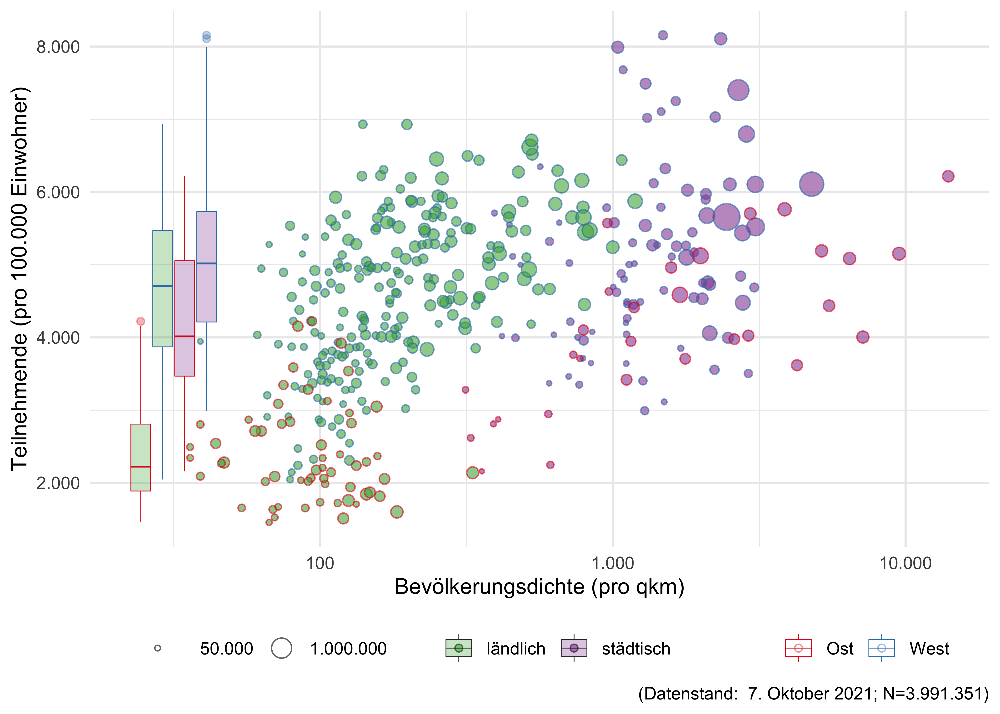
    <figcaption aria-hidden="true">Abb. 3: Teilnehmende nach Bevölkerungsdichte in städtischen und ländlichen Kreisen.</figcaption>
</figure>

Der Unterschied zwischen den Teilnehmenden in urbanen (Stadtkreise) und ländlichen (Landkreise) Gebieten ist im Osten stärker ausgeprägt als im Westen.

Wir wollen dies zusätzlich in einer interaktiven Grafik darstellen, um die Exploration zu erleichtern.

<svg class="main-svg" xmlns="http://www.w3.org/2000/svg" xmlns:xlink="http://www.w3.org/1999/xlink" width="576" height="450" style="background: rgb(255, 255, 255);"><defs id="defs-0502fb"><g class="clips"><clipPath id="clip0502fbxyplot" class="plotclip"><rect width="399" height="385"></rect></clipPath><clipPath class="axesclip" id="clip0502fbx"><rect x="60" y="0" width="399" height="450"></rect></clipPath><clipPath class="axesclip" id="clip0502fby"><rect x="0" y="25" width="576" height="385"></rect></clipPath><clipPath class="axesclip" id="clip0502fbxy"><rect x="60" y="25" width="399" height="385"></rect></clipPath></g><g class="gradients"></g></defs><g class="bglayer"></g><g class="draglayer cursor-crosshair"><g class="xy"><rect class="nsewdrag drag" data-subplot="xy" x="60" y="25" width="399" height="385" style="fill: transparent; stroke-width: 0; pointer-events: all;"></rect><rect class="nwdrag drag cursor-nw-resize" data-subplot="xy" x="40" y="5" width="20" height="20" style="fill: transparent; stroke-width: 0; pointer-events: all;"></rect><rect class="nedrag drag cursor-ne-resize" data-subplot="xy" x="459" y="5" width="20" height="20" style="fill: transparent; stroke-width: 0; pointer-events: all;"></rect><rect class="swdrag drag cursor-sw-resize" data-subplot="xy" x="40" y="410" width="20" height="20" style="fill: transparent; stroke-width: 0; pointer-events: all;"></rect><rect class="sedrag drag cursor-se-resize" data-subplot="xy" x="459" y="410" width="20" height="20" style="fill: transparent; stroke-width: 0; pointer-events: all;"></rect><rect class="ewdrag drag cursor-ew-resize" data-subplot="xy" x="99.9" y="410.5" width="319.20000000000005" height="20" style="fill: transparent; stroke-width: 0; pointer-events: all;"></rect><rect class="wdrag drag cursor-w-resize" data-subplot="xy" x="60" y="410.5" width="39.900000000000006" height="20" style="fill: transparent; stroke-width: 0; pointer-events: all;"></rect><rect class="edrag drag cursor-e-resize" data-subplot="xy" x="419.1" y="410.5" width="39.900000000000006" height="20" style="fill: transparent; stroke-width: 0; pointer-events: all;"></rect><rect class="nsdrag drag cursor-ns-resize" data-subplot="xy" x="39.5" y="63.5" width="20" height="308" style="fill: transparent; stroke-width: 0; pointer-events: all;"></rect><rect class="sdrag drag cursor-s-resize" data-subplot="xy" x="39.5" y="371.5" width="20" height="38.5" style="fill: transparent; stroke-width: 0; pointer-events: all;"></rect><rect class="ndrag drag cursor-n-resize" data-subplot="xy" x="39.5" y="25" width="20" height="38.5" style="fill: transparent; stroke-width: 0; pointer-events: all;"></rect></g></g><g class="layer-below"><g class="imagelayer"></g><g class="shapelayer"></g></g><g class="cartesianlayer"><g class="subplot xy"><g class="layer-subplot"><g class="shapelayer"></g><g class="imagelayer"></g></g><g class="gridlayer"><g class="x"><path class="xgrid crisp" transform="translate(106.31,0)" d="M0,25v385" style="stroke: rgb(238, 238, 238); stroke-opacity: 1; stroke-width: 2px;"></path><path class="xgrid crisp" transform="translate(145.53,0)" d="M0,25v385" style="stroke: rgb(238, 238, 238); stroke-opacity: 1; stroke-width: 2px;"></path><path class="xgrid crisp" transform="translate(184.75,0)" d="M0,25v385" style="stroke: rgb(238, 238, 238); stroke-opacity: 1; stroke-width: 2px;"></path><path class="xgrid crisp" transform="translate(236.6,0)" d="M0,25v385" style="stroke: rgb(238, 238, 238); stroke-opacity: 1; stroke-width: 2px;"></path><path class="xgrid crisp" transform="translate(275.82,0)" d="M0,25v385" style="stroke: rgb(238, 238, 238); stroke-opacity: 1; stroke-width: 2px;"></path><path class="xgrid crisp" transform="translate(315.03999999999996,0)" d="M0,25v385" style="stroke: rgb(238, 238, 238); stroke-opacity: 1; stroke-width: 2px;"></path><path class="xgrid crisp" transform="translate(366.89,0)" d="M0,25v385" style="stroke: rgb(238, 238, 238); stroke-opacity: 1; stroke-width: 2px;"></path><path class="xgrid crisp" transform="translate(406.11,0)" d="M0,25v385" style="stroke: rgb(238, 238, 238); stroke-opacity: 1; stroke-width: 2px;"></path><path class="xgrid crisp" transform="translate(445.33,0)" d="M0,25v385" style="stroke: rgb(238, 238, 238); stroke-opacity: 1; stroke-width: 2px;"></path></g><g class="y"><path class="ygrid crisp" transform="translate(0,402.35)" d="M60,0h399" style="stroke: rgb(238, 238, 238); stroke-opacity: 1; stroke-width: 2px;"></path><path class="ygrid crisp" transform="translate(0,354.13)" d="M60,0h399" style="stroke: rgb(238, 238, 238); stroke-opacity: 1; stroke-width: 2px;"></path><path class="ygrid crisp" transform="translate(0,305.91)" d="M60,0h399" style="stroke: rgb(238, 238, 238); stroke-opacity: 1; stroke-width: 2px;"></path><path class="ygrid crisp" transform="translate(0,257.7)" d="M60,0h399" style="stroke: rgb(238, 238, 238); stroke-opacity: 1; stroke-width: 2px;"></path><path class="ygrid crisp" transform="translate(0,209.48)" d="M60,0h399" style="stroke: rgb(238, 238, 238); stroke-opacity: 1; stroke-width: 2px;"></path><path class="ygrid crisp" transform="translate(0,161.26)" d="M60,0h399" style="stroke: rgb(238, 238, 238); stroke-opacity: 1; stroke-width: 2px;"></path><path class="ygrid crisp" transform="translate(0,113.05)" d="M60,0h399" style="stroke: rgb(238, 238, 238); stroke-opacity: 1; stroke-width: 2px;"></path><path class="ygrid crisp" transform="translate(0,64.83)" d="M60,0h399" style="stroke: rgb(238, 238, 238); stroke-opacity: 1; stroke-width: 2px;"></path></g></g><g class="zerolinelayer"></g><path class="xlines-below"></path><path class="ylines-below"></path><g class="overlines-below"></g><g class="xaxislayer-below"></g><g class="yaxislayer-below"></g><g class="overaxes-below"></g><g class="plot" transform="translate(60, 25)" clip-path="url('#clip0502fbxyplot')"><g class="scatterlayer mlayer"><g class="trace scatter tracec6a046" style="stroke-miterlimit: 2; opacity: 1;"><g class="fills"></g><g class="errorbars"></g><g class="lines"></g><g class="points"><path class="point" transform="translate(98.16,255)" d="M8.75,0A8.75,8.75 0 1,1 0,-8.75A8.75,8.75 0 0,1 8.75,0Z" style="opacity: 0.3; stroke-width: 1px; fill: rgb(77, 175, 74); fill-opacity: 1; stroke: rgb(0, 0, 0); stroke-opacity: 1;"></path><path class="point" transform="translate(69.25,264.25)" d="M8.39,0A8.39,8.39 0 1,1 0,-8.39A8.39,8.39 0 0,1 8.39,0Z" style="opacity: 0.3; stroke-width: 1px; fill: rgb(77, 175, 74); fill-opacity: 1; stroke: rgb(0, 0, 0); stroke-opacity: 1;"></path><path class="point" transform="translate(50.66,345.73)" d="M6.68,0A6.68,6.68 0 1,1 0,-6.68A6.68,6.68 0 0,1 6.68,0Z" style="opacity: 0.3; stroke-width: 1px; fill: rgb(77, 175, 74); fill-opacity: 1; stroke: rgb(0, 0, 0); stroke-opacity: 1;"></path><path class="point" transform="translate(82.03,222.04)" d="M8.2,0A8.2,8.2 0 1,1 0,-8.2A8.2,8.2 0 0,1 8.2,0Z" style="opacity: 0.3; stroke-width: 1px; fill: rgb(77, 175, 74); fill-opacity: 1; stroke: rgb(0, 0, 0); stroke-opacity: 1;"></path><path class="point" transform="translate(80.19,267.21)" d="M9.01,0A9.01,9.01 0 1,1 0,-9.01A9.01,9.01 0 0,1 9.01,0Z" style="opacity: 0.3; stroke-width: 1px; fill: rgb(77, 175, 74); fill-opacity: 1; stroke: rgb(0, 0, 0); stroke-opacity: 1;"></path><path class="point" transform="translate(94.89,236.51)" d="M9.44,0A9.44,9.44 0 1,1 0,-9.44A9.44,9.44 0 0,1 9.44,0Z" style="opacity: 0.3; stroke-width: 1px; fill: rgb(77, 175, 74); fill-opacity: 1; stroke: rgb(0, 0, 0); stroke-opacity: 1;"></path><path class="point" transform="translate(78.93,345.81)" d="M6.87,0A6.87,6.87 0 1,1 0,-6.87A6.87,6.87 0 0,1 6.87,0Z" style="opacity: 0.3; stroke-width: 1px; fill: rgb(77, 175, 74); fill-opacity: 1; stroke: rgb(0, 0, 0); stroke-opacity: 1;"></path><path class="point" transform="translate(72.19,288.57)" d="M8.59,0A8.59,8.59 0 1,1 0,-8.59A8.59,8.59 0 0,1 8.59,0Z" style="opacity: 0.3; stroke-width: 1px; fill: rgb(77, 175, 74); fill-opacity: 1; stroke: rgb(0, 0, 0); stroke-opacity: 1;"></path><path class="point" transform="translate(32.25,290.42)" d="M6.61,0A6.61,6.61 0 1,1 0,-6.61A6.61,6.61 0 0,1 6.61,0Z" style="opacity: 0.3; stroke-width: 1px; fill: rgb(77, 175, 74); fill-opacity: 1; stroke: rgb(0, 0, 0); stroke-opacity: 1;"></path><path class="point" transform="translate(75.66,225.25)" d="M9.53,0A9.53,9.53 0 1,1 0,-9.53A9.53,9.53 0 0,1 9.53,0Z" style="opacity: 0.3; stroke-width: 1px; fill: rgb(77, 175, 74); fill-opacity: 1; stroke: rgb(0, 0, 0); stroke-opacity: 1;"></path><path class="point" transform="translate(27.72,312.55)" d="M6.04,0A6.04,6.04 0 1,1 0,-6.04A6.04,6.04 0 0,1 6.04,0Z" style="opacity: 0.3; stroke-width: 1px; fill: rgb(77, 175, 74); fill-opacity: 1; stroke: rgb(0, 0, 0); stroke-opacity: 1;"></path><path class="point" transform="translate(64.53,346.78)" d="M6.97,0A6.97,6.97 0 1,1 0,-6.97A6.97,6.97 0 0,1 6.97,0Z" style="opacity: 0.3; stroke-width: 1px; fill: rgb(77, 175, 74); fill-opacity: 1; stroke: rgb(0, 0, 0); stroke-opacity: 1;"></path><path class="point" transform="translate(73.61,252.63)" d="M8.37,0A8.37,8.37 0 1,1 0,-8.37A8.37,8.37 0 0,1 8.37,0Z" style="opacity: 0.3; stroke-width: 1px; fill: rgb(77, 175, 74); fill-opacity: 1; stroke: rgb(0, 0, 0); stroke-opacity: 1;"></path><path class="point" transform="translate(32.25,324.71)" d="M7.1,0A7.1,7.1 0 1,1 0,-7.1A7.1,7.1 0 0,1 7.1,0Z" style="opacity: 0.3; stroke-width: 1px; fill: rgb(77, 175, 74); fill-opacity: 1; stroke: rgb(0, 0, 0); stroke-opacity: 1;"></path><path class="point" transform="translate(42.81,315.65)" d="M10.56,0A10.56,10.56 0 1,1 0,-10.56A10.56,10.56 0 0,1 10.56,0Z" style="opacity: 0.3; stroke-width: 1px; fill: rgb(77, 175, 74); fill-opacity: 1; stroke: rgb(0, 0, 0); stroke-opacity: 1;"></path><path class="point" transform="translate(59.38,294.81)" d="M9.51,0A9.51,9.51 0 1,1 0,-9.51A9.51,9.51 0 0,1 9.51,0Z" style="opacity: 0.3; stroke-width: 1px; fill: rgb(77, 175, 74); fill-opacity: 1; stroke: rgb(0, 0, 0); stroke-opacity: 1;"></path><path class="point" transform="translate(65.35,324.95)" d="M9.73,0A9.73,9.73 0 1,1 0,-9.73A9.73,9.73 0 0,1 9.73,0Z" style="opacity: 0.3; stroke-width: 1px; fill: rgb(77, 175, 74); fill-opacity: 1; stroke: rgb(0, 0, 0); stroke-opacity: 1;"></path><path class="point" transform="translate(68.49,290.07)" d="M8.06,0A8.06,8.06 0 1,1 0,-8.06A8.06,8.06 0 0,1 8.06,0Z" style="opacity: 0.3; stroke-width: 1px; fill: rgb(77, 175, 74); fill-opacity: 1; stroke: rgb(0, 0, 0); stroke-opacity: 1;"></path><path class="point" transform="translate(56.62,294.76)" d="M10,0A10,10 0 1,1 0,-10A10,10 0 0,1 10,0Z" style="opacity: 0.3; stroke-width: 1px; fill: rgb(77, 175, 74); fill-opacity: 1; stroke: rgb(0, 0, 0); stroke-opacity: 1;"></path><path class="point" transform="translate(39.07,302.98)" d="M9.41,0A9.41,9.41 0 1,1 0,-9.41A9.41,9.41 0 0,1 9.41,0Z" style="opacity: 0.3; stroke-width: 1px; fill: rgb(77, 175, 74); fill-opacity: 1; stroke: rgb(0, 0, 0); stroke-opacity: 1;"></path><path class="point" transform="translate(119.72,348.4)" d="M12.46,0A12.46,12.46 0 1,1 0,-12.46A12.46,12.46 0 0,1 12.46,0Z" style="opacity: 0.3; stroke-width: 1px; fill: rgb(77, 175, 74); fill-opacity: 1; stroke: rgb(0, 0, 0); stroke-opacity: 1;"></path><path class="point" transform="translate(106.16,336.63)" d="M11.7,0A11.7,11.7 0 1,1 0,-11.7A11.7,11.7 0 0,1 11.7,0Z" style="opacity: 0.3; stroke-width: 1px; fill: rgb(77, 175, 74); fill-opacity: 1; stroke: rgb(0, 0, 0); stroke-opacity: 1;"></path><path class="point" transform="translate(112.12,337.98)" d="M9.76,0A9.76,9.76 0 1,1 0,-9.76A9.76,9.76 0 0,1 9.76,0Z" style="opacity: 0.3; stroke-width: 1px; fill: rgb(77, 175, 74); fill-opacity: 1; stroke: rgb(0, 0, 0); stroke-opacity: 1;"></path><path class="point" transform="translate(153.43,322.46)" d="M11.97,0A11.97,11.97 0 1,1 0,-11.97A11.97,11.97 0 0,1 11.97,0Z" style="opacity: 0.3; stroke-width: 1px; fill: rgb(77, 175, 74); fill-opacity: 1; stroke: rgb(0, 0, 0); stroke-opacity: 1;"></path><path class="point" transform="translate(98.16,340.86)" d="M11.59,0A11.59,11.59 0 1,1 0,-11.59A11.59,11.59 0 0,1 11.59,0Z" style="opacity: 0.3; stroke-width: 1px; fill: rgb(77, 175, 74); fill-opacity: 1; stroke: rgb(0, 0, 0); stroke-opacity: 1;"></path><path class="point" transform="translate(95.85,352.72)" d="M10.42,0A10.42,10.42 0 1,1 0,-10.42A10.42,10.42 0 0,1 10.42,0Z" style="opacity: 0.3; stroke-width: 1px; fill: rgb(77, 175, 74); fill-opacity: 1; stroke: rgb(0, 0, 0); stroke-opacity: 1;"></path><path class="point" transform="translate(114.21,326.54)" d="M10.15,0A10.15,10.15 0 1,1 0,-10.15A10.15,10.15 0 0,1 10.15,0Z" style="opacity: 0.3; stroke-width: 1px; fill: rgb(77, 175, 74); fill-opacity: 1; stroke: rgb(0, 0, 0); stroke-opacity: 1;"></path><path class="point" transform="translate(107.71,335.45)" d="M10.25,0A10.25,10.25 0 1,1 0,-10.25A10.25,10.25 0 0,1 10.25,0Z" style="opacity: 0.3; stroke-width: 1px; fill: rgb(77, 175, 74); fill-opacity: 1; stroke: rgb(0, 0, 0); stroke-opacity: 1;"></path><path class="point" transform="translate(110.69,278.58)" d="M10.56,0A10.56,10.56 0 1,1 0,-10.56A10.56,10.56 0 0,1 10.56,0Z" style="opacity: 0.3; stroke-width: 1px; fill: rgb(77, 175, 74); fill-opacity: 1; stroke: rgb(0, 0, 0); stroke-opacity: 1;"></path><path class="point" transform="translate(83.81,320.64)" d="M9.06,0A9.06,9.06 0 1,1 0,-9.06A9.06,9.06 0 0,1 9.06,0Z" style="opacity: 0.3; stroke-width: 1px; fill: rgb(77, 175, 74); fill-opacity: 1; stroke: rgb(0, 0, 0); stroke-opacity: 1;"></path><path class="point" transform="translate(27.72,305.39)" d="M6.22,0A6.22,6.22 0 1,1 0,-6.22A6.22,6.22 0 0,1 6.22,0Z" style="opacity: 0.3; stroke-width: 1px; fill: rgb(77, 175, 74); fill-opacity: 1; stroke: rgb(0, 0, 0); stroke-opacity: 1;"></path><path class="point" transform="translate(90.4,322.12)" d="M8.08,0A8.08,8.08 0 1,1 0,-8.08A8.08,8.08 0 0,1 8.08,0Z" style="opacity: 0.3; stroke-width: 1px; fill: rgb(77, 175, 74); fill-opacity: 1; stroke: rgb(0, 0, 0); stroke-opacity: 1;"></path><path class="point" transform="translate(66.94,276.73)" d="M8.39,0A8.39,8.39 0 1,1 0,-8.39A8.39,8.39 0 0,1 8.39,0Z" style="opacity: 0.3; stroke-width: 1px; fill: rgb(77, 175, 74); fill-opacity: 1; stroke: rgb(0, 0, 0); stroke-opacity: 1;"></path><path class="point" transform="translate(99.05,331.93)" d="M8.59,0A8.59,8.59 0 1,1 0,-8.59A8.59,8.59 0 0,1 8.59,0Z" style="opacity: 0.3; stroke-width: 1px; fill: rgb(77, 175, 74); fill-opacity: 1; stroke: rgb(0, 0, 0); stroke-opacity: 1;"></path><path class="point" transform="translate(86.09,304)" d="M9.45,0A9.45,9.45 0 1,1 0,-9.45A9.45,9.45 0 0,1 9.45,0Z" style="opacity: 0.3; stroke-width: 1px; fill: rgb(77, 175, 74); fill-opacity: 1; stroke: rgb(0, 0, 0); stroke-opacity: 1;"></path><path class="point" transform="translate(53.72,287.25)" d="M6.37,0A6.37,6.37 0 1,1 0,-6.37A6.37,6.37 0 0,1 6.37,0Z" style="opacity: 0.3; stroke-width: 1px; fill: rgb(77, 175, 74); fill-opacity: 1; stroke: rgb(0, 0, 0); stroke-opacity: 1;"></path><path class="point" transform="translate(81.42,325.98)" d="M7.5,0A7.5,7.5 0 1,1 0,-7.5A7.5,7.5 0 0,1 7.5,0Z" style="opacity: 0.3; stroke-width: 1px; fill: rgb(77, 175, 74); fill-opacity: 1; stroke: rgb(0, 0, 0); stroke-opacity: 1;"></path><path class="point" transform="translate(99.5,289.53)" d="M8.71,0A8.71,8.71 0 1,1 0,-8.71A8.71,8.71 0 0,1 8.71,0Z" style="opacity: 0.3; stroke-width: 1px; fill: rgb(77, 175, 74); fill-opacity: 1; stroke: rgb(0, 0, 0); stroke-opacity: 1;"></path><path class="point" transform="translate(101.67,317.72)" d="M8.85,0A8.85,8.85 0 1,1 0,-8.85A8.85,8.85 0 0,1 8.85,0Z" style="opacity: 0.3; stroke-width: 1px; fill: rgb(77, 175, 74); fill-opacity: 1; stroke: rgb(0, 0, 0); stroke-opacity: 1;"></path><path class="point" transform="translate(41.59,316.11)" d="M6.91,0A6.91,6.91 0 1,1 0,-6.91A6.91,6.91 0 0,1 6.91,0Z" style="opacity: 0.3; stroke-width: 1px; fill: rgb(77, 175, 74); fill-opacity: 1; stroke: rgb(0, 0, 0); stroke-opacity: 1;"></path><path class="point" transform="translate(61.15,328.28)" d="M7.25,0A7.25,7.25 0 1,1 0,-7.25A7.25,7.25 0 0,1 7.25,0Z" style="opacity: 0.3; stroke-width: 1px; fill: rgb(77, 175, 74); fill-opacity: 1; stroke: rgb(0, 0, 0); stroke-opacity: 1;"></path><path class="point" transform="translate(88.83,274.94)" d="M6.63,0A6.63,6.63 0 1,1 0,-6.63A6.63,6.63 0 0,1 6.63,0Z" style="opacity: 0.3; stroke-width: 1px; fill: rgb(77, 175, 74); fill-opacity: 1; stroke: rgb(0, 0, 0); stroke-opacity: 1;"></path><path class="point" transform="translate(94.41,310.3)" d="M6.22,0A6.22,6.22 0 1,1 0,-6.22A6.22,6.22 0 0,1 6.22,0Z" style="opacity: 0.3; stroke-width: 1px; fill: rgb(77, 175, 74); fill-opacity: 1; stroke: rgb(0, 0, 0); stroke-opacity: 1;"></path><path class="point" transform="translate(80.19,328.18)" d="M7.1,0A7.1,7.1 0 1,1 0,-7.1A7.1,7.1 0 0,1 7.1,0Z" style="opacity: 0.3; stroke-width: 1px; fill: rgb(77, 175, 74); fill-opacity: 1; stroke: rgb(0, 0, 0); stroke-opacity: 1;"></path><path class="point" transform="translate(87.75,329.82)" d="M6.69,0A6.69,6.69 0 1,1 0,-6.69A6.69,6.69 0 0,1 6.69,0Z" style="opacity: 0.3; stroke-width: 1px; fill: rgb(77, 175, 74); fill-opacity: 1; stroke: rgb(0, 0, 0); stroke-opacity: 1;"></path><path class="point" transform="translate(66.94,345.06)" d="M5.99,0A5.99,5.99 0 1,1 0,-5.99A5.99,5.99 0 0,1 5.99,0Z" style="opacity: 0.3; stroke-width: 1px; fill: rgb(77, 175, 74); fill-opacity: 1; stroke: rgb(0, 0, 0); stroke-opacity: 1;"></path><path class="point" transform="translate(87.2,326.17)" d="M7.25,0A7.25,7.25 0 1,1 0,-7.25A7.25,7.25 0 0,1 7.25,0Z" style="opacity: 0.3; stroke-width: 1px; fill: rgb(77, 175, 74); fill-opacity: 1; stroke: rgb(0, 0, 0); stroke-opacity: 1;"></path><path class="point" transform="translate(106.16,315.23)" d="M7.5,0A7.5,7.5 0 1,1 0,-7.5A7.5,7.5 0 0,1 7.5,0Z" style="opacity: 0.3; stroke-width: 1px; fill: rgb(77, 175, 74); fill-opacity: 1; stroke: rgb(0, 0, 0); stroke-opacity: 1;"></path><path class="point" transform="translate(76.99,327.43)" d="M5.87,0A5.87,5.87 0 1,1 0,-5.87A5.87,5.87 0 0,1 5.87,0Z" style="opacity: 0.3; stroke-width: 1px; fill: rgb(77, 175, 74); fill-opacity: 1; stroke: rgb(0, 0, 0); stroke-opacity: 1;"></path><path class="point" transform="translate(62.87,355.37)" d="M5.72,0A5.72,5.72 0 1,1 0,-5.72A5.72,5.72 0 0,1 5.72,0Z" style="opacity: 0.3; stroke-width: 1px; fill: rgb(77, 175, 74); fill-opacity: 1; stroke: rgb(0, 0, 0); stroke-opacity: 1;"></path><path class="point" transform="translate(98.61,282.8)" d="M6.79,0A6.79,6.79 0 1,1 0,-6.79A6.79,6.79 0 0,1 6.79,0Z" style="opacity: 0.3; stroke-width: 1px; fill: rgb(77, 175, 74); fill-opacity: 1; stroke: rgb(0, 0, 0); stroke-opacity: 1;"></path><path class="point" transform="translate(86.65,312.7)" d="M6.19,0A6.19,6.19 0 1,1 0,-6.19A6.19,6.19 0 0,1 6.19,0Z" style="opacity: 0.3; stroke-width: 1px; fill: rgb(77, 175, 74); fill-opacity: 1; stroke: rgb(0, 0, 0); stroke-opacity: 1;"></path><path class="point" transform="translate(101.67,343.28)" d="M5.58,0A5.58,5.58 0 1,1 0,-5.58A5.58,5.58 0 0,1 5.58,0Z" style="opacity: 0.3; stroke-width: 1px; fill: rgb(77, 175, 74); fill-opacity: 1; stroke: rgb(0, 0, 0); stroke-opacity: 1;"></path><path class="point" transform="translate(85.53,341.98)" d="M6.71,0A6.71,6.71 0 1,1 0,-6.71A6.71,6.71 0 0,1 6.71,0Z" style="opacity: 0.3; stroke-width: 1px; fill: rgb(77, 175, 74); fill-opacity: 1; stroke: rgb(0, 0, 0); stroke-opacity: 1;"></path><path class="point" transform="translate(86.65,319.13)" d="M6.21,0A6.21,6.21 0 1,1 0,-6.21A6.21,6.21 0 0,1 6.21,0Z" style="opacity: 0.3; stroke-width: 1px; fill: rgb(77, 175, 74); fill-opacity: 1; stroke: rgb(0, 0, 0); stroke-opacity: 1;"></path><path class="point" transform="translate(65.35,352.08)" d="M6.14,0A6.14,6.14 0 1,1 0,-6.14A6.14,6.14 0 0,1 6.14,0Z" style="opacity: 0.3; stroke-width: 1px; fill: rgb(77, 175, 74); fill-opacity: 1; stroke: rgb(0, 0, 0); stroke-opacity: 1;"></path><path class="point" transform="translate(93.44,342.54)" d="M6.57,0A6.57,6.57 0 1,1 0,-6.57A6.57,6.57 0 0,1 6.57,0Z" style="opacity: 0.3; stroke-width: 1px; fill: rgb(77, 175, 74); fill-opacity: 1; stroke: rgb(0, 0, 0); stroke-opacity: 1;"></path><path class="point" transform="translate(111.05,311.43)" d="M6.37,0A6.37,6.37 0 1,1 0,-6.37A6.37,6.37 0 0,1 6.37,0Z" style="opacity: 0.3; stroke-width: 1px; fill: rgb(77, 175, 74); fill-opacity: 1; stroke: rgb(0, 0, 0); stroke-opacity: 1;"></path></g><g class="text"></g></g><g class="trace scatter trace8b61aa" style="stroke-miterlimit: 2; opacity: 1;"><g class="fills"></g><g class="errorbars"></g><g class="lines"></g><g class="points"><path class="point" transform="translate(81.42,221.79)" d="M7.46,7.46H-7.46V-7.46H7.46Z" style="opacity: 0.3; stroke-width: 1px; fill: rgb(77, 175, 74); fill-opacity: 1; stroke: rgb(0, 0, 0); stroke-opacity: 1;"></path><path class="point" transform="translate(111.05,153.56)" d="M9.07,9.07H-9.07V-9.07H9.07Z" style="opacity: 0.3; stroke-width: 1px; fill: rgb(77, 175, 74); fill-opacity: 1; stroke: rgb(0, 0, 0); stroke-opacity: 1;"></path><path class="point" transform="translate(72.9,205.79)" d="M8.27,8.27H-8.27V-8.27H8.27Z" style="opacity: 0.3; stroke-width: 1px; fill: rgb(77, 175, 74); fill-opacity: 1; stroke: rgb(0, 0, 0); stroke-opacity: 1;"></path><path class="point" transform="translate(106.16,182.51)" d="M9.13,9.13H-9.13V-9.13H9.13Z" style="opacity: 0.3; stroke-width: 1px; fill: rgb(77, 175, 74); fill-opacity: 1; stroke: rgb(0, 0, 0); stroke-opacity: 1;"></path><path class="point" transform="translate(173.81,123.04)" d="M12,12H-12V-12H12Z" style="opacity: 0.3; stroke-width: 1px; fill: rgb(77, 175, 74); fill-opacity: 1; stroke: rgb(0, 0, 0); stroke-opacity: 1;"></path><path class="point" transform="translate(95.37,178.05)" d="M7.35,7.35H-7.35V-7.35H7.35Z" style="opacity: 0.3; stroke-width: 1px; fill: rgb(77, 175, 74); fill-opacity: 1; stroke: rgb(0, 0, 0); stroke-opacity: 1;"></path><path class="point" transform="translate(98.16,167.96)" d="M10.95,10.95H-10.95V-10.95H10.95Z" style="opacity: 0.3; stroke-width: 1px; fill: rgb(77, 175, 74); fill-opacity: 1; stroke: rgb(0, 0, 0); stroke-opacity: 1;"></path><path class="point" transform="translate(83.81,198.79)" d="M9.14,9.14H-9.14V-9.14H9.14Z" style="opacity: 0.3; stroke-width: 1px; fill: rgb(77, 175, 74); fill-opacity: 1; stroke: rgb(0, 0, 0); stroke-opacity: 1;"></path><path class="point" transform="translate(126.42,142.69)" d="M11.03,11.03H-11.03V-11.03H11.03Z" style="opacity: 0.3; stroke-width: 1px; fill: rgb(77, 175, 74); fill-opacity: 1; stroke: rgb(0, 0, 0); stroke-opacity: 1;"></path><path class="point" transform="translate(97.7,186.01)" d="M7.4,7.4H-7.4V-7.4H7.4Z" style="opacity: 0.3; stroke-width: 1px; fill: rgb(77, 175, 74); fill-opacity: 1; stroke: rgb(0, 0, 0); stroke-opacity: 1;"></path><path class="point" transform="translate(151.17,112.36)" d="M10.21,10.21H-10.21V-10.21H10.21Z" style="opacity: 0.3; stroke-width: 1px; fill: rgb(77, 175, 74); fill-opacity: 1; stroke: rgb(0, 0, 0); stroke-opacity: 1;"></path><path class="point" transform="translate(92.44,158.78)" d="M8.53,8.53H-8.53V-8.53H8.53Z" style="opacity: 0.3; stroke-width: 1px; fill: rgb(77, 175, 74); fill-opacity: 1; stroke: rgb(0, 0, 0); stroke-opacity: 1;"></path><path class="point" transform="translate(104.97,220.09)" d="M7.53,7.53H-7.53V-7.53H7.53Z" style="opacity: 0.3; stroke-width: 1px; fill: rgb(77, 175, 74); fill-opacity: 1; stroke: rgb(0, 0, 0); stroke-opacity: 1;"></path><path class="point" transform="translate(102.51,187.27)" d="M6.42,6.42H-6.42V-6.42H6.42Z" style="opacity: 0.3; stroke-width: 1px; fill: rgb(77, 175, 74); fill-opacity: 1; stroke: rgb(0, 0, 0); stroke-opacity: 1;"></path><path class="point" transform="translate(87.75,203.19)" d="M7.43,7.43H-7.43V-7.43H7.43Z" style="opacity: 0.3; stroke-width: 1px; fill: rgb(77, 175, 74); fill-opacity: 1; stroke: rgb(0, 0, 0); stroke-opacity: 1;"></path><path class="point" transform="translate(137.6,146.85)" d="M7.5,7.5H-7.5V-7.5H7.5Z" style="opacity: 0.3; stroke-width: 1px; fill: rgb(77, 175, 74); fill-opacity: 1; stroke: rgb(0, 0, 0); stroke-opacity: 1;"></path><path class="point" transform="translate(113.86,146.88)" d="M7.12,7.12H-7.12V-7.12H7.12Z" style="opacity: 0.3; stroke-width: 1px; fill: rgb(77, 175, 74); fill-opacity: 1; stroke: rgb(0, 0, 0); stroke-opacity: 1;"></path><path class="point" transform="translate(120.64,159.52)" d="M12.24,12.24H-12.24V-12.24H12.24Z" style="opacity: 0.3; stroke-width: 1px; fill: rgb(77, 175, 74); fill-opacity: 1; stroke: rgb(0, 0, 0); stroke-opacity: 1;"></path><path class="point" transform="translate(90.4,154.95)" d="M9.54,9.54H-9.54V-9.54H9.54Z" style="opacity: 0.3; stroke-width: 1px; fill: rgb(77, 175, 74); fill-opacity: 1; stroke: rgb(0, 0, 0); stroke-opacity: 1;"></path><path class="point" transform="translate(120.64,190.34)" d="M7.84,7.84H-7.84V-7.84H7.84Z" style="opacity: 0.3; stroke-width: 1px; fill: rgb(77, 175, 74); fill-opacity: 1; stroke: rgb(0, 0, 0); stroke-opacity: 1;"></path><path class="point" transform="translate(132.16,162.61)" d="M11,11H-11V-11H11Z" style="opacity: 0.3; stroke-width: 1px; fill: rgb(77, 175, 74); fill-opacity: 1; stroke: rgb(0, 0, 0); stroke-opacity: 1;"></path><path class="point" transform="translate(86.09,231.69)" d="M5.9,5.9H-5.9V-5.9H5.9Z" style="opacity: 0.3; stroke-width: 1px; fill: rgb(77, 175, 74); fill-opacity: 1; stroke: rgb(0, 0, 0); stroke-opacity: 1;"></path><path class="point" transform="translate(77.65,195.9)" d="M7.16,7.16H-7.16V-7.16H7.16Z" style="opacity: 0.3; stroke-width: 1px; fill: rgb(77, 175, 74); fill-opacity: 1; stroke: rgb(0, 0, 0); stroke-opacity: 1;"></path><path class="point" transform="translate(133.63,193.28)" d="M8.07,8.07H-8.07V-8.07H8.07Z" style="opacity: 0.3; stroke-width: 1px; fill: rgb(77, 175, 74); fill-opacity: 1; stroke: rgb(0, 0, 0); stroke-opacity: 1;"></path><path class="point" transform="translate(93.44,183.71)" d="M8.59,8.59H-8.59V-8.59H8.59Z" style="opacity: 0.3; stroke-width: 1px; fill: rgb(77, 175, 74); fill-opacity: 1; stroke: rgb(0, 0, 0); stroke-opacity: 1;"></path><path class="point" transform="translate(83.22,188.37)" d="M9.07,9.07H-9.07V-9.07H9.07Z" style="opacity: 0.3; stroke-width: 1px; fill: rgb(77, 175, 74); fill-opacity: 1; stroke: rgb(0, 0, 0); stroke-opacity: 1;"></path><path class="point" transform="translate(125.87,126.88)" d="M10.47,10.47H-10.47V-10.47H10.47Z" style="opacity: 0.3; stroke-width: 1px; fill: rgb(77, 175, 74); fill-opacity: 1; stroke: rgb(0, 0, 0); stroke-opacity: 1;"></path><path class="point" transform="translate(32.25,235.33)" d="M5.35,5.35H-5.35V-5.35H5.35Z" style="opacity: 0.3; stroke-width: 1px; fill: rgb(77, 175, 74); fill-opacity: 1; stroke: rgb(0, 0, 0); stroke-opacity: 1;"></path><path class="point" transform="translate(104.16,125.77)" d="M8.72,8.72H-8.72V-8.72H8.72Z" style="opacity: 0.3; stroke-width: 1px; fill: rgb(77, 175, 74); fill-opacity: 1; stroke: rgb(0, 0, 0); stroke-opacity: 1;"></path><path class="point" transform="translate(117.19,156.4)" d="M6.98,6.98H-6.98V-6.98H6.98Z" style="opacity: 0.3; stroke-width: 1px; fill: rgb(77, 175, 74); fill-opacity: 1; stroke: rgb(0, 0, 0); stroke-opacity: 1;"></path><path class="point" transform="translate(72.19,158.67)" d="M8.22,8.22H-8.22V-8.22H8.22Z" style="opacity: 0.3; stroke-width: 1px; fill: rgb(77, 175, 74); fill-opacity: 1; stroke: rgb(0, 0, 0); stroke-opacity: 1;"></path><path class="point" transform="translate(69.25,189.61)" d="M7.64,7.64H-7.64V-7.64H7.64Z" style="opacity: 0.3; stroke-width: 1px; fill: rgb(77, 175, 74); fill-opacity: 1; stroke: rgb(0, 0, 0); stroke-opacity: 1;"></path><path class="point" transform="translate(112.48,125.34)" d="M9.23,9.23H-9.23V-9.23H9.23Z" style="opacity: 0.3; stroke-width: 1px; fill: rgb(77, 175, 74); fill-opacity: 1; stroke: rgb(0, 0, 0); stroke-opacity: 1;"></path><path class="point" transform="translate(59.38,187.06)" d="M6.44,6.44H-6.44V-6.44H6.44Z" style="opacity: 0.3; stroke-width: 1px; fill: rgb(77, 175, 74); fill-opacity: 1; stroke: rgb(0, 0, 0); stroke-opacity: 1;"></path><path class="point" transform="translate(116.87,146.53)" d="M7.55,7.55H-7.55V-7.55H7.55Z" style="opacity: 0.3; stroke-width: 1px; fill: rgb(77, 175, 74); fill-opacity: 1; stroke: rgb(0, 0, 0); stroke-opacity: 1;"></path><path class="point" transform="translate(115.89,142.43)" d="M7.25,7.25H-7.25V-7.25H7.25Z" style="opacity: 0.3; stroke-width: 1px; fill: rgb(77, 175, 74); fill-opacity: 1; stroke: rgb(0, 0, 0); stroke-opacity: 1;"></path><path class="point" transform="translate(107.33,185.52)" d="M8.86,8.86H-8.86V-8.86H8.86Z" style="opacity: 0.3; stroke-width: 1px; fill: rgb(77, 175, 74); fill-opacity: 1; stroke: rgb(0, 0, 0); stroke-opacity: 1;"></path><path class="point" transform="translate(95.85,215.76)" d="M8.39,8.39H-8.39V-8.39H8.39Z" style="opacity: 0.3; stroke-width: 1px; fill: rgb(77, 175, 74); fill-opacity: 1; stroke: rgb(0, 0, 0); stroke-opacity: 1;"></path><path class="point" transform="translate(92.44,139.76)" d="M12.27,12.27H-12.27V-12.27H12.27Z" style="opacity: 0.3; stroke-width: 1px; fill: rgb(77, 175, 74); fill-opacity: 1; stroke: rgb(0, 0, 0); stroke-opacity: 1;"></path><path class="point" transform="translate(112.83,148.73)" d="M6.6,6.6H-6.6V-6.6H6.6Z" style="opacity: 0.3; stroke-width: 1px; fill: rgb(77, 175, 74); fill-opacity: 1; stroke: rgb(0, 0, 0); stroke-opacity: 1;"></path><path class="point" transform="translate(104.57,91.4)" d="M7.56,7.56H-7.56V-7.56H7.56Z" style="opacity: 0.3; stroke-width: 1px; fill: rgb(77, 175, 74); fill-opacity: 1; stroke: rgb(0, 0, 0); stroke-opacity: 1;"></path><path class="point" transform="translate(111.05,186.73)" d="M8.39,8.39H-8.39V-8.39H8.39Z" style="opacity: 0.3; stroke-width: 1px; fill: rgb(77, 175, 74); fill-opacity: 1; stroke: rgb(0, 0, 0); stroke-opacity: 1;"></path><path class="point" transform="translate(97.24,151.31)" d="M7.4,7.4H-7.4V-7.4H7.4Z" style="opacity: 0.3; stroke-width: 1px; fill: rgb(77, 175, 74); fill-opacity: 1; stroke: rgb(0, 0, 0); stroke-opacity: 1;"></path><path class="point" transform="translate(115.22,156.47)" d="M13.04,13.04H-13.04V-13.04H13.04Z" style="opacity: 0.3; stroke-width: 1px; fill: rgb(77, 175, 74); fill-opacity: 1; stroke: rgb(0, 0, 0); stroke-opacity: 1;"></path><path class="point" transform="translate(117.19,196.59)" d="M7.7,7.7H-7.7V-7.7H7.7Z" style="opacity: 0.3; stroke-width: 1px; fill: rgb(77, 175, 74); fill-opacity: 1; stroke: rgb(0, 0, 0); stroke-opacity: 1;"></path><path class="point" transform="translate(89.36,189.5)" d="M6.35,6.35H-6.35V-6.35H6.35Z" style="opacity: 0.3; stroke-width: 1px; fill: rgb(77, 175, 74); fill-opacity: 1; stroke: rgb(0, 0, 0); stroke-opacity: 1;"></path><path class="point" transform="translate(77.65,177.39)" d="M5.56,5.56H-5.56V-5.56H5.56Z" style="opacity: 0.3; stroke-width: 1px; fill: rgb(77, 175, 74); fill-opacity: 1; stroke: rgb(0, 0, 0); stroke-opacity: 1;"></path><path class="point" transform="translate(138.05,138.93)" d="M11.91,11.91H-11.91V-11.91H11.91Z" style="opacity: 0.3; stroke-width: 1px; fill: rgb(77, 175, 74); fill-opacity: 1; stroke: rgb(0, 0, 0); stroke-opacity: 1;"></path><path class="point" transform="translate(225.76,142.39)" d="M16.2,16.2H-16.2V-16.2H16.2Z" style="opacity: 0.3; stroke-width: 1px; fill: rgb(77, 175, 74); fill-opacity: 1; stroke: rgb(0, 0, 0); stroke-opacity: 1;"></path><path class="point" transform="translate(202.05,128.61)" d="M15.36,15.36H-15.36V-15.36H15.36Z" style="opacity: 0.3; stroke-width: 1px; fill: rgb(77, 175, 74); fill-opacity: 1; stroke: rgb(0, 0, 0); stroke-opacity: 1;"></path><path class="point" transform="translate(180,111.24)" d="M11.57,11.57H-11.57V-11.57H11.57Z" style="opacity: 0.3; stroke-width: 1px; fill: rgb(77, 175, 74); fill-opacity: 1; stroke: rgb(0, 0, 0); stroke-opacity: 1;"></path><path class="point" transform="translate(169.49,149.27)" d="M15.57,15.57H-15.57V-15.57H15.57Z" style="opacity: 0.3; stroke-width: 1px; fill: rgb(77, 175, 74); fill-opacity: 1; stroke: rgb(0, 0, 0); stroke-opacity: 1;"></path><path class="point" transform="translate(143.99,143.69)" d="M10.72,10.72H-10.72V-10.72H10.72Z" style="opacity: 0.3; stroke-width: 1px; fill: rgb(77, 175, 74); fill-opacity: 1; stroke: rgb(0, 0, 0); stroke-opacity: 1;"></path><path class="point" transform="translate(192.99,132.22)" d="M15.83,15.83H-15.83V-15.83H15.83Z" style="opacity: 0.3; stroke-width: 1px; fill: rgb(77, 175, 74); fill-opacity: 1; stroke: rgb(0, 0, 0); stroke-opacity: 1;"></path><path class="point" transform="translate(110.33,161.2)" d="M8.96,8.96H-8.96V-8.96H8.96Z" style="opacity: 0.3; stroke-width: 1px; fill: rgb(77, 175, 74); fill-opacity: 1; stroke: rgb(0, 0, 0); stroke-opacity: 1;"></path><path class="point" transform="translate(164.95,172.82)" d="M10.49,10.49H-10.49V-10.49H10.49Z" style="opacity: 0.3; stroke-width: 1px; fill: rgb(77, 175, 74); fill-opacity: 1; stroke: rgb(0, 0, 0); stroke-opacity: 1;"></path><path class="point" transform="translate(146.93,191.35)" d="M10.9,10.9H-10.9V-10.9H10.9Z" style="opacity: 0.3; stroke-width: 1px; fill: rgb(77, 175, 74); fill-opacity: 1; stroke: rgb(0, 0, 0); stroke-opacity: 1;"></path><path class="point" transform="translate(191.27,122.16)" d="M11.18,11.18H-11.18V-11.18H11.18Z" style="opacity: 0.3; stroke-width: 1px; fill: rgb(77, 175, 74); fill-opacity: 1; stroke: rgb(0, 0, 0); stroke-opacity: 1;"></path><path class="point" transform="translate(178.93,106.5)" d="M19.06,19.06H-19.06V-19.06H19.06Z" style="opacity: 0.3; stroke-width: 1px; fill: rgb(77, 175, 74); fill-opacity: 1; stroke: rgb(0, 0, 0); stroke-opacity: 1;"></path><path class="point" transform="translate(139.81,127.3)" d="M13.37,13.37H-13.37V-13.37H13.37Z" style="opacity: 0.3; stroke-width: 1px; fill: rgb(77, 175, 74); fill-opacity: 1; stroke: rgb(0, 0, 0); stroke-opacity: 1;"></path><path class="point" transform="translate(124.18,91.48)" d="M9.63,9.63H-9.63V-9.63H9.63Z" style="opacity: 0.3; stroke-width: 1px; fill: rgb(77, 175, 74); fill-opacity: 1; stroke: rgb(0, 0, 0); stroke-opacity: 1;"></path><path class="point" transform="translate(203.68,162.96)" d="M19.39,19.39H-19.39V-19.39H19.39Z" style="opacity: 0.3; stroke-width: 1px; fill: rgb(77, 175, 74); fill-opacity: 1; stroke: rgb(0, 0, 0); stroke-opacity: 1;"></path><path class="point" transform="translate(137.38,114.42)" d="M15.28,15.28H-15.28V-15.28H15.28Z" style="opacity: 0.3; stroke-width: 1px; fill: rgb(77, 175, 74); fill-opacity: 1; stroke: rgb(0, 0, 0); stroke-opacity: 1;"></path><path class="point" transform="translate(127.78,172.52)" d="M11.05,11.05H-11.05V-11.05H11.05Z" style="opacity: 0.3; stroke-width: 1px; fill: rgb(77, 175, 74); fill-opacity: 1; stroke: rgb(0, 0, 0); stroke-opacity: 1;"></path><path class="point" transform="translate(160.62,184)" d="M13.21,13.21H-13.21V-13.21H13.21Z" style="opacity: 0.3; stroke-width: 1px; fill: rgb(77, 175, 74); fill-opacity: 1; stroke: rgb(0, 0, 0); stroke-opacity: 1;"></path><path class="point" transform="translate(182.6,200.89)" d="M10.37,10.37H-10.37V-10.37H10.37Z" style="opacity: 0.3; stroke-width: 1px; fill: rgb(77, 175, 74); fill-opacity: 1; stroke: rgb(0, 0, 0); stroke-opacity: 1;"></path><path class="point" transform="translate(94.41,186.8)" d="M7.63,7.63H-7.63V-7.63H7.63Z" style="opacity: 0.3; stroke-width: 1px; fill: rgb(77, 175, 74); fill-opacity: 1; stroke: rgb(0, 0, 0); stroke-opacity: 1;"></path><path class="point" transform="translate(143.59,199.28)" d="M12.78,12.78H-12.78V-12.78H12.78Z" style="opacity: 0.3; stroke-width: 1px; fill: rgb(77, 175, 74); fill-opacity: 1; stroke: rgb(0, 0, 0); stroke-opacity: 1;"></path><path class="point" transform="translate(141.52,209.47)" d="M11.86,11.86H-11.86V-11.86H11.86Z" style="opacity: 0.3; stroke-width: 1px; fill: rgb(77, 175, 74); fill-opacity: 1; stroke: rgb(0, 0, 0); stroke-opacity: 1;"></path><path class="point" transform="translate(136.69,150.04)" d="M11.79,11.79H-11.79V-11.79H11.79Z" style="opacity: 0.3; stroke-width: 1px; fill: rgb(77, 175, 74); fill-opacity: 1; stroke: rgb(0, 0, 0); stroke-opacity: 1;"></path><path class="point" transform="translate(202.55,146.37)" d="M12.2,12.2H-12.2V-12.2H12.2Z" style="opacity: 0.3; stroke-width: 1px; fill: rgb(77, 175, 74); fill-opacity: 1; stroke: rgb(0, 0, 0); stroke-opacity: 1;"></path><path class="point" transform="translate(101.67,170.84)" d="M10.6,10.6H-10.6V-10.6H10.6Z" style="opacity: 0.3; stroke-width: 1px; fill: rgb(77, 175, 74); fill-opacity: 1; stroke: rgb(0, 0, 0); stroke-opacity: 1;"></path><path class="point" transform="translate(162.1,196.68)" d="M14.33,14.33H-14.33V-14.33H14.33Z" style="opacity: 0.3; stroke-width: 1px; fill: rgb(77, 175, 74); fill-opacity: 1; stroke: rgb(0, 0, 0); stroke-opacity: 1;"></path><path class="point" transform="translate(121.25,134.22)" d="M7.48,7.48H-7.48V-7.48H7.48Z" style="opacity: 0.3; stroke-width: 1px; fill: rgb(77, 175, 74); fill-opacity: 1; stroke: rgb(0, 0, 0); stroke-opacity: 1;"></path><path class="point" transform="translate(136,164.5)" d="M11.03,11.03H-11.03V-11.03H11.03Z" style="opacity: 0.3; stroke-width: 1px; fill: rgb(77, 175, 74); fill-opacity: 1; stroke: rgb(0, 0, 0); stroke-opacity: 1;"></path><path class="point" transform="translate(131.92,160.85)" d="M11.64,11.64H-11.64V-11.64H11.64Z" style="opacity: 0.3; stroke-width: 1px; fill: rgb(77, 175, 74); fill-opacity: 1; stroke: rgb(0, 0, 0); stroke-opacity: 1;"></path><path class="point" transform="translate(197.78,153.12)" d="M13.95,13.95H-13.95V-13.95H13.95Z" style="opacity: 0.3; stroke-width: 1px; fill: rgb(77, 175, 74); fill-opacity: 1; stroke: rgb(0, 0, 0); stroke-opacity: 1;"></path><path class="point" transform="translate(160.47,179.7)" d="M10.86,10.86H-10.86V-10.86H10.86Z" style="opacity: 0.3; stroke-width: 1px; fill: rgb(77, 175, 74); fill-opacity: 1; stroke: rgb(0, 0, 0); stroke-opacity: 1;"></path><path class="point" transform="translate(170.89,162.26)" d="M11.54,11.54H-11.54V-11.54H11.54Z" style="opacity: 0.3; stroke-width: 1px; fill: rgb(77, 175, 74); fill-opacity: 1; stroke: rgb(0, 0, 0); stroke-opacity: 1;"></path><path class="point" transform="translate(187.76,200.63)" d="M10.99,10.99H-10.99V-10.99H10.99Z" style="opacity: 0.3; stroke-width: 1px; fill: rgb(77, 175, 74); fill-opacity: 1; stroke: rgb(0, 0, 0); stroke-opacity: 1;"></path><path class="point" transform="translate(175.68,142.57)" d="M10.03,10.03H-10.03V-10.03H10.03Z" style="opacity: 0.3; stroke-width: 1px; fill: rgb(77, 175, 74); fill-opacity: 1; stroke: rgb(0, 0, 0); stroke-opacity: 1;"></path><path class="point" transform="translate(147.88,206.65)" d="M14.59,14.59H-14.59V-14.59H14.59Z" style="opacity: 0.3; stroke-width: 1px; fill: rgb(77, 175, 74); fill-opacity: 1; stroke: rgb(0, 0, 0); stroke-opacity: 1;"></path><path class="point" transform="translate(219.75,115.11)" d="M10.07,10.07H-10.07V-10.07H10.07Z" style="opacity: 0.3; stroke-width: 1px; fill: rgb(77, 175, 74); fill-opacity: 1; stroke: rgb(0, 0, 0); stroke-opacity: 1;"></path><path class="point" transform="translate(110.33,231.51)" d="M6.55,6.55H-6.55V-6.55H6.55Z" style="opacity: 0.3; stroke-width: 1px; fill: rgb(77, 175, 74); fill-opacity: 1; stroke: rgb(0, 0, 0); stroke-opacity: 1;"></path><path class="point" transform="translate(215.76,172.9)" d="M12.98,12.98H-12.98V-12.98H12.98Z" style="opacity: 0.3; stroke-width: 1px; fill: rgb(77, 175, 74); fill-opacity: 1; stroke: rgb(0, 0, 0); stroke-opacity: 1;"></path><path class="point" transform="translate(132.9,151.61)" d="M8.8,8.8H-8.8V-8.8H8.8Z" style="opacity: 0.3; stroke-width: 1px; fill: rgb(77, 175, 74); fill-opacity: 1; stroke: rgb(0, 0, 0); stroke-opacity: 1;"></path><path class="point" transform="translate(143.79,169)" d="M11.8,11.8H-11.8V-11.8H11.8Z" style="opacity: 0.3; stroke-width: 1px; fill: rgb(77, 175, 74); fill-opacity: 1; stroke: rgb(0, 0, 0); stroke-opacity: 1;"></path><path class="point" transform="translate(150.81,160.33)" d="M10.87,10.87H-10.87V-10.87H10.87Z" style="opacity: 0.3; stroke-width: 1px; fill: rgb(77, 175, 74); fill-opacity: 1; stroke: rgb(0, 0, 0); stroke-opacity: 1;"></path><path class="point" transform="translate(134.59,211.45)" d="M10.44,10.44H-10.44V-10.44H10.44Z" style="opacity: 0.3; stroke-width: 1px; fill: rgb(77, 175, 74); fill-opacity: 1; stroke: rgb(0, 0, 0); stroke-opacity: 1;"></path><path class="point" transform="translate(133.39,170.75)" d="M8.42,8.42H-8.42V-8.42H8.42Z" style="opacity: 0.3; stroke-width: 1px; fill: rgb(77, 175, 74); fill-opacity: 1; stroke: rgb(0, 0, 0); stroke-opacity: 1;"></path><path class="point" transform="translate(123.61,180.58)" d="M10.28,10.28H-10.28V-10.28H10.28Z" style="opacity: 0.3; stroke-width: 1px; fill: rgb(77, 175, 74); fill-opacity: 1; stroke: rgb(0, 0, 0); stroke-opacity: 1;"></path><path class="point" transform="translate(66.94,237.2)" d="M6.77,6.77H-6.77V-6.77H6.77Z" style="opacity: 0.3; stroke-width: 1px; fill: rgb(77, 175, 74); fill-opacity: 1; stroke: rgb(0, 0, 0); stroke-opacity: 1;"></path><path class="point" transform="translate(112.83,232.3)" d="M9.69,9.69H-9.69V-9.69H9.69Z" style="opacity: 0.3; stroke-width: 1px; fill: rgb(77, 175, 74); fill-opacity: 1; stroke: rgb(0, 0, 0); stroke-opacity: 1;"></path><path class="point" transform="translate(90.92,241.71)" d="M7.15,7.15H-7.15V-7.15H7.15Z" style="opacity: 0.3; stroke-width: 1px; fill: rgb(77, 175, 74); fill-opacity: 1; stroke: rgb(0, 0, 0); stroke-opacity: 1;"></path><path class="point" transform="translate(119.72,176.48)" d="M10.03,10.03H-10.03V-10.03H10.03Z" style="opacity: 0.3; stroke-width: 1px; fill: rgb(77, 175, 74); fill-opacity: 1; stroke: rgb(0, 0, 0); stroke-opacity: 1;"></path><path class="point" transform="translate(94.41,200.25)" d="M8.61,8.61H-8.61V-8.61H8.61Z" style="opacity: 0.3; stroke-width: 1px; fill: rgb(77, 175, 74); fill-opacity: 1; stroke: rgb(0, 0, 0); stroke-opacity: 1;"></path><path class="point" transform="translate(76.33,214.49)" d="M8.03,8.03H-8.03V-8.03H8.03Z" style="opacity: 0.3; stroke-width: 1px; fill: rgb(77, 175, 74); fill-opacity: 1; stroke: rgb(0, 0, 0); stroke-opacity: 1;"></path><path class="point" transform="translate(84.39,248.9)" d="M6.65,6.65H-6.65V-6.65H6.65Z" style="opacity: 0.3; stroke-width: 1px; fill: rgb(77, 175, 74); fill-opacity: 1; stroke: rgb(0, 0, 0); stroke-opacity: 1;"></path><path class="point" transform="translate(113.86,121.48)" d="M7.38,7.38H-7.38V-7.38H7.38Z" style="opacity: 0.3; stroke-width: 1px; fill: rgb(77, 175, 74); fill-opacity: 1; stroke: rgb(0, 0, 0); stroke-opacity: 1;"></path><path class="point" transform="translate(125.03,194.6)" d="M7.35,7.35H-7.35V-7.35H7.35Z" style="opacity: 0.3; stroke-width: 1px; fill: rgb(77, 175, 74); fill-opacity: 1; stroke: rgb(0, 0, 0); stroke-opacity: 1;"></path><path class="point" transform="translate(119.72,203.46)" d="M8.08,8.08H-8.08V-8.08H8.08Z" style="opacity: 0.3; stroke-width: 1px; fill: rgb(77, 175, 74); fill-opacity: 1; stroke: rgb(0, 0, 0); stroke-opacity: 1;"></path><path class="point" transform="translate(87.75,242.29)" d="M6.16,6.16H-6.16V-6.16H6.16Z" style="opacity: 0.3; stroke-width: 1px; fill: rgb(77, 175, 74); fill-opacity: 1; stroke: rgb(0, 0, 0); stroke-opacity: 1;"></path><path class="point" transform="translate(78.93,166.16)" d="M5.67,5.67H-5.67V-5.67H5.67Z" style="opacity: 0.3; stroke-width: 1px; fill: rgb(77, 175, 74); fill-opacity: 1; stroke: rgb(0, 0, 0); stroke-opacity: 1;"></path><path class="point" transform="translate(140.03,139.64)" d="M9.47,9.47H-9.47V-9.47H9.47Z" style="opacity: 0.3; stroke-width: 1px; fill: rgb(77, 175, 74); fill-opacity: 1; stroke: rgb(0, 0, 0); stroke-opacity: 1;"></path><path class="point" transform="translate(146.16,155.8)" d="M8.69,8.69H-8.69V-8.69H8.69Z" style="opacity: 0.3; stroke-width: 1px; fill: rgb(77, 175, 74); fill-opacity: 1; stroke: rgb(0, 0, 0); stroke-opacity: 1;"></path><path class="point" transform="translate(87.75,165.89)" d="M6.71,6.71H-6.71V-6.71H6.71Z" style="opacity: 0.3; stroke-width: 1px; fill: rgb(77, 175, 74); fill-opacity: 1; stroke: rgb(0, 0, 0); stroke-opacity: 1;"></path><path class="point" transform="translate(110.69,159.99)" d="M7.19,7.19H-7.19V-7.19H7.19Z" style="opacity: 0.3; stroke-width: 1px; fill: rgb(77, 175, 74); fill-opacity: 1; stroke: rgb(0, 0, 0); stroke-opacity: 1;"></path><path class="point" transform="translate(125.87,141.74)" d="M9.16,9.16H-9.16V-9.16H9.16Z" style="opacity: 0.3; stroke-width: 1px; fill: rgb(77, 175, 74); fill-opacity: 1; stroke: rgb(0, 0, 0); stroke-opacity: 1;"></path><path class="point" transform="translate(83.22,229.37)" d="M6.94,6.94H-6.94V-6.94H6.94Z" style="opacity: 0.3; stroke-width: 1px; fill: rgb(77, 175, 74); fill-opacity: 1; stroke: rgb(0, 0, 0); stroke-opacity: 1;"></path><path class="point" transform="translate(57.56,231.06)" d="M6.61,6.61H-6.61V-6.61H6.61Z" style="opacity: 0.3; stroke-width: 1px; fill: rgb(77, 175, 74); fill-opacity: 1; stroke: rgb(0, 0, 0); stroke-opacity: 1;"></path><path class="point" transform="translate(62.87,171.07)" d="M5.66,5.66H-5.66V-5.66H5.66Z" style="opacity: 0.3; stroke-width: 1px; fill: rgb(77, 175, 74); fill-opacity: 1; stroke: rgb(0, 0, 0); stroke-opacity: 1;"></path><path class="point" transform="translate(102.93,193.16)" d="M7.86,7.86H-7.86V-7.86H7.86Z" style="opacity: 0.3; stroke-width: 1px; fill: rgb(77, 175, 74); fill-opacity: 1; stroke: rgb(0, 0, 0); stroke-opacity: 1;"></path><path class="point" transform="translate(130.4,142.48)" d="M7.37,7.37H-7.37V-7.37H7.37Z" style="opacity: 0.3; stroke-width: 1px; fill: rgb(77, 175, 74); fill-opacity: 1; stroke: rgb(0, 0, 0); stroke-opacity: 1;"></path><path class="point" transform="translate(130.91,171.24)" d="M7.44,7.44H-7.44V-7.44H7.44Z" style="opacity: 0.3; stroke-width: 1px; fill: rgb(77, 175, 74); fill-opacity: 1; stroke: rgb(0, 0, 0); stroke-opacity: 1;"></path><path class="point" transform="translate(94.41,226.1)" d="M6.02,6.02H-6.02V-6.02H6.02Z" style="opacity: 0.3; stroke-width: 1px; fill: rgb(77, 175, 74); fill-opacity: 1; stroke: rgb(0, 0, 0); stroke-opacity: 1;"></path><path class="point" transform="translate(143.38,207.75)" d="M7.35,7.35H-7.35V-7.35H7.35Z" style="opacity: 0.3; stroke-width: 1px; fill: rgb(77, 175, 74); fill-opacity: 1; stroke: rgb(0, 0, 0); stroke-opacity: 1;"></path><path class="point" transform="translate(114.21,225.29)" d="M6.78,6.78H-6.78V-6.78H6.78Z" style="opacity: 0.3; stroke-width: 1px; fill: rgb(77, 175, 74); fill-opacity: 1; stroke: rgb(0, 0, 0); stroke-opacity: 1;"></path><path class="point" transform="translate(96.78,244.49)" d="M5.89,5.89H-5.89V-5.89H5.89Z" style="opacity: 0.3; stroke-width: 1px; fill: rgb(77, 175, 74); fill-opacity: 1; stroke: rgb(0, 0, 0); stroke-opacity: 1;"></path><path class="point" transform="translate(116.54,210.09)" d="M6.89,6.89H-6.89V-6.89H6.89Z" style="opacity: 0.3; stroke-width: 1px; fill: rgb(77, 175, 74); fill-opacity: 1; stroke: rgb(0, 0, 0); stroke-opacity: 1;"></path><path class="point" transform="translate(177.38,179.63)" d="M7.99,7.99H-7.99V-7.99H7.99Z" style="opacity: 0.3; stroke-width: 1px; fill: rgb(77, 175, 74); fill-opacity: 1; stroke: rgb(0, 0, 0); stroke-opacity: 1;"></path><path class="point" transform="translate(156.25,115.17)" d="M9.4,9.4H-9.4V-9.4H9.4Z" style="opacity: 0.3; stroke-width: 1px; fill: rgb(77, 175, 74); fill-opacity: 1; stroke: rgb(0, 0, 0); stroke-opacity: 1;"></path><path class="point" transform="translate(84.96,287.21)" d="M6.51,6.51H-6.51V-6.51H6.51Z" style="opacity: 0.3; stroke-width: 1px; fill: rgb(77, 175, 74); fill-opacity: 1; stroke: rgb(0, 0, 0); stroke-opacity: 1;"></path><path class="point" transform="translate(190.21,144.2)" d="M13.9,13.9H-13.9V-13.9H13.9Z" style="opacity: 0.3; stroke-width: 1px; fill: rgb(77, 175, 74); fill-opacity: 1; stroke: rgb(0, 0, 0); stroke-opacity: 1;"></path><path class="point" transform="translate(205.55,161.74)" d="M17.43,17.43H-17.43V-17.43H17.43Z" style="opacity: 0.3; stroke-width: 1px; fill: rgb(77, 175, 74); fill-opacity: 1; stroke: rgb(0, 0, 0); stroke-opacity: 1;"></path><path class="point" transform="translate(164.25,222.4)" d="M10.56,10.56H-10.56V-10.56H10.56Z" style="opacity: 0.3; stroke-width: 1px; fill: rgb(77, 175, 74); fill-opacity: 1; stroke: rgb(0, 0, 0); stroke-opacity: 1;"></path><path class="point" transform="translate(202.77,153.08)" d="M17.69,17.69H-17.69V-17.69H17.69Z" style="opacity: 0.3; stroke-width: 1px; fill: rgb(77, 175, 74); fill-opacity: 1; stroke: rgb(0, 0, 0); stroke-opacity: 1;"></path><path class="point" transform="translate(176.37,193.85)" d="M14.76,14.76H-14.76V-14.76H14.76Z" style="opacity: 0.3; stroke-width: 1px; fill: rgb(77, 175, 74); fill-opacity: 1; stroke: rgb(0, 0, 0); stroke-opacity: 1;"></path><path class="point" transform="translate(150.09,226.68)" d="M12.7,12.7H-12.7V-12.7H12.7Z" style="opacity: 0.3; stroke-width: 1px; fill: rgb(77, 175, 74); fill-opacity: 1; stroke: rgb(0, 0, 0); stroke-opacity: 1;"></path><path class="point" transform="translate(106.55,243.28)" d="M6.95,6.95H-6.95V-6.95H6.95Z" style="opacity: 0.3; stroke-width: 1px; fill: rgb(77, 175, 74); fill-opacity: 1; stroke: rgb(0, 0, 0); stroke-opacity: 1;"></path><path class="point" transform="translate(101.67,263)" d="M9.03,9.03H-9.03V-9.03H9.03Z" style="opacity: 0.3; stroke-width: 1px; fill: rgb(77, 175, 74); fill-opacity: 1; stroke: rgb(0, 0, 0); stroke-opacity: 1;"></path><path class="point" transform="translate(86.65,244.68)" d="M7.44,7.44H-7.44V-7.44H7.44Z" style="opacity: 0.3; stroke-width: 1px; fill: rgb(77, 175, 74); fill-opacity: 1; stroke: rgb(0, 0, 0); stroke-opacity: 1;"></path><path class="point" transform="translate(128.05,267.42)" d="M7.45,7.45H-7.45V-7.45H7.45Z" style="opacity: 0.3; stroke-width: 1px; fill: rgb(77, 175, 74); fill-opacity: 1; stroke: rgb(0, 0, 0); stroke-opacity: 1;"></path><path class="point" transform="translate(126.97,235.77)" d="M11.95,11.95H-11.95V-11.95H11.95Z" style="opacity: 0.3; stroke-width: 1px; fill: rgb(77, 175, 74); fill-opacity: 1; stroke: rgb(0, 0, 0); stroke-opacity: 1;"></path><path class="point" transform="translate(165.37,177.13)" d="M15.2,15.2H-15.2V-15.2H15.2Z" style="opacity: 0.3; stroke-width: 1px; fill: rgb(77, 175, 74); fill-opacity: 1; stroke: rgb(0, 0, 0); stroke-opacity: 1;"></path><path class="point" transform="translate(150.09,223.21)" d="M9.9,9.9H-9.9V-9.9H9.9Z" style="opacity: 0.3; stroke-width: 1px; fill: rgb(77, 175, 74); fill-opacity: 1; stroke: rgb(0, 0, 0); stroke-opacity: 1;"></path><path class="point" transform="translate(99.5,232.61)" d="M7.72,7.72H-7.72V-7.72H7.72Z" style="opacity: 0.3; stroke-width: 1px; fill: rgb(77, 175, 74); fill-opacity: 1; stroke: rgb(0, 0, 0); stroke-opacity: 1;"></path><path class="point" transform="translate(178.49,187.66)" d="M17.76,17.76H-17.76V-17.76H17.76Z" style="opacity: 0.3; stroke-width: 1px; fill: rgb(77, 175, 74); fill-opacity: 1; stroke: rgb(0, 0, 0); stroke-opacity: 1;"></path><path class="point" transform="translate(124.75,235.79)" d="M8.1,8.1H-8.1V-8.1H8.1Z" style="opacity: 0.3; stroke-width: 1px; fill: rgb(77, 175, 74); fill-opacity: 1; stroke: rgb(0, 0, 0); stroke-opacity: 1;"></path><path class="point" transform="translate(156.09,206.75)" d="M9.1,9.1H-9.1V-9.1H9.1Z" style="opacity: 0.3; stroke-width: 1px; fill: rgb(77, 175, 74); fill-opacity: 1; stroke: rgb(0, 0, 0); stroke-opacity: 1;"></path><path class="point" transform="translate(102.93,255.19)" d="M7.09,7.09H-7.09V-7.09H7.09Z" style="opacity: 0.3; stroke-width: 1px; fill: rgb(77, 175, 74); fill-opacity: 1; stroke: rgb(0, 0, 0); stroke-opacity: 1;"></path><path class="point" transform="translate(122.14,219.64)" d="M10.69,10.69H-10.69V-10.69H10.69Z" style="opacity: 0.3; stroke-width: 1px; fill: rgb(77, 175, 74); fill-opacity: 1; stroke: rgb(0, 0, 0); stroke-opacity: 1;"></path><path class="point" transform="translate(136.23,194.2)" d="M8.28,8.28H-8.28V-8.28H8.28Z" style="opacity: 0.3; stroke-width: 1px; fill: rgb(77, 175, 74); fill-opacity: 1; stroke: rgb(0, 0, 0); stroke-opacity: 1;"></path><path class="point" transform="translate(133.15,240.65)" d="M14.85,14.85H-14.85V-14.85H14.85Z" style="opacity: 0.3; stroke-width: 1px; fill: rgb(77, 175, 74); fill-opacity: 1; stroke: rgb(0, 0, 0); stroke-opacity: 1;"></path><path class="point" transform="translate(119.41,231.39)" d="M7.62,7.62H-7.62V-7.62H7.62Z" style="opacity: 0.3; stroke-width: 1px; fill: rgb(77, 175, 74); fill-opacity: 1; stroke: rgb(0, 0, 0); stroke-opacity: 1;"></path><path class="point" transform="translate(126.7,239.78)" d="M9.43,9.43H-9.43V-9.43H9.43Z" style="opacity: 0.3; stroke-width: 1px; fill: rgb(77, 175, 74); fill-opacity: 1; stroke: rgb(0, 0, 0); stroke-opacity: 1;"></path><path class="point" transform="translate(122.44,249.23)" d="M7.65,7.65H-7.65V-7.65H7.65Z" style="opacity: 0.3; stroke-width: 1px; fill: rgb(77, 175, 74); fill-opacity: 1; stroke: rgb(0, 0, 0); stroke-opacity: 1;"></path><path class="point" transform="translate(156.41,206.02)" d="M11.26,11.26H-11.26V-11.26H11.26Z" style="opacity: 0.3; stroke-width: 1px; fill: rgb(77, 175, 74); fill-opacity: 1; stroke: rgb(0, 0, 0); stroke-opacity: 1;"></path><path class="point" transform="translate(144.59,217.74)" d="M9.83,9.83H-9.83V-9.83H9.83Z" style="opacity: 0.3; stroke-width: 1px; fill: rgb(77, 175, 74); fill-opacity: 1; stroke: rgb(0, 0, 0); stroke-opacity: 1;"></path><path class="point" transform="translate(108.85,250.46)" d="M8.4,8.4H-8.4V-8.4H8.4Z" style="opacity: 0.3; stroke-width: 1px; fill: rgb(77, 175, 74); fill-opacity: 1; stroke: rgb(0, 0, 0); stroke-opacity: 1;"></path><path class="point" transform="translate(140.24,208.63)" d="M11.28,11.28H-11.28V-11.28H11.28Z" style="opacity: 0.3; stroke-width: 1px; fill: rgb(77, 175, 74); fill-opacity: 1; stroke: rgb(0, 0, 0); stroke-opacity: 1;"></path><path class="point" transform="translate(169.49,153.04)" d="M9.83,9.83H-9.83V-9.83H9.83Z" style="opacity: 0.3; stroke-width: 1px; fill: rgb(77, 175, 74); fill-opacity: 1; stroke: rgb(0, 0, 0); stroke-opacity: 1;"></path><path class="point" transform="translate(126.42,259.06)" d="M8.85,8.85H-8.85V-8.85H8.85Z" style="opacity: 0.3; stroke-width: 1px; fill: rgb(77, 175, 74); fill-opacity: 1; stroke: rgb(0, 0, 0); stroke-opacity: 1;"></path><path class="point" transform="translate(106.55,188.34)" d="M9.04,9.04H-9.04V-9.04H9.04Z" style="opacity: 0.3; stroke-width: 1px; fill: rgb(77, 175, 74); fill-opacity: 1; stroke: rgb(0, 0, 0); stroke-opacity: 1;"></path><path class="point" transform="translate(105.77,231.03)" d="M9.15,9.15H-9.15V-9.15H9.15Z" style="opacity: 0.3; stroke-width: 1px; fill: rgb(77, 175, 74); fill-opacity: 1; stroke: rgb(0, 0, 0); stroke-opacity: 1;"></path><path class="point" transform="translate(152.57,160.72)" d="M9.55,9.55H-9.55V-9.55H9.55Z" style="opacity: 0.3; stroke-width: 1px; fill: rgb(77, 175, 74); fill-opacity: 1; stroke: rgb(0, 0, 0); stroke-opacity: 1;"></path><path class="point" transform="translate(117.19,232.12)" d="M11.24,11.24H-11.24V-11.24H11.24Z" style="opacity: 0.3; stroke-width: 1px; fill: rgb(77, 175, 74); fill-opacity: 1; stroke: rgb(0, 0, 0); stroke-opacity: 1;"></path><path class="point" transform="translate(90.4,260.11)" d="M7.4,7.4H-7.4V-7.4H7.4Z" style="opacity: 0.3; stroke-width: 1px; fill: rgb(77, 175, 74); fill-opacity: 1; stroke: rgb(0, 0, 0); stroke-opacity: 1;"></path><path class="point" transform="translate(123.61,279.94)" d="M6.92,6.92H-6.92V-6.92H6.92Z" style="opacity: 0.3; stroke-width: 1px; fill: rgb(77, 175, 74); fill-opacity: 1; stroke: rgb(0, 0, 0); stroke-opacity: 1;"></path><path class="point" transform="translate(98.61,302.85)" d="M6.78,6.78H-6.78V-6.78H6.78Z" style="opacity: 0.3; stroke-width: 1px; fill: rgb(77, 175, 74); fill-opacity: 1; stroke: rgb(0, 0, 0); stroke-opacity: 1;"></path><path class="point" transform="translate(93.44,244.11)" d="M7.33,7.33H-7.33V-7.33H7.33Z" style="opacity: 0.3; stroke-width: 1px; fill: rgb(77, 175, 74); fill-opacity: 1; stroke: rgb(0, 0, 0); stroke-opacity: 1;"></path><path class="point" transform="translate(141.1,173.15)" d="M8,8H-8V-8H8Z" style="opacity: 0.3; stroke-width: 1px; fill: rgb(77, 175, 74); fill-opacity: 1; stroke: rgb(0, 0, 0); stroke-opacity: 1;"></path><path class="point" transform="translate(139.81,152.54)" d="M7.72,7.72H-7.72V-7.72H7.72Z" style="opacity: 0.3; stroke-width: 1px; fill: rgb(77, 175, 74); fill-opacity: 1; stroke: rgb(0, 0, 0); stroke-opacity: 1;"></path><path class="point" transform="translate(90.4,196.75)" d="M7.45,7.45H-7.45V-7.45H7.45Z" style="opacity: 0.3; stroke-width: 1px; fill: rgb(77, 175, 74); fill-opacity: 1; stroke: rgb(0, 0, 0); stroke-opacity: 1;"></path><path class="point" transform="translate(111.77,199.45)" d="M7.58,7.58H-7.58V-7.58H7.58Z" style="opacity: 0.3; stroke-width: 1px; fill: rgb(77, 175, 74); fill-opacity: 1; stroke: rgb(0, 0, 0); stroke-opacity: 1;"></path><path class="point" transform="translate(131.41,180.53)" d="M8.62,8.62H-8.62V-8.62H8.62Z" style="opacity: 0.3; stroke-width: 1px; fill: rgb(77, 175, 74); fill-opacity: 1; stroke: rgb(0, 0, 0); stroke-opacity: 1;"></path><path class="point" transform="translate(177.05,161.76)" d="M9.59,9.59H-9.59V-9.59H9.59Z" style="opacity: 0.3; stroke-width: 1px; fill: rgb(77, 175, 74); fill-opacity: 1; stroke: rgb(0, 0, 0); stroke-opacity: 1;"></path><path class="point" transform="translate(77.65,266.83)" d="M6.35,6.35H-6.35V-6.35H6.35Z" style="opacity: 0.3; stroke-width: 1px; fill: rgb(77, 175, 74); fill-opacity: 1; stroke: rgb(0, 0, 0); stroke-opacity: 1;"></path><path class="point" transform="translate(108.47,186.45)" d="M7.14,7.14H-7.14V-7.14H7.14Z" style="opacity: 0.3; stroke-width: 1px; fill: rgb(77, 175, 74); fill-opacity: 1; stroke: rgb(0, 0, 0); stroke-opacity: 1;"></path><path class="point" transform="translate(93.44,236.04)" d="M6.63,6.63H-6.63V-6.63H6.63Z" style="opacity: 0.3; stroke-width: 1px; fill: rgb(77, 175, 74); fill-opacity: 1; stroke: rgb(0, 0, 0); stroke-opacity: 1;"></path><path class="point" transform="translate(106.16,281.04)" d="M7.03,7.03H-7.03V-7.03H7.03Z" style="opacity: 0.3; stroke-width: 1px; fill: rgb(77, 175, 74); fill-opacity: 1; stroke: rgb(0, 0, 0); stroke-opacity: 1;"></path><path class="point" transform="translate(179.68,102.04)" d="M12.85,12.85H-12.85V-12.85H12.85Z" style="opacity: 0.3; stroke-width: 1px; fill: rgb(77, 175, 74); fill-opacity: 1; stroke: rgb(0, 0, 0); stroke-opacity: 1;"></path><path class="point" transform="translate(101.24,249.9)" d="M6.57,6.57H-6.57V-6.57H6.57Z" style="opacity: 0.3; stroke-width: 1px; fill: rgb(77, 175, 74); fill-opacity: 1; stroke: rgb(0, 0, 0); stroke-opacity: 1;"></path><path class="point" transform="translate(114.88,218.79)" d="M7.33,7.33H-7.33V-7.33H7.33Z" style="opacity: 0.3; stroke-width: 1px; fill: rgb(77, 175, 74); fill-opacity: 1; stroke: rgb(0, 0, 0); stroke-opacity: 1;"></path><path class="point" transform="translate(119.41,253.05)" d="M10.64,10.64H-10.64V-10.64H10.64Z" style="opacity: 0.3; stroke-width: 1px; fill: rgb(77, 175, 74); fill-opacity: 1; stroke: rgb(0, 0, 0); stroke-opacity: 1;"></path><path class="point" transform="translate(143.79,163.36)" d="M7.54,7.54H-7.54V-7.54H7.54Z" style="opacity: 0.3; stroke-width: 1px; fill: rgb(77, 175, 74); fill-opacity: 1; stroke: rgb(0, 0, 0); stroke-opacity: 1;"></path><path class="point" transform="translate(93.93,287.05)" d="M8.55,8.55H-8.55V-8.55H8.55Z" style="opacity: 0.3; stroke-width: 1px; fill: rgb(77, 175, 74); fill-opacity: 1; stroke: rgb(0, 0, 0); stroke-opacity: 1;"></path><path class="point" transform="translate(104.57,226.3)" d="M7.51,7.51H-7.51V-7.51H7.51Z" style="opacity: 0.3; stroke-width: 1px; fill: rgb(77, 175, 74); fill-opacity: 1; stroke: rgb(0, 0, 0); stroke-opacity: 1;"></path><path class="point" transform="translate(104.16,275.04)" d="M7.12,7.12H-7.12V-7.12H7.12Z" style="opacity: 0.3; stroke-width: 1px; fill: rgb(77, 175, 74); fill-opacity: 1; stroke: rgb(0, 0, 0); stroke-opacity: 1;"></path><path class="point" transform="translate(72.9,322.13)" d="M6.1,6.1H-6.1V-6.1H6.1Z" style="opacity: 0.3; stroke-width: 1px; fill: rgb(77, 175, 74); fill-opacity: 1; stroke: rgb(0, 0, 0); stroke-opacity: 1;"></path><path class="point" transform="translate(93.93,261.78)" d="M7.21,7.21H-7.21V-7.21H7.21Z" style="opacity: 0.3; stroke-width: 1px; fill: rgb(77, 175, 74); fill-opacity: 1; stroke: rgb(0, 0, 0); stroke-opacity: 1;"></path><path class="point" transform="translate(95.37,245.36)" d="M8.12,8.12H-8.12V-8.12H8.12Z" style="opacity: 0.3; stroke-width: 1px; fill: rgb(77, 175, 74); fill-opacity: 1; stroke: rgb(0, 0, 0); stroke-opacity: 1;"></path><path class="point" transform="translate(98.61,314.27)" d="M8.93,8.93H-8.93V-8.93H8.93Z" style="opacity: 0.3; stroke-width: 1px; fill: rgb(77, 175, 74); fill-opacity: 1; stroke: rgb(0, 0, 0); stroke-opacity: 1;"></path><path class="point" transform="translate(72.19,326.9)" d="M6.07,6.07H-6.07V-6.07H6.07Z" style="opacity: 0.3; stroke-width: 1px; fill: rgb(77, 175, 74); fill-opacity: 1; stroke: rgb(0, 0, 0); stroke-opacity: 1;"></path><path class="point" transform="translate(82.63,313.46)" d="M7.17,7.17H-7.17V-7.17H7.17Z" style="opacity: 0.3; stroke-width: 1px; fill: rgb(77, 175, 74); fill-opacity: 1; stroke: rgb(0, 0, 0); stroke-opacity: 1;"></path><path class="point" transform="translate(75.66,306.36)" d="M6.66,6.66H-6.66V-6.66H6.66Z" style="opacity: 0.3; stroke-width: 1px; fill: rgb(77, 175, 74); fill-opacity: 1; stroke: rgb(0, 0, 0); stroke-opacity: 1;"></path><path class="point" transform="translate(90.92,291.86)" d="M6.55,6.55H-6.55V-6.55H6.55Z" style="opacity: 0.3; stroke-width: 1px; fill: rgb(77, 175, 74); fill-opacity: 1; stroke: rgb(0, 0, 0); stroke-opacity: 1;"></path><path class="point" transform="translate(74.3,265.07)" d="M6.71,6.71H-6.71V-6.71H6.71Z" style="opacity: 0.3; stroke-width: 1px; fill: rgb(77, 175, 74); fill-opacity: 1; stroke: rgb(0, 0, 0); stroke-opacity: 1;"></path><path class="point" transform="translate(75.66,317.56)" d="M7.33,7.33H-7.33V-7.33H7.33Z" style="opacity: 0.3; stroke-width: 1px; fill: rgb(77, 175, 74); fill-opacity: 1; stroke: rgb(0, 0, 0); stroke-opacity: 1;"></path><path class="point" transform="translate(85.53,251.4)" d="M7.49,7.49H-7.49V-7.49H7.49Z" style="opacity: 0.3; stroke-width: 1px; fill: rgb(77, 175, 74); fill-opacity: 1; stroke: rgb(0, 0, 0); stroke-opacity: 1;"></path><path class="point" transform="translate(62.02,271.09)" d="M6.5,6.5H-6.5V-6.5H6.5Z" style="opacity: 0.3; stroke-width: 1px; fill: rgb(77, 175, 74); fill-opacity: 1; stroke: rgb(0, 0, 0); stroke-opacity: 1;"></path><path class="point" transform="translate(104.16,218.56)" d="M8.97,8.97H-8.97V-8.97H8.97Z" style="opacity: 0.3; stroke-width: 1px; fill: rgb(77, 175, 74); fill-opacity: 1; stroke: rgb(0, 0, 0); stroke-opacity: 1;"></path><path class="point" transform="translate(86.09,289.04)" d="M7.82,7.82H-7.82V-7.82H7.82Z" style="opacity: 0.3; stroke-width: 1px; fill: rgb(77, 175, 74); fill-opacity: 1; stroke: rgb(0, 0, 0); stroke-opacity: 1;"></path><path class="point" transform="translate(62.02,285.36)" d="M5.94,5.94H-5.94V-5.94H5.94Z" style="opacity: 0.3; stroke-width: 1px; fill: rgb(77, 175, 74); fill-opacity: 1; stroke: rgb(0, 0, 0); stroke-opacity: 1;"></path><path class="point" transform="translate(98.61,239.95)" d="M7.8,7.8H-7.8V-7.8H7.8Z" style="opacity: 0.3; stroke-width: 1px; fill: rgb(77, 175, 74); fill-opacity: 1; stroke: rgb(0, 0, 0); stroke-opacity: 1;"></path><path class="point" transform="translate(73.61,221.84)" d="M6.72,6.72H-6.72V-6.72H6.72Z" style="opacity: 0.3; stroke-width: 1px; fill: rgb(77, 175, 74); fill-opacity: 1; stroke: rgb(0, 0, 0); stroke-opacity: 1;"></path><path class="point" transform="translate(107.33,249.03)" d="M6.3,6.3H-6.3V-6.3H6.3Z" style="opacity: 0.3; stroke-width: 1px; fill: rgb(77, 175, 74); fill-opacity: 1; stroke: rgb(0, 0, 0); stroke-opacity: 1;"></path><path class="point" transform="translate(119.1,202.83)" d="M7.04,7.04H-7.04V-7.04H7.04Z" style="opacity: 0.3; stroke-width: 1px; fill: rgb(77, 175, 74); fill-opacity: 1; stroke: rgb(0, 0, 0); stroke-opacity: 1;"></path><path class="point" transform="translate(88.83,262.5)" d="M6.5,6.5H-6.5V-6.5H6.5Z" style="opacity: 0.3; stroke-width: 1px; fill: rgb(77, 175, 74); fill-opacity: 1; stroke: rgb(0, 0, 0); stroke-opacity: 1;"></path><path class="point" transform="translate(86.65,275.3)" d="M5.81,5.81H-5.81V-5.81H5.81Z" style="opacity: 0.3; stroke-width: 1px; fill: rgb(77, 175, 74); fill-opacity: 1; stroke: rgb(0, 0, 0); stroke-opacity: 1;"></path><path class="point" transform="translate(90.4,247.97)" d="M5.93,5.93H-5.93V-5.93H5.93Z" style="opacity: 0.3; stroke-width: 1px; fill: rgb(77, 175, 74); fill-opacity: 1; stroke: rgb(0, 0, 0); stroke-opacity: 1;"></path><path class="point" transform="translate(99.5,267.21)" d="M5.81,5.81H-5.81V-5.81H5.81Z" style="opacity: 0.3; stroke-width: 1px; fill: rgb(77, 175, 74); fill-opacity: 1; stroke: rgb(0, 0, 0); stroke-opacity: 1;"></path><path class="point" transform="translate(95.85,276.97)" d="M5.95,5.95H-5.95V-5.95H5.95Z" style="opacity: 0.3; stroke-width: 1px; fill: rgb(77, 175, 74); fill-opacity: 1; stroke: rgb(0, 0, 0); stroke-opacity: 1;"></path><path class="point" transform="translate(82.03,263.14)" d="M8.73,8.73H-8.73V-8.73H8.73Z" style="opacity: 0.3; stroke-width: 1px; fill: rgb(77, 175, 74); fill-opacity: 1; stroke: rgb(0, 0, 0); stroke-opacity: 1;"></path><path class="point" transform="translate(135.77,153.26)" d="M7.56,7.56H-7.56V-7.56H7.56Z" style="opacity: 0.3; stroke-width: 1px; fill: rgb(77, 175, 74); fill-opacity: 1; stroke: rgb(0, 0, 0); stroke-opacity: 1;"></path><path class="point" transform="translate(161.51,171.87)" d="M7.08,7.08H-7.08V-7.08H7.08Z" style="opacity: 0.3; stroke-width: 1px; fill: rgb(77, 175, 74); fill-opacity: 1; stroke: rgb(0, 0, 0); stroke-opacity: 1;"></path><path class="point" transform="translate(128.58,182.21)" d="M8.39,8.39H-8.39V-8.39H8.39Z" style="opacity: 0.3; stroke-width: 1px; fill: rgb(77, 175, 74); fill-opacity: 1; stroke: rgb(0, 0, 0); stroke-opacity: 1;"></path><path class="point" transform="translate(72.9,238.88)" d="M6.66,6.66H-6.66V-6.66H6.66Z" style="opacity: 0.3; stroke-width: 1px; fill: rgb(77, 175, 74); fill-opacity: 1; stroke: rgb(0, 0, 0); stroke-opacity: 1;"></path><path class="point" transform="translate(105.37,221.59)" d="M7.3,7.3H-7.3V-7.3H7.3Z" style="opacity: 0.3; stroke-width: 1px; fill: rgb(77, 175, 74); fill-opacity: 1; stroke: rgb(0, 0, 0); stroke-opacity: 1;"></path><path class="point" transform="translate(84.39,272.77)" d="M6.5,6.5H-6.5V-6.5H6.5Z" style="opacity: 0.3; stroke-width: 1px; fill: rgb(77, 175, 74); fill-opacity: 1; stroke: rgb(0, 0, 0); stroke-opacity: 1;"></path><path class="point" transform="translate(136.69,170.84)" d="M8.47,8.47H-8.47V-8.47H8.47Z" style="opacity: 0.3; stroke-width: 1px; fill: rgb(77, 175, 74); fill-opacity: 1; stroke: rgb(0, 0, 0); stroke-opacity: 1;"></path><path class="point" transform="translate(80.19,257.1)" d="M6.71,6.71H-6.71V-6.71H6.71Z" style="opacity: 0.3; stroke-width: 1px; fill: rgb(77, 175, 74); fill-opacity: 1; stroke: rgb(0, 0, 0); stroke-opacity: 1;"></path><path class="point" transform="translate(71.47,285.09)" d="M6.13,6.13H-6.13V-6.13H6.13Z" style="opacity: 0.3; stroke-width: 1px; fill: rgb(77, 175, 74); fill-opacity: 1; stroke: rgb(0, 0, 0); stroke-opacity: 1;"></path><path class="point" transform="translate(78.3,239)" d="M6.25,6.25H-6.25V-6.25H6.25Z" style="opacity: 0.3; stroke-width: 1px; fill: rgb(77, 175, 74); fill-opacity: 1; stroke: rgb(0, 0, 0); stroke-opacity: 1;"></path><path class="point" transform="translate(101.67,239.27)" d="M6.41,6.41H-6.41V-6.41H6.41Z" style="opacity: 0.3; stroke-width: 1px; fill: rgb(77, 175, 74); fill-opacity: 1; stroke: rgb(0, 0, 0); stroke-opacity: 1;"></path><path class="point" transform="translate(118.79,227.22)" d="M7.35,7.35H-7.35V-7.35H7.35Z" style="opacity: 0.3; stroke-width: 1px; fill: rgb(77, 175, 74); fill-opacity: 1; stroke: rgb(0, 0, 0); stroke-opacity: 1;"></path><path class="point" transform="translate(82.63,207.83)" d="M7.28,7.28H-7.28V-7.28H7.28Z" style="opacity: 0.3; stroke-width: 1px; fill: rgb(77, 175, 74); fill-opacity: 1; stroke: rgb(0, 0, 0); stroke-opacity: 1;"></path><path class="point" transform="translate(103.34,238.87)" d="M7.02,7.02H-7.02V-7.02H7.02Z" style="opacity: 0.3; stroke-width: 1px; fill: rgb(77, 175, 74); fill-opacity: 1; stroke: rgb(0, 0, 0); stroke-opacity: 1;"></path><path class="point" transform="translate(114.88,185.79)" d="M8.18,8.18H-8.18V-8.18H8.18Z" style="opacity: 0.3; stroke-width: 1px; fill: rgb(77, 175, 74); fill-opacity: 1; stroke: rgb(0, 0, 0); stroke-opacity: 1;"></path><path class="point" transform="translate(116.54,207.64)" d="M7.49,7.49H-7.49V-7.49H7.49Z" style="opacity: 0.3; stroke-width: 1px; fill: rgb(77, 175, 74); fill-opacity: 1; stroke: rgb(0, 0, 0); stroke-opacity: 1;"></path><path class="point" transform="translate(134.35,198.34)" d="M10.44,10.44H-10.44V-10.44H10.44Z" style="opacity: 0.3; stroke-width: 1px; fill: rgb(77, 175, 74); fill-opacity: 1; stroke: rgb(0, 0, 0); stroke-opacity: 1;"></path><path class="point" transform="translate(96.78,267.52)" d="M6.55,6.55H-6.55V-6.55H6.55Z" style="opacity: 0.3; stroke-width: 1px; fill: rgb(77, 175, 74); fill-opacity: 1; stroke: rgb(0, 0, 0); stroke-opacity: 1;"></path><path class="point" transform="translate(114.55,261.97)" d="M7.3,7.3H-7.3V-7.3H7.3Z" style="opacity: 0.3; stroke-width: 1px; fill: rgb(77, 175, 74); fill-opacity: 1; stroke: rgb(0, 0, 0); stroke-opacity: 1;"></path><path class="point" transform="translate(154.77,239.88)" d="M8.5,8.5H-8.5V-8.5H8.5Z" style="opacity: 0.3; stroke-width: 1px; fill: rgb(77, 175, 74); fill-opacity: 1; stroke: rgb(0, 0, 0); stroke-opacity: 1;"></path><path class="point" transform="translate(138.27,223.6)" d="M6.19,6.19H-6.19V-6.19H6.19Z" style="opacity: 0.3; stroke-width: 1px; fill: rgb(77, 175, 74); fill-opacity: 1; stroke: rgb(0, 0, 0); stroke-opacity: 1;"></path><path class="point" transform="translate(86.09,261.05)" d="M7.66,7.66H-7.66V-7.66H7.66Z" style="opacity: 0.3; stroke-width: 1px; fill: rgb(77, 175, 74); fill-opacity: 1; stroke: rgb(0, 0, 0); stroke-opacity: 1;"></path><path class="point" transform="translate(94.89,296.75)" d="M7.76,7.76H-7.76V-7.76H7.76Z" style="opacity: 0.3; stroke-width: 1px; fill: rgb(77, 175, 74); fill-opacity: 1; stroke: rgb(0, 0, 0); stroke-opacity: 1;"></path><path class="point" transform="translate(88.29,251.31)" d="M7.47,7.47H-7.47V-7.47H7.47Z" style="opacity: 0.3; stroke-width: 1px; fill: rgb(77, 175, 74); fill-opacity: 1; stroke: rgb(0, 0, 0); stroke-opacity: 1;"></path><path class="point" transform="translate(86.65,256.97)" d="M8.02,8.02H-8.02V-8.02H8.02Z" style="opacity: 0.3; stroke-width: 1px; fill: rgb(77, 175, 74); fill-opacity: 1; stroke: rgb(0, 0, 0); stroke-opacity: 1;"></path><path class="point" transform="translate(203.19,210.94)" d="M12.31,12.31H-12.31V-12.31H12.31Z" style="opacity: 0.3; stroke-width: 1px; fill: rgb(77, 175, 74); fill-opacity: 1; stroke: rgb(0, 0, 0); stroke-opacity: 1;"></path><path class="point" transform="translate(120.34,225.87)" d="M6.71,6.71H-6.71V-6.71H6.71Z" style="opacity: 0.3; stroke-width: 1px; fill: rgb(77, 175, 74); fill-opacity: 1; stroke: rgb(0, 0, 0); stroke-opacity: 1;"></path><path class="point" transform="translate(179.47,223.94)" d="M7.41,7.41H-7.41V-7.41H7.41Z" style="opacity: 0.3; stroke-width: 1px; fill: rgb(77, 175, 74); fill-opacity: 1; stroke: rgb(0, 0, 0); stroke-opacity: 1;"></path><path class="point" transform="translate(167.13,192.79)" d="M8.97,8.97H-8.97V-8.97H8.97Z" style="opacity: 0.3; stroke-width: 1px; fill: rgb(77, 175, 74); fill-opacity: 1; stroke: rgb(0, 0, 0); stroke-opacity: 1;"></path><path class="point" transform="translate(154.77,211.43)" d="M7.68,7.68H-7.68V-7.68H7.68Z" style="opacity: 0.3; stroke-width: 1px; fill: rgb(77, 175, 74); fill-opacity: 1; stroke: rgb(0, 0, 0); stroke-opacity: 1;"></path><path class="point" transform="translate(119.72,188.49)" d="M6.31,6.31H-6.31V-6.31H6.31Z" style="opacity: 0.3; stroke-width: 1px; fill: rgb(77, 175, 74); fill-opacity: 1; stroke: rgb(0, 0, 0); stroke-opacity: 1;"></path></g><g class="text"></g></g><g class="trace scatter tracede560f" style="stroke-miterlimit: 2; opacity: 1;"><g class="fills"></g><g class="errorbars"></g><g class="lines"></g><g class="points"><path class="point" transform="translate(150.27,267.46)" d="M5.94,0A5.94,5.94 0 1,1 0,-5.94A5.94,5.94 0 0,1 5.94,0Z" style="opacity: 0.3; stroke-width: 1px; fill: rgb(152, 78, 163); fill-opacity: 1; stroke: rgb(0, 0, 0); stroke-opacity: 1;"></path><path class="point" transform="translate(187.1,283.45)" d="M6.63,0A6.63,6.63 0 1,1 0,-6.63A6.63,6.63 0 0,1 6.63,0Z" style="opacity: 0.3; stroke-width: 1px; fill: rgb(152, 78, 163); fill-opacity: 1; stroke: rgb(0, 0, 0); stroke-opacity: 1;"></path><path class="point" transform="translate(162.68,290.06)" d="M5.58,0A5.58,5.58 0 1,1 0,-5.58A5.58,5.58 0 0,1 5.58,0Z" style="opacity: 0.3; stroke-width: 1px; fill: rgb(152, 78, 163); fill-opacity: 1; stroke: rgb(0, 0, 0); stroke-opacity: 1;"></path><path class="point" transform="translate(213.39,156.91)" d="M8.63,0A8.63,8.63 0 1,1 0,-8.63A8.63,8.63 0 0,1 8.63,0Z" style="opacity: 0.3; stroke-width: 1px; fill: rgb(152, 78, 163); fill-opacity: 1; stroke: rgb(0, 0, 0); stroke-opacity: 1;"></path><path class="point" transform="translate(223.87,235.25)" d="M9.34,0A9.34,9.34 0 1,1 0,-9.34A9.34,9.34 0 0,1 9.34,0Z" style="opacity: 0.3; stroke-width: 1px; fill: rgb(152, 78, 163); fill-opacity: 1; stroke: rgb(0, 0, 0); stroke-opacity: 1;"></path><path class="point" transform="translate(198.24,244.2)" d="M6.53,0A6.53,6.53 0 1,1 0,-6.53A6.53,6.53 0 0,1 6.53,0Z" style="opacity: 0.3; stroke-width: 1px; fill: rgb(152, 78, 163); fill-opacity: 1; stroke: rgb(0, 0, 0); stroke-opacity: 1;"></path><path class="point" transform="translate(221.93,260.77)" d="M10.27,0A10.27,10.27 0 1,1 0,-10.27A10.27,10.27 0 0,1 10.27,0Z" style="opacity: 0.3; stroke-width: 1px; fill: rgb(152, 78, 163); fill-opacity: 1; stroke: rgb(0, 0, 0); stroke-opacity: 1;"></path><path class="point" transform="translate(245.68,204.49)" d="M17.97,0A17.97,17.97 0 1,1 0,-17.97A17.97,17.97 0 0,1 17.97,0Z" style="opacity: 0.3; stroke-width: 1px; fill: rgb(152, 78, 163); fill-opacity: 1; stroke: rgb(0, 0, 0); stroke-opacity: 1;"></path><path class="point" transform="translate(254.81,178.61)" d="M18.87,0A18.87,18.87 0 1,1 0,-18.87A18.87,18.87 0 0,1 18.87,0Z" style="opacity: 0.3; stroke-width: 1px; fill: rgb(152, 78, 163); fill-opacity: 1; stroke: rgb(0, 0, 0); stroke-opacity: 1;"></path><path class="point" transform="translate(152.57,299.34)" d="M6.14,0A6.14,6.14 0 1,1 0,-6.14A6.14,6.14 0 0,1 6.14,0Z" style="opacity: 0.3; stroke-width: 1px; fill: rgb(152, 78, 163); fill-opacity: 1; stroke: rgb(0, 0, 0); stroke-opacity: 1;"></path><path class="point" transform="translate(248.06,246.88)" d="M10.08,0A10.08,10.08 0 1,1 0,-10.08A10.08,10.08 0 0,1 10.08,0Z" style="opacity: 0.3; stroke-width: 1px; fill: rgb(152, 78, 163); fill-opacity: 1; stroke: rgb(0, 0, 0); stroke-opacity: 1;"></path><path class="point" transform="translate(225.28,212.88)" d="M10.05,0A10.05,10.05 0 1,1 0,-10.05A10.05,10.05 0 0,1 10.05,0Z" style="opacity: 0.3; stroke-width: 1px; fill: rgb(152, 78, 163); fill-opacity: 1; stroke: rgb(0, 0, 0); stroke-opacity: 1;"></path><path class="point" transform="translate(202.69,227.79)" d="M9.46,0A9.46,9.46 0 1,1 0,-9.46A9.46,9.46 0 0,1 9.46,0Z" style="opacity: 0.3; stroke-width: 1px; fill: rgb(152, 78, 163); fill-opacity: 1; stroke: rgb(0, 0, 0); stroke-opacity: 1;"></path><path class="point" transform="translate(188.03,317.2)" d="M6.46,0A6.46,6.46 0 1,1 0,-6.46A6.46,6.46 0 0,1 6.46,0Z" style="opacity: 0.3; stroke-width: 1px; fill: rgb(152, 78, 163); fill-opacity: 1; stroke: rgb(0, 0, 0); stroke-opacity: 1;"></path><path class="point" transform="translate(214.09,202.29)" d="M6.91,0A6.91,6.91 0 1,1 0,-6.91A6.91,6.91 0 0,1 6.91,0Z" style="opacity: 0.3; stroke-width: 1px; fill: rgb(152, 78, 163); fill-opacity: 1; stroke: rgb(0, 0, 0); stroke-opacity: 1;"></path><path class="point" transform="translate(157.54,321.5)" d="M5.06,0A5.06,5.06 0 1,1 0,-5.06A5.06,5.06 0 0,1 5.06,0Z" style="opacity: 0.3; stroke-width: 1px; fill: rgb(152, 78, 163); fill-opacity: 1; stroke: rgb(0, 0, 0); stroke-opacity: 1;"></path><path class="point" transform="translate(201.18,246.68)" d="M5.77,0A5.77,5.77 0 1,1 0,-5.77A5.77,5.77 0 0,1 5.77,0Z" style="opacity: 0.3; stroke-width: 1px; fill: rgb(152, 78, 163); fill-opacity: 1; stroke: rgb(0, 0, 0); stroke-opacity: 1;"></path><path class="point" transform="translate(164.81,287.02)" d="M5.2,0A5.2,5.2 0 1,1 0,-5.2A5.2,5.2 0 0,1 5.2,0Z" style="opacity: 0.3; stroke-width: 1px; fill: rgb(152, 78, 163); fill-opacity: 1; stroke: rgb(0, 0, 0); stroke-opacity: 1;"></path><path class="point" transform="translate(276.12,231.52)" d="M10.6,0A10.6,10.6 0 1,1 0,-10.6A10.6,10.6 0 0,1 10.6,0Z" style="opacity: 0.3; stroke-width: 1px; fill: rgb(152, 78, 163); fill-opacity: 1; stroke: rgb(0, 0, 0); stroke-opacity: 1;"></path><path class="point" transform="translate(308.75,175.33)" d="M12.45,0A12.45,12.45 0 1,1 0,-12.45A12.45,12.45 0 0,1 12.45,0Z" style="opacity: 0.3; stroke-width: 1px; fill: rgb(152, 78, 163); fill-opacity: 1; stroke: rgb(0, 0, 0); stroke-opacity: 1;"></path><path class="point" transform="translate(241.77,186.37)" d="M10.77,0A10.77,10.77 0 1,1 0,-10.77A10.77,10.77 0 0,1 10.77,0Z" style="opacity: 0.3; stroke-width: 1px; fill: rgb(152, 78, 163); fill-opacity: 1; stroke: rgb(0, 0, 0); stroke-opacity: 1;"></path><path class="point" transform="translate(292.3,147.75)" d="M14.03,0A14.03,14.03 0 1,1 0,-14.03A14.03,14.03 0 0,1 14.03,0Z" style="opacity: 0.3; stroke-width: 1px; fill: rgb(152, 78, 163); fill-opacity: 1; stroke: rgb(0, 0, 0); stroke-opacity: 1;"></path><path class="point" transform="translate(327.1,232.46)" d="M12.12,0A12.12,12.12 0 1,1 0,-12.12A12.12,12.12 0 0,1 12.12,0Z" style="opacity: 0.3; stroke-width: 1px; fill: rgb(152, 78, 163); fill-opacity: 1; stroke: rgb(0, 0, 0); stroke-opacity: 1;"></path><path class="point" transform="translate(312.06,211.71)" d="M11.26,0A11.26,11.26 0 1,1 0,-11.26A11.26,11.26 0 0,1 11.26,0Z" style="opacity: 0.3; stroke-width: 1px; fill: rgb(152, 78, 163); fill-opacity: 1; stroke: rgb(0, 0, 0); stroke-opacity: 1;"></path><path class="point" transform="translate(297.81,251.17)" d="M10.68,0A10.68,10.68 0 1,1 0,-10.68A10.68,10.68 0 0,1 10.68,0Z" style="opacity: 0.3; stroke-width: 1px; fill: rgb(152, 78, 163); fill-opacity: 1; stroke: rgb(0, 0, 0); stroke-opacity: 1;"></path><path class="point" transform="translate(269.91,233.86)" d="M10.08,0A10.08,10.08 0 1,1 0,-10.08A10.08,10.08 0 0,1 10.08,0Z" style="opacity: 0.3; stroke-width: 1px; fill: rgb(152, 78, 163); fill-opacity: 1; stroke: rgb(0, 0, 0); stroke-opacity: 1;"></path><path class="point" transform="translate(276.99,150.59)" d="M11.65,0A11.65,11.65 0 1,1 0,-11.65A11.65,11.65 0 0,1 11.65,0Z" style="opacity: 0.3; stroke-width: 1px; fill: rgb(152, 78, 163); fill-opacity: 1; stroke: rgb(0, 0, 0); stroke-opacity: 1;"></path><path class="point" transform="translate(343.25,177.18)" d="M13.46,0A13.46,13.46 0 1,1 0,-13.46A13.46,13.46 0 0,1 13.46,0Z" style="opacity: 0.3; stroke-width: 1px; fill: rgb(152, 78, 163); fill-opacity: 1; stroke: rgb(0, 0, 0); stroke-opacity: 1;"></path><path class="point" transform="translate(365.11,125.83)" d="M11.15,0A11.15,11.15 0 1,1 0,-11.15A11.15,11.15 0 0,1 11.15,0Z" style="opacity: 0.3; stroke-width: 1px; fill: rgb(152, 78, 163); fill-opacity: 1; stroke: rgb(0, 0, 0); stroke-opacity: 1;"></path><path class="point" transform="translate(321.19,180.43)" d="M12.63,0A12.63,12.63 0 1,1 0,-12.63A12.63,12.63 0 0,1 12.63,0Z" style="opacity: 0.3; stroke-width: 1px; fill: rgb(152, 78, 163); fill-opacity: 1; stroke: rgb(0, 0, 0); stroke-opacity: 1;"></path></g><g class="text"></g></g><g class="trace scatter trace01c781" style="stroke-miterlimit: 2; opacity: 1;"><g class="fills"></g><g class="errorbars"></g><g class="lines"></g><g class="points"><path class="point" transform="translate(242.02,179.09)" d="M6.39,6.39H-6.39V-6.39H6.39Z" style="opacity: 0.3; stroke-width: 1px; fill: rgb(152, 78, 163); fill-opacity: 1; stroke: rgb(0, 0, 0); stroke-opacity: 1;"></path><path class="point" transform="translate(257.26,137.51)" d="M10.28,10.28H-10.28V-10.28H10.28Z" style="opacity: 0.3; stroke-width: 1px; fill: rgb(152, 78, 163); fill-opacity: 1; stroke: rgb(0, 0, 0); stroke-opacity: 1;"></path><path class="point" transform="translate(216.44,156.66)" d="M9.53,9.53H-9.53V-9.53H9.53Z" style="opacity: 0.3; stroke-width: 1px; fill: rgb(152, 78, 163); fill-opacity: 1; stroke: rgb(0, 0, 0); stroke-opacity: 1;"></path><path class="point" transform="translate(222.18,210.8)" d="M6.14,6.14H-6.14V-6.14H6.14Z" style="opacity: 0.3; stroke-width: 1px; fill: rgb(152, 78, 163); fill-opacity: 1; stroke: rgb(0, 0, 0); stroke-opacity: 1;"></path><path class="point" transform="translate(266.43,152.84)" d="M50,50H-50V-50H50Z" style="opacity: 0.3; stroke-width: 1px; fill: rgb(152, 78, 163); fill-opacity: 1; stroke: rgb(0, 0, 0); stroke-opacity: 1;"></path><path class="point" transform="translate(230.4,64.43)" d="M10.34,10.34H-10.34V-10.34H10.34Z" style="opacity: 0.3; stroke-width: 1px; fill: rgb(152, 78, 163); fill-opacity: 1; stroke: rgb(0, 0, 0); stroke-opacity: 1;"></path><path class="point" transform="translate(172.49,232.96)" d="M6.74,6.74H-6.74V-6.74H6.74Z" style="opacity: 0.3; stroke-width: 1px; fill: rgb(152, 78, 163); fill-opacity: 1; stroke: rgb(0, 0, 0); stroke-opacity: 1;"></path><path class="point" transform="translate(187.66,169.03)" d="M7.24,7.24H-7.24V-7.24H7.24Z" style="opacity: 0.3; stroke-width: 1px; fill: rgb(152, 78, 163); fill-opacity: 1; stroke: rgb(0, 0, 0); stroke-opacity: 1;"></path><path class="point" transform="translate(228.08,209.16)" d="M6.08,6.08H-6.08V-6.08H6.08Z" style="opacity: 0.3; stroke-width: 1px; fill: rgb(152, 78, 163); fill-opacity: 1; stroke: rgb(0, 0, 0); stroke-opacity: 1;"></path><path class="point" transform="translate(169.88,158.08)" d="M5.39,5.39H-5.39V-5.39H5.39Z" style="opacity: 0.3; stroke-width: 1px; fill: rgb(152, 78, 163); fill-opacity: 1; stroke: rgb(0, 0, 0); stroke-opacity: 1;"></path><path class="point" transform="translate(243.81,76)" d="M8.35,8.35H-8.35V-8.35H8.35Z" style="opacity: 0.3; stroke-width: 1px; fill: rgb(152, 78, 163); fill-opacity: 1; stroke: rgb(0, 0, 0); stroke-opacity: 1;"></path><path class="point" transform="translate(234,130.49)" d="M8.25,8.25H-8.25V-8.25H8.25Z" style="opacity: 0.3; stroke-width: 1px; fill: rgb(152, 78, 163); fill-opacity: 1; stroke: rgb(0, 0, 0); stroke-opacity: 1;"></path><path class="point" transform="translate(196.52,183.37)" d="M6.04,6.04H-6.04V-6.04H6.04Z" style="opacity: 0.3; stroke-width: 1px; fill: rgb(152, 78, 163); fill-opacity: 1; stroke: rgb(0, 0, 0); stroke-opacity: 1;"></path><path class="point" transform="translate(248.64,179.62)" d="M18.24,18.24H-18.24V-18.24H18.24Z" style="opacity: 0.3; stroke-width: 1px; fill: rgb(152, 78, 163); fill-opacity: 1; stroke: rgb(0, 0, 0); stroke-opacity: 1;"></path><path class="point" transform="translate(222.18,220.04)" d="M6.97,6.97H-6.97V-6.97H6.97Z" style="opacity: 0.3; stroke-width: 1px; fill: rgb(152, 78, 163); fill-opacity: 1; stroke: rgb(0, 0, 0); stroke-opacity: 1;"></path><path class="point" transform="translate(275.28,97.88)" d="M19.59,19.59H-19.59V-19.59H19.59Z" style="opacity: 0.3; stroke-width: 1px; fill: rgb(152, 78, 163); fill-opacity: 1; stroke: rgb(0, 0, 0); stroke-opacity: 1;"></path><path class="point" transform="translate(258.92,229.93)" d="M16.53,16.53H-16.53V-16.53H16.53Z" style="opacity: 0.3; stroke-width: 1px; fill: rgb(152, 78, 163); fill-opacity: 1; stroke: rgb(0, 0, 0); stroke-opacity: 1;"></path><path class="point" transform="translate(273.49,163.47)" d="M18.62,18.62H-18.62V-18.62H18.62Z" style="opacity: 0.3; stroke-width: 1px; fill: rgb(152, 78, 163); fill-opacity: 1; stroke: rgb(0, 0, 0); stroke-opacity: 1;"></path><path class="point" transform="translate(244.19,172.27)" d="M9.8,9.8H-9.8V-9.8H9.8Z" style="opacity: 0.3; stroke-width: 1px; fill: rgb(152, 78, 163); fill-opacity: 1; stroke: rgb(0, 0, 0); stroke-opacity: 1;"></path><path class="point" transform="translate(239.92,164.25)" d="M10.63,10.63H-10.63V-10.63H10.63Z" style="opacity: 0.3; stroke-width: 1px; fill: rgb(152, 78, 163); fill-opacity: 1; stroke: rgb(0, 0, 0); stroke-opacity: 1;"></path><path class="point" transform="translate(251.21,163.02)" d="M8.39,8.39H-8.39V-8.39H8.39Z" style="opacity: 0.3; stroke-width: 1px; fill: rgb(152, 78, 163); fill-opacity: 1; stroke: rgb(0, 0, 0); stroke-opacity: 1;"></path><path class="point" transform="translate(272.73,192.08)" d="M9.38,9.38H-9.38V-9.38H9.38Z" style="opacity: 0.3; stroke-width: 1px; fill: rgb(152, 78, 163); fill-opacity: 1; stroke: rgb(0, 0, 0); stroke-opacity: 1;"></path><path class="point" transform="translate(238.53,201.45)" d="M6.91,6.91H-6.91V-6.91H6.91Z" style="opacity: 0.3; stroke-width: 1px; fill: rgb(152, 78, 163); fill-opacity: 1; stroke: rgb(0, 0, 0); stroke-opacity: 1;"></path><path class="point" transform="translate(248.38,171.83)" d="M8.1,8.1H-8.1V-8.1H8.1Z" style="opacity: 0.3; stroke-width: 1px; fill: rgb(152, 78, 163); fill-opacity: 1; stroke: rgb(0, 0, 0); stroke-opacity: 1;"></path><path class="point" transform="translate(258.04,196.13)" d="M12.96,12.96H-12.96V-12.96H12.96Z" style="opacity: 0.3; stroke-width: 1px; fill: rgb(152, 78, 163); fill-opacity: 1; stroke: rgb(0, 0, 0); stroke-opacity: 1;"></path><path class="point" transform="translate(263.85,34.67)" d="M12.33,12.33H-12.33V-12.33H12.33Z" style="opacity: 0.3; stroke-width: 1px; fill: rgb(152, 78, 163); fill-opacity: 1; stroke: rgb(0, 0, 0); stroke-opacity: 1;"></path><path class="point" transform="translate(271.73,68.77)" d="M31.15,31.15H-31.15V-31.15H31.15Z" style="opacity: 0.3; stroke-width: 1px; fill: rgb(152, 78, 163); fill-opacity: 1; stroke: rgb(0, 0, 0); stroke-opacity: 1;"></path><path class="point" transform="translate(257.15,141.29)" d="M8.22,8.22H-8.22V-8.22H8.22Z" style="opacity: 0.3; stroke-width: 1px; fill: rgb(152, 78, 163); fill-opacity: 1; stroke: rgb(0, 0, 0); stroke-opacity: 1;"></path><path class="point" transform="translate(224.65,169.97)" d="M7.07,7.07H-7.07V-7.07H7.07Z" style="opacity: 0.3; stroke-width: 1px; fill: rgb(152, 78, 163); fill-opacity: 1; stroke: rgb(0, 0, 0); stroke-opacity: 1;"></path><path class="point" transform="translate(267.07,232.93)" d="M10.6,10.6H-10.6V-10.6H10.6Z" style="opacity: 0.3; stroke-width: 1px; fill: rgb(152, 78, 163); fill-opacity: 1; stroke: rgb(0, 0, 0); stroke-opacity: 1;"></path><path class="point" transform="translate(218.04,40.27)" d="M11.98,11.98H-11.98V-11.98H11.98Z" style="opacity: 0.3; stroke-width: 1px; fill: rgb(152, 78, 163); fill-opacity: 1; stroke: rgb(0, 0, 0); stroke-opacity: 1;"></path><path class="point" transform="translate(230.27,158.49)" d="M12.45,12.45H-12.45V-12.45H12.45Z" style="opacity: 0.3; stroke-width: 1px; fill: rgb(152, 78, 163); fill-opacity: 1; stroke: rgb(0, 0, 0); stroke-opacity: 1;"></path><path class="point" transform="translate(267.89,131.26)" d="M13.23,13.23H-13.23V-13.23H13.23Z" style="opacity: 0.3; stroke-width: 1px; fill: rgb(152, 78, 163); fill-opacity: 1; stroke: rgb(0, 0, 0); stroke-opacity: 1;"></path><path class="point" transform="translate(257.69,151.92)" d="M18.75,18.75H-18.75V-18.75H18.75Z" style="opacity: 0.3; stroke-width: 1px; fill: rgb(152, 78, 163); fill-opacity: 1; stroke: rgb(0, 0, 0); stroke-opacity: 1;"></path><path class="point" transform="translate(224.99,210.83)" d="M8.83,8.83H-8.83V-8.83H8.83Z" style="opacity: 0.3; stroke-width: 1px; fill: rgb(152, 78, 163); fill-opacity: 1; stroke: rgb(0, 0, 0); stroke-opacity: 1;"></path><path class="point" transform="translate(202.84,234.62)" d="M8.62,8.62H-8.62V-8.62H8.62Z" style="opacity: 0.3; stroke-width: 1px; fill: rgb(152, 78, 163); fill-opacity: 1; stroke: rgb(0, 0, 0); stroke-opacity: 1;"></path><path class="point" transform="translate(278.79,199.6)" d="M8.03,8.03H-8.03V-8.03H8.03Z" style="opacity: 0.3; stroke-width: 1px; fill: rgb(152, 78, 163); fill-opacity: 1; stroke: rgb(0, 0, 0); stroke-opacity: 1;"></path><path class="point" transform="translate(231.1,87.16)" d="M8.12,8.12H-8.12V-8.12H8.12Z" style="opacity: 0.3; stroke-width: 1px; fill: rgb(152, 78, 163); fill-opacity: 1; stroke: rgb(0, 0, 0); stroke-opacity: 1;"></path><path class="point" transform="translate(279.36,159.42)" d="M23.1,23.1H-23.1V-23.1H23.1Z" style="opacity: 0.3; stroke-width: 1px; fill: rgb(152, 78, 163); fill-opacity: 1; stroke: rgb(0, 0, 0); stroke-opacity: 1;"></path><path class="point" transform="translate(276.12,256.61)" d="M7.38,7.38H-7.38V-7.38H7.38Z" style="opacity: 0.3; stroke-width: 1px; fill: rgb(152, 78, 163); fill-opacity: 1; stroke: rgb(0, 0, 0); stroke-opacity: 1;"></path><path class="point" transform="translate(233.47,171.58)" d="M11.06,11.06H-11.06V-11.06H11.06Z" style="opacity: 0.3; stroke-width: 1px; fill: rgb(152, 78, 163); fill-opacity: 1; stroke: rgb(0, 0, 0); stroke-opacity: 1;"></path><path class="point" transform="translate(251.93,206.3)" d="M9.17,9.17H-9.17V-9.17H9.17Z" style="opacity: 0.3; stroke-width: 1px; fill: rgb(152, 78, 163); fill-opacity: 1; stroke: rgb(0, 0, 0); stroke-opacity: 1;"></path><path class="point" transform="translate(220.38,55.27)" d="M6.98,6.98H-6.98V-6.98H6.98Z" style="opacity: 0.3; stroke-width: 1px; fill: rgb(152, 78, 163); fill-opacity: 1; stroke: rgb(0, 0, 0); stroke-opacity: 1;"></path><path class="point" transform="translate(213.09,146.71)" d="M6.92,6.92H-6.92V-6.92H6.92Z" style="opacity: 0.3; stroke-width: 1px; fill: rgb(152, 78, 163); fill-opacity: 1; stroke: rgb(0, 0, 0); stroke-opacity: 1;"></path><path class="point" transform="translate(221.77,250.05)" d="M5.36,5.36H-5.36V-5.36H5.36Z" style="opacity: 0.3; stroke-width: 1px; fill: rgb(152, 78, 163); fill-opacity: 1; stroke: rgb(0, 0, 0); stroke-opacity: 1;"></path><path class="point" transform="translate(196.91,222.3)" d="M6.63,6.63H-6.63V-6.63H6.63Z" style="opacity: 0.3; stroke-width: 1px; fill: rgb(152, 78, 163); fill-opacity: 1; stroke: rgb(0, 0, 0); stroke-opacity: 1;"></path><path class="point" transform="translate(183.51,119.49)" d="M5.31,5.31H-5.31V-5.31H5.31Z" style="opacity: 0.3; stroke-width: 1px; fill: rgb(152, 78, 163); fill-opacity: 1; stroke: rgb(0, 0, 0); stroke-opacity: 1;"></path><path class="point" transform="translate(261.07,254.17)" d="M8.43,8.43H-8.43V-8.43H8.43Z" style="opacity: 0.3; stroke-width: 1px; fill: rgb(152, 78, 163); fill-opacity: 1; stroke: rgb(0, 0, 0); stroke-opacity: 1;"></path><path class="point" transform="translate(261.38,86.56)" d="M9.58,9.58H-9.58V-9.58H9.58Z" style="opacity: 0.3; stroke-width: 1px; fill: rgb(152, 78, 163); fill-opacity: 1; stroke: rgb(0, 0, 0); stroke-opacity: 1;"></path><path class="point" transform="translate(171.26,178.98)" d="M5.47,5.47H-5.47V-5.47H5.47Z" style="opacity: 0.3; stroke-width: 1px; fill: rgb(152, 78, 163); fill-opacity: 1; stroke: rgb(0, 0, 0); stroke-opacity: 1;"></path><path class="point" transform="translate(191.96,156.62)" d="M5.15,5.15H-5.15V-5.15H5.15Z" style="opacity: 0.3; stroke-width: 1px; fill: rgb(152, 78, 163); fill-opacity: 1; stroke: rgb(0, 0, 0); stroke-opacity: 1;"></path><path class="point" transform="translate(225.38,183.82)" d="M5.41,5.41H-5.41V-5.41H5.41Z" style="opacity: 0.3; stroke-width: 1px; fill: rgb(152, 78, 163); fill-opacity: 1; stroke: rgb(0, 0, 0); stroke-opacity: 1;"></path><path class="point" transform="translate(200.88,264.02)" d="M6.22,6.22H-6.22V-6.22H6.22Z" style="opacity: 0.3; stroke-width: 1px; fill: rgb(152, 78, 163); fill-opacity: 1; stroke: rgb(0, 0, 0); stroke-opacity: 1;"></path><path class="point" transform="translate(174.76,184.57)" d="M5,5H-5V-5H5Z" style="opacity: 0.3; stroke-width: 1px; fill: rgb(152, 78, 163); fill-opacity: 1; stroke: rgb(0, 0, 0); stroke-opacity: 1;"></path><path class="point" transform="translate(279.23,131.24)" d="M19.93,19.93H-19.93V-19.93H19.93Z" style="opacity: 0.3; stroke-width: 1px; fill: rgb(152, 78, 163); fill-opacity: 1; stroke: rgb(0, 0, 0); stroke-opacity: 1;"></path><path class="point" transform="translate(229.21,261.48)" d="M7.29,7.29H-7.29V-7.29H7.29Z" style="opacity: 0.3; stroke-width: 1px; fill: rgb(152, 78, 163); fill-opacity: 1; stroke: rgb(0, 0, 0); stroke-opacity: 1;"></path><path class="point" transform="translate(163.12,150.25)" d="M5.52,5.52H-5.52V-5.52H5.52Z" style="opacity: 0.3; stroke-width: 1px; fill: rgb(152, 78, 163); fill-opacity: 1; stroke: rgb(0, 0, 0); stroke-opacity: 1;"></path><path class="point" transform="translate(249.05,135.05)" d="M11.9,11.9H-11.9V-11.9H11.9Z" style="opacity: 0.3; stroke-width: 1px; fill: rgb(152, 78, 163); fill-opacity: 1; stroke: rgb(0, 0, 0); stroke-opacity: 1;"></path><path class="point" transform="translate(238.15,32.33)" d="M8.16,8.16H-8.16V-8.16H8.16Z" style="opacity: 0.3; stroke-width: 1px; fill: rgb(152, 78, 163); fill-opacity: 1; stroke: rgb(0, 0, 0); stroke-opacity: 1;"></path><path class="point" transform="translate(258.95,197.52)" d="M11.86,11.86H-11.86V-11.86H11.86Z" style="opacity: 0.3; stroke-width: 1px; fill: rgb(152, 78, 163); fill-opacity: 1; stroke: rgb(0, 0, 0); stroke-opacity: 1;"></path><path class="point" transform="translate(230.01,281.32)" d="M7.28,7.28H-7.28V-7.28H7.28Z" style="opacity: 0.3; stroke-width: 1px; fill: rgb(152, 78, 163); fill-opacity: 1; stroke: rgb(0, 0, 0); stroke-opacity: 1;"></path><path class="point" transform="translate(239.17,120.7)" d="M9.89,9.89H-9.89V-9.89H9.89Z" style="opacity: 0.3; stroke-width: 1px; fill: rgb(152, 78, 163); fill-opacity: 1; stroke: rgb(0, 0, 0); stroke-opacity: 1;"></path><path class="point" transform="translate(219.54,190.47)" d="M7.3,7.3H-7.3V-7.3H7.3Z" style="opacity: 0.3; stroke-width: 1px; fill: rgb(152, 78, 163); fill-opacity: 1; stroke: rgb(0, 0, 0); stroke-opacity: 1;"></path><path class="point" transform="translate(217.49,202.82)" d="M7.56,7.56H-7.56V-7.56H7.56Z" style="opacity: 0.3; stroke-width: 1px; fill: rgb(152, 78, 163); fill-opacity: 1; stroke: rgb(0, 0, 0); stroke-opacity: 1;"></path><path class="point" transform="translate(304.3,131.09)" d="M40.99,40.99H-40.99V-40.99H40.99Z" style="opacity: 0.3; stroke-width: 1px; fill: rgb(152, 78, 163); fill-opacity: 1; stroke: rgb(0, 0, 0); stroke-opacity: 1;"></path><path class="point" transform="translate(246.08,239.91)" d="M5.73,5.73H-5.73V-5.73H5.73Z" style="opacity: 0.3; stroke-width: 1px; fill: rgb(152, 78, 163); fill-opacity: 1; stroke: rgb(0, 0, 0); stroke-opacity: 1;"></path><path class="point" transform="translate(221.98,230.69)" d="M5.97,5.97H-5.97V-5.97H5.97Z" style="opacity: 0.3; stroke-width: 1px; fill: rgb(152, 78, 163); fill-opacity: 1; stroke: rgb(0, 0, 0); stroke-opacity: 1;"></path><path class="point" transform="translate(200.21,232.62)" d="M5.46,5.46H-5.46V-5.46H5.46Z" style="opacity: 0.3; stroke-width: 1px; fill: rgb(152, 78, 163); fill-opacity: 1; stroke: rgb(0, 0, 0); stroke-opacity: 1;"></path><path class="point" transform="translate(196.2,258.59)" d="M5.34,5.34H-5.34V-5.34H5.34Z" style="opacity: 0.3; stroke-width: 1px; fill: rgb(152, 78, 163); fill-opacity: 1; stroke: rgb(0, 0, 0); stroke-opacity: 1;"></path><path class="point" transform="translate(206.09,249.75)" d="M5.2,5.2H-5.2V-5.2H5.2Z" style="opacity: 0.3; stroke-width: 1px; fill: rgb(152, 78, 163); fill-opacity: 1; stroke: rgb(0, 0, 0); stroke-opacity: 1;"></path><path class="point" transform="translate(251.93,176.28)" d="M7.95,7.95H-7.95V-7.95H7.95Z" style="opacity: 0.3; stroke-width: 1px; fill: rgb(152, 78, 163); fill-opacity: 1; stroke: rgb(0, 0, 0); stroke-opacity: 1;"></path><path class="point" transform="translate(187.48,263.12)" d="M5.21,5.21H-5.21V-5.21H5.21Z" style="opacity: 0.3; stroke-width: 1px; fill: rgb(152, 78, 163); fill-opacity: 1; stroke: rgb(0, 0, 0); stroke-opacity: 1;"></path><path class="point" transform="translate(235.54,171.43)" d="M6.07,6.07H-6.07V-6.07H6.07Z" style="opacity: 0.3; stroke-width: 1px; fill: rgb(152, 78, 163); fill-opacity: 1; stroke: rgb(0, 0, 0); stroke-opacity: 1;"></path><path class="point" transform="translate(222.13,209.18)" d="M6.01,6.01H-6.01V-6.01H6.01Z" style="opacity: 0.3; stroke-width: 1px; fill: rgb(152, 78, 163); fill-opacity: 1; stroke: rgb(0, 0, 0); stroke-opacity: 1;"></path><path class="point" transform="translate(206.69,229.04)" d="M5.17,5.17H-5.17V-5.17H5.17Z" style="opacity: 0.3; stroke-width: 1px; fill: rgb(152, 78, 163); fill-opacity: 1; stroke: rgb(0, 0, 0); stroke-opacity: 1;"></path><path class="point" transform="translate(202.48,246.59)" d="M5.29,5.29H-5.29V-5.29H5.29Z" style="opacity: 0.3; stroke-width: 1px; fill: rgb(152, 78, 163); fill-opacity: 1; stroke: rgb(0, 0, 0); stroke-opacity: 1;"></path><path class="point" transform="translate(166.46,231.88)" d="M5.19,5.19H-5.19V-5.19H5.19Z" style="opacity: 0.3; stroke-width: 1px; fill: rgb(152, 78, 163); fill-opacity: 1; stroke: rgb(0, 0, 0); stroke-opacity: 1;"></path><path class="point" transform="translate(237.31,82.99)" d="M6.94,6.94H-6.94V-6.94H6.94Z" style="opacity: 0.3; stroke-width: 1px; fill: rgb(152, 78, 163); fill-opacity: 1; stroke: rgb(0, 0, 0); stroke-opacity: 1;"></path><path class="point" transform="translate(255.83,196.56)" d="M7.34,7.34H-7.34V-7.34H7.34Z" style="opacity: 0.3; stroke-width: 1px; fill: rgb(152, 78, 163); fill-opacity: 1; stroke: rgb(0, 0, 0); stroke-opacity: 1;"></path><path class="point" transform="translate(273.67,209.69)" d="M17.02,17.02H-17.02V-17.02H17.02Z" style="opacity: 0.3; stroke-width: 1px; fill: rgb(152, 78, 163); fill-opacity: 1; stroke: rgb(0, 0, 0); stroke-opacity: 1;"></path><path class="point" transform="translate(216.04,199.19)" d="M5.17,5.17H-5.17V-5.17H5.17Z" style="opacity: 0.3; stroke-width: 1px; fill: rgb(152, 78, 163); fill-opacity: 1; stroke: rgb(0, 0, 0); stroke-opacity: 1;"></path><path class="point" transform="translate(223.08,184.35)" d="M5.91,5.91H-5.91V-5.91H5.91Z" style="opacity: 0.3; stroke-width: 1px; fill: rgb(152, 78, 163); fill-opacity: 1; stroke: rgb(0, 0, 0); stroke-opacity: 1;"></path><path class="point" transform="translate(238.65,275.48)" d="M5.48,5.48H-5.48V-5.48H5.48Z" style="opacity: 0.3; stroke-width: 1px; fill: rgb(152, 78, 163); fill-opacity: 1; stroke: rgb(0, 0, 0); stroke-opacity: 1;"></path><path class="point" transform="translate(237.23,146.4)" d="M7.33,7.33H-7.33V-7.33H7.33Z" style="opacity: 0.3; stroke-width: 1px; fill: rgb(152, 78, 163); fill-opacity: 1; stroke: rgb(0, 0, 0); stroke-opacity: 1;"></path><path class="point" transform="translate(255.6,207.11)" d="M11.51,11.51H-11.51V-11.51H11.51Z" style="opacity: 0.3; stroke-width: 1px; fill: rgb(152, 78, 163); fill-opacity: 1; stroke: rgb(0, 0, 0); stroke-opacity: 1;"></path><path class="point" transform="translate(221.67,223.02)" d="M5.25,5.25H-5.25V-5.25H5.25Z" style="opacity: 0.3; stroke-width: 1px; fill: rgb(152, 78, 163); fill-opacity: 1; stroke: rgb(0, 0, 0); stroke-opacity: 1;"></path><path class="point" transform="translate(220.85,194.07)" d="M5.87,5.87H-5.87V-5.87H5.87Z" style="opacity: 0.3; stroke-width: 1px; fill: rgb(152, 78, 163); fill-opacity: 1; stroke: rgb(0, 0, 0); stroke-opacity: 1;"></path><path class="point" transform="translate(189.58,230.95)" d="M5.25,5.25H-5.25V-5.25H5.25Z" style="opacity: 0.3; stroke-width: 1px; fill: rgb(152, 78, 163); fill-opacity: 1; stroke: rgb(0, 0, 0); stroke-opacity: 1;"></path></g><g class="text"></g></g></g></g><g class="overplot"></g><path class="xlines-above crisp" d="M0,0" style="fill: none;"></path><path class="ylines-above crisp" d="M0,0" style="fill: none;"></path><g class="overlines-above"></g><g class="xaxislayer-above"><g class="xtick"><text text-anchor="middle" x="0" y="423" data-unformatted="50" data-math="N" transform="translate(106.31,0)" style="font-family: &quot;Open Sans&quot;, verdana, arial, sans-serif; font-size: 12px; fill: rgb(68, 68, 68); fill-opacity: 1; white-space: pre;">50</text></g><g class="xtick"><text text-anchor="middle" x="0" y="423" data-unformatted="100" data-math="N" transform="translate(145.53,0)" style="font-family: &quot;Open Sans&quot;, verdana, arial, sans-serif; font-size: 12px; fill: rgb(68, 68, 68); fill-opacity: 1; white-space: pre;">100</text></g><g class="xtick"><text text-anchor="middle" x="0" y="423" data-unformatted="200" data-math="N" transform="translate(184.75,0)" style="font-family: &quot;Open Sans&quot;, verdana, arial, sans-serif; font-size: 12px; fill: rgb(68, 68, 68); fill-opacity: 1; white-space: pre;">200</text></g><g class="xtick"><text text-anchor="middle" x="0" y="423" data-unformatted="500" data-math="N" transform="translate(236.6,0)" style="font-family: &quot;Open Sans&quot;, verdana, arial, sans-serif; font-size: 12px; fill: rgb(68, 68, 68); fill-opacity: 1; white-space: pre;">500</text></g><g class="xtick"><text text-anchor="middle" x="0" y="423" data-unformatted="1.000" data-math="N" transform="translate(275.82,0)" style="font-family: &quot;Open Sans&quot;, verdana, arial, sans-serif; font-size: 12px; fill: rgb(68, 68, 68); fill-opacity: 1; white-space: pre;">1.000</text></g><g class="xtick"><text text-anchor="middle" x="0" y="423" data-unformatted="2.000" data-math="N" transform="translate(315.03999999999996,0)" style="font-family: &quot;Open Sans&quot;, verdana, arial, sans-serif; font-size: 12px; fill: rgb(68, 68, 68); fill-opacity: 1; white-space: pre;">2.000</text></g><g class="xtick"><text text-anchor="middle" x="0" y="423" data-unformatted="5.000" data-math="N" transform="translate(366.89,0)" style="font-family: &quot;Open Sans&quot;, verdana, arial, sans-serif; font-size: 12px; fill: rgb(68, 68, 68); fill-opacity: 1; white-space: pre;">5.000</text></g><g class="xtick"><text text-anchor="middle" x="0" y="423" data-unformatted="10.000" data-math="N" transform="translate(406.11,0)" style="font-family: &quot;Open Sans&quot;, verdana, arial, sans-serif; font-size: 12px; fill: rgb(68, 68, 68); fill-opacity: 1; white-space: pre;">10.000</text></g><g class="xtick"><text text-anchor="middle" x="0" y="423" data-unformatted="20.000" data-math="N" transform="translate(445.33,0)" style="font-family: &quot;Open Sans&quot;, verdana, arial, sans-serif; font-size: 12px; fill: rgb(68, 68, 68); fill-opacity: 1; white-space: pre;">20.000</text></g></g><g class="yaxislayer-above"><g class="ytick"><text text-anchor="end" x="59" y="4.199999999999999" data-unformatted="1.000" data-math="N" transform="translate(0,402.35)" style="font-family: &quot;Open Sans&quot;, verdana, arial, sans-serif; font-size: 12px; fill: rgb(68, 68, 68); fill-opacity: 1; white-space: pre;">1.000</text></g><g class="ytick"><text text-anchor="end" x="59" y="4.199999999999999" data-unformatted="2.000" data-math="N" transform="translate(0,354.13)" style="font-family: &quot;Open Sans&quot;, verdana, arial, sans-serif; font-size: 12px; fill: rgb(68, 68, 68); fill-opacity: 1; white-space: pre;">2.000</text></g><g class="ytick"><text text-anchor="end" x="59" y="4.199999999999999" data-unformatted="3.000" data-math="N" transform="translate(0,305.91)" style="font-family: &quot;Open Sans&quot;, verdana, arial, sans-serif; font-size: 12px; fill: rgb(68, 68, 68); fill-opacity: 1; white-space: pre;">3.000</text></g><g class="ytick"><text text-anchor="end" x="59" y="4.199999999999999" data-unformatted="4.000" data-math="N" transform="translate(0,257.7)" style="font-family: &quot;Open Sans&quot;, verdana, arial, sans-serif; font-size: 12px; fill: rgb(68, 68, 68); fill-opacity: 1; white-space: pre;">4.000</text></g><g class="ytick"><text text-anchor="end" x="59" y="4.199999999999999" data-unformatted="5.000" data-math="N" transform="translate(0,209.48)" style="font-family: &quot;Open Sans&quot;, verdana, arial, sans-serif; font-size: 12px; fill: rgb(68, 68, 68); fill-opacity: 1; white-space: pre;">5.000</text></g><g class="ytick"><text text-anchor="end" x="59" y="4.199999999999999" data-unformatted="6.000" data-math="N" transform="translate(0,161.26)" style="font-family: &quot;Open Sans&quot;, verdana, arial, sans-serif; font-size: 12px; fill: rgb(68, 68, 68); fill-opacity: 1; white-space: pre;">6.000</text></g><g class="ytick"><text text-anchor="end" x="59" y="4.199999999999999" data-unformatted="7.000" data-math="N" transform="translate(0,113.05)" style="font-family: &quot;Open Sans&quot;, verdana, arial, sans-serif; font-size: 12px; fill: rgb(68, 68, 68); fill-opacity: 1; white-space: pre;">7.000</text></g><g class="ytick"><text text-anchor="end" x="59" y="4.199999999999999" data-unformatted="8.000" data-math="N" transform="translate(0,64.83)" style="font-family: &quot;Open Sans&quot;, verdana, arial, sans-serif; font-size: 12px; fill: rgb(68, 68, 68); fill-opacity: 1; white-space: pre;">8.000</text></g></g><g class="overaxes-above"></g></g></g><g class="polarlayer"></g><g class="ternarylayer"></g><g class="geolayer"></g><g class="funnelarealayer"></g><g class="pielayer"></g><g class="treemaplayer"></g><g class="sunburstlayer"></g><g class="glimages"></g></svg>

<svg class="main-svg" xmlns="http://www.w3.org/2000/svg" xmlns:xlink="http://www.w3.org/1999/xlink" width="576" height="450"><defs id="topdefs-0502fb"><g class="clips"></g><clipPath id="legend0502fb"><rect width="99" height="147" x="0" y="0"></rect></clipPath></defs><g class="indicatorlayer"></g><g class="layer-above"><g class="imagelayer"></g><g class="shapelayer"></g></g><g class="infolayer"><g class="legend" pointer-events="all" transform="translate(468, 25)"><rect class="bg" shape-rendering="crispEdges" style="stroke: rgb(68, 68, 68); stroke-opacity: 1; fill: rgb(255, 255, 255); fill-opacity: 1; stroke-width: 0px;" width="99" height="147" x="0" y="0"></rect><g class="scrollbox" transform="translate(0, 0)" clip-path="url('#legend0502fb')"><g class="groups"><g class="traces" transform="translate(0, 22.1)" style="opacity: 1;"><text class="legendtext" text-anchor="start" x="40" y="-3.1200000000000006" data-unformatted="ländlich Ost" data-math="N" style="font-family: &quot;Open Sans&quot;, verdana, arial, sans-serif; font-size: 12px; fill: rgb(68, 68, 68); fill-opacity: 1; white-space: pre;"><tspan class="line" dy="0em" x="40" y="-3.1200000000000006">ländlich</tspan><tspan class="line" dy="1.3em" x="40" y="-3.1200000000000006">Ost</tspan></text><g class="layers" style="opacity: 1;"><g class="legendfill"></g><g class="legendlines"></g><g class="legendsymbols"><g class="legendpoints"><path class="scatterpts" transform="translate(20,0)" d="M8,0A8,8 0 1,1 0,-8A8,8 0 0,1 8,0Z" style="opacity: 0.3; stroke-width: 1px; fill: rgb(77, 175, 74); fill-opacity: 1; stroke: rgb(0, 0, 0); stroke-opacity: 1;"></path></g></g></g><rect class="legendtoggle" pointer-events="all" x="0" y="-17.1" width="93.796875" height="34.2" style="cursor: pointer; fill: rgb(0, 0, 0); fill-opacity: 0;"></rect></g><g class="traces" transform="translate(0, 56.300000000000004)" style="opacity: 1;"><text class="legendtext" text-anchor="start" x="40" y="-3.1200000000000006" data-unformatted="ländlich West" data-math="N" style="font-family: &quot;Open Sans&quot;, verdana, arial, sans-serif; font-size: 12px; fill: rgb(68, 68, 68); fill-opacity: 1; white-space: pre;"><tspan class="line" dy="0em" x="40" y="-3.1200000000000006">ländlich</tspan><tspan class="line" dy="1.3em" x="40" y="-3.1200000000000006">West</tspan></text><g class="layers" style="opacity: 1;"><g class="legendfill"></g><g class="legendlines"></g><g class="legendsymbols"><g class="legendpoints"><path class="scatterpts" transform="translate(20,0)" d="M8,8H-8V-8H8Z" style="opacity: 0.3; stroke-width: 1px; fill: rgb(77, 175, 74); fill-opacity: 1; stroke: rgb(0, 0, 0); stroke-opacity: 1;"></path></g></g></g><rect class="legendtoggle" pointer-events="all" x="0" y="-17.1" width="93.796875" height="34.2" style="cursor: pointer; fill: rgb(0, 0, 0); fill-opacity: 0;"></rect></g><g class="traces" transform="translate(0, 90.5)" style="opacity: 1;"><text class="legendtext" text-anchor="start" x="40" y="-3.1200000000000006" data-unformatted="städtisch Ost" data-math="N" style="font-family: &quot;Open Sans&quot;, verdana, arial, sans-serif; font-size: 12px; fill: rgb(68, 68, 68); fill-opacity: 1; white-space: pre;"><tspan class="line" dy="0em" x="40" y="-3.1200000000000006">städtisch</tspan><tspan class="line" dy="1.3em" x="40" y="-3.1200000000000006">Ost</tspan></text><g class="layers" style="opacity: 1;"><g class="legendfill"></g><g class="legendlines"></g><g class="legendsymbols"><g class="legendpoints"><path class="scatterpts" transform="translate(20,0)" d="M8,0A8,8 0 1,1 0,-8A8,8 0 0,1 8,0Z" style="opacity: 0.3; stroke-width: 1px; fill: rgb(152, 78, 163); fill-opacity: 1; stroke: rgb(0, 0, 0); stroke-opacity: 1;"></path></g></g></g><rect class="legendtoggle" pointer-events="all" x="0" y="-17.1" width="93.796875" height="34.2" style="cursor: pointer; fill: rgb(0, 0, 0); fill-opacity: 0;"></rect></g><g class="traces" transform="translate(0, 124.70000000000002)" style="opacity: 1;"><text class="legendtext" text-anchor="start" x="40" y="-3.1200000000000006" data-unformatted="städtisch West" data-math="N" style="font-family: &quot;Open Sans&quot;, verdana, arial, sans-serif; font-size: 12px; fill: rgb(68, 68, 68); fill-opacity: 1; white-space: pre;"><tspan class="line" dy="0em" x="40" y="-3.1200000000000006">städtisch</tspan><tspan class="line" dy="1.3em" x="40" y="-3.1200000000000006">West</tspan></text><g class="layers" style="opacity: 1;"><g class="legendfill"></g><g class="legendlines"></g><g class="legendsymbols"><g class="legendpoints"><path class="scatterpts" transform="translate(20,0)" d="M8,8H-8V-8H8Z" style="opacity: 0.3; stroke-width: 1px; fill: rgb(152, 78, 163); fill-opacity: 1; stroke: rgb(0, 0, 0); stroke-opacity: 1;"></path></g></g></g><rect class="legendtoggle" pointer-events="all" x="0" y="-17.1" width="93.796875" height="34.2" style="cursor: pointer; fill: rgb(0, 0, 0); fill-opacity: 0;"></rect></g></g></g><rect class="scrollbar" rx="20" ry="3" width="0" height="0" style="fill: rgb(128, 139, 164); fill-opacity: 1;" x="0" y="0"></rect></g><g class="g-gtitle"></g><g class="g-xtitle" transform="translate(0,-15.203125)"><text class="xtitle" x="259.5" y="462" text-anchor="middle" data-unformatted="Bevölkerungsdichte (Einwohner pro qkm)" data-math="N" style="font-family: &quot;Open Sans&quot;, verdana, arial, sans-serif; font-size: 14px; fill: rgb(68, 68, 68); opacity: 1; font-weight: normal; white-space: pre;">Bevölkerungsdichte (Einwohner pro qkm)</text></g><g class="g-ytitle" transform="translate(-6.296875,0)"><text class="ytitle" transform="rotate(-90,26,217.5)" x="26" y="217.5" text-anchor="middle" data-unformatted="Spendende (pro 100.000)" data-math="N" style="font-family: &quot;Open Sans&quot;, verdana, arial, sans-serif; font-size: 12px; fill: rgb(68, 68, 68); opacity: 1; font-weight: normal; white-space: pre;">Spendende (pro 100.000)</text></g></g><g class="menulayer"></g><g class="zoomlayer"></g></svg>

<a rel="tooltip" class="modebar-btn" data-title="Download plot as a png" data-toggle="false" data-gravity="n"><svg viewBox="0 0 1000 1000" class="icon" height="1em" width="1em"><path d="m500 450c-83 0-150-67-150-150 0-83 67-150 150-150 83 0 150 67 150 150 0 83-67 150-150 150z m400 150h-120c-16 0-34 13-39 29l-31 93c-6 15-23 28-40 28h-340c-16 0-34-13-39-28l-31-94c-6-15-23-28-40-28h-120c-55 0-100-45-100-100v-450c0-55 45-100 100-100h800c55 0 100 45 100 100v450c0 55-45 100-100 100z m-400-550c-138 0-250 112-250 250 0 138 112 250 250 250 138 0 250-112 250-250 0-138-112-250-250-250z m365 380c-19 0-35 16-35 35 0 19 16 35 35 35 19 0 35-16 35-35 0-19-16-35-35-35z" transform="matrix(1 0 0 -1 0 850)"></path></svg></a>

<a rel="tooltip" class="modebar-btn active" data-title="Zoom" data-attr="dragmode" data-val="zoom" data-toggle="false" data-gravity="n"><svg viewBox="0 0 1000 1000" class="icon" height="1em" width="1em"><path d="m1000-25l-250 251c40 63 63 138 63 218 0 224-182 406-407 406-224 0-406-182-406-406s183-406 407-406c80 0 155 22 218 62l250-250 125 125z m-812 250l0 438 437 0 0-438-437 0z m62 375l313 0 0-312-313 0 0 312z" transform="matrix(1 0 0 -1 0 850)"></path></svg></a><a rel="tooltip" class="modebar-btn" data-title="Pan" data-attr="dragmode" data-val="pan" data-toggle="false" data-gravity="n"><svg viewBox="0 0 1000 1000" class="icon" height="1em" width="1em"><path d="m1000 350l-187 188 0-125-250 0 0 250 125 0-188 187-187-187 125 0 0-250-250 0 0 125-188-188 186-187 0 125 252 0 0-250-125 0 187-188 188 188-125 0 0 250 250 0 0-126 187 188z" transform="matrix(1 0 0 -1 0 850)"></path></svg></a><a rel="tooltip" class="modebar-btn" data-title="Box Select" data-attr="dragmode" data-val="select" data-toggle="false" data-gravity="n"><svg viewBox="0 0 1000 1000" class="icon" height="1em" width="1em"><path d="m0 850l0-143 143 0 0 143-143 0z m286 0l0-143 143 0 0 143-143 0z m285 0l0-143 143 0 0 143-143 0z m286 0l0-143 143 0 0 143-143 0z m-857-286l0-143 143 0 0 143-143 0z m857 0l0-143 143 0 0 143-143 0z m-857-285l0-143 143 0 0 143-143 0z m857 0l0-143 143 0 0 143-143 0z m-857-286l0-143 143 0 0 143-143 0z m286 0l0-143 143 0 0 143-143 0z m285 0l0-143 143 0 0 143-143 0z m286 0l0-143 143 0 0 143-143 0z" transform="matrix(1 0 0 -1 0 850)"></path></svg></a><a rel="tooltip" class="modebar-btn" data-title="Lasso Select" data-attr="dragmode" data-val="lasso" data-toggle="false" data-gravity="n"><svg viewBox="0 0 1031 1000" class="icon" height="1em" width="1em"><path d="m1018 538c-36 207-290 336-568 286-277-48-473-256-436-463 10-57 36-108 76-151-13-66 11-137 68-183 34-28 75-41 114-42l-55-70 0 0c-2-1-3-2-4-3-10-14-8-34 5-45 14-11 34-8 45 4 1 1 2 3 2 5l0 0 113 140c16 11 31 24 45 40 4 3 6 7 8 11 48-3 100 0 151 9 278 48 473 255 436 462z m-624-379c-80 14-149 48-197 96 42 42 109 47 156 9 33-26 47-66 41-105z m-187-74c-19 16-33 37-39 60 50-32 109-55 174-68-42-25-95-24-135 8z m360 75c-34-7-69-9-102-8 8 62-16 128-68 170-73 59-175 54-244-5-9 20-16 40-20 61-28 159 121 317 333 354s407-60 434-217c28-159-121-318-333-355z" transform="matrix(1 0 0 -1 0 850)"></path></svg></a>

<a rel="tooltip" class="modebar-btn" data-title="Zoom in" data-attr="zoom" data-val="in" data-toggle="false" data-gravity="n"><svg viewBox="0 0 875 1000" class="icon" height="1em" width="1em"><path d="m1 787l0-875 875 0 0 875-875 0z m687-500l-187 0 0-187-125 0 0 187-188 0 0 125 188 0 0 187 125 0 0-187 187 0 0-125z" transform="matrix(1 0 0 -1 0 850)"></path></svg></a><a rel="tooltip" class="modebar-btn" data-title="Zoom out" data-attr="zoom" data-val="out" data-toggle="false" data-gravity="n"><svg viewBox="0 0 875 1000" class="icon" height="1em" width="1em"><path d="m0 788l0-876 875 0 0 876-875 0z m688-500l-500 0 0 125 500 0 0-125z" transform="matrix(1 0 0 -1 0 850)"></path></svg></a><a rel="tooltip" class="modebar-btn" data-title="Autoscale" data-attr="zoom" data-val="auto" data-toggle="false" data-gravity="n"><svg viewBox="0 0 1000 1000" class="icon" height="1em" width="1em"><path d="m250 850l-187 0-63 0 0-62 0-188 63 0 0 188 187 0 0 62z m688 0l-188 0 0-62 188 0 0-188 62 0 0 188 0 62-62 0z m-875-938l0 188-63 0 0-188 0-62 63 0 187 0 0 62-187 0z m875 188l0-188-188 0 0-62 188 0 62 0 0 62 0 188-62 0z m-125 188l-1 0-93-94-156 156 156 156 92-93 2 0 0 250-250 0 0-2 93-92-156-156-156 156 94 92 0 2-250 0 0-250 0 0 93 93 157-156-157-156-93 94 0 0 0-250 250 0 0 0-94 93 156 157 156-157-93-93 0 0 250 0 0 250z" transform="matrix(1 0 0 -1 0 850)"></path></svg></a><a rel="tooltip" class="modebar-btn" data-title="Reset axes" data-attr="zoom" data-val="reset" data-toggle="false" data-gravity="n"><svg viewBox="0 0 928.6 1000" class="icon" height="1em" width="1em"><path d="m786 296v-267q0-15-11-26t-25-10h-214v214h-143v-214h-214q-15 0-25 10t-11 26v267q0 1 0 2t0 2l321 264 321-264q1-1 1-4z m124 39l-34-41q-5-5-12-6h-2q-7 0-12 3l-386 322-386-322q-7-4-13-4-7 2-12 7l-35 41q-4 5-3 13t6 12l401 334q18 15 42 15t43-15l136-114v109q0 8 5 13t13 5h107q8 0 13-5t5-13v-227l122-102q5-5 6-12t-4-13z" transform="matrix(1 0 0 -1 0 850)"></path></svg></a>

<a rel="tooltip" class="modebar-btn" data-title="Toggle Spike Lines" data-attr="_cartesianSpikesEnabled" data-val="on" data-toggle="false" data-gravity="n"><svg viewBox="0 0 1000 1000" class="icon" height="1em" width="1em"><path d="M512 409c0-57-46-104-103-104-57 0-104 47-104 104 0 57 47 103 104 103 57 0 103-46 103-103z m-327-39l92 0 0 92-92 0z m-185 0l92 0 0 92-92 0z m370-186l92 0 0 93-92 0z m0-184l92 0 0 92-92 0z" transform="matrix(1.5 0 0 -1.5 0 850)"></path></svg></a><a rel="tooltip" class="modebar-btn active" data-title="Show closest data on hover" data-attr="hovermode" data-val="closest" data-toggle="false" data-gravity="ne"><svg viewBox="0 0 1500 1000" class="icon" height="1em" width="1em"><path d="m375 725l0 0-375-375 375-374 0-1 1125 0 0 750-1125 0z" transform="matrix(1 0 0 -1 0 850)"></path></svg></a><a rel="tooltip" class="modebar-btn" data-title="Compare data on hover" data-attr="hovermode" data-val="x" data-toggle="false" data-gravity="ne"><svg viewBox="0 0 1125 1000" class="icon" height="1em" width="1em"><path d="m187 786l0 2-187-188 188-187 0 0 937 0 0 373-938 0z m0-499l0 1-187-188 188-188 0 0 937 0 0 376-938-1z" transform="matrix(1 0 0 -1 0 850)"></path></svg></a>

<a href="https://plotly.com/" target="_blank" data-title="Produced with Plotly" class="modebar-btn plotlyjsicon modebar-btn--logo"><svg xmlns="http://www.w3.org/2000/svg" viewBox="0 0 132 132" height="1em" width="1em"><defs></defs><title>plotly-logomark</title><g id="symbol"><rect class="cls-1" width="132" height="132" rx="6" ry="6"></rect><circle class="cls-2" cx="78" cy="54" r="6"></circle><circle class="cls-2" cx="102" cy="30" r="6"></circle><circle class="cls-2" cx="78" cy="30" r="6"></circle><circle class="cls-2" cx="54" cy="30" r="6"></circle><circle class="cls-2" cx="30" cy="30" r="6"></circle><circle class="cls-2" cx="30" cy="54" r="6"></circle><path class="cls-3" d="M30,72a6,6,0,0,0-6,6v24a6,6,0,0,0,12,0V78A6,6,0,0,0,30,72Z"></path><path class="cls-3" d="M78,72a6,6,0,0,0-6,6v24a6,6,0,0,0,12,0V78A6,6,0,0,0,78,72Z"></path><path class="cls-3" d="M54,48a6,6,0,0,0-6,6v48a6,6,0,0,0,12,0V54A6,6,0,0,0,54,48Z"></path><path class="cls-3" d="M102,48a6,6,0,0,0-6,6v48a6,6,0,0,0,12,0V54A6,6,0,0,0,102,48Z"></path></g></svg></a>

<svg class="main-svg" xmlns="http://www.w3.org/2000/svg" xmlns:xlink="http://www.w3.org/1999/xlink" width="576" height="450"><g class="hoverlayer"><g class="hovertext" transform="translate(362.8820026915822,93.77)"><path d="M0,0L6,6v29.5546875h131.046875v-71.109375H6V-6Z" style="stroke-width: 1px; fill: rgb(152, 78, 163); stroke: rgb(255, 255, 255);"></path><text class="nums" data-notex="1" x="9" y="-20.5546875" data-unformatted="SK Köln (West) Einwohner:1.087.863 Dichte: 2.686 Teinehmende: 80.501" data-math="N" text-anchor="start" style="font-family: Arial, sans-serif; font-size: 13px; fill: rgb(255, 255, 255); fill-opacity: 1; white-space: pre;"><tspan class="line" dy="0em" x="9" y="-20.5546875">SK Köln (West)</tspan><tspan class="line" dy="1.3em" x="9" y="-20.5546875">Einwohner:1.087.863</tspan><tspan class="line" dy="2.6em" x="9" y="-20.5546875">Dichte: 2.686</tspan><tspan class="line" dy="3.9000000000000004em" x="9" y="-20.5546875">Teinehmende: 80.501</tspan></text></g></g></svg>

(#fig:ppa_user_urban_plotly)Teilnehmende nach Bevölkerungsdichte in städtischen und ländlichen Kreisen.

Mit zunehmender Bevölkerungsdichte steigt die „Inzidenz” der Spendenden (Anzahl der Teilnehmenden pro 100.000 Einwohner). Während es in ländlichen Gebieten im Mittel 4.191 Teilnehmende (pro 100.000 Einwohner) gab (Median: 4.246), waren es in urbanen Gebieten im Mittel 4.875 (Median: 4.780).

Außerdem ergibt sich aus den Daten, dass es in den westlichen Landkreisen im Schnitt 5.154 Teilnehmende (pro 100.000 Einwohner) und in den östlichen Landkreisen 3.331 gab.

Insgesamt liegt der Schnitt bei 4.388 und unter Berücksichtigung der Quote derjenigen, die ihren Landkreis angegeben haben, hochgerechnet bei 13.312. Später werden wir sehen, dass etwa die Hälfte aller CWA-Nutzenden ihre Daten spenden, sodass wir auf einen Anteil von etwa 27% der Bevölkerung kommen, die die CWA aktiv nutzt.

## 5 Erhalt einer Warnung
### 5.1 Warnungen und gewarnte Personen

In Abb. 7 ist der zeitliche Verlauf der über die CWA Warnenden und Gewarnten angegeben. Während die Anzahl der Warnenden aus dem CWA-Ökosystem bekannt ist, kann für die Anzahl der Gewarnten nur auf die CWA-Datenspende als Datenquelle zurückgegriffen werden. Hier wurden seit dem 5. März 2021 bereits 619.189 rote Warnungen und 1.518.663 grüne Warnungen übermittelt.

In diesem Zeitraum haben 273.953 Personen über die CWA andere gewarnt, womit wir auf etwa 5 (rot) gewarnte Personen pro warnender Person schließen können. Für Warnungen ohne ein erhöhtes Risiko ergibt sich ein mittlerer Wert von 11 (grün) gewarnten Personen pro warnender Person.

<

<svg class="main-svg" xmlns="http://www.w3.org/2000/svg" xmlns:xlink="http://www.w3.org/1999/xlink" width="800" height="600" style="background: rgb(255, 255, 255);"><defs id="defs-b879bb"><g class="clips"><clipPath id="clipb879bbxyplot" class="plotclip"><rect width="582" height="513"></rect></clipPath><clipPath class="axesclip" id="clipb879bbx"><rect x="60" y="0" width="582" height="600"></rect></clipPath><clipPath class="axesclip" id="clipb879bby"><rect x="0" y="25" width="800" height="513"></rect></clipPath><clipPath class="axesclip" id="clipb879bbxy"><rect x="60" y="25" width="582" height="513"></rect></clipPath></g><g class="gradients"></g></defs><g class="bglayer"></g><g class="draglayer cursor-crosshair"><g class="xy"><rect class="nsewdrag drag" data-subplot="xy" x="60" y="25" width="582" height="513" style="fill: transparent; stroke-width: 0; pointer-events: all;"></rect><rect class="nwdrag drag cursor-nw-resize" data-subplot="xy" x="40" y="5" width="20" height="20" style="fill: transparent; stroke-width: 0; pointer-events: all;"></rect><rect class="nedrag drag cursor-ne-resize" data-subplot="xy" x="642" y="5" width="20" height="20" style="fill: transparent; stroke-width: 0; pointer-events: all;"></rect><rect class="swdrag drag cursor-sw-resize" data-subplot="xy" x="40" y="538" width="20" height="20" style="fill: transparent; stroke-width: 0; pointer-events: all;"></rect><rect class="sedrag drag cursor-se-resize" data-subplot="xy" x="642" y="538" width="20" height="20" style="fill: transparent; stroke-width: 0; pointer-events: all;"></rect><rect class="ewdrag drag cursor-ew-resize" data-subplot="xy" x="118.2" y="538.5" width="465.6" height="20" style="fill: transparent; stroke-width: 0; pointer-events: all;"></rect><rect class="wdrag drag cursor-w-resize" data-subplot="xy" x="60" y="538.5" width="58.2" height="20" style="fill: transparent; stroke-width: 0; pointer-events: all;"></rect><rect class="edrag drag cursor-e-resize" data-subplot="xy" x="583.8000000000001" y="538.5" width="58.2" height="20" style="fill: transparent; stroke-width: 0; pointer-events: all;"></rect><rect class="nsdrag drag cursor-ns-resize" data-subplot="xy" x="39.5" y="76.30000000000001" width="20" height="410.40000000000003" style="fill: transparent; stroke-width: 0; pointer-events: all;"></rect><rect class="sdrag drag cursor-s-resize" data-subplot="xy" x="39.5" y="486.7" width="20" height="51.300000000000004" style="fill: transparent; stroke-width: 0; pointer-events: all;"></rect><rect class="ndrag drag cursor-n-resize" data-subplot="xy" x="39.5" y="25" width="20" height="51.300000000000004" style="fill: transparent; stroke-width: 0; pointer-events: all;"></rect></g></g><g class="layer-below"><g class="imagelayer"></g><g class="shapelayer"></g></g><g class="cartesianlayer"><g class="subplot xy"><g class="layer-subplot"><g class="shapelayer"></g><g class="imagelayer"></g></g><g class="gridlayer"><g class="x"><path class="xgrid crisp" transform="translate(84.36,0)" d="M0,25v513" style="stroke: rgb(238, 238, 238); stroke-opacity: 1; stroke-width: 1px;"></path><path class="xgrid crisp" transform="translate(122.25999999999999,0)" d="M0,25v513" style="stroke: rgb(238, 238, 238); stroke-opacity: 1; stroke-width: 1px;"></path><path class="xgrid crisp" transform="translate(160.16,0)" d="M0,25v513" style="stroke: rgb(238, 238, 238); stroke-opacity: 1; stroke-width: 1px;"></path><path class="xgrid crisp" transform="translate(198.06,0)" d="M0,25v513" style="stroke: rgb(238, 238, 238); stroke-opacity: 1; stroke-width: 1px;"></path><path class="xgrid crisp" transform="translate(235.95,0)" d="M0,25v513" style="stroke: rgb(238, 238, 238); stroke-opacity: 1; stroke-width: 1px;"></path><path class="xgrid crisp" transform="translate(273.85,0)" d="M0,25v513" style="stroke: rgb(238, 238, 238); stroke-opacity: 1; stroke-width: 1px;"></path><path class="xgrid crisp" transform="translate(311.75,0)" d="M0,25v513" style="stroke: rgb(238, 238, 238); stroke-opacity: 1; stroke-width: 1px;"></path><path class="xgrid crisp" transform="translate(349.65,0)" d="M0,25v513" style="stroke: rgb(238, 238, 238); stroke-opacity: 1; stroke-width: 1px;"></path><path class="xgrid crisp" transform="translate(387.54,0)" d="M0,25v513" style="stroke: rgb(238, 238, 238); stroke-opacity: 1; stroke-width: 1px;"></path><path class="xgrid crisp" transform="translate(425.44,0)" d="M0,25v513" style="stroke: rgb(238, 238, 238); stroke-opacity: 1; stroke-width: 1px;"></path><path class="xgrid crisp" transform="translate(463.34,0)" d="M0,25v513" style="stroke: rgb(238, 238, 238); stroke-opacity: 1; stroke-width: 1px;"></path><path class="xgrid crisp" transform="translate(501.24,0)" d="M0,25v513" style="stroke: rgb(238, 238, 238); stroke-opacity: 1; stroke-width: 1px;"></path><path class="xgrid crisp" transform="translate(539.13,0)" d="M0,25v513" style="stroke: rgb(238, 238, 238); stroke-opacity: 1; stroke-width: 1px;"></path><path class="xgrid crisp" transform="translate(577.03,0)" d="M0,25v513" style="stroke: rgb(238, 238, 238); stroke-opacity: 1; stroke-width: 1px;"></path><path class="xgrid crisp" transform="translate(614.93,0)" d="M0,25v513" style="stroke: rgb(238, 238, 238); stroke-opacity: 1; stroke-width: 1px;"></path></g><g class="y"><path class="ygrid crisp" transform="translate(0,431.71)" d="M60,0h582" style="stroke: rgb(238, 238, 238); stroke-opacity: 1; stroke-width: 1px;"></path><path class="ygrid crisp" transform="translate(0,351.05)" d="M60,0h582" style="stroke: rgb(238, 238, 238); stroke-opacity: 1; stroke-width: 1px;"></path><path class="ygrid crisp" transform="translate(0,270.39)" d="M60,0h582" style="stroke: rgb(238, 238, 238); stroke-opacity: 1; stroke-width: 1px;"></path><path class="ygrid crisp" transform="translate(0,189.73)" d="M60,0h582" style="stroke: rgb(238, 238, 238); stroke-opacity: 1; stroke-width: 1px;"></path><path class="ygrid crisp" transform="translate(0,109.07)" d="M60,0h582" style="stroke: rgb(238, 238, 238); stroke-opacity: 1; stroke-width: 1px;"></path><path class="ygrid crisp" transform="translate(0,28.4)" d="M60,0h582" style="stroke: rgb(238, 238, 238); stroke-opacity: 1; stroke-width: 1px;"></path></g></g><g class="zerolinelayer"><path class="yzl zl crisp" transform="translate(0,512.37)" d="M60,0h582" style="stroke: rgb(68, 68, 68); stroke-opacity: 1; stroke-width: 1px;"></path></g><path class="xlines-below"></path><path class="ylines-below"></path><g class="overlines-below"></g><g class="xaxislayer-below"></g><g class="yaxislayer-below"></g><g class="overaxes-below"></g><g class="plot" transform="translate(60, 25)" clip-path="url('#clipb879bbxyplot')"><g class="scatterlayer mlayer"><g class="trace scatter traceede06e" style="stroke-miterlimit: 2;"><g class="fills"><g><path class="js-fill" d="M582,487.37L0,487.37L0,476.86H1.36V483.24H2.71H4.06V479.81H5.41H6.77V470.28H8.12H9.48V469.95H10.83H12.18V470.45H13.53H14.88V467.65H16.24H17.6V472.6H18.95H20.31V482.1H21.66H23.01V476.88H24.36H25.72V463.31H27.07H28.43V463.42H29.78H31.13V465.06H32.48H33.83V462.59H35.19H36.55V467.1H37.9H39.25V479.93H40.6H41.96V474.39H43.31H44.67V457.4H46.02H47.38V455.67H48.73H50.08V458.09H51.43H52.79V456.09H54.14H55.5V463.58H56.85H58.2V477.63H59.55H60.91V471.56H62.26H63.61V454.83H64.97H66.32V451.49H67.67H69.03V455.03H70.38H71.74V462.19H73.09H74.44V473.31H75.8H77.15V476.15H78.5H79.85V476.54H81.21H82.57V468.16H83.92H85.27V450.18H86.62H87.98V450.83H89.33H90.69V448.52H92.04H93.39V461.3H94.74H96.1V476.44H97.45H98.81V470.22H100.16H101.52V448.91H102.87H104.22V449.1H105.57H106.93V455.07H108.28H109.64V454.63H110.99H112.34V462.31H113.69H115.05V477.75H116.4H117.76V467.67H119.11H120.46V445.75H121.81H123.17V445.73H124.52H125.88V455.7H127.23H128.58V452.96H129.93H131.29V463.71H132.64H134V478.13H135.35H136.7V472.75H138.06H139.41V454.79H140.76H142.12V453.83H143.47H144.82V460.55H146.18H147.53V459.36H148.88H150.24V464.36H151.59H152.95V479.43H154.3H155.65V474.23H157H158.36V459.38H159.71H161.07V464.42H162.42H163.77V468.51H165.13H166.48V467.1H167.83H169.19V472.17H170.54H171.9V481.37H173.25H174.6V476.63H175.95H177.31V465.42H178.66H180.02V469.77H181.37H182.72V476.17H184.07H185.43V476.06H186.78H188.14V476.01H189.49H190.85V482.12H192.2H193.55V479.36H194.9H196.26V472.01H197.61H198.97V474.77H200.32H201.67V478.15H203.02H204.38V477.19H205.73H207.08V480.5H208.44H209.79V485.02H211.14H212.5V485.49H213.85H215.21V481.97H216.56H217.92V478.55H219.27H220.62V480.24H221.97H223.33V481.21H224.68H226.04V482.71H227.39H228.74V485.62H230.09H231.45V484.14H232.8H234.16V481.64H235.51H236.86V482.44H238.21H239.57V484.33H240.92H242.27V484.31H243.63H244.98V484.82H246.33H247.69V486.18H249.04H250.4V485.02H251.75H253.11V483.49H254.46H255.81V484.6H257.16H258.52V484.87H259.87H261.23V484.99H262.58H263.93V485.65H265.28H266.64V486.88H267.99H269.35V486.16H270.7H272.05V485.55H273.4H274.76V485.92H276.11H277.47V486.27H278.82H280.17V486.04H281.53H282.88V486.49H284.23H285.59V486.98H286.94H288.29V486.55H289.65H291V486.77H292.35H293.71V486.4H295.06H296.41V486.55H297.77H299.12V486.5H300.47H301.83V486.83H303.18H304.53V487.18H305.89H307.25V486.8H308.6H309.95V486.39H311.3H312.65V486.44H314.01H315.37V486.53H316.72H318.07V486.49H319.42H320.77V486.66H322.13H323.49V487.15H324.84H326.19V486.77H327.54H328.9V486.05H330.25H331.61V486.39H332.96H334.32V486.06H335.67H337.02V486.1H338.37H339.73V486.62H341.08H342.44V486.85H343.79H345.14V486.41H346.49H347.85V485.03H349.2H350.56V485.51H351.91H353.26V485.03H354.61H355.97V485.2H357.32H358.67V485.36H360.03H361.38V486.41H362.73H364.09V485.85H365.44H366.79V484.25H368.15H369.51V484.83H370.86H372.21V485.16H373.56H374.92V484.85H376.27H377.63V485.52H378.98H380.33V486.6H381.68H383.04V485.23H384.39H385.75V484.01H387.1H388.45V484.68H389.8H391.16V484.65H392.51H393.87V484.46H395.22H396.58V484.99H397.93H399.28V486.43H400.63H401.99V485.33H403.34H404.7V483.51H406.05H407.4V484.22H408.75H410.11V484.24H411.46H412.82V483.33H414.17H415.52V484.76H416.87H418.23V486.33H419.58H420.94V484.68H422.29H423.65V482.28H425H426.35V482.62H427.7H429.06V483.13H430.41H431.77V481.74H433.12H434.47V483.46H435.82H437.17V485.81H438.53H439.89V483.32H441.24H442.59V479.78H443.94H445.29V480.09H446.65H448.01V480.99H449.36H450.72V480.07H452.07H453.42V481.89H454.77H456.13V485.28H457.48H458.84V481.78H460.19H461.54V477.06H462.89H464.25V477.6H465.6H466.96V478.44H468.31H469.66V478.23H471.01H472.37V479.74H473.72H475.08V484.48H476.43H477.78V480.96H479.13H480.49V474.57H481.84H483.2V474.7H484.55H485.91V477.22H487.26H488.61V473.97H489.96H491.32V478.44H492.67H494.03V483.59H495.38H496.73V481.36H498.08H499.44V473.34H500.79H502.15V475.44H503.5H504.85V476.15H506.2H507.56V476.14H508.91H510.27V478.33H511.62H512.98V483.77H514.33H515.68V480.76H517.03H518.39V474.73H519.74H521.1V476.68H522.45H523.8V478.28H525.15H526.51V478.03H527.86H529.22V481.39H530.57H531.92V485.11H533.27H534.63V480.97H535.98H537.34V476.82H538.69H540.05V478.14H541.4H542.75V479.2H544.1H545.45V478.71H546.81H548.17V481.41H549.52H550.87V484.77H552.22H553.58V482.01H554.93H556.29V475.87H557.64H558.99V477.74H560.34H561.69V479H563.05H564.41V478.53H565.76H567.12V481.23H568.47H569.82V484.99H571.17H572.53V482.42H573.88H575.24V475.89H576.59H577.94V477.75H579.29H580.65V479.25H582" style="fill: rgb(152, 78, 163); fill-opacity: 0.1; stroke-width: 0;"></path></g><g><path class="js-fill" d="M0,487.35H1.36V487.25H2.71H4.06V484.99H5.41H6.77V480.26H8.12H9.48V481.96H10.83H12.18V481.84H13.53H14.88V481.89H16.24H17.6V481.16H18.95H20.31V481.55H21.66H23.01V483.28H24.36H25.72V481.22H27.07H28.43V478.82H29.78H31.13V478.58H32.48H33.83V465.89H35.19H36.55V448.08H37.9H39.25V463.39H40.6H41.96V471.16H43.31H44.67V463.38H46.02H47.38V451.81H48.73H50.08V449.59H51.43H52.79V456.45H54.14H55.5V456.05H56.85H58.2V458.23H59.55H60.91V463.8H62.26H63.61V460.92H64.97H66.32V452.81H67.67H69.03V451.89H70.38H71.74V452.82H73.09H74.44V459.48H75.8H77.15V463.42H78.5H79.85V465.12H81.21H82.57V465.89H83.92H85.27V460.59H86.62H87.98V455.06H89.33H90.69V455.2H92.04H93.39V455.09H94.74H96.1V461.02H97.45H98.81V465.69H100.16H101.52V462.89H102.87H104.22V442.77H105.57H106.93V450.2H108.28H109.64V450.34H110.99H112.34V424.42H113.69H115.05V446.29H116.4H117.76V460.59H119.11H120.46V431.05H121.81H123.17V429.14H124.52H125.88V433.9H127.23H128.58V438.86H129.93H131.29V441.56H132.64H134V448.37H135.35H136.7V457.61H138.06H139.41V426.23H140.76H142.12V441.84H143.47H144.82V432.56H146.18H147.53V441.45H148.88H150.24V445.7H151.59H152.95V449.79H154.3H155.65V459.11H157H158.36V450.83H159.71H161.07V444.27H162.42H163.77V440.11H165.13H166.48V450.66H167.83H169.19V446.25H170.54H171.9V459.23H173.25H174.6V446.29H175.95H177.31V457.08H178.66H180.02V452.22H181.37H182.72V457.91H184.07H185.43V431.28H186.78H188.14V459.03H189.49H190.85V464.21H192.2H193.55V470.14H194.9H196.26V469.1H197.61H198.97V470.67H200.32H201.67V451.74H203.02H204.38V470.19H205.73H207.08V458.65H208.44H209.79V474.59H211.14H212.5V479.4H213.85H215.21V468.28H216.56H217.92V473.75H219.27H220.62V469.59H221.97H223.33V476.78H224.68H226.04V455.37H227.39H228.74V475.17H230.09H231.45V473.31H232.8H234.16V480.74H235.51H236.86V462.35H238.21H239.57V472.31H240.92H242.27V480.29H243.63H244.98V477.94H246.33H247.69V478.03H249.04H250.4V478.07H251.75H253.11V478.34H254.46H255.81V478.37H257.16H258.52V476.78H259.87H261.23V478.24H262.58H263.93V477.57H265.28H266.64V480.08H267.99H269.35V480.37H270.7H272.05V480.96H273.4H274.76V480.73H276.11H277.47V481.61H278.82H280.17V477.61H281.53H282.88V477.89H284.23H285.59V485.72H286.94H288.29V480.07H289.65H291V481.29H292.35H293.71V484.65H295.06H296.41V480.69H297.77H299.12V484.46H300.47H301.83V484.62H303.18H304.53V485.61H305.89H307.25V485.75H308.6H309.95V484.54H311.3H312.65V483.8H314.01H315.37V483.86H316.72H318.07V486.01H319.42H320.77V486.61H322.13H323.49V486.52H324.84H326.19V486.18H327.54H328.9V477.3H330.25H331.61V476.48H332.96H334.32V480.96H335.67H337.02V479.28H338.37H339.73V479.07H341.08H342.44V481.68H343.79H345.14V481.07H346.49H347.85V475.32H349.2H350.56V471.68H351.91H353.26V473.05H354.61H355.97V470.37H357.32H358.67V472.61H360.03H361.38V473.23H362.73H364.09V474.03H365.44H366.79V470.97H368.15H369.51V468.32H370.86H372.21V468.23H373.56H374.92V469.46H376.27H377.63V469.96H378.98H380.33V473.2H381.68H383.04V475.48H384.39H385.75V471.85H387.1H388.45V469.01H389.8H391.16V470.58H392.51H393.87V470.59H395.22H396.58V468.35H397.93H399.28V475.3H400.63H401.99V476.88H403.34H404.7V473.99H406.05H407.4V469.55H408.75H410.11V469.67H411.46H412.82V470.89H414.17H415.52V469.93H416.87H418.23V473.47H419.58H420.94V476.44H422.29H423.65V480.67H425H426.35V483.17H427.7H429.06V483.25H430.41H431.77V482.7H433.12H434.47V482.09H435.82H437.17V483.1H438.53H439.89V484.66H441.24H442.59V433.41H443.94H445.29V416.58H446.65H448.01V461.02H449.36H450.72V464.98H452.07H453.42V455.3H454.77H456.13V466.52H457.48H458.84V473.31H460.19H461.54V464.8H462.89H464.25V458.82H465.6H466.96V457.86H468.31H469.66V458.67H471.01H472.37V458.94H473.72H475.08V464.05H476.43H477.78V469.71H479.13H480.49V460.06H481.84H483.2V449.65H484.55H485.91V449.45H487.26H488.61V455.78H489.96H491.32V439.72H492.67H494.03V460.4H495.38H496.73V463.48H498.08H499.44V456.55H500.79H502.15V445.12H503.5H504.85V442.47H506.2H507.56V444.34H508.91H510.27V448.54H511.62H512.98V456.57H514.33H515.68V463.68H517.03H518.39V455.05H519.74H521.1V443.89H522.45H523.8V448.87H525.15H526.51V449.27H527.86H529.22V449.72H530.57H531.92V458.74H533.27H534.63V463.17H535.98H537.34V455.4H538.69H540.05V445.66H541.4H542.75V451.43H544.1H545.45V448.99H546.81H548.17V451.34H549.52H550.87V459.95H552.22H553.58V465.98H554.93H556.29V452.73H557.64H558.99V444.37H560.34H561.69V445.78H563.05H564.41V443.61H565.76H567.12V442.75H568.47H569.82V455.08H571.17H572.53V461.52H573.88H575.24V448.08H576.59H577.94V433.91H579.29H580.65V432.96H582L582,479.25H580.65V477.75H579.29H577.94V475.89H576.59H575.24V482.42H573.88H572.53V484.99H571.17H569.82V481.23H568.47H567.12V478.53H565.76H564.41V479H563.05H561.69V477.74H560.34H558.99V475.87H557.64H556.29V482.01H554.93H553.58V484.77H552.22H550.87V481.41H549.52H548.17V478.71H546.81H545.45V479.2H544.1H542.75V478.14H541.4H540.05V476.82H538.69H537.34V480.97H535.98H534.63V485.11H533.27H531.92V481.39H530.57H529.22V478.03H527.86H526.51V478.28H525.15H523.8V476.68H522.45H521.1V474.73H519.74H518.39V480.76H517.03H515.68V483.77H514.33H512.98V478.33H511.62H510.27V476.14H508.91H507.56V476.15H506.2H504.85V475.44H503.5H502.15V473.34H500.79H499.44V481.36H498.08H496.73V483.59H495.38H494.03V478.44H492.67H491.32V473.97H489.96H488.61V477.22H487.26H485.91V474.7H484.55H483.2V474.57H481.84H480.49V480.96H479.13H477.78V484.48H476.43H475.08V479.74H473.72H472.37V478.23H471.01H469.66V478.44H468.31H466.96V477.6H465.6H464.25V477.06H462.89H461.54V481.78H460.19H458.84V485.28H457.48H456.13V481.89H454.77H453.42V480.07H452.07H450.72V480.99H449.36H448.01V480.09H446.65H445.29V479.78H443.94H442.59V483.32H441.24H439.89V485.81H438.53H437.17V483.46H435.82H434.47V481.74H433.12H431.77V483.13H430.41H429.06V482.62H427.7H426.35V482.28H425H423.65V484.68H422.29H420.94V486.33H419.58H418.23V484.76H416.87H415.52V483.33H414.17H412.82V484.24H411.46H410.11V484.22H408.75H407.4V483.51H406.05H404.7V485.33H403.34H401.99V486.43H400.63H399.28V484.99H397.93H396.58V484.46H395.22H393.87V484.65H392.51H391.16V484.68H389.8H388.45V484.01H387.1H385.75V485.23H384.39H383.04V486.6H381.68H380.33V485.52H378.98H377.63V484.85H376.27H374.92V485.16H373.56H372.21V484.83H370.86H369.51V484.25H368.15H366.79V485.85H365.44H364.09V486.41H362.73H361.38V485.36H360.03H358.67V485.2H357.32H355.97V485.03H354.61H353.26V485.51H351.91H350.56V485.03H349.2H347.85V486.41H346.49H345.14V486.85H343.79H342.44V486.62H341.08H339.73V486.1H338.37H337.02V486.06H335.67H334.32V486.39H332.96H331.61V486.05H330.25H328.9V486.77H327.54H326.19V487.15H324.84H323.49V486.66H322.13H320.77V486.49H319.42H318.07V486.53H316.72H315.37V486.44H314.01H312.65V486.39H311.3H309.95V486.8H308.6H307.25V487.18H305.89H304.53V486.83H303.18H301.83V486.5H300.47H299.12V486.55H297.77H296.41V486.4H295.06H293.71V486.77H292.35H291V486.55H289.65H288.29V486.98H286.94H285.59V486.49H284.23H282.88V486.04H281.53H280.17V486.27H278.82H277.47V485.92H276.11H274.76V485.55H273.4H272.05V486.16H270.7H269.35V486.88H267.99H266.64V485.65H265.28H263.93V484.99H262.58H261.23V484.87H259.87H258.52V484.6H257.16H255.81V483.49H254.46H253.11V485.02H251.75H250.4V486.18H249.04H247.69V484.82H246.33H244.98V484.31H243.63H242.27V484.33H240.92H239.57V482.44H238.21H236.86V481.64H235.51H234.16V484.14H232.8H231.45V485.62H230.09H228.74V482.71H227.39H226.04V481.21H224.68H223.33V480.24H221.97H220.62V478.55H219.27H217.92V481.97H216.56H215.21V485.49H213.85H212.5V485.02H211.14H209.79V480.5H208.44H207.08V477.19H205.73H204.38V478.15H203.02H201.67V474.77H200.32H198.97V472.01H197.61H196.26V479.36H194.9H193.55V482.12H192.2H190.85V476.01H189.49H188.14V476.06H186.78H185.43V476.17H184.07H182.72V469.77H181.37H180.02V465.42H178.66H177.31V476.63H175.95H174.6V481.37H173.25H171.9V472.17H170.54H169.19V467.1H167.83H166.48V468.51H165.13H163.77V464.42H162.42H161.07V459.38H159.71H158.36V474.23H157H155.65V479.43H154.3H152.95V464.36H151.59H150.24V459.36H148.88H147.53V460.55H146.18H144.82V453.83H143.47H142.12V454.79H140.76H139.41V472.75H138.06H136.7V478.13H135.35H134V463.71H132.64H131.29V452.96H129.93H128.58V455.7H127.23H125.88V445.73H124.52H123.17V445.75H121.81H120.46V467.67H119.11H117.76V477.75H116.4H115.05V462.31H113.69H112.34V454.63H110.99H109.64V455.07H108.28H106.93V449.1H105.57H104.22V448.91H102.87H101.52V470.22H100.16H98.81V476.44H97.45H96.1V461.3H94.74H93.39V448.52H92.04H90.69V450.83H89.33H87.98V450.18H86.62H85.27V468.16H83.92H82.57V476.54H81.21H79.85V476.15H78.5H77.15V473.31H75.8H74.44V462.19H73.09H71.74V455.03H70.38H69.03V451.49H67.67H66.32V454.83H64.97H63.61V471.56H62.26H60.91V477.63H59.55H58.2V463.58H56.85H55.5V456.09H54.14H52.79V458.09H51.43H50.08V455.67H48.73H47.38V457.4H46.02H44.67V474.39H43.31H41.96V479.93H40.6H39.25V467.1H37.9H36.55V462.59H35.19H33.83V465.06H32.48H31.13V463.42H29.78H28.43V463.31H27.07H25.72V476.88H24.36H23.01V482.1H21.66H20.31V472.6H18.95H17.6V467.65H16.24H14.88V470.45H13.53H12.18V469.95H10.83H9.48V470.28H8.12H6.77V479.81H5.41H4.06V483.24H2.71H1.36V476.86H0Z" style="fill: rgb(228, 26, 28); fill-opacity: 0.1; stroke-width: 0;"></path></g></g><g class="errorbars"></g><g class="lines"><path class="js-line" d="M0,476.86H1.36V483.24H2.71H4.06V479.81H5.41H6.77V470.28H8.12H9.48V469.95H10.83H12.18V470.45H13.53H14.88V467.65H16.24H17.6V472.6H18.95H20.31V482.1H21.66H23.01V476.88H24.36H25.72V463.31H27.07H28.43V463.42H29.78H31.13V465.06H32.48H33.83V462.59H35.19H36.55V467.1H37.9H39.25V479.93H40.6H41.96V474.39H43.31H44.67V457.4H46.02H47.38V455.67H48.73H50.08V458.09H51.43H52.79V456.09H54.14H55.5V463.58H56.85H58.2V477.63H59.55H60.91V471.56H62.26H63.61V454.83H64.97H66.32V451.49H67.67H69.03V455.03H70.38H71.74V462.19H73.09H74.44V473.31H75.8H77.15V476.15H78.5H79.85V476.54H81.21H82.57V468.16H83.92H85.27V450.18H86.62H87.98V450.83H89.33H90.69V448.52H92.04H93.39V461.3H94.74H96.1V476.44H97.45H98.81V470.22H100.16H101.52V448.91H102.87H104.22V449.1H105.57H106.93V455.07H108.28H109.64V454.63H110.99H112.34V462.31H113.69H115.05V477.75H116.4H117.76V467.67H119.11H120.46V445.75H121.81H123.17V445.73H124.52H125.88V455.7H127.23H128.58V452.96H129.93H131.29V463.71H132.64H134V478.13H135.35H136.7V472.75H138.06H139.41V454.79H140.76H142.12V453.83H143.47H144.82V460.55H146.18H147.53V459.36H148.88H150.24V464.36H151.59H152.95V479.43H154.3H155.65V474.23H157H158.36V459.38H159.71H161.07V464.42H162.42H163.77V468.51H165.13H166.48V467.1H167.83H169.19V472.17H170.54H171.9V481.37H173.25H174.6V476.63H175.95H177.31V465.42H178.66H180.02V469.77H181.37H182.72V476.17H184.07H185.43V476.06H186.78H188.14V476.01H189.49H190.85V482.12H192.2H193.55V479.36H194.9H196.26V472.01H197.61H198.97V474.77H200.32H201.67V478.15H203.02H204.38V477.19H205.73H207.08V480.5H208.44H209.79V485.02H211.14H212.5V485.49H213.85H215.21V481.97H216.56H217.92V478.55H219.27H220.62V480.24H221.97H223.33V481.21H224.68H226.04V482.71H227.39H228.74V485.62H230.09H231.45V484.14H232.8H234.16V481.64H235.51H236.86V482.44H238.21H239.57V484.33H240.92H242.27V484.31H243.63H244.98V484.82H246.33H247.69V486.18H249.04H250.4V485.02H251.75H253.11V483.49H254.46H255.81V484.6H257.16H258.52V484.87H259.87H261.23V484.99H262.58H263.93V485.65H265.28H266.64V486.88H267.99H269.35V486.16H270.7H272.05V485.55H273.4H274.76V485.92H276.11H277.47V486.27H278.82H280.17V486.04H281.53H282.88V486.49H284.23H285.59V486.98H286.94H288.29V486.55H289.65H291V486.77H292.35H293.71V486.4H295.06H296.41V486.55H297.77H299.12V486.5H300.47H301.83V486.83H303.18H304.53V487.18H305.89H307.25V486.8H308.6H309.95V486.39H311.3H312.65V486.44H314.01H315.37V486.53H316.72H318.07V486.49H319.42H320.77V486.66H322.13H323.49V487.15H324.84H326.19V486.77H327.54H328.9V486.05H330.25H331.61V486.39H332.96H334.32V486.06H335.67H337.02V486.1H338.37H339.73V486.62H341.08H342.44V486.85H343.79H345.14V486.41H346.49H347.85V485.03H349.2H350.56V485.51H351.91H353.26V485.03H354.61H355.97V485.2H357.32H358.67V485.36H360.03H361.38V486.41H362.73H364.09V485.85H365.44H366.79V484.25H368.15H369.51V484.83H370.86H372.21V485.16H373.56H374.92V484.85H376.27H377.63V485.52H378.98H380.33V486.6H381.68H383.04V485.23H384.39H385.75V484.01H387.1H388.45V484.68H389.8H391.16V484.65H392.51H393.87V484.46H395.22H396.58V484.99H397.93H399.28V486.43H400.63H401.99V485.33H403.34H404.7V483.51H406.05H407.4V484.22H408.75H410.11V484.24H411.46H412.82V483.33H414.17H415.52V484.76H416.87H418.23V486.33H419.58H420.94V484.68H422.29H423.65V482.28H425H426.35V482.62H427.7H429.06V483.13H430.41H431.77V481.74H433.12H434.47V483.46H435.82H437.17V485.81H438.53H439.89V483.32H441.24H442.59V479.78H443.94H445.29V480.09H446.65H448.01V480.99H449.36H450.72V480.07H452.07H453.42V481.89H454.77H456.13V485.28H457.48H458.84V481.78H460.19H461.54V477.06H462.89H464.25V477.6H465.6H466.96V478.44H468.31H469.66V478.23H471.01H472.37V479.74H473.72H475.08V484.48H476.43H477.78V480.96H479.13H480.49V474.57H481.84H483.2V474.7H484.55H485.91V477.22H487.26H488.61V473.97H489.96H491.32V478.44H492.67H494.03V483.59H495.38H496.73V481.36H498.08H499.44V473.34H500.79H502.15V475.44H503.5H504.85V476.15H506.2H507.56V476.14H508.91H510.27V478.33H511.62H512.98V483.77H514.33H515.68V480.76H517.03H518.39V474.73H519.74H521.1V476.68H522.45H523.8V478.28H525.15H526.51V478.03H527.86H529.22V481.39H530.57H531.92V485.11H533.27H534.63V480.97H535.98H537.34V476.82H538.69H540.05V478.14H541.4H542.75V479.2H544.1H545.45V478.71H546.81H548.17V481.41H549.52H550.87V484.77H552.22H553.58V482.01H554.93H556.29V475.87H557.64H558.99V477.74H560.34H561.69V479H563.05H564.41V478.53H565.76H567.12V481.23H568.47H569.82V484.99H571.17H572.53V482.42H573.88H575.24V475.89H576.59H577.94V477.75H579.29H580.65V479.25H582" style="vector-effect: non-scaling-stroke; fill: none; stroke: rgb(152, 78, 163); stroke-opacity: 1; stroke-width: 1.2px; opacity: 1;"></path></g><g class="points"></g><g class="text"></g></g><g class="trace scatter trace5c7e52" style="stroke-miterlimit: 2;"><g class="fills"><g><path class="js-fill" d="M0,487.32H1.36V486.92H2.71H4.06V480.43H5.41H6.77V468.48H8.12H9.48V470.48H10.83H12.18V468.29H13.53H14.88V467.42H16.24H17.6V465.65H18.95H20.31V467.76H21.66H23.01V469.9H24.36H25.72V464.35H27.07H28.43V456.84H29.78H31.13V455.01H32.48H33.83V189.3H35.19H36.55V299.51H37.9H39.25V429.73H40.6H41.96V445.47H43.31H44.67V132.66H46.02H47.38V25.65H48.73H50.08V299.9H51.43H52.79V404.78H54.14H55.5V410.67H56.85H58.2V426.01H59.55H60.91V441.79H62.26H63.61V440.57H64.97H66.32V429.9H67.67H69.03V426.89H70.38H71.74V426.45H73.09H74.44V435.66H75.8H77.15V442.48H78.5H79.85V448.5H81.21H82.57V446.6H83.92H85.27V439.6H86.62H87.98V433.92H89.33H90.69V435.26H92.04H93.39V435.31H94.74H96.1V443.53H97.45H98.81V449.78H100.16H101.52V440.22H102.87H104.22V410.37H105.57H106.93V427.55H108.28H109.64V446.16H110.99H112.34V434.48H113.69H115.05V446.66H116.4H117.76V452.98H119.11H120.46V427.55H121.81H123.17V429.24H124.52H125.88V432.35H127.23H128.58V438.01H129.93H131.29V438.33H132.64H134V446.58H135.35H136.7V455.66H138.06H139.41V425.84H140.76H142.12V436.69H143.47H144.82V429.1H146.18H147.53V438.93H148.88H150.24V442.91H151.59H152.95V447.87H154.3H155.65V456.24H157H158.36V453.55H159.71H161.07V449.09H162.42H163.77V445.46H165.13H166.48V450.45H167.83H169.19V448.41H170.54H171.9V461.18H173.25H174.6V449.83H175.95H177.31V457.9H178.66H180.02V452.99H181.37H182.72V458.54H184.07H185.43V434.62H186.78H188.14V455.7H189.49H190.85V462.03H192.2H193.55V468.41H194.9H196.26V468.19H197.61H198.97V471.07H200.32H201.67V452.18H203.02H204.38V471.15H205.73H207.08V458.63H208.44H209.79V474.91H211.14H212.5V479.66H213.85H215.21V468.55H216.56H217.92V473.47H219.27H220.62V470.34H221.97H223.33V477.48H224.68H226.04V455.29H227.39H228.74V475.52H230.09H231.45V472.74H232.8H234.16V480.56H235.51H236.86V460H238.21H239.57V471.42H240.92H242.27V480.12H243.63H244.98V476.59H246.33H247.69V476.69H249.04H250.4V476.55H251.75H253.11V477.51H254.46H255.81V477.17H257.16H258.52V476.06H259.87H261.23V477.11H262.58H263.93V476.55H265.28H266.64V479.66H267.99H269.35V478.93H270.7H272.05V480.7H273.4H274.76V479.95H276.11H277.47V481.32H278.82H280.17V475.71H281.53H282.88V476.8H284.23H285.59V485.73H286.94H288.29V479.11H289.65H291V480.25H292.35H293.71V484.1H295.06H296.41V479.99H297.77H299.12V484.03H300.47H301.83V483H303.18H304.53V482.22H305.89H307.25V474.2H308.6H309.95V469.57H311.3H312.65V466.75H314.01H315.37V469.81H316.72H318.07V476.43H319.42H320.77V485.3H322.13H323.49V485.54H324.84H326.19V485.37H327.54H328.9V474.27H330.25H331.61V442.87H332.96H334.32V451.64H335.67H337.02V452.19H338.37H339.73V453.21H341.08H342.44V454.42H343.79H345.14V450.34H346.49H347.85V445.49H349.2H350.56V417.86H351.91H353.26V445.12H354.61H355.97V439.4H357.32H358.67V437.92H360.03H361.38V430.62H362.73H364.09V423.43H365.44H366.79V417.83H368.15H369.51V410.13H370.86H372.21V408.65H373.56H374.92V418.8H376.27H377.63V417.37H378.98H380.33V411.59H381.68H383.04V402.28H384.39H385.75V397.48H387.1H388.45V402.03H389.8H391.16V407.66H392.51H393.87V406.33H395.22H396.58V369.45H397.93H399.28V410.67H400.63H401.99V396H403.34H404.7V389.75H406.05H407.4V390.44H408.75H410.11V393.4H411.46H412.82V398.01H414.17H415.52V389.59H416.87H418.23V381.09H419.58H420.94V372.69H422.29H423.65V386.84H425H426.35V394.57H427.7H429.06V400.15H430.41H431.77V397.47H433.12H434.47V408.45H435.82H437.17V409.33H438.53H439.89V422.47H441.24H442.59V362.48H443.94H445.29V345.29H446.65H448.01V390.52H449.36H450.72V394.08H452.07H453.42V379.84H454.77H456.13V389.16H457.48H458.84V389.53H460.19H461.54V382.59H462.89H464.25V381.38H465.6H466.96V386.42H468.31H469.66V383.99H471.01H472.37V376.34H473.72H475.08V366.83H476.43H477.78V367.23H479.13H480.49V364.18H481.84H483.2V370.13H484.55H485.91V359.3H487.26H488.61V444.03H489.96H491.32V237.9H492.67H494.03V436.4H495.38H496.73V315.44H498.08H499.44V331.62H500.79H502.15V341.72H503.5H504.85V346.48H506.2H507.56V350.48H508.91H510.27V372.29H511.62H512.98V419.25H514.33H515.68V435.32H517.03H518.39V432.68H519.74H521.1V425.4H522.45H523.8V432.82H525.15H526.51V437.2H527.86H529.22V439.85H530.57H531.92V444.68H533.27H534.63V450.12H535.98H537.34V443.36H538.69H540.05V435.38H541.4H542.75V440.71H544.1H545.45V444.84H546.81H548.17V445.15H549.52H550.87V450.94H552.22H553.58V455.63H554.93H556.29V443.91H557.64H558.99V436.53H560.34H561.69V437.01H563.05H564.41V439.86H565.76H567.12V438.71H568.47H569.82V444.05H571.17H572.53V452H573.88H575.24V442.4H576.59H577.94V429.5H579.29H580.65V430.2H582L582,432.96H580.65V433.91H579.29H577.94V448.08H576.59H575.24V461.52H573.88H572.53V455.08H571.17H569.82V442.75H568.47H567.12V443.61H565.76H564.41V445.78H563.05H561.69V444.37H560.34H558.99V452.73H557.64H556.29V465.98H554.93H553.58V459.95H552.22H550.87V451.34H549.52H548.17V448.99H546.81H545.45V451.43H544.1H542.75V445.66H541.4H540.05V455.4H538.69H537.34V463.17H535.98H534.63V458.74H533.27H531.92V449.72H530.57H529.22V449.27H527.86H526.51V448.87H525.15H523.8V443.89H522.45H521.1V455.05H519.74H518.39V463.68H517.03H515.68V456.57H514.33H512.98V448.54H511.62H510.27V444.34H508.91H507.56V442.47H506.2H504.85V445.12H503.5H502.15V456.55H500.79H499.44V463.48H498.08H496.73V460.4H495.38H494.03V439.72H492.67H491.32V455.78H489.96H488.61V449.45H487.26H485.91V449.65H484.55H483.2V460.06H481.84H480.49V469.71H479.13H477.78V464.05H476.43H475.08V458.94H473.72H472.37V458.67H471.01H469.66V457.86H468.31H466.96V458.82H465.6H464.25V464.8H462.89H461.54V473.31H460.19H458.84V466.52H457.48H456.13V455.3H454.77H453.42V464.98H452.07H450.72V461.02H449.36H448.01V416.58H446.65H445.29V433.41H443.94H442.59V484.66H441.24H439.89V483.1H438.53H437.17V482.09H435.82H434.47V482.7H433.12H431.77V483.25H430.41H429.06V483.17H427.7H426.35V480.67H425H423.65V476.44H422.29H420.94V473.47H419.58H418.23V469.93H416.87H415.52V470.89H414.17H412.82V469.67H411.46H410.11V469.55H408.75H407.4V473.99H406.05H404.7V476.88H403.34H401.99V475.3H400.63H399.28V468.35H397.93H396.58V470.59H395.22H393.87V470.58H392.51H391.16V469.01H389.8H388.45V471.85H387.1H385.75V475.48H384.39H383.04V473.2H381.68H380.33V469.96H378.98H377.63V469.46H376.27H374.92V468.23H373.56H372.21V468.32H370.86H369.51V470.97H368.15H366.79V474.03H365.44H364.09V473.23H362.73H361.38V472.61H360.03H358.67V470.37H357.32H355.97V473.05H354.61H353.26V471.68H351.91H350.56V475.32H349.2H347.85V481.07H346.49H345.14V481.68H343.79H342.44V479.07H341.08H339.73V479.28H338.37H337.02V480.96H335.67H334.32V476.48H332.96H331.61V477.3H330.25H328.9V486.18H327.54H326.19V486.52H324.84H323.49V486.61H322.13H320.77V486.01H319.42H318.07V483.86H316.72H315.37V483.8H314.01H312.65V484.54H311.3H309.95V485.75H308.6H307.25V485.61H305.89H304.53V484.62H303.18H301.83V484.46H300.47H299.12V480.69H297.77H296.41V484.65H295.06H293.71V481.29H292.35H291V480.07H289.65H288.29V485.72H286.94H285.59V477.89H284.23H282.88V477.61H281.53H280.17V481.61H278.82H277.47V480.73H276.11H274.76V480.96H273.4H272.05V480.37H270.7H269.35V480.08H267.99H266.64V477.57H265.28H263.93V478.24H262.58H261.23V476.78H259.87H258.52V478.37H257.16H255.81V478.34H254.46H253.11V478.07H251.75H250.4V478.03H249.04H247.69V477.94H246.33H244.98V480.29H243.63H242.27V472.31H240.92H239.57V462.35H238.21H236.86V480.74H235.51H234.16V473.31H232.8H231.45V475.17H230.09H228.74V455.37H227.39H226.04V476.78H224.68H223.33V469.59H221.97H220.62V473.75H219.27H217.92V468.28H216.56H215.21V479.4H213.85H212.5V474.59H211.14H209.79V458.65H208.44H207.08V470.19H205.73H204.38V451.74H203.02H201.67V470.67H200.32H198.97V469.1H197.61H196.26V470.14H194.9H193.55V464.21H192.2H190.85V459.03H189.49H188.14V431.28H186.78H185.43V457.91H184.07H182.72V452.22H181.37H180.02V457.08H178.66H177.31V446.29H175.95H174.6V459.23H173.25H171.9V446.25H170.54H169.19V450.66H167.83H166.48V440.11H165.13H163.77V444.27H162.42H161.07V450.83H159.71H158.36V459.11H157H155.65V449.79H154.3H152.95V445.7H151.59H150.24V441.45H148.88H147.53V432.56H146.18H144.82V441.84H143.47H142.12V426.23H140.76H139.41V457.61H138.06H136.7V448.37H135.35H134V441.56H132.64H131.29V438.86H129.93H128.58V433.9H127.23H125.88V429.14H124.52H123.17V431.05H121.81H120.46V460.59H119.11H117.76V446.29H116.4H115.05V424.42H113.69H112.34V450.34H110.99H109.64V450.2H108.28H106.93V442.77H105.57H104.22V462.89H102.87H101.52V465.69H100.16H98.81V461.02H97.45H96.1V455.09H94.74H93.39V455.2H92.04H90.69V455.06H89.33H87.98V460.59H86.62H85.27V465.89H83.92H82.57V465.12H81.21H79.85V463.42H78.5H77.15V459.48H75.8H74.44V452.82H73.09H71.74V451.89H70.38H69.03V452.81H67.67H66.32V460.92H64.97H63.61V463.8H62.26H60.91V458.23H59.55H58.2V456.05H56.85H55.5V456.45H54.14H52.79V449.59H51.43H50.08V451.81H48.73H47.38V463.38H46.02H44.67V471.16H43.31H41.96V463.39H40.6H39.25V448.08H37.9H36.55V465.89H35.19H33.83V478.58H32.48H31.13V478.82H29.78H28.43V481.22H27.07H25.72V483.28H24.36H23.01V481.55H21.66H20.31V481.16H18.95H17.6V481.89H16.24H14.88V481.84H13.53H12.18V481.96H10.83H9.48V480.26H8.12H6.77V484.99H5.41H4.06V487.25H2.71H1.36V487.35H0Z" style="fill: rgb(77, 175, 74); fill-opacity: 0.1; stroke-width: 0;"></path></g></g><g class="errorbars"></g><g class="lines"><path class="js-line" d="M0,487.35H1.36V487.25H2.71H4.06V484.99H5.41H6.77V480.26H8.12H9.48V481.96H10.83H12.18V481.84H13.53H14.88V481.89H16.24H17.6V481.16H18.95H20.31V481.55H21.66H23.01V483.28H24.36H25.72V481.22H27.07H28.43V478.82H29.78H31.13V478.58H32.48H33.83V465.89H35.19H36.55V448.08H37.9H39.25V463.39H40.6H41.96V471.16H43.31H44.67V463.38H46.02H47.38V451.81H48.73H50.08V449.59H51.43H52.79V456.45H54.14H55.5V456.05H56.85H58.2V458.23H59.55H60.91V463.8H62.26H63.61V460.92H64.97H66.32V452.81H67.67H69.03V451.89H70.38H71.74V452.82H73.09H74.44V459.48H75.8H77.15V463.42H78.5H79.85V465.12H81.21H82.57V465.89H83.92H85.27V460.59H86.62H87.98V455.06H89.33H90.69V455.2H92.04H93.39V455.09H94.74H96.1V461.02H97.45H98.81V465.69H100.16H101.52V462.89H102.87H104.22V442.77H105.57H106.93V450.2H108.28H109.64V450.34H110.99H112.34V424.42H113.69H115.05V446.29H116.4H117.76V460.59H119.11H120.46V431.05H121.81H123.17V429.14H124.52H125.88V433.9H127.23H128.58V438.86H129.93H131.29V441.56H132.64H134V448.37H135.35H136.7V457.61H138.06H139.41V426.23H140.76H142.12V441.84H143.47H144.82V432.56H146.18H147.53V441.45H148.88H150.24V445.7H151.59H152.95V449.79H154.3H155.65V459.11H157H158.36V450.83H159.71H161.07V444.27H162.42H163.77V440.11H165.13H166.48V450.66H167.83H169.19V446.25H170.54H171.9V459.23H173.25H174.6V446.29H175.95H177.31V457.08H178.66H180.02V452.22H181.37H182.72V457.91H184.07H185.43V431.28H186.78H188.14V459.03H189.49H190.85V464.21H192.2H193.55V470.14H194.9H196.26V469.1H197.61H198.97V470.67H200.32H201.67V451.74H203.02H204.38V470.19H205.73H207.08V458.65H208.44H209.79V474.59H211.14H212.5V479.4H213.85H215.21V468.28H216.56H217.92V473.75H219.27H220.62V469.59H221.97H223.33V476.78H224.68H226.04V455.37H227.39H228.74V475.17H230.09H231.45V473.31H232.8H234.16V480.74H235.51H236.86V462.35H238.21H239.57V472.31H240.92H242.27V480.29H243.63H244.98V477.94H246.33H247.69V478.03H249.04H250.4V478.07H251.75H253.11V478.34H254.46H255.81V478.37H257.16H258.52V476.78H259.87H261.23V478.24H262.58H263.93V477.57H265.28H266.64V480.08H267.99H269.35V480.37H270.7H272.05V480.96H273.4H274.76V480.73H276.11H277.47V481.61H278.82H280.17V477.61H281.53H282.88V477.89H284.23H285.59V485.72H286.94H288.29V480.07H289.65H291V481.29H292.35H293.71V484.65H295.06H296.41V480.69H297.77H299.12V484.46H300.47H301.83V484.62H303.18H304.53V485.61H305.89H307.25V485.75H308.6H309.95V484.54H311.3H312.65V483.8H314.01H315.37V483.86H316.72H318.07V486.01H319.42H320.77V486.61H322.13H323.49V486.52H324.84H326.19V486.18H327.54H328.9V477.3H330.25H331.61V476.48H332.96H334.32V480.96H335.67H337.02V479.28H338.37H339.73V479.07H341.08H342.44V481.68H343.79H345.14V481.07H346.49H347.85V475.32H349.2H350.56V471.68H351.91H353.26V473.05H354.61H355.97V470.37H357.32H358.67V472.61H360.03H361.38V473.23H362.73H364.09V474.03H365.44H366.79V470.97H368.15H369.51V468.32H370.86H372.21V468.23H373.56H374.92V469.46H376.27H377.63V469.96H378.98H380.33V473.2H381.68H383.04V475.48H384.39H385.75V471.85H387.1H388.45V469.01H389.8H391.16V470.58H392.51H393.87V470.59H395.22H396.58V468.35H397.93H399.28V475.3H400.63H401.99V476.88H403.34H404.7V473.99H406.05H407.4V469.55H408.75H410.11V469.67H411.46H412.82V470.89H414.17H415.52V469.93H416.87H418.23V473.47H419.58H420.94V476.44H422.29H423.65V480.67H425H426.35V483.17H427.7H429.06V483.25H430.41H431.77V482.7H433.12H434.47V482.09H435.82H437.17V483.1H438.53H439.89V484.66H441.24H442.59V433.41H443.94H445.29V416.58H446.65H448.01V461.02H449.36H450.72V464.98H452.07H453.42V455.3H454.77H456.13V466.52H457.48H458.84V473.31H460.19H461.54V464.8H462.89H464.25V458.82H465.6H466.96V457.86H468.31H469.66V458.67H471.01H472.37V458.94H473.72H475.08V464.05H476.43H477.78V469.71H479.13H480.49V460.06H481.84H483.2V449.65H484.55H485.91V449.45H487.26H488.61V455.78H489.96H491.32V439.72H492.67H494.03V460.4H495.38H496.73V463.48H498.08H499.44V456.55H500.79H502.15V445.12H503.5H504.85V442.47H506.2H507.56V444.34H508.91H510.27V448.54H511.62H512.98V456.57H514.33H515.68V463.68H517.03H518.39V455.05H519.74H521.1V443.89H522.45H523.8V448.87H525.15H526.51V449.27H527.86H529.22V449.72H530.57H531.92V458.74H533.27H534.63V463.17H535.98H537.34V455.4H538.69H540.05V445.66H541.4H542.75V451.43H544.1H545.45V448.99H546.81H548.17V451.34H549.52H550.87V459.95H552.22H553.58V465.98H554.93H556.29V452.73H557.64H558.99V444.37H560.34H561.69V445.78H563.05H564.41V443.61H565.76H567.12V442.75H568.47H569.82V455.08H571.17H572.53V461.52H573.88H575.24V448.08H576.59H577.94V433.91H579.29H580.65V432.96H582" style="vector-effect: non-scaling-stroke; fill: none; stroke: rgb(228, 26, 28); stroke-opacity: 1; stroke-width: 1.2px; opacity: 1;"></path></g><g class="points"></g><g class="text"></g></g><g class="trace scatter traceb52e8f" style="stroke-miterlimit: 2;"><g class="fills"><g><path class="js-fill" d="M0,420.49H1.36V460.24H2.71H4.06V448.35H5.41H6.77V394.66H8.12H9.48V374.58H10.83H12.18V381.35H13.53H14.88V386.3H16.24H17.6V402.87H18.95H20.31V448.34H21.66H23.01V432.36H24.36H25.72V360.03H27.07H28.43V339.25H29.78H31.13V352.49H32.48H33.83V360.68H35.19H36.55V380.77H37.9H39.25V439.3H40.6H41.96V415.75H43.31H44.67V330.46H46.02H47.38V304.7H48.73H50.08V310.79H51.43H52.79V325.82H54.14H55.5V360.11H56.85H58.2V426.16H59.55H60.91V398.73H62.26H63.61V322.9H64.97H66.32V293.79H67.67H69.03V314.44H70.38H71.74V362.4H73.09H74.44V401.58H75.8H77.15V429.71H78.5H79.85V430.53H81.21H82.57V394.52H83.92H85.27V296.01H86.62H87.98V279.57H89.33H90.69V299.47H92.04H93.39V341.65H94.74H96.1V415.91H97.45H98.81V389.71H100.16H101.52V271.78H102.87H104.22V257.1H105.57H106.93V285.19H108.28H109.64V301.16H110.99H112.34V344.64H113.69H115.05V416.23H116.4H117.76V388.27H119.11H120.46V261.95H121.81H123.17V250.42H124.52H125.88V281.96H127.23H128.58V302.23H129.93H131.29V341.88H132.64H134V417.34H135.35H136.7V389.01H138.06H139.41V283.6H140.76H142.12V285.62H143.47H144.82V314.56H146.18H147.53V332.8H148.88H150.24V365.76H151.59H152.95V433.69H154.3H155.65V413.69H157H158.36V318.14H159.71H161.07V319.18H162.42H163.77V348.89H165.13H166.48V362.49H167.83H169.19V390.19H170.54H171.9V444.45H173.25H174.6V427.71H175.95H177.31V352.14H178.66H180.02V354.43H181.37H182.72V409.37H184.07H185.43V425.82H186.78H188.14V417.98H189.49H190.85V452.88H192.2H193.55V445.12H194.9H196.26V387.89H197.61H198.97V396.24H200.32H201.67V419.41H203.02H204.38V426.21H205.73H207.08V440.45H208.44H209.79V471.25H211.14H212.5V472.84H213.85H215.21V457.8H216.56H217.92V429.77H219.27H220.62V432.42H221.97H223.33V445.81H224.68H226.04V457.63H227.39H228.74V474.44H230.09H231.45V467.69H232.8H234.16V446.22H235.51H236.86V451.17H238.21H239.57V463.69H240.92H242.27V469.04H243.63H244.98V468.77H246.33H247.69V478.3H249.04H250.4V473.59H251.75H253.11V458.91H254.46H255.81V464.29H257.16H258.52V469.07H259.87H261.23V472.52H262.58H263.93V476.86H265.28H266.64V483.24H267.99H269.35V479.86H270.7H272.05V473.65H273.4H274.76V475.76H276.11H277.47V478.09H278.82H280.17V479.09H281.53H282.88V481.41H284.23H285.59V485.17H286.94H288.29V482.53H289.65H291V478.87H292.35H293.71V480.14H295.06H296.41V480.74H297.77H299.12V481.43H300.47H301.83V483.46H303.18H304.53V485.58H305.89H307.25V483.27H308.6H309.95V480.16H311.3H312.65V480.45H314.01H315.37V481.7H316.72H318.07V481.99H319.42H320.77V483.28H322.13H323.49V485.69H324.84H326.19V482.98H327.54H328.9V478.86H330.25H331.61V479.61H332.96H334.32V479.67H335.67H337.02V479.75H338.37H339.73V481.01H341.08H342.44V484.87H343.79H345.14V481H346.49H347.85V473.12H349.2H350.56V474.27H351.91H353.26V475.18H354.61H355.97V474.32H357.32H358.67V477.03H360.03H361.38V483.37H362.73H364.09V475.87H365.44H366.79V468.52H368.15H369.51V468.94H370.86H372.21V469.44H373.56H374.92V470.31H376.27H377.63V474.53H378.98H380.33V482.21H381.68H383.04V473.95H384.39H385.75V462.44H387.1H388.45V464.5H389.8H391.16V466.14H392.51H393.87V467.02H395.22H396.58V471.56H397.93H399.28V481.07H400.63H401.99V470.4H403.34H404.7V457.12H406.05H407.4V458.72H408.75H410.11V458.92H411.46H412.82V458.92H414.17H415.52V464.85H416.87H418.23V478.2H419.58H420.94V463.76H422.29H423.65V442.56H425H426.35V441.91H427.7H429.06V443.53H430.41H431.77V440.74H433.12H434.47V450.07H435.82H437.17V470.68H438.53H439.89V450.94H441.24H442.59V415.46H443.94H445.29V416.78H446.65H448.01V417.51H449.36H450.72V416.22H452.07H453.42V432.34H454.77H456.13V462.34H457.48H458.84V434.59H460.19H461.54V383.49H462.89H464.25V384.82H465.6H466.96V393.79H468.31H469.66V403.54H471.01H472.37V419.69H473.72H475.08V457.16H476.43H477.78V430.47H479.13H480.49V369.95H481.84H483.2V368.57H484.55H485.91V384.84H487.26H488.61V390.24H489.96H491.32V410.83H492.67H494.03V454.75H495.38H496.73V430.97H498.08H499.44V365.53H500.79H502.15V373.27H503.5H504.85V387.56H506.2H507.56V397.55H508.91H510.27V418.28H511.62H512.98V460.85H514.33H515.68V432.13H517.03H518.39V379.47H519.74H521.1V388.94H522.45H523.8V404.64H525.15H526.51V415.79H527.86H529.22V430.6H530.57H531.92V464.94H533.27H534.63V443.85H535.98H537.34V396.73H538.69H540.05V403.15H541.4H542.75V414.08H544.1H545.45V419.72H546.81H548.17V436.16H549.52H550.87V466.09H552.22H553.58V441.18H554.93H556.29V385.91H557.64H558.99V395.99H560.34H561.69V411.31H563.05H564.41V419.96H565.76H567.12V437.94H568.47H569.82V466.46H571.17H572.53V442.52H573.88H575.24V390.47H576.59H577.94V401.95H579.29H580.65V425.3H582L582,430.2H580.65V429.5H579.29H577.94V442.4H576.59H575.24V452H573.88H572.53V444.05H571.17H569.82V438.71H568.47H567.12V439.86H565.76H564.41V437.01H563.05H561.69V436.53H560.34H558.99V443.91H557.64H556.29V455.63H554.93H553.58V450.94H552.22H550.87V445.15H549.52H548.17V444.84H546.81H545.45V440.71H544.1H542.75V435.38H541.4H540.05V443.36H538.69H537.34V450.12H535.98H534.63V444.68H533.27H531.92V439.85H530.57H529.22V437.2H527.86H526.51V432.82H525.15H523.8V425.4H522.45H521.1V432.68H519.74H518.39V435.32H517.03H515.68V419.25H514.33H512.98V372.29H511.62H510.27V350.48H508.91H507.56V346.48H506.2H504.85V341.72H503.5H502.15V331.62H500.79H499.44V315.44H498.08H496.73V436.4H495.38H494.03V237.9H492.67H491.32V444.03H489.96H488.61V359.3H487.26H485.91V370.13H484.55H483.2V364.18H481.84H480.49V367.23H479.13H477.78V366.83H476.43H475.08V376.34H473.72H472.37V383.99H471.01H469.66V386.42H468.31H466.96V381.38H465.6H464.25V382.59H462.89H461.54V389.53H460.19H458.84V389.16H457.48H456.13V379.84H454.77H453.42V394.08H452.07H450.72V390.52H449.36H448.01V345.29H446.65H445.29V362.48H443.94H442.59V422.47H441.24H439.89V409.33H438.53H437.17V408.45H435.82H434.47V397.47H433.12H431.77V400.15H430.41H429.06V394.57H427.7H426.35V386.84H425H423.65V372.69H422.29H420.94V381.09H419.58H418.23V389.59H416.87H415.52V398.01H414.17H412.82V393.4H411.46H410.11V390.44H408.75H407.4V389.75H406.05H404.7V396H403.34H401.99V410.67H400.63H399.28V369.45H397.93H396.58V406.33H395.22H393.87V407.66H392.51H391.16V402.03H389.8H388.45V397.48H387.1H385.75V402.28H384.39H383.04V411.59H381.68H380.33V417.37H378.98H377.63V418.8H376.27H374.92V408.65H373.56H372.21V410.13H370.86H369.51V417.83H368.15H366.79V423.43H365.44H364.09V430.62H362.73H361.38V437.92H360.03H358.67V439.4H357.32H355.97V445.12H354.61H353.26V417.86H351.91H350.56V445.49H349.2H347.85V450.34H346.49H345.14V454.42H343.79H342.44V453.21H341.08H339.73V452.19H338.37H337.02V451.64H335.67H334.32V442.87H332.96H331.61V474.27H330.25H328.9V485.37H327.54H326.19V485.54H324.84H323.49V485.3H322.13H320.77V476.43H319.42H318.07V469.81H316.72H315.37V466.75H314.01H312.65V469.57H311.3H309.95V474.2H308.6H307.25V482.22H305.89H304.53V483H303.18H301.83V484.03H300.47H299.12V479.99H297.77H296.41V484.1H295.06H293.71V480.25H292.35H291V479.11H289.65H288.29V485.73H286.94H285.59V476.8H284.23H282.88V475.71H281.53H280.17V481.32H278.82H277.47V479.95H276.11H274.76V480.7H273.4H272.05V478.93H270.7H269.35V479.66H267.99H266.64V476.55H265.28H263.93V477.11H262.58H261.23V476.06H259.87H258.52V477.17H257.16H255.81V477.51H254.46H253.11V476.55H251.75H250.4V476.69H249.04H247.69V476.59H246.33H244.98V480.12H243.63H242.27V471.42H240.92H239.57V460H238.21H236.86V480.56H235.51H234.16V472.74H232.8H231.45V475.52H230.09H228.74V455.29H227.39H226.04V477.48H224.68H223.33V470.34H221.97H220.62V473.47H219.27H217.92V468.55H216.56H215.21V479.66H213.85H212.5V474.91H211.14H209.79V458.63H208.44H207.08V471.15H205.73H204.38V452.18H203.02H201.67V471.07H200.32H198.97V468.19H197.61H196.26V468.41H194.9H193.55V462.03H192.2H190.85V455.7H189.49H188.14V434.62H186.78H185.43V458.54H184.07H182.72V452.99H181.37H180.02V457.9H178.66H177.31V449.83H175.95H174.6V461.18H173.25H171.9V448.41H170.54H169.19V450.45H167.83H166.48V445.46H165.13H163.77V449.09H162.42H161.07V453.55H159.71H158.36V456.24H157H155.65V447.87H154.3H152.95V442.91H151.59H150.24V438.93H148.88H147.53V429.1H146.18H144.82V436.69H143.47H142.12V425.84H140.76H139.41V455.66H138.06H136.7V446.58H135.35H134V438.33H132.64H131.29V438.01H129.93H128.58V432.35H127.23H125.88V429.24H124.52H123.17V427.55H121.81H120.46V452.98H119.11H117.76V446.66H116.4H115.05V434.48H113.69H112.34V446.16H110.99H109.64V427.55H108.28H106.93V410.37H105.57H104.22V440.22H102.87H101.52V449.78H100.16H98.81V443.53H97.45H96.1V435.31H94.74H93.39V435.26H92.04H90.69V433.92H89.33H87.98V439.6H86.62H85.27V446.6H83.92H82.57V448.5H81.21H79.85V442.48H78.5H77.15V435.66H75.8H74.44V426.45H73.09H71.74V426.89H70.38H69.03V429.9H67.67H66.32V440.57H64.97H63.61V441.79H62.26H60.91V426.01H59.55H58.2V410.67H56.85H55.5V404.78H54.14H52.79V299.9H51.43H50.08V25.65H48.73H47.38V132.66H46.02H44.67V445.47H43.31H41.96V429.73H40.6H39.25V299.51H37.9H36.55V189.3H35.19H33.83V455.01H32.48H31.13V456.84H29.78H28.43V464.35H27.07H25.72V469.9H24.36H23.01V467.76H21.66H20.31V465.65H18.95H17.6V467.42H16.24H14.88V468.29H13.53H12.18V470.48H10.83H9.48V468.48H8.12H6.77V480.43H5.41H4.06V486.92H2.71H1.36V487.32H0Z" style="fill: rgb(55, 126, 184); fill-opacity: 0.1; stroke-width: 0;"></path></g></g><g class="errorbars"></g><g class="lines"><path class="js-line" d="M0,487.32H1.36V486.92H2.71H4.06V480.43H5.41H6.77V468.48H8.12H9.48V470.48H10.83H12.18V468.29H13.53H14.88V467.42H16.24H17.6V465.65H18.95H20.31V467.76H21.66H23.01V469.9H24.36H25.72V464.35H27.07H28.43V456.84H29.78H31.13V455.01H32.48H33.83V189.3H35.19H36.55V299.51H37.9H39.25V429.73H40.6H41.96V445.47H43.31H44.67V132.66H46.02H47.38V25.65H48.73H50.08V299.9H51.43H52.79V404.78H54.14H55.5V410.67H56.85H58.2V426.01H59.55H60.91V441.79H62.26H63.61V440.57H64.97H66.32V429.9H67.67H69.03V426.89H70.38H71.74V426.45H73.09H74.44V435.66H75.8H77.15V442.48H78.5H79.85V448.5H81.21H82.57V446.6H83.92H85.27V439.6H86.62H87.98V433.92H89.33H90.69V435.26H92.04H93.39V435.31H94.74H96.1V443.53H97.45H98.81V449.78H100.16H101.52V440.22H102.87H104.22V410.37H105.57H106.93V427.55H108.28H109.64V446.16H110.99H112.34V434.48H113.69H115.05V446.66H116.4H117.76V452.98H119.11H120.46V427.55H121.81H123.17V429.24H124.52H125.88V432.35H127.23H128.58V438.01H129.93H131.29V438.33H132.64H134V446.58H135.35H136.7V455.66H138.06H139.41V425.84H140.76H142.12V436.69H143.47H144.82V429.1H146.18H147.53V438.93H148.88H150.24V442.91H151.59H152.95V447.87H154.3H155.65V456.24H157H158.36V453.55H159.71H161.07V449.09H162.42H163.77V445.46H165.13H166.48V450.45H167.83H169.19V448.41H170.54H171.9V461.18H173.25H174.6V449.83H175.95H177.31V457.9H178.66H180.02V452.99H181.37H182.72V458.54H184.07H185.43V434.62H186.78H188.14V455.7H189.49H190.85V462.03H192.2H193.55V468.41H194.9H196.26V468.19H197.61H198.97V471.07H200.32H201.67V452.18H203.02H204.38V471.15H205.73H207.08V458.63H208.44H209.79V474.91H211.14H212.5V479.66H213.85H215.21V468.55H216.56H217.92V473.47H219.27H220.62V470.34H221.97H223.33V477.48H224.68H226.04V455.29H227.39H228.74V475.52H230.09H231.45V472.74H232.8H234.16V480.56H235.51H236.86V460H238.21H239.57V471.42H240.92H242.27V480.12H243.63H244.98V476.59H246.33H247.69V476.69H249.04H250.4V476.55H251.75H253.11V477.51H254.46H255.81V477.17H257.16H258.52V476.06H259.87H261.23V477.11H262.58H263.93V476.55H265.28H266.64V479.66H267.99H269.35V478.93H270.7H272.05V480.7H273.4H274.76V479.95H276.11H277.47V481.32H278.82H280.17V475.71H281.53H282.88V476.8H284.23H285.59V485.73H286.94H288.29V479.11H289.65H291V480.25H292.35H293.71V484.1H295.06H296.41V479.99H297.77H299.12V484.03H300.47H301.83V483H303.18H304.53V482.22H305.89H307.25V474.2H308.6H309.95V469.57H311.3H312.65V466.75H314.01H315.37V469.81H316.72H318.07V476.43H319.42H320.77V485.3H322.13H323.49V485.54H324.84H326.19V485.37H327.54H328.9V474.27H330.25H331.61V442.87H332.96H334.32V451.64H335.67H337.02V452.19H338.37H339.73V453.21H341.08H342.44V454.42H343.79H345.14V450.34H346.49H347.85V445.49H349.2H350.56V417.86H351.91H353.26V445.12H354.61H355.97V439.4H357.32H358.67V437.92H360.03H361.38V430.62H362.73H364.09V423.43H365.44H366.79V417.83H368.15H369.51V410.13H370.86H372.21V408.65H373.56H374.92V418.8H376.27H377.63V417.37H378.98H380.33V411.59H381.68H383.04V402.28H384.39H385.75V397.48H387.1H388.45V402.03H389.8H391.16V407.66H392.51H393.87V406.33H395.22H396.58V369.45H397.93H399.28V410.67H400.63H401.99V396H403.34H404.7V389.75H406.05H407.4V390.44H408.75H410.11V393.4H411.46H412.82V398.01H414.17H415.52V389.59H416.87H418.23V381.09H419.58H420.94V372.69H422.29H423.65V386.84H425H426.35V394.57H427.7H429.06V400.15H430.41H431.77V397.47H433.12H434.47V408.45H435.82H437.17V409.33H438.53H439.89V422.47H441.24H442.59V362.48H443.94H445.29V345.29H446.65H448.01V390.52H449.36H450.72V394.08H452.07H453.42V379.84H454.77H456.13V389.16H457.48H458.84V389.53H460.19H461.54V382.59H462.89H464.25V381.38H465.6H466.96V386.42H468.31H469.66V383.99H471.01H472.37V376.34H473.72H475.08V366.83H476.43H477.78V367.23H479.13H480.49V364.18H481.84H483.2V370.13H484.55H485.91V359.3H487.26H488.61V444.03H489.96H491.32V237.9H492.67H494.03V436.4H495.38H496.73V315.44H498.08H499.44V331.62H500.79H502.15V341.72H503.5H504.85V346.48H506.2H507.56V350.48H508.91H510.27V372.29H511.62H512.98V419.25H514.33H515.68V435.32H517.03H518.39V432.68H519.74H521.1V425.4H522.45H523.8V432.82H525.15H526.51V437.2H527.86H529.22V439.85H530.57H531.92V444.68H533.27H534.63V450.12H535.98H537.34V443.36H538.69H540.05V435.38H541.4H542.75V440.71H544.1H545.45V444.84H546.81H548.17V445.15H549.52H550.87V450.94H552.22H553.58V455.63H554.93H556.29V443.91H557.64H558.99V436.53H560.34H561.69V437.01H563.05H564.41V439.86H565.76H567.12V438.71H568.47H569.82V444.05H571.17H572.53V452H573.88H575.24V442.4H576.59H577.94V429.5H579.29H580.65V430.2H582" style="vector-effect: non-scaling-stroke; fill: none; stroke: rgb(77, 175, 74); stroke-opacity: 1; stroke-width: 1.2px; opacity: 1;"></path></g><g class="points"></g><g class="text"></g></g><g class="trace scatter trace0769df" style="stroke-miterlimit: 2;"><g class="fills"></g><g class="errorbars"></g><g class="lines"><path class="js-line" d="M0,420.49H1.36V460.24H2.71H4.06V448.35H5.41H6.77V394.66H8.12H9.48V374.58H10.83H12.18V381.35H13.53H14.88V386.3H16.24H17.6V402.87H18.95H20.31V448.34H21.66H23.01V432.36H24.36H25.72V360.03H27.07H28.43V339.25H29.78H31.13V352.49H32.48H33.83V360.68H35.19H36.55V380.77H37.9H39.25V439.3H40.6H41.96V415.75H43.31H44.67V330.46H46.02H47.38V304.7H48.73H50.08V310.79H51.43H52.79V325.82H54.14H55.5V360.11H56.85H58.2V426.16H59.55H60.91V398.73H62.26H63.61V322.9H64.97H66.32V293.79H67.67H69.03V314.44H70.38H71.74V362.4H73.09H74.44V401.58H75.8H77.15V429.71H78.5H79.85V430.53H81.21H82.57V394.52H83.92H85.27V296.01H86.62H87.98V279.57H89.33H90.69V299.47H92.04H93.39V341.65H94.74H96.1V415.91H97.45H98.81V389.71H100.16H101.52V271.78H102.87H104.22V257.1H105.57H106.93V285.19H108.28H109.64V301.16H110.99H112.34V344.64H113.69H115.05V416.23H116.4H117.76V388.27H119.11H120.46V261.95H121.81H123.17V250.42H124.52H125.88V281.96H127.23H128.58V302.23H129.93H131.29V341.88H132.64H134V417.34H135.35H136.7V389.01H138.06H139.41V283.6H140.76H142.12V285.62H143.47H144.82V314.56H146.18H147.53V332.8H148.88H150.24V365.76H151.59H152.95V433.69H154.3H155.65V413.69H157H158.36V318.14H159.71H161.07V319.18H162.42H163.77V348.89H165.13H166.48V362.49H167.83H169.19V390.19H170.54H171.9V444.45H173.25H174.6V427.71H175.95H177.31V352.14H178.66H180.02V354.43H181.37H182.72V409.37H184.07H185.43V425.82H186.78H188.14V417.98H189.49H190.85V452.88H192.2H193.55V445.12H194.9H196.26V387.89H197.61H198.97V396.24H200.32H201.67V419.41H203.02H204.38V426.21H205.73H207.08V440.45H208.44H209.79V471.25H211.14H212.5V472.84H213.85H215.21V457.8H216.56H217.92V429.77H219.27H220.62V432.42H221.97H223.33V445.81H224.68H226.04V457.63H227.39H228.74V474.44H230.09H231.45V467.69H232.8H234.16V446.22H235.51H236.86V451.17H238.21H239.57V463.69H240.92H242.27V469.04H243.63H244.98V468.77H246.33H247.69V478.3H249.04H250.4V473.59H251.75H253.11V458.91H254.46H255.81V464.29H257.16H258.52V469.07H259.87H261.23V472.52H262.58H263.93V476.86H265.28H266.64V483.24H267.99H269.35V479.86H270.7H272.05V473.65H273.4H274.76V475.76H276.11H277.47V478.09H278.82H280.17V479.09H281.53H282.88V481.41H284.23H285.59V485.17H286.94H288.29V482.53H289.65H291V478.87H292.35H293.71V480.14H295.06H296.41V480.74H297.77H299.12V481.43H300.47H301.83V483.46H303.18H304.53V485.58H305.89H307.25V483.27H308.6H309.95V480.16H311.3H312.65V480.45H314.01H315.37V481.7H316.72H318.07V481.99H319.42H320.77V483.28H322.13H323.49V485.69H324.84H326.19V482.98H327.54H328.9V478.86H330.25H331.61V479.61H332.96H334.32V479.67H335.67H337.02V479.75H338.37H339.73V481.01H341.08H342.44V484.87H343.79H345.14V481H346.49H347.85V473.12H349.2H350.56V474.27H351.91H353.26V475.18H354.61H355.97V474.32H357.32H358.67V477.03H360.03H361.38V483.37H362.73H364.09V475.87H365.44H366.79V468.52H368.15H369.51V468.94H370.86H372.21V469.44H373.56H374.92V470.31H376.27H377.63V474.53H378.98H380.33V482.21H381.68H383.04V473.95H384.39H385.75V462.44H387.1H388.45V464.5H389.8H391.16V466.14H392.51H393.87V467.02H395.22H396.58V471.56H397.93H399.28V481.07H400.63H401.99V470.4H403.34H404.7V457.12H406.05H407.4V458.72H408.75H410.11V458.92H411.46H412.82V458.92H414.17H415.52V464.85H416.87H418.23V478.2H419.58H420.94V463.76H422.29H423.65V442.56H425H426.35V441.91H427.7H429.06V443.53H430.41H431.77V440.74H433.12H434.47V450.07H435.82H437.17V470.68H438.53H439.89V450.94H441.24H442.59V415.46H443.94H445.29V416.78H446.65H448.01V417.51H449.36H450.72V416.22H452.07H453.42V432.34H454.77H456.13V462.34H457.48H458.84V434.59H460.19H461.54V383.49H462.89H464.25V384.82H465.6H466.96V393.79H468.31H469.66V403.54H471.01H472.37V419.69H473.72H475.08V457.16H476.43H477.78V430.47H479.13H480.49V369.95H481.84H483.2V368.57H484.55H485.91V384.84H487.26H488.61V390.24H489.96H491.32V410.83H492.67H494.03V454.75H495.38H496.73V430.97H498.08H499.44V365.53H500.79H502.15V373.27H503.5H504.85V387.56H506.2H507.56V397.55H508.91H510.27V418.28H511.62H512.98V460.85H514.33H515.68V432.13H517.03H518.39V379.47H519.74H521.1V388.94H522.45H523.8V404.64H525.15H526.51V415.79H527.86H529.22V430.6H530.57H531.92V464.94H533.27H534.63V443.85H535.98H537.34V396.73H538.69H540.05V403.15H541.4H542.75V414.08H544.1H545.45V419.72H546.81H548.17V436.16H549.52H550.87V466.09H552.22H553.58V441.18H554.93H556.29V385.91H557.64H558.99V395.99H560.34H561.69V411.31H563.05H564.41V419.96H565.76H567.12V437.94H568.47H569.82V466.46H571.17H572.53V442.52H573.88H575.24V390.47H576.59H577.94V401.95H579.29H580.65V425.3H582" style="vector-effect: non-scaling-stroke; fill: none; stroke: rgb(55, 126, 184); stroke-opacity: 1; stroke-width: 1.2px; opacity: 1;"></path></g><g class="points"></g><g class="text"></g></g></g></g><g class="overplot"></g><path class="xlines-above crisp" d="M0,0" style="fill: none;"></path><path class="ylines-above crisp" d="M0,0" style="fill: none;"></path><g class="overlines-above"></g><g class="xaxislayer-above"><g class="xtick"><text text-anchor="start" x="0" y="551" data-unformatted="15. Mär" data-math="N" transform="translate(84.36,0) rotate(30,0,545)" style="font-family: &quot;Open Sans&quot;, verdana, arial, sans-serif; font-size: 12px; fill: rgb(68, 68, 68); fill-opacity: 1; white-space: pre;">15. Mär</text></g><g class="xtick"><text text-anchor="start" x="0" y="551" data-unformatted="29. Mär" data-math="N" transform="translate(122.25999999999999,0) rotate(30,0,545)" style="font-family: &quot;Open Sans&quot;, verdana, arial, sans-serif; font-size: 12px; fill: rgb(68, 68, 68); fill-opacity: 1; white-space: pre;">29. Mär</text></g><g class="xtick"><text text-anchor="start" x="0" y="551" data-unformatted="12. Apr" data-math="N" transform="translate(160.16,0) rotate(30,0,545)" style="font-family: &quot;Open Sans&quot;, verdana, arial, sans-serif; font-size: 12px; fill: rgb(68, 68, 68); fill-opacity: 1; white-space: pre;">12. Apr</text></g><g class="xtick"><text text-anchor="start" x="0" y="551" data-unformatted="26. Apr" data-math="N" transform="translate(198.06,0) rotate(30,0,545)" style="font-family: &quot;Open Sans&quot;, verdana, arial, sans-serif; font-size: 12px; fill: rgb(68, 68, 68); fill-opacity: 1; white-space: pre;">26. Apr</text></g><g class="xtick"><text text-anchor="start" x="0" y="551" data-unformatted="10. Mai" data-math="N" transform="translate(235.95,0) rotate(30,0,545)" style="font-family: &quot;Open Sans&quot;, verdana, arial, sans-serif; font-size: 12px; fill: rgb(68, 68, 68); fill-opacity: 1; white-space: pre;">10. Mai</text></g><g class="xtick"><text text-anchor="start" x="0" y="551" data-unformatted="24. Mai" data-math="N" transform="translate(273.85,0) rotate(30,0,545)" style="font-family: &quot;Open Sans&quot;, verdana, arial, sans-serif; font-size: 12px; fill: rgb(68, 68, 68); fill-opacity: 1; white-space: pre;">24. Mai</text></g><g class="xtick"><text text-anchor="start" x="0" y="551" data-unformatted=" 7. Jun" data-math="N" transform="translate(311.75,0) rotate(30,0,545)" style="font-family: &quot;Open Sans&quot;, verdana, arial, sans-serif; font-size: 12px; fill: rgb(68, 68, 68); fill-opacity: 1; white-space: pre;"> 7. Jun</text></g><g class="xtick"><text text-anchor="start" x="0" y="551" data-unformatted="21. Jun" data-math="N" transform="translate(349.65,0) rotate(30,0,545)" style="font-family: &quot;Open Sans&quot;, verdana, arial, sans-serif; font-size: 12px; fill: rgb(68, 68, 68); fill-opacity: 1; white-space: pre;">21. Jun</text></g><g class="xtick"><text text-anchor="start" x="0" y="551" data-unformatted=" 5. Jul" data-math="N" transform="translate(387.54,0) rotate(30,0,545)" style="font-family: &quot;Open Sans&quot;, verdana, arial, sans-serif; font-size: 12px; fill: rgb(68, 68, 68); fill-opacity: 1; white-space: pre;"> 5. Jul</text></g><g class="xtick"><text text-anchor="start" x="0" y="551" data-unformatted="19. Jul" data-math="N" transform="translate(425.44,0) rotate(30,0,545)" style="font-family: &quot;Open Sans&quot;, verdana, arial, sans-serif; font-size: 12px; fill: rgb(68, 68, 68); fill-opacity: 1; white-space: pre;">19. Jul</text></g><g class="xtick"><text text-anchor="start" x="0" y="551" data-unformatted=" 2. Aug" data-math="N" transform="translate(463.34,0) rotate(30,0,545)" style="font-family: &quot;Open Sans&quot;, verdana, arial, sans-serif; font-size: 12px; fill: rgb(68, 68, 68); fill-opacity: 1; white-space: pre;"> 2. Aug</text></g><g class="xtick"><text text-anchor="start" x="0" y="551" data-unformatted="16. Aug" data-math="N" transform="translate(501.24,0) rotate(30,0,545)" style="font-family: &quot;Open Sans&quot;, verdana, arial, sans-serif; font-size: 12px; fill: rgb(68, 68, 68); fill-opacity: 1; white-space: pre;">16. Aug</text></g><g class="xtick"><text text-anchor="start" x="0" y="551" data-unformatted="30. Aug" data-math="N" transform="translate(539.13,0) rotate(30,0,545)" style="font-family: &quot;Open Sans&quot;, verdana, arial, sans-serif; font-size: 12px; fill: rgb(68, 68, 68); fill-opacity: 1; white-space: pre;">30. Aug</text></g><g class="xtick"><text text-anchor="start" x="0" y="551" data-unformatted="13. Sep" data-math="N" transform="translate(577.03,0) rotate(30,0,545)" style="font-family: &quot;Open Sans&quot;, verdana, arial, sans-serif; font-size: 12px; fill: rgb(68, 68, 68); fill-opacity: 1; white-space: pre;">13. Sep</text></g><g class="xtick"><text text-anchor="start" x="0" y="551" data-unformatted="27. Sep" data-math="N" transform="translate(614.93,0) rotate(30,0,545)" style="font-family: &quot;Open Sans&quot;, verdana, arial, sans-serif; font-size: 12px; fill: rgb(68, 68, 68); fill-opacity: 1; white-space: pre;">27. Sep</text></g></g><g class="yaxislayer-above"><g class="ytick"><text text-anchor="end" x="59" y="4.199999999999999" data-unformatted="0" data-math="N" transform="translate(0,512.37)" style="font-family: &quot;Open Sans&quot;, verdana, arial, sans-serif; font-size: 12px; fill: rgb(68, 68, 68); fill-opacity: 1; white-space: pre;">0</text></g><g class="ytick"><text text-anchor="end" x="59" y="4.199999999999999" data-unformatted="10k" data-math="N" transform="translate(0,431.71)" style="font-family: &quot;Open Sans&quot;, verdana, arial, sans-serif; font-size: 12px; fill: rgb(68, 68, 68); fill-opacity: 1; white-space: pre;">10k</text></g><g class="ytick"><text text-anchor="end" x="59" y="4.199999999999999" data-unformatted="20k" data-math="N" transform="translate(0,351.05)" style="font-family: &quot;Open Sans&quot;, verdana, arial, sans-serif; font-size: 12px; fill: rgb(68, 68, 68); fill-opacity: 1; white-space: pre;">20k</text></g><g class="ytick"><text text-anchor="end" x="59" y="4.199999999999999" data-unformatted="30k" data-math="N" transform="translate(0,270.39)" style="font-family: &quot;Open Sans&quot;, verdana, arial, sans-serif; font-size: 12px; fill: rgb(68, 68, 68); fill-opacity: 1; white-space: pre;">30k</text></g><g class="ytick"><text text-anchor="end" x="59" y="4.199999999999999" data-unformatted="40k" data-math="N" transform="translate(0,189.73)" style="font-family: &quot;Open Sans&quot;, verdana, arial, sans-serif; font-size: 12px; fill: rgb(68, 68, 68); fill-opacity: 1; white-space: pre;">40k</text></g><g class="ytick"><text text-anchor="end" x="59" y="4.199999999999999" data-unformatted="50k" data-math="N" transform="translate(0,109.07)" style="font-family: &quot;Open Sans&quot;, verdana, arial, sans-serif; font-size: 12px; fill: rgb(68, 68, 68); fill-opacity: 1; white-space: pre;">50k</text></g><g class="ytick"><text text-anchor="end" x="59" y="4.199999999999999" data-unformatted="60k" data-math="N" transform="translate(0,28.4)" style="font-family: &quot;Open Sans&quot;, verdana, arial, sans-serif; font-size: 12px; fill: rgb(68, 68, 68); fill-opacity: 1; white-space: pre;">60k</text></g></g><g class="overaxes-above"></g></g></g><g class="polarlayer"></g><g class="ternarylayer"></g><g class="geolayer"></g><g class="funnelarealayer"></g><g class="pielayer"></g><g class="treemaplayer"></g><g class="sunburstlayer"></g><g class="glimages"></g></svg>

<svg class="main-svg" xmlns="http://www.w3.org/2000/svg" xmlns:xlink="http://www.w3.org/1999/xlink" width="800" height="600"><defs id="topdefs-b879bb"><g class="clips"></g><clipPath id="legendb879bb"><rect width="136" height="86" x="0" y="0"></rect></clipPath><clipPath id="legendb879bb-hover"><rect width="189" height="102" x="1" y="1"></rect></clipPath></defs><g class="indicatorlayer"></g><g class="layer-above"><g class="imagelayer"></g><g class="shapelayer"></g></g><g class="infolayer"><g class="legend" pointer-events="all" transform="translate(653.64, 25)"><rect class="bg" shape-rendering="crispEdges" style="stroke: rgb(68, 68, 68); stroke-opacity: 1; fill: rgb(255, 255, 255); fill-opacity: 1; stroke-width: 0px;" width="136" height="86" x="0" y="0"></rect><g class="scrollbox" transform="translate(0, 0)" clip-path="url('#legendb879bb')"><g class="groups"><g class="traces" transform="translate(0, 14.5)" style="opacity: 1;"><text class="legendtext" text-anchor="start" x="40" y="4.680000000000001" data-unformatted="Neuinfektionen" data-math="N" style="font-family: &quot;Open Sans&quot;, verdana, arial, sans-serif; font-size: 12px; fill: rgb(68, 68, 68); fill-opacity: 1; white-space: pre;">Neuinfektionen</text><g class="layers"><g class="legendfill"><path class="js-fill" d="M5,-2h30v6h-30z" style="stroke-width: 0; fill: rgb(55, 126, 184); fill-opacity: 0.1;"></path></g><g class="legendlines"><path class="js-line" d="M5,-2h30" style="fill: none; stroke: rgb(55, 126, 184); stroke-opacity: 1; stroke-width: 1.2px;"></path></g><g class="legendsymbols"><g class="legendpoints"></g></g></g><rect class="legendtoggle" pointer-events="all" x="0" y="-9.5" width="130.71875" height="19" style="cursor: pointer; fill: rgb(0, 0, 0); fill-opacity: 0;"></rect></g><g class="traces" transform="translate(0, 33.5)" style="opacity: 1;"><text class="legendtext" text-anchor="start" x="40" y="4.680000000000001" data-unformatted="Grün" data-math="N" style="font-family: &quot;Open Sans&quot;, verdana, arial, sans-serif; font-size: 12px; fill: rgb(68, 68, 68); fill-opacity: 1; white-space: pre;">Grün</text><g class="layers"><g class="legendfill"><path class="js-fill" d="M5,-2h30v6h-30z" style="stroke-width: 0; fill: rgb(77, 175, 74); fill-opacity: 0.1;"></path></g><g class="legendlines"><path class="js-line" d="M5,-2h30" style="fill: none; stroke: rgb(77, 175, 74); stroke-opacity: 1; stroke-width: 1.2px;"></path></g><g class="legendsymbols"><g class="legendpoints"></g></g></g><rect class="legendtoggle" pointer-events="all" x="0" y="-9.5" width="130.71875" height="19" style="cursor: pointer; fill: rgb(0, 0, 0); fill-opacity: 0;"></rect></g><g class="traces" transform="translate(0, 52.5)" style="opacity: 1;"><text class="legendtext" text-anchor="start" x="40" y="4.680000000000001" data-unformatted="Rot" data-math="N" style="font-family: &quot;Open Sans&quot;, verdana, arial, sans-serif; font-size: 12px; fill: rgb(68, 68, 68); fill-opacity: 1; white-space: pre;">Rot</text><g class="layers"><g class="legendfill"><path class="js-fill" d="M5,-2h30v6h-30z" style="stroke-width: 0; fill: rgb(228, 26, 28); fill-opacity: 0.1;"></path></g><g class="legendlines"><path class="js-line" d="M5,-2h30" style="fill: none; stroke: rgb(228, 26, 28); stroke-opacity: 1; stroke-width: 1.2px;"></path></g><g class="legendsymbols"><g class="legendpoints"></g></g></g><rect class="legendtoggle" pointer-events="all" x="0" y="-9.5" width="130.71875" height="19" style="cursor: pointer; fill: rgb(0, 0, 0); fill-opacity: 0;"></rect></g><g class="traces" transform="translate(0, 71.5)" style="opacity: 1;"><text class="legendtext" text-anchor="start" x="40" y="4.680000000000001" data-unformatted="Warnende" data-math="N" style="font-family: &quot;Open Sans&quot;, verdana, arial, sans-serif; font-size: 12px; fill: rgb(68, 68, 68); fill-opacity: 1; white-space: pre;">Warnende</text><g class="layers"><g class="legendfill"><path class="js-fill" d="M5,-2h30v6h-30z" style="stroke-width: 0; fill: rgb(152, 78, 163); fill-opacity: 0.1;"></path></g><g class="legendlines"><path class="js-line" d="M5,-2h30" style="fill: none; stroke: rgb(152, 78, 163); stroke-opacity: 1; stroke-width: 1.2px;"></path></g><g class="legendsymbols"><g class="legendpoints"></g></g></g><rect class="legendtoggle" pointer-events="all" x="0" y="-9.5" width="130.71875" height="19" style="cursor: pointer; fill: rgb(0, 0, 0); fill-opacity: 0;"></rect></g></g></g><rect class="scrollbar" rx="20" ry="3" width="0" height="0" style="fill: rgb(128, 139, 164); fill-opacity: 1;" x="0" y="0"></rect></g><g class="g-gtitle"></g><g class="g-xtitle" transform="translate(0,0.603515625)"><text class="xtitle" x="351" y="590" text-anchor="middle" data-unformatted="Datum" data-math="N" style="font-family: &quot;Open Sans&quot;, verdana, arial, sans-serif; font-size: 14px; fill: rgb(68, 68, 68); opacity: 1; font-weight: normal; white-space: pre;">Datum</text></g><g class="g-ytitle"><text class="ytitle" transform="rotate(-90,26,281.5)" x="26" y="281.5" text-anchor="middle" data-unformatted="Anzahl" data-math="N" style="font-family: &quot;Open Sans&quot;, verdana, arial, sans-serif; font-size: 12px; fill: rgb(68, 68, 68); opacity: 1; font-weight: normal; white-space: pre;">Anzahl</text></g></g><g class="menulayer"></g><g class="zoomlayer"></g></svg>

<a rel="tooltip" class="modebar-btn" data-title="Graphen als PNG herunterladen" data-toggle="false" data-gravity="n"><svg viewBox="0 0 1000 1000" class="icon" height="1em" width="1em"><path d="m500 450c-83 0-150-67-150-150 0-83 67-150 150-150 83 0 150 67 150 150 0 83-67 150-150 150z m400 150h-120c-16 0-34 13-39 29l-31 93c-6 15-23 28-40 28h-340c-16 0-34-13-39-28l-31-94c-6-15-23-28-40-28h-120c-55 0-100-45-100-100v-450c0-55 45-100 100-100h800c55 0 100 45 100 100v450c0 55-45 100-100 100z m-400-550c-138 0-250 112-250 250 0 138 112 250 250 250 138 0 250-112 250-250 0-138-112-250-250-250z m365 380c-19 0-35 16-35 35 0 19 16 35 35 35 19 0 35-16 35-35 0-19-16-35-35-35z" transform="matrix(1 0 0 -1 0 850)"></path></svg></a>

<a rel="tooltip" class="modebar-btn active" data-title="Zoom" data-attr="dragmode" data-val="zoom" data-toggle="false" data-gravity="n"><svg viewBox="0 0 1000 1000" class="icon" height="1em" width="1em"><path d="m1000-25l-250 251c40 63 63 138 63 218 0 224-182 406-407 406-224 0-406-182-406-406s183-406 407-406c80 0 155 22 218 62l250-250 125 125z m-812 250l0 438 437 0 0-438-437 0z m62 375l313 0 0-312-313 0 0 312z" transform="matrix(1 0 0 -1 0 850)"></path></svg></a><a rel="tooltip" class="modebar-btn" data-title="Verschieben" data-attr="dragmode" data-val="pan" data-toggle="false" data-gravity="n"><svg viewBox="0 0 1000 1000" class="icon" height="1em" width="1em"><path d="m1000 350l-187 188 0-125-250 0 0 250 125 0-188 187-187-187 125 0 0-250-250 0 0 125-188-188 186-187 0 125 252 0 0-250-125 0 187-188 188 188-125 0 0 250 250 0 0-126 187 188z" transform="matrix(1 0 0 -1 0 850)"></path></svg></a>

<a rel="tooltip" class="modebar-btn" data-title="Hineinzoomen" data-attr="zoom" data-val="in" data-toggle="false" data-gravity="n"><svg viewBox="0 0 875 1000" class="icon" height="1em" width="1em"><path d="m1 787l0-875 875 0 0 875-875 0z m687-500l-187 0 0-187-125 0 0 187-188 0 0 125 188 0 0 187 125 0 0-187 187 0 0-125z" transform="matrix(1 0 0 -1 0 850)"></path></svg></a><a rel="tooltip" class="modebar-btn" data-title="Herauszoomen" data-attr="zoom" data-val="out" data-toggle="false" data-gravity="n"><svg viewBox="0 0 875 1000" class="icon" height="1em" width="1em"><path d="m0 788l0-876 875 0 0 876-875 0z m688-500l-500 0 0 125 500 0 0-125z" transform="matrix(1 0 0 -1 0 850)"></path></svg></a><a rel="tooltip" class="modebar-btn" data-title="Automatische Skalierung" data-attr="zoom" data-val="auto" data-toggle="false" data-gravity="n"><svg viewBox="0 0 1000 1000" class="icon" height="1em" width="1em"><path d="m250 850l-187 0-63 0 0-62 0-188 63 0 0 188 187 0 0 62z m688 0l-188 0 0-62 188 0 0-188 62 0 0 188 0 62-62 0z m-875-938l0 188-63 0 0-188 0-62 63 0 187 0 0 62-187 0z m875 188l0-188-188 0 0-62 188 0 62 0 0 62 0 188-62 0z m-125 188l-1 0-93-94-156 156 156 156 92-93 2 0 0 250-250 0 0-2 93-92-156-156-156 156 94 92 0 2-250 0 0-250 0 0 93 93 157-156-157-156-93 94 0 0 0-250 250 0 0 0-94 93 156 157 156-157-93-93 0 0 250 0 0 250z" transform="matrix(1 0 0 -1 0 850)"></path></svg></a><a rel="tooltip" class="modebar-btn" data-title="Achsen zurücksetzen" data-attr="zoom" data-val="reset" data-toggle="false" data-gravity="n"><svg viewBox="0 0 928.6 1000" class="icon" height="1em" width="1em"><path d="m786 296v-267q0-15-11-26t-25-10h-214v214h-143v-214h-214q-15 0-25 10t-11 26v267q0 1 0 2t0 2l321 264 321-264q1-1 1-4z m124 39l-34-41q-5-5-12-6h-2q-7 0-12 3l-386 322-386-322q-7-4-13-4-7 2-12 7l-35 41q-4 5-3 13t6 12l401 334q18 15 42 15t43-15l136-114v109q0 8 5 13t13 5h107q8 0 13-5t5-13v-227l122-102q5-5 6-12t-4-13z" transform="matrix(1 0 0 -1 0 850)"></path></svg></a>

<a href="https://plotly.com/" target="_blank" data-title="Erstellt mit Plotly" class="modebar-btn plotlyjsicon modebar-btn--logo"><svg xmlns="http://www.w3.org/2000/svg" viewBox="0 0 132 132" height="1em" width="1em"><defs></defs><title>plotly-logomark</title><g id="symbol"><rect class="cls-1" width="132" height="132" rx="6" ry="6"></rect><circle class="cls-2" cx="78" cy="54" r="6"></circle><circle class="cls-2" cx="102" cy="30" r="6"></circle><circle class="cls-2" cx="78" cy="30" r="6"></circle><circle class="cls-2" cx="54" cy="30" r="6"></circle><circle class="cls-2" cx="30" cy="30" r="6"></circle><circle class="cls-2" cx="30" cy="54" r="6"></circle><path class="cls-3" d="M30,72a6,6,0,0,0-6,6v24a6,6,0,0,0,12,0V78A6,6,0,0,0,30,72Z"></path><path class="cls-3" d="M78,72a6,6,0,0,0-6,6v24a6,6,0,0,0,12,0V78A6,6,0,0,0,78,72Z"></path><path class="cls-3" d="M54,48a6,6,0,0,0-6,6v48a6,6,0,0,0,12,0V54A6,6,0,0,0,54,48Z"></path><path class="cls-3" d="M102,48a6,6,0,0,0-6,6v48a6,6,0,0,0,12,0V54A6,6,0,0,0,102,48Z"></path></g></svg></a>

<svg class="main-svg" xmlns="http://www.w3.org/2000/svg" xmlns:xlink="http://www.w3.org/1999/xlink" width="800" height="600"><g class="hoverlayer"></g></svg>

CWA-Warnende und über die CWA Gewarnte.

Bemerkenswert sind hier die hohen Zahlen der Gewarnten am 19. und 23. März. Hier fanden [Anpassungen an den Parametern der CWA-Risikoberechnung](../../blog/2021-03-19-risk-calculation-improvement/) statt, die dazu geführt haben, dass die Begegnungen mit positiv getesteten Personen der vergangenen 14 Tage neu bewertet wurden und daher an einem Tag statt über zwei Wochen verteilt ausgespielt wurden. Eine [weitere Anpassung](../../blog/2021-04-16-corona-warn-app-risk-calculation-further-improved/) der unteren Grenze hat am 17. April dazu geführt, dass rote und grüne Warnungen seitdem etwa gleich häufig vorkommen. Seit dem Ende des Lockdowns (30. Juni 2021) und mit dem Beginn der Ferienzeit gibt es wieder mehr Grüne als Rote Warnungen.

### 5.2 Gewarnte Personen im zeitlichen Verlauf

In Abb. 8 ist der zeitliche Verlauf von rot und grün gewarnten Personen angegeben. Hierbei wurde die [tagesgenaue Schätzung]() für den Anteil der CWA-Spendenden benutzt, die sich aus den Test-Zahlen ergibt. Auffällig ist, dass seit Ende Juni die grünen Warnungen wieder häufiger als die roten auftreten (auch im Verhältnis zu diesen). Hier spielt die erhöhte Mobilität und die daraufhin wieder steigende Anzahl sozialer Kontakte seit dem Ende der [Bundesnotbremse](https://de.wikipedia.org/wiki/COVID-19-Pandemie_in_Deutschland#%E2%80%9EBundesnotbremse%E2%80%9C_von_23._April_%E2%80%93_30._Juni_2021) sicherlich eine erhebliche Rolle. Hier kommen wir im Durchschnitt auf 8 gewarnte Personen mit erhöhtem Risiko bzw. 26 gewarnte Personen mit niedrigem Risiko (mit Risikobegegnung) pro warnender Person.

Anzahl rot und grün gewarnter Personen pro warnender Person im zeitlichen Verlauf.

<figure>
    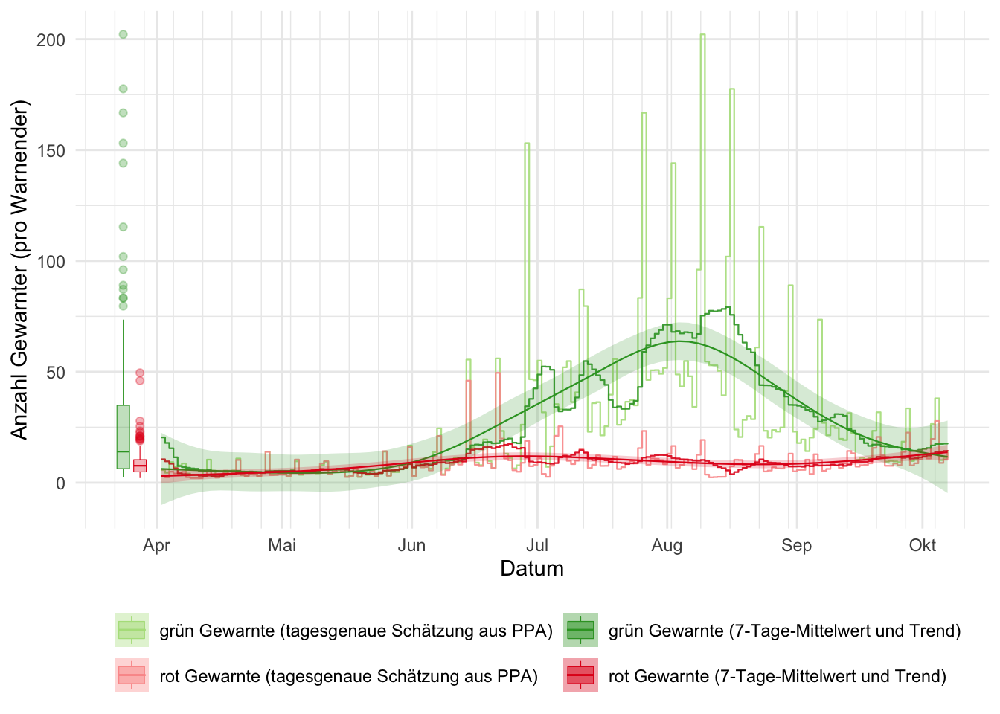
    <figcaption aria-hidden="true">Abb. 8: Anzahl rot und grün gewarnter Personen pro warnender Person im zeitlichen Verlauf.</figcaption>
</figure>

### 5.3 Gewarnte Personen durch Check-Ins

Insgesamt wurden über die CWA-Datenspende bisher 9.075 gewarnte Personen durch ein Check-in registriert. Davon hatten 4.505 ein erhöhtes Risiko (rote Warnung) und 4.570 ein niedriges Risiko (grüne Warnung).

Im selben Zeitraum gab es 398 geteilte Check-in-Ereignisse, womit wir auf etwa 46,5 (hiervon 23,1 rot und 23,4 grün) gewarnte Personen pro Event schließen können. Aufgrund der fehlenden Berücksichtigung der CWA in den Corona-Schutzverordnungen, darf die CWA in vielen Bereichen nicht offiziell zum Check-in genutzt werden. Bisher hat lediglich das Bundesland Sachsen die CWA als Check-in-Tool in den Corona-Schutzverordnungen verankert.

<svg class="main-svg" xmlns="http://www.w3.org/2000/svg" xmlns:xlink="http://www.w3.org/1999/xlink" width="800" height="600" style="background: rgb(255, 255, 255);"><defs id="defs-c9c068"><g class="clips"><clipPath id="clipc9c068xyplot" class="plotclip"><rect width="631" height="513"></rect></clipPath><clipPath class="axesclip" id="clipc9c068x"><rect x="60" y="0" width="631" height="600"></rect></clipPath><clipPath class="axesclip" id="clipc9c068y"><rect x="0" y="25" width="800" height="513"></rect></clipPath><clipPath class="axesclip" id="clipc9c068xy"><rect x="60" y="25" width="631" height="513"></rect></clipPath></g><g class="gradients"></g></defs><g class="bglayer"></g><g class="draglayer cursor-crosshair"><g class="xy"><rect class="nsewdrag drag" data-subplot="xy" x="60" y="25" width="631" height="513" style="fill: transparent; stroke-width: 0; pointer-events: all;"></rect><rect class="nwdrag drag cursor-nw-resize" data-subplot="xy" x="40" y="5" width="20" height="20" style="fill: transparent; stroke-width: 0; pointer-events: all;"></rect><rect class="nedrag drag cursor-ne-resize" data-subplot="xy" x="691" y="5" width="20" height="20" style="fill: transparent; stroke-width: 0; pointer-events: all;"></rect><rect class="swdrag drag cursor-sw-resize" data-subplot="xy" x="40" y="538" width="20" height="20" style="fill: transparent; stroke-width: 0; pointer-events: all;"></rect><rect class="sedrag drag cursor-se-resize" data-subplot="xy" x="691" y="538" width="20" height="20" style="fill: transparent; stroke-width: 0; pointer-events: all;"></rect><rect class="ewdrag drag cursor-ew-resize" data-subplot="xy" x="123.1" y="538.5" width="504.8" height="20" style="fill: transparent; stroke-width: 0; pointer-events: all;"></rect><rect class="wdrag drag cursor-w-resize" data-subplot="xy" x="60" y="538.5" width="63.1" height="20" style="fill: transparent; stroke-width: 0; pointer-events: all;"></rect><rect class="edrag drag cursor-e-resize" data-subplot="xy" x="627.9" y="538.5" width="63.1" height="20" style="fill: transparent; stroke-width: 0; pointer-events: all;"></rect><rect class="nsdrag drag cursor-ns-resize" data-subplot="xy" x="39.5" y="76.30000000000001" width="20" height="410.40000000000003" style="fill: transparent; stroke-width: 0; pointer-events: all;"></rect><rect class="sdrag drag cursor-s-resize" data-subplot="xy" x="39.5" y="486.7" width="20" height="51.300000000000004" style="fill: transparent; stroke-width: 0; pointer-events: all;"></rect><rect class="ndrag drag cursor-n-resize" data-subplot="xy" x="39.5" y="25" width="20" height="51.300000000000004" style="fill: transparent; stroke-width: 0; pointer-events: all;"></rect></g></g><g class="layer-below"><g class="imagelayer"></g><g class="shapelayer"></g></g><g class="cartesianlayer"><g class="subplot xy"><g class="layer-subplot"><g class="shapelayer"></g><g class="imagelayer"></g></g><g class="gridlayer"><g class="x"><path class="xgrid crisp" transform="translate(75.17,0)" d="M0,25v513" style="stroke: rgb(238, 238, 238); stroke-opacity: 1; stroke-width: 1px;"></path><path class="xgrid crisp" transform="translate(117.64,0)" d="M0,25v513" style="stroke: rgb(238, 238, 238); stroke-opacity: 1; stroke-width: 1px;"></path><path class="xgrid crisp" transform="translate(160.11,0)" d="M0,25v513" style="stroke: rgb(238, 238, 238); stroke-opacity: 1; stroke-width: 1px;"></path><path class="xgrid crisp" transform="translate(202.58,0)" d="M0,25v513" style="stroke: rgb(238, 238, 238); stroke-opacity: 1; stroke-width: 1px;"></path><path class="xgrid crisp" transform="translate(245.05,0)" d="M0,25v513" style="stroke: rgb(238, 238, 238); stroke-opacity: 1; stroke-width: 1px;"></path><path class="xgrid crisp" transform="translate(287.52,0)" d="M0,25v513" style="stroke: rgb(238, 238, 238); stroke-opacity: 1; stroke-width: 1px;"></path><path class="xgrid crisp" transform="translate(330,0)" d="M0,25v513" style="stroke: rgb(238, 238, 238); stroke-opacity: 1; stroke-width: 1px;"></path><path class="xgrid crisp" transform="translate(372.47,0)" d="M0,25v513" style="stroke: rgb(238, 238, 238); stroke-opacity: 1; stroke-width: 1px;"></path><path class="xgrid crisp" transform="translate(414.94,0)" d="M0,25v513" style="stroke: rgb(238, 238, 238); stroke-opacity: 1; stroke-width: 1px;"></path><path class="xgrid crisp" transform="translate(457.41,0)" d="M0,25v513" style="stroke: rgb(238, 238, 238); stroke-opacity: 1; stroke-width: 1px;"></path><path class="xgrid crisp" transform="translate(499.88,0)" d="M0,25v513" style="stroke: rgb(238, 238, 238); stroke-opacity: 1; stroke-width: 1px;"></path><path class="xgrid crisp" transform="translate(542.35,0)" d="M0,25v513" style="stroke: rgb(238, 238, 238); stroke-opacity: 1; stroke-width: 1px;"></path><path class="xgrid crisp" transform="translate(584.82,0)" d="M0,25v513" style="stroke: rgb(238, 238, 238); stroke-opacity: 1; stroke-width: 1px;"></path><path class="xgrid crisp" transform="translate(627.29,0)" d="M0,25v513" style="stroke: rgb(238, 238, 238); stroke-opacity: 1; stroke-width: 1px;"></path><path class="xgrid crisp" transform="translate(669.76,0)" d="M0,25v513" style="stroke: rgb(238, 238, 238); stroke-opacity: 1; stroke-width: 1px;"></path></g><g class="y"></g></g><g class="zerolinelayer"><path class="yzl zl crisp" transform="translate(0,538)" d="M60,0h631" style="stroke: rgb(68, 68, 68); stroke-opacity: 1; stroke-width: 1px;"></path></g><path class="xlines-below"></path><path class="ylines-below"></path><g class="overlines-below"></g><g class="xaxislayer-below"></g><g class="yaxislayer-below"></g><g class="overaxes-below"></g><g class="plot" transform="translate(60, 25)" clip-path="url('#clipc9c068xyplot')"><g class="barlayer mlayer"><g class="trace bars" shape-rendering="crispEdges" style="opacity: 1;"><g class="points"><g class="point"><path d="M0.61,513V511H5.46V513Z" style="vector-effect: non-scaling-stroke; opacity: 1; stroke-width: 0px; fill: rgb(228, 26, 28); fill-opacity: 1;"></path></g><g class="point"><path d="M6.67,513V511H11.53V513Z" style="vector-effect: non-scaling-stroke; opacity: 1; stroke-width: 0px; fill: rgb(228, 26, 28); fill-opacity: 1;"></path></g><g class="point"><path d="M12.74,513V510.34H17.6V513Z" style="vector-effect: non-scaling-stroke; opacity: 1; stroke-width: 0px; fill: rgb(228, 26, 28); fill-opacity: 1;"></path></g><g class="point"><path d="M18.81,513V499.68H23.66V513Z" style="vector-effect: non-scaling-stroke; opacity: 1; stroke-width: 0px; fill: rgb(228, 26, 28); fill-opacity: 1;"></path></g><g class="point"><path d="M24.88,513V501.02H29.73V513Z" style="vector-effect: non-scaling-stroke; opacity: 1; stroke-width: 0px; fill: rgb(228, 26, 28); fill-opacity: 1;"></path></g><g class="point"><path d="M30.94,513V511H35.8V513Z" style="vector-effect: non-scaling-stroke; opacity: 1; stroke-width: 0px; fill: rgb(228, 26, 28); fill-opacity: 1;"></path></g><g class="point"><path d="M37.01,513V507.67H41.86V513Z" style="vector-effect: non-scaling-stroke; opacity: 1; stroke-width: 0px; fill: rgb(228, 26, 28); fill-opacity: 1;"></path></g><g class="point"><path d="M43.08,513V511H47.93V513Z" style="vector-effect: non-scaling-stroke; opacity: 1; stroke-width: 0px; fill: rgb(228, 26, 28); fill-opacity: 1;"></path></g><g class="point"><path d="M49.15,513V505.01H54V513Z" style="vector-effect: non-scaling-stroke; opacity: 1; stroke-width: 0px; fill: rgb(228, 26, 28); fill-opacity: 1;"></path></g><g class="point"><path d="M55.21,513V475.72H60.07V513Z" style="vector-effect: non-scaling-stroke; opacity: 1; stroke-width: 0px; fill: rgb(228, 26, 28); fill-opacity: 1;"></path></g><g class="point"><path d="M61.28,513V501.02H66.13V513Z" style="vector-effect: non-scaling-stroke; opacity: 1; stroke-width: 0px; fill: rgb(228, 26, 28); fill-opacity: 1;"></path></g><g class="point"><path d="M67.35,513V503.68H72.2V513Z" style="vector-effect: non-scaling-stroke; opacity: 1; stroke-width: 0px; fill: rgb(228, 26, 28); fill-opacity: 1;"></path></g><g class="point"><path d="M73.41,513V506.34H78.27V513Z" style="vector-effect: non-scaling-stroke; opacity: 1; stroke-width: 0px; fill: rgb(228, 26, 28); fill-opacity: 1;"></path></g><g class="point"><path d="M79.48,513V505.01H84.34V513Z" style="vector-effect: non-scaling-stroke; opacity: 1; stroke-width: 0px; fill: rgb(228, 26, 28); fill-opacity: 1;"></path></g><g class="point"><path d="M85.55,513V502.35H90.4V513Z" style="vector-effect: non-scaling-stroke; opacity: 1; stroke-width: 0px; fill: rgb(228, 26, 28); fill-opacity: 1;"></path></g><g class="point"><path d="M91.62,513V513H96.47V513Z" style="vector-effect: non-scaling-stroke; opacity: 1; stroke-width: 0px; fill: rgb(228, 26, 28); fill-opacity: 1;"></path></g><g class="point"><path d="M97.68,513V511H102.54V513Z" style="vector-effect: non-scaling-stroke; opacity: 1; stroke-width: 0px; fill: rgb(228, 26, 28); fill-opacity: 1;"></path></g><g class="point"><path d="M103.75,513V510.34H108.6V513Z" style="vector-effect: non-scaling-stroke; opacity: 1; stroke-width: 0px; fill: rgb(228, 26, 28); fill-opacity: 1;"></path></g><g class="point"><path d="M109.82,513V505.01H114.67V513Z" style="vector-effect: non-scaling-stroke; opacity: 1; stroke-width: 0px; fill: rgb(228, 26, 28); fill-opacity: 1;"></path></g><g class="point"><path d="M115.89,513V503.68H120.74V513Z" style="vector-effect: non-scaling-stroke; opacity: 1; stroke-width: 0px; fill: rgb(228, 26, 28); fill-opacity: 1;"></path></g><g class="point"><path d="M121.95,513V507.67H126.81V513Z" style="vector-effect: non-scaling-stroke; opacity: 1; stroke-width: 0px; fill: rgb(228, 26, 28); fill-opacity: 1;"></path></g><g class="point"><path d="M128.02,513V513H132.87V513Z" style="vector-effect: non-scaling-stroke; opacity: 1; stroke-width: 0px; fill: rgb(228, 26, 28); fill-opacity: 1;"></path></g><g class="point"><path d="M134.09,513V510.34H138.94V513Z" style="vector-effect: non-scaling-stroke; opacity: 1; stroke-width: 0px; fill: rgb(228, 26, 28); fill-opacity: 1;"></path></g><g class="point"><path d="M140.15,513V511H145.01V513Z" style="vector-effect: non-scaling-stroke; opacity: 1; stroke-width: 0px; fill: rgb(228, 26, 28); fill-opacity: 1;"></path></g><g class="point"><path d="M146.22,513V490.36H151.08V513Z" style="vector-effect: non-scaling-stroke; opacity: 1; stroke-width: 0px; fill: rgb(228, 26, 28); fill-opacity: 1;"></path></g><g class="point"><path d="M152.29,513V427.78H157.14V513Z" style="vector-effect: non-scaling-stroke; opacity: 1; stroke-width: 0px; fill: rgb(228, 26, 28); fill-opacity: 1;"></path></g><g class="point"><path d="M158.36,513V457.07H163.21V513Z" style="vector-effect: non-scaling-stroke; opacity: 1; stroke-width: 0px; fill: rgb(228, 26, 28); fill-opacity: 1;"></path></g><g class="point"><path d="M164.42,513V474.38H169.28V513Z" style="vector-effect: non-scaling-stroke; opacity: 1; stroke-width: 0px; fill: rgb(228, 26, 28); fill-opacity: 1;"></path></g><g class="point"><path d="M170.49,513V495.69H175.35V513Z" style="vector-effect: non-scaling-stroke; opacity: 1; stroke-width: 0px; fill: rgb(228, 26, 28); fill-opacity: 1;"></path></g><g class="point"><path d="M176.56,513V491.7H181.41V513Z" style="vector-effect: non-scaling-stroke; opacity: 1; stroke-width: 0px; fill: rgb(228, 26, 28); fill-opacity: 1;"></path></g><g class="point"><path d="M182.63,513V502.35H187.48V513Z" style="vector-effect: non-scaling-stroke; opacity: 1; stroke-width: 0px; fill: rgb(228, 26, 28); fill-opacity: 1;"></path></g><g class="point"><path d="M188.69,513V491.7H193.55V513Z" style="vector-effect: non-scaling-stroke; opacity: 1; stroke-width: 0px; fill: rgb(228, 26, 28); fill-opacity: 1;"></path></g><g class="point"><path d="M194.76,513V485.04H199.61V513Z" style="vector-effect: non-scaling-stroke; opacity: 1; stroke-width: 0px; fill: rgb(228, 26, 28); fill-opacity: 1;"></path></g><g class="point"><path d="M200.83,513V471.72H205.68V513Z" style="vector-effect: non-scaling-stroke; opacity: 1; stroke-width: 0px; fill: rgb(228, 26, 28); fill-opacity: 1;"></path></g><g class="point"><path d="M206.9,513V487.7H211.75V513Z" style="vector-effect: non-scaling-stroke; opacity: 1; stroke-width: 0px; fill: rgb(228, 26, 28); fill-opacity: 1;"></path></g><g class="point"><path d="M212.96,513V494.36H217.82V513Z" style="vector-effect: non-scaling-stroke; opacity: 1; stroke-width: 0px; fill: rgb(228, 26, 28); fill-opacity: 1;"></path></g><g class="point"><path d="M219.03,513V497.02H223.88V513Z" style="vector-effect: non-scaling-stroke; opacity: 1; stroke-width: 0px; fill: rgb(228, 26, 28); fill-opacity: 1;"></path></g><g class="point"><path d="M225.1,513V495.69H229.95V513Z" style="vector-effect: non-scaling-stroke; opacity: 1; stroke-width: 0px; fill: rgb(228, 26, 28); fill-opacity: 1;"></path></g><g class="point"><path d="M231.16,513V489.03H236.02V513Z" style="vector-effect: non-scaling-stroke; opacity: 1; stroke-width: 0px; fill: rgb(228, 26, 28); fill-opacity: 1;"></path></g><g class="point"><path d="M237.23,513V486.37H242.09V513Z" style="vector-effect: non-scaling-stroke; opacity: 1; stroke-width: 0px; fill: rgb(228, 26, 28); fill-opacity: 1;"></path></g><g class="point"><path d="M243.3,513V481.04H248.15V513Z" style="vector-effect: non-scaling-stroke; opacity: 1; stroke-width: 0px; fill: rgb(228, 26, 28); fill-opacity: 1;"></path></g><g class="point"><path d="M249.37,513V503.68H254.22V513Z" style="vector-effect: non-scaling-stroke; opacity: 1; stroke-width: 0px; fill: rgb(228, 26, 28); fill-opacity: 1;"></path></g><g class="point"><path d="M255.43,513V499.68H260.29V513Z" style="vector-effect: non-scaling-stroke; opacity: 1; stroke-width: 0px; fill: rgb(228, 26, 28); fill-opacity: 1;"></path></g><g class="point"><path d="M261.5,513V481.04H266.35V513Z" style="vector-effect: non-scaling-stroke; opacity: 1; stroke-width: 0px; fill: rgb(228, 26, 28); fill-opacity: 1;"></path></g><g class="point"><path d="M267.57,513V453.08H272.42V513Z" style="vector-effect: non-scaling-stroke; opacity: 1; stroke-width: 0px; fill: rgb(228, 26, 28); fill-opacity: 1;"></path></g><g class="point"><path d="M273.64,513V498.35H278.49V513Z" style="vector-effect: non-scaling-stroke; opacity: 1; stroke-width: 0px; fill: rgb(228, 26, 28); fill-opacity: 1;"></path></g><g class="point"><path d="M279.7,513V509.01H284.56V513Z" style="vector-effect: non-scaling-stroke; opacity: 1; stroke-width: 0px; fill: rgb(228, 26, 28); fill-opacity: 1;"></path></g><g class="point"><path d="M285.77,513V509.01H290.62V513Z" style="vector-effect: non-scaling-stroke; opacity: 1; stroke-width: 0px; fill: rgb(228, 26, 28); fill-opacity: 1;"></path></g><g class="point"><path d="M291.84,513V505.01H296.69V513Z" style="vector-effect: non-scaling-stroke; opacity: 1; stroke-width: 0px; fill: rgb(228, 26, 28); fill-opacity: 1;"></path></g><g class="point"><path d="M297.9,513V509.01H302.76V513Z" style="vector-effect: non-scaling-stroke; opacity: 1; stroke-width: 0px; fill: rgb(228, 26, 28); fill-opacity: 1;"></path></g><g class="point"><path d="M303.97,513V510.34H308.83V513Z" style="vector-effect: non-scaling-stroke; opacity: 1; stroke-width: 0px; fill: rgb(228, 26, 28); fill-opacity: 1;"></path></g><g class="point"><path d="M310.04,513V511H314.89V513Z" style="vector-effect: non-scaling-stroke; opacity: 1; stroke-width: 0px; fill: rgb(228, 26, 28); fill-opacity: 1;"></path></g><g class="point"><path d="M316.11,513V470.39H320.96V513Z" style="vector-effect: non-scaling-stroke; opacity: 1; stroke-width: 0px; fill: rgb(228, 26, 28); fill-opacity: 1;"></path></g><g class="point"><path d="M322.17,513V466.4H327.03V513Z" style="vector-effect: non-scaling-stroke; opacity: 1; stroke-width: 0px; fill: rgb(228, 26, 28); fill-opacity: 1;"></path></g><g class="point"><path d="M328.24,513V498.35H333.1V513Z" style="vector-effect: non-scaling-stroke; opacity: 1; stroke-width: 0px; fill: rgb(228, 26, 28); fill-opacity: 1;"></path></g><g class="point"><path d="M334.31,513V503.68H339.16V513Z" style="vector-effect: non-scaling-stroke; opacity: 1; stroke-width: 0px; fill: rgb(228, 26, 28); fill-opacity: 1;"></path></g><g class="point"><path d="M340.38,513V497.02H345.23V513Z" style="vector-effect: non-scaling-stroke; opacity: 1; stroke-width: 0px; fill: rgb(228, 26, 28); fill-opacity: 1;"></path></g><g class="point"><path d="M346.44,513V505.01H351.3V513Z" style="vector-effect: non-scaling-stroke; opacity: 1; stroke-width: 0px; fill: rgb(228, 26, 28); fill-opacity: 1;"></path></g><g class="point"><path d="M352.51,513V507.67H357.36V513Z" style="vector-effect: non-scaling-stroke; opacity: 1; stroke-width: 0px; fill: rgb(228, 26, 28); fill-opacity: 1;"></path></g><g class="point"><path d="M358.58,513V507.67H363.43V513Z" style="vector-effect: non-scaling-stroke; opacity: 1; stroke-width: 0px; fill: rgb(228, 26, 28); fill-opacity: 1;"></path></g><g class="point"><path d="M364.65,513V470.39H369.5V513Z" style="vector-effect: non-scaling-stroke; opacity: 1; stroke-width: 0px; fill: rgb(228, 26, 28); fill-opacity: 1;"></path></g><g class="point"><path d="M370.71,513V451.75H375.57V513Z" style="vector-effect: non-scaling-stroke; opacity: 1; stroke-width: 0px; fill: rgb(228, 26, 28); fill-opacity: 1;"></path></g><g class="point"><path d="M376.78,513V454.41H381.63V513Z" style="vector-effect: non-scaling-stroke; opacity: 1; stroke-width: 0px; fill: rgb(228, 26, 28); fill-opacity: 1;"></path></g><g class="point"><path d="M382.85,513V422.45H387.7V513Z" style="vector-effect: non-scaling-stroke; opacity: 1; stroke-width: 0px; fill: rgb(228, 26, 28); fill-opacity: 1;"></path></g><g class="point"><path d="M388.91,513V469.06H393.77V513Z" style="vector-effect: non-scaling-stroke; opacity: 1; stroke-width: 0px; fill: rgb(228, 26, 28); fill-opacity: 1;"></path></g><g class="point"><path d="M394.98,513V486.37H399.84V513Z" style="vector-effect: non-scaling-stroke; opacity: 1; stroke-width: 0px; fill: rgb(228, 26, 28); fill-opacity: 1;"></path></g><g class="point"><path d="M401.05,513V478.38H405.9V513Z" style="vector-effect: non-scaling-stroke; opacity: 1; stroke-width: 0px; fill: rgb(228, 26, 28); fill-opacity: 1;"></path></g><g class="point"><path d="M407.12,513V487.7H411.97V513Z" style="vector-effect: non-scaling-stroke; opacity: 1; stroke-width: 0px; fill: rgb(228, 26, 28); fill-opacity: 1;"></path></g><g class="point"><path d="M413.18,513V483.71H418.04V513Z" style="vector-effect: non-scaling-stroke; opacity: 1; stroke-width: 0px; fill: rgb(228, 26, 28); fill-opacity: 1;"></path></g><g class="point"><path d="M419.25,513V481.04H424.1V513Z" style="vector-effect: non-scaling-stroke; opacity: 1; stroke-width: 0px; fill: rgb(228, 26, 28); fill-opacity: 1;"></path></g><g class="point"><path d="M425.32,513V349.22H430.17V513Z" style="vector-effect: non-scaling-stroke; opacity: 1; stroke-width: 0px; fill: rgb(228, 26, 28); fill-opacity: 1;"></path></g><g class="point"><path d="M431.39,513V419.79H436.24V513Z" style="vector-effect: non-scaling-stroke; opacity: 1; stroke-width: 0px; fill: rgb(228, 26, 28); fill-opacity: 1;"></path></g><g class="point"><path d="M437.45,513V477.05H442.31V513Z" style="vector-effect: non-scaling-stroke; opacity: 1; stroke-width: 0px; fill: rgb(228, 26, 28); fill-opacity: 1;"></path></g><g class="point"><path d="M443.52,513V447.75H448.37V513Z" style="vector-effect: non-scaling-stroke; opacity: 1; stroke-width: 0px; fill: rgb(228, 26, 28); fill-opacity: 1;"></path></g><g class="point"><path d="M449.59,513V283.97H454.44V513Z" style="vector-effect: non-scaling-stroke; opacity: 1; stroke-width: 0px; fill: rgb(228, 26, 28); fill-opacity: 1;"></path></g><g class="point"><path d="M455.65,513V449.09H460.51V513Z" style="vector-effect: non-scaling-stroke; opacity: 1; stroke-width: 0px; fill: rgb(228, 26, 28); fill-opacity: 1;"></path></g><g class="point"><path d="M461.72,513V439.76H466.58V513Z" style="vector-effect: non-scaling-stroke; opacity: 1; stroke-width: 0px; fill: rgb(228, 26, 28); fill-opacity: 1;"></path></g><g class="point"><path d="M467.79,513V351.88H472.64V513Z" style="vector-effect: non-scaling-stroke; opacity: 1; stroke-width: 0px; fill: rgb(228, 26, 28); fill-opacity: 1;"></path></g><g class="point"><path d="M473.86,513V430.44H478.71V513Z" style="vector-effect: non-scaling-stroke; opacity: 1; stroke-width: 0px; fill: rgb(228, 26, 28); fill-opacity: 1;"></path></g><g class="point"><path d="M479.92,513V451.75H484.78V513Z" style="vector-effect: non-scaling-stroke; opacity: 1; stroke-width: 0px; fill: rgb(228, 26, 28); fill-opacity: 1;"></path></g><g class="point"><path d="M485.99,513V407.81H490.85V513Z" style="vector-effect: non-scaling-stroke; opacity: 1; stroke-width: 0px; fill: rgb(228, 26, 28); fill-opacity: 1;"></path></g><g class="point"><path d="M492.06,513V397.15H496.91V513Z" style="vector-effect: non-scaling-stroke; opacity: 1; stroke-width: 0px; fill: rgb(228, 26, 28); fill-opacity: 1;"></path></g><g class="point"><path d="M498.13,513V406.48H502.98V513Z" style="vector-effect: non-scaling-stroke; opacity: 1; stroke-width: 0px; fill: rgb(228, 26, 28); fill-opacity: 1;"></path></g><g class="point"><path d="M504.19,513V350.55H509.05V513Z" style="vector-effect: non-scaling-stroke; opacity: 1; stroke-width: 0px; fill: rgb(228, 26, 28); fill-opacity: 1;"></path></g><g class="point"><path d="M510.26,513V459.74H515.11V513Z" style="vector-effect: non-scaling-stroke; opacity: 1; stroke-width: 0px; fill: rgb(228, 26, 28); fill-opacity: 1;"></path></g><g class="point"><path d="M516.33,513V466.4H521.18V513Z" style="vector-effect: non-scaling-stroke; opacity: 1; stroke-width: 0px; fill: rgb(228, 26, 28); fill-opacity: 1;"></path></g><g class="point"><path d="M522.4,513V478.38H527.25V513Z" style="vector-effect: non-scaling-stroke; opacity: 1; stroke-width: 0px; fill: rgb(228, 26, 28); fill-opacity: 1;"></path></g><g class="point"><path d="M528.46,513V453.08H533.32V513Z" style="vector-effect: non-scaling-stroke; opacity: 1; stroke-width: 0px; fill: rgb(228, 26, 28); fill-opacity: 1;"></path></g><g class="point"><path d="M534.53,513V401.15H539.38V513Z" style="vector-effect: non-scaling-stroke; opacity: 1; stroke-width: 0px; fill: rgb(228, 26, 28); fill-opacity: 1;"></path></g><g class="point"><path d="M540.6,513V411.8H545.45V513Z" style="vector-effect: non-scaling-stroke; opacity: 1; stroke-width: 0px; fill: rgb(228, 26, 28); fill-opacity: 1;"></path></g><g class="point"><path d="M546.66,513V423.79H551.52V513Z" style="vector-effect: non-scaling-stroke; opacity: 1; stroke-width: 0px; fill: rgb(228, 26, 28); fill-opacity: 1;"></path></g><g class="point"><path d="M552.73,513V401.15H557.59V513Z" style="vector-effect: non-scaling-stroke; opacity: 1; stroke-width: 0px; fill: rgb(228, 26, 28); fill-opacity: 1;"></path></g><g class="point"><path d="M558.8,513V458.41H563.65V513Z" style="vector-effect: non-scaling-stroke; opacity: 1; stroke-width: 0px; fill: rgb(228, 26, 28); fill-opacity: 1;"></path></g><g class="point"><path d="M564.87,513V457.07H569.72V513Z" style="vector-effect: non-scaling-stroke; opacity: 1; stroke-width: 0px; fill: rgb(228, 26, 28); fill-opacity: 1;"></path></g><g class="point"><path d="M570.93,513V374.52H575.79V513Z" style="vector-effect: non-scaling-stroke; opacity: 1; stroke-width: 0px; fill: rgb(228, 26, 28); fill-opacity: 1;"></path></g><g class="point"><path d="M577,513V326.58H581.85V513Z" style="vector-effect: non-scaling-stroke; opacity: 1; stroke-width: 0px; fill: rgb(228, 26, 28); fill-opacity: 1;"></path></g><g class="point"><path d="M583.07,513V323.92H587.92V513Z" style="vector-effect: non-scaling-stroke; opacity: 1; stroke-width: 0px; fill: rgb(228, 26, 28); fill-opacity: 1;"></path></g><g class="point"><path d="M589.14,513V222.72H593.99V513Z" style="vector-effect: non-scaling-stroke; opacity: 1; stroke-width: 0px; fill: rgb(228, 26, 28); fill-opacity: 1;"></path></g><g class="point"><path d="M595.2,513V221.39H600.06V513Z" style="vector-effect: non-scaling-stroke; opacity: 1; stroke-width: 0px; fill: rgb(228, 26, 28); fill-opacity: 1;"></path></g><g class="point"><path d="M601.27,513V141.5H606.12V513Z" style="vector-effect: non-scaling-stroke; opacity: 1; stroke-width: 0px; fill: rgb(228, 26, 28); fill-opacity: 1;"></path></g><g class="point"><path d="M607.34,513V325.25H612.19V513Z" style="vector-effect: non-scaling-stroke; opacity: 1; stroke-width: 0px; fill: rgb(228, 26, 28); fill-opacity: 1;"></path></g><g class="point"><path d="M613.4,513V289.3H618.26V513Z" style="vector-effect: non-scaling-stroke; opacity: 1; stroke-width: 0px; fill: rgb(228, 26, 28); fill-opacity: 1;"></path></g><g class="point"><path d="M619.47,513V309.27H624.33V513Z" style="vector-effect: non-scaling-stroke; opacity: 1; stroke-width: 0px; fill: rgb(228, 26, 28); fill-opacity: 1;"></path></g><g class="point"><path d="M625.54,513V244.03H630.39V513Z" style="vector-effect: non-scaling-stroke; opacity: 1; stroke-width: 0px; fill: rgb(228, 26, 28); fill-opacity: 1;"></path></g></g></g><g class="trace bars" shape-rendering="crispEdges" style="opacity: 1;"><g class="points"><g class="point"><path d="M0.61,511.67V511.67H5.46V511.67Z" style="vector-effect: non-scaling-stroke; opacity: 1; stroke-width: 0px; fill: rgb(77, 175, 74); fill-opacity: 1;"></path></g><g class="point"><path d="M6.67,511.67V509.01H11.53V511.67Z" style="vector-effect: non-scaling-stroke; opacity: 1; stroke-width: 0px; fill: rgb(77, 175, 74); fill-opacity: 1;"></path></g><g class="point"><path d="M12.74,511V509H17.6V511Z" style="vector-effect: non-scaling-stroke; opacity: 1; stroke-width: 0px; fill: rgb(77, 175, 74); fill-opacity: 1;"></path></g><g class="point"><path d="M18.81,499.68V497.02H23.66V499.68Z" style="vector-effect: non-scaling-stroke; opacity: 1; stroke-width: 0px; fill: rgb(77, 175, 74); fill-opacity: 1;"></path></g><g class="point"><path d="M24.88,502V499.68H29.73V502Z" style="vector-effect: non-scaling-stroke; opacity: 1; stroke-width: 0px; fill: rgb(77, 175, 74); fill-opacity: 1;"></path></g><g class="point"><path d="M30.94,511.67V511.67H35.8V511.67Z" style="vector-effect: non-scaling-stroke; opacity: 1; stroke-width: 0px; fill: rgb(77, 175, 74); fill-opacity: 1;"></path></g><g class="point"><path d="M37.01,507.67V503.68H41.86V507.67Z" style="vector-effect: non-scaling-stroke; opacity: 1; stroke-width: 0px; fill: rgb(77, 175, 74); fill-opacity: 1;"></path></g><g class="point"><path d="M43.08,512V510H47.93V512Z" style="vector-effect: non-scaling-stroke; opacity: 1; stroke-width: 0px; fill: rgb(77, 175, 74); fill-opacity: 1;"></path></g><g class="point"><path d="M49.15,506V503.68H54V506Z" style="vector-effect: non-scaling-stroke; opacity: 1; stroke-width: 0px; fill: rgb(77, 175, 74); fill-opacity: 1;"></path></g><g class="point"><path d="M55.21,475.72V467.73H60.07V475.72Z" style="vector-effect: non-scaling-stroke; opacity: 1; stroke-width: 0px; fill: rgb(77, 175, 74); fill-opacity: 1;"></path></g><g class="point"><path d="M61.28,501.02V498.35H66.13V501.02Z" style="vector-effect: non-scaling-stroke; opacity: 1; stroke-width: 0px; fill: rgb(77, 175, 74); fill-opacity: 1;"></path></g><g class="point"><path d="M67.35,503.68V486.37H72.2V503.68Z" style="vector-effect: non-scaling-stroke; opacity: 1; stroke-width: 0px; fill: rgb(77, 175, 74); fill-opacity: 1;"></path></g><g class="point"><path d="M73.41,506.34V497.02H78.27V506.34Z" style="vector-effect: non-scaling-stroke; opacity: 1; stroke-width: 0px; fill: rgb(77, 175, 74); fill-opacity: 1;"></path></g><g class="point"><path d="M79.48,505.01V495.69H84.34V505.01Z" style="vector-effect: non-scaling-stroke; opacity: 1; stroke-width: 0px; fill: rgb(77, 175, 74); fill-opacity: 1;"></path></g><g class="point"><path d="M85.55,502.35V493.03H90.4V502.35Z" style="vector-effect: non-scaling-stroke; opacity: 1; stroke-width: 0px; fill: rgb(77, 175, 74); fill-opacity: 1;"></path></g><g class="point"><path d="M91.62,513V506.34H96.47V513Z" style="vector-effect: non-scaling-stroke; opacity: 1; stroke-width: 0px; fill: rgb(77, 175, 74); fill-opacity: 1;"></path></g><g class="point"><path d="M97.68,511.67V402.48H102.54V511.67Z" style="vector-effect: non-scaling-stroke; opacity: 1; stroke-width: 0px; fill: rgb(77, 175, 74); fill-opacity: 1;"></path></g><g class="point"><path d="M103.75,510.34V451.75H108.6V510.34Z" style="vector-effect: non-scaling-stroke; opacity: 1; stroke-width: 0px; fill: rgb(77, 175, 74); fill-opacity: 1;"></path></g><g class="point"><path d="M109.82,505.01V443.76H114.67V505.01Z" style="vector-effect: non-scaling-stroke; opacity: 1; stroke-width: 0px; fill: rgb(77, 175, 74); fill-opacity: 1;"></path></g><g class="point"><path d="M115.89,503.68V482.37H120.74V503.68Z" style="vector-effect: non-scaling-stroke; opacity: 1; stroke-width: 0px; fill: rgb(77, 175, 74); fill-opacity: 1;"></path></g><g class="point"><path d="M121.95,507.67V485.04H126.81V507.67Z" style="vector-effect: non-scaling-stroke; opacity: 1; stroke-width: 0px; fill: rgb(77, 175, 74); fill-opacity: 1;"></path></g><g class="point"><path d="M128.02,513V497.02H132.87V513Z" style="vector-effect: non-scaling-stroke; opacity: 1; stroke-width: 0px; fill: rgb(77, 175, 74); fill-opacity: 1;"></path></g><g class="point"><path d="M134.09,510.34V463.73H138.94V510.34Z" style="vector-effect: non-scaling-stroke; opacity: 1; stroke-width: 0px; fill: rgb(77, 175, 74); fill-opacity: 1;"></path></g><g class="point"><path d="M140.15,511.67V411.8H145.01V511.67Z" style="vector-effect: non-scaling-stroke; opacity: 1; stroke-width: 0px; fill: rgb(77, 175, 74); fill-opacity: 1;"></path></g><g class="point"><path d="M146.22,490.36V411.8H151.08V490.36Z" style="vector-effect: non-scaling-stroke; opacity: 1; stroke-width: 0px; fill: rgb(77, 175, 74); fill-opacity: 1;"></path></g><g class="point"><path d="M152.29,427.78V353.21H157.14V427.78Z" style="vector-effect: non-scaling-stroke; opacity: 1; stroke-width: 0px; fill: rgb(77, 175, 74); fill-opacity: 1;"></path></g><g class="point"><path d="M158.36,457.07V393.16H163.21V457.07Z" style="vector-effect: non-scaling-stroke; opacity: 1; stroke-width: 0px; fill: rgb(77, 175, 74); fill-opacity: 1;"></path></g><g class="point"><path d="M164.42,474.38V422.45H169.28V474.38Z" style="vector-effect: non-scaling-stroke; opacity: 1; stroke-width: 0px; fill: rgb(77, 175, 74); fill-opacity: 1;"></path></g><g class="point"><path d="M170.49,495.69V467.73H175.35V495.69Z" style="vector-effect: non-scaling-stroke; opacity: 1; stroke-width: 0px; fill: rgb(77, 175, 74); fill-opacity: 1;"></path></g><g class="point"><path d="M176.56,491.7V457.07H181.41V491.7Z" style="vector-effect: non-scaling-stroke; opacity: 1; stroke-width: 0px; fill: rgb(77, 175, 74); fill-opacity: 1;"></path></g><g class="point"><path d="M182.63,502.35V471.72H187.48V502.35Z" style="vector-effect: non-scaling-stroke; opacity: 1; stroke-width: 0px; fill: rgb(77, 175, 74); fill-opacity: 1;"></path></g><g class="point"><path d="M188.69,491.7V463.73H193.55V491.7Z" style="vector-effect: non-scaling-stroke; opacity: 1; stroke-width: 0px; fill: rgb(77, 175, 74); fill-opacity: 1;"></path></g><g class="point"><path d="M194.76,485.04V470.39H199.61V485.04Z" style="vector-effect: non-scaling-stroke; opacity: 1; stroke-width: 0px; fill: rgb(77, 175, 74); fill-opacity: 1;"></path></g><g class="point"><path d="M200.83,471.72V450.42H205.68V471.72Z" style="vector-effect: non-scaling-stroke; opacity: 1; stroke-width: 0px; fill: rgb(77, 175, 74); fill-opacity: 1;"></path></g><g class="point"><path d="M206.9,487.7V466.4H211.75V487.7Z" style="vector-effect: non-scaling-stroke; opacity: 1; stroke-width: 0px; fill: rgb(77, 175, 74); fill-opacity: 1;"></path></g><g class="point"><path d="M212.96,494.36V342.56H217.82V494.36Z" style="vector-effect: non-scaling-stroke; opacity: 1; stroke-width: 0px; fill: rgb(77, 175, 74); fill-opacity: 1;"></path></g><g class="point"><path d="M219.03,497.02V278.65H223.88V497.02Z" style="vector-effect: non-scaling-stroke; opacity: 1; stroke-width: 0px; fill: rgb(77, 175, 74); fill-opacity: 1;"></path></g><g class="point"><path d="M225.1,495.69V290.63H229.95V495.69Z" style="vector-effect: non-scaling-stroke; opacity: 1; stroke-width: 0px; fill: rgb(77, 175, 74); fill-opacity: 1;"></path></g><g class="point"><path d="M231.16,489.03V347.89H236.02V489.03Z" style="vector-effect: non-scaling-stroke; opacity: 1; stroke-width: 0px; fill: rgb(77, 175, 74); fill-opacity: 1;"></path></g><g class="point"><path d="M237.23,486.37V390.5H242.09V486.37Z" style="vector-effect: non-scaling-stroke; opacity: 1; stroke-width: 0px; fill: rgb(77, 175, 74); fill-opacity: 1;"></path></g><g class="point"><path d="M243.3,481.04V407.81H248.15V481.04Z" style="vector-effect: non-scaling-stroke; opacity: 1; stroke-width: 0px; fill: rgb(77, 175, 74); fill-opacity: 1;"></path></g><g class="point"><path d="M249.37,503.68V413.13H254.22V503.68Z" style="vector-effect: non-scaling-stroke; opacity: 1; stroke-width: 0px; fill: rgb(77, 175, 74); fill-opacity: 1;"></path></g><g class="point"><path d="M255.43,499.68V425.12H260.29V499.68Z" style="vector-effect: non-scaling-stroke; opacity: 1; stroke-width: 0px; fill: rgb(77, 175, 74); fill-opacity: 1;"></path></g><g class="point"><path d="M261.5,481.04V382.51H266.35V481.04Z" style="vector-effect: non-scaling-stroke; opacity: 1; stroke-width: 0px; fill: rgb(77, 175, 74); fill-opacity: 1;"></path></g><g class="point"><path d="M267.57,453.08V249.35H272.42V453.08Z" style="vector-effect: non-scaling-stroke; opacity: 1; stroke-width: 0px; fill: rgb(77, 175, 74); fill-opacity: 1;"></path></g><g class="point"><path d="M273.64,498.35V353.21H278.49V498.35Z" style="vector-effect: non-scaling-stroke; opacity: 1; stroke-width: 0px; fill: rgb(77, 175, 74); fill-opacity: 1;"></path></g><g class="point"><path d="M279.7,509.01V391.83H284.56V509.01Z" style="vector-effect: non-scaling-stroke; opacity: 1; stroke-width: 0px; fill: rgb(77, 175, 74); fill-opacity: 1;"></path></g><g class="point"><path d="M285.77,509.01V426.45H290.62V509.01Z" style="vector-effect: non-scaling-stroke; opacity: 1; stroke-width: 0px; fill: rgb(77, 175, 74); fill-opacity: 1;"></path></g><g class="point"><path d="M291.84,505.01V433.11H296.69V505.01Z" style="vector-effect: non-scaling-stroke; opacity: 1; stroke-width: 0px; fill: rgb(77, 175, 74); fill-opacity: 1;"></path></g><g class="point"><path d="M297.9,509.01V462.4H302.76V509.01Z" style="vector-effect: non-scaling-stroke; opacity: 1; stroke-width: 0px; fill: rgb(77, 175, 74); fill-opacity: 1;"></path></g><g class="point"><path d="M303.97,510.34V470.39H308.83V510.34Z" style="vector-effect: non-scaling-stroke; opacity: 1; stroke-width: 0px; fill: rgb(77, 175, 74); fill-opacity: 1;"></path></g><g class="point"><path d="M310.04,511.67V378.51H314.89V511.67Z" style="vector-effect: non-scaling-stroke; opacity: 1; stroke-width: 0px; fill: rgb(77, 175, 74); fill-opacity: 1;"></path></g><g class="point"><path d="M316.11,470.39V291.96H320.96V470.39Z" style="vector-effect: non-scaling-stroke; opacity: 1; stroke-width: 0px; fill: rgb(77, 175, 74); fill-opacity: 1;"></path></g><g class="point"><path d="M322.17,466.4V346.56H327.03V466.4Z" style="vector-effect: non-scaling-stroke; opacity: 1; stroke-width: 0px; fill: rgb(77, 175, 74); fill-opacity: 1;"></path></g><g class="point"><path d="M328.24,498.35V386.5H333.1V498.35Z" style="vector-effect: non-scaling-stroke; opacity: 1; stroke-width: 0px; fill: rgb(77, 175, 74); fill-opacity: 1;"></path></g><g class="point"><path d="M334.31,503.68V413.13H339.16V503.68Z" style="vector-effect: non-scaling-stroke; opacity: 1; stroke-width: 0px; fill: rgb(77, 175, 74); fill-opacity: 1;"></path></g><g class="point"><path d="M340.38,497.02V398.49H345.23V497.02Z" style="vector-effect: non-scaling-stroke; opacity: 1; stroke-width: 0px; fill: rgb(77, 175, 74); fill-opacity: 1;"></path></g><g class="point"><path d="M346.44,505.01V434.44H351.3V505.01Z" style="vector-effect: non-scaling-stroke; opacity: 1; stroke-width: 0px; fill: rgb(77, 175, 74); fill-opacity: 1;"></path></g><g class="point"><path d="M352.51,507.67V346.56H357.36V507.67Z" style="vector-effect: non-scaling-stroke; opacity: 1; stroke-width: 0px; fill: rgb(77, 175, 74); fill-opacity: 1;"></path></g><g class="point"><path d="M358.58,507.67V405.14H363.43V507.67Z" style="vector-effect: non-scaling-stroke; opacity: 1; stroke-width: 0px; fill: rgb(77, 175, 74); fill-opacity: 1;"></path></g><g class="point"><path d="M364.65,470.39V419.79H369.5V470.39Z" style="vector-effect: non-scaling-stroke; opacity: 1; stroke-width: 0px; fill: rgb(77, 175, 74); fill-opacity: 1;"></path></g><g class="point"><path d="M370.71,451.75V395.82H375.57V451.75Z" style="vector-effect: non-scaling-stroke; opacity: 1; stroke-width: 0px; fill: rgb(77, 175, 74); fill-opacity: 1;"></path></g><g class="point"><path d="M376.78,454.41V406.48H381.63V454.41Z" style="vector-effect: non-scaling-stroke; opacity: 1; stroke-width: 0px; fill: rgb(77, 175, 74); fill-opacity: 1;"></path></g><g class="point"><path d="M382.85,422.45V375.85H387.7V422.45Z" style="vector-effect: non-scaling-stroke; opacity: 1; stroke-width: 0px; fill: rgb(77, 175, 74); fill-opacity: 1;"></path></g><g class="point"><path d="M388.91,469.06V415.8H393.77V469.06Z" style="vector-effect: non-scaling-stroke; opacity: 1; stroke-width: 0px; fill: rgb(77, 175, 74); fill-opacity: 1;"></path></g><g class="point"><path d="M394.98,486.37V438.43H399.84V486.37Z" style="vector-effect: non-scaling-stroke; opacity: 1; stroke-width: 0px; fill: rgb(77, 175, 74); fill-opacity: 1;"></path></g><g class="point"><path d="M401.05,478.38V439.76H405.9V478.38Z" style="vector-effect: non-scaling-stroke; opacity: 1; stroke-width: 0px; fill: rgb(77, 175, 74); fill-opacity: 1;"></path></g><g class="point"><path d="M407.12,487.7V454.41H411.97V487.7Z" style="vector-effect: non-scaling-stroke; opacity: 1; stroke-width: 0px; fill: rgb(77, 175, 74); fill-opacity: 1;"></path></g><g class="point"><path d="M413.18,483.71V453.08H418.04V483.71Z" style="vector-effect: non-scaling-stroke; opacity: 1; stroke-width: 0px; fill: rgb(77, 175, 74); fill-opacity: 1;"></path></g><g class="point"><path d="M419.25,481.04V470.39H424.1V481.04Z" style="vector-effect: non-scaling-stroke; opacity: 1; stroke-width: 0px; fill: rgb(77, 175, 74); fill-opacity: 1;"></path></g><g class="point"><path d="M425.32,349.22V285.3H430.17V349.22Z" style="vector-effect: non-scaling-stroke; opacity: 1; stroke-width: 0px; fill: rgb(77, 175, 74); fill-opacity: 1;"></path></g><g class="point"><path d="M431.39,419.79V398.49H436.24V419.79Z" style="vector-effect: non-scaling-stroke; opacity: 1; stroke-width: 0px; fill: rgb(77, 175, 74); fill-opacity: 1;"></path></g><g class="point"><path d="M437.45,477.05V25.65H442.31V477.05Z" style="vector-effect: non-scaling-stroke; opacity: 1; stroke-width: 0px; fill: rgb(77, 175, 74); fill-opacity: 1;"></path></g><g class="point"><path d="M443.52,447.75V120.19H448.37V447.75Z" style="vector-effect: non-scaling-stroke; opacity: 1; stroke-width: 0px; fill: rgb(77, 175, 74); fill-opacity: 1;"></path></g><g class="point"><path d="M449.59,283.97V158.81H454.44V283.97Z" style="vector-effect: non-scaling-stroke; opacity: 1; stroke-width: 0px; fill: rgb(77, 175, 74); fill-opacity: 1;"></path></g><g class="point"><path d="M455.65,449.09V349.22H460.51V449.09Z" style="vector-effect: non-scaling-stroke; opacity: 1; stroke-width: 0px; fill: rgb(77, 175, 74); fill-opacity: 1;"></path></g><g class="point"><path d="M461.72,439.76V350.55H466.58V439.76Z" style="vector-effect: non-scaling-stroke; opacity: 1; stroke-width: 0px; fill: rgb(77, 175, 74); fill-opacity: 1;"></path></g><g class="point"><path d="M467.79,351.88V240.03H472.64V351.88Z" style="vector-effect: non-scaling-stroke; opacity: 1; stroke-width: 0px; fill: rgb(77, 175, 74); fill-opacity: 1;"></path></g><g class="point"><path d="M473.86,430.44V397.15H478.71V430.44Z" style="vector-effect: non-scaling-stroke; opacity: 1; stroke-width: 0px; fill: rgb(77, 175, 74); fill-opacity: 1;"></path></g><g class="point"><path d="M479.92,451.75V443.76H484.78V451.75Z" style="vector-effect: non-scaling-stroke; opacity: 1; stroke-width: 0px; fill: rgb(77, 175, 74); fill-opacity: 1;"></path></g><g class="point"><path d="M485.99,407.81V387.83H490.85V407.81Z" style="vector-effect: non-scaling-stroke; opacity: 1; stroke-width: 0px; fill: rgb(77, 175, 74); fill-opacity: 1;"></path></g><g class="point"><path d="M492.06,397.15V359.87H496.91V397.15Z" style="vector-effect: non-scaling-stroke; opacity: 1; stroke-width: 0px; fill: rgb(77, 175, 74); fill-opacity: 1;"></path></g><g class="point"><path d="M498.13,406.48V378.51H502.98V406.48Z" style="vector-effect: non-scaling-stroke; opacity: 1; stroke-width: 0px; fill: rgb(77, 175, 74); fill-opacity: 1;"></path></g><g class="point"><path d="M504.19,350.55V330.58H509.05V350.55Z" style="vector-effect: non-scaling-stroke; opacity: 1; stroke-width: 0px; fill: rgb(77, 175, 74); fill-opacity: 1;"></path></g><g class="point"><path d="M510.26,459.74V454.41H515.11V459.74Z" style="vector-effect: non-scaling-stroke; opacity: 1; stroke-width: 0px; fill: rgb(77, 175, 74); fill-opacity: 1;"></path></g><g class="point"><path d="M516.33,466.4V439.76H521.18V466.4Z" style="vector-effect: non-scaling-stroke; opacity: 1; stroke-width: 0px; fill: rgb(77, 175, 74); fill-opacity: 1;"></path></g><g class="point"><path d="M522.4,478.38V463.73H527.25V478.38Z" style="vector-effect: non-scaling-stroke; opacity: 1; stroke-width: 0px; fill: rgb(77, 175, 74); fill-opacity: 1;"></path></g><g class="point"><path d="M528.46,453.08V425.12H533.32V453.08Z" style="vector-effect: non-scaling-stroke; opacity: 1; stroke-width: 0px; fill: rgb(77, 175, 74); fill-opacity: 1;"></path></g><g class="point"><path d="M534.53,401.15V386.5H539.38V401.15Z" style="vector-effect: non-scaling-stroke; opacity: 1; stroke-width: 0px; fill: rgb(77, 175, 74); fill-opacity: 1;"></path></g><g class="point"><path d="M540.6,411.8V402.48H545.45V411.8Z" style="vector-effect: non-scaling-stroke; opacity: 1; stroke-width: 0px; fill: rgb(77, 175, 74); fill-opacity: 1;"></path></g><g class="point"><path d="M546.66,423.79V410.47H551.52V423.79Z" style="vector-effect: non-scaling-stroke; opacity: 1; stroke-width: 0px; fill: rgb(77, 175, 74); fill-opacity: 1;"></path></g><g class="point"><path d="M552.73,401.15V381.18H557.59V401.15Z" style="vector-effect: non-scaling-stroke; opacity: 1; stroke-width: 0px; fill: rgb(77, 175, 74); fill-opacity: 1;"></path></g><g class="point"><path d="M558.8,458.41V450.42H563.65V458.41Z" style="vector-effect: non-scaling-stroke; opacity: 1; stroke-width: 0px; fill: rgb(77, 175, 74); fill-opacity: 1;"></path></g><g class="point"><path d="M564.87,457.07V439.76H569.72V457.07Z" style="vector-effect: non-scaling-stroke; opacity: 1; stroke-width: 0px; fill: rgb(77, 175, 74); fill-opacity: 1;"></path></g><g class="point"><path d="M570.93,374.52V353.21H575.79V374.52Z" style="vector-effect: non-scaling-stroke; opacity: 1; stroke-width: 0px; fill: rgb(77, 175, 74); fill-opacity: 1;"></path></g><g class="point"><path d="M577,326.58V301.28H581.85V326.58Z" style="vector-effect: non-scaling-stroke; opacity: 1; stroke-width: 0px; fill: rgb(77, 175, 74); fill-opacity: 1;"></path></g><g class="point"><path d="M583.07,323.92V301.28H587.92V323.92Z" style="vector-effect: non-scaling-stroke; opacity: 1; stroke-width: 0px; fill: rgb(77, 175, 74); fill-opacity: 1;"></path></g><g class="point"><path d="M589.14,222.72V209.4H593.99V222.72Z" style="vector-effect: non-scaling-stroke; opacity: 1; stroke-width: 0px; fill: rgb(77, 175, 74); fill-opacity: 1;"></path></g><g class="point"><path d="M595.2,221.39V212.07H600.06V221.39Z" style="vector-effect: non-scaling-stroke; opacity: 1; stroke-width: 0px; fill: rgb(77, 175, 74); fill-opacity: 1;"></path></g><g class="point"><path d="M601.27,141.5V124.19H606.12V141.5Z" style="vector-effect: non-scaling-stroke; opacity: 1; stroke-width: 0px; fill: rgb(77, 175, 74); fill-opacity: 1;"></path></g><g class="point"><path d="M607.34,325.25V306.61H612.19V325.25Z" style="vector-effect: non-scaling-stroke; opacity: 1; stroke-width: 0px; fill: rgb(77, 175, 74); fill-opacity: 1;"></path></g><g class="point"><path d="M613.4,289.3V256.01H618.26V289.3Z" style="vector-effect: non-scaling-stroke; opacity: 1; stroke-width: 0px; fill: rgb(77, 175, 74); fill-opacity: 1;"></path></g><g class="point"><path d="M619.47,309.27V289.3H624.33V309.27Z" style="vector-effect: non-scaling-stroke; opacity: 1; stroke-width: 0px; fill: rgb(77, 175, 74); fill-opacity: 1;"></path></g><g class="point"><path d="M625.54,244.03V232.04H630.39V244.03Z" style="vector-effect: non-scaling-stroke; opacity: 1; stroke-width: 0px; fill: rgb(77, 175, 74); fill-opacity: 1;"></path></g></g></g></g><g class="scatterlayer mlayer"><g class="trace scatter tracee22dc8" style="stroke-miterlimit: 2;"><g class="fills"><g><path class="js-fill" d="M627.97,513L21.24,513L21.24,511.67H21.24V511.67H21.24H24.27V513H27.3H27.3V513H27.3H30.34V511.67H33.37H33.37V511.67H33.37H36.41V513H39.44H39.44V513H39.44H42.47V513H45.5H45.5V513H45.5H48.54V509.01H51.57H51.57V509.01H51.57H54.61V513H57.64H57.64V513H57.64H60.68V511.67H63.71H63.71V511.67H63.71H66.74V511.67H69.77H69.77V511.67H69.77H72.81V511.67H75.84H75.84V511.67H75.84H78.88V507.67H81.91H81.91V507.67H81.91H84.95V513H87.98H87.98V513H87.98H91.01V511.67H94.04H94.04V511.67H94.04H97.08V513H100.11H100.11V513H100.11H103.15V513H106.18H106.18V513H106.18H109.22V509.01H112.25H112.25V509.01H112.25H115.28V506.34H118.31H118.31V506.34H118.31H121.35V513H124.38H124.38V513H124.38H127.42V507.67H130.45H130.45V507.67H130.45H133.48V511.67H136.51H136.51V511.67H136.51H139.55V510.34H142.58H142.58V510.34H142.58H145.62V499.68H148.65H148.65V499.68H148.65H151.69V509.01H154.72H154.72V509.01H154.72H157.75V509.01H160.78H160.78V509.01H160.78H163.82V510.34H166.85H166.85V510.34H166.85H169.89V506.34H172.92H172.92V506.34H172.92H175.96V507.67H178.99H178.99V507.67H178.99H182.02V511.67H185.05H185.05V511.67H185.05H188.09V510.34H191.12H191.12V510.34H191.12H194.16V510.34H197.19H197.19V510.34H197.19H200.22V506.34H203.25H203.25V506.34H203.25H206.29V505.01H209.32H209.32V505.01H209.32H212.36V511.67H215.39H215.39V511.67H215.39H218.43V510.34H221.46H221.46V510.34H221.46H224.49V510.34H227.52H227.52V510.34H227.52H230.56V501.02H233.59H233.59V501.02H233.59H236.63V507.67H239.66H239.66V507.67H239.66H242.7V513H245.73H245.73V513H245.73H248.76V511.67H251.79H251.79V511.67H251.79H254.83V511.67H257.86H257.86V511.67H257.86H260.9V511.67H263.93H263.93V511.67H263.93H266.97V513H270H270V513H270H273.03V513H276.06H276.06V513H276.06H279.1V513H282.13H282.13V513H282.13H285.16V511.67H288.2H288.2V511.67H288.2H291.23V506.34H294.26H294.26V506.34H294.26H297.29V511.67H300.33H300.33V511.67H300.33H303.37V507.67H306.4H306.4V507.67H306.4H309.44V513H312.47H312.47V513H312.47H315.5V513H318.53H318.53V513H318.53H321.57V506.34H324.6H324.6V506.34H324.6H327.64V509.01H330.67H330.67V509.01H330.67H333.71V507.67H336.74H336.74V507.67H336.74H339.77V509.01H342.8H342.8V509.01H342.8H345.84V510.34H348.87H348.87V510.34H348.87H351.91V513H354.94H354.94V513H354.94H357.97V502.35H361H361V502.35H361H364.04V507.67H367.07H367.07V507.67H367.07H370.11V511.67H373.14H373.14V511.67H373.14H376.17V498.35H379.21H379.21V498.35H379.21H382.24V511.67H385.27H385.27V511.67H385.27H388.3V507.67H391.34H391.34V507.67H391.34H394.38V507.67H397.41H397.41V507.67H397.41H400.45V507.67H403.48H403.48V507.67H403.48H406.51V507.67H409.54H409.54V507.67H409.54H412.58V505.01H415.61H415.61V505.01H415.61H418.65V507.67H421.68H421.68V507.67H421.68H424.72V507.67H427.75H427.75V507.67H427.75H430.78V509.01H433.81H433.81V509.01H433.81H436.85V510.34H439.88H439.88V510.34H439.88H442.92V505.01H445.95H445.95V505.01H445.95H448.98V501.02H452.01H452.01V501.02H452.01H455.04V510.34H458.08H458.08V510.34H458.08H461.12V506.34H464.15H464.15V506.34H464.15H467.19V505.01H470.22H470.22V505.01H470.22H473.25V509.01H476.28H476.28V509.01H476.28H479.32V509.01H482.35H482.35V509.01H482.35H485.39V491.7H488.42H488.42V491.7H488.42H491.46V502.35H494.49H494.49V502.35H494.49H497.52V501.02H500.55H500.55V501.02H500.55H503.59V509.01H506.62H506.62V509.01H506.62H509.66V509.01H512.69H512.69V509.01H512.69H515.72V510.34H518.75H518.75V510.34H518.75H521.79V507.67H524.82H524.82V507.67H524.82H527.86V501.02H530.89H530.89V501.02H530.89H533.92V493.03H536.96H536.96V493.03H536.96H539.99V509.01H543.02H543.02V509.01H543.02H546.06V505.01H549.09H549.09V505.01H549.09H552.13V511.67H555.16H555.16V511.67H555.16H558.19V507.67H561.23H561.23V507.67H561.23H564.26V505.01H567.29H567.29V505.01H567.29H570.33V498.35H573.36H573.36V498.35H573.36H576.4V499.68H579.43H579.43V499.68H579.43H582.46V498.35H585.5H585.5V498.35H585.5H588.53V497.02H591.56H591.56V497.02H591.56H594.6V499.68H597.63H597.63V499.68H597.63H600.67V506.34H603.7H603.7V506.34H603.7H606.73V507.67H609.76H609.76V507.67H609.76H612.8V499.68H615.83H615.83V499.68H615.83H618.87V492.36H621.9H621.9V492.36H621.9H624.93V504.34H627.97H627.97V504.34H627.97" style="fill: rgb(0, 0, 0); fill-opacity: 0; stroke-width: 0;"></path></g></g><g class="errorbars"></g><g class="lines"><path class="js-line" d="M21.24,511.67H21.24V511.67H21.24H24.27V513H27.3H27.3V513H27.3H30.34V511.67H33.37H33.37V511.67H33.37H36.41V513H39.44H39.44V513H39.44H42.47V513H45.5H45.5V513H45.5H48.54V509.01H51.57H51.57V509.01H51.57H54.61V513H57.64H57.64V513H57.64H60.68V511.67H63.71H63.71V511.67H63.71H66.74V511.67H69.77H69.77V511.67H69.77H72.81V511.67H75.84H75.84V511.67H75.84H78.88V507.67H81.91H81.91V507.67H81.91H84.95V513H87.98H87.98V513H87.98H91.01V511.67H94.04H94.04V511.67H94.04H97.08V513H100.11H100.11V513H100.11H103.15V513H106.18H106.18V513H106.18H109.22V509.01H112.25H112.25V509.01H112.25H115.28V506.34H118.31H118.31V506.34H118.31H121.35V513H124.38H124.38V513H124.38H127.42V507.67H130.45H130.45V507.67H130.45H133.48V511.67H136.51H136.51V511.67H136.51H139.55V510.34H142.58H142.58V510.34H142.58H145.62V499.68H148.65H148.65V499.68H148.65H151.69V509.01H154.72H154.72V509.01H154.72H157.75V509.01H160.78H160.78V509.01H160.78H163.82V510.34H166.85H166.85V510.34H166.85H169.89V506.34H172.92H172.92V506.34H172.92H175.96V507.67H178.99H178.99V507.67H178.99H182.02V511.67H185.05H185.05V511.67H185.05H188.09V510.34H191.12H191.12V510.34H191.12H194.16V510.34H197.19H197.19V510.34H197.19H200.22V506.34H203.25H203.25V506.34H203.25H206.29V505.01H209.32H209.32V505.01H209.32H212.36V511.67H215.39H215.39V511.67H215.39H218.43V510.34H221.46H221.46V510.34H221.46H224.49V510.34H227.52H227.52V510.34H227.52H230.56V501.02H233.59H233.59V501.02H233.59H236.63V507.67H239.66H239.66V507.67H239.66H242.7V513H245.73H245.73V513H245.73H248.76V511.67H251.79H251.79V511.67H251.79H254.83V511.67H257.86H257.86V511.67H257.86H260.9V511.67H263.93H263.93V511.67H263.93H266.97V513H270H270V513H270H273.03V513H276.06H276.06V513H276.06H279.1V513H282.13H282.13V513H282.13H285.16V511.67H288.2H288.2V511.67H288.2H291.23V506.34H294.26H294.26V506.34H294.26H297.29V511.67H300.33H300.33V511.67H300.33H303.37V507.67H306.4H306.4V507.67H306.4H309.44V513H312.47H312.47V513H312.47H315.5V513H318.53H318.53V513H318.53H321.57V506.34H324.6H324.6V506.34H324.6H327.64V509.01H330.67H330.67V509.01H330.67H333.71V507.67H336.74H336.74V507.67H336.74H339.77V509.01H342.8H342.8V509.01H342.8H345.84V510.34H348.87H348.87V510.34H348.87H351.91V513H354.94H354.94V513H354.94H357.97V502.35H361H361V502.35H361H364.04V507.67H367.07H367.07V507.67H367.07H370.11V511.67H373.14H373.14V511.67H373.14H376.17V498.35H379.21H379.21V498.35H379.21H382.24V511.67H385.27H385.27V511.67H385.27H388.3V507.67H391.34H391.34V507.67H391.34H394.38V507.67H397.41H397.41V507.67H397.41H400.45V507.67H403.48H403.48V507.67H403.48H406.51V507.67H409.54H409.54V507.67H409.54H412.58V505.01H415.61H415.61V505.01H415.61H418.65V507.67H421.68H421.68V507.67H421.68H424.72V507.67H427.75H427.75V507.67H427.75H430.78V509.01H433.81H433.81V509.01H433.81H436.85V510.34H439.88H439.88V510.34H439.88H442.92V505.01H445.95H445.95V505.01H445.95H448.98V501.02H452.01H452.01V501.02H452.01H455.04V510.34H458.08H458.08V510.34H458.08H461.12V506.34H464.15H464.15V506.34H464.15H467.19V505.01H470.22H470.22V505.01H470.22H473.25V509.01H476.28H476.28V509.01H476.28H479.32V509.01H482.35H482.35V509.01H482.35H485.39V491.7H488.42H488.42V491.7H488.42H491.46V502.35H494.49H494.49V502.35H494.49H497.52V501.02H500.55H500.55V501.02H500.55H503.59V509.01H506.62H506.62V509.01H506.62H509.66V509.01H512.69H512.69V509.01H512.69H515.72V510.34H518.75H518.75V510.34H518.75H521.79V507.67H524.82H524.82V507.67H524.82H527.86V501.02H530.89H530.89V501.02H530.89H533.92V493.03H536.96H536.96V493.03H536.96H539.99V509.01H543.02H543.02V509.01H543.02H546.06V505.01H549.09H549.09V505.01H549.09H552.13V511.67H555.16H555.16V511.67H555.16H558.19V507.67H561.23H561.23V507.67H561.23H564.26V505.01H567.29H567.29V505.01H567.29H570.33V498.35H573.36H573.36V498.35H573.36H576.4V499.68H579.43H579.43V499.68H579.43H582.46V498.35H585.5H585.5V498.35H585.5H588.53V497.02H591.56H591.56V497.02H591.56H594.6V499.68H597.63H597.63V499.68H597.63H600.67V506.34H603.7H603.7V506.34H603.7H606.73V507.67H609.76H609.76V507.67H609.76H612.8V499.68H615.83H615.83V499.68H615.83H618.87V492.36H621.9H621.9V492.36H621.9H624.93V504.34H627.97H627.97V504.34H627.97" style="vector-effect: non-scaling-stroke; fill: none; stroke: rgb(55, 126, 184); stroke-opacity: 1; stroke-width: 1.5px; opacity: 1;"></path></g><g class="points"></g><g class="text"></g></g></g></g><g class="overplot"></g><path class="xlines-above crisp" d="M0,0" style="fill: none;"></path><path class="ylines-above crisp" d="M0,0" style="fill: none;"></path><g class="overlines-above"></g><g class="xaxislayer-above"><g class="xtick"><text text-anchor="start" x="0" y="551" data-unformatted="28. Jun" data-math="N" transform="translate(75.17,0) rotate(30,0,545)" style="font-family: &quot;Open Sans&quot;, verdana, arial, sans-serif; font-size: 12px; fill: rgb(68, 68, 68); fill-opacity: 1; white-space: pre;">28. Jun</text></g><g class="xtick"><text text-anchor="start" x="0" y="551" data-unformatted=" 5. Jul" data-math="N" transform="translate(117.64,0) rotate(30,0,545)" style="font-family: &quot;Open Sans&quot;, verdana, arial, sans-serif; font-size: 12px; fill: rgb(68, 68, 68); fill-opacity: 1; white-space: pre;"> 5. Jul</text></g><g class="xtick"><text text-anchor="start" x="0" y="551" data-unformatted="12. Jul" data-math="N" transform="translate(160.11,0) rotate(30,0,545)" style="font-family: &quot;Open Sans&quot;, verdana, arial, sans-serif; font-size: 12px; fill: rgb(68, 68, 68); fill-opacity: 1; white-space: pre;">12. Jul</text></g><g class="xtick"><text text-anchor="start" x="0" y="551" data-unformatted="19. Jul" data-math="N" transform="translate(202.58,0) rotate(30,0,545)" style="font-family: &quot;Open Sans&quot;, verdana, arial, sans-serif; font-size: 12px; fill: rgb(68, 68, 68); fill-opacity: 1; white-space: pre;">19. Jul</text></g><g class="xtick"><text text-anchor="start" x="0" y="551" data-unformatted="26. Jul" data-math="N" transform="translate(245.05,0) rotate(30,0,545)" style="font-family: &quot;Open Sans&quot;, verdana, arial, sans-serif; font-size: 12px; fill: rgb(68, 68, 68); fill-opacity: 1; white-space: pre;">26. Jul</text></g><g class="xtick"><text text-anchor="start" x="0" y="551" data-unformatted=" 2. Aug" data-math="N" transform="translate(287.52,0) rotate(30,0,545)" style="font-family: &quot;Open Sans&quot;, verdana, arial, sans-serif; font-size: 12px; fill: rgb(68, 68, 68); fill-opacity: 1; white-space: pre;"> 2. Aug</text></g><g class="xtick"><text text-anchor="start" x="0" y="551" data-unformatted=" 9. Aug" data-math="N" transform="translate(330,0) rotate(30,0,545)" style="font-family: &quot;Open Sans&quot;, verdana, arial, sans-serif; font-size: 12px; fill: rgb(68, 68, 68); fill-opacity: 1; white-space: pre;"> 9. Aug</text></g><g class="xtick"><text text-anchor="start" x="0" y="551" data-unformatted="16. Aug" data-math="N" transform="translate(372.47,0) rotate(30,0,545)" style="font-family: &quot;Open Sans&quot;, verdana, arial, sans-serif; font-size: 12px; fill: rgb(68, 68, 68); fill-opacity: 1; white-space: pre;">16. Aug</text></g><g class="xtick"><text text-anchor="start" x="0" y="551" data-unformatted="23. Aug" data-math="N" transform="translate(414.94,0) rotate(30,0,545)" style="font-family: &quot;Open Sans&quot;, verdana, arial, sans-serif; font-size: 12px; fill: rgb(68, 68, 68); fill-opacity: 1; white-space: pre;">23. Aug</text></g><g class="xtick"><text text-anchor="start" x="0" y="551" data-unformatted="30. Aug" data-math="N" transform="translate(457.41,0) rotate(30,0,545)" style="font-family: &quot;Open Sans&quot;, verdana, arial, sans-serif; font-size: 12px; fill: rgb(68, 68, 68); fill-opacity: 1; white-space: pre;">30. Aug</text></g><g class="xtick"><text text-anchor="start" x="0" y="551" data-unformatted=" 6. Sep" data-math="N" transform="translate(499.88,0) rotate(30,0,545)" style="font-family: &quot;Open Sans&quot;, verdana, arial, sans-serif; font-size: 12px; fill: rgb(68, 68, 68); fill-opacity: 1; white-space: pre;"> 6. Sep</text></g><g class="xtick"><text text-anchor="start" x="0" y="551" data-unformatted="13. Sep" data-math="N" transform="translate(542.35,0) rotate(30,0,545)" style="font-family: &quot;Open Sans&quot;, verdana, arial, sans-serif; font-size: 12px; fill: rgb(68, 68, 68); fill-opacity: 1; white-space: pre;">13. Sep</text></g><g class="xtick"><text text-anchor="start" x="0" y="551" data-unformatted="20. Sep" data-math="N" transform="translate(584.82,0) rotate(30,0,545)" style="font-family: &quot;Open Sans&quot;, verdana, arial, sans-serif; font-size: 12px; fill: rgb(68, 68, 68); fill-opacity: 1; white-space: pre;">20. Sep</text></g><g class="xtick"><text text-anchor="start" x="0" y="551" data-unformatted="27. Sep" data-math="N" transform="translate(627.29,0) rotate(30,0,545)" style="font-family: &quot;Open Sans&quot;, verdana, arial, sans-serif; font-size: 12px; fill: rgb(68, 68, 68); fill-opacity: 1; white-space: pre;">27. Sep</text></g><g class="xtick"><text text-anchor="start" x="0" y="551" data-unformatted=" 4. Okt" data-math="N" transform="translate(669.76,0) rotate(30,0,545)" style="font-family: &quot;Open Sans&quot;, verdana, arial, sans-serif; font-size: 12px; fill: rgb(68, 68, 68); fill-opacity: 1; white-space: pre;"> 4. Okt</text></g></g><g class="yaxislayer-above"><g class="ytick"><text text-anchor="end" x="59" y="4.199999999999999" data-unformatted="0" data-math="N" transform="translate(0,538)" style="font-family: &quot;Open Sans&quot;, verdana, arial, sans-serif; font-size: 12px; fill: rgb(68, 68, 68); fill-opacity: 1; white-space: pre;">0</text></g><g class="ytick"><text text-anchor="end" x="59" y="4.199999999999999" data-unformatted="50" data-math="N" transform="translate(0,471.42)" style="font-family: &quot;Open Sans&quot;, verdana, arial, sans-serif; font-size: 12px; fill: rgb(68, 68, 68); fill-opacity: 1; white-space: pre;">50</text></g><g class="ytick"><text text-anchor="end" x="59" y="4.199999999999999" data-unformatted="100" data-math="N" transform="translate(0,404.84)" style="font-family: &quot;Open Sans&quot;, verdana, arial, sans-serif; font-size: 12px; fill: rgb(68, 68, 68); fill-opacity: 1; white-space: pre;">100</text></g><g class="ytick"><text text-anchor="end" x="59" y="4.199999999999999" data-unformatted="150" data-math="N" transform="translate(0,338.27)" style="font-family: &quot;Open Sans&quot;, verdana, arial, sans-serif; font-size: 12px; fill: rgb(68, 68, 68); fill-opacity: 1; white-space: pre;">150</text></g><g class="ytick"><text text-anchor="end" x="59" y="4.199999999999999" data-unformatted="200" data-math="N" transform="translate(0,271.69)" style="font-family: &quot;Open Sans&quot;, verdana, arial, sans-serif; font-size: 12px; fill: rgb(68, 68, 68); fill-opacity: 1; white-space: pre;">200</text></g><g class="ytick"><text text-anchor="end" x="59" y="4.199999999999999" data-unformatted="250" data-math="N" transform="translate(0,205.11)" style="font-family: &quot;Open Sans&quot;, verdana, arial, sans-serif; font-size: 12px; fill: rgb(68, 68, 68); fill-opacity: 1; white-space: pre;">250</text></g><g class="ytick"><text text-anchor="end" x="59" y="4.199999999999999" data-unformatted="300" data-math="N" transform="translate(0,138.53)" style="font-family: &quot;Open Sans&quot;, verdana, arial, sans-serif; font-size: 12px; fill: rgb(68, 68, 68); fill-opacity: 1; white-space: pre;">300</text></g><g class="ytick"><text text-anchor="end" x="59" y="4.199999999999999" data-unformatted="350" data-math="N" transform="translate(0,71.95)" style="font-family: &quot;Open Sans&quot;, verdana, arial, sans-serif; font-size: 12px; fill: rgb(68, 68, 68); fill-opacity: 1; white-space: pre;">350</text></g></g><g class="overaxes-above"></g></g></g><g class="polarlayer"></g><g class="ternarylayer"></g><g class="geolayer"></g><g class="funnelarealayer"></g><g class="pielayer"></g><g class="treemaplayer"></g><g class="sunburstlayer"></g><g class="glimages"></g></svg>

<svg class="main-svg" xmlns="http://www.w3.org/2000/svg" xmlns:xlink="http://www.w3.org/1999/xlink" width="800" height="600"><defs id="topdefs-c9c068"><g class="clips"></g><clipPath id="legendc9c068"><rect width="86" height="67" x="0" y="0"></rect></clipPath><clipPath id="legendc9c068-hover"><rect width="116" height="83" x="1" y="1"></rect></clipPath></defs><g class="indicatorlayer"></g><g class="layer-above"><g class="imagelayer"></g><g class="shapelayer"></g></g><g class="infolayer"><g class="legend" pointer-events="all" transform="translate(703.62, 25)"><rect class="bg" shape-rendering="crispEdges" style="stroke: rgb(68, 68, 68); stroke-opacity: 1; fill: rgb(255, 255, 255); fill-opacity: 1; stroke-width: 0px;" width="86" height="67" x="0" y="0"></rect><g class="scrollbox" transform="translate(0, 0)" clip-path="url('#legendc9c068')"><g class="groups"><g class="traces" transform="translate(0, 14.5)" style="opacity: 1;"><text class="legendtext" text-anchor="start" x="40" y="4.680000000000001" data-unformatted="Events" data-math="N" style="font-family: &quot;Open Sans&quot;, verdana, arial, sans-serif; font-size: 12px; fill: rgb(68, 68, 68); fill-opacity: 1; white-space: pre;">Events</text><g class="layers"><g class="legendfill"><path class="js-fill" d="M5,-2h30v6h-30z" style="stroke-width: 0; fill: rgb(0, 0, 0); fill-opacity: 0;"></path></g><g class="legendlines"><path class="js-line" d="M5,-2h30" style="fill: none; stroke: rgb(55, 126, 184); stroke-opacity: 1; stroke-width: 1.5px;"></path></g><g class="legendsymbols"><g class="legendpoints"></g></g></g><rect class="legendtoggle" pointer-events="all" x="0" y="-9.5" width="80.3125" height="19" style="cursor: pointer; fill: rgb(0, 0, 0); fill-opacity: 0;"></rect></g><g class="traces" transform="translate(0, 33.5)" style="opacity: 1;"><text class="legendtext" text-anchor="start" x="40" y="4.680000000000001" data-unformatted="grün" data-math="N" style="font-family: &quot;Open Sans&quot;, verdana, arial, sans-serif; font-size: 12px; fill: rgb(68, 68, 68); fill-opacity: 1; white-space: pre;">grün</text><g class="layers" style="opacity: 1;"><g class="legendfill"></g><g class="legendlines"></g><g class="legendsymbols"><g class="legendpoints"><path class="legendundefined" d="M6,6H-6V-6H6Z" transform="translate(20,0)" style="stroke-width: 0px; fill: rgb(77, 175, 74); fill-opacity: 1;"></path></g></g></g><rect class="legendtoggle" pointer-events="all" x="0" y="-9.5" width="80.3125" height="19" style="cursor: pointer; fill: rgb(0, 0, 0); fill-opacity: 0;"></rect></g><g class="traces" transform="translate(0, 52.5)" style="opacity: 1;"><text class="legendtext" text-anchor="start" x="40" y="4.680000000000001" data-unformatted="rot" data-math="N" style="font-family: &quot;Open Sans&quot;, verdana, arial, sans-serif; font-size: 12px; fill: rgb(68, 68, 68); fill-opacity: 1; white-space: pre;">rot</text><g class="layers" style="opacity: 1;"><g class="legendfill"></g><g class="legendlines"></g><g class="legendsymbols"><g class="legendpoints"><path class="legendundefined" d="M6,6H-6V-6H6Z" transform="translate(20,0)" style="stroke-width: 0px; fill: rgb(228, 26, 28); fill-opacity: 1;"></path></g></g></g><rect class="legendtoggle" pointer-events="all" x="0" y="-9.5" width="80.3125" height="19" style="cursor: pointer; fill: rgb(0, 0, 0); fill-opacity: 0;"></rect></g></g></g><rect class="scrollbar" rx="20" ry="3" width="0" height="0" style="fill: rgb(128, 139, 164); fill-opacity: 1;" x="0" y="0"></rect></g><g class="g-gtitle"></g><g class="g-xtitle" transform="translate(0,1.892578125)"><text class="xtitle" x="375.5" y="590" text-anchor="middle" data-unformatted="Datum" data-math="N" style="font-family: &quot;Open Sans&quot;, verdana, arial, sans-serif; font-size: 14px; fill: rgb(68, 68, 68); opacity: 1; font-weight: normal; white-space: pre;">Datum</text></g><g class="g-ytitle"><text class="ytitle" transform="rotate(-90,26,281.5)" x="26" y="281.5" text-anchor="middle" data-unformatted="Anzahl" data-math="N" style="font-family: &quot;Open Sans&quot;, verdana, arial, sans-serif; font-size: 12px; fill: rgb(68, 68, 68); opacity: 1; font-weight: normal; white-space: pre;">Anzahl</text></g></g><g class="menulayer"></g><g class="zoomlayer"></g></svg>

<a rel="tooltip" class="modebar-btn" data-title="Graphen als PNG herunterladen" data-toggle="false" data-gravity="n"><svg viewBox="0 0 1000 1000" class="icon" height="1em" width="1em"><path d="m500 450c-83 0-150-67-150-150 0-83 67-150 150-150 83 0 150 67 150 150 0 83-67 150-150 150z m400 150h-120c-16 0-34 13-39 29l-31 93c-6 15-23 28-40 28h-340c-16 0-34-13-39-28l-31-94c-6-15-23-28-40-28h-120c-55 0-100-45-100-100v-450c0-55 45-100 100-100h800c55 0 100 45 100 100v450c0 55-45 100-100 100z m-400-550c-138 0-250 112-250 250 0 138 112 250 250 250 138 0 250-112 250-250 0-138-112-250-250-250z m365 380c-19 0-35 16-35 35 0 19 16 35 35 35 19 0 35-16 35-35 0-19-16-35-35-35z" transform="matrix(1 0 0 -1 0 850)"></path></svg></a>

<a rel="tooltip" class="modebar-btn active" data-title="Zoom" data-attr="dragmode" data-val="zoom" data-toggle="false" data-gravity="n"><svg viewBox="0 0 1000 1000" class="icon" height="1em" width="1em"><path d="m1000-25l-250 251c40 63 63 138 63 218 0 224-182 406-407 406-224 0-406-182-406-406s183-406 407-406c80 0 155 22 218 62l250-250 125 125z m-812 250l0 438 437 0 0-438-437 0z m62 375l313 0 0-312-313 0 0 312z" transform="matrix(1 0 0 -1 0 850)"></path></svg></a><a rel="tooltip" class="modebar-btn" data-title="Verschieben" data-attr="dragmode" data-val="pan" data-toggle="false" data-gravity="n"><svg viewBox="0 0 1000 1000" class="icon" height="1em" width="1em"><path d="m1000 350l-187 188 0-125-250 0 0 250 125 0-188 187-187-187 125 0 0-250-250 0 0 125-188-188 186-187 0 125 252 0 0-250-125 0 187-188 188 188-125 0 0 250 250 0 0-126 187 188z" transform="matrix(1 0 0 -1 0 850)"></path></svg></a><a rel="tooltip" class="modebar-btn" data-title="Rechteckauswahl" data-attr="dragmode" data-val="select" data-toggle="false" data-gravity="n"><svg viewBox="0 0 1000 1000" class="icon" height="1em" width="1em"><path d="m0 850l0-143 143 0 0 143-143 0z m286 0l0-143 143 0 0 143-143 0z m285 0l0-143 143 0 0 143-143 0z m286 0l0-143 143 0 0 143-143 0z m-857-286l0-143 143 0 0 143-143 0z m857 0l0-143 143 0 0 143-143 0z m-857-285l0-143 143 0 0 143-143 0z m857 0l0-143 143 0 0 143-143 0z m-857-286l0-143 143 0 0 143-143 0z m286 0l0-143 143 0 0 143-143 0z m285 0l0-143 143 0 0 143-143 0z m286 0l0-143 143 0 0 143-143 0z" transform="matrix(1 0 0 -1 0 850)"></path></svg></a><a rel="tooltip" class="modebar-btn" data-title="Lassoauswahl" data-attr="dragmode" data-val="lasso" data-toggle="false" data-gravity="n"><svg viewBox="0 0 1031 1000" class="icon" height="1em" width="1em"><path d="m1018 538c-36 207-290 336-568 286-277-48-473-256-436-463 10-57 36-108 76-151-13-66 11-137 68-183 34-28 75-41 114-42l-55-70 0 0c-2-1-3-2-4-3-10-14-8-34 5-45 14-11 34-8 45 4 1 1 2 3 2 5l0 0 113 140c16 11 31 24 45 40 4 3 6 7 8 11 48-3 100 0 151 9 278 48 473 255 436 462z m-624-379c-80 14-149 48-197 96 42 42 109 47 156 9 33-26 47-66 41-105z m-187-74c-19 16-33 37-39 60 50-32 109-55 174-68-42-25-95-24-135 8z m360 75c-34-7-69-9-102-8 8 62-16 128-68 170-73 59-175 54-244-5-9 20-16 40-20 61-28 159 121 317 333 354s407-60 434-217c28-159-121-318-333-355z" transform="matrix(1 0 0 -1 0 850)"></path></svg></a>

<a rel="tooltip" class="modebar-btn" data-title="Hineinzoomen" data-attr="zoom" data-val="in" data-toggle="false" data-gravity="n"><svg viewBox="0 0 875 1000" class="icon" height="1em" width="1em"><path d="m1 787l0-875 875 0 0 875-875 0z m687-500l-187 0 0-187-125 0 0 187-188 0 0 125 188 0 0 187 125 0 0-187 187 0 0-125z" transform="matrix(1 0 0 -1 0 850)"></path></svg></a><a rel="tooltip" class="modebar-btn" data-title="Herauszoomen" data-attr="zoom" data-val="out" data-toggle="false" data-gravity="n"><svg viewBox="0 0 875 1000" class="icon" height="1em" width="1em"><path d="m0 788l0-876 875 0 0 876-875 0z m688-500l-500 0 0 125 500 0 0-125z" transform="matrix(1 0 0 -1 0 850)"></path></svg></a><a rel="tooltip" class="modebar-btn" data-title="Automatische Skalierung" data-attr="zoom" data-val="auto" data-toggle="false" data-gravity="n"><svg viewBox="0 0 1000 1000" class="icon" height="1em" width="1em"><path d="m250 850l-187 0-63 0 0-62 0-188 63 0 0 188 187 0 0 62z m688 0l-188 0 0-62 188 0 0-188 62 0 0 188 0 62-62 0z m-875-938l0 188-63 0 0-188 0-62 63 0 187 0 0 62-187 0z m875 188l0-188-188 0 0-62 188 0 62 0 0 62 0 188-62 0z m-125 188l-1 0-93-94-156 156 156 156 92-93 2 0 0 250-250 0 0-2 93-92-156-156-156 156 94 92 0 2-250 0 0-250 0 0 93 93 157-156-157-156-93 94 0 0 0-250 250 0 0 0-94 93 156 157 156-157-93-93 0 0 250 0 0 250z" transform="matrix(1 0 0 -1 0 850)"></path></svg></a><a rel="tooltip" class="modebar-btn" data-title="Achsen zurücksetzen" data-attr="zoom" data-val="reset" data-toggle="false" data-gravity="n"><svg viewBox="0 0 928.6 1000" class="icon" height="1em" width="1em"><path d="m786 296v-267q0-15-11-26t-25-10h-214v214h-143v-214h-214q-15 0-25 10t-11 26v267q0 1 0 2t0 2l321 264 321-264q1-1 1-4z m124 39l-34-41q-5-5-12-6h-2q-7 0-12 3l-386 322-386-322q-7-4-13-4-7 2-12 7l-35 41q-4 5-3 13t6 12l401 334q18 15 42 15t43-15l136-114v109q0 8 5 13t13 5h107q8 0 13-5t5-13v-227l122-102q5-5 6-12t-4-13z" transform="matrix(1 0 0 -1 0 850)"></path></svg></a>

<a href="https://plotly.com/" target="_blank" data-title="Erstellt mit Plotly" class="modebar-btn plotlyjsicon modebar-btn--logo"><svg xmlns="http://www.w3.org/2000/svg" viewBox="0 0 132 132" height="1em" width="1em"><defs></defs><title>plotly-logomark</title><g id="symbol"><rect class="cls-1" width="132" height="132" rx="6" ry="6"></rect><circle class="cls-2" cx="78" cy="54" r="6"></circle><circle class="cls-2" cx="102" cy="30" r="6"></circle><circle class="cls-2" cx="78" cy="30" r="6"></circle><circle class="cls-2" cx="54" cy="30" r="6"></circle><circle class="cls-2" cx="30" cy="30" r="6"></circle><circle class="cls-2" cx="30" cy="54" r="6"></circle><path class="cls-3" d="M30,72a6,6,0,0,0-6,6v24a6,6,0,0,0,12,0V78A6,6,0,0,0,30,72Z"></path><path class="cls-3" d="M78,72a6,6,0,0,0-6,6v24a6,6,0,0,0,12,0V78A6,6,0,0,0,78,72Z"></path><path class="cls-3" d="M54,48a6,6,0,0,0-6,6v48a6,6,0,0,0,12,0V54A6,6,0,0,0,54,48Z"></path><path class="cls-3" d="M102,48a6,6,0,0,0-6,6v48a6,6,0,0,0,12,0V54A6,6,0,0,0,102,48Z"></path></g></svg></a>

<svg class="main-svg" xmlns="http://www.w3.org/2000/svg" xmlns:xlink="http://www.w3.org/1999/xlink" width="800" height="600"><g class="hoverlayer"></g></svg>

Abb. 9: Gewarnte Personen (PPA) und Warnende (Backend).

## 6 Testergebnisse

Wir analysieren zunächst die Verzüge, die mit den Daten zu den Testergebnissen über die CWA-Datenspende übermittelt werden.

### 6.1 Verzug zwischen Testregistrierung und Erhalt des Testergebnisses

Von den 1.567.815 gespendeten Angaben zu PCR-Testergebnissen und deren Verzügen wurden 395.157 Tests (25.2%) bereits innerhalb der ersten Stunde nach Testregistrierung erhalten. Hier wurde der Test offenbar nicht sofort nach der Durchführung registriert. Nach 24 Stunden waren insgesamt 1.172.212 Tests (74.8%) Tests zugestellt. Die stundengenaue Verteilung des Verzugs zwischen Testregistrierung und Erhalt des Testergebnisses ist in der folgenden Abbildung dargestellt. Im Mittel war das Testergebnis 21 Stunden nach Testregistrierung übermittelt (Median: 12 Stunden).

Zeit zwischen Testregistrierung und Erhalt des Testergebnisses (PCR).
<figure>
    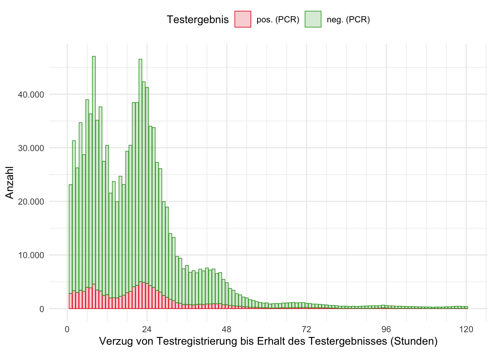
    <figcaption aria-hidden="true">Abb. 10: Zeit zwischen Testregistrierung und Erhalt des Testergebnisses (PCR).</figcaption>
</figure>

Von den 2.373.969 gespendeten Angaben zu Antigen-Schnelltest-Testergebnissen und deren Verzügen wurden 1.532.490 (64.6%) bereits innerhalb der ersten Stunde nach Testregistrierung erhalten. Nach 24 Stunden waren insgesamt 2.175.533 (91.6%) Tests zugestellt. Die stundengenaue Verteilung des Verzugs zwischen Testregistrierung und Erhalt des Testergebnisses ist in der folgenden Abbildung dargestellt. Im Mittel war das Testergebnis 10,5 Stunden nach Testregistrierung übermittelt (Median: 0 Stunden).

Ein Grund für die verhältnismäßig lange Übermittlungsdauer der Antigen-Schnelltest-Testergebnisse liegt darin, dass die CWA nicht kontinuierlich nach aktuellen Schnelltestergebnissen sucht. Um das Ergebnis möglichst zeitnah in der CWA zu erhalten, muss der Test in der App manuell aktualisiert werden bis ein Ergebnis vorliegt. Zwar ruft die Corona-Warn-App Testergebnisse auch automatisch im Hintergrund ab, je nach Betriebssystem und Verfügbarkeit eines WLAN erfolgt dies aber nur nach mitunter etwas längeren Zeitperioden.
Zeit zwischen Testregistrierung und Erhalt des Testergebnisses (Antigen-Schnelltest).

<figure>
    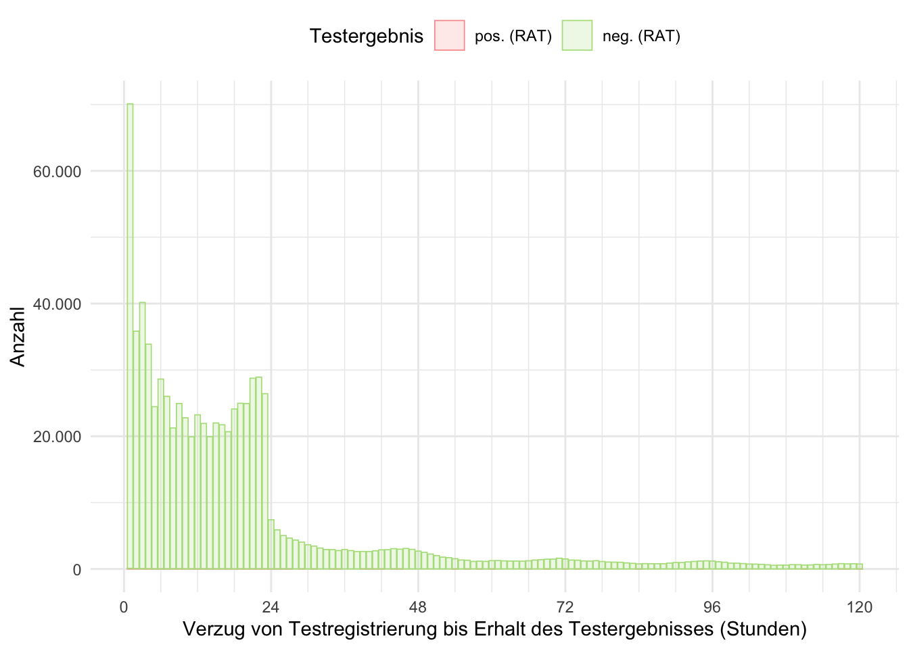
    <figcaption aria-hidden="true">Abb.11: Zeit zwischen Testregistrierung und Erhalt des Testergebnisses (Antigen-Schnelltest).</figcaption>
</figure>

### 6.2 Verzug zwischen Warnung und Testregistrierung

Zu 97.322 PCR-Tests liegen auch Daten zum Verzug zwischen Warnung und Testregistrierung vor.

Die stundengenaue Verteilung des Verzugs zwischen Warnung und Registrierung eines PCR-Tests ist in der folgenden Abbildung dargestellt. Im Mittel wurde der Test 3,6 Tage nach der Warnung registriert (Median: 1,8 Tage).

Nach 48 Stunden nach einer Warnung waren insgesamt 52.559 PCR-Tests (54%) registriert.

Zeit zwischen Warnung und Testregistrierung (nach Testergebnis) (PCR).

<figure>
    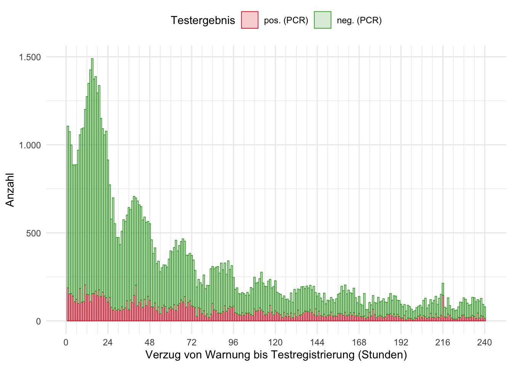
    <figcaption aria-hidden="true">Abb. 12: Zeit zwischen Warnung und Testregistrierung (nach Testergebnis) (PCR).</figcaption>
</figure>

Zu 42.611 Antigen-Schnelltests liegen Daten zum Verzug zwischen Warnung und Testregistrierung vor.

Die stundengenaue Verteilung des Verzugs zwischen Warnung und Registrierung eines Antigen-Schnelltests ist in der folgenden Abbildung dargestellt. Im Mittel wurde der Test 3,2 Tage nach der Warnung registriert (Median: 1,2 Tage).

Nach 48 Stunden nach einer Warnung waren insgesamt 25.518 Antigen-Schnelltests (59.9%) registriert.

Zeit zwischen Warnung und Testregistrierung (nach Testergebnis) (Antigen-Schnelltest).

<figure>
    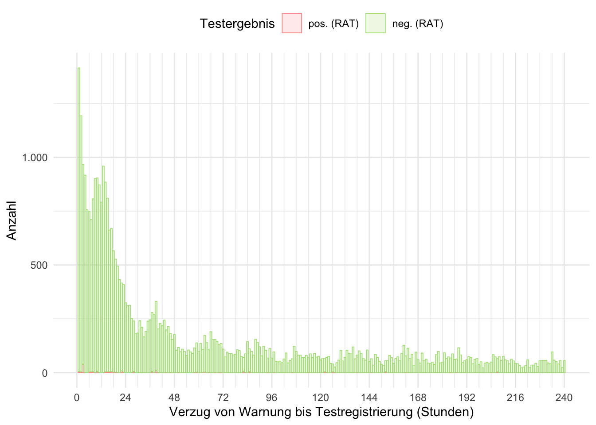
    <figcaption aria-hidden="true">Abb. 13: Zeit zwischen Warnung und Testregistrierung (nach Testergebnis) (Antigen-Schnelltest).</figcaption>
</figure>

### 6.3 Verzug zwischen Risikobegegnung und Testregistrierung

Die tagesgenaue Verteilung des Verzugs zwischen Risikobegegnung und Registrierung eines PCR-Tests ist in der folgenden Abbildung dargestellt. Im Mittel wurde der Test 6 Tage nach der Risikobegegnung registriert (Median: 6 Tage).

Zeit zwischen Risikobegegnung und Testregistrierung (nach Tagen vor Testregistrierung) (PCR).

<figure>
    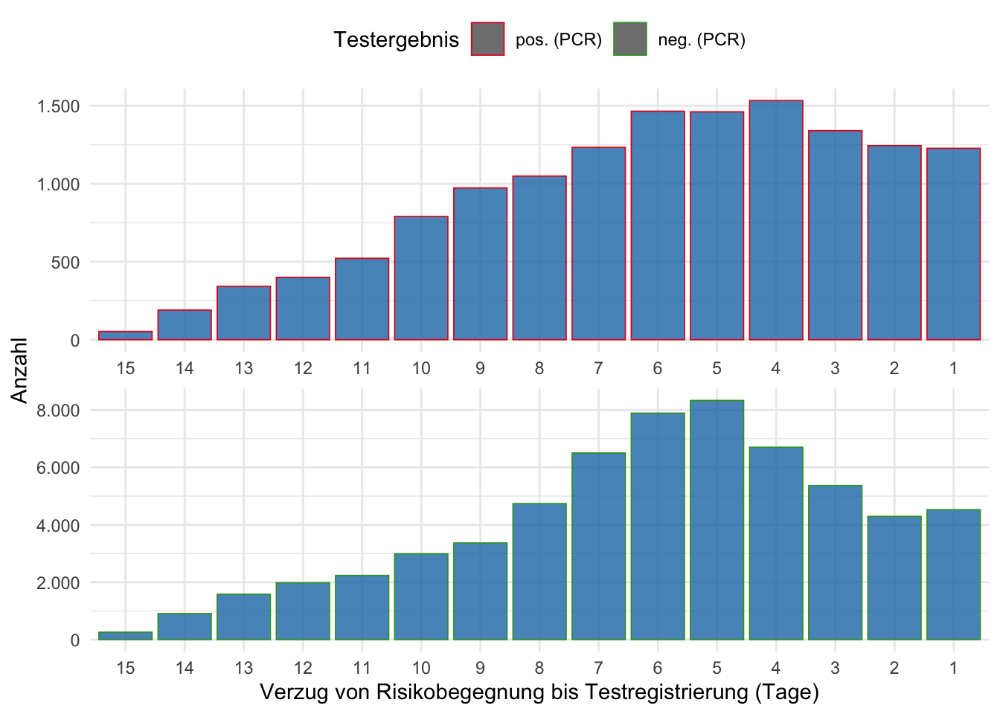
    <figcaption aria-hidden="true">Abb. 14: Zeit zwischen Risikobegegnung und Testregistrierung (nach Tagen vor Testregistrierung) (PCR).</figcaption>
</figure>

Die tagesgenaue Verteilung des Verzugs zwischen Risikobegegnung und Registrierung eines Antigen-Schnelltests ist in der folgenden Abbildung dargestellt. Im Mittel wurde der Test 7,4 Tage nach der Risikobegegnung registriert (Median: 7 Tage).

Zeit zwischen Risikobegegnung und Testregistrierung (nach Tagen vor Testregistrierung) (Antigen-Schnelltest).

<figure>
    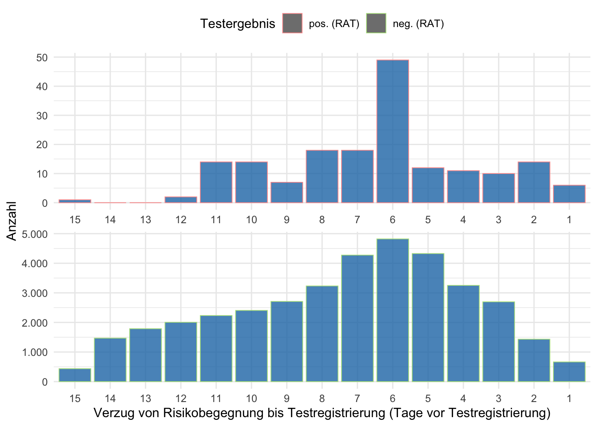
    <figcaption aria-hidden="true">Abb. 15: Zeit zwischen Risikobegegnung und Testregistrierung (nach Tagen vor Testregistrierung) (Antigen-Schnelltest).</figcaption>
</figure>

### 6.4 Verzug zwischen Risikobegegnung und Warnung

Die tagesgenaue Verteilung des Verzugs zwischen Risikobegegnung und Warnung ergibt sich damit als Differenz der Verteilungen der Verzüge zwischen Risikobegegnung und Registrierung bzw. Warnung und Registrierung eines PCR-Tests. Diese ist in der folgenden Abbildung dargestellt. Im Mittel wurde die Warnung 3,8 Tage nach der Risikobegegnung erhalten (Median: 4 Tage).

Die im Mittel 3,8 Tage dauernde Zeit zwischen Risikobegegnung und Warnung wird als relativ kurz betrachtet. Dazu folgendes Beispiel: Person A trifft Person B am Tag 0 für ca. 2 Stunden. Person A weist am Tag 1 SARS-CoV-2-typische Symptome auf und lässt sich am Tag 2 testen und erhält das positive PCR-Testergebnis am Tag 3 und warnt unmittelbar. Das Smartphone von Person B wird mittels Push-Notification am Tag 3 über eine Risikobegegnung mit erhöhtem Risiko am Tag 0 informiert. Hierdurch käme ein Verzug zwischen Risikobegegnung und Warnung von 3 Tagen zustande.

<figure>
    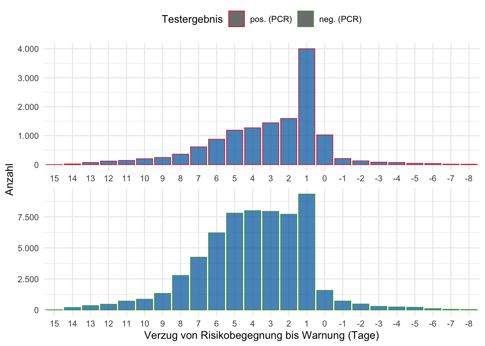
    <figcaption aria-hidden="true">Abb. 16: Zeit zwischen Risikobegegnung und Warnung (nach Tagen vor der Warnung) (PCR).</figcaption>
</figure>

Die tagesgenaue Verteilung des Verzugs zwischen Risikobegegnung und Warnung ergibt sich damit als Differenz der Verteilungen der Verzüge zwischen Risikobegegnung und Registrierung bzw. Warnung und Registrierung eines Antigen-Schnelltests. Diese ist in der folgenden Abbildung dargestellt. Im Mittel wurde die Warnung 5,4 Tage nach der Risikobegegnung erhalten (Median: 5 Tage).

<figure>
    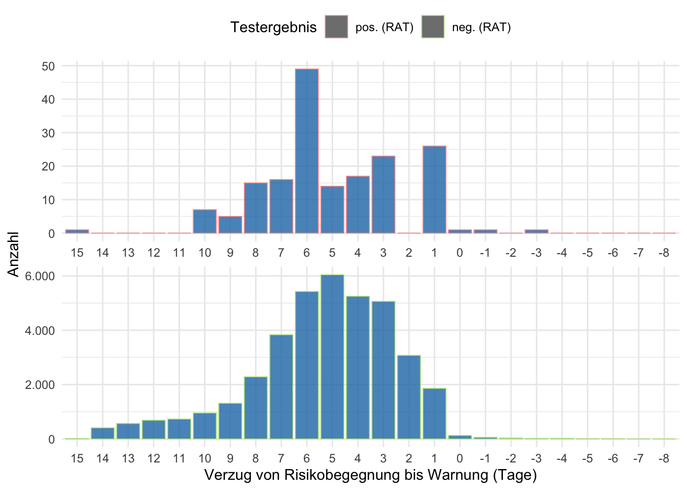
    <figcaption aria-hidden="true">Abb. 17: Zeit zwischen Risikobegegnung und Warnung (nach Tagen vor der Warnung) (Antigen-Schnelltest).</figcaption>
</figure>

### 6.5 Zusammenhang zwischen Risikobewertung und Infektion

Die Daten geben auch Auskunft darüber, ob die Warnung durch die CWA auch eher zu einem positiven Testresultat führt. Und in der Tat tut sie dies: Mehr als jede fünfte Person, die eine rote Warnung zum Zeitpunkt der Testregistrierung erhalten hatte, wurde positiv auf SARS-CoV-2 getestet. Bei denjenigen ohne Risikomitteilung war der Anteil weniger als halb so hoch (siehe Abb. 18).

<table class="cl-4562a130">

<thead><tr style="overflow-wrap:break-word;"><td class="cl-455b7dce">
 
</td><td colspan="2" class="cl-455b7dd8">
Testergebnis
</td><td class="cl-455b7dd8">
 
</td></tr><tr style="overflow-wrap:break-word;"><td class="cl-455b7dec">
Variable
</td><td class="cl-455b7de2">
pos. (PCR)
</td><td class="cl-455b7de2">
neg. (PCR)
</td><td class="cl-455b7de2">
Gesamt
</td></tr></thead><tbody><tr style="overflow-wrap:break-word;"><td class="cl-455b7d88">
Risikobewertung
</td><td class="cl-455b7d4c">

</td><td class="cl-455b7d4c">

</td><td class="cl-455b7d4c">

</td></tr><tr style="overflow-wrap:break-word;"><td class="cl-455b7d9c">
Erhöhtes Risiko
</td><td class="cl-455b7d92">
20.655 (21%)
</td><td class="cl-455b7d92">
77.090 (79%)
</td><td class="cl-455b7d92">
97.745 (100%)
</td></tr><tr style="overflow-wrap:break-word;"><td class="cl-455b7da6">
Niedriges Risiko (mit Risikobegegnung)
</td><td class="cl-455b7da7">
1.930 (14%)
</td><td class="cl-455b7da7">
11.919 (86%)
</td><td class="cl-455b7da7">
13.849 (100%)
</td></tr><tr style="overflow-wrap:break-word;"><td class="cl-455b7da6">
Niedriges Risiko (ohne Risikobegegnung)
</td><td class="cl-455b7da7">
140.128 (9,7%)
</td><td class="cl-455b7da7">
1.306.963 (90%)
</td><td class="cl-455b7da7">
1.447.091 (100%)
</td></tr><tr style="overflow-wrap:break-word;"><td class="cl-455b7dc4">
Gesamt
</td><td class="cl-455b7dba">
162.713 (10%)
</td><td class="cl-455b7dba">
1.395.972 (90%)
</td><td class="cl-455b7dba">
1.558.685 (100%)
</td></tr></tbody></table>

(#tab:ppa_risk_infection_ct_pcr)Zusammenhang zwischen Risikobenachrichtigung und Testergebnis (PCR)
TAB

<figure>
    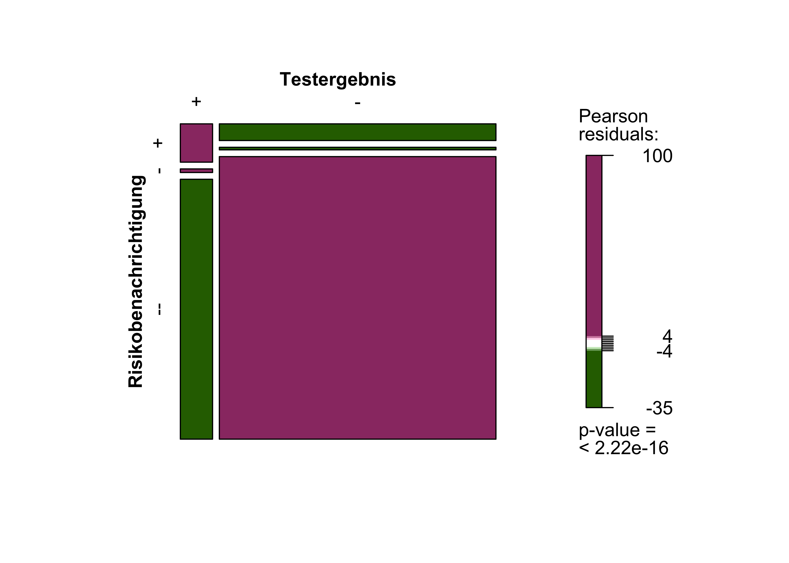
    <figcaption aria-hidden="true">Abb. 18: Zusammenhang zwischen Risikobenachrichtigung und Testergebnis (PCR).</figcaption>
</figure>

Die folgende Grafik zeigt den Positivenanteil nach Risikobenachrichtigung im zeitlichen Verlauf. Der Anteil der positiv getesteten Personen, die eine rote Warnung erhalten haben ist relativ konstant. Ein Vergleich mit den [RKI-Testzahlen](https://www.rki.de/DE/Content/InfAZ/N/Neuartiges_Coronavirus/Daten/Testzahlen-gesamt.html) zeigt eine gute Übereinstimmung mit dem Positivenanteil der nicht gewarnten Personen. Der leicht höhere Anteil an positiv getesteten Pesonen ist zum einen in der unterschiedlichen zugrunde liegenden Erhebungspopulation zu suchen. So sind Kinder unter 16 Jahren eher selten Nutzer der Corona-Warn-App. Zum anderen sind in den RKI-Zahlen auch in zunehmenden Maße Routine- und Pooling-Testergebnisse enthalten, die wahrscheinlich selten bis gar nicht über die Corona-Warn-App registriert weden.

<figure>
    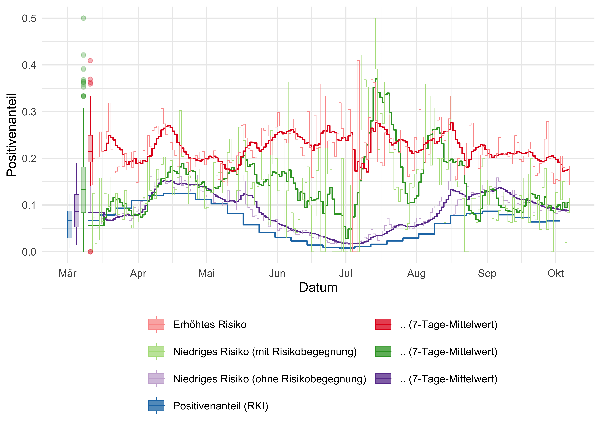
    <figcaption aria-hidden="true">Abb. 19: Positivenanteil nach Risikobenachrichtigung im Zeitlichen Verlauf (PCR).</figcaption>
</figure>

Auch bei Antigen-Schnelltests ist dieser Zusammenhang zu erkennen, auch wenn die Datenlage hier etwas dünner ist (s. Abb. 19).

TAB
(#tab:ppa_risk_infection_ct_rat)Zusammenhang zwischen Risikobenachrichtigung und Testergebnis (RAT).

<figure>
    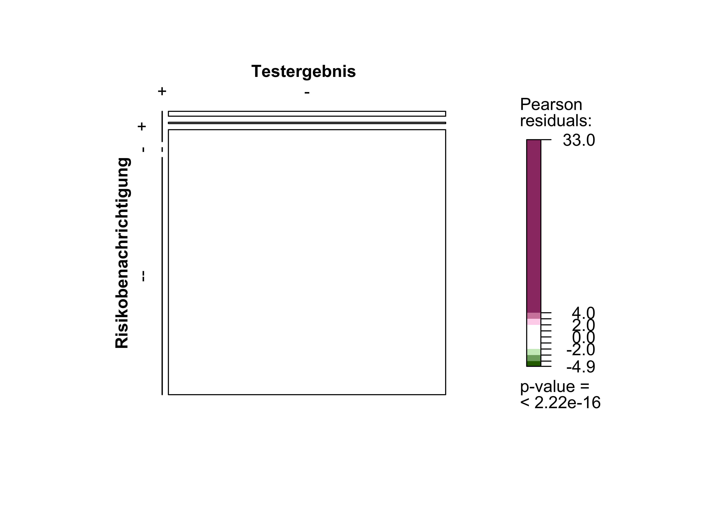
    <figcaption aria-hidden="true">Abb. 20: Zusammenhang zwischen Risikobenachrichtigung und Testergebnis (RAT).</figcaption>
</figure>

Die folgende Grafik zeigt den Positivenanteil nach Risikobenachrichtigung im zeitlichen Verlauf.

<figure>
    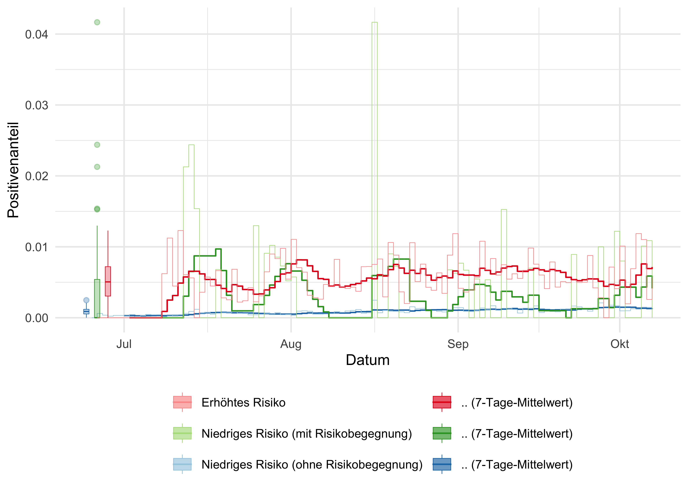
    <figcaption aria-hidden="true">Abb. 21: Positivenanteil nach Risikobenachrichtigung im Zeitlichen Verlauf (PCR).</figcaption>
</figure>

### 6.6 Schätzung des Anteils der Datenspendenden

Auf Basis des Anteils der im CWA-Backend registrierten und in der Datenspende sichtbaren Testergebnisse, ist eine erste Schätzung des Anteils der Datenspendenden möglich.

In der folgenden Abbildung sind die Anteile der gespendeten Testergebnisse (positiv bzw. negativ) nach Art des Tests (PCR bzw. RAT (Antigen-Schnelltest)) angegeben. Hierbei wurde das Verhältnis zwischen den an einem Tag über die CWA-Datenspende übermittelten Testergebnissen zu den einen Tag zuvor (bei PCR) bzw. am selben Tag (bei RAT) auf dem CWA-Lab-Result-Server bereitgestellten Testergebnissen gebildet.

<figure>
    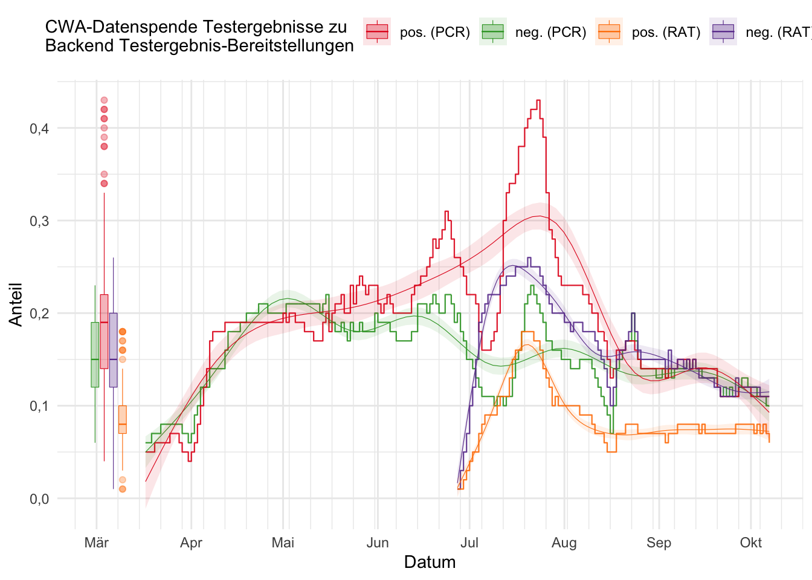
    <figcaption aria-hidden="true">Abb. 22: Verhältnis zwischen der Anzahl der Testergebnisse (CWA-Datenspende) und Anzahl von Testergebnis-Bereitstellungen (Backend) (PCR/RAT und pos./neg.)</figcaption>
</figure>

Ebenso können wir den Anteil der PCR-Testergebnisse, die abgerufen worden sind und über die CWA-Datenspende übermittelt wurden, zu den einen Tag zuvor registrierten Tests angegeben. Dies gibt eine erste Näherung an die Teilnehmendenrate der CWA-Datenspende. Dieser Anteil beträgt über die letzten 30 Tage gemittelt 49%.

Die auf Basis der gespendeten Testergebnisse getätigte Schätzung des Anteils der Datenspendenden lässt keine konkreten Rückschlüsse auf die Anzahl der aktiven Nutzenden und/oder Geräte zu. Diesem Thema widmen wir uns in einem separaten Beitrag.

<figure>
    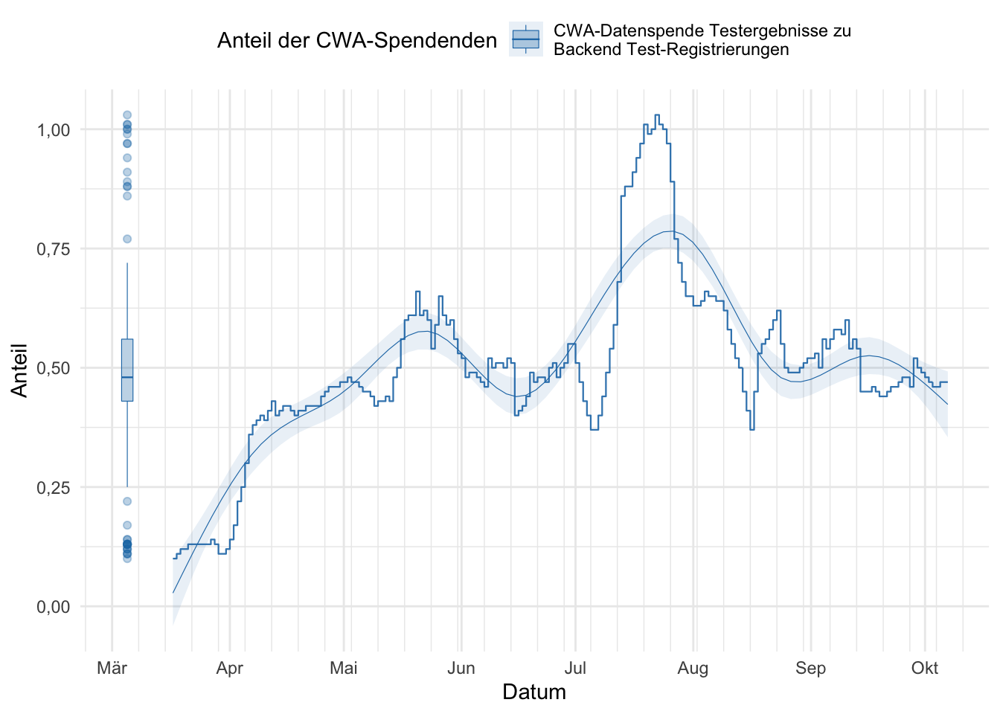
    <figcaption aria-hidden="true">Abb. 23: Tagesgenaue Schätzung des Anteils der Spendenden – aus der Anzahl von Testergebnissen (CWA-Datenspende) pro Test-Registrierungen (Backend).</figcaption>
</figure>

## 7 So geht es weiter

In den kommenden Wochen werden wir uns auch weiterhin mit dem Thema "Datenspende der Corona-Warn-App" beschäftigen. Wir wollen untersuchen, welche Erkenntnisse es beim Prozess der [Schlüsselteilung](#326-schlüsselteilung) und bei der BLE-Messung über das ENF [(Exposure-Windows und Scan-Instances)](#327-exposure-windows-und-scan-instances) zu gewinnen gibt.

Bevor wir dies tun, wollen wir jedoch einen kurzen Abstecher machen und auf die Anzahl der aktiven Apps/Geräte bzw. aktiven Nutzenden ausführlicher eingehen. Dazu werden wir auch auf die Daten aus dem Apple App-Store und dem Google Play-Store eingehen und die unterschiedlichen Kennzahlen, die in ihnen zur Verfügung gestellt werden, in Beziehung zueinander und zu weiteren Abschätzungen setzten.
