In diesem Beitrag werden wir beginnen, uns mit dem Thema "Datenspende in der Corona-Warn-App" zu beschäftigen. Wir wollen analysieren, inwieweit das freiwillige, datenschutzkonforme Bereitstellen von Nutzenden-Daten Erkenntnisse über das Nutzungsverhalten und über Abläufe im CWA-Ökosystem ermöglicht.

Wie schnell wird ein PCR-Testergebnis in der CWA übermittelt? Wie viele Personen werden über die Corona-Warn-App gewarnt? Wie schnell lassen sich Personen nach einer Warnung testen? Diese und weitere Fragen zum Verhalten der CWA-Nutzenden beantworten wir in diesem ersten Beitrag. Grundlage dafür sind die von den Nutzenden freiwillig bereitgestellten Daten.

<!-- overview -->

1. [Das Wichtigste vorweg: Danke!](#1-das-wichtigste-vorweg-danke)
2. [Das Wichtigste in Kürze: Zahlen, Daten, Fakten](#2-das-wichtigste-in-kürze-zahlen-daten-fakten)
3. [Privacy Preserving Analytics](#3-privacy-preserving-analytics)
    1. [Zweck der Datenspende](#31-zweck-der-datenspende)
    2. [Erhobene Daten](#32-erhobene-daten)
4. [Device- und Nutzerdaten der Teilnehmenden](#4-device--und-nutzerdaten-der-teilnehmenden)
    1. [Anzahl der Spenden im zeitlichen Verlauf (nach OS)](#41-anzahl-der-spenden-im-zeitlichen-verlauf-nach-os)
    2. [Anzahl der Spenden im zeitlichen Verlauf (nach Version des OS)](#42-anzahl-der-spenden-im-zeitlichen-verlauf-nach-version-des-os)
    3. [Anzahl der Spenden im zeitlichen Verlauf (nach Version der CWA)](#43-anzahl-der-spenden-im-zeitlichen-verlauf-nach-version-der-cwa)
    4. [Verteilung der Teilnehmenden nach Altersgruppen](#44-verteilung-der-teilnehmenden-nach-altersgruppen)
    5. [Geografische Verteilung](#45-geografische-verteilung)
    6. [Unterschiede zwischen urbanen und ländlichen Kreisen](#46-unterschiede-zwischen-urbanen-und-ländlichen-kreisen)
5. [Erhalt einer Warnung](#5-erhalt-einer-warnung)
    1. [Warnungen und gewarnte Personen](#51-warnungen-und-gewarnte-personen)
    2. [Gewarnte Personen im zeitlichen Verlauf](#52-gewarnte-personen-im-zeitlichen-verlauf)
    3. [Gewarnte Personen durch Check-Ins](#53-gewarnte-personen-durch-check-ins)
6. [Testergebnisse](#6-testergebnisse)
    1. [Verzug zwischen Testregistrierung und Erhalt des Testergebnisses](#61-verzug-zwischen-testregistrierung-und-erhalt-des-testergebnisses)
    2. [Verzug zwischen Warnung und Testregistrierung](#62-verzug-zwischen-warnung-und-testregistrierung)
    3. [Verzug zwischen Risikobegegnung und Testregistrierung](#63-verzug-zwischen-risikobegegnung-und-testregistrierung)
    4. [Verzug zwischen Risikobegegnung und Warnung](#64-verzug-zwischen-risikobegegnung-und-warnung)
    5. [Zusammenhang zwischen Risikobewertung und Infektion](#65-zusammenhang-zwischen-risikobewertung-und-infektion)
    6. [Schätzung des Anteils der Datenspendenden](#66-schätzung-des-anteils-der-datenspendenden)
7. [So geht es weiter](#7-so-geht-es-weiter)

## 1 Das Wichtigste vorweg: Danke!

Wir möchten uns hier bei allen Nutzenden der Corona-Warn-App bedanken, besonders bei denen, die uns täglich ihre Daten zur Analyse bereitstellen. Diese Daten helfen nicht nur dabei, die Wirksamkeit der Corona-Warn-App zu belegen und ihre Funktionsweise zu verbessern, sondern liefern auch wichtige Erkenntnisse über den Verlauf der Ausbreitung von COVID-19 in Deutschland. Zugleich werden epidemiologische Kennzahlen geliefert, die auf keinem anderen Weg in dieser Menge und mit dieser Qualität erhoben werden können. Mit diesem Beitrag wollen wir einen kleinen Teil der Schuld begleichen. **Vielen Dank!**

## 2 Das Wichtigste in Kürze: Zahlen, Daten, Fakten

- Täglich spenden etwa 12 Mio. Nutzende ihre Daten (insgesamt gibt es 9.638.099.766 Datensätze).
- Der Anteil der Datenspendenden liegt bei etwa 49%.
- Bezüglich der Anzahl der Spendenden gibt es [Unterschiede zwischen urbanen und ländlichen Kreisen](#46-unterschiede-zwischen-urbanen-und-ländlichen-kreisen) und zwischen Ost und West.
- Im Mittel werden 5 Personen durch eine positiv getestete Person gewarnt. Etwa 11 erhalten eine Warnung über eine Risikobegegnung mit niedrigem Risiko.
- Nach einem Check-In erhalten etwa 23 Personen pro Event eine Warnung über ein erhöhtes Risiko.
- Ein PCR-Testergebnis ist im Mittel 21 Stunden nach Testregistrierung übermittelt (die Hälfte der Testergebnisse bereits nach 12 Stunden).
- Im Mittel wurde ein Test 3,6 Tage nach einer Warnung registriert (die Hälfte der Tests bereits 1,8 Tage nach einer Warnung).
- Im Mittel wurde eine Warnung 3,7 Tage nach einer Risikobegegnung erhalten (die Hälfte der Warnungen nach etwa 3 Tagen).
-  Etwa jede fünfte Person, die eine Begegnung mit erhöhtem Risiko hatte und einen PCR-Test veranlasste, wurde anschließend positiv getestet. Bei denjenigen ohne Risikomitteilung war der Anteil weniger als halb so hoch. *Die CWA warnt also die Richtigen!*

Wir gehen zunächst noch einmal auf den [Zweck der Datenspende](#31-zweck-der-datenspende) ein und beschreiben [welche Daten erhoben werden](#32-erhobene-daten).

## 3 Privacy Preserving Analytics

PPA steht für *Privacy Preserving Analytics*. Mit diesem Verfahren ist es möglich, dass Nutzende der CWA die in ihrer App auf ihrem Smartphone anfallenden Daten einer auswertenden Instanz zur Verfügung stellen, ohne dabei ihre Identität preiszugeben.

Seit dem 5. März 2021 spenden CWA-Nutzende über diesen Weg täglich operationale Daten, anonym, aber authentisiert. Hierbei erfolgt eine Überprüfung des spendenden Endgerätes, sodass sichergestellt wird, dass nur eine genuine Corona-Warn-App von einem genuinen Endgerät Daten übermittelt (für eine ausführliche Dokumentation siehe [github.com/corona-warn-app/cwa-ppa-server](https://github.com/corona-warn-app/cwa-ppa-server)).

Die CWA-Datenspende ist nicht mit der [Corona-Datenspende](https://corona-datenspende.de/) zu verwechseln. In der Corona-Datenspende spenden etwa ein halbe Million Nutzende Körpertemperatur, Ruhepuls- und andere Vitaldaten, die sie über ihre Fitness-Armbänder erhoben haben.

### 3.1 Zweck der Datenspende

Die Auswertung dient dem Zweck, die Abläufe und die Nutzung der CWA besser zu verstehen und sie dadurch fortlaufend in ihrer Funktion und in ihrer Nutzerfreundlichkeit zu verbessern. Aufgrund des dezentralen Ansatzes sind viele wichtige Daten, die die Funktionsweise der Corona-Warn-App charakterisieren, nur auf den Endgeräten der Nutzenden vorhanden. Hier ist die Datenspende der einzige Weg, diese Kennzahlen zu erheben.

Die CWA-Datenspende hilft zu verstehen,

1.	welche Ereignisse in der CWA mit welcher Häufigkeit auftreten,
2.	wann diese Ereignisse auftreten und wie bzw. mit welchem zeitlichen Abstand (Verzug) sie aufeinander folgen,
3.	welche Auswahlen die Nutzenden in der App daraufhin treffen,
4.	wo und wann es zu Abbrüchen kommt,
5.	und ob all dies mit technischen Eigenschaften der Geräte oder demografischen Eigenschaften (z.B. Altersgruppe, Wohnregion) der Nutzenden zusammenhängt.

Mit diesem Verständnis können: 

1.	Algorithmen zur Einschätzung des Risikos verbessert werden,
2.	Parameter so konfiguriert werden, dass die Ereignisse angemessen häufig auftreten,
3.	die Nutzerführung optimiert werden,
4.	gezielte Kommunikationsmaßnahmen gezielter vorbereitet werden.

Darüber hinaus können die erhobenen Daten zur zeitlichen und räumlichen Verteilung bestimmter Ereignisse ausgewertet werden, um in Echtzeit den Pandemieverlauf zu verfolgen und lokale Besonderheiten zu erkennen. Mit diesen Erkenntnissen können Maßnahmen frühzeitig, zielgerichtet und angemessen ergriffen werden, um einem ungünstigen Pandemieverlauf entgegenzuwirken.

### 3.2 Erhobene Daten

Folgende Daten werden erhoben (siehe [github.com/corona-warn-app/cwa-ppa-server/../PPAC](https://github.com/corona-warn-app/cwa-ppa-server/blob/main/docs/PPAC.md)):

- [Technische Metadaten](#321-technische-metadaten) (täglich)
- [Metadaten der Nutzenden](#322-metadaten-der-nutzenden) (User) (täglich, optional) 
- [Metadaten der Endgeräte](#323-metadaten-der-endgeräte) (Client) (täglich) 
- [Gewarnte Personen (Expositionsrisiko)](#324-gewarnte-personen-expositionsrisiko) (Exposure Risk) (täglich)
- [Testergebnisse](#325-testergebnisse) (Test Result) (anlassbezogen)
- [Schlüsselteilung](#326-schlüsselteilung) (Key Submission) (anlassbezogen)
- [Exposure-Windows und Scan-Instances](#327-exposure-windows-und-scan-instances) (ENF) (täglich)

#### 3.2.1 Technische Metadaten

Sämtliche Datensätze enthalten:

- Datum der Spende (`submitted_at`),
- Authorisierungs-Flags (`android_ppac_basic_integrity`,   `android_ppac_cts_profile_match`,  `android_ppac_evaluation_type_basic`,  `android_ppac_evaluation_type_hardware_backed`), zur Vorbeugung gegen Missbrauch.

#### 3.2.2 Metadaten der Nutzenden

Von den Nutzenden können folgende Daten optional angegeben werden:

- Bundesland bzw. Landkreis (`federal_state`, `administrative_unit`),
- Altersgruppe (<30, 30-59, 60+) (`age_group`).

Es liegen 1.862.487.469 Datensätze vor (Datenstand: 7. Oktober 2021).

#### 3.2.3 Metadaten der Endgeräte

Über die Endgeräte werden folgende Daten übermittelt:

- CWA-Version (`cwa_version_major`, `cwa_version_minor`, `cwa_version_patch`),
- Konfigurations-Token (`app_config_etag`),
- OS-Version (`ios_version_major`, `ios_version_minor`, `ios_version_patch` bzw. `android_api_level`).

Es liegen 1.862.486.604 Datensätze vor (Datenstand: 7. Oktober 2021).

#### 3.2.4 Gewarnte Personen (Expositionsrisiko)

Sowohl für Proximity-Tracing (BLE, ENF) als auch Presence-Tracing (Event-Check-ins) (`pt_..`) werden folgende Daten zum Expositions-Risiko (Exposure Risk) erhoben:

- Risiko-Level ("rote" oder "grüne" Kachel); gibt es eine Änderung zum Vortag? (`risk_level`, `risk_level_changed`), 
- im Fall einer Risikobegegnung das jüngste Datum mit diesem Risiko-Level (Entspricht der Anzeige auf dem Homescreen; siehe Abbildung); gibt es eine Änderung zum Vortag? (`most_recent_date_at_risk_level`, `most_recent_date_changed`), 
- [Metadaten der Nutzenden](#322-metadaten-der-nutzenden), 
- [Technische Metadaten](#321-technische-metadaten).

Es liegen 1.852.088.985 Datensätze vor (Datenstand: 7. Oktober 2021).

<img src="" style="width:2in" alt="">

Anzeige eines erhöhten Risikos.

#### 3.2.5 Testergebnisse

Wenn ein Test registriert wurde, werden bei Erhalt des Testergebnisses bzw. nach dem Verstreichen einer festgelegten Frist (gegenwärtig 7 Tage) folgende Daten zum Testprozess erhoben:

- Testergebnis (`test_result`) (positiv, negativ, unbestimmt, ausstehend) [A],
- Stunden seit Test-Registrierung (`hours_since_test_registration`), 
- Risiko-Level (angezeigt) bei Testregistrierung (`risk_level_at_test_registration`) [B], 
- `days_since_most_recent_date_at_risk_level_at_test_registration` [B]
  = Verzug zwischen jüngster Begegnung (most recent notified exposure) und Testregistrierung (in Tagen), 
- `hours_since_high_risk_warning_at_test_registration` [B]
  = Verzug zwischen Warnung und Testregistrierung (in Stunden), 
- [Metadaten der Nutzenden](#322-metadaten-der-nutzenden), 
- [Technische Metadaten](#321-technische-metadaten).

Dies erfolgt:

- [A] differenziert nach PCR bzw. Antigen-Schnelltest (RAT) (Werte von `test_result`) und
- [B] sowohl für Proximity-Tracing (BLE, ENF) als auch Presence-Tracing (Event-Check-ins) (`pt_..`).

Es liegen 4.313.299 Datensätze vor (Datenstand: 7. Oktober 2021).

#### 3.2.6 Schlüsselteilung

Sobald Diagnoseschlüssel geteilt werden bzw. nach dem Verstreichen einer festgelegten Frist (gegenwärtig 36 Stunden) werden folgende Daten zur Teilung von Diagnoseschlüsseln übermittelt:

- [B] sowohl für Proximity-Tracing (BLE, ENF) als auch Presence-Tracing (Event-Check-ins) (`pt_..`)
- Schlüsselteilung mit Metadaten der Nutzenden
  - Schlüssel geteilt? (`submitted`)
  - Schlüsselteilung nach Durchlauf der Symptomabfrage? (`submitted_after_symptom_flow`)
  - Schlüsselteilung per teleTAN? (`submitted_with_teletan`)
  - Schlüsselteilung nach Antigen-Schnelltest? (`submitted_after_rapid_antigen_test`)
  - Stunden seit Empfang des Testergebnisses (`hours_since_reception_of_test_result`)
  - Stunden seit Test-Registrierung (`hours_since_test_registration`)
  - `days_since_most_recent_date_at_risk_level_at_test_registration` [B]
    = Verzug zwischen jüngster Begegnung (most recent notified exposure) und Testregistrierung (in Tagen)
  - `hours_since_high_risk_warning_at_test_registration` [B]
    = Verzug zwischen Warnung und Testregistrierung (in Stunden)
  - [Metadaten der Nutzenden](#322-metadaten-der-nutzenden),
  - [Technische Metadaten](#321-technische-metadaten).
- Schlüsselteilung mit Metadaten der Endgeräte
  - Schlüssel geteilt? (`submitted`)
  - Erweitertes Einverständnis erteilt(`advanced_consent_given`)
  - Schlüsselteilung im Hintergrund? (`submitted_in_background`)
  - Schlüsselteilung nach Durchlauf der Symptomabfrage? (`submitted_after_symptom_flow`)
  - Schlüsselteilung nach Abbruch des Schlüsselteilungsprozesses? (`submitted_after_cancel`)
  - Letzte Anzeige im Schlüsselteilungsprozess (`last_submission_flow_screen`)
    - Testergebnis (2)
    - Warnung anderer (3)
    - Symptome (4)
    - Symptombeginn (5)
  - [Metadaten der Endgeräte](#322-metadaten-der-nutzenden),
  - [Technische Metadaten](#321-technische-metadaten).

Es liegen jeweils 251.161 Datensätze vor (Datenstand: 7. Oktober 2021).

  #### 3.2.7 Exposure-Windows und Scan-Instances

Über die vom Google bzw. Apple Exposure-Notification-Framework (ENF; siehe [Google Exposure Notifications API](https://developers.google.com/android/exposure-notifications/exposure-notifications-api), [Apple Exposure Notifications API](https://developer.apple.com/documentation/exposurenotification#overview)) lokal aufgezeichneten Daten liegen folgende Angaben vor:

- Datum des [Exposure-Windows](https://developer.apple.com/documentation/exposurenotification/enexposurewindow) (`datew`), 
- Transmission-Risk-Level (`transmission_risk_level`, `report_type`, `infectiousness`),
- Kalibrierungs-Treue (`callibration_confidence`), 
- [normalisierte Expositionszeit](https://github.com/corona-warn-app/cwa-documentation/blob/master/solution_architecture.md#mobile-applications) (`normalized_time`, in Minuten), 
- [Array](https://en.wikipedia.org/wiki/Array_data_structure) der [Scan-Instanzen](https://developer.apple.com/documentation/exposurenotification/enscaninstance) (`exposure_window_id`): 
  - typische Dämpfung (`typical_attenuation`), 
  - minimale Dämpfung (`minimum_attenuation`), 
  - Sekunden seit dem letzten Scan (`seconds_since_last_scan`), 
- [Metadaten der Endgeräte](#322-metadaten-der-nutzenden), 
- [Technische Metadaten](#321-technische-metadaten).

Es liegen 1.036.601.141 Datensätze zu Exposure-Windows bzw. 3.019.619.946 Datensätze zu den Scan-Instanzen vor (Datenstand: 7. Oktober 2021).

## 4 Device- und Nutzerdaten der Teilnehmenden

Wir wollen zunächst die Daten zu den Spendenden (genauer: zu deren Endgeräten) näher betrachten. Bisher gab es etwa 1,86 Mrd. gespendete Datensätze (Datenstand: 7. Oktober 2021). In den vergangenen Wochen täglich mehr als 11 Millionen.

### 4.1 Anzahl der Spenden im zeitlichen Verlauf (nach OS)

Die folgende Abbildung zeigt den zeitlichen Verlauf und die Verteilung nach dem Betriebssystem. Am 7. Oktober 2021 allein gab es insgesamt 12.159.958 Datenspenden, 6.101.821 von Apple [iPhones](https://de.wikipedia.org/wiki/IPhone) und 6.058.137 von Android [Smartphones](https://de.wikipedia.org/wiki/Smartphone).

Die Schwankungen bei der Anzahl der täglichen Datenspenden kommt vorwiegend durch Maßnahmen und Einschränkungen zur Sicherung des Netzwerkes gegen [DDoS-Angriffe](https://de.wikipedia.org/wiki/Denial_of_Service) zustande und betrifft vor allem Android-Geräte, da hier aus Gründen des Datenschutzes eine eigene Prüfung der Authentizität des Gerätes vorgenommen wird (detaillierte Informationen sind unter folgendem Link abrufbar: [PPA-Dokumentation](https://github.com/corona-warn-app/cwa-documentation/blob/master/solution_architecture.md#privacy-preserving-data-donation)).

Abb. 1: Anzahl der Spenden (gesamt und nach Betriebssystem).

### 4.2 Anzahl der Spenden im zeitlichen Verlauf (nach Version des OS)

Eine Aufschlüsselung der Daten nach der benutzten Version des Betriebssystems zeigt die typische Homogenität bei [iOS](https://de.wikipedia.org/wiki/IOS_(Betriebssystem))- bzw. Heterogenität bei [Android](https://de.wikipedia.org/wiki/Android_(Betriebssystem))-Smartphones.

<script type="application/json" data-for="htmlwidget-df4d42fa52db4862e86d">{"x":{"visdat":{"88c53f76121a":["function () ","plotlyVisDat"]},"cur_data":"88c53f76121a","attrs":{"88c53f76121a":{"x":{},"y":{},"color":{},"colors":["#D9D9D9","#F7FBFF","#B8D5EA","#4F9BCB","#084594","#FCFBFD","#F0EEF6","#DFDEED","#C7C7E1","#ADABD2","#928FC2","#7A71B4","#65499F","#4A1486"],"alpha_stroke":1,"sizes":[10,100],"spans":[1,20],"type":"bar"}},"layout":{"width":800,"height":600,"margin":{"b":40,"l":60,"t":25,"r":10},"barmode":"stack","hovermode":"x unified","hoverlabel":{"font":{"size":12},"align":"right"},"yaxis":{"domain":[0,1],"automargin":true,"showgrid":false,"showline":false,"hoverformat":",f","title":"Anzahl","titlefont":{"size":12},"tickfont":{"size":12}},"xaxis":{"domain":[0,1],"automargin":true,"type":"date","hoverformat":"%e. %b (%a) %Y","tickformat":"%e. %b","title":"Datum","tickfont":{"size":12},"showgrid":true,"autotick":false,"tickmode":"array","tickvals":["2021-03-01","2021-03-08","2021-03-15","2021-03-22","2021-03-29","2021-04-05","2021-04-12","2021-04-19","2021-04-26","2021-05-03","2021-05-10","2021-05-17","2021-05-24","2021-05-31","2021-06-07","2021-06-14","2021-06-21","2021-06-28","2021-07-05","2021-07-12","2021-07-19","2021-07-26","2021-08-02","2021-08-09","2021-08-16","2021-08-23","2021-08-30","2021-09-06","2021-09-13","2021-09-20","2021-09-27","2021-10-04","2021-10-11","2021-10-18","2021-10-25","2021-11-01","2021-11-08","2021-11-15","2021-11-22","2021-11-29","2021-12-06","2021-12-13","2021-12-20","2021-12-27","2022-01-03","2022-01-10","2022-01-17","2022-01-24","2022-01-31","2022-02-07","2022-02-14","2022-02-21","2022-02-28"]},"showlegend":true},"source":"A","config":{"showSendToCloud":false,"locale":"de"},"data":[{"x":["2021-03-05","2021-03-05","2021-03-06","2021-03-06","2021-03-07","2021-03-07","2021-03-08","2021-03-08","2021-03-09","2021-03-09","2021-03-10","2021-03-10","2021-03-11","2021-03-11","2021-03-12","2021-03-12","2021-03-13","2021-03-13","2021-03-14","2021-03-14","2021-03-15","2021-03-15","2021-03-16","2021-03-16","2021-03-17","2021-03-17","2021-03-18","2021-03-18","2021-03-19","2021-03-19","2021-03-20","2021-03-20","2021-03-21","2021-03-21","2021-03-22","2021-03-22","2021-03-23","2021-03-23","2021-03-24","2021-03-24","2021-03-25","2021-03-25","2021-03-26","2021-03-26","2021-03-27","2021-03-27","2021-03-28","2021-03-28","2021-03-29","2021-03-29","2021-03-30","2021-03-30","2021-03-31","2021-03-31","2021-04-01","2021-04-01","2021-04-02","2021-04-02","2021-04-03","2021-04-03","2021-04-04","2021-04-04","2021-04-05","2021-04-05","2021-04-06","2021-04-06","2021-04-07","2021-04-07","2021-04-08","2021-04-08","2021-04-09","2021-04-09","2021-04-10","2021-04-10","2021-04-11","2021-04-11","2021-04-12","2021-04-12","2021-04-13","2021-04-13","2021-04-14","2021-04-14","2021-04-15","2021-04-15","2021-04-16","2021-04-16","2021-04-17","2021-04-17","2021-04-18","2021-04-18","2021-04-19","2021-04-19","2021-04-20","2021-04-20","2021-04-21","2021-04-21","2021-04-22","2021-04-22","2021-04-23","2021-04-23","2021-04-24","2021-04-24","2021-04-25","2021-04-25","2021-04-26","2021-04-26","2021-04-27","2021-04-27","2021-04-28","2021-04-28","2021-04-29","2021-04-29","2021-04-30","2021-04-30","2021-05-01","2021-05-01","2021-05-02","2021-05-02","2021-05-03","2021-05-03","2021-05-04","2021-05-04","2021-05-05","2021-05-05","2021-05-06","2021-05-06","2021-05-07","2021-05-07","2021-05-08","2021-05-08","2021-05-09","2021-05-09","2021-05-10","2021-05-10","2021-05-11","2021-05-11","2021-05-12","2021-05-12","2021-05-13","2021-05-13","2021-05-14","2021-05-14","2021-05-15","2021-05-15","2021-05-16","2021-05-16","2021-05-17","2021-05-17","2021-05-18","2021-05-18","2021-05-19","2021-05-19","2021-05-20","2021-05-20","2021-05-21","2021-05-21","2021-05-22","2021-05-22","2021-05-23","2021-05-23","2021-05-24","2021-05-24","2021-05-25","2021-05-25","2021-05-26","2021-05-26","2021-05-27","2021-05-27","2021-05-28","2021-05-28","2021-05-29","2021-05-29","2021-05-30","2021-05-30","2021-05-31","2021-05-31","2021-06-01","2021-06-01","2021-06-02","2021-06-02","2021-06-03","2021-06-03","2021-06-04","2021-06-04","2021-06-05","2021-06-05","2021-06-06","2021-06-06","2021-06-07","2021-06-07","2021-06-08","2021-06-08","2021-06-09","2021-06-09","2021-06-10","2021-06-10","2021-06-11","2021-06-11","2021-06-12","2021-06-12","2021-06-13","2021-06-13","2021-06-14","2021-06-14","2021-06-15","2021-06-15","2021-06-16","2021-06-16","2021-06-17","2021-06-17","2021-06-18","2021-06-18","2021-06-19","2021-06-19","2021-06-20","2021-06-20","2021-06-21","2021-06-21","2021-06-22","2021-06-22","2021-06-23","2021-06-23","2021-06-24","2021-06-24","2021-06-25","2021-06-25","2021-06-26","2021-06-26","2021-06-27","2021-06-27","2021-06-28","2021-06-28","2021-06-29","2021-06-29","2021-06-30","2021-06-30","2021-07-01","2021-07-01","2021-07-02","2021-07-02","2021-07-03","2021-07-03","2021-07-04","2021-07-04","2021-07-05","2021-07-05","2021-07-06","2021-07-06","2021-07-07","2021-07-07","2021-07-08","2021-07-08","2021-07-09","2021-07-09","2021-07-10","2021-07-10","2021-07-11","2021-07-11","2021-07-12","2021-07-12","2021-07-13","2021-07-13","2021-07-14","2021-07-14","2021-07-15","2021-07-15","2021-07-16","2021-07-16","2021-07-17","2021-07-17","2021-07-18","2021-07-18","2021-07-19","2021-07-19","2021-07-20","2021-07-20","2021-07-21","2021-07-21","2021-07-22","2021-07-22","2021-07-23","2021-07-23","2021-07-24","2021-07-24","2021-07-25","2021-07-25","2021-07-26","2021-07-26","2021-07-27","2021-07-27","2021-07-28","2021-07-28","2021-07-29","2021-07-29","2021-07-30","2021-07-30","2021-07-31","2021-07-31","2021-08-01","2021-08-01","2021-08-02","2021-08-02","2021-08-03","2021-08-03","2021-08-04","2021-08-04","2021-08-05","2021-08-05","2021-08-06","2021-08-06","2021-08-07","2021-08-07","2021-08-08","2021-08-08","2021-08-09","2021-08-09","2021-08-10","2021-08-10","2021-08-11","2021-08-11","2021-08-12","2021-08-12","2021-08-13","2021-08-13","2021-08-14","2021-08-14","2021-08-15","2021-08-15","2021-08-16","2021-08-17","2021-08-17","2021-08-18","2021-08-18","2021-08-19","2021-08-19","2021-08-20","2021-08-20","2021-08-21","2021-08-21","2021-08-22","2021-08-22","2021-08-23","2021-08-23","2021-08-24","2021-08-24","2021-08-25","2021-08-25","2021-08-26","2021-08-26","2021-08-27","2021-08-27","2021-08-28","2021-08-28","2021-08-29","2021-08-29","2021-08-30","2021-08-30","2021-08-31","2021-08-31","2021-09-01","2021-09-01","2021-09-02","2021-09-02","2021-09-03","2021-09-03","2021-09-04","2021-09-04","2021-09-05","2021-09-05","2021-09-06","2021-09-06","2021-09-07","2021-09-07","2021-09-08","2021-09-08","2021-09-09","2021-09-09","2021-09-10","2021-09-10","2021-09-11","2021-09-11","2021-09-12","2021-09-12","2021-09-13","2021-09-13","2021-09-14","2021-09-14","2021-09-15","2021-09-15","2021-09-16","2021-09-16","2021-09-17","2021-09-17","2021-09-18","2021-09-18","2021-09-19","2021-09-19","2021-09-20","2021-09-20","2021-09-21","2021-09-21","2021-09-22","2021-09-22","2021-09-23","2021-09-23","2021-09-24","2021-09-24","2021-09-25","2021-09-25","2021-09-26","2021-09-26","2021-09-27","2021-09-27","2021-09-28","2021-09-28","2021-09-29","2021-09-29","2021-09-30","2021-09-30","2021-10-01","2021-10-01","2021-10-02","2021-10-02","2021-10-03","2021-10-03","2021-10-04","2021-10-04","2021-10-05","2021-10-05","2021-10-06","2021-10-06","2021-10-07","2021-10-07"],"y":[115606,16,160514,569,597045,4609,1218416,109790,1621227,412512,1859450,558953,1781689,617101,705706,456122,253995,247907,180192,132371,153791,64197,125173,37178,104672,27366,91181,22261,81692,18050,72836,16210,66141,15267,61023,14361,56462,12409,52322,11052,49066,11028,46216,10640,43236,9995,40606,9546,38768,9112,37009,8728,39253,8328,27764,7968,26181,7555,28641,7173,30983,6905,26493,6627,26288,6496,28142,6244,24177,6083,23822,5873,25287,5667,21891,5461,22111,5407,23812,4867,20603,5018,20423,4988,21992,4898,18783,4739,18655,4691,20513,4298,17812,4400,17728,4341,18571,4128,15961,3945,15622,3758,16860,3689,14941,3191,14822,3635,16106,3350,14056,3355,17805,3313,9223,3227,9005,3257,12770,3200,14176,3133,12186,3032,12497,3029,13240,2769,11361,2772,11685,2531,12659,2815,11031,2820,11337,2521,11783,2101,10408,2613,10587,2509,11320,2529,10099,2498,10404,2487,10940,1966,9612,2315,9903,2081,10306,2298,8947,2263,9288,1982,9944,2095,8718,1841,9018,1803,9131,1261,8446,1871,10215,1754,12585,1893,7526,1262,7583,1772,7639,1828,12870,1188,7080,1089,6778,1026,7335,996,6653,1052,7348,1029,10701,1132,6703,1055,6769,1058,9442,966,6258,963,6429,974,9158,985,6256,992,5770,1246,6108,1516,5414,856,5492,1117,5834,1293,5251,1160,5160,1443,5409,1439,4798,1392,4727,1357,5130,1367,4615,1346,5650,1350,3156,1329,3064,1261,3961,1226,4392,1254,3883,1218,4724,1219,3715,1207,3625,1220,3545,1182,3423,1172,3374,1140,3371,1076,3309,1103,6247,1081,2984,1066,3116,1062,3018,1021,2968,996,3006,1022,2936,998,2864,997,2826,984,2789,964,2714,955,2674,960,2680,947,2651,925,2615,930,2585,925,2544,916,4634,887,2323,892,2356,934,2432,913,2740,915,2369,882,2329,854,2536,823,2201,822,2234,808,2332,238,184,3,129,2,127,2,128,4,117,3,112,166,385,2001,745,2226,719,1957,674,1885,676,2105,696,1889,707,1855,676,2090,668,1826,685,1782,666,1953,627,1726,634,1731,666,2016,668,1624,657,1601,647,76,609,3007,595,408,609,1596,613,1592,639,1586,624,1567,601,1544,613,1507,606,1496,598,1516,610,1510,596,1493,607,1479,590,1439,584,1397,570,1400,566,1389,547,1389,569,1350,567,1300,559,1290,546,1227,537,1209,537,1198,544,1234,536,1223,536,1667,559,811,522,779,503,1275,529,1293,530,1264,528,1245,541,1207,519],"type":"bar","name":"-keine Angabe-","marker":{"color":"rgba(217,217,217,1)","line":{"color":"rgba(217,217,217,1)"}},"textfont":{"color":"rgba(217,217,217,1)"},"error_y":{"color":"rgba(217,217,217,1)"},"error_x":{"color":"rgba(217,217,217,1)"},"xaxis":"x","yaxis":"y","frame":null},{"x":["2021-03-08","2021-03-09","2021-03-10","2021-03-11","2021-03-12","2021-03-13","2021-03-14","2021-03-15","2021-03-16","2021-03-17","2021-03-18","2021-03-19","2021-03-20","2021-03-21","2021-03-22","2021-03-23","2021-03-24","2021-03-25","2021-03-26","2021-03-27","2021-03-28","2021-03-29","2021-03-30","2021-03-31","2021-04-01","2021-04-02","2021-04-03","2021-04-04","2021-04-05","2021-04-06","2021-04-07","2021-04-08","2021-04-09","2021-04-10","2021-04-11","2021-04-12","2021-04-13","2021-04-14","2021-04-15","2021-04-16","2021-04-17","2021-04-18","2021-04-19","2021-04-20","2021-04-21","2021-04-22","2021-04-23","2021-04-24","2021-04-25","2021-04-26","2021-04-27","2021-04-28","2021-04-29","2021-04-30","2021-05-01","2021-05-02","2021-05-03","2021-05-04","2021-05-05","2021-05-06","2021-05-07","2021-05-08","2021-05-09","2021-05-10","2021-05-11","2021-05-12","2021-05-13","2021-05-14","2021-05-15","2021-05-16","2021-05-17","2021-05-18","2021-05-19","2021-05-20","2021-05-21","2021-05-22","2021-05-23","2021-05-24","2021-05-25","2021-05-26","2021-05-27","2021-05-28","2021-05-29","2021-05-30","2021-05-31","2021-06-01","2021-06-02","2021-06-03","2021-06-04","2021-06-05","2021-06-06","2021-06-07","2021-06-08","2021-06-09","2021-06-10","2021-06-11","2021-06-12","2021-06-13","2021-06-14","2021-06-15","2021-06-16","2021-06-17","2021-06-18","2021-06-19","2021-06-20","2021-06-21","2021-06-22","2021-06-23","2021-06-24","2021-06-25","2021-06-26","2021-06-27","2021-06-28","2021-06-29","2021-06-30","2021-07-01","2021-07-02","2021-07-03","2021-07-04","2021-07-05","2021-07-06","2021-07-07","2021-07-08","2021-07-09","2021-07-10","2021-07-11","2021-07-12","2021-07-13","2021-07-14","2021-07-15","2021-07-16","2021-07-17","2021-07-18","2021-07-19","2021-07-20","2021-07-21","2021-07-22","2021-07-23","2021-07-24","2021-07-25","2021-07-26","2021-07-27","2021-07-28","2021-07-29","2021-07-30","2021-07-31","2021-08-01","2021-08-02","2021-08-03","2021-08-04","2021-08-05","2021-08-06","2021-08-07","2021-08-08","2021-08-09","2021-08-10","2021-08-11","2021-08-12","2021-08-13","2021-08-14","2021-08-15","2021-08-16","2021-08-17","2021-08-18","2021-08-19","2021-08-20","2021-08-21","2021-08-22","2021-08-23","2021-08-24","2021-08-25","2021-08-26","2021-08-27","2021-08-28","2021-08-29","2021-08-30","2021-08-31","2021-09-01","2021-09-02","2021-09-03","2021-09-04","2021-09-05","2021-09-06","2021-09-07","2021-09-08","2021-09-09","2021-09-10","2021-09-11","2021-09-12","2021-09-13","2021-09-14","2021-09-15","2021-09-16","2021-09-17","2021-09-18","2021-09-19","2021-09-20","2021-09-21","2021-09-22","2021-09-23","2021-09-24","2021-09-25","2021-09-26","2021-09-27","2021-09-28","2021-09-29","2021-09-30","2021-10-01","2021-10-02","2021-10-03","2021-10-04","2021-10-05","2021-10-06","2021-10-07"],"y":[1,26,705,6305,24812,27575,28858,29922,30784,31664,32227,32739,32593,34468,34935,35821,36359,37248,38516,45099,49187,51729,52926,52806,53659,53864,56736,57328,58051,58946,59680,60320,60508,60785,60996,61821,62437,62726,63036,63115,63141,63435,64396,64424,65318,66845,67270,67410,67765,68238,68928,69569,69800,68363,67934,67939,71412,72131,72203,72426,72335,71857,71745,72451,72517,72393,70960,71832,72044,72667,73368,73625,73223,72997,72724,72786,72860,73483,67497,75172,74859,57016,74527,74834,74173,57609,70443,76108,62887,57822,61939,53773,55161,60170,65977,64629,71112,61668,65829,62950,69461,71199,84702,84463,66153,86701,88045,90261,91523,93187,94154,95875,98166,99202,96741,98249,98240,103047,104299,105703,107100,109374,110273,110924,111287,112498,113452,114637,115576,115499,116097,115765,116642,118014,118400,118899,119406,119680,119212,119803,121085,121127,121608,121585,121563,121288,115170,115813,123718,123890,123925,123964,123528,124053,124829,122961,122113,122160,121971,121721,122359,43349,121862,125755,126689,126968,126113,127231,128109,128514,129057,129117,128974,128546,129026,130181,129723,124458,50732,9664,134184,20727,133879,133569,133487,133300,132845,132081,132064,132487,132733,132870,130640,129779,128240,127821,128924,128484,127999,127607,127146,126265,125553,127063,126815,126459,126254,120663,118083,126551,127152,127184,126830,126215],"type":"bar","name":"iOS 12","marker":{"color":"rgba(247,251,255,1)","line":{"color":"rgba(247,251,255,1)"}},"textfont":{"color":"rgba(247,251,255,1)"},"error_y":{"color":"rgba(247,251,255,1)"},"error_x":{"color":"rgba(247,251,255,1)"},"xaxis":"x","yaxis":"y","frame":null},{"x":["2021-03-09","2021-03-10","2021-03-11","2021-03-12","2021-03-13","2021-03-14","2021-03-15","2021-03-16","2021-03-17","2021-03-18","2021-03-19","2021-03-20","2021-03-21","2021-03-22","2021-03-23","2021-03-24","2021-03-25","2021-03-26","2021-03-27","2021-03-28","2021-03-29","2021-03-30","2021-03-31","2021-04-01","2021-04-02","2021-04-03","2021-04-04","2021-04-05","2021-04-06","2021-04-07","2021-04-08","2021-04-09","2021-04-10","2021-04-11","2021-04-12","2021-04-13","2021-04-14","2021-04-15","2021-04-16","2021-04-17","2021-04-18","2021-04-19","2021-04-20","2021-04-21","2021-04-22","2021-04-23","2021-04-24","2021-04-25","2021-04-26","2021-04-27","2021-04-28","2021-04-29","2021-04-30","2021-05-01","2021-05-02","2021-05-03","2021-05-04","2021-05-05","2021-05-06","2021-05-07","2021-05-08","2021-05-09","2021-05-10","2021-05-11","2021-05-12","2021-05-13","2021-05-14","2021-05-15","2021-05-16","2021-05-17","2021-05-18","2021-05-19","2021-05-20","2021-05-21","2021-05-22","2021-05-23","2021-05-24","2021-05-25","2021-05-26","2021-05-27","2021-05-28","2021-05-29","2021-05-30","2021-05-31","2021-06-01","2021-06-02","2021-06-03","2021-06-04","2021-06-05","2021-06-06","2021-06-07","2021-06-08","2021-06-09","2021-06-10","2021-06-11","2021-06-12","2021-06-13","2021-06-14","2021-06-15","2021-06-16","2021-06-17","2021-06-18","2021-06-19","2021-06-20","2021-06-21","2021-06-22","2021-06-23","2021-06-24","2021-06-25","2021-06-26","2021-06-27","2021-06-28","2021-06-29","2021-06-30","2021-07-01","2021-07-02","2021-07-03","2021-07-04","2021-07-05","2021-07-06","2021-07-07","2021-07-08","2021-07-09","2021-07-10","2021-07-11","2021-07-12","2021-07-13","2021-07-14","2021-07-15","2021-07-16","2021-07-17","2021-07-18","2021-07-19","2021-07-20","2021-07-21","2021-07-22","2021-07-23","2021-07-24","2021-07-25","2021-07-26","2021-07-27","2021-07-28","2021-07-29","2021-07-30","2021-07-31","2021-08-01","2021-08-02","2021-08-03","2021-08-04","2021-08-05","2021-08-06","2021-08-07","2021-08-08","2021-08-09","2021-08-10","2021-08-11","2021-08-12","2021-08-13","2021-08-14","2021-08-15","2021-08-16","2021-08-17","2021-08-18","2021-08-19","2021-08-20","2021-08-21","2021-08-22","2021-08-23","2021-08-24","2021-08-25","2021-08-26","2021-08-27","2021-08-28","2021-08-29","2021-08-30","2021-08-31","2021-09-01","2021-09-02","2021-09-03","2021-09-04","2021-09-05","2021-09-06","2021-09-07","2021-09-08","2021-09-09","2021-09-10","2021-09-11","2021-09-12","2021-09-13","2021-09-14","2021-09-15","2021-09-16","2021-09-17","2021-09-18","2021-09-19","2021-09-20","2021-09-21","2021-09-22","2021-09-23","2021-09-24","2021-09-25","2021-09-26","2021-09-27","2021-09-28","2021-09-29","2021-09-30","2021-10-01","2021-10-02","2021-10-03","2021-10-04","2021-10-05","2021-10-06","2021-10-07"],"y":[8,131,1643,8666,9213,9235,9439,9633,10103,10467,10869,10359,10899,10929,11150,11174,11587,11677,16328,17971,18595,19012,18903,19060,19011,19808,19702,19859,19863,19995,19934,19767,19626,19516,19616,19546,19531,19474,19429,19190,19188,19222,19201,19444,19438,19292,19002,18981,18916,19060,19060,19135,18879,18280,18184,19178,19266,19136,19158,19321,18983,18913,19480,19246,19220,19164,18940,18937,19198,19141,19021,19147,18918,18705,18820,18481,18333,18287,18619,18500,15205,18686,18399,19291,14251,17732,17961,16061,14203,14063,12624,13108,15340,15152,14580,15630,13581,14157,13898,14645,14757,17182,17069,13992,17093,17439,17404,17371,17643,17567,17700,17895,17954,18331,17436,17120,17109,17381,17174,17410,17776,17778,17752,17534,17524,17601,17673,23803,17107,17643,17470,17400,17497,17497,17523,17397,17402,17154,17185,17251,17149,17094,17038,17022,19485,16125,16551,17046,17327,17099,17079,17177,16930,17002,16764,15731,15673,15592,15361,15316,9956,15374,16356,16578,16499,16223,16239,16288,16229,16219,16161,16054,16009,15970,16042,16444,15389,13383,1009,22010,2445,15791,15731,15598,15457,15371,15150,15094,15170,15128,15012,14898,14663,14429,14210,14218,14054,14091,13796,13717,13594,13617,13712,13525,13451,13536,12709,12160,13336,13316,13122,13122,13004],"type":"bar","name":"iOS 13","marker":{"color":"rgba(184,213,234,1)","line":{"color":"rgba(184,213,234,1)"}},"textfont":{"color":"rgba(184,213,234,1)"},"error_y":{"color":"rgba(184,213,234,1)"},"error_x":{"color":"rgba(184,213,234,1)"},"xaxis":"x","yaxis":"y","frame":null},{"x":["2021-03-06","2021-03-07","2021-03-08","2021-03-09","2021-03-10","2021-03-11","2021-03-12","2021-03-13","2021-03-14","2021-03-15","2021-03-16","2021-03-17","2021-03-18","2021-03-19","2021-03-20","2021-03-21","2021-03-22","2021-03-23","2021-03-24","2021-03-25","2021-03-26","2021-03-27","2021-03-28","2021-03-29","2021-03-30","2021-03-31","2021-04-01","2021-04-02","2021-04-03","2021-04-04","2021-04-05","2021-04-06","2021-04-07","2021-04-08","2021-04-09","2021-04-10","2021-04-11","2021-04-12","2021-04-13","2021-04-14","2021-04-15","2021-04-16","2021-04-17","2021-04-18","2021-04-19","2021-04-20","2021-04-21","2021-04-22","2021-04-23","2021-04-24","2021-04-25","2021-04-26","2021-04-27","2021-04-28","2021-04-29","2021-04-30","2021-05-01","2021-05-02","2021-05-03","2021-05-04","2021-05-05","2021-05-06","2021-05-07","2021-05-08","2021-05-09","2021-05-10","2021-05-11","2021-05-12","2021-05-13","2021-05-14","2021-05-15","2021-05-16","2021-05-17","2021-05-18","2021-05-19","2021-05-20","2021-05-21","2021-05-22","2021-05-23","2021-05-24","2021-05-25","2021-05-26","2021-05-27","2021-05-28","2021-05-29","2021-05-30","2021-05-31","2021-06-01","2021-06-02","2021-06-03","2021-06-04","2021-06-05","2021-06-06","2021-06-07","2021-06-08","2021-06-09","2021-06-10","2021-06-11","2021-06-12","2021-06-13","2021-06-14","2021-06-15","2021-06-16","2021-06-17","2021-06-18","2021-06-19","2021-06-20","2021-06-21","2021-06-22","2021-06-23","2021-06-24","2021-06-25","2021-06-26","2021-06-27","2021-06-28","2021-06-29","2021-06-30","2021-07-01","2021-07-02","2021-07-03","2021-07-04","2021-07-05","2021-07-06","2021-07-07","2021-07-08","2021-07-09","2021-07-10","2021-07-11","2021-07-12","2021-07-13","2021-07-14","2021-07-15","2021-07-16","2021-07-17","2021-07-18","2021-07-19","2021-07-20","2021-07-21","2021-07-22","2021-07-23","2021-07-24","2021-07-25","2021-07-26","2021-07-27","2021-07-28","2021-07-29","2021-07-30","2021-07-31","2021-08-01","2021-08-02","2021-08-03","2021-08-04","2021-08-05","2021-08-06","2021-08-07","2021-08-08","2021-08-09","2021-08-10","2021-08-11","2021-08-12","2021-08-13","2021-08-14","2021-08-15","2021-08-16","2021-08-17","2021-08-18","2021-08-19","2021-08-20","2021-08-21","2021-08-22","2021-08-23","2021-08-24","2021-08-25","2021-08-26","2021-08-27","2021-08-28","2021-08-29","2021-08-30","2021-08-31","2021-09-01","2021-09-02","2021-09-03","2021-09-04","2021-09-05","2021-09-06","2021-09-07","2021-09-08","2021-09-09","2021-09-10","2021-09-11","2021-09-12","2021-09-13","2021-09-14","2021-09-15","2021-09-16","2021-09-17","2021-09-18","2021-09-19","2021-09-20","2021-09-21","2021-09-22","2021-09-23","2021-09-24","2021-09-25","2021-09-26","2021-09-27","2021-09-28","2021-09-29","2021-09-30","2021-10-01","2021-10-02","2021-10-03","2021-10-04","2021-10-05","2021-10-06","2021-10-07"],"y":[1,3,12,4480,81460,370824,1373126,1514073,1497713,1524435,1592276,1665365,1706453,1799308,1724689,1811398,1843701,1880450,1961147,2059086,2134200,3030539,3309224,3462982,3565062,3547393,3625539,3612927,3771162,3800787,3827389,3894800,3947239,3969318,4000127,4009908,4008338,4070310,4123072,4138490,4166189,4197789,4180909,4185410,4249160,4272906,4327382,4363373,4379339,4315651,4330223,4376354,4410662,4453571,4478044,4465117,4374523,4364327,4586496,4647299,4610109,4639996,4737523,4699664,4679694,4820862,4781736,4785320,4801303,4781884,4767283,4879915,4868509,4857958,4937779,4898103,4863275,4916161,4870678,4854553,4890865,4947936,4918302,4555848,5064764,4964913,5350525,4343256,4814735,4907604,5117052,4415050,4426790,4453332,4572486,5637502,5231899,4808160,5048048,4895745,4973127,4979432,5122542,5024984,5180365,5176862,4831730,5255052,5284361,5314055,5293448,5346680,5346348,5382210,5451175,5468872,5598720,5321382,5231479,5248281,5402435,5282100,5344429,5537206,5557808,5571821,5547223,5561821,5579355,5618793,7657194,5505549,5663900,5639852,5649218,5682889,5708417,5723906,5713360,5718379,5681500,5685014,5722384,5729548,5734351,5732468,5729774,6724880,5461592,5580752,5768557,5952623,5806951,5816675,5924292,5815598,5848235,5960041,5736904,5727634,5725701,5696475,5704827,4094764,5746974,5906953,6005321,5993762,5917708,5948352,5995360,5986179,6009140,6015519,6007405,6002860,6023936,6062927,6253674,5854484,5151632,311411,8328387,690737,6147574,6135688,6126222,6115791,6106250,6070299,6058254,6095449,6100761,6099107,6021966,5963628,5854282,5764066,5780609,5422794,5112680,4913226,4792000,4672322,4589590,4622049,4593760,4551909,4542251,4320003,4141553,4377655,4372295,4324516,4288644,4249950],"type":"bar","name":"iOS 14","marker":{"color":"rgba(79,155,203,1)","line":{"color":"rgba(79,155,203,1)"}},"textfont":{"color":"rgba(79,155,203,1)"},"error_y":{"color":"rgba(79,155,203,1)"},"error_x":{"color":"rgba(79,155,203,1)"},"xaxis":"x","yaxis":"y","frame":null},{"x":["2021-03-11","2021-03-13","2021-03-14","2021-03-15","2021-03-16","2021-03-17","2021-03-19","2021-03-20","2021-03-21","2021-03-22","2021-03-23","2021-03-24","2021-03-25","2021-03-26","2021-03-27","2021-03-28","2021-03-29","2021-03-30","2021-03-31","2021-04-01","2021-04-02","2021-04-03","2021-04-04","2021-04-05","2021-04-06","2021-04-07","2021-04-08","2021-04-09","2021-04-10","2021-04-11","2021-04-12","2021-04-13","2021-04-14","2021-04-15","2021-04-16","2021-04-17","2021-04-18","2021-04-19","2021-04-20","2021-04-21","2021-04-22","2021-04-23","2021-04-24","2021-04-25","2021-04-26","2021-04-27","2021-04-28","2021-04-29","2021-04-30","2021-05-01","2021-05-02","2021-05-03","2021-05-04","2021-05-05","2021-05-06","2021-05-07","2021-05-08","2021-05-09","2021-05-10","2021-05-11","2021-05-12","2021-05-13","2021-05-14","2021-05-15","2021-05-16","2021-05-17","2021-05-18","2021-05-19","2021-05-20","2021-05-21","2021-05-22","2021-05-23","2021-05-24","2021-05-25","2021-05-26","2021-05-27","2021-05-28","2021-05-29","2021-05-30","2021-05-31","2021-06-01","2021-06-02","2021-06-03","2021-06-04","2021-06-05","2021-06-06","2021-06-07","2021-06-08","2021-06-09","2021-06-10","2021-06-11","2021-06-12","2021-06-13","2021-06-14","2021-06-15","2021-06-16","2021-06-17","2021-06-18","2021-06-19","2021-06-20","2021-06-21","2021-06-22","2021-06-23","2021-06-24","2021-06-25","2021-06-26","2021-06-27","2021-06-28","2021-06-29","2021-06-30","2021-07-01","2021-07-02","2021-07-03","2021-07-04","2021-07-05","2021-07-06","2021-07-07","2021-07-08","2021-07-09","2021-07-10","2021-07-11","2021-07-12","2021-07-13","2021-07-14","2021-07-15","2021-07-16","2021-07-17","2021-07-18","2021-07-19","2021-07-20","2021-07-21","2021-07-22","2021-07-23","2021-07-24","2021-07-25","2021-07-26","2021-07-27","2021-07-28","2021-07-29","2021-07-30","2021-07-31","2021-08-01","2021-08-02","2021-08-03","2021-08-04","2021-08-05","2021-08-06","2021-08-07","2021-08-08","2021-08-09","2021-08-10","2021-08-11","2021-08-12","2021-08-13","2021-08-14","2021-08-15","2021-08-16","2021-08-17","2021-08-18","2021-08-19","2021-08-20","2021-08-21","2021-08-22","2021-08-23","2021-08-24","2021-08-25","2021-08-26","2021-08-27","2021-08-28","2021-08-29","2021-08-30","2021-08-31","2021-09-01","2021-09-02","2021-09-03","2021-09-04","2021-09-05","2021-09-06","2021-09-07","2021-09-08","2021-09-09","2021-09-10","2021-09-11","2021-09-12","2021-09-13","2021-09-14","2021-09-15","2021-09-16","2021-09-17","2021-09-18","2021-09-19","2021-09-20","2021-09-21","2021-09-22","2021-09-23","2021-09-24","2021-09-25","2021-09-26","2021-09-27","2021-09-28","2021-09-29","2021-09-30","2021-10-01","2021-10-02","2021-10-03","2021-10-04","2021-10-05","2021-10-06","2021-10-07"],"y":[1,2,1,2,1,1,1,1,2,2,4,3,2,3,3,3,1,4,5,4,4,3,4,4,5,6,7,8,6,6,5,9,8,7,9,7,8,8,8,7,7,6,8,7,6,8,7,9,11,14,18,22,23,20,24,24,24,27,24,29,28,29,30,30,31,33,33,38,35,33,34,32,34,32,33,34,31,34,32,36,25,31,33,28,32,25,115,2251,4448,5032,5130,5761,5461,5847,5772,6149,6283,7107,7183,6279,7308,7425,7490,7609,7782,7997,8193,8266,8344,8559,9939,12921,14663,16053,16608,17517,18947,19457,19819,20133,20674,21173,21580,27981,21846,22602,22943,23375,23577,23878,24105,24112,24277,24308,24524,24678,24803,24950,25228,25370,30849,24437,24899,26074,27175,26673,26962,28105,28641,29013,30125,29672,29883,30503,32764,33486,24641,34300,34952,35820,35756,35542,35785,36015,36051,36323,36602,36747,36967,37344,37771,38732,36673,30542,2458,50410,6636,39731,39642,39771,40065,40226,40456,40649,41050,41290,42811,43088,43427,43231,43316,68612,387880,651031,810185,925548,1028237,1117335,1221260,1294129,1349246,1394420,1403995,1403580,1519604,1587553,1646570,1682144,1711445],"type":"bar","name":"iOS 15","marker":{"color":"rgba(8,69,148,1)","line":{"color":"rgba(8,69,148,1)"}},"textfont":{"color":"rgba(8,69,148,1)"},"error_y":{"color":"rgba(8,69,148,1)"},"error_x":{"color":"rgba(8,69,148,1)"},"xaxis":"x","yaxis":"y","frame":null},{"x":["2021-03-09","2021-03-10","2021-03-11","2021-03-12","2021-03-13","2021-03-14","2021-03-15","2021-03-16","2021-03-17","2021-03-18","2021-03-19","2021-03-20","2021-03-21","2021-03-22","2021-03-23","2021-03-24","2021-03-25","2021-03-26","2021-03-27","2021-03-28","2021-03-29","2021-03-30","2021-03-31","2021-04-01","2021-04-02","2021-04-03","2021-04-04","2021-04-05","2021-04-06","2021-04-07","2021-04-08","2021-04-09","2021-04-10","2021-04-11","2021-04-12","2021-04-13","2021-04-14","2021-04-15","2021-04-16","2021-04-17","2021-04-18","2021-04-19","2021-04-20","2021-04-21","2021-04-22","2021-04-23","2021-04-24","2021-04-25","2021-04-26","2021-04-27","2021-04-28","2021-04-29","2021-04-30","2021-05-01","2021-05-02","2021-05-03","2021-05-04","2021-05-05","2021-05-06","2021-05-07","2021-05-08","2021-05-09","2021-05-10","2021-05-11","2021-05-12","2021-05-13","2021-05-14","2021-05-15","2021-05-16","2021-05-17","2021-05-18","2021-05-19","2021-05-20","2021-05-21","2021-05-22","2021-05-23","2021-05-24","2021-05-25","2021-05-26","2021-05-27","2021-05-28","2021-05-29","2021-05-30","2021-05-31","2021-06-01","2021-06-02","2021-06-03","2021-06-04","2021-06-05","2021-06-06","2021-06-07","2021-06-08","2021-06-09","2021-06-10","2021-06-11","2021-06-12","2021-06-13","2021-06-14","2021-06-15","2021-06-16","2021-06-17","2021-06-18","2021-06-19","2021-06-20","2021-06-21","2021-06-22","2021-06-23","2021-06-24","2021-06-25","2021-06-26","2021-06-27","2021-06-28","2021-06-29","2021-06-30","2021-07-01","2021-07-02","2021-07-03","2021-07-04","2021-07-05","2021-07-06","2021-07-07","2021-07-08","2021-07-09","2021-07-10","2021-07-11","2021-07-12","2021-07-13","2021-07-14","2021-07-15","2021-07-16","2021-07-17","2021-07-18","2021-07-19","2021-07-20","2021-07-21","2021-07-22","2021-07-23","2021-07-24","2021-07-25","2021-07-26","2021-07-27","2021-07-28","2021-07-29","2021-07-30","2021-07-31","2021-08-01","2021-08-02","2021-08-03","2021-08-04","2021-08-05","2021-08-06","2021-08-07","2021-08-08","2021-08-09","2021-08-10","2021-08-11","2021-08-12","2021-08-13","2021-08-14","2021-08-15","2021-08-16","2021-08-17","2021-08-18","2021-08-19","2021-08-20","2021-08-21","2021-08-22","2021-08-23","2021-08-24","2021-08-25","2021-08-26","2021-08-27","2021-08-28","2021-08-29","2021-08-30","2021-08-31","2021-09-01","2021-09-02","2021-09-03","2021-09-04","2021-09-05","2021-09-06","2021-09-07","2021-09-08","2021-09-09","2021-09-10","2021-09-11","2021-09-12","2021-09-13","2021-09-14","2021-09-15","2021-09-16","2021-09-17","2021-09-18","2021-09-19","2021-09-20","2021-09-21","2021-09-22","2021-09-23","2021-09-24","2021-09-25","2021-09-26","2021-09-27","2021-09-28","2021-09-29","2021-09-30","2021-10-01","2021-10-02","2021-10-03","2021-10-04","2021-10-05","2021-10-06","2021-10-07"],"y":[28,719,2983,10390,18553,23571,27034,29536,31663,33506,33283,35701,37629,39029,38038,38530,41814,43248,44176,44683,45910,46855,47514,48260,48844,49361,49833,50543,51463,52020,52421,52660,52767,53221,53788,53326,54499,54934,55131,55077,55461,55770,56084,56814,57326,58070,57977,59023,52309,61228,61890,62548,62526,62274,62734,63541,63982,61211,64750,64490,63625,56338,64226,64312,64319,46644,64498,63935,64274,64993,65064,47512,61027,55294,63858,64136,53874,60648,50882,49758,28443,57120,50750,56337,29174,52053,53505,29548,23437,22994,21784,22685,23240,27688,26985,30561,24599,25600,26595,29227,29089,47803,68295,24896,43772,62615,53250,73895,74569,74330,75752,77181,77591,77870,79132,79855,79280,80242,80824,81956,82756,83099,83651,83187,84429,84479,85133,85273,86089,85950,84946,85977,86040,86881,87567,86809,87917,86953,87822,87970,88296,88943,88945,88735,87742,88437,89350,88884,89038,88757,88892,87768,88714,89048,23147,6,6,8,7,7,1,44640,91637,91967,92371,91051,92249,92751,92729,92967,93432,93662,92979,93818,94358,93562,93874,93946,93531,92759,93150,94083,94237,93578,93771,94023,93205,93592,93737,93674,94096,93717,93451,92195,92944,93185,92966,93108,93656,93513,92173,92623,92455,92417,92839,92287,91968,90863,91391,91565,92134,91964,91559],"type":"bar","name":"Android 6.0 (Marshmallow)","marker":{"color":"rgba(252,251,253,1)","line":{"color":"rgba(252,251,253,1)"}},"textfont":{"color":"rgba(252,251,253,1)"},"error_y":{"color":"rgba(252,251,253,1)"},"error_x":{"color":"rgba(252,251,253,1)"},"xaxis":"x","yaxis":"y","frame":null},{"x":["2021-03-09","2021-03-10","2021-03-11","2021-03-12","2021-03-13","2021-03-14","2021-03-15","2021-03-16","2021-03-17","2021-03-18","2021-03-19","2021-03-20","2021-03-21","2021-03-22","2021-03-23","2021-03-24","2021-03-25","2021-03-26","2021-03-27","2021-03-28","2021-03-29","2021-03-30","2021-03-31","2021-04-01","2021-04-02","2021-04-03","2021-04-04","2021-04-05","2021-04-06","2021-04-07","2021-04-08","2021-04-09","2021-04-10","2021-04-11","2021-04-12","2021-04-13","2021-04-14","2021-04-15","2021-04-16","2021-04-17","2021-04-18","2021-04-19","2021-04-20","2021-04-21","2021-04-22","2021-04-23","2021-04-24","2021-04-25","2021-04-26","2021-04-27","2021-04-28","2021-04-29","2021-04-30","2021-05-01","2021-05-02","2021-05-03","2021-05-04","2021-05-05","2021-05-06","2021-05-07","2021-05-08","2021-05-09","2021-05-10","2021-05-11","2021-05-12","2021-05-13","2021-05-14","2021-05-15","2021-05-16","2021-05-17","2021-05-18","2021-05-19","2021-05-20","2021-05-21","2021-05-22","2021-05-23","2021-05-24","2021-05-25","2021-05-26","2021-05-27","2021-05-28","2021-05-29","2021-05-30","2021-05-31","2021-06-01","2021-06-02","2021-06-03","2021-06-04","2021-06-05","2021-06-06","2021-06-07","2021-06-08","2021-06-09","2021-06-10","2021-06-11","2021-06-12","2021-06-13","2021-06-14","2021-06-15","2021-06-16","2021-06-17","2021-06-18","2021-06-19","2021-06-20","2021-06-21","2021-06-22","2021-06-23","2021-06-24","2021-06-25","2021-06-26","2021-06-27","2021-06-28","2021-06-29","2021-06-30","2021-07-01","2021-07-02","2021-07-03","2021-07-04","2021-07-05","2021-07-06","2021-07-07","2021-07-08","2021-07-09","2021-07-10","2021-07-11","2021-07-12","2021-07-13","2021-07-14","2021-07-15","2021-07-16","2021-07-17","2021-07-18","2021-07-19","2021-07-20","2021-07-21","2021-07-22","2021-07-23","2021-07-24","2021-07-25","2021-07-26","2021-07-27","2021-07-28","2021-07-29","2021-07-30","2021-07-31","2021-08-01","2021-08-02","2021-08-03","2021-08-04","2021-08-05","2021-08-06","2021-08-07","2021-08-08","2021-08-09","2021-08-10","2021-08-11","2021-08-12","2021-08-13","2021-08-14","2021-08-15","2021-08-16","2021-08-17","2021-08-18","2021-08-19","2021-08-20","2021-08-21","2021-08-22","2021-08-23","2021-08-24","2021-08-25","2021-08-26","2021-08-27","2021-08-28","2021-08-29","2021-08-30","2021-08-31","2021-09-01","2021-09-02","2021-09-03","2021-09-04","2021-09-05","2021-09-06","2021-09-07","2021-09-08","2021-09-09","2021-09-10","2021-09-11","2021-09-12","2021-09-13","2021-09-14","2021-09-15","2021-09-16","2021-09-17","2021-09-18","2021-09-19","2021-09-20","2021-09-21","2021-09-22","2021-09-23","2021-09-24","2021-09-25","2021-09-26","2021-09-27","2021-09-28","2021-09-29","2021-09-30","2021-10-01","2021-10-02","2021-10-03","2021-10-04","2021-10-05","2021-10-06","2021-10-07"],"y":[35,1003,4409,15179,27687,35717,40899,45037,48733,51854,51620,56070,59081,61708,60333,61870,67430,69610,70949,71824,73621,74930,76297,77394,78519,79375,80063,80964,81949,82986,83530,84173,84619,85349,85977,85225,87248,87746,88151,88060,88690,89035,89717,91088,91703,92943,92909,93991,82270,95820,96764,97341,97328,97138,97819,98722,99617,95563,100365,100384,99631,88030,100263,100303,100166,72689,99972,99699,100119,100562,101083,73685,94137,85110,99716,100076,83567,93932,79474,77775,43689,89479,80270,88636,46271,87351,91007,50456,40168,39078,36958,38572,39506,47417,46244,51768,41960,43722,45443,49341,48860,80989,115666,42433,73963,105666,89680,122920,123958,123742,126127,128076,128476,128541,130409,131180,130867,132361,133299,134633,135571,135852,136371,135776,137478,138027,138482,138970,140906,141120,140451,141607,142069,142732,143381,142174,143795,142701,144061,144262,144666,145744,146127,146750,146477,147863,148739,148717,148968,148854,148284,146989,148202,148391,37233,12,14,12,13,6,3,77045,153097,154351,154661,153595,155095,155290,154967,155431,156204,156615,156668,158119,158981,157655,158684,158982,156932,156331,157263,157847,158222,157500,157821,158948,158960,159932,160217,160417,160745,160369,159625,157367,158491,158538,158090,159439,159469,159916,159794,160847,160816,160791,161106,160384,159535,158093,158593,157929,159588,159684,158655],"type":"bar","name":"Android 7.0 (Nougat)","marker":{"color":"rgba(240,238,246,1)","line":{"color":"rgba(240,238,246,1)"}},"textfont":{"color":"rgba(240,238,246,1)"},"error_y":{"color":"rgba(240,238,246,1)"},"error_x":{"color":"rgba(240,238,246,1)"},"xaxis":"x","yaxis":"y","frame":null},{"x":["2021-03-09","2021-03-10","2021-03-11","2021-03-12","2021-03-13","2021-03-14","2021-03-15","2021-03-16","2021-03-17","2021-03-18","2021-03-19","2021-03-20","2021-03-21","2021-03-22","2021-03-23","2021-03-24","2021-03-25","2021-03-26","2021-03-27","2021-03-28","2021-03-29","2021-03-30","2021-03-31","2021-04-01","2021-04-02","2021-04-03","2021-04-04","2021-04-05","2021-04-06","2021-04-07","2021-04-08","2021-04-09","2021-04-10","2021-04-11","2021-04-12","2021-04-13","2021-04-14","2021-04-15","2021-04-16","2021-04-17","2021-04-18","2021-04-19","2021-04-20","2021-04-21","2021-04-22","2021-04-23","2021-04-24","2021-04-25","2021-04-26","2021-04-27","2021-04-28","2021-04-29","2021-04-30","2021-05-01","2021-05-02","2021-05-03","2021-05-04","2021-05-05","2021-05-06","2021-05-07","2021-05-08","2021-05-09","2021-05-10","2021-05-11","2021-05-12","2021-05-13","2021-05-14","2021-05-15","2021-05-16","2021-05-17","2021-05-18","2021-05-19","2021-05-20","2021-05-21","2021-05-22","2021-05-23","2021-05-24","2021-05-25","2021-05-26","2021-05-27","2021-05-28","2021-05-29","2021-05-30","2021-05-31","2021-06-01","2021-06-02","2021-06-03","2021-06-04","2021-06-05","2021-06-06","2021-06-07","2021-06-08","2021-06-09","2021-06-10","2021-06-11","2021-06-12","2021-06-13","2021-06-14","2021-06-15","2021-06-16","2021-06-17","2021-06-18","2021-06-19","2021-06-20","2021-06-21","2021-06-22","2021-06-23","2021-06-24","2021-06-25","2021-06-26","2021-06-27","2021-06-28","2021-06-29","2021-06-30","2021-07-01","2021-07-02","2021-07-03","2021-07-04","2021-07-05","2021-07-06","2021-07-07","2021-07-08","2021-07-09","2021-07-10","2021-07-11","2021-07-12","2021-07-13","2021-07-14","2021-07-15","2021-07-16","2021-07-17","2021-07-18","2021-07-19","2021-07-20","2021-07-21","2021-07-22","2021-07-23","2021-07-24","2021-07-25","2021-07-26","2021-07-27","2021-07-28","2021-07-29","2021-07-30","2021-07-31","2021-08-01","2021-08-02","2021-08-03","2021-08-04","2021-08-05","2021-08-06","2021-08-07","2021-08-08","2021-08-09","2021-08-10","2021-08-14","2021-08-15","2021-08-16","2021-08-17","2021-08-18","2021-08-19","2021-08-20","2021-08-21","2021-08-22","2021-08-23","2021-08-24","2021-08-25","2021-08-26","2021-08-27","2021-08-28","2021-08-29","2021-08-30","2021-08-31","2021-09-01","2021-09-02","2021-09-03","2021-09-04","2021-09-05","2021-09-06","2021-09-07","2021-09-08","2021-09-09","2021-09-10","2021-09-11","2021-09-12","2021-09-13","2021-09-14","2021-09-15","2021-09-16","2021-09-17","2021-09-18","2021-09-19","2021-09-20","2021-09-21","2021-09-22","2021-09-23","2021-09-24","2021-09-25","2021-09-26","2021-09-27","2021-09-28","2021-09-29","2021-09-30","2021-10-01","2021-10-02","2021-10-03","2021-10-04","2021-10-05","2021-10-06","2021-10-07"],"y":[11,351,1504,5073,9457,12430,14478,15879,17216,18258,17429,19566,20736,21708,20490,20834,23827,24550,25122,25521,26156,26641,27051,27525,27939,28131,28469,28796,29196,29518,29825,29956,29996,30222,30528,30227,30785,31074,31131,31034,31433,31364,31486,32027,32204,32546,32740,33023,29109,33634,33754,34088,33958,34077,34249,34227,34467,33141,34284,34077,33780,29961,33848,33855,33789,24865,33689,33589,33732,33870,33965,25472,31263,28494,33341,33553,28307,31262,26083,25782,14669,29231,27315,29260,15780,28382,30539,17313,13403,12847,11620,11976,12408,14992,15003,16720,14479,14164,14518,16048,16037,26099,38180,15030,24299,33256,29215,41019,41322,41528,42097,42662,42817,42994,43624,43871,43828,44229,44437,44811,45221,45237,45365,45270,45694,45814,45830,46007,46417,46604,46232,46541,46544,47081,47266,46910,47274,47074,47323,47512,47475,47948,48074,48036,47899,48052,48193,47482,47120,47040,46827,46356,46836,47096,13892,2,3,1,24025,49537,49868,50090,49480,49653,49911,49608,49625,49970,50248,50291,50566,50536,49758,49599,49458,48770,48396,48838,49247,49457,49133,49414,50230,50381,50344,50282,50151,49632,49120,48757,48031,48331,48405,48430,48745,49209,49761,49766,49848,49674,49238,48881,48477,48282,47591,47834,47994,48549,48510,48498],"type":"bar","name":"Android 7.1 (Nougat)","marker":{"color":"rgba(223,222,237,1)","line":{"color":"rgba(223,222,237,1)"}},"textfont":{"color":"rgba(223,222,237,1)"},"error_y":{"color":"rgba(223,222,237,1)"},"error_x":{"color":"rgba(223,222,237,1)"},"xaxis":"x","yaxis":"y","frame":null},{"x":["2021-03-09","2021-03-10","2021-03-11","2021-03-12","2021-03-13","2021-03-14","2021-03-15","2021-03-16","2021-03-17","2021-03-18","2021-03-19","2021-03-20","2021-03-21","2021-03-22","2021-03-23","2021-03-24","2021-03-25","2021-03-26","2021-03-27","2021-03-28","2021-03-29","2021-03-30","2021-03-31","2021-04-01","2021-04-02","2021-04-03","2021-04-04","2021-04-05","2021-04-06","2021-04-07","2021-04-08","2021-04-09","2021-04-10","2021-04-11","2021-04-12","2021-04-13","2021-04-14","2021-04-15","2021-04-16","2021-04-17","2021-04-18","2021-04-19","2021-04-20","2021-04-21","2021-04-22","2021-04-23","2021-04-24","2021-04-25","2021-04-26","2021-04-27","2021-04-28","2021-04-29","2021-04-30","2021-05-01","2021-05-02","2021-05-03","2021-05-04","2021-05-05","2021-05-06","2021-05-07","2021-05-08","2021-05-09","2021-05-10","2021-05-11","2021-05-12","2021-05-13","2021-05-14","2021-05-15","2021-05-16","2021-05-17","2021-05-18","2021-05-19","2021-05-20","2021-05-21","2021-05-22","2021-05-23","2021-05-24","2021-05-25","2021-05-26","2021-05-27","2021-05-28","2021-05-29","2021-05-30","2021-05-31","2021-06-01","2021-06-02","2021-06-03","2021-06-04","2021-06-05","2021-06-06","2021-06-07","2021-06-08","2021-06-09","2021-06-10","2021-06-11","2021-06-12","2021-06-13","2021-06-14","2021-06-15","2021-06-16","2021-06-17","2021-06-18","2021-06-19","2021-06-20","2021-06-21","2021-06-22","2021-06-23","2021-06-24","2021-06-25","2021-06-26","2021-06-27","2021-06-28","2021-06-29","2021-06-30","2021-07-01","2021-07-02","2021-07-03","2021-07-04","2021-07-05","2021-07-06","2021-07-07","2021-07-08","2021-07-09","2021-07-10","2021-07-11","2021-07-12","2021-07-13","2021-07-14","2021-07-15","2021-07-16","2021-07-17","2021-07-18","2021-07-19","2021-07-20","2021-07-21","2021-07-22","2021-07-23","2021-07-24","2021-07-25","2021-07-26","2021-07-27","2021-07-28","2021-07-29","2021-07-30","2021-07-31","2021-08-01","2021-08-02","2021-08-03","2021-08-04","2021-08-05","2021-08-06","2021-08-07","2021-08-08","2021-08-09","2021-08-10","2021-08-11","2021-08-12","2021-08-13","2021-08-14","2021-08-15","2021-08-16","2021-08-17","2021-08-18","2021-08-19","2021-08-20","2021-08-21","2021-08-22","2021-08-23","2021-08-24","2021-08-25","2021-08-26","2021-08-27","2021-08-28","2021-08-29","2021-08-30","2021-08-31","2021-09-01","2021-09-02","2021-09-03","2021-09-04","2021-09-05","2021-09-06","2021-09-07","2021-09-08","2021-09-09","2021-09-10","2021-09-11","2021-09-12","2021-09-13","2021-09-14","2021-09-15","2021-09-16","2021-09-17","2021-09-18","2021-09-19","2021-09-20","2021-09-21","2021-09-22","2021-09-23","2021-09-24","2021-09-25","2021-09-26","2021-09-27","2021-09-28","2021-09-29","2021-09-30","2021-10-01","2021-10-02","2021-10-03","2021-10-04","2021-10-05","2021-10-06","2021-10-07"],"y":[63,2070,8603,29853,56874,75618,88573,98030,105881,112738,109738,122552,129959,136847,131105,134260,150703,155609,160117,163346,169156,173263,177893,181739,184641,187848,189990,193621,197434,199917,201921,203196,204636,206140,209898,208399,213468,214751,216253,216058,218149,220649,222698,226002,227958,230150,230564,233578,208123,240128,242694,244766,245444,245244,247301,251464,254299,246526,257596,257651,255962,229133,259743,261455,261435,190424,262102,262179,263928,267191,268838,201357,248252,227232,264551,267294,226287,251271,215108,213115,120468,237063,221097,241290,130242,226720,236496,136649,108526,102782,98450,102585,105763,124681,124053,137970,114377,116477,119527,129462,129863,209250,297387,116929,194767,263165,230932,317089,319018,319953,323602,328682,328151,327549,334656,336915,334254,334920,338220,342638,346177,345522,347303,344997,349110,351575,351899,355949,360050,359801,357028,357479,359454,362373,363357,361216,364219,360629,362828,365308,366574,369568,371610,373179,372221,373718,377562,376774,377543,378382,377936,375364,376891,379496,111103,29,29,35,34,37,14,193072,394775,396675,396841,392711,394541,397516,397206,399392,401609,404538,403837,405051,408467,404365,407633,408566,404184,402693,405001,409499,410228,408086,410274,415240,415144,414362,415057,415501,415859,416214,414456,410096,411917,414236,413954,416253,417894,420563,419208,418556,418142,417516,417446,417861,417535,414069,414795,418635,419970,419458,417604],"type":"bar","name":"Android 8.0 (Oreo)","marker":{"color":"rgba(199,199,225,1)","line":{"color":"rgba(199,199,225,1)"}},"textfont":{"color":"rgba(199,199,225,1)"},"error_y":{"color":"rgba(199,199,225,1)"},"error_x":{"color":"rgba(199,199,225,1)"},"xaxis":"x","yaxis":"y","frame":null},{"x":["2021-03-09","2021-03-10","2021-03-11","2021-03-12","2021-03-13","2021-03-14","2021-03-15","2021-03-16","2021-03-17","2021-03-18","2021-03-19","2021-03-20","2021-03-21","2021-03-22","2021-03-23","2021-03-24","2021-03-25","2021-03-26","2021-03-27","2021-03-28","2021-03-29","2021-03-30","2021-03-31","2021-04-01","2021-04-02","2021-04-03","2021-04-04","2021-04-05","2021-04-06","2021-04-07","2021-04-08","2021-04-09","2021-04-10","2021-04-11","2021-04-12","2021-04-13","2021-04-14","2021-04-15","2021-04-16","2021-04-17","2021-04-18","2021-04-19","2021-04-20","2021-04-21","2021-04-22","2021-04-23","2021-04-24","2021-04-25","2021-04-26","2021-04-27","2021-04-28","2021-04-29","2021-04-30","2021-05-01","2021-05-02","2021-05-03","2021-05-04","2021-05-05","2021-05-06","2021-05-07","2021-05-08","2021-05-09","2021-05-10","2021-05-11","2021-05-12","2021-05-13","2021-05-14","2021-05-15","2021-05-16","2021-05-17","2021-05-18","2021-05-19","2021-05-20","2021-05-21","2021-05-22","2021-05-23","2021-05-24","2021-05-25","2021-05-26","2021-05-27","2021-05-28","2021-05-29","2021-05-30","2021-05-31","2021-06-01","2021-06-02","2021-06-03","2021-06-04","2021-06-05","2021-06-06","2021-06-07","2021-06-08","2021-06-09","2021-06-10","2021-06-11","2021-06-12","2021-06-13","2021-06-14","2021-06-15","2021-06-16","2021-06-17","2021-06-18","2021-06-19","2021-06-20","2021-06-21","2021-06-22","2021-06-23","2021-06-24","2021-06-25","2021-06-26","2021-06-27","2021-06-28","2021-06-29","2021-06-30","2021-07-01","2021-07-02","2021-07-03","2021-07-04","2021-07-05","2021-07-06","2021-07-07","2021-07-08","2021-07-09","2021-07-10","2021-07-11","2021-07-12","2021-07-13","2021-07-14","2021-07-15","2021-07-16","2021-07-17","2021-07-18","2021-07-19","2021-07-20","2021-07-21","2021-07-22","2021-07-23","2021-07-24","2021-07-25","2021-07-26","2021-07-27","2021-07-28","2021-07-29","2021-07-30","2021-07-31","2021-08-01","2021-08-02","2021-08-03","2021-08-04","2021-08-05","2021-08-06","2021-08-07","2021-08-08","2021-08-09","2021-08-10","2021-08-11","2021-08-12","2021-08-13","2021-08-14","2021-08-15","2021-08-16","2021-08-17","2021-08-18","2021-08-19","2021-08-20","2021-08-21","2021-08-22","2021-08-23","2021-08-24","2021-08-25","2021-08-26","2021-08-27","2021-08-28","2021-08-29","2021-08-30","2021-08-31","2021-09-01","2021-09-02","2021-09-03","2021-09-04","2021-09-05","2021-09-06","2021-09-07","2021-09-08","2021-09-09","2021-09-10","2021-09-11","2021-09-12","2021-09-13","2021-09-14","2021-09-15","2021-09-16","2021-09-17","2021-09-18","2021-09-19","2021-09-20","2021-09-21","2021-09-22","2021-09-23","2021-09-24","2021-09-25","2021-09-26","2021-09-27","2021-09-28","2021-09-29","2021-09-30","2021-10-01","2021-10-02","2021-10-03","2021-10-04","2021-10-05","2021-10-06","2021-10-07"],"y":[9,324,1527,5325,10206,14122,17018,19145,21031,22442,22376,24708,26671,28161,27426,27906,31261,32660,33611,34475,35730,36675,37323,38273,38841,39491,40176,40991,41830,42414,42950,43160,43464,44123,44769,44575,45534,45912,46251,46351,46906,47340,47766,48561,48895,49392,49459,50330,44715,51576,52030,52588,52666,52716,53494,54133,54559,52614,55360,55369,55150,49034,56127,56416,56132,41208,56605,56450,57072,57520,57881,42419,53786,48527,57101,57598,48328,54553,45359,45048,25309,51339,47016,51223,27246,48677,51178,28797,22719,22068,20668,21739,22194,26305,25968,28889,24046,24714,25212,27854,27766,45041,65193,24572,41370,58724,49898,69440,69833,69848,70975,72017,72087,72178,73175,73735,73303,73839,74356,75186,75936,76110,76345,76013,76883,77423,77516,77782,78890,79237,78725,79305,79502,80008,80543,79858,80609,80209,80821,81121,81240,81990,82254,82309,82215,82883,84015,84052,84034,84129,84096,83461,84075,84422,22486,11,15,13,14,14,5,43001,87233,87779,88133,87481,88064,88351,88303,88740,89073,89532,89341,90140,90645,90217,90915,91057,90082,90061,90288,91104,91295,91081,91434,91978,91691,92235,92356,92558,92709,92590,92363,91343,91933,92134,92295,92786,93062,93215,92908,93433,93143,93479,93464,93582,93314,92506,92893,92790,93580,93592,93084],"type":"bar","name":"Android 8.1 (Oreo)","marker":{"color":"rgba(173,171,210,1)","line":{"color":"rgba(173,171,210,1)"}},"textfont":{"color":"rgba(173,171,210,1)"},"error_y":{"color":"rgba(173,171,210,1)"},"error_x":{"color":"rgba(173,171,210,1)"},"xaxis":"x","yaxis":"y","frame":null},{"x":["2021-03-09","2021-03-10","2021-03-11","2021-03-12","2021-03-13","2021-03-14","2021-03-15","2021-03-16","2021-03-17","2021-03-18","2021-03-19","2021-03-20","2021-03-21","2021-03-22","2021-03-23","2021-03-24","2021-03-25","2021-03-26","2021-03-27","2021-03-28","2021-03-29","2021-03-30","2021-03-31","2021-04-01","2021-04-02","2021-04-03","2021-04-04","2021-04-05","2021-04-06","2021-04-07","2021-04-08","2021-04-09","2021-04-10","2021-04-11","2021-04-12","2021-04-13","2021-04-14","2021-04-15","2021-04-16","2021-04-17","2021-04-18","2021-04-19","2021-04-20","2021-04-21","2021-04-22","2021-04-23","2021-04-24","2021-04-25","2021-04-26","2021-04-27","2021-04-28","2021-04-29","2021-04-30","2021-05-01","2021-05-02","2021-05-03","2021-05-04","2021-05-05","2021-05-06","2021-05-07","2021-05-08","2021-05-09","2021-05-10","2021-05-11","2021-05-12","2021-05-13","2021-05-14","2021-05-15","2021-05-16","2021-05-17","2021-05-18","2021-05-19","2021-05-20","2021-05-21","2021-05-22","2021-05-23","2021-05-24","2021-05-25","2021-05-26","2021-05-27","2021-05-28","2021-05-29","2021-05-30","2021-05-31","2021-06-01","2021-06-02","2021-06-03","2021-06-04","2021-06-05","2021-06-06","2021-06-07","2021-06-08","2021-06-09","2021-06-10","2021-06-11","2021-06-12","2021-06-13","2021-06-14","2021-06-15","2021-06-16","2021-06-17","2021-06-18","2021-06-19","2021-06-20","2021-06-21","2021-06-22","2021-06-23","2021-06-24","2021-06-25","2021-06-26","2021-06-27","2021-06-28","2021-06-29","2021-06-30","2021-07-01","2021-07-02","2021-07-03","2021-07-04","2021-07-05","2021-07-06","2021-07-07","2021-07-08","2021-07-09","2021-07-10","2021-07-11","2021-07-12","2021-07-13","2021-07-14","2021-07-15","2021-07-16","2021-07-17","2021-07-18","2021-07-19","2021-07-20","2021-07-21","2021-07-22","2021-07-23","2021-07-24","2021-07-25","2021-07-26","2021-07-27","2021-07-28","2021-07-29","2021-07-30","2021-07-31","2021-08-01","2021-08-02","2021-08-03","2021-08-04","2021-08-05","2021-08-06","2021-08-07","2021-08-08","2021-08-09","2021-08-10","2021-08-11","2021-08-12","2021-08-13","2021-08-14","2021-08-15","2021-08-16","2021-08-17","2021-08-18","2021-08-19","2021-08-20","2021-08-21","2021-08-22","2021-08-23","2021-08-24","2021-08-25","2021-08-26","2021-08-27","2021-08-28","2021-08-29","2021-08-30","2021-08-31","2021-09-01","2021-09-02","2021-09-03","2021-09-04","2021-09-05","2021-09-06","2021-09-07","2021-09-08","2021-09-09","2021-09-10","2021-09-11","2021-09-12","2021-09-13","2021-09-14","2021-09-15","2021-09-16","2021-09-17","2021-09-18","2021-09-19","2021-09-20","2021-09-21","2021-09-22","2021-09-23","2021-09-24","2021-09-25","2021-09-26","2021-09-27","2021-09-28","2021-09-29","2021-09-30","2021-10-01","2021-10-02","2021-10-03","2021-10-04","2021-10-05","2021-10-06","2021-10-07"],"y":[132,3259,14088,48810,89802,118647,138161,154650,168407,180252,173043,188745,207450,219039,208602,208627,235855,248316,256022,264163,273716,280450,284854,289824,295564,300126,305140,312852,318676,323882,327230,327892,329683,335817,340277,340653,347648,349868,350709,350282,357279,359404,364119,369571,370488,370839,369055,375896,337140,386659,388220,389287,389565,390925,399618,401791,406494,393448,414247,410865,408980,366238,417586,420024,416147,309252,416208,414998,424147,425961,429354,321942,398802,360528,420146,425626,359014,405437,336809,337867,197342,373221,348576,379865,214748,359158,379170,218187,175269,165442,159730,165698,170665,201148,197686,215640,181201,186452,191624,208020,208790,331220,472126,186259,307851,424666,368775,506610,509057,506751,514008,521133,521103,521529,532070,533126,526077,532460,536379,544277,549108,549374,551018,547426,557357,558756,560966,565303,571390,566596,561822,568510,570241,574942,578334,573722,576387,570240,578307,580692,583336,588088,589529,588307,583497,589442,594659,594356,597197,597593,594910,589313,595976,597743,172143,76,71,82,77,65,25,303406,618274,618727,616987,609910,619096,622581,620849,626061,628518,629811,625454,631035,636558,631231,639083,640729,631877,630631,637959,644066,645997,642974,646457,648173,644020,645979,646476,647951,651054,651435,646082,639066,646540,647745,648977,654419,656109,654501,648623,649932,647311,649558,650965,651886,647004,641275,646881,645706,653124,654462,649762],"type":"bar","name":"Anfroid 9 (Pie)","marker":{"color":"rgba(146,143,194,1)","line":{"color":"rgba(146,143,194,1)"}},"textfont":{"color":"rgba(146,143,194,1)"},"error_y":{"color":"rgba(146,143,194,1)"},"error_x":{"color":"rgba(146,143,194,1)"},"xaxis":"x","yaxis":"y","frame":null},{"x":["2021-03-09","2021-03-10","2021-03-11","2021-03-12","2021-03-13","2021-03-14","2021-03-15","2021-03-16","2021-03-17","2021-03-18","2021-03-19","2021-03-20","2021-03-21","2021-03-22","2021-03-23","2021-03-24","2021-03-25","2021-03-26","2021-03-27","2021-03-28","2021-03-29","2021-03-30","2021-03-31","2021-04-01","2021-04-02","2021-04-03","2021-04-04","2021-04-05","2021-04-06","2021-04-07","2021-04-08","2021-04-09","2021-04-10","2021-04-11","2021-04-12","2021-04-13","2021-04-14","2021-04-15","2021-04-16","2021-04-17","2021-04-18","2021-04-19","2021-04-20","2021-04-21","2021-04-22","2021-04-23","2021-04-24","2021-04-25","2021-04-26","2021-04-27","2021-04-28","2021-04-29","2021-04-30","2021-05-01","2021-05-02","2021-05-03","2021-05-04","2021-05-05","2021-05-06","2021-05-07","2021-05-08","2021-05-09","2021-05-10","2021-05-11","2021-05-12","2021-05-13","2021-05-14","2021-05-15","2021-05-16","2021-05-17","2021-05-18","2021-05-19","2021-05-20","2021-05-21","2021-05-22","2021-05-23","2021-05-24","2021-05-25","2021-05-26","2021-05-27","2021-05-28","2021-05-29","2021-05-30","2021-05-31","2021-06-01","2021-06-02","2021-06-03","2021-06-04","2021-06-05","2021-06-06","2021-06-07","2021-06-08","2021-06-09","2021-06-10","2021-06-11","2021-06-12","2021-06-13","2021-06-14","2021-06-15","2021-06-16","2021-06-17","2021-06-18","2021-06-19","2021-06-20","2021-06-21","2021-06-22","2021-06-23","2021-06-24","2021-06-25","2021-06-26","2021-06-27","2021-06-28","2021-06-29","2021-06-30","2021-07-01","2021-07-02","2021-07-03","2021-07-04","2021-07-05","2021-07-06","2021-07-07","2021-07-08","2021-07-09","2021-07-10","2021-07-11","2021-07-12","2021-07-13","2021-07-14","2021-07-15","2021-07-16","2021-07-17","2021-07-18","2021-07-19","2021-07-20","2021-07-21","2021-07-22","2021-07-23","2021-07-24","2021-07-25","2021-07-26","2021-07-27","2021-07-28","2021-07-29","2021-07-30","2021-07-31","2021-08-01","2021-08-02","2021-08-03","2021-08-04","2021-08-05","2021-08-06","2021-08-07","2021-08-08","2021-08-09","2021-08-10","2021-08-11","2021-08-12","2021-08-13","2021-08-14","2021-08-15","2021-08-16","2021-08-17","2021-08-18","2021-08-19","2021-08-20","2021-08-21","2021-08-22","2021-08-23","2021-08-24","2021-08-25","2021-08-26","2021-08-27","2021-08-28","2021-08-29","2021-08-30","2021-08-31","2021-09-01","2021-09-02","2021-09-03","2021-09-04","2021-09-05","2021-09-06","2021-09-07","2021-09-08","2021-09-09","2021-09-10","2021-09-11","2021-09-12","2021-09-13","2021-09-14","2021-09-15","2021-09-16","2021-09-17","2021-09-18","2021-09-19","2021-09-20","2021-09-21","2021-09-22","2021-09-23","2021-09-24","2021-09-25","2021-09-26","2021-09-27","2021-09-28","2021-09-29","2021-09-30","2021-10-01","2021-10-02","2021-10-03","2021-10-04","2021-10-05","2021-10-06","2021-10-07"],"y":[432,12421,53332,181507,338828,457377,542187,603659,651619,691868,665459,719771,773141,803095,760269,764140,851190,886686,902331,918259,933169,945619,951290,958200,961931,956752,956716,962146,966842,974075,980373,981851,986849,996299,1001045,996047,1010798,1015268,1016822,1018135,1033663,1038844,1047582,1058120,1062742,1067819,1071164,1086843,970486,1109948,1122165,1131069,1125810,1133111,1150679,1156998,1164338,1126318,1175513,1166618,1161969,1040494,1173792,1178041,1172621,881590,1179224,1173341,1186534,1189278,1196435,909896,1110302,1007490,1178180,1194070,1008971,1123910,952084,957040,573347,1051231,988616,1063286,613548,985264,1044844,625927,511374,467028,457694,468006,483673,564739,566857,607911,527446,535289,545959,587492,597913,903996,1269571,546361,848982,1121246,986505,1335262,1336346,1333079,1346377,1358183,1354185,1354376,1374000,1372081,1360088,1369293,1380705,1393969,1402842,1404675,1405307,1397528,1413043,1419627,1422112,1423543,1431775,1425047,1413678,1422015,1429052,1436250,1437629,1425276,1433719,1423249,1436664,1445833,1449254,1457167,1459061,1455078,1447609,1462118,1473265,1472255,1470289,1468361,1461852,1451807,1464879,1471753,433023,123,109,120,121,120,41,742327,1502986,1505005,1502771,1492616,1506918,1517402,1515536,1519177,1522943,1519944,1511666,1526241,1537746,1532940,1546777,1548539,1526313,1526277,1539509,1551906,1556590,1553822,1555176,1553519,1546023,1554821,1562212,1565593,1567940,1566555,1552202,1538502,1548599,1554851,1555659,1562011,1562573,1556038,1543638,1550565,1551994,1554915,1555259,1554371,1547047,1535448,1543674,1532624,1554255,1557178,1553705],"type":"bar","name":"Android 10","marker":{"color":"rgba(122,113,180,1)","line":{"color":"rgba(122,113,180,1)"}},"textfont":{"color":"rgba(122,113,180,1)"},"error_y":{"color":"rgba(122,113,180,1)"},"error_x":{"color":"rgba(122,113,180,1)"},"xaxis":"x","yaxis":"y","frame":null},{"x":["2021-03-08","2021-03-09","2021-03-10","2021-03-11","2021-03-12","2021-03-13","2021-03-14","2021-03-15","2021-03-16","2021-03-17","2021-03-18","2021-03-19","2021-03-20","2021-03-21","2021-03-22","2021-03-23","2021-03-24","2021-03-25","2021-03-26","2021-03-27","2021-03-28","2021-03-29","2021-03-30","2021-03-31","2021-04-01","2021-04-02","2021-04-03","2021-04-04","2021-04-05","2021-04-06","2021-04-07","2021-04-08","2021-04-09","2021-04-10","2021-04-11","2021-04-12","2021-04-13","2021-04-14","2021-04-15","2021-04-16","2021-04-17","2021-04-18","2021-04-19","2021-04-20","2021-04-21","2021-04-22","2021-04-23","2021-04-24","2021-04-25","2021-04-26","2021-04-27","2021-04-28","2021-04-29","2021-04-30","2021-05-01","2021-05-02","2021-05-03","2021-05-04","2021-05-05","2021-05-06","2021-05-07","2021-05-08","2021-05-09","2021-05-10","2021-05-11","2021-05-12","2021-05-13","2021-05-14","2021-05-15","2021-05-16","2021-05-17","2021-05-18","2021-05-19","2021-05-20","2021-05-21","2021-05-22","2021-05-23","2021-05-24","2021-05-25","2021-05-26","2021-05-27","2021-05-28","2021-05-29","2021-05-30","2021-05-31","2021-06-01","2021-06-02","2021-06-03","2021-06-04","2021-06-05","2021-06-06","2021-06-07","2021-06-08","2021-06-09","2021-06-10","2021-06-11","2021-06-12","2021-06-13","2021-06-14","2021-06-15","2021-06-16","2021-06-17","2021-06-18","2021-06-19","2021-06-20","2021-06-21","2021-06-22","2021-06-23","2021-06-24","2021-06-25","2021-06-26","2021-06-27","2021-06-28","2021-06-29","2021-06-30","2021-07-01","2021-07-02","2021-07-03","2021-07-04","2021-07-05","2021-07-06","2021-07-07","2021-07-08","2021-07-09","2021-07-10","2021-07-11","2021-07-12","2021-07-13","2021-07-14","2021-07-15","2021-07-16","2021-07-17","2021-07-18","2021-07-19","2021-07-20","2021-07-21","2021-07-22","2021-07-23","2021-07-24","2021-07-25","2021-07-26","2021-07-27","2021-07-28","2021-07-29","2021-07-30","2021-07-31","2021-08-01","2021-08-02","2021-08-03","2021-08-04","2021-08-05","2021-08-06","2021-08-07","2021-08-08","2021-08-09","2021-08-10","2021-08-11","2021-08-12","2021-08-13","2021-08-14","2021-08-15","2021-08-16","2021-08-17","2021-08-18","2021-08-19","2021-08-20","2021-08-21","2021-08-22","2021-08-23","2021-08-24","2021-08-25","2021-08-26","2021-08-27","2021-08-28","2021-08-29","2021-08-30","2021-08-31","2021-09-01","2021-09-02","2021-09-03","2021-09-04","2021-09-05","2021-09-06","2021-09-07","2021-09-08","2021-09-09","2021-09-10","2021-09-11","2021-09-12","2021-09-13","2021-09-14","2021-09-15","2021-09-16","2021-09-17","2021-09-18","2021-09-19","2021-09-20","2021-09-21","2021-09-22","2021-09-23","2021-09-24","2021-09-25","2021-09-26","2021-09-27","2021-09-28","2021-09-29","2021-09-30","2021-10-01","2021-10-02","2021-10-03","2021-10-04","2021-10-05","2021-10-06","2021-10-07"],"y":[1,397,8499,33876,111758,191236,246007,282054,310430,333132,357013,357826,395351,436810,461317,460180,477287,529026,555855,581441,609059,634822,663572,686225,701972,732374,764302,791809,823240,843471,863808,879497,887445,900961,929077,940902,947677,972306,983227,989120,1000151,1024673,1029121,1042373,1058121,1068076,1078939,1091200,1116033,993852,1138484,1153796,1168793,1163340,1176790,1203830,1215873,1232763,1198298,1256455,1259720,1267778,1147645,1297823,1307270,1302683,986248,1323566,1325322,1349864,1350862,1362882,1039678,1272728,1153184,1355973,1384396,1169932,1307203,1114793,1124499,682058,1240592,1171556,1275797,737765,1181436,1260695,762505,623141,570596,557099,569021,596327,705876,715517,767787,686652,692808,702559,760754,780007,1156208,1649859,739435,1117286,1470118,1313000,1808582,1818196,1828651,1866588,1888188,1893336,1905058,1938230,1938045,1932329,1963126,1983604,2008837,2030395,2040518,2044221,2043046,2081114,2092783,2108061,2119266,2137699,2133522,2131293,2169518,2188202,2207128,2216187,2206792,2222795,2214575,2248780,2267917,2279558,2296469,2304471,2300781,2295754,2331169,2356682,2367269,2382510,2394841,2393709,2389389,2429581,2447018,773668,196,191,212,227,201,67,1236292,2562653,2570513,2568013,2557424,2598586,2618340,2621941,2634751,2646710,2645844,2638555,2684282,2705248,2703819,2730726,2738662,2701959,2711621,2755285,2778516,2793169,2794973,2806218,2800796,2794622,2829755,2845777,2857435,2865290,2868359,2845756,2830567,2878544,2897421,2908999,2929176,2938232,2925652,2913295,2948419,2954656,2968672,2977440,2980820,2962160,2950773,2995621,3000148,3028092,3037306,3037291],"type":"bar","name":"Android 11","marker":{"color":"rgba(101,73,159,1)","line":{"color":"rgba(101,73,159,1)"}},"textfont":{"color":"rgba(101,73,159,1)"},"error_y":{"color":"rgba(101,73,159,1)"},"error_x":{"color":"rgba(101,73,159,1)"},"xaxis":"x","yaxis":"y","frame":null},{"x":["2021-06-09","2021-06-10","2021-06-11","2021-06-12","2021-06-13","2021-06-14","2021-06-15","2021-06-16","2021-06-17","2021-06-18","2021-06-19","2021-06-20","2021-06-21","2021-06-22","2021-06-23","2021-06-24","2021-06-25","2021-06-26","2021-06-27","2021-06-28","2021-06-29","2021-06-30","2021-07-01","2021-07-02","2021-07-03","2021-07-04","2021-07-05","2021-07-06","2021-07-07","2021-07-08","2021-07-09","2021-07-10","2021-07-11","2021-07-12","2021-07-13","2021-07-14","2021-07-15","2021-07-16","2021-07-17","2021-07-18","2021-07-19","2021-07-20","2021-07-21","2021-07-22","2021-07-23","2021-07-24","2021-07-25","2021-07-26","2021-07-27","2021-07-28","2021-07-29","2021-07-30","2021-07-31","2021-08-01","2021-08-02","2021-08-03","2021-08-04","2021-08-05","2021-08-06","2021-08-07","2021-08-08","2021-08-09","2021-08-10","2021-08-12","2021-08-17","2021-08-18","2021-08-19","2021-08-20","2021-08-21","2021-08-22","2021-08-23","2021-08-24","2021-08-25","2021-08-26","2021-08-27","2021-08-28","2021-08-29","2021-08-30","2021-08-31","2021-09-01","2021-09-02","2021-09-03","2021-09-04","2021-09-05","2021-09-06","2021-09-07","2021-09-08","2021-09-09","2021-09-10","2021-09-11","2021-09-12","2021-09-13","2021-09-14","2021-09-15","2021-09-16","2021-09-17","2021-09-18","2021-09-19","2021-09-20","2021-09-21","2021-09-22","2021-09-23","2021-09-24","2021-09-25","2021-09-26","2021-09-27","2021-09-28","2021-09-29","2021-09-30","2021-10-01","2021-10-02","2021-10-03","2021-10-04","2021-10-05","2021-10-06","2021-10-07"],"y":[3,5,10,7,10,7,6,8,11,15,22,10,14,18,13,24,29,33,39,39,37,38,41,37,38,39,40,38,42,41,41,44,42,46,42,177,2075,2849,2989,3154,3205,3260,3241,3251,3246,3207,3285,3330,3333,3416,3462,3504,3478,3532,3583,3631,3634,3679,3654,3636,3709,3740,1132,1,1979,4080,4091,4126,4117,4195,4266,4256,4274,4285,4296,4294,4385,4402,4443,4481,4478,4455,4448,4468,4582,4556,4595,4650,4640,4695,4741,4784,4973,5365,5573,5674,5821,5965,6076,6269,6395,6469,6510,6514,6626,6753,6820,6850,6868,6862,6897,7054,7056,7185,7311,7460],"type":"bar","name":"Android 12","marker":{"color":"rgba(74,20,134,1)","line":{"color":"rgba(74,20,134,1)"}},"textfont":{"color":"rgba(74,20,134,1)"},"error_y":{"color":"rgba(74,20,134,1)"},"error_x":{"color":"rgba(74,20,134,1)"},"xaxis":"x","yaxis":"y","frame":null}],"highlight":{"on":"plotly_click","persistent":false,"dynamic":false,"selectize":false,"opacityDim":0.2,"selected":{"opacity":1},"debounce":0},"shinyEvents":["plotly_hover","plotly_click","plotly_selected","plotly_relayout","plotly_brushed","plotly_brushing","plotly_clickannotation","plotly_doubleclick","plotly_deselect","plotly_afterplot","plotly_sunburstclick"],"base_url":"https://plot.ly"},"evals":[],"jsHooks":[]}</script>

Abb. 2: Anzahl der Spenden (nach Version des Betriebssystems)

### 4.3 Anzahl der Spenden im zeitlichen Verlauf (nach Version der CWA)

Schließlich können wir die Datenspenden auch nach Version der CWA darstellen. Hier ist der exponentielle Umstieg auf eine neue Version gut zu erkennen.

Abb. 3: Anzahl der Spenden (nach Version der Corona-Warn-App)

### 4.4 Verteilung der Teilnehmenden nach Altersgruppen

Die Verteilung der Teilnehmenden an der CWA-Datenspende nach ihrer Altersgruppe ist in der folgenden Abbildung dargestellt. Insgesamt lag der Anteil derjenigen, die eine Angabe zum Alter gemacht haben, bei 34%. Von diesen Teilnehmenden, die eine Angabe gemacht haben, waren 18,3% unter 30, 62% zwischen 30 und 59 und entsprechend 19,7% 60 Jahre oder älter. Dies liegt im Rahmen des Erwarteten (vgl. [EDUS Teilnehmende nach Alter und Geschlecht](../2021-07-08-science-blog-2/#43-alter-und-geschlecht)).

Abb. 4: Anzahl der CWA-Spenden (nach Altersgruppe)

### 4.5 Geografische Verteilung

Für die geografische Verteilung der Teilnehmenden an der CWA-Datenspende haben wir einen einzigen Tag herausgegriffen (31. August 2021). An diesem Tag gab es 12.109.252 Spendende. Von ihnen machten 3.991.351 (33%) eine Angabe zum Landkreis.

<script type="application/json" data-for="htmlwidget-0c7b031f1b5ba778e3f0">{"x":{"visdat":{"6c2320cf5060":["function () ","plotlyVisDat"],"6c23aa5df74":["function () ","data"]},"cur_data":"6c23aa5df74","attrs":{"6c2320cf5060":{"mode":"lines","showlegend":false,"text":{},"hoveron":"fills","hoverinfo":"text","color":{},"stroke":["black"],"split":{},"colors":["#F7FBFF","#DEEBF7","#C6DBEF","#9ECAE1","#6BAED6","#4292C6","#2171B5","#084594"],"alpha":1,"alpha_stroke":1,"sizes":[10,100],"spans":[1,20],"type":"scatter"},"6c23aa5df74":{"mode":"lines","showlegend":false,"text":{},"hoveron":"fills","hoverinfo":"text","color":{},"stroke":["black"],"split":{},"colors":["#F7FBFF","#DEEBF7","#C6DBEF","#9ECAE1","#6BAED6","#4292C6","#2171B5","#084594"],"alpha":1,"alpha_stroke":1,"sizes":[10,100],"spans":[1,20],"type":"scatter","x":{},"y":{},"_bbox":[5.87915079700002,47.2702650050001,15.0373690970001,55.0356930200001],"fill":"toself","inherit":true}},"layout":{"width":600,"height":750,"margin":{"b":40,"l":60,"t":25,"r":10},"xaxis":{"showgrid":false,"zeroline":false,"ticks":"","showticklabels":false,"domain":[0,1],"automargin":true,"scaleanchor":"y","scaleratio":0.627243180389069},"yaxis":{"showgrid":false,"zeroline":false,"ticks":"","showticklabels":false,"domain":[0,1],"automargin":true},"hovermode":"closest","showlegend":false},"source":"A","config":{"showSendToCloud":false},"data":[{"mode":"lines","showlegend":false,"text":"SK Flensburg:   4.609","hoveron":"fills","hoverinfo":"text","type":"scatter","name":"1001","marker":{"color":"rgba(63,143,196,1)","line":{"color":"rgba(0,0,0,1)","width":1},"showscale":false},"error_y":{"color":"rgba(63,143,196,1)","thickness":1},"error_x":{"color":"rgba(63,143,196,1)","thickness":1},"textfont":{"color":"rgba(63,143,196,1)"},"line":{"color":"rgba(63,143,196,1)"},"xaxis":"x","yaxis":"y","frame":null},{"mode":"lines","showlegend":false,"text":"SK Kiel:  14.744","hoveron":"fills","hoverinfo":"text","type":"scatter","name":"1002","marker":{"color":"rgba(43,122,186,1)","line":{"color":"rgba(0,0,0,1)","width":1},"showscale":false},"error_y":{"color":"rgba(43,122,186,1)","thickness":1},"error_x":{"color":"rgba(43,122,186,1)","thickness":1},"textfont":{"color":"rgba(43,122,186,1)"},"line":{"color":"rgba(43,122,186,1)"},"xaxis":"x","yaxis":"y","frame":null},{"mode":"lines","showlegend":false,"text":"SK Lübeck:  12.076","hoveron":"fills","hoverinfo":"text","type":"scatter","name":"1003","marker":{"color":"rgba(53,131,190,1)","line":{"color":"rgba(0,0,0,1)","width":1},"showscale":false},"error_y":{"color":"rgba(53,131,190,1)","thickness":1},"error_x":{"color":"rgba(53,131,190,1)","thickness":1},"textfont":{"color":"rgba(53,131,190,1)"},"line":{"color":"rgba(53,131,190,1)"},"xaxis":"x","yaxis":"y","frame":null},{"mode":"lines","showlegend":false,"text":"SK Neumünster:   3.572","hoveron":"fills","hoverinfo":"text","type":"scatter","name":"1004","marker":{"color":"rgba(86,159,205,1)","line":{"color":"rgba(0,0,0,1)","width":1},"showscale":false},"error_y":{"color":"rgba(86,159,205,1)","thickness":1},"error_x":{"color":"rgba(86,159,205,1)","thickness":1},"textfont":{"color":"rgba(86,159,205,1)"},"line":{"color":"rgba(86,159,205,1)"},"xaxis":"x","yaxis":"y","frame":null},{"mode":"lines","showlegend":false,"text":"LK Dithmarschen:   5.629","hoveron":"fills","hoverinfo":"text","type":"scatter","name":"1051","marker":{"color":"rgba(95,165,209,1)","line":{"color":"rgba(0,0,0,1)","width":1},"showscale":false},"error_y":{"color":"rgba(95,165,209,1)","thickness":1},"error_x":{"color":"rgba(95,165,209,1)","thickness":1},"textfont":{"color":"rgba(95,165,209,1)"},"line":{"color":"rgba(95,165,209,1)"},"xaxis":"x","yaxis":"y","frame":null},{"mode":"lines","showlegend":false,"text":"LK Herzogtum Lauenburg:  11.171","hoveron":"fills","hoverinfo":"text","type":"scatter","name":"1053","marker":{"color":"rgba(51,129,189,1)","line":{"color":"rgba(0,0,0,1)","width":1},"showscale":false},"error_y":{"color":"rgba(51,129,189,1)","thickness":1},"error_x":{"color":"rgba(51,129,189,1)","thickness":1},"textfont":{"color":"rgba(51,129,189,1)"},"line":{"color":"rgba(51,129,189,1)"},"xaxis":"x","yaxis":"y","frame":null},{"mode":"lines","showlegend":false,"text":"LK Nordfriesland:   7.564","hoveron":"fills","hoverinfo":"text","type":"scatter","name":"1054","marker":{"color":"rgba(82,156,204,1)","line":{"color":"rgba(0,0,0,1)","width":1},"showscale":false},"error_y":{"color":"rgba(82,156,204,1)","thickness":1},"error_x":{"color":"rgba(82,156,204,1)","thickness":1},"textfont":{"color":"rgba(82,156,204,1)"},"line":{"color":"rgba(82,156,204,1)"},"xaxis":"x","yaxis":"y","frame":null},{"mode":"lines","showlegend":false,"text":"LK Ostholstein:  10.109","hoveron":"fills","hoverinfo":"text","type":"scatter","name":"1055","marker":{"color":"rgba(65,144,197,1)","line":{"color":"rgba(0,0,0,1)","width":1},"showscale":false},"error_y":{"color":"rgba(65,144,197,1)","thickness":1},"error_x":{"color":"rgba(65,144,197,1)","thickness":1},"textfont":{"color":"rgba(65,144,197,1)"},"line":{"color":"rgba(65,144,197,1)"},"xaxis":"x","yaxis":"y","frame":null},{"mode":"lines","showlegend":false,"text":"LK Pinneberg:  19.833","hoveron":"fills","hoverinfo":"text","type":"scatter","name":"1056","marker":{"color":"rgba(36,115,182,1)","line":{"color":"rgba(0,0,0,1)","width":1},"showscale":false},"error_y":{"color":"rgba(36,115,182,1)","thickness":1},"error_x":{"color":"rgba(36,115,182,1)","thickness":1},"textfont":{"color":"rgba(36,115,182,1)"},"line":{"color":"rgba(36,115,182,1)"},"xaxis":"x","yaxis":"y","frame":null},{"mode":"lines","showlegend":false,"text":"LK Plön:   6.606","hoveron":"fills","hoverinfo":"text","type":"scatter","name":"1057","marker":{"color":"rgba(63,142,196,1)","line":{"color":"rgba(0,0,0,1)","width":1},"showscale":false},"error_y":{"color":"rgba(63,142,196,1)","thickness":1},"error_x":{"color":"rgba(63,142,196,1)","thickness":1},"textfont":{"color":"rgba(63,142,196,1)"},"line":{"color":"rgba(63,142,196,1)"},"xaxis":"x","yaxis":"y","frame":null},{"mode":"lines","showlegend":false,"text":"LK Rendsburg-Eckernförde:  14.644","hoveron":"fills","hoverinfo":"text","type":"scatter","name":"1058","marker":{"color":"rgba(58,137,193,1)","line":{"color":"rgba(0,0,0,1)","width":1},"showscale":false},"error_y":{"color":"rgba(58,137,193,1)","thickness":1},"error_x":{"color":"rgba(58,137,193,1)","thickness":1},"textfont":{"color":"rgba(58,137,193,1)"},"line":{"color":"rgba(58,137,193,1)"},"xaxis":"x","yaxis":"y","frame":null},{"mode":"lines","showlegend":false,"text":"LK Schleswig-Flensburg:   9.461","hoveron":"fills","hoverinfo":"text","type":"scatter","name":"1059","marker":{"color":"rgba(77,153,202,1)","line":{"color":"rgba(0,0,0,1)","width":1},"showscale":false},"error_y":{"color":"rgba(77,153,202,1)","thickness":1},"error_x":{"color":"rgba(77,153,202,1)","thickness":1},"textfont":{"color":"rgba(77,153,202,1)"},"line":{"color":"rgba(77,153,202,1)"},"xaxis":"x","yaxis":"y","frame":null},{"mode":"lines","showlegend":false,"text":"LK Segeberg:  16.261","hoveron":"fills","hoverinfo":"text","type":"scatter","name":"1060","marker":{"color":"rgba(46,124,187,1)","line":{"color":"rgba(0,0,0,1)","width":1},"showscale":false},"error_y":{"color":"rgba(46,124,187,1)","thickness":1},"error_x":{"color":"rgba(46,124,187,1)","thickness":1},"textfont":{"color":"rgba(46,124,187,1)"},"line":{"color":"rgba(46,124,187,1)"},"xaxis":"x","yaxis":"y","frame":null},{"mode":"lines","showlegend":false,"text":"LK Steinburg:   6.509","hoveron":"fills","hoverinfo":"text","type":"scatter","name":"1061","marker":{"color":"rgba(67,146,198,1)","line":{"color":"rgba(0,0,0,1)","width":1},"showscale":false},"error_y":{"color":"rgba(67,146,198,1)","thickness":1},"error_x":{"color":"rgba(67,146,198,1)","thickness":1},"textfont":{"color":"rgba(67,146,198,1)"},"line":{"color":"rgba(67,146,198,1)"},"xaxis":"x","yaxis":"y","frame":null},{"mode":"lines","showlegend":false,"text":"LK Stormarn:  15.860","hoveron":"fills","hoverinfo":"text","type":"scatter","name":"1062","marker":{"color":"rgba(32,110,178,1)","line":{"color":"rgba(0,0,0,1)","width":1},"showscale":false},"error_y":{"color":"rgba(32,110,178,1)","thickness":1},"error_x":{"color":"rgba(32,110,178,1)","thickness":1},"textfont":{"color":"rgba(32,110,178,1)"},"line":{"color":"rgba(32,110,178,1)"},"xaxis":"x","yaxis":"y","frame":null},{"mode":"lines","showlegend":false,"text":"SK Hamburg: 104.483","hoveron":"fills","hoverinfo":"text","type":"scatter","name":"2000","marker":{"color":"rgba(51,129,189,1)","line":{"color":"rgba(0,0,0,1)","width":1},"showscale":false},"error_y":{"color":"rgba(51,129,189,1)","thickness":1},"error_x":{"color":"rgba(51,129,189,1)","thickness":1},"textfont":{"color":"rgba(51,129,189,1)"},"line":{"color":"rgba(51,129,189,1)"},"xaxis":"x","yaxis":"y","frame":null},{"mode":"lines","showlegend":false,"text":"SK Braunschweig:  18.680","hoveron":"fills","hoverinfo":"text","type":"scatter","name":"3101","marker":{"color":"rgba(20,84,159,1)","line":{"color":"rgba(0,0,0,1)","width":1},"showscale":false},"error_y":{"color":"rgba(20,84,159,1)","thickness":1},"error_x":{"color":"rgba(20,84,159,1)","thickness":1},"textfont":{"color":"rgba(20,84,159,1)"},"line":{"color":"rgba(20,84,159,1)"},"xaxis":"x","yaxis":"y","frame":null},{"mode":"lines","showlegend":false,"text":"SK Salzgitter:   4.166","hoveron":"fills","hoverinfo":"text","type":"scatter","name":"3102","marker":{"color":"rgba(103,171,212,1)","line":{"color":"rgba(0,0,0,1)","width":1},"showscale":false},"error_y":{"color":"rgba(103,171,212,1)","thickness":1},"error_x":{"color":"rgba(103,171,212,1)","thickness":1},"textfont":{"color":"rgba(103,171,212,1)"},"line":{"color":"rgba(103,171,212,1)"},"xaxis":"x","yaxis":"y","frame":null},{"mode":"lines","showlegend":false,"text":"SK Wolfsburg:   6.617","hoveron":"fills","hoverinfo":"text","type":"scatter","name":"3103","marker":{"color":"rgba(59,137,194,1)","line":{"color":"rgba(0,0,0,1)","width":1},"showscale":false},"error_y":{"color":"rgba(59,137,194,1)","thickness":1},"error_x":{"color":"rgba(59,137,194,1)","thickness":1},"textfont":{"color":"rgba(59,137,194,1)"},"line":{"color":"rgba(59,137,194,1)"},"xaxis":"x","yaxis":"y","frame":null},{"mode":"lines","showlegend":false,"text":"LK Gifhorn:   9.767","hoveron":"fills","hoverinfo":"text","type":"scatter","name":"3151","marker":{"color":"rgba(54,132,191,1)","line":{"color":"rgba(0,0,0,1)","width":1},"showscale":false},"error_y":{"color":"rgba(54,132,191,1)","thickness":1},"error_x":{"color":"rgba(54,132,191,1)","thickness":1},"textfont":{"color":"rgba(54,132,191,1)"},"line":{"color":"rgba(54,132,191,1)"},"xaxis":"x","yaxis":"y","frame":null},{"mode":"lines","showlegend":false,"text":"LK Goslar:   5.808","hoveron":"fills","hoverinfo":"text","type":"scatter","name":"3153","marker":{"color":"rgba(93,164,208,1)","line":{"color":"rgba(0,0,0,1)","width":1},"showscale":false},"error_y":{"color":"rgba(93,164,208,1)","thickness":1},"error_x":{"color":"rgba(93,164,208,1)","thickness":1},"textfont":{"color":"rgba(93,164,208,1)"},"line":{"color":"rgba(93,164,208,1)"},"xaxis":"x","yaxis":"y","frame":null},{"mode":"lines","showlegend":false,"text":"LK Helmstedt:   4.512","hoveron":"fills","hoverinfo":"text","type":"scatter","name":"3154","marker":{"color":"rgba(68,147,199,1)","line":{"color":"rgba(0,0,0,1)","width":1},"showscale":false},"error_y":{"color":"rgba(68,147,199,1)","thickness":1},"error_x":{"color":"rgba(68,147,199,1)","thickness":1},"textfont":{"color":"rgba(68,147,199,1)"},"line":{"color":"rgba(68,147,199,1)"},"xaxis":"x","yaxis":"y","frame":null},{"mode":"lines","showlegend":false,"text":"LK Northeim:   6.101","hoveron":"fills","hoverinfo":"text","type":"scatter","name":"3155","marker":{"color":"rgba(80,155,203,1)","line":{"color":"rgba(0,0,0,1)","width":1},"showscale":false},"error_y":{"color":"rgba(80,155,203,1)","thickness":1},"error_x":{"color":"rgba(80,155,203,1)","thickness":1},"textfont":{"color":"rgba(80,155,203,1)"},"line":{"color":"rgba(80,155,203,1)"},"xaxis":"x","yaxis":"y","frame":null},{"mode":"lines","showlegend":false,"text":"LK Peine:   7.792","hoveron":"fills","hoverinfo":"text","type":"scatter","name":"3157","marker":{"color":"rgba(48,126,188,1)","line":{"color":"rgba(0,0,0,1)","width":1},"showscale":false},"error_y":{"color":"rgba(48,126,188,1)","thickness":1},"error_x":{"color":"rgba(48,126,188,1)","thickness":1},"textfont":{"color":"rgba(48,126,188,1)"},"line":{"color":"rgba(48,126,188,1)"},"xaxis":"x","yaxis":"y","frame":null},{"mode":"lines","showlegend":false,"text":"LK Wolfenbüttel:   6.914","hoveron":"fills","hoverinfo":"text","type":"scatter","name":"3158","marker":{"color":"rgba(48,126,188,1)","line":{"color":"rgba(0,0,0,1)","width":1},"showscale":false},"error_y":{"color":"rgba(48,126,188,1)","thickness":1},"error_x":{"color":"rgba(48,126,188,1)","thickness":1},"textfont":{"color":"rgba(48,126,188,1)"},"line":{"color":"rgba(48,126,188,1)"},"xaxis":"x","yaxis":"y","frame":null},{"mode":"lines","showlegend":false,"text":"LK Göttingen:  17.990","hoveron":"fills","hoverinfo":"text","type":"scatter","name":"3159","marker":{"color":"rgba(54,132,191,1)","line":{"color":"rgba(0,0,0,1)","width":1},"showscale":false},"error_y":{"color":"rgba(54,132,191,1)","thickness":1},"error_x":{"color":"rgba(54,132,191,1)","thickness":1},"textfont":{"color":"rgba(54,132,191,1)"},"line":{"color":"rgba(54,132,191,1)"},"xaxis":"x","yaxis":"y","frame":null},{"mode":"lines","showlegend":false,"text":"Region Hannover:  71.600","hoveron":"fills","hoverinfo":"text","type":"scatter","name":"3241","marker":{"color":"rgba(38,117,183,1)","line":{"color":"rgba(0,0,0,1)","width":1},"showscale":false},"error_y":{"color":"rgba(38,117,183,1)","thickness":1},"error_x":{"color":"rgba(38,117,183,1)","thickness":1},"textfont":{"color":"rgba(38,117,183,1)"},"line":{"color":"rgba(38,117,183,1)"},"xaxis":"x","yaxis":"y","frame":null},{"mode":"lines","showlegend":false,"text":"LK Diepholz:  12.184","hoveron":"fills","hoverinfo":"text","type":"scatter","name":"3251","marker":{"color":"rgba(52,130,190,1)","line":{"color":"rgba(0,0,0,1)","width":1},"showscale":false},"error_y":{"color":"rgba(52,130,190,1)","thickness":1},"error_x":{"color":"rgba(52,130,190,1)","thickness":1},"textfont":{"color":"rgba(52,130,190,1)"},"line":{"color":"rgba(52,130,190,1)"},"xaxis":"x","yaxis":"y","frame":null},{"mode":"lines","showlegend":false,"text":"LK Hameln-Pyrmont:   7.247","hoveron":"fills","hoverinfo":"text","type":"scatter","name":"3252","marker":{"color":"rgba(70,148,199,1)","line":{"color":"rgba(0,0,0,1)","width":1},"showscale":false},"error_y":{"color":"rgba(70,148,199,1)","thickness":1},"error_x":{"color":"rgba(70,148,199,1)","thickness":1},"textfont":{"color":"rgba(70,148,199,1)"},"line":{"color":"rgba(70,148,199,1)"},"xaxis":"x","yaxis":"y","frame":null},{"mode":"lines","showlegend":false,"text":"LK Hildesheim:  15.042","hoveron":"fills","hoverinfo":"text","type":"scatter","name":"3254","marker":{"color":"rgba(56,134,192,1)","line":{"color":"rgba(0,0,0,1)","width":1},"showscale":false},"error_y":{"color":"rgba(56,134,192,1)","thickness":1},"error_x":{"color":"rgba(56,134,192,1)","thickness":1},"textfont":{"color":"rgba(56,134,192,1)"},"line":{"color":"rgba(56,134,192,1)"},"xaxis":"x","yaxis":"y","frame":null},{"mode":"lines","showlegend":false,"text":"LK Holzminden:   2.833","hoveron":"fills","hoverinfo":"text","type":"scatter","name":"3255","marker":{"color":"rgba(102,170,212,1)","line":{"color":"rgba(0,0,0,1)","width":1},"showscale":false},"error_y":{"color":"rgba(102,170,212,1)","thickness":1},"error_x":{"color":"rgba(102,170,212,1)","thickness":1},"textfont":{"color":"rgba(102,170,212,1)"},"line":{"color":"rgba(102,170,212,1)"},"xaxis":"x","yaxis":"y","frame":null},{"mode":"lines","showlegend":false,"text":"LK Nienburg (Weser):   5.782","hoveron":"fills","hoverinfo":"text","type":"scatter","name":"3256","marker":{"color":"rgba(74,151,201,1)","line":{"color":"rgba(0,0,0,1)","width":1},"showscale":false},"error_y":{"color":"rgba(74,151,201,1)","thickness":1},"error_x":{"color":"rgba(74,151,201,1)","thickness":1},"textfont":{"color":"rgba(74,151,201,1)"},"line":{"color":"rgba(74,151,201,1)"},"xaxis":"x","yaxis":"y","frame":null},{"mode":"lines","showlegend":false,"text":"LK Schaumburg:   7.603","hoveron":"fills","hoverinfo":"text","type":"scatter","name":"3257","marker":{"color":"rgba(72,150,200,1)","line":{"color":"rgba(0,0,0,1)","width":1},"showscale":false},"error_y":{"color":"rgba(72,150,200,1)","thickness":1},"error_x":{"color":"rgba(72,150,200,1)","thickness":1},"textfont":{"color":"rgba(72,150,200,1)"},"line":{"color":"rgba(72,150,200,1)"},"xaxis":"x","yaxis":"y","frame":null},{"mode":"lines","showlegend":false,"text":"LK Celle:   8.979","hoveron":"fills","hoverinfo":"text","type":"scatter","name":"3351","marker":{"color":"rgba(65,145,198,1)","line":{"color":"rgba(0,0,0,1)","width":1},"showscale":false},"error_y":{"color":"rgba(65,145,198,1)","thickness":1},"error_x":{"color":"rgba(65,145,198,1)","thickness":1},"textfont":{"color":"rgba(65,145,198,1)"},"line":{"color":"rgba(65,145,198,1)"},"xaxis":"x","yaxis":"y","frame":null},{"mode":"lines","showlegend":false,"text":"LK Cuxhaven:   9.742","hoveron":"fills","hoverinfo":"text","type":"scatter","name":"3352","marker":{"color":"rgba(69,147,199,1)","line":{"color":"rgba(0,0,0,1)","width":1},"showscale":false},"error_y":{"color":"rgba(69,147,199,1)","thickness":1},"error_x":{"color":"rgba(69,147,199,1)","thickness":1},"textfont":{"color":"rgba(69,147,199,1)"},"line":{"color":"rgba(69,147,199,1)"},"xaxis":"x","yaxis":"y","frame":null},{"mode":"lines","showlegend":false,"text":"LK Harburg:  15.761","hoveron":"fills","hoverinfo":"text","type":"scatter","name":"3353","marker":{"color":"rgba(38,117,183,1)","line":{"color":"rgba(0,0,0,1)","width":1},"showscale":false},"error_y":{"color":"rgba(38,117,183,1)","thickness":1},"error_x":{"color":"rgba(38,117,183,1)","thickness":1},"textfont":{"color":"rgba(38,117,183,1)"},"line":{"color":"rgba(38,117,183,1)"},"xaxis":"x","yaxis":"y","frame":null},{"mode":"lines","showlegend":false,"text":"LK Lüchow-Dannenberg:   1.910","hoveron":"fills","hoverinfo":"text","type":"scatter","name":"3354","marker":{"color":"rgba(105,173,213,1)","line":{"color":"rgba(0,0,0,1)","width":1},"showscale":false},"error_y":{"color":"rgba(105,173,213,1)","thickness":1},"error_x":{"color":"rgba(105,173,213,1)","thickness":1},"textfont":{"color":"rgba(105,173,213,1)"},"line":{"color":"rgba(105,173,213,1)"},"xaxis":"x","yaxis":"y","frame":null},{"mode":"lines","showlegend":false,"text":"LK Lüneburg:  11.449","hoveron":"fills","hoverinfo":"text","type":"scatter","name":"3355","marker":{"color":"rgba(37,116,183,1)","line":{"color":"rgba(0,0,0,1)","width":1},"showscale":false},"error_y":{"color":"rgba(37,116,183,1)","thickness":1},"error_x":{"color":"rgba(37,116,183,1)","thickness":1},"textfont":{"color":"rgba(37,116,183,1)"},"line":{"color":"rgba(37,116,183,1)"},"xaxis":"x","yaxis":"y","frame":null},{"mode":"lines","showlegend":false,"text":"LK Osterholz:   6.360","hoveron":"fills","hoverinfo":"text","type":"scatter","name":"3356","marker":{"color":"rgba(53,131,190,1)","line":{"color":"rgba(0,0,0,1)","width":1},"showscale":false},"error_y":{"color":"rgba(53,131,190,1)","thickness":1},"error_x":{"color":"rgba(53,131,190,1)","thickness":1},"textfont":{"color":"rgba(53,131,190,1)"},"line":{"color":"rgba(53,131,190,1)"},"xaxis":"x","yaxis":"y","frame":null},{"mode":"lines","showlegend":false,"text":"LK Rotenburg (Wümme):   9.066","hoveron":"fills","hoverinfo":"text","type":"scatter","name":"3357","marker":{"color":"rgba(54,132,191,1)","line":{"color":"rgba(0,0,0,1)","width":1},"showscale":false},"error_y":{"color":"rgba(54,132,191,1)","thickness":1},"error_x":{"color":"rgba(54,132,191,1)","thickness":1},"textfont":{"color":"rgba(54,132,191,1)"},"line":{"color":"rgba(54,132,191,1)"},"xaxis":"x","yaxis":"y","frame":null},{"mode":"lines","showlegend":false,"text":"LK Heidekreis:   6.884","hoveron":"fills","hoverinfo":"text","type":"scatter","name":"3358","marker":{"color":"rgba(70,148,199,1)","line":{"color":"rgba(0,0,0,1)","width":1},"showscale":false},"error_y":{"color":"rgba(70,148,199,1)","thickness":1},"error_x":{"color":"rgba(70,148,199,1)","thickness":1},"textfont":{"color":"rgba(70,148,199,1)"},"line":{"color":"rgba(70,148,199,1)"},"xaxis":"x","yaxis":"y","frame":null},{"mode":"lines","showlegend":false,"text":"LK Stade:  12.734","hoveron":"fills","hoverinfo":"text","type":"scatter","name":"3359","marker":{"color":"rgba(37,116,183,1)","line":{"color":"rgba(0,0,0,1)","width":1},"showscale":false},"error_y":{"color":"rgba(37,116,183,1)","thickness":1},"error_x":{"color":"rgba(37,116,183,1)","thickness":1},"textfont":{"color":"rgba(37,116,183,1)"},"line":{"color":"rgba(37,116,183,1)"},"xaxis":"x","yaxis":"y","frame":null},{"mode":"lines","showlegend":false,"text":"LK Uelzen:   4.570","hoveron":"fills","hoverinfo":"text","type":"scatter","name":"3360","marker":{"color":"rgba(67,147,198,1)","line":{"color":"rgba(0,0,0,1)","width":1},"showscale":false},"error_y":{"color":"rgba(67,147,198,1)","thickness":1},"error_x":{"color":"rgba(67,147,198,1)","thickness":1},"textfont":{"color":"rgba(67,147,198,1)"},"line":{"color":"rgba(67,147,198,1)"},"xaxis":"x","yaxis":"y","frame":null},{"mode":"lines","showlegend":false,"text":"LK Verden:   7.936","hoveron":"fills","hoverinfo":"text","type":"scatter","name":"3361","marker":{"color":"rgba(48,126,188,1)","line":{"color":"rgba(0,0,0,1)","width":1},"showscale":false},"error_y":{"color":"rgba(48,126,188,1)","thickness":1},"error_x":{"color":"rgba(48,126,188,1)","thickness":1},"textfont":{"color":"rgba(48,126,188,1)"},"line":{"color":"rgba(48,126,188,1)"},"xaxis":"x","yaxis":"y","frame":null},{"mode":"lines","showlegend":false,"text":"SK Delmenhorst:   3.481","hoveron":"fills","hoverinfo":"text","type":"scatter","name":"3401","marker":{"color":"rgba(85,158,205,1)","line":{"color":"rgba(0,0,0,1)","width":1},"showscale":false},"error_y":{"color":"rgba(85,158,205,1)","thickness":1},"error_x":{"color":"rgba(85,158,205,1)","thickness":1},"textfont":{"color":"rgba(85,158,205,1)"},"line":{"color":"rgba(85,158,205,1)"},"xaxis":"x","yaxis":"y","frame":null},{"mode":"lines","showlegend":false,"text":"SK Emden:   2.769","hoveron":"fills","hoverinfo":"text","type":"scatter","name":"3402","marker":{"color":"rgba(53,131,191,1)","line":{"color":"rgba(0,0,0,1)","width":1},"showscale":false},"error_y":{"color":"rgba(53,131,191,1)","thickness":1},"error_x":{"color":"rgba(53,131,191,1)","thickness":1},"textfont":{"color":"rgba(53,131,191,1)"},"line":{"color":"rgba(53,131,191,1)"},"xaxis":"x","yaxis":"y","frame":null},{"mode":"lines","showlegend":false,"text":"SK Oldenburg:  12.258","hoveron":"fills","hoverinfo":"text","type":"scatter","name":"3403","marker":{"color":"rgba(23,90,164,1)","line":{"color":"rgba(0,0,0,1)","width":1},"showscale":false},"error_y":{"color":"rgba(23,90,164,1)","thickness":1},"error_x":{"color":"rgba(23,90,164,1)","thickness":1},"textfont":{"color":"rgba(23,90,164,1)"},"line":{"color":"rgba(23,90,164,1)"},"xaxis":"x","yaxis":"y","frame":null},{"mode":"lines","showlegend":false,"text":"SK Osnabrück:  10.113","hoveron":"fills","hoverinfo":"text","type":"scatter","name":"3404","marker":{"color":"rgba(40,118,184,1)","line":{"color":"rgba(0,0,0,1)","width":1},"showscale":false},"error_y":{"color":"rgba(40,118,184,1)","thickness":1},"error_x":{"color":"rgba(40,118,184,1)","thickness":1},"textfont":{"color":"rgba(40,118,184,1)"},"line":{"color":"rgba(40,118,184,1)"},"xaxis":"x","yaxis":"y","frame":null},{"mode":"lines","showlegend":false,"text":"SK Wilhelmshaven:   3.822","hoveron":"fills","hoverinfo":"text","type":"scatter","name":"3405","marker":{"color":"rgba(65,145,197,1)","line":{"color":"rgba(0,0,0,1)","width":1},"showscale":false},"error_y":{"color":"rgba(65,145,197,1)","thickness":1},"error_x":{"color":"rgba(65,145,197,1)","thickness":1},"textfont":{"color":"rgba(65,145,197,1)"},"line":{"color":"rgba(65,145,197,1)"},"xaxis":"x","yaxis":"y","frame":null},{"mode":"lines","showlegend":false,"text":"LK Ammerland:   7.332","hoveron":"fills","hoverinfo":"text","type":"scatter","name":"3451","marker":{"color":"rgba(46,124,187,1)","line":{"color":"rgba(0,0,0,1)","width":1},"showscale":false},"error_y":{"color":"rgba(46,124,187,1)","thickness":1},"error_x":{"color":"rgba(46,124,187,1)","thickness":1},"textfont":{"color":"rgba(46,124,187,1)"},"line":{"color":"rgba(46,124,187,1)"},"xaxis":"x","yaxis":"y","frame":null},{"mode":"lines","showlegend":false,"text":"LK Aurich:   9.444","hoveron":"fills","hoverinfo":"text","type":"scatter","name":"3452","marker":{"color":"rgba(66,146,198,1)","line":{"color":"rgba(0,0,0,1)","width":1},"showscale":false},"error_y":{"color":"rgba(66,146,198,1)","thickness":1},"error_x":{"color":"rgba(66,146,198,1)","thickness":1},"textfont":{"color":"rgba(66,146,198,1)"},"line":{"color":"rgba(66,146,198,1)"},"xaxis":"x","yaxis":"y","frame":null},{"mode":"lines","showlegend":false,"text":"LK Cloppenburg:   7.427","hoveron":"fills","hoverinfo":"text","type":"scatter","name":"3453","marker":{"color":"rgba(90,161,207,1)","line":{"color":"rgba(0,0,0,1)","width":1},"showscale":false},"error_y":{"color":"rgba(90,161,207,1)","thickness":1},"error_x":{"color":"rgba(90,161,207,1)","thickness":1},"textfont":{"color":"rgba(90,161,207,1)"},"line":{"color":"rgba(90,161,207,1)"},"xaxis":"x","yaxis":"y","frame":null},{"mode":"lines","showlegend":false,"text":"LK Emsland:  19.380","hoveron":"fills","hoverinfo":"text","type":"scatter","name":"3454","marker":{"color":"rgba(45,123,186,1)","line":{"color":"rgba(0,0,0,1)","width":1},"showscale":false},"error_y":{"color":"rgba(45,123,186,1)","thickness":1},"error_x":{"color":"rgba(45,123,186,1)","thickness":1},"textfont":{"color":"rgba(45,123,186,1)"},"line":{"color":"rgba(45,123,186,1)"},"xaxis":"x","yaxis":"y","frame":null},{"mode":"lines","showlegend":false,"text":"LK Friesland:   5.667","hoveron":"fills","hoverinfo":"text","type":"scatter","name":"3455","marker":{"color":"rgba(49,127,188,1)","line":{"color":"rgba(0,0,0,1)","width":1},"showscale":false},"error_y":{"color":"rgba(49,127,188,1)","thickness":1},"error_x":{"color":"rgba(49,127,188,1)","thickness":1},"textfont":{"color":"rgba(49,127,188,1)"},"line":{"color":"rgba(49,127,188,1)"},"xaxis":"x","yaxis":"y","frame":null},{"mode":"lines","showlegend":false,"text":"LK Grafschaft Bentheim:   9.506","hoveron":"fills","hoverinfo":"text","type":"scatter","name":"3456","marker":{"color":"rgba(27,98,170,1)","line":{"color":"rgba(0,0,0,1)","width":1},"showscale":false},"error_y":{"color":"rgba(27,98,170,1)","thickness":1},"error_x":{"color":"rgba(27,98,170,1)","thickness":1},"textfont":{"color":"rgba(27,98,170,1)"},"line":{"color":"rgba(27,98,170,1)"},"xaxis":"x","yaxis":"y","frame":null},{"mode":"lines","showlegend":false,"text":"LK Leer:   8.458","hoveron":"fills","hoverinfo":"text","type":"scatter","name":"3457","marker":{"color":"rgba(67,147,198,1)","line":{"color":"rgba(0,0,0,1)","width":1},"showscale":false},"error_y":{"color":"rgba(67,147,198,1)","thickness":1},"error_x":{"color":"rgba(67,147,198,1)","thickness":1},"textfont":{"color":"rgba(67,147,198,1)"},"line":{"color":"rgba(67,147,198,1)"},"xaxis":"x","yaxis":"y","frame":null},{"mode":"lines","showlegend":false,"text":"LK Oldenburg:   7.445","hoveron":"fills","hoverinfo":"text","type":"scatter","name":"3458","marker":{"color":"rgba(50,128,189,1)","line":{"color":"rgba(0,0,0,1)","width":1},"showscale":false},"error_y":{"color":"rgba(50,128,189,1)","thickness":1},"error_x":{"color":"rgba(50,128,189,1)","thickness":1},"textfont":{"color":"rgba(50,128,189,1)"},"line":{"color":"rgba(50,128,189,1)"},"xaxis":"x","yaxis":"y","frame":null},{"mode":"lines","showlegend":false,"text":"LK Osnabrück:  19.984","hoveron":"fills","hoverinfo":"text","type":"scatter","name":"3459","marker":{"color":"rgba(53,131,190,1)","line":{"color":"rgba(0,0,0,1)","width":1},"showscale":false},"error_y":{"color":"rgba(53,131,190,1)","thickness":1},"error_x":{"color":"rgba(53,131,190,1)","thickness":1},"textfont":{"color":"rgba(53,131,190,1)"},"line":{"color":"rgba(53,131,190,1)"},"xaxis":"x","yaxis":"y","frame":null},{"mode":"lines","showlegend":false,"text":"LK Vechta:   6.782","hoveron":"fills","hoverinfo":"text","type":"scatter","name":"3460","marker":{"color":"rgba(75,151,201,1)","line":{"color":"rgba(0,0,0,1)","width":1},"showscale":false},"error_y":{"color":"rgba(75,151,201,1)","thickness":1},"error_x":{"color":"rgba(75,151,201,1)","thickness":1},"textfont":{"color":"rgba(75,151,201,1)"},"line":{"color":"rgba(75,151,201,1)"},"xaxis":"x","yaxis":"y","frame":null},{"mode":"lines","showlegend":false,"text":"LK Wesermarsch:   4.337","hoveron":"fills","hoverinfo":"text","type":"scatter","name":"3461","marker":{"color":"rgba(69,148,199,1)","line":{"color":"rgba(0,0,0,1)","width":1},"showscale":false},"error_y":{"color":"rgba(69,148,199,1)","thickness":1},"error_x":{"color":"rgba(69,148,199,1)","thickness":1},"textfont":{"color":"rgba(69,148,199,1)"},"line":{"color":"rgba(69,148,199,1)"},"xaxis":"x","yaxis":"y","frame":null},{"mode":"lines","showlegend":false,"text":"LK Wittmund:   2.930","hoveron":"fills","hoverinfo":"text","type":"scatter","name":"3462","marker":{"color":"rgba(62,142,196,1)","line":{"color":"rgba(0,0,0,1)","width":1},"showscale":false},"error_y":{"color":"rgba(62,142,196,1)","thickness":1},"error_x":{"color":"rgba(62,142,196,1)","thickness":1},"textfont":{"color":"rgba(62,142,196,1)"},"line":{"color":"rgba(62,142,196,1)"},"xaxis":"x","yaxis":"y","frame":null},{"mode":"lines","showlegend":false,"text":"SK Bremen:  28.950","hoveron":"fills","hoverinfo":"text","type":"scatter","name":"4011","marker":{"color":"rgba(63,143,196,1)","line":{"color":"rgba(0,0,0,1)","width":1},"showscale":false},"error_y":{"color":"rgba(63,143,196,1)","thickness":1},"error_x":{"color":"rgba(63,143,196,1)","thickness":1},"textfont":{"color":"rgba(63,143,196,1)"},"line":{"color":"rgba(63,143,196,1)"},"xaxis":"x","yaxis":"y","frame":null},{"mode":"lines","showlegend":false,"text":"SK Bremerhaven:   4.844","hoveron":"fills","hoverinfo":"text","type":"scatter","name":"4012","marker":{"color":"rgba(93,164,208,1)","line":{"color":"rgba(0,0,0,1)","width":1},"showscale":false},"error_y":{"color":"rgba(93,164,208,1)","thickness":1},"error_x":{"color":"rgba(93,164,208,1)","thickness":1},"textfont":{"color":"rgba(93,164,208,1)"},"line":{"color":"rgba(93,164,208,1)"},"xaxis":"x","yaxis":"y","frame":null},{"mode":"lines","showlegend":false,"text":"SK Düsseldorf:  42.264","hoveron":"fills","hoverinfo":"text","type":"scatter","name":"5111","marker":{"color":"rgba(29,101,172,1)","line":{"color":"rgba(0,0,0,1)","width":1},"showscale":false},"error_y":{"color":"rgba(29,101,172,1)","thickness":1},"error_x":{"color":"rgba(29,101,172,1)","thickness":1},"textfont":{"color":"rgba(29,101,172,1)"},"line":{"color":"rgba(29,101,172,1)"},"xaxis":"x","yaxis":"y","frame":null},{"mode":"lines","showlegend":false,"text":"SK Duisburg:  20.234","hoveron":"fills","hoverinfo":"text","type":"scatter","name":"5112","marker":{"color":"rgba(101,169,211,1)","line":{"color":"rgba(0,0,0,1)","width":1},"showscale":false},"error_y":{"color":"rgba(101,169,211,1)","thickness":1},"error_x":{"color":"rgba(101,169,211,1)","thickness":1},"textfont":{"color":"rgba(101,169,211,1)"},"line":{"color":"rgba(101,169,211,1)"},"xaxis":"x","yaxis":"y","frame":null},{"mode":"lines","showlegend":false,"text":"SK Essen:  31.678","hoveron":"fills","hoverinfo":"text","type":"scatter","name":"5113","marker":{"color":"rgba(56,134,192,1)","line":{"color":"rgba(0,0,0,1)","width":1},"showscale":false},"error_y":{"color":"rgba(56,134,192,1)","thickness":1},"error_x":{"color":"rgba(56,134,192,1)","thickness":1},"textfont":{"color":"rgba(56,134,192,1)"},"line":{"color":"rgba(56,134,192,1)"},"xaxis":"x","yaxis":"y","frame":null},{"mode":"lines","showlegend":false,"text":"SK Krefeld:  11.947","hoveron":"fills","hoverinfo":"text","type":"scatter","name":"5114","marker":{"color":"rgba(60,139,194,1)","line":{"color":"rgba(0,0,0,1)","width":1},"showscale":false},"error_y":{"color":"rgba(60,139,194,1)","thickness":1},"error_x":{"color":"rgba(60,139,194,1)","thickness":1},"textfont":{"color":"rgba(60,139,194,1)"},"line":{"color":"rgba(60,139,194,1)"},"xaxis":"x","yaxis":"y","frame":null},{"mode":"lines","showlegend":false,"text":"SK Mönchengladbach:  14.147","hoveron":"fills","hoverinfo":"text","type":"scatter","name":"5116","marker":{"color":"rgba(56,135,192,1)","line":{"color":"rgba(0,0,0,1)","width":1},"showscale":false},"error_y":{"color":"rgba(56,135,192,1)","thickness":1},"error_x":{"color":"rgba(56,135,192,1)","thickness":1},"textfont":{"color":"rgba(56,135,192,1)"},"line":{"color":"rgba(56,135,192,1)"},"xaxis":"x","yaxis":"y","frame":null},{"mode":"lines","showlegend":false,"text":"SK Mülheim a.d.Ruhr:   9.291","hoveron":"fills","hoverinfo":"text","type":"scatter","name":"5117","marker":{"color":"rgba(56,134,192,1)","line":{"color":"rgba(0,0,0,1)","width":1},"showscale":false},"error_y":{"color":"rgba(56,134,192,1)","thickness":1},"error_x":{"color":"rgba(56,134,192,1)","thickness":1},"textfont":{"color":"rgba(56,134,192,1)"},"line":{"color":"rgba(56,134,192,1)"},"xaxis":"x","yaxis":"y","frame":null},{"mode":"lines","showlegend":false,"text":"SK Oberhausen:  10.206","hoveron":"fills","hoverinfo":"text","type":"scatter","name":"5119","marker":{"color":"rgba(71,149,200,1)","line":{"color":"rgba(0,0,0,1)","width":1},"showscale":false},"error_y":{"color":"rgba(71,149,200,1)","thickness":1},"error_x":{"color":"rgba(71,149,200,1)","thickness":1},"textfont":{"color":"rgba(71,149,200,1)"},"line":{"color":"rgba(71,149,200,1)"},"xaxis":"x","yaxis":"y","frame":null},{"mode":"lines","showlegend":false,"text":"SK Remscheid:   5.175","hoveron":"fills","hoverinfo":"text","type":"scatter","name":"5120","marker":{"color":"rgba(79,154,203,1)","line":{"color":"rgba(0,0,0,1)","width":1},"showscale":false},"error_y":{"color":"rgba(79,154,203,1)","thickness":1},"error_x":{"color":"rgba(79,154,203,1)","thickness":1},"textfont":{"color":"rgba(79,154,203,1)"},"line":{"color":"rgba(79,154,203,1)"},"xaxis":"x","yaxis":"y","frame":null},{"mode":"lines","showlegend":false,"text":"SK Solingen:   8.380","hoveron":"fills","hoverinfo":"text","type":"scatter","name":"5122","marker":{"color":"rgba(60,139,194,1)","line":{"color":"rgba(0,0,0,1)","width":1},"showscale":false},"error_y":{"color":"rgba(60,139,194,1)","thickness":1},"error_x":{"color":"rgba(60,139,194,1)","thickness":1},"textfont":{"color":"rgba(60,139,194,1)"},"line":{"color":"rgba(60,139,194,1)"},"xaxis":"x","yaxis":"y","frame":null},{"mode":"lines","showlegend":false,"text":"SK Wuppertal:  16.897","hoveron":"fills","hoverinfo":"text","type":"scatter","name":"5124","marker":{"color":"rgba(75,151,201,1)","line":{"color":"rgba(0,0,0,1)","width":1},"showscale":false},"error_y":{"color":"rgba(75,151,201,1)","thickness":1},"error_x":{"color":"rgba(75,151,201,1)","thickness":1},"textfont":{"color":"rgba(75,151,201,1)"},"line":{"color":"rgba(75,151,201,1)"},"xaxis":"x","yaxis":"y","frame":null},{"mode":"lines","showlegend":false,"text":"LK Kleve:  18.575","hoveron":"fills","hoverinfo":"text","type":"scatter","name":"5154","marker":{"color":"rgba(44,122,186,1)","line":{"color":"rgba(0,0,0,1)","width":1},"showscale":false},"error_y":{"color":"rgba(44,122,186,1)","thickness":1},"error_x":{"color":"rgba(44,122,186,1)","thickness":1},"textfont":{"color":"rgba(44,122,186,1)"},"line":{"color":"rgba(44,122,186,1)"},"xaxis":"x","yaxis":"y","frame":null},{"mode":"lines","showlegend":false,"text":"LK Mettmann:  28.517","hoveron":"fills","hoverinfo":"text","type":"scatter","name":"5158","marker":{"color":"rgba(46,124,187,1)","line":{"color":"rgba(0,0,0,1)","width":1},"showscale":false},"error_y":{"color":"rgba(46,124,187,1)","thickness":1},"error_x":{"color":"rgba(46,124,187,1)","thickness":1},"textfont":{"color":"rgba(46,124,187,1)"},"line":{"color":"rgba(46,124,187,1)"},"xaxis":"x","yaxis":"y","frame":null},{"mode":"lines","showlegend":false,"text":"LK Rhein-Kreis Neuss:  27.821","hoveron":"fills","hoverinfo":"text","type":"scatter","name":"5162","marker":{"color":"rgba(39,118,183,1)","line":{"color":"rgba(0,0,0,1)","width":1},"showscale":false},"error_y":{"color":"rgba(39,118,183,1)","thickness":1},"error_x":{"color":"rgba(39,118,183,1)","thickness":1},"textfont":{"color":"rgba(39,118,183,1)"},"line":{"color":"rgba(39,118,183,1)"},"xaxis":"x","yaxis":"y","frame":null},{"mode":"lines","showlegend":false,"text":"LK Viersen:  19.483","hoveron":"fills","hoverinfo":"text","type":"scatter","name":"5166","marker":{"color":"rgba(32,109,178,1)","line":{"color":"rgba(0,0,0,1)","width":1},"showscale":false},"error_y":{"color":"rgba(32,109,178,1)","thickness":1},"error_x":{"color":"rgba(32,109,178,1)","thickness":1},"textfont":{"color":"rgba(32,109,178,1)"},"line":{"color":"rgba(32,109,178,1)"},"xaxis":"x","yaxis":"y","frame":null},{"mode":"lines","showlegend":false,"text":"LK Wesel:  26.358","hoveron":"fills","hoverinfo":"text","type":"scatter","name":"5170","marker":{"color":"rgba(49,127,188,1)","line":{"color":"rgba(0,0,0,1)","width":1},"showscale":false},"error_y":{"color":"rgba(49,127,188,1)","thickness":1},"error_x":{"color":"rgba(49,127,188,1)","thickness":1},"textfont":{"color":"rgba(49,127,188,1)"},"line":{"color":"rgba(49,127,188,1)"},"xaxis":"x","yaxis":"y","frame":null},{"mode":"lines","showlegend":false,"text":"SK Bonn:  26.727","hoveron":"fills","hoverinfo":"text","type":"scatter","name":"5314","marker":{"color":"rgba(9,70,149,1)","line":{"color":"rgba(0,0,0,1)","width":1},"showscale":false},"error_y":{"color":"rgba(9,70,149,1)","thickness":1},"error_x":{"color":"rgba(9,70,149,1)","thickness":1},"textfont":{"color":"rgba(9,70,149,1)"},"line":{"color":"rgba(9,70,149,1)"},"xaxis":"x","yaxis":"y","frame":null},{"mode":"lines","showlegend":false,"text":"SK Köln:  80.501","hoveron":"fills","hoverinfo":"text","type":"scatter","name":"5315","marker":{"color":"rgba(21,86,161,1)","line":{"color":"rgba(0,0,0,1)","width":1},"showscale":false},"error_y":{"color":"rgba(21,86,161,1)","thickness":1},"error_x":{"color":"rgba(21,86,161,1)","thickness":1},"textfont":{"color":"rgba(21,86,161,1)"},"line":{"color":"rgba(21,86,161,1)"},"xaxis":"x","yaxis":"y","frame":null},{"mode":"lines","showlegend":false,"text":"SK Leverkusen:   9.653","hoveron":"fills","hoverinfo":"text","type":"scatter","name":"5316","marker":{"color":"rgba(45,123,186,1)","line":{"color":"rgba(0,0,0,1)","width":1},"showscale":false},"error_y":{"color":"rgba(45,123,186,1)","thickness":1},"error_x":{"color":"rgba(45,123,186,1)","thickness":1},"textfont":{"color":"rgba(45,123,186,1)"},"line":{"color":"rgba(45,123,186,1)"},"xaxis":"x","yaxis":"y","frame":null},{"mode":"lines","showlegend":false,"text":"StadtRegion Aachen:  37.569","hoveron":"fills","hoverinfo":"text","type":"scatter","name":"5334","marker":{"color":"rgba(29,103,173,1)","line":{"color":"rgba(0,0,0,1)","width":1},"showscale":false},"error_y":{"color":"rgba(29,103,173,1)","thickness":1},"error_x":{"color":"rgba(29,103,173,1)","thickness":1},"textfont":{"color":"rgba(29,103,173,1)"},"line":{"color":"rgba(29,103,173,1)"},"xaxis":"x","yaxis":"y","frame":null},{"mode":"lines","showlegend":false,"text":"LK Düren:  15.471","hoveron":"fills","hoverinfo":"text","type":"scatter","name":"5358","marker":{"color":"rgba(47,124,187,1)","line":{"color":"rgba(0,0,0,1)","width":1},"showscale":false},"error_y":{"color":"rgba(47,124,187,1)","thickness":1},"error_x":{"color":"rgba(47,124,187,1)","thickness":1},"textfont":{"color":"rgba(47,124,187,1)"},"line":{"color":"rgba(47,124,187,1)"},"xaxis":"x","yaxis":"y","frame":null},{"mode":"lines","showlegend":false,"text":"LK Rhein-Erft-Kreis:  28.632","hoveron":"fills","hoverinfo":"text","type":"scatter","name":"5362","marker":{"color":"rgba(41,119,184,1)","line":{"color":"rgba(0,0,0,1)","width":1},"showscale":false},"error_y":{"color":"rgba(41,119,184,1)","thickness":1},"error_x":{"color":"rgba(41,119,184,1)","thickness":1},"textfont":{"color":"rgba(41,119,184,1)"},"line":{"color":"rgba(41,119,184,1)"},"xaxis":"x","yaxis":"y","frame":null},{"mode":"lines","showlegend":false,"text":"LK Euskirchen:  10.618","hoveron":"fills","hoverinfo":"text","type":"scatter","name":"5366","marker":{"color":"rgba(55,133,191,1)","line":{"color":"rgba(0,0,0,1)","width":1},"showscale":false},"error_y":{"color":"rgba(55,133,191,1)","thickness":1},"error_x":{"color":"rgba(55,133,191,1)","thickness":1},"textfont":{"color":"rgba(55,133,191,1)"},"line":{"color":"rgba(55,133,191,1)"},"xaxis":"x","yaxis":"y","frame":null},{"mode":"lines","showlegend":false,"text":"LK Heinsberg:  13.396","hoveron":"fills","hoverinfo":"text","type":"scatter","name":"5370","marker":{"color":"rgba(60,139,195,1)","line":{"color":"rgba(0,0,0,1)","width":1},"showscale":false},"error_y":{"color":"rgba(60,139,195,1)","thickness":1},"error_x":{"color":"rgba(60,139,195,1)","thickness":1},"textfont":{"color":"rgba(60,139,195,1)"},"line":{"color":"rgba(60,139,195,1)"},"xaxis":"x","yaxis":"y","frame":null},{"mode":"lines","showlegend":false,"text":"LK Oberbergischer Kreis:  13.215","hoveron":"fills","hoverinfo":"text","type":"scatter","name":"5374","marker":{"color":"rgba(71,149,200,1)","line":{"color":"rgba(0,0,0,1)","width":1},"showscale":false},"error_y":{"color":"rgba(71,149,200,1)","thickness":1},"error_x":{"color":"rgba(71,149,200,1)","thickness":1},"textfont":{"color":"rgba(71,149,200,1)"},"line":{"color":"rgba(71,149,200,1)"},"xaxis":"x","yaxis":"y","frame":null},{"mode":"lines","showlegend":false,"text":"LK Rheinisch-Bergischer Kreis:  17.825","hoveron":"fills","hoverinfo":"text","type":"scatter","name":"5378","marker":{"color":"rgba(35,115,182,1)","line":{"color":"rgba(0,0,0,1)","width":1},"showscale":false},"error_y":{"color":"rgba(35,115,182,1)","thickness":1},"error_x":{"color":"rgba(35,115,182,1)","thickness":1},"textfont":{"color":"rgba(35,115,182,1)"},"line":{"color":"rgba(35,115,182,1)"},"xaxis":"x","yaxis":"y","frame":null},{"mode":"lines","showlegend":false,"text":"LK Rhein-Sieg-Kreis:  39.755","hoveron":"fills","hoverinfo":"text","type":"scatter","name":"5382","marker":{"color":"rgba(30,106,176,1)","line":{"color":"rgba(0,0,0,1)","width":1},"showscale":false},"error_y":{"color":"rgba(30,106,176,1)","thickness":1},"error_x":{"color":"rgba(30,106,176,1)","thickness":1},"textfont":{"color":"rgba(30,106,176,1)"},"line":{"color":"rgba(30,106,176,1)"},"xaxis":"x","yaxis":"y","frame":null},{"mode":"lines","showlegend":false,"text":"SK Bottrop:   6.232","hoveron":"fills","hoverinfo":"text","type":"scatter","name":"5512","marker":{"color":"rgba(59,138,194,1)","line":{"color":"rgba(0,0,0,1)","width":1},"showscale":false},"error_y":{"color":"rgba(59,138,194,1)","thickness":1},"error_x":{"color":"rgba(59,138,194,1)","thickness":1},"textfont":{"color":"rgba(59,138,194,1)"},"line":{"color":"rgba(59,138,194,1)"},"xaxis":"x","yaxis":"y","frame":null},{"mode":"lines","showlegend":false,"text":"SK Gelsenkirchen:  10.373","hoveron":"fills","hoverinfo":"text","type":"scatter","name":"5513","marker":{"color":"rgba(103,171,212,1)","line":{"color":"rgba(0,0,0,1)","width":1},"showscale":false},"error_y":{"color":"rgba(103,171,212,1)","thickness":1},"error_x":{"color":"rgba(103,171,212,1)","thickness":1},"textfont":{"color":"rgba(103,171,212,1)"},"line":{"color":"rgba(103,171,212,1)"},"xaxis":"x","yaxis":"y","frame":null},{"mode":"lines","showlegend":false,"text":"SK Münster:  25.195","hoveron":"fills","hoverinfo":"text","type":"scatter","name":"5515","marker":{"color":"rgba(11,73,151,1)","line":{"color":"rgba(0,0,0,1)","width":1},"showscale":false},"error_y":{"color":"rgba(11,73,151,1)","thickness":1},"error_x":{"color":"rgba(11,73,151,1)","thickness":1},"textfont":{"color":"rgba(11,73,151,1)"},"line":{"color":"rgba(11,73,151,1)"},"xaxis":"x","yaxis":"y","frame":null},{"mode":"lines","showlegend":false,"text":"LK Borken:  22.971","hoveron":"fills","hoverinfo":"text","type":"scatter","name":"5554","marker":{"color":"rgba(38,117,183,1)","line":{"color":"rgba(0,0,0,1)","width":1},"showscale":false},"error_y":{"color":"rgba(38,117,183,1)","thickness":1},"error_x":{"color":"rgba(38,117,183,1)","thickness":1},"textfont":{"color":"rgba(38,117,183,1)"},"line":{"color":"rgba(38,117,183,1)"},"xaxis":"x","yaxis":"y","frame":null},{"mode":"lines","showlegend":false,"text":"LK Coesfeld:  15.284","hoveron":"fills","hoverinfo":"text","type":"scatter","name":"5558","marker":{"color":"rgba(27,98,170,1)","line":{"color":"rgba(0,0,0,1)","width":1},"showscale":false},"error_y":{"color":"rgba(27,98,170,1)","thickness":1},"error_x":{"color":"rgba(27,98,170,1)","thickness":1},"textfont":{"color":"rgba(27,98,170,1)"},"line":{"color":"rgba(27,98,170,1)"},"xaxis":"x","yaxis":"y","frame":null},{"mode":"lines","showlegend":false,"text":"LK Recklinghausen:  33.448","hoveron":"fills","hoverinfo":"text","type":"scatter","name":"5562","marker":{"color":"rgba(56,134,192,1)","line":{"color":"rgba(0,0,0,1)","width":1},"showscale":false},"error_y":{"color":"rgba(56,134,192,1)","thickness":1},"error_x":{"color":"rgba(56,134,192,1)","thickness":1},"textfont":{"color":"rgba(56,134,192,1)"},"line":{"color":"rgba(56,134,192,1)"},"xaxis":"x","yaxis":"y","frame":null},{"mode":"lines","showlegend":false,"text":"LK Steinfurt:  28.924","hoveron":"fills","hoverinfo":"text","type":"scatter","name":"5566","marker":{"color":"rgba(32,111,179,1)","line":{"color":"rgba(0,0,0,1)","width":1},"showscale":false},"error_y":{"color":"rgba(32,111,179,1)","thickness":1},"error_x":{"color":"rgba(32,111,179,1)","thickness":1},"textfont":{"color":"rgba(32,111,179,1)"},"line":{"color":"rgba(32,111,179,1)"},"xaxis":"x","yaxis":"y","frame":null},{"mode":"lines","showlegend":false,"text":"LK Warendorf:  14.581","hoveron":"fills","hoverinfo":"text","type":"scatter","name":"5570","marker":{"color":"rgba(60,139,194,1)","line":{"color":"rgba(0,0,0,1)","width":1},"showscale":false},"error_y":{"color":"rgba(60,139,194,1)","thickness":1},"error_x":{"color":"rgba(60,139,194,1)","thickness":1},"textfont":{"color":"rgba(60,139,194,1)"},"line":{"color":"rgba(60,139,194,1)"},"xaxis":"x","yaxis":"y","frame":null},{"mode":"lines","showlegend":false,"text":"SK Bielefeld:  18.511","hoveron":"fills","hoverinfo":"text","type":"scatter","name":"5711","marker":{"color":"rgba(54,132,191,1)","line":{"color":"rgba(0,0,0,1)","width":1},"showscale":false},"error_y":{"color":"rgba(54,132,191,1)","thickness":1},"error_x":{"color":"rgba(54,132,191,1)","thickness":1},"textfont":{"color":"rgba(54,132,191,1)"},"line":{"color":"rgba(54,132,191,1)"},"xaxis":"x","yaxis":"y","frame":null},{"mode":"lines","showlegend":false,"text":"LK Gütersloh:  18.283","hoveron":"fills","hoverinfo":"text","type":"scatter","name":"5754","marker":{"color":"rgba(65,145,198,1)","line":{"color":"rgba(0,0,0,1)","width":1},"showscale":false},"error_y":{"color":"rgba(65,145,198,1)","thickness":1},"error_x":{"color":"rgba(65,145,198,1)","thickness":1},"textfont":{"color":"rgba(65,145,198,1)"},"line":{"color":"rgba(65,145,198,1)"},"xaxis":"x","yaxis":"y","frame":null},{"mode":"lines","showlegend":false,"text":"LK Herford:  11.676","hoveron":"fills","hoverinfo":"text","type":"scatter","name":"5758","marker":{"color":"rgba(78,154,202,1)","line":{"color":"rgba(0,0,0,1)","width":1},"showscale":false},"error_y":{"color":"rgba(78,154,202,1)","thickness":1},"error_x":{"color":"rgba(78,154,202,1)","thickness":1},"textfont":{"color":"rgba(78,154,202,1)"},"line":{"color":"rgba(78,154,202,1)"},"xaxis":"x","yaxis":"y","frame":null},{"mode":"lines","showlegend":false,"text":"LK Höxter:   6.945","hoveron":"fills","hoverinfo":"text","type":"scatter","name":"5762","marker":{"color":"rgba(67,147,198,1)","line":{"color":"rgba(0,0,0,1)","width":1},"showscale":false},"error_y":{"color":"rgba(67,147,198,1)","thickness":1},"error_x":{"color":"rgba(67,147,198,1)","thickness":1},"textfont":{"color":"rgba(67,147,198,1)"},"line":{"color":"rgba(67,147,198,1)"},"xaxis":"x","yaxis":"y","frame":null},{"mode":"lines","showlegend":false,"text":"LK Lippe:  16.309","hoveron":"fills","hoverinfo":"text","type":"scatter","name":"5766","marker":{"color":"rgba(77,153,202,1)","line":{"color":"rgba(0,0,0,1)","width":1},"showscale":false},"error_y":{"color":"rgba(77,153,202,1)","thickness":1},"error_x":{"color":"rgba(77,153,202,1)","thickness":1},"textfont":{"color":"rgba(77,153,202,1)"},"line":{"color":"rgba(77,153,202,1)"},"xaxis":"x","yaxis":"y","frame":null},{"mode":"lines","showlegend":false,"text":"LK Minden-Lübbecke:  13.912","hoveron":"fills","hoverinfo":"text","type":"scatter","name":"5770","marker":{"color":"rgba(85,158,205,1)","line":{"color":"rgba(0,0,0,1)","width":1},"showscale":false},"error_y":{"color":"rgba(85,158,205,1)","thickness":1},"error_x":{"color":"rgba(85,158,205,1)","thickness":1},"textfont":{"color":"rgba(85,158,205,1)"},"line":{"color":"rgba(85,158,205,1)"},"xaxis":"x","yaxis":"y","frame":null},{"mode":"lines","showlegend":false,"text":"LK Paderborn:  17.591","hoveron":"fills","hoverinfo":"text","type":"scatter","name":"5774","marker":{"color":"rgba(50,127,189,1)","line":{"color":"rgba(0,0,0,1)","width":1},"showscale":false},"error_y":{"color":"rgba(50,127,189,1)","thickness":1},"error_x":{"color":"rgba(50,127,189,1)","thickness":1},"textfont":{"color":"rgba(50,127,189,1)"},"line":{"color":"rgba(50,127,189,1)"},"xaxis":"x","yaxis":"y","frame":null},{"mode":"lines","showlegend":false,"text":"SK Bochum:  22.315","hoveron":"fills","hoverinfo":"text","type":"scatter","name":"5911","marker":{"color":"rgba(40,119,184,1)","line":{"color":"rgba(0,0,0,1)","width":1},"showscale":false},"error_y":{"color":"rgba(40,119,184,1)","thickness":1},"error_x":{"color":"rgba(40,119,184,1)","thickness":1},"textfont":{"color":"rgba(40,119,184,1)"},"line":{"color":"rgba(40,119,184,1)"},"xaxis":"x","yaxis":"y","frame":null},{"mode":"lines","showlegend":false,"text":"SK Dortmund:  33.385","hoveron":"fills","hoverinfo":"text","type":"scatter","name":"5913","marker":{"color":"rgba(51,128,189,1)","line":{"color":"rgba(0,0,0,1)","width":1},"showscale":false},"error_y":{"color":"rgba(51,128,189,1)","thickness":1},"error_x":{"color":"rgba(51,128,189,1)","thickness":1},"textfont":{"color":"rgba(51,128,189,1)"},"line":{"color":"rgba(51,128,189,1)"},"xaxis":"x","yaxis":"y","frame":null},{"mode":"lines","showlegend":false,"text":"SK Hagen:   8.403","hoveron":"fills","hoverinfo":"text","type":"scatter","name":"5914","marker":{"color":"rgba(86,159,205,1)","line":{"color":"rgba(0,0,0,1)","width":1},"showscale":false},"error_y":{"color":"rgba(86,159,205,1)","thickness":1},"error_x":{"color":"rgba(86,159,205,1)","thickness":1},"textfont":{"color":"rgba(86,159,205,1)"},"line":{"color":"rgba(86,159,205,1)"},"xaxis":"x","yaxis":"y","frame":null},{"mode":"lines","showlegend":false,"text":"SK Hamm:   7.125","hoveron":"fills","hoverinfo":"text","type":"scatter","name":"5915","marker":{"color":"rgba(105,172,213,1)","line":{"color":"rgba(0,0,0,1)","width":1},"showscale":false},"error_y":{"color":"rgba(105,172,213,1)","thickness":1},"error_x":{"color":"rgba(105,172,213,1)","thickness":1},"textfont":{"color":"rgba(105,172,213,1)"},"line":{"color":"rgba(105,172,213,1)"},"xaxis":"x","yaxis":"y","frame":null},{"mode":"lines","showlegend":false,"text":"SK Herne:   7.332","hoveron":"fills","hoverinfo":"text","type":"scatter","name":"5916","marker":{"color":"rgba(77,153,202,1)","line":{"color":"rgba(0,0,0,1)","width":1},"showscale":false},"error_y":{"color":"rgba(77,153,202,1)","thickness":1},"error_x":{"color":"rgba(77,153,202,1)","thickness":1},"textfont":{"color":"rgba(77,153,202,1)"},"line":{"color":"rgba(77,153,202,1)"},"xaxis":"x","yaxis":"y","frame":null},{"mode":"lines","showlegend":false,"text":"LK Ennepe-Ruhr-Kreis:  18.767","hoveron":"fills","hoverinfo":"text","type":"scatter","name":"5954","marker":{"color":"rgba(48,126,188,1)","line":{"color":"rgba(0,0,0,1)","width":1},"showscale":false},"error_y":{"color":"rgba(48,126,188,1)","thickness":1},"error_x":{"color":"rgba(48,126,188,1)","thickness":1},"textfont":{"color":"rgba(48,126,188,1)"},"line":{"color":"rgba(48,126,188,1)"},"xaxis":"x","yaxis":"y","frame":null},{"mode":"lines","showlegend":false,"text":"LK Hochsauerlandkreis:  13.724","hoveron":"fills","hoverinfo":"text","type":"scatter","name":"5958","marker":{"color":"rgba(59,138,194,1)","line":{"color":"rgba(0,0,0,1)","width":1},"showscale":false},"error_y":{"color":"rgba(59,138,194,1)","thickness":1},"error_x":{"color":"rgba(59,138,194,1)","thickness":1},"textfont":{"color":"rgba(59,138,194,1)"},"line":{"color":"rgba(59,138,194,1)"},"xaxis":"x","yaxis":"y","frame":null},{"mode":"lines","showlegend":false,"text":"LK Märkischer Kreis:  19.473","hoveron":"fills","hoverinfo":"text","type":"scatter","name":"5962","marker":{"color":"rgba(75,151,201,1)","line":{"color":"rgba(0,0,0,1)","width":1},"showscale":false},"error_y":{"color":"rgba(75,151,201,1)","thickness":1},"error_x":{"color":"rgba(75,151,201,1)","thickness":1},"textfont":{"color":"rgba(75,151,201,1)"},"line":{"color":"rgba(75,151,201,1)"},"xaxis":"x","yaxis":"y","frame":null},{"mode":"lines","showlegend":false,"text":"LK Olpe:   8.094","hoveron":"fills","hoverinfo":"text","type":"scatter","name":"5966","marker":{"color":"rgba(42,120,185,1)","line":{"color":"rgba(0,0,0,1)","width":1},"showscale":false},"error_y":{"color":"rgba(42,120,185,1)","thickness":1},"error_x":{"color":"rgba(42,120,185,1)","thickness":1},"textfont":{"color":"rgba(42,120,185,1)"},"line":{"color":"rgba(42,120,185,1)"},"xaxis":"x","yaxis":"y","frame":null},{"mode":"lines","showlegend":false,"text":"LK Siegen-Wittgenstein:  14.995","hoveron":"fills","hoverinfo":"text","type":"scatter","name":"5970","marker":{"color":"rgba(56,135,192,1)","line":{"color":"rgba(0,0,0,1)","width":1},"showscale":false},"error_y":{"color":"rgba(56,135,192,1)","thickness":1},"error_x":{"color":"rgba(56,135,192,1)","thickness":1},"textfont":{"color":"rgba(56,135,192,1)"},"line":{"color":"rgba(56,135,192,1)"},"xaxis":"x","yaxis":"y","frame":null},{"mode":"lines","showlegend":false,"text":"LK Soest:  16.568","hoveron":"fills","hoverinfo":"text","type":"scatter","name":"5974","marker":{"color":"rgba(55,133,191,1)","line":{"color":"rgba(0,0,0,1)","width":1},"showscale":false},"error_y":{"color":"rgba(55,133,191,1)","thickness":1},"error_x":{"color":"rgba(55,133,191,1)","thickness":1},"textfont":{"color":"rgba(55,133,191,1)"},"line":{"color":"rgba(55,133,191,1)"},"xaxis":"x","yaxis":"y","frame":null},{"mode":"lines","showlegend":false,"text":"LK Unna:  22.313","hoveron":"fills","hoverinfo":"text","type":"scatter","name":"5978","marker":{"color":"rgba(51,129,189,1)","line":{"color":"rgba(0,0,0,1)","width":1},"showscale":false},"error_y":{"color":"rgba(51,129,189,1)","thickness":1},"error_x":{"color":"rgba(51,129,189,1)","thickness":1},"textfont":{"color":"rgba(51,129,189,1)"},"line":{"color":"rgba(51,129,189,1)"},"xaxis":"x","yaxis":"y","frame":null},{"mode":"lines","showlegend":false,"text":"SK Darmstadt:  11.221","hoveron":"fills","hoverinfo":"text","type":"scatter","name":"6411","marker":{"color":"rgba(26,96,168,1)","line":{"color":"rgba(0,0,0,1)","width":1},"showscale":false},"error_y":{"color":"rgba(26,96,168,1)","thickness":1},"error_x":{"color":"rgba(26,96,168,1)","thickness":1},"textfont":{"color":"rgba(26,96,168,1)"},"line":{"color":"rgba(26,96,168,1)"},"xaxis":"x","yaxis":"y","frame":null},{"mode":"lines","showlegend":false,"text":"SK Frankfurt am Main:  42.136","hoveron":"fills","hoverinfo":"text","type":"scatter","name":"6412","marker":{"color":"rgba(54,132,191,1)","line":{"color":"rgba(0,0,0,1)","width":1},"showscale":false},"error_y":{"color":"rgba(54,132,191,1)","thickness":1},"error_x":{"color":"rgba(54,132,191,1)","thickness":1},"textfont":{"color":"rgba(54,132,191,1)"},"line":{"color":"rgba(54,132,191,1)"},"xaxis":"x","yaxis":"y","frame":null},{"mode":"lines","showlegend":false,"text":"SK Offenbach:   4.565","hoveron":"fills","hoverinfo":"text","type":"scatter","name":"6413","marker":{"color":"rgba(130,186,219,1)","line":{"color":"rgba(0,0,0,1)","width":1},"showscale":false},"error_y":{"color":"rgba(130,186,219,1)","thickness":1},"error_x":{"color":"rgba(130,186,219,1)","thickness":1},"textfont":{"color":"rgba(130,186,219,1)"},"line":{"color":"rgba(130,186,219,1)"},"xaxis":"x","yaxis":"y","frame":null},{"mode":"lines","showlegend":false,"text":"SK Wiesbaden:  14.669","hoveron":"fills","hoverinfo":"text","type":"scatter","name":"6414","marker":{"color":"rgba(60,138,194,1)","line":{"color":"rgba(0,0,0,1)","width":1},"showscale":false},"error_y":{"color":"rgba(60,138,194,1)","thickness":1},"error_x":{"color":"rgba(60,138,194,1)","thickness":1},"textfont":{"color":"rgba(60,138,194,1)"},"line":{"color":"rgba(60,138,194,1)"},"xaxis":"x","yaxis":"y","frame":null},{"mode":"lines","showlegend":false,"text":"LK Bergstraße:  13.785","hoveron":"fills","hoverinfo":"text","type":"scatter","name":"6431","marker":{"color":"rgba(63,143,196,1)","line":{"color":"rgba(0,0,0,1)","width":1},"showscale":false},"error_y":{"color":"rgba(63,143,196,1)","thickness":1},"error_x":{"color":"rgba(63,143,196,1)","thickness":1},"textfont":{"color":"rgba(63,143,196,1)"},"line":{"color":"rgba(63,143,196,1)"},"xaxis":"x","yaxis":"y","frame":null},{"mode":"lines","showlegend":false,"text":"LK Darmstadt-Dieburg:  16.265","hoveron":"fills","hoverinfo":"text","type":"scatter","name":"6432","marker":{"color":"rgba(55,134,192,1)","line":{"color":"rgba(0,0,0,1)","width":1},"showscale":false},"error_y":{"color":"rgba(55,134,192,1)","thickness":1},"error_x":{"color":"rgba(55,134,192,1)","thickness":1},"textfont":{"color":"rgba(55,134,192,1)"},"line":{"color":"rgba(55,134,192,1)"},"xaxis":"x","yaxis":"y","frame":null},{"mode":"lines","showlegend":false,"text":"LK Groß-Gerau:  12.863","hoveron":"fills","hoverinfo":"text","type":"scatter","name":"6433","marker":{"color":"rgba(78,153,202,1)","line":{"color":"rgba(0,0,0,1)","width":1},"showscale":false},"error_y":{"color":"rgba(78,153,202,1)","thickness":1},"error_x":{"color":"rgba(78,153,202,1)","thickness":1},"textfont":{"color":"rgba(78,153,202,1)"},"line":{"color":"rgba(78,153,202,1)"},"xaxis":"x","yaxis":"y","frame":null},{"mode":"lines","showlegend":false,"text":"LK Hochtaunuskreis:  13.905","hoveron":"fills","hoverinfo":"text","type":"scatter","name":"6434","marker":{"color":"rgba(46,124,187,1)","line":{"color":"rgba(0,0,0,1)","width":1},"showscale":false},"error_y":{"color":"rgba(46,124,187,1)","thickness":1},"error_x":{"color":"rgba(46,124,187,1)","thickness":1},"textfont":{"color":"rgba(46,124,187,1)"},"line":{"color":"rgba(46,124,187,1)"},"xaxis":"x","yaxis":"y","frame":null},{"mode":"lines","showlegend":false,"text":"LK Main-Kinzig-Kreis:  19.094","hoveron":"fills","hoverinfo":"text","type":"scatter","name":"6435","marker":{"color":"rgba(83,156,204,1)","line":{"color":"rgba(0,0,0,1)","width":1},"showscale":false},"error_y":{"color":"rgba(83,156,204,1)","thickness":1},"error_x":{"color":"rgba(83,156,204,1)","thickness":1},"textfont":{"color":"rgba(83,156,204,1)"},"line":{"color":"rgba(83,156,204,1)"},"xaxis":"x","yaxis":"y","frame":null},{"mode":"lines","showlegend":false,"text":"LK Main-Taunus-Kreis:  15.360","hoveron":"fills","hoverinfo":"text","type":"scatter","name":"6436","marker":{"color":"rgba(32,111,180,1)","line":{"color":"rgba(0,0,0,1)","width":1},"showscale":false},"error_y":{"color":"rgba(32,111,180,1)","thickness":1},"error_x":{"color":"rgba(32,111,180,1)","thickness":1},"textfont":{"color":"rgba(32,111,180,1)"},"line":{"color":"rgba(32,111,180,1)"},"xaxis":"x","yaxis":"y","frame":null},{"mode":"lines","showlegend":false,"text":"LK Odenwaldkreis:   3.892","hoveron":"fills","hoverinfo":"text","type":"scatter","name":"6437","marker":{"color":"rgba(102,170,212,1)","line":{"color":"rgba(0,0,0,1)","width":1},"showscale":false},"error_y":{"color":"rgba(102,170,212,1)","thickness":1},"error_x":{"color":"rgba(102,170,212,1)","thickness":1},"textfont":{"color":"rgba(102,170,212,1)"},"line":{"color":"rgba(102,170,212,1)"},"xaxis":"x","yaxis":"y","frame":null},{"mode":"lines","showlegend":false,"text":"LK Offenbach:  18.645","hoveron":"fills","hoverinfo":"text","type":"scatter","name":"6438","marker":{"color":"rgba(60,139,195,1)","line":{"color":"rgba(0,0,0,1)","width":1},"showscale":false},"error_y":{"color":"rgba(60,139,195,1)","thickness":1},"error_x":{"color":"rgba(60,139,195,1)","thickness":1},"textfont":{"color":"rgba(60,139,195,1)"},"line":{"color":"rgba(60,139,195,1)"},"xaxis":"x","yaxis":"y","frame":null},{"mode":"lines","showlegend":false,"text":"LK Rheingau-Taunus-Kreis:  10.634","hoveron":"fills","hoverinfo":"text","type":"scatter","name":"6439","marker":{"color":"rgba(50,128,189,1)","line":{"color":"rgba(0,0,0,1)","width":1},"showscale":false},"error_y":{"color":"rgba(50,128,189,1)","thickness":1},"error_x":{"color":"rgba(50,128,189,1)","thickness":1},"textfont":{"color":"rgba(50,128,189,1)"},"line":{"color":"rgba(50,128,189,1)"},"xaxis":"x","yaxis":"y","frame":null},{"mode":"lines","showlegend":false,"text":"LK Wetteraukreis:  16.407","hoveron":"fills","hoverinfo":"text","type":"scatter","name":"6440","marker":{"color":"rgba(59,137,193,1)","line":{"color":"rgba(0,0,0,1)","width":1},"showscale":false},"error_y":{"color":"rgba(59,137,193,1)","thickness":1},"error_x":{"color":"rgba(59,137,193,1)","thickness":1},"textfont":{"color":"rgba(59,137,193,1)"},"line":{"color":"rgba(59,137,193,1)"},"xaxis":"x","yaxis":"y","frame":null},{"mode":"lines","showlegend":false,"text":"LK Gießen:  14.890","hoveron":"fills","hoverinfo":"text","type":"scatter","name":"6531","marker":{"color":"rgba(55,133,191,1)","line":{"color":"rgba(0,0,0,1)","width":1},"showscale":false},"error_y":{"color":"rgba(55,133,191,1)","thickness":1},"error_x":{"color":"rgba(55,133,191,1)","thickness":1},"textfont":{"color":"rgba(55,133,191,1)"},"line":{"color":"rgba(55,133,191,1)"},"xaxis":"x","yaxis":"y","frame":null},{"mode":"lines","showlegend":false,"text":"LK Lahn-Dill-Kreis:  11.249","hoveron":"fills","hoverinfo":"text","type":"scatter","name":"6532","marker":{"color":"rgba(87,159,206,1)","line":{"color":"rgba(0,0,0,1)","width":1},"showscale":false},"error_y":{"color":"rgba(87,159,206,1)","thickness":1},"error_x":{"color":"rgba(87,159,206,1)","thickness":1},"textfont":{"color":"rgba(87,159,206,1)"},"line":{"color":"rgba(87,159,206,1)"},"xaxis":"x","yaxis":"y","frame":null},{"mode":"lines","showlegend":false,"text":"LK Limburg-Weilburg:   9.085","hoveron":"fills","hoverinfo":"text","type":"scatter","name":"6533","marker":{"color":"rgba(59,138,194,1)","line":{"color":"rgba(0,0,0,1)","width":1},"showscale":false},"error_y":{"color":"rgba(59,138,194,1)","thickness":1},"error_x":{"color":"rgba(59,138,194,1)","thickness":1},"textfont":{"color":"rgba(59,138,194,1)"},"line":{"color":"rgba(59,138,194,1)"},"xaxis":"x","yaxis":"y","frame":null},{"mode":"lines","showlegend":false,"text":"LK Marburg-Biedenkopf:  12.554","hoveron":"fills","hoverinfo":"text","type":"scatter","name":"6534","marker":{"color":"rgba(64,143,197,1)","line":{"color":"rgba(0,0,0,1)","width":1},"showscale":false},"error_y":{"color":"rgba(64,143,197,1)","thickness":1},"error_x":{"color":"rgba(64,143,197,1)","thickness":1},"textfont":{"color":"rgba(64,143,197,1)"},"line":{"color":"rgba(64,143,197,1)"},"xaxis":"x","yaxis":"y","frame":null},{"mode":"lines","showlegend":false,"text":"LK Vogelsbergkreis:   4.127","hoveron":"fills","hoverinfo":"text","type":"scatter","name":"6535","marker":{"color":"rgba(107,174,214,1)","line":{"color":"rgba(0,0,0,1)","width":1},"showscale":false},"error_y":{"color":"rgba(107,174,214,1)","thickness":1},"error_x":{"color":"rgba(107,174,214,1)","thickness":1},"textfont":{"color":"rgba(107,174,214,1)"},"line":{"color":"rgba(107,174,214,1)"},"xaxis":"x","yaxis":"y","frame":null},{"mode":"lines","showlegend":false,"text":"SK Kassel:   9.192","hoveron":"fills","hoverinfo":"text","type":"scatter","name":"6611","marker":{"color":"rgba(83,156,204,1)","line":{"color":"rgba(0,0,0,1)","width":1},"showscale":false},"error_y":{"color":"rgba(83,156,204,1)","thickness":1},"error_x":{"color":"rgba(83,156,204,1)","thickness":1},"textfont":{"color":"rgba(83,156,204,1)"},"line":{"color":"rgba(83,156,204,1)"},"xaxis":"x","yaxis":"y","frame":null},{"mode":"lines","showlegend":false,"text":"LK Fulda:   8.944","hoveron":"fills","hoverinfo":"text","type":"scatter","name":"6631","marker":{"color":"rgba(103,171,212,1)","line":{"color":"rgba(0,0,0,1)","width":1},"showscale":false},"error_y":{"color":"rgba(103,171,212,1)","thickness":1},"error_x":{"color":"rgba(103,171,212,1)","thickness":1},"textfont":{"color":"rgba(103,171,212,1)"},"line":{"color":"rgba(103,171,212,1)"},"xaxis":"x","yaxis":"y","frame":null},{"mode":"lines","showlegend":false,"text":"LK Hersfeld-Rotenburg:   4.603","hoveron":"fills","hoverinfo":"text","type":"scatter","name":"6632","marker":{"color":"rgba(112,176,215,1)","line":{"color":"rgba(0,0,0,1)","width":1},"showscale":false},"error_y":{"color":"rgba(112,176,215,1)","thickness":1},"error_x":{"color":"rgba(112,176,215,1)","thickness":1},"textfont":{"color":"rgba(112,176,215,1)"},"line":{"color":"rgba(112,176,215,1)"},"xaxis":"x","yaxis":"y","frame":null},{"mode":"lines","showlegend":false,"text":"LK Kassel:  12.231","hoveron":"fills","hoverinfo":"text","type":"scatter","name":"6633","marker":{"color":"rgba(62,141,196,1)","line":{"color":"rgba(0,0,0,1)","width":1},"showscale":false},"error_y":{"color":"rgba(62,141,196,1)","thickness":1},"error_x":{"color":"rgba(62,141,196,1)","thickness":1},"textfont":{"color":"rgba(62,141,196,1)"},"line":{"color":"rgba(62,141,196,1)"},"xaxis":"x","yaxis":"y","frame":null},{"mode":"lines","showlegend":false,"text":"LK Schwalm-Eder-Kreis:   8.396","hoveron":"fills","hoverinfo":"text","type":"scatter","name":"6634","marker":{"color":"rgba(78,153,202,1)","line":{"color":"rgba(0,0,0,1)","width":1},"showscale":false},"error_y":{"color":"rgba(78,153,202,1)","thickness":1},"error_x":{"color":"rgba(78,153,202,1)","thickness":1},"textfont":{"color":"rgba(78,153,202,1)"},"line":{"color":"rgba(78,153,202,1)"},"xaxis":"x","yaxis":"y","frame":null},{"mode":"lines","showlegend":false,"text":"LK Waldeck-Frankenberg:   6.847","hoveron":"fills","hoverinfo":"text","type":"scatter","name":"6635","marker":{"color":"rgba(89,161,206,1)","line":{"color":"rgba(0,0,0,1)","width":1},"showscale":false},"error_y":{"color":"rgba(89,161,206,1)","thickness":1},"error_x":{"color":"rgba(89,161,206,1)","thickness":1},"textfont":{"color":"rgba(89,161,206,1)"},"line":{"color":"rgba(89,161,206,1)"},"xaxis":"x","yaxis":"y","frame":null},{"mode":"lines","showlegend":false,"text":"LK Werra-Meißner-Kreis:   3.687","hoveron":"fills","hoverinfo":"text","type":"scatter","name":"6636","marker":{"color":"rgba(121,181,217,1)","line":{"color":"rgba(0,0,0,1)","width":1},"showscale":false},"error_y":{"color":"rgba(121,181,217,1)","thickness":1},"error_x":{"color":"rgba(121,181,217,1)","thickness":1},"textfont":{"color":"rgba(121,181,217,1)"},"line":{"color":"rgba(121,181,217,1)"},"xaxis":"x","yaxis":"y","frame":null},{"mode":"lines","showlegend":false,"text":"SK Koblenz:   8.759","hoveron":"fills","hoverinfo":"text","type":"scatter","name":"7111","marker":{"color":"rgba(17,79,156,1)","line":{"color":"rgba(0,0,0,1)","width":1},"showscale":false},"error_y":{"color":"rgba(17,79,156,1)","thickness":1},"error_x":{"color":"rgba(17,79,156,1)","thickness":1},"textfont":{"color":"rgba(17,79,156,1)"},"line":{"color":"rgba(17,79,156,1)"},"xaxis":"x","yaxis":"y","frame":null},{"mode":"lines","showlegend":false,"text":"LK Ahrweiler:   8.204","hoveron":"fills","hoverinfo":"text","type":"scatter","name":"7131","marker":{"color":"rgba(35,114,182,1)","line":{"color":"rgba(0,0,0,1)","width":1},"showscale":false},"error_y":{"color":"rgba(35,114,182,1)","thickness":1},"error_x":{"color":"rgba(35,114,182,1)","thickness":1},"textfont":{"color":"rgba(35,114,182,1)"},"line":{"color":"rgba(35,114,182,1)"},"xaxis":"x","yaxis":"y","frame":null},{"mode":"lines","showlegend":false,"text":"LK Altenkirchen:   6.170","hoveron":"fills","hoverinfo":"text","type":"scatter","name":"7132","marker":{"color":"rgba(73,150,201,1)","line":{"color":"rgba(0,0,0,1)","width":1},"showscale":false},"error_y":{"color":"rgba(73,150,201,1)","thickness":1},"error_x":{"color":"rgba(73,150,201,1)","thickness":1},"textfont":{"color":"rgba(73,150,201,1)"},"line":{"color":"rgba(73,150,201,1)"},"xaxis":"x","yaxis":"y","frame":null},{"mode":"lines","showlegend":false,"text":"LK Bad Kreuznach:   7.294","hoveron":"fills","hoverinfo":"text","type":"scatter","name":"7133","marker":{"color":"rgba(80,155,203,1)","line":{"color":"rgba(0,0,0,1)","width":1},"showscale":false},"error_y":{"color":"rgba(80,155,203,1)","thickness":1},"error_x":{"color":"rgba(80,155,203,1)","thickness":1},"textfont":{"color":"rgba(80,155,203,1)"},"line":{"color":"rgba(80,155,203,1)"},"xaxis":"x","yaxis":"y","frame":null},{"mode":"lines","showlegend":false,"text":"LK Birkenfeld:   3.077","hoveron":"fills","hoverinfo":"text","type":"scatter","name":"7134","marker":{"color":"rgba(113,177,215,1)","line":{"color":"rgba(0,0,0,1)","width":1},"showscale":false},"error_y":{"color":"rgba(113,177,215,1)","thickness":1},"error_x":{"color":"rgba(113,177,215,1)","thickness":1},"textfont":{"color":"rgba(113,177,215,1)"},"line":{"color":"rgba(113,177,215,1)"},"xaxis":"x","yaxis":"y","frame":null},{"mode":"lines","showlegend":false,"text":"LK Cochem-Zell:   3.302","hoveron":"fills","hoverinfo":"text","type":"scatter","name":"7135","marker":{"color":"rgba(57,136,193,1)","line":{"color":"rgba(0,0,0,1)","width":1},"showscale":false},"error_y":{"color":"rgba(57,136,193,1)","thickness":1},"error_x":{"color":"rgba(57,136,193,1)","thickness":1},"textfont":{"color":"rgba(57,136,193,1)"},"line":{"color":"rgba(57,136,193,1)"},"xaxis":"x","yaxis":"y","frame":null},{"mode":"lines","showlegend":false,"text":"LK Mayen-Koblenz:  12.716","hoveron":"fills","hoverinfo":"text","type":"scatter","name":"7137","marker":{"color":"rgba(45,123,186,1)","line":{"color":"rgba(0,0,0,1)","width":1},"showscale":false},"error_y":{"color":"rgba(45,123,186,1)","thickness":1},"error_x":{"color":"rgba(45,123,186,1)","thickness":1},"textfont":{"color":"rgba(45,123,186,1)"},"line":{"color":"rgba(45,123,186,1)"},"xaxis":"x","yaxis":"y","frame":null},{"mode":"lines","showlegend":false,"text":"LK Neuwied:  10.228","hoveron":"fills","hoverinfo":"text","type":"scatter","name":"7138","marker":{"color":"rgba(52,130,190,1)","line":{"color":"rgba(0,0,0,1)","width":1},"showscale":false},"error_y":{"color":"rgba(52,130,190,1)","thickness":1},"error_x":{"color":"rgba(52,130,190,1)","thickness":1},"textfont":{"color":"rgba(52,130,190,1)"},"line":{"color":"rgba(52,130,190,1)"},"xaxis":"x","yaxis":"y","frame":null},{"mode":"lines","showlegend":false,"text":"LK Rhein-Hunsrück-Kreis:   5.556","hoveron":"fills","hoverinfo":"text","type":"scatter","name":"7140","marker":{"color":"rgba(57,135,193,1)","line":{"color":"rgba(0,0,0,1)","width":1},"showscale":false},"error_y":{"color":"rgba(57,135,193,1)","thickness":1},"error_x":{"color":"rgba(57,135,193,1)","thickness":1},"textfont":{"color":"rgba(57,135,193,1)"},"line":{"color":"rgba(57,135,193,1)"},"xaxis":"x","yaxis":"y","frame":null},{"mode":"lines","showlegend":false,"text":"LK Rhein-Lahn-Kreis:   6.736","hoveron":"fills","hoverinfo":"text","type":"scatter","name":"7141","marker":{"color":"rgba(54,132,191,1)","line":{"color":"rgba(0,0,0,1)","width":1},"showscale":false},"error_y":{"color":"rgba(54,132,191,1)","thickness":1},"error_x":{"color":"rgba(54,132,191,1)","thickness":1},"textfont":{"color":"rgba(54,132,191,1)"},"line":{"color":"rgba(54,132,191,1)"},"xaxis":"x","yaxis":"y","frame":null},{"mode":"lines","showlegend":false,"text":"LK Westerwaldkreis:  11.885","hoveron":"fills","hoverinfo":"text","type":"scatter","name":"7143","marker":{"color":"rgba(46,124,187,1)","line":{"color":"rgba(0,0,0,1)","width":1},"showscale":false},"error_y":{"color":"rgba(46,124,187,1)","thickness":1},"error_x":{"color":"rgba(46,124,187,1)","thickness":1},"textfont":{"color":"rgba(46,124,187,1)"},"line":{"color":"rgba(46,124,187,1)"},"xaxis":"x","yaxis":"y","frame":null},{"mode":"lines","showlegend":false,"text":"SK Trier:   6.450","hoveron":"fills","hoverinfo":"text","type":"scatter","name":"7211","marker":{"color":"rgba(48,126,188,1)","line":{"color":"rgba(0,0,0,1)","width":1},"showscale":false},"error_y":{"color":"rgba(48,126,188,1)","thickness":1},"error_x":{"color":"rgba(48,126,188,1)","thickness":1},"textfont":{"color":"rgba(48,126,188,1)"},"line":{"color":"rgba(48,126,188,1)"},"xaxis":"x","yaxis":"y","frame":null},{"mode":"lines","showlegend":false,"text":"LK Bernkastel-Wittlich:   4.577","hoveron":"fills","hoverinfo":"text","type":"scatter","name":"7231","marker":{"color":"rgba(100,169,211,1)","line":{"color":"rgba(0,0,0,1)","width":1},"showscale":false},"error_y":{"color":"rgba(100,169,211,1)","thickness":1},"error_x":{"color":"rgba(100,169,211,1)","thickness":1},"textfont":{"color":"rgba(100,169,211,1)"},"line":{"color":"rgba(100,169,211,1)"},"xaxis":"x","yaxis":"y","frame":null},{"mode":"lines","showlegend":false,"text":"LK Bitburg-Prüm:   3.996","hoveron":"fills","hoverinfo":"text","type":"scatter","name":"7232","marker":{"color":"rgba(102,170,212,1)","line":{"color":"rgba(0,0,0,1)","width":1},"showscale":false},"error_y":{"color":"rgba(102,170,212,1)","thickness":1},"error_x":{"color":"rgba(102,170,212,1)","thickness":1},"textfont":{"color":"rgba(102,170,212,1)"},"line":{"color":"rgba(102,170,212,1)"},"xaxis":"x","yaxis":"y","frame":null},{"mode":"lines","showlegend":false,"text":"LK Vulkaneifel:   3.201","hoveron":"fills","hoverinfo":"text","type":"scatter","name":"7233","marker":{"color":"rgba(60,138,194,1)","line":{"color":"rgba(0,0,0,1)","width":1},"showscale":false},"error_y":{"color":"rgba(60,138,194,1)","thickness":1},"error_x":{"color":"rgba(60,138,194,1)","thickness":1},"textfont":{"color":"rgba(60,138,194,1)"},"line":{"color":"rgba(60,138,194,1)"},"xaxis":"x","yaxis":"y","frame":null},{"mode":"lines","showlegend":false,"text":"LK Trier-Saarburg:   7.201","hoveron":"fills","hoverinfo":"text","type":"scatter","name":"7235","marker":{"color":"rgba(72,150,200,1)","line":{"color":"rgba(0,0,0,1)","width":1},"showscale":false},"error_y":{"color":"rgba(72,150,200,1)","thickness":1},"error_x":{"color":"rgba(72,150,200,1)","thickness":1},"textfont":{"color":"rgba(72,150,200,1)"},"line":{"color":"rgba(72,150,200,1)"},"xaxis":"x","yaxis":"y","frame":null},{"mode":"lines","showlegend":false,"text":"SK Frankenthal:   1.775","hoveron":"fills","hoverinfo":"text","type":"scatter","name":"7311","marker":{"color":"rgba(122,182,217,1)","line":{"color":"rgba(0,0,0,1)","width":1},"showscale":false},"error_y":{"color":"rgba(122,182,217,1)","thickness":1},"error_x":{"color":"rgba(122,182,217,1)","thickness":1},"textfont":{"color":"rgba(122,182,217,1)"},"line":{"color":"rgba(122,182,217,1)"},"xaxis":"x","yaxis":"y","frame":null},{"mode":"lines","showlegend":false,"text":"SK Kaiserslautern:   4.217","hoveron":"fills","hoverinfo":"text","type":"scatter","name":"7312","marker":{"color":"rgba(95,165,209,1)","line":{"color":"rgba(0,0,0,1)","width":1},"showscale":false},"error_y":{"color":"rgba(95,165,209,1)","thickness":1},"error_x":{"color":"rgba(95,165,209,1)","thickness":1},"textfont":{"color":"rgba(95,165,209,1)"},"line":{"color":"rgba(95,165,209,1)"},"xaxis":"x","yaxis":"y","frame":null},{"mode":"lines","showlegend":false,"text":"SK Landau i.d.Pfalz:   2.976","hoveron":"fills","hoverinfo":"text","type":"scatter","name":"7313","marker":{"color":"rgba(34,114,181,1)","line":{"color":"rgba(0,0,0,1)","width":1},"showscale":false},"error_y":{"color":"rgba(34,114,181,1)","thickness":1},"error_x":{"color":"rgba(34,114,181,1)","thickness":1},"textfont":{"color":"rgba(34,114,181,1)"},"line":{"color":"rgba(34,114,181,1)"},"xaxis":"x","yaxis":"y","frame":null},{"mode":"lines","showlegend":false,"text":"SK Ludwigshafen:   6.123","hoveron":"fills","hoverinfo":"text","type":"scatter","name":"7314","marker":{"color":"rgba(127,184,218,1)","line":{"color":"rgba(0,0,0,1)","width":1},"showscale":false},"error_y":{"color":"rgba(127,184,218,1)","thickness":1},"error_x":{"color":"rgba(127,184,218,1)","thickness":1},"textfont":{"color":"rgba(127,184,218,1)"},"line":{"color":"rgba(127,184,218,1)"},"xaxis":"x","yaxis":"y","frame":null},{"mode":"lines","showlegend":false,"text":"SK Mainz:  15.368","hoveron":"fills","hoverinfo":"text","type":"scatter","name":"7315","marker":{"color":"rgba(26,95,168,1)","line":{"color":"rgba(0,0,0,1)","width":1},"showscale":false},"error_y":{"color":"rgba(26,95,168,1)","thickness":1},"error_x":{"color":"rgba(26,95,168,1)","thickness":1},"textfont":{"color":"rgba(26,95,168,1)"},"line":{"color":"rgba(26,95,168,1)"},"xaxis":"x","yaxis":"y","frame":null},{"mode":"lines","showlegend":false,"text":"SK Neustadt a.d.Weinstraße:   2.724","hoveron":"fills","hoverinfo":"text","type":"scatter","name":"7316","marker":{"color":"rgba(63,142,196,1)","line":{"color":"rgba(0,0,0,1)","width":1},"showscale":false},"error_y":{"color":"rgba(63,142,196,1)","thickness":1},"error_x":{"color":"rgba(63,142,196,1)","thickness":1},"textfont":{"color":"rgba(63,142,196,1)"},"line":{"color":"rgba(63,142,196,1)"},"xaxis":"x","yaxis":"y","frame":null},{"mode":"lines","showlegend":false,"text":"SK Pirmasens:   2.244","hoveron":"fills","hoverinfo":"text","type":"scatter","name":"7317","marker":{"color":"rgba(53,131,190,1)","line":{"color":"rgba(0,0,0,1)","width":1},"showscale":false},"error_y":{"color":"rgba(53,131,190,1)","thickness":1},"error_x":{"color":"rgba(53,131,190,1)","thickness":1},"textfont":{"color":"rgba(53,131,190,1)"},"line":{"color":"rgba(53,131,190,1)"},"xaxis":"x","yaxis":"y","frame":null},{"mode":"lines","showlegend":false,"text":"SK Speyer:   2.535","hoveron":"fills","hoverinfo":"text","type":"scatter","name":"7318","marker":{"color":"rgba(65,145,198,1)","line":{"color":"rgba(0,0,0,1)","width":1},"showscale":false},"error_y":{"color":"rgba(65,145,198,1)","thickness":1},"error_x":{"color":"rgba(65,145,198,1)","thickness":1},"textfont":{"color":"rgba(65,145,198,1)"},"line":{"color":"rgba(65,145,198,1)"},"xaxis":"x","yaxis":"y","frame":null},{"mode":"lines","showlegend":false,"text":"SK Worms:   2.799","hoveron":"fills","hoverinfo":"text","type":"scatter","name":"7319","marker":{"color":"rgba(139,191,221,1)","line":{"color":"rgba(0,0,0,1)","width":1},"showscale":false},"error_y":{"color":"rgba(139,191,221,1)","thickness":1},"error_x":{"color":"rgba(139,191,221,1)","thickness":1},"textfont":{"color":"rgba(139,191,221,1)"},"line":{"color":"rgba(139,191,221,1)"},"xaxis":"x","yaxis":"y","frame":null},{"mode":"lines","showlegend":false,"text":"SK Zweibrücken:   1.709","hoveron":"fills","hoverinfo":"text","type":"scatter","name":"7320","marker":{"color":"rgba(66,146,198,1)","line":{"color":"rgba(0,0,0,1)","width":1},"showscale":false},"error_y":{"color":"rgba(66,146,198,1)","thickness":1},"error_x":{"color":"rgba(66,146,198,1)","thickness":1},"textfont":{"color":"rgba(66,146,198,1)"},"line":{"color":"rgba(66,146,198,1)"},"xaxis":"x","yaxis":"y","frame":null},{"mode":"lines","showlegend":false,"text":"LK Alzey-Worms:   7.614","hoveron":"fills","hoverinfo":"text","type":"scatter","name":"7331","marker":{"color":"rgba(46,124,187,1)","line":{"color":"rgba(0,0,0,1)","width":1},"showscale":false},"error_y":{"color":"rgba(46,124,187,1)","thickness":1},"error_x":{"color":"rgba(46,124,187,1)","thickness":1},"textfont":{"color":"rgba(46,124,187,1)"},"line":{"color":"rgba(46,124,187,1)"},"xaxis":"x","yaxis":"y","frame":null},{"mode":"lines","showlegend":false,"text":"LK Bad Dürkheim:   6.998","hoveron":"fills","hoverinfo":"text","type":"scatter","name":"7332","marker":{"color":"rgba(60,138,194,1)","line":{"color":"rgba(0,0,0,1)","width":1},"showscale":false},"error_y":{"color":"rgba(60,138,194,1)","thickness":1},"error_x":{"color":"rgba(60,138,194,1)","thickness":1},"textfont":{"color":"rgba(60,138,194,1)"},"line":{"color":"rgba(60,138,194,1)"},"xaxis":"x","yaxis":"y","frame":null},{"mode":"lines","showlegend":false,"text":"LK Donnersbergkreis:   3.116","hoveron":"fills","hoverinfo":"text","type":"scatter","name":"7333","marker":{"color":"rgba(98,167,210,1)","line":{"color":"rgba(0,0,0,1)","width":1},"showscale":false},"error_y":{"color":"rgba(98,167,210,1)","thickness":1},"error_x":{"color":"rgba(98,167,210,1)","thickness":1},"textfont":{"color":"rgba(98,167,210,1)"},"line":{"color":"rgba(98,167,210,1)"},"xaxis":"x","yaxis":"y","frame":null},{"mode":"lines","showlegend":false,"text":"LK Germersheim:   5.828","hoveron":"fills","hoverinfo":"text","type":"scatter","name":"7334","marker":{"color":"rgba(84,157,204,1)","line":{"color":"rgba(0,0,0,1)","width":1},"showscale":false},"error_y":{"color":"rgba(84,157,204,1)","thickness":1},"error_x":{"color":"rgba(84,157,204,1)","thickness":1},"textfont":{"color":"rgba(84,157,204,1)"},"line":{"color":"rgba(84,157,204,1)"},"xaxis":"x","yaxis":"y","frame":null},{"mode":"lines","showlegend":false,"text":"LK Kaiserslautern:   4.402","hoveron":"fills","hoverinfo":"text","type":"scatter","name":"7335","marker":{"color":"rgba(97,167,210,1)","line":{"color":"rgba(0,0,0,1)","width":1},"showscale":false},"error_y":{"color":"rgba(97,167,210,1)","thickness":1},"error_x":{"color":"rgba(97,167,210,1)","thickness":1},"textfont":{"color":"rgba(97,167,210,1)"},"line":{"color":"rgba(97,167,210,1)"},"xaxis":"x","yaxis":"y","frame":null},{"mode":"lines","showlegend":false,"text":"LK Kusel:   2.637","hoveron":"fills","hoverinfo":"text","type":"scatter","name":"7336","marker":{"color":"rgba(115,178,216,1)","line":{"color":"rgba(0,0,0,1)","width":1},"showscale":false},"error_y":{"color":"rgba(115,178,216,1)","thickness":1},"error_x":{"color":"rgba(115,178,216,1)","thickness":1},"textfont":{"color":"rgba(115,178,216,1)"},"line":{"color":"rgba(115,178,216,1)"},"xaxis":"x","yaxis":"y","frame":null},{"mode":"lines","showlegend":false,"text":"LK Südliche Weinstraße:   4.939","hoveron":"fills","hoverinfo":"text","type":"scatter","name":"7337","marker":{"color":"rgba(85,158,205,1)","line":{"color":"rgba(0,0,0,1)","width":1},"showscale":false},"error_y":{"color":"rgba(85,158,205,1)","thickness":1},"error_x":{"color":"rgba(85,158,205,1)","thickness":1},"textfont":{"color":"rgba(85,158,205,1)"},"line":{"color":"rgba(85,158,205,1)"},"xaxis":"x","yaxis":"y","frame":null},{"mode":"lines","showlegend":false,"text":"LK Rhein-Pfalz-Kreis:   7.886","hoveron":"fills","hoverinfo":"text","type":"scatter","name":"7338","marker":{"color":"rgba(63,143,196,1)","line":{"color":"rgba(0,0,0,1)","width":1},"showscale":false},"error_y":{"color":"rgba(63,143,196,1)","thickness":1},"error_x":{"color":"rgba(63,143,196,1)","thickness":1},"textfont":{"color":"rgba(63,143,196,1)"},"line":{"color":"rgba(63,143,196,1)"},"xaxis":"x","yaxis":"y","frame":null},{"mode":"lines","showlegend":false,"text":"LK Mainz-Bingen:  13.610","hoveron":"fills","hoverinfo":"text","type":"scatter","name":"7339","marker":{"color":"rgba(32,111,180,1)","line":{"color":"rgba(0,0,0,1)","width":1},"showscale":false},"error_y":{"color":"rgba(32,111,180,1)","thickness":1},"error_x":{"color":"rgba(32,111,180,1)","thickness":1},"textfont":{"color":"rgba(32,111,180,1)"},"line":{"color":"rgba(32,111,180,1)"},"xaxis":"x","yaxis":"y","frame":null},{"mode":"lines","showlegend":false,"text":"LK Südwestpfalz:   2.721","hoveron":"fills","hoverinfo":"text","type":"scatter","name":"7340","marker":{"color":"rgba(168,206,228,1)","line":{"color":"rgba(0,0,0,1)","width":1},"showscale":false},"error_y":{"color":"rgba(168,206,228,1)","thickness":1},"error_x":{"color":"rgba(168,206,228,1)","thickness":1},"textfont":{"color":"rgba(168,206,228,1)"},"line":{"color":"rgba(168,206,228,1)"},"xaxis":"x","yaxis":"y","frame":null},{"mode":"lines","showlegend":false,"text":"SK Stuttgart:  38.818","hoveron":"fills","hoverinfo":"text","type":"scatter","name":"8111","marker":{"color":"rgba(40,119,184,1)","line":{"color":"rgba(0,0,0,1)","width":1},"showscale":false},"error_y":{"color":"rgba(40,119,184,1)","thickness":1},"error_x":{"color":"rgba(40,119,184,1)","thickness":1},"textfont":{"color":"rgba(40,119,184,1)"},"line":{"color":"rgba(40,119,184,1)"},"xaxis":"x","yaxis":"y","frame":null},{"mode":"lines","showlegend":false,"text":"LK Böblingen:  22.922","hoveron":"fills","hoverinfo":"text","type":"scatter","name":"8115","marker":{"color":"rgba(47,125,187,1)","line":{"color":"rgba(0,0,0,1)","width":1},"showscale":false},"error_y":{"color":"rgba(47,125,187,1)","thickness":1},"error_x":{"color":"rgba(47,125,187,1)","thickness":1},"textfont":{"color":"rgba(47,125,187,1)"},"line":{"color":"rgba(47,125,187,1)"},"xaxis":"x","yaxis":"y","frame":null},{"mode":"lines","showlegend":false,"text":"LK Esslingen:  29.275","hoveron":"fills","hoverinfo":"text","type":"scatter","name":"8116","marker":{"color":"rgba(55,133,192,1)","line":{"color":"rgba(0,0,0,1)","width":1},"showscale":false},"error_y":{"color":"rgba(55,133,192,1)","thickness":1},"error_x":{"color":"rgba(55,133,192,1)","thickness":1},"textfont":{"color":"rgba(55,133,192,1)"},"line":{"color":"rgba(55,133,192,1)"},"xaxis":"x","yaxis":"y","frame":null},{"mode":"lines","showlegend":false,"text":"LK Göppingen:  10.877","hoveron":"fills","hoverinfo":"text","type":"scatter","name":"8117","marker":{"color":"rgba(95,165,209,1)","line":{"color":"rgba(0,0,0,1)","width":1},"showscale":false},"error_y":{"color":"rgba(95,165,209,1)","thickness":1},"error_x":{"color":"rgba(95,165,209,1)","thickness":1},"textfont":{"color":"rgba(95,165,209,1)"},"line":{"color":"rgba(95,165,209,1)"},"xaxis":"x","yaxis":"y","frame":null},{"mode":"lines","showlegend":false,"text":"LK Ludwigsburg:  30.823","hoveron":"fills","hoverinfo":"text","type":"scatter","name":"8118","marker":{"color":"rgba(51,129,189,1)","line":{"color":"rgba(0,0,0,1)","width":1},"showscale":false},"error_y":{"color":"rgba(51,129,189,1)","thickness":1},"error_x":{"color":"rgba(51,129,189,1)","thickness":1},"textfont":{"color":"rgba(51,129,189,1)"},"line":{"color":"rgba(51,129,189,1)"},"xaxis":"x","yaxis":"y","frame":null},{"mode":"lines","showlegend":false,"text":"LK Rems-Murr-Kreis:  20.532","hoveron":"fills","hoverinfo":"text","type":"scatter","name":"8119","marker":{"color":"rgba(73,150,200,1)","line":{"color":"rgba(0,0,0,1)","width":1},"showscale":false},"error_y":{"color":"rgba(73,150,200,1)","thickness":1},"error_x":{"color":"rgba(73,150,200,1)","thickness":1},"textfont":{"color":"rgba(73,150,200,1)"},"line":{"color":"rgba(73,150,200,1)"},"xaxis":"x","yaxis":"y","frame":null},{"mode":"lines","showlegend":false,"text":"SK Heilbronn:   4.308","hoveron":"fills","hoverinfo":"text","type":"scatter","name":"8121","marker":{"color":"rgba(136,189,220,1)","line":{"color":"rgba(0,0,0,1)","width":1},"showscale":false},"error_y":{"color":"rgba(136,189,220,1)","thickness":1},"error_x":{"color":"rgba(136,189,220,1)","thickness":1},"textfont":{"color":"rgba(136,189,220,1)"},"line":{"color":"rgba(136,189,220,1)"},"xaxis":"x","yaxis":"y","frame":null},{"mode":"lines","showlegend":false,"text":"LK Heilbronn:  14.208","hoveron":"fills","hoverinfo":"text","type":"scatter","name":"8125","marker":{"color":"rgba(98,167,210,1)","line":{"color":"rgba(0,0,0,1)","width":1},"showscale":false},"error_y":{"color":"rgba(98,167,210,1)","thickness":1},"error_x":{"color":"rgba(98,167,210,1)","thickness":1},"textfont":{"color":"rgba(98,167,210,1)"},"line":{"color":"rgba(98,167,210,1)"},"xaxis":"x","yaxis":"y","frame":null},{"mode":"lines","showlegend":false,"text":"LK Hohenlohekreis:   4.259","hoveron":"fills","hoverinfo":"text","type":"scatter","name":"8126","marker":{"color":"rgba(114,177,215,1)","line":{"color":"rgba(0,0,0,1)","width":1},"showscale":false},"error_y":{"color":"rgba(114,177,215,1)","thickness":1},"error_x":{"color":"rgba(114,177,215,1)","thickness":1},"textfont":{"color":"rgba(114,177,215,1)"},"line":{"color":"rgba(114,177,215,1)"},"xaxis":"x","yaxis":"y","frame":null},{"mode":"lines","showlegend":false,"text":"LK Schwäbisch Hall:   6.634","hoveron":"fills","hoverinfo":"text","type":"scatter","name":"8127","marker":{"color":"rgba(138,190,221,1)","line":{"color":"rgba(0,0,0,1)","width":1},"showscale":false},"error_y":{"color":"rgba(138,190,221,1)","thickness":1},"error_x":{"color":"rgba(138,190,221,1)","thickness":1},"textfont":{"color":"rgba(138,190,221,1)"},"line":{"color":"rgba(138,190,221,1)"},"xaxis":"x","yaxis":"y","frame":null},{"mode":"lines","showlegend":false,"text":"LK Main-Tauber-Kreis:   4.967","hoveron":"fills","hoverinfo":"text","type":"scatter","name":"8128","marker":{"color":"rgba(116,178,216,1)","line":{"color":"rgba(0,0,0,1)","width":1},"showscale":false},"error_y":{"color":"rgba(116,178,216,1)","thickness":1},"error_x":{"color":"rgba(116,178,216,1)","thickness":1},"textfont":{"color":"rgba(116,178,216,1)"},"line":{"color":"rgba(116,178,216,1)"},"xaxis":"x","yaxis":"y","frame":null},{"mode":"lines","showlegend":false,"text":"LK Heidenheim:   4.355","hoveron":"fills","hoverinfo":"text","type":"scatter","name":"8135","marker":{"color":"rgba(144,194,222,1)","line":{"color":"rgba(0,0,0,1)","width":1},"showscale":false},"error_y":{"color":"rgba(144,194,222,1)","thickness":1},"error_x":{"color":"rgba(144,194,222,1)","thickness":1},"textfont":{"color":"rgba(144,194,222,1)"},"line":{"color":"rgba(144,194,222,1)"},"xaxis":"x","yaxis":"y","frame":null},{"mode":"lines","showlegend":false,"text":"LK Ostalbkreis:  12.361","hoveron":"fills","hoverinfo":"text","type":"scatter","name":"8136","marker":{"color":"rgba(105,173,213,1)","line":{"color":"rgba(0,0,0,1)","width":1},"showscale":false},"error_y":{"color":"rgba(105,173,213,1)","thickness":1},"error_x":{"color":"rgba(105,173,213,1)","thickness":1},"textfont":{"color":"rgba(105,173,213,1)"},"line":{"color":"rgba(105,173,213,1)"},"xaxis":"x","yaxis":"y","frame":null},{"mode":"lines","showlegend":false,"text":"SK Baden-Baden:   3.151","hoveron":"fills","hoverinfo":"text","type":"scatter","name":"8211","marker":{"color":"rgba(50,128,189,1)","line":{"color":"rgba(0,0,0,1)","width":1},"showscale":false},"error_y":{"color":"rgba(50,128,189,1)","thickness":1},"error_x":{"color":"rgba(50,128,189,1)","thickness":1},"textfont":{"color":"rgba(50,128,189,1)"},"line":{"color":"rgba(50,128,189,1)"},"xaxis":"x","yaxis":"y","frame":null},{"mode":"lines","showlegend":false,"text":"SK Karlsruhe:  18.802","hoveron":"fills","hoverinfo":"text","type":"scatter","name":"8212","marker":{"color":"rgba(42,120,185,1)","line":{"color":"rgba(0,0,0,1)","width":1},"showscale":false},"error_y":{"color":"rgba(42,120,185,1)","thickness":1},"error_x":{"color":"rgba(42,120,185,1)","thickness":1},"textfont":{"color":"rgba(42,120,185,1)"},"line":{"color":"rgba(42,120,185,1)"},"xaxis":"x","yaxis":"y","frame":null},{"mode":"lines","showlegend":false,"text":"LK Karlsruhe:  22.934","hoveron":"fills","hoverinfo":"text","type":"scatter","name":"8215","marker":{"color":"rgba(62,141,196,1)","line":{"color":"rgba(0,0,0,1)","width":1},"showscale":false},"error_y":{"color":"rgba(62,141,196,1)","thickness":1},"error_x":{"color":"rgba(62,141,196,1)","thickness":1},"textfont":{"color":"rgba(62,141,196,1)"},"line":{"color":"rgba(62,141,196,1)"},"xaxis":"x","yaxis":"y","frame":null},{"mode":"lines","showlegend":false,"text":"LK Rastatt:   9.712","hoveron":"fills","hoverinfo":"text","type":"scatter","name":"8216","marker":{"color":"rgba(96,165,209,1)","line":{"color":"rgba(0,0,0,1)","width":1},"showscale":false},"error_y":{"color":"rgba(96,165,209,1)","thickness":1},"error_x":{"color":"rgba(96,165,209,1)","thickness":1},"textfont":{"color":"rgba(96,165,209,1)"},"line":{"color":"rgba(96,165,209,1)"},"xaxis":"x","yaxis":"y","frame":null},{"mode":"lines","showlegend":false,"text":"SK Heidelberg:  13.170","hoveron":"fills","hoverinfo":"text","type":"scatter","name":"8221","marker":{"color":"rgba(8,69,148,1)","line":{"color":"rgba(0,0,0,1)","width":1},"showscale":false},"error_y":{"color":"rgba(8,69,148,1)","thickness":1},"error_x":{"color":"rgba(8,69,148,1)","thickness":1},"textfont":{"color":"rgba(8,69,148,1)"},"line":{"color":"rgba(8,69,148,1)"},"xaxis":"x","yaxis":"y","frame":null},{"mode":"lines","showlegend":false,"text":"SK Mannheim:  14.693","hoveron":"fills","hoverinfo":"text","type":"scatter","name":"8222","marker":{"color":"rgba(76,152,201,1)","line":{"color":"rgba(0,0,0,1)","width":1},"showscale":false},"error_y":{"color":"rgba(76,152,201,1)","thickness":1},"error_x":{"color":"rgba(76,152,201,1)","thickness":1},"textfont":{"color":"rgba(76,152,201,1)"},"line":{"color":"rgba(76,152,201,1)"},"xaxis":"x","yaxis":"y","frame":null},{"mode":"lines","showlegend":false,"text":"LK Neckar-Odenwald-Kreis:   5.748","hoveron":"fills","hoverinfo":"text","type":"scatter","name":"8225","marker":{"color":"rgba(103,171,212,1)","line":{"color":"rgba(0,0,0,1)","width":1},"showscale":false},"error_y":{"color":"rgba(103,171,212,1)","thickness":1},"error_x":{"color":"rgba(103,171,212,1)","thickness":1},"textfont":{"color":"rgba(103,171,212,1)"},"line":{"color":"rgba(103,171,212,1)"},"xaxis":"x","yaxis":"y","frame":null},{"mode":"lines","showlegend":false,"text":"LK Rhein-Neckar-Kreis:  27.056","hoveron":"fills","hoverinfo":"text","type":"scatter","name":"8226","marker":{"color":"rgba(68,147,199,1)","line":{"color":"rgba(0,0,0,1)","width":1},"showscale":false},"error_y":{"color":"rgba(68,147,199,1)","thickness":1},"error_x":{"color":"rgba(68,147,199,1)","thickness":1},"textfont":{"color":"rgba(68,147,199,1)"},"line":{"color":"rgba(68,147,199,1)"},"xaxis":"x","yaxis":"y","frame":null},{"mode":"lines","showlegend":false,"text":"SK Pforzheim:   3.768","hoveron":"fills","hoverinfo":"text","type":"scatter","name":"8231","marker":{"color":"rgba(161,203,226,1)","line":{"color":"rgba(0,0,0,1)","width":1},"showscale":false},"error_y":{"color":"rgba(161,203,226,1)","thickness":1},"error_x":{"color":"rgba(161,203,226,1)","thickness":1},"textfont":{"color":"rgba(161,203,226,1)"},"line":{"color":"rgba(161,203,226,1)"},"xaxis":"x","yaxis":"y","frame":null},{"mode":"lines","showlegend":false,"text":"LK Calw:   6.266","hoveron":"fills","hoverinfo":"text","type":"scatter","name":"8235","marker":{"color":"rgba(106,173,213,1)","line":{"color":"rgba(0,0,0,1)","width":1},"showscale":false},"error_y":{"color":"rgba(106,173,213,1)","thickness":1},"error_x":{"color":"rgba(106,173,213,1)","thickness":1},"textfont":{"color":"rgba(106,173,213,1)"},"line":{"color":"rgba(106,173,213,1)"},"xaxis":"x","yaxis":"y","frame":null},{"mode":"lines","showlegend":false,"text":"LK Enzkreis:   9.056","hoveron":"fills","hoverinfo":"text","type":"scatter","name":"8236","marker":{"color":"rgba(83,157,204,1)","line":{"color":"rgba(0,0,0,1)","width":1},"showscale":false},"error_y":{"color":"rgba(83,157,204,1)","thickness":1},"error_x":{"color":"rgba(83,157,204,1)","thickness":1},"textfont":{"color":"rgba(83,157,204,1)"},"line":{"color":"rgba(83,157,204,1)"},"xaxis":"x","yaxis":"y","frame":null},{"mode":"lines","showlegend":false,"text":"LK Freudenstadt:   4.178","hoveron":"fills","hoverinfo":"text","type":"scatter","name":"8237","marker":{"color":"rgba(128,185,218,1)","line":{"color":"rgba(0,0,0,1)","width":1},"showscale":false},"error_y":{"color":"rgba(128,185,218,1)","thickness":1},"error_x":{"color":"rgba(128,185,218,1)","thickness":1},"textfont":{"color":"rgba(128,185,218,1)"},"line":{"color":"rgba(128,185,218,1)"},"xaxis":"x","yaxis":"y","frame":null},{"mode":"lines","showlegend":false,"text":"SK Freiburg i.Breisgau:  14.618","hoveron":"fills","hoverinfo":"text","type":"scatter","name":"8311","marker":{"color":"rgba(34,114,182,1)","line":{"color":"rgba(0,0,0,1)","width":1},"showscale":false},"error_y":{"color":"rgba(34,114,182,1)","thickness":1},"error_x":{"color":"rgba(34,114,182,1)","thickness":1},"textfont":{"color":"rgba(34,114,182,1)"},"line":{"color":"rgba(34,114,182,1)"},"xaxis":"x","yaxis":"y","frame":null},{"mode":"lines","showlegend":false,"text":"LK Breisgau-Hochschwarzwald:  11.258","hoveron":"fills","hoverinfo":"text","type":"scatter","name":"8315","marker":{"color":"rgba(93,163,208,1)","line":{"color":"rgba(0,0,0,1)","width":1},"showscale":false},"error_y":{"color":"rgba(93,163,208,1)","thickness":1},"error_x":{"color":"rgba(93,163,208,1)","thickness":1},"textfont":{"color":"rgba(93,163,208,1)"},"line":{"color":"rgba(93,163,208,1)"},"xaxis":"x","yaxis":"y","frame":null},{"mode":"lines","showlegend":false,"text":"LK Emmendingen:   7.985","hoveron":"fills","hoverinfo":"text","type":"scatter","name":"8316","marker":{"color":"rgba(73,150,200,1)","line":{"color":"rgba(0,0,0,1)","width":1},"showscale":false},"error_y":{"color":"rgba(73,150,200,1)","thickness":1},"error_x":{"color":"rgba(73,150,200,1)","thickness":1},"textfont":{"color":"rgba(73,150,200,1)"},"line":{"color":"rgba(73,150,200,1)"},"xaxis":"x","yaxis":"y","frame":null},{"mode":"lines","showlegend":false,"text":"LK Ortenaukreis:  16.527","hoveron":"fills","hoverinfo":"text","type":"scatter","name":"8317","marker":{"color":"rgba(111,176,215,1)","line":{"color":"rgba(0,0,0,1)","width":1},"showscale":false},"error_y":{"color":"rgba(111,176,215,1)","thickness":1},"error_x":{"color":"rgba(111,176,215,1)","thickness":1},"textfont":{"color":"rgba(111,176,215,1)"},"line":{"color":"rgba(111,176,215,1)"},"xaxis":"x","yaxis":"y","frame":null},{"mode":"lines","showlegend":false,"text":"LK Rottweil:   5.633","hoveron":"fills","hoverinfo":"text","type":"scatter","name":"8325","marker":{"color":"rgba(102,170,212,1)","line":{"color":"rgba(0,0,0,1)","width":1},"showscale":false},"error_y":{"color":"rgba(102,170,212,1)","thickness":1},"error_x":{"color":"rgba(102,170,212,1)","thickness":1},"textfont":{"color":"rgba(102,170,212,1)"},"line":{"color":"rgba(102,170,212,1)"},"xaxis":"x","yaxis":"y","frame":null},{"mode":"lines","showlegend":false,"text":"LK Schwarzwald-Baar-Kreis:   8.188","hoveron":"fills","hoverinfo":"text","type":"scatter","name":"8326","marker":{"color":"rgba(110,175,215,1)","line":{"color":"rgba(0,0,0,1)","width":1},"showscale":false},"error_y":{"color":"rgba(110,175,215,1)","thickness":1},"error_x":{"color":"rgba(110,175,215,1)","thickness":1},"textfont":{"color":"rgba(110,175,215,1)"},"line":{"color":"rgba(110,175,215,1)"},"xaxis":"x","yaxis":"y","frame":null},{"mode":"lines","showlegend":false,"text":"LK Tuttlingen:   5.148","hoveron":"fills","hoverinfo":"text","type":"scatter","name":"8327","marker":{"color":"rgba(121,181,217,1)","line":{"color":"rgba(0,0,0,1)","width":1},"showscale":false},"error_y":{"color":"rgba(121,181,217,1)","thickness":1},"error_x":{"color":"rgba(121,181,217,1)","thickness":1},"textfont":{"color":"rgba(121,181,217,1)"},"line":{"color":"rgba(121,181,217,1)"},"xaxis":"x","yaxis":"y","frame":null},{"mode":"lines","showlegend":false,"text":"LK Konstanz:  13.036","hoveron":"fills","hoverinfo":"text","type":"scatter","name":"8335","marker":{"color":"rgba(82,156,204,1)","line":{"color":"rgba(0,0,0,1)","width":1},"showscale":false},"error_y":{"color":"rgba(82,156,204,1)","thickness":1},"error_x":{"color":"rgba(82,156,204,1)","thickness":1},"textfont":{"color":"rgba(82,156,204,1)"},"line":{"color":"rgba(82,156,204,1)"},"xaxis":"x","yaxis":"y","frame":null},{"mode":"lines","showlegend":false,"text":"LK Lörrach:   9.859","hoveron":"fills","hoverinfo":"text","type":"scatter","name":"8336","marker":{"color":"rgba(91,162,207,1)","line":{"color":"rgba(0,0,0,1)","width":1},"showscale":false},"error_y":{"color":"rgba(91,162,207,1)","thickness":1},"error_x":{"color":"rgba(91,162,207,1)","thickness":1},"textfont":{"color":"rgba(91,162,207,1)"},"line":{"color":"rgba(91,162,207,1)"},"xaxis":"x","yaxis":"y","frame":null},{"mode":"lines","showlegend":false,"text":"LK Waldshut:   6.210","hoveron":"fills","hoverinfo":"text","type":"scatter","name":"8337","marker":{"color":"rgba(123,182,217,1)","line":{"color":"rgba(0,0,0,1)","width":1},"showscale":false},"error_y":{"color":"rgba(123,182,217,1)","thickness":1},"error_x":{"color":"rgba(123,182,217,1)","thickness":1},"textfont":{"color":"rgba(123,182,217,1)"},"line":{"color":"rgba(123,182,217,1)"},"xaxis":"x","yaxis":"y","frame":null},{"mode":"lines","showlegend":false,"text":"LK Reutlingen:  12.914","hoveron":"fills","hoverinfo":"text","type":"scatter","name":"8415","marker":{"color":"rgba(84,158,205,1)","line":{"color":"rgba(0,0,0,1)","width":1},"showscale":false},"error_y":{"color":"rgba(84,158,205,1)","thickness":1},"error_x":{"color":"rgba(84,158,205,1)","thickness":1},"textfont":{"color":"rgba(84,158,205,1)"},"line":{"color":"rgba(84,158,205,1)"},"xaxis":"x","yaxis":"y","frame":null},{"mode":"lines","showlegend":false,"text":"LK Tübingen:  12.925","hoveron":"fills","hoverinfo":"text","type":"scatter","name":"8416","marker":{"color":"rgba(51,129,189,1)","line":{"color":"rgba(0,0,0,1)","width":1},"showscale":false},"error_y":{"color":"rgba(51,129,189,1)","thickness":1},"error_x":{"color":"rgba(51,129,189,1)","thickness":1},"textfont":{"color":"rgba(51,129,189,1)"},"line":{"color":"rgba(51,129,189,1)"},"xaxis":"x","yaxis":"y","frame":null},{"mode":"lines","showlegend":false,"text":"LK Zollernalbkreis:   6.539","hoveron":"fills","hoverinfo":"text","type":"scatter","name":"8417","marker":{"color":"rgba(133,188,219,1)","line":{"color":"rgba(0,0,0,1)","width":1},"showscale":false},"error_y":{"color":"rgba(133,188,219,1)","thickness":1},"error_x":{"color":"rgba(133,188,219,1)","thickness":1},"textfont":{"color":"rgba(133,188,219,1)"},"line":{"color":"rgba(133,188,219,1)"},"xaxis":"x","yaxis":"y","frame":null},{"mode":"lines","showlegend":false,"text":"SK Ulm:   6.182","hoveron":"fills","hoverinfo":"text","type":"scatter","name":"8421","marker":{"color":"rgba(70,148,199,1)","line":{"color":"rgba(0,0,0,1)","width":1},"showscale":false},"error_y":{"color":"rgba(70,148,199,1)","thickness":1},"error_x":{"color":"rgba(70,148,199,1)","thickness":1},"textfont":{"color":"rgba(70,148,199,1)"},"line":{"color":"rgba(70,148,199,1)"},"xaxis":"x","yaxis":"y","frame":null},{"mode":"lines","showlegend":false,"text":"LK Alb-Donau-Kreis:   9.696","hoveron":"fills","hoverinfo":"text","type":"scatter","name":"8425","marker":{"color":"rgba(69,147,199,1)","line":{"color":"rgba(0,0,0,1)","width":1},"showscale":false},"error_y":{"color":"rgba(69,147,199,1)","thickness":1},"error_x":{"color":"rgba(69,147,199,1)","thickness":1},"textfont":{"color":"rgba(69,147,199,1)"},"line":{"color":"rgba(69,147,199,1)"},"xaxis":"x","yaxis":"y","frame":null},{"mode":"lines","showlegend":false,"text":"LK Biberach:   8.121","hoveron":"fills","hoverinfo":"text","type":"scatter","name":"8426","marker":{"color":"rgba(102,170,212,1)","line":{"color":"rgba(0,0,0,1)","width":1},"showscale":false},"error_y":{"color":"rgba(102,170,212,1)","thickness":1},"error_x":{"color":"rgba(102,170,212,1)","thickness":1},"textfont":{"color":"rgba(102,170,212,1)"},"line":{"color":"rgba(102,170,212,1)"},"xaxis":"x","yaxis":"y","frame":null},{"mode":"lines","showlegend":false,"text":"LK Bodenseekreis:  11.945","hoveron":"fills","hoverinfo":"text","type":"scatter","name":"8435","marker":{"color":"rgba(55,133,191,1)","line":{"color":"rgba(0,0,0,1)","width":1},"showscale":false},"error_y":{"color":"rgba(55,133,191,1)","thickness":1},"error_x":{"color":"rgba(55,133,191,1)","thickness":1},"textfont":{"color":"rgba(55,133,191,1)"},"line":{"color":"rgba(55,133,191,1)"},"xaxis":"x","yaxis":"y","frame":null},{"mode":"lines","showlegend":false,"text":"LK Ravensburg:  11.451","hoveron":"fills","hoverinfo":"text","type":"scatter","name":"8436","marker":{"color":"rgba(103,171,212,1)","line":{"color":"rgba(0,0,0,1)","width":1},"showscale":false},"error_y":{"color":"rgba(103,171,212,1)","thickness":1},"error_x":{"color":"rgba(103,171,212,1)","thickness":1},"textfont":{"color":"rgba(103,171,212,1)"},"line":{"color":"rgba(103,171,212,1)"},"xaxis":"x","yaxis":"y","frame":null},{"mode":"lines","showlegend":false,"text":"LK Sigmaringen:   4.490","hoveron":"fills","hoverinfo":"text","type":"scatter","name":"8437","marker":{"color":"rgba(134,188,220,1)","line":{"color":"rgba(0,0,0,1)","width":1},"showscale":false},"error_y":{"color":"rgba(134,188,220,1)","thickness":1},"error_x":{"color":"rgba(134,188,220,1)","thickness":1},"textfont":{"color":"rgba(134,188,220,1)"},"line":{"color":"rgba(134,188,220,1)"},"xaxis":"x","yaxis":"y","frame":null},{"mode":"lines","showlegend":false,"text":"SK Ingolstadt:   6.347","hoveron":"fills","hoverinfo":"text","type":"scatter","name":"9161","marker":{"color":"rgba(80,155,203,1)","line":{"color":"rgba(0,0,0,1)","width":1},"showscale":false},"error_y":{"color":"rgba(80,155,203,1)","thickness":1},"error_x":{"color":"rgba(80,155,203,1)","thickness":1},"textfont":{"color":"rgba(80,155,203,1)"},"line":{"color":"rgba(80,155,203,1)"},"xaxis":"x","yaxis":"y","frame":null},{"mode":"lines","showlegend":false,"text":"SK München:  90.647","hoveron":"fills","hoverinfo":"text","type":"scatter","name":"9162","marker":{"color":"rgba(40,119,184,1)","line":{"color":"rgba(0,0,0,1)","width":1},"showscale":false},"error_y":{"color":"rgba(40,119,184,1)","thickness":1},"error_x":{"color":"rgba(40,119,184,1)","thickness":1},"textfont":{"color":"rgba(40,119,184,1)"},"line":{"color":"rgba(40,119,184,1)"},"xaxis":"x","yaxis":"y","frame":null},{"mode":"lines","showlegend":false,"text":"SK Rosenheim:   2.447","hoveron":"fills","hoverinfo":"text","type":"scatter","name":"9163","marker":{"color":"rgba(110,175,215,1)","line":{"color":"rgba(0,0,0,1)","width":1},"showscale":false},"error_y":{"color":"rgba(110,175,215,1)","thickness":1},"error_x":{"color":"rgba(110,175,215,1)","thickness":1},"textfont":{"color":"rgba(110,175,215,1)"},"line":{"color":"rgba(110,175,215,1)"},"xaxis":"x","yaxis":"y","frame":null},{"mode":"lines","showlegend":false,"text":"LK Altötting:   3.368","hoveron":"fills","hoverinfo":"text","type":"scatter","name":"9171","marker":{"color":"rgba(159,203,225,1)","line":{"color":"rgba(0,0,0,1)","width":1},"showscale":false},"error_y":{"color":"rgba(159,203,225,1)","thickness":1},"error_x":{"color":"rgba(159,203,225,1)","thickness":1},"textfont":{"color":"rgba(159,203,225,1)"},"line":{"color":"rgba(159,203,225,1)"},"xaxis":"x","yaxis":"y","frame":null},{"mode":"lines","showlegend":false,"text":"LK Berchtesgadener Land:   2.696","hoveron":"fills","hoverinfo":"text","type":"scatter","name":"9172","marker":{"color":"rgba(187,214,235,1)","line":{"color":"rgba(0,0,0,1)","width":1},"showscale":false},"error_y":{"color":"rgba(187,214,235,1)","thickness":1},"error_x":{"color":"rgba(187,214,235,1)","thickness":1},"textfont":{"color":"rgba(187,214,235,1)"},"line":{"color":"rgba(187,214,235,1)"},"xaxis":"x","yaxis":"y","frame":null},{"mode":"lines","showlegend":false,"text":"LK Bad Tölz-Wolfratshausen:   4.814","hoveron":"fills","hoverinfo":"text","type":"scatter","name":"9173","marker":{"color":"rgba(115,178,216,1)","line":{"color":"rgba(0,0,0,1)","width":1},"showscale":false},"error_y":{"color":"rgba(115,178,216,1)","thickness":1},"error_x":{"color":"rgba(115,178,216,1)","thickness":1},"textfont":{"color":"rgba(115,178,216,1)"},"line":{"color":"rgba(115,178,216,1)"},"xaxis":"x","yaxis":"y","frame":null},{"mode":"lines","showlegend":false,"text":"LK Dachau:   8.109","hoveron":"fills","hoverinfo":"text","type":"scatter","name":"9174","marker":{"color":"rgba(60,139,195,1)","line":{"color":"rgba(0,0,0,1)","width":1},"showscale":false},"error_y":{"color":"rgba(60,139,195,1)","thickness":1},"error_x":{"color":"rgba(60,139,195,1)","thickness":1},"textfont":{"color":"rgba(60,139,195,1)"},"line":{"color":"rgba(60,139,195,1)"},"xaxis":"x","yaxis":"y","frame":null},{"mode":"lines","showlegend":false,"text":"LK Ebersberg:   8.134","hoveron":"fills","hoverinfo":"text","type":"scatter","name":"9175","marker":{"color":"rgba(51,129,189,1)","line":{"color":"rgba(0,0,0,1)","width":1},"showscale":false},"error_y":{"color":"rgba(51,129,189,1)","thickness":1},"error_x":{"color":"rgba(51,129,189,1)","thickness":1},"textfont":{"color":"rgba(51,129,189,1)"},"line":{"color":"rgba(51,129,189,1)"},"xaxis":"x","yaxis":"y","frame":null},{"mode":"lines","showlegend":false,"text":"LK Eichstätt:   6.306","hoveron":"fills","hoverinfo":"text","type":"scatter","name":"9176","marker":{"color":"rgba(75,152,201,1)","line":{"color":"rgba(0,0,0,1)","width":1},"showscale":false},"error_y":{"color":"rgba(75,152,201,1)","thickness":1},"error_x":{"color":"rgba(75,152,201,1)","thickness":1},"textfont":{"color":"rgba(75,152,201,1)"},"line":{"color":"rgba(75,152,201,1)"},"xaxis":"x","yaxis":"y","frame":null},{"mode":"lines","showlegend":false,"text":"LK Erding:   6.480","hoveron":"fills","hoverinfo":"text","type":"scatter","name":"9177","marker":{"color":"rgba(77,153,202,1)","line":{"color":"rgba(0,0,0,1)","width":1},"showscale":false},"error_y":{"color":"rgba(77,153,202,1)","thickness":1},"error_x":{"color":"rgba(77,153,202,1)","thickness":1},"textfont":{"color":"rgba(77,153,202,1)"},"line":{"color":"rgba(77,153,202,1)"},"xaxis":"x","yaxis":"y","frame":null},{"mode":"lines","showlegend":false,"text":"LK Freising:   9.148","hoveron":"fills","hoverinfo":"text","type":"scatter","name":"9178","marker":{"color":"rgba(64,143,197,1)","line":{"color":"rgba(0,0,0,1)","width":1},"showscale":false},"error_y":{"color":"rgba(64,143,197,1)","thickness":1},"error_x":{"color":"rgba(64,143,197,1)","thickness":1},"textfont":{"color":"rgba(64,143,197,1)"},"line":{"color":"rgba(64,143,197,1)"},"xaxis":"x","yaxis":"y","frame":null},{"mode":"lines","showlegend":false,"text":"LK Fürstenfeldbruck:  11.999","hoveron":"fills","hoverinfo":"text","type":"scatter","name":"9179","marker":{"color":"rgba(55,133,192,1)","line":{"color":"rgba(0,0,0,1)","width":1},"showscale":false},"error_y":{"color":"rgba(55,133,192,1)","thickness":1},"error_x":{"color":"rgba(55,133,192,1)","thickness":1},"textfont":{"color":"rgba(55,133,192,1)"},"line":{"color":"rgba(55,133,192,1)"},"xaxis":"x","yaxis":"y","frame":null},{"mode":"lines","showlegend":false,"text":"LK Garmisch-Partenkirchen:   2.911","hoveron":"fills","hoverinfo":"text","type":"scatter","name":"9180","marker":{"color":"rgba(143,193,222,1)","line":{"color":"rgba(0,0,0,1)","width":1},"showscale":false},"error_y":{"color":"rgba(143,193,222,1)","thickness":1},"error_x":{"color":"rgba(143,193,222,1)","thickness":1},"textfont":{"color":"rgba(143,193,222,1)"},"line":{"color":"rgba(143,193,222,1)"},"xaxis":"x","yaxis":"y","frame":null},{"mode":"lines","showlegend":false,"text":"LK Landsberg a.Lech:   5.966","hoveron":"fills","hoverinfo":"text","type":"scatter","name":"9181","marker":{"color":"rgba(67,147,198,1)","line":{"color":"rgba(0,0,0,1)","width":1},"showscale":false},"error_y":{"color":"rgba(67,147,198,1)","thickness":1},"error_x":{"color":"rgba(67,147,198,1)","thickness":1},"textfont":{"color":"rgba(67,147,198,1)"},"line":{"color":"rgba(67,147,198,1)"},"xaxis":"x","yaxis":"y","frame":null},{"mode":"lines","showlegend":false,"text":"LK Miesbach:   3.931","hoveron":"fills","hoverinfo":"text","type":"scatter","name":"9182","marker":{"color":"rgba(106,173,213,1)","line":{"color":"rgba(0,0,0,1)","width":1},"showscale":false},"error_y":{"color":"rgba(106,173,213,1)","thickness":1},"error_x":{"color":"rgba(106,173,213,1)","thickness":1},"textfont":{"color":"rgba(106,173,213,1)"},"line":{"color":"rgba(106,173,213,1)"},"xaxis":"x","yaxis":"y","frame":null},{"mode":"lines","showlegend":false,"text":"LK Mühldorf a.Inn:   3.473","hoveron":"fills","hoverinfo":"text","type":"scatter","name":"9183","marker":{"color":"rgba(161,203,226,1)","line":{"color":"rgba(0,0,0,1)","width":1},"showscale":false},"error_y":{"color":"rgba(161,203,226,1)","thickness":1},"error_x":{"color":"rgba(161,203,226,1)","thickness":1},"textfont":{"color":"rgba(161,203,226,1)"},"line":{"color":"rgba(161,203,226,1)"},"xaxis":"x","yaxis":"y","frame":null},{"mode":"lines","showlegend":false,"text":"LK München:  23.516","hoveron":"fills","hoverinfo":"text","type":"scatter","name":"9184","marker":{"color":"rgba(29,104,174,1)","line":{"color":"rgba(0,0,0,1)","width":1},"showscale":false},"error_y":{"color":"rgba(29,104,174,1)","thickness":1},"error_x":{"color":"rgba(29,104,174,1)","thickness":1},"textfont":{"color":"rgba(29,104,174,1)"},"line":{"color":"rgba(29,104,174,1)"},"xaxis":"x","yaxis":"y","frame":null},{"mode":"lines","showlegend":false,"text":"LK Neuburg-Schrobenhausen:   3.545","hoveron":"fills","hoverinfo":"text","type":"scatter","name":"9185","marker":{"color":"rgba(122,182,217,1)","line":{"color":"rgba(0,0,0,1)","width":1},"showscale":false},"error_y":{"color":"rgba(122,182,217,1)","thickness":1},"error_x":{"color":"rgba(122,182,217,1)","thickness":1},"textfont":{"color":"rgba(122,182,217,1)"},"line":{"color":"rgba(122,182,217,1)"},"xaxis":"x","yaxis":"y","frame":null},{"mode":"lines","showlegend":false,"text":"LK Pfaffenhofen a.d.Ilm:   5.499","hoveron":"fills","hoverinfo":"text","type":"scatter","name":"9186","marker":{"color":"rgba(92,163,208,1)","line":{"color":"rgba(0,0,0,1)","width":1},"showscale":false},"error_y":{"color":"rgba(92,163,208,1)","thickness":1},"error_x":{"color":"rgba(92,163,208,1)","thickness":1},"textfont":{"color":"rgba(92,163,208,1)"},"line":{"color":"rgba(92,163,208,1)"},"xaxis":"x","yaxis":"y","frame":null},{"mode":"lines","showlegend":false,"text":"LK Rosenheim:   9.350","hoveron":"fills","hoverinfo":"text","type":"scatter","name":"9187","marker":{"color":"rgba(126,184,218,1)","line":{"color":"rgba(0,0,0,1)","width":1},"showscale":false},"error_y":{"color":"rgba(126,184,218,1)","thickness":1},"error_x":{"color":"rgba(126,184,218,1)","thickness":1},"textfont":{"color":"rgba(126,184,218,1)"},"line":{"color":"rgba(126,184,218,1)"},"xaxis":"x","yaxis":"y","frame":null},{"mode":"lines","showlegend":false,"text":"LK Starnberg:   7.432","hoveron":"fills","hoverinfo":"text","type":"scatter","name":"9188","marker":{"color":"rgba(56,134,192,1)","line":{"color":"rgba(0,0,0,1)","width":1},"showscale":false},"error_y":{"color":"rgba(56,134,192,1)","thickness":1},"error_x":{"color":"rgba(56,134,192,1)","thickness":1},"textfont":{"color":"rgba(56,134,192,1)"},"line":{"color":"rgba(56,134,192,1)"},"xaxis":"x","yaxis":"y","frame":null},{"mode":"lines","showlegend":false,"text":"LK Traunstein:   5.094","hoveron":"fills","hoverinfo":"text","type":"scatter","name":"9189","marker":{"color":"rgba(168,206,228,1)","line":{"color":"rgba(0,0,0,1)","width":1},"showscale":false},"error_y":{"color":"rgba(168,206,228,1)","thickness":1},"error_x":{"color":"rgba(168,206,228,1)","thickness":1},"textfont":{"color":"rgba(168,206,228,1)"},"line":{"color":"rgba(168,206,228,1)"},"xaxis":"x","yaxis":"y","frame":null},{"mode":"lines","showlegend":false,"text":"LK Weilheim-Schongau:   5.599","hoveron":"fills","hoverinfo":"text","type":"scatter","name":"9190","marker":{"color":"rgba(98,167,210,1)","line":{"color":"rgba(0,0,0,1)","width":1},"showscale":false},"error_y":{"color":"rgba(98,167,210,1)","thickness":1},"error_x":{"color":"rgba(98,167,210,1)","thickness":1},"textfont":{"color":"rgba(98,167,210,1)"},"line":{"color":"rgba(98,167,210,1)"},"xaxis":"x","yaxis":"y","frame":null},{"mode":"lines","showlegend":false,"text":"SK Landshut:   2.967","hoveron":"fills","hoverinfo":"text","type":"scatter","name":"9261","marker":{"color":"rgba(101,170,212,1)","line":{"color":"rgba(0,0,0,1)","width":1},"showscale":false},"error_y":{"color":"rgba(101,170,212,1)","thickness":1},"error_x":{"color":"rgba(101,170,212,1)","thickness":1},"textfont":{"color":"rgba(101,170,212,1)"},"line":{"color":"rgba(101,170,212,1)"},"xaxis":"x","yaxis":"y","frame":null},{"mode":"lines","showlegend":false,"text":"SK Passau:   2.113","hoveron":"fills","hoverinfo":"text","type":"scatter","name":"9262","marker":{"color":"rgba(103,171,212,1)","line":{"color":"rgba(0,0,0,1)","width":1},"showscale":false},"error_y":{"color":"rgba(103,171,212,1)","thickness":1},"error_x":{"color":"rgba(103,171,212,1)","thickness":1},"textfont":{"color":"rgba(103,171,212,1)"},"line":{"color":"rgba(103,171,212,1)"},"xaxis":"x","yaxis":"y","frame":null},{"mode":"lines","showlegend":false,"text":"SK Straubing:   1.655","hoveron":"fills","hoverinfo":"text","type":"scatter","name":"9263","marker":{"color":"rgba(133,187,219,1)","line":{"color":"rgba(0,0,0,1)","width":1},"showscale":false},"error_y":{"color":"rgba(133,187,219,1)","thickness":1},"error_x":{"color":"rgba(133,187,219,1)","thickness":1},"textfont":{"color":"rgba(133,187,219,1)"},"line":{"color":"rgba(133,187,219,1)"},"xaxis":"x","yaxis":"y","frame":null},{"mode":"lines","showlegend":false,"text":"LK Deggendorf:   3.730","hoveron":"fills","hoverinfo":"text","type":"scatter","name":"9271","marker":{"color":"rgba(153,199,224,1)","line":{"color":"rgba(0,0,0,1)","width":1},"showscale":false},"error_y":{"color":"rgba(153,199,224,1)","thickness":1},"error_x":{"color":"rgba(153,199,224,1)","thickness":1},"textfont":{"color":"rgba(153,199,224,1)"},"line":{"color":"rgba(153,199,224,1)"},"xaxis":"x","yaxis":"y","frame":null},{"mode":"lines","showlegend":false,"text":"LK Freyung-Grafenau:   1.681","hoveron":"fills","hoverinfo":"text","type":"scatter","name":"9272","marker":{"color":"rgba(208,226,242,1)","line":{"color":"rgba(0,0,0,1)","width":1},"showscale":false},"error_y":{"color":"rgba(208,226,242,1)","thickness":1},"error_x":{"color":"rgba(208,226,242,1)","thickness":1},"textfont":{"color":"rgba(208,226,242,1)"},"line":{"color":"rgba(208,226,242,1)"},"xaxis":"x","yaxis":"y","frame":null},{"mode":"lines","showlegend":false,"text":"LK Kelheim:   4.180","hoveron":"fills","hoverinfo":"text","type":"scatter","name":"9273","marker":{"color":"rgba(137,190,220,1)","line":{"color":"rgba(0,0,0,1)","width":1},"showscale":false},"error_y":{"color":"rgba(137,190,220,1)","thickness":1},"error_x":{"color":"rgba(137,190,220,1)","thickness":1},"textfont":{"color":"rgba(137,190,220,1)"},"line":{"color":"rgba(137,190,220,1)"},"xaxis":"x","yaxis":"y","frame":null},{"mode":"lines","showlegend":false,"text":"LK Landshut:   5.976","hoveron":"fills","hoverinfo":"text","type":"scatter","name":"9274","marker":{"color":"rgba(116,179,216,1)","line":{"color":"rgba(0,0,0,1)","width":1},"showscale":false},"error_y":{"color":"rgba(116,179,216,1)","thickness":1},"error_x":{"color":"rgba(116,179,216,1)","thickness":1},"textfont":{"color":"rgba(116,179,216,1)"},"line":{"color":"rgba(116,179,216,1)"},"xaxis":"x","yaxis":"y","frame":null},{"mode":"lines","showlegend":false,"text":"LK Passau:   4.447","hoveron":"fills","hoverinfo":"text","type":"scatter","name":"9275","marker":{"color":"rgba(201,221,240,1)","line":{"color":"rgba(0,0,0,1)","width":1},"showscale":false},"error_y":{"color":"rgba(201,221,240,1)","thickness":1},"error_x":{"color":"rgba(201,221,240,1)","thickness":1},"textfont":{"color":"rgba(201,221,240,1)"},"line":{"color":"rgba(201,221,240,1)"},"xaxis":"x","yaxis":"y","frame":null},{"mode":"lines","showlegend":false,"text":"LK Regen:   1.584","hoveron":"fills","hoverinfo":"text","type":"scatter","name":"9276","marker":{"color":"rgba(213,229,244,1)","line":{"color":"rgba(0,0,0,1)","width":1},"showscale":false},"error_y":{"color":"rgba(213,229,244,1)","thickness":1},"error_x":{"color":"rgba(213,229,244,1)","thickness":1},"textfont":{"color":"rgba(213,229,244,1)"},"line":{"color":"rgba(213,229,244,1)"},"xaxis":"x","yaxis":"y","frame":null},{"mode":"lines","showlegend":false,"text":"LK Rottal-Inn:   2.825","hoveron":"fills","hoverinfo":"text","type":"scatter","name":"9277","marker":{"color":"rgba(200,221,240,1)","line":{"color":"rgba(0,0,0,1)","width":1},"showscale":false},"error_y":{"color":"rgba(200,221,240,1)","thickness":1},"error_x":{"color":"rgba(200,221,240,1)","thickness":1},"textfont":{"color":"rgba(200,221,240,1)"},"line":{"color":"rgba(200,221,240,1)"},"xaxis":"x","yaxis":"y","frame":null},{"mode":"lines","showlegend":false,"text":"LK Straubing-Bogen:   2.500","hoveron":"fills","hoverinfo":"text","type":"scatter","name":"9278","marker":{"color":"rgba(192,216,237,1)","line":{"color":"rgba(0,0,0,1)","width":1},"showscale":false},"error_y":{"color":"rgba(192,216,237,1)","thickness":1},"error_x":{"color":"rgba(192,216,237,1)","thickness":1},"textfont":{"color":"rgba(192,216,237,1)"},"line":{"color":"rgba(192,216,237,1)"},"xaxis":"x","yaxis":"y","frame":null},{"mode":"lines","showlegend":false,"text":"LK Dingolfing-Landau:   2.681","hoveron":"fills","hoverinfo":"text","type":"scatter","name":"9279","marker":{"color":"rgba(174,208,230,1)","line":{"color":"rgba(0,0,0,1)","width":1},"showscale":false},"error_y":{"color":"rgba(174,208,230,1)","thickness":1},"error_x":{"color":"rgba(174,208,230,1)","thickness":1},"textfont":{"color":"rgba(174,208,230,1)"},"line":{"color":"rgba(174,208,230,1)"},"xaxis":"x","yaxis":"y","frame":null},{"mode":"lines","showlegend":false,"text":"SK Amberg:   1.539","hoveron":"fills","hoverinfo":"text","type":"scatter","name":"9361","marker":{"color":"rgba(122,181,217,1)","line":{"color":"rgba(0,0,0,1)","width":1},"showscale":false},"error_y":{"color":"rgba(122,181,217,1)","thickness":1},"error_x":{"color":"rgba(122,181,217,1)","thickness":1},"textfont":{"color":"rgba(122,181,217,1)"},"line":{"color":"rgba(122,181,217,1)"},"xaxis":"x","yaxis":"y","frame":null},{"mode":"lines","showlegend":false,"text":"SK Regensburg:   7.915","hoveron":"fills","hoverinfo":"text","type":"scatter","name":"9362","marker":{"color":"rgba(62,141,195,1)","line":{"color":"rgba(0,0,0,1)","width":1},"showscale":false},"error_y":{"color":"rgba(62,141,195,1)","thickness":1},"error_x":{"color":"rgba(62,141,195,1)","thickness":1},"textfont":{"color":"rgba(62,141,195,1)"},"line":{"color":"rgba(62,141,195,1)"},"xaxis":"x","yaxis":"y","frame":null},{"mode":"lines","showlegend":false,"text":"SK Weiden i.d.OPf.:   1.440","hoveron":"fills","hoverinfo":"text","type":"scatter","name":"9363","marker":{"color":"rgba(138,190,221,1)","line":{"color":"rgba(0,0,0,1)","width":1},"showscale":false},"error_y":{"color":"rgba(138,190,221,1)","thickness":1},"error_x":{"color":"rgba(138,190,221,1)","thickness":1},"textfont":{"color":"rgba(138,190,221,1)"},"line":{"color":"rgba(138,190,221,1)"},"xaxis":"x","yaxis":"y","frame":null},{"mode":"lines","showlegend":false,"text":"LK Amberg-Sulzbach:   3.430","hoveron":"fills","hoverinfo":"text","type":"scatter","name":"9371","marker":{"color":"rgba(141,192,221,1)","line":{"color":"rgba(0,0,0,1)","width":1},"showscale":false},"error_y":{"color":"rgba(141,192,221,1)","thickness":1},"error_x":{"color":"rgba(141,192,221,1)","thickness":1},"textfont":{"color":"rgba(141,192,221,1)"},"line":{"color":"rgba(141,192,221,1)"},"xaxis":"x","yaxis":"y","frame":null},{"mode":"lines","showlegend":false,"text":"LK Cham:   2.867","hoveron":"fills","hoverinfo":"text","type":"scatter","name":"9372","marker":{"color":"rgba(204,223,241,1)","line":{"color":"rgba(0,0,0,1)","width":1},"showscale":false},"error_y":{"color":"rgba(204,223,241,1)","thickness":1},"error_x":{"color":"rgba(204,223,241,1)","thickness":1},"textfont":{"color":"rgba(204,223,241,1)"},"line":{"color":"rgba(204,223,241,1)"},"xaxis":"x","yaxis":"y","frame":null},{"mode":"lines","showlegend":false,"text":"LK Neumarkt i.d.OPf.:   4.861","hoveron":"fills","hoverinfo":"text","type":"scatter","name":"9373","marker":{"color":"rgba(124,183,217,1)","line":{"color":"rgba(0,0,0,1)","width":1},"showscale":false},"error_y":{"color":"rgba(124,183,217,1)","thickness":1},"error_x":{"color":"rgba(124,183,217,1)","thickness":1},"textfont":{"color":"rgba(124,183,217,1)"},"line":{"color":"rgba(124,183,217,1)"},"xaxis":"x","yaxis":"y","frame":null},{"mode":"lines","showlegend":false,"text":"LK Neustadt a.d.Waldnaab:   3.026","hoveron":"fills","hoverinfo":"text","type":"scatter","name":"9374","marker":{"color":"rgba(148,196,223,1)","line":{"color":"rgba(0,0,0,1)","width":1},"showscale":false},"error_y":{"color":"rgba(148,196,223,1)","thickness":1},"error_x":{"color":"rgba(148,196,223,1)","thickness":1},"textfont":{"color":"rgba(148,196,223,1)"},"line":{"color":"rgba(148,196,223,1)"},"xaxis":"x","yaxis":"y","frame":null},{"mode":"lines","showlegend":false,"text":"LK Regensburg:   8.332","hoveron":"fills","hoverinfo":"text","type":"scatter","name":"9375","marker":{"color":"rgba(92,163,208,1)","line":{"color":"rgba(0,0,0,1)","width":1},"showscale":false},"error_y":{"color":"rgba(92,163,208,1)","thickness":1},"error_x":{"color":"rgba(92,163,208,1)","thickness":1},"textfont":{"color":"rgba(92,163,208,1)"},"line":{"color":"rgba(92,163,208,1)"},"xaxis":"x","yaxis":"y","frame":null},{"mode":"lines","showlegend":false,"text":"LK Schwandorf:   4.187","hoveron":"fills","hoverinfo":"text","type":"scatter","name":"9376","marker":{"color":"rgba(170,207,229,1)","line":{"color":"rgba(0,0,0,1)","width":1},"showscale":false},"error_y":{"color":"rgba(170,207,229,1)","thickness":1},"error_x":{"color":"rgba(170,207,229,1)","thickness":1},"textfont":{"color":"rgba(170,207,229,1)"},"line":{"color":"rgba(170,207,229,1)"},"xaxis":"x","yaxis":"y","frame":null},{"mode":"lines","showlegend":false,"text":"LK Tirschenreuth:   2.095","hoveron":"fills","hoverinfo":"text","type":"scatter","name":"9377","marker":{"color":"rgba(166,205,228,1)","line":{"color":"rgba(0,0,0,1)","width":1},"showscale":false},"error_y":{"color":"rgba(166,205,228,1)","thickness":1},"error_x":{"color":"rgba(166,205,228,1)","thickness":1},"textfont":{"color":"rgba(166,205,228,1)"},"line":{"color":"rgba(166,205,228,1)"},"xaxis":"x","yaxis":"y","frame":null},{"mode":"lines","showlegend":false,"text":"SK Bamberg:   4.078","hoveron":"fills","hoverinfo":"text","type":"scatter","name":"9461","marker":{"color":"rgba(60,138,194,1)","line":{"color":"rgba(0,0,0,1)","width":1},"showscale":false},"error_y":{"color":"rgba(60,138,194,1)","thickness":1},"error_x":{"color":"rgba(60,138,194,1)","thickness":1},"textfont":{"color":"rgba(60,138,194,1)"},"line":{"color":"rgba(60,138,194,1)"},"xaxis":"x","yaxis":"y","frame":null},{"mode":"lines","showlegend":false,"text":"SK Bayreuth:   3.356","hoveron":"fills","hoverinfo":"text","type":"scatter","name":"9462","marker":{"color":"rgba(85,158,205,1)","line":{"color":"rgba(0,0,0,1)","width":1},"showscale":false},"error_y":{"color":"rgba(85,158,205,1)","thickness":1},"error_x":{"color":"rgba(85,158,205,1)","thickness":1},"textfont":{"color":"rgba(85,158,205,1)"},"line":{"color":"rgba(85,158,205,1)"},"xaxis":"x","yaxis":"y","frame":null},{"mode":"lines","showlegend":false,"text":"SK Coburg:   1.674","hoveron":"fills","hoverinfo":"text","type":"scatter","name":"9463","marker":{"color":"rgba(100,169,211,1)","line":{"color":"rgba(0,0,0,1)","width":1},"showscale":false},"error_y":{"color":"rgba(100,169,211,1)","thickness":1},"error_x":{"color":"rgba(100,169,211,1)","thickness":1},"textfont":{"color":"rgba(100,169,211,1)"},"line":{"color":"rgba(100,169,211,1)"},"xaxis":"x","yaxis":"y","frame":null},{"mode":"lines","showlegend":false,"text":"SK Hof:   1.701","hoveron":"fills","hoverinfo":"text","type":"scatter","name":"9464","marker":{"color":"rgba(118,179,216,1)","line":{"color":"rgba(0,0,0,1)","width":1},"showscale":false},"error_y":{"color":"rgba(118,179,216,1)","thickness":1},"error_x":{"color":"rgba(118,179,216,1)","thickness":1},"textfont":{"color":"rgba(118,179,216,1)"},"line":{"color":"rgba(118,179,216,1)"},"xaxis":"x","yaxis":"y","frame":null},{"mode":"lines","showlegend":false,"text":"LK Bamberg:   5.665","hoveron":"fills","hoverinfo":"text","type":"scatter","name":"9471","marker":{"color":"rgba(110,175,215,1)","line":{"color":"rgba(0,0,0,1)","width":1},"showscale":false},"error_y":{"color":"rgba(110,175,215,1)","thickness":1},"error_x":{"color":"rgba(110,175,215,1)","thickness":1},"textfont":{"color":"rgba(110,175,215,1)"},"line":{"color":"rgba(110,175,215,1)"},"xaxis":"x","yaxis":"y","frame":null},{"mode":"lines","showlegend":false,"text":"LK Bayreuth:   4.380","hoveron":"fills","hoverinfo":"text","type":"scatter","name":"9472","marker":{"color":"rgba(95,165,209,1)","line":{"color":"rgba(0,0,0,1)","width":1},"showscale":false},"error_y":{"color":"rgba(95,165,209,1)","thickness":1},"error_x":{"color":"rgba(95,165,209,1)","thickness":1},"textfont":{"color":"rgba(95,165,209,1)"},"line":{"color":"rgba(95,165,209,1)"},"xaxis":"x","yaxis":"y","frame":null},{"mode":"lines","showlegend":false,"text":"LK Coburg:   3.176","hoveron":"fills","hoverinfo":"text","type":"scatter","name":"9473","marker":{"color":"rgba(121,181,217,1)","line":{"color":"rgba(0,0,0,1)","width":1},"showscale":false},"error_y":{"color":"rgba(121,181,217,1)","thickness":1},"error_x":{"color":"rgba(121,181,217,1)","thickness":1},"textfont":{"color":"rgba(121,181,217,1)"},"line":{"color":"rgba(121,181,217,1)"},"xaxis":"x","yaxis":"y","frame":null},{"mode":"lines","showlegend":false,"text":"LK Forchheim:   5.368","hoveron":"fills","hoverinfo":"text","type":"scatter","name":"9474","marker":{"color":"rgba(80,155,203,1)","line":{"color":"rgba(0,0,0,1)","width":1},"showscale":false},"error_y":{"color":"rgba(80,155,203,1)","thickness":1},"error_x":{"color":"rgba(80,155,203,1)","thickness":1},"textfont":{"color":"rgba(80,155,203,1)"},"line":{"color":"rgba(80,155,203,1)"},"xaxis":"x","yaxis":"y","frame":null},{"mode":"lines","showlegend":false,"text":"LK Hof:   3.206","hoveron":"fills","hoverinfo":"text","type":"scatter","name":"9475","marker":{"color":"rgba(137,190,220,1)","line":{"color":"rgba(0,0,0,1)","width":1},"showscale":false},"error_y":{"color":"rgba(137,190,220,1)","thickness":1},"error_x":{"color":"rgba(137,190,220,1)","thickness":1},"textfont":{"color":"rgba(137,190,220,1)"},"line":{"color":"rgba(137,190,220,1)"},"xaxis":"x","yaxis":"y","frame":null},{"mode":"lines","showlegend":false,"text":"LK Kronach:   2.080","hoveron":"fills","hoverinfo":"text","type":"scatter","name":"9476","marker":{"color":"rgba(154,199,224,1)","line":{"color":"rgba(0,0,0,1)","width":1},"showscale":false},"error_y":{"color":"rgba(154,199,224,1)","thickness":1},"error_x":{"color":"rgba(154,199,224,1)","thickness":1},"textfont":{"color":"rgba(154,199,224,1)"},"line":{"color":"rgba(154,199,224,1)"},"xaxis":"x","yaxis":"y","frame":null},{"mode":"lines","showlegend":false,"text":"LK Kulmbach:   2.636","hoveron":"fills","hoverinfo":"text","type":"scatter","name":"9477","marker":{"color":"rgba(120,180,217,1)","line":{"color":"rgba(0,0,0,1)","width":1},"showscale":false},"error_y":{"color":"rgba(120,180,217,1)","thickness":1},"error_x":{"color":"rgba(120,180,217,1)","thickness":1},"textfont":{"color":"rgba(120,180,217,1)"},"line":{"color":"rgba(120,180,217,1)"},"xaxis":"x","yaxis":"y","frame":null},{"mode":"lines","showlegend":false,"text":"LK Lichtenfels:   2.193","hoveron":"fills","hoverinfo":"text","type":"scatter","name":"9478","marker":{"color":"rgba(143,193,222,1)","line":{"color":"rgba(0,0,0,1)","width":1},"showscale":false},"error_y":{"color":"rgba(143,193,222,1)","thickness":1},"error_x":{"color":"rgba(143,193,222,1)","thickness":1},"textfont":{"color":"rgba(143,193,222,1)"},"line":{"color":"rgba(143,193,222,1)"},"xaxis":"x","yaxis":"y","frame":null},{"mode":"lines","showlegend":false,"text":"LK Wunsiedel i.Fichtelgebirge:   2.239","hoveron":"fills","hoverinfo":"text","type":"scatter","name":"9479","marker":{"color":"rgba(156,201,224,1)","line":{"color":"rgba(0,0,0,1)","width":1},"showscale":false},"error_y":{"color":"rgba(156,201,224,1)","thickness":1},"error_x":{"color":"rgba(156,201,224,1)","thickness":1},"textfont":{"color":"rgba(156,201,224,1)"},"line":{"color":"rgba(156,201,224,1)"},"xaxis":"x","yaxis":"y","frame":null},{"mode":"lines","showlegend":false,"text":"SK Ansbach:   1.679","hoveron":"fills","hoverinfo":"text","type":"scatter","name":"9561","marker":{"color":"rgba(102,170,212,1)","line":{"color":"rgba(0,0,0,1)","width":1},"showscale":false},"error_y":{"color":"rgba(102,170,212,1)","thickness":1},"error_x":{"color":"rgba(102,170,212,1)","thickness":1},"textfont":{"color":"rgba(102,170,212,1)"},"line":{"color":"rgba(102,170,212,1)"},"xaxis":"x","yaxis":"y","frame":null},{"mode":"lines","showlegend":false,"text":"SK Erlangen:   7.995","hoveron":"fills","hoverinfo":"text","type":"scatter","name":"9562","marker":{"color":"rgba(25,93,166,1)","line":{"color":"rgba(0,0,0,1)","width":1},"showscale":false},"error_y":{"color":"rgba(25,93,166,1)","thickness":1},"error_x":{"color":"rgba(25,93,166,1)","thickness":1},"textfont":{"color":"rgba(25,93,166,1)"},"line":{"color":"rgba(25,93,166,1)"},"xaxis":"x","yaxis":"y","frame":null},{"mode":"lines","showlegend":false,"text":"SK Fürth:   6.103","hoveron":"fills","hoverinfo":"text","type":"scatter","name":"9563","marker":{"color":"rgba(75,151,201,1)","line":{"color":"rgba(0,0,0,1)","width":1},"showscale":false},"error_y":{"color":"rgba(75,151,201,1)","thickness":1},"error_x":{"color":"rgba(75,151,201,1)","thickness":1},"textfont":{"color":"rgba(75,151,201,1)"},"line":{"color":"rgba(75,151,201,1)"},"xaxis":"x","yaxis":"y","frame":null},{"mode":"lines","showlegend":false,"text":"SK Nürnberg:  23.208","hoveron":"fills","hoverinfo":"text","type":"scatter","name":"9564","marker":{"color":"rgba(85,158,205,1)","line":{"color":"rgba(0,0,0,1)","width":1},"showscale":false},"error_y":{"color":"rgba(85,158,205,1)","thickness":1},"error_x":{"color":"rgba(85,158,205,1)","thickness":1},"textfont":{"color":"rgba(85,158,205,1)"},"line":{"color":"rgba(85,158,205,1)"},"xaxis":"x","yaxis":"y","frame":null},{"mode":"lines","showlegend":false,"text":"SK Schwabach:   1.924","hoveron":"fills","hoverinfo":"text","type":"scatter","name":"9565","marker":{"color":"rgba(77,153,202,1)","line":{"color":"rgba(0,0,0,1)","width":1},"showscale":false},"error_y":{"color":"rgba(77,153,202,1)","thickness":1},"error_x":{"color":"rgba(77,153,202,1)","thickness":1},"textfont":{"color":"rgba(77,153,202,1)"},"line":{"color":"rgba(77,153,202,1)"},"xaxis":"x","yaxis":"y","frame":null},{"mode":"lines","showlegend":false,"text":"LK Ansbach:   6.218","hoveron":"fills","hoverinfo":"text","type":"scatter","name":"9571","marker":{"color":"rgba(138,190,221,1)","line":{"color":"rgba(0,0,0,1)","width":1},"showscale":false},"error_y":{"color":"rgba(138,190,221,1)","thickness":1},"error_x":{"color":"rgba(138,190,221,1)","thickness":1},"textfont":{"color":"rgba(138,190,221,1)"},"line":{"color":"rgba(138,190,221,1)"},"xaxis":"x","yaxis":"y","frame":null},{"mode":"lines","showlegend":false,"text":"LK Erlangen-Höchstadt:   7.752","hoveron":"fills","hoverinfo":"text","type":"scatter","name":"9572","marker":{"color":"rgba(51,129,189,1)","line":{"color":"rgba(0,0,0,1)","width":1},"showscale":false},"error_y":{"color":"rgba(51,129,189,1)","thickness":1},"error_x":{"color":"rgba(51,129,189,1)","thickness":1},"textfont":{"color":"rgba(51,129,189,1)"},"line":{"color":"rgba(51,129,189,1)"},"xaxis":"x","yaxis":"y","frame":null},{"mode":"lines","showlegend":false,"text":"LK Fürth:   6.201","hoveron":"fills","hoverinfo":"text","type":"scatter","name":"9573","marker":{"color":"rgba(60,139,194,1)","line":{"color":"rgba(0,0,0,1)","width":1},"showscale":false},"error_y":{"color":"rgba(60,139,194,1)","thickness":1},"error_x":{"color":"rgba(60,139,194,1)","thickness":1},"textfont":{"color":"rgba(60,139,194,1)"},"line":{"color":"rgba(60,139,194,1)"},"xaxis":"x","yaxis":"y","frame":null},{"mode":"lines","showlegend":false,"text":"LK Nürnberger Land:   8.620","hoveron":"fills","hoverinfo":"text","type":"scatter","name":"9574","marker":{"color":"rgba(65,144,197,1)","line":{"color":"rgba(0,0,0,1)","width":1},"showscale":false},"error_y":{"color":"rgba(65,144,197,1)","thickness":1},"error_x":{"color":"rgba(65,144,197,1)","thickness":1},"textfont":{"color":"rgba(65,144,197,1)"},"line":{"color":"rgba(65,144,197,1)"},"xaxis":"x","yaxis":"y","frame":null},{"mode":"lines","showlegend":false,"text":"LK Neustadt a.d.Aisch-Bad Windsheim:   3.911","hoveron":"fills","hoverinfo":"text","type":"scatter","name":"9575","marker":{"color":"rgba(108,175,214,1)","line":{"color":"rgba(0,0,0,1)","width":1},"showscale":false},"error_y":{"color":"rgba(108,175,214,1)","thickness":1},"error_x":{"color":"rgba(108,175,214,1)","thickness":1},"textfont":{"color":"rgba(108,175,214,1)"},"line":{"color":"rgba(108,175,214,1)"},"xaxis":"x","yaxis":"y","frame":null},{"mode":"lines","showlegend":false,"text":"LK Roth:   5.362","hoveron":"fills","hoverinfo":"text","type":"scatter","name":"9576","marker":{"color":"rgba(94,165,209,1)","line":{"color":"rgba(0,0,0,1)","width":1},"showscale":false},"error_y":{"color":"rgba(94,165,209,1)","thickness":1},"error_x":{"color":"rgba(94,165,209,1)","thickness":1},"textfont":{"color":"rgba(94,165,209,1)"},"line":{"color":"rgba(94,165,209,1)"},"xaxis":"x","yaxis":"y","frame":null},{"mode":"lines","showlegend":false,"text":"LK Weißenburg-Gunzenhausen:   3.002","hoveron":"fills","hoverinfo":"text","type":"scatter","name":"9577","marker":{"color":"rgba(150,197,223,1)","line":{"color":"rgba(0,0,0,1)","width":1},"showscale":false},"error_y":{"color":"rgba(150,197,223,1)","thickness":1},"error_x":{"color":"rgba(150,197,223,1)","thickness":1},"textfont":{"color":"rgba(150,197,223,1)"},"line":{"color":"rgba(150,197,223,1)"},"xaxis":"x","yaxis":"y","frame":null},{"mode":"lines","showlegend":false,"text":"SK Aschaffenburg:   3.552","hoveron":"fills","hoverinfo":"text","type":"scatter","name":"9661","marker":{"color":"rgba(66,146,198,1)","line":{"color":"rgba(0,0,0,1)","width":1},"showscale":false},"error_y":{"color":"rgba(66,146,198,1)","thickness":1},"error_x":{"color":"rgba(66,146,198,1)","thickness":1},"textfont":{"color":"rgba(66,146,198,1)"},"line":{"color":"rgba(66,146,198,1)"},"xaxis":"x","yaxis":"y","frame":null},{"mode":"lines","showlegend":false,"text":"SK Schweinfurt:   1.663","hoveron":"fills","hoverinfo":"text","type":"scatter","name":"9662","marker":{"color":"rgba(154,200,224,1)","line":{"color":"rgba(0,0,0,1)","width":1},"showscale":false},"error_y":{"color":"rgba(154,200,224,1)","thickness":1},"error_x":{"color":"rgba(154,200,224,1)","thickness":1},"textfont":{"color":"rgba(154,200,224,1)"},"line":{"color":"rgba(154,200,224,1)"},"xaxis":"x","yaxis":"y","frame":null},{"mode":"lines","showlegend":false,"text":"SK Würzburg:   7.407","hoveron":"fills","hoverinfo":"text","type":"scatter","name":"9663","marker":{"color":"rgba(48,126,188,1)","line":{"color":"rgba(0,0,0,1)","width":1},"showscale":false},"error_y":{"color":"rgba(48,126,188,1)","thickness":1},"error_x":{"color":"rgba(48,126,188,1)","thickness":1},"textfont":{"color":"rgba(48,126,188,1)"},"line":{"color":"rgba(48,126,188,1)"},"xaxis":"x","yaxis":"y","frame":null},{"mode":"lines","showlegend":false,"text":"LK Aschaffenburg:   9.203","hoveron":"fills","hoverinfo":"text","type":"scatter","name":"9671","marker":{"color":"rgba(59,138,194,1)","line":{"color":"rgba(0,0,0,1)","width":1},"showscale":false},"error_y":{"color":"rgba(59,138,194,1)","thickness":1},"error_x":{"color":"rgba(59,138,194,1)","thickness":1},"textfont":{"color":"rgba(59,138,194,1)"},"line":{"color":"rgba(59,138,194,1)"},"xaxis":"x","yaxis":"y","frame":null},{"mode":"lines","showlegend":false,"text":"LK Bad Kissingen:   3.607","hoveron":"fills","hoverinfo":"text","type":"scatter","name":"9672","marker":{"color":"rgba(131,186,219,1)","line":{"color":"rgba(0,0,0,1)","width":1},"showscale":false},"error_y":{"color":"rgba(131,186,219,1)","thickness":1},"error_x":{"color":"rgba(131,186,219,1)","thickness":1},"textfont":{"color":"rgba(131,186,219,1)"},"line":{"color":"rgba(131,186,219,1)"},"xaxis":"x","yaxis":"y","frame":null},{"mode":"lines","showlegend":false,"text":"LK Rhön-Grabfeld:   2.320","hoveron":"fills","hoverinfo":"text","type":"scatter","name":"9673","marker":{"color":"rgba(165,205,228,1)","line":{"color":"rgba(0,0,0,1)","width":1},"showscale":false},"error_y":{"color":"rgba(165,205,228,1)","thickness":1},"error_x":{"color":"rgba(165,205,228,1)","thickness":1},"textfont":{"color":"rgba(165,205,228,1)"},"line":{"color":"rgba(165,205,228,1)"},"xaxis":"x","yaxis":"y","frame":null},{"mode":"lines","showlegend":false,"text":"LK Haßberge:   3.265","hoveron":"fills","hoverinfo":"text","type":"scatter","name":"9674","marker":{"color":"rgba(109,175,214,1)","line":{"color":"rgba(0,0,0,1)","width":1},"showscale":false},"error_y":{"color":"rgba(109,175,214,1)","thickness":1},"error_x":{"color":"rgba(109,175,214,1)","thickness":1},"textfont":{"color":"rgba(109,175,214,1)"},"line":{"color":"rgba(109,175,214,1)"},"xaxis":"x","yaxis":"y","frame":null},{"mode":"lines","showlegend":false,"text":"LK Kitzingen:   3.522","hoveron":"fills","hoverinfo":"text","type":"scatter","name":"9675","marker":{"color":"rgba(109,175,214,1)","line":{"color":"rgba(0,0,0,1)","width":1},"showscale":false},"error_y":{"color":"rgba(109,175,214,1)","thickness":1},"error_x":{"color":"rgba(109,175,214,1)","thickness":1},"textfont":{"color":"rgba(109,175,214,1)"},"line":{"color":"rgba(109,175,214,1)"},"xaxis":"x","yaxis":"y","frame":null},{"mode":"lines","showlegend":false,"text":"LK Miltenberg:   5.296","hoveron":"fills","hoverinfo":"text","type":"scatter","name":"9676","marker":{"color":"rgba(99,168,210,1)","line":{"color":"rgba(0,0,0,1)","width":1},"showscale":false},"error_y":{"color":"rgba(99,168,210,1)","thickness":1},"error_x":{"color":"rgba(99,168,210,1)","thickness":1},"textfont":{"color":"rgba(99,168,210,1)"},"line":{"color":"rgba(99,168,210,1)"},"xaxis":"x","yaxis":"y","frame":null},{"mode":"lines","showlegend":false,"text":"LK Main-Spessart:   5.697","hoveron":"fills","hoverinfo":"text","type":"scatter","name":"9677","marker":{"color":"rgba(84,157,204,1)","line":{"color":"rgba(0,0,0,1)","width":1},"showscale":false},"error_y":{"color":"rgba(84,157,204,1)","thickness":1},"error_x":{"color":"rgba(84,157,204,1)","thickness":1},"textfont":{"color":"rgba(84,157,204,1)"},"line":{"color":"rgba(84,157,204,1)"},"xaxis":"x","yaxis":"y","frame":null},{"mode":"lines","showlegend":false,"text":"LK Schweinfurt:   4.470","hoveron":"fills","hoverinfo":"text","type":"scatter","name":"9678","marker":{"color":"rgba(108,175,214,1)","line":{"color":"rgba(0,0,0,1)","width":1},"showscale":false},"error_y":{"color":"rgba(108,175,214,1)","thickness":1},"error_x":{"color":"rgba(108,175,214,1)","thickness":1},"textfont":{"color":"rgba(108,175,214,1)"},"line":{"color":"rgba(108,175,214,1)"},"xaxis":"x","yaxis":"y","frame":null},{"mode":"lines","showlegend":false,"text":"LK Würzburg:   8.071","hoveron":"fills","hoverinfo":"text","type":"scatter","name":"9679","marker":{"color":"rgba(66,146,198,1)","line":{"color":"rgba(0,0,0,1)","width":1},"showscale":false},"error_y":{"color":"rgba(66,146,198,1)","thickness":1},"error_x":{"color":"rgba(66,146,198,1)","thickness":1},"textfont":{"color":"rgba(66,146,198,1)"},"line":{"color":"rgba(66,146,198,1)"},"xaxis":"x","yaxis":"y","frame":null},{"mode":"lines","showlegend":false,"text":"SK Augsburg:  13.437","hoveron":"fills","hoverinfo":"text","type":"scatter","name":"9761","marker":{"color":"rgba(83,157,204,1)","line":{"color":"rgba(0,0,0,1)","width":1},"showscale":false},"error_y":{"color":"rgba(83,157,204,1)","thickness":1},"error_x":{"color":"rgba(83,157,204,1)","thickness":1},"textfont":{"color":"rgba(83,157,204,1)"},"line":{"color":"rgba(83,157,204,1)"},"xaxis":"x","yaxis":"y","frame":null},{"mode":"lines","showlegend":false,"text":"SK Kaufbeuren:   1.865","hoveron":"fills","hoverinfo":"text","type":"scatter","name":"9762","marker":{"color":"rgba(95,165,209,1)","line":{"color":"rgba(0,0,0,1)","width":1},"showscale":false},"error_y":{"color":"rgba(95,165,209,1)","thickness":1},"error_x":{"color":"rgba(95,165,209,1)","thickness":1},"textfont":{"color":"rgba(95,165,209,1)"},"line":{"color":"rgba(95,165,209,1)"},"xaxis":"x","yaxis":"y","frame":null},{"mode":"lines","showlegend":false,"text":"SK Kempten:   3.320","hoveron":"fills","hoverinfo":"text","type":"scatter","name":"9763","marker":{"color":"rgba(73,150,200,1)","line":{"color":"rgba(0,0,0,1)","width":1},"showscale":false},"error_y":{"color":"rgba(73,150,200,1)","thickness":1},"error_x":{"color":"rgba(73,150,200,1)","thickness":1},"textfont":{"color":"rgba(73,150,200,1)"},"line":{"color":"rgba(73,150,200,1)"},"xaxis":"x","yaxis":"y","frame":null},{"mode":"lines","showlegend":false,"text":"SK Memmingen:   1.780","hoveron":"fills","hoverinfo":"text","type":"scatter","name":"9764","marker":{"color":"rgba(102,170,212,1)","line":{"color":"rgba(0,0,0,1)","width":1},"showscale":false},"error_y":{"color":"rgba(102,170,212,1)","thickness":1},"error_x":{"color":"rgba(102,170,212,1)","thickness":1},"textfont":{"color":"rgba(102,170,212,1)"},"line":{"color":"rgba(102,170,212,1)"},"xaxis":"x","yaxis":"y","frame":null},{"mode":"lines","showlegend":false,"text":"LK Aichach-Friedberg:   6.086","hoveron":"fills","hoverinfo":"text","type":"scatter","name":"9771","marker":{"color":"rgba(84,157,204,1)","line":{"color":"rgba(0,0,0,1)","width":1},"showscale":false},"error_y":{"color":"rgba(84,157,204,1)","thickness":1},"error_x":{"color":"rgba(84,157,204,1)","thickness":1},"textfont":{"color":"rgba(84,157,204,1)"},"line":{"color":"rgba(84,157,204,1)"},"xaxis":"x","yaxis":"y","frame":null},{"mode":"lines","showlegend":false,"text":"LK Augsburg:  11.945","hoveron":"fills","hoverinfo":"text","type":"scatter","name":"9772","marker":{"color":"rgba(76,152,202,1)","line":{"color":"rgba(0,0,0,1)","width":1},"showscale":false},"error_y":{"color":"rgba(76,152,202,1)","thickness":1},"error_x":{"color":"rgba(76,152,202,1)","thickness":1},"textfont":{"color":"rgba(76,152,202,1)"},"line":{"color":"rgba(76,152,202,1)"},"xaxis":"x","yaxis":"y","frame":null},{"mode":"lines","showlegend":false,"text":"LK Dillingen a.d.Donau:   3.165","hoveron":"fills","hoverinfo":"text","type":"scatter","name":"9773","marker":{"color":"rgba(144,194,222,1)","line":{"color":"rgba(0,0,0,1)","width":1},"showscale":false},"error_y":{"color":"rgba(144,194,222,1)","thickness":1},"error_x":{"color":"rgba(144,194,222,1)","thickness":1},"textfont":{"color":"rgba(144,194,222,1)"},"line":{"color":"rgba(144,194,222,1)"},"xaxis":"x","yaxis":"y","frame":null},{"mode":"lines","showlegend":false,"text":"LK Günzburg:   4.310","hoveron":"fills","hoverinfo":"text","type":"scatter","name":"9774","marker":{"color":"rgba(137,190,220,1)","line":{"color":"rgba(0,0,0,1)","width":1},"showscale":false},"error_y":{"color":"rgba(137,190,220,1)","thickness":1},"error_x":{"color":"rgba(137,190,220,1)","thickness":1},"textfont":{"color":"rgba(137,190,220,1)"},"line":{"color":"rgba(137,190,220,1)"},"xaxis":"x","yaxis":"y","frame":null},{"mode":"lines","showlegend":false,"text":"LK Neu-Ulm:   6.747","hoveron":"fills","hoverinfo":"text","type":"scatter","name":"9775","marker":{"color":"rgba(110,175,215,1)","line":{"color":"rgba(0,0,0,1)","width":1},"showscale":false},"error_y":{"color":"rgba(110,175,215,1)","thickness":1},"error_x":{"color":"rgba(110,175,215,1)","thickness":1},"textfont":{"color":"rgba(110,175,215,1)"},"line":{"color":"rgba(110,175,215,1)"},"xaxis":"x","yaxis":"y","frame":null},{"mode":"lines","showlegend":false,"text":"LK Lindau:   3.434","hoveron":"fills","hoverinfo":"text","type":"scatter","name":"9776","marker":{"color":"rgba(96,166,209,1)","line":{"color":"rgba(0,0,0,1)","width":1},"showscale":false},"error_y":{"color":"rgba(96,166,209,1)","thickness":1},"error_x":{"color":"rgba(96,166,209,1)","thickness":1},"textfont":{"color":"rgba(96,166,209,1)"},"line":{"color":"rgba(96,166,209,1)"},"xaxis":"x","yaxis":"y","frame":null},{"mode":"lines","showlegend":false,"text":"LK Ostallgäu:   4.817","hoveron":"fills","hoverinfo":"text","type":"scatter","name":"9777","marker":{"color":"rgba(136,189,220,1)","line":{"color":"rgba(0,0,0,1)","width":1},"showscale":false},"error_y":{"color":"rgba(136,189,220,1)","thickness":1},"error_x":{"color":"rgba(136,189,220,1)","thickness":1},"textfont":{"color":"rgba(136,189,220,1)"},"line":{"color":"rgba(136,189,220,1)"},"xaxis":"x","yaxis":"y","frame":null},{"mode":"lines","showlegend":false,"text":"LK Unterallgäu:   3.883","hoveron":"fills","hoverinfo":"text","type":"scatter","name":"9778","marker":{"color":"rgba(180,211,232,1)","line":{"color":"rgba(0,0,0,1)","width":1},"showscale":false},"error_y":{"color":"rgba(180,211,232,1)","thickness":1},"error_x":{"color":"rgba(180,211,232,1)","thickness":1},"textfont":{"color":"rgba(180,211,232,1)"},"line":{"color":"rgba(180,211,232,1)"},"xaxis":"x","yaxis":"y","frame":null},{"mode":"lines","showlegend":false,"text":"LK Donau-Ries:   4.835","hoveron":"fills","hoverinfo":"text","type":"scatter","name":"9779","marker":{"color":"rgba(124,182,217,1)","line":{"color":"rgba(0,0,0,1)","width":1},"showscale":false},"error_y":{"color":"rgba(124,182,217,1)","thickness":1},"error_x":{"color":"rgba(124,182,217,1)","thickness":1},"textfont":{"color":"rgba(124,182,217,1)"},"line":{"color":"rgba(124,182,217,1)"},"xaxis":"x","yaxis":"y","frame":null},{"mode":"lines","showlegend":false,"text":"LK Oberallgäu:   5.455","hoveron":"fills","hoverinfo":"text","type":"scatter","name":"9780","marker":{"color":"rgba(131,186,219,1)","line":{"color":"rgba(0,0,0,1)","width":1},"showscale":false},"error_y":{"color":"rgba(131,186,219,1)","thickness":1},"error_x":{"color":"rgba(131,186,219,1)","thickness":1},"textfont":{"color":"rgba(131,186,219,1)"},"line":{"color":"rgba(131,186,219,1)"},"xaxis":"x","yaxis":"y","frame":null},{"mode":"lines","showlegend":false,"text":"LK Stadtverband Saarbrücken:  14.632","hoveron":"fills","hoverinfo":"text","type":"scatter","name":"10041","marker":{"color":"rgba(86,159,205,1)","line":{"color":"rgba(0,0,0,1)","width":1},"showscale":false},"error_y":{"color":"rgba(86,159,205,1)","thickness":1},"error_x":{"color":"rgba(86,159,205,1)","thickness":1},"textfont":{"color":"rgba(86,159,205,1)"},"line":{"color":"rgba(86,159,205,1)"},"xaxis":"x","yaxis":"y","frame":null},{"mode":"lines","showlegend":false,"text":"LK Merzig-Wadern:   4.276","hoveron":"fills","hoverinfo":"text","type":"scatter","name":"10042","marker":{"color":"rgba(98,167,210,1)","line":{"color":"rgba(0,0,0,1)","width":1},"showscale":false},"error_y":{"color":"rgba(98,167,210,1)","thickness":1},"error_x":{"color":"rgba(98,167,210,1)","thickness":1},"textfont":{"color":"rgba(98,167,210,1)"},"line":{"color":"rgba(98,167,210,1)"},"xaxis":"x","yaxis":"y","frame":null},{"mode":"lines","showlegend":false,"text":"LK Neunkirchen:   5.495","hoveron":"fills","hoverinfo":"text","type":"scatter","name":"10043","marker":{"color":"rgba(96,166,209,1)","line":{"color":"rgba(0,0,0,1)","width":1},"showscale":false},"error_y":{"color":"rgba(96,166,209,1)","thickness":1},"error_x":{"color":"rgba(96,166,209,1)","thickness":1},"textfont":{"color":"rgba(96,166,209,1)"},"line":{"color":"rgba(96,166,209,1)"},"xaxis":"x","yaxis":"y","frame":null},{"mode":"lines","showlegend":false,"text":"LK Saarlouis:   9.381","hoveron":"fills","hoverinfo":"text","type":"scatter","name":"10044","marker":{"color":"rgba(72,150,200,1)","line":{"color":"rgba(0,0,0,1)","width":1},"showscale":false},"error_y":{"color":"rgba(72,150,200,1)","thickness":1},"error_x":{"color":"rgba(72,150,200,1)","thickness":1},"textfont":{"color":"rgba(72,150,200,1)"},"line":{"color":"rgba(72,150,200,1)"},"xaxis":"x","yaxis":"y","frame":null},{"mode":"lines","showlegend":false,"text":"LK Saar-Pfalz-Kreis:   6.315","hoveron":"fills","hoverinfo":"text","type":"scatter","name":"10045","marker":{"color":"rgba(86,159,206,1)","line":{"color":"rgba(0,0,0,1)","width":1},"showscale":false},"error_y":{"color":"rgba(86,159,206,1)","thickness":1},"error_x":{"color":"rgba(86,159,206,1)","thickness":1},"textfont":{"color":"rgba(86,159,206,1)"},"line":{"color":"rgba(86,159,206,1)"},"xaxis":"x","yaxis":"y","frame":null},{"mode":"lines","showlegend":false,"text":"LK Sankt Wendel:   4.278","hoveron":"fills","hoverinfo":"text","type":"scatter","name":"10046","marker":{"color":"rgba(69,148,199,1)","line":{"color":"rgba(0,0,0,1)","width":1},"showscale":false},"error_y":{"color":"rgba(69,148,199,1)","thickness":1},"error_x":{"color":"rgba(69,148,199,1)","thickness":1},"textfont":{"color":"rgba(69,148,199,1)"},"line":{"color":"rgba(69,148,199,1)"},"xaxis":"x","yaxis":"y","frame":null},{"mode":"lines","showlegend":false,"text":"SK Berlin Mitte:  19.330","hoveron":"fills","hoverinfo":"text","type":"scatter","name":"11001","marker":{"color":"rgba(62,142,196,1)","line":{"color":"rgba(0,0,0,1)","width":1},"showscale":false},"error_y":{"color":"rgba(62,142,196,1)","thickness":1},"error_x":{"color":"rgba(62,142,196,1)","thickness":1},"textfont":{"color":"rgba(62,142,196,1)"},"line":{"color":"rgba(62,142,196,1)"},"xaxis":"x","yaxis":"y","frame":null},{"mode":"lines","showlegend":false,"text":"SK Berlin Friedrichshain-Kreuzberg:  17.534","hoveron":"fills","hoverinfo":"text","type":"scatter","name":"11002","marker":{"color":"rgba(37,116,183,1)","line":{"color":"rgba(0,0,0,1)","width":1},"showscale":false},"error_y":{"color":"rgba(37,116,183,1)","thickness":1},"error_x":{"color":"rgba(37,116,183,1)","thickness":1},"textfont":{"color":"rgba(37,116,183,1)"},"line":{"color":"rgba(37,116,183,1)"},"xaxis":"x","yaxis":"y","frame":null},{"mode":"lines","showlegend":false,"text":"SK Berlin Pankow:  22.934","hoveron":"fills","hoverinfo":"text","type":"scatter","name":"11003","marker":{"color":"rgba(49,126,188,1)","line":{"color":"rgba(0,0,0,1)","width":1},"showscale":false},"error_y":{"color":"rgba(49,126,188,1)","thickness":1},"error_x":{"color":"rgba(49,126,188,1)","thickness":1},"textfont":{"color":"rgba(49,126,188,1)"},"line":{"color":"rgba(49,126,188,1)"},"xaxis":"x","yaxis":"y","frame":null},{"mode":"lines","showlegend":false,"text":"SK Berlin Charlottenburg-Wilmersdorf:  17.355","hoveron":"fills","hoverinfo":"text","type":"scatter","name":"11004","marker":{"color":"rgba(61,140,195,1)","line":{"color":"rgba(0,0,0,1)","width":1},"showscale":false},"error_y":{"color":"rgba(61,140,195,1)","thickness":1},"error_x":{"color":"rgba(61,140,195,1)","thickness":1},"textfont":{"color":"rgba(61,140,195,1)"},"line":{"color":"rgba(61,140,195,1)"},"xaxis":"x","yaxis":"y","frame":null},{"mode":"lines","showlegend":false,"text":"SK Berlin Spandau:   9.503","hoveron":"fills","hoverinfo":"text","type":"scatter","name":"11005","marker":{"color":"rgba(104,172,213,1)","line":{"color":"rgba(0,0,0,1)","width":1},"showscale":false},"error_y":{"color":"rgba(104,172,213,1)","thickness":1},"error_x":{"color":"rgba(104,172,213,1)","thickness":1},"textfont":{"color":"rgba(104,172,213,1)"},"line":{"color":"rgba(104,172,213,1)"},"xaxis":"x","yaxis":"y","frame":null},{"mode":"lines","showlegend":false,"text":"SK Berlin Steglitz-Zehlendorf:  17.233","hoveron":"fills","hoverinfo":"text","type":"scatter","name":"11006","marker":{"color":"rgba(50,128,189,1)","line":{"color":"rgba(0,0,0,1)","width":1},"showscale":false},"error_y":{"color":"rgba(50,128,189,1)","thickness":1},"error_x":{"color":"rgba(50,128,189,1)","thickness":1},"textfont":{"color":"rgba(50,128,189,1)"},"line":{"color":"rgba(50,128,189,1)"},"xaxis":"x","yaxis":"y","frame":null},{"mode":"lines","showlegend":false,"text":"SK Berlin Tempelhof-Schöneberg:  17.376","hoveron":"fills","hoverinfo":"text","type":"scatter","name":"11007","marker":{"color":"rgba(64,143,197,1)","line":{"color":"rgba(0,0,0,1)","width":1},"showscale":false},"error_y":{"color":"rgba(64,143,197,1)","thickness":1},"error_x":{"color":"rgba(64,143,197,1)","thickness":1},"textfont":{"color":"rgba(64,143,197,1)"},"line":{"color":"rgba(64,143,197,1)"},"xaxis":"x","yaxis":"y","frame":null},{"mode":"lines","showlegend":false,"text":"SK Berlin Neukölln:  12.861","hoveron":"fills","hoverinfo":"text","type":"scatter","name":"11008","marker":{"color":"rgba(103,171,212,1)","line":{"color":"rgba(0,0,0,1)","width":1},"showscale":false},"error_y":{"color":"rgba(103,171,212,1)","thickness":1},"error_x":{"color":"rgba(103,171,212,1)","thickness":1},"textfont":{"color":"rgba(103,171,212,1)"},"line":{"color":"rgba(103,171,212,1)"},"xaxis":"x","yaxis":"y","frame":null},{"mode":"lines","showlegend":false,"text":"SK Berlin Treptow-Köpenick:  13.220","hoveron":"fills","hoverinfo":"text","type":"scatter","name":"11009","marker":{"color":"rgba(67,147,198,1)","line":{"color":"rgba(0,0,0,1)","width":1},"showscale":false},"error_y":{"color":"rgba(67,147,198,1)","thickness":1},"error_x":{"color":"rgba(67,147,198,1)","thickness":1},"textfont":{"color":"rgba(67,147,198,1)"},"line":{"color":"rgba(67,147,198,1)"},"xaxis":"x","yaxis":"y","frame":null},{"mode":"lines","showlegend":false,"text":"SK Berlin Marzahn-Hellersdorf:   9.511","hoveron":"fills","hoverinfo":"text","type":"scatter","name":"11010","marker":{"color":"rgba(123,182,217,1)","line":{"color":"rgba(0,0,0,1)","width":1},"showscale":false},"error_y":{"color":"rgba(123,182,217,1)","thickness":1},"error_x":{"color":"rgba(123,182,217,1)","thickness":1},"textfont":{"color":"rgba(123,182,217,1)"},"line":{"color":"rgba(123,182,217,1)"},"xaxis":"x","yaxis":"y","frame":null},{"mode":"lines","showlegend":false,"text":"SK Berlin Lichtenberg:  12.708","hoveron":"fills","hoverinfo":"text","type":"scatter","name":"11011","marker":{"color":"rgba(87,159,206,1)","line":{"color":"rgba(0,0,0,1)","width":1},"showscale":false},"error_y":{"color":"rgba(87,159,206,1)","thickness":1},"error_x":{"color":"rgba(87,159,206,1)","thickness":1},"textfont":{"color":"rgba(87,159,206,1)"},"line":{"color":"rgba(87,159,206,1)"},"xaxis":"x","yaxis":"y","frame":null},{"mode":"lines","showlegend":false,"text":"SK Berlin Reinickendorf:  10.451","hoveron":"fills","hoverinfo":"text","type":"scatter","name":"11012","marker":{"color":"rgba(102,170,212,1)","line":{"color":"rgba(0,0,0,1)","width":1},"showscale":false},"error_y":{"color":"rgba(102,170,212,1)","thickness":1},"error_x":{"color":"rgba(102,170,212,1)","thickness":1},"textfont":{"color":"rgba(102,170,212,1)"},"line":{"color":"rgba(102,170,212,1)"},"xaxis":"x","yaxis":"y","frame":null},{"mode":"lines","showlegend":false,"text":"SK Brandenburg a.d.Havel:   2.367","hoveron":"fills","hoverinfo":"text","type":"scatter","name":"12051","marker":{"color":"rgba(144,194,222,1)","line":{"color":"rgba(0,0,0,1)","width":1},"showscale":false},"error_y":{"color":"rgba(144,194,222,1)","thickness":1},"error_x":{"color":"rgba(144,194,222,1)","thickness":1},"textfont":{"color":"rgba(144,194,222,1)"},"line":{"color":"rgba(144,194,222,1)"},"xaxis":"x","yaxis":"y","frame":null},{"mode":"lines","showlegend":false,"text":"SK Cottbus:   2.938","hoveron":"fills","hoverinfo":"text","type":"scatter","name":"12052","marker":{"color":"rgba(164,204,227,1)","line":{"color":"rgba(0,0,0,1)","width":1},"showscale":false},"error_y":{"color":"rgba(164,204,227,1)","thickness":1},"error_x":{"color":"rgba(164,204,227,1)","thickness":1},"textfont":{"color":"rgba(164,204,227,1)"},"line":{"color":"rgba(164,204,227,1)"},"xaxis":"x","yaxis":"y","frame":null},{"mode":"lines","showlegend":false,"text":"SK Frankfurt (Oder):   1.623","hoveron":"fills","hoverinfo":"text","type":"scatter","name":"12053","marker":{"color":"rgba(171,208,230,1)","line":{"color":"rgba(0,0,0,1)","width":1},"showscale":false},"error_y":{"color":"rgba(171,208,230,1)","thickness":1},"error_x":{"color":"rgba(171,208,230,1)","thickness":1},"textfont":{"color":"rgba(171,208,230,1)"},"line":{"color":"rgba(171,208,230,1)"},"xaxis":"x","yaxis":"y","frame":null},{"mode":"lines","showlegend":false,"text":"SK Potsdam:  10.048","hoveron":"fills","hoverinfo":"text","type":"scatter","name":"12054","marker":{"color":"rgba(53,131,190,1)","line":{"color":"rgba(0,0,0,1)","width":1},"showscale":false},"error_y":{"color":"rgba(53,131,190,1)","thickness":1},"error_x":{"color":"rgba(53,131,190,1)","thickness":1},"textfont":{"color":"rgba(53,131,190,1)"},"line":{"color":"rgba(53,131,190,1)"},"xaxis":"x","yaxis":"y","frame":null},{"mode":"lines","showlegend":false,"text":"LK Barnim:   6.553","hoveron":"fills","hoverinfo":"text","type":"scatter","name":"12060","marker":{"color":"rgba(128,185,218,1)","line":{"color":"rgba(0,0,0,1)","width":1},"showscale":false},"error_y":{"color":"rgba(128,185,218,1)","thickness":1},"error_x":{"color":"rgba(128,185,218,1)","thickness":1},"textfont":{"color":"rgba(128,185,218,1)"},"line":{"color":"rgba(128,185,218,1)"},"xaxis":"x","yaxis":"y","frame":null},{"mode":"lines","showlegend":false,"text":"LK Dahme-Spreewald:   5.714","hoveron":"fills","hoverinfo":"text","type":"scatter","name":"12061","marker":{"color":"rgba(140,191,221,1)","line":{"color":"rgba(0,0,0,1)","width":1},"showscale":false},"error_y":{"color":"rgba(140,191,221,1)","thickness":1},"error_x":{"color":"rgba(140,191,221,1)","thickness":1},"textfont":{"color":"rgba(140,191,221,1)"},"line":{"color":"rgba(140,191,221,1)"},"xaxis":"x","yaxis":"y","frame":null},{"mode":"lines","showlegend":false,"text":"LK Elbe-Elster:   1.686","hoveron":"fills","hoverinfo":"text","type":"scatter","name":"12062","marker":{"color":"rgba(234,243,251,1)","line":{"color":"rgba(0,0,0,1)","width":1},"showscale":false},"error_y":{"color":"rgba(234,243,251,1)","thickness":1},"error_x":{"color":"rgba(234,243,251,1)","thickness":1},"textfont":{"color":"rgba(234,243,251,1)"},"line":{"color":"rgba(234,243,251,1)"},"xaxis":"x","yaxis":"y","frame":null},{"mode":"lines","showlegend":false,"text":"LK Havelland:   6.880","hoveron":"fills","hoverinfo":"text","type":"scatter","name":"12063","marker":{"color":"rgba(95,165,209,1)","line":{"color":"rgba(0,0,0,1)","width":1},"showscale":false},"error_y":{"color":"rgba(95,165,209,1)","thickness":1},"error_x":{"color":"rgba(95,165,209,1)","thickness":1},"textfont":{"color":"rgba(95,165,209,1)"},"line":{"color":"rgba(95,165,209,1)"},"xaxis":"x","yaxis":"y","frame":null},{"mode":"lines","showlegend":false,"text":"LK Märkisch-Oderland:   6.429","hoveron":"fills","hoverinfo":"text","type":"scatter","name":"12064","marker":{"color":"rgba(143,193,222,1)","line":{"color":"rgba(0,0,0,1)","width":1},"showscale":false},"error_y":{"color":"rgba(143,193,222,1)","thickness":1},"error_x":{"color":"rgba(143,193,222,1)","thickness":1},"textfont":{"color":"rgba(143,193,222,1)"},"line":{"color":"rgba(143,193,222,1)"},"xaxis":"x","yaxis":"y","frame":null},{"mode":"lines","showlegend":false,"text":"LK Oberhavel:   8.348","hoveron":"fills","hoverinfo":"text","type":"scatter","name":"12065","marker":{"color":"rgba(106,173,214,1)","line":{"color":"rgba(0,0,0,1)","width":1},"showscale":false},"error_y":{"color":"rgba(106,173,214,1)","thickness":1},"error_x":{"color":"rgba(106,173,214,1)","thickness":1},"textfont":{"color":"rgba(106,173,214,1)"},"line":{"color":"rgba(106,173,214,1)"},"xaxis":"x","yaxis":"y","frame":null},{"mode":"lines","showlegend":false,"text":"LK Oberspreewald-Lausitz:   1.809","hoveron":"fills","hoverinfo":"text","type":"scatter","name":"12066","marker":{"color":"rgba(234,243,251,1)","line":{"color":"rgba(0,0,0,1)","width":1},"showscale":false},"error_y":{"color":"rgba(234,243,251,1)","thickness":1},"error_x":{"color":"rgba(234,243,251,1)","thickness":1},"textfont":{"color":"rgba(234,243,251,1)"},"line":{"color":"rgba(234,243,251,1)"},"xaxis":"x","yaxis":"y","frame":null},{"mode":"lines","showlegend":false,"text":"LK Oder-Spree:   5.080","hoveron":"fills","hoverinfo":"text","type":"scatter","name":"12067","marker":{"color":"rgba(170,207,229,1)","line":{"color":"rgba(0,0,0,1)","width":1},"showscale":false},"error_y":{"color":"rgba(170,207,229,1)","thickness":1},"error_x":{"color":"rgba(170,207,229,1)","thickness":1},"textfont":{"color":"rgba(170,207,229,1)"},"line":{"color":"rgba(170,207,229,1)"},"xaxis":"x","yaxis":"y","frame":null},{"mode":"lines","showlegend":false,"text":"LK Ostprignitz-Ruppin:   2.771","hoveron":"fills","hoverinfo":"text","type":"scatter","name":"12068","marker":{"color":"rgba(172,208,230,1)","line":{"color":"rgba(0,0,0,1)","width":1},"showscale":false},"error_y":{"color":"rgba(172,208,230,1)","thickness":1},"error_x":{"color":"rgba(172,208,230,1)","thickness":1},"textfont":{"color":"rgba(172,208,230,1)"},"line":{"color":"rgba(172,208,230,1)"},"xaxis":"x","yaxis":"y","frame":null},{"mode":"lines","showlegend":false,"text":"LK Potsdam-Mittelmark:   8.997","hoveron":"fills","hoverinfo":"text","type":"scatter","name":"12069","marker":{"color":"rgba(97,167,210,1)","line":{"color":"rgba(0,0,0,1)","width":1},"showscale":false},"error_y":{"color":"rgba(97,167,210,1)","thickness":1},"error_x":{"color":"rgba(97,167,210,1)","thickness":1},"textfont":{"color":"rgba(97,167,210,1)"},"line":{"color":"rgba(97,167,210,1)"},"xaxis":"x","yaxis":"y","frame":null},{"mode":"lines","showlegend":false,"text":"LK Prignitz:   1.785","hoveron":"fills","hoverinfo":"text","type":"scatter","name":"12070","marker":{"color":"rgba(200,220,240,1)","line":{"color":"rgba(0,0,0,1)","width":1},"showscale":false},"error_y":{"color":"rgba(200,220,240,1)","thickness":1},"error_x":{"color":"rgba(200,220,240,1)","thickness":1},"textfont":{"color":"rgba(200,220,240,1)"},"line":{"color":"rgba(200,220,240,1)"},"xaxis":"x","yaxis":"y","frame":null},{"mode":"lines","showlegend":false,"text":"LK Spree-Neiße:   1.858","hoveron":"fills","hoverinfo":"text","type":"scatter","name":"12071","marker":{"color":"rgba(235,243,251,1)","line":{"color":"rgba(0,0,0,1)","width":1},"showscale":false},"error_y":{"color":"rgba(235,243,251,1)","thickness":1},"error_x":{"color":"rgba(235,243,251,1)","thickness":1},"textfont":{"color":"rgba(235,243,251,1)"},"line":{"color":"rgba(235,243,251,1)"},"xaxis":"x","yaxis":"y","frame":null},{"mode":"lines","showlegend":false,"text":"LK Teltow-Fläming:   6.097","hoveron":"fills","hoverinfo":"text","type":"scatter","name":"12072","marker":{"color":"rgba(125,183,218,1)","line":{"color":"rgba(0,0,0,1)","width":1},"showscale":false},"error_y":{"color":"rgba(125,183,218,1)","thickness":1},"error_x":{"color":"rgba(125,183,218,1)","thickness":1},"textfont":{"color":"rgba(125,183,218,1)"},"line":{"color":"rgba(125,183,218,1)"},"xaxis":"x","yaxis":"y","frame":null},{"mode":"lines","showlegend":false,"text":"LK Uckermark:   2.488","hoveron":"fills","hoverinfo":"text","type":"scatter","name":"12073","marker":{"color":"rgba(211,227,243,1)","line":{"color":"rgba(0,0,0,1)","width":1},"showscale":false},"error_y":{"color":"rgba(211,227,243,1)","thickness":1},"error_x":{"color":"rgba(211,227,243,1)","thickness":1},"textfont":{"color":"rgba(211,227,243,1)"},"line":{"color":"rgba(211,227,243,1)"},"xaxis":"x","yaxis":"y","frame":null},{"mode":"lines","showlegend":false,"text":"SK Rostock:   8.257","hoveron":"fills","hoverinfo":"text","type":"scatter","name":"13003","marker":{"color":"rgba(105,173,213,1)","line":{"color":"rgba(0,0,0,1)","width":1},"showscale":false},"error_y":{"color":"rgba(105,173,213,1)","thickness":1},"error_x":{"color":"rgba(105,173,213,1)","thickness":1},"textfont":{"color":"rgba(105,173,213,1)"},"line":{"color":"rgba(105,173,213,1)"},"xaxis":"x","yaxis":"y","frame":null},{"mode":"lines","showlegend":false,"text":"SK Schwerin:   3.598","hoveron":"fills","hoverinfo":"text","type":"scatter","name":"13004","marker":{"color":"rgba(115,178,216,1)","line":{"color":"rgba(0,0,0,1)","width":1},"showscale":false},"error_y":{"color":"rgba(115,178,216,1)","thickness":1},"error_x":{"color":"rgba(115,178,216,1)","thickness":1},"textfont":{"color":"rgba(115,178,216,1)"},"line":{"color":"rgba(115,178,216,1)"},"xaxis":"x","yaxis":"y","frame":null},{"mode":"lines","showlegend":false,"text":"LK Mecklenburgische Seenplatte:   5.883","hoveron":"fills","hoverinfo":"text","type":"scatter","name":"13071","marker":{"color":"rgba(202,222,240,1)","line":{"color":"rgba(0,0,0,1)","width":1},"showscale":false},"error_y":{"color":"rgba(202,222,240,1)","thickness":1},"error_x":{"color":"rgba(202,222,240,1)","thickness":1},"textfont":{"color":"rgba(202,222,240,1)"},"line":{"color":"rgba(202,222,240,1)"},"xaxis":"x","yaxis":"y","frame":null},{"mode":"lines","showlegend":false,"text":"LK Rostock:   5.852","hoveron":"fills","hoverinfo":"text","type":"scatter","name":"13072","marker":{"color":"rgba(177,210,232,1)","line":{"color":"rgba(0,0,0,1)","width":1},"showscale":false},"error_y":{"color":"rgba(177,210,232,1)","thickness":1},"error_x":{"color":"rgba(177,210,232,1)","thickness":1},"textfont":{"color":"rgba(177,210,232,1)"},"line":{"color":"rgba(177,210,232,1)"},"xaxis":"x","yaxis":"y","frame":null},{"mode":"lines","showlegend":false,"text":"LK Vorpommern-Rügen:   4.689","hoveron":"fills","hoverinfo":"text","type":"scatter","name":"13073","marker":{"color":"rgba(211,228,243,1)","line":{"color":"rgba(0,0,0,1)","width":1},"showscale":false},"error_y":{"color":"rgba(211,228,243,1)","thickness":1},"error_x":{"color":"rgba(211,228,243,1)","thickness":1},"textfont":{"color":"rgba(211,228,243,1)"},"line":{"color":"rgba(211,228,243,1)"},"xaxis":"x","yaxis":"y","frame":null},{"mode":"lines","showlegend":false,"text":"LK Nordwestmecklenburg:   4.421","hoveron":"fills","hoverinfo":"text","type":"scatter","name":"13074","marker":{"color":"rgba(171,208,230,1)","line":{"color":"rgba(0,0,0,1)","width":1},"showscale":false},"error_y":{"color":"rgba(171,208,230,1)","thickness":1},"error_x":{"color":"rgba(171,208,230,1)","thickness":1},"textfont":{"color":"rgba(171,208,230,1)"},"line":{"color":"rgba(171,208,230,1)"},"xaxis":"x","yaxis":"y","frame":null},{"mode":"lines","showlegend":false,"text":"LK Vorpommern-Greifswald:   6.392","hoveron":"fills","hoverinfo":"text","type":"scatter","name":"13075","marker":{"color":"rgba(177,210,232,1)","line":{"color":"rgba(0,0,0,1)","width":1},"showscale":false},"error_y":{"color":"rgba(177,210,232,1)","thickness":1},"error_x":{"color":"rgba(177,210,232,1)","thickness":1},"textfont":{"color":"rgba(177,210,232,1)"},"line":{"color":"rgba(177,210,232,1)"},"xaxis":"x","yaxis":"y","frame":null},{"mode":"lines","showlegend":false,"text":"LK Ludwigslust-Parchim:   5.384","hoveron":"fills","hoverinfo":"text","type":"scatter","name":"13076","marker":{"color":"rgba(188,214,235,1)","line":{"color":"rgba(0,0,0,1)","width":1},"showscale":false},"error_y":{"color":"rgba(188,214,235,1)","thickness":1},"error_x":{"color":"rgba(188,214,235,1)","thickness":1},"textfont":{"color":"rgba(188,214,235,1)"},"line":{"color":"rgba(188,214,235,1)"},"xaxis":"x","yaxis":"y","frame":null},{"mode":"lines","showlegend":false,"text":"SK Chemnitz:   8.419","hoveron":"fills","hoverinfo":"text","type":"scatter","name":"14511","marker":{"color":"rgba(135,189,220,1)","line":{"color":"rgba(0,0,0,1)","width":1},"showscale":false},"error_y":{"color":"rgba(135,189,220,1)","thickness":1},"error_x":{"color":"rgba(135,189,220,1)","thickness":1},"textfont":{"color":"rgba(135,189,220,1)"},"line":{"color":"rgba(135,189,220,1)"},"xaxis":"x","yaxis":"y","frame":null},{"mode":"lines","showlegend":false,"text":"LK Erzgebirgskreis:   5.360","hoveron":"fills","hoverinfo":"text","type":"scatter","name":"14521","marker":{"color":"rgba(237,245,252,1)","line":{"color":"rgba(0,0,0,1)","width":1},"showscale":false},"error_y":{"color":"rgba(237,245,252,1)","thickness":1},"error_x":{"color":"rgba(237,245,252,1)","thickness":1},"textfont":{"color":"rgba(237,245,252,1)"},"line":{"color":"rgba(237,245,252,1)"},"xaxis":"x","yaxis":"y","frame":null},{"mode":"lines","showlegend":false,"text":"LK Mittelsachsen:   5.609","hoveron":"fills","hoverinfo":"text","type":"scatter","name":"14522","marker":{"color":"rgba(223,236,247,1)","line":{"color":"rgba(0,0,0,1)","width":1},"showscale":false},"error_y":{"color":"rgba(223,236,247,1)","thickness":1},"error_x":{"color":"rgba(223,236,247,1)","thickness":1},"textfont":{"color":"rgba(223,236,247,1)"},"line":{"color":"rgba(223,236,247,1)"},"xaxis":"x","yaxis":"y","frame":null},{"mode":"lines","showlegend":false,"text":"LK Vogtlandkreis:   4.105","hoveron":"fills","hoverinfo":"text","type":"scatter","name":"14523","marker":{"color":"rgba(225,237,248,1)","line":{"color":"rgba(0,0,0,1)","width":1},"showscale":false},"error_y":{"color":"rgba(225,237,248,1)","thickness":1},"error_x":{"color":"rgba(225,237,248,1)","thickness":1},"textfont":{"color":"rgba(225,237,248,1)"},"line":{"color":"rgba(225,237,248,1)"},"xaxis":"x","yaxis":"y","frame":null},{"mode":"lines","showlegend":false,"text":"LK Zwickau:   6.736","hoveron":"fills","hoverinfo":"text","type":"scatter","name":"14524","marker":{"color":"rgba(209,226,243,1)","line":{"color":"rgba(0,0,0,1)","width":1},"showscale":false},"error_y":{"color":"rgba(209,226,243,1)","thickness":1},"error_x":{"color":"rgba(209,226,243,1)","thickness":1},"textfont":{"color":"rgba(209,226,243,1)"},"line":{"color":"rgba(209,226,243,1)"},"xaxis":"x","yaxis":"y","frame":null},{"mode":"lines","showlegend":false,"text":"SK Dresden:  25.529","hoveron":"fills","hoverinfo":"text","type":"scatter","name":"14612","marker":{"color":"rgba(81,155,203,1)","line":{"color":"rgba(0,0,0,1)","width":1},"showscale":false},"error_y":{"color":"rgba(81,155,203,1)","thickness":1},"error_x":{"color":"rgba(81,155,203,1)","thickness":1},"textfont":{"color":"rgba(81,155,203,1)"},"line":{"color":"rgba(81,155,203,1)"},"xaxis":"x","yaxis":"y","frame":null},{"mode":"lines","showlegend":false,"text":"LK Bautzen:   5.266","hoveron":"fills","hoverinfo":"text","type":"scatter","name":"14625","marker":{"color":"rgba(228,239,249,1)","line":{"color":"rgba(0,0,0,1)","width":1},"showscale":false},"error_y":{"color":"rgba(228,239,249,1)","thickness":1},"error_x":{"color":"rgba(228,239,249,1)","thickness":1},"textfont":{"color":"rgba(228,239,249,1)"},"line":{"color":"rgba(228,239,249,1)"},"xaxis":"x","yaxis":"y","frame":null},{"mode":"lines","showlegend":false,"text":"LK Görlitz:   3.818","hoveron":"fills","hoverinfo":"text","type":"scatter","name":"14626","marker":{"color":"rgba(243,249,254,1)","line":{"color":"rgba(0,0,0,1)","width":1},"showscale":false},"error_y":{"color":"rgba(243,249,254,1)","thickness":1},"error_x":{"color":"rgba(243,249,254,1)","thickness":1},"textfont":{"color":"rgba(243,249,254,1)"},"line":{"color":"rgba(243,249,254,1)"},"xaxis":"x","yaxis":"y","frame":null},{"mode":"lines","showlegend":false,"text":"LK Meißen:   4.964","hoveron":"fills","hoverinfo":"text","type":"scatter","name":"14627","marker":{"color":"rgba(212,229,244,1)","line":{"color":"rgba(0,0,0,1)","width":1},"showscale":false},"error_y":{"color":"rgba(212,229,244,1)","thickness":1},"error_x":{"color":"rgba(212,229,244,1)","thickness":1},"textfont":{"color":"rgba(212,229,244,1)"},"line":{"color":"rgba(212,229,244,1)"},"xaxis":"x","yaxis":"y","frame":null},{"mode":"lines","showlegend":false,"text":"LK Sächsische Schweiz-Osterzgebirge:   4.590","hoveron":"fills","hoverinfo":"text","type":"scatter","name":"14628","marker":{"color":"rgba(222,235,247,1)","line":{"color":"rgba(0,0,0,1)","width":1},"showscale":false},"error_y":{"color":"rgba(222,235,247,1)","thickness":1},"error_x":{"color":"rgba(222,235,247,1)","thickness":1},"textfont":{"color":"rgba(222,235,247,1)"},"line":{"color":"rgba(222,235,247,1)"},"xaxis":"x","yaxis":"y","frame":null},{"mode":"lines","showlegend":false,"text":"SK Leipzig:  30.380","hoveron":"fills","hoverinfo":"text","type":"scatter","name":"14713","marker":{"color":"rgba(63,142,196,1)","line":{"color":"rgba(0,0,0,1)","width":1},"showscale":false},"error_y":{"color":"rgba(63,142,196,1)","thickness":1},"error_x":{"color":"rgba(63,142,196,1)","thickness":1},"textfont":{"color":"rgba(63,142,196,1)"},"line":{"color":"rgba(63,142,196,1)"},"xaxis":"x","yaxis":"y","frame":null},{"mode":"lines","showlegend":false,"text":"LK Leipzig:   7.869","hoveron":"fills","hoverinfo":"text","type":"scatter","name":"14729","marker":{"color":"rgba(158,202,225,1)","line":{"color":"rgba(0,0,0,1)","width":1},"showscale":false},"error_y":{"color":"rgba(158,202,225,1)","thickness":1},"error_x":{"color":"rgba(158,202,225,1)","thickness":1},"textfont":{"color":"rgba(158,202,225,1)"},"line":{"color":"rgba(158,202,225,1)"},"xaxis":"x","yaxis":"y","frame":null},{"mode":"lines","showlegend":false,"text":"LK Nordsachsen:   4.303","hoveron":"fills","hoverinfo":"text","type":"scatter","name":"14730","marker":{"color":"rgba(207,225,242,1)","line":{"color":"rgba(0,0,0,1)","width":1},"showscale":false},"error_y":{"color":"rgba(207,225,242,1)","thickness":1},"error_x":{"color":"rgba(207,225,242,1)","thickness":1},"textfont":{"color":"rgba(207,225,242,1)"},"line":{"color":"rgba(207,225,242,1)"},"xaxis":"x","yaxis":"y","frame":null},{"mode":"lines","showlegend":false,"text":"SK Dessau-Roßlau:   2.097","hoveron":"fills","hoverinfo":"text","type":"scatter","name":"15001","marker":{"color":"rgba(183,212,234,1)","line":{"color":"rgba(0,0,0,1)","width":1},"showscale":false},"error_y":{"color":"rgba(183,212,234,1)","thickness":1},"error_x":{"color":"rgba(183,212,234,1)","thickness":1},"textfont":{"color":"rgba(183,212,234,1)"},"line":{"color":"rgba(183,212,234,1)"},"xaxis":"x","yaxis":"y","frame":null},{"mode":"lines","showlegend":false,"text":"SK Halle:   8.848","hoveron":"fills","hoverinfo":"text","type":"scatter","name":"15002","marker":{"color":"rgba(118,180,216,1)","line":{"color":"rgba(0,0,0,1)","width":1},"showscale":false},"error_y":{"color":"rgba(118,180,216,1)","thickness":1},"error_x":{"color":"rgba(118,180,216,1)","thickness":1},"textfont":{"color":"rgba(118,180,216,1)"},"line":{"color":"rgba(118,180,216,1)"},"xaxis":"x","yaxis":"y","frame":null},{"mode":"lines","showlegend":false,"text":"SK Magdeburg:  10.479","hoveron":"fills","hoverinfo":"text","type":"scatter","name":"15003","marker":{"color":"rgba(88,160,206,1)","line":{"color":"rgba(0,0,0,1)","width":1},"showscale":false},"error_y":{"color":"rgba(88,160,206,1)","thickness":1},"error_x":{"color":"rgba(88,160,206,1)","thickness":1},"textfont":{"color":"rgba(88,160,206,1)"},"line":{"color":"rgba(88,160,206,1)"},"xaxis":"x","yaxis":"y","frame":null},{"mode":"lines","showlegend":false,"text":"LK Altmarkkreis Salzwedel:   2.073","hoveron":"fills","hoverinfo":"text","type":"scatter","name":"15081","marker":{"color":"rgba(191,216,236,1)","line":{"color":"rgba(0,0,0,1)","width":1},"showscale":false},"error_y":{"color":"rgba(191,216,236,1)","thickness":1},"error_x":{"color":"rgba(191,216,236,1)","thickness":1},"textfont":{"color":"rgba(191,216,236,1)"},"line":{"color":"rgba(191,216,236,1)"},"xaxis":"x","yaxis":"y","frame":null},{"mode":"lines","showlegend":false,"text":"LK Anhalt-Bitterfeld:   3.400","hoveron":"fills","hoverinfo":"text","type":"scatter","name":"15082","marker":{"color":"rgba(208,226,242,1)","line":{"color":"rgba(0,0,0,1)","width":1},"showscale":false},"error_y":{"color":"rgba(208,226,242,1)","thickness":1},"error_x":{"color":"rgba(208,226,242,1)","thickness":1},"textfont":{"color":"rgba(208,226,242,1)"},"line":{"color":"rgba(208,226,242,1)"},"xaxis":"x","yaxis":"y","frame":null},{"mode":"lines","showlegend":false,"text":"LK Börde:   5.276","hoveron":"fills","hoverinfo":"text","type":"scatter","name":"15083","marker":{"color":"rgba(155,200,224,1)","line":{"color":"rgba(0,0,0,1)","width":1},"showscale":false},"error_y":{"color":"rgba(155,200,224,1)","thickness":1},"error_x":{"color":"rgba(155,200,224,1)","thickness":1},"textfont":{"color":"rgba(155,200,224,1)"},"line":{"color":"rgba(155,200,224,1)"},"xaxis":"x","yaxis":"y","frame":null},{"mode":"lines","showlegend":false,"text":"LK Burgenlandkreis:   3.473","hoveron":"fills","hoverinfo":"text","type":"scatter","name":"15084","marker":{"color":"rgba(218,232,246,1)","line":{"color":"rgba(0,0,0,1)","width":1},"showscale":false},"error_y":{"color":"rgba(218,232,246,1)","thickness":1},"error_x":{"color":"rgba(218,232,246,1)","thickness":1},"textfont":{"color":"rgba(218,232,246,1)"},"line":{"color":"rgba(218,232,246,1)"},"xaxis":"x","yaxis":"y","frame":null},{"mode":"lines","showlegend":false,"text":"LK Harz:   5.378","hoveron":"fills","hoverinfo":"text","type":"scatter","name":"15085","marker":{"color":"rgba(189,215,236,1)","line":{"color":"rgba(0,0,0,1)","width":1},"showscale":false},"error_y":{"color":"rgba(189,215,236,1)","thickness":1},"error_x":{"color":"rgba(189,215,236,1)","thickness":1},"textfont":{"color":"rgba(189,215,236,1)"},"line":{"color":"rgba(189,215,236,1)"},"xaxis":"x","yaxis":"y","frame":null},{"mode":"lines","showlegend":false,"text":"LK Jerichower Land:   2.570","hoveron":"fills","hoverinfo":"text","type":"scatter","name":"15086","marker":{"color":"rgba(168,206,228,1)","line":{"color":"rgba(0,0,0,1)","width":1},"showscale":false},"error_y":{"color":"rgba(168,206,228,1)","thickness":1},"error_x":{"color":"rgba(168,206,228,1)","thickness":1},"textfont":{"color":"rgba(168,206,228,1)"},"line":{"color":"rgba(168,206,228,1)"},"xaxis":"x","yaxis":"y","frame":null},{"mode":"lines","showlegend":false,"text":"LK Mansfeld-Südharz:   2.787","hoveron":"fills","hoverinfo":"text","type":"scatter","name":"15087","marker":{"color":"rgba(212,228,244,1)","line":{"color":"rgba(0,0,0,1)","width":1},"showscale":false},"error_y":{"color":"rgba(212,228,244,1)","thickness":1},"error_x":{"color":"rgba(212,228,244,1)","thickness":1},"textfont":{"color":"rgba(212,228,244,1)"},"line":{"color":"rgba(212,228,244,1)"},"xaxis":"x","yaxis":"y","frame":null},{"mode":"lines","showlegend":false,"text":"LK Saalekreis:   5.186","hoveron":"fills","hoverinfo":"text","type":"scatter","name":"15088","marker":{"color":"rgba(171,207,229,1)","line":{"color":"rgba(0,0,0,1)","width":1},"showscale":false},"error_y":{"color":"rgba(171,207,229,1)","thickness":1},"error_x":{"color":"rgba(171,207,229,1)","thickness":1},"textfont":{"color":"rgba(171,207,229,1)"},"line":{"color":"rgba(171,207,229,1)"},"xaxis":"x","yaxis":"y","frame":null},{"mode":"lines","showlegend":false,"text":"LK Salzlandkreis:   4.230","hoveron":"fills","hoverinfo":"text","type":"scatter","name":"15089","marker":{"color":"rgba(204,223,241,1)","line":{"color":"rgba(0,0,0,1)","width":1},"showscale":false},"error_y":{"color":"rgba(204,223,241,1)","thickness":1},"error_x":{"color":"rgba(204,223,241,1)","thickness":1},"textfont":{"color":"rgba(204,223,241,1)"},"line":{"color":"rgba(204,223,241,1)"},"xaxis":"x","yaxis":"y","frame":null},{"mode":"lines","showlegend":false,"text":"LK Stendal:   2.524","hoveron":"fills","hoverinfo":"text","type":"scatter","name":"15090","marker":{"color":"rgba(203,222,241,1)","line":{"color":"rgba(0,0,0,1)","width":1},"showscale":false},"error_y":{"color":"rgba(203,222,241,1)","thickness":1},"error_x":{"color":"rgba(203,222,241,1)","thickness":1},"textfont":{"color":"rgba(203,222,241,1)"},"line":{"color":"rgba(203,222,241,1)"},"xaxis":"x","yaxis":"y","frame":null},{"mode":"lines","showlegend":false,"text":"LK Wittenberg:   2.521","hoveron":"fills","hoverinfo":"text","type":"scatter","name":"15091","marker":{"color":"rgba(214,230,244,1)","line":{"color":"rgba(0,0,0,1)","width":1},"showscale":false},"error_y":{"color":"rgba(214,230,244,1)","thickness":1},"error_x":{"color":"rgba(214,230,244,1)","thickness":1},"textfont":{"color":"rgba(214,230,244,1)"},"line":{"color":"rgba(214,230,244,1)"},"xaxis":"x","yaxis":"y","frame":null},{"mode":"lines","showlegend":false,"text":"SK Erfurt:   8.777","hoveron":"fills","hoverinfo":"text","type":"scatter","name":"16051","marker":{"color":"rgba(99,168,211,1)","line":{"color":"rgba(0,0,0,1)","width":1},"showscale":false},"error_y":{"color":"rgba(99,168,211,1)","thickness":1},"error_x":{"color":"rgba(99,168,211,1)","thickness":1},"textfont":{"color":"rgba(99,168,211,1)"},"line":{"color":"rgba(99,168,211,1)"},"xaxis":"x","yaxis":"y","frame":null},{"mode":"lines","showlegend":false,"text":"SK Gera:   2.093","hoveron":"fills","hoverinfo":"text","type":"scatter","name":"16052","marker":{"color":"rgba(204,223,241,1)","line":{"color":"rgba(0,0,0,1)","width":1},"showscale":false},"error_y":{"color":"rgba(204,223,241,1)","thickness":1},"error_x":{"color":"rgba(204,223,241,1)","thickness":1},"textfont":{"color":"rgba(204,223,241,1)"},"line":{"color":"rgba(204,223,241,1)"},"xaxis":"x","yaxis":"y","frame":null},{"mode":"lines","showlegend":false,"text":"SK Jena:   5.156","hoveron":"fills","hoverinfo":"text","type":"scatter","name":"16053","marker":{"color":"rgba(79,154,203,1)","line":{"color":"rgba(0,0,0,1)","width":1},"showscale":false},"error_y":{"color":"rgba(79,154,203,1)","thickness":1},"error_x":{"color":"rgba(79,154,203,1)","thickness":1},"textfont":{"color":"rgba(79,154,203,1)"},"line":{"color":"rgba(79,154,203,1)"},"xaxis":"x","yaxis":"y","frame":null},{"mode":"lines","showlegend":false,"text":"SK Suhl:     794","hoveron":"fills","hoverinfo":"text","type":"scatter","name":"16054","marker":{"color":"rgba(208,225,242,1)","line":{"color":"rgba(0,0,0,1)","width":1},"showscale":false},"error_y":{"color":"rgba(208,225,242,1)","thickness":1},"error_x":{"color":"rgba(208,225,242,1)","thickness":1},"textfont":{"color":"rgba(208,225,242,1)"},"line":{"color":"rgba(208,225,242,1)"},"xaxis":"x","yaxis":"y","frame":null},{"mode":"lines","showlegend":false,"text":"SK Weimar:   2.420","hoveron":"fills","hoverinfo":"text","type":"scatter","name":"16055","marker":{"color":"rgba(118,180,216,1)","line":{"color":"rgba(0,0,0,1)","width":1},"showscale":false},"error_y":{"color":"rgba(118,180,216,1)","thickness":1},"error_x":{"color":"rgba(118,180,216,1)","thickness":1},"textfont":{"color":"rgba(118,180,216,1)"},"line":{"color":"rgba(118,180,216,1)"},"xaxis":"x","yaxis":"y","frame":null},{"mode":"lines","showlegend":false,"text":"SK Eisenach:   1.214","hoveron":"fills","hoverinfo":"text","type":"scatter","name":"16056","marker":{"color":"rgba(168,206,228,1)","line":{"color":"rgba(0,0,0,1)","width":1},"showscale":false},"error_y":{"color":"rgba(168,206,228,1)","thickness":1},"error_x":{"color":"rgba(168,206,228,1)","thickness":1},"textfont":{"color":"rgba(168,206,228,1)"},"line":{"color":"rgba(168,206,228,1)"},"xaxis":"x","yaxis":"y","frame":null},{"mode":"lines","showlegend":false,"text":"LK Eichsfeld:   3.124","hoveron":"fills","hoverinfo":"text","type":"scatter","name":"16061","marker":{"color":"rgba(153,199,224,1)","line":{"color":"rgba(0,0,0,1)","width":1},"showscale":false},"error_y":{"color":"rgba(153,199,224,1)","thickness":1},"error_x":{"color":"rgba(153,199,224,1)","thickness":1},"textfont":{"color":"rgba(153,199,224,1)"},"line":{"color":"rgba(153,199,224,1)"},"xaxis":"x","yaxis":"y","frame":null},{"mode":"lines","showlegend":false,"text":"LK Nordhausen:   1.994","hoveron":"fills","hoverinfo":"text","type":"scatter","name":"16062","marker":{"color":"rgba(197,219,239,1)","line":{"color":"rgba(0,0,0,1)","width":1},"showscale":false},"error_y":{"color":"rgba(197,219,239,1)","thickness":1},"error_x":{"color":"rgba(197,219,239,1)","thickness":1},"textfont":{"color":"rgba(197,219,239,1)"},"line":{"color":"rgba(197,219,239,1)"},"xaxis":"x","yaxis":"y","frame":null},{"mode":"lines","showlegend":false,"text":"LK Wartburgkreis:   2.403","hoveron":"fills","hoverinfo":"text","type":"scatter","name":"16063","marker":{"color":"rgba(214,230,244,1)","line":{"color":"rgba(0,0,0,1)","width":1},"showscale":false},"error_y":{"color":"rgba(214,230,244,1)","thickness":1},"error_x":{"color":"rgba(214,230,244,1)","thickness":1},"textfont":{"color":"rgba(214,230,244,1)"},"line":{"color":"rgba(214,230,244,1)"},"xaxis":"x","yaxis":"y","frame":null},{"mode":"lines","showlegend":false,"text":"LK Unstrut-Hainich-Kreis:   2.030","hoveron":"fills","hoverinfo":"text","type":"scatter","name":"16064","marker":{"color":"rgba(216,231,245,1)","line":{"color":"rgba(0,0,0,1)","width":1},"showscale":false},"error_y":{"color":"rgba(216,231,245,1)","thickness":1},"error_x":{"color":"rgba(216,231,245,1)","thickness":1},"textfont":{"color":"rgba(216,231,245,1)"},"line":{"color":"rgba(216,231,245,1)"},"xaxis":"x","yaxis":"y","frame":null},{"mode":"lines","showlegend":false,"text":"LK Kyffhäuserkreis:   1.239","hoveron":"fills","hoverinfo":"text","type":"scatter","name":"16065","marker":{"color":"rgba(233,242,251,1)","line":{"color":"rgba(0,0,0,1)","width":1},"showscale":false},"error_y":{"color":"rgba(233,242,251,1)","thickness":1},"error_x":{"color":"rgba(233,242,251,1)","thickness":1},"textfont":{"color":"rgba(233,242,251,1)"},"line":{"color":"rgba(233,242,251,1)"},"xaxis":"x","yaxis":"y","frame":null},{"mode":"lines","showlegend":false,"text":"LK Schmalkalden-Meiningen:   2.575","hoveron":"fills","hoverinfo":"text","type":"scatter","name":"16066","marker":{"color":"rgba(212,228,244,1)","line":{"color":"rgba(0,0,0,1)","width":1},"showscale":false},"error_y":{"color":"rgba(212,228,244,1)","thickness":1},"error_x":{"color":"rgba(212,228,244,1)","thickness":1},"textfont":{"color":"rgba(212,228,244,1)"},"line":{"color":"rgba(212,228,244,1)"},"xaxis":"x","yaxis":"y","frame":null},{"mode":"lines","showlegend":false,"text":"LK Gotha:   3.087","hoveron":"fills","hoverinfo":"text","type":"scatter","name":"16067","marker":{"color":"rgba(202,222,240,1)","line":{"color":"rgba(0,0,0,1)","width":1},"showscale":false},"error_y":{"color":"rgba(202,222,240,1)","thickness":1},"error_x":{"color":"rgba(202,222,240,1)","thickness":1},"textfont":{"color":"rgba(202,222,240,1)"},"line":{"color":"rgba(202,222,240,1)"},"xaxis":"x","yaxis":"y","frame":null},{"mode":"lines","showlegend":false,"text":"LK Sömmerda:   1.413","hoveron":"fills","hoverinfo":"text","type":"scatter","name":"16068","marker":{"color":"rgba(213,229,244,1)","line":{"color":"rgba(0,0,0,1)","width":1},"showscale":false},"error_y":{"color":"rgba(213,229,244,1)","thickness":1},"error_x":{"color":"rgba(213,229,244,1)","thickness":1},"textfont":{"color":"rgba(213,229,244,1)"},"line":{"color":"rgba(213,229,244,1)"},"xaxis":"x","yaxis":"y","frame":null},{"mode":"lines","showlegend":false,"text":"LK Hildburghausen:     920","hoveron":"fills","hoverinfo":"text","type":"scatter","name":"16069","marker":{"color":"rgba(247,251,255,1)","line":{"color":"rgba(0,0,0,1)","width":1},"showscale":false},"error_y":{"color":"rgba(247,251,255,1)","thickness":1},"error_x":{"color":"rgba(247,251,255,1)","thickness":1},"textfont":{"color":"rgba(247,251,255,1)"},"line":{"color":"rgba(247,251,255,1)"},"xaxis":"x","yaxis":"y","frame":null},{"mode":"lines","showlegend":false,"text":"LK Ilm-Kreis:   3.146","hoveron":"fills","hoverinfo":"text","type":"scatter","name":"16070","marker":{"color":"rgba(163,204,227,1)","line":{"color":"rgba(0,0,0,1)","width":1},"showscale":false},"error_y":{"color":"rgba(163,204,227,1)","thickness":1},"error_x":{"color":"rgba(163,204,227,1)","thickness":1},"textfont":{"color":"rgba(163,204,227,1)"},"line":{"color":"rgba(163,204,227,1)"},"xaxis":"x","yaxis":"y","frame":null},{"mode":"lines","showlegend":false,"text":"LK Weimarer Land:   1.923","hoveron":"fills","hoverinfo":"text","type":"scatter","name":"16071","marker":{"color":"rgba(200,220,240,1)","line":{"color":"rgba(0,0,0,1)","width":1},"showscale":false},"error_y":{"color":"rgba(200,220,240,1)","thickness":1},"error_x":{"color":"rgba(200,220,240,1)","thickness":1},"textfont":{"color":"rgba(200,220,240,1)"},"line":{"color":"rgba(200,220,240,1)"},"xaxis":"x","yaxis":"y","frame":null},{"mode":"lines","showlegend":false,"text":"LK Sonneberg:     985","hoveron":"fills","hoverinfo":"text","type":"scatter","name":"16072","marker":{"color":"rgba(231,241,250,1)","line":{"color":"rgba(0,0,0,1)","width":1},"showscale":false},"error_y":{"color":"rgba(231,241,250,1)","thickness":1},"error_x":{"color":"rgba(231,241,250,1)","thickness":1},"textfont":{"color":"rgba(231,241,250,1)"},"line":{"color":"rgba(231,241,250,1)"},"xaxis":"x","yaxis":"y","frame":null},{"mode":"lines","showlegend":false,"text":"LK Saalfeld-Rudolstadt:   1.789","hoveron":"fills","hoverinfo":"text","type":"scatter","name":"16073","marker":{"color":"rgba(229,240,249,1)","line":{"color":"rgba(0,0,0,1)","width":1},"showscale":false},"error_y":{"color":"rgba(229,240,249,1)","thickness":1},"error_x":{"color":"rgba(229,240,249,1)","thickness":1},"textfont":{"color":"rgba(229,240,249,1)"},"line":{"color":"rgba(229,240,249,1)"},"xaxis":"x","yaxis":"y","frame":null},{"mode":"lines","showlegend":false,"text":"LK Saale-Holzland-Kreis:   1.831","hoveron":"fills","hoverinfo":"text","type":"scatter","name":"16074","marker":{"color":"rgba(205,224,241,1)","line":{"color":"rgba(0,0,0,1)","width":1},"showscale":false},"error_y":{"color":"rgba(205,224,241,1)","thickness":1},"error_x":{"color":"rgba(205,224,241,1)","thickness":1},"textfont":{"color":"rgba(205,224,241,1)"},"line":{"color":"rgba(205,224,241,1)"},"xaxis":"x","yaxis":"y","frame":null},{"mode":"lines","showlegend":false,"text":"LK Saale-Orla-Kreis:   1.224","hoveron":"fills","hoverinfo":"text","type":"scatter","name":"16075","marker":{"color":"rgba(242,248,254,1)","line":{"color":"rgba(0,0,0,1)","width":1},"showscale":false},"error_y":{"color":"rgba(242,248,254,1)","thickness":1},"error_x":{"color":"rgba(242,248,254,1)","thickness":1},"textfont":{"color":"rgba(242,248,254,1)"},"line":{"color":"rgba(242,248,254,1)"},"xaxis":"x","yaxis":"y","frame":null},{"mode":"lines","showlegend":false,"text":"LK Greiz:   1.677","hoveron":"fills","hoverinfo":"text","type":"scatter","name":"16076","marker":{"color":"rgba(230,240,250,1)","line":{"color":"rgba(0,0,0,1)","width":1},"showscale":false},"error_y":{"color":"rgba(230,240,250,1)","thickness":1},"error_x":{"color":"rgba(230,240,250,1)","thickness":1},"textfont":{"color":"rgba(230,240,250,1)"},"line":{"color":"rgba(230,240,250,1)"},"xaxis":"x","yaxis":"y","frame":null},{"mode":"lines","showlegend":false,"text":"LK Altenburger Land:   2.116","hoveron":"fills","hoverinfo":"text","type":"scatter","name":"16077","marker":{"color":"rgba(199,219,239,1)","line":{"color":"rgba(0,0,0,1)","width":1},"showscale":false},"error_y":{"color":"rgba(199,219,239,1)","thickness":1},"error_x":{"color":"rgba(199,219,239,1)","thickness":1},"textfont":{"color":"rgba(199,219,239,1)"},"line":{"color":"rgba(199,219,239,1)"},"xaxis":"x","yaxis":"y","frame":null},{"fillcolor":"rgba(63,143,196,1)","mode":"lines","showlegend":false,"text":"SK Flensburg:   4.609","hoveron":"fills","hoverinfo":["text","text","text","text","text","text","text","text"],"type":"scatter","x":[9.42293404900005,9.40560664700007,9.35758752600003,9.37901451800008,9.45308774400007,9.50455607600003,9.49194956500003,9.42293404900005],"y":[54.823222978,54.795558977,54.7808493900001,54.753200215,54.752117653,54.77263428,54.822635672,54.823222978],"_bbox":[5.87915079700002,47.2702650050001,15.0373690970001,55.0356930200001],"fill":"toself","name":"1001","marker":{"color":"rgba(63,143,196,1)","line":{"color":"rgba(0,0,0,1)","width":1},"showscale":false},"error_y":{"color":"rgba(63,143,196,1)","thickness":1},"error_x":{"color":"rgba(63,143,196,1)","thickness":1},"line":{"color":"rgba(0,0,0,1)","width":1},"textfont":{"color":"rgba(63,143,196,1)"},"xaxis":"x","yaxis":"y","frame":null},{"fillcolor":"rgba(43,122,186,1)","mode":"lines","showlegend":false,"text":"SK Kiel:  14.744","hoveron":"fills","hoverinfo":["text","text","text","text","text","text","text","text","text","text","text","text"],"type":"scatter","x":[10.174162085,10.148262307,10.1905825480001,10.168516848,10.132628042,10.085713791,10.042066258,10.0576362520001,10.123428029,10.183771119,10.2092812010001,10.174162085],"y":[54.3457453830001,54.3674802180001,54.389593399,54.4328448690001,54.4037119820001,54.325943791,54.3121266480001,54.2883699670001,54.255513609,54.2531318490001,54.2801204520001,54.3457453830001],"_bbox":[5.87915079700002,47.2702650050001,15.0373690970001,55.0356930200001],"fill":"toself","name":"1002","marker":{"color":"rgba(43,122,186,1)","line":{"color":"rgba(0,0,0,1)","width":1},"showscale":false},"error_y":{"color":"rgba(43,122,186,1)","thickness":1},"error_x":{"color":"rgba(43,122,186,1)","thickness":1},"line":{"color":"rgba(0,0,0,1)","width":1},"textfont":{"color":"rgba(43,122,186,1)"},"xaxis":"x","yaxis":"y","frame":null},{"fillcolor":"rgba(53,131,190,1)","mode":"lines","showlegend":false,"text":"SK Lübeck:  12.076","hoveron":"fills","hoverinfo":["text","text","text","text","text","text","text","text","text","text","text","text","text","text","text","text","text","text"],"type":"scatter","x":[10.903661739,10.8682708870001,10.8408859890001,10.8164098030001,10.775396756,10.7084088550001,10.6534222920001,10.5795755030001,10.599879877,10.565396903,10.582279859,10.601666247,10.639996023,10.7629642970001,10.7477111960001,10.772794269,10.894527221,10.903661739],"y":[53.9568219020001,53.9917540220001,53.9918939030001,53.942567303,53.9215826610001,53.912307911,53.886167007,53.8976263810001,53.8380360240001,53.834735107,53.8046489770001,53.7770448430001,53.768239221,53.811152942,53.8515109590001,53.8740757790001,53.9254213030001,53.9568219020001],"_bbox":[5.87915079700002,47.2702650050001,15.0373690970001,55.0356930200001],"fill":"toself","name":"1003","marker":{"color":"rgba(53,131,190,1)","line":{"color":"rgba(0,0,0,1)","width":1},"showscale":false},"error_y":{"color":"rgba(53,131,190,1)","thickness":1},"error_x":{"color":"rgba(53,131,190,1)","thickness":1},"line":{"color":"rgba(0,0,0,1)","width":1},"textfont":{"color":"rgba(53,131,190,1)"},"xaxis":"x","yaxis":"y","frame":null},{"fillcolor":"rgba(86,159,205,1)","mode":"lines","showlegend":false,"text":"SK Neumünster:   3.572","hoveron":"fills","hoverinfo":["text","text","text","text","text","text","text","text"],"type":"scatter","x":[10.03485126,9.99197139900002,9.92568089200006,9.94435895400005,10.000720916,10.055894677,10.016101522,10.03485126],"y":[54.1287851590001,54.149884828,54.0947967170001,54.0217623460001,54.024344683,54.057129413,54.0799111430001,54.1287851590001],"_bbox":[5.87915079700002,47.2702650050001,15.0373690970001,55.0356930200001],"fill":"toself","name":"1004","marker":{"color":"rgba(86,159,205,1)","line":{"color":"rgba(0,0,0,1)","width":1},"showscale":false},"error_y":{"color":"rgba(86,159,205,1)","thickness":1},"error_x":{"color":"rgba(86,159,205,1)","thickness":1},"line":{"color":"rgba(0,0,0,1)","width":1},"textfont":{"color":"rgba(86,159,205,1)"},"xaxis":"x","yaxis":"y","frame":null},{"fillcolor":"rgba(95,165,209,1)","mode":"lines","showlegend":false,"text":"LK Dithmarschen:   5.629","hoveron":"fills","hoverinfo":["text","text","text","text","text","text","text","text","text","text","text","text","text","text","text","text","text","text","text","text","text","text","text","text","text","text","text","text","text","text","text","text","text","text","text","text","text","text"],"type":"scatter","x":[9.17595498000003,9.13309221600002,9.00883477100007,8.98323974600004,8.99289855900003,8.90043069000006,8.84481152100005,8.83373033700008,8.80737580600004,8.83692362800002,8.87219267500006,8.92920009900007,8.95217681200006,8.98549016400005,8.96709697800003,8.88144323700004,8.83259182300003,8.87830232500005,8.90939474800007,8.97026042000005,9.04329274400004,9.09360651100008,9.19843353500005,9.20931928100003,9.28901505400006,9.30427121400004,9.28931588600005,9.31108438300004,9.31376869300004,9.32548563500006,9.44280316300006,9.43211785000005,9.39351075200005,9.28778489900003,9.26244616600007,9.25890109800002,9.20270596600005,9.17595498000003],"y":[54.334932214,54.350063086,54.3788970200001,54.3618525370001,54.3328814270001,54.280611138,54.265648856,54.2144622980001,54.175608852,54.133171272,54.125380659,54.129246944,54.0887539830001,54.060127295,54.036029989,54.0460522230001,54.0239294080001,53.9798966760001,53.9317082430001,53.892196218,53.900628409,53.888314273,53.88943176,53.933688713,53.987248456,54.0116228540001,54.043035278,54.063437026,54.118666756,54.135896503,54.173819129,54.2585331070001,54.2889649320001,54.2752645090001,54.30955543,54.3440481380001,54.322791588,54.334932214],"_bbox":[5.87915079700002,47.2702650050001,15.0373690970001,55.0356930200001],"fill":"toself","name":"1051","marker":{"color":"rgba(95,165,209,1)","line":{"color":"rgba(0,0,0,1)","width":1},"showscale":false},"error_y":{"color":"rgba(95,165,209,1)","thickness":1},"error_x":{"color":"rgba(95,165,209,1)","thickness":1},"line":{"color":"rgba(0,0,0,1)","width":1},"textfont":{"color":"rgba(95,165,209,1)"},"xaxis":"x","yaxis":"y","frame":null},{"fillcolor":"rgba(51,129,189,1)","mode":"lines","showlegend":false,"text":"LK Herzogtum Lauenburg:  11.171","hoveron":"fills","hoverinfo":["text","text","text","text","text","text","text","text","text","text","text","text","text","text","text","text","text","text","text","text","text","text","text","text","text","text","text","text","text","text","text","text","text","text","text","text","text","text","text","text","text","text"],"type":"scatter","x":[10.582279859,10.5404723610001,10.5338877240001,10.468096314,10.447152612,10.4118011190001,10.4050148750001,10.460030573,10.493182033,10.5088689520001,10.470424897,10.4183788130001,10.387608405,10.3071438590001,10.2682079140001,10.236678548,10.2383666210001,10.298962981,10.307954146,10.367746287,10.4691838410001,10.505199636,10.595046795,10.615627826,10.6188449960001,10.634904641,10.69297305,10.720736301,10.777781471,10.864710754,10.911107401,10.929562994,10.9519187220001,10.941766726,10.886416615,10.8232398060001,10.8071545770001,10.7583143160001,10.7629642970001,10.639996023,10.601666247,10.582279859],"y":[53.8046489770001,53.791409709,53.7627434880001,53.7657806010001,53.75584611,53.7027288370001,53.669273903,53.6322858510001,53.6334871400001,53.608903485,53.5967610440001,53.602227709,53.577996693,53.5518746980001,53.50730007,53.496354453,53.4832641100001,53.4505240570001,53.4332011010001,53.4262490150001,53.3858442060001,53.3729064760001,53.3639275530001,53.38328676,53.4258463830001,53.4560331480001,53.4551380940001,53.4760659900001,53.4951814670001,53.56491465,53.57257444,53.6287071510001,53.647622282,53.6845423280001,53.7056633550001,53.7119346110001,53.7385149790001,53.7642581040001,53.811152942,53.768239221,53.7770448430001,53.8046489770001],"_bbox":[5.87915079700002,47.2702650050001,15.0373690970001,55.0356930200001],"fill":"toself","name":"1053","marker":{"color":"rgba(51,129,189,1)","line":{"color":"rgba(0,0,0,1)","width":1},"showscale":false},"error_y":{"color":"rgba(51,129,189,1)","thickness":1},"error_x":{"color":"rgba(51,129,189,1)","thickness":1},"line":{"color":"rgba(0,0,0,1)","width":1},"textfont":{"color":"rgba(51,129,189,1)"},"xaxis":"x","yaxis":"y","frame":null},{"fillcolor":"rgba(82,156,204,1)","mode":"lines","showlegend":false,"text":"LK Nordfriesland:   7.564","hoveron":"fills","hoverinfo":["text","text","text","text","text","text","text",null,"text","text","text","text","text","text",null,"text","text","text","text","text","text","text",null,"text","text","text","text","text","text","text","text","text","text","text","text","text","text","text","text","text","text","text","text","text","text","text","text","text","text","text","text","text","text","text","text","text","text","text","text","text","text","text","text","text","text","text","text","text","text","text","text","text","text","text","text","text","text","text","text","text","text","text","text","text","text","text","text","text","text","text","text","text","text","text","text","text","text","text"],"type":"scatter","x":[8.34160140600005,8.29722634200004,8.30108110700007,8.36739098000004,8.39715340400005,8.36104540400004,8.34160140600005,null,8.70504058800003,8.58754559000005,8.62070288200005,8.66984921200003,8.70604235300004,8.70504058800003,null,8.56333281100007,8.42728204800005,8.39650727100008,8.48487237900002,8.56629389600005,8.58869296900002,8.56333281100007,null,9.17595498000003,9.20478453000004,9.25720311800006,9.27557288700007,9.31863752400005,9.31808057300003,9.28073798600008,9.31122388800003,9.25008117500005,9.25385058500007,9.21256850400005,9.14737690300007,9.07538523500006,9.07825681600002,9.11921734200007,9.09907198800005,9.11335706600005,9.04823995700002,8.94793864800005,8.84869392800005,8.79895986400004,8.72799592600006,8.68689158100005,8.63800341300004,8.62915484400003,8.42005587000006,8.36208846400007,8.35307706600003,8.39548740500004,8.43899023000006,8.42604138200005,8.38191069600003,8.29790298600005,8.28782819600002,8.33322820400002,8.41631474000008,8.51353751800002,8.60336908000005,8.60839777400003,8.68592434200002,8.71947448700007,8.74109406200006,8.75388592000007,8.83030179000002,8.84611733400004,8.89296777100003,8.86860935700003,8.87145310500006,8.81261902600005,8.80743896300004,8.89339938100005,8.98294787100002,9.01245966700003,8.91143565800007,8.85268381100008,8.80838730800002,8.74162153800006,8.67427839400005,8.65949910100005,8.69274084700004,8.64410638100003,8.60316018500004,8.60318234900006,8.65114157800002,8.68911165600002,8.73761003500005,8.79170448100007,8.82006046500004,8.84481152100005,8.90043069000006,8.99289855900003,8.98323974600004,9.00883477100007,9.13309221600002,9.17595498000003],"y":[54.6916094000001,54.6745562190001,54.6571025110001,54.6083978200001,54.614081286,54.6508986740001,54.6916094000001,null,54.557561106,54.5278285850001,54.4899796220001,54.494526609,54.5375958860001,54.557561106,null,54.7523514530001,54.746184305,54.7041865910001,54.680304194,54.6796821830001,54.7409833070001,54.7523514530001,null,54.334932214,54.381764945,54.3708623260001,54.413770363,54.4386610350001,54.4728186340001,54.515252935,54.5532132340001,54.5784605950001,54.603929737,54.6350433920001,54.6998294420001,54.6966183420001,54.7563582160001,54.7872538550001,54.815116323,54.87354372,54.8718765510001,54.9025633640001,54.8972782500001,54.9045761960001,54.8927067110001,54.9088394020001,54.9112518540001,54.891708335,54.878818327,54.9102093220001,54.9672201540001,55.0040538850001,55.0154367740001,55.0337552020001,55.0356930200001,54.910656589,54.8744762580001,54.872819285,54.847464727,54.882002329,54.8857078070001,54.8403965320001,54.791766346,54.7257255470001,54.7163676810001,54.6812800870001,54.653376431,54.6258866110001,54.5967768730001,54.5618093750001,54.5282930160001,54.503568536,54.4699184790001,54.460575588,54.523979099,54.484357704,54.4177357180001,54.4030048610001,54.4093576430001,54.3987509610001,54.399987417,54.374044831,54.3578150020001,54.3381613010001,54.3407329940001,54.3133250590001,54.2868362990001,54.2786186930001,54.2936789770001,54.281847649,54.2909748710001,54.265648856,54.280611138,54.3328814270001,54.3618525370001,54.3788970200001,54.350063086,54.334932214],"_bbox":[5.87915079700002,47.2702650050001,15.0373690970001,55.0356930200001],"fill":"toself","name":"1054","marker":{"color":"rgba(82,156,204,1)","line":{"color":"rgba(0,0,0,1)","width":1},"showscale":false},"error_y":{"color":"rgba(82,156,204,1)","thickness":1},"error_x":{"color":"rgba(82,156,204,1)","thickness":1},"line":{"color":"rgba(0,0,0,1)","width":1},"textfont":{"color":"rgba(82,156,204,1)"},"xaxis":"x","yaxis":"y","frame":null},{"fillcolor":"rgba(65,144,197,1)","mode":"lines","showlegend":false,"text":"LK Ostholstein:  10.109","hoveron":"fills","hoverinfo":["text","text","text","text","text","text","text","text","text","text","text","text","text","text","text",null,"text","text","text","text","text","text","text","text","text","text","text","text","text","text","text","text","text","text","text","text","text","text","text","text","text","text","text","text","text","text","text","text","text","text","text","text","text","text","text","text","text","text","text"],"type":"scatter","x":[11.0861759800001,11.06066729,11.0103179180001,11.0042568580001,11.0631903550001,11.097011744,11.095144847,11.172950805,11.1730587380001,11.312662828,11.298076904,11.2535162240001,11.2417377900001,11.16548289,11.0861759800001,null,10.8408859890001,10.77749426,10.7518465960001,10.7571023990001,10.8006161160001,10.888142783,10.948873049,11.093783107,11.0719180950001,11.125889446,11.077889359,11.0281888820001,10.971571241,10.931205241,10.873967168,10.78950288,10.713750265,10.7062704890001,10.716335067,10.683955908,10.6413506540001,10.5735314520001,10.525952321,10.4824418370001,10.529978219,10.422360788,10.4174709050001,10.4542006180001,10.504795071,10.542095096,10.5565395830001,10.501465227,10.4556249140001,10.5174783460001,10.518824895,10.553736659,10.5338573920001,10.5795755030001,10.6534222920001,10.7084088550001,10.775396756,10.8164098030001,10.8408859890001],"y":[54.5305741510001,54.533290564,54.482557048,54.4490024360001,54.452814301,54.443263184,54.409533599,54.4014821760001,54.419614768,54.402258422,54.4307647970001,54.471148295,54.494389368,54.522482591,54.5305741510001,null,53.9918939030001,54.0046791990001,54.0370792530001,54.056638848,54.08514446,54.092668883,54.1378627770001,54.199050292,54.3422463040001,54.3739785910001,54.3789099190001,54.368120693,54.3823600650001,54.3819399670001,54.3591755350001,54.3121334080001,54.3050725000001,54.2883237300001,54.2143972270001,54.1951780680001,54.2196774590001,54.23540397,54.186096843,54.1770733180001,54.1186892850001,54.1161631750001,54.0832450770001,54.0599757750001,54.0726206360001,54.065590356,54.0309614170001,54.0272204180001,53.993045861,53.9800731940001,53.957833238,53.936040905,53.918810438,53.8976263810001,53.886167007,53.912307911,53.9215826610001,53.942567303,53.9918939030001],"_bbox":[5.87915079700002,47.2702650050001,15.0373690970001,55.0356930200001],"fill":"toself","name":"1055","marker":{"color":"rgba(65,144,197,1)","line":{"color":"rgba(0,0,0,1)","width":1},"showscale":false},"error_y":{"color":"rgba(65,144,197,1)","thickness":1},"error_x":{"color":"rgba(65,144,197,1)","thickness":1},"line":{"color":"rgba(0,0,0,1)","width":1},"textfont":{"color":"rgba(65,144,197,1)"},"xaxis":"x","yaxis":"y","frame":null},{"fillcolor":"rgba(36,115,182,1)","mode":"lines","showlegend":false,"text":"LK Pinneberg:  19.833","hoveron":"fills","hoverinfo":["text","text","text","text",null,"text","text","text","text","text","text",null,"text","text","text","text","text","text","text","text","text","text","text","text","text","text","text","text","text","text","text","text","text","text","text","text","text","text","text"],"type":"scatter","x":[9.73031519500006,9.71627908300007,9.73010405400004,9.73031519500006,null,9.52684974500005,9.52773521000006,9.50044869000004,9.49614835600005,9.51974736700004,9.52684974500005,null,9.75144514500005,9.67015032700004,9.64751735500005,9.67524979400002,9.66175576000006,9.64255994500007,9.56728770100005,9.57167872600007,9.51763935300005,9.57122619100005,9.55545473800004,9.64128289700005,9.67355174500005,9.73436492700006,9.77063350400005,9.81615730600004,9.83670719000003,9.90469142500007,9.94537621400002,9.94389058700006,9.98467722300006,9.89680748600006,9.86722134500008,9.88083836700002,9.82448146800004,9.76359941500004,9.75144514500005],"y":[53.558019308,53.558517141,53.5575809110001,53.558019308,null,53.664256584,53.6859618290001,53.710519531,53.709686628,53.6743198730001,53.664256584,null,53.8930387250001,53.8892982610001,53.8794431050001,53.8513943940001,53.802619797,53.7736662120001,53.7532588390001,53.7175802580001,53.7138612850001,53.6332367360001,53.6207336300001,53.5902230620001,53.5717215120001,53.565215563,53.616229939,53.5862199040001,53.587530185,53.641795114,53.6529281900001,53.704279668,53.7599890830001,53.7550379830001,53.7817356480001,53.8109035480001,53.8457724780001,53.873150164,53.8930387250001],"_bbox":[5.87915079700002,47.2702650050001,15.0373690970001,55.0356930200001],"fill":"toself","name":"1056","marker":{"color":"rgba(36,115,182,1)","line":{"color":"rgba(0,0,0,1)","width":1},"showscale":false},"error_y":{"color":"rgba(36,115,182,1)","thickness":1},"error_x":{"color":"rgba(36,115,182,1)","thickness":1},"line":{"color":"rgba(0,0,0,1)","width":1},"textfont":{"color":"rgba(36,115,182,1)"},"xaxis":"x","yaxis":"y","frame":null},{"fillcolor":"rgba(63,142,196,1)","mode":"lines","showlegend":false,"text":"LK Plön:   6.606","hoveron":"fills","hoverinfo":["text","text","text","text","text","text","text","text","text","text","text","text","text","text","text","text","text","text","text","text","text","text","text","text","text","text","text","text","text","text","text","text","text","text","text"],"type":"scatter","x":[10.123428029,10.129956067,10.1178695840001,10.1304683290001,10.071767181,10.03485126,10.016101522,10.055894677,10.16303377,10.283242391,10.354823584,10.3738462110001,10.4174709050001,10.422360788,10.529978219,10.4824418370001,10.525952321,10.5735314520001,10.6413506540001,10.683955908,10.716335067,10.7062704890001,10.713750265,10.6840966350001,10.639338632,10.541827466,10.4736991930001,10.393950686,10.3398479410001,10.2898057100001,10.234113779,10.174162085,10.2092812010001,10.183771119,10.123428029],"y":[54.255513609,54.2311265320001,54.1595192010001,54.1446044840001,54.1253694710001,54.1287851590001,54.0799111430001,54.057129413,54.056370907,54.1003998310001,54.1077150030001,54.072835497,54.0832450770001,54.1161631750001,54.1186892850001,54.1770733180001,54.186096843,54.23540397,54.2196774590001,54.1951780680001,54.2143972270001,54.2883237300001,54.3050725000001,54.3106220560001,54.3474735630001,54.3793563420001,54.392472915,54.4246837920001,54.4347740210001,54.4194509750001,54.4156900990001,54.3457453830001,54.2801204520001,54.2531318490001,54.255513609],"_bbox":[5.87915079700002,47.2702650050001,15.0373690970001,55.0356930200001],"fill":"toself","name":"1057","marker":{"color":"rgba(63,142,196,1)","line":{"color":"rgba(0,0,0,1)","width":1},"showscale":false},"error_y":{"color":"rgba(63,142,196,1)","thickness":1},"error_x":{"color":"rgba(63,142,196,1)","thickness":1},"line":{"color":"rgba(0,0,0,1)","width":1},"textfont":{"color":"rgba(63,142,196,1)"},"xaxis":"x","yaxis":"y","frame":null},{"fillcolor":"rgba(58,137,193,1)","mode":"lines","showlegend":false,"text":"LK Rendsburg-Eckernförde:  14.644","hoveron":"fills","hoverinfo":["text","text","text","text","text","text","text","text","text","text","text","text","text","text","text","text","text","text","text","text","text","text","text","text","text","text","text","text","text","text","text","text","text","text","text","text","text","text","text","text","text","text","text","text","text","text","text","text","text","text","text","text"],"type":"scatter","x":[10.168516848,10.1926797620001,10.1340274470001,10.0209848320001,9.91374906700003,9.87980361200005,9.96466411500006,10.026141207,10.031169822,9.94523203900008,9.93898854400004,9.82573505300007,9.74879107600003,9.73781673300005,9.67512425700005,9.62816071200007,9.64133115200002,9.55851939200005,9.55618948000006,9.46135046400008,9.41469713600003,9.39084193800005,9.39351075200005,9.43211785000005,9.44280316300006,9.32548563500006,9.31376869300004,9.31108438300004,9.43903566500006,9.45343490200003,9.51711925100005,9.57061810400006,9.60496971000003,9.67536682900004,9.71862887600003,9.80450953700006,9.81662881800003,9.86432951200004,9.94435895400005,9.92568089200006,9.99197139900002,10.03485126,10.071767181,10.1304683290001,10.1178695840001,10.129956067,10.123428029,10.0576362520001,10.042066258,10.085713791,10.132628042,10.168516848],"y":[54.4328448690001,54.456054603,54.4843379000001,54.475417373,54.4523760060001,54.4759471040001,54.5024776490001,54.5497212660001,54.6365752190001,54.6367250050001,54.6256747350001,54.5817569920001,54.5464937250001,54.5250043870001,54.4960733670001,54.4657526280001,54.4545667880001,54.431800154,54.3578616780001,54.3368217170001,54.34598206,54.3240076660001,54.2889649320001,54.2585331070001,54.173819129,54.135896503,54.118666756,54.063437026,54.0699419860001,54.087686046,54.096789325,54.092482875,54.0487493740001,54.0566708320001,54.0424341,54.0505582870001,54.0215777340001,54.0120302990001,54.0217623460001,54.0947967170001,54.149884828,54.1287851590001,54.1253694710001,54.1446044840001,54.1595192010001,54.2311265320001,54.255513609,54.2883699670001,54.3121266480001,54.325943791,54.4037119820001,54.4328448690001],"_bbox":[5.87915079700002,47.2702650050001,15.0373690970001,55.0356930200001],"fill":"toself","name":"1058","marker":{"color":"rgba(58,137,193,1)","line":{"color":"rgba(0,0,0,1)","width":1},"showscale":false},"error_y":{"color":"rgba(58,137,193,1)","thickness":1},"error_x":{"color":"rgba(58,137,193,1)","thickness":1},"line":{"color":"rgba(0,0,0,1)","width":1},"textfont":{"color":"rgba(58,137,193,1)"},"xaxis":"x","yaxis":"y","frame":null},{"fillcolor":"rgba(77,153,202,1)","mode":"lines","showlegend":false,"text":"LK Schleswig-Flensburg:   9.461","hoveron":"fills","hoverinfo":["text","text","text","text","text","text",null,"text","text","text","text","text","text","text","text","text","text","text","text","text","text","text","text","text","text","text","text","text","text","text","text","text","text","text","text","text","text","text","text","text","text","text","text","text","text","text","text","text","text","text","text","text","text","text","text","text","text","text","text","text","text","text","text","text","text","text","text"],"type":"scatter","x":[10.031169822,10.0325213670001,9.97687228300003,9.93811827800005,9.94523203900008,10.031169822,null,9.42293404900005,9.38268066900002,9.34209988000003,9.26991116600004,9.23575529600004,9.24013846400004,9.15506106700008,9.11335706600005,9.09907198800005,9.11921734200007,9.07825681600002,9.07538523500006,9.14737690300007,9.21256850400005,9.25385058500007,9.25008117500005,9.31122388800003,9.28073798600008,9.31808057300003,9.31863752400005,9.27557288700007,9.25720311800006,9.20478453000004,9.17595498000003,9.20270596600005,9.25890109800002,9.26244616600007,9.28778489900003,9.39351075200005,9.39084193800005,9.41469713600003,9.46135046400008,9.55618948000006,9.55851939200005,9.64133115200002,9.62816071200007,9.67512425700005,9.64841699100003,9.73486906500005,9.75333554400004,9.87666237400003,9.93147697600006,9.93831287800003,10.015784431,9.98960482300004,9.95723388000005,9.90610805400007,9.87238728800003,9.83619828900004,9.79187734700002,9.71021089900006,9.60380121100007,9.57367738300007,9.49194956500003,9.50455607600003,9.45308774400007,9.37901451800008,9.35758752600003,9.40560664700007,9.42293404900005],"y":[54.6365752190001,54.660267537,54.673758761,54.660674773,54.6367250050001,54.6365752190001,null,54.823222978,54.839201448,54.8036297890001,54.812165512,54.83110351,54.849983793,54.870661123,54.87354372,54.815116323,54.7872538550001,54.7563582160001,54.6966183420001,54.6998294420001,54.6350433920001,54.603929737,54.5784605950001,54.5532132340001,54.515252935,54.4728186340001,54.4386610350001,54.413770363,54.3708623260001,54.381764945,54.334932214,54.322791588,54.3440481380001,54.30955543,54.2752645090001,54.2889649320001,54.3240076660001,54.34598206,54.3368217170001,54.3578616780001,54.431800154,54.4545667880001,54.4657526280001,54.4960733670001,54.523649909,54.5322782960001,54.557636,54.6096382430001,54.628057622,54.669820848,54.69304077,54.7176203000001,54.7798558090001,54.797263661,54.752082934,54.758808738,54.7978100130001,54.808945495,54.8311101730001,54.86370858,54.822635672,54.77263428,54.752117653,54.753200215,54.7808493900001,54.795558977,54.823222978],"_bbox":[5.87915079700002,47.2702650050001,15.0373690970001,55.0356930200001],"fill":"toself","name":"1059","marker":{"color":"rgba(77,153,202,1)","line":{"color":"rgba(0,0,0,1)","width":1},"showscale":false},"error_y":{"color":"rgba(77,153,202,1)","thickness":1},"error_x":{"color":"rgba(77,153,202,1)","thickness":1},"line":{"color":"rgba(0,0,0,1)","width":1},"textfont":{"color":"rgba(77,153,202,1)"},"xaxis":"x","yaxis":"y","frame":null},{"fillcolor":"rgba(46,124,187,1)","mode":"lines","showlegend":false,"text":"LK Segeberg:  16.261","hoveron":"fills","hoverinfo":["text","text","text","text","text","text","text","text","text","text","text","text","text","text","text","text","text","text","text","text","text","text","text","text","text","text","text","text","text","text","text","text","text","text","text","text","text","text","text","text","text","text","text","text","text","text","text","text","text"],"type":"scatter","x":[9.94435895400005,9.86432951200004,9.80688477800004,9.80718981000007,9.75788540900004,9.75144514500005,9.76359941500004,9.82448146800004,9.88083836700002,9.86722134500008,9.89680748600006,9.98467722300006,9.94389058700006,9.94537621400002,9.99027665600005,9.99869550500006,10.065942831,10.07142987,10.0696281360001,10.072805246,10.0275276990001,10.0227414620001,10.068848775,10.112040483,10.194941918,10.218307763,10.2554257200001,10.2449752260001,10.311007713,10.395293112,10.5026314890001,10.5338573920001,10.553736659,10.518824895,10.5174783460001,10.4556249140001,10.501465227,10.5565395830001,10.542095096,10.504795071,10.4542006180001,10.4174709050001,10.3738462110001,10.354823584,10.283242391,10.16303377,10.055894677,10.000720916,9.94435895400005],"y":[54.0217623460001,54.0120302990001,53.9623126000001,53.93519401,53.9291175870001,53.8930387250001,53.873150164,53.8457724780001,53.8109035480001,53.7817356480001,53.7550379830001,53.7599890830001,53.704279668,53.6529281900001,53.650713227,53.681467458,53.6850017130001,53.697023615,53.7062446370001,53.7096338480001,53.7256922190001,53.7495309190001,53.76671579,53.76616655,53.8027288390001,53.782507588,53.782729998,53.831741783,53.8557553220001,53.8620442320001,53.9020263940001,53.918810438,53.936040905,53.957833238,53.9800731940001,53.993045861,54.0272204180001,54.0309614170001,54.065590356,54.0726206360001,54.0599757750001,54.0832450770001,54.072835497,54.1077150030001,54.1003998310001,54.056370907,54.057129413,54.024344683,54.0217623460001],"_bbox":[5.87915079700002,47.2702650050001,15.0373690970001,55.0356930200001],"fill":"toself","name":"1060","marker":{"color":"rgba(46,124,187,1)","line":{"color":"rgba(0,0,0,1)","width":1},"showscale":false},"error_y":{"color":"rgba(46,124,187,1)","thickness":1},"error_x":{"color":"rgba(46,124,187,1)","thickness":1},"line":{"color":"rgba(0,0,0,1)","width":1},"textfont":{"color":"rgba(46,124,187,1)"},"xaxis":"x","yaxis":"y","frame":null},{"fillcolor":"rgba(67,146,198,1)","mode":"lines","showlegend":false,"text":"LK Steinburg:   6.509","hoveron":"fills","hoverinfo":["text","text","text","text","text","text","text","text","text","text","text","text","text","text","text","text","text","text","text","text","text","text","text","text","text","text","text","text","text","text","text","text","text","text"],"type":"scatter","x":[9.19843353500005,9.30359675900007,9.37709585900006,9.40001578000005,9.42819522400004,9.46041023200007,9.51763935300005,9.57167872600007,9.56728770100005,9.64255994500007,9.66175576000006,9.67524979400002,9.64751735500005,9.67015032700004,9.75144514500005,9.75788540900004,9.80718981000007,9.80688477800004,9.86432951200004,9.81662881800003,9.80450953700006,9.71862887600003,9.67536682900004,9.60496971000003,9.57061810400006,9.51711925100005,9.45343490200003,9.43903566500006,9.31108438300004,9.28931588600005,9.30427121400004,9.28901505400006,9.20931928100003,9.19843353500005],"y":[53.88943176,53.868759396,53.8322317230001,53.8111793940001,53.7530875310001,53.7308899970001,53.7138612850001,53.7175802580001,53.7532588390001,53.7736662120001,53.802619797,53.8513943940001,53.8794431050001,53.8892982610001,53.8930387250001,53.9291175870001,53.93519401,53.9623126000001,54.0120302990001,54.0215777340001,54.0505582870001,54.0424341,54.0566708320001,54.0487493740001,54.092482875,54.096789325,54.087686046,54.0699419860001,54.063437026,54.043035278,54.0116228540001,53.987248456,53.933688713,53.88943176],"_bbox":[5.87915079700002,47.2702650050001,15.0373690970001,55.0356930200001],"fill":"toself","name":"1061","marker":{"color":"rgba(67,146,198,1)","line":{"color":"rgba(0,0,0,1)","width":1},"showscale":false},"error_y":{"color":"rgba(67,146,198,1)","thickness":1},"error_x":{"color":"rgba(67,146,198,1)","thickness":1},"line":{"color":"rgba(0,0,0,1)","width":1},"textfont":{"color":"rgba(67,146,198,1)"},"xaxis":"x","yaxis":"y","frame":null},{"fillcolor":"rgba(32,110,178,1)","mode":"lines","showlegend":false,"text":"LK Stormarn:  15.860","hoveron":"fills","hoverinfo":["text","text","text","text","text","text","text","text","text","text","text","text","text","text","text","text","text","text","text","text","text","text","text","text","text","text","text","text","text","text","text","text","text","text","text","text","text","text","text","text"],"type":"scatter","x":[10.5795755030001,10.5338573920001,10.5026314890001,10.395293112,10.311007713,10.2449752260001,10.2554257200001,10.218307763,10.194941918,10.112040483,10.068848775,10.0227414620001,10.0275276990001,10.072805246,10.117234701,10.1714258590001,10.144831305,10.1954142490001,10.1957603770001,10.1474423230001,10.163202604,10.236678548,10.2682079140001,10.3071438590001,10.387608405,10.4183788130001,10.470424897,10.5088689520001,10.493182033,10.460030573,10.4050148750001,10.4118011190001,10.447152612,10.468096314,10.5338877240001,10.5404723610001,10.582279859,10.565396903,10.599879877,10.5795755030001],"y":[53.8976263810001,53.918810438,53.9020263940001,53.8620442320001,53.8557553220001,53.831741783,53.782729998,53.782507588,53.8027288390001,53.76616655,53.76671579,53.7495309190001,53.7256922190001,53.7096338480001,53.7151787450001,53.737426887,53.6797534880001,53.6549686060001,53.5847067380001,53.5663216250001,53.5209776310001,53.496354453,53.50730007,53.5518746980001,53.577996693,53.602227709,53.5967610440001,53.608903485,53.6334871400001,53.6322858510001,53.669273903,53.7027288370001,53.75584611,53.7657806010001,53.7627434880001,53.791409709,53.8046489770001,53.834735107,53.8380360240001,53.8976263810001],"_bbox":[5.87915079700002,47.2702650050001,15.0373690970001,55.0356930200001],"fill":"toself","name":"1062","marker":{"color":"rgba(32,110,178,1)","line":{"color":"rgba(0,0,0,1)","width":1},"showscale":false},"error_y":{"color":"rgba(32,110,178,1)","thickness":1},"error_x":{"color":"rgba(32,110,178,1)","thickness":1},"line":{"color":"rgba(0,0,0,1)","width":1},"textfont":{"color":"rgba(32,110,178,1)"},"xaxis":"x","yaxis":"y","frame":null},{"fillcolor":"rgba(51,129,189,1)","mode":"lines","showlegend":false,"text":"SK Hamburg: 104.483","hoveron":"fills","hoverinfo":["text","text","text","text",null,"text","text","text","text","text","text",null,"text","text","text","text","text","text","text","text","text","text","text","text","text","text","text","text","text","text","text","text","text","text","text","text","text","text","text","text","text","text","text","text","text","text","text","text","text","text","text","text"],"type":"scatter","x":[9.73010405400004,9.73204037500005,9.73031519500006,9.73010405400004,null,9.77357741400004,9.77901210400006,9.74028596400007,9.77423256200007,9.77373526500003,9.77357741400004,null,10.236678548,10.163202604,10.1474423230001,10.1957603770001,10.1954142490001,10.144831305,10.1714258590001,10.117234701,10.072805246,10.0696281360001,10.07142987,10.065942831,9.99869550500006,9.99027665600005,9.94537621400002,9.90469142500007,9.83670719000003,9.81615730600004,9.77063350400005,9.73436492700006,9.82627445100007,9.80476025300004,9.77207647800003,9.76886106800004,9.80242617000005,9.79980437700004,9.85649362000004,9.89923722400005,9.92148617800007,9.98443287200007,10.021588321,10.051810704,10.1074905290001,10.1756886430001,10.2437859560001,10.255154148,10.307954146,10.298962981,10.2383666210001,10.236678548],"y":[53.5575809110001,53.557471617,53.558019308,53.5575809110001,null,53.5500607700001,53.554610166,53.556891971,53.5535825540001,53.5509033100001,53.5500607700001,null,53.496354453,53.5209776310001,53.5663216250001,53.5847067380001,53.6549686060001,53.6797534880001,53.737426887,53.7151787450001,53.7096338480001,53.7062446370001,53.697023615,53.6850017130001,53.681467458,53.650713227,53.6529281900001,53.641795114,53.587530185,53.5862199040001,53.616229939,53.565215563,53.5525595240001,53.5313764630001,53.5433861160001,53.505278909,53.493251537,53.4696374660001,53.4350388390001,53.457596562,53.436550149,53.415413777,53.4306170300001,53.4639189370001,53.42740157,53.396582498,53.399573461,53.41548621,53.4332011010001,53.4505240570001,53.4832641100001,53.496354453],"_bbox":[5.87915079700002,47.2702650050001,15.0373690970001,55.0356930200001],"fill":"toself","name":"2000","marker":{"color":"rgba(51,129,189,1)","line":{"color":"rgba(0,0,0,1)","width":1},"showscale":false},"error_y":{"color":"rgba(51,129,189,1)","thickness":1},"error_x":{"color":"rgba(51,129,189,1)","thickness":1},"line":{"color":"rgba(0,0,0,1)","width":1},"textfont":{"color":"rgba(51,129,189,1)"},"xaxis":"x","yaxis":"y","frame":null},{"fillcolor":"rgba(20,84,159,1)","mode":"lines","showlegend":false,"text":"SK Braunschweig:  18.680","hoveron":"fills","hoverinfo":["text","text","text","text","text","text","text","text","text","text","text","text"],"type":"scatter","x":[10.6094432580001,10.4756565910001,10.485118723,10.424325111,10.4295893230001,10.4393198720001,10.484507681,10.506921563,10.57435044,10.5972276420001,10.642989266,10.6094432580001],"y":[52.344195803,52.351081445,52.320415354,52.330227832,52.22127943,52.2032902980001,52.2083034280001,52.186852249,52.2037294770001,52.222627759,52.295423837,52.344195803],"_bbox":[5.87915079700002,47.2702650050001,15.0373690970001,55.0356930200001],"fill":"toself","name":"3101","marker":{"color":"rgba(20,84,159,1)","line":{"color":"rgba(0,0,0,1)","width":1},"showscale":false},"error_y":{"color":"rgba(20,84,159,1)","thickness":1},"error_x":{"color":"rgba(20,84,159,1)","thickness":1},"line":{"color":"rgba(0,0,0,1)","width":1},"textfont":{"color":"rgba(20,84,159,1)"},"xaxis":"x","yaxis":"y","frame":null},{"fillcolor":"rgba(103,171,212,1)","mode":"lines","showlegend":false,"text":"SK Salzgitter:   4.166","hoveron":"fills","hoverinfo":["text","text","text","text","text","text","text","text","text","text","text","text","text","text","text","text","text","text","text","text","text","text","text"],"type":"scatter","x":[10.4295893230001,10.373977381,10.3467817490001,10.257475947,10.2340050600001,10.2334510200001,10.27057302,10.303382164,10.3286272660001,10.345649257,10.2940588230001,10.2861687930001,10.331760676,10.3996157990001,10.438907425,10.469599025,10.460902236,10.429045753,10.4324071940001,10.506921563,10.484507681,10.4393198720001,10.4295893230001],"y":[52.22127943,52.2027238410001,52.1760331340001,52.1830229560001,52.1701960180001,52.130187414,52.1042361180001,52.1070989930001,52.0869628980001,52.0492441210001,52.05054461,52.0338287010001,52.021700975,52.028532623,52.0557866250001,52.045805166,52.073498767,52.111927076,52.129125446,52.186852249,52.2083034280001,52.2032902980001,52.22127943],"_bbox":[5.87915079700002,47.2702650050001,15.0373690970001,55.0356930200001],"fill":"toself","name":"3102","marker":{"color":"rgba(103,171,212,1)","line":{"color":"rgba(0,0,0,1)","width":1},"showscale":false},"error_y":{"color":"rgba(103,171,212,1)","thickness":1},"error_x":{"color":"rgba(103,171,212,1)","thickness":1},"line":{"color":"rgba(0,0,0,1)","width":1},"textfont":{"color":"rgba(103,171,212,1)"},"xaxis":"x","yaxis":"y","frame":null},{"fillcolor":"rgba(59,137,194,1)","mode":"lines","showlegend":false,"text":"SK Wolfsburg:   6.617","hoveron":"fills","hoverinfo":["text","text","text","text","text","text","text","text","text","text","text","text","text"],"type":"scatter","x":[10.8905710780001,10.8759774600001,10.7853598560001,10.7371249930001,10.673865296,10.64658131,10.6704875030001,10.715366064,10.774773559,10.85125307,10.8871087530001,10.86133805,10.8905710780001],"y":[52.4601197050001,52.473186614,52.494219607,52.45017778,52.4624173760001,52.443757191,52.3793341090001,52.371836294,52.338966774,52.3177940040001,52.3453753540001,52.363865574,52.4601197050001],"_bbox":[5.87915079700002,47.2702650050001,15.0373690970001,55.0356930200001],"fill":"toself","name":"3103","marker":{"color":"rgba(59,137,194,1)","line":{"color":"rgba(0,0,0,1)","width":1},"showscale":false},"error_y":{"color":"rgba(59,137,194,1)","thickness":1},"error_x":{"color":"rgba(59,137,194,1)","thickness":1},"line":{"color":"rgba(0,0,0,1)","width":1},"textfont":{"color":"rgba(59,137,194,1)"},"xaxis":"x","yaxis":"y","frame":null},{"fillcolor":"rgba(54,132,191,1)","mode":"lines","showlegend":false,"text":"LK Gifhorn:   9.767","hoveron":"fills","hoverinfo":["text","text","text","text","text","text","text","text","text","text","text","text","text","text","text","text","text","text","text","text","text","text","text","text","text","text","text","text","text","text","text","text","text","text","text","text","text","text","text","text","text","text","text","text","text"],"type":"scatter","x":[10.6094432580001,10.6239264070001,10.6704875030001,10.64658131,10.673865296,10.7371249930001,10.7853598560001,10.8759774600001,10.8905710780001,10.9345426100001,10.943555906,11.008781744,10.959870117,10.937575736,10.930323355,10.8331288950001,10.7965048840001,10.7917901280001,10.7593143890001,10.6950824900001,10.669620283,10.636319427,10.556425588,10.5245543660001,10.459626691,10.444409847,10.399772779,10.403443817,10.3629374560001,10.405978555,10.3801411530001,10.413142459,10.398663605,10.3377497270001,10.2891710220001,10.273742337,10.2722324710001,10.291911731,10.3475484360001,10.3688307250001,10.384261849,10.424325111,10.485118723,10.4756565910001,10.6094432580001],"y":[52.344195803,52.385483379,52.3793341090001,52.443757191,52.4624173760001,52.45017778,52.494219607,52.473186614,52.4601197050001,52.4717949270001,52.492349527,52.496747643,52.5348671740001,52.5673996510001,52.6114201940001,52.7009389450001,52.714680737,52.7475328680001,52.7958302810001,52.7817145120001,52.765207984,52.77221826,52.8306994800001,52.832496678,52.8091698740001,52.8157632670001,52.7756162000001,52.7587638530001,52.721998156,52.657530444,52.6326848460001,52.6101248470001,52.585169039,52.5402751190001,52.527546154,52.510640058,52.4828409180001,52.447902286,52.4314220810001,52.411351558,52.3709185430001,52.330227832,52.320415354,52.351081445,52.344195803],"_bbox":[5.87915079700002,47.2702650050001,15.0373690970001,55.0356930200001],"fill":"toself","name":"3151","marker":{"color":"rgba(54,132,191,1)","line":{"color":"rgba(0,0,0,1)","width":1},"showscale":false},"error_y":{"color":"rgba(54,132,191,1)","thickness":1},"error_x":{"color":"rgba(54,132,191,1)","thickness":1},"line":{"color":"rgba(0,0,0,1)","width":1},"textfont":{"color":"rgba(54,132,191,1)"},"xaxis":"x","yaxis":"y","frame":null},{"fillcolor":"rgba(93,164,208,1)","mode":"lines","showlegend":false,"text":"LK Goslar:   5.808","hoveron":"fills","hoverinfo":["text","text","text","text","text","text","text","text","text","text","text","text","text","text","text","text","text","text","text","text","text","text","text","text","text","text","text","text","text","text","text","text","text","text","text","text","text","text","text","text","text","text","text","text","text"],"type":"scatter","x":[10.2861687930001,10.2661516220001,10.2046886160001,10.190638909,10.087579233,10.0655262010001,10.1061806920001,10.118219954,10.107587923,10.1380395310001,10.1537145680001,10.1697959590001,10.244990597,10.2656144470001,10.313881252,10.349799352,10.378752213,10.4251935350001,10.499275128,10.479484929,10.5049908010001,10.567709784,10.6350277720001,10.6772827570001,10.7013719920001,10.670507135,10.6686675070001,10.6424487510001,10.628862208,10.59302469,10.5742618370001,10.601510487,10.649322125,10.6488947300001,10.613313787,10.647546613,10.5867788210001,10.561226988,10.5353406850001,10.4835066100001,10.469599025,10.438907425,10.3996157990001,10.331760676,10.2861687930001],"y":[52.0338287010001,52.0157705550001,52.0069898680001,51.955528939,51.960174061,51.92736022,51.9023928460001,51.8722728390001,51.836566078,51.832825992,51.793543313,51.808260499,51.8302623180001,51.7952296330001,51.7661200430001,51.769755176,51.788823349,51.7718418040001,51.7632204430001,51.710145288,51.66432768,51.6798176630001,51.664736475,51.6383758580001,51.6421876420001,51.6669126800001,51.7094217320001,51.7250372190001,51.7560886430001,51.767663848,51.8113873820001,51.854150277,51.8891049330001,51.9071734680001,51.921515275,51.9536245450001,51.9827318390001,52.0040659380001,51.9825333370001,51.9908308770001,52.045805166,52.0557866250001,52.028532623,52.021700975,52.0338287010001],"_bbox":[5.87915079700002,47.2702650050001,15.0373690970001,55.0356930200001],"fill":"toself","name":"3153","marker":{"color":"rgba(93,164,208,1)","line":{"color":"rgba(0,0,0,1)","width":1},"showscale":false},"error_y":{"color":"rgba(93,164,208,1)","thickness":1},"error_x":{"color":"rgba(93,164,208,1)","thickness":1},"line":{"color":"rgba(0,0,0,1)","width":1},"textfont":{"color":"rgba(93,164,208,1)"},"xaxis":"x","yaxis":"y","frame":null},{"fillcolor":"rgba(68,147,199,1)","mode":"lines","showlegend":false,"text":"LK Helmstedt:   4.512","hoveron":"fills","hoverinfo":["text","text","text","text","text","text","text","text","text","text","text","text","text","text","text","text","text","text","text","text","text","text","text","text","text","text","text","text","text","text","text","text","text","text","text","text","text","text"],"type":"scatter","x":[10.642989266,10.7156216770001,10.732746117,10.73970057,10.783394367,10.813684519,10.8459839500001,10.8892776220001,10.8682519860001,10.794144418,10.801489165,10.876505289,10.964414597,10.976877507,11.0463367850001,11.053705752,11.0143093020001,11.0213945570001,11.077184889,11.0521677020001,11.0125065080001,11.0272103830001,10.9938255230001,11.069461448,11.0650350880001,11.0189047000001,10.9605308330001,10.9345426100001,10.8905710780001,10.86133805,10.8871087530001,10.85125307,10.774773559,10.715366064,10.6704875030001,10.6239264070001,10.6094432580001,10.642989266],"y":[52.295423837,52.303256753,52.293163543,52.2459738160001,52.2062682010001,52.2063455460001,52.1743806160001,52.1630764230001,52.127532828,52.074301721,52.0479969790001,52.0589589030001,52.056643158,52.105728851,52.136935077,52.1727859440001,52.181906229,52.2049792550001,52.218676562,52.267363549,52.291320006,52.3144328590001,52.3420166830001,52.3579296980001,52.3768540400001,52.3921654010001,52.436806183,52.4717949270001,52.4601197050001,52.363865574,52.3453753540001,52.3177940040001,52.338966774,52.371836294,52.3793341090001,52.385483379,52.344195803,52.295423837],"_bbox":[5.87915079700002,47.2702650050001,15.0373690970001,55.0356930200001],"fill":"toself","name":"3154","marker":{"color":"rgba(68,147,199,1)","line":{"color":"rgba(0,0,0,1)","width":1},"showscale":false},"error_y":{"color":"rgba(68,147,199,1)","thickness":1},"error_x":{"color":"rgba(68,147,199,1)","thickness":1},"line":{"color":"rgba(0,0,0,1)","width":1},"textfont":{"color":"rgba(68,147,199,1)"},"xaxis":"x","yaxis":"y","frame":null},{"fillcolor":"rgba(80,155,203,1)","mode":"lines","showlegend":false,"text":"LK Northeim:   6.101","hoveron":"fills","hoverinfo":["text","text","text","text","text","text","text","text","text","text","text","text","text","text","text","text","text","text","text","text","text","text","text","text","text","text","text","text","text","text","text","text","text","text","text","text","text","text","text","text","text"],"type":"scatter","x":[10.0655262010001,10.0335810070001,9.99484997200005,10.0146591770001,9.96919636000007,9.94469326800004,9.89424786600006,9.80784107800002,9.78832502000006,9.71841705500003,9.68665997000005,9.68262496200003,9.57918050700005,9.55745486000006,9.50319037200006,9.44078078600006,9.43712828600007,9.41731750100007,9.44045699700007,9.49310432600004,9.49649769500007,9.56523252200003,9.60964497000003,9.68533080200007,9.74312857800004,9.80653257700004,9.83132747700006,9.91516889800005,9.95980567800007,10.0665040390001,10.1246712400001,10.1554807750001,10.1543816670001,10.116599105,10.144456882,10.1537145680001,10.1380395310001,10.107587923,10.118219954,10.1061806920001,10.0655262010001],"y":[51.92736022,51.947798651,51.939218736,51.9123659350001,51.8969061490001,51.9125904700001,51.906155153,51.8839607030001,51.866310377,51.881496887,51.8602115800001,51.8396672640001,51.7897866860001,51.7399130360001,51.7277189930001,51.695741905,51.653530469,51.6472692510001,51.6503940220001,51.6575480050001,51.630985831,51.62539071,51.629576387,51.5820165120001,51.6144994040001,51.5992099150001,51.612694972,51.603221886,51.617871204,51.611192384,51.618215546,51.638123728,51.6749149570001,51.7269580540001,51.7398553080001,51.793543313,51.832825992,51.836566078,51.8722728390001,51.9023928460001,51.92736022],"_bbox":[5.87915079700002,47.2702650050001,15.0373690970001,55.0356930200001],"fill":"toself","name":"3155","marker":{"color":"rgba(80,155,203,1)","line":{"color":"rgba(0,0,0,1)","width":1},"showscale":false},"error_y":{"color":"rgba(80,155,203,1)","thickness":1},"error_x":{"color":"rgba(80,155,203,1)","thickness":1},"line":{"color":"rgba(0,0,0,1)","width":1},"textfont":{"color":"rgba(80,155,203,1)"},"xaxis":"x","yaxis":"y","frame":null},{"fillcolor":"rgba(48,126,188,1)","mode":"lines","showlegend":false,"text":"LK Peine:   7.792","hoveron":"fills","hoverinfo":["text","text","text","text","text","text","text","text","text","text","text","text","text","text","text","text","text","text","text","text","text","text"],"type":"scatter","x":[10.424325111,10.384261849,10.3688307250001,10.3475484360001,10.291911731,10.202191279,10.179891378,10.1307019430001,10.1487523430001,10.097850287,10.078014609,10.034467695,9.99968725600007,9.99849862700006,10.1434405580001,10.2034228970001,10.24865992,10.257475947,10.3467817490001,10.373977381,10.4295893230001,10.424325111],"y":[52.330227832,52.3709185430001,52.411351558,52.4314220810001,52.447902286,52.4259158420001,52.3960172130001,52.393996525,52.359753218,52.3326088250001,52.3030230370001,52.2837661820001,52.2578236240001,52.230260403,52.2353847100001,52.22963014,52.204837776,52.1830229560001,52.1760331340001,52.2027238410001,52.22127943,52.330227832],"_bbox":[5.87915079700002,47.2702650050001,15.0373690970001,55.0356930200001],"fill":"toself","name":"3157","marker":{"color":"rgba(48,126,188,1)","line":{"color":"rgba(0,0,0,1)","width":1},"showscale":false},"error_y":{"color":"rgba(48,126,188,1)","thickness":1},"error_x":{"color":"rgba(48,126,188,1)","thickness":1},"line":{"color":"rgba(0,0,0,1)","width":1},"textfont":{"color":"rgba(48,126,188,1)"},"xaxis":"x","yaxis":"y","frame":null},{"fillcolor":"rgba(48,126,188,1)","mode":"lines","showlegend":false,"text":"LK Wolfenbüttel:   6.914","hoveron":"fills","hoverinfo":["text","text","text","text","text","text","text","text","text","text","text","text","text","text","text",null,"text","text","text","text","text","text","text","text","text","text","text","text","text","text","text","text","text","text","text","text","text","text","text","text","text"],"type":"scatter","x":[10.2340050600001,10.1909266820001,10.1792427400001,10.196568208,10.1928009420001,10.2046886160001,10.2661516220001,10.2861687930001,10.2940588230001,10.345649257,10.3286272660001,10.303382164,10.27057302,10.2334510200001,10.2340050600001,null,10.506921563,10.4324071940001,10.429045753,10.460902236,10.469599025,10.4835066100001,10.5353406850001,10.561226988,10.6389721510001,10.647886656,10.703938529,10.801489165,10.794144418,10.8682519860001,10.8892776220001,10.8459839500001,10.813684519,10.783394367,10.73970057,10.732746117,10.7156216770001,10.642989266,10.5972276420001,10.57435044,10.506921563],"y":[52.1701960180001,52.1669253600001,52.091125322,52.0835610710001,52.044873656,52.0069898680001,52.0157705550001,52.0338287010001,52.05054461,52.0492441210001,52.0869628980001,52.1070989930001,52.1042361180001,52.130187414,52.1701960180001,null,52.186852249,52.129125446,52.111927076,52.073498767,52.045805166,51.9908308770001,51.9825333370001,52.0040659380001,52.0153252970001,52.041720814,52.049942951,52.0479969790001,52.074301721,52.127532828,52.1630764230001,52.1743806160001,52.2063455460001,52.2062682010001,52.2459738160001,52.293163543,52.303256753,52.295423837,52.222627759,52.2037294770001,52.186852249],"_bbox":[5.87915079700002,47.2702650050001,15.0373690970001,55.0356930200001],"fill":"toself","name":"3158","marker":{"color":"rgba(48,126,188,1)","line":{"color":"rgba(0,0,0,1)","width":1},"showscale":false},"error_y":{"color":"rgba(48,126,188,1)","thickness":1},"error_x":{"color":"rgba(48,126,188,1)","thickness":1},"line":{"color":"rgba(0,0,0,1)","width":1},"textfont":{"color":"rgba(48,126,188,1)"},"xaxis":"x","yaxis":"y","frame":null},{"fillcolor":"rgba(54,132,191,1)","mode":"lines","showlegend":false,"text":"LK Göttingen:  17.990","hoveron":"fills","hoverinfo":["text","text","text","text","text","text","text","text","text","text","text","text","text","text","text","text","text","text","text","text","text","text","text","text","text","text","text","text","text","text","text","text","text","text","text","text","text","text","text","text","text","text","text","text","text","text","text","text","text","text","text","text","text","text","text","text","text","text","text","text","text","text","text"],"type":"scatter","x":[10.1537145680001,10.144456882,10.116599105,10.1543816670001,10.1554807750001,10.1246712400001,10.0665040390001,9.95980567800007,9.91516889800005,9.83132747700006,9.80653257700004,9.74312857800004,9.68533080200007,9.67237767100005,9.64775543900004,9.58633359500004,9.64296530900003,9.62762052200003,9.64358179000004,9.57811037000005,9.55013399200004,9.54844112800004,9.55729093600007,9.56802492900005,9.60682729600006,9.73230439400004,9.74543433200006,9.70203122700008,9.79135059100003,9.80351030600002,9.85053876400002,9.90602111800007,9.92833877300006,9.98739626100007,10.0110629980001,10.0644315960001,10.1743060430001,10.1901935340001,10.299669825,10.3088176360001,10.342275478,10.378624329,10.377329036,10.425761386,10.488550812,10.5095814700001,10.56026903,10.6386746950001,10.639178782,10.6772827570001,10.6350277720001,10.567709784,10.5049908010001,10.479484929,10.499275128,10.4251935350001,10.378752213,10.349799352,10.313881252,10.2656144470001,10.244990597,10.1697959590001,10.1537145680001],"y":[51.793543313,51.7398553080001,51.7269580540001,51.6749149570001,51.638123728,51.618215546,51.611192384,51.617871204,51.603221886,51.612694972,51.5992099150001,51.6144994040001,51.5820165120001,51.5684040090001,51.5525109650001,51.5163054400001,51.4659958400001,51.4442086720001,51.418260726,51.4009494250001,51.361884226,51.3589552990001,51.351378713,51.3400014580001,51.3258440120001,51.295231899,51.3189803450001,51.3611160360001,51.3891125160001,51.410400542,51.4013757160001,51.421138747,51.3752987510001,51.397922555,51.420782165,51.420192114,51.4462560970001,51.4806644670001,51.4938960920001,51.5151397810001,51.5194971450001,51.5627066650001,51.5887089450001,51.5920738510001,51.574778703,51.5567923350001,51.557067986,51.584116963,51.6211496860001,51.6383758580001,51.664736475,51.6798176630001,51.66432768,51.710145288,51.7632204430001,51.7718418040001,51.788823349,51.769755176,51.7661200430001,51.7952296330001,51.8302623180001,51.808260499,51.793543313],"_bbox":[5.87915079700002,47.2702650050001,15.0373690970001,55.0356930200001],"fill":"toself","name":"3159","marker":{"color":"rgba(54,132,191,1)","line":{"color":"rgba(0,0,0,1)","width":1},"showscale":false},"error_y":{"color":"rgba(54,132,191,1)","thickness":1},"error_x":{"color":"rgba(54,132,191,1)","thickness":1},"line":{"color":"rgba(0,0,0,1)","width":1},"textfont":{"color":"rgba(54,132,191,1)"},"xaxis":"x","yaxis":"y","frame":null},{"fillcolor":"rgba(38,117,183,1)","mode":"lines","showlegend":false,"text":"Region Hannover:  71.600","hoveron":"fills","hoverinfo":["text","text","text","text","text","text","text","text","text","text","text","text","text","text","text","text","text","text","text","text","text","text","text","text","text","text","text","text","text","text","text","text","text","text","text","text","text","text","text","text","text","text","text","text","text","text","text","text","text","text","text","text","text","text","text","text","text","text","text"],"type":"scatter","x":[10.273742337,10.267358245,10.2025221280001,10.1417982,10.10351237,10.0768204460001,10.04095663,9.96683106600005,9.96673777200004,9.83810925700004,9.73462378600004,9.70488180100006,9.64622312700004,9.64117453300003,9.60011290700004,9.58506488000006,9.53465855000007,9.51030652300005,9.46085913200005,9.43853836200003,9.34321083000003,9.36853488900005,9.27761544600003,9.23811666500006,9.26203876100004,9.27290844000004,9.28487435500006,9.36917232900004,9.31969581400006,9.34131262000005,9.41102266900003,9.43134997900006,9.41398422400005,9.40895197200007,9.44830957500005,9.51641143100005,9.49653534400005,9.56416142500007,9.62965026500007,9.67162778500006,9.71983627200007,9.68557620000007,9.72766786100004,9.76382082900005,9.80260851100007,9.81802036300007,9.79139809600002,9.91365362200003,9.99795394300003,10.034467695,10.078014609,10.097850287,10.1487523430001,10.1307019430001,10.179891378,10.202191279,10.291911731,10.2722324710001,10.273742337],"y":[52.510640058,52.4883077330001,52.5111944750001,52.498021248,52.510349472,52.5372531880001,52.5362192380001,52.550176815,52.5902565800001,52.597428742,52.638302579,52.602745795,52.608496417,52.6337212190001,52.6470879080001,52.6772114550001,52.660066429,52.624374903,52.640956428,52.6238485690001,52.6027006460001,52.5609503910001,52.548076043,52.528969719,52.5056445480001,52.4547410770001,52.438546886,52.438622271,52.4034279960001,52.3838425230001,52.404812609,52.3539072890001,52.3351598100001,52.2968059080001,52.27431991,52.2121683400001,52.1662903770001,52.164823905,52.1312633270001,52.132092458,52.157332937,52.1895129160001,52.199713225,52.1693860830001,52.187841823,52.228442097,52.2513402450001,52.280269703,52.289781314,52.2837661820001,52.3030230370001,52.3326088250001,52.359753218,52.393996525,52.3960172130001,52.4259158420001,52.447902286,52.4828409180001,52.510640058],"_bbox":[5.87915079700002,47.2702650050001,15.0373690970001,55.0356930200001],"fill":"toself","name":"3241","marker":{"color":"rgba(38,117,183,1)","line":{"color":"rgba(0,0,0,1)","width":1},"showscale":false},"error_y":{"color":"rgba(38,117,183,1)","thickness":1},"error_x":{"color":"rgba(38,117,183,1)","thickness":1},"line":{"color":"rgba(0,0,0,1)","width":1},"textfont":{"color":"rgba(38,117,183,1)"},"xaxis":"x","yaxis":"y","frame":null},{"fillcolor":"rgba(52,130,190,1)","mode":"lines","showlegend":false,"text":"LK Diepholz:  12.184","hoveron":"fills","hoverinfo":["text","text","text","text","text","text","text","text","text","text","text","text","text","text","text","text","text","text","text","text","text","text","text","text","text","text","text","text","text","text","text","text","text","text","text","text","text","text","text","text","text","text","text","text","text","text","text","text","text","text","text","text","text","text","text"],"type":"scatter","x":[8.91582704700005,8.88457995400006,8.81821752800005,8.77269944700004,8.71142391900003,8.65716110100004,8.64215755300006,8.68833093700005,8.69402693500007,8.65331762200003,8.62741488400007,8.54306548700004,8.53102053500004,8.45927747300004,8.46926110800007,8.44564772600006,8.41017382100006,8.31035754400006,8.29379522400006,8.31213945600007,8.34878429300005,8.31332689900006,8.30832394200007,8.29721368100007,8.35968731100007,8.43076184200004,8.45429006000006,8.46026373400002,8.50884853100007,8.55685751700003,8.65255012400007,8.70300888600002,8.77546864800007,8.87239938100004,8.89298302700007,8.90123942800005,8.87033528200004,8.88220048100004,8.92571061700005,9.01898985100007,9.02989771400007,9.00848666600007,9.05828417300006,9.06047786000005,9.03451197600003,9.10969401000006,9.11599719100008,9.07959453500007,9.06198513000004,9.00122510900007,8.99003608000004,8.95213055500005,8.90395121300003,8.93164183200003,8.91582704700005],"y":[53.0110213770001,53.0232538760001,53.022842139,53.045117636,53.044630248,53.00899465,52.9881445500001,52.966750989,52.9201492830001,52.917631457,52.8508209760001,52.830798788,52.810999333,52.8010557810001,52.752865215,52.7230750480001,52.723424331,52.6870746070001,52.650476053,52.583496951,52.5548639360001,52.5346858170001,52.4991120650001,52.456497906,52.4440311230001,52.4486933640001,52.461007061,52.49031962,52.514693375,52.4990956520001,52.5314434270001,52.500438052,52.5330611520001,52.5547908350001,52.552800188,52.5977448780001,52.610936769,52.630679844,52.632013412,52.6660558200001,52.69233301,52.7113232400001,52.739772842,52.824260468,52.838749159,52.863141984,52.896952678,52.9021259470001,52.9228616080001,52.924502112,52.897350857,52.8889087050001,52.9677676850001,52.992567756,53.0110213770001],"_bbox":[5.87915079700002,47.2702650050001,15.0373690970001,55.0356930200001],"fill":"toself","name":"3251","marker":{"color":"rgba(52,130,190,1)","line":{"color":"rgba(0,0,0,1)","width":1},"showscale":false},"error_y":{"color":"rgba(52,130,190,1)","thickness":1},"error_x":{"color":"rgba(52,130,190,1)","thickness":1},"line":{"color":"rgba(0,0,0,1)","width":1},"textfont":{"color":"rgba(52,130,190,1)"},"xaxis":"x","yaxis":"y","frame":null},{"fillcolor":"rgba(70,148,199,1)","mode":"lines","showlegend":false,"text":"LK Hameln-Pyrmont:   7.247","hoveron":"fills","hoverinfo":["text","text","text","text","text","text","text","text","text","text","text","text","text","text","text","text","text","text","text","text","text","text","text","text","text","text","text","text","text","text","text","text","text"],"type":"scatter","x":[9.44830957500005,9.43520352600007,9.39349053200004,9.36847365200003,9.29715198200006,9.18258022300006,9.15510797100006,9.19027813000002,9.15560469900004,9.19044068000005,9.17331951100005,9.19735297000005,9.17468970100003,9.18820748800005,9.26171713900004,9.27206902800003,9.30889275900006,9.36678723200004,9.36442744400006,9.44416797900004,9.49356474900003,9.53905643600007,9.57480288600004,9.60736180900005,9.64781084400005,9.63376456100002,9.65183686700004,9.68360486600005,9.62965026500007,9.56416142500007,9.49653534400005,9.51641143100005,9.44830957500005],"y":[52.27431991,52.2574288110001,52.2495310360001,52.2208997990001,52.2206991510001,52.184501776,52.181927419,52.141377918,52.0978298700001,52.0696005020001,52.040614325,52.011671398,51.983259413,51.964714316,51.976801257,51.9323042070001,51.9227196190001,51.9431672960001,51.9723555560001,51.9839476770001,52.0184786470001,52.0229681770001,52.040078797,51.9955919060001,51.964799106,51.986686681,52.074393344,52.1058282880001,52.1312633270001,52.164823905,52.1662903770001,52.2121683400001,52.27431991],"_bbox":[5.87915079700002,47.2702650050001,15.0373690970001,55.0356930200001],"fill":"toself","name":"3252","marker":{"color":"rgba(70,148,199,1)","line":{"color":"rgba(0,0,0,1)","width":1},"showscale":false},"error_y":{"color":"rgba(70,148,199,1)","thickness":1},"error_x":{"color":"rgba(70,148,199,1)","thickness":1},"line":{"color":"rgba(0,0,0,1)","width":1},"textfont":{"color":"rgba(70,148,199,1)"},"xaxis":"x","yaxis":"y","frame":null},{"fillcolor":"rgba(56,134,192,1)","mode":"lines","showlegend":false,"text":"LK Hildesheim:  15.042","hoveron":"fills","hoverinfo":["text","text","text","text","text","text","text","text","text","text","text","text","text","text","text","text","text","text","text","text","text","text","text","text","text","text","text","text","text","text","text","text","text","text","text","text","text","text","text","text","text","text"],"type":"scatter","x":[10.257475947,10.24865992,10.2034228970001,10.1434405580001,9.99849862700006,9.99968725600007,10.034467695,9.99795394300003,9.91365362200003,9.79139809600002,9.81802036300007,9.80260851100007,9.76382082900005,9.72766786100004,9.68557620000007,9.71983627200007,9.67162778500006,9.62965026500007,9.68360486600005,9.65183686700004,9.63376456100002,9.64781084400005,9.68714135300007,9.71157981000005,9.76536965300005,9.82407838600005,9.89424786600006,9.94469326800004,9.96919636000007,10.0146591770001,9.99484997200005,10.0335810070001,10.0655262010001,10.087579233,10.190638909,10.2046886160001,10.1928009420001,10.196568208,10.1792427400001,10.1909266820001,10.2340050600001,10.257475947],"y":[52.1830229560001,52.204837776,52.22963014,52.2353847100001,52.230260403,52.2578236240001,52.2837661820001,52.289781314,52.280269703,52.2513402450001,52.228442097,52.187841823,52.1693860830001,52.199713225,52.1895129160001,52.157332937,52.132092458,52.1312633270001,52.1058282880001,52.074393344,51.986686681,51.964799106,51.9552239060001,51.9782822340001,51.9813339200001,51.9353887120001,51.906155153,51.9125904700001,51.8969061490001,51.9123659350001,51.939218736,51.947798651,51.92736022,51.960174061,51.955528939,52.0069898680001,52.044873656,52.0835610710001,52.091125322,52.1669253600001,52.1701960180001,52.1830229560001],"_bbox":[5.87915079700002,47.2702650050001,15.0373690970001,55.0356930200001],"fill":"toself","name":"3254","marker":{"color":"rgba(56,134,192,1)","line":{"color":"rgba(0,0,0,1)","width":1},"showscale":false},"error_y":{"color":"rgba(56,134,192,1)","thickness":1},"error_x":{"color":"rgba(56,134,192,1)","thickness":1},"line":{"color":"rgba(0,0,0,1)","width":1},"textfont":{"color":"rgba(56,134,192,1)"},"xaxis":"x","yaxis":"y","frame":null},{"fillcolor":"rgba(102,170,212,1)","mode":"lines","showlegend":false,"text":"LK Holzminden:   2.833","hoveron":"fills","hoverinfo":["text","text","text","text","text","text","text","text","text","text","text","text","text","text","text","text","text","text","text","text","text","text","text","text","text","text","text","text","text","text","text","text","text","text","text","text"],"type":"scatter","x":[9.89424786600006,9.82407838600005,9.76536965300005,9.71157981000005,9.68714135300007,9.64781084400005,9.60736180900005,9.57480288600004,9.53905643600007,9.49356474900003,9.44416797900004,9.36442744400006,9.36678723200004,9.30889275900006,9.34084188300005,9.34432657700006,9.32334373600003,9.36286554300005,9.40656336300003,9.44052131000007,9.43659200300004,9.37536520100002,9.40122754400005,9.37903925800003,9.41731750100007,9.43712828600007,9.44078078600006,9.50319037200006,9.55745486000006,9.57918050700005,9.68262496200003,9.68665997000005,9.71841705500003,9.78832502000006,9.80784107800002,9.89424786600006],"y":[51.906155153,51.9353887120001,51.9813339200001,51.9782822340001,51.9552239060001,51.964799106,51.9955919060001,52.040078797,52.0229681770001,52.0184786470001,51.9839476770001,51.9723555560001,51.9431672960001,51.9227196190001,51.9080023230001,51.880201092,51.855060961,51.8648789640001,51.855579698,51.824933023,51.7892532710001,51.743614016,51.7041892570001,51.6654195850001,51.6472692510001,51.653530469,51.695741905,51.7277189930001,51.7399130360001,51.7897866860001,51.8396672640001,51.8602115800001,51.881496887,51.866310377,51.8839607030001,51.906155153],"_bbox":[5.87915079700002,47.2702650050001,15.0373690970001,55.0356930200001],"fill":"toself","name":"3255","marker":{"color":"rgba(102,170,212,1)","line":{"color":"rgba(0,0,0,1)","width":1},"showscale":false},"error_y":{"color":"rgba(102,170,212,1)","thickness":1},"error_x":{"color":"rgba(102,170,212,1)","thickness":1},"line":{"color":"rgba(0,0,0,1)","width":1},"textfont":{"color":"rgba(102,170,212,1)"},"xaxis":"x","yaxis":"y","frame":null},{"fillcolor":"rgba(74,151,201,1)","mode":"lines","showlegend":false,"text":"LK Nienburg (Weser):   5.782","hoveron":"fills","hoverinfo":["text","text","text","text","text","text","text","text","text","text","text","text","text","text","text","text","text","text","text","text","text","text","text","text","text","text","text","text","text","text","text","text","text","text","text","text","text","text","text","text","text","text","text","text","text","text","text","text","text","text","text","text"],"type":"scatter","x":[9.53465855000007,9.48119421200005,9.48090953300004,9.40215239100007,9.35034734600004,9.32560230600006,9.30439538800005,9.30696308500006,9.25095689900007,9.19284046200005,9.21120043300004,9.16225668900006,9.11599719100008,9.10969401000006,9.03451197600003,9.06047786000005,9.05828417300006,9.00848666600007,9.02989771400007,9.01898985100007,8.92571061700005,8.88220048100004,8.87033528200004,8.90123942800005,8.89298302700007,8.87239938100004,8.77546864800007,8.70300888600002,8.71090209000005,8.74608679500005,8.78678398700004,8.85510114100003,8.90310471500004,8.93374798000002,8.98073398000002,9.05229369500006,9.09515624200003,9.13670874800005,9.10292307400005,9.12525241100008,9.15753738100005,9.20875447000003,9.27290844000004,9.26203876100004,9.23811666500006,9.27761544600003,9.36853488900005,9.34321083000003,9.43853836200003,9.46085913200005,9.51030652300005,9.53465855000007],"y":[52.660066429,52.704993992,52.7270607520001,52.7334967840001,52.7257515040001,52.767712429,52.7745180630001,52.811610859,52.80307105,52.8161003220001,52.8714998680001,52.8939725980001,52.896952678,52.863141984,52.838749159,52.824260468,52.739772842,52.7113232400001,52.69233301,52.6660558200001,52.632013412,52.630679844,52.610936769,52.5977448780001,52.552800188,52.5547908350001,52.5330611520001,52.500438052,52.4082150610001,52.3878722220001,52.3987064710001,52.3892341220001,52.4045801510001,52.4014122040001,52.428424944,52.500113803,52.4981118220001,52.4755456280001,52.4569263550001,52.411993355,52.4080416130001,52.4187082780001,52.4547410770001,52.5056445480001,52.528969719,52.548076043,52.5609503910001,52.6027006460001,52.6238485690001,52.640956428,52.624374903,52.660066429],"_bbox":[5.87915079700002,47.2702650050001,15.0373690970001,55.0356930200001],"fill":"toself","name":"3256","marker":{"color":"rgba(74,151,201,1)","line":{"color":"rgba(0,0,0,1)","width":1},"showscale":false},"error_y":{"color":"rgba(74,151,201,1)","thickness":1},"error_x":{"color":"rgba(74,151,201,1)","thickness":1},"line":{"color":"rgba(0,0,0,1)","width":1},"textfont":{"color":"rgba(74,151,201,1)"},"xaxis":"x","yaxis":"y","frame":null},{"fillcolor":"rgba(72,150,200,1)","mode":"lines","showlegend":false,"text":"LK Schaumburg:   7.603","hoveron":"fills","hoverinfo":["text","text","text","text","text","text","text","text","text","text","text","text","text","text","text","text","text","text","text","text","text","text","text","text","text","text","text","text","text","text","text","text","text","text","text"],"type":"scatter","x":[9.27290844000004,9.20875447000003,9.15753738100005,9.12525241100008,9.08366040900006,9.02735722100005,8.99832081600005,8.97273537200005,9.07645031000004,9.04585573400004,9.04034441000005,8.98583362400007,9.01242270100005,9.01779206200007,9.05336558100004,9.10714058800005,9.14595764500007,9.15560469900004,9.19027813000002,9.15510797100006,9.18258022300006,9.29715198200006,9.36847365200003,9.39349053200004,9.43520352600007,9.44830957500005,9.40895197200007,9.41398422400005,9.43134997900006,9.41102266900003,9.34131262000005,9.31969581400006,9.36917232900004,9.28487435500006,9.27290844000004],"y":[52.4547410770001,52.4187082780001,52.4080416130001,52.411993355,52.354788872,52.3456109460001,52.326214851,52.263688589,52.2337684170001,52.210785485,52.1846660520001,52.1945985930001,52.177907814,52.1324266710001,52.148228212,52.132422245,52.1341909070001,52.0978298700001,52.141377918,52.181927419,52.184501776,52.2206991510001,52.2208997990001,52.2495310360001,52.2574288110001,52.27431991,52.2968059080001,52.3351598100001,52.3539072890001,52.404812609,52.3838425230001,52.4034279960001,52.438622271,52.438546886,52.4547410770001],"_bbox":[5.87915079700002,47.2702650050001,15.0373690970001,55.0356930200001],"fill":"toself","name":"3257","marker":{"color":"rgba(72,150,200,1)","line":{"color":"rgba(0,0,0,1)","width":1},"showscale":false},"error_y":{"color":"rgba(72,150,200,1)","thickness":1},"error_x":{"color":"rgba(72,150,200,1)","thickness":1},"line":{"color":"rgba(0,0,0,1)","width":1},"textfont":{"color":"rgba(72,150,200,1)"},"xaxis":"x","yaxis":"y","frame":null},{"fillcolor":"rgba(65,145,198,1)","mode":"lines","showlegend":false,"text":"LK Celle:   8.979","hoveron":"fills","hoverinfo":["text","text","text","text","text","text","text","text","text","text","text","text","text","text","text","text","text","text","text","text","text","text","text","text","text","text","text","text","text","text","text","text","text","text","text","text","text","text","text","text","text","text","text","text"],"type":"scatter","x":[10.444409847,10.413503394,10.3793625930001,10.3647058060001,10.329094653,10.282962701,10.2712160840001,10.237127039,10.22276221,10.163032674,10.1566444100001,10.0701198670001,9.98128314800005,9.94473795300007,9.89094389900004,9.83994814400006,9.85786224600002,9.83196171100008,9.82230668500006,9.83151810400005,9.75167913200005,9.76090643900005,9.72925902900005,9.73462378600004,9.83810925700004,9.96673777200004,9.96683106600005,10.04095663,10.0768204460001,10.10351237,10.1417982,10.2025221280001,10.267358245,10.273742337,10.2891710220001,10.3377497270001,10.398663605,10.413142459,10.3801411530001,10.405978555,10.3629374560001,10.403443817,10.399772779,10.444409847],"y":[52.8157632670001,52.8055403490001,52.8172624920001,52.8398772250001,52.8413877460001,52.8774839290001,52.9048117230001,52.9362991420001,52.9276275490001,52.9370335570001,52.916636055,52.9061192020001,52.870546872,52.8916527470001,52.8911034390001,52.8735386660001,52.8410599380001,52.830445405,52.79276286,52.746264222,52.7322825730001,52.7153533470001,52.6761243760001,52.638302579,52.597428742,52.5902565800001,52.550176815,52.5362192380001,52.5372531880001,52.510349472,52.498021248,52.5111944750001,52.4883077330001,52.510640058,52.527546154,52.5402751190001,52.585169039,52.6101248470001,52.6326848460001,52.657530444,52.721998156,52.7587638530001,52.7756162000001,52.8157632670001],"_bbox":[5.87915079700002,47.2702650050001,15.0373690970001,55.0356930200001],"fill":"toself","name":"3351","marker":{"color":"rgba(65,145,198,1)","line":{"color":"rgba(0,0,0,1)","width":1},"showscale":false},"error_y":{"color":"rgba(65,145,198,1)","thickness":1},"error_x":{"color":"rgba(65,145,198,1)","thickness":1},"line":{"color":"rgba(0,0,0,1)","width":1},"textfont":{"color":"rgba(65,145,198,1)"},"xaxis":"x","yaxis":"y","frame":null},{"fillcolor":"rgba(69,147,199,1)","mode":"lines","showlegend":false,"text":"LK Cuxhaven:   9.742","hoveron":"fills","hoverinfo":["text","text","text","text","text","text","text","text","text","text","text","text","text","text","text","text","text","text","text","text","text","text","text","text","text","text","text","text","text","text","text","text","text","text","text","text","text","text","text","text","text","text","text","text","text","text","text","text","text","text"],"type":"scatter","x":[9.01851274500007,8.97773880100004,8.90290950200006,8.78704488300002,8.72885034000006,8.67882015400005,8.61491387000007,8.54196717900004,8.53917767700005,8.48335054900002,8.48377641400003,8.52041036300005,8.59401491400007,8.64382418000002,8.65213424300003,8.60590461700002,8.56959029300003,8.49265189200003,8.49998743400005,8.51761371700007,8.50339147600005,8.54879629000004,8.65448187000004,8.72842432300007,8.76509032500007,8.75231215300005,8.79475187800006,8.86810699200004,8.91071032500003,8.95203690600005,8.91633697200007,8.95097858500003,8.96360989400006,8.97916464700006,9.02571873800002,9.07400357600005,9.11563161100003,9.14860650100007,9.20014576500006,9.27178245600004,9.21960789800005,9.22072545200007,9.29858025000004,9.26168204500004,9.22185405600004,9.14188351500007,9.04027897800006,9.02991755100004,9.02508126600003,9.01851274500007],"y":[53.8348412240001,53.840049874,53.828612316,53.8346561000001,53.8567004400001,53.8923195090001,53.882118222,53.807139943,53.7888107740001,53.6947840700001,53.6566233290001,53.606204877,53.5930671950001,53.548999882,53.5160171250001,53.4842337850001,53.4874991080001,53.4724197580001,53.3668479880001,53.3199594640001,53.293538196,53.285835139,53.286113008,53.301192137,53.339609174,53.355810977,53.3897104270001,53.3957216920001,53.3800001650001,53.4075183780001,53.4444623270001,53.45699104,53.5297919480001,53.557100742,53.554753416,53.570455275,53.55512923,53.5923956440001,53.62346562,53.6531573830001,53.673147349,53.692931055,53.7296360380001,53.7680970390001,53.7552125510001,53.800628686,53.812882201,53.8255648370001,53.830790069,53.8348412240001],"_bbox":[5.87915079700002,47.2702650050001,15.0373690970001,55.0356930200001],"fill":"toself","name":"3352","marker":{"color":"rgba(69,147,199,1)","line":{"color":"rgba(0,0,0,1)","width":1},"showscale":false},"error_y":{"color":"rgba(69,147,199,1)","thickness":1},"error_x":{"color":"rgba(69,147,199,1)","thickness":1},"line":{"color":"rgba(0,0,0,1)","width":1},"textfont":{"color":"rgba(69,147,199,1)"},"xaxis":"x","yaxis":"y","frame":null},{"fillcolor":"rgba(38,117,183,1)","mode":"lines","showlegend":false,"text":"LK Harburg:  15.761","hoveron":"fills","hoverinfo":["text","text","text","text","text","text","text","text","text","text","text","text","text","text","text","text","text","text","text","text","text","text","text","text","text","text","text","text","text","text","text","text","text","text","text","text","text","text","text","text","text","text","text","text","text","text","text"],"type":"scatter","x":[10.307954146,10.255154148,10.2437859560001,10.1756886430001,10.1074905290001,10.051810704,10.021588321,9.98443287200007,9.92148617800007,9.89923722400005,9.85649362000004,9.79980437700004,9.80242617000005,9.76886106800004,9.78342689500005,9.72671056200005,9.65184035400006,9.56270406200002,9.57453252200003,9.60741708300003,9.62308872700004,9.68259981200003,9.72564687400006,9.79906376200006,9.83208279800004,9.88765298600003,9.91318172700005,9.95627400500007,9.99688530000003,10.0486924690001,10.0753962580001,10.111663568,10.1637564390001,10.2055369720001,10.233844316,10.1983926410001,10.257548034,10.25000006,10.211720052,10.2356095660001,10.322678834,10.3233556650001,10.4047979960001,10.4402732,10.4691838410001,10.367746287,10.307954146],"y":[53.4332011010001,53.41548621,53.399573461,53.396582498,53.42740157,53.4639189370001,53.4306170300001,53.415413777,53.436550149,53.457596562,53.4350388390001,53.4696374660001,53.493251537,53.505278909,53.4404614540001,53.4225932510001,53.4097772920001,53.3375878410001,53.3304130650001,53.243182403,53.2274751480001,53.219482036,53.2142474520001,53.1869540170001,53.2054981590001,53.1952070020001,53.1739091310001,53.1808697710001,53.1593458930001,53.150669033,53.1290054630001,53.1703853110001,53.1850969880001,53.1811615930001,53.209792518,53.2261895250001,53.2597375330001,53.282354168,53.2936715280001,53.317950464,53.333746595,53.359640309,53.3662191830001,53.3551142920001,53.3858442060001,53.4262490150001,53.4332011010001],"_bbox":[5.87915079700002,47.2702650050001,15.0373690970001,55.0356930200001],"fill":"toself","name":"3353","marker":{"color":"rgba(38,117,183,1)","line":{"color":"rgba(0,0,0,1)","width":1},"showscale":false},"error_y":{"color":"rgba(38,117,183,1)","thickness":1},"error_x":{"color":"rgba(38,117,183,1)","thickness":1},"line":{"color":"rgba(0,0,0,1)","width":1},"textfont":{"color":"rgba(38,117,183,1)"},"xaxis":"x","yaxis":"y","frame":null},{"fillcolor":"rgba(105,173,213,1)","mode":"lines","showlegend":false,"text":"LK Lüchow-Dannenberg:   1.910","hoveron":"fills","hoverinfo":["text","text","text","text","text","text","text","text","text","text","text","text","text","text","text","text","text","text","text","text","text","text","text","text","text","text","text","text","text","text","text","text","text","text","text","text","text","text","text","text","text","text","text","text","text","text"],"type":"scatter","x":[11.1718616380001,11.1396248130001,11.0840833450001,11.012242289,10.92055,10.86917027,10.8778004330001,10.903366127,10.905241184,10.801665776,10.7548243320001,10.767816397,10.8332557910001,10.839962123,10.870956989,10.892681828,10.841074006,10.8603196330001,10.804568617,10.818080222,10.841555871,10.939633519,10.990097024,10.998050069,11.039049488,11.1131483390001,11.1546667160001,11.2206452930001,11.239387035,11.2954106710001,11.4090765780001,11.470061657,11.50502676,11.49234252,11.5064281960001,11.5433804040001,11.597784507,11.551914074,11.4982638010001,11.460923033,11.4025889170001,11.3533906650001,11.328500031,11.267754387,11.2657319200001,11.1718616380001],"y":[53.1566442000001,53.168421901,53.1388484840001,53.1813149390001,53.225928034,53.2415799020001,53.206773293,53.17974794,53.149278522,53.1444631520001,53.1233377460001,53.0972594020001,53.0770251970001,53.044473607,53.036534922,52.9981763580001,52.979626695,52.955963146,52.897408146,52.8658522330001,52.8522048610001,52.853335509,52.8881876790001,52.9103655050001,52.9133992870001,52.8957221380001,52.9018653420001,52.897666353,52.879457039,52.874906895,52.905083474,52.9389256270001,52.9410326660001,52.959662881,52.999745186,52.999452413,53.035926368,53.051371626,53.051498689,53.0757752700001,53.072372726,53.0546026740001,53.0608424650001,53.104192835,53.1219778930001,53.1566442000001],"_bbox":[5.87915079700002,47.2702650050001,15.0373690970001,55.0356930200001],"fill":"toself","name":"3354","marker":{"color":"rgba(105,173,213,1)","line":{"color":"rgba(0,0,0,1)","width":1},"showscale":false},"error_y":{"color":"rgba(105,173,213,1)","thickness":1},"error_x":{"color":"rgba(105,173,213,1)","thickness":1},"line":{"color":"rgba(0,0,0,1)","width":1},"textfont":{"color":"rgba(105,173,213,1)"},"xaxis":"x","yaxis":"y","frame":null},{"fillcolor":"rgba(37,116,183,1)","mode":"lines","showlegend":false,"text":"LK Lüneburg:  11.449","hoveron":"fills","hoverinfo":["text","text","text","text","text","text","text","text","text","text","text","text","text","text","text","text","text","text","text","text","text","text","text","text","text","text","text","text","text","text","text","text","text","text","text","text","text","text","text","text","text","text","text","text","text","text","text","text","text","text","text","text","text","text","text","text","text","text","text"],"type":"scatter","x":[10.4691838410001,10.4402732,10.4047979960001,10.3233556650001,10.322678834,10.2356095660001,10.211720052,10.25000006,10.257548034,10.1983926410001,10.233844316,10.2055369720001,10.1637564390001,10.111663568,10.0753962580001,10.117580053,10.042577798,10.0690589220001,10.1457562090001,10.1536317600001,10.1992327560001,10.2018851510001,10.2117877470001,10.2301544530001,10.276124119,10.313949028,10.3292145510001,10.3893446750001,10.3969942960001,10.419869217,10.4928465190001,10.5377745210001,10.591819141,10.668959139,10.7548243320001,10.801665776,10.905241184,10.903366127,10.8778004330001,10.86917027,10.92055,11.012242289,11.0840833450001,11.1396248130001,11.1718616380001,11.1953280550001,11.136703674,11.0622582890001,11.0086542340001,10.988000625,10.9096788900001,10.850790504,10.7979401260001,10.7380864690001,10.7052668430001,10.630703699,10.595046795,10.505199636,10.4691838410001],"y":[53.3858442060001,53.3551142920001,53.3662191830001,53.359640309,53.333746595,53.317950464,53.2936715280001,53.282354168,53.2597375330001,53.2261895250001,53.209792518,53.1811615930001,53.1850969880001,53.1703853110001,53.1290054630001,53.1055571270001,53.0522973590001,53.043170344,53.0471478470001,53.0567719310001,53.069522475,53.067937848,53.067733747,53.0846969020001,53.0959080580001,53.088663453,53.11411904,53.1135641970001,53.1503918880001,53.1514696930001,53.1895178250001,53.1740608100001,53.1741609000001,53.1558091110001,53.1233377460001,53.1444631520001,53.149278522,53.17974794,53.206773293,53.2415799020001,53.225928034,53.1813149390001,53.1388484840001,53.168421901,53.1566442000001,53.1767385460001,53.1918422780001,53.2354531730001,53.2990721140001,53.3334265070001,53.3376942040001,53.3099967470001,53.3148189830001,53.3423437490001,53.3687026630001,53.3707734270001,53.3639275530001,53.3729064760001,53.3858442060001],"_bbox":[5.87915079700002,47.2702650050001,15.0373690970001,55.0356930200001],"fill":"toself","name":"3355","marker":{"color":"rgba(37,116,183,1)","line":{"color":"rgba(0,0,0,1)","width":1},"showscale":false},"error_y":{"color":"rgba(37,116,183,1)","thickness":1},"error_x":{"color":"rgba(37,116,183,1)","thickness":1},"line":{"color":"rgba(0,0,0,1)","width":1},"textfont":{"color":"rgba(37,116,183,1)"},"xaxis":"x","yaxis":"y","frame":null},{"fillcolor":"rgba(53,131,190,1)","mode":"lines","showlegend":false,"text":"LK Osterholz:   6.360","hoveron":"fills","hoverinfo":["text","text","text","text","text","text","text","text","text","text","text","text","text","text","text","text","text","text","text","text","text","text","text","text","text","text","text","text","text","text","text","text","text","text"],"type":"scatter","x":[8.49998743400005,8.48280764600003,8.48533052400006,8.52109428600005,8.59243010300003,8.62799402900004,8.66382835600007,8.72865228400008,8.76865353600004,8.82961236900007,8.86312530400005,8.91214330300005,8.93676723200002,8.98418525300002,9.03684668500006,9.07145282300007,9.02910931400004,9.02576444700003,8.99239498500003,9.01253086000003,8.97564269200006,8.94063232700006,8.93997719300006,8.91071032500003,8.86810699200004,8.79475187800006,8.75231215300005,8.76509032500007,8.72842432300007,8.65448187000004,8.54879629000004,8.50339147600005,8.51761371700007,8.49998743400005],"y":[53.3668479880001,53.2596819520001,53.227120159,53.2264506600001,53.1843108370001,53.198372352,53.1762438420001,53.1802244890001,53.1608635540001,53.1632936180001,53.1321520610001,53.1326187980001,53.1511697290001,53.126070929,53.1250763630001,53.151297744,53.196377387,53.2472302,53.2763381780001,53.3005234920001,53.33658633,53.342142815,53.366158468,53.3800001650001,53.3957216920001,53.3897104270001,53.355810977,53.339609174,53.301192137,53.286113008,53.285835139,53.293538196,53.3199594640001,53.3668479880001],"_bbox":[5.87915079700002,47.2702650050001,15.0373690970001,55.0356930200001],"fill":"toself","name":"3356","marker":{"color":"rgba(53,131,190,1)","line":{"color":"rgba(0,0,0,1)","width":1},"showscale":false},"error_y":{"color":"rgba(53,131,190,1)","thickness":1},"error_x":{"color":"rgba(53,131,190,1)","thickness":1},"line":{"color":"rgba(0,0,0,1)","width":1},"textfont":{"color":"rgba(53,131,190,1)"},"xaxis":"x","yaxis":"y","frame":null},{"fillcolor":"rgba(54,132,191,1)","mode":"lines","showlegend":false,"text":"LK Rotenburg (Wümme):   9.066","hoveron":"fills","hoverinfo":["text","text","text","text","text","text","text","text","text","text","text","text","text","text","text","text","text","text","text","text","text","text","text","text","text","text","text","text","text","text","text","text","text","text","text","text","text","text","text","text","text","text","text","text","text","text","text","text","text","text","text","text","text","text","text","text","text","text","text"],"type":"scatter","x":[8.91071032500003,8.93997719300006,8.94063232700006,8.97564269200006,9.01253086000003,8.99239498500003,9.02576444700003,9.02910931400004,9.07145282300007,9.10929615400005,9.13920508100006,9.18558018600004,9.19368900500007,9.15289327600004,9.18778751200006,9.29212687600005,9.38034526600006,9.43731862200002,9.45769710400003,9.45472284100003,9.51252644300007,9.55138785000003,9.56112398400006,9.66947471900005,9.65419389100003,9.67441813000005,9.61589398100006,9.64328976000007,9.62532977000006,9.67345917600005,9.71773492300002,9.68259981200003,9.62308872700004,9.60741708300003,9.57453252200003,9.56270406200002,9.57327514400004,9.50615705700005,9.47639257200007,9.45060410100007,9.39466525600005,9.34149925800006,9.34619910600003,9.23796828600007,9.23345902300002,9.28285955900003,9.24762155900004,9.18529192700004,9.15895409500007,9.14860650100007,9.11563161100003,9.07400357600005,9.02571873800002,8.97916464700006,8.96360989400006,8.95097858500003,8.91633697200007,8.95203690600005,8.91071032500003],"y":[53.3800001650001,53.366158468,53.342142815,53.33658633,53.3005234920001,53.2763381780001,53.2472302,53.196377387,53.151297744,53.1441442,53.1661851360001,53.178409791,53.1474770840001,53.103139733,53.0480676500001,53.0271591260001,52.9841472790001,53.002814007,52.9891132490001,52.9174111340001,52.948815939,52.9474171510001,52.9249060330001,52.974085524,52.996371551,53.021055049,53.039762157,53.097765243,53.11517881,53.136716909,53.179006368,53.219482036,53.2274751480001,53.243182403,53.3304130650001,53.3375878410001,53.369719425,53.3818142810001,53.3502016050001,53.3456427260001,53.3661219950001,53.4105913330001,53.4378328780001,53.4684174820001,53.497592436,53.523262479,53.539714684,53.531795726,53.5559309120001,53.5923956440001,53.55512923,53.570455275,53.554753416,53.557100742,53.5297919480001,53.45699104,53.4444623270001,53.4075183780001,53.3800001650001],"_bbox":[5.87915079700002,47.2702650050001,15.0373690970001,55.0356930200001],"fill":"toself","name":"3357","marker":{"color":"rgba(54,132,191,1)","line":{"color":"rgba(0,0,0,1)","width":1},"showscale":false},"error_y":{"color":"rgba(54,132,191,1)","thickness":1},"error_x":{"color":"rgba(54,132,191,1)","thickness":1},"line":{"color":"rgba(0,0,0,1)","width":1},"textfont":{"color":"rgba(54,132,191,1)"},"xaxis":"x","yaxis":"y","frame":null},{"fillcolor":"rgba(70,148,199,1)","mode":"lines","showlegend":false,"text":"LK Heidekreis:   6.884","hoveron":"fills","hoverinfo":["text","text","text","text","text","text","text","text","text","text","text","text","text","text","text","text","text","text","text","text","text","text","text","text","text","text","text","text","text","text","text","text","text","text","text","text","text","text","text","text","text","text","text","text","text","text","text","text","text","text","text","text","text","text","text","text","text","text","text","text","text","text","text","text"],"type":"scatter","x":[9.73462378600004,9.72925902900005,9.76090643900005,9.75167913200005,9.83151810400005,9.82230668500006,9.83196171100008,9.85786224600002,9.83994814400006,9.89094389900004,9.94473795300007,9.98128314800005,10.0701198670001,10.1566444100001,10.163032674,10.22276221,10.237127039,10.2234745170001,10.216092013,10.198342934,10.2117877470001,10.2018851510001,10.1992327560001,10.1536317600001,10.1457562090001,10.0690589220001,10.042577798,10.117580053,10.0753962580001,10.0486924690001,9.99688530000003,9.95627400500007,9.91318172700005,9.88765298600003,9.83208279800004,9.79906376200006,9.72564687400006,9.68259981200003,9.71773492300002,9.67345917600005,9.62532977000006,9.64328976000007,9.61589398100006,9.67441813000005,9.65419389100003,9.66947471900005,9.56112398400006,9.55138785000003,9.51252644300007,9.45472284100003,9.37523010800004,9.34883892900007,9.32560230600006,9.35034734600004,9.40215239100007,9.48090953300004,9.48119421200005,9.53465855000007,9.58506488000006,9.60011290700004,9.64117453300003,9.64622312700004,9.70488180100006,9.73462378600004],"y":[52.638302579,52.6761243760001,52.7153533470001,52.7322825730001,52.746264222,52.79276286,52.830445405,52.8410599380001,52.8735386660001,52.8911034390001,52.8916527470001,52.870546872,52.9061192020001,52.916636055,52.9370335570001,52.9276275490001,52.9362991420001,52.954213436,53.00759721,53.0292469440001,53.067733747,53.067937848,53.069522475,53.0567719310001,53.0471478470001,53.043170344,53.0522973590001,53.1055571270001,53.1290054630001,53.150669033,53.1593458930001,53.1808697710001,53.1739091310001,53.1952070020001,53.2054981590001,53.1869540170001,53.2142474520001,53.219482036,53.179006368,53.136716909,53.11517881,53.097765243,53.039762157,53.021055049,52.996371551,52.974085524,52.9249060330001,52.9474171510001,52.948815939,52.9174111340001,52.8499252240001,52.7778270740001,52.767712429,52.7257515040001,52.7334967840001,52.7270607520001,52.704993992,52.660066429,52.6772114550001,52.6470879080001,52.6337212190001,52.608496417,52.602745795,52.638302579],"_bbox":[5.87915079700002,47.2702650050001,15.0373690970001,55.0356930200001],"fill":"toself","name":"3358","marker":{"color":"rgba(70,148,199,1)","line":{"color":"rgba(0,0,0,1)","width":1},"showscale":false},"error_y":{"color":"rgba(70,148,199,1)","thickness":1},"error_x":{"color":"rgba(70,148,199,1)","thickness":1},"line":{"color":"rgba(0,0,0,1)","width":1},"textfont":{"color":"rgba(70,148,199,1)"},"xaxis":"x","yaxis":"y","frame":null},{"fillcolor":"rgba(37,116,183,1)","mode":"lines","showlegend":false,"text":"LK Stade:  12.734","hoveron":"fills","hoverinfo":["text","text","text","text","text","text","text","text","text","text","text","text","text",null,"text","text","text","text","text","text","text","text","text","text","text","text","text","text","text","text","text","text","text","text","text","text","text","text","text","text","text","text","text","text","text","text","text","text","text","text","text","text","text","text","text"],"type":"scatter","x":[9.69160650900005,9.66352833600007,9.67745493800004,9.68966220200002,9.73948686200004,9.76543824900006,9.77423256200007,9.74028596400007,9.73204037500005,9.73010405400004,9.71627908300007,9.69961798500003,9.69160650900005,null,9.77207647800003,9.68495107400003,9.64925188000007,9.57287900600005,9.54030046800005,9.49520696400003,9.40397927100003,9.31203059400002,9.27458391300007,9.12302294400007,9.02937160200003,9.02991755100004,9.04027897800006,9.14188351500007,9.22185405600004,9.26168204500004,9.29858025000004,9.22072545200007,9.21960789800005,9.27178245600004,9.20014576500006,9.14860650100007,9.15895409500007,9.18529192700004,9.24762155900004,9.28285955900003,9.23345902300002,9.23796828600007,9.34619910600003,9.34149925800006,9.39466525600005,9.45060410100007,9.47639257200007,9.50615705700005,9.57327514400004,9.56270406200002,9.65184035400006,9.72671056200005,9.78342689500005,9.76886106800004,9.77207647800003],"y":[53.5615789940001,53.5638051770001,53.556528375,53.559898063,53.5553803720001,53.55121511,53.5535825540001,53.556891971,53.557471617,53.5575809110001,53.558517141,53.5600214620001,53.5615789940001,null,53.5433861160001,53.5478523570001,53.5679925110001,53.593901649,53.6129159480001,53.6753891860001,53.737191641,53.8363876930001,53.8575777670001,53.8640382090001,53.8436087870001,53.8255648370001,53.812882201,53.800628686,53.7552125510001,53.7680970390001,53.7296360380001,53.692931055,53.673147349,53.6531573830001,53.62346562,53.5923956440001,53.5559309120001,53.531795726,53.539714684,53.523262479,53.497592436,53.4684174820001,53.4378328780001,53.4105913330001,53.3661219950001,53.3456427260001,53.3502016050001,53.3818142810001,53.369719425,53.3375878410001,53.4097772920001,53.4225932510001,53.4404614540001,53.505278909,53.5433861160001],"_bbox":[5.87915079700002,47.2702650050001,15.0373690970001,55.0356930200001],"fill":"toself","name":"3359","marker":{"color":"rgba(37,116,183,1)","line":{"color":"rgba(0,0,0,1)","width":1},"showscale":false},"error_y":{"color":"rgba(37,116,183,1)","thickness":1},"error_x":{"color":"rgba(37,116,183,1)","thickness":1},"line":{"color":"rgba(0,0,0,1)","width":1},"textfont":{"color":"rgba(37,116,183,1)"},"xaxis":"x","yaxis":"y","frame":null},{"fillcolor":"rgba(67,147,198,1)","mode":"lines","showlegend":false,"text":"LK Uelzen:   4.570","hoveron":"fills","hoverinfo":["text","text","text","text","text","text","text","text","text","text","text","text","text","text","text","text","text","text","text","text","text","text","text","text","text","text","text","text","text","text","text","text","text","text","text","text","text","text","text","text","text","text","text","text"],"type":"scatter","x":[10.7593143890001,10.756855031,10.800553005,10.841555871,10.818080222,10.804568617,10.8603196330001,10.841074006,10.892681828,10.870956989,10.839962123,10.8332557910001,10.767816397,10.7548243320001,10.668959139,10.591819141,10.5377745210001,10.4928465190001,10.419869217,10.3969942960001,10.3893446750001,10.3292145510001,10.313949028,10.276124119,10.2301544530001,10.2117877470001,10.198342934,10.216092013,10.2234745170001,10.237127039,10.2712160840001,10.282962701,10.329094653,10.3647058060001,10.3793625930001,10.413503394,10.444409847,10.459626691,10.5245543660001,10.556425588,10.636319427,10.669620283,10.6950824900001,10.7593143890001],"y":[52.7958302810001,52.819388319,52.85029181,52.8522048610001,52.8658522330001,52.897408146,52.955963146,52.979626695,52.9981763580001,53.036534922,53.044473607,53.0770251970001,53.0972594020001,53.1233377460001,53.1558091110001,53.1741609000001,53.1740608100001,53.1895178250001,53.1514696930001,53.1503918880001,53.1135641970001,53.11411904,53.088663453,53.0959080580001,53.0846969020001,53.067733747,53.0292469440001,53.00759721,52.954213436,52.9362991420001,52.9048117230001,52.8774839290001,52.8413877460001,52.8398772250001,52.8172624920001,52.8055403490001,52.8157632670001,52.8091698740001,52.832496678,52.8306994800001,52.77221826,52.765207984,52.7817145120001,52.7958302810001],"_bbox":[5.87915079700002,47.2702650050001,15.0373690970001,55.0356930200001],"fill":"toself","name":"3360","marker":{"color":"rgba(67,147,198,1)","line":{"color":"rgba(0,0,0,1)","width":1},"showscale":false},"error_y":{"color":"rgba(67,147,198,1)","thickness":1},"error_x":{"color":"rgba(67,147,198,1)","thickness":1},"line":{"color":"rgba(0,0,0,1)","width":1},"textfont":{"color":"rgba(67,147,198,1)"},"xaxis":"x","yaxis":"y","frame":null},{"fillcolor":"rgba(48,126,188,1)","mode":"lines","showlegend":false,"text":"LK Verden:   7.936","hoveron":"fills","hoverinfo":["text","text","text","text","text","text","text","text","text","text","text","text","text","text","text","text","text","text","text","text","text","text","text","text","text","text","text","text","text","text","text","text","text","text","text"],"type":"scatter","x":[9.11599719100008,9.16225668900006,9.21120043300004,9.19284046200005,9.25095689900007,9.30696308500006,9.30439538800005,9.32560230600006,9.34883892900007,9.37523010800004,9.45472284100003,9.45769710400003,9.43731862200002,9.38034526600006,9.29212687600005,9.18778751200006,9.15289327600004,9.19368900500007,9.18558018600004,9.13920508100006,9.10929615400005,9.07145282300007,9.03684668500006,8.98418525300002,8.96298904200006,8.98026713400003,8.91582704700005,8.93164183200003,8.90395121300003,8.95213055500005,8.99003608000004,9.00122510900007,9.06198513000004,9.07959453500007,9.11599719100008],"y":[52.896952678,52.8939725980001,52.8714998680001,52.8161003220001,52.80307105,52.811610859,52.7745180630001,52.767712429,52.7778270740001,52.8499252240001,52.9174111340001,52.9891132490001,53.002814007,52.9841472790001,53.0271591260001,53.0480676500001,53.103139733,53.1474770840001,53.178409791,53.1661851360001,53.1441442,53.151297744,53.1250763630001,53.126070929,53.100298636,53.0467470560001,53.0110213770001,52.992567756,52.9677676850001,52.8889087050001,52.897350857,52.924502112,52.9228616080001,52.9021259470001,52.896952678],"_bbox":[5.87915079700002,47.2702650050001,15.0373690970001,55.0356930200001],"fill":"toself","name":"3361","marker":{"color":"rgba(48,126,188,1)","line":{"color":"rgba(0,0,0,1)","width":1},"showscale":false},"error_y":{"color":"rgba(48,126,188,1)","thickness":1},"error_x":{"color":"rgba(48,126,188,1)","thickness":1},"line":{"color":"rgba(0,0,0,1)","width":1},"textfont":{"color":"rgba(48,126,188,1)"},"xaxis":"x","yaxis":"y","frame":null},{"fillcolor":"rgba(85,158,205,1)","mode":"lines","showlegend":false,"text":"SK Delmenhorst:   3.481","hoveron":"fills","hoverinfo":["text","text","text","text","text","text","text","text","text","text","text","text"],"type":"scatter","x":[8.71142391900003,8.70915480900004,8.67389263400003,8.65489861900005,8.63567329400007,8.63186371800003,8.58016241000007,8.60756113300005,8.57931509700006,8.59126375400007,8.65716110100004,8.71142391900003],"y":[53.044630248,53.075908333,53.0867420330001,53.1088645840001,53.0992755820001,53.0772039620001,53.0412659680001,53.031058719,53.0028916260001,52.986433505,53.00899465,53.044630248],"_bbox":[5.87915079700002,47.2702650050001,15.0373690970001,55.0356930200001],"fill":"toself","name":"3401","marker":{"color":"rgba(85,158,205,1)","line":{"color":"rgba(0,0,0,1)","width":1},"showscale":false},"error_y":{"color":"rgba(85,158,205,1)","thickness":1},"error_x":{"color":"rgba(85,158,205,1)","thickness":1},"line":{"color":"rgba(0,0,0,1)","width":1},"textfont":{"color":"rgba(85,158,205,1)"},"xaxis":"x","yaxis":"y","frame":null},{"fillcolor":"rgba(53,131,191,1)","mode":"lines","showlegend":false,"text":"SK Emden:   2.769","hoveron":"fills","hoverinfo":["text","text","text","text","text","text","text","text","text","text","text","text"],"type":"scatter","x":[7.30732001100006,7.26758014500007,7.18498372900007,7.14098988900002,7.08937831400004,7.03810073000005,6.99944664000003,7.01756395100006,7.05957632400003,7.17062215700003,7.30207758700004,7.30732001100006],"y":[53.3501595910001,53.4086994190001,53.388022467,53.39756076,53.369682009,53.3523747030001,53.3598876190001,53.3405471740001,53.334668822,53.335450569,53.323638013,53.3501595910001],"_bbox":[5.87915079700002,47.2702650050001,15.0373690970001,55.0356930200001],"fill":"toself","name":"3402","marker":{"color":"rgba(53,131,191,1)","line":{"color":"rgba(0,0,0,1)","width":1},"showscale":false},"error_y":{"color":"rgba(53,131,191,1)","thickness":1},"error_x":{"color":"rgba(53,131,191,1)","thickness":1},"line":{"color":"rgba(0,0,0,1)","width":1},"textfont":{"color":"rgba(53,131,191,1)"},"xaxis":"x","yaxis":"y","frame":null},{"fillcolor":"rgba(23,90,164,1)","mode":"lines","showlegend":false,"text":"SK Oldenburg:  12.258","hoveron":"fills","hoverinfo":["text","text","text","text","text","text","text","text","text","text"],"type":"scatter","x":[8.30390564000004,8.20049971500003,8.15967586200003,8.12809104800004,8.20469745400004,8.22300546500003,8.27983471300007,8.28827808700004,8.31226398300004,8.30390564000004],"y":[53.1890842510001,53.2038847680001,53.1744051740001,53.1078380930001,53.1128000780001,53.082348972,53.098189733,53.130439434,53.153047524,53.1890842510001],"_bbox":[5.87915079700002,47.2702650050001,15.0373690970001,55.0356930200001],"fill":"toself","name":"3403","marker":{"color":"rgba(23,90,164,1)","line":{"color":"rgba(0,0,0,1)","width":1},"showscale":false},"error_y":{"color":"rgba(23,90,164,1)","thickness":1},"error_x":{"color":"rgba(23,90,164,1)","thickness":1},"line":{"color":"rgba(0,0,0,1)","width":1},"textfont":{"color":"rgba(23,90,164,1)"},"xaxis":"x","yaxis":"y","frame":null},{"fillcolor":"rgba(40,118,184,1)","mode":"lines","showlegend":false,"text":"SK Osnabrück:  10.113","hoveron":"fills","hoverinfo":["text","text","text","text","text","text","text","text","text","text","text","text","text","text","text","text"],"type":"scatter","x":[7.95646502800003,7.95766465400004,7.98900575800008,8.04012791300005,8.08157956700006,8.11354429200003,8.12717487500004,8.17458503800003,8.15086510400005,8.11940106000003,8.07402276300007,8.02803763800006,8.00985553300006,7.96462538600002,7.93064751800006,7.95646502800003],"y":[52.272490578,52.2511210960001,52.2371351800001,52.2327047250001,52.23996785,52.230216372,52.2629538130001,52.282645087,52.300017288,52.290479175,52.315828369,52.317453019,52.33876595,52.324858315,52.3023010910001,52.272490578],"_bbox":[5.87915079700002,47.2702650050001,15.0373690970001,55.0356930200001],"fill":"toself","name":"3404","marker":{"color":"rgba(40,118,184,1)","line":{"color":"rgba(0,0,0,1)","width":1},"showscale":false},"error_y":{"color":"rgba(40,118,184,1)","thickness":1},"error_x":{"color":"rgba(40,118,184,1)","thickness":1},"line":{"color":"rgba(0,0,0,1)","width":1},"textfont":{"color":"rgba(40,118,184,1)"},"xaxis":"x","yaxis":"y","frame":null},{"fillcolor":"rgba(65,145,197,1)","mode":"lines","showlegend":false,"text":"SK Wilhelmshaven:   3.822","hoveron":"fills","hoverinfo":["text","text","text","text","text","text","text","text","text","text"],"type":"scatter","x":[8.06132696300006,8.09547135100007,8.15465247500003,8.16869401000002,8.09129075600003,8.04212438000008,8.01177050600006,8.04161164700002,8.03100180700005,8.06132696300006],"y":[53.5059567980001,53.502195591,53.5145445040001,53.5447304620001,53.6381089990001,53.629485548,53.598391974,53.552667048,53.5383242120001,53.5059567980001],"_bbox":[5.87915079700002,47.2702650050001,15.0373690970001,55.0356930200001],"fill":"toself","name":"3405","marker":{"color":"rgba(65,145,197,1)","line":{"color":"rgba(0,0,0,1)","width":1},"showscale":false},"error_y":{"color":"rgba(65,145,197,1)","thickness":1},"error_x":{"color":"rgba(65,145,197,1)","thickness":1},"line":{"color":"rgba(0,0,0,1)","width":1},"textfont":{"color":"rgba(65,145,197,1)"},"xaxis":"x","yaxis":"y","frame":null},{"fillcolor":"rgba(46,124,187,1)","mode":"lines","showlegend":false,"text":"LK Ammerland:   7.332","hoveron":"fills","hoverinfo":["text","text","text","text","text","text","text","text","text","text","text","text","text","text","text","text","text","text","text","text","text","text","text","text","text","text","text","text"],"type":"scatter","x":[8.30390564000004,8.30065443300003,8.24410808600004,8.21592324200003,8.17183652300002,8.17392298500005,8.12590618200005,8.06350337400005,8.03015491000002,7.97052486200005,7.96397661500004,7.88560759100005,7.85014125800006,7.76085853800004,7.70211881600005,7.71902310300004,7.78968257000002,7.85378501700006,7.83951794300003,7.94900374000002,7.96577914700003,8.01526828200002,8.05083026700004,8.07002496400003,8.12809104800004,8.15967586200003,8.20049971500003,8.30390564000004],"y":[53.1890842510001,53.2321085140001,53.308314227,53.3026839680001,53.322571603,53.35404121,53.330076192,53.3420267830001,53.3103636430001,53.3046975240001,53.3272036600001,53.351966583,53.2940085430001,53.241419186,53.2228395280001,53.1788887640001,53.178558717,53.1636730390001,53.1413474440001,53.0956930780001,53.0756966000001,53.073970827,53.0596240630001,53.0899137370001,53.1078380930001,53.1744051740001,53.2038847680001,53.1890842510001],"_bbox":[5.87915079700002,47.2702650050001,15.0373690970001,55.0356930200001],"fill":"toself","name":"3451","marker":{"color":"rgba(46,124,187,1)","line":{"color":"rgba(0,0,0,1)","width":1},"showscale":false},"error_y":{"color":"rgba(46,124,187,1)","thickness":1},"error_x":{"color":"rgba(46,124,187,1)","thickness":1},"line":{"color":"rgba(0,0,0,1)","width":1},"textfont":{"color":"rgba(46,124,187,1)"},"xaxis":"x","yaxis":"y","frame":null},{"fillcolor":"rgba(66,146,198,1)","mode":"lines","showlegend":false,"text":"LK Aurich:   9.444","hoveron":"fills","hoverinfo":["text","text","text","text","text","text",null,"text","text","text","text","text","text","text","text","text","text","text","text","text","text","text","text","text","text","text","text","text","text","text","text","text","text","text","text","text","text","text","text","text","text","text","text","text","text"],"type":"scatter","x":[7.34010854700006,7.18631439700005,7.16945157700007,7.27023832200007,7.33109608300003,7.34010854700006,null,7.30732001100006,7.37103920100003,7.41042138600005,7.47164436200006,7.51255597800002,7.54734634400006,7.59696211700003,7.66319665200007,7.81548453500005,7.78494142400007,7.73664295900005,7.67723423000007,7.67807885000008,7.64975585600007,7.65044542600003,7.62266476000002,7.48184638800006,7.42923837200004,7.41530628400005,7.42109809400006,7.46565042900005,7.50980402800008,7.55017303800003,7.48659199000002,7.36049198800004,7.24306473300004,7.18259881600005,7.08706498500004,7.13851779000004,7.04783917100002,7.02526388400003,6.99944664000003,7.03810073000005,7.08937831400004,7.14098988900002,7.18498372900007,7.26758014500007,7.30732001100006],"y":[53.7262785720001,53.722708213,53.7012060860001,53.7036903490001,53.713828183,53.7262785720001,null,53.3501595910001,53.3576915670001,53.3486676910001,53.3709871340001,53.3545765920001,53.3567849840001,53.3351127780001,53.3400337590001,53.375455345,53.4272951360001,53.4724347320001,53.4629399230001,53.5025102980001,53.522856963,53.5607317930001,53.5617239920001,53.547218253,53.532762388,53.581592023,53.6176017180001,53.626617235,53.6644721380001,53.6750377060001,53.6820865660001,53.686809773,53.668539159,53.640872196,53.5714671980001,53.5354808380001,53.506401828,53.484380937,53.3598876190001,53.3523747030001,53.369682009,53.39756076,53.388022467,53.4086994190001,53.3501595910001],"_bbox":[5.87915079700002,47.2702650050001,15.0373690970001,55.0356930200001],"fill":"toself","name":"3452","marker":{"color":"rgba(66,146,198,1)","line":{"color":"rgba(0,0,0,1)","width":1},"showscale":false},"error_y":{"color":"rgba(66,146,198,1)","thickness":1},"error_x":{"color":"rgba(66,146,198,1)","thickness":1},"line":{"color":"rgba(0,0,0,1)","width":1},"textfont":{"color":"rgba(66,146,198,1)"},"xaxis":"x","yaxis":"y","frame":null},{"fillcolor":"rgba(90,161,207,1)","mode":"lines","showlegend":false,"text":"LK Cloppenburg:   7.427","hoveron":"fills","hoverinfo":["text","text","text","text","text","text","text","text","text","text","text","text","text","text","text","text","text","text","text","text","text","text","text","text","text","text","text","text","text","text","text","text","text","text","text","text","text","text","text","text","text","text"],"type":"scatter","x":[7.71902310300004,7.64777695600003,7.636965,7.61187995500006,7.71242907800007,7.72316076300007,7.74357046700004,7.82381859100008,7.82526188300005,7.77652912600007,7.71289427900007,7.68180356500005,7.71494599100004,7.63524058800004,7.68961496100007,7.76431050400004,7.80328463400002,7.85513815300004,7.91800791300005,7.97679544200003,8.01815235200007,8.04605318600005,8.06117448200007,8.11098539000005,8.19595276400003,8.20403342400004,8.24449625500006,8.23563969700007,8.25884857400007,8.23459192700005,8.15619804400006,8.12159057900004,8.11489606600003,8.12351767300004,8.05083026700004,8.01526828200002,7.96577914700003,7.94900374000002,7.83951794300003,7.85378501700006,7.78968257000002,7.71902310300004],"y":[53.1788887640001,53.1826815520001,53.114107055,53.0577073640001,53.015631752,52.9721436900001,52.946589847,52.9275550950001,52.9095145470001,52.86964656,52.8505633570001,52.797077223,52.7667540520001,52.7259689100001,52.6789202420001,52.6774377040001,52.7003467690001,52.709339207,52.679890336,52.6963631620001,52.683912277,52.7153552820001,52.7563289820001,52.771583552,52.7617171090001,52.788575188,52.808913105,52.831578016,52.874195043,52.869318509,52.9051347810001,52.9280717840001,52.9669909620001,52.9968419100001,53.0596240630001,53.073970827,53.0756966000001,53.0956930780001,53.1413474440001,53.1636730390001,53.178558717,53.1788887640001],"_bbox":[5.87915079700002,47.2702650050001,15.0373690970001,55.0356930200001],"fill":"toself","name":"3453","marker":{"color":"rgba(90,161,207,1)","line":{"color":"rgba(0,0,0,1)","width":1},"showscale":false},"error_y":{"color":"rgba(90,161,207,1)","thickness":1},"error_x":{"color":"rgba(90,161,207,1)","thickness":1},"line":{"color":"rgba(0,0,0,1)","width":1},"textfont":{"color":"rgba(90,161,207,1)"},"xaxis":"x","yaxis":"y","frame":null},{"fillcolor":"rgba(45,123,186,1)","mode":"lines","showlegend":false,"text":"LK Emsland:  19.380","hoveron":"fills","hoverinfo":["text","text","text","text","text","text","text","text","text","text","text","text","text","text","text","text","text","text","text","text","text","text","text","text","text","text","text","text","text","text","text","text","text","text","text","text","text","text","text","text","text","text","text","text","text","text","text","text","text","text"],"type":"scatter","x":[7.61187995500006,7.55296061600006,7.48315796900005,7.40895733600007,7.38521852100007,7.33731836800007,7.29368204700006,7.20279435900005,7.19925485600004,7.21280247000004,7.18156982400006,7.10465585200006,7.07204483500004,7.05469877700006,7.00622964900003,7.03334710100006,7.10899031100007,7.14198646300002,7.16224992500003,7.19373230300005,7.25780838400004,7.25739314100002,7.27515524800003,7.21266040600006,7.25622702000004,7.31748105900004,7.36155453600003,7.38648032600003,7.42722431300007,7.43777648500003,7.52992292400006,7.57044831900004,7.60271946800003,7.57096547900005,7.60803861200003,7.61897666600004,7.61158037200005,7.69464760200003,7.68961496100007,7.63524058800004,7.71494599100004,7.68180356500005,7.71289427900007,7.77652912600007,7.82526188300005,7.82381859100008,7.74357046700004,7.72316076300007,7.71242907800007,7.61187995500006],"y":[53.0577073640001,53.034558614,53.0862305050001,53.0899611770001,53.1059666560001,53.1011274140001,53.114304544,53.11328165,53.081018498,53.010958255,52.9413038480001,52.864182122,52.8108743860001,52.644402337,52.6387630900001,52.618391268,52.5892674620001,52.5876068840001,52.5570431200001,52.5379523650001,52.5423486600001,52.5081052080001,52.469335691,52.4465708020001,52.3402872600001,52.2802722430001,52.2883123930001,52.309304157,52.3140125150001,52.3333565180001,52.369876429,52.3786215970001,52.4210306900001,52.4323305020001,52.4740157510001,52.5371946120001,52.622641274,52.663128586,52.6789202420001,52.7259689100001,52.7667540520001,52.797077223,52.8505633570001,52.86964656,52.9095145470001,52.9275550950001,52.946589847,52.9721436900001,53.015631752,53.0577073640001],"_bbox":[5.87915079700002,47.2702650050001,15.0373690970001,55.0356930200001],"fill":"toself","name":"3454","marker":{"color":"rgba(45,123,186,1)","line":{"color":"rgba(0,0,0,1)","width":1},"showscale":false},"error_y":{"color":"rgba(45,123,186,1)","thickness":1},"error_x":{"color":"rgba(45,123,186,1)","thickness":1},"line":{"color":"rgba(0,0,0,1)","width":1},"textfont":{"color":"rgba(45,123,186,1)"},"xaxis":"x","yaxis":"y","frame":null},{"fillcolor":"rgba(49,127,188,1)","mode":"lines","showlegend":false,"text":"LK Friesland:   5.667","hoveron":"fills","hoverinfo":["text","text","text","text","text","text","text","text","text","text","text","text","text","text","text","text","text","text","text","text","text","text","text","text","text","text","text","text","text","text","text","text","text","text","text"],"type":"scatter","x":[8.09129075600003,8.04469408300002,8.01212116000005,7.91332665700003,7.80989574100005,7.83432321400005,7.83815424800002,7.86037047900004,7.84452964200006,7.82122654700004,7.88737668200002,7.93896877800006,7.93059586600003,7.96973036300005,7.96067148100008,7.85867152500003,7.87152308200007,7.88560759100005,7.96397661500004,7.97052486200005,8.03015491000002,8.06350337400005,8.12590618200005,8.17392298500005,8.20219650200005,8.19555500700005,8.15221077700005,8.09490433700006,8.06247015600007,8.06132696300006,8.03100180700005,8.04161164700002,8.01177050600006,8.04212438000008,8.09129075600003],"y":[53.6381089990001,53.6414084580001,53.711703604,53.7178389310001,53.7076619650001,53.6690737120001,53.6386295350001,53.6108768450001,53.592141444,53.5008392490001,53.516475004,53.5098245010001,53.47975281,53.4640178720001,53.4429881520001,53.3986440950001,53.3758751780001,53.351966583,53.3272036600001,53.3046975240001,53.3103636430001,53.3420267830001,53.330076192,53.35404121,53.3661430980001,53.4091717050001,53.4479766110001,53.4477487190001,53.479500978,53.5059567980001,53.5383242120001,53.552667048,53.598391974,53.629485548,53.6381089990001],"_bbox":[5.87915079700002,47.2702650050001,15.0373690970001,55.0356930200001],"fill":"toself","name":"3455","marker":{"color":"rgba(49,127,188,1)","line":{"color":"rgba(0,0,0,1)","width":1},"showscale":false},"error_y":{"color":"rgba(49,127,188,1)","thickness":1},"error_x":{"color":"rgba(49,127,188,1)","thickness":1},"line":{"color":"rgba(0,0,0,1)","width":1},"textfont":{"color":"rgba(49,127,188,1)"},"xaxis":"x","yaxis":"y","frame":null},{"fillcolor":"rgba(27,98,170,1)","mode":"lines","showlegend":false,"text":"LK Grafschaft Bentheim:   9.506","hoveron":"fills","hoverinfo":["text","text","text","text","text","text","text","text","text","text","text","text","text","text","text","text","text","text","text","text","text","text","text","text","text","text","text","text","text","text","text","text"],"type":"scatter","x":[7.00622964900003,6.94000399300006,6.89821663700007,6.74199206200007,6.71428798700003,6.72618096000002,6.69772000400008,6.77463259200005,6.85430760500003,6.94168381600002,6.99396670400006,7.03583489800008,7.05879813600006,7.07217379900004,7.02668727200006,7.04244489400003,7.06586843700006,7.09914875200008,7.15316830700004,7.29788979300002,7.31748105900004,7.25622702000004,7.21266040600006,7.27515524800003,7.25739314100002,7.25780838400004,7.19373230300005,7.16224992500003,7.14198646300002,7.10899031100007,7.03334710100006,7.00622964900003],"y":[52.6387630900001,52.637989556,52.6510959120001,52.6453240710001,52.6267747380001,52.5632120070001,52.4863452120001,52.4596119180001,52.4595987440001,52.4354896310001,52.4655146920001,52.40252617,52.399331583,52.352266365,52.2922002230001,52.2561033690001,52.2412589790001,52.243058741,52.266512537,52.2639751230001,52.2802722430001,52.3402872600001,52.4465708020001,52.469335691,52.5081052080001,52.5423486600001,52.5379523650001,52.5570431200001,52.5876068840001,52.5892674620001,52.618391268,52.6387630900001],"_bbox":[5.87915079700002,47.2702650050001,15.0373690970001,55.0356930200001],"fill":"toself","name":"3456","marker":{"color":"rgba(27,98,170,1)","line":{"color":"rgba(0,0,0,1)","width":1},"showscale":false},"error_y":{"color":"rgba(27,98,170,1)","thickness":1},"error_x":{"color":"rgba(27,98,170,1)","thickness":1},"line":{"color":"rgba(0,0,0,1)","width":1},"textfont":{"color":"rgba(27,98,170,1)"},"xaxis":"x","yaxis":"y","frame":null},{"fillcolor":"rgba(67,147,198,1)","mode":"lines","showlegend":false,"text":"LK Leer:   8.458","hoveron":"fills","hoverinfo":["text","text","text","text","text","text",null,"text","text","text","text","text","text","text","text","text","text","text","text","text","text","text","text","text","text","text","text","text","text","text","text","text","text","text","text","text","text","text","text"],"type":"scatter","x":[6.78769688800003,6.76346504600002,6.65649890500003,6.66533476700005,6.71752430800007,6.78769688800003,null,7.30207758700004,7.24840802000006,7.23617736200003,7.20893521900007,7.21760371300007,7.17893834600005,7.20279435900005,7.29368204700006,7.33731836800007,7.38521852100007,7.40895733600007,7.48315796900005,7.55296061600006,7.61187995500006,7.636965,7.64777695600003,7.71902310300004,7.70211881600005,7.76085853800004,7.85014125800006,7.88560759100005,7.87152308200007,7.81548453500005,7.66319665200007,7.59696211700003,7.54734634400006,7.51255597800002,7.47164436200006,7.41042138600005,7.37103920100003,7.30732001100006,7.30207758700004],"y":[53.6116189970001,53.61752929,53.6079332730001,53.577523957,53.5709253640001,53.6116189970001,null,53.323638013,53.32036556,53.2749964610001,53.2430647,53.1989710180001,53.1381425820001,53.11328165,53.114304544,53.1011274140001,53.1059666560001,53.0899611770001,53.0862305050001,53.034558614,53.0577073640001,53.114107055,53.1826815520001,53.1788887640001,53.2228395280001,53.241419186,53.2940085430001,53.351966583,53.3758751780001,53.375455345,53.3400337590001,53.3351127780001,53.3567849840001,53.3545765920001,53.3709871340001,53.3486676910001,53.3576915670001,53.3501595910001,53.323638013],"_bbox":[5.87915079700002,47.2702650050001,15.0373690970001,55.0356930200001],"fill":"toself","name":"3457","marker":{"color":"rgba(67,147,198,1)","line":{"color":"rgba(0,0,0,1)","width":1},"showscale":false},"error_y":{"color":"rgba(67,147,198,1)","thickness":1},"error_x":{"color":"rgba(67,147,198,1)","thickness":1},"line":{"color":"rgba(0,0,0,1)","width":1},"textfont":{"color":"rgba(67,147,198,1)"},"xaxis":"x","yaxis":"y","frame":null},{"fillcolor":"rgba(50,128,189,1)","mode":"lines","showlegend":false,"text":"LK Oldenburg:   7.445","hoveron":"fills","hoverinfo":["text","text","text","text","text","text","text","text","text","text","text","text","text","text","text","text","text","text","text","text","text","text","text","text","text","text","text","text","text","text","text","text","text","text","text","text","text","text","text","text"],"type":"scatter","x":[8.65716110100004,8.59126375400007,8.57931509700006,8.60756113300005,8.58016241000007,8.63186371800003,8.63567329400007,8.57871574200004,8.48836684600008,8.46148475300004,8.40167770500005,8.37027002200006,8.31226398300004,8.28827808700004,8.27983471300007,8.22300546500003,8.20469745400004,8.12809104800004,8.07002496400003,8.05083026700004,8.12351767300004,8.11489606600003,8.12159057900004,8.15619804400006,8.23459192700005,8.25884857400007,8.31894265800003,8.35610103400006,8.40638477100003,8.39668840500002,8.47122900800002,8.45927747300004,8.53102053500004,8.54306548700004,8.62741488400007,8.65331762200003,8.69402693500007,8.68833093700005,8.64215755300006,8.65716110100004],"y":[53.00899465,52.986433505,53.0028916260001,53.031058719,53.0412659680001,53.0772039620001,53.0992755820001,53.1228746510001,53.1270172500001,53.1403571430001,53.120889629,53.164988453,53.153047524,53.130439434,53.098189733,53.082348972,53.1128000780001,53.1078380930001,53.0899137370001,53.0596240630001,52.9968419100001,52.9669909620001,52.9280717840001,52.9051347810001,52.869318509,52.874195043,52.878292994,52.85227659,52.84855645,52.8253551710001,52.823004041,52.8010557810001,52.810999333,52.830798788,52.8508209760001,52.917631457,52.9201492830001,52.966750989,52.9881445500001,53.00899465],"_bbox":[5.87915079700002,47.2702650050001,15.0373690970001,55.0356930200001],"fill":"toself","name":"3458","marker":{"color":"rgba(50,128,189,1)","line":{"color":"rgba(0,0,0,1)","width":1},"showscale":false},"error_y":{"color":"rgba(50,128,189,1)","thickness":1},"error_x":{"color":"rgba(50,128,189,1)","thickness":1},"line":{"color":"rgba(0,0,0,1)","width":1},"textfont":{"color":"rgba(50,128,189,1)"},"xaxis":"x","yaxis":"y","frame":null},{"fillcolor":"rgba(53,131,190,1)","mode":"lines","showlegend":false,"text":"LK Osnabrück:  19.984","hoveron":"fills","hoverinfo":["text","text","text","text","text","text","text","text","text","text","text","text","text","text","text","text","text","text","text","text","text","text","text","text","text","text","text","text","text","text","text","text","text","text","text","text","text","text","text","text","text","text","text","text","text","text","text","text","text","text","text","text","text","text","text","text","text","text","text","text","text","text","text","text","text","text","text","text","text"],"type":"scatter","x":[8.30832394200007,8.23860063600006,8.20284591000006,8.15919728600005,8.13152217300006,8.06098907800003,8.06358061500003,8.02250130200002,8.04513604600004,8.04135782400004,8.07221001500005,8.07263127900006,8.01815235200007,7.97679544200003,7.91800791300005,7.85513815300004,7.80328463400002,7.76431050400004,7.68961496100007,7.69464760200003,7.61158037200005,7.61897666600004,7.60803861200003,7.68354598300005,7.71377769100008,7.80708875800002,7.89177036800004,7.93706561000005,7.96462538600002,8.00985553300006,8.02803763800006,8.07402276300007,8.11940106000003,8.15086510400005,8.17458503800003,8.12717487500004,8.11354429200003,8.08157956700006,8.04012791300005,7.98900575800008,7.95766465400004,7.95646502800003,7.92562371400004,7.92655119100004,7.90810912700005,8.00204665400003,8.00779612800005,7.88515916500006,7.91692127100004,7.97981428100007,8.03083536600008,8.09644816800005,8.13671861500006,8.19509753200003,8.24589615400004,8.28593090700002,8.41058637100002,8.40522940900007,8.49309518000007,8.50788960100004,8.45631517500004,8.46618637100005,8.46928730400003,8.43941036500007,8.39305329700005,8.31362703100007,8.32203724900006,8.29721368100007,8.30832394200007],"y":[52.4991120650001,52.478598279,52.479876667,52.4329404160001,52.4445074660001,52.4438070350001,52.502984385,52.521950604,52.565238337,52.5895205100001,52.5971635590001,52.6449732240001,52.683912277,52.6963631620001,52.679890336,52.709339207,52.7003467690001,52.6774377040001,52.6789202420001,52.663128586,52.622641274,52.5371946120001,52.4740157510001,52.4565653830001,52.400985905,52.371427028,52.380512981,52.36212851,52.324858315,52.33876595,52.317453019,52.315828369,52.290479175,52.300017288,52.282645087,52.2629538130001,52.230216372,52.23996785,52.2327047250001,52.2371351800001,52.2511210960001,52.272490578,52.2628144610001,52.22651238,52.1898634450001,52.159957526,52.115333144,52.0833024570001,52.0516372120001,52.0363558110001,52.0679063520001,52.0571451810001,52.072976194,52.074056053,52.1213972990001,52.1313878190001,52.115115174,52.131065047,52.1668010820001,52.1883548220001,52.198065967,52.2676138310001,52.313390295,52.36271257,52.3846378580001,52.4060266600001,52.4261619970001,52.456497906,52.4991120650001],"_bbox":[5.87915079700002,47.2702650050001,15.0373690970001,55.0356930200001],"fill":"toself","name":"3459","marker":{"color":"rgba(53,131,190,1)","line":{"color":"rgba(0,0,0,1)","width":1},"showscale":false},"error_y":{"color":"rgba(53,131,190,1)","thickness":1},"error_x":{"color":"rgba(53,131,190,1)","thickness":1},"line":{"color":"rgba(0,0,0,1)","width":1},"textfont":{"color":"rgba(53,131,190,1)"},"xaxis":"x","yaxis":"y","frame":null},{"fillcolor":"rgba(75,151,201,1)","mode":"lines","showlegend":false,"text":"LK Vechta:   6.782","hoveron":"fills","hoverinfo":["text","text","text","text","text","text","text","text","text","text","text","text","text","text","text","text","text","text","text","text","text","text","text","text","text","text","text","text","text","text","text","text","text","text","text","text"],"type":"scatter","x":[8.45927747300004,8.47122900800002,8.39668840500002,8.40638477100003,8.35610103400006,8.31894265800003,8.25884857400007,8.23563969700007,8.24449625500006,8.20403342400004,8.19595276400003,8.11098539000005,8.06117448200007,8.04605318600005,8.01815235200007,8.07263127900006,8.07221001500005,8.04135782400004,8.04513604600004,8.02250130200002,8.06358061500003,8.06098907800003,8.13152217300006,8.15919728600005,8.20284591000006,8.23860063600006,8.30832394200007,8.31332689900006,8.34878429300005,8.31213945600007,8.29379522400006,8.31035754400006,8.41017382100006,8.44564772600006,8.46926110800007,8.45927747300004],"y":[52.8010557810001,52.823004041,52.8253551710001,52.84855645,52.85227659,52.878292994,52.874195043,52.831578016,52.808913105,52.788575188,52.7617171090001,52.771583552,52.7563289820001,52.7153552820001,52.683912277,52.6449732240001,52.5971635590001,52.5895205100001,52.565238337,52.521950604,52.502984385,52.4438070350001,52.4445074660001,52.4329404160001,52.479876667,52.478598279,52.4991120650001,52.5346858170001,52.5548639360001,52.583496951,52.650476053,52.6870746070001,52.723424331,52.7230750480001,52.752865215,52.8010557810001],"_bbox":[5.87915079700002,47.2702650050001,15.0373690970001,55.0356930200001],"fill":"toself","name":"3460","marker":{"color":"rgba(75,151,201,1)","line":{"color":"rgba(0,0,0,1)","width":1},"showscale":false},"error_y":{"color":"rgba(75,151,201,1)","thickness":1},"error_x":{"color":"rgba(75,151,201,1)","thickness":1},"line":{"color":"rgba(0,0,0,1)","width":1},"textfont":{"color":"rgba(75,151,201,1)"},"xaxis":"x","yaxis":"y","frame":null},{"fillcolor":"rgba(69,148,199,1)","mode":"lines","showlegend":false,"text":"LK Wesermarsch:   4.337","hoveron":"fills","hoverinfo":["text","text","text","text","text","text","text","text","text","text","text","text","text","text","text","text","text","text","text","text","text","text","text","text","text","text","text","text","text","text","text","text","text","text","text","text","text","text","text"],"type":"scatter","x":[8.49265189200003,8.51460891500005,8.55268423400003,8.55178943700002,8.51272096500003,8.46255500800004,8.38447061000005,8.34897868400003,8.30871701400002,8.24297266600007,8.23082652900007,8.29935209700005,8.31607782300006,8.31521767800007,8.29764972300006,8.24587072900005,8.19555500700005,8.20219650200005,8.17392298500005,8.17183652300002,8.21592324200003,8.24410808600004,8.30065443300003,8.30390564000004,8.31226398300004,8.37027002200006,8.40167770500005,8.46148475300004,8.48836684600008,8.57871574200004,8.63567329400007,8.65489861900005,8.61667246400003,8.57889568000007,8.50471192000003,8.48533052400006,8.48280764600003,8.49998743400005,8.49265189200003],"y":[53.4724197580001,53.5014134900001,53.516175644,53.5360127230001,53.5536915650001,53.5527928830001,53.5739063330001,53.6061788650001,53.6163321760001,53.582397922,53.520775993,53.525511635,53.5141935240001,53.461795959,53.4306302860001,53.3976238550001,53.4091717050001,53.3661430980001,53.35404121,53.322571603,53.3026839680001,53.308314227,53.2321085140001,53.1890842510001,53.153047524,53.164988453,53.120889629,53.1403571430001,53.1270172500001,53.1228746510001,53.0992755820001,53.1088645840001,53.1689312680001,53.174266276,53.2007860520001,53.227120159,53.2596819520001,53.3668479880001,53.4724197580001],"_bbox":[5.87915079700002,47.2702650050001,15.0373690970001,55.0356930200001],"fill":"toself","name":"3461","marker":{"color":"rgba(69,148,199,1)","line":{"color":"rgba(0,0,0,1)","width":1},"showscale":false},"error_y":{"color":"rgba(69,148,199,1)","thickness":1},"error_x":{"color":"rgba(69,148,199,1)","thickness":1},"line":{"color":"rgba(0,0,0,1)","width":1},"textfont":{"color":"rgba(69,148,199,1)"},"xaxis":"x","yaxis":"y","frame":null},{"fillcolor":"rgba(62,142,196,1)","mode":"lines","showlegend":false,"text":"LK Wittmund:   2.930","hoveron":"fills","hoverinfo":["text","text","text","text","text","text","text","text","text","text","text","text","text","text","text","text","text","text","text","text","text","text","text","text","text","text","text","text","text","text"],"type":"scatter","x":[7.81548453500005,7.87152308200007,7.85867152500003,7.96067148100008,7.96973036300005,7.93059586600003,7.93896877800006,7.88737668200002,7.82122654700004,7.84452964200006,7.86037047900004,7.83815424800002,7.83432321400005,7.80989574100005,7.68487632300003,7.55017303800003,7.50980402800008,7.46565042900005,7.42109809400006,7.41530628400005,7.42923837200004,7.48184638800006,7.62266476000002,7.65044542600003,7.64975585600007,7.67807885000008,7.67723423000007,7.73664295900005,7.78494142400007,7.81548453500005],"y":[53.375455345,53.3758751780001,53.3986440950001,53.4429881520001,53.4640178720001,53.47975281,53.5098245010001,53.516475004,53.5008392490001,53.592141444,53.6108768450001,53.6386295350001,53.6690737120001,53.7076619650001,53.700788608,53.6750377060001,53.6644721380001,53.626617235,53.6176017180001,53.581592023,53.532762388,53.547218253,53.5617239920001,53.5607317930001,53.522856963,53.5025102980001,53.4629399230001,53.4724347320001,53.4272951360001,53.375455345],"_bbox":[5.87915079700002,47.2702650050001,15.0373690970001,55.0356930200001],"fill":"toself","name":"3462","marker":{"color":"rgba(62,142,196,1)","line":{"color":"rgba(0,0,0,1)","width":1},"showscale":false},"error_y":{"color":"rgba(62,142,196,1)","thickness":1},"error_x":{"color":"rgba(62,142,196,1)","thickness":1},"line":{"color":"rgba(0,0,0,1)","width":1},"textfont":{"color":"rgba(62,142,196,1)"},"xaxis":"x","yaxis":"y","frame":null},{"fillcolor":"rgba(63,143,196,1)","mode":"lines","showlegend":false,"text":"SK Bremen:  28.950","hoveron":"fills","hoverinfo":["text","text","text","text",null,"text","text","text","text","text","text","text","text","text","text","text","text","text","text","text","text","text","text","text","text","text","text","text","text","text","text"],"type":"scatter","x":[8.56436156900003,8.57735994300003,8.52329373900005,8.56436156900003,null,8.91582704700005,8.98026713400003,8.96298904200006,8.98418525300002,8.93676723200002,8.91214330300005,8.86312530400005,8.82961236900007,8.76865353600004,8.72865228400008,8.66382835600007,8.62799402900004,8.59243010300003,8.52109428600005,8.48533052400006,8.50471192000003,8.57889568000007,8.61667246400003,8.65489861900005,8.67389263400003,8.70915480900004,8.71142391900003,8.77269944700004,8.81821752800005,8.88457995400006,8.91582704700005],"y":[53.549791918,53.578409476,53.5915652360001,53.549791918,null,53.0110213770001,53.0467470560001,53.100298636,53.126070929,53.1511697290001,53.1326187980001,53.1321520610001,53.1632936180001,53.1608635540001,53.1802244890001,53.1762438420001,53.198372352,53.1843108370001,53.2264506600001,53.227120159,53.2007860520001,53.174266276,53.1689312680001,53.1088645840001,53.0867420330001,53.075908333,53.044630248,53.045117636,53.022842139,53.0232538760001,53.0110213770001],"_bbox":[5.87915079700002,47.2702650050001,15.0373690970001,55.0356930200001],"fill":"toself","name":"4011","marker":{"color":"rgba(63,143,196,1)","line":{"color":"rgba(0,0,0,1)","width":1},"showscale":false},"error_y":{"color":"rgba(63,143,196,1)","thickness":1},"error_x":{"color":"rgba(63,143,196,1)","thickness":1},"line":{"color":"rgba(0,0,0,1)","width":1},"textfont":{"color":"rgba(63,143,196,1)"},"xaxis":"x","yaxis":"y","frame":null},{"fillcolor":"rgba(93,164,208,1)","mode":"lines","showlegend":false,"text":"SK Bremerhaven:   4.844","hoveron":"fills","hoverinfo":["text","text","text","text","text","text","text","text","text","text","text","text","text"],"type":"scatter","x":[8.52041036300005,8.52329373900005,8.57735994300003,8.56436156900003,8.55268423400003,8.51460891500005,8.49265189200003,8.56959029300003,8.60590461700002,8.65213424300003,8.64382418000002,8.59401491400007,8.52041036300005],"y":[53.606204877,53.5915652360001,53.578409476,53.549791918,53.516175644,53.5014134900001,53.4724197580001,53.4874991080001,53.4842337850001,53.5160171250001,53.548999882,53.5930671950001,53.606204877],"_bbox":[5.87915079700002,47.2702650050001,15.0373690970001,55.0356930200001],"fill":"toself","name":"4012","marker":{"color":"rgba(93,164,208,1)","line":{"color":"rgba(0,0,0,1)","width":1},"showscale":false},"error_y":{"color":"rgba(93,164,208,1)","thickness":1},"error_x":{"color":"rgba(93,164,208,1)","thickness":1},"line":{"color":"rgba(0,0,0,1)","width":1},"textfont":{"color":"rgba(93,164,208,1)"},"xaxis":"x","yaxis":"y","frame":null},{"fillcolor":"rgba(29,101,172,1)","mode":"lines","showlegend":false,"text":"SK Düsseldorf:  42.264","hoveron":"fills","hoverinfo":["text","text","text","text","text","text","text","text","text","text","text","text","text","text","text","text","text","text","text"],"type":"scatter","x":[6.80520286000007,6.74154867300007,6.71485568400004,6.73401322300003,6.70437930100007,6.72729621000008,6.71822410000004,6.73318387500007,6.79410503200006,6.81529989800003,6.85507348200002,6.85604941900004,6.89899955000004,6.89549365000005,6.92220876200003,6.89938107800003,6.92767424800007,6.80222286300005,6.80520286000007],"y":[51.3488022120001,51.350022831,51.3331985890001,51.3174759250001,51.277800975,51.256819615,51.2242477340001,51.185820693,51.17994836,51.1442420820001,51.159993387,51.1261887200001,51.1244765820001,51.1736693710001,51.1939561240001,51.2371134320001,51.2650499980001,51.2784969570001,51.3488022120001],"_bbox":[5.87915079700002,47.2702650050001,15.0373690970001,55.0356930200001],"fill":"toself","name":"5111","marker":{"color":"rgba(29,101,172,1)","line":{"color":"rgba(0,0,0,1)","width":1},"showscale":false},"error_y":{"color":"rgba(29,101,172,1)","thickness":1},"error_x":{"color":"rgba(29,101,172,1)","thickness":1},"line":{"color":"rgba(0,0,0,1)","width":1},"textfont":{"color":"rgba(29,101,172,1)"},"xaxis":"x","yaxis":"y","frame":null},{"fillcolor":"rgba(101,169,211,1)","mode":"lines","showlegend":false,"text":"SK Duisburg:  20.234","hoveron":"fills","hoverinfo":["text","text","text","text","text","text","text","text","text","text","text","text","text","text","text","text","text","text","text","text","text","text"],"type":"scatter","x":[6.80520286000007,6.83045999900003,6.81615635200006,6.81889432700007,6.81004225000004,6.82005861200003,6.78402000600005,6.76132166300005,6.68652255200004,6.67686497800003,6.69974567800006,6.63303635100004,6.66436345100004,6.67794133500007,6.66312945300007,6.63573871000006,6.67489061900005,6.65918015600005,6.70616607300008,6.71485568400004,6.74154867300007,6.80520286000007],"y":[51.3488022120001,51.3522698730001,51.368847052,51.4392767750001,51.455255681,51.506935411,51.5332327300001,51.5329356250001,51.5602200160001,51.5373526830001,51.5244423880001,51.502301785,51.481866644,51.4499939790001,51.4083045190001,51.392964862,51.3698143570001,51.349400087,51.3366934320001,51.3331985890001,51.350022831,51.3488022120001],"_bbox":[5.87915079700002,47.2702650050001,15.0373690970001,55.0356930200001],"fill":"toself","name":"5112","marker":{"color":"rgba(101,169,211,1)","line":{"color":"rgba(0,0,0,1)","width":1},"showscale":false},"error_y":{"color":"rgba(101,169,211,1)","thickness":1},"error_x":{"color":"rgba(101,169,211,1)","thickness":1},"line":{"color":"rgba(0,0,0,1)","width":1},"textfont":{"color":"rgba(101,169,211,1)"},"xaxis":"x","yaxis":"y","frame":null},{"fillcolor":"rgba(56,134,192,1)","mode":"lines","showlegend":false,"text":"SK Essen:  31.678","hoveron":"fills","hoverinfo":["text","text","text","text","text","text","text","text","text","text","text","text","text","text","text","text","text","text","text"],"type":"scatter","x":[7.10420057500005,7.07113861500005,7.05065816100006,7.01020686400005,6.99865207800002,6.97826803600003,6.92841321600002,6.89992186700005,6.91957307700005,6.95873452200004,6.94110011000004,6.90374372700006,6.96455867600002,7.02104321800005,7.05479779200004,7.11767522600007,7.11199793200007,7.13603006500006,7.10420057500005],"y":[51.481267497,51.48496506,51.5102421020001,51.5327285870001,51.533700701,51.5050458470001,51.497958629,51.4712854220001,51.4501144810001,51.4400955250001,51.3883205560001,51.36742638,51.3476048520001,51.3655241330001,51.3632610510001,51.3802724700001,51.4006185700001,51.4260378270001,51.481267497],"_bbox":[5.87915079700002,47.2702650050001,15.0373690970001,55.0356930200001],"fill":"toself","name":"5113","marker":{"color":"rgba(56,134,192,1)","line":{"color":"rgba(0,0,0,1)","width":1},"showscale":false},"error_y":{"color":"rgba(56,134,192,1)","thickness":1},"error_x":{"color":"rgba(56,134,192,1)","thickness":1},"line":{"color":"rgba(0,0,0,1)","width":1},"textfont":{"color":"rgba(56,134,192,1)"},"xaxis":"x","yaxis":"y","frame":null},{"fillcolor":"rgba(60,139,194,1)","mode":"lines","showlegend":false,"text":"SK Krefeld:  11.947","hoveron":"fills","hoverinfo":["text","text","text","text","text","text","text","text","text","text","text","text","text"],"type":"scatter","x":[6.63573871000006,6.55904531400006,6.53703483800007,6.48160456300008,6.48692482800004,6.51454543100004,6.50011292300007,6.58550426900007,6.62165447700005,6.70616607300008,6.65918015600005,6.67489061900005,6.63573871000006],"y":[51.392964862,51.3898662190001,51.406307149,51.39785528,51.3473275850001,51.3349061120001,51.2888149020001,51.286827857,51.2910905420001,51.3366934320001,51.349400087,51.3698143570001,51.392964862],"_bbox":[5.87915079700002,47.2702650050001,15.0373690970001,55.0356930200001],"fill":"toself","name":"5114","marker":{"color":"rgba(60,139,194,1)","line":{"color":"rgba(0,0,0,1)","width":1},"showscale":false},"error_y":{"color":"rgba(60,139,194,1)","thickness":1},"error_x":{"color":"rgba(60,139,194,1)","thickness":1},"line":{"color":"rgba(0,0,0,1)","width":1},"textfont":{"color":"rgba(60,139,194,1)"},"xaxis":"x","yaxis":"y","frame":null},{"fillcolor":"rgba(56,135,192,1)","mode":"lines","showlegend":false,"text":"SK Mönchengladbach:  14.147","hoveron":"fills","hoverinfo":["text","text","text","text","text","text","text","text","text","text","text","text","text","text","text"],"type":"scatter","x":[6.52214347400008,6.45801203000002,6.42038525500004,6.33048745400004,6.31482205400005,6.29113566400002,6.33236709700003,6.35110110100004,6.40455199000007,6.44399326000007,6.47014805600003,6.53274371400005,6.49360987500006,6.48909166800007,6.52214347400008],"y":[51.2257275960001,51.2478491620001,51.221033649,51.224487024,51.1791843440001,51.175551312,51.135593714,51.1049340610001,51.088088112,51.0897857460001,51.1395628660001,51.153628268,51.1927576210001,51.2275905490001,51.2257275960001],"_bbox":[5.87915079700002,47.2702650050001,15.0373690970001,55.0356930200001],"fill":"toself","name":"5116","marker":{"color":"rgba(56,135,192,1)","line":{"color":"rgba(0,0,0,1)","width":1},"showscale":false},"error_y":{"color":"rgba(56,135,192,1)","thickness":1},"error_x":{"color":"rgba(56,135,192,1)","thickness":1},"line":{"color":"rgba(0,0,0,1)","width":1},"textfont":{"color":"rgba(56,135,192,1)"},"xaxis":"x","yaxis":"y","frame":null},{"fillcolor":"rgba(56,134,192,1)","mode":"lines","showlegend":false,"text":"SK Mülheim a.d.Ruhr:   9.291","hoveron":"fills","hoverinfo":["text","text","text","text","text","text","text","text","text","text","text"],"type":"scatter","x":[6.83045999900003,6.90374372700006,6.94110011000004,6.95873452200004,6.91957307700005,6.89992186700005,6.82720380500007,6.81004225000004,6.81889432700007,6.81615635200006,6.83045999900003],"y":[51.3522698730001,51.36742638,51.3883205560001,51.4400955250001,51.4501144810001,51.4712854220001,51.448913917,51.455255681,51.4392767750001,51.368847052,51.3522698730001],"_bbox":[5.87915079700002,47.2702650050001,15.0373690970001,55.0356930200001],"fill":"toself","name":"5117","marker":{"color":"rgba(56,134,192,1)","line":{"color":"rgba(0,0,0,1)","width":1},"showscale":false},"error_y":{"color":"rgba(56,134,192,1)","thickness":1},"error_x":{"color":"rgba(56,134,192,1)","thickness":1},"line":{"color":"rgba(0,0,0,1)","width":1},"textfont":{"color":"rgba(56,134,192,1)"},"xaxis":"x","yaxis":"y","frame":null},{"fillcolor":"rgba(71,149,200,1)","mode":"lines","showlegend":false,"text":"SK Oberhausen:  10.206","hoveron":"fills","hoverinfo":["text","text","text","text","text","text","text","text","text","text","text"],"type":"scatter","x":[6.81004225000004,6.82720380500007,6.89992186700005,6.92841321600002,6.89392731300006,6.86731521500008,6.83315218700005,6.78186038600006,6.78402000600005,6.82005861200003,6.81004225000004],"y":[51.455255681,51.448913917,51.4712854220001,51.497958629,51.516363939,51.5637898000001,51.579648229,51.544361478,51.5332327300001,51.506935411,51.455255681],"_bbox":[5.87915079700002,47.2702650050001,15.0373690970001,55.0356930200001],"fill":"toself","name":"5119","marker":{"color":"rgba(71,149,200,1)","line":{"color":"rgba(0,0,0,1)","width":1},"showscale":false},"error_y":{"color":"rgba(71,149,200,1)","thickness":1},"error_x":{"color":"rgba(71,149,200,1)","thickness":1},"line":{"color":"rgba(0,0,0,1)","width":1},"textfont":{"color":"rgba(71,149,200,1)"},"xaxis":"x","yaxis":"y","frame":null},{"fillcolor":"rgba(79,154,203,1)","mode":"lines","showlegend":false,"text":"SK Remscheid:   5.175","hoveron":"fills","hoverinfo":["text","text","text","text","text","text","text","text","text","text"],"type":"scatter","x":[7.29580643500003,7.23360672900003,7.16315843000007,7.13608377500003,7.16635023000003,7.21794622600004,7.26817944700002,7.28754615900004,7.30918079500003,7.29580643500003],"y":[51.2053919370001,51.2253760340001,51.2088520880001,51.16637502,51.153940881,51.1602648300001,51.145657628,51.1440432210001,51.1838378310001,51.2053919370001],"_bbox":[5.87915079700002,47.2702650050001,15.0373690970001,55.0356930200001],"fill":"toself","name":"5120","marker":{"color":"rgba(79,154,203,1)","line":{"color":"rgba(0,0,0,1)","width":1},"showscale":false},"error_y":{"color":"rgba(79,154,203,1)","thickness":1},"error_x":{"color":"rgba(79,154,203,1)","thickness":1},"line":{"color":"rgba(0,0,0,1)","width":1},"textfont":{"color":"rgba(79,154,203,1)"},"xaxis":"x","yaxis":"y","frame":null},{"fillcolor":"rgba(60,139,194,1)","mode":"lines","showlegend":false,"text":"SK Solingen:   8.380","hoveron":"fills","hoverinfo":["text","text","text","text","text","text","text","text","text","text","text","text"],"type":"scatter","x":[7.13608377500003,7.09251685000004,7.04694693500005,7.01375179200005,6.96091594500007,6.99605596200007,6.99772414000006,7.11102785600002,7.14619240300004,7.17173399200004,7.16635023000003,7.13608377500003],"y":[51.16637502,51.220253734,51.207460741,51.1818449420001,51.164021808,51.1442105500001,51.1179758800001,51.1367186260001,51.117911898,51.125451969,51.153940881,51.16637502],"_bbox":[5.87915079700002,47.2702650050001,15.0373690970001,55.0356930200001],"fill":"toself","name":"5122","marker":{"color":"rgba(60,139,194,1)","line":{"color":"rgba(0,0,0,1)","width":1},"showscale":false},"error_y":{"color":"rgba(60,139,194,1)","thickness":1},"error_x":{"color":"rgba(60,139,194,1)","thickness":1},"line":{"color":"rgba(0,0,0,1)","width":1},"textfont":{"color":"rgba(60,139,194,1)"},"xaxis":"x","yaxis":"y","frame":null},{"fillcolor":"rgba(75,151,201,1)","mode":"lines","showlegend":false,"text":"SK Wuppertal:  16.897","hoveron":"fills","hoverinfo":["text","text","text","text","text","text","text","text","text","text","text","text","text","text","text"],"type":"scatter","x":[7.29580643500003,7.30669351300003,7.26728416300006,7.25628298500004,7.19031094600007,7.16728780800003,7.09989638200005,7.05802687600004,7.02401196300002,7.04694693500005,7.09251685000004,7.13608377500003,7.16315843000007,7.23360672900003,7.29580643500003],"y":[51.2053919370001,51.238875256,51.261388648,51.316853816,51.2950830280001,51.3129023290001,51.2974213740001,51.2559654930001,51.243518243,51.207460741,51.220253734,51.16637502,51.2088520880001,51.2253760340001,51.2053919370001],"_bbox":[5.87915079700002,47.2702650050001,15.0373690970001,55.0356930200001],"fill":"toself","name":"5124","marker":{"color":"rgba(75,151,201,1)","line":{"color":"rgba(0,0,0,1)","width":1},"showscale":false},"error_y":{"color":"rgba(75,151,201,1)","thickness":1},"error_x":{"color":"rgba(75,151,201,1)","thickness":1},"line":{"color":"rgba(0,0,0,1)","width":1},"textfont":{"color":"rgba(75,151,201,1)"},"xaxis":"x","yaxis":"y","frame":null},{"fillcolor":"rgba(44,122,186,1)","mode":"lines","showlegend":false,"text":"LK Kleve:  18.575","hoveron":"fills","hoverinfo":["text","text","text","text","text","text","text","text","text","text","text","text","text","text","text","text","text","text","text","text","text","text","text","text","text","text","text","text","text","text","text","text","text","text","text","text","text","text","text","text","text","text","text","text","text","text","text","text","text"],"type":"scatter","x":[6.40777966800005,6.34681181700006,6.30656084700007,6.29568675200005,6.21543903100007,6.15717446100007,6.12552317100005,6.16640764300007,6.05531867900004,6.00257864800005,5.94502957000003,5.97817433500006,5.99052929800007,5.95142218600006,6.02908390400006,6.03686753200003,6.10948007500002,6.09123534700007,6.15702233800005,6.21208466300004,6.22339571800006,6.20521980100006,6.22440515500006,6.26489101400006,6.32029078600004,6.38761108000006,6.39817303400002,6.46167856100004,6.51664335900006,6.50537378900003,6.47650575700004,6.44895790700002,6.48711966200005,6.49435674300003,6.42175606500007,6.37739078800007,6.37412436900007,6.30092059000003,6.35418637900005,6.37946700100002,6.35498526500004,6.37722139300007,6.46063273400006,6.48960908000004,6.48276238800003,6.53059945500007,6.49021181800003,6.43313787500006,6.40777966800005],"y":[51.8280919370001,51.8506471840001,51.849215438,51.868286051,51.8677959670001,51.9052220470001,51.898309388,51.8408347170001,51.852568121,51.8326002200001,51.823656342,51.797231788,51.7662448310001,51.7487422350001,51.725679176,51.6728302220001,51.646829704,51.605909308,51.566678331,51.513378404,51.4749423230001,51.3995183050001,51.3649788600001,51.3552455500001,51.3640811920001,51.3943757120001,51.4131478520001,51.405947788,51.4249977480001,51.468565734,51.483405594,51.519327816,51.538393103,51.5654303380001,51.574555134,51.566086489,51.589174299,51.6215242580001,51.645421732,51.681473779,51.6996833850001,51.718544369,51.701874876,51.7218502900001,51.7526551060001,51.7670618330001,51.811377109,51.8028248730001,51.8280919370001],"_bbox":[5.87915079700002,47.2702650050001,15.0373690970001,55.0356930200001],"fill":"toself","name":"5154","marker":{"color":"rgba(44,122,186,1)","line":{"color":"rgba(0,0,0,1)","width":1},"showscale":false},"error_y":{"color":"rgba(44,122,186,1)","thickness":1},"error_x":{"color":"rgba(44,122,186,1)","thickness":1},"line":{"color":"rgba(0,0,0,1)","width":1},"textfont":{"color":"rgba(44,122,186,1)"},"xaxis":"x","yaxis":"y","frame":null},{"fillcolor":"rgba(46,124,187,1)","mode":"lines","showlegend":false,"text":"LK Mettmann:  28.517","hoveron":"fills","hoverinfo":["text","text","text","text","text","text","text","text","text","text","text","text","text","text","text","text","text","text","text","text","text","text","text","text","text","text","text","text","text","text","text","text"],"type":"scatter","x":[6.85604941900004,6.88355836200003,6.85348748900003,6.89804505000006,6.91926104100003,6.97410085200005,6.99059357500005,6.99772414000006,6.99605596200007,6.96091594500007,7.01375179200005,7.04694693500005,7.02401196300002,7.05802687600004,7.09989638200005,7.16728780800003,7.14537763400006,7.15937842400007,7.11767522600007,7.05479779200004,7.02104321800005,6.96455867600002,6.90374372700006,6.83045999900003,6.80520286000007,6.80222286300005,6.92767424800007,6.89938107800003,6.92220876200003,6.89549365000005,6.89899955000004,6.85604941900004],"y":[51.1261887200001,51.1051115610001,51.0842559390001,51.064885621,51.081510258,51.068417249,51.091597828,51.1179758800001,51.1442105500001,51.164021808,51.1818449420001,51.207460741,51.243518243,51.2559654930001,51.2974213740001,51.3129023290001,51.339754713,51.365117329,51.3802724700001,51.3632610510001,51.3655241330001,51.3476048520001,51.36742638,51.3522698730001,51.3488022120001,51.2784969570001,51.2650499980001,51.2371134320001,51.1939561240001,51.1736693710001,51.1244765820001,51.1261887200001],"_bbox":[5.87915079700002,47.2702650050001,15.0373690970001,55.0356930200001],"fill":"toself","name":"5158","marker":{"color":"rgba(46,124,187,1)","line":{"color":"rgba(0,0,0,1)","width":1},"showscale":false},"error_y":{"color":"rgba(46,124,187,1)","thickness":1},"error_x":{"color":"rgba(46,124,187,1)","thickness":1},"line":{"color":"rgba(0,0,0,1)","width":1},"textfont":{"color":"rgba(46,124,187,1)"},"xaxis":"x","yaxis":"y","frame":null},{"fillcolor":"rgba(39,118,183,1)","mode":"lines","showlegend":false,"text":"LK Rhein-Kreis Neuss:  27.821","hoveron":"fills","hoverinfo":["text","text","text","text","text","text","text","text","text","text","text","text","text","text","text","text","text","text","text","text","text","text","text","text","text","text","text","text","text","text","text","text","text","text"],"type":"scatter","x":[6.71485568400004,6.70616607300008,6.62165447700005,6.58550426900007,6.59642416700007,6.56779359800004,6.52214347400008,6.48909166800007,6.49360987500006,6.53274371400005,6.47014805600003,6.44399326000007,6.45921101200003,6.48049544600002,6.51889544900007,6.55331526400005,6.58239282300002,6.63732254600006,6.71538354900002,6.77363246400006,6.80475952500007,6.82298648500006,6.85348748900003,6.88355836200003,6.85604941900004,6.85507348200002,6.81529989800003,6.79410503200006,6.73318387500007,6.71822410000004,6.72729621000008,6.70437930100007,6.73401322300003,6.71485568400004],"y":[51.3331985890001,51.3366934320001,51.2910905420001,51.286827857,51.261736908,51.240821843,51.2257275960001,51.2275905490001,51.1927576210001,51.153628268,51.1395628660001,51.0897857460001,51.043073006,51.0341787630001,51.0583656090001,51.0557878020001,51.0179620530001,51.026774656,51.015088819,51.064390012,51.0484172910001,51.073864692,51.0842559390001,51.1051115610001,51.1261887200001,51.159993387,51.1442420820001,51.17994836,51.185820693,51.2242477340001,51.256819615,51.277800975,51.3174759250001,51.3331985890001],"_bbox":[5.87915079700002,47.2702650050001,15.0373690970001,55.0356930200001],"fill":"toself","name":"5162","marker":{"color":"rgba(39,118,183,1)","line":{"color":"rgba(0,0,0,1)","width":1},"showscale":false},"error_y":{"color":"rgba(39,118,183,1)","thickness":1},"error_x":{"color":"rgba(39,118,183,1)","thickness":1},"line":{"color":"rgba(0,0,0,1)","width":1},"textfont":{"color":"rgba(39,118,183,1)"},"xaxis":"x","yaxis":"y","frame":null},{"fillcolor":"rgba(32,109,178,1)","mode":"lines","showlegend":false,"text":"LK Viersen:  19.483","hoveron":"fills","hoverinfo":["text","text","text","text","text","text","text","text","text","text","text","text","text","text","text","text","text","text","text","text","text","text","text","text","text","text","text","text","text","text"],"type":"scatter","x":[6.53703483800007,6.51664335900006,6.46167856100004,6.39817303400002,6.38761108000006,6.32029078600004,6.26489101400006,6.22440515500006,6.16862260600004,6.12448076700002,6.07265692500005,6.07333785200007,6.10996085400007,6.17481177000008,6.20742720500005,6.25067253600002,6.29113566400002,6.31482205400005,6.33048745400004,6.42038525500004,6.45801203000002,6.52214347400008,6.56779359800004,6.59642416700007,6.58550426900007,6.50011292300007,6.51454543100004,6.48692482800004,6.48160456300008,6.53703483800007],"y":[51.406307149,51.4249977480001,51.405947788,51.4131478520001,51.3943757120001,51.3640811920001,51.3552455500001,51.3649788600001,51.3329492460001,51.274584889,51.2425873010001,51.182966724,51.1734301920001,51.184513339,51.1670329290001,51.1899199000001,51.175551312,51.1791843440001,51.224487024,51.221033649,51.2478491620001,51.2257275960001,51.240821843,51.261736908,51.286827857,51.2888149020001,51.3349061120001,51.3473275850001,51.39785528,51.406307149],"_bbox":[5.87915079700002,47.2702650050001,15.0373690970001,55.0356930200001],"fill":"toself","name":"5166","marker":{"color":"rgba(32,109,178,1)","line":{"color":"rgba(0,0,0,1)","width":1},"showscale":false},"error_y":{"color":"rgba(32,109,178,1)","thickness":1},"error_x":{"color":"rgba(32,109,178,1)","thickness":1},"line":{"color":"rgba(0,0,0,1)","width":1},"textfont":{"color":"rgba(32,109,178,1)"},"xaxis":"x","yaxis":"y","frame":null},{"fillcolor":"rgba(49,127,188,1)","mode":"lines","showlegend":false,"text":"LK Wesel:  26.358","hoveron":"fills","hoverinfo":["text","text","text","text","text","text","text","text","text","text","text","text","text","text","text","text","text","text","text","text","text","text","text","text","text","text","text","text","text","text","text","text","text","text","text","text","text","text","text","text","text","text","text","text","text","text","text"],"type":"scatter","x":[6.78402000600005,6.78186038600006,6.83315218700005,6.86944052100006,6.90227610300008,6.89425313000004,6.91533479900005,6.93781448000004,6.91086130300005,6.85800876600007,6.77296958900007,6.76917400700006,6.66847679100005,6.63218281000007,6.56875265100007,6.52198812500006,6.49021181800003,6.53059945500007,6.48276238800003,6.48960908000004,6.46063273400006,6.37722139300007,6.35498526500004,6.37946700100002,6.35418637900005,6.30092059000003,6.37412436900007,6.37739078800007,6.42175606500007,6.49435674300003,6.48711966200005,6.44895790700002,6.47650575700004,6.50537378900003,6.51664335900006,6.53703483800007,6.55904531400006,6.63573871000006,6.66312945300007,6.67794133500007,6.66436345100004,6.63303635100004,6.69974567800006,6.67686497800003,6.68652255200004,6.76132166300005,6.78402000600005],"y":[51.5332327300001,51.544361478,51.579648229,51.631220668,51.635684557,51.6557415710001,51.6984754470001,51.718828795,51.746098536,51.7288668630001,51.7461419800001,51.7661089630001,51.777062631,51.7993221930001,51.789811414,51.8114187740001,51.811377109,51.7670618330001,51.7526551060001,51.7218502900001,51.701874876,51.718544369,51.6996833850001,51.681473779,51.645421732,51.6215242580001,51.589174299,51.566086489,51.574555134,51.5654303380001,51.538393103,51.519327816,51.483405594,51.468565734,51.4249977480001,51.406307149,51.3898662190001,51.392964862,51.4083045190001,51.4499939790001,51.481866644,51.502301785,51.5244423880001,51.5373526830001,51.5602200160001,51.5329356250001,51.5332327300001],"_bbox":[5.87915079700002,47.2702650050001,15.0373690970001,55.0356930200001],"fill":"toself","name":"5170","marker":{"color":"rgba(49,127,188,1)","line":{"color":"rgba(0,0,0,1)","width":1},"showscale":false},"error_y":{"color":"rgba(49,127,188,1)","thickness":1},"error_x":{"color":"rgba(49,127,188,1)","thickness":1},"line":{"color":"rgba(0,0,0,1)","width":1},"textfont":{"color":"rgba(49,127,188,1)"},"xaxis":"x","yaxis":"y","frame":null},{"fillcolor":"rgba(9,70,149,1)","mode":"lines","showlegend":false,"text":"SK Bonn:  26.727","hoveron":"fills","hoverinfo":["text","text","text","text","text","text","text","text","text","text","text","text","text","text"],"type":"scatter","x":[7.21087186400007,7.16823768500007,7.19657774600006,7.20362760100005,7.14519125200007,7.06565827900005,7.03655090500007,7.02741447200003,7.04429339100005,7.02687924600002,7.06891953400003,7.10621551700007,7.19520052100006,7.21087186400007],"y":[50.6495436230001,50.7034896420001,50.713056329,50.744582393,50.7624493610001,50.7717654250001,50.7576489190001,50.7025641050001,50.674276632,50.6549515900001,50.63310892,50.6590016380001,50.6427232090001,50.6495436230001],"_bbox":[5.87915079700002,47.2702650050001,15.0373690970001,55.0356930200001],"fill":"toself","name":"5314","marker":{"color":"rgba(9,70,149,1)","line":{"color":"rgba(0,0,0,1)","width":1},"showscale":false},"error_y":{"color":"rgba(9,70,149,1)","thickness":1},"error_x":{"color":"rgba(9,70,149,1)","thickness":1},"line":{"color":"rgba(0,0,0,1)","width":1},"textfont":{"color":"rgba(9,70,149,1)"},"xaxis":"x","yaxis":"y","frame":null},{"fillcolor":"rgba(21,86,161,1)","mode":"lines","showlegend":false,"text":"SK Köln:  80.501","hoveron":"fills","hoverinfo":["text","text","text","text","text","text","text","text","text","text","text","text","text","text","text","text","text","text","text","text","text","text","text","text","text","text"],"type":"scatter","x":[6.85348748900003,6.82298648500006,6.80475952500007,6.77363246400006,6.79829128600005,6.83495486300006,6.83868711800005,6.81197899900008,6.85695624900006,6.91888612100007,6.91681037700005,6.93121348800003,6.98093626700006,7.06235484700005,7.09061756700004,7.16128208900005,7.13755572900004,7.14516007100002,7.11129020900006,7.08738508200003,7.09558774600004,7.06790584400005,6.98534803200005,6.95774905300004,6.89804505000006,6.85348748900003],"y":[51.0842559390001,51.073864692,51.0484172910001,51.064390012,51.036952892,51.0187671570001,50.9815455300001,50.948252693,50.9043033360001,50.8919325260001,50.8586372680001,50.837497484,50.840915883,50.8296300320001,50.833274278,50.867294283,50.8830382560001,50.9447659150001,50.942748205,50.959278671,50.985208377,51.018739978,51.0116032870001,51.035862953,51.064885621,51.0842559390001],"_bbox":[5.87915079700002,47.2702650050001,15.0373690970001,55.0356930200001],"fill":"toself","name":"5315","marker":{"color":"rgba(21,86,161,1)","line":{"color":"rgba(0,0,0,1)","width":1},"showscale":false},"error_y":{"color":"rgba(21,86,161,1)","thickness":1},"error_x":{"color":"rgba(21,86,161,1)","thickness":1},"line":{"color":"rgba(0,0,0,1)","width":1},"textfont":{"color":"rgba(21,86,161,1)"},"xaxis":"x","yaxis":"y","frame":null},{"fillcolor":"rgba(45,123,186,1)","mode":"lines","showlegend":false,"text":"SK Leverkusen:   9.653","hoveron":"fills","hoverinfo":["text","text","text","text","text","text","text","text","text","text"],"type":"scatter","x":[6.89804505000006,6.95774905300004,6.98534803200005,7.06790584400005,7.10529201000003,7.05758751800005,6.99059357500005,6.97410085200005,6.91926104100003,6.89804505000006],"y":[51.064885621,51.035862953,51.0116032870001,51.018739978,51.054404135,51.077490185,51.091597828,51.068417249,51.081510258,51.064885621],"_bbox":[5.87915079700002,47.2702650050001,15.0373690970001,55.0356930200001],"fill":"toself","name":"5316","marker":{"color":"rgba(45,123,186,1)","line":{"color":"rgba(0,0,0,1)","width":1},"showscale":false},"error_y":{"color":"rgba(45,123,186,1)","thickness":1},"error_x":{"color":"rgba(45,123,186,1)","thickness":1},"line":{"color":"rgba(0,0,0,1)","width":1},"textfont":{"color":"rgba(45,123,186,1)"},"xaxis":"x","yaxis":"y","frame":null},{"fillcolor":"rgba(29,103,173,1)","mode":"lines","showlegend":false,"text":"StadtRegion Aachen:  37.569","hoveron":"fills","hoverinfo":["text","text","text","text",null,"text","text","text","text","text","text","text","text","text","text","text","text","text","text","text","text","text","text","text","text","text","text","text","text","text","text","text","text","text","text","text","text","text","text","text","text"],"type":"scatter","x":[6.23793124600007,6.17441222400004,6.19665486100007,6.23793124600007,null,6.41690653400002,6.40640552400004,6.36360143700006,6.32457661200004,6.28616295100005,6.35554630500008,6.30575771900004,6.33591453300005,6.32158442400004,6.29474478900005,6.25310435400007,6.23240836700006,6.20022241200007,6.22861130300004,6.19449398700004,6.15268554200003,6.13783603400003,6.08694769600004,6.07729436600005,6.01887502100004,6.02505064000008,6.00348426800002,6.02779868100004,6.03433451400002,6.07318903400005,6.11072083200003,6.18628593700004,6.26559804800007,6.23676062300007,6.19699543400003,6.23071154000007,6.26994126700004,6.31555583500005,6.36971958300006,6.36501619700005,6.41690653400002],"y":[50.5778540860001,50.557514349,50.5361659770001,50.5778540860001,null,50.609295708,50.641278485,50.6625774,50.655343094,50.6863840720001,50.7621759690001,50.7864964290001,50.819992116,50.868070527,50.883470823,50.8622534100001,50.8672536510001,50.902333635,50.9208164,50.950133221,50.9260985400001,50.898213631,50.9131351080001,50.8607338620001,50.846274425,50.814164497,50.8013137310001,50.7737335990001,50.73344898,50.7209522640001,50.7228780310001,50.64204965,50.642706022,50.566252805,50.5310319490001,50.49747875,50.504511769,50.4970422640001,50.518418099,50.5619207230001,50.609295708],"_bbox":[5.87915079700002,47.2702650050001,15.0373690970001,55.0356930200001],"fill":"toself","name":"5334","marker":{"color":"rgba(29,103,173,1)","line":{"color":"rgba(0,0,0,1)","width":1},"showscale":false},"error_y":{"color":"rgba(29,103,173,1)","thickness":1},"error_x":{"color":"rgba(29,103,173,1)","thickness":1},"line":{"color":"rgba(0,0,0,1)","width":1},"textfont":{"color":"rgba(29,103,173,1)"},"xaxis":"x","yaxis":"y","frame":null},{"fillcolor":"rgba(47,124,187,1)","mode":"lines","showlegend":false,"text":"LK Düren:  15.471","hoveron":"fills","hoverinfo":["text","text","text","text","text","text","text","text","text","text","text","text","text","text","text","text","text","text","text","text","text","text","text","text","text","text","text","text","text","text","text","text","text","text","text","text","text","text","text","text","text","text","text","text"],"type":"scatter","x":[6.45921101200003,6.37201286300007,6.36171547200007,6.29991122100006,6.23014283000003,6.19449398700004,6.22861130300004,6.20022241200007,6.23240836700006,6.25310435400007,6.29474478900005,6.32158442400004,6.33591453300005,6.30575771900004,6.35554630500008,6.28616295100005,6.32457661200004,6.36360143700006,6.40640552400004,6.41690653400002,6.47042182600006,6.49099264500006,6.54985018400004,6.57690113400002,6.56665260500006,6.60140819400004,6.58769254100002,6.62982985700006,6.67383663000004,6.70045264800007,6.69382246800006,6.67841128600003,6.71249129200004,6.70628447000007,6.65342025100006,6.62405687200004,6.59743724300006,6.55310117200003,6.52401329200006,6.52004488100005,6.47939493600006,6.45970822200007,6.48049544600002,6.45921101200003],"y":[51.043073006,51.034070313,51.0165558080001,51.015911025,50.9871017400001,50.950133221,50.9208164,50.902333635,50.8672536510001,50.8622534100001,50.883470823,50.868070527,50.819992116,50.7864964290001,50.7621759690001,50.6863840720001,50.655343094,50.6625774,50.641278485,50.609295708,50.61127529,50.600514908,50.6032616850001,50.6402263050001,50.6563125260001,50.6732200270001,50.7015607320001,50.7321112210001,50.7153220120001,50.7313882730001,50.7538296970001,50.7741076090001,50.787650828,50.8350541880001,50.835673935,50.8219970150001,50.8481573810001,50.8654446480001,50.893898816,50.9249218210001,50.9588725290001,51.023060555,51.0341787630001,51.043073006],"_bbox":[5.87915079700002,47.2702650050001,15.0373690970001,55.0356930200001],"fill":"toself","name":"5358","marker":{"color":"rgba(47,124,187,1)","line":{"color":"rgba(0,0,0,1)","width":1},"showscale":false},"error_y":{"color":"rgba(47,124,187,1)","thickness":1},"error_x":{"color":"rgba(47,124,187,1)","thickness":1},"line":{"color":"rgba(0,0,0,1)","width":1},"textfont":{"color":"rgba(47,124,187,1)"},"xaxis":"x","yaxis":"y","frame":null},{"fillcolor":"rgba(41,119,184,1)","mode":"lines","showlegend":false,"text":"LK Rhein-Erft-Kreis:  28.632","hoveron":"fills","hoverinfo":["text","text","text","text","text","text","text","text","text","text","text","text","text","text","text","text","text","text","text","text","text","text","text","text","text","text","text","text","text","text","text","text","text","text","text"],"type":"scatter","x":[6.48049544600002,6.45970822200007,6.47939493600006,6.52004488100005,6.52401329200006,6.55310117200003,6.59743724300006,6.62405687200004,6.65342025100006,6.70628447000007,6.71249129200004,6.67841128600003,6.69382246800006,6.77643178300002,6.83861912200007,6.86388003600007,6.93382640900006,6.98980662100007,7.02499545200004,6.98093626700006,6.93121348800003,6.91681037700005,6.91888612100007,6.85695624900006,6.81197899900008,6.83868711800005,6.83495486300006,6.79829128600005,6.77363246400006,6.71538354900002,6.63732254600006,6.58239282300002,6.55331526400005,6.51889544900007,6.48049544600002],"y":[51.0341787630001,51.023060555,50.9588725290001,50.9249218210001,50.893898816,50.8654446480001,50.8481573810001,50.8219970150001,50.835673935,50.8350541880001,50.787650828,50.7741076090001,50.7538296970001,50.7187038810001,50.7822987980001,50.784843806,50.805265655,50.792264446,50.818277546,50.840915883,50.837497484,50.8586372680001,50.8919325260001,50.9043033360001,50.948252693,50.9815455300001,51.0187671570001,51.036952892,51.064390012,51.015088819,51.026774656,51.0179620530001,51.0557878020001,51.0583656090001,51.0341787630001],"_bbox":[5.87915079700002,47.2702650050001,15.0373690970001,55.0356930200001],"fill":"toself","name":"5362","marker":{"color":"rgba(41,119,184,1)","line":{"color":"rgba(0,0,0,1)","width":1},"showscale":false},"error_y":{"color":"rgba(41,119,184,1)","thickness":1},"error_x":{"color":"rgba(41,119,184,1)","thickness":1},"line":{"color":"rgba(0,0,0,1)","width":1},"textfont":{"color":"rgba(41,119,184,1)"},"xaxis":"x","yaxis":"y","frame":null},{"fillcolor":"rgba(55,133,191,1)","mode":"lines","showlegend":false,"text":"LK Euskirchen:  10.618","hoveron":"fills","hoverinfo":["text","text","text","text","text","text","text","text","text","text","text","text","text","text","text","text","text","text","text","text","text","text","text","text","text","text","text","text","text","text","text","text","text","text","text","text","text","text","text","text","text","text","text","text","text","text","text","text","text","text","text","text"],"type":"scatter","x":[6.31555583500005,6.34046379700004,6.37762339800003,6.37000041900006,6.34221872800003,6.40787006800002,6.40502825500005,6.42529481100007,6.38500584000008,6.44856119900004,6.45866780900008,6.48282988400007,6.53045052400006,6.60308571400003,6.62154897500005,6.66735081100006,6.70603443000005,6.77088556700005,6.80071145000005,6.77048098600005,6.78512297500004,6.74369893900007,6.76756086400007,6.85953484200007,6.89435901000007,6.93136991400007,6.92790108600008,6.89117406900004,6.88485828300003,6.91543923400008,6.86332593800006,6.88257583200004,6.91583192400003,6.88214805200005,6.86388003600007,6.83861912200007,6.77643178300002,6.69382246800006,6.70045264800007,6.67383663000004,6.62982985700006,6.58769254100002,6.60140819400004,6.56665260500006,6.57690113400002,6.54985018400004,6.49099264500006,6.47042182600006,6.41690653400002,6.36501619700005,6.36971958300006,6.31555583500005],"y":[50.4970422640001,50.46220314,50.439388971,50.409773215,50.3800055250001,50.3351339600001,50.3233086910001,50.3230119510001,50.384186657,50.371338359,50.343971647,50.3383859640001,50.369345352,50.388222204,50.3561224110001,50.371967757,50.342790565,50.3612131510001,50.361781335,50.3977229230001,50.4206333000001,50.4409242080001,50.482341223,50.4537917000001,50.467004366,50.535565934,50.558618623,50.5753300060001,50.6003109820001,50.6293307970001,50.6514972090001,50.711233099,50.734131061,50.746019485,50.784843806,50.7822987980001,50.7187038810001,50.7538296970001,50.7313882730001,50.7153220120001,50.7321112210001,50.7015607320001,50.6732200270001,50.6563125260001,50.6402263050001,50.6032616850001,50.600514908,50.61127529,50.609295708,50.5619207230001,50.518418099,50.4970422640001],"_bbox":[5.87915079700002,47.2702650050001,15.0373690970001,55.0356930200001],"fill":"toself","name":"5366","marker":{"color":"rgba(55,133,191,1)","line":{"color":"rgba(0,0,0,1)","width":1},"showscale":false},"error_y":{"color":"rgba(55,133,191,1)","thickness":1},"error_x":{"color":"rgba(55,133,191,1)","thickness":1},"line":{"color":"rgba(0,0,0,1)","width":1},"textfont":{"color":"rgba(55,133,191,1)"},"xaxis":"x","yaxis":"y","frame":null},{"fillcolor":"rgba(60,139,195,1)","mode":"lines","showlegend":false,"text":"LK Heinsberg:  13.396","hoveron":"fills","hoverinfo":["text","text","text","text","text","text","text","text","text","text","text","text","text","text","text","text","text","text","text","text","text","text","text","text","text","text","text","text","text","text","text","text"],"type":"scatter","x":[6.29113566400002,6.25067253600002,6.20742720500005,6.17481177000008,6.13881126300004,6.16000423900005,6.09186834800005,6.03591004200007,5.99778724300006,5.95779681800008,5.91317048800005,5.88678181400007,5.87915079700002,5.90551805700005,5.90465300700004,5.95515932100005,6.01735697500004,6.01816018500006,6.08694769600004,6.13783603400003,6.15268554200003,6.19449398700004,6.23014283000003,6.29991122100006,6.36171547200007,6.37201286300007,6.45921101200003,6.44399326000007,6.40455199000007,6.35110110100004,6.33236709700003,6.29113566400002],"y":[51.175551312,51.1899199000001,51.1670329290001,51.184513339,51.1733331230001,51.149231258,51.1349739660001,51.096231113,51.084259312,51.0354907030001,51.0667311350001,51.0521269120001,51.01755338,51.002159675,50.9745319300001,50.9884060050001,50.983377772,50.9344367690001,50.9131351080001,50.898213631,50.9260985400001,50.950133221,50.9871017400001,51.015911025,51.0165558080001,51.034070313,51.043073006,51.0897857460001,51.088088112,51.1049340610001,51.135593714,51.175551312],"_bbox":[5.87915079700002,47.2702650050001,15.0373690970001,55.0356930200001],"fill":"toself","name":"5370","marker":{"color":"rgba(60,139,195,1)","line":{"color":"rgba(0,0,0,1)","width":1},"showscale":false},"error_y":{"color":"rgba(60,139,195,1)","thickness":1},"error_x":{"color":"rgba(60,139,195,1)","thickness":1},"line":{"color":"rgba(0,0,0,1)","width":1},"textfont":{"color":"rgba(60,139,195,1)"},"xaxis":"x","yaxis":"y","frame":null},{"fillcolor":"rgba(71,149,200,1)","mode":"lines","showlegend":false,"text":"LK Oberbergischer Kreis:  13.215","hoveron":"fills","hoverinfo":["text","text","text","text","text","text","text","text","text","text","text","text","text","text","text","text","text","text","text","text","text","text","text","text","text","text","text","text","text","text","text","text","text","text","text","text","text"],"type":"scatter","x":[7.26817944700002,7.27986415700008,7.33168837300008,7.30970046700003,7.25257806400003,7.32590406200006,7.35526942700005,7.39847928500006,7.43944184800006,7.47929746600005,7.46116359700005,7.49087763300003,7.54837465600002,7.66100363200008,7.69942710700008,7.72934210500006,7.75804338000006,7.76042726000003,7.74236318100003,7.78589805500008,7.78029711200003,7.74888987000003,7.72573027200002,7.73093610900003,7.71612060500007,7.68686810500003,7.62637669200006,7.58252767000005,7.51679656600004,7.42022826800007,7.43334315900006,7.37051083100005,7.30669351300003,7.29580643500003,7.30918079500003,7.28754615900004,7.26817944700002],"y":[51.145657628,51.109222119,51.067755284,51.0267434510001,50.9865953020001,50.977835993,50.95099622,50.9497517620001,50.9466491860001,50.9109502900001,50.8809226230001,50.8742219530001,50.8307364710001,50.820364302,50.825011449,50.850522788,50.8434824230001,50.9003939460001,50.9197571170001,50.9399141150001,50.9799599850001,50.9777699800001,50.9980509040001,51.039056014,51.0729085340001,51.0832115480001,51.0685234690001,51.105286742,51.1006711030001,51.1886383510001,51.214409162,51.245537541,51.238875256,51.2053919370001,51.1838378310001,51.1440432210001,51.145657628],"_bbox":[5.87915079700002,47.2702650050001,15.0373690970001,55.0356930200001],"fill":"toself","name":"5374","marker":{"color":"rgba(71,149,200,1)","line":{"color":"rgba(0,0,0,1)","width":1},"showscale":false},"error_y":{"color":"rgba(71,149,200,1)","thickness":1},"error_x":{"color":"rgba(71,149,200,1)","thickness":1},"line":{"color":"rgba(0,0,0,1)","width":1},"textfont":{"color":"rgba(71,149,200,1)"},"xaxis":"x","yaxis":"y","frame":null},{"fillcolor":"rgba(35,115,182,1)","mode":"lines","showlegend":false,"text":"LK Rheinisch-Bergischer Kreis:  17.825","hoveron":"fills","hoverinfo":["text","text","text","text","text","text","text","text","text","text","text","text","text","text","text","text","text","text","text","text","text","text","text","text","text","text","text","text","text"],"type":"scatter","x":[7.16635023000003,7.17173399200004,7.14619240300004,7.11102785600002,6.99772414000006,6.99059357500005,7.05758751800005,7.10529201000003,7.06790584400005,7.09558774600004,7.08738508200003,7.11129020900006,7.14516007100002,7.13755572900004,7.16128208900005,7.19840272600004,7.24896061700002,7.27508620800006,7.34575675600007,7.39847928500006,7.35526942700005,7.32590406200006,7.25257806400003,7.30970046700003,7.33168837300008,7.27986415700008,7.26817944700002,7.21794622600004,7.16635023000003],"y":[51.153940881,51.125451969,51.117911898,51.1367186260001,51.1179758800001,51.091597828,51.077490185,51.054404135,51.018739978,50.985208377,50.959278671,50.942748205,50.9447659150001,50.8830382560001,50.867294283,50.875290755,50.928198443,50.9109842730001,50.9122301080001,50.9497517620001,50.95099622,50.977835993,50.9865953020001,51.0267434510001,51.067755284,51.109222119,51.145657628,51.1602648300001,51.153940881],"_bbox":[5.87915079700002,47.2702650050001,15.0373690970001,55.0356930200001],"fill":"toself","name":"5378","marker":{"color":"rgba(35,115,182,1)","line":{"color":"rgba(0,0,0,1)","width":1},"showscale":false},"error_y":{"color":"rgba(35,115,182,1)","thickness":1},"error_x":{"color":"rgba(35,115,182,1)","thickness":1},"line":{"color":"rgba(0,0,0,1)","width":1},"textfont":{"color":"rgba(35,115,182,1)"},"xaxis":"x","yaxis":"y","frame":null},{"fillcolor":"rgba(30,106,176,1)","mode":"lines","showlegend":false,"text":"LK Rhein-Sieg-Kreis:  39.755","hoveron":"fills","hoverinfo":["text","text","text","text","text","text","text","text","text","text","text","text","text","text","text","text","text","text","text","text","text","text","text","text","text","text","text","text","text","text","text","text","text","text","text","text","text","text","text","text","text","text","text","text","text","text","text","text","text","text","text","text","text","text","text","text","text"],"type":"scatter","x":[7.21087186400007,7.21239964400007,7.26094311400004,7.35897651700003,7.37087729900003,7.44098942300008,7.51617238300003,7.55190037700004,7.58331131500006,7.60104263400007,7.65545074300007,7.68181058500005,7.66100363200008,7.54837465600002,7.49087763300003,7.46116359700005,7.47929746600005,7.43944184800006,7.39847928500006,7.34575675600007,7.27508620800006,7.24896061700002,7.19840272600004,7.16128208900005,7.09061756700004,7.06235484700005,6.98093626700006,7.02499545200004,6.98980662100007,6.93382640900006,6.86388003600007,6.88214805200005,6.91583192400003,6.88257583200004,6.86332593800006,6.91543923400008,6.88485828300003,6.89117406900004,6.92790108600008,6.99809629500004,7.04900905500006,7.09080845500006,7.11938671900003,7.18983890700002,7.19520052100006,7.10621551700007,7.06891953400003,7.02687924600002,7.04429339100005,7.02741447200003,7.03655090500007,7.06565827900005,7.14519125200007,7.20362760100005,7.19657774600006,7.16823768500007,7.21087186400007],"y":[50.6495436230001,50.6234049190001,50.625288799,50.6494936190001,50.7152341300001,50.7114743220001,50.7291112340001,50.746343144,50.7379085680001,50.7663129530001,50.7678695430001,50.7967730920001,50.820364302,50.8307364710001,50.8742219530001,50.8809226230001,50.9109502900001,50.9466491860001,50.9497517620001,50.9122301080001,50.9109842730001,50.928198443,50.875290755,50.867294283,50.833274278,50.8296300320001,50.840915883,50.818277546,50.792264446,50.805265655,50.784843806,50.746019485,50.734131061,50.711233099,50.6514972090001,50.6293307970001,50.6003109820001,50.5753300060001,50.558618623,50.565049904,50.603208744,50.585909659,50.6123074120001,50.623895443,50.6427232090001,50.6590016380001,50.63310892,50.6549515900001,50.674276632,50.7025641050001,50.7576489190001,50.7717654250001,50.7624493610001,50.744582393,50.713056329,50.7034896420001,50.6495436230001],"_bbox":[5.87915079700002,47.2702650050001,15.0373690970001,55.0356930200001],"fill":"toself","name":"5382","marker":{"color":"rgba(30,106,176,1)","line":{"color":"rgba(0,0,0,1)","width":1},"showscale":false},"error_y":{"color":"rgba(30,106,176,1)","thickness":1},"error_x":{"color":"rgba(30,106,176,1)","thickness":1},"line":{"color":"rgba(0,0,0,1)","width":1},"textfont":{"color":"rgba(30,106,176,1)"},"xaxis":"x","yaxis":"y","frame":null},{"fillcolor":"rgba(59,138,194,1)","mode":"lines","showlegend":false,"text":"SK Bottrop:   6.232","hoveron":"fills","hoverinfo":["text","text","text","text","text","text","text","text","text","text","text","text","text","text"],"type":"scatter","x":[6.99865207800002,6.91990570500008,6.92947694100008,6.97972864600007,6.97962730900002,6.93084737800007,6.90227610300008,6.86944052100006,6.83315218700005,6.86731521500008,6.89392731300006,6.92841321600002,6.97826803600003,6.99865207800002],"y":[51.533700701,51.5639665840001,51.584587528,51.605766691,51.6209937830001,51.6445947550001,51.635684557,51.631220668,51.579648229,51.5637898000001,51.516363939,51.497958629,51.5050458470001,51.533700701],"_bbox":[5.87915079700002,47.2702650050001,15.0373690970001,55.0356930200001],"fill":"toself","name":"5512","marker":{"color":"rgba(59,138,194,1)","line":{"color":"rgba(0,0,0,1)","width":1},"showscale":false},"error_y":{"color":"rgba(59,138,194,1)","thickness":1},"error_x":{"color":"rgba(59,138,194,1)","thickness":1},"line":{"color":"rgba(0,0,0,1)","width":1},"textfont":{"color":"rgba(59,138,194,1)"},"xaxis":"x","yaxis":"y","frame":null},{"fillcolor":"rgba(103,171,212,1)","mode":"lines","showlegend":false,"text":"SK Gelsenkirchen:  10.373","hoveron":"fills","hoverinfo":["text","text","text","text","text","text","text","text","text","text","text","text","text"],"type":"scatter","x":[7.10420057500005,7.13956161300007,7.12430048300007,7.14505686600006,7.13863728500007,7.06725200300002,6.99670380700007,6.99303776600004,7.02884764000004,7.01020686400005,7.05065816100006,7.07113861500005,7.10420057500005],"y":[51.481267497,51.50615738,51.5468330670001,51.5522402880001,51.5721168910001,51.6150638290001,51.6205741860001,51.597624818,51.54514985,51.5327285870001,51.5102421020001,51.48496506,51.481267497],"_bbox":[5.87915079700002,47.2702650050001,15.0373690970001,55.0356930200001],"fill":"toself","name":"5513","marker":{"color":"rgba(103,171,212,1)","line":{"color":"rgba(0,0,0,1)","width":1},"showscale":false},"error_y":{"color":"rgba(103,171,212,1)","thickness":1},"error_x":{"color":"rgba(103,171,212,1)","thickness":1},"line":{"color":"rgba(0,0,0,1)","width":1},"textfont":{"color":"rgba(103,171,212,1)"},"xaxis":"x","yaxis":"y","frame":null},{"fillcolor":"rgba(11,73,151,1)","mode":"lines","showlegend":false,"text":"SK Münster:  25.195","hoveron":"fills","hoverinfo":["text","text","text","text","text","text","text","text","text","text","text","text","text","text","text","text","text","text","text","text"],"type":"scatter","x":[7.70412271500004,7.65868149400006,7.62970896900003,7.59878391900003,7.53190466900003,7.51238930800002,7.52121343700003,7.47770922100005,7.51016272800007,7.50570219500003,7.57798154700004,7.61322773200004,7.64871771100007,7.70393540000003,7.75834304100005,7.77391080100006,7.74504451700005,7.73376598000004,7.74860314400007,7.70412271500004],"y":[52.034416735,52.0511166790001,52.043791921,52.060175509,52.0326480740001,51.999670775,51.978123999,51.95502724,51.9358677370001,51.913574366,51.8468313130001,51.840613418,51.8764769540001,51.906267562,51.89783548,51.9202864490001,51.948122009,51.979988231,51.9969450890001,52.034416735],"_bbox":[5.87915079700002,47.2702650050001,15.0373690970001,55.0356930200001],"fill":"toself","name":"5515","marker":{"color":"rgba(11,73,151,1)","line":{"color":"rgba(0,0,0,1)","width":1},"showscale":false},"error_y":{"color":"rgba(11,73,151,1)","thickness":1},"error_x":{"color":"rgba(11,73,151,1)","thickness":1},"line":{"color":"rgba(0,0,0,1)","width":1},"textfont":{"color":"rgba(11,73,151,1)"},"xaxis":"x","yaxis":"y","frame":null},{"fillcolor":"rgba(38,117,183,1)","mode":"lines","showlegend":false,"text":"LK Borken:  22.971","hoveron":"fills","hoverinfo":["text","text","text","text","text","text","text","text","text","text","text","text","text","text","text","text","text","text","text","text","text","text","text","text","text","text","text","text","text","text","text","text","text","text","text","text","text","text","text","text","text","text","text","text","text","text","text","text","text","text","text","text","text","text","text","text","text"],"type":"scatter","x":[7.06586843700006,7.01923677900004,6.98495434500006,6.95131587800006,6.91208775600006,6.85539315700004,6.76063018300005,6.75121583200007,6.69683342600007,6.68772594700005,6.75264202100004,6.82657389100007,6.82851309700004,6.79864422400004,6.79396504100004,6.72166407000003,6.69234142800002,6.55241913200007,6.47257554100003,6.45106765400004,6.40919000600007,6.40777966800005,6.43313787500006,6.49021181800003,6.52198812500006,6.56875265100007,6.63218281000007,6.66847679100005,6.76917400700006,6.77296958900007,6.85800876600007,6.91086130300005,6.91698691100004,6.95570051200002,6.97257641600004,7.02007854700003,7.06045158200004,7.11294104200005,7.17254075900007,7.12509149700003,7.08282641000005,7.05657038900006,7.08036842400003,7.09012483100003,7.05636416100003,7.14340386100002,7.18627310600004,7.24532673300007,7.26771039000005,7.26977265700003,7.25109728800004,7.21615324800007,7.15143689900003,7.15053002600007,7.09606072100007,7.09914875200008,7.06586843700006],"y":[52.2412589790001,52.225039703,52.2250183140001,52.1810067640001,52.1771813940001,52.120434286,52.1187230150001,52.0854933950001,52.0673225530001,52.0398991650001,52.0286471300001,51.993532014,51.964066707,51.958817728,51.9350656020001,51.8961747720001,51.9146198430001,51.8861976360001,51.8538084520001,51.8653142320001,51.852331894,51.8280919370001,51.8028248730001,51.811377109,51.8114187740001,51.789811414,51.7993221930001,51.777062631,51.7661089630001,51.7461419800001,51.7288668630001,51.746098536,51.777644804,51.771842846,51.7964519610001,51.7999728340001,51.776922477,51.7876063950001,51.821496713,51.8317631910001,51.8552167510001,51.8946579930001,51.9253949100001,51.9741528390001,51.9890513670001,52.0347404390001,52.048237267,52.043289675,52.0583928670001,52.0911400430001,52.1196130230001,52.1159755720001,52.136515999,52.1659417970001,52.2009403700001,52.243058741,52.2412589790001],"_bbox":[5.87915079700002,47.2702650050001,15.0373690970001,55.0356930200001],"fill":"toself","name":"5554","marker":{"color":"rgba(38,117,183,1)","line":{"color":"rgba(0,0,0,1)","width":1},"showscale":false},"error_y":{"color":"rgba(38,117,183,1)","thickness":1},"error_x":{"color":"rgba(38,117,183,1)","thickness":1},"line":{"color":"rgba(0,0,0,1)","width":1},"textfont":{"color":"rgba(38,117,183,1)"},"xaxis":"x","yaxis":"y","frame":null},{"fillcolor":"rgba(27,98,170,1)","mode":"lines","showlegend":false,"text":"LK Coesfeld:  15.284","hoveron":"fills","hoverinfo":["text","text","text","text","text","text","text","text","text","text","text","text","text","text","text","text","text","text","text","text","text","text","text","text","text","text","text","text","text","text","text","text","text","text","text","text"],"type":"scatter","x":[7.51238930800002,7.47500732100002,7.40914004100006,7.36690078900006,7.26771039000005,7.24532673300007,7.18627310600004,7.14340386100002,7.05636416100003,7.09012483100003,7.08036842400003,7.05657038900006,7.08282641000005,7.12509149700003,7.17254075900007,7.26133485100007,7.25894130000006,7.28017876900003,7.32143243300004,7.29885439900005,7.40955012100005,7.45168831100005,7.42379573000005,7.51737769700003,7.54214184900007,7.61289737900006,7.70188928000005,7.73578803000004,7.66280566600005,7.61322773200004,7.57798154700004,7.50570219500003,7.51016272800007,7.47770922100005,7.52121343700003,7.51238930800002],"y":[51.999670775,51.9948520080001,52.0393900930001,52.0285581860001,52.0583928670001,52.043289675,52.048237267,52.0347404390001,51.9890513670001,51.9741528390001,51.9253949100001,51.8946579930001,51.8552167510001,51.8317631910001,51.821496713,51.798841919,51.7732847730001,51.7491822910001,51.7365570210001,51.7067559810001,51.664581008,51.6898304360001,51.714591424,51.7213778970001,51.684738312,51.7156568070001,51.712379205,51.7373704250001,51.824594824,51.840613418,51.8468313130001,51.913574366,51.9358677370001,51.95502724,51.978123999,51.999670775],"_bbox":[5.87915079700002,47.2702650050001,15.0373690970001,55.0356930200001],"fill":"toself","name":"5558","marker":{"color":"rgba(27,98,170,1)","line":{"color":"rgba(0,0,0,1)","width":1},"showscale":false},"error_y":{"color":"rgba(27,98,170,1)","thickness":1},"error_x":{"color":"rgba(27,98,170,1)","thickness":1},"line":{"color":"rgba(0,0,0,1)","width":1},"textfont":{"color":"rgba(27,98,170,1)"},"xaxis":"x","yaxis":"y","frame":null},{"fillcolor":"rgba(56,134,192,1)","mode":"lines","showlegend":false,"text":"LK Recklinghausen:  33.448","hoveron":"fills","hoverinfo":["text","text","text","text","text","text","text","text","text","text","text","text","text","text","text","text","text","text","text","text","text","text","text","text","text","text","text","text","text","text","text","text","text","text","text","text","text","text","text","text","text","text"],"type":"scatter","x":[7.01020686400005,7.02884764000004,6.99303776600004,6.99670380700007,7.06725200300002,7.13863728500007,7.14505686600006,7.17962810500006,7.24168671700005,7.29358682900005,7.31460306700006,7.36378441900007,7.33846784900004,7.41793414400007,7.45612376900004,7.46522917200002,7.44069556700003,7.40955012100005,7.29885439900005,7.32143243300004,7.28017876900003,7.25894130000006,7.26133485100007,7.17254075900007,7.11294104200005,7.06045158200004,7.02007854700003,6.97257641600004,6.95570051200002,6.91698691100004,6.91086130300005,6.93781448000004,6.91533479900005,6.89425313000004,6.90227610300008,6.93084737800007,6.97962730900002,6.97972864600007,6.92947694100008,6.91990570500008,6.99865207800002,7.01020686400005],"y":[51.5327285870001,51.54514985,51.597624818,51.6205741860001,51.6150638290001,51.5721168910001,51.5522402880001,51.5527358030001,51.5734063900001,51.5322624830001,51.522319779,51.529804804,51.576530517,51.599520178,51.611863575,51.630224808,51.6609877510001,51.664581008,51.7067559810001,51.7365570210001,51.7491822910001,51.7732847730001,51.798841919,51.821496713,51.7876063950001,51.776922477,51.7999728340001,51.7964519610001,51.771842846,51.777644804,51.746098536,51.718828795,51.6984754470001,51.6557415710001,51.635684557,51.6445947550001,51.6209937830001,51.605766691,51.584587528,51.5639665840001,51.533700701,51.5327285870001],"_bbox":[5.87915079700002,47.2702650050001,15.0373690970001,55.0356930200001],"fill":"toself","name":"5562","marker":{"color":"rgba(56,134,192,1)","line":{"color":"rgba(0,0,0,1)","width":1},"showscale":false},"error_y":{"color":"rgba(56,134,192,1)","thickness":1},"error_x":{"color":"rgba(56,134,192,1)","thickness":1},"line":{"color":"rgba(0,0,0,1)","width":1},"textfont":{"color":"rgba(56,134,192,1)"},"xaxis":"x","yaxis":"y","frame":null},{"fillcolor":"rgba(32,111,179,1)","mode":"lines","showlegend":false,"text":"LK Steinfurt:  28.924","hoveron":"fills","hoverinfo":["text","text","text","text","text","text","text","text","text","text","text","text","text","text","text","text","text","text","text","text","text","text","text","text","text","text","text","text","text","text","text","text","text","text","text","text","text","text","text","text","text","text","text","text","text","text"],"type":"scatter","x":[7.96462538600002,7.93706561000005,7.89177036800004,7.80708875800002,7.71377769100008,7.68354598300005,7.60803861200003,7.57096547900005,7.60271946800003,7.57044831900004,7.52992292400006,7.43777648500003,7.42722431300007,7.38648032600003,7.36155453600003,7.31748105900004,7.29788979300002,7.15316830700004,7.09914875200008,7.09606072100007,7.15053002600007,7.15143689900003,7.21615324800007,7.25109728800004,7.26977265700003,7.26771039000005,7.36690078900006,7.40914004100006,7.47500732100002,7.51238930800002,7.53190466900003,7.59878391900003,7.62970896900003,7.65868149400006,7.70412271500004,7.76080919600003,7.79546511000007,7.88515916500006,8.00779612800005,8.00204665400003,7.90810912700005,7.92655119100004,7.92562371400004,7.95646502800003,7.93064751800006,7.96462538600002],"y":[52.324858315,52.36212851,52.380512981,52.371427028,52.400985905,52.4565653830001,52.4740157510001,52.4323305020001,52.4210306900001,52.3786215970001,52.369876429,52.3333565180001,52.3140125150001,52.309304157,52.2883123930001,52.2802722430001,52.2639751230001,52.266512537,52.243058741,52.2009403700001,52.1659417970001,52.136515999,52.1159755720001,52.1196130230001,52.0911400430001,52.0583928670001,52.0285581860001,52.0393900930001,51.9948520080001,51.999670775,52.0326480740001,52.060175509,52.043791921,52.0511166790001,52.034416735,52.097002951,52.1040804090001,52.0833024570001,52.115333144,52.159957526,52.1898634450001,52.22651238,52.2628144610001,52.272490578,52.3023010910001,52.324858315],"_bbox":[5.87915079700002,47.2702650050001,15.0373690970001,55.0356930200001],"fill":"toself","name":"5566","marker":{"color":"rgba(32,111,179,1)","line":{"color":"rgba(0,0,0,1)","width":1},"showscale":false},"error_y":{"color":"rgba(32,111,179,1)","thickness":1},"error_x":{"color":"rgba(32,111,179,1)","thickness":1},"line":{"color":"rgba(0,0,0,1)","width":1},"textfont":{"color":"rgba(32,111,179,1)"},"xaxis":"x","yaxis":"y","frame":null},{"fillcolor":"rgba(60,139,194,1)","mode":"lines","showlegend":false,"text":"LK Warendorf:  14.581","hoveron":"fills","hoverinfo":["text","text","text","text","text","text","text","text","text","text","text","text","text","text","text","text","text","text","text","text","text","text","text","text","text","text","text","text","text","text","text","text","text","text","text","text","text","text","text","text","text","text"],"type":"scatter","x":[7.88515916500006,7.79546511000007,7.76080919600003,7.70412271500004,7.74860314400007,7.73376598000004,7.74504451700005,7.77391080100006,7.75834304100005,7.70393540000003,7.64871771100007,7.61322773200004,7.66280566600005,7.73578803000004,7.76644879700007,7.83644509700002,7.94452760300004,7.96746191900007,8.01067600100004,8.05189619500004,8.10051745000004,8.14901615300005,8.19959151100005,8.19475189200006,8.26590329100003,8.29535321200007,8.32013613300006,8.30166634000005,8.25398107700005,8.25745899300006,8.21820643800004,8.18120334400004,8.15207561800003,8.17355639000004,8.11298581900007,8.10732269400006,8.07547775200004,8.09644816800005,8.03083536600008,7.97981428100007,7.91692127100004,7.88515916500006],"y":[52.0833024570001,52.1040804090001,52.097002951,52.034416735,51.9969450890001,51.979988231,51.948122009,51.9202864490001,51.89783548,51.906267562,51.8764769540001,51.840613418,51.824594824,51.7373704250001,51.7267647350001,51.73001843,51.7005819920001,51.722005548,51.7101995250001,51.7168949590001,51.703059124,51.7133489570001,51.6832528790001,51.6615124,51.663577225,51.676855233,51.7257051930001,51.7540591950001,51.773424246,51.8029221790001,51.8465881020001,51.8667212220001,51.899867402,51.9196920310001,51.956047663,51.9927861720001,52.010863897,52.0571451810001,52.0679063520001,52.0363558110001,52.0516372120001,52.0833024570001],"_bbox":[5.87915079700002,47.2702650050001,15.0373690970001,55.0356930200001],"fill":"toself","name":"5570","marker":{"color":"rgba(60,139,194,1)","line":{"color":"rgba(0,0,0,1)","width":1},"showscale":false},"error_y":{"color":"rgba(60,139,194,1)","thickness":1},"error_x":{"color":"rgba(60,139,194,1)","thickness":1},"line":{"color":"rgba(0,0,0,1)","width":1},"textfont":{"color":"rgba(60,139,194,1)"},"xaxis":"x","yaxis":"y","frame":null},{"fillcolor":"rgba(54,132,191,1)","mode":"lines","showlegend":false,"text":"SK Bielefeld:  18.511","hoveron":"fills","hoverinfo":["text","text","text","text","text","text","text","text","text","text","text","text","text","text","text","text"],"type":"scatter","x":[8.65427955700005,8.60550806800006,8.57058157100005,8.51782248400002,8.47153864500007,8.42029702300005,8.45717694800004,8.45079237900006,8.39967117100002,8.42790098000006,8.46630328800006,8.51200613700007,8.60633872300002,8.64811127000007,8.66204422700002,8.65427955700005],"y":[52.060148838,52.0789302640001,52.1036683510001,52.1113458740001,52.100749008,52.043748287,52.020675307,51.988964546,51.969270517,51.9460548440001,51.9501842270001,51.9197768330001,51.9273726340001,51.9602076080001,52.0134106080001,52.060148838],"_bbox":[5.87915079700002,47.2702650050001,15.0373690970001,55.0356930200001],"fill":"toself","name":"5711","marker":{"color":"rgba(54,132,191,1)","line":{"color":"rgba(0,0,0,1)","width":1},"showscale":false},"error_y":{"color":"rgba(54,132,191,1)","thickness":1},"error_x":{"color":"rgba(54,132,191,1)","thickness":1},"line":{"color":"rgba(0,0,0,1)","width":1},"textfont":{"color":"rgba(54,132,191,1)"},"xaxis":"x","yaxis":"y","frame":null},{"fillcolor":"rgba(65,145,198,1)","mode":"lines","showlegend":false,"text":"LK Gütersloh:  18.283","hoveron":"fills","hoverinfo":["text","text","text","text","text","text","text","text","text","text","text","text","text","text","text","text","text","text","text","text","text","text","text","text","text","text","text","text","text","text","text","text","text","text","text","text","text"],"type":"scatter","x":[8.09644816800005,8.07547775200004,8.10732269400006,8.11298581900007,8.17355639000004,8.15207561800003,8.18120334400004,8.21820643800004,8.25745899300006,8.25398107700005,8.30166634000005,8.32013613300006,8.40310778600002,8.41687312500005,8.46831660300006,8.52140187800006,8.53377216400003,8.62780681300006,8.66228240000004,8.74838714200007,8.72050554300006,8.68067664800003,8.60633872300002,8.51200613700007,8.46630328800006,8.42790098000006,8.39967117100002,8.45079237900006,8.45717694800004,8.42029702300005,8.47153864500007,8.41058637100002,8.28593090700002,8.24589615400004,8.19509753200003,8.13671861500006,8.09644816800005],"y":[52.0571451810001,52.010863897,51.9927861720001,51.956047663,51.9196920310001,51.899867402,51.8667212220001,51.8465881020001,51.8029221790001,51.773424246,51.7540591950001,51.7257051930001,51.719355154,51.7587813660001,51.7918369240001,51.809583538,51.831402978,51.862357946,51.852188803,51.858673147,51.8908765960001,51.9177086070001,51.9273726340001,51.9197768330001,51.9501842270001,51.9460548440001,51.969270517,51.988964546,52.020675307,52.043748287,52.100749008,52.115115174,52.1313878190001,52.1213972990001,52.074056053,52.072976194,52.0571451810001],"_bbox":[5.87915079700002,47.2702650050001,15.0373690970001,55.0356930200001],"fill":"toself","name":"5754","marker":{"color":"rgba(65,145,198,1)","line":{"color":"rgba(0,0,0,1)","width":1},"showscale":false},"error_y":{"color":"rgba(65,145,198,1)","thickness":1},"error_x":{"color":"rgba(65,145,198,1)","thickness":1},"line":{"color":"rgba(0,0,0,1)","width":1},"textfont":{"color":"rgba(65,145,198,1)"},"xaxis":"x","yaxis":"y","frame":null},{"fillcolor":"rgba(78,154,202,1)","mode":"lines","showlegend":false,"text":"LK Herford:  11.676","hoveron":"fills","hoverinfo":["text","text","text","text","text","text","text","text","text","text","text","text","text","text","text","text","text","text","text","text","text","text","text","text","text","text","text","text"],"type":"scatter","x":[8.41058637100002,8.47153864500007,8.51782248400002,8.57058157100005,8.60550806800006,8.65427955700005,8.67593546600006,8.74682246100002,8.81020447900005,8.84137055300005,8.89158003600005,8.90450765500003,8.92711607700005,8.90080340500003,8.83993452300007,8.78197343200003,8.78897210900004,8.75186315900004,8.71154184000005,8.68393059100003,8.63054933000006,8.57806079800002,8.46618637100005,8.45631517500004,8.50788960100004,8.49309518000007,8.40522940900007,8.41058637100002],"y":[52.115115174,52.100749008,52.1113458740001,52.1036683510001,52.0789302640001,52.060148838,52.0877205460001,52.1207678330001,52.1174438850001,52.103281329,52.1118807490001,52.1664857040001,52.184427129,52.196182709,52.1743152340001,52.162514188,52.196997245,52.232807301,52.2497755630001,52.2321650310001,52.260193357,52.255306481,52.2676138310001,52.198065967,52.1883548220001,52.1668010820001,52.131065047,52.115115174],"_bbox":[5.87915079700002,47.2702650050001,15.0373690970001,55.0356930200001],"fill":"toself","name":"5758","marker":{"color":"rgba(78,154,202,1)","line":{"color":"rgba(0,0,0,1)","width":1},"showscale":false},"error_y":{"color":"rgba(78,154,202,1)","thickness":1},"error_x":{"color":"rgba(78,154,202,1)","thickness":1},"line":{"color":"rgba(0,0,0,1)","width":1},"textfont":{"color":"rgba(78,154,202,1)"},"xaxis":"x","yaxis":"y","frame":null},{"fillcolor":"rgba(67,147,198,1)","mode":"lines","showlegend":false,"text":"LK Höxter:   6.945","hoveron":"fills","hoverinfo":["text","text","text","text","text","text","text","text","text","text","text","text","text","text","text","text","text","text","text","text","text","text","text","text","text","text","text","text","text","text","text","text","text","text","text","text","text","text","text","text","text","text"],"type":"scatter","x":[9.41731750100007,9.37903925800003,9.40122754400005,9.37536520100002,9.43659200300004,9.44052131000007,9.40656336300003,9.36286554300005,9.32334373600003,9.27349518600005,9.20307082900007,9.13144513100002,9.13508580400003,9.05830951400003,9.02455556600006,8.99637555200007,8.95295105900004,8.95926157600007,8.98457930700005,8.99864278400003,8.97286877000005,8.98812861000005,8.97796161300005,9.01326598800006,9.01715985500005,8.96665449000005,8.90539511600002,8.97065374200002,9.01764946000003,9.03408218500005,9.09232887000007,9.07718543200002,9.10259418400005,9.15541066300005,9.24069681100002,9.31616372700006,9.31108418000002,9.35432651900004,9.33709831100003,9.42666903200006,9.44045699700007,9.41731750100007],"y":[51.6472692510001,51.6654195850001,51.7041892570001,51.743614016,51.7892532710001,51.824933023,51.855579698,51.8648789640001,51.855060961,51.864914572,51.8573303690001,51.8736746820001,51.9082199370001,51.8742940880001,51.880186666,51.8442936770001,51.83657478,51.7897420150001,51.762256499,51.7045887950001,51.6765139240001,51.6481545680001,51.6203008430001,51.596459972,51.575093044,51.5643015260001,51.531496261,51.5067735000001,51.518238964,51.504003911,51.4943879510001,51.46487161,51.443202227,51.4426749450001,51.4971834350001,51.5233575300001,51.537349566,51.5817415810001,51.6147015670001,51.630813808,51.6503940220001,51.6472692510001],"_bbox":[5.87915079700002,47.2702650050001,15.0373690970001,55.0356930200001],"fill":"toself","name":"5762","marker":{"color":"rgba(67,147,198,1)","line":{"color":"rgba(0,0,0,1)","width":1},"showscale":false},"error_y":{"color":"rgba(67,147,198,1)","thickness":1},"error_x":{"color":"rgba(67,147,198,1)","thickness":1},"line":{"color":"rgba(0,0,0,1)","width":1},"textfont":{"color":"rgba(67,147,198,1)"},"xaxis":"x","yaxis":"y","frame":null},{"fillcolor":"rgba(77,153,202,1)","mode":"lines","showlegend":false,"text":"LK Lippe:  16.309","hoveron":"fills","hoverinfo":["text","text","text","text","text","text","text","text","text","text","text","text","text","text","text","text","text","text","text","text","text","text","text","text","text","text","text","text","text","text","text","text","text","text","text","text","text","text","text","text","text","text","text","text","text"],"type":"scatter","x":[9.15560469900004,9.14595764500007,9.10714058800005,9.05336558100004,9.01779206200007,9.01242270100005,8.98583362400007,8.92711607700005,8.90450765500003,8.89158003600005,8.84137055300005,8.81020447900005,8.74682246100002,8.67593546600006,8.65427955700005,8.66204422700002,8.64811127000007,8.60633872300002,8.68067664800003,8.72050554300006,8.74838714200007,8.76840418300003,8.79025190900006,8.89125753900004,8.95926157600007,8.95295105900004,8.99637555200007,9.02455556600006,9.05830951400003,9.13508580400003,9.13144513100002,9.20307082900007,9.27349518600005,9.32334373600003,9.34432657700006,9.34084188300005,9.30889275900006,9.27206902800003,9.26171713900004,9.18820748800005,9.17468970100003,9.19735297000005,9.17331951100005,9.19044068000005,9.15560469900004],"y":[52.0978298700001,52.1341909070001,52.132422245,52.148228212,52.1324266710001,52.177907814,52.1945985930001,52.184427129,52.1664857040001,52.1118807490001,52.103281329,52.1174438850001,52.1207678330001,52.0877205460001,52.060148838,52.0134106080001,51.9602076080001,51.9273726340001,51.9177086070001,51.8908765960001,51.858673147,51.8164778780001,51.7979707580001,51.8037297180001,51.7897420150001,51.83657478,51.8442936770001,51.880186666,51.8742940880001,51.9082199370001,51.8736746820001,51.8573303690001,51.864914572,51.855060961,51.880201092,51.9080023230001,51.9227196190001,51.9323042070001,51.976801257,51.964714316,51.983259413,52.011671398,52.040614325,52.0696005020001,52.0978298700001],"_bbox":[5.87915079700002,47.2702650050001,15.0373690970001,55.0356930200001],"fill":"toself","name":"5766","marker":{"color":"rgba(77,153,202,1)","line":{"color":"rgba(0,0,0,1)","width":1},"showscale":false},"error_y":{"color":"rgba(77,153,202,1)","thickness":1},"error_x":{"color":"rgba(77,153,202,1)","thickness":1},"line":{"color":"rgba(0,0,0,1)","width":1},"textfont":{"color":"rgba(77,153,202,1)"},"xaxis":"x","yaxis":"y","frame":null},{"fillcolor":"rgba(85,158,205,1)","mode":"lines","showlegend":false,"text":"LK Minden-Lübbecke:  13.912","hoveron":"fills","hoverinfo":["text","text","text","text","text","text","text","text","text","text","text","text","text","text","text","text","text","text","text","text","text","text","text","text","text","text","text","text","text","text","text","text","text","text","text","text","text","text","text","text","text","text","text","text","text","text"],"type":"scatter","x":[8.29721368100007,8.32203724900006,8.31362703100007,8.39305329700005,8.43941036500007,8.46928730400003,8.46618637100005,8.57806079800002,8.63054933000006,8.68393059100003,8.71154184000005,8.75186315900004,8.78897210900004,8.78197343200003,8.83993452300007,8.90080340500003,8.92711607700005,8.98583362400007,9.04034441000005,9.04585573400004,9.07645031000004,8.97273537200005,8.99832081600005,9.02735722100005,9.08366040900006,9.12525241100008,9.10292307400005,9.13670874800005,9.09515624200003,9.05229369500006,8.98073398000002,8.93374798000002,8.90310471500004,8.85510114100003,8.78678398700004,8.74608679500005,8.71090209000005,8.70300888600002,8.65255012400007,8.55685751700003,8.50884853100007,8.46026373400002,8.45429006000006,8.43076184200004,8.35968731100007,8.29721368100007],"y":[52.456497906,52.4261619970001,52.4060266600001,52.3846378580001,52.36271257,52.313390295,52.2676138310001,52.255306481,52.260193357,52.2321650310001,52.2497755630001,52.232807301,52.196997245,52.162514188,52.1743152340001,52.196182709,52.184427129,52.1945985930001,52.1846660520001,52.210785485,52.2337684170001,52.263688589,52.326214851,52.3456109460001,52.354788872,52.411993355,52.4569263550001,52.4755456280001,52.4981118220001,52.500113803,52.428424944,52.4014122040001,52.4045801510001,52.3892341220001,52.3987064710001,52.3878722220001,52.4082150610001,52.500438052,52.5314434270001,52.4990956520001,52.514693375,52.49031962,52.461007061,52.4486933640001,52.4440311230001,52.456497906],"_bbox":[5.87915079700002,47.2702650050001,15.0373690970001,55.0356930200001],"fill":"toself","name":"5770","marker":{"color":"rgba(85,158,205,1)","line":{"color":"rgba(0,0,0,1)","width":1},"showscale":false},"error_y":{"color":"rgba(85,158,205,1)","thickness":1},"error_x":{"color":"rgba(85,158,205,1)","thickness":1},"line":{"color":"rgba(0,0,0,1)","width":1},"textfont":{"color":"rgba(85,158,205,1)"},"xaxis":"x","yaxis":"y","frame":null},{"fillcolor":"rgba(50,127,189,1)","mode":"lines","showlegend":false,"text":"LK Paderborn:  17.591","hoveron":"fills","hoverinfo":["text","text","text","text","text","text","text","text","text","text","text","text","text","text","text","text","text","text","text","text","text","text","text","text","text","text","text","text","text","text","text","text","text","text","text","text","text","text"],"type":"scatter","x":[8.40310778600002,8.47600328400006,8.47916736500002,8.54888247000002,8.56827073000005,8.57775317800002,8.47436370500003,8.47755829800008,8.50982556300005,8.52030584500005,8.54793119700003,8.58812095900004,8.65208991100008,8.76767111800007,8.836816,8.81461014500007,8.88604993700005,8.90539511600002,8.96665449000005,9.01715985500005,9.01326598800006,8.97796161300005,8.98812861000005,8.97286877000005,8.99864278400003,8.98457930700005,8.95926157600007,8.89125753900004,8.79025190900006,8.76840418300003,8.74838714200007,8.66228240000004,8.62780681300006,8.53377216400003,8.52140187800006,8.46831660300006,8.41687312500005,8.40310778600002],"y":[51.719355154,51.714503936,51.68360004,51.6698950260001,51.6583794370001,51.6186859860001,51.5734704390001,51.5479200130001,51.52463815,51.4902649140001,51.46781271,51.4803878800001,51.4811573650001,51.447386146,51.5006135610001,51.5395336730001,51.548304531,51.531496261,51.5643015260001,51.575093044,51.596459972,51.6203008430001,51.6481545680001,51.6765139240001,51.7045887950001,51.762256499,51.7897420150001,51.8037297180001,51.7979707580001,51.8164778780001,51.858673147,51.852188803,51.862357946,51.831402978,51.809583538,51.7918369240001,51.7587813660001,51.719355154],"_bbox":[5.87915079700002,47.2702650050001,15.0373690970001,55.0356930200001],"fill":"toself","name":"5774","marker":{"color":"rgba(50,127,189,1)","line":{"color":"rgba(0,0,0,1)","width":1},"showscale":false},"error_y":{"color":"rgba(50,127,189,1)","thickness":1},"error_x":{"color":"rgba(50,127,189,1)","thickness":1},"line":{"color":"rgba(0,0,0,1)","width":1},"textfont":{"color":"rgba(50,127,189,1)"},"xaxis":"x","yaxis":"y","frame":null},{"fillcolor":"rgba(40,119,184,1)","mode":"lines","showlegend":false,"text":"SK Bochum:  22.315","hoveron":"fills","hoverinfo":["text","text","text","text","text","text","text","text","text","text","text"],"type":"scatter","x":[7.13603006500006,7.25260572700006,7.29671895600006,7.34204015900002,7.34819417500006,7.31460306700006,7.29358682900005,7.19252485000004,7.13956161300007,7.10420057500005,7.13603006500006],"y":[51.4260378270001,51.4133315610001,51.4568759540001,51.4557871810001,51.482669742,51.522319779,51.5322624830001,51.5093410750001,51.50615738,51.481267497,51.4260378270001],"_bbox":[5.87915079700002,47.2702650050001,15.0373690970001,55.0356930200001],"fill":"toself","name":"5911","marker":{"color":"rgba(40,119,184,1)","line":{"color":"rgba(0,0,0,1)","width":1},"showscale":false},"error_y":{"color":"rgba(40,119,184,1)","thickness":1},"error_x":{"color":"rgba(40,119,184,1)","thickness":1},"line":{"color":"rgba(0,0,0,1)","width":1},"textfont":{"color":"rgba(40,119,184,1)"},"xaxis":"x","yaxis":"y","frame":null},{"fillcolor":"rgba(51,128,189,1)","mode":"lines","showlegend":false,"text":"SK Dortmund:  33.385","hoveron":"fills","hoverinfo":["text","text","text","text","text","text","text","text","text","text","text","text","text","text","text","text","text","text","text","text"],"type":"scatter","x":[7.31460306700006,7.34819417500006,7.37134786700005,7.42235909100003,7.45939514300005,7.46533257700003,7.50845290800004,7.54263936400002,7.60848616100003,7.59656168100003,7.63711586900007,7.62505307400005,7.59054286700007,7.52854281700007,7.48987839500006,7.44645448900008,7.41793414400007,7.33846784900004,7.36378441900007,7.31460306700006],"y":[51.522319779,51.482669742,51.4825761430001,51.438043071,51.4372507840001,51.4160728050001,51.417941184,51.462712142,51.4791903930001,51.5091984170001,51.523138788,51.5518627700001,51.583158289,51.5767147760001,51.5926886170001,51.5811773680001,51.599520178,51.576530517,51.529804804,51.522319779],"_bbox":[5.87915079700002,47.2702650050001,15.0373690970001,55.0356930200001],"fill":"toself","name":"5913","marker":{"color":"rgba(51,128,189,1)","line":{"color":"rgba(0,0,0,1)","width":1},"showscale":false},"error_y":{"color":"rgba(51,128,189,1)","thickness":1},"error_x":{"color":"rgba(51,128,189,1)","thickness":1},"line":{"color":"rgba(0,0,0,1)","width":1},"textfont":{"color":"rgba(51,128,189,1)"},"xaxis":"x","yaxis":"y","frame":null},{"fillcolor":"rgba(86,159,205,1)","mode":"lines","showlegend":false,"text":"SK Hagen:   8.403","hoveron":"fills","hoverinfo":["text","text","text","text","text","text","text","text","text","text","text","text","text","text"],"type":"scatter","x":[7.46533257700003,7.40775757500006,7.37866594600007,7.40548175400005,7.46227314000004,7.50730176800005,7.48143503600005,7.51725281200004,7.54888167700005,7.58518380200007,7.59289186000007,7.58781649000002,7.50845290800004,7.46533257700003],"y":[51.4160728050001,51.382290019,51.3499850380001,51.3081201320001,51.3185828910001,51.30584681,51.2803310790001,51.264869246,51.2696412330001,51.306620335,51.3390368760001,51.390390413,51.417941184,51.4160728050001],"_bbox":[5.87915079700002,47.2702650050001,15.0373690970001,55.0356930200001],"fill":"toself","name":"5914","marker":{"color":"rgba(86,159,205,1)","line":{"color":"rgba(0,0,0,1)","width":1},"showscale":false},"error_y":{"color":"rgba(86,159,205,1)","thickness":1},"error_x":{"color":"rgba(86,159,205,1)","thickness":1},"line":{"color":"rgba(0,0,0,1)","width":1},"textfont":{"color":"rgba(86,159,205,1)"},"xaxis":"x","yaxis":"y","frame":null},{"fillcolor":"rgba(105,172,213,1)","mode":"lines","showlegend":false,"text":"SK Hamm:   7.125","hoveron":"fills","hoverinfo":["text","text","text","text","text","text","text","text","text","text","text","text","text","text","text"],"type":"scatter","x":[7.70188928000005,7.72726374800004,7.67759440000003,7.68804701000005,7.74264703500006,7.81112560400004,7.82715134000006,7.91132305400004,7.94438100900004,7.95353270600003,7.94452760300004,7.83644509700002,7.76644879700007,7.73578803000004,7.70188928000005],"y":[51.712379205,51.6776923,51.6618815790001,51.6137377300001,51.625540664,51.620989304,51.57862856,51.613713595,51.6381588020001,51.672358634,51.7005819920001,51.73001843,51.7267647350001,51.7373704250001,51.712379205],"_bbox":[5.87915079700002,47.2702650050001,15.0373690970001,55.0356930200001],"fill":"toself","name":"5915","marker":{"color":"rgba(105,172,213,1)","line":{"color":"rgba(0,0,0,1)","width":1},"showscale":false},"error_y":{"color":"rgba(105,172,213,1)","thickness":1},"error_x":{"color":"rgba(105,172,213,1)","thickness":1},"line":{"color":"rgba(0,0,0,1)","width":1},"textfont":{"color":"rgba(105,172,213,1)"},"xaxis":"x","yaxis":"y","frame":null},{"fillcolor":"rgba(77,153,202,1)","mode":"lines","showlegend":false,"text":"SK Herne:   7.332","hoveron":"fills","hoverinfo":["text","text","text","text","text","text","text","text"],"type":"scatter","x":[7.13956161300007,7.19252485000004,7.29358682900005,7.24168671700005,7.17962810500006,7.14505686600006,7.12430048300007,7.13956161300007],"y":[51.50615738,51.5093410750001,51.5322624830001,51.5734063900001,51.5527358030001,51.5522402880001,51.5468330670001,51.50615738],"_bbox":[5.87915079700002,47.2702650050001,15.0373690970001,55.0356930200001],"fill":"toself","name":"5916","marker":{"color":"rgba(77,153,202,1)","line":{"color":"rgba(0,0,0,1)","width":1},"showscale":false},"error_y":{"color":"rgba(77,153,202,1)","thickness":1},"error_x":{"color":"rgba(77,153,202,1)","thickness":1},"line":{"color":"rgba(0,0,0,1)","width":1},"textfont":{"color":"rgba(77,153,202,1)"},"xaxis":"x","yaxis":"y","frame":null},{"fillcolor":"rgba(48,126,188,1)","mode":"lines","showlegend":false,"text":"LK Ennepe-Ruhr-Kreis:  18.767","hoveron":"fills","hoverinfo":["text","text","text","text","text","text","text","text","text","text","text","text","text","text","text","text","text","text","text","text","text","text","text","text","text","text","text","text","text"],"type":"scatter","x":[7.11767522600007,7.15937842400007,7.14537763400006,7.16728780800003,7.19031094600007,7.25628298500004,7.26728416300006,7.30669351300003,7.37051083100005,7.43334315900006,7.48787065300007,7.51725281200004,7.48143503600005,7.50730176800005,7.46227314000004,7.40548175400005,7.37866594600007,7.40775757500006,7.46533257700003,7.45939514300005,7.42235909100003,7.37134786700005,7.34819417500006,7.34204015900002,7.29671895600006,7.25260572700006,7.13603006500006,7.11199793200007,7.11767522600007],"y":[51.3802724700001,51.365117329,51.339754713,51.3129023290001,51.2950830280001,51.316853816,51.261388648,51.238875256,51.245537541,51.214409162,51.2361220450001,51.264869246,51.2803310790001,51.30584681,51.3185828910001,51.3081201320001,51.3499850380001,51.382290019,51.4160728050001,51.4372507840001,51.438043071,51.4825761430001,51.482669742,51.4557871810001,51.4568759540001,51.4133315610001,51.4260378270001,51.4006185700001,51.3802724700001],"_bbox":[5.87915079700002,47.2702650050001,15.0373690970001,55.0356930200001],"fill":"toself","name":"5954","marker":{"color":"rgba(48,126,188,1)","line":{"color":"rgba(0,0,0,1)","width":1},"showscale":false},"error_y":{"color":"rgba(48,126,188,1)","thickness":1},"error_x":{"color":"rgba(48,126,188,1)","thickness":1},"line":{"color":"rgba(0,0,0,1)","width":1},"textfont":{"color":"rgba(48,126,188,1)"},"xaxis":"x","yaxis":"y","frame":null},{"fillcolor":"rgba(59,138,194,1)","mode":"lines","showlegend":false,"text":"LK Hochsauerlandkreis:  13.724","hoveron":"fills","hoverinfo":["text","text","text","text","text","text","text","text","text","text","text","text","text","text","text","text","text","text","text","text","text","text","text","text","text","text","text","text","text","text","text","text","text","text","text","text","text","text","text","text","text","text","text","text","text","text","text","text","text","text","text","text"],"type":"scatter","x":[8.90539511600002,8.88604993700005,8.81461014500007,8.836816,8.76767111800007,8.65208991100008,8.58812095900004,8.54793119700003,8.42107991100005,8.29852273300003,8.27607181400003,8.23611123700005,8.15761735000007,8.11949626600006,8.05071758800005,7.99165386100003,7.95241208500005,7.88793317900007,7.86376720700002,7.89555495900004,7.90659946300002,7.93270862500003,7.91696691400006,7.91922968600005,7.93983885100005,7.99566925800002,8.06228241600007,8.11415649600002,8.09985187700005,8.23879559600005,8.34027042600007,8.39594055800006,8.48590885400006,8.54908480800003,8.65934351100003,8.70770135800007,8.69472727300007,8.75821436200005,8.72199774500007,8.62834052000005,8.59356275600004,8.55634779600007,8.62109821300004,8.68347649900005,8.80399317100006,8.85401977600003,8.88958079500003,8.93950200400008,8.94810868200005,8.89037660700006,8.97065374200002,8.90539511600002],"y":[51.531496261,51.548304531,51.5395336730001,51.5006135610001,51.447386146,51.4811573650001,51.4803878800001,51.46781271,51.410288646,51.388505981,51.406829153,51.4029200670001,51.442013532,51.449142377,51.4475953890001,51.4692064750001,51.4659959740001,51.4834105520001,51.4588489930001,51.4139151250001,51.349576088,51.3340718410001,51.310598978,51.2455963690001,51.2340123590001,51.2346977620001,51.248206558,51.240915107,51.214168016,51.104338268,51.092548116,51.127831459,51.149467332,51.1018678840001,51.095377978,51.116272263,51.1361873610001,51.1771817270001,51.2737438030001,51.260504601,51.2474967750001,51.2774947500001,51.336527894,51.3621779040001,51.3907979410001,51.3771378480001,51.392721985,51.3894990210001,51.4282188860001,51.481928275,51.5067735000001,51.531496261],"_bbox":[5.87915079700002,47.2702650050001,15.0373690970001,55.0356930200001],"fill":"toself","name":"5958","marker":{"color":"rgba(59,138,194,1)","line":{"color":"rgba(0,0,0,1)","width":1},"showscale":false},"error_y":{"color":"rgba(59,138,194,1)","thickness":1},"error_x":{"color":"rgba(59,138,194,1)","thickness":1},"line":{"color":"rgba(0,0,0,1)","width":1},"textfont":{"color":"rgba(59,138,194,1)"},"xaxis":"x","yaxis":"y","frame":null},{"fillcolor":"rgba(75,151,201,1)","mode":"lines","showlegend":false,"text":"LK Märkischer Kreis:  19.473","hoveron":"fills","hoverinfo":["text","text","text","text","text","text","text","text","text","text","text","text","text","text","text","text","text","text","text","text","text","text","text","text","text","text","text","text","text","text","text","text","text"],"type":"scatter","x":[7.71612060500007,7.82446969300003,7.83033347100007,7.81447671900003,7.83062743200003,7.89553275900005,7.94130666700005,7.92800137300003,7.93983885100005,7.91922968600005,7.91696691400006,7.93270862500003,7.90659946300002,7.89555495900004,7.86376720700002,7.83763093400006,7.76283216100006,7.69748256300005,7.61871099400002,7.63190626600004,7.58781649000002,7.59289186000007,7.58518380200007,7.54888167700005,7.51725281200004,7.48787065300007,7.43334315900006,7.42022826800007,7.51679656600004,7.58252767000005,7.62637669200006,7.68686810500003,7.71612060500007],"y":[51.0729085340001,51.0814399000001,51.122772905,51.13912838,51.1632034670001,51.1655862280001,51.1878882720001,51.2096979300001,51.2340123590001,51.2455963690001,51.310598978,51.3340718410001,51.349576088,51.4139151250001,51.4588489930001,51.478533326,51.468283677,51.4739110240001,51.4500753670001,51.406624198,51.390390413,51.3390368760001,51.306620335,51.2696412330001,51.264869246,51.2361220450001,51.214409162,51.1886383510001,51.1006711030001,51.105286742,51.0685234690001,51.0832115480001,51.0729085340001],"_bbox":[5.87915079700002,47.2702650050001,15.0373690970001,55.0356930200001],"fill":"toself","name":"5962","marker":{"color":"rgba(75,151,201,1)","line":{"color":"rgba(0,0,0,1)","width":1},"showscale":false},"error_y":{"color":"rgba(75,151,201,1)","thickness":1},"error_x":{"color":"rgba(75,151,201,1)","thickness":1},"line":{"color":"rgba(0,0,0,1)","width":1},"textfont":{"color":"rgba(75,151,201,1)"},"xaxis":"x","yaxis":"y","frame":null},{"fillcolor":"rgba(42,120,185,1)","mode":"lines","showlegend":false,"text":"LK Olpe:   8.094","hoveron":"fills","hoverinfo":["text","text","text","text","text","text","text","text","text","text","text","text","text","text","text","text","text","text","text","text","text","text","text","text","text","text","text","text","text","text","text"],"type":"scatter","x":[7.78589805500008,7.85149586300003,7.91226128200003,7.94315570900005,7.93422891900008,7.97965246900003,8.06444437800008,8.08093037000003,8.17118340900004,8.21378268200004,8.24504443000006,8.22555130700005,8.23879559600005,8.09985187700005,8.11415649600002,8.06228241600007,7.99566925800002,7.93983885100005,7.92800137300003,7.94130666700005,7.89553275900005,7.83062743200003,7.81447671900003,7.83033347100007,7.82446969300003,7.71612060500007,7.73093610900003,7.72573027200002,7.74888987000003,7.78029711200003,7.78589805500008],"y":[50.9399141150001,50.9258324080001,50.925660899,50.9751398980001,51.003509668,51.0338409670001,51.0067099410001,51.023214796,51.0155898150001,51.021357305,51.055578288,51.0889738650001,51.104338268,51.214168016,51.240915107,51.248206558,51.2346977620001,51.2340123590001,51.2096979300001,51.1878882720001,51.1655862280001,51.1632034670001,51.13912838,51.122772905,51.0814399000001,51.0729085340001,51.039056014,50.9980509040001,50.9777699800001,50.9799599850001,50.9399141150001],"_bbox":[5.87915079700002,47.2702650050001,15.0373690970001,55.0356930200001],"fill":"toself","name":"5966","marker":{"color":"rgba(42,120,185,1)","line":{"color":"rgba(0,0,0,1)","width":1},"showscale":false},"error_y":{"color":"rgba(42,120,185,1)","thickness":1},"error_x":{"color":"rgba(42,120,185,1)","thickness":1},"line":{"color":"rgba(0,0,0,1)","width":1},"textfont":{"color":"rgba(42,120,185,1)"},"xaxis":"x","yaxis":"y","frame":null},{"fillcolor":"rgba(56,135,192,1)","mode":"lines","showlegend":false,"text":"LK Siegen-Wittgenstein:  14.995","hoveron":"fills","hoverinfo":["text","text","text","text","text","text","text","text","text","text","text","text","text","text","text","text","text","text","text","text","text","text","text","text","text","text","text","text","text","text","text","text","text","text","text","text","text","text","text","text","text"],"type":"scatter","x":[8.23879559600005,8.22555130700005,8.24504443000006,8.21378268200004,8.17118340900004,8.08093037000003,8.06444437800008,7.97965246900003,7.93422891900008,7.94315570900005,7.91226128200003,7.85149586300003,7.82926358400005,7.88245817000006,7.90585142700007,7.96698180000004,7.97664929200005,7.96886179800003,8.04032598700007,8.03968994200005,8.09917332100002,8.12577674300007,8.16682899000006,8.12551194200006,8.16580696500006,8.18885016500008,8.26983546200006,8.30547325800006,8.35549617700002,8.42673247600004,8.47789185100004,8.50141471500007,8.53878217800008,8.51660273300007,8.52757285200005,8.50173329800003,8.54908480800003,8.48590885400006,8.39594055800006,8.34027042600007,8.23879559600005],"y":[51.104338268,51.0889738650001,51.055578288,51.021357305,51.0155898150001,51.023214796,51.0067099410001,51.0338409670001,51.003509668,50.9751398980001,50.925660899,50.9258324080001,50.88238662,50.874891135,50.8481094420001,50.8440395150001,50.8249299710001,50.773921086,50.72565709,50.6973753450001,50.7035579230001,50.685814049,50.735710677,50.788355906,50.803475889,50.8291957050001,50.881199544,50.8611205870001,50.862000965,50.9125212370001,50.9690474550001,50.9984540240001,51.0194484290001,51.04322181,51.062894133,51.079465596,51.1018678840001,51.149467332,51.127831459,51.092548116,51.104338268],"_bbox":[5.87915079700002,47.2702650050001,15.0373690970001,55.0356930200001],"fill":"toself","name":"5970","marker":{"color":"rgba(56,135,192,1)","line":{"color":"rgba(0,0,0,1)","width":1},"showscale":false},"error_y":{"color":"rgba(56,135,192,1)","thickness":1},"error_x":{"color":"rgba(56,135,192,1)","thickness":1},"line":{"color":"rgba(0,0,0,1)","width":1},"textfont":{"color":"rgba(56,135,192,1)"},"xaxis":"x","yaxis":"y","frame":null},{"fillcolor":"rgba(55,133,191,1)","mode":"lines","showlegend":false,"text":"LK Soest:  16.568","hoveron":"fills","hoverinfo":["text","text","text","text","text","text","text","text","text","text","text","text","text","text","text","text","text","text","text","text","text","text","text","text","text","text","text","text","text","text","text","text","text","text","text","text","text","text","text","text","text"],"type":"scatter","x":[7.94452760300004,7.95353270600003,7.94438100900004,7.91132305400004,7.82715134000006,7.84282321800004,7.83033815700003,7.83763093400006,7.86376720700002,7.88793317900007,7.95241208500005,7.99165386100003,8.05071758800005,8.11949626600006,8.15761735000007,8.23611123700005,8.27607181400003,8.29852273300003,8.42107991100005,8.54793119700003,8.52030584500005,8.50982556300005,8.47755829800008,8.47436370500003,8.57775317800002,8.56827073000005,8.54888247000002,8.47916736500002,8.47600328400006,8.40310778600002,8.32013613300006,8.29535321200007,8.26590329100003,8.19475189200006,8.19959151100005,8.14901615300005,8.10051745000004,8.05189619500004,8.01067600100004,7.96746191900007,7.94452760300004],"y":[51.7005819920001,51.672358634,51.6381588020001,51.613713595,51.57862856,51.5526994100001,51.505376411,51.478533326,51.4588489930001,51.4834105520001,51.4659959740001,51.4692064750001,51.4475953890001,51.449142377,51.442013532,51.4029200670001,51.406829153,51.388505981,51.410288646,51.46781271,51.4902649140001,51.52463815,51.5479200130001,51.5734704390001,51.6186859860001,51.6583794370001,51.6698950260001,51.68360004,51.714503936,51.719355154,51.7257051930001,51.676855233,51.663577225,51.6615124,51.6832528790001,51.7133489570001,51.703059124,51.7168949590001,51.7101995250001,51.722005548,51.7005819920001],"_bbox":[5.87915079700002,47.2702650050001,15.0373690970001,55.0356930200001],"fill":"toself","name":"5974","marker":{"color":"rgba(55,133,191,1)","line":{"color":"rgba(0,0,0,1)","width":1},"showscale":false},"error_y":{"color":"rgba(55,133,191,1)","thickness":1},"error_x":{"color":"rgba(55,133,191,1)","thickness":1},"line":{"color":"rgba(0,0,0,1)","width":1},"textfont":{"color":"rgba(55,133,191,1)"},"xaxis":"x","yaxis":"y","frame":null},{"fillcolor":"rgba(51,129,189,1)","mode":"lines","showlegend":false,"text":"LK Unna:  22.313","hoveron":"fills","hoverinfo":["text","text","text","text","text","text","text","text","text","text","text","text","text","text","text","text","text","text","text","text","text","text","text","text","text","text","text","text","text","text","text","text","text","text","text","text"],"type":"scatter","x":[7.40955012100005,7.44069556700003,7.46522917200002,7.45612376900004,7.41793414400007,7.44645448900008,7.48987839500006,7.52854281700007,7.59054286700007,7.62505307400005,7.63711586900007,7.59656168100003,7.60848616100003,7.54263936400002,7.50845290800004,7.58781649000002,7.63190626600004,7.61871099400002,7.69748256300005,7.76283216100006,7.83763093400006,7.83033815700003,7.84282321800004,7.82715134000006,7.81112560400004,7.74264703500006,7.68804701000005,7.67759440000003,7.72726374800004,7.70188928000005,7.61289737900006,7.54214184900007,7.51737769700003,7.42379573000005,7.45168831100005,7.40955012100005],"y":[51.664581008,51.6609877510001,51.630224808,51.611863575,51.599520178,51.5811773680001,51.5926886170001,51.5767147760001,51.583158289,51.5518627700001,51.523138788,51.5091984170001,51.4791903930001,51.462712142,51.417941184,51.390390413,51.406624198,51.4500753670001,51.4739110240001,51.468283677,51.478533326,51.505376411,51.5526994100001,51.57862856,51.620989304,51.625540664,51.6137377300001,51.6618815790001,51.6776923,51.712379205,51.7156568070001,51.684738312,51.7213778970001,51.714591424,51.6898304360001,51.664581008],"_bbox":[5.87915079700002,47.2702650050001,15.0373690970001,55.0356930200001],"fill":"toself","name":"5978","marker":{"color":"rgba(51,129,189,1)","line":{"color":"rgba(0,0,0,1)","width":1},"showscale":false},"error_y":{"color":"rgba(51,129,189,1)","thickness":1},"error_x":{"color":"rgba(51,129,189,1)","thickness":1},"line":{"color":"rgba(0,0,0,1)","width":1},"textfont":{"color":"rgba(51,129,189,1)"},"xaxis":"x","yaxis":"y","frame":null},{"fillcolor":"rgba(26,96,168,1)","mode":"lines","showlegend":false,"text":"SK Darmstadt:  11.221","hoveron":"fills","hoverinfo":["text","text","text","text","text","text","text","text","text","text","text","text","text","text","text","text"],"type":"scatter","x":[8.67450006200005,8.62397349600008,8.63270476000002,8.59933006900008,8.59568009900005,8.56189090300006,8.56607918000003,8.61146061000005,8.62646332700007,8.65462070500007,8.67975647900005,8.67413453900002,8.73088900200003,8.74907205000005,8.72570750400007,8.67450006200005],"y":[49.951452305,49.932454674,49.899424766,49.8821414830001,49.862010738,49.850054963,49.8312714950001,49.834627567,49.806183966,49.796547418,49.818002839,49.836190683,49.86543636,49.901670446,49.9542081280001,49.951452305],"_bbox":[5.87915079700002,47.2702650050001,15.0373690970001,55.0356930200001],"fill":"toself","name":"6411","marker":{"color":"rgba(26,96,168,1)","line":{"color":"rgba(0,0,0,1)","width":1},"showscale":false},"error_y":{"color":"rgba(26,96,168,1)","thickness":1},"error_x":{"color":"rgba(26,96,168,1)","thickness":1},"line":{"color":"rgba(0,0,0,1)","width":1},"textfont":{"color":"rgba(26,96,168,1)"},"xaxis":"x","yaxis":"y","frame":null},{"fillcolor":"rgba(54,132,191,1)","mode":"lines","showlegend":false,"text":"SK Frankfurt am Main:  42.136","hoveron":"fills","hoverinfo":["text","text","text","text","text","text","text","text","text","text","text","text","text","text","text","text","text","text"],"type":"scatter","x":[8.71137583700005,8.66890411200006,8.61995993400006,8.59023894700005,8.59117249500002,8.47346289100005,8.52071607700003,8.51589210000003,8.59132075300005,8.59724069300006,8.71783417200004,8.77500729200005,8.78064625000007,8.78986512900008,8.73868366700003,8.70558586700002,8.73181336100004,8.71137583700005],"y":[50.2262573,50.216991342,50.188252694,50.159544683,50.1406236830001,50.0985005850001,50.061706788,50.032704677,50.017691803,50.0424420850001,50.0624061120001,50.108750645,50.1367345560001,50.176048644,50.1625827280001,50.19185859,50.2065045140001,50.2262573],"_bbox":[5.87915079700002,47.2702650050001,15.0373690970001,55.0356930200001],"fill":"toself","name":"6412","marker":{"color":"rgba(54,132,191,1)","line":{"color":"rgba(0,0,0,1)","width":1},"showscale":false},"error_y":{"color":"rgba(54,132,191,1)","thickness":1},"error_x":{"color":"rgba(54,132,191,1)","thickness":1},"line":{"color":"rgba(0,0,0,1)","width":1},"textfont":{"color":"rgba(54,132,191,1)"},"xaxis":"x","yaxis":"y","frame":null},{"fillcolor":"rgba(130,186,219,1)","mode":"lines","showlegend":false,"text":"SK Offenbach:   4.565","hoveron":"fills","hoverinfo":["text","text","text","text","text","text","text"],"type":"scatter","x":[8.71783417200004,8.83679008300004,8.81908893100007,8.81796500300004,8.78064625000007,8.77500729200005,8.71783417200004],"y":[50.0624061120001,50.0708421030001,50.0964027310001,50.133509587,50.1367345560001,50.108750645,50.0624061120001],"_bbox":[5.87915079700002,47.2702650050001,15.0373690970001,55.0356930200001],"fill":"toself","name":"6413","marker":{"color":"rgba(130,186,219,1)","line":{"color":"rgba(0,0,0,1)","width":1},"showscale":false},"error_y":{"color":"rgba(130,186,219,1)","thickness":1},"error_x":{"color":"rgba(130,186,219,1)","thickness":1},"line":{"color":"rgba(0,0,0,1)","width":1},"textfont":{"color":"rgba(130,186,219,1)"},"xaxis":"x","yaxis":"y","frame":null},{"fillcolor":"rgba(60,138,194,1)","mode":"lines","showlegend":false,"text":"SK Wiesbaden:  14.669","hoveron":"fills","hoverinfo":["text","text","text","text","text","text","text","text","text","text","text","text","text","text","text","text"],"type":"scatter","x":[8.32726700200004,8.24331755400004,8.18526595000003,8.15997562700005,8.13200273100006,8.12273548200005,8.17513573200006,8.19003835800004,8.24455772100004,8.28824505100005,8.33064022200006,8.33228723600007,8.38017838700006,8.38585696600006,8.35357005400004,8.32726700200004],"y":[50.145731261,50.1474762380001,50.1209043430001,50.124395302,50.1033759950001,50.0747465160001,50.034255445,50.0352962050001,50.0276283790001,49.995134201,50.000539141,50.0264275310001,50.046356981,50.082169902,50.1048500850001,50.145731261],"_bbox":[5.87915079700002,47.2702650050001,15.0373690970001,55.0356930200001],"fill":"toself","name":"6414","marker":{"color":"rgba(60,138,194,1)","line":{"color":"rgba(0,0,0,1)","width":1},"showscale":false},"error_y":{"color":"rgba(60,138,194,1)","thickness":1},"error_x":{"color":"rgba(60,138,194,1)","thickness":1},"line":{"color":"rgba(0,0,0,1)","width":1},"textfont":{"color":"rgba(60,138,194,1)"},"xaxis":"x","yaxis":"y","frame":null},{"fillcolor":"rgba(63,143,196,1)","mode":"lines","showlegend":false,"text":"LK Bergstraße:  13.785","hoveron":"fills","hoverinfo":["text","text","text","text","text","text","text","text",null,"text","text","text","text","text","text","text","text","text","text","text","text","text","text","text","text","text","text","text","text","text","text","text","text","text","text","text","text","text"],"type":"scatter","x":[8.89935481800006,8.85193227200006,8.82660284200006,8.83050193600008,8.85464451200005,8.92833302900004,8.93187978400005,8.89935481800006,null,8.79732876900005,8.77598424300004,8.72343875700005,8.63651671800005,8.60807790300004,8.55927015900005,8.49484810300004,8.44836490300003,8.44637765800007,8.37500245100006,8.35648809300005,8.38082902200006,8.41477393200006,8.42243926300006,8.46428465300005,8.49503243500004,8.55257937200003,8.58137487500005,8.62129969600005,8.59388897800005,8.67944053800005,8.68430683500003,8.71009379500003,8.81819491700003,8.89957270900004,8.87615836900005,8.86211774400005,8.79456267400008,8.79732876900005],"y":[49.4845498000001,49.4835882130001,49.469349219,49.4232288330001,49.3966271950001,49.4495414530001,49.4706368070001,49.4845498000001,null,49.738294001,49.7253279830001,49.740319518,49.7248947510001,49.733846338,49.728791818,49.7229197620001,49.7336616060001,49.7307996230001,49.7044908920001,49.6779874760001,49.629295949,49.595052035,49.583385412,49.5895283660001,49.5729966690001,49.5205203470001,49.5197804160001,49.545009889,49.6109466460001,49.625665258,49.57022247,49.5322425580001,49.5044400780001,49.5036557290001,49.6143152560001,49.6554521480001,49.684843877,49.738294001],"_bbox":[5.87915079700002,47.2702650050001,15.0373690970001,55.0356930200001],"fill":"toself","name":"6431","marker":{"color":"rgba(63,143,196,1)","line":{"color":"rgba(0,0,0,1)","width":1},"showscale":false},"error_y":{"color":"rgba(63,143,196,1)","thickness":1},"error_x":{"color":"rgba(63,143,196,1)","thickness":1},"line":{"color":"rgba(0,0,0,1)","width":1},"textfont":{"color":"rgba(63,143,196,1)"},"xaxis":"x","yaxis":"y","frame":null},{"fillcolor":"rgba(55,134,192,1)","mode":"lines","showlegend":false,"text":"LK Darmstadt-Dieburg:  16.265","hoveron":"fills","hoverinfo":["text","text","text","text","text","text","text","text","text","text","text","text","text","text","text","text","text","text","text","text","text","text","text","text","text","text","text","text","text","text","text","text","text","text","text","text","text","text","text","text","text"],"type":"scatter","x":[8.67450006200005,8.62011346800006,8.56607475900006,8.55000703000007,8.56466049500006,8.51992966900002,8.54954586000002,8.53637821900003,8.55927015900005,8.60807790300004,8.63651671800005,8.72343875700005,8.77598424300004,8.79732876900005,8.81358208700004,8.85459401200006,8.92505240900005,8.95838910900005,9.03608074400006,9.05008012600007,9.03722988000004,9.01608836300005,8.94440890800007,8.89971419800003,8.83127173900004,8.78087278900006,8.72570750400007,8.74907205000005,8.73088900200003,8.67413453900002,8.67975647900005,8.65462070500007,8.62646332700007,8.61146061000005,8.56607918000003,8.56189090300006,8.59568009900005,8.59933006900008,8.63270476000002,8.62397349600008,8.67450006200005],"y":[49.951452305,49.965483792,49.942907313,49.9205560730001,49.8825379840001,49.8659820460001,49.8222140190001,49.778673358,49.728791818,49.733846338,49.7248947510001,49.740319518,49.7253279830001,49.738294001,49.740822531,49.7900199250001,49.798891692,49.793769884,49.846504119,49.86631479,49.8792593320001,49.991340445,49.997791422,49.966152863,49.950178436,49.959247539,49.9542081280001,49.901670446,49.86543636,49.836190683,49.818002839,49.796547418,49.806183966,49.834627567,49.8312714950001,49.850054963,49.862010738,49.8821414830001,49.899424766,49.932454674,49.951452305],"_bbox":[5.87915079700002,47.2702650050001,15.0373690970001,55.0356930200001],"fill":"toself","name":"6432","marker":{"color":"rgba(55,134,192,1)","line":{"color":"rgba(0,0,0,1)","width":1},"showscale":false},"error_y":{"color":"rgba(55,134,192,1)","thickness":1},"error_x":{"color":"rgba(55,134,192,1)","thickness":1},"line":{"color":"rgba(0,0,0,1)","width":1},"textfont":{"color":"rgba(55,134,192,1)"},"xaxis":"x","yaxis":"y","frame":null},{"fillcolor":"rgba(78,153,202,1)","mode":"lines","showlegend":false,"text":"LK Groß-Gerau:  12.863","hoveron":"fills","hoverinfo":["text","text","text","text","text","text","text","text","text","text","text","text","text","text","text","text","text","text","text","text","text","text","text","text","text","text","text","text"],"type":"scatter","x":[8.52071607700003,8.46543753600002,8.40216132100005,8.33064022200006,8.28824505100005,8.32233937400002,8.34303053600007,8.35344183300003,8.34258030200004,8.38538321800007,8.38259317200004,8.40005488000003,8.42414589800006,8.47739812600003,8.44836490300003,8.49484810300004,8.55927015900005,8.53637821900003,8.54954586000002,8.51992966900002,8.56466049500006,8.55000703000007,8.56607475900006,8.62011346800006,8.62835192300003,8.59132075300005,8.51589210000003,8.52071607700003],"y":[50.061706788,50.0251829060001,49.996512748,50.000539141,49.995134201,49.9735917020001,49.9405061210001,49.9200190390001,49.888587918,49.8509050550001,49.819039193,49.803674889,49.767924855,49.757177669,49.7336616060001,49.7229197620001,49.728791818,49.778673358,49.8222140190001,49.8659820460001,49.8825379840001,49.9205560730001,49.942907313,49.965483792,49.9759243300001,50.017691803,50.032704677,50.061706788],"_bbox":[5.87915079700002,47.2702650050001,15.0373690970001,55.0356930200001],"fill":"toself","name":"6433","marker":{"color":"rgba(78,153,202,1)","line":{"color":"rgba(0,0,0,1)","width":1},"showscale":false},"error_y":{"color":"rgba(78,153,202,1)","thickness":1},"error_x":{"color":"rgba(78,153,202,1)","thickness":1},"line":{"color":"rgba(0,0,0,1)","width":1},"textfont":{"color":"rgba(78,153,202,1)"},"xaxis":"x","yaxis":"y","frame":null},{"fillcolor":"rgba(46,124,187,1)","mode":"lines","showlegend":false,"text":"LK Hochtaunuskreis:  13.905","hoveron":"fills","hoverinfo":["text","text","text","text","text","text","text","text","text","text","text","text","text","text","text","text","text","text","text","text","text","text","text","text"],"type":"scatter","x":[8.71137583700005,8.65770581600003,8.61612605600004,8.63922755000004,8.59976672800008,8.56184208200006,8.51413928700003,8.46721499000006,8.40890228000006,8.36151414000005,8.33141431400003,8.36196781100006,8.35455684400006,8.37154639000005,8.40648520300005,8.40728685800002,8.35401108800005,8.45225269400004,8.51014258700008,8.54482089400005,8.59023894700005,8.61995993400006,8.66890411200006,8.71137583700005],"y":[50.2262573,50.2810465090001,50.2965989940001,50.32356292,50.368980353,50.375602493,50.3993514900001,50.415048454,50.4006455700001,50.379848386,50.3451839750001,50.3086444,50.2942300710001,50.295774179,50.250961827,50.222862251,50.201516155,50.16371108,50.1598809810001,50.1747085550001,50.159544683,50.188252694,50.216991342,50.2262573],"_bbox":[5.87915079700002,47.2702650050001,15.0373690970001,55.0356930200001],"fill":"toself","name":"6434","marker":{"color":"rgba(46,124,187,1)","line":{"color":"rgba(0,0,0,1)","width":1},"showscale":false},"error_y":{"color":"rgba(46,124,187,1)","thickness":1},"error_x":{"color":"rgba(46,124,187,1)","thickness":1},"line":{"color":"rgba(0,0,0,1)","width":1},"textfont":{"color":"rgba(46,124,187,1)"},"xaxis":"x","yaxis":"y","frame":null},{"fillcolor":"rgba(83,156,204,1)","mode":"lines","showlegend":false,"text":"LK Main-Kinzig-Kreis:  19.094","hoveron":"fills","hoverinfo":["text","text","text","text","text","text","text","text","text","text","text","text","text","text","text","text","text","text","text","text","text","text","text","text","text","text","text","text","text","text","text","text","text","text","text","text","text","text","text","text","text","text","text","text","text","text","text","text","text","text","text","text"],"type":"scatter","x":[8.78064625000007,8.81796500300004,8.88657713300006,8.87415265400006,8.98542976400006,8.99055990200003,9.01826104100007,9.12151886600003,9.15641034300006,9.23598236800007,9.26035529200004,9.37362066000003,9.40498473300005,9.43593953100003,9.51267988700005,9.50757133000008,9.52815238500006,9.49476967300006,9.57631873500003,9.62315078000006,9.64843653300005,9.70342244500006,9.74746666700003,9.73291441700007,9.63198381600006,9.61289965200007,9.55565640800006,9.48725579400002,9.47911278600003,9.44458543500002,9.43430564300007,9.39734033600007,9.34846143600004,9.35704527700005,9.33595636700005,9.28887830900004,9.28673494000003,9.25174485300005,9.25798442600006,9.22548595700005,9.20344738600005,9.16381214400008,9.06681770200004,9.02434899200006,8.97388963700007,8.91889081800002,8.84646026300004,8.85545236100006,8.82868522600006,8.82210121200006,8.78986512900008,8.78064625000007],"y":[50.1367345560001,50.133509587,50.1248580070001,50.0952194660001,50.0762663260001,50.067119156,50.111604207,50.1260611500001,50.1119523890001,50.14628063,50.1385385740001,50.130963498,50.087734551,50.0850305870001,50.0994324150001,50.1455573490001,50.1681392740001,50.226672207,50.2323889420001,50.2290400040001,50.2655222450001,50.28075231,50.3135489900001,50.356149615,50.3824952630001,50.3937257060001,50.3815992070001,50.413960192,50.4406855080001,50.428397196,50.40712904,50.389890425,50.406904733,50.426989259,50.451862244,50.4618153170001,50.437298076,50.3749220450001,50.3332364980001,50.332411322,50.282706911,50.2550754640001,50.2432312780001,50.229949612,50.244155721,50.274746656,50.274670449,50.2556303960001,50.2349849840001,50.205504686,50.176048644,50.1367345560001],"_bbox":[5.87915079700002,47.2702650050001,15.0373690970001,55.0356930200001],"fill":"toself","name":"6435","marker":{"color":"rgba(83,156,204,1)","line":{"color":"rgba(0,0,0,1)","width":1},"showscale":false},"error_y":{"color":"rgba(83,156,204,1)","thickness":1},"error_x":{"color":"rgba(83,156,204,1)","thickness":1},"line":{"color":"rgba(0,0,0,1)","width":1},"textfont":{"color":"rgba(83,156,204,1)"},"xaxis":"x","yaxis":"y","frame":null},{"fillcolor":"rgba(32,111,180,1)","mode":"lines","showlegend":false,"text":"LK Main-Taunus-Kreis:  15.360","hoveron":"fills","hoverinfo":["text","text","text","text","text","text","text","text","text","text","text","text","text","text","text","text","text","text"],"type":"scatter","x":[8.59023894700005,8.54482089400005,8.51014258700008,8.45225269400004,8.35401108800005,8.36090256200004,8.32726700200004,8.35357005400004,8.38585696600006,8.38017838700006,8.33228723600007,8.33064022200006,8.40216132100005,8.46543753600002,8.52071607700003,8.47346289100005,8.59117249500002,8.59023894700005],"y":[50.159544683,50.1747085550001,50.1598809810001,50.16371108,50.201516155,50.169384855,50.145731261,50.1048500850001,50.082169902,50.046356981,50.0264275310001,50.000539141,49.996512748,50.0251829060001,50.061706788,50.0985005850001,50.1406236830001,50.159544683],"_bbox":[5.87915079700002,47.2702650050001,15.0373690970001,55.0356930200001],"fill":"toself","name":"6436","marker":{"color":"rgba(32,111,180,1)","line":{"color":"rgba(0,0,0,1)","width":1},"showscale":false},"error_y":{"color":"rgba(32,111,180,1)","thickness":1},"error_x":{"color":"rgba(32,111,180,1)","thickness":1},"line":{"color":"rgba(0,0,0,1)","width":1},"textfont":{"color":"rgba(32,111,180,1)"},"xaxis":"x","yaxis":"y","frame":null},{"fillcolor":"rgba(102,170,212,1)","mode":"lines","showlegend":false,"text":"LK Odenwaldkreis:   3.892","hoveron":"fills","hoverinfo":["text","text","text","text","text","text","text","text","text","text","text","text","text","text","text","text","text","text","text","text","text","text","text","text","text","text","text","text"],"type":"scatter","x":[8.93187978400005,8.96349617700002,9.04075694800002,9.08342641300004,9.08819038200005,9.09893071900007,9.10300616600006,9.06585996000007,9.10201204700007,9.08885994900004,9.11912050300003,9.14833982700003,9.10691398900008,9.13440913900007,9.09087962000007,9.06395686700006,9.03608074400006,8.95838910900005,8.92505240900005,8.85459401200006,8.81358208700004,8.79732876900005,8.79456267400008,8.86211774400005,8.87615836900005,8.89957270900004,8.89935481800006,8.93187978400005],"y":[49.4706368070001,49.5014831560001,49.499069413,49.526087198,49.5487400600001,49.5605539050001,49.577456011,49.6196590600001,49.642210343,49.6690232220001,49.6979519750001,49.743262255,49.758660972,49.7826333840001,49.790655009,49.8317594750001,49.846504119,49.793769884,49.798891692,49.7900199250001,49.740822531,49.738294001,49.684843877,49.6554521480001,49.6143152560001,49.5036557290001,49.4845498000001,49.4706368070001],"_bbox":[5.87915079700002,47.2702650050001,15.0373690970001,55.0356930200001],"fill":"toself","name":"6437","marker":{"color":"rgba(102,170,212,1)","line":{"color":"rgba(0,0,0,1)","width":1},"showscale":false},"error_y":{"color":"rgba(102,170,212,1)","thickness":1},"error_x":{"color":"rgba(102,170,212,1)","thickness":1},"line":{"color":"rgba(0,0,0,1)","width":1},"textfont":{"color":"rgba(102,170,212,1)"},"xaxis":"x","yaxis":"y","frame":null},{"fillcolor":"rgba(60,139,195,1)","mode":"lines","showlegend":false,"text":"LK Offenbach:  18.645","hoveron":"fills","hoverinfo":["text","text","text","text","text","text","text","text","text","text","text","text","text","text","text","text","text","text","text","text","text","text","text"],"type":"scatter","x":[8.72570750400007,8.78087278900006,8.83127173900004,8.89971419800003,8.94440890800007,9.01608836300005,9.03553816100003,9.03134385300007,8.97592585900003,8.99055990200003,8.98542976400006,8.87415265400006,8.88657713300006,8.81796500300004,8.81908893100007,8.83679008300004,8.71783417200004,8.59724069300006,8.59132075300005,8.62835192300003,8.62011346800006,8.67450006200005,8.72570750400007],"y":[49.9542081280001,49.959247539,49.950178436,49.966152863,49.997791422,49.991340445,50.0018368010001,50.0395740820001,50.0487646240001,50.067119156,50.0762663260001,50.0952194660001,50.1248580070001,50.133509587,50.0964027310001,50.0708421030001,50.0624061120001,50.0424420850001,50.017691803,49.9759243300001,49.965483792,49.951452305,49.9542081280001],"_bbox":[5.87915079700002,47.2702650050001,15.0373690970001,55.0356930200001],"fill":"toself","name":"6438","marker":{"color":"rgba(60,139,195,1)","line":{"color":"rgba(0,0,0,1)","width":1},"showscale":false},"error_y":{"color":"rgba(60,139,195,1)","thickness":1},"error_x":{"color":"rgba(60,139,195,1)","thickness":1},"line":{"color":"rgba(0,0,0,1)","width":1},"textfont":{"color":"rgba(60,139,195,1)"},"xaxis":"x","yaxis":"y","frame":null},{"fillcolor":"rgba(50,128,189,1)","mode":"lines","showlegend":false,"text":"LK Rheingau-Taunus-Kreis:  10.634","hoveron":"fills","hoverinfo":["text","text","text","text","text","text","text","text","text","text","text","text","text","text","text","text","text","text","text","text","text","text","text","text","text","text","text","text","text","text","text","text","text","text","text","text","text"],"type":"scatter","x":[8.32726700200004,8.36090256200004,8.35401108800005,8.40728685800002,8.40648520300005,8.37154639000005,8.35455684400006,8.31574022700005,8.25594745500007,8.22125616800002,8.16557812900004,8.12191361700008,8.02558654200004,8.05612238400005,8.01609785200003,7.99254894800004,7.92079956800006,7.88401422000004,7.92803345100003,7.92772596900005,7.88471690900008,7.84491808400003,7.83133174500006,7.77399718500004,7.77335982900007,7.85720709600002,7.88725521400005,7.97129569400005,8.03635699800003,8.09318179800005,8.17513573200006,8.12273548200005,8.13200273100006,8.15997562700005,8.18526595000003,8.24331755400004,8.32726700200004],"y":[50.145731261,50.169384855,50.201516155,50.222862251,50.250961827,50.295774179,50.2942300710001,50.271957361,50.2640608290001,50.291556932,50.2777040870001,50.2772250300001,50.2617427550001,50.2337520780001,50.217164079,50.232315586,50.207963643,50.16956859,50.141415297,50.1192795380001,50.114378349,50.1234992560001,50.0994955370001,50.0665401030001,50.0568696600001,50.0081854920001,49.971842871,49.978663972,50.0023116580001,50.0107131460001,50.034255445,50.0747465160001,50.1033759950001,50.124395302,50.1209043430001,50.1474762380001,50.145731261],"_bbox":[5.87915079700002,47.2702650050001,15.0373690970001,55.0356930200001],"fill":"toself","name":"6439","marker":{"color":"rgba(50,128,189,1)","line":{"color":"rgba(0,0,0,1)","width":1},"showscale":false},"error_y":{"color":"rgba(50,128,189,1)","thickness":1},"error_x":{"color":"rgba(50,128,189,1)","thickness":1},"line":{"color":"rgba(0,0,0,1)","width":1},"textfont":{"color":"rgba(50,128,189,1)"},"xaxis":"x","yaxis":"y","frame":null},{"fillcolor":"rgba(59,137,193,1)","mode":"lines","showlegend":false,"text":"LK Wetteraukreis:  16.407","hoveron":"fills","hoverinfo":["text","text","text","text","text","text","text","text","text","text","text","text","text","text","text","text","text","text","text","text","text","text","text","text","text","text","text","text","text","text","text","text","text","text","text","text","text","text","text","text","text"],"type":"scatter","x":[8.78986512900008,8.82210121200006,8.82868522600006,8.85545236100006,8.84646026300004,8.91889081800002,8.97388963700007,9.02434899200006,9.06681770200004,9.16381214400008,9.20344738600005,9.22548595700005,9.25798442600006,9.25174485300005,9.28673494000003,9.25952760400003,9.19030440900002,9.10771401500006,9.06914724800004,9.04242528400005,8.99168743300004,8.94813062000003,8.88716981700003,8.81141258300005,8.78241946000003,8.71207098900004,8.64542980100003,8.57449228300004,8.57754179000005,8.53901445300005,8.51413928700003,8.56184208200006,8.59976672800008,8.63922755000004,8.61612605600004,8.65770581600003,8.71137583700005,8.73181336100004,8.70558586700002,8.73868366700003,8.78986512900008],"y":[50.176048644,50.205504686,50.2349849840001,50.2556303960001,50.274670449,50.274746656,50.244155721,50.229949612,50.2432312780001,50.2550754640001,50.282706911,50.332411322,50.3332364980001,50.3749220450001,50.437298076,50.463369937,50.4437735160001,50.434706041,50.458242209,50.4979901520001,50.49407956,50.431125303,50.4277132930001,50.435995603,50.478559697,50.474735358,50.483690246,50.4454258980001,50.415018753,50.416735703,50.3993514900001,50.375602493,50.368980353,50.32356292,50.2965989940001,50.2810465090001,50.2262573,50.2065045140001,50.19185859,50.1625827280001,50.176048644],"_bbox":[5.87915079700002,47.2702650050001,15.0373690970001,55.0356930200001],"fill":"toself","name":"6440","marker":{"color":"rgba(59,137,193,1)","line":{"color":"rgba(0,0,0,1)","width":1},"showscale":false},"error_y":{"color":"rgba(59,137,193,1)","thickness":1},"error_x":{"color":"rgba(59,137,193,1)","thickness":1},"line":{"color":"rgba(0,0,0,1)","width":1},"textfont":{"color":"rgba(59,137,193,1)"},"xaxis":"x","yaxis":"y","frame":null},{"fillcolor":"rgba(55,133,191,1)","mode":"lines","showlegend":false,"text":"LK Gießen:  14.890","hoveron":"fills","hoverinfo":["text","text","text","text","text","text","text","text","text","text","text","text","text","text","text","text","text","text","text","text","text","text","text","text","text","text","text","text","text","text","text","text","text","text","text","text","text","text","text"],"type":"scatter","x":[9.04242528400005,9.09366467900003,9.12653867100005,9.11903022000007,9.07741744600003,9.05924166300002,9.00247646300005,9.00586801900005,8.96195989500006,8.94384533400006,8.97115722200004,8.91837176300004,8.89685955400006,8.85173293200006,8.77756350200002,8.70505581500004,8.65032232600004,8.62333291500005,8.57319296400004,8.52734785600006,8.59680020900004,8.61890665400006,8.57668108700005,8.58993045300002,8.64747869100006,8.63193645300004,8.59552597000004,8.52949305400006,8.54512917500006,8.57754179000005,8.57449228300004,8.64542980100003,8.71207098900004,8.78241946000003,8.81141258300005,8.88716981700003,8.94813062000003,8.99168743300004,9.04242528400005],"y":[50.4979901520001,50.5169581280001,50.542929966,50.5648455050001,50.5662998170001,50.594411892,50.6019977030001,50.624207272,50.632216865,50.648452703,50.67766055,50.705605979,50.6886426,50.7056033870001,50.6876395370001,50.683467926,50.703388536,50.675286543,50.699259194,50.6505845340001,50.596430797,50.565012063,50.539933326,50.5270845690001,50.520390971,50.4998171340001,50.502317454,50.466734397,50.4336351160001,50.415018753,50.4454258980001,50.483690246,50.474735358,50.478559697,50.435995603,50.4277132930001,50.431125303,50.49407956,50.4979901520001],"_bbox":[5.87915079700002,47.2702650050001,15.0373690970001,55.0356930200001],"fill":"toself","name":"6531","marker":{"color":"rgba(55,133,191,1)","line":{"color":"rgba(0,0,0,1)","width":1},"showscale":false},"error_y":{"color":"rgba(55,133,191,1)","thickness":1},"error_x":{"color":"rgba(55,133,191,1)","thickness":1},"line":{"color":"rgba(0,0,0,1)","width":1},"textfont":{"color":"rgba(55,133,191,1)"},"xaxis":"x","yaxis":"y","frame":null},{"fillcolor":"rgba(87,159,206,1)","mode":"lines","showlegend":false,"text":"LK Lahn-Dill-Kreis:  11.249","hoveron":"fills","hoverinfo":["text","text","text","text","text","text","text","text","text","text","text","text","text","text","text","text","text","text","text","text","text","text","text","text","text","text","text","text","text","text","text","text","text","text","text","text","text","text","text","text","text","text","text","text"],"type":"scatter","x":[8.12577674300007,8.11009234100004,8.14027223800002,8.15159216600006,8.16498748400005,8.20639269200007,8.22751686200007,8.25802843300005,8.28232260900006,8.31401678000003,8.35715070500004,8.36185889900003,8.39298273800006,8.42326843300003,8.46721499000006,8.51413928700003,8.53901445300005,8.57754179000005,8.54512917500006,8.52949305400006,8.59552597000004,8.63193645300004,8.64747869100006,8.58993045300002,8.57668108700005,8.61890665400006,8.59680020900004,8.52734785600006,8.57319296400004,8.54038469900007,8.49843087100004,8.45504783700005,8.43356255700007,8.45196183400003,8.40034233000006,8.39914361000007,8.35549617700002,8.30547325800006,8.26983546200006,8.18885016500008,8.16580696500006,8.12551194200006,8.16682899000006,8.12577674300007],"y":[50.685814049,50.657250778,50.6317101280001,50.5993708,50.5763989050001,50.5637440720001,50.585676494,50.574192613,50.5352165350001,50.5167472860001,50.5092667590001,50.4849604440001,50.4566757860001,50.4522213480001,50.415048454,50.3993514900001,50.416735703,50.415018753,50.4336351160001,50.466734397,50.502317454,50.4998171340001,50.520390971,50.5270845690001,50.539933326,50.565012063,50.596430797,50.6505845340001,50.699259194,50.724243609,50.738026571,50.722021059,50.761478649,50.794596068,50.7932500040001,50.8475506170001,50.862000965,50.8611205870001,50.881199544,50.8291957050001,50.803475889,50.788355906,50.735710677,50.685814049],"_bbox":[5.87915079700002,47.2702650050001,15.0373690970001,55.0356930200001],"fill":"toself","name":"6532","marker":{"color":"rgba(87,159,206,1)","line":{"color":"rgba(0,0,0,1)","width":1},"showscale":false},"error_y":{"color":"rgba(87,159,206,1)","thickness":1},"error_x":{"color":"rgba(87,159,206,1)","thickness":1},"line":{"color":"rgba(0,0,0,1)","width":1},"textfont":{"color":"rgba(87,159,206,1)"},"xaxis":"x","yaxis":"y","frame":null},{"fillcolor":"rgba(59,138,194,1)","mode":"lines","showlegend":false,"text":"LK Limburg-Weilburg:   9.085","hoveron":"fills","hoverinfo":["text","text","text","text","text","text","text","text","text","text","text","text","text","text","text","text","text","text","text","text","text","text","text","text","text","text","text","text","text","text","text","text","text","text","text"],"type":"scatter","x":[8.46721499000006,8.42326843300003,8.39298273800006,8.36185889900003,8.35715070500004,8.31401678000003,8.28232260900006,8.25802843300005,8.22751686200007,8.20639269200007,8.16498748400005,8.15159216600006,8.13193934800006,8.07052146800004,8.04290855600004,7.99285764800004,7.98123517500005,8.01076600100004,7.99063285000005,7.97155940800008,8.02104688800006,8.06589101400004,8.07720866800003,8.10715900800005,8.12191361700008,8.16557812900004,8.22125616800002,8.25594745500007,8.31574022700005,8.35455684400006,8.36196781100006,8.33141431400003,8.36151414000005,8.40890228000006,8.46721499000006],"y":[50.415048454,50.4522213480001,50.4566757860001,50.4849604440001,50.5092667590001,50.5167472860001,50.5352165350001,50.574192613,50.585676494,50.5637440720001,50.5763989050001,50.5993708,50.557027964,50.5379981560001,50.553815953,50.522111554,50.4937422950001,50.4526924260001,50.4439367520001,50.4062204640001,50.398745252,50.367222371,50.3404273670001,50.3215743820001,50.2772250300001,50.2777040870001,50.291556932,50.2640608290001,50.271957361,50.2942300710001,50.3086444,50.3451839750001,50.379848386,50.4006455700001,50.415048454],"_bbox":[5.87915079700002,47.2702650050001,15.0373690970001,55.0356930200001],"fill":"toself","name":"6533","marker":{"color":"rgba(59,138,194,1)","line":{"color":"rgba(0,0,0,1)","width":1},"showscale":false},"error_y":{"color":"rgba(59,138,194,1)","thickness":1},"error_x":{"color":"rgba(59,138,194,1)","thickness":1},"line":{"color":"rgba(0,0,0,1)","width":1},"textfont":{"color":"rgba(59,138,194,1)"},"xaxis":"x","yaxis":"y","frame":null},{"fillcolor":"rgba(64,143,197,1)","mode":"lines","showlegend":false,"text":"LK Marburg-Biedenkopf:  12.554","hoveron":"fills","hoverinfo":["text","text","text","text","text","text","text","text","text","text","text","text","text","text","text","text","text","text","text","text","text","text","text","text","text","text","text","text","text","text","text","text","text","text","text","text","text"],"type":"scatter","x":[8.35549617700002,8.39914361000007,8.40034233000006,8.45196183400003,8.43356255700007,8.45504783700005,8.49843087100004,8.54038469900007,8.57319296400004,8.62333291500005,8.65032232600004,8.70505581500004,8.77756350200002,8.85173293200006,8.89685955400006,8.91837176300004,8.90452869500007,8.97640267100007,9.01530840500004,9.02660438500004,9.09280383200007,9.10352224800005,9.14886867800004,9.10995820700003,9.03854290600003,8.97460015600006,8.93956410200008,8.90191033100007,8.78217171300003,8.73521911700004,8.67313692500005,8.65631201300005,8.59728037300005,8.51191668700005,8.47789185100004,8.42673247600004,8.35549617700002],"y":[50.862000965,50.8475506170001,50.7932500040001,50.794596068,50.761478649,50.722021059,50.738026571,50.724243609,50.699259194,50.675286543,50.703388536,50.683467926,50.6876395370001,50.7056033870001,50.6886426,50.705605979,50.7196085630001,50.7623699320001,50.7711364420001,50.7954078430001,50.8073943260001,50.8280453840001,50.836645194,50.918977684,50.9068711800001,50.938303788,50.965377576,50.953401361,50.957309937,50.9653800990001,50.996706815,50.97160454,50.9492834750001,50.956429391,50.9690474550001,50.9125212370001,50.862000965],"_bbox":[5.87915079700002,47.2702650050001,15.0373690970001,55.0356930200001],"fill":"toself","name":"6534","marker":{"color":"rgba(64,143,197,1)","line":{"color":"rgba(0,0,0,1)","width":1},"showscale":false},"error_y":{"color":"rgba(64,143,197,1)","thickness":1},"error_x":{"color":"rgba(64,143,197,1)","thickness":1},"line":{"color":"rgba(0,0,0,1)","width":1},"textfont":{"color":"rgba(64,143,197,1)"},"xaxis":"x","yaxis":"y","frame":null},{"fillcolor":"rgba(107,174,214,1)","mode":"lines","showlegend":false,"text":"LK Vogelsbergkreis:   4.127","hoveron":"fills","hoverinfo":["text","text","text","text","text","text","text","text","text","text","text","text","text","text","text","text","text","text","text","text","text","text","text","text","text","text","text","text","text","text","text","text","text","text","text","text","text","text","text","text","text","text","text","text","text","text","text","text","text","text","text","text"],"type":"scatter","x":[9.47911278600003,9.42874307300002,9.44868450500007,9.50066394500004,9.53959390100005,9.57940492500006,9.64173239400003,9.62007903300002,9.63856918600004,9.60695378200006,9.61146426500005,9.60456285700008,9.57184863500004,9.50630000100006,9.47199719800005,9.43435276600007,9.44105497500004,9.37877578600006,9.33678961700002,9.26367987600003,9.14886867800004,9.10352224800005,9.09280383200007,9.02660438500004,9.01530840500004,8.97640267100007,8.90452869500007,8.91837176300004,8.97115722200004,8.94384533400006,8.96195989500006,9.00586801900005,9.00247646300005,9.05924166300002,9.07741744600003,9.11903022000007,9.12653867100005,9.09366467900003,9.04242528400005,9.06914724800004,9.10771401500006,9.19030440900002,9.25952760400003,9.28673494000003,9.28887830900004,9.33595636700005,9.35704527700005,9.34846143600004,9.39734033600007,9.43430564300007,9.44458543500002,9.47911278600003],"y":[50.4406855080001,50.4837446760001,50.5051827730001,50.6376518880001,50.64061824,50.6104379380001,50.6277893340001,50.6505987260001,50.6712631550001,50.7207387780001,50.7354765850001,50.757442144,50.766075115,50.7346493270001,50.7656916350001,50.7732164180001,50.7956443360001,50.7769396560001,50.7964761640001,50.815595602,50.836645194,50.8280453840001,50.8073943260001,50.7954078430001,50.7711364420001,50.7623699320001,50.7196085630001,50.705605979,50.67766055,50.648452703,50.632216865,50.624207272,50.6019977030001,50.594411892,50.5662998170001,50.5648455050001,50.542929966,50.5169581280001,50.4979901520001,50.458242209,50.434706041,50.4437735160001,50.463369937,50.437298076,50.4618153170001,50.451862244,50.426989259,50.406904733,50.389890425,50.40712904,50.428397196,50.4406855080001],"_bbox":[5.87915079700002,47.2702650050001,15.0373690970001,55.0356930200001],"fill":"toself","name":"6535","marker":{"color":"rgba(107,174,214,1)","line":{"color":"rgba(0,0,0,1)","width":1},"showscale":false},"error_y":{"color":"rgba(107,174,214,1)","thickness":1},"error_x":{"color":"rgba(107,174,214,1)","thickness":1},"line":{"color":"rgba(0,0,0,1)","width":1},"textfont":{"color":"rgba(107,174,214,1)"},"xaxis":"x","yaxis":"y","frame":null},{"fillcolor":"rgba(83,156,204,1)","mode":"lines","showlegend":false,"text":"SK Kassel:   9.192","hoveron":"fills","hoverinfo":["text","text","text","text","text","text","text","text","text","text","text","text","text"],"type":"scatter","x":[9.55729093600007,9.53930003400006,9.49548136200002,9.46035061300006,9.42247202700003,9.37001114400005,9.36261269000005,9.42522555400006,9.48283506900003,9.55848365800006,9.53067435400004,9.56802492900005,9.55729093600007],"y":[51.351378713,51.337377157,51.3524227950001,51.3433981540001,51.354168922,51.348699939,51.2928048860001,51.270693614,51.261941016,51.2951619070001,51.318185494,51.3400014580001,51.351378713],"_bbox":[5.87915079700002,47.2702650050001,15.0373690970001,55.0356930200001],"fill":"toself","name":"6611","marker":{"color":"rgba(83,156,204,1)","line":{"color":"rgba(0,0,0,1)","width":1},"showscale":false},"error_y":{"color":"rgba(83,156,204,1)","thickness":1},"error_x":{"color":"rgba(83,156,204,1)","thickness":1},"line":{"color":"rgba(0,0,0,1)","width":1},"textfont":{"color":"rgba(83,156,204,1)"},"xaxis":"x","yaxis":"y","frame":null},{"fillcolor":"rgba(103,171,212,1)","mode":"lines","showlegend":false,"text":"LK Fulda:   8.944","hoveron":"fills","hoverinfo":["text","text","text","text","text","text","text","text","text","text","text","text","text","text","text","text","text","text","text","text","text","text","text","text","text","text","text","text","text","text","text","text","text","text","text","text","text","text","text","text","text","text","text"],"type":"scatter","x":[9.73291441700007,9.75929272800005,9.80798841000006,9.86004630200006,9.93565501400008,9.95783675600006,10.041188107,10.0413384070001,10.0618286050001,10.037191068,10.077555654,10.048934054,10.0019949680001,9.94971089700005,9.96072201300007,9.87697592100005,9.87955449400005,9.92026495500005,9.93961427700003,9.92617637500007,9.88091005800004,9.84245849100006,9.78970532500006,9.73073515400006,9.70922867500008,9.72782459600006,9.65664645600003,9.61146426500005,9.60695378200006,9.63856918600004,9.62007903300002,9.64173239400003,9.57940492500006,9.53959390100005,9.50066394500004,9.44868450500007,9.42874307300002,9.47911278600003,9.48725579400002,9.55565640800006,9.61289965200007,9.63198381600006,9.73291441700007],"y":[50.356149615,50.4024188980001,50.4124308950001,50.3974739540001,50.4196062760001,50.4232040530001,50.495188483,50.51646958,50.5566873820001,50.612926267,50.63762423,50.673932543,50.6766025650001,50.6558725340001,50.629483651,50.6417434310001,50.666453839,50.697824623,50.755919975,50.767389913,50.7960307820001,50.790411471,50.80364239,50.789841331,50.768110316,50.753028928,50.7185827820001,50.7354765850001,50.7207387780001,50.6712631550001,50.6505987260001,50.6277893340001,50.6104379380001,50.64061824,50.6376518880001,50.5051827730001,50.4837446760001,50.4406855080001,50.413960192,50.3815992070001,50.3937257060001,50.3824952630001,50.356149615],"_bbox":[5.87915079700002,47.2702650050001,15.0373690970001,55.0356930200001],"fill":"toself","name":"6631","marker":{"color":"rgba(103,171,212,1)","line":{"color":"rgba(0,0,0,1)","width":1},"showscale":false},"error_y":{"color":"rgba(103,171,212,1)","thickness":1},"error_x":{"color":"rgba(103,171,212,1)","thickness":1},"line":{"color":"rgba(0,0,0,1)","width":1},"textfont":{"color":"rgba(103,171,212,1)"},"xaxis":"x","yaxis":"y","frame":null},{"fillcolor":"rgba(112,176,215,1)","mode":"lines","showlegend":false,"text":"LK Hersfeld-Rotenburg:   4.603","hoveron":"fills","hoverinfo":["text","text","text","text","text","text","text","text","text","text","text","text","text","text","text","text","text","text","text","text","text","text","text","text","text","text","text","text","text","text","text","text","text","text","text","text","text","text","text","text"],"type":"scatter","x":[9.61146426500005,9.65664645600003,9.72782459600006,9.70922867500008,9.73073515400006,9.78970532500006,9.84245849100006,9.88091005800004,9.92617637500007,9.95225280200003,9.97681640900004,10.023054525,10.024282091,10.0584447840001,10.011401329,10.053615661,10.02155865,9.99004025400006,9.99810315200006,9.93460340600006,9.87153595400002,9.82175888900002,9.77753295400004,9.74806071700004,9.69603465300003,9.63996301100008,9.57312453600002,9.54599482800006,9.56616995500002,9.50524826700007,9.48209296700003,9.50901330100004,9.50817082100002,9.44105497500004,9.43435276600007,9.47199719800005,9.50630000100006,9.57184863500004,9.60456285700008,9.61146426500005],"y":[50.7354765850001,50.7185827820001,50.753028928,50.768110316,50.789841331,50.80364239,50.790411471,50.7960307820001,50.767389913,50.821374506,50.83327295,50.831631423,50.8672314040001,50.8901753330001,50.934813551,50.9397788810001,50.992949363,50.9972825390001,51.029600912,51.05226322,51.0496549480001,51.0822539210001,51.0831582870001,51.069187561,51.0782524910001,51.0409432260001,51.0138148510001,50.970764697,50.953984699,50.9322980860001,50.8966353600001,50.841897164,50.8187372100001,50.7956443360001,50.7732164180001,50.7656916350001,50.7346493270001,50.766075115,50.757442144,50.7354765850001],"_bbox":[5.87915079700002,47.2702650050001,15.0373690970001,55.0356930200001],"fill":"toself","name":"6632","marker":{"color":"rgba(112,176,215,1)","line":{"color":"rgba(0,0,0,1)","width":1},"showscale":false},"error_y":{"color":"rgba(112,176,215,1)","thickness":1},"error_x":{"color":"rgba(112,176,215,1)","thickness":1},"line":{"color":"rgba(0,0,0,1)","width":1},"textfont":{"color":"rgba(112,176,215,1)"},"xaxis":"x","yaxis":"y","frame":null},{"fillcolor":"rgba(62,141,196,1)","mode":"lines","showlegend":false,"text":"LK Kassel:  12.231","hoveron":"fills","hoverinfo":["text","text","text","text","text","text","text","text","text","text","text","text","text","text","text","text","text","text","text","text","text","text","text","text","text","text","text","text","text","text","text","text","text","text","text","text","text","text","text","text","text","text","text","text","text","text","text","text","text","text","text","text","text","text","text","text","text","text"],"type":"scatter","x":[9.67237767100005,9.68533080200007,9.60964497000003,9.56523252200003,9.49649769500007,9.49310432600004,9.44045699700007,9.42666903200006,9.33709831100003,9.35432651900004,9.31108418000002,9.31616372700006,9.24069681100002,9.15541066300005,9.17438526600006,9.10165329600005,9.12519256400003,9.10500487300004,9.11581109800005,9.09947798900004,9.18952536400008,9.26547303200005,9.28457082300002,9.34632481600005,9.36407942000005,9.46493649400003,9.48251163300006,9.54457630000007,9.57735177900003,9.63595729800005,9.62880064000007,9.66807504500002,9.69302826700005,9.64522395700004,9.67464826500003,9.73230439400004,9.60682729600006,9.56802492900005,9.53067435400004,9.55848365800006,9.48283506900003,9.42522555400006,9.36261269000005,9.37001114400005,9.42247202700003,9.46035061300006,9.49548136200002,9.53930003400006,9.55729093600007,9.54844112800004,9.55013399200004,9.57811037000005,9.64358179000004,9.62762052200003,9.64296530900003,9.58633359500004,9.64775543900004,9.67237767100005],"y":[51.5684040090001,51.5820165120001,51.629576387,51.62539071,51.630985831,51.6575480050001,51.6503940220001,51.630813808,51.6147015670001,51.5817415810001,51.537349566,51.5233575300001,51.4971834350001,51.4426749450001,51.371408461,51.3643561850001,51.3380886960001,51.303575041,51.281224632,51.2506691620001,51.1704181490001,51.1977718860001,51.2541303450001,51.254925649,51.233863517,51.226943082,51.213015297,51.2155718180001,51.1806351320001,51.1830981860001,51.202759246,51.2169554430001,51.262280128,51.2788567370001,51.309290333,51.295231899,51.3258440120001,51.3400014580001,51.318185494,51.2951619070001,51.261941016,51.270693614,51.2928048860001,51.348699939,51.354168922,51.3433981540001,51.3524227950001,51.337377157,51.351378713,51.3589552990001,51.361884226,51.4009494250001,51.418260726,51.4442086720001,51.4659958400001,51.5163054400001,51.5525109650001,51.5684040090001],"_bbox":[5.87915079700002,47.2702650050001,15.0373690970001,55.0356930200001],"fill":"toself","name":"6633","marker":{"color":"rgba(62,141,196,1)","line":{"color":"rgba(0,0,0,1)","width":1},"showscale":false},"error_y":{"color":"rgba(62,141,196,1)","thickness":1},"error_x":{"color":"rgba(62,141,196,1)","thickness":1},"line":{"color":"rgba(0,0,0,1)","width":1},"textfont":{"color":"rgba(62,141,196,1)"},"xaxis":"x","yaxis":"y","frame":null},{"fillcolor":"rgba(78,153,202,1)","mode":"lines","showlegend":false,"text":"LK Schwalm-Eder-Kreis:   8.396","hoveron":"fills","hoverinfo":["text","text","text","text","text","text","text","text","text","text","text","text","text","text","text","text","text","text","text","text","text","text","text","text","text","text","text","text","text","text","text","text","text","text","text","text","text","text","text"],"type":"scatter","x":[9.14886867800004,9.26367987600003,9.33678961700002,9.37877578600006,9.44105497500004,9.50817082100002,9.50901330100004,9.48209296700003,9.50524826700007,9.56616995500002,9.54599482800006,9.57312453600002,9.63996301100008,9.69603465300003,9.74806071700004,9.77753295400004,9.77327101400004,9.73126302400004,9.68528552400005,9.63595729800005,9.57735177900003,9.54457630000007,9.48251163300006,9.46493649400003,9.36407942000005,9.34632481600005,9.28457082300002,9.26547303200005,9.18952536400008,9.19058342400007,9.22135359700007,9.14082606700003,9.07294866900003,9.00928049900006,9.02580876800005,8.97460015600006,9.03854290600003,9.10995820700003,9.14886867800004],"y":[50.836645194,50.815595602,50.7964761640001,50.7769396560001,50.7956443360001,50.8187372100001,50.841897164,50.8966353600001,50.9322980860001,50.953984699,50.970764697,51.0138148510001,51.0409432260001,51.0782524910001,51.069187561,51.0831582870001,51.146286694,51.1442544320001,51.185062702,51.1830981860001,51.1806351320001,51.2155718180001,51.213015297,51.226943082,51.233863517,51.254925649,51.2541303450001,51.1977718860001,51.1704181490001,51.1492382380001,51.128189219,51.054686647,51.0050201180001,50.9720776400001,50.9372449850001,50.938303788,50.9068711800001,50.918977684,50.836645194],"_bbox":[5.87915079700002,47.2702650050001,15.0373690970001,55.0356930200001],"fill":"toself","name":"6634","marker":{"color":"rgba(78,153,202,1)","line":{"color":"rgba(0,0,0,1)","width":1},"showscale":false},"error_y":{"color":"rgba(78,153,202,1)","thickness":1},"error_x":{"color":"rgba(78,153,202,1)","thickness":1},"line":{"color":"rgba(0,0,0,1)","width":1},"textfont":{"color":"rgba(78,153,202,1)"},"xaxis":"x","yaxis":"y","frame":null},{"fillcolor":"rgba(89,161,206,1)","mode":"lines","showlegend":false,"text":"LK Waldeck-Frankenberg:   6.847","hoveron":"fills","hoverinfo":["text","text","text","text","text","text","text","text","text","text","text","text","text","text","text","text","text","text","text","text","text","text","text","text","text","text","text","text","text","text","text","text","text","text","text","text","text","text","text","text","text","text","text","text","text","text","text","text","text","text","text","text","text"],"type":"scatter","x":[8.97065374200002,8.89037660700006,8.94810868200005,8.93950200400008,8.88958079500003,8.85401977600003,8.80399317100006,8.68347649900005,8.62109821300004,8.55634779600007,8.59356275600004,8.62834052000005,8.72199774500007,8.75821436200005,8.69472727300007,8.70770135800007,8.65934351100003,8.54908480800003,8.50173329800003,8.52757285200005,8.51660273300007,8.53878217800008,8.50141471500007,8.47789185100004,8.51191668700005,8.59728037300005,8.65631201300005,8.67313692500005,8.73521911700004,8.78217171300003,8.90191033100007,8.93956410200008,8.97460015600006,9.02580876800005,9.00928049900006,9.07294866900003,9.14082606700003,9.22135359700007,9.19058342400007,9.18952536400008,9.09947798900004,9.11581109800005,9.10500487300004,9.12519256400003,9.10165329600005,9.17438526600006,9.15541066300005,9.10259418400005,9.07718543200002,9.09232887000007,9.03408218500005,9.01764946000003,8.97065374200002],"y":[51.5067735000001,51.481928275,51.4282188860001,51.3894990210001,51.392721985,51.3771378480001,51.3907979410001,51.3621779040001,51.336527894,51.2774947500001,51.2474967750001,51.260504601,51.2737438030001,51.1771817270001,51.1361873610001,51.116272263,51.095377978,51.1018678840001,51.079465596,51.062894133,51.04322181,51.0194484290001,50.9984540240001,50.9690474550001,50.956429391,50.9492834750001,50.97160454,50.996706815,50.9653800990001,50.957309937,50.953401361,50.965377576,50.938303788,50.9372449850001,50.9720776400001,51.0050201180001,51.054686647,51.128189219,51.1492382380001,51.1704181490001,51.2506691620001,51.281224632,51.303575041,51.3380886960001,51.3643561850001,51.371408461,51.4426749450001,51.443202227,51.46487161,51.4943879510001,51.504003911,51.518238964,51.5067735000001],"_bbox":[5.87915079700002,47.2702650050001,15.0373690970001,55.0356930200001],"fill":"toself","name":"6635","marker":{"color":"rgba(89,161,206,1)","line":{"color":"rgba(0,0,0,1)","width":1},"showscale":false},"error_y":{"color":"rgba(89,161,206,1)","thickness":1},"error_x":{"color":"rgba(89,161,206,1)","thickness":1},"line":{"color":"rgba(0,0,0,1)","width":1},"textfont":{"color":"rgba(89,161,206,1)"},"xaxis":"x","yaxis":"y","frame":null},{"fillcolor":"rgba(121,181,217,1)","mode":"lines","showlegend":false,"text":"LK Werra-Meißner-Kreis:   3.687","hoveron":"fills","hoverinfo":["text","text","text","text","text","text","text","text","text","text","text","text","text","text","text","text","text","text","text","text","text","text","text","text","text","text","text","text","text","text","text","text","text","text","text","text","text","text","text","text","text","text"],"type":"scatter","x":[9.73230439400004,9.67464826500003,9.64522395700004,9.69302826700005,9.66807504500002,9.62880064000007,9.63595729800005,9.68528552400005,9.73126302400004,9.77327101400004,9.77753295400004,9.82175888900002,9.87153595400002,9.93460340600006,9.99810315200006,9.99004025400006,10.02155865,10.0571066470001,10.1320164110001,10.1823485300001,10.202181013,10.215185735,10.146470455,10.1480516980001,10.175487552,10.133991876,10.16873865,10.210012797,10.2069421570001,10.177487544,10.0913330930001,10.046554101,9.98528227200006,9.92993655300006,9.92833877300006,9.90602111800007,9.85053876400002,9.80351030600002,9.79135059100003,9.70203122700008,9.74543433200006,9.73230439400004],"y":[51.295231899,51.309290333,51.2788567370001,51.262280128,51.2169554430001,51.202759246,51.1830981860001,51.185062702,51.1442544320001,51.146286694,51.0831582870001,51.0822539210001,51.0496549480001,51.05226322,51.029600912,50.9972825390001,50.992949363,51.0127626280001,50.996779969,50.9984873450001,51.0120089280001,51.02641935,51.0550680960001,51.083711673,51.10690542,51.1329560950001,51.153267719,51.144083181,51.1906491570001,51.2095969850001,51.226215595,51.264500969,51.2835301260001,51.339968506,51.3752987510001,51.421138747,51.4013757160001,51.410400542,51.3891125160001,51.3611160360001,51.3189803450001,51.295231899],"_bbox":[5.87915079700002,47.2702650050001,15.0373690970001,55.0356930200001],"fill":"toself","name":"6636","marker":{"color":"rgba(121,181,217,1)","line":{"color":"rgba(0,0,0,1)","width":1},"showscale":false},"error_y":{"color":"rgba(121,181,217,1)","thickness":1},"error_x":{"color":"rgba(121,181,217,1)","thickness":1},"line":{"color":"rgba(0,0,0,1)","width":1},"textfont":{"color":"rgba(121,181,217,1)"},"xaxis":"x","yaxis":"y","frame":null},{"fillcolor":"rgba(17,79,156,1)","mode":"lines","showlegend":false,"text":"SK Koblenz:   8.759","hoveron":"fills","hoverinfo":["text","text","text","text","text","text","text","text","text","text","text"],"type":"scatter","x":[7.66405429600007,7.63139238800005,7.57117938300007,7.48637690400005,7.52156305800003,7.55585414600006,7.60548388000007,7.59055420600004,7.65219238600002,7.68886540800003,7.66405429600007],"y":[50.3815348140001,50.374709346,50.4103190860001,50.3632803770001,50.2938609350001,50.282958992,50.2937939170001,50.325670427,50.3246858100001,50.360129312,50.3815348140001],"_bbox":[5.87915079700002,47.2702650050001,15.0373690970001,55.0356930200001],"fill":"toself","name":"7111","marker":{"color":"rgba(17,79,156,1)","line":{"color":"rgba(0,0,0,1)","width":1},"showscale":false},"error_y":{"color":"rgba(17,79,156,1)","thickness":1},"error_x":{"color":"rgba(17,79,156,1)","thickness":1},"line":{"color":"rgba(0,0,0,1)","width":1},"textfont":{"color":"rgba(17,79,156,1)"},"xaxis":"x","yaxis":"y","frame":null},{"fillcolor":"rgba(35,114,182,1)","mode":"lines","showlegend":false,"text":"LK Ahrweiler:   8.204","hoveron":"fills","hoverinfo":["text","text","text","text","text","text","text","text","text","text","text","text","text","text","text","text","text","text","text","text","text","text","text","text","text","text","text","text","text","text","text","text","text"],"type":"scatter","x":[7.19520052100006,7.18983890700002,7.11938671900003,7.09080845500006,7.04900905500006,6.99809629500004,6.92790108600008,6.93136991400007,6.89435901000007,6.85953484200007,6.76756086400007,6.74369893900007,6.78512297500004,6.77048098600005,6.80071145000005,6.79839579900005,6.85338043600007,6.93628127800002,6.98433862000007,7.00907140600003,7.05667650400005,7.12331463600003,7.14185082400007,7.17960115100004,7.27544451200004,7.29039900800007,7.34438816000005,7.29946687200004,7.27630215700003,7.21055001500002,7.21239964400007,7.21087186400007,7.19520052100006],"y":[50.6427232090001,50.623895443,50.6123074120001,50.585909659,50.603208744,50.565049904,50.558618623,50.535565934,50.467004366,50.4537917000001,50.482341223,50.4409242080001,50.4206333000001,50.3977229230001,50.361781335,50.344777612,50.325683735,50.3089025210001,50.3488934480001,50.374887475,50.3958700920001,50.4060253230001,50.3906079560001,50.4114384170001,50.398477117,50.451806575,50.4766133040001,50.5159393650001,50.563558179,50.592453533,50.6234049190001,50.6495436230001,50.6427232090001],"_bbox":[5.87915079700002,47.2702650050001,15.0373690970001,55.0356930200001],"fill":"toself","name":"7131","marker":{"color":"rgba(35,114,182,1)","line":{"color":"rgba(0,0,0,1)","width":1},"showscale":false},"error_y":{"color":"rgba(35,114,182,1)","thickness":1},"error_x":{"color":"rgba(35,114,182,1)","thickness":1},"line":{"color":"rgba(0,0,0,1)","width":1},"textfont":{"color":"rgba(35,114,182,1)"},"xaxis":"x","yaxis":"y","frame":null},{"fillcolor":"rgba(73,150,201,1)","mode":"lines","showlegend":false,"text":"LK Altenkirchen:   6.170","hoveron":"fills","hoverinfo":["text","text","text","text","text","text","text","text","text","text","text","text","text","text","text","text","text","text","text","text","text","text","text","text","text","text","text","text","text","text","text","text","text","text","text","text","text","text","text","text","text","text"],"type":"scatter","x":[7.66100363200008,7.68181058500005,7.65545074300007,7.60104263400007,7.58331131500006,7.55190037700004,7.51617238300003,7.44098942300008,7.48512260500007,7.46611481900004,7.47468229200007,7.53381037200006,7.57908058000004,7.57167494600003,7.63420061000005,7.67884582800002,7.70082099500007,7.70402789600007,7.72561316200006,7.69681919900006,7.74390347500002,7.80475243900003,7.88361394100002,7.89093033400007,7.94651537000004,7.99288574000008,8.03968994200005,8.04032598700007,7.96886179800003,7.97664929200005,7.96698180000004,7.90585142700007,7.88245817000006,7.82926358400005,7.85149586300003,7.78589805500008,7.74236318100003,7.76042726000003,7.75804338000006,7.72934210500006,7.69942710700008,7.66100363200008],"y":[50.820364302,50.7967730920001,50.7678695430001,50.7663129530001,50.7379085680001,50.746343144,50.7291112340001,50.7114743220001,50.6464590350001,50.607428149,50.582618412,50.5711139090001,50.6196783870001,50.6452624440001,50.653781048,50.6441551250001,50.6229174490001,50.6547345660001,50.6888485010001,50.7066579070001,50.730046348,50.7311994770001,50.679078358,50.7157698090001,50.7091045190001,50.6759884410001,50.6973753450001,50.72565709,50.773921086,50.8249299710001,50.8440395150001,50.8481094420001,50.874891135,50.88238662,50.9258324080001,50.9399141150001,50.9197571170001,50.9003939460001,50.8434824230001,50.850522788,50.825011449,50.820364302],"_bbox":[5.87915079700002,47.2702650050001,15.0373690970001,55.0356930200001],"fill":"toself","name":"7132","marker":{"color":"rgba(73,150,201,1)","line":{"color":"rgba(0,0,0,1)","width":1},"showscale":false},"error_y":{"color":"rgba(73,150,201,1)","thickness":1},"error_x":{"color":"rgba(73,150,201,1)","thickness":1},"line":{"color":"rgba(0,0,0,1)","width":1},"textfont":{"color":"rgba(73,150,201,1)"},"xaxis":"x","yaxis":"y","frame":null},{"fillcolor":"rgba(80,155,203,1)","mode":"lines","showlegend":false,"text":"LK Bad Kreuznach:   7.294","hoveron":"fills","hoverinfo":["text","text","text","text","text","text","text","text","text","text","text","text","text","text","text","text","text","text","text","text","text","text","text","text","text","text","text","text","text","text","text","text","text","text","text","text"],"type":"scatter","x":[7.73463026500002,7.66705627800008,7.66214176600005,7.63079205900004,7.57256896300004,7.53257853000002,7.50225781700004,7.45147389100003,7.39874133100005,7.38842614200007,7.40473476600005,7.44363256200006,7.41435505600003,7.44055406200005,7.48059836600004,7.52275234200005,7.59968040100006,7.67134108200003,7.65685576800007,7.70333049000004,7.73522874500003,7.72374230100007,7.78044410800004,7.82424073600004,7.86194850000004,7.90543678700004,7.93237920800004,7.92755841200005,7.96355678900005,7.96876961900006,7.94770401800002,7.91941173000004,7.89053547300006,7.80297818700006,7.76752433100006,7.73463026500002],"y":[49.998688416,49.9692168560001,49.939850511,49.9350402050001,49.8997208050001,49.8880778290001,49.864150615,49.8545249680001,49.8560609580001,49.845685238,49.806824298,49.786762464,49.7565523910001,49.735147311,49.737895537,49.707622572,49.6798070680001,49.687937074,49.637744787,49.6525151800001,49.6974123300001,49.7173339760001,49.7512353280001,49.751829006,49.765790429,49.7522635610001,49.766145668,49.8113804810001,49.8331019730001,49.8541301500001,49.8805579130001,49.8817920400001,49.9301343070001,49.959334461,49.9885064650001,49.998688416],"_bbox":[5.87915079700002,47.2702650050001,15.0373690970001,55.0356930200001],"fill":"toself","name":"7133","marker":{"color":"rgba(80,155,203,1)","line":{"color":"rgba(0,0,0,1)","width":1},"showscale":false},"error_y":{"color":"rgba(80,155,203,1)","thickness":1},"error_x":{"color":"rgba(80,155,203,1)","thickness":1},"line":{"color":"rgba(0,0,0,1)","width":1},"textfont":{"color":"rgba(80,155,203,1)"},"xaxis":"x","yaxis":"y","frame":null},{"fillcolor":"rgba(113,177,215,1)","mode":"lines","showlegend":false,"text":"LK Birkenfeld:   3.077","hoveron":"fills","hoverinfo":["text","text","text","text","text","text","text","text","text","text","text","text","text","text","text","text","text","text","text","text","text","text","text","text","text","text","text","text","text","text","text","text"],"type":"scatter","x":[7.39874133100005,7.38681663800003,7.28087498000002,7.22251110300004,7.26225823700003,7.21427023000007,7.12788248500004,7.13033705600003,7.04431129100004,7.05077822000004,7.02798012400007,7.05907992100003,7.11840359400003,7.15552872700005,7.22440112800007,7.25372795500004,7.27662262000007,7.30745550900002,7.36303685100006,7.42048789900002,7.44322679000004,7.42567874200006,7.45375983300005,7.51583395500006,7.52275234200005,7.48059836600004,7.44055406200005,7.41435505600003,7.44363256200006,7.40473476600005,7.38842614200007,7.39874133100005],"y":[49.8560609580001,49.8962661530001,49.899459187,49.8849503220001,49.853533692,49.8302183640001,49.7774051660001,49.7582591030001,49.6893019460001,49.6546086500001,49.639438285,49.630479619,49.5959828430001,49.6027192330001,49.5648339460001,49.5753787250001,49.5486236400001,49.5534164100001,49.595853387,49.5897614180001,49.598257071,49.6535169430001,49.6739861460001,49.6773600390001,49.707622572,49.737895537,49.735147311,49.7565523910001,49.786762464,49.806824298,49.845685238,49.8560609580001],"_bbox":[5.87915079700002,47.2702650050001,15.0373690970001,55.0356930200001],"fill":"toself","name":"7134","marker":{"color":"rgba(113,177,215,1)","line":{"color":"rgba(0,0,0,1)","width":1},"showscale":false},"error_y":{"color":"rgba(113,177,215,1)","thickness":1},"error_x":{"color":"rgba(113,177,215,1)","thickness":1},"line":{"color":"rgba(0,0,0,1)","width":1},"textfont":{"color":"rgba(113,177,215,1)"},"xaxis":"x","yaxis":"y","frame":null},{"fillcolor":"rgba(57,136,193,1)","mode":"lines","showlegend":false,"text":"LK Cochem-Zell:   3.302","hoveron":"fills","hoverinfo":["text","text","text","text","text","text","text","text","text","text","text","text","text","text","text","text","text","text","text","text","text","text","text","text","text","text"],"type":"scatter","x":[7.38194865500003,7.28871288700003,7.22997043900006,7.16327395900004,7.13745816000005,7.06877851500008,7.03443718800003,6.95528427900007,6.95571032100003,6.98254159100003,6.97902082700006,7.02267925300004,7.09854345700006,7.10332146800005,7.13619841800005,7.19653514200007,7.20268466600004,7.24295515700004,7.28366304500003,7.30513751900003,7.34852740900004,7.32646871900005,7.34882514800006,7.29328318900002,7.35786492500006,7.38194865500003],"y":[50.1607511330001,50.2402698070001,50.263357684,50.281007167,50.264995449,50.279785696,50.2259514090001,50.2233937770001,50.199428104,50.1281227170001,50.097910982,50.066732141,50.0619565630001,50.03614134,49.9999184960001,49.9863980870001,49.966322846,49.9593580490001,49.970240887,49.992818646,50.0091645350001,50.062459812,50.084701271,50.1190343170001,50.13276275,50.1607511330001],"_bbox":[5.87915079700002,47.2702650050001,15.0373690970001,55.0356930200001],"fill":"toself","name":"7135","marker":{"color":"rgba(57,136,193,1)","line":{"color":"rgba(0,0,0,1)","width":1},"showscale":false},"error_y":{"color":"rgba(57,136,193,1)","thickness":1},"error_x":{"color":"rgba(57,136,193,1)","thickness":1},"line":{"color":"rgba(0,0,0,1)","width":1},"textfont":{"color":"rgba(57,136,193,1)"},"xaxis":"x","yaxis":"y","frame":null},{"fillcolor":"rgba(45,123,186,1)","mode":"lines","showlegend":false,"text":"LK Mayen-Koblenz:  12.716","hoveron":"fills","hoverinfo":["text","text","text","text","text","text","text","text","text","text","text","text","text","text","text","text","text","text","text","text","text","text","text","text","text","text","text","text","text","text","text","text","text","text","text","text","text","text","text","text"],"type":"scatter","x":[7.66405429600007,7.66817209900006,7.59834627300006,7.53515519000007,7.47725358900004,7.42572374000002,7.39539194400004,7.34438816000005,7.29039900800007,7.27544451200004,7.17960115100004,7.14185082400007,7.12331463600003,7.05667650400005,7.00907140600003,6.98433862000007,7.01802095700003,6.98198927900006,7.06877851500008,7.13745816000005,7.16327395900004,7.22997043900006,7.28871288700003,7.38194865500003,7.42979487700006,7.42790120100005,7.46878349000002,7.50827699000007,7.53645357400006,7.57504599400005,7.61326637000008,7.63572632600005,7.65249271100004,7.60548388000007,7.55585414600006,7.52156305800003,7.48637690400005,7.57117938300007,7.63139238800005,7.66405429600007],"y":[50.3815348140001,50.4249015710001,50.4645645200001,50.421766319,50.4123347840001,50.444513982,50.443888831,50.4766133040001,50.451806575,50.398477117,50.4114384170001,50.3906079560001,50.4060253230001,50.3958700920001,50.374887475,50.3488934480001,50.330337247,50.307295583,50.279785696,50.264995449,50.281007167,50.263357684,50.2402698070001,50.1607511330001,50.1762284380001,50.208119095,50.201230164,50.2313005170001,50.2654934070001,50.2543022900001,50.2606287930001,50.2456057910001,50.257911676,50.2937939170001,50.282958992,50.2938609350001,50.3632803770001,50.4103190860001,50.374709346,50.3815348140001],"_bbox":[5.87915079700002,47.2702650050001,15.0373690970001,55.0356930200001],"fill":"toself","name":"7137","marker":{"color":"rgba(45,123,186,1)","line":{"color":"rgba(0,0,0,1)","width":1},"showscale":false},"error_y":{"color":"rgba(45,123,186,1)","thickness":1},"error_x":{"color":"rgba(45,123,186,1)","thickness":1},"line":{"color":"rgba(0,0,0,1)","width":1},"textfont":{"color":"rgba(45,123,186,1)"},"xaxis":"x","yaxis":"y","frame":null},{"fillcolor":"rgba(52,130,190,1)","mode":"lines","showlegend":false,"text":"LK Neuwied:  10.228","hoveron":"fills","hoverinfo":["text","text","text","text","text","text","text","text","text","text","text","text","text","text","text","text","text","text","text","text","text","text","text","text","text","text","text","text","text","text","text"],"type":"scatter","x":[7.21239964400007,7.21055001500002,7.27630215700003,7.29946687200004,7.34438816000005,7.39539194400004,7.42572374000002,7.47725358900004,7.53515519000007,7.59834627300006,7.60438119200006,7.64865434700005,7.66828920900002,7.69551937800003,7.70422913300007,7.68653437800003,7.67592155700004,7.70082099500007,7.67884582800002,7.63420061000005,7.57167494600003,7.57908058000004,7.53381037200006,7.47468229200007,7.46611481900004,7.48512260500007,7.44098942300008,7.37087729900003,7.35897651700003,7.26094311400004,7.21239964400007],"y":[50.6234049190001,50.592453533,50.563558179,50.5159393650001,50.4766133040001,50.443888831,50.444513982,50.4123347840001,50.421766319,50.4645645200001,50.481753057,50.485414791,50.5187736710001,50.527957273,50.561664035,50.5736056580001,50.6142796940001,50.6229174490001,50.6441551250001,50.653781048,50.6452624440001,50.6196783870001,50.5711139090001,50.582618412,50.607428149,50.6464590350001,50.7114743220001,50.7152341300001,50.6494936190001,50.625288799,50.6234049190001],"_bbox":[5.87915079700002,47.2702650050001,15.0373690970001,55.0356930200001],"fill":"toself","name":"7138","marker":{"color":"rgba(52,130,190,1)","line":{"color":"rgba(0,0,0,1)","width":1},"showscale":false},"error_y":{"color":"rgba(52,130,190,1)","thickness":1},"error_x":{"color":"rgba(52,130,190,1)","thickness":1},"line":{"color":"rgba(0,0,0,1)","width":1},"textfont":{"color":"rgba(52,130,190,1)"},"xaxis":"x","yaxis":"y","frame":null},{"fillcolor":"rgba(57,135,193,1)","mode":"lines","showlegend":false,"text":"LK Rhein-Hunsrück-Kreis:   5.556","hoveron":"fills","hoverinfo":["text","text","text","text","text","text","text","text","text","text","text","text","text","text","text","text","text","text","text","text","text","text","text","text","text","text","text","text","text","text","text","text","text","text","text","text","text","text","text","text","text","text","text"],"type":"scatter","x":[7.73463026500002,7.70260414200004,7.67225166800006,7.70577437200006,7.76484463800006,7.72259904000003,7.73684461300007,7.69894565400006,7.64422055700004,7.64046459000002,7.60387663700004,7.63572632600005,7.61326637000008,7.57504599400005,7.53645357400006,7.50827699000007,7.46878349000002,7.42790120100005,7.42979487700006,7.38194865500003,7.35786492500006,7.29328318900002,7.34882514800006,7.32646871900005,7.34852740900004,7.30513751900003,7.28366304500003,7.24295515700004,7.20268466600004,7.25413793300004,7.21181724500002,7.22251110300004,7.28087498000002,7.38681663800003,7.39874133100005,7.45147389100003,7.50225781700004,7.53257853000002,7.57256896300004,7.63079205900004,7.66214176600005,7.66705627800008,7.73463026500002],"y":[49.998688416,50.0114305600001,50.039611155,50.063315242,50.0825904160001,50.1171110280001,50.1271595480001,50.166954806,50.1803403920001,50.2047730300001,50.2326932920001,50.2456057910001,50.2606287930001,50.2543022900001,50.2654934070001,50.2313005170001,50.201230164,50.208119095,50.1762284380001,50.1607511330001,50.13276275,50.1190343170001,50.084701271,50.062459812,50.0091645350001,49.992818646,49.970240887,49.9593580490001,49.966322846,49.9412366390001,49.900118176,49.8849503220001,49.899459187,49.8962661530001,49.8560609580001,49.8545249680001,49.864150615,49.8880778290001,49.8997208050001,49.9350402050001,49.939850511,49.9692168560001,49.998688416],"_bbox":[5.87915079700002,47.2702650050001,15.0373690970001,55.0356930200001],"fill":"toself","name":"7140","marker":{"color":"rgba(57,135,193,1)","line":{"color":"rgba(0,0,0,1)","width":1},"showscale":false},"error_y":{"color":"rgba(57,135,193,1)","thickness":1},"error_x":{"color":"rgba(57,135,193,1)","thickness":1},"line":{"color":"rgba(0,0,0,1)","width":1},"textfont":{"color":"rgba(57,135,193,1)"},"xaxis":"x","yaxis":"y","frame":null},{"fillcolor":"rgba(54,132,191,1)","mode":"lines","showlegend":false,"text":"LK Rhein-Lahn-Kreis:   6.736","hoveron":"fills","hoverinfo":["text","text","text","text","text","text","text","text","text","text","text","text","text","text","text","text","text","text","text","text","text","text","text","text","text","text","text","text","text","text","text","text","text","text","text","text","text"],"type":"scatter","x":[8.12191361700008,8.10715900800005,8.07720866800003,8.06589101400004,8.02104688800006,7.97155940800008,7.93743920700007,7.88157062200003,7.87758079800005,7.82682164700003,7.76967062000006,7.68886540800003,7.65219238600002,7.59055420600004,7.60548388000007,7.65249271100004,7.63572632600005,7.60387663700004,7.64046459000002,7.64422055700004,7.69894565400006,7.73684461300007,7.72259904000003,7.76484463800006,7.77399718500004,7.83133174500006,7.84491808400003,7.88471690900008,7.92772596900005,7.92803345100003,7.88401422000004,7.92079956800006,7.99254894800004,8.01609785200003,8.05612238400005,8.02558654200004,8.12191361700008],"y":[50.2772250300001,50.3215743820001,50.3404273670001,50.367222371,50.398745252,50.4062204640001,50.4146013690001,50.397886441,50.3623408290001,50.352536763,50.371246775,50.360129312,50.3246858100001,50.325670427,50.2937939170001,50.257911676,50.2456057910001,50.2326932920001,50.2047730300001,50.1803403920001,50.166954806,50.1271595480001,50.1171110280001,50.0825904160001,50.0665401030001,50.0994955370001,50.1234992560001,50.114378349,50.1192795380001,50.141415297,50.16956859,50.207963643,50.232315586,50.217164079,50.2337520780001,50.2617427550001,50.2772250300001],"_bbox":[5.87915079700002,47.2702650050001,15.0373690970001,55.0356930200001],"fill":"toself","name":"7141","marker":{"color":"rgba(54,132,191,1)","line":{"color":"rgba(0,0,0,1)","width":1},"showscale":false},"error_y":{"color":"rgba(54,132,191,1)","thickness":1},"error_x":{"color":"rgba(54,132,191,1)","thickness":1},"line":{"color":"rgba(0,0,0,1)","width":1},"textfont":{"color":"rgba(54,132,191,1)"},"xaxis":"x","yaxis":"y","frame":null},{"fillcolor":"rgba(46,124,187,1)","mode":"lines","showlegend":false,"text":"LK Westerwaldkreis:  11.885","hoveron":"fills","hoverinfo":["text","text","text","text","text","text","text","text","text","text","text","text","text","text","text","text","text","text","text","text","text","text","text","text","text","text","text","text","text","text","text","text","text","text","text","text","text","text","text","text","text"],"type":"scatter","x":[8.03968994200005,7.99288574000008,7.94651537000004,7.89093033400007,7.88361394100002,7.80475243900003,7.74390347500002,7.69681919900006,7.72561316200006,7.70402789600007,7.70082099500007,7.67592155700004,7.68653437800003,7.70422913300007,7.69551937800003,7.66828920900002,7.64865434700005,7.60438119200006,7.59834627300006,7.66817209900006,7.66405429600007,7.68886540800003,7.76967062000006,7.82682164700003,7.87758079800005,7.88157062200003,7.93743920700007,7.97155940800008,7.99063285000005,8.01076600100004,7.98123517500005,7.99285764800004,8.04290855600004,8.07052146800004,8.13193934800006,8.15159216600006,8.14027223800002,8.11009234100004,8.12577674300007,8.09917332100002,8.03968994200005],"y":[50.6973753450001,50.6759884410001,50.7091045190001,50.7157698090001,50.679078358,50.7311994770001,50.730046348,50.7066579070001,50.6888485010001,50.6547345660001,50.6229174490001,50.6142796940001,50.5736056580001,50.561664035,50.527957273,50.5187736710001,50.485414791,50.481753057,50.4645645200001,50.4249015710001,50.3815348140001,50.360129312,50.371246775,50.352536763,50.3623408290001,50.397886441,50.4146013690001,50.4062204640001,50.4439367520001,50.4526924260001,50.4937422950001,50.522111554,50.553815953,50.5379981560001,50.557027964,50.5993708,50.6317101280001,50.657250778,50.685814049,50.7035579230001,50.6973753450001],"_bbox":[5.87915079700002,47.2702650050001,15.0373690970001,55.0356930200001],"fill":"toself","name":"7143","marker":{"color":"rgba(46,124,187,1)","line":{"color":"rgba(0,0,0,1)","width":1},"showscale":false},"error_y":{"color":"rgba(46,124,187,1)","thickness":1},"error_x":{"color":"rgba(46,124,187,1)","thickness":1},"line":{"color":"rgba(0,0,0,1)","width":1},"textfont":{"color":"rgba(46,124,187,1)"},"xaxis":"x","yaxis":"y","frame":null},{"fillcolor":"rgba(48,126,188,1)","mode":"lines","showlegend":false,"text":"SK Trier:   6.450","hoveron":"fills","hoverinfo":["text","text","text","text","text","text","text","text","text","text","text","text","text","text","text"],"type":"scatter","x":[6.71242772100004,6.70355909400007,6.67351327600005,6.65613475100002,6.61560442400003,6.55423510400004,6.56685128400005,6.60587648600006,6.62275654700005,6.71275645800006,6.72975592300003,6.69843308200007,6.73117086000002,6.70341389900005,6.71242772100004],"y":[49.823243308,49.847175598,49.853368247,49.8092923780001,49.7621975320001,49.7397645450001,49.7019851220001,49.7173697960001,49.6999847380001,49.717308207,49.738428561,49.7630103220001,49.7765939990001,49.8050637920001,49.823243308],"_bbox":[5.87915079700002,47.2702650050001,15.0373690970001,55.0356930200001],"fill":"toself","name":"7211","marker":{"color":"rgba(48,126,188,1)","line":{"color":"rgba(0,0,0,1)","width":1},"showscale":false},"error_y":{"color":"rgba(48,126,188,1)","thickness":1},"error_x":{"color":"rgba(48,126,188,1)","thickness":1},"line":{"color":"rgba(0,0,0,1)","width":1},"textfont":{"color":"rgba(48,126,188,1)"},"xaxis":"x","yaxis":"y","frame":null},{"fillcolor":"rgba(100,169,211,1)","mode":"lines","showlegend":false,"text":"LK Bernkastel-Wittlich:   4.577","hoveron":"fills","hoverinfo":["text","text","text","text","text","text","text","text","text","text","text","text","text","text","text","text","text","text","text","text","text","text","text","text","text","text","text","text","text","text","text","text","text","text","text","text","text"],"type":"scatter","x":[7.22251110300004,7.21181724500002,7.25413793300004,7.20268466600004,7.19653514200007,7.13619841800005,7.10332146800005,7.09854345700006,7.02267925300004,6.97902082700006,6.91130631500005,6.89289953400004,6.85672821000003,6.77584638700006,6.75080356100005,6.70065116400002,6.69951702500003,6.71393884600008,6.68122378200007,6.70454705900005,6.71162425100005,6.72385772000007,6.76297213100003,6.79706014500005,6.87792285200004,6.90113458200005,6.89619460600005,6.90809652200005,6.97418329500005,6.96483492600004,7.00429906200003,7.04431129100004,7.13033705600003,7.12788248500004,7.21427023000007,7.26225823700003,7.22251110300004],"y":[49.8849503220001,49.900118176,49.9412366390001,49.966322846,49.9863980870001,49.9999184960001,50.03614134,50.0619565630001,50.066732141,50.097910982,50.074229437,50.1026822840001,50.1315049680001,50.108096688,50.1084036330001,50.0843855900001,50.040500007,49.984916307,49.964892578,49.948153317,49.9054720870001,49.8811753140001,49.8915122510001,49.861017276,49.869234958,49.8318070340001,49.770638826,49.7492762040001,49.7127523780001,49.6941264800001,49.672992322,49.6893019460001,49.7582591030001,49.7774051660001,49.8302183640001,49.853533692,49.8849503220001],"_bbox":[5.87915079700002,47.2702650050001,15.0373690970001,55.0356930200001],"fill":"toself","name":"7231","marker":{"color":"rgba(100,169,211,1)","line":{"color":"rgba(0,0,0,1)","width":1},"showscale":false},"error_y":{"color":"rgba(100,169,211,1)","thickness":1},"error_x":{"color":"rgba(100,169,211,1)","thickness":1},"line":{"color":"rgba(0,0,0,1)","width":1},"textfont":{"color":"rgba(100,169,211,1)"},"xaxis":"x","yaxis":"y","frame":null},{"fillcolor":"rgba(102,170,212,1)","mode":"lines","showlegend":false,"text":"LK Bitburg-Prüm:   3.996","hoveron":"fills","hoverinfo":["text","text","text","text","text","text","text","text","text","text","text","text","text","text","text","text","text","text","text","text","text","text","text","text","text","text","text","text","text","text","text","text","text","text","text","text","text","text","text","text","text","text","text","text","text"],"type":"scatter","x":[6.40502825500005,6.37507336600004,6.30548175300004,6.27794272400007,6.21873852600004,6.17545925200005,6.18753249200006,6.14689498100006,6.15465755500003,6.12814210500005,6.11235482600006,6.14588352600003,6.14264833000004,6.16953063700004,6.17734614000005,6.22731762100005,6.23400591200004,6.26206922600005,6.31100073500005,6.32271869200002,6.36417210400003,6.39742692100003,6.43199264600003,6.47496267800005,6.58344667900008,6.62968069100003,6.68174769300003,6.71162425100005,6.70454705900005,6.68122378200007,6.71393884600008,6.69951702500003,6.70065116400002,6.66297619700004,6.63642087100004,6.59037205100003,6.55245551300004,6.55427937600007,6.58915836000006,6.58672632300005,6.53375820400004,6.51118753000003,6.47903930400003,6.42529481100007,6.40502825500005],"y":[50.3233086910001,50.3137952710001,50.3176125160001,50.2664307260001,50.256329802,50.235145984,50.1789374300001,50.1777764500001,50.1418997170001,50.1162019650001,50.060508552,50.022732047,49.9946791420001,49.9841865660001,49.954657109,49.9365855300001,49.9000323660001,49.8809336370001,49.8699445010001,49.8506811060001,49.850767359,49.822305284,49.8105894,49.821275197,49.883449791,49.8768819640001,49.910021188,49.9054720870001,49.948153317,49.964892578,49.984916307,50.040500007,50.0843855900001,50.0946848080001,50.116286605,50.117197758,50.1468531450001,50.1659638420001,50.1956607830001,50.225644442,50.250393934,50.285761166,50.283277497,50.3230119510001,50.3233086910001],"_bbox":[5.87915079700002,47.2702650050001,15.0373690970001,55.0356930200001],"fill":"toself","name":"7232","marker":{"color":"rgba(102,170,212,1)","line":{"color":"rgba(0,0,0,1)","width":1},"showscale":false},"error_y":{"color":"rgba(102,170,212,1)","thickness":1},"error_x":{"color":"rgba(102,170,212,1)","thickness":1},"line":{"color":"rgba(0,0,0,1)","width":1},"textfont":{"color":"rgba(102,170,212,1)"},"xaxis":"x","yaxis":"y","frame":null},{"fillcolor":"rgba(60,138,194,1)","mode":"lines","showlegend":false,"text":"LK Vulkaneifel:   3.201","hoveron":"fills","hoverinfo":["text","text","text","text","text","text","text","text","text","text","text","text","text","text","text","text","text","text","text","text","text","text","text","text","text","text","text","text","text","text","text","text","text","text","text","text","text","text","text","text","text"],"type":"scatter","x":[6.42529481100007,6.47903930400003,6.51118753000003,6.53375820400004,6.58672632300005,6.58915836000006,6.55427937600007,6.55245551300004,6.59037205100003,6.63642087100004,6.66297619700004,6.70065116400002,6.75080356100005,6.77584638700006,6.85672821000003,6.89289953400004,6.91130631500005,6.97902082700006,6.98254159100003,6.95571032100003,6.95528427900007,7.03443718800003,7.06877851500008,6.98198927900006,7.01802095700003,6.98433862000007,6.93628127800002,6.85338043600007,6.79839579900005,6.80071145000005,6.77088556700005,6.70603443000005,6.66735081100006,6.62154897500005,6.60308571400003,6.53045052400006,6.48282988400007,6.45866780900008,6.44856119900004,6.38500584000008,6.42529481100007],"y":[50.3230119510001,50.283277497,50.285761166,50.250393934,50.225644442,50.1956607830001,50.1659638420001,50.1468531450001,50.117197758,50.116286605,50.0946848080001,50.0843855900001,50.1084036330001,50.108096688,50.1315049680001,50.1026822840001,50.074229437,50.097910982,50.1281227170001,50.199428104,50.2233937770001,50.2259514090001,50.279785696,50.307295583,50.330337247,50.3488934480001,50.3089025210001,50.325683735,50.344777612,50.361781335,50.3612131510001,50.342790565,50.371967757,50.3561224110001,50.388222204,50.369345352,50.3383859640001,50.343971647,50.371338359,50.384186657,50.3230119510001],"_bbox":[5.87915079700002,47.2702650050001,15.0373690970001,55.0356930200001],"fill":"toself","name":"7233","marker":{"color":"rgba(60,138,194,1)","line":{"color":"rgba(0,0,0,1)","width":1},"showscale":false},"error_y":{"color":"rgba(60,138,194,1)","thickness":1},"error_x":{"color":"rgba(60,138,194,1)","thickness":1},"line":{"color":"rgba(0,0,0,1)","width":1},"textfont":{"color":"rgba(60,138,194,1)"},"xaxis":"x","yaxis":"y","frame":null},{"fillcolor":"rgba(72,150,200,1)","mode":"lines","showlegend":false,"text":"LK Trier-Saarburg:   7.201","hoveron":"fills","hoverinfo":["text","text","text","text","text","text","text","text","text","text","text","text","text","text","text","text","text","text","text","text","text","text","text","text","text","text","text","text","text","text","text","text","text","text","text","text","text","text",null,"text","text","text","text","text","text","text","text","text","text","text","text","text","text","text"],"type":"scatter","x":[7.04431129100004,7.00429906200003,6.96483492600004,6.97418329500005,6.90809652200005,6.89619460600005,6.90113458200005,6.87792285200004,6.79706014500005,6.76297213100003,6.72385772000007,6.71162425100005,6.68174769300003,6.62968069100003,6.58344667900008,6.47496267800005,6.50791719100005,6.51842752900006,6.50049857200003,6.50603614600004,6.42658520700007,6.44080290100004,6.42233279600003,6.37442177700007,6.35901516100006,6.38005262000007,6.47674668400003,6.52292074500002,6.56870067600005,6.60358157800005,6.63603328600004,6.74739568000007,6.81344197800007,6.89145381000003,6.97470466300007,7.02798012400007,7.05077822000004,7.04431129100004,null,6.71242772100004,6.70341389900005,6.73117086000002,6.69843308200007,6.72975592300003,6.71275645800006,6.62275654700005,6.60587648600006,6.56685128400005,6.55423510400004,6.61560442400003,6.65613475100002,6.67351327600005,6.70355909400007,6.71242772100004],"y":[49.6893019460001,49.672992322,49.6941264800001,49.7127523780001,49.7492762040001,49.770638826,49.8318070340001,49.869234958,49.861017276,49.8915122510001,49.8811753140001,49.9054720870001,49.910021188,49.8768819640001,49.883449791,49.821275197,49.791915691,49.761685739,49.7521390840001,49.7168216260001,49.6647686800001,49.655920258,49.621258686,49.5911008050001,49.5702992860001,49.5511047690001,49.541672089,49.5283440170001,49.537659648,49.5179960150001,49.5419289810001,49.5578121080001,49.5919991170001,49.613422633,49.633899881,49.639438285,49.6546086500001,49.6893019460001,null,49.823243308,49.8050637920001,49.7765939990001,49.7630103220001,49.738428561,49.717308207,49.6999847380001,49.7173697960001,49.7019851220001,49.7397645450001,49.7621975320001,49.8092923780001,49.853368247,49.847175598,49.823243308],"_bbox":[5.87915079700002,47.2702650050001,15.0373690970001,55.0356930200001],"fill":"toself","name":"7235","marker":{"color":"rgba(72,150,200,1)","line":{"color":"rgba(0,0,0,1)","width":1},"showscale":false},"error_y":{"color":"rgba(72,150,200,1)","thickness":1},"error_x":{"color":"rgba(72,150,200,1)","thickness":1},"line":{"color":"rgba(0,0,0,1)","width":1},"textfont":{"color":"rgba(72,150,200,1)"},"xaxis":"x","yaxis":"y","frame":null},{"fillcolor":"rgba(122,182,217,1)","mode":"lines","showlegend":false,"text":"SK Frankenthal:   1.775","hoveron":"fills","hoverinfo":["text","text","text","text","text","text","text"],"type":"scatter","x":[8.42270039800007,8.31286161500003,8.30955823600004,8.36911355600006,8.37942249800005,8.42306780100006,8.42270039800007],"y":[49.574192473,49.5497577620001,49.4851615590001,49.4993785510001,49.5389825130001,49.541820785,49.574192473],"_bbox":[5.87915079700002,47.2702650050001,15.0373690970001,55.0356930200001],"fill":"toself","name":"7311","marker":{"color":"rgba(122,182,217,1)","line":{"color":"rgba(0,0,0,1)","width":1},"showscale":false},"error_y":{"color":"rgba(122,182,217,1)","thickness":1},"error_x":{"color":"rgba(122,182,217,1)","thickness":1},"line":{"color":"rgba(0,0,0,1)","width":1},"textfont":{"color":"rgba(122,182,217,1)"},"xaxis":"x","yaxis":"y","frame":null},{"fillcolor":"rgba(95,165,209,1)","mode":"lines","showlegend":false,"text":"SK Kaiserslautern:   4.217","hoveron":"fills","hoverinfo":["text","text","text","text","text","text","text","text","text","text","text","text","text","text","text","text"],"type":"scatter","x":[7.84875336600004,7.81726857400002,7.86906688700003,7.84355022200003,7.80025349400006,7.75738610100007,7.73770152400004,7.70301591400005,7.67962335400006,7.68241791500003,7.63516117900002,7.69321005700004,7.76931701800004,7.81647985400002,7.84051065800003,7.84875336600004],"y":[49.3622045880001,49.383206236,49.4084079780001,49.4654695,49.4846727300001,49.4886167560001,49.472941038,49.495132104,49.487267617,49.4597530610001,49.4466430470001,49.3854026180001,49.3950158800001,49.3637801530001,49.358904802,49.3622045880001],"_bbox":[5.87915079700002,47.2702650050001,15.0373690970001,55.0356930200001],"fill":"toself","name":"7312","marker":{"color":"rgba(95,165,209,1)","line":{"color":"rgba(0,0,0,1)","width":1},"showscale":false},"error_y":{"color":"rgba(95,165,209,1)","thickness":1},"error_x":{"color":"rgba(95,165,209,1)","thickness":1},"line":{"color":"rgba(0,0,0,1)","width":1},"textfont":{"color":"rgba(95,165,209,1)"},"xaxis":"x","yaxis":"y","frame":null},{"fillcolor":"rgba(34,114,181,1)","mode":"lines","showlegend":false,"text":"SK Landau i.d.Pfalz:   2.976","hoveron":"fills","hoverinfo":["text","text","text","text","text","text","text",null,"text","text","text","text","text","text","text","text","text","text"],"type":"scatter","x":[7.93671851600004,7.86765004900008,7.87206960700007,7.92557238900002,7.96394951000002,7.96401801700006,7.93671851600004,null,8.10630391500007,8.05760223300007,8.07059507100007,8.05411430000004,8.09093988600006,8.11297992500005,8.15450908500003,8.17784314800002,8.15575636200003,8.10630391500007],"y":[49.30897745,49.3133219480001,49.283109908,49.275491898,49.2591108510001,49.2951146030001,49.30897745,null,49.233876722,49.221856561,49.18629222,49.164478424,49.1558713860001,49.1729741230001,49.176007435,49.1930100660001,49.227576739,49.233876722],"_bbox":[5.87915079700002,47.2702650050001,15.0373690970001,55.0356930200001],"fill":"toself","name":"7313","marker":{"color":"rgba(34,114,181,1)","line":{"color":"rgba(0,0,0,1)","width":1},"showscale":false},"error_y":{"color":"rgba(34,114,181,1)","thickness":1},"error_x":{"color":"rgba(34,114,181,1)","thickness":1},"line":{"color":"rgba(0,0,0,1)","width":1},"textfont":{"color":"rgba(34,114,181,1)"},"xaxis":"x","yaxis":"y","frame":null},{"fillcolor":"rgba(127,184,218,1)","mode":"lines","showlegend":false,"text":"SK Ludwigshafen:   6.123","hoveron":"fills","hoverinfo":["text","text","text","text","text","text","text","text","text","text"],"type":"scatter","x":[8.30955823600004,8.31164151800004,8.35750705300006,8.38738235800002,8.41204103600006,8.47250564000007,8.42306780100006,8.37942249800005,8.36911355600006,8.30955823600004],"y":[49.4851615590001,49.4601284570001,49.47104713,49.430767546,49.4275643280001,49.4435137350001,49.541820785,49.5389825130001,49.4993785510001,49.4851615590001],"_bbox":[5.87915079700002,47.2702650050001,15.0373690970001,55.0356930200001],"fill":"toself","name":"7314","marker":{"color":"rgba(127,184,218,1)","line":{"color":"rgba(0,0,0,1)","width":1},"showscale":false},"error_y":{"color":"rgba(127,184,218,1)","thickness":1},"error_x":{"color":"rgba(127,184,218,1)","thickness":1},"line":{"color":"rgba(0,0,0,1)","width":1},"textfont":{"color":"rgba(127,184,218,1)"},"xaxis":"x","yaxis":"y","frame":null},{"fillcolor":"rgba(26,95,168,1)","mode":"lines","showlegend":false,"text":"SK Mainz:  15.368","hoveron":"fills","hoverinfo":["text","text","text","text","text","text","text","text","text","text","text","text","text","text"],"type":"scatter","x":[8.19003835800004,8.19100649900003,8.15550952800004,8.14855597400003,8.17917572300007,8.24502412400005,8.22714325800007,8.24874815800007,8.28004052200004,8.34303053600007,8.32233937400002,8.28824505100005,8.24455772100004,8.19003835800004],"y":[50.0352962050001,50.0111466110001,50.0033111880001,49.963884788,49.9675190400001,49.9397850280001,49.9002111900001,49.895401985,49.9413640270001,49.9405061210001,49.9735917020001,49.995134201,50.0276283790001,50.0352962050001],"_bbox":[5.87915079700002,47.2702650050001,15.0373690970001,55.0356930200001],"fill":"toself","name":"7315","marker":{"color":"rgba(26,95,168,1)","line":{"color":"rgba(0,0,0,1)","width":1},"showscale":false},"error_y":{"color":"rgba(26,95,168,1)","thickness":1},"error_x":{"color":"rgba(26,95,168,1)","thickness":1},"line":{"color":"rgba(0,0,0,1)","width":1},"textfont":{"color":"rgba(26,95,168,1)"},"xaxis":"x","yaxis":"y","frame":null},{"fillcolor":"rgba(63,142,196,1)","mode":"lines","showlegend":false,"text":"SK Neustadt a.d.Weinstraße:   2.724","hoveron":"fills","hoverinfo":["text","text","text","text","text","text","text","text","text","text","text","text","text","text"],"type":"scatter","x":[8.31443133000005,8.22667288200006,8.22339226000003,8.14813968100003,8.09863098500006,8.09071750300006,8.01472152900004,7.99956437100008,8.03749802800007,8.08243398800005,8.20005683600004,8.25534816300006,8.31740615600006,8.31443133000005],"y":[49.3114516140001,49.332934934,49.379784461,49.3919268080001,49.3885058050001,49.3602106230001,49.3522304590001,49.3437940490001,49.323983791,49.323581808,49.299787774,49.2974767470001,49.3081211750001,49.3114516140001],"_bbox":[5.87915079700002,47.2702650050001,15.0373690970001,55.0356930200001],"fill":"toself","name":"7316","marker":{"color":"rgba(63,142,196,1)","line":{"color":"rgba(0,0,0,1)","width":1},"showscale":false},"error_y":{"color":"rgba(63,142,196,1)","thickness":1},"error_x":{"color":"rgba(63,142,196,1)","thickness":1},"line":{"color":"rgba(0,0,0,1)","width":1},"textfont":{"color":"rgba(63,142,196,1)"},"xaxis":"x","yaxis":"y","frame":null},{"fillcolor":"rgba(53,131,190,1)","mode":"lines","showlegend":false,"text":"SK Pirmasens:   2.244","hoveron":"fills","hoverinfo":["text","text","text","text","text","text","text","text"],"type":"scatter","x":[7.58740120200002,7.52003159800006,7.51491206800006,7.56378028800003,7.61278699400003,7.65574221800006,7.65839946800003,7.58740120200002],"y":[49.233203433,49.211161309,49.2004294120001,49.1652252700001,49.1592611390001,49.1865541660001,49.212378071,49.233203433],"_bbox":[5.87915079700002,47.2702650050001,15.0373690970001,55.0356930200001],"fill":"toself","name":"7317","marker":{"color":"rgba(53,131,190,1)","line":{"color":"rgba(0,0,0,1)","width":1},"showscale":false},"error_y":{"color":"rgba(53,131,190,1)","thickness":1},"error_x":{"color":"rgba(53,131,190,1)","thickness":1},"line":{"color":"rgba(0,0,0,1)","width":1},"textfont":{"color":"rgba(53,131,190,1)"},"xaxis":"x","yaxis":"y","frame":null},{"fillcolor":"rgba(65,145,198,1)","mode":"lines","showlegend":false,"text":"SK Speyer:   2.535","hoveron":"fills","hoverinfo":["text","text","text","text","text","text","text","text","text","text"],"type":"scatter","x":[8.47091563600003,8.46675178200007,8.42254251500003,8.37542141100005,8.40692702200005,8.40351918500005,8.46698543600007,8.48726821900004,8.45856693400003,8.47091563600003],"y":[49.3407130140001,49.3610538550001,49.3765708650001,49.3419803300001,49.328847346,49.30534149,49.282975535,49.2900266300001,49.3129456830001,49.3407130140001],"_bbox":[5.87915079700002,47.2702650050001,15.0373690970001,55.0356930200001],"fill":"toself","name":"7318","marker":{"color":"rgba(65,145,198,1)","line":{"color":"rgba(0,0,0,1)","width":1},"showscale":false},"error_y":{"color":"rgba(65,145,198,1)","thickness":1},"error_x":{"color":"rgba(65,145,198,1)","thickness":1},"line":{"color":"rgba(0,0,0,1)","width":1},"textfont":{"color":"rgba(65,145,198,1)"},"xaxis":"x","yaxis":"y","frame":null},{"fillcolor":"rgba(139,191,221,1)","mode":"lines","showlegend":false,"text":"SK Worms:   2.799","hoveron":"fills","hoverinfo":["text","text","text","text","text","text","text","text","text","text","text","text","text","text","text","text","text"],"type":"scatter","x":[8.44637765800007,8.40050405700003,8.35239138600002,8.34227274900007,8.28798621400006,8.25759094300003,8.27881725000003,8.24518878600003,8.23838148300007,8.25619537600005,8.28100698400004,8.36252052500004,8.41477393200006,8.38082902200006,8.35648809300005,8.37500245100006,8.44637765800007],"y":[49.7307996230001,49.736745796,49.730471736,49.6828657660001,49.6928984350001,49.6886827440001,49.6550249380001,49.65022896,49.6268447030001,49.5912606370001,49.5867641070001,49.6021764560001,49.595052035,49.629295949,49.6779874760001,49.7044908920001,49.7307996230001],"_bbox":[5.87915079700002,47.2702650050001,15.0373690970001,55.0356930200001],"fill":"toself","name":"7319","marker":{"color":"rgba(139,191,221,1)","line":{"color":"rgba(0,0,0,1)","width":1},"showscale":false},"error_y":{"color":"rgba(139,191,221,1)","thickness":1},"error_x":{"color":"rgba(139,191,221,1)","thickness":1},"line":{"color":"rgba(0,0,0,1)","width":1},"textfont":{"color":"rgba(139,191,221,1)"},"xaxis":"x","yaxis":"y","frame":null},{"fillcolor":"rgba(66,146,198,1)","mode":"lines","showlegend":false,"text":"SK Zweibrücken:   1.709","hoveron":"fills","hoverinfo":["text","text","text","text","text","text","text","text","text","text","text","text"],"type":"scatter","x":[7.32034096700005,7.33268055500002,7.39424684200003,7.40474406300007,7.44219848200004,7.40625111800006,7.39449408800004,7.38542718500003,7.33908137400005,7.30651506900006,7.28895815800007,7.32034096700005],"y":[49.1894991400001,49.2054959810001,49.213024698,49.246184816,49.2754715620001,49.2905397960001,49.31635206,49.2941239630001,49.2639283300001,49.25614038,49.23059512,49.1894991400001],"_bbox":[5.87915079700002,47.2702650050001,15.0373690970001,55.0356930200001],"fill":"toself","name":"7320","marker":{"color":"rgba(66,146,198,1)","line":{"color":"rgba(0,0,0,1)","width":1},"showscale":false},"error_y":{"color":"rgba(66,146,198,1)","thickness":1},"error_x":{"color":"rgba(66,146,198,1)","thickness":1},"line":{"color":"rgba(0,0,0,1)","width":1},"textfont":{"color":"rgba(66,146,198,1)"},"xaxis":"x","yaxis":"y","frame":null},{"fillcolor":"rgba(46,124,187,1)","mode":"lines","showlegend":false,"text":"LK Alzey-Worms:   7.614","hoveron":"fills","hoverinfo":["text","text","text","text","text","text","text","text","text","text","text","text","text","text","text","text","text","text","text","text","text","text","text","text","text","text","text","text","text","text","text","text","text","text","text","text","text","text"],"type":"scatter","x":[8.44836490300003,8.47739812600003,8.42414589800006,8.40005488000003,8.35454936900004,8.31461320700004,8.27221516400004,8.23359435900005,8.22818160600002,8.17691545200006,8.12773961600004,8.05893452800007,8.06486650500005,7.96355678900005,7.92755841200005,7.93237920800004,7.90543678700004,7.94601617700005,7.96031785000002,8.01905622500004,8.05933340100006,8.10235878200007,8.11103442200005,8.15638840500003,8.15237657500006,8.19142904500006,8.23303124000006,8.25619537600005,8.23838148300007,8.24518878600003,8.27881725000003,8.25759094300003,8.28798621400006,8.34227274900007,8.35239138600002,8.40050405700003,8.44637765800007,8.44836490300003],"y":[49.7336616060001,49.757177669,49.767924855,49.803674889,49.7818420510001,49.784284504,49.7596263950001,49.772074875,49.823758361,49.9000070440001,49.8907290700001,49.8877792960001,49.8712710940001,49.8331019730001,49.8113804810001,49.766145668,49.7522635610001,49.7293021130001,49.7017265330001,49.708338616,49.6951348470001,49.698276719,49.6782882800001,49.6546721010001,49.6268751950001,49.627606665,49.588071461,49.5912606370001,49.6268447030001,49.65022896,49.6550249380001,49.6886827440001,49.6928984350001,49.6828657660001,49.730471736,49.736745796,49.7307996230001,49.7336616060001],"_bbox":[5.87915079700002,47.2702650050001,15.0373690970001,55.0356930200001],"fill":"toself","name":"7331","marker":{"color":"rgba(46,124,187,1)","line":{"color":"rgba(0,0,0,1)","width":1},"showscale":false},"error_y":{"color":"rgba(46,124,187,1)","thickness":1},"error_x":{"color":"rgba(46,124,187,1)","thickness":1},"line":{"color":"rgba(0,0,0,1)","width":1},"textfont":{"color":"rgba(46,124,187,1)"},"xaxis":"x","yaxis":"y","frame":null},{"fillcolor":"rgba(60,138,194,1)","mode":"lines","showlegend":false,"text":"LK Bad Dürkheim:   6.998","hoveron":"fills","hoverinfo":["text","text","text","text","text","text","text","text","text","text","text","text","text","text","text","text","text","text","text","text","text","text","text","text","text","text","text","text","text","text","text","text","text","text","text","text"],"type":"scatter","x":[7.84051065800003,7.83196341400003,7.86765004900008,7.93671851600004,7.93932440800006,7.99956437100008,8.01472152900004,8.09071750300006,8.09863098500006,8.14813968100003,8.22339226000003,8.22667288200006,8.31443133000005,8.29502853900004,8.23580006800006,8.28367434100005,8.27118990200006,8.26776591300006,8.28419181400005,8.28100698400004,8.25619537600005,8.23303124000006,8.19142904500006,8.15237657500006,8.11564237400006,8.09289364900008,8.10137646100003,8.06308883600008,8.00812369500005,7.96410801200005,7.95126144200003,7.98043705400005,7.96102967800005,7.85708671700007,7.84875336600004,7.84051065800003],"y":[49.358904802,49.3237502320001,49.3133219480001,49.30897745,49.3200088020001,49.3437940490001,49.3522304590001,49.3602106230001,49.3885058050001,49.3919268080001,49.379784461,49.332934934,49.3114516140001,49.3734885850001,49.4396411130001,49.4468654550001,49.478758149,49.5371100780001,49.5503217130001,49.5867641070001,49.5912606370001,49.588071461,49.627606665,49.6268751950001,49.604702753,49.574058517,49.5539598220001,49.5426543,49.497952501,49.4896379800001,49.4612265430001,49.4267159550001,49.400941641,49.3734634350001,49.3622045880001,49.358904802],"_bbox":[5.87915079700002,47.2702650050001,15.0373690970001,55.0356930200001],"fill":"toself","name":"7332","marker":{"color":"rgba(60,138,194,1)","line":{"color":"rgba(0,0,0,1)","width":1},"showscale":false},"error_y":{"color":"rgba(60,138,194,1)","thickness":1},"error_x":{"color":"rgba(60,138,194,1)","thickness":1},"line":{"color":"rgba(0,0,0,1)","width":1},"textfont":{"color":"rgba(60,138,194,1)"},"xaxis":"x","yaxis":"y","frame":null},{"fillcolor":"rgba(98,167,210,1)","mode":"lines","showlegend":false,"text":"LK Donnersbergkreis:   3.116","hoveron":"fills","hoverinfo":["text","text","text","text","text","text","text","text","text","text","text","text","text","text","text","text","text","text","text","text","text","text","text","text","text","text","text","text","text"],"type":"scatter","x":[7.70333049000004,7.72297608700006,7.69626645200003,7.73955240700008,7.80560294500003,7.87186281500004,7.91547429300005,7.95708486900003,7.96410801200005,8.00812369500005,8.06308883600008,8.10137646100003,8.09289364900008,8.11564237400006,8.15237657500006,8.15638840500003,8.11103442200005,8.10235878200007,8.05933340100006,8.01905622500004,7.96031785000002,7.94601617700005,7.90543678700004,7.86194850000004,7.82424073600004,7.78044410800004,7.72374230100007,7.73522874500003,7.70333049000004],"y":[49.6525151800001,49.627791168,49.5886635630001,49.585353572,49.538164501,49.5215062670001,49.534557143,49.526608373,49.4896379800001,49.497952501,49.5426543,49.5539598220001,49.574058517,49.604702753,49.6268751950001,49.6546721010001,49.6782882800001,49.698276719,49.6951348470001,49.708338616,49.7017265330001,49.7293021130001,49.7522635610001,49.765790429,49.751829006,49.7512353280001,49.7173339760001,49.6974123300001,49.6525151800001],"_bbox":[5.87915079700002,47.2702650050001,15.0373690970001,55.0356930200001],"fill":"toself","name":"7333","marker":{"color":"rgba(98,167,210,1)","line":{"color":"rgba(0,0,0,1)","width":1},"showscale":false},"error_y":{"color":"rgba(98,167,210,1)","thickness":1},"error_x":{"color":"rgba(98,167,210,1)","thickness":1},"line":{"color":"rgba(0,0,0,1)","width":1},"textfont":{"color":"rgba(98,167,210,1)"},"xaxis":"x","yaxis":"y","frame":null},{"fillcolor":"rgba(84,157,204,1)","mode":"lines","showlegend":false,"text":"LK Germersheim:   5.828","hoveron":"fills","hoverinfo":["text","text","text","text","text","text","text","text","text","text","text","text","text","text","text","text","text","text","text","text","text","text","text","text","text","text","text","text","text","text"],"type":"scatter","x":[8.41307241400006,8.36765042900004,8.32032589000005,8.29784390300006,8.24760944500002,8.23177037000005,8.23738489400006,8.21587471100003,8.21634179600005,8.25613597900002,8.25537702700007,8.20160537600003,8.16599620800002,8.11779475400004,8.11898344700006,8.08416495000006,8.06982811600005,8.06840748600007,8.15350953800004,8.22259587600007,8.23263282000005,8.26128415700003,8.27734896100003,8.29737409400008,8.31643583500005,8.33996998500004,8.36037222100003,8.36762506200006,8.40525152700008,8.41307241400006],"y":[49.249816518,49.281557309,49.296705333,49.2826856350001,49.2755612500001,49.2602674950001,49.2104705840001,49.2093057860001,49.1710686120001,49.1727000820001,49.1276992950001,49.1108335440001,49.1359784740001,49.131382058,49.1017456000001,49.0870775880001,49.0626759410001,48.9993166460001,48.977108566,48.9759294930001,48.9665714450001,48.98091685,48.9899389380001,49.013505249,49.0604800580001,49.0801501330001,49.103208819,49.1642486740001,49.220560779,49.249816518],"_bbox":[5.87915079700002,47.2702650050001,15.0373690970001,55.0356930200001],"fill":"toself","name":"7334","marker":{"color":"rgba(84,157,204,1)","line":{"color":"rgba(0,0,0,1)","width":1},"showscale":false},"error_y":{"color":"rgba(84,157,204,1)","thickness":1},"error_x":{"color":"rgba(84,157,204,1)","thickness":1},"line":{"color":"rgba(0,0,0,1)","width":1},"textfont":{"color":"rgba(84,157,204,1)"},"xaxis":"x","yaxis":"y","frame":null},{"fillcolor":"rgba(97,167,210,1)","mode":"lines","showlegend":false,"text":"LK Kaiserslautern:   4.402","hoveron":"fills","hoverinfo":["text","text","text","text","text","text","text","text","text","text","text","text","text","text","text","text","text","text","text","text","text","text","text","text","text","text","text","text","text","text","text","text","text","text","text","text","text","text","text","text","text","text","text","text","text","text","text","text"],"type":"scatter","x":[7.84875336600004,7.85708671700007,7.96102967800005,7.98043705400005,7.95126144200003,7.96410801200005,7.95708486900003,7.91547429300005,7.87186281500004,7.80560294500003,7.73955240700008,7.69626645200003,7.65167000300005,7.66011048800004,7.63793436800006,7.52784795400004,7.48314230800003,7.44674195400006,7.46208544300003,7.40480634200003,7.39589869300005,7.40207530500004,7.47803732800003,7.50561820300004,7.53742251000006,7.57238628700003,7.60334499100003,7.62285780600007,7.68140396400003,7.76501113200004,7.76458924900004,7.80023926100006,7.83196341400003,7.84051065800003,7.81647985400002,7.76931701800004,7.69321005700004,7.63516117900002,7.68241791500003,7.67962335400006,7.70301591400005,7.73770152400004,7.75738610100007,7.80025349400006,7.84355022200003,7.86906688700003,7.81726857400002,7.84875336600004],"y":[49.3622045880001,49.3734634350001,49.400941641,49.4267159550001,49.4612265430001,49.4896379800001,49.526608373,49.534557143,49.5215062670001,49.538164501,49.585353572,49.5886635630001,49.588052868,49.560403411,49.5398971230001,49.5164708140001,49.490587125,49.4554399310001,49.4383111070001,49.4053205960001,49.372046056,49.3677186520001,49.34116741,49.351669337,49.3391432880001,49.3722204410001,49.3769865720001,49.3455734500001,49.338477191,49.3403986650001,49.3202250900001,49.3092208400001,49.3237502320001,49.358904802,49.3637801530001,49.3950158800001,49.3854026180001,49.4466430470001,49.4597530610001,49.487267617,49.495132104,49.472941038,49.4886167560001,49.4846727300001,49.4654695,49.4084079780001,49.383206236,49.3622045880001],"_bbox":[5.87915079700002,47.2702650050001,15.0373690970001,55.0356930200001],"fill":"toself","name":"7335","marker":{"color":"rgba(97,167,210,1)","line":{"color":"rgba(0,0,0,1)","width":1},"showscale":false},"error_y":{"color":"rgba(97,167,210,1)","thickness":1},"error_x":{"color":"rgba(97,167,210,1)","thickness":1},"line":{"color":"rgba(0,0,0,1)","width":1},"textfont":{"color":"rgba(97,167,210,1)"},"xaxis":"x","yaxis":"y","frame":null},{"fillcolor":"rgba(115,178,216,1)","mode":"lines","showlegend":false,"text":"LK Kusel:   2.637","hoveron":"fills","hoverinfo":["text","text","text","text","text","text","text","text","text","text","text","text","text","text","text","text","text","text","text","text","text","text","text","text","text","text","text","text","text","text","text"],"type":"scatter","x":[7.52275234200005,7.51583395500006,7.45375983300005,7.42567874200006,7.44322679000004,7.42048789900002,7.36303685100006,7.30745550900002,7.27662262000007,7.29896585800003,7.27949806700008,7.28692738600006,7.25258915500007,7.29260144600005,7.32940797500004,7.39589869300005,7.40480634200003,7.46208544300003,7.44674195400006,7.48314230800003,7.52784795400004,7.63793436800006,7.66011048800004,7.65167000300005,7.69626645200003,7.72297608700006,7.70333049000004,7.65685576800007,7.67134108200003,7.59968040100006,7.52275234200005],"y":[49.707622572,49.6773600390001,49.6739861460001,49.6535169430001,49.598257071,49.5897614180001,49.595853387,49.5534164100001,49.5486236400001,49.5313760380001,49.4837464170001,49.457689407,49.4314653770001,49.408222482,49.3801907860001,49.372046056,49.4053205960001,49.4383111070001,49.4554399310001,49.490587125,49.5164708140001,49.5398971230001,49.560403411,49.588052868,49.5886635630001,49.627791168,49.6525151800001,49.637744787,49.687937074,49.6798070680001,49.707622572],"_bbox":[5.87915079700002,47.2702650050001,15.0373690970001,55.0356930200001],"fill":"toself","name":"7336","marker":{"color":"rgba(115,178,216,1)","line":{"color":"rgba(0,0,0,1)","width":1},"showscale":false},"error_y":{"color":"rgba(115,178,216,1)","thickness":1},"error_x":{"color":"rgba(115,178,216,1)","thickness":1},"line":{"color":"rgba(0,0,0,1)","width":1},"textfont":{"color":"rgba(115,178,216,1)"},"xaxis":"x","yaxis":"y","frame":null},{"fillcolor":"rgba(85,158,205,1)","mode":"lines","showlegend":false,"text":"LK Südliche Weinstraße:   4.939","hoveron":"fills","hoverinfo":["text","text","text","text","text","text","text","text","text","text","text","text","text","text","text","text","text","text","text","text","text","text","text","text","text","text","text","text","text","text","text","text","text","text","text","text","text","text","text","text","text","text","text",null,"text","text","text","text","text","text","text","text","text","text"],"type":"scatter","x":[7.87206960700007,7.82833607500004,7.90147101200006,7.90401272300005,7.91669978700003,7.89699156500006,7.86248365800003,7.85327885500004,7.87138369900004,7.91429674600005,7.88040594300003,7.91068960000007,7.93175152000003,7.99403054100003,8.05004190000005,8.06840748600007,8.06982811600005,8.08416495000006,8.11898344700006,8.11779475400004,8.16599620800002,8.20160537600003,8.25537702700007,8.25613597900002,8.21634179600005,8.21587471100003,8.23738489400006,8.23177037000005,8.24760944500002,8.29784390300006,8.32032589000005,8.31740615600006,8.25534816300006,8.20005683600004,8.08243398800005,8.03749802800007,7.99956437100008,7.93932440800006,7.93671851600004,7.96401801700006,7.96394951000002,7.92557238900002,7.87206960700007,null,8.10630391500007,8.15575636200003,8.17784314800002,8.15450908500003,8.11297992500005,8.09093988600006,8.05411430000004,8.07059507100007,8.05760223300007,8.10630391500007],"y":[49.283109908,49.2661554200001,49.2327235120001,49.1899306270001,49.177920052,49.147564818,49.1551192630001,49.131320843,49.1142054900001,49.1019475480001,49.0553577810001,49.045106413,49.058051693,49.0289937300001,49.013830119,48.9993166460001,49.0626759410001,49.0870775880001,49.1017456000001,49.131382058,49.1359784740001,49.1108335440001,49.1276992950001,49.1727000820001,49.1710686120001,49.2093057860001,49.2104705840001,49.2602674950001,49.2755612500001,49.2826856350001,49.296705333,49.3081211750001,49.2974767470001,49.299787774,49.323581808,49.323983791,49.3437940490001,49.3200088020001,49.30897745,49.2951146030001,49.2591108510001,49.275491898,49.283109908,null,49.233876722,49.227576739,49.1930100660001,49.176007435,49.1729741230001,49.1558713860001,49.164478424,49.18629222,49.221856561,49.233876722],"_bbox":[5.87915079700002,47.2702650050001,15.0373690970001,55.0356930200001],"fill":"toself","name":"7337","marker":{"color":"rgba(85,158,205,1)","line":{"color":"rgba(0,0,0,1)","width":1},"showscale":false},"error_y":{"color":"rgba(85,158,205,1)","thickness":1},"error_x":{"color":"rgba(85,158,205,1)","thickness":1},"line":{"color":"rgba(0,0,0,1)","width":1},"textfont":{"color":"rgba(85,158,205,1)"},"xaxis":"x","yaxis":"y","frame":null},{"fillcolor":"rgba(63,143,196,1)","mode":"lines","showlegend":false,"text":"LK Rhein-Pfalz-Kreis:   7.886","hoveron":"fills","hoverinfo":["text","text","text","text","text","text","text","text","text","text","text","text","text","text","text","text","text","text","text","text","text","text","text","text","text","text","text","text","text","text","text","text","text","text","text"],"type":"scatter","x":[8.41477393200006,8.36252052500004,8.28100698400004,8.28419181400005,8.26776591300006,8.27118990200006,8.28367434100005,8.23580006800006,8.29502853900004,8.31443133000005,8.31740615600006,8.32032589000005,8.36765042900004,8.41307241400006,8.46698543600007,8.40351918500005,8.40692702200005,8.37542141100005,8.42254251500003,8.46675178200007,8.47091563600003,8.49207258900003,8.46537983800005,8.49731594400004,8.50798728000007,8.47250564000007,8.41204103600006,8.38738235800002,8.35750705300006,8.31164151800004,8.30955823600004,8.31286161500003,8.42270039800007,8.42243926300006,8.41477393200006],"y":[49.595052035,49.6021764560001,49.5867641070001,49.5503217130001,49.5371100780001,49.478758149,49.4468654550001,49.4396411130001,49.3734885850001,49.3114516140001,49.3081211750001,49.296705333,49.281557309,49.249816518,49.282975535,49.30534149,49.328847346,49.3419803300001,49.3765708650001,49.3610538550001,49.3407130140001,49.357177107,49.3872520800001,49.411346935,49.4311459910001,49.4435137350001,49.4275643280001,49.430767546,49.47104713,49.4601284570001,49.4851615590001,49.5497577620001,49.574192473,49.583385412,49.595052035],"_bbox":[5.87915079700002,47.2702650050001,15.0373690970001,55.0356930200001],"fill":"toself","name":"7338","marker":{"color":"rgba(63,143,196,1)","line":{"color":"rgba(0,0,0,1)","width":1},"showscale":false},"error_y":{"color":"rgba(63,143,196,1)","thickness":1},"error_x":{"color":"rgba(63,143,196,1)","thickness":1},"line":{"color":"rgba(0,0,0,1)","width":1},"textfont":{"color":"rgba(63,143,196,1)"},"xaxis":"x","yaxis":"y","frame":null},{"fillcolor":"rgba(32,111,180,1)","mode":"lines","showlegend":false,"text":"LK Mainz-Bingen:  13.610","hoveron":"fills","hoverinfo":["text","text","text","text","text","text","text","text","text","text","text","text","text","text","text","text","text","text","text","text","text","text","text","text","text","text","text","text","text","text","text","text","text","text","text","text","text","text","text","text","text","text","text","text","text"],"type":"scatter","x":[8.17513573200006,8.09318179800005,8.03635699800003,7.97129569400005,7.88725521400005,7.85720709600002,7.77335982900007,7.77399718500004,7.76484463800006,7.70577437200006,7.67225166800006,7.70260414200004,7.73463026500002,7.76752433100006,7.80297818700006,7.89053547300006,7.91941173000004,7.94770401800002,7.96876961900006,7.96355678900005,8.06486650500005,8.05893452800007,8.12773961600004,8.17691545200006,8.22818160600002,8.23359435900005,8.27221516400004,8.31461320700004,8.35454936900004,8.40005488000003,8.38259317200004,8.38538321800007,8.34258030200004,8.35344183300003,8.34303053600007,8.28004052200004,8.24874815800007,8.22714325800007,8.24502412400005,8.17917572300007,8.14855597400003,8.15550952800004,8.19100649900003,8.19003835800004,8.17513573200006],"y":[50.034255445,50.0107131460001,50.0023116580001,49.978663972,49.971842871,50.0081854920001,50.0568696600001,50.0665401030001,50.0825904160001,50.063315242,50.039611155,50.0114305600001,49.998688416,49.9885064650001,49.959334461,49.9301343070001,49.8817920400001,49.8805579130001,49.8541301500001,49.8331019730001,49.8712710940001,49.8877792960001,49.8907290700001,49.9000070440001,49.823758361,49.772074875,49.7596263950001,49.784284504,49.7818420510001,49.803674889,49.819039193,49.8509050550001,49.888587918,49.9200190390001,49.9405061210001,49.9413640270001,49.895401985,49.9002111900001,49.9397850280001,49.9675190400001,49.963884788,50.0033111880001,50.0111466110001,50.0352962050001,50.034255445],"_bbox":[5.87915079700002,47.2702650050001,15.0373690970001,55.0356930200001],"fill":"toself","name":"7339","marker":{"color":"rgba(32,111,180,1)","line":{"color":"rgba(0,0,0,1)","width":1},"showscale":false},"error_y":{"color":"rgba(32,111,180,1)","thickness":1},"error_x":{"color":"rgba(32,111,180,1)","thickness":1},"line":{"color":"rgba(0,0,0,1)","width":1},"textfont":{"color":"rgba(32,111,180,1)"},"xaxis":"x","yaxis":"y","frame":null},{"fillcolor":"rgba(168,206,228,1)","mode":"lines","showlegend":false,"text":"LK Südwestpfalz:   2.721","hoveron":"fills","hoverinfo":["text","text","text","text","text","text","text","text","text","text","text","text","text","text","text","text","text","text","text","text","text","text","text","text","text","text","text","text","text","text","text","text","text","text","text","text","text","text","text","text","text","text","text","text","text","text","text","text",null,"text","text","text","text","text","text","text","text"],"type":"scatter","x":[7.86765004900008,7.83196341400003,7.80023926100006,7.76458924900004,7.76501113200004,7.68140396400003,7.62285780600007,7.60334499100003,7.57238628700003,7.53742251000006,7.50561820300004,7.47803732800003,7.40207530500004,7.39449408800004,7.40625111800006,7.44219848200004,7.40474406300007,7.39424684200003,7.33268055500002,7.32034096700005,7.36875543000002,7.37929499500007,7.43588402200004,7.45770684800004,7.49398431000003,7.49665933900008,7.52867776100004,7.56910740300003,7.63081754400002,7.63120134600007,7.67336788200004,7.69594836000005,7.76926570200004,7.79440249700002,7.86682598600004,7.91068960000007,7.88040594300003,7.91429674600005,7.87138369900004,7.85327885500004,7.86248365800003,7.89699156500006,7.91669978700003,7.90401272300005,7.90147101200006,7.82833607500004,7.87206960700007,7.86765004900008,null,7.58740120200002,7.65839946800003,7.65574221800006,7.61278699400003,7.56378028800003,7.51491206800006,7.52003159800006,7.58740120200002],"y":[49.3133219480001,49.3237502320001,49.3092208400001,49.3202250900001,49.3403986650001,49.338477191,49.3455734500001,49.3769865720001,49.3722204410001,49.3391432880001,49.351669337,49.34116741,49.3677186520001,49.31635206,49.2905397960001,49.2754715620001,49.246184816,49.213024698,49.2054959810001,49.1894991400001,49.1614578780001,49.1748625370001,49.1796639840001,49.163025949,49.1693640820001,49.1353685660001,49.0970918630001,49.0795220210001,49.07264429,49.0548857050001,49.0450863570001,49.057797152,49.0475761050001,49.0656856690001,49.0329166810001,49.045106413,49.0553577810001,49.1019475480001,49.1142054900001,49.131320843,49.1551192630001,49.147564818,49.177920052,49.1899306270001,49.2327235120001,49.2661554200001,49.283109908,49.3133219480001,null,49.233203433,49.212378071,49.1865541660001,49.1592611390001,49.1652252700001,49.2004294120001,49.211161309,49.233203433],"_bbox":[5.87915079700002,47.2702650050001,15.0373690970001,55.0356930200001],"fill":"toself","name":"7340","marker":{"color":"rgba(168,206,228,1)","line":{"color":"rgba(0,0,0,1)","width":1},"showscale":false},"error_y":{"color":"rgba(168,206,228,1)","thickness":1},"error_x":{"color":"rgba(168,206,228,1)","thickness":1},"line":{"color":"rgba(0,0,0,1)","width":1},"textfont":{"color":"rgba(168,206,228,1)"},"xaxis":"x","yaxis":"y","frame":null},{"fillcolor":"rgba(40,119,184,1)","mode":"lines","showlegend":false,"text":"SK Stuttgart:  38.818","hoveron":"fills","hoverinfo":["text","text","text","text","text","text","text","text","text","text","text","text","text","text","text","text","text","text"],"type":"scatter","x":[9.24416985800002,9.23002775800006,9.17138373500006,9.13808447300005,9.08522803100004,9.08649303800007,9.06484729900006,9.05611531700004,9.10472049700007,9.16679542100007,9.19737745000003,9.23970580300005,9.21427845800002,9.26115324400007,9.27614612800005,9.31364910900004,9.26302918300007,9.24416985800002],"y":[48.847008714,48.862985069,48.8493305870001,48.82805124,48.8330770760001,48.783090465,48.7555771830001,48.7330854040001,48.709079452,48.7053091540001,48.6908492100001,48.6982810260001,48.7314298730001,48.7438975260001,48.770128905,48.774483703,48.7925777020001,48.847008714],"_bbox":[5.87915079700002,47.2702650050001,15.0373690970001,55.0356930200001],"fill":"toself","name":"8111","marker":{"color":"rgba(40,119,184,1)","line":{"color":"rgba(0,0,0,1)","width":1},"showscale":false},"error_y":{"color":"rgba(40,119,184,1)","thickness":1},"error_x":{"color":"rgba(40,119,184,1)","thickness":1},"line":{"color":"rgba(0,0,0,1)","width":1},"textfont":{"color":"rgba(40,119,184,1)"},"xaxis":"x","yaxis":"y","frame":null},{"fillcolor":"rgba(47,125,187,1)","mode":"lines","showlegend":false,"text":"LK Böblingen:  22.922","hoveron":"fills","hoverinfo":["text","text","text","text","text","text","text","text","text","text","text","text","text","text","text","text","text","text","text","text","text","text","text","text","text","text","text","text","text","text","text","text","text","text","text"],"type":"scatter","x":[9.06484729900006,9.03021972700003,9.04310318300003,8.96346632600006,8.92880038100003,8.90526960400007,8.88558242700003,8.89155364800007,8.83097960400005,8.80418157600008,8.83562330100006,8.82920295500003,8.87863101600004,8.86321561800003,8.79873096300003,8.80104986500004,8.75494022500004,8.76890229100007,8.84669201800006,8.85997371600007,8.88695963600003,8.88981118900006,8.93224272200007,8.94921688300008,9.00397435400004,9.03479954200003,9.08958173000008,9.12917638300007,9.15122952000007,9.16781178300005,9.14554129000004,9.09315639400006,9.10472049700007,9.05611531700004,9.06484729900006],"y":[48.7555771830001,48.799433681,48.8211281660001,48.8349627900001,48.8665570420001,48.862300691,48.830334715,48.803506778,48.7972355310001,48.7777778270001,48.7523191550001,48.736472163,48.724773041,48.697238236,48.658625021,48.611222094,48.5848169930001,48.5218411060001,48.5000779040001,48.526519981,48.5418030010001,48.5644722860001,48.5643524650001,48.5871035540001,48.5880497890001,48.576853112,48.603090217,48.6012665220001,48.604055288,48.625499029,48.664325993,48.678011118,48.709079452,48.7330854040001,48.7555771830001],"_bbox":[5.87915079700002,47.2702650050001,15.0373690970001,55.0356930200001],"fill":"toself","name":"8115","marker":{"color":"rgba(47,125,187,1)","line":{"color":"rgba(0,0,0,1)","width":1},"showscale":false},"error_y":{"color":"rgba(47,125,187,1)","thickness":1},"error_x":{"color":"rgba(47,125,187,1)","thickness":1},"line":{"color":"rgba(0,0,0,1)","width":1},"textfont":{"color":"rgba(47,125,187,1)"},"xaxis":"x","yaxis":"y","frame":null},{"fillcolor":"rgba(55,133,192,1)","mode":"lines","showlegend":false,"text":"LK Esslingen:  29.275","hoveron":"fills","hoverinfo":["text","text","text","text","text","text","text","text","text","text","text","text","text","text","text","text","text","text","text","text","text","text","text","text","text","text","text","text","text","text"],"type":"scatter","x":[9.10472049700007,9.09315639400006,9.14554129000004,9.16781178300005,9.15122952000007,9.20275666600003,9.20717019500006,9.31087786300003,9.39295174900008,9.45135671500003,9.47949205700007,9.52463002300004,9.58247526300005,9.59603981400005,9.55978427000002,9.54175666600003,9.51418419600003,9.48859579300006,9.48703825200005,9.50309550400004,9.47271403400003,9.42312160600005,9.31364910900004,9.27614612800005,9.26115324400007,9.21427845800002,9.23970580300005,9.19737745000003,9.16679542100007,9.10472049700007],"y":[48.709079452,48.678011118,48.664325993,48.625499029,48.604055288,48.6042115500001,48.5727767930001,48.564692817,48.5309662170001,48.5463729630001,48.5182998500001,48.515838237,48.539146907,48.611056504,48.629854622,48.6591366330001,48.657186419,48.6807257350001,48.726866606,48.753939062,48.7749511110001,48.7635453520001,48.774483703,48.770128905,48.7438975260001,48.7314298730001,48.6982810260001,48.6908492100001,48.7053091540001,48.709079452],"_bbox":[5.87915079700002,47.2702650050001,15.0373690970001,55.0356930200001],"fill":"toself","name":"8116","marker":{"color":"rgba(55,133,192,1)","line":{"color":"rgba(0,0,0,1)","width":1},"showscale":false},"error_y":{"color":"rgba(55,133,192,1)","thickness":1},"error_x":{"color":"rgba(55,133,192,1)","thickness":1},"line":{"color":"rgba(0,0,0,1)","width":1},"textfont":{"color":"rgba(55,133,192,1)"},"xaxis":"x","yaxis":"y","frame":null},{"fillcolor":"rgba(95,165,209,1)","mode":"lines","showlegend":false,"text":"LK Göppingen:  10.877","hoveron":"fills","hoverinfo":["text","text","text","text","text","text","text","text","text","text","text","text","text","text","text","text","text","text","text","text","text","text","text","text","text","text","text","text","text","text","text"],"type":"scatter","x":[9.58247526300005,9.58517451000006,9.61122277600003,9.65247444700003,9.68206002000005,9.73011403600003,9.81398705000004,9.92408304400004,9.94407159000002,9.92006267200003,9.97084627800007,9.99247031800007,9.98777033100004,9.93210793500003,9.88603316700005,9.83789082000004,9.79194803000007,9.78534696800006,9.74741834500003,9.70968937200007,9.62659788700006,9.58838584000006,9.58084727200003,9.50309550400004,9.48703825200005,9.48859579300006,9.51418419600003,9.54175666600003,9.55978427000002,9.59603981400005,9.58247526300005],"y":[48.539146907,48.5367412520001,48.5414586730001,48.5226192540001,48.524604337,48.563490357,48.5579266990001,48.629854879,48.6317553810001,48.6450765060001,48.6772995250001,48.7054222950001,48.7272537420001,48.7410125760001,48.7146515160001,48.7301131450001,48.7203420770001,48.7403908270001,48.769746985,48.7789825580001,48.7743770450001,48.7810676300001,48.750085127,48.753939062,48.726866606,48.6807257350001,48.657186419,48.6591366330001,48.629854622,48.611056504,48.539146907],"_bbox":[5.87915079700002,47.2702650050001,15.0373690970001,55.0356930200001],"fill":"toself","name":"8117","marker":{"color":"rgba(95,165,209,1)","line":{"color":"rgba(0,0,0,1)","width":1},"showscale":false},"error_y":{"color":"rgba(95,165,209,1)","thickness":1},"error_x":{"color":"rgba(95,165,209,1)","thickness":1},"line":{"color":"rgba(0,0,0,1)","width":1},"textfont":{"color":"rgba(95,165,209,1)"},"xaxis":"x","yaxis":"y","frame":null},{"fillcolor":"rgba(51,129,189,1)","mode":"lines","showlegend":false,"text":"LK Ludwigsburg:  30.823","hoveron":"fills","hoverinfo":["text","text","text","text","text","text","text","text","text","text","text","text","text","text","text","text","text","text","text","text","text","text","text","text","text","text","text","text","text","text","text","text","text","text"],"type":"scatter","x":[9.24416985800002,9.29519546700004,9.31532999200004,9.35921344400003,9.34723510100002,9.31484003300005,9.36728544000005,9.34154473300003,9.39939444400005,9.26829207000003,9.23659462800003,9.18578896300005,9.17486831800005,9.08124321800005,9.01344567300004,8.97385951800004,8.89327141800004,8.87603158100006,8.93013200700005,8.92029897800006,8.94626270900005,8.90463588800003,8.90724804600006,8.92880038100003,8.96346632600006,9.04310318300003,9.03021972700003,9.06484729900006,9.08649303800007,9.08522803100004,9.13808447300005,9.17138373500006,9.23002775800006,9.24416985800002],"y":[48.847008714,48.863906306,48.903699412,48.905281265,48.933862687,48.934897608,48.9790859620001,49.004655922,49.0381723240001,49.031722707,49.0201875760001,49.0305315510001,49.0515939810001,49.0495846760001,49.0209601830001,49.0413518570001,49.0442444280001,49.0351698740001,48.995612421,48.9823124700001,48.9437331350001,48.9425071580001,48.9098793140001,48.8665570420001,48.8349627900001,48.8211281660001,48.799433681,48.7555771830001,48.783090465,48.8330770760001,48.82805124,48.8493305870001,48.862985069,48.847008714],"_bbox":[5.87915079700002,47.2702650050001,15.0373690970001,55.0356930200001],"fill":"toself","name":"8118","marker":{"color":"rgba(51,129,189,1)","line":{"color":"rgba(0,0,0,1)","width":1},"showscale":false},"error_y":{"color":"rgba(51,129,189,1)","thickness":1},"error_x":{"color":"rgba(51,129,189,1)","thickness":1},"line":{"color":"rgba(0,0,0,1)","width":1},"textfont":{"color":"rgba(51,129,189,1)"},"xaxis":"x","yaxis":"y","frame":null},{"fillcolor":"rgba(73,150,200,1)","mode":"lines","showlegend":false,"text":"LK Rems-Murr-Kreis:  20.532","hoveron":"fills","hoverinfo":["text","text","text","text","text","text","text","text","text","text","text","text","text","text","text","text","text","text","text","text","text","text","text","text","text","text","text","text","text","text","text"],"type":"scatter","x":[9.31364910900004,9.42312160600005,9.47271403400003,9.50309550400004,9.58084727200003,9.58838584000006,9.62659788700006,9.65895899900005,9.76963027300008,9.74649611800004,9.70169597700004,9.67680481800005,9.69330887700005,9.61104922800007,9.59732783600003,9.53346457100002,9.50087705100003,9.45513259200004,9.41623578900004,9.39953576300007,9.39939444400005,9.34154473300003,9.36728544000005,9.31484003300005,9.34723510100002,9.35921344400003,9.31532999200004,9.29519546700004,9.24416985800002,9.26302918300007,9.31364910900004],"y":[48.774483703,48.7635453520001,48.7749511110001,48.753939062,48.750085127,48.7810676300001,48.7743770450001,48.825288447,48.8338444340001,48.8959331840001,48.9118470390001,48.9440728110001,48.9640170820001,49.0218673200001,49.0557583,49.058604605,49.0790007040001,49.0737075310001,49.0473770500001,49.0439846740001,49.0381723240001,49.004655922,48.9790859620001,48.934897608,48.933862687,48.905281265,48.903699412,48.863906306,48.847008714,48.7925777020001,48.774483703],"_bbox":[5.87915079700002,47.2702650050001,15.0373690970001,55.0356930200001],"fill":"toself","name":"8119","marker":{"color":"rgba(73,150,200,1)","line":{"color":"rgba(0,0,0,1)","width":1},"showscale":false},"error_y":{"color":"rgba(73,150,200,1)","thickness":1},"error_x":{"color":"rgba(73,150,200,1)","thickness":1},"line":{"color":"rgba(0,0,0,1)","width":1},"textfont":{"color":"rgba(73,150,200,1)"},"xaxis":"x","yaxis":"y","frame":null},{"fillcolor":"rgba(136,189,220,1)","mode":"lines","showlegend":false,"text":"SK Heilbronn:   4.308","hoveron":"fills","hoverinfo":["text","text","text","text","text","text","text","text","text","text","text","text","text"],"type":"scatter","x":[9.11792329100007,9.09123657000004,9.12899819500007,9.15596476600007,9.13118787500002,9.16142297900006,9.20233036700006,9.25322611600006,9.27826396700004,9.25766452400006,9.21283007000005,9.16461478600007,9.11792329100007],"y":[49.2098620030001,49.1701613370001,49.1705304590001,49.1407799580001,49.125305944,49.0929872390001,49.1125236770001,49.1082530510001,49.1373337480001,49.163132712,49.1878228620001,49.192332714,49.2098620030001],"_bbox":[5.87915079700002,47.2702650050001,15.0373690970001,55.0356930200001],"fill":"toself","name":"8121","marker":{"color":"rgba(136,189,220,1)","line":{"color":"rgba(0,0,0,1)","width":1},"showscale":false},"error_y":{"color":"rgba(136,189,220,1)","thickness":1},"error_x":{"color":"rgba(136,189,220,1)","thickness":1},"line":{"color":"rgba(0,0,0,1)","width":1},"textfont":{"color":"rgba(136,189,220,1)"},"xaxis":"x","yaxis":"y","frame":null},{"fillcolor":"rgba(98,167,210,1)","mode":"lines","showlegend":false,"text":"LK Heilbronn:  14.208","hoveron":"fills","hoverinfo":["text","text","text","text","text","text","text","text","text","text","text","text","text","text","text","text","text","text","text","text","text","text","text","text","text","text","text","text","text","text","text","text","text","text","text","text","text","text","text","text","text","text","text","text","text","text","text",null,"text","text","text","text","text","text","text","text","text","text","text","text","text"],"type":"scatter","x":[9.41623578900004,9.45513259200004,9.50087705100003,9.52749053100007,9.50817713700008,9.45745449600003,9.42243179300004,9.35841707400004,9.37070187600006,9.41158688000007,9.44833538000006,9.41427738100003,9.43551028600007,9.47935375800006,9.46456944800008,9.44349126700007,9.36047485000006,9.31532895600003,9.26913024300006,9.24353568800007,9.19279548000003,9.15918059800003,9.15032000200006,9.07154233100005,9.04912639300005,9.03168469300005,8.99768066300004,8.95725355600007,8.88653875100005,8.86350344900006,8.81823282400006,8.83750111900002,8.88749335000006,8.89328543800002,8.87779437200004,8.87603158100006,8.89327141800004,8.97385951800004,9.01344567300004,9.08124321800005,9.17486831800005,9.18578896300005,9.23659462800003,9.26829207000003,9.39939444400005,9.39953576300007,9.41623578900004,null,9.11792329100007,9.16461478600007,9.21283007000005,9.25766452400006,9.27826396700004,9.25322611600006,9.20233036700006,9.16142297900006,9.13118787500002,9.15596476600007,9.12899819500007,9.09123657000004,9.11792329100007],"y":[49.0473770500001,49.0737075310001,49.0790007040001,49.1085507590001,49.133604566,49.11267029,49.1383540670001,49.1667766960001,49.1916758070001,49.1936542180001,49.223664114,49.246036841,49.281936611,49.3003638700001,49.3550269240001,49.3643369500001,49.3664511220001,49.35707841,49.3303238140001,49.2979284640001,49.3274629220001,49.32354049,49.274411001,49.2782324660001,49.292862271,49.2694235110001,49.2536610340001,49.213058265,49.202463902,49.174446188,49.1944969090001,49.1270452140001,49.1173397110001,49.0845760760001,49.058478404,49.0351698740001,49.0442444280001,49.0413518570001,49.0209601830001,49.0495846760001,49.0515939810001,49.0305315510001,49.0201875760001,49.031722707,49.0381723240001,49.0439846740001,49.0473770500001,null,49.2098620030001,49.192332714,49.1878228620001,49.163132712,49.1373337480001,49.1082530510001,49.1125236770001,49.0929872390001,49.125305944,49.1407799580001,49.1705304590001,49.1701613370001,49.2098620030001],"_bbox":[5.87915079700002,47.2702650050001,15.0373690970001,55.0356930200001],"fill":"toself","name":"8125","marker":{"color":"rgba(98,167,210,1)","line":{"color":"rgba(0,0,0,1)","width":1},"showscale":false},"error_y":{"color":"rgba(98,167,210,1)","thickness":1},"error_x":{"color":"rgba(98,167,210,1)","thickness":1},"line":{"color":"rgba(0,0,0,1)","width":1},"textfont":{"color":"rgba(98,167,210,1)"},"xaxis":"x","yaxis":"y","frame":null},{"fillcolor":"rgba(114,177,215,1)","mode":"lines","showlegend":false,"text":"LK Hohenlohekreis:   4.259","hoveron":"fills","hoverinfo":["text","text","text","text","text","text","text","text","text","text","text","text","text","text","text","text","text","text","text","text","text","text","text","text","text","text","text","text","text","text","text","text","text","text","text"],"type":"scatter","x":[9.52749053100007,9.54643152900007,9.59204474900002,9.66590108400004,9.70960462400006,9.74473156200003,9.74570637500005,9.78050443300003,9.81212067700005,9.85440644800008,9.84351457700006,9.85556444000002,9.81125113900003,9.71220324400002,9.70953468400006,9.63811233900003,9.60382291600007,9.57097639200003,9.58892587900004,9.57141069300008,9.51299113800007,9.44627469600005,9.44349126700007,9.46456944800008,9.47935375800006,9.43551028600007,9.41427738100003,9.44833538000006,9.41158688000007,9.37070187600006,9.35841707400004,9.42243179300004,9.45745449600003,9.50817713700008,9.52749053100007],"y":[49.1085507590001,49.1325513560001,49.1409900990001,49.1403407780001,49.1964566890001,49.1948444010001,49.222008137,49.2534149300001,49.2575890140001,49.2936422400001,49.34538317,49.3683674310001,49.3884538890001,49.3987709300001,49.4151702280001,49.413423132,49.4265782140001,49.4169740190001,49.3932533080001,49.375306639,49.3754124750001,49.3906597100001,49.3643369500001,49.3550269240001,49.3003638700001,49.281936611,49.246036841,49.223664114,49.1936542180001,49.1916758070001,49.1667766960001,49.1383540670001,49.11267029,49.133604566,49.1085507590001],"_bbox":[5.87915079700002,47.2702650050001,15.0373690970001,55.0356930200001],"fill":"toself","name":"8126","marker":{"color":"rgba(114,177,215,1)","line":{"color":"rgba(0,0,0,1)","width":1},"showscale":false},"error_y":{"color":"rgba(114,177,215,1)","thickness":1},"error_x":{"color":"rgba(114,177,215,1)","thickness":1},"line":{"color":"rgba(0,0,0,1)","width":1},"textfont":{"color":"rgba(114,177,215,1)"},"xaxis":"x","yaxis":"y","frame":null},{"fillcolor":"rgba(138,190,221,1)","mode":"lines","showlegend":false,"text":"LK Schwäbisch Hall:   6.634","hoveron":"fills","hoverinfo":["text","text","text","text","text","text","text","text","text","text","text","text","text","text","text","text","text","text","text","text","text","text","text","text","text","text","text","text","text","text","text","text","text","text","text","text","text","text","text","text","text","text","text","text","text"],"type":"scatter","x":[9.69330887700005,9.73621445100002,9.74880116400004,9.79434352200008,9.87871562400005,9.91055577100008,10.0011462370001,9.97986479400004,10.0173456740001,10.1211769720001,10.1809770890001,10.198383398,10.256763398,10.2491377480001,10.2227785430001,10.2554796540001,10.22814112,10.1604603640001,10.1259961170001,10.117098264,10.147428862,10.133899435,10.1401017170001,10.1039366110001,10.111966361,10.050626493,10.0399605710001,9.97336113600005,9.85556444000002,9.84351457700006,9.85440644800008,9.81212067700005,9.78050443300003,9.74570637500005,9.74473156200003,9.70960462400006,9.66590108400004,9.59204474900002,9.54643152900007,9.52749053100007,9.50087705100003,9.53346457100002,9.59732783600003,9.61104922800007,9.69330887700005],"y":[48.9640170820001,48.971028656,48.95669596,48.9506430870001,48.9189322240001,48.9654290930001,48.99104535,49.0280321270001,49.044129384,49.04640907,49.0579825410001,49.0408425260001,49.0594951460001,49.09156162,49.097858617,49.1383026400001,49.1598902470001,49.1828046160001,49.227306657,49.264196788,49.268541827,49.296069243,49.325576271,49.3469720750001,49.3849103310001,49.3894473410001,49.369271853,49.375743157,49.3683674310001,49.34538317,49.2936422400001,49.2575890140001,49.2534149300001,49.222008137,49.1948444010001,49.1964566890001,49.1403407780001,49.1409900990001,49.1325513560001,49.1085507590001,49.0790007040001,49.058604605,49.0557583,49.0218673200001,48.9640170820001],"_bbox":[5.87915079700002,47.2702650050001,15.0373690970001,55.0356930200001],"fill":"toself","name":"8127","marker":{"color":"rgba(138,190,221,1)","line":{"color":"rgba(0,0,0,1)","width":1},"showscale":false},"error_y":{"color":"rgba(138,190,221,1)","thickness":1},"error_x":{"color":"rgba(138,190,221,1)","thickness":1},"line":{"color":"rgba(0,0,0,1)","width":1},"textfont":{"color":"rgba(138,190,221,1)"},"xaxis":"x","yaxis":"y","frame":null},{"fillcolor":"rgba(116,178,216,1)","mode":"lines","showlegend":false,"text":"LK Main-Tauber-Kreis:   4.967","hoveron":"fills","hoverinfo":["text","text","text","text","text","text","text","text","text","text","text","text","text","text","text","text","text","text","text","text","text","text","text","text","text","text","text","text","text","text","text","text","text","text","text","text","text","text","text","text","text","text","text","text","text","text","text","text","text","text","text","text","text","text","text","text","text"],"type":"scatter","x":[9.85556444000002,9.97336113600005,10.0399605710001,10.050626493,10.111966361,10.1612107780001,10.133705133,10.094741444,10.1183272660001,10.084146565,10.083723462,10.010118434,9.95463932300004,9.91374058600007,9.92705047400005,9.90682452900006,9.87572500500005,9.85222542100007,9.81023015100004,9.84849517800006,9.87042812100003,9.85541090600003,9.83006028100004,9.83180463000002,9.77918868500007,9.71929082500003,9.67719387300002,9.65045532400006,9.62544912500005,9.64873620300006,9.55828282600004,9.52138566800005,9.49980332500007,9.47149741100003,9.42028040500003,9.39154688300005,9.31712946400006,9.32286705300004,9.35321308600004,9.42031432600004,9.41091990700005,9.47660283500005,9.52601324500006,9.54017965600002,9.49936975700007,9.52344556500003,9.54436650300005,9.49155938300004,9.51288066800004,9.50734489000007,9.55470965600006,9.60382291600007,9.63811233900003,9.70953468400006,9.71220324400002,9.81125113900003,9.85556444000002],"y":[49.3683674310001,49.375743157,49.369271853,49.3894473410001,49.3849103310001,49.3903559760001,49.4371468580001,49.447898567,49.4731694560001,49.5117588630001,49.543560762,49.483213957,49.4807014730001,49.4932529880001,49.5360772990001,49.577746302,49.5786314700001,49.5453846840001,49.55731602,49.577713159,49.608938381,49.641484581,49.6517427680001,49.7038033170001,49.722500402,49.701941708,49.716201212,49.688149104,49.703736737,49.7914776490001,49.7776904250001,49.761192023,49.7888870670001,49.779726673,49.788506774,49.770120605,49.7688296960001,49.73117081,49.7074400610001,49.706627633,49.6635078480001,49.642410033,49.6354232520001,49.602588133,49.587380432,49.5442167840001,49.5302886810001,49.487922505,49.47996,49.449916639,49.4482094190001,49.4265782140001,49.413423132,49.4151702280001,49.3987709300001,49.3884538890001,49.3683674310001],"_bbox":[5.87915079700002,47.2702650050001,15.0373690970001,55.0356930200001],"fill":"toself","name":"8128","marker":{"color":"rgba(116,178,216,1)","line":{"color":"rgba(0,0,0,1)","width":1},"showscale":false},"error_y":{"color":"rgba(116,178,216,1)","thickness":1},"error_x":{"color":"rgba(116,178,216,1)","thickness":1},"line":{"color":"rgba(0,0,0,1)","width":1},"textfont":{"color":"rgba(116,178,216,1)"},"xaxis":"x","yaxis":"y","frame":null},{"fillcolor":"rgba(144,194,222,1)","mode":"lines","showlegend":false,"text":"LK Heidenheim:   4.355","hoveron":"fills","hoverinfo":["text","text","text","text","text","text","text","text","text","text","text","text","text","text","text","text","text","text","text","text","text","text","text","text","text","text","text","text","text","text","text"],"type":"scatter","x":[9.94407159000002,9.99294203400007,10.0407748550001,10.0984035820001,10.113346371,10.1931720050001,10.2307795880001,10.2782483890001,10.296265003,10.3141839250001,10.297108769,10.323094951,10.268310237,10.2687068130001,10.34796748,10.3894213740001,10.40887136,10.449172635,10.4872577670001,10.423688945,10.3978745800001,10.358311153,10.251216233,10.2208990670001,10.160336445,10.097542258,9.98777033100004,9.99247031800007,9.97084627800007,9.92006267200003,9.94407159000002],"y":[48.6317553810001,48.6053807120001,48.604420142,48.577918659,48.5560671060001,48.5514343300001,48.51051118,48.5161015690001,48.5169363570001,48.5562893750001,48.6038097410001,48.6091327030001,48.64660194,48.703547117,48.6602733720001,48.6672017020001,48.6987925020001,48.6651588720001,48.696661911,48.7444962110001,48.747191367,48.7302682750001,48.7625808390001,48.783229082,48.7662074690001,48.7610067790001,48.7272537420001,48.7054222950001,48.6772995250001,48.6450765060001,48.6317553810001],"_bbox":[5.87915079700002,47.2702650050001,15.0373690970001,55.0356930200001],"fill":"toself","name":"8135","marker":{"color":"rgba(144,194,222,1)","line":{"color":"rgba(0,0,0,1)","width":1},"showscale":false},"error_y":{"color":"rgba(144,194,222,1)","thickness":1},"error_x":{"color":"rgba(144,194,222,1)","thickness":1},"line":{"color":"rgba(0,0,0,1)","width":1},"textfont":{"color":"rgba(144,194,222,1)"},"xaxis":"x","yaxis":"y","frame":null},{"fillcolor":"rgba(105,173,213,1)","mode":"lines","showlegend":false,"text":"LK Ostalbkreis:  12.361","hoveron":"fills","hoverinfo":["text","text","text","text","text","text","text","text","text","text","text","text","text","text","text","text","text","text","text","text","text","text","text","text","text","text","text","text","text","text","text","text","text","text","text","text","text","text","text","text"],"type":"scatter","x":[9.98777033100004,10.097542258,10.160336445,10.2208990670001,10.251216233,10.358311153,10.3978745800001,10.423688945,10.416786836,10.4470166200001,10.4570005730001,10.4098496660001,10.381896484,10.256763398,10.198383398,10.1809770890001,10.1211769720001,10.0173456740001,9.97986479400004,10.0011462370001,9.91055577100008,9.87871562400005,9.79434352200008,9.74880116400004,9.73621445100002,9.69330887700005,9.67680481800005,9.70169597700004,9.74649611800004,9.76963027300008,9.65895899900005,9.62659788700006,9.70968937200007,9.74741834500003,9.78534696800006,9.79194803000007,9.83789082000004,9.88603316700005,9.93210793500003,9.98777033100004],"y":[48.7272537420001,48.7610067790001,48.7662074690001,48.783229082,48.7625808390001,48.7302682750001,48.747191367,48.7444962110001,48.765067221,48.812605547,48.9171414250001,48.977435304,48.999048988,49.0594951460001,49.0408425260001,49.0579825410001,49.04640907,49.044129384,49.0280321270001,48.99104535,48.9654290930001,48.9189322240001,48.9506430870001,48.95669596,48.971028656,48.9640170820001,48.9440728110001,48.9118470390001,48.8959331840001,48.8338444340001,48.825288447,48.7743770450001,48.7789825580001,48.769746985,48.7403908270001,48.7203420770001,48.7301131450001,48.7146515160001,48.7410125760001,48.7272537420001],"_bbox":[5.87915079700002,47.2702650050001,15.0373690970001,55.0356930200001],"fill":"toself","name":"8136","marker":{"color":"rgba(105,173,213,1)","line":{"color":"rgba(0,0,0,1)","width":1},"showscale":false},"error_y":{"color":"rgba(105,173,213,1)","thickness":1},"error_x":{"color":"rgba(105,173,213,1)","thickness":1},"line":{"color":"rgba(0,0,0,1)","width":1},"textfont":{"color":"rgba(105,173,213,1)"},"xaxis":"x","yaxis":"y","frame":null},{"fillcolor":"rgba(50,128,189,1)","mode":"lines","showlegend":false,"text":"SK Baden-Baden:   3.151","hoveron":"fills","hoverinfo":["text","text","text","text","text","text","text","text","text","text","text","text","text","text","text"],"type":"scatter","x":[8.15840175400007,8.16378274600004,8.20220026900006,8.15183653400004,8.14688088100007,8.19284578800006,8.22969410700006,8.23431305800005,8.27528932000007,8.32042025900006,8.32056740800004,8.28093399700003,8.28974379000005,8.21222977200006,8.15840175400007],"y":[48.846649063,48.8014398490001,48.7526366660001,48.7440212820001,48.7154355770001,48.716084773,48.690410754,48.6688406260001,48.6686259960001,48.7081709400001,48.730071939,48.7673989890001,48.78466904,48.830950994,48.846649063],"_bbox":[5.87915079700002,47.2702650050001,15.0373690970001,55.0356930200001],"fill":"toself","name":"8211","marker":{"color":"rgba(50,128,189,1)","line":{"color":"rgba(0,0,0,1)","width":1},"showscale":false},"error_y":{"color":"rgba(50,128,189,1)","thickness":1},"error_x":{"color":"rgba(50,128,189,1)","thickness":1},"line":{"color":"rgba(0,0,0,1)","width":1},"textfont":{"color":"rgba(50,128,189,1)"},"xaxis":"x","yaxis":"y","frame":null},{"fillcolor":"rgba(42,120,185,1)","mode":"lines","showlegend":false,"text":"SK Karlsruhe:  18.802","hoveron":"fills","hoverinfo":["text","text","text","text","text","text","text","text","text","text","text","text","text","text"],"type":"scatter","x":[8.27734896100003,8.33046081900005,8.44672667200007,8.50888641300003,8.50253954900006,8.51994621600005,8.49093321200007,8.46273093300005,8.42735388700004,8.40879657600004,8.33996998500004,8.31643583500005,8.29737409400008,8.27734896100003],"y":[48.9899389380001,48.9893545520001,48.9443334650001,48.9424097520001,48.9959472200001,49.03101417,49.0515240380001,49.0428079060001,49.072390807,49.0625795710001,49.0801501330001,49.0604800580001,49.013505249,48.9899389380001],"_bbox":[5.87915079700002,47.2702650050001,15.0373690970001,55.0356930200001],"fill":"toself","name":"8212","marker":{"color":"rgba(42,120,185,1)","line":{"color":"rgba(0,0,0,1)","width":1},"showscale":false},"error_y":{"color":"rgba(42,120,185,1)","thickness":1},"error_x":{"color":"rgba(42,120,185,1)","thickness":1},"line":{"color":"rgba(0,0,0,1)","width":1},"textfont":{"color":"rgba(42,120,185,1)"},"xaxis":"x","yaxis":"y","frame":null},{"fillcolor":"rgba(62,141,196,1)","mode":"lines","showlegend":false,"text":"LK Karlsruhe:  22.934","hoveron":"fills","hoverinfo":["text","text","text","text","text","text","text","text","text","text","text","text","text","text","text","text","text","text","text","text","text","text","text","text","text","text","text","text","text","text","text","text","text","text","text","text","text","text","text","text","text","text","text","text","text","text","text","text","text"],"type":"scatter","x":[8.46698543600007,8.41307241400006,8.40525152700008,8.36762506200006,8.36037222100003,8.33996998500004,8.40879657600004,8.42735388700004,8.46273093300005,8.49093321200007,8.51994621600005,8.50253954900006,8.50888641300003,8.44672667200007,8.33046081900005,8.27734896100003,8.26128415700003,8.25895631100008,8.35457465200005,8.29534657100004,8.29029550400003,8.30566731500005,8.35487590200006,8.41199968600006,8.41662481500003,8.43472032000005,8.49357263600007,8.47537930700003,8.51723433000006,8.51809477300003,8.53975810000003,8.53724912700005,8.57685679800005,8.64748086600002,8.73907419400007,8.74390854400002,8.84044801800007,8.87779437200004,8.89328543800002,8.88749335000006,8.83750111900002,8.81823282400006,8.75300202600005,8.72553689800003,8.70141832000007,8.61426733500002,8.57497175600002,8.48726821900004,8.46698543600007],"y":[49.282975535,49.249816518,49.220560779,49.1642486740001,49.103208819,49.0801501330001,49.0625795710001,49.072390807,49.0428079060001,49.0515240380001,49.03101417,48.9959472200001,48.9424097520001,48.9443334650001,48.9893545520001,48.9899389380001,48.98091685,48.959454533,48.9348888800001,48.912913308,48.886575953,48.8625682140001,48.8441576710001,48.853221363,48.8353678930001,48.8193188120001,48.820182043,48.8402302980001,48.8656253790001,48.899630824,48.9089117020001,48.943559985,48.9896936280001,48.9908061960001,49.001797034,49.0369964710001,49.060503641,49.058478404,49.0845760760001,49.1173397110001,49.1270452140001,49.1944969090001,49.2064113110001,49.2373729920001,49.226802051,49.2420917170001,49.262129697,49.2900266300001,49.282975535],"_bbox":[5.87915079700002,47.2702650050001,15.0373690970001,55.0356930200001],"fill":"toself","name":"8215","marker":{"color":"rgba(62,141,196,1)","line":{"color":"rgba(0,0,0,1)","width":1},"showscale":false},"error_y":{"color":"rgba(62,141,196,1)","thickness":1},"error_x":{"color":"rgba(62,141,196,1)","thickness":1},"line":{"color":"rgba(0,0,0,1)","width":1},"textfont":{"color":"rgba(62,141,196,1)"},"xaxis":"x","yaxis":"y","frame":null},{"fillcolor":"rgba(96,165,209,1)","mode":"lines","showlegend":false,"text":"LK Rastatt:   9.712","hoveron":"fills","hoverinfo":["text","text","text","text","text","text","text","text","text","text","text","text","text","text","text","text","text","text","text","text","text","text","text","text","text","text","text","text","text","text","text","text","text","text","text","text",null,"text","text","text","text","text","text","text","text","text","text","text","text","text","text","text"],"type":"scatter","x":[8.23263282000005,8.20289313300003,8.135195,8.10382813600006,8.07222766800004,8.04155762300007,8.00777114300007,7.98037507200007,7.95963074300005,7.97320406000006,8.07316681900005,8.10805043500005,8.13634797300006,8.24078532800007,8.22200688600003,8.26238181600007,8.31880602000007,8.35832383100006,8.40932434900003,8.42996809800007,8.47175086500005,8.48456019700006,8.43352616700002,8.40417467400005,8.37936700600005,8.38172131400006,8.41662481500003,8.41199968600006,8.35487590200006,8.30566731500005,8.29029550400003,8.29534657100004,8.35457465200005,8.25895631100008,8.26128415700003,8.23263282000005,null,8.15840175400007,8.21222977200006,8.28974379000005,8.28093399700003,8.32056740800004,8.32042025900006,8.27528932000007,8.23431305800005,8.22969410700006,8.19284578800006,8.14688088100007,8.15183653400004,8.20220026900006,8.16378274600004,8.15840175400007],"y":[48.9665714450001,48.959793925,48.8875452510001,48.8201224970001,48.7923531980001,48.7907529760001,48.759215684,48.7608837070001,48.71858108,48.6900159420001,48.6719116790001,48.651217891,48.657116338,48.6177635490001,48.603227691,48.5895030930001,48.5886400310001,48.600916758,48.639457566,48.6446216190001,48.7196557820001,48.756701257,48.7703235750001,48.822277553,48.830921781,48.833494778,48.8353678930001,48.853221363,48.8441576710001,48.8625682140001,48.886575953,48.912913308,48.9348888800001,48.959454533,48.98091685,48.9665714450001,null,48.846649063,48.830950994,48.78466904,48.7673989890001,48.730071939,48.7081709400001,48.6686259960001,48.6688406260001,48.690410754,48.716084773,48.7154355770001,48.7440212820001,48.7526366660001,48.8014398490001,48.846649063],"_bbox":[5.87915079700002,47.2702650050001,15.0373690970001,55.0356930200001],"fill":"toself","name":"8216","marker":{"color":"rgba(96,165,209,1)","line":{"color":"rgba(0,0,0,1)","width":1},"showscale":false},"error_y":{"color":"rgba(96,165,209,1)","thickness":1},"error_x":{"color":"rgba(96,165,209,1)","thickness":1},"line":{"color":"rgba(0,0,0,1)","width":1},"textfont":{"color":"rgba(96,165,209,1)"},"xaxis":"x","yaxis":"y","frame":null},{"fillcolor":"rgba(8,69,148,1)","mode":"lines","showlegend":false,"text":"SK Heidelberg:  13.170","hoveron":"fills","hoverinfo":["text","text","text","text","text","text","text","text","text","text"],"type":"scatter","x":[8.57351905800004,8.63586702200007,8.60132132500007,8.70785005600004,8.76890181400006,8.79374474700006,8.78696302400004,8.74462543400006,8.58288727500008,8.57351905800004],"y":[49.415844157,49.3922999160001,49.365973866,49.3570165990001,49.37918051,49.4052940290001,49.432644372,49.450223581,49.4264694770001,49.415844157],"_bbox":[5.87915079700002,47.2702650050001,15.0373690970001,55.0356930200001],"fill":"toself","name":"8221","marker":{"color":"rgba(8,69,148,1)","line":{"color":"rgba(0,0,0,1)","width":1},"showscale":false},"error_y":{"color":"rgba(8,69,148,1)","thickness":1},"error_x":{"color":"rgba(8,69,148,1)","thickness":1},"line":{"color":"rgba(0,0,0,1)","width":1},"textfont":{"color":"rgba(8,69,148,1)"},"xaxis":"x","yaxis":"y","frame":null},{"fillcolor":"rgba(76,152,201,1)","mode":"lines","showlegend":false,"text":"SK Mannheim:  14.693","hoveron":"fills","hoverinfo":["text","text","text","text","text","text","text","text","text","text","text","text","text","text","text","text"],"type":"scatter","x":[8.42243926300006,8.42270039800007,8.42306780100006,8.47250564000007,8.50798728000007,8.49731594400004,8.57351905800004,8.58288727500008,8.59006847000006,8.54603071300005,8.58766503000004,8.58137487500005,8.55257937200003,8.49503243500004,8.46428465300005,8.42243926300006],"y":[49.583385412,49.574192473,49.541820785,49.4435137350001,49.4311459910001,49.411346935,49.415844157,49.4264694770001,49.4595359690001,49.4774365120001,49.501772128,49.5197804160001,49.5205203470001,49.5729966690001,49.5895283660001,49.583385412],"_bbox":[5.87915079700002,47.2702650050001,15.0373690970001,55.0356930200001],"fill":"toself","name":"8222","marker":{"color":"rgba(76,152,201,1)","line":{"color":"rgba(0,0,0,1)","width":1},"showscale":false},"error_y":{"color":"rgba(76,152,201,1)","thickness":1},"error_x":{"color":"rgba(76,152,201,1)","thickness":1},"line":{"color":"rgba(0,0,0,1)","width":1},"textfont":{"color":"rgba(76,152,201,1)"},"xaxis":"x","yaxis":"y","frame":null},{"fillcolor":"rgba(103,171,212,1)","mode":"lines","showlegend":false,"text":"LK Neckar-Odenwald-Kreis:   5.748","hoveron":"fills","hoverinfo":["text","text","text","text","text","text","text","text","text","text","text","text","text","text","text","text","text","text","text","text","text","text","text","text","text","text","text","text","text","text","text","text","text","text","text","text","text","text","text","text","text","text","text","text","text"],"type":"scatter","x":[9.09893071900007,9.08819038200005,9.08342641300004,9.08615938700007,9.04326171300005,9.04849632800006,8.98997814000006,8.93796628600006,8.97852167700006,9.04415916500005,9.04912639300005,9.07154233100005,9.15032000200006,9.15918059800003,9.19279548000003,9.24353568800007,9.26913024300006,9.31532895600003,9.36047485000006,9.44349126700007,9.44627469600005,9.51299113800007,9.57141069300008,9.58892587900004,9.57097639200003,9.60382291600007,9.55470965600006,9.50734489000007,9.51288066800004,9.49155938300004,9.54436650300005,9.52344556500003,9.49936975700007,9.54017965600002,9.52601324500006,9.47660283500005,9.41091990700005,9.33689722400004,9.31361386200007,9.27072260200003,9.28502305100005,9.23870153700005,9.21365313500007,9.10300616600006,9.09893071900007],"y":[49.5605539050001,49.5487400600001,49.526087198,49.5000732180001,49.4751082340001,49.4454387650001,49.4054047710001,49.3881309930001,49.3401450690001,49.3169911420001,49.292862271,49.2782324660001,49.274411001,49.32354049,49.3274629220001,49.2979284640001,49.3303238140001,49.35707841,49.3664511220001,49.3643369500001,49.3906597100001,49.3754124750001,49.375306639,49.3932533080001,49.4169740190001,49.4265782140001,49.4482094190001,49.449916639,49.47996,49.487922505,49.5302886810001,49.5442167840001,49.587380432,49.602588133,49.6354232520001,49.642410033,49.6635078480001,49.644300109,49.653708808,49.634018564,49.6148013280001,49.581291537,49.5765421520001,49.577456011,49.5605539050001],"_bbox":[5.87915079700002,47.2702650050001,15.0373690970001,55.0356930200001],"fill":"toself","name":"8225","marker":{"color":"rgba(103,171,212,1)","line":{"color":"rgba(0,0,0,1)","width":1},"showscale":false},"error_y":{"color":"rgba(103,171,212,1)","thickness":1},"error_x":{"color":"rgba(103,171,212,1)","thickness":1},"line":{"color":"rgba(0,0,0,1)","width":1},"textfont":{"color":"rgba(103,171,212,1)"},"xaxis":"x","yaxis":"y","frame":null},{"fillcolor":"rgba(68,147,199,1)","mode":"lines","showlegend":false,"text":"LK Rhein-Neckar-Kreis:  27.056","hoveron":"fills","hoverinfo":["text","text","text","text","text","text","text","text","text","text","text","text","text","text","text","text","text","text","text","text","text","text","text","text","text","text","text","text","text","text","text","text","text","text","text","text","text","text","text","text","text","text","text","text","text","text","text","text","text","text","text","text","text","text","text","text"],"type":"scatter","x":[8.89935481800006,8.89957270900004,8.81819491700003,8.71009379500003,8.68430683500003,8.67944053800005,8.59388897800005,8.62129969600005,8.58137487500005,8.58766503000004,8.54603071300005,8.59006847000006,8.58288727500008,8.74462543400006,8.78696302400004,8.79374474700006,8.76890181400006,8.70785005600004,8.60132132500007,8.63586702200007,8.57351905800004,8.49731594400004,8.46537983800005,8.49207258900003,8.47091563600003,8.45856693400003,8.48726821900004,8.57497175600002,8.61426733500002,8.70141832000007,8.72553689800003,8.75300202600005,8.81823282400006,8.86350344900006,8.88653875100005,8.95725355600007,8.99768066300004,9.03168469300005,9.04912639300005,9.04415916500005,8.97852167700006,8.93796628600006,8.98997814000006,9.04849632800006,9.04326171300005,9.08615938700007,9.08342641300004,9.04075694800002,8.96349617700002,8.93187978400005,8.92833302900004,8.85464451200005,8.83050193600008,8.82660284200006,8.85193227200006,8.89935481800006],"y":[49.4845498000001,49.5036557290001,49.5044400780001,49.5322425580001,49.57022247,49.625665258,49.6109466460001,49.545009889,49.5197804160001,49.501772128,49.4774365120001,49.4595359690001,49.4264694770001,49.450223581,49.432644372,49.4052940290001,49.37918051,49.3570165990001,49.365973866,49.3922999160001,49.415844157,49.411346935,49.3872520800001,49.357177107,49.3407130140001,49.3129456830001,49.2900266300001,49.262129697,49.2420917170001,49.226802051,49.2373729920001,49.2064113110001,49.1944969090001,49.174446188,49.202463902,49.213058265,49.2536610340001,49.2694235110001,49.292862271,49.3169911420001,49.3401450690001,49.3881309930001,49.4054047710001,49.4454387650001,49.4751082340001,49.5000732180001,49.526087198,49.499069413,49.5014831560001,49.4706368070001,49.4495414530001,49.3966271950001,49.4232288330001,49.469349219,49.4835882130001,49.4845498000001],"_bbox":[5.87915079700002,47.2702650050001,15.0373690970001,55.0356930200001],"fill":"toself","name":"8226","marker":{"color":"rgba(68,147,199,1)","line":{"color":"rgba(0,0,0,1)","width":1},"showscale":false},"error_y":{"color":"rgba(68,147,199,1)","thickness":1},"error_x":{"color":"rgba(68,147,199,1)","thickness":1},"line":{"color":"rgba(0,0,0,1)","width":1},"textfont":{"color":"rgba(68,147,199,1)"},"xaxis":"x","yaxis":"y","frame":null},{"fillcolor":"rgba(161,203,226,1)","mode":"lines","showlegend":false,"text":"SK Pforzheim:   3.768","hoveron":"fills","hoverinfo":["text","text","text","text","text","text","text","text","text","text","text","text","text","text"],"type":"scatter","x":[8.69736291800007,8.72410487500002,8.76938187000007,8.79501902500004,8.78993548800003,8.757295,8.74563005100003,8.69409349600005,8.66440083300006,8.63169435000003,8.64713244700005,8.63429188900005,8.69102970000006,8.69736291800007],"y":[48.8371984170001,48.8199242840001,48.834625567,48.8669135690001,48.888515856,48.89951447,48.927741843,48.922493267,48.9095124340001,48.914592214,48.867034905,48.8453628340001,48.835269515,48.8371984170001],"_bbox":[5.87915079700002,47.2702650050001,15.0373690970001,55.0356930200001],"fill":"toself","name":"8231","marker":{"color":"rgba(161,203,226,1)","line":{"color":"rgba(0,0,0,1)","width":1},"showscale":false},"error_y":{"color":"rgba(161,203,226,1)","thickness":1},"error_x":{"color":"rgba(161,203,226,1)","thickness":1},"line":{"color":"rgba(0,0,0,1)","width":1},"textfont":{"color":"rgba(161,203,226,1)"},"xaxis":"x","yaxis":"y","frame":null},{"fillcolor":"rgba(106,173,213,1)","mode":"lines","showlegend":false,"text":"LK Calw:   6.266","hoveron":"fills","hoverinfo":["text","text","text","text","text","text","text","text","text","text","text","text","text","text","text","text","text","text","text","text","text","text","text","text","text","text","text","text","text","text","text","text","text","text","text","text","text","text"],"type":"scatter","x":[8.80418157600008,8.78207482600004,8.72902182400003,8.69736291800007,8.69102970000006,8.65337017200005,8.61213198900003,8.55967706700005,8.54333408600007,8.49357263600007,8.43472032000005,8.41662481500003,8.38172131400006,8.37936700600005,8.40417467400005,8.43352616700002,8.48456019700006,8.47175086500005,8.42996809800007,8.40932434900003,8.46773096600003,8.53000347800003,8.57611090000006,8.62709689700006,8.60561886300007,8.67400517800007,8.69402914000005,8.73411574200003,8.75571055900002,8.76890229100007,8.75494022500004,8.80104986500004,8.79873096300003,8.86321561800003,8.87863101600004,8.82920295500003,8.83562330100006,8.80418157600008],"y":[48.7777778270001,48.7743046900001,48.7979677020001,48.8371984170001,48.835269515,48.8121700040001,48.8274105850001,48.8102702580001,48.785109284,48.820182043,48.8193188120001,48.8353678930001,48.833494778,48.830921781,48.822277553,48.7703235750001,48.756701257,48.7196557820001,48.6446216190001,48.639457566,48.605657551,48.592578001,48.5615245660001,48.5402468660001,48.504864829,48.5101611750001,48.487743112,48.4871042940001,48.5041401550001,48.5218411060001,48.5848169930001,48.611222094,48.658625021,48.697238236,48.724773041,48.736472163,48.7523191550001,48.7777778270001],"_bbox":[5.87915079700002,47.2702650050001,15.0373690970001,55.0356930200001],"fill":"toself","name":"8235","marker":{"color":"rgba(106,173,213,1)","line":{"color":"rgba(0,0,0,1)","width":1},"showscale":false},"error_y":{"color":"rgba(106,173,213,1)","thickness":1},"error_x":{"color":"rgba(106,173,213,1)","thickness":1},"line":{"color":"rgba(0,0,0,1)","width":1},"textfont":{"color":"rgba(106,173,213,1)"},"xaxis":"x","yaxis":"y","frame":null},{"fillcolor":"rgba(83,157,204,1)","mode":"lines","showlegend":false,"text":"LK Enzkreis:   9.056","hoveron":"fills","hoverinfo":["text","text","text","text","text","text","text","text","text","text","text","text","text","text","text","text","text","text","text","text","text","text","text","text","text","text","text","text","text","text","text","text","text","text","text","text","text","text","text","text","text","text","text","text"],"type":"scatter","x":[8.92880038100003,8.90724804600006,8.90463588800003,8.94626270900005,8.92029897800006,8.93013200700005,8.87603158100006,8.87779437200004,8.84044801800007,8.74390854400002,8.73907419400007,8.64748086600002,8.57685679800005,8.53724912700005,8.53975810000003,8.51809477300003,8.51723433000006,8.47537930700003,8.49357263600007,8.54333408600007,8.55967706700005,8.61213198900003,8.65337017200005,8.69102970000006,8.63429188900005,8.64713244700005,8.63169435000003,8.66440083300006,8.69409349600005,8.74563005100003,8.757295,8.78993548800003,8.79501902500004,8.76938187000007,8.72410487500002,8.69736291800007,8.72902182400003,8.78207482600004,8.80418157600008,8.83097960400005,8.89155364800007,8.88558242700003,8.90526960400007,8.92880038100003],"y":[48.8665570420001,48.9098793140001,48.9425071580001,48.9437331350001,48.9823124700001,48.995612421,49.0351698740001,49.058478404,49.060503641,49.0369964710001,49.001797034,48.9908061960001,48.9896936280001,48.943559985,48.9089117020001,48.899630824,48.8656253790001,48.8402302980001,48.820182043,48.785109284,48.8102702580001,48.8274105850001,48.8121700040001,48.835269515,48.8453628340001,48.867034905,48.914592214,48.9095124340001,48.922493267,48.927741843,48.89951447,48.888515856,48.8669135690001,48.834625567,48.8199242840001,48.8371984170001,48.7979677020001,48.7743046900001,48.7777778270001,48.7972355310001,48.803506778,48.830334715,48.862300691,48.8665570420001],"_bbox":[5.87915079700002,47.2702650050001,15.0373690970001,55.0356930200001],"fill":"toself","name":"8236","marker":{"color":"rgba(83,157,204,1)","line":{"color":"rgba(0,0,0,1)","width":1},"showscale":false},"error_y":{"color":"rgba(83,157,204,1)","thickness":1},"error_x":{"color":"rgba(83,157,204,1)","thickness":1},"line":{"color":"rgba(0,0,0,1)","width":1},"textfont":{"color":"rgba(83,157,204,1)"},"xaxis":"x","yaxis":"y","frame":null},{"fillcolor":"rgba(128,185,218,1)","mode":"lines","showlegend":false,"text":"LK Freudenstadt:   4.178","hoveron":"fills","hoverinfo":["text","text","text","text","text","text","text","text","text","text","text","text","text","text","text","text","text","text","text","text","text","text","text","text","text","text","text","text","text","text","text","text","text","text","text","text","text","text","text","text"],"type":"scatter","x":[8.22200688600003,8.23512416100004,8.21585867900006,8.21335996500005,8.22834589600006,8.26674666200006,8.26876844200007,8.25462755800004,8.23301685700005,8.25918575100008,8.30399192700003,8.32856012900004,8.35783704900007,8.35979880400004,8.39542162700008,8.49405216300005,8.47852235800002,8.49099331100007,8.52234440900003,8.59674057200004,8.61683720900004,8.67573615300006,8.73718639300006,8.77405482500006,8.76429127200004,8.82522564100003,8.75571055900002,8.73411574200003,8.69402914000005,8.67400517800007,8.60561886300007,8.62709689700006,8.57611090000006,8.53000347800003,8.46773096600003,8.40932434900003,8.35832383100006,8.31880602000007,8.26238181600007,8.22200688600003],"y":[48.603227691,48.5716942710001,48.55234339,48.5218036860001,48.4977601960001,48.4906439640001,48.4489732230001,48.4139272100001,48.401188926,48.3657835970001,48.349094721,48.3869546620001,48.3792516090001,48.338382036,48.3228239580001,48.3144368910001,48.3480427740001,48.383501075,48.4005988430001,48.4086561230001,48.396791749,48.400851705,48.377976957,48.4162786470001,48.427961349,48.4630419910001,48.5041401550001,48.4871042940001,48.487743112,48.5101611750001,48.504864829,48.5402468660001,48.5615245660001,48.592578001,48.605657551,48.639457566,48.600916758,48.5886400310001,48.5895030930001,48.603227691],"_bbox":[5.87915079700002,47.2702650050001,15.0373690970001,55.0356930200001],"fill":"toself","name":"8237","marker":{"color":"rgba(128,185,218,1)","line":{"color":"rgba(0,0,0,1)","width":1},"showscale":false},"error_y":{"color":"rgba(128,185,218,1)","thickness":1},"error_x":{"color":"rgba(128,185,218,1)","thickness":1},"line":{"color":"rgba(0,0,0,1)","width":1},"textfont":{"color":"rgba(128,185,218,1)"},"xaxis":"x","yaxis":"y","frame":null},{"fillcolor":"rgba(34,114,182,1)","mode":"lines","showlegend":false,"text":"SK Freiburg i.Breisgau:  14.618","hoveron":"fills","hoverinfo":["text","text","text","text","text","text","text","text","text","text","text","text","text","text","text","text","text","text"],"type":"scatter","x":[7.82470806600003,7.79605516600003,7.78926821400006,7.76889410400003,7.70825609700006,7.70647761100003,7.67957966700004,7.67770184900007,7.73898668800007,7.80338391000004,7.84887074100004,7.90916412600006,7.92472869300008,7.91508788300007,7.92664305200003,7.88815870400003,7.85060231700004,7.82470806600003],"y":[48.069025933,48.061057292,48.0285708320001,48.0175228580001,48.035265548,48.0100750870001,47.9968374590001,47.959387818,47.9784370310001,47.963690598,47.9607906410001,47.914442282,47.9399919460001,47.9628245370001,48.0139667390001,48.010150739,48.0520359820001,48.069025933],"_bbox":[5.87915079700002,47.2702650050001,15.0373690970001,55.0356930200001],"fill":"toself","name":"8311","marker":{"color":"rgba(34,114,182,1)","line":{"color":"rgba(0,0,0,1)","width":1},"showscale":false},"error_y":{"color":"rgba(34,114,182,1)","thickness":1},"error_x":{"color":"rgba(34,114,182,1)","thickness":1},"line":{"color":"rgba(0,0,0,1)","width":1},"textfont":{"color":"rgba(34,114,182,1)"},"xaxis":"x","yaxis":"y","frame":null},{"fillcolor":"rgba(93,163,208,1)","mode":"lines","showlegend":false,"text":"LK Breisgau-Hochschwarzwald:  11.258","hoveron":"fills","hoverinfo":["text","text","text","text","text","text","text","text","text","text","text","text","text","text","text","text","text","text","text","text","text","text","text","text","text","text","text","text","text","text","text","text","text","text","text","text","text","text","text","text","text","text","text","text","text","text","text","text","text","text","text","text","text","text","text","text","text","text","text"],"type":"scatter","x":[7.82470806600003,7.76273970700004,7.73255704100006,7.57729115100005,7.56852904700003,7.61344207700006,7.62165112100007,7.58106315200007,7.57977803400007,7.55889837500007,7.56292140500005,7.53214544100007,7.54599055200003,7.57355018900006,7.61567321300004,7.61965497600005,7.72427075100006,7.77594947600005,7.86962706800006,7.88909821900006,7.95398304600008,8.01264585100006,8.01811448200004,8.07459617200004,8.09968591500007,8.12456588700007,8.15444650200004,8.20751549400006,8.21151274600004,8.26466424500006,8.32108716500005,8.39041962300007,8.43903356300007,8.43892456700007,8.40827028900003,8.31398521900007,8.30804682000007,8.22338411900006,8.16152498200006,8.13664805400003,8.07317227800007,7.91890059100007,7.85060231700004,7.88815870400003,7.92664305200003,7.91508788300007,7.92472869300008,7.90916412600006,7.84887074100004,7.80338391000004,7.73898668800007,7.67770184900007,7.67957966700004,7.70647761100003,7.70825609700006,7.76889410400003,7.78926821400006,7.79605516600003,7.82470806600003],"y":[48.069025933,48.1003766580001,48.1071848220001,48.1156549820001,48.0351842270001,47.99468798,47.976511305,47.926817295,47.8948921570001,47.8818233320001,47.8426923690001,47.7877831660001,47.7435741640001,47.775561037,47.7741742800001,47.7570924770001,47.789233177,47.7903293840001,47.847693093,47.877460404,47.8754304820001,47.866215314,47.8413941520001,47.854056798,47.8067190530001,47.8019853480001,47.7727078130001,47.7854532690001,47.8193541950001,47.8520789780001,47.841985155,47.840697478,47.8536385130001,47.8770056210001,47.9051134420001,47.943381979,47.993053596,47.9978459980001,47.993826692,48.0091476200001,48.057953291,48.0625248970001,48.0520359820001,48.010150739,48.0139667390001,47.9628245370001,47.9399919460001,47.914442282,47.9607906410001,47.963690598,47.9784370310001,47.959387818,47.9968374590001,48.0100750870001,48.035265548,48.0175228580001,48.0285708320001,48.061057292,48.069025933],"_bbox":[5.87915079700002,47.2702650050001,15.0373690970001,55.0356930200001],"fill":"toself","name":"8315","marker":{"color":"rgba(93,163,208,1)","line":{"color":"rgba(0,0,0,1)","width":1},"showscale":false},"error_y":{"color":"rgba(93,163,208,1)","thickness":1},"error_x":{"color":"rgba(93,163,208,1)","thickness":1},"line":{"color":"rgba(0,0,0,1)","width":1},"textfont":{"color":"rgba(93,163,208,1)"},"xaxis":"x","yaxis":"y","frame":null},{"fillcolor":"rgba(73,150,200,1)","mode":"lines","showlegend":false,"text":"LK Emmendingen:   7.985","hoveron":"fills","hoverinfo":["text","text","text","text","text","text","text","text","text","text","text","text","text","text","text","text","text","text","text","text","text","text","text","text","text","text","text","text","text","text"],"type":"scatter","x":[7.85060231700004,7.91890059100007,8.07317227800007,8.13664805400003,8.10905627600005,8.15205367800007,8.12537413100006,8.13629721400002,8.18033515700006,8.18758207400003,8.15186134700002,8.11675275200002,8.06539045000005,8.01759512600006,7.98068002300005,7.94876672000004,7.90483446100006,7.83103766500005,7.81551422900003,7.76919926400006,7.73426763700007,7.71141489200005,7.68071320500007,7.66847786900007,7.60175439800003,7.57729115100005,7.73255704100006,7.76273970700004,7.82470806600003,7.85060231700004],"y":[48.0520359820001,48.0625248970001,48.057953291,48.0091476200001,48.0635443130001,48.094880963,48.131694802,48.163859792,48.183919964,48.202268056,48.228989342,48.2103888660001,48.2279551600001,48.2341550840001,48.2023183150001,48.202499946,48.220803145,48.234438142,48.2245426320001,48.2416659150001,48.236905882,48.259326935,48.2572667570001,48.2255157760001,48.1591773000001,48.1156549820001,48.1071848220001,48.1003766580001,48.069025933,48.0520359820001],"_bbox":[5.87915079700002,47.2702650050001,15.0373690970001,55.0356930200001],"fill":"toself","name":"8316","marker":{"color":"rgba(73,150,200,1)","line":{"color":"rgba(0,0,0,1)","width":1},"showscale":false},"error_y":{"color":"rgba(73,150,200,1)","thickness":1},"error_x":{"color":"rgba(73,150,200,1)","thickness":1},"line":{"color":"rgba(0,0,0,1)","width":1},"textfont":{"color":"rgba(73,150,200,1)"},"xaxis":"x","yaxis":"y","frame":null},{"fillcolor":"rgba(111,176,215,1)","mode":"lines","showlegend":false,"text":"LK Ortenaukreis:  16.527","hoveron":"fills","hoverinfo":["text","text","text","text","text","text","text","text","text","text","text","text","text","text","text","text","text","text","text","text","text","text","text","text","text","text","text","text","text","text","text","text","text","text","text","text","text","text","text","text","text","text","text","text","text","text","text","text","text"],"type":"scatter","x":[7.95963074300005,7.88997609900002,7.84809634600003,7.80482388200005,7.80610947400004,7.76694838800006,7.76166943200008,7.73580354800004,7.73187208700006,7.74561425500002,7.69164288500002,7.68071320500007,7.71141489200005,7.73426763700007,7.76919926400006,7.81551422900003,7.83103766500005,7.90483446100006,7.94876672000004,7.98068002300005,8.01759512600006,8.06539045000005,8.11675275200002,8.15186134700002,8.18758207400003,8.18033515700006,8.22465683300004,8.25214565400006,8.28272538900006,8.30910909600004,8.27731019700008,8.32940988000007,8.30399192700003,8.25918575100008,8.23301685700005,8.25462755800004,8.26876844200007,8.26674666200006,8.22834589600006,8.21335996500005,8.21585867900006,8.23512416100004,8.22200688600003,8.24078532800007,8.13634797300006,8.10805043500005,8.07316681900005,7.97320406000006,7.95963074300005],"y":[48.71858108,48.662598304,48.6469109390001,48.592579716,48.5163827220001,48.487130188,48.448499574,48.4039473380001,48.376378447,48.332548628,48.299091823,48.2572667570001,48.259326935,48.236905882,48.2416659150001,48.2245426320001,48.234438142,48.220803145,48.202499946,48.2023183150001,48.2341550840001,48.2279551600001,48.2103888660001,48.228989342,48.202268056,48.183919964,48.1582241930001,48.1829386210001,48.1716699290001,48.1906002700001,48.285219544,48.302601388,48.349094721,48.3657835970001,48.401188926,48.4139272100001,48.4489732230001,48.4906439640001,48.4977601960001,48.5218036860001,48.55234339,48.5716942710001,48.603227691,48.6177635490001,48.657116338,48.651217891,48.6719116790001,48.6900159420001,48.71858108],"_bbox":[5.87915079700002,47.2702650050001,15.0373690970001,55.0356930200001],"fill":"toself","name":"8317","marker":{"color":"rgba(111,176,215,1)","line":{"color":"rgba(0,0,0,1)","width":1},"showscale":false},"error_y":{"color":"rgba(111,176,215,1)","thickness":1},"error_x":{"color":"rgba(111,176,215,1)","thickness":1},"line":{"color":"rgba(0,0,0,1)","width":1},"textfont":{"color":"rgba(111,176,215,1)"},"xaxis":"x","yaxis":"y","frame":null},{"fillcolor":"rgba(102,170,212,1)","mode":"lines","showlegend":false,"text":"LK Rottweil:   5.633","hoveron":"fills","hoverinfo":["text","text","text","text","text","text","text","text","text","text","text","text","text","text","text","text","text","text","text","text","text","text","text","text","text","text","text","text","text","text","text","text","text","text","text","text"],"type":"scatter","x":[8.30399192700003,8.32940988000007,8.27731019700008,8.30910909600004,8.28272538900006,8.32740404400005,8.38585498000003,8.40748181100003,8.47065282000005,8.51757029600003,8.54787606100007,8.54286699800002,8.60428429100006,8.65698349100006,8.68235611500006,8.70557646000003,8.75123722400002,8.72409167700005,8.74420945000003,8.71356493600007,8.69749187000002,8.66757949400005,8.74342775800005,8.73718639300006,8.67573615300006,8.61683720900004,8.59674057200004,8.52234440900003,8.49099331100007,8.47852235800002,8.49405216300005,8.39542162700008,8.35979880400004,8.35783704900007,8.32856012900004,8.30399192700003],"y":[48.349094721,48.302601388,48.285219544,48.1906002700001,48.1716699290001,48.160273041,48.1740800150001,48.1672992650001,48.180013198,48.166743588,48.1343257130001,48.113337868,48.0747152600001,48.1193055530001,48.1173636250001,48.1402526410001,48.159539916,48.1724760220001,48.200918292,48.2091635,48.257787943,48.3048584790001,48.3500375290001,48.377976957,48.400851705,48.396791749,48.4086561230001,48.4005988430001,48.383501075,48.3480427740001,48.3144368910001,48.3228239580001,48.338382036,48.3792516090001,48.3869546620001,48.349094721],"_bbox":[5.87915079700002,47.2702650050001,15.0373690970001,55.0356930200001],"fill":"toself","name":"8325","marker":{"color":"rgba(102,170,212,1)","line":{"color":"rgba(0,0,0,1)","width":1},"showscale":false},"error_y":{"color":"rgba(102,170,212,1)","thickness":1},"error_x":{"color":"rgba(102,170,212,1)","thickness":1},"line":{"color":"rgba(0,0,0,1)","width":1},"textfont":{"color":"rgba(102,170,212,1)"},"xaxis":"x","yaxis":"y","frame":null},{"fillcolor":"rgba(110,175,215,1)","mode":"lines","showlegend":false,"text":"LK Schwarzwald-Baar-Kreis:   8.188","hoveron":"fills","hoverinfo":["text","text","text","text","text","text","text","text","text","text","text","text","text","text","text","text","text","text","text","text","text","text","text","text","text","text","text","text","text","text","text","text","text","text","text","text"],"type":"scatter","x":[8.43903356300007,8.51324809100004,8.51021772000007,8.55264879400005,8.57548887500008,8.61386858700007,8.64014594500003,8.59207988300005,8.58848323800004,8.63596691100003,8.66290524900006,8.64396881600004,8.60428429100006,8.54286699800002,8.54787606100007,8.51757029600003,8.47065282000005,8.40748181100003,8.38585498000003,8.32740404400005,8.28272538900006,8.25214565400006,8.22465683300004,8.18033515700006,8.13629721400002,8.12537413100006,8.15205367800007,8.10905627600005,8.13664805400003,8.16152498200006,8.22338411900006,8.30804682000007,8.31398521900007,8.40827028900003,8.43892456700007,8.43903356300007],"y":[47.8536385130001,47.8111483980001,47.7761627420001,47.7846271080001,47.8017092050001,47.801176968,47.8548117970001,47.9023887290001,47.9449164750001,47.950141338,47.9710785600001,48.0338698990001,48.0747152600001,48.113337868,48.1343257130001,48.166743588,48.180013198,48.1672992650001,48.1740800150001,48.160273041,48.1716699290001,48.1829386210001,48.1582241930001,48.183919964,48.163859792,48.131694802,48.094880963,48.0635443130001,48.0091476200001,47.993826692,47.9978459980001,47.993053596,47.943381979,47.9051134420001,47.8770056210001,47.8536385130001],"_bbox":[5.87915079700002,47.2702650050001,15.0373690970001,55.0356930200001],"fill":"toself","name":"8326","marker":{"color":"rgba(110,175,215,1)","line":{"color":"rgba(0,0,0,1)","width":1},"showscale":false},"error_y":{"color":"rgba(110,175,215,1)","thickness":1},"error_x":{"color":"rgba(110,175,215,1)","thickness":1},"line":{"color":"rgba(0,0,0,1)","width":1},"textfont":{"color":"rgba(110,175,215,1)"},"xaxis":"x","yaxis":"y","frame":null},{"fillcolor":"rgba(121,181,217,1)","mode":"lines","showlegend":false,"text":"LK Tuttlingen:   5.148","hoveron":"fills","hoverinfo":["text","text","text","text","text","text","text","text","text","text","text","text","text","text","text","text","text","text","text","text","text","text","text","text","text","text","text","text","text","text"],"type":"scatter","x":[8.60428429100006,8.64396881600004,8.66290524900006,8.63596691100003,8.58848323800004,8.59207988300005,8.64014594500003,8.67824064100006,8.70867072500005,8.77362611000007,8.84532697200007,8.87959416900003,8.98499303200003,9.01204483300006,9.02136995000006,9.00758660900004,8.95205141600007,8.94865758800006,8.99659473300005,8.95376120000003,8.88178045800004,8.86020760500003,8.83585795100004,8.81386924200007,8.76925128100004,8.75123722400002,8.70557646000003,8.68235611500006,8.65698349100006,8.60428429100006],"y":[48.0747152600001,48.0338698990001,47.9710785600001,47.950141338,47.9449164750001,47.9023887290001,47.8548117970001,47.8495557150001,47.880257822,47.894644751,47.8779803140001,47.912107366,47.937378736,47.936922908,47.979374561,48.0256050300001,48.0296726220001,48.0553644710001,48.06787308,48.107279088,48.1157275360001,48.1437851860001,48.1514845340001,48.1826033140001,48.1827102,48.159539916,48.1402526410001,48.1173636250001,48.1193055530001,48.0747152600001],"_bbox":[5.87915079700002,47.2702650050001,15.0373690970001,55.0356930200001],"fill":"toself","name":"8327","marker":{"color":"rgba(121,181,217,1)","line":{"color":"rgba(0,0,0,1)","width":1},"showscale":false},"error_y":{"color":"rgba(121,181,217,1)","thickness":1},"error_x":{"color":"rgba(121,181,217,1)","thickness":1},"line":{"color":"rgba(0,0,0,1)","width":1},"textfont":{"color":"rgba(121,181,217,1)"},"xaxis":"x","yaxis":"y","frame":null},{"fillcolor":"rgba(82,156,204,1)","mode":"lines","showlegend":false,"text":"LK Konstanz:  13.036","hoveron":"fills","hoverinfo":["text","text","text","text","text","text","text","text","text","text","text","text","text","text","text","text","text","text","text","text","text","text","text","text","text","text","text","text","text","text","text","text","text","text","text","text","text","text","text","text","text","text"],"type":"scatter","x":[8.61386858700007,8.61941441800008,8.64234893200006,8.65697507700003,8.73976531600005,8.71125662100008,8.73320480900003,8.72798148400005,8.79021548500003,8.79765015600003,8.76983294900003,8.80745431100007,8.82364161800007,8.89365906800003,8.93909351300005,8.99829218600007,8.99233053000006,8.94444289900002,8.99474580400005,9.10158243500007,9.13932582100006,9.20726430100007,9.21140712400006,9.17960644300007,9.17802755100007,9.14907358800002,9.06634375100003,9.07052609500005,9.07977559700004,9.12858181100006,9.14687336600002,9.06558025700002,9.04939898800006,9.01204483300006,8.98499303200003,8.87959416900003,8.84532697200007,8.77362611000007,8.70867072500005,8.67824064100006,8.64014594500003,8.61386858700007],"y":[47.801176968,47.7676753650001,47.76526182,47.800347102,47.75308978,47.73007147,47.7183661280001,47.692680571,47.675104977,47.7028682980001,47.7180905880001,47.737064477,47.710911922,47.6521787190001,47.6616662800001,47.6869467550001,47.7070519310001,47.723231958,47.742886281,47.7016784510001,47.663999828,47.663159933,47.6824423910001,47.7051509280001,47.725595533,47.7487102650001,47.779850626,47.8073032730001,47.831321057,47.8468172890001,47.8979019280001,47.9177256030001,47.9354917300001,47.936922908,47.937378736,47.912107366,47.8779803140001,47.894644751,47.880257822,47.8495557150001,47.8548117970001,47.801176968],"_bbox":[5.87915079700002,47.2702650050001,15.0373690970001,55.0356930200001],"fill":"toself","name":"8335","marker":{"color":"rgba(82,156,204,1)","line":{"color":"rgba(0,0,0,1)","width":1},"showscale":false},"error_y":{"color":"rgba(82,156,204,1)","thickness":1},"error_x":{"color":"rgba(82,156,204,1)","thickness":1},"line":{"color":"rgba(0,0,0,1)","width":1},"textfont":{"color":"rgba(82,156,204,1)"},"xaxis":"x","yaxis":"y","frame":null},{"fillcolor":"rgba(91,162,207,1)","mode":"lines","showlegend":false,"text":"LK Lörrach:   9.859","hoveron":"fills","hoverinfo":["text","text","text","text","text","text","text","text","text","text","text","text","text","text","text","text","text","text","text","text","text","text","text","text","text","text","text","text","text","text","text"],"type":"scatter","x":[7.54599055200003,7.54038467600003,7.51376905300003,7.52107927600002,7.56736107300003,7.61926600700002,7.64577727600005,7.68373067100003,7.64812929700003,7.66761849200003,7.69635318200005,7.79612113100006,7.81924821200005,7.89410725600004,7.88064052300007,7.97774478300005,7.96827372300004,7.97910746300005,8.00159703000003,8.00000812300004,8.01811448200004,8.01264585100006,7.95398304600008,7.88909821900006,7.86962706800006,7.77594947600005,7.72427075100006,7.61965497600005,7.61567321300004,7.57355018900006,7.54599055200003],"y":[47.7435741640001,47.7185341730001,47.7028238120001,47.6638478890001,47.631740892,47.5768783880001,47.596949571,47.573976074,47.559891608,47.536221131,47.532770644,47.5577403780001,47.5871754630001,47.5863751580001,47.642211607,47.694975787,47.734427791,47.7664658260001,47.7698520100001,47.8275191820001,47.8413941520001,47.866215314,47.8754304820001,47.877460404,47.847693093,47.7903293840001,47.789233177,47.7570924770001,47.7741742800001,47.775561037,47.7435741640001],"_bbox":[5.87915079700002,47.2702650050001,15.0373690970001,55.0356930200001],"fill":"toself","name":"8336","marker":{"color":"rgba(91,162,207,1)","line":{"color":"rgba(0,0,0,1)","width":1},"showscale":false},"error_y":{"color":"rgba(91,162,207,1)","thickness":1},"error_x":{"color":"rgba(91,162,207,1)","thickness":1},"line":{"color":"rgba(0,0,0,1)","width":1},"textfont":{"color":"rgba(91,162,207,1)"},"xaxis":"x","yaxis":"y","frame":null},{"fillcolor":"rgba(123,182,217,1)","mode":"lines","showlegend":false,"text":"LK Waldshut:   6.210","hoveron":"fills","hoverinfo":["text","text","text","text","text","text","text","text","text","text","text","text","text","text","text","text","text","text","text","text","text","text","text","text","text","text","text","text","text","text","text","text","text","text","text","text","text","text","text","text","text","text","text","text"],"type":"scatter","x":[8.01811448200004,8.00000812300004,8.00159703000003,7.97910746300005,7.96827372300004,7.97774478300005,7.88064052300007,7.89410725600004,7.91713060300003,7.99918604300007,8.02251119000005,8.11171308800004,8.16676215300004,8.20405441400004,8.29748103900005,8.29792104800003,8.33341154000004,8.43792419700003,8.45702046100007,8.50825164800005,8.55731184000007,8.58254223300003,8.60424691600002,8.59574154800003,8.56045651500006,8.53399595500002,8.46613739300005,8.40555932900003,8.40442578500006,8.45403680900006,8.47445642100007,8.51021772000007,8.51324809100004,8.43903356300007,8.39041962300007,8.32108716500005,8.26466424500006,8.21151274600004,8.20751549400006,8.15444650200004,8.12456588700007,8.09968591500007,8.07459617200004,8.01811448200004],"y":[47.8413941520001,47.8275191820001,47.7698520100001,47.7664658260001,47.734427791,47.694975787,47.642211607,47.5863751580001,47.5477672440001,47.556597712,47.550538687,47.5832789500001,47.5950933140001,47.620891677,47.6056704310001,47.589067883,47.570458955,47.5671848960001,47.597284362,47.6175073730001,47.6245527200001,47.5961041100001,47.612195301,47.6431328620001,47.670378531,47.649589898,47.642760858,47.674515544,47.6980632570001,47.7235371850001,47.7649706500001,47.7761627420001,47.8111483980001,47.8536385130001,47.840697478,47.841985155,47.8520789780001,47.8193541950001,47.7854532690001,47.7727078130001,47.8019853480001,47.8067190530001,47.854056798,47.8413941520001],"_bbox":[5.87915079700002,47.2702650050001,15.0373690970001,55.0356930200001],"fill":"toself","name":"8337","marker":{"color":"rgba(123,182,217,1)","line":{"color":"rgba(0,0,0,1)","width":1},"showscale":false},"error_y":{"color":"rgba(123,182,217,1)","thickness":1},"error_x":{"color":"rgba(123,182,217,1)","thickness":1},"line":{"color":"rgba(0,0,0,1)","width":1},"textfont":{"color":"rgba(123,182,217,1)"},"xaxis":"x","yaxis":"y","frame":null},{"fillcolor":"rgba(84,158,205,1)","mode":"lines","showlegend":false,"text":"LK Reutlingen:  12.914","hoveron":"fills","hoverinfo":["text","text","text","text","text","text","text","text","text","text","text","text","text","text","text","text","text","text","text","text","text","text","text","text","text","text","text","text","text","text","text","text","text","text","text","text","text","text","text","text"],"type":"scatter","x":[9.12917638300007,9.12819324800006,9.16984364900003,9.17371655800002,9.13838131400007,9.15326050700003,9.11691706400006,9.14712202700002,9.12947970300007,9.17926445500007,9.17411702100003,9.21257648500006,9.21060670700007,9.18702849300007,9.22085169900004,9.27893513300006,9.34756657400004,9.38679164200005,9.49806932900003,9.49005401000005,9.52428652700007,9.50592349600004,9.55387280900004,9.53609185500005,9.57943537300002,9.59932628200005,9.63674791900007,9.61453746700005,9.59016776800007,9.58517451000006,9.58247526300005,9.52463002300004,9.47949205700007,9.45135671500003,9.39295174900008,9.31087786300003,9.20717019500006,9.20275666600003,9.15122952000007,9.12917638300007],"y":[48.6012665220001,48.5696955380001,48.550552775,48.527666244,48.5226865880001,48.4922288160001,48.4272824770001,48.409976854,48.372898692,48.3675977980001,48.3443719530001,48.333113186,48.3073798020001,48.2808361510001,48.2685738260001,48.286056423,48.239501213,48.1983664690001,48.21251806,48.2327101390001,48.2531945950001,48.278439147,48.2918985840001,48.3122625280001,48.331937408,48.377373795,48.4185833220001,48.4706975880001,48.4773449050001,48.5367412520001,48.539146907,48.515838237,48.5182998500001,48.5463729630001,48.5309662170001,48.564692817,48.5727767930001,48.6042115500001,48.604055288,48.6012665220001],"_bbox":[5.87915079700002,47.2702650050001,15.0373690970001,55.0356930200001],"fill":"toself","name":"8415","marker":{"color":"rgba(84,158,205,1)","line":{"color":"rgba(0,0,0,1)","width":1},"showscale":false},"error_y":{"color":"rgba(84,158,205,1)","thickness":1},"error_x":{"color":"rgba(84,158,205,1)","thickness":1},"line":{"color":"rgba(0,0,0,1)","width":1},"textfont":{"color":"rgba(84,158,205,1)"},"xaxis":"x","yaxis":"y","frame":null},{"fillcolor":"rgba(51,129,189,1)","mode":"lines","showlegend":false,"text":"LK Tübingen:  12.925","hoveron":"fills","hoverinfo":["text","text","text","text","text","text","text","text","text","text","text","text","text","text","text","text","text","text","text","text","text","text","text","text","text","text","text","text"],"type":"scatter","x":[8.76890229100007,8.75571055900002,8.82522564100003,8.76429127200004,8.77405482500006,8.80692546100005,8.86768060100007,8.90925864400003,9.08488322800002,9.12947970300007,9.14712202700002,9.11691706400006,9.15326050700003,9.13838131400007,9.17371655800002,9.16984364900003,9.12819324800006,9.12917638300007,9.08958173000008,9.03479954200003,9.00397435400004,8.94921688300008,8.93224272200007,8.88981118900006,8.88695963600003,8.85997371600007,8.84669201800006,8.76890229100007],"y":[48.5218411060001,48.5041401550001,48.4630419910001,48.427961349,48.4162786470001,48.4076860110001,48.4154627930001,48.3948275380001,48.3650248440001,48.372898692,48.409976854,48.4272824770001,48.4922288160001,48.5226865880001,48.527666244,48.550552775,48.5696955380001,48.6012665220001,48.603090217,48.576853112,48.5880497890001,48.5871035540001,48.5643524650001,48.5644722860001,48.5418030010001,48.526519981,48.5000779040001,48.5218411060001],"_bbox":[5.87915079700002,47.2702650050001,15.0373690970001,55.0356930200001],"fill":"toself","name":"8416","marker":{"color":"rgba(51,129,189,1)","line":{"color":"rgba(0,0,0,1)","width":1},"showscale":false},"error_y":{"color":"rgba(51,129,189,1)","thickness":1},"error_x":{"color":"rgba(51,129,189,1)","thickness":1},"line":{"color":"rgba(0,0,0,1)","width":1},"textfont":{"color":"rgba(51,129,189,1)"},"xaxis":"x","yaxis":"y","frame":null},{"fillcolor":"rgba(133,188,219,1)","mode":"lines","showlegend":false,"text":"LK Zollernalbkreis:   6.539","hoveron":"fills","hoverinfo":["text","text","text","text","text","text","text","text","text","text","text","text","text","text","text","text","text","text","text","text","text","text","text","text","text","text","text","text","text","text","text","text","text","text"],"type":"scatter","x":[8.73718639300006,8.74342775800005,8.66757949400005,8.69749187000002,8.71356493600007,8.74420945000003,8.72409167700005,8.75123722400002,8.76925128100004,8.81386924200007,8.83585795100004,8.86020760500003,8.88178045800004,8.95376120000003,8.98390726900004,9.01041645600003,9.16434506000007,9.18079996900008,9.18678488400008,9.11161695300007,9.10922149400005,9.18775639100005,9.18702849300007,9.21060670700007,9.21257648500006,9.17411702100003,9.17926445500007,9.12947970300007,9.08488322800002,8.90925864400003,8.86768060100007,8.80692546100005,8.77405482500006,8.73718639300006],"y":[48.377976957,48.3500375290001,48.3048584790001,48.257787943,48.2091635,48.200918292,48.1724760220001,48.159539916,48.1827102,48.1826033140001,48.1514845340001,48.1437851860001,48.1157275360001,48.107279088,48.124045634,48.1595555490001,48.145620163,48.166255585,48.2088916640001,48.2364539340001,48.2528482650001,48.2723739800001,48.2808361510001,48.3073798020001,48.333113186,48.3443719530001,48.3675977980001,48.372898692,48.3650248440001,48.3948275380001,48.4154627930001,48.4076860110001,48.4162786470001,48.377976957],"_bbox":[5.87915079700002,47.2702650050001,15.0373690970001,55.0356930200001],"fill":"toself","name":"8417","marker":{"color":"rgba(133,188,219,1)","line":{"color":"rgba(0,0,0,1)","width":1},"showscale":false},"error_y":{"color":"rgba(133,188,219,1)","thickness":1},"error_x":{"color":"rgba(133,188,219,1)","thickness":1},"line":{"color":"rgba(0,0,0,1)","width":1},"textfont":{"color":"rgba(133,188,219,1)"},"xaxis":"x","yaxis":"y","frame":null},{"fillcolor":"rgba(70,148,199,1)","mode":"lines","showlegend":false,"text":"SK Ulm:   6.182","hoveron":"fills","hoverinfo":["text","text","text","text","text","text","text","text","text","text","text","text","text","text"],"type":"scatter","x":[10.032694447,9.97698903200006,9.96499807400005,9.91539146300005,9.90096949800005,9.84487482300005,9.84846849600007,9.91645609500006,9.92130309200007,9.99141292100006,9.99760605100005,9.98986842800002,10.0335120020001,10.032694447],"y":[48.4571964460001,48.4644638820001,48.4490204510001,48.4417480990001,48.3955895140001,48.3670471550001,48.3535276910001,48.3456994310001,48.312152822,48.3280725340001,48.350117868,48.393707309,48.4267546130001,48.4571964460001],"_bbox":[5.87915079700002,47.2702650050001,15.0373690970001,55.0356930200001],"fill":"toself","name":"8421","marker":{"color":"rgba(70,148,199,1)","line":{"color":"rgba(0,0,0,1)","width":1},"showscale":false},"error_y":{"color":"rgba(70,148,199,1)","thickness":1},"error_x":{"color":"rgba(70,148,199,1)","thickness":1},"line":{"color":"rgba(0,0,0,1)","width":1},"textfont":{"color":"rgba(70,148,199,1)"},"xaxis":"x","yaxis":"y","frame":null},{"fillcolor":"rgba(69,147,199,1)","mode":"lines","showlegend":false,"text":"LK Alb-Donau-Kreis:   9.696","hoveron":"fills","hoverinfo":["text","text","text","text","text","text","text","text","text","text","text","text","text","text","text","text","text","text","text","text","text","text","text","text","text","text","text","text","text","text","text","text","text","text","text","text","text","text","text","text","text","text","text","text","text","text","text","text","text","text","text","text","text","text","text","text","text","text","text","text","text","text"],"type":"scatter","x":[9.58517451000006,9.59016776800007,9.61453746700005,9.63674791900007,9.59932628200005,9.57943537300002,9.53609185500005,9.55387280900004,9.50592349600004,9.52428652700007,9.49005401000005,9.52381424600003,9.55037236300006,9.59591406900006,9.68091950400003,9.74425598500005,9.74262415100003,9.79487294500007,9.79431400700003,9.84768064300005,9.88199953500003,9.92615186500007,9.98496431000007,9.99071383900002,10.0402820960001,10.037705386,10.049948909,10.095357457,10.0837106290001,10.0607212350001,10.0658165200001,9.99760605100005,9.99141292100006,9.92130309200007,9.91645609500006,9.84846849600007,9.84487482300005,9.90096949800005,9.91539146300005,9.96499807400005,9.97698903200006,10.032694447,10.100575647,10.133895409,10.171846422,10.1846766090001,10.237506684,10.234691577,10.2307795880001,10.1931720050001,10.113346371,10.0984035820001,10.0407748550001,9.99294203400007,9.94407159000002,9.92408304400004,9.81398705000004,9.73011403600003,9.68206002000005,9.65247444700003,9.61122277600003,9.58517451000006],"y":[48.5367412520001,48.4773449050001,48.4706975880001,48.4185833220001,48.377373795,48.331937408,48.3122625280001,48.2918985840001,48.278439147,48.2531945950001,48.2327101390001,48.2231795640001,48.1936071870001,48.2068654870001,48.1761279730001,48.1761141470001,48.204395305,48.2316508910001,48.245267938,48.2597541060001,48.2940027920001,48.2686721960001,48.263101132,48.243627675,48.2281308680001,48.195962443,48.1422900090001,48.1640149400001,48.2096402270001,48.2400904530001,48.2818171210001,48.350117868,48.3280725340001,48.312152822,48.3456994310001,48.3535276910001,48.3670471550001,48.3955895140001,48.4417480990001,48.4490204510001,48.4644638820001,48.4571964460001,48.470503502,48.4548714140001,48.4577869450001,48.476445776,48.5001958390001,48.5053413800001,48.51051118,48.5514343300001,48.5560671060001,48.577918659,48.604420142,48.6053807120001,48.6317553810001,48.629854879,48.5579266990001,48.563490357,48.524604337,48.5226192540001,48.5414586730001,48.5367412520001],"_bbox":[5.87915079700002,47.2702650050001,15.0373690970001,55.0356930200001],"fill":"toself","name":"8425","marker":{"color":"rgba(69,147,199,1)","line":{"color":"rgba(0,0,0,1)","width":1},"showscale":false},"error_y":{"color":"rgba(69,147,199,1)","thickness":1},"error_x":{"color":"rgba(69,147,199,1)","thickness":1},"line":{"color":"rgba(0,0,0,1)","width":1},"textfont":{"color":"rgba(69,147,199,1)"},"xaxis":"x","yaxis":"y","frame":null},{"fillcolor":"rgba(102,170,212,1)","mode":"lines","showlegend":false,"text":"LK Biberach:   8.121","hoveron":"fills","hoverinfo":["text","text","text","text","text","text","text","text","text","text","text","text","text","text","text","text","text","text","text","text","text","text","text","text","text","text","text","text","text","text","text","text","text","text","text","text","text","text","text","text","text","text","text","text","text","text","text","text"],"type":"scatter","x":[9.34756657400004,9.30781079300004,9.32046628000006,9.27330898200006,9.31844894600005,9.35401060700002,9.39881814200004,9.45570281900007,9.52742195000008,9.57028902600007,9.60491270000006,9.62358303500002,9.66286258300005,9.73766406900006,9.83978804800006,9.86346236000003,9.91262926000007,9.95667886600006,10.0398491170001,10.0697858020001,10.1042070510001,10.114954568,10.132386824,10.1357279440001,10.1437367070001,10.1364570590001,10.10707431,10.095357457,10.049948909,10.037705386,10.0402820960001,9.99071383900002,9.98496431000007,9.92615186500007,9.88199953500003,9.84768064300005,9.79431400700003,9.79487294500007,9.74262415100003,9.74425598500005,9.68091950400003,9.59591406900006,9.55037236300006,9.52381424600003,9.49005401000005,9.49806932900003,9.38679164200005,9.34756657400004],"y":[48.239501213,48.22435011,48.1893044940001,48.1500376600001,48.1289009130001,48.0942781970001,48.0936232860001,48.0760902280001,48.0656829850001,48.0434727420001,48.002283951,47.965408939,47.9766748580001,47.9767472610001,47.9538626500001,47.973987698,47.9830264350001,47.9585275470001,47.9464669610001,47.9750286490001,47.974358497,47.976257435,48.0153998660001,48.0237616000001,48.0744138380001,48.1084592670001,48.132144183,48.1640149400001,48.1422900090001,48.195962443,48.2281308680001,48.243627675,48.263101132,48.2686721960001,48.2940027920001,48.2597541060001,48.245267938,48.2316508910001,48.204395305,48.1761141470001,48.1761279730001,48.2068654870001,48.1936071870001,48.2231795640001,48.2327101390001,48.21251806,48.1983664690001,48.239501213],"_bbox":[5.87915079700002,47.2702650050001,15.0373690970001,55.0356930200001],"fill":"toself","name":"8426","marker":{"color":"rgba(102,170,212,1)","line":{"color":"rgba(0,0,0,1)","width":1},"showscale":false},"error_y":{"color":"rgba(102,170,212,1)","thickness":1},"error_x":{"color":"rgba(102,170,212,1)","thickness":1},"line":{"color":"rgba(0,0,0,1)","width":1},"textfont":{"color":"rgba(102,170,212,1)"},"xaxis":"x","yaxis":"y","frame":null},{"fillcolor":"rgba(55,133,191,1)","mode":"lines","showlegend":false,"text":"LK Bodenseekreis:  11.945","hoveron":"fills","hoverinfo":["text","text","text","text","text","text","text","text","text","text","text","text","text","text","text","text","text","text","text","text","text","text","text","text","text","text","text","text","text","text","text"],"type":"scatter","x":[9.07052609500005,9.13930721600008,9.22477404600005,9.23033465200007,9.26341725200007,9.34930664800004,9.39746646100002,9.46101731200002,9.49528408900005,9.55034143300003,9.60207715400003,9.65770958800005,9.69215155700005,9.68384683500005,9.73037571400005,9.74434382200008,9.72587882700003,9.65226954900004,9.59820138500004,9.49452110000004,9.47818455900006,9.43357619200003,9.46306469100006,9.40941445000004,9.37994118200004,9.32063774000005,9.27149201500004,9.18958652700007,9.12858181100006,9.07977559700004,9.07052609500005],"y":[47.8073032730001,47.76901931,47.740301469,47.7198379480001,47.694801253,47.660952825,47.668596119,47.6510856020001,47.65013127,47.587675366,47.5843379950001,47.611725247,47.6104234700001,47.6307374510001,47.638088381,47.654392516,47.684210497,47.6912304530001,47.7258815210001,47.7395181190001,47.7640418300001,47.773552925,47.807891704,47.821604816,47.83096119,47.867190115,47.8703969580001,47.8410493280001,47.8468172890001,47.831321057,47.8073032730001],"_bbox":[5.87915079700002,47.2702650050001,15.0373690970001,55.0356930200001],"fill":"toself","name":"8435","marker":{"color":"rgba(55,133,191,1)","line":{"color":"rgba(0,0,0,1)","width":1},"showscale":false},"error_y":{"color":"rgba(55,133,191,1)","thickness":1},"error_x":{"color":"rgba(55,133,191,1)","thickness":1},"line":{"color":"rgba(0,0,0,1)","width":1},"textfont":{"color":"rgba(55,133,191,1)"},"xaxis":"x","yaxis":"y","frame":null},{"fillcolor":"rgba(103,171,212,1)","mode":"lines","showlegend":false,"text":"LK Ravensburg:  11.451","hoveron":"fills","hoverinfo":["text","text","text","text","text","text","text","text","text","text","text","text","text","text","text","text","text","text","text","text","text","text","text","text","text","text","text","text","text","text","text","text","text","text","text","text","text","text","text","text","text","text","text","text","text","text","text","text","text","text","text"],"type":"scatter","x":[9.60491270000006,9.53552571900008,9.52196866500003,9.47863843100004,9.42310356600007,9.42221569000003,9.39518773300006,9.37658996800008,9.40128643900005,9.40941445000004,9.46306469100006,9.43357619200003,9.47818455900006,9.49452110000004,9.59820138500004,9.65226954900004,9.72587882700003,9.74434382200008,9.73037571400005,9.68384683500005,9.69215155700005,9.72691741600005,9.79525606500005,9.83060629600004,9.96007856700004,10.001902409,10.059312463,10.0772924,10.0832986890001,10.1293361900001,10.139437678,10.1164288890001,10.116183259,10.0646810260001,10.1175427090001,10.131928341,10.1036379550001,10.1016960870001,10.1101363600001,10.087623176,10.1042070510001,10.0697858020001,10.0398491170001,9.95667886600006,9.91262926000007,9.86346236000003,9.83978804800006,9.73766406900006,9.66286258300005,9.62358303500002,9.60491270000006],"y":[48.002283951,47.9668439390001,47.9863470270001,47.959241714,47.9589190390001,47.938280208,47.916809894,47.8792313100001,47.861594998,47.821604816,47.807891704,47.773552925,47.7640418300001,47.7395181190001,47.7258815210001,47.6912304530001,47.684210497,47.654392516,47.638088381,47.6307374510001,47.6104234700001,47.606723469,47.6357190090001,47.6713755760001,47.652531513,47.681999433,47.680628776,47.639274261,47.655535323,47.6761365200001,47.703273407,47.7193167250001,47.7614010070001,47.785887717,47.8021364260001,47.820087507,47.851831202,47.9056342040001,47.9371499920001,47.95015441,47.974358497,47.9750286490001,47.9464669610001,47.9585275470001,47.9830264350001,47.973987698,47.9538626500001,47.9767472610001,47.9766748580001,47.965408939,48.002283951],"_bbox":[5.87915079700002,47.2702650050001,15.0373690970001,55.0356930200001],"fill":"toself","name":"8436","marker":{"color":"rgba(103,171,212,1)","line":{"color":"rgba(0,0,0,1)","width":1},"showscale":false},"error_y":{"color":"rgba(103,171,212,1)","thickness":1},"error_x":{"color":"rgba(103,171,212,1)","thickness":1},"line":{"color":"rgba(0,0,0,1)","width":1},"textfont":{"color":"rgba(103,171,212,1)"},"xaxis":"x","yaxis":"y","frame":null},{"fillcolor":"rgba(134,188,220,1)","mode":"lines","showlegend":false,"text":"LK Sigmaringen:   4.490","hoveron":"fills","hoverinfo":["text","text","text","text","text","text","text","text","text","text","text","text","text","text","text","text","text","text","text","text","text","text","text","text","text","text","text","text","text","text","text","text","text","text","text","text","text","text","text","text","text","text","text","text","text","text","text"],"type":"scatter","x":[9.01204483300006,9.04939898800006,9.06558025700002,9.14687336600002,9.12858181100006,9.18958652700007,9.27149201500004,9.32063774000005,9.37994118200004,9.40941445000004,9.40128643900005,9.37658996800008,9.39518773300006,9.42221569000003,9.42310356600007,9.47863843100004,9.52196866500003,9.53552571900008,9.60491270000006,9.57028902600007,9.52742195000008,9.45570281900007,9.39881814200004,9.35401060700002,9.31844894600005,9.27330898200006,9.32046628000006,9.30781079300004,9.34756657400004,9.27893513300006,9.22085169900004,9.18702849300007,9.18775639100005,9.10922149400005,9.11161695300007,9.18678488400008,9.18079996900008,9.16434506000007,9.01041645600003,8.98390726900004,8.95376120000003,8.99659473300005,8.94865758800006,8.95205141600007,9.00758660900004,9.02136995000006,9.01204483300006],"y":[47.936922908,47.9354917300001,47.9177256030001,47.8979019280001,47.8468172890001,47.8410493280001,47.8703969580001,47.867190115,47.83096119,47.821604816,47.861594998,47.8792313100001,47.916809894,47.938280208,47.9589190390001,47.959241714,47.9863470270001,47.9668439390001,48.002283951,48.0434727420001,48.0656829850001,48.0760902280001,48.0936232860001,48.0942781970001,48.1289009130001,48.1500376600001,48.1893044940001,48.22435011,48.239501213,48.286056423,48.2685738260001,48.2808361510001,48.2723739800001,48.2528482650001,48.2364539340001,48.2088916640001,48.166255585,48.145620163,48.1595555490001,48.124045634,48.107279088,48.06787308,48.0553644710001,48.0296726220001,48.0256050300001,47.979374561,47.936922908],"_bbox":[5.87915079700002,47.2702650050001,15.0373690970001,55.0356930200001],"fill":"toself","name":"8437","marker":{"color":"rgba(134,188,220,1)","line":{"color":"rgba(0,0,0,1)","width":1},"showscale":false},"error_y":{"color":"rgba(134,188,220,1)","thickness":1},"error_x":{"color":"rgba(134,188,220,1)","thickness":1},"line":{"color":"rgba(0,0,0,1)","width":1},"textfont":{"color":"rgba(134,188,220,1)"},"xaxis":"x","yaxis":"y","frame":null},{"fillcolor":"rgba(80,155,203,1)","mode":"lines","showlegend":false,"text":"SK Ingolstadt:   6.347","hoveron":"fills","hoverinfo":["text","text","text","text","text","text","text","text","text","text","text","text","text","text","text","text"],"type":"scatter","x":[11.4893233380001,11.5033425250001,11.493316668,11.4579828870001,11.3914757790001,11.387281468,11.354365677,11.260162973,11.255915943,11.310876663,11.346642634,11.3770794860001,11.4331127470001,11.4412406430001,11.4867284470001,11.4893233380001],"y":[48.7450040050001,48.7607434510001,48.788168984,48.7929187300001,48.8189665370001,48.7825774360001,48.7788071790001,48.78985419,48.7794284230001,48.7408484640001,48.7302518930001,48.688760933,48.6993710830001,48.7213185940001,48.72672563,48.7450040050001],"_bbox":[5.87915079700002,47.2702650050001,15.0373690970001,55.0356930200001],"fill":"toself","name":"9161","marker":{"color":"rgba(80,155,203,1)","line":{"color":"rgba(0,0,0,1)","width":1},"showscale":false},"error_y":{"color":"rgba(80,155,203,1)","thickness":1},"error_x":{"color":"rgba(80,155,203,1)","thickness":1},"line":{"color":"rgba(0,0,0,1)","width":1},"textfont":{"color":"rgba(80,155,203,1)"},"xaxis":"x","yaxis":"y","frame":null},{"fillcolor":"rgba(40,119,184,1)","mode":"lines","showlegend":false,"text":"SK München:  90.647","hoveron":"fills","hoverinfo":["text","text","text","text","text","text","text","text","text","text","text","text","text","text","text","text","text","text","text","text"],"type":"scatter","x":[11.4124507760001,11.459935387,11.471017295,11.503792902,11.585985237,11.663619028,11.7092190600001,11.7199954760001,11.678060111,11.6869195570001,11.628348223,11.6503689510001,11.615145603,11.5470799290001,11.4998178430001,11.4890621970001,11.456700185,11.4029396,11.3676313030001,11.4124507760001],"y":[48.1271150470001,48.1320234520001,48.083128081,48.069249423,48.0936669930001,48.0783295940001,48.1022395310001,48.134135696,48.1448534200001,48.180000319,48.1839461230001,48.21732898,48.229221866,48.228188871,48.2481457750001,48.2226883010001,48.208834381,48.203120659,48.1587645590001,48.1271150470001],"_bbox":[5.87915079700002,47.2702650050001,15.0373690970001,55.0356930200001],"fill":"toself","name":"9162","marker":{"color":"rgba(40,119,184,1)","line":{"color":"rgba(0,0,0,1)","width":1},"showscale":false},"error_y":{"color":"rgba(40,119,184,1)","thickness":1},"error_x":{"color":"rgba(40,119,184,1)","thickness":1},"line":{"color":"rgba(0,0,0,1)","width":1},"textfont":{"color":"rgba(40,119,184,1)"},"xaxis":"x","yaxis":"y","frame":null},{"fillcolor":"rgba(110,175,215,1)","mode":"lines","showlegend":false,"text":"SK Rosenheim:   2.447","hoveron":"fills","hoverinfo":["text","text","text","text","text","text","text","text"],"type":"scatter","x":[12.1388248050001,12.10288244,12.078197066,12.0789899010001,12.0543133040001,12.129721294,12.151620139,12.1388248050001],"y":[47.8822911620001,47.8852856340001,47.864584145,47.8382925870001,47.8177103410001,47.813934573,47.8366204770001,47.8822911620001],"_bbox":[5.87915079700002,47.2702650050001,15.0373690970001,55.0356930200001],"fill":"toself","name":"9163","marker":{"color":"rgba(110,175,215,1)","line":{"color":"rgba(0,0,0,1)","width":1},"showscale":false},"error_y":{"color":"rgba(110,175,215,1)","thickness":1},"error_x":{"color":"rgba(110,175,215,1)","thickness":1},"line":{"color":"rgba(0,0,0,1)","width":1},"textfont":{"color":"rgba(110,175,215,1)"},"xaxis":"x","yaxis":"y","frame":null},{"fillcolor":"rgba(159,203,225,1)","mode":"lines","showlegend":false,"text":"LK Altötting:   3.368","hoveron":"fills","hoverinfo":["text","text","text","text","text","text","text","text","text","text","text","text","text","text","text","text","text","text","text","text","text","text","text","text","text","text"],"type":"scatter","x":[12.9446844500001,12.8918527500001,12.901939983,12.7830598080001,12.7334266780001,12.682686108,12.6572083190001,12.60729173,12.5701859550001,12.6002966200001,12.578221,12.5860396140001,12.566204902,12.5422005720001,12.565881634,12.5838934490001,12.6157743810001,12.680893891,12.7074528110001,12.7036259180001,12.7515549250001,12.7871850240001,12.7976884460001,12.847746042,12.8709125940001,12.9446844500001],"y":[48.2066925660001,48.2365027230001,48.2530675310001,48.3275464450001,48.3210238240001,48.345086699,48.3370680960001,48.3536319180001,48.3402925730001,48.26915674,48.2034091180001,48.1802903700001,48.1588849460001,48.139504178,48.123989071,48.067662741,48.046033337,48.0453327010001,48.0667079670001,48.106139522,48.1128106450001,48.1238107400001,48.1445020630001,48.167453408,48.2018587920001,48.2066925660001],"_bbox":[5.87915079700002,47.2702650050001,15.0373690970001,55.0356930200001],"fill":"toself","name":"9171","marker":{"color":"rgba(159,203,225,1)","line":{"color":"rgba(0,0,0,1)","width":1},"showscale":false},"error_y":{"color":"rgba(159,203,225,1)","thickness":1},"error_x":{"color":"rgba(159,203,225,1)","thickness":1},"line":{"color":"rgba(0,0,0,1)","width":1},"textfont":{"color":"rgba(159,203,225,1)"},"xaxis":"x","yaxis":"y","frame":null},{"fillcolor":"rgba(187,214,235,1)","mode":"lines","showlegend":false,"text":"LK Berchtesgadener Land:   2.696","hoveron":"fills","hoverinfo":["text","text","text","text","text","text","text","text","text","text","text","text","text","text","text","text","text","text","text","text","text","text","text","text","text","text","text","text","text","text","text","text","text","text","text","text"],"type":"scatter","x":[12.695908285,12.7447427600001,12.7807055980001,12.810655395,12.784311396,12.8038482380001,12.8475662390001,12.9087240540001,13.001083991,13.047504861,13.0556666470001,13.043574403,13.09562672,13.080219841,13.043893564,13.008318558,12.98714549,12.933088889,12.9046538870001,12.9447648880001,12.940035843,13.003974892,12.938792673,12.9132754400001,12.875785648,12.840466131,12.770941551,12.745586664,12.730924916,12.7367092430001,12.7731333940001,12.8323271780001,12.845803851,12.800517327,12.735832997,12.695908285],"y":[47.6822050060001,47.675735424,47.632776436,47.6212839660001,47.568848701,47.5498869,47.546034761,47.496989221,47.4638837460001,47.4920830250001,47.5573232410001,47.5834465570001,47.6280076370001,47.6864175430001,47.7138265200001,47.7222637730001,47.7074065400001,47.709522269,47.727172968,47.764602799,47.7790687410001,47.844747612,47.9386502410001,47.9565547130001,47.9626089830001,47.8851091650001,47.8913202040001,47.8805193050001,47.846396557,47.8172330250001,47.788040751,47.7835834860001,47.758837634,47.7566757980001,47.7329297360001,47.6822050060001],"_bbox":[5.87915079700002,47.2702650050001,15.0373690970001,55.0356930200001],"fill":"toself","name":"9172","marker":{"color":"rgba(187,214,235,1)","line":{"color":"rgba(0,0,0,1)","width":1},"showscale":false},"error_y":{"color":"rgba(187,214,235,1)","thickness":1},"error_x":{"color":"rgba(187,214,235,1)","thickness":1},"line":{"color":"rgba(0,0,0,1)","width":1},"textfont":{"color":"rgba(187,214,235,1)"},"xaxis":"x","yaxis":"y","frame":null},{"fillcolor":"rgba(115,178,216,1)","mode":"lines","showlegend":false,"text":"LK Bad Tölz-Wolfratshausen:   4.814","hoveron":"fills","hoverinfo":["text","text","text","text","text","text","text","text","text","text","text","text","text","text","text","text","text","text","text","text","text","text","text","text","text","text","text","text","text","text","text","text","text","text","text","text","text","text","text","text","text"],"type":"scatter","x":[11.6234616140001,11.570805197,11.535750464,11.495455265,11.470671698,11.4285819350001,11.3961368060001,11.332399761,11.3372502340001,11.329171258,11.341692773,11.3895835210001,11.4070827190001,11.38005861,11.371353556,11.34407989,11.347962813,11.283516542,11.2781748360001,11.262971909,11.291715045,11.322207497,11.3844076020001,11.410218817,11.4542372390001,11.512518513,11.5688318970001,11.60498112,11.632882889,11.608453281,11.676055519,11.679977063,11.6471480480001,11.6705372760001,11.6544566900001,11.6315648520001,11.66549509,11.6491513130001,11.608111439,11.663835164,11.6234616140001],"y":[47.9203279660001,47.9557426850001,47.9497467940001,47.9732275870001,47.9648115680001,47.9785433980001,47.9398557220001,47.930462037,47.8269511080001,47.8210914320001,47.801756433,47.7986374560001,47.737946535,47.7323103350001,47.706271459,47.6936976860001,47.6747681940001,47.665114164,47.615412721,47.5868818100001,47.572712059,47.5363841660001,47.500686312,47.4953241790001,47.508701139,47.5063595560001,47.513589725,47.5798196530001,47.592445809,47.6107321260001,47.6293737620001,47.64239029,47.6825506440001,47.688551767,47.7650881700001,47.784220588,47.8025048710001,47.8237378060001,47.832234747,47.889711778,47.9203279660001],"_bbox":[5.87915079700002,47.2702650050001,15.0373690970001,55.0356930200001],"fill":"toself","name":"9173","marker":{"color":"rgba(115,178,216,1)","line":{"color":"rgba(0,0,0,1)","width":1},"showscale":false},"error_y":{"color":"rgba(115,178,216,1)","thickness":1},"error_x":{"color":"rgba(115,178,216,1)","thickness":1},"line":{"color":"rgba(0,0,0,1)","width":1},"textfont":{"color":"rgba(115,178,216,1)"},"xaxis":"x","yaxis":"y","frame":null},{"fillcolor":"rgba(60,139,195,1)","mode":"lines","showlegend":false,"text":"LK Dachau:   8.109","hoveron":"fills","hoverinfo":["text","text","text","text","text","text","text","text","text","text","text","text","text","text","text","text","text","text","text","text","text","text","text","text","text","text","text","text","text","text","text"],"type":"scatter","x":[11.4998178430001,11.518528379,11.5786983400001,11.573032702,11.509083651,11.5038361360001,11.525186105,11.4931830080001,11.439123883,11.417082937,11.385564722,11.345065106,11.311674872,11.214343544,11.183749414,11.197007217,11.1680315030001,11.157612543,11.128195901,11.113914375,11.116768678,11.1746445200001,11.2263472340001,11.252586373,11.2937332240001,11.310886102,11.378702494,11.4029396,11.456700185,11.4890621970001,11.4998178430001],"y":[48.2481457750001,48.2789757050001,48.2995458010001,48.336134212,48.3538576240001,48.3762678800001,48.4018372790001,48.4405111190001,48.4283923510001,48.4101536970001,48.4377944080001,48.454955742,48.452272802,48.4305372630001,48.4127926090001,48.3849081010001,48.3666858730001,48.3232625640001,48.323156442,48.297689453,48.2684782370001,48.294669809,48.2816537460001,48.2622643170001,48.2604559760001,48.2320555090001,48.2353326050001,48.203120659,48.208834381,48.2226883010001,48.2481457750001],"_bbox":[5.87915079700002,47.2702650050001,15.0373690970001,55.0356930200001],"fill":"toself","name":"9174","marker":{"color":"rgba(60,139,195,1)","line":{"color":"rgba(0,0,0,1)","width":1},"showscale":false},"error_y":{"color":"rgba(60,139,195,1)","thickness":1},"error_x":{"color":"rgba(60,139,195,1)","thickness":1},"line":{"color":"rgba(0,0,0,1)","width":1},"textfont":{"color":"rgba(60,139,195,1)"},"xaxis":"x","yaxis":"y","frame":null},{"fillcolor":"rgba(51,129,189,1)","mode":"lines","showlegend":false,"text":"LK Ebersberg:   8.134","hoveron":"fills","hoverinfo":["text","text","text","text","text","text","text","text","text","text","text","text","text","text","text","text","text","text","text","text","text","text","text","text"],"type":"scatter","x":[12.0431849760001,11.8655708310001,11.810521217,11.7561693210001,11.760100165,11.775770863,11.749815993,11.759346522,11.781247557,11.785168846,11.7689650890001,11.839996179,11.847952553,11.880480243,11.927280796,11.9425552440001,11.926646669,11.9684705550001,11.9988180880001,12.0577436680001,12.072899545,12.0745406230001,12.0856563360001,12.0431849760001],"y":[48.1416742700001,48.2074718690001,48.20920105,48.2211117080001,48.1823686800001,48.1619285950001,48.14378915,48.1083288770001,48.091409909,48.022485718,48.000306666,47.9642628810001,47.948252756,47.954791743,47.9312316410001,47.942169688,47.9838580050001,47.9830893800001,47.9607241240001,47.970134348,47.9885636070001,48.086135132,48.1223438160001,48.1416742700001],"_bbox":[5.87915079700002,47.2702650050001,15.0373690970001,55.0356930200001],"fill":"toself","name":"9175","marker":{"color":"rgba(51,129,189,1)","line":{"color":"rgba(0,0,0,1)","width":1},"showscale":false},"error_y":{"color":"rgba(51,129,189,1)","thickness":1},"error_x":{"color":"rgba(51,129,189,1)","thickness":1},"line":{"color":"rgba(0,0,0,1)","width":1},"textfont":{"color":"rgba(51,129,189,1)"},"xaxis":"x","yaxis":"y","frame":null},{"fillcolor":"rgba(75,152,201,1)","mode":"lines","showlegend":false,"text":"LK Eichstätt:   6.306","hoveron":"fills","hoverinfo":["text","text","text","text","text","text","text","text","text","text","text","text","text","text","text","text","text","text","text","text","text","text","text","text","text","text","text","text","text","text","text","text","text","text","text","text","text","text","text","text","text","text","text","text","text","text","text","text"],"type":"scatter","x":[11.4893233380001,11.5219768480001,11.558958467,11.5718567750001,11.605119302,11.6742252980001,11.719227319,11.7387516640001,11.702287923,11.7197661120001,11.720505077,11.690788244,11.667087408,11.599306492,11.541064369,11.5304324840001,11.538009145,11.436383817,11.385713792,11.407157469,11.3818050040001,11.35034481,11.3325347370001,11.2854636980001,11.246434386,11.201364465,11.161012289,11.1362200410001,11.0861745350001,11.0506088280001,11.059434115,11.028723079,10.974122138,10.936839309,10.988279735,11.005941422,11.073065236,11.1300618600001,11.234238491,11.255915943,11.260162973,11.354365677,11.387281468,11.3914757790001,11.4579828870001,11.493316668,11.5033425250001,11.4893233380001],"y":[48.7450040050001,48.732791881,48.7488441400001,48.783218837,48.808320016,48.77388383,48.7837096000001,48.801021683,48.820768641,48.8371285590001,48.9120291040001,48.9311407490001,48.9248306910001,48.9514971250001,49.0099907750001,49.044651802,49.069948346,49.0650340010001,49.078858203,49.038055849,49.0170127270001,49.021295131,48.999661922,49.004473026,49.0472134240001,49.0465516620001,49.0119347180001,48.964596763,48.9616417400001,48.9318723110001,48.9135525410001,48.8877728900001,48.8787188650001,48.863276123,48.8411630790001,48.8218829960001,48.807311999,48.8042069910001,48.7731210850001,48.7794284230001,48.78985419,48.7788071790001,48.7825774360001,48.8189665370001,48.7929187300001,48.788168984,48.7607434510001,48.7450040050001],"_bbox":[5.87915079700002,47.2702650050001,15.0373690970001,55.0356930200001],"fill":"toself","name":"9176","marker":{"color":"rgba(75,152,201,1)","line":{"color":"rgba(0,0,0,1)","width":1},"showscale":false},"error_y":{"color":"rgba(75,152,201,1)","thickness":1},"error_x":{"color":"rgba(75,152,201,1)","thickness":1},"line":{"color":"rgba(0,0,0,1)","width":1},"textfont":{"color":"rgba(75,152,201,1)"},"xaxis":"x","yaxis":"y","frame":null},{"fillcolor":"rgba(77,153,202,1)","mode":"lines","showlegend":false,"text":"LK Erding:   6.480","hoveron":"fills","hoverinfo":["text","text","text","text","text","text","text","text","text","text","text","text","text","text","text","text","text","text","text","text","text","text","text","text","text"],"type":"scatter","x":[12.0431849760001,12.05739434,12.099331207,12.1583819590001,12.2063487090001,12.2342147790001,12.2270063330001,12.253454162,12.2505508460001,12.233012264,12.1652743280001,12.082107835,12.0207703720001,12.0171223510001,11.9602144720001,11.934501267,11.8397431080001,11.782222247,11.7661911120001,11.738185856,11.7592981330001,11.7561693210001,11.810521217,11.8655708310001,12.0431849760001],"y":[48.1416742700001,48.164150287,48.1691717420001,48.2006499280001,48.2041839250001,48.2495015380001,48.2765013260001,48.2894555550001,48.321945864,48.3312833080001,48.4203578770001,48.4289550030001,48.416308746,48.430675976,48.454774768,48.4359762770001,48.3952832250001,48.3587558670001,48.297775786,48.276334182,48.254991563,48.2211117080001,48.20920105,48.2074718690001,48.1416742700001],"_bbox":[5.87915079700002,47.2702650050001,15.0373690970001,55.0356930200001],"fill":"toself","name":"9177","marker":{"color":"rgba(77,153,202,1)","line":{"color":"rgba(0,0,0,1)","width":1},"showscale":false},"error_y":{"color":"rgba(77,153,202,1)","thickness":1},"error_x":{"color":"rgba(77,153,202,1)","thickness":1},"line":{"color":"rgba(0,0,0,1)","width":1},"textfont":{"color":"rgba(77,153,202,1)"},"xaxis":"x","yaxis":"y","frame":null},{"fillcolor":"rgba(64,143,197,1)","mode":"lines","showlegend":false,"text":"LK Freising:   9.148","hoveron":"fills","hoverinfo":["text","text","text","text","text","text","text","text","text","text","text","text","text","text","text","text","text","text","text","text","text","text","text","text","text","text","text","text","text","text","text"],"type":"scatter","x":[11.5786983400001,11.615035576,11.738185856,11.7661911120001,11.782222247,11.8397431080001,11.934501267,11.9602144720001,12.0171223510001,11.9952530320001,12.0091295510001,11.9719053740001,11.9614020880001,11.964222057,11.9101865550001,11.854456263,11.7990006700001,11.7740427690001,11.706735177,11.7038713470001,11.66083876,11.6598576660001,11.6224229650001,11.56004599,11.535269403,11.4931830080001,11.525186105,11.5038361360001,11.509083651,11.573032702,11.5786983400001],"y":[48.2995458010001,48.2700250620001,48.276334182,48.297775786,48.3587558670001,48.3952832250001,48.4359762770001,48.454774768,48.430675976,48.4583853980001,48.4891790510001,48.492630535,48.5323231890001,48.567658169,48.5852314470001,48.585638836,48.614182912,48.5996150990001,48.6166464,48.583617797,48.554973364,48.501468506,48.4617566540001,48.490797516,48.460181317,48.4405111190001,48.4018372790001,48.3762678800001,48.3538576240001,48.336134212,48.2995458010001],"_bbox":[5.87915079700002,47.2702650050001,15.0373690970001,55.0356930200001],"fill":"toself","name":"9178","marker":{"color":"rgba(64,143,197,1)","line":{"color":"rgba(0,0,0,1)","width":1},"showscale":false},"error_y":{"color":"rgba(64,143,197,1)","thickness":1},"error_x":{"color":"rgba(64,143,197,1)","thickness":1},"line":{"color":"rgba(0,0,0,1)","width":1},"textfont":{"color":"rgba(64,143,197,1)"},"xaxis":"x","yaxis":"y","frame":null},{"fillcolor":"rgba(55,133,192,1)","mode":"lines","showlegend":false,"text":"LK Fürstenfeldbruck:  11.999","hoveron":"fills","hoverinfo":["text","text","text","text","text","text","text","text","text","text","text","text","text","text","text","text","text","text","text","text","text","text","text","text","text"],"type":"scatter","x":[11.4029396,11.378702494,11.310886102,11.2937332240001,11.252586373,11.2263472340001,11.1746445200001,11.116768678,11.0665570510001,11.040165039,11.059218738,11.034510063,11.0276388520001,11.060481919,11.056839247,11.090660192,11.1369715610001,11.1920183300001,11.251695066,11.303835473,11.34501226,11.385188522,11.4124507760001,11.3676313030001,11.4029396],"y":[48.203120659,48.2353326050001,48.2320555090001,48.2604559760001,48.2622643170001,48.2816537460001,48.294669809,48.2684782370001,48.2553410510001,48.2360474430001,48.1961416090001,48.1929920920001,48.148229701,48.1390048170001,48.115469938,48.0878662160001,48.0976169940001,48.100641361,48.135461955,48.1258241300001,48.1066811580001,48.1120282090001,48.1271150470001,48.1587645590001,48.203120659],"_bbox":[5.87915079700002,47.2702650050001,15.0373690970001,55.0356930200001],"fill":"toself","name":"9179","marker":{"color":"rgba(55,133,192,1)","line":{"color":"rgba(0,0,0,1)","width":1},"showscale":false},"error_y":{"color":"rgba(55,133,192,1)","thickness":1},"error_x":{"color":"rgba(55,133,192,1)","thickness":1},"line":{"color":"rgba(0,0,0,1)","width":1},"textfont":{"color":"rgba(55,133,192,1)"},"xaxis":"x","yaxis":"y","frame":null},{"fillcolor":"rgba(143,193,222,1)","mode":"lines","showlegend":false,"text":"LK Garmisch-Partenkirchen:   2.911","hoveron":"fills","hoverinfo":["text","text","text","text","text","text","text","text","text","text","text","text","text","text","text","text","text","text","text","text","text","text","text","text","text","text","text","text","text","text","text","text","text"],"type":"scatter","x":[11.34407989,11.320350229,11.2005804940001,11.1227143470001,11.064476294,11.0075921860001,10.9778269660001,10.984874254,10.952785696,10.942284597,10.8728259380001,10.8862861260001,10.9149837570001,10.910112935,10.9836000330001,10.970328786,11.115455045,11.1291969260001,11.2051622000001,11.2534107550001,11.2223529830001,11.272891854,11.3361797270001,11.41546924,11.410218817,11.3844076020001,11.322207497,11.291715045,11.262971909,11.2781748360001,11.283516542,11.347962813,11.34407989],"y":[47.6936976860001,47.7044018560001,47.7328178340001,47.736635564,47.7278040890001,47.708245683,47.713248503,47.650199441,47.616265363,47.597257776,47.5724588780001,47.536740851,47.512755129,47.4855202260001,47.4300145550001,47.400020581,47.395593073,47.412798394,47.433776659,47.428243803,47.3972991480001,47.3978525700001,47.4486982120001,47.4469842890001,47.4953241790001,47.500686312,47.5363841660001,47.572712059,47.5868818100001,47.615412721,47.665114164,47.6747681940001,47.6936976860001],"_bbox":[5.87915079700002,47.2702650050001,15.0373690970001,55.0356930200001],"fill":"toself","name":"9180","marker":{"color":"rgba(143,193,222,1)","line":{"color":"rgba(0,0,0,1)","width":1},"showscale":false},"error_y":{"color":"rgba(143,193,222,1)","thickness":1},"error_x":{"color":"rgba(143,193,222,1)","thickness":1},"line":{"color":"rgba(0,0,0,1)","width":1},"textfont":{"color":"rgba(143,193,222,1)"},"xaxis":"x","yaxis":"y","frame":null},{"fillcolor":"rgba(67,147,198,1)","mode":"lines","showlegend":false,"text":"LK Landsberg a.Lech:   5.966","hoveron":"fills","hoverinfo":["text","text","text","text","text","text","text","text","text","text","text","text","text","text","text","text","text","text","text","text","text","text","text","text","text","text","text","text","text","text","text","text"],"type":"scatter","x":[11.034510063,10.974903313,10.9280786260001,10.9034109090001,10.8905145430001,10.8485790780001,10.785813021,10.8015321240001,10.760260165,10.8156512530001,10.825681101,10.789776729,10.771136701,10.7670903690001,10.8285656420001,10.8719409920001,10.8965830940001,10.974580917,11.0058621650001,11.06579852,11.0720220600001,11.1189563680001,11.1495878000001,11.1685803670001,11.135815748,11.129226955,11.1369715610001,11.090660192,11.056839247,11.060481919,11.0276388520001,11.034510063],"y":[48.1929920920001,48.2080722680001,48.2345994660001,48.236676608,48.1911344600001,48.1475238840001,48.1499238390001,48.104170405,48.0344761630001,48.030887718,47.991164278,47.9378561080001,47.88786793,47.843793453,47.853215549,47.871546171,47.8694217720001,47.8836148030001,47.9047041900001,47.8986401280001,47.920170383,47.9277437580001,47.9534125650001,47.9895181200001,48.0145353090001,48.0454444920001,48.0976169940001,48.0878662160001,48.115469938,48.1390048170001,48.148229701,48.1929920920001],"_bbox":[5.87915079700002,47.2702650050001,15.0373690970001,55.0356930200001],"fill":"toself","name":"9181","marker":{"color":"rgba(67,147,198,1)","line":{"color":"rgba(0,0,0,1)","width":1},"showscale":false},"error_y":{"color":"rgba(67,147,198,1)","thickness":1},"error_x":{"color":"rgba(67,147,198,1)","thickness":1},"line":{"color":"rgba(0,0,0,1)","width":1},"textfont":{"color":"rgba(67,147,198,1)"},"xaxis":"x","yaxis":"y","frame":null},{"fillcolor":"rgba(106,173,213,1)","mode":"lines","showlegend":false,"text":"LK Miesbach:   3.931","hoveron":"fills","hoverinfo":["text","text","text","text","text","text","text","text","text","text","text","text","text","text","text","text","text","text","text","text","text","text","text","text","text","text","text","text","text","text","text","text","text","text","text"],"type":"scatter","x":[11.632882889,11.658119921,11.781035494,11.847336871,11.854913362,12.012762475,12.0606619810001,12.0312554980001,12.047812144,12.0122824210001,11.991981373,11.9893756720001,11.920762408,11.949813771,11.9481462040001,11.84923143,11.808757272,11.806467092,11.7770343230001,11.757518105,11.716693929,11.6847726820001,11.6234616140001,11.663835164,11.608111439,11.6491513130001,11.66549509,11.6315648520001,11.6544566900001,11.6705372760001,11.6471480480001,11.679977063,11.676055519,11.608453281,11.632882889],"y":[47.592445809,47.5840811620001,47.59118533,47.5822862580001,47.6023375610001,47.6231762,47.618743443,47.6440973650001,47.670544797,47.7287613400001,47.7473388340001,47.776810176,47.8045675700001,47.823910675,47.8449009890001,47.8696022130001,47.9056646550001,47.9257473230001,47.942586256,47.9224685120001,47.9170143490001,47.9378459760001,47.9203279660001,47.889711778,47.832234747,47.8237378060001,47.8025048710001,47.784220588,47.7650881700001,47.688551767,47.6825506440001,47.64239029,47.6293737620001,47.6107321260001,47.592445809],"_bbox":[5.87915079700002,47.2702650050001,15.0373690970001,55.0356930200001],"fill":"toself","name":"9182","marker":{"color":"rgba(106,173,213,1)","line":{"color":"rgba(0,0,0,1)","width":1},"showscale":false},"error_y":{"color":"rgba(106,173,213,1)","thickness":1},"error_x":{"color":"rgba(106,173,213,1)","thickness":1},"line":{"color":"rgba(0,0,0,1)","width":1},"textfont":{"color":"rgba(106,173,213,1)"},"xaxis":"x","yaxis":"y","frame":null},{"fillcolor":"rgba(161,203,226,1)","mode":"lines","showlegend":false,"text":"LK Mühldorf a.Inn:   3.473","hoveron":"fills","hoverinfo":["text","text","text","text","text","text","text","text","text","text","text","text","text","text","text","text","text","text","text","text","text","text","text","text","text","text","text","text","text","text","text","text","text","text","text"],"type":"scatter","x":[12.60729173,12.5661097980001,12.483791114,12.438596182,12.413501169,12.385538452,12.3561208140001,12.2505508460001,12.253454162,12.2270063330001,12.2342147790001,12.2063487090001,12.1583819590001,12.099331207,12.05739434,12.0431849760001,12.0856563360001,12.1359963780001,12.1342556280001,12.162569349,12.219262761,12.287198936,12.327310014,12.350107511,12.387555535,12.4215844170001,12.444058367,12.487181811,12.4894343820001,12.566204902,12.5860396140001,12.578221,12.6002966200001,12.5701859550001,12.60729173],"y":[48.3536319180001,48.4036559850001,48.429675709,48.4047724070001,48.3609685920001,48.3567823180001,48.330084588,48.321945864,48.2894555550001,48.2765013260001,48.2495015380001,48.2041839250001,48.2006499280001,48.1691717420001,48.164150287,48.1416742700001,48.1223438160001,48.1227782560001,48.097751574,48.0830821000001,48.1400451060001,48.106401029,48.1052301760001,48.1261012950001,48.1173798460001,48.131218265,48.111717173,48.1355083610001,48.1556884930001,48.1588849460001,48.1802903700001,48.2034091180001,48.26915674,48.3402925730001,48.3536319180001],"_bbox":[5.87915079700002,47.2702650050001,15.0373690970001,55.0356930200001],"fill":"toself","name":"9183","marker":{"color":"rgba(161,203,226,1)","line":{"color":"rgba(0,0,0,1)","width":1},"showscale":false},"error_y":{"color":"rgba(161,203,226,1)","thickness":1},"error_x":{"color":"rgba(161,203,226,1)","thickness":1},"line":{"color":"rgba(0,0,0,1)","width":1},"textfont":{"color":"rgba(161,203,226,1)"},"xaxis":"x","yaxis":"y","frame":null},{"fillcolor":"rgba(29,104,174,1)","mode":"lines","showlegend":false,"text":"LK München:  23.516","hoveron":"fills","hoverinfo":["text","text","text","text","text","text","text","text","text","text","text","text","text","text","text","text","text","text","text","text","text","text","text","text","text","text","text","text","text","text","text","text","text","text","text","text","text","text","text","text","text","text","text","text","text","text","text"],"type":"scatter","x":[11.4124507760001,11.385188522,11.424147942,11.4022433820001,11.432623263,11.40631104,11.4285819350001,11.470671698,11.495455265,11.535750464,11.570805197,11.6234616140001,11.6847726820001,11.716693929,11.757518105,11.7770343230001,11.806467092,11.847952553,11.839996179,11.7689650890001,11.785168846,11.781247557,11.759346522,11.749815993,11.775770863,11.760100165,11.7561693210001,11.7592981330001,11.738185856,11.615035576,11.5786983400001,11.518528379,11.4998178430001,11.5470799290001,11.615145603,11.6503689510001,11.628348223,11.6869195570001,11.678060111,11.7199954760001,11.7092190600001,11.663619028,11.585985237,11.503792902,11.471017295,11.459935387,11.4124507760001],"y":[48.1271150470001,48.1120282090001,48.0964152870001,48.0728015720001,48.01613832,47.989367379,47.9785433980001,47.9648115680001,47.9732275870001,47.9497467940001,47.9557426850001,47.9203279660001,47.9378459760001,47.9170143490001,47.9224685120001,47.942586256,47.9257473230001,47.948252756,47.9642628810001,48.000306666,48.022485718,48.091409909,48.1083288770001,48.14378915,48.1619285950001,48.1823686800001,48.2211117080001,48.254991563,48.276334182,48.2700250620001,48.2995458010001,48.2789757050001,48.2481457750001,48.228188871,48.229221866,48.21732898,48.1839461230001,48.180000319,48.1448534200001,48.134135696,48.1022395310001,48.0783295940001,48.0936669930001,48.069249423,48.083128081,48.1320234520001,48.1271150470001],"_bbox":[5.87915079700002,47.2702650050001,15.0373690970001,55.0356930200001],"fill":"toself","name":"9184","marker":{"color":"rgba(29,104,174,1)","line":{"color":"rgba(0,0,0,1)","width":1},"showscale":false},"error_y":{"color":"rgba(29,104,174,1)","thickness":1},"error_x":{"color":"rgba(29,104,174,1)","thickness":1},"line":{"color":"rgba(0,0,0,1)","width":1},"textfont":{"color":"rgba(29,104,174,1)"},"xaxis":"x","yaxis":"y","frame":null},{"fillcolor":"rgba(122,182,217,1)","mode":"lines","showlegend":false,"text":"LK Neuburg-Schrobenhausen:   3.545","hoveron":"fills","hoverinfo":["text","text","text","text","text","text","text","text","text","text","text","text","text","text","text","text","text","text","text","text","text","text","text","text","text","text","text","text","text","text","text"],"type":"scatter","x":[11.255915943,11.234238491,11.1300618600001,11.073065236,11.005941422,10.961233034,10.985707919,10.999729125,10.9841563100001,11.0023928040001,11.038507188,11.0229861490001,11.050699195,11.1200214450001,11.165633799,11.155315167,11.205125475,11.2101113950001,11.258568419,11.295411136,11.3143378840001,11.313904273,11.361642208,11.383281416,11.439486211,11.4558237250001,11.4331127470001,11.3770794860001,11.346642634,11.310876663,11.255915943],"y":[48.7794284230001,48.7731210850001,48.8042069910001,48.807311999,48.8218829960001,48.8023815280001,48.7884006360001,48.7343882010001,48.718009776,48.665850135,48.626620964,48.6201713030001,48.6012068570001,48.607495299,48.57938999,48.561844389,48.5269283550001,48.5003163320001,48.47340337,48.4745742210001,48.48394109,48.5163881350001,48.5463297530001,48.634046314,48.6488343760001,48.698404533,48.6993710830001,48.688760933,48.7302518930001,48.7408484640001,48.7794284230001],"_bbox":[5.87915079700002,47.2702650050001,15.0373690970001,55.0356930200001],"fill":"toself","name":"9185","marker":{"color":"rgba(122,182,217,1)","line":{"color":"rgba(0,0,0,1)","width":1},"showscale":false},"error_y":{"color":"rgba(122,182,217,1)","thickness":1},"error_x":{"color":"rgba(122,182,217,1)","thickness":1},"line":{"color":"rgba(0,0,0,1)","width":1},"textfont":{"color":"rgba(122,182,217,1)"},"xaxis":"x","yaxis":"y","frame":null},{"fillcolor":"rgba(92,163,208,1)","mode":"lines","showlegend":false,"text":"LK Pfaffenhofen a.d.Ilm:   5.499","hoveron":"fills","hoverinfo":["text","text","text","text","text","text","text","text","text","text","text","text","text","text","text","text","text","text","text","text","text","text","text","text","text","text","text","text","text","text","text","text","text","text","text","text","text"],"type":"scatter","x":[11.4331127470001,11.4558237250001,11.439486211,11.383281416,11.361642208,11.313904273,11.3143378840001,11.295411136,11.311674872,11.345065106,11.385564722,11.417082937,11.439123883,11.4931830080001,11.535269403,11.56004599,11.6224229650001,11.6598576660001,11.66083876,11.7038713470001,11.706735177,11.712620271,11.6955066460001,11.6560271710001,11.6683716950001,11.6554061640001,11.714947835,11.719227319,11.6742252980001,11.605119302,11.5718567750001,11.558958467,11.5219768480001,11.4893233380001,11.4867284470001,11.4412406430001,11.4331127470001],"y":[48.6993710830001,48.698404533,48.6488343760001,48.634046314,48.5463297530001,48.5163881350001,48.48394109,48.4745742210001,48.452272802,48.454955742,48.4377944080001,48.4101536970001,48.4283923510001,48.4405111190001,48.460181317,48.490797516,48.4617566540001,48.501468506,48.554973364,48.583617797,48.6166464,48.6482355370001,48.683671745,48.6989820200001,48.7166262420001,48.744139482,48.755691831,48.7837096000001,48.77388383,48.808320016,48.783218837,48.7488441400001,48.732791881,48.7450040050001,48.72672563,48.7213185940001,48.6993710830001],"_bbox":[5.87915079700002,47.2702650050001,15.0373690970001,55.0356930200001],"fill":"toself","name":"9186","marker":{"color":"rgba(92,163,208,1)","line":{"color":"rgba(0,0,0,1)","width":1},"showscale":false},"error_y":{"color":"rgba(92,163,208,1)","thickness":1},"error_x":{"color":"rgba(92,163,208,1)","thickness":1},"line":{"color":"rgba(0,0,0,1)","width":1},"textfont":{"color":"rgba(92,163,208,1)"},"xaxis":"x","yaxis":"y","frame":null},{"fillcolor":"rgba(126,184,218,1)","mode":"lines","showlegend":false,"text":"LK Rosenheim:   9.350","hoveron":"fills","hoverinfo":["text","text","text","text","text","text","text","text","text","text","text","text","text","text","text","text","text","text","text","text","text","text","text","text","text","text","text","text","text","text","text","text","text","text","text","text","text","text","text","text","text","text","text","text","text","text","text","text","text","text","text","text","text",null,"text","text","text","text","text","text","text","text"],"type":"scatter","x":[11.847952553,11.806467092,11.808757272,11.84923143,11.9481462040001,11.949813771,11.920762408,11.9893756720001,11.991981373,12.0122824210001,12.047812144,12.0312554980001,12.0606619810001,12.139767792,12.2079117760001,12.1668816530001,12.18393085,12.264886376,12.241167477,12.2775335050001,12.338045374,12.3479014390001,12.375550145,12.389147839,12.3638697920001,12.430974851,12.4416161190001,12.418734934,12.3502288670001,12.333160215,12.332966055,12.357393326,12.324634942,12.3607613780001,12.387555535,12.350107511,12.327310014,12.287198936,12.219262761,12.162569349,12.1342556280001,12.1359963780001,12.0856563360001,12.0745406230001,12.072899545,12.0577436680001,11.9988180880001,11.9684705550001,11.926646669,11.9425552440001,11.927280796,11.880480243,11.847952553,null,12.1388248050001,12.151620139,12.129721294,12.0543133040001,12.0789899010001,12.078197066,12.10288244,12.1388248050001],"y":[47.948252756,47.9257473230001,47.9056646550001,47.8696022130001,47.8449009890001,47.823910675,47.8045675700001,47.776810176,47.7473388340001,47.7287613400001,47.670544797,47.6440973650001,47.618743443,47.6053034500001,47.6147940050001,47.6837789750001,47.7003705550001,47.732483061,47.694104124,47.6879344210001,47.6970873450001,47.744725955,47.7540524070001,47.81412756,47.8699282260001,47.894602397,47.916457855,47.955381828,47.9596429010001,47.9704072440001,48.012417715,48.0404244100001,48.066137563,48.103644027,48.1173798460001,48.1261012950001,48.1052301760001,48.106401029,48.1400451060001,48.0830821000001,48.097751574,48.1227782560001,48.1223438160001,48.086135132,47.9885636070001,47.970134348,47.9607241240001,47.9830893800001,47.9838580050001,47.942169688,47.9312316410001,47.954791743,47.948252756,null,47.8822911620001,47.8366204770001,47.813934573,47.8177103410001,47.8382925870001,47.864584145,47.8852856340001,47.8822911620001],"_bbox":[5.87915079700002,47.2702650050001,15.0373690970001,55.0356930200001],"fill":"toself","name":"9187","marker":{"color":"rgba(126,184,218,1)","line":{"color":"rgba(0,0,0,1)","width":1},"showscale":false},"error_y":{"color":"rgba(126,184,218,1)","thickness":1},"error_x":{"color":"rgba(126,184,218,1)","thickness":1},"line":{"color":"rgba(0,0,0,1)","width":1},"textfont":{"color":"rgba(126,184,218,1)"},"xaxis":"x","yaxis":"y","frame":null},{"fillcolor":"rgba(56,134,192,1)","mode":"lines","showlegend":false,"text":"LK Starnberg:   7.432","hoveron":"fills","hoverinfo":["text","text","text","text","text","text","text","text","text","text","text","text","text","text","text","text","text","text","text","text","text","text","text","text","text","text"],"type":"scatter","x":[11.4285819350001,11.40631104,11.432623263,11.4022433820001,11.424147942,11.385188522,11.34501226,11.303835473,11.251695066,11.1920183300001,11.1369715610001,11.129226955,11.135815748,11.1685803670001,11.1495878000001,11.2295974630001,11.1897814160001,11.191714114,11.252591142,11.3022011370001,11.289707637,11.329171258,11.3372502340001,11.332399761,11.3961368060001,11.4285819350001],"y":[47.9785433980001,47.989367379,48.01613832,48.0728015720001,48.0964152870001,48.1120282090001,48.1066811580001,48.1258241300001,48.135461955,48.100641361,48.0976169940001,48.0454444920001,48.0145353090001,47.9895181200001,47.9534125650001,47.9258752960001,47.8997348840001,47.885333657,47.8831687220001,47.8593942970001,47.8338021320001,47.8210914320001,47.8269511080001,47.930462037,47.9398557220001,47.9785433980001],"_bbox":[5.87915079700002,47.2702650050001,15.0373690970001,55.0356930200001],"fill":"toself","name":"9188","marker":{"color":"rgba(56,134,192,1)","line":{"color":"rgba(0,0,0,1)","width":1},"showscale":false},"error_y":{"color":"rgba(56,134,192,1)","thickness":1},"error_x":{"color":"rgba(56,134,192,1)","thickness":1},"line":{"color":"rgba(0,0,0,1)","width":1},"textfont":{"color":"rgba(56,134,192,1)"},"xaxis":"x","yaxis":"y","frame":null},{"fillcolor":"rgba(168,206,228,1)","mode":"lines","showlegend":false,"text":"LK Traunstein:   5.094","hoveron":"fills","hoverinfo":["text","text","text","text","text","text","text","text","text","text","text","text","text","text","text","text","text","text","text","text","text","text","text","text","text","text","text","text","text","text","text","text","text","text","text","text","text","text","text","text","text","text","text","text","text","text","text","text","text","text","text"],"type":"scatter","x":[12.566204902,12.4894343820001,12.487181811,12.444058367,12.4215844170001,12.387555535,12.3607613780001,12.324634942,12.357393326,12.332966055,12.333160215,12.3502288670001,12.418734934,12.4416161190001,12.430974851,12.3638697920001,12.389147839,12.375550145,12.3479014390001,12.338045374,12.3637021060001,12.4292221590001,12.4651397590001,12.51203357,12.5363440900001,12.575034111,12.602993654,12.654864361,12.695908285,12.735832997,12.800517327,12.845803851,12.8323271780001,12.7731333940001,12.7367092430001,12.730924916,12.745586664,12.770941551,12.840466131,12.875785648,12.857278722,12.7682342640001,12.7515549250001,12.7036259180001,12.7074528110001,12.680893891,12.6157743810001,12.5838934490001,12.565881634,12.5422005720001,12.566204902],"y":[48.1588849460001,48.1556884930001,48.1355083610001,48.111717173,48.131218265,48.1173798460001,48.103644027,48.066137563,48.0404244100001,48.012417715,47.9704072440001,47.9596429010001,47.955381828,47.916457855,47.894602397,47.8699282260001,47.81412756,47.7540524070001,47.744725955,47.6970873450001,47.683799568,47.6962202870001,47.649624359,47.6253232190001,47.636475213,47.6323195570001,47.672029228,47.6720790350001,47.6822050060001,47.7329297360001,47.7566757980001,47.758837634,47.7835834860001,47.788040751,47.8172330250001,47.846396557,47.8805193050001,47.8913202040001,47.8851091650001,47.9626089830001,48.007454421,48.0675494990001,48.1128106450001,48.106139522,48.0667079670001,48.0453327010001,48.046033337,48.067662741,48.123989071,48.139504178,48.1588849460001],"_bbox":[5.87915079700002,47.2702650050001,15.0373690970001,55.0356930200001],"fill":"toself","name":"9189","marker":{"color":"rgba(168,206,228,1)","line":{"color":"rgba(0,0,0,1)","width":1},"showscale":false},"error_y":{"color":"rgba(168,206,228,1)","thickness":1},"error_x":{"color":"rgba(168,206,228,1)","thickness":1},"line":{"color":"rgba(0,0,0,1)","width":1},"textfont":{"color":"rgba(168,206,228,1)"},"xaxis":"x","yaxis":"y","frame":null},{"fillcolor":"rgba(98,167,210,1)","mode":"lines","showlegend":false,"text":"LK Weilheim-Schongau:   5.599","hoveron":"fills","hoverinfo":["text","text","text","text","text","text","text","text","text","text","text","text","text","text","text","text","text","text","text","text","text","text","text","text","text","text","text","text","text","text","text","text","text","text","text","text","text","text","text"],"type":"scatter","x":[11.329171258,11.289707637,11.3022011370001,11.252591142,11.191714114,11.1897814160001,11.2295974630001,11.1495878000001,11.1189563680001,11.0720220600001,11.06579852,11.0058621650001,10.974580917,10.8965830940001,10.8719409920001,10.8285656420001,10.7670903690001,10.740807106,10.7314106540001,10.746801991,10.8073258650001,10.7904752160001,10.798840435,10.8479951310001,10.952785696,10.984874254,10.9778269660001,11.0075921860001,11.064476294,11.1227143470001,11.2005804940001,11.320350229,11.34407989,11.371353556,11.38005861,11.4070827190001,11.3895835210001,11.341692773,11.329171258],"y":[47.8210914320001,47.8338021320001,47.8593942970001,47.8831687220001,47.885333657,47.8997348840001,47.9258752960001,47.9534125650001,47.9277437580001,47.920170383,47.8986401280001,47.9047041900001,47.8836148030001,47.8694217720001,47.871546171,47.853215549,47.843793453,47.7677778780001,47.7195034850001,47.686723129,47.72502231,47.6745378200001,47.6562373030001,47.6672161050001,47.616265363,47.650199441,47.713248503,47.708245683,47.7278040890001,47.736635564,47.7328178340001,47.7044018560001,47.6936976860001,47.706271459,47.7323103350001,47.737946535,47.7986374560001,47.801756433,47.8210914320001],"_bbox":[5.87915079700002,47.2702650050001,15.0373690970001,55.0356930200001],"fill":"toself","name":"9190","marker":{"color":"rgba(98,167,210,1)","line":{"color":"rgba(0,0,0,1)","width":1},"showscale":false},"error_y":{"color":"rgba(98,167,210,1)","thickness":1},"error_x":{"color":"rgba(98,167,210,1)","thickness":1},"line":{"color":"rgba(0,0,0,1)","width":1},"textfont":{"color":"rgba(98,167,210,1)"},"xaxis":"x","yaxis":"y","frame":null},{"fillcolor":"rgba(101,170,212,1)","mode":"lines","showlegend":false,"text":"SK Landshut:   2.967","hoveron":"fills","hoverinfo":["text","text","text","text","text","text","text","text","text","text","text","text"],"type":"scatter","x":[12.2820933310001,12.2506486680001,12.169359145,12.133403946,12.105795433,12.0261157850001,12.026635884,12.1172117090001,12.13635119,12.189481119,12.251691512,12.2820933310001],"y":[48.5906228440001,48.5939753690001,48.550401697,48.5755349790001,48.5465173690001,48.5218805870001,48.509728867,48.51738721,48.511401532,48.5229801200001,48.557701599,48.5906228440001],"_bbox":[5.87915079700002,47.2702650050001,15.0373690970001,55.0356930200001],"fill":"toself","name":"9261","marker":{"color":"rgba(101,170,212,1)","line":{"color":"rgba(0,0,0,1)","width":1},"showscale":false},"error_y":{"color":"rgba(101,170,212,1)","thickness":1},"error_x":{"color":"rgba(101,170,212,1)","thickness":1},"line":{"color":"rgba(0,0,0,1)","width":1},"textfont":{"color":"rgba(101,170,212,1)"},"xaxis":"x","yaxis":"y","frame":null},{"fillcolor":"rgba(103,171,212,1)","mode":"lines","showlegend":false,"text":"SK Passau:   2.113","hoveron":"fills","hoverinfo":["text","text","text","text","text","text","text","text"],"type":"scatter","x":[13.5133694690001,13.3838955250001,13.307013726,13.356857554,13.392943653,13.43843037,13.475392159,13.5133694690001],"y":[48.5909780870001,48.612296422,48.594130964,48.577504773,48.545017757,48.548894965,48.556094956,48.5909780870001],"_bbox":[5.87915079700002,47.2702650050001,15.0373690970001,55.0356930200001],"fill":"toself","name":"9262","marker":{"color":"rgba(103,171,212,1)","line":{"color":"rgba(0,0,0,1)","width":1},"showscale":false},"error_y":{"color":"rgba(103,171,212,1)","thickness":1},"error_x":{"color":"rgba(103,171,212,1)","thickness":1},"line":{"color":"rgba(0,0,0,1)","width":1},"textfont":{"color":"rgba(103,171,212,1)"},"xaxis":"x","yaxis":"y","frame":null},{"fillcolor":"rgba(133,187,219,1)","mode":"lines","showlegend":false,"text":"SK Straubing:   1.655","hoveron":"fills","hoverinfo":["text","text","text","text","text","text","text","text","text"],"type":"scatter","x":[12.553131013,12.4802159490001,12.489060416,12.54421648,12.6228155480001,12.6477948680001,12.6583806090001,12.6158619940001,12.553131013],"y":[48.9190716050001,48.8713117080001,48.8555177630001,48.8427243340001,48.868668384,48.8636010450001,48.8975302860001,48.896479889,48.9190716050001],"_bbox":[5.87915079700002,47.2702650050001,15.0373690970001,55.0356930200001],"fill":"toself","name":"9263","marker":{"color":"rgba(133,187,219,1)","line":{"color":"rgba(0,0,0,1)","width":1},"showscale":false},"error_y":{"color":"rgba(133,187,219,1)","thickness":1},"error_x":{"color":"rgba(133,187,219,1)","thickness":1},"line":{"color":"rgba(0,0,0,1)","width":1},"textfont":{"color":"rgba(133,187,219,1)"},"xaxis":"x","yaxis":"y","frame":null},{"fillcolor":"rgba(153,199,224,1)","mode":"lines","showlegend":false,"text":"LK Deggendorf:   3.730","hoveron":"fills","hoverinfo":["text","text","text","text","text","text","text","text","text","text","text","text","text","text","text","text","text","text","text","text","text","text","text","text","text","text","text","text","text","text","text","text","text","text","text","text"],"type":"scatter","x":[13.195463257,13.1226610750001,13.058743991,13.0281698420001,13.025241319,12.978641538,12.913291782,12.891426627,12.8699284740001,12.8606890680001,12.836812545,12.8487885050001,12.8067003670001,12.7693502340001,12.749635788,12.764000647,12.7698673950001,12.795246601,12.832869639,12.9057219040001,12.9479671330001,12.9434976060001,12.9673810360001,12.994284776,13.0255662590001,13.0941191160001,13.114247807,13.145488787,13.201743493,13.24963038,13.2586059180001,13.2555993440001,13.2260248920001,13.245622478,13.1992352450001,13.195463257],"y":[48.8627733430001,48.8881342540001,48.8838065480001,48.9058678600001,48.9418765710001,48.9514525170001,48.9358861750001,48.954471234,48.9493506700001,48.8980035700001,48.890228257,48.8397221610001,48.8226333790001,48.8366156380001,48.8185646480001,48.7979120410001,48.7660856590001,48.7210459820001,48.6777073980001,48.6542749700001,48.6498037710001,48.6285203420001,48.611265357,48.6006131130001,48.6262584930001,48.6269342030001,48.689403703,48.7053108530001,48.6986111100001,48.7134177680001,48.741236633,48.762126584,48.77264689,48.8030956970001,48.8283828570001,48.8627733430001],"_bbox":[5.87915079700002,47.2702650050001,15.0373690970001,55.0356930200001],"fill":"toself","name":"9271","marker":{"color":"rgba(153,199,224,1)","line":{"color":"rgba(0,0,0,1)","width":1},"showscale":false},"error_y":{"color":"rgba(153,199,224,1)","thickness":1},"error_x":{"color":"rgba(153,199,224,1)","thickness":1},"line":{"color":"rgba(0,0,0,1)","width":1},"textfont":{"color":"rgba(153,199,224,1)"},"xaxis":"x","yaxis":"y","frame":null},{"fillcolor":"rgba(208,226,242,1)","mode":"lines","showlegend":false,"text":"LK Freyung-Grafenau:   1.681","hoveron":"fills","hoverinfo":["text","text","text","text","text","text","text","text","text","text","text","text","text","text","text","text","text","text","text","text","text","text","text","text","text","text","text","text","text","text","text","text","text"],"type":"scatter","x":[13.2586059180001,13.2969127490001,13.351721427,13.424570293,13.447828927,13.4992510710001,13.590240072,13.6596738910001,13.7296868330001,13.731211579,13.796106944,13.817704411,13.8392937470001,13.7739336490001,13.7273330740001,13.6716024180001,13.638018963,13.5907287260001,13.5854776910001,13.5070737360001,13.495621999,13.416651401,13.3713402600001,13.33455689,13.28167948,13.279869902,13.2465713080001,13.195463257,13.1992352450001,13.245622478,13.2260248920001,13.2555993440001,13.2586059180001],"y":[48.741236633,48.730667682,48.7542934210001,48.7563658030001,48.7196188770001,48.728039057,48.683462783,48.683469808,48.694648885,48.713886905,48.713600613,48.7308539360001,48.770740946,48.830571363,48.8829798570001,48.8800714400001,48.925697402,48.9527735410001,48.968511645,48.96908625,48.9413447270001,48.98003542,48.9833700930001,48.9523845640001,48.9385406310001,48.8732358010001,48.8610479220001,48.8627733430001,48.8283828570001,48.8030956970001,48.77264689,48.762126584,48.741236633],"_bbox":[5.87915079700002,47.2702650050001,15.0373690970001,55.0356930200001],"fill":"toself","name":"9272","marker":{"color":"rgba(208,226,242,1)","line":{"color":"rgba(0,0,0,1)","width":1},"showscale":false},"error_y":{"color":"rgba(208,226,242,1)","thickness":1},"error_x":{"color":"rgba(208,226,242,1)","thickness":1},"line":{"color":"rgba(0,0,0,1)","width":1},"textfont":{"color":"rgba(208,226,242,1)"},"xaxis":"x","yaxis":"y","frame":null},{"fillcolor":"rgba(137,190,220,1)","mode":"lines","showlegend":false,"text":"LK Kelheim:   4.180","hoveron":"fills","hoverinfo":["text","text","text","text","text","text","text","text","text","text","text","text","text","text","text","text","text","text","text","text","text","text","text","text","text","text","text","text","text","text","text","text","text","text","text","text","text","text","text","text","text"],"type":"scatter","x":[11.719227319,11.714947835,11.6554061640001,11.6683716950001,11.6560271710001,11.6955066460001,11.712620271,11.706735177,11.7740427690001,11.7990006700001,11.854456263,11.9101865550001,11.8804731600001,11.908320713,11.9918196290001,12.0468715870001,12.083439592,12.097496064,12.1086927530001,12.100789708,12.1327340340001,12.069086918,12.014072143,11.959404448,11.9311796760001,11.897275414,11.8583764690001,11.807160939,11.7745920840001,11.739842434,11.722843701,11.6597851930001,11.621649592,11.599306492,11.667087408,11.690788244,11.720505077,11.7197661120001,11.702287923,11.7387516640001,11.719227319],"y":[48.7837096000001,48.755691831,48.744139482,48.7166262420001,48.6989820200001,48.683671745,48.6482355370001,48.6166464,48.5996150990001,48.614182912,48.585638836,48.5852314470001,48.665741342,48.7023130060001,48.7522857920001,48.7604385120001,48.7524039210001,48.771992154,48.803134406,48.85084592,48.8805718140001,48.942447879,48.953588917,48.9535631000001,48.9635688110001,49.000090088,49.0217030650001,49.0187219600001,48.9833156940001,48.9915041450001,49.0115410590001,49.016129328,48.9839740100001,48.9514971250001,48.9248306910001,48.9311407490001,48.9120291040001,48.8371285590001,48.820768641,48.801021683,48.7837096000001],"_bbox":[5.87915079700002,47.2702650050001,15.0373690970001,55.0356930200001],"fill":"toself","name":"9273","marker":{"color":"rgba(137,190,220,1)","line":{"color":"rgba(0,0,0,1)","width":1},"showscale":false},"error_y":{"color":"rgba(137,190,220,1)","thickness":1},"error_x":{"color":"rgba(137,190,220,1)","thickness":1},"line":{"color":"rgba(0,0,0,1)","width":1},"textfont":{"color":"rgba(137,190,220,1)"},"xaxis":"x","yaxis":"y","frame":null},{"fillcolor":"rgba(116,179,216,1)","mode":"lines","showlegend":false,"text":"LK Landshut:   5.976","hoveron":"fills","hoverinfo":["text","text","text","text","text","text","text","text","text","text","text","text","text","text","text","text","text","text","text","text","text","text","text","text","text","text","text","text","text","text","text","text","text","text","text","text","text","text",null,"text","text","text","text","text","text","text","text","text","text","text","text"],"type":"scatter","x":[12.2505508460001,12.3561208140001,12.385538452,12.413501169,12.438596182,12.483791114,12.470559612,12.5081540470001,12.458162467,12.412103744,12.371803034,12.3489417060001,12.354738566,12.394119695,12.38702177,12.348762489,12.329385637,12.295715053,12.264134218,12.135276047,12.097496064,12.083439592,12.0468715870001,11.9918196290001,11.908320713,11.8804731600001,11.9101865550001,11.964222057,11.9614020880001,11.9719053740001,12.0091295510001,11.9952530320001,12.0171223510001,12.0207703720001,12.082107835,12.1652743280001,12.233012264,12.2505508460001,null,12.2820933310001,12.251691512,12.189481119,12.13635119,12.1172117090001,12.026635884,12.0261157850001,12.105795433,12.133403946,12.169359145,12.2506486680001,12.2820933310001],"y":[48.321945864,48.330084588,48.3567823180001,48.3609685920001,48.4047724070001,48.429675709,48.4863809030001,48.5029749290001,48.5595862600001,48.542670973,48.569833745,48.5713668880001,48.6265175610001,48.645794632,48.6764773300001,48.6861034710001,48.721434974,48.7429439050001,48.7231198490001,48.7659121340001,48.771992154,48.7524039210001,48.7604385120001,48.7522857920001,48.7023130060001,48.665741342,48.5852314470001,48.567658169,48.5323231890001,48.492630535,48.4891790510001,48.4583853980001,48.430675976,48.416308746,48.4289550030001,48.4203578770001,48.3312833080001,48.321945864,null,48.5906228440001,48.557701599,48.5229801200001,48.511401532,48.51738721,48.509728867,48.5218805870001,48.5465173690001,48.5755349790001,48.550401697,48.5939753690001,48.5906228440001],"_bbox":[5.87915079700002,47.2702650050001,15.0373690970001,55.0356930200001],"fill":"toself","name":"9274","marker":{"color":"rgba(116,179,216,1)","line":{"color":"rgba(0,0,0,1)","width":1},"showscale":false},"error_y":{"color":"rgba(116,179,216,1)","thickness":1},"error_x":{"color":"rgba(116,179,216,1)","thickness":1},"line":{"color":"rgba(0,0,0,1)","width":1},"textfont":{"color":"rgba(116,179,216,1)"},"xaxis":"x","yaxis":"y","frame":null},{"fillcolor":"rgba(201,221,240,1)","mode":"lines","showlegend":false,"text":"LK Passau:   4.447","hoveron":"fills","hoverinfo":["text","text","text","text","text","text","text","text","text","text","text","text","text","text","text","text","text","text","text","text","text","text","text","text","text","text","text","text","text","text","text","text","text","text","text","text","text","text","text","text","text","text","text","text","text","text","text","text","text","text","text","text"],"type":"scatter","x":[13.5133694690001,13.565805083,13.5994718910001,13.654634887,13.6628354150001,13.727359451,13.7437272440001,13.8071518630001,13.825228908,13.814465232,13.8198796140001,13.796106944,13.731211579,13.7296868330001,13.6596738910001,13.590240072,13.4992510710001,13.447828927,13.424570293,13.351721427,13.2969127490001,13.2586059180001,13.24963038,13.201743493,13.145488787,13.114247807,13.0941191160001,13.0255662590001,12.994284776,13.023227091,13.100119003,13.0853874210001,13.1140429060001,13.1176289810001,13.174674179,13.093439963,13.0926375720001,13.132901948,13.1731116300001,13.1770427880001,13.2497751560001,13.3250642420001,13.4058725570001,13.4383123430001,13.426960622,13.4567174650001,13.43843037,13.392943653,13.356857554,13.307013726,13.3838955250001,13.5133694690001],"y":[48.5909780870001,48.5624978770001,48.5693649730001,48.547810783,48.534889132,48.513008207,48.5440744910001,48.58472526,48.617928621,48.6492572160001,48.699355693,48.713600613,48.713886905,48.694648885,48.683469808,48.683462783,48.728039057,48.7196188770001,48.7563658030001,48.7542934210001,48.730667682,48.741236633,48.7134177680001,48.6986111100001,48.7053108530001,48.689403703,48.6269342030001,48.6262584930001,48.6006131130001,48.561170174,48.543771534,48.4889901400001,48.4849694100001,48.448077185,48.414455854,48.3862190410001,48.3529598810001,48.3451864780001,48.3113993430001,48.2943898950001,48.2929495810001,48.3209119850001,48.371000753,48.429002139,48.4553055060001,48.5142654200001,48.548894965,48.545017757,48.577504773,48.594130964,48.612296422,48.5909780870001],"_bbox":[5.87915079700002,47.2702650050001,15.0373690970001,55.0356930200001],"fill":"toself","name":"9275","marker":{"color":"rgba(201,221,240,1)","line":{"color":"rgba(0,0,0,1)","width":1},"showscale":false},"error_y":{"color":"rgba(201,221,240,1)","thickness":1},"error_x":{"color":"rgba(201,221,240,1)","thickness":1},"line":{"color":"rgba(0,0,0,1)","width":1},"textfont":{"color":"rgba(201,221,240,1)"},"xaxis":"x","yaxis":"y","frame":null},{"fillcolor":"rgba(213,229,244,1)","mode":"lines","showlegend":false,"text":"LK Regen:   1.584","hoveron":"fills","hoverinfo":["text","text","text","text","text","text","text","text","text","text","text","text","text","text","text","text","text","text","text","text","text","text","text","text","text","text","text","text","text","text","text","text"],"type":"scatter","x":[13.195463257,13.2465713080001,13.279869902,13.28167948,13.33455689,13.3713402600001,13.416651401,13.3922564220001,13.2891886090001,13.2363647940001,13.1703215630001,13.1709080840001,13.1647926800001,13.127858078,13.068197841,13.0483282070001,12.967937625,12.9452147050001,12.9142100920001,12.8409079900001,12.7682030760001,12.797026056,12.8225128240001,12.87333927,12.891426627,12.913291782,12.978641538,13.025241319,13.0281698420001,13.058743991,13.1226610750001,13.195463257],"y":[48.8627733430001,48.8610479220001,48.8732358010001,48.9385406310001,48.9523845640001,48.9833700930001,48.98003542,49.0543236170001,49.118634688,49.1135950600001,49.1440404000001,49.1735797320001,49.1488395220001,49.1108571670001,49.1294767850001,49.155229917,49.1612140880001,49.1390778890001,49.1323977210001,49.1349614870001,49.1147607990001,49.0803553550001,49.0238116130001,48.989973912,48.954471234,48.9358861750001,48.9514525170001,48.9418765710001,48.9058678600001,48.8838065480001,48.8881342540001,48.8627733430001],"_bbox":[5.87915079700002,47.2702650050001,15.0373690970001,55.0356930200001],"fill":"toself","name":"9276","marker":{"color":"rgba(213,229,244,1)","line":{"color":"rgba(0,0,0,1)","width":1},"showscale":false},"error_y":{"color":"rgba(213,229,244,1)","thickness":1},"error_x":{"color":"rgba(213,229,244,1)","thickness":1},"line":{"color":"rgba(0,0,0,1)","width":1},"textfont":{"color":"rgba(213,229,244,1)"},"xaxis":"x","yaxis":"y","frame":null},{"fillcolor":"rgba(200,221,240,1)","mode":"lines","showlegend":false,"text":"LK Rottal-Inn:   2.825","hoveron":"fills","hoverinfo":["text","text","text","text","text","text","text","text","text","text","text","text","text","text","text","text","text","text","text","text","text","text","text","text","text","text","text","text","text","text","text","text","text","text","text","text","text","text","text","text"],"type":"scatter","x":[12.9446844500001,12.9620437350001,13.0245326520001,13.0782524210001,13.1314952550001,13.1770427880001,13.1731116300001,13.132901948,13.0926375720001,13.093439963,13.174674179,13.1176289810001,13.1140429060001,13.0853874210001,13.100119003,13.023227091,12.994284776,12.9673810360001,12.7855978010001,12.7492661900001,12.7203493850001,12.694807763,12.624578894,12.6282473320001,12.581977153,12.55016133,12.555387964,12.5220323140001,12.5081540470001,12.470559612,12.483791114,12.5661097980001,12.60729173,12.6572083190001,12.682686108,12.7334266780001,12.7830598080001,12.901939983,12.8918527500001,12.9446844500001],"y":[48.2066925660001,48.2118011760001,48.258686647,48.276524636,48.279178099,48.2943898950001,48.3113993430001,48.3451864780001,48.3529598810001,48.3862190410001,48.414455854,48.448077185,48.4849694100001,48.4889901400001,48.543771534,48.561170174,48.6006131130001,48.611265357,48.599643443,48.5418571960001,48.546786039,48.5096838520001,48.4818558200001,48.5112285720001,48.5216786510001,48.516335805,48.4844949070001,48.4834548050001,48.5029749290001,48.4863809030001,48.429675709,48.4036559850001,48.3536319180001,48.3370680960001,48.345086699,48.3210238240001,48.3275464450001,48.2530675310001,48.2365027230001,48.2066925660001],"_bbox":[5.87915079700002,47.2702650050001,15.0373690970001,55.0356930200001],"fill":"toself","name":"9277","marker":{"color":"rgba(200,221,240,1)","line":{"color":"rgba(0,0,0,1)","width":1},"showscale":false},"error_y":{"color":"rgba(200,221,240,1)","thickness":1},"error_x":{"color":"rgba(200,221,240,1)","thickness":1},"line":{"color":"rgba(0,0,0,1)","width":1},"textfont":{"color":"rgba(200,221,240,1)"},"xaxis":"x","yaxis":"y","frame":null},{"fillcolor":"rgba(192,216,237,1)","mode":"lines","showlegend":false,"text":"LK Straubing-Bogen:   2.500","hoveron":"fills","hoverinfo":["text","text","text","text","text","text","text","text","text","text","text","text","text","text","text","text","text","text","text","text","text","text","text","text","text","text","text","text","text","text","text","text","text","text","text","text","text","text","text","text","text","text","text",null,"text","text","text","text","text","text","text","text","text"],"type":"scatter","x":[12.891426627,12.87333927,12.8225128240001,12.797026056,12.7682030760001,12.7245364140001,12.685729457,12.6529900350001,12.567156212,12.5026649820001,12.479026273,12.4894388060001,12.477232825,12.4527432080001,12.439569707,12.4538762820001,12.427075976,12.421958816,12.3721766520001,12.3141541590001,12.2574562900001,12.191733356,12.129704163,12.135276047,12.264134218,12.295715053,12.329385637,12.418248905,12.458577056,12.493831858,12.537716624,12.596174585,12.698250493,12.732721655,12.764000647,12.749635788,12.7693502340001,12.8067003670001,12.8487885050001,12.836812545,12.8606890680001,12.8699284740001,12.891426627,null,12.553131013,12.6158619940001,12.6583806090001,12.6477948680001,12.6228155480001,12.54421648,12.489060416,12.4802159490001,12.553131013],"y":[48.954471234,48.989973912,49.0238116130001,49.0803553550001,49.1147607990001,49.11445646,49.101421579,49.1099714090001,49.0884368320001,49.0618782230001,49.0319861,49.021993998,48.9745856810001,48.9653375520001,48.9353101780001,48.9169047,48.8993143710001,48.8765057140001,48.8466217370001,48.8631052810001,48.8364025670001,48.7929704860001,48.779584673,48.7659121340001,48.7231198490001,48.7429439050001,48.721434974,48.764814481,48.755954665,48.76230015,48.7325343040001,48.7237117700001,48.758257572,48.7900056400001,48.7979120410001,48.8185646480001,48.8366156380001,48.8226333790001,48.8397221610001,48.890228257,48.8980035700001,48.9493506700001,48.954471234,null,48.9190716050001,48.896479889,48.8975302860001,48.8636010450001,48.868668384,48.8427243340001,48.8555177630001,48.8713117080001,48.9190716050001],"_bbox":[5.87915079700002,47.2702650050001,15.0373690970001,55.0356930200001],"fill":"toself","name":"9278","marker":{"color":"rgba(192,216,237,1)","line":{"color":"rgba(0,0,0,1)","width":1},"showscale":false},"error_y":{"color":"rgba(192,216,237,1)","thickness":1},"error_x":{"color":"rgba(192,216,237,1)","thickness":1},"line":{"color":"rgba(0,0,0,1)","width":1},"textfont":{"color":"rgba(192,216,237,1)"},"xaxis":"x","yaxis":"y","frame":null},{"fillcolor":"rgba(174,208,230,1)","mode":"lines","showlegend":false,"text":"LK Dingolfing-Landau:   2.681","hoveron":"fills","hoverinfo":["text","text","text","text","text","text","text","text","text","text","text","text","text","text","text","text","text","text","text","text","text","text","text","text","text","text","text","text","text","text","text","text","text","text","text","text"],"type":"scatter","x":[12.764000647,12.732721655,12.698250493,12.596174585,12.537716624,12.493831858,12.458577056,12.418248905,12.329385637,12.348762489,12.38702177,12.394119695,12.354738566,12.3489417060001,12.371803034,12.412103744,12.458162467,12.5081540470001,12.5220323140001,12.555387964,12.55016133,12.581977153,12.6282473320001,12.624578894,12.694807763,12.7203493850001,12.7492661900001,12.7855978010001,12.9673810360001,12.9434976060001,12.9479671330001,12.9057219040001,12.832869639,12.795246601,12.7698673950001,12.764000647],"y":[48.7979120410001,48.7900056400001,48.758257572,48.7237117700001,48.7325343040001,48.76230015,48.755954665,48.764814481,48.721434974,48.6861034710001,48.6764773300001,48.645794632,48.6265175610001,48.5713668880001,48.569833745,48.542670973,48.5595862600001,48.5029749290001,48.4834548050001,48.4844949070001,48.516335805,48.5216786510001,48.5112285720001,48.4818558200001,48.5096838520001,48.546786039,48.5418571960001,48.599643443,48.611265357,48.6285203420001,48.6498037710001,48.6542749700001,48.6777073980001,48.7210459820001,48.7660856590001,48.7979120410001],"_bbox":[5.87915079700002,47.2702650050001,15.0373690970001,55.0356930200001],"fill":"toself","name":"9279","marker":{"color":"rgba(174,208,230,1)","line":{"color":"rgba(0,0,0,1)","width":1},"showscale":false},"error_y":{"color":"rgba(174,208,230,1)","thickness":1},"error_x":{"color":"rgba(174,208,230,1)","thickness":1},"line":{"color":"rgba(0,0,0,1)","width":1},"textfont":{"color":"rgba(174,208,230,1)"},"xaxis":"x","yaxis":"y","frame":null},{"fillcolor":"rgba(122,181,217,1)","mode":"lines","showlegend":false,"text":"SK Amberg:   1.539","hoveron":"fills","hoverinfo":["text","text","text","text","text","text","text"],"type":"scatter","x":[11.8767082090001,11.842925059,11.793725055,11.7833960240001,11.836433825,11.9140789150001,11.8767082090001],"y":[49.494800867,49.469331416,49.4710040160001,49.42536885,49.4118262200001,49.447740794,49.494800867],"_bbox":[5.87915079700002,47.2702650050001,15.0373690970001,55.0356930200001],"fill":"toself","name":"9361","marker":{"color":"rgba(122,181,217,1)","line":{"color":"rgba(0,0,0,1)","width":1},"showscale":false},"error_y":{"color":"rgba(122,181,217,1)","thickness":1},"error_x":{"color":"rgba(122,181,217,1)","thickness":1},"line":{"color":"rgba(0,0,0,1)","width":1},"textfont":{"color":"rgba(122,181,217,1)"},"xaxis":"x","yaxis":"y","frame":null},{"fillcolor":"rgba(62,141,195,1)","mode":"lines","showlegend":false,"text":"SK Regensburg:   7.915","hoveron":"fills","hoverinfo":["text","text","text","text","text","text","text","text","text","text"],"type":"scatter","x":[12.1317031950001,12.094367923,12.0971905690001,12.0452485210001,12.0748851280001,12.126753815,12.189204058,12.158874917,12.1643961980001,12.1317031950001],"y":[49.0762255340001,49.0624142340001,49.0409534190001,49.0243333120001,48.9741850450001,48.966933328,48.990773479,49.0192554110001,49.048520114,49.0762255340001],"_bbox":[5.87915079700002,47.2702650050001,15.0373690970001,55.0356930200001],"fill":"toself","name":"9362","marker":{"color":"rgba(62,141,195,1)","line":{"color":"rgba(0,0,0,1)","width":1},"showscale":false},"error_y":{"color":"rgba(62,141,195,1)","thickness":1},"error_x":{"color":"rgba(62,141,195,1)","thickness":1},"line":{"color":"rgba(0,0,0,1)","width":1},"textfont":{"color":"rgba(62,141,195,1)"},"xaxis":"x","yaxis":"y","frame":null},{"fillcolor":"rgba(138,190,221,1)","mode":"lines","showlegend":false,"text":"SK Weiden i.d.OPf.:   1.440","hoveron":"fills","hoverinfo":["text","text","text","text","text","text","text","text","text","text","text"],"type":"scatter","x":[12.139117379,12.078895109,12.073891808,12.1371016630001,12.1621507150001,12.202210888,12.246244271,12.2572755080001,12.2235693530001,12.181647035,12.139117379],"y":[49.709579219,49.7016603370001,49.6753373130001,49.6185514270001,49.6549995490001,49.6532676140001,49.6322446680001,49.6643260220001,49.6726819830001,49.7028281170001,49.709579219],"_bbox":[5.87915079700002,47.2702650050001,15.0373690970001,55.0356930200001],"fill":"toself","name":"9363","marker":{"color":"rgba(138,190,221,1)","line":{"color":"rgba(0,0,0,1)","width":1},"showscale":false},"error_y":{"color":"rgba(138,190,221,1)","thickness":1},"error_x":{"color":"rgba(138,190,221,1)","thickness":1},"line":{"color":"rgba(0,0,0,1)","width":1},"textfont":{"color":"rgba(138,190,221,1)"},"xaxis":"x","yaxis":"y","frame":null},{"fillcolor":"rgba(141,192,221,1)","mode":"lines","showlegend":false,"text":"LK Amberg-Sulzbach:   3.430","hoveron":"fills","hoverinfo":["text","text","text","text","text","text","text","text","text","text","text","text","text","text","text","text","text","text","text","text","text","text","text","text","text","text","text","text","text","text","text","text","text","text","text","text","text","text","text","text","text","text","text",null,"text","text","text","text","text","text","text"],"type":"scatter","x":[11.630662509,11.56044852,11.573927794,11.590544467,11.572940009,11.5251817220001,11.542517183,11.5374513350001,11.5962477740001,11.557222047,11.5577550740001,11.597730067,11.6379733430001,11.6291936590001,11.6617674350001,11.7022077340001,11.7151488060001,11.800125823,11.859772967,11.928427662,11.934220343,11.9470881390001,11.9666179980001,12.017769201,12.06222483,12.0471335840001,11.9771300350001,12.0337558210001,12.0411653900001,12.0303508010001,12.0962342030001,12.07235545,12.1154900650001,12.0673487720001,11.984606897,11.9743965870001,11.8320818770001,11.7797049000001,11.7365695770001,11.66342573,11.6535529660001,11.6472777760001,11.630662509,null,11.8767082090001,11.9140789150001,11.836433825,11.7833960240001,11.793725055,11.842925059,11.8767082090001],"y":[49.7605709700001,49.714290793,49.647403367,49.6117322910001,49.5800236650001,49.563561362,49.535818084,49.505563217,49.474094295,49.432992803,49.4190420800001,49.388143239,49.3829306160001,49.3430293010001,49.319540692,49.3137537550001,49.3401186520001,49.291720024,49.2851303940001,49.2568473060001,49.221074297,49.2708325350001,49.3043991150001,49.3526205140001,49.3529299250001,49.3941041160001,49.422180235,49.429701676,49.4610836900001,49.4924533270001,49.493925227,49.528587848,49.547955142,49.5774722620001,49.577725204,49.6401522690001,49.6409534650001,49.64856682,49.624599672,49.624574427,49.6544929450001,49.7491751100001,49.7605709700001,null,49.494800867,49.447740794,49.4118262200001,49.42536885,49.4710040160001,49.469331416,49.494800867],"_bbox":[5.87915079700002,47.2702650050001,15.0373690970001,55.0356930200001],"fill":"toself","name":"9371","marker":{"color":"rgba(141,192,221,1)","line":{"color":"rgba(0,0,0,1)","width":1},"showscale":false},"error_y":{"color":"rgba(141,192,221,1)","thickness":1},"error_x":{"color":"rgba(141,192,221,1)","thickness":1},"line":{"color":"rgba(0,0,0,1)","width":1},"textfont":{"color":"rgba(141,192,221,1)"},"xaxis":"x","yaxis":"y","frame":null},{"fillcolor":"rgba(204,223,241,1)","mode":"lines","showlegend":false,"text":"LK Cham:   2.867","hoveron":"fills","hoverinfo":["text","text","text","text","text","text","text","text","text","text","text","text","text","text","text","text","text","text","text","text","text","text","text","text","text","text","text","text","text","text","text","text","text","text","text","text","text","text","text","text","text","text","text"],"type":"scatter","x":[13.1709080840001,13.1099702830001,13.0807621220001,13.0338963890001,13.029109281,13.0105564940001,12.9499709720001,12.880237337,12.802536027,12.758089043,12.757631008,12.708718925,12.655893346,12.6337636920001,12.555441269,12.547890737,12.4853258700001,12.4792700680001,12.4222476800001,12.383742867,12.3269267640001,12.3110494590001,12.3230824390001,12.3217566340001,12.4119226610001,12.4253134530001,12.413994847,12.479026273,12.5026649820001,12.567156212,12.6529900350001,12.685729457,12.7245364140001,12.7682030760001,12.8409079900001,12.9142100920001,12.9452147050001,12.967937625,13.0483282070001,13.068197841,13.127858078,13.1647926800001,13.1709080840001],"y":[49.1735797320001,49.203178909,49.247417419,49.2639027330001,49.304348045,49.30531691,49.342870315,49.3505234950001,49.341565588,49.375188447,49.3947568460001,49.4246772560001,49.4345468330001,49.4761950160001,49.460757449,49.4233229820001,49.3939452050001,49.2725429820001,49.2754677230001,49.2636851460001,49.1841467240001,49.152472028,49.131707111,49.0905945050001,49.0991049580001,49.092667127,49.051149,49.0319861,49.0618782230001,49.0884368320001,49.1099714090001,49.101421579,49.11445646,49.1147607990001,49.1349614870001,49.1323977210001,49.1390778890001,49.1612140880001,49.155229917,49.1294767850001,49.1108571670001,49.1488395220001,49.1735797320001],"_bbox":[5.87915079700002,47.2702650050001,15.0373690970001,55.0356930200001],"fill":"toself","name":"9372","marker":{"color":"rgba(204,223,241,1)","line":{"color":"rgba(0,0,0,1)","width":1},"showscale":false},"error_y":{"color":"rgba(204,223,241,1)","thickness":1},"error_x":{"color":"rgba(204,223,241,1)","thickness":1},"line":{"color":"rgba(0,0,0,1)","width":1},"textfont":{"color":"rgba(204,223,241,1)"},"xaxis":"x","yaxis":"y","frame":null},{"fillcolor":"rgba(124,183,217,1)","mode":"lines","showlegend":false,"text":"LK Neumarkt i.d.OPf.:   4.861","hoveron":"fills","hoverinfo":["text","text","text","text","text","text","text","text","text","text","text","text","text","text","text","text","text","text","text","text","text","text","text","text","text","text","text","text","text","text","text","text","text","text","text","text","text","text","text","text","text","text","text"],"type":"scatter","x":[11.599306492,11.621649592,11.6597851930001,11.6742515600001,11.751448275,11.746165127,11.7854997970001,11.794594574,11.8600084190001,11.9359035460001,11.934220343,11.928427662,11.859772967,11.800125823,11.7151488060001,11.7022077340001,11.6617674350001,11.6291936590001,11.6379733430001,11.597730067,11.5577550740001,11.536858309,11.477852215,11.4498320820001,11.3937144390001,11.383113742,11.3273942700001,11.2471762100001,11.187188759,11.246227015,11.28037819,11.319022164,11.2631181510001,11.269555993,11.3136487740001,11.3250813490001,11.3552466730001,11.385713792,11.436383817,11.538009145,11.5304324840001,11.541064369,11.599306492],"y":[48.9514971250001,48.9839740100001,49.016129328,49.0729014820001,49.106212828,49.1191718220001,49.1412983230001,49.1649434120001,49.155334618,49.1950704160001,49.221074297,49.2568473060001,49.2851303940001,49.291720024,49.3401186520001,49.3137537550001,49.319540692,49.3430293010001,49.3829306160001,49.388143239,49.4190420800001,49.4105545880001,49.4270958050001,49.4134898840001,49.356597922,49.3275972860001,49.3025984810001,49.3253527850001,49.2977765570001,49.2695405590001,49.2731587150001,49.2100582310001,49.211225901,49.1887743770001,49.1780645380001,49.117316831,49.116730766,49.078858203,49.0650340010001,49.069948346,49.044651802,49.0099907750001,48.9514971250001],"_bbox":[5.87915079700002,47.2702650050001,15.0373690970001,55.0356930200001],"fill":"toself","name":"9373","marker":{"color":"rgba(124,183,217,1)","line":{"color":"rgba(0,0,0,1)","width":1},"showscale":false},"error_y":{"color":"rgba(124,183,217,1)","thickness":1},"error_x":{"color":"rgba(124,183,217,1)","thickness":1},"line":{"color":"rgba(0,0,0,1)","width":1},"textfont":{"color":"rgba(124,183,217,1)"},"xaxis":"x","yaxis":"y","frame":null},{"fillcolor":"rgba(148,196,223,1)","mode":"lines","showlegend":false,"text":"LK Neustadt a.d.Waldnaab:   3.026","hoveron":"fills","hoverinfo":["text","text","text","text","text","text","text","text","text","text","text","text","text","text","text","text","text","text","text","text","text","text","text","text","text","text","text","text","text","text","text","text","text","text","text","text","text","text","text","text","text","text","text","text","text","text",null,"text","text","text","text","text","text","text","text","text","text","text"],"type":"scatter","x":[12.1154900650001,12.12952039,12.184694807,12.1894080860001,12.3030173720001,12.347630951,12.403757033,12.441425355,12.4719383,12.528594356,12.593778437,12.5741643530001,12.5770777380001,12.517916283,12.5216382140001,12.440278721,12.401523851,12.3732773520001,12.323338461,12.285840508,12.236733483,12.2262892950001,12.190738298,12.1749592730001,12.1087152260001,12.088276426,12.0253685650001,12.0050472520001,11.9097765920001,11.858556595,11.854835343,11.796456015,11.7381855360001,11.700359496,11.6463733160001,11.630662509,11.6472777760001,11.6535529660001,11.66342573,11.7365695770001,11.7797049000001,11.8320818770001,11.9743965870001,11.984606897,12.0673487720001,12.1154900650001,null,12.139117379,12.181647035,12.2235693530001,12.2572755080001,12.246244271,12.202210888,12.1621507150001,12.1371016630001,12.073891808,12.078895109,12.139117379],"y":[49.547955142,49.5617195630001,49.570754392,49.5894099940001,49.5191478770001,49.512153847,49.53033594,49.521640485,49.548586512,49.534939191,49.542191346,49.5594437350001,49.58630177,49.6435255100001,49.6867618260001,49.705778449,49.7583729610001,49.7709908260001,49.758682897,49.7714616660001,49.7711012950001,49.800741826,49.817178,49.846991759,49.822706397,49.7858738210001,49.7922704640001,49.8164688590001,49.799784091,49.8288067940001,49.8471087830001,49.8393131460001,49.8402748490001,49.820033036,49.806805807,49.7605709700001,49.7491751100001,49.6544929450001,49.624574427,49.624599672,49.64856682,49.6409534650001,49.6401522690001,49.577725204,49.5774722620001,49.547955142,null,49.709579219,49.7028281170001,49.6726819830001,49.6643260220001,49.6322446680001,49.6532676140001,49.6549995490001,49.6185514270001,49.6753373130001,49.7016603370001,49.709579219],"_bbox":[5.87915079700002,47.2702650050001,15.0373690970001,55.0356930200001],"fill":"toself","name":"9374","marker":{"color":"rgba(148,196,223,1)","line":{"color":"rgba(0,0,0,1)","width":1},"showscale":false},"error_y":{"color":"rgba(148,196,223,1)","thickness":1},"error_x":{"color":"rgba(148,196,223,1)","thickness":1},"line":{"color":"rgba(0,0,0,1)","width":1},"textfont":{"color":"rgba(148,196,223,1)"},"xaxis":"x","yaxis":"y","frame":null},{"fillcolor":"rgba(92,163,208,1)","mode":"lines","showlegend":false,"text":"LK Regensburg:   8.332","hoveron":"fills","hoverinfo":["text","text","text","text","text","text","text","text","text","text","text","text","text","text","text","text","text","text","text","text","text","text","text","text","text","text","text","text","text","text","text","text","text","text","text","text","text","text","text","text","text","text","text","text","text","text","text","text","text","text","text",null,"text","text","text","text","text","text","text","text","text","text"],"type":"scatter","x":[12.097496064,12.135276047,12.129704163,12.191733356,12.2574562900001,12.3141541590001,12.3721766520001,12.421958816,12.427075976,12.4538762820001,12.439569707,12.4527432080001,12.477232825,12.4894388060001,12.479026273,12.413994847,12.4253134530001,12.4119226610001,12.3217566340001,12.3230824390001,12.3110494590001,12.2283941370001,12.1995528790001,12.1798431560001,12.146918924,12.1514232550001,12.072602427,12.0258905220001,11.998855393,11.9359035460001,11.8600084190001,11.794594574,11.7854997970001,11.746165127,11.751448275,11.6742515600001,11.6597851930001,11.722843701,11.739842434,11.7745920840001,11.807160939,11.8583764690001,11.897275414,11.9311796760001,11.959404448,12.014072143,12.069086918,12.1327340340001,12.100789708,12.1086927530001,12.097496064,null,12.1317031950001,12.1643961980001,12.158874917,12.189204058,12.126753815,12.0748851280001,12.0452485210001,12.0971905690001,12.094367923,12.1317031950001],"y":[48.771992154,48.7659121340001,48.779584673,48.7929704860001,48.8364025670001,48.8631052810001,48.8466217370001,48.8765057140001,48.8993143710001,48.9169047,48.9353101780001,48.9653375520001,48.9745856810001,49.021993998,49.0319861,49.051149,49.092667127,49.0991049580001,49.0905945050001,49.131707111,49.152472028,49.160956954,49.1810838320001,49.2216075950001,49.2031653860001,49.181155113,49.1499523090001,49.1591369770001,49.1856910610001,49.1950704160001,49.155334618,49.1649434120001,49.1412983230001,49.1191718220001,49.106212828,49.0729014820001,49.016129328,49.0115410590001,48.9915041450001,48.9833156940001,49.0187219600001,49.0217030650001,49.000090088,48.9635688110001,48.9535631000001,48.953588917,48.942447879,48.8805718140001,48.85084592,48.803134406,48.771992154,null,49.0762255340001,49.048520114,49.0192554110001,48.990773479,48.966933328,48.9741850450001,49.0243333120001,49.0409534190001,49.0624142340001,49.0762255340001],"_bbox":[5.87915079700002,47.2702650050001,15.0373690970001,55.0356930200001],"fill":"toself","name":"9375","marker":{"color":"rgba(92,163,208,1)","line":{"color":"rgba(0,0,0,1)","width":1},"showscale":false},"error_y":{"color":"rgba(92,163,208,1)","thickness":1},"error_x":{"color":"rgba(92,163,208,1)","thickness":1},"line":{"color":"rgba(0,0,0,1)","width":1},"textfont":{"color":"rgba(92,163,208,1)"},"xaxis":"x","yaxis":"y","frame":null},{"fillcolor":"rgba(170,207,229,1)","mode":"lines","showlegend":false,"text":"LK Schwandorf:   4.187","hoveron":"fills","hoverinfo":["text","text","text","text","text","text","text","text","text","text","text","text","text","text","text","text","text","text","text","text","text","text","text","text","text","text","text","text","text","text","text","text","text","text","text","text","text","text","text","text","text","text","text"],"type":"scatter","x":[11.934220343,11.9359035460001,11.998855393,12.0258905220001,12.072602427,12.1514232550001,12.146918924,12.1798431560001,12.1995528790001,12.2283941370001,12.3110494590001,12.3269267640001,12.383742867,12.4222476800001,12.4792700680001,12.4853258700001,12.547890737,12.555441269,12.6337636920001,12.6442503800001,12.593778437,12.528594356,12.4719383,12.441425355,12.403757033,12.347630951,12.3030173720001,12.1894080860001,12.184694807,12.12952039,12.1154900650001,12.07235545,12.0962342030001,12.0303508010001,12.0411653900001,12.0337558210001,11.9771300350001,12.0471335840001,12.06222483,12.017769201,11.9666179980001,11.9470881390001,11.934220343],"y":[49.221074297,49.1950704160001,49.1856910610001,49.1591369770001,49.1499523090001,49.181155113,49.2031653860001,49.2216075950001,49.1810838320001,49.160956954,49.152472028,49.1841467240001,49.2636851460001,49.2754677230001,49.2725429820001,49.3939452050001,49.4233229820001,49.460757449,49.4761950160001,49.5230424630001,49.542191346,49.534939191,49.548586512,49.521640485,49.53033594,49.512153847,49.5191478770001,49.5894099940001,49.570754392,49.5617195630001,49.547955142,49.528587848,49.493925227,49.4924533270001,49.4610836900001,49.429701676,49.422180235,49.3941041160001,49.3529299250001,49.3526205140001,49.3043991150001,49.2708325350001,49.221074297],"_bbox":[5.87915079700002,47.2702650050001,15.0373690970001,55.0356930200001],"fill":"toself","name":"9376","marker":{"color":"rgba(170,207,229,1)","line":{"color":"rgba(0,0,0,1)","width":1},"showscale":false},"error_y":{"color":"rgba(170,207,229,1)","thickness":1},"error_x":{"color":"rgba(170,207,229,1)","thickness":1},"line":{"color":"rgba(0,0,0,1)","width":1},"textfont":{"color":"rgba(170,207,229,1)"},"xaxis":"x","yaxis":"y","frame":null},{"fillcolor":"rgba(166,205,228,1)","mode":"lines","showlegend":false,"text":"LK Tirschenreuth:   2.095","hoveron":"fills","hoverinfo":["text","text","text","text","text","text","text","text","text","text","text","text","text","text","text","text","text","text","text","text","text","text","text","text","text","text","text","text","text","text","text","text","text","text","text","text","text","text","text"],"type":"scatter","x":[12.401523851,12.4670430250001,12.472946945,12.498008182,12.521871473,12.550572861,12.547730388,12.4784089840001,12.489889637,12.367446957,12.2990719090001,12.2609121090001,12.2412450850001,12.197613937,12.192319997,12.093370076,12.0697532460001,11.9137705690001,11.9036916110001,11.867777656,11.822091276,11.812601425,11.8380947970001,11.8419334170001,11.854835343,11.858556595,11.9097765920001,12.0050472520001,12.0253685650001,12.088276426,12.1087152260001,12.1749592730001,12.190738298,12.2262892950001,12.236733483,12.285840508,12.323338461,12.3732773520001,12.401523851],"y":[49.7583729610001,49.7853883380001,49.8335886840001,49.8375796120001,49.8817260380001,49.902646089,49.920343238,49.935672588,49.9817608050001,50.01943923,50.0586684420001,50.0584303530001,50.0354353330001,50.03283478,50.0008122040001,49.9779036530001,49.9954465870001,49.9707246390001,49.97902,49.960615315,49.962868674,49.9463878860001,49.91384988,49.868722786,49.8471087830001,49.8288067940001,49.799784091,49.8164688590001,49.7922704640001,49.7858738210001,49.822706397,49.846991759,49.817178,49.800741826,49.7711012950001,49.7714616660001,49.758682897,49.7709908260001,49.7583729610001],"_bbox":[5.87915079700002,47.2702650050001,15.0373690970001,55.0356930200001],"fill":"toself","name":"9377","marker":{"color":"rgba(166,205,228,1)","line":{"color":"rgba(0,0,0,1)","width":1},"showscale":false},"error_y":{"color":"rgba(166,205,228,1)","thickness":1},"error_x":{"color":"rgba(166,205,228,1)","thickness":1},"line":{"color":"rgba(0,0,0,1)","width":1},"textfont":{"color":"rgba(166,205,228,1)"},"xaxis":"x","yaxis":"y","frame":null},{"fillcolor":"rgba(60,138,194,1)","mode":"lines","showlegend":false,"text":"SK Bamberg:   4.078","hoveron":"fills","hoverinfo":["text","text","text","text","text","text","text"],"type":"scatter","x":[10.916554767,10.8264238250001,10.883060076,10.9264985470001,10.9511400280001,10.9520879620001,10.916554767],"y":[49.9270230210001,49.898436561,49.8556683480001,49.842468158,49.8559944720001,49.891286031,49.9270230210001],"_bbox":[5.87915079700002,47.2702650050001,15.0373690970001,55.0356930200001],"fill":"toself","name":"9461","marker":{"color":"rgba(60,138,194,1)","line":{"color":"rgba(0,0,0,1)","width":1},"showscale":false},"error_y":{"color":"rgba(60,138,194,1)","thickness":1},"error_x":{"color":"rgba(60,138,194,1)","thickness":1},"line":{"color":"rgba(0,0,0,1)","width":1},"textfont":{"color":"rgba(60,138,194,1)"},"xaxis":"x","yaxis":"y","frame":null},{"fillcolor":"rgba(85,158,205,1)","mode":"lines","showlegend":false,"text":"SK Bayreuth:   3.356","hoveron":"fills","hoverinfo":["text","text","text","text","text","text","text"],"type":"scatter","x":[11.584550182,11.5103583170001,11.573370647,11.6067406870001,11.6385067150001,11.6379098370001,11.584550182],"y":[49.9759338280001,49.9559743340001,49.8882558920001,49.8948916310001,49.9312631810001,49.956949621,49.9759338280001],"_bbox":[5.87915079700002,47.2702650050001,15.0373690970001,55.0356930200001],"fill":"toself","name":"9462","marker":{"color":"rgba(85,158,205,1)","line":{"color":"rgba(0,0,0,1)","width":1},"showscale":false},"error_y":{"color":"rgba(85,158,205,1)","thickness":1},"error_x":{"color":"rgba(85,158,205,1)","thickness":1},"line":{"color":"rgba(0,0,0,1)","width":1},"textfont":{"color":"rgba(85,158,205,1)"},"xaxis":"x","yaxis":"y","frame":null},{"fillcolor":"rgba(100,169,211,1)","mode":"lines","showlegend":false,"text":"SK Coburg:   1.674","hoveron":"fills","hoverinfo":["text","text","text","text","text","text","text"],"type":"scatter","x":[10.950303396,10.8913070300001,10.92088554,10.9139027030001,10.9942878300001,11.012567629,10.950303396],"y":[50.2965619730001,50.284460569,50.259846485,50.239834339,50.239533947,50.2665995420001,50.2965619730001],"_bbox":[5.87915079700002,47.2702650050001,15.0373690970001,55.0356930200001],"fill":"toself","name":"9463","marker":{"color":"rgba(100,169,211,1)","line":{"color":"rgba(0,0,0,1)","width":1},"showscale":false},"error_y":{"color":"rgba(100,169,211,1)","thickness":1},"error_x":{"color":"rgba(100,169,211,1)","thickness":1},"line":{"color":"rgba(0,0,0,1)","width":1},"textfont":{"color":"rgba(100,169,211,1)"},"xaxis":"x","yaxis":"y","frame":null},{"fillcolor":"rgba(118,179,216,1)","mode":"lines","showlegend":false,"text":"SK Hof:   1.701","hoveron":"fills","hoverinfo":["text","text","text","text","text","text","text","text","text","text"],"type":"scatter","x":[11.8801981410001,11.880002201,11.807984431,11.839701022,11.909552874,11.938347515,11.9719193710001,11.954780386,11.9253372950001,11.8801981410001],"y":[50.354074665,50.3272597700001,50.313560312,50.2873226240001,50.267695745,50.302147059,50.315805325,50.343336467,50.340222839,50.354074665],"_bbox":[5.87915079700002,47.2702650050001,15.0373690970001,55.0356930200001],"fill":"toself","name":"9464","marker":{"color":"rgba(118,179,216,1)","line":{"color":"rgba(0,0,0,1)","width":1},"showscale":false},"error_y":{"color":"rgba(118,179,216,1)","thickness":1},"error_x":{"color":"rgba(118,179,216,1)","thickness":1},"line":{"color":"rgba(0,0,0,1)","width":1},"textfont":{"color":"rgba(118,179,216,1)"},"xaxis":"x","yaxis":"y","frame":null},{"fillcolor":"rgba(110,175,215,1)","mode":"lines","showlegend":false,"text":"LK Bamberg:   5.665","hoveron":"fills","hoverinfo":["text","text","text","text","text","text","text","text","text","text","text","text","text","text","text","text","text","text","text","text","text","text","text","text","text","text","text","text","text","text","text","text","text","text","text","text","text","text","text","text","text","text","text","text","text",null,"text","text","text","text","text","text","text"],"type":"scatter","x":[10.8847734170001,10.8601163220001,10.8240202150001,10.7757854550001,10.7611213870001,10.6841216180001,10.655478626,10.5968252500001,10.57588366,10.505248551,10.459388034,10.4418577270001,10.448965215,10.531922836,10.5514357870001,10.630693363,10.654417328,10.706631788,10.671863085,10.7312232830001,10.8006924540001,10.8652677600001,10.911475164,10.927335671,10.9621221630001,11.1002038550001,11.103303284,11.141238414,11.1751060390001,11.22362058,11.238110013,11.1984966220001,11.185575693,11.215230983,11.1957740600001,11.2463979340001,11.220678752,11.147398966,11.190415564,11.123678372,11.002663921,10.980311129,10.9167136520001,10.881836123,10.8847734170001,null,10.916554767,10.9520879620001,10.9511400280001,10.9264985470001,10.883060076,10.8264238250001,10.916554767],"y":[50.093142529,50.09178525,50.040193,50.0432617930001,49.9682420550001,49.8850263830001,49.8848531960001,49.8554535170001,49.87383197,49.8766821670001,49.878816294,49.8462041600001,49.822177186,49.793718545,49.7557725280001,49.7380666130001,49.7211232710001,49.746086651,49.7565987040001,49.7839601530001,49.747945611,49.7586691280001,49.781569749,49.7684298280001,49.7703448240001,49.805893595,49.8343528290001,49.844860748,49.832338593,49.834955203,49.8704732190001,49.8812321450001,49.9034530370001,49.936587838,49.953938339,49.989563022,50.004331409,50.021425085,50.0437657520001,50.048387619,50.0158472350001,50.040848096,50.0419616770001,50.0653866270001,50.093142529,null,49.9270230210001,49.891286031,49.8559944720001,49.842468158,49.8556683480001,49.898436561,49.9270230210001],"_bbox":[5.87915079700002,47.2702650050001,15.0373690970001,55.0356930200001],"fill":"toself","name":"9471","marker":{"color":"rgba(110,175,215,1)","line":{"color":"rgba(0,0,0,1)","width":1},"showscale":false},"error_y":{"color":"rgba(110,175,215,1)","thickness":1},"error_x":{"color":"rgba(110,175,215,1)","thickness":1},"line":{"color":"rgba(0,0,0,1)","width":1},"textfont":{"color":"rgba(110,175,215,1)"},"xaxis":"x","yaxis":"y","frame":null},{"fillcolor":"rgba(95,165,209,1)","mode":"lines","showlegend":false,"text":"LK Bayreuth:   4.380","hoveron":"fills","hoverinfo":["text","text","text","text","text","text","text","text","text","text","text","text","text","text","text","text","text","text","text","text","text","text","text","text","text","text","text","text","text","text","text","text","text","text","text","text","text","text","text","text","text","text","text","text","text","text","text","text","text","text","text","text",null,"text","text","text","text","text","text","text"],"type":"scatter","x":[11.630662509,11.6463733160001,11.700359496,11.7381855360001,11.796456015,11.854835343,11.8419334170001,11.8380947970001,11.812601425,11.822091276,11.867777656,11.9036916110001,11.898104103,11.8589328940001,11.8672154610001,11.8346886800001,11.7970653890001,11.789113903,11.7448609570001,11.67808524,11.68021522,11.632357099,11.650130248,11.602585817,11.5776538050001,11.465751052,11.441708589,11.394242418,11.3853077590001,11.342902785,11.278285736,11.284986825,11.25680743,11.2463979340001,11.1957740600001,11.215230983,11.185575693,11.1984966220001,11.238110013,11.297257089,11.338119055,11.366949275,11.3839669290001,11.3597004480001,11.3764933740001,11.3686939570001,11.398316218,11.4305538840001,11.513496805,11.550723525,11.56044852,11.630662509,null,11.584550182,11.6379098370001,11.6385067150001,11.6067406870001,11.573370647,11.5103583170001,11.584550182],"y":[49.7605709700001,49.806805807,49.820033036,49.8402748490001,49.8393131460001,49.8471087830001,49.868722786,49.91384988,49.9463878860001,49.962868674,49.960615315,49.97902,49.999173737,50.0230796160001,50.041949925,50.0653173910001,50.0763871770001,50.103248023,50.117047353,50.124602635,50.091628513,50.0690501460001,50.051397921,50.030919184,50.008302176,49.9823647430001,49.9908168210001,49.958258281,49.934628242,49.953495665,49.967091737,49.9879453030001,49.999958572,49.989563022,49.953938339,49.936587838,49.9034530370001,49.8812321450001,49.8704732190001,49.8047716190001,49.814518504,49.803397413,49.75562554,49.718410711,49.689095514,49.666707945,49.624730819,49.627367393,49.649867785,49.6407201760001,49.714290793,49.7605709700001,null,49.9759338280001,49.956949621,49.9312631810001,49.8948916310001,49.8882558920001,49.9559743340001,49.9759338280001],"_bbox":[5.87915079700002,47.2702650050001,15.0373690970001,55.0356930200001],"fill":"toself","name":"9472","marker":{"color":"rgba(95,165,209,1)","line":{"color":"rgba(0,0,0,1)","width":1},"showscale":false},"error_y":{"color":"rgba(95,165,209,1)","thickness":1},"error_x":{"color":"rgba(95,165,209,1)","thickness":1},"line":{"color":"rgba(0,0,0,1)","width":1},"textfont":{"color":"rgba(95,165,209,1)"},"xaxis":"x","yaxis":"y","frame":null},{"fillcolor":"rgba(121,181,217,1)","mode":"lines","showlegend":false,"text":"LK Coburg:   3.176","hoveron":"fills","hoverinfo":["text","text","text","text","text","text","text","text","text","text","text","text","text","text","text","text","text","text","text","text","text","text","text","text","text","text","text","text","text","text","text","text","text","text","text","text",null,"text","text","text","text","text","text","text"],"type":"scatter","x":[10.8847734170001,10.890641601,10.9477311100001,10.9246637790001,10.9526791930001,11.0078082910001,10.9853592640001,11.034062949,11.1025737680001,11.123393643,11.1981850770001,11.179908707,11.2017795080001,11.18994292,11.1331586950001,11.159197358,11.11559147,11.042988393,11.0080436000001,10.982501418,10.945718275,10.830443013,10.7854213520001,10.749417255,10.7152665730001,10.741845438,10.77072887,10.846358138,10.8519530180001,10.800564106,10.7292021100001,10.7801584050001,10.7764568100001,10.873132479,10.8601163220001,10.8847734170001,null,10.950303396,11.012567629,10.9942878300001,10.9139027030001,10.92088554,10.8913070300001,10.950303396],"y":[50.093142529,50.111063368,50.1279221880001,50.1479844670001,50.1710815750001,50.177376742,50.211697578,50.2186430190001,50.210439281,50.195499705,50.202095479,50.2247358010001,50.256213287,50.2711855000001,50.3001776090001,50.3303919910001,50.3667601770001,50.3447216490001,50.3651983170001,50.351793822,50.3864664590001,50.392615499,50.385169283,50.3579525910001,50.3635911060001,50.315914284,50.2926722,50.275094634,50.251603055,50.2514433420001,50.230005303,50.194397188,50.1534680400001,50.1478655760001,50.09178525,50.093142529,null,50.2965619730001,50.2665995420001,50.239533947,50.239834339,50.259846485,50.284460569,50.2965619730001],"_bbox":[5.87915079700002,47.2702650050001,15.0373690970001,55.0356930200001],"fill":"toself","name":"9473","marker":{"color":"rgba(121,181,217,1)","line":{"color":"rgba(0,0,0,1)","width":1},"showscale":false},"error_y":{"color":"rgba(121,181,217,1)","thickness":1},"error_x":{"color":"rgba(121,181,217,1)","thickness":1},"line":{"color":"rgba(0,0,0,1)","width":1},"textfont":{"color":"rgba(121,181,217,1)"},"xaxis":"x","yaxis":"y","frame":null},{"fillcolor":"rgba(80,155,203,1)","mode":"lines","showlegend":false,"text":"LK Forchheim:   5.368","hoveron":"fills","hoverinfo":["text","text","text","text","text","text","text","text","text","text","text","text","text","text","text","text","text","text","text","text","text","text","text","text","text","text","text"],"type":"scatter","x":[10.927335671,10.920565975,10.9424746660001,10.932379982,11.0159000570001,11.0491778530001,11.08782667,11.1114596300001,11.1879535250001,11.280304475,11.2961885660001,11.3323582040001,11.3686939570001,11.3764933740001,11.3597004480001,11.3839669290001,11.366949275,11.338119055,11.297257089,11.238110013,11.22362058,11.1751060390001,11.141238414,11.103303284,11.1002038550001,10.9621221630001,10.927335671],"y":[49.7684298280001,49.737974147,49.7263930220001,49.7013402740001,49.6721116900001,49.652297645,49.601821801,49.589898062,49.588650343,49.6043016090001,49.6262510430001,49.637038993,49.666707945,49.689095514,49.718410711,49.75562554,49.803397413,49.814518504,49.8047716190001,49.8704732190001,49.834955203,49.832338593,49.844860748,49.8343528290001,49.805893595,49.7703448240001,49.7684298280001],"_bbox":[5.87915079700002,47.2702650050001,15.0373690970001,55.0356930200001],"fill":"toself","name":"9474","marker":{"color":"rgba(80,155,203,1)","line":{"color":"rgba(0,0,0,1)","width":1},"showscale":false},"error_y":{"color":"rgba(80,155,203,1)","thickness":1},"error_x":{"color":"rgba(80,155,203,1)","thickness":1},"line":{"color":"rgba(0,0,0,1)","width":1},"textfont":{"color":"rgba(80,155,203,1)"},"xaxis":"x","yaxis":"y","frame":null},{"fillcolor":"rgba(137,190,220,1)","mode":"lines","showlegend":false,"text":"LK Hof:   3.206","hoveron":"fills","hoverinfo":["text","text","text","text","text","text","text","text","text","text","text","text","text","text","text","text","text","text","text","text","text","text","text","text","text","text","text","text","text","text","text","text","text","text",null,"text","text","text","text","text","text","text","text","text","text"],"type":"scatter","x":[11.789113903,11.824755066,11.9377770310001,11.9511860380001,11.9992929970001,12.032317472,12.076824662,12.128822906,12.160679209,12.108920518,12.0990706810001,12.1384220840001,12.100900371,12.064216204,11.9822823170001,11.9806639660001,11.91932286,11.823488647,11.795348183,11.756124372,11.625435355,11.6032902540001,11.565990947,11.528595685,11.565196252,11.541264117,11.5815425810001,11.612169969,11.65482582,11.679225311,11.6519198340001,11.67808524,11.7448609570001,11.789113903,null,11.8801981410001,11.9253372950001,11.954780386,11.9719193710001,11.938347515,11.909552874,11.839701022,11.807984431,11.880002201,11.8801981410001],"y":[50.103248023,50.108977639,50.1739437470001,50.2012757960001,50.1704728300001,50.183840413,50.2205747630001,50.2120807590001,50.2198491080001,50.2379296920001,50.2624053920001,50.27526535,50.318028241,50.333039474,50.349878403,50.387831469,50.4247277630001,50.389666795,50.418180851,50.4055943650001,50.387015218,50.3987659360001,50.377998237,50.328811768,50.288885157,50.2654121640001,50.2545293210001,50.224910487,50.2301396550001,50.1787166230001,50.1628514160001,50.124602635,50.117047353,50.103248023,null,50.354074665,50.340222839,50.343336467,50.315805325,50.302147059,50.267695745,50.2873226240001,50.313560312,50.3272597700001,50.354074665],"_bbox":[5.87915079700002,47.2702650050001,15.0373690970001,55.0356930200001],"fill":"toself","name":"9475","marker":{"color":"rgba(137,190,220,1)","line":{"color":"rgba(0,0,0,1)","width":1},"showscale":false},"error_y":{"color":"rgba(137,190,220,1)","thickness":1},"error_x":{"color":"rgba(137,190,220,1)","thickness":1},"line":{"color":"rgba(0,0,0,1)","width":1},"textfont":{"color":"rgba(137,190,220,1)"},"xaxis":"x","yaxis":"y","frame":null},{"fillcolor":"rgba(154,199,224,1)","mode":"lines","showlegend":false,"text":"LK Kronach:   2.080","hoveron":"fills","hoverinfo":["text","text","text","text","text","text","text","text","text","text","text","text","text","text","text","text","text","text","text","text","text","text","text","text","text","text","text","text","text","text","text","text","text","text","text","text"],"type":"scatter","x":[11.1981850770001,11.233573044,11.2533066140001,11.2815156390001,11.342196034,11.3645306560001,11.396667168,11.4346474980001,11.423073022,11.485982472,11.541264117,11.565196252,11.528595685,11.565990947,11.6032902540001,11.552525927,11.478737316,11.4815679540001,11.4206306780001,11.415499787,11.4408536190001,11.4246091090001,11.369787979,11.321355016,11.3188733050001,11.2659377750001,11.2456052380001,11.2632000780001,11.2842528790001,11.2561378350001,11.259777957,11.1978482920001,11.18994292,11.2017795080001,11.179908707,11.1981850770001],"y":[50.202095479,50.200623636,50.172269412,50.1608600230001,50.1603126270001,50.1867890350001,50.1758072900001,50.1833948330001,50.2085123410001,50.249316938,50.2654121640001,50.288885157,50.328811768,50.377998237,50.3987659360001,50.3826369600001,50.401215892,50.43162169,50.443366483,50.467846659,50.5009125280001,50.5158787350001,50.5232397120001,50.5085674150001,50.4890177720001,50.479420873,50.469600035,50.442888974,50.3603074320001,50.322839333,50.2749462780001,50.2918563690001,50.2711855000001,50.256213287,50.2247358010001,50.202095479],"_bbox":[5.87915079700002,47.2702650050001,15.0373690970001,55.0356930200001],"fill":"toself","name":"9476","marker":{"color":"rgba(154,199,224,1)","line":{"color":"rgba(0,0,0,1)","width":1},"showscale":false},"error_y":{"color":"rgba(154,199,224,1)","thickness":1},"error_x":{"color":"rgba(154,199,224,1)","thickness":1},"line":{"color":"rgba(0,0,0,1)","width":1},"textfont":{"color":"rgba(154,199,224,1)"},"xaxis":"x","yaxis":"y","frame":null},{"fillcolor":"rgba(120,180,217,1)","mode":"lines","showlegend":false,"text":"LK Kulmbach:   2.636","hoveron":"fills","hoverinfo":["text","text","text","text","text","text","text","text","text","text","text","text","text","text","text","text","text","text","text","text","text","text","text","text","text","text","text","text","text","text","text"],"type":"scatter","x":[11.67808524,11.6519198340001,11.679225311,11.65482582,11.612169969,11.5815425810001,11.541264117,11.485982472,11.423073022,11.4346474980001,11.396667168,11.3645306560001,11.342196034,11.355766799,11.297033249,11.303960279,11.254009549,11.25680743,11.284986825,11.278285736,11.342902785,11.3853077590001,11.394242418,11.441708589,11.465751052,11.5776538050001,11.602585817,11.650130248,11.632357099,11.68021522,11.67808524],"y":[50.124602635,50.1628514160001,50.1787166230001,50.2301396550001,50.224910487,50.2545293210001,50.2654121640001,50.249316938,50.2085123410001,50.1833948330001,50.1758072900001,50.1867890350001,50.1603126270001,50.143997724,50.0785941950001,50.0394416,50.0162447070001,49.999958572,49.9879453030001,49.967091737,49.953495665,49.934628242,49.958258281,49.9908168210001,49.9823647430001,50.008302176,50.030919184,50.051397921,50.0690501460001,50.091628513,50.124602635],"_bbox":[5.87915079700002,47.2702650050001,15.0373690970001,55.0356930200001],"fill":"toself","name":"9477","marker":{"color":"rgba(120,180,217,1)","line":{"color":"rgba(0,0,0,1)","width":1},"showscale":false},"error_y":{"color":"rgba(120,180,217,1)","thickness":1},"error_x":{"color":"rgba(120,180,217,1)","thickness":1},"line":{"color":"rgba(0,0,0,1)","width":1},"textfont":{"color":"rgba(120,180,217,1)"},"xaxis":"x","yaxis":"y","frame":null},{"fillcolor":"rgba(143,193,222,1)","mode":"lines","showlegend":false,"text":"LK Lichtenfels:   2.193","hoveron":"fills","hoverinfo":["text","text","text","text","text","text","text","text","text","text","text","text","text","text","text","text","text","text","text","text","text","text","text","text","text","text","text","text","text","text"],"type":"scatter","x":[11.2463979340001,11.25680743,11.254009549,11.303960279,11.297033249,11.355766799,11.342196034,11.2815156390001,11.2533066140001,11.233573044,11.1981850770001,11.123393643,11.1025737680001,11.034062949,10.9853592640001,11.0078082910001,10.9526791930001,10.9246637790001,10.9477311100001,10.890641601,10.8847734170001,10.881836123,10.9167136520001,10.980311129,11.002663921,11.123678372,11.190415564,11.147398966,11.220678752,11.2463979340001],"y":[49.989563022,49.999958572,50.0162447070001,50.0394416,50.0785941950001,50.143997724,50.1603126270001,50.1608600230001,50.172269412,50.200623636,50.202095479,50.195499705,50.210439281,50.2186430190001,50.211697578,50.177376742,50.1710815750001,50.1479844670001,50.1279221880001,50.111063368,50.093142529,50.0653866270001,50.0419616770001,50.040848096,50.0158472350001,50.048387619,50.0437657520001,50.021425085,50.004331409,49.989563022],"_bbox":[5.87915079700002,47.2702650050001,15.0373690970001,55.0356930200001],"fill":"toself","name":"9478","marker":{"color":"rgba(143,193,222,1)","line":{"color":"rgba(0,0,0,1)","width":1},"showscale":false},"error_y":{"color":"rgba(143,193,222,1)","thickness":1},"error_x":{"color":"rgba(143,193,222,1)","thickness":1},"line":{"color":"rgba(0,0,0,1)","width":1},"textfont":{"color":"rgba(143,193,222,1)"},"xaxis":"x","yaxis":"y","frame":null},{"fillcolor":"rgba(156,201,224,1)","mode":"lines","showlegend":false,"text":"LK Wunsiedel i.Fichtelgebirge:   2.239","hoveron":"fills","hoverinfo":["text","text","text","text","text","text","text","text","text","text","text","text","text","text","text","text","text","text","text","text","text","text","text","text","text","text","text","text"],"type":"scatter","x":[12.2609121090001,12.2666434970001,12.199626558,12.194506641,12.2112189860001,12.2012607090001,12.160679209,12.128822906,12.076824662,12.032317472,11.9992929970001,11.9511860380001,11.9377770310001,11.824755066,11.789113903,11.7970653890001,11.8346886800001,11.8672154610001,11.8589328940001,11.898104103,11.9036916110001,11.9137705690001,12.0697532460001,12.093370076,12.192319997,12.197613937,12.2412450850001,12.2609121090001],"y":[50.0584303530001,50.0784059260001,50.111739023,50.137708333,50.1587889040001,50.1887895190001,50.2198491080001,50.2120807590001,50.2205747630001,50.183840413,50.1704728300001,50.2012757960001,50.1739437470001,50.108977639,50.103248023,50.0763871770001,50.0653173910001,50.041949925,50.0230796160001,49.999173737,49.97902,49.9707246390001,49.9954465870001,49.9779036530001,50.0008122040001,50.03283478,50.0354353330001,50.0584303530001],"_bbox":[5.87915079700002,47.2702650050001,15.0373690970001,55.0356930200001],"fill":"toself","name":"9479","marker":{"color":"rgba(156,201,224,1)","line":{"color":"rgba(0,0,0,1)","width":1},"showscale":false},"error_y":{"color":"rgba(156,201,224,1)","thickness":1},"error_x":{"color":"rgba(156,201,224,1)","thickness":1},"line":{"color":"rgba(0,0,0,1)","width":1},"textfont":{"color":"rgba(156,201,224,1)"},"xaxis":"x","yaxis":"y","frame":null},{"fillcolor":"rgba(102,170,212,1)","mode":"lines","showlegend":false,"text":"SK Ansbach:   1.679","hoveron":"fills","hoverinfo":["text","text","text","text","text","text","text","text","text","text","text"],"type":"scatter","x":[10.5845059320001,10.550503851,10.4767896980001,10.4558886070001,10.474084622,10.529288923,10.580071296,10.639495896,10.62722668,10.6551789650001,10.5845059320001],"y":[49.3423104340001,49.339356738,49.3118469780001,49.2842432200001,49.2672328250001,49.26247971,49.2444467660001,49.2360232510001,49.2875640550001,49.319955072,49.3423104340001],"_bbox":[5.87915079700002,47.2702650050001,15.0373690970001,55.0356930200001],"fill":"toself","name":"9561","marker":{"color":"rgba(102,170,212,1)","line":{"color":"rgba(0,0,0,1)","width":1},"showscale":false},"error_y":{"color":"rgba(102,170,212,1)","thickness":1},"error_x":{"color":"rgba(102,170,212,1)","thickness":1},"line":{"color":"rgba(0,0,0,1)","width":1},"textfont":{"color":"rgba(102,170,212,1)"},"xaxis":"x","yaxis":"y","frame":null},{"fillcolor":"rgba(25,93,166,1)","mode":"lines","showlegend":false,"text":"SK Erlangen:   7.995","hoveron":"fills","hoverinfo":["text","text","text","text","text","text","text","text","text"],"type":"scatter","x":[11.0294650440001,11.035889544,11.049542724,10.9751120650001,10.919424448,10.932827844,10.934023837,10.9879279840001,11.0294650440001],"y":[49.5353986710001,49.58814426,49.6081588370001,49.61597189,49.6319357240001,49.538251519,49.5344685310001,49.5367855220001,49.5353986710001],"_bbox":[5.87915079700002,47.2702650050001,15.0373690970001,55.0356930200001],"fill":"toself","name":"9562","marker":{"color":"rgba(25,93,166,1)","line":{"color":"rgba(0,0,0,1)","width":1},"showscale":false},"error_y":{"color":"rgba(25,93,166,1)","thickness":1},"error_x":{"color":"rgba(25,93,166,1)","thickness":1},"line":{"color":"rgba(0,0,0,1)","width":1},"textfont":{"color":"rgba(25,93,166,1)"},"xaxis":"x","yaxis":"y","frame":null},{"fillcolor":"rgba(75,151,201,1)","mode":"lines","showlegend":false,"text":"SK Fürth:   6.103","hoveron":"fills","hoverinfo":["text","text","text","text","text","text","text","text"],"type":"scatter","x":[10.934023837,10.907565763,10.907229893,10.9634409720001,10.9904531130001,11.025927967,10.9879279840001,10.934023837],"y":[49.5344685310001,49.506679089,49.4671877480001,49.457668992,49.4365402000001,49.473866722,49.5367855220001,49.5344685310001],"_bbox":[5.87915079700002,47.2702650050001,15.0373690970001,55.0356930200001],"fill":"toself","name":"9563","marker":{"color":"rgba(75,151,201,1)","line":{"color":"rgba(0,0,0,1)","width":1},"showscale":false},"error_y":{"color":"rgba(75,151,201,1)","thickness":1},"error_x":{"color":"rgba(75,151,201,1)","thickness":1},"line":{"color":"rgba(0,0,0,1)","width":1},"textfont":{"color":"rgba(75,151,201,1)"},"xaxis":"x","yaxis":"y","frame":null},{"fillcolor":"rgba(85,158,205,1)","mode":"lines","showlegend":false,"text":"SK Nürnberg:  23.208","hoveron":"fills","hoverinfo":["text","text","text","text","text","text","text","text","text","text","text","text","text","text","text","text","text","text","text","text"],"type":"scatter","x":[10.9879279840001,11.025927967,10.9904531130001,11.021893415,10.992715337,10.9977965950001,11.0430624370001,11.07981012,11.114428407,11.115754177,11.169249182,11.179025073,11.13396799,11.17817616,11.150448188,11.1259974870001,11.0585605200001,11.069294599,11.0294650440001,10.9879279840001],"y":[49.5367855220001,49.473866722,49.4365402000001,49.3937045530001,49.381493746,49.375885038,49.3644401290001,49.33927571,49.3572004660001,49.3897132010001,49.3884724820001,49.417093247,49.4335705030001,49.474088927,49.4715713080001,49.492508828,49.5055832790001,49.5230363470001,49.5353986710001,49.5367855220001],"_bbox":[5.87915079700002,47.2702650050001,15.0373690970001,55.0356930200001],"fill":"toself","name":"9564","marker":{"color":"rgba(85,158,205,1)","line":{"color":"rgba(0,0,0,1)","width":1},"showscale":false},"error_y":{"color":"rgba(85,158,205,1)","thickness":1},"error_x":{"color":"rgba(85,158,205,1)","thickness":1},"line":{"color":"rgba(0,0,0,1)","width":1},"textfont":{"color":"rgba(85,158,205,1)"},"xaxis":"x","yaxis":"y","frame":null},{"fillcolor":"rgba(77,153,202,1)","mode":"lines","showlegend":false,"text":"SK Schwabach:   1.924","hoveron":"fills","hoverinfo":["text","text","text","text","text","text","text","text"],"type":"scatter","x":[10.9977965950001,10.9712345880001,10.9925205320001,11.0142240920001,11.0780204180001,11.07981012,11.0430624370001,10.9977965950001],"y":[49.375885038,49.359042441,49.338333296,49.2940590310001,49.318880237,49.33927571,49.3644401290001,49.375885038],"_bbox":[5.87915079700002,47.2702650050001,15.0373690970001,55.0356930200001],"fill":"toself","name":"9565","marker":{"color":"rgba(77,153,202,1)","line":{"color":"rgba(0,0,0,1)","width":1},"showscale":false},"error_y":{"color":"rgba(77,153,202,1)","thickness":1},"error_x":{"color":"rgba(77,153,202,1)","thickness":1},"line":{"color":"rgba(0,0,0,1)","width":1},"textfont":{"color":"rgba(77,153,202,1)"},"xaxis":"x","yaxis":"y","frame":null},{"fillcolor":"rgba(138,190,221,1)","mode":"lines","showlegend":false,"text":"LK Ansbach:   6.218","hoveron":"fills","hoverinfo":["text","text","text","text","text","text","text","text","text","text","text","text","text","text","text","text","text","text","text","text","text","text","text","text","text","text","text","text","text","text","text","text","text","text","text","text","text","text","text","text","text","text","text","text","text","text","text","text","text","text","text","text","text","text",null,"text","text","text","text","text","text","text","text","text","text","text"],"type":"scatter","x":[10.256763398,10.381896484,10.4098496660001,10.4242638490001,10.4770979950001,10.5408636670001,10.555715747,10.595537031,10.642254372,10.6670893250001,10.687757877,10.674039425,10.64646057,10.6550837290001,10.693466469,10.7086990550001,10.7596949690001,10.837640976,10.9116049900001,10.907453075,10.8697745150001,10.8678390630001,10.7430756310001,10.7507457080001,10.697351429,10.64235469,10.5731663440001,10.504207245,10.445756537,10.4059460180001,10.387082772,10.3441878900001,10.295380197,10.248268782,10.2634943910001,10.233985714,10.1806976780001,10.1183272660001,10.094741444,10.133705133,10.1612107780001,10.111966361,10.1039366110001,10.1401017170001,10.133899435,10.147428862,10.117098264,10.1259961170001,10.1604603640001,10.22814112,10.2554796540001,10.2227785430001,10.2491377480001,10.256763398,null,10.5845059320001,10.6551789650001,10.62722668,10.639495896,10.580071296,10.529288923,10.474084622,10.4558886070001,10.4767896980001,10.550503851,10.5845059320001],"y":[49.0594951460001,48.999048988,48.977435304,49.004005518,49.011278115,49.0060114130001,49.034084889,49.034516667,49.0166314250001,49.0172896180001,49.0470818410001,49.082838818,49.0915759750001,49.132642682,49.1503295750001,49.178438037,49.2034364250001,49.197751001,49.2550100710001,49.2921399160001,49.3195352650001,49.356126401,49.400264512,49.422575044,49.436273742,49.42240422,49.438104923,49.4370221070001,49.416597885,49.432431116,49.412524311,49.4303746210001,49.412622448,49.452699743,49.4655697750001,49.4881528020001,49.489699849,49.4731694560001,49.447898567,49.4371468580001,49.3903559760001,49.3849103310001,49.3469720750001,49.325576271,49.296069243,49.268541827,49.264196788,49.227306657,49.1828046160001,49.1598902470001,49.1383026400001,49.097858617,49.09156162,49.0594951460001,null,49.3423104340001,49.319955072,49.2875640550001,49.2360232510001,49.2444467660001,49.26247971,49.2672328250001,49.2842432200001,49.3118469780001,49.339356738,49.3423104340001],"_bbox":[5.87915079700002,47.2702650050001,15.0373690970001,55.0356930200001],"fill":"toself","name":"9571","marker":{"color":"rgba(138,190,221,1)","line":{"color":"rgba(0,0,0,1)","width":1},"showscale":false},"error_y":{"color":"rgba(138,190,221,1)","thickness":1},"error_x":{"color":"rgba(138,190,221,1)","thickness":1},"line":{"color":"rgba(0,0,0,1)","width":1},"textfont":{"color":"rgba(138,190,221,1)"},"xaxis":"x","yaxis":"y","frame":null},{"fillcolor":"rgba(51,129,189,1)","mode":"lines","showlegend":false,"text":"LK Erlangen-Höchstadt:   7.752","hoveron":"fills","hoverinfo":["text","text","text","text","text","text","text","text","text","text","text","text","text","text","text","text","text","text","text","text","text","text","text","text","text","text","text","text","text","text","text","text","text","text","text","text","text","text","text","text","text"],"type":"scatter","x":[10.654417328,10.59182707,10.603926745,10.700085636,10.729388554,10.7675482810001,10.75564138,10.7956639380001,10.815765906,10.889656754,10.932827844,10.919424448,10.9751120650001,11.049542724,11.035889544,11.0294650440001,11.069294599,11.0585605200001,11.1259974870001,11.150448188,11.17817616,11.167765818,11.2024706600001,11.275607882,11.280304475,11.1879535250001,11.1114596300001,11.08782667,11.0491778530001,11.0159000570001,10.932379982,10.9424746660001,10.920565975,10.927335671,10.911475164,10.8652677600001,10.8006924540001,10.7312232830001,10.671863085,10.706631788,10.654417328],"y":[49.7211232710001,49.702901324,49.679284179,49.6882416130001,49.6857840320001,49.6585490570001,49.58561637,49.577711729,49.535607628,49.5416652660001,49.538251519,49.6319357240001,49.61597189,49.6081588370001,49.58814426,49.5353986710001,49.5230363470001,49.5055832790001,49.492508828,49.4715713080001,49.474088927,49.490857045,49.565208709,49.578420754,49.6043016090001,49.588650343,49.589898062,49.601821801,49.652297645,49.6721116900001,49.7013402740001,49.7263930220001,49.737974147,49.7684298280001,49.781569749,49.7586691280001,49.747945611,49.7839601530001,49.7565987040001,49.746086651,49.7211232710001],"_bbox":[5.87915079700002,47.2702650050001,15.0373690970001,55.0356930200001],"fill":"toself","name":"9572","marker":{"color":"rgba(51,129,189,1)","line":{"color":"rgba(0,0,0,1)","width":1},"showscale":false},"error_y":{"color":"rgba(51,129,189,1)","thickness":1},"error_x":{"color":"rgba(51,129,189,1)","thickness":1},"line":{"color":"rgba(0,0,0,1)","width":1},"textfont":{"color":"rgba(51,129,189,1)"},"xaxis":"x","yaxis":"y","frame":null},{"fillcolor":"rgba(60,139,194,1)","mode":"lines","showlegend":false,"text":"LK Fürth:   6.201","hoveron":"fills","hoverinfo":["text","text","text","text","text","text","text","text","text","text","text","text","text","text","text","text","text","text","text","text"],"type":"scatter","x":[10.932827844,10.889656754,10.815765906,10.7895968610001,10.6803679980001,10.7008241030001,10.697351429,10.7507457080001,10.7430756310001,10.8678390630001,10.927860863,10.953408235,10.992715337,11.021893415,10.9904531130001,10.9634409720001,10.907229893,10.907565763,10.934023837,10.932827844],"y":[49.538251519,49.5416652660001,49.535607628,49.5100659440001,49.4941724830001,49.471684156,49.436273742,49.422575044,49.400264512,49.356126401,49.3568947810001,49.3818297710001,49.381493746,49.3937045530001,49.4365402000001,49.457668992,49.4671877480001,49.506679089,49.5344685310001,49.538251519],"_bbox":[5.87915079700002,47.2702650050001,15.0373690970001,55.0356930200001],"fill":"toself","name":"9573","marker":{"color":"rgba(60,139,194,1)","line":{"color":"rgba(0,0,0,1)","width":1},"showscale":false},"error_y":{"color":"rgba(60,139,194,1)","thickness":1},"error_x":{"color":"rgba(60,139,194,1)","thickness":1},"line":{"color":"rgba(0,0,0,1)","width":1},"textfont":{"color":"rgba(60,139,194,1)"},"xaxis":"x","yaxis":"y","frame":null},{"fillcolor":"rgba(65,144,197,1)","mode":"lines","showlegend":false,"text":"LK Nürnberger Land:   8.620","hoveron":"fills","hoverinfo":["text","text","text","text","text","text","text","text","text","text","text","text","text","text","text","text","text","text","text","text","text","text","text","text","text","text","text","text","text","text","text","text","text","text"],"type":"scatter","x":[11.56044852,11.550723525,11.513496805,11.4305538840001,11.398316218,11.3686939570001,11.3323582040001,11.2961885660001,11.280304475,11.275607882,11.2024706600001,11.167765818,11.17817616,11.13396799,11.179025073,11.169249182,11.1925177950001,11.2471762100001,11.3273942700001,11.383113742,11.3937144390001,11.4498320820001,11.477852215,11.536858309,11.5577550740001,11.557222047,11.5962477740001,11.5374513350001,11.542517183,11.5251817220001,11.572940009,11.590544467,11.573927794,11.56044852],"y":[49.714290793,49.6407201760001,49.649867785,49.627367393,49.624730819,49.666707945,49.637038993,49.6262510430001,49.6043016090001,49.578420754,49.565208709,49.490857045,49.474088927,49.4335705030001,49.417093247,49.3884724820001,49.380325414,49.3253527850001,49.3025984810001,49.3275972860001,49.356597922,49.4134898840001,49.4270958050001,49.4105545880001,49.4190420800001,49.432992803,49.474094295,49.505563217,49.535818084,49.563561362,49.5800236650001,49.6117322910001,49.647403367,49.714290793],"_bbox":[5.87915079700002,47.2702650050001,15.0373690970001,55.0356930200001],"fill":"toself","name":"9574","marker":{"color":"rgba(65,144,197,1)","line":{"color":"rgba(0,0,0,1)","width":1},"showscale":false},"error_y":{"color":"rgba(65,144,197,1)","thickness":1},"error_x":{"color":"rgba(65,144,197,1)","thickness":1},"line":{"color":"rgba(0,0,0,1)","width":1},"textfont":{"color":"rgba(65,144,197,1)"},"xaxis":"x","yaxis":"y","frame":null},{"fillcolor":"rgba(108,175,214,1)","mode":"lines","showlegend":false,"text":"LK Neustadt a.d.Aisch-Bad Windsheim:   3.911","hoveron":"fills","hoverinfo":["text","text","text","text","text","text","text","text","text","text","text","text","text","text","text","text","text","text","text","text","text","text","text","text","text","text","text","text","text","text","text","text","text","text","text","text","text","text","text","text","text","text","text","text","text","text"],"type":"scatter","x":[10.1183272660001,10.1806976780001,10.233985714,10.2634943910001,10.248268782,10.295380197,10.3441878900001,10.387082772,10.4059460180001,10.445756537,10.504207245,10.5731663440001,10.64235469,10.697351429,10.7008241030001,10.6803679980001,10.7895968610001,10.815765906,10.7956639380001,10.75564138,10.7675482810001,10.729388554,10.700085636,10.603926745,10.59182707,10.654417328,10.630693363,10.5514357870001,10.496306362,10.464003067,10.437712264,10.3751917390001,10.343583273,10.3754155460001,10.363783859,10.3850022980001,10.3486576550001,10.2827002550001,10.223304957,10.2000131410001,10.1560027150001,10.1103159140001,10.070717137,10.083723462,10.084146565,10.1183272660001],"y":[49.4731694560001,49.489699849,49.4881528020001,49.4655697750001,49.452699743,49.412622448,49.4303746210001,49.412524311,49.432431116,49.416597885,49.4370221070001,49.438104923,49.42240422,49.436273742,49.471684156,49.4941724830001,49.5100659440001,49.535607628,49.577711729,49.58561637,49.6585490570001,49.6857840320001,49.6882416130001,49.679284179,49.702901324,49.7211232710001,49.7380666130001,49.7557725280001,49.7534000250001,49.741356948,49.75016221,49.7224012410001,49.700338581,49.684553255,49.6645138380001,49.6362708170001,49.6223557590001,49.619098088,49.6322935950001,49.6028072650001,49.595943773,49.6214082500001,49.588386561,49.543560762,49.5117588630001,49.4731694560001],"_bbox":[5.87915079700002,47.2702650050001,15.0373690970001,55.0356930200001],"fill":"toself","name":"9575","marker":{"color":"rgba(108,175,214,1)","line":{"color":"rgba(0,0,0,1)","width":1},"showscale":false},"error_y":{"color":"rgba(108,175,214,1)","thickness":1},"error_x":{"color":"rgba(108,175,214,1)","thickness":1},"line":{"color":"rgba(0,0,0,1)","width":1},"textfont":{"color":"rgba(108,175,214,1)"},"xaxis":"x","yaxis":"y","frame":null},{"fillcolor":"rgba(94,165,209,1)","mode":"lines","showlegend":false,"text":"LK Roth:   5.362","hoveron":"fills","hoverinfo":["text","text","text","text","text","text","text","text","text","text","text","text","text","text","text","text","text","text","text","text","text","text","text","text","text","text","text","text","text","text","text","text","text","text","text","text","text","text","text","text","text","text","text","text"],"type":"scatter","x":[11.385713792,11.3552466730001,11.3250813490001,11.3136487740001,11.269555993,11.2631181510001,11.319022164,11.28037819,11.246227015,11.187188759,11.2471762100001,11.1925177950001,11.169249182,11.115754177,11.114428407,11.07981012,11.0780204180001,11.0142240920001,10.9925205320001,10.9712345880001,10.9977965950001,10.992715337,10.953408235,10.927860863,10.8678390630001,10.8697745150001,10.907453075,10.9116049900001,10.837640976,10.870092807,10.854517677,10.9377851850001,10.9435983450001,10.997135889,11.123012993,11.1525072810001,11.201364465,11.246434386,11.2854636980001,11.3325347370001,11.35034481,11.3818050040001,11.407157469,11.385713792],"y":[49.078858203,49.116730766,49.117316831,49.1780645380001,49.1887743770001,49.211225901,49.2100582310001,49.2731587150001,49.2695405590001,49.2977765570001,49.3253527850001,49.380325414,49.3884724820001,49.3897132010001,49.3572004660001,49.33927571,49.318880237,49.2940590310001,49.338333296,49.359042441,49.375885038,49.381493746,49.3818297710001,49.3568947810001,49.356126401,49.3195352650001,49.2921399160001,49.2550100710001,49.197751001,49.1875202790001,49.1614673120001,49.131247166,49.1492859640001,49.1550879110001,49.085791714,49.080460659,49.0465516620001,49.0472134240001,49.004473026,48.999661922,49.021295131,49.0170127270001,49.038055849,49.078858203],"_bbox":[5.87915079700002,47.2702650050001,15.0373690970001,55.0356930200001],"fill":"toself","name":"9576","marker":{"color":"rgba(94,165,209,1)","line":{"color":"rgba(0,0,0,1)","width":1},"showscale":false},"error_y":{"color":"rgba(94,165,209,1)","thickness":1},"error_x":{"color":"rgba(94,165,209,1)","thickness":1},"line":{"color":"rgba(0,0,0,1)","width":1},"textfont":{"color":"rgba(94,165,209,1)"},"xaxis":"x","yaxis":"y","frame":null},{"fillcolor":"rgba(150,197,223,1)","mode":"lines","showlegend":false,"text":"LK Weißenburg-Gunzenhausen:   3.002","hoveron":"fills","hoverinfo":["text","text","text","text","text","text","text","text","text","text","text","text","text","text","text","text","text","text","text","text","text","text","text","text","text","text","text","text","text","text","text","text","text","text","text","text","text","text"],"type":"scatter","x":[11.201364465,11.1525072810001,11.123012993,10.997135889,10.9435983450001,10.9377851850001,10.854517677,10.870092807,10.837640976,10.7596949690001,10.7086990550001,10.693466469,10.6550837290001,10.64646057,10.674039425,10.687757877,10.6670893250001,10.642254372,10.6366712560001,10.666348554,10.6941634900001,10.688616516,10.718861858,10.738872417,10.788187986,10.8258871690001,10.808061498,10.867658175,10.9060984430001,10.936839309,10.974122138,11.028723079,11.059434115,11.0506088280001,11.0861745350001,11.1362200410001,11.161012289,11.201364465],"y":[49.0465516620001,49.080460659,49.085791714,49.1550879110001,49.1492859640001,49.131247166,49.1614673120001,49.1875202790001,49.197751001,49.2034364250001,49.178438037,49.1503295750001,49.132642682,49.0915759750001,49.082838818,49.0470818410001,49.0172896180001,49.0166314250001,48.9910320610001,48.984803889,48.9522007030001,48.9094714870001,48.899568109,48.925309935,48.9400138460001,48.931243812,48.9079014690001,48.875586302,48.882557924,48.863276123,48.8787188650001,48.8877728900001,48.9135525410001,48.9318723110001,48.9616417400001,48.964596763,49.0119347180001,49.0465516620001],"_bbox":[5.87915079700002,47.2702650050001,15.0373690970001,55.0356930200001],"fill":"toself","name":"9577","marker":{"color":"rgba(150,197,223,1)","line":{"color":"rgba(0,0,0,1)","width":1},"showscale":false},"error_y":{"color":"rgba(150,197,223,1)","thickness":1},"error_x":{"color":"rgba(150,197,223,1)","thickness":1},"line":{"color":"rgba(0,0,0,1)","width":1},"textfont":{"color":"rgba(150,197,223,1)"},"xaxis":"x","yaxis":"y","frame":null},{"fillcolor":"rgba(66,146,198,1)","mode":"lines","showlegend":false,"text":"SK Aschaffenburg:   3.552","hoveron":"fills","hoverinfo":["text","text","text","text","text","text","text","text"],"type":"scatter","x":[9.23779540400005,9.19304892100007,9.15576518400007,9.11351558200005,9.08373313600003,9.10724016000006,9.14420951200003,9.23779540400005],"y":[49.93480063,49.9791891720001,49.9988044890001,50.0071264380001,49.9562057590001,49.9308584720001,49.920614347,49.93480063],"_bbox":[5.87915079700002,47.2702650050001,15.0373690970001,55.0356930200001],"fill":"toself","name":"9661","marker":{"color":"rgba(66,146,198,1)","line":{"color":"rgba(0,0,0,1)","width":1},"showscale":false},"error_y":{"color":"rgba(66,146,198,1)","thickness":1},"error_x":{"color":"rgba(66,146,198,1)","thickness":1},"line":{"color":"rgba(0,0,0,1)","width":1},"textfont":{"color":"rgba(66,146,198,1)"},"xaxis":"x","yaxis":"y","frame":null},{"fillcolor":"rgba(154,200,224,1)","mode":"lines","showlegend":false,"text":"SK Schweinfurt:   1.663","hoveron":"fills","hoverinfo":["text","text","text","text","text","text","text"],"type":"scatter","x":[10.234795069,10.1980860680001,10.1669127750001,10.2156570450001,10.2419040030001,10.2721584130001,10.234795069],"y":[50.0948410980001,50.069989499,50.0283355490001,50.009573306,50.0402890870001,50.055792673,50.0948410980001],"_bbox":[5.87915079700002,47.2702650050001,15.0373690970001,55.0356930200001],"fill":"toself","name":"9662","marker":{"color":"rgba(154,200,224,1)","line":{"color":"rgba(0,0,0,1)","width":1},"showscale":false},"error_y":{"color":"rgba(154,200,224,1)","thickness":1},"error_x":{"color":"rgba(154,200,224,1)","thickness":1},"line":{"color":"rgba(0,0,0,1)","width":1},"textfont":{"color":"rgba(154,200,224,1)"},"xaxis":"x","yaxis":"y","frame":null},{"fillcolor":"rgba(48,126,188,1)","mode":"lines","showlegend":false,"text":"SK Würzburg:   7.407","hoveron":"fills","hoverinfo":["text","text","text","text","text","text","text","text","text","text","text","text"],"type":"scatter","x":[9.92206860400006,9.87564967300005,9.89644968800008,9.87682699100003,9.93557133800005,9.94798631200007,9.98001372700003,9.98563234800002,9.95974854300005,10.0143975390001,9.97084590700007,9.92206860400006],"y":[49.844642332,49.8079587400001,49.789048929,49.753092623,49.735037446,49.7106003110001,49.712524064,49.737002853,49.765942318,49.8021047190001,49.8397604900001,49.844642332],"_bbox":[5.87915079700002,47.2702650050001,15.0373690970001,55.0356930200001],"fill":"toself","name":"9663","marker":{"color":"rgba(48,126,188,1)","line":{"color":"rgba(0,0,0,1)","width":1},"showscale":false},"error_y":{"color":"rgba(48,126,188,1)","thickness":1},"error_x":{"color":"rgba(48,126,188,1)","thickness":1},"line":{"color":"rgba(0,0,0,1)","width":1},"textfont":{"color":"rgba(48,126,188,1)"},"xaxis":"x","yaxis":"y","frame":null},{"fillcolor":"rgba(59,138,194,1)","mode":"lines","showlegend":false,"text":"LK Aschaffenburg:   9.203","hoveron":"fills","hoverinfo":["text","text","text","text","text","text","text","text","text","text","text","text","text","text","text","text","text","text","text","text","text","text","text","text","text","text","text","text","text","text","text","text"],"type":"scatter","x":[9.05008012600007,9.10936620400003,9.10724016000006,9.08373313600003,9.11351558200005,9.15576518400007,9.19304892100007,9.23779540400005,9.26610943600002,9.28176099400002,9.25989875700003,9.29855195700003,9.31848158300005,9.42273808800007,9.42871684700003,9.46073846400003,9.43041581400007,9.40815420900003,9.40498473300005,9.37362066000003,9.26035529200004,9.23598236800007,9.15641034300006,9.12151886600003,9.01826104100007,8.99055990200003,8.97592585900003,9.03134385300007,9.03553816100003,9.01608836300005,9.03722988000004,9.05008012600007],"y":[49.86631479,49.902071108,49.9308584720001,49.9562057590001,50.0071264380001,49.9988044890001,49.9791891720001,49.93480063,49.927831288,49.9034617720001,49.870517394,49.8598286230001,49.83527502,49.881137822,49.9173476650001,49.922512254,49.9910029110001,49.9970726020001,50.087734551,50.130963498,50.1385385740001,50.14628063,50.1119523890001,50.1260611500001,50.111604207,50.067119156,50.0487646240001,50.0395740820001,50.0018368010001,49.991340445,49.8792593320001,49.86631479],"_bbox":[5.87915079700002,47.2702650050001,15.0373690970001,55.0356930200001],"fill":"toself","name":"9671","marker":{"color":"rgba(59,138,194,1)","line":{"color":"rgba(0,0,0,1)","width":1},"showscale":false},"error_y":{"color":"rgba(59,138,194,1)","thickness":1},"error_x":{"color":"rgba(59,138,194,1)","thickness":1},"line":{"color":"rgba(0,0,0,1)","width":1},"textfont":{"color":"rgba(59,138,194,1)"},"xaxis":"x","yaxis":"y","frame":null},{"fillcolor":"rgba(131,186,219,1)","mode":"lines","showlegend":false,"text":"LK Bad Kissingen:   3.607","hoveron":"fills","hoverinfo":["text","text","text","text","text","text","text","text","text","text","text","text","text","text","text","text","text","text","text","text","text","text","text","text","text","text","text","text","text","text","text","text","text","text","text","text","text","text","text"],"type":"scatter","x":[9.62315078000006,9.67926287400007,9.69986378000004,9.77218813700006,9.81660491600007,9.80961362200003,9.87588535200007,9.90203993000006,9.92567618300006,9.96401318900007,9.96959038000006,10.0174366790001,10.0633716190001,10.139651139,10.14678868,10.1798632960001,10.258572187,10.3231638300001,10.3425435840001,10.3288172970001,10.3701338920001,10.345719823,10.3432479000001,10.2992351090001,10.251647624,10.167326127,10.1086354620001,10.1159917790001,9.98716660600007,9.93895382800002,9.93565501400008,9.86004630200006,9.80798841000006,9.75929272800005,9.73291441700007,9.74746666700003,9.70342244500006,9.64843653300005,9.62315078000006],"y":[50.2290400040001,50.2271520580001,50.1818853330001,50.1315575780001,50.075245484,50.04655517,50.034844037,50.0521601680001,50.0297519390001,50.0547172110001,50.0845337280001,50.1069424350001,50.0987235210001,50.114580211,50.1367286610001,50.1538760340001,50.1495254820001,50.153575361,50.187523664,50.2040638730001,50.229162176,50.2447514360001,50.283500089,50.304377679,50.2650429080001,50.2618097960001,50.2694074440001,50.3003749420001,50.312954345,50.35329074,50.4196062760001,50.3974739540001,50.4124308950001,50.4024188980001,50.356149615,50.3135489900001,50.28075231,50.2655222450001,50.2290400040001],"_bbox":[5.87915079700002,47.2702650050001,15.0373690970001,55.0356930200001],"fill":"toself","name":"9672","marker":{"color":"rgba(131,186,219,1)","line":{"color":"rgba(0,0,0,1)","width":1},"showscale":false},"error_y":{"color":"rgba(131,186,219,1)","thickness":1},"error_x":{"color":"rgba(131,186,219,1)","thickness":1},"line":{"color":"rgba(0,0,0,1)","width":1},"textfont":{"color":"rgba(131,186,219,1)"},"xaxis":"x","yaxis":"y","frame":null},{"fillcolor":"rgba(165,205,228,1)","mode":"lines","showlegend":false,"text":"LK Rhön-Grabfeld:   2.320","hoveron":"fills","hoverinfo":["text","text","text","text","text","text","text","text","text","text","text","text","text","text","text","text","text","text","text","text","text","text","text","text","text","text","text","text","text","text","text","text","text","text","text","text"],"type":"scatter","x":[9.93565501400008,9.93895382800002,9.98716660600007,10.1159917790001,10.1086354620001,10.167326127,10.251647624,10.2992351090001,10.3432479000001,10.345719823,10.3701338920001,10.4319419,10.45053654,10.53290696,10.5620199910001,10.6101148550001,10.5934787030001,10.605324195,10.6005502960001,10.561785334,10.5341820680001,10.507074356,10.458502031,10.450531777,10.3877408170001,10.4028478870001,10.370156884,10.3065700610001,10.256221693,10.2038738840001,10.139066099,10.1070941360001,10.0413384070001,10.041188107,9.95783675600006,9.93565501400008],"y":[50.4196062760001,50.35329074,50.312954345,50.3003749420001,50.2694074440001,50.2618097960001,50.2650429080001,50.304377679,50.283500089,50.2447514360001,50.229162176,50.2224225080001,50.1967085520001,50.2322271530001,50.205807775,50.2279951950001,50.2695510550001,50.2935369960001,50.3336880260001,50.337098472,50.365965997,50.357944074,50.3831928220001,50.4018595410001,50.398234384,50.426231231,50.4348089330001,50.4920793140001,50.51281333,50.554700849,50.5430353150001,50.5637336010001,50.51646958,50.495188483,50.4232040530001,50.4196062760001],"_bbox":[5.87915079700002,47.2702650050001,15.0373690970001,55.0356930200001],"fill":"toself","name":"9673","marker":{"color":"rgba(165,205,228,1)","line":{"color":"rgba(0,0,0,1)","width":1},"showscale":false},"error_y":{"color":"rgba(165,205,228,1)","thickness":1},"error_x":{"color":"rgba(165,205,228,1)","thickness":1},"line":{"color":"rgba(0,0,0,1)","width":1},"textfont":{"color":"rgba(165,205,228,1)"},"xaxis":"x","yaxis":"y","frame":null},{"fillcolor":"rgba(109,175,214,1)","mode":"lines","showlegend":false,"text":"LK Haßberge:   3.265","hoveron":"fills","hoverinfo":["text","text","text","text","text","text","text","text","text","text","text","text","text","text","text","text","text","text","text","text","text","text","text","text","text","text","text","text","text"],"type":"scatter","x":[10.8601163220001,10.873132479,10.7764568100001,10.7801584050001,10.7292021100001,10.685677807,10.6101148550001,10.5620199910001,10.53290696,10.45053654,10.422207841,10.395582877,10.4065083090001,10.380059607,10.431200206,10.3968252350001,10.392914923,10.4439976690001,10.4443831890001,10.5141612480001,10.505248551,10.57588366,10.5968252500001,10.655478626,10.6841216180001,10.7611213870001,10.7757854550001,10.8240202150001,10.8601163220001],"y":[50.09178525,50.1478655760001,50.1534680400001,50.194397188,50.230005303,50.2223086340001,50.2279951950001,50.205807775,50.2322271530001,50.1967085520001,50.1552690720001,50.1377841070001,50.120419806,50.0930974500001,50.077106631,50.0432243480001,49.9931247710001,49.978397113,49.9589817040001,49.932426283,49.8766821670001,49.87383197,49.8554535170001,49.8848531960001,49.8850263830001,49.9682420550001,50.0432617930001,50.040193,50.09178525],"_bbox":[5.87915079700002,47.2702650050001,15.0373690970001,55.0356930200001],"fill":"toself","name":"9674","marker":{"color":"rgba(109,175,214,1)","line":{"color":"rgba(0,0,0,1)","width":1},"showscale":false},"error_y":{"color":"rgba(109,175,214,1)","thickness":1},"error_x":{"color":"rgba(109,175,214,1)","thickness":1},"line":{"color":"rgba(0,0,0,1)","width":1},"textfont":{"color":"rgba(109,175,214,1)"},"xaxis":"x","yaxis":"y","frame":null},{"fillcolor":"rgba(109,175,214,1)","mode":"lines","showlegend":false,"text":"LK Kitzingen:   3.522","hoveron":"fills","hoverinfo":["text","text","text","text","text","text","text","text","text","text","text","text","text","text","text","text","text","text","text","text","text","text","text","text","text","text","text","text","text","text","text","text","text"],"type":"scatter","x":[10.448965215,10.3897449400001,10.3907270180001,10.2927893720001,10.248642955,10.225902159,10.189162018,10.168276688,10.1640765610001,10.12388263,10.065310658,10.043160874,10.065849542,10.096048598,10.1276696730001,10.0821714690001,10.1103159140001,10.1560027150001,10.2000131410001,10.223304957,10.2827002550001,10.3486576550001,10.3850022980001,10.363783859,10.3754155460001,10.343583273,10.3751917390001,10.437712264,10.464003067,10.496306362,10.5514357870001,10.531922836,10.448965215],"y":[49.822177186,49.8379604900001,49.864601018,49.869610988,49.881361946,49.9158397910001,49.8920563470001,49.883441271,49.8472972750001,49.8487341800001,49.82535197,49.7496106240001,49.7190749010001,49.715245958,49.686808023,49.6474155390001,49.6214082500001,49.595943773,49.6028072650001,49.6322935950001,49.619098088,49.6223557590001,49.6362708170001,49.6645138380001,49.684553255,49.700338581,49.7224012410001,49.75016221,49.741356948,49.7534000250001,49.7557725280001,49.793718545,49.822177186],"_bbox":[5.87915079700002,47.2702650050001,15.0373690970001,55.0356930200001],"fill":"toself","name":"9675","marker":{"color":"rgba(109,175,214,1)","line":{"color":"rgba(0,0,0,1)","width":1},"showscale":false},"error_y":{"color":"rgba(109,175,214,1)","thickness":1},"error_x":{"color":"rgba(109,175,214,1)","thickness":1},"line":{"color":"rgba(0,0,0,1)","width":1},"textfont":{"color":"rgba(109,175,214,1)"},"xaxis":"x","yaxis":"y","frame":null},{"fillcolor":"rgba(99,168,210,1)","mode":"lines","showlegend":false,"text":"LK Miltenberg:   5.296","hoveron":"fills","hoverinfo":["text","text","text","text","text","text","text","text","text","text","text","text","text","text","text","text","text","text","text","text","text","text","text","text","text","text","text","text","text","text","text","text","text","text","text","text","text","text","text"],"type":"scatter","x":[9.03608074400006,9.06395686700006,9.09087962000007,9.13440913900007,9.10691398900008,9.14833982700003,9.11912050300003,9.08885994900004,9.10201204700007,9.06585996000007,9.10300616600006,9.21365313500007,9.23870153700005,9.28502305100005,9.27072260200003,9.31361386200007,9.33689722400004,9.41091990700005,9.42031432600004,9.35321308600004,9.32286705300004,9.31712946400006,9.39154688300005,9.42028040500003,9.47149741100003,9.44714370600008,9.44845849200004,9.42273808800007,9.31848158300005,9.29855195700003,9.25989875700003,9.28176099400002,9.26610943600002,9.23779540400005,9.14420951200003,9.10724016000006,9.10936620400003,9.05008012600007,9.03608074400006],"y":[49.846504119,49.8317594750001,49.790655009,49.7826333840001,49.758660972,49.743262255,49.6979519750001,49.6690232220001,49.642210343,49.6196590600001,49.577456011,49.5765421520001,49.581291537,49.6148013280001,49.634018564,49.653708808,49.644300109,49.6635078480001,49.706627633,49.7074400610001,49.73117081,49.7688296960001,49.770120605,49.788506774,49.779726673,49.821639331,49.8521267100001,49.881137822,49.83527502,49.8598286230001,49.870517394,49.9034617720001,49.927831288,49.93480063,49.920614347,49.9308584720001,49.902071108,49.86631479,49.846504119],"_bbox":[5.87915079700002,47.2702650050001,15.0373690970001,55.0356930200001],"fill":"toself","name":"9676","marker":{"color":"rgba(99,168,210,1)","line":{"color":"rgba(0,0,0,1)","width":1},"showscale":false},"error_y":{"color":"rgba(99,168,210,1)","thickness":1},"error_x":{"color":"rgba(99,168,210,1)","thickness":1},"line":{"color":"rgba(0,0,0,1)","width":1},"textfont":{"color":"rgba(99,168,210,1)"},"xaxis":"x","yaxis":"y","frame":null},{"fillcolor":"rgba(84,157,204,1)","mode":"lines","showlegend":false,"text":"LK Main-Spessart:   5.697","hoveron":"fills","hoverinfo":["text","text","text","text","text","text","text","text","text","text","text","text","text","text","text","text","text","text","text","text","text","text","text","text","text","text","text","text","text","text","text","text","text","text","text","text","text","text","text","text","text"],"type":"scatter","x":[9.40498473300005,9.40815420900003,9.43041581400007,9.46073846400003,9.42871684700003,9.42273808800007,9.44845849200004,9.44714370600008,9.47149741100003,9.49980332500007,9.52138566800005,9.55828282600004,9.64873620300006,9.66962204000004,9.67891729900003,9.72427804000006,9.78012988700004,9.83737894200004,9.85067348700005,9.92867795900003,9.91371589100004,10.0088878280001,10.0309191060001,10.045548893,9.96401318900007,9.92567618300006,9.90203993000006,9.87588535200007,9.80961362200003,9.81660491600007,9.77218813700006,9.69986378000004,9.67926287400007,9.62315078000006,9.57631873500003,9.49476967300006,9.52815238500006,9.50757133000008,9.51267988700005,9.43593953100003,9.40498473300005],"y":[50.087734551,49.9970726020001,49.9910029110001,49.922512254,49.9173476650001,49.881137822,49.8521267100001,49.821639331,49.779726673,49.7888870670001,49.761192023,49.7776904250001,49.7914776490001,49.8035806450001,49.834472964,49.833675892,49.8784987160001,49.876678182,49.8951181750001,49.893215173,49.9341843890001,49.9373066100001,49.9521998010001,50.016022439,50.0547172110001,50.0297519390001,50.0521601680001,50.034844037,50.04655517,50.075245484,50.1315575780001,50.1818853330001,50.2271520580001,50.2290400040001,50.2323889420001,50.226672207,50.1681392740001,50.1455573490001,50.0994324150001,50.0850305870001,50.087734551],"_bbox":[5.87915079700002,47.2702650050001,15.0373690970001,55.0356930200001],"fill":"toself","name":"9677","marker":{"color":"rgba(84,157,204,1)","line":{"color":"rgba(0,0,0,1)","width":1},"showscale":false},"error_y":{"color":"rgba(84,157,204,1)","thickness":1},"error_x":{"color":"rgba(84,157,204,1)","thickness":1},"line":{"color":"rgba(0,0,0,1)","width":1},"textfont":{"color":"rgba(84,157,204,1)"},"xaxis":"x","yaxis":"y","frame":null},{"fillcolor":"rgba(108,175,214,1)","mode":"lines","showlegend":false,"text":"LK Schweinfurt:   4.470","hoveron":"fills","hoverinfo":["text","text","text","text","text","text","text","text","text","text","text","text","text","text","text","text","text","text","text","text","text","text","text","text","text","text","text","text","text","text","text","text","text","text","text","text","text","text",null,"text","text","text","text","text","text","text"],"type":"scatter","x":[10.505248551,10.5141612480001,10.4443831890001,10.4439976690001,10.392914923,10.3968252350001,10.431200206,10.380059607,10.4065083090001,10.395582877,10.422207841,10.45053654,10.4319419,10.3701338920001,10.3288172970001,10.3425435840001,10.3231638300001,10.258572187,10.1798632960001,10.14678868,10.139651139,10.0633716190001,10.0174366790001,9.96959038000006,9.96401318900007,10.045548893,10.0309191060001,10.1087961170001,10.189162018,10.225902159,10.248642955,10.2927893720001,10.3907270180001,10.3897449400001,10.448965215,10.4418577270001,10.459388034,10.505248551,null,10.234795069,10.2721584130001,10.2419040030001,10.2156570450001,10.1669127750001,10.1980860680001,10.234795069],"y":[49.8766821670001,49.932426283,49.9589817040001,49.978397113,49.9931247710001,50.0432243480001,50.077106631,50.0930974500001,50.120419806,50.1377841070001,50.1552690720001,50.1967085520001,50.2224225080001,50.229162176,50.2040638730001,50.187523664,50.153575361,50.1495254820001,50.1538760340001,50.1367286610001,50.114580211,50.0987235210001,50.1069424350001,50.0845337280001,50.0547172110001,50.016022439,49.9521998010001,49.9118358900001,49.8920563470001,49.9158397910001,49.881361946,49.869610988,49.864601018,49.8379604900001,49.822177186,49.8462041600001,49.878816294,49.8766821670001,null,50.0948410980001,50.055792673,50.0402890870001,50.009573306,50.0283355490001,50.069989499,50.0948410980001],"_bbox":[5.87915079700002,47.2702650050001,15.0373690970001,55.0356930200001],"fill":"toself","name":"9678","marker":{"color":"rgba(108,175,214,1)","line":{"color":"rgba(0,0,0,1)","width":1},"showscale":false},"error_y":{"color":"rgba(108,175,214,1)","thickness":1},"error_x":{"color":"rgba(108,175,214,1)","thickness":1},"line":{"color":"rgba(0,0,0,1)","width":1},"textfont":{"color":"rgba(108,175,214,1)"},"xaxis":"x","yaxis":"y","frame":null},{"fillcolor":"rgba(66,146,198,1)","mode":"lines","showlegend":false,"text":"LK Würzburg:   8.071","hoveron":"fills","hoverinfo":["text","text","text","text","text","text","text","text","text","text","text","text","text","text","text","text","text","text","text","text","text","text","text","text","text","text","text","text","text","text","text","text","text","text","text","text","text","text","text","text","text","text","text","text",null,"text","text","text","text","text","text","text","text","text","text","text","text"],"type":"scatter","x":[10.083723462,10.070717137,10.1103159140001,10.0821714690001,10.1276696730001,10.096048598,10.065849542,10.043160874,10.065310658,10.12388263,10.1640765610001,10.168276688,10.189162018,10.1087961170001,10.0309191060001,10.0088878280001,9.91371589100004,9.92867795900003,9.85067348700005,9.83737894200004,9.78012988700004,9.72427804000006,9.67891729900003,9.66962204000004,9.64873620300006,9.62544912500005,9.65045532400006,9.67719387300002,9.71929082500003,9.77918868500007,9.83180463000002,9.83006028100004,9.85541090600003,9.87042812100003,9.84849517800006,9.81023015100004,9.85222542100007,9.87572500500005,9.90682452900006,9.92705047400005,9.91374058600007,9.95463932300004,10.010118434,10.083723462,null,9.92206860400006,9.97084590700007,10.0143975390001,9.95974854300005,9.98563234800002,9.98001372700003,9.94798631200007,9.93557133800005,9.87682699100003,9.89644968800008,9.87564967300005,9.92206860400006],"y":[49.543560762,49.588386561,49.6214082500001,49.6474155390001,49.686808023,49.715245958,49.7190749010001,49.7496106240001,49.82535197,49.8487341800001,49.8472972750001,49.883441271,49.8920563470001,49.9118358900001,49.9521998010001,49.9373066100001,49.9341843890001,49.893215173,49.8951181750001,49.876678182,49.8784987160001,49.833675892,49.834472964,49.8035806450001,49.7914776490001,49.703736737,49.688149104,49.716201212,49.701941708,49.722500402,49.7038033170001,49.6517427680001,49.641484581,49.608938381,49.577713159,49.55731602,49.5453846840001,49.5786314700001,49.577746302,49.5360772990001,49.4932529880001,49.4807014730001,49.483213957,49.543560762,null,49.844642332,49.8397604900001,49.8021047190001,49.765942318,49.737002853,49.712524064,49.7106003110001,49.735037446,49.753092623,49.789048929,49.8079587400001,49.844642332],"_bbox":[5.87915079700002,47.2702650050001,15.0373690970001,55.0356930200001],"fill":"toself","name":"9679","marker":{"color":"rgba(66,146,198,1)","line":{"color":"rgba(0,0,0,1)","width":1},"showscale":false},"error_y":{"color":"rgba(66,146,198,1)","thickness":1},"error_x":{"color":"rgba(66,146,198,1)","thickness":1},"line":{"color":"rgba(0,0,0,1)","width":1},"textfont":{"color":"rgba(66,146,198,1)"},"xaxis":"x","yaxis":"y","frame":null},{"fillcolor":"rgba(83,157,204,1)","mode":"lines","showlegend":false,"text":"SK Augsburg:  13.437","hoveron":"fills","hoverinfo":["text","text","text","text","text","text","text","text","text","text","text","text","text","text"],"type":"scatter","x":[10.9107511660001,10.94054476,10.95812468,10.9576706940001,10.9271694340001,10.8840838720001,10.8886812980001,10.8474810540001,10.850664282,10.7972615300001,10.7907186640001,10.811464775,10.897931328,10.9107511660001],"y":[48.2583070850001,48.267200308,48.3360463830001,48.3795783370001,48.4246298260001,48.4584429820001,48.412660648,48.4070914230001,48.3540943260001,48.343893473,48.3185839990001,48.299575121,48.2812347970001,48.2583070850001],"_bbox":[5.87915079700002,47.2702650050001,15.0373690970001,55.0356930200001],"fill":"toself","name":"9761","marker":{"color":"rgba(83,157,204,1)","line":{"color":"rgba(0,0,0,1)","width":1},"showscale":false},"error_y":{"color":"rgba(83,157,204,1)","thickness":1},"error_x":{"color":"rgba(83,157,204,1)","thickness":1},"line":{"color":"rgba(0,0,0,1)","width":1},"textfont":{"color":"rgba(83,157,204,1)"},"xaxis":"x","yaxis":"y","frame":null},{"fillcolor":"rgba(95,165,209,1)","mode":"lines","showlegend":false,"text":"SK Kaufbeuren:   1.865","hoveron":"fills","hoverinfo":["text","text","text","text","text","text","text","text"],"type":"scatter","x":[10.6398635370001,10.6292762570001,10.574908027,10.5665597890001,10.6426977730001,10.6599902030001,10.6565682730001,10.6398635370001],"y":[47.90655774,47.92179636,47.895701284,47.8593874650001,47.851099946,47.85965909,47.8966664180001,47.90655774],"_bbox":[5.87915079700002,47.2702650050001,15.0373690970001,55.0356930200001],"fill":"toself","name":"9762","marker":{"color":"rgba(95,165,209,1)","line":{"color":"rgba(0,0,0,1)","width":1},"showscale":false},"error_y":{"color":"rgba(95,165,209,1)","thickness":1},"error_x":{"color":"rgba(95,165,209,1)","thickness":1},"line":{"color":"rgba(0,0,0,1)","width":1},"textfont":{"color":"rgba(95,165,209,1)"},"xaxis":"x","yaxis":"y","frame":null},{"fillcolor":"rgba(73,150,200,1)","mode":"lines","showlegend":false,"text":"SK Kempten:   3.320","hoveron":"fills","hoverinfo":["text","text","text","text","text","text","text","text","text"],"type":"scatter","x":[10.2948244790001,10.2389964760001,10.261447151,10.280196635,10.3194552740001,10.365180192,10.377533407,10.3486297470001,10.2948244790001],"y":[47.7773679060001,47.770562302,47.750851589,47.6996404440001,47.6953631900001,47.7285625060001,47.7530927670001,47.76876452,47.7773679060001],"_bbox":[5.87915079700002,47.2702650050001,15.0373690970001,55.0356930200001],"fill":"toself","name":"9763","marker":{"color":"rgba(73,150,200,1)","line":{"color":"rgba(0,0,0,1)","width":1},"showscale":false},"error_y":{"color":"rgba(73,150,200,1)","thickness":1},"error_x":{"color":"rgba(73,150,200,1)","thickness":1},"line":{"color":"rgba(0,0,0,1)","width":1},"textfont":{"color":"rgba(73,150,200,1)"},"xaxis":"x","yaxis":"y","frame":null},{"fillcolor":"rgba(102,170,212,1)","mode":"lines","showlegend":false,"text":"SK Memmingen:   1.780","hoveron":"fills","hoverinfo":["text","text","text","text","text","text","text","text","text","text","text","text","text"],"type":"scatter","x":[10.132386824,10.1569626460001,10.114954568,10.1042070510001,10.087623176,10.1101363600001,10.165536225,10.1894726960001,10.22647203,10.2203277030001,10.1690139880001,10.1357279440001,10.132386824],"y":[48.0153998660001,47.9976268080001,47.976257435,47.974358497,47.95015441,47.9371499920001,47.923761251,47.938626293,48.010982986,48.043300145,48.023453686,48.0237616000001,48.0153998660001],"_bbox":[5.87915079700002,47.2702650050001,15.0373690970001,55.0356930200001],"fill":"toself","name":"9764","marker":{"color":"rgba(102,170,212,1)","line":{"color":"rgba(0,0,0,1)","width":1},"showscale":false},"error_y":{"color":"rgba(102,170,212,1)","thickness":1},"error_x":{"color":"rgba(102,170,212,1)","thickness":1},"line":{"color":"rgba(0,0,0,1)","width":1},"textfont":{"color":"rgba(102,170,212,1)"},"xaxis":"x","yaxis":"y","frame":null},{"fillcolor":"rgba(84,157,204,1)","mode":"lines","showlegend":false,"text":"LK Aichach-Friedberg:   6.086","hoveron":"fills","hoverinfo":["text","text","text","text","text","text","text","text","text","text","text","text","text","text","text","text","text","text","text","text","text","text","text","text","text","text","text","text","text","text","text","text","text","text","text","text","text","text","text"],"type":"scatter","x":[11.311674872,11.295411136,11.258568419,11.2101113950001,11.205125475,11.155315167,11.165633799,11.1200214450001,11.050699195,11.0229861490001,10.981249887,10.9239283210001,10.961908393,10.9823737520001,10.941058367,10.8715510440001,10.8646909390001,10.8840838720001,10.9271694340001,10.9576706940001,10.95812468,10.94054476,10.9107511660001,10.9034109090001,10.9280786260001,10.974903313,11.034510063,11.059218738,11.040165039,11.0665570510001,11.116768678,11.113914375,11.128195901,11.157612543,11.1680315030001,11.197007217,11.183749414,11.214343544,11.311674872],"y":[48.452272802,48.4745742210001,48.47340337,48.5003163320001,48.5269283550001,48.561844389,48.57938999,48.607495299,48.6012068570001,48.6201713030001,48.5980410450001,48.586953764,48.5749549830001,48.547185051,48.534219944,48.531211668,48.504581896,48.4584429820001,48.4246298260001,48.3795783370001,48.3360463830001,48.267200308,48.2583070850001,48.236676608,48.2345994660001,48.2080722680001,48.1929920920001,48.1961416090001,48.2360474430001,48.2553410510001,48.2684782370001,48.297689453,48.323156442,48.3232625640001,48.3666858730001,48.3849081010001,48.4127926090001,48.4305372630001,48.452272802],"_bbox":[5.87915079700002,47.2702650050001,15.0373690970001,55.0356930200001],"fill":"toself","name":"9771","marker":{"color":"rgba(84,157,204,1)","line":{"color":"rgba(0,0,0,1)","width":1},"showscale":false},"error_y":{"color":"rgba(84,157,204,1)","thickness":1},"error_x":{"color":"rgba(84,157,204,1)","thickness":1},"line":{"color":"rgba(0,0,0,1)","width":1},"textfont":{"color":"rgba(84,157,204,1)"},"xaxis":"x","yaxis":"y","frame":null},{"fillcolor":"rgba(76,152,202,1)","mode":"lines","showlegend":false,"text":"LK Augsburg:  11.945","hoveron":"fills","hoverinfo":["text","text","text","text","text","text","text","text","text","text","text","text","text","text","text","text","text","text","text","text","text","text","text","text","text","text","text","text","text","text","text","text","text","text","text","text","text","text","text","text","text","text","text","text"],"type":"scatter","x":[10.9034109090001,10.9107511660001,10.897931328,10.811464775,10.7907186640001,10.7972615300001,10.850664282,10.8474810540001,10.8886812980001,10.8840838720001,10.8646909390001,10.8715510440001,10.941058367,10.9823737520001,10.961908393,10.9239283210001,10.8979677880001,10.8839030510001,10.779367451,10.764851332,10.7707545320001,10.7453196540001,10.7074304240001,10.6751794780001,10.613402303,10.5283553940001,10.5355406030001,10.5125271470001,10.4948239340001,10.5866434710001,10.58222886,10.5575008540001,10.5736418060001,10.6093715970001,10.671118468,10.695891165,10.6838747420001,10.7017871460001,10.766471047,10.8015321240001,10.785813021,10.8485790780001,10.8905145430001,10.9034109090001],"y":[48.236676608,48.2583070850001,48.2812347970001,48.299575121,48.3185839990001,48.343893473,48.3540943260001,48.4070914230001,48.412660648,48.4584429820001,48.504581896,48.531211668,48.534219944,48.547185051,48.5749549830001,48.586953764,48.5914022800001,48.636908416,48.61893035,48.5982567080001,48.5626785010001,48.4912795440001,48.4851798390001,48.4987230620001,48.498039341,48.4713888850001,48.40397907,48.336021864,48.317070184,48.3084502680001,48.271736753,48.234874657,48.2121203120001,48.160012802,48.1735893160001,48.1641357560001,48.1308951840001,48.0978728630001,48.093330166,48.104170405,48.1499238390001,48.1475238840001,48.1911344600001,48.236676608],"_bbox":[5.87915079700002,47.2702650050001,15.0373690970001,55.0356930200001],"fill":"toself","name":"9772","marker":{"color":"rgba(76,152,202,1)","line":{"color":"rgba(0,0,0,1)","width":1},"showscale":false},"error_y":{"color":"rgba(76,152,202,1)","thickness":1},"error_x":{"color":"rgba(76,152,202,1)","thickness":1},"line":{"color":"rgba(0,0,0,1)","width":1},"textfont":{"color":"rgba(76,152,202,1)"},"xaxis":"x","yaxis":"y","frame":null},{"fillcolor":"rgba(144,194,222,1)","mode":"lines","showlegend":false,"text":"LK Dillingen a.d.Donau:   3.165","hoveron":"fills","hoverinfo":["text","text","text","text","text","text","text","text","text","text","text","text","text","text","text","text","text","text","text","text","text","text","text","text","text","text","text","text","text","text","text","text","text","text"],"type":"scatter","x":[10.2782483890001,10.30591507,10.3731824770001,10.3975530910001,10.422164332,10.4290108450001,10.470783227,10.5283553940001,10.613402303,10.6751794780001,10.7074304240001,10.7453196540001,10.7707545320001,10.764851332,10.779367451,10.7454536860001,10.7472693010001,10.6931092890001,10.627828456,10.6515132930001,10.6584427080001,10.531483639,10.4872577670001,10.449172635,10.40887136,10.3894213740001,10.34796748,10.2687068130001,10.268310237,10.323094951,10.297108769,10.3141839250001,10.296265003,10.2782483890001],"y":[48.5161015690001,48.4852117930001,48.495794849,48.5189827120001,48.516170355,48.4801814190001,48.4872856900001,48.4713888850001,48.498039341,48.4987230620001,48.4851798390001,48.4912795440001,48.5626785010001,48.5982567080001,48.61893035,48.6364917980001,48.6627458780001,48.650191847,48.6805821400001,48.698456767,48.7321701330001,48.751685326,48.696661911,48.6651588720001,48.6987925020001,48.6672017020001,48.6602733720001,48.703547117,48.64660194,48.6091327030001,48.6038097410001,48.5562893750001,48.5169363570001,48.5161015690001],"_bbox":[5.87915079700002,47.2702650050001,15.0373690970001,55.0356930200001],"fill":"toself","name":"9773","marker":{"color":"rgba(144,194,222,1)","line":{"color":"rgba(0,0,0,1)","width":1},"showscale":false},"error_y":{"color":"rgba(144,194,222,1)","thickness":1},"error_x":{"color":"rgba(144,194,222,1)","thickness":1},"line":{"color":"rgba(0,0,0,1)","width":1},"textfont":{"color":"rgba(144,194,222,1)"},"xaxis":"x","yaxis":"y","frame":null},{"fillcolor":"rgba(137,190,220,1)","mode":"lines","showlegend":false,"text":"LK Günzburg:   4.310","hoveron":"fills","hoverinfo":["text","text","text","text","text","text","text","text","text","text","text","text","text","text","text","text","text","text","text","text","text","text","text","text","text","text","text","text","text","text","text","text","text","text","text"],"type":"scatter","x":[10.237506684,10.1846766090001,10.171846422,10.133895409,10.1788978610001,10.165465636,10.184519645,10.2734008530001,10.2782978610001,10.302524653,10.2714334930001,10.296077838,10.294836581,10.372516558,10.400022839,10.518835742,10.5463417500001,10.5736418060001,10.5575008540001,10.58222886,10.5866434710001,10.4948239340001,10.5125271470001,10.5355406030001,10.5283553940001,10.470783227,10.4290108450001,10.422164332,10.3975530910001,10.3731824770001,10.30591507,10.2782483890001,10.2307795880001,10.234691577,10.237506684],"y":[48.5001958390001,48.476445776,48.4577869450001,48.4548714140001,48.4462086660001,48.3886426760001,48.3729374660001,48.334054564,48.303730113,48.26921306,48.229653845,48.22136849,48.1867819650001,48.165072428,48.181923242,48.225070933,48.2027137760001,48.2121203120001,48.234874657,48.271736753,48.3084502680001,48.317070184,48.336021864,48.40397907,48.4713888850001,48.4872856900001,48.4801814190001,48.516170355,48.5189827120001,48.495794849,48.4852117930001,48.5161015690001,48.51051118,48.5053413800001,48.5001958390001],"_bbox":[5.87915079700002,47.2702650050001,15.0373690970001,55.0356930200001],"fill":"toself","name":"9774","marker":{"color":"rgba(137,190,220,1)","line":{"color":"rgba(0,0,0,1)","width":1},"showscale":false},"error_y":{"color":"rgba(137,190,220,1)","thickness":1},"error_x":{"color":"rgba(137,190,220,1)","thickness":1},"line":{"color":"rgba(0,0,0,1)","width":1},"textfont":{"color":"rgba(137,190,220,1)"},"xaxis":"x","yaxis":"y","frame":null},{"fillcolor":"rgba(110,175,215,1)","mode":"lines","showlegend":false,"text":"LK Neu-Ulm:   6.747","hoveron":"fills","hoverinfo":["text","text","text","text","text","text","text","text","text","text","text","text","text","text","text","text","text","text","text","text","text","text","text","text"],"type":"scatter","x":[9.99760605100005,10.0658165200001,10.0607212350001,10.0837106290001,10.095357457,10.10707431,10.1364570590001,10.1915726010001,10.213693569,10.225909358,10.257882152,10.2714334930001,10.302524653,10.2782978610001,10.2734008530001,10.184519645,10.165465636,10.1788978610001,10.133895409,10.100575647,10.032694447,10.0335120020001,9.98986842800002,9.99760605100005],"y":[48.350117868,48.2818171210001,48.2400904530001,48.2096402270001,48.1640149400001,48.132144183,48.1084592670001,48.1250875280001,48.144681624,48.191854859,48.2054327280001,48.229653845,48.26921306,48.303730113,48.334054564,48.3729374660001,48.3886426760001,48.4462086660001,48.4548714140001,48.470503502,48.4571964460001,48.4267546130001,48.393707309,48.350117868],"_bbox":[5.87915079700002,47.2702650050001,15.0373690970001,55.0356930200001],"fill":"toself","name":"9775","marker":{"color":"rgba(110,175,215,1)","line":{"color":"rgba(0,0,0,1)","width":1},"showscale":false},"error_y":{"color":"rgba(110,175,215,1)","thickness":1},"error_x":{"color":"rgba(110,175,215,1)","thickness":1},"line":{"color":"rgba(0,0,0,1)","width":1},"textfont":{"color":"rgba(110,175,215,1)"},"xaxis":"x","yaxis":"y","frame":null},{"fillcolor":"rgba(96,166,209,1)","mode":"lines","showlegend":false,"text":"LK Lindau:   3.434","hoveron":"fills","hoverinfo":["text","text","text","text","text","text","text","text","text","text","text","text","text","text","text","text","text","text","text","text","text","text","text"],"type":"scatter","x":[9.60207715400003,9.65783685700006,9.71268332200003,9.77677210100006,9.82719968800006,9.81567610900004,9.85349738700006,9.88168038300006,9.92070754400004,9.96781372300006,9.97481081000006,10.0258680650001,10.0613161790001,10.0772924,10.059312463,10.001902409,9.96007856700004,9.83060629600004,9.79525606500005,9.72691741600005,9.69215155700005,9.65770958800005,9.60207715400003],"y":[47.5843379950001,47.5564007450001,47.550692864,47.595186966,47.579982434,47.547609149,47.53991253,47.5480615640001,47.529744824,47.546240428,47.5597706300001,47.580348745,47.581441114,47.639274261,47.680628776,47.681999433,47.652531513,47.6713755760001,47.6357190090001,47.606723469,47.6104234700001,47.611725247,47.5843379950001],"_bbox":[5.87915079700002,47.2702650050001,15.0373690970001,55.0356930200001],"fill":"toself","name":"9776","marker":{"color":"rgba(96,166,209,1)","line":{"color":"rgba(0,0,0,1)","width":1},"showscale":false},"error_y":{"color":"rgba(96,166,209,1)","thickness":1},"error_x":{"color":"rgba(96,166,209,1)","thickness":1},"line":{"color":"rgba(0,0,0,1)","width":1},"textfont":{"color":"rgba(96,166,209,1)"},"xaxis":"x","yaxis":"y","frame":null},{"fillcolor":"rgba(136,189,220,1)","mode":"lines","showlegend":false,"text":"LK Ostallgäu:   4.817","hoveron":"fills","hoverinfo":["text","text","text","text","text","text","text","text","text","text","text","text","text","text","text","text","text","text","text","text","text","text","text","text","text","text","text","text","text","text","text","text","text","text","text","text","text","text","text","text","text","text","text","text","text","text","text","text","text","text",null,"text","text","text","text","text","text","text","text"],"type":"scatter","x":[10.952785696,10.8479951310001,10.798840435,10.7904752160001,10.8073258650001,10.746801991,10.7314106540001,10.740807106,10.7670903690001,10.771136701,10.789776729,10.825681101,10.8156512530001,10.760260165,10.8015321240001,10.766471047,10.7017871460001,10.707893697,10.6775638870001,10.6460870870001,10.621905928,10.6009121050001,10.5249015370001,10.5088683010001,10.465357409,10.4309365130001,10.3269009250001,10.374398398,10.435189026,10.438450174,10.469823954,10.4586187780001,10.5116133510001,10.5032973150001,10.450778359,10.4726399840001,10.4544595350001,10.488858469,10.573367983,10.597954197,10.6354091640001,10.6874245860001,10.694834381,10.7504667430001,10.7775724700001,10.853523711,10.8862861260001,10.8728259380001,10.942284597,10.952785696,null,10.6398635370001,10.6565682730001,10.6599902030001,10.6426977730001,10.5665597890001,10.574908027,10.6292762570001,10.6398635370001],"y":[47.616265363,47.6672161050001,47.6562373030001,47.6745378200001,47.72502231,47.686723129,47.7195034850001,47.7677778780001,47.843793453,47.88786793,47.9378561080001,47.991164278,48.030887718,48.0344761630001,48.104170405,48.093330166,48.0978728630001,48.0598914830001,48.0156388790001,47.9905892530001,47.947852326,47.966146806,47.982225713,47.9382935580001,47.9369922810001,47.9213655950001,47.8580752710001,47.807038037,47.7987060630001,47.7719266660001,47.740782655,47.691628936,47.6664058540001,47.6395832040001,47.6139715740001,47.5869506080001,47.5557383410001,47.5403542820001,47.5339170890001,47.569715237,47.558988033,47.5582045880001,47.5446381290001,47.5373449160001,47.5139385370001,47.5346254890001,47.536740851,47.5724588780001,47.597257776,47.616265363,null,47.90655774,47.8966664180001,47.85965909,47.851099946,47.8593874650001,47.895701284,47.92179636,47.90655774],"_bbox":[5.87915079700002,47.2702650050001,15.0373690970001,55.0356930200001],"fill":"toself","name":"9777","marker":{"color":"rgba(136,189,220,1)","line":{"color":"rgba(0,0,0,1)","width":1},"showscale":false},"error_y":{"color":"rgba(136,189,220,1)","thickness":1},"error_x":{"color":"rgba(136,189,220,1)","thickness":1},"line":{"color":"rgba(0,0,0,1)","width":1},"textfont":{"color":"rgba(136,189,220,1)"},"xaxis":"x","yaxis":"y","frame":null},{"fillcolor":"rgba(180,211,232,1)","mode":"lines","showlegend":false,"text":"LK Unterallgäu:   3.883","hoveron":"fills","hoverinfo":["text","text","text","text",null,"text","text","text","text","text","text","text","text","text","text","text","text","text","text","text","text","text","text","text","text","text","text","text","text","text","text","text","text","text","text","text","text","text","text","text","text","text","text","text","text","text","text"],"type":"scatter","x":[10.114954568,10.1569626460001,10.132386824,10.114954568,null,10.1357279440001,10.1690139880001,10.2203277030001,10.22647203,10.1894726960001,10.165536225,10.1101363600001,10.1016960870001,10.1036379550001,10.131928341,10.211041546,10.299791257,10.3269009250001,10.4309365130001,10.465357409,10.5088683010001,10.5249015370001,10.6009121050001,10.621905928,10.6460870870001,10.6775638870001,10.707893697,10.7017871460001,10.6838747420001,10.695891165,10.671118468,10.6093715970001,10.5736418060001,10.5463417500001,10.518835742,10.400022839,10.372516558,10.294836581,10.296077838,10.2714334930001,10.257882152,10.225909358,10.213693569,10.1915726010001,10.1364570590001,10.1437367070001,10.1357279440001],"y":[47.976257435,47.9976268080001,48.0153998660001,47.976257435,null,48.0237616000001,48.023453686,48.043300145,48.010982986,47.938626293,47.923761251,47.9371499920001,47.9056342040001,47.851831202,47.820087507,47.8483394,47.8614442370001,47.8580752710001,47.9213655950001,47.9369922810001,47.9382935580001,47.982225713,47.966146806,47.947852326,47.9905892530001,48.0156388790001,48.0598914830001,48.0978728630001,48.1308951840001,48.1641357560001,48.1735893160001,48.160012802,48.2121203120001,48.2027137760001,48.225070933,48.181923242,48.165072428,48.1867819650001,48.22136849,48.229653845,48.2054327280001,48.191854859,48.144681624,48.1250875280001,48.1084592670001,48.0744138380001,48.0237616000001],"_bbox":[5.87915079700002,47.2702650050001,15.0373690970001,55.0356930200001],"fill":"toself","name":"9778","marker":{"color":"rgba(180,211,232,1)","line":{"color":"rgba(0,0,0,1)","width":1},"showscale":false},"error_y":{"color":"rgba(180,211,232,1)","thickness":1},"error_x":{"color":"rgba(180,211,232,1)","thickness":1},"line":{"color":"rgba(0,0,0,1)","width":1},"textfont":{"color":"rgba(180,211,232,1)"},"xaxis":"x","yaxis":"y","frame":null},{"fillcolor":"rgba(124,182,217,1)","mode":"lines","showlegend":false,"text":"LK Donau-Ries:   4.835","hoveron":"fills","hoverinfo":["text","text","text","text","text","text","text","text","text","text","text","text","text","text","text","text","text","text","text","text","text","text","text","text","text","text","text","text","text","text","text","text","text","text","text","text","text","text","text","text","text","text","text","text","text","text"],"type":"scatter","x":[10.4872577670001,10.531483639,10.6584427080001,10.6515132930001,10.627828456,10.6931092890001,10.7472693010001,10.7454536860001,10.779367451,10.8839030510001,10.8979677880001,10.9239283210001,10.981249887,11.0229861490001,11.038507188,11.0023928040001,10.9841563100001,10.999729125,10.985707919,10.961233034,11.005941422,10.988279735,10.936839309,10.9060984430001,10.867658175,10.808061498,10.8258871690001,10.788187986,10.738872417,10.718861858,10.688616516,10.6941634900001,10.666348554,10.6366712560001,10.642254372,10.595537031,10.555715747,10.5408636670001,10.4770979950001,10.4242638490001,10.4098496660001,10.4570005730001,10.4470166200001,10.416786836,10.423688945,10.4872577670001],"y":[48.696661911,48.751685326,48.7321701330001,48.698456767,48.6805821400001,48.650191847,48.6627458780001,48.6364917980001,48.61893035,48.636908416,48.5914022800001,48.586953764,48.5980410450001,48.6201713030001,48.626620964,48.665850135,48.718009776,48.7343882010001,48.7884006360001,48.8023815280001,48.8218829960001,48.8411630790001,48.863276123,48.882557924,48.875586302,48.9079014690001,48.931243812,48.9400138460001,48.925309935,48.899568109,48.9094714870001,48.9522007030001,48.984803889,48.9910320610001,49.0166314250001,49.034516667,49.034084889,49.0060114130001,49.011278115,49.004005518,48.977435304,48.9171414250001,48.812605547,48.765067221,48.7444962110001,48.696661911],"_bbox":[5.87915079700002,47.2702650050001,15.0373690970001,55.0356930200001],"fill":"toself","name":"9779","marker":{"color":"rgba(124,182,217,1)","line":{"color":"rgba(0,0,0,1)","width":1},"showscale":false},"error_y":{"color":"rgba(124,182,217,1)","thickness":1},"error_x":{"color":"rgba(124,182,217,1)","thickness":1},"line":{"color":"rgba(0,0,0,1)","width":1},"textfont":{"color":"rgba(124,182,217,1)"},"xaxis":"x","yaxis":"y","frame":null},{"fillcolor":"rgba(131,186,219,1)","mode":"lines","showlegend":false,"text":"LK Oberallgäu:   5.455","hoveron":"fills","hoverinfo":["text","text","text","text","text","text","text","text","text","text","text","text","text","text","text","text","text","text","text","text","text","text","text","text","text","text","text","text","text","text","text","text","text","text","text","text","text","text","text","text","text","text","text","text","text","text","text","text","text",null,"text","text","text","text","text","text","text","text","text"],"type":"scatter","x":[10.0772924,10.0613161790001,10.0258680650001,9.97481081000006,9.96781372300006,9.96543569500005,10.037608418,10.105422741,10.070418628,10.099780482,10.1192656860001,10.169482359,10.1948398810001,10.237011103,10.2042078690001,10.207701543,10.178726388,10.1739795300001,10.2814786710001,10.346467289,10.397361459,10.430965476,10.438562887,10.4759301460001,10.463220693,10.4313235110001,10.4544595350001,10.4295711830001,10.4726399840001,10.450778359,10.5032973150001,10.5116133510001,10.4586187780001,10.469823954,10.438450174,10.435189026,10.374398398,10.3269009250001,10.299791257,10.211041546,10.131928341,10.1175427090001,10.0646810260001,10.116183259,10.1164288890001,10.139437678,10.1293361900001,10.0832986890001,10.0772924,null,10.2948244790001,10.3486297470001,10.377533407,10.365180192,10.3194552740001,10.280196635,10.261447151,10.2389964760001,10.2948244790001],"y":[47.639274261,47.581441114,47.580348745,47.5597706300001,47.546240428,47.5207947210001,47.4888217170001,47.4287401460001,47.407905602,47.354736002,47.3757026150001,47.371346257,47.3893000990001,47.3734564040001,47.3367339270001,47.3039476430001,47.2957266350001,47.2702650050001,47.2875481140001,47.315148407,47.3768601350001,47.38379775,47.413556929,47.4321495070001,47.482774922,47.5036776150001,47.5557383410001,47.5771232910001,47.5869506080001,47.6139715740001,47.6395832040001,47.6664058540001,47.691628936,47.740782655,47.7719266660001,47.7987060630001,47.807038037,47.8580752710001,47.8614442370001,47.8483394,47.820087507,47.8021364260001,47.785887717,47.7614010070001,47.7193167250001,47.703273407,47.6761365200001,47.655535323,47.639274261,null,47.7773679060001,47.76876452,47.7530927670001,47.7285625060001,47.6953631900001,47.6996404440001,47.750851589,47.770562302,47.7773679060001],"_bbox":[5.87915079700002,47.2702650050001,15.0373690970001,55.0356930200001],"fill":"toself","name":"9780","marker":{"color":"rgba(131,186,219,1)","line":{"color":"rgba(0,0,0,1)","width":1},"showscale":false},"error_y":{"color":"rgba(131,186,219,1)","thickness":1},"error_x":{"color":"rgba(131,186,219,1)","thickness":1},"line":{"color":"rgba(0,0,0,1)","width":1},"textfont":{"color":"rgba(131,186,219,1)"},"xaxis":"x","yaxis":"y","frame":null},{"fillcolor":"rgba(86,159,205,1)","mode":"lines","showlegend":false,"text":"LK Stadtverband Saarbrücken:  14.632","hoveron":"fills","hoverinfo":["text","text","text","text","text","text","text","text","text","text","text","text","text","text","text","text","text","text","text","text","text","text","text","text","text","text","text","text","text","text","text","text"],"type":"scatter","x":[6.94427786400007,6.87206657800005,6.88086187600004,6.85567238400006,6.81060639100002,6.76699963400006,6.72346546900008,6.71120835600004,6.73860053700002,6.78003328400007,6.83405661200004,6.86176751100004,6.83629147000005,6.85887333200003,6.89334543200005,6.91871371000008,6.97523104700002,7.02847347500006,7.05719598200005,7.08939585900004,7.10106879600005,7.12874416000005,7.12946465600004,7.11162964300007,7.06269391000006,7.09754010200004,7.11702151100008,7.10975882600007,7.06130723500007,7.02239282500005,6.96455755200003,6.94427786400007],"y":[49.3776683510001,49.3441289400001,49.3007860180001,49.272106267,49.2409311590001,49.222871593,49.2188292330001,49.1883418350001,49.1636751290001,49.168415086,49.1510804430001,49.1788393200001,49.211259763,49.2227574460001,49.2091467490001,49.2227206950001,49.2094539440001,49.175779397,49.111931573,49.130184629,49.155997798,49.2115532930001,49.240326227,49.2575029400001,49.2615245740001,49.3028197560001,49.309522262,49.3386684800001,49.342105044,49.358757241,49.356657107,49.3776683510001],"_bbox":[5.87915079700002,47.2702650050001,15.0373690970001,55.0356930200001],"fill":"toself","name":"10041","marker":{"color":"rgba(86,159,205,1)","line":{"color":"rgba(0,0,0,1)","width":1},"showscale":false},"error_y":{"color":"rgba(86,159,205,1)","thickness":1},"error_x":{"color":"rgba(86,159,205,1)","thickness":1},"line":{"color":"rgba(0,0,0,1)","width":1},"textfont":{"color":"rgba(86,159,205,1)"},"xaxis":"x","yaxis":"y","frame":null},{"fillcolor":"rgba(98,167,210,1)","mode":"lines","showlegend":false,"text":"LK Merzig-Wadern:   4.276","hoveron":"fills","hoverinfo":["text","text","text","text","text","text","text","text","text","text","text","text","text","text","text","text","text","text","text","text","text","text","text","text","text"],"type":"scatter","x":[6.38005262000007,6.35788211900007,6.36708352600004,6.42913106100002,6.53442003200007,6.55698606400006,6.60039596900003,6.64260976200006,6.70869739400007,6.79868924800007,6.79798747500007,6.91018184300003,6.95520451600004,6.96302067700003,6.95345253900007,6.90550748200007,6.89145381000003,6.81344197800007,6.74739568000007,6.63603328600004,6.60358157800005,6.56870067600005,6.52292074500002,6.47674668400003,6.38005262000007],"y":[49.5511047690001,49.533029705,49.4695120470001,49.4762405060001,49.435311717,49.4192086030001,49.397222105,49.4113555170001,49.375219004,49.4158376890001,49.4599586640001,49.501703659,49.5116654030001,49.5593566490001,49.59463277,49.59062326,49.613422633,49.5919991170001,49.5578121080001,49.5419289810001,49.5179960150001,49.537659648,49.5283440170001,49.541672089,49.5511047690001],"_bbox":[5.87915079700002,47.2702650050001,15.0373690970001,55.0356930200001],"fill":"toself","name":"10042","marker":{"color":"rgba(98,167,210,1)","line":{"color":"rgba(0,0,0,1)","width":1},"showscale":false},"error_y":{"color":"rgba(98,167,210,1)","thickness":1},"error_x":{"color":"rgba(98,167,210,1)","thickness":1},"line":{"color":"rgba(0,0,0,1)","width":1},"textfont":{"color":"rgba(98,167,210,1)"},"xaxis":"x","yaxis":"y","frame":null},{"fillcolor":"rgba(96,166,209,1)","mode":"lines","showlegend":false,"text":"LK Neunkirchen:   5.495","hoveron":"fills","hoverinfo":["text","text","text","text","text","text","text","text","text","text","text","text","text","text","text","text","text","text","text"],"type":"scatter","x":[7.25258915500007,7.14898677200006,7.12050465000004,7.06034531700004,6.98931932000005,6.91685918900004,6.94427786400007,6.96455755200003,7.02239282500005,7.06130723500007,7.10975882600007,7.11702151100008,7.18897276200005,7.22924892700007,7.24239171600004,7.22101744000003,7.25523189900002,7.29260144600005,7.25258915500007],"y":[49.4314653770001,49.4161428090001,49.4297540950001,49.4092017840001,49.4367563770001,49.4140125970001,49.3776683510001,49.356657107,49.358757241,49.342105044,49.3386684800001,49.309522262,49.2894422520001,49.299590277,49.3516742240001,49.3693771860001,49.397436032,49.408222482,49.4314653770001],"_bbox":[5.87915079700002,47.2702650050001,15.0373690970001,55.0356930200001],"fill":"toself","name":"10043","marker":{"color":"rgba(96,166,209,1)","line":{"color":"rgba(0,0,0,1)","width":1},"showscale":false},"error_y":{"color":"rgba(96,166,209,1)","thickness":1},"error_x":{"color":"rgba(96,166,209,1)","thickness":1},"line":{"color":"rgba(0,0,0,1)","width":1},"textfont":{"color":"rgba(96,166,209,1)"},"xaxis":"x","yaxis":"y","frame":null},{"fillcolor":"rgba(72,150,200,1)","mode":"lines","showlegend":false,"text":"LK Saarlouis:   9.381","hoveron":"fills","hoverinfo":["text","text","text","text","text","text","text","text","text","text","text","text","text","text","text","text","text","text","text","text","text","text","text","text"],"type":"scatter","x":[6.94427786400007,6.91685918900004,6.98931932000005,6.96881940600002,6.92506236800006,6.91018184300003,6.79798747500007,6.79868924800007,6.70869739400007,6.64260976200006,6.60039596900003,6.55698606400006,6.58734206000003,6.58912127800005,6.66104913200007,6.66042395800002,6.69582497900007,6.72346546900008,6.76699963400006,6.81060639100002,6.85567238400006,6.88086187600004,6.87206657800005,6.94427786400007],"y":[49.3776683510001,49.4140125970001,49.4367563770001,49.486307233,49.468752974,49.501703659,49.4599586640001,49.4158376890001,49.375219004,49.4113555170001,49.397222105,49.4192086030001,49.3844252320001,49.3220581750001,49.2825029320001,49.2611848550001,49.21527431,49.2188292330001,49.222871593,49.2409311590001,49.272106267,49.3007860180001,49.3441289400001,49.3776683510001],"_bbox":[5.87915079700002,47.2702650050001,15.0373690970001,55.0356930200001],"fill":"toself","name":"10044","marker":{"color":"rgba(72,150,200,1)","line":{"color":"rgba(0,0,0,1)","width":1},"showscale":false},"error_y":{"color":"rgba(72,150,200,1)","thickness":1},"error_x":{"color":"rgba(72,150,200,1)","thickness":1},"line":{"color":"rgba(0,0,0,1)","width":1},"textfont":{"color":"rgba(72,150,200,1)"},"xaxis":"x","yaxis":"y","frame":null},{"fillcolor":"rgba(86,159,206,1)","mode":"lines","showlegend":false,"text":"LK Saar-Pfalz-Kreis:   6.315","hoveron":"fills","hoverinfo":["text","text","text","text","text","text","text","text","text","text","text","text","text","text","text","text","text","text","text","text","text","text","text","text","text","text","text","text","text"],"type":"scatter","x":[7.39449408800004,7.40207530500004,7.39589869300005,7.32940797500004,7.29260144600005,7.25523189900002,7.22101744000003,7.24239171600004,7.22924892700007,7.18897276200005,7.11702151100008,7.09754010200004,7.06269391000006,7.11162964300007,7.12946465600004,7.12874416000005,7.10106879600005,7.13617708800007,7.19630775500002,7.24505416000005,7.29835528300003,7.32984968900007,7.36875543000002,7.32034096700005,7.28895815800007,7.30651506900006,7.33908137400005,7.38542718500003,7.39449408800004],"y":[49.31635206,49.3677186520001,49.372046056,49.3801907860001,49.408222482,49.397436032,49.3693771860001,49.3516742240001,49.299590277,49.2894422520001,49.309522262,49.3028197560001,49.2615245740001,49.2575029400001,49.240326227,49.2115532930001,49.155997798,49.128250795,49.121652167,49.1301107410001,49.1172703220001,49.144770522,49.1614578780001,49.1894991400001,49.23059512,49.25614038,49.2639283300001,49.2941239630001,49.31635206],"_bbox":[5.87915079700002,47.2702650050001,15.0373690970001,55.0356930200001],"fill":"toself","name":"10045","marker":{"color":"rgba(86,159,206,1)","line":{"color":"rgba(0,0,0,1)","width":1},"showscale":false},"error_y":{"color":"rgba(86,159,206,1)","thickness":1},"error_x":{"color":"rgba(86,159,206,1)","thickness":1},"line":{"color":"rgba(0,0,0,1)","width":1},"textfont":{"color":"rgba(86,159,206,1)"},"xaxis":"x","yaxis":"y","frame":null},{"fillcolor":"rgba(69,148,199,1)","mode":"lines","showlegend":false,"text":"LK Sankt Wendel:   4.278","hoveron":"fills","hoverinfo":["text","text","text","text","text","text","text","text","text","text","text","text","text","text","text","text","text","text","text","text","text","text","text","text","text"],"type":"scatter","x":[7.02798012400007,6.97470466300007,6.89145381000003,6.90550748200007,6.95345253900007,6.96302067700003,6.95520451600004,6.91018184300003,6.92506236800006,6.96881940600002,6.98931932000005,7.06034531700004,7.12050465000004,7.14898677200006,7.25258915500007,7.28692738600006,7.27949806700008,7.29896585800003,7.27662262000007,7.25372795500004,7.22440112800007,7.15552872700005,7.11840359400003,7.05907992100003,7.02798012400007],"y":[49.639438285,49.633899881,49.613422633,49.59062326,49.59463277,49.5593566490001,49.5116654030001,49.501703659,49.468752974,49.486307233,49.4367563770001,49.4092017840001,49.4297540950001,49.4161428090001,49.4314653770001,49.457689407,49.4837464170001,49.5313760380001,49.5486236400001,49.5753787250001,49.5648339460001,49.6027192330001,49.5959828430001,49.630479619,49.639438285],"_bbox":[5.87915079700002,47.2702650050001,15.0373690970001,55.0356930200001],"fill":"toself","name":"10046","marker":{"color":"rgba(69,148,199,1)","line":{"color":"rgba(0,0,0,1)","width":1},"showscale":false},"error_y":{"color":"rgba(69,148,199,1)","thickness":1},"error_x":{"color":"rgba(69,148,199,1)","thickness":1},"line":{"color":"rgba(0,0,0,1)","width":1},"textfont":{"color":"rgba(69,148,199,1)"},"xaxis":"x","yaxis":"y","frame":null},{"fillcolor":"rgba(62,142,196,1)","mode":"lines","showlegend":false,"text":"SK Berlin Mitte:  19.330","hoveron":"fills","hoverinfo":["text","text","text","text","text","text","text","text"],"type":"scatter","x":[13.3015304620001,13.341421042,13.3695281940001,13.411520954,13.419753209,13.388400559,13.3317921400001,13.3015304620001],"y":[52.548806353,52.5048676580001,52.4988697530001,52.5048912680001,52.5255455980001,52.5676685980001,52.561659186,52.548806353],"_bbox":[5.87915079700002,47.2702650050001,15.0373690970001,55.0356930200001],"fill":"toself","name":"11001","marker":{"color":"rgba(62,142,196,1)","line":{"color":"rgba(0,0,0,1)","width":1},"showscale":false},"error_y":{"color":"rgba(62,142,196,1)","thickness":1},"error_x":{"color":"rgba(62,142,196,1)","thickness":1},"line":{"color":"rgba(0,0,0,1)","width":1},"textfont":{"color":"rgba(62,142,196,1)"},"xaxis":"x","yaxis":"y","frame":null},{"fillcolor":"rgba(37,116,183,1)","mode":"lines","showlegend":false,"text":"SK Berlin Friedrichshain-Kreuzberg:  17.534","hoveron":"fills","hoverinfo":["text","text","text","text","text","text","text","text"],"type":"scatter","x":[13.490709082,13.472107266,13.419753209,13.411520954,13.3695281940001,13.4063952490001,13.4396571730001,13.490709082],"y":[52.487443689,52.520694319,52.5255455980001,52.5048912680001,52.4988697530001,52.4827704640001,52.4899087100001,52.487443689],"_bbox":[5.87915079700002,47.2702650050001,15.0373690970001,55.0356930200001],"fill":"toself","name":"11002","marker":{"color":"rgba(37,116,183,1)","line":{"color":"rgba(0,0,0,1)","width":1},"showscale":false},"error_y":{"color":"rgba(37,116,183,1)","thickness":1},"error_x":{"color":"rgba(37,116,183,1)","thickness":1},"line":{"color":"rgba(0,0,0,1)","width":1},"textfont":{"color":"rgba(37,116,183,1)"},"xaxis":"x","yaxis":"y","frame":null},{"fillcolor":"rgba(49,126,188,1)","mode":"lines","showlegend":false,"text":"SK Berlin Pankow:  22.934","hoveron":"fills","hoverinfo":["text","text","text","text","text","text","text","text","text","text","text","text","text","text"],"type":"scatter","x":[13.398539843,13.3612574337746,13.360648364,13.388400559,13.419753209,13.472107266,13.494906983,13.479730869,13.5051456601799,13.517698658,13.4852948380001,13.4508409170001,13.4243651850001,13.398539843],"y":[52.6481945720001,52.6243188164676,52.591268266,52.5676685980001,52.5255455980001,52.520694319,52.5560818340001,52.581167189,52.5964506924507,52.6296359180001,52.659131318,52.6627221730001,52.635630459,52.6481945720001],"_bbox":[5.87915079700002,47.2702650050001,15.0373690970001,55.0356930200001],"fill":"toself","name":"11003","marker":{"color":"rgba(49,126,188,1)","line":{"color":"rgba(0,0,0,1)","width":1},"showscale":false},"error_y":{"color":"rgba(49,126,188,1)","thickness":1},"error_x":{"color":"rgba(49,126,188,1)","thickness":1},"line":{"color":"rgba(0,0,0,1)","width":1},"textfont":{"color":"rgba(49,126,188,1)"},"xaxis":"x","yaxis":"y","frame":null},{"fillcolor":"rgba(61,140,195,1)","mode":"lines","showlegend":false,"text":"SK Berlin Charlottenburg-Wilmersdorf:  17.355","hoveron":"fills","hoverinfo":["text","text","text","text","text","text","text","text","text"],"type":"scatter","x":[13.270337317,13.280839014,13.222019873,13.1898404610001,13.188170031,13.3199829330001,13.341421042,13.3015304620001,13.270337317],"y":[52.5493448990001,52.53006679,52.5261736790001,52.4975454670001,52.471836888,52.466980461,52.5048676580001,52.548806353,52.5493448990001],"_bbox":[5.87915079700002,47.2702650050001,15.0373690970001,55.0356930200001],"fill":"toself","name":"11004","marker":{"color":"rgba(61,140,195,1)","line":{"color":"rgba(0,0,0,1)","width":1},"showscale":false},"error_y":{"color":"rgba(61,140,195,1)","thickness":1},"error_x":{"color":"rgba(61,140,195,1)","thickness":1},"line":{"color":"rgba(0,0,0,1)","width":1},"textfont":{"color":"rgba(61,140,195,1)"},"xaxis":"x","yaxis":"y","frame":null},{"fillcolor":"rgba(104,172,213,1)","mode":"lines","showlegend":false,"text":"SK Berlin Spandau:   9.503","hoveron":"fills","hoverinfo":["text","text","text","text","text","text","text","text","text","text","text","text","text","text","text"],"type":"scatter","x":[13.125284573,13.1231211360001,13.177413259,13.188170031,13.1898404610001,13.222019873,13.280839014,13.270337317,13.2283275030001,13.2173492686256,13.164263158,13.130338091461,13.1174080000799,13.153695595,13.125284573],"y":[52.4802176800001,52.4396149940001,52.4559167560001,52.471836888,52.4975454670001,52.5261736790001,52.53006679,52.5493448990001,52.563098197,52.587482949519,52.5989003290001,52.5557163389609,52.5170598908522,52.5018214460001,52.4802176800001],"_bbox":[5.87915079700002,47.2702650050001,15.0373690970001,55.0356930200001],"fill":"toself","name":"11005","marker":{"color":"rgba(104,172,213,1)","line":{"color":"rgba(0,0,0,1)","width":1},"showscale":false},"error_y":{"color":"rgba(104,172,213,1)","thickness":1},"error_x":{"color":"rgba(104,172,213,1)","thickness":1},"line":{"color":"rgba(0,0,0,1)","width":1},"textfont":{"color":"rgba(104,172,213,1)"},"xaxis":"x","yaxis":"y","frame":null},{"fillcolor":"rgba(50,128,189,1)","mode":"lines","showlegend":false,"text":"SK Berlin Steglitz-Zehlendorf:  17.233","hoveron":"fills","hoverinfo":["text","text","text","text","text","text","text","text","text","text","text","text"],"type":"scatter","x":[13.165897844,13.195566839,13.3119753902688,13.3433472340001,13.371595407,13.3561193940001,13.3199829330001,13.188170031,13.177413259,13.1231211360001,13.0902726102629,13.165897844],"y":[52.3942755240001,52.415094826,52.3992207962066,52.4117216870001,52.429116487,52.4556118570001,52.466980461,52.471836888,52.4559167560001,52.4396149940001,52.4122282608346,52.3942755240001],"_bbox":[5.87915079700002,47.2702650050001,15.0373690970001,55.0356930200001],"fill":"toself","name":"11006","marker":{"color":"rgba(50,128,189,1)","line":{"color":"rgba(0,0,0,1)","width":1},"showscale":false},"error_y":{"color":"rgba(50,128,189,1)","thickness":1},"error_x":{"color":"rgba(50,128,189,1)","thickness":1},"line":{"color":"rgba(0,0,0,1)","width":1},"textfont":{"color":"rgba(50,128,189,1)"},"xaxis":"x","yaxis":"y","frame":null},{"fillcolor":"rgba(64,143,197,1)","mode":"lines","showlegend":false,"text":"SK Berlin Tempelhof-Schöneberg:  17.376","hoveron":"fills","hoverinfo":["text","text","text","text","text","text","text","text","text","text","text"],"type":"scatter","x":[13.4195835420001,13.4211965820001,13.4063952490001,13.3695281940001,13.341421042,13.3199829330001,13.3561193940001,13.371595407,13.3433472340001,13.420984877,13.4195835420001],"y":[52.410184042,52.4567522250001,52.4827704640001,52.4988697530001,52.5048676580001,52.466980461,52.4556118570001,52.429116487,52.4117216870001,52.3762471410001,52.410184042],"_bbox":[5.87915079700002,47.2702650050001,15.0373690970001,55.0356930200001],"fill":"toself","name":"11007","marker":{"color":"rgba(64,143,197,1)","line":{"color":"rgba(0,0,0,1)","width":1},"showscale":false},"error_y":{"color":"rgba(64,143,197,1)","thickness":1},"error_x":{"color":"rgba(64,143,197,1)","thickness":1},"line":{"color":"rgba(0,0,0,1)","width":1},"textfont":{"color":"rgba(64,143,197,1)"},"xaxis":"x","yaxis":"y","frame":null},{"fillcolor":"rgba(103,171,212,1)","mode":"lines","showlegend":false,"text":"SK Berlin Neukölln:  12.861","hoveron":"fills","hoverinfo":["text","text","text","text","text","text","text","text","text","text","text"],"type":"scatter","x":[13.516003203,13.518437754,13.4661415900001,13.4783391240001,13.4396571730001,13.4063952490001,13.4211965820001,13.4195835420001,13.468337476,13.479884998,13.516003203],"y":[52.401787712,52.422909658,52.448829431,52.465230934,52.4899087100001,52.4827704640001,52.4567522250001,52.410184042,52.419431967,52.395996633,52.401787712],"_bbox":[5.87915079700002,47.2702650050001,15.0373690970001,55.0356930200001],"fill":"toself","name":"11008","marker":{"color":"rgba(103,171,212,1)","line":{"color":"rgba(0,0,0,1)","width":1},"showscale":false},"error_y":{"color":"rgba(103,171,212,1)","thickness":1},"error_x":{"color":"rgba(103,171,212,1)","thickness":1},"line":{"color":"rgba(0,0,0,1)","width":1},"textfont":{"color":"rgba(103,171,212,1)"},"xaxis":"x","yaxis":"y","frame":null},{"fillcolor":"rgba(67,147,198,1)","mode":"lines","showlegend":false,"text":"SK Berlin Treptow-Köpenick:  13.220","hoveron":"fills","hoverinfo":["text","text","text","text","text","text","text","text","text","text","text","text","text","text","text"],"type":"scatter","x":[13.699737796,13.753219911,13.6669802390001,13.6115524346128,13.552597157,13.490709082,13.4396571730001,13.4783391240001,13.4661415900001,13.518437754,13.516003203,13.5356636130001,13.5927621170001,13.6459333500001,13.699737796],"y":[52.3778828390001,52.4475976590001,52.474167057,52.4706189790319,52.4736522910001,52.487443689,52.4899087100001,52.465230934,52.448829431,52.422909658,52.401787712,52.3890104550001,52.3941696860001,52.3652485270001,52.3778828390001],"_bbox":[5.87915079700002,47.2702650050001,15.0373690970001,55.0356930200001],"fill":"toself","name":"11009","marker":{"color":"rgba(67,147,198,1)","line":{"color":"rgba(0,0,0,1)","width":1},"showscale":false},"error_y":{"color":"rgba(67,147,198,1)","thickness":1},"error_x":{"color":"rgba(67,147,198,1)","thickness":1},"line":{"color":"rgba(0,0,0,1)","width":1},"textfont":{"color":"rgba(67,147,198,1)"},"xaxis":"x","yaxis":"y","frame":null},{"fillcolor":"rgba(123,182,217,1)","mode":"lines","showlegend":false,"text":"SK Berlin Marzahn-Hellersdorf:   9.511","hoveron":"fills","hoverinfo":["text","text","text","text","text","text","text","text"],"type":"scatter","x":[13.5672769070027,13.5253556500001,13.519303074,13.552597157,13.6115524346128,13.6333188300001,13.610827434,13.5672769070027],"y":[52.5740446329006,52.5553184,52.513896238,52.4736522910001,52.4706189790319,52.5118261870001,52.5442355770001,52.5740446329006],"_bbox":[5.87915079700002,47.2702650050001,15.0373690970001,55.0356930200001],"fill":"toself","name":"11010","marker":{"color":"rgba(123,182,217,1)","line":{"color":"rgba(0,0,0,1)","width":1},"showscale":false},"error_y":{"color":"rgba(123,182,217,1)","thickness":1},"error_x":{"color":"rgba(123,182,217,1)","thickness":1},"line":{"color":"rgba(0,0,0,1)","width":1},"textfont":{"color":"rgba(123,182,217,1)"},"xaxis":"x","yaxis":"y","frame":null},{"fillcolor":"rgba(87,159,206,1)","mode":"lines","showlegend":false,"text":"SK Berlin Lichtenberg:  12.708","hoveron":"fills","hoverinfo":["text","text","text","text","text","text","text","text","text","text"],"type":"scatter","x":[13.5051456601799,13.479730869,13.494906983,13.472107266,13.490709082,13.552597157,13.519303074,13.5253556500001,13.5672769070027,13.5051456601799],"y":[52.5964506924507,52.581167189,52.5560818340001,52.520694319,52.487443689,52.4736522910001,52.513896238,52.5553184,52.5740446329006,52.5964506924507],"_bbox":[5.87915079700002,47.2702650050001,15.0373690970001,55.0356930200001],"fill":"toself","name":"11011","marker":{"color":"rgba(87,159,206,1)","line":{"color":"rgba(0,0,0,1)","width":1},"showscale":false},"error_y":{"color":"rgba(87,159,206,1)","thickness":1},"error_x":{"color":"rgba(87,159,206,1)","thickness":1},"line":{"color":"rgba(0,0,0,1)","width":1},"textfont":{"color":"rgba(87,159,206,1)"},"xaxis":"x","yaxis":"y","frame":null},{"fillcolor":"rgba(102,170,212,1)","mode":"lines","showlegend":false,"text":"SK Berlin Reinickendorf:  10.451","hoveron":"fills","hoverinfo":["text","text","text","text","text","text","text","text","text","text","text","text","text"],"type":"scatter","x":[13.2173492686256,13.2283275030001,13.270337317,13.3015304620001,13.3317921400001,13.388400559,13.360648364,13.3612574337746,13.2824407090001,13.264274727,13.220683272,13.202323656,13.2173492686256],"y":[52.587482949519,52.563098197,52.5493448990001,52.548806353,52.561659186,52.5676685980001,52.591268266,52.6243188164676,52.641295357,52.6269279690001,52.6281787200001,52.604249026,52.587482949519],"_bbox":[5.87915079700002,47.2702650050001,15.0373690970001,55.0356930200001],"fill":"toself","name":"11012","marker":{"color":"rgba(102,170,212,1)","line":{"color":"rgba(0,0,0,1)","width":1},"showscale":false},"error_y":{"color":"rgba(102,170,212,1)","thickness":1},"error_x":{"color":"rgba(102,170,212,1)","thickness":1},"line":{"color":"rgba(0,0,0,1)","width":1},"textfont":{"color":"rgba(102,170,212,1)"},"xaxis":"x","yaxis":"y","frame":null},{"fillcolor":"rgba(144,194,222,1)","mode":"lines","showlegend":false,"text":"SK Brandenburg a.d.Havel:   2.367","hoveron":"fills","hoverinfo":["text","text","text","text","text","text","text","text","text","text","text","text","text","text"],"type":"scatter","x":[12.361180088,12.389121226,12.39633902,12.419125611,12.47465214,12.5362703490001,12.5936351830001,12.611731575,12.6627721510001,12.670843377,12.621029075,12.5735817620001,12.4281752050001,12.361180088],"y":[52.442771871,52.4343658450001,52.360563777,52.3115119180001,52.3184559060001,52.353530832,52.3478925790001,52.39291209,52.398599146,52.447874561,52.458767482,52.4455732370001,52.4581436230001,52.442771871],"_bbox":[5.87915079700002,47.2702650050001,15.0373690970001,55.0356930200001],"fill":"toself","name":"12051","marker":{"color":"rgba(144,194,222,1)","line":{"color":"rgba(0,0,0,1)","width":1},"showscale":false},"error_y":{"color":"rgba(144,194,222,1)","thickness":1},"error_x":{"color":"rgba(144,194,222,1)","thickness":1},"line":{"color":"rgba(0,0,0,1)","width":1},"textfont":{"color":"rgba(144,194,222,1)"},"xaxis":"x","yaxis":"y","frame":null},{"fillcolor":"rgba(164,204,227,1)","mode":"lines","showlegend":false,"text":"SK Cottbus:   2.938","hoveron":"fills","hoverinfo":["text","text","text","text","text","text","text","text","text","text","text","text","text","text","text","text","text"],"type":"scatter","x":[14.311578345,14.2971633180001,14.307180611,14.2743249170001,14.287787929,14.2757161000001,14.310415678,14.339357722,14.4432647900001,14.4506327020001,14.395344843,14.4159813470001,14.459571774,14.488932199,14.406052925,14.3429363660001,14.311578345],"y":[51.86392828,51.846537529,51.8162569080001,51.8031658150001,51.7707769460001,51.7379240050001,51.7232726220001,51.6924818360001,51.7031164970001,51.721401977,51.7421807170001,51.7545350780001,51.748399469,51.7991080730001,51.8006172,51.851927296,51.86392828],"_bbox":[5.87915079700002,47.2702650050001,15.0373690970001,55.0356930200001],"fill":"toself","name":"12052","marker":{"color":"rgba(164,204,227,1)","line":{"color":"rgba(0,0,0,1)","width":1},"showscale":false},"error_y":{"color":"rgba(164,204,227,1)","thickness":1},"error_x":{"color":"rgba(164,204,227,1)","thickness":1},"line":{"color":"rgba(0,0,0,1)","width":1},"textfont":{"color":"rgba(164,204,227,1)"},"xaxis":"x","yaxis":"y","frame":null},{"fillcolor":"rgba(171,208,230,1)","mode":"lines","showlegend":false,"text":"SK Frankfurt (Oder):   1.623","hoveron":"fills","hoverinfo":["text","text","text","text","text","text","text","text","text","text","text","text","text","text"],"type":"scatter","x":[14.534357223,14.430595216,14.423764341,14.4077111880001,14.4350164960001,14.3979345170001,14.394834417,14.467028762,14.5019408740001,14.549450456,14.600891619,14.5609371800001,14.550942256,14.534357223],"y":[52.3950077820001,52.3938648480001,52.3739684710001,52.353832063,52.3392767980001,52.30788499,52.2688168130001,52.276084112,52.2627897630001,52.261303389,52.272051973,52.3307011900001,52.3764624040001,52.3950077820001],"_bbox":[5.87915079700002,47.2702650050001,15.0373690970001,55.0356930200001],"fill":"toself","name":"12053","marker":{"color":"rgba(171,208,230,1)","line":{"color":"rgba(0,0,0,1)","width":1},"showscale":false},"error_y":{"color":"rgba(171,208,230,1)","thickness":1},"error_x":{"color":"rgba(171,208,230,1)","thickness":1},"line":{"color":"rgba(0,0,0,1)","width":1},"textfont":{"color":"rgba(171,208,230,1)"},"xaxis":"x","yaxis":"y","frame":null},{"fillcolor":"rgba(53,131,190,1)","mode":"lines","showlegend":false,"text":"SK Potsdam:  10.048","hoveron":"fills","hoverinfo":["text","text","text","text","text","text","text","text","text","text","text","text","text","text","text","text"],"type":"scatter","x":[13.125284573,13.153695595,13.069108855,13.02943873,13.011063043,12.9453455240001,12.8935309390001,12.940673023,12.935301989,12.9614453140001,13.0153798700001,13.1470504500001,13.165897844,13.0902726102629,13.1231211360001,13.125284573],"y":[52.4802176800001,52.5018214460001,52.4612732240001,52.4811809240001,52.5073000200001,52.504441082,52.460763646,52.4536030580001,52.391153203,52.3856443220001,52.350396286,52.3614851830001,52.3942755240001,52.4122282608346,52.4396149940001,52.4802176800001],"_bbox":[5.87915079700002,47.2702650050001,15.0373690970001,55.0356930200001],"fill":"toself","name":"12054","marker":{"color":"rgba(53,131,190,1)","line":{"color":"rgba(0,0,0,1)","width":1},"showscale":false},"error_y":{"color":"rgba(53,131,190,1)","thickness":1},"error_x":{"color":"rgba(53,131,190,1)","thickness":1},"line":{"color":"rgba(0,0,0,1)","width":1},"textfont":{"color":"rgba(53,131,190,1)"},"xaxis":"x","yaxis":"y","frame":null},{"fillcolor":"rgba(128,185,218,1)","mode":"lines","showlegend":false,"text":"LK Barnim:   6.553","hoveron":"fills","hoverinfo":["text","text","text","text","text","text","text","text","text","text","text","text","text","text","text","text","text","text","text","text","text","text","text","text","text","text","text","text","text","text","text","text","text","text","text","text","text","text","text","text","text","text","text","text","text","text","text","text","text","text"],"type":"scatter","x":[14.1436577750001,14.027402479,13.990446465,13.9266875340001,13.8618156040001,13.8239761090001,13.8309465890001,13.885174003,13.817248212,13.751333699,13.682311429,13.665584144,13.55513187,13.5178981880001,13.483501916,13.4570747600001,13.4013922930001,13.4119542760001,13.472808479,13.4614486030001,13.485000912,13.4942720080001,13.421964142,13.406507671,13.4241175330001,13.404441279,13.398539843,13.4243651850001,13.4508409170001,13.4852948380001,13.517698658,13.5051456601799,13.5672769070027,13.610827434,13.7171381150001,13.728512288,13.833518117,13.8582402000001,13.842990667,13.7803348350001,13.737137064,13.861459246,13.863525028,13.923193425,13.9408594440001,13.9785521750001,14.0482313310001,14.0725849890001,14.156634942,14.1436577750001],"y":[52.9613654390001,52.9562856790001,52.9366507710001,52.982374328,52.9736266460001,52.988110556,53.0203526170001,53.0523079860001,53.05784606,53.0399146990001,53.029462525,53.014061563,52.9884845380001,52.988666139,52.963421205,52.9657756300001,52.9384659190001,52.9096975510001,52.918578042,52.885284611,52.852792,52.8137928690001,52.804170592,52.780507932,52.7349750640001,52.7096407820001,52.6481945720001,52.635630459,52.6627221730001,52.659131318,52.6296359180001,52.5964506924507,52.5740446329006,52.5442355770001,52.5900504090001,52.6123119760001,52.6293957770001,52.684572932,52.6913862580001,52.666864832,52.734533393,52.7588134000001,52.7875671900001,52.794537387,52.824658223,52.8430363260001,52.8545647220001,52.898686518,52.8956337270001,52.9613654390001],"_bbox":[5.87915079700002,47.2702650050001,15.0373690970001,55.0356930200001],"fill":"toself","name":"12060","marker":{"color":"rgba(128,185,218,1)","line":{"color":"rgba(0,0,0,1)","width":1},"showscale":false},"error_y":{"color":"rgba(128,185,218,1)","thickness":1},"error_x":{"color":"rgba(128,185,218,1)","thickness":1},"line":{"color":"rgba(0,0,0,1)","width":1},"textfont":{"color":"rgba(128,185,218,1)"},"xaxis":"x","yaxis":"y","frame":null},{"fillcolor":"rgba(140,191,221,1)","mode":"lines","showlegend":false,"text":"LK Dahme-Spreewald:   5.714","hoveron":"fills","hoverinfo":["text","text","text","text","text","text","text","text","text","text","text","text","text","text","text","text","text","text","text","text","text","text","text","text","text","text","text","text","text","text","text","text","text","text","text","text","text","text","text","text","text","text","text","text","text","text","text","text","text","text","text","text","text","text","text","text","text","text","text","text","text","text","text","text","text","text","text","text","text","text","text","text","text","text"],"type":"scatter","x":[13.699737796,13.6459333500001,13.5927621170001,13.5356636130001,13.516003203,13.479884998,13.468337476,13.4195835420001,13.420984877,13.4975527350001,13.489742488,13.53755153,13.5758807240001,13.5459658980001,13.5492203540001,13.540822759,13.6287971290001,13.652954412,13.6426253970001,13.560519802,13.4918845400001,13.4309452360001,13.412099972,13.481821913,13.551240277,13.570161684,13.547743714,13.557413173,13.50708559,13.5492376780001,13.5788835500001,13.6092035730001,13.6612314010001,13.6956126210001,13.729203118,13.7828857220001,13.7980851790001,13.830949306,13.8219959460001,13.838075293,13.829951496,13.8529260080001,13.8272534610001,13.863734182,13.91599892,13.9814010040001,14.02946072,14.088485271,14.17350602,14.2148974840001,14.2233322050001,14.319613426,14.393165202,14.368873625,14.453413701,14.445997522,14.4054746030001,14.400925541,14.355123485,14.330663315,14.270267156,14.219765975,14.194186885,14.1288009040001,14.1119535030001,13.9857761700001,13.939015969,13.8711894320001,13.8564402370001,13.8246315170001,13.85584046,13.8395249220001,13.7784423570001,13.699737796],"y":[52.3778828390001,52.3652485270001,52.3941696860001,52.3890104550001,52.401787712,52.395996633,52.419431967,52.410184042,52.3762471410001,52.3072394430001,52.2609095610001,52.2409984830001,52.210770584,52.1931829430001,52.118589462,52.0972162080001,52.0715343350001,52.0481473400001,52.010174926,51.9987641610001,51.9656239610001,51.9770433140001,51.930064202,51.932909108,51.921307325,51.895341032,51.8630210490001,51.8091379370001,51.792032701,51.745968658,51.756164153,51.7410286520001,51.74735816,51.7411765000001,51.7595975940001,51.754672574,51.737131779,51.7416774820001,51.77389694,51.789500855,51.818221013,51.8366100270001,51.8574586080001,51.8921884640001,51.900341004,51.899918858,51.88461349,51.8783050220001,51.8571594900001,51.8693811800001,51.9041629180001,51.9353517160001,51.935327224,52.000144425,52.014282961,52.0263563670001,52.0280345140001,52.0532761000001,52.073051838,52.0685820480001,52.032328395,52.0418598260001,52.057732044,52.0518583370001,52.0872113510001,52.121153243,52.137788712,52.118132545,52.1894078440001,52.243263153,52.2751733010001,52.3043670860001,52.3231042310001,52.3778828390001],"_bbox":[5.87915079700002,47.2702650050001,15.0373690970001,55.0356930200001],"fill":"toself","name":"12061","marker":{"color":"rgba(140,191,221,1)","line":{"color":"rgba(0,0,0,1)","width":1},"showscale":false},"error_y":{"color":"rgba(140,191,221,1)","thickness":1},"error_x":{"color":"rgba(140,191,221,1)","thickness":1},"line":{"color":"rgba(0,0,0,1)","width":1},"textfont":{"color":"rgba(140,191,221,1)"},"xaxis":"x","yaxis":"y","frame":null},{"fillcolor":"rgba(234,243,251,1)","mode":"lines","showlegend":false,"text":"LK Elbe-Elster:   1.686","hoveron":"fills","hoverinfo":["text","text","text","text","text","text","text","text","text","text","text","text","text","text","text","text","text","text","text","text","text","text","text","text","text","text","text","text","text","text","text","text","text","text","text","text","text","text","text","text","text","text","text","text","text","text","text","text","text","text","text","text","text","text"],"type":"scatter","x":[13.50708559,13.442599076,13.3544678640001,13.2480106830001,13.2022767390001,13.1624203540001,13.150913369,13.1273884460001,13.163011284,13.1474818290001,13.179897629,13.154208824,13.154528683,13.051025247,13.0938421060001,13.121025348,13.161772269,13.141043951,13.185571759,13.20841332,13.1844689650001,13.2101500540001,13.2560742580001,13.3112950660001,13.3882304640001,13.463281915,13.5212177770001,13.524855443,13.587649572,13.5987374850001,13.6912506,13.689829253,13.7195986620001,13.717406843,13.6932748900001,13.6583476810001,13.653970697,13.7096845350001,13.734130782,13.7967194410001,13.849830298,13.8893747270001,13.886674355,13.8361791190001,13.8091132340001,13.7980851790001,13.7828857220001,13.729203118,13.6956126210001,13.6612314010001,13.6092035730001,13.5788835500001,13.5492376780001,13.50708559],"y":[51.792032701,51.8019971240001,51.8325457120001,51.82226788,51.876527266,51.8838455260001,51.8596103570001,51.845616572,51.802017993,51.7666385310001,51.7306763890001,51.7107221110001,51.6867059150001,51.6476771540001,51.605883325,51.618887548,51.5921482950001,51.571167233,51.558075235,51.5103343010001,51.469090802,51.40473611,51.3920909110001,51.4222771920001,51.4478088920001,51.4117535880001,51.402057389,51.384270144,51.3818255580001,51.3689343660001,51.3740128050001,51.4041380140001,51.4244075450001,51.4507000190001,51.4622269220001,51.5060510850001,51.528902934,51.5189809980001,51.5358903970001,51.5375868630001,51.5630341020001,51.618046473,51.64624895,51.668002228,51.6952114750001,51.737131779,51.754672574,51.7595975940001,51.7411765000001,51.74735816,51.7410286520001,51.756164153,51.745968658,51.792032701],"_bbox":[5.87915079700002,47.2702650050001,15.0373690970001,55.0356930200001],"fill":"toself","name":"12062","marker":{"color":"rgba(234,243,251,1)","line":{"color":"rgba(0,0,0,1)","width":1},"showscale":false},"error_y":{"color":"rgba(234,243,251,1)","thickness":1},"error_x":{"color":"rgba(234,243,251,1)","thickness":1},"line":{"color":"rgba(0,0,0,1)","width":1},"textfont":{"color":"rgba(234,243,251,1)"},"xaxis":"x","yaxis":"y","frame":null},{"fillcolor":"rgba(95,165,209,1)","mode":"lines","showlegend":false,"text":"LK Havelland:   6.880","hoveron":"fills","hoverinfo":["text","text","text","text","text","text","text","text","text","text","text","text","text","text","text","text","text","text","text","text","text","text","text","text","text","text","text","text","text","text","text","text","text","text","text","text","text","text","text","text","text","text","text","text","text","text","text","text","text","text","text","text","text","text","text","text","text","text","text","text","text","text","text"],"type":"scatter","x":[12.7163075120001,12.749738752,12.7630842570001,12.818116483,12.877478765,12.8935309390001,12.9453455240001,13.011063043,13.02943873,13.069108855,13.153695595,13.1174080000799,13.130338091461,13.164263158,13.156444225,13.106247851,13.0872572230001,13.047173077,13.017495072,12.963380558,12.9237016330001,12.828762264,12.766015123,12.7077719330001,12.720593529,12.672580711,12.645517527,12.609827561,12.5482521700001,12.533527868,12.546310552,12.487366546,12.403323942,12.394742901,12.335639885,12.264043805,12.2492032930001,12.2232990310001,12.2060408040001,12.2231686850001,12.203372357,12.239352077,12.230845915,12.171970158,12.173384733,12.144686807,12.17155511,12.221364242,12.2564310490001,12.271445311,12.3230921160001,12.317179906,12.361180088,12.4281752050001,12.4357198640001,12.416519974,12.426126186,12.4782264140001,12.500419419,12.5755189560001,12.6904043700001,12.7239011890001,12.7163075120001],"y":[52.525030943,52.5095846200001,52.4654738290001,52.4734274360001,52.4533258550001,52.460763646,52.504441082,52.5073000200001,52.4811809240001,52.4612732240001,52.5018214460001,52.5170598908522,52.5557163389609,52.5989003290001,52.6283938780001,52.6422011280001,52.67929195,52.668716402,52.6762567820001,52.720312656,52.719206366,52.6947562810001,52.6945818930001,52.728806252,52.755990184,52.7695978990001,52.8017154460001,52.7936435440001,52.8105284640001,52.7926533730001,52.752744556,52.761020418,52.753977825,52.8021863720001,52.795108602,52.8002182640001,52.7918622280001,52.7876283620001,52.760351771,52.7397473340001,52.7232603950001,52.671736009,52.629755028,52.6259466020001,52.582254892,52.529391613,52.506336639,52.500517002,52.518990859,52.487480836,52.4760456110001,52.4540955430001,52.442771871,52.4581436230001,52.475672762,52.5104430760001,52.546677523,52.5573036370001,52.537344633,52.526934951,52.550056135,52.539843595,52.525030943],"_bbox":[5.87915079700002,47.2702650050001,15.0373690970001,55.0356930200001],"fill":"toself","name":"12063","marker":{"color":"rgba(95,165,209,1)","line":{"color":"rgba(0,0,0,1)","width":1},"showscale":false},"error_y":{"color":"rgba(95,165,209,1)","thickness":1},"error_x":{"color":"rgba(95,165,209,1)","thickness":1},"line":{"color":"rgba(0,0,0,1)","width":1},"textfont":{"color":"rgba(95,165,209,1)"},"xaxis":"x","yaxis":"y","frame":null},{"fillcolor":"rgba(143,193,222,1)","mode":"lines","showlegend":false,"text":"LK Märkisch-Oderland:   6.429","hoveron":"fills","hoverinfo":["text","text","text","text","text","text","text","text","text","text","text","text","text","text","text","text","text","text","text","text","text","text","text","text","text","text","text","text","text","text","text","text","text","text","text","text","text","text","text","text","text","text","text","text","text","text","text","text","text","text","text","text"],"type":"scatter","x":[14.534357223,14.5454920650001,14.577810438,14.6316118340001,14.6050155470001,14.63944171,14.596155326,14.471145888,14.352471043,14.280441834,14.2174901240001,14.1300878920001,14.1229849800001,14.158660136,14.156634942,14.0725849890001,14.0482313310001,13.9785521750001,13.9408594440001,13.923193425,13.863525028,13.861459246,13.737137064,13.7803348350001,13.842990667,13.8582402000001,13.833518117,13.728512288,13.7171381150001,13.610827434,13.6333188300001,13.6115524346128,13.6669802390001,13.69184783,13.76884705,13.764354912,13.8251625090001,13.879383118,13.8995098120001,13.950311126,13.9877427160001,14.0734135550001,14.0974603330001,14.16760286,14.188500004,14.229391472,14.2754851220001,14.2813836460001,14.3274399580001,14.423764341,14.430595216,14.534357223],"y":[52.3950077820001,52.42874206,52.4409709510001,52.488411823,52.5276458550001,52.5689074810001,52.610662071,52.6578132830001,52.750696437,52.7737373200001,52.816872462,52.828315172,52.844028629,52.876121094,52.8956337270001,52.898686518,52.8545647220001,52.8430363260001,52.824658223,52.794537387,52.7875671900001,52.7588134000001,52.734533393,52.666864832,52.6913862580001,52.684572932,52.6293957770001,52.6123119760001,52.5900504090001,52.5442355770001,52.5118261870001,52.4706189790319,52.474167057,52.502764288,52.467167085,52.44674681,52.4400575330001,52.4571868150001,52.474096875,52.476936198,52.4655035690001,52.4806270920001,52.4632550360001,52.4665649770001,52.4987462770001,52.4903368870001,52.4625968220001,52.409255011,52.403149587,52.3739684710001,52.3938648480001,52.3950077820001],"_bbox":[5.87915079700002,47.2702650050001,15.0373690970001,55.0356930200001],"fill":"toself","name":"12064","marker":{"color":"rgba(143,193,222,1)","line":{"color":"rgba(0,0,0,1)","width":1},"showscale":false},"error_y":{"color":"rgba(143,193,222,1)","thickness":1},"error_x":{"color":"rgba(143,193,222,1)","thickness":1},"line":{"color":"rgba(0,0,0,1)","width":1},"textfont":{"color":"rgba(143,193,222,1)"},"xaxis":"x","yaxis":"y","frame":null},{"fillcolor":"rgba(106,173,214,1)","mode":"lines","showlegend":false,"text":"LK Oberhavel:   8.348","hoveron":"fills","hoverinfo":["text","text","text","text","text","text","text","text","text","text","text","text","text","text","text","text","text","text","text","text","text","text","text","text","text","text","text","text","text","text","text","text","text","text","text","text","text","text","text","text","text","text","text","text","text","text","text","text","text","text","text","text","text","text","text","text","text"],"type":"scatter","x":[13.5178981880001,13.4410316240001,13.4027960770001,13.3898326450001,13.28778844,13.3135598120001,13.2471008520001,13.241403529,13.202681011,13.180337223,13.1032621750001,13.1064521600001,13.042414509,12.9846832280001,12.9428678400001,12.9725441840001,13.025242012,13.0233052200001,13.007244428,13.047673194,13.0567728450001,13.0467143870001,13.0178280050001,13.01573324,12.9871823130001,12.979955134,12.9217987210001,12.921292109,12.828762264,12.9237016330001,12.963380558,13.017495072,13.047173077,13.0872572230001,13.106247851,13.156444225,13.164263158,13.2173492686256,13.202323656,13.220683272,13.264274727,13.2824407090001,13.3612574337746,13.398539843,13.404441279,13.4241175330001,13.406507671,13.421964142,13.4942720080001,13.485000912,13.4614486030001,13.472808479,13.4119542760001,13.4013922930001,13.4570747600001,13.483501916,13.5178981880001],"y":[52.988666139,53.0285948480001,53.0315086000001,53.060416387,53.139982332,53.1770463,53.2059459390001,53.2324007920001,53.2221207200001,53.250958032,53.2355403540001,53.2152776440001,53.196499401,53.164985341,53.0904479430001,53.0728399020001,53.071727179,53.0317224440001,52.998904156,52.9782969090001,52.9559503,52.9172934320001,52.9059193190001,52.8654994290001,52.843786605,52.8178100120001,52.7911693790001,52.744705326,52.6947562810001,52.719206366,52.720312656,52.6762567820001,52.668716402,52.67929195,52.6422011280001,52.6283938780001,52.5989003290001,52.587482949519,52.604249026,52.6281787200001,52.6269279690001,52.641295357,52.6243188164676,52.6481945720001,52.7096407820001,52.7349750640001,52.780507932,52.804170592,52.8137928690001,52.852792,52.885284611,52.918578042,52.9096975510001,52.9384659190001,52.9657756300001,52.963421205,52.988666139],"_bbox":[5.87915079700002,47.2702650050001,15.0373690970001,55.0356930200001],"fill":"toself","name":"12065","marker":{"color":"rgba(106,173,214,1)","line":{"color":"rgba(0,0,0,1)","width":1},"showscale":false},"error_y":{"color":"rgba(106,173,214,1)","thickness":1},"error_x":{"color":"rgba(106,173,214,1)","thickness":1},"line":{"color":"rgba(0,0,0,1)","width":1},"textfont":{"color":"rgba(106,173,214,1)"},"xaxis":"x","yaxis":"y","frame":null},{"fillcolor":"rgba(234,243,251,1)","mode":"lines","showlegend":false,"text":"LK Oberspreewald-Lausitz:   1.809","hoveron":"fills","hoverinfo":["text","text","text","text","text","text","text","text","text","text","text","text","text","text","text","text","text","text","text","text","text","text","text","text","text","text","text","text","text","text","text","text","text","text","text","text","text","text","text","text","text","text","text","text","text"],"type":"scatter","x":[13.7980851790001,13.8091132340001,13.8361791190001,13.886674355,13.8893747270001,13.849830298,13.7967194410001,13.734130782,13.7096845350001,13.653970697,13.6583476810001,13.6932748900001,13.717406843,13.7195986620001,13.689829253,13.6912506,13.713393943,13.835313221,13.909994333,13.956223629,13.970209088,14.044589877,14.107796744,14.1633245240001,14.1464764510001,14.2123174820001,14.180461639,14.1376271240001,14.101478908,14.1431821960001,14.100395221,14.1241939110001,14.07606101,14.088485271,14.02946072,13.9814010040001,13.91599892,13.863734182,13.8272534610001,13.8529260080001,13.829951496,13.838075293,13.8219959460001,13.830949306,13.7980851790001],"y":[51.737131779,51.6952114750001,51.668002228,51.64624895,51.618046473,51.5630341020001,51.5375868630001,51.5358903970001,51.5189809980001,51.528902934,51.5060510850001,51.4622269220001,51.4507000190001,51.4244075450001,51.4041380140001,51.3740128050001,51.363502866,51.37679,51.378968146,51.397071714,51.3758409270001,51.4187537350001,51.52176057,51.5410432050001,51.5743710690001,51.6203007670001,51.63640402,51.6361912610001,51.6805957240001,51.7329634660001,51.754150854,51.7990526520001,51.831910458,51.8783050220001,51.88461349,51.899918858,51.900341004,51.8921884640001,51.8574586080001,51.8366100270001,51.818221013,51.789500855,51.77389694,51.7416774820001,51.737131779],"_bbox":[5.87915079700002,47.2702650050001,15.0373690970001,55.0356930200001],"fill":"toself","name":"12066","marker":{"color":"rgba(234,243,251,1)","line":{"color":"rgba(0,0,0,1)","width":1},"showscale":false},"error_y":{"color":"rgba(234,243,251,1)","thickness":1},"error_x":{"color":"rgba(234,243,251,1)","thickness":1},"line":{"color":"rgba(0,0,0,1)","width":1},"textfont":{"color":"rgba(234,243,251,1)"},"xaxis":"x","yaxis":"y","frame":null},{"fillcolor":"rgba(170,207,229,1)","mode":"lines","showlegend":false,"text":"LK Oder-Spree:   5.080","hoveron":"fills","hoverinfo":["text","text","text","text","text","text","text","text","text","text","text","text","text","text","text","text","text","text","text","text","text","text","text","text","text","text","text","text","text","text","text","text","text","text","text","text","text","text","text","text","text","text","text","text","text","text","text","text","text","text","text","text","text","text","text","text","text","text","text","text","text","text","text"],"type":"scatter","x":[14.423764341,14.3274399580001,14.2813836460001,14.2754851220001,14.229391472,14.188500004,14.16760286,14.0974603330001,14.0734135550001,13.9877427160001,13.950311126,13.8995098120001,13.879383118,13.8251625090001,13.764354912,13.76884705,13.69184783,13.6669802390001,13.753219911,13.699737796,13.7784423570001,13.8395249220001,13.85584046,13.8246315170001,13.8564402370001,13.8711894320001,13.939015969,13.9857761700001,14.1119535030001,14.1288009040001,14.194186885,14.219765975,14.270267156,14.330663315,14.355123485,14.400925541,14.4054746030001,14.445997522,14.4805049760001,14.500840753,14.5623197460001,14.59009704,14.6509569310001,14.6611130250001,14.7167068260001,14.7408165950001,14.7583556010001,14.741284126,14.6858074520001,14.679121875,14.7053498270001,14.6881021460001,14.7145493140001,14.6902078370001,14.600891619,14.549450456,14.5019408740001,14.467028762,14.394834417,14.3979345170001,14.4350164960001,14.4077111880001,14.423764341],"y":[52.3739684710001,52.403149587,52.409255011,52.4625968220001,52.4903368870001,52.4987462770001,52.4665649770001,52.4632550360001,52.4806270920001,52.4655035690001,52.476936198,52.474096875,52.4571868150001,52.4400575330001,52.44674681,52.467167085,52.502764288,52.474167057,52.4475976590001,52.3778828390001,52.3231042310001,52.3043670860001,52.2751733010001,52.243263153,52.1894078440001,52.118132545,52.137788712,52.121153243,52.0872113510001,52.0518583370001,52.057732044,52.0418598260001,52.032328395,52.0685820480001,52.073051838,52.0532761000001,52.0280345140001,52.0263563670001,52.0571233730001,52.00760883,52.0088506530001,52.0342142600001,52.02663991,52.0107983450001,52.0011834680001,52.0228155,52.067401309,52.0852275940001,52.109350819,52.1419817730001,52.173484482,52.189270347,52.2370428470001,52.256644786,52.272051973,52.261303389,52.2627897630001,52.276084112,52.2688168130001,52.30788499,52.3392767980001,52.353832063,52.3739684710001],"_bbox":[5.87915079700002,47.2702650050001,15.0373690970001,55.0356930200001],"fill":"toself","name":"12067","marker":{"color":"rgba(170,207,229,1)","line":{"color":"rgba(0,0,0,1)","width":1},"showscale":false},"error_y":{"color":"rgba(170,207,229,1)","thickness":1},"error_x":{"color":"rgba(170,207,229,1)","thickness":1},"line":{"color":"rgba(0,0,0,1)","width":1},"textfont":{"color":"rgba(170,207,229,1)"},"xaxis":"x","yaxis":"y","frame":null},{"fillcolor":"rgba(172,208,230,1)","mode":"lines","showlegend":false,"text":"LK Ostprignitz-Ruppin:   2.771","hoveron":"fills","hoverinfo":["text","text","text","text","text","text","text","text","text","text","text","text","text","text","text","text","text","text","text","text","text","text","text","text","text","text","text","text","text","text","text","text","text","text","text","text","text","text","text","text","text","text","text","text","text","text","text","text","text","text","text","text","text","text","text","text","text","text","text","text","text","text","text","text","text","text","text","text"],"type":"scatter","x":[12.828762264,12.921292109,12.9217987210001,12.979955134,12.9871823130001,13.01573324,13.0178280050001,13.0467143870001,13.0567728450001,13.047673194,13.007244428,13.0233052200001,13.025242012,12.9725441840001,12.9428678400001,12.9846832280001,12.975268279,12.9029016110001,12.87794272,12.837911675,12.780340708,12.7394929820001,12.722738169,12.6711790740001,12.665691273,12.5998740320001,12.549913352,12.502400595,12.445312163,12.393066457,12.3317514980001,12.3251017110001,12.315880599,12.350993149,12.310813572,12.3326509080001,12.29132393,12.330346782,12.2889669530001,12.3405707470001,12.3816175590001,12.4169037780001,12.324617947,12.3062128940001,12.266516241,12.2842539910001,12.1996559580001,12.18999194,12.126811376,12.1331163620001,12.202297188,12.2322420250001,12.2492032930001,12.264043805,12.335639885,12.394742901,12.403323942,12.487366546,12.546310552,12.533527868,12.5482521700001,12.609827561,12.645517527,12.672580711,12.720593529,12.7077719330001,12.766015123,12.828762264],"y":[52.6947562810001,52.744705326,52.7911693790001,52.8178100120001,52.843786605,52.8654994290001,52.9059193190001,52.9172934320001,52.9559503,52.9782969090001,52.998904156,53.0317224440001,53.071727179,53.0728399020001,53.0904479430001,53.164985341,53.198253467,53.193310238,53.180038021,53.1972578310001,53.187588442,53.19960159,53.221668805,53.229504643,53.2532911870001,53.2476988720001,53.2619804990001,53.2621722870001,53.249928262,53.302255136,53.31801089,53.321301507,53.2728445810001,53.2425238000001,53.208661557,53.163254006,53.1376829930001,53.1018570360001,53.0617005980001,53.0245729330001,53.025497208,53.0047407430001,52.991193654,52.953500605,52.9482828380001,52.91877914,52.9133540550001,52.9021577980001,52.8901995740001,52.8657761040001,52.8685142580001,52.8608338720001,52.7918622280001,52.8002182640001,52.795108602,52.8021863720001,52.753977825,52.761020418,52.752744556,52.7926533730001,52.8105284640001,52.7936435440001,52.8017154460001,52.7695978990001,52.755990184,52.728806252,52.6945818930001,52.6947562810001],"_bbox":[5.87915079700002,47.2702650050001,15.0373690970001,55.0356930200001],"fill":"toself","name":"12068","marker":{"color":"rgba(172,208,230,1)","line":{"color":"rgba(0,0,0,1)","width":1},"showscale":false},"error_y":{"color":"rgba(172,208,230,1)","thickness":1},"error_x":{"color":"rgba(172,208,230,1)","thickness":1},"line":{"color":"rgba(0,0,0,1)","width":1},"textfont":{"color":"rgba(172,208,230,1)"},"xaxis":"x","yaxis":"y","frame":null},{"fillcolor":"rgba(97,167,210,1)","mode":"lines","showlegend":false,"text":"LK Potsdam-Mittelmark:   8.997","hoveron":"fills","hoverinfo":["text","text","text","text","text","text","text","text","text","text","text","text","text","text","text","text","text","text","text","text","text","text","text","text","text","text","text","text","text","text","text","text","text","text","text","text","text","text","text","text","text","text","text","text","text","text","text","text","text","text","text","text","text","text","text","text","text","text","text","text","text","text","text","text","text","text","text","text","text","text"],"type":"scatter","x":[12.7239011890001,12.6904043700001,12.5755189560001,12.500419419,12.4782264140001,12.426126186,12.416519974,12.4357198640001,12.4281752050001,12.5735817620001,12.621029075,12.670843377,12.6627721510001,12.611731575,12.5936351830001,12.5362703490001,12.47465214,12.419125611,12.39633902,12.389121226,12.361180088,12.317179906,12.2934040170001,12.3030870920001,12.2838113820001,12.308127562,12.2627651710001,12.244648069,12.260424115,12.218106359,12.276724288,12.3143953790001,12.3290302190001,12.376122475,12.4345336100001,12.480615351,12.498826523,12.5393945920001,12.6030194910001,12.6727024090001,12.769780328,12.844522356,12.85374081,12.904454521,12.9412875850001,12.9870264570001,12.9532733140001,12.9979870710001,13.083700456,13.1183336620001,13.1630694620001,13.1489607120001,13.164852481,13.251395588,13.3061977510001,13.3119753902688,13.195566839,13.165897844,13.1470504500001,13.0153798700001,12.9614453140001,12.935301989,12.940673023,12.8935309390001,12.877478765,12.818116483,12.7630842570001,12.749738752,12.7163075120001,12.7239011890001],"y":[52.539843595,52.550056135,52.526934951,52.537344633,52.5573036370001,52.546677523,52.5104430760001,52.475672762,52.4581436230001,52.4455732370001,52.458767482,52.447874561,52.398599146,52.39291209,52.3478925790001,52.353530832,52.3184559060001,52.3115119180001,52.360563777,52.4343658450001,52.442771871,52.4540955430001,52.423492654,52.398317391,52.3642545440001,52.3446965300001,52.2950716300001,52.2484381720001,52.2164962530001,52.1733154180001,52.1040179780001,52.0931854020001,52.069631589,52.0451192800001,52.0172078250001,52.0333351130001,52.008922887,51.9848889420001,51.9810866830001,52.0118452410001,51.9792746410001,51.9974991030001,52.019780198,52.0356329300001,52.033768142,52.0926807610001,52.144154864,52.1546847920001,52.1972044990001,52.2573087700001,52.2769760400001,52.2950540840001,52.3178128860001,52.331509526,52.381567316,52.3992207962066,52.415094826,52.3942755240001,52.3614851830001,52.350396286,52.3856443220001,52.391153203,52.4536030580001,52.460763646,52.4533258550001,52.4734274360001,52.4654738290001,52.5095846200001,52.525030943,52.539843595],"_bbox":[5.87915079700002,47.2702650050001,15.0373690970001,55.0356930200001],"fill":"toself","name":"12069","marker":{"color":"rgba(97,167,210,1)","line":{"color":"rgba(0,0,0,1)","width":1},"showscale":false},"error_y":{"color":"rgba(97,167,210,1)","thickness":1},"error_x":{"color":"rgba(97,167,210,1)","thickness":1},"line":{"color":"rgba(0,0,0,1)","width":1},"textfont":{"color":"rgba(97,167,210,1)"},"xaxis":"x","yaxis":"y","frame":null},{"fillcolor":"rgba(200,220,240,1)","mode":"lines","showlegend":false,"text":"LK Prignitz:   1.785","hoveron":"fills","hoverinfo":["text","text","text","text","text","text","text","text","text","text","text","text","text","text","text","text","text","text","text","text","text","text","text","text","text","text","text","text","text","text","text","text","text","text","text","text","text","text","text","text","text","text","text","text","text","text","text","text","text","text","text","text","text","text","text","text","text","text","text"],"type":"scatter","x":[11.597784507,11.6251939960001,11.67627114,11.702569302,11.7312841840001,11.786303886,11.8289012760001,11.846835598,11.822741196,11.897335379,11.9795799560001,12.006037325,12.0608661360001,12.1126230690001,12.126811376,12.18999194,12.1996559580001,12.2842539910001,12.266516241,12.3062128940001,12.324617947,12.4169037780001,12.3816175590001,12.3405707470001,12.2889669530001,12.330346782,12.29132393,12.3326509080001,12.310813572,12.350993149,12.315880599,12.3251017110001,12.2452939250001,12.2294353300001,12.1685604740001,12.134450321,12.0573393450001,12.0165810500001,12.0236394930001,11.9738578920001,11.954248787,11.892739642,11.828893641,11.7690710310001,11.6614476720001,11.5623205050001,11.568582782,11.534572129,11.4232483060001,11.3938926230001,11.2657319200001,11.267754387,11.328500031,11.3533906650001,11.4025889170001,11.460923033,11.4982638010001,11.551914074,11.597784507],"y":[53.035926368,53.0146274940001,53.0084649440001,52.9778094770001,52.988374987,52.9609582730001,52.957273414,52.939874667,52.9204650020001,52.8933624410001,52.876223646,52.8872291420001,52.8881682090001,52.8757290890001,52.8901995740001,52.9021577980001,52.9133540550001,52.91877914,52.9482828380001,52.953500605,52.991193654,53.0047407430001,53.025497208,53.0245729330001,53.0617005980001,53.1018570360001,53.1376829930001,53.163254006,53.208661557,53.2425238000001,53.2728445810001,53.321301507,53.333013538,53.3581605300001,53.339116978,53.3484303760001,53.349342097,53.332763216,53.304143084,53.2991594870001,53.2738090330001,53.2727574620001,53.228655023,53.2274911110001,53.2432487310001,53.2128116160001,53.1708661980001,53.125318346,53.1404060950001,53.111785867,53.1219778930001,53.104192835,53.0608424650001,53.0546026740001,53.072372726,53.0757752700001,53.051498689,53.051371626,53.035926368],"_bbox":[5.87915079700002,47.2702650050001,15.0373690970001,55.0356930200001],"fill":"toself","name":"12070","marker":{"color":"rgba(200,220,240,1)","line":{"color":"rgba(0,0,0,1)","width":1},"showscale":false},"error_y":{"color":"rgba(200,220,240,1)","thickness":1},"error_x":{"color":"rgba(200,220,240,1)","thickness":1},"line":{"color":"rgba(0,0,0,1)","width":1},"textfont":{"color":"rgba(200,220,240,1)"},"xaxis":"x","yaxis":"y","frame":null},{"fillcolor":"rgba(235,243,251,1)","mode":"lines","showlegend":false,"text":"LK Spree-Neiße:   1.858","hoveron":"fills","hoverinfo":["text","text","text","text","text","text","text","text","text","text","text","text","text","text","text","text","text","text","text","text","text","text","text","text","text","text","text","text","text","text","text","text","text","text","text","text","text","text","text","text","text","text","text","text","text","text","text","text",null,"text","text","text","text","text","text","text","text","text","text","text","text","text","text","text","text","text"],"type":"scatter","x":[14.088485271,14.07606101,14.1241939110001,14.100395221,14.1431821960001,14.101478908,14.1376271240001,14.180461639,14.2123174820001,14.1464764510001,14.1633245240001,14.2740054930001,14.324173882,14.386072945,14.44777079,14.4505791330001,14.54748721,14.569635104,14.6098869470001,14.674012759,14.729865564,14.7620091850001,14.7577136370001,14.735994417,14.6909148280001,14.65664811,14.6463044810001,14.608232948,14.590552372,14.6944718230001,14.7208449120001,14.7072370120001,14.7167068260001,14.6611130250001,14.6509569310001,14.59009704,14.5623197460001,14.500840753,14.4805049760001,14.445997522,14.453413701,14.368873625,14.393165202,14.319613426,14.2233322050001,14.2148974840001,14.17350602,14.088485271,null,14.311578345,14.3429363660001,14.406052925,14.488932199,14.459571774,14.4159813470001,14.395344843,14.4506327020001,14.4432647900001,14.339357722,14.310415678,14.2757161000001,14.287787929,14.2743249170001,14.307180611,14.2971633180001,14.311578345],"y":[51.8783050220001,51.831910458,51.7990526520001,51.754150854,51.7329634660001,51.6805957240001,51.6361912610001,51.63640402,51.6203007670001,51.5743710690001,51.5410432050001,51.532130366,51.51830169,51.5407555670001,51.542068887,51.5556402940001,51.5636175220001,51.5811904830001,51.5501497860001,51.550645359,51.5817770040001,51.6034092510001,51.6601734130001,51.688762495,51.7082739300001,51.7404881790001,51.7943262140001,51.8034821750001,51.838654616,51.9025349500001,51.9529688010001,51.9656776350001,52.0011834680001,52.0107983450001,52.02663991,52.0342142600001,52.0088506530001,52.00760883,52.0571233730001,52.0263563670001,52.014282961,52.000144425,51.935327224,51.9353517160001,51.9041629180001,51.8693811800001,51.8571594900001,51.8783050220001,null,51.86392828,51.851927296,51.8006172,51.7991080730001,51.748399469,51.7545350780001,51.7421807170001,51.721401977,51.7031164970001,51.6924818360001,51.7232726220001,51.7379240050001,51.7707769460001,51.8031658150001,51.8162569080001,51.846537529,51.86392828],"_bbox":[5.87915079700002,47.2702650050001,15.0373690970001,55.0356930200001],"fill":"toself","name":"12071","marker":{"color":"rgba(235,243,251,1)","line":{"color":"rgba(0,0,0,1)","width":1},"showscale":false},"error_y":{"color":"rgba(235,243,251,1)","thickness":1},"error_x":{"color":"rgba(235,243,251,1)","thickness":1},"line":{"color":"rgba(0,0,0,1)","width":1},"textfont":{"color":"rgba(235,243,251,1)"},"xaxis":"x","yaxis":"y","frame":null},{"fillcolor":"rgba(125,183,218,1)","mode":"lines","showlegend":false,"text":"LK Teltow-Fläming:   6.097","hoveron":"fills","hoverinfo":["text","text","text","text","text","text","text","text","text","text","text","text","text","text","text","text","text","text","text","text","text","text","text","text","text","text","text","text","text","text","text","text","text","text","text","text","text","text","text","text","text","text","text","text","text","text","text","text","text","text","text","text","text","text"],"type":"scatter","x":[13.420984877,13.3433472340001,13.3119753902688,13.3061977510001,13.251395588,13.164852481,13.1489607120001,13.1630694620001,13.1183336620001,13.083700456,12.9979870710001,12.9532733140001,12.9870264570001,12.9412875850001,12.904454521,12.85374081,12.844522356,12.769780328,12.794056836,12.844153643,12.852730179,12.9605679640001,12.9849915450001,13.045407862,13.0392392900001,13.080548073,13.1323352360001,13.150913369,13.1624203540001,13.2022767390001,13.2480106830001,13.3544678640001,13.442599076,13.50708559,13.557413173,13.547743714,13.570161684,13.551240277,13.481821913,13.412099972,13.4309452360001,13.4918845400001,13.560519802,13.6426253970001,13.652954412,13.6287971290001,13.540822759,13.5492203540001,13.5459658980001,13.5758807240001,13.53755153,13.489742488,13.4975527350001,13.420984877],"y":[52.3762471410001,52.4117216870001,52.3992207962066,52.381567316,52.331509526,52.3178128860001,52.2950540840001,52.2769760400001,52.2573087700001,52.1972044990001,52.1546847920001,52.144154864,52.0926807610001,52.033768142,52.0356329300001,52.019780198,51.9974991030001,51.9792746410001,51.9623127030001,51.9677339670001,51.9350052880001,51.9349105410001,51.9041341670001,51.9005151060001,51.8709121460001,51.8674780650001,51.882488225,51.8596103570001,51.8838455260001,51.876527266,51.82226788,51.8325457120001,51.8019971240001,51.792032701,51.8091379370001,51.8630210490001,51.895341032,51.921307325,51.932909108,51.930064202,51.9770433140001,51.9656239610001,51.9987641610001,52.010174926,52.0481473400001,52.0715343350001,52.0972162080001,52.118589462,52.1931829430001,52.210770584,52.2409984830001,52.2609095610001,52.3072394430001,52.3762471410001],"_bbox":[5.87915079700002,47.2702650050001,15.0373690970001,55.0356930200001],"fill":"toself","name":"12072","marker":{"color":"rgba(125,183,218,1)","line":{"color":"rgba(0,0,0,1)","width":1},"showscale":false},"error_y":{"color":"rgba(125,183,218,1)","thickness":1},"error_x":{"color":"rgba(125,183,218,1)","thickness":1},"line":{"color":"rgba(0,0,0,1)","width":1},"textfont":{"color":"rgba(125,183,218,1)"},"xaxis":"x","yaxis":"y","frame":null},{"fillcolor":"rgba(211,227,243,1)","mode":"lines","showlegend":false,"text":"LK Uckermark:   2.488","hoveron":"fills","hoverinfo":["text","text","text","text","text","text","text","text","text","text","text","text","text","text","text","text","text","text","text","text","text","text","text","text","text","text","text","text","text","text","text","text","text","text","text","text","text","text","text","text","text","text","text","text","text","text","text","text","text","text","text","text","text","text","text","text","text","text","text","text","text","text","text","text","text"],"type":"scatter","x":[14.1436577750001,14.2356024100001,14.3379895630001,14.3661571870001,14.3877372600001,14.366254966,14.3772729930001,14.44959829,14.421216588,14.41238101,14.3489579390001,14.316569423,14.266048358,14.2110577870001,14.160239072,14.098817347,14.114143305,14.2234066230001,14.2424967700001,14.2246613900001,14.1710428820001,14.1218437800001,14.105426101,14.051325004,14.001216932,13.902893509,13.9182134270001,13.8755918030001,13.8792681410001,13.827102382,13.7940897870001,13.710065577,13.6405002270001,13.6252169530001,13.5736186510001,13.5434245020001,13.5168543300001,13.523531388,13.4856413960001,13.439558698,13.4039310910001,13.360450599,13.2978017790001,13.2478581230001,13.241403529,13.2471008520001,13.3135598120001,13.28778844,13.3898326450001,13.4027960770001,13.4410316240001,13.5178981880001,13.55513187,13.665584144,13.682311429,13.751333699,13.817248212,13.885174003,13.8309465890001,13.8239761090001,13.8618156040001,13.9266875340001,13.990446465,14.027402479,14.1436577750001],"y":[52.9613654390001,52.993188321,53.0465811880001,53.0793670520001,53.1430256890001,53.1719886440001,53.2017483000001,53.2594459580001,53.2761367350001,53.3295933650001,53.3099899580001,53.3123355490001,53.2595948540001,53.254813735,53.2678107150001,53.2616719170001,53.2859345210001,53.3585632310001,53.389316883,53.434247987,53.424801105,53.4417076240001,53.42242614,53.413371157,53.434991563,53.4320250150001,53.4559984700001,53.4734661960001,53.5041399560001,53.498713707,53.4762118780001,53.4790623660001,53.447238751,53.4093025660001,53.408093374,53.3640322430001,53.352092515,53.320084583,53.2920497790001,53.299667808,53.245979967,53.277998933,53.2808925,53.2568379250001,53.2324007920001,53.2059459390001,53.1770463,53.139982332,53.060416387,53.0315086000001,53.0285948480001,52.988666139,52.9884845380001,53.014061563,53.029462525,53.0399146990001,53.05784606,53.0523079860001,53.0203526170001,52.988110556,52.9736266460001,52.982374328,52.9366507710001,52.9562856790001,52.9613654390001],"_bbox":[5.87915079700002,47.2702650050001,15.0373690970001,55.0356930200001],"fill":"toself","name":"12073","marker":{"color":"rgba(211,227,243,1)","line":{"color":"rgba(0,0,0,1)","width":1},"showscale":false},"error_y":{"color":"rgba(211,227,243,1)","thickness":1},"error_x":{"color":"rgba(211,227,243,1)","thickness":1},"line":{"color":"rgba(0,0,0,1)","width":1},"textfont":{"color":"rgba(211,227,243,1)"},"xaxis":"x","yaxis":"y","frame":null},{"fillcolor":"rgba(105,173,213,1)","mode":"lines","showlegend":false,"text":"SK Rostock:   8.257","hoveron":"fills","hoverinfo":["text","text","text","text","text","text","text","text","text","text","text","text","text","text","text"],"type":"scatter","x":[11.998484677,12.0235987670001,12.0368434000001,12.0806249450001,12.191173651,12.2038376830001,12.1719175280001,12.204072941,12.2579788800001,12.293672761,12.263590946,12.268045666,12.201068084,12.1230668640001,11.998484677],"y":[54.1749700650001,54.1522720140001,54.108806783,54.0515417,54.069157234,54.0956655160001,54.117369259,54.182447132,54.1828344300001,54.1970962030001,54.215136516,54.2402835880001,54.2446956750001,54.177694697,54.1749700650001],"_bbox":[5.87915079700002,47.2702650050001,15.0373690970001,55.0356930200001],"fill":"toself","name":"13003","marker":{"color":"rgba(105,173,213,1)","line":{"color":"rgba(0,0,0,1)","width":1},"showscale":false},"error_y":{"color":"rgba(105,173,213,1)","thickness":1},"error_x":{"color":"rgba(105,173,213,1)","thickness":1},"line":{"color":"rgba(0,0,0,1)","width":1},"textfont":{"color":"rgba(105,173,213,1)"},"xaxis":"x","yaxis":"y","frame":null},{"fillcolor":"rgba(115,178,216,1)","mode":"lines","showlegend":false,"text":"SK Schwerin:   3.598","hoveron":"fills","hoverinfo":["text","text","text","text","text","text","text","text","text","text","text","text","text"],"type":"scatter","x":[11.449474696,11.3429323720001,11.301945247,11.358613932,11.3563823310001,11.3803647710001,11.367638254,11.4617789120001,11.451536231,11.5053947540001,11.4840429390001,11.4844946430001,11.449474696],"y":[53.6806754840001,53.6771425000001,53.6529475410001,53.622672014,53.5951726050001,53.577844247,53.5564623940001,53.550141335,53.57042038,53.606235569,53.6343359150001,53.6684782040001,53.6806754840001],"_bbox":[5.87915079700002,47.2702650050001,15.0373690970001,55.0356930200001],"fill":"toself","name":"13004","marker":{"color":"rgba(115,178,216,1)","line":{"color":"rgba(0,0,0,1)","width":1},"showscale":false},"error_y":{"color":"rgba(115,178,216,1)","thickness":1},"error_x":{"color":"rgba(115,178,216,1)","thickness":1},"line":{"color":"rgba(0,0,0,1)","width":1},"textfont":{"color":"rgba(115,178,216,1)"},"xaxis":"x","yaxis":"y","frame":null},{"fillcolor":"rgba(202,222,240,1)","mode":"lines","showlegend":false,"text":"LK Mecklenburgische Seenplatte:   5.883","hoveron":"fills","hoverinfo":["text","text","text","text","text","text","text","text","text","text","text","text","text","text","text","text","text","text","text","text","text","text","text","text","text","text","text","text","text","text","text","text","text","text","text","text","text","text","text","text","text","text","text","text","text","text","text","text","text","text","text","text","text","text","text","text","text","text","text","text","text","text","text","text","text","text","text","text","text","text","text","text","text","text","text","text","text","text","text","text","text","text","text","text","text","text","text","text","text","text"],"type":"scatter","x":[13.241403529,13.2478581230001,13.2978017790001,13.360450599,13.4039310910001,13.439558698,13.4856413960001,13.523531388,13.5168543300001,13.5434245020001,13.5736186510001,13.6252169530001,13.6405002270001,13.710065577,13.6785897080001,13.7242505450001,13.7018762330001,13.7632551500001,13.6942681690001,13.7581999280001,13.7190803820001,13.6406748150001,13.551895561,13.501502311,13.4235688380001,13.344012434,13.376864508,13.3969864160001,13.371406426,13.233367602,13.189627,13.1817928780001,13.2074749550001,13.1545998560001,13.064399404,12.9867108830001,12.95737173,12.8639977330001,12.808647079,12.815981385,12.7883514280001,12.8121905410001,12.765237692,12.7902932100001,12.753121386,12.736093479,12.7036613820001,12.6987616380001,12.646256727,12.629207147,12.638714866,12.6234914930001,12.657781791,12.626164961,12.5578586780001,12.5113210860001,12.487283817,12.3958175770001,12.417225913,12.410670172,12.339471001,12.3056159010001,12.2889422690001,12.342977579,12.307862497,12.3055102340001,12.275056222,12.3447737120001,12.3317514980001,12.393066457,12.445312163,12.502400595,12.549913352,12.5998740320001,12.665691273,12.6711790740001,12.722738169,12.7394929820001,12.780340708,12.837911675,12.87794272,12.9029016110001,12.975268279,12.9846832280001,13.042414509,13.1064521600001,13.1032621750001,13.180337223,13.202681011,13.241403529],"y":[53.2324007920001,53.2568379250001,53.2808925,53.277998933,53.245979967,53.299667808,53.2920497790001,53.320084583,53.352092515,53.3640322430001,53.408093374,53.4093025660001,53.447238751,53.4790623660001,53.5358140230001,53.543047791,53.5907959830001,53.6158250560001,53.6509792750001,53.685476722,53.6977687090001,53.704089653,53.6951466290001,53.74389445,53.752482199,53.7879843270001,53.7996521640001,53.8306600130001,53.8476519450001,53.8080725670001,53.831932937,53.8564947080001,53.912815879,53.944105968,53.954619091,54.0039692880001,54.004451719,53.9740388270001,54.0049376540001,53.988051216,53.958905943,53.9307417000001,53.8982990050001,53.8774034670001,53.860404325,53.817859416,53.8144664820001,53.774266305,53.7721250320001,53.7525554090001,53.716394703,53.690913756,53.662294946,53.641116433,53.659817097,53.6541106120001,53.6901186540001,53.6662700730001,53.6468319190001,53.5751166150001,53.5857161380001,53.567699695,53.517880625,53.4609887990001,53.447000469,53.3931157480001,53.3789777550001,53.3338996800001,53.31801089,53.302255136,53.249928262,53.2621722870001,53.2619804990001,53.2476988720001,53.2532911870001,53.229504643,53.221668805,53.19960159,53.187588442,53.1972578310001,53.180038021,53.193310238,53.198253467,53.164985341,53.196499401,53.2152776440001,53.2355403540001,53.250958032,53.2221207200001,53.2324007920001],"_bbox":[5.87915079700002,47.2702650050001,15.0373690970001,55.0356930200001],"fill":"toself","name":"13071","marker":{"color":"rgba(202,222,240,1)","line":{"color":"rgba(0,0,0,1)","width":1},"showscale":false},"error_y":{"color":"rgba(202,222,240,1)","thickness":1},"error_x":{"color":"rgba(202,222,240,1)","thickness":1},"line":{"color":"rgba(0,0,0,1)","width":1},"textfont":{"color":"rgba(202,222,240,1)"},"xaxis":"x","yaxis":"y","frame":null},{"fillcolor":"rgba(177,210,232,1)","mode":"lines","showlegend":false,"text":"LK Rostock:   5.852","hoveron":"fills","hoverinfo":["text","text","text","text","text","text","text","text","text","text","text","text","text","text","text","text","text","text","text","text","text","text","text","text","text","text","text","text","text","text","text","text","text","text","text","text","text","text","text","text","text","text","text","text","text","text","text","text","text","text","text","text","text","text","text","text","text","text","text","text","text","text","text","text","text","text","text","text","text","text","text","text","text","text","text","text"],"type":"scatter","x":[11.998484677,11.853267944,11.7613851570001,11.68004633,11.5948339230001,11.624469613,11.5826085150001,11.561778706,11.5890976760001,11.6523887330001,11.686729024,11.706372077,11.804275718,11.791159555,11.805537897,11.7607315380001,11.792122121,11.810188612,11.7973497780001,11.885755096,11.978398124,12.0349209030001,12.0281016440001,12.0822121190001,12.1411376410001,12.1980971990001,12.2182070440001,12.3056159010001,12.339471001,12.410670172,12.417225913,12.3958175770001,12.487283817,12.5113210860001,12.5578586780001,12.626164961,12.657781791,12.6234914930001,12.638714866,12.629207147,12.646256727,12.6987616380001,12.7036613820001,12.736093479,12.753121386,12.7902932100001,12.765237692,12.8121905410001,12.7883514280001,12.815981385,12.808647079,12.7420564390001,12.715662412,12.6281859270001,12.5812136650001,12.5567178590001,12.4828882320001,12.44881479,12.384896177,12.3662335870001,12.3724200130001,12.311503159,12.285530448,12.201068084,12.268045666,12.263590946,12.293672761,12.2579788800001,12.204072941,12.1719175280001,12.2038376830001,12.191173651,12.0806249450001,12.0368434000001,12.0235987670001,11.998484677],"y":[54.1749700650001,54.145291731,54.154501919,54.15238592,54.101194793,54.0767823790001,54.063688632,54.028088317,54.0024248120001,53.9762511910001,53.934210116,53.9554781080001,53.966086186,53.936477724,53.9184498720001,53.8335156520001,53.8225912120001,53.7952223560001,53.770782582,53.7367237010001,53.7436872710001,53.7142895330001,53.693902678,53.647381302,53.6357847140001,53.6404976410001,53.598454243,53.567699695,53.5857161380001,53.5751166150001,53.6468319190001,53.6662700730001,53.6901186540001,53.6541106120001,53.659817097,53.641116433,53.662294946,53.690913756,53.716394703,53.7525554090001,53.7721250320001,53.774266305,53.8144664820001,53.817859416,53.860404325,53.8774034670001,53.8982990050001,53.9307417000001,53.958905943,53.988051216,54.0049376540001,54.032821864,54.0188167800001,54.06750236,54.0716177800001,54.093298717,54.0974559250001,54.117387867,54.113898566,54.161506456,54.2059966250001,54.2341147050001,54.27495193,54.2446956750001,54.2402835880001,54.215136516,54.1970962030001,54.1828344300001,54.182447132,54.117369259,54.0956655160001,54.069157234,54.0515417,54.108806783,54.1522720140001,54.1749700650001],"_bbox":[5.87915079700002,47.2702650050001,15.0373690970001,55.0356930200001],"fill":"toself","name":"13072","marker":{"color":"rgba(177,210,232,1)","line":{"color":"rgba(0,0,0,1)","width":1},"showscale":false},"error_y":{"color":"rgba(177,210,232,1)","thickness":1},"error_x":{"color":"rgba(177,210,232,1)","thickness":1},"line":{"color":"rgba(0,0,0,1)","width":1},"textfont":{"color":"rgba(177,210,232,1)"},"xaxis":"x","yaxis":"y","frame":null},{"fillcolor":"rgba(211,228,243,1)","mode":"lines","showlegend":false,"text":"LK Vorpommern-Rügen:   4.689","hoveron":"fills","hoverinfo":["text","text","text","text","text",null,"text","text","text","text","text","text","text","text","text","text","text","text","text","text","text","text","text","text","text","text","text","text","text","text","text","text","text","text","text","text","text","text","text","text","text","text","text","text","text","text","text","text","text","text","text","text","text","text","text","text","text","text","text","text","text","text","text","text","text","text","text","text",null,"text","text","text","text","text","text","text","text","text","text","text","text","text","text","text","text","text","text","text","text","text","text","text","text","text","text","text","text","text","text","text","text","text","text","text","text","text","text","text","text","text","text","text","text","text","text","text","text","text","text","text","text","text","text","text","text","text","text","text","text","text","text","text","text","text","text","text"],"type":"scatter","x":[13.1836149440001,13.143840869,13.1634319130001,13.222562237,13.1836149440001,null,13.4304314990001,13.287621669,13.2510657820001,13.2875044530001,13.243298091,13.3323965060001,13.3710834980001,13.397906816,13.446130972,13.491613284,13.5146398090001,13.5033145560001,13.548059858,13.5316502950001,13.4762524170001,13.47326829,13.4135601520001,13.4145816820001,13.3715156220001,13.349431102,13.238413587,13.1743932100001,13.162395449,13.231376325,13.2176807500001,13.1702399930001,13.15001239,13.2128336210001,13.241554604,13.2346863550001,13.136219323,13.113686681,13.1350960840001,13.1442166750001,13.192975341,13.217110968,13.268173002,13.3815743600001,13.4251328710001,13.3954325170001,13.419602259,13.4613361150001,13.50936899,13.571525288,13.6358871080001,13.698585542,13.741798138,13.6729372390001,13.6230074040001,13.5963603880001,13.5700900900001,13.6076449330001,13.668567781,13.6798086040001,13.6386999220001,13.58825927,13.4603856520001,13.407302116,13.38371914,13.3875853500001,13.428539367,13.4304314990001,null,12.9867108830001,13.0407236090001,13.0838702940001,13.13098569,13.204616711,13.2477543960001,13.2460229060001,13.2165129200001,13.290778889,13.28764341,13.3193957870001,13.283791223,13.2156729700001,13.1881426630001,13.1328324840001,13.10331122,13.076029313,13.093836244,13.0248525870001,12.986124461,12.897716255,12.883107689,12.846313776,12.804007439,12.7203238980001,12.707489423,12.594571144,12.552579069,12.5296562080001,12.4730911510001,12.4789102120001,12.382455672,12.3583212780001,12.420362422,12.4191473340001,12.452269388,12.513265785,12.639218698,12.7190244930001,12.74005686,12.821555791,12.873944662,12.9251932870001,12.91617812,12.8519699760001,12.6576631520001,12.5541994750001,12.500846622,12.467077838,12.408412496,12.33497777,12.285530448,12.311503159,12.3724200130001,12.3662335870001,12.384896177,12.44881479,12.4828882320001,12.5567178590001,12.5812136650001,12.6281859270001,12.715662412,12.7420564390001,12.808647079,12.8639977330001,12.95737173,12.9867108830001],"y":[54.493964261,54.4782616680001,54.449933441,54.4838895460001,54.493964261,null,54.6842544670001,54.67379535,54.6606286730001,54.625314437,54.5595477430001,54.5819407440001,54.6142762790001,54.572256424,54.5516012580001,54.5523301320001,54.513281686,54.4793338860001,54.4748683890001,54.4161616800001,54.4245789990001,54.4517972350001,54.4935535600001,54.5198749530001,54.522212423,54.5516680050001,54.5542935810001,54.5457096310001,54.5138421760001,54.5108980190001,54.4591977170001,54.4534876800001,54.4297477260001,54.4290674700001,54.38477541,54.369453397,54.3734444670001,54.334779052,54.3173586400001,54.2813520980001,54.297090231,54.2730182080001,54.253729724,54.229331786,54.2391850160001,54.2721527580001,54.302788981,54.3158780860001,54.3440501260001,54.3517595490001,54.3439954660001,54.3160165420001,54.347534846,54.4012010850001,54.399194148,54.416174917,54.4598685340001,54.497506662,54.520465899,54.562485521,54.584377524,54.5843993890001,54.5706277300001,54.587355136,54.6119903470001,54.6495040980001,54.660146405,54.6842544670001,null,54.0039692880001,54.025420651,54.031500029,54.0225352570001,54.034422367,54.0677798580001,54.1016191510001,54.117889758,54.1335124650001,54.1600756760001,54.1935059130001,54.236294813,54.2412122090001,54.2652269650001,54.269001282,54.290016354,54.3487843030001,54.365776141,54.3974160180001,54.425008409,54.401670369,54.3689490620001,54.3510772480001,54.3704012050001,54.3719178650001,54.4118786670001,54.3581223830001,54.359553857,54.3348053970001,54.3296097910001,54.3043108640001,54.278146705,54.30272474,54.3403825950001,54.3705329250001,54.3811209940001,54.375972249,54.4231845310001,54.432134395,54.4152272000001,54.4209812330001,54.413895401,54.4257640160001,54.4452346800001,54.4404521260001,54.4433915830001,54.4558312550001,54.4749488520001,54.420450482,54.377566932,54.2961107560001,54.27495193,54.2341147050001,54.2059966250001,54.161506456,54.113898566,54.117387867,54.0974559250001,54.093298717,54.0716177800001,54.06750236,54.0188167800001,54.032821864,54.0049376540001,53.9740388270001,54.004451719,54.0039692880001],"_bbox":[5.87915079700002,47.2702650050001,15.0373690970001,55.0356930200001],"fill":"toself","name":"13073","marker":{"color":"rgba(211,228,243,1)","line":{"color":"rgba(0,0,0,1)","width":1},"showscale":false},"error_y":{"color":"rgba(211,228,243,1)","thickness":1},"error_x":{"color":"rgba(211,228,243,1)","thickness":1},"line":{"color":"rgba(0,0,0,1)","width":1},"textfont":{"color":"rgba(211,228,243,1)"},"xaxis":"x","yaxis":"y","frame":null},{"fillcolor":"rgba(171,208,230,1)","mode":"lines","showlegend":false,"text":"LK Nordwestmecklenburg:   4.421","hoveron":"fills","hoverinfo":["text","text","text","text","text","text","text",null,"text","text","text","text","text","text","text","text","text","text","text","text","text","text","text","text","text","text","text","text","text","text","text","text","text","text","text","text","text","text","text","text","text","text","text","text","text","text","text","text","text","text","text","text","text","text","text","text","text","text","text","text","text","text","text","text"],"type":"scatter","x":[11.473005883,11.4040231320001,11.374182132,11.3872217800001,11.463861375,11.4908840370001,11.473005883,null,10.7629642970001,10.7583143160001,10.8071545770001,10.8232398060001,10.886416615,10.941766726,10.9519187220001,10.998626766,11.0084512340001,11.033019649,11.0922656400001,11.1340904780001,11.1416840140001,11.1999214410001,11.207242418,11.298796711,11.301945247,11.3429323720001,11.449474696,11.4853517770001,11.5023861550001,11.489419093,11.6263706610001,11.6398598390001,11.6932665150001,11.7171333210001,11.7647586410001,11.7973497780001,11.810188612,11.792122121,11.7607315380001,11.805537897,11.791159555,11.804275718,11.706372077,11.686729024,11.6523887330001,11.5890976760001,11.561778706,11.533409125,11.491985932,11.4750161000001,11.4343116160001,11.367468278,11.3369400020001,11.2899169940001,11.2455526110001,11.2458901590001,11.2009541040001,11.179984662,11.0473890220001,10.903661739,10.894527221,10.772794269,10.7477111960001,10.7629642970001],"y":[54.024447524,54.0088006340001,53.9923473520001,53.9701722950001,53.9664662120001,54.00171486,54.024447524,null,53.811152942,53.7642581040001,53.7385149790001,53.7119346110001,53.7056633550001,53.6845423280001,53.647622282,53.635187026,53.603787869,53.5978796740001,53.6080603030001,53.5937164100001,53.5676470490001,53.5813939760001,53.6012379000001,53.59243108,53.6529475410001,53.6771425000001,53.6806754840001,53.702436467,53.7354257000001,53.7669347190001,53.7607658740001,53.777387472,53.780730105,53.797013195,53.7656829000001,53.770782582,53.7952223560001,53.8225912120001,53.8335156520001,53.9184498720001,53.936477724,53.966086186,53.9554781080001,53.934210116,53.9762511910001,54.0024248120001,54.028088317,54.025391461,53.990023986,53.929005703,53.910071255,53.9346420410001,53.958251422,53.932048577,53.942792894,53.973157058,53.991617557,54.015166311,54.0076978160001,53.9568219020001,53.9254213030001,53.8740757790001,53.8515109590001,53.811152942],"_bbox":[5.87915079700002,47.2702650050001,15.0373690970001,55.0356930200001],"fill":"toself","name":"13074","marker":{"color":"rgba(171,208,230,1)","line":{"color":"rgba(0,0,0,1)","width":1},"showscale":false},"error_y":{"color":"rgba(171,208,230,1)","thickness":1},"error_x":{"color":"rgba(171,208,230,1)","thickness":1},"line":{"color":"rgba(0,0,0,1)","width":1},"textfont":{"color":"rgba(171,208,230,1)"},"xaxis":"x","yaxis":"y","frame":null},{"fillcolor":"rgba(177,210,232,1)","mode":"lines","showlegend":false,"text":"LK Vorpommern-Greifswald:   6.392","hoveron":"fills","hoverinfo":["text","text","text","text","text","text","text","text","text","text","text","text","text","text","text","text","text","text","text","text","text","text","text","text","text","text","text","text","text","text","text","text","text","text","text","text",null,"text","text","text","text","text","text","text","text","text","text","text","text","text","text","text","text","text","text","text","text","text","text","text","text","text","text","text","text","text","text","text","text","text","text","text","text","text","text","text","text","text","text","text","text","text","text","text","text","text","text","text","text","text","text","text","text","text","text","text","text","text","text","text","text","text","text","text","text","text","text","text","text","text","text","text","text","text","text","text","text","text","text","text","text","text","text","text"],"type":"scatter","x":[13.79755565,13.7496640420001,13.7554590660001,13.812915037,13.769915622,13.8012866450001,13.8552511990001,13.853410185,13.898675176,13.9185180710001,13.96870562,14.0348789920001,14.048869338,14.035365579,13.9952133260001,13.9650299,13.9110773640001,13.896612788,13.9226925570001,13.9382601620001,13.8916840970001,13.834142532,13.8452178250001,13.913487473,13.9618405890001,14.0433249660001,14.062785196,14.190854627,14.215371851,14.2076464800001,14.2260731750001,14.049989689,14.0187457800001,13.938264954,13.874714329,13.79755565,null,14.41238101,14.373283272,14.3712814850001,14.350647883,14.3268828970001,14.3025573190001,14.3139613970001,14.316948095,14.283849904,14.283681259,14.267659435,14.222438836,14.271662834,14.229673743,14.1789658340001,14.124438496,13.966491155,13.825753929,13.824876895,13.914106244,13.835140708,13.760204602,13.7853807710001,13.795263499,13.7341852010001,13.69738921,13.696935615,13.627850025,13.529588604,13.4403079800001,13.40423881,13.3296962320001,13.3193957870001,13.28764341,13.290778889,13.2165129200001,13.2460229060001,13.2477543960001,13.204616711,13.13098569,13.0838702940001,13.0407236090001,12.9867108830001,13.064399404,13.1545998560001,13.2074749550001,13.1817928780001,13.189627,13.233367602,13.371406426,13.3969864160001,13.376864508,13.344012434,13.4235688380001,13.501502311,13.551895561,13.6406748150001,13.7190803820001,13.7581999280001,13.6942681690001,13.7632551500001,13.7018762330001,13.7242505450001,13.6785897080001,13.710065577,13.7940897870001,13.827102382,13.8792681410001,13.8755918030001,13.9182134270001,13.902893509,14.001216932,14.051325004,14.105426101,14.1218437800001,14.1710428820001,14.2246613900001,14.2424967700001,14.2234066230001,14.114143305,14.098817347,14.160239072,14.2110577870001,14.266048358,14.316569423,14.3489579390001,14.41238101],"y":[54.1740246100001,54.1568953180001,54.137679469,54.099572691,54.01918412,54.0187407060001,54.0485076190001,54.014055721,54.0120725850001,54.0627663330001,54.0598696150001,54.015761227,53.980646371,53.951108221,53.9628051810001,53.9897998160001,53.9912303950001,53.9637048000001,53.9506291810001,53.91379841,53.8766184150001,53.8710084030001,53.85107678,53.843187169,53.846212129,53.874325766,53.8694578820001,53.873000941,53.881178952,53.915867453,53.9277170620001,54.0294067780001,54.052179069,54.0747414790001,54.100287576,54.1740246100001,null,53.3295933650001,53.408950734,53.4564395520001,53.4960062700001,53.5038104930001,53.5534046650001,53.5652257930001,53.618067049,53.634443074,53.6825039830001,53.6975002360001,53.698238572,53.7392587480001,53.7611702950001,53.7350543570001,53.737221429,53.776111239,53.843760016,53.877236612,53.9218574590001,53.9834512900001,54.0159325910001,54.0508507700001,54.0891403090001,54.1358199490001,54.148922907,54.1724099990001,54.1409482940001,54.1310753750001,54.1109442860001,54.1697689550001,54.167355152,54.1935059130001,54.1600756760001,54.1335124650001,54.117889758,54.1016191510001,54.0677798580001,54.034422367,54.0225352570001,54.031500029,54.025420651,54.0039692880001,53.954619091,53.944105968,53.912815879,53.8564947080001,53.831932937,53.8080725670001,53.8476519450001,53.8306600130001,53.7996521640001,53.7879843270001,53.752482199,53.74389445,53.6951466290001,53.704089653,53.6977687090001,53.685476722,53.6509792750001,53.6158250560001,53.5907959830001,53.543047791,53.5358140230001,53.4790623660001,53.4762118780001,53.498713707,53.5041399560001,53.4734661960001,53.4559984700001,53.4320250150001,53.434991563,53.413371157,53.42242614,53.4417076240001,53.424801105,53.434247987,53.389316883,53.3585632310001,53.2859345210001,53.2616719170001,53.2678107150001,53.254813735,53.2595948540001,53.3123355490001,53.3099899580001,53.3295933650001],"_bbox":[5.87915079700002,47.2702650050001,15.0373690970001,55.0356930200001],"fill":"toself","name":"13075","marker":{"color":"rgba(177,210,232,1)","line":{"color":"rgba(0,0,0,1)","width":1},"showscale":false},"error_y":{"color":"rgba(177,210,232,1)","thickness":1},"error_x":{"color":"rgba(177,210,232,1)","thickness":1},"line":{"color":"rgba(0,0,0,1)","width":1},"textfont":{"color":"rgba(177,210,232,1)"},"xaxis":"x","yaxis":"y","frame":null},{"fillcolor":"rgba(188,214,235,1)","mode":"lines","showlegend":false,"text":"LK Ludwigslust-Parchim:   5.384","hoveron":"fills","hoverinfo":["text","text","text","text","text","text","text","text","text","text","text","text","text","text","text","text","text","text","text","text","text","text","text","text","text","text","text","text","text","text","text","text","text","text","text","text","text","text","text","text","text","text","text","text","text","text","text","text","text","text","text","text","text","text","text","text","text","text","text","text","text","text","text","text","text","text","text","text","text","text","text","text","text","text","text","text","text","text","text","text","text","text","text","text","text","text","text","text","text"],"type":"scatter","x":[10.595046795,10.630703699,10.7052668430001,10.7380864690001,10.7979401260001,10.850790504,10.9096788900001,10.988000625,11.0086542340001,11.0622582890001,11.136703674,11.1953280550001,11.1718616380001,11.2657319200001,11.3938926230001,11.4232483060001,11.534572129,11.568582782,11.5623205050001,11.6614476720001,11.7690710310001,11.828893641,11.892739642,11.954248787,11.9738578920001,12.0236394930001,12.0165810500001,12.0573393450001,12.134450321,12.1685604740001,12.2294353300001,12.2452939250001,12.3251017110001,12.3317514980001,12.3447737120001,12.275056222,12.3055102340001,12.307862497,12.342977579,12.2889422690001,12.3056159010001,12.2182070440001,12.1980971990001,12.1411376410001,12.0822121190001,12.0281016440001,12.0349209030001,11.978398124,11.885755096,11.7973497780001,11.7647586410001,11.7171333210001,11.6932665150001,11.6398598390001,11.6263706610001,11.489419093,11.5023861550001,11.4853517770001,11.449474696,11.4844946430001,11.4840429390001,11.5053947540001,11.451536231,11.4617789120001,11.367638254,11.3803647710001,11.3563823310001,11.358613932,11.301945247,11.298796711,11.207242418,11.1999214410001,11.1416840140001,11.1340904780001,11.0922656400001,11.033019649,11.0084512340001,10.998626766,10.9519187220001,10.929562994,10.911107401,10.864710754,10.777781471,10.720736301,10.69297305,10.634904641,10.6188449960001,10.615627826,10.595046795],"y":[53.3639275530001,53.3707734270001,53.3687026630001,53.3423437490001,53.3148189830001,53.3099967470001,53.3376942040001,53.3334265070001,53.2990721140001,53.2354531730001,53.1918422780001,53.1767385460001,53.1566442000001,53.1219778930001,53.111785867,53.1404060950001,53.125318346,53.1708661980001,53.2128116160001,53.2432487310001,53.2274911110001,53.228655023,53.2727574620001,53.2738090330001,53.2991594870001,53.304143084,53.332763216,53.349342097,53.3484303760001,53.339116978,53.3581605300001,53.333013538,53.321301507,53.31801089,53.3338996800001,53.3789777550001,53.3931157480001,53.447000469,53.4609887990001,53.517880625,53.567699695,53.598454243,53.6404976410001,53.6357847140001,53.647381302,53.693902678,53.7142895330001,53.7436872710001,53.7367237010001,53.770782582,53.7656829000001,53.797013195,53.780730105,53.777387472,53.7607658740001,53.7669347190001,53.7354257000001,53.702436467,53.6806754840001,53.6684782040001,53.6343359150001,53.606235569,53.57042038,53.550141335,53.5564623940001,53.577844247,53.5951726050001,53.622672014,53.6529475410001,53.59243108,53.6012379000001,53.5813939760001,53.5676470490001,53.5937164100001,53.6080603030001,53.5978796740001,53.603787869,53.635187026,53.647622282,53.6287071510001,53.57257444,53.56491465,53.4951814670001,53.4760659900001,53.4551380940001,53.4560331480001,53.4258463830001,53.38328676,53.3639275530001],"_bbox":[5.87915079700002,47.2702650050001,15.0373690970001,55.0356930200001],"fill":"toself","name":"13076","marker":{"color":"rgba(188,214,235,1)","line":{"color":"rgba(0,0,0,1)","width":1},"showscale":false},"error_y":{"color":"rgba(188,214,235,1)","thickness":1},"error_x":{"color":"rgba(188,214,235,1)","thickness":1},"line":{"color":"rgba(0,0,0,1)","width":1},"textfont":{"color":"rgba(188,214,235,1)"},"xaxis":"x","yaxis":"y","frame":null},{"fillcolor":"rgba(135,189,220,1)","mode":"lines","showlegend":false,"text":"SK Chemnitz:   8.419","hoveron":"fills","hoverinfo":["text","text","text","text","text","text","text","text","text","text","text","text","text","text","text","text"],"type":"scatter","x":[13.0487688060001,13.048808353,13.0075081310001,12.975555785,12.9210197300001,12.893438485,12.8487079970001,12.804274423,12.768992966,12.7788505670001,12.8461628430001,12.894887899,12.9113365700001,12.963673118,13.0220012360001,13.0487688060001],"y":[50.8065666300001,50.8412991270001,50.8524797360001,50.8947934190001,50.886255702,50.902563027,50.898065165,50.866916696,50.8114399180001,50.7896062090001,50.797437029,50.7801108900001,50.7440903890001,50.752538858,50.7766680500001,50.8065666300001],"_bbox":[5.87915079700002,47.2702650050001,15.0373690970001,55.0356930200001],"fill":"toself","name":"14511","marker":{"color":"rgba(135,189,220,1)","line":{"color":"rgba(0,0,0,1)","width":1},"showscale":false},"error_y":{"color":"rgba(135,189,220,1)","thickness":1},"error_x":{"color":"rgba(135,189,220,1)","thickness":1},"line":{"color":"rgba(0,0,0,1)","width":1},"textfont":{"color":"rgba(135,189,220,1)"},"xaxis":"x","yaxis":"y","frame":null},{"fillcolor":"rgba(237,245,252,1)","mode":"lines","showlegend":false,"text":"LK Erzgebirgskreis:   5.360","hoveron":"fills","hoverinfo":["text","text","text","text","text","text","text","text","text","text","text","text","text","text","text","text","text","text","text","text","text","text","text","text","text","text","text","text","text","text","text","text","text","text","text","text","text","text","text","text","text","text","text","text","text","text","text","text","text","text","text"],"type":"scatter","x":[12.7788505670001,12.753719926,12.68098995,12.6691615390001,12.6399502470001,12.7187687860001,12.686196458,12.6440759450001,12.6294484320001,12.5893842180001,12.575885817,12.527747054,12.4788669970001,12.457726048,12.4936578300001,12.5840328,12.583778356,12.673121539,12.7076069460001,12.7346133560001,12.8201266940001,12.9411664830001,12.98584594,13.0165546700001,13.0234216860001,13.055996594,13.1014719040001,13.1326710930001,13.1781133640001,13.228042509,13.247740053,13.3195830880001,13.4025477930001,13.412218608,13.4611497930001,13.501846179,13.372375505,13.3642167460001,13.270034745,13.25720224,13.1700531290001,13.1395513300001,13.1136910550001,13.0858744340001,13.0487688060001,13.0220012360001,12.963673118,12.9113365700001,12.894887899,12.8461628430001,12.7788505670001],"y":[50.7896062090001,50.7718147080001,50.7528804360001,50.725854951,50.7172439940001,50.688584344,50.6333045630001,50.6382342540001,50.6179095160001,50.6092987820001,50.5803591960001,50.5466688290001,50.5241873960001,50.5024513540001,50.4692792660001,50.423609732,50.4070792200001,50.4168758160001,50.407829758,50.4321979530001,50.459762287,50.410707711,50.4210067610001,50.443887863,50.488333278,50.5012591770001,50.502924513,50.518277971,50.5028829780001,50.5484740140001,50.590997923,50.601617698,50.634991789,50.6193830760001,50.6036436800001,50.6336430050001,50.7135154970001,50.7529588740001,50.7435438530001,50.7741931570001,50.7839944340001,50.769531226,50.7906807000001,50.7805996500001,50.8065666300001,50.7766680500001,50.752538858,50.7440903890001,50.7801108900001,50.797437029,50.7896062090001],"_bbox":[5.87915079700002,47.2702650050001,15.0373690970001,55.0356930200001],"fill":"toself","name":"14521","marker":{"color":"rgba(237,245,252,1)","line":{"color":"rgba(0,0,0,1)","width":1},"showscale":false},"error_y":{"color":"rgba(237,245,252,1)","thickness":1},"error_x":{"color":"rgba(237,245,252,1)","thickness":1},"line":{"color":"rgba(0,0,0,1)","width":1},"textfont":{"color":"rgba(237,245,252,1)"},"xaxis":"x","yaxis":"y","frame":null},{"fillcolor":"rgba(223,236,247,1)","mode":"lines","showlegend":false,"text":"LK Mittelsachsen:   5.609","hoveron":"fills","hoverinfo":["text","text","text","text","text","text","text","text","text","text","text","text","text","text","text","text","text","text","text","text","text","text","text","text","text","text","text","text","text","text","text","text","text","text","text","text","text","text","text","text","text","text","text","text","text","text","text","text","text","text","text","text","text","text","text","text","text","text","text","text"],"type":"scatter","x":[13.0487688060001,13.0858744340001,13.1136910550001,13.1395513300001,13.1700531290001,13.25720224,13.270034745,13.3642167460001,13.372375505,13.501846179,13.5443729400001,13.52524463,13.5598651130001,13.602253181,13.652173819,13.604448088,13.550862384,13.5723320010001,13.504952884,13.5125051470001,13.4882035040001,13.457057826,13.426524413,13.4469867060001,13.42188558,13.387180373,13.325892245,13.2606150080001,13.246333867,13.2538394210001,13.214209538,13.198707912,13.1033801350001,13.0174575240001,12.991947609,12.9260161060001,12.890556754,12.88167787,12.849263369,12.888212149,12.877969249,12.813592909,12.795620453,12.7444639600001,12.7164427220001,12.729323123,12.686262404,12.6173547510001,12.6314436100001,12.65286574,12.6874468770001,12.741191196,12.804274423,12.8487079970001,12.893438485,12.9210197300001,12.975555785,13.0075081310001,13.048808353,13.0487688060001],"y":[50.8065666300001,50.7805996500001,50.7906807000001,50.769531226,50.7839944340001,50.7741931570001,50.7435438530001,50.7529588740001,50.7135154970001,50.6336430050001,50.677447602,50.704411147,50.714683355,50.7100587420001,50.7303598880001,50.7701212700001,50.788699498,50.8092141750001,50.8394353840001,50.858555494,50.8924207040001,50.906616603,50.996399614,51.0204302000001,51.0341998850001,51.0517947050001,51.036764808,51.0391483590001,51.114080421,51.162549787,51.1826267800001,51.230405352,51.2225366870001,51.2064188410001,51.2220707440001,51.2182076550001,51.205533486,51.180448642,51.154375659,51.1327737400001,51.0935630550001,51.0914451180001,51.1049173700001,51.0943251080001,51.0611773620001,51.0192490790001,50.985136852,50.9807928330001,50.940147338,50.9236779010001,50.906558605,50.895057003,50.866916696,50.898065165,50.902563027,50.886255702,50.8947934190001,50.8524797360001,50.8412991270001,50.8065666300001],"_bbox":[5.87915079700002,47.2702650050001,15.0373690970001,55.0356930200001],"fill":"toself","name":"14522","marker":{"color":"rgba(223,236,247,1)","line":{"color":"rgba(0,0,0,1)","width":1},"showscale":false},"error_y":{"color":"rgba(223,236,247,1)","thickness":1},"error_x":{"color":"rgba(223,236,247,1)","thickness":1},"line":{"color":"rgba(0,0,0,1)","width":1},"textfont":{"color":"rgba(223,236,247,1)"},"xaxis":"x","yaxis":"y","frame":null},{"fillcolor":"rgba(225,237,248,1)","mode":"lines","showlegend":false,"text":"LK Vogtlandkreis:   4.105","hoveron":"fills","hoverinfo":["text","text","text","text","text","text","text","text","text","text","text","text","text","text","text","text","text","text","text","text","text","text","text","text","text","text","text","text","text","text","text","text","text","text","text","text","text","text","text","text","text","text","text","text","text","text","text"],"type":"scatter","x":[12.100900371,12.1844531080001,12.20145689,12.253703138,12.23933628,12.2938778060001,12.2748324410001,12.319245618,12.3324345880001,12.3708627610001,12.403036984,12.398015033,12.4371492500001,12.5125227140001,12.583778356,12.5840328,12.4936578300001,12.457726048,12.4788669970001,12.527747054,12.493893701,12.4392235290001,12.4287052870001,12.4417740010001,12.377794965,12.318916309,12.2988948600001,12.233616333,12.149889651,12.1374778250001,12.0726897160001,12.0175354780001,12.036137609,12.005481904,11.944137427,11.92601067,11.8714625760001,11.8882178530001,11.9184604700001,11.9642285040001,11.94280622,11.894996787,11.91932286,11.9806639660001,11.9822823170001,12.064216204,12.100900371],"y":[50.318028241,50.322324716,50.2727817590001,50.271085892,50.2471954380001,50.2212701440001,50.1969927000001,50.1719233680001,50.2384533810001,50.2852733730001,50.3007200550001,50.321153269,50.327556171,50.3961787540001,50.4070792200001,50.423609732,50.4692792660001,50.5024513540001,50.5241873960001,50.5466688290001,50.5581229520001,50.5614577910001,50.57573813,50.6134211340001,50.6740981740001,50.676532475,50.651682099,50.6270009680001,50.6288025000001,50.5820727080001,50.5551185960001,50.56784079,50.593949879,50.612018677,50.5912752780001,50.5568442680001,50.539822739,50.5166786400001,50.516980597,50.4869626,50.460062889,50.449457947,50.4247277630001,50.387831469,50.349878403,50.333039474,50.318028241],"_bbox":[5.87915079700002,47.2702650050001,15.0373690970001,55.0356930200001],"fill":"toself","name":"14523","marker":{"color":"rgba(225,237,248,1)","line":{"color":"rgba(0,0,0,1)","width":1},"showscale":false},"error_y":{"color":"rgba(225,237,248,1)","thickness":1},"error_x":{"color":"rgba(225,237,248,1)","thickness":1},"line":{"color":"rgba(0,0,0,1)","width":1},"textfont":{"color":"rgba(225,237,248,1)"},"xaxis":"x","yaxis":"y","frame":null},{"fillcolor":"rgba(209,226,243,1)","mode":"lines","showlegend":false,"text":"LK Zwickau:   6.736","hoveron":"fills","hoverinfo":["text","text","text","text","text","text","text","text","text","text","text","text","text","text","text","text","text","text","text","text","text","text","text","text","text","text","text","text","text","text","text","text","text","text","text","text"],"type":"scatter","x":[12.804274423,12.741191196,12.6874468770001,12.65286574,12.611788308,12.4877673870001,12.4592542890001,12.4374529200001,12.386801104,12.347576713,12.259758065,12.2508253820001,12.2639209290001,12.229784373,12.234996171,12.274761805,12.318916309,12.377794965,12.4417740010001,12.4287052870001,12.4392235290001,12.493893701,12.527747054,12.575885817,12.5893842180001,12.6294484320001,12.6440759450001,12.686196458,12.7187687860001,12.6399502470001,12.6691615390001,12.68098995,12.753719926,12.7788505670001,12.768992966,12.804274423],"y":[50.866916696,50.895057003,50.906558605,50.9236779010001,50.9061458840001,50.893235153,50.880448583,50.8424174030001,50.850632633,50.8236315070001,50.8114510610001,50.8183182600001,50.7604560250001,50.75864849,50.7332695420001,50.686117283,50.676532475,50.6740981740001,50.6134211340001,50.57573813,50.5614577910001,50.5581229520001,50.5466688290001,50.5803591960001,50.6092987820001,50.6179095160001,50.6382342540001,50.6333045630001,50.688584344,50.7172439940001,50.725854951,50.7528804360001,50.7718147080001,50.7896062090001,50.8114399180001,50.866916696],"_bbox":[5.87915079700002,47.2702650050001,15.0373690970001,55.0356930200001],"fill":"toself","name":"14524","marker":{"color":"rgba(209,226,243,1)","line":{"color":"rgba(0,0,0,1)","width":1},"showscale":false},"error_y":{"color":"rgba(209,226,243,1)","thickness":1},"error_x":{"color":"rgba(209,226,243,1)","thickness":1},"line":{"color":"rgba(0,0,0,1)","width":1},"textfont":{"color":"rgba(209,226,243,1)"},"xaxis":"x","yaxis":"y","frame":null},{"fillcolor":"rgba(81,155,203,1)","mode":"lines","showlegend":false,"text":"SK Dresden:  25.529","hoveron":"fills","hoverinfo":["text","text","text","text","text","text","text","text","text","text","text","text","text","text","text","text","text","text","text"],"type":"scatter","x":[13.766155288,13.7586363200001,13.7125063570001,13.67628863,13.6236528160001,13.580317214,13.6042900150001,13.6606193010001,13.6878583710001,13.728948233,13.817365948,13.8584683510001,13.910119842,13.962999521,13.965601936,13.8882034490001,13.910946127,13.8696727930001,13.766155288],"y":[51.1752101380001,51.1382880570001,51.133468941,51.0948616200001,51.1025951730001,51.0646192680001,51.0318794710001,51.03426081,51.002479776,51.010020615,50.9751842790001,50.992946773,50.999371597,51.0325343370001,51.06159574,51.0709768850001,51.094227505,51.136137063,51.1752101380001],"_bbox":[5.87915079700002,47.2702650050001,15.0373690970001,55.0356930200001],"fill":"toself","name":"14612","marker":{"color":"rgba(81,155,203,1)","line":{"color":"rgba(0,0,0,1)","width":1},"showscale":false},"error_y":{"color":"rgba(81,155,203,1)","thickness":1},"error_x":{"color":"rgba(81,155,203,1)","thickness":1},"line":{"color":"rgba(0,0,0,1)","width":1},"textfont":{"color":"rgba(81,155,203,1)"},"xaxis":"x","yaxis":"y","frame":null},{"fillcolor":"rgba(228,239,249,1)","mode":"lines","showlegend":false,"text":"LK Bautzen:   5.266","hoveron":"fills","hoverinfo":["text","text","text","text","text","text","text","text","text","text","text","text","text","text","text","text","text","text","text","text","text","text","text","text","text","text","text","text","text","text","text","text","text","text","text","text","text","text","text","text","text","text","text","text","text","text","text","text"],"type":"scatter","x":[13.835313221,13.825927564,13.8008071730001,13.812436426,13.777535523,13.766155288,13.8696727930001,13.910946127,13.8882034490001,13.965601936,14.10598544,14.1360621740001,14.162015852,14.1864541050001,14.2454572820001,14.32031691,14.3178734480001,14.361987044,14.4217858100001,14.491220964,14.4758118890001,14.565801815,14.593498616,14.6326323270001,14.698344811,14.6657907150001,14.620807429,14.636351454,14.5986630470001,14.605740611,14.5220887150001,14.478945869,14.462938308,14.5223916840001,14.4708694830001,14.4761573000001,14.4401030010001,14.44777079,14.386072945,14.324173882,14.2740054930001,14.1633245240001,14.107796744,14.044589877,13.970209088,13.956223629,13.909994333,13.835313221],"y":[51.37679,51.3409329240001,51.3040423510001,51.2357988800001,51.204953968,51.1752101380001,51.136137063,51.094227505,51.0709768850001,51.06159574,51.0734989490001,51.088320611,51.0667171910001,51.087594838,51.0744990320001,51.067854126,51.0546992480001,51.045425483,51.019569394,51.043530581,51.074152429,51.0853226720001,51.1199031350001,51.1364207620001,51.180343178,51.2107688500001,51.2304572200001,51.248859494,51.295393624,51.307553967,51.3288088990001,51.321027504,51.356059901,51.4323176820001,51.4757581170001,51.5028069250001,51.5116233320001,51.542068887,51.5407555670001,51.51830169,51.532130366,51.5410432050001,51.52176057,51.4187537350001,51.3758409270001,51.397071714,51.378968146,51.37679],"_bbox":[5.87915079700002,47.2702650050001,15.0373690970001,55.0356930200001],"fill":"toself","name":"14625","marker":{"color":"rgba(228,239,249,1)","line":{"color":"rgba(0,0,0,1)","width":1},"showscale":false},"error_y":{"color":"rgba(228,239,249,1)","thickness":1},"error_x":{"color":"rgba(228,239,249,1)","thickness":1},"line":{"color":"rgba(0,0,0,1)","width":1},"textfont":{"color":"rgba(228,239,249,1)"},"xaxis":"x","yaxis":"y","frame":null},{"fillcolor":"rgba(243,249,254,1)","mode":"lines","showlegend":false,"text":"LK Görlitz:   3.818","hoveron":"fills","hoverinfo":["text","text","text","text","text","text","text","text","text","text","text","text","text","text","text","text","text","text","text","text","text","text","text","text","text","text","text","text","text","text","text","text","text","text","text","text","text","text","text","text","text","text","text","text","text","text","text","text","text","text","text","text","text","text","text","text"],"type":"scatter","x":[14.44777079,14.4401030010001,14.4761573000001,14.4708694830001,14.5223916840001,14.462938308,14.478945869,14.5220887150001,14.605740611,14.5986630470001,14.636351454,14.620807429,14.6657907150001,14.698344811,14.6326323270001,14.593498616,14.565801815,14.4758118890001,14.491220964,14.4985576130001,14.578704116,14.596073846,14.56066201,14.583209777,14.6502154180001,14.618868456,14.708706572,14.766437625,14.8000495060001,14.825106525,14.8195512770001,14.896553479,14.9040377760001,14.9348570270001,14.948272167,14.996481729,14.9936681300001,15.0137325320001,15.016602086,15.0373690970001,15.0334814600001,14.977772101,14.964927452,14.9738185900001,14.9223534550001,14.8528116200001,14.796755133,14.7357634200001,14.7112409550001,14.729865564,14.674012759,14.6098869470001,14.569635104,14.54748721,14.4505791330001,14.44777079],"y":[51.542068887,51.5116233320001,51.5028069250001,51.4757581170001,51.4323176820001,51.356059901,51.321027504,51.3288088990001,51.307553967,51.295393624,51.248859494,51.2304572200001,51.2107688500001,51.180343178,51.1364207620001,51.1199031350001,51.0853226720001,51.074152429,51.043530581,51.0220588930001,51.0003094510001,50.9628084030001,50.925374016,50.9142570010001,50.9315345730001,50.857710302,50.840888949,50.819348705,50.8227575020001,50.8692795740001,50.885061007,50.940641686,50.9674893170001,51.0061502080001,51.0402019480001,51.1208929480001,51.163100871,51.195385812,51.2279588650001,51.2439837730001,51.293933242,51.3416982410001,51.3860635020001,51.442290137,51.4822596550001,51.489284216,51.517538985,51.5259561610001,51.5626553070001,51.5817770040001,51.550645359,51.5501497860001,51.5811904830001,51.5636175220001,51.5556402940001,51.542068887],"_bbox":[5.87915079700002,47.2702650050001,15.0373690970001,55.0356930200001],"fill":"toself","name":"14626","marker":{"color":"rgba(243,249,254,1)","line":{"color":"rgba(0,0,0,1)","width":1},"showscale":false},"error_y":{"color":"rgba(243,249,254,1)","thickness":1},"error_x":{"color":"rgba(243,249,254,1)","thickness":1},"line":{"color":"rgba(0,0,0,1)","width":1},"textfont":{"color":"rgba(243,249,254,1)"},"xaxis":"x","yaxis":"y","frame":null},{"fillcolor":"rgba(212,229,244,1)","mode":"lines","showlegend":false,"text":"LK Meißen:   4.964","hoveron":"fills","hoverinfo":["text","text","text","text","text","text","text","text","text","text","text","text","text","text","text","text","text","text","text","text","text","text","text","text","text","text","text","text","text","text","text","text","text","text","text","text","text","text"],"type":"scatter","x":[13.2101500540001,13.1822185130001,13.202962384,13.2022358410001,13.2166355430001,13.198707912,13.214209538,13.2538394210001,13.246333867,13.2606150080001,13.325892245,13.387180373,13.42188558,13.430057144,13.4849961310001,13.5101366060001,13.580317214,13.6236528160001,13.67628863,13.7125063570001,13.7586363200001,13.766155288,13.777535523,13.812436426,13.8008071730001,13.825927564,13.835313221,13.713393943,13.6912506,13.5987374850001,13.587649572,13.524855443,13.5212177770001,13.463281915,13.3882304640001,13.3112950660001,13.2560742580001,13.2101500540001],"y":[51.40473611,51.377703394,51.368152858,51.3295829310001,51.269181605,51.230405352,51.1826267800001,51.162549787,51.114080421,51.0391483590001,51.036764808,51.0517947050001,51.0341998850001,51.053669572,51.0666116140001,51.0596080330001,51.0646192680001,51.1025951730001,51.0948616200001,51.133468941,51.1382880570001,51.1752101380001,51.204953968,51.2357988800001,51.3040423510001,51.3409329240001,51.37679,51.363502866,51.3740128050001,51.3689343660001,51.3818255580001,51.384270144,51.402057389,51.4117535880001,51.4478088920001,51.4222771920001,51.3920909110001,51.40473611],"_bbox":[5.87915079700002,47.2702650050001,15.0373690970001,55.0356930200001],"fill":"toself","name":"14627","marker":{"color":"rgba(212,229,244,1)","line":{"color":"rgba(0,0,0,1)","width":1},"showscale":false},"error_y":{"color":"rgba(212,229,244,1)","thickness":1},"error_x":{"color":"rgba(212,229,244,1)","thickness":1},"line":{"color":"rgba(0,0,0,1)","width":1},"textfont":{"color":"rgba(212,229,244,1)"},"xaxis":"x","yaxis":"y","frame":null},{"fillcolor":"rgba(222,235,247,1)","mode":"lines","showlegend":false,"text":"LK Sächsische Schweiz-Osterzgebirge:   4.590","hoveron":"fills","hoverinfo":["text","text","text","text","text","text","text","text","text","text","text","text","text","text","text","text","text","text","text","text","text","text","text","text","text","text","text","text","text","text","text","text","text","text","text","text","text","text","text","text","text","text","text","text","text","text","text","text","text","text","text","text"],"type":"scatter","x":[13.652173819,13.7079025850001,13.728175794,13.8575302290001,13.9005687910001,13.88763103,13.9039756,13.9391804960001,13.990805247,14.034718303,14.161464804,14.223292325,14.2362710300001,14.267504611,14.3058516610001,14.3876350080001,14.4018015390001,14.347414262,14.3117079,14.2585438940001,14.301858343,14.3178734480001,14.32031691,14.2454572820001,14.1864541050001,14.162015852,14.1360621740001,14.10598544,13.965601936,13.962999521,13.910119842,13.8584683510001,13.817365948,13.728948233,13.6878583710001,13.6606193010001,13.6042900150001,13.580317214,13.5101366060001,13.4849961310001,13.430057144,13.42188558,13.4469867060001,13.426524413,13.457057826,13.4882035040001,13.5125051470001,13.504952884,13.5723320010001,13.550862384,13.604448088,13.652173819],"y":[50.7303598880001,50.717050853,50.7336514410001,50.72821458,50.751792734,50.77113633,50.7939725160001,50.789979008,50.8198966580001,50.805039311,50.8475372170001,50.8592367110001,50.8825679500001,50.8953045330001,50.88427245,50.8990879790001,50.9237333400001,50.948021655,50.9537604380001,50.9921318300001,51.055046174,51.0546992480001,51.067854126,51.0744990320001,51.087594838,51.0667171910001,51.088320611,51.0734989490001,51.06159574,51.0325343370001,50.999371597,50.992946773,50.9751842790001,51.010020615,51.002479776,51.03426081,51.0318794710001,51.0646192680001,51.0596080330001,51.0666116140001,51.053669572,51.0341998850001,51.0204302000001,50.996399614,50.906616603,50.8924207040001,50.858555494,50.8394353840001,50.8092141750001,50.788699498,50.7701212700001,50.7303598880001],"_bbox":[5.87915079700002,47.2702650050001,15.0373690970001,55.0356930200001],"fill":"toself","name":"14628","marker":{"color":"rgba(222,235,247,1)","line":{"color":"rgba(0,0,0,1)","width":1},"showscale":false},"error_y":{"color":"rgba(222,235,247,1)","thickness":1},"error_x":{"color":"rgba(222,235,247,1)","thickness":1},"line":{"color":"rgba(0,0,0,1)","width":1},"textfont":{"color":"rgba(222,235,247,1)"},"xaxis":"x","yaxis":"y","frame":null},{"fillcolor":"rgba(63,142,196,1)","mode":"lines","showlegend":false,"text":"SK Leipzig:  30.380","hoveron":"fills","hoverinfo":["text","text","text","text","text","text","text","text","text","text","text","text","text","text","text","text","text","text","text","text","text","text"],"type":"scatter","x":[12.4987381870001,12.466754914,12.468309553,12.4893806060001,12.4048622400001,12.358123198,12.2682499640001,12.2441453490001,12.243202447,12.236881307,12.2613999610001,12.247522959,12.2580794030001,12.310708688,12.327248652,12.376265873,12.4320384480001,12.478775824,12.5050589050001,12.5383110990001,12.526970423,12.4987381870001],"y":[51.3605046810001,51.3679747940001,51.4012938380001,51.4313681400001,51.4295545620001,51.417639911,51.4197728570001,51.3738405240001,51.3484726020001,51.32629638,51.2857119500001,51.2789179850001,51.238153874,51.2487277060001,51.271261904,51.290877724,51.2852558550001,51.257655416,51.303641332,51.3058762140001,51.3477794770001,51.3605046810001],"_bbox":[5.87915079700002,47.2702650050001,15.0373690970001,55.0356930200001],"fill":"toself","name":"14713","marker":{"color":"rgba(63,142,196,1)","line":{"color":"rgba(0,0,0,1)","width":1},"showscale":false},"error_y":{"color":"rgba(63,142,196,1)","thickness":1},"error_x":{"color":"rgba(63,142,196,1)","thickness":1},"line":{"color":"rgba(0,0,0,1)","width":1},"textfont":{"color":"rgba(63,142,196,1)"},"xaxis":"x","yaxis":"y","frame":null},{"fillcolor":"rgba(158,202,225,1)","mode":"lines","showlegend":false,"text":"LK Leipzig:   7.869","hoveron":"fills","hoverinfo":["text","text","text","text","text","text","text","text","text","text","text","text","text","text","text","text","text","text","text","text","text","text","text","text","text","text","text","text","text","text","text","text","text","text","text","text","text","text","text","text","text","text","text","text","text","text","text","text","text","text","text","text","text","text","text","text","text","text"],"type":"scatter","x":[12.9260161060001,12.92554871,12.8992482580001,12.871788054,12.9027874920001,12.9319950180001,12.9046728880001,12.9241079060001,12.8796623860001,12.8167564930001,12.78858868,12.752021428,12.68239033,12.646061257,12.6431124870001,12.5901849680001,12.4987381870001,12.526970423,12.5383110990001,12.5050589050001,12.478775824,12.4320384480001,12.376265873,12.327248652,12.310708688,12.2580794030001,12.247522959,12.2613999610001,12.236881307,12.243202447,12.193544532,12.154559211,12.170904546,12.189389324,12.2012260390001,12.1961924500001,12.239035497,12.2211985390001,12.2835470420001,12.331598673,12.3753200580001,12.449806274,12.496357871,12.502893944,12.550903137,12.6173547510001,12.686262404,12.729323123,12.7164427220001,12.7444639600001,12.795620453,12.813592909,12.877969249,12.888212149,12.849263369,12.88167787,12.890556754,12.9260161060001],"y":[51.2182076550001,51.2472307290001,51.2881366190001,51.300451615,51.3458372910001,51.3534543480001,51.399538455,51.416062213,51.445693868,51.452242305,51.468653375,51.4535532730001,51.4516162530001,51.4349945700001,51.4093557460001,51.3813955570001,51.3605046810001,51.3477794770001,51.3058762140001,51.303641332,51.257655416,51.2852558550001,51.290877724,51.271261904,51.2487277060001,51.238153874,51.2789179850001,51.2857119500001,51.32629638,51.3484726020001,51.332518421,51.3102075580001,51.275508528,51.2576227270001,51.2134440400001,51.1419074630001,51.132638027,51.109914911,51.0919239900001,51.103782504,51.077113861,51.0787217000001,51.0662466050001,51.034899679,50.9982855390001,50.9807928330001,50.985136852,51.0192490790001,51.0611773620001,51.0943251080001,51.1049173700001,51.0914451180001,51.0935630550001,51.1327737400001,51.154375659,51.180448642,51.205533486,51.2182076550001],"_bbox":[5.87915079700002,47.2702650050001,15.0373690970001,55.0356930200001],"fill":"toself","name":"14729","marker":{"color":"rgba(158,202,225,1)","line":{"color":"rgba(0,0,0,1)","width":1},"showscale":false},"error_y":{"color":"rgba(158,202,225,1)","thickness":1},"error_x":{"color":"rgba(158,202,225,1)","thickness":1},"line":{"color":"rgba(0,0,0,1)","width":1},"textfont":{"color":"rgba(158,202,225,1)"},"xaxis":"x","yaxis":"y","frame":null},{"fillcolor":"rgba(207,225,242,1)","mode":"lines","showlegend":false,"text":"LK Nordsachsen:   4.303","hoveron":"fills","hoverinfo":["text","text","text","text","text","text","text","text","text","text","text","text","text","text","text","text","text","text","text","text","text","text","text","text","text","text","text","text","text","text","text","text","text","text","text","text","text","text","text","text","text","text","text","text","text","text","text","text","text","text","text","text","text","text","text","text","text","text","text","text","text","text","text"],"type":"scatter","x":[13.051025247,13.011863251,12.9721773370001,12.904160506,12.8649251900001,12.8590295660001,12.7925335300001,12.7727062450001,12.688484606,12.6491126560001,12.580262793,12.533847834,12.427328904,12.3193750230001,12.285099449,12.232903895,12.1989392040001,12.2030817690001,12.148583118,12.1748633020001,12.193544532,12.243202447,12.2441453490001,12.2682499640001,12.358123198,12.4048622400001,12.4893806060001,12.468309553,12.466754914,12.4987381870001,12.5901849680001,12.6431124870001,12.646061257,12.68239033,12.752021428,12.78858868,12.8167564930001,12.8796623860001,12.9241079060001,12.9046728880001,12.9319950180001,12.9027874920001,12.871788054,12.8992482580001,12.92554871,12.9260161060001,12.991947609,13.0174575240001,13.1033801350001,13.198707912,13.2166355430001,13.2022358410001,13.202962384,13.1822185130001,13.2101500540001,13.1844689650001,13.20841332,13.185571759,13.141043951,13.161772269,13.121025348,13.0938421060001,13.051025247],"y":[51.6476771540001,51.6646557180001,51.651333546,51.6459502820001,51.6582901730001,51.676194885,51.6655008130001,51.647509052,51.662505932,51.620446325,51.626065333,51.6061782730001,51.5992988620001,51.5775784960001,51.5614228690001,51.561125411,51.5313204760001,51.4851411480001,51.463125205,51.4002983030001,51.332518421,51.3484726020001,51.3738405240001,51.4197728570001,51.417639911,51.4295545620001,51.4313681400001,51.4012938380001,51.3679747940001,51.3605046810001,51.3813955570001,51.4093557460001,51.4349945700001,51.4516162530001,51.4535532730001,51.468653375,51.452242305,51.445693868,51.416062213,51.399538455,51.3534543480001,51.3458372910001,51.300451615,51.2881366190001,51.2472307290001,51.2182076550001,51.2220707440001,51.2064188410001,51.2225366870001,51.230405352,51.269181605,51.3295829310001,51.368152858,51.377703394,51.40473611,51.469090802,51.5103343010001,51.558075235,51.571167233,51.5921482950001,51.618887548,51.605883325,51.6476771540001],"_bbox":[5.87915079700002,47.2702650050001,15.0373690970001,55.0356930200001],"fill":"toself","name":"14730","marker":{"color":"rgba(207,225,242,1)","line":{"color":"rgba(0,0,0,1)","width":1},"showscale":false},"error_y":{"color":"rgba(207,225,242,1)","thickness":1},"error_x":{"color":"rgba(207,225,242,1)","thickness":1},"line":{"color":"rgba(0,0,0,1)","width":1},"textfont":{"color":"rgba(207,225,242,1)"},"xaxis":"x","yaxis":"y","frame":null},{"fillcolor":"rgba(183,212,234,1)","mode":"lines","showlegend":false,"text":"SK Dessau-Roßlau:   2.097","hoveron":"fills","hoverinfo":["text","text","text","text","text","text","text","text","text","text","text","text","text","text","text","text","text","text","text","text","text","text"],"type":"scatter","x":[12.28126652,12.211193215,12.2098586290001,12.155028858,12.178400273,12.1225854960001,12.1138004200001,12.1438487670001,12.120749871,12.2280099820001,12.2388236730001,12.2955701870001,12.3106192810001,12.335906365,12.341099442,12.306732621,12.3189464220001,12.284413273,12.32049019,12.3079959310001,12.2695823710001,12.28126652],"y":[51.970292466,51.962098005,51.9413506970001,51.926914611,51.908180815,51.898197592,51.871540408,51.8664045,51.784085443,51.7567639440001,51.783699621,51.7875147460001,51.74264408,51.7338139620001,51.7896238880001,51.8074026260001,51.8388272230001,51.864645372,51.898155881,51.9318103150001,51.958310806,51.970292466],"_bbox":[5.87915079700002,47.2702650050001,15.0373690970001,55.0356930200001],"fill":"toself","name":"15001","marker":{"color":"rgba(183,212,234,1)","line":{"color":"rgba(0,0,0,1)","width":1},"showscale":false},"error_y":{"color":"rgba(183,212,234,1)","thickness":1},"error_x":{"color":"rgba(183,212,234,1)","thickness":1},"line":{"color":"rgba(0,0,0,1)","width":1},"textfont":{"color":"rgba(183,212,234,1)"},"xaxis":"x","yaxis":"y","frame":null},{"fillcolor":"rgba(118,180,216,1)","mode":"lines","showlegend":false,"text":"SK Halle:   8.848","hoveron":"fills","hoverinfo":["text","text","text","text","text","text","text","text","text","text","text","text"],"type":"scatter","x":[12.000170385,11.9382446990001,11.8934168050001,11.857053039,11.8719150810001,11.9142761140001,11.9504087440001,11.952917148,12.0123532320001,12.056411086,12.0528884070001,12.000170385],"y":[51.543214032,51.5293096520001,51.5352919470001,51.514633809,51.4748789760001,51.464542597,51.434066193,51.407309749,51.4168905510001,51.459995281,51.4759513830001,51.543214032],"_bbox":[5.87915079700002,47.2702650050001,15.0373690970001,55.0356930200001],"fill":"toself","name":"15002","marker":{"color":"rgba(118,180,216,1)","line":{"color":"rgba(0,0,0,1)","width":1},"showscale":false},"error_y":{"color":"rgba(118,180,216,1)","thickness":1},"error_x":{"color":"rgba(118,180,216,1)","thickness":1},"line":{"color":"rgba(0,0,0,1)","width":1},"textfont":{"color":"rgba(118,180,216,1)"},"xaxis":"x","yaxis":"y","frame":null},{"fillcolor":"rgba(88,160,206,1)","mode":"lines","showlegend":false,"text":"SK Magdeburg:  10.479","hoveron":"fills","hoverinfo":["text","text","text","text","text","text","text","text","text","text","text","text","text","text","text","text"],"type":"scatter","x":[11.704551915,11.672256637,11.6474636200001,11.568795128,11.5475626190001,11.5209044480001,11.599929052,11.6370690210001,11.694636912,11.7335191870001,11.762853384,11.7633323910001,11.7487243850001,11.7140639950001,11.722330082,11.704551915],"y":[52.199470971,52.2269750020001,52.1985118520001,52.1750073540001,52.1439456350001,52.067310191,52.0697382770001,52.030118235,52.049974041,52.0422173210001,52.072982778,52.0764723990001,52.0932015110001,52.115445897,52.143959012,52.199470971],"_bbox":[5.87915079700002,47.2702650050001,15.0373690970001,55.0356930200001],"fill":"toself","name":"15003","marker":{"color":"rgba(88,160,206,1)","line":{"color":"rgba(0,0,0,1)","width":1},"showscale":false},"error_y":{"color":"rgba(88,160,206,1)","thickness":1},"error_x":{"color":"rgba(88,160,206,1)","thickness":1},"line":{"color":"rgba(0,0,0,1)","width":1},"textfont":{"color":"rgba(88,160,206,1)"},"xaxis":"x","yaxis":"y","frame":null},{"fillcolor":"rgba(191,216,236,1)","mode":"lines","showlegend":false,"text":"LK Altmarkkreis Salzwedel:   2.073","hoveron":"fills","hoverinfo":["text","text","text","text","text","text","text","text","text","text","text","text","text","text","text","text","text","text","text","text","text","text","text","text","text","text","text","text","text","text","text","text","text","text","text","text","text","text","text","text","text","text","text","text","text","text","text","text","text","text","text","text","text","text"],"type":"scatter","x":[11.008781744,11.061508351,11.077997716,11.152456869,11.240967444,11.3201981980001,11.382031382,11.451427165,11.44699826,11.562372269,11.5871623840001,11.6051638590001,11.5689591600001,11.589067562,11.5888504590001,11.5381937380001,11.492441279,11.420698341,11.4210763560001,11.4797301830001,11.4852724530001,11.5232373150001,11.52284719,11.554833585,11.5313979430001,11.481420111,11.4688165320001,11.5275473900001,11.5927385320001,11.626115816,11.6092301030001,11.50502676,11.470061657,11.4090765780001,11.2954106710001,11.239387035,11.2206452930001,11.1546667160001,11.1131483390001,11.039049488,10.998050069,10.990097024,10.939633519,10.841555871,10.800553005,10.756855031,10.7593143890001,10.7917901280001,10.7965048840001,10.8331288950001,10.930323355,10.937575736,10.959870117,11.008781744],"y":[52.496747643,52.50190925,52.4698157720001,52.433623692,52.437427982,52.4245925720001,52.430585556,52.4079046240001,52.3868485930001,52.410220968,52.4586946840001,52.4937778600001,52.5246740690001,52.5852269580001,52.6157698970001,52.6173490150001,52.607013914,52.6108105910001,52.637075714,52.651227756,52.68781361,52.7121792710001,52.7429815070001,52.7566093520001,52.8141894350001,52.8144510600001,52.8415724070001,52.842204586,52.85666969,52.855402714,52.900866955,52.9410326660001,52.9389256270001,52.905083474,52.874906895,52.879457039,52.897666353,52.9018653420001,52.8957221380001,52.9133992870001,52.9103655050001,52.8881876790001,52.853335509,52.8522048610001,52.85029181,52.819388319,52.7958302810001,52.7475328680001,52.714680737,52.7009389450001,52.6114201940001,52.5673996510001,52.5348671740001,52.496747643],"_bbox":[5.87915079700002,47.2702650050001,15.0373690970001,55.0356930200001],"fill":"toself","name":"15081","marker":{"color":"rgba(191,216,236,1)","line":{"color":"rgba(0,0,0,1)","width":1},"showscale":false},"error_y":{"color":"rgba(191,216,236,1)","thickness":1},"error_x":{"color":"rgba(191,216,236,1)","thickness":1},"line":{"color":"rgba(0,0,0,1)","width":1},"textfont":{"color":"rgba(191,216,236,1)"},"xaxis":"x","yaxis":"y","frame":null},{"fillcolor":"rgba(208,226,242,1)","mode":"lines","showlegend":false,"text":"LK Anhalt-Bitterfeld:   3.400","hoveron":"fills","hoverinfo":["text","text","text","text","text","text","text","text","text","text","text","text","text","text","text","text","text","text","text","text","text","text","text","text","text","text","text","text","text","text","text","text","text","text","text","text","text","text","text","text","text","text","text","text","text","text","text","text","text","text","text","text","text","text","text","text","text","text"],"type":"scatter","x":[12.276724288,12.2141176600001,12.1783961200001,12.132971717,12.0787244520001,12.017345947,11.965964381,11.9395865160001,11.890956826,11.884256422,12.0195588510001,11.966878955,11.937400919,11.8722519300001,11.85731465,11.8829810560001,11.855088401,11.8832321690001,11.8550254520001,11.8382378950001,11.865443602,11.913185105,12.039511249,12.046280817,12.1643021470001,12.169271199,12.1989392040001,12.232903895,12.285099449,12.3193750230001,12.427328904,12.533847834,12.580262793,12.5740720650001,12.517055149,12.47437545,12.475557881,12.385578562,12.335906365,12.3106192810001,12.2955701870001,12.2388236730001,12.2280099820001,12.120749871,12.1438487670001,12.1138004200001,12.1225854960001,12.178400273,12.155028858,12.2098586290001,12.211193215,12.28126652,12.277987538,12.321729657,12.376122475,12.3290302190001,12.3143953790001,12.276724288],"y":[52.1040179780001,52.102477101,52.0764615150001,52.0691835540001,52.0759416400001,52.038978867,52.024525356,52.004442456,52.002060322,51.978801113,51.8803953240001,51.8670218060001,51.8807619140001,51.8539645370001,51.836852848,51.819272906,51.7859451900001,51.749594566,51.739402639,51.6833593870001,51.675391458,51.6481701290001,51.643397646,51.5843887720001,51.581127549,51.549831876,51.5313204760001,51.561125411,51.5614228690001,51.5775784960001,51.5992988620001,51.6061782730001,51.626065333,51.667432847,51.660486539,51.6822879380001,51.7026065590001,51.698162472,51.7338139620001,51.74264408,51.7875147460001,51.783699621,51.7567639440001,51.784085443,51.8664045,51.871540408,51.898197592,51.908180815,51.926914611,51.9413506970001,51.962098005,51.970292466,51.994815229,51.9999037050001,52.0451192800001,52.069631589,52.0931854020001,52.1040179780001],"_bbox":[5.87915079700002,47.2702650050001,15.0373690970001,55.0356930200001],"fill":"toself","name":"15082","marker":{"color":"rgba(208,226,242,1)","line":{"color":"rgba(0,0,0,1)","width":1},"showscale":false},"error_y":{"color":"rgba(208,226,242,1)","thickness":1},"error_x":{"color":"rgba(208,226,242,1)","thickness":1},"line":{"color":"rgba(0,0,0,1)","width":1},"textfont":{"color":"rgba(208,226,242,1)"},"xaxis":"x","yaxis":"y","frame":null},{"fillcolor":"rgba(155,200,224,1)","mode":"lines","showlegend":false,"text":"LK Börde:   5.276","hoveron":"fills","hoverinfo":["text","text","text","text","text","text","text","text","text","text","text","text","text","text","text","text","text","text","text","text","text","text","text","text","text","text","text","text","text","text","text","text","text","text","text","text","text","text","text","text","text","text","text","text","text","text","text","text","text","text","text","text","text","text","text","text","text","text","text","text","text","text","text","text"],"type":"scatter","x":[10.9345426100001,10.9605308330001,11.0189047000001,11.0650350880001,11.069461448,10.9938255230001,11.0272103830001,11.0125065080001,11.0521677020001,11.077184889,11.0213945570001,11.0143093020001,11.053705752,11.0463367850001,10.976877507,10.964414597,11.0575411720001,11.1116568350001,11.152171063,11.160590375,11.2223891990001,11.2499312410001,11.3408475790001,11.371281061,11.3449214770001,11.4095852950001,11.481532809,11.5088393290001,11.5973577290001,11.601475571,11.6370690210001,11.599929052,11.5209044480001,11.5475626190001,11.568795128,11.6474636200001,11.672256637,11.704551915,11.7020302920001,11.755224377,11.767389759,11.8052963640001,11.8183098800001,11.8518857490001,11.828088542,11.840619072,11.8171886260001,11.7741111620001,11.717929719,11.7000758830001,11.638667336,11.5871623840001,11.562372269,11.44699826,11.451427165,11.382031382,11.3201981980001,11.240967444,11.152456869,11.077997716,11.061508351,11.008781744,10.943555906,10.9345426100001],"y":[52.4717949270001,52.436806183,52.3921654010001,52.3768540400001,52.3579296980001,52.3420166830001,52.3144328590001,52.291320006,52.267363549,52.218676562,52.2049792550001,52.181906229,52.1727859440001,52.136935077,52.105728851,52.056643158,52.0366978930001,52.000235683,52.000191681,51.9398216290001,51.9191765090001,51.901356852,51.9012342300001,51.933507772,51.9624040790001,52.0011379740001,51.9814527290001,51.9626748470001,51.965975864,52.019266343,52.030118235,52.0697382770001,52.067310191,52.1439456350001,52.1750073540001,52.1985118520001,52.2269750020001,52.199470971,52.24279971,52.27869373,52.311325889,52.3346113220001,52.33420928,52.3315779980001,52.3720332330001,52.400968742,52.4148603030001,52.3995569850001,52.4104632730001,52.459159818,52.4645772330001,52.4586946840001,52.410220968,52.3868485930001,52.4079046240001,52.430585556,52.4245925720001,52.437427982,52.433623692,52.4698157720001,52.50190925,52.496747643,52.492349527,52.4717949270001],"_bbox":[5.87915079700002,47.2702650050001,15.0373690970001,55.0356930200001],"fill":"toself","name":"15083","marker":{"color":"rgba(155,200,224,1)","line":{"color":"rgba(0,0,0,1)","width":1},"showscale":false},"error_y":{"color":"rgba(155,200,224,1)","thickness":1},"error_x":{"color":"rgba(155,200,224,1)","thickness":1},"line":{"color":"rgba(0,0,0,1)","width":1},"textfont":{"color":"rgba(155,200,224,1)"},"xaxis":"x","yaxis":"y","frame":null},{"fillcolor":"rgba(218,232,246,1)","mode":"lines","showlegend":false,"text":"LK Burgenlandkreis:   3.473","hoveron":"fills","hoverinfo":["text","text","text","text","text","text","text","text","text","text","text","text","text","text","text","text","text","text","text","text","text","text","text","text","text","text","text","text","text","text","text","text","text","text","text","text","text","text","text","text","text","text","text","text","text","text"],"type":"scatter","x":[12.170904546,12.053889365,12.0557076700001,11.968878042,11.925616017,11.9235252400001,11.8365552070001,11.7877202650001,11.788036042,11.7569351110001,11.699240861,11.605850988,11.567372904,11.498762082,11.4730164160001,11.4126323,11.3853746520001,11.3673979910001,11.4080670610001,11.43094861,11.4701669730001,11.484608587,11.54564278,11.571659895,11.620043674,11.662299,11.6969387450001,11.753250387,11.803893557,11.885073305,11.921462605,11.980080296,12.021018327,12.087462525,12.1635295470001,12.224168778,12.2398919990001,12.2917478570001,12.2584926230001,12.2835470420001,12.2211985390001,12.239035497,12.1961924500001,12.2012260390001,12.189389324,12.170904546],"y":[51.275508528,51.2590121540001,51.2865610530001,51.269629459,51.2701816790001,51.236371847,51.248158925,51.247644097,51.26820202,51.2822981360001,51.2663008040001,51.3158534070001,51.2954876040001,51.2804807840001,51.296467567,51.2410620310001,51.24588706,51.228377048,51.2036910040001,51.2124757970001,51.190391371,51.1054373860001,51.102450366,51.1193651230001,51.1046669310001,51.1111467960001,51.0874909010001,51.0569885210001,51.0472107950001,51.0565507490001,51.0262939190001,51.0143477440001,50.969122564,50.9763785960001,50.9585997780001,50.9429350020001,50.975679991,51.0186995350001,51.066143878,51.0919239900001,51.109914911,51.132638027,51.1419074630001,51.2134440400001,51.2576227270001,51.275508528],"_bbox":[5.87915079700002,47.2702650050001,15.0373690970001,55.0356930200001],"fill":"toself","name":"15084","marker":{"color":"rgba(218,232,246,1)","line":{"color":"rgba(0,0,0,1)","width":1},"showscale":false},"error_y":{"color":"rgba(218,232,246,1)","thickness":1},"error_x":{"color":"rgba(218,232,246,1)","thickness":1},"line":{"color":"rgba(0,0,0,1)","width":1},"textfont":{"color":"rgba(218,232,246,1)"},"xaxis":"x","yaxis":"y","frame":null},{"fillcolor":"rgba(189,215,236,1)","mode":"lines","showlegend":false,"text":"LK Harz:   5.378","hoveron":"fills","hoverinfo":["text","text","text","text","text","text","text","text","text","text","text","text","text","text","text","text","text","text","text","text","text","text","text","text","text","text","text","text","text","text","text","text","text","text","text","text","text","text","text","text","text","text","text","text","text","text","text","text","text","text","text","text"],"type":"scatter","x":[10.7013719920001,10.764511214,10.859091451,10.886600561,10.91605911,10.969309351,11.018372131,11.041501269,11.0983169720001,11.13135807,11.157253736,11.2295267060001,11.236156959,11.3409513080001,11.3960276340001,11.401613432,11.398091864,11.3470369070001,11.326029014,11.278026348,11.2735671840001,11.23963223,11.2670025640001,11.293417044,11.337191256,11.3408475790001,11.2499312410001,11.2223891990001,11.160590375,11.152171063,11.1116568350001,11.0575411720001,10.964414597,10.876505289,10.801489165,10.703938529,10.647886656,10.6389721510001,10.561226988,10.5867788210001,10.647546613,10.613313787,10.6488947300001,10.649322125,10.601510487,10.5742618370001,10.59302469,10.628862208,10.6424487510001,10.6686675070001,10.670507135,10.7013719920001],"y":[51.6421876420001,51.649008273,51.6327903660001,51.6121109060001,51.616374052,51.633051724,51.6195343540001,51.5936171540001,51.5996584760001,51.5660240280001,51.5863179200001,51.596619995,51.63431746,51.6834598740001,51.6992675320001,51.7299396350001,51.770076101,51.778551174,51.7579032190001,51.7721004810001,51.7947552410001,51.80825113,51.832953366,51.829179622,51.8637646780001,51.9012342300001,51.901356852,51.9191765090001,51.9398216290001,52.000191681,52.000235683,52.0366978930001,52.056643158,52.0589589030001,52.0479969790001,52.049942951,52.041720814,52.0153252970001,52.0040659380001,51.9827318390001,51.9536245450001,51.921515275,51.9071734680001,51.8891049330001,51.854150277,51.8113873820001,51.767663848,51.7560886430001,51.7250372190001,51.7094217320001,51.6669126800001,51.6421876420001],"_bbox":[5.87915079700002,47.2702650050001,15.0373690970001,55.0356930200001],"fill":"toself","name":"15085","marker":{"color":"rgba(189,215,236,1)","line":{"color":"rgba(0,0,0,1)","width":1},"showscale":false},"error_y":{"color":"rgba(189,215,236,1)","thickness":1},"error_x":{"color":"rgba(189,215,236,1)","thickness":1},"line":{"color":"rgba(0,0,0,1)","width":1},"textfont":{"color":"rgba(189,215,236,1)"},"xaxis":"x","yaxis":"y","frame":null},{"fillcolor":"rgba(168,206,228,1)","mode":"lines","showlegend":false,"text":"LK Jerichower Land:   2.570","hoveron":"fills","hoverinfo":["text","text","text","text","text","text","text","text","text","text","text","text","text","text","text","text","text","text","text","text","text","text","text","text","text","text","text","text","text","text","text","text","text","text","text","text","text","text","text","text","text","text","text","text","text"],"type":"scatter","x":[12.17155511,12.11415743,12.0810838890001,12.0517204340001,11.960863607,12.001640975,11.9899811990001,11.9377459580001,11.8518857490001,11.8183098800001,11.8052963640001,11.767389759,11.755224377,11.7020302920001,11.704551915,11.722330082,11.7140639950001,11.7487243850001,11.7633323910001,11.762853384,11.8474039590001,11.8499056380001,11.890956826,11.9395865160001,11.965964381,12.017345947,12.0787244520001,12.132971717,12.1783961200001,12.2141176600001,12.276724288,12.218106359,12.260424115,12.244648069,12.2627651710001,12.308127562,12.2838113820001,12.3030870920001,12.2934040170001,12.317179906,12.3230921160001,12.271445311,12.2564310490001,12.221364242,12.17155511],"y":[52.506336639,52.5064626650001,52.535054755,52.5253802780001,52.515015475,52.4624279080001,52.427698573,52.3737121450001,52.3315779980001,52.33420928,52.3346113220001,52.311325889,52.27869373,52.24279971,52.199470971,52.143959012,52.115445897,52.0932015110001,52.0764723990001,52.072982778,52.0575648970001,52.0293510400001,52.002060322,52.004442456,52.024525356,52.038978867,52.0759416400001,52.0691835540001,52.0764615150001,52.102477101,52.1040179780001,52.1733154180001,52.2164962530001,52.2484381720001,52.2950716300001,52.3446965300001,52.3642545440001,52.398317391,52.423492654,52.4540955430001,52.4760456110001,52.487480836,52.518990859,52.500517002,52.506336639],"_bbox":[5.87915079700002,47.2702650050001,15.0373690970001,55.0356930200001],"fill":"toself","name":"15086","marker":{"color":"rgba(168,206,228,1)","line":{"color":"rgba(0,0,0,1)","width":1},"showscale":false},"error_y":{"color":"rgba(168,206,228,1)","thickness":1},"error_x":{"color":"rgba(168,206,228,1)","thickness":1},"line":{"color":"rgba(0,0,0,1)","width":1},"textfont":{"color":"rgba(168,206,228,1)"},"xaxis":"x","yaxis":"y","frame":null},{"fillcolor":"rgba(212,228,244,1)","mode":"lines","showlegend":false,"text":"LK Mansfeld-Südharz:   2.787","hoveron":"fills","hoverinfo":["text","text","text","text","text","text","text","text","text","text","text","text","text","text","text","text","text","text","text","text","text","text","text","text","text","text","text","text","text","text","text","text","text","text","text","text","text","text","text","text","text","text","text","text","text","text","text","text","text","text","text","text","text"],"type":"scatter","x":[10.91605911,10.882051629,10.91654865,10.9399462910001,10.939721084,10.9704347270001,10.9611926750001,10.9781132250001,11.0052659610001,11.0714760610001,11.152934181,11.230167351,11.2743187730001,11.3221922130001,11.3592932770001,11.396852278,11.3931070740001,11.4009750610001,11.4057729260001,11.4120421330001,11.428868294,11.4305301320001,11.465383305,11.538631105,11.6004598970001,11.6332152900001,11.6903088180001,11.742655653,11.773919918,11.7074148680001,11.72395156,11.68794346,11.709530386,11.7564800230001,11.751612525,11.604471764,11.604612984,11.546610061,11.5185591700001,11.4977560040001,11.446489016,11.401613432,11.3960276340001,11.3409513080001,11.236156959,11.2295267060001,11.157253736,11.13135807,11.0983169720001,11.041501269,11.018372131,10.969309351,10.91605911],"y":[51.616374052,51.5805080850001,51.5474570370001,51.541316453,51.5007255620001,51.4813845370001,51.4631469560001,51.426885079,51.4167984690001,51.428634517,51.401644323,51.4057426040001,51.4007545220001,51.4096093370001,51.385003435,51.3813307230001,51.359495343,51.3494371830001,51.342204017,51.34248839,51.3398101390001,51.363757552,51.374678267,51.4332850820001,51.4436190980001,51.4611056570001,51.423265546,51.4298127870001,51.4644447250001,51.4985545370001,51.527266673,51.5616460310001,51.5859270560001,51.6109897630001,51.6332833540001,51.664414139,51.7013997880001,51.68503079,51.6882716360001,51.7166629870001,51.712765603,51.7299396350001,51.6992675320001,51.6834598740001,51.63431746,51.596619995,51.5863179200001,51.5660240280001,51.5996584760001,51.5936171540001,51.6195343540001,51.633051724,51.616374052],"_bbox":[5.87915079700002,47.2702650050001,15.0373690970001,55.0356930200001],"fill":"toself","name":"15087","marker":{"color":"rgba(212,228,244,1)","line":{"color":"rgba(0,0,0,1)","width":1},"showscale":false},"error_y":{"color":"rgba(212,228,244,1)","thickness":1},"error_x":{"color":"rgba(212,228,244,1)","thickness":1},"line":{"color":"rgba(0,0,0,1)","width":1},"textfont":{"color":"rgba(212,228,244,1)"},"xaxis":"x","yaxis":"y","frame":null},{"fillcolor":"rgba(171,207,229,1)","mode":"lines","showlegend":false,"text":"LK Saalekreis:   5.186","hoveron":"fills","hoverinfo":["text","text","text","text","text","text","text","text","text","text","text","text","text","text","text","text","text","text","text","text","text","text","text","text","text","text","text","text","text","text","text","text","text","text","text","text","text","text","text","text","text","text","text","text",null,"text","text","text","text","text","text","text","text","text","text","text","text"],"type":"scatter","x":[12.193544532,12.1748633020001,12.148583118,12.2030817690001,12.1989392040001,12.169271199,12.1643021470001,12.046280817,12.039511249,11.913185105,11.865443602,11.8494021340001,11.751612525,11.7564800230001,11.709530386,11.68794346,11.72395156,11.7074148680001,11.773919918,11.742655653,11.6903088180001,11.6332152900001,11.6004598970001,11.538631105,11.465383305,11.4305301320001,11.428868294,11.4730164160001,11.498762082,11.567372904,11.605850988,11.699240861,11.7569351110001,11.788036042,11.7877202650001,11.8365552070001,11.9235252400001,11.925616017,11.968878042,12.0557076700001,12.053889365,12.170904546,12.154559211,12.193544532,null,12.000170385,12.0528884070001,12.056411086,12.0123532320001,11.952917148,11.9504087440001,11.9142761140001,11.8719150810001,11.857053039,11.8934168050001,11.9382446990001,12.000170385],"y":[51.332518421,51.4002983030001,51.463125205,51.4851411480001,51.5313204760001,51.549831876,51.581127549,51.5843887720001,51.643397646,51.6481701290001,51.675391458,51.6545841380001,51.6332833540001,51.6109897630001,51.5859270560001,51.5616460310001,51.527266673,51.4985545370001,51.4644447250001,51.4298127870001,51.423265546,51.4611056570001,51.4436190980001,51.4332850820001,51.374678267,51.363757552,51.3398101390001,51.296467567,51.2804807840001,51.2954876040001,51.3158534070001,51.2663008040001,51.2822981360001,51.26820202,51.247644097,51.248158925,51.236371847,51.2701816790001,51.269629459,51.2865610530001,51.2590121540001,51.275508528,51.3102075580001,51.332518421,null,51.543214032,51.4759513830001,51.459995281,51.4168905510001,51.407309749,51.434066193,51.464542597,51.4748789760001,51.514633809,51.5352919470001,51.5293096520001,51.543214032],"_bbox":[5.87915079700002,47.2702650050001,15.0373690970001,55.0356930200001],"fill":"toself","name":"15088","marker":{"color":"rgba(171,207,229,1)","line":{"color":"rgba(0,0,0,1)","width":1},"showscale":false},"error_y":{"color":"rgba(171,207,229,1)","thickness":1},"error_x":{"color":"rgba(171,207,229,1)","thickness":1},"line":{"color":"rgba(0,0,0,1)","width":1},"textfont":{"color":"rgba(171,207,229,1)"},"xaxis":"x","yaxis":"y","frame":null},{"fillcolor":"rgba(204,223,241,1)","mode":"lines","showlegend":false,"text":"LK Salzlandkreis:   4.230","hoveron":"fills","hoverinfo":["text","text","text","text","text","text","text","text","text","text","text","text","text","text","text","text","text","text","text","text","text","text","text","text","text","text","text","text","text","text","text","text","text","text","text","text","text","text","text","text","text","text","text","text","text","text"],"type":"scatter","x":[11.6370690210001,11.601475571,11.5973577290001,11.5088393290001,11.481532809,11.4095852950001,11.3449214770001,11.371281061,11.3408475790001,11.337191256,11.293417044,11.2670025640001,11.23963223,11.2735671840001,11.278026348,11.326029014,11.3470369070001,11.398091864,11.401613432,11.446489016,11.4977560040001,11.5185591700001,11.546610061,11.604612984,11.604471764,11.751612525,11.8494021340001,11.865443602,11.8382378950001,11.8550254520001,11.8832321690001,11.855088401,11.8829810560001,11.85731465,11.8722519300001,11.937400919,11.966878955,12.0195588510001,11.884256422,11.890956826,11.8499056380001,11.8474039590001,11.762853384,11.7335191870001,11.694636912,11.6370690210001],"y":[52.030118235,52.019266343,51.965975864,51.9626748470001,51.9814527290001,52.0011379740001,51.9624040790001,51.933507772,51.9012342300001,51.8637646780001,51.829179622,51.832953366,51.80825113,51.7947552410001,51.7721004810001,51.7579032190001,51.778551174,51.770076101,51.7299396350001,51.712765603,51.7166629870001,51.6882716360001,51.68503079,51.7013997880001,51.664414139,51.6332833540001,51.6545841380001,51.675391458,51.6833593870001,51.739402639,51.749594566,51.7859451900001,51.819272906,51.836852848,51.8539645370001,51.8807619140001,51.8670218060001,51.8803953240001,51.978801113,52.002060322,52.0293510400001,52.0575648970001,52.072982778,52.0422173210001,52.049974041,52.030118235],"_bbox":[5.87915079700002,47.2702650050001,15.0373690970001,55.0356930200001],"fill":"toself","name":"15089","marker":{"color":"rgba(204,223,241,1)","line":{"color":"rgba(0,0,0,1)","width":1},"showscale":false},"error_y":{"color":"rgba(204,223,241,1)","thickness":1},"error_x":{"color":"rgba(204,223,241,1)","thickness":1},"line":{"color":"rgba(0,0,0,1)","width":1},"textfont":{"color":"rgba(204,223,241,1)"},"xaxis":"x","yaxis":"y","frame":null},{"fillcolor":"rgba(203,222,241,1)","mode":"lines","showlegend":false,"text":"LK Stendal:   2.524","hoveron":"fills","hoverinfo":["text","text","text","text","text","text","text","text","text","text","text","text","text","text","text","text","text","text","text","text","text","text","text","text","text","text","text","text","text","text","text","text","text","text","text","text","text","text","text","text","text","text","text","text","text","text","text","text","text","text","text","text","text","text","text","text","text","text","text","text","text","text","text","text","text","text","text","text","text","text"],"type":"scatter","x":[11.50502676,11.6092301030001,11.626115816,11.5927385320001,11.5275473900001,11.4688165320001,11.481420111,11.5313979430001,11.554833585,11.52284719,11.5232373150001,11.4852724530001,11.4797301830001,11.4210763560001,11.420698341,11.492441279,11.5381937380001,11.5888504590001,11.589067562,11.5689591600001,11.6051638590001,11.5871623840001,11.638667336,11.7000758830001,11.717929719,11.7741111620001,11.8171886260001,11.840619072,11.828088542,11.8518857490001,11.9377459580001,11.9899811990001,12.001640975,11.960863607,12.0517204340001,12.0810838890001,12.11415743,12.17155511,12.144686807,12.173384733,12.171970158,12.230845915,12.239352077,12.203372357,12.2231686850001,12.2060408040001,12.2232990310001,12.2492032930001,12.2322420250001,12.202297188,12.1331163620001,12.126811376,12.1126230690001,12.0608661360001,12.006037325,11.9795799560001,11.897335379,11.822741196,11.846835598,11.8289012760001,11.786303886,11.7312841840001,11.702569302,11.67627114,11.6251939960001,11.597784507,11.5433804040001,11.5064281960001,11.49234252,11.50502676],"y":[52.9410326660001,52.900866955,52.855402714,52.85666969,52.842204586,52.8415724070001,52.8144510600001,52.8141894350001,52.7566093520001,52.7429815070001,52.7121792710001,52.68781361,52.651227756,52.637075714,52.6108105910001,52.607013914,52.6173490150001,52.6157698970001,52.5852269580001,52.5246740690001,52.4937778600001,52.4586946840001,52.4645772330001,52.459159818,52.4104632730001,52.3995569850001,52.4148603030001,52.400968742,52.3720332330001,52.3315779980001,52.3737121450001,52.427698573,52.4624279080001,52.515015475,52.5253802780001,52.535054755,52.5064626650001,52.506336639,52.529391613,52.582254892,52.6259466020001,52.629755028,52.671736009,52.7232603950001,52.7397473340001,52.760351771,52.7876283620001,52.7918622280001,52.8608338720001,52.8685142580001,52.8657761040001,52.8901995740001,52.8757290890001,52.8881682090001,52.8872291420001,52.876223646,52.8933624410001,52.9204650020001,52.939874667,52.957273414,52.9609582730001,52.988374987,52.9778094770001,53.0084649440001,53.0146274940001,53.035926368,52.999452413,52.999745186,52.959662881,52.9410326660001],"_bbox":[5.87915079700002,47.2702650050001,15.0373690970001,55.0356930200001],"fill":"toself","name":"15090","marker":{"color":"rgba(203,222,241,1)","line":{"color":"rgba(0,0,0,1)","width":1},"showscale":false},"error_y":{"color":"rgba(203,222,241,1)","thickness":1},"error_x":{"color":"rgba(203,222,241,1)","thickness":1},"line":{"color":"rgba(0,0,0,1)","width":1},"textfont":{"color":"rgba(203,222,241,1)"},"xaxis":"x","yaxis":"y","frame":null},{"fillcolor":"rgba(214,230,244,1)","mode":"lines","showlegend":false,"text":"LK Wittenberg:   2.521","hoveron":"fills","hoverinfo":["text","text","text","text","text","text","text","text","text","text","text","text","text","text","text","text","text","text","text","text","text","text","text","text","text","text","text","text","text","text","text","text","text","text","text","text","text","text","text","text","text","text","text","text","text","text","text","text","text","text","text","text"],"type":"scatter","x":[13.150913369,13.1323352360001,13.080548073,13.0392392900001,13.045407862,12.9849915450001,12.9605679640001,12.852730179,12.844153643,12.794056836,12.769780328,12.6727024090001,12.6030194910001,12.5393945920001,12.498826523,12.480615351,12.4345336100001,12.376122475,12.321729657,12.277987538,12.28126652,12.2695823710001,12.3079959310001,12.32049019,12.284413273,12.3189464220001,12.306732621,12.341099442,12.335906365,12.385578562,12.475557881,12.47437545,12.517055149,12.5740720650001,12.580262793,12.6491126560001,12.688484606,12.7727062450001,12.7925335300001,12.8590295660001,12.8649251900001,12.904160506,12.9721773370001,13.011863251,13.051025247,13.154528683,13.154208824,13.179897629,13.1474818290001,13.163011284,13.1273884460001,13.150913369],"y":[51.8596103570001,51.882488225,51.8674780650001,51.8709121460001,51.9005151060001,51.9041341670001,51.9349105410001,51.9350052880001,51.9677339670001,51.9623127030001,51.9792746410001,52.0118452410001,51.9810866830001,51.9848889420001,52.008922887,52.0333351130001,52.0172078250001,52.0451192800001,51.9999037050001,51.994815229,51.970292466,51.958310806,51.9318103150001,51.898155881,51.864645372,51.8388272230001,51.8074026260001,51.7896238880001,51.7338139620001,51.698162472,51.7026065590001,51.6822879380001,51.660486539,51.667432847,51.626065333,51.620446325,51.662505932,51.647509052,51.6655008130001,51.676194885,51.6582901730001,51.6459502820001,51.651333546,51.6646557180001,51.6476771540001,51.6867059150001,51.7107221110001,51.7306763890001,51.7666385310001,51.802017993,51.845616572,51.8596103570001],"_bbox":[5.87915079700002,47.2702650050001,15.0373690970001,55.0356930200001],"fill":"toself","name":"15091","marker":{"color":"rgba(214,230,244,1)","line":{"color":"rgba(0,0,0,1)","width":1},"showscale":false},"error_y":{"color":"rgba(214,230,244,1)","thickness":1},"error_x":{"color":"rgba(214,230,244,1)","thickness":1},"line":{"color":"rgba(0,0,0,1)","width":1},"textfont":{"color":"rgba(214,230,244,1)"},"xaxis":"x","yaxis":"y","frame":null},{"fillcolor":"rgba(99,168,211,1)","mode":"lines","showlegend":false,"text":"SK Erfurt:   8.777","hoveron":"fills","hoverinfo":["text","text","text","text","text","text","text","text","text","text","text","text","text","text","text","text","text","text"],"type":"scatter","x":[11.170664448,11.1266248270001,11.093334165,11.0664422090001,10.9921768310001,10.9132464470001,10.86298529,10.8631130850001,10.900487023,10.938504966,10.963234018,10.9361651350001,10.9802122570001,11.110259355,11.1373030340001,11.1360978700001,11.167910459,11.170664448],"y":[51.0187288320001,51.014396312,51.0601053680001,51.079412878,51.058866392,51.015048909,51.026544093,50.9772733550001,50.9414844680001,50.9468719640001,50.9203180040001,50.8948744590001,50.9045533280001,50.913112314,50.9298201670001,50.973502135,50.9820247500001,51.0187288320001],"_bbox":[5.87915079700002,47.2702650050001,15.0373690970001,55.0356930200001],"fill":"toself","name":"16051","marker":{"color":"rgba(99,168,211,1)","line":{"color":"rgba(0,0,0,1)","width":1},"showscale":false},"error_y":{"color":"rgba(99,168,211,1)","thickness":1},"error_x":{"color":"rgba(99,168,211,1)","thickness":1},"line":{"color":"rgba(0,0,0,1)","width":1},"textfont":{"color":"rgba(99,168,211,1)"},"xaxis":"x","yaxis":"y","frame":null},{"fillcolor":"rgba(204,223,241,1)","mode":"lines","showlegend":false,"text":"SK Gera:   2.093","hoveron":"fills","hoverinfo":["text","text","text","text","text","text","text","text","text","text","text","text","text","text","text","text"],"type":"scatter","x":[12.021018327,12.0211722710001,12.0407278700001,11.9993038910001,11.9982353,12.0193080830001,12.0844364700001,12.126780098,12.1257259760001,12.152256347,12.1307559160001,12.132504055,12.1695345140001,12.1635295470001,12.087462525,12.021018327],"y":[50.969122564,50.9479524710001,50.9302183250001,50.877321388,50.849887057,50.825773525,50.825514958,50.7991089450001,50.8490018250001,50.868776354,50.909452828,50.932476502,50.935298899,50.9585997780001,50.9763785960001,50.969122564],"_bbox":[5.87915079700002,47.2702650050001,15.0373690970001,55.0356930200001],"fill":"toself","name":"16052","marker":{"color":"rgba(204,223,241,1)","line":{"color":"rgba(0,0,0,1)","width":1},"showscale":false},"error_y":{"color":"rgba(204,223,241,1)","thickness":1},"error_x":{"color":"rgba(204,223,241,1)","thickness":1},"line":{"color":"rgba(0,0,0,1)","width":1},"textfont":{"color":"rgba(204,223,241,1)"},"xaxis":"x","yaxis":"y","frame":null},{"fillcolor":"rgba(79,154,203,1)","mode":"lines","showlegend":false,"text":"SK Jena:   5.156","hoveron":"fills","hoverinfo":["text","text","text","text","text","text","text","text","text","text","text"],"type":"scatter","x":[11.5048109030001,11.558529944,11.5629268490001,11.6087656870001,11.6640742760001,11.672849812,11.6172581610001,11.566436515,11.547322008,11.5068364540001,11.5048109030001],"y":[50.9062425180001,50.8903876210001,50.8561893950001,50.8755377590001,50.8810728610001,50.951551803,50.9768264840001,50.9659200020001,50.9890572520001,50.9670608690001,50.9062425180001],"_bbox":[5.87915079700002,47.2702650050001,15.0373690970001,55.0356930200001],"fill":"toself","name":"16053","marker":{"color":"rgba(79,154,203,1)","line":{"color":"rgba(0,0,0,1)","width":1},"showscale":false},"error_y":{"color":"rgba(79,154,203,1)","thickness":1},"error_x":{"color":"rgba(79,154,203,1)","thickness":1},"line":{"color":"rgba(0,0,0,1)","width":1},"textfont":{"color":"rgba(79,154,203,1)"},"xaxis":"x","yaxis":"y","frame":null},{"fillcolor":"rgba(208,225,242,1)","mode":"lines","showlegend":false,"text":"SK Suhl:     794","hoveron":"fills","hoverinfo":["text","text","text","text","text","text","text","text","text","text","text","text","text","text","text"],"type":"scatter","x":[10.7337346690001,10.694190903,10.685605223,10.642118639,10.627032748,10.5655895400001,10.58246416,10.606593032,10.671459751,10.746058611,10.797968928,10.8272562600001,10.7898369710001,10.7743365040001,10.7337346690001],"y":[50.6634905510001,50.6520377320001,50.624807027,50.6460850400001,50.630131842,50.615552936,50.585436158,50.5873598910001,50.5628352860001,50.61306066,50.5801864920001,50.58051748,50.606525355,50.6372002190001,50.6634905510001],"_bbox":[5.87915079700002,47.2702650050001,15.0373690970001,55.0356930200001],"fill":"toself","name":"16054","marker":{"color":"rgba(208,225,242,1)","line":{"color":"rgba(0,0,0,1)","width":1},"showscale":false},"error_y":{"color":"rgba(208,225,242,1)","thickness":1},"error_x":{"color":"rgba(208,225,242,1)","thickness":1},"line":{"color":"rgba(0,0,0,1)","width":1},"textfont":{"color":"rgba(208,225,242,1)"},"xaxis":"x","yaxis":"y","frame":null},{"fillcolor":"rgba(118,180,216,1)","mode":"lines","showlegend":false,"text":"SK Weimar:   2.420","hoveron":"fills","hoverinfo":["text","text","text","text","text","text","text","text","text","text"],"type":"scatter","x":[11.2519596130001,11.2643903040001,11.292820782,11.3322947830001,11.3675932830001,11.4020007390001,11.396643571,11.356534233,11.33312111,11.2519596130001],"y":[51.035247688,50.9851117000001,50.917850818,50.9425716170001,50.940613184,50.96405263,50.98399779,50.997364754,51.0196155250001,51.035247688],"_bbox":[5.87915079700002,47.2702650050001,15.0373690970001,55.0356930200001],"fill":"toself","name":"16055","marker":{"color":"rgba(118,180,216,1)","line":{"color":"rgba(0,0,0,1)","width":1},"showscale":false},"error_y":{"color":"rgba(118,180,216,1)","thickness":1},"error_x":{"color":"rgba(118,180,216,1)","thickness":1},"line":{"color":"rgba(0,0,0,1)","width":1},"textfont":{"color":"rgba(118,180,216,1)"},"xaxis":"x","yaxis":"y","frame":null},{"fillcolor":"rgba(168,206,228,1)","mode":"lines","showlegend":false,"text":"SK Eisenach:   1.214","hoveron":"fills","hoverinfo":["text","text","text","text","text","text","text","text","text","text","text","text"],"type":"scatter","x":[10.1823485300001,10.1864410040001,10.229733991,10.2531737470001,10.3217822730001,10.333327673,10.3847216020001,10.3907823590001,10.332562689,10.276777742,10.202181013,10.1823485300001],"y":[50.9984873450001,50.9702854510001,50.970849679,50.9523938890001,50.9318699300001,50.9521853470001,50.9719029720001,50.999765999,51.04979725,51.0173851690001,51.0120089280001,50.9984873450001],"_bbox":[5.87915079700002,47.2702650050001,15.0373690970001,55.0356930200001],"fill":"toself","name":"16056","marker":{"color":"rgba(168,206,228,1)","line":{"color":"rgba(0,0,0,1)","width":1},"showscale":false},"error_y":{"color":"rgba(168,206,228,1)","thickness":1},"error_x":{"color":"rgba(168,206,228,1)","thickness":1},"line":{"color":"rgba(0,0,0,1)","width":1},"textfont":{"color":"rgba(168,206,228,1)"},"xaxis":"x","yaxis":"y","frame":null},{"fillcolor":"rgba(153,199,224,1)","mode":"lines","showlegend":false,"text":"LK Eichsfeld:   3.124","hoveron":"fills","hoverinfo":["text","text","text","text","text","text","text","text","text","text","text","text","text","text","text","text","text","text","text","text","text","text","text","text","text","text","text","text","text","text","text","text"],"type":"scatter","x":[9.92833877300006,9.92993655300006,9.98528227200006,10.046554101,10.0913330930001,10.177487544,10.2069421570001,10.1853033190001,10.218746902,10.273173475,10.352283298,10.4026166090001,10.483566162,10.523170071,10.494979116,10.519606239,10.4997263820001,10.5290999530001,10.4823392210001,10.488550812,10.425761386,10.377329036,10.378624329,10.342275478,10.3088176360001,10.299669825,10.1901935340001,10.1743060430001,10.0644315960001,10.0110629980001,9.98739626100007,9.92833877300006],"y":[51.3752987510001,51.339968506,51.2835301260001,51.264500969,51.226215595,51.2095969850001,51.1906491570001,51.2187414150001,51.2318161590001,51.232269382,51.284713771,51.343957292,51.34330377,51.3697354020001,51.4113027390001,51.4390830630001,51.4576807970001,51.518790902,51.5459624910001,51.574778703,51.5920738510001,51.5887089450001,51.5627066650001,51.5194971450001,51.5151397810001,51.4938960920001,51.4806644670001,51.4462560970001,51.420192114,51.420782165,51.397922555,51.3752987510001],"_bbox":[5.87915079700002,47.2702650050001,15.0373690970001,55.0356930200001],"fill":"toself","name":"16061","marker":{"color":"rgba(153,199,224,1)","line":{"color":"rgba(0,0,0,1)","width":1},"showscale":false},"error_y":{"color":"rgba(153,199,224,1)","thickness":1},"error_x":{"color":"rgba(153,199,224,1)","thickness":1},"line":{"color":"rgba(0,0,0,1)","width":1},"textfont":{"color":"rgba(153,199,224,1)"},"xaxis":"x","yaxis":"y","frame":null},{"fillcolor":"rgba(197,219,239,1)","mode":"lines","showlegend":false,"text":"LK Nordhausen:   1.994","hoveron":"fills","hoverinfo":["text","text","text","text","text","text","text","text","text","text","text","text","text","text","text","text","text","text","text","text","text","text","text","text","text","text","text","text","text","text","text"],"type":"scatter","x":[10.6772827570001,10.639178782,10.6386746950001,10.56026903,10.5095814700001,10.488550812,10.4823392210001,10.5290999530001,10.4997263820001,10.519606239,10.494979116,10.523170071,10.5558753620001,10.6145094030001,10.625586932,10.7699034390001,10.8103221380001,10.9126846300001,10.9781132250001,10.9611926750001,10.9704347270001,10.939721084,10.9399462910001,10.91654865,10.882051629,10.91605911,10.886600561,10.859091451,10.764511214,10.7013719920001,10.6772827570001],"y":[51.6383758580001,51.6211496860001,51.584116963,51.557067986,51.5567923350001,51.574778703,51.5459624910001,51.518790902,51.4576807970001,51.4390830630001,51.4113027390001,51.3697354020001,51.398019348,51.3795783910001,51.3928823520001,51.3938001320001,51.418396677,51.4007629910001,51.426885079,51.4631469560001,51.4813845370001,51.5007255620001,51.541316453,51.5474570370001,51.5805080850001,51.616374052,51.6121109060001,51.6327903660001,51.649008273,51.6421876420001,51.6383758580001],"_bbox":[5.87915079700002,47.2702650050001,15.0373690970001,55.0356930200001],"fill":"toself","name":"16062","marker":{"color":"rgba(197,219,239,1)","line":{"color":"rgba(0,0,0,1)","width":1},"showscale":false},"error_y":{"color":"rgba(197,219,239,1)","thickness":1},"error_x":{"color":"rgba(197,219,239,1)","thickness":1},"line":{"color":"rgba(0,0,0,1)","width":1},"textfont":{"color":"rgba(197,219,239,1)"},"xaxis":"x","yaxis":"y","frame":null},{"fillcolor":"rgba(214,230,244,1)","mode":"lines","showlegend":false,"text":"LK Wartburgkreis:   2.403","hoveron":"fills","hoverinfo":["text","text","text","text","text","text","text","text","text","text","text","text","text","text","text","text","text","text","text","text","text","text","text","text","text","text","text","text","text","text","text","text","text","text","text","text","text","text","text","text","text","text","text","text","text","text","text","text","text","text","text","text","text","text","text","text","text","text","text","text","text","text"],"type":"scatter","x":[10.077555654,10.1296313440001,10.204769239,10.2186023620001,10.1788213880001,10.220552196,10.3270862840001,10.3622450980001,10.404809405,10.4114099060001,10.4008623300001,10.4343017200001,10.484726433,10.5141334850001,10.4861390830001,10.4808384780001,10.593059034,10.6147102940001,10.605872273,10.5239159650001,10.5139831560001,10.3837477750001,10.37141344,10.330388591,10.210012797,10.16873865,10.133991876,10.175487552,10.1480516980001,10.146470455,10.215185735,10.202181013,10.276777742,10.332562689,10.3907823590001,10.3847216020001,10.333327673,10.3217822730001,10.2531737470001,10.229733991,10.1864410040001,10.1823485300001,10.1320164110001,10.0571066470001,10.02155865,10.053615661,10.011401329,10.0584447840001,10.024282091,10.023054525,9.97681640900004,9.95225280200003,9.92617637500007,9.93961427700003,9.92026495500005,9.87955449400005,9.87697592100005,9.96072201300007,9.94971089700005,10.0019949680001,10.048934054,10.077555654],"y":[50.63762423,50.6201697490001,50.616562092,50.6397295880001,50.6717296480001,50.747773706,50.7883042130001,50.778786874,50.8289828100001,50.850239399,50.8642760120001,50.904455587,50.9201557470001,50.962605878,50.969782208,50.993934176,51.0238779110001,51.0391631540001,51.0560415520001,51.0625202300001,51.078456095,51.079262785,51.118082181,51.1485125410001,51.144083181,51.153267719,51.1329560950001,51.10690542,51.083711673,51.0550680960001,51.02641935,51.0120089280001,51.0173851690001,51.04979725,50.999765999,50.9719029720001,50.9521853470001,50.9318699300001,50.9523938890001,50.970849679,50.9702854510001,50.9984873450001,50.996779969,51.0127626280001,50.992949363,50.9397788810001,50.934813551,50.8901753330001,50.8672314040001,50.831631423,50.83327295,50.821374506,50.767389913,50.755919975,50.697824623,50.666453839,50.6417434310001,50.629483651,50.6558725340001,50.6766025650001,50.673932543,50.63762423],"_bbox":[5.87915079700002,47.2702650050001,15.0373690970001,55.0356930200001],"fill":"toself","name":"16063","marker":{"color":"rgba(214,230,244,1)","line":{"color":"rgba(0,0,0,1)","width":1},"showscale":false},"error_y":{"color":"rgba(214,230,244,1)","thickness":1},"error_x":{"color":"rgba(214,230,244,1)","thickness":1},"line":{"color":"rgba(0,0,0,1)","width":1},"textfont":{"color":"rgba(214,230,244,1)"},"xaxis":"x","yaxis":"y","frame":null},{"fillcolor":"rgba(216,231,245,1)","mode":"lines","showlegend":false,"text":"LK Unstrut-Hainich-Kreis:   2.030","hoveron":"fills","hoverinfo":["text","text","text","text","text","text","text","text","text","text","text","text","text","text","text","text","text","text","text","text","text","text","text","text","text","text","text","text","text","text","text","text","text","text","text"],"type":"scatter","x":[10.210012797,10.330388591,10.37141344,10.3837477750001,10.5139831560001,10.5239159650001,10.605872273,10.6147102940001,10.6423919740001,10.711185544,10.6972072250001,10.7349560480001,10.770922075,10.8803089520001,10.8764871070001,10.911131444,10.9052339740001,10.922568401,10.8946172,10.835598475,10.7090718270001,10.676720511,10.6343858760001,10.604210032,10.561388912,10.52440059,10.4961527880001,10.483566162,10.4026166090001,10.352283298,10.273173475,10.218746902,10.1853033190001,10.2069421570001,10.210012797],"y":[51.144083181,51.1485125410001,51.118082181,51.079262785,51.078456095,51.0625202300001,51.0560415520001,51.0391631540001,51.0331853760001,51.0523714830001,51.0825488880001,51.1119784580001,51.0930421560001,51.098252519,51.1263418790001,51.133678806,51.17949385,51.205328754,51.217815536,51.2225791560001,51.2166923940001,51.2794373770001,51.2887964550001,51.3199116750001,51.326419677,51.30494851,51.311311829,51.34330377,51.343957292,51.284713771,51.232269382,51.2318161590001,51.2187414150001,51.1906491570001,51.144083181],"_bbox":[5.87915079700002,47.2702650050001,15.0373690970001,55.0356930200001],"fill":"toself","name":"16064","marker":{"color":"rgba(216,231,245,1)","line":{"color":"rgba(0,0,0,1)","width":1},"showscale":false},"error_y":{"color":"rgba(216,231,245,1)","thickness":1},"error_x":{"color":"rgba(216,231,245,1)","thickness":1},"line":{"color":"rgba(0,0,0,1)","width":1},"textfont":{"color":"rgba(216,231,245,1)"},"xaxis":"x","yaxis":"y","frame":null},{"fillcolor":"rgba(233,242,251,1)","mode":"lines","showlegend":false,"text":"LK Kyffhäuserkreis:   1.239","hoveron":"fills","hoverinfo":["text","text","text","text","text","text","text","text","text","text","text","text","text","text","text","text","text","text","text","text","text","text","text","text","text","text","text","text","text","text","text","text","text","text","text","text","text","text","text","text","text","text","text","text","text","text","text","text","text"],"type":"scatter","x":[11.4730164160001,11.428868294,11.4120421330001,11.4057729260001,11.4009750610001,11.3931070740001,11.396852278,11.3592932770001,11.3221922130001,11.2743187730001,11.230167351,11.152934181,11.0714760610001,11.0052659610001,10.9781132250001,10.9126846300001,10.8103221380001,10.7699034390001,10.625586932,10.6145094030001,10.5558753620001,10.523170071,10.483566162,10.4961527880001,10.52440059,10.561388912,10.604210032,10.6343858760001,10.676720511,10.7090718270001,10.835598475,10.8946172,10.922568401,10.961471854,11.001631913,11.004412933,11.0530942460001,11.0690015650001,11.1003054290001,11.1202456080001,11.161084508,11.1504040040001,11.21387098,11.251465991,11.294531045,11.3524235990001,11.3853746520001,11.4126323,11.4730164160001],"y":[51.296467567,51.3398101390001,51.34248839,51.342204017,51.3494371830001,51.359495343,51.3813307230001,51.385003435,51.4096093370001,51.4007545220001,51.4057426040001,51.401644323,51.428634517,51.4167984690001,51.426885079,51.4007629910001,51.418396677,51.3938001320001,51.3928823520001,51.3795783910001,51.398019348,51.3697354020001,51.34330377,51.311311829,51.30494851,51.326419677,51.3199116750001,51.2887964550001,51.2794373770001,51.2166923940001,51.2225791560001,51.217815536,51.205328754,51.2056586960001,51.2214007440001,51.2669258810001,51.291743765,51.3226181040001,51.3127541270001,51.2881777870001,51.2743596380001,51.2564786090001,51.240939385,51.2548213580001,51.244378983,51.2726655120001,51.24588706,51.2410620310001,51.296467567],"_bbox":[5.87915079700002,47.2702650050001,15.0373690970001,55.0356930200001],"fill":"toself","name":"16065","marker":{"color":"rgba(233,242,251,1)","line":{"color":"rgba(0,0,0,1)","width":1},"showscale":false},"error_y":{"color":"rgba(233,242,251,1)","thickness":1},"error_x":{"color":"rgba(233,242,251,1)","thickness":1},"line":{"color":"rgba(0,0,0,1)","width":1},"textfont":{"color":"rgba(233,242,251,1)"},"xaxis":"x","yaxis":"y","frame":null},{"fillcolor":"rgba(212,228,244,1)","mode":"lines","showlegend":false,"text":"LK Schmalkalden-Meiningen:   2.575","hoveron":"fills","hoverinfo":["text","text","text","text","text","text","text","text","text","text","text","text","text","text","text","text","text","text","text","text","text","text","text","text","text","text","text","text","text","text","text","text","text","text","text","text","text","text","text","text","text","text","text","text"],"type":"scatter","x":[10.0413384070001,10.1070941360001,10.139066099,10.2038738840001,10.256221693,10.3065700610001,10.370156884,10.4028478870001,10.3877408170001,10.450531777,10.479736363,10.4932357920001,10.533105587,10.583026881,10.563677716,10.5830656360001,10.5294836460001,10.58246416,10.5655895400001,10.627032748,10.642118639,10.685605223,10.694190903,10.7337346690001,10.752704194,10.713895075,10.6792839930001,10.613005494,10.5754512770001,10.5378653660001,10.466598499,10.4114099060001,10.404809405,10.3622450980001,10.3270862840001,10.220552196,10.1788213880001,10.2186023620001,10.204769239,10.1296313440001,10.077555654,10.037191068,10.0618286050001,10.0413384070001],"y":[50.51646958,50.5637336010001,50.5430353150001,50.554700849,50.51281333,50.4920793140001,50.4348089330001,50.426231231,50.398234384,50.4018595410001,50.416147483,50.450663665,50.4352732880001,50.4405476690001,50.4992961230001,50.5269136000001,50.554135902,50.585436158,50.615552936,50.630131842,50.6460850400001,50.624807027,50.6520377320001,50.6634905510001,50.718471241,50.7331975340001,50.717429473,50.7379016410001,50.741360259,50.8270375930001,50.8513300880001,50.850239399,50.8289828100001,50.778786874,50.7883042130001,50.747773706,50.6717296480001,50.6397295880001,50.616562092,50.6201697490001,50.63762423,50.612926267,50.5566873820001,50.51646958],"_bbox":[5.87915079700002,47.2702650050001,15.0373690970001,55.0356930200001],"fill":"toself","name":"16066","marker":{"color":"rgba(212,228,244,1)","line":{"color":"rgba(0,0,0,1)","width":1},"showscale":false},"error_y":{"color":"rgba(212,228,244,1)","thickness":1},"error_x":{"color":"rgba(212,228,244,1)","thickness":1},"line":{"color":"rgba(0,0,0,1)","width":1},"textfont":{"color":"rgba(212,228,244,1)"},"xaxis":"x","yaxis":"y","frame":null},{"fillcolor":"rgba(202,222,240,1)","mode":"lines","showlegend":false,"text":"LK Gotha:   3.087","hoveron":"fills","hoverinfo":["text","text","text","text","text","text","text","text","text","text","text","text","text","text","text","text","text","text","text","text","text","text","text","text","text","text","text","text","text","text","text","text","text","text"],"type":"scatter","x":[10.86298529,10.8803089520001,10.770922075,10.7349560480001,10.6972072250001,10.711185544,10.6423919740001,10.6147102940001,10.593059034,10.4808384780001,10.4861390830001,10.5141334850001,10.484726433,10.4343017200001,10.4008623300001,10.4114099060001,10.466598499,10.5378653660001,10.5754512770001,10.613005494,10.6792839930001,10.713895075,10.752704194,10.7681707840001,10.824978781,10.834455544,10.859693586,10.871824588,10.9361651350001,10.963234018,10.938504966,10.900487023,10.8631130850001,10.86298529],"y":[51.026544093,51.098252519,51.0930421560001,51.1119784580001,51.0825488880001,51.0523714830001,51.0331853760001,51.0391631540001,51.0238779110001,50.993934176,50.969782208,50.962605878,50.9201557470001,50.904455587,50.8642760120001,50.850239399,50.8513300880001,50.8270375930001,50.741360259,50.7379016410001,50.717429473,50.7331975340001,50.718471241,50.7660069510001,50.780428833,50.8135762060001,50.8357789,50.876284023,50.8948744590001,50.9203180040001,50.9468719640001,50.9414844680001,50.9772733550001,51.026544093],"_bbox":[5.87915079700002,47.2702650050001,15.0373690970001,55.0356930200001],"fill":"toself","name":"16067","marker":{"color":"rgba(202,222,240,1)","line":{"color":"rgba(0,0,0,1)","width":1},"showscale":false},"error_y":{"color":"rgba(202,222,240,1)","thickness":1},"error_x":{"color":"rgba(202,222,240,1)","thickness":1},"line":{"color":"rgba(0,0,0,1)","width":1},"textfont":{"color":"rgba(202,222,240,1)"},"xaxis":"x","yaxis":"y","frame":null},{"fillcolor":"rgba(213,229,244,1)","mode":"lines","showlegend":false,"text":"LK Sömmerda:   1.413","hoveron":"fills","hoverinfo":["text","text","text","text","text","text","text","text","text","text","text","text","text","text","text","text","text","text","text","text","text","text","text","text","text","text","text","text","text","text","text","text","text","text","text","text"],"type":"scatter","x":[11.3853746520001,11.3524235990001,11.294531045,11.251465991,11.21387098,11.1504040040001,11.161084508,11.1202456080001,11.1003054290001,11.0690015650001,11.0530942460001,11.004412933,11.001631913,10.961471854,10.922568401,10.9052339740001,10.911131444,10.8764871070001,10.8803089520001,10.86298529,10.9132464470001,10.9921768310001,11.0664422090001,11.093334165,11.1266248270001,11.170664448,11.217449306,11.198539537,11.196913124,11.312706457,11.484608587,11.4701669730001,11.43094861,11.4080670610001,11.3673979910001,11.3853746520001],"y":[51.24588706,51.2726655120001,51.244378983,51.2548213580001,51.240939385,51.2564786090001,51.2743596380001,51.2881777870001,51.3127541270001,51.3226181040001,51.291743765,51.2669258810001,51.2214007440001,51.2056586960001,51.205328754,51.17949385,51.133678806,51.1263418790001,51.098252519,51.026544093,51.015048909,51.058866392,51.079412878,51.0601053680001,51.014396312,51.0187288320001,51.0303633670001,51.051919845,51.1043637830001,51.0977532750001,51.1054373860001,51.190391371,51.2124757970001,51.2036910040001,51.228377048,51.24588706],"_bbox":[5.87915079700002,47.2702650050001,15.0373690970001,55.0356930200001],"fill":"toself","name":"16068","marker":{"color":"rgba(213,229,244,1)","line":{"color":"rgba(0,0,0,1)","width":1},"showscale":false},"error_y":{"color":"rgba(213,229,244,1)","thickness":1},"error_x":{"color":"rgba(213,229,244,1)","thickness":1},"line":{"color":"rgba(0,0,0,1)","width":1},"textfont":{"color":"rgba(213,229,244,1)"},"xaxis":"x","yaxis":"y","frame":null},{"fillcolor":"rgba(247,251,255,1)","mode":"lines","showlegend":false,"text":"LK Hildburghausen:     920","hoveron":"fills","hoverinfo":["text","text","text","text","text","text","text","text","text","text","text","text","text","text","text","text","text","text","text","text","text","text","text","text","text","text","text","text","text","text","text","text","text","text","text","text","text","text","text","text","text","text","text","text","text"],"type":"scatter","x":[10.945718275,10.939239952,10.9879729240001,11.039545236,10.9881195300001,10.977241926,10.992607809,10.968654568,10.943048236,10.907130555,10.877538889,10.8272562600001,10.797968928,10.746058611,10.671459751,10.606593032,10.58246416,10.5294836460001,10.5830656360001,10.563677716,10.583026881,10.533105587,10.4932357920001,10.479736363,10.450531777,10.458502031,10.507074356,10.5341820680001,10.561785334,10.6005502960001,10.605324195,10.5934787030001,10.6101148550001,10.685677807,10.7292021100001,10.800564106,10.8519530180001,10.846358138,10.77072887,10.741845438,10.7152665730001,10.749417255,10.7854213520001,10.830443013,10.945718275],"y":[50.3864664590001,50.414582178,50.43324511,50.4687182160001,50.4798798670001,50.502896719,50.528619732,50.5527525780001,50.5481478940001,50.5994232960001,50.5798098020001,50.58051748,50.5801864920001,50.61306066,50.5628352860001,50.5873598910001,50.585436158,50.554135902,50.5269136000001,50.4992961230001,50.4405476690001,50.4352732880001,50.450663665,50.416147483,50.4018595410001,50.3831928220001,50.357944074,50.365965997,50.337098472,50.3336880260001,50.2935369960001,50.2695510550001,50.2279951950001,50.2223086340001,50.230005303,50.2514433420001,50.251603055,50.275094634,50.2926722,50.315914284,50.3635911060001,50.3579525910001,50.385169283,50.392615499,50.3864664590001],"_bbox":[5.87915079700002,47.2702650050001,15.0373690970001,55.0356930200001],"fill":"toself","name":"16069","marker":{"color":"rgba(247,251,255,1)","line":{"color":"rgba(0,0,0,1)","width":1},"showscale":false},"error_y":{"color":"rgba(247,251,255,1)","thickness":1},"error_x":{"color":"rgba(247,251,255,1)","thickness":1},"line":{"color":"rgba(0,0,0,1)","width":1},"textfont":{"color":"rgba(247,251,255,1)"},"xaxis":"x","yaxis":"y","frame":null},{"fillcolor":"rgba(163,204,227,1)","mode":"lines","showlegend":false,"text":"LK Ilm-Kreis:   3.146","hoveron":"fills","hoverinfo":["text","text","text","text","text","text","text","text","text","text","text","text","text","text","text","text","text","text","text","text","text","text","text","text","text","text","text","text","text","text","text","text"],"type":"scatter","x":[10.9361651350001,10.871824588,10.859693586,10.834455544,10.824978781,10.7681707840001,10.752704194,10.7337346690001,10.7743365040001,10.7898369710001,10.8272562600001,10.877538889,10.907130555,10.943048236,10.968654568,11.024252179,11.0700272990001,11.0887847540001,11.0616778400001,11.0534325560001,11.018565546,11.098473615,11.137474782,11.1898061420001,11.174606732,11.221885263,11.1562408770001,11.164145784,11.131149927,11.110259355,10.9802122570001,10.9361651350001],"y":[50.8948744590001,50.876284023,50.8357789,50.8135762060001,50.780428833,50.7660069510001,50.718471241,50.6634905510001,50.6372002190001,50.606525355,50.58051748,50.5798098020001,50.5994232960001,50.5481478940001,50.5527525780001,50.5510287800001,50.5652443290001,50.604228338,50.62528296,50.6756027060001,50.6815947950001,50.7295277790001,50.725432632,50.7365962390001,50.7719396940001,50.8038857880001,50.8291008240001,50.8723357160001,50.8756295410001,50.913112314,50.9045533280001,50.8948744590001],"_bbox":[5.87915079700002,47.2702650050001,15.0373690970001,55.0356930200001],"fill":"toself","name":"16070","marker":{"color":"rgba(163,204,227,1)","line":{"color":"rgba(0,0,0,1)","width":1},"showscale":false},"error_y":{"color":"rgba(163,204,227,1)","thickness":1},"error_x":{"color":"rgba(163,204,227,1)","thickness":1},"line":{"color":"rgba(0,0,0,1)","width":1},"textfont":{"color":"rgba(163,204,227,1)"},"xaxis":"x","yaxis":"y","frame":null},{"fillcolor":"rgba(200,220,240,1)","mode":"lines","showlegend":false,"text":"LK Weimarer Land:   1.923","hoveron":"fills","hoverinfo":["text","text","text","text","text","text","text","text","text","text","text","text","text","text","text","text","text","text","text","text","text","text","text","text","text","text","text","text","text","text","text","text","text",null,"text","text","text","text","text","text","text","text","text","text"],"type":"scatter","x":[11.484608587,11.312706457,11.196913124,11.198539537,11.217449306,11.170664448,11.167910459,11.1360978700001,11.1373030340001,11.110259355,11.131149927,11.164145784,11.1562408770001,11.221885263,11.262984741,11.3218561200001,11.3595587720001,11.388626582,11.4238718340001,11.460697867,11.4389028520001,11.48762543,11.5048109030001,11.5068364540001,11.547322008,11.6525338070001,11.685884265,11.6969387450001,11.662299,11.620043674,11.571659895,11.54564278,11.484608587,null,11.2519596130001,11.33312111,11.356534233,11.396643571,11.4020007390001,11.3675932830001,11.3322947830001,11.292820782,11.2643903040001,11.2519596130001],"y":[51.1054373860001,51.0977532750001,51.1043637830001,51.051919845,51.0303633670001,51.0187288320001,50.9820247500001,50.973502135,50.9298201670001,50.913112314,50.8756295410001,50.8723357160001,50.8291008240001,50.8038857880001,50.8332784740001,50.7945015810001,50.7983777580001,50.818421453,50.8085991090001,50.838282426,50.8645556440001,50.881077518,50.9062425180001,50.9670608690001,50.9890572520001,51.0238238480001,51.050835889,51.0874909010001,51.1111467960001,51.1046669310001,51.1193651230001,51.102450366,51.1054373860001,null,51.035247688,51.0196155250001,50.997364754,50.98399779,50.96405263,50.940613184,50.9425716170001,50.917850818,50.9851117000001,51.035247688],"_bbox":[5.87915079700002,47.2702650050001,15.0373690970001,55.0356930200001],"fill":"toself","name":"16071","marker":{"color":"rgba(200,220,240,1)","line":{"color":"rgba(0,0,0,1)","width":1},"showscale":false},"error_y":{"color":"rgba(200,220,240,1)","thickness":1},"error_x":{"color":"rgba(200,220,240,1)","thickness":1},"line":{"color":"rgba(0,0,0,1)","width":1},"textfont":{"color":"rgba(200,220,240,1)"},"xaxis":"x","yaxis":"y","frame":null},{"fillcolor":"rgba(231,241,250,1)","mode":"lines","showlegend":false,"text":"LK Sonneberg:     985","hoveron":"fills","hoverinfo":["text","text","text","text","text","text","text","text","text","text","text","text","text","text","text","text","text","text","text","text","text","text","text","text","text","text","text","text"],"type":"scatter","x":[11.18994292,11.1978482920001,11.259777957,11.2561378350001,11.2842528790001,11.2632000780001,11.2456052380001,11.2659377750001,11.234988877,11.2067344220001,11.1779576610001,11.1564548440001,11.093495181,11.0839929360001,10.992607809,10.977241926,10.9881195300001,11.039545236,10.9879729240001,10.939239952,10.945718275,10.982501418,11.0080436000001,11.042988393,11.11559147,11.159197358,11.1331586950001,11.18994292],"y":[50.2711855000001,50.2918563690001,50.2749462780001,50.322839333,50.3603074320001,50.442888974,50.469600035,50.479420873,50.507570297,50.491226635,50.506651033,50.543945964,50.530916119,50.5103864970001,50.528619732,50.502896719,50.4798798670001,50.4687182160001,50.43324511,50.414582178,50.3864664590001,50.351793822,50.3651983170001,50.3447216490001,50.3667601770001,50.3303919910001,50.3001776090001,50.2711855000001],"_bbox":[5.87915079700002,47.2702650050001,15.0373690970001,55.0356930200001],"fill":"toself","name":"16072","marker":{"color":"rgba(231,241,250,1)","line":{"color":"rgba(0,0,0,1)","width":1},"showscale":false},"error_y":{"color":"rgba(231,241,250,1)","thickness":1},"error_x":{"color":"rgba(231,241,250,1)","thickness":1},"line":{"color":"rgba(0,0,0,1)","width":1},"textfont":{"color":"rgba(231,241,250,1)"},"xaxis":"x","yaxis":"y","frame":null},{"fillcolor":"rgba(229,240,249,1)","mode":"lines","showlegend":false,"text":"LK Saalfeld-Rudolstadt:   1.789","hoveron":"fills","hoverinfo":["text","text","text","text","text","text","text","text","text","text","text","text","text","text","text","text","text","text","text","text","text","text","text","text","text","text","text","text","text","text","text","text","text","text","text","text","text","text","text","text","text","text","text","text","text","text","text","text"],"type":"scatter","x":[11.4815679540001,11.498830889,11.481893477,11.492648409,11.5307303280001,11.5729591030001,11.633380118,11.5378911760001,11.5008588040001,11.5080023630001,11.4740782440001,11.523354344,11.544709663,11.487469262,11.4510794820001,11.4238718340001,11.388626582,11.3595587720001,11.3218561200001,11.262984741,11.221885263,11.174606732,11.1898061420001,11.137474782,11.098473615,11.018565546,11.0534325560001,11.0616778400001,11.0887847540001,11.0700272990001,11.024252179,10.968654568,10.992607809,11.0839929360001,11.093495181,11.1564548440001,11.1779576610001,11.2067344220001,11.234988877,11.2659377750001,11.3188733050001,11.321355016,11.369787979,11.4246091090001,11.4408536190001,11.415499787,11.4206306780001,11.4815679540001],"y":[50.43162169,50.485502002,50.5125167150001,50.5345876970001,50.556184939,50.555699157,50.592187101,50.6058988930001,50.651280333,50.6683524530001,50.716414297,50.7294516850001,50.750793785,50.767861639,50.799434992,50.8085991090001,50.818421453,50.7983777580001,50.7945015810001,50.8332784740001,50.8038857880001,50.7719396940001,50.7365962390001,50.725432632,50.7295277790001,50.6815947950001,50.6756027060001,50.62528296,50.604228338,50.5652443290001,50.5510287800001,50.5527525780001,50.528619732,50.5103864970001,50.530916119,50.543945964,50.506651033,50.491226635,50.507570297,50.479420873,50.4890177720001,50.5085674150001,50.5232397120001,50.5158787350001,50.5009125280001,50.467846659,50.443366483,50.43162169],"_bbox":[5.87915079700002,47.2702650050001,15.0373690970001,55.0356930200001],"fill":"toself","name":"16073","marker":{"color":"rgba(229,240,249,1)","line":{"color":"rgba(0,0,0,1)","width":1},"showscale":false},"error_y":{"color":"rgba(229,240,249,1)","thickness":1},"error_x":{"color":"rgba(229,240,249,1)","thickness":1},"line":{"color":"rgba(0,0,0,1)","width":1},"textfont":{"color":"rgba(229,240,249,1)"},"xaxis":"x","yaxis":"y","frame":null},{"fillcolor":"rgba(205,224,241,1)","mode":"lines","showlegend":false,"text":"LK Saale-Holzland-Kreis:   1.831","hoveron":"fills","hoverinfo":["text","text","text","text","text","text","text","text","text","text","text","text","text","text","text","text","text","text","text","text","text","text","text","text","text","text","text","text","text","text","text","text","text","text","text"],"type":"scatter","x":[11.6969387450001,11.685884265,11.6525338070001,11.547322008,11.566436515,11.6172581610001,11.672849812,11.6640742760001,11.6087656870001,11.5629268490001,11.558529944,11.5048109030001,11.48762543,11.4389028520001,11.460697867,11.4238718340001,11.4510794820001,11.487469262,11.544709663,11.7083622380001,11.751791901,11.86654588,11.9094267470001,11.8912197340001,11.8907987870001,11.952414974,11.957726246,12.0211722710001,12.021018327,11.980080296,11.921462605,11.885073305,11.803893557,11.753250387,11.6969387450001],"y":[51.0874909010001,51.050835889,51.0238238480001,50.9890572520001,50.9659200020001,50.9768264840001,50.951551803,50.8810728610001,50.8755377590001,50.8561893950001,50.8903876210001,50.9062425180001,50.881077518,50.8645556440001,50.838282426,50.8085991090001,50.799434992,50.767861639,50.750793785,50.7636460430001,50.7826047620001,50.7880676400001,50.8263230260001,50.8349928310001,50.895274026,50.9163076820001,50.9445685210001,50.9479524710001,50.969122564,51.0143477440001,51.0262939190001,51.0565507490001,51.0472107950001,51.0569885210001,51.0874909010001],"_bbox":[5.87915079700002,47.2702650050001,15.0373690970001,55.0356930200001],"fill":"toself","name":"16074","marker":{"color":"rgba(205,224,241,1)","line":{"color":"rgba(0,0,0,1)","width":1},"showscale":false},"error_y":{"color":"rgba(205,224,241,1)","thickness":1},"error_x":{"color":"rgba(205,224,241,1)","thickness":1},"line":{"color":"rgba(0,0,0,1)","width":1},"textfont":{"color":"rgba(205,224,241,1)"},"xaxis":"x","yaxis":"y","frame":null},{"fillcolor":"rgba(242,248,254,1)","mode":"lines","showlegend":false,"text":"LK Saale-Orla-Kreis:   1.224","hoveron":"fills","hoverinfo":["text","text","text","text","text","text","text","text","text","text","text","text","text","text","text","text","text","text","text","text","text","text","text","text","text","text","text","text","text","text","text","text","text","text","text","text","text","text"],"type":"scatter","x":[11.91932286,11.894996787,11.94280622,11.9642285040001,11.9184604700001,11.8882178530001,11.8714625760001,11.92601067,11.944137427,11.9029045890001,11.8680828450001,11.867602458,11.896127468,11.940928114,11.86654588,11.751791901,11.7083622380001,11.544709663,11.523354344,11.4740782440001,11.5080023630001,11.5008588040001,11.5378911760001,11.633380118,11.5729591030001,11.5307303280001,11.492648409,11.481893477,11.498830889,11.4815679540001,11.478737316,11.552525927,11.6032902540001,11.625435355,11.756124372,11.795348183,11.823488647,11.91932286],"y":[50.4247277630001,50.449457947,50.460062889,50.4869626,50.516980597,50.5166786400001,50.539822739,50.5568442680001,50.5912752780001,50.607478153,50.661971636,50.708448903,50.7414864990001,50.7596310750001,50.7880676400001,50.7826047620001,50.7636460430001,50.750793785,50.7294516850001,50.716414297,50.6683524530001,50.651280333,50.6058988930001,50.592187101,50.555699157,50.556184939,50.5345876970001,50.5125167150001,50.485502002,50.43162169,50.401215892,50.3826369600001,50.3987659360001,50.387015218,50.4055943650001,50.418180851,50.389666795,50.4247277630001],"_bbox":[5.87915079700002,47.2702650050001,15.0373690970001,55.0356930200001],"fill":"toself","name":"16075","marker":{"color":"rgba(242,248,254,1)","line":{"color":"rgba(0,0,0,1)","width":1},"showscale":false},"error_y":{"color":"rgba(242,248,254,1)","thickness":1},"error_x":{"color":"rgba(242,248,254,1)","thickness":1},"line":{"color":"rgba(0,0,0,1)","width":1},"textfont":{"color":"rgba(242,248,254,1)"},"xaxis":"x","yaxis":"y","frame":null},{"fillcolor":"rgba(230,240,250,1)","mode":"lines","showlegend":false,"text":"LK Greiz:   1.677","hoveron":"fills","hoverinfo":["text","text","text","text","text","text","text","text","text","text","text","text","text","text","text","text","text","text","text","text","text","text","text","text","text","text","text","text","text","text","text","text","text","text","text","text","text","text","text","text","text","text","text","text"],"type":"scatter","x":[12.318916309,12.274761805,12.234996171,12.229784373,12.2639209290001,12.2508253820001,12.246879053,12.207897283,12.225548401,12.224168778,12.1635295470001,12.1695345140001,12.132504055,12.1307559160001,12.152256347,12.1257259760001,12.126780098,12.0844364700001,12.0193080830001,11.9982353,11.9993038910001,12.0407278700001,12.0211722710001,11.957726246,11.952414974,11.8907987870001,11.8912197340001,11.9094267470001,11.86654588,11.940928114,11.896127468,11.867602458,11.8680828450001,11.9029045890001,11.944137427,12.005481904,12.036137609,12.0175354780001,12.0726897160001,12.1374778250001,12.149889651,12.233616333,12.2988948600001,12.318916309],"y":[50.676532475,50.686117283,50.7332695420001,50.75864849,50.7604560250001,50.8183182600001,50.844540943,50.8804726180001,50.9106677510001,50.9429350020001,50.9585997780001,50.935298899,50.932476502,50.909452828,50.868776354,50.8490018250001,50.7991089450001,50.825514958,50.825773525,50.849887057,50.877321388,50.9302183250001,50.9479524710001,50.9445685210001,50.9163076820001,50.895274026,50.8349928310001,50.8263230260001,50.7880676400001,50.7596310750001,50.7414864990001,50.708448903,50.661971636,50.607478153,50.5912752780001,50.612018677,50.593949879,50.56784079,50.5551185960001,50.5820727080001,50.6288025000001,50.6270009680001,50.651682099,50.676532475],"_bbox":[5.87915079700002,47.2702650050001,15.0373690970001,55.0356930200001],"fill":"toself","name":"16076","marker":{"color":"rgba(230,240,250,1)","line":{"color":"rgba(0,0,0,1)","width":1},"showscale":false},"error_y":{"color":"rgba(230,240,250,1)","thickness":1},"error_x":{"color":"rgba(230,240,250,1)","thickness":1},"line":{"color":"rgba(0,0,0,1)","width":1},"textfont":{"color":"rgba(230,240,250,1)"},"xaxis":"x","yaxis":"y","frame":null},{"fillcolor":"rgba(199,219,239,1)","mode":"lines","showlegend":false,"text":"LK Altenburger Land:   2.116","hoveron":"fills","hoverinfo":["text","text","text","text","text","text","text","text","text","text","text","text","text","text","text","text","text","text","text","text","text","text","text","text","text","text"],"type":"scatter","x":[12.6173547510001,12.550903137,12.502893944,12.496357871,12.449806274,12.3753200580001,12.331598673,12.2835470420001,12.2584926230001,12.2917478570001,12.2398919990001,12.224168778,12.225548401,12.207897283,12.246879053,12.2508253820001,12.259758065,12.347576713,12.386801104,12.4374529200001,12.4592542890001,12.4877673870001,12.611788308,12.65286574,12.6314436100001,12.6173547510001],"y":[50.9807928330001,50.9982855390001,51.034899679,51.0662466050001,51.0787217000001,51.077113861,51.103782504,51.0919239900001,51.066143878,51.0186995350001,50.975679991,50.9429350020001,50.9106677510001,50.8804726180001,50.844540943,50.8183182600001,50.8114510610001,50.8236315070001,50.850632633,50.8424174030001,50.880448583,50.893235153,50.9061458840001,50.9236779010001,50.940147338,50.9807928330001],"_bbox":[5.87915079700002,47.2702650050001,15.0373690970001,55.0356930200001],"fill":"toself","name":"16077","marker":{"color":"rgba(199,219,239,1)","line":{"color":"rgba(0,0,0,1)","width":1},"showscale":false},"error_y":{"color":"rgba(199,219,239,1)","thickness":1},"error_x":{"color":"rgba(199,219,239,1)","thickness":1},"line":{"color":"rgba(0,0,0,1)","width":1},"textfont":{"color":"rgba(199,219,239,1)"},"xaxis":"x","yaxis":"y","frame":null},{"x":[5.87915079700002,15.0373690970001],"y":[47.2702650050001,55.0356930200001],"type":"scatter","mode":"markers","opacity":0,"hoverinfo":"none","showlegend":false,"marker":{"colorbar":{"title":"Anzahl (pro 100.000 Einwohner)","ticklen":2,"tickvals":[0,1,2,3,4,5,6,7,8],"ticktext":[1,5,25,125,625,3125,15625,78125,390625],"len":0.5},"cmin":0,"cmax":7.5,"colorscale":[["0","rgba(247,251,255,1)"],["0.0416666666666663","rgba(240,246,253,1)"],["0.0833333333333334","rgba(232,242,250,1)"],["0.125","rgba(225,237,248,1)"],["0.166666666666667","rgba(218,232,246,1)"],["0.208333333333333","rgba(211,228,243,1)"],["0.25","rgba(204,223,241,1)"],["0.291666666666667","rgba(196,218,238,1)"],["0.333333333333334","rgba(185,213,234,1)"],["0.375","rgba(173,208,230,1)"],["0.416666666666667","rgba(161,203,226,1)"],["0.458333333333333","rgba(148,196,223,1)"],["0.5","rgba(134,188,220,1)"],["0.541666666666667","rgba(118,180,216,1)"],["0.583333333333333","rgba(104,172,213,1)"],["0.625","rgba(93,163,208,1)"],["0.666666666666666","rgba(81,155,203,1)"],["0.708333333333333","rgba(68,147,199,1)"],["0.75","rgba(59,138,194,1)"],["0.791666666666667","rgba(50,128,189,1)"],["0.833333333333333","rgba(40,118,184,1)"],["0.875","rgba(31,107,177,1)"],["0.916666666666667","rgba(25,94,167,1)"],["0.958333333333334","rgba(18,82,158,1)"],["1","rgba(8,69,148,1)"]],"showscale":false,"color":[4.52536066665925,5.59602495508008],"line":{"color":"rgba(148,103,189,1)"}},"xaxis":"x","yaxis":"y","frame":null}],"highlight":{"on":"plotly_click","persistent":false,"dynamic":false,"selectize":false,"opacityDim":0.2,"selected":{"opacity":1},"debounce":0},"shinyEvents":["plotly_hover","plotly_click","plotly_selected","plotly_relayout","plotly_brushed","plotly_brushing","plotly_clickannotation","plotly_doubleclick","plotly_deselect","plotly_afterplot","plotly_sunburstclick"],"base_url":"https://plot.ly"},"evals":[],"jsHooks":[]}</script>

Abb. 5: Spendende nach Landkreis.

Wir sehen hier die auch schon aus [EDUS](../2021-07-08-science-blog-2/#52-unterschiede-zwischen-urbanen-und-ländlichen-landkreisen) bekannten Unterschiede sowohl zwischen urbanen und ländlichen Gebieten als auch zwischen Ost und West.

### 4.6 Unterschiede zwischen urbanen und ländlichen Kreisen

Die folgende Abbildung zeigt den Zusammenhang zwischen der Bevölkerungsdichte und der Anzahl der Spendenden pro 100.000 Einwohnenden. Die Größe eines Kreises ist dabei proportional zur Einwohnerzahl.

<figure>
    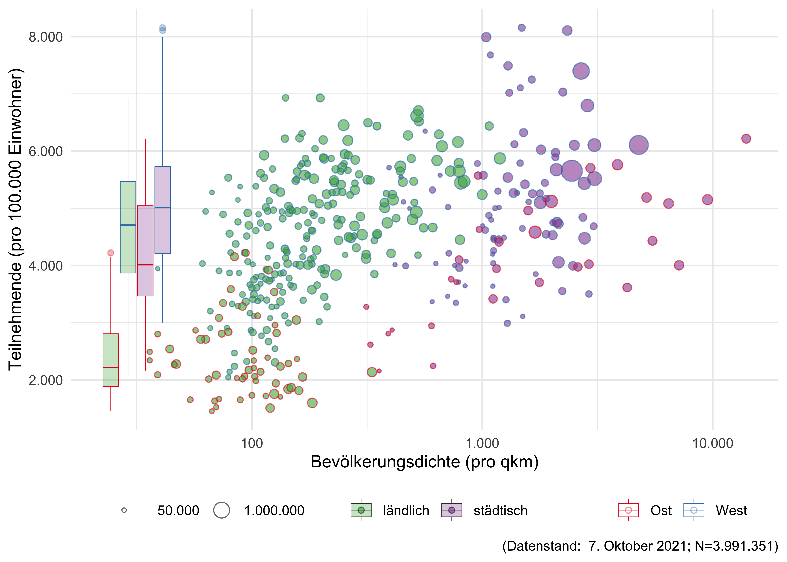
    <figcaption aria-hidden="true">Abb. 6: Teilnehmende nach Bevölkerungsdichte in städtischen und ländlichen Kreisen.</figcaption>
</figure>

Der Unterschied zwischen den Teilnehmenden in urbanen (Stadtkreise) und ländlichen (Landkreise) Gebieten ist im Osten stärker ausgeprägt als im Westen.

Wir wollen dies zusätzlich in einer interaktiven Grafik darstellen, um die Exploration zu erleichtern.

Abb. 7: Teilnehmende nach Bevölkerungsdichte in städtischen und ländlichen Kreisen.

Mit zunehmender Bevölkerungsdichte steigt die „Inzidenz” der Spendenden (Anzahl der Teilnehmenden pro 100.000 Einwohner). Während es in ländlichen Gebieten im Mittel 4.191 Teilnehmende (pro 100.000 Einwohner) gab (Median: 4.246), waren es in urbanen Gebieten im Mittel 4.875 (Median: 4.780).

Außerdem ergibt sich aus den Daten, dass es in den westlichen Landkreisen im Schnitt 5.154 Teilnehmende (pro 100.000 Einwohner) und in den östlichen Landkreisen 3.331 gab.

Insgesamt liegt der Schnitt bei 4.388 und unter Berücksichtigung der Quote derjenigen, die ihren Landkreis angegeben haben, hochgerechnet bei 13.312. Später werden wir sehen, dass etwa die Hälfte aller CWA-Nutzenden ihre Daten spenden, sodass wir auf einen Anteil von etwa 27% der Bevölkerung kommen, die die CWA aktiv nutzt.

## 5 Erhalt einer Warnung
### 5.1 Warnungen und gewarnte Personen

In Abb. 7 ist der zeitliche Verlauf der über die CWA Warnenden und Gewarnten angegeben. Während die Anzahl der Warnenden aus dem CWA-Ökosystem bekannt ist, kann für die Anzahl der Gewarnten nur auf die CWA-Datenspende als Datenquelle zurückgegriffen werden. Hier wurden seit dem 5. März 2021 bereits 619.189 rote Warnungen und 1.518.663 grüne Warnungen übermittelt.

In diesem Zeitraum haben 273.953 Personen über die CWA andere gewarnt, womit wir auf etwa 5 (rot) gewarnte Personen pro warnender Person schließen können. Für Warnungen ohne ein erhöhtes Risiko ergibt sich ein mittlerer Wert von 11 (grün) gewarnten Personen pro warnender Person.

Abb. 8: CWA-Warnende und über die CWA Gewarnte.

Bemerkenswert sind hier die hohen Zahlen der Gewarnten am 19. und 23. März. Hier fanden [Anpassungen an den Parametern der CWA-Risikoberechnung](../../blog/2021-03-19-risk-calculation-improvement/) statt, die dazu geführt haben, dass die Begegnungen mit positiv getesteten Personen der vergangenen 14 Tage neu bewertet wurden und daher an einem Tag statt über zwei Wochen verteilt ausgespielt wurden. Eine [weitere Anpassung](../../blog/2021-04-16-corona-warn-app-risk-calculation-further-improved/) der unteren Grenze hat am 17. April dazu geführt, dass rote und grüne Warnungen seitdem etwa gleich häufig vorkommen. Seit dem Ende des Lockdowns (30. Juni 2021) und mit dem Beginn der Ferienzeit gibt es wieder mehr Grüne als Rote Warnungen.

### 5.2 Gewarnte Personen im zeitlichen Verlauf

In Abb. 8 ist der zeitliche Verlauf von rot und grün gewarnten Personen angegeben. Hierbei wurde die [tagesgenaue Schätzung]() für den Anteil der CWA-Spendenden benutzt, die sich aus den Test-Zahlen ergibt. Auffällig ist, dass seit Ende Juni die grünen Warnungen wieder häufiger als die roten auftreten (auch im Verhältnis zu diesen). Hier spielt die erhöhte Mobilität und die daraufhin wieder steigende Anzahl sozialer Kontakte seit dem Ende der [Bundesnotbremse](https://de.wikipedia.org/wiki/COVID-19-Pandemie_in_Deutschland#%E2%80%9EBundesnotbremse%E2%80%9C_von_23._April_%E2%80%93_30._Juni_2021) sicherlich eine erhebliche Rolle. Hier kommen wir im Durchschnitt auf 8 gewarnte Personen mit erhöhtem Risiko bzw. 26 gewarnte Personen mit niedrigem Risiko (mit Risikobegegnung) pro warnender Person.

<figure>
    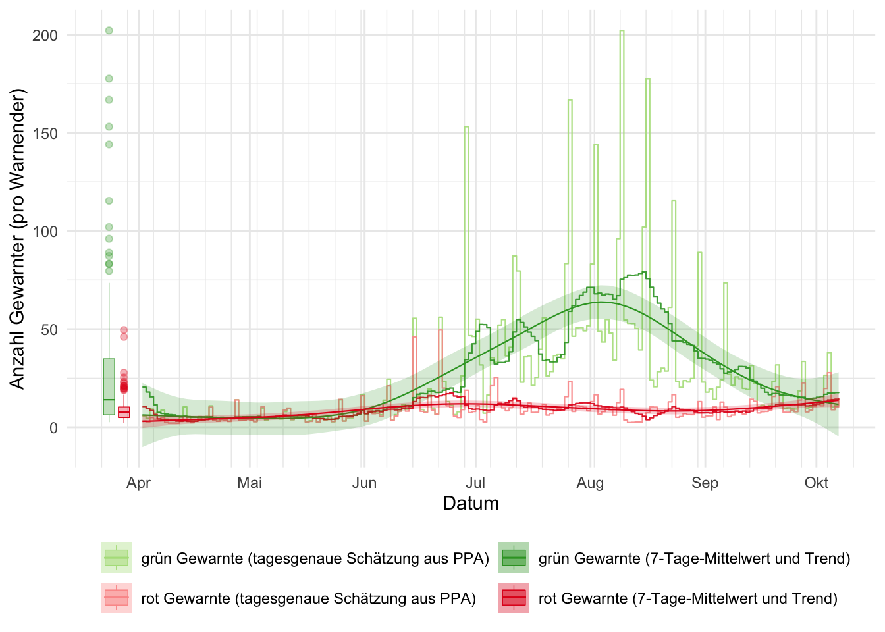
    <figcaption aria-hidden="true">Abb. 9: Anzahl rot und grün gewarnter Personen pro warnender Person im zeitlichen Verlauf.</figcaption>
</figure>

### 5.3 Gewarnte Personen durch Check-Ins

Insgesamt wurden über die CWA-Datenspende bisher 9.075 gewarnte Personen durch ein Check-in registriert. Davon hatten 4.505 ein erhöhtes Risiko (rote Warnung) und 4.570 ein niedriges Risiko (grüne Warnung).

Im selben Zeitraum gab es 398 geteilte Check-in-Ereignisse, womit wir auf etwa 46,5 (hiervon 23,1 rot und 23,4 grün) gewarnte Personen pro Event schließen können. Aufgrund der fehlenden Berücksichtigung der CWA in den Corona-Schutzverordnungen, darf die CWA in vielen Bereichen nicht offiziell zum Check-in genutzt werden. Bisher hat lediglich das Bundesland Sachsen die CWA als Check-in-Tool in den Corona-Schutzverordnungen verankert.

Abb. 10: Gewarnte Personen (PPA) und Warnende (Backend).

## 6 Testergebnisse

Wir analysieren zunächst die Verzüge, die mit den Daten zu den Testergebnissen über die CWA-Datenspende übermittelt werden.

### 6.1 Verzug zwischen Testregistrierung und Erhalt des Testergebnisses

Von den 1.567.815 gespendeten Angaben zu PCR-Testergebnissen und deren Verzügen wurden 395.157 Tests (25.2%) bereits innerhalb der ersten Stunde nach Testregistrierung erhalten. Hier wurde der Test offenbar nicht sofort nach der Durchführung registriert. Nach 24 Stunden waren insgesamt 1.172.212 Tests (74.8%) Tests zugestellt. Die stundengenaue Verteilung des Verzugs zwischen Testregistrierung und Erhalt des Testergebnisses ist in der folgenden Abbildung dargestellt. Im Mittel war das Testergebnis 21 Stunden nach Testregistrierung übermittelt (Median: 12 Stunden).

<figure>
    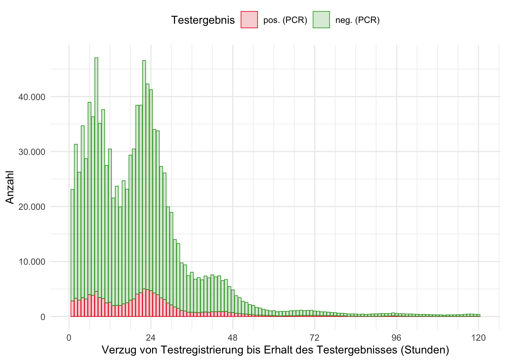
    <figcaption aria-hidden="true">Abb. 11: Zeit zwischen Testregistrierung und Erhalt des Testergebnisses (PCR).</figcaption>
</figure>

Von den 2.373.969 gespendeten Angaben zu Antigen-Schnelltest-Testergebnissen und deren Verzügen wurden 1.532.490 (64.6%) bereits innerhalb der ersten Stunde nach Testregistrierung erhalten. Nach 24 Stunden waren insgesamt 2.175.533 (91.6%) Tests zugestellt. Die stundengenaue Verteilung des Verzugs zwischen Testregistrierung und Erhalt des Testergebnisses ist in der folgenden Abbildung dargestellt. Im Mittel war das Testergebnis 10,5 Stunden nach Testregistrierung übermittelt (Median: 0 Stunden).

Ein Grund für die verhältnismäßig lange Übermittlungsdauer der Antigen-Schnelltest-Testergebnisse liegt darin, dass die CWA nicht kontinuierlich nach aktuellen Schnelltestergebnissen sucht. Um das Ergebnis möglichst zeitnah in der CWA zu erhalten, muss der Test in der App manuell aktualisiert werden, bis ein Ergebnis vorliegt. Zwar ruft die Corona-Warn-App Testergebnisse auch automatisch im Hintergrund ab, je nach Betriebssystem und Verfügbarkeit eines WLAN erfolgt dies aber nur nach mitunter etwas längeren Zeitperioden.

<figure>
    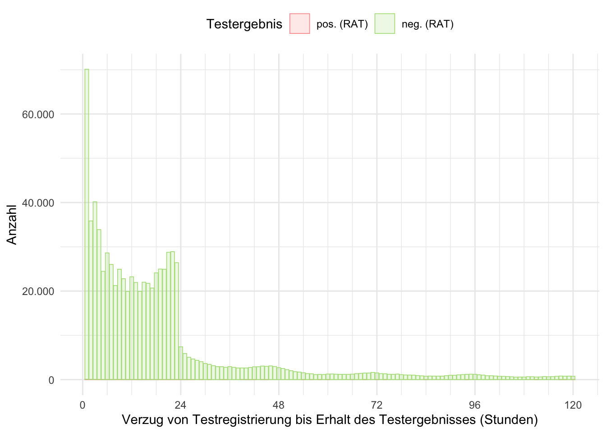
    <figcaption aria-hidden="true">Abb. 12: Zeit zwischen Testregistrierung und Erhalt des Testergebnisses (Antigen-Schnelltest).</figcaption>
</figure>

### 6.2 Verzug zwischen Warnung und Testregistrierung

Zu 97.322 PCR-Tests liegen auch Daten zum Verzug zwischen Warnung und Testregistrierung vor.

Die stundengenaue Verteilung des Verzugs zwischen Warnung und Registrierung eines PCR-Tests ist in der folgenden Abbildung dargestellt. Im Mittel wurde der Test 3,6 Tage nach der Warnung registriert (Median: 1,8 Tage).

Nach 48 Stunden nach einer Warnung waren insgesamt 52.559 PCR-Tests (54%) registriert.

<figure>
    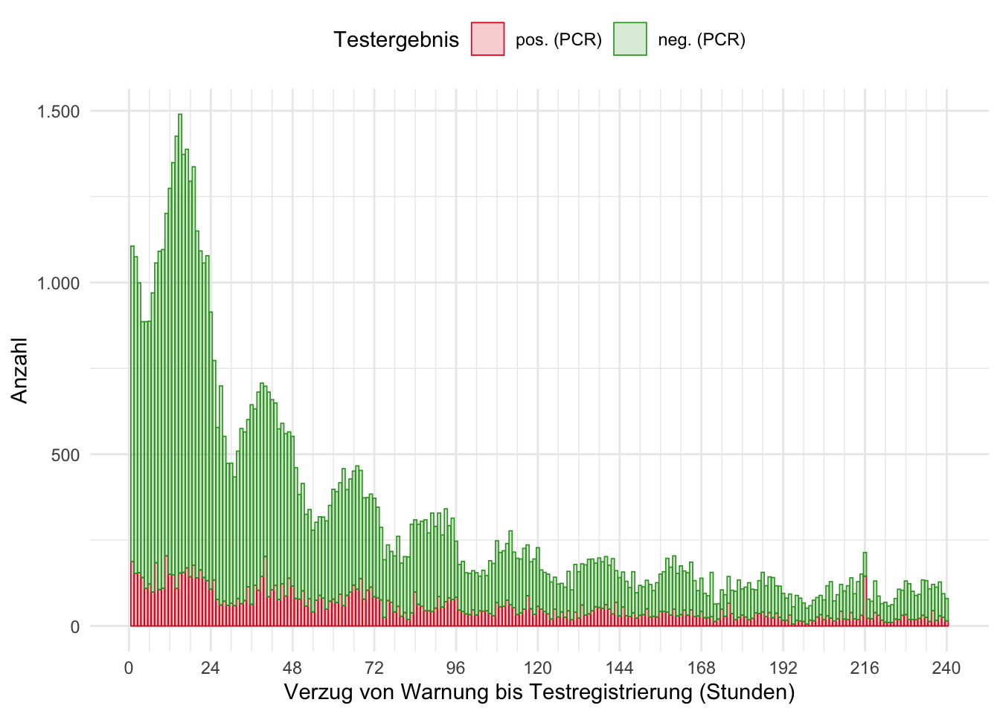
    <figcaption aria-hidden="true">Abb. 13: Zeit zwischen Warnung und Testregistrierung (nach Testergebnis) (PCR).</figcaption>
</figure>

Zu 42.611 Antigen-Schnelltests liegen Daten zum Verzug zwischen Warnung und Testregistrierung vor.

Die stundengenaue Verteilung des Verzugs zwischen Warnung und Registrierung eines Antigen-Schnelltests ist in der folgenden Abbildung dargestellt. Im Mittel wurde der Test 3,2 Tage nach der Warnung registriert (Median: 1,2 Tage).

Nach 48 Stunden nach einer Warnung waren insgesamt 25.518 Antigen-Schnelltests (59.9%) registriert.

<figure>
    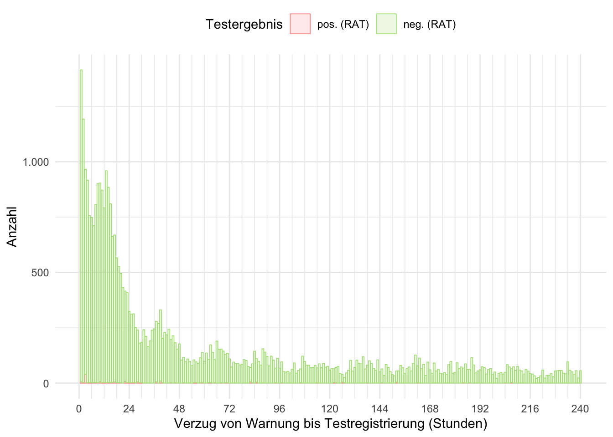
    <figcaption aria-hidden="true">Abb. 14: Zeit zwischen Warnung und Testregistrierung (nach Testergebnis) (Antigen-Schnelltest).</figcaption>
</figure>

### 6.3 Verzug zwischen Risikobegegnung und Testregistrierung

Die tagesgenaue Verteilung des Verzugs zwischen Risikobegegnung und Registrierung eines PCR-Tests ist in der folgenden Abbildung dargestellt. Im Mittel wurde der Test 6 Tage nach der Risikobegegnung registriert (Median: 6 Tage).

<figure>
    
    <figcaption aria-hidden="true">Abb. 15: Zeit zwischen Risikobegegnung und Testregistrierung (nach Tagen vor Testregistrierung) (PCR).</figcaption>
</figure>

Die tagesgenaue Verteilung des Verzugs zwischen Risikobegegnung und Registrierung eines Antigen-Schnelltests ist in der folgenden Abbildung dargestellt. Im Mittel wurde der Test 7,4 Tage nach der Risikobegegnung registriert (Median: 7 Tage).

<figure>
    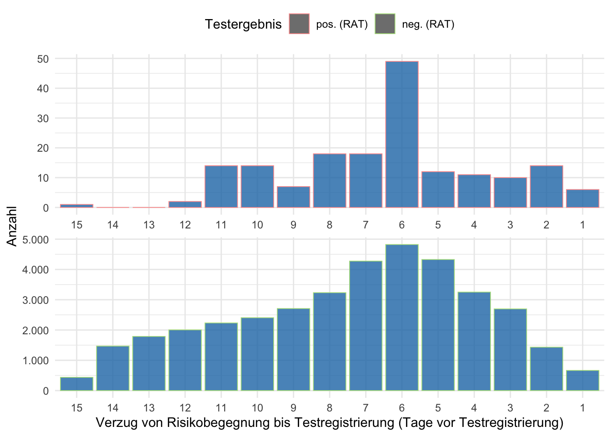
    <figcaption aria-hidden="true">Abb. 16: Zeit zwischen Risikobegegnung und Testregistrierung (nach Tagen vor Testregistrierung) (Antigen-Schnelltest).</figcaption>
</figure>

### 6.4 Verzug zwischen Risikobegegnung und Warnung

Die tagesgenaue Verteilung des Verzugs zwischen Risikobegegnung und Warnung ergibt sich damit als Differenz der Verteilungen der Verzüge zwischen Risikobegegnung und Registrierung bzw. Warnung und Registrierung eines PCR-Tests. Diese ist in der folgenden Abbildung dargestellt. Im Mittel wurde die Warnung 3,8 Tage nach der Risikobegegnung erhalten (Median: 4 Tage).

Die im Mittel 3,8 Tage dauernde Zeit zwischen Risikobegegnung und Warnung wird als relativ kurz betrachtet. Dazu folgendes Beispiel: Person A trifft Person B am Tag 0 für ca. 2 Stunden. Person A weist am Tag 1 SARS-CoV-2-typische Symptome auf und lässt sich am Tag 2 testen und erhält das positive PCR-Testergebnis am Tag 3 und warnt unmittelbar. Das Smartphone von Person B wird mittels Push-Notification am Tag 3 über eine Risikobegegnung mit erhöhtem Risiko am Tag 0 informiert. Hierdurch käme ein Verzug zwischen Risikobegegnung und Warnung von 3 Tagen zustande.

<figure>
    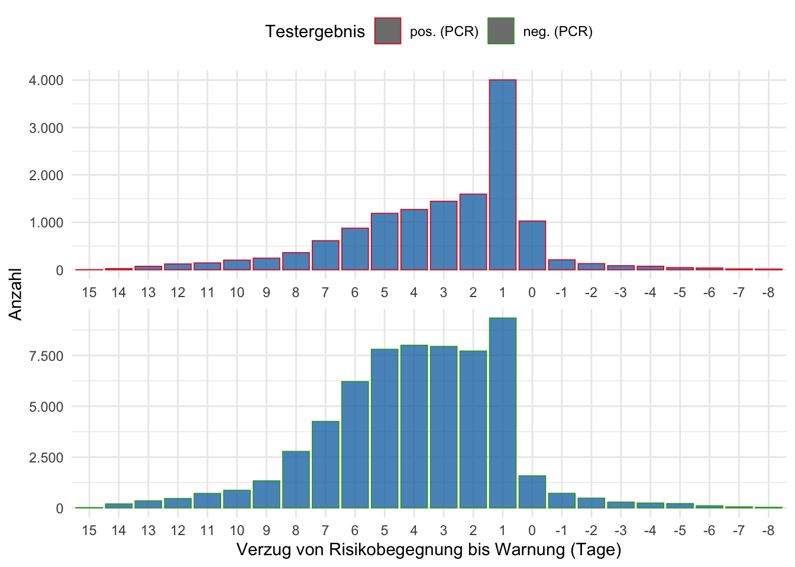
    <figcaption aria-hidden="true">Abb. 17: Zeit zwischen Risikobegegnung und Warnung (nach Tagen vor der Warnung) (PCR).</figcaption>
</figure>

Die tagesgenaue Verteilung des Verzugs zwischen Risikobegegnung und Warnung ergibt sich damit als Differenz der Verteilungen der Verzüge zwischen Risikobegegnung und Registrierung bzw. Warnung und Registrierung eines Antigen-Schnelltests. Diese ist in der folgenden Abbildung dargestellt. Im Mittel wurde die Warnung 5,4 Tage nach der Risikobegegnung erhalten (Median: 5 Tage).

<figure>
    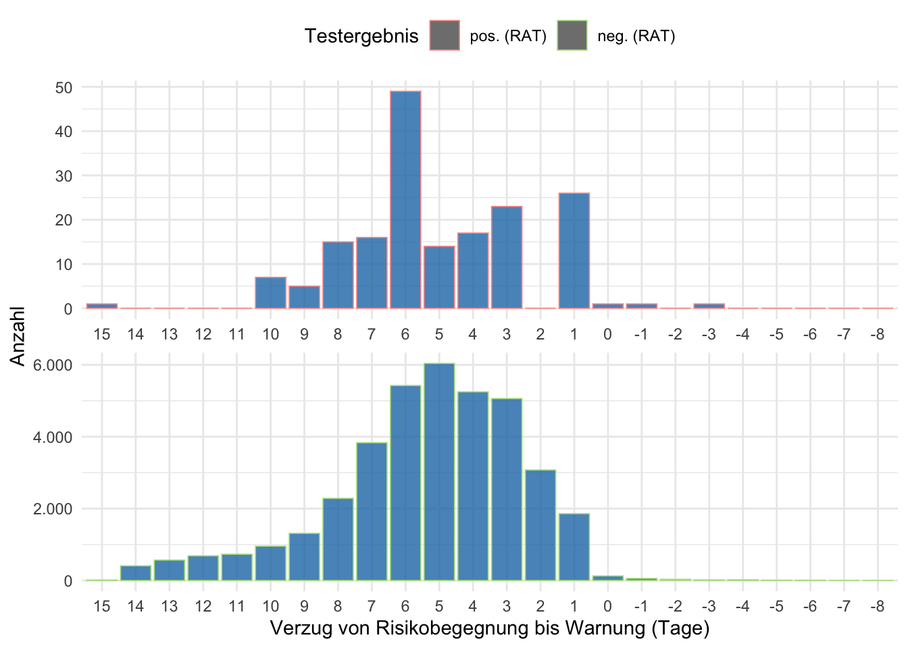
    <figcaption aria-hidden="true">Abb. 18: Zeit zwischen Risikobegegnung und Warnung (nach Tagen vor der Warnung) (Antigen-Schnelltest).</figcaption>
</figure>

### 6.5 Zusammenhang zwischen Risikobewertung und Infektion

Die Daten geben auch Auskunft darüber, ob die Warnung durch die CWA auch eher zu einem positiven Testresultat führt. Und in der Tat tut sie dies: Mehr als jede fünfte Person, die eine rote Warnung zum Zeitpunkt der Testregistrierung erhalten hatte, wurde positiv auf SARS-CoV-2 getestet. Bei denjenigen ohne Risikomitteilung war der Anteil weniger als halb so hoch (siehe Abb. 18).

<figure class="text-center">
    <table class="table table-hover">

  <thead class="gt_col_headings">
    <tr>
      <th rowspan="2" colspan="1"><strong>Variable</strong></th>
      <th class="text-center" rowspan="1" colspan="3">
        <strong>Testergebnis</strong>
      </th>
      <!-- <th class="text-center" rowspan="2" colspan="1"><strong>Gesamt</strong></th>
    </tr> -->
    <tr>
      <th class="text-center" rowspan="1" colspan="1">pos. (PCR)</th>
      <th class="text-center" rowspan="1" colspan="1">neg. (PCR)</th>
      <th class="text-center" rowspan="1" colspan="1"><strong>Gesamt</strong></th>
    </tr>
  </thead>
  <tbody class="gt_table_body">
    <tr><td class="text-left" style="font-weight: bold;">Risikobewertung</td>
<td class="text-center"></td>
<td class="text-center"></td>
<td class="text-center"></td>
<td class="text-center"></td></tr>
    <tr><td class="gt_row gt_left" style="text-align: left; text-indent: 10px;">Erhöhtes Risiko</td>
<td class="text-center">20.655 (21%)</td>
<td class="text-center">77.090 (79%)</td>
<td class="text-center">97.745 (100%)</td>
</tr>
    <tr><td class="gt_row gt_left" style="text-align: left; text-indent: 10px;">Niedriges Risiko (mit Risikobegegnung)</td>
<td class="text-center">1.930 (14%)</td>
<td class="text-center">11.919 (86%)</td>
<td class="text-center">13.849 (100%)</td>
</tr>
    <tr><td class="gt_row gt_left" style="text-align: left; text-indent: 10px;">Niedriges Risiko (ohne Risikobegegnung)</td>
<td class="text-center">140.128 (9,7%)</td>
<td class="text-center">1.306.963 (90%)</td>
<td class="text-center">1.447.091 (100%)</td>
</tr>

 <tr><td class="gt_row gt_left" style="text-align: left; text-indent: 10px;"><strong>Gesamt</strong></td>
<td class="text-center">162.713 (10%)</td>
<td class="text-center">1.395.972 (90%)</td>
<td class="text-center">1.558.685 (100%)</td>
</tr>
  </tbody>

</table>
<figcaption aria-hidden="true">Tab. 1: Zusammenhang zwischen Risikobenachrichtigung und Testergebnis (PCR). </figcaption>
</figure>

<figure>
    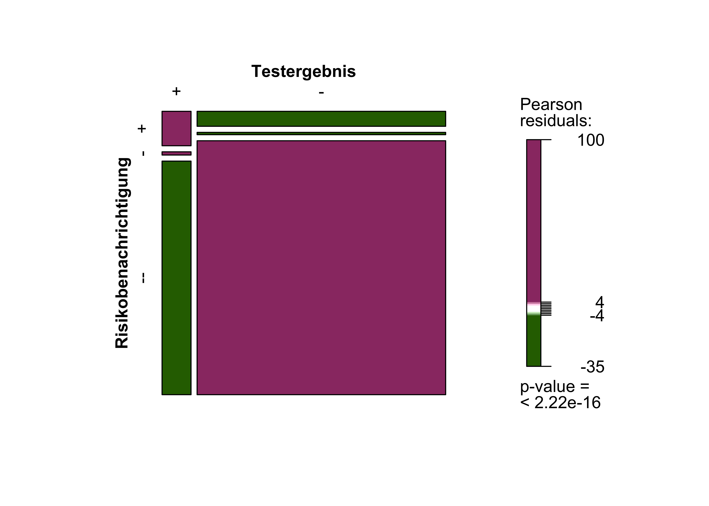
    <figcaption aria-hidden="true">Abb. 19: Zusammenhang zwischen Risikobenachrichtigung und Testergebnis (PCR).</figcaption>
</figure>

Die folgende Grafik zeigt den Positivenanteil nach Risikobenachrichtigung im zeitlichen Verlauf. Der Anteil der positiv getesteten Personen, die eine rote Warnung erhalten haben, ist relativ konstant. Ein Vergleich mit den [RKI-Testzahlen](https://www.rki.de/DE/Content/InfAZ/N/Neuartiges_Coronavirus/Daten/Testzahlen-gesamt.html) zeigt eine gute Übereinstimmung mit dem Positivenanteil der nicht gewarnten Personen. Der leicht höhere Anteil an positiv getesteten Personen ist zum einen in der unterschiedlichen zugrunde liegenden Erhebungspopulation zu suchen. So sind Kinder unter 16 Jahren eher selten Nutzer der Corona-Warn-App. Zum anderen sind in den RKI-Zahlen auch in zunehmenden Maße Routine- und Pooling-Testergebnisse enthalten, die wahrscheinlich selten, bis gar nicht über die Corona-Warn-App registriert werden.

<figure>
    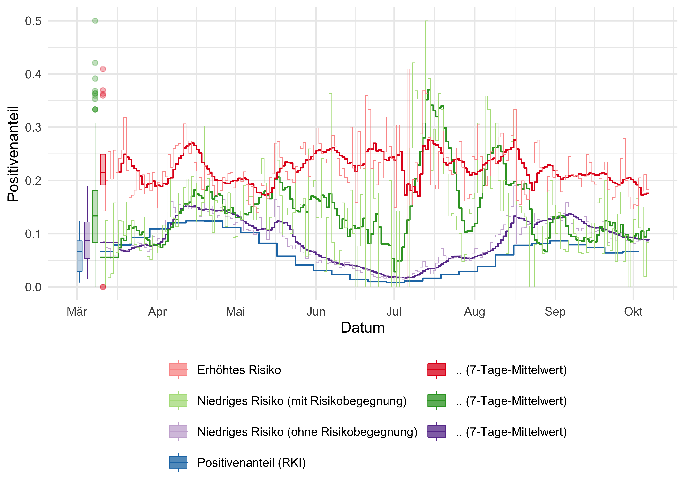
    <figcaption aria-hidden="true">Abb. 20: Positivenanteil nach Risikobenachrichtigung im Zeitlichen Verlauf (PCR).</figcaption>
</figure>

Auch bei Antigen-Schnelltests ist dieser Zusammenhang zu erkennen, auch wenn die Datenlage hier etwas dünner ist (s. Abb. 19).

<figure class="text-center">
    <table class="table table-hover">

  <thead class="gt_col_headings">
    <tr>
      <th rowspan="2" colspan="1"><strong>Variable</strong></th>
      <th class="text-center" rowspan="1" colspan="3">
        <strong>Testergebnis</strong>
      </th>
      <!-- <th class="text-center" rowspan="2" colspan="1"><strong>Gesamt</strong></th>
    </tr> -->
    <tr>
      <th class="text-center" rowspan="1" colspan="1">pos. (RAT)</th>
      <th class="text-center" rowspan="1" colspan="1">neg. (RAT)</th>
      <th class="text-center" rowspan="1" colspan="1"><strong>Gesamt</strong></th>
    </tr>
  </thead>
  <tbody class="gt_table_body">
    <tr><td class="text-left" style="font-weight: bold;">Risikobewertung</td>
<td class="text-center"></td>
<td class="text-center"></td>
<td class="text-center"></td>
<td class="text-center"></td></tr>
    <tr><td class="gt_row gt_left" style="text-align: left; text-indent: 10px;">Erhöhtes Risiko</td>
<td class="text-center">245 (0,6%)</td>
<td class="text-center">42.325 (99%)</td>
<td class="text-center">45.570 (100%)</td>
</tr>
    <tr><td class="gt_row gt_left" style="text-align: left; text-indent: 10px;">Niedriges Risiko (mit Risikobegegnung)</td>
<td class="text-center">31 (0,3%)</td>
<td class="text-center">11.731 (100%)</td>
<td class="text-center">11.762 (100%)</td>
</tr>
    <tr><td class="gt_row gt_left" style="text-align: left; text-indent: 10px;">Niedriges Risiko (ohne Risikobegegnung)</td>
<td class="text-center">1.922 (&lt;0,1%)</td>
<td class="text-center">2.304.896 (100%)</td>
<td class="text-center">2.306.818 (100%)</td>
</tr>

 <tr><td class="gt_row gt_left" style="text-align: left; text-indent: 10px;"><strong>Gesamt</strong></td>
<td class="text-center">2.198 (&lt;0,1%)</td>
<td class="text-center">2.358.952 (100%)</td>
<td class="text-center">2.361.150 (100%)</td>
</tr>
  </tbody>

</table> 
<figcaption aria-hidden="true">Tab. 2: Zusammenhang zwischen Risikobenachrichtigung und Testergebnis (RAT). </figcaption>
</figure>

<figure>
    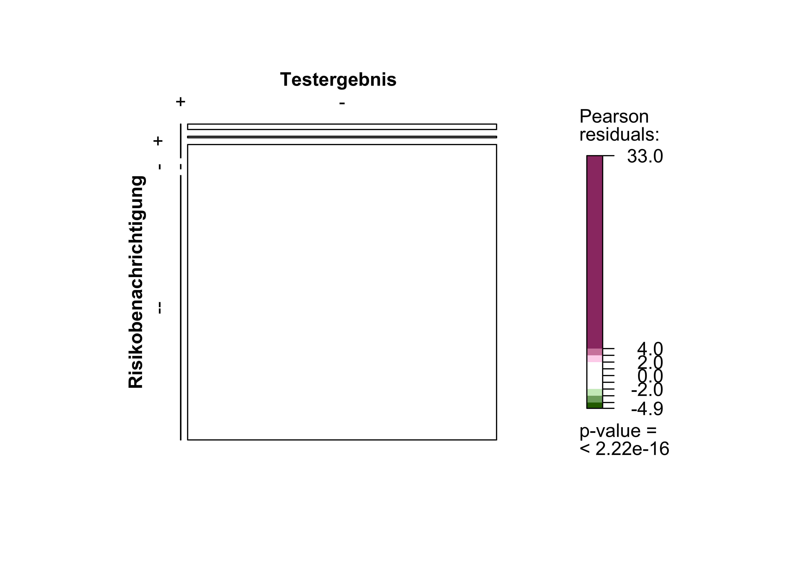
    <figcaption aria-hidden="true">Abb. 21: Zusammenhang zwischen Risikobenachrichtigung und Testergebnis (RAT).</figcaption>
</figure>

Die folgende Grafik zeigt den Positivenanteil nach Risikobenachrichtigung im zeitlichen Verlauf.

<figure>
    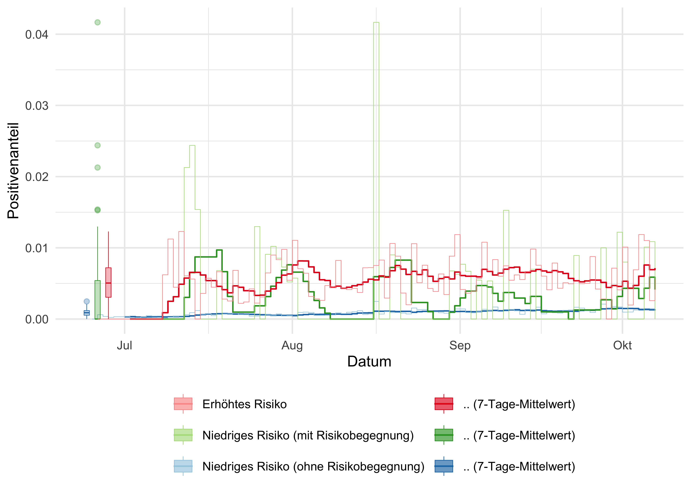
    <figcaption aria-hidden="true">Abb. 22: Positivenanteil nach Risikobenachrichtigung im Zeitlichen Verlauf (PCR).</figcaption>
</figure>

### 6.6 Schätzung des Anteils der Datenspendenden

Auf Basis des Anteils der im CWA-Backend registrierten und in der Datenspende sichtbaren Testergebnisse, ist eine erste Schätzung des Anteils der Datenspendenden möglich.

In der folgenden Abbildung sind die Anteile der gespendeten Testergebnisse (positiv bzw. negativ) nach Art des Tests (PCR bzw. RAT (Antigen-Schnelltest)) angegeben. Hierbei wurde das Verhältnis zwischen den an einem Tag über die CWA-Datenspende übermittelten Testergebnissen zu den einen Tag zuvor (bei PCR) bzw. am selben Tag (bei RAT) auf dem CWA-Lab-Result-Server bereitgestellten Testergebnissen gebildet.

<figure>
    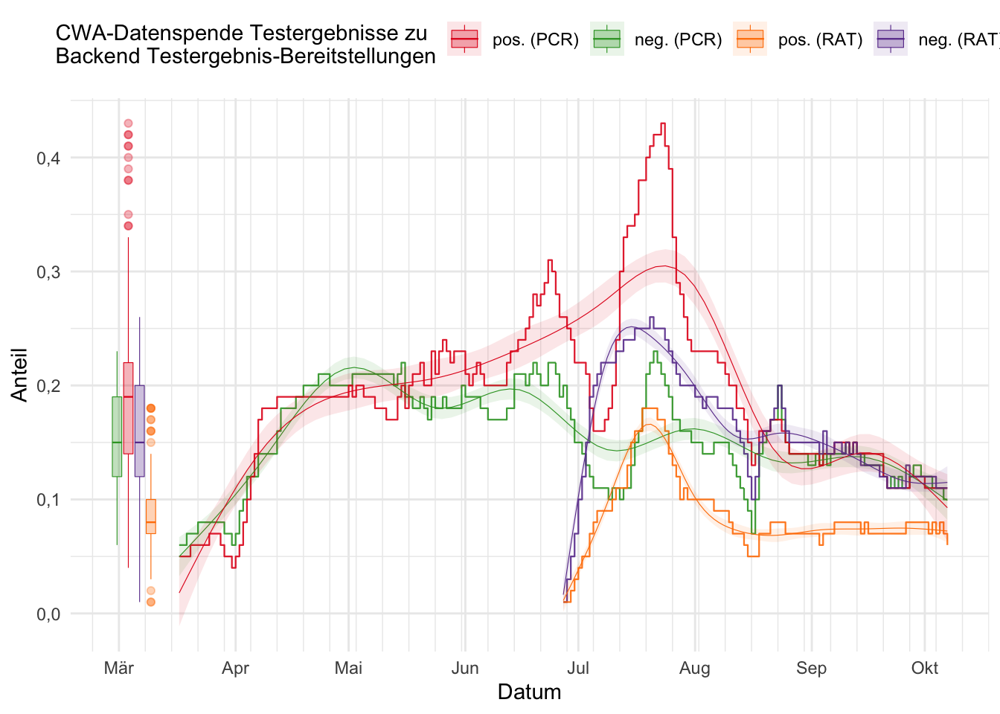
    <figcaption aria-hidden="true">Abb. 23: Verhältnis zwischen der Anzahl der Testergebnisse (CWA-Datenspende) und Anzahl von Testergebnis-Bereitstellungen (Backend) (PCR/RAT und pos./neg.)</figcaption>
</figure>

Ebenso können wir den Anteil der PCR-Testergebnisse, die abgerufen worden sind und über die CWA-Datenspende übermittelt wurden, zu den einen Tag zuvor registrierten Tests angegeben. Dies gibt eine erste Näherung an die Teilnehmendenrate der CWA-Datenspende. Dieser Anteil beträgt über die letzten 30 Tage gemittelt 49%.

Die auf Basis der gespendeten Testergebnisse getätigte Schätzung des Anteils der Datenspendenden lässt keine konkreten Rückschlüsse auf die Anzahl der aktiven Nutzenden und/oder Geräte zu. Diesem Thema widmen wir uns in einem separaten Beitrag.

<figure>
    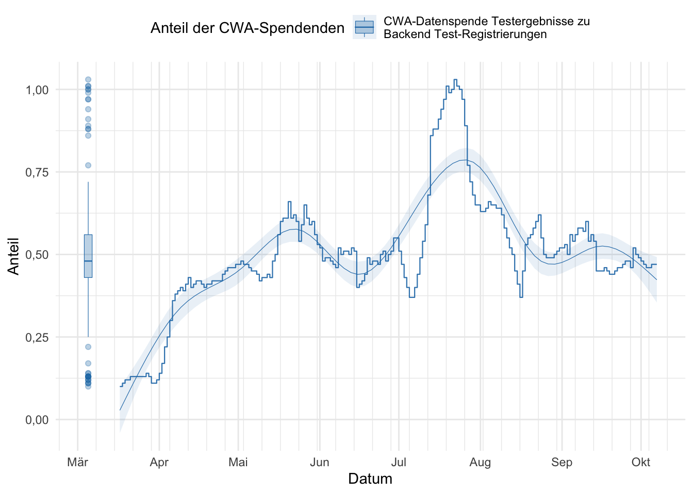
    <figcaption aria-hidden="true">Abb. 24: Tagesgenaue Schätzung des Anteils der Spendenden – aus der Anzahl von Testergebnissen (CWA-Datenspende) pro Test-Registrierungen (Backend).</figcaption>
</figure>

## 7 So geht es weiter

In den kommenden Wochen werden wir uns auch weiterhin mit dem Thema "Datenspende der Corona-Warn-App" beschäftigen. Wir wollen untersuchen, welche Erkenntnisse es beim Prozess der [Schlüsselteilung](#326-schlüsselteilung) und bei der BLE-Messung über das ENF [(Exposure-Windows und Scan-Instances)](#327-exposure-windows-und-scan-instances) zu gewinnen gibt.

Bevor wir dies tun, wollen wir jedoch einen kurzen Abstecher machen und auf die Anzahl der aktiven Apps/Geräte bzw. aktiven Nutzenden ausführlicher eingehen. Dazu werden wir auch auf die Daten aus dem Apple App-Store und dem Google Play-Store eingehen und die unterschiedlichen Kennzahlen, die in ihnen zur Verfügung gestellt werden, in Beziehung zueinander und zu weiteren Abschätzungen setzen.
