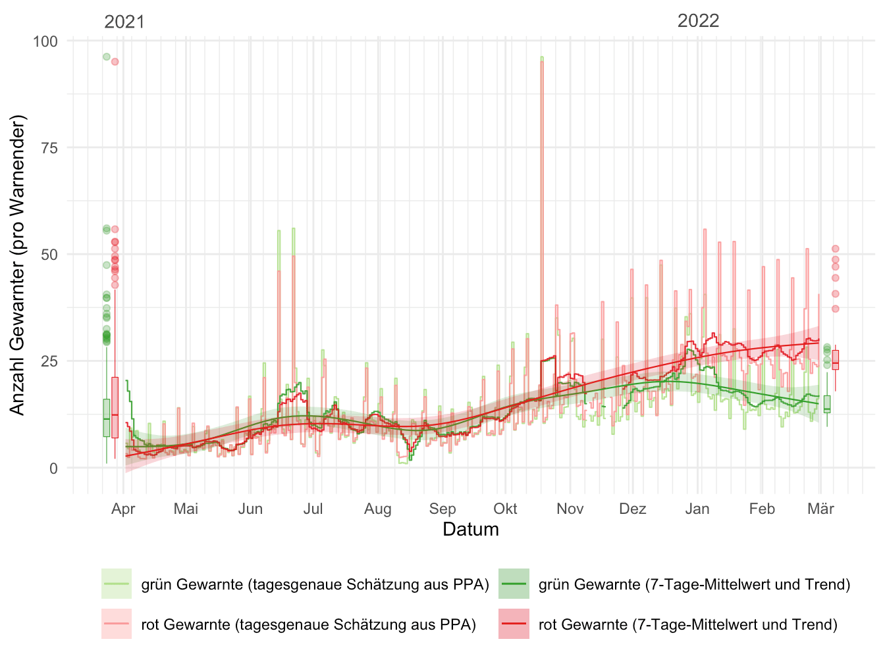
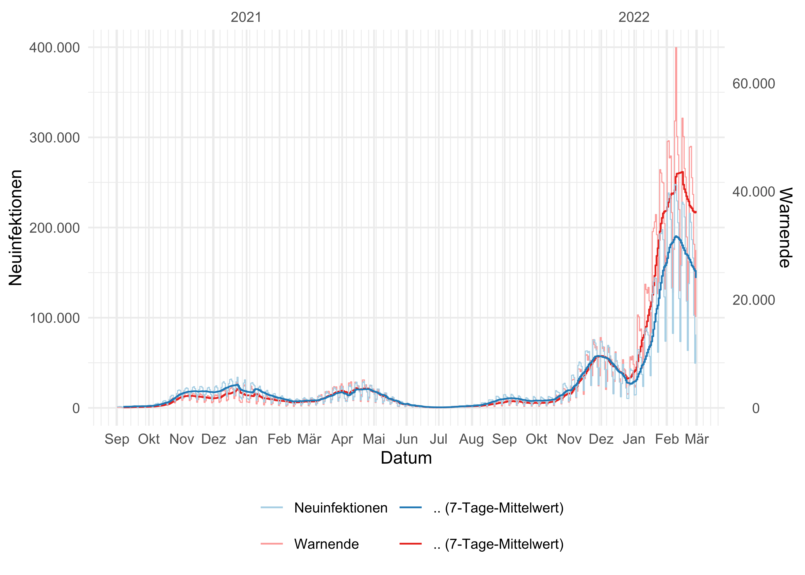
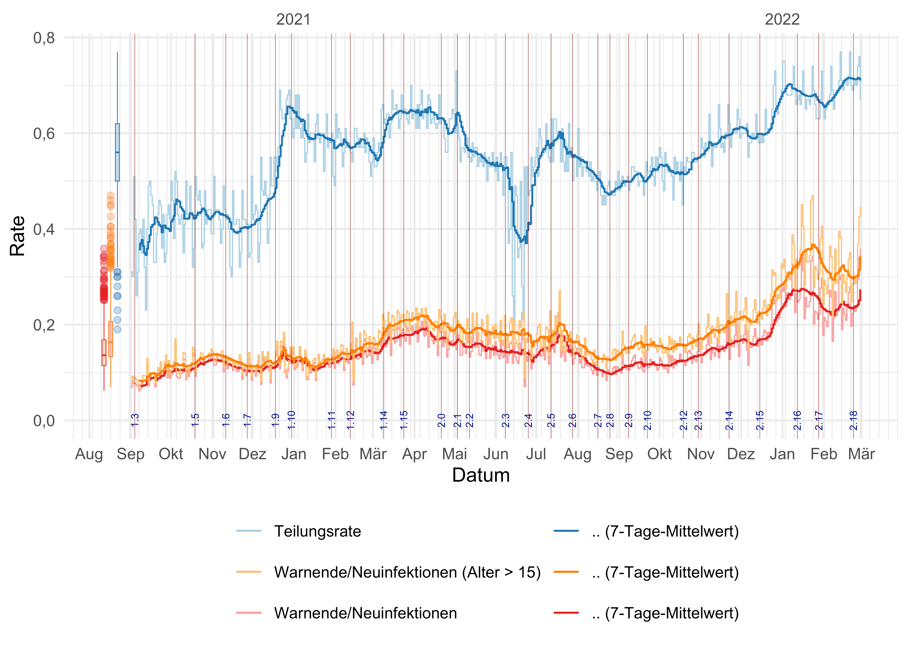
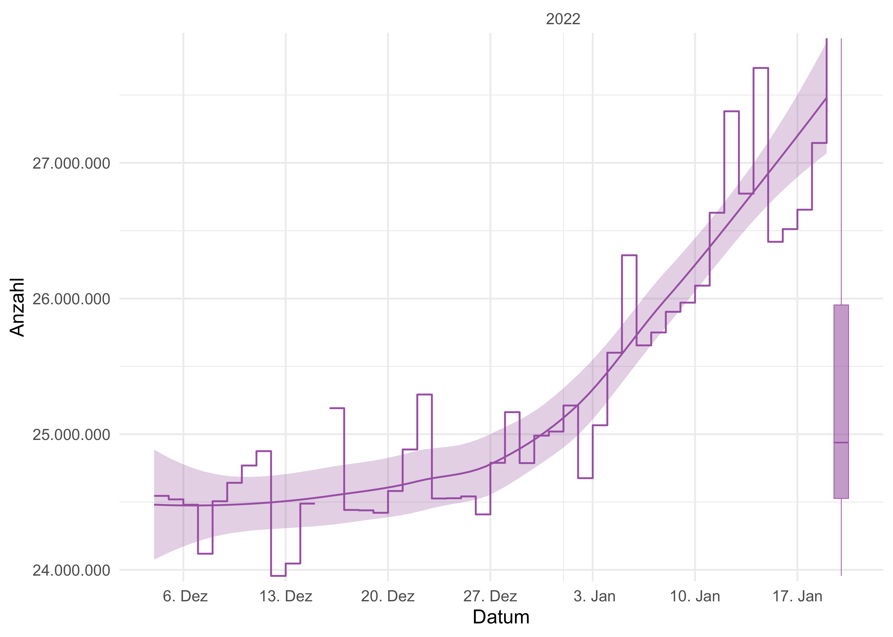

Die Corona-Warn-App (CWA) ist ein wichtiger Baustein zur Pandemiebekämpfung, indem sie hilft, Infektionsketten rasch zu beenden. Die Wirksamkeit der CWA ist dabei umso größer, je mehr Personen sie nutzen. Aus diesem Grund ist es wichtig zu wissen, wie viele Menschen von der CWA täglich bzw. gelegentlich aktiv Gebrauch machen. Seit ihrem Erscheinen wurde die CWA bereits millionenfach heruntergeladen. Die Anzahl der Downloads ist ein erster wichtiger Indikator für die Bewertung der Verbreitung der App. Doch nicht jeder, der die App installiert hat, nutzt sie auch „aktiv”. In diesem Beitrag wollen wir näher auf die Wirksamkeit der CWA zur Eindämmung des Pandemiegeschehens eingehen. Insbesondere zeigen wir, wie viele Menschen die App aktiv nutzen und somit helfen, unseren Alltag sicherer zu gestalten.

<!-- overview -->

1. [Das Wichtigste in Kürze: Zahlen, Daten, Fakten](#1-das-wichtigste-in-kürze-zahlen-daten-fakten)
2. [Die CWA erfüllt Ihren Zweck und ist wirksam](#2-die-cwa-erfüllt-ihren-zweck-und-ist-wirksam)
    1. [Zweck 1 – Abruf des Testergebnisses](#21-zweck-1--abruf-des-testergebnisses)
    2. [Zweck 2 – Warnung Anderer](#22-zweck-2--warnung-anderer)
    3. [Zweck 3 – Risikoermittlung](#23-zweck-3--risikoermittlung)
3. [Downloads und Nutzung der Corona-Warn-App](#3-downloads-und-nutzung-der-corona-warn-app)
    1. [Was sind aktive Nutzende?](#31-was-sind-aktive-nutzende)
    2. [Nutzung der Kernfunktionalität](#32-nutzung-der-kernfunktionalität)
4. [Schätzungen der aktiven Nutzenden](#4-schätzungen-der-aktiven-nutzenden)
    1. [Aus der Anzahl der Warnenden](#41-aus-der-anzahl-der-warnenden)
    2. [Aus der CWA-Datenspende](#42-aus-der-cwa-datenspende)
    3. [Aus einer Heuristik](#43-aus-einer-heuristik)
5. [Kennzahlen aus dem CWA-Backend](#5-kennzahlen-aus-dem-cwa-backend)
6. [Kennzahlung zur Nutzung aus den Stores](#6-kennzahlen-zur-nutzung-aus-den-stores)
    1. [Google-Play-Store](#61-google-play-store)
    2. [Apple-App-Store](#62-apple-app-store)
7. [Vergleich der Angaben zu aktiven Nutzenden](#7-vergleich-der-angaben-zu-aktiven-nutzenden)
8. [Fazit](#8-fazit)
9. [So geht es weiter](#9-so-geht-es-weiter)

## 1 Das Wichtigste in Kürze: Zahlen, Daten, Fakten

- Die Corona-Warn-App wurde 43,2 Mio. mal heruntergeladen (Stand: 27. Februar 2022).
- Die aktualisierte Analyse zur Wirksamkeit der CWA unterstreicht ihre Bedeutung bei der schnellen Beendung von Infektionsketten:
    - Durch die CWA werden Testergebnisse schnell zurückgemeldet. Derzeit sind ca. 270 Labore und über 20.000 Teststellen [(Quelle: T-Systems International)](https://dserver.bundestag.de/btd/20/004/2000431.pdf) an die CWA angeschlossen und können Ergebnisse direkt in das Backend der CWA übermitteln. Basierend auf den Daten der [CWA-Datenspende](../2021-10-15-science-blog-4/) kann gezeigt werden, dass Testergebnisse im Mittel 20 Stunden nach Testregistrierung in die CWA übermittelt sind, die Hälfte innerhalb von 13 Stunden (Median).
    - Personen werden durch die CWA schnell gewarnt. Im Mittel wurde die Warnung über den Kontakt zu einer nachweislich infizierten Person 4,2 Tage nach der Risikobegegnung erhalten (die Hälfte innerhalb von 4 Tagen). Gewarnte Personen lassen sich im Mittel 4,4 Tage nach der Warnung testen (die Hälfte innerhalb von 1,7 Tagen).
    - Knapp 2,9 Mio. CWA-Nutzende haben bereits ein positives Testergebnis über die CWA geteilt und damit andere Nutzende gewarnt. Basierend auf Erkenntnissen der Datenspende lässt sich schätzen, dass pro warnender Person 19 Personen eine rote Warnung erhalten.
    - Die CWA beendet Infektionsketten: Etwa jede fünfte Person, die eine rote Warnung zum Zeitpunkt der Testregistrierung (PCR) erhalten hatte, wurde positiv auf SARS-CoV-2 getestet.
    - Eine aktuelle Analyse des Pandemiegeschehens zu Jahresbeginn 2022 zeigt, dass ca. 17% aller positiven Corona-Testergebnisse in Deutschland in der CWA abgerufen und geteilt wurden und somit umgehend und ohne Beteiligung Dritter andere Nutzende gewarnt wurden.
- Aus der [Anzahl der Warnenden](#41-aus-der-anzahl-der-warnenden) ergibt sich eine Schätzung für die Anzahl der aktiven Nutzenden von 27 Mio. (Stand: 27. Februar 2022, KI: 21 Mio. – 33,3 Mio.).
- Aus den [Daten der Datenspende](#42-aus-der-cwa-datenspende) ergibt sich eine Schätzung für die Anzahl der aktiven Nutzenden von 31 Mio. (Stand: 27. Februar 2022, KI: 25,8 Mio. – 33,6 Mio.).
- Nach den Daten des [Google-Play-Stores](#61-google-play-store) beläuft sich die Anzahl der aktiven Apps/Endgeräte auf 16,5 Mio., die der aktiven Nutzenden (nach Definition von Google) auf 15,2 Mio. und der (monatlich) aktiven Nutzenden auf 13,5 Mio. (Stand: 26. Februar 2022).
- Die Anzahl der monatlich aktiven Nutzenden aus dem [Apple-App-Store](#62-apple-app-store) kann auf 11,6 Mio. hochgerechnet werden (Stand: 27. Februar 2022).
- Damit ergeben sich insgesamt 25,1 Mio. (monatlich) aktive Nutzende bzw. 28,1 Mio. (monatlich) aktive Endgeräte (Stand: 26. Februar 2022) aus den App-Stores.
- Eine [Auswertung von CWA-Backend-Daten](#5-kennzahlen-aus-dem-cwa-backend) über 46 Tage (vom 4. Dezember 2021 bis 19. Januar 2022) ergab 24,9 Mio. aktive Nutzende bzw. 27,9 Mio. aktive Endgeräte (zum 19. Januar 2022; bei 112 Endgeräten pro 100 Nutzenden).
- Im europäischen Vergleich des Verhältnisses zwischen Downloads und aktiven Nutzenden nimmt die Corona-Warn-App damit eine Spitzenposition ein.

## 2 Die CWA erfüllt ihren Zweck und ist wirksam

Wir wollen an dieser Stelle die Gelegenheit nutzen und die im Blog [Über die Wirksamkeit und den Nutzen der Corona-Warn-App](../2021-06-15-science-blog-1/) dargelegten Aspekte zusammentragen und aktualisieren. Insbesondere in Anbetracht der in jenem Beitrag dargestellten [Schätzungen der Anzahl der aktiven Nutzenden](#4-sch%C3%A4tzungen-der-aktiven-nutzenden) können zusätzliche Erkenntnisse zur Wirksamkeit der CWA und ihrer Bedeutung für die Pandemieeindämmung gewonnen werden. Einige dieser Kennzahlen sind auch tagesaktuell über das [CWA-Dashboard](../../analysis) verfügbar.

### 2.1 Zweck 1 – Abruf des Testergebnisses

Insgesamt wurden 150.788.351 Testergebnisse an das CWA-Backend-System übermittelt (Stand: 1. März 2022), von denen 15.191.927 positiv, 133.991.100 negativ und 1.292.683 ungültig waren. Von den positiven Testergebnissen wurden 4.069.825 über die CWA abgerufen und 2.603.206 geteilt. Zusätzlich wurde für 262.546 positive Tests eine teleTAN ausgegeben und wurden 254.374 davon geteilt.

Die Differenz zwischen den im CWA-Backend bereitgestellten und den über die CWA abgerufenen positiven Testergebnissen ergibt sich daraus, dass bei der Beauftragung der SARS-CoV-2-Testung die Einwilligung zur Übermittlung des Testergebnisses an die CWA angekreuzt wird, die getestete Person aber die CWA entweder nicht installiert hat bzw. nicht nutzt oder keinen QR-Code zur Verfügung gestellt bekommt, um den Test in der CWA zu registrieren und das Ergebnis dann über sie abzurufen. Infolgedessen verbleibt das Testergebnis im Backend. Die 27% abgerufenen und 19% geteilten (positiven) Testergebnisse, lassen eine [Schätzung der aktiven Nutzenden aus der Anzahl der Warnenden](#41-aus-der-anzahl-der-warnenden) unter Berücksichtigung der bekannten Teilungsrate zu und liegen im Rahmen des Erwarteten. Gleichzeitig erkennt man auch, dass das große Potential der Corona-Warn-App noch nicht vollständig genutzt ist. Hierfür könnten noch mehr Personen, die die CWA herunterladen und nutzen, z.&nbsp;B. von den Ärzten und Teststellen auf die Möglichkeit der Testregistrierung und des Abrufs des Ergebnisses in der CWA aufgeklärt werden.

Der zeitliche Verlauf (täglich und 7-Tage-Mittelwert) der oben genannten Kennzahlen (und zum Vergleich auch der [SARS-CoV-2-Neuinfektionen](https://github.com/robert-koch-institut/SARS-CoV-2_Infektionen_in_Deutschland)) ist in der folgenden Abbildung dargestellt (in [logarithmischer Darstellung](https://de.wikipedia.org/wiki/Logarithmische_Darstellung)).

<figure>
    
    <figcaption aria-hidden="true">Abb. 1: Über die CWA bereitgestellte und abgerufene Tests und deren Ergebnisse.</figcaption>
</figure>

Aus den Daten der CWA-Datenspende ergibt sich, dass ein PCR-Testergebnis im Mittel 20 Stunden nach Testregistrierung übermittelt ist (die Hälfte innerhalb von 13 Stunden).

<figure>
    
    <figcaption aria-hidden="true">Abb. 2: Zeitverzug zwischen Testregistrierung und Erhalt des Testergebnisses (PCR).</figcaption>
</figure>

*Die Bereitstellung von Testergebnissen (PCR-Tests und Antigen-Schnelltests (RAT)) erfolgt also umfangreich und zügig.*

### 2.2 Zweck 2 – Warnung Anderer

In der folgenden Abbildung ist der zeitliche Verlauf der über die CWA Warnenden und Gewarnten angegeben (in [logarithmischer Darstellung](https://de.wikipedia.org/wiki/Logarithmische_Darstellung)). Während die Anzahl der Warnenden aus dem CWA-Ökosystem bekannt ist, kann für die Anzahl der Gewarnten nur auf die CWA-Datenspende als Datenquelle zurückgegriffen werden. Hier wurden seit dem 5. März 2021 (Beginn der CWA-Datenspende) bereits 27.307.066 rote Warnungen und 17.571.796 grüne Warnungen übermittelt (Stand: 28. Februar 2022).

Der kurze Einbruch der Anzahl von rot gewarnten Personen Mitte August wurde durch einen vergleichbaren Einbruch der CWA-Datenspende-Daten aufgrund technischer Probleme verursacht (siehe auch [Blog 4, 4.3](../2021-10-15-science-blog-4/#43-anzahl-der-spenden-im-zeitlichen-verlauf-nach-version-der-cwa)).

Seit dem 5. März 2021 (für Vergleiche mit Daten der CWA-Datenspende müssen wir den Zeitpunkt berücksichtigen, seitdem diese Daten zur Verfügung stehen) haben 2.572.787 Personen über die CWA andere gewarnt, woraus wir auf etwa 19 (rot) gewarnte Personen pro warnender Person schließen können (Stand: 28. Februar 2022). Für Warnungen ohne ein erhöhtes Risiko ergibt sich ein mittlerer Wert von 12 (grün) gewarnten Personen pro warnender Person. In den letzten 30 Tagen lagen diese Verhältnisse bei 23 bzw. 13. In der folgenden Abbildung ist der zeitliche Verlauf von rot und grün gewarnten Personen pro warnende Person angegeben.

<figure>
    
    <figcaption aria-hidden="true">Abb. 3: Anzahl rot und grün gewarnter Personen pro warnende Person im zeitlichen Verlauf.</figcaption>
</figure>

Die vereinzelten hohen Ausschläge (im Juni, Mitte August und Mitte Oktober) entstanden durch kurze Einbrüche der CWA-Datenspende (mit anschließender Nachlieferung; siehe auch [Blog 4, 4.3](../2021-10-15-science-blog-4/#43-anzahl-der-spenden-im-zeitlichen-verlauf-nach-version-der-cwa)).

Wichtig für die Wirksamkeit der Warnungen hinsichtlich des Beendens von Infektionsketten ist, dass die gewarnten Personen auch zeitnah gewarnt werden. Im Mittel wurde die Warnung 4,2 Tage nach der Risikobegegnung erhalten (die Hälfte innerhalb von 4 Tagen).

Ebenso wichtig ist, dass die gewarnten Personen ihr Verhalten nach Warnungen der Corona-Warn-App anpassen, indem sie sich in Quarantäne begeben und testen lassen. Über die CWA-Datenspende wurden 27.307.066 (in den letzten 30 Tagen 14.713.346) rote Warnungen registriert. Valide Aussagen zum Anteil derer, die sich nach einer roten Warnung testen lassen, sind über die verfügbaren Quellen nicht zu gewinnen, zumal sich Personen häufig auch selbst testen. Im Rahmen der [ereignisbezogenen Nutzerbefragung (EDUS)](../2021-08-02-science-blog-3) vom Frühjahr 2021 gab die Mehrheit (65,1%) der Befragten der Basisbefragung an, sich infolge einer roten Warnung auf SARS-CoV2 testen lassen zu wollen (vgl. [ebenda, Tabelle 12](../2021-08-02-science-blog-3/#41-testvorhaben)). Weitere 15,8% machten dies vom ärztlichen Rat bzw. dem Rat eines Gesundheitsamtes abhängig, was in der Regel eine Testempfehlung zur Folge hat. In der Folgebefragung, an der knapp 60% der Teilnehmenden der Basisbefragung teilnahmen, gaben 87% an, sich in Folge der roten Warnung auch wirklich getestet zu haben. Zu der Testrate jener Teilnehmenden der Basisbefragung, die nicht an der Folgebefragung teilnahmen, liegen keine Daten vor (vgl. [ebenda, Tabelle 16](../2021-08-02-science-blog-3/#42-testergebnisse)). Betrachtet man ausschließlich registrierte Tests, kommt man zu folgender Auswertung: Hiernach wurden im betrachteten Zeitraum (über die CWA-Datenspende) insgesamt 4.341.891 Testergebnisse (in den letzten 30 Tagen 2.144.859) registriert, die zum Zeitpunkt der Testregistrierung ein erhöhtes Risiko aufwiesen (Stand: 28. Februar 2022). Von den registrierten PCR-Tests (die zum Zeitpunkt der Testregistrierung ein erhöhtes Risiko aufwiesen) waren 36,4% positiv (in den letzten 30 Tagen 53,5%), bei den registrierten Antigen-Schnelltests lag der Positivenanteil bei 2,6% (in den letzten 30 Tagen bei 3,8%). Insgesamt wurden damit 11,7% (in den letzten 30 Tagen 14,1%) der Gewarnten positiv getestet. Gewarnte lassen sich im Mittel 4,4 Tage nach der Warnung testen (die Hälfte innerhalb von 1,7 Tagen).

Die angegebenen Zahlen stimmen gut mit den Erkenntnissen aus der [ereignisbezogenen Nutzerbefragung (EDUS)](../2021-08-02-science-blog-3) vom Frühjahr 2021 überein. Dort hatten ca. 13.000 von ca. 26.000 Teilnehmenden (die alle eine rote Warnung erhalten hatten) Angaben zu ihren Testergebnissen übermittelt. Von ihnen wurden insgesamt 5,9% positiv getestet. Der Anteil der Positiven lag bei den PCR-Tests bei 13%, bei den Antigen-Schnelltests bei 0,3% ([ebenda, Tabellen 15 und 17](../2021-08-02-science-blog-3/#42-testergebnisse)).

*Die Warnungen durch die CWA erfolgen damit ebenfalls umfangreich, angemessen und zeitnah.*

### 2.3 Zweck 3 – Risikoermittlung

Etwa jede fünfte Person, die eine rote Warnung zum Zeitpunkt der Testregistrierung (PCR) erhalten hatte, wurde positiv auf SARS-CoV-2 getestet. Bei denjenigen ohne Risikomitteilung war der Anteil zum Teil wesentlich geringer (siehe Abbildung und [Blog 4, 6.5](../2021-10-15-science-blog-4/#65-zusammenhang-zwischen-risikobewertung-und-infektion)).

<figure>
    
    <figcaption aria-hidden="true">Abb. 4: Positivenanteil nach Risikobenachrichtigung im zeitlichen Verlauf (PCR).</figcaption>
</figure>

Der hohe Positivenanteil aus der Testzahlenerfassung des RKI und für Personen ohne erhöhtes Risiko seit November 2021 ist durch die hohen Infektionszahlen in dieser Phase der Pandemie zu erklären und deutet auch auf eine hohe Auslastung der Labore hin. Ein PCR-Test wird erst auf begründeten Verdacht hin durchgeführt. Da viele Personen infiziert sind, wird dieser Verdacht auch oft bestätigt.

Bei Antigen-Schnelltests ist dieses Verhältnis sogar noch überzeugender.

<figure>
    
    <figcaption aria-hidden="true">Abb. 5: Positivenanteil nach Risikobenachrichtigung im zeitlichen Verlauf (RAT).</figcaption>
</figure>

*Die Warnungen durch die CWA sind damit, trotz der bekannten Unzulänglichkeiten der BLE-Technologie, präzise und zuverlässig. Die CWA warnt die Richtigen.*

Die Bedeutung der CWA lässt sich auch im aktuellen Pandemiegeschehen illustrieren. Die Anzahl der bundesweiten Neuinfektionen der letzten 7 Tage lag bei 1.007.987 (Stand: 28. Februar 2022). Im selben Zeitraum wurden 1.388.486 positive Corona-Testergebnisse in das Backend der CWA übermittelt und 330.228 von dort von CWA-Nutzenden abgerufen (23,8%). Von diesen wurden wiederum rund zwei Drittel (70,7%) geteilt. Insgesamt wurden damit knapp 16,8% der positiven Tests in Deutschland innerhalb der CWA genutzt und geteilt, um andere zu warnen (in den letzten 7 Tagen waren dies 233.377 Personen). Unter der Annahme, dass pro warnender Person 23 CWA-Nutzende eine rote Warnung erhalten (dieser Wert lag in den letzten 30 Tagen höher als über den gesamten Zeitraum betrachtet), ergeben sich aktuell ca. 5.367.700 rot Gewarnte, von denen sich etwa 15% testen lassen und ihr Resultat über die CWA registrieren. Zudem kann man davon ausgehen, dass sich weitere 72% testen lassen (dies zum großen Teil auch offiziell, s.&nbsp;o.), ihr Testergebnis aber nicht in der CWA registrieren können. Von diesen insgesamt ca. 3.887.000 werden etwa 14,1% und damit bis zu 548.500 weitere CWA-Nutzende positiv getestet. Infolge der schnellen Warnung und der unmittelbaren Verhaltensanpassungen potenziell infizierter CWA-Nutzender werden Infektionsketten durch die CWA frühzeitig beendet.

Eine genaue Bezifferung der beendeten Infektionsketten bzw. der vermiedenen Fälle ist nur im Rahmen einer Simulation oder Modellierung möglich. Dabei muss man die tatsächliche Situation mit einer virtuellen (hypothetischen) vergleichen, in der es z.&nbsp;B. keine CWA gibt. Dies ist für einen zukünftigen Blog-Beitrag geplant.

Zusammenfassend zeigt die aktuelle Auswertung, dass die CWA eine bedeutende Rolle bei der Eindämmung der Pandemie spielt. Durch die direkte Rückmeldung von Testergebnissen in die CWA und das kurze Zeitfenster zwischen Risikobegegnung und Warnung können umgehend und ohne Einbeziehung Dritter Infektionen aufgedeckt und somit schnellstmöglich beendet werden. Am Rande sei erwähnt, dass die frühzeitige Erkennung einer Infektion auch für die betroffene Person selbst vorteilhaft ist, insbesondere wenn diese ein erhöhtes Risiko für einen schweren Verlauf der Erkrankung hat und von einer frühzeitigen gezielten Therapie profitiert.

## 3 Downloads und Nutzung der Corona-Warn-App

In der obigen Auswertung und in vergangenen Blogbeiträgen konnten wir zeigen, dass die Corona-Warn-App (CWA) erfolgreich und schnell Infektionsketten beendet. Der Nutzen der CWA für die Bevölkerung ist dabei umso größer, je mehr Menschen die App nutzen. Daher ist es wichtig, sich die Popularität, Verbreitung und Nutzung der CWA in Deutschland genauer anzuschauen. Hierfür können unterschiedliche Kennzahlen (Metriken) herangezogen werden.

Ein zentraler Indikator für die Verbreitung einer App ist die Anzahl ihrer Downloads bzw. der Anteil der Bevölkerung, der die App heruntergeladen hat. Die Corona-Warn-App wurde 43,2 Mio. mal heruntergeladen (Stand: 27. Februar 2022). Dies entspricht 52,1% der Bevölkerung bzw. 72% der [Personen im Alter von über 15 Jahren, die ein Smartphone besitzen](https://de.statista.com/statistik/daten/studie/198959/umfrage/anzahl-der-smartphonenutzer-in-deutschland-seit-2010/).

### 3.1 Was sind aktive Nutzende?

Für die Bewertung des Nutzens der Corona-Warn-App ist es wichtig zu wissen, wie viele Nutzende die [Kernfunktionalität](../2021-06-15-science-blog-1/#welche-zwecke-muss-die-corona-warn-app-erf%C3%BCllen) aktiv im Einsatz haben. Wir nennen dies die aktive Nutzung im engeren Sinne. Diese Kennzahl kann durch entsprechendes Monitoring von Backend-Aktivitäten ermittelt werden. Während sich einige Länder für ein solches Monitoring entschieden, unterblieb es in Deutschland mit Verweis auf den dezentralen Ansatz der CWA. Wir geben später hierzu zwei Schätzungen an (aus der [Anzahl der Warnenden](#41-aus-der-anzahl-der-warnenden) sowie aus den [Daten der Datenspende](#42-aus-der-cwa-datenspende)).

Die Zahl der erstmaligen Downloads war in den ersten Monaten nach der Einführung der CWA eine gute Annäherung, muss jedoch mit der Zeit als zunehmend schlechte Approximation gesehen werden, da die CWA vom Smartphone gelöscht werden kann oder das alte Smartphone einem neuen weicht, auf dem die CWA unter einem neuen Account erneut installiert wird. Wir geben weiter unten eine [Schätzung der aktiven Nutenden aus einer Heuristik](#43-aus-einer-heuristik) an, die diese zunehmende Abweichung zwischen Downloads und aktiven Nutzenden bzw. aktiven Apps/Endgeräten präzisiert.

Hinzu kommt, dass die Corona-Warn-App im Lauf der Zeit um viele weitere Features erweitert wurde (siehe Tabelle 1). Ob Nutzende in der CWA vielleicht nur das Kontakt-Tagebuch (ab Release 1.10), das Informationsangebot (ab Release 1.11), die Check-in-Funktion für Veranstaltungen (ab Release 2.0) oder die Zertifikatsverwaltung (ab Release 2.3) nutzen, wird ebenfalls nicht ermittelt.

Bei der aktiven Nutzung im erweiterten Sinne wird nicht unterschieden, welche Features genutzt werden. Jemand wird demnach als aktiver Nutzender gezählt, so lange ein beliebiges Feature genutzt wird (z.&nbsp;B. ausschließliche Nutzung des Zertifikatsnachweises), unabhängig davon, ob die Kernfunktionen genutzt werden.

Die vom [Apple-App-Store](#62-apple-app-store) und [Google-Play-Store](#61-google-play-store) ausgewiesenen Kennzahlen sind unterschiedlich definiert und werden unterschiedlich gemessen, betreffen oft nur näherungsweise denselben Sachverhalt und lassen sich daher nicht unmittelbar summieren oder vergleichen. Zudem ist besondere Vorsicht geboten: der Begriff aktive Nutzende wird dort gänzlich anders ([homonym](https://de.wikipedia.org/wiki/Homonym)) als in diesem Blog definiert und steht für etwas, das wir potentielle Nutzende nennen könnten. Weiterhin kommt neben der Differenzierung zwischen Nutzenden und Endgeräten noch das Konzept eines Nutzenden im Sinne eines Accounts vor, was die Dinge zusätzlich verkompliziert. Dort wo sie die Nutzung betreffen, können auch diese Kennzahlen jedenfalls nur die aktive Nutzung im erweiterten Sinne beschreiben. Wir werden die Zahlen der Stores daher auch separat beschreiben.

<table class="table table-striped table-hover table-condensed table-responsive" style="margin-left: auto; margin-right: auto;">
<thead>
<tr>
<th style="text-align:left;">
Release
</th>
<th style="text-align:left;">
In der CWA implementierte Funktionen
</th>
</tr>
</thead>
<tbody>
<tr>
<td style="text-align:left;width: 3cm; ">
1.0
</td>
<td style="text-align:left;width: 11cm; ">
Kernfunktionalitäten (Proximity-Tracing via Bluetooth LE, Teilen positiver Corona-Testergebnisse, Warnung anderer Nutzender), Zählung aktiver Tage
</td>
</tr>
<tr>
<td style="text-align:left;width: 3cm; ">
1.1
</td>
<td style="text-align:left;width: 11cm; ">
Textanpassungen, Verbesserung der Barrierefreiheit, Übersetzung: Türkisch
</td>
</tr>
<tr>
<td style="text-align:left;width: 3cm; ">
1.2
</td>
<td style="text-align:left;width: 11cm; ">
Zulassen von Screenshots, Übersetzung: Bulgarisch, Polnisch, Rumänisch
</td>
</tr>
<tr>
<td style="text-align:left;width: 3cm; ">
1.3
</td>
<td style="text-align:left;width: 11cm; ">
Zusätzliche Informationen zum Risikostatus, Textverbesserung bei angezeigtem niedrigen Infektionsrisiko, Korrektur der Rechtstexte
</td>
</tr>
<tr>
<td style="text-align:left;width: 3cm; ">
1.5
</td>
<td style="text-align:left;width: 11cm; ">
Unterstützung des europäischen Corona-App-Gateways, freiwillige Symptomerfassung, Verbesserung der Textverständlichkeit
</td>
</tr>
<tr>
<td style="text-align:left;width: 3cm; ">
1.6
</td>
<td style="text-align:left;width: 11cm; ">
Detaillierte Erklärung bei Wechsel des Risikostatus
</td>
</tr>
<tr>
<td style="text-align:left;width: 3cm; ">
1.7
</td>
<td style="text-align:left;width: 11cm; ">
Risikoüberprüfung kann mehrmals täglich durchgeführt werden, Erinnerungsfunktion für die Teilung positiver Testergebnisse via CWA
</td>
</tr>
<tr>
<td style="text-align:left;width: 3cm; ">
1.9
</td>
<td style="text-align:left;width: 11cm; ">
Umstellung auf G/A-ENF Version 2, Verbesserung der Risikobewertung, Verbesserung vom Ablauf des Einscannens der Testergebnisse bis zum Teilen der Diagnoseschlüssel
</td>
</tr>
<tr>
<td style="text-align:left;width: 3cm; ">
1.10
</td>
<td style="text-align:left;width: 11cm; ">
Kontakt-Tagebuch
</td>
</tr>
<tr>
<td style="text-align:left;width: 3cm; ">
1.11
</td>
<td style="text-align:left;width: 11cm; ">
Kennzahlen zum Infektionsgeschehen
</td>
</tr>
<tr>
<td style="text-align:left;width: 3cm; ">
1.12
</td>
<td style="text-align:left;width: 11cm; ">
Erweiterung des Kontakt-Tagebuchs (Begegnungshistorie), Unterstützung von den iPhones 5s, 6 und 6 Plus
</td>
</tr>
<tr>
<td style="text-align:left;width: 3cm; ">
1.13
</td>
<td style="text-align:left;width: 11cm; ">
Freiwillige Datenspende (Privacy-Preserving-Analytics (PPA))
</td>
</tr>
<tr>
<td style="text-align:left;width: 3cm; ">
1.14
</td>
<td style="text-align:left;width: 11cm; ">
Erweiterung des Kontakt-Tagebuchs (u.a. Pop-Up-Menü), Erweiterung der freiwilligen Datenspende (neue Datenpunkte)
</td>
</tr>
<tr>
<td style="text-align:left;width: 3cm; ">
1.15
</td>
<td style="text-align:left;width: 11cm; ">
Länderübergreifende Risikoübermittlung (Schweiz), Veränderung der Risikokarte
</td>
</tr>
<tr>
<td style="text-align:left;width: 3cm; ">
2.0
</td>
<td style="text-align:left;width: 11cm; ">
Eventregistrierung (Check-in)
</td>
</tr>
<tr>
<td style="text-align:left;width: 3cm; ">
2.1
</td>
<td style="text-align:left;width: 11cm; ">
Integration von Antigen-Schnelltests
</td>
</tr>
<tr>
<td style="text-align:left;width: 3cm; ">
2.2
</td>
<td style="text-align:left;width: 11cm; ">
Antigen-Schnelltest-Profil und Fehlerberichte
</td>
</tr>
<tr>
<td style="text-align:left;width: 3cm; ">
2.3
</td>
<td style="text-align:left;width: 11cm; ">
Integration des digitalen Impfnachweises
</td>
</tr>
<tr>
<td style="text-align:left;width: 3cm; ">
2.4
</td>
<td style="text-align:left;width: 11cm; ">
Testzertifikate für Antigen-Schnelltests und PCR-Tests, digitales EU-Testzertifikat, Erweiterung Kontakt-Tagebuchs (automatisierter Eintrag von Testergebnissen), Erweiterung der freiwilligen Datenspende (neue Datenpunkte)
</td>
</tr>
<tr>
<td style="text-align:left;width: 3cm; ">
2.5
</td>
<td style="text-align:left;width: 11cm; ">
Genesenenzertifikate, Zertifikate für Familienmitglieder, Kennzahlen über den Fortschritt der Impfungen in Deutschland
</td>
</tr>
<tr>
<td style="text-align:left;width: 3cm; ">
2.6
</td>
<td style="text-align:left;width: 11cm; ">
Erweiterung der Kennzahlen (lokale 7-Tage-Inzidenz für bis zu fünf Kreise bzw. Bezirke), EU-Zertifikatsprüfung, Bearbeitung Antigen-Schnelltest-Profile
</td>
</tr>
<tr>
<td style="text-align:left;width: 3cm; ">
2.7
</td>
<td style="text-align:left;width: 11cm; ">
Automatische Prüfung der Signatur von Impf-, Genesenen- und Testzertifikaten auf Echtheit sowie Anzeige ihres technischen Ablaufdatums
</td>
</tr>
<tr>
<td style="text-align:left;width: 3cm; ">
2.8
</td>
<td style="text-align:left;width: 11cm; ">
Standardisierte Schreibweise der Personennamen in Zertifikaten, Anpassung der EU-Zertifikatsprüfung
</td>
</tr>
<tr>
<td style="text-align:left;width: 3cm; ">
2.9
</td>
<td style="text-align:left;width: 11cm; ">
Stellvertreterwarnung und Auffrischimpfnachweis
</td>
</tr>
<tr>
<td style="text-align:left;width: 3cm; ">
2.10
</td>
<td style="text-align:left;width: 11cm; ">
Regeln und Informationen zur Auffrischimpfung, Zertifikat als PDF-Dokument
</td>
</tr>
<tr>
<td style="text-align:left;width: 3cm; ">
2.11
</td>
<td style="text-align:left;width: 11cm; ">
Universeller QR-Code-Scanner, Import-Funktion von QR-Codes aus Bildern oder PDF-Dokumenten (Android)
</td>
</tr>
<tr>
<td style="text-align:left;width: 3cm; ">
2.12
</td>
<td style="text-align:left;width: 11cm; ">
Direkter zentraler Zugriff auf QR-Code-Scanner, Erweiterung der angezeigten Kennzahlen (7-Tage-Inzidenz der Hospitalisierung, COVID-19-Erkrankte auf Intensivstationen), Import-Funktion von QR-Codes aus Bildern oder PDF-Dokumenten (iOS)
</td>
</tr>
<tr>
<td style="text-align:left;width: 3cm; ">
2.13
</td>
<td style="text-align:left;width: 11cm; ">
Papierkorb-Funktion für Zertifikate, Erweiterung der angezeigten Kennzahlen (lokale 7-Tage-Inzidenz der Hospitalisierung), Verbesserung des Algorithmus für die Zertifikats-Zuordnung
</td>
</tr>
<tr>
<td style="text-align:left;width: 3cm; ">
2.14
</td>
<td style="text-align:left;width: 11cm; ">
Papierkorb-Funktion für PCR-Tests und Antigen-Schnelltests
</td>
</tr>
<tr>
<td style="text-align:left;width: 3cm; ">
2.15
</td>
<td style="text-align:left;width: 11cm; ">
Überarbeitung der Empfehlungen bei Statusanzeige „erhöhtes Risiko“ (rote Kachel), Validierungs-Service von Impf-, Genesenen- und Test-Zertifikaten
</td>
</tr>
<tr>
<td style="text-align:left;width: 3cm; ">
2.16
</td>
<td style="text-align:left;width: 11cm; ">
Aktualisierung des Status-Nachweises für Zertifikate
</td>
</tr>
<tr>
<td style="text-align:left;width: 3cm; ">
2.17
</td>
<td style="text-align:left;width: 11cm; ">
Statistik zur Auffrischimpfung, Papierkorb zeigt Löschdatum an, Link zu den Social-Media-Kanälen der CWA, Überarbeitung der Hinweise zum Vorgehen bei positivem PCR- und Antigen-Schnelltestergebnis, Hinweis über die Änderung des Risikostatus (Android)
</td>
</tr>
<tr>
<td style="text-align:left;width: 3cm; ">
2.18
</td>
<td style="text-align:left;width: 11cm; ">
Aktualisierung und Differenzierung der Statusnachweise, Überarbeitung der Darstellung und Hinweise der Statusnachweise, Überarbeitung des Zertifikatmanagements, Bestimmung des Status der Auffrischimpfung
</td>
</tr>
</tbody>
<caption>
Tab. 1: Features der CWA
</caption>
</table>

### 3.2 Nutzung der Kernfunktionalität

Um den Unterschied zwischen aktiven Nutzenden im engeren und erweiterten Sinne zu bestimmen, können wir ein Blick auf die Daten der CWA-Datenspende werfen. Neben den Angaben zu roten und grünen Warnungen, gibt es auch solche zu weißen Kacheln. Dies sind diejenigen, bei denen eine Bewertung des Risikos nicht möglich ist. Dafür kann es verschiedene Gründe geben: fehlende Netzwerkverbindungen, zu wenige Tage der Aufzeichnung von Begegnungen oder auch eine bewusste Deaktivierung der Risiko-Ermittlung. In jedem dieser Fälle kann die Kernfunktionalität nicht benutzt werden.

<figure>
    
    <figcaption aria-hidden="true">Abb. 6: Anteil der Nutzenden, bei denen die Risikoermittlung nicht möglich ist (CWA-Datenspende).</figcaption>
</figure>

Wir erkennen, dass es etwa 3,4% Nutzende gibt, die die Kernfunktionalität der CWA nicht nutzen. Der Unterschied zwischen Nutzenden im engeren und erweiterten Sinne ist damit sehr gering. Er könnte bei denjenigen, die nicht an der CWA-Datenspende teilnehmen, höher liegen. Hierzu liegen jedoch keine Daten vor.

## 4 Schätzungen der aktiven Nutzenden

Aufgrund der genannten Einschränkungen, kann die Anzahl der aktiven Nutzenden nicht präzise bestimmt, sondern lediglich mithilfe unterschiedlicher Methoden und Quellen geschätzt werden. Wir geben drei unterschiedliche Schätzungen, basierend auf den Daten zur [Anzahl der Warnenden](#41-aus-der-anzahl-der-warnenden), der [CWA-Datenspende](#42-aus-der-cwa-datenspende) und einer [heuristischen Annäherung](#43-aus-einer-heuristik).

### 4.1 Aus der Anzahl der Warnenden

Eine erste Möglichkeit der Schätzung der aktiven Nutzenden (im engeren Sinne) ergibt sich aus einem Vergleich der Anzahl der Warnenden (positiv getestete Personen, die ihre Schlüssel über die CWA teilen) mit der Anzahl der dem RKI übermittelten Neuinfektionen in Deutschland. Die folgende Abbildung zeigt den nahezu parallelen Verlauf dieser Kennzahlen.

<figure>
    
    <figcaption aria-hidden="true">Abb. 7: Warnende angepasst an Neuinfektionen.</figcaption>
</figure>

Hierbei wurde ein konstantes Verhältnis des Anteils der Warnenden unter den Neuinfizierten angenommen. Tatsächlich hat sich dieses Verhältnis jedoch über die Zeit entwickelt. Der Unterschied am Ende ist durch den fehlenden Meldeverzug bei den Warnenden (und der Datenbereitstellung über das CWA-Ökosystem) gegenüber dem etablierten Meldesystem zu erklären. Des Weiteren sollten wir bei den Neuinfektionen die jüngeren Altersgruppen nicht berücksichtigen, da diese wegen der Altersbeschränkung (Nutzungszulassung ab 16 Jahren) nicht als Nutzende der CWA angenommen werden. Ebenso hängt der genannte Anteil — und damit die Schätzung — von der Teilungsrate ab, d.&nbsp;h. welcher Anteil derjenigen, die einen Test über die Corona-Warn-App registrieren, ihr Testergebnis erhalten und dieses dann auch mit anderen teilen. Diese Raten sind in der folgenden Abbildung dargestellt.

<figure>
    
    <figcaption aria-hidden="true">Abb. 8: Teilungsrate und Verhältnis von Warnenden zu Neuinfektionen (unter Berücksichtigung der Altersgrenze).</figcaption>
</figure>

Wenn wir nun annehmen, dass sich das Verhältnis von Warnenden zu Neuinfektionen genauso verhält, wie das Verhältnis der aktiven Nutzenden (im engeren Sinne) zur (relevanten) Bevölkerung unter Berücksichtigung der Teilungsrate (wobei wir für die Bevölkerung 83 Mio. bzw. für die potenziellen Downloadenden 60 Mio. (d.&nbsp;h. [Personen im Alter von über 15 Jahren, die ein Smartphone besitzen](https://de.statista.com/statistik/daten/studie/198959/umfrage/anzahl-der-smartphonenutzer-in-deutschland-seit-2010/)) ansetzen):

<figure>
    
</figure>

können wir die Anzahl der aktiven Nutzenden bestimmen. Die folgende Abbildung zeigt den zeitlichen Verlauf dieser Schätzung.

<figure>
    
    <figcaption aria-hidden="true">Abb. 9: Schätzung der aktiven Nutzenden aus der Anzahl der Warnenden.</figcaption>
</figure>

Für die letzten 30 Tage (bei Nichtberücksichtigung der letzten 5 Tage, aufgrund des Meldeverzugs bei den Neuinfektionen: 25. Januar 2022 – 23. Februar 2022) erhalten wir damit 27 Mio. (KI: 21 Mio. – 33,3 Mio.).

### 4.2 Aus der CWA-Datenspende

Gegenwärtig spenden täglich mehr als 16 Mio. Nutzende ihre Daten (Stand: 28. Februar 2022). Aus dem im [vergangenen Blog-Beitrag](../2021-10-15-science-blog-4/#66-sch%C3%A4tzung-des-anteils-der-datenspendenden) geschätzten (und aktualisierten) Anteil der Datenspendenden können wir zusammen mit der Anzahl der CWA-Datenspenden die tägliche Anzahl der aktiven Nutzenden (im engeren Sinne) schätzen: 

<figure>
    
</figure>

Hierbei ist zu beachten, dass die Datenspenden von Geräten kommen, die Testergebnisse aber von Nutzenden. Für die letzten 30 Tage erhalten wir im Mittel 31 Mio. aktive Nutzende der Corona-Warn-App ([KI](https://de.wikipedia.org/wiki/Konfidenzintervall): 25,8 Mio. – 33,6).

Die folgende Abbildung zeigt die entsprechenden täglichen Werte.

<figure>
    
    <figcaption aria-hidden="true">Abb. 10: Aus dem Anteil der Datenspendenden resultierende Schätzung der Anzahl der aktiven Nutzenden.</figcaption>
</figure>

### 4.3 Aus einer Heuristik

Dies stimmt auch mit folgender Heuristik gut überein: Bei gegenwärtig 43,2 Mio. Downloads (Stand: 27. Februar 2022) und mit dem Anteil von etwa 12% Nutzenden, die mehr als ein Endgerät haben (vgl. auch die [ereignisbezogene Befragung (EDUS)](../2021-08-02-science-blog-3/#2-erweiterung-der-basisbefragung)), ergeben sich zunächst etwa 38,6 Mio. Erstgeräte. Mit dem empirischen Wert von etwa 2,6 Jahren, nach dem im Durchschnitt ein Smartphone durch ein neues ersetzt wird, ergibt sich nach 1,7 Jahren (bzw. 622 Tagen) CWA-Betrieb ein Anteil von etwa 39,5% der aktiven Geräte, auf denen die CWA aufgrund eines Smartphonewechsels erneut heruntergeladen wurde. Insgesamt ergibt dies eine grobe Schätzung von gegenwärtig etwa 23,3 Mio. aktiven Nutzenden und 26,1 Mio. aktiven Apps/Endgeräten. Hierbei wurde (konservativ) angenommen, dass jede Neuinstallation unter einem neuen Account vorgenommen wird. Geschieht dies nur bei zwei Drittel der Nutzenden ergibt dies eine Schätzung von etwa 28,5 Mio. aktiven Nutzenden und 32 Mio. aktiven Apps/Endgeräten. Damit können wir einerseits die aktiven Nutzenden bzw. aktiven Apps/Endgeräte schätzen, andererseits erhalten wir auch eine einfache und natürliche Erklärung für den zunehmenden Unterschied zwischen der Anzahl der Downloads und aktiven Nutzenden bzw. Endgeräten.

Im [europäischen Vergleich](https://ec.europa.eu/info/live-work-travel-eu/coronavirus-response/travel-during-coronavirus-pandemic/mobile-contact-tracing-apps-eu-member-states_en) steht Deutschland mit dem daraus errechneten Nutzende-zu-Downloads-Verhältnis, also dem Verhältnis von aktiven Nutzenden zur Downloadzahl (hier allein durch natürliches Entschwinden erklärt), zwischen 53,9% und 65,9% (23,3 Mio. bzw. 28,5 Mio. aktive Nutzende (AU) bei 43,2 Mio. Downloads (DL)) sehr gut da. Die Vergleichswerte anderer europäischer Länder reichen von 52% (3,1 Mio. DL; 1,6 Mio. AU bzw. 2,5 Mio. DL; 1,3 Mio. AU) über 44% (3,2 Mio. DL; 1,4 Mio. AU), 43% (5,5 Mio. DL; 2,4 Mio. AU) und 36% (1,5 Mio. DL; 0,5 Mio. AU) bis 34% (2 Mio. DL; 0,7 Mio. AU). Da die angegebenen Zahlen teilweise aus nicht veröffentlichten Quellen stammen, haben wir auf die Benennung der jeweiligen Länder verzichtet. Zudem sind die Angaben nicht alle so aktuell, wie die deutschen Werte.

In der folgenden Abbildung vergleichen wir die Downloadzahlen und die Schätzungen der Heuristik mit den [Daten der SwissCovidApp](https://www.experimental.bfs.admin.ch/expstat/de/home/innovative-methoden/swisscovid-app-monitoring.assetdetail.13407769.html). Gut zu erkennen ist hier der stetig wachsende Unterschied zwischen der Anzahl der Downloads und der Anzahl der aktiven Apps/Endgeräte bzw. Nutzenden.

<figure>
    
    <figcaption aria-hidden="true">Abb. 11: Vergleich von Downloadzahlen und aktiven Nutzenden bzw. aktiven Apps für Corona-Warn-App und SwissCovidApp.</figcaption>
</figure>

## 5 Kennzahlen aus dem CWA-Backend

Eine weitere Möglichkeit zur Abschätzung der aktiven Apps/Endgeräte (im engeren Sinne) sind die von den Nutzenden der CWA heruntergeladenen [Dateien der Tagesschlüssel](http://svc90.main.px.t-online.de/version/v1/diagnosis-keys/country/DE/date), die über das CWA-Backend zur Verfügung gestellt werden. Obwohl die CWA mehrmals am Tag die bis dahin anfallenden geteilten Tagesschlüssel abruft, erfolgt das Herunterladen der Tagespakete höchstens einmal am Tag. Wir analysieren im Folgenden die von [T-Systems International (TSI)](https://www.t-systems.com/) am 26. Januar 2022 bereitgestellten Daten, die 46 Tage abdecken (vom 4. Dezember 2021 bis zum 19. Januar 2022) und nach Betriebssystem aufgeschlüsselt sind. Wir erhalten hieraus 27,9 Mio. aktive Endgeräte bzw. 24,9 Mio. aktive Nutzende (am 19. Januar 2022).

<figure>
    
    <figcaption aria-hidden="true">Abb. 12: Aktive Endgeräte (im engeren Sinne) via Downloads von Tagesschlüssel-Dateien (TSI).</figcaption>
</figure>

Die Daten gestatten auch einen Blick auf den zeitlichen Verzug beim Abruf der Tagesschlüssel-Dateien. Wir sehen auch hier (vgl. [Nutzung der Kernfunktionalität](#32-nutzung-der-kernfunktionalit%C3%A4t)), dass nur ein geringer Anteil der aktiven Endgeräte die Risiko-Ermittlung später als gleich am Tag der Bereitstellung durchführt.

<figure>
    
    <figcaption aria-hidden="true">Abb. 13: Aktive Endgeräte (im engeren Sinne) nach Tagen seit letztem Abruf der Tagesschlüssel-Dateien (TSI).</figcaption>
</figure>

## 6 Kennzahlen zur Nutzung aus den Stores

Eine Analyse der Daten aus [Google-Play-Store](#61-google-play-store) und [Apple-App Store](#62-apple-app-store) kann hier weitere Aufschlüsse liefern.

### 6.1 Google-Play-Store

Wir geben zunächst eine Übersicht zu den [Kennzahlen des Google-Play-Stores](https://support.google.com/googleplay/android-developer/answer/139628?hl=de&ref_topic=7071935).

Einige Kennzahlen werden auf der Grundlage der Daten von Nutzern berechnet, die eingewilligt haben, eine Zusammenfassung mit den Entwicklern zu teilen. Die Kennzahlen, die in der Play Console angeboten werden, sind so angepasst, dass sie die Daten aller Nutzenden besser wiedergeben.

Im Google-Play-Store können verschiedenen Kennzahlen zur Installation abgerufen werden. Insbesondere die Anzahl der aktiven Geräte, der aktiven Nutzenden und der monatlich aktiven Nutzenden (Monthly Active Users (MAU)) sind für uns interessant.

<table class="table table-striped table-hover table-condensed table-responsive" style="margin-left: auto; margin-right: auto;">
<thead>
<tr>
<th style="text-align:left;">
Kennzahl
</th>
<th style="text-align:left;">
Definition
</th>
</tr>
</thead>
<tbody>
<tr>
<td style="text-align:left;width: 3cm; ">
Nutzende
</td>
<td style="text-align:left;width: 11cm; ">
Eine einzelne Google Play-Nutzende. Eine Nutzende kann mehrere Geräte haben.
</td>
</tr>
<tr>
<td style="text-align:left;width: 3cm; ">
Aktive Nutzende
</td>
<td style="text-align:left;width: 11cm; ">
Die Anzahl der Nutzenden, bei denen die App auf mindestens einem Gerät installiert ist, das in den letzten 30&nbsp;Tagen genutzt wurde.
</td>
</tr>
<tr>
<td style="text-align:left;width: 3cm; ">
Akquirierte Nutzende
</td>
<td style="text-align:left;width: 11cm; ">
Die Anzahl der Nutzenden, welche die App installiert haben, als sie noch auf keinem ihrer Geräte installiert war. Dabei werden auch Nutzende berücksichtigt, die ein Gerät aktivieren, auf dem die App vorinstalliert war, oder ein Gerät wieder aktivieren.
</td>
</tr>
<tr>
<td style="text-align:left;width: 3cm; ">
Verlorene Nutzende
</td>
<td style="text-align:left;width: 11cm; ">
Die Anzahl der Nutzenden, welche die App auf allen Geräten deinstalliert haben oder die Geräte, auf denen die App installiert ist, länger als 30&nbsp;Tage nicht verwendet haben.
</td>
</tr>
<tr>
<td style="text-align:left;width: 3cm; ">
Neue Nutzende
</td>
<td style="text-align:left;width: 11cm; ">
Nutzende, welche die App zum ersten Mal installiert haben.
</td>
</tr>
<tr>
<td style="text-align:left;width: 3cm; ">
Wiederkehrende Nutzende
</td>
<td style="text-align:left;width: 11cm; ">
Nutzende, welche die App wieder installiert haben, nachdem sie sie zuvor auf allen ihren Geräten deinstalliert hatten. Hierbei werden auch inaktive Nutzende, die wieder aktiv werden, berücksichtigt.
</td>
</tr>
<tr>
<td style="text-align:left;width: 3cm; ">
Alle Nutzende
</td>
<td style="text-align:left;width: 11cm; ">
Neue und wiederkehrende Nutzende.
</td>
</tr>
<tr>
<td style="text-align:left;width: 3cm; ">
Geräte
</td>
<td style="text-align:left;width: 11cm; ">
Ein Android-Gerät, das einer Nutzenden zugeordnet ist. Wenn ein Gerät zurückgesetzt oder an eine andere Nutzende übergeben wird, wird es als neues Gerät gezählt.
</td>
</tr>
<tr>
<td style="text-align:left;width: 3cm; ">
Aktive Geräte
</td>
<td style="text-align:left;width: 11cm; ">
Die Anzahl aktiver Geräte, auf denen die App installiert ist. Geräte werden dann als aktiv angesehen, wenn sie in den vergangenen 30&nbsp;Tagen mindestens einmal eingeschaltet wurden.
</td>
</tr>
<tr>
<td style="text-align:left;width: 3cm; ">
Akquirierte Geräte
</td>
<td style="text-align:left;width: 11cm; ">
Die Anzahl der Geräte, auf denen Nutzende die App installiert haben. Hierbei werden auch Geräte berücksichtigt, auf denen die App vorinstalliert war.
</td>
</tr>
<tr>
<td style="text-align:left;width: 3cm; ">
Verlorene Geräte
</td>
<td style="text-align:left;width: 11cm; ">
Die Anzahl der Geräte, auf denen Nutzende die App deinstalliert haben. Hierbei wird auch berücksichtigt, wenn ein Gerät inaktiv ist, also länger als 30&nbsp;Tage lang nicht genutzt wurde.
</td>
</tr>
<tr>
<td style="text-align:left;width: 3cm; ">
Neue Geräte
</td>
<td style="text-align:left;width: 11cm; ">
Geräte, auf denen Nutzende die App zum ersten Mal installiert haben.
</td>
</tr>
<tr>
<td style="text-align:left;width: 3cm; ">
Wiederverwendete Geräte
</td>
<td style="text-align:left;width: 11cm; ">
Geräte, auf denen die App installiert ist und auf denen die App bereits zuvor installiert wurde. Hierbei werden auch inaktive Geräte, die wieder aktiviert werden, berücksichtigt.
</td>
</tr>
<tr>
<td style="text-align:left;width: 3cm; ">
Alle Geräte
</td>
<td style="text-align:left;width: 11cm; ">
Neue und wiederkehrende Geräte.
</td>
</tr>
<tr>
<td style="text-align:left;width: 3cm; ">
Updates nach Gerät
</td>
<td style="text-align:left;width: 11cm; ">
Die Anzahl der Geräte, auf denen die App aktualisiert wurde.
</td>
</tr>
<tr>
<td style="text-align:left;width: 3cm; ">
Verlorene Geräte nach Update
</td>
<td style="text-align:left;width: 11cm; ">
Die Anzahl der Geräte, auf denen die App deinstalliert wurde, nachdem sie kürzlich aktualisiert wurde.
</td>
</tr>
<tr>
<td style="text-align:left;width: 3cm; ">
Installationen
</td>
<td style="text-align:left;width: 11cm; ">
Wie oft die App installiert wurde, einschließlich der Geräte, auf denen die App zuvor schon einmal installiert war. Vorinstallationen oder reaktivierte Geräte werden nicht berücksichtigt.
</td>
</tr>
<tr>
<td style="text-align:left;width: 3cm; ">
Deinstallationen
</td>
<td style="text-align:left;width: 11cm; ">
Wie oft die App deinstalliert wurde. Inaktive Geräte werden nicht berücksichtigt.
</td>
</tr>
<tr>
<td style="text-align:left;width: 3cm; ">
Aktive Nutzende pro Tag (DAU; Daily Active Users)
</td>
<td style="text-align:left;width: 11cm; ">
Die Anzahl der Nutzenden, welche die App an einem bestimmten Tag geöffnet haben.
</td>
</tr>
<tr>
<td style="text-align:left;width: 3cm; ">
Aktive Nutzende pro Monat (MAU; Monthly Active Users)
</td>
<td style="text-align:left;width: 11cm; ">
Die Anzahl der Nutzenden, welche die App in den vorangegangenen 28&nbsp;Tagen geöffnet haben.
</td>
</tr>
<tr>
<td style="text-align:left;width: 3cm; ">
Monatlich wiederkehrende Nutzende
</td>
<td style="text-align:left;width: 11cm; ">
Die Anzahl der Nutzenden, welche die App in den vorangegangenen 28&nbsp;Tagen an einem bestimmten Tag und an mindestens einem weiteren Tag in dieser Zeit geöffnet haben.
</td>
</tr>
<tr>
<td style="text-align:left;width: 3cm; ">
Akquisitionen über Store-Eintrag
</td>
<td style="text-align:left;width: 11cm; ">
Die Anzahl der Nutzenden, die den Store-Eintrag besucht und die App dann installiert haben und bei denen die App zuvor auf keinem Gerät installiert war.
</td>
</tr>
<tr>
<td style="text-align:left;width: 3cm; ">
Besuchende des Store-Eintrags
</td>
<td style="text-align:left;width: 11cm; ">
Die Anzahl der Nutzenden, die den Store-Eintrag besucht haben und bei denen die App zuvor auf keinem Gerät installiert war.
</td>
</tr>
</tbody>
<caption>
Tab. 2: Kennzahlen zu Installationen (Google).
</caption>
</table>

Die folgende Abbildung enthält die wesentlichen Kennzahlen zum Download und Nutzungsverhalten.

<figure>
    
    <figcaption aria-hidden="true">Abb. 14: Kennzahlen zur Installation (Google).</figcaption>
</figure>

Zu beachten ist hierbei, dass die Anzahl der monatlich aktiven Nutzenden erst seit dem 6. Oktober 2020 zur Verfügung steht und nicht tagesaktuell, sondern mit einer Verzögerung von einigen Tagen, bereitgestellt wird.

Die Anzahl der aktiven Apps/Endgeräte wird mit 16,5 Mio., die der aktiven Nutzenden mit 15,2 Mio. und die der monatlich aktiven Nutzenden auf 13,5 Mio. angegeben (Stand: 26. Februar 2022). Es mag zunächst verwunderlich erscheinen, dass die Anzahl der aktiven Nutzenden höher liegt als die Zahl der monatlich aktiven Nutzenden. Ein genauer Blick auf die Definition verrät jedoch den Grund: die erste Zahl gibt diejenigen Nutzenden an, die ihr Smartphone, auf dem die CWA installiert ist, innerhalb der letzten 30 Tage aktiv benutzt haben, die zweite Zahl jedoch diejenigen, die die CWA innerhalb der letzten 28 auch wirklich benutzt haben. Der Unterschied beträgt etwa 11%.

Die Quote von Zweitgeräten liegt bei 8,7%, wobei hier aber auch nur Zweitgeräte desselben Betriebssystems gezählt werden. Im Übrigen ergibt sich aus diesen Daten (bei einem Vergleich von Downloads und aktiven Nutzenden) eine durchschnittliche Wechsel-Zeit des Endgerätes von 2,9 Jahren. Dies stimmt gut mit dem in der Heuristik gewählten Wert überein.

### 6.2 Apple-App-Store

Wir geben nun eine Übersicht zu den [Kennzahlen im Apple-App-Store](https://help.apple.com/app-store-connect/#/itc21781223f).

Im Apple-App-Store können ebenfalls verschiedene Kennzahlen zur Installation abgerufen werden. Insbesondere die Anzahl der aktiven Geräte und der monatlich aktiven Nutzenden (MAU); aktiv in den letzten 30 Tagen) sind für uns interessant.

<table class="table table-striped table-hover table-condensed table-responsive" style="margin-left: auto; margin-right: auto;">
<thead>
<tr>
<th style="text-align:left;">
Kennzahl
</th>
<th style="text-align:left;">
Definition
</th>
</tr>
</thead>
<tbody>
<tr>
<td style="text-align:left;width: 3cm; ">
Erstmalige Downloads
</td>
<td style="text-align:left;width: 11cm; ">
Die Gesamtzahl der erstmaligen Downloads der App.
</td>
</tr>
<tr>
<td style="text-align:left;width: 3cm; ">
Erneute Downloads
</td>
<td style="text-align:left;width: 11cm; ">
Die Gesamtzahl der erneuten Downloads der Anwendung. Enthält keine automatischen Aktualisierungen oder Wiederherstellungen von Geräten.
</td>
</tr>
<tr>
<td style="text-align:left;width: 3cm; ">
Downloads gesamt
</td>
<td style="text-align:left;width: 11cm; ">
Die Gesamtzahl der App-Downloads, einschließlich erstmaliger Downloads und erneuter Downloads.
</td>
</tr>
<tr>
<td style="text-align:left;width: 3cm; ">
Installationen
</td>
<td style="text-align:left;width: 11cm; ">
Die Gesamtzahl der Installationen der App auf Geräten mit iOS 8 oder tvOS 9 oder höher. Wiederholte Downloads auf demselben Gerät, Downloads auf mehrere Geräte mit derselben Apple ID und Installationen mit Familienfreigabe sind eingeschlossen. Die Gesamtzahlen basieren auf App-Nutzenden, die zustimmen, ihre Daten zu teilen.
</td>
</tr>
<tr>
<td style="text-align:left;width: 3cm; ">
Sitzung
</td>
<td style="text-align:left;width: 11cm; ">
Die Anzahl, wie oft die App mindestens zwei Sekunden lang verwendet wurde. Wenn sich die App im Hintergrund befindet und später erneut verwendet wird, zählt dies als weitere Sitzung. Die Gesamtzahlen basieren auf App-Nutzenden, die zustimmen, ihre Daten zu teilen.
</td>
</tr>
<tr>
<td style="text-align:left;width: 3cm; ">
Aktive Geräte
</td>
<td style="text-align:left;width: 11cm; ">
Die Anzahl der Geräte mit mindestens einer Sitzung während des ausgewählten Zeitraums. Basierend auf Geräten mit iOS 8 oder tvOS 9 oder höher. Die Gesamtzahlen basieren auf App-Nutzende, die zustimmen, ihre Daten zu teilen.
</td>
</tr>
<tr>
<td style="text-align:left;width: 3cm; ">
Aktiv in den letzten 30 Tagen
</td>
<td style="text-align:left;width: 11cm; ">
Die Anzahl der aktiven Geräte mit mindestens einer Sitzung in den letzten 30 Tagen. Die Gesamtzahlen basieren auf App-Nutzenden, die eingewilligt haben, ihre Daten zu teilen.
</td>
</tr>
<tr>
<td style="text-align:left;width: 3cm; ">
Abstürze
</td>
<td style="text-align:left;width: 11cm; ">
Die Gesamtzahl der Abstürze auf Geräten mit iOS 8 oder tvOS 9 oder höher.
</td>
</tr>
<tr>
<td style="text-align:left;width: 3cm; ">
-keine Angabe-
</td>
<td style="text-align:left;width: 11cm; ">
Holen Sie sich detaillierte Absturzprotokolle und Absturzberichte in Xcode, z. B. eindeutige Gesamtzahlen für jede Art von Absturz und die Anzahl der Benutzenden, die davon betroffen waren. Weitere Informationen findet man unter „Absturzberichte in der Xcode-Hilfe anzeigen“.
</td>
</tr>
<tr>
<td style="text-align:left;width: 3cm; ">
Löschungen
</td>
<td style="text-align:left;width: 11cm; ">
Die Anzahl, wie oft die App auf Geräten mit iOS 12.3 oder tvOS 9 oder höher von Nutzenden gelöscht wurde, die zustimmen, ihre Daten zu teilen. Diese Daten umfassen das Löschen der App vom Startbildschirm und das Löschen der App über „Speicher verwalten“. Daten aus dem Zurücksetzen oder Löschen von Inhalten und Einstellungen eines Geräts sind nicht enthalten.
</td>
</tr>
</tbody>
<caption>
Tab. 3: Kennzahlen zu Downloads und Nutzung (Apple)
</caption>
</table>

Die folgende Abbildung enthält die wesentlichen Kennzahlen zum Download und Nutzungsverhalten.

<figure>
    
    <figcaption aria-hidden="true">Abb. 15: Angaben zur Installation (Apple).</figcaption>
</figure>

Die Anzahl der monatlich aktiven Nutzenden kann auf 11,6 Mio. hochgerechnet werden (Stand: 27. Februar 2022). Hierbei wurde die Opt-In-Rate (die Rate der Nutzenden, die zugestimmt haben, App-Entwicklern ihre Diagnose- und Nutzungsinformationen zur Verfügung zu stellen) von 23% benutzt, deren Schwankung um diesen Mittelwert im vergangenen Jahr sehr gering war.

Weiterhin ist zu beachten, dass *aktive* Geräte hier in etwa die Bedeutung der *aktiven Geräte pro Tag* von Google hat und wie dort etwa bei einem Drittel der monatlich aktiven Nutzenden liegt.

Zunächst verwunderlich erscheint die Angabe von Downloads auf einen Desktop, wo doch ein solches Endgerät sicherlich nicht für das Proximity-Tracing benutzt werden kann. Die Erklärung hierfür ist die Möglichkeit, die Corona-Warn-App auch über den iTunes-Store zu beziehen. Dieses Verfahren wird insbesondere von Unternehmen und Instituten benutzt, um die Anwendung vielen Nutzenden komfortabel zuzuordnen.

## 7 Vergleich der Angaben zu aktiven Nutzenden

Für die Frage nach den aktiven Nutzenden (im erweiterten Sinne) scheint die Anzahl der monatlich aktiven Nutzenden gut geeignet. Wir geben in der folgenden Abbildung die Summe der monatlich aktiven Nutzenden (MAU) aus dem [Google-Play-Store](#61-google-play-store) und dem [Apple-App-Store](#62-apple-app-store) zusammen mit den Schätzungen aus der [Anzahl der Warnenden](#41-aus-der-anzahl-der-warnenden), der [CWA-Datenspende](#42-aus-der-cwa-datenspende) und der [Heuristik](#43-aus-einer-heuristik) an.

<figure>
    
    <figcaption aria-hidden="true">Abb. 16: Verschiedene Schätzungen von aktiven Nutzenden (im erweiterten Sinne).</figcaption>
</figure>

Die [Schätzung aus der CWA-Datenspende (PPA)](#42-aus-der-cwa-datenspende) (aktuell 1; Stand: 28. Februar 2022) schwankt deutlich und ist damit nur mit großer Vorsicht zu genießen. Hier wurde aus dem Anteil der Datenspendenden auf die aktiven Nutzenden geschlossen. Aktuell ergeben sich 31 Mio. aktive Nutzende (Stand: 27. Februar 2022, [KI](https://de.wikipedia.org/wiki/Konfidenzintervall): 25,8 Mio. – 33,6 Mio.).

Die [Heuristik](#43-aus-einer-heuristik) (mit der Wahl der oberen Schranke) ist eher optimistisch und berücksichtigt die Schwankungen aufgrund tatsächlicher Gegebenheiten und effektiven Änderungen nur wenig. Sie ist jedoch einleuchtend, einfach anwendbar und liegt in der richtigen Größenordnung. Sie erklärt zudem den mit der Zeit zunehmenden Unterschied zwischen der Anzahl der Downloads und der aktiven Nutzenden bzw. Endgeräte. Aktuell ergeben sich hieraus 28,5 Mio. aktiven Nutzenden (Stand: 27. Februar 2022).

Die [Schätzung aus der Anzahl der Warnenden](#41-aus-der-anzahl-der-warnenden) gibt eine sehr zuverlässige Annäherung an die Anzahl der aktiven Nutzenden (im engeren Sinne). Sie ist relativ stabil und lässt Aussagen zum Konfidenzintervall zu. Aktuell erhalten wir 27 Mio. (Stand: 27. Februar 2022, KI: 21 Mio. – 33,3 Mio.).

Die [Angaben aus dem CWA-Backend (TSI)](#5-kennzahlen-aus-dem-cwa-backend) sind zuverlässig, stehen aber nur für einen kurzen Zeitraum zur Verfügung. Sie stimmen sowohl mit den Kennzahlen (MAU) aus den Stores als auch mit der Schätzung aus der Anzahl der Warnenden überein. Die Daten ergeben 24,9 Mio. aktive Nutzende (zum 19. Januar 2022; bei 112 Endgeräten pro 100 Nutzenden).

Die Anzahl der [monatlich aktiven Nutzenden (MAU) der App-Stores](#6-kennzahlen-zur-nutzung-aus-den-stores) ist eine gute Annäherung an die Anzahl der aktiven Nutzenden (im erweiterten Sinne). Insgesamt ergeben sich 25,1 Mio. (monatlich) aktive Nutzende bzw. 28,1 Mio. (monatlich) aktive Apps/Endgeräte (Stand: 26. Februar 2022) aus den App-Stores. Aussagen zur Güte der Schätzung werden jedoch weder von Google noch von Apple gemacht.

Umgekehrt kann man auch von den monatlich aktiven Nutzenden (MAU) eine bessere Schätzung für den Anteil der Datenspendenden geben. Dieser Anteil scheint gerade in den letzten Monaten höher zu sein, als im letzten Blog angegeben. Mit 28,1 Mio. (monatlich) aktiven Endgeräten und einer Anzahl von 16,4 Mio. spendenden Endgeräten erhalten wir einen Anteil von 58,6%.

Insgesamt liegen alle Schätzungen in einem ähnlichen Bereich und ergeben das positive Ergebnis, dass die Corona-Warn-App von knapp der Hälfte (28,1 von 60 Mio. bzw. 46,8%) der angedachten Bevölkerung genutzt wird.

## 8 Fazit 

Die Corona-Warn-App wird von einem guten Drittel (33,8%) der Bevölkerung bzw. knapp der Hälfte (46,8%) der angedachten Bevölkerung aktiv genutzt. Die Bereitstellung von Testergebnissen (PCR-Tests und Antigen-Schnelltests) erfolgt umfangreich und zügig ([Zweck 1](#21-zweck-1--abruf-des-testergebnisses)). Die Warnungen durch die CWA erfolgt ebenfalls umfangreich, angemessen und zeitnah ([Zweck 2](#21-zweck-1--abruf-des-testergebnisses)). Zudem warnt die CWA auch mit hoher Präzision ([Zweck 3](#23-zweck-3--risikoermittlung)).

Die zahlreichen Feature-Erweiterungen, insbesondere die Unterstützung des europäischen Corona-App-Gateways, die freiwillige Symptomerfassung, die verbesserte Risikobewertung (auch mit der Umstellung auf des ENF-Framework 2.0), die Eventregistrierung (Check-In) und besonders die Möglichkeit der Erfassung des digitalen Impfnachweises, haben die Nutzung der Corona-Warn-App positiv beeinflusst.

*Die CWA ist damit wirksam, nützlich und erfüllt ihren Zweck. Sie ist ein wichtiges Instrument zur Eindämmung der Pandemie.*

## 9 So geht es weiter

Im nächsten Beitrag werden wir weitere [Daten der Datenspende der Corona-Warn-App](../2021-10-15-science-blog-4/#3-privacy-preserving-analytics) analysieren. Wir werden insbesondere den Prozess der [Schlüsselteilung](../2021-10-15-science-blog-4/#326-schl%C3%BCsselteilung), die BLE-Messung über das ENF ([Exposure-Windows und Scan-Instances](../2021-10-15-science-blog-4/#327-exposure-windows-und-scan-instances)) und die [Kontakte zu positiv Getesteten](../2021-10-15-science-blog-4/#324-gewarnte-personen-expositionsrisiko) untersuchen.