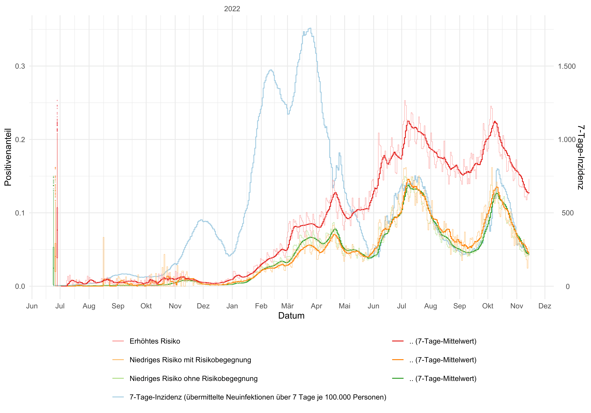
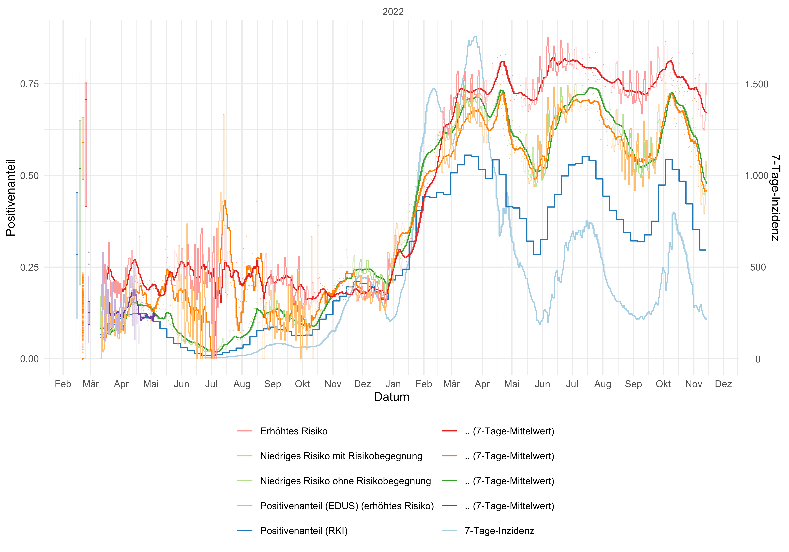
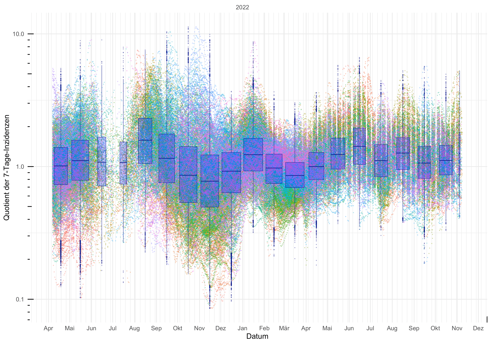
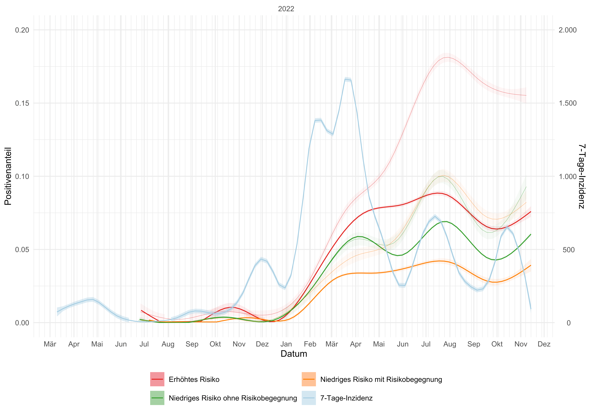
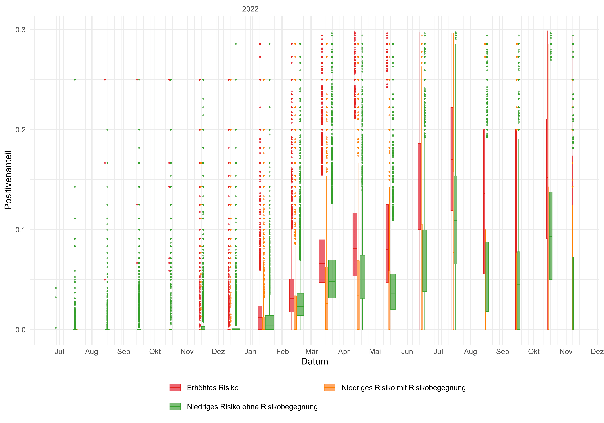
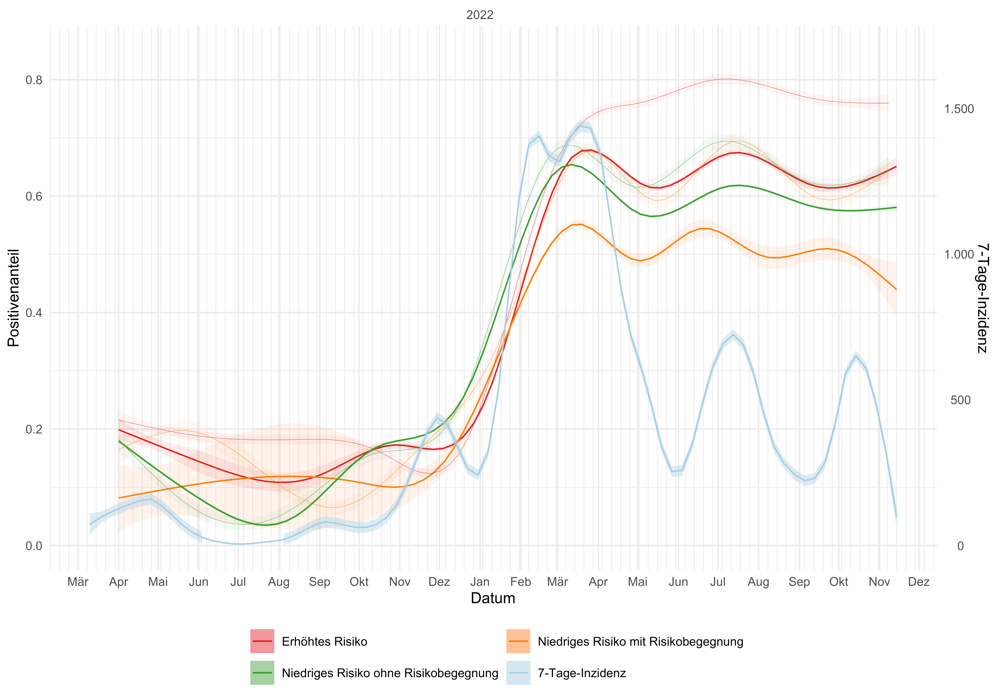
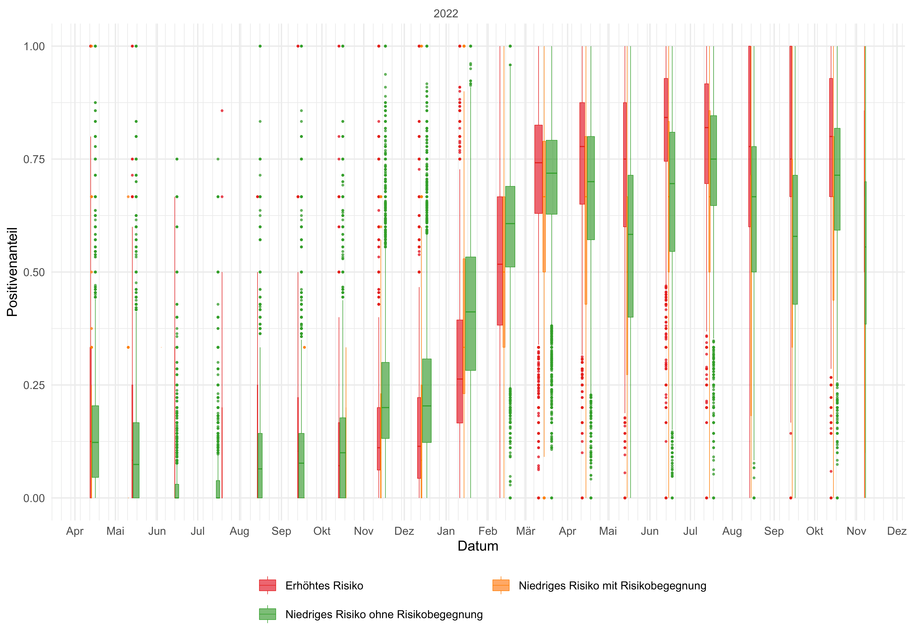
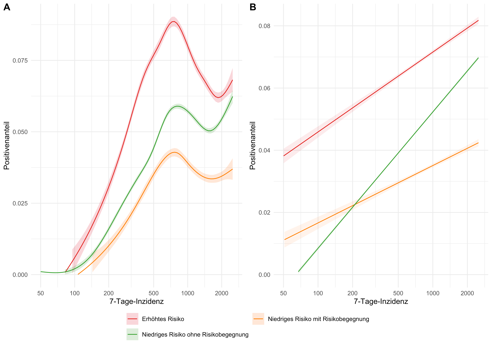
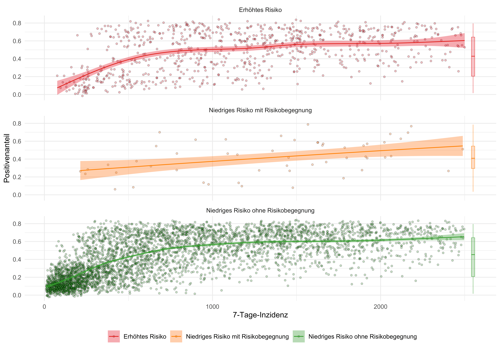
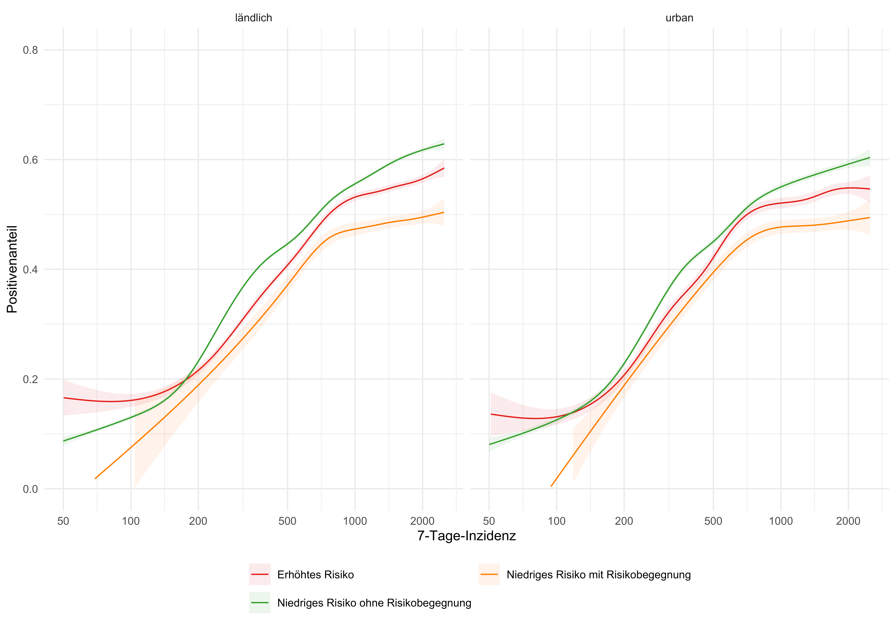

In this paper we want to examine the significance of a red warning versus a lower risk with or without a risk exposure. For this we consider the positivity rates of the test results, depending on the indicated risk. The data for this comes from the [data donation of the Corona-Warn-App](2021-10-15-science-blog-4/#3-privacy-preserving-analytics).

In recent months, there has been criticism that in times of high incidence, a red warning is no longer meaningful. The risk of infection would exist regardless of whether there was a red warning in the CWA or not. Moreover, the frequency of red warnings is so high that the individual warning no longer has any significance. We want to show that this is not the case. In particular for rapid test results, which are often the first reason for a PCR test, the positivity rate with a red warning was significantly greater than with a green warning (low risk with risk exposure). Furthermore, we investigate whether these greater positivity rates with a red warning can be solely explained by local fluctuations in incidence.

<!-- overview -->

1. [The most important findings in a nutshell: numbers, data and facts](#1-the-most-important-findings-in-a-nutshell-numbers-data-and-facts)
2. [Positivity rates (nationwide)](#2-positivity-rates-nationwide)
    1. [RAT](#21-rat)
    2. [PCR](#22-pcr)
3. [Local differences in incidence](#3-local-differences-in-incidence)
4. [Positivity rates (local))](#4-positivity-rates-local)
    1. [RAT](#41-rat)
    2. [PCR](#42-pcr)
5. [Positivity rate and incidence](#5-positivity-rate-and-incidence)
    1. [RAT](#51-rat)
    2. [PCR](#52-pcr)
6. [Differences between urban and rural districts](#6-differences-between-urban-and-rural-districts)
7. [Conclusion](#7-conclusion)
8. [Continued further](#8-continued-further)

## 1 The most important findings in a nutshell: numbers, data and facts

- Whether rapid antigen test or PCR test, the positivity rate of red warnings is always greater than that of green warnings (low risk with risk exposure). In other words, where risk exposures are detected, the CWA can reliably assess the risk.

- For rapid antigen tests, the positivity rate (the proportion of all tests performed that are positive) after a red warning is at all times greater than the positivity rates after a green warning (lower risk with risk exposure) or low risk without risk exposure.

- For PCR tests, the positivity rate after a red warning is always greater than the positivity rates after a green warning (lower risk with risk exposure). In times of high incidence, the positivity rate after a red warning is in part smaller than at lower risk without risk exposure - here a strong preselection by positive antigen rapid tests is to be assumed.

- The increased positivity rate after a red warning compared to the positivity rates at lower risk with or without a risk exposure cannot be solely explained by local differences in incidence.

- For rapid antigen tests and PCR tests, the dependence of a positive test result on incidence after a red warning is only about half as high as for a lower risk without a risk exposure. 

- The differences between the positivity rates and thus the significance of a red warning with regard to the risk of infection are clearer in rural areas than in urban ones.

## 2 Positivity rates (nationwide)

So far, approx. 36.8 million test results have been transmitted via the CWA data donation (as of: 24. October 2022). Only test results that were positive or negative were taken into account (no pending and invalid ones). Risk exposures identified by the CWA were only taken into account if they were up to 10 days prior to test registration (this was the case for approximately 10.5 million test results). An indication of the districts (administrative district or urban district of the CWA user's place of residence) was available for approx. 14.1 million test results.

### 2.1 RAT

In total, there were approximately 27 million reported rapid antigen test results (RAT), of which approximately 7.8 million were preceded by at least one risk exposure. The following figure shows the progression of positivity rates over time for each type of risk notification. Rapid antigen test results have only been registered via data donation since 24 June 2021.

<figure class="figure-img">

<figcaption aria-hidden="true">Figure 1: Positivity rate after risk notification over time (RAT).</figcaption>
</figure>

Here, the positivity rate at increased risk is almost always higher than that at lower risk with or without a risk exposure. 

The positivity rate also varies here depending on the infection event and warning. After a red warning, the positivity rate is between 0 and 0.25, for a lower risk with risk exposure between 0 and 0.16 and for a lower risk without risk exposure between 0 and 0.15.

### 2.2 PCR

In total, there were approximately 9.8 million reported PCR test results (PCR), of which approximately 2.7 million were preceded by at least one risk exposure. The following figure shows the progression of positivity rates over time for each type of risk notification. PCR test results have been registered via data donation since 10 March 2021.

<figure class="figure-img">

<figcaption aria-hidden="true">Figure 2: Positivity rate after risk notification over time (PCR).</figcaption>
</figure>

What is striking here is the significantly greater positivity rate for increased risk compared to that for lower risk without a risk exposure in times of relatively lower incidence. In times of high incidence, the curves run almost the same. Below we will look at this relationship in more detail.

The positivity rate also varies here depending on the infection event and warning. After a red warning, the positivity rate is between 0 and 0.88, for a lower risk with risk exposure between 0 and 0.8 and for a low risk without risk exposure between 0 and 0.78.

The [RKI‑test figures](https://www.rki.de/DE/Content/InfAZ/N/Neuartiges_Coronavirus/Daten/Testzahlen-gesamt.html) are given for comparison. The somewhat greater proportion of persons tested positive in the CWA data donation is due to the different underlying survey population. For example, people under the age of 16 are not formally allowed to use the Corona‑Warn‑App and are therefore under-represented in its user base. On the other hand, the RKI figures also increasingly include routine and pooling test results, which are probably rarely, if ever registered via the Corona‑Warn‑App and, in accordance with their purpose, are more often negative.

A comparison with the positivity rate from the [event-related user survey (EDUS)](../2021-08-02-science-blog-3) from the early year 2021 also shows a parallel trend (at a lower level) to the positive share of red warned persons. The difference can be explained as follows: Healthy people and those with milder courses of illness took part in the survey. Those who were very ill probably had other concerns than participating in this survey. For example, on 22/04/2021, about 19% (287/(287+1218)) of CWA data donors had a positive PCR test result at increased risk. For EDUS, it was only about 15% (20/(20+110)). With 6 additional positives, it would also have been 19% here. This suggests that about a quarter of those red warned and positive tested persons had a non-mild course. One could also hypothesise that EDUS participants are more conscientious – after all, they participated in the voluntary survey – and therefore implement more measures to avoid infection.

## 3 Local differences in incidence

When comparing the positivity rates according to risk assessment, it must be examined whether the differences result solely from different incidences.

The following consideration should illustrate this effect:

Suppose we have two regions with very different incidence (and accordingly different prevalence). 
Both regions have 1,000 inhabitants, but in region A 200 inhabitants are positive at a given time, in region B only 20. In both regions, all inhabitants use the CWA. Due to the high prevalence in region A, 500 CWA users were shown a red tile (and the other 500 a green tile), while in region B only 50 CWA users were shown a red tile (and the other 950 a green tile).

It is further assumed that all CWA users, regardless of their tile colour (risk notification, i.e. risk displayed in the CWA), get tested and that the tile colour is completely insignificant for the risk of infection. (We could assume, for example, that the tile colours are not assigned at all on the basis of [BLE](https://de.wikipedia.org/wiki/Bluetooth_Low_Energy) measured exposures to those who later tested positive, but rather simply randomly assigned depending on the known incidence of a region. (For this, of course, one would have to know in which region the CWA users live.)) Of the 500 CWA users in region A with a red tile, 100 (20%) test positive, and of the 500 with a green tile, 100 also test positive. In region B, 2% of the 50 with a red tile (namely 1 person) and of the 950 with a green tile (namely 19 people) test positive. We said, the same positive rate of 20% and 2% is always assumed for red and green respectively.

However, if we now evaluate the CWA users from both regions together (e.g. because in reality we do not know in which region they live), we have 101 positives among the 550 with a red tile and 119 among the 1,450 with a green tile. The resulting positivity rates are 18.4% (101/550) and 8.2% (119/1,450). This means that the red curve is clearly above the green one. 

This example only serves to illustrate the effect and was deliberately chosen with partly unrealistic assumptions. The following figure shows the actual relative difference between the 7-day incidences of 50 randomly selected pairs of districts.

<figure class="figure-img">

<figcaption aria-hidden="true">Figure 3: Quotient of 7-day incidences over time (50 pairs of districts).</figcaption>
</figure>

We see that the incidences in the districts differed only slightly, only in a few exceptions a factor of 10 is reached. Such a strong influence of the different positivity rates due to local differences in incidence, as described in the example above, can thus be ruled out.

## 4 Positivity rates (local)

We will examine the local positivity rates in the following. Here, we will first consider rapid antigen tests (RAT) and PCR tests together. Since these two groups, as described and explained at the beginning, have very different positivity rates, the total positivity rates also depend on the relative frequency of both types of test. The following figure shows the positivity rate over time, averaged over all districts and nationwide.

<figure class="figure-img">

<figcaption aria-hidden="true">Figure 4: Positivity rate after risk notification over time, smoothed and with confidence interval, averaged over all districts (thick) or nationwide (thin).</figcaption>
</figure>

The positivity rate after a red warning is always greater than after a green warning (low risk with risk exposure). At high incidences, the positivity rate after lower risk without risk exposure is occasionally greater and at the same time more dependent on incidence (rises and falls faster) than after a red warning. A separate consideration of antigen rapid tests and PCR tests can shed light on this.

To give an impression of the local differences, the following figure shows the courses for four randomly selected districts.

<figure class="figure-img">

<figcaption aria-hidden="true">Figure 5: Positivity rate after risk notification over time, smoothed and with confidence interval, for four randomly selected districts.</figcaption>
</figure>

Here, too, we clearly see the greater dependence of the positivity rate at lower risk without a risk exposure on the incidence: the green curve fluctuates more than the red or yellow curve.

### 4.1 RAT

The time course of the averaging of the positivity rates for rapid antigen tests (RAT) across all districts, broken down by risk notification, is included in the following figure.

<figure class="figure-img">

<figcaption aria-hidden="true">Figure 6: Positivity rate after risk notification over time, smoothed and with confidence interval, averaged over all districts (thick) or nationwide (thin) (RAT).</figcaption>
</figure>

This gives a similar picture as in the nationwide trend. A red warning in the CWA is clearly more likely to be followed by a time-related positive test result than for green warnings (low risk with risk exposure). In periods of high incidence, the positivity rates are also almost same and are not exceeded by the positivity rate at lower risk without a risk exposure. With the removal of the obligation to test, testing in recent months appears to be performed only in cases of reasonable suspicion, resulting in greater positivity rates even with relatively low (than in previous periods) incidences.

We also give the monthly ratios to give an idea of the underlying test volumes.

<figure class="figure-img">

<figcaption aria-hidden="true">Figure 7: Monthly positivity rates after risk notification (RAT).</figcaption>
</figure>

### 4.2 PCR

The time course of the averaging the positivity rates of PCR test results across all districts, broken down by risk notification, is included in the following figure.

<figure class="figure-img">

<figcaption aria-hidden="true">Figure 8: Positivity rate after risk notification over time, smoothed and with confidence interval, averaged over all districts (thick) or nationwide (thin) (PCR).</figcaption>
</figure>

This gives a similar picture as in the nationwide trend (the thin curves in the figure). A red warning is sometimes significantly more likely to lead to a positive test result than a green warning (lower risk with risk exposure). In high-incidence times, the positivity rates run almost the same and are partly surpassed by the positivity rate at low risk without a risk exposure. During these times, the probability of contracting the disease from a person who does not use the CWA is very high. The risk of contagion should actually be independent of CWA utilisation, but the uncertainty of the risk is not: if the CWA correctly assesses the risk, the uncertainty of this assessment decreases as CWA utilisation increases. Another explanation could be pre-selection by rapid antigen tests (official or domestic). Only if such a test is positive, a PCR test is initiated.

To get an impression of the underlying test volumes, the monthly ratios are given in the following figure.

<figure class="figure-img">

<figcaption aria-hidden="true">Figure 9: Monthly positivity rate after risk notification (PCR).</figcaption>
</figure>

## 5 Positivity rate and incidence

In addition to the trend over time, we now want to take a closer look at the dependence of the positivity rates on the local 7-day incidence.

<figure class="figure-img">

<figcaption aria-hidden="true">Figure 10: Positivity rate after risk notification as a function of local 7-day incidence smoothed and with confidence interval averaged over all districts.</figcaption>
</figure>

In the figure, a potency scale was used for incidence. As a result, the longer or more frequent phases of low and medium incidence are better represented. In this representation, the positivity rate is almost linear at low risk without risk exposure. Here, too, a separate consideration of rapid antigen tests and PCR tests gives a more precise picture.

### 5.1 RAT

We first report the relationship between incidence and positivity rate after risk notification for 5,000 rapid antigen tests (RAT).

<figure class="figure-img">

<figcaption aria-hidden="true">Figure 11: Relationship between local 7-day incidence and positivity rate after risk notification for 5,000 test results (RAT).</figcaption>
</figure>

The difference between the positivity rates depending on the type of risk notification is even more impressive here. It should be noted, however, that the positivity rates for rapid antigen tests are consistently smaller than for PCR tests. This is largely due to the [test strategy](https://de.wikipedia.org/wiki/COVID-19-Pandemie_in_Deutschland/Testung).

<figure class="figure-img">

<figcaption aria-hidden="true">Figure 12: Relationship between local 7-day incidence and positivity rate after risk notification and incidence areas (RAT).</figcaption>
</figure>

The positivity rate here is consistently greater after red warnings than in the case of lower risk with or without a risk exposure. The increase of the positivity rate with increasing incidence (and thus its dependence on incidence) is significantly greater in the case of low risk without a risk exposure than that following a red warning. Even in times of high incidence, a red warning is associated with a higher risk of infection than a low-risk warning.

<figure class="figure-img">

<figcaption aria-hidden="true">Figure 13: Relationship between local 7-day incidence and positivity rate after risk notification, smoothed and with confidence interval, in (A) nonlinear and (B) linear approximation (RAT).</figcaption>
</figure>

For rapid test results, the almost linear dependence of the positivity rate on the incidence can also be seen well in the non-linear approximation (left). Here, the dependence for red warnings is only about half as high. The positivity rate (and thus the estimated risk of being infected) is about twice as high after a red warning as after a green warning (low risk with risk exposure), regardless of incidence.

### 5.2 PCR

We now repeat the above analyses for 5,000 PCR test results. To do this, we first reproduce the relationship between the 7-day incidence and the positivity rate after risk notification.

<figure class="figure-img">

<figcaption aria-hidden="true">Figure 14: Relationship between local 7-day incidence and positivity rate after risk notification for 5,000 test results (PCR).</figcaption>
</figure>

We can see that the dependence of the positivity rate on incidence after a low risk warning without risk exposure is stronger than after red warnings. The positivity rate after red warnings is always greater than after green warnings (low risk with risk exposure).

We can also see this relationship in the following figure. Here the incidences are divided in increments of 500 (where we only indicate the low value of a range). In addition to the quartiles, the average value is also given.

<figure class="figure-img">

<figcaption aria-hidden="true">Figure 15: Relationship between local 7-day incidence and positivity rate after risk notification and incidence areas (PCR).</figcaption>
</figure>

We can also summarise this relationship in a continuous figure (Fig. 16A) and also give a linear approximation of this relationship (Fig.16B).

<figure class="figure-img">

<figcaption aria-hidden="true">Figure 16: Relationship between local 7-day incidence and positivity rate after risk notification, smoothed and with confidence interval, in (A) nonlinear and (B) linear approximation (PCR).</figcaption>
</figure>

The non-linear curves (left) flatten with increasing incidence. Presumably because in times of high incidence, contact-restricting measures or a lockdown were increasingly introduced and therefore, on the one hand, the contact rates were lower and, on the other hand, tests that were needed for meetings and for which a negative result was already expected were performed less frequently.

For a red warning, the dependency is only about half as strong as in the case of a lower risk without risk exposure. The reason for this is probably that about half of the population actively uses the CWA, and the risk of contracting the disease (undetected by the CWA) from a person who does not use the CWA increases with increasing incidence. It can be assumed that with more numerous use of the CWA, this dependence of the positivity rate on incidence would be further reduced. As mentioned above, if the rate of utilisation were even higher, the uncertainty in the assessment of risk exposures would be reduced even more.

The positivity rate at lower risk without a risk exposure is greater with increasing incidence than the positivity rate at increased risk. This is due on the one hand to the fact that the dependence on incidence is twice as high here, and on the other hand to the fact that there is presumably a strong pre-selection here through rapid antigen tests (performed officially or at home). Only if this was positive was it carried out. Further studies are needed to understand these relationships more thoroughly. For example, an event-related user survey could be used to ascertain the extent of preselection. An agent-based simulation that models different individual behaviours could also provide possible explanations.

## 6 Differences between urban and rural districts

Finally, we show in the following two figures the incidence-dependent course of the positivity rates for rapid antigen tests and PCR tests depending on the urban or rural character of the districts.

<figure class="figure-img">

<figcaption aria-hidden="true">Figure 17: Relationship between local 7-day incidence and positivity rate after risk notification, smoothed and with confidence interval, in rural and urban districts (RAT).</figcaption>
</figure>

<figure class="figure-img">

<figcaption aria-hidden="true">Figure 18: Relationship between local 7-day incidence and positivity rate after risk notification, smoothed and with confidence interval, in rural and urban districts (PCR).</figcaption>
</figure>

For both types of tests, the difference between red and green warnings (lower risk with risk exposure) and thus the significance of the assessed risk is greater for rural districts than for urban ones.

## 7 Conclusion

The positivity rate of tests after a red warning is always greater for PCR tests in times of low incidence and for rapid antigen tests than the positivity rates after a green warning or at lower risk without a risk exposure. This greater positivity rate does not only depend on local differences in incidence. The differences between the positivity rates are more clearer in rural areas than in urban ones.

A red warning in the Corona‑Warn‑App therefore expresses an increased risk of infection that is not only dependent on the general incidence of infection, even in times of high incidence.

Greater utilisation of the CWA would make the informative value even more independent of incidence and thus even more reliable, as more risk exposures would then be assessed and detected in time.

The data from the [CWA data donation](../2021-10-15-science-blog-4/#3-privacy-preserving-analytics) is a valuable and irreplaceable tool in answering epidemiological questions. Similar analyses for traditional contact person tracing would be desirable.

These are also further proof that the CWA works reliably and fulfils its purpose. Even at this stage of the pandemic – with a high proportion of vaccinated people, cross-immunity and different behavioural patterns – the CWA provides helpful information and is an important tool in assessing personal risk.

## 8 Continued further

In the next posts, we will analyse more data from the  [data donation of the Corona‑Warn‑App](../2021-10-15-science-blog-4/#3-privacy-preserving-analytics). In particular, we will highlight the process of [key sharing](../2021-10-15-science-blog-4/#326-key-submission) BLE measurement via the ENF ([Exposure Windows and Scan Instances](../2021-10-15-science-blog-4/#327-exposure-windows-and-scan-instances)). In addition, contributions on event check-ins and ENF calibration are in preparation.