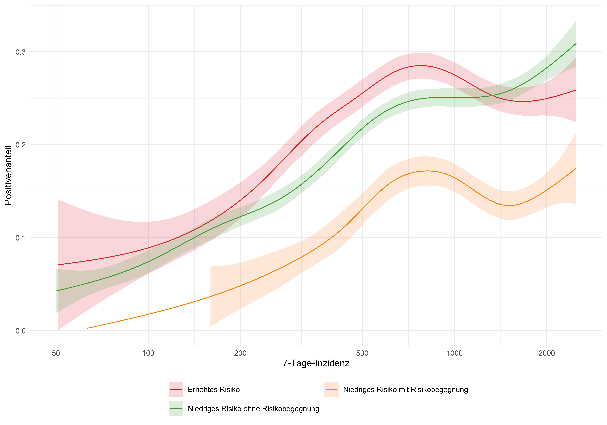
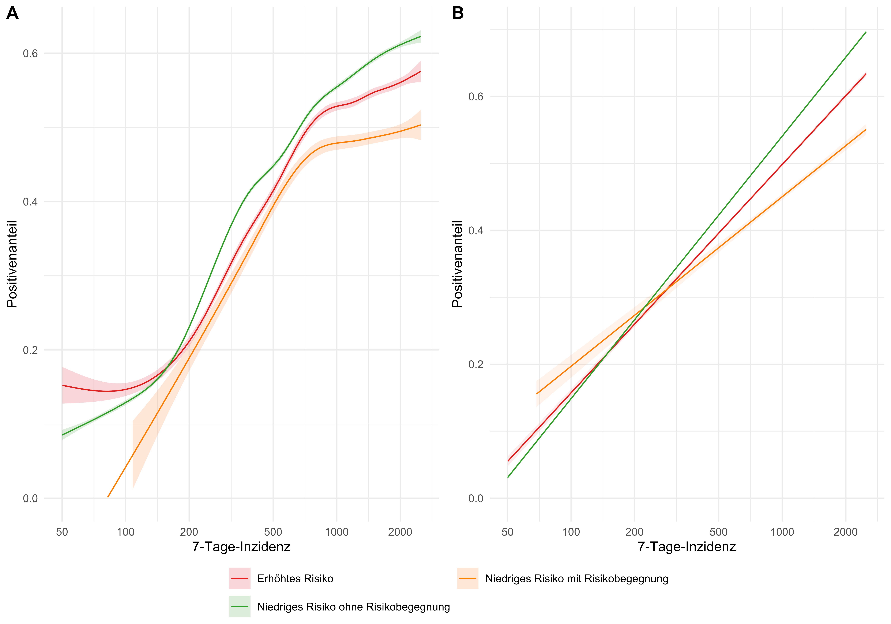
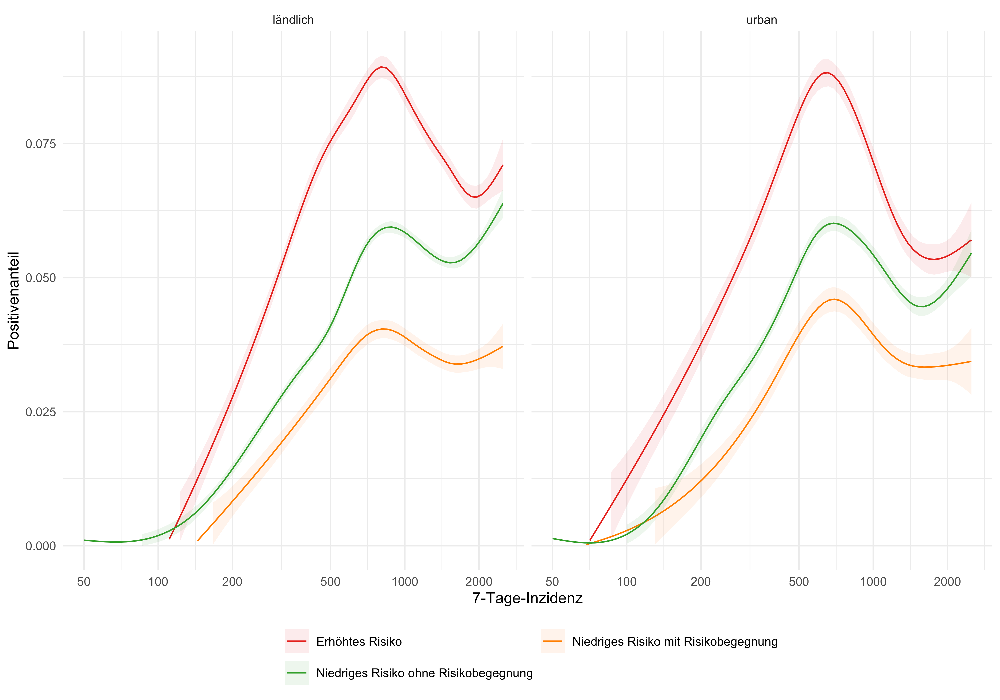

In diesem Beitrag wollen wir untersuchen, welche Aussagekraft eine rote Warnung gegenüber einem niedrigen Risiko mit bzw. ohne Risikobegegnung hat. Hierzu betrachten wir den Positivenanteil der Testergebnisse, d.&nbsp;h. den Anteil der positiven Testergebnisse, in Abhängigkeit vom angezeigten Risiko. Die Daten hierfür stammen aus der [Datenspende der Corona-Warn-App](../2021-10-15-science-blog-4/#3-privacy-preserving-analytics).

In den vergangenen Monaten wurde kritisiert, dass in Zeiten einer hohen Inzidenz eine rote Warnung keine Aussagekraft mehr habe. Das Infektionsrisiko bestünde ganz unabhängig davon, ob eine rote Warnung in der CWA vorläge oder nicht. Außerdem sei die Häufigkeit der roten Warnungen so hoch, dass die einzelnen Warnungen keine Aussagekraft mehr haben. Wir wollen zeigen, dass dem nicht so ist. Insbesondere für Schnelltestergebnisse, die ja oft erst der Anlass für einen PCR-Test sind, war der Positivenanteil bei einer roten Warnung deutlich größer als bei einer grünen Warnung (niedriges Risiko mit Risikobegegnung). Darüber hinaus untersuchen wir, ob sich diese größeren Positivenanteile bei einer roten Warnung allein aus lokalen Schwankungen der Inzidenz erklären lassen.

<!-- overview -->

1. [Das Wichtigste in Kürze: Zahlen, Daten, Fakten](#1-das-wichtigste-in-kürze-zahlen-daten-fakten)
2. [Positivenanteile (bundesweit)](#2-positivenanteile-bundesweit)
    1. [RAT](#21-rat)
    2. [PCR](#22-pcr)
3. [Lokale Unterschiede der Inzidenz](#3-lokale-unterschiede-der-inzidenz)
4. [Positivenanteile (lokal)](#4-positivenanteile-lokal)
    1. [RAT](#41-rat)
    2. [PCR](#42-pcr)
5. [Positivenanteil und Inzidenz](#5-positivenanteil-und-inzidenz)
    1. [RAT](#41-rat)
    2. [PCR](#42-pcr)
6. [Unterschiede zwischen urbanen und ländlichen Kreisen](#6-unterschiede-zwischen-urbanen-und-ländlichen-kreisen)
7. [Fazit](#7-fazit)
8. [So geht es weiter](#8-so-geht-es-weiter)

- [1 Das Wichtigste in Kürze: Zahlen, Daten, Fakten](#1-das-wichtigste-in-kürze-zahlen-daten-fakten)
- [2 Positivenanteile (bundesweit)](#2-positivenanteile-bundesweit)
  - [2.1 RAT](#21-rat)
  - [2.2 PCR](#22-pcr)
- [3 Lokale Unterschiede der Inzidenz](#3-lokale-unterschiede-der-inzidenz)
- [4 Positivenanteile (lokal)](#4-positivenanteile-lokal)
  - [4.1 RAT](#41-rat)
  - [4.2 PCR](#42-pcr)
- [5 Positivenanteil und Inzidenz](#5-positivenanteil-und-inzidenz)
  - [5.1 RAT](#51-rat)
  - [5.2 PCR](#52-pcr)
- [6 Unterschiede zwischen urbanen und ländlichen Kreisen](#6-unterschiede-zwischen-urbanen-und-ländlichen-kreisen)
- [7 Fazit](#7-fazit)
- [8 So geht es weiter](#8-so-geht-es-weiter)

## 1 Das Wichtigste in Kürze: Zahlen, Daten, Fakten

- Ob Antigen-Schnelltest oder PCR-Test: der Positivenanteil von roten Warnungen ist stets größer als derjenige von grünen Warnungen (niedriges Risiko mit Risikobegegnung). Mit anderen Worten: dort wo Risikobegegnungen erkannt werden, kann die CWA das Risiko zuverlässig einschätzen.

- Für Antigen-Schnelltests ist der Positivenanteil (der Anteil positiver an allen durchgeführten Tests) nach einer roten Warnung zu allen Zeiten größer als die Positivenanteile nach einer grünen Warnung (niedriges Risiko mit Risikobegegnung) bzw. bei niedrigem Risiko ohne Risikobegegnung.

- Für PCR-Tests ist der Positivenanteil nach einer roten Warnung stets größer als der Positivenanteil nach einer grünen Warnung (niedriges Risiko mit Risikobegegnung). In Zeiten einer hohen Inzidenz ist der Positivenanteil nach einer roten Warnung zum Teil kleiner als bei niedrigem Risiko ohne Risikobegegnung – hier ist eine starke Vorselektion durch positive Antigen-Schnelltests zu vermuten.

- Der erhöhte Positivenanteil nach einer roten Warnung im Vergleich zu den Positivenanteilen bei einem niedrigen Risiko mit bzw. ohne Risikobegegnung lässt sich nicht allein mit lokalen Unterschieden der Inzidenz erklären.

- Für Antigen-Schnelltests und PCR-Tests ist die Abhängigkeit eines positiven Testergebnisses von der Inzidenz nach einer roten Warnung nur etwa halb so hoch, wie bei einem niedrigen Risiko ohne Risikobegegnung.

- Die Unterschiede zwischen den Positivenanteilen und damit die Aussagekraft einer roten Warnung hinsichtlich des Infektionsrisikos sind in ländlichen Gebieten deutlicher als in urbanen.

## 2 Positivenanteile (bundesweit)

Täglich spenden etwa 15,4 Mio. Nutzende der CWA ihre Daten. So wurden bisher ca. 37,4 Mio. Testergebnisse übermittelt (Stand: 14. November 2022). Hierbei wurden nur solche Testergebnisse berücksichtigt, die positiv oder negativ ausfielen (keine ausstehenden und ungültigen). Durch die CWA identifizierte Risikobegegnungen wurden nur berücksichtigt, wenn sie bis zu 10 Tage vor der Testregistrierung lag (dies war bei ca. 10,7 Mio. Testergebnissen der Fall). Eine Angabe zum Kreis (Landkreis bzw. kreisfreie Stadt des Wohnorts des CWA-Nutzenden) lag bei ca. 14,3 Mio. Testergebnissen vor.

### 2.1 RAT

Insgesamt gab es ca. 27,4 Mio. übermittelte Ergebnisse von Antigen-Schnelltests (RAT), bei denen ca. 7,9 Mio. mindestens eine Risikobegegnung vorausging. In der folgenden Abbildung ist der zeitliche Verlauf der Positivenanteile für jede Art der Risikobenachrichtigung angegeben. Über die Datenspende werden erst seit dem 24. Juni 2021 Antigen-Schnelltest-Ergebnisse registriert.

<figure class="figure-img">

<figcaption aria-hidden="true">Abb. 1: Positivenanteil nach Risikobenachrichtigung im zeitlichen Verlauf (RAT).</figcaption>
 
</figure>

Hier liegt der Positivenanteil bei erhöhtem Risiko nahezu immer über dem bei niedrigem Risiko mit oder ohne Risikobegegnung.

Der Positivenanteil schwankt hierbei je nach Infektionsgeschehen und Warnung. Nach einer roten Warnung liegt der Positivenanteil zwischen 0 und 0,25, für ein niedriges Risiko mit Risikobegegnung zwischen 0 und 0,16 und für ein niedriges Risiko ohne Risikobegegnung zwischen 0 und 0,15.

### 2.2 PCR

Insgesamt gab es ca. 10 Mio. übermittelte Ergebnisse von PCR-Tests (PCR), bei denen ca. 2,7 Mio. mindestens eine Risikobegegnung vorausging. In der folgenden Abbildung ist der zeitliche Verlauf der Positivenanteile für jede Art der Risikobenachrichtigung angegeben. Über die Datenspende werden seit dem 10. März 2021 PCR-Testergebnisse registriert.

<figure class="figure-img">

<figcaption aria-hidden="true">Abb. 2: Positivenanteil nach Risikobenachrichtigung im zeitlichen Verlauf (PCR).</figcaption>
 
</figure>

Auffällig ist hier der deutlich größere Positivenanteil bei erhöhtem Risiko gegenüber dem bei niedrigem Risiko ohne Risikobegegnung in Zeiten relativ niedriger Inzidenz. In Hochinzidenz-Zeiten laufen die Kurven nahezu gleich. Weiter unten wollen wir diesen Zusammenhang näher beleuchten.

Der Positivenanteil schwankt auch hier je nach Infektionsgeschehen und Warnung. Nach einer roten Warnung liegt der Positvenanteil zwischen 0 und 0,88, für ein niedriges Risiko mit Risikobegegnung zwischen 0 und 0,8 und für ein niedriges Risiko ohne Risikobegegnung zwischen 0 und 0,78.

Zum Vergleich werden die [RKI-Testzahlen](https://www.rki.de/DE/Content/InfAZ/N/Neuartiges_Coronavirus/Daten/Testzahlen-gesamt.html) angegeben. Der etwas größere Anteil positiv getesteter Personen in der CWA-Datenspende ist zum einen in der unterschiedlichen zugrunde liegenden Erhebungspopulation zu suchen. So dürfen z.&nbsp;B. Personen unter 16 Jahren die Corona‑Warn‑App formal nicht nutzen und sind dementsprechend in ihrer Nutzerbasis unterrepräsentiert. Zum anderen sind in den RKI-Zahlen auch in zunehmenden Maße Routine- und Pooling-Testergebnisse enthalten, die wahrscheinlich selten bis gar nicht über die Corona-Warn-App registriert werden und ihrem Zweck entsprechend häufiger negativ ausfallen.

Ein Vergleich mit dem Positivenanteil aus der [ereignisbezogenen Nutzerbefragung (EDUS)](../2021-08-02-science-blog-3) vom Frühjahr 2021 zeigt ebenfalls einen parallelen Verlauf (auf niedrigerem Niveau) zum Positivenanteil von rot gewarnten Personen. Die Differenz kann wie folgt erklärt werden: An der Umfrage haben eher gesunde Personen und solche mit leichteren Krankheitsverläufen teilgenommen. Wer sehr krank war, hatte vermutlich andere Sorgen, als an dieser Umfrage teilzunehmen. Z.&nbsp;B. hatten am 22.04.2021 etwa 19% (287/(287+1218)) der CWA-Datenspendenden ein positives PCR-Testergebnis bei erhöhtem Risiko. Bei EDUS waren es nur etwa 15% (20/(20+110)). Mit 6 zusätzlichen Positiven wären es hier auch 19% gewesen. Dies lässt vermuten, dass etwa ein Viertel der rot gewarnten und positiv getesteten Personen einen nicht milden Verlauf hatten. Man könnte auch die Hypothese aufstellen, dass EDUS-Teilnehmende gewissenhafter sind – immerhin nahmen sie an der freiwilligen Befragung teil – und daher mehr Maßnahmen umsetzen, um eine Infektion zu vermeiden.

## 3 Lokale Unterschiede der Inzidenz

Bei einem Vergleich der Positivenanteile je nach Risikobewertung muss untersucht werden, ob sich die Unterschiede allein aus unterschiedlichen Inzidenzen ergeben.

Folgende Überlegung soll diesen Effekt illustrieren:

Angenommen, wir haben zwei Regionen mit sehr unterschiedlicher Inzidenz (und dementsprechend auch unterschiedlicher Prävalenz). Beide Regionen haben 1.000 Einwohner, aber in Region A sind zu einem gegebenen Zeitpunkt 200 Einwohner positiv, in Region B nur 20. In beiden Regionen benutzen alle Einwohner die CWA. Aufgrund der hohen Prävalenz in Region A bekommen dort 500 CWA-Nutzende eine rote Kachel angezeigt (und die anderen 500 eine grüne), während in Region B nur 50 CWA-Nutzende eine rote Kachel angezeigt bekommen (und die anderen 950 eine grüne).

Weiter angenommen, dass sich alle CWA-Nutzende, unabhängig von ihrer Kachelfarbe (Risikobenachrichtigung, d.&nbsp;h. in der CWA angezeigtes Risiko), testen lassen und dass die Farbe der Kachel völlig unbedeutend für das Infektionsrisiko ist. (Wir könnten beispielsweise annehmen, dass die Kachelfarben gar nicht aufgrund von [BLE](https://de.wikipedia.org/wiki/Bluetooth_Low_Energy)-gemessenen Expositionen zu später Positiv-Getesteten, sondern viel weniger aufwändig einfach zufällig gewürfelt in Abhängigkeit von der bekannten Inzidenz einer Region vergeben werden. (Dafür müsste man dann natürlich wissen, in welcher Region die CWA-Nutzenden leben.)) Von den 500 CWA-Nutzenden in Region A mit roter Kachel testen sich dann 100 (20%) positiv und von den 500 mit grüner Kachel ebenfalls 100. In Region B sind es jeweils 2% von den 50 mit roter Kachel (nämlich 1 Person) und von den 950 mit grüner Kachel (nämlich 19 Personen). Wie gesagt, für Rot und Grün ist immer dieselbe Positivrate von 20% bzw. 2% angenommen.

Wenn wir nun aber die CWA-Nutzenden aus beiden Regionen zusammen auswerten (z.&nbsp;B., weil wir in Wirklichkeit gar nicht wissen, in welcher Region sie leben), haben wir unter den 550 mit roter Kachel 101 und unter den 1.450 mit grüner Kachel 119 Positive. Die resultierenden Positivenanteile sind 18,4% (101/550) und 8,2% (119/1.450). Damit verliefe die rote Kurve deutlich über der grünen. Dennoch könnten wir (ganz korrekt) behaupten, dass die rote Karte ein Prädiktor für das Infektionsrisiko ist.

Dieses Beispiel dient lediglich der Verdeutlichung des Effekts und wurde bewusst mit zum Teil unrealistischen Annahmen gewählt. In der folgenden Abbildung ist der tatsächliche relative Unterschied zwischen den 7-Tages-Inzidenzen von 50 zufällig gewählten Paaren von Kreisen abgebildet.

<figure class="figure-img">

<figcaption aria-hidden="true">Abb. 3: Quotient der 7-Tage-Inzidenzen im zeitlichen Verlauf (50 Paare von Kreisen).</figcaption>
 
</figure>

Wir sehen, dass sich die Inzidenzen in den Kreisen nur gering unterschieden, nur in wenigen Ausnahmen wird ein Faktor 10 erreicht. Eine so starke Beeinflussung der unterschiedlichen Positivenanteile aufgrund lokaler Unterschiede in der Inzidenz, wie in obigem Beispiel beschriebenen, kann damit ausgeschlossen werden.

## 4 Positivenanteile (lokal)

Wir werden im Folgenden die lokalen Positivenanteile untersuchen. Dabei betrachten wir zunächst Antigen-Schnelltests (RAT) und PCR-Tests gemeinsam. Da diese beiden Gruppen, wie eingangs beschrieben und erläutert, sehr unterschiedliche Positivenanteile haben, hängen die Gesamt-Positivenanteile auch von der relativen Häufigkeit beider Testarten ab. Die folgende Abbildung zeigt den Positivenanteil im zeitlichen Verlauf, gemittelt über alle Kreise bzw. bundesweit.

<figure class="figure-img">

<figcaption aria-hidden="true">Abb. 4: Positivenanteil nach Risikobenachrichtigung im zeitlichen Verlauf, geglättet und mit Konfidenzintervall, gemittelt über alle Kreise (dick) bzw. bundesweit (dünn).</figcaption>
 
</figure>

Der Positivenanteil nach einer roten Warnung ist stets größer als nach einer grünen Warnung (niedriges Risiko mit Risikobegegnung). Bei hohen Inzidenzen ist der Positivenanteil nach niedrigem Risiko ohne Risikobegegnung gelegentlich größer und gleichzeitig stärker von der Inzidenz abhängig (steigt und fällt schneller) als nach einer roten Warnung. Eine getrennte Betrachtung von Antigen-Schnelltests und PCR-Tests kann hier erhellen.

Um einen Eindruck der lokalen Unterschiede zu geben, sind in der folgenden Abbildung die Verläufe für vier zufällig gewählte Kreise gezeigt.

<figure class="figure-img">

<figcaption aria-hidden="true">Abb. 5: Positivenanteil nach Risikobenachrichtigung im zeitlichen Verlauf, geglättet und mit Konfidenzintervall, für vier zufällig gewählte Kreise.</figcaption>
 
</figure>

Auch hier sehen wir deutlich die größere Abhängigkeit des Positivenanteils bei niedrigem Risiko ohne Risikobegegnung von der Inzidenz: die grüne Kurve schwankt stärker als die rote oder gelbe.

### 4.1 RAT

Der zeitliche Verlauf der Mittelung der Positivenanteile für Antigen-Schnelltests (RAT) über alle Kreise, aufgeschlüsselt nach Risikobenachrichtigung, ist in folgender Abbildung enthalten.

<figure class="figure-img">

<figcaption aria-hidden="true">Abb. 6: Positivenanteil nach Risikobenachrichtigung im zeitlichen Verlauf, geglättet und mit Konfidenzintervall, gemittelt über alle Kreise (dick) bzw. bundesweit (dünn) (RAT).</figcaption>
 
</figure>

Dies ergibt ein ähnliches Bild wie im bundesweiten Verlauf. Auf eine rote Warnung in der CWA folgt deutlich häufiger ein im zeitlichen Zusammenhang stehendes positives Testergebnis als für grüne Warnungen (niedriges Risiko mit Risikobegegnung). In Hochinzidenz-Zeiten verlaufen die Positivenanteile ebenfalls nahezu gleich und werden von dem Positivenanteil bei niedrigem Risiko ohne Risikobegegnung nicht übertroffen. Mit dem Wegfall der allgemeinen Testpflicht werden Tests in den letzten Monaten offenbar nur noch bei begründetem Verdacht durchgeführt, wodurch sich größere Positivenanteile auch bei relativ geringeren (als in den Zeiträumen zuvor) Inzidenzen ergeben.

Wir geben auch die monatlichen Verhältnisse an, um einen Eindruck der zugrundeliegenden Testvolumina zu erhalten.

<figure class="figure-img">

<figcaption aria-hidden="true">Abb. 7: Monatliche Positivenanteile nach Risikobenachrichtigung (RAT).</figcaption>
 
</figure>

### 4.2 PCR

Der zeitliche Verlauf der Mittelung der Positivenanteile von PCR-Testergebnissen über alle Kreise, aufgeschlüsselt nach Risikobenachrichtigung, ist in folgender Abbildung enthalten.

<figure class="figure-img">

<figcaption aria-hidden="true">Abb. 8: Positivenanteil nach Risikobenachrichtigung im zeitlichen Verlauf, geglättet und mit Konfidenzintervall, gemittelt über alle Kreise (dick) bzw. bundesweit (dünn) (PCR).</figcaption>
 
</figure>

Dies ergibt ein ähnliches Bild wie im bundesweiten Verlauf (in der Abbildung die dünnen Kurven). Eine rote Warnung führt zum Teil deutlich eher zu einem positiven Testergebnis als eine grüne Warnung (niedriges Risiko mit Risikobegegnung). In Hochinzidenz-Zeiten verlaufen die Positivenanteile nahezu gleich und werden vom Positivenanteil bei niedrigem Risiko ohne Risikobegegnung zum Teil übertroffen. In diesen Zeiten ist die Wahrscheinlichkeit eben sehr hoch, sich auch bei einer Person, die die CWA nicht nutzt, anzustecken. Das Ansteckungsrisiko sollte eigentlich unabhängig von der CWA-Nutzung sein, die Unsicherheit des Risikos ist es jedoch nicht: bei korrekter Einschätzung des Risikos durch die CWA sinkt die Unsicherheit dieser Einschätzung bei zunehmender Nutzung der CWA. Eine weitere Erklärung könnte in einer Vorselektion durch Antigen-Schnelltests (offiziell oder häuslich) liegen. Nur wenn ein solcher positiv ist, wird ein PCR-Test veranlasst.

Um auch einen Eindruck der zugrundeliegenden Testvolumina zu erhalten sind die monatlichen Verhältnisse in der folgenden Abbildung angegeben.

<figure class="figure-img">

<figcaption aria-hidden="true">Abb. 9: Monatliche Positivenanteile nach Risikobenachrichtigung (PCR).</figcaption>
 
</figure>

## 5 Positivenanteil und Inzidenz

Neben dem zeitlichen Verlauf wollen wir nun die Abhängigkeit des Positivenanteils von der lokalen 7-Tage-Inzidenz näher betrachten.

<figure class="figure-img">

<figcaption aria-hidden="true">Abb. 10: Positivenanteil nach Risikobenachrichtigung in Abhängigkeit von der lokalen 7-Tage-Inzidenz, geglättet und mit Konfidenzintervall, gemittelt über alle Kreise.</figcaption>
 
</figure>

In der Abbildung wurde für die Inzidenz eine Potenz-Skala verwendet. Hierdurch sind die zeitlich längeren bzw. häufigeren Phasen niedriger und mittlere Inzidenz besser repräsentiert. In dieser Darstellung verläuft der Positivenanteil bei niedrigem Risiko ohne Risikobegegnung nahezu linear. Auch hier gibt eine getrennte Betrachtung von Antigen-Schnelltests und PCR-Tests ein präziseres Bild.

### 5.1 RAT

Wir geben zunächst den Zusammenhang zwischen der Inzidenz und dem Positivenanteil nach Risikobenachrichtigung für 5.000 Antigen-Schnelltests (RAT) an.

<figure class="figure-img">

<figcaption aria-hidden="true">Abb. 11: Zusammenhang zwischen lokaler 7-Tage-Inzidenz und Positivenanteil nach Risikobenachrichtigung für 5.000 Testergebnisse (RAT).</figcaption>
 
</figure>

Der Unterschied zwischen den Positivenanteilen je nach Art der Risikobenachrichtigung ist hier noch eindrucksvoller. Zu beachten ist jedoch, dass die Positivenanteile für Antigen-Schnelltests durchweg kleiner ausfallen als für PCR-Tests. Dies liegt zum großen Teil an der [Teststrategie](https://de.wikipedia.org/wiki/COVID-19-Pandemie_in_Deutschland/Testung).

<figure class="figure-img">

<figcaption aria-hidden="true">Abb. 12: Zusammenhang zwischen lokaler 7-Tage-Inzidenz und Positivenanteil nach Risikobenachrichtigung und Inzidenzbereichen (RAT).</figcaption>
 
</figure>

Der Positivenanteil ist hier nach roten Warnungen durchweg größer als bei niedrigem Risiko mit oder ohne Risikobegegnung. Der Anstieg des Positivenanteils mit zunehmender Inzidenz (und damit seine Abhängigkeit von der Inzidenz) ist im Falle eines niedrigen Risikos ohne Risikobegegnung deutlich stärker als derjenige nach einer roten Warnung. Auch in Zeiten von hohen Inzidenzen geht eine rote Warnung mit einem höheren Infektionsrisiko einher als eine Warnung über ein niedriges Risiko.

<figure class="figure-img">

<figcaption aria-hidden="true">Abb. 13: Zusammenhang zwischen lokaler 7-Tage-Inzidenz und Positivenanteil nach Risikobenachrichtigung, geglättet und mit Konfidenzintervall, in (A) nichtlinearer und (B) linearer Näherung (RAT).</figcaption>
 
</figure>

Für Schnelltestergebnisse ist auch in der nichtlinearen Annäherung (links) die nahezu lineare Abhängigkeit des Positivenanteils von der Inzidenz gut zu erkennen. Hier ist die Abhängigkeit für rote Warnungen nur etwa halb so hoch. Der Positivenanteil (und damit das geschätzte Risiko, sich infiziert zu haben) ist nach einer roten Warnung etwa doppelt so hoch wie nach einer grünen Warnung (niedriges Risiko mit Risikobegegnung), unabhängig von der Inzidenz.

### 5.2 PCR

Wir wiederholen die oben ausgeführten Analysen nun für 5.000 PCR‑Testergebnisse. Dazu geben wir zunächst wieder den Zusammenhang zwischen der 7-Tage-Inzidenz und dem Positivenanteil nach Risikobenachrichtigung an.

<figure class="figure-img">

<figcaption aria-hidden="true">Abb. 14: Zusammenhang zwischen lokaler 7-Tage-Inzidenz und Positivenanteil nach Risikobenachrichtigung für 5.000 Testergebnisse (PCR).</figcaption>
 
</figure>

Wir können erkennen, dass die Abhängigkeit des Positivenanteils von der Inzidenz nach einer Warnung über ein niedriges Risiko ohne Risikobegegnung stärker ist, als nach roten Warnungen. Der Positivenanteil nach roten Warnungen ist stets größer als nach grünen Warnungen (niedriges Risiko mit Risikobegegnung).

Diesen Zusammenhang können wir auch in der folgenden Abbildung erkennen. Hier sind die Inzidenzen in Schritten von 500 unterteilt (wobei wir nur den unteren Wert eines Bereiches angeben). Neben den Quartilen ist auch der Mittelwert angegeben.

<figure class="figure-img">

<figcaption aria-hidden="true">Abb. 15: Zusammenhang zwischen lokaler 7-Tage-Inzidenz und Positivenanteil nach Risikobenachrichtigung und Inzidenzbereichen (PCR).</figcaption>
 
</figure>

Wir können diesen Zusammenhang auch in einer stetigen Abbildung zusammenfassen (Abb. 16A) und ebenso eine lineare Annäherung dieses Zusammenhangs geben (Abb. 16B).

<figure class="figure-img">

<figcaption aria-hidden="true">Abb. 16: Zusammenhang zwischen lokaler 7-Tage-Inzidenz und Positivenanteil nach Risikobenachrichtigung, geglättet und mit Konfidenzintervall, in (A) nichtlinearer und (B) linearer Näherung (PCR).</figcaption>
 
</figure>

Die nichtlinearen Kurven (links) flachen mit zunehmender Inzidenz ab. Vermutlich deswegen, weil in Zeiten hoher Inzidenz auch zunehmend kontaktbeschränkende Maßnahmen bzw. ein Lockdown eingeführt wurden und daher zum einen die Kontaktraten geringer waren und zum anderen seltener Tests durchgeführt wurden, die für Treffen benötigt wurden und bei denen ein negatives Ergebnis schon erwartet wurde.

Für eine rote Warnung ist die Abhängigkeit nur etwa halb so stark, wie im Falle eines niedrigen Risikos ohne Risikobegegnung. Der Grund hierfür liegt wahrscheinlich darin, dass etwa die Hälfte der Bevölkerung die CWA aktiv benutzt, und das Risiko, sich (von der CWA unerkannt) bei einer Person anzustecken, die keine CWA benutzt, mit zunehmender Inzidenz steigt. Es ist zu vermuten, dass sich bei zahlreicherer Nutzung der CWA diese Abhängigkeit des Positivenanteils von der Inzidenz weiter verringern würde. Wie oben erwähnt, würde bei noch höherer Nutzungsrate die Unsicherheit bei der Einschätzung von Risikobegegnungen noch stärker reduziert werden.

Der Positivenanteil bei niedrigem Risiko ohne Risikobegegnung ist mit zunehmender Inzidenz größer als derjenige bei erhöhtem Risiko. Dies liegt zum einen daran, dass die Abhängigkeit von der Inzidenz hier doppelt so hoch ist, und zum anderen daran, dass hier vermutlich eine starke Vorselektion durch Antigen-Schnelltests (offiziell oder häuslich durchgeführt) stattfindet. Nur wenn dieser positiv war wurde jener durchgeführt. Um diese Zusammenhänge gründlicher zu verstehen, bedarf es weiterer Studien. So könnte man durch eine ereignisbezogene Nutzerbefragung das Ausmaß der Vorselektion erheben. Auch eine agentenbasierte Simulation, die verschiedene individuelle Verhaltensweisen modelliert, könnte mögliche Erklärungen liefern.

## 6 Unterschiede zwischen urbanen und ländlichen Kreisen

Zum Abschluss zeigen wir in den folgenden zwei Abbildungen noch die inzidenzabhängigen Verläufe der Positivenanteile für Antigen-Schnelltests und PCR-Tests in Abhängigkeit vom urbanen oder ländlichen Charakter des Kreises.

<figure class="figure-img">

<figcaption aria-hidden="true">Abb. 17: Zusammenhang zwischen 7-Tage-Inzidenz und Positivenanteil nach Risikobenachrichtigung, geglättet und mit Konfidenzintervall, in ländlichen und urbanen Kreisen (RAT).</figcaption>
 
</figure>

<figure class="figure-img">

<figcaption aria-hidden="true">Abb. 18: Zusammenhang zwischen 7-Tage-Inzidenz und Positivenanteil nach Risikobenachrichtigung, geglättet und mit Konfidenzintervall, in ländlichen und urbanen Kreisen (PCR).</figcaption>
 
</figure>

Für beide Testarten ist der Unterschied zwischen roten und grünen Warnungen (niedriges Risiko mit Risikobegegnung) und damit die Aussagekraft des eingeschätzten Risikos für ländliche Kreise größer als für urbane.

## 7 Fazit

Der Positivenanteil von Tests nach einer roten Warnung ist für PCR-Tests in Zeiten niedriger Inzidenz und für Antigen-Schnelltests immer größer als die Positivenanteile nach einer grünen Warnung bzw. bei niedrigem Risiko ohne Risikobegegnung. Dieser größere Positivenanteil hängt nicht nur von lokalen Unterschieden in der Inzidenz ab. Die Unterschiede zwischen den Positivanteilen sind in ländlichen Gebieten deutlicher als in urbanen.

Eine rote Warnung in der Corona-Warn-App drückt damit ein nicht nur vom allgemeinen Infektionsgeschehen abhängiges erhöhtes Infektionsrisiko aus, auch in Zeiten hoher Inzidenz.

Eine stärkere Nutzung der CWA würde die Aussagekraft noch unabhängiger von der Inzidenz und damit noch zuverlässiger machen, da dann mehr Risikobegegnungen bewertet und rechtzeitig erkannt werden würden.

Die Daten der [CWA-Datenspende](../2021-10-15-science-blog-4/#3-privacy-preserving-analytics) sind ein wertvolles und unersetzliches Hilfsmittel in der Beantwortung von epidemiologischen Fragen. Ähnliche Analysen für die traditionelle Kontaktpersonennachverfolgung wären wünschenswert.

Dies sind zudem weitere Belege dafür, dass die CWA zuverlässig funktioniert und ihren Zweck erfüllt. Die CWA liefert auch im jetzigen Stadium der Pandemie – bei hohem Anteil an Geimpften, Kreuzimmunität und unterschiedlichen Verhaltensmustern – jedem Nutzenden hilfreiche Informationen und ist ein wichtiges Instrument bei der Einschätzung des persönlichen Risikos.

## 8 So geht es weiter

In den nächsten Beiträgen werden wir weitere Daten der [Datenspende der Corona-Warn-App](../2021-10-15-science-blog-4/#3-privacy-preserving-analytics) analysieren. Wir werden insbesondere den Prozess der [Schlüsselteilung](../2021-10-15-science-blog-4/#326-schl%C3%BCsselteilung) und die BLE-Messung über das ENF ([Exposure-Windows und Scan-Instances](../2021-10-15-science-blog-4/#327-exposure-windows-und-scan-instances)) beleuchten. Zudem sind Beiträge zu den Event-Checkins und zur ENF-Kalibrierung in Vorbereitung.
